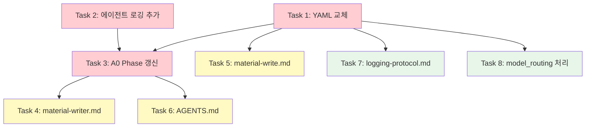

# 02_Material_Writing v2 병합 세부 작업 계획서

> **작성일**: 2026-02-25  
> **목적**: `02_Material_Writing_v2.yaml`을 `02_Material_Writing.yaml`로 완전 교체하면서, 기존 v1에 잘 구축된 로깅·문서 인프라를 v2 신규 에이전트에 이식  
> **기본 방향**: v2 완전 교체 + 로깅/문서 패치 8건  
> **예상 수정 파일**: 10개

---

## 변경 대상 파일 목록

| # | 파일 경로 | 작업 유형 | 우선순위 |
|---|----------|:---:|:---:|
| 1 | `.agent/workflows/02_Material_Writing.yaml` | 교체 | 🔴 |
| 2 | `.agent/workflows/02_Material_Writing_v2.yaml` | 삭제 | 🔴 |
| 3 | `.agent/agents/02_writer/A4B_Session_Writer.md` | 추가 | 🔴 |
| 4 | `.agent/agents/02_writer/A4C_Material_Aggregator.md` | 추가 | 🔴 |
| 5 | `.agent/agents/02_writer/A11_Chart_Specifier.md` | 추가 | 🔴 |
| 6 | `.agent/agents/02_writer/A0_Orchestrator.md` | 갱신 | 🔴 |
| 7 | `.claude/agents/material-writer.md` | 갱신 | 🟡 |
| 8 | `.claude/commands/material-write.md` | 갱신 | 🟡 |
| 9 | `.agent/AGENTS.md` | 갱신 | 🟡 |
| 10 | `.agent/logging-protocol.md` | 갱신 | ⚠️ |

---

## Task 1: 워크플로우 YAML 교체 (🔴 CRITICAL)

### 1-1. v1 아카이브 및 v2 교체

**대상 파일**:
- `.agent/workflows/02_Material_Writing.yaml` (v1 → 아카이브)
- `.agent/workflows/02_Material_Writing_v2.yaml` (v2 → 메인으로 승격)

**작업 내용**:

1. 기존 v1을 `.agent/archive/02_Material_Writing_v1.yaml`로 이동 (아카이브)
2. v2 YAML의 내용으로 `02_Material_Writing.yaml` 생성
3. v2 YAML 원본 파일 삭제

**수정 상세**:

v2 내용을 복사하되, 다음 항목을 조정:

| 항목 | v2 현재값 | 수정값 | 이유 |
|------|----------|--------|------|
| `name` | `"Material Writing Pipeline v2 - Session-Based Aggregation"` | `"Material Writing Pipeline - Session-Based Aggregation"` | v2 표기 제거 (메인이 되므로) |
| `version` | `"4.0"` | `"4.0"` | 유지 — 버전 이력 보존 |
| `logging.path` | `".agent/logs/{YYYY-MM-DD}_02_Material_Writing_v2.jsonl"` | `".agent/logs/{YYYY-MM-DD}_02_Material_Writing.jsonl"` | 기존 로그 경로 규칙 통일 |
| `model_routing` 섹션 (lines 349-373) | 인라인 정의 | 주석 추가: `# 참조용 — 정본은 config.json` | config.json과 중복 해소 |
| step notes 내 `_v2.jsonl` 참조 (line 108) | `_02_Material_Writing_v2.jsonl` | `_02_Material_Writing.jsonl` | 로그 경로 통일 |

**검증 기준**:
- [ ] `02_Material_Writing.yaml` 정상 파싱 (YAML lint)
- [ ] v1이 `.agent/archive/`에 보존
- [ ] v2 원본 파일 삭제 확인
- [ ] 모든 `_v2` 접미사가 제거되었는지 grep 확인

---

## Task 2: 신규 에이전트 3개에 로깅 섹션 추가 (🔴 CRITICAL)

### 레퍼런스: A0_Orchestrator.md의 로깅 섹션 구조

A0에 구현된 로깅 섹션(lines 159-238)의 구조를 준수합니다:

```
## 🔴 실행 로깅 (MANDATORY)
### 로깅 초기화 (파이프라인 시작 시)
### Step-by-Step 실행 시 / Session-Parallel 실행 시
### 이 에이전트의 로깅 설정
### 외부 도구 호출 로깅 (EXTERNAL_TOOL) — 해당 시
### 검증 체크포인트
```

### 2-1. A4B_Session_Writer.md — 로깅 섹션 추가

**대상 파일**: `.agent/agents/02_writer/A4B_Session_Writer.md`

**삽입 위치**: 파일 끝 (line 314 이후), `## 산출물` 섹션 바로 위 또는 뒤

**추가 내용**:

```markdown
---

## 🔴 실행 로깅 (MANDATORY)

> 이 섹션은 `.agent/logging-protocol.md`의 구현 가이드입니다. **모든 실행에서 반드시 수행**합니다.

### 실행 모델

A4B는 `foreach_session` 병렬 모드로 실행됩니다. 각 세션은 독립적인 병렬 태스크로 실행되며, `batch_size: 3` 제한에 따라 배치 단위로 스폰됩니다.

### 로깅 수신

A4B는 상위 오케스트레이터(A0)로부터 다음 정보를 전달받습니다:
- `run_id`: 파이프라인 실행 고유 ID
- `log_path`: JSONL 로그 파일 경로
- `category`: config.json 기반 카테고리 (`"deep"`)
- `model`: category→model 매핑 결과

### Step-by-Step 실행 시 (단일 세션 처리)

1. **START 로그**: 세션 집필 시작 직전에 START 이벤트를 JSONL에 append합니다.
   - `step_id`: `"step_4_session_writing"` (워크플로우 YAML의 step id)
   - `parallel_group`: 배치 그룹 (예: `"batch_1"`, `"batch_2"`)
2. **END 로그**: 세션 집필 완료 직후에 END 이벤트를 JSONL에 append합니다.
   - `duration_sec` = 현재 시간 - START 시간
   - `input_bytes` = 세션 명세서 + 골격 패킷 + 팩트 패킷의 UTF-8 바이트 수
   - `output_bytes` = 생성된 세션 교안 파일의 UTF-8 바이트 수
   - `est_input_tokens` = round(input_bytes ÷ 3.3)
   - `est_output_tokens` = round(output_bytes ÷ 3.3)
   - `est_cost_usd` = (est_input_tokens × 0.003 + est_output_tokens × 0.015) ÷ 1000
3. 실패 시 `FAIL`, 재시도 시 `RETRY` 이벤트를 기록합니다.

### Session-Parallel 실행 시 (세션 단위 위임을 받은 경우)

1. 세션 처리 **시작** 시 `SESSION_START` 이벤트를 기록합니다.
   - `session_id`: 세션 식별자 (예: `"세션-001"`)
   - `session_name`: 세션 제목
2. 세션 처리 **완료** 시 `SESSION_END` 이벤트를 기록합니다.
   - END 전용 필드(duration_sec, input/output_bytes, est_tokens, est_cost) + output_files
3. 실패 시 `FAIL` 이벤트를 기록합니다 (`step_id`: `"session_{session_id}"`)

### 이 에이전트의 로깅 설정

- **workflow**: `"02_Material_Writing"`
- **step_id**: `"step_4_session_writing"`
- **category**: `"deep"` (config.json 참조)
- **기본 실행 모델**: Step-by-Step (foreach_session 병렬 배치)
- **로깅 필드 참조**: `.agent/logging-protocol.md` §3 (필드 정의), §5 (비용 테이블)
- **토큰 추정**: `est_tokens = round(bytes ÷ 3.3)`

### 검증 체크포인트

| # | 검증 항목 | 기준 |
|---|-----------|------|
| 1 | START 로그 | 각 세션 집필 시작 직전에 START 기록 |
| 2 | END 로그 | 각 세션 집필 완료 직후에 END 기록 |
| 3 | 입출력 크기 | input_bytes에 세션 명세서+팩트패킷 크기, output_bytes에 생성된 교안 크기 기록 |
| 4 | 배치 그룹 | parallel_group에 배치 번호(batch_1, batch_2 등) 기록 |
```

**검증 기준**:
- [ ] `🔴 실행 로깅 (MANDATORY)` 섹션이 존재
- [ ] `step_id`가 v2 YAML의 `step_4_session_writing`과 일치
- [ ] `category`가 config.json의 `A4B_Session_Writer: "deep"`과 일치
- [ ] 비용 단가가 logging-protocol.md §5의 `deep` 행과 일치

---

### 2-2. A4C_Material_Aggregator.md — 로깅 섹션 추가

**대상 파일**: `.agent/agents/02_writer/A4C_Material_Aggregator.md`

**삽입 위치**: 파일 끝 (line 306 이후)

**추가 내용**:

```markdown
---

## 🔴 실행 로깅 (MANDATORY)

> 이 섹션은 `.agent/logging-protocol.md`의 구현 가이드입니다. **모든 실행에서 반드시 수행**합니다.

### 실행 모델

A4C는 v2 워크플로우에서 3개 step을 순차적으로 수행합니다:
1. `step_11_enrich_sessions` — 보조 패킷 인라인 통합
2. `step_12_ampm_split` — AM/PM 분할 파일 생성
3. `step_13_aggregation` — 최종 교안 취합

각 step별로 독립적인 START/END 로그를 기록합니다.

### 로깅 수신

A4C는 상위 오케스트레이터(A0)로부터 다음 정보를 전달받습니다:
- `run_id`: 파이프라인 실행 고유 ID
- `log_path`: JSONL 로그 파일 경로
- `category`: config.json 기반 카테고리 (`"deep"`)
- `model`: category→model 매핑 결과

### Step-by-Step 실행 시

각 action 실행 전후로 로그를 기록합니다:

**step_11_enrich_sessions (보조 패킷 통합)**:
1. **START 로그**: `step_id: "step_11_enrich_sessions"`, `action: "enrich_sessions_with_packets"`
2. **END 로그**:
   - `input_bytes` = 세션 파일 + 6개 보조 패킷의 UTF-8 바이트 수 합계
   - `output_bytes` = 보강된 세션 파일들의 UTF-8 바이트 수 합계

**step_12_ampm_split (AM/PM 분할)**:
1. **START 로그**: `step_id: "step_12_ampm_split"`, `action: "generate_ampm_files"`
2. **END 로그**:
   - `output_bytes` = 생성된 10개 AM/PM 파일의 UTF-8 바이트 수 합계

**step_13_aggregation (최종 취합)**:
1. **START 로그**: `step_id: "step_13_aggregation"`, `action: "aggregate_sessions"`
2. **END 로그**:
   - `output_bytes` = 최종 강의교안 파일의 UTF-8 바이트 수

공통 필드:
- `duration_sec` = 현재 시간 - START 시간
- `est_input_tokens` = round(input_bytes ÷ 3.3)
- `est_output_tokens` = round(output_bytes ÷ 3.3)
- `est_cost_usd` = (est_input_tokens × 0.003 + est_output_tokens × 0.015) ÷ 1000

실패 시 `FAIL`, 재시도 시 `RETRY` 이벤트를 기록합니다.

### 이 에이전트의 로깅 설정

- **workflow**: `"02_Material_Writing"`
- **step_ids**: `"step_11_enrich_sessions"`, `"step_12_ampm_split"`, `"step_13_aggregation"`
- **category**: `"deep"` (config.json 참조)
- **기본 실행 모델**: Step-by-Step (3개 step 순차 실행)
- **로깅 필드 참조**: `.agent/logging-protocol.md` §3 (필드 정의), §5 (비용 테이블)
- **토큰 추정**: `est_tokens = round(bytes ÷ 3.3)`

### 검증 체크포인트

| # | 검증 항목 | 기준 |
|---|-----------|------|
| 1 | START/END 쌍 | 3개 step 각각에 START/END 쌍이 존재 |
| 2 | step_id 정합성 | v2 YAML의 step id와 정확히 일치 |
| 3 | 보조 패킷 크기 | step_11의 input_bytes에 6개 보조 패킷 크기가 합산 |
| 4 | AM/PM 파일 수 | step_12의 output에 생성된 파일 수 기록 |
| 5 | 최종 교안 크기 | step_13의 output_bytes에 통합 교안 크기 기록 |
```

**검증 기준**:
- [ ] 3개 step_id가 v2 YAML과 일치
- [ ] 각 step별 독립 START/END 로깅 구현
- [ ] `category: "deep"` — config.json 일치

---

### 2-3. A11_Chart_Specifier.md — 로깅 섹션 추가

**대상 파일**: `.agent/agents/02_writer/A11_Chart_Specifier.md`

**삽입 위치**: 파일 끝 (line 219 이후)

**추가 내용**:

```markdown
---

## 🔴 실행 로깅 (MANDATORY)

> 이 섹션은 `.agent/logging-protocol.md`의 구현 가이드입니다. **모든 실행에서 반드시 수행**합니다.

### 실행 모델

A11은 Phase 3의 `phase3_enhancement` 병렬 그룹에서 6개 에이전트 중 하나로 동시 실행됩니다.

### 로깅 수신

A11은 상위 오케스트레이터(A0)로부터 다음 정보를 전달받습니다:
- `run_id`: 파이프라인 실행 고유 ID
- `log_path`: JSONL 로그 파일 경로
- `category`: config.json 기반 카테고리 (`"visual-engineering"`)
- `model`: category→model 매핑 결과

### Step-by-Step 실행 시

1. **START 로그**: 표/차트 설계 시작 직전에 START 이벤트를 JSONL에 append합니다.
   - `step_id`: `"step_7_chart_specification"`
   - `action`: `"design_tables"`
   - `parallel_group`: `"phase3_enhancement"`
2. **END 로그**: 설계 완료 직후에 END 이벤트를 JSONL에 append합니다.
   - `duration_sec` = 현재 시간 - START 시간
   - `input_bytes` = 세션 교안 파일들의 UTF-8 바이트 수
   - `output_bytes` = 생성된 표/차트 명세 파일들의 UTF-8 바이트 수
   - `est_input_tokens` = round(input_bytes ÷ 3.3)
   - `est_output_tokens` = round(output_bytes ÷ 3.3)
   - `est_cost_usd` = (est_input_tokens × 0.003 + est_output_tokens × 0.015) ÷ 1000
3. 실패 시 `FAIL`, 재시도 시 `RETRY` 이벤트를 기록합니다.

### 이 에이전트의 로깅 설정

- **workflow**: `"02_Material_Writing"`
- **step_id**: `"step_7_chart_specification"`
- **category**: `"visual-engineering"` (config.json 참조)
- **기본 실행 모델**: Step-by-Step (Phase 3 병렬 그룹)
- **parallel_group**: `"phase3_enhancement"`
- **로깅 필드 참조**: `.agent/logging-protocol.md` §3 (필드 정의), §5 (비용 테이블)
- **토큰 추정**: `est_tokens = round(bytes ÷ 3.3)`

### 검증 체크포인트

| # | 검증 항목 | 기준 |
|---|-----------|------|
| 1 | START 로그 | 표/차트 설계 시작 직전에 START 기록 |
| 2 | END 로그 | 설계 완료 직후에 END 기록 |
| 3 | parallel_group | `"phase3_enhancement"` 기록 |
| 4 | category | `"visual-engineering"` 기록 |
```

**검증 기준**:
- [ ] `step_id`가 v2 YAML의 `step_7_chart_specification`과 일치
- [ ] `category: "visual-engineering"` — config.json 일치
- [ ] `parallel_group: "phase3_enhancement"` — v2 YAML 일치

---

## Task 3: A0_Orchestrator.md Phase 구조 갱신 (🔴 CRITICAL)

**대상 파일**: `.agent/agents/02_writer/A0_Orchestrator.md`

### 3-1. 로깅 설정 경로 갱신

**수정 위치**: line 165

| 현재값 | 수정값 |
|--------|--------|
| `.agent/workflows/02_Material_Writing.yaml` | 경로 유지 (v2가 이 경로로 교체되므로) |

변경 불필요 — Task 1에서 v2를 이 경로로 교체하므로 자연스럽게 해소.

### 3-2. Phase 구조 갱신

**수정 위치**: A0의 Phase 흐름 관련 섹션 전반 (가독성을 위해 수정 범위를 특정하지 않고, 전체 Phase 설명을 v2에 맞춤)

**현재 (v1 기준)**:
```
Phase 1 (순차): A1 → A2
Phase 2 (순차): A3 → A4
Phase 3 (5개 병렬): A5, A6, A7, A9, A10
Phase 4 (순차): A4(통합) → A8(QA)
```

**수정 후 (v2 기준)**:
```
Phase 1 (순차): A1(3-Source) → A2
Phase 2 (순차): A3 → A4B(foreach_session 병렬, batch_size=3)
Phase 3 (6개 병렬): A5, A6, A7, A9, A10, A11(신규)
Phase 4 (순차): A4C — 보조 패킷 인라인 통합
Phase 4.5 (순차): A4C — AM/PM 분할 파일 생성
Phase 5 (순차): A4C — 최종 취합
Phase 6 (순차): A8(QA — 확장 기준)
```

### 3-3. 팀원 테이블 갱신

**수정 위치**: A0에서 팀원을 참조하는 모든 위치

**추가할 에이전트**:

| Agent | 역할 | 프롬프트 파일 |
|-------|------|-------------|
| A4B Session Writer | 세션별 교안 집필 | `.agent/agents/02_writer/A4B_Session_Writer.md` |
| A4C Material Aggregator | 보조 패킷 통합, AM/PM 분할, 최종 취합 | `.agent/agents/02_writer/A4C_Material_Aggregator.md` |
| A11 Chart Specifier | 표 및 다이어그램 설계 | `.agent/agents/02_writer/A11_Chart_Specifier.md` |

**제거/변경할 참조**:
- A4(Technical Writer)의 `finalize_draft` 역할 → A4C로 이관
- A4는 v2에서 직접 사용되지 않으나, 에이전트 파일은 보존 (하위 호환)

### 3-4. 로깅 섹션 — Session-Parallel 하이브리드 모델 추가

**수정 위치**: A0 lines 169-192 (로깅 섹션)

기존 `Step-by-Step 실행 시` + `Session-Parallel 실행 시` 2가지에 더하여, v2의 `foreach_session` 하이브리드 모델을 설명하는 섹션을 추가:

```markdown
### foreach_session 하이브리드 실행 시 (A4B 배치 병렬)

A4B의 `foreach_session` 모드는 Step-by-Step의 변형입니다:
- 각 마이크로 세션이 독립적인 step으로 취급되며, batch_size(3) 단위로 병렬 실행
- 각 세션의 START/END를 개별 기록하되, `parallel_group`에 배치 번호를 기록
- 전체 step_4_session_writing의 시작/종료 시점에도 START/END를 기록하여 전체 소요시간 추적

**로깅 패턴**:
```
step_4 START → batch_1 (세션 001~003 START/END) → batch_2 (세션 004~006 START/END) → ... → step_4 END
```
```

**검증 기준**:
- [ ] Phase 구조가 v2 YAML의 6-Phase와 정확히 일치
- [ ] A4B, A4C, A11이 팀원 테이블에 포함
- [ ] foreach_session 하이브리드 로깅 모델이 문서화
- [ ] A4의 역할 변경이 명시 (finalize_draft → A4C 이관)

---

## Task 4: material-writer.md (Claude 에이전트) 갱신 (🟡 IMPORTANT)

**대상 파일**: `.claude/agents/material-writer.md`

### 4-1. 워크플로우 참조 갱신

**수정 위치**: line 15

| 현재값 | 수정값 |
|--------|--------|
| `.agent/workflows/02_Material_Writing.yaml` | 경로 유지 (v2가 이 경로로 교체되므로) |

변경 불필요 — Task 1에서 자연 해소.

### 4-2. 에이전트 역할 테이블 갱신

**수정 위치**: lines 24-36

**현재 (v1)**:
```
| Step | Agent | 프롬프트 파일 |
| 4, 10 | A4 Technical Writer | A4_Technical_Writer.md |
```

**수정 후 (v2)**:
```
| Step | Agent | 프롬프트 파일 |
| 4 | A4B Session Writer | A4B_Session_Writer.md |
| 7 | A11 Chart Specifier | A11_Chart_Specifier.md |
| 11 | A4C Material Aggregator | A4C_Material_Aggregator.md |
| 12 | A4C Material Aggregator | A4C_Material_Aggregator.md |
| 13 | A4C Material Aggregator | A4C_Material_Aggregator.md |
| 14 | A8 QA Editor | A8_QA_Editor.md |
```

### 4-3. 파이프라인 실행 순서 갱신

**수정 위치**: lines 38-59

**수정 후**:
```
Phase 1 (순차):
  Step 1: A1 — 3-Source 팩트 추출
  Step 2: A2 — 추적성 설정

Phase 2 (순차 + foreach_session 병렬):
  Step 3: A3 — 골격 설계
  Step 4: A4B — 세션별 교안 집필 (foreach_session, batch_size=3)

Phase 3 (6개 병렬):
  Step 5: A5 — 코드 검증        ┐
  Step 6: A6 — 시각화 설계      │
  Step 7: A11 — 표/차트 설계    ├─ 병렬 (run_in_background)
  Step 8: A7 — 학습 경험 설계   │
  Step 9: A9 — 강사 지원 설계   │
  Step 10: A10 — 차별화 전략    ┘

Phase 4 (순차):
  Step 11: A4C — 보조 패킷 통합 (Phase 3 전체 결과 수집 후)
  Step 12: A4C — AM/PM 분할 파일 생성
  Step 13: A4C — 최종 취합

Phase 5 (순차):
  Step 14: A8 — 최종 QA
```

### 4-4. Phase 3 병렬 실행 전략 갱신

**수정 위치**: lines 61-65

**변경**: "Step 5~9는 모두" → "Step 5~10은 모두 Step 4(A4B 세션 집필)의 결과에만 의존하므로 독립적으로 실행 가능합니다. Task 도구로 **6개**를 `run_in_background: true`로 동시 스폰합니다."

**검증 기준**:
- [ ] 에이전트 테이블에 A4B, A4C, A11이 포함
- [ ] Phase 구조가 v2 YAML과 일치
- [ ] Phase 3 병렬 수가 5→6으로 갱신

---

## Task 5: material-write.md (Claude 커맨드) 로깅 경로 통일 (🟡 IMPORTANT)

**대상 파일**: `.claude/commands/material-write.md`

### 5-1. 로깅 경로 확인

**수정 위치**: line 23

현재값: `.agent/logs/{DATE}_02_Material_Writing.jsonl`

**변경 불필요** — Task 1에서 v2 YAML의 로그 경로를 이 값으로 통일하므로 자연 해소.

### 5-2. 설명 갱신 (선택)

현재 line 10에 `material-writer` 서브에이전트 위임 지시가 있음. material-writer.md가 Task 4에서 갱신되므로, 이 커맨드 자체는 추가 수정 불필요.

**검증 기준**:
- [ ] 로그 경로가 v2 YAML의 `logging.path`와 일치
- [ ] 서브에이전트 위임 흐름이 정상 작동

---

## Task 6: .agent/AGENTS.md 팀 플로우 갱신 (🟡 IMPORTANT)

**대상 파일**: `.agent/AGENTS.md`

### 6-1. Team 2: Writer 플로우 갱신

**수정 위치**: `.agent/AGENTS.md`의 `### Team 2: Writer (02_writer)` 섹션

**현재**:
```
### Team 2: Writer (02_writer) — 11 agents
**Flow**:
- Phase 1: A1 → A2 (소스 분석)
- Phase 2: A3 → A4 (골격 및 초안)
- Phase 3: A5(기술 검증) + A6 + A7(학습 경험 설계) + A9 + A10 (병렬)
- Phase 4: A4 (통합) → A8 (최종 QA)
```

**수정 후**:
```
### Team 2: Writer (02_writer) — 14 agents
**팀 공통 원칙**: 초보 강사가 교안만 읽고 막힘 없이 설명할 수 있어야 합니다.
**대본 시스템**: 모든 주요 개념에 🗣️ 강사 대본, 실습에 🎙️ 실습 가이드 대본을 포함합니다.
**Flow**:
- Phase 1: A1(3-Source) → A2 (소스 분석)
- Phase 2: A3 → A4B(foreach_session 병렬, batch_size=3) (골격 및 세션별 집필)
- Phase 3: A5(기술 검증) + A6 + A7(학습 경험 설계) + A9 + A10 + A11(표/차트 설계) (6개 병렬)
- Phase 4: A4C (보조 패킷 인라인 통합)
- Phase 4.5: A4C (AM/PM 분할)
- Phase 5: A4C (최종 취합) → A8 (최종 QA)
```

### 6-2. 에이전트 모델 라우팅 테이블 갱신

**수정 위치**: `.agent/AGENTS.md`의 `### 파이프라인별 에이전트 모델 매핑` 테이블

P02 Writer 행에 추가:

| 오버라이드 에이전트 | 오버라이드 카테고리 |
|--------------------|:---:|
| A4B Session Writer | `deep` |
| A4C Material Aggregator | `deep` |
| A11 Chart Specifier | `visual-engineering` |

**검증 기준**:
- [ ] 에이전트 수가 11→14로 갱신 (A4B, A4C, A11 추가)
- [ ] Flow가 v2의 6-Phase와 일치
- [ ] 모델 라우팅 테이블에 3개 신규 에이전트 포함

---

## Task 7: logging-protocol.md §11 실행 모델 갱신 (⚠️ MINOR)

**대상 파일**: `.agent/logging-protocol.md`

### 7-1. §11 파이프라인별 기본 실행 모델 테이블 수정

**수정 위치**: line 486

**현재**:
```
| 02 Material Writing | Step-by-Step | 일자별 AM/PM 분할 가능 | 11 agents × (START+END) |
```

**수정 후**:
```
| 02 Material Writing | Hybrid (Step-by-Step + foreach_session 병렬) | 세션별 개별 집필 → AM/PM 분할 취합 | N sessions × (START+END) + 8 steps × (START+END) |
```

**검증 기준**:
- [ ] P02의 실행 모델이 Hybrid로 변경
- [ ] 이벤트 패턴이 실제 v2 워크플로우와 일치

---

## Task 8: v2 YAML model_routing 섹션 처리 (⚠️ MINOR)

**대상 파일**: 교체 후의 `.agent/workflows/02_Material_Writing.yaml`

### 작업 내용

v2 YAML의 `model_routing:` 섹션(lines 349-373)은 `config.json`과 중복입니다. `.agent/AGENTS.md`의 해석 규칙(§ 해석 규칙)에 따르면 config.json이 정본이므로:

**선택지 A (권장)**: 주석으로 표기
```yaml
# ── 모델 라우팅 참조 (정본: .agent/agents/02_writer/config.json) ──
# 아래는 참조용입니다. 실제 라우팅은 config.json을 따릅니다.
model_routing:
  ...
```

**선택지 B**: 섹션 전체 제거 후 참조 주석만 남기기
```yaml
# ── 모델 라우팅 ──
# 정본: .agent/agents/02_writer/config.json 참조
```

**권장**: 선택지 A — 가독성을 위해 정보를 유지하되, 정본이 config.json임을 명시.

**검증 기준**:
- [ ] config.json과 model_routing의 카테고리 값이 일치하는지 교차 확인
- [ ] 불일치 시 config.json을 정본으로 하여 YAML 수정

---

## 실행 순서 및 의존성



**병렬 가능 그룹**:
- **Wave 1**: Task 1 (YAML 교체) + Task 2 (에이전트 로깅) — 독립적
- **Wave 2**: Task 3 (A0 갱신) — Task 1, 2 완료 후
- **Wave 3**: Task 4, 5, 6, 7, 8 — Task 3 완료 후 (모두 병렬 가능)

---

## 최종 검증 체크리스트

### 파일 존재 확인
- [ ] `.agent/workflows/02_Material_Writing.yaml` — v2 내용
- [ ] `.agent/archive/02_Material_Writing_v1.yaml` — v1 백업
- [ ] `.agent/workflows/02_Material_Writing_v2.yaml` — 삭제됨

### 경로 정합성
- [ ] 모든 파일에서 `_v2` 접미사가 제거되었는지 grep 확인
- [ ] `logging.path`가 `_02_Material_Writing.jsonl`로 통일
- [ ] config.json과 YAML의 카테고리 값 교차 확인

### 로깅 완전성
- [ ] A4B: `🔴 실행 로깅 (MANDATORY)` 섹션 존재
- [ ] A4C: `🔴 실행 로깅 (MANDATORY)` 섹션 존재 (3개 step)
- [ ] A11: `🔴 실행 로깅 (MANDATORY)` 섹션 존재
- [ ] A0: foreach_session 하이브리드 로깅 모델 문서화

### 문서 일관성
- [ ] `.agent/AGENTS.md` Team 2 플로우가 v2 반영
- [ ] `.claude/agents/material-writer.md` Phase 구조가 v2 반영
- [ ] `.agent/logging-protocol.md` §11 P02가 Hybrid 모델로 갱신

---

## 리스크 및 주의사항

### 1. 하위 호환성
- A4_Technical_Writer.md는 **삭제하지 않음** — 다른 파이프라인이나 fallback으로 참조할 수 있음
- v1 YAML은 아카이브에 보존하여 롤백 가능

### 2. 로그 파일 연속성
- 기존 `_02_Material_Writing.jsonl` 로그는 그대로 유지
- v2 실행으로 생성된 `_02_Material_Writing_v2.jsonl` 로그가 있을 경우, 이름 변경 불필요 (과거 로그)
- 향후 실행부터 `_02_Material_Writing.jsonl`에 append

### 3. config.json 이미 준비됨
- A4B, A4C, A11이 이미 config.json에 등록되어 있으므로 config.json 수정 불필요
- 다만 교차 확인 필수: config.json의 카테고리 값 ↔ 각 에이전트 .md의 로깅 설정 ↔ v2 YAML의 model_routing

---

*작성: Sisyphus | 2026-02-25*
