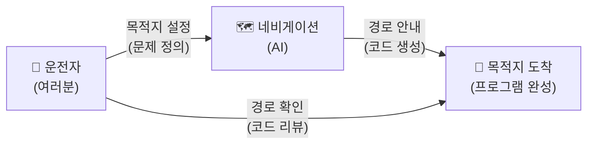
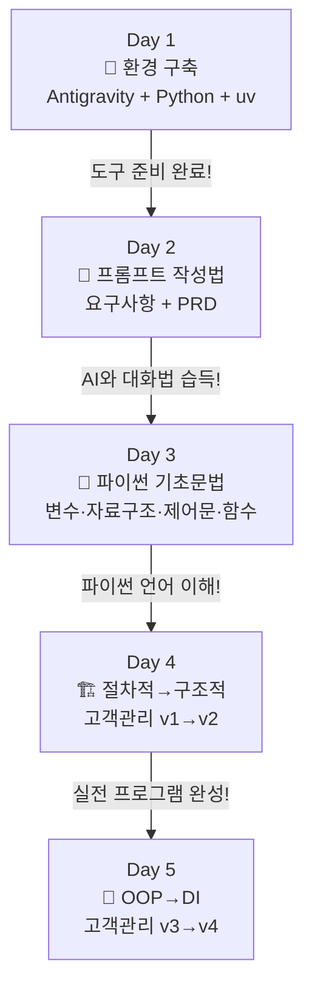
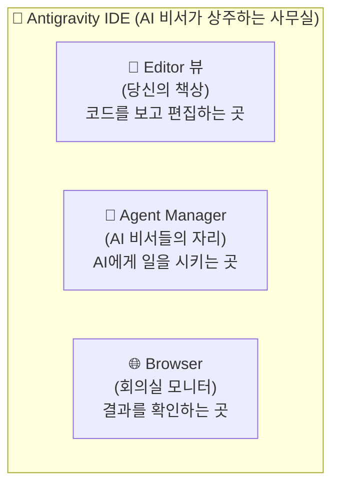

# Day 1 오전: 환경 구축 — 오리엔테이션, Antigravity, Python 설치

> 과정: AI-native 파이썬 기초 | Day 1/5 | 09:00–12:30

---

## 목차

- [세션 1-1: 오리엔테이션 & AI 시대의 서사 복습](Day1_AM_환경구축_Antigravity_Python.md#세션-1-1-오리엔테이션--ai-시대의-서사-복습)
- [세션 1-2: Antigravity 설치 & 기본 사용법](Day1_AM_환경구축_Antigravity_Python.md#세션-1-2-antigravity-설치--기본-사용법)
- [세션 1-3: 시스템 환경 확인 & Python 설치](Day1_AM_환경구축_Antigravity_Python.md#세션-1-3-시스템-환경-확인--python-설치)

---

## 세션 1-1: 오리엔테이션 & AI 시대의 서사 복습

> 🕐 시간: 09:00–10:00 | ⏱ 60분 | 이론:실습 = 7:3

### 1. 개요

5일간의 여정이 시작되는 첫 시간이에요. "AI 시대의 서사"에서 배운 핵심 개념을 환기하고, 이 과정이 어디로 향하는지 큰 그림을 그려볼게요.

이 과정은 **"네비게이션을 직접 써보는 운전 실습"**이에요. "AI 시대의 서사"에서 네비게이션 비유를 배웠죠? 그때는 "네비게이션이 있어도 목적지는 사람이 정한다"는 개념을 이해했다면, 이번에는 **실제로 네비게이션을 켜고 운전대를 잡아보는 시간**이에요.

### 2. 핵심 개념

#### "문제 정의 vs 문제 해결" 복습

"AI 시대의 서사"에서 가장 중요했던 메시지를 기억하시나요?

> **"AI가 로그인 기능을 만들어준다고 했는데, 그러면 누가 '로그인 기능이 필요하다'고 결정했을까요?"**

- **문제 정의(What to build)**: "무엇을 만들어야 하는가?"를 결정하는 것 → 사람의 몫
- **문제 해결(How to build)**: "어떻게 만들 것인가?"를 실행하는 것 → AI가 점점 잘하는 영역

#### 네비게이션 비유



이 과정에서 여러분은:
- **목적지(요구사항)**를 정하고
- **네비게이션(AI)**에게 경로(코드)를 물어보고
- 그 경로가 맞는지 **지도(문법)**를 읽는 법을 배워요

#### "말이 되어야 프로그램이 된다"

과거에는 "코드가 돼야 프로그램이 됐어요." 하지만 이제는 **"말이 되어야 프로그램이 됩니다."** 내가 원하는 것을 명확하게 표현할 수 있으면, AI가 코드로 바꿔줄 수 있거든요.

### 3. 상세 내용

#### 아이스브레이킹: "AI에게 시켜본 가장 재미있는 일"

돌아가면서 한 가지씩 공유해 볼까요? ChatGPT에게 시 쓰라고 했던 이야기, Gemini에게 여행 계획 짜달라고 했던 이야기... 뭐든 좋아요!

#### 과정 로드맵 소개

5일간 우리가 걸어갈 길을 한눈에 볼게요.



| 일차 | 핵심 키워드 | 비유 |
|------|-----------|------|
| Day 1 | Antigravity, Python, uv, 가상환경 | 운전 실습 전 차량 점검 |
| Day 2 | 프롬프트 4요소, 요구사항, PRD | AI에게 일 시키는 기술 |
| Day 3 | 변수, 자료구조, 제어문, 함수 | 파이썬의 언어를 이해하기 |
| Day 4 | 절차적, 구조적, 고객관리 v1→v2 | 진짜 프로그램 만들기 |
| Day 5 | OOP, DI, 고객관리 v3→v4 | 프로그램을 진화시키기 |

#### "AI 시대의 서사" 핵심 3가지 복습 퀴즈

**퀴즈 1**: AI 시대에도 개발자가 필요한 이유 3가지는?
- 정답: ① 문제를 정의하는 건 사람의 몫 ② 전체 시스템을 설계하는 건 사람의 영역 ③ 기술과 비즈니스를 연결하는 건 사람의 역할

**퀴즈 2**: 네비게이션 비유에서 "목적지를 정하는 것"은 개발에서 무엇에 해당하나요?
- 정답: 문제 정의(요구사항 정의)

**퀴즈 3**: "말이 되어야 프로그램이 된다"는 무슨 뜻인가요?
- 정답: 내가 원하는 것을 명확하게 표현할 수 있으면 AI가 코드로 바꿔줄 수 있다는 뜻

#### "요리사 vs 메뉴 기획자" 비유 복습

"AI 시대의 서사"에서 배운 레스토랑 비유를 떠올려 볼까요?

- **요리사**: 레시피를 보고 요리를 만드는 사람 → AI가 점점 잘하는 역할
- **메뉴 기획자**: "어떤 메뉴가 필요할까?"를 고민하는 사람 → 여전히 사람의 역할

우리는 이 과정에서 **메뉴 기획자가 되는 연습**을 시작해요. AI라는 훌륭한 요리사에게 "이런 메뉴를 만들어줘"라고 명확하게 지시할 수 있는 사람이 되는 거예요.

### 4. 실습 가이드

> 🎯 실습 목표: 과정 로드맵을 이해하고, "AI 시대의 서사" 핵심 개념을 환기한다

**Step 1: 아이스브레이킹** (10분)
- 짝과 함께 "AI에게 시켜본 가장 재미있는 일" 공유
- 전체 발표 (2~3명)

**Step 2: 로드맵 훑어보기** (15분)
- 강사가 Day 1~5 전체 흐름 설명
- 질문 시간

**Step 3: 복습 퀴즈** (15분)
- 위 퀴즈 3문항을 짝과 함께 풀어보기
- 정답 확인 및 토론

> ✅ 체크포인트: "이 과정이 끝나면 나는 AI에게 무엇을 시킬 수 있는 사람이 된다"는 것을 이해했나요?

### 5. 코드 및 명령어 모음

이 세션에는 코드 실습이 없어요. 다음 세션부터 본격적으로 시작합니다!

### 6. 트러블슈팅 FAQ

**Q: "AI 시대의 서사" 내용이 잘 기억나지 않아요.**
A: 걱정하지 마세요! 이 과정 전체에서 필요한 개념을 그때그때 복습할 거예요. 핵심만 기억하면 돼요: "문제를 정의하는 건 사람, 코드를 만드는 건 AI."

### 7. 요약 & 다음 세션 연결

**이번 세션 핵심 정리:**
- 이 과정 = "네비게이션을 직접 써보는 운전 실습"
- 우리의 역할 = 메뉴 기획자 (문제를 정의하는 사람)
- AI의 역할 = 요리사 (코드를 만드는 도구)
- "말이 되어야 프로그램이 된다"

**다음 세션 예고:**
> 자, 이제 운전 실습을 시작하려면 먼저 차가 있어야겠죠? 다음 세션에서는 우리의 "AI 비서가 상주하는 사무실", **Antigravity**를 설치해 볼게요!

---

## 세션 1-2: Antigravity 설치 & 기본 사용법

> 🕐 시간: 10:00–11:30 | ⏱ 90분 | 이론:실습 = 3:7

### 1. 개요

이번 세션에서는 우리의 핵심 도구인 **Antigravity IDE**를 설치하고, 기본 사용법을 익혀요. Antigravity는 Google이 2025년 11월에 출시한 **Agent-first IDE**(에이전트 중심 통합 개발 환경)예요.

쉽게 말하면, Antigravity는 **"AI 비서가 상주하는 사무실"**이에요.

### 2. 핵심 개념

#### Antigravity = "AI 비서가 상주하는 사무실"



- **왼쪽 = Editor 뷰(당신의 책상)**: 코드 파일을 열어보고, 수정하는 공간이에요
- **오른쪽 = Agent Manager(AI 비서들의 자리)**: AI에게 "이거 해줘"라고 말하는 공간이에요
- **Browser(회의실 모니터)**: 웹 페이지 등 결과물을 확인하는 공간이에요

#### Agent-first 패러다임

기존 코드 에디터(VS Code 등)는 **사람이 직접 코드를 타이핑**하는 것이 기본이었어요. Antigravity는 다릅니다. **AI 에이전트에게 일을 시키는 것**이 기본이에요.

비서에게 "이 보고서 좀 작성해줘"라고 말하면, 비서가 알아서 초안을 만들어주고, 당신은 검토만 하면 돼요. 심지어 비서 여러 명에게 동시에 다른 일을 시킬 수도 있어요. 이것이 **멀티에이전트 오케스트레이션**이에요.

#### Antigravity의 3-Surface 아키텍처

| Surface | 역할 | 비유 |
|---------|------|------|
| **Editor** | 동기적 코딩 (코드 보기/편집) | 당신의 책상 |
| **Agent Manager** | 자율 에이전트 오케스트레이션 | AI 비서들의 자리 |
| **Browser** | 자동 테스트 및 결과 확인 | 회의실 모니터 |

#### Gemini 3 Pro 내장

Antigravity에는 Google의 최신 AI 모델인 **Gemini 3 Pro**가 기본 탑재되어 있어요. 별도로 API 키를 설정하거나 추가 설치할 필요가 없어요. 설치하면 바로 AI 기능을 사용할 수 있습니다.

Gemini 3 Pro의 특징:
- **1M 토큰 컨텍스트 윈도우**: 아주 긴 코드도 한 번에 이해할 수 있어요
- **Deep Think 모드**: 복잡한 문제를 깊이 생각해서 답변해줘요
- **멀티모달**: 텍스트, 이미지, 오디오, 비디오, PDF 등 다양한 형태의 입력을 이해해요

### 3. 상세 내용

#### Antigravity 다운로드 및 설치 절차

1. 웹 브라우저에서 **antigravity.google** 접속
2. "Download for Windows" 버튼 클릭
3. 다운로드된 설치 파일 실행
4. 설치 마법사의 안내에 따라 "다음" 클릭
5. 설치 완료 후 Antigravity 실행

#### VS Code 마이그레이션 (해당되는 경우)

VS Code를 사용해본 적이 있다면, Antigravity가 자동으로 확장(Extension), 키바인딩(단축키 설정) 등을 가져올 수 있어요. **30초면 마이그레이션이 완료**됩니다.

#### Editor 뷰 기본 조작

| 동작 | 방법 |
|------|------|
| 새 파일 만들기 | `Ctrl + N` |
| 파일 저장 | `Ctrl + S` |
| 폴더 열기 | `Ctrl + K` → `Ctrl + O` 또는 메뉴 > File > Open Folder |
| 파일 탐색기 토글 | `Ctrl + B` |

#### Agent Manager 사용법

Agent Manager는 Antigravity의 핵심이에요. 여기서 AI와 대화하면서 코드를 생성하고, 질문하고, 도움을 받을 수 있어요.

1. 오른쪽 패널의 Agent Manager 탭 클릭 (또는 단축키)
2. 채팅 입력창에 자연어로 요청 입력
3. Gemini 3 Pro가 응답 생성
4. 필요하면 "Apply" 버튼으로 코드를 Editor에 적용

### 4. 실습 가이드

> 🎯 실습 목표: Antigravity를 설치하고, Editor 뷰와 Agent Manager의 기본 사용법을 익힌다

#### 실습 1: Antigravity 설치

**Step 1: 다운로드**
- 웹 브라우저에서 `antigravity.google` 접속
- "Download for Windows" 클릭

**Step 2: 설치**
- 다운로드된 파일 실행
- 설치 마법사 안내에 따라 진행

**Step 3: 첫 실행**
- 바탕화면 또는 시작 메뉴에서 Antigravity 실행
- 초기 설정 화면이 나오면 기본값으로 진행

> ✅ 체크포인트: Antigravity가 정상적으로 실행되고, 메인 화면이 보이나요?

#### 실습 2: Editor 뷰 기본 조작

**Step 1: 작업 폴더 만들기**
- 바탕화면에 `python_study` 폴더 생성
- Antigravity에서 File > Open Folder로 해당 폴더 열기

**Step 2: 새 파일 만들기**
- `Ctrl + N`으로 새 파일 생성
- `Ctrl + S`로 저장, 파일명: `test.txt`
- 아무 내용이나 입력하고 다시 저장

> ✅ 체크포인트: `python_study` 폴더 안에 `test.txt` 파일이 보이나요?

#### 실습 3: Agent Manager에서 Gemini 3 Pro와 첫 대화

**Step 1: 프롬프트 작성** — Agent Manager 채팅창에 입력:

```
안녕! 너는 누구야? 무엇을 할 수 있어?
```

**Step 2: AI 응답 확인** — Gemini 3 Pro가 자기소개를 해줄 거예요. 예상 응답 예시:

```
안녕하세요! 저는 Gemini입니다. Google의 AI 모델이에요.
저는 다음과 같은 일들을 도와드릴 수 있어요:

- 코드 작성 및 수정
- 코드 설명 및 리뷰
- 버그 찾기 및 수정
- 프로그래밍 관련 질문 답변
- 파일 생성 및 관리
- 그 외 다양한 개발 관련 작업

무엇을 도와드릴까요?
```

**Step 3: 추가 대화 시도** — 이번엔 좀 더 구체적으로 물어볼게요:

```
파이썬이 뭔지 초등학생도 이해할 수 있게 설명해줘
```

> ✅ 체크포인트: Agent Manager에서 Gemini 3 Pro와 대화가 정상적으로 이루어지나요?

#### 실습 4: 멀티에이전트 체험

**Step 1: 에이전트 탭 2개 열기**
- Agent Manager에서 새 에이전트 탭(스레드) 추가
- 이제 2개의 독립적인 대화 창이 생겼어요

**Step 2: 각각 다른 질문하기**

첫 번째 탭에 입력:
```
"Hello, World!"를 출력하는 파이썬 코드를 만들어줘
```

두 번째 탭에 입력:
```
파이썬에서 가장 많이 쓰이는 기능 5가지를 알려줘
```

**Step 3: 결과 비교**
- 두 에이전트가 동시에 각각 다른 작업을 수행하는 것을 확인해요
- 이것이 **멀티에이전트 워크플로우**예요!

> ✅ 체크포인트: 2개의 에이전트 탭에서 각각 다른 응답이 나왔나요?

### 5. 코드 및 명령어 모음

이 세션에서는 별도의 코드 작성이 없어요. Antigravity 설치와 기본 조작에 집중합니다.

**주요 단축키 정리:**

| 단축키 | 기능 |
|--------|------|
| `Ctrl + N` | 새 파일 |
| `Ctrl + S` | 저장 |
| `Ctrl + B` | 사이드바 토글 |
| `Ctrl + K` → `Ctrl + O` | 폴더 열기 |
| `Ctrl + Shift + P` | 명령 팔레트 |
| `Ctrl + `` ` | 터미널 열기/닫기 |

### 6. 트러블슈팅 FAQ

**Q: Antigravity 설치 파일이 다운로드되지 않아요.**
A: 브라우저의 다운로드 차단 설정을 확인해 보세요. Chrome이라면 주소창 오른쪽의 다운로드 아이콘을 클릭하고 "허용"을 눌러주세요.

**Q: 설치 중 "Windows의 PC 보호" 경고가 떠요.**
A: "추가 정보" → "실행"을 클릭하면 돼요. Google의 공식 프로그램이니 안전합니다.

**Q: Agent Manager에서 AI가 응답하지 않아요.**
A: 인터넷 연결을 확인해 주세요. Gemini 3 Pro는 클라우드 기반이라 인터넷이 필요해요. 연결이 정상인데도 안 된다면, Antigravity를 재시작해 보세요.

### 7. 요약 & 다음 세션 연결

**이번 세션 핵심 정리:**
- Antigravity = "AI 비서가 상주하는 사무실"
- Editor 뷰 = 당신의 책상, Agent Manager = AI 비서들의 자리
- Gemini 3 Pro가 기본 내장되어 별도 설정 불필요
- 멀티에이전트로 여러 작업을 동시에 시킬 수 있어요

**다음 세션 예고:**
> 사무실(Antigravity)은 준비됐어요! 이제 요리를 시작하기 전에 **"냉장고에 뭐가 있는지"** 확인해 볼 차례예요. 다음 세션에서는 우리 컴퓨터의 시스템 환경을 확인하고, Python을 설치해 볼게요.

---

## 세션 1-3: 시스템 환경 확인 & Python 설치

> 🕐 시간: 11:30–12:30 | ⏱ 60분 | 이론:실습 = 2:8

### 1. 개요

요리를 시작하기 전에 **"냉장고에 뭐가 있는지"** 확인하는 것처럼, 프로그래밍을 시작하기 전에 우리 컴퓨터에 어떤 것들이 설치되어 있는지 확인해야 해요.

이번 세션에서는 Antigravity의 AI를 이용해서 시스템 환경을 확인하고, Python이 설치되어 있지 않다면 프롬프트로 설치 방법을 알아내서 직접 설치해 볼게요.

핵심 포인트: **모든 과정을 AI에게 물어보면서 진행**해요. 명령어를 외울 필요 없어요!

### 2. 핵심 개념

#### 시스템 환경 확인 = "냉장고에 뭐가 있는지 확인"

요리를 시작하려면 먼저 냉장고를 열어봐야 해요.
- 달걀이 있나? → Python이 설치되어 있나?
- 양파가 있나? → 어떤 버전인가?
- 재료가 없으면? → 장보기 목록(설치 명령)을 AI에게 물어보기!

#### Python이란?

Python(파이썬)은 프로그래밍 언어예요. 우리가 AI에게 "이런 프로그램 만들어줘"라고 하면, AI가 **파이썬어**로 코드를 써줘요. 그 코드를 실행하려면 컴퓨터에 Python이 설치되어 있어야 해요.

"AI 시대의 서사"에서 배운 **통역사 비유**를 떠올려 볼까요? AI가 우리의 한국어 요청을 파이썬어로 번역해주는 통역사라면, Python은 그 파이썬어를 컴퓨터가 이해할 수 있게 실행해주는 **실행기**예요.

#### 터미널이란?

터미널(Terminal)은 컴퓨터에게 **글자로 명령을 내리는 창**이에요. 마우스로 클릭하는 대신, 키보드로 명령어를 입력해서 컴퓨터를 조작하는 방식이에요.

Antigravity에서 터미널을 여는 방법: `` Ctrl + ` `` (백틱 키, 키보드 왼쪽 상단 숫자 1 옆)

### 3. 상세 내용

#### Windows PowerShell

Antigravity에서 터미널을 열면 기본적으로 **PowerShell**이 실행돼요. PowerShell은 Windows의 명령어 입력 도구예요. 파란색 또는 검은색 배경에 깜빡이는 커서가 보이면 성공이에요.

#### Python 설치 경로

Windows에서 Python을 설치하면 보통 다음 경로에 설치돼요:
- `C:\Users\[사용자이름]\AppData\Local\Programs\Python\Python312\`

설치 시 **"Add Python to PATH"** 옵션을 반드시 체크해야 해요. 이걸 체크하지 않으면 터미널에서 `python` 명령어를 인식하지 못해요.

### 4. 실습 가이드

> 🎯 실습 목표: AI를 이용해 시스템 환경을 확인하고, Python을 설치한다

#### 실습 1: 시스템 환경 확인

**Step 1: 프롬프트 작성** — Antigravity Agent Manager에 입력:

```
내 컴퓨터의 운영체제와 Python 설치 여부를 확인하는 PowerShell 명령어를 알려줘
```

**Step 2: AI 응답 확인** — 예상 응답:

```powershell
# 운영체제 확인
systeminfo | findstr /B /C:"OS Name" /C:"OS Version"

# Python 설치 여부 확인
python --version
```

**Step 3: 코드 리뷰** — 한 줄씩 의미를 파악해 볼게요:
- `systeminfo`: 시스템 정보를 보여주는 명령어
- `python --version`: Python이 설치되어 있다면 버전을 보여주는 명령어

**Step 4: 실행 및 확인** — Antigravity 터미널(`` Ctrl + ` ``)에서 실행:

```powershell
python --version
```

**결과 A — Python이 이미 설치된 경우:**
```
Python 3.12.x
```
→ 축하해요! 다음 단계로 넘어가면 돼요.

**결과 B — Python이 설치되지 않은 경우:**
```
'python'은(는) 내부 또는 외부 명령, 실행할 수 있는 프로그램, 또는
배치 파일이 아닙니다.
```
→ 다음 실습에서 설치할 거예요!

> ✅ 체크포인트: 터미널에서 명령어를 실행하고 결과를 확인했나요?

#### 실습 2: Python 설치 (설치가 필요한 경우)

**Step 1: 프롬프트 작성** — Agent Manager에 입력:

```
Windows 11에 Python 3.12를 설치하는 방법을 단계별로 알려줘. 초보자도 따라할 수 있게 자세히 설명해줘.
```

**Step 2: AI 응답 확인** — AI가 안내하는 설치 절차를 따라가요. 핵심 단계:

1. 웹 브라우저에서 `python.org` 접속
2. Downloads > Windows 클릭
3. "Python 3.12.x" 최신 버전 다운로드
4. 설치 파일 실행
5. ⚠️ **"Add python.exe to PATH" 체크박스를 반드시 체크!**
6. "Install Now" 클릭
7. 설치 완료 대기

**Step 3: 설치 확인** — 터미널에서 실행:

```powershell
python --version
```

예상 출력:
```
Python 3.12.x
```

> ✅ 체크포인트: `python --version` 명령어가 Python 버전을 정상적으로 출력하나요?

#### 실습 3: 트러블슈팅 실습 — "python 명령이 안 돼요"

일부러 자주 발생하는 오류 상황을 AI에게 물어보는 연습을 해볼게요.

**Step 1: 프롬프트 작성** — Agent Manager에 입력:

```
Windows에서 python --version을 실행했는데 "python을 찾을 수 없습니다"라는 에러가 나와요. 어떻게 해결하나요?
```

**Step 2: AI 응답 확인** — AI가 알려주는 해결 방법 예시:

```
이 문제는 Python이 시스템 PATH에 등록되지 않아서 발생해요.
해결 방법:

1. Windows 검색에서 "환경 변수"를 검색하세요
2. "시스템 환경 변수 편집" 클릭
3. "환경 변수" 버튼 클릭
4. "Path" 변수를 선택하고 "편집" 클릭
5. "새로 만들기"를 클릭하고 Python 설치 경로를 추가:
   C:\Users\[사용자이름]\AppData\Local\Programs\Python\Python312\
   C:\Users\[사용자이름]\AppData\Local\Programs\Python\Python312\Scripts\
6. 확인을 누르고 터미널을 재시작하세요
```

**Step 3: 핵심 배움**
- 문제가 생기면 **AI에게 에러 메시지를 그대로 보여주면** 해결 방법을 알려줘요
- 이것이 AI-native 학습의 핵심이에요: 외우지 않고, 물어보면서 해결하기!

> ✅ 체크포인트: AI에게 트러블슈팅을 요청하는 방법을 이해했나요?

### 5. 코드 및 명령어 모음

```powershell
# 운영체제 정보 확인
systeminfo | findstr /B /C:"OS Name" /C:"OS Version"

# Python 버전 확인
python --version

# Python 설치 경로 확인
where python

# Python 대화형 모드 진입 (설치 확인용)
python
# 대화형 모드에서 나가기: exit() 또는 Ctrl+Z 후 Enter
```

### 6. 트러블슈팅 FAQ

**Q: `python --version`을 실행했는데 Microsoft Store가 열려요.**
A: Windows 11에서 자주 발생하는 현상이에요. 설정 > 앱 > 앱 실행 별칭에서 "python.exe"와 "python3.exe"의 앱 설치 관리자를 **끄기**로 변경해 주세요. 그 후 터미널을 재시작하면 정상 작동해요.

**Q: 설치할 때 "Add python.exe to PATH"를 체크하지 않았어요.**
A: Python 설치 파일을 다시 실행하고 "Modify"를 선택한 후, PATH 옵션을 활성화하면 돼요. 또는 AI에게 "Python PATH 수동 등록 방법"을 물어보세요.

**Q: 터미널이 어디 있는지 모르겠어요.**
A: Antigravity에서 `` Ctrl + ` `` (백틱 키)를 누르면 하단에 터미널이 열려요. 또는 메뉴에서 Terminal > New Terminal을 클릭하세요.

### 7. 요약 & 다음 세션 연결

**이번 세션 핵심 정리:**
- 시스템 환경 확인 = "냉장고에 뭐가 있는지 확인"
- Python = AI가 써준 코드를 실행하는 실행기
- 터미널 = 컴퓨터에게 글자로 명령을 내리는 창
- 문제가 생기면 AI에게 에러 메시지를 보여주고 해결 방법을 물어보기

**오전 마무리:**
> 수고하셨어요! 오전에 우리는 사무실(Antigravity)을 차리고, 냉장고(시스템 환경)를 확인하고, 기본 재료(Python)를 준비했어요. 점심 맛있게 드시고, 오후에는 **"초고속 도구함 관리자" uv**를 설치하고, 드디어 **첫 번째 파이썬 프로그램**을 만들어 볼 거예요!

---

> 🍽️ **점심시간 (12:30–13:30)**
