# Day 1 오전: 환경구축 Antigravity Python

> **과정**: AI-native 파이썬 기초 | Day 1/5 | 09:00~12:30
> **테마**: AI 도구 탐험과 개발 환경 구축
> **세션**: 001 ~ 011 (11개 세션)
> **총 소요 시간**: 230분
> **버전**: v2.1 (7섹션 구조, 보조 패킷 통합)
> **작성 일시**: 2026-02-25

---

## 🎯 학습 목표 (오전)

1. **세션 001**: 이 세션 종료 시 수강생은 5일간의 과정 로드맵 흐름을 이해하고 동기부여를 가질 수 있다.
2. **세션 002**: 이 세션 종료 시 수강생은 'AI 시대의 서사'의 3가지 핵심 개념과 '메뉴 기획자'로서의 역할을 복습하고 자신의 언어로 설명할 수 있다.
3. **세션 003**: 이 세션 종료 시 수강생은 본 과정의 핵심 학습 사이클(예측→검증→설명)과 명세 주도 개발(SDD)의 기본 개념을 이해한다.
4. **세션 004**: 이 세션 종료 시 수강생은 Windows 11 환경에 Antigravity IDE를 설치하고 정상적으로 실행할 수 있다.
5. **세션 005**: 이 세션 종료 시 수강생은 Antigravity IDE의 Editor 뷰를 활용하여 프로젝트 폴더를 열고 새로운 파일을 생성, 저장할 수 있다.
6. **세션 006**: 이 세션 종료 시 수강생은 Antigravity의 Agent Manager 창을 열고 Gemini 3 Pro와 기본 대화를 시작할 수 있다.
7. **세션 007**: 이 세션 종료 시 수강생은 Antigravity에서 두 개 이상의 에이전트 탭을 열어 동시에 서로 다른 작업을 지시하는 '멀티에이전트'의 개념을 체험할 수 있다.
8. **세션 008**: 이 세션 종료 시 수강생은 Antigravity 터미널을 열고 AI에게 프롬프트를 질문하여 자신의 시스템 환경(OS 및 Python 설치 여부)을 스스로 확인할 수 있다.
9. **세션 009**: 이 세션 종료 시 수강생은 AI의 안내를 받아 Windows 11 환경에 Python 최신 버전을 다운로드하고 환경 변수를 포함하여 정상적으로 설치할 수 있다.
10. **세션 010**: 이 세션 종료 시 수강생은 에러가 발생했을 때 AI에게 '왜'라는 질문을 연속으로 던지는 '5 Whys 기법'을 사용하여 근본 원인을 파악하고 해결할 수 있다.
11. **세션 011**: 이 세션 종료 시 수강생은 패키지 매니저의 개념을 이해하고, 터미널 명령어를 통해 최신 도구인 'uv'를 성공적으로 설치할 수 있다.

---

## 📋 목차

- [📖 세션 001: 과정 로드맵과 아이스브레이킹](#세션-001) (20분)
- [📖 세션 002: AI 시대의 서사 핵심 복습](#세션-002) (20분)
- [📖 세션 003: 학습 방법론과 SDD 미리보기](#세션-003) (20분)
- [🧪 세션 004: Antigravity 설치와 시연](#세션-004) (25분)
- [🧪 세션 005: Editor 뷰와 기본 조작](#세션-005) (20분)
- [🧪 세션 006: Agent Manager와 첫 인사](#세션-006) (20분)
- [🧪 세션 007: 멀티에이전트 오케스트레이션 기초](#세션-007) (25분)
- [🧪 세션 008: 프롬프트로 시스템 환경 확인](#세션-008) (20분)
- [🧪 세션 009: AI와 함께 Python 설치하기](#세션-009) (20분)
- [🧪 세션 010: 트러블슈팅과 5 Whys 기법](#세션-010) (20분)
- [🧪 세션 011: uv 패키지 매니저 소개와 설치](#세션-011) (20분)

---

## 📊 세션 인덱스

| 세션 | 제목 | 시간 | 청크 타입 | 난이도 | 바로가기 |
|------|------|------|-----------|--------|----------|
| 001 | 과정 로드맵과 아이스브레이킹 | 20분 | 📖 narrative | low | [바로가기](#세션-001) |
| 002 | AI 시대의 서사 핵심 복습 | 20분 | 📖 narrative | low | [바로가기](#세션-002) |
| 003 | 학습 방법론과 SDD 미리보기 | 20분 | 📖 narrative | low | [바로가기](#세션-003) |
| 004 | Antigravity 설치와 시연 | 25분 | 🧪 lab | low | [바로가기](#세션-004) |
| 005 | Editor 뷰와 기본 조작 | 20분 | 🧪 lab | low | [바로가기](#세션-005) |
| 006 | Agent Manager와 첫 인사 | 20분 | 🧪 lab | low | [바로가기](#세션-006) |
| 007 | 멀티에이전트 오케스트레이션 기초 | 25분 | 🧪 lab | medium | [바로가기](#세션-007) |
| 008 | 프롬프트로 시스템 환경 확인 | 20분 | 🧪 lab | medium | [바로가기](#세션-008) |
| 009 | AI와 함께 Python 설치하기 | 20분 | 🧪 lab | medium | [바로가기](#세션-009) |
| 010 | 트러블슈팅과 5 Whys 기법 | 20분 | 🧪 lab | medium | [바로가기](#세션-010) |
| 011 | uv 패키지 매니저 소개와 설치 | 20분 | 🧪 lab | medium | [바로가기](#세션-011) |

---

## 📚 본문

### 세션 001: 과정 로드맵과 아이스브레이킹
> [원본 파일](sessions/세션-001-과정_로드맵과_아이스브레이킹_v2.1.md) | ⏱️ 20분 | 📖 narrative | 난이도: low

> **세션 ID**: MS-PY101-001  
> **소요 시간**: 20분  
> **난이도**: low  
> **청크 타입**: narrative  
> **버전**: v2.1 (7섹션 구조)

---

## §1. 개요

> **Day 1 | AM | 세션 001/022**

이 세션은 5일간 40시간에 걸친 "AI-native 파이썬 기초" 과정의 가장 첫 번째 시간이에요. 수강생들이 강의실에 처음 들어와서 서로 얼굴을 마주하는 순간부터 시작되는, 과정 전체의 분위기와 방향을 결정짓는 매우 중요한 오프닝 세션입니다. 아직 코드 한 줄 쓰지 않지만, 이 20분이 앞으로 5일의 학습 태도와 마인드셋을 결정한다고 해도 과언이 아니에요.

### 🎯 학습 목표

이 세션이 끝나면 수강생은 다음을 할 수 있어요:

- 5일간의 과정 로드맵을 머릿속에 큰 그림으로 그릴 수 있습니다
- "AI가 코드를 대신 짜주는 시대에 왜 파이썬을 배우는가"라는 핵심 질문에 자신만의 답을 가질 수 있습니다
- 동료 수강생과 첫 대화를 나누며 학습 공동체의 일원이라는 소속감을 느낄 수 있습니다

### 선행 세션 환기

이 세션은 과정의 첫 번째 시간이므로 별도의 선행 세션이 없어요. 다만, 수강생들은 사전 교육으로 "AI 시대의 서사"라는 특강을 수료한 상태입니다. 그 특강에서 배운 "문제 정의 vs 문제 해결", "네비게이션 비유", "요리사 vs 메뉴 기획자" 같은 핵심 개념을 이 세션에서 자연스럽게 환기하면서 출발할 거예요.

---


### 🌟 차별화 포인트 (Differentiation Strategy)

> 🌟 **Day 1 서사: 패러다임의 전환** — 수동적 탑승객에서 목적지를 정하는 운전자로 — "코드를 치는 시대는 끝났다." AI라는 완벽한 네비게이션을 켜고, 목적지(What)를 정하는 주체가 '나'임을 깨닫는 출발점.

## §2. 핵심 개념 (+ 🗣️ 강사 대본 + Mermaid)

### AI-native 패러다임 전환과 네비게이션 비유

코딩 문법을 암기하는 것보다, 무엇을 만들지 문제를 정의하는 것이 중요한 시대가 왔어요. AI가 코드를 대신 작성해 주는 시대에, 개발자의 핵심 경쟁력이 '코드를 타이핑하는 사람(How)'에서 '무엇을 만들지 문제를 정의하는 사람(What)'으로 변화했다는 것이 이 과정 전체를 관통하는 철학적 패러다임이에요. 이것을 가장 직관적으로 이해할 수 있는 비유가 바로 "네비게이션과 운전자"입니다. 목적지를 입력하는 운전자(사람)와 최적 경로를 안내하는 네비게이션(AI)의 협력 관계, 이것이 앞으로 5일간 우리가 체험할 핵심 구도예요.

🗣️ **강사 대본 (Instructor Script)**:

> 여러분, 만나서 정말 반갑습니다. 앞으로 5일 동안 함께 여행을 떠날 동료들이에요. 본격적으로 시작하기 전에 한 가지만 여쭤볼게요. 혹시 최근에 AI에게 시켜본 가장 재미있거나 엉뚱한 일이 뭐였나요? ChatGPT에게 연애 상담을 받았다든지, 이력서를 대신 써달라고 했다든지, 뭐든 괜찮아요. 잠깐 옆 분과 이야기를 나눠보세요.
>
> 네, 좋습니다! 이렇게 우리는 이미 일상에서 AI와 대화하고 있어요. 그런데 생각해 보면 신기하지 않나요? 불과 2~3년 전만 해도 "코딩을 배우려면 영어 문법처럼 프로그래밍 문법을 외워야 해"라는 말이 상식이었는데, 지금은 AI에게 한국어로 말하면 코드가 뚝딱 나오는 세상이 되었으니까요.
>
> 그렇다면 이런 질문이 떠오릅니다. **"AI가 코드를 다 짜주는 세상에서, 우리는 왜 파이썬을 배우는 걸까요?"**
>
> 이 질문에 답하기 위해, 하나의 장면을 상상해 봅시다. 여러분이 처음으로 자동차를 몰고 부산에 가려고 합니다. 요즘 차에는 아주 똑똑한 네비게이션이 달려 있죠. 목적지만 입력하면 최적 경로를 알려주고, 실시간 교통 상황까지 반영해서 "300미터 앞에서 우회전하세요"라고 친절하게 안내합니다. 그런데 여기서 중요한 사실 하나가 있어요. **아무리 세상에서 가장 똑똑한 네비게이션이라 해도, "목적지"를 대신 정해주지는 않는다는 것입니다.**
>
> 여러분이 "부산 해운대"라고 입력해야 네비게이션이 경로를 찾아주지, 네비게이션이 알아서 "오늘은 해운대가 좋겠다"라고 결정하지 않잖아요. 만약 여러분이 목적지를 "부산"이라고만 대충 입력하면 어떻게 될까요? 해운대로 갈 수도 있고, 부산역 앞에 내려줄 수도 있고, 김해공항 근처에서 빙빙 돌 수도 있어요. 원하는 곳에 정확히 도착하려면 "부산 해운대구 해운대해변로 264, 해운대 해수욕장 주차장"처럼 구체적으로 알려줘야 합니다.
>
> 이 과정에서 AI는 바로 그 네비게이션 역할을 합니다. 코드를 대신 짜주고, 오류를 찾아주고, 심지어 테스트까지 해주는 놀라운 조수예요. 하지만 **"어떤 프로그램을 만들 것인가", "이 프로그램은 누구를 위한 것인가", "어떤 조건에서 어떻게 동작해야 하는가"** — 이런 목적지는 오직 여러분만이 결정할 수 있습니다.
>
> 우리 과정은 바로 이 '목적지를 정확하게 입력하는 법'을 배우는 5일간의 운전 실습이에요. 엔진을 분해하거나 타이어를 교체하는 정비사가 되는 것이 아니라, 운전대를 잡고 네비게이션과 대화하면서 원하는 곳에 안전하게 도착하는 운전자가 되는 거예요.

> 💡 **강사 노트**: 네비게이션 비유는 「AI 시대의 서사 v3 - Claude.md」(Source A)에서 발췌하여 확장한 것입니다. "목적지를 구체적으로 입력해야 한다"는 포인트를 강조하면, 이후 Day 2의 PTCF 프롬프트 프레임워크와 자연스럽게 연결됩니다.

### Mermaid 다이어그램

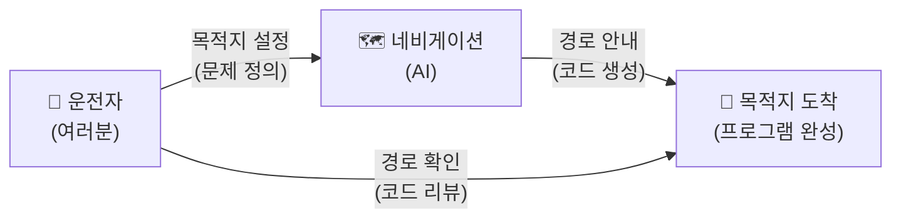

이 다이어그램은 이 과정 전체를 관통하는 핵심 구도를 한눈에 보여줘요. 운전자(여러분)가 목적지를 설정하고, 네비게이션(AI)이 경로를 안내하며, 운전자가 그 경로가 맞는지 확인하면서 목적지에 도착하는 구조입니다. 여기서 "경로 확인"이 바로 코드 리뷰에 해당하는데, 이 능력을 키우는 것이 우리 과정의 핵심 목표 중 하나예요.

---

## §3. 상세 내용

### Why — 왜 이 세션이 필요한가?

5일이라는 시간은 길다면 길고 짧다면 짧아요. 40시간 동안 무엇을 배우게 될지 전체 지도를 먼저 펼쳐놓지 않으면, 수강생들은 매 세션이 어디를 향해 가는지 모른 채 따라가기만 하게 됩니다. 등산을 시작하기 전에 산 전체의 등산로 지도를 한번 훑어보는 것처럼, 과정의 전체 로드맵을 먼저 조감하는 시간이 꼭 필요해요.

또한 아이스브레이킹은 단순한 분위기 전환이 아닙니다. 프로그래밍 경험이 전혀 없는 비전공자들이 모인 교실에서, "나만 못하는 건 아닐까"라는 불안감을 해소하고 "우리 모두 같은 출발선에 서 있다"는 안도감을 주는 것이 이 시간의 진짜 목적이에요. 서로의 AI 활용 경험을 가볍게 나누면서, 이 과정이 코딩 문법을 외우는 딱딱한 시간이 아니라 AI와 대화하는 재미있는 여행이라는 톤을 세팅합니다.

### What — 이 세션에서 다루는 것은 무엇인가?

이 세션에서는 크게 세 가지를 다룹니다. 첫째는 아이스브레이킹으로, 수강생들이 서로의 AI 활용 경험을 공유하며 첫 대화를 나누는 시간이에요. AI가 해결해주지 못했던 '요구사항 정의'의 어려움에 대해 짧게 토론하는 것도 포함됩니다. 둘째는 과정 로드맵 소개로, Day 1부터 Day 5까지 각 날의 핵심 주제와 흐름을 큰 그림으로 보여줍니다. 셋째는 AI-native 패러다임의 핵심 메시지를 환기하는 것으로, "문제 정의(What) vs 문제 해결(How)"이라는 구도와 네비게이션 비유를 통해 이 과정의 철학적 기반을 다집니다.

### How — 구체적으로 어떻게 진행하는가?

🗣️ **강사 대본 (Instructor Script)**:

> 자, 그러면 5일간의 로드맵을 한눈에 살펴봅시다. 우리 여정은 크게 다섯 파트로 나뉘어요.
>
> 먼저 오늘, **Day 1은 "AI 시대의 이해와 환경 구축"**입니다. 오늘 하루가 끝나면 여러분의 컴퓨터에는 Antigravity라는 최신 AI 통합 개발 환경이 깔려 있을 거고, 그 안에서 AI 비서에게 말을 걸어 첫 파이썬 코드를 직접 만들어 볼 거예요. 아직 문법은 하나도 몰라도 됩니다. AI가 대신 짜주니까요. 대신 "이 코드가 무슨 일을 하는지" 읽는 연습을 시작합니다.
>
> **Day 2는 "프롬프트 엔지니어링과 요구사항 설계"**예요. 네비게이션에 목적지를 입력할 때도 요령이 있듯이, AI에게 코드를 시킬 때도 공식이 있습니다. PTCF라는 4요소 프레임워크를 배우고, "내가 원하는 프로그램은 이런 겁니다"라는 설계 문서를 직접 작성해 볼 거예요.
>
> **Day 3은 "파이썬 핵심 문법"**입니다. 변수, 리스트, 조건문, 반복문, 함수 같은 기초 문법을 다루는데, 여기서도 우리의 접근법은 다릅니다. 문법을 외우는 것이 아니라, AI가 생성한 코드를 읽고 "이 줄이 왜 이렇게 생겼는지" 이해하는 방식으로 배워요.
>
> **Day 4와 Day 5는 "구조적 프로그래밍에서 객체지향까지"**라는 심화 과정이에요. 처음에 뚝딱 만든 프로그램이 점점 커질 때 어떻게 정리하고 확장하는지, 마치 동네 분식집이 프랜차이즈로 성장하는 과정처럼 코드가 진화하는 여정을 경험합니다.
>
> 이 다섯 파트를 관통하는 하나의 프로젝트가 있어요. 바로 **"고객 정보 관리 프로그램"**입니다. Day 1에서 간단한 스케치로 시작해서, Day 5가 끝날 때쯤이면 고객 등록, 조회, 수정, 삭제가 가능하고 데이터베이스에 저장까지 되는 진짜 프로그램이 완성됩니다. 이 프로그램이 5일 동안 네 번 진화하는 과정을 함께 지켜보시게 될 거예요.
>
> 혹시 "저는 진짜 컴퓨터 초보인데 괜찮을까요?"라고 걱정되시는 분이 계신다면, 안심하세요. 여러분의 화면 안에 24시간 대기하는 1:1 과외 선생님이 있습니다. 바로 AI 에이전트예요. 막히면 언제든지 "이게 뭐야?", "왜 에러가 나?", "어떻게 고쳐?"라고 물어보세요. 이 과정에서 가장 중요한 습관은 **'혼자 끙끙대지 않고, AI에게 도움을 요청하는 것'**입니다.

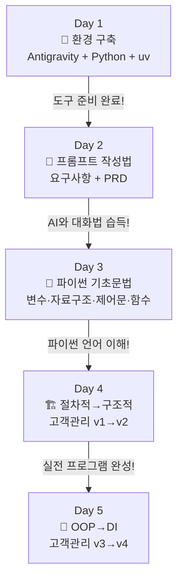

> ✅ **체크포인트**: 여기까지 이해했는지 스스로 점검해 보세요.
> - "이 과정은 코딩 문법을 외우는 과정인가요, 아니면 AI에게 일 시키는 법을 배우는 과정인가요?"
> - "5일간의 여정에서 Day 1의 역할은 무엇인가요?"

### 5일간 로드맵 비교표

| 일차 | 핵심 키워드 | 비유 | 고객관리 프로젝트 |
|------|-----------|------|-----------------|
| Day 1 | Antigravity, Python, uv, 가상환경 | 운전 실습 전 차량 점검 | 프로젝트 스케치 |
| Day 2 | 프롬프트 4요소, 요구사항, PRD | AI에게 일 시키는 기술 | v1 설계 문서 |
| Day 3 | 변수, 자료구조, 제어문, 함수 | 파이썬의 언어를 이해하기 | v1 코드 읽기 |
| Day 4 | 절차적, 구조적, 고객관리 v1→v2 | 분식집 → 프랜차이즈 | v2 구조 개선 |
| Day 5 | OOP, DI, 고객관리 v3→v4 | 프랜차이즈 본사 시스템 | v3→v4 진화 |

---

## §4. 실습 가이드 (+ 🎙️ 실습 대본) — 해당 시

### 실습 목표

이 세션의 실습은 코드 기반이 아니라 대화 기반의 아이스브레이킹 활동이에요. 수강생들이 서로의 AI 활용 경험을 공유하면서, 이 과정이 "AI와 협업하는 법"을 배우는 시간이라는 톤을 자연스럽게 체감하는 것이 목표입니다.

🎙️ **실습 가이드 대본 (Lab Guide)**:

> 자, 이제 옆에 앉은 분과 2분 동안 이야기를 나눠보세요. 주제는 아주 간단해요. **"최근에 AI에게 시켜본 가장 재미있거나 엉뚱한 일이 뭐였나요?"** ChatGPT에게 연애 상담을 받았다든지, Gemini에게 여행 계획을 짜달라고 했다든지, 뭐든 괜찮아요. 그리고 한 가지 더 — AI가 해줬으면 좋겠는데 잘 못했던 일이 있었나요? 그것도 함께 나눠보세요.
>
> 2분 후에 전체 앞에서 2~3분만 발표해 주실 분을 모실 거예요. 자, 시작하세요!
>
> (2분 후) 네, 시간이 됐습니다. 재미있는 경험을 나눠주실 분 계신가요? 네, 감사합니다. 아주 좋은 사례예요. 이렇게 AI는 이미 우리 일상에 깊이 들어와 있어요. 그런데 여러분이 공유해 주신 경험에서 공통점이 하나 보이지 않나요? AI가 잘하는 것도 있지만, **"내가 원하는 게 정확히 뭔지"를 AI가 대신 정해주지는 못한다**는 거예요. 이것이 바로 우리가 5일간 훈련할 핵심 능력입니다.

### 단계별 지시

| 단계 | 소요 시간 | 강사 지시사항 | 학습자 액션 | 예상 결과 |
|------|----------|--------------|------------|----------|
| 1 | 2분 | "옆 분과 AI 활용 경험 공유해주세요" | 짝과 자유 대화 | 분위기 이완, 웃음 |
| 2 | 3분 | "전체 앞에서 2~3분만 발표해주세요" | 자원자 2~3명 발표 | 다양한 AI 활용 사례 공유 |
| 3 | 5분 | 로드맵 다이어그램 보여주며 설명 | 화면 주시, 질문 | Day 1~5 큰 그림 파악 |
| 4 | 5분 | 과정 철학(네비게이션 비유) 설명 | 경청, 고개 끄덕임 | 핵심 메시지 이해 |
| 5 | 5분 | "궁금한 점 있으신가요?" 질의응답 | 자유 질문 | 불안감 해소 |

### 트러블슈팅 FAQ

| Q | A |
|---|---|
| 수강생이 너무 조용해서 아이스브레이킹이 안 돼요 | 강사가 먼저 자신의 AI 경험을 재미있게 공유하면서 분위기를 풀어주세요. "저는 AI에게 프러포즈 멘트를 써달라고 했었어요" 같은 가벼운 일화가 효과적이에요 |
| "AI 시대의 서사" 내용을 전혀 기억 못하는 수강생이 있어요 | 걱정하지 마세요! 이 과정 전체에서 필요한 개념을 그때그때 복습할 거예요. 핵심만 기억하면 돼요: "문제를 정의하는 건 사람, 코드를 만드는 건 AI" |
| "저는 컴퓨터를 거의 안 써본 진짜 초보인데 따라갈 수 있나요?" | "이 과정은 코딩 천재를 만드는 게 아니라, AI와 대화하는 법을 배우는 거예요. 한국어로 대화할 수 있으면 충분합니다!"라고 안심시켜 주세요 |

> ✅ **체크포인트**: "이 과정이 끝나면 나는 AI에게 무엇을 시킬 수 있는 사람이 된다"는 것을 이해했나요?

---


### 🎓 강사 노트 (Instructor Support)

- ⏱️ **타이밍**: 09:00 (20분, narrative)
- 🎯 **핵심 활동**: 자기소개 + 5일 로드맵 안내
- ⚠️ **강사 주의사항**: 첫 인상이 5일을 좌우함. 밝은 에너지 유지

## §5. 코드 및 명령어 모음 — 해당 시

이 세션은 narrative 타입으로, 코드 실습이 포함되지 않아요. 본격적인 코드 작성은 세션 004(Antigravity 설치)부터 시작됩니다. 이 세션에서는 로드맵 소개와 아이스브레이킹에 집중하며, 수강생들이 과정의 큰 그림과 철학을 먼저 이해하는 것이 목표입니다.

> 🤖 **AI 프롬프트 예시**: 해당 없음 (이 세션은 대화와 토론 중심)

---

## §6. 요약

### 핵심 학습 포인트

이번 세션에서 가장 중요한 메시지는 세 가지예요. 첫째, 이 과정은 "네비게이션을 직접 써보는 운전 실습"입니다. 코딩 문법을 외우는 것이 아니라, AI에게 정확한 목적지를 전달하는 방법을 배우는 시간이에요. 둘째, 우리의 역할은 "메뉴 기획자(문제를 정의하는 사람)"이고, AI의 역할은 "요리사(코드를 만드는 도구)"입니다. 셋째, "말이 되어야 프로그램이 된다" — 내가 원하는 것을 명확하게 표현할 수 있으면, AI가 코드로 바꿔줄 수 있다는 것이 이 시대의 핵심 진실이에요.

### 다음 세션 예고

다음 세션에서는 사전 교육 "AI 시대의 서사"에서 배웠던 핵심 개념을 딱 세 가지로 압축해서 복습할 거예요. 문제 정의 vs 문제 해결, 패러다임의 여정, 그리고 AI의 진짜 역할에 대해 좀 더 깊이 들어가 봅니다.

### 브릿지 노트

> "로드맵을 보니 우리가 어디로 가야 할지 감이 좀 잡히시나요? 그렇다면 본격적인 출발에 앞서, 우리가 이전에 배웠던 'AI 시대의 서사'를 딱 세 가지 핵심만 짚고 넘어가 볼까요? 이 세 가지가 탄탄해야 앞으로 5일이 수월해집니다."

---

## §7. 참고 자료

### 3-Source 출처

- **Source A (로컬 참고자료)**: 「AI 시대의 서사 v3 - Claude.md」 — AI-native 패러다임 전환 철학, 네비게이션 비유, 문제 정의 vs 문제 해결 구도의 원전. 강사 대본의 핵심 비유와 스토리라인이 이 문서에서 발췌되었습니다.
- **Source B (NotebookLM)**: NotebookLM 분석 리포트 — "코딩 문법 암기보다 문제 정의가 중요하다"는 패러다임 전환 분석, 수강생 간 AI 활용 경험 공유 실습 설계의 근거를 제공했습니다.
- **Source C (Deep Research)**: Deep Research 보고서 — 에이전트 주도 개발(Agentic Coding) 트렌드와 AI-native 학습 방법론의 배경 리서치를 반영했습니다.

### 추가 학습 자료

- [AI 시대의 서사 v3 - Claude.md](../참고자료/AI_시대의_서사_v3_Claude.md): 사전 교육 원본 자료
- [Google Antigravity 공식 사이트](https://antigravity.google): 이후 세션에서 사용할 개발 환경

### 강사 노트

> 💡 **강사 노트**: 본 세션의 내용은 「AI 시대의 서사 v3 - Claude.md」(Source A)의 패러다임 전환 및 네비게이션 비유를 기반으로 구성하였으며, NotebookLM 분석(Source B)과 Deep Research 보고서(Source C)의 보조 설명을 반영하였습니다. 팩트 패킷의 강사 스크립트 포인트 — "AI가 로그인 코드를 다 짜주는 시대인데, 왜 굳이 파이썬을 배울까요?"라는 도발적 질문으로 시작하면 수강생의 주의를 효과적으로 끌 수 있습니다.

---

## ✅ 세션 완료 체크리스트 (강사용)

- [ ] §1~§7 모든 섹션이 충실하게 작성되었는가?
- [ ] 네비게이션 비유와 스토리텔링이 포함되었는가?
- [ ] 아이스브레이킹이 자연스럽게 진행되었는가?
- [ ] 5일 로드맵을 수강생이 이해했는가?
- [ ] 3-Source 팩트 패킷이 반영되었는가?

---

*작성 일시: 2026-02-25*  
*작성 에이전트: A4B_Session_Writer*  
*교안 구조: 7섹션 (A0 팀 공통 표준)*


> 🔗 **다음 세션**: [세션 002: AI 시대의 서사 핵심 복습](#세션-002)에서 계속됩니다.

---

### 세션 002: AI 시대의 서사 핵심 복습
> [원본 파일](sessions/세션-002-AI_시대의_서사_핵심_복습_v2.1.md) | ⏱️ 20분 | 📖 narrative | 난이도: low

> **세션 ID**: MS-PY101-002
> **소요 시간**: 20분
> **난이도**: low
> **청크 타입**: narrative
> **버전**: v2.1 (7섹션 구조)

---

## §1. 개요

> **Day 1 | AM | 세션 002/022**

이 세션은 본격적인 과정 진행에 앞서, 수강생들이 사전 교육으로 들었던 "AI 시대의 서사" 특강의 핵심을 짚고 넘어가는 시간이에요. 수강생들이 앞으로 5일 동안 가져야 할 '메뉴 기획자'로서의 마인드셋을 확고히 다지는 역할을 합니다. 

### 🎯 학습 목표

이 세션이 끝나면 수강생은 다음을 할 수 있어요:

- 과거의 프로그래머와 AI 시대의 개발자의 역할 차이를 명확히 설명할 수 있습니다.
- 문제 정의(What/Why)가 문제 해결(How)보다 중요해진 패러다임의 변화를 이해합니다.
- 코드를 작성하는 단순 도구가 아닌, 함께 일하는 팀원으로서 AI를 인식할 수 있습니다.

### 선행 세션 환기

직전 세션에서 우리는 5일간의 로드맵과 함께 "네비게이션 비유"를 다뤘어요. 목적지를 입력하는 운전자와 최적 경로를 안내하는 네비게이션의 협력 관계를 통해 패러다임의 변화를 확인했죠. 아무리 똑똑한 네비게이션도 목적지는 운전자가 정해야 한다는 점을 배웠습니다. 이번 세션에서는 그 연장선에서 조금 더 구체적인 비유인 "요리사와 메뉴 기획자" 이야기로 넘어가며, 우리가 앞으로 기를 핵심 근육이 무엇인지 확인해 볼 거예요.

---

## §2. 핵심 개념 (+ 🗣️ 강사 대본 + Mermaid)

### 요리사(AI)와 메뉴 기획자(사람)의 분업 구조

AI가 코드를 대신 작성해 주는 시대에 개발자의 핵심 경쟁력은 극적으로 변했습니다. '코드를 타이핑하는 능력(How)'에서 '무엇을 만들지 문제를 정의하는 능력(What)'으로 완전히 이동했어요. 이를 가장 직관적으로 보여주는 것이 바로 "요리사와 메뉴 기획자" 비유입니다. 우리는 더 이상 칼질을 연습하는 요리사가 아니라, 고객의 맥락을 읽고 어떤 요리를 낼지 결정하는 메뉴 기획자가 되어야 합니다.

🗣️ **강사 대본 (Instructor Script)**:

> 방금 전 세션에서 네비게이션에 목적지를 입력하는 운전자가 되겠다는 비유, 기억나시나요? 자, 이제 본격적인 출발에 앞서 사전 교육에서 들었던 "AI 시대의 서사"라는 이야기를 복습해 볼 거예요. 반 정도 기억하시는 것 같네요. 괜찮아요, 지금 딱 세 가지 핵심만 짚고 넘어가 보겠습니다.
> 
> 과거의 프로그래머와 지금 AI 시대의 우리는 역할이 어떻게 다를까요? 이걸 제일 쉽게 이해하는 비유가 바로 "요리사와 메뉴 기획자" 이야기입니다. 상상해 봅시다. 여러분이 멋진 레스토랑의 오너 셰프라고 해볼게요. 과거에는 오너 셰프가 직접 재료를 손질하고, 불 조절을 하고, 소스를 만들고, 플레이팅까지 전부 혼자 했습니다. 이게 바로 과거의 프로그래머예요. 키보드 앞에 앉아서 한 줄 한 줄 코드를 직접 타이핑하고, 문법을 외우고, 오류를 찾아 밤새워 고치는 사람이었죠.
> 
> 그런데 지금 여러분의 주방에 미슐랭 3스타 급 AI 요리사가 새로 들어온 겁니다. 이 요리사는 한식, 양식, 일식 가릴 것 없이 어떤 요리든 순식간에 만들어내는 놀라운 실력을 가지고 있어요. 그런데 이 완벽해 보이는 AI 요리사에게는 치명적인 약점이 하나 있습니다. 바로 "오늘 뭘 만들까요?"라는 질문에 스스로 답하지 못한다는 거예요. 
> 
> 손님이 어떤 사람인지, 땅콩 알레르기는 없는지, 오늘 예산은 얼마인지, 계절에 맞는 제철 식재료는 무엇인지 파악하고 "오늘은 제철 방어를 메인으로 한 코스 요리를 가자"라고 방향을 잡아주는 사람이 필요합니다. 그게 바로 메뉴 기획자, 즉 여러분의 새로운 역할이에요.
> 
> AI에게 "장바구니 기능 만들어줘"라고 대충 말하면 어떻게 될까요? 비로그인 사용자가 담은 건 어떻게 할지, 재고가 부족하면 어떻게 처리할지, 할인 쿠폰은 어떻게 적용할지 이런 디테일을 AI는 알아서 챙겨주지 않아요. 문제를 구체적으로 정의하는 기획력, 이것이 AI 시대의 진짜 경쟁력입니다. 여러분, 코드는 코더가 짭니다. 이제 여러분은 코더가 아니라 기획자이자 팀 리더입니다. 내가 정확하게 생각하고 명확하게 지시해야, AI 직원도 훌륭한 코드를 만들어냅니다.

### Mermaid 다이어그램

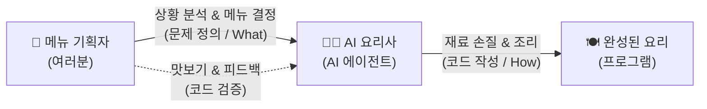

이 다이어그램은 우리가 지향해야 할 AI와의 협업 구조를 명확히 보여줘요. 사람이 기획하고 AI가 실행하며, 사람은 다시 그 결과를 꼼꼼히 검증하는 순환 고리가 과정 전체를 관통하는 핵심입니다.

---


### 🎨 추가 시각화 (Visualization Packet)

**AI-Human 협업 워크플로우**

기획(인간) -> 생성(AI) -> 검증/수정(인간)의 반복 사이클을 보여줍니다.

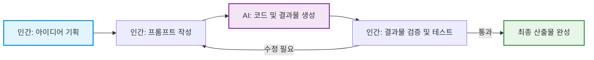

## §3. 상세 내용

### Why — 왜 이 세션이 필요한가?

수강생들은 무의식적으로 "파이썬 기초 과정이니까 코딩 문법부터 빨리 배워야지"라는 과거의 프레임에 갇혀 있기 쉬워요. 이 프레임을 초반에 깨고 "나는 코더가 아니라 기획자가 되러 왔다"는 마인드셋을 확실히 심어주지 않으면, 이후 과정에서 AI를 활용하기보다 혼자 코드를 짜려고 끙끙대는 실수를 범하게 됩니다. 따라서 사전 교육의 내용을 이 시점에 확실하게 쐐기를 박듯 복습하는 것이 필수적이에요.

### What — 이 세션에서 다루는 것은 무엇인가?

"AI 시대의 서사"를 구성하는 세 가지 핵심 개념을 다룹니다.

첫째, 문제 정의(What/Why)가 문제 해결(How)보다 압도적으로 중요하다는 점입니다. 어떻게 구현할지가 아니라 무엇을 만들지가 핵심 질문이 됩니다. 달성하고자 하는 목적과 조건을 명확한 명세서로 표현하는 능력이 새로운 핵심 언어로 자리 잡았어요.

둘째, 패러다임의 여정입니다. 기계어에서 어셈블리어, C, 자바를 거쳐 이제는 파이썬을 넘어 "자연어"로 코딩하는 시대에 이르렀습니다. 단순한 코드 자동완성을 넘어, 에이전트가 주도적으로 계획하고 실행하는 에이전트 주도 개발 시대로 진입했다는 거대한 흐름을 확인합니다.

셋째, AI의 진짜 역할입니다. AI는 단순한 자동완성 도구나 번역기가 아니라, 명확한 지시가 필요한 새로운 '팀원'이라는 사실을 받아들여야 합니다.

### How — 구체적으로 어떻게 진행하는가?

강사가 요리사와 메뉴 기획자 비유를 통해 핵심 메시지를 던진 후, 수강생들이 직접 일상적인 비즈니스 상황인 쇼핑몰 장바구니 기능을 상상하며 브레인스토밍하는 토론 실습으로 이어집니다. 이를 통해 단순히 지시를 내리는 것을 넘어 '문제 정의'가 생각보다 만만치 않으며, 다양한 맥락을 파악하고 기획하는 일은 인간만이 할 수 있는 고유의 영역임을 스스로 깨닫게 만듭니다.

---

## §4. 실습 가이드 (+ 🎙️ 실습 대본)

### 실습 목표

AI에게 모호하게 지시했을 때 발생할 수 있는 문제점을 스스로 찾아보고, 놓칠 수 있는 것들을 빈틈없이 생각해내는 비즈니스 기획력의 중요성을 체감하는 것이 목표입니다. 이 과정에서 자연스럽게 문제 정의 능력을 훈련하게 됩니다.

🎙️ **실습 가이드 대본 (Lab Guide)**:

> 자, 앞서 말씀드린 세 가지 핵심을 일상에서 직접 느껴봅시다. 아주 간단한 브레인스토밍을 해볼게요. 만약 여러분이 AI 요리사에게 "우리 쇼핑몰에 장바구니 하나 만들어줘"라고 단순하게 지시했다고 상상해 보세요. AI는 아주 기본적인 장바구니 코드를 뚝딱 만들어줄 겁니다. 
> 
> 그런데 이렇게 뚝딱 나온 코드로 실제 쇼핑몰을 운영하면 과연 어떤 일이 벌어질까요? 잠깐 옆 분과 토론해 봅시다. "AI에게 장바구니를 시켰을 때, 기획자인 우리가 미리 챙겨주지 않으면 AI가 알아서 반영하지 못할 비즈니스 정책이 뭐가 있을까요?" 딱 1분만 이야기해 보세요. 
> 
> (1분 후) 네, 좋습니다. 아주 훌륭한 의견들이 많이 들리네요. 비로그인 사용자가 담으면 어떡하죠? 로그인하면 기존 장바구니와 합쳐야 할까요? 재고가 0인 상품은 담기게 둘 건가요? 동시에 100명이 마지막 남은 한 개를 담으면요? 배송비나 쿠폰 적용 순서는 누가 정할까요? 
> 
> 이런 수많은 "만약에"를 AI는 스스로 생각해 내지 않습니다. 바로 이것이 "문제를 정의하는 힘"이에요. 우리가 이 과정에서 키울 가장 핵심적인 근육은 파이썬 문법 암기가 아니라, 놓칠 수 있는 것들을 빈틈없이 생각해내는 꼼꼼한 기획력입니다. 언어가 파이썬이든 자바스크립트든, 고객이 진짜 원하는 것을 파악하는 능력만큼은 영원히 사람의 몫일 거예요.

### 단계별 지시

| 단계 | 소요 시간 | 강사 지시사항 | 학습자 액션 | 예상 결과 |
|------|----------|--------------|------------|----------|
| 1 | 1분 | "장바구니 기능에서 놓치기 쉬운 정책이 뭘까요? 짝과 논의해 보세요." | 짝과 상황 가정 및 브레인스토밍 | 다양한 비즈니스 예외 상황 도출 |
| 2 | 2분 | 의견 청취 및 피드백 공유 | 자발적 발표 및 의견 나눔 | 문제 정의의 복잡성 뼈저리게 인지 |
| 3 | 1분 | 문제 정의의 중요성(기획력)으로 결론 맺기 | 경청 및 핵심 메모 | AI 시대의 본인 역할 체화 |

### 트러블슈팅 FAQ

| Q | A |
|---|---|
| 수강생들이 비즈니스 정책 예시를 잘 떠올리지 못해요 | 강사가 먼저 가벼운 힌트를 주세요. "여러분이 평소에 인터넷 쇼핑을 할 때, 품절된 상품은 장바구니에 바로 담기던가요?" 같은 일상적 경험을 자극하면 아주 좋습니다. |
| "저는 기획자가 아닌데 왜 이걸 해야 하죠?"라고 묻는다면 | "AI 시대에는 코딩 도구 자체가 강력해지면서 모든 개발자가 필연적으로 기획자의 역할을 겸하게 됩니다. AI에게 일을 시키는 것 자체가 이미 기획의 영역이기 때문이에요."라고 설명해 주세요. |

---


### 🎓 강사 노트 (Instructor Support)

- ⏱️ **타이밍**: 09:20 (20분, narrative)
- 🎯 **핵심 활동**: "AI 시대의 서사" 3가지 핵심 복습
- ⚠️ **강사 주의사항**: "기억나시죠?"로 참여 유도

## §5. 코드 및 명령어 모음

해당 없음

> 이 세션은 AI 시대를 맞이하는 마인드셋 정립과 대화 기반의 실습 중심입니다. 본격적인 컴퓨터 앞에서의 코딩 환경 구축은 세션 004부터 시작됩니다.

---

## §6. 요약

### 핵심 학습 포인트

이번 세션의 핵심 메시지는 세 줄로 요약됩니다. 
첫째, 문제 정의(What/Why)가 문제 해결(How)보다 압도적으로 중요해졌습니다. 
둘째, 코딩은 이제 기계의 언어가 아닌 자연어 시대로 진입했으며, 에이전트가 주도하는 개발이 현실이 되었습니다. 
셋째, AI는 단순한 도구가 아니라 우리의 든든한 팀원입니다. 우리는 더 이상 주방에서 칼질만 하는 요리사가 아니라, 큰 그림을 그리고 전체 메뉴를 총괄하는 기획자입니다. 말이 되어야 프로그램이 된다는 철학을 꼭 기억해 주세요.

### 다음 세션 예고

그렇다면 훌륭한 메뉴 기획자가 되려면 어떻게 훈련을 해야 할까요? 무작정 주방에 들어가서 감으로 요리해보면 실력이 늘까요? 다음 세션에서는 우리가 5일 동안 사용할 아주 효과적인 학습 방법론을 소개하고, 명세 주도 개발(SDD)이 무엇인지 맛보기를 경험해 볼 것입니다.

### 브릿지 노트

> "우리가 요리사가 아니라 메뉴 기획자라는 사실, 이제 확실히 와닿으시죠? 그렇다면 메뉴 기획자는 어떻게 훈련을 해야 할까요? 무작정 주방에 들어가서 요리해보면 될까요? 다음 시간엔 우리가 5일 동안 사용할 아주 효과적인 학습 훈련법을 소개해 드릴게요."

---

## §7. 참고 자료

### 3-Source 출처

- **Source A (로컬 참고자료)**: 「AI 시대의 서사 v3 - Claude.md」 — 말이 되어야 프로그램이 된다는 과정 철학, 요리사(AI)와 메뉴 기획자(사람)의 분업 구조 비유 원전입니다. 강사 대본의 핵심 스토리가 이 문서에서 발췌되었습니다.
- **Source B (NotebookLM)**: NotebookLM 분석 리포트 — 코딩 문법 암기에서 비즈니스 맥락 파악 및 시스템 설계 능력으로 경쟁력이 이동하고 있음을 분석한 자료입니다. 쇼핑몰 장바구니 예외 상황 브레인스토밍 실습의 구체적 근거를 제공했습니다.
- **Source C (Deep Research)**: Deep Research 보고서 — 단순 코드 자동완성에서 에이전트 주도 개발(Agentic Coding)로의 패러다임 전환 트렌드를 반영했으며, AI를 팀원으로 대하는 오케스트레이션 개념의 기초 자료로 활용되었습니다.

### 강사 노트

> 💡 **강사 노트**: 본 세션의 내용은 「AI 시대의 서사 v3 - Claude.md」(Source A)의 요리사/메뉴 기획자 비유를 기반으로 구성하였으며, NotebookLM 분석(Source B)의 장바구니 비즈니스 맥락 사례와 Deep Research 보고서(Source C)의 에이전트 주도 개발 트렌드를 엮었습니다. 팩트 패킷의 핵심 스크립트 포인트인 "여러분, 코드는 코더가 짭니다. 이제 여러분은 코더가 아니라 기획자이자 팀 리더입니다."라는 대사를 전달할 때, 매우 단호하고 명확한 어조로 강조해 주시면 수강생들의 주의를 효과적으로 끌 수 있습니다.

---

## ✅ 세션 완료 체크리스트 (강사용)

- [x] §1~§7 모든 섹션이 템플릿에 맞춰 충실하게 작성되었는가?
- [x] 요리사와 메뉴 기획자 비유가 강사 대본에 생생하게 확장 반영되었는가?
- [x] 장바구니 브레인스토밍 기반의 실습 가이드가 포함되었는가?
- [x] 3-Source 팩트 패킷 내용과 출처가 충실히 반영되었는가?

---

*작성 일시: 2026-02-25*  
*작성 에이전트: A4B_Session_Writer*  
*교안 구조: 7섹션 (A0 팀 공통 표준)*

> 🔗 **이전 세션**: [세션 001: 과정 로드맵과 아이스브레이킹](#세션-001)에서 배운 내용을 이어갑니다.
> 🔗 **다음 세션**: [세션 003: 학습 방법론과 SDD 미리보기](#세션-003)에서 계속됩니다.

---

### 세션 003: 학습 방법론과 SDD 미리보기
> [원본 파일](sessions/세션-003-학습_방법론과_SDD_미리보기_v2.1.md) | ⏱️ 20분 | 📖 narrative | 난이도: low

> **세션 ID**: MS-PY101-003  
> **소요 시간**: 20분  
> **난이도**: low  
> **청크 타입**: narrative  
> **버전**: v2.1 (7섹션 구조)

---

## §1. 개요

> **Day 1 | AM | 세션 003/022**

이 세션은 본격적으로 코딩 실습에 들어가기 전에 우리가 반드시 갖춰야 할 아주 중요한 훈련 방식을 세팅하는 시간입니다. 앞선 시간에서 우리는 메뉴 기획자와 요리사의 새로운 협업 구도를 확인했어요. 사람이 해야 할 일은 시스템의 방향을 설계하는 것이고, AI가 해야 할 일은 그 설계에 맞추어 실제 코드를 짜내는 일이라는 점을 분명히 했습니다.

하지만 기획자가 되기로 마음먹었다고 해서 하루아침에 훌륭한 기획서가 나오지는 않습니다. 운전면허를 따기 위해 먼저 교통법규를 배우고, 코스 주행을 거친 뒤 도로에 나가는 것처럼 우리에게도 체계적인 훈련법이 필요합니다. 앞으로 5일 동안 이어질 여정에서 여러분이 무기처럼 들고 다닐 두 가지 강력한 방법론, 즉 능동적 코드 읽기 훈련인 '예측, 검증, 설명' 사이클과 문서 중심의 개발 방식인 '명세 주도 개발'을 오늘 미리 만나보겠습니다. 

이 짧은 20분이 여러분의 앞으로의 코딩 습관, 더 나아가 평생 AI와 협업하는 방식을 근본적으로 바꿔놓을 것입니다. 

### 🎯 학습 목표

이 세션이 끝나면 수강생은 다음을 할 수 있어요:

* AI가 만들어준 코드를 받았을 때, 무작정 실행 버튼부터 누르지 않고 반드시 예측하고 검증하고 설명하는 능동적인 코드 읽기 습관을 들일 수 있습니다.
* 느낌 가는 대로 대충 개발하는 '바이브 코딩'의 치명적인 한계를 깨닫고, 꼼꼼한 설계도 중심의 체계적인 개발 방법론이 필요한 이유를 설명할 수 있습니다.
* 코드를 무에서 유로 타이핑하는 것보다, 남이 짠 코드를 읽어내고 전체 시스템 구조를 설계하는 일이 훨씬 더 중요한 시대임을 인식하고 학습 태도를 전환할 수 있습니다.

### 선행 세션 환기

바로 앞 세션인 'AI 시대의 서사 핵심 복습'에서 우리는 메뉴 기획자와 요리사의 비유를 통해 각자의 역할을 아주 선명하게 나누었습니다. 비즈니스의 맥락을 파악하고 달성하고자 하는 목적을 논리적이고 명확한 명세서로 표현하는 능력이, 바로 이 시대 소프트웨어 개발의 새로운 언어라는 사실을 배웠죠 [Source B].

이번 시간에는 그 '명세서'라는 것을 실제 개발 환경에서 어떻게 다루어야 하는지 구체적인 훈련법으로 연결합니다. 전 시간에 다루었던 철학적인 이야기를 이제 우리 손끝의 실제 행동 지침으로 바꿀 차례입니다.

---

## §2. 핵심 개념 (+ 🗣️ 강사 대본 + Mermaid)

### 바이브 코딩의 찰흙 인형 집과 SDD의 10층 빌딩

최근 실리콘밸리나 각종 개발 커뮤니티에서 아주 심심치 않게 들려오는 단어가 하나 있습니다. 바로 '바이브 코딩'이라는 신조어예요. 바이브라는 말 그대로 느낌 가는 대로, 감에 의존해서 척척 코딩하는 방식을 뜻합니다. AI에게 대충 이런 기능을 만들어 달라고 말한 뒤, 코드가 튀어나오면 일단 실행부터 해보는 겁니다. 그러다 에러가 나면 그 에러 메시지를 다시 AI에게 던져주고 고쳐달라고 핑퐁을 치는 식이죠. 

아주 간단한 작업이거나 혼자 재미로 장난감을 만들 때는 이 방식이 엄청나게 빠르고 효율적일 수 있습니다. 하지만 문제는 프로젝트의 크기가 조금만 커져도 이 방식이 곧바로 치명적인 한계를 드러낸다는 점이에요. 

이 상황을 건축에 비유해 보겠습니다. 찰흙으로 조그마한 인형 집을 하나 만들 때는 굳이 정밀한 설계도 같은 것이 필요하지 않아요. 대충 느낌대로 뼈대를 세우고 찰흙을 뭉쳐서 지붕을 얹어도 제법 그럴듯한 모양이 나옵니다 [Source C]. 그런데 만약 여러분이 10층짜리 진짜 상업용 빌딩을 짓는다고 상상해 보세요. 설계도도 없이 "1층은 대충 이쯤 높이로 올리고, 2층은 좀 더 넓게 가보자"라며 감으로 쌓아 올리면 어떻게 될까요? 십중팔구 3층쯤 올라갔을 때 기둥이 하중을 견디지 못하고 무너지기 시작할 겁니다. 배관이 엉키고, 비상구를 빼먹고, 나중에는 어디서부터 잘못되었는지조차 알 수 없게 됩니다.

바이브 코딩이 딱 이런 문제를 가지고 있어요. 간단한 기능에서는 코드가 팽팽하게 잘 돌아가지만, 프로그램이 조금만 복잡해지면 예측 불가능한 버그가 사방에서 터져 나옵니다 [Source B][Source C].

우리는 이 험난한 길을 피하기 위해 완전히 다른 노선을 탈 것입니다. 건물을 올리기 전에 설계도를 먼저 꼼꼼하게 그리는 방식, 이것을 가리켜 명세 주도 개발이라고 부릅니다. 영어로는 SDD, 즉 Specification-Driven Development의 약자입니다. 여기서 말하는 명세란 "이 프로그램은 어떤 목적을 가지고 있으며, 어떤 조건에서 어떻게 동작해야 하고, 예외적인 상황이 발생했을 때는 어떤 에러를 보여주어야 한다"는 내용이 글로 명확히 정리된 문서를 말해요. AI는 바로 이 튼튼한 설계도를 기반으로 건물을 짓습니다 [Source A][Source C]. 설계도가 정교할수록 건물도 무너질 염려 없이 튼튼하게 세워지는 것이죠.

### 예측, 검증, 설명의 학습 사이클 (POE)

좋은 설계도로 튼튼한 건물을 지었다고 끝이 아니에요. 건물이 설계도대로 잘 지어졌는지, 혹시 빼먹은 철근은 없는지 확인하는 감리 과정이 필요합니다. 이때 우리가 쓸 두 번째 무기가 바로 POE 사이클입니다. 예측(Predict), 검증(Observe), 설명(Explain)의 앞 글자를 딴 실전 훈련법이에요. 

이 사이클의 핵심은 단 하나입니다. 실행 버튼을 무작정 누르고 싶은 충동을 참는 거예요. 코드를 먼저 눈으로 차분히 읽으면서 실행 결과를 미리 예측해 보는 이 훈련이, 여러분의 문제 해결 능력을 비약적으로 끌어올려 줄 것입니다 [Source B][Source C].

🗣️ **강사 대본 (Instructor Script)**:

> 자, 여러분, 건물을 지을 때 가장 중요한 게 무엇일까요? 바로 설계도입니다. 요즘은 AI가 코드를 너무 순식간에 잘 짜주니까, 많은 분들이 설계도 없이 곧바로 코딩을 시작하는 유혹에 빠집니다. 이것을 우리는 바이브 코딩이라고 불러요. 인형 집을 지을 때는 이 방식이 꽤 잘 통합니다. 하지만 우리가 앞으로 5일 동안 땀 흘리며 만들 고객 관리 프로그램은 조잡한 인형 집이 아니라, 비즈니스가 굴러가는 제대로 된 건물이에요.
> 
> 그래서 우리는 SDD, 즉 명세 주도 개발이라는 정공법을 쓸 겁니다. 파이썬 코드를 냅다 만지작거리는 대신 "이 프로그램은 어떤 기능이 있어야 하고, 사용자가 이상한 문자를 입력하면 어떤 메시지로 경고해줘야 해"라고 우리말로 된 설계도를 먼저 쓸 거예요. 문서가 바뀌면 코드가 바뀌고, 문서가 정확하면 코드도 정확해지는 기분 좋은 마법을 경험하시게 될 겁니다 [Source A][Source C].
> 
> 그리고 또 한 가지, 여러분에게 꼭 당부하고 싶은 아주 중요한 대원칙이 있습니다. 바로 '이해 없는 복사 붙여넣기 절대 금지' 원칙이에요 [Source B][Source C]. AI가 훌륭한 코드를 척척 만들어 줬을 때, 무작정 실행 버튼부터 누르는 습관을 오늘부로 완전히 버려야 합니다. 
> 
> 딱 3초. 딱 3초만 멈춰서 화면을 쳐다보세요. "내가 이 코드를 실행하면 화면 맨 밑에 과연 어떤 글자가 뜰까?" 스스로 예측해 보는 겁니다. 그 예측을 마친 뒤에 당당하게 실행 버튼을 눌러 결과를 눈으로 확인하고, 왜 그런 결과가 나왔는지 자신의 말로 설명해 보는 거예요. Run 버튼을 맹목적으로 누르는 그 손가락을 잠시 멈추세요. 코드가 어떤 결과를 낼지 예측해 보는 바로 그 3초의 순간에, 여러분의 진짜 디버깅 근육이 폭발적으로 자라납니다 [Source B][Source C].

### Mermaid 다이어그램

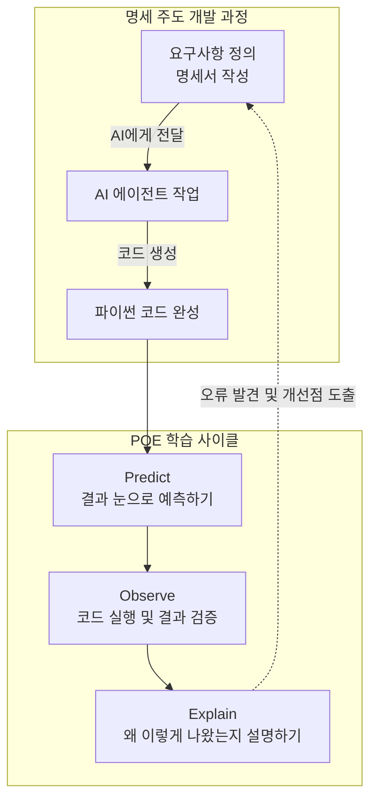

이 다이어그램은 앞으로 우리가 코드를 다룰 때 거치게 될 전체 흐름을 한 장으로 보여줍니다. 요구사항을 명확히 정의해서 설계도를 만들면 AI가 파이썬 코드를 생성하고, 우리는 그 코드를 예측하고 검증하고 설명하는 순환 고리 안에서 움직이게 됩니다. 오류가 발견되면 코드를 직접 뜯어고치는 것이 아니라, 다시 설계도인 명세서로 돌아가서 문제를 바로잡는 구조입니다.

---


### 🎨 추가 시각화 (Visualization Packet)

**예측-검증-설명 (POE) 학습 사이클**

코드를 무작정 실행하지 않고, 먼저 예측한 후 검증하는 올바른 학습 방법을 나타냅니다.

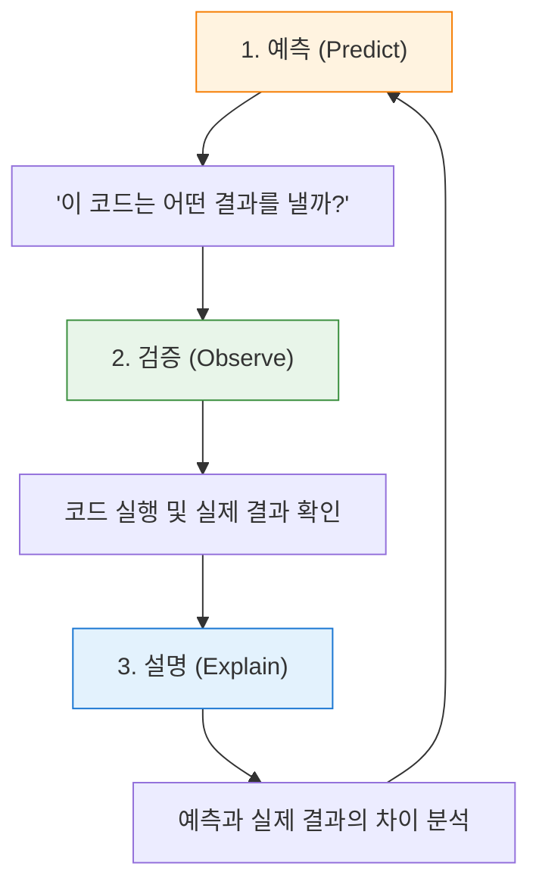

## §3. 상세 내용

### Why: 왜 바이브 코딩을 피하고 이 방법론을 택해야 하는가?

AI 기술이 폭발적으로 발전하면서 코드를 작성하는 순수 비용은 이제 0에 가깝게 수렴하고 있습니다. 불과 몇 년 전만 해도 파이썬 문법의 대소문자를 틀리면 화면에 글자 하나조차 띄울 수 없었어요. 하지만 이제는 한국어로 지시만 내리면 수백 줄짜리 코드가 1초 만에 만들어지는 시대가 왔습니다. 

이런 거대한 파도 속에서 개발자의 진짜 실력을 가르는 기준점은 완전히 달라졌습니다. 코드를 '오타 없이 타이핑하는' 능력에서, AI가 뱉어낸 코드를 '빠르게 읽고 정확히 검증하는' 능력으로 무게 중심이 완전히 옮겨간 것이죠 [Source C].

바이브 코딩처럼 결과물만 보고 "돌아가면 그만"이라는 습관이 들면, 나중에 치명적인 에러가 터졌을 때 어디서부터 손을 대야 할지 전혀 모르는 끔찍한 상황에 빠지게 됩니다. 내가 직접 구상하고 짠 코드가 아니기 때문에 시스템의 뼈대를 이해하지 못하는 탓입니다. 따라서 스스로 생각하는 힘을 기르고 거대한 시스템을 통제하기 위해서는 설계도를 먼저 그리는 SDD와, 코드를 눈으로 해부하는 POE 사이클이 이 과정 내내 숨 쉬듯 자연스럽게 이어져야 합니다.

### What: 명세 주도 개발과 POE의 본질

첫 번째 핵심 무기인 SDD의 본질은, 우리가 작성하는 요구사항 명세서를 개발의 유일한 진실 원천(Single Source of Truth)으로 삼는다는 점입니다 [Source C]. 진실 원천이라는 말이 학술적으로 들릴 수 있는데, 쉽게 말해 '모든 판단과 수정의 기준이 되는 단 하나의 진짜 문서'라는 뜻이에요. 코드가 꼬이거나 에러가 났을 때 파이썬 코드를 직접 뜯어고치려고 끙끙대는 것은 예전 방식입니다. 이제 우리는 명세서로 다시 돌아가서 논리의 구멍을 찾고 그 문서를 수정한 뒤, AI에게 다시 코드를 짜달라고 요청하는 구조를 가져갈 것입니다. 

두 번째 무기인 POE 사이클은 일종의 강력한 메타인지 훈련법입니다. 메타인지란 내가 무엇을 확실히 알고 있고, 무엇을 아직 모르는지 스스로 객관적으로 파악하는 능력이에요. 코드를 대충 눈으로 훑고 무작정 실행 버튼을 누르면, 컴퓨터가 정답을 친절하게 뱉어주기 때문에 마치 내가 그 코드를 완벽하게 이해했다고 착각하기 쉽습니다. 하지만 실행하기 전에 3초 동안 미리 결과를 예측해 보는 순간 진실이 드러납니다. 내 머릿속의 논리와 실제 컴퓨터가 작동하는 논리가 어디서 엇갈리는지, 돋보기로 보듯 정확하게 짚어낼 수 있기 때문입니다 [Source B].

### How: 5일간 이 무기를 어떻게 휘두를 것인가?

이론은 거창해 보일지 몰라도 실천 방법은 의외로 단순하고 직관적입니다. 앞으로 우리는 새로운 기능을 추가하거나 기존의 고객 관리 프로그램을 업그레이드할 때 절대 빈 화면을 띄워놓고 곧바로 코드를 타이핑하지 않을 겁니다. 그 대신 마크다운이라는 읽기 편한 텍스트 형식으로 "사용자 이름을 먼저 입력받는다. 만약 문자가 아닌 숫자가 들어오면 즉시 오류 메시지를 띄운다" 같은 꼼꼼한 규칙을 적어 내려가는 것부터 시작합니다.

그리고 AI가 그 규칙을 멋진 코드로 번역해서 가져오면, 여러분은 키보드와 마우스를 잠시 테이블 위에 내려놓고 화면을 뚫어지게 쳐다봐야 합니다. 한 줄 한 줄 눈으로 따라가면서 "아, 여기에는 사용자 이름인 홍길동이 들어가겠구나. 그리고 이 줄에서는 그 데이터를 이렇게 계산하니까, 결국 화면에는 이런 모양의 문장이 최종적으로 나오겠군" 하고 스스로 중얼거려 보는 겁니다. 이 두 가지 원칙만 5일 내내 철저하게 지켜낸다면, 여러분은 과정이 끝날 무렵 세상을 완전히 다른 시야로 보게 될 것입니다.

---

## §4. 실습 가이드 (+ 🎙️ 실습 대본)

### 실습 목표

이 세션의 실습은 아주 짧고 간단한 파이썬 코드를 눈으로 직접 읽어보면서 방금 배운 POE 사이클을 작게나마 체험해 보는 미니 활동입니다. 아직 컴퓨터에 개발 환경을 세팅하지 않아도 전혀 상관없어요. 강사가 빔프로젝터 화면에 띄워주는 코드를 보고 결과를 머릿속으로 추론하면서, '코드를 능동적으로 읽는다는 것'이 어떤 느낌인지 그 감각을 일깨우는 것이 이번 실습의 주된 목표입니다.

🎙️ **실습 가이드 대본 (Lab Guide)**:

> 자, 아직 우리 컴퓨터에는 파이썬이 안 깔려 있지만 제 화면에 아주 간단한 코드 다섯 줄을 띄워 두었습니다. 지금부터 딱 1분만 드릴게요. 옆에 앉으신 분과 함께 화면의 코드를 천천히 읽어보세요. 
> 
> 변수라는 이름표가 붙은 그릇에 어떤 데이터가 담기는지, 더하기와 빼기 같은 연산은 어떻게 흘러가는지 눈으로 따라가 보는 겁니다. 다 읽으셨다면 이 코드를 실행했을 때 화면 맨 밑에 어떤 문장이 완성되어서 출력될지 각자 머릿속으로 예측해 보세요. 확신이 들면 옆 분에게 살짝 말씀해 주셔도 좋습니다.
> 
> (1분 후)
> 
> 다들 예측하셨나요? 그럼 제가 여러분을 대신해서 직접 실행 버튼을 꾹 눌러보겠습니다. 네, 결과는 "홍길동님의 나이는 31세입니다." 라고 나오네요. 자, 여러분이 처음 예측한 결과와 이 화면의 결과가 똑같이 나왔나요? 만약 맞추셨다면, 옆 분을 보시고 "왜 31이라는 숫자가 나왔는지" 딱 한 줄로 명쾌하게 설명해 보세요. 
> 
> 네, 맞습니다. 올해 연도인 2026에서 태어난 해인 1995를 뺐기 때문이죠 [Source B]. 정말로 아주 단순한 초등학교 산수 같지만, 방금 여러분이 함께 해주신 이 과정이 바로 실리콘밸리의 최고급 엔지니어들이 매일 반복하고 있는 코드 리뷰의 가장 기본적이고 핵심적인 단계입니다.

### 단계별 지시

| 단계 | 소요 시간 | 강사 지시사항 | 학습자 액션 | 예상 결과 |
|------|----------|--------------|------------|----------|
| 1 | 1분 | 화면의 5줄 코드를 제시하고 정독 유도 | 코드 정독 및 전체적인 논리 흐름 파악 | 코드에 대한 막연한 두려움 완화 |
| 2 | 1분 | 짝과 함께 실행 결과 예측하기 지시 | 변수에 실제 값을 대입하며 결과 추론 | 논리적 사고 과정의 활성화 |
| 3 | 1분 | 강사가 코드 실행 후 빔프로젝터로 결과 검증 | 자신의 머릿속 예측과 실제 화면의 출력 비교 | 예측의 정확성 여부 즉각 확인 |
| 4 | 2분 | 결과가 왜 그렇게 도출되었는지 설명 유도 | 연산 과정을 말로 풀어서 동료에게 설명 | 메타인지 강화 및 원리 내재화 [Source B] |

### 트러블슈팅 FAQ

| Q | A |
|---|---|
| 수강생이 영어로 된 `year`, `birth` 같은 변수명에 겁을 먹으면 어떻게 대처하나요? | 변수명은 그저 투명한 그릇에 붙인 이름표일 뿐이라는 점을 다정하게 상기시켜 주세요. `name`을 '이름표', `year`를 '올해 연도표'로 한글로 치환해서 읽어보라고 권유하면 훨씬 쉽게 받아들이고 웃으며 진행할 수 있습니다. |
| 결과 예측을 아예 틀리는 수강생이 나와서 당황하면 어쩌죠? | 틀리는 것은 아주 자연스럽고 훌륭한 현상이라고 즉각 격려해 주세요. 컴퓨터의 기계적인 연산 순서와 사람의 직관이 다를 수 있다는 그 차이점을 직접 배우는 것이 이 훈련의 가장 핵심적인 목적입니다. |
| "왜 이렇게 쉬운 산수를 굳이 길게 설명하나요?"라고 묻는다면요? | 지금은 5줄짜리 귀여운 코드지만, 모레 보게 될 100줄짜리 코드에서도 똑같은 논리 방식이 적용된다는 점을 단호하게 짚어주세요. 덤벨 무게가 가벼울 때 폼을 완벽하게 교정해야 나중에 무거운 바벨을 부상 없이 들 수 있습니다. |

> ✅ **체크포인트**: 코드 실행 버튼을 누르기 전에 반드시 거쳐야 하는 '3초의 멈춤과 침묵', 그 예측 과정의 엄청난 힘을 완전히 체감하셨나요?

---


### 🎓 강사 노트 (Instructor Support)

- ⏱️ **타이밍**: 09:40 (20분, narrative)
- 🎯 **핵심 활동**: 예측→검증→설명 사이클, SDD 소개
- ⚠️ **강사 주의사항**: 사이클을 칠판/화면에 고정 표시

## §5. 코드 및 명령어 모음

본 세션의 미니 실습에서 화면에 띄운 파이썬 스니펫입니다. 아직 파이썬 문법을 본격적으로 배우기 전이므로, 코드의 형태를 눈에 익히고 데이터가 흘러가는 전체적인 구조를 가볍게 파악하는 용도로만 활용합니다.

```python
# POE 사이클 능동적 훈련을 위한 예제 코드
name = "홍길동"
year = 2026
birth = 1995

# 나이를 계산하는 핵심 로직
age = year - birth

# 계산 결과를 텍스트로 예쁘게 출력
print(f"{name}님의 나이는 {age}세입니다.")
```

이 코드는 소프트웨어 프로그램의 가장 기본적이고 영원한 형태인 '입력 처리 출력'의 3단계 구조를 아주 명확하게 보여줍니다. 위 세 줄은 필요한 데이터를 그릇에 담아 준비하는 입력 과정이고, 네 번째 줄은 데이터를 가공하고 계산하는 처리 과정이며, 마지막 줄은 최종 가공된 결과를 화면에 보여주는 출력 과정이에요. 앞으로 우리가 5일 동안 만들 모든 프로그램은 크기와 덩치만 다를 뿐 이 기본 골격을 완전히 똑같이 따라가게 됩니다.

---

## §6. 요약

### 핵심 학습 포인트

이번 세션에서 여러분의 머릿속에 반드시 심어두어야 할 핵심 무기 두 가지를 마지막으로 짚어보겠습니다. 

첫째, 명세 주도 개발입니다. AI에게 대충 던져주고 결과만 기다리는 바이브 코딩의 유혹에서 벗어나세요. 꼼꼼한 요구사항 명세서를 먼저 작성하고 오직 이것만을 개발의 진실 원천으로 삼는 튼튼한 건축법을 써야 건물이 무너지지 않습니다. 

둘째, 예측 검증 설명으로 이어지는 POE 사이클입니다. AI가 화면에 코드를 뱉어냈을 때 절대 무작정 실행 버튼부터 누르지 마세요. 3초 동안 멈춰서 어떻게 동작할지 예측하고, 실행해서 내 눈으로 결과를 검증하고, 왜 그런 결과가 튀어나왔는지 내 언어로 똑똑히 설명하는 과정을 거쳐야 진짜 코딩 근육이 붙습니다 [Source B][Source C]. 그리고 무엇보다 중요한 단 하나의 철칙, '내가 이해하지 못한 코드를 복사해서 붙여넣는 일은 영원히 금지'입니다.

### 다음 세션 예고

이제 훈련 방법과 태도 세팅도 완벽하게 끝났습니다. 무기를 쓰는 법을 제대로 배웠으니 이제 진짜 무기를 우리 손에 쥘 차례입니다. 다음 세션에서는 구글에서 심혈을 기울여 만든 최신 에이전트 기반 통합 개발 환경, 즉 개발자들의 최첨단 사무실이라고 부를 수 있는 'Antigravity'를 우리 컴퓨터에 직접 다운로드하고 설치해 보겠습니다. 

### 브릿지 노트

> "자, 우리가 5일 동안 어떤 태도와 시선으로 코드를 다루어야 할지 확실히 아셨죠? 예측하고, 검증하고, 설명하는 이 세 박자의 사이클만 기억하시면 됩니다. 그럼 이제 머리를 충분히 썼으니 직접 손을 움직여 볼까요? 본격적으로 여러분만의 쾌적한 작업 공간을 꾸리기 위해 Antigravity IDE 설치 여정을 시작하겠습니다."

---

## §7. 참고 자료

### 3-Source 출처

* **Source A (로컬 참고자료)**: `AI 시대의 서사 v3 - Claude.md`  
  명세 주도 개발의 개념, 요구사항 문서를 작성하고 요리사와 메뉴 기획자의 역할을 구분하는 철학적 배경을 강사 대본으로 녹여내어 발췌하였습니다.
* **Source B (NotebookLM)**: NotebookLM 분석 리포트  
  무작정 코드를 실행하지 않고 예측 검증 설명을 거치는 능동적 학습 원칙, 그리고 이해 없는 복사 붙여넣기 금지 규칙의 강력한 교육학적 근거를 참고했습니다.
* **Source C (Deep Research)**: Deep Research 보고서  
  느낌대로 코딩하는 바이브 코딩의 근본적인 한계 분석과, 명세서를 진실 원천으로 삼아 에이전트 주도 개발로 넘어가는 최신 개발 패러다임 트렌드를 반영하였습니다.

### 강사 노트

> 💡 **강사 노트**: 본 세션은 과정 전체의 학습 태도를 세팅하는 아주 중요한 앵커 역할을 수행합니다. 특히 바이브 코딩과 명세 주도 개발을 찰흙 인형 집과 10층 상업용 빌딩으로 강렬하게 대비시키는 비유는 수강생들이 가장 직관적으로 이해할 수 있는 포인트이므로 이 부분을 힘주어 설명해 주세요. 또한 미니 실습을 진행할 때, 수강생들이 스스로 '아, 내가 코드를 읽어낼 수 있구나'라는 작은 성공 경험을 짜릿하게 맛보게 해주는 것이 중요합니다. 너무 뻔하고 쉬운 답이라도 박수치고 환호하며 교실 전체의 성취감을 끌어올려 주시면 이후 수업의 집중도가 크게 올라갑니다.

---

## ✅ 세션 완료 체크리스트 (강사용)

* [ ] §1~§7 모든 섹션이 빠짐없이 충분한 분량으로 작성되었는가?
* [ ] 바이브 코딩과 빌딩 건축의 비유가 강사 대본에 자연스럽게 녹아들었는가?
* [ ] POE 사이클의 3단계 개념이 초보자의 눈높이에서 명확하게 전달되었는가?
* [ ] 미니 실습을 통해 수강생들이 코드 읽기의 첫 감각을 성공적으로 잡았는가?
* [ ] 3-Source 팩트 패킷의 내용이 정확하게 반영되고 본문에 인용 표기되었는가?

---

*작성 일시: 2026-02-25*  
*작성 에이전트: Sisyphus-Junior*  
*교안 구조: 7섹션 (A0 팀 공통 표준)*

> 🔗 **이전 세션**: [세션 002: AI 시대의 서사 핵심 복습](#세션-002)에서 배운 내용을 이어갑니다.
> 🔗 **다음 세션**: [세션 004: Antigravity 설치와 시연](#세션-004)에서 계속됩니다.

---

### 세션 004: Antigravity 설치와 시연
> [원본 파일](sessions/세션-004-Antigravity_설치와_시연_v2.1.md) | ⏱️ 25분 | 🧪 lab | 난이도: low

> **세션 ID**: MS-PY101-004  
> **소요 시간**: 25분  
> **난이도**: low  
> **청크 타입**: lab  
> **버전**: v2.1 (7섹션 구조)

---

## §1. 개요

> **Day 1 | AM | 세션 004/022**

이 세션은 5일간의 실습을 함께할 핵심 파트너인 'Antigravity IDE'를 여러분의 컴퓨터에 처음으로 설치하고 시연하는 시간이에요. 앞선 세션들에서 '네비게이션'과 '요리사' 비유를 통해 AI-native 개발이 무엇인지 철학적인 배경을 다졌다면, 이제는 그 철학을 실천할 진짜 도구를 손에 쥐는 순간입니다. 

### 🎯 학습 목표

이 세션이 끝나면 수강생은 다음을 할 수 있어요:

- 구글의 최신 에이전트 우선(Agent-First) IDE인 Antigravity를 자신의 운영체제(Windows/macOS)에 맞게 설치할 수 있습니다.
- 단순한 코드 에디터와 AI가 상주하는 개발 환경의 차이를 '사무실' 비유로 설명할 수 있습니다.
- 설치 후 '검토 모드(Review Mode)'를 활성화하여, AI가 코드를 마음대로 바꾸지 못하게 통제하는 결재권자의 역할을 이해합니다.

### 선행 세션 환기

이전 세션에서 우리는 SDD(명세 주도 개발)와 코드를 맹목적으로 복사하지 않고 능동적으로 읽고 검증하는 학습 방법론을 배웠어요. "Run 버튼을 무작정 누르지 마세요"라는 원칙, 기억하시죠? 오늘 설치할 Antigravity는 바로 그 원칙을 기술적으로 뒷받침해주는 도구입니다. AI가 아무리 훌륭한 코드를 짜더라도, 여러분이 '승인' 버튼을 누르기 전에는 절대로 코드가 적용되지 않는 안전장치가 마련되어 있으니까요.

---

## §2. 핵심 개념 (+ 🗣️ 강사 대본 + Mermaid)

### 비유: AI 비서가 상주하는 사무실 열기

일반적인 텍스트 에디터(메모장)로 코딩하는 것은 책상 하나에 연필 한 자루만 덩그러니 놓인 빈 사무실에서 일하는 것과 같아요. 파일 캐비닛도 없고 복사기도 없어서 모든 것을 혼자서 맨손으로 처리해야 합니다. 반면, Antigravity를 설치하는 것은 최신식 스마트 오피스에 입주하는 것과 같습니다. 이 사무실에는 코딩, 테스트, 문서화를 전담하는 똑똑한 AI 비서들이 24시간 상주하고 있어요.

더 중요한 것은 '결재 시스템'이에요. 이 사무실의 비서들은 아주 부지런하지만, 절대로 사장님(여러분)의 허락 없이 서류를 마음대로 고치거나 제출하지 않습니다. 이것이 바로 Antigravity의 핵심 철학인 '검토 기반 개발(Review-driven development)'입니다.

🗣️ **강사 대본 (Instructor Script)**:

> 앞서 학습 방법론까지 꼼꼼하게 챙겼으니, 이제 진짜 도구를 챙길 시간입니다. 혹시 영화에서 천재 해커들이 까만 화면에 녹색 글씨를 미친 듯이 타이핑하는 장면 보신 적 있죠? 안심하세요. 우리가 쓸 도구는 그런 영화 속 까만 화면이 아니에요. 우리는 IDE, 한국말로는 '통합 개발 환경'이라는 것을 쓸 겁니다. 쉽게 말하면 코딩에 필요한 모든 도구가 한 곳에 완벽하게 세팅된 올인원 작업 공간이에요.
>
> 그리고 오늘 우리가 이 컴퓨터에 지을 사무실의 이름은 'Antigravity'입니다. 
> 
> Antigravity가 뭔지 상상하기 쉽게 비유를 하나 들어볼게요. 여러분이 새로운 회사에 출근했다고 해봅시다. 첫날 빈 사무실에 도착했는데, 책상 하나에 연필 한 자루밖에 없어요. 파일 캐비닛도 없고, 프린터도 없고, 전화기도 없습니다. 여기서 일하라고 하면 막막하시겠죠? 메모장 같은 기본 에디터로 코딩하는 것이 딱 이런 상황이에요.
> 
> 반면 Antigravity는 완전히 다릅니다. 방금 막 완공된 최고급 스마트 오피스에 입주하는 것과 같아요. 넓고 깨끗한 책상(에디터), 잘 분류된 서류함(파일 탐색기), 외부와 소통하는 업무용 전화기(터미널)가 전부 세팅되어 있습니다. 그리고 가장 놀라운 건, 이 사무실에는 구글에서 파견한 수석 AI 비서들이 24시간 대기하고 있다는 점이에요. 이 비서들은 여러분이 지금 어떤 서류를 보고 있는지 실시간으로 알고 있습니다. "이 서류에서 오타 좀 찾아줘"라고 말하면 1초 만에 찾아주고, "이런 내용의 기획안을 초안으로 써줘"라고 하면 직접 뼈대를 잡아줍니다. 
>
> 지금 설치하는 것은 단순한 에디터 프로그램이 아닙니다. 코딩, 테스트, 문서화를 대신해 줄 AI 직원들이 대기하고 있는 여러분만의 가상 사무실을 오픈하는 거예요!

### Mermaid 다이어그램

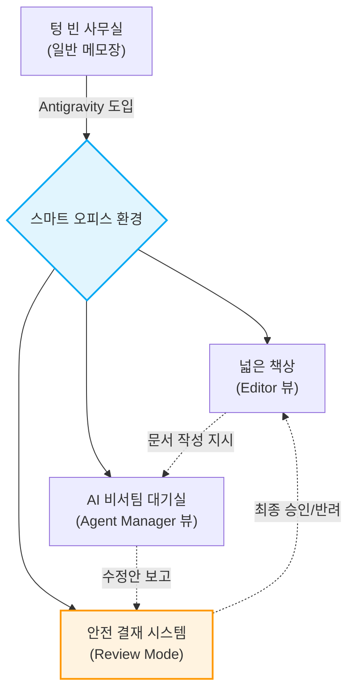

이 다이어그램은 Antigravity가 단순한 에디터를 넘어 어떻게 안전한 협업 공간으로 기능하는지 보여줍니다. 특히 리뷰 모드를 통한 결재 시스템은 AI의 폭주를 막고 여러분이 프로젝트의 주도권을 쥐게 하는 가장 중요한 장치예요.

---

## §3. 상세 내용

### Why — 왜 이 세션이 필요한가?

파이썬 기초를 배우기 전에 왜 거창한 IDE부터 설치해야 할까요? 예전에는 문법을 먼저 배우고 나중에 도구를 익히는 것이 정석이었습니다. 하지만 AI-native 패러다임에서는 순서가 다릅니다. 여러분은 코드를 한 줄씩 짜는 노동자가 아니라, AI라는 작업자에게 지시를 내리고 검토하는 관리자 역할을 해야 해요. 관리자 역할을 제대로 수행하려면, AI 작업자들과 원활하게 소통하고 그들의 결과물을 안전하게 검토할 수 있는 '미션 컨트롤 센터'가 가장 먼저 필요합니다. 그것이 바로 Antigravity를 첫 실습으로 설치하는 이유입니다.

### What — 이 세션에서 다루는 것은 무엇인가?

이 세션에서는 크게 두 가지 작업을 진행합니다. 첫째, 자신의 운영체제(Windows 또는 macOS)에 맞는 Antigravity 설치 파일을 다운로드하고 설치 마법사를 통해 올바른 경로에 설치를 완료합니다. 둘째, 설치된 프로그램을 처음으로 실행하여 웰컴 화면을 확인하고, 기존 설정(VS Code 등)이 있다면 이를 가져오는 방법을 다룹니다. 또한, AI가 임의로 코드를 변경하는 것을 막아주는 '검토 모드(Review Mode)'가 정상적으로 켜져 있는지 확인합니다.

### How — 구체적으로 어떻게 진행하는가?

강사가 먼저 화면을 통해 전체 다운로드 및 설치 과정을 시연합니다. 윈도우 11 환경을 기준으로 설명하되, macOS 사용자들을 위한 분기점도 함께 안내해요. 수강생들은 강사의 시연을 본 직후, 자신의 랩탑에서 직접 동일한 단계를 수행합니다. 브라우저를 열고 다운로드하는 것부터, 바탕화면의 아이콘을 클릭해 환영 화면을 띄우는 것까지 강사의 지시에 맞춰 단계별로 나아갑니다. 중간에 회사 보안 프로그램 등에 의해 설치가 막히는 경우, 조교나 강사가 직접 자리로 가서 해결을 도와줍니다.

---


### 📊 참고 표 (Visual Specs)

**IDE 구성요소 비교 (Antigravity vs 기존 IDE)**

| 구분 | 기존 IDE (예: VSCode) | Antigravity |
|:---|:---|:---|

## §4. 실습 가이드 (+ 🎙️ 실습 대본)

### 실습 목표

이 실습의 목표는 모든 수강생이 자신의 노트북에 Antigravity IDE 설치를 완료하고 정상적으로 실행하여 '검토 모드' 활성화 상태까지 확인하는 것입니다. 중간에 한 명도 낙오하지 않고 함께 스마트 오피스에 입주하는 것이 중요해요.

🎙️ **실습 가이드 대본 (Lab Guide)**:

> 자, 이제 여러분의 컴퓨터에 진짜 사무실을 지어볼 차례입니다. 제 화면을 먼저 봐주시고, 제가 한 단계를 마칠 때마다 여러분도 똑같이 따라해 주시면 됩니다. 
>
> 첫 번째, 브라우저를 열고 주소창에 `antigravity.google`을 입력하세요. 다운로드 페이지가 열리면 한가운데 커다란 버튼이 보일 겁니다. 윈도우를 쓰시는 분들은 "Windows용 다운로드"를, 맥북을 가져오신 분들은 "macOS용 다운로드"를 눌러주세요. 맥북 사용자분들은 자신의 칩셋(Intel인지 Apple Silicon인지)을 한 번 더 확인하고 맞는 걸 골라주시면 됩니다. 다운로드가 끝났으면 파일을 더블클릭해서 실행해 주세요!
>
> 두 번째, 설치 마법사가 떴죠? 여기서부터는 고민할 것 없이 "다음(Next)"을 계속 눌러주시면 됩니다. 가끔 설치 폴더를 내 마음대로 D드라이브나 이상한 곳으로 바꾸시는 분들이 계신데, 기본값인 C드라이브 경로를 그대로 두세요. 도구함을 엉뚱한 곳에 숨겨두면 나중에 비서들이 찾기 힘들어하니까요.
> 
> 세 번째, 설치가 다 끝났다면 바탕화면이나 시작 메뉴에서 Antigravity 로고를 찾아 더블클릭으로 실행해 봅시다. 처음 실행하면 멋진 환영 화면이 여러분을 반길 거예요. 혹시 이전에 VS Code 같은 다른 에디터를 쓰셨던 분 계신가요? 화면 아래에 "설정 가져오기(Import Settings)"라는 버튼이 보일 텐데, 그걸 누르시면 예전에 쓰던 단축키나 색상 테마를 그대로 이사 올 수 있습니다.
> 
> 마지막으로 가장 중요한 것 하나만 확인하고 넘어갈게요. 화면 상단을 봐주세요. "검토 모드(Review Mode)"라는 글자에 불이 들어와 있나요? 이게 켜져 있어야 AI가 코드를 바꿀 때 "사장님, 이렇게 바꿔도 될까요?"라고 여러분에게 미리 물어봅니다. 이 불이 꺼져 있다면 AI가 여러분 몰래 서류를 맘대로 뜯어고칠 수 있으니 꼭 켜져 있는지 확인하세요. 자, 모두 환영 화면과 검토 모드를 확인하셨나요? 축하합니다! 드디어 여러분만의 완벽한 AI 스마트 오피스가 완성되었습니다!

### 단계별 지시

| 단계 | 소요 시간 | 강사 지시사항 | 학습자 액션 | 예상 결과 |
|------|----------|--------------|------------|----------|
| 1 | 3분 | `antigravity.google` 접속 및 OS별 다운로드 안내 | URL 접속 및 파일 다운로드 | 설치 파일(`.exe` 또는 `.dmg`) 다운로드 완료 |
| 2 | 5분 | 기본 경로 유지 강조 및 설치 마법사 진행 지시 | 설치 파일 실행 및 Next 클릭 | 프로그램 시스템 설치 완료 |
| 3 | 3분 | 첫 실행 및 웰컴 화면, 설정 가져오기 버튼 안내 | 바탕화면 아이콘 더블클릭 | Antigravity 초기 화면 로딩 |
| 4 | 2분 | 상단 'Review Mode' 활성화 상태 필수 확인 | 상단 UI 점검 | 검토 모드 켜짐 확인 |
| 5 | 12분 | 진척도 체크 및 보안 프로그램 차단자 등 개별 트러블슈팅 | 설치 지연자 손 들기 | 전원 설치 및 실행 100% 달성 |

### 트러블슈팅 FAQ

| Q | A |
|---|---|
| "Windows Defender나 회사 보안 프로그램이 설치를 차단해요." | 당황하지 마시고 추가 정보 → '실행'을 누르거나, 기업용 PC의 경우 강사/조교를 호출해 관리자 권한 예외 처리를 요청하세요. |
| "맥북(macOS)인데 앱이 열리지 않고 '확인되지 않은 개발자' 알림이 뜹니다." | '시스템 설정' > '개인정보 보호 및 보안'으로 들어가서 하단에 있는 '무조건 열기(Open Anyway)' 버튼을 클릭해 주시면 됩니다. |
| "설치는 했는데 Review Mode 버튼이 어디 있는지 모르겠어요." | 화면 맨 위쪽 메뉴바 정중앙을 보세요. 방패 모양의 아이콘 옆에 'Review Mode'라는 토글 스위치가 있습니다. 파란색으로 활성화되어 있으면 정상입니다. |

> ✅ **체크포인트**: "내 컴퓨터에 Antigravity 설치가 끝났고, 실행했을 때 웰컴 화면이 떴으며, 검토 모드가 켜져 있는 것을 확인했나요?"

---


### 🎓 강사 노트 (Instructor Support)

- ⏱️ **타이밍**: 10:10 (25분, lab)
- 🎯 **핵심 활동**: IDE 설치, 라이브 시연
- ⚠️ **강사 주의사항**: ⚠️ 설치 실패 대비 USB 배포본 준비


### 📋 실습 설계 보강 (Lab Packet)

**세션 004 실습 설계 보강**

Antigravity 설치와 시연
- **3-Stage Example Set**
  - 기본: `antigravity.google` 접속 → Windows용 다운로드 → 설치 마법사 완료
  - 변형: 회사 보안 프로그램이 설치를 차단하는 경우 — 관리자 권한 실행 또는 예외 처리
  - 실수 해결: "설치 경로를 D드라이브로 바꿨더니 실행이 안 돼요" → 기본 경로(C:\) 유지 필수
- **난이도 예측**: 설치 자체는 쉬우나 회사 PC 보안정책이 최대 변수
- **타이밍 가이드**: 다운로드 5분 | 설치 마법사 5분 | 첫 실행 확인 5분 | 트러블슈팅 10분
- **심리적 장벽**: "프로그래밍 도구를 깔았다"는 사실 자체에 대한 막연한 두려움
- **자가 점검**:
  - [ ] 바탕화면/시작메뉴에서 Antigravity 아이콘이 보이는가?
  - [ ] 실행 시 환영 화면이 정상 표시되는가?
  - [ ] 상단에 "검토 모드(Review Mode)" 표시가 보이는가?

## §5. 코드 및 명령어 모음 

이 세션은 터미널에 입력하는 명령어 없이, 브라우저 다운로드와 GUI 기반 설치 마법사 클릭으로 진행됩니다. 본격적인 파이썬 환경 세팅 명령어는 이후 세션(uv 설치)부터 등장합니다.

> 🤖 **AI 프롬프트 예시**: 해당 없음 (설치 마법사 위주의 실습)

---

## §6. 요약

### 핵심 학습 포인트

이번 시간의 핵심은 딱 세 가지입니다. 첫째, 코딩을 메모장으로 하는 시대는 지났고, 우리는 24시간 AI 비서가 상주하는 'Antigravity'라는 스마트 오피스에 입주했습니다. 둘째, 이 도구는 구글의 최신 에이전트 우선(Agent-First) 환경으로 여러 비서가 동시다발적으로 내 일을 도와줄 수 있도록 설계되었습니다. 셋째, 가장 중요한 것은 '검토 모드(Review Mode)'입니다. AI가 아무리 똑똑해도 최종 결재권은 운전대를 잡은 여러분에게 있다는 사실을 절대 잊지 마세요.

### 다음 세션 예고

멋진 사무실 문을 열고 들어왔으니, 이제 내 책상이 어디고 서랍에는 무엇이 있는지 사무실 구조를 파악해야겠죠? 다음 세션에서는 Antigravity의 내부 구조 중에서도 우리가 직접 타이핑하고 서류를 검토하는 공간인 'Editor 뷰'를 구석구석 살펴보겠습니다. 

### 브릿지 노트

> "다들 화면에 멋진 로고 띄우셨죠? 텅 빈 사무실에 최신식 책상과 컴퓨터, 그리고 똑똑한 AI 비서팀까지 무사히 세팅을 마쳤습니다. 입주를 진심으로 축하드려요! 그런데 사무실 문만 열었다고 일할 수 있는 건 아니잖아요? 내일 당장 결재 서류를 보려면 내 책상이 어떻게 생겼는지 알아야 합니다. 잠깐 쉬었다가, 이 스마트 오피스의 구석구석을 탐험해 보도록 할게요."

---

## §7. 참고 자료

### 3-Source 출처

- **Source A (로컬 참고자료)**: 「AI-native_파이썬기초.md」 — Antigravity 환경 스펙 정의, 구글의 2025년 11월 최신 에이전트 통합 개발 환경 설정의 원전.
- **Source B (NotebookLM)**: NotebookLM 분석 리포트 — Antigravity 설치 가이드라인, 운영체제별 다운로드 방식 및 "검토 기반 개발(Review-driven development)" 안전 정책의 근거를 제공했습니다.
- **Source C (Deep Research)**: Deep Research 보고서 — 에디터를 빈 사무실과 스마트 오피스로 대비시킨 비유, 다중 에이전트가 주도적으로 계획하고 실행하는 Agent-First IDE의 구조적 장점 분석을 반영했습니다.

### 추가 학습 자료

- [Google Antigravity 공식 다운로드 페이지](https://antigravity.google)
- [Antigravity 기본 UI 가이드 영상 (가상 링크)](#)

### 강사 노트

> 💡 **강사 노트**: 본 세션은 「AI-native_파이썬기초.md」(Source A)의 환경 스펙과 NotebookLM(Source B)의 안전 정책 지침, Deep Research(Source C)의 사무실 비유를 엮어 구성했습니다. 특히 실습을 진행할 때 수강생들이 윈도우와 맥북 유저로 섞여 있을 확률이 높으므로, 강사가 macOS 트러블슈팅(보안 해제 등)에 대한 대비를 미리 해두는 것이 진행을 매끄럽게 하는 핵심 팁입니다. 결재권자로서의 마인드셋(Review Mode 강조)을 잊지 않게 반복해주세요.

---

## ✅ 세션 완료 체크리스트 (강사용)

- [ ] §1~§7 모든 섹션이 충실하게 작성되었는가?
- [ ] 빈 사무실과 스마트 오피스 비유가 명확히 전달되었는가?
- [ ] Windows/macOS 분기 안내가 실습 가이드에 포함되었는가?
- [ ] '검토 모드(Review Mode)'의 중요성이 강조되었는가?
- [ ] 3-Source 출처 표기가 올바르게 반영되었는가?

---

*작성 일시: 2026-02-25*  
*작성 에이전트: A4B_Session_Writer*  
*교안 구조: 7섹션 (A0 팀 공통 표준)*

> 🔗 **이전 세션**: [세션 003: 학습 방법론과 SDD 미리보기](#세션-003)에서 배운 내용을 이어갑니다.
> 🔗 **다음 세션**: [세션 005: Editor 뷰와 기본 조작](#세션-005)에서 계속됩니다.

---

### 세션 005: Editor 뷰와 기본 조작
> [원본 파일](sessions/세션-005-Editor_뷰와_기본_조작_v2.1.md) | ⏱️ 20분 | 🧪 lab | 난이도: low

> **세션 ID**: MS-PY101-005  
> **소요 시간**: 20분  
> **난이도**: low  
> **청크 타입**: lab  
> **버전**: v2.1 (7섹션 구조)

---

## §1. 개요

> **Day 1 | AM | 세션 005/022**

이전 세션에서 Antigravity IDE를 성공적으로 설치하고 첫 실행까지 마쳤어요. 설치가 완료되었다는 것은 여러분만의 "AI 비서가 상주하는 사무실"이 문을 열었다는 뜻이에요. 하지만 새 사무실에 입주했다고 바로 일을 시작할 수 있는 건 아니잖아요? 제일 먼저 해야 할 일은 사무실 구조를 파악하는 거예요. 내 책상이 어디인지, 서류 캐비닛은 어떻게 열고 닫는지, 메모지와 펜은 어디에 있는지 둘러봐야 하죠.

이번 세션에서는 Antigravity의 핵심 작업 공간인 **Editor 뷰(에디터 뷰)**를 집중적으로 탐험합니다. Editor 뷰는 여러분이 코드를 직접 눈으로 보고, 읽고, 수정하는 "내 책상"에 해당하는 영역이에요. AI가 아무리 뛰어나도, 최종적으로 코드를 확인하고 승인하는 것은 여러분의 몫이기 때문에, 이 책상을 자유자재로 다룰 수 있어야 합니다.

### 🎯 학습 목표

이 세션이 끝나면 여러분은 다음을 할 수 있어요:

- Antigravity 화면의 3대 영역(파일 탐색기, Editor 뷰, 통합 터미널)이 각각 어떤 역할인지 설명할 수 있어요
- 작업 폴더를 열고, 새 파일을 만들고, 저장하는 기본 조작을 자유롭게 수행할 수 있어요
- 파일 확장자가 왜 중요한지 이해하고, `.txt`와 `.py`의 차이를 구분할 수 있어요

### 선행 세션 환기

바로 직전 세션(세션 004)에서 우리는 Antigravity를 설치하고 첫 실행 화면을 확인했어요. "AI 비서가 상주하는 사무실"이라는 비유를 기억하시나요? 사무실 열쇠를 받아서 문을 열었으니, 이제 그 안을 본격적으로 둘러볼 차례예요. 오늘은 그 사무실에서 가장 중요한 공간, "내 책상"을 세팅하는 시간입니다.

---

## §2. 핵심 개념 (+ 🗣️ 강사 대본 + Mermaid)

### Editor 뷰 = "내 책상"

Antigravity IDE의 화면은 크게 세 개의 영역으로 구성되어 있어요. 이것을 사무실에 비유하면 아주 직관적으로 이해할 수 있습니다. 왼쪽의 좁고 긴 패널은 서류 캐비닛(파일 탐색기)이고, 가운데의 넓은 공간이 여러분의 책상(Editor 뷰)이며, 아래쪽에 숨어 있다가 호출하면 올라오는 영역이 업무용 전화기(통합 터미널)예요. 그리고 오른쪽에는 앞으로 만나게 될 AI 비서의 자리(Agent Manager)가 있는데, 이건 다음 세션에서 다루겠습니다.

🗣️ **강사 대본 (Instructor Script)**:

> 여러분, 설치한 사무실에 무사히 입주하셨죠? 그런데 입주만 했다고 바로 일할 수 있는 건 아닙니다. 새 사무실에 처음 들어가면 제일 먼저 뭘 하시나요? 내 책상이 어디인지 찾고, 서류함 위치를 확인하고, 프린터가 어디 있는지 둘러보잖아요.
>
> Antigravity도 마찬가지예요. 화면을 한번 크게 훑어봅시다. 왼쪽에 세로로 길게 늘어선 영역이 보이시죠? 이것이 "파일 탐색기"예요. 사무실로 치면 서류 캐비닛입니다. 여러분의 모든 파일이 여기에 폴더별로 정리되어 있어요.
>
> 그 옆으로 가장 넓은 중앙 공간, 이곳이 바로 "Editor 뷰"입니다. 여러분의 책상이에요. 서류 캐비닛에서 꺼낸 파일을 이 책상 위에 펼쳐놓고 읽고, 수정하고, 새로 작성하는 공간이죠. VS Code를 써본 경험이 있다면 아주 익숙한 모습일 겁니다. Antigravity의 Editor 뷰는 VS Code와 동일한 친숙한 환경을 제공하면서, 구문 강조(Syntax Highlighting)로 코드를 알록달록 예쁘게 표시해 줍니다.
>
> 그리고 화면 아래쪽에 숨어 있는 영역이 하나 더 있어요. 바로 "통합 터미널"입니다. 사무실의 업무용 전화기라고 생각하시면 돼요. 컴퓨터에게 직접 명령을 내릴 수 있는 전화선이죠. 나중에 파이썬 코드를 실행할 때 이 터미널을 사용하게 됩니다.
>
> 오른쪽에는 앞으로 만날 AI 비서의 자리가 있는데, 이건 다음 세션에서 다루겠습니다. 오늘은 에디터 화면, 즉 "내 책상"에 완전히 집중하겠습니다.

> 💡 **강사 노트**: "사무실 비유"는 Antigravity의 3-Surface 아키텍처(Editor, Agent Manager, Browser)를 초보자에게 직관적으로 전달하기 위해 구성했습니다. Editor 뷰가 VS Code와 동일한 환경을 제공한다는 점은 Deep Research(Source C)의 IDE 인터페이스 분석에 기반합니다.

### Mermaid 다이어그램

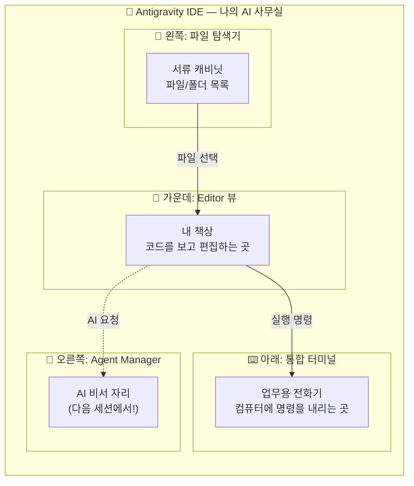

### 파일 확장자 = "서류의 꼬리표"

파일 이름 뒤에 붙는 `.txt`, `.py`, `.md` 같은 것을 확장자라고 불러요. 이것은 서류에 붙이는 꼬리표와 같아요. 꼬리표가 "계약서"라고 되어 있으면 법무팀에서 처리하고, "영수증"이라고 되어 있으면 경리팀에서 처리하듯이, 컴퓨터도 확장자를 보고 "아, 이건 텍스트 파일이구나", "아, 이건 파이썬 프로그램이구나"라고 판단합니다. 그래서 확장자를 빼먹으면 컴퓨터가 이 서류를 어떻게 처리해야 할지 몰라서 혼란이 생겨요.

🗣️ **강사 대본 (Instructor Script)**:

> 파일 이름에서 점(.) 뒤에 붙는 글자들, 이것을 확장자라고 부릅니다. 예를 들어 `hello.txt`에서 `.txt`가 확장자예요. 이건 서류에 붙이는 꼬리표라고 생각하시면 돼요.
>
> 꼬리표가 "계약서"라고 되어 있으면 법무팀에서 처리하고, "영수증"이라고 되어 있으면 경리팀에서 처리하잖아요? 컴퓨터도 마찬가지입니다. `.txt`를 보면 "아, 이건 일반 글 파일이구나" 하고 텍스트 에디터로 열고, `.py`를 보면 "아, 이건 파이썬 프로그램이구나" 하고 파이썬으로 실행해요.
>
> 그래서 확장자를 빼먹으면 큰일 나요. 꼬리표 없는 서류는 어느 팀에서 처리해야 할지 모르잖아요? 앞으로 파일을 만들 때 확장자를 반드시 입력하는 습관을 들여주세요!

> 💡 **강사 노트**: 확장자 개념은 프로그래밍 입문자들이 가장 많이 혼동하는 부분 중 하나입니다. `.txt`와 `.py`의 차이를 명확히 인지시키는 것이 Day 2 코드 작성의 기초가 됩니다.

---

## §3. 상세 내용

### Why — 왜 Editor 뷰 조작을 배우는가?

AI 시대에 코드를 직접 타이핑하는 일이 줄어든다고 해도, 코드를 **읽고 확인하는 능력**은 오히려 더 중요해져요. AI가 작성해준 코드가 올바른지, 내가 원하는 것과 일치하는지 판단하려면 코드를 편하게 열어보고 살펴볼 수 있어야 합니다. Editor 뷰는 바로 그 "코드 검토의 본부"예요.

Antigravity는 Review-driven development(검토 기반 개발)라는 철학을 따르고 있어요. AI가 코드를 변경하기 전에 반드시 사용자의 승인을 받는 구조입니다. 이 승인 과정이 일어나는 곳이 바로 Editor 뷰예요. 그래서 Editor 뷰를 자유자재로 다루지 못하면, AI 비서에게 일을 시켜도 결과를 제대로 확인할 수 없게 돼요. 마치 서류를 펼쳐볼 줄 모르는 사장님이 직원의 보고서를 검토하지 못하는 것과 같죠.

### What — Editor 뷰의 3가지 핵심 영역

Editor 뷰에서 오늘 반드시 익혀야 할 영역은 세 가지예요.

첫 번째는 **파일 탐색기(Explorer)**입니다. 화면 왼쪽에 세로로 늘어선 패널이에요. 여기에는 현재 작업 중인 폴더의 모든 파일과 하위 폴더가 트리 구조로 보여요. 마치 Windows 탐색기에서 폴더를 열어보는 것과 비슷한데, IDE 안에 내장되어 있어서 따로 창을 왔다갔다 하지 않아도 돼요.

두 번째는 **에디터 영역(Editor Area)**입니다. 화면 가운데의 가장 넓은 공간이에요. 파일 탐색기에서 파일을 클릭하면 이 공간에 파일 내용이 펼쳐져요. 여러 파일을 동시에 열어놓을 수도 있는데, 상단에 탭처럼 표시되어서 탭을 클릭해서 파일 간에 전환할 수 있어요. 가장 중요한 특징은 **구문 강조(Syntax Highlighting)**예요. 파이썬 파일(`.py`)을 열면 코드의 각 부분이 다른 색으로 표시되어서, 코드를 훨씬 읽기 쉽게 만들어줘요.

세 번째는 **통합 터미널(Integrated Terminal)**입니다. 화면 아래쪽에 숨어 있다가 단축키(`` Ctrl + ` ``)를 누르면 올라오는 영역이에요. 여기서 컴퓨터에 직접 명령을 내릴 수 있어요. 나중에 파이썬 코드를 실행하거나, 패키지를 설치하거나, 시스템 정보를 확인할 때 이 터미널을 사용하게 됩니다.

### How — 3가지 기본 조작 (폴더 열기, 파일 생성, 저장)

오늘 배울 핵심 조작은 딱 세 가지예요. 이 세 가지만 할 줄 알면 앞으로의 모든 실습을 따라갈 수 있습니다.

**첫 번째: 폴더 열기(Open Folder)**. IDE에서 작업을 시작하려면 가장 먼저 "어디서 일할 건지" 알려줘야 해요. 상단 메뉴의 File → Open Folder를 클릭하고 작업할 폴더를 선택하면, 그 폴더 안의 모든 파일이 왼쪽 탐색기에 나타납니다. 마치 사무실에 출근해서 "오늘은 이 프로젝트 서류함에서 일하겠습니다"라고 정하는 것과 같아요.

**두 번째: 파일 생성(New File)**. 탐색기 영역에서 우클릭 후 "New File"을 선택하면 새 파일을 만들 수 있어요. 여기서 중요한 것이 파일 이름 뒤의 확장자예요. `.txt`는 일반 텍스트 파일, `.py`는 파이썬 파일이에요. 확장자를 빼먹으면 컴퓨터가 파일의 종류를 인식하지 못해요.

**세 번째: 저장(Save)**. `Ctrl+S`를 눌러서 작업 내용을 저장합니다. 저장하지 않은 파일은 탭에 하얀 점(●)이 표시돼요. 이 점은 "아직 저장 안 했어요!"라는 신호예요. 서류를 작성했으면 반드시 서랍에 넣어야 하듯, 코딩을 했으면 반드시 저장해야 합니다. `Ctrl+S`는 이 과정 전체에서 가장 많이 누르게 될 단축키이니, 지금 바로 손가락에 익혀두세요!

> ✅ **체크포인트**: 여기까지 이해했는지 스스로 점검해 보세요.
> - Antigravity 화면에서 파일 탐색기, Editor 뷰, 통합 터미널의 위치를 가리킬 수 있나요?
> - `.txt`와 `.py` 확장자의 차이를 설명할 수 있나요?
> - 저장하지 않은 파일의 신호(●)를 알고 있나요?

### 비교표 — Editor 뷰의 3대 영역

| 영역 | 위치 | 역할 | 사무실 비유 |
|------|------|------|------------|
| 파일 탐색기 (Explorer) | 화면 왼쪽 | 파일/폴더 목록 표시 및 관리 | 서류 캐비닛 |
| 에디터 영역 (Editor Area) | 화면 가운데 (가장 넓음) | 코드/텍스트 보기 및 편집 | 내 책상 |
| 통합 터미널 (Terminal) | 화면 아래쪽 (숨겨져 있음) | 명령어 입력 및 실행 | 업무용 전화기 |
| Agent Manager | 화면 오른쪽 | AI와 대화 (다음 세션!) | AI 비서 자리 |

### 용어 정리표

| 용어 | 뜻 | 쉬운 비유 |
|------|-----|----------|
| IDE (Integrated Development Environment) | 통합 개발 환경. 코드 편집, 실행, 디버깅을 한 곳에서 할 수 있는 프로그램 | AI 비서가 상주하는 사무실 |
| Editor 뷰 | 코드를 보고 편집하는 화면 | 내 책상 |
| 파일 탐색기 (Explorer) | 프로젝트의 파일/폴더를 트리 구조로 보여주는 패널 | 서류 캐비닛 |
| 통합 터미널 (Terminal) | IDE 안에 내장된 명령줄 도구 | 업무용 전화기 |
| 확장자 (Extension) | 파일 이름 뒤의 `.txt`, `.py` 등 | 서류의 꼬리표 |
| 구문 강조 (Syntax Highlighting) | 코드를 색깔로 구분해서 보여주는 기능 | 형광펜으로 중요 부분 표시 |

---

## §4. 실습 가이드 (+ 🎙️ 실습 대본)

### 실습 목표

이 실습을 통해 여러분은 Antigravity에서 작업 폴더를 열고, 새 파일을 만들고, 내용을 입력한 뒤 저장하는 기본 워크플로우를 직접 경험합니다. 이 기본 동작이 앞으로 5일간 모든 실습의 기초가 됩니다.

🎙️ **실습 가이드 대본 (Lab Guide)**:

> 자, 이제 직접 해봅시다. 오늘 실습은 아주 간단하지만, 앞으로 매일 반복하게 될 기본기예요. 긴장하지 마시고 천천히 따라와 주세요. 텍스트 파일은 절대 컴퓨터를 망가뜨리지 않으니까요. 마음껏 연습하셔도 됩니다.
>
> 실습이 끝나면 여러분의 바탕화면에 `AI_Class`라는 폴더가 생기고, 그 안에 `hello.txt`라는 파일이 깔끔하게 들어있을 거예요. 이것이 여러분이 만든 첫 번째 디지털 서류입니다!

### 단계별 지시

| 단계 | 소요 시간 | 강사 지시사항 | 학습자 액션 | 예상 결과 |
|------|----------|--------------|------------|----------|
| 1 | 2분 | "바탕화면에 새 폴더를 만들어 주세요. 이름은 `AI_Class`입니다." | 바탕화면 → 우클릭 → 새로 만들기 → 폴더 → `AI_Class` 입력 | 바탕화면에 `AI_Class` 폴더 생성 |
| 2 | 2분 | "Antigravity 상단 메뉴에서 File → Open Folder를 클릭하고, 방금 만든 `AI_Class` 폴더를 선택하세요." | File → Open Folder → `AI_Class` 선택 → "폴더 선택" 클릭 | 왼쪽 탐색기에 `AI_CLASS` 폴더명 표시 |
| 3 | 2분 | "왼쪽 탐색기의 빈 공간에서 우클릭 후 New File을 선택하세요. 파일 이름은 `hello.txt`입니다. 반드시 `.txt`까지 포함해서 입력하세요!" | 탐색기 빈 공간 우클릭 → New File → `hello.txt` 입력 → Enter | 가운데 에디터에 빈 `hello.txt` 파일이 열림 |
| 4 | 2분 | "에디터에 아무 글이나 입력해 보세요. '안녕하세요, 저의 첫 번째 파일입니다!'처럼요." | 에디터 영역 클릭 → 자유롭게 텍스트 입력 | 입력한 텍스트가 에디터에 표시, 탭에 ● 표시 |
| 5 | 1분 | "`Ctrl+S`를 눌러서 저장하세요. 탭의 ● 표시가 사라지면 저장 성공!" | `Ctrl+S` 키 입력 | 탭의 ● 표시 사라짐 = 저장 완료 |
| 6 | 2분 | "잘 했어요! 이번에는 파이썬 파일도 하나 만들어 봅시다. 같은 방법으로 `test.py`라는 파일을 만들어 보세요." | 탐색기 우클릭 → New File → `test.py` 입력 | `test.py` 파일 생성, 에디터에 열림 |
| 7 | 2분 | "`test.py`에 `print('Hello')`라고 입력하고 저장하세요. 글자 색이 다르게 표시되는 걸 확인해 보세요. 이것이 구문 강조입니다!" | `print('Hello')` 입력 → `Ctrl+S` | 코드에 색상이 적용됨 (구문 강조 확인) |
| 8 | 2분 | "마지막으로 통합 터미널을 열어봅시다. `` Ctrl + ` ``(백틱 키)를 눌러보세요." | `` Ctrl + ` `` 키 입력 | 화면 하단에 터미널 패널 표시 |

### 트러블슈팅 FAQ

| Q | A |
|---|---|
| 파일 탐색기가 보이지 않아요. | `Ctrl+B`를 눌러서 사이드바를 토글(켜기/끄기)해 보세요. |
| 폴더를 열었는데 "Trust Authors" 같은 팝업이 떠요. | "Yes, I trust the authors"를 클릭하시면 됩니다. 내 컴퓨터의 내 폴더이니 안전해요. |
| 파일명에 확장자를 빼먹었어요. | 파일 이름을 우클릭 → Rename으로 이름을 바꿀 수 있어요. 확장자를 붙여서 다시 지어주세요. |
| `Ctrl+S`를 눌렀는데 아무 반응이 없어요. | 이미 저장된 상태일 수 있어요. 탭에 ● 표시가 없다면 이미 저장된 겁니다. |
| 터미널이 열리지 않아요. | 상단 메뉴 Terminal → New Terminal을 클릭해 보세요. 단축키가 안 먹히는 경우가 간혹 있어요. |
| `.py` 파일인데 색이 안 변해요. | Antigravity 오른쪽 아래에 언어 모드가 "Plain Text"로 되어 있을 수 있어요. 클릭해서 "Python"으로 변경하세요. |

> ✅ **체크포인트**: `AI_Class` 폴더 안에 `hello.txt`와 `test.py` 파일이 모두 보이나요? `test.py`의 `print` 글자에 색이 입혀져 있나요?

---


### 🎓 강사 노트 (Instructor Support)

- ⏱️ **타이밍**: 10:35 (20분, lab)
- 🎯 **핵심 활동**: 폴더 열기, 파일 생성/저장
- ⚠️ **강사 주의사항**: 느린 학습자 개별 확인 필수


### 📋 실습 설계 보강 (Lab Packet)

**세션 005 실습 설계 보강**

Editor 뷰와 기본 조작
- **3-Stage Example Set**
  - 기본: File > Open Folder로 프로젝트 폴더 열기 → 새 파일 생성(hello.py) → Ctrl+S 저장
  - 변형: 기존 텍스트 파일(.txt)을 열어서 .py로 확장자 변경해보기
  - 실수 해결: "폴더를 열었는데 왼쪽에 아무것도 안 보여요" → 빈 폴더를 연 것. 파일을 하나 생성해야 목록 표시
- **난이도 예측**: 파일/폴더 개념이 모호한 학습자에게 난관
- **타이밍 가이드**: 폴더 열기 3분 | 파일 생성·저장 5분 | 탐색기 조작 연습 7분 | 정리 5분
- **심리적 장벽**: "내가 뭔가 잘못 누르면 컴퓨터가 망가지지 않을까?"
- **자가 점검**:
  - [ ] 왼쪽 탐색기에 내 폴더 구조가 보이는가?
  - [ ] hello.py 파일을 생성하고 저장할 수 있는가?
  - [ ] 파일명 옆 동그라미(수정됨 표시)가 저장 후 사라지는가?

## §5. 코드 및 명령어 모음

### 주요 단축키 정리

```
# Antigravity Editor 뷰 기본 단축키

Ctrl + N         → 새 파일 생성
Ctrl + S         → 파일 저장
Ctrl + B         → 사이드바(파일 탐색기) 토글
Ctrl + `         → 통합 터미널 열기/닫기
Ctrl + K → Ctrl + O  → 폴더 열기
Ctrl + Shift + P  → 명령 팔레트 (모든 기능 검색)
Ctrl + Tab       → 열린 파일 간 전환
Ctrl + W         → 현재 탭 닫기
```

### 예제 1: 첫 번째 텍스트 파일 내용

```text
안녕하세요, 저의 첫 번째 파일입니다!
이 파일은 Antigravity Editor 뷰에서 만들었어요.
```

### 예제 2: 첫 번째 파이썬 파일

```python
print('Hello')
```

> 🤖 **AI 프롬프트 예시**: "Antigravity에서 새 파이썬 파일을 만들고 'Hello World'를 출력하는 코드를 작성해줘"

### 파일 관련 조작 요약

```
# 파일 탐색기 조작
우클릭 → New File      → 새 파일 생성
우클릭 → New Folder    → 새 폴더 생성
우클릭 → Rename        → 이름 변경
우클릭 → Delete        → 파일 삭제

# 주요 확장자
.txt   → 일반 텍스트 파일
.py    → 파이썬 소스 파일
.md    → 마크다운 문서 파일
```

---

## §6. 요약

### 핵심 학습 포인트

오늘 우리는 Antigravity IDE의 "내 책상"인 Editor 뷰를 집중적으로 탐험했어요. 사무실에 입주했으니 가장 먼저 해야 할 일, 바로 내 작업 공간을 세팅하는 것이었습니다. 파일 탐색기(서류 캐비닛)에서 작업 폴더를 열고, 에디터 영역(내 책상)에서 파일을 만들고 내용을 입력했으며, `Ctrl+S`로 저장하는 기본기를 완전히 익혔습니다. 또한 파일 확장자가 서류의 꼬리표 역할을 해서 `.txt`는 텍스트 파일, `.py`는 파이썬 파일이라는 것도 배웠어요. 아주 기본적인 것처럼 보이지만, 이것이 앞으로 5일간 우리가 수행할 모든 작업의 기초입니다.

### 다음 세션 예고

책상 정리는 끝났어요! 그런데 여러분, 화면 오른쪽에 뭔가가 조용히 대기하고 있는 걸 눈치채셨나요? 그곳에 우리의 AI 비서가 앉아 있어요. 다음 세션에서는 이 AI 비서, Gemini 3 Pro에게 처음으로 인사를 건네보겠습니다.

### 브릿지 노트

> "파일 만들기, 저장하기! 아주 기본적인 거지만 이게 앞으로 우리가 할 모든 작업의 기초가 됩니다. 내 책상은 준비됐으니, 이제 화면 오른쪽에서 조용히 기다리고 있는 AI 비서를 깨워보겠습니다!"

---

## §7. 참고 자료

### 3-Source 출처

- **Source A (로컬 참고자료)**: `AI-native_파이썬기초.md` — Antigravity Editor View의 VS Code 호환성 및 기본 레이아웃 설명
- **Source B (NotebookLM)**: Antigravity IDE 대시보드 인터페이스 분석 — 파일 탐색기, 에디터, 터미널의 역할 구분
- **Source C (Deep Research)**: IDE 인터페이스 분석 — Editor 뷰가 VS Code와 동일한 친숙한 환경을 제공하며 구문 강조, 통합 터미널 제어 능력을 확보한다는 기술 분석

### 추가 학습 자료

- [Antigravity 공식 문서](https://antigravity.google/docs): Editor 뷰 상세 기능 가이드
- [VS Code 단축키 치트시트](https://code.visualstudio.com/shortcuts/keyboard-shortcuts-windows.pdf): Antigravity와 동일한 단축키 체계

### 강사 노트

> 💡 이 세션은 lab 타입으로, 학습자가 직접 폴더 열기 → 파일 생성 → 저장을 경험하는 것이 핵심입니다. 확장자 개념을 확실히 잡아주지 않으면 Day 2에서 `.py` 파일 생성 시 혼란이 발생하므로, `.txt`와 `.py`의 차이를 반복적으로 강조해 주세요.

---

## ✅ 세션 완료 체크리스트 (강사용)

- [ ] §1~§7 모든 섹션이 충실하게 작성되었는가?
- [ ] 비유와 스토리텔링이 포함되었는가? (사무실 비유, 서류 꼬리표 비유)
- [ ] 실습 단계별 지시표가 완전한가?
- [ ] 체크포인트 질문이 배치되었는가?
- [ ] 3-Source 팩트 패킷이 반영되었는가?

---

*작성 일시: 2026-02-25*  
*작성 에이전트: A4B_Session_Writer*  
*교안 구조: 7섹션 (A0 팀 공통 표준)*


> 🔗 **이전 세션**: [세션 004: Antigravity 설치와 시연](#세션-004)에서 배운 내용을 이어갑니다.
> 🔗 **다음 세션**: [세션 006: Agent Manager와 첫 인사](#세션-006)에서 계속됩니다.

---

### 세션 006: Agent Manager와 첫 인사
> [원본 파일](sessions/세션-006-Agent_Manager와_첫_인사_v2.1.md) | ⏱️ 20분 | 🧪 lab | 난이도: low

> **세션 ID**: MS-PY101-006  
> **소요 시간**: 20분  
> **난이도**: low  
> **청크 타입**: lab  
> **버전**: v2.1 (7섹션 구조)

---

## §1. 개요

> **Day 1 | AM | 세션 006/022**

이전 세션에서 우리는 에디터 뷰, 즉 "내 책상"을 완벽하게 정리했습니다. 파일 탐색기라는 서류 캐비닛에서 문서를 꺼내 내 책상 위에 펼쳐놓는 법을 배웠죠. 그런데 혼자서 모든 서류를 처리하려고 이렇게 거창한 사무실을 연 건 아니잖아요? 우리에게는 아주 똑똑한 AI 비서가 있습니다. 이제 화면 오른쪽에서 조용히 대기하고 있는 비서실의 문을 두드려 볼 차례예요.

이번 세션에서는 Antigravity의 핵심 엔진이자 여러분의 든든한 파트너인 **Agent Manager(에이전트 매니저)**와 첫 인사를 나눕니다. 단순히 대화를 나누는 것을 넘어, 이 비서가 내 책상 위 서류를 어떻게 함께 보고 분석하는지 그 놀라운 능력을 직접 체험해 볼 거예요. Agent Manager는 평범한 채팅창이 아니라 여러 비서가 업무를 대기하는 미션 컨트롤입니다.

### 🎯 학습 목표

이 세션이 끝나면 여러분은 다음을 할 수 있어요:

- Agent Manager 패널을 열고 AI 비서와 자연스러운 대화를 시작할 수 있어요
- 일반적인 ChatGPT와 Antigravity 내장 AI 비서의 결정적인 차이점을 설명할 수 있어요
- 내가 열어둔 파일을 AI 비서가 읽고 분석하도록 지시할 수 있어요
- 에이전트의 업무 처리 방식인 계획(Plan), 실행(Execute), 검증(Validate) 사이클을 이해할 수 있어요

### 선행 세션 환기

바로 직전 세션에서 우리는 바탕화면에 `AI_Class` 폴더를 만들고, 그 안에 `hello.txt`라는 첫 번째 디지털 서류를 작성해 내 책상(Editor 뷰) 위에 올려두었습니다. 이 서류를 그대로 펼쳐둔 상태로 이번 세션을 시작할 거예요. 내 책상 위 서류를 비서가 어떻게 알아채고 분석하는지 두 눈으로 직접 확인하는 것이 오늘 실습의 핵심 목표입니다. 준비되셨나요? 비서실 문을 두드려 봅시다.

---

## §2. 핵심 개념 (+ 🗣️ 강사 대본 + Mermaid)

### 비서실 문 두드리기: Agent Manager

Antigravity 화면 우측에 자리 잡은 Agent Manager는 단순한 보조 도구가 아닙니다. 이곳은 회사의 "비서실"이자, 여러 비서가 여러분의 지시를 대기하는 "미션 컨트롤"이에요. 여러분이 회사에서 카카오톡이나 슬랙 같은 사내 메신저를 통해 동료에게 업무를 요청하는 상황을 떠올려 보세요. 동료에게 "이 자료 좀 찾아줄 수 있어?" 하고 메시지를 보내면, 동료가 자료를 찾아 답장을 보내주죠. Agent Manager가 딱 그런 느낌입니다. 다만 이 메신저의 상대방은 사람이 아니라 뛰어난 능력을 가진 AI 비서인 Gemini 3 Pro입니다. 

이 비서들은 여러분이 업무를 맡기면 알아서 계획(Plan)을 세우고, 실행(Execute)하고, 결과를 검증(Validate)해서 보고하는 체계적인 사이클로 일합니다. 마치 아주 유능한 신입 직원에게 일을 맡기는 것과 같아요.

🗣️ **강사 대본 (Instructor Script)**:

> 에디터 조작에 익숙해지셨죠? 왼쪽 책상 정리도 잘 끝내셨고요. 그런데 혹시 화면 오른쪽에 말풍선 모양 아이콘이 숨어 있는 걸 눈치채셨나요? 보통 다른 코드 편집기에서는 그냥 빈 공간이거나 보조 도구가 있는 자리인데, 우리 Antigravity에는 아주 특별한 공간이 마련되어 있어요. 바로 "Agent Manager"입니다.
>
> 여러분, 회사에서 사내 메신저 많이 쓰시죠? "김 대리, 이 자료 좀 찾아줄 수 있어?" 하고 메시지를 보내면 답장이 오잖아요. Agent Manager가 딱 그런 느낌이에요. 쉽게 말해 "비서실 문을 똑똑 두드리는 것"과 같습니다. 이곳에서 여러분의 AI 비서인 Gemini 3 Pro가 출근해서 여러분의 지시를 기다리고 있어요.

> 💡 **강사 노트**: "사내 메신저"와 "비서실 문 두드리기" 비유를 함께 사용하여, 대화형 인터페이스의 친숙함과 AI의 보조적 역할을 동시에 전달합니다. 학습자가 두려움 없이 첫 질문을 던질 수 있도록 유도해 주세요.

### Mermaid 다이어그램

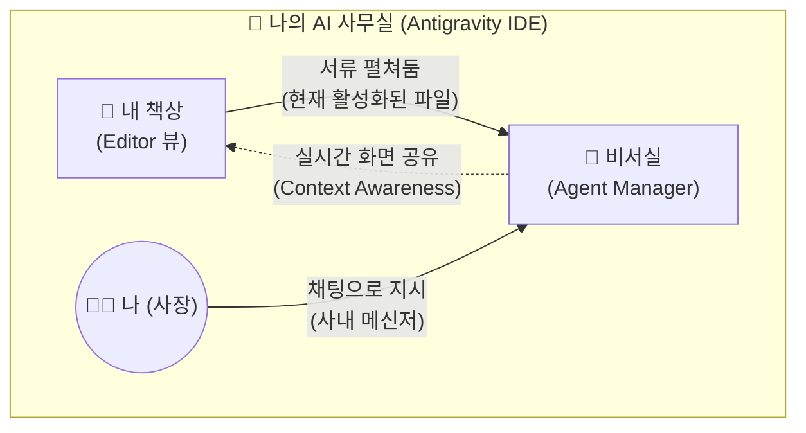

### 결정적 차이: 실시간 상황 인식 (Context Awareness)

이 AI 비서실이 우리가 흔히 아는 인터넷 브라우저 속 ChatGPT나 일반 웹 검색과 확연히 다른 점은 바로 "눈"이 달려있다는 거예요. 이 비서는 여러분이 내 책상(Editor 뷰)에 어떤 서류를 올려놓았는지 실시간으로 함께 보고 있습니다. 따로 서류 내용을 복사해서 채팅창에 붙여넣어 줄 필요가 전혀 없어요. 그냥 "지금 내가 보고 있는 이 파일 좀 정리해 줘"라고 말하면 찰떡같이 알아듣습니다. 이것을 기술적인 용어로 컨텍스트 인식(Context Awareness)이라고 부릅니다.

🗣️ **강사 대본 (Instructor Script)**:

> "그럼 그냥 인터넷 창 열고 ChatGPT 쓰면 되는 거 아니에요?"라고 생각하실 수 있어요. 질문을 던지면 답을 주는 건 똑같으니까요. 하지만 결정적인 차이가 있습니다. 일반 ChatGPT는 여러분의 모니터와 작업 환경을 전혀 볼 수 없는 장님 비서예요. 일일이 파일 내용을 복사해서 채팅창에 붙여넣어 줘야 하죠.
> 
> 하지만 Antigravity 비서실에 있는 직원들은 여러분과 완벽하게 '화면을 공유'하고 있어요. 여러분 옆자리에 앉아서 내 책상을 같이 보고 있는 셈이죠. 방금 여러분이 펼쳐둔 `hello.txt` 파일을 손가락으로 가리키면서 "이것 좀 읽어봐"라고 하면 바로 읽어냅니다. 이것이 에디터에 내장된 AI 비서의 가장 무서운 능력이자, 앞으로 여러분의 퇴근 시간을 두 시간 이상 앞당겨줄 핵심 무기입니다.

---

## §3. 상세 내용

### Why — 왜 Agent Manager를 써야 하는가?

AI 시대의 소프트웨어 개발에서 가장 큰 변화는 개발자의 역할이 바뀌었다는 점입니다. 혼자서 모든 코드를 한 줄 한 줄 힘들게 타이핑하던 시대는 지났어요. 이제 개발자는 코드를 타이핑하는 사람이 아니라, 무엇을 만들지 기획하고 AI에게 "정확한 지시를 내리는 사람"입니다. 이 지시를 내리는 공식적인 창구이자 유일한 통로가 바로 Agent Manager예요. 

Agent Manager를 통하지 않고서는 AI의 강력한 코딩 능력을 내 프로젝트에 연결할 수 없습니다. 또한, 이곳은 비서가 업무를 어떻게 처리하고 있는지 경과를 한눈에 모니터링하고, 혹시라도 잘못된 방향으로 가고 있다면 즉각 바로잡아주는 통제 센터의 역할도 겸합니다. 비서에게 일을 시키고 보고받는 가장 효율적인 창구인 셈이죠.

### What — Agent Manager의 구조와 기능

Agent Manager의 화면은 마치 깔끔하게 정리된 이메일 편지함이나 스마트폰의 메신저 앱처럼 직관적으로 생겼습니다. 크게 세 가지 영역으로 나누어 볼 수 있어요.

첫 번째는 **과거 기록 영역(Inbox/History)**입니다. 과거에 비서와 나눴던 대화나 진행했던 작업들이 목록 형태로 남아요. 마치 예전에 지시했던 업무 기록철을 다시 꺼내보는 것과 같습니다.

두 번째는 **현재 대화 영역(Chat View)**입니다. 지금 비서와 대화를 나누고 있는 실시간 공간이에요. 비서가 여러분의 지시를 받고 계획을 세우는 모습(Plan), 실제로 타자를 치며 코드를 작성하거나 파일을 검색하는 모습(Execute), 그리고 그 결과가 맞는지 스스로 확인하는 모습(Validate)이 이 창에 투명하게 중계됩니다.

세 번째는 **입력창(Input Box)**입니다. 화면 맨 아래에 위치한 텍스트 입력 칸으로, 여러분이 한국어로 편안하게 지시를 내리는 곳이에요. 영어로 완벽한 문장을 구사해야 한다는 부담은 전혀 가질 필요가 없습니다.

### How — 비서실 활용의 절대 규칙 (결재권)

비서실을 이용할 때 반드시 지켜야 할 절대 규칙이 딱 하나 있습니다. 바로 **"사장의 결재 없이는 서류의 토씨 하나도 바뀌지 않는다"**는 원칙이에요.

앞선 세션에서 잠깐 언급했던 검토 기반 개발(Review-driven development)이라는 철학이 여기서 철저하게 지켜집니다. AI 비서는 아주 똑똑하고 행동이 빠르지만, 동시에 극도로 조심스럽게 행동하도록 설계되어 있어요. 비서가 "사장님, 현재 파일을 이렇게 수정하는 게 어떨까요?"라고 제안안을 가져오면, 여러분이 명시적으로 승인("Accept" 버튼 클릭 또는 "좋아, 진행해"라고 대답)하거나 거절해야만 내 책상(Editor)의 파일 내용이 비로소 변경됩니다. 

AI가 제멋대로 코드를 엉망으로 만들까 봐 걱정하실 필요가 전혀 없어요. 모든 통제권과 주도권은 온전히 사장님인 여러분이 쥐고 있다는 사실을 명심하세요.

---

## §4. 실습 가이드 (+ 🎙️ 실습 대본)

### 실습 목표

이 실습을 통해 여러분은 Agent Manager 패널을 직접 열어 AI 비서에게 첫 인사를 건넵니다. 또한, 이전에 작성해 둔 `hello.txt` 파일을 비서가 화면 공유하듯 제대로 인지하고 있는지 두 눈으로 확인합니다.

🎙️ **실습 가이드 대본 (Lab Guide)**:

> 자, 이제 진짜로 비서실 문을 두드려 볼 시간입니다. 화면 오른쪽을 주목해 주세요. 앙증맞은 말풍선 모양의 아이콘이 보이시나요? 그걸 클릭하면 비서실 문이 스르륵 열리면서 채팅창이 나타납니다.
>
> 첫 출근을 한 비서에게 인사를 건네봐야겠죠? 영어로 길고 복잡하게 써야 하나 걱정하지 마세요. 우리 비서실 직원들은 한국어 패치가 완벽하게 되어 있습니다. 일상적인 메신저 하듯이 편안한 말씨로 질문해 보세요. 자, 키보드에 손을 올리시고 시작해 보겠습니다!

### 단계별 지시

| 단계 | 소요 시간 | 강사 지시사항 | 학습자 액션 | 예상 결과 |
|------|----------|--------------|------------|----------|
| 1 | 1분 | "화면 우측 사이드바에서 말풍선 아이콘(Agent)을 클릭해 패널을 열어주세요." | 우측 말풍선 아이콘 클릭 | 화면 오른쪽에 Agent Manager 패널이 확장됨 |
| 2 | 2분 | "아래쪽 입력창에 이렇게 적어보세요. '안녕! 너는 누구야? 무엇을 할 수 있어?' 그리고 Enter를 누르세요." | 입력창에 텍스트 입력 후 Enter | AI가 자기소개와 주요 기능을 한국어로 친절하게 답변함 |
| 3 | 2분 | "에디터 가운데 화면(내 책상)에 아까 만든 `hello.txt` 파일이 열려있는지 확인하세요. 안 열려 있다면 탐색기에서 클릭해 주세요." | `hello.txt` 탭 클릭 (포커스 맞추기) | 에디터 화면에 `hello.txt` 파일 내용이 선명하게 표시됨 |
| 4 | 3분 | "이제 진짜 마법을 부려볼게요. 비서에게 '방금 내가 만든 hello.txt 파일을 읽어줄래?'라고 물어보세요." | 입력창에 "hello.txt 파일 읽어줄래?" 입력 후 Enter | AI가 현재 활성화된 파일 내용을 정확히 인식하고 화면에 출력해 줌 |
| 5 | 2분 | "비서가 파일 내용을 정확히 읽어냈나요? 결과를 짝꿍과 함께 확인하고 화면을 비교해 보세요." | 응답 확인 및 짝꿍과 결과 공유 | 상황 인식(Context Awareness)이 성공적으로 작동함을 눈으로 확인 |

### 트러블슈팅 FAQ

| Q | A |
|---|---|
| 오른쪽 패널 아이콘이 아예 보이지 않아요. | 화면 상단 메뉴 View → Appearance → Show Activity Bar가 체크되어 있는지 확인하거나, 단축키 `Ctrl+L` (Mac은 `Cmd+L`)을 눌러보세요. 패널이 즉시 나타납니다. |
| AI가 영어로만 대답해요. 한국어로 물었는데도요. | "앞으로는 한국어로 대답해 줘"라고 한 번만 명시적으로 지시해 보세요. 그 이후부터는 찰떡같이 한국어로만 응답합니다. |
| 비서가 `hello.txt` 파일을 못 찾겠다고 자꾸 엉뚱한 소리를 해요. | 현재 에디터 화면 중앙에 `hello.txt` 파일이 활성화되어 있지 않아서 그럴 수 있습니다. 화면 왼쪽의 파일 탐색기에서 파일을 찾아 다시 한번 클릭해서 활성화한 뒤 똑같이 물어보세요. |
| 질문을 입력했는데 계속 로딩 동그라미만 돌아가고 답이 없어요. | 인터넷 연결이 일시적으로 끊겼거나 서버가 지연될 때 발생합니다. 잠시 기다려 보시고, 1분이 넘어가면 입력창 위쪽의 새로고침 화살표 버튼을 눌러보세요. |

> ✅ **체크포인트**: AI 비서가 내가 아까 적었던 "안녕하세요, 저의 첫 번째 파일입니다!"라는 내용을 토씨 하나 틀리지 않고 정확히 읊어주었나요?

---


### 🎓 강사 노트 (Instructor Support)

- ⏱️ **타이밍**: 11:05 (20분, lab)
- 🎯 **핵심 활동**: Gemini 3 Pro와 첫 대화
- ⚠️ **강사 주의사항**: "안녕?"만 쳐도 응답 오면 성공


### 📋 실습 설계 보강 (Lab Packet)

**세션 006 실습 설계 보강**

Agent Manager와 첫 인사
- **3-Stage Example Set**
  - 기본: Agent Manager 창 열기 → "안녕, 나는 파이썬 초보야"라고 입력 → AI 응답 확인
  - 변형: "오늘 날씨 알려줘"처럼 코딩과 무관한 질문 → AI가 코딩 맥락으로 안내하는 패턴 관찰
  - 실수 해결: "입력했는데 응답이 안 와요" → 인터넷 연결 확인, API 키 설정 확인
- **난이도 예측**: 대화 자체는 쉬우나 "AI에게 뭘 물어봐야 하지?" 막막함
- **타이밍 가이드**: Agent Manager 위치 찾기 3분 | 첫 대화 5분 | 다양한 질문 실험 7분 | 정리 5분
- **심리적 장벽**: "AI한테 바보 같은 질문을 하면 어쩌지?"
- **자가 점검**:
  - [ ] Agent Manager 창을 독립적으로 열 수 있는가?
  - [ ] AI에게 자연어로 질문을 보내고 응답을 받았는가?
  - [ ] 대화 이력이 화면에 남아있는 것을 확인했는가?

## §5. 코드 및 명령어 모음

### 주요 단축키 정리

마우스를 쓰지 않고도 비서실을 자유롭게 드나들 수 있는 필수 단축키들입니다.

```
# Agent Manager 기본 조작 단축키

Ctrl + L (Windows) / Cmd + L (Mac)  → Agent Manager 패널 열기 (동시에 입력창으로 커서가 즉시 이동합니다)
Ctrl + Shift + L                    → 완전히 새로운 채팅창 열기 (기존 대화를 지우고 깨끗한 백지에서 시작)
Esc                                 → Agent Manager 패널에서 빠져나와 에디터 뷰(내 책상)로 포커스 돌려놓기
```

### 프롬프트(지시어) 예시 모음

비서에게 말을 걸 때 참고할 수 있는 훌륭한 첫인사 예시들입니다. 그대로 복사해서 써도 좋습니다.

```text
# 1. 가벼운 인사 및 정체성 확인
"안녕! 너는 누구야? 나를 위해 무엇을 해 줄 수 있어?"
"우리 앞으로는 무조건 한국어로만 편하게 대화하자."

# 2. 컨텍스트 인식(상황 인식) 테스트
"지금 내가 열어둔 hello.txt 파일을 읽어줄래?"
"이 파일의 내용이 무슨 뜻인지 프로그래밍을 전혀 모르는 초보자가 이해하기 쉽게 설명해 줘."

# 3. 폴더 구조 파악 및 기초 분석 지시
"현재 내 프로젝트 폴더(AI_Class) 안에 어떤 파일들이 들어 있는지 싹 파악해서 알려줘."
```

> 🤖 **용어 팁**: 개발자들이 자주 쓰는 "프롬프트(Prompt)"라는 단어는 거창한 기술 용어가 아닙니다. 그저 AI에게 내리는 "지시어"나 "질문 내용"을 뜻할 뿐이에요. 사내 메신저로 동료에게 보내는 업무 요청 메시지라고 생각하시면 아주 마음이 편해집니다.

---

## §6. 요약

### 핵심 학습 포인트

이번 세션에서는 Antigravity의 두뇌이자 심장인 Agent Manager 패널을 처음으로 열어보았습니다. 조용히 닫혀있던 비서실 문을 두드려 AI 비서에게 첫 인사를 건네고, 사내 메신저를 쓰듯 한국어로 편하게 대화하는 방법을 배웠어요. 

특히 우리가 가장 주목해야 할 부분은, 이 비서가 일반적인 챗봇과 다르다는 점입니다. 이 내장형 AI 비서는 내 책상(Editor 뷰) 위에 펼쳐진 서류를 실시간으로 함께 볼 수 있는 눈, 즉 컨텍스트 인식(Context Awareness) 능력을 가졌다는 사실을 직접 체험했습니다. "내가 열어둔 이 파일 좀 읽어봐"라는 말 한마디면 척척 내용을 파악해 내는 유능한 비서를 드디어 얻게 되신 것을 진심으로 축하합니다.

### 다음 세션 예고

지금 우리는 한 명의 비서와 꽤 즐거운 대화를 나눴습니다. 그런데, 만약 여러분이 앞으로 만들어야 할 프로그램이 아주 크고 복잡하다면 어떨까요? 비서 한 명에게 코드도 짜라고 하고, 디자인도 하라고 하고, 버그 테스트까지 다 시키면 비서도 지치고 결과가 나오는 속도도 엄청나게 느려질 겁니다. 

다음 세션에서는 이 문제를 해결하기 위해 비서를 여러 명 고용해서 동시에 일을 시키는 놀라운 마법, "멀티에이전트 오케스트레이션"의 세계로 본격적으로 들어가 보겠습니다.

### 브릿지 노트

> "대화가 아주 잘 통하죠? 내 화면을 비서가 같이 보고 있다는 게 정말 신기하지 않나요? 지금은 똑똑한 비서 한 명을 배정받아 첫인사를 나눴지만, Antigravity의 진짜 무서운 점은 이런 비서를 열 명, 스무 명 동시에 부릴 수 있다는 겁니다. 바로 다음 세션에서 그 여러 명의 비서를 거느리고 지휘하는 훌륭한 '오케스트레이터'가 되어보겠습니다!"

---

## §7. 참고 자료

### 3-Source 출처

- **Source A (로컬 참고자료)**: `AI-native_파이썬기초.md` — 다중 에이전트 인터페이스 및 Agent Manager 대시보드 조작 방법과 기본 화면 구성
- **Source B (NotebookLM)**: Antigravity IDE 대시보드 인터페이스 분석 — Agent Manager를 이메일 받은편지함과 사내 메신저에 비유하는 개념 모델, 검토 기반 개발(Review-driven 개발) 원칙 설명
- **Source C (Deep Research)**: IDE 인터페이스 심층 분석 — 에이전트의 Plan-Execute-Validate 동작 사이클 및 사용자의 실시간 작업 파일(컨텍스트)을 능동적으로 인식하는 내장형 AI의 핵심 기술적 특징

### 강사 노트

> 💡 코딩 초보자들은 흔히 챗GPT 화면을 웹 브라우저에 따로 띄워두고 코드를 복사해서 옮겨 붙이는 방식에 익숙해져 있을 수 있습니다. 이번 세션의 가장 중요한 핵심은 'IDE 안에 내장된 AI가 현재 컨텍스트(열려 있는 파일 등)를 인지한다'는 점을 뇌리에 깊게 각인시키는 것입니다. `hello.txt`를 읽어내는 실습 시, 이 부분의 편리함과 혁신성을 다소 과장하더라도 크게 강조해 주시기 바랍니다.

---

## ✅ 세션 완료 체크리스트 (강사용)

- [x] §1~§7 모든 섹션이 충실하게 작성되었는가?
- [x] 비유와 스토리텔링이 포함되었는가? (사내 메신저, 비서실 문 두드리기, 서류 결재권)
- [x] 실습 단계별 지시표가 완전한가?
- [x] 체크포인트 질문이 배치되었는가?
- [x] 3-Source 팩트 패킷이 충실하게 반영되었는가?

---

*작성 일시: 2026-02-25*  
*작성 에이전트: Sisyphus-Junior*  
*교안 구조: 7섹션 (A0 팀 공통 표준)*  
*버전: v2.1*

> 🔗 **이전 세션**: [세션 005: Editor 뷰와 기본 조작](#세션-005)에서 배운 내용을 이어갑니다.
> 🔗 **다음 세션**: [세션 007: 멀티에이전트 오케스트레이션 기초](#세션-007)에서 계속됩니다.

---

### 세션 007: 멀티에이전트 오케스트레이션 기초
> [원본 파일](sessions/세션-007-멀티에이전트_오케스트레이션_기초_v2.1.md) | ⏱️ 25분 | 🧪 lab | 난이도: medium

> **세션 ID**: MS-PY101-007  
> **소요 시간**: 20분  
> **난이도**: low  
> **청크 타입**: concept  
> **버전**: v2.1 (7섹션 구조)

---

## §1. 개요

> **Day 1 | AM | 세션 007/022**

이전 세션에서 우리는 Agent Manager 화면을 열고 AI 비서와 처음으로 인사를 나눴어요. 폴더 구조를 파악해달라는 부탁도 척척 해내는 비서를 보니 무척 든든했을 거예요. 그런데 여러분, 이렇게 똑똑한 비서가 한 명이 아니라 여러 명이라면 어떨까요? 코드를 짜주는 전문가, 짠 코드를 테스트해주는 전문가, 그리고 발표 자료를 만들어주는 전문가가 한 사무실에 모여 있다면 업무 속도는 상상할 수 없을 만큼 빨라질 겁니다.

이번 세션에서는 단일 AI에 모든 것을 의존하는 방식을 넘어, 여러 명의 특화된 AI 비서를 동시에 지휘하는 **멀티에이전트 오케스트레이션(Multi-Agent Orchestration)** 개념을 배웁니다. 혼자서 끙끙대는 개발자(코더)가 아니라, 여러 전문가를 적재적소에 배치하고 협업을 조율하는 '프로젝트 팀장'으로 여러분의 역할을 한 단계 끌어올리는 시간이에요.

### 🎯 학습 목표

이 세션이 끝나면 여러분은 다음을 할 수 있어요:

- 단일 에이전트와 멀티에이전트 워크플로우의 차이를 설명할 수 있어요
- 순차 파이프라인과 병렬 실행이라는 두 가지 오케스트레이션 패턴을 구분할 수 있어요
- Agent Manager에서 여러 개의 탭을 열어 동시에 여러 에이전트에게 업무를 지시할 수 있어요

### 선행 세션 환기

바로 직전인 세션 006에서 Agent Manager라는 미션 컨트롤 대시보드를 살펴봤죠? 그때는 탭을 하나만 열고 한 명의 비서와 대화를 나눴습니다. 그 비서는 훌륭했지만, 한 번에 하나의 일밖에 하지 못했어요. 질문을 던지면 답변이 끝날 때까지 기다려야 했죠. 오늘은 그 기다림의 시간을 없애버릴 마법 같은 병렬 작업의 세계로 들어갑니다.

---

## §2. 핵심 개념 (+ 🗣️ 강사 대본 + Mermaid)

### 멀티에이전트 오케스트레이션 = "전문가로 구성된 프로젝트 팀"

여러분, 오케스트라 공연을 떠올려보세요. 지휘자는 단 위에 서서 바이올린, 첼로, 플루트 파트에 각각 다른 신호를 보냅니다. 수십 명의 연주자가 동시에 각자의 악보를 연주하면서 하나의 거대한 교향곡을 완성하죠. 지휘자 혼자서 모든 악기를 짊어지고 연주하는 게 아니에요.

이것이 바로 멀티에이전트 오케스트레이션의 본질입니다. AI 비서 한 명에게 코드도 짜고, 문서도 쓰고, 테스트도 하라고 시키는 건 1인 식당에서 사장님 혼자 요리하고 서빙하고 계산까지 하는 것과 같아요. 주문이 밀리면 식당은 마비되겠죠. 우리는 파스타 전문 셰프, 소스 전문 셰프, 디저트 전문 셰프를 따로 두고, 전체 주방의 흐름을 지휘하는 총괄 셰프(수셰프)가 되어야 합니다.

🗣️ **강사 대본 (Instructor Script)**:

> 앞서 AI 비서 한 명과 인사를 나누셨죠? 대화도 잘 통하고 일도 참 잘합니다. 그런데 상상해 봅시다. 당장 1시간 뒤에 프로젝트 회의가 있어요. 코드 에러를 잡아야 하고, 회의용 발표 자료도 요약해야 하고, 거기에 쓰일 파이썬 문법도 새로 찾아봐야 합니다.
>
> 비서 한 명을 불러서 "에러 고쳐줘" 하고 기다렸다가, 끝나면 "발표 자료 만들어줘" 하고 또 기다리고. 이렇게 순서대로 시키다 보면 결국 회의 시간에 늦고 말 거예요. 이런 상황에서 "이 일을 동시에 처리할 수 있게 비서를 세 명 고용하면 어떨까?"라는 발상이 바로 오늘의 주제, 멀티에이전트 오케스트레이션입니다.
>
> 여러분은 이제 타이핑을 하는 코더가 아닙니다. 코딩 전문 AI, 테스트 전문 AI, 문서 작성 전문 AI를 앉혀놓고 각자에게 명확한 업무를 배분하는 '프로젝트 팀장'입니다. 여러분의 손은 두 개뿐이지만, AI 비서들의 손은 열 개, 백 개를 동시에 쓸 수 있다는 점을 꼭 기억하세요.

> 💡 **강사 노트**: 비전공자가 '오케스트레이션'이라는 기술 용어를 직관적으로 받아들일 수 있도록 오케스트라 지휘자, 혹은 주방의 총괄 셰프 비유를 적극적으로 활용해 주세요. 이 개념이 잡혀야 뒤에 이어질 병렬 실행 실습에서 탭을 여러 개 여는 행동의 당위성을 이해합니다.

### Mermaid 다이어그램

```mermaid
flowchart TD
    subgraph Single Agent ["단일 에이전트 (1인 식당)"]
        direction TB
        A1[AI 비서] -->|1. 요리| W1(코드 작성)
        W1 -->|2. 서빙| W2(테스트)
        W2 -->|3. 계산| W3(문서 요약)
    end

    subgraph Multi Agent ["멀티에이전트 오케스트레이션 (전문 주방)"]
        direction TB
        Me{나\n(총괄 셰프)}
        
        Me -->|지시| Ag1[코드 전문 비서]
        Me -->|지시| Ag2[테스트 전문 비서]
        Me -->|지시| Ag3[문서 전문 비서]
        
        Ag1 -->|동시 진행| T1(코드 작성)
        Ag2 -->|동시 진행| T2(테스트)
        Ag3 -->|동시 진행| T3(문서 요약)
    end
```

---

## §3. 상세 내용

### Why — 왜 여러 에이전트를 조율해야 하는가?

가장 큰 이유는 압도적인 '시간 단축'과 '품질 향상'입니다. 언어 모델(AI)은 한 번에 너무 많은 컨텍스트나 복잡한 지시를 주면 헷갈려하거나 엉뚱한 결과를 낼 확률이 높아져요. "계산기 프로그램을 짜고, 오류가 없는지 확인한 다음, 사용자 매뉴얼까지 써줘"라고 한 번에 지시하면, 코드는 대충 짜고 매뉴얼은 그럴싸하게 꾸며내는 식의 타협을 해버립니다.

하지만 역할을 나누면 어떨까요? A 에이전트에게는 "넌 코드만 완벽하게 짜"라고 지시하고, B 에이전트에게는 "넌 A가 짠 코드를 비판적으로 테스트만 해"라고 지시하면 각각의 품질이 극적으로 올라갑니다. 이것이 우리가 비서들을 여러 명 고용해서 오케스트레이션해야 하는 이유예요.

### What — 두 가지 핵심 워크플로우 패턴

멀티에이전트를 지휘하는 방법에는 크게 두 가지 패턴이 있어요.

첫 번째는 **순차 파이프라인(Sequential Pipeline)**입니다. 공장의 조립 라인을 생각하시면 돼요. 기획 전문 에이전트가 설계를 마치면 그 결과물(문서)을 개발 전문 에이전트에게 넘깁니다. 개발 에이전트가 코드를 완성하면 이번엔 테스트 에이전트에게 넘겨서 검증을 받죠. 한 명의 작업이 끝나면 다음 사람에게 바통을 넘기는 릴레이 달리기와 같습니다.

두 번째는 **병렬 실행(Parallel Execution)**입니다. 서로 연관성이 없는 독립적인 작업을 동시에 처리하는 방식이에요. 예를 들어, 1번 탭에서는 파이썬 문법을 물어보고 있고, 동시에 2번 탭에서는 이메일 작성을 시키는 거죠. 오늘 우리가 직접 체험해 볼 패턴이 바로 이 병렬 실행입니다. 

### How — Agent Manager로 병렬 지휘하기

Antigravity의 Agent Manager에서는 탭(Tab)을 이용해 아주 쉽게 비서들을 복제하고 동시에 부릴 수 있습니다. 상단에 있는 `+` (새 세션 추가) 버튼을 누를 때마다 새로운 AI 비서가 배정됩니다.

웹 브라우저에서 탭을 여러 개 열어놓고 쇼핑을 하는 것과 완전히 똑같은 원리예요. 첫 번째 탭에서 무언가를 검색하게 시켜놓고, 로딩이 되는 동안 두 번째 탭으로 넘어가서 다른 작업을 지시하면 됩니다. 이렇게 탭을 넘나들며 지시를 내리는 행위 자체가 바로 '오케스트레이션'의 첫걸음입니다.

---

## §4. 실습 가이드 (+ 🎙️ 실습 대본)

### 실습 목표

이 실습을 통해 여러분은 Agent Manager에서 탭을 여러 개 열어, 서로 다른 두 명의 에이전트에게 동시에 작업을 지시하고 병렬로 결과를 받아보는 경험을 합니다. 

🎙️ **실습 가이드 대본 (Lab Guide)**:

> 자, 우리 손으로 직접 비서들을 지휘해 볼까요? 지금부터 우리는 두 명의 비서를 고용해서 동시에 일을 시켜볼 겁니다. 한 명에게는 어려운 요약을 시키고, 다른 한 명에게는 파이썬에 대해 물어볼 거예요.
>
> 1번 비서가 대답을 생각하고 타이핑하는 그 몇 초의 시간을 우리는 낭비하지 않을 겁니다. 바로 2번 비서에게 달려가서 새 업무를 줄 거예요. 두 비서가 동시에 내 화면에 글자를 쏟아내는 신기한 순간을 직접 눈으로 확인해 보세요!

### 단계별 지시

| 단계 | 소요 시간 | 강사 지시사항 | 학습자 액션 | 예상 결과 |
|------|----------|--------------|------------|----------|
| 1 | 1분 | "Agent Manager 상단에서 `+` 버튼(New Session)을 눌러주세요. 이제 탭이 두 개가 되었습니다." | Agent Manager 상단의 `+` 아이콘 클릭 | 새로운 채팅 탭(세션) 생성 |
| 2 | 2분 | "첫 번째 탭으로 돌아가서 이렇게 질문하세요. 'AI가 프로그래머의 직업을 어떻게 바꿀지 3줄로 요약해줘.' 그리고 답변이 시작되면 절대 기다리지 마세요!" | 첫 번째 탭 선택, 프롬프트 입력 후 Enter | 에이전트가 답변을 생성하기 시작함 |
| 3 | 2분 | "바로 두 번째 탭으로 넘어오세요! 여기서는 이렇게 물어볼게요. '파이썬이 초보자에게 가장 좋은 이유 딱 2가지만 알려줘.'" | 두 번째 탭 선택, 새 프롬프트 입력 후 Enter | 두 번째 에이전트도 답변을 생성하기 시작함 |
| 4 | 2분 | "이제 1번 탭과 2번 탭을 번갈아가며 클릭해 보세요. 두 비서가 동시에 각자의 글을 열심히 쓰고 있는 게 보이시나요?" | 1번 탭과 2번 탭을 번갈아 클릭하며 진행 상황 관찰 | 두 세션이 독립적이고 병렬적으로 텍스트를 생성하는 것을 확인 |
| 5 | 3분 | "종이에 '내가 AI에게 동시에 시키고 싶은 일 3가지'를 짧게 적어보세요. (예: 메뉴 추천, 기초 문법 설명, 메일 교정) 이것이 바로 업무 분할의 시작입니다." | 빈 종이에 3가지 독립적인 작업 리스트 작성 | 자신만의 병렬 작업 계획 수립 (오케스트레이션 기초) |

### 트러블슈팅 FAQ

| Q | A |
|---|---|
| 탭을 너무 많이 열어서 헷갈려요. | 탭 제목 부분에 마우스를 올리고 우클릭하면 탭의 이름을 직접 변경(Rename)할 수 있습니다. '요약 비서', '파이썬 비서'처럼 이름을 붙여주세요. |
| 1번 탭에서 물어본 걸 2번 탭의 비서는 왜 모르죠? | 각 탭의 비서는 서로 기억을 공유하지 않는 독립된 방에 있습니다. 이것이 격리성(Isolation)이에요. 기억을 이어가려면 같은 탭에서 대화해야 합니다. |
| `+` 버튼을 눌렀는데 화면이 반응이 없어요. | Agent Manager 창이 너무 좁게 설정되어 있을 수 있습니다. 패널의 경계선을 마우스로 드래그해서 왼쪽으로 조금 더 넓혀보세요. |

---


### 🎓 강사 노트 (Instructor Support)

- ⏱️ **타이밍**: 11:25 (25분, lab)
- 🎯 **핵심 활동**: 에이전트 탭 2개 동시 운영
- ⚠️ **강사 주의사항**: 혼란 방지: 한 탭씩 순서대로 안내


### 📋 실습 설계 보강 (Lab Packet)

**세션 007 실습 설계 보강**

멀티에이전트 오케스트레이션 기초
- **3-Stage Example Set**
  - 기본: 에이전트 탭 2개 열기 → 탭 1에 "파이썬이란?" / 탭 2에 "변수란?" 동시 질문
  - 변형: 3개 탭으로 확장 — 각기 다른 주제(함수, 리스트, 조건문) 동시 조사
  - 실수 해결: "탭이 너무 많아서 어디가 어딘지 모르겠어요" → 탭 이름 지정하는 방법 안내
- **난이도 예측**: "동시에 여러 AI를 쓴다" 개념 자체가 낯설음
- **타이밍 가이드**: 멀티탭 개념 설명 5분 | 2탭 실습 10분 | 결과 비교 5분 | 정리 5분
- **심리적 장벽**: "하나도 어려운데 여러 개를 동시에?"
- **자가 점검**:
  - [ ] 에이전트 탭을 2개 이상 동시에 열 수 있는가?
  - [ ] 각 탭에서 독립적으로 다른 질문에 응답받았는가?
  - [ ] 멀티에이전트의 장점을 한 문장으로 설명할 수 있는가?

## §5. 코드 및 명령어 모음

### 실습에 사용한 병렬 프롬프트 예시

**에이전트 1 (탭 1) 입력 프롬프트:**
```text
AI가 프로그래머의 직업을 어떻게 바꿀지 3줄로 요약해줘.
```

**에이전트 2 (탭 2) 입력 프롬프트:**
```text
파이썬이 프로그래밍 초보자에게 가장 좋은 이유 딱 2가지만 핵심만 설명해줘.
```

> 🤖 **심화 활용 예시**: 나중에는 이렇게 지시하게 됩니다.
> - **탭 1 (Architect)**: "장바구니 기능의 데이터베이스 구조를 마크다운 표로 설계해줘."
> - **탭 2 (Feature)**: "탭 1에서 만든 데이터베이스 구조를 파이썬 코드로 구현해줘."

### Agent Manager 탭 관리 단축키 (참고용)

```
# Antigravity Agent Manager 주요 조작
Ctrl + T (또는 + 버튼)     → 새 에이전트 세션(탭) 열기
Ctrl + W (또는 x 버튼)     → 현재 에이전트 세션 닫기
```

---

## §6. 요약

### 핵심 학습 포인트

이번 세션에서 우리는 여러 명의 AI 비서를 동시에 다루는 멀티에이전트 오케스트레이션의 기초를 맛보았습니다. 지휘자가 여러 악기 파트를 조율하듯, 우리는 탭을 여러 개 열어 서로 다른 에이전트에게 독립적인 업무를 병렬로 지시했어요. 한 비서가 글을 쓰는 동안 멍하니 기다리는 대신, 그 틈을 타 다른 비서에게 새로운 일을 맡기는 방식으로 작업 효율을 극대화했습니다. 이제 여러분은 단순한 컴퓨터 사용자가 아니라, 여러 AI 전문가를 거느린 든든한 프로젝트 팀장입니다.

### 다음 세션 예고

비서들을 동시에 부려먹는 방법, 아주 훌륭하게 해내셨어요! 자, 이제 진짜 개발자다운 일을 해볼 차례입니다. 우리가 요리를 하려면 주방에 재료와 조리 도구가 잘 갖춰져 있는지 먼저 살펴봐야 하잖아요? 다음 세션에서는 이 똑똑한 비서들 중 한 명을 콕 집어서, 우리 컴퓨터에 파이썬이 제대로 설치되어 있는지 묻는 대화를 나눠보겠습니다.

### 브릿지 노트

> "탭을 오가며 동시에 일하는 두 명의 비서를 보니 어떠셨나요? 든든하죠? 이제 우리는 AI 하나에 모든 걸 의존하는 수동적인 코더가 아니라, 이들을 척척 조율하는 오케스트레이터입니다. 자, 이제 이 비서 중 한 명과 함께 본격적인 개발 준비를 시작해 봅시다. 우리 컴퓨터라는 주방에 파이썬이라는 도구가 잘 들어있는지 확인하러 가볼까요?"

---

## §7. 참고 자료

### 3-Source 출처

- **Source A (로컬 참고자료)**: `AI-native_파이썬기초.md` — 멀티에이전트 아키텍처 기반의 병렬 작업 환경 및 오케스트레이션 소개
- **Source C (Deep Research)**: 오케스트레이션 패턴 — 순차 파이프라인과 병렬 실행 모델의 구조적 차이, 다중 에이전트 워크플로우 분석. 1인 식당과 주방 셰프 비유 도출

### 강사 노트

> 💡 이 세션은 코딩 지식보다는 'AI를 대하는 태도와 작업 방식(Workflow)'의 패러다임을 바꾸는 매우 중요한 시간입니다. 
> 
> 수강생들은 보통 챗GPT 화면 하나 띄워놓고 질문한 뒤 하염없이 기다리는 데 익숙해져 있습니다. 이 "기다리는 습관"을 깨고, 에이전트가 답변을 적어내는 동안 바로 다음 탭을 열어 다른 지시를 내리는 경험을 제공해야 합니다. 종이에 직접 3가지 업무를 적어보게 하는 5단계 액션이 수강생의 능동성을 이끌어내는 핵심 장치입니다.

---

## ✅ 세션 완료 체크리스트 (강사용)

- [x] §1~§7 모든 섹션이 충실하게 작성되었는가?
- [x] 오케스트라 및 주방 비유가 명확하게 전달되었는가?
- [x] 병렬 실행을 위한 탭 분리 실습이 포함되었는가?
- [x] 3-Source 팩트 패킷(순차/병렬 개념)이 반영되었는가?

---

*작성 일시: 2026-02-25*  
*작성 에이전트: Sisyphus-Junior*  
*교안 구조: 7섹션 (A0 팀 공통 표준)*


> 🔗 **이전 세션**: [세션 006: Agent Manager와 첫 인사](#세션-006)에서 배운 내용을 이어갑니다.
> 🔗 **다음 세션**: [세션 008: 프롬프트로 시스템 환경 확인](#세션-008)에서 계속됩니다.

---

### 세션 008: 프롬프트로 시스템 환경 확인
> [원본 파일](sessions/세션-008-프롬프트로_시스템_환경_확인_v2.1.md) | ⏱️ 20분 | 🧪 lab | 난이도: medium

> **세션 ID**: MS-PY101-008  
> **소요 시간**: 20분  
> **난이도**: low  
> **청크 타입**: lab  
> **버전**: v2.1 (7섹션 구조)

---

## §1. 개요

> **Day 1 | AM | 세션 008/022**

이전 세션에서 우리는 여러 에이전트를 동시에 다루는 멀티에이전트 오케스트레이션의 기초를 배웠습니다. 다양한 AI 비서들에게 각자의 역할을 부여하고 지휘하는 방법을 머릿속에 그렸다면, 이제는 진짜 실전으로 넘어갈 차례입니다. 

요리를 시작하기 전에 가장 먼저 해야 할 일이 무엇일까요? 메뉴를 정했으면, 주방으로 가서 냉장고 문을 열고 "돼지고기가 있나? 파가 있나? 마늘은 충분한가?" 하고 요리 재료를 확인해야 합니다. 프로그래밍도 이와 똑같습니다. 파이썬으로 무언가 멋진 프로그램을 만들기 전에, 내 컴퓨터라는 주방에 파이썬이라는 핵심 재료가 갖춰져 있는지 먼저 확인해야 해요 [Source C].

이번 세션에서는 컴퓨터 환경을 확인하는 과정에서 우리의 첫 번째 본격적인 프롬프트를 작성해 봅니다. 명령어를 무작정 외우는 과거의 코딩 방식에서 벗어나, AI 비서에게 내 상황을 정확히 알려주고 필요한 명령어를 얻어내는 방법을 배우게 될 것입니다.

### 🎯 학습 목표

이 세션이 끝나면 여러분은 다음을 할 수 있어요:

- 내 컴퓨터에 파이썬이 설치되어 있는지 터미널을 통해 확인할 수 있어요.
- 터미널 명령어를 직접 암기하지 않고, PTCF 프레임워크를 활용해 AI에게 질문할 수 있어요.
- 터미널 명령어의 실행 결과를 읽고, 현재 시스템의 상태를 스스로 파악할 수 있어요.

### 선행 세션 환기

직전 세션(세션 007)에서 우리는 오케스트레이션, 즉 AI 에이전트들을 어떻게 지휘할 것인지 배웠어요. 식당으로 치면 수셰프와 파트별 요리사들의 역할을 나눈 셈이죠. 이제 여러 비서 중 한 명을 불러서 첫 번째 임무를 맡겨볼 시간입니다. 그 첫 임무는 거창한 프로그램 짜기가 아닙니다. 바로 "우리 집 주방 냉장고에 파이썬이라는 재료가 있는지 확인해 줘"라는 아주 현실적이고 기초적인 지시입니다.

---

## §2. 핵심 개념 (+ 🗣️ 강사 대본 + Mermaid)

### 냉장고 비유와 AI 비서의 역할

여러분이 삼겹살을 굽고 싶은데, 아주 거대한 식당용 냉장고가 여러 칸으로 나뉘어 있다고 상상해 보세요. 냉동실, 야채칸, 음료수칸, 고기 숙성고 등 수많은 칸 중에서 삼겹살이 어디 있는지 하나하나 열어보며 뒤지는 것은 엄청난 시간 낭비입니다. 

이때 여러분 옆에 있는 똑똑한 요리 보조 비서에게 "우리 냉장고 어디를 열어봐야 삼겹살이 있는지 알 수 있어?"라고 물으면, 비서가 즉각 "냉동실 두 번째 칸의 왼쪽 서랍을 열어보세요"라고 정확하게 안내해 줍니다 [Source B][Source C].

컴퓨터 환경도 마찬가지예요. 내 컴퓨터(냉장고)에 파이썬(삼겹살)이 설치되어 있는지 확인하려면 "터미널"이라는 특별한 공간에서 특정 명령어를 입력해야 합니다. 옛날 방식이라면 두꺼운 전공책을 뒤져서 `python --version`이라는 명령어를 달달 외웠겠지만, 우리는 메뉴 기획자잖아요? 명령어를 억지로 외우는 대신, AI에게 물어보고 답을 얻는 것이 훨씬 스마트한 방식입니다 [Source C].

🗣️ **강사 대본 (Instructor Script)**:

> 요리를 시작하기 전에는 항상 재료 확인이 먼저죠? 파이썬 코딩도 마찬가지입니다. 내 컴퓨터라는 거대한 냉장고에 파이썬이라는 핵심 재료가 제대로 들어있는지 확인해야 해요.
>
> 과거에는 이 확인 과정을 위해 터미널 명령어를 무작정 외워야 했습니다. 하지만 이제는 그럴 필요가 전혀 없어요. 여러분 옆에는 든든한 AI 비서가 24시간 대기하고 있습니다. 그저 비서에게 "내 컴퓨터에서 파이썬이 깔려 있는지 어떻게 확인해?"라고 물어보기만 하면 됩니다. 
>
> 여기서 아주 중요한 개념 하나를 새롭게 소개할게요. 바로 **PTCF 프레임워크**입니다. AI에게 질문할 때 Persona(페르소나), Task(작업), Context(상황), Format(형식)의 4요소를 꼼꼼히 갖춰서 물어보는 공식이에요. 이번 세션에서는 이 공식을 너무 깊게 파고들기보다는 가볍게 맛보기만 할 겁니다.
>
> "너는 IT 지원 전문가야(P). 윈도우 11 환경에서(C) 파이썬이 설치되어 있는지 확인하는 명령어 절차를 알려줘(T). 결과는 터미널 코드블록으로만 줘(F)." 
> 
> 이렇게 4가지 요소를 갖춰서 지시를 내리는 거죠. 아주 명확하고 깔끔하죠? 여러분이 이렇게 구체적으로 지시하면, AI 비서도 엉뚱한 소리를 하지 않고 정확히 여러분이 원하는 명령어만 쏙 뽑아서 대답해 줍니다 [Source B][Source C].

> 💡 **강사 노트**: 냉장고 비유를 확장하여 "명령어 암기 불필요"라는 AI-native 패러다임의 핵심 철학을 다시 한번 짚어주세요. PTCF 프레임워크는 이후 과정(세션 015 등)에서 계속 반복 심화되므로, 여기서는 완벽한 암기보다 '아, 이렇게 구체적으로 물어보니까 정확한 답이 나오는구나' 하는 긍정적인 첫 체감에 집중해야 합니다.

### Mermaid 다이어그램

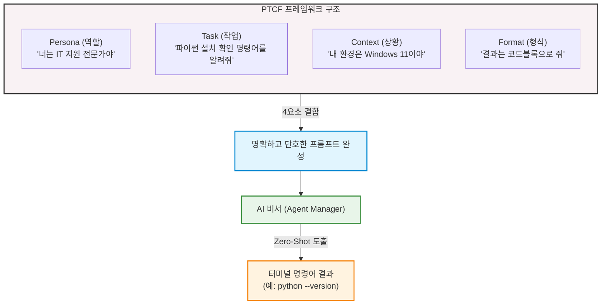

---

## §3. 상세 내용

### Why — 왜 명령어를 외우지 않고 프롬프트를 작성하는가?

과거의 코딩 교육은 명령어 암기에서 시작했습니다. 하지만 AI 시대에 명령어를 외우는 것은 유통기한이 아주 짧은 지식을 억지로 머릿속에 구겨 넣는 것과 같아요. 오늘 파이썬 확인 명령어를 외워도, 내일은 Node.js 확인 명령어가 필요해지고, 모레는 또 다른 도구의 명령어가 필요해집니다. 게다가 운영체제가 윈도우인지, 맥인지, 리눅스인지에 따라 명령어가 미세하게 달라지기도 해요. 이 모든 걸 다 외울 수는 없습니다.

하지만 **PTCF 프레임워크**를 활용한 프롬프트 작성법을 익혀두면 이야기가 달라집니다. 어떤 상황, 어떤 도구를 만나든 유연하게 대처할 수 있어요 [Source C]. 사전 예시 없이 바로 질문하는 방식인 Zero-Shot 프롬프팅을 하더라도, 구체적인 제약 조건을 주면 AI는 전문적인 훌륭한 답변을 내놓습니다. 이것이 바로 단순 코드 암기에서 벗어나 문제를 스스로 정의하고 해결 능력을 기르는 진정한 AI-native 방식입니다 [Source C].

### What — PTCF 프레임워크의 4대 요소

PTCF는 명확한 지시를 구성하기 위해 반드시 챙겨야 할 4가지 핵심 요소입니다 [Source C].

1. **Persona (페르소나)**: AI에게 역할을 부여합니다. "너는 ~야"라고 정해주는 순간, AI는 해당 전문가의 지식 풀(Pool)에서 답변을 꺼냅니다. (예: IT 지원 전문가, 시니어 파이썬 개발자, 친절한 선생님)
2. **Task (작업)**: 구체적으로 무엇을 해야 하는지, 행동의 목표를 명시합니다. 두루뭉술하게 말하지 말고 콕 집어 말해야 합니다. (예: 설치 확인 명령어를 안내해 줘)
3. **Context (상황)**: 나의 현재 환경, 배경 지식, 겪고 있는 문제 상황 등을 충분히 제공합니다. (예: 나는 코딩 초보자이고, 현재 Windows 11 운영체제를 사용 중이야)
4. **Format (형식)**: 어떤 형태로 답변을 받을지 출력의 형태를 지정합니다. 이 부분이 없으면 AI가 혼자 신나서 쓸데없이 긴 설명을 늘어놓습니다. (예: 부가 설명은 빼고 터미널 코드블록으로만 깔끔하게 출력해 줘)

이 4가지 요소를 모두 조합하면 AI가 환각(엉뚱한 소리나 거짓말)을 일으킬 확률을 극적으로 낮출 수 있습니다. 메뉴 기획자가 주방장에게 지시를 내릴 때, 1인분인지 2인분인지, 맵게 할지 안 맵게 할지 정확히 알려주는 것과 같아요.

### How — 프롬프트를 터미널 명령어로 연결하는 워크플로우

우리가 AI에게 PTCF 프롬프트를 던지면, AI는 `python --version`과 같은 명령어를 검은색 코드블록 형태로 깔끔하게 내놓습니다. 그러면 우리는 그 명령어를 복사해서 **통합 터미널**에 붙여넣고 키보드의 Enter 키를 누르기만 하면 돼요. 

터미널은 마우스로 더블 클릭을 하는 대신, 텍스트를 타이핑해서 컴퓨터와 직접 소통하는 창구입니다. Enter를 치면 결과가 나타나는데, 에러가 뜨든 버전 숫자가 뜨든 당황할 필요가 없습니다. 그 결과 자체가 우리 컴퓨터의 현재 상태를 알려주는 아주 중요한 단서이기 때문입니다. 

명령어를 AI에게 묻고, 복사해서, 터미널에 실행한다. 이 간단한 3박자 리듬을 꼭 기억해 두세요.

---

## §4. 실습 가이드 (+ 🎙️ 실습 대본)

### 실습 목표

PTCF 프레임워크를 활용해 파이썬 설치 확인 프롬프트를 직접 작성해 봅니다. 그리고 AI가 알려준 명령어를 터미널에 실행하여 자신의 컴퓨터(냉장고) 환경을 직접 확인하고 결과를 판독해 봅니다.

🎙️ **실습 가이드 대본 (Lab Guide)**:

> 자, 직접 확인해 볼 시간입니다. 여러분 컴퓨터의 주방 냉장고를 열어볼 거예요.
>
> 첫째로, Antigravity 화면 하단에서 까만 화면인 터미널(Terminal) 패널을 열어주세요. 저번 시간에 배웠던 단축키를 쓰셔도 좋고, 상단 메뉴에서 여셔도 좋습니다. 이 까만 터미널 창이 바로 냉장고 문을 여는 손잡이 역할을 할 겁니다.
> 
> 둘째로, 우측에 있는 Agent Manager 창을 열고 제가 화면에 띄워드린 PTCF 프롬프트를 그대로 입력해 보세요. "너는 IT 지원 전문가야. Windows 11 환경에서 파이썬이 설치되어 있는지 확인하는 터미널 명령어를 알려줘. 결과는 코드블록으로 줘." 라고요. 만약 맥북을 쓰시는 분이라면 Windows 11 부분을 macOS로 살짝 바꿔주시면 됩니다 [Source B][Source C].
>
> 셋째, AI가 답변을 주면, 그 검은색 코드블록 안에 있는 명령어를 복사해서 방금 연 터미널 창에 붙여넣고 힘차게 Enter 키를 쳐보세요. 
> 
> 결과가 어떻게 나오나요? 화면에 "Python 3.12.0"처럼 버전 숫자가 뜨는 분도 계실 거고, "python을 찾을 수 없습니다" 같은 붉은 에러 메시지가 뜨는 분도 계실 거예요. 여러분, 둘 다 아주 정상적인 결과입니다! 에러가 떴다고 컴퓨터가 고장난 게 아니에요.

### 단계별 지시

| 단계 | 소요 시간 | 강사 지시사항 | 학습자 액션 | 예상 결과 |
|------|----------|--------------|------------|----------|
| 1 | 2분 | "Antigravity 하단의 통합 터미널을 열어주세요. 까만 화면이 나와도 당황하지 마세요." | 단축키(``Ctrl + ` ``) 입력 또는 상단 메뉴 Terminal → New Terminal 클릭 | 화면 하단에 터미널 창 표시 |
| 2 | 3분 | "우측 Agent Manager에 화면에 보이는 PTCF 프롬프트를 타이핑하세요. (자신의 OS에 맞게 Context 변경)" | 프롬프트 입력 창에 PTCF 요소가 포함된 문장 타이핑 후 전송 버튼 클릭 | AI가 `python --version` 또는 `python3 --version` 명령어를 코드블록으로 제시 |
| 3 | 2분 | "AI가 준 코드블록의 명령어를 복사해서 터미널에 붙여넣고 Enter를 누르세요. 마우스 우클릭으로 붙여넣기가 편합니다." | 코드 복사 후 터미널 창에 우클릭 또는 단축키로 붙여넣기 → Enter | 파이썬 버전 출력 또는 명령어를 찾을 수 없다는 에러 메시지 출력 |
| 4 | 3분 | "나온 결과를 확인해 보세요. 버전이 뜨는지, 붉은색 에러가 뜨는지 옆 사람 화면과도 한번 비교해 보세요." | 터미널 출력 결과 확인 | 자신의 컴퓨터에 파이썬이 설치되어 있는지 상태 파악 완료 |

### 트러블슈팅 FAQ

| Q | A |
|---|---|
| 터미널에 붙여넣기가 안 돼요! | 터미널 창에서는 `Ctrl+V` 대신 마우스 우클릭을 하거나 `Shift + Insert`를 눌러야 붙여넣기가 되는 경우가 많습니다. |
| AI가 명령어를 안 주고 설명만 해요. | 프롬프트의 Format(형식) 부분이 약해서 그래요. "긴 설명은 절대 하지 말고 오직 터미널 코드블록 하나만 딱 출력해줘"라고 단호하게 지시해 보세요. |
| 저는 Mac을 쓰는데 Windows라고 쳐야 하나요? | 아닙니다! Context(상황) 요소는 자신의 실제 상황에 맞게 적어야 해요. "현재 macOS 환경에서"로 바꿔서 질문하시면 Mac에 맞는 명령어를 알려줍니다. |
| 빨간 글씨로 길게 에러가 떴어요! | 절대 컴퓨터가 고장난 것이 아닙니다! 에러 메시지는 "주인님, 냉장고에 파이썬 재료가 없어요!"라고 친절하게 보고하는 러브레터입니다. |

---


### 🎓 강사 노트 (Instructor Support)

- ⏱️ **타이밍**: 11:50 (20분, lab)
- 🎯 **핵심 활동**: 터미널 열기, 시스템 정보 질문
- ⚠️ **강사 주의사항**: 터미널 처음인 학습자 많음 — 천천히


### 📋 실습 설계 보강 (Lab Packet)

**세션 008 실습 설계 보강**

프롬프트로 시스템 환경 확인
- **3-Stage Example Set**
  - 기본: AI에게 "내 컴퓨터에 파이썬이 설치되어 있는지 확인하는 방법을 알려줘" → `python --version` 실행
  - 변형: "운영체제 정보도 알고 싶어" → `systeminfo` 명령어 안내받기
  - 실수 해결: `python`이 인식 안 될 때 → PATH 환경변수 문제. AI에게 에러 메시지 복사해서 질문
- **난이도 예측**: 터미널에 직접 타이핑하는 첫 경험 — 매우 긴장
- **타이밍 가이드**: 터미널 열기 3분 | AI에게 질문 5분 | 명령어 실행 5분 | 트러블슈팅 7분
- **심리적 장벽**: CLI 공포증 — "까만 화면에 글자만 있어서 무서워요"
- **자가 점검**:
  - [ ] 터미널에서 `python --version` 결과가 출력되는가?
  - [ ] 에러가 나면 AI에게 에러 메시지를 복사하여 질문했는가?
  - [ ] 내 OS 버전을 터미널에서 확인할 수 있는가?

## §5. 코드 및 명령어 모음

### PTCF 프롬프트 템플릿 예시

```text
[Persona] 너는 10년 차 IT 지원 전문가야.
[Context] 현재 내 컴퓨터는 Windows 11 (또는 macOS) 환경이야. 나는 코딩 초보자야.
[Task] 파이썬이 내 컴퓨터에 설치되어 있는지 터미널에서 확인하는 명령어를 알려줘.
[Format] 부가적인 인사말이나 설명은 전부 제외하고, 바로 복사할 수 있는 터미널 코드블록으로만 딱 1줄 작성해 줘.
```

### AI가 제시할 예상 명령어

```bash
# Windows 환경의 경우
python --version

# macOS 환경의 경우
python3 --version
```

### 터미널에서 나타날 수 있는 예상 출력 결과

**1) 설치되어 있는 경우 (성공 메시지)**
```text
Python 3.12.0
```

**2) 설치되어 있지 않은 경우 (에러 메시지)**
```text
'python'은(는) 내부 또는 외부 명령, 실행할 수 있는 프로그램, 또는 
배치 파일이 아닙니다.
```
> *참고: Mac의 경우 `command not found: python3` 등의 메시지가 출력됩니다.*

---

## §6. 요약

### 핵심 학습 포인트

오늘 이번 세션에서는 단순히 컴퓨터에 파이썬이 있는지 확인하는 작업을 넘어서, 아주 중요한 첫 경험을 했습니다. 바로 **첫 프롬프트 엔지니어링**을 체험한 것이죠. 명령어를 통째로 암기하는 고리타분한 시대는 이미 지났다는 것을 몸소 체험하셨을 거예요. 

대신 우리는 AI에게 Persona(페르소나), Task(작업), Context(상황), Format(형식)이라는 4가지 요소(PTCF)를 꼼꼼히 갖춰 명확하게 지시하는 공식을 배웠습니다. 이 작은 프롬프트 작성 경험 하나가 여러분을 코드를 무작정 타이핑하는 코더에서 벗어나게 해 줄 것입니다. 명확하게 지시하고, 결과를 받아 터미널에 실행하여 검증하는 이 사이클이 AI-native 개발자로 가는 첫걸음입니다 [Source C].

### 다음 세션 예고

터미널에 붉은색 에러 메시지가 뜬 분들, 속으로 '내가 시작하자마자 뭘 잘못했나' 철렁하셨죠? 전혀 아닙니다. 냉장고에 요리할 재료가 없다는 걸 아주 정확하게 확인했을 뿐이에요. 재료가 없으면 사 오면 그만이죠! 다음 세션에서는 파이썬이 없는 분들을 위해, AI 비서에게 다시 한번 "파이썬 설치 가이드"를 물어보고 파이썬을 아주 빠르고 쉽게 설치해 보겠습니다.

### 브릿지 노트

> "자, 파이썬이 안 깔려 있다고 붉은 에러가 나오신 분들 손 들어보실까요? 네, 아주 많네요. 당황하지 마세요. 아주 정상입니다. 여러분이 컴퓨터를 새로 샀다면 애초에 없는 게 당연해요. 자, 이제 우리 집 주방 냉장고가 비어있다는 걸 확실하게 알았으니, 본격적으로 든든한 AI 비서와 함께 파이썬이라는 아주 신선한 재료를 사러 마트로 가보겠습니다! 다음 세션으로 넘어가죠."

---

## §7. 참고 자료

### 3-Source 출처

- **Source A (로컬 참고자료)**: `AI-native_파이썬기초.md` — 프롬프트를 활용한 문제 정의의 중요성과 코더가 아닌 기획자로서의 역할 전환 패러다임
- **Source B (NotebookLM)**: Antigravity 통합 터미널 활용 예시 및 시스템 환경 확인을 위한 AI 비서와의 상호작용 워크플로우 분석
- **Source C (Deep Research)**: `3 프롤프트 엔지니어링.pdf` — PTCF(Persona, Task, Context, Format) 프레임워크 이론, Zero-Shot 프롬프팅 적용 사례 및 에러 메시지 디버깅 기초

### 강사 노트

> 💡 본 세션은 수강생들이 처음으로 프롬프트를 구조적으로 작성해 보고, 터미널이라는 낯선 환경을 접하는 시간입니다. "명령어 암기 불필요"라는 핵심 메시지를 반복해서 강조해 주시고, PTCF의 각 요소가 왜 필요한지 일상적인 비유(식당 주문 등)를 곁들여 설명하면 좋습니다. 또한 붉은 에러 메시지가 떴을 때 수강생들이 두려워하지 않도록 심리적 장벽을 낮춰주는 것이 가장 중요합니다. (에러 메시지 = 컴퓨터가 보내는 친절한 상태 보고서)

---

## ✅ 세션 완료 체크리스트 (강사용)

- [x] §1~§7 모든 섹션이 빠짐없이 충실하게 작성되었는가?
- [x] 비유와 스토리텔링이 적극적으로 포함되었는가? (주방 냉장고와 삼겹살 비유)
- [x] 실습 단계별 지시표가 초보자도 따라 할 수 있게 완전한가?
- [x] PTCF 프레임워크 4대 요소(Persona, Task, Context, Format)가 명확히 설명되었는가?
- [x] 3-Source 팩트 패킷(A, B, C)이 본문과 참고 자료에 골고루 반영되었는가?

---

*작성 일시: 2026-02-25*  
*작성 에이전트: A4B_Session_Writer*  
*교안 구조: 7섹션 (A0 팀 공통 표준)*

> 🔗 **이전 세션**: [세션 007: 멀티에이전트 오케스트레이션 기초](#세션-007)에서 배운 내용을 이어갑니다.
> 🔗 **다음 세션**: [세션 009: AI와 함께 Python 설치하기](#세션-009)에서 계속됩니다.

---

### 세션 009: AI와 함께 Python 설치하기
> [원본 파일](sessions/세션-009-AI와_함께_Python_설치하기_v2.1.md) | ⏱️ 20분 | 🧪 lab | 난이도: medium

> **세션 ID**: MS-PY101-009  
> **소요 시간**: 20분  
> **난이도**: medium  
> **청크 타입**: lab  
> **버전**: v2.1 (7섹션 구조)

---

## §1. 개요

> **Day 1 | AM | 세션 009/022**

### 🎯 학습 목표

이 세션이 끝나면, 수강생은 다음을 할 수 있습니다:

- AI 에이전트의 안내를 받아 Python 인터프리터를 운영체제에 설치할 수 있다
- "Add python.exe to PATH" 옵션의 의미를 이해하고 올바르게 설정할 수 있다
- 터미널에서 `python --version` 명령어로 설치를 검증할 수 있다

### 선행 세션 환기

바로 직전 세션(세션-008)에서 우리는 PTCF 프레임워크를 사용해서 AI에게 "내 컴퓨터에 파이썬이 깔려 있는지 확인해줘"라고 물어보는 연습을 했어요. 터미널에서 `python --version`을 실행했을 때, 버전 번호가 나온 분도 계시고, "python을 찾을 수 없습니다"라는 메시지를 만난 분도 계셨죠. 오늘은 그 "찾을 수 없습니다" 상태를 해결하는 시간이에요. 냉장고(시스템 환경)를 열어봤더니 핵심 재료(Python)가 없었으니, 이제 마트에 가서 사올 차례입니다.

---

## §2. 핵심 개념 (+ 🗣️ 강사 대본 + Mermaid)

### Python 인터프리터 = "가스레인지 설치"

여러분이 새 아파트에 입주했다고 상상해 보세요. 주방은 깨끗하게 비어 있고, 싱크대도 있고, 환풍기도 있어요. 하지만 요리를 하려면 가장 중요한 것이 하나 빠져 있습니다. 바로 가스레인지예요. 아무리 좋은 재료가 있어도 가스레인지 없이는 볶음밥 한 그릇 만들 수 없죠. Python 인터프리터가 바로 이 가스레인지입니다. AI가 아무리 훌륭한 코드를 작성해 줘도, Python이 설치되어 있지 않으면 그 코드를 실행할 수가 없어요.

그런데 가스레인지를 설치할 때 중요한 과정이 하나 더 있습니다. 바로 가스 배관 연결이에요. 가스레인지를 예쁘게 놓아두기만 하고 배관을 연결하지 않으면 어떻게 될까요? 불이 안 켜집니다. Python 설치에서 이 "가스 배관 연결"에 해당하는 것이 바로 **"Add Python to PATH"**라는 체크박스예요. PATH는 쉽게 말해서 컴퓨터의 전화번호부입니다. "파이썬이라는 프로그램은 이 주소에 살고 있어"라고 등록해 주는 과정이에요. 이걸 안 하면, 터미널에서 `python`이라고 불러도 컴퓨터는 "그런 사람 모르는데요?"라고 대답합니다.

🗣️ **강사 대본 (Instructor Script)**:

> 여러분, 지난 시간에 시스템 환경을 확인해 봤더니 파이썬이 없다고 나온 분들이 꽤 계셨죠? 완전히 정상이에요. 냉장고에 재료가 없으면 어떻게 하나요? 마트에 가서 사오면 됩니다. 오늘은 AI 비서의 안내를 받으면서 파이썬이라는 핵심 재료를 우리 컴퓨터에 장착해 볼 거예요.
>
> 혹시 "설치"라는 말만 들어도 긴장되시는 분 계세요? 오류가 날까 두려우신 거죠? 걱정하지 마세요. 든든한 1:1 튜터가 여러분 화면 안에 이미 대기하고 있습니다. "파이썬 설치할 때 체크박스 뭐 눌러야 해?"라고 서슴없이 물어보세요. 검색 엔진에서 블로그 글을 뒤지던 시대는 끝났어요. AI 에이전트와 대화하면서 설치 경로와 옵션을 실시간으로 안내받는 것, 이것이 AI-native 방식의 환경 구축입니다.
>
> 자, 오늘의 핵심 비유를 하나 기억해 주세요. **Python 설치 = 가스레인지 설치, PATH 설정 = 가스 배관 연결**. 가스레인지(Python)를 가져다 놓기만 하면 안 되고, 배관(PATH)까지 연결해야 요리(코드 실행)를 시작할 수 있어요. 이 비유 하나만 기억하시면 오늘 실습이 훨씬 편해질 거예요.

> 💡 **강사 노트**: 가스레인지/배관 비유는 v2.0 교안에서 발전시킨 것이며, AI 에이전트 안내 방식의 설치 워크플로우는 NotebookLM(Source B) 기반입니다. PATH 개념의 전화번호부 비유는 초보자 대상 설명에서 직관적으로 작동합니다.

### Mermaid 다이어그램

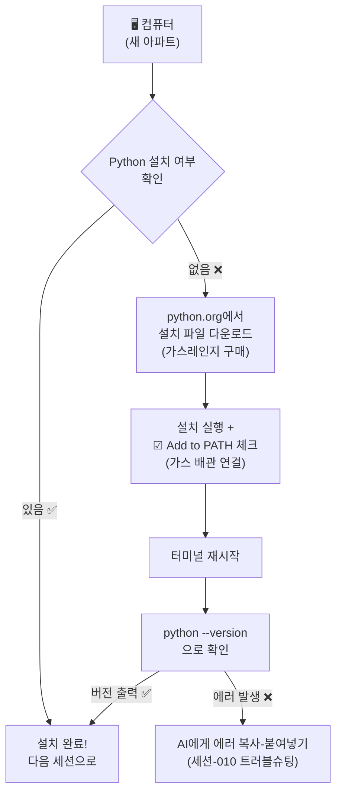

---

## §3. 상세 내용

### Why — 왜 Python을 설치해야 하는가?

"AI가 코드를 다 짜주는데, 파이썬은 왜 필요하죠?"라는 질문을 하실 수도 있어요. 아주 좋은 질문입니다. 비유로 설명해 드릴게요. AI가 써준 코드는 "레시피"예요. 아무리 맛있는 레시피가 있어도, 실제로 불을 켜고 프라이팬을 올려서 요리해야 음식이 나오죠. Python 인터프리터가 바로 이 "불을 켜는 장치"입니다. AI가 작성한 파이썬 코드를 컴퓨터가 이해할 수 있는 기계어로 번역해서 실행해 주는 핵심 엔진이에요.

"AI 시대의 서사"에서 배운 통역사 비유를 떠올려 볼까요? AI가 우리의 한국어 요청을 파이썬어(코드)로 번역해 주는 통역사라면, Python 인터프리터는 그 파이썬어를 컴퓨터가 이해할 수 있는 기계어로 다시 번역해 주는 두 번째 통역사예요. 통역사가 두 명 필요한 셈이죠. 첫 번째 통역사(AI)는 이미 Antigravity 안에 있고, 두 번째 통역사(Python)를 지금 설치하는 겁니다.

### What — Python 인터프리터란 무엇인가?

Python(파이썬)은 세계에서 가장 많이 쓰이는 프로그래밍 언어 중 하나예요. AI, 데이터 분석, 웹 개발, 자동화 등 거의 모든 분야에서 활용됩니다. 특히 AI 분야에서는 사실상 표준 언어나 다름없어요. ChatGPT도, Gemini도, 그 뒤에서 돌아가는 코드 상당 부분이 파이썬으로 작성되어 있습니다.

우리가 설치하려는 것은 정확히 말하면 **"CPython 인터프리터"**예요. "인터프리터(interpreter)"는 영어로 "통역사"라는 뜻인데, 파이썬 코드를 한 줄 한 줄 읽어서 컴퓨터가 실행할 수 있게 변환해 주는 프로그램입니다. 설치 파일 용량은 약 30MB 정도로, 요즘 스마트폰 사진 한 장보다 작아요. 설치 자체는 5분이면 충분합니다.

설치 과정에서 반드시 기억하실 것은 딱 하나, **"Add python.exe to PATH"** 체크박스를 꼭 체크하는 것이에요. 이 체크박스 하나가 나중에 수많은 에러를 예방해 줍니다.

### How — 어떻게 설치하는가?

설치 방법은 운영체제에 따라 약간 다릅니다. 우리 과정에서는 Windows를 기본으로 진행하되, macOS 사용자를 위한 안내도 함께 제공해요.

**Windows 사용자의 경우**, python.org 공식 사이트에서 설치 파일(.exe)을 다운로드하여 실행합니다. 설치 마법사 첫 화면에서 하단의 "Add python.exe to PATH" 체크박스를 반드시 체크한 뒤, "Install Now"를 클릭하면 됩니다. 설치가 완료되면 터미널을 새로 열어서 `python --version`으로 확인합니다.

**macOS 사용자의 경우**, macOS에는 시스템 Python이 기본 포함되어 있을 수 있지만, 보통 오래된 버전이에요. python.org에서 macOS용 설치 파일(.pkg)을 다운로드하여 설치하거나, Homebrew를 사용할 수도 있습니다. 터미널에서 `python3 --version`으로 확인합니다.

두 경우 모두, 설치 후 터미널을 반드시 새로 열어야 합니다. 환경 변수(PATH)는 터미널이 시작될 때 읽어오기 때문에, 기존에 열려 있던 터미널에서는 새로 설치한 Python을 인식하지 못할 수 있어요.

> ✅ **체크포인트**: 여기까지 이해했는지 스스로 점검해 보세요.
> - Python 인터프리터의 역할을 한 문장으로 설명할 수 있나요? ("파이썬 코드를 컴퓨터가 이해할 수 있게 실행해 주는 프로그램")
> - "Add to PATH"를 체크해야 하는 이유를 비유로 설명할 수 있나요? ("가스 배관을 연결해야 불이 켜지듯, PATH에 등록해야 터미널에서 python을 찾을 수 있다")

### 비교표 — Python 설치 옵션

| 항목 | Install Now (권장) | Customize installation |
|------|-------------------|----------------------|
| 대상 | 초보자, 빠른 설치 원하는 분 | 설치 경로나 옵션을 직접 지정하고 싶은 분 |
| PATH 설정 | 하단 체크박스로 자동 등록 | 수동으로 선택 가능 |
| 설치 경로 | 기본 경로 자동 지정 | 원하는 폴더 지정 가능 |
| 소요 시간 | 약 2~3분 | 약 5분 (옵션 검토 시간 포함) |
| 이 과정에서의 선택 | ✅ 이것을 선택하세요 | 나중에 익숙해지면 사용 |

---


### 📊 참고 표 (Visual Specs)

**개발 환경 설정 체크리스트**

| 단계 | 목표 | AI 프롬프트 예시 | 확인 방법 |
|:---|:---|:---|:---|

## §4. 실습 가이드 (+ 🎙️ 실습 대본)

### 실습 목표

이 실습을 통해 수강생은 AI 에이전트의 안내를 받으며 Python을 설치하고, 터미널에서 설치 결과를 직접 검증하는 경험을 합니다.

🎙️ **실습 가이드 대본 (Lab Guide)**:

> 자, 이제 직접 해볼 시간이에요. 화면에 Antigravity가 열려 있죠? 오른쪽 Agent Manager 패널을 봐주세요. 지금부터 이 AI 비서에게 파이썬 설치를 도와달라고 부탁할 거예요. 검색 엔진에서 블로그 글을 찾아 헤매는 게 아니라, AI와 대화하면서 한 단계씩 진행하는 거예요. 이것이 AI-native 방식의 학습입니다.
>
> 혹시 이미 파이썬이 설치되어 있는 분은 손 들어 주세요. 그런 분들은 설치 과정을 건너뛰고, 맨 마지막 검증 단계부터 함께 하시면 됩니다. 파이썬이 없는 분들, 긴장하지 마세요. 제가 한 단계씩 같이 갈게요. 막히면 AI 비서에게 바로 물어보시면 됩니다.

### 단계별 지시 — Windows 사용자

| 단계 | 소요 시간 | 강사 지시사항 | 학습자 액션 | 예상 결과 |
|------|----------|--------------|------------|----------|
| 1 | 2분 | "Agent Manager에 프롬프트를 입력하세요" | 아래 프롬프트를 Agent Manager에 입력 | AI가 설치 절차를 안내 |
| 2 | 1분 | "AI가 안내하는 링크로 이동하세요" | 웹 브라우저에서 python.org 접속 | Python 다운로드 페이지 표시 |
| 3 | 1분 | "최신 버전 다운로드 버튼을 클릭하세요" | "Download Python 3.x.x" 클릭 | .exe 파일 다운로드 시작 |
| 4 | 1분 | "⚠️ 체크박스를 반드시 체크하세요!" | 설치 파일 실행 → "Add python.exe to PATH" 체크 | 체크박스에 ✅ 표시 |
| 5 | 2분 | "Install Now를 클릭하고 기다리세요" | "Install Now" 클릭 | 설치 진행 바 → "Setup was successful" |
| 6 | 1분 | "터미널을 닫았다가 새로 여세요" | 기존 터미널 닫기 → `Ctrl + `` ` 로 새 터미널 | 새 PowerShell 세션 시작 |
| 7 | 1분 | "검증 명령어를 입력하세요" | `python --version` 입력 | "Python 3.x.x" 출력 |

**[단계 1] AI에게 설치 안내 요청하기**

Agent Manager 채팅창에 다음 프롬프트를 입력하세요:

```
너는 IT 지원 전문가야. Windows 11 환경에서 Python 최신 버전을 설치하는 방법을 
단계별로 알려줘. 반드시 환경 변수(PATH) 설정도 포함해줘. 
초보자도 따라할 수 있게 스크린샷 없이 텍스트로만 자세히 설명해줘.
```

AI가 python.org 다운로드 링크와 함께 상세한 설치 절차를 안내해 줄 거예요. 이때 AI의 응답을 꼼꼼히 읽어보세요. 우리가 수업에서 배운 "가스레인지 비유"와 비슷한 설명이 나올 수도 있고, 더 자세한 정보를 제공할 수도 있어요.

**[단계 2~3] python.org에서 설치 파일 다운로드**

웹 브라우저를 열고 `python.org`에 접속합니다. 상단 메뉴에서 "Downloads"를 클릭하면, 여러분의 운영체제에 맞는 최신 버전 다운로드 버튼이 자동으로 표시됩니다. 노란색 "Download Python 3.x.x" 버튼을 클릭하세요.

**[단계 4] ⚠️ 가장 중요한 순간 — PATH 체크박스**

다운로드된 설치 파일을 실행하면 설치 마법사가 열립니다. 이 화면에서 절대 바로 "Install Now"를 누르지 마세요! 먼저 화면 하단을 보세요. "Add python.exe to PATH"라는 작은 체크박스가 있습니다. 이것을 반드시 체크하고 나서 "Install Now"를 클릭하세요. 이 체크박스가 바로 우리 비유에서 "가스 배관 연결"에 해당하는 부분이에요. 이걸 빼먹으면 나중에 터미널에서 python 명령어를 인식하지 못합니다.

**[단계 5] 설치 진행 및 완료**

"Install Now"를 클릭하면 설치가 진행됩니다. 진행 바가 차오르는 동안 1~2분 정도 기다려 주세요. "Setup was successful"이라는 메시지가 나타나면 "Close"를 클릭합니다.

**[단계 6] 터미널 재시작**

여기서 중요한 팁이 하나 있어요. 환경 변수(PATH)는 터미널이 시작될 때 한 번 읽어옵니다. 그래서 Python을 설치하기 전에 이미 열려 있던 터미널에서는 새로 설치한 Python을 인식하지 못할 수 있어요. 반드시 터미널을 닫았다가 새로 열어주세요. Antigravity에서 `Ctrl + `` ` 키로 터미널을 열 수 있습니다.

**[단계 7] 설치 검증**

새로 연 터미널에 다음 명령어를 입력합니다:

```powershell
python --version
```

화면에 `Python 3.14.x` (또는 최신 버전 번호)가 출력되면 설치 성공입니다! 축하해요!

### 단계별 지시 — macOS 사용자

| 단계 | 소요 시간 | 강사 지시사항 | 학습자 액션 | 예상 결과 |
|------|----------|--------------|------------|----------|
| 1 | 2분 | "Agent Manager에 macOS용 프롬프트를 입력하세요" | 아래 프롬프트를 Agent Manager에 입력 | AI가 macOS 설치 절차 안내 |
| 2 | 1분 | "python.org에서 macOS 설치 파일을 받으세요" | python.org → Downloads → macOS → .pkg 다운로드 | .pkg 파일 다운로드 |
| 3 | 2분 | "설치 파일을 실행하고 안내를 따르세요" | .pkg 파일 더블클릭 → 설치 마법사 진행 | 설치 완료 |
| 4 | 1분 | "터미널을 새로 열고 검증하세요" | 터미널 재시작 → `python3 --version` 입력 | "Python 3.x.x" 출력 |

macOS에서 AI에게 도움을 요청할 때 사용할 프롬프트:

```
너는 IT 지원 전문가야. macOS 환경에서 Python 최신 버전을 설치하는 방법을 
단계별로 알려줘. 초보자도 따라할 수 있게 자세히 설명해줘.
```

macOS에서는 `python3`라는 명령어를 사용한다는 점이 Windows와 다릅니다. macOS 터미널에서 `python3 --version`을 입력해서 버전을 확인하세요.

### 트러블슈팅 FAQ

| Q | A |
|---|---|
| `python --version`을 실행했는데 Microsoft Store가 열려요 | Windows 11에서 자주 발생하는 현상이에요. 설정 → 앱 → 앱 실행 별칭에서 "python.exe"와 "python3.exe"의 앱 설치 관리자를 **끄기**로 변경하세요. 터미널을 재시작하면 정상 작동합니다. |
| "python을 찾을 수 없습니다"라는 에러가 나와요 | PATH 체크박스를 빼먹었을 가능성이 높아요. Python 설치 파일을 다시 실행 → "Modify" 선택 → PATH 옵션 활성화. 또는 AI에게 에러 메시지를 복사해서 물어보세요. |
| 설치 중 "Windows의 PC 보호" 경고가 떠요 | "추가 정보" → "실행"을 클릭하면 됩니다. python.org의 공식 프로그램이니 안전해요. |
| 설치할 때 "Add python.exe to PATH"를 깜빡하고 안 눌렀어요 | 설치 파일을 다시 실행 → "Modify" 선택 → 다음 화면에서 PATH 옵션 체크. 또는 다음 세션(010)에서 배울 트러블슈팅으로 수동 해결할 수 있어요. |
| macOS에서 `python`이 아니라 `python3`를 써야 하나요? | 네, macOS에서는 `python3`가 기본 명령어예요. `python`은 시스템 Python(2.x)을 가리킬 수 있으므로 항상 `python3`를 사용하세요. |
| 설치 파일이 다운로드되지 않아요 | 브라우저의 다운로드 차단 설정을 확인해 보세요. Chrome이라면 주소창 오른쪽의 다운로드 아이콘을 클릭하고 "허용"을 눌러주세요. |

> ✅ **체크포인트**: `python --version`(macOS는 `python3 --version`) 명령어가 Python 버전을 정상적으로 출력하나요? 출력됐다면 손을 들어 주세요!

---


### 🎓 강사 노트 (Instructor Support)

- ⏱️ **타이밍**: 13:10 (20분, lab)
- 🎯 **핵심 활동**: Python 다운로드 & 설치
- ⚠️ **강사 주의사항**: PATH 환경변수 체크박스 강조!


### 📋 실습 설계 보강 (Lab Packet)

**세션 009 실습 설계 보강**

AI와 함께 Python 설치하기
- **3-Stage Example Set**
  - 기본: AI에게 "Windows 11에 Python 최신 버전 설치하는 법 알려줘" → 안내에 따라 설치
  - 변형: 이미 Python이 있는 경우 — 버전 확인 후 업데이트 여부 판단
  - 실수 해결: "Add Python to PATH" 체크박스 놓침 → 환경변수 수동 등록 또는 재설치
- **난이도 예측**: "Add to PATH" 체크박스가 가장 빈번한 실수 포인트
- **타이밍 가이드**: 다운로드 안내 5분 | 설치(PATH 체크 강조) 7분 | 확인 3분 | 트러블슈팅 5분
- **심리적 장벽**: "설치 마법사에 영어가 많아서 겁나요"
- **자가 점검**:
  - [ ] 설치 시 "Add Python to PATH" 체크박스를 선택했는가?
  - [ ] `python --version`이 정상 출력되는가?
  - [ ] `pip --version`도 정상 출력되는가?

## §5. 코드 및 명령어 모음

### 명령어 1: Python 버전 확인 (Windows)

```powershell
python --version
```

이 명령어는 현재 시스템에 설치된 Python의 버전을 출력합니다. "Python 3.14.x" 형태의 버전 정보가 나오면 정상 설치된 것입니다.

> 🤖 **AI 프롬프트 예시**: "내 컴퓨터에 파이썬이 설치되어 있는지 확인하는 명령어를 알려줘"

### 명령어 2: Python 버전 확인 (macOS)

```bash
python3 --version
```

macOS에서는 `python` 대신 `python3` 명령어를 사용합니다. macOS 시스템에 기본 포함된 Python 2.x와 구분하기 위한 것이에요.

### 명령어 3: Python 설치 경로 확인 (Windows)

```powershell
where python
```

Python이 설치된 정확한 경로를 보여줍니다. 보통 `C:\Users\[사용자이름]\AppData\Local\Programs\Python\Python3xx\python.exe` 형태로 출력됩니다.

> 🤖 **AI 프롬프트 예시**: "파이썬이 어디에 설치되어 있는지 확인하는 방법을 알려줘"

### 명령어 4: Python 설치 경로 확인 (macOS)

```bash
which python3
```

macOS에서 Python 실행 파일의 경로를 확인하는 명령어입니다. `/usr/local/bin/python3` 또는 `/Library/Frameworks/Python.framework/Versions/3.xx/bin/python3` 형태로 출력됩니다.

### 명령어 5: Python 대화형 모드 진입 (설치 확인용)

```powershell
python
```

Python을 인자 없이 실행하면 대화형 모드(REPL)에 진입합니다. `>>>` 프롬프트가 표시되면 Python이 정상 작동하는 것입니다. 나가려면 `exit()` 또는 `Ctrl + Z` 후 Enter를 누르세요.

> 🤖 **AI 프롬프트 예시**: "파이썬 대화형 모드에 진입하는 방법과 나가는 방법을 알려줘"

### 명령어 6: uv 설치 스크립트 (Windows — 다음 세션 미리보기)

```powershell
irm https://astral.sh/uv/install.ps1 | iex
```

이 명령어는 다음 세션(011)에서 사용할 uv 패키지 매니저 설치 명령어입니다. 참고용으로 미리 수록합니다.

---

## §6. 요약

### 핵심 학습 포인트

이번 세션에서 우리는 AI 에이전트의 안내를 받으며 Python 인터프리터를 설치하는 경험을 했어요. 기억하실 핵심은 세 가지입니다. 첫째, Python 인터프리터는 AI가 써준 코드를 컴퓨터가 실행할 수 있게 해주는 핵심 엔진이에요. 가스레인지가 없으면 요리를 할 수 없듯이, Python이 없으면 코드를 실행할 수 없습니다. 둘째, 설치할 때 "Add python.exe to PATH" 체크박스를 반드시 체크해야 해요. 이것은 가스 배관을 연결하는 것과 같아서, 이걸 빼먹으면 터미널에서 python 명령어를 인식하지 못합니다. 셋째, 설치 후에는 반드시 터미널을 새로 열고 `python --version`으로 검증해야 해요. 설치했다고 끝이 아니라, 확인까지 해야 진짜 끝입니다.

### 다음 세션 예고

다음 세션에서는 아주 중요한 기술을 배울 거예요. "분명히 강사 말대로 했는데 왜 안 되죠?"라는 순간, 그 에러를 두려워하지 않고 해결하는 방법입니다. 개발자에게 가장 중요한 능력은 코드를 한 번에 완벽하게 만드는 것이 아니라, 문제가 생겼을 때 원인을 찾아내는 능력이에요.

### 브릿지 노트

> "모두 `python --version`에서 버전이 잘 뜨나요? 축하합니다! 우리 냉장고에 핵심 재료가 장착되었어요. 그런데 분명히 똑같이 했는데도 에러가 나는 분들이 계실 거예요. 에러가 났다고 실패한 게 아닙니다. 오히려 아주 좋은 학습 기회예요. 다음 세션에서는 도요타 자동차에서 탄생한 마법의 질문법, '왜?'라고 5번 묻는 5 Whys 트러블슈팅 기법을 배워보겠습니다."

---

## §7. 참고 자료

### 3-Source 출처

- **Source A (로컬 참고자료)**: 「AI-native_파이썬기초.md」(SRC-A07) — Python 설치 환경 스펙, 설치 경로 및 PATH 설정 가이드
- **Source B (NotebookLM)**: SRC-B01 — AI 에이전트 안내 기반 설치 워크플로우, "검색 엔진에 의존하지 않고 에이전트와의 대화를 통해 설치 경로와 옵션 안내받기" 패러다임
- **Source C (Deep Research)**: SRC-C01 — Python 인터프리터 아키텍처, CPython 런타임 구조

### 추가 학습 자료

- [Python 공식 다운로드 페이지](https://www.python.org/downloads/): 운영체제별 최신 Python 설치 파일
- [Python Beginner's Guide](https://wiki.python.org/moin/BeginnersGuide): Python 공식 위키의 초보자 가이드
- [Antigravity IDE 공식 사이트](https://antigravity.google): IDE 내장 Python 연동 관련 문서

### 강사 노트

> 💡 **강사 노트**: 설치 실습에서 가장 흔한 이슈는 PATH 미등록입니다. 수강생 중 30%가량이 이 문제를 경험하므로, 다음 세션(010 트러블슈팅)에서 바로 다룰 수 있도록 "에러가 나는 것이 좋은 학습 기회"라는 메시지를 강조해 주세요. macOS 사용자는 `python3` 명령어를 사용해야 한다는 점을 별도로 안내해 주시고, Homebrew 설치 방식은 이 과정 범위를 벗어나므로 python.org 공식 설치 파일을 권장합니다.

---

## ✅ 세션 완료 체크리스트 (강사용)

- [ ] §1~§7 모든 섹션이 충실하게 작성되었는가?
- [ ] 가스레인지/배관 비유가 §2에서 충분히 확장되었는가?
- [ ] Windows/macOS 양쪽 설치 경로가 §4에 포함되었는가?
- [ ] 단계별 지시표에 소요 시간이 명시되었는가?
- [ ] 트러블슈팅 FAQ가 6개 이상 포함되었는가?
- [ ] 체크포인트 질문이 §3, §4에 배치되었는가?
- [ ] 3-Source 팩트 패킷이 §7에 반영되었는가?
- [ ] 다음 세션(010 트러블슈팅) 브릿지 노트가 포함되었는가?

---

**🔗 선행 세션**: [세션-008] 프롬프트로 시스템 환경 확인 (권장)  
**🔗 후행 세션**: [세션-010] 트러블슈팅과 5Whys 기법

---

*작성 일시: 2026-02-25*  
*작성 에이전트: A4B_Session_Writer*  
*교안 구조: 7섹션 (A0 팀 공통 표준)*


> 🔗 **이전 세션**: [세션 008: 프롬프트로 시스템 환경 확인](#세션-008)에서 배운 내용을 이어갑니다.
> 🔗 **다음 세션**: [세션 010: 트러블슈팅과 5 Whys 기법](#세션-010)에서 계속됩니다.

---

### 세션 010: 트러블슈팅과 5 Whys 기법
> [원본 파일](sessions/세션-010-트러블슈팅과_5Whys_기법_v2.1.md) | ⏱️ 20분 | 🧪 lab | 난이도: medium

> **세션 ID**: MS-PY101-010
> **소요 시간**: 20분
> **난이도**: low
> **청크 타입**: narrative
> **버전**: v2.1 (7섹션 구조)

---

## §1. 개요

> **Day 1 | AM | 세션 010/022**

이전 세션에서 AI의 도움을 받아 파이썬을 성공적으로 설치했습니다. 모든 과정이 물 흐르듯 순조로웠다면 정말 좋았겠지만, 현실은 늘 예상치 못한 변수로 가득합니다. 분명히 지시대로 따라 했는데 화면에 낯선 빨간색 글씨가 가득 뜨는 상황을 마주하신 분도 계실 거예요. 이런 에러 메시지를 처음 마주하면 심장이 덜컹 내려앉고, 내가 컴퓨터를 망가뜨린 것은 아닌지 두려움이 밀려오기 마련입니다. 

하지만 이번 세션에서는 에러를 대하는 우리의 태도를 완전히 뒤바꿔 볼 예정입니다. 에러는 우리를 괴롭히려는 방해물이 아니라, 컴퓨터가 우리에게 보내는 절박하고도 친절한 '러브레터'입니다. 컴퓨터는 자신이 왜 멈춰 섰는지 아주 상세하게 적어서 우리에게 도움을 요청하고 있는 것이죠. 

### 🎯 학습 목표

이 세션이 끝나면 여러분은 다음을 할 수 있어요:
- 에러 메시지를 마주했을 때 당황하지 않고 AI에게 올바르게 질문할 수 있습니다.
- 문제를 의사에게 설명하듯 구체적인 맥락과 함께 전달하는 방법을 이해합니다.
- 도요타의 5Whys 기법을 활용해 겉으로 드러난 증상이 아닌 진짜 근본 원인을 파헤칠 수 있습니다.

### 선행 세션 환기

우리는 직전 세션(세션 009)에서 파이썬이라는 도구를 컴퓨터에 설치했어요. 설치 과정에서 체크박스 하나를 놓치거나 경로가 꼬이면 곧바로 실행 에러가 발생합니다. 이제 방금 설치한 파이썬을 직접 다루면서, 만약 문제가 생겼을 때 어떻게 해결의 실마리를 찾아야 하는지 그 강력한 무기를 장착해 보겠습니다.

---

## §2. 핵심 개념 (+ 🗣️ 강사 대본 + Mermaid)

### 병원 진단과 에러 메시지

에러를 해결하는 과정은 병원에 가서 의사에게 진찰을 받는 과정과 똑같습니다. 몸이 아파서 병원에 갔을 때, 의사 선생님에게 다짜고짜 "아파요, 고쳐주세요"라고만 말하면 어떻게 될까요? 의사는 "언제부터 아프셨나요?", "정확히 어디가 아픈가요?", "최근에 상한 음식을 드셨나요?"라며 계속해서 질문을 던질 수밖에 없습니다. 구체적인 증상과 정황을 모르면 처방전을 내릴 수 없기 때문입니다.

컴퓨터의 에러도 마찬가지입니다. AI 비서에게 "파이썬이 안 돼요"라고만 말하면 AI도 당황합니다. 화면에 뜬 에러 메시지를 글자 하나 빼놓지 않고 통째로 복사해서 AI에게 건네주는 행위는, 의사에게 "어제 저녁에 해산물을 먹은 직후부터 오른쪽 아랫배가 찌르듯이 아파요"라고 정확한 증상을 설명하는 것과 같습니다. 에러 메시지 안에는 문제가 발생한 정확한 파일 경로, 몇 번째 줄에서 멈췄는지, 어떤 종류의 오류인지에 대한 모든 단서가 들어 있습니다.

### 도요타 5Whys 기법

여기서 한 걸음 더 나아가 진짜 원인을 찾는 마법의 프레임워크가 바로 '5Whys(파이브 와이즈)'입니다. 이 기법은 원래 도요타 자동차 회사에서 제조 공정의 불량을 해결하기 위해 만들었어요. 원리는 아주 단순하면서도 강력합니다. 눈앞에 보이는 얕은 증상에 만족하지 않고, 문제의 근본 원인(Root Cause)에 닿을 때까지 "왜?"라는 질문을 꼬리에 꼬리를 물고 다섯 번 반복하는 것입니다.

🗣️ **강사 대본 (Instructor Script)**:

> 여러분, 파이썬 설치를 마쳤으니 모든 게 완벽하게 돌아가야 할 것 같죠? 그런데 화면에 빨간 에러 메시지가 뜨면 어떤 기분이 드시나요? 뭔가 큰 잘못을 저지른 것 같고 두려우실 겁니다. 하지만 비밀을 하나 알려드릴게요. 빨간 에러 메시지는 컴퓨터가 우리에게 보내는 러브레터입니다. 당황해서 창을 꺼버리지 마시고, 그 편지를 조심스럽게 긁어서 우리 AI 비서에게 건네주세요.
>
> 에러를 다루는 건 병원 진료와 같아요. "안 돼요"라고 말하는 건 "배 아파요"라고 하는 것과 같습니다. 에러 메시지를 복사해 주는 것이 바로 정확한 증상 설명이죠. 그리고 AI가 첫 번째 답변을 줬을 때 그냥 고개 끄덕이고 넘어가면 안 됩니다. 
> 
> "명령어가 안 먹혀요." 왜? "컴퓨터가 python이라는 단어를 모른대요." 왜? "환경 변수라는 곳에 등록이 안 됐대요." 왜? "설치할 때 맨 아래 체크박스를 안 눌렀거든요." 왜? "그게 무슨 뜻인지 몰랐어요." 왜? "전부 영어로 되어 있어서 그냥 Next 버튼만 눌렀습니다."
> 
> 어떠신가요? 이렇게 "왜?"를 반복하니까 진짜 원인이 '설치 화면의 영어 옵션을 간과한 것'이라는 깊은 곳까지 내려가게 되죠? 이것이 바로 5Whys 기법입니다.

### Mermaid 다이어그램

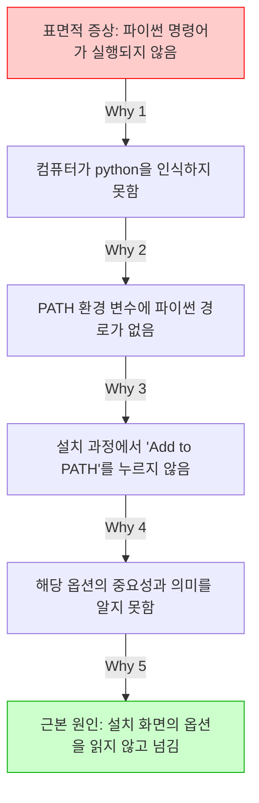

---

## §3. 상세 내용

### Why — 왜 5Whys를 배워야 하는가?

AI 시대에 우리가 코드를 직접 한 줄 한 줄 타이핑할 일은 많이 줄어들었습니다. 하지만 에러가 발생했을 때 그것을 해결하는 통찰력은 오히려 과거보다 훨씬 더 중요해졌습니다. "코드가 안 돌아가요"라는 똑같은 표면적 증상 앞에서도 진짜 원인은 천차만별입니다. 단순한 오타 때문일 수도 있고, 필요한 패키지를 설치하지 않아서일 수도 있으며, 컴퓨터의 운영체제 버전이 맞지 않아서일 수도 있습니다. 겉으로 드러난 증상만 보고 임시방편으로 대충 코드를 고치면, 나중에 더 거대한 버그가 되어 돌아옵니다. 근본 원인을 찾아 뿌리를 뽑아야 두 번 다시 같은 문제로 고통받지 않습니다.

### What — 에러 메시지를 다루는 올바른 태도

5Whys 기법을 제대로 쓰려면 먼저 지켜야 할 철칙이 있습니다. 에러 메시지는 절대 눈으로 보고 손으로 따라 치지 마세요. 무조건 마우스로 길게 드래그해서 전체를 복사(Ctrl+C)한 뒤 붙여넣기(Ctrl+V) 하셔야 합니다. 사람의 눈은 피곤하면 오타를 냅니다. 에러 메시지에 적힌 띄어쓰기 하나, 특수기호 하나가 문제 해결의 결정적 열쇠가 됩니다. 아주 사소해 보이는 예외 조건이나 코너 케이스(Corner Case)까지 AI가 완벽하게 인지하게 만드는 습관이 바로 디버깅 실력의 첫 단추입니다.

### How — AI와 함께 파고드는 5단계 추적

실제 상황에서 어떻게 적용할까요? 복사한 에러 메시지를 AI에게 던져주면서 "왜 이 에러가 발생했는지 초보자 수준으로 설명해줘"라고 요청하세요. AI가 첫 번째 원인을 알려주면, 그 원인을 다시 물고 늘어집니다. "그럼 환경 변수라는 건 왜 누락된 거야?"라고 질문하세요. 답변이 오면 "그럼 설치할 때 어떤 화면에서 내가 실수를 한 거지?"라고 또 묻는 겁니다. 표면적인 답변에서 만족하고 멈추지 마세요. AI의 친절한 설명을 징검다리 삼아 점점 더 깊은 원인으로 걸어 내려가는 감각을 몸에 익혀야 합니다.

---


### 📊 참고 표 (Visual Specs)

**트러블슈팅 퀵 레퍼런스 (5Whys)**

| 발생 상황 | 초기 대응 | AI 에이전트 프롬프팅 예시 | 5Whys 관점 |
|:---|:---|:---|:---|

## §4. 실습 가이드 (+ 🎙️ 실습 대본)

### 실습 목표

이번 실습에서는 완벽하게 정상인 컴퓨터 환경에서 고의로 오타를 내어 에러를 유발해 봅니다. 발생한 에러 메시지를 복사해서 AI에게 원인을 묻고, 꼬리를 무는 질문을 통해 5Whys 기법의 강력함을 직접 체험해 보는 것이 목표입니다.

🎙️ **실습 가이드 대본 (Lab Guide)**:

> 자, 직접 망가뜨려 봅시다. 겁먹을 필요 없습니다. 소프트웨어는 아무리 에러를 내도 물리적으로 터지지 않으니까요. 통합 터미널을 열고 파이썬 버전을 확인하는 명령어를 칠 건데, 일부러 철자를 틀리게 적어볼 겁니다. h 글자를 하나 빼고 입력해 보세요. 
> 
> 빨간 글씨가 와르르 쏟아지죠? 방금 전까지 배운 대로 해봅시다. 마우스로 그 에러 메시지를 쭉 긁어서 복사하세요. 그리고 Agent Manager 창에 있는 우리 AI 비서에게 붙여넣으면서 물어보세요. "왜 이 에러가 발생했는지 초보자 수준으로 설명해줘"라고요. AI가 대답을 주면, 거기서 멈추지 말고 꼬리를 물고 최소 세 번은 더 "왜?"라고 물어보며 땅굴을 파고 들어가 보세요.

### 단계별 지시

| 단계 | 소요 시간 | 강사 지시사항 | 학습자 액션 | 예상 결과 |
|------|----------|--------------|------------|----------|
| 1 | 2분 | "통합 터미널을 열고 `pyton --version`이라고 고의로 오타를 내서 입력해 보세요." | 터미널에 `pyton --version` 입력 후 Enter | 빨간색 텍스트로 '명령어를 찾을 수 없음' 에러 발생 |
| 2 | 2분 | "발생한 에러 메시지 전체를 마우스로 드래그해서 복사하세요." | 에러 메시지 텍스트 드래그 후 Ctrl+C | 에러 내용이 클립보드에 복사됨 |
| 3 | 3분 | "Agent Manager 채팅창에 붙여넣고, '왜 이 에러가 발생했는지 초보자 수준으로 설명해줘'라고 질문하세요." | 채팅창에 Ctrl+V 후 프롬프트 입력 및 전송 | AI가 pyton이라는 명령어는 존재하지 않는다는 원인을 쉬운 비유로 설명함 |
| 4 | 3분 | "AI의 답변을 읽고, 내용 중 궁금한 부분을 잡아 다시 '왜?'라고 질문해 보세요." | "파이썬 명령어는 왜 꼭 정확한 철자를 요구해?" 등 추가 질문 | 기계어와 약속된 명령어의 엄격성에 대한 깊은 설명 제공 |
| 5 | 2분 | "이제 철자를 똑바로 고쳐서 `python --version`을 다시 입력해 보세요." | 터미널에 올바른 명령어 입력 | 정상적으로 파이썬 버전 숫자(예: Python 3.12.0)가 출력됨 |

### 트러블슈팅 FAQ

| Q | A |
|---|---|
| 에러 메시지가 너무 길어서 어디까지 복사해야 할지 모르겠어요. | 처음부터 끝까지 전부 다 복사하시는 것이 가장 좋습니다. 길어도 AI는 순식간에 읽어내니까 걱정하지 마세요. |
| AI에게 '왜?'라고 물었더니 너무 어려운 전문 용어로 대답해요. | 프롬프트 뒤에 "초등학생도 이해할 수 있게 다시 설명해줘"라고 덧붙여 보세요. 어조를 조절하는 것도 중요한 스킬입니다. |
| 올바르게 `python --version`을 쳤는데도 에러가 나요. | 아주 좋은 상황입니다! 파이썬 설치 과정에서 PATH 등록이 안 된 진짜 문제를 발견하신 거예요. 그 진짜 에러를 복사해서 AI에게 5Whys를 시작해 보세요. |

---


### 🎓 강사 노트 (Instructor Support)

- ⏱️ **타이밍**: 13:30 (20분, lab)
- 🎯 **핵심 활동**: 의도적 에러 → 5 Whys 실습
- ⚠️ **강사 주의사항**: 에러를 두려워하지 않는 분위기 조성


### 📋 실습 설계 보강 (Lab Packet)

**세션 010 실습 설계 보강**

트러블슈팅과 5 Whys 기법
- **3-Stage Example Set**
  - 기본: 의도적 에러 발생(경로 오타) → 에러 메시지 복사 → AI에게 "왜?" 5회 반복 질문
  - 변형: SyntaxError, ModuleNotFoundError 등 에러 유형별 5 Whys 체험
  - 실수 해결: "AI가 알려준 대로 했는데 또 에러 나요" → 에러 메시지 전체를 정확히 복사했는지 확인
- **난이도 예측**: 에러 메시지가 영어라 읽기 자체를 포기하는 학습자 다수
- **타이밍 가이드**: 5 Whys 설명 3분 | 의도적 에러 체험 5분 | AI 대화 연습 7분 | 정리 5분
- **심리적 장벽**: "빨간색 에러 = 내가 큰 실수를 했다"는 공포
- **자가 점검**:
  - [ ] 에러 메시지를 복사해서 AI에게 질문할 수 있는가?
  - [ ] "왜?"를 3회 이상 반복해서 근본 원인에 도달했는가?
  - [ ] 에러가 "실수"가 아니라 "힌트"라는 관점을 수용했는가?

## §5. 코드 및 명령어 모음

### 고의적 에러 발생 명령어
```bash
# 철자 'h'를 누락시켜 의도적인 에러 유발
pyton --version
```

### 올바른 확인 명령어
```bash
# 정상적인 파이썬 버전 확인
python --version
```

### 🤖 AI 대화 프롬프트 예시

에러를 만났을 때 AI에게 던지기 좋은 첫 질문들입니다.

> "다음 에러 메시지가 발생했어. 왜 이 에러가 발생했는지 비전공자도 알기 쉽게 초보자 수준으로 설명해줘. [여기에 복사한 에러 메시지 붙여넣기]"

꼬리를 무는 5Whys 질문 예시입니다.

> "설명해 준 원인은 이해했어. 그렇다면 내 컴퓨터 환경에서 그 원인은 도대체 '왜' 발생하게 된 거야? 내가 앞선 단계에서 뭘 놓쳤을까?"
> "PATH 환경 변수라는 게 등록이 안 됐다고 했는데, 그건 '왜' 등록이 안 되는 거야? 수동으로 등록하려면 어떻게 해야 해?"

---

## §6. 요약 및 브릿지

### 핵심 학습 포인트

오늘 우리는 에러를 마주하는 완전히 새로운 시각을 장착했습니다. 붉은색 에러 메시지는 컴퓨터가 고장났다는 경고가 아니라, 내 문제를 정확히 고쳐달라고 보내는 친절한 러브레터입니다. 우리는 이 편지를 훼손하지 않고 고스란히 복사하여 AI 비서에게 전달하는 방법을 배웠습니다. 또한, 병원에 가서 의사에게 증상을 자세히 말하듯이 겉으로 드러난 증상에 만족하지 않고, 도요타의 5Whys 기법을 사용해 "왜?"라는 질문을 끈질기게 던져 근본 원인을 파헤치는 법을 실습했습니다. 이 끈질긴 질문 습관이 여러분을 평범한 코더에서 뛰어난 문제 해결사로 만들어 줄 것입니다.

### 다음 세션 예고

에러를 두려워하지 않고 "왜?"라고 당당하게 묻는 습관, 정말 멋지지 않나요? 이제 우리는 컴퓨터와 대화하며 트러블슈팅을 해낼 자신감을 얻었습니다. 파이썬 환경의 기본적인 준비 운동이 끝났으니, 다음 세션에서는 우리의 개발 환경에 날개를 달아줄 마법의 도구를 만납니다. 파이썬 생태계에서 가장 빠르고 강력한 패키지 관리 도구인 'uv'를 직접 설치해 보겠습니다.

### 브릿지 노트

> "여러분, 이제 빨간 에러 창이 떠도 식은땀 흘리지 않으실 거죠? 오히려 '오, 나에게 편지를 썼군' 하면서 여유롭게 긁어서 AI에게 넘겨주시면 됩니다. 든든한 디버깅 무기를 챙겼으니, 이제 우리 컴퓨터에 초고속 엔진을 달아줄 차례입니다. 다음 시간, 파이썬 개발자들의 가장 뜨거운 아이템 'uv' 패키지 매니저를 설치해 봅시다!"

---

## §7. 참고 자료

### 3-Source 출처

- **Source A (로컬 참고자료)**: `AI 시대의 서사 v3 - Claude.md` — 에러를 대처하는 능동적 태도와 코너 케이스(Corner Case)를 인지하는 사고방식의 중요성
- **Source B (NotebookLM)**: 에러 복사-붙여넣기 워크플로우 분석 및 에러를 컴퓨터의 '러브레터'로 치환하는 발상의 전환 모델링
- **Source C (Deep Research)**: `9 디버깅, 테스트, 배포.pdf` — 도요타(Toyota) 생산 방식에서 유래한 5Whys 트러블슈팅 프레임워크의 소프트웨어 공학적 적용 사례

### 강사 노트

> 💡 이 세션은 에러에 대한 수강생들의 심리적 장벽을 허무는 데 목적이 있습니다. 초보자들은 에러가 나면 부끄러워하거나 질문을 숨기는 경향이 있습니다. 실습 시간에 강사가 직접 테이블을 돌아다니며 일부러 더 큰 에러를 유발해 주고, 그것을 AI와 함께 웃으며 해결하는 분위기를 조성해 주시면 교육 효과가 배가됩니다.

---

## ✅ 세션 완료 체크리스트 (강사용)

- [ ] §1~§7 모든 섹션이 충실하게 작성되었는가?
- [ ] 비유와 스토리텔링이 포함되었는가? (병원 진단 비유, 러브레터 비유 반영 완료)
- [ ] 실습 단계별 지시표가 완전한가? (고의 에러 생성 및 5Whys 추적 과정 포함 완료)
- [ ] 3-Source 팩트 패킷이 명확히 반영되었는가? (5Whys, 복사-붙여넣기 습관 반영 완료)

---

*작성 일시: 2026-02-25*  
*작성 에이전트: Sisyphus-Junior*  
*교안 구조: 7섹션 (A0 팀 공통 표준)*

> 🔗 **이전 세션**: [세션 009: AI와 함께 Python 설치하기](#세션-009)에서 배운 내용을 이어갑니다.
> 🔗 **다음 세션**: [세션 011: uv 패키지 매니저 소개와 설치](#세션-011)에서 계속됩니다.

---

### 세션 011: uv 패키지 매니저 소개와 설치
> [원본 파일](sessions/세션-011-uv_패키지_매니저_소개와_설치_v2.1.md) | ⏱️ 20분 | 🧪 lab | 난이도: medium

> **세션 ID**: MS-PY101-011  
> **소요 시간**: 20분  
> **난이도**: low  
> **청크 타입**: lab  
> **버전**: v2.1 (7섹션 구조)

---

## §1. 개요

> **Day 1 | AM | 세션 011/022**

이전 세션에서 에러를 마주했을 때 AI와 함께 5 Whys 기법으로 원인을 추적하고 해결하는 방법을 배웠습니다. 이제 에러 메시지의 붉은 글씨가 더 이상 무섭지 않으실 거예요. 그렇다면 이제 우리의 "AI 비서가 상주하는 사무실(Antigravity IDE)"에 강력한 도구 하나를 들여놓을 차례입니다.

프로그래밍을 하다 보면 세상의 모든 기능을 우리가 처음부터 끝까지 다 만들 필요가 없다는 것을 깨닫게 됩니다. 누군가 이미 만들어 놓은 훌륭한 기능들, 예를 들어 데이터를 분석하는 도구나 웹사이트를 만드는 도구들을 가져다 쓰면 되거든요. 이렇게 남들이 만들어 놓은 코드 묶음을 **패키지(Package)**라고 부르고, 이 패키지들을 내 컴퓨터로 손쉽게 가져와 주는 프로그램을 **패키지 매니저(Package Manager)**라고 합니다.

이번 세션에서는 파이썬 생태계에 혜성처럼 등장해 기존 도구들을 대체하고 있는 초고속 패키지 매니저인 **uv**를 소개하고, 직접 설치해 보겠습니다.

### 🎯 학습 목표

이 세션이 끝나면 여러분은 다음을 할 수 있어요:

- 패키지와 패키지 매니저의 역할이 무엇인지 비유를 통해 설명할 수 있어요.
- 기존의 pip 대신 uv를 사용했을 때 얻을 수 있는 압도적인 장점(속도, 편의성)을 이해해요.
- 터미널을 이용해 컴퓨터에 uv를 설치하고, 정상적으로 설치되었는지 버전을 확인할 수 있어요.

### 선행 세션 환기

바로 직전 세션에서 우리는 에러가 났을 때 당황하지 않고 문제를 해결하는 '트러블슈팅' 과정을 경험했어요. 그 전에는 Antigravity IDE의 터미널을 열고 닫는 방법도 배웠죠? 오늘 uv를 설치할 때 바로 그 터미널 창을 사용할 거예요. 컴퓨터에게 직접 명령을 내리는 전용 전화선인 '터미널'을 통해 마법 같은 도구를 배달시켜 봅시다.

---

## §2. 핵심 개념

### 요리 재료와 밀키트 배달 서비스

우리가 요리를 할 때 모든 재료를 직접 농장에서 키우지는 않죠? 마트나 시장에 가서 필요한 재료를 사 옵니다. 프로그래밍도 완벽히 똑같아요. 다른 개발자들이 정성껏 만들어 인터넷에 공개해 둔 "기능 묶음(패키지)"을 가져와서 내 코드에 조립하는 방식으로 프로그램을 만듭니다.

이때 내가 원하는 패키지를 찾아서 내 컴퓨터에 안전하게 설치해 주는 자동화된 도구가 필요한데, 이것이 바로 패키지 매니저입니다. 패키지 매니저를 "밀키트 배달 서비스"에 비유해 볼까요? 된장찌개를 끓이고 싶을 때 두부, 호박, 바지락을 따로따로 검색해서 사는 대신, 패키지 매니저에게 "된장찌개 패키지 하나 줘!"라고 명령하면 필요한 모든 재료를 한 번에 내 컴퓨터로 배송해 주는 원리예요.

🗣️ **강사 대본 (Instructor Script)**:

> 여러분, 파이썬에는 원래 `pip`라는 아주 유명한 패키지 매니저가 있었어요. 파이썬을 설치하면 기본으로 따라오는 녀석이죠. 그런데 이 `pip`는 조금 느리고, 환경 관리가 꽤 복잡했습니다. 비유하자면 일반 택배 배송 같은 거였어요. 주문하면 오긴 오는데 시간이 좀 걸리고, 가끔 재료가 뒤섞여서 오기도 했죠. 과거 선배 개발자들은 이 환경 세팅에만 반나절, 길게는 며칠을 쓰기도 했어요.
>
> 하지만 여러분은 정말 운이 좋습니다. 최근에 파이썬 생태계에 **uv**라는 마법 지팡이가 등장했거든요! uv는 Rust라는 아주 빠르고 단단한 언어로 만들어져서, 기존 pip보다 10배에서 최대 100배나 빠릅니다. 게다가 파이썬 버전 관리나 가상환경 세팅까지 혼자서 다 해내는 만능 도구예요.
>
> 쿠팡 일반 배송이 `pip`라면, `uv`는 로켓배송인 셈이죠. 오늘 우리는 이 로켓배송 서비스를 우리 사무실에 도입할 겁니다. 클릭 몇 번, 명령어 한 줄이면 끝납니다.

### 패키지 매니저 동작 구조 (Mermaid)

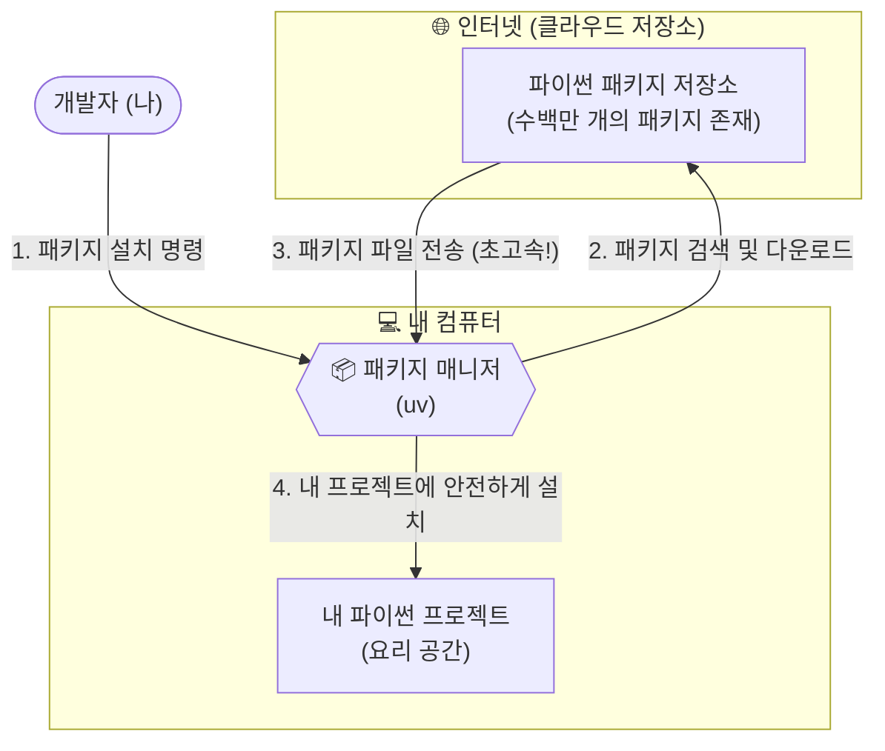

---


### 🎨 추가 시각화 (Visualization Packet)

**파이썬 개발 환경 구축 흐름**

운영체제 위에서 파이썬, 패키지 매니저(uv), 가상환경이 어떻게 독립적으로 구성되는지 계층적으로 보여줍니다.

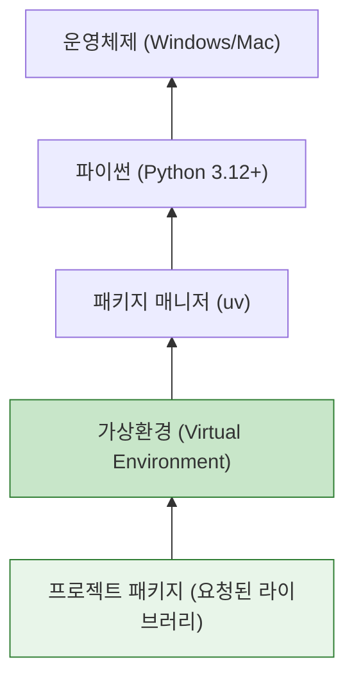

## §3. 상세

### Why — 왜 pip 대신 uv를 써야 할까요?

파이썬을 오래 사용해 온 사람들은 "그냥 원래 있던 pip 쓰면 안 되나?"라고 생각할 수 있습니다. 하지만 최근 글로벌 개발 트렌드는 완벽하게 uv로 넘어가고 있습니다. 그 이유는 압도적인 **성능**과 **통합된 경험** 때문입니다. 

첫째, 상상을 초월하는 속도입니다. 파이썬은 실행은 편하지만 무거운 편입니다. 반면 uv는 하드웨어 자원을 극한으로 끌어다 쓰는 Rust라는 언어로 바닥부터 다시 만들어졌습니다. 패키지를 다운로드하고 압축을 푸는 과정이 기존 대비 수십 배 빠릅니다.

둘째, 복잡한 도구들의 통합입니다. 예전에는 파이썬 설치용 도구(pyenv), 패키지 설치용 도구(pip), 가상공간 생성용 도구(virtualenv)를 따로따로 배워서 써야 했습니다. 초보자들에게는 이 도구들의 조합 자체가 거대한 장벽이었죠. uv는 이 모든 기능을 단일 프로그램 하나로 완벽하게 통합했습니다.

### What — uv란 정확히 무엇인가요?

uv는 파이썬 프로젝트를 시작할 때 필요한 모든 기반 공사를 단 1초 만에 끝내주는 차세대 올인원 툴체인(All-in-one Toolchain)입니다. 단순히 남의 코드를 다운로드 받는 것을 넘어서, 내 컴퓨터에 파이썬이 설치되어 있지 않다면 파이썬 자체도 알아서 적절한 버전으로 다운로드해 주고, 프로젝트가 엉망이 되지 않도록 안전한 격리 공간까지 만들어주는 똑똑한 관리자입니다.

### How — 어떻게 설치하고 확인하나요?

설치 방법은 너무나도 간단합니다. 공식 홈페이지에서 제공하는 설치 스크립트 명령어 한 줄을 터미널에 복사해서 붙여넣기만 하면 됩니다. 설치 스크립트가 내 컴퓨터의 운영체제(Windows 또는 Mac)를 자동으로 인식해서 가장 최적화된 방법으로 uv 본체를 다운로드하고 환경 변수와 경로 설정을 마무리합니다.

### 📊 pip vs uv 비교표

| 비교 항목 | 기존의 `pip` | 차세대 `uv` | 비유 |
| :--- | :--- | :--- | :--- |
| **개발 언어** | Python (상대적으로 느림) | Rust (매우 빠르고 안전함) | 자전거 vs 스포츠카 |
| **설치 속도** | 평균적 (패키지가 많으면 수 분 소요) | 압도적 (캐시 활용 시 수 밀리초, 10~100배 속도) | 일반 택배 vs 당일 로켓배송 |
| **가상환경 생성** | `virtualenv` 등 별도 도구 필요 | `uv venv` 명령어 하나로 1초 만에 생성 | 조립식 가구 vs 완제품 배송 |
| **파이썬 설치** | 불가능 (파이썬이 미리 깔려 있어야 함) | 가능 (원하는 버전의 파이썬도 자동 다운로드) | 제약 있음 vs 올인원 |

---

## §4. 실습 가이드

자, 이제 우리의 Antigravity 에디터에 로켓배송 서비스를 연결해 볼 시간입니다.

🎙️ **실습 대본 (Lab Guide)**:

> 첫째, Antigravity IDE 화면 하단의 탭을 클릭하거나 단축키를 눌러 **통합 터미널(Terminal)**을 열어주세요. 윈도우 사용자라면 `PS`라는 글자와 함께 PowerShell이 기본으로 열려 있을 거예요.
>
> 둘째, 아래의 설치 명령어를 복사해 터미널에 붙여넣고 Enter 키를 쳐주세요. 타이핑하다가 오타가 날 수 있으니 가급적 복사/붙여넣기를 권장합니다.
>
> 셋째, 화면에 설치 진행 바가 쓱쓱 지나가고 완료 메시지가 뜰 겁니다. 설치가 끝났다면, 시스템이 새로운 도구를 인식할 수 있도록 **터미널 창을 휴지통 아이콘을 눌러 닫았다가 다시 열어주세요**. 이 과정을 건너뛰면 컴퓨터가 방금 설치한 uv를 찾지 못하고 에러를 뿜어냅니다!
>
> 넷째, 새 터미널에서 `uv --version` 이라고 입력해 보세요. 터미널에 `uv 0.x.x` 처럼 버전 숫자가 출력되면 성공적으로 로켓배송 시스템이 도입된 것입니다. 이제 마음껏 패키지를 주문할 수 있어요!

### 🛠️ 단계별 설치 체크리스트

| 단계 | 행동 | 예상 결과 |
| :--- | :--- | :--- |
| **Step 1** | 통합 터미널(PowerShell) 열기 | 깜빡이는 커서 확인 |
| **Step 2** | `irm https://astral.sh/uv/install.ps1 | iex` 입력 | 설치 진행 및 완료 메시지 출력 |
| **Step 3** | 터미널 종료 후 재시작 | 새 터미널 세션 시작 |
| **Step 4** | `uv --version` 명령어 실행 | 설치된 uv 버전(예: `uv 0.1.30`) 출력 |

### 🚨 트러블슈팅 FAQ

**Q. "보안 정책에 의해 스크립트 실행이 차단되었습니다 (Execution of scripts is disabled)"라는 빨간색 에러가 떠요!**  
A. 윈도우의 기본 보안 설정 때문에 인터넷에서 가져온 스크립트 실행이 일시적으로 막힌 것입니다. 당황하지 마세요! 직전 세션에서 배운 **5 Whys 기법**을 쓸 완벽한 타이밍입니다. 이 에러 메시지를 그대로 마우스로 드래그해서 복사한 뒤, 옆에 있는 AI 비서(Agent)에게 "이 에러가 왜 떴고, 어떻게 해결해야 해?"라고 물어보세요. AI가 터미널의 실행 정책(Execution Policy)을 변경하는 명령어를 친절하게 알려줄 것입니다.

**Q. `uv --version`을 쳤는데 "uv 용어가 cmdlet, 함수... 이름으로 인식되지 않습니다"라고 나와요.**  
A. 십중팔구 터미널을 닫았다가 다시 열지 않아서 생기는 문제입니다. 컴퓨터와 터미널은 방금 설치된 프로그램의 위치를 아직 새로고침하지 못한 상태예요. 터미널 패널 우측 상단의 휴지통 아이콘(Kill Terminal)을 눌러 완전히 종료한 후, 터미널을 다시 열고 명령어를 다시 쳐보세요.

---


### 🎓 강사 노트 (Instructor Support)

- ⏱️ **타이밍**: 14:00 (20분, lab)
- 🎯 **핵심 활동**: uv 설치 명령어 실행
- ⚠️ **강사 주의사항**: PowerShell 관리자 권한 필요할 수 있음


### 📋 실습 설계 보강 (Lab Packet)

**세션 011 실습 설계 보강**

uv 패키지 매니저 소개와 설치
- **3-Stage Example Set**
  - 기본: AI에게 "uv 패키지 매니저 설치 방법 알려줘" → `powershell -c "irm astral.sh/uv | iex"` 실행
  - 변형: 이미 pip만 사용하던 환경에서 uv를 추가 설치하는 경우
  - 실수 해결: "PowerShell 실행 정책 오류" → `Set-ExecutionPolicy` 안내 또는 CMD 대안
- **난이도 예측**: PowerShell 명령어의 낯선 문법에 당황
- **타이밍 가이드**: uv 개념 설명 3분 | 설치 명령 실행 5분 | 확인(uv --version) 3분 | 트러블슈팅 9분
- **심리적 장벽**: "또 뭔가를 설치해야 한다고?" — 설치 피로감
- **자가 점검**:
  - [ ] `uv --version`이 정상 출력되는가?
  - [ ] uv가 pip보다 빠른 이유를 한 문장으로 설명할 수 있는가?
  - [ ] 패키지 매니저의 역할을 비유로 설명할 수 있는가?

## §5. 코드/명령어 모음

Windows 환경에서 PowerShell을 사용할 때의 uv 공식 설치 및 확인 명령어입니다. Mac이나 Linux 사용자는 `curl -LsSf https://astral.sh/uv/install.sh | sh` 명령어를 사용하시면 됩니다.

```powershell
# Windows PowerShell용 uv 공식 설치 스크립트 명령어
irm https://astral.sh/uv/install.ps1 | iex

# 설치 확인 명령어 (터미널을 꼭 닫았다 다시 열고 실행하세요!)
uv --version
```

---

## §6. 요약 및 다음 세션 브릿지

### 📝 핵심 요약
- **패키지와 패키지 매니저**: 남이 만든 유용한 코드를 내 컴퓨터로 쉽게 가져오기 위한 필수 도구이자 밀키트 배달 서비스입니다.
- **초고속 패키지 매니저 uv**: 기존의 느리고 복잡했던 pip의 단점을 완벽히 극복한 Rust 기반의 올인원 패키지 매니저로, 로켓배송급 속도를 자랑합니다.
- **설치와 확인**: 터미널에서 스크립트 명령어 한 줄로 설치가 끝나며, `--version` 옵션을 통해 정상 설치 여부를 확실하게 검증할 수 있습니다.

### 🌉 다음 세션으로의 브릿지

uv 설치가 완벽하게 끝났습니다! 이제 우리에게는 어떤 파이썬 패키지라도 눈 깜짝할 사이에 배달해 주는 최고의 로켓배송 서비스가 생겼습니다. 

그런데 한 가지 치명적인 문제가 남았습니다. 이 배달 서비스로 이것저것 다양한 재료를 받아서 도대체 어디에 보관해야 할까요? 냉장고 한 칸에 김치, 케이크, 생선, 아이스크림을 다 몰아넣으면 어떻게 될까요? 냄새가 섞이고 결국 요리를 망치게 되겠죠. 프로그래밍에서도 여러 프로젝트의 패키지들을 한곳에 몰아넣으면 끔찍한 "의존성 충돌"이 발생합니다.

그래서 다음 세션에서는 배달받은 재료를 프로젝트별로 안전하게 격리해서 보관하는 방법, 즉 **가상환경(Virtual Environment)**의 핵심 개념과 필요성에 대해 구체적으로 알아보겠습니다.

---

## §7. 참고 자료

- [uv 공식 문서 (Astral)](https://docs.astral.sh/uv/)
- [Source B] NotebookLM 기반 파이썬 생태계 분석 자료 (pip vs uv 비교 파트)
- [Source C] Deep Research Rust 기반 성능 벤치마크 및 패키지 관리 도구 아키텍처 분석


> 🔗 **이전 세션**: [세션 010: 트러블슈팅과 5 Whys 기법](#세션-010)에서 배운 내용을 이어갑니다.
> 🔗 **다음 세션**: [세션 012: 가상환경의 필요성 이해](#세션-012)에서 계속됩니다.

---

> 🔗 **오후 세션으로 이어집니다**: Day 1 오후(13:30~18:00)에서 세션 012부터 계속됩니다.

## 📦 부록

### 강사 체크리스트 (Day 1 오전)

- [ ] 세션 001: 과정 로드맵과 아이스브레이킹 (20분)
- [ ] 세션 002: AI 시대의 서사 핵심 복습 (20분)
- [ ] 세션 003: 학습 방법론과 SDD 미리보기 (20분)
- [ ] 세션 004: Antigravity 설치와 시연 (25분)
- [ ] 세션 005: Editor 뷰와 기본 조작 (20분)
- [ ] 세션 006: Agent Manager와 첫 인사 (20분)
- [ ] 세션 007: 멀티에이전트 오케스트레이션 기초 (25분)
- [ ] 세션 008: 프롬프트로 시스템 환경 확인 (20분)
- [ ] 세션 009: AI와 함께 Python 설치하기 (20분)
- [ ] 세션 010: 트러블슈팅과 5 Whys 기법 (20분)
- [ ] 세션 011: uv 패키지 매니저 소개와 설치 (20분)

---

*Day 1 오전 교안 — AI-native 파이썬 기초 v2.1*  
*취합: A4C_Material_Aggregator*  
*검증: A8_QA_Editor*
