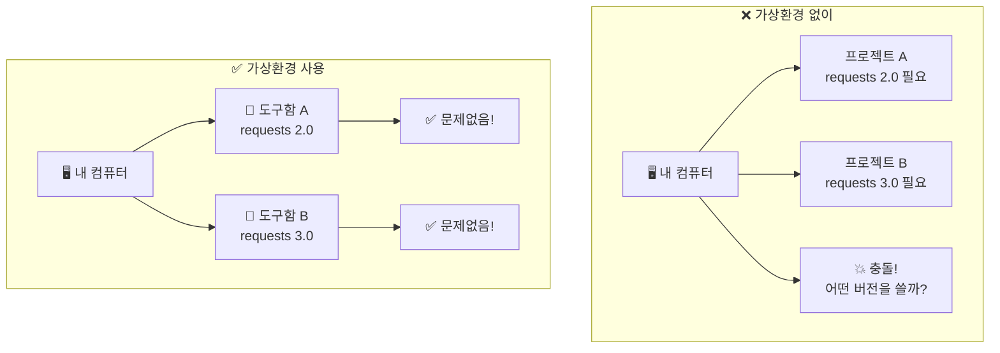
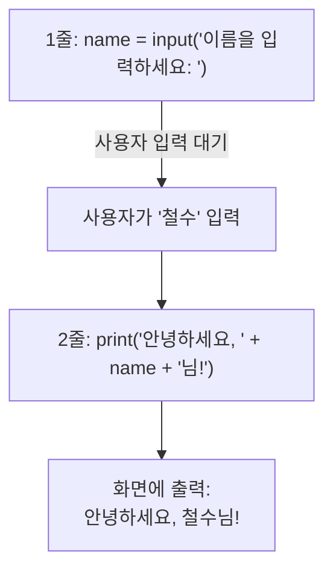

# Day 1 오후: uv 가상환경, 첫 Python 프로그램, 종합 실습

> 과정: AI-native 파이썬 기초 | Day 1/5 | 13:30–17:30

---

## 목차

- [세션 1-4: uv 설치 & 가상환경 이해](Day1_PM_uv_첫프로그램_종합실습.md#세션-1-4-uv-설치--가상환경-이해)
- [세션 1-5: 첫 Python 프로그램 실행](Day1_PM_uv_첫프로그램_종합실습.md#세션-1-5-첫-python-프로그램-실행)
- [세션 1-6: Day 1 종합 실습 & 정리](Day1_PM_uv_첫프로그램_종합실습.md#세션-1-6-day-1-종합-실습--정리)

---

## 세션 1-4: uv 설치 & 가상환경 이해

> 🕐 시간: 13:30–15:00 | ⏱ 90분 | 이론:실습 = 3:7

### 1. 개요

오전에 Python이라는 "기본 재료"를 준비했죠? 이번 세션에서는 **uv**라는 도구를 설치하고, **가상환경(Virtual Environment)**이라는 개념을 배워요.

가상환경은 **"프로젝트별 전용 도구함"**이에요. 요리사가 이탈리안 요리용 도구함과 한식 요리용 도구함을 따로 쓰는 것처럼, 각 프로젝트마다 필요한 라이브러리(도구)를 분리해서 관리하는 거예요.

그리고 uv는 **"초고속 도구함 관리자"**예요. 기존 도구함 관리자(pip)보다 10~100배 빠르게 도구를 정리해줘요.

### 2. 핵심 개념

#### 패키지 매니저란?

프로그래밍에서 **패키지(Package)**는 다른 사람이 미리 만들어둔 코드 묶음이에요. 예를 들어:
- `requests`: 웹사이트에서 데이터를 가져오는 패키지
- `pandas`: 데이터를 표 형태로 다루는 패키지
- `flask`: 웹사이트를 만드는 패키지

**패키지 매니저**는 이런 패키지들을 설치하고 관리해주는 도구예요.

#### 가상환경 = "프로젝트별 전용 도구함"

왜 가상환경이 필요할까요? 비유로 설명해 볼게요.

이탈리안 레스토랑에서는 파스타 기계, 올리브유, 바질이 필요해요. 한식당에서는 된장, 고추장, 돌솥이 필요하죠. 만약 두 레스토랑의 도구를 한 곳에 섞어놓으면 어떻게 될까요? 필요한 도구를 찾기 어렵고, 서로 방해가 될 수 있어요.

프로그래밍도 마찬가지예요. 프로젝트 A에서는 `requests` 버전 2.0이 필요하고, 프로젝트 B에서는 `requests` 버전 3.0이 필요할 수 있어요. 가상환경을 쓰면 각 프로젝트가 자기만의 도구함을 갖게 되어 이런 충돌을 방지할 수 있어요.



#### uv = "초고속 도구함 관리자"

**uv**는 Astral사(Ruff 개발사)가 만든 **Rust 기반** 초고속 Python 패키지/프로젝트 관리 도구예요.

| 비교 항목 | pip (기존) | uv (신규) |
|-----------|-----------|-----------|
| 속도 | 보통 | **10~100배 빠름** |
| 가상환경 생성 | `python -m venv` 별도 명령 | `uv venv` 한 번에 |
| 패키지 설치 | `pip install` | `uv pip install` |
| Python 버전 관리 | 별도 도구 필요 | **자동 관리** |

uv 하나로 기존에 여러 도구(pip, pip-tools, pipx, poetry, pyenv, virtualenv)가 하던 일을 모두 처리할 수 있어요.

#### uv 핵심 명령어 정리

| 명령어 | 기능 | 비유 |
|--------|------|------|
| `uv venv` | 가상환경 생성 | 새 도구함 만들기 |
| `.venv\Scripts\activate` | 가상환경 활성화 | 도구함 열기 |
| `deactivate` | 가상환경 비활성화 | 도구함 닫기 |
| `uv pip install [패키지]` | 패키지 설치 | 도구함에 도구 넣기 |
| `uv pip list` | 설치된 패키지 목록 | 도구함 안 확인하기 |

### 3. 상세 내용

#### uv 설치 방법 (Windows)

PowerShell에서 다음 명령어 한 줄로 설치할 수 있어요:

```powershell
powershell -ExecutionPolicy ByPass -c "irm https://astral.sh/uv/install.ps1 | iex"
```

이 명령어가 하는 일:
- `irm`: 인터넷에서 설치 스크립트를 다운로드
- `iex`: 다운로드한 스크립트를 실행
- `-ExecutionPolicy ByPass`: 보안 정책을 일시적으로 우회 (설치를 위해 필요)

#### 가상환경 생성 및 활성화 흐름

```
1. uv venv --python 3.12     ← 가상환경 생성 (도구함 만들기)
2. .venv\Scripts\activate     ← 가상환경 활성화 (도구함 열기)
3. (작업 수행...)              ← 이 안에서 패키지 설치/코드 실행
4. deactivate                  ← 가상환경 비활성화 (도구함 닫기)
```

가상환경이 활성화되면 터미널 프롬프트 앞에 `(.venv)`가 표시돼요:

```
(.venv) PS C:\Users\사용자\python_study>
```

이 `(.venv)` 표시가 보이면 "지금 도구함 안에서 작업 중"이라는 뜻이에요.

### 4. 실습 가이드

> 🎯 실습 목표: uv를 설치하고, 가상환경을 생성·활성화한다

#### 실습 1: uv 설치

**Step 1: 프롬프트 작성** — Antigravity Agent Manager에 입력:

```
uv가 뭔지, 그리고 Windows에서 설치하는 방법을 알려줘
```

**Step 2: AI 응답 확인** — AI가 uv에 대한 설명과 설치 명령어를 알려줄 거예요.

**Step 3: 설치 실행** — Antigravity 터미널에서 실행:

```powershell
powershell -ExecutionPolicy ByPass -c "irm https://astral.sh/uv/install.ps1 | iex"
```

**Step 4: 설치 확인** — 터미널을 재시작한 후:

```powershell
uv --version
```

예상 출력:
```
uv 0.x.x
```

> ✅ 체크포인트: `uv --version`이 버전 번호를 출력하나요?

#### 실습 2: 가상환경 생성

**Step 1: 프롬프트 작성** — Agent Manager에 입력:

```
uv를 이용해서 Python 3.12 가상환경을 만드는 방법을 알려줘
```

**Step 2: AI 응답 확인** — AI가 명령어와 설명을 알려줄 거예요.

**Step 3: 실행** — 터미널에서 `python_study` 폴더로 이동 후 실행:

```powershell
# python_study 폴더로 이동 (오전에 만든 폴더)
cd C:\Users\사용자\Desktop\python_study

# 가상환경 생성
uv venv --python 3.12
```

예상 출력:
```
Using CPython 3.12.x
Creating virtual environment at: .venv
Activate with: .venv\Scripts\activate
```

**Step 4: 코드 리뷰** — 무슨 일이 일어났는지 살펴볼게요:
- `uv venv`: "새 도구함을 만들어줘"라는 명령
- `--python 3.12`: "Python 3.12 버전용으로 만들어줘"
- `.venv` 폴더가 생성됨: 이 폴더가 바로 "도구함"이에요

> ✅ 체크포인트: `python_study` 폴더 안에 `.venv` 폴더가 생겼나요?

#### 실습 3: 가상환경 활성화/비활성화

**Step 1: 가상환경 활성화** — 터미널에서:

```powershell
.venv\Scripts\activate
```

프롬프트가 변경되는 것을 확인하세요:
```
(.venv) PS C:\Users\사용자\Desktop\python_study>
```

`(.venv)` 표시가 보이면 성공이에요! 지금 "도구함 안"에서 작업 중이라는 뜻이에요.

**Step 2: 가상환경 비활성화** — 터미널에서:

```powershell
deactivate
```

프롬프트에서 `(.venv)`가 사라지는 것을 확인하세요:
```
PS C:\Users\사용자\Desktop\python_study>
```

**Step 3: 다시 활성화** — 이후 실습을 위해 다시 활성화해 주세요:

```powershell
.venv\Scripts\activate
```

> ✅ 체크포인트: 활성화 시 `(.venv)` 표시가 나타나고, 비활성화 시 사라지나요?

#### 실습 4: 패키지 설치 체험

**Step 1: uv로 패키지 설치** — 가상환경이 활성화된 상태에서:

```powershell
uv pip install requests
```

예상 출력:
```
Resolved 5 packages in 0.12s
Installed 5 packages in 0.05s
 + certifi==2024.x.x
 + charset-normalizer==3.x.x
 + idna==3.x
 + requests==2.x.x
 + urllib3==2.x.x
```

**Step 2: 속도 체감** — 설치가 순식간에 끝났죠? 기존 pip으로 설치하면 몇 초~몇 십 초 걸리는 작업이 uv로는 0.1초 만에 끝나요. 이것이 "초고속 도구함 관리자"의 위력이에요!

**Step 3: 설치된 패키지 확인**

```powershell
uv pip list
```

예상 출력:
```
Package            Version
------------------ ---------
certifi            2024.x.x
charset-normalizer 3.x.x
idna               3.x
requests           2.x.x
urllib3             2.x.x
```

> ✅ 체크포인트: `requests` 패키지가 설치되고, `uv pip list`에서 확인되나요?

### 5. 코드 및 명령어 모음

```powershell
# --- uv 설치 ---
powershell -ExecutionPolicy ByPass -c "irm https://astral.sh/uv/install.ps1 | iex"

# uv 버전 확인
uv --version

# --- 가상환경 관리 ---
# 가상환경 생성 (Python 3.12)
uv venv --python 3.12

# 가상환경 활성화 (Windows)
.venv\Scripts\activate

# 가상환경 비활성화
deactivate

# --- 패키지 관리 ---
# 패키지 설치
uv pip install requests

# 설치된 패키지 목록 확인
uv pip list

# 패키지 삭제
uv pip uninstall requests
```

### 6. 트러블슈팅 FAQ

**Q: uv 설치 명령어를 실행했는데 "실행 정책" 관련 에러가 나요.**
A: PowerShell의 실행 정책 때문이에요. 다음 명령어를 먼저 실행해 보세요:
```powershell
Set-ExecutionPolicy -ExecutionPolicy RemoteSigned -Scope CurrentUser
```
그 후 uv 설치 명령어를 다시 실행하세요.

**Q: `uv --version`을 실행했는데 "명령을 찾을 수 없다"고 나와요.**
A: 터미널을 완전히 닫았다가 다시 열어보세요. 그래도 안 되면 Antigravity 자체를 재시작해 보세요. uv 설치 후 PATH가 업데이트되려면 터미널 재시작이 필요해요.

**Q: 가상환경 활성화가 안 돼요.**
A: 현재 위치가 `python_study` 폴더인지 확인하세요. `.venv` 폴더가 있는 곳에서 활성화 명령을 실행해야 해요. `dir` 명령어로 `.venv` 폴더가 보이는지 확인해 보세요.

### 7. 요약 & 다음 세션 연결

**이번 세션 핵심 정리:**
- 가상환경 = "프로젝트별 전용 도구함" (패키지 충돌 방지)
- uv = "초고속 도구함 관리자" (pip보다 10~100배 빠름)
- `uv venv` → 도구함 만들기
- `.venv\Scripts\activate` → 도구함 열기
- `deactivate` → 도구함 닫기
- `uv pip install` → 도구함에 도구 넣기

**다음 세션 예고:**
> 사무실(Antigravity)도 차렸고, 재료(Python)도 준비했고, 도구함(가상환경)도 만들었어요. 이제 드디어 **첫 번째 요리(프로그램)**를 만들어 볼 시간이에요! AI에게 부탁해서 첫 번째 파이썬 프로그램을 만들어 볼게요.

---

## 세션 1-5: 첫 Python 프로그램 실행

> 🕐 시간: 15:00–16:00 | ⏱ 60분 | 이론:실습 = 2:8

### 1. 개요

드디어 이 순간이 왔어요! 첫 번째 파이썬 프로그램을 만들고 실행해 볼 거예요.

첫 프로그램은 **"AI에게 부탁한 첫 번째 편지"**예요. AI가 써준 편지(코드)를 읽어보고, 봉투에 넣어 보내는(실행) 과정이에요. "AI 시대의 서사"에서 배운 **통역사 비유**를 떠올려 볼까요? 우리가 한국어로 "이름을 물어보고 인사해줘"라고 말하면, AI 통역사가 파이썬어로 번역해주는 거예요.

### 2. 핵심 개념

#### .py 파일이란?

파이썬 프로그램은 `.py` 확장자를 가진 파일에 저장돼요.
- `hello.py` → 파이썬 프로그램 파일
- `.py`는 "이 파일은 파이썬 코드입니다"라는 표시예요

Word 문서가 `.docx`, Excel 파일이 `.xlsx`인 것처럼, 파이썬 파일은 `.py`예요.

#### print() 함수 — "화면에 글자를 보여줘"

```python
print("안녕하세요!")
```

`print()`는 괄호 안의 내용을 화면에 출력하는 함수예요. "프린트"라는 이름 그대로, 화면에 글자를 "인쇄"해주는 거예요.

#### input() 함수 — "사용자에게 물어봐"

```python
name = input("이름을 입력하세요: ")
```

`input()`은 사용자에게 질문을 보여주고, 키보드로 입력한 값을 받아오는 함수예요. 위 코드는 "이름을 입력하세요: "라고 물어보고, 사용자가 입력한 값을 `name`이라는 이름표 상자에 넣어요.

#### 프로그램 실행 흐름

파이썬 프로그램은 **위에서 아래로** 한 줄씩 실행돼요.



### 3. 상세 내용

#### 변수 할당 맛보기

```python
name = "철수"
```

이 코드에서:
- `name`: 변수 이름 (이름표)
- `=`: "넣는다"는 뜻 (수학의 "같다"가 아니에요!)
- `"철수"`: 넣을 값

"name이라는 이름표가 붙은 상자에 '철수'를 넣는다"라고 읽으면 돼요. 변수에 대해서는 Day 3에서 자세히 배울 거예요. 지금은 "아, 값을 저장하는 거구나" 정도만 이해하면 충분해요.

#### 문자열 연결

```python
print("안녕하세요, " + name + "님!")
```

`+` 기호로 글자(문자열)를 이어붙일 수 있어요. "안녕하세요, " + "철수" + "님!" = "안녕하세요, 철수님!"

### 4. 실습 가이드

> 🎯 실습 목표: Antigravity에서 프롬프트를 이용해 첫 Python 프로그램을 생성하고 실행한다

#### 실습 1: 환영 인사 프로그램

**Step 1: 프롬프트 작성** — Antigravity Agent Manager에 입력:

```
이름을 입력받아서 환영 인사를 출력하는 파이썬 프로그램을 만들어줘
```

**Step 2: AI 응답 확인** — 생성된 코드 예시:

```python
# hello.py - 환영 인사 프로그램

name = input("이름을 입력하세요: ")
print("안녕하세요, " + name + "님! 환영합니다!")
print("AI-native 파이썬 기초 과정에 오신 것을 축하해요!")
```

**Step 3: 코드 리뷰** — 한 줄씩 의미를 파악해 볼게요:

| 줄 | 코드 | 의미 |
|----|------|------|
| 1 | `# hello.py - 환영 인사 프로그램` | 주석(메모). `#` 뒤의 내용은 실행되지 않아요 |
| 3 | `name = input("이름을 입력하세요: ")` | 사용자에게 이름을 물어보고, 답변을 `name` 상자에 저장 |
| 4 | `print("안녕하세요, " + name + "님! ...")` | `name` 상자의 값을 꺼내서 인사말과 합쳐 화면에 출력 |
| 5 | `print("AI-native 파이썬 ...")` | 추가 환영 메시지 출력 |

**Step 4: 파일 저장 및 실행**

1. Antigravity Editor에서 새 파일 생성 (`Ctrl + N`)
2. AI가 생성한 코드를 붙여넣기 (또는 AI가 자동으로 파일에 적용)
3. `hello.py`로 저장 (`Ctrl + S`)
4. 터미널에서 실행:

```powershell
# 가상환경이 활성화된 상태에서
python hello.py
```

예상 실행 결과:
```
이름을 입력하세요: 철수
안녕하세요, 철수님! 환영합니다!
AI-native 파이썬 기초 과정에 오신 것을 축하해요!
```

> ✅ 체크포인트: 이름을 입력하면 환영 인사가 출력되나요?

#### 실습 2: 프로그램 확장 — 나이 계산

**Step 1: 프롬프트 작성** — Agent Manager에 입력:

```
생년월일도 입력받아서 나이를 계산해줘. 위에서 만든 hello.py를 수정해줘.
```

**Step 2: AI 응답 확인** — 수정된 코드 예시:

```python
# hello.py - 환영 인사 + 나이 계산 프로그램

name = input("이름을 입력하세요: ")
birth_year = input("태어난 연도를 입력하세요 (예: 1998): ")

# 나이 계산
age = 2026 - int(birth_year)

print("안녕하세요, " + name + "님! 환영합니다!")
print(name + "님은 올해 " + str(age) + "세이시네요!")
print("AI-native 파이썬 기초 과정에 오신 것을 축하해요!")
```

**Step 3: 코드 리뷰** — 새로 추가된 부분을 살펴볼게요:

| 코드 | 의미 |
|------|------|
| `birth_year = input(...)` | 태어난 연도를 물어보고 저장 |
| `int(birth_year)` | 글자(문자열)를 숫자(정수)로 변환. input()은 항상 글자로 받아오기 때문에 계산하려면 숫자로 바꿔야 해요 |
| `2026 - int(birth_year)` | 올해 연도에서 태어난 연도를 빼서 나이 계산 |
| `str(age)` | 숫자를 다시 글자로 변환. print()에서 `+`로 이어붙이려면 글자여야 해요 |

**Step 4: 실행 및 확인**

```powershell
python hello.py
```

예상 실행 결과:
```
이름을 입력하세요: 하늘
태어난 연도를 입력하세요 (예: 1998): 2000
안녕하세요, 하늘님! 환영합니다!
하늘님은 올해 26세이시네요!
AI-native 파이썬 기초 과정에 오신 것을 축하해요!
```

**핵심 관찰 포인트:**
- 프롬프트를 바꾸니까 코드가 진화했어요!
- `int()`, `str()` 같은 새로운 함수가 등장했어요 → Day 3에서 자세히 배울 거예요
- 지금은 "아, 이런 게 있구나" 정도만 알면 충분해요

> ✅ 체크포인트: 이름과 태어난 연도를 입력하면 나이가 계산되어 출력되나요?

### 5. 코드 및 명령어 모음

```python
# hello.py - 환영 인사 + 나이 계산 프로그램

name = input("이름을 입력하세요: ")
birth_year = input("태어난 연도를 입력하세요 (예: 1998): ")

# 나이 계산
age = 2026 - int(birth_year)

print("안녕하세요, " + name + "님! 환영합니다!")
print(name + "님은 올해 " + str(age) + "세이시네요!")
print("AI-native 파이썬 기초 과정에 오신 것을 축하해요!")
```

**터미널 명령어:**

```powershell
# 파이썬 파일 실행
python hello.py

# 파이썬 대화형 모드 (간단한 코드 테스트용)
python
>>> print("Hello!")
>>> exit()
```

### 6. 트러블슈팅 FAQ

**Q: `python hello.py` 실행 시 "No such file or directory" 에러가 나요.**
A: 터미널의 현재 위치가 `hello.py` 파일이 있는 폴더인지 확인하세요. `dir` 명령어로 현재 폴더의 파일 목록을 볼 수 있어요. `hello.py`가 보이지 않으면 `cd` 명령어로 올바른 폴더로 이동하세요.

**Q: 나이 계산에서 에러가 나요.**
A: 태어난 연도를 입력할 때 숫자만 입력했는지 확인하세요. "1998년"처럼 "년"을 붙이면 `int()` 변환에서 에러가 나요. 숫자만 입력해야 해요: `1998`

**Q: 한글이 깨져서 출력돼요.**
A: 파일을 저장할 때 인코딩이 UTF-8인지 확인하세요. Antigravity 하단 상태바에서 인코딩을 확인하고, UTF-8이 아니면 클릭해서 변경할 수 있어요.

### 7. 요약 & 다음 세션 연결

**이번 세션 핵심 정리:**
- 첫 프로그램 = "AI에게 부탁한 첫 번째 편지" = "통역사가 파이썬어로 번역"
- `.py` 파일 = 파이썬 프로그램 파일
- `print()` = 화면에 출력, `input()` = 사용자 입력 받기
- 프롬프트를 바꾸면 코드가 진화해요!
- 코드를 한 줄씩 읽어보는 것이 "코드 리뷰"예요

**다음 세션 예고:**
> 첫 프로그램을 성공적으로 만들었어요! 잠깐 쉬고 오면, 오늘 배운 모든 것을 처음부터 끝까지 혼자 해보는 **종합 실습** 시간이에요. 걱정 마세요, AI가 옆에서 도와줄 거예요!

---

> ☕ **휴식 (16:00–16:15)**

---

## 세션 1-6: Day 1 종합 실습 & 정리

> 🕐 시간: 16:15–17:30 | ⏱ 75분 | 이론:실습 = 1:9

### 1. 개요

오늘 하루 동안 배운 모든 것을 처음부터 되짚어 볼 거예요. 이번에는 강사의 안내 없이, **여러분이 직접** 전 과정을 수행해 봅니다. 물론 AI가 옆에서 도와줄 거예요!

### 2. 핵심 개념

Day 1 전체 흐름을 한눈에 정리해 볼게요.


### 3. 상세 내용

#### 종합 실습 과제

**미션: "새 프로젝트를 처음부터 세팅하고, 간단한 계산기 프로그램을 만들어 실행하세요"**

전체 과정:
1. 새 프로젝트 폴더 생성
2. uv로 가상환경 생성 및 활성화
3. AI에게 프롬프트로 계산기 프로그램 생성 요청
4. 코드 리뷰
5. 실행 및 테스트

### 4. 실습 가이드

> 🎯 실습 목표: Day 1에서 배운 환경 구축 과정을 처음부터 되짚으며 내재화한다

#### 종합 실습: 계산기 프로그램 만들기 (30분)

**Step 1: 새 프로젝트 폴더 생성**

```powershell
# 바탕화면에 새 프로젝트 폴더 만들기
mkdir C:\Users\사용자\Desktop\calculator_project

# 해당 폴더로 이동
cd C:\Users\사용자\Desktop\calculator_project
```

**Step 2: 가상환경 생성 및 활성화**

```powershell
# 가상환경 생성
uv venv --python 3.12

# 가상환경 활성화
.venv\Scripts\activate
```

> ✅ 체크포인트: 터미널에 `(.venv)` 표시가 보이나요?

**Step 3: 프롬프트 작성** — Agent Manager에 입력:

```
두 숫자를 입력받아서 더하기, 빼기, 곱하기, 나누기를 수행하는 간단한 계산기 프로그램을 파이썬으로 만들어줘. 초보자도 이해할 수 있게 주석을 달아줘.
```

**Step 4: AI 응답 확인** — 생성된 코드 예시:

```python
# calculator.py - 간단한 계산기 프로그램

# 첫 번째 숫자 입력받기
num1 = float(input("첫 번째 숫자를 입력하세요: "))

# 두 번째 숫자 입력받기
num2 = float(input("두 번째 숫자를 입력하세요: "))

# 사칙연산 수행
add = num1 + num2        # 더하기
subtract = num1 - num2   # 빼기
multiply = num1 * num2   # 곱하기

# 나누기 (0으로 나누기 방지)
if num2 != 0:
    divide = num1 / num2
    divide_result = str(divide)
else:
    divide_result = "0으로 나눌 수 없습니다"

# 결과 출력
print("\n===== 계산 결과 =====")
print(str(num1) + " + " + str(num2) + " = " + str(add))
print(str(num1) + " - " + str(num2) + " = " + str(subtract))
print(str(num1) + " × " + str(num2) + " = " + str(multiply))
print(str(num1) + " ÷ " + str(num2) + " = " + divide_result)
print("====================")
```

**Step 5: 코드 리뷰** — AI에게 물어보세요:

```
이 계산기 코드를 한 줄씩 설명해줘
```

**Step 6: 파일 저장 및 실행**

```powershell
python calculator.py
```

예상 실행 결과:
```
첫 번째 숫자를 입력하세요: 10
두 번째 숫자를 입력하세요: 3

===== 계산 결과 =====
10.0 + 3.0 = 13.0
10.0 - 3.0 = 7.0
10.0 × 3.0 = 30.0
10.0 ÷ 3.0 = 3.3333333333333335
====================
```

> ✅ 체크포인트: 두 숫자를 입력하면 사칙연산 결과가 모두 출력되나요?

#### 트러블슈팅 실습 (15분)

자주 발생하는 오류 3가지를 AI에게 물어보는 연습을 해볼게요.

**오류 1: PATH 문제**

Agent Manager에 입력:
```
Windows에서 python 명령어를 실행했는데 "인식할 수 없는 명령"이라고 나와요. 어떻게 해결하나요?
```

**오류 2: 가상환경 미활성화**

Agent Manager에 입력:
```
패키지를 설치했는데 import할 때 "ModuleNotFoundError"가 나와요. 가상환경 활성화를 깜빡한 것 같은데 어떻게 확인하나요?
```

**오류 3: 인코딩 오류**

Agent Manager에 입력:
```
파이썬에서 한글을 출력할 때 "UnicodeEncodeError"가 나와요. 어떻게 해결하나요?
```

각 오류에 대한 AI의 답변을 읽어보고, 핵심 해결 방법을 메모해 두세요.

> ✅ 체크포인트: 3가지 오류 상황에 대해 AI에게 해결 방법을 물어보고 답변을 확인했나요?

#### Day 1 핵심 정리 퀴즈 (10분)

**퀴즈 1**: Antigravity의 Agent Manager는 어떤 역할을 하나요?
- 정답: AI에게 일을 시키는 공간 (AI 비서들의 자리)

**퀴즈 2**: 가상환경은 왜 필요한가요?
- 정답: 프로젝트별로 필요한 패키지를 분리해서 관리하기 위해 (프로젝트별 전용 도구함)

**퀴즈 3**: `python hello.py` 명령어는 무엇을 하나요?
- 정답: hello.py 파일에 있는 파이썬 코드를 실행하는 것

**퀴즈 4**: `input()` 함수는 무엇을 하나요?
- 정답: 사용자에게 질문을 보여주고, 키보드로 입력한 값을 받아오는 것

**퀴즈 5**: 문제가 생겼을 때 AI-native 방식으로 해결하는 방법은?
- 정답: 에러 메시지를 AI에게 보여주고 해결 방법을 물어보기

### 5. 코드 및 명령어 모음

```powershell
# --- Day 1 전체 명령어 요약 ---

# 1. 프로젝트 폴더 생성
mkdir calculator_project
cd calculator_project

# 2. 가상환경 생성 및 활성화
uv venv --python 3.12
.venv\Scripts\activate

# 3. 파이썬 파일 실행
python calculator.py

# 4. 가상환경 비활성화 (작업 종료 시)
deactivate
```

```python
# calculator.py - 간단한 계산기 프로그램

# 첫 번째 숫자 입력받기
num1 = float(input("첫 번째 숫자를 입력하세요: "))

# 두 번째 숫자 입력받기
num2 = float(input("두 번째 숫자를 입력하세요: "))

# 사칙연산 수행
add = num1 + num2        # 더하기
subtract = num1 - num2   # 빼기
multiply = num1 * num2   # 곱하기

# 나누기 (0으로 나누기 방지)
if num2 != 0:
    divide = num1 / num2
    divide_result = str(divide)
else:
    divide_result = "0으로 나눌 수 없습니다"

# 결과 출력
print("\n===== 계산 결과 =====")
print(str(num1) + " + " + str(num2) + " = " + str(add))
print(str(num1) + " - " + str(num2) + " = " + str(subtract))
print(str(num1) + " × " + str(num2) + " = " + str(multiply))
print(str(num1) + " ÷ " + str(num2) + " = " + divide_result)
print("====================")
```

### 6. 트러블슈팅 FAQ

**Q: 종합 실습에서 어디서부터 시작해야 할지 모르겠어요.**
A: 위의 Step 1부터 순서대로 따라가면 돼요. 막히는 부분이 있으면 AI에게 "다음에 뭘 해야 하는지 알려줘"라고 물어보세요.

**Q: AI가 생성한 코드가 위 예시와 다르게 나왔어요.**
A: 정상이에요! AI는 매번 조금씩 다른 코드를 생성할 수 있어요. 핵심 기능(두 숫자 입력, 사칙연산 출력)이 동작하면 성공이에요.

### 7. 요약 & 다음 세션 연결

**Day 1 전체 핵심 정리:**

| 세션 | 배운 것 | 비유 |
|------|---------|------|
| 1-1 | 과정 소개, AI 시대의 서사 복습 | 네비게이션 운전 실습 시작 |
| 1-2 | Antigravity 설치 & 기본 사용법 | AI 비서가 상주하는 사무실 |
| 1-3 | 시스템 환경 확인 & Python 설치 | 냉장고에 뭐가 있는지 확인 |
| 1-4 | uv 설치 & 가상환경 이해 | 프로젝트별 전용 도구함 |
| 1-5 | 첫 Python 프로그램 실행 | AI에게 부탁한 첫 번째 편지 |
| 1-6 | 종합 실습 & 정리 | 전체 과정 독립 수행 |

**Day 1 체크리스트:**
- [ ] Antigravity 설치 완료
- [ ] Python 설치 완료 (`python --version` 확인)
- [ ] uv 설치 완료 (`uv --version` 확인)
- [ ] 가상환경 생성 및 활성화 성공
- [ ] 첫 프로그램(hello.py) 실행 성공
- [ ] 계산기 프로그램(calculator.py) 독립 수행 성공

**Day 2 예고:**
> 오늘 수고 많으셨어요! 오늘은 "도구를 준비하는 날"이었어요. 내일은 드디어 **"AI에게 일 시키는 기술"**을 본격적으로 배워요. 좋은 프롬프트와 나쁜 프롬프트의 차이를 직접 체험하고, 요구사항을 정리하는 방법, 그리고 PRD(제품 요구사항 문서)를 AI와 함께 작성하는 방법을 배울 거예요. "말이 되어야 프로그램이 된다"는 것을 몸으로 느끼는 하루가 될 거예요!

---

> 📋 **Day 1 산출물 목록**
> - `hello.py`: 환영 인사 + 나이 계산 프로그램
> - `calculator.py`: 간단한 사칙연산 계산기 프로그램
> - 환경 구축 완료: Antigravity + Python 3.12+ + uv + 가상환경
