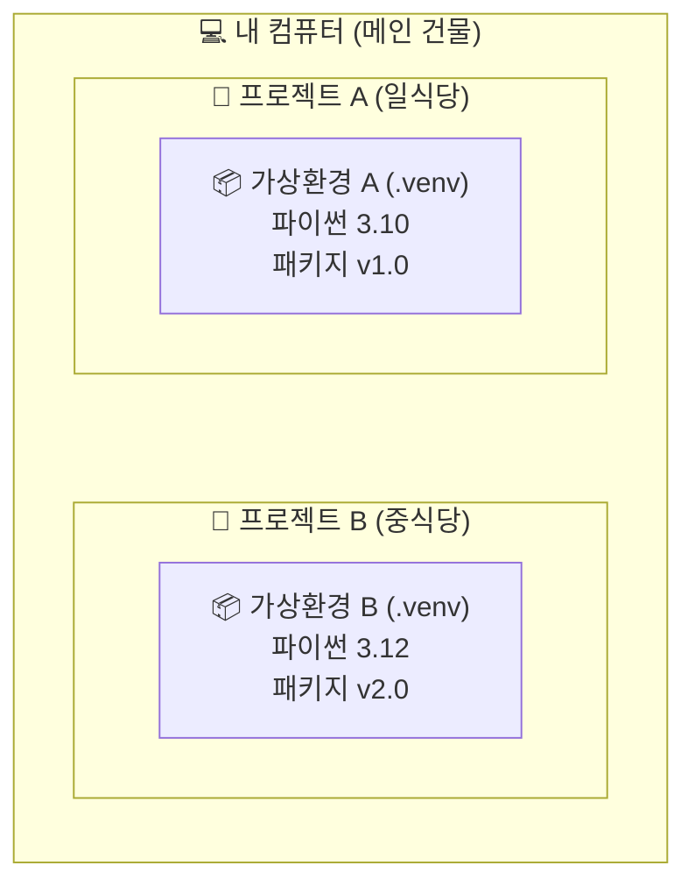
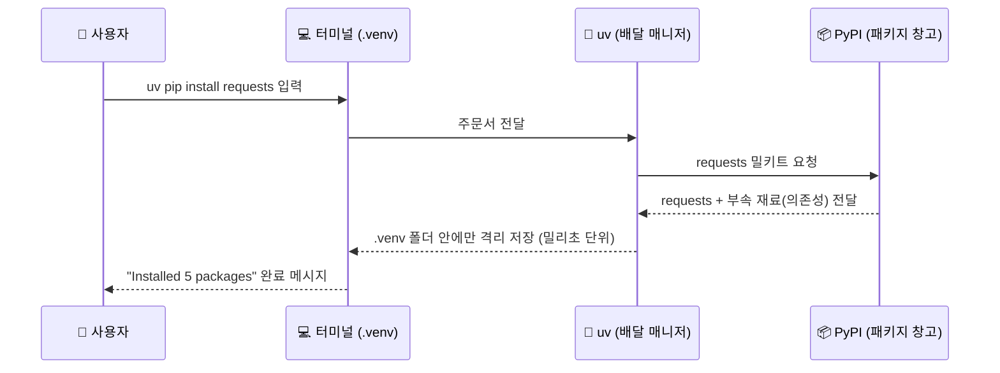
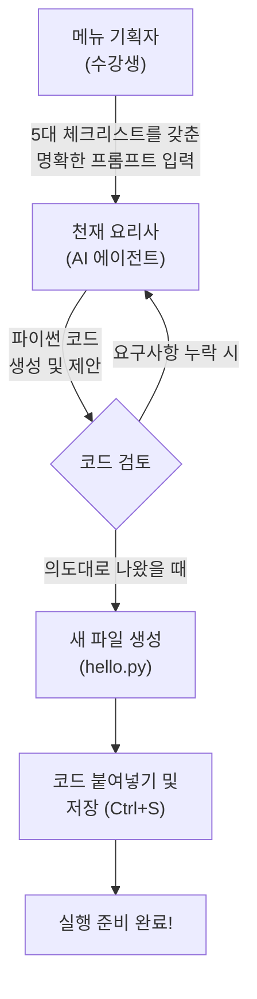
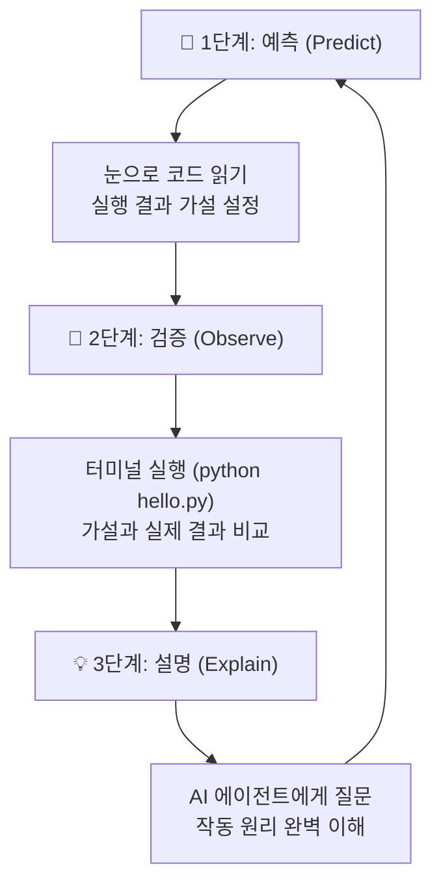
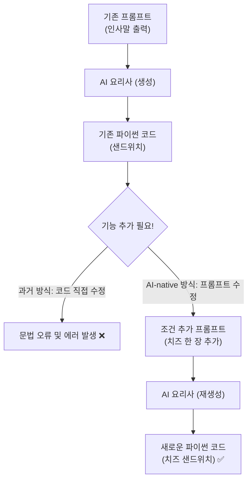
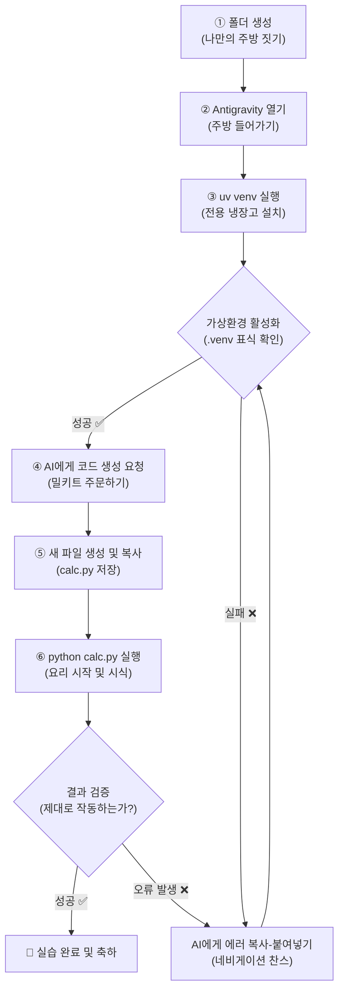
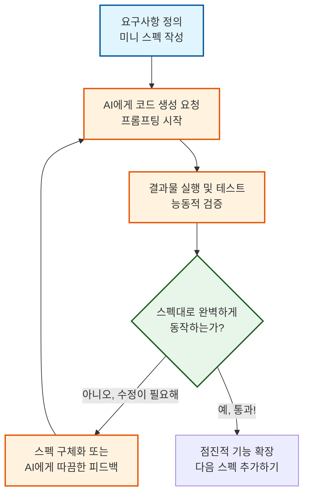
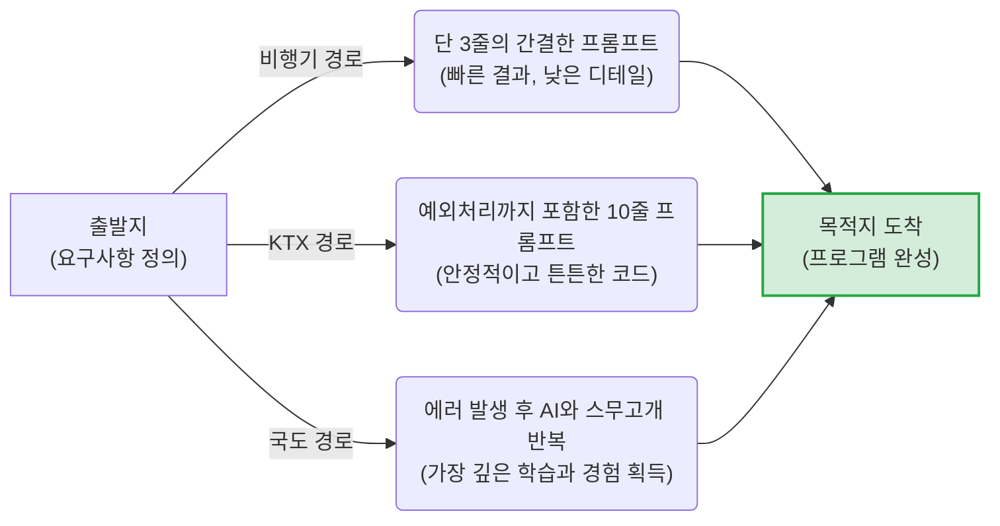
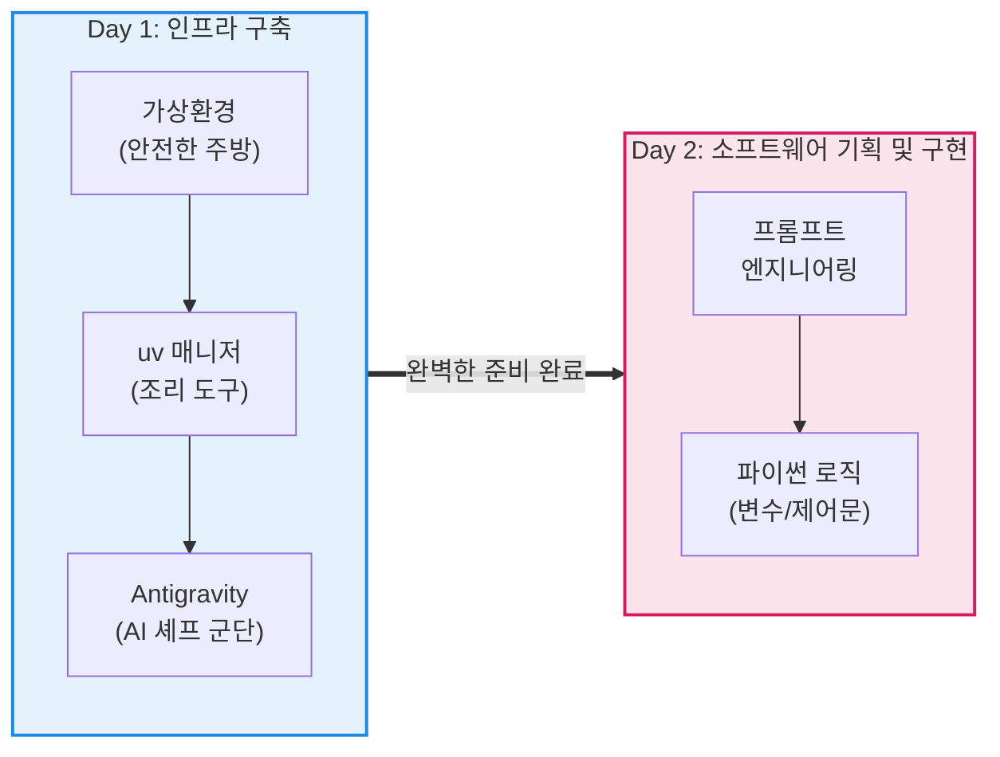

# Day 1 오후: uv 첫프로그램 종합실습

> **과정**: AI-native 파이썬 기초 | Day 1/5 | 13:30~18:00
> **테마**: AI 도구 탐험과 개발 환경 구축
> **세션**: 012 ~ 022 (11개 세션)
> **총 소요 시간**: 235분
> **버전**: v2.1 (7섹션 구조, 보조 패킷 통합)
> **작성 일시**: 2026-02-25

---

## 🎯 학습 목표 (오후)

1. **세션 012**: 이 세션 종료 시 수강생은 파이썬 개발에서 패키지 충돌을 방지하기 위한 '가상환경'의 개념과 그 필요성을 비유를 들어 설명할 수 있다.
2. **세션 013**: 이 세션 종료 시 수강생은 터미널에서 uv 명령어를 사용해 Python 가상환경을 생성하고 활성화 상태를 온오프(activate/deactivate) 할 수 있다.
3. **세션 014**: 이 세션 종료 시 수강생은 활성화된 가상환경 내에서 `uv pip install` 명령어를 사용해 외부 패키지를 성공적으로 설치할 수 있다.
4. **세션 015**: 이 세션 종료 시 수강생은 AI 비서에게 자연어 프롬프트를 입력하여 입출력 기능이 포함된 완전한 파이썬 스크립트 파일을 생성할 수 있다.
5. **세션 016**: 이 세션 종료 시 수강생은 생성된 코드를 실행하기 전 결과를 예측하고, 실행하여 검증한 뒤, AI의 해설을 통해 동작 원리(input, print)를 설명할 수 있다.
6. **세션 017**: 이 세션 종료 시 수강생은 기존 프롬프트에 새로운 조건("나이 계산 추가")을 덧붙여 재생성된 코드를 기존 코드와 비교하고 어떤 부분이 달라졌는지 관찰할 수 있다.
7. **세션 018**: 이 세션 종료 시 수강생은 외부의 도움 없이 새 프로젝트 폴더를 만들고, 가상환경을 구성한 뒤, AI와 협력하여 간단한 계산기 프로그램을 실행하는 전체 사이클을 1회 이상 독립적으로 완수할 수 있다.
8. **세션 019**: 이 세션 종료 시 수강생은 주어진 요구사항(미니 스펙)에 맞춰 고객 1명의 이름과 전화번호를 입력받아 출력하는 프로그램을 AI와 협력하여 구현할 수 있다.
9. **세션 020**: 이 세션 종료 시 수강생은 자신의 오류 해결 경험이나 작성한 프롬프트를 동료와 1가지 이상 공유하고 타인의 접근법을 비교할 수 있다.
10. **세션 021**: 이 세션 종료 시 수강생은 Day 1에 다룬 핵심 개념 5가지(IDE, 가상환경, 패키지 매니저, 터미널, 예측-검증-설명)를 퀴즈를 통해 정확히 인지하고 설명할 수 있다.
11. **세션 022**: 이 세션 종료 시 수강생은 Day 2에서 학습할 "프롬프트 작성법과 PRD 설계"의 필요성을 인지하고 다음 날 교육에 대한 기대감을 갖게 된다.

---

## 📋 목차

- [📖 세션 012: 가상환경의 필요성 이해](#세션-012) (25분)
- [🧪 세션 013: uv로 가상환경 생성 및 활성화](#세션-013) (25분)
- [🧪 세션 014: uv pip로 패키지 설치 체험](#세션-014) (20분)
- [🧪 세션 015: 프롬프트로 첫 파이썬 코드 생성](#세션-015) (20분)
- [🧪 세션 016: 코드 실행과 예측-검증-설명 경험](#세션-016) (20분)
- [🧪 세션 017: 프롬프트 변형으로 코드 변화 관찰하기](#세션-017) (20분)
- [🧪 세션 018: [종합 실습 1] 나만의 환경 구축부터 프로그램 실행까지](#세션-018) (25분)
- [🧪 세션 019: [종합 실습 2] 미니 스펙 첫 경험: 고객 1명 관리 프로그램](#세션-019) (25분)
- [🧪 세션 020: 동료 학습과 자주 묻는 질문 해결](#세션-020) (20분)
- [📖 세션 021: Day 1 핵심 정리 퀴즈와 QnA](#세션-021) (20분)
- [📖 세션 022: 마무리 및 Day 2 예고](#세션-022) (15분)

---

## 📊 세션 인덱스

| 세션 | 제목 | 시간 | 청크 타입 | 난이도 | 바로가기 |
|------|------|------|-----------|--------|----------|
| 012 | 가상환경의 필요성 이해 | 25분 | 📖 narrative | medium | [바로가기](#세션-012) |
| 013 | uv로 가상환경 생성 및 활성화 | 25분 | 🧪 lab | medium | [바로가기](#세션-013) |
| 014 | uv pip로 패키지 설치 체험 | 20분 | 🧪 lab | low | [바로가기](#세션-014) |
| 015 | 프롬프트로 첫 파이썬 코드 생성 | 20분 | 🧪 lab | medium | [바로가기](#세션-015) |
| 016 | 코드 실행과 예측-검증-설명 경험 | 20분 | 🧪 lab | medium | [바로가기](#세션-016) |
| 017 | 프롬프트 변형으로 코드 변화 관찰하기 | 20분 | 🧪 lab | medium | [바로가기](#세션-017) |
| 018 | [종합 실습 1] 나만의 환경 구축부터 프로그램 실행까지 | 25분 | 🧪 lab | high | [바로가기](#세션-018) |
| 019 | [종합 실습 2] 미니 스펙 첫 경험: 고객 1명 관리 프로그램 | 25분 | 🧪 lab | high | [바로가기](#세션-019) |
| 020 | 동료 학습과 자주 묻는 질문 해결 | 20분 | 🧪 lab | low | [바로가기](#세션-020) |
| 021 | Day 1 핵심 정리 퀴즈와 QnA | 20분 | 📖 narrative | low | [바로가기](#세션-021) |
| 022 | 마무리 및 Day 2 예고 | 15분 | 📖 narrative | low | [바로가기](#세션-022) |

---

## 📚 본문

### 세션 012: 가상환경의 필요성 이해
> [원본 파일](sessions/세션-012-가상환경의_필요성_이해_v2.1.md) | ⏱️ 25분 | 📖 narrative | 난이도: medium

> **세션 ID**: MS-PY101-012  
> **소요 시간**: 20분  
> **난이도**: low  
> **청크 타입**: narrative  
> **버전**: v2.1 (7섹션 구조)

---

## §1. 개요

> **Day 1 | PM | 세션 012/022**

점심 식사는 맛있게 하셨나요? 오후의 첫 번째 세션입니다. 오전에 우리는 파이썬을 설치하고 초고속 패키지 매니저인 uv까지 컴퓨터에 장착했어요. 이제 전 세계 개발자들이 만들어둔 수많은 유용한 도구들을 마음껏 다운로드해서 사용할 준비가 다 되었습니다. 하지만 무턱대고 다운로드를 시작하기 전에, 반드시 알아두어야 할 아주 중요한 규칙이 하나 있어요. 바로 '가상환경'이라는 개념입니다. 이 20분 동안 우리는 왜 파이썬 개발자들이 프로젝트를 시작할 때마다 이 가상환경부터 세팅하는지, 그 근본적인 이유를 아주 쉬운 비유를 통해 알아볼 거예요.

### 🎯 학습 목표

이 세션이 끝나면 수강생은 다음을 할 수 있어요:

- 파이썬에서 가상환경이 왜 필수적인지 일상적인 비유를 들어 설명할 수 있습니다.
- 패키지 버전 충돌(의존성 지옥)이 무엇인지 이해하고, 이를 예방하는 원리를 파악합니다.
- 프로젝트마다 독립된 작업 공간을 분리하는 습관의 중요성을 인식합니다.

### 선행 세션 환기

오전 마지막 세션에서 우리는 기존 도구보다 최대 100배 빠른 차세대 패키지 매니저 uv를 설치했어요. "이걸로 이제 패키지를 마음껏 설치하면 되겠구나!" 생각하셨겠지만, 아직 엔터키를 누르시면 안 됩니다. 여러분의 깨끗한 컴퓨터를 안전하게 보호하면서 패키지를 설치하려면, 먼저 튼튼한 '격리벽'을 세워야 하거든요.

---

## §2. 핵심 개념 (+ 🗣️ 강사 대본 + Mermaid)

### 요리법과 전용 주방 비유

프로그래밍에서 새로운 프로젝트를 시작한다는 것은 새로운 요리를 만드는 것과 같아요. 그런데 여러분이 아주 넓은 메인 주방 하나를 가지고 있다고 상상해 봅시다. 오늘 점심에는 일식 초밥을 만들고, 저녁에는 중식 마파두부를 만들려고 해요. 만약 단 하나의 도마 위에서 생선도 썰고, 마늘도 썰고, 고추기름도 붓는다면 어떤 일이 벌어질까요? 초밥에서는 마늘 냄새가 나고 마파두부에서는 생선 비린내가 진동할 겁니다. 재료와 냄새가 이리저리 섞이면서 결국 두 요리 모두 망치게 되겠죠.

파이썬 개발에서도 똑같은 문제가 발생합니다. 여러 파이썬 프로젝트가 요구하는 패키지 버전들이 서로 섞이거나 엉키지 않도록 격리해 놓은 전용 폴더 및 환경이 바로 '가상환경(Virtual Environment)'입니다 [Source B]. 하나의 컴퓨터(단일 주방)에 여러 프로젝트(다양한 요리)의 도구들을 마구잡이로 설치하면 언젠가 반드시 서로 충돌하게 되어 있어요. 그래서 파이썬 개발자들은 요리가 섞이는 것을 막기 위해, 프로젝트를 시작할 때마다 완전히 새롭고 깨끗한 '전용 주방'을 통째로 새로 짓습니다.

🗣️ **강사 대본 (Instructor Script)**:

> 식사 맛있게 하셨나요? 오후 첫 시간은 조금 가벼우면서도 매우 중요한 이야기로 시작해 볼게요.
>
> 여러분, 오전에 uv를 설치했으니 이제 인터넷에 있는 패키지를 마음껏 설치할 수 있겠다고 생각하실 겁니다. 그런데 잠깐, 한 가지 중요한 것을 먼저 이해하고 넘어가야 해요.
>
> 여러분이 요리를 두 가지 동시에 한다고 상상해 봅시다. 한 주방에서 일식, 양식, 중식을 도마 하나로 요리하면 냄새가 다 섞이겠죠? 생선 비린내가 두부에 배고, 고추기름이 초밥에 튀어서 결국 둘 다 망칩니다. 프로그래밍에서도 똑같은 문제가 생겨요. A라는 프로젝트에서는 '카메라 인식' 기능의 옛날 버전이 필요한데, B라는 프로젝트에서는 최신 버전이 필요할 수 있어요. 이걸 하나의 컴퓨터에 전부 설치해버리면, 서로 버전이 엉키면서 에러를 뿜어냅니다. 개발자들은 이걸 '의존성 지옥'이라고 부릅니다 [Source B].
>
> 내 컴퓨터 하나에 모든 걸 설치하면 시스템이 엉망이 되기 때문에, 우리는 가상환경이라는 걸 만들 거예요. 가상환경은 프로젝트마다 완전히 새로운 주방과 조리도구를 배정해 주는 것과 같습니다 [Source B].
>
> 가상환경 폴더를 하나 만들면, 그 안에 파이썬 실행 파일과 도구들이 들어갈 빈 냉장고가 생깁니다. A 프로젝트를 위한 냉장고와 B 프로젝트를 위한 냉장고가 완전히 분리되는 거죠. 이렇게 서로 섞이거나 엉키지 않도록 격리해 놓은 전용 폴더 및 환경이 바로 가상환경의 진짜 정체입니다. 핵심 키워드는 바로 '격리'예요.

### Mermaid 다이어그램



이 다이어그램을 보시면 하나의 컴퓨터 안에 서로 완벽하게 분리된 가상환경들이 존재하는 것을 알 수 있어요. 두 환경은 높은 벽으로 격리되어 있어서, 한쪽에서 패키지를 지우거나 망가뜨려도 다른 쪽에는 눈곱만큼의 영향도 주지 않습니다.

---

## §3. 상세 내용

### Why — 왜 프로젝트마다 주방을 따로 차려야 하는가?

가상환경을 사용해야 하는 이유는 크게 세 가지로 나눌 수 있어요.

첫째는 앞서 강조했던 패키지 버전 충돌 방지입니다. 파이썬 세계에는 정말 수많은 외부 도구들이 있고, 이 도구들은 하루가 다르게 업데이트됩니다. 어떤 프로젝트는 옛날 버전의 도구를 기준으로 만들어졌고, 어떤 프로젝트는 최신 버전이 필요합니다. 만약 가상환경이라는 격리벽이 없다면 새로운 도구를 설치하는 순간 기존에 잘 돌아가던 프로젝트가 모두 망가지는 대참사가 벌어집니다. 가상환경은 A 프로젝트와 B 프로젝트 간의 의존성 지옥을 예방하고 이런 충돌을 원천적으로 차단해 줘요 [Source B].

둘째는 완벽하게 깨끗한 실험 공간을 보장한다는 점입니다. 개발을 하다 보면 이것저것 패키지를 설치해 보고 지우는 일명 '삽질'을 많이 하게 됩니다. 내 컴퓨터 시스템 전체에 이런 실험을 반복하면 컴퓨터가 금방 지저분해지고 느려지겠죠. 하지만 가상환경 안에서 실험을 하면 이야기가 다릅니다. 아무리 패키지를 엉망으로 설치하더라도 여러분 컴퓨터의 윈도우나 맥 운영체제에는 전혀 영향을 주지 않아요. 마음껏 실험하다가 도저히 안 되겠다 싶으면 그냥 그 가상환경 폴더 하나만 휴지통에 버리면 그만입니다. 방 하나를 빌려서 실컷 어지르다가 방을 통째로 버리는 셈이죠.

셋째는 재현 가능성입니다. 회사에서 일하다 보면 "어? 내 자리 컴퓨터에서는 잘 되는데 왜 네 컴퓨터에서는 에러가 나지?"라는 상황을 지겹도록 겪게 됩니다. 가상환경을 사용하면 이 문제를 해결할 수 있어요. 내 가상환경 주방에 있는 재료 목록을 영수증처럼 텍스트 파일로 저장해 두면, 동료가 그 영수증만 보고 자기 컴퓨터에 똑같은 주방을 그대로 복원할 수 있거든요. 이를 통해 팀원 모두가 완벽하게 똑같은 환경에서 일할 수 있게 됩니다.

### What — 그렇다면 가상환경의 실체는 무엇인가?

추상적인 개념처럼 들리지만, 가상환경의 실제 모습은 허무할 정도로 단순합니다. 바로 여러분의 프로젝트 폴더 안에 생성되는 `.venv`라는 이름의 숨겨진 폴더가 그 정체입니다. 이 폴더 안을 들여다보면 파이썬 실행 프로그램의 복사본과 함께, 여러분이 설치하는 모든 외부 패키지들이 모이는 저장 공간이 들어 있어요.

결국 가상환경을 켠다는 것은 "지금부터 내가 파이썬을 실행하거나 패키지를 설치할 때, 컴퓨터 전체에 있는 파이썬이 아니라 이 `.venv` 폴더 안에 있는 전용 파이썬을 사용하겠다"라고 컴퓨터에게 알려주는 과정에 불과합니다. 특별한 마법이 아니라 단순히 경로를 우회시키는 아주 똑똑한 폴더인 것이죠.

### How — 비개발자도 이해할 수 있는 언어로 번역하기

이런 전문적인 내용들을 비전공자인 여러분이 모두 외울 필요는 없어요. 우리가 오전에 배웠던 핵심을 떠올려 볼까요? 헷갈리고 어려운 개념이 나타나면 우리는 어떻게 하기로 했었죠? 맞습니다. 바로 AI에게 물어보는 거예요. "가상환경의 격리 원리를 쉽게 설명해줘"라고 요청하면 AI가 여러분의 수준에 맞춰 찰떡같은 비유를 만들어 줍니다. 이 능력을 활용하면 파이썬의 어떤 어려운 개념도 쉽게 내 것으로 만들 수 있어요.

---

## §4. 실습 가이드 (+ 🎙️ 실습 대본)

### 실습 목표

이 세션의 실습은 코드 창을 띄워놓고 타이핑을 하는 방식이 아니에요. 방금 배운 '격리와 전용 주방'이라는 개념을 완전히 내 것으로 체화하기 위해, AI와 대화해 보고 그 내용을 바탕으로 동료에게 직접 설명해 보는 활동입니다. 가상환경이 왜 필요한지 비개발자도 이해할 수 있게 비유를 들어 설명해달라고 질문하고 요약하는 과정을 통해 다른 사람에게 비유를 들어 설명할 수 있다면 그 개념을 완벽히 이해한 것입니다 [Source B].

🎙️ **실습 가이드 대본 (Lab Guide)**:

> 자, 이제 여러분의 AI 비서를 호출해 볼 시간입니다. 프롬프트 창에 이렇게 입력해 보세요. "가상환경이 왜 필요한지 비개발자도 이해할 수 있게 비유를 들어서 설명해 줘."
>
> AI가 답변을 주기 시작할 거예요. 제가 아까 들었던 '일식과 중식 주방' 비유와 비슷할 수도 있고, '격리 병동'이나 '독립된 게임기'처럼 전혀 다른 재미있는 비유가 나올 수도 있어요. AI의 설명을 쭉 읽어보시고, 가장 마음에 드는 비유를 하나 골라보세요.
>
> 고르셨나요? 그럼 이제 옆에 앉으신 짝꿍에게 그 비유를 사용해서 가상환경이 무엇인지 딱 한 문장으로 설명해 주세요. "가상환경은 마치 이런 것과 같아. 왜냐하면 이렇게 격리해주기 때문이지." 라고요. 3분 드리겠습니다. 자, 시작!

### 단계별 지시

| 단계 | 소요 시간 | 강사 지시사항 | 학습자 액션 | 예상 결과 |
|------|----------|--------------|------------|----------|
| 1 | 2분 | AI에게 비유적 설명을 요청하는 프롬프트 작성 안내 | 프롬프트 입력 및 AI 답변 읽기 | 다양한 일상적 비유 확인 |
| 2 | 3분 | 가장 이해하기 쉬운 비유를 선택해 옆 사람과 공유 유도 | 짝과 1:1로 설명 주고받기 | 개념의 내재화 및 활기찬 분위기 |
| 3 | 5분 | 전체 앞에서 1~2명의 독창적인 비유 발표 청취 | 자원자 발표 경청 | 다른 시각에서의 개념 이해 확장 |
| 4 | 5분 | 격리의 중요성 핵심 요약 및 질의응답 | 화면 주시 및 자유 질문 | 의문점 해소 및 개념 정립 |

### 트러블슈팅 FAQ

| Q | A |
|---|---|
| AI가 너무 뻔하고 어려운 설명만 반복합니다. | 프롬프트에 구체적인 조건을 추가하라고 조언해 주세요. "유원지 놀이기구에 비유해 줘" 또는 "초등학생도 이해할 수 있게 10글자로 비유해 줘"라고 요청하면 훨씬 창의적이고 쉬운 답변이 나옵니다. |
| 아직도 가상환경이 왜 필요한지 잘 와닿지 않는다고 질문이 들어왔습니다. | 휴대폰 기능으로 설명해 보세요. "회사용 메신저와 개인용 메신저를 완벽하게 분리하고 싶어서 듀얼 앱을 쓰는 것과 똑같습니다. 서로 대화 내용이 절대 섞이지 않게 분리하는 거예요." |

---


### 🎓 강사 노트 (Instructor Support)

- ⏱️ **타이밍**: 14:20 (25분, narrative)
- 🎯 **핵심 활동**: 비유: "프로젝트별 개인 사물함"
- ⚠️ **강사 주의사항**: 개념 이해가 먼저, 명령어는 다음 세션

## §5. 코드 및 명령어 모음

이 세션은 개념의 이해와 토론이 목적이므로 직접 실행하는 파이썬 코드는 없습니다. 다만 AI와 소통하기 위해 사용했던 프롬프트 예시를 남겨둡니다.

> 🤖 **AI 프롬프트 예시**:
> "너는 IT 지식이 없는 사람들을 가르치는 친절한 강사야. 파이썬에서 '가상환경(Virtual Environment)'을 왜 무조건 만들어야 하는지, 패키지 충돌이라는 게 무엇인지 요리나 주방에 비유하지 말고 완전히 다른 새로운 일상적인 비유를 들어서 3문장으로 짧게 설명해 줘."

---

## §6. 요약

### 핵심 학습 포인트

이번 시간의 가장 중요한 키워드는 단연코 '격리'입니다. 가상환경은 내 컴퓨터 안에 안전하고 독립적인 프로젝트 전용 작업실을 만들어주는 훌륭한 기능이에요. 이 전용 작업실 덕분에 프로젝트 간의 패키지가 서로 부딪혀 망가지는 '의존성 지옥'을 피할 수 있고, 마음껏 어지르고 부수며 실험할 수 있는 완벽한 자유를 얻게 됩니다. 또한 영수증처럼 기록을 남겨 다른 사람의 컴퓨터에서도 똑같은 작업실을 그대로 재현할 수 있다는 점도 꼭 기억해 두시면 좋겠습니다.

### 다음 세션 예고

개념을 머리로 이해했으니 이제 손으로 직접 만들어 볼 차례입니다. 다음 세션에서는 오전에 설치했던 그 엄청나게 빠른 패키지 매니저, uv를 사용해서 실제로 내 프로젝트 폴더 안에 전용 주방(`.venv`)을 뚝딱 만들어 볼 거예요. 

### 브릿지 노트

> "가상환경이 왜 필요한지, 왜 격리가 그토록 중요한지 이제 확실히 감이 오셨을 겁니다. 그렇다면 이 마법 같은 전용 주방을 만드는데 시간이 얼마나 걸릴까요? 기존 방식으로는 제법 오랜 시간이 걸렸지만, 우리가 오전에 설치한 uv를 쓰면 눈 깜짝할 사이에 만들어집니다. 여러분의 첫 번째 가상환경, 지금 바로 만들러 가보시죠!"

---

## §7. 참고 자료

### 3-Source 출처

- **Source B (NotebookLM)**: 여러 파이썬 프로젝트가 요구하는 패키지 버전들이 서로 섞이거나 엉키지 않도록 격리해 놓은 전용 폴더 및 환경이라는 정의와, 이를 설명하기 위한 의존성 지옥, 의존성 충돌 예방 및 전용 주방 비유의 개념적 기반을 제공했습니다.

### 추가 학습 자료

- [Python 공식 문서: 가상환경과 패키지](https://docs.python.org/ko/3/tutorial/venv.html): 가상환경의 기술적 배경이 궁금한 분들을 위한 공식 가이드
- [Astral uv 공식 문서](https://docs.astral.sh/uv/): 가상환경을 초고속으로 생성하는 uv의 공식 메뉴얼

### 강사 노트

> 💡 **강사 노트**: 본 세션은 비전공자들이 가장 어려워하고 귀찮아하는 '가상환경 세팅'의 당위성을 설득하는 매우 중요한 시간입니다. 기술적인 원리(디렉토리 구조 변경, 환경변수 조작 등)를 설명하는 것은 철저히 배제하고, 무조건 '왜 해야 하는가(Why)'에 집중해 주세요. 일식과 중식 도마 비유는 수강생들이 가장 직관적으로 이해할 수 있는 강력한 무기입니다. 실습 시간에 수강생들이 각자 찾아낸 재미있는 비유를 적극적으로 호응해 주시면 오후 수업의 에너지를 크게 끌어올릴 수 있습니다.

---

## ✅ 세션 완료 체크리스트 (강사용)

- [x] §1~§7 모든 섹션이 충실하게 작성되었는가?
- [x] 일식/중식 도마 비유를 통해 의존성 충돌의 개념이 명확히 전달되었는가?
- [x] 비개발자가 이해할 수 있는 쉬운 구어체 줄글로 서술되었는가?
- [x] AI와 대화하며 비유를 찾는 실습이 포함되었는가?
- [x] 팩트 패킷(Source B)의 핵심 개념과 출처 표기가 적절히 반영되었는가?

---

*작성 일시: 2026-02-25*  
*작성 에이전트: A4B_Session_Writer*  
*교안 구조: 7섹션 (A0 팀 공통 표준)*

> 🔗 **이전 세션**: [세션 011: uv 패키지 매니저 소개와 설치](#세션-011)에서 배운 내용을 이어갑니다.
> 🔗 **다음 세션**: [세션 013: uv로 가상환경 생성 및 활성화](#세션-013)에서 계속됩니다.

---

### 세션 013: uv로 가상환경 생성 및 활성화
> [원본 파일](sessions/세션-013-uv로_가상환경_생성_및_활성화_v2.1.md) | ⏱️ 25분 | 🧪 lab | 난이도: medium

> **세션 ID**: MS-PY101-013  
> **소요 시간**: 20분  
> **난이도**: low  
> **청크 타입**: lab  
> **버전**: v2.1 (7섹션 구조)

---

## §1. 개요

> **Day 1 | PM | 세션 013/022**

### 🎯 학습 목표

이 세션이 끝나면, 수강생은 다음을 할 수 있습니다:

- `uv venv` 명령어를 사용하여 1초 만에 프로젝트 전용 가상환경을 생성할 수 있다
- 운영체제에 맞는 명령어(Windows/macOS)로 가상환경을 활성화할 수 있다
- 터미널 프롬프트에서 `(.venv)` 표시를 확인하여 활성화 상태를 검증할 수 있다
- `deactivate` 명령어로 가상환경을 안전하게 종료할 수 있다

### 선행 세션 환기

바로 직전 세션(012)에서 우리는 가상환경이 왜 필요한지 배웠어요. 한 주방에서 일식, 양식, 중식을 도마 하나로 요리하면 냄새가 다 섞이겠죠? 파이썬 프로젝트도 마찬가지입니다. 각 프로젝트가 요구하는 도구(패키지)의 버전이 다르기 때문에, 공간을 분리하지 않으면 "의존성 지옥"이라는 무서운 곳에 빠지게 됩니다. 이론은 충분히 이해하셨을 테니, 이제 직접 우리만의 독립된 작업 공간을 만들어 볼 차례입니다.

---

## §2. 핵심 개념 (+ 🗣️ 강사 대본 + Mermaid)

### "전용 작업실 짓기"와 "마스터 열쇠로 문 열기"

가상환경을 만드는 과정은 거대한 공장(컴퓨터) 안에 우리 프로젝트만을 위한 **전용 작업실**을 새로 짓는 것과 같습니다. 인터넷으로 이것저것 복잡하게 주문할 필요 없이, `uv venv`라는 명령어 하나만 입력하면 마법처럼 순식간에 작업실(`.venv` 폴더)이 뚝딱 완성됩니다.

하지만 작업실을 지었다고 바로 그 안에서 일할 수 있는 건 아니에요. 작업실 밖 공장 로비에 서서 도구를 꺼내면, 그건 여전히 남의 도구와 섞이는 겁니다. 작업실 안에 들어가려면 **마스터 열쇠**를 돌려 문을 열어야 해요. 이 문을 여는 행위가 바로 **활성화(Activate)**입니다.

명령어를 통해 문을 열고 들어가면, 터미널 화면 맨 앞에 `(.venv)`라는 초록색 명찰이 딱 붙습니다. 이 명찰은 "당신은 지금 전용 작업실 안에 안전하게 들어와 있습니다"라는 뜻이에요. 작업이 끝나고 `deactivate`를 입력하면 작업실 문을 닫고 다시 로비로 나오게 되며, 명찰도 사라집니다.

🗣️ **강사 대본 (Instructor Script)**:

> 자, 여러분. 이제 진짜로 우리만의 첫 번째 전용 작업실을 지어볼 시간입니다. 앞서 설치해 둔 `uv`라는 초고속 도구를 꺼내보세요. 터미널에 명령어 딱 한 줄만 치면 1초도 안 되어서 우리 프로젝트 폴더 안에 `.venv`라는 독립된 방이 만들어집니다.
>
> 여기서 가장 중요한 건 "방을 짓는 것"으로 끝나지 않는다는 점이에요. 방을 지었으면 문을 열고 들어가야겠죠? 윈도우에서는 `.venv\Scripts\activate`라고 입력하고, 맥에서는 `source .venv/bin/activate`라고 쳐서 문을 엽니다. 문을 열면 터미널 프롬프트 맨 앞에 `(.venv)`라는 간판이 나타나요. 이 간판이 보인다는 건 "지금부터 가져오는 모든 재료와 도구는 이 방 안에만 안전하게 보관됩니다"라는 신호입니다.
>
> 반대로 방에서 나갈 때는 `deactivate`라고 치면 됩니다. 간판이 사라지면 문이 닫힌 거예요. 만약 이 간판이 없는 상태에서 뭘 설치한다면? 여러분 컴퓨터 전체에 파일이 어질러지는 대참사가 일어납니다. 그러니까 작업 시작 전에는 무조건! `(.venv)` 간판이 켜져 있는지 확인하는 습관을 들이셔야 합니다.

> 💡 **강사 노트**: 기존의 "미니 냉장고" 비유를 "전용 작업실과 열쇠" 비유로 확장했습니다. 단순히 저장 공간(냉장고)을 넘어서, 개발자가 특정 환경(작업실)에 "진입(활성화)"하고 "퇴장(비활성화)"한다는 공간적 맥락을 주입하면 터미널 프롬프트의 변화를 더 직관적으로 이해할 수 있습니다.

### Mermaid 다이어그램

```mermaid
flowchart TD
    A["📂 프로젝트 폴더 열기<br/>(공장 로비)"] --> B["💻 uv venv 입력<br/>(작업실 짓기)"]
    B --> C{".venv 폴더 생성 확인"}
    C --> D["🔑 activate 명령어 실행<br/>(문 열고 들어가기)"]
    D --> E{터미널 앞에<br/>(.venv) 간판 확인}
    E -->|"간판 보임 ✅"| F["📦 패키지 설치 및 작업<br/>(안전 지대)"]
    E -->|"간판 없음 ❌"| D
    F --> G["🚪 deactivate 입력<br/>(문 닫고 나오기)"]
    G --> H["(.venv) 간판 사라짐"]
```

---

## §3. 상세 내용

### Why — 왜 uv venv를 사용해야 하는가?

기존 파이썬 환경에서는 `python -m venv`라는 기본 명령어를 사용해 가상환경을 만들었습니다. 이 방식은 확실하지만 아주 느려요. 폴더 하나 만드는 데 10초 이상 걸리기도 하죠. 우리는 1초가 아쉬운 AI 시대에 살고 있습니다. 

`uv venv`는 Rust 언어로 개발된 도구로, 기존 방식보다 수십 배 빠른 속도를 자랑합니다. 엔터를 치자마자 즉시 `.venv` 폴더가 생성되는 속도감을 체험해 보면, 왜 전 세계 개발자들이 uv로 넘어가고 있는지 바로 체감하실 수 있습니다. 가상환경 생성 속도가 빨라지면, 프로젝트를 새로 시작하는 데 드는 심리적 장벽이 완전히 사라집니다.

### What — .venv 폴더의 정체

`uv venv`를 실행하면 현재 폴더 안에 `.venv`라는 숨겨진 폴더가 생깁니다. 이 폴더 안에는 무엇이 들어있을까요? 
가장 중요한 두 가지가 있습니다. 첫째, 현재 시스템에 깔린 파이썬 실행 파일의 "복사본(또는 링크)"입니다. 둘째, 앞으로 우리가 다운로드할 패키지들이 저장될 빈 선반(Lib 또는 lib 폴더)입니다. 

이 폴더는 철저히 현재 프로젝트에만 속합니다. A 프로젝트의 `.venv`와 B 프로젝트의 `.venv`는 이름만 같을 뿐 완전히 남남이에요. 그래서 프로젝트마다 마음 편하게 필요한 도구들을 설치할 수 있는 겁니다.

### How — 활성화(Activate)의 원리

활성화 명령어를 치면 컴퓨터 안에서 무슨 일이 일어날까요? 터미널이 명령어를 찾을 때 어디를 먼저 볼지 결정하는 "경로(PATH)"라는 것이 있습니다. `activate`를 실행하면 컴퓨터의 PATH 맨 앞에 이 `.venv` 폴더 안의 경로를 슬쩍 끼워 넣습니다. 

그래서 터미널에 `python`이나 `pip`라고 치면, 시스템 전체에 깔린 기본 파이썬이 아니라 우리가 방금 만든 전용 작업실(`.venv`) 안의 파이썬이 먼저 응답하게 되는 원리예요. 반대로 `deactivate`를 치면 끼워 넣었던 경로를 다시 쏙 빼버려서 원래 상태로 되돌립니다. 복잡한 원리 같지만, 여러분이 기억할 것은 오직 하나입니다. **터미널 맨 앞에 `(.venv)` 간판이 보이면 안전 지대, 안 보이면 위험 지대입니다.**

> ✅ **체크포인트**: 여기까지 이해했는지 스스로 점검해 보세요.
> - 가상환경을 활성화하지 않고 패키지를 설치하면 어떤 문제가 생기나요? ("프로젝트 전용 공간이 아닌 컴퓨터 전역에 설치되어 나중에 충돌이 발생할 수 있다")
> - 터미널에서 현재 가상환경 안에 들어와 있는지 어떻게 알 수 있나요? ("프롬프트 맨 앞에 `(.venv)` 명찰이 붙어 있는지 확인한다")

---

## §4. 실습 가이드 (+ 🎙️ 실습 대본)

### 실습 목표

이 실습을 통해 수강생은 직접 프로젝트 폴더를 만들고, uv로 가상환경을 생성한 뒤, 운영체제에 맞는 명령어로 활성화와 비활성화를 반복 숙달합니다.

🎙️ **실습 가이드 대본 (Lab Guide)**:

> 자, 바탕화면에 빈 폴더를 하나 만들고 시작합시다. 폴더 이름은 `day1_project`로 할게요. Antigravity에서 이 폴더를 열어주세요. 터미널도 열려 있어야 합니다. 
> 
> 지금부터 우리는 전용 작업실을 만들고, 문을 열고 닫는 연습을 할 거예요. 명령어를 치다가 오타가 나거나 오류가 생기면 당황하지 말고 화면을 그대로 둔 채 손을 들어주세요. 터미널의 Tab 키 자동완성을 쓰면 오타를 확 줄일 수 있으니 이 마법 지팡이도 꼭 활용해 보시기 바랍니다.

### 단계별 지시 — Windows 사용자

| 단계 | 소요 시간 | 강사 지시사항 | 학습자 액션 | 예상 결과 |
|------|----------|--------------|------------|----------|
| 1 | 2분 | "새 폴더를 만들고 터미널을 여세요" | 바탕화면 `day1_project` 생성 후 Antigravity로 열기, `Ctrl + `` `로 터미널 열기 | 터미널 경로가 `day1_project`로 표시됨 |
| 2 | 1분 | "작업실을 지어봅시다. uv venv 입력!" | 터미널에 `uv venv` 입력 후 Enter | 좌측 파일 탐색기에 `.venv` 폴더 생성 |
| 3 | 1분 | "마스터 열쇠로 문을 엽니다" | `.venv\Scripts\activate` 입력 후 Enter (Tab 키 활용 권장) | 프롬프트 맨 앞에 `(.venv)` 초록색 간판 표시 |
| 4 | 1분 | "문을 다시 닫아보세요" | `deactivate` 입력 후 Enter | `(.venv)` 간판 사라짐 |
| 5 | 1분 | "다시 문을 열고 대기하세요" | 위 3번 명령어를 다시 입력하여 활성화 상태 유지 | `(.venv)` 간판이 켜진 상태로 다음 단계 준비 |

**[실습 단계 3 팁] Tab 키로 자동완성하기**
경로를 끝까지 타이핑하지 마세요. `.\.v` 까지만 치고 키보드의 **Tab** 키를 누르면 `.venv\`가 자동 완성됩니다. 이어서 `S` 누르고 **Tab**, `a` 누르고 **Tab**을 누르면 오류 없이 마스터 열쇠 명령어를 완성할 수 있습니다.

### 단계별 지시 — macOS 사용자

| 단계 | 소요 시간 | 강사 지시사항 | 학습자 액션 | 예상 결과 |
|------|----------|--------------|------------|----------|
| 1 | 2분 | "새 폴더를 만들고 터미널을 여세요" | 바탕화면 `day1_project` 생성 후 Antigravity로 열기, 터미널 실행 | 터미널 경로가 `day1_project`로 표시됨 |
| 2 | 1분 | "작업실을 지어봅시다" | 터미널에 `uv venv` 입력 후 Enter | 좌측 파일 탐색기에 `.venv` 폴더 생성 |
| 3 | 1분 | "마스터 열쇠로 문을 엽니다 (source 사용)" | `source .venv/bin/activate` 입력 후 Enter | 프롬프트 맨 앞에 `(.venv)` 간판 표시 |
| 4 | 1분 | "문을 다시 닫아보세요" | `deactivate` 입력 후 Enter | `(.venv)` 간판 사라짐 |
| 5 | 1분 | "다시 문을 열고 대기하세요" | 위 3번 명령어를 다시 입력하여 활성화 상태 유지 | `(.venv)` 간판이 켜진 상태로 다음 단계 준비 |

### 트러블슈팅 FAQ

| Q | A |
|---|---|
| (Windows) `PSSecurityException` 빨간 에러가 뜨면서 실행이 안 돼요 | 윈도우의 보안 정책 때문입니다. 터미널에 `Set-ExecutionPolicy Unrestricted -Scope CurrentUser`를 입력하고 Enter를 친 다음, 다시 activate 명령어를 실행해 보세요. |
| `.venv` 폴더가 탐색기에 안 보여요 | 숨김 폴더로 처리되었을 수 있습니다. Antigravity 왼쪽 탐색기 빈 곳을 클릭하고 새로고침 아이콘을 누르거나, 터미널에서 `ls -a` (Mac) 또는 `dir -Force` (Win)를 쳐서 확인해 보세요. |
| `(.venv)` 간판이 안 나타나요 | 활성화 명령어에 오타가 있거나, 백슬래시(`\`)와 슬래시(`/`)를 반대로 썼을 가능성이 높습니다. 윈도우는 `\`, 맥은 `/`를 사용합니다. Tab 키 자동완성을 사용하면 정확합니다. |
| `uv : command not found` 에러가 납니다 | 이전 세션에서 uv 패키지 매니저가 정상적으로 설치되지 않았거나, 설치 후 터미널을 껐다 켜지 않은 경우입니다. 터미널을 완전히 닫고 다시 열어보세요. |
| 비활성화할 때는 운영체제별로 명령어가 다른가요? | 아닙니다. 비활성화는 Windows와 macOS 모두 동일하게 `deactivate`만 치면 됩니다. 아주 간단하죠. |

> ✅ **체크포인트**: 모두의 터미널 프롬프트 맨 앞에 `(.venv)` 간판이 잘 떠 있나요? 간판이 안 켜진 분은 손을 들어서 튜터의 도움을 꼭 받으세요!

---


### 🎓 강사 노트 (Instructor Support)

- ⏱️ **타이밍**: 14:45 (25분, lab)
- 🎯 **핵심 활동**: `uv venv` + activate/deactivate
- ⚠️ **강사 주의사항**: 가장 많은 에러 발생 구간. 순회 필수


### 📋 실습 설계 보강 (Lab Packet)

**세션 013 실습 설계 보강**

uv로 가상환경 생성 및 활성화
- **3-Stage Example Set**
  - 기본: `uv venv` → `.venv` 폴더 생성 확인 → `.venv\Scripts\activate` 실행 → `(.venv)` 표시 확인
  - 변형: `deactivate`로 비활성화 후 다시 활성화하는 온/오프 연습
  - 실수 해결: "activate 명령어가 안 먹혀요" → PowerShell vs CMD 차이, 경로 오타
- **난이도 예측**: activate/deactivate 개념과 (.venv) 표시의 의미를 이해하기 어려움
- **타이밍 가이드**: uv venv 실행 3분 | activate 5분 | 온오프 연습 7분 | 트러블슈팅 10분
- **심리적 장벽**: "가상환경이 뭔지 아직 모르겠는데 왜 이걸 해야 하지?"
- **자가 점검**:
  - [ ] 터미널 프롬프트 앞에 `(.venv)`가 표시되는가?
  - [ ] `deactivate` 후 `(.venv)`가 사라지는 것을 확인했는가?
  - [ ] 가상환경을 "전용 냉장고"로 비유할 수 있는가?

## §5. 코드 및 명령어 모음

### 명령어 1: 가상환경 생성 (공통)

```bash
uv venv
```

현재 폴더 안에 파이썬 가상환경(`.venv` 폴더)을 매우 빠른 속도로 생성합니다. 기본적으로 시스템에 설치된 파이썬 버전을 사용합니다. 만약 특정 버전을 지정하고 싶다면 `uv venv --python 3.12`와 같이 입력할 수 있습니다.

### 명령어 2: 가상환경 활성화 (Windows)

```powershell
.venv\Scripts\activate
```

또는 

```powershell
.\.venv\Scripts\activate
```

Windows의 PowerShell이나 명령 프롬프트에서 가상환경으로 진입하는 명령어입니다. 실행 후 프롬프트 맨 앞에 `(.venv)`가 나타납니다.

### 명령어 3: 가상환경 활성화 (macOS / Linux)

```bash
source .venv/bin/activate
```

macOS나 리눅스 환경의 터미널(bash, zsh 등)에서 가상환경으로 진입하는 명령어입니다. `source`라는 단어를 반드시 앞에 붙여야 합니다.

### 명령어 4: 가상환경 비활성화 (공통)

```bash
deactivate
```

활성화된 가상환경에서 빠져나오는 명령어입니다. 운영체제에 상관없이 동일하게 사용하며, 실행 후 `(.venv)` 표시가 사라집니다.

---

## §6. 요약

### 핵심 학습 포인트

이번 세션에서 우리는 프로젝트 전용 작업실을 만들고 들어가는 법을 배웠습니다. 기억하실 핵심은 세 가지입니다. 첫째, `uv venv` 명령어를 치면 1초도 안 되어서 우리 프로젝트만을 위한 `.venv` 작업실이 지어집니다. 둘째, 작업실을 지었으면 반드시 열쇠로 문을 열고 들어가야 하며, 운영체제에 따라 윈도우는 `.venv\Scripts\activate`, 맥은 `source .venv/bin/activate`를 사용합니다. 셋째, 문이 제대로 열렸는지는 터미널 프롬프트 맨 앞의 `(.venv)` 초록색 간판으로 확인합니다. 이 간판이 보일 때만 안전 지대입니다.

### 다음 세션 예고

지금 우리 작업실은 깨끗하게 비어 있습니다. 파이썬 기본 실행 파일만 덩그러니 놓여 있죠. 이제 이 빈 작업실에 우리가 필요한 강력한 도구들을 채워 넣을 차례입니다. 다음 세션에서는 방금 열어둔 가상환경 상태 그대로, 인터넷에서 누군가 만들어둔 멋진 패키지를 초고속으로 다운로드해 보겠습니다. 

### 브릿지 노트

> "모두 `(.venv)` 간판을 켜둔 상태로 기다리고 계시죠? 문을 열어둔 채로 유지해 주세요. 혹시라도 실수로 문을 닫았다면 얼른 다시 `activate` 명령어로 열어주시기 바랍니다. 이 문이 열려있어야만 지금부터 주문할 멋진 도구들이 우리 전용 작업실 선반에 안전하게 배달됩니다. 자, 이제 첫 패키지를 설치하러 가보겠습니다!"

---

## §7. 참고 자료

### 3-Source 출처

- **Source A (로컬 참고자료)**: 「AI-native_파이썬기초.md」(SRC-A07) — uv 도구 스펙 및 가상환경 생성 명령어 표준.
- **Source B (NotebookLM)**: SRC-B01 — "전용 작업실 짓기와 마스터 열쇠" 비유의 논리적 구조, 가상환경의 필요성과 활성화 시각적 표식(`(.venv)`)에 대한 인지적 설명.
- **Source C (Deep Research)**: SRC-C01 — Rust 기반 패키지 매니저의 성능 이점, `uv venv` 명령어의 밀리초 단위 생성 속도 체감 및 활성화/비활성화 내부 원리.

### 추가 학습 자료

- [uv 공식 문서 (Environments)](https://docs.astral.sh/uv/): 가상환경 생성 및 관리에 대한 공식 가이드.
- [Python 공식 문서 (venv)](https://docs.python.org/3/library/venv.html): Python 가상환경의 기본 작동 원리와 PATH 환경 변수 조작 개념.

### 강사 노트

> 💡 **강사 노트**: 윈도우 환경에서 `PSSecurityException` 오류는 거의 100% 한 명 이상 발생합니다. 실습 중에 이 에러를 만난 수강생이 있다면, 오히려 이를 "보안 정책이 잘 작동하고 있다는 증거"라고 긍정적으로 설명해 주시고, 칠판이나 슬랙에 `Set-ExecutionPolicy` 명령어를 크게 띄워주시면 좋습니다. 또한, Tab 키를 이용한 자동완성은 초보자들의 오타로 인한 좌절감을 크게 줄여주므로 실습 내내 반복해서 강조해 주세요.

---

## ✅ 세션 완료 체크리스트 (강사용)

- [ ] §1~§7 모든 섹션이 충실하게 작성되었는가?
- [ ] "전용 작업실 열쇠 받기" 비유가 §2에서 충분히 확장되었는가?
- [ ] Windows/macOS 양쪽 활성화 명령어가 §4에 명확히 포함되었는가?
- [ ] 단계별 지시표에 Tab 키를 활용한 자동완성 팁이 들어갔는가?
- [ ] 트러블슈팅 FAQ에 윈도우 보안 오류(ExecutionPolicy) 해결법이 포함되었는가?
- [ ] 체크포인트 질문이 §3, §4에 배치되었는가?
- [ ] 3-Source 팩트 패킷의 내용(uv 속도 체감, 활성화 표식 등)이 §7에 반영되었는가?
- [ ] 다음 세션(014 패키지 설치) 브릿지 노트가 포함되었는가?

---

**🔗 선행 세션**: [세션-012] 가상환경의 필요성 이해 (필수)  
**🔗 후행 세션**: [세션-014] uv pip로 패키지 설치 체험

---

*작성 일시: 2026-02-25*  
*작성 에이전트: A4B_Session_Writer*  
*교안 구조: 7섹션 (A0 팀 공통 표준)*

> 🔗 **이전 세션**: [세션 012: 가상환경의 필요성 이해](#세션-012)에서 배운 내용을 이어갑니다.
> 🔗 **다음 세션**: [세션 014: uv pip로 패키지 설치 체험](#세션-014)에서 계속됩니다.

---

### 세션 014: uv pip로 패키지 설치 체험
> [원본 파일](sessions/세션-014-uv_pip로_패키지_설치_체험_v2.1.md) | ⏱️ 20분 | 🧪 lab | 난이도: low

> **세션 ID**: MS-PY101-014  
> **소요 시간**: 20분  
> **난이도**: low  
> **청크 타입**: lab  
> **버전**: v2.1 (7섹션 구조)

---

## §1. 개요

> **Day 1 | PM | 세션 014/022**

### 🎯 학습 목표

이 세션이 끝나면, 수강생은 다음을 할 수 있습니다:

- `uv pip install` 명령어를 사용해 필요한 외부 패키지를 초고속으로 설치할 수 있다
- 시스템 전체가 아닌 내 프로젝트(가상환경)에만 안전하게 격리 설치되는 원리를 이해한다
- 터미널에서 `uv pip list` 명령어로 현재 설치된 패키지와 의존성 목록을 검증할 수 있다

### 선행 세션 환기

직전 세션(세션-013)에서 우리는 프로젝트 전용 미니 냉장고(`.venv` 가상환경)를 사서 코드를 꽂고 문까지 활짝 열어뒀습니다. 터미널 프롬프트 앞에 `(.venv)`라는 예쁜 간판이 보이시죠? 이게 바로 "지금부터 모든 재료는 이 미니 냉장고에만 들어갑니다"라는 뜻이에요. 하지만 냉장고 문만 열어놓으면 뭐할까요. 안이 텅 비어있잖아요. 이제 이 빈 냉장고에 첫 번째 밀키트를 주문해서 든든하게 채워 넣을 시간입니다.

---

## §2. 핵심 개념 (+ 🗣️ 강사 대본 + Mermaid)

### 패키지 설치 = "초고속 밀키트 주문"

파이썬 세계에는 전 세계 개발자들이 미리 만들어 놓은 수십만 개의 밀키트(패키지)가 있습니다. 요리할 때마다 떡을 뽑고 고추장을 담그면 언제 떡볶이를 먹겠어요? 훌륭한 밀키트를 가져와서 끓이기만 하는 것이 현대 개발자의 기본 소양입니다.

패키지를 설치하는 과정을 밀키트 주문에 비유해 볼게요. "떡볶이 밀키트 하나 주세요!"라고 주문하면 배달 매니저가 창고에서 떡, 어묵, 파를 한 세트로 묶어서 우리 집 냉장고에 넣어주죠. 파이썬 터미널에서 `uv pip install requests`라고 치는 것이 바로 이 주문서입니다.

- **`uv`**: 우리의 초고속 배달 매니저 이름
- **`pip install`**: "창고에서 찾아서 설치해 줘"라는 주문 동사
- **`requests`**: 우리가 고른 밀키트(패키지)의 이름

우리가 고용한 매니저 uv는 좀 특별해요. 예전에 쓰던 매니저(pip)는 자전거로 배달해서 패키지 하나를 설치하는 데 10초씩 걸렸어요. 하지만 uv는 순간이동을 합니다. 주문 버튼(엔터)을 누르는 순간 이미 냉장고에 들어와 있을 정도로 빠르죠. 게다가 이 밀키트는 집 전체 메인 냉장고(시스템 전역)를 어지럽히지 않고 오직 내 전용 미니 냉장고(`.venv`)에만 깔끔하게 들어갑니다.

🗣️ **강사 대본 (Instructor Script)**:

> 여러분, 터미널에 `(.venv)` 간판이 잘 보이시나요? 보인다면 주문할 준비가 완벽히 끝난 겁니다. 파이썬에서는 남들이 만들어 놓은 유용한 도구 상자를 '패키지'라고 불러요. 오늘은 그 수많은 패키지 중에서 `requests`라는 아주 유명한 친구를 불러볼 거예요. 인터넷에서 데이터를 쏙쏙 뽑아올 때 쓰는 도구입니다.
> 
> 예전에는 파이썬 환경 세팅하고 패키지 하나 까는 데만 반나절이 걸렸어요. 뭔가 엉키고 꼬여서 컴퓨터 전체가 망가지는 일도 흔했죠. 하지만 여러분은 운이 아주 좋습니다. 우리가 배운 `uv`라는 마법 지팡이를 쓰면, 단 1초도 안 걸려서 내 프로젝트 전용 방에만 아주 깔끔하게 도구가 세팅됩니다. 주문 버튼을 누르자마자 "어? 벌써 끝났다고?" 하는 기분을 곧 느끼실 거예요.

> 💡 **강사 노트**: 밀키트 주문 비유와 격리 설치 개념은 NotebookLM(Source B)에서 도출되었으며, uv의 밀리초 단위 순간이동 성능은 Deep Research(Source C) 분석 결과를 반영했습니다. 초보자에게는 빠른 설치 속도보다 "내 컴퓨터를 망가뜨리지 않고 이 폴더 안에만 안전하게 설치된다"는 격리성(Isolation)을 더 강조해 주면 두려움을 없앨 수 있습니다.

### Mermaid 다이어그램



---

## §3. 상세 내용

### Why — 왜 패키지를 설치해야 하는가?

"코딩을 배운다면서 왜 남이 만든 걸 가져다 쓰나요?" 아주 자연스러운 의문이에요. 사실 직접 다 만들 수도 있죠. 하지만 바퀴를 다시 발명할 필요는 없습니다. 웹 브라우저를 열고, 주소를 치고, 화면의 글씨를 긁어오는 코드를 밑바닥부터 짜려면 수백 줄이 필요해요. 하지만 `requests` 패키지를 가져오면 단 3줄이면 끝납니다.

현대 프로그래밍은 무에서 유를 창조하는 것이 아니라, 전 세계 천재들이 이미 만들어 놓은 훌륭한 레고 블록들을 내 입맛에 맞게 조립하는 과정이에요. 그 레고 블록을 내 작업실로 가져오는 행위가 바로 패키지 설치입니다. 예를 들어, 인터넷에서 오늘의 날씨 데이터를 가져와서 분석하는 프로그램을 만든다고 가정해 봅시다. 패키지가 없다면 컴퓨터가 인터넷 통신을 어떻게 하는지부터 0과 1로 된 신호를 어떻게 주고받는지 수백 줄을 고민해야 합니다. 하지만 똑똑한 선배 개발자들이 그 복잡한 과정을 `requests`라는 이름의 깔끔한 레고 블록으로 미리 만들어 두었어요. 우리는 그저 이 블록을 우리 작업실로 가져와서 "날씨 데이터 좀 가져와 줘"라고 명령어 하나만 내리면 됩니다. 이것이 바로 우리가 코딩 문법보다 '어떤 패키지를 조립할지(What)'를 고민해야 하는 AI 시대의 진짜 개발 방식입니다.

### What — PyPI와 의존성(Dependency)이란?

`pip install` 명령어를 칠 때, 대체 어디서 패키지를 가져오는 걸까요? 바로 **PyPI**(Python Package Index)라는 거대한 글로벌 창고입니다. 이곳에는 인공지능, 데이터 분석, 게임 개발 등 50만 개가 넘는 파이썬 패키지가 쌓여 있어요. 

그런데 한 가지 재미있는 사실이 있습니다. 떡볶이 밀키트를 주문하면 떡만 오지 않죠? 소스, 어묵, 대파가 한 봉지에 담겨 옵니다. 패키지도 마찬가지예요. 우리가 `requests` 하나만 주문해도, 이 패키지가 제대로 일하기 위해 필요한 다른 작은 도구들(부속 재료)이 자동으로 함께 배달됩니다. 이것을 전문 용어로 **의존성(Dependency)**이라고 불러요. 똑똑한 uv 매니저가 이 의존성까지 알아서 챙겨 오기 때문에 우리는 메인 패키지 이름 하나만 기억하면 됩니다. 파이썬 생태계가 놀라운 이유는 바로 이 거대한 상호 의존 네트워크 덕분입니다. A 패키지가 B 패키지를 쓰고, B 패키지가 C 패키지를 활용하며 전 세계 코드가 유기적으로 연결되어 있죠. 여러분이 방금 `requests`를 설치했다는 것은 이 거대한 글로벌 지식의 그물망에 공식적으로 접속했다는 뜻이기도 합니다.

### How — uv pip의 압도적 강점

패키지를 설치하는 방법은 `uv pip install` 뒤에 원하는 패키지 이름을 적는 것이 전부입니다. 전통적인 파이썬에서는 그냥 `pip install`을 썼어요. 하지만 우리는 앞에 `uv`를 붙입니다. 왜 그럴까요?

첫째, **압도적인 속도**입니다. uv는 기존 파이썬이 아닌 Rust라는 아주 빠르고 최신인 언어로 만들어져서 기존 방식보다 무려 10배에서 100배까지 빨라요. 둘째, **강력한 격리**입니다. 메인 시스템 환경을 건드리지 않고 우리가 만든 `.venv` 폴더 안에만 얌전히 설치돼요. 나중에 이 프로젝트가 쓸모없어지면 제어판에 들어가서 삭제할 필요 없이 그냥 폴더를 통째로 휴지통에 버리면 끝납니다. 뒷정리까지 완벽한 셈이죠. 세 번째 장점은 **단일 도구 통합**입니다. 과거에는 패키지를 설치하는 도구, 가상환경을 만드는 도구, 파이썬 버전을 관리하는 도구가 전부 달랐습니다. 요리사, 설거지 담당, 재료 손질 담당이 따로 있었던 셈이죠. 하지만 uv는 이 모든 역할을 혼자서, 그것도 훨씬 빠른 속도로 처리하는 만능 셰프입니다. 
> ✅ **체크포인트**: 여기까지 잘 따라오셨나요?
> - 패키지를 밀키트에 비유했을 때, 부속 재료(어묵, 소스)가 함께 딸려오는 현상을 전문 용어로 뭐라고 부를까요? ("의존성")
> - 우리가 설치한 패키지는 컴퓨터 시스템 전체에 깔릴까요, 아니면 특정 폴더에만 깔릴까요? ("특정 가상환경 폴더인 .venv 안에만 격리 설치됨")
> - 기존 `pip` 대신 우리가 `uv pip`를 쓰는 가장 큰 이유 두 가지는 무엇인가요? ("압도적인 설치 속도와 깔끔한 폴더 격리")

### 비교표 — 전통적 방식 vs AI-native 방식(uv)

| 비교 항목 | 기존 방식 (`pip`) | 우리 방식 (`uv pip`) |
|----------|-----------------|--------------------|
| 설치 속도 | 10~30초 (자전거 배달) | **0.1~1초 (순간이동 배달)** |
| 환경 격리 | 실수하면 전역 환경 오염 | **자동으로 .venv 감지 후 안전하게 격리** |
| 의존성 관리 | 가끔 꼬여서 충돌 발생 | **스마트하게 엉킴 없이 해결** |
| 비유 | 아날로그 주문 | **로켓 배송** |

---

## §4. 실습 가이드 (+ 🎙️ 실습 대본)

### 실습 목표

활성화된 가상환경 내에 인터넷 통신을 돕는 `requests` 패키지를 실제로 설치해 봅니다. 설치 속도를 체감하고, 터미널 명령어를 통해 의존성이 함께 깔린 패키지 목록을 직접 검증합니다.

🎙️ **실습 가이드 대본 (Lab Guide)**:

> 자, 이제 진짜로 주문을 넣어볼 시간입니다. 키보드에 손을 올리세요. 시작하기 전에 가장 중요한 것! 터미널 입력창 맨 앞에 `(.venv)`라는 초록색 간판이 떠 있는지 꼭 확인해 주세요. 이 간판이 있어야 배달 기사가 남의 집이 아니라 우리 프로젝트 냉장고를 정확히 찾아옵니다.
> 
> 확인되셨다면 `uv pip install requests`라고 치고 엔터를 힘차게 눌러보세요. 눈 크게 뜨고 보셔야 해요. 1초도 안 돼서 설치가 끝나버릴 테니까요. 설치가 다 되었다면 우리가 제대로 주문을 받았는지 냉장고 안을 들여다봐야겠죠? `uv pip list`라고 쳐보세요. 오, 우리는 하나만 시켰는데 무언가 잔뜩 들어와 있네요. 이게 바로 밀키트의 부속 재료들입니다.

### 단계별 지시 (uv pip install 단계표)

| 단계 | 소요 시간 | 강사 지시사항 | 학습자 액션 | 예상 터미널 결과 |
|------|----------|--------------|------------|----------------|
| 1 | 1분 | "터미널 프롬프트의 (.venv) 간판을 확인하세요" | 터미널 확인 (없으면 activate 실행) | `(.venv) PS C:\...>` |
| 2 | 1분 | "설치 명령어를 오타 없이 정확히 입력하세요" | `uv pip install requests` 입력 | 눈 깜짝할 새 "Installed 5 packages" 출력 |
| 3 | 1분 | "냉장고 안을 들여다보는 명령어를 치세요" | `uv pip list` 입력 | `requests`, `urllib3`, `certifi` 등 목록 표시 |
| 4 | 2분 | "AI 비서에게 이 패키지의 용도를 물어보세요" | Agent Manager에 "requests 패키지가 뭐야?" 질문 | 인터넷 데이터를 가져오는 도구라는 친절한 설명 |

**[단계 1] 가상환경 활성화 확인**

터미널 입력 줄 맨 앞에 `(.venv)`가 있는지 다시 한번 확인합니다. 만약 없다면 냉장고 문이 닫혀있는 거예요. 윈도우 사용자는 `.\.venv\Scripts\activate`를, 맥 사용자는 `source .venv/bin/activate`를 쳐서 문을 열어주세요.

**[단계 2] 초고속 패키지 설치**

터미널에 다음 명령어를 입력합니다. (requests 끝에 s가 붙어있음에 주의하세요!)

```powershell
uv pip install requests
```

입력하고 엔터를 치는 순간 촤르륵 글씨가 올라가며 설치가 끝납니다. "Installed 5 packages in 84ms" 같은 메시지가 뜬다면 대성공입니다. 정말 1초도 안 걸렸죠? 이것이 바로 uv의 위력입니다.

**[단계 3] 설치된 목록 검증하기**

이제 냉장고 문을 열고 내용물을 확인해 볼 차례입니다. 다음 명령어를 입력하세요.

```powershell
uv pip list
```

분명히 우리는 `requests` 하나만 주문했는데, 목록에는 `charset-normalizer`, `idna`, `urllib3`, `certifi` 같은 낯선 이름들이 보일 겁니다. 당황하지 마세요. 이게 바로 `requests`가 정상적으로 일하기 위해 묶음으로 달려온 부속 재료(의존성)들입니다. 떡볶이를 시켰더니 파와 어묵이 같이 온 것과 완벽히 같은 이치예요.

**[단계 4] AI에게 용도 물어보기**

오른쪽 Agent Manager 창을 열고 AI 비서에게 질문을 던져보세요. "방금 깔아본 requests 패키지가 뭐야? 초등학생도 이해할 수 있게 비유를 들어서 3줄로 설명해 줘." 우리가 직접 외우지 않아도 AI가 언제든 패키지의 사용법을 친절하게 알려줍니다.

### 트러블슈팅 FAQ

| Q (이런 문제가 생겼어요) | A (이렇게 해결하세요) |
|----------------------|--------------------|
| 명령어 앞에 `(.venv)`가 없어요 | 가상환경이 켜지지 않은 상태입니다. 냉장고 문이 닫혀있으면 밀키트를 넣을 수 없죠. 윈도우는 터미널에 `.\.venv\Scripts\activate`를 쳐서 켜주세요. 맥 사용자는 `source .venv/bin/activate`를 입력하면 됩니다. |
| `No such package` 또는 `Could not find a version` 에러가 떠요 | 십중팔구 오타입니다. `request`라고 끝에 s를 빼먹었거나 스펠링을 틀리지 않았는지 꼼꼼히 확인하세요. 파이썬은 대소문자와 스펠링에 매우 엄격합니다. |
| `uv: command not found` 라고 나와요 | 어이쿠, 세션 011에서 uv 설치를 건너뛰셨군요! 당황하지 말고 윈도우 기준으로 `irm https://astral.sh/uv/install.ps1 | iex` 명령어를 먼저 실행해서 배달 매니저부터 고용해 주세요. |
| 설치는 됐는데 터미널에 노란색 텍스트로 경고 문구가 떠요 | uv 버전 업데이트 알림이거나 캐시 관련 경고일 수 있습니다. 파이썬 터미널에서 빨간색은 치명적인 에러를 뜻하지만, 노란색은 단순한 정보나 권장 사항입니다. 실습에 지장이 없으니 무시하셔도 괜찮습니다. |
| 목록에 requests 말고 딴 게 너무 많아요 | 완벽히 정상입니다! 의존성(Dependency) 때문에 `requests`가 일하는 데 꼭 필요한 다른 부속 패키지들이 묶음으로 함께 자동 설치된 결과예요. 냉장고가 풍성해졌다고 생각하시면 됩니다. |
| "액세스가 거부되었습니다" 같은 에러 메시지가 떠요 | 컴퓨터의 보안 프로그램(백신)이 외부 패키지 다운로드를 차단했을 수 있습니다. 또는 회사나 학교 컴퓨터의 경우 네트워크 자체 방화벽이 원인일 수 있어요. 이럴 땐 당황하지 말고 해당 에러 메시지를 복사해서 AI 비서에게 그대로 붙여넣기 해보세요. |

> ✅ **체크포인트**: `uv pip list` 명령어를 쳤을 때 목록에 `requests`가 예쁘게 들어와 있나요? 성공하신 분들은 가볍게 손을 들어주세요!

---


### 🎓 강사 노트 (Instructor Support)

- ⏱️ **타이밍**: 15:25 (20분, lab)
- 🎯 **핵심 활동**: `uv pip install` 실습
- ⚠️ **강사 주의사항**: 가상환경 활성화 확인 후 진행


### 📋 실습 설계 보강 (Lab Packet)

**세션 014 실습 설계 보강**

uv pip로 패키지 설치 체험
- **3-Stage Example Set**
  - 기본: `uv pip install requests` → 설치 성공 메시지 확인 → `uv pip list`로 목록 조회
  - 변형: 여러 패키지 동시 설치 `uv pip install requests rich`
  - 실수 해결: "가상환경 활성화 안 한 채로 설치했어요" → 글로벌 설치 vs 가상환경 설치 차이 설명
- **난이도 예측**: 가상환경 활성화 잊어버리는 실수가 가장 빈번
- **타이밍 가이드**: 패키지 설명 3분 | 설치 실행 5분 | 목록 확인 3분 | 가상환경 미활성 실험 5분 | 정리 4분
- **심리적 장벽**: "패키지가 뭔지 모르겠어요" — 추상적 개념
- **자가 점검**:
  - [ ] `uv pip install` 명령이 정상 완료되었는가?
  - [ ] `uv pip list`에 설치한 패키지가 보이는가?
  - [ ] (.venv) 활성화 상태에서 설치했는가?

## §5. 코드 및 명령어 모음

### 명령어 1: 패키지 설치 (주문하기)

```powershell
uv pip install [패키지이름]
```

가상환경(`.venv`) 안에 외부 파이썬 패키지를 초고속으로 설치하는 명령어입니다. `[패키지이름]` 자리에 우리가 필요한 도구 이름을 넣으면 됩니다.

> 🤖 **AI 프롬프트 예시**: "데이터를 예쁜 그래프로 그려주는 파이썬 패키지를 하나 추천해 주고, 그걸 uv로 설치하는 명령어를 알려줘."

### 명령어 2: 설치된 패키지 목록 확인 (냉장고 열어보기)

```powershell
uv pip list
```

현재 활성화된 가상환경 안에 설치되어 있는 모든 패키지의 이름과 버전을 리스트 형태로 보여줍니다. 내가 직접 설치한 패키지뿐만 아니라 딸려온 의존성 패키지들도 모두 출력됩니다. 만약 가상환경 간판(`(.venv)`)이 없는 상태에서 이 명령어를 치면 시스템 전체에 깔린 패키지들이 보여서 목록이 엄청나게 길 수 있으니, 꼭 가상환경 안에서 치는 습관을 들여보세요.

### 명령어 3: 패키지 삭제 (버리기)

```powershell
uv pip uninstall requests
```

설치했던 패키지를 지우고 싶을 때 사용합니다. 하지만 프로젝트 전체를 지우고 싶다면 굳이 하나씩 지울 필요 없이 탐색기에서 `.venv` 폴더 자체를 삭제하면 한 번에 깔끔하게 사라집니다.

---

## §6. 요약

### 핵심 학습 포인트

이번 세션에서 우리는 텅 빈 가상환경에 필요한 도구를 채워 넣는 경험을 했습니다. 기억하실 핵심은 세 가지입니다. 첫째, 전 세계 개발자들이 만들어둔 수십만 개의 훌륭한 도구를 **패키지**라고 부릅니다. 둘째, **`uv pip install`** 명령어를 사용하면 이 패키지들을 밀리초 단위의 초고속으로 내 가상환경에 설치할 수 있습니다. 셋째, 메인 패키지 하나를 설치하면 그것이 작동하는 데 필요한 부속 재료들(**의존성**)이 자동으로 함께 설치되며, **`uv pip list`**로 그 전체 목록을 확인할 수 있습니다.

### 다음 세션 예고

칼도 갈아뒀고, 도마도 전용으로 샀고, 마침내 밀키트 재료까지 완벽하게 배달받았습니다. 드디어 길고 길었던 주방 세팅이 전부 끝났어요. 다음 세션에서는 이 완벽한 무대를 바탕으로, 우리가 직접 메뉴 기획자가 되어 AI 주방장에게 첫 요리를 지시해 볼 겁니다. 역사적인 첫 번째 파이썬 코드 생성이 기다리고 있습니다!

### 브릿지 노트

> "여러분, 정말 고생 많으셨습니다. `(.venv)` 폴더를 만들고, 활성화하고, 패키지를 까는 이 과정이 처음엔 복잡해 보였겠지만, 이제 여러분 컴퓨터는 그 어떤 코드를 돌려도 안전한 완벽한 요새가 되었습니다. 내 컴퓨터 망가질까 봐 걱정하지 마세요. 다 지어놓은 이 요새 안에서 마음껏 코딩할 준비 되셨나요? 드디어 다음 시간, AI와 함께 첫 파이썬 코드를 짭니다!"

---

## §7. 참고 자료

### 3-Source 출처

- **Source A (로컬 참고자료)**: 「AI-native_파이썬기초.md」(SRC-A07) — uv 도구 스펙과 환경 구성 정보, 명령어 구조
- **Source B (NotebookLM)**: SRC-B01 — 패키지 설치를 밀키트 주문에 빗댄 비유 모델, 메인 시스템을 오염시키지 않는 로컬 격리 설치 개념
- **Source C (Deep Research)**: SRC-C01 — Rust 기반 패키지 매니저의 밀리초(ms) 단위 설치 성능 분석, 기존 pip과의 10~100배 속도 차이 데이터

### 추가 학습 자료

- [uv 공식 문서 (Astral)](https://docs.astral.sh/uv/): uv 패키지 매니저의 상세 기능과 명령어 레퍼런스
- [PyPI (Python Package Index)](https://pypi.org/): 전 세계 파이썬 패키지를 검색해 볼 수 있는 공식 저장소 사이트
- [Requests 공식 문서](https://requests.readthedocs.io/): 방금 설치한 requests 패키지의 사용 설명서 (초보자용 가이드 포함)

### 강사 노트

> 💡 **강사 노트**: 초보 학습자들은 패키지 설치 시 "내 컴퓨터가 느려지거나 꼬이지 않을까" 하는 막연한 두려움이 있습니다. 따라서 uv의 빠른 속도만큼이나 **'폴더 격리(Isolation)'**의 안전성을 반복해서 강조해 주세요. ".venv 폴더만 지우면 언제든 셋업을 초기화할 수 있다"는 사실이 학습자의 심리적 장벽을 크게 낮춰줍니다. 또한 `requests` 패키지 자체가 이번 교육의 핵심이 아니라, 외부 패키지를 가져와 조립하는 **행위 자체**를 경험하는 것이 목적임을 환기해 주시면 좋습니다.

---

## ✅ 세션 완료 체크리스트 (강사용)

- [ ] §1~§7 모든 섹션이 충실하게 작성되었는가?
- [ ] 밀키트와 배달 매니저 비유가 §2에서 충분히 확장되었는가?
- [ ] uv pip install의 압도적 강점(속도, 격리)이 강조되었는가?
- [ ] 단계별 실습 지시표에 소요 시간과 터미널 예상 결과가 명시되었는가?
- [ ] 트러블슈팅 FAQ가 5개 이상 촘촘하게 구성되었는가?
- [ ] 체크포인트 질문이 §3, §4에 적절히 배치되었는가?
- [ ] 3-Source 팩트 패킷이 §7에 명확하게 반영되었는가?
- [ ] 역사적인 첫 코드 생성을 예고하는 브릿지 노트가 포함되었는가?

---

**🔗 선행 세션**: [세션-013] uv로 가상환경 생성 및 활성화 (필수)  
**🔗 후행 세션**: [세션-015] 프롬프트로 첫 파이썬 코드 생성  

---

*작성 일시: 2026-02-25*  
*작성 에이전트: Sisyphus-Junior (OhMyOpenCode)*  
*교안 구조: 7섹션 (A0 팀 공통 표준)*

> 🔗 **이전 세션**: [세션 013: uv로 가상환경 생성 및 활성화](#세션-013)에서 배운 내용을 이어갑니다.
> 🔗 **다음 세션**: [세션 015: 프롬프트로 첫 파이썬 코드 생성](#세션-015)에서 계속됩니다.

---

### 세션 015: 프롬프트로 첫 파이썬 코드 생성
> [원본 파일](sessions/세션-015-프롬프트로_첫_파이썬_코드_생성_v2.1.md) | ⏱️ 20분 | 🧪 lab | 난이도: medium

> **세션 ID**: MS-PY101-015
> **소요 시간**: 20분
> **난이도**: low
> **청크 타입**: lab
> **버전**: v2.1 (7섹션 구조)

---

## §1. 개요

> **Day 1 | PM | 세션 015/022**

### 🎯 학습 목표

이 세션이 끝나면, 수강생은 다음을 할 수 있습니다:

- 코드를 직접 타이핑하는 대신 명확한 프롬프트를 통해 AI에게 파이썬 코드 생성을 지시할 수 있다
- Vibe Coding(단순 지시)의 위험성을 이해하고, 5대 체크리스트에 맞춰 요구사항을 작성할 수 있다
- 생성된 코드를 복사하여 `.py` 확장자를 가진 파일로 올바르게 저장할 수 있다

### 선행 세션 환기

이전 세션(세션-014)에서 우리는 uv pip를 사용해 텅 빈 가상환경에 필요한 패키지들을 설치해 보았습니다. 완벽하게 격리된 우리만의 주방이 드디어 완성된 것이죠. 도마도 새것이고, 칼도 잘 갈려 있습니다. 이제 이 완벽한 주방에서 첫 번째 요리를 만들어볼 차례입니다. 보통 프로그래밍 첫 시간이라고 하면 하얀 화면을 띄워놓고 영어로 `print("Hello World")`를 한 글자씩 따라 치게 만듭니다. 오타가 나서 에러가 뜨면 어디가 틀렸는지 몰라 당황하기 일쑤였죠. 하지만 우리는 다르게 접근합니다. 빈 화면을 보며 두려워할 필요가 전혀 없습니다. 우리는 코더가 아니라 기획자이기 때문입니다. 복잡한 파이썬 문법은 등 뒤에 든든하게 서 있는 AI 비서에게 맡기고, 우리는 어떤 프로그램이 필요한지 정확하게 지시하는 방법만 배우면 됩니다.

---

## §2. 핵심 개념 (+ 🗣️ 강사 대본 + Mermaid)

### 요리사에게 레시피 주문하기

첫 파이썬 코드를 짜는 과정을 레스토랑에 비유해 보겠습니다. 여러분은 세계 최고의 요리사가 일하는 미슐랭 3스타 레스토랑의 총괄 매니저이자 메뉴 기획자입니다. 주방에는 어떤 요리든 뚝딱 만들어내는 천재 요리사(AI 에이전트)가 대기하고 있습니다. 

만약 여러분이 요리사에게 "알아서 맛있는 거 하나 만들어줘"라고 주문하면 어떻게 될까요? 요리사는 자기가 제일 좋아하는 매운 마라탕을 만들어 올지도 모릅니다. 손님은 매운 것을 전혀 못 먹는 어린아이인데 말이죠. 이렇게 AI에게 대충 뭉뚱그려 지시하는 것을 업계 용어로 **바이브 코딩(Vibe Coding)**이라고 부릅니다. 바이브 코딩은 운이 좋으면 그럴듯한 결과가 나오지만, 실전 비즈니스에서는 치명적인 사고로 이어집니다.

원하는 요리를 정확히 얻어내려면 주문서가 구체적이어야 합니다. "손님이 아이니까 맵지 않게 해주고(제약 조건), 알레르기가 있으니 땅콩은 절대 넣지 말고(예외 처리), 부드러운 소고기를 써서(입력) 달콤한 함박 스테이크(출력)를 만들어줘(기능)"라고 명확하게 지시해야 합니다. AI에게 코드를 부탁할 때도 똑같습니다. 이 주문서 역할을 하는 것이 바로 **프롬프트 5대 체크리스트**입니다.

🗣️ **강사 대본 (Instructor Script)**:

> 여러분, 드디어 첫 코딩 시간입니다. 그런데 키보드에서 손을 잠깐 떼보실까요? 우리는 오늘 단 한 줄의 영어 코드도 직접 치지 않을 겁니다. 
>
> 여러분의 직업은 오늘부터 코더가 아닙니다. 코더는 이미 여러분 화면 오른쪽에 앉아 있는 AI 비서가 세계 최고입니다. 여러분의 진짜 역할은 총괄 매니저입니다. 초보자분들이 AI를 쓸 때 가장 많이 하는 실수가 뭔지 아세요? 바로 "알아서 파이썬 코드 하나 짜줘"라고 대충 말하는 겁니다. 이렇게 지시하면 AI는 정말 '자기 마음대로' 코드를 짭니다.
>
> 코딩은 AI가 하지만, 꼼꼼한 정책 설계는 여러분이 직접 해주셔야 합니다. 기능은 무엇인지, 어떤 값을 입력받을지, 예외 상황은 어떻게 처리할지 명확하게 지시해야 환각 없는 정확한 코드를 받을 수 있어요. 오늘 우리는 "Hello World"를 출력하는 아주 단순한 프로그램에 사용자의 이름을 물어보는 기능을 더해서, AI에게 완벽한 레시피를 주문해 볼 겁니다.

> 💡 **강사 노트**: v1.0의 "통역사에게 편지 대필" 비유를 "요리사에게 레시피 주문" 비유로 전환 및 확장했습니다. 가상환경(주방) 비유와 자연스럽게 이어지며, 5대 체크리스트(재료, 조리법, 주의사항 등)를 설명하기 훨씬 직관적입니다.

### Mermaid 다이어그램



---

## §3. 상세 내용

### Why — 왜 직접 코딩하지 않고 프롬프트로 지시하는가?

"그래도 명색이 프로그래밍 수업인데, 제가 직접 파이썬 문법을 외워서 쳐야 하는 것 아닌가요?"라는 의문이 드실 수 있습니다. 아주 자연스러운 걱정입니다. 하지만 시대가 변했습니다. 괄호 하나 빼먹어서 밤새 오류를 찾던 시절은 지났습니다. AI 시대의 개발 경쟁력은 '누가 오타 없이 코드를 잘 치는가'에서 '누가 비즈니스 로직의 구멍을 잘 찾아내고 명확하게 지시하는가'로 완전히 넘어갔습니다.

AI는 문법 천재입니다. 하지만 AI는 사람의 마음을 읽지 못하며, 비즈니스의 맥락을 알지 못합니다. 여러분이 정책과 규칙을 촘촘하게 짜주지 않으면 AI는 엉성한 프로그램을 만듭니다. 그래서 우리는 타이핑 연습을 할 시간에, AI가 헷갈리지 않도록 명확한 업무 지시서(Prompt)를 작성하는 훈련에 집중하는 것입니다.

### What — 프롬프트 5대 체크리스트란 무엇인가?

AI에게 완벽한 코드를 얻어내기 위해 반드시 포함해야 하는 5가지 핵심 요소가 있습니다. 이를 '프롬프트 5대 체크리스트'라고 부릅니다.

1. **기능 (Function)**: 프로그램이 궁극적으로 해야 할 역할을 한 문장으로 정의합니다. (예: 사용자에게 인사하는 프로그램)
2. **입력 (Input)**: 프로그램이 실행될 때 어떤 데이터가 들어가야 하는지 명시합니다. (예: 사용자의 이름 텍스트)
3. **출력 (Output)**: 프로그램이 계산을 마친 후 어떤 형태로 결과를 내놓아야 하는지 지정합니다. (예: "안녕하세요, [이름]님!" 형식의 문장)
4. **제약 조건 (Constraints)**: 반드시 지켜야 할 규칙이나 피해야 할 방식을 정해줍니다. (예: 외부 라이브러리 사용 금지, 파이썬 내장 기능만 사용할 것)
5. **예외 처리 (Exception Handling)**: 사용자가 예상치 못한 엉뚱한 행동을 했을 때 어떻게 방어할 것인지 대비합니다. (예: 이름을 입력하지 않고 엔터를 치면 "이름을 다시 입력해주세요"라고 안내할 것)

이 다섯 가지를 꼼꼼히 챙기면, AI는 여러분의 의도에서 단 1밀리미터도 벗어나지 않는 정확하고 안전한 파이썬 코드를 만들어냅니다.

### How — 만들어진 대본(코드)을 어떻게 다루는가?

이렇게 5대 체크리스트를 바탕으로 프롬프트를 입력하면, AI는 순식간에 파이썬 언어로 번역된 코드를 생성해 줍니다. 하지만 화면에 코드가 나타났다고 해서 프로그램이 완성된 것은 아닙니다. 이것은 아직 AI의 입 밖으로 나온 '말'일 뿐입니다. 이 말을 컴퓨터가 언제든 읽고 실행할 수 있도록 종이에 적어서 보관해야 합니다.

그 보관함이 바로 **파일**입니다. 파일 이름을 지을 때 가장 중요한 규칙이 하나 있습니다. 반드시 파일 이름 끝에 `.py`라는 꼬리표(확장자)를 붙여야 합니다. 예를 들어 `hello.py`처럼 말이죠. 만약 실수로 `hello.txt`라고 저장한다면 컴퓨터는 이 파일을 그저 평범한 메모장 글로 취급합니다. `.py` 확장자는 컴퓨터에게 "이 안에는 파이썬 통역사가 읽어야 할 아주 중요한 대본이 들어있다"라고 알려주는 강력한 신호입니다. 확장자를 제대로 붙이고 저장을 완료해야 비로소 코드를 실행할 준비가 끝납니다.

---

## §4. 실습 가이드 (+ 🎙️ 실습 대본)

### 실습 목표

이 실습을 통해 수강생은 프롬프트 5대 체크리스트를 적용하여 AI에게 첫 파이썬 코드를 요청하고, 생성된 코드를 `.py` 파일로 올바르게 저장하는 전 과정을 경험합니다.

🎙️ **실습 가이드 대본 (Lab Guide)**:

> 자, 이제 여러분의 AI 비서를 호출해서 직접 코드를 받아보겠습니다. 화면 오른쪽에 있는 Agent Manager 창을 열어주세요. 
>
> 그냥 "인사하는 파이썬 코드 짜줘"라고 대충 말하지 않을 겁니다. 제가 화면에 5대 체크리스트가 모두 포함된 아주 정교한 프롬프트를 띄워드릴 테니, 이 내용을 그대로 Agent에게 전달해 보세요. 코드가 생성되면 왼쪽 탐색기에 빈 파일을 만들고 붙여넣을 겁니다. 확장자 `.py` 잊지 마시고요. 천천히 하나씩 따라오시면 됩니다!

### AI에게 코드 생성 요청 단계표

| 단계 | 소요 시간 | 강사 지시사항 | 학습자 액션 | 예상 결과 |
|------|----------|--------------|------------|----------|
| 1 | 2분 | "5대 체크리스트 프롬프트를 입력하세요" | 아래 제공된 상세 프롬프트를 Agent에 복사/붙여넣기 | AI가 파이썬 코드 블록을 생성 |
| 2 | 1분 | "생성된 코드의 복사 버튼을 누르세요" | 코드 블록 우측 상단의 Copy 아이콘 클릭 | 코드가 클립보드에 복사됨 |
| 3 | 1분 | "새 파일을 만들고 이름을 지어주세요" | 좌측 탐색기 우클릭 → New File → `hello.py` 입력 | 빈 `hello.py` 파일이 에디터에 열림 |
| 4 | 1분 | "코드를 붙여넣고 반드시 저장하세요!" | 에디터에 Ctrl+V (붙여넣기) 후 Ctrl+S (저장) | 탭의 동그란 아이콘이 X로 변하며 저장 완료 |

**[단계 1] 5대 체크리스트가 적용된 프롬프트 입력**

Agent Manager 채팅창에 아래의 내용을 그대로 복사해서 입력하고 엔터를 치세요:

```text
다음 5대 체크리스트 정책에 맞춰서 파이썬 코드를 작성해 줘.

1. 기능: 사용자에게 이름을 물어보고, 그 이름과 함께 Hello World 인사를 건네는 프로그램
2. 입력: 사용자의 이름 (텍스트)
3. 출력: "Hello World! 환영합니다, [이름]님!" 형태의 메시지
4. 제약 조건: 파이썬 기본 기능만 사용할 것. 주석을 한글로 자세히 달아줄 것.
5. 예외 처리: 사용자가 아무것도 입력하지 않고 엔터를 치면 "이름이 입력되지 않았습니다. 다시 실행해주세요."라고 출력하고 종료할 것.
```

**[단계 2] 코드 복사하기**

AI가 요청을 분석하고 네모난 상자(코드 블록) 안에 파이썬 코드를 만들어 줍니다. 코드를 드래그해서 복사할 필요 없이, 코드 상자 오른쪽 위에 있는 조그만 '복사(Copy)' 아이콘을 클릭하기만 하면 됩니다.

**[단계 3] hello.py 파일 생성**

이제 우리의 작업 공간인 에디터 영역으로 갑니다. 화면 왼쪽의 파일 탐색기 빈 공간에서 마우스 오른쪽 버튼을 클릭하고 `New File`(새 파일)을 선택하세요. 
파일 이름을 입력하는 칸이 나오면 `hello.py`라고 정확히 타이핑하고 엔터를 칩니다. 파일 아이콘이 파이썬 로고(파란색과 노란색 뱀 모양)로 변하는 것을 확인하세요.

**[단계 4] 코드 붙여넣기 및 저장**

방금 만든 `hello.py` 파일의 빈 화면을 클릭하고, 복사해둔 코드를 붙여넣기(`Ctrl + V` 또는 Mac은 `Cmd + V`) 합니다. 
마지막으로 가장 중요한 관문입니다! 키보드의 `Ctrl + S`(Mac은 `Cmd + S`)를 눌러 파일을 저장하세요. 에디터 윗부분의 파일 이름 옆에 있던 하얀색 동그라미(수정됨 표시)가 사라지면 정상적으로 저장된 것입니다. 

### 트러블슈팅 FAQ

| Q | A |
|---|---|
| 파일 아이콘이 파이썬 모양이 아니라 그냥 줄무늬 종이 모양이에요. | 확장자를 잘못 입력하셨습니다. `hello.py`가 아니라 `hello.txt`나 `hello`로 만들어졌을 가능성이 높습니다. 파일명에서 우클릭 후 'Rename'을 선택해 끝에 `.py`를 명확히 붙여주세요. |
| AI가 짜준 코드가 제가 본 예시와 조금 달라요. 괜찮은가요? | 네, 완전 정상입니다! 요리사마다 양파 써는 순서가 약간 다르듯, AI 모델에 따라 변수 이름이나 코드 줄 순서가 조금씩 다를 수 있습니다. 핵심 로직만 5대 체크리스트를 충족하면 아무 문제 없습니다. |
| 저장을 안 하면 어떻게 되나요? | 코드를 화면에 띄워만 놓고 터미널에서 실행하면, 컴퓨터는 저장된 마지막 상태(빈 파일)만 읽습니다. 그래서 아무 결과도 나오지 않게 됩니다. 코드가 한 글자라도 수정되면 습관적으로 `Ctrl + S`를 누르셔야 합니다. |
| AI가 코드 밑에 긴 설명을 영어로 달아줬어요. 이것도 복사해야 하나요? | 아닙니다. 네모난 코드 블록 안쪽에 있는 파이썬 코드만 복사하시면 됩니다. 바깥에 있는 설명은 여러분을 위한 해설지일 뿐입니다. |
| 에디터에 코드를 붙여넣었는데 글자 색깔이 전부 하얀색이에요. | 이 역시 파일 확장자가 `.py`로 지정되지 않아서 에디터가 파이썬 코드인지 인식하지 못했기 때문입니다. 파일 이름을 다시 확인해 보세요. 정상적이라면 알록달록한 구문 강조(Syntax Highlighting)가 적용되어야 합니다. |

---


### 🎓 강사 노트 (Instructor Support)

- ⏱️ **타이밍**: 15:45 (20분, lab)
- 🎯 **핵심 활동**: AI에게 코드 요청 → 파일 저장
- ⚠️ **강사 주의사항**: 🎉 첫 코드! 분위기 축하 필수


### 📋 실습 설계 보강 (Lab Packet)

**세션 015 실습 설계 보강**

프롬프트로 첫 파이썬 코드 생성
- **3-Stage Example Set**
  - 기본: AI에게 "이름을 입력받아 인사하는 파이썬 프로그램 만들어줘" → 코드 복사 → .py 저장
  - 변형: "나이도 물어보고 태어난 해를 계산해주는 기능 추가해줘"
  - 실수 해결: 코드를 복사할 때 들여쓰기가 깨지는 경우 → 코드 블록 전체 선택 방법
- **난이도 예측**: "AI가 준 코드를 어디에 어떻게 저장하지?" — 파일 저장 워크플로우가 핵심
- **타이밍 가이드**: 프롬프트 작성 3분 | AI 응답 확인 3분 | 코드 복사·저장 5분 | 변형 실험 5분 | 정리 4분
- **심리적 장벽**: "AI가 준 코드를 이해 못 해도 괜찮은 건가?"
- **자가 점검**:
  - [ ] .py 확장자로 파일을 저장했는가?
  - [ ] AI가 생성한 코드에 `input()`과 `print()`가 포함되어 있는가?
  - [ ] 코드를 복사할 때 들여쓰기가 유지되었는가?

## §5. 코드 및 명령어 모음

### 실습 사용 프롬프트 템플릿 (5대 체크리스트)

이 템플릿은 앞으로 어떤 파이썬 프로그램을 만들든 두고두고 활용할 수 있는 마법의 공식입니다. 어딘가에 메모해 두시길 강력히 권장합니다.

```text
다음 정책에 맞춰 파이썬 코드를 작성해 줘.

1. 기능: [만들고자 하는 프로그램의 핵심 목적]
2. 입력: [사용자나 시스템으로부터 받을 데이터]
3. 출력: [최종적으로 화면에 보여지거나 저장될 결과물]
4. 제약 조건: [사용할 라이브러리, 지켜야 할 코딩 스타일 등]
5. 예외 처리: [오류가 날 수 있는 상황과 그 대처 방법]
```

### AI 생성 예상 코드 (참고용)

여러분의 AI가 생성한 코드는 대략 아래와 같은 형태를 띨 것입니다. 코드를 직접 칠 필요는 없지만, "아, 파이썬 언어는 이렇게 생겼구나" 하고 눈으로 한 번 읽어보세요.

```python
# 사용자에게 이름을 입력받습니다.
user_name = input("이름을 입력해 주세요: ")

# 예외 처리: 이름을 입력하지 않은 경우
if user_name.strip() == "":
    print("이름이 입력되지 않았습니다. 다시 실행해주세요.")
else:
    # 정상적으로 입력된 경우 환영 인사 출력
    print(f"Hello World! 환영합니다, {user_name}님!")
```

> 🤖 **AI가 사용한 파이썬 문법 힌트**: `input()`은 사용자에게 답변을 기다리는 기능이고, `print()`는 화면에 글자를 뿌려주는 기능입니다. `if`는 예외 상황을 걸러내는 문지기 역할을 합니다.

---

## §6. 요약

### 핵심 학습 포인트

이번 세션에서 우리는 타이핑이라는 낡은 족쇄를 끊어내고, 기획자로서 AI에게 코드를 지시하는 경험을 했습니다. 반드시 기억해야 할 세 가지 핵심입니다.
1. **바이브 코딩의 위험성**: AI에게 "알아서 짜줘"라고 대충 지시하면 엉뚱한 결과가 나옵니다. 우리는 구체적인 룰을 설계하는 기획자가 되어야 합니다.
2. **프롬프트 5대 체크리스트**: 완벽한 코드를 얻기 위해서는 기능, 입력, 출력, 제약, 예외처리라는 5가지 요소를 프롬프트에 반드시 명시해야 합니다.
3. **확장자 `.py`와 저장의 중요성**: 만들어진 코드는 반드시 `.py`로 끝나게 저장해야 파이썬 대본으로 인정받으며, `Ctrl + S`로 저장을 완료해야 컴퓨터가 읽을 수 있습니다.

### 다음 세션 예고

"확장자도 맞췄고, 저장도 완벽하게 했습니다. 이제 이 프로그램이 진짜로 돌아가는지 보고 싶어 미치겠어요!" 맞습니다. 이제 우리가 주문해서 받아낸 이 레시피(코드)를 주방의 가스레인지 위에 올려서 불을 켤 시간입니다. 다음 세션에서는 통합 터미널을 이용해 코드를 실제로 실행해 볼 것입니다. 

### 브릿지 노트

> "코드가 우리 작업실에 완벽하게 안착했습니다. 그런데 여러분, 당장 실행 버튼을 누르고 싶으시죠? 잠깐만 멈춰보세요! 실행하기 전에 우리가 꼭 지켜야 할 아주 중요한 개발자의 의식이 하나 남아있습니다. 코드를 능동적으로 씹어 먹는 방법, 바로 '예측'입니다. 다음 세션에서는 실행을 잠깐 참는 메타인지 학습법으로 들어가보겠습니다."

---

## §7. 참고 자료

### 3-Source 출처

- **Source A (로컬 참고자료)**: 「AI 시대의 서사 v3 - Claude.md」 — 문법 암기 시대의 종말과 '문제 정의(What)' 능력이 중요해진 패러다임 전환 논의
- **Source B (NotebookLM)**: SRC-B01 — Vibe Coding의 위험성과 환각 차단을 위한 프롬프트 5대 체크리스트(기능, 입력, 출력, 제약, 예외처리) 정의
- **Source C (Deep Research)**: SRC-C01 — 예측-검증-설명을 위한 능동적 코드 읽기 훈련 및 명세 기반 개발(SDD)의 초석

### 강사 노트

> 💡 **강사 노트**: 본 세션은 수강생들이 처음으로 실제 코드를 화면에 올리는 매우 상징적인 순간입니다. 하지만 절대 키보드로 파이썬 문법을 설명하는 쪽으로 빠지지 않도록 주의하세요. 수강생이 코더가 아니라 "매니저이자 기획자"라는 점을 지속적으로 환기시켜야 합니다.
> 
> 실습 중 파일 저장(`Ctrl + S`)을 깜빡하는 수강생이 반드시 10~20% 정도 나옵니다. 다음 세션에서 코드를 실행할 때 "아무것도 안 나와요"라는 질문이 나올 것을 대비해, 에디터 탭의 저장 표시(흰 동그라미 유무)를 보는 방법을 다시 한번 짚어주시면 매우 좋습니다.

---

## ✅ 세션 완료 체크리스트 (강사용)

- [ ] §1~§7 모든 섹션이 충실하게 작성되었는가?
- [ ] '요리사에게 레시피 주문' 비유가 §2에서 충분히 서술형으로 설명되었는가?
- [ ] Vibe Coding의 위험성과 5대 체크리스트 요소가 누락 없이 포함되었는가?
- [ ] 단계별 실습 표에 구체적인 프롬프트 복사/붙여넣기 및 파일 저장 절차가 명시되었는가?
- [ ] 트러블슈팅 FAQ에 확장자 및 저장 관련 이슈가 포함되었는가?
- [ ] 다음 세션 브릿지에서 '예측'의 중요성을 강조하는 멘트가 들어갔는가?
- [ ] 3-Source 팩트 패킷의 출처가 §7에 명확하게 표기되었는가?

---

**🔗 선행 세션**: [세션-014] uv pip로 패키지 설치 체험 (권장)  
**🔗 후행 세션**: [세션-016] 코드 실행과 예측-검증-설명 경험

---

*작성 일시: 2026-02-25*  
*작성 에이전트: A4B_Session_Writer*  
*교안 구조: 7섹션 (A0 팀 공통 표준)*

> 🔗 **이전 세션**: [세션 014: uv pip로 패키지 설치 체험](#세션-014)에서 배운 내용을 이어갑니다.
> 🔗 **다음 세션**: [세션 016: 코드 실행과 예측-검증-설명 경험](#세션-016)에서 계속됩니다.

---

### 세션 016: 코드 실행과 예측-검증-설명 경험
> [원본 파일](sessions/세션-016-코드_실행과_예측-검증-설명_v2.1.md) | ⏱️ 20분 | 🧪 lab | 난이도: medium

> **세션 ID**: MS-PY101-016
> **소요 시간**: 20분
> **난이도**: low
> **청크 타입**: lab
> **버전**: v2.1 (7섹션 구조)

---

## §1. 개요

> **Day 1 | PM | 세션 016/022**

### 🎯 학습 목표

이 세션이 끝나면, 수강생은 다음을 할 수 있습니다:

- 코드를 무작정 실행하는 습관을 버리고, 실행 전 결과를 논리적으로 추론하는 예측(Predict) 단계를 수행할 수 있다
- 터미널을 이용해 파이썬 코드를 직접 실행하고 내 예측과 실제 결과를 비교하는 검증(Observe) 단계를 거칠 수 있다
- AI 에이전트에게 코드의 각 줄이 의미하는 작동 원리를 묻고 내 언어로 설명(Explain)하는 메타인지 학습을 완료할 수 있다

### 선행 세션 환기

바로 전 세션(015)에서 우리는 프롬프트를 작성해 생애 첫 파이썬 코드인 `hello.py`를 무사히 만들어 냈습니다. 에디터 화면에 여러분이 만들어낸 코드가 반짝거리고 있을 겁니다. 당장 터미널에 실행 명령어를 치고 엔터를 힘껏 누르고 싶은 마음이 드실 텐데요. 하지만 아주 잠깐만 손을 멈춰주세요. 

코딩에서 정말 중요한 능력은 결과를 가장 빨리 보는 것에 있지 않습니다. 이 짧은 코드가 컴퓨터 안에서 도대체 어떤 논리적인 순서로 흘러갈지 머릿속에 먼저 그려보는 능력이 훨씬 더 중요합니다. 오늘 우리는 바로 그 '잠깐 멈추고 생각하기'라는 디버깅의 첫 단추를 꿰어보겠습니다.

---

## §2. 핵심 개념 (+ 🗣️ 강사 대본 + Mermaid)

### 마술 쇼 관객에서 과학 실험실의 연구원으로

AI가 대신 짜준 코드를 그저 복사해서 붙여넣고 곧바로 실행 버튼을 누르는 태도는 마술 쇼를 구경하는 관객의 태도와 똑같습니다. 마술사가 빈 모자에서 비둘기를 꺼낼 때 "우와, 정말 신기하다!" 하고 손뼉을 치는 것에 불과해요. 이런 방식으로는 평생 관객석에만 머물러야 합니다. 코딩 실력은 한 발자국도 늘지 않습니다.

우리는 마술 쇼 관객이 아니라 **과학 실험실의 연구원**이 되어야 합니다. 연구원들은 실험실에서 기계 스위치를 켜기 전에 반드시 '가설'을 세웁니다. "A라는 용액과 B라는 용액을 섞으면 아마 빨간색으로 변할 거야"라고 먼저 예측(Predict)을 하죠. 그런 다음 진짜로 두 용액을 섞어보고 결과를 두 눈으로 관찰(Observe)합니다. 만약 빨간색이 아니라 파란색이 나왔다면 실패했다고 실망할까요? 아닙니다. "왜 파란색이 나왔지?" 하고 원인을 끝까지 파헤쳐서 스스로 설명(Explain)해 냅니다.

이 예측, 관찰, 설명이라는 세 단계를 묶어서 POE(Predict-Observe-Explain) 사이클이라고 부릅니다. 이 사이클이야말로 AI가 코드를 대신 짜주는 시대에 우리 인간이 가져야 할 가장 강력하고 날카로운 무기입니다. 코드는 AI가 짜더라도, 그 코드를 완전히 지배하고 논리를 이해하는 통제권은 언제나 우리의 몫이어야 합니다.

🗣️ **강사 대본 (Instructor Script)**:

> 여러분, 화면에 방금 만든 `hello.py` 코드가 띄워져 있죠? 지금 당장 실행 명령어를 치고 싶은 마음을 딱 5초만 참아봅시다. 키보드에서 손을 완전히 떼고 두 손을 무릎에 얹어주세요.
>
> 우리는 지금부터 코더가 아니라 과학자가 될 겁니다. 훌륭한 과학자는 실험 스위치를 누르기 전에 "이 스위치를 누르면 화면에 어떤 일이 일어날까?"를 먼저 상상합니다. 코드를 위에서부터 아래로 천천히 눈으로 따라가 보세요. `input`이나 `print` 같은 생소한 영어 단어의 뜻을 아직 몰라도 괜찮습니다. 흐름을 짐작해 보는 거예요. "아, 내 이름을 물어보려고 프로그램이 멈춰서 기다리겠구나", "이름을 치면 인사를 하겠구나"라고 말이죠.
> 
> 결과를 머릿속으로 미리 그려보고 나서 실행을 해야, 내 생각이 맞았을 때의 짜릿함도 두 배가 되고 틀렸을 때 무엇을 잘못 알았는지 정확하게 짚고 넘어갈 수 있습니다. 이것이 그 유명한 '예측-검증-설명' 학습법입니다.

> 💡 **강사 노트**: AI 자동화 시대에 코딩 입문자가 겪는 가장 흔하고 위험한 함정인 '이해 없는 복사 붙여넣기(Blind Copy-Paste)'를 방지하기 위한 핵심 세션입니다. v2.0 교안의 마술쇼 비유를 능동적이고 주도적인 태도를 강조하는 과학 실험 관찰 일지 비유로 확장했습니다. 수강생들이 실제로 두 손을 무릎에 얹도록 물리적인 행동을 유도해 분위기를 확실히 환기해 주세요.

### Mermaid 다이어그램



---

## §3. 상세 내용

### Why — 왜 실행 전에 멈춰서 예측해야 하는가?

자판기에 백 원짜리 동전을 넣고 버튼을 누르면 달콤한 음료수가 나옵니다. 우리는 굳이 자판기 안에서 어떤 톱니바퀴와 기계장치가 맞물려 돌아가는지 알 필요가 없습니다. 하지만 프로그래밍은 자판기 앞의 소비자가 되는 일이 아닙니다. 우리 스스로 자판기의 내부를 설계하는 일입니다. 

AI가 아무리 완벽하고 훌륭한 코드를 짜주더라도, 그 코드가 내부적으로 어떻게 흘러가는지 파악하지 못하면 아주 사소한 에러 앞에서도 무너집니다. 기능을 아주 조금만 바꾸고 싶어도 어디를 고쳐야 할지 몰라 완전히 막혀버리죠. 그렇기 때문에 우리 스스로 생각의 끈을 단단히 이어가는 메타인지 학습이 반드시 필요합니다. 코드를 실행하기 전 딱 3초 멈춰서 생각하는 이 짧은 시간이 여러분의 진짜 디버깅 근육을 키우는 가장 확실한 훈련법입니다.

### What — POE 사이클이란 무엇인가?

**1. 예측 (Predict)**
파이썬 코드는 기본적으로 위에서 아래로 순서대로 실행됩니다. 영어 문장을 소리 내어 읽듯이 코드를 한 줄씩 훑어보는 단계입니다. 프로그램이 사용자에게 무엇을 물어볼지, 화면에 어떤 형태의 글자가 나타날지 미리 머릿속으로 시나리오를 그려봅니다. 

**2. 검증 (Observe/Verify)**
상상을 마쳤다면 터미널에 명령어를 입력해 코드를 실제로 실행합니다. 머릿속으로 상상했던 결과가 화면에 정확히 똑같이 나타나는지 두 눈으로 확인합니다. 만약 상상과 전혀 다른 결과가 나왔거나 새빨간 에러 메시지가 떴다면, 그것은 절대 실패가 아닙니다. 나의 오개념을 확실하게 바로잡을 아주 좋은 신호입니다.
상상을 마쳤다면 터미널에 명령어를 입력해 코드를 실제로 실행합니다. 머릿속으로 상상했던 결과가 화면에 정확히 똑같이 나타나는지 두 눈으로 확인합니다. 

특히 초보자 시절에는 내 예측이 틀리는 경우가 훨씬 많습니다. 만약 상상과 전혀 다른 결과가 나왔거나 새빨간 에러 메시지가 떴다면, 그것은 절대 실패가 아닙니다. 오히려 나의 오개념을 확실하게 바로잡을 아주 좋은 신호입니다. 예측이 틀렸을 때 느끼는 가벼운 당혹감이 뇌를 자극해서 훨씬 더 깊은 장기 기억으로 연결해 줍니다.

**3. 설명 (Explain)**
프로그램이 잘 돌아간다고 해서 거기서 멈추면 안 됩니다. 내 코드를 100% 내 것으로 만들어야 합니다. AI 비서에게 "이 코드에서 저 단어는 정확히 무슨 역할을 해?", "왜 꼭 이런 순서로 짜야 해?"라고 질문하세요. 완벽하고 쉬운 해설을 듣고 완벽하게 납득하고 넘어가는 것이 마지막 단계입니다. 


설명 단계에서는 반드시 '나만의 언어'로 번역하는 과정이 필요합니다. AI가 "input 함수는 표준 입력을 받는 내장 함수입니다"라고 사전처럼 딱딱하게 대답한다면, "내가 이해하기 어려우니 식당에서 주문받는 웨이터에 비유해서 다시 설명해 줘"라고 거듭 요구하세요. 내가 완전히 납득할 때까지 질문을 포기하지 않는 것이 핵심입니다.
### How — 코드를 읽고 실행하는 방법

우리가 작성한 코드는 대본이나 레시피와 같습니다. 파이썬은 그 대본을 충실하게 연기하는 배우입니다. 터미널 창에 `python hello.py`라고 치는 것은 컴퓨터에게 "파이썬아, 지금부터 `hello.py`라는 대본을 펼쳐서 연기해!"라고 명확하게 지시를 내리는 것과 같습니다.

만약 코드를 에디터에 적기만 하고 저장을 잊었다면 어떻게 될까요? 컴퓨터의 하드디스크에는 여전히 아무 내용도 없는 빈 대본만 남아있습니다. 에디터 탭의 파일 이름 옆에 동그란 하얀 점이 떠 있다면 아직 저장되지 않았다는 뜻입니다. 반드시 `Ctrl + S`(macOS는 `Cmd + S`)를 눌러 대본을 확실히 저장한 후에 실행해야 파이썬이 올바른 연기를 할 수 있습니다.

> ✅ **체크포인트**: 잠시 배운 내용을 스스로 점검해 보세요.
> - 코드를 실행하기 전 반드시 거쳐야 하는 첫 번째 단계는 무엇인가요? ("결과를 머릿속으로 먼저 예측하기")
> - 파일 이름 옆에 동그란 점이 떠 있다면 무슨 뜻인가요? ("파일이 아직 저장되지 않았다")

---

## §4. 실습 가이드 (+ 🎙️ 실습 대본)

### 실습 목표

수강생은 직접 만든 `hello.py` 코드를 바탕으로 POE(예측-검증-설명) 사이클을 한 바퀴 온전히 완주합니다. 더불어 AI에게 코드의 원리 설명을 요구하는 프롬프트를 직접 작성하는 경험을 합니다.

🎙️ **실습 가이드 대본 (Lab Guide)**:

> 자, 드디어 실험 스위치를 켤 시간이 왔습니다. 방금 전 세션에서 만들어 둔 코드 창을 띄워주세요. 제가 드리는 4단계 지시를 차근차근 따라오시면 됩니다. 무작정 엔터를 치면 안 됩니다. 단계별로 제가 말씀드리는 타이밍을 꼭 지켜서 같이 가볼게요.

### POE 실습 단계표

| 단계 | 소요 시간 | 강사 지시사항 | 학습자 액션 | 예상 결과 |
|------|----------|--------------|------------|----------|
| 1. 예측 | 1분 | "코드를 눈으로만 읽고 터미널에 첫 번째로 뜰 문장을 상상하세요" | 첫 줄부터 세 번째 줄까지 눈으로 훑기 | 입력 대기 문구 예측 완료 |
| 2. 준비 | 1분 | "터미널을 클릭하고 `python hello.py`를 타이핑하되 엔터는 치지 마세요" | 터미널에 명령어 입력 대기 | 실행 직전 상태 진입 |
| 3. 검증 | 2분 | "엔터를 치세요! 이름을 입력하고 결과를 확인하세요" | Enter 키 입력 → 이름 타이핑 → 결과 확인 | 예측한 출력 결과가 눈앞에 나타남 |
| 4. 설명 | 3분 | "Agent 창으로 가서 실행한 코드의 작동 원리를 물어보세요" | AI 비서에게 해설 요청 프롬프트 입력 | 쉬운 비유로 된 코드 해설 획득 |

**[실습 단계 1] 예측하기 (Predict)**
에디터 화면의 코드를 천천히 훑어봅니다. 만약 `name = input("이름을 입력하세요: ")` 라는 코드가 있다면, 실행했을 때 가장 먼저 무슨 일이 일어날지 속으로 대답해 보세요. "아마 프로그램이 내 이름을 물어보고 내가 타이핑할 때까지 기다리겠구나!"라고 추측하셨나요? 아주 훌륭한 가설입니다.

**[실습 단계 2] 검증 준비하기 (Prepare)**
화면 아래 터미널 창을 마우스로 한 번 클릭하고 아래 명령어를 조심스럽게 입력합니다. 
`python hello.py`
거듭 강조하지만 아직 엔터 키를 누르지 마세요. 가볍게 숨을 고르고, 내 예측이 진짜로 맞을지 마지막으로 확신을 가져보는 겁니다.

**[실습 단계 3] 검증 및 실행하기 (Observe)**
이제 힘차게 엔터 키를 쳐봅시다. 화면에 "이름을 입력하세요: "라는 메시지가 뜨고 네모난 커서가 깜빡이나요? 여러분의 가설이 아주 정확히 들어맞았습니다! 그 자리에 본인의 이름을 타이핑하고 다시 엔터를 쳐보세요. 프로그램이 내 이름을 부르며 환영 인사를 건넬 겁니다.

**[실습 단계 4] 해설사에게 묻기 (Explain)**
실험 결과를 확인했으니 이제 그 비밀을 속속들이 파헤칠 차례입니다. 화면 우측의 Agent Manager 창을 열고 이렇게 질문을 던져보세요.
"방금 네가 짜준 파이썬 코드의 각 줄이 어떤 역할을 하는지 초등학생도 이해할 수 있게 비유를 써서 3줄로 설명해 줘. input이랑 print가 정확히 뭐야?"

AI 비서가 "input은 사람의 목소리를 듣는 마이크고, print는 화면에 글자를 뿌려주는 거대한 확성기야"라는 식으로 아주 명쾌하고 재미있게 해설해 줄 것입니다.

### 트러블슈팅 FAQ
> 💡 **강사 노트**: 설명 단계에서 수강생들이 질문을 피상적으로 던지고 넘어가지 않도록 주의를 기울여 주세요. "input은 마이크"라는 비유를 얻어냈다면, "그럼 print는 스피커인가요?"라고 스스로 유추해 볼 수 있도록 유도하는 것이 이상적인 교육 흐름입니다.

| Q | A |
|---|---|
| 엔터를 쳤는데 아무 일도 일어나지 않고 조용히 끝나요 | 에디터에서 `hello.py` 파일을 저장(Ctrl + S)했는지 확인해 보세요. 빈 파일을 실행하면 파이썬도 빈 연기를 하고 조용히 무대를 내려옵니다. |
| `python: can't open file 'hello.py'` 에러가 붉게 떴어요 | 터미널이 현재 폴더를 제대로 가리키고 있는지 확인해야 합니다. 파일 이름에 오타가 났을 가능성도 커요. `ls`나 `dir` 명령어로 현재 폴더에 파일이 잘 들어있는지 확인해 보세요. |
| 결과가 나오긴 했는데, 글자가 이상하게 깨져서 보여요 | 한글 인코딩 문제일 수 있습니다. 당황하지 말고 깨진 글자를 그대로 복사해서 AI에게 "이 결과가 왜 깨져서 나오는지 해결 방법을 찾아줘"라고 질문하세요. |
| 명령어를 쳤는데 "python을 찾을 수 없습니다"라고 나와요 | 우리 앞선 세션에서 파이썬 설치할 때 PATH 체크박스를 빼먹은 경우입니다. AI에게 이 에러 메시지를 복사해주면 파이썬을 다시 올바르게 설치하는 방법을 안내해 줄 겁니다. |

> ✅ **체크포인트**: AI 비서에게 질문해서 `input`과 `print`의 역할을 완전하게 이해하셨나요? 혹시 설명이 너무 어렵다면 "더 쉬운 일상생활 비유로 한 번 더 설명해 줘"라고 거듭 질문해 보세요.

>
> 만약 짝꿍이 있다면 방금 알게 된 원리를 짝꿍에게 한 문장으로 설명해 보세요. 남에게 설명할 수 있어야 진짜 내 지식이 됩니다.
---


### 🎓 강사 노트 (Instructor Support)

- ⏱️ **타이밍**: 16:15 (20분, lab)
- 🎯 **핵심 활동**: 결과 예측 → 실행 → 원리 설명
- ⚠️ **강사 주의사항**: 예측→검증→설명 루틴 첫 체험


### 📋 실습 설계 보강 (Lab Packet)

**세션 016 실습 설계 보강**

코드 실행과 예측-검증-설명 경험
- **3-Stage Example Set**
  - 기본: 코드 실행 전 "이름을 입력하면 인사가 출력될 것" 예측 → `python hello.py` 실행 → 결과 확인
  - 변형: 숫자를 입력해야 하는 곳에 문자를 입력 → 에러 발생 → AI에게 설명 요청
  - 실수 해결: `python hello.py` 대신 `python` 만 입력 → 대화형 모드 진입 → `exit()` 안내
- **난이도 예측**: "예측"이라는 행위 자체가 낯설음 — "맞추지 못하면 어쩌지?"
- **타이밍 가이드**: 예측 작성 3분 | 실행·검증 5분 | AI에게 설명 요청 5분 | 오답 실험 4분 | 정리 3분
- **심리적 장벽**: 예측이 틀릴까 봐 예측 자체를 회피
- **자가 점검**:
  - [ ] 실행 전에 결과를 종이나 메모에 예측해 적었는가?
  - [ ] 예측과 실제 결과를 비교했는가?
  - [ ] AI에게 "이 코드가 왜 이렇게 동작하는지 설명해줘"라고 질문했는가?

## §5. 코드 및 명령어 모음

### 명령어 1: 파이썬 스크립트 파일 실행

```bash
python hello.py
```

현재 터미널이 위치한 폴더 안에 있는 `hello.py` 파일을 읽어들여 처음부터 끝까지 실행하라는 명령어입니다. 우리가 파이썬을 다루면서 가장 많이 치게 될 아주 기본적인 명령입니다. 

### 명령어 2: 프롬프트 패턴 (코드 원리 해설 요청)

```text
방금 작성한 파이썬 코드의 각 줄이 어떤 역할을 하는지 초등학생도 알 수 있게 쉬운 비유로 설명해 줘.
코드에 나온 핵심 단어(예: input, print)의 정확한 의미도 반드시 포함해 줘.
```

결과만 대충 확인하고 넘어가는 수동적인 태도를 방지하기 위한 능동적 프롬프트입니다. 언제든 모르는 코드가 나오면 이 프롬프트를 활용해 나만의 1:1 과외를 받아보세요.

---
### 명령어 3: 파일 목록 확인 명령어 (경로 확인용)

```bash
ls (macOS/Linux)
dir (Windows)
```

터미널에서 현재 위치한 폴더 안에 어떤 파일들이 들어있는지 목록을 보여줍니다. `python hello.py`를 실행했는데 파일을 찾을 수 없다는 에러가 발생하면, 가장 먼저 이 명령어를 쳐서 진짜로 `hello.py`가 그 폴더에 존재하는지부터 확인해야 합니다.

> 🤖 **AI 프롬프트 예시**: "터미널에서 파일을 찾을 수 없다고 나와. 내가 지금 있는 폴더에 파일이 있는지 확인하는 명령어가 뭐야?"

## §6. 요약

### 핵심 학습 포인트

이번 세션에서 우리는 단순히 코드를 맹목적으로 실행하는 것을 넘어, 과학 실험실의 연구원처럼 코드에 조심스럽게 접근하는 방법을 배웠습니다. 꼭 기억해야 할 것은 딱 세 단어입니다. 예측(Predict), 검증(Observe), 설명(Explain). 실행하기 전에 먼저 결과를 논리적으로 추측해 보고, 터미널에서 실행해 실제 결과를 두 눈으로 확인한 뒤, AI 비서를 통해 작동 원리를 완벽히 내 언어로 흡수하는 이 사이클을 끊임없이 반복하세요. 이것이 기계가 코드를 대신 짜주는 시대에 코드를 온전히 통제하고 지배하는 진정한 기획자의 자세입니다.

### 다음 세션 예고

이제 코드를 성공적으로 실행했고 숨겨진 원리까지 확실하게 파악했습니다. 그렇다면 원래 있던 대본을 조금만 손봐서 전혀 다른 동작을 하게 만들 수도 있겠죠? 다음 세션에서는 우리가 직접 코드를 타이핑해서 고치는 대신, AI에게 내리는 프롬프트 지시사항을 아주 살짝 바꿔서 프로그램의 구조가 어떻게 근본적으로 변화하는지 관찰해 볼 겁니다.

### 브릿지 노트

> "여러분이 머릿속으로 예상한 대로 코드가 아주 완벽하게 돌아갔죠? AI 비서가 들려주는 설명도 찰떡같이 이해가 가셨을 겁니다. 자, 그런데 여기서 조금 더 욕심이 나지 않나요? 처음 인사를 건넬 때 이름만 묻는 게 아니라 나이도 같이 물어봐서 계산해 주면 더 근사한 프로그램이 될 텐데요. 다음 세션에서는 방금 썼던 프롬프트에 딱 한 줄을 추가해서 우리 프로그램을 2.0 버전으로 똑똑하게 업그레이드해 보겠습니다!"

---

## §7. 참고 자료

### 3-Source 출처

- **Source A (로컬 참고자료)**: 「AI 시대의 서사 v3 - Claude.md」(SRC-A01) — 예측-검증-설명 루프 원리와 기획자로서의 능동적 학습 태도
- **Source B (NotebookLM)**: SRC-B01 — 수동적 복사-붙여넣기 방지를 위한 메타인지 학습 비유 및 능동적 코드 검증 기법
- **Source C (Deep Research)**: SRC-C01 — 코드 데이터 처리 흐름 분석 및 파이썬 스크립트 실행의 내부 구조 명세

### 추가 학습 자료

- [Python 공식 자습서 - 파이썬 인터프리터 사용하기](https://docs.python.org/ko/3/tutorial/interpreter.html): 파이썬 스크립트 파일 실행 방식에 대한 공식 문서 가이드
- Antigravity IDE 공식 문서: 통합 터미널 활용 및 파일 저장부터 실행까지의 전체 라이프사이클

### 강사 노트

> 💡 **강사 노트**: 수강생들이 무의식적으로 터미널에서 명령어를 치고 엔터를 연달아 치는 습관을 교정하는 것이 이번 세션의 가장 핵심적인 과제입니다. 실습 단계에서 목소리 톤을 바꿔 '절대로 아직 엔터를 치지 마세요'라고 명확히 제동을 걸어주세요. 
> 
> 또한 `input` 함수가 실행되면 프로그램이 끝난 것이 아니라 터미널 창에서 키보드 입력을 기다리고 있다는 사실을 직관적으로 이해하지 못해 멍하니 화면만 바라보는 수강생이 종종 있습니다. "커서가 깜빡이는 곳에 여러분의 이름을 타이핑하고 다시 엔터를 쳐야 다음 과정으로 넘어갑니다"라고 현장에서 개별 안내를 꼭 더해주시면 좋습니다.

---

## ✅ 세션 완료 체크리스트 (강사용)

- [x] §1~§7 모든 섹션이 충실하게 작성되었는가?
- [x] 과학 실험실 비유(가설/예측-검증-설명)가 §2에서 충분히 전개되었는가?
- [x] POE 실습 단계표가 §4에 명확한 시간과 함께 제시되었는가?
- [x] 체크포인트 질문이 §3, §4에 적절히 배치되었는가?
- [x] 실행 전 파일 저장 여부를 확인하는 팁이 포함되었는가?
- [x] 3-Source 팩트 패킷의 내용이 §7에 정확히 반영되었는가?
- [x] 다음 세션(017) 브릿지 노트가 자연스럽게 포함되었는가?

---

**🔗 선행 세션**: [세션-015] 프롬프트로 첫 파이썬 코드 생성 (필수)  
**🔗 후행 세션**: [세션-017] 프롬프트 변형으로 코드 변화 관찰하기  

---

*작성 일시: 2026-02-25*  
*작성 에이전트: Antigravity*  
*교안 구조: 7섹션 (A0 팀 공통 표준)*

> 🔗 **이전 세션**: [세션 015: 프롬프트로 첫 파이썬 코드 생성](#세션-015)에서 배운 내용을 이어갑니다.
> 🔗 **다음 세션**: [세션 017: 프롬프트 변형으로 코드 변화 관찰하기](#세션-017)에서 계속됩니다.

---

### 세션 017: 프롬프트 변형으로 코드 변화 관찰하기
> [원본 파일](sessions/세션-017-프롬프트_변형으로_코드_변화_관찰하기_v2.1.md) | ⏱️ 20분 | 🧪 lab | 난이도: medium

> **세션 ID**: MS-PY101-017  
> **소요 시간**: 20분  
> **난이도**: low  
> **청크 타입**: lab  
> **버전**: v2.1 (7섹션 구조)

---

## §1. 개요

> **Day 1 | PM | 세션 017/022**

### 🎯 학습 목표

이 세션이 끝나면, 수강생은 다음을 할 수 있습니다:

* 기존 프롬프트에 새로운 조건을 추가하여 코드 구조를 변화시키는 점진적 개선 전략을 실행할 수 있다.
* 프롬프트의 미세한 조정이 `input()` 함수와 데이터 타입 변환(`int()`) 등 파이썬 코드의 어떤 변화를 유도하는지 식별할 수 있다.
* 코드를 직접 수정하는 대신 명세(사양)를 변경하여 원하는 결과를 얻어내는 AI-First 개발 워크플로우를 체화할 수 있다.

### 선행 세션 환기

바로 직전 세션(세션-016)에서 우리는 생애 첫 파이썬 코드를 AI와 함께 만들고, 그 결과를 예측한 뒤 검증하는 놀라운 경험을 했습니다. 이름만 물어보고 반갑게 인사하는 아주 귀여운 프로그램이었죠. 코드가 화면에 출력된 순간의 짜릿함을 아직 기억하실 겁니다. 

그런데 사람의 욕심은 끝이 없습니다. 인사만 하고 끝나버리니 무언가 아쉽고 더 많은 기능을 넣고 싶어집니다. "사용자에게 태어난 연도를 물어보고, 현재 연도를 기준으로 나이도 계산해서 알려주는 기능을 추가하려면 코드를 어떻게 수정해야 하지?" 이런 고민에 빠지는 건 아주 자연스러운 수순입니다. 

과거에는 이때부터 구글을 켜고 파이썬 문법을 검색하며 코드를 직접 이리저리 뜯어고쳤습니다. 그러다 결국 새빨간 에러를 마주하고 좌절하곤 했죠. 하지만 우리는 다릅니다. 복잡한 문법과 씨름하는 대신 우리가 작성했던 업무 지시서, 즉 프롬프트에 딱 한 줄의 조건만 덧붙여 볼 겁니다. 

어떤 결과가 나올지 아주 기대되시죠? 시작해 봅시다.

---

## §2. 핵심 개념 (+ 🗣️ 강사 대본 + Mermaid)

### 같은 요리, 다른 레시피 (점진적 개선 전략)

프로그램에 새로운 기능을 추가하는 과정을 비유로 들어보겠습니다. 여러분이 최고급 식당의 메뉴 기획자라고 상상해 보세요. 방금 요리사(AI)에게 샌드위치를 만들어 달라고 주문했고, 아주 훌륭한 샌드위치가 나왔습니다. 그런데 갑자기 치즈를 한 장 추가하고 싶어졌습니다. 

이때 여러분이 직접 주방에 들어가서 샌드위치를 해체하고 치즈를 끼워 넣을 필요가 없습니다. 그저 요리사에게 "아까 그 샌드위치 레시피에 치즈 한 장만 추가해서 다시 만들어 주세요"라고 말하면 끝입니다 [Source C]. 요리사는 빵을 다시 굽고 베이컨을 올린 뒤 완벽한 타이밍에 치즈를 얹어 새로운 샌드위치를 완성해 냅니다.

또 다른 비유로는 편지 번역이 있습니다. 최고급 동시통역사인 AI 비서에게 "친구에게 안부를 전해줘"라고 부탁했고, 비서는 멋진 파이썬 코드라는 외국어 편지를 써주었습니다. 편지가 이미 완성되었지만 갑자기 친구의 나이도 궁금해졌습니다. 우리가 직접 사전을 뒤적거리며 서투른 글씨로 문장을 욱여넣을 필요가 없습니다. 그저 통역사를 다시 불러서 부탁하면 됩니다. "아까 써준 편지 너무 좋았어! 그런데 추신으로, 태어난 연도를 물어보고 나이를 계산해서 같이 알려주라는 내용을 덧붙여서 새로 번역해 줄래?" 

통역사는 전혀 불평하지 않고 순식간에 추신이 포함된 완벽한 편지를 처음부터 깨끗하게 다시 써줄 겁니다 [Source C]. 

이것이 바로 AI 시대의 점진적 개선(Iterative Refinement) 전략입니다. 소프트웨어를 발전시키고 싶을 때 기획자는 코드 자체를 만지려고 끙끙대는 것이 아니라 명세서를 고쳐서 완전히 새로운 코드를 다시 생성받는 것입니다. 한 번 작성된 코드는 고정된 조각상이 아니라, 여러분의 상상력과 프롬프트 한 줄에 따라 언제든 더 똑똑한 생명체로 진화할 수 있는 유기체입니다 [Source C].

🗣️ **강사 대본 (Instructor Script)**:

> 여러분, 우리가 만든 환영 인사 프로그램 잘 작동했나요? 정말 멋집니다. 그런데 인사만 달랑 하고 끝나버리니 무언가 조금 아쉽지 않나요? 보통 프로그래머라면 이쯤에서 고민에 빠집니다. "사용자에게 태어난 연도를 물어보고, 현재 연도를 기준으로 나이도 계산해서 알려주는 기능을 추가하려면 코드를 어떻게 수정해야 하지?" 하면서 말이죠. 
> 
> 과거 방식대로라면 구글을 켜고, 파이썬 나이 계산을 검색하고, 기존 코드를 이리저리 뜯어고치다 에러를 뿜게 만들었을 겁니다. 저도 예전에는 괄호 하나 빼먹어서 밤을 새운 적이 있습니다.
>
> 하지만 여러분은 다릅니다. 우리는 복잡한 파이썬 문법과 씨름하는 대신, 우리가 작성했던 업무 지시서인 프롬프트에 딱 한 줄의 조건만 덧붙여 볼 겁니다. 메뉴 기획자가 "아까 그 샌드위치에 치즈 한 장 추가해 주세요"라고 말하듯이 말이죠. 코드가 마음에 안 드시나요? 코드를 직접 만지려고 끙끙대지 마세요. AI에게 기획서를 수정해서 다시 주면 됩니다. 이것이 AI-First 개발의 핵심입니다.

### Mermaid 다이어그램



---

## §3. 상세 내용

### Why (왜 코드가 아닌 프롬프트를 고쳐야 하는가?)

기능을 추가할 때 코드를 직접 고치지 않고 프롬프트를 고치는 이유는 아주 명확합니다. 인간의 언어인 프롬프트가 프로그래밍 언어인 코드보다 훨씬 직관적이고 다루기 쉽기 때문입니다. 

코드를 직접 수정하려면 변수의 위치, 들여쓰기 규칙, 소괄호와 대괄호의 짝 등 수많은 문법적 제약을 완벽하게 지켜야 합니다. 하나라도 틀리면 프로그램은 즉시 멈춰버리죠. 게다가 기존 코드를 분석하고 어디를 어떻게 뜯어고칠지 파악하는 데 걸리는 시간도 무시할 수 없습니다.

하지만 프롬프트를 수정하는 방식은 인간의 사고 흐름을 그대로 따라갑니다. 원하는 비즈니스 로직이나 추가할 기능을 우리 말로 덧붙이기만 하면, 복잡하고 까다로운 문법적 번역은 모두 AI가 알아서 처리해 줍니다. 이렇게 하면 개발 속도가 비약적으로 빨라질 뿐만 아니라 문법 오류로 인한 스트레스에서 완벽하게 벗어날 수 있습니다 [Source A].

### What (프롬프트 미세 조정이 가져오는 결과)

프롬프트 변형이 실제 코드를 어떻게 바꾸는지 눈으로 확인하는 것은 매우 흥미로운 경험입니다. 이전 프롬프트는 "사용자에게 이름을 묻고 환영 인사를 해줘"였습니다. 여기에 "생년월일도 입력받아서 나이를 계산해줘"라는 짧은 문장 하나를 덧붙였을 때, AI는 여러분의 말을 분석해서 최소 두 가지의 구조적 변화를 코드에 반영해야만 합니다.

첫째로, "연도를 묻는다"는 지시를 수행하기 위해 입력을 받는 `input()` 명령어를 코드 어딘가에 새롭게 추가할 것입니다. 이전 코드에서는 이름만 물어봤지만 이제는 질문을 두 번 던져야 하니까요. 

둘째로, "나이를 계산해 줘"라는 핵심 지시를 수행하기 위해 현재 연도에서 방금 입력받은 연도를 빼는 수학 공식 로직을 스스로 뼈대에 붙여 넣을 것입니다 [Source C]. 여러분은 단어 몇 개를 추가했을 뿐이지만, AI는 그 이면에 필요한 파이썬의 구조적 변화를 알아서 재설계합니다.

### How (파이썬의 독특한 규칙과 AI의 해결책)

이때 파이썬만의 아주 독특한 규칙 하나가 튀어나옵니다. 터미널에서 사람이 치는 키보드 입력은 무조건 글자(문자)로 취급된다는 사실입니다. 우리가 화면에 "1990"이라고 입력해도 컴퓨터는 그것을 숫자 천구백구십으로 받아들이지 않습니다. 단지 일, 구, 구, 영 이라는 형태를 띤 글자 조각으로 인식할 뿐입니다. 

상식적으로 글자에서 글자를 뺄 수는 없으니, 그대로 계산하려고 하면 컴퓨터는 당연히 에러를 뿜어내게 됩니다. "안녕"이라는 글자에서 "하세요"를 뺄 수 없는 것과 같은 이치입니다.

그래서 AI 비서는 아주 똑똑하게 그 글자를 진짜 계산 가능한 숫자로 바꿔주는 마법의 함수를 코드에 슬쩍 끼워 넣습니다. 바로 정수를 뜻하는 영어 단어 integer에서 따온 `int()`라는 함수입니다. 

코드를 직접 짠다면 여러분이 이 규칙을 미리 알고 있어야만 에러를 피할 수 있었겠죠. 하지만 AI-native 방식에서는 이런 복잡한 데이터 타입 변환이나 문법적 고민조차 여러분이 직접 할 필요가 없습니다. 내 의도를 얼마나 명확히 전달하느냐가 최종 결과물의 품질을 좌우할 뿐입니다 [Source C].

---

## §4. 실습 가이드 (+ 🎙️ 실습 대본)

### 실습 목표

이 실습을 통해 수강생은 기존 프롬프트에 새로운 요구사항을 덧붙여 AI에게 코드를 재생성하게 하고, 프롬프트의 변화가 실제 파이썬 코드 구조에 어떤 차이를 만들어냈는지 직접 비교하고 관찰합니다.

🎙️ **실습 가이드 대본 (Lab Guide)**:

> 자, 우리의 비서에게 새로운 요구사항을 전달하고 코드가 어떻게 진화하는지 매의 눈으로 관찰해 볼까요? 오른쪽 Agent 창에 아까 입력했던 프롬프트를 다시 불러오거나 복사하세요. 그리고 그 뒤에 새로운 조건을 덧붙여서 질문을 던질 겁니다.
>
> "아까 만든 이름 묻기 코드에, 사용자에게 태어난 연도도 물어보고 올해 2026년을 기준으로 나이를 계산해서 같이 출력해 주는 기능을 추가해 줘." 이렇게요. 
>
> 비서가 새로운 파이썬 코드를 짠 것을 확인하셨나요? 이번에는 코드를 에디터에 붙여넣기 전에 10초만 가만히 화면을 훑어보세요. 이전에 없던 영어 단어들이 보이실 겁니다. 연도를 묻는 `input` 줄에 `int`라는 낯선 단어가 감싸고 있지 않나요? 나이를 구하는 빼기 공식도 생겼죠? "아, 내가 말한 나이 계산이 파이썬에서는 이렇게 번역되었구나!" 하고 코드의 진화를 눈으로 먼저 만끽해 보세요.

### 프롬프트 변형 전후 비교표

| 비교 항목 | 기존 (v1) | 변형 후 (v2) | 관찰 포인트 |
|---|---|---|---|
| **프롬프트 내용** | "사용자에게 이름을 묻고 환영 인사를 해줘" | "이름 묻기 코드에 **태어난 연도도 물어보고 올해(2026년)를 기준으로 나이를 계산**해서 같이 출력해줘" | 기능 요구사항이 구체적으로 한 문장 추가됨 |
| **변수 갯수** | `name` (1개) | `name`, `birth_year`, `age` (3개) | 요구사항을 처리하기 위해 데이터를 담는 상자(변수)가 늘어남 |
| **입력 함수** | `input()` | `input()`, 그리고 `int(input())` | 문자를 숫자로 변환하는 `int()` 함수의 등장 |
| **비즈니스 로직** | 없음 (단순 출력) | `2026 - birth_year` | 빼기 연산을 통한 실제 나이 계산 로직 추가 |

### 단계별 지시사항

1. **요구사항 추가하기**: Agent 창에 이전 프롬프트 내용을 가져온 뒤, 태어난 연도를 묻고 2026년 기준으로 나이를 계산하라는 문장을 덧붙여 전송합니다.
2. **코드 비교 관찰하기 (가장 중요)**: AI가 새롭게 작성해 준 코드를 즉시 복사하지 말고 눈으로 먼저 읽어봅니다. 새롭게 추가된 `birth_year` 변수와 `int()` 함수, 그리고 나이를 계산하는 수식을 찾아보며 나의 프롬프트가 어떻게 번역되었는지 확인합니다.
3. **덮어쓰기 및 저장**: 오른쪽 위 복사 버튼을 누르고, 왼쪽 에디터 창의 `hello.py` 파일의 기존 코드를 전부 지운 뒤 새 코드를 붙여넣습니다. 단축키를 활용해 보세요. 붙여넣은 후 파일을 저장합니다.
4. **예측 및 검증 실행**: 터미널 창에서 키보드 위쪽 화살표를 눌러 파이썬 실행 명령어를 다시 불러옵니다. 엔터를 치고 결과를 확인합니다. 이름과 연도를 입력했을 때 나이가 정확하게 계산되어 나오는지 검증합니다.

> 💡 **트러블슈팅 안내**: 혹시 태어난 연도를 묻는 칸에 숫자가 아니라 "구십년생"이나 "천구백구십"이라고 한글로 문자를 적어보신 분이 계신가요? 아주 새빨간 에러 메시지가 뜰 겁니다 [Source B]. 왜냐하면 컴퓨터가 글자에서 글자를 빼려고 시도하다가 실패했기 때문이죠. 이런 상황을 코딩에서는 '예외 상황'이라고 부릅니다. 
> 
> 이런 에러는 나중에 '예외 처리'라는 고급 프롬프트 기술로 해결하는 방법을 배울 테니 전혀 당황하실 필요 없습니다. 오히려 코딩에서 에러는 언제나 환영할 만한 훌륭한 교보재입니다! 에러를 두려워하지 않는 태도가 실력을 키웁니다.

---


### 🎓 강사 노트 (Instructor Support)

- ⏱️ **타이밍**: 16:35 (20분, lab)
- 🎯 **핵심 활동**: 프롬프트 수정 → 코드 변화 비교
- ⚠️ **강사 주의사항**: "뭐가 달라졌나요?" 질문 던지기


### 📋 실습 설계 보강 (Lab Packet)

**세션 017 실습 설계 보강**

프롬프트 변형으로 코드 변화 관찰하기
- **3-Stage Example Set**
  - 기본: 기존 프롬프트에 "나이 계산 추가" 조건 덧붙이기 → 코드 diff 비교
  - 변형: "계산 결과를 파일에 저장해줘" 같은 완전히 새로운 요구 추가
  - 실수 해결: "프롬프트를 바꿨는데 코드가 완전히 달라져서 혼란스러워요" → 점진적 변형 원칙
- **난이도 예측**: 코드 비교(diff) 능력이 아직 없어 차이점 발견이 어려움
- **타이밍 가이드**: 기존 코드 복습 3분 | 프롬프트 변형 5분 | 코드 비교 관찰 7분 | 정리 5분
- **심리적 장벽**: "코드가 바뀌었는데 어디가 바뀐 건지 모르겠어요"
- **자가 점검**:
  - [ ] 프롬프트에 한 가지 조건을 추가한 후 코드가 변한 부분을 찾았는가?
  - [ ] 변경된 부분에 새로운 `input()`이나 연산이 추가되었는가?
  - [ ] "프롬프트를 바꾸면 코드가 바뀐다"는 인과관계를 체감했는가?

## §5. 코드 및 명령어 모음

### 재생성된 파이썬 코드 예시

프롬프트를 수정한 후 AI가 생성해 주는 전형적인 코드 구조는 다음과 같습니다. 이 코드는 수강생의 프롬프트 내용에 따라 미세하게 다를 수 있지만, 핵심 논리는 동일합니다.

```python
# 사용자에게 이름을 묻습니다
name = input("이름을 입력하세요: ")

# 태어난 연도를 묻고, 문자열을 정수(숫자)로 변환합니다
birth_year = int(input("태어난 연도를 입력하세요 (예: 1990): "))

# 2026년을 기준으로 나이를 계산합니다
age = 2026 - birth_year

# 결과 출력
print(f"안녕하세요, {name}님! 올해 {age}살이시군요. 환영합니다!")
```

위 코드에서 주의 깊게 보셔야 할 부분은 두 번째 줄의 `int()` 함수입니다. `input()`으로 받아온 글자 형태의 연도를 숫자형 데이터로 완벽하게 바꿔주고 있습니다. 이 한 줄 덕분에 세 번째 줄에서 빼기 계산이 오류 없이 작동하게 됩니다.

### 터미널 실행 명령어

```powershell
python hello.py
```
새로운 코드를 덮어쓰고 저장한 뒤, 터미널에서 위 명령어를 다시 실행하여 변경된 프로그램의 작동을 검증합니다. 방향키 위쪽 버튼을 누르면 이전에 쳤던 명령어를 쉽게 불러올 수 있습니다.

---

## §6. 요약

### 핵심 학습 포인트

이번 세션에서 우리는 아주 작지만 강력한 경험을 했습니다. 완성된 프로그램에 새로운 기능을 추가할 때, 파이썬 문법을 찾아보며 코드를 직접 건드리는 대신 우리의 언어로 된 기획서(프롬프트)를 수정했습니다. 

단 한 줄의 프롬프트가 추가되었을 뿐인데, AI는 질문을 던지는 함수를 늘리고 글자를 숫자로 바꾸는 데이터 타입 변환 로직을 도입했으며 나이 계산이라는 수식까지 알아서 구조화해 냈습니다. 샌드위치에 치즈 한 장을 추가해달라고 말하듯, 혹은 완성된 번역 편지에 추신을 덧붙여 달라고 부탁하듯, 프로그램을 진화시키는 점진적 개선 전략의 핵심을 몸소 체험하신 겁니다 [Source C].

이제 여러분은 코드가 아무리 복잡해 보여도 두려워할 필요가 없습니다. 코드를 통제하는 힘은 문법 지식이 아니라 여러분의 명확한 지시와 기획력에서 나오기 때문입니다.

### 다음 세션 예고

지금까지 여러분은 도구를 설치하고, 가상환경을 안전하게 세팅하고, 프롬프트를 작성하여 코드를 생성한 뒤 이를 점진적으로 진화시키는 과정까지 수많은 퍼즐 조각들을 맞추며 달려왔습니다. 

이제 이 흩어진 조각들을 모두 모아 하나의 커다란 그림을 완성할 시간입니다. 다음 세션에서는 여러분 스스로의 힘으로 처음부터 끝까지 혼자서 완주해 보는 종합 실습 무대가 기다리고 있습니다. 환율 변환기라는 새롭고 실용적인 프로그램을 직접 만들어 보게 됩니다.

### 브릿지 노트

> "여러분, 정말 축하합니다. 방금 여러분은 생애 처음으로 기존 프로그램을 스스로의 의도를 담아 '업그레이드'하는 데 성공했습니다. 복잡한 수학이나 파이썬 문법을 전부 외우고 있지 않아도, 여러분의 상상력과 구체적인 프롬프트만 있다면 프로그램은 무한히 똑똑해질 수 있습니다. 
> 
> 자, 지금까지 강사인 저와 함께 이 여정을 걸어왔다면, 이제 여러분의 완전한 솔로 주행을 구경할 차례입니다. 강사의 안내 없이 처음부터 끝까지 해내는 종합 실습 무대로 넘어가겠습니다. 준비되셨나요?"

---

## §7. 참고 자료

### 3-Source 출처

* **Source A (로컬 참고자료)**: 「AI 시대의 서사 v3 - Claude.md」 (AI 시대의 개발 패러다임 변화, 코더에서 기획자로의 역할 이동)
* **Source B (NotebookLM)**: SRC-B01 (에러 상황 발생 원인과 디버깅의 교육적 활용 가치, 글자를 글자에서 빼려는 시도가 부르는 예외 상황 인지)
* **Source C (Deep Research)**: SRC-C01 (점진적 개선 전략 Iterative Refinement, 프롬프트 수정을 통한 코드의 진화 및 데이터 타입 변환 로직)

### 강사 노트

> 💡 **강사 노트**: 본 세션은 수강생이 '코드를 직접 고치지 않고 프롬프트를 고친다'는 AI-native 개발의 핵심 철학을 체화하는 아주 중요한 분기점입니다. `int()` 함수의 등장을 깊게 파고들기보다는, "내가 말로 지시한 내용이 이렇게 똑똑하게 코드의 문법적 변화로 이어지는구나"라는 감탄과 관찰을 유도하는 데 집중해 주세요. 
> 
> 연도 입력 시 한글을 입력하여 에러를 내본 수강생이 있다면 크게 칭찬해 주시고, 이를 향후 예외 처리 학습의 훌륭한 빌드업으로 활용하시기 바랍니다. 에러를 긍정적으로 받아들이는 교실 분위기를 형성하는 것이 매우 중요합니다.

---

## ✅ 세션 완료 체크리스트 (강사용)

* [ ] §1~§7 모든 섹션이 충실하게 서술형으로 작성되었는가?
* [ ] '요리 레시피' 또는 '번역 편지' 비유가 §2에서 충분히 설명되었는가?
* [ ] 프롬프트 미세 조정으로 인한 코드 변화(`int()` 등)가 상세히 다루어졌는가?
* [ ] 프롬프트 변형 전후 비교표가 §4에 포함되었는가?
* [ ] 트러블슈팅(글자 입력 에러) 상황이 긍정적 학습 기회로 제시되었는가?
* [ ] 다음 세션(018 종합 실습)을 향한 브릿지 노트가 포함되었는가?

---

**🔗 선행 세션**: [세션-016] 코드 실행과 예측-검증-설명 경험 (필수)  
**🔗 후행 세션**: [세션-018] [종합 실습 1] 나만의 환경 구축부터 프로그램 실행까지

---

*작성 일시: 2026-02-25*  
*작성 에이전트: A4B_Session_Writer*  
*교안 구조: 7섹션 (A0 팀 공통 표준)*


> 🔗 **이전 세션**: [세션 016: 코드 실행과 예측-검증-설명 경험](#세션-016)에서 배운 내용을 이어갑니다.
> 🔗 **다음 세션**: [세션 018: [종합 실습 1] 나만의 환경 구축부터 프로그램 실행까지](#세션-018)에서 계속됩니다.

---

### 세션 018: [종합 실습 1] 나만의 환경 구축부터 프로그램 실행까지
> [원본 파일](sessions/세션-018-종합_실습_1_나만의_환경_구축부터_프로그램_실행까지_v2.1.md) | ⏱️ 25분 | 🧪 lab | 난이도: high

> **세션 ID**: MS-PY101-018
> **소요 시간**: 25분
> **난이도**: medium
> **청크 타입**: lab
> **버전**: v2.1 (7섹션 구조)

---

## §1. 개요

> **Day 1 | PM | 세션 018/022**

### 🎯 학습 목표

이 세션이 끝나면, 수강생은 다음을 할 수 있습니다:

- 완전히 새로운 독립된 작업 폴더를 만들고 Antigravity IDE 환경과 연동할 수 있다.
- `uv` 패키지 매니저를 활용하여 격리된 파이썬 가상환경(`.venv`)을 1초 만에 구성하고 활성화할 수 있다.
- AI 에이전트에게 명확한 프롬프트를 작성하여 코드를 생성하고, 터미널에서 직접 실행하여 결과를 검증할 수 있다.

### 선행 세션 환기

지금까지 여러분은 저의 꼼꼼한 안내를 받으며 조수석에 앉아 운전 연수를 받았습니다. "우회전하세요", "브레이크 밟으세요"라는 지시대로 잘 따라오셨죠. 덕분에 시동을 거는 법(환경 구축)부터 엑셀을 밟는 법(프롬프트 생성), 계기판을 확인하는 법(코드 실행과 검증)까지 완벽하게 익혔습니다. 하지만 진짜 운전 실력은 강사가 내리고 처음으로 도로에 혼자 차를 몰고 나갔을 때 늘기 시작합니다. 이전 세션(017)에서 프롬프트를 변형하며 코드의 변화를 관찰하셨다면, 이제 백지상태에서 완전히 여러분만의 첫 요리를 완성해 볼 차례입니다.

---

## §2. 핵심 개념 (+ 🗣️ 강사 대본 + Mermaid)

### 첫 주방 세팅과 완벽한 밀키트 요리

이 25분의 시간은 단순히 배운 것을 복습하는 시간이 아닙니다. 완전히 비어있는 맨땅(바탕화면)에 나만의 첫 번째 주방 겸 사무실(프로젝트 폴더)을 짓고, 다른 재료와 섞이지 않는 쾌적한 전용 냉장고(가상환경)를 들여놓은 다음, 첫 번째 밀키트를 주문(프롬프트 작성)하고, 가스레인지 불을 켜서(터미널 실행) 완벽한 첫 요리(계산기 프로그램)를 대접하는 모든 과정을 처음부터 끝까지 혼자 해내는 독립 주행입니다.

혼자 하려다 보면 분명 벽에 부딪히는 순간이 올 겁니다. "어라, 활성화 명령어가 뭐였지?", "어? 갑자기 빨간색 에러가 나네?" 이런 막막한 순간들이요. 하지만 두려워하지 마세요. 에러는 사고가 났다는 뜻이 아닙니다. 단순히 길을 잘못 들었으니 유턴하라는 네비게이션의 따뜻한 조언입니다. 

🗣️ **강사 대본 (Instructor Script)**:

> 자, 드디어 올 것이 왔습니다. 지금까지는 제가 조수석에서 하나하나 다 알려드렸죠. 하지만 이제 여러분이 직접 운전석에 앉아, 조수석에 탄 완벽한 네비게이션인 AI 비서의 안내만 받으며 목적지까지 달려볼 시간입니다. 
> 
> 바탕화면에 아무것도 없는 상태에서 시작해서, 폴더를 만들고, Antigravity를 켜고, uv로 가상환경 냉장고를 만들고, AI에게 "더하기 빼기 계산기 만들어줘"라고 지시해서 실행까지 완수하는 겁니다.
> 
> 여러분, 이럴 때 할 일은 딱 하나입니다. 저를 애타게 찾기 전에, 화면 오른쪽에 있는 최고의 조수석 파트너 AI에게 "나 지금 이런 에러 메시지가 떴는데 어떻게 해야 해?"라고 복사해서 물어보는 거예요. 이 '막힘과 뚫림'의 사이클을 혼자 겪어내야 비로소 진짜 성장이 시작됩니다. 저는 입을 꾹 닫고 여러분을 지켜보겠습니다!

> 💡 **강사 노트**: 본 세션은 종합 실습 가이드와 NotebookLM(Source B) 기반의 워크스페이스 세팅 파이프라인(가상환경, 프롬프트, 실행)을 내재화시키는 자기 주도 훈련 과정입니다. 수강생의 오류를 즉각 개입하지 않고 AI를 통해 스스로 트러블슈팅하게 유도하는 것이 핵심입니다.

### Mermaid 다이어그램 — 전체 워크플로우



---

## §3. 상세 내용

### Why — 왜 혼자 처음부터 끝까지 해보아야 하는가?

강사를 따라 코드를 치거나, 남이 만들어둔 세팅 위에서 버튼만 누르는 것은 진짜 실력이 아닙니다. 개발 과정에서 가장 두려운 순간은 백지상태인 "텅 빈 폴더"를 마주했을 때입니다. 여기서 어떻게 인프라를 구축하고, 도구를 세팅해서 첫 줄의 코드를 실행하게 만들 것인가? 이 인프라 구축의 두려움을 완전히 극복하기 위해서 종합 실습이 필요합니다. "내가 뭘 모르는지" 정확히 파악하는 메타인지(Meta-cognition)는 혼자 핸들을 잡아볼 때 팍팍 올라갑니다.

### What — 이 실습의 정체성은 무엇인가?

소프트웨어 개발 생애주기(SDLC)의 초소형 축소판입니다. 우리는 단 25분 만에, 환경 구축(Infra) -> 개발(Dev) -> 실행 및 검증(QA)이라는 전 과정을 경험하게 됩니다. 이것은 40시간 과정 전체를 통틀어 가장 중요한 '파이프라인 구축' 경험이며, 앞으로 배울 모든 복잡한 프로젝트(데이터 분석, 웹 서버 구축 등)의 가장 튼튼한 뼈대가 됩니다.

### How — 어떻게 완수하는가?

여러분은 이미 이 4가지 단계를 지난 시간 동안 훌륭하게 소화했습니다. 단지, 이번에는 제 목소리가 없을 뿐이죠.
1. **기반 다지기**: 완전히 새로운 폴더를 만들고 IDE와 연결합니다.
2. **미니 냉장고 들이기**: 초고속 도구 `uv`를 사용해 `.venv` 가상환경을 만들고 활성화합니다.
3. **메뉴판 작성 및 요리**: AI 비서에게 "두 숫자를 더하고 빼주는 간단한 계산기"를 만들어 달라고 지시하고 파일로 저장합니다.
4. **시식하기**: 생성된 파이썬 파일을 터미널에서 실행(`python 파일명.py`)하여 결과를 예측하고 검증합니다.

순서가 헷갈려도 괜찮습니다. AI에게 "내가 지금 파이썬 프로젝트를 처음부터 시작하려고 하는데, 제일 먼저 뭘 해야 해?"라고 순서를 물어보셔도 됩니다. 오늘 배운 것 중 가장 강력한 무기는 명령어를 달달 외우는 게 아니라, AI를 괴롭혀가며 답을 찾아내는 끈기입니다.

---

## §4. 실습 가이드 (+ 🎙️ 실습 대본)

### 실습 목표

아무런 외부 도움 없이(강사 개입 배제), 수강생 스스로 에이전트와 대화하며 나만의 파이썬 프로젝트 폴더 세팅부터 코드 실행까지 파이프라인을 완전히 구축해 본다.

🎙️ **실습 가이드 대본 (Lab Guide)**:

> 자, 지금부터 20분 동안 저는 입을 꾹 닫고 있겠습니다. 손을 번쩍 드셔도 바로 달려가지 않을 겁니다! 오직 화면 속의 비서와 대화하며, 에러를 복사해주고 해결책을 물어가면서 이 미션들을 완주해 보세요. 출발!

### 환경구축 → 코드생성 → 실행 전과정 단계표

| 단계 | 실습 액션 (학습자가 할 일) | 주요 확인 사항 (성공 기준) | 힌트 (막혔을 때) |
|---|---|---|---|
| **1. 기반 다지기** | 바탕화면에 새 폴더(예: `my_calculator`)를 만들고, Antigravity IDE에서 이 폴더를 엽니다. | 탐색기 왼쪽에 내 폴더 이름이 보이고 빈 상태인가? | `File > Open Folder` 메뉴 사용 |
| **2. 냉장고 들이기** | 터미널(새 창)을 열고 `uv venv`를 실행한 뒤, 각 운영체제에 맞게 가상환경을 활성화합니다. | 탐색기에 `.venv` 폴더가 생겼고, 터미널 프롬프트 맨 앞에 초록색 `(.venv)` 표지가 떠 있는가? | AI에게 "윈도우에서 가상환경 활성화 명령어 알려줘"라고 묻기 |
| **3. 요리 준비** | AI Agent 패널을 열고 "두 숫자를 더하고 빼주는 계산기 코드를 만들어줘. 입력받을 수 있게 해줘."라고 지시합니다. | AI가 깔끔한 파이썬 코드를 제시했는가? | 프롬프트에 입/출력 조건을 명확히 적을수록 좋은 코드가 나옴 |
| **4. 요리 및 시식** | `calc.py` 새 파일을 만들고 코드를 저장한 뒤, 터미널에서 실행하여 테스트합니다. | `python calc.py` 입력 후 숫자를 넣었을 때 올바른 결과가 출력되는가? | 파일을 `Ctrl + S`로 꼭 저장해야 반영됨 |

### 트러블슈팅 FAQ

| Q (문제 상황) | A (해결 방안 및 가이드) |
|---|---|
| `uv venv`를 쳤는데 "uv 용어가 인식되지 않습니다"라고 떠요. | 이전 세션에서 터미널을 열어둔 채로 진행하고 계신가요? Antigravity를 재시작하거나 새 터미널 창을 열어 환경 변수가 반영되도록 하세요. |
| 터미널 맨 앞에 `(.venv)` 글씨가 안 보여요! | 가상환경 '활성화(Activation)'를 하지 않은 것입니다. Windows는 `.\.venv\Scripts\activate`, macOS는 `source .venv/bin/activate`를 입력하세요. 명령어 타이핑이 어렵다면 AI에게 물어보고 복사해서 붙여넣으세요. |
| 파이썬 파일 실행을 하려는데 자꾸 에러가 나요! | 에러 메시지가 떴다면 축하합니다, 성장할 시간입니다! 터미널의 붉은 에러 문장을 싹 드래그해서 복사하고, AI 비서에게 "나 지금 이런 에러가 나는데 5 Whys 기법으로 이유를 초보자 눈높이에서 3줄로 설명해 줘"라고 질문해 보세요. |
| 코드를 수정했는데 실행 결과가 똑같아요. | 파일을 저장하지 않았을 확률이 99%입니다. 파일명 옆에 동그란 점(●) 표시가 있다면 아직 저장되지 않은 것입니다. `Ctrl + S`(또는 `Cmd + S`)를 눌러 꼭 저장한 뒤 터미널에서 다시 실행하세요. |
| 프롬프트로 만든 코드가 제가 원하는 대로 안 움직여요. | 당황해서 코드를 직접 지우고 쓰려 하지 마세요. AI에게 "이 코드를 실행했더니 이런 결과가 나오는데, 내가 원하는 건 이거야. 다시 수정해 줘."라고 대화하듯 수정 프롬프트를 보내세요. |

> ✅ **체크포인트**: 모두 화면에 계산기 결과가 잘 출력되나요? 성공하신 분들은 주변 동료들이 잘하고 있는지 가볍게 살펴봐 주셔도 좋습니다!

---


### 🎓 강사 노트 (Instructor Support)

- ⏱️ **타이밍**: 16:55 (25분, lab)
- 🎯 **핵심 활동**: 독립 수행: 새 프로젝트 → 코드 실행
- ⚠️ **강사 주의사항**: 도움 요청 최소화, 자율성 확인


### 📋 실습 설계 보강 (Lab Packet)

**세션 018 실습 설계 보강**

[종합 실습 1] 나만의 환경 구축~프로그램 실행
- **3-Stage Example Set**
  - 기본: 빈 폴더 생성 → uv venv → activate → AI에게 계산기 프롬프트 → python calc.py 실행
  - 변형: 계산기 대신 "BMI 계산기"로 주제 변경해서 독립 수행
  - 실수 해결: "터미널 경로가 다른 폴더를 가리키고 있어요" → `cd` 명령어 또는 폴더 재열기
- **난이도 예측**: ★★★ 전 과정을 혼자 수행 — 한 단계라도 빠지면 진행 불가
- **타이밍 가이드**: 폴더+IDE 연결 3분 | 가상환경 세팅 3분 | 프롬프트+코드 생성 7분 | 실행+검증 5분 | 트러블슈팅 7분
- **심리적 장벽**: "강사 도움 없이 혼자 해야 한다"는 불안감이 최고조
- **자가 점검**:
  - [ ] 새 폴더에서 시작하여 .venv가 생성되었는가?
  - [ ] (.venv) 활성화 상태에서 코드를 실행했는가?
  - [ ] 계산기가 두 숫자의 덧셈/뺄셈을 정확히 출력하는가?
  - [ ] 막혔을 때 AI에게 에러 메시지를 복사해서 질문했는가?

## §5. 코드 및 명령어 모음

### 명령어 1: 가상환경 생성 (공통)
```bash
uv venv
```
현재 프로젝트 폴더 내에 `.venv`라는 이름의 빠르고 가벼운 파이썬 가상환경(전용 냉장고)을 1초 만에 생성합니다.

### 명령어 2: 가상환경 활성화 (Windows)
```powershell
.\.venv\Scripts\activate
```
가상환경을 켜는 명령어입니다. 성공하면 터미널 프롬프트 가장 왼쪽에 `(.venv)`라는 표식이 나타납니다.

### 명령어 3: 가상환경 활성화 (macOS)
```bash
source .venv/bin/activate
```
macOS 및 Linux 환경에서 가상환경을 활성화할 때 사용하는 명령어입니다.

### 명령어 4: 파이썬 스크립트 실행
```bash
python calc.py
```
저장된 파이썬 파일(예: `calc.py`)을 실행하여 프로그램의 결과를 터미널에서 확인합니다. macOS의 경우 환경에 따라 `python3 calc.py`를 입력해야 할 수도 있습니다.

---

## §6. 요약

### 핵심 학습 포인트

여러분은 방금 개발자의 가장 기본이 되는 필수 파이프라인을 온전히 혼자 힘으로 구축해 냈습니다. 맨땅에 폴더를 만들고, `uv`를 사용해 나만의 독립된 주방인 가상환경(`.venv`)을 구성했습니다. 그런 다음 AI와 대화하며 원하는 사양의 코드(밀키트)를 얻어내어 파일에 저장하고, 터미널에서 실행하여 검증하는 경험까지 완수했습니다. 막혔을 때 에러를 복사해서 AI에게 물어본 경험을 하신 분이 있다면, 그분은 오늘 200% 성장하신 겁니다. 조수석에서 혼자 핸들을 잡아보니 내가 무엇을 알고, 무엇을 모르는지 메타인지가 명확해졌을 것입니다.

### 다음 세션 예고

자, 그런데 이 계산기 프로그램은 단지 워밍업, 몸풀기에 불과했습니다. 우리가 5일 내내 고민하며 만들어야 할 최종 관통 프로젝트가 있었죠? 바로 고객 정보 관리 시스템입니다! 이제 환경 세팅의 두려움을 완전히 극복했으니, 진짜 우리의 비즈니스 로직을 고민하는 시간으로 넘어가 볼 겁니다. 아주 작은 '미니 스펙'부터 작성해 볼 테니 다음 세션을 기대해 주세요!

### 브릿지 노트

> "박수! 모두 계산기 하나씩 장만하셨네요! 혼자 힘으로 텅 빈 공간에서 도구를 세팅하고 요리까지 완성하신 걸 진심으로 축하합니다. 이제 진짜 요리사가 된 기분이죠? 그럼 워밍업은 끝났으니, 우리의 관통 프로젝트인 '고객 정보 관리 프로그램'의 첫 삽을 떠보겠습니다."

---

## §7. 참고 자료

### 3-Source 출처

- **Source A (로컬 참고자료)**: 종합 실습 가이드 — 프로젝트 생성부터 실행까지의 파이프라인 프로세스 및 메타인지 확립 방법론
- **Source B (NotebookLM)**: SRC-B01 — 워크스페이스 세팅 파이프라인(가상환경, 프롬프트, 실행) 내재화 및 수동 개입 없는 자기 주도 트러블슈팅 훈련
- **Source C (Deep Research)**: SRC-C01 — 시스템 인프라 구축의 자동화 체감 및 SDLC(소프트웨어 생애주기) 기본 개념의 축소 경험

### 추가 학습 자료

- [Python 공식 자습서 - 가상 환경과 패키지](https://docs.python.org/ko/3/tutorial/venv.html): 가상환경의 원리와 구조에 대한 심도 있는 설명
- [Astral uv 공식 문서](https://docs.astral.sh/uv/): 차세대 패키지 매니저 uv의 고급 사용법과 생태계

### 강사 노트

> 💡 **강사 노트**: 본 세션은 가르침을 주기보다 수강생이 스스로 시행착오를 겪도록 기다려주는 것이 핵심입니다. 에러가 났다고 손을 들면 강사가 바로 키보드를 빼앗아 쳐주지 말고, "그 빨간 줄을 마우스로 드래그해서 AI에게 뭐라고 물어볼까요?"라고 유도하는 코칭형 태도를 유지해야 합니다. 터미널 경로가 꼬여서 작동하지 않는 경우가 가장 많으므로, 반드시 `(.venv)` 간판이 떠 있는지 확인하는 습관을 들이도록 강조하세요.

---

**🔗 선행 세션**: [세션-017] 프롬프트 변형으로 코드 변화 관찰하기 (필수)  
**🔗 후행 세션**: [세션-019] [종합 실습 2] 미니 스펙 첫 경험: 고객 1명 관리 프로그램  

---

*작성 일시: 2026-02-25*  
*작성 에이전트: A4B_Session_Writer*  
*교안 구조: 7섹션 (A0 팀 공통 표준)*

> 🔗 **이전 세션**: [세션 017: 프롬프트 변형으로 코드 변화 관찰하기](#세션-017)에서 배운 내용을 이어갑니다.
> 🔗 **다음 세션**: [세션 019: [종합 실습 2] 미니 스펙 첫 경험: 고객 1명 관리 프로그램](#세션-019)에서 계속됩니다.

---

### 세션 019: [종합 실습 2] 미니 스펙 첫 경험: 고객 1명 관리 프로그램
> [원본 파일](sessions/세션-019-종합_실습_2_미니_스펙_첫_경험_고객_관리_프로그램_v2.1.md) | ⏱️ 25분 | 🧪 lab | 난이도: high

> **세션 ID**: MS-PY101-019  
> **소요 시간**: 25분  
> **난이도**: medium  
> **청크 타입**: lab  
> **버전**: v2.1 (7섹션 구조)

---

## §1. 개요

> **Day 1 | PM | 세션 019/022**

### 🎯 학습 목표

이 세션이 끝나면, 수강생 여러분은 단순한 느낌이나 말로 뭉뚱그려 지시하는 습관에서 벗어나게 됩니다. 대신 명확한 요구사항 명세서, 즉 미니 스펙을 직접 문서로 작성하여 AI에게 아주 정교한 업무 지시를 내릴 수 있게 됩니다. 코드를 머릿속으로 예측하고, 눈으로 검증하며, 이유를 설명해 내는 SDD(명세 주도 개발)의 핵심 사이클을 온전히 소화하게 될 것입니다. 

### 선행 세션 환기

바로 직전 세션에서 여러분은 폴더를 만들고, 격리된 가상환경을 세팅한 뒤 환율 변환기 코드를 실행해 보셨습니다. 인프라 구축부터 프로그램 실행까지 단 한 번의 에러도 두려워하지 않고 혼자서 완수해 낸 여러분, 정말 고생 많으셨습니다. 이제 계산기 앱으로 가벼운 몸풀기를 마쳤으니, 5일 과정의 마지막 날에 우리가 완성하기로 한 거대한 목표물을 향해 본격적인 첫걸음을 떼어볼 차례입니다. 그 거대한 목표물이란 바로 수백 명의 고객 데이터를 입력받고, 검색하고, 수정하고, 파일로 저장해 내는 '고객 정보 관리 시스템'입니다. 이름만 들어도 아주 웅장하고 복잡해 보이죠? 하지만 세상의 아무리 거대한 시스템이라도 그 시작은 가장 작은 기능 하나에서 출발합니다. 오늘은 그 관통 프로젝트의 완전한 기초, 딱 1명의 고객 정보만 완벽하게 묻고 대답하는 초미니 버전부터 출발해 보겠습니다.

---

## §2. 핵심 개념 (+ 🗣️ 강사 대본 + Mermaid)

### 미니 스펙 작성 = "설계도 먼저, 시공 나중"

수백 명을 수용할 수 있는 거대한 레스토랑 프랜차이즈를 오픈한다고 상상해 볼까요? 처음부터 어마어마한 주방 기구를 사고, 수십 명의 요리사를 고용해서 한 번에 문을 여는 사람은 아마 없을 겁니다. 우선 가장 작은 포장마차나 푸드트럭에서 딱 한 가지 메뉴인 '떡볶이'를 먼저 팔아보는 것이 순서일 것입니다. 손님 1명에게 완벽한 떡볶이를 대접해서 감동을 줄 수 있다면, 그 레시피와 시스템을 그대로 복사해서 수백 명, 수천 명에게도 똑같이 팔 수 있을 테니까요. 코딩도 이와 완전히 똑같습니다. 

이때 가장 중요한 것은 "우리 포장마차의 떡볶이는 정확히 어떤 재료가 들어가고 어떻게 생겨야 하는가?"를 글로 명확하게 정의하는 일입니다. 이것을 소프트웨어 개발 용어로는 요구사항(Requirements) 혹은 명세서(Specification)라고 부릅니다. 우리는 줄여서 '스펙(Spec)'이라고 부르기로 하겠습니다. 건물을 지을 때 설계도 한 장 없이 무턱대고 시멘트를 바르고 벽돌부터 쌓아 올리는 사람은 없겠죠? 코딩을 할 때도 마찬가지입니다. 

AI 시대에는 우리가 직접 타이핑을 치지 않기 때문에, AI에게 "고객 관리하는 프로그램 하나 대충 빨리 만들어 줘"라고 느낌대로 지시하는 이른바 'Vibe Coding'의 유혹에 빠지기 아주 쉽습니다. 하지만 그렇게 모호하게 명령을 내리면, AI는 내가 원했던 떡볶이가 아니라 갑자기 스테이크를 구워올 수도 있습니다. 내가 생각하는 정확한 메뉴 구성을 아주 깐깐하고 명확한 문서로 적어주어야 비로소 내가 원하는 코드가 완성됩니다. 이처럼 명세서라는 문서를 중심에 두고 개발하는 방식을 SDD(명세 주도 개발, Specification-Driven Development)라고 부르며, 이것이 여러분이 AI 시대에 팀 리더로서 갖춰야 할 가장 강력하고 뾰족한 무기입니다.

🗣️ **강사 대본 (Instructor Script)**:

> 자, 여러분. 머릿속에 있는 생각을 곧바로 파이썬 코드로 뽑아내고 싶은 유혹이 스멀스멀 드실 겁니다. "AI야, 고객 이름이랑 전화번호 저장하는 앱 만들어줘"라고 한 줄 띡 치면 코드가 뚝딱 나오긴 할 테니까요. 하지만 그 유혹을 잠시 꾹 참으셔야 합니다. 오늘 여러분이 작성할 이 작은 명세서 한 장이, 내일 여러분이 만들 거대한 프로젝트의 흔들리지 않는 튼튼한 설계도 역할을 하게 될 겁니다. 
>
> 앞으로 여러분은 코드를 직접 땀 흘리며 타이핑하는 코더가 아닙니다. 여러분은 AI라는 아주 똑똑한 직원을 관리하고 지시를 내리는 '팀 리더'입니다. 리더가 업무 지시를 모호하고 두루뭉술하게 하면 직원이 가져온 결과물도 당연히 엉망이 되겠죠? 완벽한 코드를 얻고 싶다면, 먼저 완벽한 스펙을 글로 적어야 합니다. 오늘은 그 미니 스펙을 직접 써보고, AI가 내 지시를 얼마나 찰떡같이 알아듣는지 테스트해 보는 아주 재미있는 시간이 될 겁니다. 느낌대로 짜달라고 하는 Vibe Coding은 이제 졸업합시다!

> 💡 **강사 노트**: 비유 풀이 과정에서 Vibe Coding의 위험성을 충분히 강조해 주세요. "대충 말해도 찰떡같이 알아듣는 AI"라는 환상을 깨고, "정확하게 지시해야 정확하게 짜주는 AI"라는 인식을 심어주는 것이 Day 1 오후 세션의 핵심 철학입니다.

### Mermaid 다이어그램: SDD 미니 사이클

이 다이어그램은 명세 주도 개발(SDD)의 아주 작은 반복 주기를 보여줍니다. 스펙을 작성하고, AI에게 코드를 맡기고, 우리가 직접 검증하는 흐름을 눈여겨보세요.



---

## §3. 상세 내용

### Why — 왜 굳이 미니 스펙부터 귀찮게 시작해야 하는가?

처음부터 수백 줄짜리 코드를 만들어달라고 AI에게 무턱대고 요청하면 어떤 일이 벌어질까요? 놀랍게도 그럴듯한 코드가 튀어나오긴 할 겁니다. 하지만 만약 중간에 에러가 나거나 내가 원하는 방향과 미세하게 다르게 작동할 때, 우리는 이 거대한 코드 산더미에서 대체 어디서부터 손을 대야 할지 막막해집니다. 설계도가 너무 거대해서 어디가 잘못되었는지 원인을 찾기 힘들어지는 것이죠. 

그래서 우리는 '가장 작고 독립적인 기능' 단위로 쪼개어 스펙을 작성하는 습관을 들여야 합니다. 고객 단 1명의 데이터를 완벽하게 입력받고 화면에 예쁘게 보여줄 수만 있다면, 그 구조를 바탕으로 100명, 1000명의 데이터도 똑같은 논리로 관리할 수 있습니다. 작은 스펙은 우리가 마주한 문제를 단순화해주고, AI가 코딩을 하다 딴 길로 새거나 실수할 확률을 극격히 낮춰주며, 코드가 나왔을 때 우리가 오류를 검증하기도 훨씬 쉽게 만들어 줍니다. 문서를 소프트웨어 개발의 '유일한 진실의 원천'으로 대하는 과정을 여러분이 몸소 체험하게 될 것입니다.

### What — 미니 스펙 문서에는 무엇이 들어가야 하는가?

오늘 우리가 AI 직원에게 전달할 포장마차의 '미니 스펙'은 아주 깐깐하고 명확해야 합니다. 스펙 문서에는 일반적으로 다음 세 가지 요소가 필수로 포함되어야 합니다.

첫째는 목표와 기능입니다. 프로그램이 달성해야 할 구체적인 동작을 적어주는 부분입니다. 예를 들어 단순히 "정보를 받는다"가 아니라, "고객의 이름과 전화번호를 차례대로 하나씩 물어본다"처럼 아주 상세하게 프로그램의 행동을 묘사해야 합니다. 
둘째는 출력 조건입니다. 입력이 끝난 후 사용자에게 어떤 화면을 보여줄 것인지 명시합니다. "모든 입력이 끝나면 화면에 '등록이 완료되었습니다'라는 안내 문구를 띄울 것"과 같이 정확한 텍스트를 지정해 주면 더욱 완벽합니다.
셋째는 제약 사항입니다. 프로그램이 데이터를 어떻게 다루었으면 좋겠는지, 혹은 어떤 형식으로 출력했으면 좋겠는지 까다로운 규칙을 정합니다. "방금 입력받은 고객의 이름과 전화번호를 예쁘게 정리해서 한 줄로 출력해서 보여줄 것"처럼 말이죠.

이 조건들은 사실 일상적인 대화처럼 아주 단순해 보이지만, 이 짧은 스펙 안에는 파이썬 프로그래밍의 핵심 개념들이 모두 숨어 있습니다. 프로그램이 데이터를 메모리에 저장하고(변수 할당), 그것을 다시 밖으로 꺼내서 보여주는(출력) 데이터의 흐름이 한 편의 시처럼 고스란히 담겨 있는 셈입니다. 

### How — 어떻게 코드를 생성하고 스스로 검증하는가?

여러분은 파이썬 문법을 외우거나 전혀 몰라도 괜찮습니다. 화면에 적힌 한국어 조건들을 어떻게 하면 AI가 찰떡같이 오해 없이 알아듣게끔 잘 번역해서 지시할 것인가? 오직 그것만 끈질기게 고민하시면 됩니다.

프롬프트를 통해 코드가 생성되었다고 해서 "오, 돌아가네! 끝났다!" 하고 무작정 넘어가면 절대 안 됩니다. 우리가 정성껏 세운 3가지 스펙 조건이 모두 완벽하게 지켜졌는지 확인하는 QA(Quality Assurance) 시간이 반드시 필요합니다. 여러분 스스로가 아주 깐깐하고 피도 눈물도 없는 품질 검사관이 되어서 코드를 직접 실행해 보고 꼼꼼히 '검증'해야 합니다. 이것이 바로 오전 세션에서 배웠던 '예측-검증-설명' 사이클의 완벽한 실전 적용입니다. 만약 조건 중 하나라도 빠졌다면 어떻게 할까요? 코드를 직접 마우스로 지우고 키보드를 치며 끙끙댈 필요가 전혀 없습니다. AI에게 "야, 너 2번 조건 빼먹었잖아. 스펙 문서 다시 읽고 제대로 다시 짜와"라고 당당하게 리더로서 피드백을 주면 됩니다. 

---

## §4. 실습 가이드 (+ 🎙️ 실습 대본)

### 실습 목표

이 실습을 통해 수강생 여러분은 요구사항 명세서, 즉 미니 스펙을 작성하여 AI에게 코드를 생성하게 하고, 생성된 코드가 스펙을 100% 충족하는지 직접 테스트하고 검증하는 전 과정을 경험하게 됩니다.

🎙️ **실습 가이드 대본 (Lab Guide)**:

> 자, 지금부터 제가 아주 작은 미니 스펙을 하나 드릴 겁니다. 이 스펙을 바탕으로, 여러분만의 프롬프트를 작성해서 AI 비서에게 업무 지시를 시원하게 내려보세요! 
> 
> 포장마차 스펙의 조건은 딱 세 가지입니다. 
> 첫째, 고객의 이름과 전화번호를 차례대로 하나씩 물어볼 것. 
> 둘째, 두 개를 모두 입력받으면, 화면에 '등록이 완료되었습니다'라는 안내 문구를 띄울 것. 
> 셋째, 방금 입력받은 고객의 이름과 전화번호를 예쁘게 정리해서 한 줄로 출력해서 보여줄 것.
>
> 15분 동안 진행해 보겠습니다. AI가 짜준 코드를 파일에 저장하고 터미널에서 실행해 본 뒤, 이 세 가지 조건이 완벽하게 지켜졌는지 확인하세요. 마음에 안 들면 어떻게 한다고요? 네, 계속해서 AI에게 피드백을 주며 코드를 덮어쓰고 고쳐나가시면 됩니다. 자, 시작해 볼까요?

### 단계별 지시표 — 미니 스펙부터 테스트까지

| 단계 | 소요 시간 | 강사 지시사항 | 학습자 액션 | 예상 결과 |
|------|----------|--------------|------------|----------|
| 1 | 3분 | "주어진 세 가지 스펙을 분석하고, Agent 창에 프롬프트를 또박또박 입력하세요." | 우측 Agent 창을 열고, 3가지 조건을 명확히 번호 매겨 프롬프트로 작성하여 AI에게 전송 | AI가 스펙을 반영한 파이썬 코드를 텍스트로 생성하여 답변 |
| 2 | 2분 | "AI가 짜준 코드를 복사해서 파이썬 새 파일에 예쁘게 저장하세요." | 좌측 에디터에서 `customer.py` 파일 생성 → 코드 붙여넣기 → 단축키로 안전하게 저장 | 현재 폴더에 `customer.py`가 성공적으로 저장됨 |
| 3 | 5분 | "터미널에서 코드를 실행하고, 깐깐한 검열관이 되어 세 가지 조건을 모두 테스트하세요." | 터미널에 `python customer.py` 입력 → 본인의 이름과 전화번호를 직접 입력하며 동작 확인 | 이름/번호 입력 → 등록 완료 문구 출력 → 한 줄 요약 출력 확인 성공 |
| 4 | 5분 | "조건이 누락되었거나 출력 형태가 조금이라도 마음에 들지 않는다면, AI에게 수정 피드백을 주세요." | Agent 창에 "전화번호를 010-XXXX-XXXX 형태로 예쁘게 출력하도록 세 번째 조건을 수정해 줘" 등 추가 지시 | AI가 개선된 코드를 제시하고, 학습자가 이를 덮어써서 재실행 |

### 트러블슈팅 FAQ

| Q | A |
|---|---|
| AI가 짜준 대로 찰떡같이 실행했는데 전화번호를 묻지 않고 그냥 종료되어 버려요! | AI도 가끔 스펙을 몰래 빼먹는 실수를 합니다. 당황하지 말고 상황을 그대로 AI 비서에게 다시 알려주세요. "네가 준 코드를 실행했더니 전화번호를 묻지 않고 곧바로 종료돼버렸어. 조건 1번을 다시 꼼꼼히 읽고 코드를 수정해 줘." 여러분이 꼼꼼한 감독관이 되어야 AI는 최고의 실력을 발휘합니다. |
| 입력 창에 제 이름을 쳤는데 갑자기 빨간색 에러 글씨가 와르르 쏟아집니다. | 코드 어딘가에 치명적인 오타가 났거나, 터미널 실행 환경에 문제가 있을 수 있습니다. 그 빨간 에러 메시지를 마우스로 쭉 드래그해서 복사한 다음, AI에게 "이런 에러가 났어. 대체 원인이 뭐야?"라고 당당하게 물어보세요. 원인을 묻는 습관이 디버깅의 시작입니다. |
| 분명히 "python customer.py"를 쳤는데 파일을 도저히 찾을 수 없대요. | 현재 터미널이 열려 있는 폴더의 위치와, 여러분이 `customer.py` 파일을 저장한 위치가 다르기 때문일 확률이 매우 높습니다. 파일 탐색기에서 파일이 어디에 저장되었는지 확인하고, 해당 폴더로 이동한 뒤 다시 명령어를 실행해 보세요. |
| 제 짝꿍이랑 저랑 AI한테 똑같이 물어봤는데 코드가 다르게 생겼어요. 이거 틀린 건가요? | 전혀 틀리지 않았습니다! 프로그래밍에는 정답이 단 하나만 있는 것이 절대 아닙니다. 스펙, 즉 세 가지 조건만 완벽하게 충족한다면 코드가 길든 짧든 출력 문구가 조금 다르든 모두 훌륭한 백 점짜리 정답입니다. 이런 것이 바로 프롬프트의 오묘하고 재미있는 매력이죠. |
| AI가 한글이 깨져서 이상한 외계어로 출력되도록 코드를 짰어요. 제 컴퓨터가 고장났나요? | 고장이 아니라 Windows 터미널의 한글 인코딩 문제일 수 있습니다. AI에게 "Windows 터미널 환경에서 한글이 절대 깨지지 않게 출력하는 코드로 알아서 수정해 줘"라고 지시하면 해결책을 코드에 멋지게 반영해 줄 것입니다. |

> ✅ **체크포인트**: 터미널에서 코드를 무사히 실행했을 때, 여러분의 이름과 전화번호가 예쁘게 한 줄로 잘 출력되었나요? 스펙의 세 가지 조건을 모두 만족한 완벽한 품질을 얻어내신 분들은 손을 번쩍 들어주세요!

---


### 🎓 강사 노트 (Instructor Support)

- ⏱️ **타이밍**: 17:20 (25분, lab)
- 🎯 **핵심 활동**: 고객 1명 입출력 프로그램 구현
- ⚠️ **강사 주의사항**: 관통 프로젝트 시작점! 의미 강조


### 📋 실습 설계 보강 (Lab Packet)

**세션 019 실습 설계 보강**

[종합 실습 2] 미니 스펙: 고객 1명 관리 프로그램
- **3-Stage Example Set**
  - 기본: "고객 이름과 전화번호를 입력받아 출력하는 프로그램" 요구사항 → AI에게 전달 → 실행
  - 변형: "이메일도 추가로 받아줘" 요구사항 확장
  - 실수 해결: "input()에서 멈추는데 뭘 입력해야 할지 모르겠어요" → 콘솔 입력 대기 상태 설명
- **난이도 예측**: ★★★ 요구사항 → 프롬프트 → 코드 → 실행 전체 사이클의 첫 경험
- **타이밍 가이드**: 요구사항 정리 3분 | 프롬프트 작성 5분 | 코드 생성·저장 5분 | 실행·검증 5분 | 변형 실험 7분
- **심리적 장벽**: "내가 뭘 만들고 싶은지 자체가 모호해요"
- **자가 점검**:
  - [ ] 고객 이름과 전화번호를 입력받는 프로그램이 실행되는가?
  - [ ] 입력한 정보가 화면에 정확히 출력되는가?
  - [ ] 요구사항에 항목을 하나 더 추가해서 코드를 확장해봤는가?

## §5. 코드 및 명령어 모음

### 🤖 AI 프롬프트 예시 (미니 스펙 전달)

이 프롬프트는 우리가 오전 세션에서 배웠던 PTCF 프레임워크와 스펙 작성법을 아름답게 결합하여 AI에게 명확하게 업무를 지시하는 모범 답안입니다. 이대로 복사해서 쓰셔도 좋고, 여러분의 입맛에 맞게 변형하셔도 좋습니다.

```text
너는 아주 꼼꼼하고 실력 있는 파이썬 개발자야. 
내가 제시하는 '고객 관리 프로그램 미니 스펙' 3가지 조건을 완벽하게 지키는 파이썬 코드를 작성해 줘.

[미니 스펙 조건]
1. 사용자에게 고객의 '이름'과 '전화번호'를 차례대로 하나씩 입력받을 것.
2. 두 가지 정보를 모두 정상적으로 입력받으면, 화면에 "등록이 완료되었습니다"라는 안내 문구를 띄울 것.
3. 방금 입력받은 고객의 이름과 전화번호를 예쁘게 정리해서 한 줄로 출력해서 보여줄 것.

코드는 주석을 달아서 초보자가 이해하기 쉽게 자세히 설명해 주고, 파일명은 customer.py로 가정해서 코드를 작성해 줘.
```

### 💻 고객 1명 관리 프로그램 (AI 생성 코드 예시)

여러분이 명확하게 프롬프트를 작성했다면, AI는 대략 아래와 같은 구조의 코드를 척척 만들어 주었을 것입니다. 변수에 데이터를 저장하고, 화면에 결과를 보여주는 가장 기초적이고 아름다운 파이썬 코드입니다.

```python
# customer.py
# 고객 1명의 정보를 입력받고 출력하는 미니 프로그램

# 1. 고객의 이름과 전화번호를 차례대로 입력받아 변수에 안전하게 저장합니다.
customer_name = input("고객의 이름을 입력하세요: ")
customer_phone = input("고객의 전화번호를 입력하세요 (예: 010-1234-5678): ")

# 2. 입력을 모두 마치면 등록 완료 메시지를 기분 좋게 출력합니다.
print("\n등록이 완료되었습니다!")

# 3. 입력받은 고객 정보를 예쁘게 한 줄로 출력합니다.
# f-string이라는 기능을 사용하여 문자열 안에 변수를 아주 쉽게 넣을 수 있습니다.
print(f"▶ 등록된 고객 정보: 이름 = {customer_name} | 전화번호 = {customer_phone}")
```

### ⌨️ 코드 실행 명령어

코드를 작성하고 에디터에 `customer.py`로 저장한 뒤, 통합 터미널에서 아래 명령어를 힘차게 입력하여 프로그램을 실행합니다.

```bash
python customer.py
```

---

## §6. 요약

### 핵심 학습 포인트

이번 세션에서 우리는 아주 작지만 위대한 첫걸음을 내디뎠습니다. 코드를 냅다 짜기 전에 먼저 스펙, 즉 설계도를 글로 명확히 적어보는 '명세 주도 개발(SDD)'의 가장 작은 씨앗을 심어본 것입니다. 아무렇게나 느낌대로 대충 지시하는 Vibe Coding을 시전하면 AI는 반드시 우리가 원하지 않는 이상한 결과물을 가져옵니다. 명확하고 깐깐한 미니 스펙을 주고, 코드가 나왔을 때 깐깐한 검열관이 되어 세 가지 조건이 모두 지켜졌는지 능동적으로 점검하는 경험, 이것이 바로 AI 시대에 개발자가 가져야 할 진짜 코딩 실력입니다. 

### 다음 세션 예고

모두 고객 1명 등록에 훌륭하게 성공하셨나요? 혹시 옆 사람의 화면을 보신 분 계신가요? 세 가지 조건은 똑같이 주어졌는데, 화면에 출력되는 문구의 예쁨이나 코드의 길이는 사람마다 조금씩 달랐을 것입니다. 같은 지시를 내렸는데도 코드가 똑같지 않다는 것, 이것이 바로 프롬프트가 가진 오묘한 매력이죠. 이제 오늘 하루 동안 겪었던 크고 작은 에러들과, 여러분만의 기발한 프롬프트 노하우를 옆 사람과 자랑스레 나눠볼 아주 유익한 시간이 기다리고 있습니다.

### 브릿지 노트

> "여러분이 방금 정성껏 만든 이 작은 떡볶이 포장마차가, 며칠 뒤 Day 5에는 수백 명을 거뜬히 관리하는 화려하고 거대한 레스토랑 시스템으로 변신하게 될 겁니다. 자, 이제 오늘 하루 동안 우리가 겪은 숱한 삽질과 멋진 성공 경험을 옆 동료들과 신나게 나눠볼 시간입니다. 동료 학습 시간으로 힘차게 넘어가겠습니다!"

---

## §7. 참고 자료

### 3-Source 출처

- **Source A (로컬 참고자료)**: 「AI 시대의 서사 v3 - Claude.md」 (SRC-A01) — Vibe Coding 지양 및 문제 정의의 중요성, 요리사(AI)와 메뉴 기획자(사람)의 분업 구조, 명확한 스펙 전달의 필요성을 강조합니다.
- **Source B (NotebookLM)**: SRC-B01 — 달성하고자 하는 목적과 조건을 논리적이고 명확한 명세서로 표현하는 능력이 새로운 핵심 언어가 되는 현상을 설명합니다. 프롬프트 5대 체크리스트 기반의 환각 방지 지시법을 다룹니다.
- **Source C (Deep Research)**: SRC-C01 — SDD(Specification-Driven Development) 패러다임, 요구사항 명세서를 개발의 주요 진실 원천(SSOT)으로 취급하는 깊이 있는 개념을 제공합니다. 결과를 예측하고 능동적으로 코드를 읽고 검증하는 QA의 중요성을 뒷받침합니다.

### 강사 노트

> 💡 **강사 노트**: 본 세션은 수강생들이 스스로 '스펙 문서'의 위력과 중요성을 체감하게 하는 관통 프로젝트의 대망의 첫 실습입니다. 가장 강조해야 할 점은 코드가 에러 없이 제대로 도출되었는가보다, "AI가 내가 쓴 스펙(문서)을 정확히 이행했는가?"를 평가하는 비판적인 태도입니다. 실습 순회 지도시 수강생들에게 "세 가지 조건 중 하나라도 빠진 게 없는지 깐깐하게 찾아내 보세요!"라고 적극 독려하여 스스로 품질 검사관 역할을 하도록 유도해 주십시오.

---

**🔗 선행 세션**: [세션-018] [종합 실습 1] 나만의 환경 구축부터 프로그램 실행까지 (필수)  
**🔗 후행 세션**: [세션-020] 동료 학습과 자주 묻는 질문 해결

---

*작성 일시: 2026-02-25*  
*작성 에이전트: Sisyphus-Junior*  
*교안 구조: 7섹션 (A0 팀 공통 표준)*


> 🔗 **이전 세션**: [세션 018: [종합 실습 1] 나만의 환경 구축부터 프로그램 실행까지](#세션-018)에서 배운 내용을 이어갑니다.
> 🔗 **다음 세션**: [세션 020: 동료 학습과 자주 묻는 질문 해결](#세션-020)에서 계속됩니다.

---

### 세션 020: 동료 학습과 자주 묻는 질문 해결
> [원본 파일](sessions/세션-020-동료_학습과_자주_묻는_질문_해결_v2.1.md) | ⏱️ 20분 | 🧪 lab | 난이도: low

> **세션 ID**: MS-PY101-020  
> **소요 시간**: 20분  
> **난이도**: low  
> **청크 타입**: narrative  
> **버전**: v2.1 (7섹션 구조)

---

## §1. 개요

> **Day 1 | PM | 세션 020/022**

이 세션은 오늘 하루 동안 각자 고군분투하며 쌓아온 경험을 동료들과 나누는 시간이에요. 하루 종일 파이썬을 설치하고, 에러 메시지와 씨름하고, AI에게 프롬프트를 던지며 꽤 많은 것을 이뤘습니다. 하지만 혼자서 모니터만 바라보는 학습은 딱 절반의 완성일 뿐이에요. 나머지 절반은 옆 사람의 화면을 들여다볼 때 비로소 채워집니다. 남들은 어떤 기발한 프롬프트를 썼는지, 그리고 어떤 황당한 에러에 빠졌는지 공유하면서 우리의 시야를 두 배로 넓혀보는 집단 지성의 장을 열어볼 거예요.

### 🎯 학습 목표

이 세션이 끝나면 수강생은 다음을 할 수 있어요:

- 에러 메시지를 숨기거나 부끄러워하지 않고, 학습의 소중한 자산으로 인식할 수 있습니다
- 동일한 목표를 달성하기 위해 동료들이 작성한 다양한 프롬프트 접근 방식을 비교하고 흡수할 수 있습니다
- 막히는 부분이 생겼을 때 혼자 안고 있지 않고 동료나 AI에게 적극적으로 질문하는 태도를 갖출 수 있습니다

### 선행 세션 환기

바로 앞선 세션 019에서 우리는 '고객 1명 관리 프로그램'이라는 미니 스펙을 직접 작성해 보았습니다. AI에게 단순히 "짜줘"라고 말하는 대신, 명확한 요구사항과 예외 처리를 담은 문서를 건넸죠. 이 과정에서 분명 누군가는 한 번에 깔끔한 코드를 얻었고, 누군가는 예상치 못한 에러 폭탄을 맞았을 거예요. 그 생생한 직전의 경험들이 이번 세션의 가장 훌륭한 교재가 됩니다.

---

## §2. 핵심 개념 (+ 🗣️ 강사 대본 + Mermaid)

### 정답이 없는 세계와 합법적인 시험지 훔쳐보기

학창 시절 수학 시험을 떠올려 보면, 정답은 늘 하나였고 남의 시험지를 보는 건 절대 용납되지 않는 부정행위였어요. 하지만 코딩과 AI의 세계는 완전히 반대입니다. 여기서는 남의 '시험지'를 적극적으로 훔쳐보고 내 것에 적용하는 사람이 가장 빨리 성장해요. 개발자들은 이것을 '오픈 소스 정신'이라고도 부르죠. 특히 AI에게 코드를 부탁할 때는, 질문(프롬프트)의 퀄리티가 결과물의 퀄리티를 결정합니다. 동료가 고안해 낸 멋진 질문 방식이나, 에러의 늪에서 빠져나온 탈출기를 공유하는 것은 가장 효율적인 지름길을 획득하는 방법이에요.

🗣️ **강사 대본 (Instructor Script)**:

> 여러분, 학창 시절에 수학 시험 쳤던 때를 잠시 떠올려 볼까요? 수학 문제에는 정답이 딱 하나뿐입니다. 푸는 과정도 웬만하면 비슷비슷하죠. 남의 시험지를 훔쳐보는 건 당연히 부정행위고요. 하지만 코딩의 세계에서는 완전히 다릅니다! 정답이 하나뿐인 시험과 달리, 코딩은 "서울에서 부산 가기" 미션과 같아요. 목적지에 도달하기만 하면 가는 방법은 수백, 수천 가지가 될 수 있죠. 그래서 개발자들은 남의 코드를 아주 당당하고 열정적으로 훔쳐봅니다. 오늘은 바로 그 합법적 훔쳐보기, '동료 학습'을 해볼 시간이에요.
>
> 방금 전 실습에서 우리 모두는 '고객 이름과 전화번호를 입력받아 출력하라'는 똑같은 미션을 AI에게 지시했습니다. 서울에서 출발해 부산이라는 똑같은 목적지에 도착하는 미션이었죠.
>
> 그런데 한 번 옆 사람의 화면을 쓱 보세요. 어떤 분은 비행기를 타듯 단 세 줄짜리 아주 간결한 프롬프트로 완벽한 코드를 얻어냈습니다. 어떤 분은 KTX를 타듯 예외 상황까지 꼼꼼하게 적은 열 줄짜리 프롬프트로 굉장히 튼튼한 코드를 만들어 냈고요. 또 어떤 분은 국도를 타듯, 가다가 에러를 만나서 AI와 스무고개 하듯 세 번 네 번 다시 질문해서 결국 도착했습니다.
>
> 자, 누구의 방법이 맞을까요? 놀랍게도 전부 정답입니다! 중요한 건, 프롬프트를 어떻게 쓰느냐에 따라 AI가 짜주는 코드의 결이 완전히 달라진다는 사실이에요. 다른 사람이 고안한 기발한 지시어나, 에러의 늪에 빠졌을 때 탈출했던 '지름길'을 훔쳐보는 것. 이것이 AI 시대에 가장 빠르게 성장하는 방법입니다. 이제 문제의 정답 코드를 달달 외우는 시대는 끝났어요. 누가 더 빠르고 효율적인 '질문'을 던지는지, 그 꿀팁을 나누는 것이 동료 학습의 진짜 묘미입니다.

> 💡 **강사 노트**: 비유를 던질 때 수강생들의 반응을 살피며 호흡을 조절하세요. 특히 "국도를 타듯 에러를 만난 분들"을 언급할 때, 그것이 결코 실패가 아니라 매우 자연스럽고 가치 있는 과정이라는 점을 따뜻한 어조로 강조해야 합니다.

### Mermaid 다이어그램



이 다이어그램은 같은 요구사항을 가지고도 얼마나 다양한 경로로 프로그램 완성에 도달할 수 있는지 보여줍니다. 어떤 경로를 택하든 결국 목적지에는 도착해요. 우리가 동료와 대화를 나누는 이유는, 내가 타보지 않은 다른 교통수단의 장단점을 간접 경험하기 위해서입니다.

---

## §3. 상세 내용

### Why — 왜 이 세션이 필요한가?

혼자서 모니터만 보고 끙끙 앓다 보면 시야가 무섭게 좁아집니다. 아주 단순한 오타 하나, 가령 쉼표 하나가 빠진 것을 1시간 동안 못 찾는 경우가 현업 개발자들에게도 허다해요. 하지만 옆 사람이 화면을 쓱 보면 3초 만에 "어? 거기 쉼표 빠졌는데요?" 하고 찾아냅니다. 다른 사람의 코드를 봐주는 순간, 문제의 본질이 마법처럼 선명하게 보이는 현상이죠.

또한, 초보자들은 에러가 나면 본인이 무언가 큰 잘못을 했다고 생각하며 위축되는 경향이 있어요. 동료들과 에러를 공유하는 과정은 이런 심리적 장벽을 완전히 허물어줍니다. "나만 에러가 나는 게 아니구나", "저 사람도 똑같은 데서 막혔었네"라는 공감대는 끝까지 학습을 이어나가게 만드는 강력한 원동력이 됩니다. 에러는 숨기는 것이 아니라 동네방네 자랑하고 공유해야 하는 귀중한 자산이에요. 

### What — 이 세션에서 다루는 것은 무엇인가?

이 세션에서는 거창한 이론이나 복잡한 문법을 새로 배우지 않습니다. 방금 전까지 여러분의 컴퓨터 화면에서 일어났던 '날것의 경험'들이 바로 메인 학습 주제예요. 

크게 두 가지를 다룹니다. 첫째는 '나의 기발한 프롬프트 자랑하기'입니다. AI 비서를 다룰 때 나는 "고객 이름 물어봐줘"라고만 쳤는데, 옆 사람은 "고객 이름은 2~5글자 한글로만 입력받게 해주고, 숫자가 들어오면 경고창을 띄워줘"라고 아주 디테일하게 지시했을 수 있어요. 그 디테일의 차이가 코드의 품질을 어떻게 바꾸는지 눈으로 직접 확인합니다.
둘째는 '오늘 나를 가장 괴롭힌 에러와 탈출기'입니다. 어떤 빨간 에러 메시지를 만났고, 그것을 AI에게 어떻게 물어봐서 결국 해결했는지 그 눈물겨운 과정을 생생하게 나눕니다.

### How — 구체적으로 어떻게 진행하는가?

오프라인 교육장의 물리적인 공간 이점을 최대한 활용합니다. 옆에 앉은 짝과 2인 1조가 되어 서로의 모니터를 물리적으로 보여주며 대화를 나눠요. 단순한 잡담으로 빠지지 않도록 강사가 명확한 두 가지 미션(프롬프트 자랑, 에러 공유)을 부여합니다. 짝꿍과의 대화가 끝나면, 강사가 교육장을 돌아다니며 미리 점찍어둔 아주 훌륭한 실패 사례나 독특한 프롬프트를 전체 화면에 띄우고 다 함께 해설하는 시간을 가집니다.

---

## §4. 실습 가이드 (+ 🎙️ 실습 대본)

### 실습 목표

코드 작성의 압박에서 잠시 벗어나, 동료의 화면을 보며 새로운 시각을 얻고 에러에 대한 두려움을 없애는 것이 핵심입니다. 활발한 대화를 통해 에러를 두려워하지 않는 개발 문화를 체화합니다.

🎙️ **실습 가이드 대본 (Lab Guide)**:

> 자, 지금부터 딱 10분간, 옆에 앉은 분과 2인 1조로 화면을 서로 보여주면서 이야기를 나누겠습니다. 그냥 구경만 하는 게 아니라, 두 가지 미션을 꼭 수행해 주셔야 해요.
> 
> 첫째, 내가 쓴 프롬프트 중에서 가장 기발했던 문장 하나를 자랑해 주세요. "나는 AI한테 이런 조건을 달았더니 코드가 이렇게 예쁘게 나왔어요!" 하고요.
> 둘째, 오늘 나를 가장 심하게 괴롭혔던 빨간 에러 메시지와 거기서 어떻게 탈출했는지 공유해 주세요. 
> 
> 다른 분이 겪은 에러는 내일 여러분이 집에서 혼자 복습할 때 겪을 바로 그 에러입니다. 부끄러워하지 말고 빨간 줄을 마구마구 자랑해 주세요. 우리는 그 속에서 엄청난 힌트를 얻을 겁니다. 자, 의자를 돌려주시고 지금부터 시작하세요!

### 단계별 지시

| 단계 | 소요 시간 | 강사 지시사항 | 학습자 액션 | 예상 결과 |
|------|----------|--------------|------------|----------|
| 1 | 2분 | "옆 사람과 2인 1조를 만들어 모니터를 서로 편하게 볼 수 있게 의자를 돌려주세요. 방금 전 작성한 프롬프트와 에디터 화면을 띄워놓습니다." | 자리 이동 및 화면 세팅 | 실습 준비 완료 |
| 2 | 10분 | "각자 오늘 당황했던 에러와, AI에게 던진 가장 긴 프롬프트를 번갈아가며 공유하세요." | 서로의 화면을 보며 경험담 교환 | 시야 확장, 에러에 대한 공감대 형성 |
| 3 | 5분 | "대화하며 발견한 '좋은 꿀팁'이나 아직 '해결 안 된 질문'이 있다면 손을 들고 전체에 발표해 주세요." | 자원자 발표 및 강사 질의응답 | 우수 사례의 전체 공유 |
| 4 | 3분 | 공통으로 자주 발생한 터미널 경로 문제, 파이썬 인코딩 문제 등을 취합하여 화면을 띄우고 전체 해설 진행 | 강사 화면 주시 및 필기 | 공통적인 문제에 대한 명확한 해결책 확보 |

### 트러블슈팅 FAQ

| Q | A |
|---|---|
| 수강생들이 쑥스러워하며 대화를 잘 나누지 않아요 | 강사가 직접 돌아다니며 한 수강생의 화면을 보고 "와, 이 프롬프트 정말 독특하네요. 옆에 분께 어떻게 생각하셨는지 설명해 주실래요?"라고 자연스럽게 대화의 물꼬를 터주세요. |
| "저는 너무 간단하게 써서 보여줄 게 없어요"라고 위축된 분이 있다면? | "간단하게 쓰고도 원하는 결과를 얻었다면 그것이 최고의 프롬프트입니다. 어떤 단어가 핵심이었는지 같이 찾아볼까요?"라며 격려해 주세요. |
| 해결되지 않은 에러를 붙잡고 계속 코딩만 하려는 조가 있다면? | 이 시간의 목적은 '완성'이 아니라 '공유'임을 상기시켜 주세요. "지금 안 고쳐도 괜찮아요. 그 에러 화면 그대로 띄워놓고 같이 구경하는 시간입니다"라고 안내하세요. |

> ✅ **체크포인트**: 에러는 남보다 못해서 나는 것이 아니라, 내가 피해야 할 또 다른 '함정 경로'를 용감하게 먼저 밟아보고 알려준 탐험가의 훈장이라는 것을 느끼셨나요?

---


### 🎓 강사 노트 (Instructor Support)

- ⏱️ **타이밍**: 17:45 (20분, lab)
- 🎯 **핵심 활동**: 프롬프트/오류 경험 공유
- ⚠️ **강사 주의사항**: 짝꿍 토론 구조화 (2분씩 교대 발표)


### 📋 실습 설계 보강 (Lab Packet)

**세션 020 실습 설계 보강**

동료 학습과 자주 묻는 질문 해결
- **3-Stage Example Set**
  - 기본: 오늘 겪은 에러 경험 1개를 옆 사람에게 공유 → 해결법 비교
  - 변형: 나의 프롬프트와 옆 사람의 프롬프트 비교 → 같은 기능인데 다른 접근법 발견
  - 실수 해결: "나만 에러가 나서 부끄러워요" → 에러를 가장 많이 겪은 사람이 가장 많이 배운 사람
- **난이도 예측**: 실습 난이도는 낮으나 타인 앞에서 발표하는 심리적 장벽
- **타이밍 가이드**: 개인 정리 3분 | 짝 공유 7분 | 전체 FAQ 5분 | 정리 5분
- **심리적 장벽**: "나만 못하는 것 같은" 불안 — 동료가 잘하는 것처럼 보임
- **자가 점검**:
  - [ ] 오늘 겪은 에러를 한 가지 이상 동료에게 공유했는가?
  - [ ] 동료의 프롬프트에서 새로운 표현이나 접근법을 발견했는가?
  - [ ] 에러를 겪는 것이 정상적인 학습 과정임을 수용했는가?

## §5. 코드 및 명령어 모음 — 해당 시

이 세션은 동료와의 대화가 주를 이루지만, 발표 시간에 흔히 공유되는 대표적인 사례들을 강사가 미리 알고 있으면 피드백하기가 훨씬 수월해집니다.

### 🌟 우수 프롬프트 공유 예시

**일반적인 프롬프트 (국도 경로)**:
> "고객 이름과 전화번호를 입력받는 파이썬 코드 짜줘."
> *(결과: AI가 기본적인 input() 함수만 사용한 코드를 줍니다. 문자가 입력되든 숫자가 입력되든 그냥 넘어가는 엉성한 코드가 될 확률이 높습니다.)*

**디테일이 살아있는 프롬프트 (KTX 경로)**:
> "너는 파이썬 백엔드 개발자야. 고객의 이름과 전화번호를 입력받는 프로그램을 만들어줘. 
> 제약조건: 
> 1. 이름은 무조건 한글 2~5글자 사이여야 해. 아니면 다시 입력받아.
> 2. 전화번호는 '010-XXXX-XXXX' 형식인지 검사하고, 하이픈(-)이 없으면 자동으로 넣어서 저장해줘."
> *(결과: 이 프롬프트를 본 동료는 "아, 예외 처리 조건을 사람이 먼저 다 지정해 줘야 AI가 튼튼하게 짜주는구나!"라는 깊은 깨달음을 얻습니다.)*

### 🔥 자주 등장하는 에러 메시지 해설

수강생들이 가장 많이 자랑(?)하게 될 대표적인 에러들입니다. 강사가 화면에 띄워놓고 함께 짚어주면 좋습니다.

**1. 터미널 경로가 잘못된 경우 (가장 흔함)**
```bash
python.exe: can't open file 'C:\Users\test\app.py': [Errno 2] No such file or directory
```
- **해설**: 코드는 바탕화면 폴더에 만들었는데, 터미널은 내 문서 폴더를 가리키고 있을 때 발생해요. "네비게이션은 부산을 찍었는데, 차는 아직 출발도 안 하고 주차장에 있는 상태"라고 비유해 주면 이해가 빠릅니다.

**2. 가상환경 활성화를 깜빡한 경우**
```bash
ModuleNotFoundError: No module named 'requests'
```
- **해설**: 분명히 아까 패키지를 깔았는데 없다고 나오는 황당한 상황이죠. 터미널 프롬프트 앞에 `(.venv)` 표지가 있는지 확인하라고 일러주세요. "우리가 만든 전용 주방에 안 들어가고, 엉뚱한 남의 주방에서 냄비를 찾고 있는 상황"입니다.

---

## §6. 요약

### 핵심 학습 포인트

혼자서 10번 삽질하며 고생할 것을, 동료의 화면을 한 번 슬쩍 훔쳐보는 것만으로도 순식간에 해결할 수 있습니다. 이것이 10배 빨리 배우는 비결이에요. 동료 학습을 통해 우리는 내가 미처 생각지 못했던 프롬프트 조건들이 얼마나 다양한지 배웠습니다. 또한, 징그러웠던 빨간 에러 메시지들이 사실은 서로의 시행착오를 줄여주는 훌륭한 교보재라는 사실도 깨달았죠. 집단 지성은 AI 시대의 개발자가 가져야 할 가장 강력한 무기입니다.

### 다음 세션 예고

오늘 하루 종일 환경을 설치하고, 코드를 실행하고, 에러를 내고, 다시 지시하며 수많은 도구와 새로운 개념들을 만났습니다. 이 귀중한 경험들이 오늘 밤 자고 일어나면 머릿속에서 날아가 버릴지도 몰라요. 휘발되기 전에 내 머릿속에 꽉 잡아둘 시간이 필요하겠죠? 아주 가벼운 퀴즈로 오늘 하루를 총정리해 보겠습니다.

### 브릿지 노트

> "여러분들의 꿀팁 대방출, 그리고 치열했던 에러 탈출기 정말 잘 들었습니다! 동료들과 이야기해 보니 내가 미처 생각지 못했던 팁들이 꽤 많았죠? 이것들을 내일도 써먹으려면 오늘 배운 뼈대를 탄탄하게 다져야 합니다. 긴장 살짝 푸시고, 아주 쉬운 퀴즈로 오늘 하루를 기분 좋게 총정리해 봅시다. 다음 세션으로 넘어갈까요?"

---

## §7. 참고 자료

### 3-Source 출처

- **Source A (로컬 참고자료)**: 「AI 시대의 서사 v3 - Claude.md」 — '수학 시험 vs 서울에서 부산 가기' 비유. 정답을 맞히는 과정이 아니라 목적지를 향한 다양한 경로가 존재한다는 철학적 기반을 제공했습니다.
- **Source B (NotebookLM)**: NotebookLM 분석 리포트 — 에러는 학습의 기회이며, 프롬프트 한계점을 비교 분석하는 것이 실력 향상에 직결된다는 실습 설계의 근거를 가져왔습니다.
- **Source C (Deep Research)**: Deep Research 보고서 — 에이전트 주도 개발에서 집단 지성(Peer Learning)을 통한 빠른 문제 해결과 디버깅 역량 강화 트렌드를 반영했습니다.

### 강사 노트

> 💡 **강사 노트**: 동료 학습 시간에 분위기가 조용히 가라앉지 않도록 강사가 적극적으로 순회하는 것이 생명입니다. 독특한 프롬프트를 쓴 수강생이나 아주 전형적인 에러(예: 들여쓰기 오류, 가상환경 미활성화 등)를 겪은 수강생을 발견하면, 큰 소리로 "와, 이분 화면 정말 훌륭한 교보재네요! 다들 잠깐 주목해 주실래요?"라고 칭찬하며 전체 공유를 유도하세요. 팩트 패킷에 명시된 대로 **"다른 분이 겪은 에러는 내일 여러분이 집에서 겪을 에러입니다. 부끄러워하지 말고 자랑해 주세요."**라는 멘트를 반드시 사용해 심리적 안전감을 만들어 주시기 바랍니다.

---

## ✅ 세션 완료 체크리스트 (강사용)

- [ ] §1~§7 모든 섹션이 충실하게 작성되었는가?
- [ ] 수학 시험과 목적지 도달 비유가 효과적으로 포함되었는가?
- [ ] 2인 1조 모니터 공유 실습 안내가 명확한가?
- [ ] 에러를 긍정적으로 바라보게 하는 메시지가 전달되었는가?
- [ ] 3-Source 팩트 패킷의 핵심 내용과 스크립트가 반영되었는가?

---

*작성 일시: 2026-02-25*  
*작성 에이전트: A4B_Session_Writer*  
*교안 구조: 7섹션 (A0 팀 공통 표준)*

> 🔗 **이전 세션**: [세션 019: [종합 실습 2] 미니 스펙 첫 경험: 고객 1명 관리 프로그램](#세션-019)에서 배운 내용을 이어갑니다.
> 🔗 **다음 세션**: [세션 021: Day 1 핵심 정리 퀴즈와 QnA](#세션-021)에서 계속됩니다.

---

### 세션 021: Day 1 핵심 정리 퀴즈와 QnA
> [원본 파일](sessions/세션-021-Day_1_핵심_정리_퀴즈와_QnA_v2.1.md) | ⏱️ 20분 | 📖 narrative | 난이도: low

> **세션 ID**: MS-PY101-021  
> **소요 시간**: 20분  
> **난이도**: low  
> **청크 타입**: narrative  
> **버전**: v2.1 (7섹션 구조)

---

## §1. 개요

> **Day 1 | PM | 세션 021/022**

이 세션은 아침부터 늦은 오후까지 숨 돌릴 틈 없이 달려온 Day 1 전체 여정을 마무리하기 직전에 진행하는 핵심 복습 시간입니다. 하루 동안 우리는 Antigravity 설치, 가상환경 세팅, 터미널 명령어 입력, 패키지 설치 등 비전공자 입장에서는 완전히 새로운 세계의 언어와 도구들을 흡수했습니다. 이 과정은 마치 생전 처음 가보는 외국에 떨어져 낯선 표지판을 읽으며 하루 종일 돌아다닌 것처럼 엄청난 인지적 피로를 동반합니다. 

그래서 우리는 무작정 수업을 마치고 집으로 돌아가기보다, 오늘 하루의 경험을 안전하게 갈무리하는 시간을 가져야 합니다. 학창 시절, 시험 전날 밤 친구와 서로 묻고 답하며 만들었던 '요점 정리 노트'의 기억을 떠올려 보세요. 퀴즈와 자유로운 질의응답을 통해 파편화된 하루의 지식들을 장기 기억의 창고로 단단히 옮겨 담는 것, 그것이 바로 이 세션의 진정한 목표입니다.

### 🎯 학습 목표

이 세션이 끝나면 수강생은 다음을 할 수 있어요:

- 오늘 다룬 6가지 핵심 개념(Antigravity, 가상환경, uv, SDD, 5 Whys, 예측-검증-설명)을 자신의 언어로 쉽고 명확하게 설명할 수 있습니다
- 명령어 철자를 완벽히 외워야 한다는 강박관념에서 벗어나, 개념표와 방향성만 기억하는 AI 시대의 학습법을 깨닫습니다
- 마음속에 남아있는 사소한 의문들을 모두 털어내고, 내일을 위해 '코더'가 아닌 '에이전트 관리자'로서의 정체성을 단단하게 다집니다

### 선행 세션 환기

바로 앞 세션인 "동료 학습과 자주 묻는 질문 해결"에서 우리는 각자 화면에 떴던 새빨간 에러 메시지들과 엉뚱하게 동작했던 프롬프트 경험들을 공유하며 집단 지성을 경험했습니다. 그 시간을 통해 "나만 막히는 게 아니구나"라는 안도감을 얻었죠. 이제 그 파편적인 경험들을 하나의 굵은 흐름으로 묶어낼 차례입니다.

---

## §2. 핵심 개념 (+ 🗣️ 강사 대본)

### 시험 전 정리 노트와 택배 상자 비유

새로운 지식을 우리 머릿속에 저장하는 과정은 귀중한 물건을 커다란 택배 상자에 담아 보내는 과정과 아주 비슷합니다. 오늘 하루 종일 여러분은 '터미널'이라는 낯선 도구, '가상환경'이라는 새로운 공간, 'uv'라는 강력한 마법 지팡이 같은 값비싼 도구들을 그 상자 안에 조심스럽게 가득 채워 넣었습니다. 

그런데 생각해 볼까요? 상자에 물건을 담았다고 해서 배송 준비가 끝난 건가요? 아니죠. 상자 입구에 단단하게 테이프를 붙이지 않은 채로 그냥 놔두면 어떻게 될까요? 내일 아침, 덜컹거리는 배송 트럭 안에서 상자는 열려버리고 애써 담아둔 소중한 지식들은 바닥으로 다 쏟아져 버릴 겁니다. 

지금 우리가 진행할 이 퀴즈 시간은 바로 그 뚜껑이 열린 상자에 아주 강력하고 튼튼한 테이프를 여러 겹 감싸는 작업입니다. 강사의 질문에 속으로라도 정답을 맞히려고 뇌를 쥐어짜는 바로 그 순간, 우리의 뇌는 "아, 이 정보는 생존에 필요한 중요한 정보구나!"라고 착각해서 장기 보관소로 넘기게 되거든요. 

여기에 AI 시대에 걸맞은 한 가지 중요한 사실을 덧붙이고 싶습니다. 과거의 개발자들처럼 달달 외우던 벼락치기 정리 노트와는 조금 다른 점이 있어요. 우리는 세세한 명령어 스펠링을 외울 필요가 전혀 없습니다. 대신 상자 겉면에 굵은 매직으로 "이건 내 전용 미니 냉장고를 만들 때 쓰는 도구"라는 큼직한 이름표만 붙여두면 됩니다. 

왜냐고요? 그 이름표만 확실히 기억난다면, 언제든 우리 곁에 있는 똑똑한 AI 비서에게 "어제 내가 썼던 그 미니 냉장고 만드는 윈도우 명령어 좀 다시 알려줄래?"라고 물어봐서 1초 만에 정답을 얻어낼 수 있기 때문입니다. 

🗣️ **강사 대본 (Instructor Script)**:

> 여러분, 일단 자기 자신에게 큰 박수 한번 쳐주시겠어요? 정말 하루 종일 엄청난 일들을 해내셨습니다. 아침 9시에 처음 자리에 앉았을 때를 기억해 보세요. 시커먼 터미널 창이나 빨간색 에러 메시지가 화면에 뜰 때마다 혹시 컴퓨터가 망가진 건 아닐까 가슴이 철렁하셨을 겁니다. 
>
> 그런데 불과 몇 시간 지난 지금은 어떤가요? 직접 명령어를 쳐서 나만의 가상환경을 만들고, AI에게 지시를 내려서 파이썬 코드를 뚝딱 실행하기까지 했습니다. 하루 만에 일어난 마법 같은 변화입니다.
>
> 뇌과학자들의 말에 따르면 우리 뇌는 오늘 배운 완전히 새로운 정보의 절반을 내일 아침이면 깨끗하게 지워버린다고 합니다. 너무 억울하지 않나요? 오늘 하루 종일 머리에 쥐가 나도록 고생해서 얻은 건데 말이죠. 그래서 지금부터 뇌가 지워버리기 전에, 아주 가볍고 재미있는 퀴즈를 풀면서 오늘 배운 것들을 꽉 붙잡아 두려고 합니다. 
>
> 마치 시험 직전에 친한 친구랑 복도에 서서 "야, 이거 아까 선생님이 중요하다고 한 거 뭐였지?" 하면서 묻고 답하던 요점 정리 노트 시간을 가져볼 겁니다. 답이 바로 안 떠올라도 절대 자책하지 마세요. 틀려도 좋고, 대충 느낌만 맞혀도 완전한 정답입니다. 
>
> 우리가 지금 이 순간 기억해야 할 건 영어 스펠링이 아닙니다. "아, 그거 그런 용도였지!", "그거 쓸 때 이런 느낌이었지!" 하는 감각입니다. 명령어는 여러분 화면 속에 대기하고 있는 AI가 다 외우고 있습니다. 우리는 그것들이 도대체 왜 필요한지, 언제 써야 하는지 그 방향성만 확실하게 정리해 봅시다. 자, 택배 상자에 테이프 바를 준비되셨나요?

---

## §3. 상세 내용

### Why: 왜 복습 퀴즈와 QnA가 필요한가?

프로그래밍이나 컴퓨터 공학 백그라운드가 전혀 없는 비전공자에게 오늘의 환경 세팅 과정은 엄청난 인지적 과부하를 줍니다. 에디터 뷰, 터미널 뷰, 에이전트 매니저 뷰를 쉴 새 없이 번갈아 보며 한 번도 들어보지 못한 낯선 용어들을 듣다 보면, 하루가 끝날 무렵에는 "내가 도대체 뭘 한 거지? 나만 못 따라가고 있는 건가?"라는 짙은 허탈감에 빠지기 쉽습니다. 

이때 적절히 설계된 퀴즈는 산발적으로 흩어진 파편 같은 지식에 단단한 뼈대와 구조를 잡아주는 결정적인 역할을 합니다. 퀴즈를 하나하나 풀면서 "맞아, 오늘 그런 걸 했었어. 나 그거 알아!"라는 성취감을 느끼게 만들어줍니다. 또한 아무리 생각해도 이해가 안 가서 찜찜하게 남아있는 부분은 질의응답 시간을 통해 안전하게 해소할 수 있는 배출구를 열어주는 것입니다. 

### What: 무엇을 묻고 답하는가?

Day 1 전체를 관통하는 가장 중요했던 6가지 팩트를 차례대로 짚고 넘어갑니다.

1. **Antigravity (안티그래비티)**: 구글이 만든 최신 무기. 내가 직접 코드를 타이핑하는 곳이 아니라, 코드를 대신 짜주는 AI 직원들이 24시간 대기하고 있는 우리만의 최첨단 통합 개발 환경입니다.
2. **가상환경 (Virtual Environment)**: 여러 프로젝트의 재료들이 서로 엉키고 섞여서 망가지는 것을 막아주기 위해 쳐두는 완벽한 칸막이. 요리사로 치면 나만의 미니 냉장고이자 전용 주방입니다.
3. **uv (유브이)**: 이 가상환경이라는 미니 주방을 눈 깜짝할 사이에 만들어주는 최강의 마법 지팡이입니다. 과거 선배 개발자들이 반나절씩 걸리던 세팅을 1초 만에 끝내주는 차세대 패키지 매니저죠.
4. **SDD (명세 주도 개발)**: AI에게 말로 대충 시키는 위험한 습관을 버리고, 꼼꼼하고 명확한 문서(스펙)를 먼저 써서 개발의 유일한 기준으로 삼는 방식입니다. 설계도가 곧 코드가 되는 마법의 시작입니다.
5. **5 Whys 기법**: 화면에 에러가 났을 때 당황하거나 눈을 질끈 감는 것이 아니라, 꼬리에 꼬리를 무는 질문으로 진짜 근본 원인을 찾아내는 끈질긴 태도입니다. 에러를 두려워하지 않게 만들어줍니다.
6. **예측-검증-설명 (POE 사이클)**: 코드의 실행 버튼을 누르기 전에 먼저 3초간 머릿속으로 결과를 상상해 보고, 그 뒤에 실행하여 눈으로 확인하고, 그 이유를 동료에게 말로 풀어 설명하는 강력한 메타인지 훈련법입니다.

### How: 구체적으로 어떻게 진행하는가?

너무 딱딱한 시험처럼 보이지 않게 조심해야 합니다. 슬라이드 화면에 객관식이나 초성이 섞인 단답형 퀴즈를 띄우고, 수강생들이 다 함께 입 밖으로 소리를 내어 답을 외치게 유도합니다. 틀린 답이 나와도 박장대소하며 웃어넘길 수 있는 가볍고 경쾌한 예능 프로그램 같은 분위기를 유지하는 것이 핵심입니다. 

퀴즈가 모두 끝나면, 오늘 진행하면서 놓쳤던 아주 사소한 질문들을 편하게 묻도록 유도합니다. "강사님, 바탕화면 폴더 이름에 띄어쓰기 하면 왜 터미널에서 에러가 나나요?" 같은, 숙련자에게는 너무나 당연하지만 초보자에게는 우주적인 미스터리인 질문들이 편하게 쏟아질 수 있도록 절대적으로 안전한 교실 분위기를 만들어야 합니다.

---

## §4. 실습 가이드 (+ 🎙️ 실습 대본)

### 실습 목표

수강생들이 퀴즈 정답을 맞히며 Day 1의 핵심 개념 6가지를 자신의 언어로 정립하고, 남아있는 의문점을 편하게 질문하여 해소함으로써 완전한 학습 사이클을 닫습니다.

🎙️ **실습 대본 (Lab Guide)**:

> 자, 모두 고개를 들어 앞의 화면을 봐주세요. 첫 번째 문제 나갑니다. 
> 오늘 우리가 하루 종일 띄워놓고 뚫어지게 쳐다봤던 이 검은색 창, 기억나시죠? 예전처럼 우리가 직접 코드를 한 땀 한 땀 타이핑하는 곳이 아니라, 코딩과 테스트, 심지어 문서화까지 대신해 줄 AI 직원들이 대기하고 있는 우리만의 가상 사무실입니다. 알파벳 A로 시작하는 이 무시무시한 도구의 이름은 무엇일까요?
> (수강생 답변 대기)
> 네, 목소리 좋습니다! 맞습니다. 구글의 Antigravity입니다. 중력을 거스른다는 뜻이죠.
>
> 두 번째 문제 갈게요. 우리가 파이썬으로 이런저런 요리를 만들 때, 프로젝트마다 요리 재료들이 뒤섞여서 엉망이 되는 걸 막아주는 격리된 공간이 있었어요. 제가 아까 미니 냉장고나 전용 주방에 비유했던 이것. 터미널 창 맨 앞에 괄호가 쳐진 채로 나타나는 이것의 이름은 뭘까요?
> (수강생 답변 대기)
> 완벽합니다. 가상환경이죠. 터미널 프롬프트 앞에 `(.venv)`라는 괄호 표식이 딱 나타나면, "아, 내가 드디어 안전 지대에 들어왔구나!" 하고 안심하시면 됩니다.
>
> 세 번째 문제로 넘어갑니다. 옛날에 파이썬을 배우던 선배 개발자들은 이 환경을 만드는 데만 몇 시간씩 끙끙댔습니다. 그런데 우리는 아까 타이핑 몇 번 치니까 눈 깜짝할 사이에 세팅이 끝났어요. 빛의 속도를 자랑하는 이 차세대 패키지 매니저 이름은 뭘까요? 아주 짧습니다.
> (수강생 답변 대기)
> 맞아요. uv입니다. 알파벳 딱 두 글자죠. 앞으로 이 친구가 여러분의 시간을 엄청나게 아껴줄 겁니다.
> 
> 벌써 네 번째 문제입니다. 제가 오늘 수십 번 강조했던 게 있죠. AI에게 일 시킬 때 "야, 쇼핑몰 장바구니 하나 대충 짜봐"라고 하면 절대 안 된다고 했습니다. 문서가 소프트웨어 개발의 진짜 진실 원천이 되어야 한다고 했어요. 꼼꼼한 요구사항 명세서를 중심에 딱 두고 개발을 시작하는 패러다임을 알파벳 세 글자로 뭐라고 불렀나요?
> (수강생 답변 대기)
> 네, 정확합니다. SDD (Specification-Driven Development) 입니다. 이게 바로 여러분이 코더에서 벗어나는 마법의 열쇠입니다.
>
> 다섯 번째. 아까 실습하다가 화면에 새빨간 에러 메시지가 떴을 때 심장이 철렁하신 분들 계실 텐데요. 그럴 때 모니터를 끄고 도망가는 게 아니라, 근본 원인을 찾을 때까지 "왜? 왜 이런 일이 발생했지?"라는 질문을 계속해서 던지는 디버깅 프레임워크가 있었습니다.
> (수강생 답변 대기)
> 빙고! 5 Whys 기법입니다. 제가 뭐라고 했었죠? 네, 에러 메시지는 컴퓨터가 우리에게 제발 고쳐달라고 보내는 아주 친절한 러브레터입니다. 러브레터는 꼼꼼히 읽어봐야죠.
>
> 대망의 마지막 문제입니다. 여러분이 코드를 짤 때 아무 생각 없이 수동적으로 복사해서 붙여넣기를 하는 건 최악의 습관이라고 말씀드렸어요. 그 대신, 엔터 키나 실행 버튼을 누르기 전에 딱 3초만 멈춰서 '어떤 결과가 나올지' 상상해 보고, 그 뒤에 실행하고, 그 이유를 옆에 있는 짝꿍에게 말로 풀어 설명하는 이 3단계 마법의 학습 사이클은 무엇인가요?
> (수강생 답변 대기)
> 그렇습니다. 예측-검증-설명 사이클, 일명 POE 사이클입니다.
>
> 와, 다들 너무 잘하셨어요. 여러분의 택배 상자에 테이프가 아주 칭칭 단단하게 붙었습니다. 이제 마음 속에 남아있는 찝찝한 질문들을 남김없이 다 꺼내놓을 시간이에요. 
>
> 아까 실습할 때 옆사람 화면은 잘 넘어가는데 나만 이상하게 막혔던 거, 혹은 강사한테 물어보기엔 너무 멍청해 보일까 봐 속으로 삼켰던 사소한 질문들, 다 꺼내셔도 괜찮습니다. 우리 반에 멍청한 질문은 하나도 없습니다. 멍청한 대답을 하는 강사만 있을 뿐이죠. 자, 편하게 손들고 질문해 주세요. 제가 마이크 들고 찾아가겠습니다.

### 퀴즈 진행 가이드 표

| 문제 | 핵심 키워드 | 강사 힌트 / 반응 | 예상 결과 |
|---|---|---|---|
| 1 | Antigravity | "A로 시작하는 긴 단어입니다. 중력을 거스르죠" | 수강생들이 소리 내어 답변하며 자신감 획득 |
| 2 | 가상환경 | "격리된 주방, 나만의 미니 냉장고" | 개념의 직관적 이해를 확인하고 안도감 형성 |
| 3 | uv | "알파벳 딱 두 글자. 썬크림 바를 때 피하는 거" | 빠른 설치 속도 환기 및 도구의 유용성 각인 |
| 4 | SDD | "명세서를 중심으로 하는 방법론. 세 글자" | 대충 지시하는 습관 경계 및 기획자 마인드셋 |
| 5 | 5 Whys 기법 | "숫자 5가 들어갑니다. 러브레터를 읽는 방법" | 에러와 디버깅에 대한 막연한 공포감 완화 |
| 6 | 예측-검증-설명 | "실행 버튼 누르기 전에 하는 3초 멈춤" | 능동적이고 비판적인 학습 태도 장착 |

### 트러블슈팅 FAQ

| Q | A |
|---|---|
| 수강생들이 퀴즈 답을 잘 못 맞히고 눈치만 보며 조용하면 어떡하죠? | 절대 정답을 강요하거나 뻘쭘하게 만들지 마세요. 객관식 보기를 화면에 띄워주거나, 재치 있는 초성 힌트를 주면서 레크리에이션 게임처럼 가볍게 풀어가면 분위기가 훨씬 부드러워집니다. "1번 가상환경, 2번 상상환경, 3번 몽상환경" 같은 식의 농담도 좋습니다. |
| 질문 시간에 아무도 손을 안 들고 침묵이 흐릅니다. | 강사가 먼저 자신이 초보자 시절 겪었던 흔한 실수나 오늘 돌아다니며 봤던 사례를 질문으로 던지세요. "혹시 아까 가상환경 활성화 명령어 칠 때 백슬래시랑 슬래시 헷갈려서 에러 나셨던 분 계신가요? 저도 처음엔 맨날 그거 틀려서 울 뻔했습니다." 이렇게 운을 띄우면 공감하며 입을 열기 시작합니다. |
| "강사님, 저는 터미널 명령어 스펠링을 도저히 못 외우겠어요"라며 깊이 좌절하는 수강생이 있다면? | 다시 한번 부드럽지만 단호하게 뼈 때리는 조언을 해주세요. "선생님, 명령어 철자 외우는 건 기계가 할 일입니다. 우리는 '아, 여기서 짐을 싸려면 가상환경이라는 걸 켜야 해'라는 방향만 기억하세요. 그리고 스펠링은 AI에게 당당하게 한국어로 물어보세요! 안 외워도 됩니다." |

---


### 🎓 강사 노트 (Instructor Support)

- ⏱️ **타이밍**: 18:05 (20분, narrative)
- 🎯 **핵심 활동**: 퀴즈 5문항 + 질의응답
- ⚠️ **강사 주의사항**: 퀴즈는 가볍게, 점수 비공개

## §5. 코드 및 명령어 모음 (해당 시)

이 세션은 하루 동안 배운 개념을 텍스트와 대화로 되짚어보는 시간이므로 새로운 파이썬 코드를 작성하지는 않습니다. 다만, 집에 돌아가서 복습할 때 명령어가 기억나지 않아 불안해할 수 있는 수강생들을 위해 필수 생존 명령어 세 가지만 화면 한구석에 작게 띄워두면 엄청난 심리적인 안정감을 줄 수 있습니다.

```bash
# Day 1 생존 필수 명령어 3인방 (외우지 마세요!)

# 1. 나만의 요리 주방 만들기 (가상환경 생성)
uv venv                       

# 2. 주방에 들어가서 불 켜기 (가상환경 활성화 - Windows 기준)
.venv\Scripts\activate        

# 3. 필요한 요리 재료 사오기 (패키지 설치)
uv pip install [패키지이름]    
```

> 🤖 **AI 프롬프트 예시**:
> 혹시 집에 가서 복습하려는데 위 명령어가 기억나지 않거나 맥(Mac) 사용자라서 명령어가 다르다면, 외우려고 애쓰지 말고 Antigravity 안의 AI에게 이렇게 당당하게 물어보세요.
> 
> "나 지금 윈도우(또는 맥) 터미널인데, uv 써서 파이썬 가상환경 만드는 명령어랑 활성화하는 명령어 다시 차례대로 알려줄래?"

---

## §6. 요약

### 핵심 학습 포인트

오늘 하루 우리는 말 그대로 상전벽해 같은 놀라운 변화를 겪었습니다. 아침까지만 해도 코딩을 배워서 직접 타이핑을 해야겠다는 막연하고 두려운 생각으로 교실 문을 열었지만, 하루가 저무는 지금 우리는 '코더'가 아니라 거대한 시스템을 지휘하는 '에이전트 관리자'로 역할을 완전히 바꿨습니다. 

의존성이 엉키는 것을 막아주는 가상환경과 초고속 패키지 매니저라는 진짜 개발자들의 무기를 손에 쥐었고, 문제가 생겼을 때 도망치지 않고 5 Whys 기법으로 AI에게 물어보는 튼튼한 멘탈을 배웠습니다. 오늘 머릿속에 욱여넣은 이 6가지 개념표는 내일부터 이어질 진짜 코딩 여행의 튼튼한 철근 콘크리트 인프라가 될 것입니다.

### 다음 세션 예고

이제 건물을 짓기 위한 바닥 인프라 공사는 완벽하게 끝났습니다. 다음 시간에는 오늘 배운 여러 도구들을 안전하게 잘 끄고 정리하는 방법을 배운 뒤, 내일 이어질 흥미진진한 2일차 여정을 짧게 미리 엿보고 진짜 하루를 마무리하는 종례 시간을 가지겠습니다.

### 브릿지 노트

> "자, 눈빛들을 보아하니 마음속에 막혀있던 질문들이 어느 정도 시원하게 정리된 것 같네요. 오늘 하루 종일 구축한 완벽한 환경을 퀴즈라는 테이프로 튼튼하게 포장하셨습니다. 이제 가방을 챙겨서 홀가분하게 퇴근하시기 전에, 마지막으로 내일 우리가 떠날 흥미진진한 프롬프트 엔지니어링 여정의 예고편을 잠시 살펴볼까요? 오늘의 진짜 마지막 순서, 세션 022로 넘어가겠습니다."

---

## §7. 참고 자료

### 3-Source 출처

- **Source A (로컬 참고자료)**: 「AI 시대의 서사 v3 - Claude.md」: 명세 주도 개발(SDD)의 절대적인 중요성과 '단순 코더'에서 '에이전트 관리자'로의 정체성 및 패러다임 변화 등 과정 전체를 관통하는 철학적 기틀을 제공했습니다.
- **Source B (NotebookLM)**: NotebookLM 분석 리포트: 가상환경의 격리성을 설명하기 위한 직관적인 비유(전용 주방)와 예측-검증-설명(POE) 기반 능동적 학습 방법론의 인지과학적 근거를 뒷받침합니다. 명령어 암기보다 개념표 인지가 중요하다는 실무적 통찰력을 반영했습니다.
- **Source C (Deep Research)**: Deep Research 보고서: 구글 Antigravity의 다중 에이전트 개념 원리와 uv 패키지 매니저의 압도적인 성능적 이점을 복습 퀴즈 문항으로 구성하여 기술적 깊이를 더하는 데 활용했습니다.

### 강사 노트

> 💡 **강사 노트**: 오후 늦은 시간, 하루 일과를 마치는 시간이라 수강생들의 인지적 체력과 집중력이 거의 바닥까지 떨어져 있을 타이밍입니다. 절대 무거운 분위기로 학교 시험을 치르듯 정색하고 진행하지 마세요. 예능 프로그램의 퀴즈 쇼나 레크리에이션처럼 아주 경쾌하고 텐션 높게 진행하는 것이 필수적입니다. 명령어를 못 외웠다며 뒤에서 몰래 자책하는 수강생이 분명히 나올 텐데, "AI 시대에 명령어 외우는 건 완벽한 시간 낭비다"라고 공개적으로 강하게 선을 그어주어 학습 부담을 덜어주는 것이 이번 세션의 가장 중요한, 잊지 말아야 할 핵심 미션입니다.

---

✅ **세션 완료 체크리스트 (강사용)**
- [ ] 6가지 핵심 퀴즈 항목이 모두 누락 없이 포함되었는가?
- [ ] 택배 상자와 시험 전 정리 노트 비유가 자연스럽게 수강생들에게 전달되었는가?
- [ ] 수강생의 명령어 암기 부담을 덜어주는 메시지를 명확히 던졌는가?
- [ ] Q&A 시간을 통해 겉돌거나 남은 의문점을 충분히 해소했는가?

---

*작성 일시: 2026-02-25*  
*작성 에이전트: Antigravity*  
*교안 구조: 7섹션 (A0 팀 공통 표준)*

> 🔗 **이전 세션**: [세션 020: 동료 학습과 자주 묻는 질문 해결](#세션-020)에서 배운 내용을 이어갑니다.
> 🔗 **다음 세션**: [세션 022: 마무리 및 Day 2 예고](#세션-022)에서 계속됩니다.

---

### 세션 022: 마무리 및 Day 2 예고
> [원본 파일](sessions/세션-022-마무리_및_Day_2_예고_v2.1.md) | ⏱️ 15분 | 📖 narrative | 난이도: low

> **세션 ID**: MS-PY101-022
> **소요 시간**: 15분
> **난이도**: low
> **청크 타입**: narrative
> **버전**: v2.1 (7섹션 구조)

---

## §1. 개요

> **Day 1 | PM | 세션 022/022**

이 세션은 5일간 40시간에 걸친 "AI-native 파이썬 기초" 과정 중 첫째 날을 마무리하는 아주 중요한 시간이에요. 수강생들은 오늘 하루 동안 낯선 까만 터미널 창과 씨름하고, 새로운 AI 통합 개발 환경인 Antigravity를 설치하며 쉴 새 없이 달려왔습니다. 

이 세션은 단순히 컴퓨터 전원을 끄고 집에 가는 시간이 아닙니다. 오늘 하루 이룬 거대한 성취를 스스로 인지하게 돕고 심리적 보상을 제공하며, 내일 이어질 흥미진진한 여정에 대한 기대감을 한껏 불어넣는 것이 이 15분의 진짜 목적입니다. 비전공자에게 코딩 학습의 첫날은 심리적 장벽이 가장 높은 날이기 때문에, 기술적 완결보다 '마인드셋의 재정비'가 핵심이 됩니다.

### 🎯 학습 목표

이 세션이 끝나면 수강생은 다음을 할 수 있어요:

- 첫날의 학습 성과(AI 개발 환경 구축 및 코더에서 기획자로의 패러다임 전환)를 스스로 인지하고 성취감을 느낄 수 있습니다.
- "오늘 배운 것 한 줄 요약" 활동을 통해 자신의 핵심 인사이트를 명확한 언어로 정리할 수 있습니다.
- Day 2에서 배우게 될 '프롬프트 엔지니어링 심화' 및 '파이썬 필수 문법(변수, 자료형, 조건문)'의 강력한 연결 고리를 설명할 수 있습니다.
- 가상환경 비활성화(`deactivate`) 명령어를 사용하여 안전하게 실습 환경을 종료하고 정리할 수 있습니다.

### 선행 세션 환기

바로 앞 세션이었던 '세션 021: Day 1 핵심 정리 퀴즈와 QnA'에서 우리는 오늘 하루 동안 다룬 5대 핵심 개념을 복습했습니다. "코더에서 에이전트 관리자로의 역할 변화", "uv를 통한 초고속 환경 구축", 그리고 "예측-검증-설명 학습법" 같은 굵직한 주제들을 떠올리면서, 자연스럽게 첫날의 여정을 아름답게 마무리하는 마지막 단계로 진입하게 됩니다.

---

## §2. 핵심 개념 (+ 🗣️ 강사 대본)

### Day 1 성취 요약: "최고급 프렌치 주방과 유능한 AI 셰프 군단"

오늘 하루 종일 진행했던 가상환경 구축, 패키지 설치, 그리고 IDE 설정 과정은 비유하자면 '최고급 프렌치 레스토랑의 주방'을 설계하고 짓는 과정과 완벽하게 같습니다. 재료들이 서로 섞이지 않도록 신선하게 보관할 최고급 냉장고(가상환경)를 들여놓았고, 요리를 순식간에 끝내 줄 최신형 오븐과 마법의 조리도구(uv 패키지 매니저)를 세팅했어요. 

그리고 무엇보다도 중요한 것은, 여러분의 지시만 떨어지면 눈부신 속도로 양파를 썰고 고기를 굽고 소스를 졸여줄 아주 똑똑하고 유능한 AI 주방장들(에이전트 군단)을 주방 곳곳에 대기시켜 두었다는 사실입니다. 코딩이라는 정교한 요리를 만들어내기 위한 완벽한 하드웨어와 인프라가 100% 준비된 것이죠.

🗣️ **강사 대본 (Instructor Script)**:

> 여러분, 정말 고생 많으셨습니다! 우리 스스로를 위해 아주 크고 힘찬 박수를 한 번 쳐볼까요? (모두 함께 짝짝짝) 
>
> 파이썬이라는 단어조차 낯설었던 오늘 아침부터 시작해서 지금까지, 정말 숨 가쁘게 달려왔고 또 놀라운 성과를 이루어 냈습니다. 불과 8시간 전만 해도 여러분의 컴퓨터는 그저 웹서핑을 하거나 엑셀 문서를 끄적이는 평범한 소비형 도구에 불과했어요. 
> 
> 하지만 지금 여러분 앞의 모니터를 한 번 보세요. 우리는 두려워하던 까만 터미널 창을 자유롭게 제어하게 되었고, 구글의 최첨단 통합 개발 환경인 Antigravity를 통해 AI 비서들을 언제든 호출할 수 있게 되었습니다.
> 
> 오늘 우리가 하루 종일 고생하며 세팅한 이 환경은, 단순히 프로그램 몇 개를 깐 것이 아닙니다. 여러분만의 전속 AI 주방장들이 상주하는 '최첨단 5성급 주방'을 오픈한 거예요. 옛날 선배 개발자들이 반나절씩 끙끙대던 환경 세팅을, 우리는 uv라는 마법 지팡이로 단 1초 만에 프로젝트마다 각기 다른 주방(가상환경)을 만들어내는 기술도 익혔죠. 이제 여러분의 상상력만 더해지면 무엇이든 만들어낼 수 있는 완벽한 준비가 끝났습니다.
>
> 오늘 하루, 낯선 오류 메시지를 마주하고 극복해 내느라 정말 애쓰셨어요. 빨간색 영어로 도배된 에러 메시지가 떴을 때 심장이 덜컥 내려앉는 기분, 저도 아주 잘 압니다. 하지만 그 붉은 에러 줄들은 모두 여러분을 유능한 총괄 셰프로 만들어주기 위한 완벽한 예방주사였습니다. 첫날인데도 파이썬 환경 구축부터 첫 번째 파이썬 코드 생성까지 이렇게 놀라운 속도로 완주해 주셔서, 여러분을 이끄는 강사로서 정말 뿌듯하고 자랑스럽습니다.

### Mermaid 다이어그램: Day 1의 성취와 Day 2의 방향



이 다이어그램은 첫날의 기술적 준비가 어떻게 둘째 날의 창의적 작업으로 연결되는지를 직관적으로 보여줍니다. 뼈대가 튼튼해야 훌륭한 건물을 올릴 수 있는 법이죠.

---

## §3. 상세 내용

### Why — 완벽한 주방이 있어도 요리가 망하는 이유는? (Day 2의 필요성)

훌륭한 인프라를 구축했으니 당장 내일 엄청난 소프트웨어가 뚝딱 나올까요? 애석하게도 그렇지 않습니다. 내일 아침, 출근한 여러분이 이 똑똑한 AI 주방장에게 단순히 "야, 맛있는 거 하나 알아서 해줘!"라고 뭉툭하게 지시하면 어떻게 될까요? 

주방장은 자신의 느낌(Vibe)대로 짜파게티를 끓여올 수도 있고, 엄청나게 매운 마라탕을 만들어올 수도 있어요. 손님이 간절히 원했던 요리가 부드러운 안심 스테이크였다면, 주방장과 오븐이 아무리 훌륭해도 그것은 완벽히 실패한 요리가 되고 맙니다. 

주방과 요리사가 아무리 뛰어나다 한들, 주방을 지휘하는 '총괄 셰프'인 여러분이 "무엇을, 어떻게, 어떤 제약사항을 지켜서 만들 것인지" 명확하게 지시하지 않으면 결코 원하는 결과물을 얻을 수 없어요. 이것이 바로 우리가 내일 '프롬프트 엔지니어링'과 '명세 주도 개발(SDD)'을 깊이 있게 파고들어야 하는 절대적인 이유입니다. 코드를 직접 치는 기술보다 훨씬 더 본질적인 '생각하고 기획하는 법'을 훈련하게 됩니다.

### What — Day 2에서는 무엇을 배우는가?

내일의 핵심 주제는 **"AI 주방장에게 100점짜리 지시 내리기"**입니다. 이를 위해 세 가지 핵심 무기를 장착하게 됩니다.

1. **프롬프트 5대 필수 항목**: 단순히 "나이 계산기 만들어줘"라는 짧은 지시를 넘어서, 프로그램의 [핵심 기능], 사용자의 [입력], 화면의 [출력], 절대 어기면 안 되는 [제약 조건], 그리고 사용자가 엉뚱한 행동을 했을 때의 [예외 처리]를 꼼꼼하게 정의하는 방법을 배웁니다. 이를 통해 AI가 엉뚱한 코드를 짜오는 이른바 '환각(Hallucination)' 현상을 완벽하게 차단할 수 있어요.
2. **제품 요구사항 정의서(PRD)**: 땜질식 코드 수정을 넘어서, 글로 명확하게 쓴 문서가 전체 소프트웨어 개발의 절대적 기준점이 되는 '명세 주도 개발(SDD)'의 진수를 맛보게 됩니다. Vibe Coding의 한계를 극복하는 핵심 열쇠입니다.
3. **파이썬의 진짜 논리 (변수, 자료형, 조건문, 반복문)**: AI가 짜준 코드를 그저 멍하니 바라보는 것이 아니라, 능동적으로 지배하는 훈련을 합니다. "아, 이 변수에는 사용자 입력이 들어가고, 여기서 조건문으로 잘못된 입력을 걸러내는구나"라고 정확하게 코드를 읽고 검증하는 능력(Review-driven Development)을 기릅니다.

### How — 내일의 실습은 어떻게 진행되는가? (역프롬프팅 미리보기)

내일 실습 시간에는 여러분이 백지상태에서 끙끙대며 기획서를 직접 쓰는 것이 아니라, AI를 유능한 '기획 컨설턴트'로 역으로 활용하는 놀라운 경험을 하게 될 거예요.

예를 들어 여러분의 머릿속에 "우리 동네 카페의 단골손님을 관리하는 프로그램을 만들고 싶어"라는 아주 추상적이고 막연한 아이디어만 있다고 가정해 봅시다. 

과거에는 백지상태에서 모든 기획서를 직접 타이핑해야 했지만, 내일은 '역프롬프팅(Reverse Prompting)'이라는 마법 같은 기술을 사용합니다. AI에게 "네가 최고의 IT 기획자라고 생각하고, 내가 동네 카페 앱을 기획할 수 있도록 나에게 필요한 질문을 스무고개 하듯 하나씩 던져줘"라고 지시하는 겁니다. 

그러면 AI가 "사장님, 손님 등급은 몇 단계로 나눌까요?", "포인트 적립 비율은 얼마로 할까요?", "결제는 현금과 카드 중 무엇을 지원할까요?" 라며 끝없는 질문 공세를 펼칩니다. 여러분은 그저 대답만 하면 됩니다. 대답이 끝나면 AI가 여러분의 막연한 아이디어를 완벽하고 날카로운 PRD 문서로 깎아내고 다듬어 줄 것입니다. 코딩은 오직 이 완벽한 문서가 나온 뒤에만 시작됩니다.

---

## §4. 실습 가이드 (+ 🎙️ 실습 대본)

이 세션의 실습은 두 파트로 나뉩니다. 첫째는 오늘 배운 거대한 패러다임 전환을 뇌에 단단히 새기는 "오늘 배운 것 한 줄 요약" 활동이고, 둘째는 우리가 띄워놓은 완벽한 주방의 불을 끄고 안전하게 퇴근하는 "환경 종료" 작업입니다.

### 🎙️ 실습 가이드 대본 (Lab Guide)

> 자, 이제 정말 퇴근 준비를 해보겠습니다. 컴퓨터 전원을 끄기 전에, 오늘 우리의 뇌가 흡수한 수많은 정보들을 딱 한 줄로 압축해서 단기 기억을 장기 기억으로 넘기는 작업을 할 거예요.
>
> **[활동 1] 오늘 배운 것 한 줄 요약 (5분)**
> 옆에 앉은 짝꿍과 잠시 마주 보세요. 오늘 배운 모든 내용—가상환경의 필요성, uv의 놀라운 속도, AI와의 대화법, 문제 정의의 중요성 등등—을 전부 통틀어서 **"나에게 있어 오늘 하루의 핵심은 OOO이다"**라는 딱 한 문장을 만들어 서로 나누어 주세요. 혼자 생각하기 어렵다면 화면에 띄워둔 우리 AI 비서에게 "오늘 내가 너랑 나눈 대화를 바탕으로, 오늘 배운 핵심을 한 줄로 요약해 봐"라고 물어보셔도 좋습니다! 시작해 볼까요?
>
> (5분 간의 활발한 토론 진행 후)
> 
> 네, 시간이 다 되었습니다. 아주 좋습니다. 여러 테이블에서 훌륭한 요약들이 나왔네요. "코딩은 AI가 하고, 생각은 내가 한다", "가상환경은 안전한 나만의 주방이다", "명령어를 외우지 말고 질문하는 법을 외우자" 같은 멋진 문장들이 들렸습니다. 여러분 모두 오늘 하루의 핵심을 정확하게 꿰뚫고 계시네요.
> 
> **[활동 2] 환경의 안전한 종료 (5분)**
> 이제 내일의 더 흥미진진한 실습을 위해 이 완벽한 주방의 가스 밸브를 잠그고 불을 끄고 안전하게 퇴근해 보겠습니다. 화면을 보시고 저를 천천히 따라와 주세요.
>
> 1. 열려있는 에디터 탭의 코드를 모두 저장(`Ctrl+S` 또는 `Cmd+S`)해 주세요. 동그라미 아이콘이 X 모양으로 바뀌어야 저장이 완료된 겁니다.
> 2. 우측 Agent Manager 창에 켜져 있는 수많은 AI 대화 세션들이 있다면, 모두 'Clear' 또는 '종료' 버튼을 눌러 깔끔하게 정리해 줍니다. 
> 3. 까만 터미널 창을 마우스로 클릭하시고 `deactivate`라고 입력한 뒤 엔터를 쳐주세요.
> 4. 프롬프트 앞부분에 있던 초록색 `(.venv)` 글자가 스르륵 사라졌나요? 축하합니다. 여러분은 가상환경이라는 주방에서 문을 닫고 안전하게 밖으로 나왔다는 뜻입니다.
> 5. 이제 우측 상단의 빨간 X 버튼을 눌러 터미널과 Antigravity IDE를 완전히 종료해 주시면 됩니다!

### 단계별 지시

| 단계 | 소요 시간 | 강사 지시사항 | 학습자 액션 | 예상 결과 |
|------|----------|--------------|------------|----------|
| 1 | 5분 | "짝과 함께 오늘 배운 내용 한 줄 요약하기" | 짝과 토론 혹은 AI에게 요약 프롬프트 입력 | 자신만의 언어로 Day 1 패러다임 전환 내재화 |
| 2 | 2분 | 에디터 저장 및 에이전트 창 정리 안내 | 파일 저장 단축키 사용 및 세션 Clear | 내일 작업을 위한 작업 내역 안전 저장 |
| 3 | 3분 | 터미널 가상환경 비활성화 안내 | `deactivate` 명령어 직접 입력 | 터미널 프롬프트에서 `(.venv)` 표식 소멸 확인 |
| 4 | 5분 | Day 2 예고 및 과제 안내 | 강사 설명 경청 및 가방 등 짐 챙기기 | 내일 학습에 대한 높은 기대감 및 동기부여 고취 |

### 트러블슈팅 FAQ

| Q | A |
|---|---|
| `deactivate`를 쳤는데 아무 반응이 없고 초록색 `(.venv)`가 안 없어져요. 제가 뭘 잘못한 걸까요? | 간혹 Windows PowerShell 환경이나 특정 터미널 설정에서 명령어 반영에 딜레이가 있거나 화면이 갱신되지 않는 경우가 있습니다. 당황하지 마시고 터미널 창 우측 상단의 휴지통 아이콘(Kill Terminal)을 눌러 터미널 자체를 종료하셔도 가상환경은 안전하게 종료되니 안심하세요. |
| 오늘 짠 코드 파일이나 세팅이 내일 컴퓨터를 다시 켜면 초기화되거나 없어지면 어떡하나요? | 우리가 작업한 폴더 내에 명시적으로 저장(Ctrl+S)만 잘 해두셨다면 내일 Antigravity를 다시 켤 때 100% 그대로 남아있습니다. 이 IDE는 여러분이 어제 퇴근할 때 떠난 그 자리를 아주 정확하게 기억하고 복원해 줍니다. |
| 첫날부터 너무 벅차고 진도가 빨랐던 것 같습니다. 혹시 오늘 복습해야 할 과제나 숙제가 따로 있나요? | 오늘 밤의 유일하고 가장 중요한 과제는 **"아무 생각 없이 푹 주무시는 것"**입니다! 사람의 뇌가 오늘 쏟아진 엄청나고 낯선 개념들을 정리하고 연결하려면 충분한 수면 시간이 반드시 필요하거든요. 오늘 배운 팩트 패킷은 내일 아침에 다시 자연스럽게 복습할 테니 아무 걱정 말고 푹 쉬세요. |

### ✅ 자가 체크리스트

- [ ] 오늘 하루 가장 중요하게 느낀 깨달음(예: 코더에서 기획자로의 변화)을 한 문장으로 명확하게 말할 수 있는가?
- [ ] 터미널 창에서 `deactivate` 명령어를 입력해 가상환경(`(.venv)`)을 정상적으로 빠져나왔는가?
- [ ] 내일 배울 핵심 내용이 단순한 파이썬 문법 암기가 아니라 '프롬프트 작성과 구조적 기획'이라는 점을 정확히 이해했는가?

---


### 🎓 강사 노트 (Instructor Support)

- ⏱️ **타이밍**: 18:25 (15분, narrative)
- 🎯 **핵심 활동**: Day 2 프롬프트 엔지니어링 예고
- ⚠️ **강사 주의사항**: 기대감 조성: "내일은 AI와 진짜 대화법"

## §5. 코드 및 명령어 모음

### 1. 가상환경 비활성화 (환경 종료)
가상환경(`uv venv`)을 활성화하여 작업한 후, 작업을 마치고 원래의 기본 시스템 환경으로 복귀할 때 사용하는 필수 명령어입니다.

```bash
# 터미널 창 활성화 후 아래 명령어 입력 및 Enter
deactivate
```
*설명: 이 명령어를 실행하면, 터미널 프롬프트 제일 앞에 표시되어 있던 초록색 `(.venv)` 표기가 즉시 사라져야 합니다. 이는 여러분이 프로젝트 전용 주방에서 빠져나와 일반 시스템 공간으로 돌아왔음을 의미합니다.*

### 2. 🤖 AI 회고 프롬프트 (한 줄 요약 보조용)
수강생이 8시간의 긴 수업 내용 때문에 '한 줄 요약'을 스스로 도출하기 막막해할 때, Antigravity의 AI 채팅창에 직접 던져볼 수 있는 도우미 프롬프트입니다.

```text
우리가 오늘 아침부터 나눈 모든 대화의 맥락과 네가 방금 작성해 준 파이썬 코드들을 전체적으로 쭉 훑어보고, 내가 오늘 하루 동안 새롭게 배우고 달성한 가장 중요한 핵심 1가지를 추출해 줘. 
그리고 그 내용을 "오늘의 깨달음: [핵심 메시지]" 형식의 아주 멋지고 임팩트 있는 한 줄로 요약해 줄래?
```

---

## §6. 요약

### Day 1 팩트 패킷 종합 정리

오늘 우리는 아주 놀라운 여정을 마쳤습니다. 
1. **패러다임 전환**: 코드를 타이핑하는 코더(Coder)에서 출발해, 시스템을 지휘하고 AI를 부리는 '에이전트 관리자(Agent Manager)'로 완벽하게 역할을 이동했습니다. 
2. **인프라 세팅**: 그 시작점으로서 파이썬 인터프리터를 설치하고, uv라는 강력한 최신 패키지 매니저로 불과 1초 만에 쾌적한 가상환경 주방을 뚝딱 지어냈죠. 
3. **태도의 변화**: 무작정 코드를 복사해서 붙여넣고 Run 버튼을 누르던 나쁜 습관을 버리고, 결과를 먼저 생각하는 '예측-검증-설명'의 능동적 태도도 장착했습니다. 

오늘 여러분이 겪은 수많은 빨간 에러 메시지들은 모두 내일의 퀀텀 점프를 위한 단단한 디딤돌이 될 것입니다. 

### Day 2 브릿지 노트

> "오늘 우리가 함께 고생하며 구축한 이 완벽한 주방 환경이, 내일 여러분의 든든한 무대이자 강력한 날개가 되어줄 것입니다. 내일 아침에는 이 환경의 불을 다시 켜고, 가장 먼저 'AI 주방장에게 100점짜리 완벽한 업무 지시를 내리는 법'에 대해 본격적인 실험을 해보겠습니다.
> 
> 오늘 여러분이 이루어 낸 성취는 정말 대단한 것입니다. 스스로를 자랑스러워하셔도 좋습니다. 모두 홀가분하고 가벼운 발걸음으로 퇴실해 주시고, 맛있는 저녁 식사 하신 뒤 푹 주무세요. 내일 아침에 밝고 건강한 얼굴로 다시 뵙겠습니다. 감사합니다!"

---

## §7. 참고 자료

### 3-Source 출처 매핑

- **Source A (로컬 참고자료)**: 「AI 시대의 서사 v3 - Claude.md」 — 요리사(AI)와 메뉴 기획자(사람)의 분업 구조 비유, 요구사항 명세서를 진실의 원천으로 취급하는 명세 주도 개발(SDD) 방법론의 배경 철학을 강사 대본의 핵심 스토리로 반영했습니다.
- **Source B (NotebookLM)**: NotebookLM 분석 리포트 — 코더에서 에이전트 관리자로의 패러다임 전환을 요약하고, 프롬프트 엔지니어링 4요소(PTCF)의 필수성을 강조하기 위한 Day 2 예고 흐름(Why-What-How) 설계에 직접 활용했습니다.
- **Source C (Deep Research)**: Deep Research 보고서 — 단일 모델의 한계를 넘어 다중 에이전트를 오케스트레이션(Agent-First)하는 개념과, Vibe Coding의 위험성을 회피하기 위한 예측-검증-설명 학습법의 중요성을 세션 마무리 회고 메시지에 통합하여 서술했습니다.

### 강사 노트

> 💡 **강사 팁 (Instructor Tips)**: 
> 
> 첫날의 마지막 세션이므로 철저하게 **'성취감 고취'**와 **'격려'**에 포커스를 맞추셔야 합니다. 기술적인 세부 사항에 얽매이기보다는, 비전공자인 수강생들이 8시간 동안 포기하지 않고 낯선 도구(터미널 명령어, IDE 인터페이스, 다중 AI 에이전트)와 친해진 것 자체를 성대하게 축하해 주는 것이 좋습니다. 
> 
> 특히 실습 파트의 "오늘 배운 것 한 줄 요약" 시간에 강사가 교실을 돌아다니며 수강생들이 짝꿍과 웃으며 대화하는 긍정적인 분위기를 적극적으로 유도해 주세요. 이 세션에서 "나는 해냈다", "재미있다"는 감정을 안고 집에 가야만, 코딩이 본격화되는 Day 2 아침의 교실 분위기가 눈에 띄게 활기차집니다. 마지막 인사는 최대한 밝고 큰 목소리로 에너지를 전달해 주세요.

---

## ✅ 세션 완료 체크리스트 (강사용)

- [ ] §1~§7 모든 섹션이 빠짐없이 충실하게 작성되었는가?
- [ ] '최고급 주방과 셰프' 비유가 Day 2 프롬프트 작성의 당위성으로 자연스럽고 매끄럽게 이어지는가?
- [ ] "오늘 배운 것 한 줄 요약" 활동이 실습 가이드와 강사 대본에 구체적이고 실행 가능하게 포함되었는가?
- [ ] `deactivate`를 통한 가상환경 종료 절차가 누락 없이 명확하게 안내되었는가?
- [ ] 첫날의 성취를 축하하는 긍정적이고 격려하는 어조(Tone & Manner)가 강의 대본 전반에 일관되게 유지되었는가?

---

*작성 일시: 2026-02-25*  
*작성 에이전트: Sisyphus-Junior*  
*교안 구조: 7섹션 (A0 팀 공통 표준)*

> 🔗 **이전 세션**: [세션 021: Day 1 핵심 정리 퀴즈와 QnA](#세션-021)에서 배운 내용을 이어갑니다.
> 🔗 **다음 세션**: [세션 023: 프롬프트의 본질](#세션-023)에서 계속됩니다.

---

> 🔗 **내일 오전으로 이어집니다**: Day 2 오전(09:00~12:30)에서 세션 023부터 계속됩니다.

## 📦 부록

### 강사 체크리스트 (Day 1 오후)

- [ ] 세션 012: 가상환경의 필요성 이해 (25분)
- [ ] 세션 013: uv로 가상환경 생성 및 활성화 (25분)
- [ ] 세션 014: uv pip로 패키지 설치 체험 (20분)
- [ ] 세션 015: 프롬프트로 첫 파이썬 코드 생성 (20분)
- [ ] 세션 016: 코드 실행과 예측-검증-설명 경험 (20분)
- [ ] 세션 017: 프롬프트 변형으로 코드 변화 관찰하기 (20분)
- [ ] 세션 018: [종합 실습 1] 나만의 환경 구축부터 프로그램 실행까지 (25분)
- [ ] 세션 019: [종합 실습 2] 미니 스펙 첫 경험: 고객 1명 관리 프로그램 (25분)
- [ ] 세션 020: 동료 학습과 자주 묻는 질문 해결 (20분)
- [ ] 세션 021: Day 1 핵심 정리 퀴즈와 QnA (20분)
- [ ] 세션 022: 마무리 및 Day 2 예고 (15분)

---

*Day 1 오후 교안 — AI-native 파이썬 기초 v2.1*  
*취합: A4C_Material_Aggregator*  
*검증: A8_QA_Editor*
