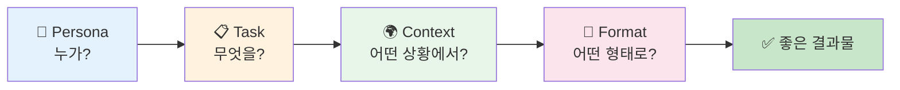
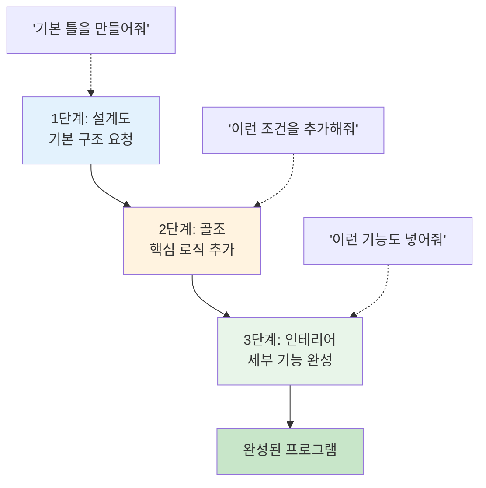
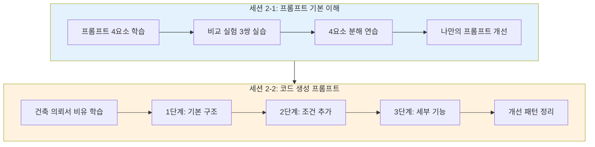

# Day 2 오전: 프롬프트 작성법 — 기본 이해 & 코드 생성 프롬프트

> 과정: AI-native 파이썬 기초 | Day 2/5 | 09:00–12:00

---

## 📋 오전 세션 개요

| 세션 | 시간 | 주제 | 핵심 키워드 |
|------|------|------|------------|
| 2-1 | 09:00–10:30 (90분) | 프롬프트 기본 이해 | 4요소, 좋은/나쁜 프롬프트 비교 실험 |
| 2-2 | 10:30–12:00 (90분) | 코드 생성을 위한 프롬프트 작성 | 점진적 개선, 단계적 요청, 제약 조건 |

### 🎯 오전 학습 목표

1. 프롬프트의 구성 4요소(Persona, Task, Context, Format)를 설명할 수 있어요
2. 좋은 프롬프트와 나쁜 프롬프트의 차이를 체험하고 구분할 수 있어요
3. 코드 생성에 특화된 점진적 개선(Iterative Refinement) 기법을 실습해요

### 🔗 Day 1 연결

> 어제 우리는 Antigravity IDE를 설치하고, Python과 uv 가상환경을 세팅했어요. AI 비서가 상주하는 사무실(Antigravity)을 꾸미고, 도구함(uv)을 정리한 셈이죠. **오늘은 그 AI 비서에게 "일을 시키는 기술"을 배웁니다.** 도구를 갖추었으니, 이제 AI와 대화하는 법을 익혀볼까요?

---

## 세션 2-1: 프롬프트 기본 이해 (09:00–10:30, 90분)

### 1. 학습 목표

- 프롬프트의 구성 요소를 이해하고, 좋은 프롬프트와 나쁜 프롬프트의 차이를 체험해요

### 2. 핵심 개념

| 개념 | 설명 |
|------|------|
| **프롬프트(Prompt)** | AI에게 보내는 요청 메시지. 질문, 지시, 맥락 정보를 포함해요 |
| **프롬프트 4요소** | Persona(누가), Task(무엇을), Context(어떤 상황에서), Format(어떤 형태로) |
| **명확성** | AI가 "알아서" 해석할 여지를 줄이는 것 |
| **구체성** | 모호한 표현 대신 수치, 조건, 예시를 포함하는 것 |

### 3. 개념 설명 — 프롬프트는 "AI에게 보내는 업무 지시서"

프롬프트가 뭔지 쉽게 이해해볼까요?

여러분이 친구에게 밥을 부탁한다고 생각해보세요.

- **나쁜 부탁**: "밥 해줘"
- **좋은 부탁**: "2인분 김치찌개를 돼지고기 200g으로 30분 안에 만들어줘"

첫 번째 부탁을 받으면 친구는 뭘 만들어야 할지 모르겠죠? 라면을 끓일 수도 있고, 볶음밥을 할 수도 있어요. 두 번째 부탁은 **무엇을, 얼마나, 어떻게** 만들지 명확하니까 원하는 결과가 나올 확률이 훨씬 높아요.

AI에게 보내는 프롬프트도 똑같아요. **프롬프트 = AI에게 보내는 업무 지시서**입니다.

#### 프롬프트 4요소 (Google Gemini Prompting Guide 기반)



| 요소 | 의미 | 예시 |
|------|------|------|
| **Persona** (누가) | AI가 어떤 역할을 맡을지 | "파이썬 초보자를 가르치는 선생님으로서" |
| **Task** (무엇을) | 구체적으로 해야 할 일 | "사칙연산 콘솔 계산기를 만들어줘" |
| **Context** (어떤 상황에서) | 배경, 제약 조건, 환경 | "Windows 11, Python 3.12, 초보자가 이해할 수 있게" |
| **Format** (어떤 형태로) | 결과물의 형식 | "코드에 한글 주석을 달고, 실행 예시도 보여줘" |

> 💡 **"AI 시대의 서사"에서 배운 것 기억나시나요?** "말이 되어야 프로그램이 된다"고 했죠. 프롬프트가 바로 그 "말"이에요. 명확하게 말해야 AI가 원하는 코드를 만들어줄 수 있어요.

### 4. 프롬프트 4요소 체크시트

실습할 때 이 표를 옆에 두고 프롬프트를 작성해보세요.

| 체크 | 요소 | 질문 | 작성 예시 |
|:----:|------|------|----------|
| ☐ | **Persona** | AI에게 어떤 역할을 부여했나요? | "파이썬 전문 개발자로서" |
| ☐ | **Task** | 무엇을 해달라고 했나요? 동사가 명확한가요? | "~를 만들어줘", "~를 설명해줘" |
| ☐ | **Context** | 환경, 대상, 제약 조건을 포함했나요? | "Python 3.12, 초보자용, 콘솔 프로그램" |
| ☐ | **Format** | 결과물의 형태를 지정했나요? | "한글 주석 포함", "실행 예시 포함" |

### 5. 실습 — 나쁜 프롬프트 vs 좋은 프롬프트 비교 실험 (3쌍)

이제 직접 체험해볼 시간이에요! Antigravity의 Agent Manager에서 아래 프롬프트를 **하나씩** 입력하고, 결과를 비교해보세요.

---

#### 🔬 비교 실험 1: 계산기 프로그램

**나쁜 프롬프트:**
```
계산기 만들어
```

**좋은 프롬프트:**
```
파이썬으로 콘솔 계산기를 만들어줘.
- 사칙연산(+, -, ×, ÷)을 지원해야 해
- 사용자가 두 숫자와 연산자를 입력하면 결과를 출력해
- 0으로 나누면 "0으로 나눌 수 없습니다"라는 에러 메시지를 보여줘
- 잘못된 연산자를 입력하면 "지원하지 않는 연산자입니다"라고 알려줘
- 코드에 한글 주석을 달아줘
```

**나쁜 프롬프트의 예상 결과:**

```python
# AI가 "알아서" 만든 계산기 - 무엇이 나올지 예측 불가
def calculator():
    print("Calculator")
    num1 = float(input("Enter first number: "))
    op = input("Enter operator: ")
    num2 = float(input("Enter second number: "))
    if op == '+':
        print(num1 + num2)
    elif op == '-':
        print(num1 - num2)
    elif op == '*':
        print(num1 * num2)
    elif op == '/':
        print(num1 / num2)

calculator()
```

> ⚠️ 문제점: 영어로 되어 있고, 0으로 나누기 처리가 없고, 잘못된 입력 처리도 없어요.

**좋은 프롬프트의 예상 결과:**

```python
# === 사칙연산 콘솔 계산기 ===

# 첫 번째 숫자 입력받기
num1 = float(input("첫 번째 숫자를 입력하세요: "))

# 연산자 입력받기
operator = input("연산자를 입력하세요 (+, -, *, /): ")

# 두 번째 숫자 입력받기
num2 = float(input("두 번째 숫자를 입력하세요: "))

# 연산 수행
if operator == '+':
    result = num1 + num2
    print(f"{num1} + {num2} = {result}")
elif operator == '-':
    result = num1 - num2
    print(f"{num1} - {num2} = {result}")
elif operator == '*':
    result = num1 * num2
    print(f"{num1} × {num2} = {result}")
elif operator == '/':
    # 0으로 나누기 방지
    if num2 == 0:
        print("0으로 나눌 수 없습니다")
    else:
        result = num1 / num2
        print(f"{num1} ÷ {num2} = {result}")
else:
    # 잘못된 연산자 처리
    print("지원하지 않는 연산자입니다")
```

**실행 예시:**
```
첫 번째 숫자를 입력하세요: 10
연산자를 입력하세요 (+, -, *, /): /
두 번째 숫자를 입력하세요: 0
0으로 나눌 수 없습니다
```

---

#### 🔬 비교 실험 2: 인사 프로그램

**나쁜 프롬프트:**
```
인사하는 프로그램 만들어
```

**좋은 프롬프트:**
```
파이썬으로 인사 프로그램을 만들어줘.
- 사용자의 이름과 나이를 입력받아
- "안녕하세요, {이름}님! {나이}살이시군요."라고 출력해
- 나이에 따라 다른 메시지를 추가해줘:
  - 20세 미만: "학생이시군요! 공부 파이팅!"
  - 20~29세: "청춘이시네요! 멋진 하루 보내세요!"
  - 30세 이상: "경험이 풍부하시겠네요!"
- 나이에 숫자가 아닌 값을 입력하면 에러 메시지를 보여줘
- 코드에 한글 주석을 달아줘
```

**나쁜 프롬프트의 예상 결과:**

```python
# 단순한 인사 - 이름만 받고 끝
name = input("What is your name? ")
print(f"Hello, {name}!")
```

> ⚠️ 문제점: 영어로 되어 있고, 나이 입력이 없고, 조건별 메시지도 없어요.

**좋은 프롬프트의 예상 결과:**

```python
# === 맞춤형 인사 프로그램 ===

# 이름 입력받기
name = input("이름을 입력하세요: ")

# 나이 입력받기 (숫자가 아닌 값 처리)
try:
    age = int(input("나이를 입력하세요: "))
except ValueError:
    print("나이는 숫자로 입력해주세요!")
    exit()

# 기본 인사 출력
print(f"\n안녕하세요, {name}님! {age}살이시군요.")

# 나이에 따른 맞춤 메시지
if age < 20:
    print("학생이시군요! 공부 파이팅!")
elif age < 30:
    print("청춘이시네요! 멋진 하루 보내세요!")
else:
    print("경험이 풍부하시겠네요!")
```

**실행 예시:**
```
이름을 입력하세요: 하늘
나이를 입력하세요: 26

안녕하세요, 하늘님! 26살이시군요.
청춘이시네요! 멋진 하루 보내세요!
```

---

#### 🔬 비교 실험 3: 구구단 프로그램

**나쁜 프롬프트:**
```
구구단 출력해줘
```

**좋은 프롬프트:**
```
파이썬으로 구구단 프로그램을 만들어줘.
- 사용자가 원하는 단(2~9)을 입력받아
- 해당 단의 구구단을 "2 × 1 = 2" 형식으로 출력해
- 2~9 범위를 벗어나면 "2부터 9 사이의 숫자를 입력해주세요"라고 안내해
- 숫자가 아닌 값을 입력하면 에러 메시지를 보여줘
- 코드에 한글 주석을 달아줘
```

**나쁜 프롬프트의 예상 결과:**

```python
# 2단부터 9단까지 전부 출력 - 사용자 선택 불가
for i in range(2, 10):
    for j in range(1, 10):
        print(f"{i} x {j} = {i*j}")
    print()
```

> ⚠️ 문제점: 사용자가 원하는 단을 선택할 수 없고, 범위 검증도 없어요.

**좋은 프롬프트의 예상 결과:**

```python
# === 구구단 프로그램 ===

# 사용자로부터 원하는 단 입력받기
try:
    dan = int(input("몇 단을 출력할까요? (2~9): "))
except ValueError:
    print("숫자를 입력해주세요!")
    exit()

# 범위 검증
if dan < 2 or dan > 9:
    print("2부터 9 사이의 숫자를 입력해주세요")
else:
    # 구구단 출력
    print(f"\n=== {dan}단 ===")
    for i in range(1, 10):
        print(f"{dan} × {i} = {dan * i}")
```

**실행 예시:**
```
몇 단을 출력할까요? (2~9): 7

=== 7단 ===
7 × 1 = 7
7 × 2 = 14
7 × 3 = 21
7 × 4 = 28
7 × 5 = 35
7 × 6 = 42
7 × 7 = 49
7 × 8 = 56
7 × 9 = 63
```

---

#### 📊 비교 실험 결과 정리표

| 비교 항목 | 나쁜 프롬프트 | 좋은 프롬프트 |
|-----------|-------------|-------------|
| **언어** | 영어 또는 혼재 | 한글 안내 메시지 |
| **에러 처리** | 없음 (프로그램 중단) | 친절한 에러 메시지 |
| **사용자 경험** | 최소한의 기능만 | 안내 메시지, 입력 검증 포함 |
| **코드 가독성** | 주석 없거나 영어 | 한글 주석으로 이해하기 쉬움 |
| **기능 완성도** | AI가 "알아서" 판단 | 요청한 기능이 모두 포함 |
| **재현성** | 매번 다른 결과 | 일관된 결과 |

> 🎯 **핵심 교훈**: 프롬프트가 구체적일수록 AI의 결과물이 우리가 원하는 것에 가까워져요. "AI 시대의 서사" 3부에서 배운 **바이브 코딩의 한계**가 바로 이거예요. "느낌으로 만들어줘"가 아니라, **명확하게 정의해야** 좋은 결과가 나와요.

### 6. 실습 — 4요소 분해 연습

좋은 프롬프트를 4요소로 분해해볼까요?

**예시 프롬프트:**
> "파이썬 초보자를 가르치는 선생님으로서, Windows 11 환경에서 실행할 수 있는 사칙연산 콘솔 계산기를 만들어줘. 0으로 나누기 에러를 처리하고, 코드에 한글 주석을 달아서 보여줘."

| 요소 | 분해 결과 |
|------|----------|
| **Persona** | 파이썬 초보자를 가르치는 선생님 |
| **Task** | 사칙연산 콘솔 계산기를 만들어줘 |
| **Context** | Windows 11 환경, 0으로 나누기 에러 처리 |
| **Format** | 한글 주석 포함 코드 |

**여러분 차례!** 아래 프롬프트를 4요소로 분해해보세요.

> "숫자 맞추기 게임을 파이썬으로 만들어줘. 1부터 100 사이의 랜덤 숫자를 맞추는 게임이야. 시도 횟수를 세고, 힌트(높다/낮다)를 주고, 맞추면 축하 메시지를 보여줘."

| 요소 | 여러분의 답 |
|------|-----------|
| **Persona** | (작성해보세요) |
| **Task** | (작성해보세요) |
| **Context** | (작성해보세요) |
| **Format** | (작성해보세요) |

### 7. 실습 — 나만의 프롬프트 개선

짝과 함께 해보는 활동이에요.

1. 아래 나쁜 프롬프트 중 하나를 골라주세요
2. 4요소 체크시트를 활용해서 좋은 프롬프트로 개선해보세요
3. 짝과 교환해서 서로의 프롬프트에 피드백을 주세요

**나쁜 프롬프트 목록:**
- "가위바위보 게임 만들어"
- "단위 변환기 만들어"
- "퀴즈 프로그램 만들어"

### 8. 트러블슈팅 FAQ

| 문제 | 해결 방법 |
|------|----------|
| AI가 영어로 코드를 생성해요 | 프롬프트에 "한글 안내 메시지를 사용해줘"를 추가하세요 |
| 코드가 너무 복잡하게 나와요 | "초보자가 이해할 수 있는 수준으로"를 추가하세요 |
| 매번 다른 결과가 나와요 | 프롬프트를 더 구체적으로 작성하면 일관성이 높아져요 |
| 에러 처리가 빠져 있어요 | "잘못된 입력에 대한 에러 처리를 포함해줘"를 추가하세요 |
| 실행했는데 에러가 나요 | 에러 메시지를 복사해서 AI에게 "이 에러를 해결해줘"라고 물어보세요 |

### 9. 세션 2-1 핵심 정리

```
✅ 프롬프트 = AI에게 보내는 업무 지시서
✅ 4요소: Persona(누가) + Task(무엇을) + Context(어떤 상황에서) + Format(어떤 형태로)
✅ 구체적인 프롬프트 → 예측 가능한 결과
✅ 모호한 프롬프트 → 예측 불가능한 결과
```

### 10. 산출물

- 프롬프트 비교 실험 결과 기록 (3쌍)
- 프롬프트 4요소 체크시트 (위 표 활용)

---

> 🔗 **세션 연결**: 프롬프트의 기본을 익혔으니, 이제 코드 생성에 특화된 프롬프트 기법을 배워볼까요? 한 번에 완벽한 코드를 만드는 게 아니라, **단계적으로 발전시키는 방법**이에요.

---

## 세션 2-2: 코드 생성을 위한 프롬프트 작성 (10:30–12:00, 90분)

### 1. 학습 목표

- 코드 생성에 특화된 프롬프트 작성 기법을 익히고, 점진적 개선(Iterative Refinement) 방법을 실습해요

### 2. 핵심 개념

| 개념 | 설명 |
|------|------|
| **코드 생성 프롬프트** | AI에게 프로그램 코드를 만들어달라고 요청하는 프롬프트 |
| **단계적 요청** | 한 번에 모든 기능을 요청하지 않고, 기본→확장→완성 순서로 나눠서 요청하는 방법 |
| **점진적 개선** | 이전 결과물을 기반으로 조금씩 기능을 추가하며 발전시키는 방법 |
| **제약 조건 명시** | "~해야 한다", "~하면 안 된다" 같은 조건을 프롬프트에 포함하는 것 |

### 3. 개념 설명 — 코드 생성 프롬프트는 "건축 의뢰서"

코드 생성 프롬프트는 **"건축 의뢰서"**와 같아요.

집을 지을 때 "집 지어줘!"라고 한 번에 말하지 않잖아요? 먼저 **설계도**(기본 구조)를 그리고, **골조**(핵심 로직)를 세우고, **인테리어**(세부 기능)를 하죠.

코드도 마찬가지예요. 한 번에 완벽한 코드를 요청하면 AI가 혼란스러워할 수 있어요. 대신 이렇게 단계를 나눠서 요청하면 훨씬 좋은 결과가 나와요.



### 4. 프롬프트 개선 패턴 정리

코드 생성 프롬프트를 개선하는 4가지 패턴이에요.

| 패턴 | 설명 | 예시 |
|------|------|------|
| **구체화** | 모호한 표현을 구체적으로 바꾸기 | "검증해줘" → "8자 이상인지 확인해줘" |
| **제약 추가** | 조건이나 제한을 명시하기 | "특수문자(!@#$%^&*)를 포함해야 해" |
| **예시 제공** | 원하는 입출력 예시를 보여주기 | "입력: abc123 → 출력: 약함" |
| **출력 형식 지정** | 결과물의 모양을 지정하기 | "각 조건별로 ✓/✗ 표시해줘" |

### 5. 실습 — 점진적 개선 3단계: 비밀번호 강도 확인 프로그램

이제 실제로 점진적 개선을 체험해볼까요? **비밀번호 강도 확인 프로그램**을 3단계에 걸쳐 발전시켜볼 거예요.

---

#### 📌 1단계 프롬프트: 기본 구조 (설계도)

Antigravity Agent Manager에 아래 프롬프트를 입력하세요.

```
비밀번호 강도 확인 프로그램의 기본 구조를 파이썬으로 만들어줘.
- 사용자로부터 비밀번호를 입력받아
- 비밀번호의 길이를 확인해서 강도를 판단해줘
- 코드에 한글 주석을 달아줘
```

**1단계 코드 결과:**

```python
# === 비밀번호 강도 확인 프로그램 (v1: 기본 구조) ===

# 사용자로부터 비밀번호 입력받기
password = input("비밀번호를 입력하세요: ")

# 비밀번호 길이 확인
length = len(password)

# 길이에 따른 강도 판단
if length < 6:
    print(f"비밀번호 길이: {length}자")
    print("강도: 약함 ⚠️")
elif length < 10:
    print(f"비밀번호 길이: {length}자")
    print("강도: 보통 🔶")
else:
    print(f"비밀번호 길이: {length}자")
    print("강도: 강함 ✅")
```

**실행 예시:**
```
비밀번호를 입력하세요: abc
비밀번호 길이: 3자
강도: 약함 ⚠️
```

> 🔍 **코드 리뷰 포인트**: `len()` 함수는 문자열의 길이를 알려주는 내장 함수예요. `if/elif/else`는 조건에 따라 다른 코드를 실행하는 제어문이에요. Day 3에서 자세히 배울 거예요!

---

#### 📌 2단계 프롬프트: 핵심 로직 추가 (골조)

1단계 코드가 만들어졌으니, 이제 조건을 추가해볼까요?

```
위 비밀번호 강도 확인 프로그램에 다음 조건을 추가해줘:
- 8자 이상인지 확인
- 대문자가 포함되어 있는지 확인
- 소문자가 포함되어 있는지 확인
- 숫자가 포함되어 있는지 확인
- 각 조건의 충족 여부에 따라 강도를 판단해줘
- 코드에 한글 주석을 달아줘
```

**2단계 코드 결과:**

```python
# === 비밀번호 강도 확인 프로그램 (v2: 조건 추가) ===

# 사용자로부터 비밀번호 입력받기
password = input("비밀번호를 입력하세요: ")

# 각 조건 확인
has_length = len(password) >= 8        # 8자 이상인지
has_upper = False                       # 대문자 포함 여부
has_lower = False                       # 소문자 포함 여부
has_digit = False                       # 숫자 포함 여부

# 비밀번호의 각 문자를 하나씩 확인
for char in password:
    if char.isupper():                  # 대문자인지 확인
        has_upper = True
    elif char.islower():                # 소문자인지 확인
        has_lower = True
    elif char.isdigit():                # 숫자인지 확인
        has_digit = True

# 충족된 조건 개수 세기
score = 0
if has_length:
    score += 1
if has_upper:
    score += 1
if has_lower:
    score += 1
if has_digit:
    score += 1

# 강도 판단 (4개 조건 기준)
print(f"\n비밀번호: {'*' * len(password)}")
print(f"충족 조건: {score}/4개")

if score <= 1:
    print("강도: 약함 ⚠️")
elif score <= 2:
    print("강도: 보통 🔶")
elif score <= 3:
    print("강도: 강함 💪")
else:
    print("강도: 매우 강함 ✅")
```

**실행 예시:**
```
비밀번호를 입력하세요: Hello123

비밀번호: ********
충족 조건: 4/4개
강도: 매우 강함 ✅
```

> 🔍 **코드 변화 관찰**: 1단계에서는 길이만 확인했는데, 2단계에서는 `for` 반복문으로 각 문자를 하나씩 검사하고, `.isupper()`, `.islower()`, `.isdigit()` 같은 문자열 메서드를 사용해요. 코드가 더 정교해졌죠?

---

#### 📌 3단계 프롬프트: 세부 기능 완성 (인테리어)

마지막으로 사용자 경험을 개선해볼까요?

```
위 비밀번호 강도 확인 프로그램에 다음 기능을 추가해줘:
- 특수문자(!@#$%^&*) 포함 여부도 검사해줘
- 각 조건별로 ✓(충족) / ✗(미충족) 표시를 해줘
- 미충족 조건에 대한 개선 제안을 보여줘
- 코드에 한글 주석을 달아줘
```

**3단계 코드 결과 (최종 완성):**

```python
# === 비밀번호 강도 확인 프로그램 (v3: 최종 완성) ===

# 사용자로부터 비밀번호 입력받기
password = input("비밀번호를 입력하세요: ")

# 특수문자 목록 정의
special_chars = "!@#$%^&*"

# 각 조건 확인
has_length = len(password) >= 8        # 8자 이상
has_upper = False                       # 대문자 포함
has_lower = False                       # 소문자 포함
has_digit = False                       # 숫자 포함
has_special = False                     # 특수문자 포함

# 비밀번호의 각 문자를 하나씩 확인
for char in password:
    if char.isupper():
        has_upper = True
    elif char.islower():
        has_lower = True
    elif char.isdigit():
        has_digit = True
    elif char in special_chars:
        has_special = True

# 결과 출력
print("\n" + "=" * 40)
print("  비밀번호 강도 검사 결과")
print("=" * 40)

# 각 조건별 ✓/✗ 표시
conditions = [
    (has_length, "8자 이상", "비밀번호를 8자 이상으로 늘려주세요"),
    (has_upper, "대문자 포함", "대문자(A-Z)를 추가해주세요"),
    (has_lower, "소문자 포함", "소문자(a-z)를 추가해주세요"),
    (has_digit, "숫자 포함", "숫자(0-9)를 추가해주세요"),
    (has_special, "특수문자 포함", "특수문자(!@#$%^&*)를 추가해주세요"),
]

score = 0
suggestions = []

for is_met, label, suggestion in conditions:
    if is_met:
        print(f"  ✓ {label}")
        score += 1
    else:
        print(f"  ✗ {label}")
        suggestions.append(suggestion)

# 강도 판단 (5개 조건 기준)
print("-" * 40)
print(f"  충족: {score}/5개 조건")

if score <= 1:
    grade = "약함 ⚠️"
elif score <= 2:
    grade = "보통 🔶"
elif score <= 3:
    grade = "강함 💪"
elif score <= 4:
    grade = "매우 강함 🔒"
else:
    grade = "완벽 ✅"

print(f"  강도: {grade}")

# 개선 제안 출력
if suggestions:
    print("\n📌 개선 제안:")
    for s in suggestions:
        print(f"  → {s}")
else:
    print("\n🎉 완벽한 비밀번호입니다!")

print("=" * 40)
```

**실행 예시:**
```
비밀번호를 입력하세요: hello

========================================
  비밀번호 강도 검사 결과
========================================
  ✗ 8자 이상
  ✗ 대문자 포함
  ✓ 소문자 포함
  ✗ 숫자 포함
  ✗ 특수문자 포함
----------------------------------------
  충족: 1/5개 조건
  강도: 약함 ⚠️

📌 개선 제안:
  → 비밀번호를 8자 이상으로 늘려주세요
  → 대문자(A-Z)를 추가해주세요
  → 숫자(0-9)를 추가해주세요
  → 특수문자(!@#$%^&*)를 추가해주세요
========================================
```

```
비밀번호를 입력하세요: Hello123!

========================================
  비밀번호 강도 검사 결과
========================================
  ✓ 8자 이상
  ✓ 대문자 포함
  ✓ 소문자 포함
  ✓ 숫자 포함
  ✓ 특수문자 포함
----------------------------------------
  충족: 5/5개 조건
  강도: 완벽 ✅

🎉 완벽한 비밀번호입니다!
========================================
```

---

#### 📊 3단계 코드 변화 비교표

| 항목 | 1단계 (기본) | 2단계 (조건 추가) | 3단계 (최종) |
|------|------------|-----------------|-------------|
| **검사 조건** | 길이만 | 길이 + 대소문자 + 숫자 | 길이 + 대소문자 + 숫자 + 특수문자 |
| **판단 기준** | 길이 구간 | 조건 충족 개수 | 조건 충족 개수 (5단계) |
| **사용자 피드백** | 강도만 표시 | 충족 개수 + 강도 | ✓/✗ 표시 + 개선 제안 |
| **코드 길이** | ~15줄 | ~35줄 | ~55줄 |
| **새로 등장한 개념** | `len()`, `if/elif/else` | `for`, `.isupper()`, `.isdigit()` | 리스트, 튜플, `in` 연산자 |

> 🎯 **핵심 교훈**: 한 번에 완벽한 코드를 만들려고 하지 마세요. **기본 → 확장 → 완성** 순서로 점진적으로 발전시키면, AI도 더 정확한 코드를 만들어주고, 여러분도 코드의 변화를 관찰하며 배울 수 있어요.

### 6. 실습 — 프롬프트 개선 패턴 적용

아래 기본 프롬프트를 4가지 패턴(구체화, 제약 추가, 예시 제공, 출력 형식 지정)을 적용해서 개선해보세요.

**기본 프롬프트:**
```
온도 변환 프로그램 만들어줘
```

**개선 예시:**
```
파이썬으로 온도 변환 프로그램을 만들어줘.
- [구체화] 섭씨(°C)를 화씨(°F)로, 화씨를 섭씨로 변환할 수 있어야 해
- [제약 추가] 절대영도(-273.15°C) 미만의 값은 입력할 수 없어
- [예시 제공] 입력: 100°C → 출력: 212.0°F
- [출력 형식] "100.0°C = 212.0°F" 형식으로 출력해줘
- 코드에 한글 주석을 달아줘
```

### 7. 트러블슈팅 FAQ

| 문제 | 해결 방법 |
|------|----------|
| 2단계에서 1단계 코드를 잊어버린 것 같아요 | "위 코드를 기반으로"라고 명시하거나, 1단계 코드를 함께 붙여넣으세요 |
| 코드가 점점 복잡해져서 이해가 안 돼요 | AI에게 "이 코드를 한 줄씩 설명해줘"라고 요청하세요 |
| 3단계에서 이전 기능이 사라졌어요 | "기존 기능은 유지하면서 추가해줘"라고 명시하세요 |
| 코드 실행 시 에러가 나요 | 에러 메시지를 복사해서 AI에게 보여주세요 |

### 8. 세션 2-2 핵심 정리

```
✅ 코드 생성 프롬프트 = 건축 의뢰서 (설계도 → 골조 → 인테리어)
✅ 점진적 개선: 기본 구조 → 핵심 로직 → 세부 기능
✅ 4가지 개선 패턴: 구체화, 제약 추가, 예시 제공, 출력 형식 지정
✅ 한 번에 완벽하게 ✗ → 단계적으로 발전시키기 ✓
```

### 9. 산출물

- 3단계 점진적 개선 프롬프트 & 코드 결과물 (비밀번호 강도 확인 프로그램 v1~v3)

---

> 🍽️ **점심시간 (12:00–13:00)**
>
> 🔗 **오후 세션 예고**: 오전에 프롬프트 작성법을 배웠다면, 오후에는 한 단계 더 나아가요. "무엇을 만들지"를 체계적으로 정리하는 **요구사항**과 **PRD 문서** 작성법을 배울 거예요. 프롬프트가 "한 줄짜리 지시"라면, 요구사항과 PRD는 "완전한 설계도"예요. 이 설계도가 Day 4~5에서 만들 고객 정보 관리 프로그램의 기반이 됩니다!

---

## 📎 부록: 오전 세션 전체 흐름도


