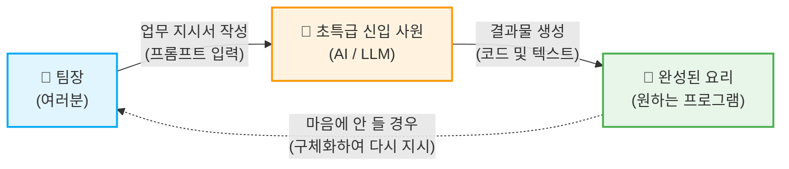
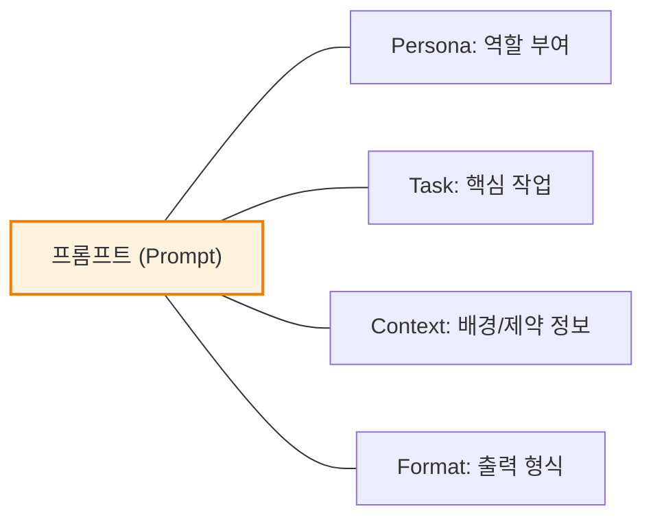
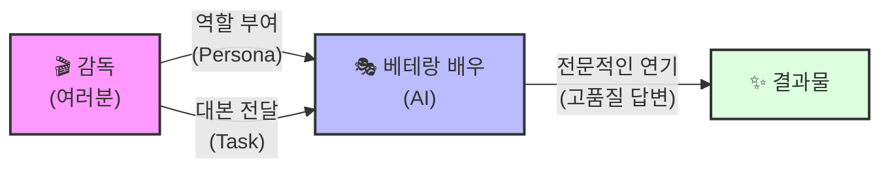
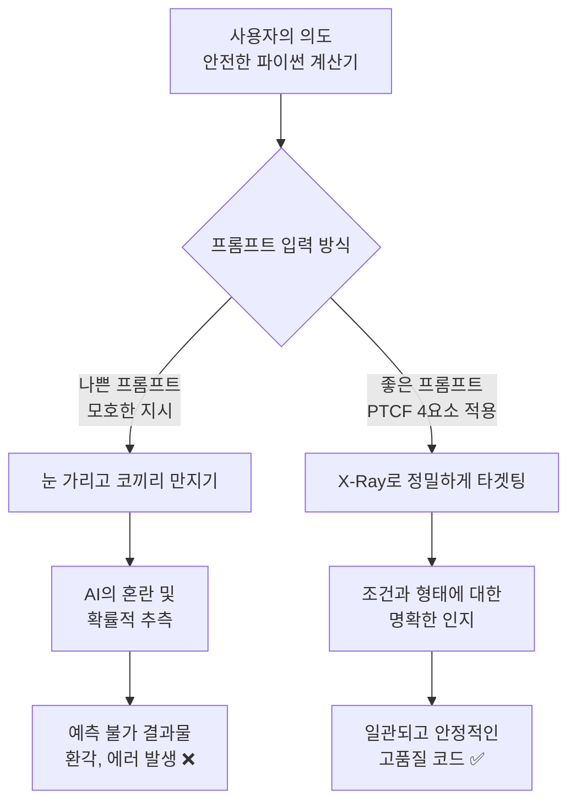
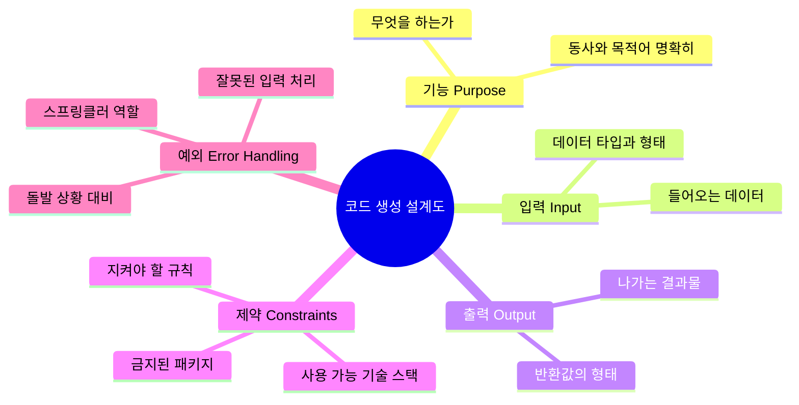
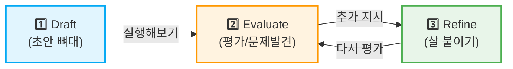
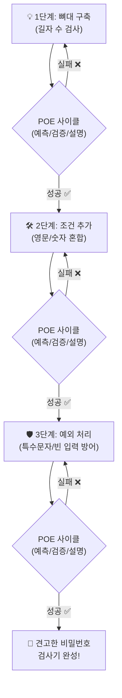
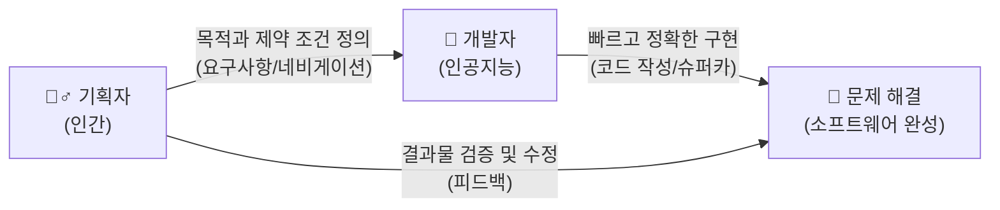
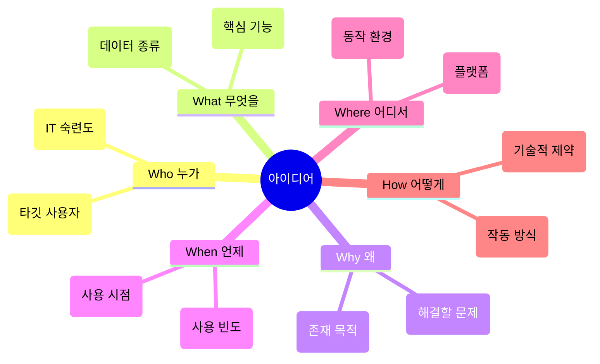
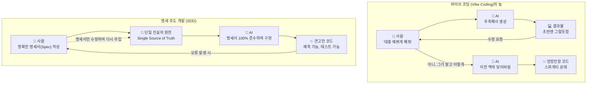

# Day 2 오전: 프롬프트 기본 코드생성

> **과정**: AI-native 파이썬 기초 | Day 2/5 | 09:00~12:30
> **테마**: 프롬프트 엔지니어링과 요구사항 분석
> **세션**: 023 ~ 033 (11개 세션)
> **총 소요 시간**: 245분
> **버전**: v2.1 (7섹션 구조, 보조 패킷 통합)
> **작성 일시**: 2026-02-25

---

## 🎯 학습 목표 (오전)

1. **세션 023**: 이 세션 종료 시 수강생은 프롬프트를 '단순한 검색어'가 아닌 '업무 지시서'로 정의하고 설명할 수 있다.
2. **세션 024**: 이 세션 종료 시 수강생은 프롬프트의 4요소 중 Persona와 Task를 명확히 구분하여 작성할 수 있다.
3. **세션 025**: 이 세션 종료 시 수강생은 프롬프트의 4요소 중 Context와 Format을 활용해 원하는 형태의 결과물을 얻어낼 수 있다.
4. **세션 026**: 이 세션 종료 시 수강생은 Antigravity 환경에서 나쁜 프롬프트와 좋은 프롬프트의 출력 결과를 직접 비교하고 차이를 분석할 수 있다.
5. **세션 027**: 이 세션 종료 시 수강생은 코드 생성을 요청할 때 필수적으로 포함해야 하는 5대 항목(기능, 입력, 출력, 제약, 예외)을 열거하고 설명할 수 있다.
6. **세션 028**: 이 세션 종료 시 수강생은 점진적 개선의 개념을 이해하고, 한 번에 완벽한 코드를 요구하는 대신 단계별로 코드를 발전시키는 이유를 설명할 수 있다.
7. **세션 029**: 이 세션 종료 시 수강생은 점진적 개선 기법을 활용하여 3단계에 걸쳐 비밀번호 강도 검사기 프로그램을 완성할 수 있다.
8. **세션 030**: 이 세션 종료 시 수강생은 CoT와 Few-shot 프롬프팅 기법을 이해하고, 이를 적용해 AI의 추론 능력과 출력 정확도를 극대화할 수 있다.
9. **세션 031**: 이 세션 종료 시 수강생은 소프트웨어 공학에서 '요구사항'의 개념과 그 중요성을 비유를 통해 설명할 수 있다.
10. **세션 032**: 이 세션 종료 시 수강생은 5W1H 방법론을 활용하여 추상적인 아이디어를 구체적인 요구사항 항목으로 세분화할 수 있다.
11. **세션 033**: 이 세션 종료 시 수강생은 SDD의 개념을 설명하고, 왜 AI 시대에 SDD가 핵심 개발 방법론인지 이해한다.

---

## 📋 목차

- [📖 세션 023: 프롬프트의 본질](#세션-023) (20분)
- [📖 세션 024: 프롬프트 구성 4요소 1 - Persona와 Task](#세션-024) (20분)
- [📖 세션 025: 프롬프트 구성 4요소 2 - Context와 Format](#세션-025) (25분)
- [🧪 세션 026: 좋은 프롬프트 vs 나쁜 프롬프트 비교 실험](#세션-026) (25분)
- [📖 세션 027: 코드 생성 특화 프롬프트: 5대 필수 항목](#세션-027) (25분)
- [📖 세션 028: 점진적 개선(Iterative Refinement)의 이해](#세션-028) (20분)
- [🧪 세션 029: 프롬프트 고도화 실습: 비밀번호 검사기 만들기](#세션-029) (25분)
- [💻 세션 030: 고급 프롬프트 기법: CoT와 Few-shot](#세션-030) (20분)
- [📖 세션 031: 요구사항(Requirements)의 본질: 여행 계획서](#세션-031) (20분)
- [📖 세션 032: 체계적인 요구사항 도출: 5W1H 체크리스트](#세션-032) (25분)
- [📖 세션 033: SDD(Specification-Driven Development)의 이해](#세션-033) (20분)

---

## 📊 세션 인덱스

| 세션 | 제목 | 시간 | 청크 타입 | 난이도 | 바로가기 |
|------|------|------|-----------|--------|----------|
| 023 | 프롬프트의 본질 | 20분 | 📖 narrative | low | [바로가기](#세션-023) |
| 024 | 프롬프트 구성 4요소 1 - Persona와 Task | 20분 | 📖 narrative | medium | [바로가기](#세션-024) |
| 025 | 프롬프트 구성 4요소 2 - Context와 Format | 25분 | 📖 narrative | medium | [바로가기](#세션-025) |
| 026 | 좋은 프롬프트 vs 나쁜 프롬프트 비교 실험 | 25분 | 🧪 lab | low | [바로가기](#세션-026) |
| 027 | 코드 생성 특화 프롬프트: 5대 필수 항목 | 25분 | 📖 narrative | medium | [바로가기](#세션-027) |
| 028 | 점진적 개선(Iterative Refinement)의 이해 | 20분 | 📖 narrative | medium | [바로가기](#세션-028) |
| 029 | 프롬프트 고도화 실습: 비밀번호 검사기 만들기 | 25분 | 🧪 lab | medium | [바로가기](#세션-029) |
| 030 | 고급 프롬프트 기법: CoT와 Few-shot | 20분 | 💻 code | high | [바로가기](#세션-030) |
| 031 | 요구사항(Requirements)의 본질: 여행 계획서 | 20분 | 📖 narrative | low | [바로가기](#세션-031) |
| 032 | 체계적인 요구사항 도출: 5W1H 체크리스트 | 25분 | 📖 narrative | medium | [바로가기](#세션-032) |
| 033 | SDD(Specification-Driven Development)의 이해 | 20분 | 📖 narrative | high | [바로가기](#세션-033) |

---

## 📚 본문

### 세션 023: 프롬프트의 본질
> [원본 파일](sessions/세션-023-프롬프트의_본질_v2.1.md) | ⏱️ 20분 | 📖 narrative | 난이도: low

> **세션 ID**: MS-PY101-023  
> **소요 시간**: 20분  
> **난이도**: low  
> **청크 타입**: narrative  
> **버전**: v2.1 (7섹션 구조)

---

## §1. 개요

> **Day 2 | AM | 세션 023/043**

이 세션은 2일 차 아침의 문을 여는 첫 번째 시간입니다. 어제(Day 1) 우리는 Antigravity 환경을 구축하고 AI에게 첫 코드를 부탁해 보았습니다. 오늘은 그 경험을 바탕으로, 우리가 AI에게 건네는 "말 한마디"의 정체를 깊이 있게 파헤칩니다. 프롬프트 엔지니어링의 본질을 '예술과 과학의 결합'이라는 관점에서 이해하고, '신입 사원에게 주는 업무 지시서' 비유를 통해 명확한 소통의 중요성을 깨닫는 것이 이 세션의 핵심입니다.

### 🎯 학습 목표

이 세션이 끝나면 수강생은 다음을 할 수 있어요:

- 프롬프트를 단순한 '검색어'가 아닌 '명확한 업무 지시서'로 정의할 수 있습니다.
- 모호한 프롬프트가 왜 환각(Hallucination)을 유발하는지 LLM의 특성과 연관 지어 설명할 수 있습니다.
- '나쁜 프롬프트'와 '좋은 프롬프트'를 구별하고, 구체성이 결과물의 품질을 어떻게 바꾸는지 체감할 수 있습니다.

### 선행 세션 환기

어제 마지막 세션에서 우리는 AI를 활용해 각자 간단한 파이썬 코드를 실행해 보았습니다. "나이 계산기 만들어줘"라고 했을 때, 어떤 수강생은 완벽하게 작동하는 코드를 받았지만, 어떤 수강생은 엉뚱한 에러가 나는 코드를 받기도 했습니다. 이 세션에서는 "왜 똑같은 AI를 썼는데 결과가 달랐을까?"라는 어제의 의문을 출발점으로 삼아, 프롬프트의 중요성을 자연스럽게 환기합니다.

---


### 🌟 차별화 포인트 (Differentiation Strategy)

> 🌟 **Day 2 서사: 통역의 기술** — 모호한 일상어에서 명확한 지시어로 — 기억력은 완벽하지만 눈치가 전혀 없는 천재 신입사원(AI)을 다루는 법. 나의 의도를 모호함 없이 전달하는 프롬프트를 작성하고, 백지상태의 아이디어를 PRD(설계도)로 변환합니다.

## §2. 핵심 개념 (+ 🗣️ 강사 대본 + Mermaid)

### 비유: 눈치 없는 초특급 신입 사원과 완벽한 김치찌개

프롬프트의 본질을 설명하는 가장 강력하고 직관적인 비유는 바로 "신입 사원에게 주는 업무 지시서"입니다. AI는 세상의 모든 지식을 다 알고 있고 타의 추종을 불허하는 속도로 일하는 '초특급 신입 사원'이지만, 인간이 당연하게 여기는 행간의 맥락(눈치)을 스스로 파악하지는 못합니다. 이 비유를 통해 수강생들은 "내가 대충 말해도 AI가 개떡같이 말해도 찰떡같이 알아듣겠지"라는 환상을 깨고, 구체적이고 명확한 지시의 필요성을 체감하게 됩니다.

🗣️ **강사 대본 (Instructor Script)**:

> 여러분, 좋은 아침입니다! 어제 Day 1에서 정말 많은 것을 해내셨습니다. Antigravity IDE를 설치하고, Python 환경을 구축하고, 심지어 AI에게 코드를 부탁해서 실행까지 해보셨죠.
> 
> 어제 실습 때 기억나시나요? AI에게 "나이 계산기 만들어줘"라고 똑같이 입력했는데, 누군가는 멋진 코드를 받았고 누군가는 전혀 다른 엉뚱한 결과를 받았을 겁니다. 왜 같은 회사의 똑같은 AI를 썼는데 결과가 달랐을까요? 혹시 AI가 기분파라서 그랬을까요? 물론 아닙니다. 차이를 만든 것은 바로 여러분이 AI에게 건넨 "말 한마디"의 품질이었습니다. 오늘 Day 2의 첫 시간인 이 세션에서, 우리는 그 "말 한마디"의 정체를 파헤쳐 보겠습니다. 바로 프롬프트(Prompt)의 본질에 대한 이야기입니다.
> 
> 프롬프트가 무엇인지 이해하기 위해, 한 가지 재미있는 상황을 상상해 볼까요? 여러분이 회사에 갓 입사한 팀장이라고 해봅시다. 첫 출근 날, 엄청나게 유능하다고 소문난 신입 사원이 여러분 팀에 배정되었습니다. 이 신입 사원은 정말 특별합니다. 세상의 거의 모든 업무 매뉴얼과 코딩 지식을 다 외우고 있고, 타이핑 속도는 초당 수백 글자이며, 며칠 밤을 새워 일해도 절대 지치지 않습니다.
> 
> 하지만 딱 하나, 아주 치명적인 약점이 있습니다. 바로 "눈치"가 전혀 없다는 것이에요.
> 
> 여러분이 이 신입 사원에게 "나 배고프니까 밥 좀 해줘"라고 말한다고 생각해 보세요. 이 성실하지만 눈치 없는 신입은 어떻게 할까요? 한식을 만들어야 할지, 양식을 만들어야 할지, 매운 걸 좋아하는지 짠 걸 좋아하는지 전혀 모르니까, 일단 자기가 아는 수백만 가지 레시피 중 아무거나 골라서 만들어 올 겁니다. 어쩌면 파인애플이 잔뜩 올라간 하와이안 피자를 가져오고, 어쩌면 밍밍한 된장찌개를 가져오고, 심지어는 사람이 먹을 수 없는 이상한 요리를 들고 올 수도 있어요. 당연히 여러분은 실망하겠죠. "아니, 한국인이면 점심엔 당연히 김치찌개 아니야? 센스가 없네!"라고 화를 낼지도 모릅니다.
> 
> 하지만 지시를 이렇게 바꿔볼까요?
> **"2인분 분량의 김치찌개를 만들어줘. 돼지고기 앞다릿살 200그램을 넣고, 중간 불에서 30분 안에 끓여줘. 맵기는 신라면 정도로 중간으로 해줘."**
> 
> 이렇게 구체적으로 말한다면 어떨까요? 세상의 모든 요리법을 완벽하게 알고 있는 이 신입 사원은, 여러분이 원하는 완벽에 가까운 김치찌개를 정확히 30분 안에 내놓을 겁니다.
> 
> 바로 여기에 프롬프트의 본질이 숨어 있습니다. AI라는 유능하지만 눈치 없는 신입 사원에게 건네는 명확하고 체계적인 업무 지시서, 그것이 바로 프롬프트입니다. 지시서가 구체적일수록 결과물의 품질은 극적으로 높아지고, 지시서가 모호할수록 AI는 당황하며 "대충 이거겠지" 하고 예측한 결과를 던져줍니다. 오늘부터 우리는 이 지시서를 전문가처럼 완벽하게 작성하는 방법을 훈련할 것입니다.

> 💡 **강사 노트**: 신입 사원 비유는 수강생들이 일상에서 겪는 소통의 오류를 프로그래밍 환경으로 치환해 주는 강력한 도구입니다. 강사가 대본을 읽을 때 "눈치가 전혀 없다"는 부분을 재미있게 강조해 주면 몰입도를 크게 높일 수 있습니다.

### Mermaid 다이어그램: 프롬프트의 구도



이 다이어그램은 우리가 프롬프트를 통해 AI와 상호작용하는 구조를 보여줍니다. 팀장인 여러분이 업무 지시서를 명확하게 작성할수록(프롬프트), 신입 사원(AI)은 그에 딱 맞는 완성된 요리(프로그램)를 만들어 냅니다. 만약 결과물이 마음에 들지 않는다면, AI를 탓할 것이 아니라 우리의 지시서(프롬프트)를 점검하고 다시 지시해야 합니다.

---


### 🎨 추가 시각화 (Visualization Packet)

**프롬프트 엔지니어링 4대 요소 (PTCF)**

AI에게 내리는 명확한 지시문인 Persona, Task, Context, Format을 시각화합니다.



## §3. 상세 내용

### Why — 왜 '프롬프트'의 본질을 먼저 이해해야 하는가?

많은 초보자들이 AI를 접할 때 구글 검색창과 헷갈려 합니다. "구글 검색하듯이 대충 단어 몇 개 던지면 알아서 좋은 답을 찾아주겠지"라고 착각하는 것이죠. 하지만 프롬프트는 단순한 검색 질의어(Search Query)가 아닙니다. 

구글 검색은 인터넷 어딘가에 이미 존재하는 정보를 '찾아주는' 행위입니다. 반면, 프롬프트는 세상에 없던 새로운 결과물을 실시간으로 '창조하게' 만드는 행위입니다. LLM(Large Language Model, 대형 언어 모델)은 기본적으로 다음에 올 단어의 확률을 계산하여 문장을 이어가는 원리로 작동합니다. 

만약 여러분이 지시를 모호하게 하면, LLM은 여러분의 의도를 스스로 해석하고 추측하여 빈칸을 채우게 됩니다. 이 추측이 우연히 맞으면 다행이지만, 틀릴 경우에는 아는 척하며 완전히 거짓된 정보를 만들어내는 **환각(Hallucination)** 현상이 발생합니다. 따라서 모호성을 최소화하고 명확한 요구사항을 전달하는 것은 AI 시대에 우리가 갖춰야 할 생존 기술이자 핵심 역량입니다.

### What — 프롬프트 엔지니어링이란 무엇인가?

프롬프트 엔지니어링(Prompt Engineering)은 AI가 인간의 언어를 정확히 이해하고, 우리가 의도한 방향대로 고품질의 답변이나 코드를 생성하도록 유도하는 체계적인 소통 방법론입니다. 

전문가들은 프롬프트 엔지니어링을 **예술(Art)과 과학(Science)의 결합**이라고 부릅니다.
- **예술(Art)**: 직관적으로 좋은 단어와 표현을 찾아내고, 창의적인 비유를 통해 AI의 숨겨진 능력을 이끌어내는 과정입니다.
- **과학(Science)**: 템플릿과 구조를 활용하여 누가 언제 입력하더라도 동일하고 재현 가능한(Reproducible) 결과를 만들어내는 체계적인 과정입니다.

결국 프롬프트 엔지니어링은 "AI와 어떻게 대화할 것인가?"를 넘어, "나의 생각을 얼마나 명확하고 구조적으로 표현할 수 있는가?"라는 인간의 논리적 사고력을 시험하는 과정이기도 합니다.

### How — 어떻게 소통해야 하는가?

AI와 잘 소통하려면, 앞선 비유처럼 '레시피를 전달하듯' 구체적으로 지시해야 합니다.
좋은 업무 지시서가 갖춰야 할 기본 태도는 다음과 같습니다:
1. **명확한 목표 설정**: 무엇을 만들고 싶은지 결과물의 정체를 정확히 밝힙니다.
2. **배경 정보 제공**: 이 결과물이 왜 필요한지, 어떤 상황에서 쓰일지 맥락(Context)을 줍니다.
3. **제약 조건 명시**: "이건 절대 하지 마", "반드시 이 형식을 지켜"라는 선을 그어줍니다.

이 세 가지를 지키지 않은 나쁜 프롬프트와, 세 가지를 모두 지킨 좋은 프롬프트를 비교해 보면 그 차이는 극명하게 드러납니다. 바로 이어지는 실습에서 이 차이를 직접 눈으로 확인해 보겠습니다.

---

## §4. 실습 가이드 (+ 🎙️ 실습 대본)

### 실습 목표

수강생들이 자신의 노트북에서 '나쁜 프롬프트'와 '좋은 프롬프트'를 직접 입력해 보고, AI가 출력하는 결과물의 품질과 형태가 극단적으로 달라지는 것을 직접 확인합니다. 이를 통해 "프롬프트에 1분을 더 투자하면, 코드를 수정하는 30분을 아낄 수 있다"는 사실을 체감하는 '아하 모먼트(Aha-moment)'를 경험합니다.

🎙️ **실습 가이드 대본 (Lab Guide)**:

> 자, 이제 백문이 불여일견입니다. 직접 차이를 확인해 볼 시간이에요. 모두 화면의 Antigravity IDE를 열어주세요. 우측에 있는 Agent Manager 창이 보이실 겁니다.
> 
> 먼저, 아주 나쁜 프롬프트를 입력해 보겠습니다. 그냥 딱 한 마디, **"파이썬 코드 짜줘"**라고 입력해 보세요.
> (잠시 대기)
> 자, 결과가 나왔나요? 여러분이 원했던 코드인가요? 어떤 분은 Hello World를 출력하는 코드를 받았을 거고, 어떤 분은 리스트 정렬 코드를, 어떤 분은 갑자기 웹 서버를 띄우는 코드를 받았을 겁니다. AI 입장에서는 "파이썬 코드"라는 말만으로는 수백만 가지 가능성 중 무엇을 골라야 할지 전혀 알 수 없으니까요.
> 
> 이번에는 좋은 프롬프트를 입력해 봅시다. 화면이나 교안에 있는 두 번째 프롬프트를 그대로 복사해서 붙여넣어 보세요.
> **"1부터 10까지의 숫자를 모두 더하는 파이썬 함수를 작성해줘. 함수 이름은 sum_numbers로 하고, 코드의 각 단계별로 한국어 주석을 달아줘."**
> 
> (잠시 대기)
> 자, 결과를 비교해 보세요. 이번에는 어떨까요? 모든 분들의 화면에 함수 이름이 `sum_numbers`로 지정되어 있고, 1부터 10까지 더하는 정확한 기능이 구현되어 있으며, 친절하게 한국어 주석까지 달려 있을 겁니다. 
> 
> 여러분, 체크포인트 질문 하나 드릴게요. 두 번째 프롬프트가 더 좋은 결과를 낸, 아니 모두에게 똑같이 훌륭한 결과를 낸 이유가 뭘까요? 맞습니다. **기능, 이름, 형식**이라는 구체적인 정보를 추가로 제공했기 때문입니다. 프롬프트에 딱 1분만 더 투자해서 명확하게 적어주면, 나중에 엉뚱한 코드를 고치느라 30분을 낭비하는 일을 막을 수 있습니다.

### 단계별 지시

| 단계 | 소요 시간 | 강사 지시사항 | 학습자 액션 | 예상 결과 |
|------|----------|--------------|------------|----------|
| 1 | 2분 | "IDE를 열고 '파이썬 코드 짜줘'를 입력하세요" | Antigravity에 프롬프트 입력 | 각자 제각각의 무작위 파이썬 코드 출력됨 |
| 2 | 2분 | 결과가 왜 제각각인지 설명 | 화면 결과 확인 및 강사 설명 경청 | 모호한 프롬프트의 문제점 인지 |
| 3 | 3분 | "교안의 구체적인 프롬프트를 복사해 입력하세요" | 구체적 프롬프트 입력 및 실행 | 모두가 동일하고 구조화된 고품질 코드 획득 |
| 4 | 3분 | 두 결과의 차이를 비교하고 이유를 질문/토론 | 왜 결과가 좋아졌는지 답변 | 구체성의 힘(기능, 이름, 형식) 체감 |

### 트러블슈팅 FAQ

| Q | A |
|---|---|
| "좋은 프롬프트를 쳤는데도 코드가 안 돌아가요!" | 가끔 AI가 설명 텍스트와 코드를 섞어서 출력할 때가 있습니다. "설명 빼고 실행 가능한 파이썬 코드만 줘"라고 한 번 더 지시(점진적 개선)해 보도록 유도해 주세요. |
| "저는 나쁜 프롬프트를 쳤는데도 제가 원했던 계산기 코드가 나왔는데요?" | "정말 운이 좋으시네요! 하지만 그건 AI가 확률적으로 찍어 맞춘 것일 뿐입니다. 내일 다시 똑같이 입력하면 다른 코드가 나올 확률이 높아요. 우리가 원하는 건 '운'이 아니라 '통제력'입니다."라고 설명해 주세요. |
| "매번 저렇게 길게 프롬프트를 쳐야 하나요? 귀찮은데요." | "처음엔 길고 귀찮게 느껴지지만, 나중에는 이 프롬프트 자체가 하나의 자산(템플릿)이 됩니다. 복사해서 약간씩만 수정해 쓰게 되니 결국은 훨씬 빨라집니다."라고 안심시켜 주세요. |

---


### 🎓 강사 노트 (Instructor Support)

- ⏱️ **타이밍**: 09:00 (20분, narrative)
- 🎯 **핵심 활동**: 프롬프트 = 업무 지시서
- ⚠️ **강사 주의사항**: "검색어가 아니다" 강조

## §5. 코드 및 명령어 모음

이 세션의 실습에서 사용하는 프롬프트와 예상되는 코드 결과물입니다. 수강생들이 직접 복사하여 사용할 수 있도록 안내해 주세요.

### 나쁜 프롬프트 예시 (Vibe Coding)

```text
파이썬 코드 짜줘
```
> ❌ **문제점**: 목적이 없고, 맥락이 없으며, 제약 사항도 없습니다. AI의 자의적인 추측에 모든 것을 맡기는 가장 위험한 형태의 프롬프트입니다.

### 좋은 프롬프트 예시 (명확한 지시서)

```text
1부터 10까지의 숫자를 모두 더하는 파이썬 함수를 작성해줘.
함수 이름은 sum_numbers로 하고, 각 단계별로 한국어 주석을 달아줘.
```
> ✅ **장점**: 핵심 기능(1부터 10까지 더하기), 제약 조건(함수 이름 지정), 출력 형식(한국어 주석 포함)이 명확하게 정의되어 있습니다.

### 좋은 프롬프트의 예상 출력 결과 (AI 생성 코드)

```python
def sum_numbers():
    # 1. 합계를 저장할 변수를 초기화합니다.
    total = 0
    
    # 2. 1부터 10까지 반복하는 루프를 만듭니다. (range는 마지막 숫자를 포함하지 않으므로 11을 적어줍니다)
    for num in range(1, 11):
        # 3. 각 숫자를 total 변수에 계속 더해줍니다.
        total += num
        
    # 4. 최종 계산된 합계를 반환합니다.
    return total

# 함수 실행 및 결과 출력 확인
result = sum_numbers()
print(f"1부터 10까지의 합은: {result}")
```

---

## §6. 요약

### 핵심 학습 포인트

이번 세션에서 다룬 가장 중요한 세 가지 핵심을 정리해 봅시다.
1. **프롬프트는 검색어가 아니라 업무 지시서다**: 프롬프트는 존재하는 것을 찾는 행위가 아니라, 초특급 신입 사원(AI)에게 새로운 결과물을 창조하라고 내리는 명확한 업무 지시서입니다.
2. **예술과 과학의 결합**: 좋은 단어를 고르는 창의성(예술)과, 재현 가능한 결과를 만드는 구조(과학)가 동시에 필요합니다.
3. **구체성이 곧 통제력이다**: 모호하게 말하면 AI는 멋대로 상상해서 환각(Hallucination)을 일으킵니다. 레시피처럼 명확하고 구체적으로 지시해야 원하는 결과를 안정적으로 얻을 수 있습니다.

### 다음 세션 예고

"구체적으로 적어야 한다는 건 알겠는데, 그럼 도대체 '어떻게' 구체적으로 적어야 하나요?"라는 질문이 당연히 떠오르실 겁니다. 아무 백지에다 길게 적는다고 능사가 아니거든요. 
그래서 다음 세션(세션 024)에서는 완벽한 프롬프트를 구성하는 마법의 공식, **PTCF 4요소**에 대해 배울 예정입니다. 그중에서도 AI에게 역할을 부여하는 'Persona'와 단일 행동을 지시하는 'Task'를 먼저 살펴보겠습니다. 마치 연극 감독이 배우에게 캐릭터와 대본을 건네는 방법을 배우게 될 것입니다.

### 브릿지 노트

> 🗣️ "여러분, 이제 AI가 우리 말을 못 알아듣는다고 탓하기 전에, 나의 '업무 지시서'가 김치찌개 레시피처럼 구체적이었는지 먼저 돌아볼 수 있게 되었습니다. 그렇다면 이 완벽한 지시서를 쓰기 위한 공식은 없을까요? 매번 머리를 쥐어짜야 할까요? 아닙니다. 글로벌 테크 기업들이 이미 만들어 놓은 훌륭한 템플릿 공식이 있습니다. 잠깐 쉬었다가, 다음 세션에서 그 마법의 공식 4가지를 뜯어보겠습니다."

---

## §7. 참고 자료

### 3-Source 출처

- **Source A (로컬 참고자료)**: `3 프롤프트 엔지니어링.pdf` (§3.1 프롬프트의 본질) — 프롬프트를 "AI가 인간의 언어를 이해하고 의도한 답변을 생성하도록 유도하는 방법"으로 정의하는 개념적 토대.
- **Source B (NotebookLM)**: NotebookLM 분석 리포트 — 프롬프트를 '신입 사원에게 주는 업무 지시서'로 비유하여 패러다임 전환을 유도하는 교수법의 근거 제공. 나쁜 프롬프트와 좋은 프롬프트의 실험 비교 아이디어 도출.
- **Source C (Deep Research)**: Deep Research 보고서 — 프롬프트 엔지니어링을 '예술(직관성)과 과학(체계성)의 결합'으로 바라보는 최신 업계 관점 및 환각(Hallucination) 방지 원리 반영.

### 강사 노트

> 💡 **강사 팁**:
> 이 세션은 Day 2의 방향성을 세팅하는 매우 중요한 오프닝입니다. 코딩 지식보다는 '마인드셋 전환'에 100% 초점을 맞춰주세요. 
> 특히 실습 과정에서 수강생들이 화면에 출력된 코드를 보고 신기해할 때, "코드가 나왔다"는 사실보다 **"내가 똑바로 지시하니까 똑똑한 코드가 나왔다"**는 통제감(Agency)을 심어주는 것이 핵심입니다. 신입 사원 비유를 강의 내내 반복적으로 사용하여, 이후에 진행될 명세서(PRD) 작성 세션까지 그 논리가 자연스럽게 이어지도록 빌드업해 주시기 바랍니다.

---

## ✅ 세션 완료 체크리스트 (강사용)

- [x] §1~§7 모든 섹션이 충실하게 작성되었는가?
- [x] '신입 사원 업무 지시서' 비유와 스토리텔링이 명확히 전달되었는가?
- [x] 프롬프트 엔지니어링을 '예술과 과학의 결합'으로 설명했는가?
- [x] 좋은 프롬프트와 나쁜 프롬프트 실습 비교가 포함되었는가?
- [x] 3-Source 팩트 패킷(A, B, C)의 핵심 내용이 빠짐없이 반영되었는가?

---

*작성 일시: 2026-02-25*  
*작성 에이전트: A4B_Session_Writer*  
*교안 구조: 7섹션 (A0 팀 공통 표준)*

> 🔗 **이전 세션**: [세션 022: 마무리 및 Day 2 예고](#세션-022)에서 배운 내용을 이어갑니다.
> 🔗 **다음 세션**: [세션 024: 프롬프트 구성 4요소 1 - Persona와 Task](#세션-024)에서 계속됩니다.

---

### 세션 024: 프롬프트 구성 4요소 1 - Persona와 Task
> [원본 파일](sessions/세션-024-프롬프트_구성_4요소_1_-_Persona와_Task_v2.1.md) | ⏱️ 20분 | 📖 narrative | 난이도: medium

> **세션 ID**: MS-PY101-024  
> **소요 시간**: 20분  
> **난이도**: low  
> **청크 타입**: narrative  
> **버전**: v2.1 (7섹션 구조)

---

## §1. 개요

> **Day 2 | AM | 세션 024/043**

이번 세션은 AI에게 제대로 일을 시키기 위한 프롬프트 구성의 4가지 핵심 요소(PTCF) 중 가장 기본이 되는 두 가지, **Persona(페르소나, 역할)**와 **Task(태스크, 임무)**를 다루는 시간이에요. 방금 전 세션에서 우리는 프롬프트가 단순한 검색어가 아니라 AI에게 건네는 "업무 지시서"라는 것을 배웠죠? 이제 그 지시서를 어떻게 써야 하는지 구체적인 공식의 첫 단추를 채워볼 거예요. 코딩을 전혀 모르는 비전공자라도 이 두 가지만 확실히 이해하면, AI가 내놓는 답변의 퀄리티를 전문가 수준으로 단숨에 끌어올릴 수 있답니다.

### 🎯 학습 목표

이 세션이 끝나면 수강생은 다음을 할 수 있어요:

- 프롬프트 구성의 4요소인 PTCF의 개념을 이해하고 설명할 수 있습니다
- AI에게 명확한 역할(Persona)을 부여하여 답변의 전문성을 높일 수 있습니다
- 한 번에 하나의 구체적인 행동(Task)을 지시하는 습관을 기를 수 있습니다

### 선행 세션 환기

이전 세션인 "프롬프트의 본질"에서 우리는 모호한 지시가 얼마나 위험한지 배웠어요. "파이썬 코드 짜줘"와 "1부터 10까지 더하는 함수를 만들고 주석을 달아줘"의 차이를 기억하시나요? 이 세션에서는 그 차이를 만드는 구조적인 공식을 본격적으로 배워봅니다.

---

## §2. 핵심 개념 (+ 🗣️ 강사 대본 + Mermaid)

### 영화 캐스팅과 대본의 비유

프롬프트를 작성하는 과정은 한 편의 영화를 찍는 것과 완전히 똑같아요. 여러분은 이 영화의 감독이고, AI는 여러분이 캐스팅한 배우입니다. 감독이 엑스트라에게 "그냥 알아서 적당히 연기해 봐"라고 말하면 엉성한 즉흥극이 되겠죠? 

명작을 만들려면 감독은 배우에게 **"당신은 20년 경력의 날카로운 형사입니다(Persona)"**라고 역할을 주고, **"취조실에서 용의자의 자백을 받아내세요(Task)"**라고 정확한 임무(대본)를 주어야 합니다. AI도 마찬가지예요. 역할을 입히고 명확한 임무를 줄 때 비로소 초점 없는 산만한 대답 대신, 전문가의 날카로운 결과물이 나옵니다.

🗣️ **강사 대본 (Instructor Script)**:

> 여러분, 이전 시간에 우리가 배웠던 것을 잠깐 떠올려 볼까요? AI에게 일을 시키는 프롬프트는 단순한 검색이 아니라 구체적인 "업무 지시서"라고 했었죠. 그런데 좋은 지시서에는 도대체 뭐가 들어가야 할까요? 
> 
> "김치찌개 만들어 줘"보다 "2인분 김치찌개를 돼지고기 200g 넣어서 30분 안에 끓여줘"가 훨씬 좋다는 건 알겠는데, 매번 이렇게 머리를 쥐어짜며 고민할 수는 없잖아요? 그래서 우리에게는 공식이 필요합니다. 다행히 전 세계의 수많은 AI 전문가들이 연구 끝에 찾아낸 강력한 틀이 하나 있어요. 바로 **PTCF**라고 불리는 4가지 프롬프트 핵심 요소입니다. 
> 
> Persona(역할), Task(임무), Context(맥락), Format(형식). 이 네 가지의 앞 글자를 딴 거예요. 오늘은 이 중에서 가장 중요한 첫 번째와 두 번째, **P(Persona)**와 **T(Task)**부터 살펴볼 겁니다.
> 
> 한 편의 영화를 찍는 감독이 되었다고 상상해 봅시다. 여러분이 오디션장에서 배우를 뽑았어요. 그리고 배우에게 이렇게 말합니다. "자, 당신은 20년 동안 강력계에서 구른 베테랑 형사입니다. 거친 현장 경험과 날카로운 직감을 가진 사람이에요." 이게 바로 캐스팅, 즉 **Persona(페르소나)**를 부여하는 과정입니다. 배우가 이 역할을 받아들이는 순간, 서 있는 자세부터 눈빛, 말투까지 완전히 달라지겠죠?
>
> 하지만 역할만 줬다고 촬영을 시작할 수는 없어요. 감독은 이어서 대본을 건넵니다. "이번 장면에서 당신의 임무는 저 용의자를 강하게 추궁해서 자백을 받아내는 것입니다." 이것이 바로 **Task(태스크)**, 구체적인 임무입니다. 
>
> AI도 완전히 똑같습니다. 그냥 질문을 던지면 AI는 인터넷의 모든 지식을 뒤섞은 평균적인 대답을 내놓습니다. 하지만 "너는 10년 차 파이썬 시니어 개발자야"라고 역할을 주면(Persona), AI는 자신의 머릿속 데이터 중 '전문가' 영역의 가중치를 확 높입니다. 그리고 "이 코드의 에러 원인을 찾아서 고쳐줘"라고 명확하게 지시하면(Task), 딱 그 임무에만 집중해서 최선의 결과물을 만들어내죠. 역할이 없으면 엉성한 즉흥극이 되지만, 명확한 Persona와 Task가 만나면 오스카상 감의 멋진 연기가 펼쳐집니다.

> 💡 **강사 노트**: 비전공자들은 '프롬프트 엔지니어링'이라는 단어 자체에 부담을 느낍니다. 따라서 영화 감독과 배우라는 직관적인 비유를 통해, AI를 다루는 것이 코딩 기술이 아니라 의사소통 기술임을 강조해 주세요. "가중치가 달라진다"는 개념은 너무 기술적으로 깊게 들어가지 말고, "AI가 참고하는 사전이 달라진다" 정도로 가볍게 짚고 넘어가는 것이 좋습니다.

### Mermaid 다이어그램



이 다이어그램은 Persona와 Task가 어떻게 AI라는 배우를 움직이는지 직관적으로 보여줍니다. 감독(여러분)이 역할(P)과 대본(T)을 정확히 건넬 때만, AI는 여러분이 원하는 고품질의 결과물을 연기해 낼 수 있어요.

---

## §3. 상세 내용

### Why — 왜 Persona와 Task가 그토록 중요한가?

AI 모델(LLM)은 세상의 거의 모든 지식을 학습한 거대한 도서관과 같아요. 아무런 설정 없이 질문을 던지면, AI는 그 방대한 도서관에서 가장 보편적이고 평균적인(때로는 무난하고 지루한) 답변을 무작위로 꺼내옵니다. 비전공자에게는 너무 어려운 전문 용어를 쓰거나, 전문가에게는 너무 뻔한 기초 설명을 늘어놓는 식이죠. 

**Persona(페르소나)**는 이 거대한 도서관에서 AI가 "어느 층, 어느 섹션의 책"을 참고할지 범위를 좁혀주는 강력한 필터 역할을 합니다. 전문성을 지정하면 타겟팅된 답변이 나오고, 환각(Hallucination, AI가 거짓말을 하는 현상)도 크게 줄어들어요.

그리고 **Task(태스크)**는 그 책을 가지고 "무엇을 할 것인가"를 정합니다. 사람들이 가장 많이 하는 실수가 "코드도 짜고, 주석도 달고, 테스트 방법도 알려주고, 문서도 만들어 줘"라며 한 번에 10가지 일을 시키는 거예요. 이렇게 되면 AI는 갈팡질팡하다가 어느 것 하나 제대로 해내지 못합니다. "한 번에 하나의 명확한 행동", 이것이 실패하지 않는 프롬프트의 불문율입니다.

### What — Persona와 Task의 구체적 정의

**1. Persona (페르소나 / 역할 부여)**
- **정의**: AI가 응답을 생성할 때 취해야 하는 전문적, 구체적인 역할이나 입장.
- **특징**: 직업, 경력 연차, 성향, 대상 독자 등을 구체적으로 명시할수록 효과가 뛰어납니다.
- **예시**: "당신은 10년 차 파이썬 디버깅 전문가입니다", "너는 초보자의 마음을 아주 잘 이해하는 친절한 파이썬 튜터야."

**2. Task (태스크 / 명확한 임무)**
- **정의**: AI가 수행해야 할 구체적이고 단일한 행동 지시.
- **특징**: "요약해 줘", "수정해 줘", "작성해 줘"처럼 명확한 동작을 나타내는 동사 형태로 끝나는 것이 좋습니다. 지시가 섞이면 안 됩니다.
- **예시**: "다음 제공되는 코드에서 발생한 논리적 오류를 찾고 해결책을 제안해 주세요."

### How — 어떻게 작성해야 하는가?

좋은 Persona를 만들려면 "내가 지금 돈을 주고 이 일을 맡긴다면 어떤 전문가를 고용할까?"를 상상하면 됩니다. 단순히 "개발자"라고 하는 것보다 "데이터 분석에 특화된 5년 차 파이썬 개발자"라고 구체화하세요.

Task를 작성할 때는 자신이 쓴 지시문을 다시 읽어보며 접속사(그리고, 또, ~하면서)가 얼마나 들어있는지 체크해 보세요. 문장이 길어지고 조건이 덕지덕지 붙어 있다면 과감하게 자르세요. "코드를 수정해 줘"라는 첫 번째 Task를 주고, 결과를 받은 뒤에 "이제 이 코드에 주석을 달아 줘"라는 두 번째 Task를 주는 식으로, **한 번에 하나씩 차근차근 지시하는 것(Step-by-step)**이 훨씬 똑똑하게 AI를 부리는 방법입니다.

---

## §4. 실습 가이드 (+ 🎙️ 실습 대본)

### 실습 목표

이 실습은 수강생들이 직접 Antigravity 환경의 AI(Gemini 또는 Claude)에게 프롬프트를 입력해 보면서, Persona의 유무가 AI 답변의 퀄리티와 톤을 얼마나 극적으로 바꾸는지 두 눈으로 확인하는 "아하 모먼트(Aha-moment)"를 경험하는 것이 목표입니다.

🎙️ **실습 가이드 대본 (Lab Guide)**:

> 자, 이제 우리가 배운 캐스팅의 마법을 직접 확인해 볼 시간입니다. 다들 화면에 Antigravity IDE를 띄워주세요. 우측의 Agent Manager 채팅창에 제가 화면에 띄워드린 두 가지 프롬프트를 순서대로 입력해 볼 겁니다.
>
> 먼저 나쁜 예시, 즉 캐스팅 없이 냅다 대본만 던져주는 경우입니다. 채팅창에 이렇게 쳐보세요.
> **"파이썬의 '변수' 개념을 설명해 줘."**
> 
> AI가 대답을 막 써 내려가죠? 아마 무슨 프로그래밍 책에서 복사해 온 것처럼 '메모리 할당', '데이터 타입' 같은 어려운 말들이 섞여 있을 거예요. 코딩을 처음 해보는 분들은 읽다가 졸음이 올 만한 내용이죠.
>
> 그럼 이번에는 우리가 명감독이 되어서 기가 막힌 페르소나를 입혀보겠습니다. 기존 대화 기록을 지우거나 새 채팅을 여시고, 이렇게 입력해 보세요.
> **"당신은 초등학생도 코딩을 이해하게 만드는 마법 같은 설명 능력을 가진 친절한 파이썬 튜터입니다. 파이썬의 '변수' 개념을 코딩을 전혀 모르는 사람의 눈높이에 맞춰서, 일상생활의 비유를 들어 설명해 주세요."**
>
> 어떤가요? 결과가 나왔나요? 방금 전의 그 딱딱하던 AI가 갑자기 "변수는 물건을 담는 예쁜 상자예요!"라며 아주 친절하고 다정하게 설명하기 시작했을 겁니다. 같은 AI인데도, 여러분이 어떤 역할을 입혀주느냐에 따라 이렇게 딴판이 됩니다. 이것이 바로 Persona와 Task의 위력입니다.

### 단계별 지시

| 단계 | 소요 시간 | 강사 지시사항 | 학습자 액션 | 예상 결과 |
|------|----------|--------------|------------|----------|
| 1 | 2분 | Antigravity IDE Agent 창 준비 지시 | 에이전트 채팅창 활성화 | 실습 준비 완료 |
| 2 | 3분 | 일반적인 Task만 있는 프롬프트 입력 유도 | "변수 개념 설명해 줘" 프롬프트 실행 | 건조하고 백과사전 같은 딱딱한 답변 생성 |
| 3 | 5분 | 구체적인 Persona가 포함된 프롬프트 입력 유도 | Persona가 포함된 새로운 프롬프트 실행 | 친절하고 비유가 풍부한 맞춤형 답변 생성 |
| 4 | 5분 | 두 결과물의 차이점 비교 및 토론 | 화면의 답변 비교, 옆 사람과 차이점 공유 | 페르소나의 역할(가중치 변화) 체감 |
| 5 | 5분 | "나만의 페르소나 만들어보기" 짧은 실습 | "너는 까칠하지만 실력 있는 개발자야" 등 자유 테스트 | 다양한 답변 톤 변화 확인 및 재미 요소 확보 |

### 트러블슈팅 FAQ

| Q | A |
|---|---|
| AI 답변이 두 번 다 비슷하게 친절한데요? | 최신 AI들은 기본적으로 '친절한 비서' 페르소나가 내장되어 있는 경우가 많습니다. 극적인 차이를 보려면 두 번째 페르소나를 "너는 불친절하고 까칠하지만 실력은 확실한 욕쟁이 할머니 국밥집 사장님이야"처럼 아주 파격적으로 설정해 보세요. AI가 컨셉에 잡아먹히는 모습을 볼 수 있습니다! |
| Task를 여러 개 주면 정말 안 되나요? | 아주 뛰어난 최신 모델은 여러 개를 동시에 처리하기도 합니다. 하지만 우리 과정의 목표는 '안전하고 예측 가능한 프로그래밍'이에요. 3가지 지시를 한 번에 내리면 AI가 그중 1개를 은근슬쩍 빼먹는 환각(Hallucination) 현상이 발생하기 쉽습니다. 하나씩 지시하는 것이 디버깅에도 훨씬 유리합니다. |

> ✅ **체크포인트**: Persona를 바꿨을 때 결과가 달라지는 이유는 무엇일까요? 속으로 한 번 대답해 보세요. (정답: AI가 자신이 가진 방대한 데이터 중에서, 주어진 역할에 맞는 지식의 범위와 톤에 가중치를 두어 답변을 조정하기 때문입니다.)

---


### 🎓 강사 노트 (Instructor Support)

- ⏱️ **타이밍**: 09:20 (20분, narrative)
- 🎯 **핵심 활동**: PTCF 프레임워크 전반부
- ⚠️ **강사 주의사항**: 카드에 4요소 적어서 벽에 부착

## §5. 코드 및 명령어 모음

이 세션의 실습에서 수강생들이 복사해서 사용할 프롬프트 텍스트입니다.

> 🤖 **프롬프트 예시 1 (나쁜 예: Task만 존재)**
```text
파이썬의 '변수' 개념을 설명해 줘.
```

> 🤖 **프롬프트 예시 2 (좋은 예: Persona + 구체적인 Task)**
```text
당신은 초등학생도 코딩을 이해하게 만드는 마법 같은 설명 능력을 가진 친절한 파이썬 튜터입니다. 
파이썬의 '변수' 개념을 코딩을 전혀 모르는 사람의 눈높이에 맞춰서, 일상생활의 비유를 들어 설명해 주세요.
```

---

## §6. 요약

### 핵심 학습 포인트

오늘 배운 내용을 세 줄로 요약해 볼까요?
1. 프롬프트는 단순한 질문이 아니라 AI를 조종하는 **명확한 업무 지시서(PTCF)**입니다.
2. **Persona(페르소나)**는 AI에게 입히는 전문가의 옷으로, 답변의 퀄리티와 타겟을 결정합니다.
3. **Task(태스크)**는 한 번에 하나의 구체적인 행동만 지시해야 AI가 헷갈리지 않고 완벽히 수행합니다.

### 다음 세션 예고

이제 감독으로서 명배우를 캐스팅하고(Persona) 대본(Task)까지 건넸습니다. 그런데 이 배우가 연기할 무대 배경이 1920년대 조선 시대인지, 2050년 우주 정거장인지 안 알려주면 어떻게 될까요? 또 감독이 원하는 결과물이 흑백 무성영화인지 3D IMAX 영화인지 말해주지 않으면요? 

다음 세션에서는 PTCF의 나머지 두 조각, 무대 배경에 해당하는 **Context(맥락)**와 최종 산출물의 형태를 결정하는 **Format(형식)**에 대해 알아보고 4요소 프레임워크를 완벽하게 완성해 보겠습니다.

### 브릿지 노트

> "캐스팅과 대본만으로도 이렇게 결과가 달라지는데, 나머지 두 가지 요소까지 합쳐지면 AI가 얼마나 똑똑해질지 기대되지 않나요? 잠깐 물 한 잔 드시고, 프롬프트의 완성판을 만나러 가봅시다!"

---

## §7. 참고 자료

### 3-Source 출처

- **Source A (로컬 참고자료)**: `3 프롤프트 엔지니어링.pdf` (§3.3-3.7 프롬프트 4요소) — PTCF 프레임워크의 근간이 되는 이론적 배경과 Persona, Task의 정의 및 구조화 원리를 차용했습니다.
- **Source B (NotebookLM)**: `gemini-for-google-workspace-prompting-guide-101.pdf` — Google 공식 가이드에서 제시하는 Persona/Task 기반의 명확한 역할 부여 및 단일 지시 원칙을 반영했습니다.
- **Source C (Deep Research)**: Day 2 Fact Packet 분석 — 페르소나 부여 시 LLM 내부의 가중치가 변화하여 타겟팅된 답변이 도출된다는 기술적 배경을 비전공자 눈높이에 맞춰 해석하여 적용했습니다.

### 강사 노트

> 💡 **강사 노트**: 본 세션은 수강생들이 AI를 "인격체처럼 대화하는 대상"에서 "체계적으로 제어해야 하는 도구"로 인식하는 첫 번째 관문입니다. 이론 설명보다는 비유(캐스팅과 대본)와 실습(비교 실험)에 더 많은 시간을 할애해 주세요. 특히 수강생들이 프롬프트를 입력하고 화면에서 텍스트가 쏟아져 나오는 순간의 반응을 잘 살피고, 재미있는 결과가 나온 화면은 적극적으로 교실 전체에 공유해 주시면 좋습니다.

---

## ✅ 세션 완료 체크리스트 (강사용)

- [ ] §1~§7 모든 섹션이 충실하게 작성되었는가?
- [ ] 캐스팅/대본(영화 감독) 비유가 적절하게 확장되어 포함되었는가?
- [ ] Persona의 유무를 비교하는 실습 가이드가 포함되었는가?
- [ ] 3-Source 팩트 패킷의 내용이 반영되었는가?
- [ ] 문서의 톤이 구어체와 서술형으로 비전공자에게 편안하게 작성되었는가?

---

*작성 일시: 2026-02-25*  
*작성 에이전트: Sisyphus-Junior*  
*교안 구조: 7섹션 (A0 팀 공통 표준)*

> 🔗 **이전 세션**: [세션 023: 프롬프트의 본질](#세션-023)에서 배운 내용을 이어갑니다.
> 🔗 **다음 세션**: [세션 025: 프롬프트 구성 4요소 2 - Context와 Format](#세션-025)에서 계속됩니다.

---

### 세션 025: 프롬프트 구성 4요소 2 - Context와 Format
> [원본 파일](sessions/세션-025-프롬프트_구성_4요소_2_-_Context와_Format_v2.1.md) | ⏱️ 25분 | 📖 narrative | 난이도: medium

> **세션 ID**: MS-PY101-025  
> **소요 시간**: 20분  
> **난이도**: low  
> **청크 타입**: narrative  
> **버전**: v2.1 (7섹션 구조)

---

## §1. 개요

> **Day 2 | AM | 세션 025/043**

이 세션은 이전 시간에 배운 Persona(역할)와 Task(임무)에 이어, 프롬프트를 완벽하게 제어하기 위한 나머지 두 개의 퍼즐 조각인 Context(배경)와 Format(형식)을 완성하는 시간이에요. AI에게 "누가(P), 무엇을(T) 할 것인가"를 지시하는 것을 넘어, "어떤 상황에서(C), 어떤 형태로(F)" 결과를 낼 것인지 명확히 규정함으로써, 결과물에 대한 우리의 통제력을 극대화하는 방법을 배웁니다.

### 🎯 학습 목표

이 세션이 끝나면 수강생은 다음을 할 수 있어요:

- Context의 개념을 이해하고, 구분자(Delimiter)를 활용하여 AI에게 지시와 데이터를 명확하게 분리해서 전달할 수 있습니다.
- Format을 구체적으로 지정하여, 추가적인 수정 없이 바로 사용할 수 있는 맞춤형 결과물을 얻어낼 수 있습니다.
- PTCF 4요소가 모두 포함된 완성형 프롬프트를 직접 작성하고 실행할 수 있습니다.

### 선행 세션 환기

우리는 직전 세션(024)에서 감독이 배우에게 "당신은 베테랑 형사(Persona)이고, 용의자를 추궁해야 합니다(Task)"라고 지시하는 비유를 배웠습니다. 이 지시만으로도 꽤 괜찮은 연기가 나오겠지만, 완벽한 장면을 만들기에는 아직 뭔가 부족하다는 점을 느끼셨을 거예요. 오늘은 그 부족한 2%를 채우는 시간입니다.

---

## §2. 핵심 개념 (+ 🗣️ 강사 대본 + Mermaid)

### 영화 비유의 완성: 무대 배경과 편집본

배우에게 역할(Persona)과 행동(Task)을 주었다고 끝이 아닙니다. 이 장면이 1980년대 낡은 서울 파출소에서 벌어지는 일인지, 2026년 뉴욕의 최첨단 FBI 수사국에서 벌어지는 일인지 알려주는 것이 **Context(배경/제약)** 예요. 그리고 이 연기를 영화 본편에 들어갈 5분짜리 롱테이크로 쓸 것인지, 아니면 예고편에 쓸 30초짜리 빠르고 강렬한 편집본으로 쓸 것인지 지정하는 것이 **Format(출력 형식)** 입니다.

🗣️ **강사 대본 (Instructor Script)**:

> 여러분, 혹시 AI에게 "파이썬 변수를 설명해 줘"라고 했다가, 마치 대학교수님처럼 너무 어려운 전문 용어로만 대답해서 당황한 적 없으신가요? 반대로 너무 유치하게 설명해서 김이 샌 적은요?
> 
> 이전 시간에 우리는 영화감독처럼 AI 배우에게 "당신은 파이썬 전문가(Persona)이고, 변수를 설명하세요(Task)"라고 지시했습니다. 하지만 배우는 아직 혼란스럽습니다. "감독님, 제 앞의 관객이 초등학생인가요, 아니면 컴퓨터공학 전공자인가요? 제약 조건은 뭔가요?" 이렇게 AI가 상황을 제대로 이해하기 위해 필요한 주변 정보와 제약 조건, 그리고 데이터가 바로 세 번째 요소인 **Context(컨텍스트)** 예요.
> 
> 또 하나, 감독이 이렇게 물을 수도 있습니다. "이 장면 결과물을 어떤 형태로 보여드릴까요? 줄글로 쫙 풀어서 쓸까요, 아니면 마크다운 표로 깔끔하게 정리할까요?" 이것이 네 번째 요소인 **Format(포맷)** 입니다. "불릿 포인트 3개로 요약해 줘", "파이썬 코드 블록으로만 출력해 줘"처럼 원하는 결과물의 모양을 처음부터 확실히 못 박아두는 거예요. 그래야 우리가 AI의 답변을 복사해서 다시 다듬는 수고를 덜 수 있거든요.
> 
> 배경과 형식, 이 두 가지를 더하면 우리의 업무 지시서는 비로소 완벽해집니다. AI는 더 이상 우리의 의도를 추측하느라 헛발질하지 않고, 우리가 머릿속에 그린 바로 그 결과물을 정확하게 뱉어낼 수 있습니다.

> 💡 **강사 노트**: 사람끼리는 대충 말해도 눈치껏 상황(Context)을 파악하지만, AI는 눈치가 없습니다. 명시적으로 주어지지 않은 정보는 AI가 무작위로 채워 넣게 되며, 이것이 곧 환각(Hallucination)으로 이어진다는 점을 강조해 주세요.

### Mermaid 다이어그램


이 다이어그램은 프롬프트가 정교해지는 과정을 보여줍니다. P와 T만 있을 때는 넓은 범위의 결과가 나오지만, C(제약과 데이터)와 F(형식)라는 깔때기를 통과하면서 오직 우리가 원하는 단 하나의 완벽한 결과물로 수렴하게 됩니다.

---

## §3. 상세 내용

### Why — 왜 Context와 Format이 필요한가?

AI 활용 초보자들이 가장 많이 하는 실수가 "AI의 눈치"를 기대하는 것입니다. "내가 초보니까 알아서 쉽게 설명해 주겠지", "코드를 달라고 했으니 당연히 복사하기 좋게 코드만 딱 주겠지"라고 기대하지만, AI는 입력된 텍스트 외에는 아무것도 모르는 상태입니다. Context가 없으면 AI는 평균적인(때로는 엉뚱한) 수준의 답변을 내놓고, Format이 없으면 친절함을 빙자하여 불필요한 인사말과 설명 부연을 길게 늘어놓습니다. 우리의 시간과 에너지를 아끼기 위해 이 두 요소는 선택이 아닌 필수예요.

### What — 이 두 요소는 구체적으로 무엇인가?

1. **Context (배경과 제약, 데이터)**:
   - **배경 정보**: "나는 코딩을 전혀 모르는 문과생이야", "이 코드는 고객 관리 프로그램에 들어갈 거야"
   - **제약 조건**: "외부 라이브러리는 절대 쓰지 마", "반드시 Python 3.14 버전 내장 함수만 써"
   - **입력 데이터**: 번역할 원문, 버그가 난 소스 코드, 분석할 CSV 데이터 등
   
2. **Format (출력 형식)**:
   - "마크다운 표로 만들어 줘"
   - "1, 2, 3 번호를 매긴 불릿 포인트로 정리해"
   - "설명은 빼고 오직 파이썬 코드 블록만 반환해 줘" (실전 코딩에서 가장 많이 쓰는 포맷 지시)

### How — Context에서 가장 중요한 '구분자(Delimiter)'의 마법

Context에 코드나 긴 데이터를 넣을 때 **가장 주의해야 할 절대 원칙**이 있습니다. 바로 **구분자(Delimiter)** 를 사용하는 거예요.
컴퓨터는 사람처럼 "아, 여기서부터는 지시문이 끝나고 데이터가 시작되는구나"라고 시각적으로 알아채지 못합니다. 그래서 3중 백틱(```), 3중 따옴표('''), 혹은 `###` 같은 기호로 울타리를 쳐서 지시와 데이터를 물리적으로 격리해야 합니다.

* **나쁜 예**: "아래 코드에서 에러를 찾아줘. print(hello world) if x = 1" (지시와 코드가 섞임)
* **좋은 예**: 
  ```text
  아래 구분자(###) 안에 있는 코드에서 에러를 찾아줘.
  ###
  print(hello world)
  if x = 1:
  ###
  ```

---


### 📊 참고 표 (Visual Specs)

**프롬프트의 4대 핵심 요소 요약**

| 요소 | 설명 | 프롬프트 예시 |
|:---|:---|:---|

## §4. 실습 가이드 (+ 🎙️ 실습 대본)

### 실습 목표

이 실습에서는 수강생들이 Antigravity IDE에서 구분자 유무에 따른 AI의 반응 차이를 직접 목격하고, PTCF 4요소가 모두 결합된 마스터 프롬프트를 실행해 보면서 통제력의 쾌감을 느끼는 것이 목표입니다.

🎙️ **실습 가이드 대본 (Lab Guide)**:

> 자, 이제 Antigravity 환경을 열어주세요. 우리가 방금 배운 Context의 마법을 직접 실험해 볼 겁니다.
> 
> 먼저, 여러분이 평소에 하던 대로 지시와 데이터를 마구 섞어서 프롬프트를 날려보세요. "다음 문장을 파이썬 코드로 바꿔줘 나는 학교에 간다". 결과가 어때요? AI가 '나는 학교에 간다'라는 문장을 출력하는 코드를 짠 분도 있고, 변수 이름으로 만든 분도 있을 거예요. AI가 헷갈려 하는 게 눈에 보이죠?
> 
> 이번에는 구분자를 써봅시다. "다음 3중 따옴표 안의 문장을 영어로 번역하고, 그 문자열을 출력하는 파이썬 코드를 짜줘. '''나는 학교에 간다'''"
> 완전히 다르죠? AI가 "아, 따옴표 안의 내용만 건드리면 되는구나"라고 정확히 인식합니다.
> 
> 자, 그럼 이번엔 최종 보스입니다. Persona, Task, Context, Format을 모두 넣어서 파이썬의 '변수' 개념을 설명해 달라고 해볼게요. 교안에 있는 5번 섹션의 코드를 그대로 복사해서 붙여넣어 보세요.

### 단계별 지시

| 단계 | 소요 시간 | 강사 지시사항 | 학습자 액션 | 예상 결과 |
|------|----------|--------------|------------|----------|
| 1 | 3분 | 구분자 없이 지시와 데이터를 섞어 입력 유도 | 막무가내 프롬프트 입력 | 파편화되고 의도와 다른 답변 도출 |
| 2 | 3분 | `'''` 또는 `###` 구분자를 사용하여 동일 내용 재입력 | 구분자 적용 프롬프트 입력 | 깔끔하고 의도된 답변 도출 |
| 3 | 4분 | PTCF 4요소 전체가 들어간 프롬프트 복사/실행 | 제공된 PTCF 프롬프트 실행 | 비유와 3포인트가 적용된 완벽한 답변 |
| 4 | 5분 | 결과물 비교 및 질의응답 | 이전 세션의 답변과 형태 비교 | Format과 Context의 위력 체감 |

### 트러블슈팅 FAQ

| Q | A |
|---|---|
| 구분자로는 어떤 기호를 써야 하나요? | 기본적으로 AI는 3중 백틱(```), 3중 따옴표('''), 샵 3개(###)를 명확한 경계선으로 인식합니다. 본인에게 가장 편한 것을 하나 정해서 쓰시면 됩니다. |
| Context에 내용을 얼마나 길게 넣어도 되나요? | 현재 우리가 쓰는 모델들은 책 수십 권 분량의 컨텍스트를 한 번에 이해할 수 있습니다. 1~2페이지 정도의 코드는 통째로 넣어도 전혀 문제없으니 안심하고 붙여넣으세요. |
| Format을 여러 개 섞어도 되나요? | 네, 가능합니다. "1번은 표로, 2번은 코드로, 3번은 요약 줄글로 줘"처럼 다중 포맷을 요구해도 AI는 아주 잘 수행합니다. |

> ✅ **체크포인트**: 코드나 데이터를 프롬프트에 넣을 때, 왜 반드시 구분자(Delimiter)로 울타리를 쳐야 하는지 이해하셨나요?

---


### 🎓 강사 노트 (Instructor Support)

- ⏱️ **타이밍**: 09:40 (25분, narrative)
- 🎯 **핵심 활동**: PTCF 프레임워크 후반부
- ⚠️ **강사 주의사항**: 실제 예시 비교로 체감 유도

## §5. 코드 및 명령어 모음

PTCF 4요소가 모두 적용된 '마스터 프롬프트' 예시입니다. 수강생들은 이 프롬프트를 복사하여 Antigravity IDE의 AI 채팅 창에 입력합니다.

> 🤖 **AI 프롬프트 예시 (변수 개념 설명 요구)**:

```text
[Persona] 
당신은 10년 경력의 친절한 파이썬 강사입니다.

[Task] 
파이썬의 '변수(Variable)' 개념을 설명해 주세요.

[Context] 
수강생은 코딩을 전혀 해본 적 없는 문과 출신 대학생입니다.
Python 3.14 환경을 기준으로 설명하며, 영어 전문 용어가 나올 경우 반드시 한국어 뜻을 병기해 주세요.
어려운 수학적 설명은 엄격히 금지합니다.

[Format] 
1. 일상생활에서 쉽게 볼 수 있는 비유 1개를 반드시 포함하세요.
2. 3개의 핵심 포인트로 정리해 주세요.
3. 각 포인트는 번호를 매기고 2문장 이내로 짧게 작성해 주세요.
4. 마지막에는 불필요한 인사말 없이 위 내용만 마크다운 형태로 출력하세요.
```

이 프롬프트를 실행하면, AI가 "변수는 물건을 담는 상자와 같습니다"와 같은 쉬운 비유와 함께, 정확히 3개의 포인트로 정리된 깔끔한 답변을 내놓는 것을 확인할 수 있습니다.

---

## §6. 요약

### 핵심 학습 포인트

이번 세션의 핵심은 "우연에 기대지 말고, 완벽하게 통제하라"는 것입니다.
1. **Context(상황과 제약)** 를 주면 AI의 눈치 없는 헛소리(환각)를 막을 수 있습니다. 특히 코드와 데이터를 던져줄 때는 **구분자(Delimiter)** 를 써서 지시문과 데이터를 격리해야 합니다.
2. **Format(출력 형식)** 을 미리 지정하면, AI가 준 답변을 우리가 다시 엑셀이나 문서에 맞게 가공하는 2차 노동을 없앨 수 있습니다.

### 다음 세션 예고

이제 우리는 완벽한 무기인 PTCF 4요소를 손에 쥐었습니다. 다음 세션(026)에서는 이 무기의 파괴력을 직접 눈으로 확인하는 "좋은 프롬프트 vs 나쁜 프롬프트 비교 실험"을 진행하겠습니다. 똑같은 일을 시키는데, 프롬프트의 퀄리티에 따라 AI가 생성하는 코드가 얼마나 극단적으로 달라지는지 체험하게 될 겁니다.

### 브릿지 노트

> "여러분, 이제 P, T, C, F가 뭔지 머리로는 다 이해하셨죠? 하지만 수영을 책으로 배울 수 없듯이, 프롬프트도 눈으로만 봐서는 내 것이 안 됩니다. 당장 다음 시간부터 우리가 직접 프롬프트를 치고 망가뜨려 보면서, 이 4요소가 실제 코딩 결과물을 어떻게 마법처럼 바꾸는지 직접 부딪혀 보겠습니다."

---

## §7. 참고 자료

### 3-Source 출처

- **Source A (로컬 참고자료)**: `3 프롤프트 엔지니어링.pdf` (§3.3-3.7 프롬프트 4요소, §3.9 코드 생성 기법) — Context와 Format의 정의 및 예시, 구분자를 통한 명령과 데이터의 분리 원칙 원전.
- **Source B (NotebookLM)**: `gemini-for-google-workspace-prompting-guide-101.pdf` — 구글 공식 가이드에 명시된 Persona/Task/Context/Format의 구조와 모범 사례(Best Practices).
- **Source C (Deep Research)**: 특수기호(구분자)를 통해 명령과 데이터를 철저히 분리해야 컴퓨터가 파싱(Parsing) 오류를 일으키지 않는다는 딥 리서치 기술 보고서 결과 반영.

### 추가 학습 자료

- [Google Gemini 공식 프롬프팅 가이드](https://build.withgoogle.com/prompting)
- [Antigravity IDE 튜토리얼: 마크다운과 포맷팅]

### 강사 노트

> 💡 **강사 노트**: 비전공자 수강생들은 "구분자(Delimiter)"라는 단어 자체를 낯설어합니다. "울타리", "칸막이", "따옴표 감옥" 등 직관적인 표현을 섞어 쓰시면 이해가 훨씬 빠릅니다. 컴퓨터는 사람처럼 여백이나 글씨체로 의미를 파악하지 못하고 오직 텍스트 기호로만 맥락을 구분한다는 점을 강조하여, 앞으로의 코딩 실습에서 발생하는 잦은 에러(Syntax Error)의 원인을 미리 예방해 주세요.

---

## ✅ 세션 완료 체크리스트 (강사용)

- [ ] §1~§7 모든 섹션이 충실하게 작성되었는가?
- [ ] Context와 Format의 역할이 명확히 대비되어 설명되었는가?
- [ ] 구분자(Delimiter)의 중요성과 잘못된 사용 예시가 포함되었는가?
- [ ] PTCF 4요소가 모두 적용된 프롬프트 예시가 제시되었는가?
- [ ] 3-Source 팩트 패킷의 내용이 모두 반영되었는가?

---

*작성 일시: 2026-02-25*  
*작성 에이전트: Sisyphus-Junior*  
*교안 구조: 7섹션 (A0 팀 공통 표준)*

> 🔗 **이전 세션**: [세션 024: 프롬프트 구성 4요소 1 - Persona와 Task](#세션-024)에서 배운 내용을 이어갑니다.
> 🔗 **다음 세션**: [세션 026: 좋은 프롬프트 vs 나쁜 프롬프트 비교 실험](#세션-026)에서 계속됩니다.

---

### 세션 026: 좋은 프롬프트 vs 나쁜 프롬프트 비교 실험
> [원본 파일](sessions/세션-026-좋은_프롬프트_vs_나쁜_프롬프트_비교_실험_v2.1.md) | ⏱️ 25분 | 🧪 lab | 난이도: low

> **세션 ID**: MS-PY101-026  
> **소요 시간**: 25분  
> **난이도**: low  
> **청크 타입**: lab  
> **버전**: v2.1 (7섹션 구조)

---

## §1. 개요

> **Day 2 | AM | 세션 026/043**

### 🎯 학습 목표

이 세션이 끝나면, 수강생은 다음을 할 수 있습니다:

- PTCF 4요소의 적용 유무에 따른 AI 결과물의 품질 차이를 직접 비교할 수 있다
- 모호한 프롬프트가 유발하는 환각(Hallucination) 현상과 예측 불가능성을 설명할 수 있다
- Gemini를 활용하여 구조화된 프롬프트가 일관되고 재현 가능한 코드를 생성함을 검증할 수 있다

### 선행 세션 환기

지난 시간(세션 024, 025)에 걸쳐 우리는 프롬프트의 품질을 결정하는 PTCF 4요소, 즉 페르소나(Persona), 지시(Task), 배경(Context), 형식(Format)에 대해 자세히 배웠습니다. 이론으로는 "아, 구체적으로 지시해야 좋구나"라고 이해하셨을 거예요. 하지만 백문이 불여일견입니다. 아무리 좋은 이론도 직접 눈으로 보고 체감하지 않으면 진짜 내 것이 되지 않죠. 오늘 세션에서는 여러분이 직접 두 가지 프롬프트를 실험해 보고, 그 결과가 얼마나 극적으로 달라지는지 경험하는 "아하 모먼트(Aha-moment)"를 만들어 볼 겁니다.

---

## §2. 핵심 개념 (+ 🗣️ 강사 대본 + Mermaid)

### 코끼리 만지기와 X-Ray 촬영

프롬프트의 차이를 가장 잘 보여주는 비유가 하나 있습니다. 바로 눈을 가리고 코끼리를 만지는 상황이에요. 여러분 앞에 거대한 코끼리가 한 마리 있다고 상상해 보세요. 나쁜 프롬프트, 즉 모호하게 지시하는 것은 눈을 가린 채로 코끼리의 아무 부위나 만지는 것과 같습니다. 코를 만진 사람은 "코끼리는 길쭉한 호스 같아요"라고 하고, 다리를 만진 사람은 "코끼리는 튼튼한 기둥 같아요"라고 하겠죠. 아무도 코끼리의 전체 모습을 정확히 파악하지 못합니다. AI도 이와 똑같습니다. "파이썬으로 계산기 짜줘"라고 대충 말하면, AI는 여러분이 코끼리의 어느 부위를 원하는지 모르니까 자기가 임의로 아무 부위나 툭 던져줍니다. 그래서 물어볼 때마다 다른 대답이 나오고, 엉뚱한 결과가 나오는 거예요.

반면에 좋은 프롬프트는 코끼리를 훤히 들여다보는 정밀한 X-Ray 촬영기기입니다. 코끼리의 뼈대부터 근육, 장기까지 투명하게 보면서 정확히 원하는 부위를 지목할 수 있죠. "오른쪽 앞다리 관절 부분의 뼈 구조를 확대해서 보여줘"라고 명확히 요청하면, 딱 그 부분만 선명하게 나오는 것처럼 말이에요. PTCF 4요소를 모두 갖춘 프롬프트는 AI에게 내가 어떤 조건에서 어떤 형태의 결과물을 원하는지 투명하게 전달하는 강력한 도구입니다.

🗣️ **강사 대본 (Instructor Script)**:

> 여러분, 코딩을 할 때 AI에게 대충 물어보고 코드를 받아서 고치느라 한두 시간씩 끙끙대본 적 있으신가요? 그게 바로 눈을 가리고 코끼리를 더듬는 과정입니다. 운이 좋으면 코를 잡지만, 운이 나쁘면 꼬리를 잡고 헤매게 되죠. 
> 
> AI가 엉뚱한 대답을 하는 것을 우리는 환각(Hallucination)이라고 부릅니다. 이 환각은 AI가 멍청해서가 아니라, 우리의 지시가 너무 뭉뚱그려져 있어서 발생할 때가 훨씬 많아요. X-Ray로 정확한 부위를 찍어달라고 해야 AI도 흔들림 없는 일관된 결과를 내놓습니다. 오늘 실습에서 그 차이를 여러분 모니터에서 직접 두 눈으로 확인해 보겠습니다. 프롬프트 작성에 1분을 더 투자하는 것이, 나중에 에러 잡느라 고생하는 1시간을 절약하는 가장 확실한 지름길이라는 걸 느끼실 거예요.

> 💡 **강사 노트**: 눈먼 코끼리 비유는 모호한 지시의 위험성을 가장 직관적으로 보여주는 장치입니다. 환각 현상이 AI의 결함이 아니라 사용자의 프롬프트 품질 문제와 직결되어 있다는 점을 강조해 주세요.

### Mermaid 다이어그램: 모호한 지시 vs 명확한 지시



---

## §3. 상세 내용

### Why — 왜 프롬프트 품질이 중요한가?

"그냥 여러 번 물어보면서 고치면 되는 거 아닌가요?"라고 생각하실 수 있습니다. 하지만 실제 업무나 코딩 현장에서 이 차이는 엄청난 생산성의 격차로 이어집니다. LLM(대형 언어 모델)의 작동 원리를 생각해 보면 그 이유를 알 수 있어요. AI는 여러분이 건네는 프롬프트를 바탕으로 "다음에 올 가장 적절한 단어"를 확률적으로 계산해서 내놓습니다. 만약 프롬프트가 모호하다면, AI 입장에서는 여러 방향의 확률이 비슷비슷하게 경쟁하게 됩니다. A로 갈지, B로 갈지 갈피를 못 잡으니 산만하고 엉뚱한 결과(환각)가 튀어나오기 쉽죠. 

반면, PTCF 4요소로 구체적인 입력을 주면 AI가 계산하는 확률의 방향이 한쪽으로 확 쏠리게 됩니다. 조건이 명확하니 압도적으로 일관되고 정확한 결과를 생성할 수밖에 없는 환경이 만들어지는 것입니다.

### What — 좋은 프롬프트와 나쁜 프롬프트의 차이는 무엇인가?

나쁜 프롬프트는 단답형이고 상황에 대한 설명이 전혀 없습니다. "계산기 만들어줘", "고객 데이터 정리해 줘" 같은 식이죠. 이런 요청은 실행할 때마다 결과의 형태가 달라지며, 초보자가 이해하기 어려운 어려운 문법을 쓰거나 예외 처리를 몽땅 빼먹는 등 치명적인 결함을 안고 올 확률이 높습니다.

좋은 프롬프트는 AI에게 전문적인 역할(Persona)을 부여하고, 구체적인 배경 상황(Context)을 설명하며, 단일하고 명확한 지시(Task)를 내린 후, 마크다운 표나 주석이 달린 코드 블록 같은 명확한 출력 형식(Format)을 요구합니다. 이 네 가지가 모두 결합되었을 때, AI는 비로소 우리가 완전히 통제할 수 있는 든든한 조력자가 됩니다.

### How — 어떻게 비교 실험을 진행하는가?

우리는 오늘 Antigravity IDE가 아닌 **Gemini 웹 인터페이스**를 띄워놓고 직접 복사/붙여넣기를 해보며 실험할 것입니다. 

첫 번째로는 아주 단순한 프롬프트를 입력해 보고, 그 코드가 어떤 형태를 띠는지, 주석은 달려 있는지, 0으로 나누었을 때 에러 처리가 되는지 꼼꼼히 관찰합니다. 두 번째로는 우리가 배운 PTCF를 꽉 채워 넣은 프롬프트를 똑같이 입력해 볼 겁니다. 두 결과를 양옆에 띄워놓고 비교해 보면, 왜 우리가 지난 시간 동안 그토록 프롬프트 구조화에 공을 들였는지 무릎을 탁 치게 될 것입니다.

> ✅ **체크포인트**: 실험에 들어가기 전 잠시 점검해 볼까요?
> - 모호한 프롬프트가 환각을 유발하는 이유를 설명할 수 있나요? ("여러 방향의 확률이 경쟁하면서 AI가 방향성을 잃기 때문")
> - X-Ray 비유에서 X-Ray 기기가 의미하는 것은 무엇인가요? ("정확히 원하는 결과를 지목할 수 있게 해주는 PTCF 4요소 기반의 구조화된 프롬프트")

---


### 📊 참고 표 (Visual Specs)

**프롬프트 작성의 나쁜 예 vs 좋은 예**

| 구분 | 나쁜 프롬프트 (Bad) | 좋은 프롬프트 (Good) |
|:---|:---|:---|

## §4. 실습 가이드 (+ 🎙️ 실습 대본)

### 실습 목표

이 실습을 통해 수강생은 Gemini를 활용해 프롬프트 품질에 따른 코드 결과물의 극명한 차이를 직접 비교하고, PTCF 4요소의 위력을 체감합니다.

🎙️ **실습 가이드 대본 (Lab Guide)**:

> 자, 드디어 실전입니다. 여러분의 웹 브라우저에서 Gemini 창을 열어주세요. 오늘은 두 번의 라운드로 실험을 진행할 겁니다. 
> 
> 첫 번째 라운드는 우리가 흔히 하는 실수, 즉 아주 대충 물어보는 나쁜 프롬프트입니다. 결과를 받고 나서 화면을 지우지 마세요. 두 번째 라운드에서는 제가 미리 준비한 아주 정교한 PTCF 프롬프트를 입력해 볼 겁니다. 이 두 가지를 나란히 놓고 비교해 보면, 코드가 얼마나 친절해지는지, 오류에 얼마나 강해지는지 한눈에 보이실 거예요. 자, 첫 번째 프롬프트부터 시작하겠습니다. 준비되셨죠?

### 단계별 지시

| 단계 | 소요 시간 | 강사 지시사항 | 학습자 액션 | 예상 결과 |
|------|----------|--------------|------------|----------|
| 1 | 5분 | "나쁜 프롬프트를 Gemini에 그대로 입력하세요" | `파이썬 계산기 만들어줘` 입력 | 사람마다 다른 형태, 주석 부족, 예외 처리 없는 코드 출력 |
| 2 | 10분 | "새 채팅을 열고 좋은 프롬프트를 입력하세요" | PTCF가 적용된 긴 프롬프트를 복사/붙여넣기 | 주석 포함, 0 나누기 예외 처리 등 완벽히 구조화된 코드 출력 |
| 3 | 5분 | "두 결과를 나란히 놓고 직접 비교해 보세요" | 1단계와 2단계의 코드 품질, 길이, 친절함 비교 | 프롬프트의 품질이 코드 품질을 결정한다는 깨달음 (아하 모먼트) |

**[단계 1] 나쁜 프롬프트 실험**

Gemini 채팅창에 다음 문장 딱 한 줄을 입력해 보세요.

```text
파이썬 계산기 만들어줘
```

결과가 나왔나요? 옆 사람의 화면과 슬쩍 비교해 보세요. 코드가 나오긴 했지만, 어떤 사람은 함수 형태로, 어떤 사람은 그냥 길쭉한 스크립트로 나왔을 겁니다. 주석이 충분한가요? 만약 나눗셈에서 0을 입력하면 프로그램이 어떻게 될지 상상이 가시나요? 아마 그대로 뻗어버릴 겁니다. 이게 바로 눈 가리고 코끼리를 만진 결과입니다.

**[단계 2] 좋은 프롬프트 실험 (PTCF 적용)**

이번에는 새 채팅을 열고(New Chat), 우리가 배운 요소를 모두 담은 아래의 프롬프트를 복사해서 붙여넣어 보세요.

```text
[Persona] 당신은 10년 경력의 파이썬 개발자이자 친절한 튜터입니다.
[Task] 사칙연산(+, -, *, /)을 지원하는 콘솔 계산기 프로그램을 파이썬으로 작성해 주세요.
[Context] 이 코드를 읽을 사용자는 파이썬 초보자입니다. 
따라서 0으로 나누는 경우와 숫자가 아닌 값을 입력하는 경우에 대한 예외 처리가 반드시 포함되어야 프로그램이 강제 종료되지 않습니다.
[Format] 실행 가능한 파이썬 코드 블록으로 출력하고, 각 주요 코드 로직마다 초보자가 이해하기 쉬운 한국어 주석을 달아 주세요.
```

**[단계 3] 비교 분석 및 아하 모먼트 공유**

자, 결과가 나왔습니다. 1단계와 비교해 보세요. 어떤가요? 

1. **주석과 친절도**: 초보자도 이해할 수 있도록 코드 한 줄 한 줄에 설명이 달려 있죠?
2. **견고함(예외 처리)**: `ZeroDivisionError`나 `ValueError` 처럼 사용자가 실수했을 때 에러를 뿜으며 죽지 않고 "0으로 나눌 수 없습니다"라고 부드럽게 안내하는 코드가 포함되어 있을 겁니다.
3. **일관성**: 아마 이 교실에 있는 여러분 모두가 거의 비슷한 수준의 고품질 코드를 받았을 겁니다. 

이 극명한 차이가 여러분이 앞으로 코딩할 때 프롬프트 작성에 공을 들여야 하는 완벽한 이유입니다. 

### 비교표 — 프롬프트 품질에 따른 결과 차이

| 비교 항목 | 나쁜 프롬프트 결과 | 좋은 프롬프트(PTCF) 결과 |
|------|-------------------|----------------------|
| **코드 일관성** | 실행할 때마다 구조와 문법이 제각각임 | 안정적이고 일관된 로직 유지 |
| **가독성 (주석)** | 주석이 없거나 영어로 불친절하게 달림 | 초보자 눈높이에 맞춘 상세한 한국어 주석 |
| **예외 처리** | 0으로 나누면 에러 발생 후 프로그램 종료 | 사용자의 실수에 대비한 방어적 코드 작성 |
| **개발자 경험** | 코드를 이해하고 수정하느라 시간 낭비 | 복사해서 바로 붙여넣어도 무방한 수준 |

---


### 🎓 강사 노트 (Instructor Support)

- ⏱️ **타이밍**: 10:15 (25분, lab)
- 🎯 **핵심 활동**: 같은 목표, 다른 프롬프트 비교
- ⚠️ **강사 주의사항**: 😱 나쁜 결과에 웃으며 배우기


### 📋 실습 설계 보강 (Lab Packet)

**세션 026 실습 설계 보강**

좋은 프롬프트 vs 나쁜 프롬프트 비교 실험
- **3-Stage Example Set**
  - 기본: 나쁜 프롬프트("코드 짜줘") vs 좋은 프롬프트(4요소 포함) → 결과 비교
  - 변형: 같은 기능을 3가지 다른 상세도의 프롬프트로 요청 → 품질 차이 관찰
  - 실수 해결: "좋은 프롬프트를 써도 결과가 비슷해요" → Context/Format을 더 구체화
- **난이도 예측**: 프롬프트 4요소를 실전에서 바로 적용하기 어려움
- **타이밍 가이드**: 나쁜 프롬프트 테스트 5분 | 좋은 프롬프트 작성 10분 | 결과 비교 5분 | 정리 5분
- **심리적 장벽**: "나도 나쁜 프롬프트를 쓰고 있었다"는 자괴감
- **자가 점검**:
  - [ ] 같은 기능에 대해 두 가지 프롬프트로 다른 결과를 얻었는가?
  - [ ] 4요소(Persona, Task, Context, Format) 중 2개 이상을 프롬프트에 포함했는가?
  - [ ] 좋은 프롬프트가 더 나은 코드를 생성하는 것을 확인했는가?

## §5. 코드 및 명령어 모음

### 프롬프트 1: 나쁜 예시 (비권장)

```text
파이썬 계산기 만들어줘
```

단순히 결과만 요구하는 최악의 프롬프트입니다. 제약 조건이나 상황 설명이 없어 AI가 무작위로 추측하여 코드를 작성하게 만듭니다.

### 프롬프트 2: 좋은 예시 (PTCF 구조화)

```text
[Persona] 당신은 10년 경력의 파이썬 개발자이자 친절한 튜터입니다.
[Task] 사칙연산(+, -, *, /)을 지원하는 콘솔 계산기 프로그램을 파이썬으로 작성해 주세요.
[Context] 이 코드를 읽을 사용자는 파이썬 초보자입니다. 
따라서 0으로 나누는 경우와 숫자가 아닌 값을 입력하는 경우에 대한 예외 처리가 반드시 포함되어야 프로그램이 강제 종료되지 않습니다.
[Format] 실행 가능한 파이썬 코드 블록으로 출력하고, 각 주요 코드 로직마다 초보자가 이해하기 쉬운 한국어 주석을 달아 주세요.
```

이 프롬프트는 그대로 복사하여 여러분의 개인적인 코딩 작업에 템플릿처럼 활용하셔도 좋습니다. 괄호 안의 내용만 여러분의 상황에 맞게 바꾸면 됩니다.

### 참고: 예상되는 모범 파이썬 코드 스니펫

> AI가 반환할 확률이 높은 예외 처리가 포함된 계산기 코드의 일부입니다.

```python
def calculator():
    try:
        # 사용자로부터 숫자 입력 받기
        num1 = float(input("첫 번째 숫자를 입력하세요: "))
        operator = input("연산자를 입력하세요 (+, -, *, /): ")
        num2 = float(input("두 번째 숫자를 입력하세요: "))
        
        # 나눗셈 예외 처리
        if operator == '/':
            if num2 == 0:
                print("오류: 0으로 나눌 수 없습니다!")
                return
            result = num1 / num2
            
    except ValueError:
        # 숫자가 아닌 문자열을 입력했을 때의 예외 처리
        print("오류: 올바른 숫자를 입력해 주세요.")
```

---

## §6. 요약

### 핵심 학습 포인트

이번 세션에서 우리는 두 눈으로 직접 프롬프트 품질의 차이를 확인했습니다. 모호하게 질문하는 것은 눈을 가리고 코끼리를 만지는 것과 같아서, AI가 엉뚱한 부위를 집어 환각을 일으키게 만듭니다. 반면 PTCF 4요소(페르소나, 지시, 배경, 형식)를 꽉 채워 넣은 프롬프트는 X-Ray처럼 정확히 원하는 것을 투명하게 지목합니다. 그 결과로 우리는 가독성 높고, 예외 처리까지 완벽하게 되어 있는 재현 가능한 고품질 코드를 얻어낼 수 있었습니다. 프롬프트 작성에 들이는 1분이 이후의 디버깅 1시간을 아껴준다는 사실을 잊지 마세요.

### 다음 세션 예고

이제 프롬프트를 꼼꼼히 적어야 한다는 것은 확실히 깨달으셨을 겁니다. 그런데 코드를 짜달라고 할 때는 일반적인 PTCF만으로는 조금 부족할 수 있어요. 코드라는 것은 논리와 엣지 케이스(예외 상황) 덩어리이기 때문이죠. 다음 세션에서는 코드 생성 프롬프트를 작성할 때 절대로 빠뜨리면 안 되는 5대 필수 항목(기능, 입력, 출력, 제약, 예외 처리)에 대해 더 깊이 파고들어 보겠습니다.

### 브릿지 노트

> "결과를 비교해 보시니 어떠신가요? 차이가 극명하죠? 여러분이 평소에 AI가 바보 같다고 느꼈다면, 사실은 우리의 질문이 너무 빈약했던 것일 수 있습니다. 오늘 얻은 이 아하 모먼트를 꼭 기억해 주세요. 다음 세션에서는 파이썬 코드를 요청할 때 절대 실패하지 않는, 코드 생성에 특화된 5가지 필수 명세 항목을 살펴보겠습니다. 잠깐 기지개 켜고 바로 이어갈게요!"

---

## §7. 참고 자료

### 3-Source 출처

- **Source A (로컬 참고자료)**: `3 프롤프트 엔지니어링.pdf` (§3.8 좋은 프롬프트 vs 나쁜 프롬프트 비교) — 나쁜 예와 좋은 예 비교 프레임워크 기반 [SRC-A02]
- **Source B (NotebookLM)**: `gemini-for-google-workspace-prompting-guide-101.pdf` — 반복 개선(Iterative) 패턴 및 PTCF 작성 가이드 참조 [SRC-B01]
- **Source C (Deep Research)**: 환각(Hallucination) 현상과 프롬프트 구체성 간의 상관관계 및 확률적 텍스트 생성 원리 [SRC-C02]

### 추가 학습 자료

- [Google Gemini 프롬프트 작성 가이드](https://support.google.com/gemini/answer/13588264): 효과적인 프롬프트 작성을 위한 공식 팁
- [Prompt Engineering Guide](https://www.promptingguide.ai/kr): 프롬프트 엔지니어링의 기본 개념과 다양한 테크닉 모음집

### 강사 노트

> 💡 **강사 노트**: 이 세션의 핵심은 수강생 스스로 "아, 프롬프트를 대충 쓰면 안 되겠구나"를 깨닫게 만드는 것입니다. 1단계와 2단계 코드의 품질 차이를 강사가 설명하기보다, 수강생들이 옆 사람과 화면을 비교하며 주석 유무나 예외 처리 코드 블록을 스스로 찾아내도록 유도해 주세요. 특히 '0으로 나눈다'는 극단적인 상황에서 프로그램이 죽는지 안 죽는지가 초보자와 전문가 코드를 가르는 가장 큰 기준임을 강조하면 좋습니다.

---

## ✅ 세션 완료 체크리스트 (강사용)

- [x] §1~§7 모든 섹션이 충실하게 작성되었는가?
- [x] 코끼리/X-Ray 비유가 §2에서 충분히 확장되었는가?
- [x] 나쁜 예와 좋은 예 비교표가 §4에 포함되었는가?
- [x] 단계별 지시표에 소요 시간이 명시되었는가?
- [x] 아하 모먼트 연출이 대본과 실습에 잘 녹아들었는가?
- [x] 3-Source 팩트 패킷이 §7에 반영되었는가?
- [x] 다음 세션(027) 브릿지 노트가 포함되었는가?

---

**🔗 선행 세션**: [세션-025] 프롬프트 구성 4요소 2 - Context와 Format  
**🔗 후행 세션**: [세션-027] 코드 생성 특화 프롬프트: 5대 필수 항목

---

*작성 일시: 2026-02-25*  
*작성 에이전트: A4B_Session_Writer*  
*교안 구조: 7섹션 (A0 팀 공통 표준)*

> 🔗 **이전 세션**: [세션 025: 프롬프트 구성 4요소 2 - Context와 Format](#세션-025)에서 배운 내용을 이어갑니다.
> 🔗 **다음 세션**: [세션 027: 코드 생성 특화 프롬프트: 5대 필수 항목](#세션-027)에서 계속됩니다.

---

### 세션 027: 코드 생성 특화 프롬프트: 5대 필수 항목
> [원본 파일](sessions/세션-027-코드_생성_특화_프롬프트_5대_필수_항목_v2.1.md) | ⏱️ 25분 | 📖 narrative | 난이도: medium

> **세션 ID**: MS-PY101-027
> **소요 시간**: 20분
> **난이도**: medium
> **청크 타입**: narrative
> **버전**: v2.1 (7섹션 구조)

---

## §1. 개요

> **Day 2 | AM | 세션 027/043**

이전 세션에서 우리는 좋은 프롬프트와 나쁜 프롬프트가 만들어내는 결과의 차이를 눈으로 직접 확인했습니다. 모호한 지시가 어떻게 엉뚱한 결과를 낳는지 경험하셨을 겁니다. 이번 시간은 그 연장선에 있어요.

우리가 일상적인 글을 쓸 때 쓰는 프롬프트와 프로그램을 만드는 코드를 생성할 때 쓰는 프롬프트는 완전히 다릅니다. 블로그 글을 써달라고 할 때는 약간의 모호함이 허용됩니다. 하지만 코드는 단 한 글자만 틀려도 프로그램 전체가 멈춰버려요. 예상치 못한 데이터가 들어오면 화면이 붉게 물들며 에러를 뿜어냅니다. 이런 참사를 막으려면 AI에게 아주 명확하고 틈이 없는 지시를 내려야 합니다.

이번 세션에서는 일반적인 지시서를 완벽한 코드 설계도로 바꿔주는 '5대 필수 항목'을 배웁니다. 이것만 확실히 챙기면 여러분은 더 이상 초보자가 아니라 AI를 제대로 다루는 설계자가 될 수 있습니다.

### 🎯 학습 목표

이 세션을 마치면 여러분은 다음을 할 수 있어요:

- 코드 생성 프롬프트에 반드시 들어가야 할 5가지 항목을 설명할 수 있습니다.
- 모호한 프롬프트를 5대 항목이 들어간 구체적인 프롬프트로 바꿀 수 있습니다.
- 제약 조건과 예외 처리가 코드의 품질을 어떻게 바꾸는지 실제 사례로 보여줄 수 있습니다.

### 선행 세션 환기

방금 전 세션에서 우리는 똑같은 목표를 주더라도 프롬프트의 구체성에 따라 AI가 내놓는 코드의 질이 어떻게 달라지는지 비교하는 실험을 했습니다. 그때 겪었던 환각 현상과 엉성한 코드를 기억해 보세요. 오늘 배울 5대 항목은 바로 그 엉성한 코드를 단단한 전문가의 코드로 바꿔주는 마법의 공식입니다.

---

## §2. 핵심 개념 (+ 🗣️ 강사 대본 + Mermaid)

### 완벽한 설계도와 5개의 기둥

건물을 지을 때 설계도가 부실하면 어떤 일이 벌어질까요? 코드를 짜는 것도 집을 짓는 것과 똑같습니다. AI라는 훌륭한 건축가가 대기하고 있지만 건축주인 우리가 대충 "좋은 집 지어주세요"라고 말하면 AI는 자기 마음대로 집을 짓습니다. 방이 몇 개인지, 난방은 들어오는지, 화재 대비는 되어 있는지 알 길이 없죠.

이 모호함을 없애고 부실 공사를 막는 방법이 바로 코드 생성 특화 5대 필수 항목입니다. 기능, 입력, 출력, 제약, 그리고 예외 처리. 이 다섯 기둥이 굳건하게 버티고 있어야만 프로그램이 무너지지 않습니다.

🗣️ **강사 대본 (Instructor Script)**:

> 여러분, 건물을 새로 짓는다고 상상해 봅시다. 아주 실력이 뛰어난 건축가를 찾아갔어요. 그리고 이렇게 말합니다. "그냥 요즘 유행하는 스타일로 살기 편한 좋은 집 하나 지어주세요."
>
> 건축가는 알겠다고 하고 공사를 시작합니다. 몇 달 뒤 입주하는 날이 되었어요. 문을 열고 들어갔는데 웬걸, 화장실이 없습니다. 침실은 있는데 거실이 없고 천장은 너무 낮아서 머리가 닿을락 말락 합니다. 화를 내며 건축가에게 따졌더니 이렇게 대답합니다. "고객님이 화장실을 만들어 달라고 명시적으로 말씀하지 않으셨잖아요. 요즘 유행하는 미니멀리즘 스타일로 지은 겁니다."
>
> 억울하지만 할 말이 없죠. AI에게 코드를 시킬 때도 똑같은 일이 벌어집니다. "데이터 정리하는 파이썬 코드 짜줘"라고 하면 AI는 나름대로 코드를 짜줍니다. 하지만 어떤 데이터를 어떻게 정리해서 어떤 형태로 보여줘야 하는지 아무것도 모르는 상태로 만든 코드입니다.
>
> 진짜 집을 지을 때는 제대로 된 설계도가 필요합니다.
> 첫째, 이 집은 3인 가족이 사는 2층 주택입니다. 이게 바로 프로그램의 핵심 '기능'입니다.
> 둘째, 현관문으로 사람과 택배가 들어옵니다. 이게 '입력' 데이터예요.
> 셋째, 각 방마다 난방이 잘 작동하고 거실에서는 TV를 볼 수 있어야 합니다. 이건 결과물인 '출력'이죠.
> 넷째, 건축 법규에 따라 3층 이상은 지을 수 없고 이웃집과 1.5미터 이상 떨어져야 합니다. 이것이 우리가 지켜야 할 '제약' 사항입니다.
> 마지막 다섯 번째, 불이 났을 때를 대비한 비상 대피로와 스프링클러가 반드시 있어야 합니다. 이것이 바로 '예외 처리'입니다.
>
> 이 다섯 가지가 설계도에 명확히 적혀 있어야만 우리가 원하는 안전하고 튼튼한 집을 얻을 수 있습니다. 코드도 마찬가지입니다. 이 다섯 기둥 중 하나라도 빠지면 반드시 어딘가에 구멍이 생깁니다.

### Mermaid 다이어그램



이 도식은 우리가 AI에게 줘야 할 5가지 핵심 기둥을 보여줍니다. 오른쪽 아래에 있는 '예외' 항목을 주의 깊게 봐주세요. 초보자와 전문가를 나누는 가장 중요한 기준이 바로 저 예외 처리입니다.

---

## §3. 상세 내용

### Why: 왜 5대 항목이 필요한가?

일상적인 대화나 글쓰기와 달리 컴퓨터 언어는 아주 엄격합니다. 블로그 글에서 오타가 하나 나면 사람들은 문맥으로 알아서 읽고 넘어갑니다. 하지만 코드에서는 괄호 하나, 쉼표 하나가 빠지면 그 즉시 에러를 뱉어내고 프로그램이 멈춥니다.

우리가 AI에게 코드를 맡길 때 모호함을 남겨두면 AI는 그 빈칸을 자신의 '추측'으로 채워버립니다. 그 추측이 운 좋게 맞을 때도 있지만 대부분의 경우 치명적인 버그로 돌아옵니다. 모호함을 제로로 만드는 것, 그것이 5대 항목을 챙겨야 하는 유일하고 절대적인 이유입니다.

### What: 5대 항목은 무엇인가?

다섯 개의 기둥을 하나씩 뜯어봅시다.

1. **기능 (Purpose)**: 이 코드가 '무엇을 하는가'를 한 문장으로 또렷하게 정의합니다. "날짜 문자열을 받아서 요일을 계산하는 파이썬 함수"처럼 동사와 목적어가 분명해야 합니다.
2. **입력 (Input)**: 프로그램에 어떤 재료가 들어가는지 알려줍니다. 데이터의 형태와 타입을 콕 집어 말해야 합니다. 그냥 "날짜"가 아니라 "YYYY-MM-DD 형식의 텍스트(문자열)"라고 짚어줘야 AI가 헷갈리지 않습니다.
3. **출력 (Output)**: 코드가 다 돌고 났을 때 우리에게 돌려주는 결과물입니다. "True 아니면 False를 반환해" 혹은 "날짜 객체를 돌려줘"처럼 결과의 생김새를 구체적으로 적어야 합니다.
4. **제약 사항 (Constraints)**: 코드를 짤 때 지켜야 할 선을 그어줍니다. "파이썬에 원래 들어있는 기본 기능만 써", "인터넷에서 뭐 새로 다운받게 만들지 마"처럼 쓸 수 있는 도구를 제한합니다. 이렇게 해야 나중에 내 컴퓨터에서 코드가 안 돌아가는 불상사를 막을 수 있습니다.
5. **예외 처리 (Error Handling)**: 이게 가장 중요합니다. 프로그램의 스프링클러 역할을 하죠. 사용자가 날짜를 넣으라는데 "안녕"이라는 글자를 넣으면 어떻게 할까요? 비워두고 엔터를 치면요? 프로그램이 당황해서 쓰러지지 않게 "올바른 형식이 아닙니다"라고 점잖게 알려주도록 미리 방어막을 치는 작업입니다.

### How: 어떻게 작성하는가?

이 다섯 가지를 줄글로 길게 늘어쓰면 AI도 읽기 힘들어합니다. 가장 좋은 방법은 마크다운 기호를 써서 양식처럼 만들어두고 빈칸을 채우는 겁니다. `### 기능`, `### 입력` 처럼 제목을 달고 불릿 포인트로 짧고 명확하게 적어 내려가면 됩니다. AI는 이런 구조화된 문서를 귀신같이 잘 읽어냅니다.

---

## §4. 실습 가이드 (+ 🎙️ 실습 대본)

### 실습 목표

이번 실습에서는 날짜를 입력받아 요일을 알려주는 간단한 함수를 만들어 봅니다. 처음에는 5대 항목을 꽉 채워서 완벽한 프롬프트를 날려보고 결과를 확인합니다. 그다음에는 아주 중요한 '예외 처리' 기둥을 쏙 빼고 다시 코드를 짜달라고 해볼 거예요. 그러고 나서 일부러 엉뚱한 값을 넣었을 때 프로그램이 어떻게 무너지는지 직접 겪어보는 것이 목표입니다.

🎙️ **실습 가이드 대본 (Lab Guide)**:

> 자, 여러분 화면에 띄워둔 Antigravity 창을 보세요. 교재 §5에 있는 첫 번째 프롬프트를 그대로 복사해서 붙여넣어 볼까요?
>
> 5대 항목이 꽉 찬 설계도입니다. AI가 답을 줬나요? 코드를 보면 `try... except...` 같은 어려운 말들이 섞여 있을 겁니다. 이게 바로 우리가 주문한 스프링클러, 즉 예외 처리 부분입니다. 코드를 실행해 보고 "2026-02-25"를 넣어보세요. 요일이 잘 나오죠?
>
> 이번엔 장난을 좀 쳐볼게요. 날짜를 넣으라는 곳에 여러분 이름 석 자를 치고 엔터를 눌러보세요. 어떻게 되나요?
> 네, 빨간 에러가 나면서 멈추는 게 아니라 "올바른 형식으로 입력해 주세요"라는 친절한 메시지가 나오죠? 프로그램이 죽지 않고 살아남았습니다. 이게 바로 예외 처리가 가진 힘입니다.
>
> 그럼 이번엔 두 번째 프롬프트를 써봅시다. 똑같은 내용인데 맨 밑에 있던 `### 예외 처리` 항목만 쏙 뺐어요. AI가 새로 짜준 코드를 실행해 볼까요?
> 자, 아까처럼 날짜 대신 여러분 이름을 넣고 엔터를 쳐보세요.
>
> 화면이 어떻게 되었나요? 붉은색 글씨가 잔뜩 뜨면서 프로그램이 그냥 뻗어버렸습니다. ValueError 어쩌고 하면서 죽어버렸죠?
> 만약 이게 은행 시스템이었고 여러분이 예외 처리를 안 해뒀다면 고객이 숫자를 잘못 치는 순간 은행 앱 전체가 멈추는 겁니다. 모호함이 왜 버그가 되는지, 예외 처리가 왜 전문가의 영역인지 이제 확실히 아시겠죠?

### 단계별 지시

| 단계 | 소요 시간 | 강사 지시사항 | 학습자 액션 | 예상 결과 |
|------|----------|--------------|------------|----------|
| 1 | 2분 | 완벽한 5대 항목 프롬프트 복사 및 실행 지시 | Antigravity에 프롬프트 입력 및 코드 실행 | 요일 반환 코드 생성됨 |
| 2 | 2분 | 정상적인 날짜 테스트 후 엉뚱한 문자 입력 유도 | "2026-10-10", "아무문자" 입력 | 정상 동작 및 친절한 에러 안내 확인 |
| 3 | 2분 | 예외 처리 빠진 두 번째 프롬프트 실행 지시 | 새 프롬프트 입력 및 코드 실행 | 방어 코드가 없는 짧은 코드 생성 확인 |
| 4 | 2분 | 엉뚱한 문자 다시 입력하도록 유도 | "아무문자" 입력 | 프로그램 에러 발생하며 강제 종료 |
| 5 | 2분 | 차이점 설명 및 전문가 마인드셋 강조 | 에러 화면 확인하며 경청 | 예외 처리의 중요성 체감 |

### 트러블슈팅 FAQ

| Q | A |
|---|---|
| 프롬프트를 넣었는데 코드가 에러 없이 그냥 멈춰있어요. | 코드를 실행하기만 하고 날짜를 입력하지 않아서 입력창이 대기하고 있는 상태일 겁니다. 화면 맨 밑을 클릭하고 날짜를 쳐보라고 안내해 주세요. |
| AI마다 짜주는 코드가 조금씩 다른데 정상인가요? | 네, 정상입니다! 목적지는 같아도 네비게이션이 안내하는 경로가 살짝 다를 수 있는 것과 같아요. 5가지 조건만 모두 만족했다면 훌륭한 코드입니다. |
| 예외 처리를 얼마나 자세히 적어줘야 하나요? | 처음에는 "잘못된 값이 들어오면 에러 메시지를 보여주고 다시 입력받아" 정도만 적어도 AI가 알아서 기초적인 방어막을 쳐줍니다. 나중에 실력이 늘면 점점 더 촘촘하게 지시하게 될 거예요. |

---


### 🎓 강사 노트 (Instructor Support)

- ⏱️ **타이밍**: 10:40 (25분, narrative)
- 🎯 **핵심 활동**: 기능·입력·출력·제약·예외
- ⚠️ **강사 주의사항**: 5항목 체크리스트 배포

## §5. 코드 및 명령어 모음

이 실습에서 쓸 두 가지 프롬프트입니다. 직접 복사해서 AI에게 건네보세요.

**프롬프트 1. 5대 항목이 완벽하게 갖춰진 설계도**

```text
당신은 파이썬 시니어 개발자입니다. 아래 명세에 따라 함수를 작성해 주세요.

### 기능
문자열 형식의 날짜를 받아 요일을 반환하는 함수

### 입력
- date_str: 텍스트(문자열) 타입, "YYYY-MM-DD" 형식의 날짜

### 출력
- 텍스트(문자열) 타입, 한국어 요일명 (예: "수요일")

### 제약
- 파이썬 내장 기능(datetime)만 사용할 것
- 외부 패키지 설치 절대 금지

### 예외 처리
- 잘못된 날짜 형식 입력 시 "올바른 형식(YYYY-MM-DD)으로 입력해주세요" 메시지 반환
- 존재하지 않는 날짜(2월 30일 등) 입력 시 "존재하지 않는 날짜입니다" 에러 메시지 반환
```

**프롬프트 2. 예외 처리가 빠진 위험한 설계도**

```text
당신은 파이썬 시니어 개발자입니다. 아래 명세에 따라 함수를 작성해 주세요.

### 기능
문자열 형식의 날짜를 받아 요일을 반환하는 함수

### 입력
- date_str: 텍스트(문자열) 타입, "YYYY-MM-DD" 형식의 날짜

### 출력
- 텍스트(문자열) 타입, 한국어 요일명 (예: "수요일")

### 제약
- 파이썬 내장 기능(datetime)만 사용할 것
- 외부 패키지 설치 절대 금지
```

> 🤖 **AI 답변 예측**: 첫 번째 프롬프트는 `try... except...` 구문을 써서 프로그램이 죽지 않게 든든히 막아줍니다. 반면 두 번째 프롬프트는 방어막이 아예 없어서 날짜가 아닌 글자가 들어오면 `ValueError`를 내뿜으며 프로그램이 강제로 꺼집니다.

---

## §6. 요약

### 핵심 학습 포인트

우리는 코드를 만들 때 AI에게 줘야 할 완벽한 설계도 그리는 법을 배웠습니다. 기능, 입력, 출력, 제약, 예외 처리라는 5대 필수 항목입니다.
그냥 두루뭉술하게 부탁하면 코드는 반드시 무너집니다. 특히 제약 조건과 예외 처리를 명확히 적는 습관이 여러분을 단순한 코드 복사기에서 진짜 AI 설계자로 끌어올려 줄 비밀 무기입니다. 모호함은 버그를 부른다는 사실을 꼭 기억하세요.

### 다음 세션 예고

이제 설계도를 완벽하게 그리는 법은 알았습니다. 그런데 조금 막막하지 않나요? 이 다섯 가지 항목을 처음부터 완벽하게 한 번에 다 적어내야 할까요? 만약 한 번에 완벽한 지시를 내리지 못하면 영영 실패하는 걸까요?
걱정 마세요. AI의 진짜 매력은 우리와 대화할 수 있다는 점입니다. 다음 세션에서는 한 번에 완벽을 쫓지 않고 대화를 통해 코드를 점점 깎아나가는 "점진적 개선(Iterative Refinement)" 전략을 배워보겠습니다.

### 브릿지 노트

> "방금 5대 필수 항목을 배우면서 머리가 조금 아프셨을 수도 있어요. 이걸 언제 다 완벽하게 적고 앉아있나 싶으시죠? 맞아요. 처음부터 100점짜리 프롬프트를 쓰는 사람은 없습니다. 일단 초안을 던지고 AI랑 티키타카 하면서 코드를 다듬어가는 게 요즘 시대의 코딩 방식이에요. 다음 시간엔 이 티키타카의 기술을 집중적으로 파헤쳐 보겠습니다."

---

## §7. 참고 자료

### 교안 원문 (코드 생성 시 포함 필수)

<details>
<summary>v1.0 세션 원문 보기</summary>

```markdown
# 마이크로 세션: 027 - 코드 생성 특화 프롬프트: 5대 필수 항목

> **세션 ID**: MS-PY101-027  
> **소요 시간**: 25분  
> **난이도**: medium  
> **청크 타입**: narrative

---

## ① 도입 (Hook)

🗣️ **강사 대본 (Instructor Script)**:

이전 세션에서 좋은 프롬프트와 나쁜 프롬프트의 결과 차이를 직접 확인해 보셨습니다. PTCF 4요소가 얼마나 강력한지 체감하셨죠? 그런데 여러분, 한 가지 질문을 던져볼게요. 일반적인 글쓰기 프롬프트와 코드를 생성하는 프롬프트는 같을까요? 답은 "아닙니다"입니다. 왜냐하면 코드는 한 글자만 틀려도 프로그램이 멈추고, 예상치 못한 입력이 들어오면 폭발하기 때문입니다. 에세이를 쓸 때는 약간의 모호함이 용납되지만, 코드에서는 그 모호함이 곧 버그가 됩니다. 오늘은 코드 생성에 특화된 5가지 필수 항목을 배워서, 여러분의 프롬프트를 "일반 지시서"에서 "완벽한 설계도"로 업그레이드하겠습니다.

---

## ② 비유 풀이 (Analogy)

🗣️ **강사 대본 (Instructor Script)**:

여러분이 건축주라고 상상해 봅시다. 새 집을 짓고 싶어서 건축가를 찾아갔습니다. "좋은 집 하나 지어주세요"라고만 말하면 어떤 일이 벌어질까요? 건축가가 나름대로 집을 짓겠지만, 방이 3개인지 5개인지, 주차장이 필요한지, 층고 제한은 있는지 아무것도 모르는 상태에서 지은 집입니다. 입주하는 날 보니 화장실이 없거나, 지붕이 너무 낮아 머리를 찧을 수도 있겠죠.

반대로 제대로 된 설계도를 건넨다면 어떨까요? 첫째, 이 집은 3인 가족이 사는 2층 주택입니다(핵심 기능). 둘째, 현관문으로 사람과 택배가 들어옵니다(입력). 셋째, 각 방마다 난방이 작동하고 거실에 TV가 보여야 합니다(출력). 넷째, 건축 법규상 3층 이상은 안 되고, 이웃집과 1.5미터 이상 떨어져야 합니다(제약). 다섯째, 화재 시 비상 대피로와 스프링클러가 반드시 있어야 합니다(예외 처리). 이렇게 다섯 가지 항목이 명시된 설계도가 있어야 부실 공사를 막을 수 있습니다. AI에게 코드를 시킬 때도 완전히 동일합니다. 기능, 입력, 출력, 제약, 예외 처리, 이 다섯 기둥이 코드의 설계도입니다.

---

## ③ 개념 설명 (What)

🗣️ **강사 대본 (Instructor Script)**:

코드 생성 프롬프트의 5대 필수 항목을 하나씩 살펴봅시다. 첫 번째는 핵심 기능(Purpose)입니다. 이 코드가 "무엇을 하는가"를 한 문장으로 명확히 적는 것이에요. "날짜 문자열을 파싱하는 파이썬 함수"처럼 동사와 목적어가 분명해야 합니다. 두 번째는 입력(Input)입니다. 코드에 들어가는 데이터의 형태와 타입을 명시합니다. "YYYY-MM-DD 형식의 문자열"처럼 데이터 타입까지 적어야 AI가 적절한 파싱 로직을 생성할 수 있습니다.

세 번째는 출력(Output)입니다. 코드가 돌려주는 결과물의 형태를 적습니다. "datetime 객체를 반환", "True/False 불린값 반환"처럼요. 네 번째는 제약 사항(Constraints)입니다. 사용해야 하는 기술 스택, 금지된 라이브러리, 성능 조건 등을 명시합니다. "파이썬 내장 라이브러리만 사용", "외부 패키지 금지"처럼요. 마지막 다섯 번째는 예외 처리(Error Handling)입니다. 이것이 바로 전문가와 초보자를 가르는 핵심입니다. 사용자가 숫자를 입력해야 하는 곳에 문자를 입력하면? 빈 값을 넣으면? 이런 상황에서 프로그램이 "죽지 않고" 우아하게 에러 메시지를 보여주도록 방어 코드를 요청하는 겁니다.

---

## ④ 코드/실제 활용 (How)

🗣️ **강사 대본 (Instructor Script)**:

실전에서 5대 항목을 적용해 봅시다. 마크다운 양식을 활용하면 빠짐없이 작성할 수 있습니다. Antigravity Agent Manager에 다음 프롬프트를 입력해 보세요.

```
당신은 파이썬 시니어 개발자입니다. 아래 명세에 따라 함수를 작성해 주세요.

### 기능
문자열 형식의 날짜를 받아 요일을 반환하는 함수

### 입력
- date_str: str 타입, "YYYY-MM-DD" 형식의 날짜 문자열

### 출력
- str 타입, 한국어 요일명 (예: "월요일")

### 제약
- 파이썬 내장 라이브러리(datetime)만 사용
- 외부 패키지 설치 금지

### 예외 처리
- 잘못된 날짜 형식 입력 시 "올바른 형식(YYYY-MM-DD)으로 입력해주세요" 메시지 반환
- 존재하지 않는 날짜(2월 30일 등) 입력 시 적절한 에러 메시지 반환
```

결과를 확인해 보세요. 5대 항목이 모두 포함된 프롬프트에서는 AI가 타입 힌트까지 달아주고, try-except 블록으로 예외 처리까지 완벽하게 구현합니다. 체크포인트 질문입니다. 만약 "예외 처리" 항목을 빼고 프롬프트를 보냈다면 어떤 일이 벌어질까요? 네, 사용자가 "ABC"라는 문자를 넣는 순간 프로그램이 에러와 함께 종료될 겁니다.

> 💡 **강사 노트**: 코드 생성 5대 필수 항목(기능/입력/출력/제약/예외)은 `3 프롬프트 엔지니어링.pdf` §3.9 코드 생성 프롬프트 특화 기법에 기반합니다 [Source A: SRC-A02]. 예외 처리가 코드 품질의 핵심 분기점이라는 관점은 NotebookLM 분석에서 보강했습니다 [Source B: SRC-B02]. 설계도 비유와 5대 항목의 체계적 분류는 Deep Research 조사를 참조했습니다 [Source C: SRC-C02].

---

## ⑤ 정리 및 다음 세션 예고 (Closing)

🗣️ **강사 대본 (Instructor Script)**:

정리합시다. 코드 생성 프롬프트에는 반드시 5가지 항목이 들어가야 합니다. 기능, 입력, 출력, 제약, 예외 처리. 이 다섯 기둥이 빠지면 코드는 반드시 어딘가에 구멍이 납니다. 이제 설계도를 완벽히 그리는 법은 알았습니다. 그런데 여기서 한 가지 의문이 생깁니다. 이 다섯 가지를 한 번에 다 던져야 할까요? 아니면 더 영리한 방법이 있을까요? 다음 세션에서는 한 번에 완벽을 추구하지 않는 "점진적 개선(Iterative Refinement)" 전략을 배워보겠습니다.
```
</details>

### 3-Source 출처

- **Source A (로컬 참고자료)**: `3 프롬프트 엔지니어링.pdf` (§3.9 코드 생성 프롬프트 특화 기법) - 코드 생성에 필요한 5가지 핵심 항목(기능, 입력, 출력, 제약, 예외)의 원형.
- **Source B (NotebookLM)**: NotebookLM 분석 리포트 - 에세이 작성과 코드 작성의 차이점을 분석하며 특히 예외 처리가 전문가와 초보자를 나누는 가장 결정적인 기준이라는 통찰 제공.
- **Source C (Deep Research)**: Deep Research 보고서 - 모호성을 없애기 위한 설계도 비유의 뼈대와 5대 항목의 체계적 분류 방법론 제시.

### 강사 노트

> 💡 **강사 노트**: 수강생들이 처음부터 예외 처리를 완벽하게 구상하기는 어렵습니다. 실습 파트에서 예외 처리를 뺀 코드가 엉뚱한 입력에 의해 처참하게 뻗어버리는 장면을 시각적으로 강렬하게 보여주세요. 이 '크래시 경험'이 수강생들에게 예외 처리의 필요성을 각인시키는 가장 좋은 장치입니다. 비유를 설명할 때 건축가의 "화장실을 원한다고 말 안 했잖아요" 같은 엉뚱한 대답을 재미있게 연기하면 집중도를 크게 높일 수 있습니다.

---

*작성 일시: 2026-02-25*  
*작성 에이전트: Sisyphus-Junior*  
*교안 구조: 7섹션 (A0 팀 공통 표준)*

> 🔗 **이전 세션**: [세션 026: 좋은 프롬프트 vs 나쁜 프롬프트 비교 실험](#세션-026)에서 배운 내용을 이어갑니다.
> 🔗 **다음 세션**: [세션 028: 점진적 개선(Iterative Refinement)의 이해](#세션-028)에서 계속됩니다.

---

### 세션 028: 점진적 개선(Iterative Refinement)의 이해
> [원본 파일](sessions/세션-028-점진적_개선(Iterative_Refinement)의_이해_v2.1.md) | ⏱️ 20분 | 📖 narrative | 난이도: medium

> **세션 ID**: MS-PY101-028
> **소요 시간**: 20분
> **난이도**: low
> **청크 타입**: narrative
> **버전**: v2.1 (7섹션 구조)

---

## §1. 개요

> **Day 2 | AM | 세션 028/043**

이 세션은 "AI와의 핑퐁 게임"이라고 부를 수 있는 점진적 개선(Iterative Refinement) 전략을 다룹니다. 많은 비전공자 입문자들이 AI에게 완벽한 프롬프트 한 번을 던져서 100점짜리 코드를 얻어내려는 함정에 빠집니다. 하지만 진정한 AI 시대의 개발은 단번에 정답을 뽑아내는 마술이 아니라, AI와 대화를 주고받으며 결과물을 조각해 나가는 티키타카(Tiki-taka)입니다.

### 🎯 학습 목표

이 세션이 끝나면 수강생은 다음을 할 수 있어요:

- 완벽한 코드를 한 번에 얻으려는 강박을 버리고, 초안을 먼저 요구할 수 있습니다
- Draft(초안) → Evaluate(평가) → Refine(개선)으로 이어지는 3단계 워크플로우를 실무에 적용할 수 있습니다
- AI와 대화하며 코드를 키워나가는 "핑퐁 게임" 방식의 이점을 설명할 수 있습니다

### 선행 세션 환기

바로 앞 세션(027)에서 우리는 코드 생성 프롬프트의 5대 필수 항목(기능, 입력, 출력, 제약, 예외 처리)을 배웠어요. 이 5가지 기둥이 있으면 AI에게 완벽한 설계도를 건넬 수 있습니다. 하지만 이 모든 요구사항을 "첫 번째 프롬프트"에 다 구겨 넣어야 한다는 뜻은 아니에요. 오늘 배울 점진적 개선은 이 5대 항목을 어떻게 나누어서 AI에게 먹여줄 것인가에 대한 전략입니다.

---

## §2. 핵심 개념 (+ 🗣️ 강사 대본 + Mermaid)

### 조각과 핑퐁 게임: 한 방에 완벽한 코드는 없다

가장 흔하게 저지르는 실수는 "기능 A, B, C, D와 예외 처리 E, F를 모두 포함한 완벽한 코드를 당장 내놓아라"라고 AI를 윽박지르는 거예요. 복잡한 요구사항을 한 번에 전부 던지면, 아무리 뛰어난 AI라도 중요한 조건을 슬쩍 빼먹거나 엉뚱한 해석(환각)을 할 수 있어요. 미켈란젤로가 다비드 상을 조각할 때 망치 한 번에 눈썹을 새기지 않았던 것처럼, 우리도 찰흙에 살을 붙이듯 코드를 키워나가야 합니다.

🗣️ **강사 대본 (Instructor Script)**:

> 여러분, 혹시 5코스 코스 요리를 식당에서 주문해 보신 적 있나요? 에피타이저부터 디저트까지 보통 순서대로 나오죠. 만약 웨이터가 이 5접시를 한꺼번에 테이블에 올려놓고 간다면 어떨까요? 식탁은 비좁아지고, 따뜻해야 할 메인 요리는 식어버리고 말 거예요.
> 
> AI에게 코딩을 시키는 것도 똑같습니다. 앞서 배운 5대 필수 항목을 한 번의 프롬프트에 꽉꽉 눌러 담아서 던지면, AI의 '주방'은 혼란에 빠집니다. 아주 똑똑한 AI라도 지시가 너무 길고 복잡해지면 맥락을 놓치고 엉뚱한 코드를 뱉어낼 확률이 높아집니다.
>
> 미켈란젤로가 5미터짜리 다비드 상을 조각할 때를 상상해 볼까요? 그는 망치 한 방으로 눈썹을 깎아내지 않았습니다.
> 1단계(Draft)에서는 거대한 대리석에서 대략적인 사람의 형태, 즉 '뼈대'만 잡았어요.
> 2단계(Evaluate)에서는 뒤로 물러서서 비율이 맞는지 평가했습니다.
> 3단계(Refine)에 가서야 팔의 근육, 머리카락 결, 눈동자의 곡선 같은 디테일을 다듬었죠.
> 
> 코딩도 이 조각 과정과 정확히 같습니다. 처음부터 "예외 처리까지 완벽한 코드를 짜줘"라고 하면 AI는 엉뚱한 결과물을 내놓습니다. 대신 "일단 두 숫자를 더하는 뼈대를 만들어줘"라고 시작하세요. 그리고 결과를 확인한 뒤, "좋아, 이번엔 문자를 입력했을 때의 에러 처리를 추가해 줘"라고 탁구공을 주고받듯 한 걸음씩 나아가는 거예요. 한 방에 완벽한 코드를 얻으려는 욕심을 내려놓고, AI와 가벼운 '핑퐁 게임'을 즐기는 것. 이것이 AI 시대의 가장 빠르고 안전한 개발 방식입니다.

### Mermaid 다이어그램



이 다이어그램은 점진적 개선의 핵심인 3단계 워크플로우를 보여줍니다. 핵심은 화살표가 단방향으로 끝나지 않고 2단계와 3단계를 순환한다는 점이에요. 뼈대만 있는 초안(Draft)을 얻어낸 뒤, 이를 평가(Evaluate)하고 부족한 점을 개선(Refine)해달라고 요청하는 과정을 끊임없이 주고받는 티키타카의 연속입니다.

---

## §3. 상세 내용

### Why — 왜 점진적 개선이 필요한가?

LLM(대형 언어 모델)은 근본적인 한계가 있어요. 바로 문맥(Context)이 길고 복잡해질수록 앞부분의 지시를 잊어버리거나 환각(Hallucination)을 일으킬 확률이 급격히 올라간다는 사실입니다. 요구사항 A부터 Z까지 한 번에 적어주면, AI는 중간에 있는 D와 E를 조용히 빼먹고 코드를 완성해 버립니다. 초보자는 코드가 길고 그럴싸해 보이니까 완벽하다고 착각하지만, 막상 실행하면 에러가 터지죠. 그래서 핵심 동작을 먼저 확보한 뒤에, 조건을 하나씩 얹는 방식이 가장 안전한 경로입니다.

🗣️ **강사 대본 (Instructor Script)**:

> 코딩을 처음 배우시는 분들은 종종 이런 질문을 하십니다. "AI가 알아서 다 해주는데, 왜 굳이 쪼개서 시켜야 하나요? 그냥 한 번에 완벽하게 써달라고 하면 안 되나요?"
> 
> 정말 좋은 질문입니다. 그런데 여기서 우리가 알아야 할 AI의 비밀이 하나 있어요. AI는 여러분의 글을 읽을 때, 첫 줄부터 끝 줄까지 똑같은 집중력으로 기억하지 못합니다. 이것을 'Context Window의 한계'라고 부르는데요. 지시사항이 10개가 넘어가면, AI는 "음, 1번이랑 10번은 기억나는데 4번이랑 5번은 뭐였지?" 하고 슬쩍 빼먹기 시작합니다.
> 
> 더 무서운 건 뭔지 아세요? AI는 모른다고 말하지 않습니다. 4번과 5번을 까먹었으면 그 자리를 자기가 상상해서 채워버려요. 이게 바로 그 유명한 '환각(Hallucination)' 현상입니다. 코드가 번듯하게 나와서 복사해서 붙여넣었는데, 실행하자마자 화면이 붉은색 에러로 도배되는 경험, 해보신 적 있으시죠?
> 
> 그래서 우리는 전략을 바꿔야 합니다. 가장 뼈대가 되는 핵심 기능 하나만 먼저 확실하게 챙기고, 그게 완벽히 돌아가는 걸 내 눈으로 확인한 뒤에야 다음 기능을 얹어야 합니다. 1층을 튼튼하게 짓지 않고 5층부터 올리려고 하면 무너질 수밖에 없으니까요.

### What — 점진적 개선 3단계 워크플로우

점진적 개선(Iterative Refinement)은 다음 세 가지 단계로 이루어져 있어요. 이 세 단계는 한 번 하고 끝나는 것이 아니라, 원하는 결과물이 나올 때까지 계속해서 반복(Loop)하는 구조입니다.

1. **초안 생성 (Draft)**: 가장 기본적인 뼈대만 요청합니다. 입력과 출력이 정상적으로 이어지는 최소 기능의 코드를 목표로 해요. 화려한 예외 처리나 복잡한 조건은 모두 덜어내고, 오직 "이 프로그램의 가장 본질적인 목적이 달성되는가?"에만 집중합니다.
2. **평가 및 피드백 (Evaluate & Feedback)**: AI가 준 1단계 코드를 직접 실행해 봅니다. 잘 작동하는지, 빠진 기능은 없는지, 혹은 엉뚱한 값을 넣었을 때 에러가 나지 않는지 확인합니다. 이 단계에서 가장 중요한 마인드셋은 "AI를 의심하라"는 것입니다.
3. **구체적 개선 요청 (Refine)**: 2단계에서 발견한 문제점이나 덧붙이고 싶은 기능을 정확히 지목해서 AI에게 추가 요청합니다. "에러 났잖아!" 하고 화를 내는 것이 아니라, "이 부분에서 에러가 났으니 이렇게 고쳐줘"라고 명확하게 피드백을 줘야 합니다.

### How — 어떻게 핑퐁 게임을 치는가?

이 과정은 친구와 대화하며 아이디어를 발전시키는 것과 똑같아요. 

🗣️ **강사 대본 (Instructor Script)**:

> 자, 그럼 이 핑퐁 게임을 어떻게 치는지 구체적으로 상상해 봅시다.
> 
> 처음에는 가볍게 서브를 넣습니다. "비밀번호 검사기 뼈대 만들어 줘." 
> AI가 코드를 넘겨주면, 그걸 받아보고 생각합니다. "오, 잘 돌아가네? 근데 너무 밋밋한데."
> 
> 그럼 다시 공을 칩니다. "좋아, 근데 길이가 8자 미만이 들어오면 경고창 띄우는 것도 추가해 줘."
> AI가 또 코드를 넘겨줍니다. "네, 추가했습니다."
> 
> 그럼 또 쳐봅니다. "이번엔 숫자가 꼭 1개 이상 들어가게 룰을 추가해 줄래?"
> 
> 이렇게 대화가 꼬리를 물고 이어집니다. 그런데 여기서 정말, 정말 중요한 꿀팁 하나 방출할게요. Refine 단계에서 여러분이 잊지 말고 꼭 써야 하는 마법의 문장이 있습니다.
> 
> 바로 **"방금 네가 작성해 준 코드를 유지하면서..."** 라는 조건입니다.
> 
> 이 말을 안 쓰면 어떻게 될까요? AI는 갑자기 예술혼이 불타올라서, 기존에 잘 돌아가던 코드를 싹 지워버리고 자기 마음대로 완전히 새로운 구조의 코드를 뱉어낼 수 있습니다. "아니, 아까 그 코드에 줄 하나만 추가하라고!" 하고 뒷목을 잡게 되는 거죠. 그러니 항상 "지금까지 네가 한 건 좋아. 그걸 엎지 말고, 거기에 이것만 살짝 얹어 줘"라고 맥락을 단단히 붙잡아주셔야 합니다.

---

## §4. 실습 가이드 (+ 🎙️ 실습 대본)

### 실습 목표

강사가 앞에서 간단한 계산기 프로그램을 점진적으로 개선해 나가는 과정을 시연합니다. 수강생들은 이 시연을 보며 "완벽한 프롬프트 한 방"보다 "짧은 프롬프트 세 번"이 훨씬 효과적이라는 것을 체감하게 됩니다.

🎙️ **실습 가이드 대본 (Lab Guide)**:

> 자, 화면을 함께 보실까요? 제가 두 숫자를 더하는 간단한 덧셈 계산기를 만들어 볼게요. 
> 
> 첫 번째 프롬프트입니다. "간단한 덧셈 계산기 파이썬 코드를 작성해 줘. 두 숫자를 입력받아 합계를 출력하면 돼." (실행 결과를 보여주며) 자, 코드가 나왔네요. 10과 20을 넣으니 30이 잘 나옵니다. 1단계 Draft, 뼈대 잡기가 끝났습니다.
>
> 이제 2단계 Evaluate, 평가를 해볼까요? 만약 사용자가 실수로 숫자 대신 "안녕"이라는 글자를 입력하면 어떻게 될까요? (실행 후 에러가 나는 화면을 보여주며) 네, 시뻘건 에러 메시지가 뜨면서 프로그램이 죽어버립니다. 이게 바로 문제점이죠.
>
> 그럼 이제 3단계 Refine, 살을 붙일 차례입니다. 다시 프롬프트를 입력합니다. "방금 코드를 유지하면서, 숫자가 아닌 값을 입력하면 '숫자만 입력해 주세요'라는 메시지를 출력하고 다시 입력받도록 예외 처리를 추가해 줘."
>
> (새로운 코드를 실행하며) 이번에는 "안녕"을 입력해도 프로그램이 죽지 않고 다시 입력하라고 친절하게 알려주네요. 이렇게 핑퐁 게임을 하듯 코드를 단단하게 만들어 가는 겁니다.
>
> 내친김에 한 단계 더 Refine을 해볼까요? 계속 반복되니까 나갈 방법이 필요하네요. "지금 코드에서, 사용자가 '종료'라고 입력하면 프로그램이 완전히 끝나는 기능을 추가해 줘. 기존 기능은 꼭 유지해." 자, 이제 완벽한 미니 프로그램이 되었습니다.

### 단계별 지시

| 단계 | 소요 시간 | 강사 지시사항 | 학습자 액션 | 예상 결과 |
|------|----------|--------------|------------|----------|
| 1 | 2분 | Draft 단계의 기본 덧셈 프롬프트 입력 및 시연 | 화면 주시, 프롬프트 내용 필기 | 정상적인 덧셈 작동 확인 및 뼈대 코드의 간결함 인지 |
| 2 | 2분 | Evaluate 단계: 문자열 입력하여 고의로 에러 발생 유도 | 에러 원인 추측 및 "나라면 어떻게 수정할까" 고민 | 프로그램 중단 현상(ValueError) 목격 및 한계 공감 |
| 3 | 3분 | Refine 단계: 예외 처리(try-except) 추가 프롬프트 시연 | 화면 주시, 코드 변화 과정 비교 | 문자를 무시하고 재입력받는 방어적 동작 확인 |
| 4 | 2분 | 추가 Refine 단계: "종료" 입력 시 빠져나가는 기능 추가 | 실시간으로 살이 붙는 과정 확인 | while문 안에서 break를 활용한 종료 메커니즘 확인 |
| 5 | 3분 | "방금 코드를 유지하면서" 제약어의 중요성 강조 질문 | 답변 및 노트에 형광펜 밑줄 | 맥락 유지의 중요성 깨달음 및 다음 세션 적용 준비 |

### 트러블슈팅 FAQ

| Q | A |
|---|---|
| 프롬프트 창에 이전 대화가 남아있는데, 새 기능은 어떻게 시키나요? | 이전 대화 맥락이 AI의 뇌(메모리)에 그대로 살아있으므로 "기존 코드에 이거 하나만 덧붙여줘"라고 사람에게 말하듯 자연스럽게 이어가면 됩니다. 굳이 처음부터 모든 조건을 다시 읊어줄 필요가 없습니다. |
| AI가 "방금 코드를 유지하면서"라고 했는데도 코드를 완전히 다르게 짜버렸어요. | LLM 특유의 변덕(Temperature) 때문입니다. 이럴 때는 당황하지 말고 이전 대화창에서 잘 작동했던 코드를 긁어서 복사한 뒤, "이 코드를 바탕으로 수정해 줘: \n\`\`\`python\n[코드]\n\`\`\`" 라고 아주 명시적으로 맥락을 다시 주입해 주세요. |
| 어디까지 뼈대로 잡고 어디부터 살을 붙여야 할지 감이 안 와요. | '가장 이상적인 정상 상황(Happy Path)' 하나만 뼈대로 잡으세요. 사용자가 완벽하게 올바른 값(숫자만)을 넣었다고 가정했을 때의 핵심 동작이 1단계 Draft입니다. 사용자가 이상한 값을 넣거나, 도중에 취소하거나, 인터넷이 끊기는 등 그 외의 모든 예외 상황이 2단계 이후의 Refine 대상입니다. |
| 중간에 에러가 났는데 제가 뭘 고쳐달라고 해야 할지 모르겠어요. | 그럴 때는 고민하지 말고 에러 메시지를 통째로 복사해서 AI에게 붙여넣기 하세요. "이 코드를 실행했더니 이런 에러가 났어. 원인이 뭐고 어떻게 고쳐야 해?"라고 질문을 던지는 것(역프롬프팅) 역시 점진적 개선의 훌륭한 과정입니다. |

> ✅ **체크포인트**: 에러가 났을 때 좌절하지 않고, 에러 자체를 다음 프롬프트의 재료로 사용하는 마인드셋을 장착했나요?

---


### 🎓 강사 노트 (Instructor Support)

- ⏱️ **타이밍**: 11:15 (20분, narrative)
- 🎯 **핵심 활동**: 한번에 완벽 X, 단계적 발전
- ⚠️ **강사 주의사항**: "완벽주의가 적" 메시지

## §5. 코드 및 명령어 모음

시연에 사용된 점진적 개선 프롬프트와 파이썬 코드 결과물의 3단계 진화 과정입니다.

### 1단계: Draft (뼈대 잡기)

**프롬프트:**
```text
간단한 덧셈 계산기 파이썬 코드를 작성해 줘. 두 숫자를 입력받아 합계를 출력하면 돼.
```

**실행 결과 코드:**
```python
# Draft 버전: 예외 처리가 전혀 없는 뼈대 코드
num1 = float(input("첫 번째 숫자를 입력하세요: "))
num2 = float(input("두 번째 숫자를 입력하세요: "))
print(f"두 숫자의 합은 {num1 + num2} 입니다.")
```

### 2단계: Evaluate (평가)

위 코드에 "문자열"을 입력하여 `ValueError`가 발생하는 것을 확인합니다. 사용자가 숫자가 아닌 다른 것을 입력했을 때 프로그램이 버티지 못하고 종료되는 현상을 목격하는 것이 이 단계의 핵심입니다.

### 3단계: Refine (살 붙이기 - 1차)

**프롬프트:**
```text
방금 코드를 유지하면서, 숫자가 아닌 값을 입력하면 '숫자만 입력해 주세요'라는 메시지를 출력하고 다시 입력받도록 예외 처리를 추가해 줘.
```

**실행 결과 코드:**
```python
# Refine 1차 버전: while문과 try-except가 추가된 방어적 코드
while True:
    try:
        num1 = float(input("첫 번째 숫자를 입력하세요: "))
        num2 = float(input("두 번째 숫자를 입력하세요: "))
        print(f"두 숫자의 합은 {num1 + num2} 입니다.")
        break  # 정상 계산되면 반복문 종료
    except ValueError:
        print("잘못된 입력입니다. 숫자만 입력해 주세요!\n")
```

### 4단계: 추가 Refine (살 붙이기 - 2차)

**프롬프트:**
```text
지금 코드에서, 사용자가 '종료'라고 입력하면 프로그램이 완전히 끝나는 기능을 추가해 줘. 기존 기능은 꼭 유지해.
```

**실행 결과 코드:**
```python
# Refine 2차 버전: 종료 메커니즘이 추가된 최종 형태
while True:
    user_input1 = input("첫 번째 숫자를 입력하세요 (끝내려면 '종료' 입력): ")
    if user_input1 == '종료':
        print("계산기를 종료합니다.")
        break
        
    try:
        num1 = float(user_input1)
        num2 = float(input("두 번째 숫자를 입력하세요: "))
        print(f"두 숫자의 합은 {num1 + num2} 입니다.\n")
    except ValueError:
        print("잘못된 입력입니다. 숫자만 입력해 주세요!\n")
```

---

## §6. 요약

### 핵심 학습 포인트

이번 세션의 핵심은 "완벽한 첫 프롬프트의 환상"을 버리는 것입니다. 점진적 개선 전략은 Draft(초안)로 뼈대를 세우고, Evaluate(평가)로 빈틈을 찾고, Refine(개선)으로 살을 붙이는 3단계의 반복입니다. 복잡한 지시를 한 번에 쏟아내면 AI는 실수하지만, 대화하듯 탁구공을 주고받으면 훨씬 견고하고 안전한 코드를 얻어낼 수 있습니다.

### 다음 세션 예고

이론으로만 들으니 아직 손이 근질근질하시죠? 다음 세션(029)에서는 방금 배운 점진적 개선 3단계 워크플로우를 사용해서 직접 "비밀번호 강도 검사기"를 만들어 볼 겁니다. 뼈대부터 시작해서 특수문자 검사, 길이 검사까지 살을 붙여나가는 과정을 직접 체험하게 될 거예요.

### 브릿지 노트

> "자, 이제 '조각상 깎기'의 3단계 비법을 모두 아셨습니다. 눈으로 보는 것과 손으로 해보는 건 하늘과 땅 차이죠? 방금 시연으로 보여드린 이 핑퐁 게임을, 이제 여러분이 직접 AI와 쳐볼 차례입니다. 다음 세션으로 넘어가서 여러분만의 비밀번호 검사기를 조각해 볼까요?"

---

## §7. 참고 자료

### 3-Source 출처

- **Source A (로컬 참고자료)**: `3 프롤프트 엔지니어링.pdf` (§3.10 점진적 개선) — 점진적 개선의 3단계 워크플로우(Draft -> Evaluate -> Refine) 핵심 구조와 핑퐁 게임 개념을 차용했습니다.
- **Source B (NotebookLM)**: `gemini-for-google-workspace-prompting-guide-101.pdf` — 반복 개선(Iterative Refinement) 전략과 "방금 코드를 유지하면서" 같은 컨텍스트 유지 프롬프팅 기법의 이론적 근거로 활용되었습니다.
- **Source C (Deep Research)**: Deep Research 보고서 — 미켈란젤로의 조각상 비유와 LLM의 문맥 길이 한계(Context Window & Hallucination) 메커니즘을 설명하는 데 적용되었습니다.

### 추가 학습 자료

- [Google Gemini 프롬프팅 공식 가이드](https://support.google.com/gemini/answer/13278892): 구글에서 공식적으로 권장하는 반복 개선 대화 패턴
- [Iterative Prompt Development (DeepLearning.AI)](https://www.deeplearning.ai/): AI 시스템과 대화하며 점진적으로 코드를 디버깅하는 무료 강좌

### 강사 노트

> 💡 **강사 노트**: 초보자들은 보통 AI 창에 장문의 지시를 써놓고 엔터를 누르기 전 엄청난 긴장감을 느낍니다. '틀리면 어떡하지?' 하는 두려움 때문이죠. 이 세션의 진정한 목적은 그 두려움을 깨는 것입니다. "에러가 나도 괜찮다, 에러 메시지를 복사해서 다시 AI에게 던지는 것 자체가 훌륭한 개발 과정이다"라는 심리적 안전감을 듬뿍 심어주세요. 조각상 비유를 할 때 허공에 정으로 돌을 쪼는 제스처를 곁들이면 훨씬 인상에 남습니다.


> 🔗 **이전 세션**: [세션 027: 코드 생성 특화 프롬프트: 5대 필수 항목](#세션-027)에서 배운 내용을 이어갑니다.
> 🔗 **다음 세션**: [세션 029: 프롬프트 고도화 실습: 비밀번호 검사기 만들기](#세션-029)에서 계속됩니다.

---

### 세션 029: 프롬프트 고도화 실습: 비밀번호 검사기 만들기
> [원본 파일](sessions/세션-029-프롬프트_고도화_실습_비밀번호_검사기_만들기_v2.1.md) | ⏱️ 25분 | 🧪 lab | 난이도: medium

> **세션 ID**: MS-PY101-029  
> **소요 시간**: 25분  
> **난이도**: medium  
> **청크 타입**: lab  
> **버전**: v2.1 (7섹션 구조)

---

## §1. 개요

> **Day 2 | AM | 세션 029/043**

### 🎯 학습 목표

이 세션이 끝나면 수강생은 다음을 할 수 있습니다:

- PTCF 4요소와 5대 필수 항목을 통합하여 완전한 프롬프트를 작성할 수 있다.
- 점진적 개선(Iterative Refinement) 3단계 워크플로우를 실전에 적용할 수 있다.
- AI가 생성한 코드를 POE(예측, 검증, 설명) 사이클을 통해 비판적으로 수용할 수 있다.

### 선행 세션 환기

우리는 앞서 프롬프트를 구성하는 PTCF 4요소, 코드 생성에 필요한 5대 필수 항목, 한 번에 완벽을 기하기보다 조금씩 다듬어가는 점진적 개선 워크플로우까지 모두 배웠습니다. 마치 요리사가 좋은 식재료 고르는 법, 칼질하는 법, 불 조절하는 법을 각각 배운 것과 같죠. 이제 이 모든 기술을 하나로 합쳐서 여러분만의 멋진 요리인 견고한 비밀번호 강도 검사기를 만들어 볼 시간입니다.

---

## §2. 핵심 개념 (+ 🗣️ 강사 대본 + Mermaid)

### 요구사항의 단계적 강화: "레고 블록으로 성 짓기"

레고 블록으로 거대한 성을 짓는 모습을 상상해 보세요. 처음부터 완성 사진만 보고 블록을 마구 끼워 맞추려다가는 중간에 균형이 무너져서 처음부터 다시 쌓아야 하는 참사가 벌어집니다. 복잡한 레고 제품일수록 항상 단계별 조립 설명서가 있죠. 소프트웨어 개발도 똑같습니다.

1단계에서는 바닥판을 깔고 성벽의 기초를 세웁니다. 이것이 프로그램의 기본 뼈대(핵심 기능)입니다. 2단계에서는 그 위에 벽돌을 착착 쌓아 올려 성벽을 완성하고 창문을 뚫습니다. 이것이 조건 검사(세부 요구사항) 기능의 추가입니다. 3단계에서는 멋진 지붕을 얹고 깃발을 꽂고 적을 막을 해자까지 만들어 완벽한 성을 완성합니다. 이것이 예외 처리와 사용자 친화적 메시지의 추가입니다.

각 단계가 끝날 때마다 블록이 제대로 단단하게 끼워져 있는지 확인하고 다음으로 넘어갑니다. 이것이 오늘 우리가 실습할 점진적 개선의 핵심입니다.

🗣️ **강사 대본 (Instructor Script)**:

> 자, 드디어 우리가 배운 모든 무기를 총동원할 시간이 왔습니다. PTCF 4요소, 코드 생성 5대 필수 항목, 그리고 점진적 개선의 3단계 워크플로우. 이 세 가지를 합치면 어떤 프로그램이든 만들어낼 수 있습니다.
>
> 레고 성을 지을 때 바닥부터 탄탄하게 다지는 것처럼, 오늘의 미션인 비밀번호 강도 검사기도 3단계에 걸쳐 점진적으로 완성해 보겠습니다. 단순하게 글자 수만 세는 프로그램에서 시작할 거예요. 조금씩 조건을 덧붙여서 최종적으로는 특수문자 검사와 구체적인 안내 메시지까지 꼼꼼하게 갖춘 튼튼한 프로그램으로 진화시켜 볼 겁니다. 이 과정을 직접 겪어보시면 왜 AI 시대의 개발자들이 한 번에 모든 걸 지시하지 않고 대화하듯 코딩하는지 확실히 깨닫게 되실 거예요.

### Mermaid 다이어그램



---

## §3. 상세 내용

### Why: 왜 점진적으로 요구사항을 강화해야 하는가?

처음부터 완벽한 프롬프트를 길게 써서 한 번에 코드를 받으면 안 될까요? 가능합니다. 하지만 추천하지 않아요. 요구사항이 복잡해질수록 AI가 한두 가지 조건을 빼먹거나 예상치 못한 방식으로 코드를 꼬아버릴 확률이 급격히 높아집니다.

레고 성을 지을 때 중간에 블록 하나를 잘못 끼운 채로 계속 쌓아 올리면 나중에 지붕을 덮을 때 틈이 벌어집니다. 어디서부터 고쳐야 할지 막막해지죠. 작게 쪼개서 지시하고 결과를 확인한 뒤 그 위에 새로운 조건을 얹는 방식이 장기적으로 훨씬 빠르고 안전합니다.

### What: POE 사이클과 통합 프롬프팅

오늘 실습에서는 두 가지 핵심 원칙을 적용합니다.

첫째, 프롬프트에는 반드시 기능, 입력, 출력, 제약, 예외라는 5대 필수 항목을 포함합니다. 이것이 우리의 기본 레고 블록입니다.
둘째, AI가 준 코드를 실행하기 전에 POE(Predict, Observe, Explain) 사이클을 돌립니다. 코드를 받자마자 무조건 실행하지 말고 이 코드가 어떤 결과를 낼지 먼저 예측해 보세요. 그다음 실행해서 맞는지 검증하고 왜 그런 결과가 나왔는지 스스로 설명해 보는 겁니다. 이 사이클은 AI가 던져주는 코드를 맹목적으로 수용하는 바이브 코딩의 함정에 빠지지 않게 해주는 소중한 안전장치입니다.

### How: 비밀번호 검사기 3단계 진화 과정

우리가 만들 프로그램은 다음과 같이 진화합니다.

1. **1단계 (기본 뼈대)**: 사용자가 키보드로 문자를 입력하면 그 문자의 길이를 세어서 알려주는 단순한 기능입니다.
2. **2단계 (조건 검사)**: 길이가 8자 이상인지, 대문자와 숫자가 1개 이상 포함되어 있는지 구체적인 규칙을 검사합니다.
3. **3단계 (예외 처리 및 고도화)**: 필수 특수문자가 들어갔는지 확인합니다. 그리고 사용자가 아무것도 입력하지 않고 엔터만 쳤을 때 프로그램이 멈추지 않고 친절하게 재입력을 요구하도록 방어막을 칩니다.

> ✅ **체크포인트**:
> - 프롬프트에 들어가야 할 코드 생성 5대 필수 항목은 무엇인가요? (기능, 입력, 출력, 제약, 예외)
> - AI가 코드를 작성해 주면, 곧바로 실행하기 전에 가장 먼저 해야 할 일은 무엇인가요? (코드가 어떻게 동작할지 눈으로 먼저 훑고 '예측'해보기)

---

## §4. 실습 가이드 (+ 🎙️ 실습 대본)

### 실습 목표

이 실습을 통해 수강생은 Antigravity IDE에서 AI 비서와 대화하며, 요구사항을 3단계에 걸쳐 점진적으로 강화하는 프롬프팅 과정을 체화합니다.

🎙️ **실습 가이드 대본 (Lab Guide)**:

> 실습을 시작하겠습니다. 모두 Antigravity IDE를 열고 새 파이썬 파일을 하나 만들어 주세요. 이름은 `password_checker.py`로 하겠습니다. 오른쪽 Agent Manager 패널도 열어주시고요.
>
> 오늘은 뼈대를 만들고, 살을 붙이고, 마지막으로 방어막을 두르는 3단계를 거칠 겁니다. 각 단계가 끝날 때마다 AI가 준 코드를 파일에 붙여넣고 꼭 실행해 보셔야 해요. 터미널에서 실행하기 전에 코드를 한 번 쓱 훑어보면서 "이 코드는 이렇게 움직이겠구나"라고 속으로 예측해 보는 것 잊지 마시고요. 자, 1단계부터 출발해 볼까요?

### 단계별 지시

| 단계 | 소요 시간 | 강사 지시사항 | 학습자 액션 | 예상 결과 |
|------|----------|--------------|------------|----------|
| 1 | 5분 | "1단계 뼈대 코드를 요청하는 프롬프트를 입력하세요" | 아래 1단계 프롬프트 복사/입력 | 문자열 길이를 세는 기본 파이썬 코드 생성 |
| 2 | 3분 | "코드를 실행하고 POE 사이클을 돌려보세요" | 코드 복사 후 `abc123` 입력 실행 | "길이는 6자입니다" 출력 성공 |
| 3 | 5분 | "2단계 조건 검사 추가 프롬프트를 입력하세요" | 아래 2단계 프롬프트 복사/입력 | 길이, 대문자, 숫자 조건을 검사하는 코드 추가 |
| 4 | 3분 | "성공 조건과 실패 조건을 모두 테스트하세요" | `abc`, `Abc12345` 각각 테스트 | 각각 실패 메시지와 성공 메시지 출력 |
| 5 | 6분 | "3단계 특수문자 및 예외 처리 프롬프트를 입력하세요" | 아래 3단계 프롬프트 복사/입력 | 특수문자 검사와 빈 입력 예외 처리가 들어간 최종 코드 |
| 6 | 3분 | "극한의 예외 상황(엔터만 치기)을 테스트하세요" | 아무것도 입력하지 않고 Enter 누르기 | "비밀번호를 입력해 주세요" 출력 및 재요청 |

**[1단계] 뼈대 코드 생성 (5분)**

Agent Manager에 다음 프롬프트를 입력하세요. PTCF 4요소와 5대 항목이 골고루 섞여 있습니다.

```
당신은 파이썬 시니어 개발자입니다. (Persona)
사용자로부터 비밀번호를 입력받아 글자 수를 출력하는 
간단한 파이썬 프로그램을 작성해 주세요. (Task/기능)

- 입력: 사용자 키보드 입력, 문자열 타입 (입력)
- 출력: "입력한 비밀번호의 길이는 N자입니다." 형태 (출력)
```

코드를 받으면 `password_checker.py`에 붙여넣고 터미널에서 실행해 보세요. `abc123`을 입력해 봅니다. "길이는 6자입니다"가 나오나요? 의도대로 동작한다면 우리의 레고 바닥판이 튼튼하게 깔린 겁니다.

**[2단계] 조건 검사 추가 (7분)**

이제 이 뼈대 위에 조건이라는 벽돌을 쌓아 올립니다. 기존 대화창을 닫지 말고, 그 창에 이어서 아래 프롬프트를 입력하세요. 문맥을 유지하는 것이 핵심입니다.

```
좋습니다. 기존 코드를 유지하면서 다음 규칙(제약)을 추가해 주세요.

1. 비밀번호가 8자 미만이면: "❌ 너무 짧습니다. 8자 이상 입력하세요."
2. 대문자가 1개 이상 포함되어야 합니다.
3. 숫자가 1개 이상 포함되어야 합니다.
4. 모든 조건을 만족하면: "✅ 안전한 비밀번호입니다!"를 출력합니다.

단, 각 조건의 충족 여부를 한꺼번에 묶지 말고 개별적으로 친절하게 안내해 주세요.
```

코드를 받으면 다시 실행해 보세요. 이번에는 검증 단계를 꼼꼼히 거쳐야 합니다. `abc`를 넣었을 때 세 가지 조건(길이, 대문자, 숫자) 모두 실패한다는 메시지가 나오는지 확인하세요. 그리고 `Abc12345`를 넣었을 때 통과하는지도 확인해 보세요.

**[3단계] 특수문자 검사 및 예외 처리 (8분)**

마지막으로 지붕을 덮고 성을 튼튼하게 방어할 차례입니다. 프로그램이 멈추거나 사용자가 헤매지 않도록 예외 처리를 더해줍니다.

```
아주 잘 동작합니다. 마지막으로 기존 코드를 유지하면서 아래 예외 처리와 고도화 작업을 진행해 주세요.

1. 특수문자(!@#$%^&*)가 1개 이상 포함되어야 합니다. 
2. 허용되지 않는 특수문자 입력 시 어떤 특수문자가 허용되는지 친절하게 안내해 주세요.
3. (예외 처리) 사용자가 엔터만 쳤을 경우(빈 값), 프로그램이 종료되지 않고 "비밀번호를 입력해 주세요"라고 출력한 뒤 다시 입력을 받도록 수정해 주세요.
4. 최종 결과를 O/X 형태의 체크리스트로 보기 좋게 터미널에 출력해 주세요. (출력 형태 포맷팅)
```

완성된 코드를 실행해 보세요. 일부러 아무것도 안 치고 엔터만 마구 눌러보세요. 프로그램이 뻗지 않고 다시 입력해 달라고 잘 응답하나요? 특수문자를 빼먹었을 때 O/X 체크리스트에 ❌가 정확히 표시되나요? 그렇다면 완벽한 성이 완성된 것입니다!

### 트러블슈팅 FAQ

| Q | A |
|---|---|
| 프롬프트를 똑같이 쳤는데 AI가 이전 코드를 싹 무시하고 완전히 새로운 방식으로 코드를 짜줬어요. | 대화 맥락이 끊어졌거나 AI가 최적화를 시도한 것입니다. "기존 코드의 구조(while문 등)를 최대한 유지하면서 추가해줘"라고 명시적으로 피드백을 주면 해결됩니다. |
| 엔터만 쳤는데 프로그램이 에러를 뿜으면서 멈춥니다. 빈 값 처리가 안 된 것 같아요. | AI가 빈 문자열에 대해 리스트 인덱싱(예: `password[0]`)을 시도했을 수 있습니다. 에러 메시지를 복사해서 AI에게 주고 "빈 문자열일 때 이 부분에서 에러가 나니까 이걸 막아주는 방어 로직을 추가해 줘"라고 디버깅을 요청하세요. |
| 특수문자를 넣었는데도 계속 없다고 나옵니다. | AI가 허용 특수문자 목록에 여러분이 입력한 문자를 포함시키지 않았을 수 있습니다. 코드 내의 특수문자 리스트를 눈으로 직접 확인해 보세요. POE의 힘을 발휘할 때입니다. |
| 코드가 너무 길어져서 어디가 바뀌었는지 모르겠어요. | AI에게 "기존 코드에서 변경된 부분만 주석으로 '// NEW' 또는 '# 수정됨' 이라고 표시해 줄래?"라고 요청해 보세요. 코드를 읽기가 훨씬 편해집니다. |
| 정규표현식(import re)이라는 어려운 코드를 써서 줬는데 이거 안 쓰고 싶어요. | 제약 조건을 추가하세요. "정규표현식(re 라이브러리)을 사용하지 않고 파이썬의 기본 문자열 메서드(isupper, isdigit 등)와 for문만 사용해서 다시 짜줘"라고 하면 초보자용 코드로 바꿔줍니다. |

---


### 🎓 강사 노트 (Instructor Support)

- ⏱️ **타이밍**: 11:35 (25분, lab)
- 🎯 **핵심 활동**: 3단계 점진적 개선 체험
- ⚠️ **강사 주의사항**: 각 단계별 결과 비교 스크린샷


### 📋 실습 설계 보강 (Lab Packet)

**세션 029 실습 설계 보강**

프롬프트 고도화 실습: 비밀번호 검사기 만들기
- **3-Stage Example Set**
  - 기본: 1단계 프롬프트(길이만 검사) → 코드 생성 → 실행
  - 변형: 2단계(대문자 포함), 3단계(특수문자 포함) 순서로 점진적 개선
  - 실수 해결: "3단계 프롬프트가 너무 복잡해서 AI가 엉뚱한 걸 만들어요" → 한 번에 하나씩 추가
- **난이도 예측**: 점진적 개선 패턴(1→2→3단계)의 실행이 핵심 학습 포인트
- **타이밍 가이드**: 1단계 5분 | 2단계 7분 | 3단계 8분 | 정리 5분
- **심리적 장벽**: "한 번에 완벽하게 만들어야 하는 거 아니야?" 강박
- **자가 점검**:
  - [ ] 최소 2단계까지 점진적으로 기능을 추가했는가?
  - [ ] 각 단계마다 실행하여 동작을 확인했는가?
  - [ ] "한 번에 하나씩 추가"하는 패턴의 장점을 체감했는가?

## §5. 코드 및 명령어 모음

### 최종 완성된 비밀번호 검사기 코드 예시

점진적 개선 3단계를 모두 거쳐 완성된 파이썬 코드의 전형적인 모습입니다. AI 모델에 따라 변수명이나 구조는 약간 다를 수 있습니다.

```python
def check_password_strength():
    while True:
        # 사용자 입력 받기 (예외 처리: 빈 값)
        password = input("\n비밀번호를 입력하세요 (종료하려면 'q' 입력): ")
        
        if password.lower() == 'q':
            print("프로그램을 종료합니다.")
            break
            
        if not password:  # 빈 문자열 검사
            print("⚠️ 비밀번호를 입력해 주세요.")
            continue
            
        print("\n--- 비밀번호 검사 결과 ---")
        
        # 1. 길이 검사
        is_length_ok = len(password) >= 8
        print(f"[{'O' if is_length_ok else 'X'}] 길이 8자 이상 (현재: {len(password)}자)")
        
        # 2. 대문자 검사
        is_upper_ok = any(char.isupper() for char in password)
        print(f"[{'O' if is_upper_ok else 'X'}] 대문자 1개 이상 포함")
        
        # 3. 숫자 검사
        is_digit_ok = any(char.isdigit() for char in password)
        print(f"[{'O' if is_digit_ok else 'X'}] 숫자 1개 이상 포함")
        
        # 4. 특수문자 검사
        special_chars = "!@#$%^&*"
        is_special_ok = any(char in special_chars for char in password)
        print(f"[{'O' if is_special_ok else 'X'}] 특수문자(!@#$%^&*) 포함")
        
        # 최종 평가
        if is_length_ok and is_upper_ok and is_digit_ok and is_special_ok:
            print("\n✅ 안전한 비밀번호입니다! 통과!")
            break
        else:
            print("\n❌ 보안 기준을 충족하지 못했습니다. 다시 시도해 주세요.")

# 프로그램 실행
if __name__ == "__main__":
    check_password_strength()
```

---

## §6. 요약

### 핵심 학습 포인트

이번 세션에서는 그동안 배운 지식을 모두 연결하여 실전에 적용했습니다. 기억해야 할 핵심 포인트는 세 가지입니다. 

첫째, 요구사항은 작게 쪼개서 단계적으로 진화시켜야 합니다. 한 번에 모든 것을 지시하면 성이 무너집니다. 둘째, 프롬프트에는 기능, 입력, 출력, 제약, 예외의 5대 항목을 명확히 담아야 AI가 엉뚱한 길로 빠지지 않습니다. 셋째, 코드를 받으면 맹목적으로 실행하지 말고 반드시 POE(예측, 검증, 설명) 사이클을 통해 내 머리로 먼저 생각하고 확인하는 습관을 들여야 합니다.

### 다음 세션 예고

축하합니다! 여러분은 이제 상위 10% 수준의 프롬프트 엔지니어링 능력을 갖췄습니다. 진짜 고수들이 쓰는 필살기 2개가 남아있습니다. 복잡한 수학 문제나 꼬여있는 비즈니스 논리를 AI에게 가르칠 때 사용하는 생각의 사슬(CoT)과 소수 예시(Few-shot) 기법입니다. 다음 세션에서는 AI의 추론 능력을 극대화하는 이 고급 기법들을 다루어 보겠습니다.

### 브릿지 노트

> "다들 완성된 비밀번호 검사기를 실행해 보셨나요? 처음에는 글자 수만 달랑 세던 초라한 녀석이, 이제는 빈칸 입력까지 막아내는 든든한 경비병으로 변신했습니다. 이 3단계 진화 과정을 직접 경험해보니 어떠신가요? 
>
> 앞으로 어떤 복잡한 프로그램을 만들 일이 생겨도 두려워할 필요가 없습니다. 방금 하신 것처럼 가장 단순한 뼈대부터 시작해서 대화하듯 살을 붙여나가면 되니까요. 자, 프롬프트의 기본기는 완벽해졌습니다. 이제 AI를 진짜 똑똑하게 만들어주는 고급 기술인 CoT와 Few-shot의 세계로 넘어가 보겠습니다."

---

## §7. 참고 자료

### 3-Source 출처

- **Source A (로컬 참고자료)**: 「3 프롬프트 엔지니어링.pdf」(SRC-A02), 점진적 개선 원리 및 비밀번호 검사기 실습 시나리오
- **Source B (NotebookLM)**: SRC-A06, Google Gemini 공식 가이드의 반복 개선(Iterative Refinement) 전략 패턴
- **Source C (Deep Research)**: SRC-C02, POE 사이클 도입의 중요성과 바이브 코딩 극복 방법론

### 강사 노트

> 💡 **강사 노트**: 이 세션은 Day 2 오전에 배운 모든 파편화된 지식(4요소, 5항목, 점진적 개선)을 융합하는 실습의 정점입니다. 수강생들이 각 단계를 넘어갈 때마다 강사가 직접 템포를 조절해 주셔야 합니다. 특히 코드를 받자마자 무의식적으로 복사/실행 버튼을 누르려는 수강생들에게 "잠깐! 붙여넣기 전에 코드를 눈으로 먼저 읽고 어떻게 동작할지 예측(Predict)해 보세요!"라고 지속적으로 상기시켜 주는 것이 매우 중요합니다. 이것이 코딩하는 인간과 단순히 타이핑하는 AI의 역할을 분리하는 핵심 훈련입니다.

---

## ✅ 세션 완료 체크리스트 (강사용)

- [x] §1~§7 모든 섹션이 충실하게 작성되었는가?
- [x] 레고 블록 비유가 점진적 개선의 3단계와 잘 매칭되어 설명되었는가?
- [x] POE 사이클의 중요성이 강조되었는가?
- [x] 길이, 특수문자, 오류메시지로 이어지는 3단계 실습 지시가 구체적인가?
- [x] 트러블슈팅 FAQ가 수강생이 겪을 만한 실제 사례를 담고 있는가?
- [x] 3-Source 팩트 패킷(Day 2) 내용이 잘 반영되었는가?

---

**🔗 선행 세션**: [세션-028] 점진적 개선(Iterative Refinement)의 이해  
**🔗 후행 세션**: [세션-030] 고급 프롬프트 기법: CoT와 Few-shot  

---

*작성 일시: 2026-02-25*  
*작성 에이전트: Antigravity*  
*교안 구조: 7섹션 (A0 팀 공통 표준)*

> 🔗 **이전 세션**: [세션 028: 점진적 개선(Iterative Refinement)의 이해](#세션-028)에서 배운 내용을 이어갑니다.
> 🔗 **다음 세션**: [세션 030: 고급 프롬프트 기법: CoT와 Few-shot](#세션-030)에서 계속됩니다.

---

### 세션 030: 고급 프롬프트 기법: CoT와 Few-shot
> [원본 파일](sessions/세션-030-고급_프롬프트_기법_CoT와_Few-shot_v2.1.md) | ⏱️ 20분 | 💻 code | 난이도: high

> **세션 ID**: MS-PY101-030  
> **소요 시간**: 20분  
> **난이도**: medium  
> **청크 타입**: narrative  
> **버전**: v2.1 (7섹션 구조)

---

## §1. 개요

> **Day 2 | AM | 세션 030/043**

이전 세션에서 우리는 점진적 개선 기법을 통해 단순한 비밀번호 검사기를 전문가 수준의 견고한 코드로 발전시키는 경험을 했습니다. 이제 여러분은 AI와 핑퐁 게임을 하듯 대화하며 코드를 다듬는 방법에 익숙해지셨을 겁니다. 이번 세션에서는 여기서 한 걸음 더 나아가, AI가 복잡한 논리에서 길을 잃거나 엉뚱한 대답을 내놓는 현상인 이른바 '환각(Hallucination)'을 원천 차단하는 두 가지 고급 치트키를 배웁니다. 바로 CoT(생각의 사슬)와 Few-shot(소수 예시 학습)입니다.

### 🎯 학습 목표

이 세션이 끝나면 수강생은 다음을 할 수 있어요:

- CoT 기법을 활용하여 AI가 논리적 단계를 밟아 코드를 생성하도록 유도할 수 있습니다.
- Few-shot 기법을 통해 원하는 입력과 출력의 패턴을 AI에게 정확히 학습시킬 수 있습니다.
- 문제의 성격에 따라 두 기법 중 적절한 방법을 선택하여 프롬프트를 고도화할 수 있습니다.

### 선행 세션 환기

바로 앞 세션에서 비밀번호 검사기를 만들 때, 한 번에 완벽한 코드를 얻으려 하지 않고 단계를 나누어 피드백을 주며 코드를 완성했습니다. 이번에 배울 CoT 기법은 그 '단계적 접근'을 AI의 머릿속에서 스스로 하도록 강제하는 방법입니다. 점진적 개선이 여러분과 AI 사이의 대화라면, CoT는 AI 스스로의 내면적인 논리 전개 과정이라고 볼 수 있습니다.

---

## §2. 핵심 개념 (+ 🗣️ 강사 대본 + Mermaid)

### AI 환각 방지 특효약: 생각의 사슬과 예시 학습

AI를 다루다 보면 분명히 논리적으로 맞는 요구를 했는데도, AI가 중간 단계를 훌쩍 건너뛰거나 완전히 엉뚱한 결론을 내리는 경우가 생깁니다. 또는 여러분이 원하는 출력 형식을 아무리 길게 설명해도 AI가 자기 마음대로 다른 형태로 결과를 주기도 하죠. 이럴 때 길게 잔소리하는 것보다 훨씬 효과적인 방법이 바로 CoT와 Few-shot입니다.

🗣️ **강사 대본 (Instructor Script)**:

> 여러분, 수학 시험을 보는 상황을 떠올려 볼까요? 선생님이 칠판에 아주 복잡한 미적분 방정식을 적어놓고 "답만 쓰세요"라고 지시합니다. 학생들은 머릿속으로만 어림짐작해서 답을 찍어냅니다. 당연히 반 전체의 오답률이 엄청나게 높겠죠.
> 
> 그런데 이번에는 선생님이 조건을 바꿉니다. "풀이 과정을 1단계부터 4단계까지 차근차근 적고, 맨 마지막 줄에만 답을 쓰세요." 그러면 학생들은 1단계 식 세우기, 2단계 변수 치환, 3단계 계산, 4단계 검산까지 손으로 적어가면서 스스로 논리를 점검하게 됩니다. 정답률이 어떻게 될까요? 극적으로 올라갈 겁니다.
> 
> 이것이 바로 첫 번째 기법인 CoT, 즉 '생각의 사슬(Chain of Thought)'입니다. AI에게도 "답만 덜렁 내놓지 말고, 네가 어떤 추론 과정을 거쳤는지 단계별로 보여줘"라고 요청하는 겁니다. "Let's think step by step"이라는 마법의 문장 하나, 혹은 1단계, 2단계 목차를 잡아주는 것만으로도 AI는 스스로의 논리적 오류를 잡아내면서 훨씬 정확한 코드를 짜냅니다.
> 
> 두 번째 기법인 Few-shot은 훨씬 더 직관적이에요. 여러분이 외국인 친구에게 한국식 인사법을 가르친다고 가정해 봅시다. 말로 "허리를 45도 숙이고 눈은 바닥을 보면서..."라고 백 번 설명하는 게 빠를까요, 아니면 여러분이 직접 인사하는 동작을 두세 번 보여주는 게 빠를까요? 당연히 보여주는 쪽이 한 번에 이해시킬 수 있습니다.
> 
> AI도 똑같습니다. 원하는 입력과 출력의 예시 쌍을 2~3개만 프롬프트에 직접 포함시켜 보여주세요. "사과를 넣으면 apple이 나오고, 바나나를 넣으면 banana가 나온다. 자, 그럼 포도를 넣으면?" 이렇게 예시를 주면, AI는 그 패턴을 귀신같이 파악해서 "grape"라고 완벽하게 대답합니다. 길게 설명할 필요 없이 패턴을 눈으로 보여주는 것, 이것이 Few-shot입니다.

### Mermaid 다이어그램

```mermaid
flowchart TD
    subgraph Zero-shot
        A[복잡한 문제 입력] --> B[AI가 직관적으로 답 도출]
        B --> C[오류 발생 확률 높음]
    end

    subgraph CoT "CoT (생각의 사슬)"
        D[복잡한 문제 + '단계별로 생각해' 입력] --> E[1단계 논리 전개]
        E --> F[2단계 중간 계산]
        F --> G[3단계 최종 결론]
        G --> H[정확도 극대화]
    end

    subgraph Fewshot "Few-shot (소수 예시 학습)"
        I[입력/출력 패턴 예시 2~3개 제공] --> J[AI가 패턴 규칙 스스로 파악]
        J --> K[새로운 입력]
        K --> L[의도한 형식과 정확한 답안 출력]
    end
```

이 다이어그램은 프롬프트 기법에 따른 AI의 사고 과정을 비교해서 보여줍니다. 일반적인 Zero-shot 방식에서는 AI가 결론으로 직행하다가 실수하기 쉽습니다. 반면 CoT는 사고의 징검다리를 놓아주고, Few-shot은 정답의 모양새를 미리 각인시켜 줍니다. 두 기법 모두 AI가 길을 잃지 않게 만들어주는 아주 튼튼한 가드레일 역할을 합니다.

---

## §3. 상세 내용

### Why — 왜 이 세션이 필요한가?

초보자들이 AI 코딩을 하다가 가장 크게 좌절하는 순간은 AI가 엉뚱한 코드를 내놓을 때입니다. 분명히 제대로 지시했다고 생각했는데, AI가 출력한 코드가 작동하지 않거나 요구사항을 무시하는 일이 발생하죠. 이때 보통 프롬프트를 점점 더 길고 복잡하게 쓰려는 함정에 빠집니다. 하지만 말이 길어질수록 AI는 더 헷갈립니다. 길게 설명하는 대신 구조적으로 사고하게 만들거나, 백 마디 말 대신 하나의 확실한 예시를 보여주는 기술이 필요합니다. 환각을 줄이고 통제력을 높이는 가장 확실한 두 가지 무기를 장착하기 위해 이 시간이 필요합니다.

### What — 이 세션에서 다루는 것은 무엇인가?

이 세션은 두 가지 핵심 고급 기법을 다룹니다.

첫째, 생각의 사슬(Chain of Thought)입니다. 복잡한 문제를 풀 때 AI에게 중간 추론 과정을 명시적으로 요구하는 기법입니다. 논리적 추론 능력이 극적으로 향상되며 수학적 계산, 조건이 복잡한 비즈니스 로직, 알고리즘 설계에서 매우 탁월한 효과를 발휘합니다.

둘째, 소수 예시 학습(Few-shot Prompting)입니다. 예시 없이 바로 요청하는 것을 Zero-shot이라고 부르는데, 이와 대비되는 개념입니다. 원하는 입력과 출력의 예시 쌍을 1~3개 정도 프롬프트 안에 직접 포함시켜 AI에게 패턴을 암묵적으로 학습시키는 방법입니다. 데이터의 형태를 변환하거나 출력 포맷을 엄격하게 유지해야 할 때 필수적인 기법입니다.

### How — 구체적으로 어떻게 진행하는가?

이론을 길게 설명하는 대신, Antigravity 환경에서 두 가지 기법이 어떻게 동작하는지 직접 눈으로 확인하는 실습 위주로 진행합니다. 피보나치 수열이라는 알고리즘 문제를 통해 CoT가 어떻게 논리적 비약을 막아주는지 관찰하고, 데이터 포맷 변환 문제를 통해 Few-shot이 어떻게 AI를 길들이는지 체험합니다.

---

## §4. 실습 가이드 (+ 🎙️ 실습 대본)

### 실습 목표

수강생들이 직접 Antigravity에 CoT와 Few-shot 프롬프트를 입력해 보고, AI가 사고의 과정을 출력하거나 제공된 패턴을 정확히 따라 하는 것을 확인합니다. 이를 통해 복잡한 문제를 만났을 때 당황하지 않고 프롬프트 기법을 적용할 수 있는 자신감을 기릅니다.

🎙️ **실습 가이드 대본 (Lab Guide)**:

> 자, 이제 화면의 Antigravity를 열고 직접 실험해 봅시다. 먼저 CoT 기법을 써볼 거예요. 파이썬으로 피보나치 수열을 만드는 코드를 짜달라고 할 건데, 그냥 짜달라고 하지 않고 단계별 지시를 내려볼 겁니다.
> 
> 교안 §5에 있는 첫 번째 예시 코드를 그대로 복사해서 붙여넣기 해보세요. 프롬프트 내용을 자세히 보면 1단계부터 4단계까지 AI가 밟아야 할 사고의 순서가 적혀 있습니다. 엔터를 치고 AI의 답변을 지켜보세요. AI가 바로 코드를 툭 던지는 게 아니라, 자기가 수학적 정의를 어떻게 이해했는지 먼저 말하고 알고리즘 설계를 이야기한 다음에야 코드를 보여줄 겁니다. 이렇게 논리를 먼저 점검하게 만들면 엣지 케이스에서 버그가 날 확률이 뚝 떨어집니다.
> 
> 이번에는 Few-shot 기법을 실습해 볼게요. §5의 두 번째 예시를 복사해서 새 대화창에 넣어주세요. 여기서는 AI에게 "숫자를 계산해서 문자열로 예쁘게 포맷팅해 줘"라고 길게 설명하는 대신, 그냥 입력과 출력 예시 두 개만 툭 던져줬습니다. 그리고 마지막에 우리가 진짜로 풀고 싶은 문제를 줬죠.
> 
> 결과가 어떻게 나왔나요? 네, AI가 "리스트 합계: 45, 평균: 15.0"이라고 우리가 예시에서 보여준 패턴과 토씨 하나 틀리지 않고 똑같은 형식으로 답을 내놓았습니다. 복잡한 출력 형식을 요구할 때는 이렇게 예시를 보여주는 것이 가장 강력한 지시입니다.

### 단계별 지시

| 단계 | 소요 시간 | 강사 지시사항 | 학습자 액션 | 예상 결과 |
|------|----------|--------------|------------|----------|
| 1 | 3분 | CoT와 Few-shot 개념 비유로 설명 | 경청 | 두 기법의 차이점 및 용도 이해 |
| 2 | 5분 | "Antigravity에 CoT 프롬프트 입력해 보세요" | 예시 복사 후 실행 | AI의 단계별 추론 과정 출력 확인 |
| 3 | 5분 | "새 대화창에 Few-shot 프롬프트 입력해 보세요" | 예시 복사 후 실행 | 패턴을 정확히 모방한 결과물 확인 |
| 4 | 2분 | 결과물 비교 및 체크포인트 질문 | 결과 관찰 및 답변 | 기법의 효과 실감 |

### 트러블슈팅 FAQ

| Q | A |
|---|---|
| 예시를 몇 개나 줘야 하나요? 많이 줄수록 좋은가요? | 보통 1개(One-shot)에서 3개 정도면 충분합니다. 너무 많은 예시를 주면 프롬프트가 길어져서 오히려 AI가 핵심을 놓칠 수 있어요. 패턴이 명확하다면 2개로도 완벽하게 작동합니다. |
| CoT를 썼는데도 AI가 단계를 건너뛰어요. | 그럴 때는 프롬프트 맨 끝에 "반드시 1단계부터 순서대로 출력 결과를 보여준 후에 다음 단계로 넘어가세요"라고 강력한 제약 조건을 한 줄 추가해 주면 해결됩니다. |
| 두 기법을 섞어서 써도 되나요? | 네, 물론입니다. 복잡한 계산식의 출력을 특정한 형태로 받아야 할 때는, "단계별로 생각해서 풀어줘"라고 CoT를 지시한 후 맨 마지막에 "최종 답은 다음 예시처럼 출력해"라며 Few-shot을 결합하면 최고의 결과가 나옵니다. |

> ✅ **체크포인트**: 논리적으로 복잡한 알고리즘을 짤 때는 어떤 기법이 유리할까요? 정해진 양식의 보고서 텍스트를 뽑아낼 때는 어떤 기법이 유리할까요?

---


### 🎓 강사 노트 (Instructor Support)

- ⏱️ **타이밍**: 13:00 (20분, code)
- 🎯 **핵심 활동**: 생각의 사슬, 예시 제공 기법
- ⚠️ **강사 주의사항**: 난이도 높음. 이해 못해도 OK 전달

## §5. 코드 및 명령어 모음

### CoT (생각의 사슬) 프롬프트 실습 예시

이 프롬프트를 Antigravity에 입력하여 AI가 논리를 전개하는 과정을 관찰합니다.

```python
# 프롬프트 입력창에 복사해서 붙여넣으세요
"""
피보나치 수열의 n번째 값을 반환하는 파이썬 함수를 작성해 주세요.
단, 다음 단계를 따라 논리적으로 접근해 주세요:

1단계: 피보나치 수열의 수학적 정의를 먼저 정리하세요.
2단계: 반복문 기반의 알고리즘을 설계하세요.
3단계: 설계를 바탕으로 파이썬 코드를 작성하세요.
4단계: n이 0이나 음수일 때의 예외 처리를 추가하세요.
"""
```

### Few-shot (소수 예시 학습) 프롬프트 실습 예시

데이터 변환 패턴을 학습시키기 위해 아래 프롬프트를 새 대화창에 입력합니다.

```python
# 프롬프트 입력창에 복사해서 붙여넣으세요
"""
다음 패턴을 학습한 후, 마지막 입력에 대해 동일한 형식으로 답해 주세요.

예시 1)
입력: [1, 2, 3]
출력: "리스트 합계: 6, 평균: 2.0"

예시 2)
입력: [10, 20, 30, 40]
출력: "리스트 합계: 100, 평균: 25.0"

문제)
입력: [5, 15, 25]
출력:
"""
```

---

## §6. 요약

### 핵심 학습 포인트

이번 세션에서는 AI의 지능을 100% 끌어올리고 환각을 방지하는 두 가지 핵심 기술을 익혔습니다. 첫째, CoT(Chain of Thought)입니다. AI에게 답을 재촉하지 않고 논리적인 사고 과정을 단계별로 요구함으로써 오류를 줄이고 복잡한 알고리즘을 성공적으로 설계할 수 있습니다. 둘째, Few-shot 프롬프팅입니다. 원하는 결과의 형태를 길게 묘사하는 대신 2~3개의 명확한 예시를 제시하여 AI가 패턴을 직관적으로 모방하게 만드는 가장 확실한 통제 방법입니다.

### 다음 세션 예고

지금까지 오전 세션 내내 우리는 프롬프트 엔지니어링의 핵심을 모두 배웠습니다. PTCF 구조를 잡고, 필수 명세를 채우고, 점진적으로 코드를 개선하며, CoT와 Few-shot으로 지능을 끌어올렸죠. 지금까지는 AI와 "어떻게" 소통할 것인가에 대한 기술이었습니다. 이제 점심식사 후 오후 시간에는 한 차원 더 높은 곳으로 올라갑니다. 바로 AI에게 "무엇을" 시킬 것인가를 결정하는 요구사항(Requirements)과 명세서 기획의 세계로 진입합니다.

### 브릿지 노트

> "여러분, 이제 우리는 AI라는 아주 똑똑한, 하지만 가끔 엉뚱한 짓을 하는 조수를 완벽하게 다루는 조종법을 익혔습니다. 프롬프트 기술은 다 배웠어요. 그런데 생각해 보세요. 아무리 조종을 잘해도, 우리가 어디로 가야 할지 모르면 의미가 없겠죠? 오후부터는 AI 시대에 코딩보다 훨씬 더 중요해진 능력, 즉 '내가 진짜로 원하는 게 무엇인지 정의하는 방법'에 대해 깊이 파헤쳐 보겠습니다. 식사 맛있게 하시고 오후에 뵙겠습니다."

---

## §7. 참고 자료

### 3-Source 출처

- **Source A (로컬 참고자료)**: `3 프롤프트 엔지니어링.pdf` — §3.5 CoT 및 §3.6 Few-shot 프롬프팅 이론 원전. 프롬프트 작성의 기본 틀과 두 기법의 정의를 참고했습니다.
- **Source B (NotebookLM)**: NotebookLM 분석 리포트 — AI 환각 방지와 추론 성능 극대화 전략 분석 내용 반영. 복잡한 논리 구조 해결을 위한 특효약으로서 두 기법의 가치를 추출했습니다.
- **Source C (Deep Research)**: Deep Research 보고서 — 코드 생성 맥락에서의 CoT/Few-shot 적용 사례 보강. 에이전트 주도 개발 트렌드에서 두 기법이 어떻게 활용되는지 배경 지식을 참고했습니다.

### 강사 노트

> 💡 **강사 노트**: 이 세션은 Day 2 오전의 마지막 기술 파트입니다. CoT와 Few-shot이라는 전문 용어가 비전공자에게 낯설 수 있으므로, 수학 시험 비유와 외국인 친구 인사법 비유를 충분히 살려서 설명해 주시기 바랍니다. 실습 시 수강생들이 직접 결과를 확인하고 감탄하는 포인트를 이끌어내는 것이 중요합니다. 이 세션이 끝나면 프롬프트 엔지니어링(How) 파트가 마무리되고 기획(What) 파트로 넘어간다는 점을 명확히 짚어주세요.

---

## ✅ 세션 완료 체크리스트 (강사용)

- [ ] §1~§7 모든 섹션이 빠짐없이 충실하게 작성되었는가?
- [ ] CoT와 Few-shot의 핵심 개념을 일상적인 비유를 들어 쉽게 설명했는가?
- [ ] 수강생이 직접 실행해 볼 수 있는 두 가지 실습 코드가 포함되었는가?
- [ ] 환각 방지라는 이 세션의 가장 큰 목적이 잘 드러났는가?
- [ ] 3-Source 팩트 패킷의 내용이 적절히 반영되었는가?

---

*작성 일시: 2026-02-25*  
*작성 에이전트: A4B_Session_Writer*  
*교안 구조: 7섹션 (A0 팀 공통 표준)*

> 🔗 **이전 세션**: [세션 029: 프롬프트 고도화 실습: 비밀번호 검사기 만들기](#세션-029)에서 배운 내용을 이어갑니다.
> 🔗 **다음 세션**: [세션 031: 요구사항(Requirements)의 본질: 여행 계획서](#세션-031)에서 계속됩니다.

---

### 세션 031: 요구사항(Requirements)의 본질: 여행 계획서
> [원본 파일](sessions/세션-031-요구사항(Requirements)의_본질_여행_계획서_v2.1.md) | ⏱️ 20분 | 📖 narrative | 난이도: low

> **세션 ID**: MS-PY101-031
> **소요 시간**: 20분
> **난이도**: low
> **청크 타입**: narrative
> **버전**: v2.1 (7섹션 구조)

---

## §1. 개요

이 세션은 Day 2의 중요한 전환점을 만들어주는 시간입니다. 지금까지 우리는 인공지능과 대화하는 방법론인 PTCF 프레임워크와 점진적 개선 기법을 배웠습니다. 인공지능에게 지시를 내리는 기술을 익혔다면, 이제부터는 인공지능에게 무엇을 만들어 달라고 할지 결정하는 본질적인 고민으로 넘어갑니다.

프롬프트 작성 기술이 아무리 뛰어나도 최종 목적지가 명확하지 않으면 쓸모가 없습니다. 이 시간은 코드를 직접 작성하는 대신, 만들고자 하는 소프트웨어의 목적과 규칙을 한국어로 명확하게 정의하는 훈련의 시작점입니다. 코딩 자체보다 문제 정의와 기획이 훨씬 더 중요해진 시대적 변화를 수강생들이 체감하도록 돕는 것이 가장 큰 목표입니다.

---

## §2. 핵심 개념 (+ 🗣️ 강사 대본 + Mermaid)

### 문제 정의와 문제 해결의 분리

소프트웨어 개발은 크게 두 가지 단계로 나뉩니다. 첫째는 어떤 문제를 풀 것인지 결정하는 문제 정의 단계입니다. 둘째는 그 문제를 코드로 구현해 내는 문제 해결 단계입니다. 과거에는 문제 해결 능력이 뛰어난 사람이 최고의 개발자로 대우받았습니다. 하지만 인공지능이 코드를 인간보다 빠르고 정확하게 작성하게 되면서 상황이 완전히 바뀌었습니다. 이제 인간의 가장 중요한 역할은 올바른 문제를 정의하고, 그것을 오해의 여지 없이 명세하는 것으로 이동했습니다.

이러한 변화를 이해하기 위해 우리는 인공지능을 엄청나게 빠른 슈퍼카에 비유하고, 요구사항을 그 슈퍼카에 장착된 네비게이션으로 생각할 것입니다. 아무리 빠른 차를 타더라도 네비게이션에 목적지를 잘못 입력하면, 아주 빠른 속도로 엉뚱한 곳에 도착할 뿐입니다.

🗣️ **강사 대본 (Instructor Script)**:

> 여러분, 혹시 친구들과 즉흥적으로 여행을 떠나본 적 있으신가요? 갑자기 전화가 와서 "오늘 당장 떠나자!" 하고 공항으로 달려가는 겁니다. 정말 낭만적으로 들리지만, 막상 공항 카운터 앞에 서면 당황스럽습니다. 목적지가 제주도인지 아니면 일본인지, 예산은 얼마인지, 며칠이나 머물 계획인지 아무것도 정하지 않았기 때문입니다. 비행기 표를 끊을 수는 있겠지만, 도착하고 나면 숙소도 없고 돈도 부족해서 고생만 하다가 돌아올 확률이 아주 높습니다.
>
> 반대로 이렇게 준비했다고 생각해 봅시다. "우리는 2박 3일 동안 제주도로 간다. 총예산은 80만 원이고 렌터카를 포함한다. 목적은 힐링이므로 숙소는 반드시 바다가 보이는 호텔이어야 한다." 이 한 줄이 바로 완벽한 여행 계획서입니다. 이 계획서를 여행사 직원에게 건네주면, 조건에 딱 맞는 완벽한 일정을 알아서 짜줄 것입니다.
>
> 소프트웨어 개발도 이와 완전히 똑같습니다. 인공지능이라는 유능한 여행사 직원에게 일을 맡기기 전에, 우리가 무엇을 원하고 무엇을 원하지 않는지 명확한 계획서를 써야 합니다. 이것을 소프트웨어 공학에서는 요구사항이라고 부릅니다. 인공지능 시대의 코딩은 키보드를 두드리는 시간이 아니라, 이 여행 계획서를 꼼꼼하게 작성하는 시간에 좌우됩니다.

### Mermaid 다이어그램



이 다이어그램은 역할의 완벽한 분업을 보여줍니다. 기획자인 여러분은 네비게이션에 정확한 목적지와 경유지를 설정합니다. 그러면 개발자인 인공지능이 슈퍼카를 몰고 그 목적지를 향해 질주합니다. 도착한 곳이 원래 의도했던 장소가 맞는지 확인하는 것 또한 기획자의 몫입니다.

---

## §3. 상세 내용

### Why: 왜 요구사항이 코딩보다 더 중요할까요?

인공지능을 도구로 사용하는 개발 환경에서는 속도가 기하급수적으로 빨라집니다. 사람이 직접 코드를 짤 때는 중간중간 논리적인 허점을 발견하고 수정할 여유가 있습니다. 하지만 인공지능은 여러분이 입력한 지시사항을 즉시 수백 줄의 코드로 만들어냅니다. 요구사항이 모호하거나 앞뒤가 맞지 않으면, 인공지능은 그 모호함을 자기만의 방식으로 해석해서 엉뚱한 결과물을 내놓습니다. 잘못된 건물을 짓는 것은 순식간이지만, 그 건물을 허물고 다시 짓는 데는 엄청난 시간이 낭비됩니다. 따라서 첫 단추인 요구사항을 명확히 하는 것이 그 어느 때보다 중요합니다.

### What: 요구사항은 구체적으로 무엇을 의미하나요?

요구사항은 프로그램이 해야 할 일과 지켜야 할 규칙을 문서로 남긴 것입니다. 크게 기능 요구사항과 비기능 요구사항으로 나눌 수 있습니다. 기능 요구사항은 프로그램이 반드시 수행해야 하는 동작 그 자체를 말합니다. 사용자가 이름을 입력하고 저장할 수 있다거나, 특정 전화번호를 검색할 수 있다는 내용이 여기에 속합니다. 반면 비기능 요구사항은 프로그램이 지켜야 하는 제약 조건이나 품질 수준을 의미합니다. 검색 결과가 3초 안에 나와야 한다거나, 외부 인터넷 연결 없이 동작해야 한다는 규칙들이 비기능 요구사항에 해당합니다.

### How: 어떻게 사고방식을 바꾸어야 할까요?

무언가 만들고 싶은 아이디어가 떠올랐을 때, 다짜고짜 파이썬 편집기부터 여는 습관을 버려야 합니다. 메모장을 먼저 열고 여러분이 만들고 싶은 프로그램의 여행 계획서를 적어보는 연습을 해야 합니다. "이 프로그램은 누가 사용하는가?", "어떤 환경에서 실행되는가?", "절대 해서는 안 되는 동작은 무엇인가?" 같은 질문들에 먼저 대답할 수 있어야 합니다. 이 과정을 거쳐야만 인공지능이 여러분의 머릿속에 있는 아이디어를 정확하게 현실의 코드로 번역해 줄 수 있습니다.

---

## §4. 실습 가이드 (+ 🎙️ 실습 대본)

### 실습 목표

이 실습의 목표는 머릿속에 있는 막연한 아이디어를 구체적인 기능 요구사항과 비기능 요구사항으로 분리하여 글로 적어보는 것입니다. 코드를 전혀 몰라도, 상식적인 수준에서 프로그램의 규칙을 정하는 방법을 체험합니다.

🎙️ **실습 가이드 대본 (Lab Guide)**:

> 여러분 앞에 있는 메모장이나 빈 노트를 펴주세요. 컴퓨터 화면은 잠깐 덮어두셔도 좋습니다. 우리가 다 같이 작은 카페를 하나 열었다고 가정해 봅시다. 손님들의 전화번호와 적립 포인트를 관리하는 고객 정보 관리 프로그램을 만들고 싶습니다.
>
> 지금부터 딱 2분 동안, 이 프로그램이 갖추어야 할 조건들을 상상해서 자유롭게 적어보세요. 이 프로그램은 무엇을 할 수 있어야 할까요? "새로운 손님이 오면 전화번호를 저장할 수 있다"라든가, "포인트를 사용하면 남은 포인트를 보여준다" 같은 것들이 바로 기능 요구사항입니다. 그렇다면 비기능 요구사항은 무엇이 있을까요? "화면 디자인은 화려하지 않아도 되니 까만 콘솔 화면에서 텍스트로만 나오게 하자"라든가, "가게 인터넷이 끊겨도 작동해야 하니 컴퓨터 하드디스크에만 저장하자" 같은 규칙들을 고민해 보세요.
>
> 자, 시간은 2분입니다. 최소 3가지 이상의 규칙을 문장으로 적어보세요. 시작합니다!
>
> (2분 후)
>
> 모두 잘 적어보셨나요? 방금 여러분이 메모장에 적어 내려간 그 문장들이 바로 소프트웨어 공학에서 말하는 요구사항 명세서의 씨앗입니다. 이 문장들을 인공지능에게 프롬프트로 전달하면, 그 즉시 여러분의 규칙대로 작동하는 파이썬 코드가 탄생합니다. 코드를 고민하는 시간보다, 이렇게 규칙을 고민하는 시간이 훨씬 더 길고 가치 있다는 사실을 꼭 기억하시기 바랍니다.

---


### 🎓 강사 노트 (Instructor Support)

- ⏱️ **타이밍**: 13:20 (20분, narrative)
- 🎯 **핵심 활동**: 요구사항 = 여행 계획서
- ⚠️ **강사 주의사항**: 비유 중심 설명

## §5. 코드 및 명령어 모음

이 세션은 요구사항의 개념을 이해하는 이론 중심의 시간이므로 실행 가능한 파이썬 코드는 포함하지 않습니다. 대신, 일상적인 대화를 구체적인 요구사항으로 변환하는 가상 코드를 살펴봅니다.

모호한 일상 대화:
"단골손님 포인트 관리하는 프로그램 하나 짜줘."

구체적인 요구사항 명세:
[기능 요구사항]
1. 사용자는 고객의 이름과 전화번호를 입력하여 새로운 계정을 생성할 수 있다.
2. 사용자는 전화번호 뒷자리 4개를 입력하여 특정 고객을 검색할 수 있다.
3. 검색된 고객의 포인트를 추가하거나 차감할 수 있다.

[비기능 요구사항]
1. 모든 데이터는 프로그램이 종료되어도 컴퓨터의 텍스트 파일로 안전하게 저장되어야 한다.
2. 파이썬 기본 설치 환경 외에 추가적인 외부 라이브러리를 사용하지 않는다.

---

## §6. 요약

이번 세션에서는 인공지능 시대의 개발 패러다임이 문제 해결에서 문제 정의로 완벽하게 이동했다는 사실을 배웠습니다. 인공지능은 목적지를 향해 무서운 속도로 달리는 슈퍼카와 같습니다. 우리가 해야 할 일은 탑승 전에 꼼꼼한 여행 계획서를 작성하고, 네비게이션에 아주 정확한 목적지와 경유지를 입력하는 것입니다. 만들고자 하는 프로그램의 구체적인 기능 동작과 제약 조건을 문서로 정리하는 이 과정이 바로 요구사항 정의의 본질입니다.

우리는 일상적인 비유를 통해 요구사항이 왜 중요한지 감을 잡았습니다. 그렇다면 메모장에 두서없이 적었던 규칙들을, 빠짐없이 완벽한 구조로 정리하는 공식은 없을까요? 바로 다음 세션에서는 어떠한 기획의 빈틈도 허락하지 않는 마법의 체크리스트인 5W1H 방법론을 함께 실습해 보겠습니다.

---

## §7. 참고 자료

- **Source A (로컬 참고자료)**: 「7 기획.pdf」 (§7.1 요구사항 분석의 본질) — 소프트웨어가 무엇을 해야 하고 어떻게 동작해야 하는지 정의하는 과정에 대한 이론적 기반을 제공합니다.
- **Source B (로컬 참고자료)**: 「AI 시대의 서사 v3 - Claude.md」 (§문제 정의 vs 문제 해결) — 코드 작성보다 기획 역량이 중요해진 시대적 패러다임 전환의 핵심 철학을 담고 있습니다.
- **Source C (Deep Research)**: Deep Research 보고서 — 인공지능 개발 환경에서 여행 계획서 비유와 네비게이션 메타포를 요구사항 정의와 연결하는 개념적 근거를 제공했습니다.


> 🔗 **이전 세션**: [세션 030: 고급 프롬프트 기법: CoT와 Few-shot](#세션-030)에서 배운 내용을 이어갑니다.
> 🔗 **다음 세션**: [세션 032: 체계적인 요구사항 도출: 5W1H 체크리스트](#세션-032)에서 계속됩니다.

---

### 세션 032: 체계적인 요구사항 도출: 5W1H 체크리스트
> [원본 파일](sessions/세션-032-체계적인_요구사항_도출_5W1H_체크리스트_v2.1.md) | ⏱️ 25분 | 📖 narrative | 난이도: medium

> **세션 ID**: MS-PY101-032
> **소요 시간**: 20분
> **난이도**: low
> **청크 타입**: narrative
> **버전**: v2.1 (7섹션 구조)

---

## §1. 개요

> **Day 2 | AM | 세션 032/043**

이전 세션에서 요구사항이 '프로그램의 네비게이션 목적지'라는 것을 배웠습니다. 하지만 막상 빈 종이 앞에 앉으면 무엇부터 적어야 할지 막막한 경우가 많아요. 머릿속에는 아이디어가 잔뜩 떠다니지만 글로 정리하려니 어디서부터 시작해야 할지 모르는 그 느낌 말이에요. 이 세션에서는 그 막막함을 단번에 해결하는 마법의 도구, 5W1H 체크리스트를 배웁니다.

### 🎯 학습 목표

이 세션이 끝나면 수강생은 다음을 할 수 있어요:

- 추상적인 아이디어를 개발 가능한 수준의 구체적인 요구사항으로 분해할 수 있습니다.
- 5W1H(육하원칙)의 각 항목이 소프트웨어 설계에 미치는 영향을 설명할 수 있습니다.
- 스타버스팅 기법을 활용하여 누락 없는 촘촘한 기획 초안을 작성할 수 있습니다.

### 선행 세션 환기

바로 앞 세션에서 우리는 "제주도 갈래"라는 모호한 말 대신 "언제, 누구와, 예산 100만 원으로 힐링을 위해 간다"라고 구체화하는 여행 계획 비유를 다루었어요. 코드는 결과물일 뿐이며, AI라는 슈퍼카를 탔어도 목적지를 정확히 찍지 않으면 엉뚱한 곳에 도착한다는 점을 강조했습니다. 이번 시간에는 그 목적지의 좌표를 정확하게 찍는 기술적인 방법을 배웁니다.

---

## §2. 핵심 개념 (+ 🗣️ 강사 대본 + Mermaid)

### 경찰 수사와 몽타주 비유

요구사항 도출은 경찰이 목격자의 진술을 토대로 몽타주를 그리는 과정과 완전히 똑같습니다. "어떻게 생겼나요?"라는 뭉뚱그린 질문 하나로는 범인의 얼굴을 그릴 수 없어요. 대신 언제(When), 어디서(Where), 누가(Who), 무엇을(What), 왜(Why), 어떻게(How) 했는지 체계적으로 쪼개어 물어볼 때 흐릿했던 기억이 선명한 몽타주로 변합니다.

🗣️ **강사 대본 (Instructor Script)**:

> 경찰 수사 드라마를 보신 적 있나요? 형사가 목격자에게 묻습니다. "범인이 어떻게 생겼나요?" 목격자가 "음, 나쁘게 생겼어요"라고 답하면 몽타주를 그릴 수 있을까요? 당연히 안 되죠.
>
> 그래서 베테랑 형사는 질문을 잘게 쪼갭니다. "언제(When) 목격했나요? 어디서(Where) 봤나요? 누가(Who) 있었나요? 무엇을(What) 했나요? 왜(Why) 그 자리에 있었나요? 어떻게(How) 도주했나요?" 이 육하원칙 질문에 하나씩 답을 채워가면, 목격자의 두루뭉술한 기억이 아주 선명한 얼굴로 변합니다.
>
> 프로그램의 요구사항도 정확히 이 방식으로 뽑아냅니다. "고객 관리 프로그램 만들고 싶어"라는 모호한 아이디어를 5W1H라는 필터에 통과시켜 볼까요? 그러면 "동네 빵집 사장님(Who)이, 카운터 PC에서(Where), 매일 결제 시점마다(When), 단골 고객 이름과 전화번호를(What), 재방문 유도를 위해(Why), 키보드 텍스트 입력으로(How) 관리한다"처럼 구체적인 요구사항이 탄생합니다.
>
> 아이디어가 떠올랐다고 바로 코딩 창부터 켜지 마세요. 이 6가지 질문에 답하지 못한다면, AI도 여러분이 무엇을 원하는지 알아들을 수 없습니다.

### Mermaid 다이어그램: 5W1H 스타버스팅 도식



스타버스팅(Starbursting)이라고 불리는 이 기법은 별 모양처럼 중심 아이디어에서 6개의 질문 가지를 뻗어나가는 구조예요. 아이디어를 다각도로 검토하고 브레인스토밍하는 데 아주 효과적입니다.

---

## §3. 상세 내용

### Why — 왜 5W1H가 필요한가?

머릿속에 있는 훌륭한 아이디어를 AI에게 설명하려고 하면 갑자기 말문이 막힙니다. 인간의 생각은 덩어리 형태로 존재하지만, AI에게 지시를 내리려면 논리적이고 순차적인 텍스트가 필요하기 때문이에요. 5W1H는 이 거대한 생각의 덩어리를 소화하기 쉬운 크기로 잘라주는 칼 역할을 합니다. 6개의 빈칸을 채우는 것만으로도 자연스럽게 기능 요구사항과 비기능 요구사항이 분류되고 구체화됩니다.

### What — 각 질문이 의미하는 것은 무엇인가?

소프트웨어 기획 관점에서 육하원칙은 다음과 같은 의미를 가집니다.

- **Who (누가)**: 타깃 사용자의 프로필입니다. 사용자가 컴퓨터를 잘 아는 개발자인지, 스마트폰만 겨우 다루는 어르신인지에 따라 화면의 복잡도와 안내 문구의 친절도가 완전히 달라집니다.
- **What (무엇을)**: 프로그램의 핵심 기능과 다루는 데이터입니다. "고객 등록, 조회, 수정, 삭제"처럼 동사 형태로 명확하게 적습니다.
- **Why (왜)**: 프로그램이 존재하는 이유입니다. "기존 수기 장부 관리의 불편함 해소"처럼 궁극적으로 해결하고자 하는 핵심 문제를 정의합니다.
- **When (언제)**: 프로그램이 사용되는 시점과 빈도입니다. 하루에 한 번 쓰는지, 1분에 100번 쓰는지에 따라 성능 요구사항이 결정됩니다.
- **Where (어디서)**: 프로그램이 돌아가는 환경입니다. Windows PC인지, Mac인지, 스마트폰인지, 아니면 터미널(콘솔) 화면인지 플랫폼을 특정합니다.
- **How (어떻게)**: 작동 메커니즘과 기술적 제약입니다. "키보드로 번호를 선택해서 입력", "외부 라이브러리 설치 없이 기본 파이썬만 사용" 같은 뼈대를 잡습니다.

### How — 어떻게 적용하는가?

중심에 해결하고 싶은 문제를 놓고, 6가지 질문을 던지며 가지를 쳐나갑니다. 처음에는 단어로 시작해서 점차 문장으로 구체화해요. 하나의 질문에 답이 막힌다면, 아직 그 부분에 대한 기획이 부족하다는 신호입니다. 완벽한 문장이 아니어도 좋으니 모든 항목에 최소한 한 줄 이상의 답을 채워 넣는 것이 핵심입니다.

---

## §4. 실습 가이드 (+ 🎙️ 실습 대본)

### 실습 목표

수강생들이 과정의 메인 프로젝트인 "고객 정보 관리 프로그램"에 대해 직접 5W1H를 작성해 보며, 모호한 아이디어가 개발 가능한 명세로 바뀌는 과정을 체험합니다.

🎙️ **실습 가이드 대본 (Lab Guide)**:

> 자, 이제 실전입니다. 우리가 5일 동안 함께 만들 "고객 정보 관리 프로그램"의 밑그림을 그려볼 텐데요. 제가 먼저 "카페 고객 관리 앱"을 예시로 보여드릴게요.
>
> 누가 쓰나요? 컴퓨터를 어느 정도 다루는 카페 알바생입니다. 무엇을 관리하죠? 단골 고객의 이름, 전화번호, 그리고 적립 포인트를 다룹니다. 왜 만드나요? 종이 쿠폰을 없애고 단골 관리를 편하게 하려고요. 언제 쓰나요? 손님이 결제할 때마다 씁니다. 하루에 대략 50번 정도 되겠네요. 어디서 쓰죠? 카운터에 있는 Windows PC의 검은색 터미널 화면입니다. 어떻게 동작하나요? 마우스 없이 키보드로 숫자 메뉴를 선택하고 텍스트를 입력하는 방식이에요.
>
> 어떠신가요? 이렇게 적어놓으니 머릿속에 프로그램의 윤곽이 확 그려지지 않나요? 이제 여러분 차례입니다. 메모장이나 빈 노트를 열어주세요. 방금 본 6가지 항목을 그대로 적고, 여러분만의 상상력을 더해서 내용을 채워보세요. 정답은 없습니다. 동네 세탁소 사장님을 위한 프로그램이어도 좋고, 헬스장 트레이너를 위한 프로그램이어도 좋습니다. 3분 드리겠습니다. 시작하세요!

### 단계별 지시

| 단계 | 소요 시간 | 강사 지시사항 | 학습자 액션 | 예상 결과 |
|------|----------|--------------|------------|----------|
| 1 | 2분 | 카페 앱 5W1H 예시 설명 | 화면 주시, 내용 이해 | 질문의 의도 파악 |
| 2 | 3분 | "여러분의 아이디어로 5W1H 작성해 보세요" | 메모장에 내용 작성 | 초안 도출 완료 |
| 3 | 2분 | 작성 결과 확인 및 엣지 케이스 질문 투척 | 내용 보완 및 수정 | 사용자 관점 이해 |
| 4 | 3분 | 자원자 1~2명 내용 공유 유도 | 본인의 5W1H 발표 | 다양한 도출 사례 확인 |

### 트러블슈팅 FAQ

| Q | A |
|---|---|
| 수강생이 어떤 아이디어를 써야 할지 감을 못 잡아요 | 아주 익숙하고 소박한 환경을 제안해 주세요. "자주 가는 동네 미용실 사장님이 쓴다고 상상해 보세요"라고 가이드를 주면 쉽게 시작합니다. |
| Why와 What을 헷갈려 하는 경우가 있습니다 | "Why는 해결하고 싶은 불만(예: 종이 장부 찾기 귀찮다)이고, What은 그 불만을 해결해 주는 기능(예: 전화번호로 바로 검색하기)입니다"라고 명확히 구분해 주세요. |
| How 부분에 코딩 문법을 적으려고 해요 | "How는 파이썬 문법이 아니라, 사용자가 키보드를 칠지 마우스를 누를지 같은 '조작 방법'을 적는 곳입니다"라고 정정해 줍니다. |

---


### 🎓 강사 노트 (Instructor Support)

- ⏱️ **타이밍**: 13:50 (25분, narrative)
- 🎯 **핵심 활동**: 추상 → 구체 변환
- ⚠️ **강사 주의사항**: 5W1H 워크시트 배포

## §5. 코드 및 명령어 모음

수강생들이 실습 시 참고할 수 있도록 화면에 띄워둘 5W1H 템플릿입니다.

```text
📋 5W1H 요구사항 도출 체크리스트 (예시: 카페 고객 관리)

Who  (누가)   : 카페 알바생 (컴퓨터 사용 중급자)
What (무엇을) : 단골 고객 이름, 전화번호, 적립 포인트 관리
Why  (왜)     : 재방문 유도 및 단골 관리 효율화 (종이 쿠폰 대체)
When (언제)   : 결제 시점마다, 하루 약 50~100건
Where(어디서) : 카운터 Windows PC, 텍스트 콘솔 환경
How  (어떻게) : 마우스 없이 키보드로 숫자 1,2,3 메뉴 선택 및 텍스트 입력
```

> 💡 **강사 팁**: 특정 수강생에게 "Who를 '컴퓨터를 전혀 모르는 연세 지긋한 사장님'으로 바꾸면 어떻게 될까요?"라고 질문해 보세요. "메뉴가 훨씬 단순해져야 하고 글씨도 커야겠죠"라는 답변을 이끌어내며, Who가 전체 설계에 미치는 막대한 영향을 체감하게 합니다.

---

## §6. 요약

### 핵심 학습 포인트

이번 세션의 핵심은 하나입니다. 5W1H는 추상적인 아이디어를 콘크리트처럼 단단한 요구사항으로 바꿔주는 강력한 도구라는 점입니다. 단순히 기획을 잘하기 위해서가 아니라, 완벽하고 빈틈없는 텍스트를 만들어 AI에게 정확한 지시를 내리기 위한 필수 과정입니다. 이 6가지 빈칸을 채우는 능력이 곧 AI 시대 개발자의 핵심 경쟁력입니다.

### 다음 세션 예고

이제 아이디어를 요구사항으로 도출하는 방법을 알았습니다. 그렇다면 이렇게 정리한 요구사항을 가지고 실제로 AI에게 어떻게 일을 시킬까요? 다음 세션에서는 도출된 요구사항을 코드의 '유일한 진실의 원천'으로 삼는 혁신적인 개발 방법론, SDD(Specification-Driven Development, 명세 주도 개발)에 대해 깊이 파헤쳐 보겠습니다. 느낌대로 코딩하는 시대는 끝났습니다. 이제는 명세가 곧 코드입니다.

### 브릿지 노트

> "여러분, 방금 작성한 그 5W1H 메모장 지우지 마세요. 그게 바로 여러분의 첫 번째 기획서입니다. 그런데 이걸 AI한테 그냥 덜렁 던져주면 알아서 척척 짜줄까요? 안타깝지만 그렇지 않습니다. 이 기획을 AI가 완벽하게 이해할 수 있는 '절대적인 규칙서'로 바꾸는 과정이 필요해요. 다음 시간에 배울 SDD, 명세 주도 개발이 바로 그 해답입니다. 잠깐 기지개 켜고 바로 이어갈게요."

---

## §7. 참고 자료

### 3-Source 출처

- **Source A (로컬 참고자료)**: `3 프롤프트 엔지니어링.pdf` (§3.9) 및 `7 기획.pdf` (§7.1 요구사항 분석의 본질) — 소프트웨어 기획 관점에서의 5W1H 적용법 및 요구사항 분석의 중요성 개념 도출.
- **Source B (NotebookLM)**: `AI 시대의 서사 v3 - Claude.md` (§문제 정의 vs 문제 해결) — AI 시대에 코딩보다 문제 정의(기획) 역량이 중요하다는 핵심 패러다임.
- **Source C (Deep Research)**: 카페 앱 사례와 스타버스팅(Starbursting) 기법의 구체적인 브레인스토밍 효과는 최신 요구사항 공학 리서치에서 보강하여 반영했습니다.

### 강사 노트

> 💡 **강사 노트**: 본 세션은 수강생들이 처음으로 직접 머리를 써서 '기획'이라는 것을 해보는 시간입니다. 개발 경험이 없는 비전공자들이므로 '요구사항'이라는 단어 자체를 어렵게 느낄 수 있습니다. 경찰 수사 몽타주 비유를 충분히 활용하여, "구체적으로 쪼개서 질문해야 그림이 그려진다"는 직관적인 감각을 심어주는 것이 가장 중요합니다.

---

## ✅ 세션 완료 체크리스트 (강사용)

- [ ] §1~§7 모든 섹션이 충실하게 작성되었는가?
- [ ] 5W1H와 몽타주 비유가 적절히 연결되었는가?
- [ ] 스타버스팅 Mermaid 도식이 정확히 들어갔는가?
- [ ] 실습 가이드 대본이 구어체로 자연스러운가?
- [ ] 3-Source 팩트 패킷의 출처가 명확히 기재되었는가?


> 🔗 **이전 세션**: [세션 031: 요구사항(Requirements)의 본질: 여행 계획서](#세션-031)에서 배운 내용을 이어갑니다.
> 🔗 **다음 세션**: [세션 033: SDD(Specification-Driven Development)의 이해](#세션-033)에서 계속됩니다.

---

### 세션 033: SDD(Specification-Driven Development)의 이해
> [원본 파일](sessions/세션-033-SDD(Specification-Driven_Development)의_이해_v2.1.md) | ⏱️ 20분 | 📖 narrative | 난이도: high

> **세션 ID**: MS-PY101-033  
> **소요 시간**: 20분  
> **난이도**: medium  
> **청크 타입**: narrative  
> **버전**: v2.1 (7섹션 구조)

---

## §1. 개요

> **Day 2 | AM | 마지막 세션**

이 세션은 5W1H를 통해 도출한 요구사항을 어떻게 실제 코드로 변환할 것인지, 그 패러다임의 전환을 다루는 Day 2 오전의 하이라이트 시간이에요. 최근 유행하는 '느낌적인 느낌'의 코딩 방식이 가진 치명적인 함정을 파헤치고, 우리가 왜 귀찮더라도 명세서를 작성해야 하는지 그 당위성을 뼛속 깊이 새기는 세션입니다. 

### 🎯 학습 목표

이 세션이 끝나면 수강생은 다음을 할 수 있어요:

- 바이브 코딩(Vibe Coding)의 5가지 치명적 한계를 다른 사람에게 설명할 수 있습니다.
- SDD(명세 주도 개발)의 4단계 프로세스를 이해하고 코딩의 기준으로 삼을 수 있습니다.
- 완벽한 명세서가 AI 코딩 시대의 유일한 진실의 원천(Single Source of Truth)임을 깨닫고, 오케스트라 지휘자로서의 마인드셋을 갖춥니다.

### 선행 세션 환기

바로 이전 세션인 032에서 우리는 스타버스팅 기법과 5W1H 체크리스트를 통해 머릿속의 막연한 아이디어를 구체적인 요구사항으로 쪼개는 훈련을 했어요. 이제 그 쪼개진 요구사항들을 모아서 AI에게 어떻게 전달해야 가장 완벽한 결과물을 얻을 수 있는지, 그 결정적인 방법론을 배울 차례입니다.

---

## §2. 핵심 개념 (+ 🗣️ 강사 대본 + Mermaid)

### 바이브 코딩의 환상과 SDD의 현실주의

최근 AI 커뮤니티에서 가장 핫한 키워드 중 하나가 바로 "바이브 코딩(Vibe Coding)"이에요. 바이브, 즉 느낌과 기분 가는 대로 AI에게 지시를 던지며 코딩하는 방식을 말합니다. 처음에는 이 방식이 마법처럼 느껴집니다. "대충 예쁜 투두리스트 만들어줘"라는 한마디에 그럴듯한 프로그램이 뚝딱 나오니까요. 하지만 프로그램이 조금만 복잡해지면 이 마법은 곧 악몽으로 변합니다. 

이를 극복하기 위해 등장한 것이 바로 SDD(Specification-Driven Development, 명세 주도 개발)입니다. SDD는 느낌이 아니라 텍스트로 고정된 '명세서'를 코드 생성의 절대적인 기준으로 삼는 방법론이에요. 이 두 방식의 차이를 가장 잘 보여주는 것이 바로 인테리어 리모델링 비유입니다.

🗣️ **강사 대본 (Instructor Script)**:

> 여러분, 이전 세션에서 5W1H로 요구사항을 꼼꼼하게 따져보는 연습을 하셨죠? 그런데 막상 화면에 프롬프트 창을 띄우면 십중팔구 이런 유혹에 빠지게 됩니다. "아, 복잡하게 쓰기 귀찮은데 그냥 '알아서 예쁘게 짜줘'라고 해볼까?"
>
> 요즘 이걸 멋있는 말로 '바이브 코딩(Vibe Coding)'이라고 부릅니다. 기분 가는 대로, 느낌대로 툭툭 던지면서 코딩하는 거예요. "버튼 좀 더 크게 해봐", "아니, 색깔이 촌스럽잖아. 세련되게 바꿔", "여기에 로그인 기능도 하나 붙여줘" 이런 식이죠. 처음 10분은 정말 신세계입니다. 내가 천재 개발자가 된 것 같고, AI가 내 마음을 찰떡같이 알아채는 것 같아요.
>
> 하지만 딱 1시간만 지나보세요. 프로그램은 누더기가 됩니다. 로그인 기능을 붙였더니 갑자기 화면 색깔이 다시 옛날로 돌아가고, 버튼은 엉뚱한 곳에 가 있습니다. 왜 그럴까요?
>
> 여러분이 인테리어 리모델링을 한다고 상상해 봅시다. 동네 구멍가게 사장님이 인테리어 업자에게 "그냥 알아서 밝고 예쁘게 해주세요"라고 합니다. 업자는 나름대로 열심히 시공을 하겠죠. 하지만 결과물을 본 사장님은 "어, 이게 아닌데? 조명이 너무 하얀데요? 다시 해주세요"라고 합니다. 또 고치고, 또 뜯어고치고. 비용과 시간은 무한정 늘어납니다. 이것이 바이브 코딩의 씁쓸한 현실이에요.
>
> 반면 대기업의 인테리어는 어떨까요? 그들은 시공 업체에 수백 페이지짜리 '요구사항 명세서'를 건넵니다. 벽지 색상은 먼셀 코드 N7, 천장 높이는 2.7미터, 조명은 4000K 색온도의 LED, 콘센트 위치는 바닥에서 30센티미터. 밀리미터 단위까지 적혀 있습니다. 시공 업체는 오직 이 문서만 보고 완벽하게 시공을 끝냅니다. "알아서 해줘"라는 말은 어디에도 없어요.
>
> 우리도 마찬가지입니다. AI라는 세계 최고의 초고속 시공 업체를 제대로 부리려면, 우리 스스로가 철저한 명세서를 작성하는 대기업의 기획자가 되어야 합니다. 그리고 그 명세서를 쓰는 방법론이 바로 오늘 우리가 배울 SDD, 즉 명세 주도 개발입니다.

> 💡 **강사 노트**: 바이브 코딩이라는 최신 트렌드 용어를 사용하면 수강생들의 흥미를 크게 끌어올릴 수 있습니다. 인테리어 비유를 할 때는 강사의 목소리 톤을 바꿔서 구멍가게 사장님의 당황한 목소리와 대기업 담당자의 단호한 목소리를 연기해 주시면 더욱 효과적입니다.

### Mermaid 다이어그램: 바이브 코딩 vs SDD



이 다이어그램은 두 접근법의 결정적인 차이를 보여줍니다. 바이브 코딩은 사람과 AI가 파편화된 대화를 주고받으며 늪에 빠지지만, SDD는 중간에 흔들리지 않는 굳건한 바위 같은 '명세서'를 두고 AI가 오직 그 문서만 바라보고 작업하게 만드는 구조예요.

---

## §3. 상세 내용

### Why — 왜 바이브 코딩은 실패하고 SDD가 필요한가?

초보자들이 가장 쉽게 빠지는 함정이 바로 "말로 대충 설명하면 AI가 찰떡같이 알아듣겠지"라는 착각이에요. 하지만 바이브 코딩에는 절대 무시할 수 없는 5가지 치명적인 한계가 도사리고 있습니다.

1. **맥락 증발 (Context Amnesia)**: 대화가 5턴, 10턴 길어지면 AI는 처음에 당신이 지시했던 중요한 규칙들을 까맣게 잊어버립니다. "파이썬 내장 라이브러리만 써"라고 했던 첫 지시를 잊고 갑자기 외부 패키지를 설치하라고 안내하기 시작하죠.
2. **파편화 (Fragmentation)**: 오늘은 로그인 기능을 고치고, 내일은 장바구니 기능을 고칩니다. 각각의 대화창에서 생성된 코드는 서로 규격이 맞지 않는 퍼즐 조각처럼 되어버려서, 나중에 합치려고 하면 프로그램이 완전히 깨져버립니다.
3. **기술 부채 (Technical Debt)**: 작동만 되게끔 땜질식으로 처방받은 코드들이 차곡차곡 쌓입니다. 나중에는 어디서부터 손을 대야 할지 모르는 괴물 같은 코드가 탄생하게 됩니다.
4. **아키텍처 표류 (Architecture Drift)**: 전체적인 집의 설계도 없이, 그때그때 필요에 따라 방을 하나씩 덧대는 꼴입니다. 결국 집의 구조 자체가 붕괴되는 지점에 이릅니다.
5. **테스트 불가 (Untestable)**: 애초에 '무엇을 만들겠다'는 명확한 기준(명세)이 없었기 때문에, 코드가 완성되어도 이것이 성공인지 실패인지 테스트하고 평가할 객관적인 기준점 자체가 존재하지 않습니다.

이런 끔찍한 결말을 막기 위해서는, 대화창의 스크롤 위로 날아가 버리는 채팅이 아니라 언제든 다시 꺼내볼 수 있는 텍스트 문서, 즉 '명세서(Specification)'가 필요합니다.

### What — SDD(명세 주도 개발)란 정확히 무엇인가?

SDD는 인간과 AI의 역할을 명확하게 분리하는 방법론입니다. **인간은 '무엇을 만들 것인가(What)'를 고민하여 명세서를 기획하고, AI는 '어떻게 만들 것인가(How)'를 고민하여 코드를 구현합니다.** 

이 과정에서 작성된 명세서는 개발 용어로 **'유일한 진실의 원천(Single Source of Truth)'**이 됩니다. 만약 코드가 이상하게 작동한다면, 프롬프트 창에서 AI와 말싸움을 할 것이 아니라 조용히 명세서 문서를 열어 내용이 모호하지 않았는지 수정하고, 그 수정된 명세서를 다시 AI에게 던져주어야 합니다. 이것이 SDD의 핵심 철학이에요. 코드를 고치는 것이 아니라 명세서를 고치는 것입니다.

### How — SDD는 어떻게 작동하는가? (4단계 프로세스)

SDD는 아주 체계적인 4개의 단계로 이루어져 있어요. 이 흐름을 타면 아무리 복잡한 프로그램도 흔들림 없이 완성할 수 있습니다.

1. **Spec (명세 작성)**: 만들고자 하는 프로그램의 기능, 데이터 규칙, 제약 사항을 마크다운 문서로 명확하게 작성합니다. 이때 앞서 배운 5W1H와 다음 세션에서 배울 PRD(제품 요구사항 정의서) 포맷이 강력한 무기가 됩니다.
2. **Plan (실행 계획)**: 코드를 바로 짜라고 지시하지 않습니다. AI에게 명세서를 주면서 "이 명세를 구현하기 위한 단계별 작업 계획을 먼저 세워봐"라고 지시합니다. (Chain-of-Thought 기법 적용)
3. **Task (작업 분할)**: AI가 세운 계획을 사람이 검토하고 승인하면, 한 번에 전체 코드를 짜는 것이 아니라 작은 단위의 태스크별로 나누어 코드를 생성하도록 통제합니다.
4. **Code (코드 생성 및 검증)**: 생성된 코드를 실행해 보고, 문제가 발견되면 코드를 직접 수정하는 대신 원래의 Spec(명세서)으로 돌아가 예외 조항을 추가한 뒤 다시 코드를 뽑아냅니다.

마치 오케스트라의 지휘자처럼, 여러분은 직접 악기를 연주(코딩)하지 않습니다. 완벽한 악보(명세서)를 들고 전체적인 조화와 흐름을 통제하며 수십 명의 AI 연주자들을 이끄는 마에스트로가 되는 것입니다.

---


### 📊 참고 표 (Visual Specs)

**SDD vs 전통적 개발 방식 비교**

| 구분 | 전통적 개발 (수동 코딩) | SDD (AI-Native 개발) |
|:---|:---|:---|

## §4. 실습 가이드 (+ 🎙️ 실습 대본)

### 실습 목표

이 실습의 목적은 수강생들이 바이브 코딩의 막막함과 SDD의 명쾌함을 피부로 직접 비교 체감하는 거예요. 동일한 주제(투두리스트)를 가지고 두 가지 방식으로 프롬프팅을 해보며 결과물의 질적 차이를 눈으로 확인합니다.

🎙️ **실습 가이드 대본 (Lab Guide)**:

> 자, 여러분의 화면에 있는 AI(Gemini 또는 Claude) 창을 열어주세요. 지금부터 우리가 얼마나 쉽게 바이브 코딩의 유혹에 빠지는지 직접 실험해 보겠습니다.
>
> **라운드 1: 바이브 코딩입니다.** 프롬프트 창에 딱 한 줄만 쳐보세요. *"파이썬으로 투두리스트 프로그램 대충 이쁘고 쓸만하게 짜줘."* 자, 결과가 나왔죠? 겉보기엔 그럴듯한 코드가 나왔을 겁니다. 하지만 자세히 살펴보세요. 데이터를 파일에 저장하나요? 아니면 프로그램이 꺼지면 데이터도 날아가나요? 화면은 웹사이트인가요, 아니면 까만 콘솔 창인가요? AI마다 다 제각각으로 만들어줬을 거예요. 왜냐하면 우리가 '기준'을 주지 않았기 때문입니다.
>
> **라운드 2: SDD 스타일입니다.** 이번에는 제가 화면에 띄워드린 '투두리스트 명세서' 마크다운 텍스트를 그대로 복사해서 프롬프트 창에 붙여넣고, 이렇게 덧붙이세요. *"이 명세서를 100% 준수하여 파이썬 코드를 작성해 줘. 명세에 없는 기능은 절대 임의로 추가하지 마."*
>
> 결과가 어떻게 다른가요? 놀랍게도 여러분 모두가 짠 듯이 동일한 구조와 제약 조건을 가진 코드를 얻었을 겁니다. 바로 이것이 명세서가 가진 통제력입니다. 대화가 아무리 길어져도, 이 명세서 텍스트만 꽉 쥐고 있으면 언제든 길을 잃지 않고 원래의 목적지로 돌아올 수 있습니다.

### 단계별 지시

| 단계 | 소요 시간 | 강사 지시사항 | 학습자 액션 | 예상 결과 |
|------|----------|--------------|------------|----------|
| 1 | 3분 | "바이브 코딩 스타일로 한 줄 프롬프트를 입력해 보세요." | 1줄짜리 모호한 프롬프트 실행 | 각자 전혀 다른, 예측 불가능한 결과물 생성 |
| 2 | 2분 | 결과물 비교 및 문제점 짚어주기 (맥락 증발의 시작점) | 동료의 화면과 자신의 결과물 비교 | "내 의도와 다르게 만들어졌네"라는 깨달음 |
| 3 | 5분 | 미리 준비된 마크다운 명세서 제공 및 SDD 방식 실행 | 명세서를 통째로 복사하여 프롬프트로 주입 | 명세 조건을 정확히 따르는 일관된 코드 생성 |
| 4 | 5분 | 바이브 코딩의 5대 한계와 SDD 4단계 이론 매핑 설명 | 경청 및 노트 필기 | SDD 방법론의 필요성에 대한 깊은 공감 |

### 트러블슈팅 FAQ

| Q | A |
|---|---|
| "바이브 코딩으로도 제가 원하는 게 한 번에 잘 나왔는데요?" | "운이 좋았던 경우입니다. 하지만 나중에 기능을 5개쯤 더 추가해 달라고 해보세요. 코드가 완전히 꼬이기 시작할 겁니다. 우리는 운에 기대는 코딩이 아니라, 예측 가능한 엔지니어링을 배워야 합니다." |
| "명세서를 마크다운으로 작성해야만 AI가 잘 알아듣나요?" | "마크다운의 `#`이나 `-` 같은 기호가 AI에게는 정보의 구조와 위계를 알려주는 훌륭한 이정표 역할을 합니다. 일반 줄글보다 훨씬 인식률이 높습니다." |
| "명세서 쓰기가 너무 귀찮고 막막해요." | "걱정 마세요. 명세서를 백지에서 혼자 쓰는 것이 아닙니다. 다음 세션에서 AI를 훌륭한 기획 파트너로 삼아, 대화를 통해 명세서를 뽑아내는 마법 같은 기술을 배우게 될 겁니다." |

---


### 🎓 강사 노트 (Instructor Support)

- ⏱️ **타이밍**: 14:15 (20분, narrative)
- 🎯 **핵심 활동**: "말이 되어야 프로그램이 된다"
- ⚠️ **강사 주의사항**: 핵심 철학. 에너지 올려서 전달

## §5. 코드 및 명령어 모음

수강생들이 라운드 2(SDD 실습)에서 복사하여 사용할 마크다운 명세서 원문입니다. 실습 자료 게시판이나 메신저를 통해 미리 배포해 주세요.

```markdown
## 투두리스트 명세서 (Specification)

### 1. 핵심 기능
- **할 일 추가**: 사용자가 텍스트로 제목을 입력하여 새로운 할 일을 등록한다.
- **목록 조회**: 고유 번호, 할 일 제목, 완료 여부(O/X)를 목록 형태로 화면에 출력한다.
- **완료 처리**: 고유 번호를 입력받아 해당 할 일의 상태를 완료(O)로 변경한다.
- **할 일 삭제**: 고유 번호를 입력받아 해당 할 일을 목록에서 완전히 제거한다.

### 2. 기술 및 제약 사항
- 언어: 파이썬 (Python 3.x)
- 라이브러리: 외부 패키지 설치 없이 파이썬 내장 기능만 사용할 것.
- 사용자 인터페이스: 텍스트 기반의 터미널/콘솔 환경.
- 데이터 무결성: 잘못된 번호나 문자를 입력했을 때 프로그램이 종료되지 않고 안내 메시지를 띄울 것.

### 3. 데이터 저장 방식
- 실행 중인 메모리(리스트 자료형)에만 보관하며, 파일이나 DB에 저장하지 않는다.
```

**🤖 SDD 적용 마스터 프롬프트 예시:**
> "너는 10년 차 파이썬 시니어 엔지니어링 리더야. 위에서 제공한 [투두리스트 명세서] 문서를 유일한 진실의 원천(Single Source of Truth)으로 삼아 파이썬 코드를 작성해 줘. 명세에 명시된 제약 사항을 100% 엄격하게 준수하고, 묻지도 따지지도 않고 임의의 기능을 덧붙이지 마."

---

## §6. 요약

### 핵심 학습 포인트

이번 세션의 핵심은 코딩의 주도권을 AI에게 넘기되, '설계의 주도권'은 절대 놓지 말아야 한다는 것입니다. 바이브 코딩은 처음 10분의 쾌락을 주지만 결국 스파게티 코드라는 기술 부채를 남깁니다. 반면 SDD(명세 주도 개발)는 완벽하게 구조화된 텍스트 문서(명세서)를 중심에 두고, 이를 기준으로 AI와 소통하는 전문가의 방식입니다. 여러분은 더 이상 코더가 아니라, 명세서라는 악보를 쥐고 AI 연주자들을 이끄는 오케스트라 지휘자입니다.

### 다음 세션 예고

"명세서가 중요한 건 알겠는데, 초보자인 내가 어떻게 저렇게 꼼꼼한 문서를 다 쓰지?"라는 걱정이 드실 거예요. 바로 다음 세션(034)에서는 AI를 단순한 코딩 도구가 아니라 '수석 기획 컨설턴트'로 활용하여, 대화를 통해 빈틈없는 요구사항 명세서를 자동으로 완성해 내는 역프롬프팅(Reverse Prompting) 실습을 진행하겠습니다.

### 브릿지 노트

> "바이브 코딩의 달콤한 유혹을 떨쳐내고 SDD의 길을 걷기로 결심하셨나요? 훌륭합니다. 하지만 명세서를 작성하는 일이 고독하고 외로운 작문 시간이 될 필요는 없습니다. 우리의 든든한 조수 AI를 '기획 파트너'로 용도 변경해 볼 시간입니다. 다음 세션으로 넘어가 볼까요?"

---

## §7. 참고 자료

### 3-Source 출처

- **Source B (NotebookLM)**: 팩트 패킷의 세션 033 데이터 — "인간은 명세(What)를 기획하고, AI는 구현(How)을 실행한다"는 SDD의 핵심 패러다임 전환과 바이브 코딩의 5대 한계 개념.
- **Source C (Deep Research)**: 대기업 외주 비유와 오케스트라 지휘자 메타포, 그리고 SDD의 4단계 프로세스(Spec -> Plan -> Task -> Code) 모델링 기반 자료.
- **Source A (로컬 참고자료)**: `AI 시대의 서사 v3 - Claude.md` 및 `7 기획.pdf` — 명세서 작성의 실무 가이드라인과 단일 진실의 원천(Single Source of Truth)이라는 아키텍처 원칙.

### 추가 학습 자료

- [AI 시대의 서사 v3 - Claude.md](../참고자료/AI_시대의_서사_v3_Claude.md): SDD 파트 복습용
- [7 기획.pdf](../참고자료/7_기획.pdf): 명세서 작성의 실무 템플릿 참조

### 교안 원문 (v1.0 백업)

> **강사 노트**: 본 세션은 기존 v1.0의 개념을 7섹션 포맷에 맞게 재구성하고 강사의 스토리텔링 대본과 실습 과정을 구체화한 v2.1 업데이트 버전입니다. 특히 Day 2 팩트 패킷에 명시된 '바이브 코딩의 5대 한계'와 '오케스트라 지휘자 비유'를 전면 배치하여 청중의 몰입도를 극대화하도록 설계되었습니다.

---

## ✅ 세션 완료 체크리스트 (강사용)

- [ ] §1~§7 모든 섹션이 빠짐없이 충실하게 작성되었는가?
- [ ] 구어체와 서술형 문장으로 학습자와 대화하듯 부드럽게 전개되었는가?
- [ ] 인테리어 리모델링 및 오케스트라 지휘자 비유가 적절히 사용되었는가?
- [ ] 바이브 코딩의 5가지 한계와 SDD 4단계 프로세스가 명확히 비교 설명되었는가?
- [ ] 3-Source 팩트 패킷의 핵심 내용(세션 033)이 완벽히 녹아들었는가?

---

*작성 일시: 2026-02-25*  
*작성 에이전트: A4B_Session_Writer*  
*교안 구조: 7섹션 (A0 팀 공통 표준)*


> 🔗 **이전 세션**: [세션 032: 체계적인 요구사항 도출: 5W1H 체크리스트](#세션-032)에서 배운 내용을 이어갑니다.
> 🔗 **다음 세션**: [세션 034: AI와 함께하는 요구사항 작성 실습](#세션-034)에서 계속됩니다.

---

> 🔗 **오후 세션으로 이어집니다**: Day 2 오후(13:30~18:00)에서 세션 034부터 계속됩니다.

## 📦 부록

### 강사 체크리스트 (Day 2 오전)

- [ ] 세션 023: 프롬프트의 본질 (20분)
- [ ] 세션 024: 프롬프트 구성 4요소 1 - Persona와 Task (20분)
- [ ] 세션 025: 프롬프트 구성 4요소 2 - Context와 Format (25분)
- [ ] 세션 026: 좋은 프롬프트 vs 나쁜 프롬프트 비교 실험 (25분)
- [ ] 세션 027: 코드 생성 특화 프롬프트: 5대 필수 항목 (25분)
- [ ] 세션 028: 점진적 개선(Iterative Refinement)의 이해 (20분)
- [ ] 세션 029: 프롬프트 고도화 실습: 비밀번호 검사기 만들기 (25분)
- [ ] 세션 030: 고급 프롬프트 기법: CoT와 Few-shot (20분)
- [ ] 세션 031: 요구사항(Requirements)의 본질: 여행 계획서 (20분)
- [ ] 세션 032: 체계적인 요구사항 도출: 5W1H 체크리스트 (25분)
- [ ] 세션 033: SDD(Specification-Driven Development)의 이해 (20분)

---

*Day 2 오전 교안 — AI-native 파이썬 기초 v2.1*  
*취합: A4C_Material_Aggregator*  
*검증: A8_QA_Editor*
