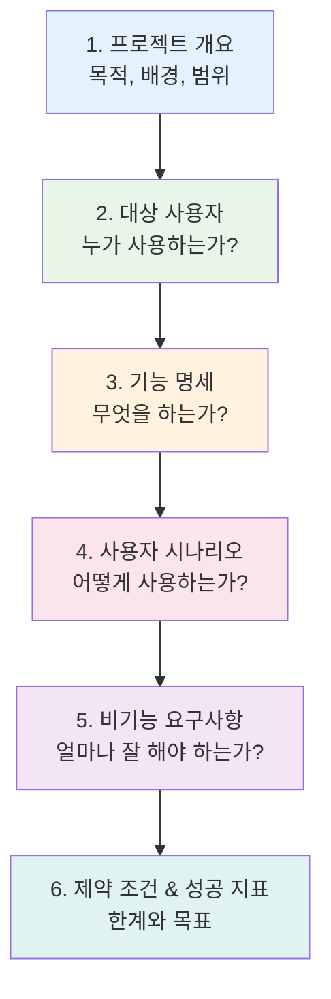
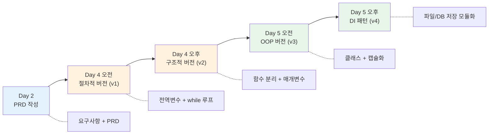
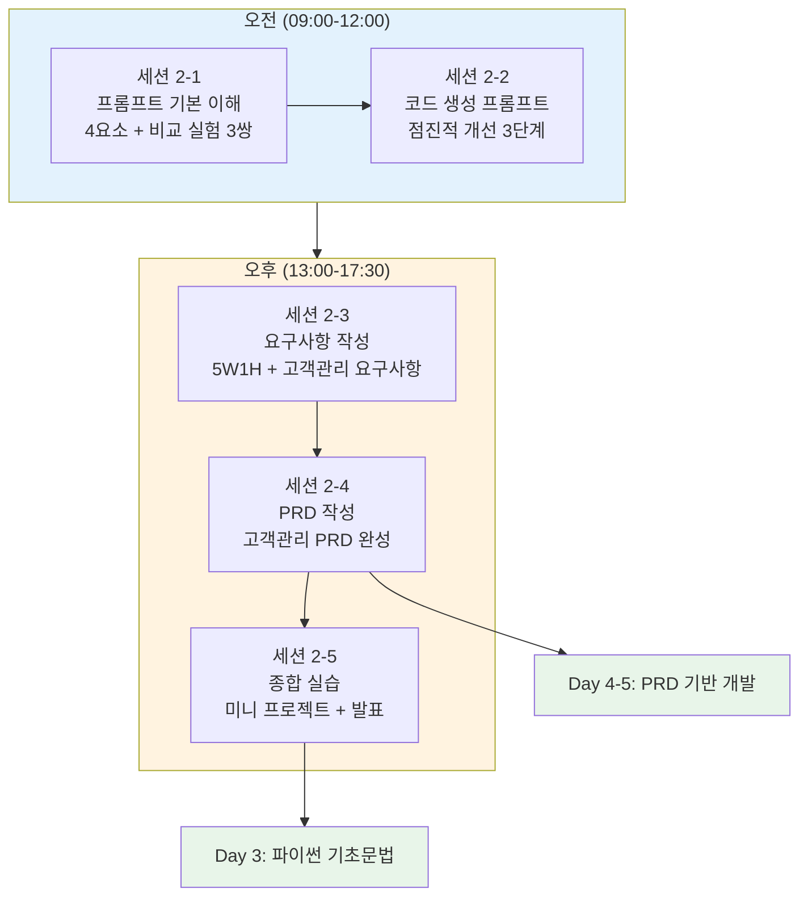

# Day 2 오후: 요구사항 & PRD 작성 — AI를 이용한 문서화

> 과정: AI-native 파이썬 기초 | Day 2/5 | 13:00–17:30

---

## 📋 오후 세션 개요

| 세션 | 시간 | 주제 | 핵심 키워드 |
|------|------|------|------------|
| 2-3 | 13:00–14:30 (90분) | 요구사항 이해 & AI를 이용한 요구사항 작성 | 요구사항, 기능/비기능, 5W1H |
| 2-4 | 14:30–16:00 (90분) | AI를 이용한 PRD 문서 작성 | PRD, 문제 정의, 사용자 시나리오, 기능 명세 |
| 2-5 | 16:15–17:30 (75분) | Day 2 종합 실습 & 정리 | 미니 프로젝트, 전체 파이프라인 |

### 🎯 오후 학습 목표

1. 소프트웨어 요구사항이 무엇인지 이해하고, AI를 활용해 체계적으로 작성할 수 있어요
2. PRD(Product Requirements Document)의 구조를 이해하고, AI를 활용해 PRD를 작성할 수 있어요
3. 프롬프트 작성 → 요구사항 → PRD → 코드 생성의 전체 파이프라인을 독립적으로 수행할 수 있어요

### 🔗 오전 세션 연결

> 오전에 우리는 프롬프트의 4요소와 점진적 개선 기법을 배웠어요. 프롬프트가 "한 줄짜리 업무 지시서"라면, 오후에 배울 요구사항과 PRD는 **"완전한 설계도"**예요. 프롬프트를 잘 쓰는 것도 중요하지만, "무엇을 만들지"를 체계적으로 정리하는 능력이 더 중요해요. "AI 시대의 서사"에서 배운 **"문제를 정의하는 것"**이 바로 이 과정이에요.

---

## 세션 2-3: 요구사항 이해 & AI를 이용한 요구사항 작성 (13:00–14:30, 90분)

### 1. 학습 목표

- 소프트웨어 요구사항이 무엇인지 이해하고, AI를 활용해 요구사항을 체계적으로 작성해요

### 2. 핵심 개념

| 개념 | 설명 |
|------|------|
| **요구사항(Requirements)** | 소프트웨어가 "무엇을 해야 하는지"를 정리한 문서 |
| **기능 요구사항** | 시스템이 수행해야 하는 구체적인 기능 (예: 고객 등록, 조회) |
| **비기능 요구사항** | 성능, 보안, 사용성 등 기능 외적인 품질 조건 |
| **사용자 스토리** | "~로서, ~를 하고 싶다, 왜냐하면 ~이기 때문이다" 형식의 요구사항 표현 |
| **5W1H** | Who, What, When, Where, Why, How로 요구사항을 체계적으로 정리하는 방법 |

### 3. 개념 설명 — 요구사항은 "여행 계획서"

요구사항이 뭔지 쉽게 이해해볼까요?

친구들과 여행을 간다고 생각해보세요. "여행 가자!"라고만 하면 준비할 수 있을까요? 아마 이런 질문들이 쏟아질 거예요.

- **어디로?** (목적지)
- **언제?** (일정)
- **누구와?** (인원)
- **예산은?** (제약)
- **뭐할 건데?** (활동)

이 모든 것을 정리한 것이 **여행 계획서**예요. 소프트웨어 요구사항도 똑같아요. "프로그램 만들자!"만으로는 부족하고, **무엇을, 누구를 위해, 어떤 조건으로** 만들지 정리해야 해요.

> 💡 **"AI 시대의 서사" 연결**: 1부에서 배운 것 기억나시나요? **"문제를 정의하는 것"**이 개발의 핵심이라고 했죠. 요구사항 작성이 바로 "문제를 정의하는" 과정이에요. AI가 코드를 대신 짜주는 시대에, **"무엇을 만들지 정의하는 능력"**이 가장 중요한 역량이에요.

#### 기능 요구사항 vs 비기능 요구사항

| 구분 | 설명 | 예시 |
|------|------|------|
| **기능 요구사항** | 시스템이 "무엇을 하는지" | 고객 정보를 등록할 수 있다 |
| **비기능 요구사항** | 시스템이 "얼마나 잘 하는지" | 검색 결과가 1초 이내에 표시된다 |

비유하자면, 기능 요구사항은 **"이 차가 달릴 수 있어야 한다"**이고, 비기능 요구사항은 **"시속 200km까지 달릴 수 있어야 한다"**예요.

### 4. 5W1H 체크리스트

요구사항을 빠짐없이 정리하려면 5W1H를 활용하세요.

| 질문 | 의미 | 고객 정보 관리 프로그램 예시 |
|------|------|--------------------------|
| **Who** (누가) | 사용자는 누구인가? | 소규모 사업장의 직원 |
| **What** (무엇을) | 어떤 기능이 필요한가? | 고객 정보 등록, 조회, 수정, 삭제 |
| **When** (언제) | 언제 사용하는가? | 고객 방문/문의 시 |
| **Where** (어디서) | 어떤 환경에서 실행하는가? | Windows 콘솔 환경 |
| **Why** (왜) | 왜 이 프로그램이 필요한가? | 엑셀 수기 관리의 불편함 해소 |
| **How** (어떻게) | 어떻게 동작해야 하는가? | 메뉴 선택 → 기능 실행 → 결과 표시 |

### 5. 실습 — "고객 정보 관리 프로그램" 요구사항 작성

#### Step 1: 자유롭게 적어보기 (5분)

먼저 "고객 정보 관리 프로그램"에 필요한 기능을 자유롭게 적어보세요. 포스트잇이나 메모장에 떠오르는 대로 적어보세요.

> 예시: "고객 이름 저장", "전화번호 검색", "정보 수정"...

#### Step 2: AI에게 요구사항 정리 요청하기

Antigravity Agent Manager에 아래 프롬프트를 입력하세요.

```
고객 정보를 등록·조회·수정·삭제할 수 있는 콘솔 프로그램의 요구사항을 
체계적으로 정리해줘.

조건:
- 파이썬으로 개발할 거야
- Windows 콘솔 환경에서 실행돼
- 고객 정보는 이름, 전화번호, 이메일을 포함해
- 비전공자가 이해할 수 있는 쉬운 한글로 작성해줘
- 기능 요구사항과 비기능 요구사항을 구분해줘
- 5W1H 형식으로 정리해줘
```

#### Step 3: AI가 정리한 요구사항과 본인 것 비교하기

AI가 생성한 요구사항을 보면서, 본인이 적은 것과 비교해보세요. AI가 추가로 생각해낸 항목이 있나요? 반대로 본인이 생각했는데 AI가 빠뜨린 항목이 있나요?

#### 📄 "고객 정보 관리 프로그램" 요구사항 문서 (예시)

아래는 AI와 함께 완성한 요구사항 문서의 예시예요.

---

**프로젝트명**: 고객 정보 관리 프로그램

**작성일**: 2026-02-18

**작성자**: (수강생 이름)

##### 1. 프로젝트 개요 (5W1H)

| 항목 | 내용 |
|------|------|
| **Who** (누가 사용하나요?) | 소규모 사업장 직원. 프로그래밍 경험 없음 |
| **What** (무엇을 하나요?) | 고객 정보(이름, 전화번호, 이메일)를 등록·조회·수정·삭제 |
| **When** (언제 사용하나요?) | 고객 방문, 전화 문의, 정보 업데이트 시 |
| **Where** (어디서 실행하나요?) | Windows 11 콘솔 환경, Python 3.12 |
| **Why** (왜 필요한가요?) | 엑셀/수기 관리의 불편함 해소, 빠른 검색 필요 |
| **How** (어떻게 동작하나요?) | 메뉴 번호 선택 → 기능 실행 → 결과 표시 → 메뉴 복귀 |

##### 2. 기능 요구사항

| # | 기능 | 상세 설명 |
|---|------|----------|
| F1 | **고객 등록** | 이름, 전화번호, 이메일을 입력받아 새 고객을 등록한다 |
| F2 | **고객 목록 조회** | 등록된 모든 고객의 정보를 번호와 함께 표시한다 |
| F3 | **고객 검색** | 이름으로 고객을 검색하여 해당 고객의 정보를 표시한다 |
| F4 | **고객 정보 수정** | 고객 번호를 선택하여 이름, 전화번호, 이메일을 수정한다 |
| F5 | **고객 삭제** | 고객 번호를 선택하여 해당 고객을 삭제한다 (확인 절차 포함) |
| F6 | **프로그램 종료** | 메뉴에서 종료를 선택하면 프로그램을 안전하게 종료한다 |

##### 3. 비기능 요구사항

| # | 항목 | 요구사항 |
|---|------|---------|
| NF1 | **사용성** | 메뉴 번호만 입력하면 기능을 실행할 수 있어야 한다 |
| NF2 | **안정성** | 잘못된 입력(빈 값, 범위 초과)에 대해 에러 메시지를 표시한다 |
| NF3 | **가독성** | 코드에 한글 주석을 포함하여 초보자도 이해할 수 있어야 한다 |
| NF4 | **데이터 형식** | 전화번호는 "010-XXXX-XXXX" 형식을 권장한다 |
| NF5 | **확장성** | 향후 파일 저장, DB 연동이 가능한 구조여야 한다 |

##### 4. 데이터 구조

| 필드 | 타입 | 필수 여부 | 설명 |
|------|------|----------|------|
| 이름 | 문자열 | 필수 | 고객의 이름 |
| 전화번호 | 문자열 | 필수 | 고객의 연락처 |
| 이메일 | 문자열 | 선택 | 고객의 이메일 주소 |

##### 5. 메뉴 구조

```
=== 고객 정보 관리 프로그램 ===
1. 고객 등록
2. 고객 목록 조회
3. 고객 검색
4. 고객 정보 수정
5. 고객 삭제
6. 종료
메뉴를 선택하세요 (1-6):
```

---

### 6. 실습 — 5W1H 체크리스트 적용

위 요구사항 문서를 5W1H 체크리스트로 검증해보세요.

| 체크 | 질문 | 답변이 있나요? |
|:----:|------|:------------:|
| ☐ | Who: 사용자가 명확한가요? | |
| ☐ | What: 기능이 구체적인가요? | |
| ☐ | When: 사용 시점이 정의되었나요? | |
| ☐ | Where: 실행 환경이 명시되었나요? | |
| ☐ | Why: 필요성이 설명되었나요? | |
| ☐ | How: 동작 방식이 기술되었나요? | |

### 7. 트러블슈팅 FAQ

| 문제 | 해결 방법 |
|------|----------|
| 요구사항이 너무 막연해요 | 5W1H 체크리스트를 하나씩 채워보세요 |
| 기능 요구사항과 비기능 요구사항 구분이 어려워요 | "시스템이 무엇을 하는가" = 기능, "얼마나 잘 하는가" = 비기능 |
| AI가 너무 복잡하게 작성해요 | "비전공자가 이해할 수 있는 쉬운 한글로"를 프롬프트에 추가하세요 |
| 빠뜨린 요구사항이 있을 것 같아요 | AI에게 "이 요구사항에서 빠진 것이 있는지 검토해줘"라고 요청하세요 |

### 8. 세션 2-3 핵심 정리

```
✅ 요구사항 = 여행 계획서 (어디로? 언제? 누구와? 예산은? 뭐할 건데?)
✅ 기능 요구사항: 시스템이 "무엇을 하는지"
✅ 비기능 요구사항: 시스템이 "얼마나 잘 하는지"
✅ 5W1H로 빠짐없이 정리하기
✅ AI에게 요구사항 정리를 요청하고, 본인의 생각과 비교하기
```

### 9. 산출물

- "고객 정보 관리 프로그램" 요구사항 문서 (초안)

---

> 🔗 **세션 연결**: 요구사항이 "무엇을 만들지"의 목록이라면, PRD는 그 목록을 **완전한 설계도**로 발전시킨 문서예요. "AI 시대의 서사"에서 배운 **"메뉴 기획자"**가 작성하는 문서가 바로 PRD입니다. 이제 요구사항을 PRD로 발전시켜볼까요?

---

## 세션 2-4: AI를 이용한 PRD 문서 작성 (14:30–16:00, 90분)

### 1. 학습 목표

- PRD(Product Requirements Document)의 구조를 이해하고, AI를 활용해 PRD를 작성해요

### 2. 핵심 개념

| 개념 | 설명 |
|------|------|
| **PRD** | Product Requirements Document. 제품의 목적, 기능, 제약 조건을 모두 담은 종합 문서 |
| **문제 정의** | 이 제품이 해결하려는 문제가 무엇인지 명확히 기술하는 것 |
| **사용자 시나리오** | 사용자가 제품을 실제로 사용하는 과정을 단계별로 기술한 것 |
| **기능 명세** | 각 기능의 입력, 처리, 출력을 상세하게 기술한 것 |
| **성공 지표** | 이 제품이 성공했는지 판단하는 기준 |

### 3. 개념 설명 — PRD는 "요리 레시피의 완전판"

PRD가 뭔지 비유로 이해해볼까요?

요구사항이 "재료 목록"이라면, PRD는 **"요리 레시피의 완전판"**이에요.

- **재료** (기능 목록): 돼지고기, 김치, 두부, 대파...
- **조리 순서** (사용자 흐름): 1. 돼지고기를 볶는다 → 2. 김치를 넣는다 → 3. 물을 붓는다...
- **완성 사진** (목표): 이렇게 생긴 김치찌개가 나와야 해요
- **주의사항** (제약): 불이 너무 세면 탄다, 소금은 나중에 넣는다

이 모든 것을 하나의 문서에 담은 것이 PRD예요.

> 💡 **"AI 시대의 서사" 연결**: 1부에서 배운 **"메뉴 기획자"** 기억나시나요? 요리사(AI)에게 "이런 메뉴를 만들어줘"라고 지시하는 사람이 메뉴 기획자였죠. **메뉴 기획자가 작성하는 문서가 바로 PRD**예요. 우리는 지금 메뉴 기획자가 되는 연습을 하고 있는 거예요!

#### 요구사항 vs PRD 비교

| 항목 | 요구사항 | PRD |
|------|---------|-----|
| **범위** | 기능 목록 중심 | 목적, 배경, 사용자, 기능, 제약, 성공 지표 모두 포함 |
| **깊이** | "무엇을" 수준 | "무엇을 + 왜 + 어떻게" 수준 |
| **비유** | 재료 목록 | 완전한 레시피 |
| **용도** | 기능 파악 | 개발의 전체 가이드 |

### 4. PRD 템플릿 소개

PRD는 보통 이런 구조로 작성해요.



### 5. 실습 — "고객 정보 관리 프로그램" PRD 작성

#### Step 1: AI에게 PRD 생성 요청하기

세션 2-3에서 작성한 요구사항을 기반으로 PRD를 만들어볼까요?

Antigravity Agent Manager에 아래 프롬프트를 입력하세요.

```
다음 요구사항을 바탕으로 "고객 정보 관리 프로그램"의 PRD 문서를 작성해줘.

[요구사항 요약]
- 고객 정보(이름, 전화번호, 이메일)를 등록·조회·수정·삭제하는 콘솔 프로그램
- 파이썬으로 개발, Windows 콘솔 환경
- 메뉴 번호 선택 방식으로 동작
- 잘못된 입력에 대한 에러 처리 포함

PRD에 포함할 내용:
1. 프로젝트 개요 (목적, 배경, 범위)
2. 대상 사용자
3. 기능 명세 (각 기능별 입력/처리/출력)
4. 사용자 시나리오 (구체적인 사용 흐름)
5. 비기능 요구사항
6. 데이터 구조
7. 제약 조건
8. 성공 지표

비전공자가 이해할 수 있는 쉬운 한글로 작성해줘.
```

#### Step 2: 생성된 PRD 리뷰 및 수정 요청

AI가 생성한 PRD를 읽어보고, 부족한 부분이 있으면 추가 요청을 해보세요.

```
사용자 시나리오를 좀 더 구체적으로 작성해줘.
특히 "고객 등록" 시나리오에서 각 단계별로 화면에 무엇이 표시되는지 포함해줘.
```

#### 📄 "고객 정보 관리 프로그램" PRD 문서 (완성본)

아래는 AI와 함께 완성한 PRD 문서의 전문이에요. **이 PRD가 Day 4~5의 개발 기반이 됩니다.**

---

## 고객 정보 관리 프로그램 PRD

**문서 버전**: v1.0

**작성일**: 2026-02-18

**작성자**: (수강생 이름)

**상태**: 초안 완성

---

### 1. 프로젝트 개요

#### 1.1 목적

소규모 사업장에서 고객 정보를 체계적으로 관리할 수 있는 콘솔 기반 프로그램을 개발해요. 현재 엑셀이나 수기로 관리하던 고객 정보를 프로그램으로 전환하여, 빠른 검색과 정확한 관리가 가능하도록 해요.

#### 1.2 배경

- 소규모 사업장에서 고객 정보를 엑셀로 관리하면 검색이 느리고 실수가 잦아요
- 전문 CRM 소프트웨어는 비용이 높고 사용법이 복잡해요
- 간단하면서도 핵심 기능을 갖춘 관리 도구가 필요해요

#### 1.3 범위

| 포함 | 미포함 |
|------|--------|
| 고객 정보 CRUD (등록/조회/수정/삭제) | 웹 인터페이스 |
| 이름 기반 검색 | 다중 사용자 동시 접속 |
| 콘솔 메뉴 인터페이스 | 클라우드 연동 |
| 메모리 기반 데이터 저장 (Day 4) | 결제/매출 관리 |
| 파일/DB 저장 (Day 5 확장) | 모바일 앱 |

### 2. 대상 사용자

#### 2.1 사용자 페르소나

| 항목 | 내용 |
|------|------|
| **이름** | 김민수 (가상) |
| **나이** | 35세 |
| **직업** | 소규모 미용실 원장 |
| **IT 수준** | 기본적인 PC 사용 가능, 프로그래밍 경험 없음 |
| **현재 관리 방식** | 엑셀 파일에 고객 이름, 전화번호 기록 |
| **불편한 점** | 고객이 많아지면서 검색이 느리고, 중복 입력이 발생 |
| **원하는 것** | 이름만 입력하면 바로 고객 정보가 나오는 간단한 프로그램 |

#### 2.2 사용자 요구

- 복잡한 조작 없이 메뉴 번호만 누르면 기능이 실행되어야 해요
- 한글로 안내 메시지가 표시되어야 해요
- 잘못 입력해도 프로그램이 멈추지 않아야 해요

### 3. 기능 명세

#### 3.1 메뉴 시스템

```
=== 고객 정보 관리 프로그램 ===
1. 고객 등록
2. 고객 목록 조회
3. 고객 검색
4. 고객 정보 수정
5. 고객 삭제
6. 종료
===========================
메뉴를 선택하세요 (1-6): _
```

#### 3.2 기능별 상세 명세

##### F1. 고객 등록

| 항목 | 내용 |
|------|------|
| **입력** | 이름(필수), 전화번호(필수), 이메일(선택) |
| **처리** | 입력값 검증 → 고객 목록에 추가 → 등록 번호 부여 |
| **출력** | "고객이 등록되었습니다. (등록 번호: X)" |
| **에러 처리** | 이름이 비어있으면 "이름을 입력해주세요" 표시 |

##### F2. 고객 목록 조회

| 항목 | 내용 |
|------|------|
| **입력** | 없음 (메뉴 선택만) |
| **처리** | 전체 고객 목록을 번호와 함께 표시 |
| **출력** | 번호, 이름, 전화번호, 이메일을 표 형태로 표시 |
| **에러 처리** | 등록된 고객이 없으면 "등록된 고객이 없습니다" 표시 |

**출력 예시:**
```
=== 고객 목록 ===
번호  이름      전화번호         이메일
1     김철수    010-1234-5678   chulsoo@email.com
2     이영희    010-9876-5432   younghee@email.com
3     박민수    010-5555-1234   (없음)
총 3명의 고객이 등록되어 있습니다.
```

##### F3. 고객 검색

| 항목 | 내용 |
|------|------|
| **입력** | 검색할 이름 (부분 일치 검색) |
| **처리** | 입력한 이름이 포함된 고객을 모두 찾아 표시 |
| **출력** | 검색 결과를 목록으로 표시 |
| **에러 처리** | 검색 결과가 없으면 "검색 결과가 없습니다" 표시 |

##### F4. 고객 정보 수정

| 항목 | 내용 |
|------|------|
| **입력** | 수정할 고객 번호, 수정할 항목(이름/전화번호/이메일), 새 값 |
| **처리** | 해당 고객의 정보를 새 값으로 업데이트 |
| **출력** | "고객 정보가 수정되었습니다" + 수정된 정보 표시 |
| **에러 처리** | 존재하지 않는 번호면 "해당 번호의 고객이 없습니다" 표시 |

##### F5. 고객 삭제

| 항목 | 내용 |
|------|------|
| **입력** | 삭제할 고객 번호 |
| **처리** | 삭제 확인 → "정말 삭제하시겠습니까? (y/n)" → 삭제 실행 |
| **출력** | "고객이 삭제되었습니다" |
| **에러 처리** | 존재하지 않는 번호면 "해당 번호의 고객이 없습니다" 표시 |

##### F6. 프로그램 종료

| 항목 | 내용 |
|------|------|
| **입력** | 메뉴에서 6 선택 |
| **처리** | 종료 확인 메시지 표시 후 프로그램 종료 |
| **출력** | "프로그램을 종료합니다. 감사합니다!" |

### 4. 사용자 시나리오

#### 시나리오 1: 새 고객 등록

```
1. 사용자가 프로그램을 실행한다
2. 메인 메뉴가 표시된다
3. 사용자가 "1"을 입력한다 (고객 등록)
4. "이름을 입력하세요: " 프롬프트가 표시된다
5. 사용자가 "김철수"를 입력한다
6. "전화번호를 입력하세요: " 프롬프트가 표시된다
7. 사용자가 "010-1234-5678"을 입력한다
8. "이메일을 입력하세요 (없으면 Enter): " 프롬프트가 표시된다
9. 사용자가 "chulsoo@email.com"을 입력한다
10. "고객이 등록되었습니다. (등록 번호: 1)" 메시지가 표시된다
11. 메인 메뉴로 돌아간다
```

#### 시나리오 2: 고객 검색 후 정보 수정

```
1. 사용자가 메뉴에서 "3"을 입력한다 (고객 검색)
2. "검색할 이름을 입력하세요: " 프롬프트가 표시된다
3. 사용자가 "김"을 입력한다
4. "김"이 포함된 고객 목록이 표시된다
5. 메인 메뉴로 돌아간다
6. 사용자가 "4"를 입력한다 (고객 정보 수정)
7. "수정할 고객 번호를 입력하세요: " 프롬프트가 표시된다
8. 사용자가 "1"을 입력한다
9. 현재 정보가 표시되고, 수정할 항목을 선택한다
10. 새 값을 입력하면 정보가 업데이트된다
```

#### 시나리오 3: 잘못된 입력 처리

```
1. 사용자가 메뉴에서 "7"을 입력한다 (범위 초과)
2. "1~6 사이의 숫자를 입력해주세요" 메시지가 표시된다
3. 메인 메뉴가 다시 표시된다
4. 사용자가 메뉴에서 "abc"를 입력한다 (숫자가 아닌 값)
5. "숫자를 입력해주세요" 메시지가 표시된다
6. 메인 메뉴가 다시 표시된다
```

### 5. 비기능 요구사항

| # | 항목 | 요구사항 |
|---|------|---------|
| NF1 | **사용성** | 메뉴 번호 입력만으로 모든 기능에 접근 가능 |
| NF2 | **안정성** | 어떤 입력에도 프로그램이 중단되지 않음 |
| NF3 | **가독성** | 모든 안내 메시지는 한글로 표시 |
| NF4 | **코드 품질** | 한글 주석 포함, 초보자가 읽을 수 있는 수준 |
| NF5 | **확장성** | Day 5에서 파일/DB 저장으로 확장 가능한 구조 |

### 6. 데이터 구조

```python
# 고객 한 명의 정보 (딕셔너리)
customer = {
    "name": "김철수",           # 이름 (필수)
    "phone": "010-1234-5678",   # 전화번호 (필수)
    "email": "chulsoo@email.com" # 이메일 (선택)
}

# 전체 고객 목록 (리스트 안의 딕셔너리)
customers = [
    {"name": "김철수", "phone": "010-1234-5678", "email": "chulsoo@email.com"},
    {"name": "이영희", "phone": "010-9876-5432", "email": "younghee@email.com"},
]
```

### 7. 제약 조건

| # | 제약 | 설명 |
|---|------|------|
| C1 | 실행 환경 | Windows 11, Python 3.12, 콘솔 환경 |
| C2 | 데이터 저장 | Day 4에서는 메모리 저장 (프로그램 종료 시 데이터 소멸) |
| C3 | 동시 사용 | 단일 사용자만 지원 |
| C4 | 데이터 양 | 최대 100명 수준의 고객 관리 |

### 8. 성공 지표

| # | 지표 | 기준 |
|---|------|------|
| S1 | 기능 완성도 | CRUD 4가지 기능이 모두 정상 동작 |
| S2 | 에러 처리 | 잘못된 입력에 프로그램이 중단되지 않음 |
| S3 | 사용성 | 프로그래밍 경험 없는 사람도 메뉴를 보고 사용 가능 |
| S4 | 코드 이해도 | 수강생이 코드를 읽고 각 부분의 역할을 설명 가능 |

### 9. 개발 로드맵



---

### 6. 트러블슈팅 FAQ

| 문제 | 해결 방법 |
|------|----------|
| PRD가 너무 길어서 부담스러워요 | 처음부터 완벽할 필요 없어요. 핵심 섹션(개요, 기능 명세, 시나리오)부터 채우세요 |
| 사용자 시나리오 작성이 어려워요 | 실제로 프로그램을 사용하는 장면을 상상하며 "1. ~한다, 2. ~한다" 순서로 적어보세요 |
| 비기능 요구사항이 뭔지 모르겠어요 | "이 프로그램이 느리면 안 돼", "멈추면 안 돼" 같은 것들이 비기능 요구사항이에요 |
| AI가 생성한 PRD가 마음에 안 들어요 | 구체적으로 어떤 부분을 수정해달라고 요청하세요. "사용자 시나리오를 더 구체적으로" 같이요 |

### 7. 세션 2-4 핵심 정리

```
✅ PRD = 요리 레시피의 완전판 (재료 + 조리 순서 + 완성 사진 + 주의사항)
✅ "메뉴 기획자"가 작성하는 문서 = PRD
✅ PRD 구조: 개요 → 사용자 → 기능 명세 → 시나리오 → 비기능 → 제약 → 성공 지표
✅ 이 PRD가 Day 4~5의 개발 기반이 된다!
```

### 8. 산출물

- "고객 정보 관리 프로그램" PRD 문서 (완성)

---

> ☕ **휴식 (16:00–16:15)**
>
> 🔗 **세션 연결**: 오늘 배운 프롬프트 작성법, 요구사항, PRD를 모두 활용해서 미니 프로젝트를 해볼 거예요. 자유 주제를 선택해서 "요구사항 → PRD → 코드 생성 → 실행"까지 전체 파이프라인을 독립적으로 수행해보세요!

---

## 세션 2-5: Day 2 종합 실습 & 정리 (16:15–17:30, 75분)

### 1. 학습 목표

- 프롬프트 작성 → 요구사항 → PRD 전체 파이프라인을 독립적으로 수행해요

### 2. 활동 — 미니 프로젝트 (40분)

#### Step 1: 주제 선택 (5분)

아래 주제 중 하나를 선택하거나, 자유 주제를 정해보세요.

| # | 주제 | 난이도 | 설명 |
|---|------|:------:|------|
| 1 | 할 일 목록 (To-Do List) | ⭐ | 할 일 추가, 완료 체크, 삭제 |
| 2 | 단위 변환기 | ⭐ | 길이, 무게, 온도 변환 |
| 3 | 가위바위보 게임 | ⭐⭐ | 컴퓨터와 대결, 승률 기록 |
| 4 | 간단한 가계부 | ⭐⭐ | 수입/지출 기록, 잔액 계산 |
| 5 | 자유 주제 | ⭐~⭐⭐⭐ | 본인이 만들고 싶은 것 |

#### Step 2: 요구사항 작성 (10분)

5W1H 체크리스트를 활용해서 요구사항을 작성하세요.

```
[프로젝트명]: _______________

[5W1H]
- Who: 
- What: 
- When: 
- Where: 
- Why: 
- How: 

[기능 요구사항]
1. 
2. 
3. 

[비기능 요구사항]
1. 
2. 
```

#### Step 3: PRD 작성 (10분)

AI를 활용해서 간단한 PRD를 작성하세요. 최소한 아래 항목을 포함해야 해요.

- 프로젝트 개요 (목적)
- 기능 명세 (최소 3개 기능)
- 사용자 시나리오 (최소 1개)

#### Step 4: 프롬프트로 코드 생성 & 실행 (15분)

PRD를 기반으로 프롬프트를 작성하고, AI에게 코드를 생성해달라고 요청하세요. 생성된 코드를 실행해보세요.

> 💡 **팁**: 오전에 배운 점진적 개선 기법을 활용하세요! 한 번에 모든 기능을 요청하지 말고, 기본 구조부터 시작해서 기능을 추가해보세요.

### 3. 활동 — 팀별 발표 (15분)

3분씩 발표해보세요. 발표 내용:

1. **어떤 프로그램을 만들었나요?** (주제 소개)
2. **프롬프트를 어떻게 작성했나요?** (4요소 활용 여부)
3. **AI와 대화하면서 어떤 점이 좋았고, 어떤 점이 어려웠나요?**

### 4. Day 2 핵심 정리 퀴즈 (5문항)

스스로 답해보세요!

| # | 질문 | 힌트 |
|---|------|------|
| Q1 | 프롬프트 4요소는 무엇인가요? | P, T, C, F |
| Q2 | "밥 해줘"는 왜 나쁜 프롬프트인가요? | 구체성 부족 |
| Q3 | 점진적 개선의 3단계는? | 설계도 → ? → ? |
| Q4 | 기능 요구사항과 비기능 요구사항의 차이는? | "무엇을" vs "얼마나 잘" |
| Q5 | PRD를 비유하면 무엇인가요? | 요리 레시피의 ??? |

<details>
<summary>정답 확인하기</summary>

| # | 정답 |
|---|------|
| Q1 | Persona(누가), Task(무엇을), Context(어떤 상황에서), Format(어떤 형태로) |
| Q2 | 무엇을 만들지, 얼마나, 어떤 조건으로 만들지 구체적이지 않아서 AI가 "알아서" 해석하게 되기 때문 |
| Q3 | 설계도(기본 구조) → 골조(핵심 로직) → 인테리어(세부 기능) |
| Q4 | 기능 요구사항은 시스템이 "무엇을 하는지", 비기능 요구사항은 "얼마나 잘 하는지" |
| Q5 | 요리 레시피의 완전판 (재료 + 조리 순서 + 완성 사진 + 주의사항) |

</details>

### 5. Day 2 평가 체크리스트

| 체크 | 항목 | 달성 여부 |
|:----:|------|:--------:|
| ☐ | 프롬프트 4요소를 활용해서 프롬프트를 작성할 수 있다 | |
| ☐ | 요구사항 문서를 5W1H 기반으로 작성할 수 있다 | |
| ☐ | PRD 문서의 구조를 이해하고 AI를 활용해 작성할 수 있다 | |
| ☐ | 프롬프트로 코드를 생성하고 실행할 수 있다 | |

### 6. Day 3 예고

> 🔗 **내일은 파이썬이 데이터를 어떻게 다루는지 배웁니다!**
>
> 오늘 PRD에서 정의한 고객 데이터(이름, 전화번호, 이메일)를 파이썬에서는 어떻게 저장하고 다루는지 배울 거예요. **변수**(이름표 상자), **리스트**(번호표 사물함), **딕셔너리**(이름표 서랍장)... 이 개념들이 Day 4에서 고객 관리 프로그램을 만들 때 핵심이 됩니다!

---

## 📎 부록: Day 2 전체 흐름도



## 📎 부록: Day 2 핵심 비유 정리

| 비유 | 의미 | 세션 |
|------|------|------|
| **업무 지시서** | 프롬프트 = AI에게 보내는 업무 지시서 | 2-1 |
| **"밥 해줘" vs "김치찌개 2인분"** | 모호한 프롬프트 vs 구체적인 프롬프트 | 2-1 |
| **건축 의뢰서** | 코드 생성 프롬프트 = 설계도 → 골조 → 인테리어 | 2-2 |
| **여행 계획서** | 요구사항 = 어디로? 언제? 누구와? 예산은? | 2-3 |
| **요리 레시피 완전판** | PRD = 재료 + 조리 순서 + 완성 사진 + 주의사항 | 2-4 |
| **메뉴 기획자의 문서** | "AI 시대의 서사"의 메뉴 기획자가 작성하는 문서 = PRD | 2-4 |

## 📎 부록: Day 2 산출물 목록

| # | 산출물 | 세션 |
|---|--------|------|
| 1 | 프롬프트 비교 실험 결과 기록 (3쌍) | 2-1 |
| 2 | 프롬프트 4요소 체크시트 | 2-1 |
| 3 | 3단계 점진적 개선 프롬프트 & 코드 결과물 | 2-2 |
| 4 | "고객 정보 관리 프로그램" 요구사항 문서 | 2-3 |
| 5 | "고객 정보 관리 프로그램" PRD 문서 | 2-4 |
| 6 | 미니 프로젝트 (자유 주제) | 2-5 |
