# Day 2 오후: 요구사항 PRD 종합실습

> **과정**: AI-native 파이썬 기초 | Day 2/5 | 13:30~18:00
> **테마**: 프롬프트 엔지니어링과 요구사항 분석
> **세션**: 034 ~ 043 (10개 세션)
> **총 소요 시간**: 220분
> **버전**: v2.1 (7섹션 구조, 보조 패킷 통합)
> **작성 일시**: 2026-02-25

---

## 🎯 학습 목표 (오후)

1. **세션 034**: 이 세션 종료 시 수강생은 AI(Gemini)를 활용하여 자신의 초기 아이디어를 체계적인 요구사항 문서 초안으로 발전시킬 수 있다.
2. **세션 035**: 이 세션 종료 시 수강생은 PRD의 정의를 이해하고, 단순한 기능 목록과 PRD의 차이점을 설명할 수 있다.
3. **세션 036**: 이 세션 종료 시 수강생은 PRD의 표준 템플릿 구조를 파악하고, 각 기능을 식별자(FR-001 등)를 부여하여 체계적으로 명세할 수 있다.
4. **세션 037**: 이 세션 종료 시 수강생은 시간의 흐름에 따른 사용자 시나리오를 작성하고, 프로그램의 성공 여부를 판단할 지표를 정의할 수 있다.
5. **세션 038**: 이 세션 종료 시 수강생은 요구사항 초안을 바탕으로 AI와 협업하여 완전한 구조(개요, 기능명세, 시나리오 등)를 갖춘 PRD를 완성할 수 있다.
6. **세션 039**: 이 세션 종료 시 수강생은 자신만의 자유 주제를 하나 선정하여 핵심 요구사항을 5W1H 기반으로 정의할 수 있다.
7. **세션 040**: 이 세션 종료 시 수강생은 자신의 요구사항을 PRD로 변환하고, 이를 바탕으로 AI에게 코드를 요청할 1단계 프롬프트를 작성할 수 있다.
8. **세션 041**: 이 세션 종료 시 수강생은 자신이 작성한 프롬프트로 코드를 생성하고, 점진적으로 기능을 추가하여 최종 프로그램을 실행 및 검증할 수 있다.
9. **세션 042**: 이 세션 종료 시 수강생은 자신이 프로그램을 만드는 과정에서 AI와 어떻게 상호작용했는지 문제 해결 과정을 동료들에게 설명할 수 있다.
10. **세션 043**: 이 세션 종료 시 수강생은 Day 2의 핵심 내용(4요소, 5항목, SDD)을 요약하고, 자신이 작성한 성공적인 프롬프트를 자산화하여 저장할 수 있다.

---

## 📋 목차

- [🧪 세션 034: AI와 함께하는 요구사항 작성 실습](#세션-034) (25분)
- [📖 세션 035: PRD(Product Requirements Document)란 무엇인가?](#세션-035) (20분)
- [💻 세션 036: PRD의 핵심 구조와 기능 명세(FR) 작성법](#세션-036) (25분)
- [📖 세션 037: 사용자 시나리오와 성공 지표 정의](#세션-037) (20분)
- [🧪 세션 038: 고객 정보 관리 프로그램 PRD 완성하기](#세션-038) (25분)
- [🧪 세션 039: 미니 스펙 프로젝트: 주제 선정 및 요구사항](#세션-039) (25분)
- [🧪 세션 040: 미니 스펙 프로젝트: PRD 작성 및 프롬프트 준비](#세션-040) (25분)
- [🧪 세션 041: 미니 스펙 프로젝트: 코드 생성 및 실행 검증](#세션-041) (25분)
- [📖 세션 042: 팀별 발표: '나는 이렇게 AI와 대화했다'](#세션-042) (15분)
- [📖 세션 043: Day 2 핵심 요약 및 프롬프트 포트폴리오 정리](#세션-043) (15분)

---

## 📊 세션 인덱스

| 세션 | 제목 | 시간 | 청크 타입 | 난이도 | 바로가기 |
|------|------|------|-----------|--------|----------|
| 034 | AI와 함께하는 요구사항 작성 실습 | 25분 | 🧪 lab | medium | [바로가기](#세션-034) |
| 035 | PRD(Product Requirements Document)란 무엇인가? | 20분 | 📖 narrative | low | [바로가기](#세션-035) |
| 036 | PRD의 핵심 구조와 기능 명세(FR) 작성법 | 25분 | 💻 code | medium | [바로가기](#세션-036) |
| 037 | 사용자 시나리오와 성공 지표 정의 | 20분 | 📖 narrative | medium | [바로가기](#세션-037) |
| 038 | 고객 정보 관리 프로그램 PRD 완성하기 | 25분 | 🧪 lab | medium | [바로가기](#세션-038) |
| 039 | 미니 스펙 프로젝트: 주제 선정 및 요구사항 | 25분 | 🧪 lab | medium | [바로가기](#세션-039) |
| 040 | 미니 스펙 프로젝트: PRD 작성 및 프롬프트 준비 | 25분 | 🧪 lab | medium | [바로가기](#세션-040) |
| 041 | 미니 스펙 프로젝트: 코드 생성 및 실행 검증 | 25분 | 🧪 lab | high | [바로가기](#세션-041) |
| 042 | 팀별 발표: '나는 이렇게 AI와 대화했다' | 15분 | 📖 narrative | low | [바로가기](#세션-042) |
| 043 | Day 2 핵심 요약 및 프롬프트 포트폴리오 정리 | 15분 | 📖 narrative | low | [바로가기](#세션-043) |

---

## 📚 본문

### 세션 034: AI와 함께하는 요구사항 작성 실습
> [원본 파일](sessions/세션-034-AI와_함께하는_요구사항_작성_실습_v2.1.md) | ⏱️ 25분 | 🧪 lab | 난이도: medium

> **세션 ID**: MS-PY101-034  
> **소요 시간**: 25분  
> **난이도**: medium  
> **청크 타입**: lab  
> **버전**: v2.1 (7섹션 구조)

---

## §1. 개요

> **Day 2 | PM | 세션 034/043**

### 🎯 학습 목표

이 세션이 끝나면, 수강생은 다음을 할 수 있습니다:

- 초기 아이디어를 AI와의 상호작용을 통해 구체적이고 촘촘한 요구사항으로 발전시킬 수 있다.
- AI를 코딩만을 위한 도구가 아닌, 브레인스토밍과 기획을 돕는 "기획 컨설턴트"로 대우하고 활용할 수 있다.
- 역프롬프팅(Reverse Prompting) 기법을 사용해 자신이 미처 생각하지 못한 기획의 빈틈과 엣지 케이스를 찾아낼 수 있다.

### 선행 세션 환기

바로 직전 세션(세션 033)에서 우리는 SDD(명세 주도 개발)의 중요성을 배웠습니다. 개발자가 느낌표나 영감에 의존해 주먹구구식으로 코드를 짜는 "바이브 코딩"이 얼마나 위험한지, 그리고 명세서가 곧 유일한 진실의 원천이 되어야 한다는 것을 깨달았죠. 명세서 → 계획 → 작업 → 코드의 4단계 프로세스까지 이해했습니다. 

그런데 여기서 큰 벽에 부딪히는 분들이 많습니다. "명세서가 중요한 건 알겠는데, 빈 종이 앞에서 완벽한 명세서를 처음부터 어떻게 쓰죠?" 맞습니다. 누구나 막막합니다. 인간은 무에서 유를 창조하는 '작성'보다, 이미 있는 것을 다듬는 '편집'에 훨씬 강하거든요. 그래서 오늘 실습에서는 이 막막함을 AI와 함께 타파해 봅니다. AI를 여러분의 전담 "기획 컨설턴트"로 고용할 시간입니다.

---

## §2. 핵심 개념 (+ 🗣️ 강사 대본 + Mermaid)

### 요구사항 작성 = "창업 컨설팅 받기"

여러분이 카페를 창업한다고 상상해 봅시다. 머릿속에는 그저 "아늑하고 예쁜 카페를 열고 싶다"는 뭉뚱그려진 아이디어만 있습니다. 이 상태로 바로 인테리어 업자를 부르면(바이브 코딩) 어떻게 될까요? 주방 동선은 엉키고, 콘센트는 엉뚱한 곳에 있고, 배수구는 막히는 대참사가 일어날 겁니다. 

그래서 우리는 전문 창업 컨설턴트(AI)를 찾아갑니다. 컨설턴트에게 "카페를 열고 싶어요"라고 한 줄만 던져주면, 컨설턴트는 전문가의 시선으로 수많은 질문을 쏟아냅니다. "타깃 고객은 대학생입니까, 직장인입니까?", "테이크아웃 비중이 높나요?", "비 오는 날이나 배달 주문이 밀릴 때는 어떻게 대처할 건가요?" 여러분은 그 질문에 대답만 하면 됩니다. 대답을 하다 보면 어느새 시장 분석부터 입지 선정, 메뉴 구성, 예외 상황에 대한 대처(엣지 케이스)까지 촘촘하게 짜여진 완벽한 사업 계획서(명세서)가 눈앞에 나타납니다.

이것이 바로 AI를 대하는 올바른 태도입니다. AI에게 "파이썬으로 고객 정보 관리 프로그램 짜줘"라고 툭 던지고 코딩 노예처럼 부리지 마세요. 그 대신, "내가 고객 정보 관리 프로그램을 만들 건데, 완벽한 요구사항을 정의하기 위해 날카로운 질문을 해줘"라고 동료 기획자로서 대우해야 합니다.

🗣️ **강사 대본 (Instructor Script)**:

> 여러분, 빈 종이의 공포를 느껴보신 적 있나요? 과제를 하든 기획서를 쓰든, 깜빡이는 커서만 쳐다보고 있으면 머리도 하얗게 변하죠. 명세서 작성도 마찬가지입니다. 완벽한 기능을 처음부터 텍스트로 다 써내야 한다는 압박감은 전문가에게도 스트레스입니다.
> 
> 하지만 우리에겐 15년 경력의 시니어 기획자가 항상 대기하고 있습니다. 바로 여러분 화면 속에 있는 AI죠. 오늘 실습에서는 코딩을 한 줄도 하지 않습니다. 대신 끊임없이 대화할 겁니다. 여러분의 엉성한 한 줄짜리 아이디어를 AI에게 던지면, AI가 5W1H 관점에서 뼈대를 잡아줄 거예요. 그리고 가장 중요한 것, 바로 '역프롬프팅'을 통해 AI가 여러분에게 뼈 때리는 질문을 던지게 만들 겁니다. "동시에 두 명의 고객이 같은 이름으로 가입하면 어떻게 하죠?" 이런 엣지 케이스를 우리가 혼자 다 생각할 필요가 없습니다. 똑똑한 동료와 티키타카(대화)만 하세요.

### Mermaid 다이어그램: 역프롬프팅 기반 요구사항 구체화 흐름

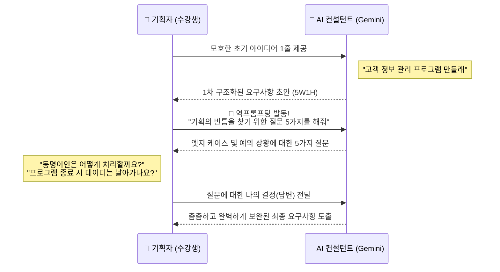

---

## §3. 상세 내용

### Why — 왜 AI를 기획 컨설턴트로 활용해야 하는가?

코드를 짜는 것보다 '무엇을 짜야 할지' 정의하는 것이 백 배는 더 어렵습니다. 개발 현장에서 발생하는 오류의 70% 이상은 코딩 실수가 아니라 "기획의 빈틈"에서 발생합니다. 특히 초보자일수록 정상적으로 작동하는 '해피 패스(Happy Path)'만 상상할 뿐, 사용자가 실수하거나 데이터가 꼬이는 '엣지 케이스(Edge Case)'를 상상하지 못합니다. 

인간의 뇌는 한 번에 고려할 수 있는 변수의 한계가 있습니다. 하지만 AI는 전 세계의 수많은 프로젝트 실패 사례와 기획서를 학습한 거대한 지식의 덩어리입니다. "내가 놓친 게 뭘까?"라는 단 한 번의 질문만으로, 인간의 맹점을 완벽하게 보완해주는 방패막이가 되어줍니다.

### What — 역프롬프팅(Reverse Prompting)이란 무엇인가?

프롬프팅의 일반적인 방향성은 '인간이 질문하고 AI가 답하는 것'입니다. 반면 역프롬프팅(Reverse Prompting)은 이 주도권을 완전히 뒤집는 기법입니다. AI에게 특정한 페르소나(예: 시니어 IT 기획 컨설턴트)를 부여한 뒤, 완벽한 결과물을 만들기 위해 **"AI가 인간에게 역으로 질문하게 만드는"** 고도의 프롬프트 엔지니어링 전략입니다.

초보자는 빈 종이를 채워야 할 때 무엇을 적어야 할지조차 몰라서 막막해합니다. 역프롬프팅은 이 '질문조차 떠오르지 않는 상태'를 돌파하는 최고의 무기입니다. AI가 5~6개의 객관식이나 서술형 질문을 던져주면, 인간은 그 질문에 대해 '선택'하거나 '대답'하기만 하면 됩니다. 

### How — 요구사항을 구체화하는 3단계 프로세스

AI와 대화하며 요구사항을 탄탄하게 다져가는 과정은 다음과 같이 3단계로 진행됩니다.

1.  **아이디어 던지기 (Zero to One)**: 포맷에 얽매이지 않고 내가 만들고 싶은 프로그램의 핵심 기능을 투박한 언어로 작성합니다.
2.  **구조화 요청하기 (Structuring)**: 투박한 문장을 AI에게 주면서, 5W1H(누가, 언제, 어디서, 무엇을, 어떻게, 왜) 구조로 나누고 기능 요구사항(FR)과 비기능 요구사항(NFR)으로 초안을 잡아달라고 지시합니다.
3.  **역프롬프팅으로 빈틈 메우기 (Refining)**: "이 기획에서 내가 미처 생각하지 못한 엣지 케이스 3가지를 찾고, 날카로운 질문 5가지를 나에게 해줘"라고 요청한 뒤, AI의 질문에 답하며 문서를 업그레이드합니다.

> ✅ **체크포인트**: 여기까지 이해했는지 스스로 점검해 보세요.
> - 역프롬프팅(Reverse Prompting)의 방향성이 일반적인 프롬프트와 어떻게 다른가요? ("내가 질문하는 것이 아니라, AI가 나에게 역으로 질문하게 만드는 것")
> - 엣지 케이스(Edge Case)를 인간이 직접 찾는 것보다 AI에게 묻는 것이 유리한 이유는 무엇인가요? ("초보자는 정상 작동 상황만 상상하기 쉬우며, 인간의 인지적 맹점을 AI의 방대한 데이터로 보완할 수 있기 때문")

---

## §4. 실습 가이드 (+ 🎙️ 실습 대본)

### 실습 목표

이 실습을 통해 수강생은 모호한 아이디어를 AI와의 상호작용(역프롬프팅)을 통해 구체적이고 엣지 케이스가 방어된 요구사항 초안으로 발전시키는 경험을 합니다.

🎙️ **실습 가이드 대본 (Lab Guide)**:

> 자, 이제 여러분의 손으로 직접 '고객 정보 관리 프로그램'을 기획해 보겠습니다. 총 15분 정도 소요되는 3단계 실습입니다. 가장 먼저 할 일은 여러분의 상상력을 조금 발휘하는 겁니다. 멋진 포맷은 필요 없어요. 메모장에 "이런 기능이 있었으면 좋겠다"는 것을 딱 3개만 적어보세요.
> 
> 그런 다음, Agent Manager를 열어서 AI 컨설턴트를 소환할 겁니다. 제가 드리는 마스터 프롬프트를 복사해서 붙여넣어 보세요. 놀라운 속도로 여러분의 엉성한 세 줄이 전문적인 기획서 초안으로 탈바꿈할 겁니다. 하지만 여기서 끝나면 안 됩니다. 오늘 실습의 꽃은 바로 3단계 '역프롬프팅'입니다. AI가 여러분에게 날리는 송곳 같은 질문을 받아내고, 거기에 대답하면서 기획의 빈틈을 메워봅시다!

### 단계별 지시 — AI 컨설턴트와 티키타카하기

| 단계 | 소요 시간 | 강사 지시사항 | 학습자 액션 | 예상 결과 |
|------|----------|--------------|------------|----------|
| 1단계 | 5분 | "아이디어를 메모장에 투박하게 적어보세요" | "고객 이름, 전화번호 등록/조회/수정/삭제" 등 최소 3개 기능 자유 형식으로 작성 | 3~4줄의 간단한 아이디어 텍스트 생성 |
| 2단계 | 10분 | "Agent Manager에 1차 프롬프트를 입력하세요" | 아래 제공된 **[프롬프트 1]** 복사 후 본인 아이디어 추가하여 입력 | 5W1H, FR/NFR, 엣지 케이스가 포함된 1차 구조화 초안 도출 |
| 3단계 | 10분 | "역프롬프팅으로 AI의 질문을 유도하세요" | 1차 초안 응답 아래에 **[프롬프트 2]** 복사하여 연속 대화 진행 | AI가 예외 상황 및 기획의 빈틈에 대한 날카로운 질문 5가지 제시 |
| 4단계 | 5분 | "AI의 질문에 구체적으로 답변해 보세요" | 번호를 매겨 1~5번 질문에 짧게 답변 입력 | 답변 내용이 반영된 훨씬 견고한 최종 요구사항 문서 완성 |

**[1단계] 아이디어 메모 (Zero to One)**

컴퓨터 메모장이나 종이 포스트잇을 꺼내세요. 여러분이 콘솔 기반 파이썬으로 '고객 정보 관리 프로그램'을 만든다고 상상하고, 꼭 들어가야 할 기능을 생각나는 대로 적어보세요. (예: 이름 넣기, 전화번호로 검색하기, VIP 고객 표시하기 등)

**[2단계] AI 컨설턴트 1차 활용 (Structuring)**

Antigravity IDE의 Agent Manager를 엽니다. 아래 **§5. 코드 및 명령어 모음**에 있는 **[명령어/프롬프트 1]**을 복사한 뒤, '현재 아이디어' 부분에 여러분이 방금 1단계에서 쓴 내용을 붙여넣고 전송하세요. 
여러분의 투박한 아이디어가 5W1H (누가, 언제, 어디서, 무엇을, 어떻게, 왜) 구조와 FR(기능 요구사항), NFR(비기능 요구사항)로 깔끔하게 정리되어 출력되는 것을 확인하세요.

**[3단계] 역프롬프팅 발동 (Refining)**

결과물이 제법 멋지지만, 아직 진짜배기가 남았습니다. 1차 답변을 받은 같은 채팅창에서 바로 **[명령어/프롬프트 2]**를 복사해서 전송하세요.
"내 기획의 빈틈을 찾기 위한 날카로운 질문 5가지를 던져달라"는 이 프롬프트가 바로 역프롬프팅의 핵심입니다.

**[4단계] 질문에 대답하며 기획 보완하기**

AI가 "전화번호를 입력할 때 하이픈(-)을 강제할까요?", "동명이인은 어떻게 구분하나요?" 같은 질문을 던졌을 겁니다. 채팅창에 1번부터 5번까지 번호를 매겨 여러분의 결정을 짧게 대답해 주세요. "1번은 하이픈 없이 숫자만, 2번은 중복 등록 허용 안 함" 처럼요. AI가 여러분의 대답을 반영하여 최종적으로 방어력이 극대화된 완벽한 기획서 초안을 다시 만들어 줄 겁니다.

### 트러블슈팅 FAQ

| Q | A |
|---|---|
| AI가 질문만 하라고 했는데 자기가 혼자 답까지 달아서 문서를 닫아버려요. | 프롬프트의 지시가 약해서 발생합니다. 프롬프트 끝에 "반드시 질문만 5개 나열하고, 내가 대답할 때까지 기다리세요."라는 제약을 추가해서 다시 전송해 보세요. |
| 역프롬프팅 질문이 너무 뻔하고 평범해요. ("이름은 길게 쓸까요?") | 여러분이 준 1단계 아이디어가 너무 단순할 수 있습니다. 프롬프트에 "극단적인 예외 상황(사용자가 엔터만 치는 경우 등)에 집중해서 아주 깐깐하고 날카롭게 질문해줘"라고 추가 지시를 내려보세요. |
| FR과 NFR의 차이가 정확히 이해가 안 가요. | FR(기능)은 "무엇을 하는가"(예: 로그인 기능)이고, NFR(비기능)은 "어떻게 하는가/조건"(예: 3초 안에 로딩, 외부 라이브러리 사용 금지)입니다. 우리가 자동차를 살 때 '굴러가는가'는 기능이고, '연비가 얼마인가'는 비기능입니다. |
| AI의 질문 5개 중 3개는 어떻게 답해야 할지 저도 모르겠어요. | 모르면 모른다고 대답하는 것이 최고의 프롬프팅입니다! "3번과 4번 질문은 나도 잘 모르겠어. 초보자가 파이썬으로 만들기 가장 쉽고 보편적인 방식으로 네가 추천해서 적용해 줘"라고 대답해 보세요. 컨설턴트에게 조언을 구하는 셈이죠. |

---


### 🎓 강사 노트 (Instructor Support)

- ⏱️ **타이밍**: 14:35 (25분, lab)
- 🎯 **핵심 활동**: 고객관리 PRD 초안 작성
- ⚠️ **강사 주의사항**: AI와 대화하며 문서화


### 📋 실습 설계 보강 (Lab Packet)

**세션 034 실습 설계 보강**

AI와 함께하는 요구사항 작성 실습
- **3-Stage Example Set**
  - 기본: 5W1H 체크리스트를 AI에게 전달 → 고객관리 요구사항 초안 생성
  - 변형: AI가 생성한 초안에서 빠진 항목 찾아서 추가 지시
  - 실수 해결: "AI가 너무 많은 기능을 넣어요" → "이번에 만들지 않는 것(Out of Scope)" 명시
- **난이도 예측**: 요구사항이라는 개념 자체가 추상적
- **타이밍 가이드**: 5W1H 정리 5분 | AI에게 초안 요청 5분 | 검수 및 수정 10분 | 정리 5분
- **심리적 장벽**: "요구사항을 왜 이렇게 길게 써야 해? 바로 코딩하면 안 돼?"
- **자가 점검**:
  - [ ] 5W1H 항목 중 최소 4개를 포함한 요구사항을 작성했는가?
  - [ ] AI가 생성한 초안을 읽고 1개 이상 수정·보완했는가?
  - [ ] "범위 외(Out of Scope)" 항목을 명시했는가?

## §5. 코드 및 프롬프트 모음

### 명령어/프롬프트 1: AI 컨설턴트 1차 초안 생성

```text
당신은 15년 경력의 시니어 IT 기획 컨설턴트입니다.

나는 콘솔 기반 파이썬 고객 정보 관리 프로그램을 기획 중입니다.
현재 아이디어: 
- 고객 이름, 전화번호 등록/조회/수정/삭제
- [이곳에 여러분이 메모한 내용을 추가하세요]

이 아이디어를 바탕으로:
1. 5W1H 구조로 정리된 요구사항 초안을 마크다운으로 작성해 주세요.
2. 기능 요구사항(FR)과 비기능 요구사항(NFR)을 명확히 구분해 주세요.
3. 내가 미처 생각하지 못했을 법한 프로그램 크래시(다운) 관련 엣지 케이스 3가지를 제안해 주세요.
```

### 명령어/프롬프트 2: 역프롬프팅 (빈틈 찌르기)

```text
방금 작성해주신 요구사항 초안을 잘 읽었습니다.
이제 이 기획의 빈틈을 찾기 위해, 시니어 기획자로서 저에게 날카로운 질문 5가지를 던져주세요.

특히 다음 관점에 집중해 주세요:
- 데이터 유효성 검사 (잘못된 입력 처리)
- 엣지 케이스와 예외 상황
- 프로그램의 종료와 데이터 저장 방식

주의: 문서를 바로 수정하지 말고, 번호를 매겨 질문 5개만 나열한 뒤 저의 답변을 기다려 주세요.
```

### 명령어/프롬프트 3: 질문에 답변하기 (예시 템플릿)

```text
질문에 대한 나의 답변입니다:
1. 전화번호는 하이픈(-) 없이 숫자만 입력받도록 강제해 주세요.
2. 이름이 중복되는 경우, 전화번호 뒷자리로 구분할 수 있게 해주세요.
3. 프로그램이 종료되면 데이터는 모두 날아가도 괜찮습니다. (초보자용 1회성 버전)
4. (나머지 질문에 대한 답변...)

이 답변을 모두 반영하여, 1차 요구사항 초안을 더 촘촘하고 완벽하게 업데이트해 주세요.
```

---

## §6. 요약

### 핵심 학습 포인트

이번 세션에서 우리는 코딩 창을 열지 않고도 AI와 대화하며 기획을 다듬는 놀라운 경험을 했습니다. 핵심은 세 가지입니다. 첫째, 빈 종이의 공포를 극복하기 위해 AI를 단순한 코드 생성기가 아닌 "시니어 기획 컨설턴트"로 대우해야 합니다. 둘째, 내가 모호한 아이디어를 던지면 AI가 5W1H 및 FR/NFR 구조로 체계화해 준다는 사실을 배웠습니다. 셋째, 가장 중요한 무기인 **역프롬프팅(Reverse Prompting)**을 통해, AI가 나에게 예외 상황과 엣지 케이스에 대한 질문을 던지게 함으로써 기획의 빈틈을 완벽하게 방어했습니다.

### 다음 세션 예고

이제 여러분의 채팅창 안에는 역프롬프팅을 거쳐 매우 단단해진 요구사항 초안이 들어있습니다. 그런데 실무에서는 이 초안을 채팅창에 그대로 두지 않고, 개발자 누구나 알아볼 수 있는 공식적인 문서 양식으로 변환합니다. 바로 다음 세션에서 배울 **PRD(Product Requirements Document)**입니다. 여러분이 만든 이 훌륭한 초안을 어떻게 PRD라는 멋진 마스터 명세서로 변신시킬지 기대해 주세요!

### 브릿지 노트

> "여러분, 채팅창에 최종 업데이트된 요구사항을 한 번 읽어보세요. 불과 15분 전, 포스트잇에 적었던 두세 줄짜리 낙서가 이렇게 전문적인 기획서의 뼈대로 진화했습니다. AI가 던진 날카로운 질문들에 답하면서 '아차, 이 부분은 생각 못 했네'라고 무릎을 탁 친 분들 계시죠? 그게 바로 역프롬프팅의 힘입니다. AI는 코딩을 돕기 전에 여러분의 기획력부터 10배로 증폭시켜 줍니다. 자, 뼈대가 생겼으니 다음 세션에서는 이 뼈대에 살을 붙여서, 진짜 실무에서 쓰는 공식 PRD 문서로 만들어 보겠습니다."

---

## §7. 참고 자료

### 3-Source 출처

- **Source A (로컬 참고자료)**: 「7 기획.pdf」 (SRC-A03) — 요구사항 분석의 본질, 역프롬프팅 기법 및 AI 기획 컨설턴트 활용 전략.
- **Source B (NotebookLM)**: SRC-B01 — 「AI 시대의 서사 v3」 기반, 문제 정의 vs 문제 해결의 패러다임 전환 및 브레인스토밍 파트너로서의 AI 활용법.
- **Source C (Deep Research)**: SRC-C02 — 엣지 케이스 도출과 역프롬프팅 실전 사례 분석, 요구사항 명세화 과정에서의 환각 방지 전략.

### 추가 학습 자료

- [Prompt Engineering Guide - Reverse Prompting](https://www.promptingguide.ai/): AI 주도형 질문 기법과 프롬프트 패턴 설계 가이드
- **Antigravity IDE Document**: 에이전트를 컨설턴트 페르소나로 설정하기 위한 컨텍스트 주입 방법론

### 강사 노트

> 💡 **강사 노트**: 초보 수강생들은 "코딩 수업인데 왜 자꾸 기획서를 쓰라고 하지?"라며 지루해할 수 있습니다. 이때 카페 창업 비유(바이브 코딩의 위험성)를 다시 한번 상기시켜 주세요. 또한 역프롬프팅 단계에서 "질문에 어떻게 대답할지 모르겠다"며 당황하는 수강생이 많습니다. '모르면 모른다고 대답하거나 AI에게 가장 쉬운 옵션을 추천해 달라고 하는 것도 훌륭한 실력'임을 강조하여 심리적 부담을 덜어주세요. 

---

## ✅ 세션 완료 체크리스트 (강사용)

- [ ] §1~§7 모든 섹션이 충실하게 작성되었는가?
- [ ] 창업 컨설턴트 비유가 §2에서 충분히 확장 및 설명되었는가?
- [ ] 역프롬프팅(Reverse Prompting)의 개념과 실습 단계가 명확히 제시되었는가?
- [ ] 단계별 실습표와 프롬프트 3종이 §4, §5에 포함되었는가?
- [ ] 트러블슈팅 FAQ가 3개 이상 포함되어 현실적인 문제를 다루고 있는가?
- [ ] 체크포인트 질문이 §3에 배치되어 수강생의 이해를 돕고 있는가?
- [ ] 3-Source 팩트 패킷이 §7에 반영되었는가?
- [ ] 다음 세션(035 PRD의 이해)으로 이어지는 브릿지 노트가 포함되었는가?

---

**🔗 선행 세션**: [세션-033] SDD(명세 주도 개발)의 이해  
**🔗 후행 세션**: [세션-035] PRD(Product Requirements Document)란 무엇인가?

---

*작성 일시: 2026-02-25*  
*작성 에이전트: A4B_Session_Writer*  
*교안 구조: 7섹션 (A0 팀 공통 표준)*

> 🔗 **이전 세션**: [세션 033: SDD(Specification-Driven Development)의 이해](#세션-033)에서 배운 내용을 이어갑니다.
> 🔗 **다음 세션**: [세션 035: PRD(Product Requirements Document)란 무엇인가?](#세션-035)에서 계속됩니다.

---

### 세션 035: PRD(Product Requirements Document)란 무엇인가?
> [원본 파일](sessions/세션-035-PRD(Product_Requirements_Document)란_무엇인가?_v2.1.md) | ⏱️ 20분 | 📖 narrative | 난이도: low

> **세션 ID**: MS-PY101-035  
> **소요 시간**: 20분  
> **난이도**: low  
> **청크 타입**: narrative  
> **버전**: v2.1 (7섹션 구조)

---

## §1. 개요

> **Day 2 | PM | 세션 035/043**

이 세션은 요구사항을 단순히 나열하는 것을 넘어, 체계적인 문서로 발전시키는 방법을 배우는 시간이에요. 앞서 우리는 브레인스토밍을 통해 기능들을 뽑아보았지만, 실무에서는 이 기능 목록만 들고 곧바로 코딩을 시작하지 않습니다. "무엇을 만들 것인가"에 "왜 만드는가"와 "누구를 위한 것인가"를 더해 프로젝트의 흔들리지 않는 나침반을 만드는 과정, 즉 PRD(제품 요구사항 정의서)의 개념과 구조를 익히는 것이 이 세션의 목표입니다.

### 🎯 학습 목표

이 세션이 끝나면 수강생은 다음을 할 수 있어요:

- 단순한 요구사항 목록과 PRD의 본질적인 차이를 "요리 재료와 마스터 레시피" 비유로 설명할 수 있습니다
- 프로젝트가 산으로 가는 현상인 '범위 이탈(Scope Creep)'을 PRD가 어떻게 예방하는지 이해합니다
- 파이썬 콘솔 프로젝트에 최적화된 경량 7섹션 PRD 구조를 파악하고 템플릿의 용도를 숙지합니다

### 선행 세션 환기

바로 이전 세션인 034에서 우리는 AI를 훌륭한 기획 컨설턴트로 삼아 역프롬프팅을 진행했어요. "내가 미처 생각하지 못한 엣지 케이스를 질문해 줘"라고 AI에게 지시해서, 고객 관리 프로그램에 필요한 "이름 저장, 삭제, 검색 기능" 같은 구체적인 요구사항 조각들을 성공적으로 뽑아냈습니다. 이제 이 흩어진 조각들을 하나의 견고한 설계도로 조립할 차례예요.

---

## §2. 핵심 개념 (+ 🗣️ 강사 대본 + Mermaid)

### 요리 재료와 마스터 레시피, 그리고 범위 이탈(Scope Creep)

요구사항 목록이 냉장고 속에 있는 당근, 양파, 고기라면, PRD는 이 재료들을 가지고 정확히 어떤 요리를 만들어낼지 적어둔 "마스터 레시피"예요. 재료만 덩그러니 있으면 요리를 하다가 갑자기 감자도 썰어 넣고, 간장도 붓게 되면서 원래 의도했던 카레가 정체불명의 잡탕 찌개로 변하기 쉽습니다. 소프트웨어 개발에서도 이렇게 중간에 자꾸 기능이 추가되고 방향이 틀어지는 현상을 '범위 이탈(Scope Creep)'이라고 부르는데, PRD는 이 치명적인 병을 막아주는 아주 강력한 백신 역할을 합니다.

🗣️ **강사 대본 (Instructor Script)**:

> 여러분, 지난 시간에 AI와 함께 뽑아낸 요구사항 초안들 기억하시죠? "고객 이름을 저장한다", "목록을 조회한다" 같은 훌륭한 재료들이 준비되었습니다. 그런데 실리콘밸리의 노련한 프로덕트 매니저(PM)들은 이 재료만으로는 절대 개발자에게 코딩을 시작하라고 지시하지 않습니다. 
>
> 비유를 하나 들어볼게요. 여러분이 친구 생일 파티를 위해 특별한 요리를 만들기로 했습니다. 주방에 당근, 양파, 돼지고기가 놓여 있어요. 자, 이게 우리가 방금 전까지 만든 "요구사항 목록"입니다. 이 재료들로 당장 요리를 시작할 수 있을까요? 카레를 만들 건지, 제육볶음을 할 건지, 아니면 볶음밥을 할 건지 방향이 없잖아요. 
>
> PRD는 바로 "오늘 우리는 매운 걸 못 먹는 친구를 위해 달콤한 일본식 카레를 만들 거다. 고기는 깍둑썰기를 하고, 끓이는 시간은 20분으로 한다"라고 명확히 적어둔 마스터 레시피입니다. 이 레시피가 없으면 어떻게 될까요? 요리를 하다가 누군가 "야, 떡볶이 떡도 넣자!", "치즈도 올리면 맛있지 않을까?" 하고 자꾸 아이디어를 던집니다. 결국 생일 파티 식탁에는 아무도 원하지 않았던 괴상한 찌개가 올라가게 되죠.
>
> 우리 업계에서는 이걸 "범위 이탈", 영어로 Scope Creep이라고 부릅니다. 프로젝트가 산으로 가는 현상이죠. PRD는 단순히 기능을 나열한 문서를 넘어 "이 프로그램은 왜 만드는지(Why)", "누가 쓰는지(Who)", "무엇을 만들지 않아야 하는지(Out of Scope)"를 명확히 선언해서, 개발 중간에 배가 산으로 가는 것을 완벽하게 차단해 줍니다. 나아가 이 문서를 AI에게 통째로 던져주면, AI는 기능만 겨우 돌아가는 깡통 코드가 아니라 우리 맥락을 100% 이해한 완성도 높은 프로그램을 짜주게 됩니다.

> 💡 **강사 노트**: 요리 비유를 사용할 때, 수강생들이 일상에서 겪어봤을 법한 "계획 없이 일하다가 일이 커진 경험"을 상기시켜 주면 공감대를 훨씬 크게 형성할 수 있습니다. 

### Mermaid 다이어그램: 경량 PRD 7섹션 구조

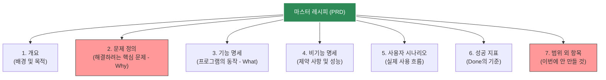

이 다이어그램은 우리가 작성할 파이썬 콘솔용 PRD의 7가지 뼈대를 보여줍니다. 특히 붉은색으로 칠해진 "2. 문제 정의"와 "7. 범위 외 항목"은 AI 시대의 개발에서 가장 중요한 방어선입니다. 무엇을 풀 것인지 명확히 하고, 무엇을 풀지 않을 것인지 단호하게 선을 긋는 것이 핵심이에요.

---

## §3. 상세 내용

### Why — 왜 이 세션이 필요한가?

초보자들은 코딩을 배우기 시작하면 마음이 급해져서 일단 키보드부터 두드리려고 합니다. "바이브 코딩(Vibe Coding)"이라는 말처럼 그냥 느낌대로 AI에게 "만들어줘"라고 지시하는 방식은 처음 10분은 재밌을지 몰라요. 하지만 1시간만 지나면 코드는 뒤죽박죽 꼬이고, 오류가 나도 어디서부터 손대야 할지 모르는 스파게티 코드가 되어버립니다. 

우리가 PRD를 배우는 이유는 바로 이 재앙을 막기 위해서예요. AI라는 무한한 생산력을 가진 도구를 통제하려면, 사람의 머릿속에 있는 모호한 생각을 명확한 문서(Specification)로 고정시켜야 합니다. PRD는 수백 번의 말과 회의를 하나의 "단일 진실의 원천(Single Source of Truth)"으로 만들어주는 강력한 도구입니다.

### What — 이 세션에서 다루는 것은 무엇인가?

실리콘밸리의 거대한 기업들이 쓰는 수십 장짜리 복잡한 PRD를 그대로 가져다 쓰지는 않을 거예요. 우리는 이제 막 파이썬 기초를 배우는 과정이므로, 텍스트 기반 콘솔 프로그램에 딱 맞게 다이어트를 한 "경량 7섹션 PRD 템플릿"을 다룹니다. 개요, 문제 정의, 기능 명세, 비기능 명세, 시나리오, 성공 지표, 그리고 범위 외 항목까지 꼭 필요한 알맹이만 남긴 구조예요.

앞서 뽑아낸 요구사항이 기능 위주(What)였다면, 이 7섹션 구조는 전체 맥락(Context)을 강제합니다. 특히 AI에게 이 문서를 건네주면, AI는 단순히 코드를 짜는 기계를 넘어 비즈니스 목적을 달성해 주는 든든한 파트너로 각성하게 됩니다.

### How — 구체적으로 어떻게 진행하는가?

우리가 함께 만들 "고객 정보 관리 프로그램"을 예로 들어 각 섹션을 채우는 법을 살펴볼 거예요. 

단순히 "고객 이름 등록 기능"이라고 쓰는 것과, 개요에 "소규모 카페 사장님이 단골 연락처를 효율적으로 관리하기 위한 프로그램"이라고 적는 것은 완전히 다릅니다. 후자의 경우, AI에게 이 문서를 주면 콘솔 화면에 "어서오세요, 단골 관리 시스템입니다"라는 친절한 인사말까지 알아서 넣어주게 됩니다. 

또한 비기능 명세에 "외부 라이브러리 없이 파이썬 내장 기능만 쓸 것"이라고 제약을 걸고, 범위 외 항목에 "GUI 창이나 데이터베이스 연동은 이번 버전에서 절대 하지 말 것"이라고 못을 박습니다. 이렇게 하면 AI가 갑자기 화려한 윈도우 창을 만들겠다고 코드를 복잡하게 꼬아버리는 사태를 원천 차단할 수 있어요.

---

## §4. 실습 가이드 (+ 🎙️ 실습 대본)

### 실습 목표

수강생들이 빈 PRD 템플릿을 보면서 각 항목에 어떤 내용이 들어가야 하는지 감을 잡는 웜업(Warm-up) 시간입니다. 완벽한 문서를 쓰는 것은 다음 세션들의 몫이고, 지금은 "범위 외 항목(Out of Scope)"을 정의해 보며 범위 이탈을 막는 감각을 익히는 데 집중합니다.

🎙️ **실습 가이드 대본 (Lab Guide)**:

> 자, 화면에 파이썬 콘솔용 PRD 템플릿이 띄워져 있습니다. 다른 항목들은 대충 감이 오실 텐데, 가장 낯선 항목이 7번 '범위 외 항목'일 거예요. "만들 프로그램인데, 안 만들 걸 굳이 왜 적어?" 싶으실 겁니다.
>
> 지금부터 3분 드릴게요. 우리가 기획하는 '카페 사장님용 고객 관리 텍스트 프로그램'에서 절대로 만들면 안 되는 것, 혹은 이번 버전에서는 포기해야 할 화려한 기능들을 3가지씩만 적어보세요. 예를 들면 "마우스로 클릭하는 예쁜 버튼", "카카오톡 자동 연동" 같은 것들이겠죠. 시작해 볼까요?
>
> (3분 후) 네, 다들 잘 적어주셨네요. 방금 여러분이 적으신 그 3가지가 바로 이 프로젝트를 지옥에서 구출해 낼 동아줄입니다. 명확히 "안 한다"고 적어두지 않으면, 여러분 스스로가 코딩하다 말고 "이거 버튼으로 만들면 더 예쁘겠는데?" 하면서 며칠 밤을 새우게 되거든요. AI한테 지시할 때도 마찬가지입니다. 단호하게 선을 그어주는 게 훌륭한 기획자의 덕목입니다.

### 단계별 지시

| 단계 | 소요 시간 | 강사 지시사항 | 학습자 액션 | 예상 결과 |
|------|----------|--------------|------------|----------|
| 1 | 3분 | "우리가 만들 프로그램에서 제외할 화려한 기능 3가지를 상상해서 적어보세요." | 노트나 에디터에 범위 외 항목 3가지 작성 | 마우스 UI, DB 연동, 카톡 알림 등 도출 |
| 2 | 2분 | "몇 분만 의견을 나눠볼까요? 어떤 것들을 포기하셨나요?" | 자원자 발표 및 공유 | Scope Creep의 유혹을 인지함 |
| 3 | 5분 | 강사가 7섹션 구조 전체를 가볍게 훑으며 용도 설명 | 화면 주시 및 템플릿 구조 파악 | PRD의 전체적인 뼈대 이해 |

### 트러블슈팅 FAQ

| Q | A |
|---|---|
| "PRD를 적으려니 너무 막막하고 오래 걸릴 것 같아요." | "우리는 수십 장짜리 실무 문서를 쓰는 게 아니에요. 방금 적으신 것처럼 한 줄씩만 적어도 충분합니다. AI가 개떡같이 말해도 찰떡같이 알아듣게 만드는 최소한의 가이드라인일 뿐이에요." |
| "문제 정의(Why)랑 개요가 어떻게 다른 건가요?" | "개요는 '이런 걸 만들 거다'라는 인사말이라면, 문제 정의는 '도대체 지금 뭐가 그렇게 불편해서 이걸 만드나'를 적는 곳이에요. 수기 장부 찾기가 힘들다, 글씨를 못 알아보겠다 같은 진짜 고통(Pain point)을 적어주세요." |

---


### 🎓 강사 노트 (Instructor Support)

- ⏱️ **타이밍**: 15:15 (20분, narrative)
- 🎯 **핵심 활동**: PRD = 제품 설계도
- ⚠️ **강사 주의사항**: 기능 목록과 PRD 차이 강조

## §5. 코드 및 명령어 모음

이 세션은 본격적인 코드를 작성하기 전, 텍스트 형태의 마크다운 템플릿 구조를 숙지하는 단계입니다. 수강생들이 앞으로 프로젝트 내내 사용할 경량 PRD 템플릿의 형태는 다음과 같습니다.

```markdown
# 프로젝트 PRD: [프로그램 이름]

## 1. 개요
- **목적**: [프로그램을 만드는 이유]
- **대상 사용자**: [이 프로그램을 주로 사용할 사람]

## 2. 문제 정의
- [현재 사용자가 겪고 있는 가장 큰 불편함이나 문제점]

## 3. 기능 명세 (FR)
- FR-01: [기능명] - [구체적인 동작 설명]
- FR-02: [기능명] - [구체적인 동작 설명]

## 4. 비기능 명세 (NFR)
- NFR-01: [기술적 제약 사항, 예: 외부 라이브러리 사용 금지]

## 5. 사용자 시나리오
1. [사용자가 프로그램을 켠다]
2. [사용자가 어떤 입력을 한다]
3. [프로그램이 어떻게 반응한다]

## 6. 성공 지표
- [어느 정도 작동해야 이 프로젝트가 성공했다고 볼 것인가]

## 7. 범위 외 항목
- [이번 버전에서는 절대로 구현하지 않을 기능들 명시]
```

> 🤖 **AI 프롬프트 예시**: (추후 세션에서 이 마크다운 문서 전체를 AI의 Context 영역에 통째로 붙여넣어 활용하게 됩니다.)

---

## §6. 요약

### 핵심 학습 포인트

이번 세션의 핵심은 딱 세 가지입니다. 첫째, 요구사항 목록이 요리 재료라면 PRD는 완성된 마스터 레시피입니다. 둘째, 프로젝트가 산으로 가며 망가지는 '범위 이탈(Scope Creep)' 현상을 막으려면 명확한 문서가 필수적입니다. 셋째, 단순한 기능 목록과 PRD의 결정적 차이는 바로 "왜 만드는지(Why)"와 "누가 쓰는지(Who)"가 포함되어 있다는 점입니다. 

### 다음 세션 예고

이제 PRD의 뼈대가 어떻게 생겼는지 알았으니, 가장 중요한 알맹이를 채워 넣을 차례입니다. 다음 세션에서는 PRD의 꽃이라고 할 수 있는 "기능 명세(FR)"를 작성하는 법을 파헤쳐 봅니다. 고유 ID를 붙이고, 반드시 달성해야 하는 수용 기준(Acceptance Criteria)을 작성하여 AI가 변명할 수 없게 만드는 치밀한 지시 방법을 배우게 될 거예요.

### 브릿지 노트

> "마스터 레시피의 큰 그림을 확인했으니, 이제 레시피의 가장 중요한 조리 과정을 상세히 적어볼 시간입니다. 다음 시간에는 이 7섹션 중에서 3번 항목인 '기능 명세'를 전문가처럼 꼼꼼하게 작성하는 팁을 알아보겠습니다. 기대해 주세요!"

---

## §7. 참고 자료

### 3-Source 출처

- **Source A (로컬 참고자료)**: `7 기획.pdf` (§7.1, §7.3 PRD 구조) — PRD의 7섹션 구조와 범위 이탈(Scope Creep) 방지 전략의 학술적 근거입니다.
- **Source B (NotebookLM)**: `AI 시대의 서사 v3 - Claude.md` — "문제 정의가 문제 해결보다 중요하다"는 본 과정의 핵심 철학을 반영하여 PRD의 당위성을 설명했습니다.
- **Source C (Deep Research)**: Deep Research 보고서 — 실무의 방대한 PRD를 파이썬 콘솔용으로 경량화하고, 이를 AI의 컨텍스트(Context)로 통째로 활용하여 코드 품질을 비약적으로 높이는 실전 전략을 보강했습니다.

### 강사 노트

> 💡 **강사 노트**: 요리 비유와 함께 '범위 이탈(Scope Creep)'의 위험성을 강조하는 것이 포인트입니다. AI 코딩 시대에는 타자 속도가 무한대에 가깝기 때문에, 무언가를 추가로 만드는 것이 너무 쉬워져서 역설적으로 프로젝트가 망가지기 쉽다는 점을 수강생들에게 꼭 환기시켜 주세요. "단호하게 안 만들 것을 선언하는 것이 진짜 실력이다"라는 메시지가 중요합니다.

---

## ✅ 세션 완료 체크리스트 (강사용)

- [ ] 요구사항과 PRD의 차이를 요리 비유로 명확히 설명했는가?
- [ ] '범위 이탈(Scope Creep)'의 개념과 위험성을 전달했는가?
- [ ] 7섹션 PRD 구조 다이어그램을 통해 전체 뼈대를 짚어주었는가?
- [ ] 범위 외 항목(Out of Scope) 작성 실습으로 수강생의 참여를 유도했는가?
- [ ] 3-Source 팩트 패킷의 내용이 모두 충실하게 반영되었는가?

---

*작성 일시: 2026-02-25*  
*작성 에이전트: A4B_Session_Writer*  
*교안 구조: 7섹션 (A0 팀 공통 표준)*

> 🔗 **이전 세션**: [세션 034: AI와 함께하는 요구사항 작성 실습](#세션-034)에서 배운 내용을 이어갑니다.
> 🔗 **다음 세션**: [세션 036: PRD의 핵심 구조와 기능 명세(FR) 작성법](#세션-036)에서 계속됩니다.

---

### 세션 036: PRD의 핵심 구조와 기능 명세(FR) 작성법
> [원본 파일](sessions/세션-036-PRD의_핵심_구조와_기능_명세(FR)_작성법_v2.1.md) | ⏱️ 25분 | 💻 code | 난이도: medium

> **세션 ID**: MS-PY101-036
> **소요 시간**: 20분
> **난이도**: medium
> **청크 타입**: narrative
> **버전**: v2.1 (7섹션 구조)

---

## §1. 개요

> **Day 2 | PM | 세션 036/043**

이전 세션에서 제품 요구사항 정의서(PRD)가 무엇인지, 왜 필요한지 전체적인 그림을 그려보았어요. 뼈대를 세웠으니 이제 살을 붙일 차례입니다. PRD의 7가지 섹션 중에서도 가장 심장부 역할을 하는 '기능 명세(Functional Requirements, FR)'와 '비기능 명세(Non-Functional Requirements, NFR)'를 체계적으로 작성하는 방법을 배우는 세션이에요. 

### 🎯 학습 목표

이 세션이 끝나면 수강생은 다음을 할 수 있어요:

- 소프트웨어의 모든 기능에 추적 가능한 고유 식별자(ID)를 부여할 수 있습니다
- '수용 기준(Acceptance Criteria)'의 중요성을 이해하고 명확하게 작성할 수 있습니다
- 마크다운 표를 이용해 AI가 완벽하게 이해할 수 있는 기능 명세서를 구성할 수 있습니다

### 선행 세션 환기

바로 앞 세션(035)에서 PRD의 7섹션 구조를 배웠습니다. 요구사항을 도출할 때 썼던 5W1H 질문법 기억나시죠? 그 질문법을 통해 얻은 아이디어들을 이제 개발자와 AI가 오해 없이 읽을 수 있는 공식적인 규칙과 표 형태로 번역하는 작업이 시작됩니다.

---

## §2. 핵심 개념 (+ 🗣️ 강사 대본 + Mermaid)

### 도서관 청구기호와 건물의 배관 번호

소프트웨어 기능에 이름을 붙이는 것은 도서관에서 책에 청구기호를 붙이는 것과 똑같아요. "파란색 표지에 두꺼운 해리포터 소설책"이라고 백 번 설명하는 것보다 "813.6-롤23"이라는 기호 하나면 단 몇 초 만에 정확한 책을 찾을 수 있습니다. 건물을 지을 때도 마찬가지예요. 배관, 전기, 도색 작업에 각각 번호를 매겨 관리해야 중간에 꼬이지 않습니다. 

이처럼 소프트웨어의 모든 기능에 고유한 이름표(FR-01, FR-02 등)를 달아주는 것이 기능 명세의 시작입니다. 이름표가 있으면 나중에 AI가 짠 코드에서 오류가 났을 때 "저기 그 검색하는 기능이 좀 이상한데?"라고 뭉뚱그려 말하지 않고 "FR-02 기능에서 수용 기준이 누락됐어"라고 아주 날카롭고 정밀하게 피드백할 수 있습니다.

🗣️ **강사 대본 (Instructor Script)**:

> 지난 시간에 PRD가 무엇인지 알아봤죠? 요구사항이 그냥 흩어진 재료라면, PRD는 마스터 레시피라고 했습니다. 그런데 레시피에도 절대 빠지면 안 되는 불변의 뼈대가 있어요. 회사마다 양식은 조금씩 다르지만, 어떤 회사든 PRD에서 절대 빼놓지 않는 핵심이 바로 '기능 명세'입니다. 오늘 우리는 그 PRD의 꽃을 피워볼 거예요.
>
> 혹시 큰 도서관에 가보신 적 있나요? 수십만 권의 책 중에서 내가 원하는 책을 찾을 때 사서 선생님께 "파란색 표지에 좀 두꺼운 소설책 찾아주세요"라고 말하면 어떨까요? 엄청 난감해하시겠죠. 하지만 "813.6-김123"이라는 청구기호를 알려드리면 단 10초 만에 책을 찾아주십니다. 
>
> 소프트웨어를 만들 때도 똑같습니다. AI에게 "사용자 추가하는 기능 좀 만들어줘"라고 말하면 너무 모호해요. 이름만 추가하는 건지, 전화번호도 넣는 건지, 중복 검사는 하는 건지 AI는 알 길이 없습니다. 그래서 우리는 모든 기능에 고유한 이름표를 달아줄 거예요. 예를 들어 'FR-001'처럼요.
>
> 이 이름표 체계를 '식별자(ID)'라고 부릅니다. 이 이름표가 왜 그렇게 중요할까요? 나중에 AI가 코드를 짜줬을 때 피드백을 주기 위해서입니다. 이름표가 없으면 "그 검색하는 거 있잖아, 그거 좀 이상한데 고쳐줘"라고 해야 합니다. 그러면 AI가 엉뚱한 곳을 고치다가 멀쩡한 코드까지 망가뜨리는 일이 빈번하게 일어납니다. 반면에 이름표가 있다면 "FR-002 기능에서 수용 기준을 빼먹었어. 다시 수정해"라고 아주 뾰족하게 지적할 수 있죠. 

> 💡 **강사 노트**: 도서관 청구기호 비유는 누구나 직관적으로 '고유 ID'의 필요성을 공감할 수 있는 훌륭한 장치입니다. 비유를 충분히 설명한 뒤, 이것이 결국 AI와의 커뮤니케이션(프롬프팅)을 정밀하게 만들기 위한 빌드업임을 강조해 주세요.

### Mermaid 다이어그램

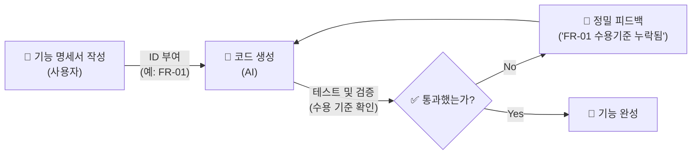

위 다이어그램은 식별자(ID)가 어떻게 추적성(Traceability)을 만들어내는지 보여줍니다. 명세서에 작성된 ID가 AI의 코드 생성 기준이 되고, 검증 단계에서 기준점이 되며, 오류 발생 시 피드백의 정확한 좌표가 되는 순환 구조를 확인할 수 있습니다.

---


### 🎨 추가 시각화 (Visualization Packet)

**SDD (명세서 기반 개발) 워크플로우**

기분(Vibe) 코딩이 아닌, 명확한 요구사항을 기반으로 한 AI 협업 과정입니다.

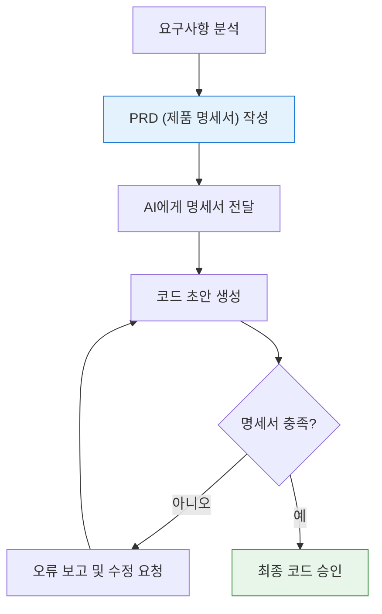

## §3. 상세 내용

### Why — 왜 기능 명세를 깐깐하게 써야 하는가?

기능 명세를 깐깐하게 쓰는 가장 큰 이유는 '추적성(Traceability)'을 확보하기 위해서예요. 바이브 코딩(Vibe Coding)처럼 대충 느낌대로 지시하면 코드는 금방 나오지만, 나중에 버그가 터졌을 때 어디서부터 잘못됐는지 추적할 방법이 없습니다. 기능 요구사항(FR)에 번호를 매기고 명확한 기준을 적어두면, 요구사항 문서를 기준으로 코드가 정확히 구현되었는지 하나하나 대조하며 테스트할 수 있어요. 기획의 틈새를 없애는 가장 확실한 방법입니다.

### What — 기능 명세의 3대 요소

기능 요구사항을 작성할 때는 반드시 다음 세 가지 요소를 포함해야 합니다.

1. **고유 식별자 (ID)**: 
   기능 요구사항은 FR(Functional Requirements)로 시작하고, 비기능 요구사항은 NFR(Non-Functional Requirements)로 시작합니다. 뒤에 숫자를 붙여 FR-001, FR-002 식으로 고유 번호를 부여합니다.
2. **명확한 기능 설명**: 
   이 기능이 무엇을 하는지 한 문장으로 간결하게 적습니다. 누가, 무엇을, 어떻게 하는지가 잘 드러나야 합니다.
3. **수용 기준 (Acceptance Criteria)**: 
   이 기능이 '제대로 동작한다'고 판단할 수 있는 구체적인 합격선입니다. 테스트의 기준이 되기 때문에 가장 중요한 항목이에요. 예외 상황(에러)이 발생했을 때 프로그램이 어떻게 대처해야 하는지도 여기에 적습니다.

비기능 요구사항(NFR)은 기능이 '무엇을' 하는지가 아니라 '어떻게' 동작해야 하는지, 즉 성능이나 보안, 기술적 제약 조건을 적는 공간입니다. "외부 패키지를 쓰지 않고 파이썬 내장 라이브러리만 사용한다" 같은 제약 사항이 대표적입니다.

### How — 마크다운 표로 깔끔하게 정리하기

이 요소들을 가장 효과적으로 표현하는 방법은 표(Table) 형태입니다. 줄글로 길게 늘어쓰는 것보다 항목별로 딱딱 끊어서 표로 만들어주면, 사람도 읽기 편하고 AI도 데이터 구조를 훨씬 빠르고 정확하게 파악합니다. 마크다운 문법으로 표를 그리면 텍스트 기반 환경에서도 아주 깔끔한 명세서를 만들 수 있어요. (§5에서 실제 예시를 확인합니다.)

---

## §4. 실습 가이드 (+ 🎙️ 실습 대본)

### 실습 목표

수강생들이 직접 고유 ID, 기능 설명, 수용 기준이라는 3요소를 갖춘 FR 양식을 작성해 봅니다. 일상적인 요구사항을 정밀한 명세서 언어로 번역하는 감각을 익히는 것이 핵심입니다.

🎙️ **실습 가이드 대본 (Lab Guide)**:

> 이제 여러분이 직접 기능 명세를 하나 작성해 볼 텐데요. 우리가 만들 '고객 정보 관리 프로그램'의 첫 번째 기능, 바로 '고객 등록' 기능을 명세서로 써볼 겁니다.
> 
> 연습장이나 메모장을 열어주세요. 표를 그릴 필요는 없고 항목만 순서대로 적어보세요. 
> 첫째, ID를 달아주세요. FR-001이 좋겠네요.
> 둘째, 기능명을 짧게 적고, 그 옆에 기능 설명을 한 문장으로 써보세요.
> 셋째, 가장 중요한 '수용 기준'을 적어보세요. 정상적으로 등록될 때의 기준도 좋지만, 똑같은 전화번호를 가진 사람이 또 등록하려고 할 때 프로그램이 어떻게 행동해야 할지 예외 상황의 기준도 꼭 포함해 보세요.
>
> 3분 드리겠습니다. 시작!

### 단계별 지시

| 단계 | 소요 시간 | 강사 지시사항 | 학습자 액션 | 예상 결과 |
|------|----------|--------------|------------|----------|
| 1 | 1분 | "고객 등록 기능을 FR 양식으로 쪼개서 생각해보세요" | 빈 노트 준비 | 실습 세팅 |
| 2 | 3분 | "ID, 기능설명, 수용기준 세 항목을 직접 작성합니다" | 메모장에 FR-001 작성 | 초안 완성 |
| 3 | 3분 | "옆 분과 서로 작성한 수용기준을 바꿔서 읽어보세요" | 짝과 결과물 비교 | 내가 놓친 엣지케이스 발견 |
| 4 | 3분 | 모범 답안 제시 및 차이점 해설 | 모범 답안과 내 것 비교 | 수용기준의 구체성 체감 |

### 트러블슈팅 FAQ

| Q | A |
|---|---|
| 수용 기준을 어떻게 적어야 할지 막막해합니다 | "내가 테스터라고 상상해 보세요. 개발자가 코드를 짜왔을 때, 이 프로그램이 합격인지 불합격인지 도장을 찍어줄 명확한 채점 기준표를 만든다고 생각하면 쉽습니다"라고 조언해 주세요. |
| 기능 설명과 수용 기준의 내용을 중복해서 적습니다 | 기능 설명은 '목적(What)'이고, 수용 기준은 '결과 검증(Check)'입니다. 설명에는 "이름과 연락처를 저장한다"로 충분하고, 수용 기준에는 "저장 성공 시 '등록 완료' 메시지가 출력된다"처럼 눈에 보이는 결과물을 적게끔 교정해 줍니다. |

---


### 🎓 강사 노트 (Instructor Support)

- ⏱️ **타이밍**: 15:35 (25분, code)
- 🎯 **핵심 활동**: FR-001 등 식별자 부여
- ⚠️ **강사 주의사항**: 템플릿 배포 후 함께 작성

## §5. 코드 및 명령어 모음

실제 PRD 문서에 들어가는 기능 요구사항(FR)과 비기능 요구사항(NFR)의 마크다운 표 예시입니다. 이 표 양식을 그대로 복사해서 나중에 프롬프트 컨텍스트로 제공할 거예요.

```markdown
## 3. 기능 요구사항 (Functional Requirements)

| ID | 기능명 | 설명 | 수용 기준 (Acceptance Criteria) | 우선순위 |
|---|---|---|---|---|
| FR-001 | 신규 고객 등록 | 이름과 전화번호를 입력받아 고객 리스트에 저장한다 | 1. 전화번호 중복 시 "이미 등록된 번호입니다" 경고 메시지 출력<br>2. 정상 저장 시 "고객이 등록되었습니다" 안내 출력 | High |
| FR-002 | 고객 목록 조회 | 저장된 전체 고객의 이름과 전화번호를 출력한다 | 1. 등록된 고객이 0명일 경우 "등록된 고객이 없습니다" 출력<br>2. 리스트는 가입 순서대로 번호를 매겨서 정렬 출력 | High |
| FR-003 | 고객 정보 수정 | 이름으로 검색 후 기존 전화번호를 새로운 번호로 변경한다 | 1. 존재하지 않는 이름 입력 시 안내 메시지 출력<br>2. 동명이인이 있을 경우 리스트를 보여주고 선택하게 함 | Medium |
| FR-004 | 고객 정보 삭제 | 이름으로 검색 후 해당 고객 데이터를 리스트에서 완전히 제거한다 | 1. 삭제 전 "정말 삭제하시겠습니까? (Y/N)" 확인 메시지 출력<br>2. Y 입력 시에만 삭제 처리 | Medium |

## 4. 비기능 요구사항 (Non-Functional Requirements)

| ID | 항목 | 설명 |
|---|---|---|
| NFR-001 | 기술 제약 | 외부 패키지 설치 없이 파이썬 3.10 이상의 내장 라이브러리만 사용한다 |
| NFR-002 | 사용성 (UI) | 그래픽 창 없이 텍스트 기반의 콘솔(터미널) 인터페이스로 동작한다 |
```

---

## §6. 요약

### 핵심 학습 포인트

이번 세션의 핵심은 명확함과 추적성입니다. 첫째, 모든 기능에 도서관 청구기호처럼 고유한 ID(FR-001)를 달아주세요. 둘째, AI에게 코드를 지시하고 평가하는 가장 강력한 기준점이 바로 '수용 기준(Acceptance Criteria)'입니다. 셋째, 이 내용들을 줄글이 아닌 마크다운 표 형태로 깔끔하게 정리해 두면 AI가 훨씬 빠르고 정확하게 여러분의 의도를 파악합니다.

### 다음 세션 예고

이제 각 기능들이 어떻게 구성되는지 엑셀 표처럼 정리하는 법을 알았어요. 그런데 사용자는 표를 보고 프로그램을 쓰지 않죠. 메뉴를 고르고, 글씨를 입력하고, 결과를 확인하며 '흐름'을 탑니다. 다음 세션에서는 이 흐름을 문서화하는 '사용자 시나리오'와 프로그램의 '성능 지표'를 정의하는 방법을 배울 차례입니다.

### 브릿지 노트

> "건축물로 치면 지금 우리는 설계도면의 부품 명세서를 꼼꼼하게 작성한 겁니다. 나사 몇 개, 철근 몇 개 들어가는지 다 적었어요. 그런데 이 부품들을 조립해서 사람들이 실제로 어떻게 복도를 걸어 다니고 문을 열고 들어가는지 동선도 짜야겠죠? 바로 다음 시간에 이 동선을 시나리오로 만들어보겠습니다."

---

## §7. 참고 자료

### 3-Source 출처

- **Source A (로컬 참고자료)**: `7 기획.pdf` (§7.3 PRD 구조) — 기능 요구사항(FR)과 비기능 요구사항(NFR) 식별자 체계 및 마크다운 표 기반의 PRD 작성 템플릿의 원전입니다.
- **Source B (NotebookLM)**: NotebookLM 분석 리포트 — 명세 주도 개발(SDD) 환경에서 AI에게 코드 생성을 지시할 때, 수용 기준(Acceptance Criteria)이 테스트의 기준점이 된다는 핵심 개념을 가져왔습니다.
- **Source C (Deep Research)**: Deep Research 보고서 — 추적성(Traceability) 개념을 바탕으로, 고유 ID 부여가 AI 피드백 루프를 정밀하게 만들어준다는 업계의 실제 적용 사례를 보강했습니다.

### 강사 노트

> 💡 **강사 노트**: 수강생들이 처음 PRD를 작성할 때 가장 어려워하는 부분이 바로 '수용 기준'을 도출하는 것입니다. 이때 "정상 작동할 때뿐만 아니라, 사용자가 엉뚱한 짓을 했을 때(예외 상황) 프로그램이 안 죽고 어떻게 버틸 것인가?"를 고민하게 만드는 것이 핵심입니다. 프롬프트 엔지니어링 강의에서 배웠던 '예외 처리' 항목이 PRD에서는 '수용 기준'으로 연결됨을 짚어주면 아주 좋습니다.

---

## ✅ 세션 완료 체크리스트 (강사용)

- [ ] §1~§7 모든 섹션이 충실하게 작성되었는가?
- [ ] 도서관 청구기호 등 직관적인 비유가 포함되었는가?
- [ ] FR/NFR 식별자 체계와 수용 기준의 중요성이 강조되었는가?
- [ ] 마크다운 표 기반의 실제 예시가 제공되었는가?
- [ ] 3-Source 팩트 패킷 내용이 충실히 반영되었는가?

---

*작성 일시: 2026-02-25*  
*작성 에이전트: A4B_Session_Writer*  
*교안 구조: 7섹션 (A0 팀 공통 표준)*

> 🔗 **이전 세션**: [세션 035: PRD(Product Requirements Document)란 무엇인가?](#세션-035)에서 배운 내용을 이어갑니다.
> 🔗 **다음 세션**: [세션 037: 사용자 시나리오와 성공 지표 정의](#세션-037)에서 계속됩니다.

---

### 세션 037: 사용자 시나리오와 성공 지표 정의
> [원본 파일](sessions/세션-037-사용자_시나리오와_성공_지표_정의_v2.1.md) | ⏱️ 20분 | 📖 narrative | 난이도: medium

> **세션 ID**: MS-PY101-037
> **소요 시간**: 20분
> **난이도**: low
> **청크 타입**: narrative
> **버전**: v2.1 (7섹션 구조)

---

## §1. 개요

> **Day 2 | PM | 세션 037/043**

이번 세션은 지난 시간에 정리한 딱딱한 기능 명세서(FR)에 생명력을 불어넣는 시간이에요. 우리가 정리했던 "신규 고객 등록", "목록 조회" 같은 기능들을 실제 사람이 어떻게 순서대로 경험하는지, 그리고 이 프로그램이 최종적으로 어떤 조건을 만족해야 '성공'인지 선을 긋는 방법을 배웁니다. AI에게 이 두 가지만 잘 넘겨줘도, 훨씬 친절하고 맥락에 맞는 훌륭한 프로그램이 탄생합니다.

### 🎯 학습 목표

이 세션이 끝나면 수강생은 다음을 할 수 있어요:

- 기능 나열을 넘어 사용자의 시간 순서에 따른 경험 흐름(시나리오)을 서술할 수 있습니다
- AI가 맥락을 이해하고 자연스러운 UI 흐름을 짤 수 있도록 행동 맥락을 제공할 수 있습니다
- 프로그램이 완성되었다고 판단할 수 있는 측정 가능하고 구체적인 성공 지표를 정의할 수 있습니다

### 선행 세션 환기

지난 세션에서 우리는 PRD의 핵심 구조와 기능 명세(FR)를 식별자(ID)와 함께 작성하는 법을 배웠어요. FR-001(고객 등록), FR-002(고객 조회)처럼 레고 블록 같은 기능 부품들을 만들어둔 상태입니다. 이제 이 부품들을 조립해서 실제 사람이 어떻게 사용하는지 이야기로 풀어낼 차례입니다.

---

## §2. 핵심 개념 (+ 🗣️ 강사 대본 + Mermaid)

### 조립되지 않은 부품과 영화 스토리보드 비유

아무리 좋은 부속품을 늘어놓아도, 그것들이 어떤 순서로 조립되어 쓰이는지 모르면 무용지물이에요. 소매, 단추, 지퍼, 안감 같은 옷의 부속품을 완벽하게 준비했다고 해서 바로 멋진 재킷이 되는 건 아니죠. 사람이 팔을 먼저 넣고 지퍼를 올리는 과정, 즉 '입어보는 과정'이 있어야 진짜 옷이 완성됩니다. 소프트웨어도 마찬가지로, 기능 목록만으로는 이 프로그램이 실제로 어떻게 굴러가는지 감을 잡기 어렵습니다.

🗣️ **강사 대본 (Instructor Script)**:

> 여러분, 지난 시간에 우리가 만든 기능 명세서를 한 번 보세요. 단추, 지퍼, 옷감처럼 아주 잘 정리가 되어 있습니다. 그런데 만약 AI에게 "이 부품들로 옷을 만들어줘"라고만 하면 어떻게 될까요? 운이 좋으면 재킷이 나오겠지만, 지퍼가 등 뒤에 달리거나 단추가 소매 끝에 달린 이상한 옷이 나올 수도 있어요.
>
> 왜 그럴까요? AI는 부품의 이름은 알지만, 사람이 그 옷을 '어떻게 입는지'에 대한 맥락(Context)을 모르기 때문이에요.
>
> 영화감독이 촬영에 들어가기 전에 가장 먼저 하는 일이 뭔지 아시나요? 대본을 쓰기 전에 스토리보드를 그립니다. "주인공이 문을 열고 들어온다 → 테이블 위 편지를 발견한다 → 놀란다 → 전화를 건다" 이렇게 시간 순서대로 주인공의 행동과 카메라의 시선을 그려두는 거예요. 이 스토리보드 하나만 있으면 조명 감독도, 배우도 머릿속에 완벽히 똑같은 장면을 상상할 수 있죠.
>
> 우리가 오늘 배울 '사용자 시나리오'가 바로 이 스토리보드입니다. 프로그램이 켜지고 꺼질 때까지, 사용자가 어떤 순서로 클릭하고 무슨 메시지를 보는지 시간 순서대로 적어 내려가는 거예요. "사용자가 1번을 누른다"를 넘어서, "빵집 사장님 김씨가 오늘 새로 온 단골의 연락처를 저장하려고 1번 메뉴를 누른다"라고 적어주세요. 
>
> 이 시나리오를 AI에게 읽혀주는 순간, 놀라운 마법이 벌어집니다. AI가 "아, 빵집 사장님이 바쁜 와중에 쓰는 거구나?"라고 이해하고, 안내 문구나 메뉴의 흐름을 훨씬 친절하게 알아서 짜줍니다. 기계적인 기능 나열을 넘어서 인간의 행동 맥락을 제공하는 것, 이게 바로 시나리오의 힘입니다.

### Mermaid 다이어그램

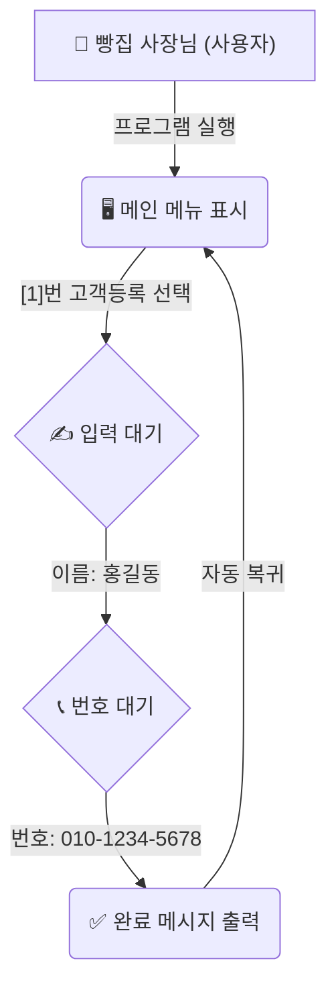

이 다이어그램은 사용자가 콘솔 프로그램과 상호작용하는 시간적 흐름을 보여줍니다. 기계적인 기능 목록이 아니라, 사용자가 무엇을 보고 어떻게 행동하는지 한 편의 짧은 연극 대본처럼 흘러가는 구조를 이해하는 것이 중요해요.

---

## §3. 상세 내용

### Why — 왜 기능 명세 외에 시나리오와 지표가 필요한가?

기능 명세(FR)가 "무엇을 할 수 있는가"의 목록이라면, 사용자 시나리오는 "어떤 순서로 하는가"의 대본이에요. 명세서만 던져주고 코드를 짜라고 하면, 개발자나 AI는 기능을 각자 독립된 섬처럼 만들어버리기 십상입니다. 화면 이동이 뚝뚝 끊기거나, 에러 메시지가 불친절하게 튀어나올 수 있죠. 하지만 시나리오가 있으면, 프로그램 전체가 하나의 물 흐르듯 자연스러운 경험으로 이어집니다. 

또한 성공 지표는 프로젝트가 끝없이 늘어나는 '범위 이탈(Scope Creep)'을 막아주는 안전장치예요. 막연하게 "잘 돌아가면 끝"이 아니라, "없는 고객을 검색했을 때 프로그램이 뻗지 않고 안내 문구가 나온다"처럼 구체적인 선을 그어주어야 합니다. 결승선이 명확해야 AI도, 여러분도 "여기까지 하면 이 프로젝트는 성공이다"라고 선언하고 홀가분하게 마무리할 수 있습니다.

### What — 사용자 시나리오와 성공 지표의 정의

사용자 시나리오(User Scenario)는 사용자가 특정한 목적을 달성하기 위해 시스템과 상호작용하는 과정을 시간 순서대로 구체적으로 서술한 이야기입니다. 핵심은 '시간의 흐름'과 '구체적인 인물의 행동'입니다.

성공 지표(Success Metrics)는 이 소프트웨어가 완성되었다고 판단할 수 있는 측정 가능하고 객관적인 기준입니다. "버그가 없다" 같은 모호한 표현 대신, "CRUD(생성, 조회, 수정, 삭제) 4가지 기능이 모두 정상 동작하고, 숫자를 입력해야 할 곳에 문자를 넣어도 프로그램이 다운되지 않는다"처럼 명확하게 작성합니다.

### How — 시나리오가 AI에게 미치는 마법 같은 효과

AI에게 이 시나리오를 단순히 첨부하기만 해도 결과물의 질이 하늘과 땅 차이로 벌어집니다. 예를 들어 단골 고객을 관리하는 카페 사장님의 상황을 시나리오로 써서 AI에게 주면, AI는 콘솔의 출력 메시지를 "데이터가 삽입되었습니다" 같은 기계적 말투가 아니라 "새로운 단골 고객이 성공적으로 등록되었습니다"처럼 따뜻하고 맥락에 맞는 언어로 바꿔서 코드를 생성합니다. 

인간의 행동 맥락을 이해한 AI는 사용자가 실수할 법한 구간(예: 메뉴 번호 대신 이상한 글자를 치는 경우)을 스스로 예측하고, 시나리오의 흐름이 끊기지 않도록 예외 처리 코드를 알아서 보강해 주기도 합니다. 

---

## §4. 실습 가이드 (+ 🎙️ 실습 대본)

### 실습 목표

수강생들은 지난 세션에서 도출한 기능 명세(FR) 중 '고객 등록' 기능을 골라, 실제 빵집 사장님이 프로그램을 사용하는 구체적인 시나리오와 프로젝트 성공 지표를 직접 서술해 봅니다.

🎙️ **실습 가이드 대본 (Lab Guide)**:

> 자, 이제 여러분이 영화감독이 될 차례입니다. 우리가 5일 동안 만들 '고객 정보 관리 프로그램'의 첫 번째 장면을 머릿속으로 그려보세요. 
>
> 주인공은 동네 빵집을 운영하는 김 사장님입니다. 오늘 정말 빵을 많이 사간 고마운 손님이 있어서, 연락처를 받아 단골로 등록하려고 합니다. 자, 화면에는 무엇이 떠 있나요? 사장님이 키보드로 몇 번을 누르나요? 그다음엔 어떤 안내문이 나오죠? 
>
> 기능 명세서 보면서 딱딱하게 쓰지 마시고, 소설 쓰듯이 쭉쭉 적어 내려가 보세요. 5분 드리겠습니다. 다 쓰신 후에는, 우리 프로젝트가 '이 정도면 완성이다!'라고 외칠 수 있는 성공 지표도 딱 세 가지만 적어볼게요. 

### 단계별 지시

| 단계 | 소요 시간 | 강사 지시사항 | 학습자 액션 | 예상 결과 |
|------|----------|--------------|------------|----------|
| 1 | 5분 | "고객 등록 과정을 시간 순서대로 소설처럼 써보세요." | 시나리오 작성 | 인간의 행동 맥락이 담긴 서술형 시나리오 도출 |
| 2 | 3분 | "프로그램이 완성되었다는 기준(성능 지표)을 세 가지 적어보세요." | 성공 지표 작성 | 구체적인 결승선(예: 예외 처리 조건 등) 정의 |
| 3 | 5분 | 2~3명의 수강생 시나리오 발표 및 피드백 | 결과물 공유 | 디테일한 흐름과 화면 UI 상상력 극대화 |
| 4 | 2분 | AI에게 시나리오를 주었을 때의 차이점 설명 | 경청 및 메모 | 시나리오의 중요성(컨텍스트 제공) 공감 |

### 트러블슈팅 FAQ

| Q | A |
|---|---|
| 시나리오를 너무 기능적으로만 적어요 (예: "1번 누름. 홍길동 입력. 저장됨") | "조금 더 생생하게 적어볼까요? 화면에 '이름을 입력하세요:'라고 친절하게 뜨나요, 아니면 그냥 커서만 깜빡이나요? 사장님이 입력하고 났을 때 어떤 기분 좋은 완료 메시지가 뜨면 좋을지 적어보세요." |
| 성공 지표를 "잘 돌아가면 성공"이라고 적었어요 | "잘 돌아간다는 건 사람마다 기준이 다릅니다. '메뉴에 없는 9번을 눌러도 에러가 나면서 꺼지지 않고, 다시 번호를 입력하라고 친절하게 알려준다'처럼 눈으로 확인할 수 있는 구체적인 현상을 적어주세요." |
| 비전공자라 프로그램이 다운된다(Crash)는 개념을 잘 몰라요 | "게임하다가 갑자기 바탕화면으로 튕겨나가는 경험 해보셨죠? 그게 바로 크래시입니다. 우리가 만든 프로그램도 숫자를 넣으라는데 글자를 넣으면 튕길 수 있어요. 안 튕기고 버티는 걸 성공 지표로 삼아보는 겁니다." |

> ✅ **체크포인트**: 시나리오만 읽어도 프로그램이 어떻게 동작할지 눈앞에 생생하게 그려지나요?

---


### 🎓 강사 노트 (Instructor Support)

- ⏱️ **타이밍**: 16:10 (20분, narrative)
- 🎯 **핵심 활동**: 시간 흐름 기반 시나리오 작성
- ⚠️ **강사 주의사항**: User Story 포맷 시연

## §5. 코드 및 명령어 모음 (해당 시)

이 세션에서는 직접 파이썬 코드를 짜지 않지만, 다음 세션에서 AI에게 전달할 '시나리오 작성 템플릿'을 만들어둡니다. 여러분이 작성한 시나리오는 향후 프롬프트의 강력한 컨텍스트(Context)가 됩니다.

> 🤖 **AI 프롬프트 컨텍스트 예시 (사용자 시나리오 블록)**:

```text
[사용자 시나리오: 고객 등록]
1. 김씨가 터미널에서 프로그램을 실행한다.
2. 화면에 메인 메뉴가 명확하게 표시된다. [1. 고객 등록 / 2. 조회 / 3. 수정 / 4. 삭제 / 5. 종료]
3. 김씨가 1번을 입력하고 엔터를 친다.
4. '고객 이름을 입력하세요:'라는 친절한 안내가 뜬다. 김씨가 '홍길동'을 입력한다.
5. '전화번호를 입력하세요:'라는 안내가 뜬다. 김씨가 '010-1234-5678'을 입력한다.
6. '홍길동 고객이 성공적으로 등록되었습니다.'라는 완료 메시지가 뜨고 2초 뒤 메인 메뉴로 돌아온다.

[성공 지표]
1. CRUD 4가지 핵심 기능이 모두 에러 없이 정상 동작한다.
2. 존재하지 않는 고객을 검색하면 "해당 고객이 없습니다"라는 안내 메시지가 출력된다.
3. 메뉴 번호 입력란에 한글이나 기호를 입력해도 프로그램이 종료되지 않고 다시 메뉴를 보여준다.
```

---

## §6. 요약

### 핵심 학습 포인트

세 가지를 꼭 기억해 주세요. 첫째, 사용자 시나리오는 프로그램의 스토리보드입니다. 기능 목록이 "무엇을" 만들지 알려준다면, 시나리오는 "어떤 순서로" 굴러가는지를 알려줍니다. 둘째, 성공 지표는 프로젝트의 명확한 결승선입니다. 끝없이 요구사항이 늘어나는 것을 막아주고 완성을 선언할 수 있게 해줍니다. 셋째, AI에게 이런 인간의 행동 맥락을 풍부하게 제공하면, 단순히 작동만 하는 코드가 아니라 사람을 배려하는 따뜻하고 매끄러운 프로그램 코드를 짜줍니다.

### 다음 세션 예고

이제 PRD를 구성하는 모든 부품이 모였습니다. 개요, 문제 정의, 기능 명세, 그리고 오늘 배운 시나리오와 성공 지표까지요. 다음 세션에서는 이 모든 조각들을 하나로 합쳐서, 우리의 고객 정보 관리 프로그램 PRD 스펙을 완벽하게 마크다운 문서로 완성해 보겠습니다.

### 브릿지 노트

> "영화감독의 스토리보드 훈련, 어떠셨나요? 머릿속에 우리가 만들 프로그램의 모습이 꽤 선명하게 그려지기 시작했을 겁니다. 이제 흩어져 있는 이 멋진 아이디어들을 하나의 공식적인 문서로 깔끔하게 묶어낼 시간이에요. 다음 시간엔 이 모든 걸 조립해서 진짜 PRD를 완성해 봅시다."

---

## §7. 참고 자료

### 3-Source 출처

- **Source A (로컬 참고자료)**: `7 기획.pdf` (§7.4 사용자 시나리오 작성법) — 시나리오 작성법과 성공 지표 정의 방법론의 이론적 기반.
- **Source B (NotebookLM)**: `AI 시대의 서사 v3 - Claude.md` (§문제 정의 vs 문제 해결) — 기계적 나열을 넘어 인간의 행동 맥락(Context)을 전달해야 AI가 훌륭한 UI/UX 흐름을 만든다는 철학 반영.
- **Source C (Deep Research)**: Deep Research 보고서 — 성공 지표와 경계값 테스트(예외 입력 처리)의 실전 적용 사례 및 '범위 이탈(Scope Creep)' 방어 효과 분석.

### 강사 노트

> 💡 **강사 노트**: 본 세션은 수강생들이 단순한 기능의 나열과 실제 사용자의 경험이 얼마나 다른지 체감하게 하는 것이 핵심입니다. 스토리보드나 옷의 부속품 비유를 최대한 구체적으로 활용해 주세요. 비전공자일수록 '프로그램이 다운된다(Crash)'는 개념에 익숙하지 않으므로, 게임이 튕기는 현상 등에 빗대어 예외 처리의 중요성과 이를 성공 지표에 포함하는 이유를 설명하면 좋습니다.

---

## ✅ 세션 완료 체크리스트 (강사용)

- [ ] §1~§7 모든 섹션이 충실하게 서술형으로 작성되었는가?
- [ ] 조립되지 않은 옷의 부속품과 영화 스토리보드 비유가 포함되었는가?
- [ ] 시나리오 작성과 성공 지표 정의 실습이 원활하게 진행되었는가?
- [ ] AI에게 시나리오를 주었을 때 UI 품질이 올라간다는 점이 강조되었는가?
- [ ] 3-Source 팩트 패킷 내용이 정확히 반영되었는가?

---

*작성 일시: 2026-02-25*  
*작성 에이전트: A4B_Session_Writer*  
*교안 구조: 7섹션 (A0 팀 공통 표준)*


> 🔗 **이전 세션**: [세션 036: PRD의 핵심 구조와 기능 명세(FR) 작성법](#세션-036)에서 배운 내용을 이어갑니다.
> 🔗 **다음 세션**: [세션 038: 고객 정보 관리 프로그램 PRD 완성하기](#세션-038)에서 계속됩니다.

---

### 세션 038: 고객 정보 관리 프로그램 PRD 완성하기
> [원본 파일](sessions/세션-038-고객_정보_관리_프로그램_PRD_완성하기_v2.1.md) | ⏱️ 25분 | 🧪 lab | 난이도: medium

> **세션 ID**: MS-PY101-038  
> **소요 시간**: 25분  
> **난이도**: medium  
> **청크 타입**: lab  
> **버전**: v2.1 (7섹션 구조)

---

## §1. 개요

> **Day 2 | PM | 세션 038/043**

### 🎯 학습 목표

이 세션이 끝나면, 수강생은 다음을 할 수 있습니다:

- 앞선 세션에서 배운 5W1H, 기능/비기능 명세(FR/NFR), 사용자 시나리오를 통합하여 하나의 완결된 요구사항 정의서(PRD)를 작성할 수 있다.
- AI 에이전트를 '전문 편집장'으로 활용하여 파편화된 기획 메모를 체계적으로 구조화된 마크다운 문서로 변환할 수 있다.
- 단순한 메모와 명확한 수용 기준(Acceptance Criteria)이 명시된 요구사항의 질적인 차이를 구별할 수 있다.
- 완성된 PRD 문서가 향후 코드 생성을 완벽하게 통제하는 강력한 '마스터 프롬프트'의 핵심 컨텍스트로 작동함을 이해한다.

### 선행 세션 환기

지난 4개의 세션 동안 우리는 튼튼한 집을 짓기 위한 기초 공사를 해왔습니다. 세션 032에서는 5W1H 기법으로 막연한 아이디어를 구체적인 요구사항으로 분석했죠. 세션 035에서는 기획서가 갖춰야 할 PRD 7섹션의 뼈대를 배웠습니다. 이어서 세션 036과 037을 통해 기능 명세(FR)에 꼬리표 같은 고유 식별자를 붙이고, 사용자가 실제로 경험할 시나리오와 성공 지표까지 꼼꼼하게 정의했습니다. 

지금까지는 좋은 집을 짓기 위해 각자의 위치에서 벽돌을 구워내는 시간이었습니다. 이제는 이 벽돌들을 한데 모아 조립하고 시멘트를 발라, 흔들리지 않는 완벽한 '건축 설계도'를 최종 완성할 차례입니다.

---

## §2. 핵심 개념 (+ 🗣️ 강사 대본 + Mermaid)

### AI는 여러분 전속 "수석 편집장"입니다

여러분이 방대한 판타지 소설을 기획하는 작가라고 상상해 보세요. 머릿속에는 엄청나게 매력적인 캐릭터 설정, 이리저리 흩어진 줄거리 메모, 극적인 반전 아이디어가 가득합니다. 하지만 냅킨이나 수첩에 갈겨쓴 이 메모들을 그대로 묶어서 출판사 사장님께 보낼 수는 없죠. 이때 꼭 필요한 파트너가 바로 유능한 '수석 편집장'입니다. 

여러분(작가)이 거친 메모를 툭 던져주면, AI(편집장)는 그것을 출판사 공식 양식에 맞춰 목차를 잡고, 1장과 2장을 매끄럽게 나누고, 앞뒤가 안 맞는 복선을 지적해 줍니다. 그리고 아주 깔끔하게 제본된 '완성 원고 초안'을 돌려주죠. 작가인 여러분은 그 원고를 쭉 읽어보면서 "아, 주인공 성격을 좀 더 까칠하게 바꿔줘", "여기 결말 시나리오는 조금 어색하네"라며 최종 검수만 하면 됩니다. 

AI에게 기획서를 써달라고 부탁할 때, "아무거나 멋진 거 하나 만들어줘"라고 하는 것은 제일 나쁜 방법입니다. 대신 "내가 넘겨주는 5W1H 메모와 기능 목록을 바탕으로, 반드시 7섹션 양식에 정확히 맞춰서 정리해 와"라고 엄격한 제약을 걸어야 합니다. 그래야 AI가 멋대로 소설을 쓰는 일(환각 현상)을 막을 수 있습니다.

🗣️ **강사 대본 (Instructor Script)**:

> 드디어 실전입니다, 여러분! 며칠 동안 우리가 PRD가 뭔지, 기능 명세는 어떻게 쓰는지 하나씩 차근차근 배워왔잖아요? 이제 이 모든 부품을 한 테이블 위에 모아놓고 꽉 조립할 시간이에요. 
>
> 오늘의 목표는 아주 명확합니다. 우리가 계속 고민해온 "카페 고객 정보 관리 프로그램"의 궁극적인 마스터 문서, 완전한 PRD를 처음부터 끝까지 완성하는 겁니다. 이 복잡한 문서를 혼자서 빈 화면만 쳐다보며 끙끙댈 필요가 전혀 없어요. 여러분 옆에는 방금 제가 말씀드린 아주 유능한 '수석 편집장' AI가 이미 대기하고 있습니다. 
>
> 여러분이 할 일은 앞서 끄적여두었던 메모들을 싹 모아서 AI에게 넘겨주고, "이 양식에 맞춰서 깔끔하게 정리해 와"라고 당당하게 지시하는 거예요. 그리고 AI가 뚝딱 가져온 문서를 보면서 수용 기준이 정확한지, 시나리오가 자연스러운지 편집자의 날카로운 눈으로 깐깐하게 검수하는 겁니다. 자, 여러분만의 비서에게 첫 업무 지시를 내릴 준비 되셨나요?

> 💡 **강사 노트**: 소설가와 편집장 비유는 기획(인간)과 구조화(AI)의 역할을 명확히 분리해 줍니다. 수강생들이 직접 복잡한 마크다운 표를 손으로 하나하나 타이핑해야 한다는 막연한 두려움을 덜어주세요. AI를 단순한 검색기가 아니라 내 비서로 적극 활용하는 명세 주도 개발(SDD)의 마인드셋을 심어주는 것이 가장 중요합니다.

### Mermaid 다이어그램: PRD 작성 워크플로
이 비유를 통해 명세 주도 개발(SDD)의 진수를 경험하게 됩니다. 코딩의 패러다임이 '직접 한 땀 한 땀 코드를 짜는 것'에서 '완벽한 기획서를 쓰고 AI에게 코딩을 맡기는 것'으로 넘어가는 순간입니다.


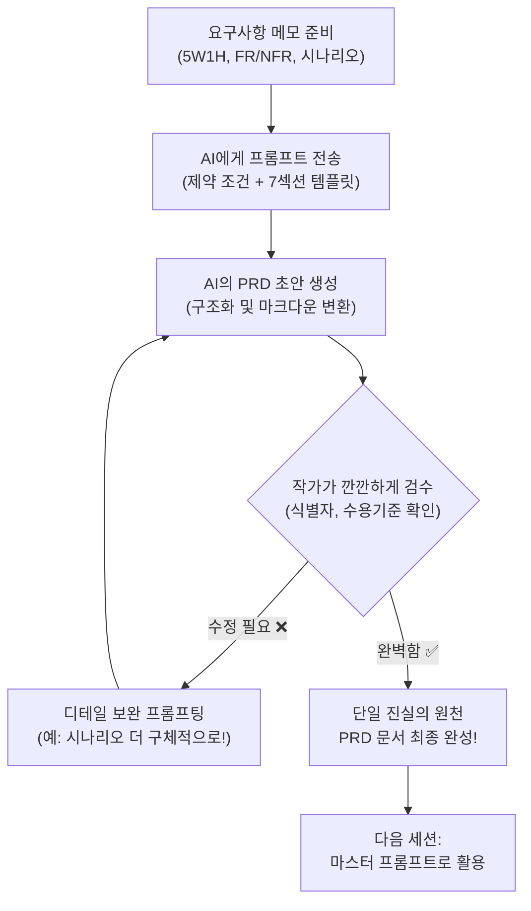

---

## §3. 상세 내용

### Why — 왜 PRD를 이렇게까지 완전한 형태로 만들어야 하는가?

"선생님, 그냥 대충 '고객 관리 프로그램 하나 만들어줘' 하고 바로 코딩 시작하면 안 되나요?"라고 질문하실 수 있어요. 혼자서 1시간 만에 뚝딱 만들고 버릴 일회용 장난감 프로그램이라면 그렇게 해도 괜찮습니다. 하지만 제대로 작동하는 진짜 프로젝트에서는 이 PRD 문서가 반드시 **단일 진실의 원천(Single Source of Truth)**이 되어야 합니다.

팀 프로젝트를 한다고 생각해 볼까요? 기획자, 개발자, 디자이너, 그리고 우리를 도와줄 AI까지 모두가 오직 이 문서 딱 하나만 보고 작업을 진행합니다. 개발을 하다가 "어? 전화번호를 숫자가 아니라 한글로 치면 어떻게 반응해야 하죠?"라는 의문이 생길 수 있습니다. 그때마다 사람에게 물어보는 게 아니라 언제나 이 PRD 문서로 돌아와서 답을 찾습니다. 문서에 명시된 규칙이 곧 법칙이 되는 것이죠. 

특히 우리가 배우고 있는 AI 코딩 시대에는, 이 완성된 PRD 자체가 AI에게 코드를 뽑아내라고 지시하는 가장 강력한 '마스터 프롬프트'로 통째로 들어갑니다. 기획서 문서의 완성도가 떨어지면 AI가 엉뚱한 상상을 해서 이상한 코드를 뱉어냅니다. 문서의 완성도가 곧 코드의 완성도(명세 주도 개발, SDD)로 직결된다는 사실을 잊지 마세요.

### What — 무엇을 융합하는가?

오늘 완성할 PRD 문서는 우리가 땀 흘려 배웠던 4가지 핵심 요소를 모두 융합한 결정체입니다.

1. **5W1H (세션 032)**: 프로그램의 타깃 사용자는 누구이고, 언제 어디서 왜 쓰는지에 대한 전반적인 배경 지식입니다.
단일 진실의 원천이 가지는 또 다른 강점은 '범위 이탈(Scope Creep)'을 막아준다는 것입니다. 개발을 하다 보면 "어, 이 기능도 넣으면 좋겠는데?", "이것도 있으면 편하지 않을까?" 하면서 프로그램이 점점 무거워지고 산으로 가는 경우가 많습니다. PRD는 7번째 섹션인 '범위 외 항목'을 통해 "이번 버전에서는 결제 기능이나 화려한 마우스 클릭 화면은 절대 만들지 않겠다"고 단호하게 선을 긋습니다. 이 선을 지키는 것이 제시간에 프로젝트를 완성하는 유일한 비결입니다.

2. **7섹션 구조 (세션 035)**: 개요부터 맨 마지막 범위 외 항목까지, 문서를 흔들림 없이 관통하는 단단한 뼈대입니다.
3. **FR/NFR 식별자 체계 (세션 036)**: 추적이 가능하도록 고유 번호를 붙이고, 성공과 실패를 가르는 명확한 수용 기준이 담긴 기능 명세입니다.
4. **사용자 시나리오와 성공 지표 (세션 037)**: 실제 프로그램 화면에서 사용자가 어떤 순서로 키보드를 누르고 반응을 얻는지 보여주는 구체적인 대본입니다.

이 4가지 요소가 하나의 마크다운 파일로 예쁘게 뭉쳐지면, AI는 여러분이 머릿속에 그리는 프로그램의 모습을 100% 오해 없이 완벽하게 이해하게 됩니다.

### 나쁜 예 vs 좋은 예 (명세 주도의 차이)

단일 진실의 원천이 될 수 없는 모호한 기획과, 완벽하게 구조화된 기획의 차이를 확인해 보세요.

**❌ 나쁜 예 (바이브 코딩식 메모)**:
> 고객 정보 저장하는 프로그램 만들어줘. 등록, 조회 다 돼야 하고 전화번호 꼭 받아.

**✅ 좋은 예 (SDD식 명세 - 기능 요구사항 표의 일부)**:
| 식별자 | 기능명 | 설명 | 수용 기준 (Acceptance Criteria) |
|---|---|---|---|
| FR-001 | 고객 등록 | 새로운 고객의 이름과 전화번호를 등록한다. | - 이름은 2자 이상 입력되어야 한다.<br>- 전화번호는 010-XXXX-XXXX 형식이어야 한다.<br>- 이미 존재하는 전화번호 입력 시 "중복된 번호입니다"를 출력한다. |

이러한 명확한 수용 기준이 모여 프로그램의 품질을 결정합니다.
### How — 어떻게 작성하는가? (CRUD 실전)

우리가 만들 프로그램은 복잡한 그래픽이 있는 앱이 아닙니다. 마우스 없이 키보드만 까맣게 치는 텍스트 콘솔 기반의 '소규모 카페 고객 정보 관리 프로그램'이에요. 여기에는 데이터 관리의 기본이자 핵심인 **CRUD**가 모두 포함되어야 합니다.

- **C**reate (등록): 처음 온 손님의 이름과 연락처를 새로 등록합니다.
- **R**ead (조회): 등록된 단골손님의 연락처나 쌓인 커피 포인트 내역을 조회합니다.
- **U**pdate (수정): 손님이 전화번호를 바꾸면 예전 번호를 지우고 새 번호로 수정합니다.
- **D**elete (삭제): 단골손님이 이사를 가서 더 이상 안 오면 정보를 깔끔하게 삭제합니다.

우리는 이 CRUD 구조를 기능 명세(FR) 표에 차곡차곡 담아 AI에게 구조화를 요청할 거예요. 그리고 시나리오 섹션을 통해 이 기능들이 텍스트 터미널 창에서 어떤 순서로 표시될지 구체적인 대본처럼 그려낼 것입니다.
이 네 가지 기능이 각각 어떻게 시작되고 끝나는지, 예외 상황에서는 어떤 에러 메시지가 나와야 하는지 꼼꼼하게 정의하는 것이 이번 실습의 관건입니다.

> ✅ **체크포인트**: 여기까지 이해했는지 스스로 가볍게 점검해 보세요.
> - 왜 메모를 코드 생성 창에 바로 넣지 않고 번거롭게 PRD로 먼저 완성해야 할까요? ("문서의 완성도가 곧 코드의 완성도이고, AI가 개발 도중에 길을 잃지 않게 꽉 잡아주는 단일 진실의 원천이기 때문입니다.")

---

**파이썬 콘솔 환경의 본질적 제약 사항**
우리가 개발하는 이 프로그램은 화려한 그래픽 인터페이스(GUI)를 가지지 않습니다. 오직 까만 화면(터미널)에 하얀 글씨만이 출력되는 전통적인 방식입니다. 따라서 기획 과정에서 다음과 같은 사항들이 철저히 고려되어야 합니다:
- 마우스 클릭 시나리오는 불가능합니다. "1번을 누르면 등록, 2번을 누르면 조회" 형태의 메뉴 선택(숫자 혹은 문자) 방식으로 구체화되어야 합니다.
- 오류 메시지 역시 알림창이 뜨는 것이 아니라 다음 줄에 텍스트로 `[ERROR] 유효하지 않은 입력입니다.`처럼 출력되게 설계되어야 합니다.
이런 제약을 먼저 인지하고 PRD를 작성하는 것이, "범위 이탈"을 막고 현실적인 설계도를 만드는 핵심 비결입니다.


### 📊 참고 표 (Visual Specs)

**PRD (제품 요구사항 정의서) 템플릿 요약**

| 항목 | 작성 내용 | 작성 예시 (고객관리 프로그램) |
|:---|:---|:---|

## §4. 실습 가이드 (+ 🎙️ 실습 대본)

### 실습 목표

이 실습을 통해 수강생은 앞서 정리한 파편화된 요구사항을 AI 에이전트에게 통째로 전달하여 7섹션 구조를 갖춘 카페 회원 관리 PRD를 단숨에 생성해냅니다. 그리고 누락된 기능 식별자나 어색한 시나리오를 피드백하여 문서를 최종적으로 완벽하게 다듬습니다.

🎙️ **실습 가이드 대본 (Lab Guide)**:

> 자, 드디어 편집장님을 호출할 시간입니다. 화면 오른쪽에 있는 Antigravity Agent Manager를 활짝 켜주세요.
>
> 여러분이 세션 034부터 037까지 끄적여두었던 요구사항 메모들 있죠? 완벽하고 예쁜 문장이 아니어도 전혀 상관없습니다. 키워드만 뚝뚝 끊어져 있어도 돼요. 그걸 마우스로 싹 긁어서 복사해 주세요. 만약 메모를 저장 안 해서 날아갔다면 당황하지 마시고 제 화면에 띄워둔 기본 재료를 그대로 가져다 쓰셔도 좋습니다.
>
> 이제 AI에게 아주 명확한 '제약 조건'을 걸어서 프롬프트를 쏠 겁니다. 그냥 대충 "나 카페 관리 프로그램 PRD 좀 써줘"라고 하는 게 아니에요. "이 7가지 항목을 반드시 포함하고, 기능 명세는 FR-001 형태로 꼭 마크다운 표를 만들어줘"라고 기계처럼 정확하게 지시할 거예요. 
>
> 엔터를 치고 출력된 결과를 보면서 "오, 그럴듯한데? 끝!" 하고 넘어가면 절대 안 됩니다. 진짜 편집자의 매서운 눈으로 식별자가 빠진 곳은 없는지, CRUD 중 삭제 기능이 은근슬쩍 빠지진 않았는지 집요하게 물고 늘어지며 문서를 보완해 보겠습니다. 자, 시작합시다!

### 단계별 지시 — PRD 실전 작성 워크플로

| 단계 | 소요 시간 | 강사 지시사항 | 학습자 액션 | 예상 결과 |
|------|----------|--------------|------------|----------|
| 1 | 5분 | "지금까지 작성한 요구사항 메모를 모아주세요" | 5W1H, CRUD 핵심 기능 메모 파일 열기 및 복사 대기 | 재료 텍스트 준비 완료 |
| 2 | 5분 | "AI에게 엄격한 제약 조건을 담아 프롬프트를 전송하세요" | §5의 'PRD 생성 프롬프트'를 복사하여 AI 채팅창에 전송 | 7섹션 구조를 갖춘 PRD 마크다운 초안 출력 |
| 3 | 10분 | "편집장의 매서운 눈으로 결과를 꼼꼼히 검수하세요" | FR/NFR 식별자 유무, 수용기준 명확성, 시나리오 흐름 확인 | 문서에서 부족하거나 수정할 부분 파악 |
| 4 | 5분 | "AI에게 구체적인 수정 피드백을 주어 문서를 보완하세요" | "FR-003 수정 기능의 수용 기준을 구체적으로 다시 써줘" 입력 | 완벽하게 다듬어진 최종 PRD 완성 |
| 5 | 5분 | "생성된 문서를 저장하고 자산화하세요" | 결과를 `.md` 파일로 바탕화면에 저장 | "나만의 마스터 프롬프트" 자산 확보 |

**[단계 1] 재료 준비하기**
지금까지 만들어둔 요구사항 초안을 한곳에 모읍니다. 프로그램명(카페 고객 정보 관리 프로그램), 대상(동네 소규모 카페 사장님), 핵심 기능(CRUD), 동작 환경(파이썬 텍스트 터미널 콘솔) 등 핵심 키워드만 있으면 충분합니다.

**[단계 2] AI에게 편집 요청하기**
준비된 재료를 아래 §5 섹션에 있는 "마스터 프롬프트" 틀 안의 `[요구사항 초안]` 자리에 붙여넣고 Agent Manager에게 전송합니다. AI가 눈 깜짝할 사이에 구조화되고 정돈된 멋진 마크다운 문서를 작성해 줄 것입니다.

**[단계 3 & 4] 검수 및 점진적 개선(Refinement)**
생성된 문서를 처음부터 끝까지 소리 내어 쭉 읽어보세요. 
- 기능 명세 표에 `FR-001`, `FR-002` 같은 고유 식별자가 안 빠지고 잘 붙어 있나요?
- 고객 전화번호를 입력할 때 실수로 한글을 쳤을 때의 예외 상황 방어 로직이 '수용 기준'에 명확히 적혀 있나요?
- 카페 사장님이 프로그램을 켜고 손님을 등록한 뒤 끄는 과정이 시나리오에 한 편의 대본처럼 잘 적혀 있나요?

만약 뭔가 부족하고 허술하다면, AI에게 "사용자 시나리오 부분이 너무 딱딱하고 기계 같아. 진짜 카페 사장님이 콘솔 화면을 보는 것처럼 텍스트 대화형으로 친절하게 다시 써줘"라고 구체적인 피드백을 줍니다. 한 번에 끝내지 않고 대화를 통해 결과물을 다듬어 나가는 것, 이것이 바로 프롬프트 엔지니어링의 핵심인 '점진적 개선(Iterative Refinement)'입니다.

> **💡 AI가 출력해야 할 올바른 결과물 예시 (부분 발췌)**:
> ```markdown
> ### 3. 기능 요구사항 (Functional Requirements)
> 
> | 식별자 | 기능명 | 설명 | 수용 기준 (Acceptance Criteria) |
> |---|---|---|---|
> | FR-001 | 고객 등록 | 새로운 단골손님의 이름과 전화번호를 저장합니다. | 1. 메뉴에서 1번을 누르면 이름 입력을 요청한다.<br>2. 이름은 2자 이상이어야 하며, 공백만 입력될 경우 "이름을 다시 입력하세요" 에러 메시지를 출력한다.<br>3. 전화번호는 "010-XXXX-XXXX" 형식을 지켜야 하며, 이미 등록된 번호일 경우 "이미 등록된 고객입니다"를 출력하고 메인 메뉴로 돌아간다. |
> | FR-002 | 고객 조회 | 등록된 고객을 전화번호 뒷자리로 검색하여 확인합니다. | 1. 전화번호 뒷자리 4자리를 입력받아 일치하는 모든 고객 목록(이름, 번호 전체, 누적 포인트)을 출력한다.<br>2. 검색 결과가 없을 경우 "일치하는 고객이 없습니다"를 출력한다. |
> ```
> 이렇게 구체적인 '수용 기준'이 표로 나와야만 제대로 된 문서입니다.

**[단계 5] 마스터 프롬프트 파일 저장하기**
AI와의 완벽한 핑퐁으로 매끄러운 PRD가 완성되었다면, 그것을 절대로 채팅창에 그냥 방치하지 마세요. 전체 텍스트를 복사해서 바탕화면에 `카페회원관리_PRD.md`라는 이름으로 저장합니다. 다음 세션부터 우리는 코드를 짤 때 바로 이 파일을 통째로 AI에게 던져주면서 코딩을 시작할 것입니다.

> ✅ **체크포인트**: 완성된 PRD 문서에 `FR-001`부터 최소 `FR-004`까지 CRUD 기능이 모두 포함되어 있나요? 파일 저장을 완료하셨나요?
### 트러블슈팅 FAQ
| AI가 자꾸 DB(데이터베이스) 연동 기능을 넣으려고 해요. | 우리가 배운 파이썬 기초 수준에서는 파일을 저장하는 기능이나 데이터베이스 연동을 배우지 않았습니다. 콘솔 프로그램이 종료되면 데이터가 날아가는 메모리 기반(리스트나 딕셔너리)으로만 동작하도록 설계되어야 합니다. "데이터베이스나 외부 파일 저장을 절대 사용하지 말고, 파이썬 기본 딕셔너리 변수에만 데이터를 저장하도록 요구사항을 수정해 줘"라고 강하게 지시하세요. |
| 성공 지표 3가지를 어떻게 적어야 할지 모르겠어요. | 성공 지표는 프로그램이 "정말 다 만들어졌네!"라고 판단할 수 있는 테스트 기준입니다. 예를 들어 1) 프로그램 실행 후 종료 버튼을 누를 때까지 크래시(다운)되지 않음, 2) CRUD 4가지 기능이 각각 1회 이상 정상 작동함, 3) 잘못된 타입(문자열 등)을 입력했을 때 에러 메시지가 최소 3개 이상 출력됨. 같은 것들이 훌륭한 성공 지표입니다. |

| Q | A |
|---|---|
| AI가 너무 오버해서 복잡한 웹사이트나 모바일 앱 기능까지 추가해서 PRD를 써줬어요. | 아주 흔한 일입니다. 프롬프트의 [제약 사항]에 "반드시 텍스트 콘솔 기반의 파이썬 기초 문법(조건문, 반복문, 리스트/딕셔너리) 수준에서만 돌아가도록 프로그램 범위를 대폭 축소해"라고 단호하게 피드백을 주세요. |
| 중간에 AI가 글을 쓰다가 뚝 끊겼어요! 고장 난 건가요? | 고장이 아닙니다. LLM 모델 자체의 한 번에 출력할 수 있는 텍스트 길이 제한 때문에 멈춘 거예요. 당황하지 마시고 채팅창에 "이어서 계속 작성해 줘"라고 치면 끊긴 부분부터 다시 자연스럽게 써줍니다. |
| AI가 표를 안 만들고 그냥 줄글로 주저리주저리 기능 명세를 썼어요. | 우리가 요구한 '형식 지정' 제약이 조금 약했던 겁니다. "기능 요구사항은 반드시 FR 식별자, 기능명, 설명, 수용 기준이 가로 열로 포함된 마크다운 표(Table) 형식으로 다시 출력해 줘"라고 아주 강하게 다시 지시하세요. |

| "프롬프트를 전송했는데 에러가 납니다. 'Token limit exceeded'라고 나와요." | 무료 버전의 모델을 사용할 때 발생하는 토큰 한도 초과 오류입니다. 이런 경우 재료로 넣은 요구사항 메모가 너무 길어서 그럴 수 있습니다. 불필요한 서술어를 빼고 핵심 키워드(5W1H) 중심으로 요구사항 초안의 분량을 줄이거나, PRD 7섹션 중 1~3번을 먼저 요청하고, 이어서 4~7번을 요청하는 식으로 분할 정복(Divide & Conquer) 전략을 사용하세요. |
| "결과물을 바탕화면에 어떻게 .md 파일로 저장하나요?" | 메모장을 열고 생성된 결과를 모두 복사하여 붙여넣은 뒤, [파일] -> [다른 이름으로 저장]을 선택합니다. 파일 형식을 '모든 파일'로 변경하고, 파일 이름을 `카페회원관리_PRD.md`라고 적어서 바탕화면에 저장하시면 됩니다. 저장된 파일은 VS Code나 앤티그래비티 편집기에서 열 수 있습니다. |
| "작성된 PRD에 범위를 벗어나는 기능이 포함되었는지 어떻게 확인하나요?" | 7번 섹션인 '범위 외 항목'을 먼저 확인하세요. 만약 이 항목에 명시되어 있지 않은 추가 기능(예: 영수증 프린터 연동, 클라우드 백업 등)이 3번 기능 명세에 들어있다면 지워야 합니다. AI는 종종 '좋은 게 좋은 거지'라며 스스로 기능을 부풀리는 경향이 있으니, 기획자인 여러분이 강력하게 통제해야 합니다. |

---


### 🎓 강사 노트 (Instructor Support)

- ⏱️ **타이밍**: 16:30 (25분, lab)
- 🎯 **핵심 활동**: AI 협업으로 PRD 마무리
- ⚠️ **강사 주의사항**: Day 4에서 이 PRD 재사용 예고


### 📋 실습 설계 보강 (Lab Packet)

**세션 038 실습 설계 보강**

고객 정보 관리 프로그램 PRD 완성하기
- **3-Stage Example Set**
  - 기본: AI에게 PRD 7섹션 구조 + 필수 포함 항목을 프롬프트로 전달 → 완성된 PRD 수령
  - 변형: FR/NFR 식별자 번호가 빠졌거나 수용 기준이 모호한 곳 수정 요청
  - 실수 해결: "PRD가 너무 길어서 중간에 끊겼어요" → "이어서 계속 작성해줘" 프롬프트
- **난이도 예측**: PRD 템플릿 구조를 프롬프트에 정확히 담는 것이 관건
- **타이밍 가이드**: 재료 준비 5분 | AI에게 PRD 생성 요청 10분 | 검수 및 보완 10분
- **심리적 장벽**: "문서 작성이지 코딩이 아닌데 왜 이걸 해야 하지?"
- **자가 점검**:
  - [ ] PRD에 개요, 기능명세(FR), 비기능(NFR), 시나리오, 성공지표가 포함되어 있는가?
  - [ ] FR-001 형식의 식별자가 모든 기능에 부여되어 있는가?
  - [ ] 사용자 시나리오가 시작부터 종료까지 자연스럽게 이어지는가?
  - [ ] AI가 생성한 문서를 최소 1곳 이상 수정했는가?

## §5. 코드 및 명령어 모음

### 프롬프트: 마스터 PRD 생성용 템플릿

이 프롬프트는 흩어진 여러분의 메모 조각들을 완벽한 기획서로 변환해 주는 강력한 마법의 주문입니다. `[요구사항 초안]` 부분에 여러분의 메모를 바꿔 넣고 바로 실행해 보세요.

```text
당신은 실리콘밸리의 최고 등급 수석 프로덕트 매니저입니다. 

아래 제공하는 [요구사항 초안]을 바탕으로, 파이썬 콘솔 환경에서 동작하는 소프트웨어의 정식 PRD 문서를 마크다운으로 작성해 주세요. 제가 제시한 [필수 포함 7섹션] 양식을 한 글자도 빠짐없이 엄격하게 지켜야 합니다.

[요구사항 초안]
- 프로그램명: 카페 고객 정보 관리 프로그램
- 대상: 단골손님을 체계적으로 관리하고 싶은 동네 소규모 카페 사장님
- 핵심 기능: 고객 이름과 전화번호 등록(Create), 조회(Read), 정보 수정(Update), 삭제(Delete) 기능
- 환경: 마우스나 화려한 그래픽이 없는 순수 파이썬 텍스트 콘솔 기반 환경

[필수 포함 7섹션]
1. 개요 및 배경 (이 프로그램을 왜 만드는가?)
2. 대상 사용자 정의
3. 기능 요구사항 (반드시 FR-001 형식의 식별자, 기능명, 설명, 수용 기준이 포함된 마크다운 표로 작성할 것)
4. 비기능 요구사항 (반드시 NFR-001 형식으로 작성할 것)
5. 사용자 시나리오 (사용자가 프로그램을 켜서 메뉴를 고르고 데이터를 저장한 뒤 종료할 때까지의 과정을 실제 터미널 화면 텍스트처럼 구체적인 대본 형식으로 작성할 것)
6. 성공 지표 (프로그램이 완성되었다고 판단할 수 있는 객관적 지표 3가지)
7. 범위 외 항목 (이번 버전에서 절대 만들지 않는 것. 예: DB 연동, GUI 화면, 결제 기능 등)

전문적이고 명확한 어조로 작성해 주시되, 초보 파이썬 개발자가 오직 이 문서만 읽고도 코드를 짤 수 있을 만큼 수용 기준과 시나리오를 최대한 상세하게 적어주세요.

### (참고) 마크다운(Markdown) 표 작성 기초 문법
AI가 만들어준 문서를 직접 수정해야 할 때, 표 형식을 깨뜨리지 않으려면 다음 기본 구조를 알아두어야 합니다.

```markdown
| 식별자 | 기능명 | 설명 | 수용 기준 |
|---|---|---|---|
| FR-001 | 고객 등록 | 설명 내용 | 1. 수용 기준 1<br>2. 수용 기준 2 |
```

- `|` (파이프) 기호로 기둥(열)을 나눕니다.
- 두 번째 줄의 `|---|`는 위는 제목, 아래는 내용임을 구분해 줍니다.
- 하나의 칸 안에서 줄바꿈을 하고 싶다면 엔터 키 대신 `<br>` 태그를 사용해야 표가 깨지지 않고 깔끔하게 출력됩니다.
```

---

## §6. 요약

### 핵심 학습 포인트

이번 세션에서는 그동안 열심히 배웠던 기획의 조각들을 모두 모아 완전한 PRD를 튼튼하게 조립해 보았습니다. 앞으로 이 세 가지만은 꼭 기억해 주세요. 
첫째, 우리가 쓴 요구사항 메모는 거친 원석이고, PRD는 아름답게 세공된 보석입니다. AI라는 수석 편집장을 옆에 두고 활용하면 이 세공 과정을 순식간에, 완벽하게 마칠 수 있습니다. 
둘째, 완성된 PRD는 우리 프로젝트의 **단일 진실의 원천(Single Source of Truth)**이 됩니다. 앞으로 코딩하다가 헷갈리거나 길을 잃으면 무조건 이 문서로 다시 돌아옵니다. 
셋째, AI 시대의 개발(명세 주도 개발, SDD)에서는 기획서의 완성도가 곧 코드의 완성도입니다. 꼼꼼하게 적어둔 FR 식별자와 구체적인 시나리오가 에러 없는 훌륭한 파이썬 코드를 낳습니다.

### 다음 세션 예고

"자, 이제 드디어 동네 카페 사장님을 위한 고객 관리 프로그램의 설계도가 완벽하게 우리 손에 들어왔습니다! 이렇게 잘 짜인 완벽한 설계도를 가지고 도대체 어떻게 실제 코드를 만들어낼까요? 궁금하시죠? 다음 세션부터는 우리가 정성 들여 짠 이 PRD 작성 기술을 활용해서, 여러분만의 톡톡 튀는 아이디어를 진짜 프로그램으로 구체화하는 **'미니 스펙 프로젝트'**에 돌입합니다. 내가 평소에 엑셀로 하려다 포기했던 작업, 내가 진짜 써보고 싶은 작은 콘솔 프로그램을 직접 기획하고 코딩해 볼 거예요."

### 브릿지 노트

> "모두 마크다운으로 예쁘게 깔끔하게 정리된 PRD를 얻으셨나요? 기능 명세 표에 FR-001, FR-002 식별자가 한 줄도 안 빠지고 잘 들어갔는지 다시 한번 스크롤을 올려서 확인해 주세요. 이 문서가 조금이라도 엉성하면, 다음 시간에 코딩할 때 AI가 상상의 나래를 펼쳐서 엉뚱한 코드를 짜게 됩니다. 편집장의 매서운 눈으로 마지막까지 검수를 거두지 마세요. 정말 훌륭합니다. 잠시 숨 좀 돌리고, 다음 세션에서 여러분만의 가슴 뛰는 진짜 프로젝트 주제를 정해보겠습니다!"

---

## §7. 참고 자료

### 3-Source 출처

- **Source A (로컬 참고자료)**: 「7 기획.pdf」(SRC-A03) — PRD 7섹션 구조 체계, 기능 명세 및 비기능 명세 작성법, 미니 스펙 프로젝트 연계 가이드 가이드라인
- **Source B (NotebookLM)**: 「AI 시대의 서사 v3 - Claude.md」(SRC-B01) — 단순한 코딩 도구를 넘어 기획 파트너로서의 AI 활용법, 단일 진실의 원천, 명세 주도 개발(SDD) 패러다임
- **Source C (Deep Research)**: SRC-C02 — 체계적인 PRD 기반 프롬프트 엔지니어링이 자동 코드 생성 품질에 미치는 영향 및 환각(Hallucination) 감소 효과 입증 연구 사례

### 추가 학습 자료

- [Product Requirements Document Template](https://www.atlassian.com/software/confluence/templates/product-requirements-document): 아틀라시안(Atlassian)이 제공하는 글로벌 스탠다드 PRD 템플릿의 상세 구조와 예시
- 명세 주도 개발(SDD) 심화 학습 자료: 프로젝트 내 `.agent/` 경로에 위치한 SDD 워크플로 문서 참조

### 강사 노트

> 💡 **강사 노트**: 실습 과정에서 수강생들이 텍스트 콘솔 기반이라는 중요한 '제약'을 잊어버리고 엄청나게 화려한 웹사이트나 모바일 앱 기능을 기획서에 마구 담는 경우가 아주 잦습니다. 이 세션의 진정한 목적은 화려한 기능이 아니라 파이썬 기초 문법(변수, 조건문, 반복문, 리스트/딕셔너리)만으로 온전히 구현할 수 있는 **기초적인 데이터 CRUD** 논리를 스스로 설계해 보는 것임을 계속해서 상기시켜 주세요. 또한, 생성된 PRD 파일을 그냥 눈으로만 보고 닫지 말고 복사해서 꼭 저장해 두어야 다음 프로젝트 실습에서 마스터 프롬프트로 쓸 수 있으니, 반드시 로컬 PC에 `.md` 확장자나 텍스트 파일로 저장하도록 강하게 안내해 주세요.

---

## ✅ 세션 완료 체크리스트 (강사용)

- [ ] §1~§7 모든 섹션이 빠짐없이 충실하게 작성되었는가?
- [ ] 수석 편집장 비유가 §2에서 충분히 확장되며 직관적으로 설명되었는가?
- [ ] PRD 작성 워크플로를 한눈에 보여주는 Mermaid 다이어그램이 포함되었는가?
- [ ] Why-What-How 구조를 통해 앞선 세션들의 개념(5W1H, 7섹션, 식별자, 시나리오)이 유기적으로 잘 융합되었는가?

> 추가로, 이렇게 작성된 PRD는 다음 시간에 바로 'AI에게 코드를 짜달라고 명령하는 프롬프트' 그 자체가 됩니다. 즉, 기획서 작성은 곧 프로그래밍의 첫 단계입니다. 따라서 학생들에게 단순히 문서 작업을 하는 것이 아니라 가장 수준 높은 형태의 프롬프트 엔지니어링을 하고 있다는 점을 인지시켜 주셔야 합니다.
- [ ] 실습 가이드에 명확한 3단계 워크플로와 바로 복사해 쓸 수 있는 프롬프트 템플릿이 제공되었는가?
- [ ] 트러블슈팅 FAQ가 수강생들이 실제로 겪을 만한 어려움을 시원하게 해결할 수 있게 작성되었는가?
- [ ] 3-Source 팩트 패킷의 내용이 §7에 적절히 반영되어 출처가 표기되었는가?

---

**🔗 선행 세션**: [세션-037] 사용자 시나리오와 성공 지표 정의 (필수)  
**🔗 후행 세션**: [세션-039] 미니 스펙 프로젝트: 주제 선정 및 요구사항

---

*작성 일시: 2026-02-25*  
*작성 에이전트: A4B_Session_Writer*  
*교안 구조: 7섹션 (A0 팀 공통 표준)*

> 🔗 **이전 세션**: [세션 037: 사용자 시나리오와 성공 지표 정의](#세션-037)에서 배운 내용을 이어갑니다.
> 🔗 **다음 세션**: [세션 039: 미니 스펙 프로젝트: 주제 선정 및 요구사항](#세션-039)에서 계속됩니다.

---

### 세션 039: 미니 스펙 프로젝트: 주제 선정 및 요구사항
> [원본 파일](sessions/세션-039-미니_스펙_프로젝트_주제_선정_및_요구사항_v2.1.md) | ⏱️ 25분 | 🧪 lab | 난이도: medium

> **세션 ID**: MS-PY101-039  
> **소요 시간**: 25분  
> **난이도**: medium  
> **청크 타입**: lab  
> **버전**: v2.1 (7섹션 구조)

---

## §1. 개요

> **Day 2 | PM | 세션 039**

### 🎯 학습 목표

이 세션이 끝나면, 수강생은 다음을 할 수 있습니다:

- 일상생활의 작은 문제를 해결하는 텍스트 콘솔 기반 파이썬 프로그램의 주제를 선정할 수 있다.
- 지나치게 큰 아이디어의 범위를 조절하여 현실적으로 구현 가능한 규모로 축소할 수 있다.
- 선정된 주제를 5W1H 프레임워크에 맞추어 필수 요구사항(CRUD 기능 포함)으로 도출해 낼 수 있다.

### 선행 세션 환기

지금까지 우리는 제가 미리 준비해 드린 "고객 정보 관리 프로그램"이라는 하나의 고정된 주제로 연습을 진행해 왔어요. 요구사항을 뽑는 방법부터 PRD 작성법, 그리고 사용자의 시나리오를 구성하는 방법까지 모두 그 공통 주제 안에서 훈련했습니다. 마치 운전면허 학원 코스 안에서 안전하게 주차 연습을 한 것과 같죠. 이제 그 훈련은 모두 끝났습니다. 오늘 오후부터 시작하는 '미니 스펙 프로젝트'는 Day 2의 배움을 총망라하는 아주 중요한 종합 실습이에요. 여러분이 직접 세상에 필요한 아이디어를 떠올리고, 기획부터 AI 프롬프트 작성, 코드 생성까지 전 과정을 스스로 완주해 보는 첫 번째 도전입니다. 오늘 이 세션에서는 그 위대한 여정의 첫 단추인 '주제 선정과 요구사항 도출'을 함께 해볼 거예요.

---

## §2. 핵심 개념 (+ 🗣️ 강사 대본 + Mermaid)

### 기성복 입기에서 나만의 맞춤정장 짓기로

이전 세션들에서 우리가 했던 실습은 백화점에서 '기성복'을 골라 입어보며 핏을 맞추는 법을 배우는 과정이었어요. 이미 만들어져 있는 옷(고객 관리 프로그램)을 입어보고 "어깨 품이 좀 좁네", "소매를 늘려야겠네" 하면서 요구사항을 다듬는 연습을 한 셈이죠. 하지만 개발의 진짜 묘미는 남이 만든 옷에 몸을 구겨 넣는 것이 아니라, 내가 원하는 치수와 원단으로 세상에 단 한 벌뿐인 '맞춤정장'을 직접 지어 입는 데 있습니다. 

이제 여러분은 옷감(주제)을 직접 고르고, 줄자로 정확한 치수(요구사항)를 재고, 원하는 핏(시나리오)을 스케치하게 됩니다. 물론 처음부터 화려한 턱시도나 드레스를 만들 필요는 없어요. 오히려 아주 심플하고 깔끔한 흰 셔츠 한 벌을 제대로 완성해 보는 것이 중요합니다. 이 첫 경험이 앞으로 여러분이 더 크고 복잡한 소프트웨어를 만들어 나갈 때 든든한 뼈대가 되어줄 거예요.

🗣️ **강사 대본 (Instructor Script)**:

> 여러분, 지금까지 잘 따라와 주셔서 감사합니다. 이제 진짜 개발자가 되어볼 시간이에요. 방금 전까지 우리는 똑같은 교보재를 가지고 연습했지만, 지금부터는 각자의 자리에서 서로 다른 프로그램을 기획할 겁니다. 
> 
> "나는 개발을 한 번도 안 해봤는데 어떻게 내 프로그램을 만들지?" 하는 걱정이 드실 수 있어요. 괜찮습니다. 코드는 AI가 다 짜줄 거니까요. 여러분이 집중해야 할 것은 단 하나, "내가 일상에서 겪는 어떤 작은 불편함을 해결할 것인가"를 찾아내는 일입니다. 너무 거창한 세상을 구하는 앱을 상상하지 마세요. 내가 점심 메뉴 고르기 귀찮을 때 쓸 랜덤 룰렛, 매일 외워야 할 영어 단어 5개를 시험 보는 단어장처럼 아주 사소하고 개인적인 문제가 가장 좋은 주제입니다. 내 손으로 원단을 고르고 치수를 재서 나만의 첫 맞춤 셔츠를 만들어 봅시다.

### 프로젝트 킥오프 흐름 (Mermaid)

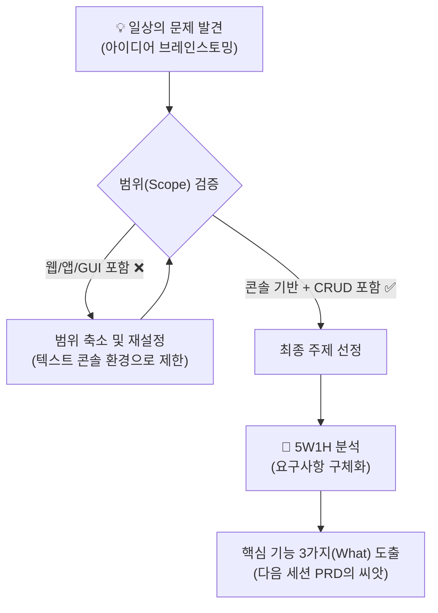

---

## §3. 상세 내용

### Why — 왜 스스로 문제를 정의해야 하는가?

"AI가 코드를 알아서 잘 짜주는데, 굳이 제가 처음부터 기획을 다 해야 하나요?"라는 의문이 생길 수 있습니다. AI 시대에 가장 흔히 하는 착각이 바로 그것이에요. 사실 코드를 짜는 '문제 해결'의 영역은 이제 AI가 사람보다 훨씬 빠르고 정확하게 해냅니다. 하지만 "어떤 프로그램을 만들 것인가"를 결정하는 '문제 정의'는 철저히 인간의 영역으로 남아 있습니다.

문제 정의가 제대로 되지 않은 상태에서 AI에게 코딩을 맡기면, 그럴싸해 보이지만 아무 쓸모가 없는 엉뚱한 결과물이 나옵니다. 우리는 이번 미니 프로젝트를 통해 코딩 문법을 외우는 것이 아니라, 내가 겪는 불편함을 논리적인 요구사항으로 번역하여 AI에게 정확히 전달하는 '문제 정의 능력'을 기르는 데 집중할 거예요.

### What — 미니 스펙 프로젝트의 조건

이번 프로젝트에서 여러분이 만들 프로그램은 반드시 다음 세 가지 핵심 조건을 충족해야만 합니다. 이 조건을 벗어나면 실습 시간 내에 완주하기가 매우 어려워져요.

첫째, 화려한 버튼이나 이미지가 없는 **텍스트 콘솔 기반**이어야 합니다. 웹사이트나 모바일 앱을 상상하셨다면 과감히 버려주세요. 오직 터미널 창에서 키보드로 글자를 입력하고, 텍스트로 결과를 확인하는 아주 투박한 형태의 프로그램입니다. 

둘째, 프로그램 안에 데이터의 **CRUD** 기능이 반드시 들어가야 합니다. 데이터를 생성하고(Create), 읽어오고(Read), 수정하고(Update), 삭제하는(Delete) 이 네 가지 동작은 소프트웨어가 데이터를 다루는 가장 기본적인 논리입니다. 예를 들어 영단어장이라면, 새 단어를 추가하고(C), 목록을 보고(R), 틀린 뜻을 고치고(U), 다 외운 단어를 지우는(D) 기능이 모두 있어야 해요.

셋째, 대략 **100줄 이내의 파이썬 코드**로 구현할 수 있는 아주 작은 규모여야 합니다. 너무 많은 기능을 담으려고 하면 완성조차 하지 못하고 길을 잃게 됩니다.

### How — 욕망을 덜어내고 Scope 조절하기

주제를 고민하다 보면 누구나 욕심이 생깁니다. "이왕 만드는 거 로그인도 넣고, 데이터베이스도 연결하고, 예쁜 화면도 입혀야지!" 하고 말이죠. 이때 가장 필요한 기술이 바로 스코프(Scope) 조절입니다. 기획의 덩치를 잘라내어 현실적인 크기로 줄이는 과정이에요.

만약 '개인 피트니스 트래커'를 만들고 싶다고 해보죠. 처음엔 "사용자별 회원가입을 받고, 운동 영상을 재생해주고, 칼로리를 그래프로 보여줘야지"라고 생각할 수 있습니다. 하지만 우리의 3가지 조건을 떠올려보세요. 텍스트 콘솔 기반이어야 하고 100줄 이내여야 합니다. 그렇다면 과감하게 깎아내야 합니다. 회원가입은 빼고 오직 나 혼자만 쓰는 용도로 만듭니다. 영상 재생이나 그래프 기능도 빼고, 단순히 "오늘 무슨 운동을 몇 세트 했는지 텍스트로 저장하고 보여주는 기능"만 남기는 거예요. 이렇게 핵심적인 가치 하나만 남기는 연습이 바로 스코프 조절입니다.

---

## §4. 실습 가이드 (+ 🎙️ 실습 대본)

### 실습 목표

조별로 모여 일상에서 불편함을 해결할 아이디어를 브레인스토밍하고, 최종 주제를 하나 선정하여 5W1H 프레임워크로 초기 요구사항을 도출해 봅니다.

🎙️ **실습 가이드 대본 (Lab Guide)**:

> 자, 이제 진짜 여러분의 프로젝트를 시작할 시간입니다. 지금부터 25분 동안 팀별로 머리를 맞대고 고민해 볼 거예요. 제가 빈 포스트잇과 마커를 나눠드렸죠? 첫 10분은 철저하게 브레인스토밍 시간입니다. "이런 것도 프로그램으로 만들 수 있을까?" 싶은 사소한 것들도 일단 다 적어보세요. 점심 메뉴 추천기, 오늘의 감사 일기장, 가위바위보 전적 기록기 등 뭐든 좋습니다.
>
> 아이디어가 모이면 그중에서 팀원들이 가장 재미있어하는 주제 딱 하나를 고르세요. 주제를 고르셨다면 15분 동안 5W1H 양식에 맞춰 빈칸을 채워나갈 겁니다. 이 종이 한 장이 여러분이 만들 프로그램의 설계도가 될 거예요. 막막하거나 이 주제가 너무 큰 건 아닐지 걱정되시면 언제든 저를 불러주세요. 제가 돌아다니면서 여러분의 아이디어 크기를 알맞게 다듬어 드리겠습니다.

### 단계별 지시 — 브레인스토밍 및 5W1H 도출

| 단계 | 소요 시간 | 강사 지시사항 | 학습자/팀 액션 | 예상 결과 |
|------|----------|--------------|------------|----------|
| 1 | 5분 | "일상의 불편함을 포스트잇에 적어보세요" | 개인별로 최소 3개 이상의 아이디어 메모 작성 | 다양한 실생활 밀착형 아이디어 풀 형성 |
| 2 | 5분 | "아이디어를 공유하고 하나를 투표로 정하세요" | 조별로 아이디어 취합 후 최종 1개 주제 선정 | 콘솔 기반, CRUD가 가능한 팀 주제 확정 |
| 3 | 10분 | "5W1H 양식의 빈칸을 채워보세요" | 선정된 주제를 바탕으로 Who, When, Where, Why, How 분석 | 프로그램의 목적과 사용 환경 정의 완료 |
| 4 | 5분 | "가장 중요한 What, 핵심 기능 3가지를 뽑아내세요" | 구체적으로 이 프로그램이 제공할 3가지 기능(CRUD 포함) 작성 | 다음 세션 PRD 작성의 기반이 될 뼈대 완성 |

**[단계 1~2] 주제 브레인스토밍 및 선정**

각자 펜을 들고 2분 동안 머릿속에 떠오르는 아이디어를 최소 3개 적어보세요. "영단어를 자꾸 까먹어서 나만의 퀴즈를 만들고 싶다", "매일 커피를 몇 잔 마시는지 기록하고 싶다"처럼 아주 구체적이고 사소할수록 좋습니다. 

팀원들과 아이디어를 나누고 가장 마음이 끌리는 하나를 선택하세요. 고를 때의 기준은 딱 하나, "이 프로그램이 완성되면 우리가 진짜로 쓸 것 같은가?" 입니다. 내가 직접 쓸 프로그램을 만들 때 몰입도가 가장 높아집니다. 단, 앞서 강조했듯 GUI 화면이나 웹 서버가 필요한 주제는 지금 단계에서 과감히 제외해 주세요.

**[단계 3~4] 5W1H 기반 요구사항 도출**

주제가 확정되었다면 이제 뼈대를 세울 차례입니다. 메모장에 5W1H를 적고 하나씩 답을 채워보세요. 

- **Who**: 이 프로그램은 누가 쓰는가? (예: 매일 커피 값을 아끼고 싶은 나)
- **When**: 언제 주로 사용하는가? (예: 커피를 마실 때마다 즉시)
- **Where**: 어떤 환경에서 실행하는가? (예: 내 노트북의 파이썬 터미널 창)
- **Why**: 어떤 문제를 해결하려고 하는가? (예: 매일 커피에 쓰는 돈을 시각화해서 지출을 줄이려고)
- **How**: 데이터는 어떻게 저장할 것인가? (예: 텍스트 파일이나 CSV로 저장)

가장 중요한 것은 **What**입니다. 이 프로그램이 제공해야 할 핵심 기능 3가지를 구체적으로 적어주세요. 이 기능들 안에 반드시 데이터를 추가하고, 읽고, 수정하거나 삭제하는 CRUD 논리가 녹아들어 있어야 합니다. 지금 적는 이 3가지 기능이 다음 시간에 배울 PRD 문서의 필수 요구사항(FR-001, FR-002, FR-003)이 됩니다.

> 💡 **강사 노트**: 수강생들이 처음 주제를 정할 때 '인스타그램'이나 '당근마켓' 같은 거대한 플랫폼을 모방하려는 경향이 있습니다. 이때 강사는 재빨리 개입하여 "터미널 검은 화면에서 글자만으로 당근마켓을 어떻게 구현할 수 있을까요? 중고 물품 리스트를 텍스트로만 띄워주는 기능으로 줄여볼까요?" 하는 식으로 스코프를 확 줄여주어야 합니다.

---


### 🎓 강사 노트 (Instructor Support)

- ⏱️ **타이밍**: 16:55 (25분, lab)
- 🎯 **핵심 활동**: 자유 주제 선택 + 5W1H
- ⚠️ **강사 주의사항**: 주제 고민 시간 충분히 확보


### 📋 실습 설계 보강 (Lab Packet)

**세션 039 실습 설계 보강**

미니 스펙 프로젝트: 주제 선정 및 요구사항
- **3-Stage Example Set**
  - 기본: 자유 주제 선정(가계부, 일기장, 할일 목록 등) → 5W1H 기반 요구사항 정리
  - 변형: AI에게 "나한테 맞는 미니 프로젝트 주제 3가지 추천해줘" 요청
  - 실수 해결: "주제가 너무 거창해요 (웹사이트, 앱)" → 콘솔 기반 단순 프로그램으로 범위 축소
- **난이도 예측**: 자유도가 높아서 오히려 결정 장애 발생
- **타이밍 가이드**: 주제 브레인스토밍 5분 | 주제 확정 3분 | 5W1H 요구사항 12분 | 정리 5분
- **심리적 장벽**: "아무것도 떠오르지 않아요" — 백지 공포
- **자가 점검**:
  - [ ] 주제를 하나 확정했는가?
  - [ ] 콘솔 입출력 기반으로 범위를 제한했는가?
  - [ ] 핵심 기능 3가지 이상을 정의했는가?

## §5. 문서 템플릿 및 가이드 

이번 세션은 기획 단계이므로 파이썬 코드를 직접 작성하지 않습니다. 대신 조별로 노션이나 메모장에 복사해서 사용할 수 있는 5W1H 텍스트 템플릿을 제공합니다.

### 5W1H 요구사항 도출 템플릿

```text
# [프로젝트 가칭: _______________ ]

1. Who (사용자): 
2. When (사용 시점): 
3. Where (사용 환경): 터미널 / 파이썬 콘솔
4. Why (해결하려는 문제): 
5. How (데이터 관리 방식): 

6. What (핵심 기능 3가지 - CRUD 필수 포함):
  - 기능 1 (Create/Read 중심): 
  - 기능 2 (Update 중심): 
  - 기능 3 (Delete 또는 조회 중심): 
```

> 🤖 **AI 프롬프트 예시**: 브레인스토밍이 막힐 때 AI에게 이렇게 물어보세요. "나는 파이썬 초보자야. 터미널 콘솔에서 100줄 이내로 만들 수 있고, CRUD 기능이 들어간 실생활 밀착형 미니 프로그램 아이디어를 5개만 추천해줘."

---

## §6. 요약

### 핵심 학습 포인트

이번 세션에서 여러분은 남이 만들어둔 예제가 아니라, 오직 나만의 오리지널 프로그램을 만들기 위한 첫걸음을 뗐습니다. 미니 스펙 프로젝트가 성공하려면 욕심을 버리고 스코프를 조절하는 것이 가장 중요해요. 화려한 웹이나 앱이 아니라 텍스트 콘솔 환경으로 제한하고, 데이터의 생성과 읽기, 수정, 삭제라는 필수적인 CRUD 논리에 집중했습니다. 그리고 선정된 주제를 5W1H 프레임워크에 넣어 뼈대를 단단하게 세웠어요. 문제 해결은 AI가 하지만, 어떤 문제를 풀 것인지 정의하는 것은 여러분의 몫이라는 점을 꼭 기억해 주세요.

### 다음 세션 예고

여러분 손에 들려있는 그 포스트잇 메모가 바로 다음 세션의 핵심 재료입니다. 다음 시간에는 이 거친 아이디어 스케치를 AI가 완벽하게 이해할 수 있는 전문적인 PRD(제품 요구사항 정의서) 문서로 변환해 볼 거예요. 그리고 그 문서를 바탕으로 AI에게 코드를 뽑아내는 '마스터 프롬프트'를 작성하는 방법까지 배웁니다. 내가 상상한 아이디어가 실제 코드로 변하는 마법 같은 순간이 기다리고 있습니다.

### 브릿지 노트

> "자, 다들 멋진 주제 하나씩 정하셨나요? 옆 조의 아이디어를 살짝 들어보니 벌써부터 완성된 모습이 기대되네요. 지금 적으신 그 짧은 메모가 여러분의 첫 소프트웨어를 탄생시킬 소중한 씨앗입니다. 잠깐 쉬고 오셔서, 이 씨앗을 AI라는 비옥한 토양에 심어볼게요. 다음 시간에 뵙겠습니다!"

---

<details>
<summary>💡 교안 원문 (v1.0 백업)</summary>

```markdown
# 마이크로 세션: 039 — 미니 스펙 프로젝트: 주제 선정 및 요구사항

> **세션 ID**: MS-PY101-039  
> **소요 시간**: 25분  
> **난이도**: medium  
> **청크 타입**: lab

---

## ① 도입 (Hook)

🗣️ **강사 대본 (Instructor Script)**:

지금까지는 제가 드린 주제, "고객 정보 관리 프로그램"으로 연습했습니다. 요구사항 뽑는 법, PRD 쓰는 법, 시나리오 만드는 법까지 모두 이 하나의 주제로 훈련했죠. 이제 훈련은 끝났습니다. 여러분만의 오리지널 프로그램을 만들 시간이에요. 지금부터 시작하는 미니 스펙 프로젝트는 Day 2의 배움을 총망라하는 종합 실습입니다. 여러분이 직접 주제를 정하고, 요구사항을 뽑고, PRD를 쓰고, 프롬프트를 만들어 AI에게 코드를 받아내는 전 과정을 스스로 해볼 겁니다. 오늘 이 세션에서는 그 첫 단추, 주제 선정과 요구사항 도출을 합니다.

---

## ② 비유 풀이 (Analogy)

🗣️ **강사 대본 (Instructor Script)**:

지금까지는 기성복을 입어보며 핏을 맞추는 법을 배웠습니다. 백화점에서 이미 만들어진 옷을 골라 입어보고, "어깨가 좀 넓네", "소매가 짧네" 하면서 자기 몸에 맞는 사이즈를 찾는 연습을 한 거예요. 고객 관리 프로그램이라는 기성복으로 PRD 작성법이라는 핏 맞추기를 연습한 셈이죠.

이제는 다릅니다. 내가 입고 싶은 양복의 원단부터 치수까지 내 마음대로 정해서 세상에 하나뿐인 옷을 짓는 시간입니다. 원단(주제)을 고르고, 치수(요구사항)를 재고, 디자인(시나리오)을 그리는 거예요. 물론 처음부터 드레스 코트를 만들 필요는 없습니다. 깔끔한 셔츠 한 벌이면 충분해요. 중요한 건 내 손으로 처음부터 끝까지 만들어보는 경험입니다.

---

## ③ 개념 설명 (What)

🗣️ **강사 대본 (Instructor Script)**:

미니 스펙 프로젝트의 범위를 명확히 하겠습니다. 여러분이 만들 프로그램은 반드시 세 가지 조건을 충족해야 합니다. 첫째, 텍스트 콘솔 기반이어야 합니다. 화려한 웹사이트나 모바일 앱을 상상하지 마세요. 터미널에서 글자로 입력하고 글자로 출력하는 프로그램입니다. 둘째, 데이터의 CRUD가 포함되어야 합니다. CRUD란 생성(Create), 읽기(Read), 수정(Update), 삭제(Delete)의 약자로, 데이터를 다루는 가장 기본적인 네 가지 동작입니다. 셋째, 100줄 이내의 파이썬 코드로 구현 가능한 규모여야 합니다.

이 세 가지 조건 안에서 주제는 완전히 자유입니다. 개인 단어장 퀴즈 프로그램, 오늘의 식단 기록기, 로또 번호 관리기, 독서 타이머, 점심 메뉴 랜덤 룰렛, 가위바위보 전적 기록기 등 일상생활의 작은 불편함을 해결하는 아이디어면 됩니다. 핵심은 "문제 정의"입니다. AI 시대에는 코드를 외우는 것보다 "어떤 문제를 해결할 것인가"를 명확히 정의하는 능력이 훨씬 중요합니다. 너무 화려한 것을 상상하지 말고, 텍스트 환경에서 데이터를 저장하고 꺼내보는 본질적인 CRUD 논리를 설계하는 것에 집중하세요.

---

## ④ 코드/실제 활용 (How)

🎙️ **실습 가이드 (Lab Guide)**:

실습을 시작합니다. 총 2단계로 진행합니다.

**1단계 (10분) — 주제 브레인스토밍 및 선정**: 포스트잇이나 메모장을 꺼내세요. 2분 동안 머릿속에 떠오르는 아이디어를 최소 3개 적어보세요. "영단어를 잘 까먹어서 나만의 단어장 퀴즈를 만들고 싶다", "매일 뭘 먹었는지 기록하고 싶다", "운동 루틴을 관리하고 싶다" 이런 식으로요. 3개를 적었으면 그중에서 가장 마음이 끌리는 하나를 고르세요. 고를 때 기준은 간단합니다. "이 프로그램이 진짜 있으면 내가 쓸 것 같은가?" 내가 직접 쓸 프로그램을 만들 때 동기부여가 가장 강합니다.

주의할 점이 있습니다. "인스타그램 만들기", "채팅 앱 만들기"처럼 시각적 그래픽(GUI)이나 서버가 필요한 주제는 피해주세요. 우리는 텍스트 콘솔에서 돌아가는 프로그램을 만듭니다. 만약 주제가 너무 크다 싶으면 강사에게 손을 들어주세요. 함께 범위를 좁혀드리겠습니다.

**2단계 (15분) — 5W1H 기반 요구사항 도출**: 주제가 정해졌으면 우리가 세션 032에서 배운 5W1H 체크리스트를 꺼냅니다. 메모장에 다음 항목을 채워보세요. Who(누가 쓰는가), What(핵심 기능 3가지는 무엇인가), When(언제 사용하는가), Where(어떤 환경에서 실행하는가), Why(어떤 문제를 해결하는가), How(데이터를 어떻게 저장하고 꺼내는가). 이 여섯 가지 질문에 답하다 보면 자연스럽게 요구사항의 뼈대가 잡힙니다. 특히 What 항목에서 핵심 기능 3가지를 반드시 적어주세요. 이것이 나중에 FR-001, FR-002, FR-003이 됩니다.

> 💡 **강사 노트**: 미니 스펙 프로젝트의 범위 설정과 CRUD 기반 주제 선정 가이드는 `7 기획.pdf` §7.1, §7.5에 기반합니다 [Source A: SRC-A03]. "문제 정의가 문제 해결보다 중요하다"는 관점은 `AI 시대의 서사 v3` 문서의 핵심 철학을 반영했습니다 [Source B: SRC-A01]. 소규모 프로젝트에서의 요구사항 도출 실전 사례는 Deep Research 보고서에서 보강했습니다 [Source C: SRC-C02].

---

## ⑤ 정리 및 다음 세션 예고 (Closing)

🗣️ **강사 대본 (Instructor Script)**:

작고 귀여운 프로그램이라도 완벽한 기획을 거치면 훌륭한 포트폴리오가 됩니다. 여러분은 방금 세상에 하나뿐인 자신만의 프로그램 주제를 정하고, 5W1H로 요구사항의 뼈대를 잡았습니다. 이 짧은 메모가 여러분의 첫 오리지널 소프트웨어의 씨앗입니다. 주제와 뼈대가 잡혔으니, 다음 세션에서는 이 씨앗에 물을 주고 싹을 틔워볼 겁니다. 방금 만든 요구사항 메모를 PRD 문서로 변신시키고, AI에게 보낼 마스터 프롬프트까지 준비하러 갑시다.
```

</details>

---

## §7. 참고 자료

### 3-Source 출처

- **Source A (로컬 참고자료)**: 「7 기획.pdf」 (SRC-A03) — 요구사항 분석의 본질(§7.1) 및 미니 스펙 프로젝트 가이드(§7.5)
- **Source B (로컬 참고자료)**: 「AI 시대의 서사 v3 - Claude.md」 (SRC-A01) — 문제 정의 역량이 문제 해결(코딩) 역량보다 우위에 있다는 핵심 철학
- **Source C (Deep Research)**: 소규모 프로젝트에서의 요구사항 도출 실전 사례 및 CRUD 기반 기획 방법론 (SRC-C02)

### 추가 학습 자료

- [Product Requirements Document 가이드](https://www.atlassian.com/agile/product-management/requirements): PRD 작성을 위한 아틀라시안의 애자일 가이드
- [5W1H 기획법 기초](https://en.wikipedia.org/wiki/Five_Ws): 문제 정의를 위한 5W1H 프레임워크 위키피디아 문서
- [파이썬 초보자를 위한 토이 프로젝트 아이디어](https://github.com/karan/Projects): 초보자가 참고하기 좋은 콘솔 기반 미니 프로젝트 리스트

### 강사 노트

> 💡 **강사 노트**: 이 세션은 Day 2의 가장 중요한 변곡점입니다. 수강생들은 보통 자신의 실력을 과대평가하거나, 거창한 앱을 상상하다가 지레 포기해버리는 양극단의 모습을 보입니다. 강사는 조별로 순회하면서 아이디어의 '스코프(Scope)를 칼같이 잘라주는 역할'을 해야 합니다. "그 기능은 빼고 텍스트로만 합시다", "회원가입은 빼고 내 이름만 고정으로 넣읍시다"라고 지속적으로 가이드해 주어 100줄 이내의 파이썬 CRUD 프로그램이라는 명확한 경계선 안착을 유도하세요.

---

## ✅ 세션 완료 체크리스트 (강사용)

- [ ] §1~§7 모든 섹션이 충실하게 작성되었는가?
- [ ] 맞춤정장 비유가 §2에서 충분히 확장되었는가?
- [ ] 텍스트 콘솔 기반, CRUD, 100줄 이내라는 3가지 제약 조건이 명확히 전달되었는가?
- [ ] 브레인스토밍 및 5W1H 도출 과정이 단계별로 구체화되었는가?
- [ ] 스코프 조절의 중요성과 예시가 §3에 포함되었는가?
- [ ] 다음 세션(040 PRD 작성) 브릿지 노트가 포함되었는가?
- [ ] §6에 기존 v1.0 교안 원문이 포함되었는가?

---

**🔗 선행 세션**: [세션-032] 5W1H 기반 요구사항 분석 연습  
**🔗 후행 세션**: [세션-040] 미니 스펙 프로젝트: PRD 작성 및 프롬프트 준비

---

*작성 일시: 2026-02-25*  
*작성 에이전트: Sisyphus-Junior*  
*교안 구조: 7섹션 (A0 팀 공통 표준)*

> 🔗 **이전 세션**: [세션 038: 고객 정보 관리 프로그램 PRD 완성하기](#세션-038)에서 배운 내용을 이어갑니다.
> 🔗 **다음 세션**: [세션 040: 미니 스펙 프로젝트: PRD 작성 및 프롬프트 준비](#세션-040)에서 계속됩니다.

---

### 세션 040: 미니 스펙 프로젝트: PRD 작성 및 프롬프트 준비
> [원본 파일](sessions/세션-040-미니_스펙_프로젝트_PRD_작성_및_프롬프트_준비_v2.1.md) | ⏱️ 25분 | 🧪 lab | 난이도: medium

> **세션 ID**: MS-PY101-040  
> **소요 시간**: 25분  
> **난이도**: medium  
> **청크 타입**: lab  
> **버전**: v2.1 (7섹션 구조)

---

## §1. 개요

> **Day 2 | PM | 세션 040/043**

### 🎯 학습 목표

이 세션이 끝나면, 수강생은 다음을 할 수 있습니다:

- 5W1H 요구사항 메모를 AI와 협력하여 정식 마크다운 PRD(제품 요구사항 정의서)로 변환할 수 있다
- 작성된 PRD 전체를 프롬프트의 Context(맥락) 영역에 삽입하여 AI의 환각을 통제할 수 있다
- 점진적 개선 전략을 적용하여, 전체 기능 중 첫 번째 핵심 기능(FR-001)만 구현하도록 지시하는 마스터 프롬프트를 조립할 수 있다

### 선행 세션 환기

바로 직전 세션에서 여러분은 조별로 머리를 맞대고 아주 훌륭한 아이디어들을 쏟아냈습니다. 개인 단어장부터 식단 기록기까지, 5W1H 프레임워크를 사용해서 요구사항의 튼튼한 뼈대를 잡았죠. 척박한 땅에 건강한 씨앗을 심은 셈입니다. 이제 이 씨앗에 물을 주고 단단한 뿌리를 내리게 할 시간입니다. 오늘 우리가 할 일은 명확합니다. 여러분의 그 아이디어 메모를 실제 실무에서 쓰는 정식 PRD 문서로 업그레이드하고, 그 문서를 무기 삼아 AI에게 보낼 첫 번째 마스터 프롬프트를 완성하는 것입니다. 

---

## §2. 핵심 개념 (+ 🗣️ 강사 대본 + Mermaid)

### 건축 허가서와 착공 지시서

건물을 짓는 과정을 상상해 봅시다. 지난 세션에서 여러분이 끄적였던 5W1H 메모는 "우리 동네에 예쁜 3층짜리 카페를 짓겠다"고 스케치북에 그린 대략적인 도면과 같습니다. 아주 훌륭한 출발점이지만, 이 도면을 들고 당장 굴삭기 기사님에게 달려가서 땅을 파달라고 할 수는 없죠. 

우리가 지금 만들어야 할 것은 시청에 제출해서 승인을 받을 수 있는 정식 **'건축 허가서'**입니다. 층수는 몇 층인지, 연면적은 얼마인지, 비상구는 어디에 있고 안전 기준은 어떻게 충족할 것인지 빠짐없이 적혀 있는 문서 말입니다. 소프트웨어 세계에서 이 건축 허가서가 바로 PRD입니다. 

허가서가 완벽하게 준비되었다면, 이제 현장 소장(AI)에게 첫 번째 **'착공 지시서'**를 내릴 차례입니다. "여기 도면과 허가서가 있습니다. 우선 바닥부터 파주세요. 깊이는 정확히 2미터, 폭은 10미터입니다." 이 착공 지시서가 바로 우리가 조립할 마스터 프롬프트입니다. 건축 허가서(PRD)가 꼼꼼하고 완벽하다면, 착공 지시서(프롬프트) 자체는 단 세 줄이면 충분합니다. 설계의 완벽함이 곧 코드의 완벽함을 보장하기 때문입니다.

🗣️ **강사 대본 (Instructor Script)**:

> 여러분, 앞서 작성한 메모를 보면서 '이 정도면 코딩 시작해도 되지 않나?' 생각하셨을 겁니다. 하지만 AI 시대의 코딩은 조금 다릅니다. AI는 텍스트를 먹고 자라는 괴물입니다. 우리가 모호하게 말하면 엉뚱하게 짜주고, 엄밀하게 말하면 완벽하게 짜줍니다. 
> 
> 오늘 우리는 PRD라는 아주 튼튼한 울타리를 칠 겁니다. 이 울타리가 없으면 AI는 카페를 지어달라는데 갑자기 수영장을 파기 시작할지도 모릅니다. 여러분이 기획서만 빈틈없이 깎아두면, AI에게 내리는 실제 프롬프트는 정말 짧아도 됩니다. "내가 준 문서대로, 첫 번째 기능만 만들어봐." 이것이 끝입니다. 지금부터 그 완벽한 울타리를 치는 작업을 시작하겠습니다.

> 💡 **강사 노트**: 기획서(PRD)와 지시서(프롬프트)의 역할을 건축 비유로 명확히 분리하는 것이 핵심입니다. 코딩을 서두르려는 수강생들에게 '문서 작업의 중요성'을 납득시키는 훅(Hook)으로 작용합니다.

### Mermaid 다이어그램: PRD에서 프롬프트로의 변환 흐름

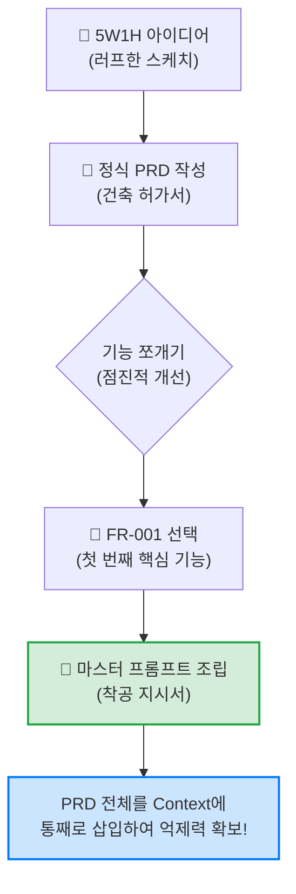

---


### 🎨 추가 시각화 (Visualization Packet)

**PRD (제품 요구사항 명세서) 구조**

AI에게 명확한 개발 범위를 지시하기 위해 필요한 문서의 핵심 뼈대입니다.

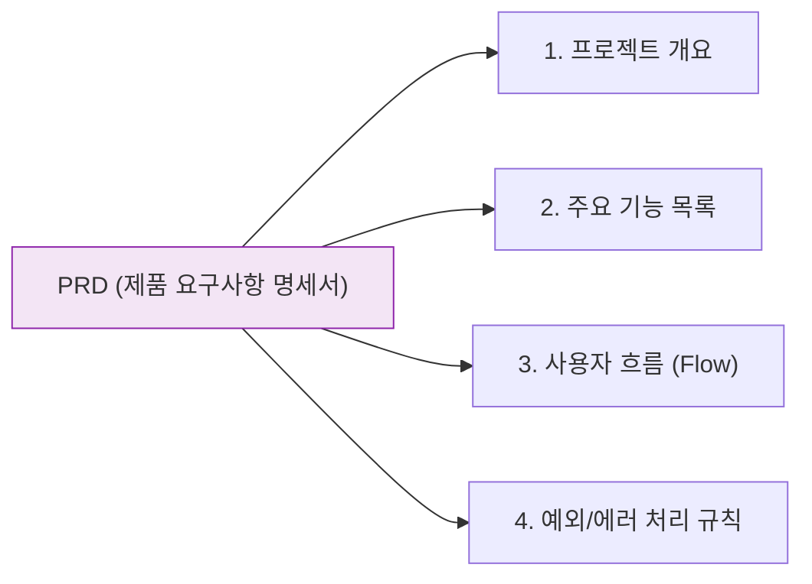

## §3. 상세 내용

### Why — 왜 PRD를 프롬프트에 통째로 넣어야 하는가?

세션 025에서 우리는 프롬프트를 구성하는 4가지 요소, 즉 PTCF(Persona, Task, Context, Format)를 배웠습니다. 여기서 가장 중요한 것이 바로 Context(맥락)입니다. AI에게 "고객 관리 프로그램 짜줘"라고 Task만 던지면, AI는 전 세계 인터넷에 널려 있는 온갖 복잡한 기능들을 긁어모아 거대한 스파게티 코드를 만들어냅니다. 환각(Hallucination)이 시작되는 것이죠.

하지만 Context 영역에 여러분이 작성한 PRD 전체를 통째로 삽입하면 이야기가 달라집니다. AI에게 "네가 참고할 세상은 오직 이 문서 안쪽뿐이야"라고 한계를 그어주는 역할을 합니다. 절대 명세의 범위를 벗어나지 않도록 AI를 강력하게 통제하는 목줄이 되는 것입니다.

### What — 마스터 프롬프트란 무엇인가?

마스터 프롬프트는 첫 번째 코드를 생성해 내는 가장 중요한 지시서입니다. 단순히 "코드 짜줘"가 아니라, 우리가 세션 027에서 배운 코드 생성 5대 필수 항목을 꽉 채운 템플릿입니다. 어떤 기능을 만들 것인지, 입력 데이터의 형태는 무엇인지, 출력은 어떻게 해야 하는지, 제약 조건(예: 외부 라이브러리 금지)은 무엇인지, 에러가 나면 어떻게 처리할 것인지(예외 처리)를 명확하게 담고 있습니다.

여기에 더해, 역할(Persona)을 부여하고 여러분의 PRD를 컨텍스트로 제공하면, 완벽에 가까운 마스터 프롬프트가 탄생합니다.

### How — 어떻게 점진적으로 접근하는가?

여기서 초보자들이 가장 많이 하는 실수가 있습니다. 정성껏 만든 PRD를 주면서 "이거 전부 다 한 번에 코딩해 줘"라고 엔터를 치는 것입니다. 절대 이렇게 하시면 안 됩니다.

세션 028에서 배운 점진적 개선(Iterative Refinement) 전략을 떠올려 보세요. 기능이 4개라면 4개를 한 번에 만드는 것이 아니라, 가장 뼈대가 되는 첫 번째 기능 하나만 떼어내서 먼저 만들어야 합니다. 예를 들어 회원 관리 프로그램이라면, 수정이나 삭제 기능은 나중에 생각하고 'FR-001: 새로운 고객 정보 등록하기' 기능 하나만 집중해서 요청하는 것입니다. 이 첫 번째 뼈대 코드가 무사히 돌아가는 것을 확인한 뒤에야 다음 살을 붙여나가는 것이 AI 코딩의 정석입니다.

> ✅ **체크포인트**: 스스로 점검해 봅시다.
> - 왜 PRD의 기능 전체를 한 번에 코딩해 달라고 요청하면 안 될까요? ("한 번에 너무 많은 것을 요구하면 AI가 엉뚱한 코드를 짜거나 오류를 낼 확률이 급격히 높아지기 때문입니다. 점진적으로 뼈대부터 만들어야 합니다.")

---

## §4. 실습 가이드 (+ 🎙️ 실습 대본)

### 실습 목표

조별로 작성한 5W1H 메모를 AI에게 제공하여 정식 마크다운 PRD를 생성합니다. 그다음, 생성된 PRD를 컨텍스트로 활용하여 첫 번째 뼈대 코드를 요청할 마스터 프롬프트를 메모장에 완성합니다.

🎙️ **실습 가이드 대본 (Lab Guide)**:

> 자, 이제 여러분의 메모를 진짜 실무용 문서로 바꿀 시간입니다. 직접 마크다운 문법을 써가며 타이핑할 필요 없습니다. 여러분 앞에는 지치지 않는 기획 어시스턴트가 있으니까요. 우리가 할 일은 AI에게 명확한 기준을 주고 PRD를 뽑아내는 것입니다. 
> 
> PRD가 완성되고 나면 두 번째 단계로 넘어갑니다. 바로 마스터 프롬프트를 작성하는 건데요. 여기서 주의할 점! 프롬프트를 다 썼다고 절대 바로 엔터를 치지 마세요. 이번 세션에서는 총알을 장전하고 시위를 팽팽하게 당기는 것까지만 할 겁니다. 발사는 다음 세션에서 다 같이 할 테니까, 프롬프트는 텍스트 에디터나 메모장에 소중히 적어두시기 바랍니다.

### 단계별 실습 진행표

| 단계 | 소요 시간 | 강사 지시사항 | 학습자 액션 | 예상 결과 |
|------|----------|--------------|------------|----------|
| 1 | 5분 | "AI에게 메모를 주고 PRD 초안을 요청하세요" | 5W1H 메모를 복사하여 PRD 생성 프롬프트와 함께 입력 | AI가 7섹션 마크다운 PRD 생성 |
| 2 | 5분 | "생성된 PRD를 검토하고 필요시 수정하세요" | 빠진 기능이나 잘못된 내용이 없는지 확인 후 텍스트 파일로 저장 | 팀의 마스터 PRD 문서 확보 |
| 3 | 5분 | "가장 핵심이 되는 FR-001 기능을 선택하세요" | PRD 기능 목록 중 첫 번째 뼈대가 될 기능 논의 및 결정 | 타겟 기능 1개 확정 |
| 4 | 10분 | "메모장에 마스터 프롬프트를 조립하세요" | §5의 템플릿을 활용하여 메모장에 프롬프트 작성 (PRD 삽입) | 장전 완료된 마스터 프롬프트 초안 |

**[단계 1~2] AI를 활용한 PRD 생성 및 검토**

AI에게 여러분의 아이디어를 체계적인 문서로 정리해 달라고 요청합니다. 아래 §5에 있는 'PRD 생성용 프롬프트'를 복사해서 AI 채팅창에 붙여넣고, `[아이디어 메모]` 부분에 여러분이 직전 세션에서 작성한 5W1H 내용을 덮어쓰세요. 

AI가 훌륭한 마크다운 문서를 만들어내면, 찬찬히 읽어보세요. 여러분의 의도와 다르게 들어간 내용이 있나요? 그렇다면 AI에게 "3번 시나리오는 빼고, 이런 내용을 추가해 줘"라고 피드백을 주면 됩니다. 완벽해진 PRD는 복사해서 바탕화면에 `PRD_최종.md` 같은 이름으로 꼭 저장해 두세요.

**[단계 3~4] 마스터 프롬프트 작성 (엔터 금지!)**

PRD가 완성되었습니다. 이제 AI에게 코드를 짜달라고 명령할 지시서를 작성합니다. 아래 §5의 '1차 코드 생성 마스터 프롬프트' 템플릿을 복사해서 빈 메모장에 붙여넣으세요. 

템플릿의 `[여기에 PRD 전체 붙여넣기]` 부분에 방금 저장한 PRD 텍스트를 통째로 복사해서 넣습니다. 그리고 지시(Task) 영역을 꼼꼼히 다듬으세요. "PRD 전체를 다 만들어줘"가 아니라, "PRD의 FR-001 기능만 구현하는 뼈대 코드를 작성해 줘"라고 범위를 좁히는 것이 핵심입니다. 작성이 끝났다면 메모장을 그대로 열어두세요. 발사 준비 완료입니다.

---


### 🎓 강사 노트 (Instructor Support)

- ⏱️ **타이밍**: 17:20 (25분, lab)
- 🎯 **핵심 활동**: 자유 주제 PRD → 프롬프트
- ⚠️ **강사 주의사항**: 진행 속도 편차 주의


### 📋 실습 설계 보강 (Lab Packet)

**세션 040 실습 설계 보강**

미니 스펙 프로젝트: PRD 작성 및 프롬프트 준비
- **3-Stage Example Set**
  - 기본: 039에서 작성한 요구사항 → AI와 협력하여 PRD 완성 → 1단계 프롬프트 초안 작성
  - 변형: PRD 기반으로 코드 생성 5대 항목(기능/입력/출력/제약/예외) 프롬프트 작성
  - 실수 해결: "PRD와 프롬프트의 차이가 뭐예요?" → PRD는 지도, 프롬프트는 내비 목적지 설정
- **난이도 예측**: 문서(PRD)에서 실행(프롬프트)으로의 전환 지점이 혼란
- **타이밍 가이드**: PRD 완성 10분 | 1단계 프롬프트 작성 10분 | 검토 5분
- **심리적 장벽**: "문서가 너무 많아서 지쳤어요"
- **자가 점검**:
  - [ ] 자신만의 PRD 문서가 완성되었는가?
  - [ ] 코드 생성 5대 항목을 포함한 프롬프트 초안이 준비되었는가?
  - [ ] PRD의 FR 항목 중 1단계에서 구현할 범위를 정했는가?

## §5. 코드 및 프롬프트 템플릿 모음

### 프롬프트 1: PRD 생성용 프롬프트

여러분의 아이디어 메모를 정식 PRD로 변환할 때 사용하는 프롬프트입니다.

```text
당신은 파이썬 시니어 개발자 겸 꼼꼼한 프로덕트 매니저(PM)입니다.

아래의 아이디어 메모를 바탕으로 마크다운 형식의 PRD(제품 요구사항 정의서) 문서를 작성해 주세요.

[아이디어 메모]
(여기에 지난 세션에서 작성한 5W1H 메모를 붙여넣기하세요)

[필수 포함 항목]
1. 개요 및 배경
2. 문제 정의 (어떤 문제를 해결하는가)
3. 기능 요구사항 (FR-001, FR-002 형식으로 번호 부여, 구체적인 수용 기준 포함)
4. 비기능 요구사항 (NFR-001 형식, 기술 스택 및 제약 조건)
5. 사용자 시나리오 (프로그램 실행부터 종료까지 시간 순서대로)
6. 성공 지표 3가지
7. 범위 외 항목 (이번 버전에서 개발하지 않을 것)
```

### 프롬프트 2: 1차 코드 생성 마스터 프롬프트 (메모장 작성용)

완성된 PRD를 기반으로 첫 번째 뼈대 코드를 요청하는 마스터 프롬프트입니다. **AI 창에 바로 넣지 말고 꼭 메모장에서 작성하세요.**

```text
역할: 당신은 10년 차 파이썬 시니어 개발자입니다. 아주 견고하고 깔끔한 코드를 작성합니다.

지시: 아래 [컨텍스트]로 제공된 PRD를 100% 준수하여, 핵심 기능인 'FR-001' 부분만 우선 구현하는 뼈대(Skeleton) 코드를 작성해 주세요. 처음부터 모든 기능을 만들지 마세요.

제약 조건:
- 외부 패키지(라이브러리)는 절대 사용하지 마세요. 오직 파이썬 기본 내장 모듈만 사용합니다.
- 복잡한 폴더 구조 없이, 단 하나의 .py 파일로 바로 실행 가능하게 작성하세요.
- 코드의 각 기능 블록 위에 한국어로 상세한 주석을 달아주세요.
- 잘못된 입력값(예: 숫자를 넣어야 하는데 문자를 넣은 경우)이 들어왔을 때 프로그램이 종료되지 않도록 기본적인 예외 처리를 포함하세요.

출력 형식: 설명은 최소화하고, 복사해서 바로 실행할 수 있는 파이썬 코드 블록만 제공해 주세요.

[컨텍스트 - PRD 원문]
'''
(여기에 완성된 PRD 텍스트 전체를 통째로 붙여넣으세요)
'''
```

---

## §6. 요약

### 핵심 학습 포인트

우리는 오늘 코딩을 시작하기 전의 완벽한 준비 상태를 만들었습니다. 5W1H 아이디어 스케치를 체계적인 마크다운 PRD로 변환했고, 이 PRD를 든든한 가드레일 삼아 AI를 통제하는 방법을 배웠습니다. 프롬프트의 Context 영역에 문서 전체를 밀어 넣음으로써 환각을 방지하는 것이 핵심입니다. 또한, 욕심을 버리고 가장 중요한 첫 번째 기능(FR-001)부터 시작하는 점진적 개선의 마인드셋을 장착했습니다.

### 다음 세션 예고

활시위는 끝까지 당겨졌습니다. 여러분의 메모장에는 정교하게 다듬어진 마스터 프롬프트가 발사 명령만을 기다리고 있습니다. 다음 세션에서는 마침내 이 프롬프트를 AI에게 전송하고 코드를 뽑아낼 것입니다. 여러분의 아이디어가 실제 파이썬 코드로 살아 숨 쉬는 역사적인 순간을 맞이하러 가봅시다.

### 브릿지 노트

> "모두 메모장에 마스터 프롬프트를 잘 모셔두었나요? 훌륭합니다. 여러분은 지금 그냥 코더가 아니라 시스템을 설계하는 아키텍트의 자리에 앉아계십니다. 설계가 완벽하면 코딩은 AI가 순식간에 해치울 겁니다. 자, 심호흡 한 번 하시고, 다음 세션에서 여러분의 첫 번째 파이썬 프로그램을 세상에 태어나게 해봅시다. 이동하겠습니다."

---

## §7. 참고 자료

### 3-Source 출처

- **Source A (로컬 참고자료)**: `3 프롬프트 엔지니어링.pdf` (§3.9 코드 생성 프롬프트 특화 기법) — 코드 생성 시 필수 5대 항목 정의 및 Context 영역에 문서를 삽입하여 통제력을 확보하는 기법.
- **Source B (NotebookLM)**: `7 기획.pdf` (§7.3 PRD 구조, §7.5 미니 스펙 프로젝트 가이드) — 초보자 친화적인 7섹션 PRD 구조 설계 및 기능 요구사항(FR) 식별자 작성 표준.
- **Source C (Deep Research)**: SRC-C02 — PRD 기반 마스터 프롬프트 구성 시 한 번에 전체 생성을 피하고 1단계 뼈대 코드부터 요청하는 점진적 개선 전략의 실전 적용 사례.

### 강사 노트

> 💡 **강사 노트**: 수강생들은 보통 PRD가 완성되면 기쁜 마음에 곧바로 전체 코드를 짜달라고 프롬프트를 날리는 경향이 있습니다. 이를 막기 위해 이번 세션 내내 "엔터 치지 마세요, 메모장에 적어두세요"라고 반복해서 제어해 주셔야 합니다. 점진적 개선(Iterative Refinement)을 몸으로 익히게 하는 것이 이 미니 프로젝트의 성패를 가릅니다. FR-001을 고를 때는 가급적 '데이터 입력'이나 '메인 메뉴 표시' 같은 가장 기초적인 입출력 기능으로 유도해 주세요.

---

## ✅ 세션 완료 체크리스트 (강사용)

- [x] §1~§7 모든 섹션이 충실하게 작성되었는가?
- [x] 건축 허가서와 착공 지시서 비유가 §2에서 충분히 확장되었는가?
- [x] PRD 원문을 Context에 통째로 삽입하는 이유가 §3에 명시되었는가?
- [x] 실습 가이드에 단계별 소요 시간과 강사 대본이 포함되었는가?
- [x] PRD 생성 프롬프트와 마스터 프롬프트 템플릿이 §5에 모두 제공되었는가?
- [x] 메모장에 프롬프트를 작성하고 대기하라는 지시가 반복 강조되었는가?
- [x] 다음 세션(041 코드 생성)으로 자연스럽게 이어지는 브릿지가 포함되었는가?

---

**🔗 선행 세션**: [세션-039] 미니 스펙 프로젝트: 주제 선정 및 요구사항  
**🔗 후행 세션**: [세션-041] 미니 스펙 프로젝트: 코드 생성 및 실행 검증

---

*작성 일시: 2026-02-25*  
*작성 에이전트: A4B_Session_Writer*  
*교안 구조: 7섹션 (A0 팀 공통 표준)*

> 🔗 **이전 세션**: [세션 039: 미니 스펙 프로젝트: 주제 선정 및 요구사항](#세션-039)에서 배운 내용을 이어갑니다.
> 🔗 **다음 세션**: [세션 041: 미니 스펙 프로젝트: 코드 생성 및 실행 검증](#세션-041)에서 계속됩니다.

---

### 세션 041: 미니 스펙 프로젝트: 코드 생성 및 실행 검증
> [원본 파일](sessions/세션-041-미니_스펙_프로젝트_코드_생성_및_실행_검증_v2.1.md) | ⏱️ 25분 | 🧪 lab | 난이도: high

> **세션 ID**: MS-PY101-041  
> **소요 시간**: 25분  
> **난이도**: medium  
> **청크 타입**: lab  
> **버전**: v2.1 (7섹션 구조)

---

## §1. 개요

> **Day 2 | PM | 세션 041/043**

### 🎯 학습 목표

이 세션이 끝나면, 수강생은 다음을 할 수 있습니다:

- 완성된 마스터 프롬프트를 AI에게 전달하여 온전한 기능이 담긴 파이썬 코드를 생성할 수 있다
- 생성된 코드를 로컬 IDE 환경에 적용하고 직접 실행하여 동작을 확인할 수 있다
- POE 프레임워크를 바탕으로 정상 흐름, 경계값, 예외 상황에 대한 기능 테스트를 독자적으로 수행할 수 있다
- 에러가 발생하거나 의도와 다르게 동작할 때, 그 현상을 AI에게 피드백하여 코드를 점진적으로 개선(Iterative Refinement)할 수 있다

### 선행 세션 환기

바로 직전 세션에서 우리는 조별 아이디어를 모아 텍스트 기반의 고객 정보 관리나 단어장 같은 미니 스펙 프로젝트의 뼈대를 잡았습니다. 그리고 그 아이디어를 단순히 머릿속에만 두지 않고, PRD라는 아주 단단한 문서로 뽑아낸 다음 마스터 프롬프트로 변환하는 작업까지 마쳤죠. 제가 그때 여러분에게 활시위를 최대한 팽팽하게 당겨둔 상태라고 말씀드렸을 거예요. 

오늘은 드디어 그 당겨둔 시위를 놓아 화살을 날려볼 차례입니다. 우리가 정성스럽게 작성한 그 요구사항 명세서가 어떻게 실제 살아 숨 쉬는 프로그램으로 렌더링되는지 직접 두 눈으로 확인하게 될 겁니다. 그리고 그 과정에서 필연적으로 마주하게 되는 빨간색 에러 메시지들을 어떻게 AI와 함께 슬기롭게 헤쳐 나가는지, 그 진짜 개발의 묘미를 경험해 보는 시간입니다.

---

## §2. 핵심 개념 (+ 🗣️ 강사 대본 + Mermaid)

### 비유 풀이: 공장의 생산 라인과 품질 검사(QC)

거대한 자동차 공장을 한 번 떠올려 봅시다. 우리가 지난 시간까지 만든 PRD와 마스터 프롬프트는 이 공장에 집어넣을 아주 정교한 '설계도'와 같습니다. 이 설계도를 공장의 메인 컴퓨터에 입력하고 생산 시작 버튼을 누르면, 기계들이 윙윙 돌아가며 부품을 깎고 조립해서 순식간에 자동차(코드) 한 대를 뚝딱 만들어 냅니다. AI는 지치지도 않고 빛의 속도로 이 자동차를 뽑아주죠.

하지만, 방금 조립 라인에서 갓 빠져나온 그 자동차를 확인도 안 하고 바로 매장에 전시해서 손님에게 팔 수 있을까요? 절대 불가능합니다. 세상의 어떤 공장도 새로 찍어낸 제품을 검수 없이 출고하지 않아요. 반드시 전원을 넣어보고, 와이퍼가 잘 움직이는지, 브레이크를 밟았을 때 차가 제대로 서는지, 일부러 핸들을 거칠게 꺾어보기도 하면서 불량이 없는지 가혹하게 확인하는 품질 검사(QC, Quality Control) 과정을 거칩니다.

여러분이 AI에게서 방금 얻어낸 코드도 완전히 똑같습니다. 겉보기에는 문법도 화려하고 당장이라도 완벽하게 돌아갈 것 같지만, 실제로 전원을 넣어보면(실행해 보면) 예상치 못한 곳에서 덜컹거리거나 아예 시동조차 안 걸리는 경우가 허다합니다. 여기서부터가 여러분이 활약할 진짜 무대입니다. 코드를 직접 실행해 보고(검증), 문제가 발견되면 설계도를 약간 수정하거나 AI에게 불량 보고서를 써서 다시 고쳐오라고 돌려보내는(개선) 과정을 반복해야 합니다. 이 사이클을 두세 바퀴 돌아야 비로소 우리가 안심하고 탈 수 있는 진짜 쓸 만한 프로그램이 완성됩니다.

🗣️ **강사 대본 (Instructor Script)**:

> 자, 드디어 여러분만의 마법 주문을 외울 시간이 왔습니다. 여러분이 고민해서 쓴 그 프롬프트를 AI 채팅창에 던지면, 아마 순식간에 수십, 수백 줄의 파이썬 코드가 폭포수처럼 쏟아져 내릴 거예요. 내 머릿속의 상상이 진짜 현실의 코드로 렌더링되는 아주 짜릿한 순간이죠. 이 순간을 마음껏 즐기시길 바랍니다.
>
> 하지만 제가 미리 찬물을 살짝 끼얹겠습니다. 지금 나온 그 코드가 한 번에 완벽하게, 아무 에러 없이 돌아갈 확률은 얼마나 될까요? 제 경험상 거의 제로에 가깝습니다. 그리고 놀랍게도, 그게 아주 지극히 정상입니다. 여러분이 코드를 실행했는데 화면에 무시무시한 빨간색 에러 텍스트가 뜬다고요? 축하합니다! 여러분은 방금 진짜 개발자가 되셨습니다. 개발이라는 작업의 8할은 코드를 치는 게 아니라 원래 이렇게 에러를 잡는 과정이거든요. 
> 
> 에러가 났다고 절대 당황하거나 여러분의 기획을 탓하지 마세요. 오히려 잘된 일입니다. 그 에러 메시지 자체가 AI와 깊이 있게 대화할 아주 훌륭한 안건이 되니까요. 지금부터 우리는 "생성하고, 검증하고, 다시 개선하는" 끝없는 개선의 쳇바퀴를 함께 굴려보겠습니다.

> 💡 **강사 노트**: 초보자들은 코드가 한 번에 실행되지 않으면 극도의 좌절감을 느끼거나 자신의 프롬프트가 잘못되었다고 자책하는 경향이 있습니다. 에러는 실패가 아니라 개발의 자연스러운 한 단계이며, 오히려 점진적 개선(Iterative Refinement)을 연습할 수 있는 절호의 찬스라는 점을 초반부터 강하게 인지시켜 주어야 합니다. 공장 비유를 통해 이 과정을 당연한 것으로 포장하는 것이 핵심입니다.

### Mermaid 다이어그램: 점진적 개선 사이클

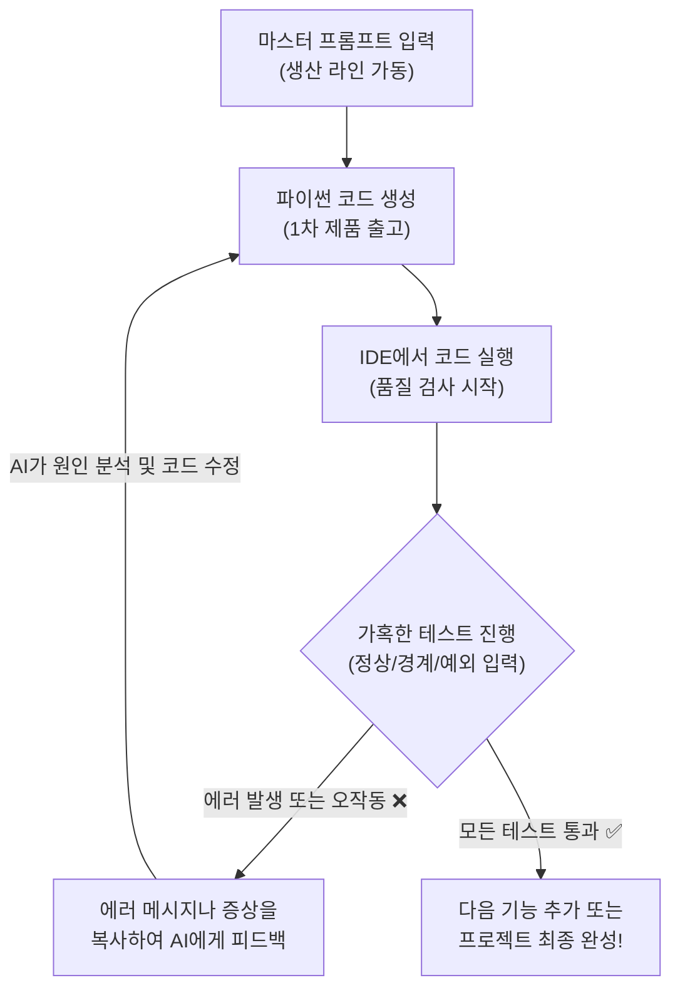

---

## §3. 상세 내용

### Why — 왜 AI가 짠 코드를 그냥 믿으면 안 될까요?

"명세서(PRD)를 그렇게 꼼꼼하게 썼는데, 왜 에러가 날까요?" 많은 분들이 궁금해하시는 부분입니다. AI는 기본적으로 방대한 데이터를 학습하여 다음에 올 단어들을 확률적으로 이어 붙이는 아주 똑똑한 앵무새에 가깝습니다. 우리가 작성한 정교한 명세서를 보고 그럴듯한 논리 구조를 만들어 내지만, 그 코드가 실제로 컴퓨터의 엄격한 문법 규칙 위에서 톱니바퀴처럼 완벽하게 맞물려 돌아갈지는 AI 스스로도 장담하지 못합니다.

때로는 변수 이름을 엉뚱하게 착각하기도 하고, 파이썬의 핵심인 들여쓰기를 살짝 틀리기도 하며, 우리가 요구하지도 않은 이상한 라이브러리를 마음대로 끌어다 쓰기도 합니다. 우리는 이런 현상을 흔히 '환각(Hallucination)'이라고 부르죠. 그렇기 때문에 인간의 깐깐한 검증이 절대적으로 필요합니다. AI가 타이핑의 속도와 뼈대 설계를 담당하는 뛰어난 실무자라면, 여러분은 그 결과물의 방향이 맞는지 품질은 충분한지 통제하고 결정하는 조타수이자 책임자 역할을 해내야 합니다.

### What — POE 프레임워크와 3대 테스트 기법

이 막중한 검증 과정을 아무렇게나 감으로 할 수는 없겠죠. 그래서 우리는 **POE(Predict-Observe-Explain)** 라는 체계적인 사고 프레임워크를 빌려올 겁니다.

첫째 단계는 예측(Predict)입니다. 방금 복사해 온 코드를 무작정 실행하기 전에 머릿속으로 먼저 시뮬레이션을 돌려보는 거예요. "내가 메뉴에서 1번을 누르면, 이름을 입력하라는 문구가 화면에 나타나야 해."라고 미리 정답을 예상해 두는 겁니다.
둘째 단계는 관찰(Observe)입니다. 실제로 코드를 실행하고 1번을 꾹 누른 뒤 화면에 어떤 결과가 뜨는지 두 눈으로 확인합니다.
셋째 단계는 설명(Explain)입니다. 만약 내 예측과 실제 관찰 결과가 다르다면, 즉 에러가 나거나 아예 엉뚱한 화면으로 넘어가 버렸다면 "도대체 왜 이런 결과가 나왔을까?"를 분석하는 단계입니다. 

우리가 관찰(Observe)을 할 때, 프로그램이 얼마나 튼튼한지 확인하기 위해서는 반드시 다음의 세 가지 테스트 유형을 모두 거쳐야 합니다.

1. **정상 흐름 테스트 (Happy Path)**: 사용자가 개발자의 의도대로 아주 착하게, 시나리오의 순서에 맞춰 정확히 입력했을 때 프로그램이 잘 돌아가는지 확인합니다. 이 테스트만 통과했다고 프로그램을 완성했다고 믿으면 나중에 큰코다칩니다.
2. **경계값 테스트 (Boundary Test)**: 시스템이 허용하는 아슬아슬한 한계치를 입력해 보는 방법입니다. 예를 들어 이름을 입력하라고 할 때 100글자가 넘는 장문의 텍스트를 꽉 채워 넣어보거나, 반대로 아무것도 치지 않고 그냥 빈칸인 상태로 엔터 키만 쳐보는 식이죠.
3. **예외 입력 테스트 (Exception Test)**: 사용자가 완전히 엉뚱하고 기괴한 짓을 할 때를 가정합니다. 숫자를 넣으라는 나이 입력 칸에 "스무살"이라고 한글로 문자를 입력하거나, 메뉴 번호가 1번부터 3번까지밖에 없는데 99번을 누르거나 -1을 넣는 상황입니다. 이때 프로그램이 당황해서 픽 하고 죽어버리면(Crash) 불합격입니다. 튕기지 않고 "잘못된 입력입니다. 다시 숫자로 입력해 주세요."라고 우아하게 안내해 주어야 비로소 진짜 튼튼한 프로그램입니다.

### How — 에러를 마주했을 때 개선하는 방법

그렇다면 테스트 중에 끔찍한 에러 메시지를 만나거나 프로그램이 죽어버리면 어떻게 해야 할까요? 아주 기뻐하시면서 터미널에 뜬 그 빨간색 에러 텍스트를 마우스로 쭉 긁어서 복사하시면 됩니다. 그리고 다시 AI 채팅창으로 돌아가서 이렇게 툭 던져주세요. "방금 네가 준 코드를 실행했는데, 이런 에러가 나. 원인이 뭐고 어떻게 고쳐야 해?" 

그러면 AI는 놀라울 정도로 싹싹하게 자신의 실수를 인정하며, "아차, 제가 변수 이름에 오타를 냈네요!" 하고 원인을 상세히 분석한 뒤 수정된 새 코드를 내놓을 겁니다. 만약 에러는 안 났는데 동작이 이상하다면 상황을 말로 설명해 주면 됩니다. "에러는 없는데, 3번 메뉴를 눌러도 아무 반응이 없어." 이런 식으로요.

이 "코드 생성 → 철저한 테스트 → 에러 피드백" 사이클을 돌리는 것이 점진적 개선(Iterative Refinement)의 핵심입니다. 보통 이 사이클을 2~3바퀴 정도 돌리고 나면, 처음에 머릿속으로 상상했던 바로 그 프로그램이 여러분 눈앞에서 아주 짱짱하고 안정적으로 돌아가기 시작할 것입니다.

---

## §4. 실습 가이드 (+ 🎙️ 실습 대본)

### 실습 목표

수강생은 작성된 PRD 기반의 마스터 프롬프트를 사용하여 AI로부터 코드를 생성받고, IDE에서 이를 실행하여 정상 동작 여부를 확인합니다. 에러나 버그가 발생하면 이를 분석하고 AI에게 피드백하여 코드를 수정하는 과정을 직접 수행합니다.

🎙️ **실습 가이드 대본 (Lab Guide)**:

> 자, 이제 각 조별로 정성껏 다듬어둔 마스터 프롬프트를 화면에 띄울 시간입니다. Antigravity 환경에 빈 파이썬 파일을 하나씩 만들어 두셨죠? 
> 
> 지금부터 AI 채팅창에 여러분의 그 완벽한 프롬프트를 복사해서 붙여넣기 하세요. 엔터를 치는 순간 AI가 무서운 속도로 코드를 짜 내려갈 겁니다. 그 코드를 그저 눈으로 구경만 하지 마시고, 오른쪽 위에 있는 복사 버튼을 눌러서 방금 만든 빈 파일에 그대로 붙여넣으세요. 그리고 심호흡을 한 번 한 뒤, 과감하게 재생 버튼을 꾹 눌러보세요.
>
> 결과가 어떤가요? 깔끔한 메뉴가 잘 뜨는 조도 있을 거고, 곧바로 시뻘건 에러 메시지와 마주한 조도 있을 겁니다. 지금부터 딱 20분의 시간을 드리겠습니다. 각 조별로 코드를 이리저리 돌려보시면서, 메뉴 1번부터 끝까지 앞서 배운 세 가지 테스트(정상, 경계, 예외)를 가혹하게 진행해 보세요. 에러가 나면 당황하지 말고 그 메시지를 통째로 복사해서 AI에게 따져 물으세요. 완벽하게 방어되는 프로그램이 나올 때까지 AI와 끊임없이 핑퐁 게임을 해보는 겁니다. 자, 그럼 시작하겠습니다!

### 단계별 실습 지시사항

**1단계 (5분) — 1차 코드 생성과 첫 실행**
준비한 마스터 프롬프트를 AI에게 전송합니다. 코드가 생성되면 전체 코드를 복사하여 여러분의 프로젝트 폴더 내 `main.py` 파일에 붙여넣고 저장합니다. 그리고 터미널에서 코드를 실행하여 프로그램의 첫인상을 확인합니다. 메인 메뉴가 명세서대로 잘 출력되는지 가볍게 눈으로 살펴봅니다.

**2단계 (10분) — 집중 테스트와 점진적 개선 루프**
이제부터 가혹한 테스터가 될 시간입니다. 1번 기능부터 차례대로 정상적인 값을 넣어보고, 엔터키만 쳐서 빈칸을 넘겨보고, 문자를 넣어야 할 곳에 숫자도 넣어봅니다. 무언가 의도와 다르게 꼬이거나 에러가 발생한다면 즉시 실행을 멈춥니다. 터미널에 출력된 에러 메시지를 처음부터 끝까지 복사하여 AI에게 전달하세요. AI가 제시하는 수정된 코드를 받아 다시 `main.py`에 덮어쓰고 테스트를 반복합니다.

**3단계 (5분) — 엣지 케이스 점검 및 최종 리허설**
기본적인 오류를 다 잡았다면, 놓친 부분이 없는지 마지막으로 점검합니다. 메뉴에 없는 번호(예: 99)를 넣었을 때 알아서 메인 메뉴로 돌아오는지 확인하세요. 모든 테스트를 통과했다면, 다음 세션에서 다른 조원들 앞에서 자신 있게 시연할 수 있도록 완벽한 성공 시나리오를 한두 번 매끄럽게 연습해 봅니다.

### 트러블슈팅 FAQ

| 상황 (증상) | 해결 방법 (AI 피드백 가이드) |
|---|---|
| AI가 코드를 주긴 했는데 어디에 붙여넣어야 할지 모르겠어요. | 왼쪽 파일 탐색기에서 새로 만든 `main.py` 파일을 더블클릭해서 엽니다. 기존에 연습했던 코드가 있다면 전부 지우고(Ctrl+A 후 Delete), 새 코드를 붙여넣으세요. |
| 실행하자마자 `IndentationError`라는 이상한 에러가 떠요. | 파이썬은 문법 특성상 띄어쓰기(들여쓰기)가 생명입니다. 복사 붙여넣기 과정에서 여백이 어긋났을 확률이 큽니다. 에러 메시지를 그대로 AI에게 복사해 주면 들여쓰기를 교정해서 다시 줍니다. |
| 프로그램이 안 끝나고 계속 메인 메뉴만 무한히 반복해서 나와요. | `while` 루프가 종료 조건을 만나지 못해 무한 루프에 빠진 상태입니다. 당황하지 말고 터미널 창을 클릭한 뒤 키보드에서 `Ctrl + C`를 누르면 강제로 종료됩니다. 종료 후 AI에게 "종료 번호를 눌러도 무한 반복돼"라고 피드백하세요. |
| AI가 코드를 열심히 짜다가 중간에 툭 끊겼어요. | AI 모델이 한 번에 출력할 수 있는 글자 수 제한에 걸린 것입니다. 화내지 마시고 조용히 "이어서 작성해 줘"라고 말하면 멈춘 부분부터 다시 코드를 예쁘게 이어줍니다. |
| 한글이 깨져서 나오거나 출력이 이상해요. | 한글 인코딩 문제일 수 있습니다. AI에게 "터미널에서 한글이 깨져. UTF-8 인코딩을 적용해서 다시 코드를 짜줘"라고 요청하면 해결 방안을 적용해 줍니다. |

> ✅ **체크포인트**: 에러 메시지를 마주했을 때 창을 닫아버리지 않고, 그 메시지를 복사해서 AI에게 수정을 요청해 보셨나요? 에러 해결을 한 번이라도 경험하셨다면 훌쩍 성장하신 겁니다!

---


### 🎓 강사 노트 (Instructor Support)

- ⏱️ **타이밍**: 17:45 (25분, lab)
- 🎯 **핵심 활동**: PRD 기반 코드 생성 & 테스트
- ⚠️ **강사 주의사항**: 🎉 자기 프로젝트 완성 축하


### 📋 실습 설계 보강 (Lab Packet)

**세션 041 실습 설계 보강**

미니 스펙 프로젝트: 코드 생성 및 실행 검증
- **3-Stage Example Set**
  - 기본: 준비된 프롬프트 → AI 코드 생성 → 저장 → 실행 → 검증
  - 변형: 1차 실행 후 기능 하나 추가 → 점진적 개선 2회전
  - 실수 해결: "코드가 실행은 되는데 원하는 결과가 아니에요" → PRD 대비 동작 불일치 → 프롬프트 수정
- **난이도 예측**: ★★★ 전체 SDD 사이클(기획→프롬프트→코드→검증)의 독립 수행
- **타이밍 가이드**: 코드 생성 5분 | 실행·검증 5분 | 점진적 개선 10분 | 최종 확인 5분
- **심리적 장벽**: "내 프로젝트가 남들보다 못해 보여요"
- **자가 점검**:
  - [ ] 프로그램이 에러 없이 실행되는가?
  - [ ] PRD에 정의한 핵심 기능이 최소 2가지 동작하는가?
  - [ ] 점진적 개선을 1회 이상 수행했는가?
  - [ ] 코드 실행 결과를 PRD의 성공 지표와 비교했는가?

## §5. 코드 및 명령어 모음

### 명령어 1: 작성된 파이썬 코드 직접 실행하기

```bash
python main.py
```

IDE의 재생 버튼(Run)을 눌러도 되지만, 개발자처럼 터미널에 직접 명령어를 쳐서 실행하는 방법입니다. 코드를 수정하고 저장(`Ctrl + S`)한 뒤, 이 명령어를 위쪽 화살표 키(↑)를 이용해 불러와 반복해서 실행하는 것이 훨씬 빠르고 효율적입니다.

### 명령어 2: 무한 루프 등 프로그램 강제 종료 (비상 정지)

```text
Ctrl + C (Mac의 경우 Control + C)
```

프로그램이 제어를 잃고 화면에 똑같은 글씨를 무한히 뿜어내거나 멈춰버렸을 때 사용하는 비상 정지 버튼입니다. 터미널 창 안쪽을 마우스로 한 번 클릭한 뒤 이 단축키를 누르면 실행이 강제로 중단되고 다시 명령어를 입력할 수 있는 상태로 돌아옵니다.

### AI 피드백 프롬프트 예시 1: 에러가 발생했을 때

```text
방금 네가 짜준 코드를 실행했더니 터미널에서 아래와 같은 에러가 발생했어.
에러의 원인을 분석하고, 문제를 해결한 전체 코드를 다시 작성해 줘.

[여기에 에러 메시지 전체 복사 붙여넣기]
```

### AI 피드백 프롬프트 예시 2: 기능은 돌아가는데 의도와 다를 때

```text
코드가 에러 없이 돌아가기는 하는데 한 가지 문제가 있어. 
메뉴에서 3번(고객 정보 수정)을 누르면 아무 반응 없이 그냥 메인 화면으로 돌아가 버려. 
3번을 누르면 수정할 대상을 물어보는 입력창이 정상적으로 떠야 해. 
이 로직을 수정해서 코드를 다시 줘.
```

---

## §6. 요약

### 핵심 학습 포인트

이번 세션에서 우리는 명세 주도 개발(SDD)의 하이라이트라고 할 수 있는 '실행과 검증' 단계를 직접 몸으로 부딪쳐보며 경험했습니다. 우리가 뼈저리게 깨달은 첫 번째 사실은, 아무리 완벽한 프롬프트를 썼다 하더라도 한 번에 무결점의 코드가 나올 수는 없다는 것입니다. 진정한 가치는 에러가 없는 상태가 아니라, 에러를 발견했을 때 POE 프레임워크를 통해 논리적으로 원인을 고민하고, AI에게 정확한 피드백을 주어 코드를 한 단계씩 발전시켜 나가는 그 끈질긴 과정 자체에 있습니다. 이 과정을 훌륭히 수행한 여러분은 이제 단순한 타자기가 아니라, AI의 결과물을 검수하고 제품의 완성도를 끝까지 책임지는 진짜 소프트웨어 설계자로 거듭났습니다.

### 다음 세션 예고

다음 세션은 우리가 그토록 치열하게 싸워온 결과를 세상에 알리는 시간입니다. 하지만 그저 완성된 번지르르한 프로그램을 자랑하는 자리가 아닙니다. 우리가 어떤 기막힌 에러를 만났었고, AI가 얼마나 엉뚱한 환각을 일으켰으며, 그것을 프롬프트로 어떻게 기발하게 해결했는지 그 생생한 '문제 해결 여정'을 나누는 발표 시간을 가져볼 예정입니다.

### 브릿지 노트

> "자, 다들 프로그램이 무사히 돌아가나요? 교실 여기저기서 환호성도 들리고, 때로는 깊은 탄식도 들리네요. 여러분이 지난 20분 동안 겪은 이 모든 우여곡절과 삽질이 사실은 오늘 수업의 가장 핵심적인 알맹이이자 소중한 데이터입니다. 내 프로그램이 어떻게 운 좋게 완벽히 돌아갔는지, 혹은 어떤 끔찍한 버그를 만나서 AI와 어떻게 티격태격하며 화해했는지 혼자만 알고 있기엔 너무 아깝잖아요? 
> 
> 다음 세션에서는 각 조가 경험한 이 생생한 에피소드들을 꺼내놓고, '우리는 AI와 이렇게 대화하며 문제를 풀었다'라는 주제로 아주 즐거운 공유의 장을 열어보겠습니다. 다들 발표 준비되셨죠?"

---

## §7. 참고 자료

### 3-Source 출처

- **Source A (로컬 참고자료)**: 「3 프롤프트 엔지니어링.pdf」(SRC-A02) §3.9 코드 생성 특화 기법, §3.10 점진적 개선(Iterative Refinement), §3.11 환각(Hallucination) 방지 — 에러 피드백 전략 및 검증 방법론
- **Source B (NotebookLM)**: SRC-B01 («gemini-for-google-workspace-prompting-guide-101.pdf») — 반복 개선 전략 패턴, 환각 발생 시 대처 및 프롬프트 수정 가이드
- **Source C (Deep Research)**: SRC-C02 («7 기획.pdf») §7.5 미니 스펙 프로젝트 가이드 — 프로젝트 범위 제한 내에서의 기능 테스트(CRUD) 방법론 및 시나리오 검증 기준

### 추가 학습 자료

- [Python 예외 처리 공식 문서](https://docs.python.org/ko/3/tutorial/errors.html): 파이썬에서 발생하는 다양한 에러(Exception)의 종류와 의미 알아보기
- [소프트웨어 테스팅 기초](https://ko.wikipedia.org/wiki/소프트웨어_테스트): 경계값 분석(Boundary Value Analysis) 및 예외 테스트의 학술적 배경

### 강사 노트

> 💡 **강사 노트**: 이 세션은 Day 2 실습의 클라이맥스입니다. 수강생들이 에러를 만났을 때 강사가 직접 해결해 주려는 유혹을 참아야 합니다. 강사의 역할은 "그 에러 메시지를 AI에게 그대로 전달해 보세요"라고 안내하는 페이스메이커가 되어야 합니다. 수강생 스스로 AI의 수정된 코드를 받아 문제를 해결하는 짜릿한 '아하 모먼트'를 겪게 하는 것이 이 교육의 핵심 목표이기 때문입니다. 시간이 지체되는 조가 있다면 무한 루프나 들여쓰기 오류에 빠져 있는지 집중적으로 모니터링해 주세요.

---

## ✅ 세션 완료 체크리스트 (강사용)

- [ ] §1~§7 모든 섹션이 충실하게 서술형으로 꼼꼼히 작성되었는가?
- [ ] 비유 풀이가 공장의 품질 검사(QC)로 자연스럽게 확장 및 구체화되었는가?
- [ ] POE 프레임워크와 3가지 테스트 유형(정상, 경계, 예외)이 상세히 설명되었는가?
- [ ] 실습 가이드에 복사-붙여넣기 및 에러 피드백 루프가 명확히 안내되었는가?
- [ ] 트러블슈팅 FAQ에 흔히 발생하는 무한루프, 들여쓰기 에러 등이 포함되었는가?
- [ ] 3-Source 팩트 패킷의 내용이 §7 출처 및 본문에 충실히 반영되었는가?
- [ ] 문장 톤이 딱딱한 문어체나 개조식이 아닌 부드러운 구어체와 서술형으로 유지되었는가?

---

**🔗 선행 세션**: [세션-040] 미니 스펙 프로젝트: PRD 작성 및 프롬프트 준비  
**🔗 후행 세션**: [세션-042] 팀별 발표: '나는 이렇게 AI와 대화했다'

---

*작성 일시: 2026-02-25*  
*작성 에이전트: Sisyphus-Junior (OhMyOpenCode)*  
*교안 구조: 7섹션 (A0 팀 공통 표준)*

> 🔗 **이전 세션**: [세션 040: 미니 스펙 프로젝트: PRD 작성 및 프롬프트 준비](#세션-040)에서 배운 내용을 이어갑니다.
> 🔗 **다음 세션**: [세션 042: 팀별 발표: '나는 이렇게 AI와 대화했다'](#세션-042)에서 계속됩니다.

---

### 세션 042: 팀별 발표: '나는 이렇게 AI와 대화했다'
> [원본 파일](sessions/세션-042-팀별_발표_나는_이렇게_AI와_대화했다_v2.1.md) | ⏱️ 15분 | 📖 narrative | 난이도: low

> **세션 ID**: MS-PY101-042
> **소요 시간**: 25분
> **난이도**: low
> **청크 타입**: narrative
> **버전**: v2.1 (7섹션 구조)

---

## §1. 개요

> **Day 2 | PM | 세션 042/043**

이 세션은 수강생들이 직접 수행한 '미니 스펙 프로젝트'의 결과물과 그 과정에서 겪은 생생한 경험을 공유하는 시간이에요. 단순한 코드 자랑 대회가 아니라, AI와 대화하며 마주친 수많은 실패와 삽질, 그리고 그것을 극복해 낸 **프롬프팅 여정(Prompting Journey)**에 오롯이 집중하는 특별한 발표 시간입니다. 코드를 전혀 모르는 비전공자들도 동료들의 생생한 실패 사례를 들으며 "아, 저럴 땐 저렇게 프롬프트를 고쳐야 하는구나!"라는 엄청난 깨달음을 얻게 될 거예요.

### 🎯 학습 목표

이 세션이 끝나면 수강생은 다음을 할 수 있어요:
- 다른 팀의 트러블슈팅 사례를 통해 AI의 대표적인 환각(Hallucination) 패턴을 3가지 이상 인지할 수 있습니다.
- 실패한 프롬프트를 성공적인 프롬프트로 개선하는 구체적인 노하우를 습득할 수 있습니다.
- 정답이 없는 코딩의 세계에서 동료 학습(Peer Learning)이 가지는 강력한 시너지 효과를 체감할 수 있습니다.

### 선행 세션 환기

수강생들은 방금 전까지 세션 041에서 AI가 짜준 코드를 직접 실행하고, 버그를 잡기 위해 땀 흘리며 AI와 씨름(디버깅)하는 시간을 가졌어요. 처음엔 완벽해 보였던 코드가 엉뚱하게 동작하고, 프롬프트를 살짝 바꿨을 뿐인데 마법처럼 문제가 해결되는 아찔한 경험을 방금 막 끝낸 참입니다. 그 생생한 감각이 남아있을 때 바로 발표를 시작해야 해요.

---

## §2. 핵심 개념 (+ 🗣️ 강사 대본)

### 성공보다 값진 '삽질'의 공유: 탐험가의 항해 일지 비유

개발의 세계에서는 남의 화려한 성공 스토리보다, 남이 며칠 밤을 새우며 겪은 '삽질 스토리'가 천 배는 더 유용합니다. 특히 AI 프롬프트 엔지니어링은 아직 완벽한 정답이 없는 미지의 영역이기 때문에, 동료들이 어떤 암초에 부딪혔고 어떻게 빠져나왔는지 듣는 것 자체가 가장 훌륭한 교재가 됩니다. 이를 **대항해 시대 탐험가들의 항해 일지**에 비유하여 설명합니다.

🗣️ **강사 대본 (Instructor Script)**:

> 여러분, 모두 키보드에서 손을 떼고 앞을 봐주세요. 길고 길었던 코딩 시간은 이제 끝났습니다. 다들 AI랑 싸우느라 진이 좀 빠지셨죠? 
>
> 자, 지금부터 시작할 시간은 흔히 말하는 '코드 자랑 대회'가 아닙니다. 누가 더 멋진 프로그램을 만들었는지 뽐내는 자리가 아니에요. 지금부터 우리는 아주 거창한 **"삽질 자랑 대회"**를 시작할 겁니다.
>
> 대항해 시대를 한번 상상해 볼까요? 새로운 대륙을 발견하고 돌아온 탐험가들이 항구의 낡은 술집에 모여 앉았습니다. 한 탐험가가 맥주잔을 부딪치며 말합니다. "야, 나는 남쪽 항로로 갔다가 엄청난 폭풍우를 만났어. 돛이 다 찢어지고 나침반도 고장 나서 죽을 뻔했지. 결국 별자리만 보고 며칠을 버텼더니 겨우 빠져나오더라." 그러자 옆에 있던 다른 탐험가가 맞장구를 칩니다. "나도 거기서 비슷한 폭풍을 만났는데, 나는 오히려 해류를 타고 쭉 빠졌더니 생각보다 훨씬 빨리 도착했어."
>
> 여러분, 이 탐험가들의 무용담이 계속 모이면 어떤 일이 벌어질까요? 맞습니다. **세상에서 가장 완벽하고 안전한 항해 지도**가 만들어집니다. 어디에 거대한 폭풍이 숨어 있는지, 어디에 배를 부수는 암초가 있는지, 그리고 위기가 닥쳤을 때 어떤 항로로 빠져나가야 안전한지 모두가 알게 되는 거죠.
>
> 오늘 여러분의 발표가 바로 이 항해 일지를 공유하는 시간입니다. 여러분이 방금 전까지 AI라는 거칠고 변덕스러운 바다를 항해하면서 어떤 폭풍우(에러)를 만났고, 어떤 암초(환각)에 부딪혔는지, 그리고 그것을 어떻게 빠져나왔는지(프롬프트 수정) 동료들과 솔직하게 나누는 시간이에요. 우리 반 전체의 프롬프트 실력이 한꺼번에 껑충 뛰어오르는 마법 같은 시간이 될 겁니다.

> 💡 **강사 노트**: '삽질'이라는 단어를 긍정적이고 영웅적인 뉘앙스로 포장해 주세요. 비전공자 수강생들은 자신의 코드가 완벽하지 않다는 것에 부끄러움을 느낄 수 있습니다. "여러분의 실패가 다른 사람을 구하는 지도가 된다"는 메시지를 명확히 전달하여 발표의 심리적 부담을 확 낮춰주세요.

---

## §3. 상세 내용

### Why — 왜 과정(여정)을 공유해야 하는가?

완성된 결과물만 보면 "와, 저 팀은 천재인가 봐. AI가 한 번에 찰떡같이 알아들었네"라는 착각에 빠지기 쉽습니다. 하지만 실상은 그렇지 않죠. 완벽해 보이는 코드 뒤에는 AI가 말귀를 못 알아들어서 수십 번 프롬프트를 고쳐 쓴 눈물겨운 사투가 숨어 있습니다. 이 사투의 과정, 즉 '프롬프팅 여정(Prompting Journey)'을 공유해야만 수강생들은 "아, 나만 AI랑 대화하기 힘든 게 아니었구나"라는 안도감을 얻고, 동시에 다른 사람의 프롬프트 개선 전략을 벤치마킹할 수 있습니다. 

### What — 발표에 반드시 들어가야 할 3가지

발표 내용은 다음 세 가지 핵심 요소로 구성되어야 합니다. 이것이 바로 항해 일지의 뼈대입니다.

1. **최초의 항로 (어떤 프롬프트를 썼는가)**: 처음에 AI에게 어떤 지시를 내렸는지, PRD는 어떻게 전달했는지 그 시작점을 공유합니다.
2. **만난 암초 (어떤 문제를 겪었는가)**: AI가 맥락을 오해했거나, 엉뚱한 라이브러리를 사용했거나, 무한 루프에 빠지는 등 기상천외한 환각(Hallucination) 사례를 솔직하게 꺼냅니다.
3. **새로운 항로 (어떻게 해결했는가)**: 에러를 해결하기 위해 프롬프트를 어떻게 뜯어고쳤는지, 어떤 단어를 추가하거나 뺐더니 AI가 정신을 차리고 제대로 된 코드를 뱉어냈는지 그 **'전후 비교(Before & After)'**를 명확히 보여줍니다.

### How — 발표는 어떻게 진행되는가?

코딩에는 절대적인 단 하나의 정답이 존재하지 않습니다. 똑같은 '영단어 암기장'을 만들어도, 어떤 팀은 딕셔너리로 풀고 어떤 팀은 리스트로 풉니다. 천 명의 사람이 있다면 천 개의 다른 프롬프트와 코드가 나오는 것이 당연합니다. 수강생들은 다른 팀이 자신과 전혀 다른 방식으로 문제를 정의하고 해결한 것을 보면서 시야가 넓어집니다. 

---

## §4. 실습 가이드 (+ 🎙️ 실습 대본)

### 실습 목표

조별로 1명씩 대표를 선정하여 자신들의 '프롬프팅 여정'을 발표합니다. 듣는 수강생들은 다른 팀의 실패와 극복 과정을 경청하고, 유용한 프롬프트 수정 팁을 자신의 자산으로 챙겨갑니다.

🎙️ **실습 가이드 대본 (Lab Guide)**:

> 자, 이제 각 조에서 가장 스펙터클한 삽질을 경험하신 한 분을 대표로 모시겠습니다. 발표는 딱 3분입니다. 아주 짧고 굵게 갈 거예요. 
>
> 발표 순서는 이렇습니다. 첫째, 30초 동안 "우리 팀은 이런 걸 만들려고 했습니다"라고 기획 의도를 말씀해 주세요. 둘째, 30초 동안 여러분이 만든 프로그램을 화면에 띄우고 직접 실행해서 보여주세요. 셋째, 남은 2분 동안이 제일 중요합니다. "처음에 이렇게 지시했는데 AI가 이런 헛소리를 하길래, 프롬프트를 이렇게 바꿨더니 해결되더라!" 하는 눈물겨운 스토리를 들려주시면 됩니다. 
>
> 자리에 앉아계신 분들께도 미션이 있습니다. 넋 놓고 들으시면 안 돼요. 다른 팀이 AI를 어떻게 길들였는지, 그 꿀팁을 매의 눈으로 캐치해서 메모해 두세요. 그게 다 여러분의 다음 프로젝트를 살릴 동아줄이 됩니다. 자, 그럼 1조부터 앞으로 나와주실까요? 박수 부탁드립니다!

### 팀별 발표 진행 가이드 (팀당 3분 ~ 최대 5분)

| 단계 | 소요 시간 | 발표자 액션 | 청중 액션 |
|------|----------|------------|----------|
| **1. 기획 의도** | 30초 | PRD의 핵심 목표와 타깃 사용자 간략 소개 | 우리 팀의 기획과 차이점 비교 |
| **2. 프로그램 시연** | 30초 | 콘솔 환경에서 데이터 입력 및 결과 확인 데모 | 기능 구현 수준 확인 |
| **3. 프롬프팅 여정** | 1분 30초 | **[핵심]** 겪었던 에러와 프롬프트 수정 전/후 비교 설명 | 유용한 프롬프트 키워드 메모 |
| **4. Q&A** | 30초 | 청중의 질문에 답변 | 궁금한 점, 더 나은 아이디어 제안 |

*(조가 5개일 경우 약 20~25분 소요)*

### 트러블슈팅 FAQ

| 상황 (Q) | 대처법 (A) |
|---|---|
| 발표자가 코드 문법(for문, if문 등) 설명에 너무 많은 시간을 쏟아요. | 강사가 부드럽게 개입합니다. "코드가 참 깔끔하네요! 그런데 코드를 어떻게 짰는지보다, AI에게 어떻게 지시했길래 이 코드가 나왔는지가 더 궁금해요. 프롬프트를 어떻게 주셨나요?"라고 방향을 돌려주세요. |
| 실패 사례 없이 "우리는 한 번에 완벽하게 다 됐어요"라고 발표하는 팀이 있어요. | "오, 정말 훌륭한 프롬프트 엔지니어시군요! 그렇다면 처음에 주셨던 완벽한 프롬프트를 화면에 띄워서 모두가 볼 수 있게 공유해 주시겠어요? 어떤 단어가 AI의 마음을 움직였는지 같이 분석해 보죠."라며 프롬프트 분석으로 유도합니다. |
| 비전공자라서 에러의 원인을 잘못 짚고 발표해요. | 그 자리에서 바로 정정하여 무안을 주지 마세요. "아, 그렇게 접근하셨군요. AI가 그 프롬프트를 보고 약간 혼란스러웠던 것 같은데, 나중에 이런 방식을 써보면 더 정확하게 나올 수 있어요"라고 격려하며 올바른 방향을 덧붙여 줍니다. |

> ✅ **체크포인트**: 듣고 있는 수강생들이 고개를 끄덕이거나 메모를 하고 있나요? 동료의 사례에 공감하고 있다는 좋은 신호입니다.

---


### 🎓 강사 노트 (Instructor Support)

- ⏱️ **타이밍**: 18:10 (15분, narrative)
- 🎯 **핵심 활동**: 프로세스 공유 발표
- ⚠️ **강사 주의사항**: 발표 부담 낮추기: 1분 이내

## §5. 코드 및 명령어 모음 (프롬프트 변화 예시)

발표 시간에 수강생들이 보여주어야 할 이상적인 '프롬프트 전/후 비교' 예시입니다. 강사는 발표 전에 이 예시를 화면에 띄워 발표의 기준을 잡아줄 수 있습니다.

> 🚫 **Before (폭풍우를 만난 프롬프트)**
> "사용자한테 숫자 5개 입력받아서 평균 내는 프로그램 짜줘. 텍스트로 메뉴 띄워줘."
> 
> 🚨 **발생한 문제 (암초)**: 사용자가 숫자가 아니라 한글을 입력했더니 프로그램이 에러를 내며 완전히 죽어버림.

> ✅ **After (안전한 항로를 찾은 프롬프트)**
> "앞에서 네가 짜준 평균 계산기 코드에서 에러가 났어. 사용자가 숫자가 아닌 문자(예: '오')나 빈칸을 입력하면, **프로그램을 종료시키지 말고 '잘못된 입력입니다. 숫자로 다시 입력해 주세요'라는 경고 메시지를 띄운 뒤 다시 입력받도록** 코드를 예외 처리해서 수정해 줘."
>
> 🎯 **결과**: 예외 처리(try-except)가 훌륭하게 적용되어 절대 죽지 않는 튼튼한 프로그램으로 진화함.

---

## §6. 요약

### 핵심 학습 포인트

이번 세션의 핵심은 명확합니다. 완성된 코드의 퀄리티보다 중요한 것은, AI와 소통하며 겪는 **시행착오의 경험**입니다. 내가 짠 프롬프트가 예상치 못한 결과를 가져왔을 때 당황하지 않고, 무엇이 문제인지 파악하여 더 명확하고 뾰족한 언어로 다시 지시하는 능력. 이 점진적 개선(Iterative Refinement)의 과정이 바로 AI 시대가 요구하는 진짜 개발자의 역량입니다. 

### 다음 세션 예고

이제 길었던 Day 2의 마지막을 향해 가고 있습니다. 조별 발표를 통해 다른 팀의 노하우까지 싹싹 긁어 모았으니, 이제 오늘 배운 모든 것을 내 머릿속에 '자산'으로 저장해야겠죠? 다음 세션에서는 오늘 하루의 여정을 깔끔하게 요약하고, 여러분이 직접 쓴 훌륭한 프롬프트들을 모아 '나만의 프롬프트 포트폴리오'를 만드는 시간을 갖겠습니다.

### 브릿지 노트

> "다들 발표 정말 잘 들었습니다. 다른 팀이 삽질한 이야기 들으니까 어떠셨어요? 속으로 '아, 나도 저기서 막혔는데 저렇게 푸는 거였구나' 하신 분들 많으시죠? 이래서 우리가 모여서 배우는 겁니다. 혼자서는 며칠 걸릴 문제를 서로 공유하면 5분 만에 해결되니까요. 자, 열기로 가득했던 오늘 하루가 저물어가네요. 마지막 세션에서는 오늘 우리가 발견한 이 보물 같은 프롬프트들을 잃어버리지 않게 예쁜 보물상자에 잘 담아보도록 하겠습니다."

---

## §7. 참고 자료

### 3-Source 출처

- **Source A (로컬 참고자료)**: `3 프롤프트 엔지니어링.pdf` — 프롬프팅 여정 공유와 점진적 개선, 동료 학습(Peer Learning)의 교육적 효과 등 실전 적용 관점에서의 설계 근거를 반영했습니다.
- **Source B (NotebookLM)**: `AI 시대의 서사 v3` 문서 — 바이브 코딩의 한계를 체감하고 프롬프트 수정 전후 비교를 통해 메타인지(Metacognition)를 향상시키는 학습 철학을 뼈대로 삼았습니다.
- **Source C (Deep Research)**: Deep Research 보고서 — 단일 결과물보다 에이전트와의 협업 과정 자체를 중시하는 최신 트렌드와, 환각(Hallucination) 사례를 집단 지성으로 극복하는 실전 효과를 보강했습니다.

### 강사 노트

> 💡 **강사 노트**: 본 세션은 과정 중 가장 활기가 넘쳐야 하는 세션입니다. 강사는 평가자가 아니라 훌륭한 MC이자 방청객이 되어야 합니다. 수강생이 자신의 엉뚱한 실수나 AI의 바보 같은 답변을 공유할 때 크게 웃어주고 박수를 쳐서 긍정적인 분위기를 만들어 주세요. "삽질은 부끄러운 것이 아니라 훈장이다"라는 메시지가 강의실 전체에 흐르게 하는 것이 이 세션의 진정한 성공 지표입니다.

---

## ✅ 세션 완료 체크리스트 (강사용)

- [ ] §1~§7 모든 섹션이 충실하게 작성되었는가?
- [ ] 대항해 시대 탐험가 비유가 효과적으로 포함되었는가?
- [ ] 발표 가이드(3분 룰)가 명확하게 제시되었는가?
- [ ] 과정(여정) 중심의 피드백이라는 핵심 메시지가 전달되었는가?
- [ ] 3-Source 팩트 패킷의 근거가 잘 반영되었는가?

---

*작성 일시: 2026-02-25*  
*작성 에이전트: Antigravity*  
*교안 구조: 7섹션 (A0 팀 공통 표준)*

> 🔗 **이전 세션**: [세션 041: 미니 스펙 프로젝트: 코드 생성 및 실행 검증](#세션-041)에서 배운 내용을 이어갑니다.
> 🔗 **다음 세션**: [세션 043: Day 2 핵심 요약 및 프롬프트 포트폴리오 정리](#세션-043)에서 계속됩니다.

---

### 세션 043: Day 2 핵심 요약 및 프롬프트 포트폴리오 정리
> [원본 파일](sessions/세션-043-Day_2_핵심_요약_및_프롬프트_포트폴리오_정리_v2.1.md) | ⏱️ 15분 | 📖 narrative | 난이도: low

> **세션 ID**: MS-PY101-043
> **소요 시간**: 15분
> **난이도**: low
> **청크 타입**: narrative
> **버전**: v2.1 (7섹션 구조)

---

## §1. 개요

> **Day 2 | PM | 세션 043/043**

이 세션은 "AI-native 파이썬 기초" 과정의 2일 차 전체 일정을 갈무리하고 성공 경험을 자산으로 만드는, 하루 중 가장 마지막이자 가장 중요한 매듭을 짓는 시간입니다.
수강생들은 아침부터 프롬프트 엔지니어링의 본질을 파헤치고, 프롬프트 구성 4요소(Persona, Task, Context, Format)와 코드 생성을 위한 5대 필수 항목(기능, 입력, 출력, 제약, 예외)을 학습했습니다.
이후 단순한 바이브 코딩(Vibe Coding)을 넘어 명세 주도 개발(SDD, Specification-Driven Development)이라는 완전히 새로운 패러다임으로 진입했으며,
제품 요구사항 정의서(PRD)를 체계적으로 도출하고 이를 미니 스펙 프로젝트에 적용해 실제 코드가 생성되고 실행되는 기쁨과 디버깅의 좌절을 모두 맛보았습니다.
정말 엄청난 양의 지식과 실습을 소화한 긴 하루였습니다.

이제 이 세션에서는 아무리 맛있는 음식을 먹어도 소화를 안 시키면 탈이 나듯, 오늘 하루 동안 치열하게 학습한 방대한 내용이 내일이면 절반 이상 휘발되는 것을 막기 위해 단단한 지식의 저장고를 구축합니다.
더 나아가, 오류와 환각을 뚫고 마침내 찾아낸 "나만의 완벽한 프롬프트"들을 일회용으로 버리는 것이 아니라 영구적인 지적 자산으로 보존하는 구체적인 실천 습관을 만들어 드리는 것이 핵심 목적입니다.

### 🎯 학습 목표

이 세션이 끝나면 수강생은 다음을 할 수 있습니다:

첫째, 모호한 지시로 점철된 바이브 코딩(Vibe Coding)의 뼈아픈 한계를 명확히 인지하고, 체계적이고 완전한 명세서에 기반한 명세 주도 개발(SDD)로 패러다임이 완전히 전환되었음을 자신의 언어로 설명할 수 있습니다.
둘째, 하루 동안 실습하며 가장 결과가 훌륭했던 마스터 프롬프트와 기획 템플릿 문서를 복사하여, 언제든 꺼내 쓸 수 있는 자신만의 '프롬프트 그리모어(포트폴리오)'를 구축할 수 있습니다.
셋째, 스스로를 코딩 문법에 얽매이는 단순한 코더가 아닌, 무한한 타이핑 속도를 가진 AI를 지휘하는 '설계자'이자 '아키텍트'로서의 정체성을 확립하고, 이어질 Day 3의 파이썬 기초 문법을 학습할 확실한 동기를 얻게 됩니다.

### 선행 세션 환기

바로 앞선 세션들(세션 039~042)에서 우리는 미니 스펙 프로젝트를 통해 조별로 일상생활의 작은 문제를 해결하는 파이썬 콘솔 프로그램을 기획하고 개발했습니다.
기능 요구사항(FR)과 비기능 요구사항(NFR)을 꼼꼼하게 식별자로 나누어 PRD를 작성했고, 이를 통째로 마스터 프롬프트의 컨텍스트(Context) 영역에 주입하여 AI에게 정교한 지시를 내렸습니다.
코드가 한 번에 돌아가지 않아 에러가 발생했을 때는 당황하지 않고, 에러 메시지 자체를 다시 프롬프트로 활용하여 점진적 개선(Iterative Refinement)을 통해 버그를 잡아내는 과정을 동료들과 치열하게 나누었습니다.
이제 그 치열했던 트러블슈팅의 과정 속에서 발견한 보석 같은 프롬프트 공식들을 꺼내어 내일의 든든한 무기로 만들 차례입니다.

---

## §2. 핵심 개념 (+ 🗣️ 강사 대본 + Mermaid)

### 바이브 코딩(Vibe Coding)에서 명세 주도 개발(SDD)로의 전환

우리가 오늘 하루 종일 다룬 핵심 주제는 "느낌으로 지시하지 말자"는 것이었습니다.
아무런 설계도 없이 대충 "이런 거 만들어줘", "알아서 그럴싸하게 짜줘"라고 말하는 바이브 코딩은 처음에는 아주 편해 보입니다. AI가 10초 만에 코드를 내놓으니까요.
하지만 프로그램이 조금만 복잡해지고 요구사항이 하나둘 추가되기 시작하면, 코드는 수정이 불가능해지고 기술 부채가 산더미처럼 쌓이는 치명적인 파국을 맞이하게 됩니다.
우리는 이 함정을 극복하기 위해 명세 주도 개발(SDD, Specification-Driven Development)이라는 새로운 패러다임을 받아들였습니다.
코드를 작성하기 전에 완벽한 명세서(PRD)를 먼저 그리고, 그것을 유일한 진실의 원천(Single Source of Truth)으로 삼아 AI를 지휘하는 방식이야말로 AI 시대의 진정한 개발 방법론이라는 사실을 깊이 이해하는 것이 중요합니다.

🗣️ **강사 대본 (Instructor Script)**:

> 여러분, 정말 길고 밀도 높은 하루였습니다. 다들 너무 고생 많으셨어요. 아침에 처음 모였을 때를 잠깐 돌아볼까요?
> 아마 많은 분들이 "AI 시대니까 그냥 '파이썬으로 고객 관리 프로그램 만들어줘'라고 한마디 툭 던지면 알아서 다 되는 거 아니야?"라는 가벼운 마음으로 자리에 앉으셨을 겁니다.
> 그리고 우리가 오전 실습을 통해 그걸 직접 해보면서 아주 뼈저리게 깨달았죠.
> 그렇게 느낌대로 대충 시키는 이른바 '바이브 코딩'을 하면, 당장 눈앞에 뭔가 나오는 것 같아서 신기하지만, 조금만 고치려고 하거나 예외 상황이 발생하면 프로그램 전체가 엉망진창으로 꼬여버린다는 사실을 말이에요.
>
> 우리는 오늘 그 무서운 함정에서 빠져나오는 아주 확실한 방법을 배웠습니다. 바로 "명세 주도 개발", 즉 SDD라는 아주 멋진 무기입니다.
> 튼튼한 집을 지을 때 대충 "멋진 집 지어주세요"라고 말하는 대신, 완벽한 설계도를 꼼꼼하게 먼저 그리고 그 설계도대로 한 치의 오차도 없이 벽돌을 쌓아 올리는 방식을 배운 겁니다.
>
> 우리가 배운 프롬프트의 4요소인 페르소나, 태스크, 컨텍스트, 포맷을 기억하시나요? 그리고 코드를 생성할 때 반드시 들어가야 하는 5대 필수 항목인 기능, 입력, 출력, 제약, 예외까지.
> 여러분은 오늘 하루 동안, 코딩 화면에서 깜빡이는 커서와 씨름하는 대신, 아주 체계적이고 치밀한 PRD 문서를 작성하는 데 시간을 쏟았습니다.
> 기능 요구사항(FR)과 비기능 요구사항(NFR)을 식별자로 나누고, 수용 기준을 정교하게 다듬으며, "과연 AI가 이걸 오해하지 않고 100% 이해할까?"를 고민하는 과정은 결코 쉽지 않았을 거예요.
>
> 하지만 그 결과가 어땠나요? 여러분이 정성껏 빚어낸 그 마크다운 문서 하나를 AI에게 컨텍스트로 툭 던져주었을 때,
> AI가 단 한 번의 헛소리나 환각 없이 정확하게 여러분이 의도한 프로그램을 짜내는 놀라운 경험을 오늘 직접 하셨습니다.
> 코드를 실행하다 에러가 났을 때도 예전처럼 당황하지 않았죠. "너 FR-01 기능에서 이 예외 처리 빼먹었잖아"라고 아주 전문가답게 지적하며 코드를 점진적으로 단단하게 고쳐나갔습니다.
>
> 이것이 바로 완벽한 패러다임의 전환입니다. 여러분은 더 이상 코딩 문법을 더듬거리는 초보 코더가 아닙니다.
> 빛의 속도로 코드를 쳐내는 AI라는 천재적인 개발자를 곁에 두고, 그에게 한 치의 오차도 없는 정확한 지시를 내리는 위대한 "설계자"이자 "아키텍트"로 오늘 완벽하게 진화하신 겁니다. 스스로에게 박수를 쳐주셔도 좋습니다!

> 💡 **강사 노트**: 바이브 코딩의 얕은 편안함과 그것이 가져오는 파국을 SDD의 견고함과 강하게 대비시켜, 오늘 하루 동안 수강생들이 얼마나 엄청난 도약을 이루었는지 스스로 체감하게 해 주세요.
> "단순한 코더가 아니라 설계자이자 아키텍트로 진화했다"는 강력한 정체성 부여가, 3일 차에 이어질 다소 건조할 수 있는 파이썬 기초 문법 수업을 포기하지 않고 학습하게 만드는 가장 훌륭한 동기부여가 됩니다.

### Mermaid 다이어그램

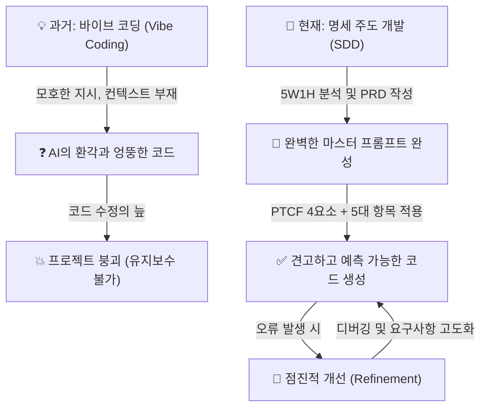

이 다이어그램은 오늘 우리가 하루 종일 경험한 치열한 인식의 변화를 가장 직관적으로 보여줍니다.
왼쪽 흐름처럼 모호한 지시가 가져오는 파국을 피해, 오른쪽 흐름처럼 명확한 문서와 구조화된 지시를 바탕으로 예측 가능한 결과를 이끌어내고, 오류를 마주했을 때는 당황하지 않고 점진적으로 개선해 나가는 단단한 선순환 구조를 그렸습니다.
이 흐름도는 앞으로 남은 3일 동안 여러분이 코드를 짤 때 항상 마음속에 간직해야 할 나침반입니다.

---

## §3. 상세 내용

### Why — 왜 성공적인 프롬프트를 자산화해야 하는가?

우리 뇌의 메커니즘을 생각해 봅시다. 오늘 하루 종일 최고급 레스토랑에서 엄청나게 맛있고 진귀한 지식의 만찬을 잔뜩 즐겼다고 가정해 보겠습니다.
아무리 비싸고 좋은 음식을 먹었어도 제대로 소화시키지 않으면 탈이 나거나, 다음 날 아침이면 언제 그랬냐는 듯 씻은 듯이 배가 고파지기 마련입니다.
우리의 뇌도 새로운 학습에 대해 똑같이 반응합니다. 오늘 수많은 실습과 치열한 미니 프로젝트를 통해 배운 지식들을 어딘가에 단단히 묶어두지 않으면, 내일 아침 눈을 떴을 때 절반 이상이 하얗게 머릿속에서 날아가 버립니다.

하지만 우리가 오늘 깨달은 것은 단순히 책에 적힌 죽은 지식만이 아닙니다.
실습 과정에서 우리는 "아, 이 단어를 넣고 이런 형식으로 물어보니까 AI가 찰떡같이 알아듣고 내가 딱 원하는 코드를 내놓더라!"는 짜릿한 성공적인 경험을 했습니다.
수차례의 헛발질과 시행착오, 그리고 점진적인 개선 끝에 마침내 얻어낸 그 정교한 문장들과 구조화된 양식들은 말 그대로 여러분의 피와 땀이 섞인 '비법 노트'입니다.
이것을 기록으로 남기지 않고 무심코 채팅창을 꺼버린다면, 한 달 뒤에 회사나 집에서 비슷한 프로그램을 기획하고 만들어야 할 때 똑같은 시행착오와 삽질을 처음부터 다시 반복해야 합니다.
그래서 우리에게는 이 우연한 성공 경험을 영원한 공식으로, 평생의 무기로 만들어 줄 철저한 자산화(Assetization) 과정이 반드시 필요합니다.

### What — 프롬프트 그리모어(Grimoire)란 무엇인가?

프롬프트 그리모어는 판타지 세계의 마법사들이 자신만의 강력한 마법 주문과 재료의 배합 비율을 은밀하게 기록해 두는 비밀 주문서인 '그리모어(Grimoire)'에서 따온 비유입니다.
오늘 하루를 관통하며 여러분은 프롬프트의 4요소(Persona, Task, Context, Format)와 코드 생성의 5대 필수 항목을 하나하나 쪼개어 배우고, 이를 정교하게 조합해 AI라는 거대한 마나를 다루는 강력한 주문을 만들어냈습니다.

어떤 마법사가 하루 종일 실험실에 틀어박혀 온갖 약초를 섞고 주문의 발음을 미세하게 조율하며 고생한 끝에, 마침내 지팡이 끝에서 불꽃이 완벽한 붉은 장미 모양으로 피어오르는 기가 막힌 마법 주문을 찾아냈다고 상상해 보세요.
이때 이 지친 마법사가 잠자리에 들기 전에 가장 먼저, 그리고 반드시 해야 할 일은 무엇일까요?
맞습니다. 자신의 낡고 두꺼운 가죽 노트인 그리모어에 그 주문의 정확한 토씨 하나, 손목을 꺾는 각도, 재료의 정확한 비율 하나까지 또박또박 정성스럽게 적어두는 것입니다.
그렇게 적어두지 않으면 다음 날 아침에 눈을 떴을 때 "어제 내가 뭐라고 주문을 외웠더라? 라틴어였나?" 하며 머리를 쥐어뜯고 똑같은 실험을 반복하게 될 테니까요.
여러분이 오늘 치열하게 작성했던 PRD 템플릿의 양식과, 환각을 잠재웠던 성공적인 초기 지시문(Prompt)이 바로 이 마법 주문이며, 이것들을 소중하게 모아둔 여러분의 개인 노트가 바로 프롬프트 포트폴리오이자 평생의 그리모어가 됩니다.

### How — 어떻게 성공 경험을 정리하고 보존할 것인가?

우리는 거창하고 복잡한 관리 시스템이나 값비싼 툴을 새로 배울 필요가 없습니다. 평소 자신이 가장 자주 사용하고 손에 익은 메모장, 노션(Notion), 옵시디언(Obsidian), 에버노트, 혹은 바탕화면의 단순한 텍스트 파일이어도 충분히 좋습니다.
가장 중요한 핵심은 '언제든지 검색해서 복사하고 붙여넣기 할 수 있는 가벼운 텍스트 상태'로 영구 저장해 두는 것입니다.

단순히 프롬프트 텍스트만 덩그러니 복사해 두는 것은 반쪽짜리 기록입니다.
이 프롬프트가 어떤 구체적인 상황에서 쓰이는지, 어떤 훌륭한 결과를 내는지 짧고 명확한 설명을 덧붙이는 것이 핵심 노하우입니다.
예를 들어 제목을 "콘솔 프로그램 PRD 초안 생성용 무적의 프롬프트"라고 달아두고, 그 아래에 역할(Persona)과 지시(Task)를 아주 뾰족하게 세팅한 프롬프트를 적어둔 뒤, 여러분이 매번 채워 넣어야 할 컨텍스트(Context) 영역은 `[여기에 내용을 입력하세요]`라고 빈칸으로 비워둔 템플릿을 만들어 두는 식입니다.
이렇게 구조가 잘 잡혀 만들어진 뼈대 프롬프트들은 앞으로 여러분이 파이썬이 아닌 다른 어떤 프로그래밍 언어로, 어떤 복잡한 프로그램을 기획하든 흔들리지 않는 든든한 출발점이 되어 줄 것입니다.

---

## §4. 실습 가이드 (+ 🎙️ 실습 대본)

### 실습 목표

수강생들이 오늘 하루 동안 실습과 미니 프로젝트를 치열하게 진행하면서 사용했던 수많은 프롬프트 중 가장 결과가 깔끔하고 의도대로 작동했던 것들을 골라내어, 개인 노트나 에디터에 체계적으로 복사하고 저장하도록 강하게 유도합니다.
이 짧지만 강력한 활동을 통해 '프롬프트는 한 번 쓱 쓰고 버리는 일회용 소모품이 아니라, 지속적으로 다듬고 재사용하며 발전시켜 나가는 영구적인 나의 지적 자산'이라는 핵심 개념을 몸과 손가락에 체득하게 하는 것이 궁극적인 목표입니다.

🎙️ **실습 가이드 대본 (Lab Guide)**:

> 자, 여러분. 다들 짐을 싸기 전에 오늘 컴퓨터를 끄기 위한 마지막, 그리고 아주 중요한 미션이 하나 남았습니다.
> 지금 바로 마우스를 움직여서 여러분이 가장 편하게 쓰는 메모 도구를 하나 열어주세요. 윈도우 기본 메모장도 아주 훌륭하고, 맥의 텍스트 편집기도 좋고, 평소 노션을 쓰시는 분들은 노션에 새 워크스페이스나 페이지를 하나 만드셔도 좋습니다.
>
> 파일 이름은 "나만의_프롬프트_마법서.md" 혹은 "프롬프트_포트폴리오_핵심.txt"라고 아주 거창하고 멋지게 지어볼까요?
>
> 준비되셨나요? 그렇다면 오늘 하루 종일 실습하면서 "오! 이렇게 세팅해서 물어보니까 AI가 기가 막히게 대답을 잘해주고 에러도 안 나네?" 하고 감탄했던 순간을 한 번 떠올려보세요.
> 바로 그 성공의 순간에 여러분이 입력했던 프롬프트를 채팅창 히스토리에서 쭉 긁어와서 여러분의 노트에 고이 복사해 넣으세요.
>
> 단순히 텍스트만 붙여넣지 마시고, 예를 들면 이렇게 친절하게 적어두는 겁니다.
> **제목**: '빠르고 깔끔한 PRD 생성용 마스터 프롬프트 (성공률 99%)'
> **내용**: '당신은 실리콘밸리의 15년 차 수석 프로덕트 매니저입니다. 아래의 요구사항 초안을 바탕으로 FR 식별자가 완벽하게 포함된 PRD를 작성해 주세요. 출력은 마크다운 표 형식으로 깔끔하게 부탁합니다.'
> 그리고 그 밑에 여러분이 조원들과 머리를 맞대고 고민했던 PRD 템플릿 양식 뼈대도 잊지 말고 통째로 복사해서 붙여넣어 두세요.
>
> 이렇게 성공한 마법의 주문들을 차곡차곡 모아두면 어떻게 될까요?
> 다음 주에 당장 회사에 돌아가서 엑셀 자동화 스크립트를 짤 때나, 한 달 뒤에 주말을 이용해 개인 토이 프로젝트를 시작할 때 텅 빈 백지상태의 화면을 보며 막막해할 필요가 전혀 없습니다.
> 정성껏 저장해 둔 여러분의 주문서를 펴서 복사하고 붙여넣기만 하면, 이미 완벽하게 검증된 최고 수준의 기획서와 뼈대 코드가 순식간에 튀어나올 테니까요.
>
> 코딩의 문법이나 프로그래밍 언어의 유행은 2~3년마다 엄청나게 빠르게 변하지만, 이렇게 AI라는 거대한 지능에게 내가 원하는 것을 정확히 지시하고 통제하는 여러분의 역량은 영원히 변하지 않는 평생의 무기가 될 것입니다.
>
> 자, 시간은 넉넉하게 5분 드리겠습니다. 오늘 땀 흘려 만든 여러분의 소중한 자산을 가장 안전한 저장소로 옮겨주세요! 자, 시작하세요!

### 단계별 지시

| 단계 | 소요 시간 | 강사 지시사항 | 학습자 액션 | 예상 결과 |
|------|----------|--------------|------------|----------|
| 1 | 1분 | 개인 노트 앱이나 텍스트 편집기를 열고 파일 이름 짓기 유도 | 메모장, 노션, 에버노트 등 실행 및 파일 제목 작성 | 개인별 지식 자산화 도구 준비 완료 |
| 2 | 3분 | 오늘 가장 완벽하게 작동했던 프롬프트와 PRD 템플릿 복사 및 저장 안내 | LLM 채팅 히스토리 스크롤 및 검색 후 복사, 자신의 노트에 붙여넣고 용도 메모 작성 | 개인별 프롬프트 포트폴리오(그리모어) 초기 버전 완성 |
| 3 | 1분 | 프롬프트 자산의 영구적 가치와 재사용성에 대한 강력한 동기부여 멘트 마무리 | 작성 내용 저장 확인 및 강사의 피드백 경청 | 프롬프트를 일회성이 아닌 자산으로 인식하는 근본적 태도 형성 |

### 트러블슈팅 FAQ

| Q | A |
|---|---|
| "오늘 제가 쓴 프롬프트 중에 딱히 성공적이었다고 할 만한 게 없는 것 같은데요. 다 에러가 났어요." | 실패도 좋은 자산입니다. 하지만 성공 경험이 필요하다면, 강사가 앞선 세션에서 모범 답안으로 띄워두었던 PRD 템플릿이나 4요소/5대 항목이 완벽하게 적용된 스탠다드 프롬프트를 화면에 다시 크게 띄워주세요. 그리고 그것을 사진 찍게 하거나 타이핑해서 적어가도록 안내해 주세요. "이 기본 틀만 챙겨가도 앞으로 코딩 인생의 절반은 먹고 들어갑니다"라고 따뜻하게 격려해 줍니다. |
| "무심코 채팅 히스토리를 닫아버려서 예전 프롬프트가 다 날아갔어요. 어쩌죠?" | 대부분의 현대적인 LLM 인터페이스(Gemini, Claude 등)는 좌측 사이드바나 설정 메뉴에 과거 대화 기록이 고스란히 남아 있음을 친절하게 알려주고, 화면에서 찾는 방법을 직접 시연해 주세요. 만약 로그인 문제 등으로 정말 날아갔다면 강사의 예시 텍스트를 복사하도록 즉각 제공합니다. |

> ✅ **체크포인트**: 모든 수강생이 최소 1개 이상의 마스터 프롬프트 템플릿과 PRD 구조 양식을 자신의 로컬 파일이나 클라우드에 온전히 저장했는지, 화면을 가볍게 순회하며 눈으로 꼭 확인합니다.

---


### 🎓 강사 노트 (Instructor Support)

- ⏱️ **타이밍**: 18:25 (15분, narrative)
- 🎯 **핵심 활동**: 4요소·5항목·SDD 정리
- ⚠️ **강사 주의사항**: 프롬프트 저장 습관화 안내

## §5. 코드 및 명령어 모음

이 세션은 하루의 방대한 학습을 정리하고 문서를 갈무리하는 narrative(서술형) 타입이므로, 터미널에서 직접적으로 실행해야 할 파이썬 코드나 명령어는 존재하지 않습니다.
다만, 수강생들이 노트에 반드시 복사해 두어야 할 '마스터 프롬프트 템플릿'의 완벽한 예시를 대형 화면에 띄워두어, 기록을 놓친 수강생들이 참고할 수 있도록 돕는 것이 좋습니다.

> 🤖 **프롬프트 템플릿 예시 (수강생 노트 복사용)**:
>
> ```text
> [역할 (Persona)]
> 당신은 실리콘밸리에서 15년 동안 근무한 최고 수준의 시니어 파이썬 개발자이자 시스템 아키텍트입니다.
> 
> [지시 (Task)]
> 아래의 [컨텍스트]에 제공된 PRD(제품 요구사항 정의서) 문서를 꼼꼼히 분석하고, 명시된 모든 기능 요구사항(FR)을 100% 충족하며 엣지 케이스까지 방어하는 파이썬 코드를 작성해 주세요.
> 
> [컨텍스트 (Context)]
> - 실행 환경: 화려한 GUI 화면이 없는 단순한 터미널 콘솔창
> - 데이터 저장: 파일이나 외부 DB 연결을 하지 않고, 일단 프로그램 메모리(리스트나 딕셔너리 구조)에만 저장
> 
> PRD 내용 (이 설계도를 절대 벗어나지 마세요):
> '''
> (여기에 여러분이 작성한 7섹션 구조의 완벽한 PRD 내용을 붙여넣으세요)
> '''
> 
> [형식 및 제약 (Format & Constraints)]
> - 제약: 기본 내장 라이브러리 외에 어떤 외부 패키지(pip install)도 사용하지 마세요.
> - 형식: 모든 코드는 사용자가 터미널에서 바로 실행할 수 있도록 단 하나의 파이썬 파일(main.py) 안에 합쳐서 제공해 주세요.
> - 주석: 주요 함수나 클래스 상단에는 이 코드가 PRD의 어떤 요구사항(예: FR-01)을 구현한 것인지 명확한 주석을 반드시 달아주세요.
> - 설명: 코드를 출력한 후, 예외 처리 가이드가 코드에 어떻게 반영되었는지 짧고 명료하게 요약해서 설명해 주세요.
> ```

---

## §6. 요약 및 다음 세션 예고

### 핵심 학습 포인트

Day 2에서 우리가 하루 종일 매달려 배운 모든 것은 결국 단 하나의 문장, "인간과 AI 간의 커뮤니케이션 밀도를 극한으로 높이는 기술"로 완벽하게 요약됩니다.
대충 모호하게 뭉뚱그려 말하면 AI는 여지없이 환각을 일으키며 엉뚱한 길로 빠져버리고 만다는 것을 뼈저리게 확인했습니다.
하지만 반대로 AI에게 전문가의 페르소나를 부여하고, 해야 할 명확한 단일 과업을 제시하며, 빈틈없는 PRD 컨텍스트와 기대하는 출력 포맷을 쥐여주면, AI는 여러분의 의도를 완벽히 꿰뚫어 보는 최고의 천재 개발자로 돌변합니다.
우리는 이 고통스럽고도 즐거운 과정을 통해 느낌으로 지시하는 바이브 코딩의 얄팍함을 버리고, 견고한 PRD 문서를 기반으로 설계도를 먼저 그리는 명세 주도 개발(SDD)의 진정한 위력을 깨달았습니다.
그리고 오늘 여러분이 머리를 쥐어짜며 만들어낸 그 수많은 성공적인 지시문들은 이제 여러분의 프롬프트 그리모어에 영구적인 지적 자산으로 아로새겨졌습니다.

### 다음 세션 예고 (Day 3 브릿지)

지금까지 이틀 동안 우리는 훌륭한 아키텍트가 되어 완벽한 설계도를 그리는 법을 아주 깊게 배웠고, AI라는 지치지 않고 유능한 건설 노동자에게 정확한 지시를 내려 삽을 뜨게 만드는 법을 완벽하게 익혔습니다.
하지만 여러분이 지시해서 만들어진 그 엄청난 결과물이 진짜 설계도대로 튼튼하게 지어졌는지, 혹시라도 시멘트가 덜 발라진 곳은 없는지 최종 검수하려면 어떻게 해야 할까요?
맞습니다. 현장 감독인 우리도 벽돌이 어떻게 쌓여있는지 그 언어의 기초를 읽을 줄 알아야 합니다.
내일 아침 시작되는 Day 3에서는 마침내 프롬프트의 세계를 잠시 떠나 파이썬이라는 언어의 진짜 문법 속으로 깊이 들어갑니다.
어려운 수학을 배우는 것이 아니라 변수가 어떻게 데이터를 그릇에 담고, 반복문이 어떻게 노가다를 대신하며, 함수가 어떻게 로직을 예쁘게 포장하는지 배우게 될 것입니다.

### 브릿지 노트

> "오늘 하루 종일 여러분은 복잡한 파이썬 코드를 한 줄도 억지로 외우지 않았습니다.
> 하지만 여러분은 이미 코딩 학원에서 문법만 몇 달째 달달 외우고 있는 평범한 코더들의 수준을 훌쩍 뛰어넘었습니다.
> 요구사항을 쪼개고 완벽한 지시를 내릴 줄 아는 진짜 설계자가 되었으니까요.
> 하지만 훌륭한 설계자가 도면을 볼 줄 모르고 벽돌의 질감을 전혀 모르면 현장 감독을 제대로 할 수 없겠죠? 코드가 무너져도 왜 무너졌는지 모를 테니까요.
> 내일은 AI가 1초 만에 쏟아내는 그 수많은 파이썬 코드들이 도대체 어떤 원리와 논리로 돌아가는지, 그 내부의 신비로운 톱니바퀴를 들여다보는 시간을 가질 겁니다.
> 오늘 여러분이 소중하게 만든 프롬프트 주문서가 내일 엄청난 빛을 발할 거예요. 문법을 몰라도 든든한 백업이 되어 줄 테니까요.
> 오늘 하루, 정말 고생 많으셨습니다. 맛있는 저녁 드시고 푹 쉬신 다음, 내일 아침 웃는 얼굴로 뵙겠습니다. 감사합니다!"

---

## §7. 참고 자료

### 3-Source 출처

- **Source A (로컬 참고자료)**: `7 기획.pdf` (§7.5 미니 스펙 프로젝트 가이드) — 프로젝트 산출물 관리 관점에서의 프롬프트 자산화 필요성 및 재사용 전략을 차용하여 실습 활동을 구성하였습니다.
- **Source B (NotebookLM)**: `AI 시대의 서사 v3 - Claude.md` — 모호한 바이브 코딩의 5대 한계 극복과 명세 주도 개발(SDD)로의 철학적 패러다임 전환에 대한 핵심 논리 구조를 제공했습니다.
- **Source C (Deep Research)**: Deep Research 보고서 — 단기적인 성공적인 프롬프팅 경험을 개인화된 지식 저장소에 체계적으로 구축하는 실무 활용 사례와, 이것이 가져오는 장기적 학습 효과 모델링을 적극 반영하여 '프롬프트 그리모어(비밀 마법 주문서)' 비유를 교육적으로 고도화했습니다.

### 강사 노트

> 💡 **강사 노트**: 이 세션은 새로운 지식을 주입하고 평가하는 시간이 절대 아닙니다.
> 하루 종일 머리를 써서 기진맥진해 있는 수강생들에게 하루의 성취를 돌아보게 하고, 큰 성취감과 뿌듯함을 안겨주며 격려하는 치어리딩과 갈무리의 시간입니다.
> "여러분은 이제 단순한 코더가 아니라 전체를 조망하는 아키텍트로 진화했다"는 점을 눈을 맞추며 힘주어 말해주어, 수강생들이 강한 자부심을 느끼게 해주세요.
> 프롬프트 포트폴리오를 작성하고 저장하는 5분의 실습 시간 동안, 잔잔하고 성취감을 고조시킬 수 있는 웅장한 배경음악(BGM)을 작게 틀어두는 것도 교육장 분위기를 훈훈하고 감동적으로 마무리하는 아주 좋은 진행 팁입니다.

---

## ✅ 세션 완료 체크리스트 (강사용)

- [ ] §1~§7 모든 섹션이 충실하고 서술적인 구어체로 작성되었는가?
- [ ] 프롬프트 그리모어(마법서) 비유와 아키텍트 진화 스토리텔링이 충분히 확장되어 포함되었는가?
- [ ] Vibe Coding에서 SDD로의 패러다임 전환이 명확하게 대비되어 설명되었는가?
- [ ] 수강생들이 프롬프트를 자산화하는 실습(포트폴리오 저장)이 명확히 안내되었는가?
- [ ] 3-Source 팩트 패킷(Source A, B, C)의 출처 표기가 올바르게 반영되었는가?

---

*작성 일시: 2026-02-25*  
*작성 에이전트: A4B_Session_Writer*  
*교안 구조: 7섹션 (A0 팀 공통 표준)*

> 🔗 **이전 세션**: [세션 042: 팀별 발표: '나는 이렇게 AI와 대화했다'](#세션-042)에서 배운 내용을 이어갑니다.
> 🔗 **다음 세션**: [세션 044: 변수의 개념과 이름표 상자 비유](#세션-044)에서 계속됩니다.

---

> 🔗 **내일 오전으로 이어집니다**: Day 3 오전(09:00~12:30)에서 세션 044부터 계속됩니다.

## 📦 부록

### 강사 체크리스트 (Day 2 오후)

- [ ] 세션 034: AI와 함께하는 요구사항 작성 실습 (25분)
- [ ] 세션 035: PRD(Product Requirements Document)란 무엇인가? (20분)
- [ ] 세션 036: PRD의 핵심 구조와 기능 명세(FR) 작성법 (25분)
- [ ] 세션 037: 사용자 시나리오와 성공 지표 정의 (20분)
- [ ] 세션 038: 고객 정보 관리 프로그램 PRD 완성하기 (25분)
- [ ] 세션 039: 미니 스펙 프로젝트: 주제 선정 및 요구사항 (25분)
- [ ] 세션 040: 미니 스펙 프로젝트: PRD 작성 및 프롬프트 준비 (25분)
- [ ] 세션 041: 미니 스펙 프로젝트: 코드 생성 및 실행 검증 (25분)
- [ ] 세션 042: 팀별 발표: '나는 이렇게 AI와 대화했다' (15분)
- [ ] 세션 043: Day 2 핵심 요약 및 프롬프트 포트폴리오 정리 (15분)

---

*Day 2 오후 교안 — AI-native 파이썬 기초 v2.1*  
*취합: A4C_Material_Aggregator*  
*검증: A8_QA_Editor*
