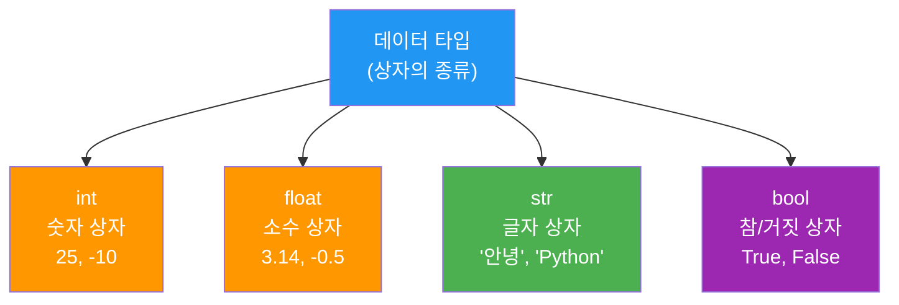
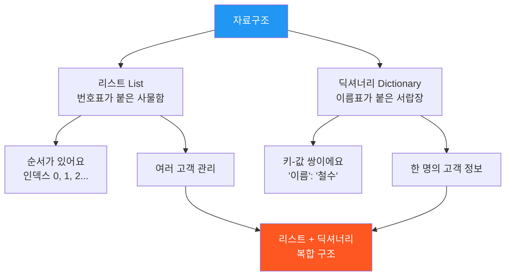

# Day 3 오전: 파이썬 기초문법 — 변수·타입과 자료구조

> 과정: AI-native 파이썬 기초 | Day 3/5 | 09:00–12:00

---

## 도입: 오늘 우리가 배울 것

어제(Day 2)는 AI와 대화하는 법, 프롬프트 작성법과 요구사항·PRD 문서를 배웠어요. AI에게 "무엇을 만들어줘"라고 말하는 기술을 익힌 거죠.

오늘은 한 걸음 더 나아가서, **파이썬이라는 언어 자체를 이해하는 시간**이에요. AI가 생성해준 코드를 읽고 리뷰하려면, 파이썬이 데이터를 어떻게 다루는지 알아야 하거든요.

> "어제 AI와 대화하는 법을 익혔다면, 오늘은 파이썬의 언어를 이해합니다."

오전에는 **변수와 타입**(세션 3-1), 그리고 **자료구조**(세션 3-2)를 다뤄요. 오후에는 제어문, 함수, 종합 실습으로 이어집니다.


---

# 세션 3-1: 데이터의 이해 — 변수와 타입

> 09:00–10:30 (90분) | 이론 40% · 실습 60%

---

## 3-1-1. 개요

| 항목 | 내용 |
|------|------|
| **학습 목표** | "데이터에 이름을 붙인다"는 개념으로 변수를 이해하고, 데이터 타입의 종류와 특징을 알아요 |
| **핵심 개념** | 변수(Variable), 데이터 타입(int, float, str, bool), 타입 변환, 할당 연산자 |
| **선행 지식** | Day 1 환경 구축 완료, Day 2 프롬프트 작성법 |
| **산출물** | 변수와 타입 실습 코드 실행 완료 |

---

## 3-1-2. 핵심 개념

### 변수란? — "이름표가 붙은 상자"

프로그래밍에서 가장 기본이 되는 개념이 **변수(Variable)**예요.

변수는 **"이름표가 붙은 상자"**라고 생각하면 돼요. `name = "철수"`라고 쓰면, "name"이라는 이름표가 붙은 상자에 "철수"라는 값을 넣는 거예요.

```
  ┌─────────────┐
  │   "철수"     │  ← 상자 안의 값
  │             │
  └─────────────┘
     name          ← 이름표
```

상자에 넣는 값은 언제든 바꿀 수 있어요. `name = "영희"`라고 다시 쓰면, 같은 상자에 "영희"가 들어가요. 이전에 있던 "철수"는 사라지고요.

### 데이터 타입 — 상자의 종류

상자에 넣을 수 있는 물건의 종류가 다르듯, 파이썬에도 데이터의 종류가 있어요. 이걸 **데이터 타입(Data Type)**이라고 불러요.

| 타입 | 비유 | 설명 | 예시 |
|------|------|------|------|
| `int` (정수) | 숫자 상자 | 소수점 없는 숫자 | `25`, `-10`, `0` |
| `float` (실수) | 소수 상자 | 소수점 있는 숫자 | `3.14`, `-0.5`, `98.6` |
| `str` (문자열) | 글자 상자 | 따옴표로 감싼 텍스트 | `"안녕"`, `'Python'` |
| `bool` (불리언) | 참/거짓 상자 | 참 또는 거짓 두 가지만 | `True`, `False` |



### 타입 변환 — 상자 바꿔 담기

때로는 글자 상자에 있는 "123"을 숫자 상자로 옮겨야 할 때가 있어요. 이걸 **타입 변환(Type Conversion)**이라고 해요.

- `int("123")` → 문자열 "123"을 정수 123으로 변환
- `str(456)` → 정수 456을 문자열 "456"으로 변환
- `float("3.14")` → 문자열 "3.14"를 실수 3.14로 변환

### 할당 연산자 — 상자에 값 넣기

`=` 기호는 수학에서의 "같다"가 아니라, **"오른쪽 값을 왼쪽 상자에 넣어라"**라는 뜻이에요.

```python
age = 25        # age 상자에 25를 넣어라
age = age + 1   # age 상자의 값(25)에 1을 더해서 다시 age 상자에 넣어라 → 26
```

---

## 3-1-3. 상세 내용

### 변수 이름 짓기 규칙

파이썬에서 변수 이름을 지을 때 지켜야 할 규칙이 있어요.

| 규칙 | 올바른 예 | 잘못된 예 |
|------|----------|----------|
| 영문자, 숫자, 밑줄(_) 사용 가능 | `my_name`, `age2` | — |
| 숫자로 시작할 수 없어요 | `name1` | `1name` |
| 공백 사용 불가 | `my_name` | `my name` |
| 예약어 사용 불가 | `my_class` | `class`, `if`, `for` |
| 대소문자 구분 | `Name`과 `name`은 다른 변수 | — |

> **팁**: 변수 이름은 그 안에 뭐가 들어있는지 알 수 있게 지어주세요. `x = 25`보다 `age = 25`가 훨씬 읽기 좋아요.

### 연산자 — 상자 안의 값으로 계산하기

파이썬에서 사용하는 주요 연산자를 알아볼게요.

**산술 연산자** (숫자 계산):

| 연산자 | 의미 | 예시 | 결과 |
|--------|------|------|------|
| `+` | 더하기 | `10 + 3` | `13` |
| `-` | 빼기 | `10 - 3` | `7` |
| `*` | 곱하기 | `10 * 3` | `30` |
| `/` | 나누기 | `10 / 3` | `3.333...` |
| `//` | 몫 | `10 // 3` | `3` |
| `%` | 나머지 | `10 % 3` | `1` |
| `**` | 거듭제곱 | `2 ** 3` | `8` |

**문자열 연산자** (글자 조합):

| 연산자 | 의미 | 예시 | 결과 |
|--------|------|------|------|
| `+` | 문자열 결합 | `"안녕" + "하세요"` | `"안녕하세요"` |
| `*` | 문자열 반복 | `"하" * 3` | `"하하하"` |

**비교 연산자** (참/거짓 판단):

| 연산자 | 의미 | 예시 | 결과 |
|--------|------|------|------|
| `==` | 같은가? | `5 == 5` | `True` |
| `!=` | 다른가? | `5 != 3` | `True` |
| `>` | 큰가? | `5 > 3` | `True` |
| `<` | 작은가? | `5 < 3` | `False` |
| `>=` | 크거나 같은가? | `5 >= 5` | `True` |
| `<=` | 작거나 같은가? | `3 <= 5` | `True` |

---

## 3-1-4. 실습 가이드

### 실습 1: 데이터 타입 4가지 변수 저장 + type() 확인

**프롬프트 작성**

Antigravity의 Agent Manager에 다음 프롬프트를 입력해 보세요.

> **프롬프트**: "파이썬의 기본 데이터 타입 4가지(int, float, str, bool)를 각각 변수에 저장하고 type() 함수로 확인하는 예제를 만들어줘. 각 변수에 대해 값과 타입을 함께 출력해줘."

**AI 응답 코드 리뷰**

AI가 생성한 코드를 한 줄씩 살펴볼게요.

```python
# 1. 정수(int) - 숫자 상자
age = 25
print(f"값: {age}, 타입: {type(age)}")
# 출력: 값: 25, 타입: <class 'int'>

# 2. 실수(float) - 소수 상자
height = 175.5
print(f"값: {height}, 타입: {type(height)}")
# 출력: 값: 175.5, 타입: <class 'float'>

# 3. 문자열(str) - 글자 상자
name = "김하늘"
print(f"값: {name}, 타입: {type(name)}")
# 출력: 값: 김하늘, 타입: <class 'str'>

# 4. 불리언(bool) - 참/거짓 상자
is_student = True
print(f"값: {is_student}, 타입: {type(is_student)}")
# 출력: 값: True, 타입: <class 'bool'>
```

**코드 리뷰 포인트**:
- `type()` 함수는 상자의 종류(타입)를 알려주는 내장 함수예요
- `f"..."` 형태는 f-string이라고 불러요. 중괄호 `{}` 안에 변수를 넣으면 그 값이 출력돼요
- 각 변수에 어떤 종류의 값이 들어갔는지 `type()`으로 확인할 수 있어요

**실행 후 체크포인트**:
- [ ] 4가지 타입(int, float, str, bool)의 차이를 설명할 수 있나요?
- [ ] `type()` 함수의 역할을 이해했나요?

---

### 실습 2: 타입 변환

**프롬프트 작성**

> **프롬프트**: "문자열 '123'을 숫자로, 숫자 456을 문자열로 변환하는 예제를 만들어줘. 변환 전후의 타입을 type()으로 확인해줘."

**AI 응답 코드 리뷰**

```python
# 문자열 → 정수 변환
text_number = "123"
print(f"변환 전: {text_number}, 타입: {type(text_number)}")
# 출력: 변환 전: 123, 타입: <class 'str'>

int_number = int(text_number)
print(f"변환 후: {int_number}, 타입: {type(int_number)}")
# 출력: 변환 후: 123, 타입: <class 'int'>

# 정수 → 문자열 변환
number = 456
print(f"변환 전: {number}, 타입: {type(number)}")
# 출력: 변환 전: 456, 타입: <class 'int'>

text = str(number)
print(f"변환 후: {text}, 타입: {type(text)}")
# 출력: 변환 후: 456, 타입: <class 'str'>

# 문자열 → 실수 변환
price_text = "19900.5"
price = float(price_text)
print(f"변환 전: {price_text} ({type(price_text)})")
# 출력: 변환 전: 19900.5 (<class 'str'>)
print(f"변환 후: {price} ({type(price)})")
# 출력: 변환 후: 19900.5 (<class 'float'>)
```

**코드 리뷰 포인트**:
- `int()`, `str()`, `float()` 함수로 타입을 변환할 수 있어요
- 변환 전후로 값은 같아 보이지만, 타입이 달라져요
- 주의: `int("안녕")`처럼 숫자가 아닌 문자열을 정수로 변환하면 에러가 발생해요

**실행 후 체크포인트**:
- [ ] `int()`, `str()`, `float()` 변환 함수를 사용할 수 있나요?
- [ ] 변환이 불가능한 경우(예: `int("안녕")`)를 예상할 수 있나요?

---

### 실습 3: 연산자 실습

**프롬프트 작성**

> **프롬프트**: "파이썬의 사칙연산(+, -, *, /), 문자열 결합(+), 비교 연산(==, !=, >, <)을 각각 보여주는 예제를 만들어줘. 각 연산의 결과를 출력해줘."

**AI 응답 코드 리뷰**

```python
# === 산술 연산 ===
print("=== 산술 연산 ===")
a = 10
b = 3

print(f"{a} + {b} = {a + b}")    # 출력: 10 + 3 = 13
print(f"{a} - {b} = {a - b}")    # 출력: 10 - 3 = 7
print(f"{a} * {b} = {a * b}")    # 출력: 10 * 3 = 30
print(f"{a} / {b} = {a / b}")    # 출력: 10 / 3 = 3.3333333333333335
print(f"{a} // {b} = {a // b}")  # 출력: 10 // 3 = 3 (몫)
print(f"{a} % {b} = {a % b}")    # 출력: 10 % 3 = 1 (나머지)
print(f"{a} ** {b} = {a ** b}")  # 출력: 10 ** 3 = 1000 (거듭제곱)

# === 문자열 연산 ===
print("\n=== 문자열 연산 ===")
first_name = "김"
last_name = "하늘"

full_name = first_name + last_name
print(f"문자열 결합: {first_name} + {last_name} = {full_name}")
# 출력: 문자열 결합: 김 + 하늘 = 김하늘

greeting = "안녕! " * 3
print(f"문자열 반복: '안녕! ' * 3 = {greeting}")
# 출력: 문자열 반복: '안녕! ' * 3 = 안녕! 안녕! 안녕! 

# === 비교 연산 ===
print("\n=== 비교 연산 ===")
x = 5
y = 10

print(f"{x} == {y} → {x == y}")   # 출력: 5 == 10 → False
print(f"{x} != {y} → {x != y}")   # 출력: 5 != 10 → True
print(f"{x} > {y} → {x > y}")     # 출력: 5 > 10 → False
print(f"{x} < {y} → {x < y}")     # 출력: 5 < 10 → True
print(f"{x} >= {y} → {x >= y}")   # 출력: 5 >= 10 → False
print(f"{x} <= {y} → {x <= y}")   # 출력: 5 <= 10 → True
```

**코드 리뷰 포인트**:
- `/`는 항상 실수(float) 결과를 돌려줘요. `10 / 3`의 결과는 `3.333...`이에요
- `//`는 몫만, `%`는 나머지만 돌려줘요
- 문자열끼리 `+`를 하면 이어 붙이고, `*`를 하면 반복해요
- 비교 연산의 결과는 항상 `True` 또는 `False`(bool 타입)예요

**실행 후 체크포인트**:
- [ ] `/`와 `//`의 차이를 설명할 수 있나요?
- [ ] 문자열 `+`와 숫자 `+`의 차이를 이해했나요?
- [ ] 비교 연산의 결과가 bool 타입이라는 걸 알겠나요?

---

## 3-1-5. 코드 모음

> 이 섹션은 세션 3-1에서 다룬 모든 코드를 한곳에 모아둔 거예요. 복습할 때 활용하세요.

```python
# ============================================
# 세션 3-1: 변수와 타입 - 전체 코드 모음
# ============================================

# --- 실습 1: 데이터 타입 4가지 ---
age = 25                    # int (정수)
height = 175.5              # float (실수)
name = "김하늘"              # str (문자열)
is_student = True           # bool (불리언)

print(f"나이: {age}, 타입: {type(age)}")
print(f"키: {height}, 타입: {type(height)}")
print(f"이름: {name}, 타입: {type(name)}")
print(f"학생 여부: {is_student}, 타입: {type(is_student)}")

# --- 실습 2: 타입 변환 ---
text_number = "123"
int_number = int(text_number)       # str → int
print(f"'{text_number}' → {int_number} (타입: {type(int_number)})")

number = 456
text = str(number)                  # int → str
print(f"{number} → '{text}' (타입: {type(text)})")

price_text = "19900.5"
price = float(price_text)           # str → float
print(f"'{price_text}' → {price} (타입: {type(price)})")

# --- 실습 3: 연산자 ---
# 산술 연산
a, b = 10, 3
print(f"{a} + {b} = {a + b}")
print(f"{a} - {b} = {a - b}")
print(f"{a} * {b} = {a * b}")
print(f"{a} / {b} = {a / b}")
print(f"{a} // {b} = {a // b}")
print(f"{a} % {b} = {a % b}")

# 문자열 연산
full_name = "김" + "하늘"
print(f"문자열 결합: {full_name}")
print(f"문자열 반복: {'안녕! ' * 3}")

# 비교 연산
print(f"5 == 10 → {5 == 10}")
print(f"5 != 10 → {5 != 10}")
print(f"5 > 10 → {5 > 10}")
print(f"5 < 10 → {5 < 10}")
```

---

## 3-1-6. 트러블슈팅 FAQ

### Q1. `TypeError: can only concatenate str (not "int") to str` 에러가 떠요

**원인**: 문자열과 숫자를 `+`로 직접 연결하려고 했을 때 발생해요.

```python
# 에러 발생!
age = 25
print("나이: " + age)  # TypeError!

# 해결 방법 1: str()로 변환
print("나이: " + str(age))

# 해결 방법 2: f-string 사용 (추천!)
print(f"나이: {age}")
```

### Q2. `NameError: name 'Name' is not defined` 에러가 떠요

**원인**: 변수 이름의 대소문자가 다르거나, 변수를 선언하기 전에 사용했을 때 발생해요.

```python
name = "철수"
print(Name)  # NameError! (name과 Name은 다른 변수)

# 해결: 정확한 변수 이름 사용
print(name)  # 정상 출력: 철수
```

### Q3. `ValueError: invalid literal for int() with base 10: '안녕'` 에러가 떠요

**원인**: 숫자가 아닌 문자열을 `int()`로 변환하려고 했을 때 발생해요.

```python
# 에러 발생!
number = int("안녕")  # ValueError!

# 해결: 숫자 형태의 문자열만 변환 가능
number = int("123")   # 정상: 123
```

### Q4. `SyntaxError: invalid syntax` 에러가 떠요

**원인**: 파이썬 문법에 맞지 않는 코드를 작성했을 때 발생해요.

```python
# 에러 발생!
my name = "철수"  # SyntaxError! (변수 이름에 공백 불가)

# 해결: 밑줄(_) 사용
my_name = "철수"  # 정상
```

---

## 3-1-7. 요약

| 개념 | 비유 | 핵심 포인트 |
|------|------|------------|
| **변수** | 이름표가 붙은 상자 | `name = "철수"` → "name" 상자에 "철수" 넣기 |
| **int** | 숫자 상자 | 소수점 없는 정수: `25`, `-10` |
| **float** | 소수 상자 | 소수점 있는 실수: `3.14`, `175.5` |
| **str** | 글자 상자 | 따옴표로 감싼 텍스트: `"안녕"` |
| **bool** | 참/거짓 상자 | `True` 또는 `False` 두 가지만 |
| **타입 변환** | 상자 바꿔 담기 | `int("123")`, `str(456)`, `float("3.14")` |
| **`=` 연산자** | 상자에 넣기 | "같다"가 아니라 "넣어라"의 의미 |

> **다음 세션 예고**: 변수 하나에 값 하나만 넣을 수 있다면, 고객 100명의 정보는 변수 100개가 필요할까요? 세션 3-2에서 여러 데이터를 한꺼번에 담는 **자료구조**를 배워요!

---

# 세션 3-2: 데이터에서 정보로 — 자료구조

> 10:30–12:00 (90분) | 이론 40% · 실습 60%

---

## 3-2-1. 개요

| 항목 | 내용 |
|------|------|
| **학습 목표** | 여러 데이터를 묶어 하나의 정보 단위로 다루는 자료구조(리스트, 딕셔너리)를 이해해요 |
| **핵심 개념** | 리스트(List), 딕셔너리(Dictionary), 인덱싱, 키-값 쌍, CRUD 연산 |
| **선행 지식** | 세션 3-1 변수와 타입 |
| **산출물** | 리스트/딕셔너리 실습 코드 |

---

## 3-2-2. 핵심 개념

### 왜 자료구조가 필요할까?

세션 3-1에서 변수 하나에 값 하나를 저장하는 법을 배웠어요. 그런데 과일 가게에서 파는 과일 5개를 저장하려면 어떻게 해야 할까요?

```python
# 이렇게 변수 5개를 만들어야 할까요?
fruit1 = "사과"
fruit2 = "바나나"
fruit3 = "딸기"
fruit4 = "포도"
fruit5 = "수박"
```

과일이 100개라면 변수 100개? 1,000개라면? 이건 너무 비효율적이에요. 그래서 **여러 데이터를 하나로 묶어서 관리하는 방법**이 필요해요. 이걸 **자료구조(Data Structure)**라고 불러요.

### 리스트(List) — "번호표가 붙은 사물함"

리스트는 **"번호표가 붙은 사물함"**이에요. 0번 칸, 1번 칸, 2번 칸... 순서대로 물건을 넣고, 번호로 찾아요.

```
  사물함 (fruits 리스트)
  ┌────────┬────────┬────────┬────────┬────────┐
  │ "사과"  │"바나나" │ "딸기"  │ "포도"  │ "수박"  │
  ├────────┼────────┼────────┼────────┼────────┤
  │  0번   │  1번   │  2번   │  3번   │  4번   │
  └────────┴────────┴────────┴────────┴────────┘
```

```python
fruits = ["사과", "바나나", "딸기", "포도", "수박"]
print(fruits[0])   # "사과" (0번 칸)
print(fruits[2])   # "딸기" (2번 칸)
```

> **중요**: 파이썬에서 번호(인덱스)는 0부터 시작해요! 첫 번째 칸이 0번이에요.

### 딕셔너리(Dictionary) — "이름표가 붙은 서랍장"

딕셔너리는 **"이름표가 붙은 서랍장"**이에요. 번호 대신 이름표(키, Key)로 찾아요.

```
  서랍장 (customer 딕셔너리)
  ┌──────────────────────────┐
  │  "이름"   서랍 → "김철수"  │
  │  "나이"   서랍 → 28       │
  │  "전화번호" 서랍 → "010-1234" │
  │  "이메일"  서랍 → "kim@email" │
  └──────────────────────────┘
```

```python
customer = {
    "이름": "김철수",
    "나이": 28,
    "전화번호": "010-1234-5678",
    "이메일": "kim@email.com"
}
print(customer["이름"])      # "김철수"
print(customer["전화번호"])   # "010-1234-5678"
```

### 리스트 + 딕셔너리 = 실무 데이터 구조

실무에서는 이 둘을 조합해서 사용해요.

- **한 명의 고객 정보** = 딕셔너리 (이름표로 각 항목에 접근)
- **여러 고객** = 리스트 안에 딕셔너리들 (번호표로 각 고객에 접근)

```
  고객 목록 (customers 리스트)
  ┌─────────────────────────────────────────┐
  │ 0번: {"이름": "김철수", "나이": 28, ...}   │
  │ 1번: {"이름": "이영희", "나이": 32, ...}   │
  │ 2번: {"이름": "박민수", "나이": 25, ...}   │
  └─────────────────────────────────────────┘
```

> **Day 4 연결**: 이 "리스트 안의 딕셔너리" 구조가 바로 Day 4에서 만들 **고객 정보 관리 프로그램**의 데이터 저장 방식이에요! 오늘 이 구조를 확실히 이해해두면 내일이 훨씬 수월해요.



---

## 3-2-3. 상세 내용

### 리스트 CRUD 연산

CRUD는 데이터를 다루는 4가지 기본 동작이에요.

| 동작 | 의미 | 리스트 메서드 |
|------|------|-------------|
| **C**reate (생성) | 데이터 추가 | `append()`, `insert()` |
| **R**ead (읽기) | 데이터 조회 | 인덱싱 `[0]`, 슬라이싱 `[1:3]` |
| **U**pdate (수정) | 데이터 변경 | 인덱싱 할당 `[0] = "새값"` |
| **D**elete (삭제) | 데이터 제거 | `remove()`, `pop()`, `del` |

### 딕셔너리 CRUD 연산

| 동작 | 의미 | 딕셔너리 방법 |
|------|------|-------------|
| **C**reate (생성) | 키-값 추가 | `dict["새키"] = "새값"` |
| **R**ead (읽기) | 값 조회 | `dict["키"]`, `dict.get("키")` |
| **U**pdate (수정) | 값 변경 | `dict["키"] = "새값"` |
| **D**elete (삭제) | 키-값 제거 | `del dict["키"]`, `dict.pop("키")` |

### 유용한 리스트 메서드

| 메서드 | 설명 | 예시 |
|--------|------|------|
| `len(리스트)` | 길이(개수) 확인 | `len(fruits)` → `5` |
| `리스트.sort()` | 정렬 | `fruits.sort()` |
| `리스트.reverse()` | 역순 정렬 | `fruits.reverse()` |
| `값 in 리스트` | 포함 여부 확인 | `"사과" in fruits` → `True` |

---

## 3-2-4. 실습 가이드

### 실습 1: 과일 5개 리스트 CRUD

**프롬프트 작성**

> **프롬프트**: "과일 5개를 리스트에 저장하고, 추가·삭제·검색하는 예제를 만들어줘. 각 단계마다 리스트 상태를 출력해줘."

**AI 응답 코드 리뷰**

```python
# 리스트 생성 (Create)
fruits = ["사과", "바나나", "딸기", "포도", "수박"]
print(f"초기 리스트: {fruits}")
# 출력: 초기 리스트: ['사과', '바나나', '딸기', '포도', '수박']

# 읽기 (Read) - 인덱싱
print(f"\n첫 번째 과일: {fruits[0]}")
# 출력: 첫 번째 과일: 사과
print(f"세 번째 과일: {fruits[2]}")
# 출력: 세 번째 과일: 딸기
print(f"마지막 과일: {fruits[-1]}")
# 출력: 마지막 과일: 수박

# 추가 (Create) - append
fruits.append("망고")
print(f"\n망고 추가 후: {fruits}")
# 출력: 망고 추가 후: ['사과', '바나나', '딸기', '포도', '수박', '망고']

# 특정 위치에 추가 - insert
fruits.insert(1, "키위")
print(f"1번 위치에 키위 추가: {fruits}")
# 출력: 1번 위치에 키위 추가: ['사과', '키위', '바나나', '딸기', '포도', '수박', '망고']

# 수정 (Update)
fruits[0] = "청사과"
print(f"\n사과→청사과 수정: {fruits}")
# 출력: 사과→청사과 수정: ['청사과', '키위', '바나나', '딸기', '포도', '수박', '망고']

# 삭제 (Delete) - 값으로 삭제
fruits.remove("바나나")
print(f"바나나 삭제: {fruits}")
# 출력: 바나나 삭제: ['청사과', '키위', '딸기', '포도', '수박', '망고']

# 삭제 (Delete) - 위치로 삭제
removed = fruits.pop(2)
print(f"{removed} 삭제 (2번 위치): {fruits}")
# 출력: 딸기 삭제 (2번 위치): ['청사과', '키위', '포도', '수박', '망고']

# 검색
print(f"\n'포도'가 리스트에 있나요? {'포도' in fruits}")
# 출력: '포도'가 리스트에 있나요? True
print(f"리스트 길이: {len(fruits)}")
# 출력: 리스트 길이: 5
```

**코드 리뷰 포인트**:
- `append()`는 맨 뒤에 추가, `insert(위치, 값)`은 원하는 위치에 추가해요
- `remove(값)`은 값으로 찾아서 삭제, `pop(위치)`는 위치로 삭제해요
- `[-1]`은 마지막 요소를 가리키는 특별한 인덱스예요
- `in` 키워드로 리스트에 특정 값이 있는지 확인할 수 있어요

**실행 후 체크포인트**:
- [ ] `append()`와 `insert()`의 차이를 설명할 수 있나요?
- [ ] `remove()`와 `pop()`의 차이를 이해했나요?
- [ ] 인덱스가 0부터 시작한다는 걸 기억하고 있나요?

---

### 실습 2: 고객 1명 딕셔너리

**프롬프트 작성**

> **프롬프트**: "한 명의 고객 정보(이름, 나이, 전화번호, 이메일)를 딕셔너리로 만들고, 각 정보에 접근하는 예제를 만들어줘. 정보 추가, 수정, 삭제도 보여줘."

**AI 응답 코드 리뷰**

```python
# 딕셔너리 생성 (Create)
customer = {
    "이름": "김철수",
    "나이": 28,
    "전화번호": "010-1234-5678",
    "이메일": "kim@email.com"
}
print(f"고객 정보: {customer}")
# 출력: 고객 정보: {'이름': '김철수', '나이': 28, '전화번호': '010-1234-5678', '이메일': 'kim@email.com'}

# 읽기 (Read) - 키로 접근
print(f"\n이름: {customer['이름']}")
# 출력: 이름: 김철수
print(f"나이: {customer['나이']}")
# 출력: 나이: 28
print(f"전화번호: {customer['전화번호']}")
# 출력: 전화번호: 010-1234-5678

# 안전한 읽기 - get() 사용
print(f"주소: {customer.get('주소', '정보 없음')}")
# 출력: 주소: 정보 없음

# 추가 (Create) - 새 키-값 쌍
customer["주소"] = "서울시 강남구"
print(f"\n주소 추가 후: {customer}")
# 출력: 주소 추가 후: {'이름': '김철수', '나이': 28, '전화번호': '010-1234-5678', '이메일': 'kim@email.com', '주소': '서울시 강남구'}

# 수정 (Update)
customer["나이"] = 29
print(f"나이 수정 후: {customer['나이']}")
# 출력: 나이 수정 후: 29

# 삭제 (Delete)
del customer["이메일"]
print(f"\n이메일 삭제 후: {customer}")
# 출력: 이메일 삭제 후: {'이름': '김철수', '나이': 29, '전화번호': '010-1234-5678', '주소': '서울시 강남구'}

# 모든 키와 값 확인
print(f"\n모든 키: {list(customer.keys())}")
# 출력: 모든 키: ['이름', '나이', '전화번호', '주소']
print(f"모든 값: {list(customer.values())}")
# 출력: 모든 값: ['김철수', 29, '010-1234-5678', '서울시 강남구']
```

**코드 리뷰 포인트**:
- 딕셔너리는 `{키: 값}` 형태로 만들어요
- `dict["키"]`로 값에 접근하고, 없는 키를 쓰면 `KeyError`가 발생해요
- `dict.get("키", 기본값)`을 쓰면 키가 없을 때 에러 대신 기본값을 돌려줘요
- 새 키-값 쌍 추가와 기존 값 수정 모두 `dict["키"] = 값` 형태예요

**실행 후 체크포인트**:
- [ ] 딕셔너리에서 키로 값에 접근하는 방법을 알겠나요?
- [ ] `dict["키"]`와 `dict.get("키")`의 차이를 이해했나요?
- [ ] 딕셔너리에 새 항목을 추가하는 방법을 알겠나요?

---

### 실습 3: 고객 3명 리스트 + 딕셔너리 복합 구조

**프롬프트 작성**

> **프롬프트**: "고객 3명의 정보를 리스트 안의 딕셔너리로 저장하고 전체 출력하는 예제를 만들어줘. 각 고객은 이름, 나이, 전화번호, 이메일을 가지고 있어."

**AI 응답 코드 리뷰**

```python
# 고객 3명의 정보 - 리스트 안의 딕셔너리
customers = [
    {
        "이름": "김철수",
        "나이": 28,
        "전화번호": "010-1234-5678",
        "이메일": "kim@email.com"
    },
    {
        "이름": "이영희",
        "나이": 32,
        "전화번호": "010-9876-5432",
        "이메일": "lee@email.com"
    },
    {
        "이름": "박민수",
        "나이": 25,
        "전화번호": "010-5555-7777",
        "이메일": "park@email.com"
    }
]

# 전체 고객 출력
print("=== 고객 목록 ===")
for i, customer in enumerate(customers):
    print(f"\n[고객 {i + 1}]")
    print(f"  이름: {customer['이름']}")
    print(f"  나이: {customer['나이']}")
    print(f"  전화번호: {customer['전화번호']}")
    print(f"  이메일: {customer['이메일']}")

# 특정 고객 접근
print(f"\n첫 번째 고객 이름: {customers[0]['이름']}")
# 출력: 첫 번째 고객 이름: 김철수

print(f"두 번째 고객 전화번호: {customers[1]['전화번호']}")
# 출력: 두 번째 고객 전화번호: 010-9876-5432

# 고객 수
print(f"\n총 고객 수: {len(customers)}명")
# 출력: 총 고객 수: 3명
```

**예상 출력**:
```
=== 고객 목록 ===

[고객 1]
  이름: 김철수
  나이: 28
  전화번호: 010-1234-5678
  이메일: kim@email.com

[고객 2]
  이름: 이영희
  나이: 32
  전화번호: 010-9876-5432
  이메일: lee@email.com

[고객 3]
  이름: 박민수
  나이: 25
  전화번호: 010-5555-7777
  이메일: park@email.com

첫 번째 고객 이름: 김철수
두 번째 고객 전화번호: 010-9876-5432

총 고객 수: 3명
```

**코드 리뷰 포인트**:
- `customers`는 리스트이고, 그 안에 딕셔너리 3개가 들어있어요
- `customers[0]`은 첫 번째 고객(딕셔너리), `customers[0]["이름"]`은 첫 번째 고객의 이름이에요
- `enumerate()`는 반복할 때 번호(인덱스)도 함께 알려주는 함수예요
- 이 구조가 바로 **Day 4 고객관리 프로그램의 데이터 저장 방식**이에요!

**실행 후 체크포인트**:
- [ ] `customers[1]["이메일"]`이 무엇을 가리키는지 바로 알 수 있나요?
- [ ] 리스트 안의 딕셔너리 구조를 그림으로 그릴 수 있나요?
- [ ] 이 구조가 Day 4 고객관리 프로그램과 어떻게 연결되는지 이해했나요?

---

## 3-2-5. 코드 모음

```python
# ============================================
# 세션 3-2: 자료구조 - 전체 코드 모음
# ============================================

# --- 실습 1: 리스트 CRUD ---
fruits = ["사과", "바나나", "딸기", "포도", "수박"]
print(f"초기: {fruits}")

# 읽기
print(f"첫 번째: {fruits[0]}, 마지막: {fruits[-1]}")

# 추가
fruits.append("망고")
fruits.insert(1, "키위")
print(f"추가 후: {fruits}")

# 수정
fruits[0] = "청사과"
print(f"수정 후: {fruits}")

# 삭제
fruits.remove("바나나")
removed = fruits.pop(2)
print(f"삭제 후: {fruits} (삭제된 것: {removed})")

# 검색
print(f"'포도' 포함 여부: {'포도' in fruits}")
print(f"리스트 길이: {len(fruits)}")

# --- 실습 2: 딕셔너리 CRUD ---
customer = {
    "이름": "김철수",
    "나이": 28,
    "전화번호": "010-1234-5678",
    "이메일": "kim@email.com"
}

# 읽기
print(f"\n이름: {customer['이름']}")
print(f"주소: {customer.get('주소', '정보 없음')}")

# 추가
customer["주소"] = "서울시 강남구"

# 수정
customer["나이"] = 29

# 삭제
del customer["이메일"]
print(f"최종: {customer}")

# --- 실습 3: 리스트 + 딕셔너리 복합 구조 ---
customers = [
    {"이름": "김철수", "나이": 28, "전화번호": "010-1234-5678", "이메일": "kim@email.com"},
    {"이름": "이영희", "나이": 32, "전화번호": "010-9876-5432", "이메일": "lee@email.com"},
    {"이름": "박민수", "나이": 25, "전화번호": "010-5555-7777", "이메일": "park@email.com"}
]

for i, c in enumerate(customers):
    print(f"[고객 {i+1}] {c['이름']} ({c['나이']}세) - {c['전화번호']}")

print(f"\n총 고객 수: {len(customers)}명")
```

---

## 3-2-6. 트러블슈팅 FAQ

### Q1. `IndexError: list index out of range` 에러가 떠요

**원인**: 리스트의 범위를 벗어난 인덱스로 접근했을 때 발생해요.

```python
fruits = ["사과", "바나나", "딸기"]  # 인덱스: 0, 1, 2
print(fruits[3])  # IndexError! (3번 인덱스는 없어요)

# 해결: 인덱스 범위 확인
print(f"리스트 길이: {len(fruits)}")  # 3
print(fruits[2])  # 마지막 요소: "딸기"
print(fruits[-1]) # 마지막 요소를 안전하게 접근: "딸기"
```

### Q2. `KeyError: '주소'` 에러가 떠요

**원인**: 딕셔너리에 없는 키로 접근했을 때 발생해요.

```python
customer = {"이름": "김철수", "나이": 28}
print(customer["주소"])  # KeyError! ("주소" 키가 없어요)

# 해결 1: get() 사용 (추천!)
print(customer.get("주소", "정보 없음"))  # "정보 없음"

# 해결 2: in으로 키 존재 여부 확인
if "주소" in customer:
    print(customer["주소"])
else:
    print("주소 정보가 없어요")
```

### Q3. 리스트에서 `remove()`가 안 돼요

**원인**: 리스트에 없는 값을 삭제하려고 했을 때 `ValueError`가 발생해요.

```python
fruits = ["사과", "바나나"]
fruits.remove("포도")  # ValueError! ("포도"가 리스트에 없어요)

# 해결: in으로 먼저 확인
if "포도" in fruits:
    fruits.remove("포도")
else:
    print("'포도'가 리스트에 없어요")
```

### Q4. 딕셔너리 키에 따옴표를 빼먹었어요

**원인**: 문자열 키는 반드시 따옴표로 감싸야 해요.

```python
# 에러 발생!
customer = {이름: "김철수"}  # NameError! (이름이라는 변수를 찾으려 함)

# 해결: 따옴표 사용
customer = {"이름": "김철수"}  # 정상
```

---

## 3-2-7. 요약

| 개념 | 비유 | 핵심 포인트 |
|------|------|------------|
| **리스트** | 번호표가 붙은 사물함 | `[값1, 값2, ...]`, 인덱스 0부터 시작 |
| **딕셔너리** | 이름표가 붙은 서랍장 | `{"키": 값}`, 키로 값에 접근 |
| **인덱싱** | 사물함 번호로 찾기 | `리스트[0]`, `리스트[-1]` |
| **키-값 쌍** | 서랍 이름과 내용물 | `딕셔너리["키"]` |
| **CRUD** | 생성·읽기·수정·삭제 | 데이터를 다루는 4가지 기본 동작 |
| **복합 구조** | 사물함 안에 서랍장 | 한 명 = 딕셔너리, 여러 명 = 리스트[딕셔너리] |

> **Day 4 연결 포인트**: 오늘 배운 "리스트 안의 딕셔너리" 구조가 Day 4 고객관리 프로그램의 핵심 데이터 구조예요. `customers` 리스트에 고객 딕셔너리를 추가·조회·수정·삭제하는 것이 바로 CRUD 프로그램이에요!

---

## 오전 세션 마무리

오전에 배운 내용을 정리해 볼게요.

| 세션 | 배운 것 | 핵심 비유 |
|------|---------|----------|
| 3-1 | 변수, 타입, 타입 변환, 연산자 | 이름표가 붙은 상자, 상자의 종류 |
| 3-2 | 리스트, 딕셔너리, CRUD, 복합 구조 | 번호표 사물함, 이름표 서랍장 |

> **점심시간 후 예고**: 오후에는 프로그램의 흐름을 제어하는 **제어문**(세션 3-3)과 로직에 이름을 붙이는 **함수**(세션 3-4), 그리고 오늘 배운 모든 것을 통합하는 **종합 실습**(세션 3-5)이 이어져요!
