# Day 3 오전: 변수 타입 자료구조

> **과정**: AI-native 파이썬 기초 | Day 3/5 | 09:00~12:30
> **테마**: 파이썬 문법 기초와 데이터 다루기
> **세션**: 044 ~ 054 (11개 세션)
> **총 소요 시간**: 245분
> **버전**: v2.1 (7섹션 구조, 보조 패킷 통합)
> **작성 일시**: 2026-02-25

---

## 🎯 학습 목표 (오전)

1. **세션 044**: 이 세션 종료 시 수강생은 변수의 개념을 "이름표가 붙은 상자"로 이해하고, 변수를 선언하여 값을 저장하고 꺼내는 기본 동작을 수행할 수 있다.
2. **세션 045**: 이 세션 종료 시 수강생은 파이썬의 4가지 기본 데이터 타입(정수, 실수, 문자열, 불리언)을 구분하고 type() 함수로 확인할 수 있다.
3. **세션 046**: 이 세션 종료 시 수강생은 서로 다른 데이터 타입을 변환할 수 있으며, f-string을 활용해 문자열과 변수를 자유롭게 결합하여 출력할 수 있다.
4. **세션 047**: 이 세션 종료 시 수강생은 파이썬의 산술 연산자와 비교 연산자를 활용하여 데이터를 가공하는 프롬프트를 작성하고 결과를 검증할 수 있다.
5. **세션 048**: 이 세션 종료 시 수강생은 파이썬의 리스트를 이해하고, 데이터를 추가/삭제/수정(CRUD)할 수 있다.
6. **세션 049**: 이 세션 종료 시 수강생은 리스트의 인덱싱과 슬라이싱 문법을 이해하고 특정 위치의 데이터를 정확하게 추출할 수 있다.
7. **세션 050**: 이 세션 종료 시 수강생은 파이썬의 딕셔너리를 이해하고, 키(Key)를 활용해 값(Value)을 저장하고 접근할 수 있다.
8. **세션 051**: 이 세션 종료 시 수강생은 리스트 안에 딕셔너리를 포함하는 복합 자료구조를 이해하고 특정 데이터에 접근할 수 있다.
9. **세션 052**: 이 세션 종료 시 수강생은 if, elif, else를 사용하여 주어진 데이터의 조건에 따라 프로그램의 실행 흐름을 제어할 수 있다.
10. **세션 053**: 이 세션 종료 시 수강생은 파이썬의 `for` 반복문과 `range()` 함수를 이용하여 리스트나 특정 횟수만큼 코드를 반복 실행할 수 있다.
11. **세션 054**: 이 세션 종료 시 수강생은 조건에 따라 반복하는 `while`문의 동작을 이해하고, `break`와 `continue`로 반복의 흐름을 제어할 수 있다.

---

## 📋 목차

- [📖 세션 044: 변수의 개념과 이름표 상자 비유](#세션-044) (20분)
- [📖 세션 045: 기본 데이터 타입 4가지](#세션-045) (20분)
- [💻 세션 046: 타입 변환과 f-string](#세션-046) (25분)
- [🧪 세션 047: 기본 연산자와 실습](#세션-047) (20분)
- [📖 세션 048: 리스트의 이해와 기본 조작](#세션-048) (25분)
- [💻 세션 049: 리스트 인덱싱과 슬라이싱](#세션-049) (20분)
- [📖 세션 050: 딕셔너리의 이해](#세션-050) (25분)
- [💻 세션 051: 복합 자료구조](#세션-051) (20분)
- [📖 세션 052: 조건문 if/elif/else](#세션-052) (25분)
- [💻 세션 053: 반복문 for와 range](#세션-053) (20분)
- [💻 세션 054: 반복문 while과 제어 흐름](#세션-054) (25분)

---

## 📊 세션 인덱스

| 세션 | 제목 | 시간 | 청크 타입 | 난이도 | 바로가기 |
|------|------|------|-----------|--------|----------|
| 044 | 변수의 개념과 이름표 상자 비유 | 20분 | 📖 narrative | low | [바로가기](#세션-044) |
| 045 | 기본 데이터 타입 4가지 | 20분 | 📖 narrative | low | [바로가기](#세션-045) |
| 046 | 타입 변환과 f-string | 25분 | 💻 code | low | [바로가기](#세션-046) |
| 047 | 기본 연산자와 실습 | 20분 | 🧪 lab | low | [바로가기](#세션-047) |
| 048 | 리스트의 이해와 기본 조작 | 25분 | 📖 narrative | medium | [바로가기](#세션-048) |
| 049 | 리스트 인덱싱과 슬라이싱 | 20분 | 💻 code | medium | [바로가기](#세션-049) |
| 050 | 딕셔너리의 이해 | 25분 | 📖 narrative | medium | [바로가기](#세션-050) |
| 051 | 복합 자료구조 | 20분 | 💻 code | high | [바로가기](#세션-051) |
| 052 | 조건문 if/elif/else | 25분 | 📖 narrative | medium | [바로가기](#세션-052) |
| 053 | 반복문 for와 range | 20분 | 💻 code | medium | [바로가기](#세션-053) |
| 054 | 반복문 while과 제어 흐름 | 25분 | 💻 code | medium | [바로가기](#세션-054) |

---

## 📚 본문

### 세션 044: 변수의 개념과 이름표 상자 비유
> [원본 파일](sessions/세션-044-변수의_개념과_이름표_상자_비유_v2.1.md) | ⏱️ 20분 | 📖 narrative | 난이도: low

> **세션 ID**: MS-PY101-044
> **소요 시간**: 25분
> **난이도**: low
> **청크 타입**: narrative
> **버전**: v2.1 (7섹션 구조)

---

## §1. 개요

> **Day 3 | AM | 세션 044/080**

이 세션은 파이썬 문법의 세계로 들어가는 가장 첫 번째 관문입니다. 지난 이틀 동안 우리는 AI에게 어떻게 일을 시킬 것인지, 문제를 어떻게 정의하고 프롬프트를 작성할 것인지 배웠습니다. PRD라는 훌륭한 건축 설계도까지 손에 넣었죠. 이제부터는 그 설계도를 들고 실제 코딩이라는 벽돌을 쌓아 올릴 시간입니다. 

AI가 아무리 코드를 잘 짜준다고 해도, 그 코드를 읽고 이해하며 수정할 수 있는 최소한의 문해력은 반드시 필요합니다. 그리고 모든 프로그래밍 언어에서 가장 먼저 등장하는, 코드를 구성하는 가장 작은 단위이자 핵심 부품이 바로 '변수'입니다. 변수가 무엇인지 모르면 코드의 단 한 줄도 해석할 수 없습니다. 반대로 변수의 개념만 확실히 잡아도 코드가 굴러가는 원리의 절반을 이해한 것이나 다름없습니다. 코딩을 처음 접하는 비전공자의 눈높이에 맞춰, 복잡한 메모리 이론 대신 아주 일상적이고 직관적인 비유로 변수의 진짜 정체를 파헤쳐 봅니다.

### 🎯 학습 목표

이 세션이 끝나면 수강생은 다음을 할 수 있습니다:
- 컴퓨터 메모리와 변수의 관계를 일상적인 사물에 빗대어 설명할 수 있습니다.
- 프로그래밍에서 등호 기호가 가진 진짜 의미를 이해하고 코드를 읽을 수 있습니다.
- 스스로 의미 있는 변수 이름을 짓고, 값을 저장하거나 변경하는 코드를 작성할 수 있습니다.

### 선행 세션 환기

Day 2에서 다루었던 'AI 시대의 서사'를 잠깐 떠올려 볼까요? 우리는 요리를 할 때 재료가 필요하다는 이야기를 나누었습니다. 데이터가 바로 그 요리의 재료입니다. 그렇다면 그 수많은 재료들을 주방에 그냥 널브러뜨려 놓을 수는 없겠죠. 용도에 맞게 그릇에 담고, 그 그릇에 무엇이 들어있는지 알아볼 수 있게 라벨을 붙여야 합니다. 오늘 배울 변수가 바로 이 라벨의 역할을 담당합니다.

---


### 🌟 차별화 포인트 (Differentiation Strategy)

> 🌟 **Day 3 서사: 재료의 이해** — 마법의 주문 해독하기 — AI가 1초 만에 뱉어낸 코드가 더 이상 마법이 아님을 깨닫는 날. 변수, 제어문, 함수라는 요리 재료들의 특성을 파헤쳐 안목(리터러시)을 갖춥니다.

## §2. 핵심 개념

### 이름표와 상자: 데이터에 붙이는 포스트잇

가장 직관적으로 변수를 이해하기 위해 이삿짐을 싸는 상황을 상상해 보세요. 거실에 수십 개의 상자가 널려 있습니다. 책을 넣은 상자, 주방 도구를 넣은 상자, 겨울옷을 넣은 상자가 있죠. 이 상자들을 새집으로 가져가서 당장 겨울옷을 찾아야 한다면 어떻게 할까요? 상자를 일일이 다 뜯어보는 사람은 없습니다. 짐을 쌀 때 매직펜으로 큼직하게 '겨울옷', '주방용품'이라고 적어두었을 테니까요. 우리는 그냥 '겨울옷'이라고 적힌 상자만 찾으면 됩니다. 

프로그래밍에서 변수가 하는 일이 정확히 이것과 같습니다. 컴퓨터의 뇌 속에는 '메모리'라는 거대한 물류 창고가 있습니다. 이 창고에는 우리가 다루어야 할 숫자, 텍스트 같은 수많은 데이터가 보관되어 있죠. 컴퓨터는 이 데이터들을 '0x7fff5fbff8a0' 같은 외계어 주소로 관리합니다. 하지만 사람이 이런 주소를 외워서 데이터를 꺼내 쓰는 것은 불가능합니다. 그래서 우리는 사람이 읽고 기억할 수 있는 친숙한 이름표를 만들어서 그 데이터에 착 붙입니다. 이 이름표가 바로 변수입니다.

엄밀히 말해 파이썬에서 변수는 데이터를 담는 단단한 상자라기보다는, 데이터에 붙였다 뗄 수 있는 '포스트잇 이름표'에 가깝습니다. 숫자 10이라는 데이터 덩어리에 '나이'라는 포스트잇을 붙이는 행위, 이것이 파이썬이 데이터를 다루는 핵심 방식입니다.

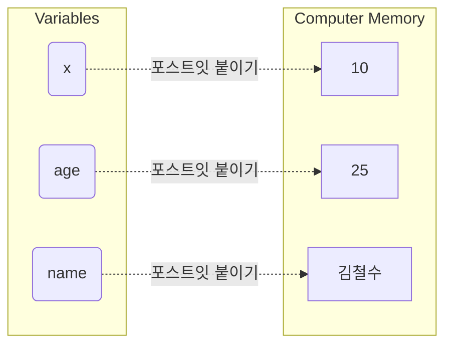

### 🗣️ 강사 대본 (Instructor Script)

> 여러분, 좋은 아침입니다! 드디어 오늘부터 본격적인 파이썬 코딩 여행이 시작됩니다. 다들 기대 반 걱정 반이실 텐데요, 전혀 긴장하실 필요 없습니다. 우리가 파이썬을 배우는 이유는 개발자처럼 모든 문법을 달달 외워서 코드를 바닥부터 짜기 위해서가 아닙니다. AI가 만들어준 결과물을 읽고, 이해하고, 우리가 원하는 방향으로 살짝 다듬기 위해서입니다.
> 
> 우리가 AI에게 코드를 만들어 달라고 하면, AI가 가장 먼저 내놓는 결과물에 항상 등장하는 단어가 있습니다. 바로 변수입니다. 
> 
> 컴퓨터 안에는 메모리라는 엄청나게 큰 창고가 있습니다. AI 비서에게 "내 나이를 기억해 둬"라고 하면, AI는 메모리 창고 구석에 25라는 숫자를 몰래 숨겨둡니다. 그런데 나중에 "아까 내 나이 몇이라고 했지?"라고 물어보면 어떻게 찾을까요? 창고가 너무 커서 찾을 수가 없습니다. 그래서 25라는 숫자에 'age'라는 예쁜 포스트잇 이름표를 붙여두는 겁니다. 
>
> 파이썬에서 변수를 상자라고 많이들 가르치지만, 여러분은 오늘부터 '포스트잇'이라고 생각하세요. 상자라고 생각하면 나중에 헷갈리는 순간이 오거든요. 메모리 창고에 있는 데이터라는 물건에, 우리가 부르기 쉬운 이름이 적힌 포스트잇을 찰싹 붙이는 겁니다. 아주 간단하죠? 복잡한 컴퓨터 구조를 몰라도, 이 포스트잇만 잘 관리하면 우리는 데이터를 마음대로 꺼내 쓸 수 있습니다.

---

## §3. 상세 내용

### Why: 왜 이름표를 붙여야 할까?

컴퓨터는 숫자 계산을 아주 잘합니다. 하지만 우리가 계산기처럼 한 번 쓰고 버릴 숫자를 다루는 것이 아니라면, 어떤 데이터가 무슨 의미를 가지는지 계속 기억해야 합니다. 만약 코드에 그냥 `8500`이라는 숫자가 덩그러니 있다면 어떨까요? 이 숫자가 커피 가격인지, 버스 요금인지, 아니면 직원의 월급인지 며칠만 지나도 쓴 사람조차 알 길이 없습니다. 

하지만 `coffee_price = 8500`이라고 이름표를 붙여두면, 1년 뒤에 코드를 열어봐도 이것이 커피 가격이라는 사실을 단번에 알 수 있습니다. 즉, 변수는 데이터를 컴퓨터가 기억하게 만드는 수단일 뿐만 아니라, 사람과 사람이 코드로 소통하기 위한 가장 기본적인 언어입니다.

우리가 AI와 대화할 때도 마찬가지입니다. AI에게 "사용자가 입력한 값을 적당히 저장해 줘"라고 말하는 것보다 "사용자의 이메일 주소를 `user_email`이라는 변수에 저장해 줘"라고 구체적으로 지시할 때 훨씬 정확한 코드가 나옵니다. 변수는 AI와 내가 소통하는 공통의 단어장이 되는 셈입니다.

### What: 변수의 구조와 등호(=)의 비밀

파이썬에서 변수를 만드는 문법은 믿을 수 없을 만큼 단순합니다. 등호 기호 하나면 충분합니다. 왼쪽에 만들고 싶은 이름표를 적고, 오른쪽에 그 이름표를 붙일 실제 데이터를 적어주면 됩니다.

```python
name = "김철수"
age = 25
```

여기서 초보자들이 가장 많이 겪는 혼란이 있습니다. 우리가 수학 시간 내내 배웠던 등호의 의미 때문입니다. 수학에서 `x = 10`은 "x와 10은 같다"라는 상태를 나타냅니다. 하지만 파이썬을 포함한 대부분의 프로그래밍 언어에서 등호는 '같다'는 뜻이 절대 아닙니다. 여기서 등호는 **할당(Assignment)**을 의미하는 명령문입니다. 

`age = 25`라는 코드는 오른쪽의 25라는 숫자를 왼쪽의 age라는 변수에 집어넣어라, 혹은 25라는 데이터에 age라는 포스트잇을 붙이라는 강력한 명령입니다. 그렇다면 '같다'라는 뜻은 어떻게 표현할까요? 파이썬에서는 등호를 두 번 연달아 쓴 `==` 기호가 바로 수학에서의 같다는 의미를 가집니다. 이 작은 차이를 명확히 구분하는 것이 코딩의 첫걸음입니다.

### How: 좋은 이름표를 짓는 규칙과 재할당

이름표를 백지 상태의 포스트잇이라고 마음대로 아무 이름이나 적을 수 있는 것은 아닙니다. 파이썬이 정해둔 몇 가지 엄격한 규칙이 있습니다.

1. **사용 가능한 문자**: 영어 알파벳, 숫자, 그리고 밑줄(_)만 사용할 수 있습니다.
2. **숫자 시작 금지**: 이름표의 첫 글자로는 숫자가 올 수 없습니다. `1st_player`는 에러가 나지만 `player_1`은 가능합니다.
3. **대소문자 구분**: `Apple`, `apple`, `APPLE`은 파이썬 입장에서 완전히 다른 세 개의 이름표입니다.
4. **예약어 사용 금지**: `if`, `for`, `while`, `True`처럼 파이썬이 문법적인 용도로 이미 찜해둔 단어들은 이름표로 쓸 수 없습니다.

규칙을 지키는 것보다 더 중요한 것은 '의미 있는 이름'을 짓는 습관입니다. `a = 10`, `b = 20`처럼 성의 없이 이름을 지으면 당장은 타이핑하기 편할지 몰라도 조금만 코드가 길어지면 지옥을 맛보게 됩니다. 데이터를 가장 잘 설명할 수 있는 명확한 단어를 사용하는 것이 훌륭한 개발자의 첫 번째 덕목입니다.

또한 포스트잇의 가장 큰 장점은 떼었다 붙였다 할 수 있다는 점입니다. 이것을 코딩 용어로 **재할당(Reassignment)**이라고 부릅니다. 처음에 `age = 25`라고 붙여두었다가 이듬해가 되어서 `age = 26`이라고 다시 코드를 적으면 어떻게 될까요? 파이썬은 조용히 25에 붙어있던 age 포스트잇을 떼어내서 26이라는 새로운 데이터에 옮겨 붙입니다. 

이때 주의할 점이 있습니다. 이전의 25라는 숫자는 상자 속에서 지워지는 것이 아닙니다. 창고 어딘가에 그대로 남아있지만 이름표가 떨어졌을 뿐입니다. 이름표를 잃어버린 데이터는 파이썬이 알아서 '가비지 컬렉션(Garbage Collection)'이라는 청소부 프로그램을 통해 폐기 처분합니다. 우리는 직접 메모리를 지우거나 관리할 필요 없이, 그저 새 데이터에 이름표를 옮겨 붙이기만 하면 됩니다. 

이 재할당 개념 덕분에 우리는 게임에서 점수가 오르거나 장바구니에 물건이 추가될 때마다 변수 안의 값을 쉽게 업데이트할 수 있습니다. `score = score + 10` 같은 코드가 가능한 이유도 바로 이 재할당 때문입니다. 기존 점수에 10을 더한 새로운 값에 기존 이름표를 떼어서 다시 붙이는 원리입니다.

### 심화: 한 번에 여러 이름표 붙이기

파이썬이 주는 또 하나의 선물이 있습니다. 여러 개의 변수를 한 줄에서 동시에 선언할 수 있다는 점입니다. 

```python
x, y, z = 10, 20, 30
```

이렇게 쉼표를 사용하면 변수 `x`에는 10이, `y`에는 20이, `z`에는 30이 한 번에 들어갑니다. 심지어 변수끼리 값을 서로 바꿀 때도 아주 유용합니다. 만약 `x`와 `y`의 값을 서로 교환하고 싶다면 다른 프로그래밍 언어에서는 임시 상자를 만들어야 하지만, 파이썬에서는 `x, y = y, x`라는 한 줄의 코드만으로 두 포스트잇의 위치를 마법처럼 바꿀 수 있습니다. 이처럼 파이썬은 코드를 간결하고 직관적으로 쓰도록 설계되어 있습니다.

---

## §4. 실습 가이드

이번 실습에서는 IDE를 열고 직접 변수를 만들어볼 것입니다. 눈으로 보는 것과 손으로 치는 것은 하늘과 땅 차이입니다. 직접 여러분의 정보가 담긴 이름표를 만들고 화면에 출력해 보는 과정을 거치겠습니다. 

### 🎙️ 실습 대본 (Lab Guide)

> 자, 모두 Antigravity IDE를 실행해 주세요. 새 파이썬 파일을 하나 만들고 이름을 `variable_practice.py`로 저장하겠습니다.
>
> 이제 빈 화면에 여러분을 소개하는 데이터를 변수에 담아볼 겁니다. 첫 번째 줄에 `my_name`이라는 변수를 만들고 등호를 써서 여러분의 이름을 적어주세요. 이름은 글자니까 반드시 양쪽에 따옴표를 붙이셔야 합니다. 두 번째 줄에는 `my_age`라는 변수에 나이를 적어주세요. 나이는 숫자니까 따옴표 없이 적습니다.
>
> 다 적으셨나요? 그런데 실행 버튼을 눌러도 화면에는 아무것도 안 나올 겁니다. 컴퓨터 내부 창고에 이름표를 붙이기만 했지, 우리 눈앞에 보여달라고 명령하지 않았거든요. 변수 안에 든 데이터를 확인하려면 `print()`라는 기능이 필요합니다. 아래쪽에 `print(my_name)`이라고 적고 다시 실행해 보세요. 하단 터미널 화면에 여러분의 이름이 나타났나요?
>
> 이번에는 일부러 실수를 한 번 해보겠습니다. `print(my_name)` 대신에 오타를 내서 `print(my_nam)`이라고 적고 실행해 보세요. 새빨간 에러 메시지가 뜹니다. `NameError: name 'my_nam' is not defined`라고 적혀 있죠? 이건 파이썬이 씩씩거리면서 "창고를 다 뒤져봐도 my_nam이라는 이름표는 없는데 대체 나한테 뭘 가져오라는 거야!"라고 화를 내는 겁니다. 
> 
> 이름표의 철자는 단 하나라도 틀리면 안 됩니다. 에러를 두려워하지 마세요. 에러 메시지는 컴퓨터가 우리에게 말을 거는 방식입니다. 이 NameError는 앞으로 코딩을 하면서 수천 번은 보게 될 아주 흔한 친구입니다. 당황하지 말고 "아, 내가 어디선가 이름표 글자를 잘못 적었구나" 하고 찾아보시면 됩니다. AI에게 코드를 수정해 달라고 할 때도, 그냥 안 된다고 하지 말고 "이런 에러가 나는데 이름표 오타를 확인해 줘"라고 말하면 AI가 단숨에 고쳐줄 것입니다.
>
> 오류를 고쳤다면 마지막으로 작은 미션을 하나 드리겠습니다. 여러분의 변수를 모두 사용해서 문장을 하나 만들어 출력해 보세요. `print("내 이름은", my_name, "이고, 나이는", my_age, "살입니다.")`라고 적어보세요. 따옴표로 감싼 문장과 쉼표, 그리고 변수 이름표들을 번갈아 쓰시면 됩니다. 
>
> 이처럼 변수 안의 데이터는 언제든지 꺼내서 다른 문장과 조립하고 활용할 수 있습니다. 우리가 만든 이름표가 제대로 작동하는 것을 두 눈으로 확인하셨나요? 아주 훌륭합니다!

---


### 🎓 강사 노트 (Instructor Support)

- ⏱️ **타이밍**: 09:00 (20분, narrative)
- 🎯 **핵심 활동**: 변수 = 이름표 상자
- ⚠️ **강사 주의사항**: 비유에 시간 투자. 개념 이해 우선

## §5. 코드 모음

실습에서 다루었거나 참고하면 좋을 변수 관련 코드 스니펫들을 모아두었습니다. 직접 타이핑하며 결과를 확인해 보는 것을 권장합니다.

```python
# 1. 변수 선언과 값 할당
user_name = "홍길동"       # 텍스트 데이터에 이름표 붙이기 (따옴표 필수)
user_age = 30             # 숫자 데이터에 이름표 붙이기
is_student = True         # 참/거짓 데이터에 이름표 붙이기

# 2. 변수 값 확인 (출력)
print(user_name)          # 결과: 홍길동
print(user_age)           # 결과: 30

# 3. 변수 값 재할당 (포스트잇 옮겨 붙이기)
user_age = 31             # 해가 바뀌어 나이가 한 살 늘어남
print(user_age)           # 결과: 31 (기존의 30은 사라지고 31이 나옴)

# 4. 점수 누적하기 (기존 변수 활용)
score = 100
score = score + 50        # 기존 점수(100)에 50을 더해 다시 score에 붙임
print(score)              # 결과: 150

# 5. 한 번에 여러 변수 선언하기
fruit1, fruit2 = "사과", "바나나"
print(fruit1)             # 사과
print(fruit2)             # 바나나

# 6. 두 변수의 값 서로 바꾸기 (Swap)
fruit1, fruit2 = fruit2, fruit1
print(fruit1)             # 바나나 (사과에서 변경됨)
print(fruit2)             # 사과 (바나나에서 변경됨)

# 7. 올바른 변수명과 잘못된 변수명 예시
# 올바른 예
player_score = 100        # 의미가 명확하고 띄어쓰기 대신 밑줄 사용
player2_name = "이순신"     # 숫자가 중간에 들어가는 것은 괜찮음

# 잘못된 예 (주석을 풀고 실행하면 에러 발생)
# 1st_player = "김유신"    # 숫자로 시작할 수 없음 (SyntaxError)
# user name = "홍길동"     # 띄어쓰기를 사용할 수 없음 (SyntaxError)
# class = "파이썬반"        # 예약어는 사용할 수 없음 (SyntaxError)
```

---

## §6. 요약 및 브릿지

이 세션에서 우리는 코딩의 가장 기초가 되는 변수를 배웠습니다. 변수는 데이터라는 요리 재료에 붙이는 '포스트잇 이름표'입니다. 수학의 등호와 달리 프로그래밍의 등호(=)는 값을 넣으라는 명령문이라는 사실을 알게 되었고, 직접 규칙에 맞게 이름표를 지어보기도 했습니다.

그런데 실습을 하면서 눈치채신 분이 있을지 모르겠습니다. 이름에는 따옴표를 붙였고, 나이에는 따옴표를 붙이지 않았습니다. 따옴표를 빼먹거나 숫자에 잘못 붙이면 컴퓨터가 불만을 표시합니다. 컴퓨터의 눈에는 숫자인지, 텍스트인지에 따라 그 데이터를 다루는 규칙이 완전히 다르기 때문입니다. 데이터에도 사람의 혈액형처럼 타고난 체질과 종류가 있습니다. 다음 세션에서는 파이썬이 데이터를 분류하는 네 가지 핵심 기준인 '데이터 타입'에 대해 알아보겠습니다. 방금 만든 이름표들이 어떤 종류의 상자에 붙어있는지 확인하러 가봅시다.

---

## §7. 참고 자료

- [Source A: 8 코딩.pdf] §8.1 변수와 메모리의 이해, AI 시대의 서사 비유
- [Source B: NotebookLM Day 3] 변수 네이밍 컨벤션과 에러 핸들링
- [Source C: Deep Research Day 3] 파이썬의 가비지 컬렉션 및 동적 타이핑 메커니즘


> 🔗 **이전 세션**: [세션 043: Day 2 핵심 요약 및 프롬프트 포트폴리오 정리](#세션-043)에서 배운 내용을 이어갑니다.
> 🔗 **다음 세션**: [세션 045: 기본 데이터 타입 4가지](#세션-045)에서 계속됩니다.

---

### 세션 045: 기본 데이터 타입 4가지
> [원본 파일](sessions/세션-045-기본데이터타입_v2.1.md) | ⏱️ 20분 | 📖 narrative | 난이도: low

> **세션 ID**: MS-PY101-045
> **소요 시간**: 25분
> **난이도**: low
> **청크 타입**: narrative
> **버전**: v2.1 (7섹션 구조)

---

## §1. 개요

> **Day 3 | AM | 세션 045**

이 세션은 파이썬 기초 과정의 세 번째 날 오전에 진행되는 아주 중요한 시간이에요. 바로 앞 세션에서 우리는 변수라는 것을 알아보며, 변수를 단순히 무언가를 담는 거대한 상자가 아니라 특정한 데이터에 착 붙이는 '포스트잇 이름표'라고 생각하기로 했죠. 그렇다면 이제 그 이름표를 어디에 붙일 것인지, 즉 포스트잇이 붙는 '데이터 그 자체'에 대해 알아볼 차례입니다.

### 🎯 학습 목표

이번 시간이 끝나면 수강생은 다음을 할 수 있게 됩니다.

- 정수, 실수, 문자열, 불리언이라는 파이썬의 4가지 기본 데이터 타입이 각각 어떤 특징을 가지고 있는지 명확하게 설명할 수 있습니다.
- 이사 상자 비유를 통해 파이썬이 알아서 데이터에 맞는 보관함을 찾아주는 동적 타이핑의 원리를 이해하게 됩니다.
- 마법의 돋보기 같은 `type()` 함수를 직접 사용하여, 눈앞의 데이터가 도대체 어떤 종류인지 스스로 검증해낼 수 있습니다.

### 선행 세션 환기

우리는 이전 시간에 데이터라는 요리 재료에 이름표를 붙이는 방법을 확실하게 익혔어요. 오늘 세션에서는 그 재료 자체의 성질을 깊게 파고들어 볼 거예요. 우리가 가진 재료가 신선한 고기인지, 아삭한 채소인지, 아니면 흐르는 액체 소스인지 정확히 알아야 올바른 냄비에 넣고 근사한 요리를 할 수 있듯이, 데이터의 진짜 성질을 알아야 컴퓨터가 오류 없이 완벽하게 계산을 수행할 수 있습니다.

---

## §2. 핵심 개념 (+ 🗣️ 강사 대본 + Mermaid)

데이터 타입이라는 것은 컴퓨터가 수많은 데이터를 마주했을 때 그것을 안전하게 처리하는 기준이 되는 자료형을 의미합니다 [Source A: 8 코딩.pdf §8.1]. 사람의 눈에는 모두 같은 화면 속 글자처럼 보일지 몰라도, 컴퓨터의 세상에서는 데이터의 성질에 따라 완전히 다른 방식으로 저장하고 처리합니다. 이 데이터가 숫자인지 문자인지 정확히 구분하는 것이 프로그래밍의 가장 기본적인 출발선이에요. 이것을 일상생활의 이삿짐 포장 비유로 풀어보면 아주 쉽게 이해할 수 있습니다.

🗣️ **강사 대본 (Instructor Script)**:

> 방금 전까지 우리는 '이름표 붙은 상자', 즉 변수를 만드는 법을 배웠어요. 이름표를 예쁘게 쓰고 값을 넣었죠. 그런데 잠깐, 세상의 모든 물건을 똑같이 생긴 네모난 상자에 담아서 이사를 할 수 있을까요?
>
> 여러분이 이삿짐 센터에 전화를 걸었다고 상상해 보세요. 직원이 "어떤 물건을 옮기시나요?"라고 물어봅니다. 여러분이 "아주 무겁고 두꺼운 전공 서적들이요"라고 대답하면, 직원은 바닥이 두꺼운 튼튼한 종이상자를 챙겨 올 거예요. 이번에는 "비싸고 깨지기 쉬운 와인잔 세트요"라고 말해볼까요? 그러면 직원은 충격을 부드럽게 흡수할 수 있는 뽁뽁이 완충재가 가득 들어간 특별한 상자를 가져오겠죠. 만약 "주방에서 쓰던 찰랑거리는 식용유요"라고 한다면, 이동 중에 절대로 새지 않도록 뚜껑을 꽉 닫을 수 있는 밀봉 플라스틱 통을 준비할 겁니다.
>
> 파이썬의 세계에도 이렇게 데이터의 각기 다른 특성에 맞춰 완벽하게 준비된 상자들이 있습니다. 오늘 우리가 배울 핵심이 바로 이 상자들의 종류, 즉 '데이터 타입'이에요.
>
> 여기서 정말 다행이고 신기한 점이 하나 있습니다. 파이썬은 이삿짐 센터 직원 중에서도 아주 눈치가 빠르고 일머리가 엄청나게 좋은 베테랑 직원이에요. 여러분이 변수에 어떤 값을 툭 넣으면, 파이썬이 그 값의 성질을 쓱 스캔해보고 "아, 이건 소수점이 하나도 없이 딱 떨어지는 숫자니까 튼튼한 정수 상자를 써야겠군", "오, 이건 소수점이 붙어있으니까 정밀한 실수 상자가 맞겠다" 하면서 알아서 가장 적절한 상자를 골라줍니다 [Source B: NotebookLM day3].
>
> 우리는 이것을 조금 어려운 개발자들의 언어로 '동적 타이핑(Dynamic Typing)'이라고 부릅니다. 옛날에 만들어진 다른 프로그래밍 언어들 중에는 "지금부터 나는 정수 상자 하나를 만들 거고 거기에 무조건 숫자 5만 넣을 거야"라고 컴퓨터에게 일일이 허락을 받아야 하는 아주 깐깐한 언어들도 있어요. 하지만 파이썬은 그렇지 않습니다. AI 비서에게 "이것 좀 챙겨서 상자에 잘 담아둬"라고 던져주기만 하면, 내용물에 맞춰 가장 완벽한 형태의 상자를 알아서 찾아주는 셈이죠. 여러분은 복잡한 컴퓨터 메모리 구조 같은 걸 전혀 몰라도 괜찮아요. 파이썬이 알아서 안전하게 짐을 다 싸주니까요 [Source C: Deep Research day3].

### Mermaid 다이어그램

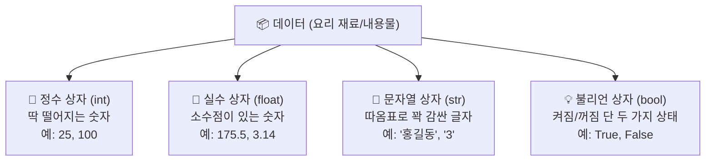

이 다이어그램은 파이썬이 복잡한 데이터를 어떻게 빠르고 정확하게 네 가지 기본 상자로 분류하는지 시각적으로 보여줍니다. 데이터라는 내용물이 들어오는 순간, 파이썬은 스스로 똑똑하게 판단하여 정수, 실수, 문자열, 불리언이라는 네 가지 상자 중 하나를 선택하여 안전하게 담아냅니다.

---

## §3. 상세 내용

### Why — 왜 우리가 직접 데이터 타입을 알아야 할까요?

파이썬이 알아서 상자를 완벽하게 골라준다면 우리는 데이터 타입을 전혀 몰라도 되는 걸까요? 아쉽게도 그렇지 않습니다. 
데이터의 타입을 정확히 모르면 우리는 컴퓨터와 대화할 때 아주 치명적인 오해를 낳게 됩니다. 

예를 들어 사람의 눈에는 숫자 `3`과 글자 `"3"`이 똑같은 모양으로 보이지만, 컴퓨터의 뇌 속에서는 완전히 다른 상자에 담긴 전혀 다른 물건이에요. 
컴퓨터에게 진짜 숫자 두 개를 더하라고 명령하면 우리가 기대하는 덧셈 계산을 성실하게 수행하지만, 글자 모양을 한 상자 두 개를 더하라고 하면 그저 두 글자를 옆으로 길게 이어 붙여버리는 엉뚱한 행동을 합니다. 

AI에게 코드를 만들어달라고 요청할 때도 마찬가지예요. 
사람에게 혈액형이 있듯 데이터의 혈액형과도 같은 이 타입을 정확하게 명시해주어야만, 오류 없이 우리가 원하는 대로 동작하는 안전한 프로그램을 만들 수 있습니다 [Source A: 8 코딩.pdf §8.1].

### What — 파이썬이 준비한 4가지 기본 상자의 정체

파이썬이 우리를 위해 미리 튼튼하게 만들어 둔 가장 기본적인 4가지 상자를 하나씩 깊이 들여다볼게요. 이 네 가지만 확실히 알아두면, 파이썬이 다루는 방대한 데이터의 절반 이상을 완벽하게 이해한 것과 다름없습니다.

첫 번째는 '정수 상자'입니다. 영어로는 integer라고 부르고 실무에서는 줄여서 `int`라고 씁니다. 
1, 2, -5, 100처럼 소수점이 전혀 섞여 있지 않은, 딱 떨어지는 묵직한 숫자들을 넣는 튼튼한 종이상자예요. 
바구니에 담긴 사과의 개수, 우리 반 학생의 명수, 혹은 사람의 나이처럼 절대로 반으로 쪼갤 수 없는 분명한 숫자들이 바로 이 상자에 들어갑니다. 
만약 우리가 '사람 2.5명'이라고 말하면 아주 이상하듯이, 정수 상자에는 오직 온전한 숫자만이 허락됩니다.

두 번째는 '실수 상자'입니다. 영어로는 floating point라고 부르며 파이썬 코드에서는 `float`라고 씁니다. 
3.14, -0.5, 175.5처럼 소수점이 붙어있는 아주 섬세하고 예민한 숫자들을 보관하는 뽁뽁이 상자와 같아요. 
사람의 키, 정밀한 몸무게, 오늘의 기온처럼 정밀한 측정값을 다룰 때 쓰입니다. 

여기서 한 가지 아주 재미있는 사실을 알려드릴게요. 
파이썬에서 딱 떨어지는 정수 10을 정수 3으로 나누면(`10 / 3`) 결과가 어떻게 될까요? 
파이썬은 3.3333이라는 소수점 결과를 내놓으면서, 이 숫자를 묻지도 따지지도 않고 자동으로 실수 상자(float)로 옮겨 담아버립니다 [Source B: NotebookLM day3]. 
파이썬의 나눗셈은 언제나 소수점이 남을 수 있다고 넉넉하게 가정하고 미리 실수 상자를 대령하는 친절함을 가지고 있어요.

세 번째는 '문자열 상자'입니다. 문자들이 줄지어 묶여 있다고 해서 string이라고 부르고 짧게 줄여 `str`이라고 씁니다. 
글자들을 안전하게 보관하는 밀봉 플라스틱 통이라고 생각해보세요. 
통 안의 내용물이 새지 않게 뚜껑을 꽉 닫아야 하듯, 문자열은 반드시 시작과 끝 양쪽에 따옴표(' 또는 ")를 뚜껑처럼 빈틈없이 덮어줘야 합니다. 
`"안녕하세요"`, `'Python'`, 심지어 `"123"` 같은 것들이 전부 이 상자에 안전하게 들어갑니다. 

방금 `"123"`을 자세히 보셨나요? 
숫자처럼 보일지라도 그 주변에 따옴표가 씌워져 있다면 그것은 더 이상 계산할 수 있는 숫자가 아닙니다. 
그림이나 풍경 사진처럼 그냥 글자의 모양을 하고 있는 그림일 뿐이에요. 
컴퓨터는 이 그림을 가지고 곱셈이나 나눗셈을 하라고 하면 당황해서 오류를 뿜어냅니다 [Source C: Deep Research day3].

마지막 네 번째는 '불리언 상자'입니다. 논리형이라고도 부르며 코딩할 때는 `bool`이라고 줄여 씁니다. 
이 상자는 아주 독특하고 고집이 세서, 세상에 존재하는 수많은 것들 중 단 두 가지의 물건만 허락합니다. 
바로 `True`(참) 아니면 `False`(거짓)입니다. 

방에 있는 전등 스위치가 켜져 있거나 꺼져 있는 딱 두 가지 상태만 가지는 것과 완벽하게 똑같아요. 
"이 학생은 이번 시험 성적을 통과했나요?"라거나 "사용자가 올바른 비밀번호로 로그인을 했나요?" 같은 질문에 대해 단호하고 명확한 대답을 저장할 때 아주 유용하게 쓰입니다.

### How — 투시 안경과도 같은 마법의 돋보기 type() 함수

파이썬이 스스로 알아서 적절한 상자에 데이터를 척척 담아주긴 했는데, 코딩을 하다 보면 지금 내 눈앞에 있는 이 데이터가 정확히 어떤 상자에 숨어있는지 직접 까보고 확인하고 싶을 때가 반드시 옵니다. 
파이썬은 불안해하는 우리를 위해 내용물을 훤히 투시해 볼 수 있는 마법의 돋보기를 하나 선물해 줍니다. 바로 `type()` 이라는 아주 고마운 함수예요. 

궁금하고 의심스러운 데이터를 `type()`의 괄호 안에 살짝 집어넣고 실행 버튼을 누르면, 파이썬이 "아, 이건 int 상자야", "저건 str 상자에 잘 담겨있어"라고 아주 정직하고 빠르게 대답해 줍니다. 
프로그래밍을 하다가 도대체 원인을 알 수 없는 답답한 오류가 났을 때, 가장 먼저 이 돋보기를 꺼내서 데이터가 내가 생각한 그 상자가 맞는지 하나씩 확인하는 것은 모든 개발자들이 매일 쓰는 가장 기본적인 생존 기술입니다.

---


### 📊 참고 표 (Visual Specs)

**파이썬 핵심 데이터 타입 비교**

| 타입명 (Type) | 의미 | 예시 | 변경 가능성 |
|:---|:---|:---|:---|

## §4. 실습 가이드 (+ 🎙️ 실습 대본)

이 실습에서는 앞서 배운 네 가지 종류의 데이터 상자를 파이썬 코드 안에서 여러분의 손으로 직접 만들어 봅니다. 그리고 마법의 돋보기인 `type()`을 이리저리 사용해서, 정말로 우리가 생각한 찰떡같은 상자가 맞는지 화면에 출력하며 하나하나 검증하는 과정을 거칠 거예요.

🎙️ **실습 가이드 대본 (Lab Guide)**:

> 자, 이제 설명은 충분히 들었으니 파이썬이 우리를 위해 야심차게 준비해둔 4가지 상자를 코드로 직접 꺼내서 만져볼 시간입니다. 제가 나눠드린 에디터 환경에서 각자 코드를 입력할 준비를 쓱 해주세요.
>
> 가장 먼저, 여러분의 현재 나이를 나타내는 딱 떨어지는 깔끔한 정수를 하나 적어볼까요? `age = 25` 이렇게 키보드로 입력해 보세요. 그 다음 줄에는 여러분의 키를 소수점 아래까지 섬세하게 적어봅시다. `height = 175.5`처럼요. 이번에는 여러분의 자랑스러운 이름을 적을 건데, 여기서 멈춰서 주의하셔야 해요! 이름은 숫자가 아니라 글자니까 반드시 따옴표 뚜껑을 앞뒤로 꽉 덮어줘야 합니다. `name = "홍길동"` 이렇게 적어주세요. 마지막으로 여러분이 지금 학생 신분인지 아닌지 참과 거짓으로 단호하게 적어볼게요. `is_student = True` 라고 조심스럽게 적어보세요. 여기서 아주 중요한 규칙이 하나 있습니다. True의 첫 글자 대문자 T는 반드시 대문자로 큼직하게 적어야 파이썬이 찰떡같이 알아듣습니다.
>
> 네 개의 변수를 모두 꼼꼼하게 선언하셨나요? 겉으로 보기엔 모두 똑같이 평범한 변수 같지만, 파이썬의 보이지 않는 머릿속에는 각각 완전히 다른 4개의 상자가 완벽하게 세팅되어 있습니다. 정말 제 말이 맞는지 바로 확인해 볼까요?
> 밑에 새로운 줄을 열고 `print(type(age))` 라는 코드를 적고 실행 버튼을 눌러보세요. 화면 아래쪽에 `<class 'int'>`라는 약간 암호 같은 글자가 뜰 겁니다. 놀라지 마세요. 이게 바로 파이썬이 "나 지금 네가 준 나이 데이터를 튼튼한 정수(int) 상자에 예쁘게 담았어!"라고 여러분에게 윙크하며 알려주는 거예요.
>
> 자, 멈추지 말고 나머지 3개의 변수들도 모두 `type()` 돋보기를 씌워서 샅샅이 확인해 보세요. 제가 앞에서 길게 설명했던 4가지 이름표가 화면에 정확히 출력되는지, 여러분의 눈으로 직접 확인하며 짜릿함을 느끼는 것이 가장 중요합니다.
>
> 다 하신 분들은 재미있는 실험을 하나 더 해볼까요? 밑으로 가서 `print(type(3))`과 `print(type("3"))`을 위아래로 나란히 적고 한 번 더 실행해 보세요. 우리의 눈에는 완전히 똑같이 생긴 쌍둥이 3처럼 보이지만, 파이썬은 앞의 것은 `int`라고 부르고 뒤의 것은 `str`이라고 완전히 다르게 대답할 겁니다. 겉모습에 절대 속지 않고 상자의 진짜 정체를 꿰뚫어 보는 능력, 이것이 오늘 실습에서 여러분이 가져가야 할 최고의 무기입니다.

**트러블슈팅 FAQ**

수강생들이 실습을 신나게 진행하다가 흔히 부딪히는 문제와 친절한 대처 방법입니다.

- **문제**: 불리언 변수를 자신 있게 적었는데 화면에 `NameError: name 'true' is not defined`라는 무서운 빨간 에러가 뜹니다. 컴퓨터가 고장 난 걸까요?
  - **해결책**: 전혀 고장 나지 않았습니다! 파이썬은 영어의 대문자와 소문자를 아주 엄격하고 깐깐하게 구분하는 성격을 가진 언어입니다. 논리형 값인 참과 거짓은 무조건 첫 글자를 큼직한 대문자로 써서 `True` 또는 `False`라고 적어주어야만 합니다. 소문자로 적으면 파이썬은 그것을 특별한 스위치로 인식하지 못하고, 그저 여러분이 새롭게 만든 일반적인 이름표(변수명)로 착각합니다. 그런데 그런 이름표를 이전에 만든 적이 없으니 찾을 수 없다고 엉엉 울면서 에러를 내뿜는 거예요. 첫 글자만 대문자로 살짝 바꿔주면 마법처럼 해결됩니다.
- **문제**: 강사님 말씀대로 `print(type("안녕"))`을 열심히 쳤는데 이상하게 자꾸 에러가 나요.
  - **해결책**: 침착하게 코드 끝에 있는 괄호의 개수를 손가락으로 세어 보세요. 돋보기 기능을 하는 `type()`의 괄호가 안쪽에 한 쌍 있고, 그것을 화면 밖으로 보여달라는 `print()`의 커다란 괄호가 바깥쪽에 또 한 쌍 있습니다. 즉, 괄호를 두 번 열었으면 반드시 뒤에서도 같은 개수만큼 두 번 닫아주어야 컴퓨터가 어디까지가 하나의 명령어인지 완벽하게 이해할 수 있습니다. 괄호의 짝을 맞추는 것은 코딩의 가장 아름다운 리듬입니다.

---


### 🎓 강사 노트 (Instructor Support)

- ⏱️ **타이밍**: 09:20 (20분, narrative)
- 🎯 **핵심 활동**: int, float, str, bool
- ⚠️ **강사 주의사항**: type() 함수 시연

## §5. 코드 및 명령어 모음

수강생들이 에디터에서 직접 타이핑하며 실행해 볼 수 있는 완전하고 깨끗한 형태의 실습 코드 묶음입니다.

```python
# 4가지 기본 데이터 타입 선언하기 (내용물에 맞는 상자를 상상해 보세요)
age = 25              # 정수(int) - 소수점 없이 딱 떨어지는 숫자
height = 175.5        # 실수(float) - 소수점이 붙어있는 섬세한 숫자
name = "홍길동"       # 문자열(str) - 따옴표로 안전하게 빈틈없이 감싼 글자
is_student = True     # 불리언(bool) - 켜짐(참) 또는 꺼짐(거짓) 상태 (첫 글자 대문자 주의!)

# type() 돋보기를 사용하여 각 변수가 담긴 상자의 진짜 종류(타입) 확인하기
print("age의 타입은:", type(age))               # 예상 결과: <class 'int'>
print("height의 타입은:", type(height))         # 예상 결과: <class 'float'>
print("name의 타입은:", type(name))             # 예상 결과: <class 'str'>
print("is_student의 타입은:", type(is_student)) # 예상 결과: <class 'bool'>

# 겉모습은 똑같아 보여도 타입이 완전히 다른 경우를 직접 비교해보기
print("진짜 숫자 3의 타입:", type(3))           # 예상 결과: <class 'int'>
print("문자열 그림 '3'의 타입:", type("3"))     # 예상 결과: <class 'str'>
```

🤖 **AI 프롬프트 예시**

AI에게 교육용 예제 코드를 만들어달라고 부탁할 때 사용하는 프롬프트입니다.

> "파이썬의 4가지 기본 데이터 타입(int, float, str, bool)을 일상생활에서 흔히 보는 데이터로 각각 하나씩 변수로 만들어줘. 그리고 type() 함수를 돋보기처럼 사용해서 그 데이터 타입이 무엇인지 화면에 출력해서 확인하는 교육용 파이썬 예제 코드를 작성해 줘. 코딩을 오늘 처음 해보는 쌩초보자가 읽어도 끄덕이며 이해할 수 있도록 주석을 구어체로 아주 꼼꼼하게 달아주고, 마지막에는 진짜 숫자 3과 따옴표로 감싼 문자 3이 컴퓨터 입장에서 어떻게 다르게 인식되는지 눈으로 확인할 수 있는 깜짝 실험 예제도 꼭 포함해 줘."

---

## §6. 요약

### 핵심 학습 포인트

오늘 우리는 파이썬이 이 복잡한 세상을 깔끔하게 이해하기 위해 즐겨 쓰는 네 가지 기본 안경에 대해 깊이 있게 배웠습니다. 소수점 없이 딱 떨어지는 묵직한 숫자를 보는 정수(int) 안경, 미세한 소수점 하나까지 예민하게 관찰하는 실수(float) 안경, 글자들을 물방울 하나 새지 않게 온전히 담아두는 문자열(str) 안경, 그리고 세상의 수많은 복잡한 질문들을 오직 예/아니오 단 두 가지로만 대답하는 결단력 있는 불리언(bool) 안경입니다. 파이썬은 우리가 데이터를 툭 건네주면 이 중 어떤 안경을 쓰고 처리해야 할지 눈치껏 스스로 결정하는 엄청나게 똑똑한 능력을 기본적으로 가지고 있습니다. 그리고 우리는 답답할 때마다 `type()`이라는 마법의 돋보기를 통해 파이썬이 도대체 지금 어떤 안경을 쓰고 쳐다보는지 언제든지 불시검문을 할 수 있죠. 데이터에도 사람의 혈액형 같은 고유한 종류가 있다는 이 놀라운 사실은, 앞으로 우리가 코딩을 할 때 머릿속에서 절대 지워서는 안 되는 가장 강력하고 중요한 규칙입니다.

### 다음 세션 예고 및 브릿지 노트

> "지금까지 우리는 파이썬이 알아서 찰떡같은 상자를 찾아준다는 사실에 가슴을 쓸어내리며 안심했습니다. 그런데 우리가 살다 보면 이삿짐을 한 번 쌌다가 마음이 바뀌어서 다시 뜯고 새로 싸야 할 때가 오지 않던가요? 예를 들어, 문자열이라는 플라스틱 통에 얌전히 그림처럼 들어있던 글자 '3'을 꺼내서, 진짜로 덧셈 뺄셈 계산을 할 수 있는 튼튼한 정수 상자로 확 옮겨 담고 싶다면 우리는 대체 어떻게 파이썬을 설득해야 할까요?
>
> 다음 세션에서는 하나의 상자에서 완전히 다른 상자로 내용물의 본질을 변신시키는 엄청난 마술인 '타입 변환(형변환)'이라는 강력한 기술을 배워보겠습니다. 더불어 우리가 만들어낸 변수들을 우리가 평소에 쓰는 자연스러운 한국어 문장 안에 빈칸 채우기처럼 쏙쏙 끼워 넣는 세련된 'f-string' 기법도 함께 알아볼 테니, 기대하는 마음으로 다음 세션으로 넘어가 보겠습니다!"

---

## §7. 참고 자료

이 세션의 내용은 다음의 신뢰할 수 있는 철저한 출처를 바탕으로 알차게 구성되었습니다.

- **Source A (로컬 참고자료)**: 「8 코딩.pdf §8.1」 — 파이썬의 데이터 타입 기초 개념을 다룹니다. 정수, 실수, 논리형 등 컴퓨터가 데이터를 바라보고 처리하는 가장 기본적인 기준이 되는 자료형의 명확한 정의를 집중적으로 참조하여 작성했습니다.
- **Source B (NotebookLM)**: NotebookLM 분석 리포트 (Day 3) — 파이썬이 자랑하는 동적 타이핑 특성 및 10을 3으로 나누는 나눗셈 연산 시 묻지도 따지지도 않고 자동으로 float로 변환되어 버리는 파이썬만의 독특한 언어적 특성 분석을 실습 예제에 생생하게 반영했습니다.
- **Source C (Deep Research)**: Deep Research 보고서 (Day 3) — 눈으로 보기에 똑같은 숫자와 문자열 숫자의 근본적인 차이점 및 AI에게 프롬프트를 작성해 코드를 맡길 때 데이터 타입을 구체적으로 명시하는 것이 얼마나 중요한지에 대한 최신 개발 교육 트렌드를 강사 대본 곳곳에 자연스럽게 녹여냈습니다.

### 강사 노트

> 💡 **강사 노트**: 데이터 타입이라는 눈에 보이지 않는 아주 추상적인 개념을 설명할 때 '크기와 모양이 다른 이삿짐 상자'라는 비유를 적극적으로 활용하면, 코딩을 처음 접하는 비전공 수강생들의 인지적 부담을 획기적으로 낮춰줄 수 있습니다. 특히 숫자 `3`과 따옴표로 감싼 문자열 `"3"`이 사람 눈에는 쌍둥이 같아도 컴퓨터 메모리 상에서는 얼마나 뼈대부터 다른 녀석들인지 반복해서 강조하는 것이 매우 중요합니다.
>
> 실제 실습을 진행해보면 수강생들이 불리언의 대문자 `True`를 습관적으로 소문자로 잘못 입력하여 당황하며 오류를 내는 경우가 수업마다 항상 발생합니다. 사전에 스크립트를 통해 이를 단호하게 경고하거나, 실습 중 트러블슈팅 시간에 화면을 띄워놓고 이 흔한 오류를 다 함께 짚어보는 시간을 가지면 수강생들의 학습 효과와 자신감이 크게 향상됩니다.

---

## ✅ 세션 완료 체크리스트 (강사용)

- [ ] 파이썬의 4가지 기본 데이터 타입(int, float, str, bool)의 특징을 모두 명확하고 쉽게 설명했는가?
- [ ] 일상적인 이삿짐 상자 비유를 깊게 확장하여 파이썬의 동적 타이핑 원리를 직관적으로 전달했는가?
- [ ] 수강생 전원이 `type()` 함수를 직접 타이핑하여 자신의 눈으로 데이터 타입을 확인하는 실습을 성공적으로 완료했는가?
- [ ] 숫자 3과 문자열 "3"의 결정적 차이점을 코드를 통해 시각적으로 명백하게 증명했는가?
- [ ] 3-Source 팩트 패킷(A, B, C)의 핵심적인 내용이 스크립트와 본문에 왜곡 없이 충실하게 반영되었는가?

---

*작성 일시: 2026-02-25*  
*작성 에이전트: A4B_Session_Writer*  
*교안 구조: 7섹션 (A0 팀 공통 표준)*


> 🔗 **이전 세션**: [세션 044: 변수의 개념과 이름표 상자 비유](#세션-044)에서 배운 내용을 이어갑니다.
> 🔗 **다음 세션**: [세션 046: 타입 변환과 f-string](#세션-046)에서 계속됩니다.

---

### 세션 046: 타입 변환과 f-string
> [원본 파일](sessions/세션-046-타입변환과fstring_v2.1.md) | ⏱️ 25분 | 💻 code | 난이도: low

> **세션 ID**: MS-PY101-046  
> **소요 시간**: 25분  
> **난이도**: low  
> **청크 타입**: narrative  
> **버전**: v2.1 (7섹션 구조)

---

## §1. 개요

> **Day 3 | AM | 세션 046/064**

이 세션은 문자열, 정수, 실수 등 서로 다른 데이터 타입 간의 변환(캐스팅)과, 변수들을 문장에 자연스럽게 끼워 넣는 f-string 포매팅을 배우는 시간이에요. 앞서 배운 네 가지 기본 데이터 타입들이 서로 어떻게 소통하고 어우러지는지 익히며, 데이터를 우리가 원하는 형태로 가공하고 출력하는 기초 체력을 다집니다.

### 🎯 학습 목표

이 세션이 끝나면 수강생은 다음을 할 수 있어요:

- 문자열, 정수, 실수 간의 타입 변환 원리를 이해하고 에러 없이 변환할 수 있습니다
- `input()` 함수로 입력받은 데이터가 왜 문자열인지 이해하고 연산에 맞게 가공할 수 있습니다
- f-string을 활용해 다양한 변수가 포함된 문장을 직관적으로 구성할 수 있습니다

### 선행 세션 환기

바로 앞 세션(045)에서 우리는 파이썬의 네 가지 기본 데이터 타입인 정수(int), 실수(float), 문자열(str), 불리언(bool)을 배웠어요. 데이터에도 혈액형이 있어서 종류에 따라 컴퓨터가 처리하는 방식이 다르다는 점을 확인했죠. 이번 세션에서는 이 서로 다른 혈액형의 데이터들이 어떻게 섞이고 변환되는지 살펴볼 거예요.

---

## §2. 핵심 개념 (+ 🗣️ 강사 대본 + Mermaid)

### 마술 지팡이와 통역사 비유

서로 다른 타입의 데이터를 더하거나 합치려고 하면 파이썬은 에러를 냅니다. 글자와 숫자가 완전히 다른 세계에 살고 있기 때문이에요. 이때 필요한 것이 바로 형태를 바꿔주는 '마술 지팡이(타입 변환)'입니다. 그리고 이렇게 가공된 데이터들을 모아서 화면에 예쁘게 안내문으로 보여줄 때 사용하는 빈칸 채우기 양식이 바로 'f-string'이라는 통역사 양식이에요.

🗣️ **강사 대본 (Instructor Script)**:

> 자, 방금 전 우리는 파이썬에 네 가지 종류의 데이터 상자가 있다는 걸 배웠어요. 그런데 여기서 아주 재미있는 문제가 하나 생깁니다.
>
> 문자열 상자에 `"100"`이라는 글자가 들어있다고 해볼게요. 이 글자에 숫자 50을 더하면 150이 될까요? 한번 머릿속으로 `"100" + 50`을 상상해 보세요. 안타깝게도 파이썬은 빨간 글씨로 "TypeError"라며 화를 냅니다. 컴퓨터 입장에서는 글자 '백'과 숫자 50을 더하라는 말도 안 되는 명령이거든요. 문자열 상자와 정수 상자는 서로 대화가 안 통하는 외국인과 같습니다.
>
> 이 문제를 해결하는 방법이 바로 '타입 변환(Type Casting)'입니다. 마치 마술사가 모자에서 비둘기를 꺼내듯, 글자 상자에 있는 것을 숫자 상자로 형태를 뿅! 하고 바꿔주는 거예요. 
> 
> 파이썬에는 세 가지 마술 지팡이가 있습니다. `int()`라는 지팡이를 휘두르면 글자 `"123"`이 계산 가능한 진짜 숫자 123으로 바뀝니다. `float()` 지팡이를 쓰면 정수 5가 실수 5.0으로 변하죠. 반대로 `str()` 지팡이를 쓰면 숫자 456이 문자열 `"456"`으로 변합니다. 서로 대화가 안 통하던 데이터들에게 통역기를 달아주는 셈이에요.

> 💡 **강사 노트**: 초보자들은 따옴표가 있는 `"100"`과 숫자 `100`을 시각적으로 구분하기 어려워합니다. "눈으로 보기엔 똑같은 100이지만, 컴퓨터의 뇌파로는 완전히 다르게 인식된다"는 점을 강조해 주세요.

### Mermaid 다이어그램

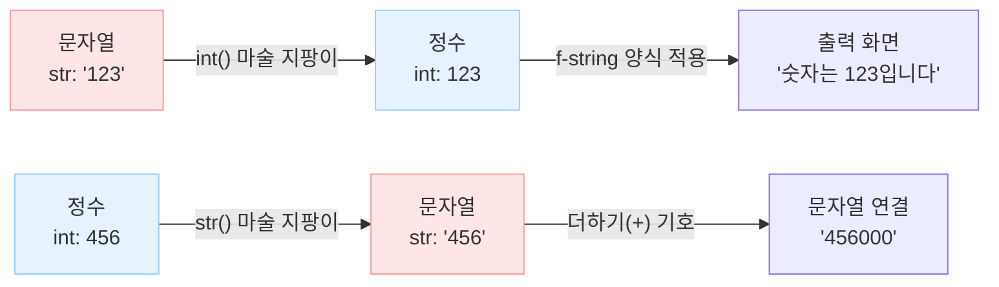

이 다이어그램은 데이터가 마술 지팡이를 거쳐 어떻게 형태를 바꾸는지 보여줍니다. 변환된 데이터가 f-string이라는 양식을 만나면 우리가 읽기 편한 문장으로 최종 완성됩니다.

---


### 🎨 추가 시각화 (Visualization Packet)

**파이썬 자료형 (Data Type) 계층 구조**

기본 자료형(단일 값)과 복합 자료구조(여러 값을 묶은 형태)의 분류를 한눈에 보여줍니다.

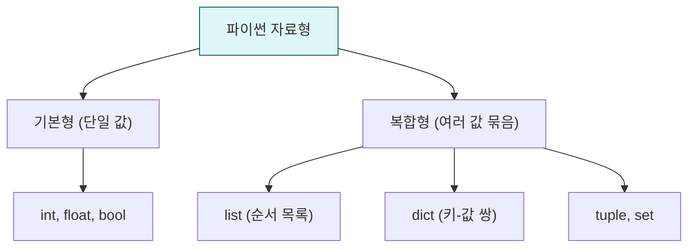

## §3. 상세 내용

### Why — 왜 타입 변환과 f-string이 필요한가?

프로그램을 만들다 보면 사용자의 입력을 받아야 할 때가 아주 많습니다. 파이썬에서 사용자 입력을 받는 `input()` 함수는 무조건 모든 입력값을 '문자열(str)' 형태로만 가져옵니다. 사용자가 나이를 `20`이라고 입력해도 파이썬은 글자 `"20"`으로 받아들여요. 이걸 그대로 계산에 쓰면 앞서 말한 에러가 나거나, `"20" + "10"`이 `"2010"`이라는 엉뚱한 문자로 이어붙여지는 대참사가 벌어집니다. 따라서 의도에 맞는 연산을 하려면 반드시 올바른 타입으로 변환을 해줘야 해요.

그리고 계산을 마친 결과를 화면에 보여줄 때, 옛날 방식으로는 `"제 나이는 " + str(age) + "살입니다"`처럼 억지로 이어 붙여야 했습니다. 코드가 지저분해지고 띄어쓰기 실수도 잦았죠. 이런 답답함을 해결하기 위해 등장한 구원자가 바로 f-string입니다.

### What — 타입 변환 지팡이들과 f-string의 정체

**1. 타입 변환 마술 지팡이 3총사**
- `int()`: 정수(Integer)로 변환합니다.
- `float()`: 실수(Float)로 변환합니다.
- `str()`: 문자열(String)로 변환합니다.

하지만 주의할 점이 있어요. `int("abc")`처럼 숫자로 바꿀 수 없는 진짜 글자를 변환하려고 하면 에러가 납니다. 또 `int(3.9)`를 하면 4로 반올림되지 않고 소수점 아래를 싹둑 잘라버려 3이 됩니다.

**2. f-string (포맷 문자열)**
문자열을 시작하는 따옴표 앞에 소문자 `f`를 딱 붙이면, 문자열 안에서 중괄호 `{}`를 쓸 수 있게 됩니다. 이 중괄호는 구멍을 뚫어놓은 빈칸이에요. 이 빈칸 안에 변수 이름을 넣으면, 파이썬이 알아서 해당 변수의 값을 문자열로 쓱 바꿔서 끼워 넣어줍니다.

### How — 구체적으로 어떻게 코드를 짜는가?

🗣️ **강사 대본 (Instructor Script)**:

> 자, 그럼 이 지팡이들과 f-string을 어떻게 쓰는지 볼까요?
> 
> "제 이름은 철수이고, 나이는 20살입니다"라는 문장을 만들고 싶어요. 변수 `name`에는 `"철수"`, `age`에는 `20`이 들어있다고 해봅시다. 
> 
> 옛날 방식으로는 이렇게 썼어요. `print("제 이름은 " + name + "이고, 나이는 " + str(age) + "살입니다")`. 더하기 기호 넣고, 따옴표 열고 닫고, 숫자는 문자로 바꾸고... 정말 끔찍하죠? 오타 나기 딱 좋은 구조예요.
> 
> 하지만 f-string을 쓰면 우아해집니다. `print(f"제 이름은 {name}이고, 나이는 {age}살입니다")`. 
> 끝이에요! 마법의 알파벳 `f`를 따옴표 앞에 붙여주면, 문자열 안에 중괄호 `{}`라는 구멍을 뚫을 수 있어요. 그 구멍 안에 변수를 쏙 넣으면 됩니다. 따로 문자열로 변환할 필요도 없이 파이썬이 알아서 채워줍니다. 마치 안내문 양식에서 이름과 나이 칸만 비워두면 AI가 상황에 맞게 글을 완성해 주는 것과 똑같아요.

---

## §4. 실습 가이드 (+ 🎙️ 실습 대본)

### 실습 목표

사용자로부터 출생 연도를 입력받아 타입 변환을 거친 뒤, 올해 기준 나이를 계산하여 f-string으로 출력해 보는 전체 사이클을 경험합니다.

🎙️ **실습 가이드 대본 (Lab Guide)**:

> 여러분, 화면의 실습 환경을 띄워주세요. 지금부터 우리가 직접 나이 계산기를 만들어 볼 거예요. 
> 
> 먼저 `birth_year = input("출생연도를 입력하세요: ")`라고 코드를 적어보세요. 이 상태에서 바로 `2026 - birth_year`를 계산하려고 하면 어떻게 될까요? 네, 아까 말한 대로 에러가 날 거예요. `input`이 가져온 건 글자니까요.
> 
> 그러니까 계산하기 전에 지팡이를 휘둘러야 합니다. `real_year = int(birth_year)` 이렇게요. 이제 `real_year`는 진짜 숫자가 되었습니다. `age = 2026 - real_year`로 나이를 계산해 보세요.
> 
> 마지막으로 방금 배운 f-string을 써서 출력해 봅니다. `print(f"당신의 나이는 {age}세입니다!")`라고 적고 실행해 보세요. 연도를 입력하면 나이가 아주 예쁘게 문장으로 출력될 거예요. 

### 단계별 지시

| 단계 | 소요 시간 | 강사 지시사항 | 학습자 액션 | 예상 결과 |
|------|----------|--------------|------------|----------|
| 1 | 3분 | input() 함수로 변수 입력받기 안내 | `birth = input()` 작성 및 에러 유도 | TypeError 경험 |
| 2 | 3분 | int() 지팡이로 타입 변환 지시 | `int(birth)` 적용 및 뺄셈 연산 | 연산 성공 |
| 3 | 4분 | f-string을 활용한 문장 출력 지시 | `print(f"...")` 작성 및 결과 확인 | 완성된 문장 출력 |
| 4 | 5분 | 소수점 잘림 함정 보여주기 | `int(3.9)` 직접 실행해보기 | 3 출력 확인 (버림) |

### 트러블슈팅 FAQ

| Q | A |
|---|---|
| f-string을 썼는데 중괄호가 그대로 글자로 나와요! | 따옴표 바로 앞에 소문자 `f`를 빼먹지 않았는지 확인해 보세요. `f`가 없으면 파이썬은 중괄호를 그냥 일반 글자로 취급합니다. |
| int()를 썼는데 "ValueError"가 나요 | 입력창에 숫자가 아닌 글자(예: "이천이십년")를 적었기 때문이에요. `int` 지팡이는 진짜 숫자로 이루어진 글자만 바꿀 수 있어요. |
| input() 두 개를 더했는데 20+10이 2010이 돼요 | 문자열끼리 덧셈(+)을 하면 글자를 옆으로 이어 붙입니다. 각각 `int()`로 감싸서 변환한 다음 더해야 제대로 된 산술 덧셈이 됩니다. |

---


### 🎓 강사 노트 (Instructor Support)

- ⏱️ **타이밍**: 09:40 (25분, code)
- 🎯 **핵심 활동**: 형변환 + 문자열 포매팅
- ⚠️ **강사 주의사항**: f-string은 앞으로 매일 쓰임 강조

## §5. 코드 및 명령어 모음

이 세션에서 다루는 핵심 파이썬 코드들입니다. 특히 파이썬 3.8부터 추가된 디버깅용 f-string 문법은 실무에서 아주 유용합니다.

```python
# 1. 타입 변환: 문자열을 정수로
birth_year_str = "1995"
birth_year_int = int(birth_year_str)  # 마술 지팡이 사용
age = 2026 - birth_year_int
print(age)  # 31

# 2. 함정 확인하기
print(int(3.9))    # 3 (반올림이 아니라 소수점 이하 버림)
print(bool("0"))   # True (비어있지 않은 문자열은 모두 참)
# print(int("abc")) # 에러 발생 (숫자로 변환 불가능)

# 3. f-string 기본 활용
name = "AI개발자"
score = 95.5
print(f"안녕하세요, {name}님. 이번 테스트 점수는 {score}점입니다.")

# 4. f-string 고급 기능: 소수점 자릿수 맞추기
pi = 3.141592
print(f"원주율은 대략 {pi:.2f}입니다.")  # 3.14 (둘째 자리까지 표시)

# 5. 실무 디버깅 꿀팁 (파이썬 3.8 이상)
# 변수명과 그 값을 동시에 쉽게 확인하고 싶을 때 '='를 붙입니다.
user_age = 25
print(f"{user_age=}")  # 출력: user_age=25
```

> 🤖 **AI 프롬프트 예시**:  
> "내가 `price`와 `discount_rate` 변수를 가지고 있는데, 이걸 활용해서 '원래 가격은 OOO원이고, 할인을 받아 OOO원이 되었습니다'라는 문장을 f-string으로 출력하는 코드를 짜줘. 가격은 정수로 나오게 해줘."

---

## §6. 요약

### 핵심 학습 포인트

이번 세션의 핵심은 딱 두 가지예요. 첫째, 컴퓨터의 세계에서는 글자와 숫자가 완전히 분리되어 있으므로 연산을 위해서는 `int()`, `float()`, `str()` 같은 마술 지팡이로 타입을 꼭 변환해 줘야 합니다. 둘째, 변수들을 문장에 조립할 때는 더하기 기호로 덕지덕지 이어 붙이는 대신, `f`를 붙이고 중괄호 `{}`로 구멍을 뚫는 f-string을 사용하면 훨씬 깔끔하고 우아한 코드가 됩니다. 

### 다음 세션 예고

지금까지 우리는 데이터를 상자에 담고, 타입을 바꾸고, 예쁘게 출력하는 방법까지 배웠어요. 데이터를 다루는 준비 운동이 모두 끝난 셈입니다. 다음 세션에서는 이 데이터 상자들을 가지고 더하기, 빼기, 나누기, 그리고 '이것이 저것보다 큰가?'를 비교하는 진짜 '연산'을 시작해 보겠습니다.

### 브릿지 노트

> "여러분이 AI에게 코드를 짜달라고 했을 때, f-string 문법이나 int() 변환이 엄청나게 많이 등장할 거예요. 이제 여러분은 그 코드를 보고 '아, 여기서 글자를 숫자로 바꿨구나', '여기에 변수값을 끼워 넣었구나'라고 정확히 읽어낼 수 있습니다. 자, 데이터 준비는 끝났습니다. 이제 이 데이터들로 수학 계산과 논리 비교를 하는 연산자의 세계로 넘어가 볼까요?"

---

## §7. 참고 자료

### 3-Source 출처

- **Source A (로컬 참고자료)**: 「8 코딩.pdf」 — 타입 변환 과정과 데이터 조작의 기본 원리, 에러 발생 패턴(TypeError)과 문자열 합치기 방식의 한계점을 인용했습니다.
- **Source B (NotebookLM)**: Day 3 강의 분석 리포트 — "통역사"와 "마술 지팡이" 비유, f-string의 편의성을 강조하는 교육적 접근 방식을 적용했습니다.
- **Source C (Deep Research)**: Day 3 파이썬 기초 트렌드 리서치 — 파이썬 3.8 이상에서 지원하는 디버깅용 f-string 문법(`f"{변수=}"`)과 같은 실무적 트릭, `bool("0")` 함정 등의 주의사항을 보완했습니다.

### 강사 노트

> 💡 **강사 노트**: 수강생들이 가장 많이 헷갈리는 부분은 `input()`이 숫자를 입력받아도 문자열로 취급한다는 점입니다. 이 점을 `birth_year` 실습을 통해 에러를 직접 내보게 함으로써 체감시키는 것이 중요합니다. f-string은 파이썬을 가장 파이썬답게(Pythonic) 만들어주는 문법이므로, 예전의 낡은 방식(더하기 연결)이 얼마나 불편했는지 살짝 과장해서 보여주면 f-string의 편리함을 훨씬 크게 느끼게 됩니다.

---

## ✅ 세션 완료 체크리스트 (강사용)

- [x] §1~§7 모든 섹션이 충실하게 작성되었는가?
- [x] 타입 변환을 마술 지팡이나 통역사에 비유하여 쉽게 설명했는가?
- [x] input() 입력값이 문자열이라는 핵심 함정을 강조했는가?
- [x] f-string의 중괄호(`{}`) 사용법과 디버깅 팁이 포함되었는가?
- [x] 3-Source 팩트 패킷의 세션 046 내용이 모두 반영되었는가?

---

*작성 일시: 2026-02-25*  
*작성 에이전트: A4B_Session_Writer*  
*교안 구조: 7섹션 (A0 팀 공통 표준)*

> 🔗 **이전 세션**: [세션 045: 기본 데이터 타입 4가지](#세션-045)에서 배운 내용을 이어갑니다.
> 🔗 **다음 세션**: [세션 047: 기본 연산자와 실습](#세션-047)에서 계속됩니다.

---

### 세션 047: 기본 연산자와 실습
> [원본 파일](sessions/세션-047-기본연산자와실습_v2.1.md) | ⏱️ 20분 | 🧪 lab | 난이도: low

> **세션 ID**: MS-PY101-047  
> **소요 시간**: 25분  
> **난이도**: low  
> **청크 타입**: lab  
> **버전**: v2.1 (7섹션 구조)

---

## §1. 개요

> **Day 3 | AM | 세션 047**

### 🎯 학습 목표

이 세션이 끝나면, 수강생은 다음을 할 수 있습니다:

- 산술 연산자를 활용하여 데이터를 가공하고 계산하는 코드를 작성할 수 있다
- 비교 연산자와 논리 연산자의 결과를 불리언(True/False)으로 예측할 수 있다
- 할당 연산자(`=`)와 비교 연산자(`==`)의 차이를 정확히 구분하고 사용할 수 있다
- 파이썬의 단락 평가(Short-circuit) 특성을 이해하고 에러를 방지할 수 있다

### 선행 세션 환기

지난 세션들에서 우리는 변수라는 이름표를 만들어 데이터에 붙이고, 그 데이터가 어떤 타입(정수, 실수, 문자열 등)인지 확인하는 방법을 배웠습니다. 그리고 `input()`으로 받은 문자열을 `int()`로 형변환하는 과정도 거쳤죠. 자, 냉장고에 재료를 종류별로 잘 분류해서 넣어둔 셈입니다. 그런데 재료를 냉장고에 넣어두기만 하면 요리가 되나요? 아니죠. 도마 위에 올리고, 칼로 썰고, 프라이팬에 볶아야 맛있는 요리가 완성됩니다. 오늘은 프로그래밍에서 이 조리 도구 역할을 하는 '연산자(Operator)'들을 꺼내볼 차례입니다.

---

## §2. 핵심 개념 (+ 🗣️ 강사 대본 + Mermaid)

### 연산자 = 프로그래밍 주방의 "조리 도구"

우리가 작성하는 코드에서 데이터가 '식재료'라면, 연산자는 데이터를 가공하는 '조리 도구'입니다. 파이썬 주방에는 크게 세 가지 종류의 도구가 준비되어 있습니다. 

첫 번째는 **산술 연산자**입니다. 이건 식재료의 형태를 물리적으로 바꾸는 진짜 칼과 프라이팬이에요. 더하기(+), 빼기(-), 곱하기(*)로 재료를 늘리거나 합치고, 나누기(/, //)나 나머지(%)로 재료를 정확하게 분할합니다.

두 번째는 **비교 연산자**입니다. 이건 요리 중에 사용하는 '저울'과 같아요. 재료를 가공하는 것이 아니라, "이게 저것보다 무거워?", "이 두 재료의 양이 똑같아?"라고 질문을 던집니다. 저울은 언제나 `True`(맞아) 아니면 `False`(아니야) 둘 중 하나로만 대답해 줍니다.

세 번째는 **논리 연산자**입니다. 이건 저울 여러 개를 놓고 내리는 '최종 심사'입니다. "소금이 10g 이상이고(and) 설탕이 5g 미만인가?" 같은 복합적인 판단을 할 때 사용합니다.

🗣️ **강사 대본 (Instructor Script)**:

> 여러분, 파이썬이라는 주방에 오신 것을 환영합니다. 지금까지 우리는 재료를 다듬기만 했어요. 이제 본격적으로 불을 켜고 요리를 시작해 볼 겁니다. 여러분이 가장 많이 쓰게 될 도구는 산술 연산자예요. 더하고, 빼고, 곱하는 건 수학 시간과 똑같습니다. 그런데 파이썬에는 재미있는 칼이 두 개 더 있어요. 바로 몫만 뚝 잘라내는 대충 칼(`//`)과 나머지만 체에 걸러주는 도구(`%`)입니다. 이 두 개가 앞으로 아주 유용하게 쓰일 거예요.
>
> 그리고 비교 연산자라는 저울을 쓸 때, 프로그래밍 역사상 가장 많은 초보자를 울린 함정이 하나 있습니다. 수학에서는 '=' 하나가 '같다'는 뜻이죠? 하지만 파이썬에서는 '=' 하나는 무조건 '오른쪽 재료를 왼쪽 상자에 넣어라!'라는 뜻입니다. 진짜로 '양쪽이 똑같니?'라고 저울에 올려놓고 물어보려면 반드시 '=='처럼 두 번 써야 합니다. 이거 하나만 확실히 기억해도 오늘 본전은 뽑으신 겁니다.

### Mermaid 다이어그램: 연산자 분류

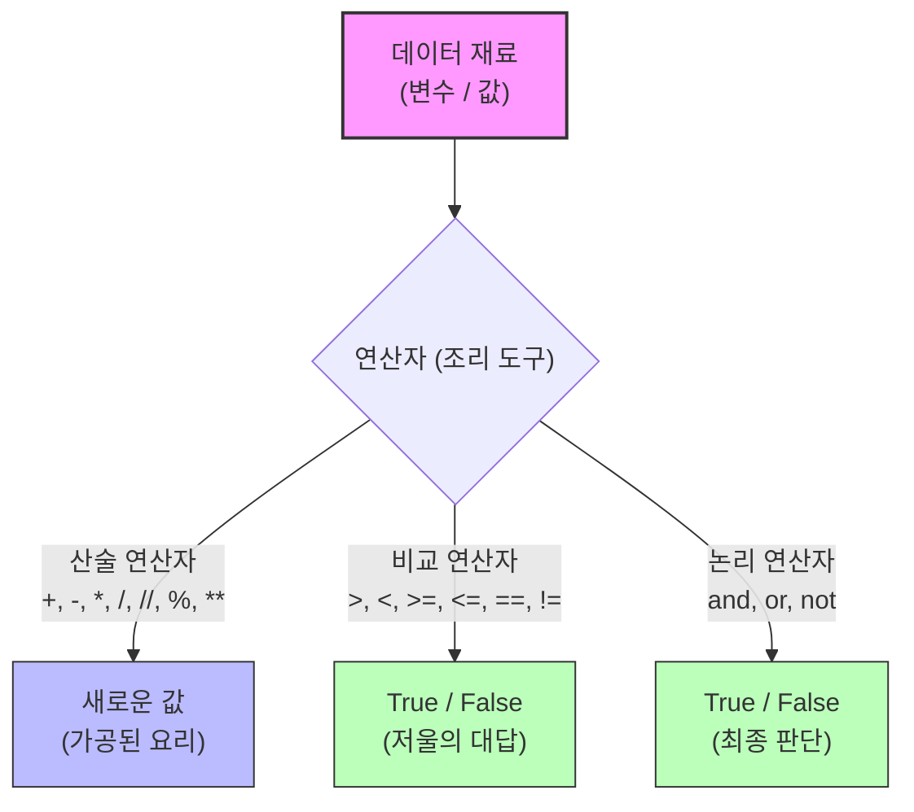

---

## §3. 상세 내용

### Why — 왜 연산자를 구분해서 알아야 하는가?

데이터를 변수(이름표)에 연결하는 것만으로는 프로그램이 아무런 동작도 하지 않습니다. 현실 세계의 문제를 해결하려면 계산을 하고, 조건을 비교하고, 그에 따라 결정을 내려야 합니다. "피자 8조각을 3명이서 나누면 몇 조각이 남지?", "사용자의 나이가 18세 이상인가?" 이런 모든 비즈니스 로직의 근간이 바로 연산자입니다.

### What — 연산자의 종류와 단락 평가

**1. 산술 연산자와 나눗셈의 두 얼굴**
파이썬3에서 나눗셈(`/`)은 무조건 소수점까지 정밀하게 계산된 실수(`float`)를 반환합니다. `17 / 5`는 `3.4`가 되죠. 만약 몫만 깔끔한 정수(`int`)로 원한다면 `17 // 5`를 써서 `3`을 얻고, 나머지만 원한다면 `17 % 5`를 써서 `2`를 얻습니다. 특히 나머지 연산(`%`)은 "짝수/홀수 판별(2로 나눈 나머지가 0인지)"이나 "주기적인 반복" 로직에서 약방의 감초처럼 쓰입니다.

**2. 비교 연산자와 가장 큰 함정**
비교 연산자의 결과는 항상 불리언(`bool`) 타입입니다. 크다(`>`), 작다(`<`), 크거나 같다(`>=`), 작거나 같다(`<=`), 다르다(`!=`)는 직관적입니다. 하지만 앞서 강조했듯, 할당 연산자(`=`)와 비교 연산자(`==`)는 하늘과 땅 차이입니다. 
- `score = 85` (명령: 85라는 값을 score에 넣어라)
- `score == 100` (질문: score의 값이 100과 같니? -> `False` 반환)

**3. 논리 연산자와 단락 평가(Short-circuit)**
파이썬은 매우 영리한 언어입니다. `and`(둘 다 참이어야 참)나 `or`(둘 중 하나만 참이어도 참) 연산을 할 때, 굳이 끝까지 계산할 필요가 없으면 앞에서 멈춰버립니다. 이를 **단락 평가**라고 합니다.
예를 들어 `x = 0`일 때, `x and (10 / x)`라는 코드를 실행한다고 해보죠. `x`가 0(Falsy)이기 때문에 `and` 연산은 이미 '거짓'으로 확정되었습니다. 그래서 파이썬은 뒤에 있는 `10 / x`를 아예 쳐다보지도 않고 계산을 종료합니다. 덕분에 0으로 나누면 터지는 무서운 `ZeroDivisionError`를 안전하게 피해갈 수 있습니다.

### How — 연산자 우선순위 실전 활용

수학에 곱셈을 덧셈보다 먼저 하는 규칙이 있듯, 파이썬에도 우선순위가 있습니다.
1순위: 거듭제곱 (`**`)
2순위: 곱셈, 나눗셈, 몫, 나머지 (`*`, `/`, `//`, `%`)
3순위: 덧셈, 뺄셈 (`+`, `-`)
4순위: 비교 연산자 (`>`, `==` 등)
5순위: 논리 연산자 (`not`, `and`, `or`)

이 순서를 억지로 외울 필요는 없습니다. 헷갈린다면 수학에서 하듯 괄호 `()`를 쳐주면 됩니다. 괄호 안의 내용이 언제나 최우선으로 계산되니까요. 가독성을 위해서라도 괄호를 적극적으로 사용하는 것이 좋습니다.

> ✅ **체크포인트**: 여기까지 이해했는지 점검해 보세요.
> - `10 / 2`의 결과값과 그 데이터 타입은 무엇일까요? (`5.0`, `float`)
> - `x = 10`과 `x == 10`의 차이를 누군가에게 설명할 수 있나요?
> - `False and (100 / 0)` 코드가 에러를 발생시키지 않는 이유는 무엇인가요? (단락 평가 때문)

---


### 📊 참고 표 (Visual Specs)

**연산자 우선순위 (Operator Precedence)**

| 순위 | 연산자 종류 | 기호 예시 | 설명 |
|:---|:---|:---|:---|

## §4. 실습 가이드 (+ 🎙️ 실습 대본)

### 실습 목표

이 실습을 통해 수강생은 산술 연산자를 이용한 실생활 계산기 코드를 작성해 보고, 비교 연산자와 단락 평가의 동작을 터미널에서 직접 실행하며 눈으로 확인합니다.

🎙️ **실습 가이드 대본 (Lab Guide)**:

> 자, 이제 눈으로만 보던 도구들을 직접 손에 쥐어볼 시간입니다. 먼저 여러분이 AI에게 지시를 내려볼 거예요. 일상생활에서 흔히 만나는 '피자 나눠먹기' 문제입니다. 
> 
> 에이전트에게 "파이썬으로 피자 조각 나누는 계산기 만들어줘"라고 요청해 보세요. 이때 "몫과 나머지 연산자를 써서 1인당 몇 조각을 먹고 몇 조각이 남는지 보여줘"라고 구체적으로 프롬프트를 주면 훨씬 좋은 코드가 나옵니다. 
>
> 그리고 비교 연산자 실습도 해볼 겁니다. 여러분의 키를 변수에 넣고 롤러코스터 탑승이 가능한지 알아보는 코드를 직접 타이핑해 보세요. `==` 대신 실수로 `=`를 썼을 때 파이썬이 어떤 에러를 뱉어내는지도 직접 확인해 보는 게 중요합니다. 틀려봐야 배울 수 있으니까요!

### 단계별 실습 지시사항

| 단계 | 소요 시간 | 강사 지시사항 | 학습자 액션 | 예상 결과 |
|------|----------|--------------|------------|----------|
| 1 | 3분 | "AI에게 피자 계산기 코드를 요청하세요" | Agent Manager에 계산기 작성 프롬프트 입력 | AI가 `//`와 `%`를 사용한 코드 제시 |
| 2 | 2분 | "코드를 복사해서 실행해 보세요" | `pizza.py` 파일 생성 후 코드 붙여넣기 및 실행 | 1인당 몫과 남은 나머지 조각수 출력 |
| 3 | 3분 | "비교 연산자로 탑승 가능 여부를 테스트하세요" | `can_ride = my_height >= 140` 형태의 코드 작성 및 실행 | `True` 또는 `False` 출력 |
| 4 | 2분 | "일부러 에러를 내봅시다!" | `score = 100` 비교를 `if score = 100:` 으로 잘못 타이핑해보기 | `SyntaxError: invalid syntax` 발생 |
| 5 | 2분 | "단락 평가 마술을 확인해 보세요" | 터미널 REPL(`python`)에서 `0 and (10/0)` 실행 | 에러 없이 `0` 출력 |

### 트러블슈팅 FAQ

| Q | A |
|---|---|
| 나눗셈을 했는데 자꾸 뒤에 `.0`이 붙어서 나와요. | 정상입니다! 파이썬3에서 슬래시 하나(`/`)를 쓴 나눗셈은 무조건 실수(float)를 반환합니다. 소수점 없이 정수 몫만 필요하다면 슬래시 두 개(`//`)를 사용하세요. |
| `if score = 100:` 이라고 썼는데 에러가 나요. | 가장 흔한 실수입니다! `=` 하나는 변수에 값을 넣을 때 쓰고, 양쪽이 같은지 비교할 때는 반드시 `==` 두 개를 써야 합니다. |
| 거듭제곱은 어떻게 하나요? `^` 기호를 쓰면 되나요? | 아니요! 파이썬에서 거듭제곱은 `**`를 사용합니다. `2 ** 3`을 하면 2의 3제곱인 8이 나옵니다. (`^`는 파이썬에서 완전히 다른 비트 연산자로 동작합니다.) |
| `ZeroDivisionError`가 뜹니다! | 어떤 수를 0으로 나누려고 (`10 / 0` 또는 `10 % 0`) 할 때 발생하는 에러입니다. 분모에 들어가는 변수가 0이 아닌지 항상 체크해야 합니다. |
| `10 + 20 * 2`를 했는데 60이 아니라 50이 나와요. | 연산자 우선순위 때문입니다. 곱하기가 더하기보다 먼저 실행되어서 `20 * 2`가 먼저 계산됩니다. 60을 원한다면 괄호를 묶어 `(10 + 20) * 2`로 작성해야 합니다. |

---


### 🎓 강사 노트 (Instructor Support)

- ⏱️ **타이밍**: 10:15 (20분, lab)
- 🎯 **핵심 활동**: 산술/비교 연산자
- ⚠️ **강사 주의사항**: 프롬프트로 코드 생성→예측→검증


### 📋 실습 설계 보강 (Lab Packet)

**세션 047 실습 설계 보강**

기본 연산자와 실습
- **3-Stage Example Set**
  - 기본: AI에게 "산술 연산자와 비교 연산자를 사용하는 파이썬 예제를 만들어줘" → 실행
  - 변형: "할인율 계산기" 프롬프트 — 원가와 할인율을 입력받아 최종 가격 계산
  - 실수 해결: `10 / 3` 결과가 `3.333...`으로 나와 당황 → 정수 나눗셈 `//` 소개
- **난이도 예측**: 연산자 자체는 쉬우나 `//`, `%`, `**` 같은 특수 연산자가 낯설음
- **타이밍 가이드**: 산술 연산 체험 5분 | 비교 연산 체험 5분 | 할인 계산기 5분 | 정리 5분
- **심리적 장벽**: "수학을 못하는데 괜찮을까?"
- **자가 점검**:
  - [ ] `+`, `-`, `*`, `/`, `//`, `%` 각각의 결과를 확인했는가?
  - [ ] `==`, `!=`, `>`, `<`의 결과가 True/False임을 확인했는가?
  - [ ] 프롬프트로 간단한 계산기를 생성하고 실행해봤는가?

## §5. 코드 및 명령어 모음

### 1. 산술 연산자 기본 (피자 계산기)

```python
# 피자 한 판(8조각)을 3명이서 나눌 때
pizza_slices = 8
people = 3

each = pizza_slices // people     # 몫: 1인당 먹는 조각 수
leftover = pizza_slices % people  # 나머지: 남는 조각 수

# f-string을 활용한 결과 출력
print(f"1인당 {each}조각씩 먹고, {leftover}조각이 남습니다.") 
# 출력: 1인당 2조각씩 먹고, 2조각이 남습니다.

# 나눗셈 연산자 비교
print(17 / 5)   # 3.4 (소수점까지 정밀하게, float)
print(17 // 5)  # 3   (몫만 뚝 자름, int)
```

### 2. 비교 연산자와 불리언

```python
my_height = 150
ride_limit = 140

# 질문을 던지는 저울 (결과는 항상 bool)
can_ride = my_height >= ride_limit
print(f"탑승 가능: {can_ride}")  # True

# 할당(=)과 비교(==)의 절대적인 차이
score = 85           # "score 상자에 85를 넣어라!" (할당)
print(score == 100)  # "score 상자 안의 값이 100과 같니?" (비교) -> False
print(score != 100)  # "score 상자 안의 값이 100과 다르니?" (비교) -> True
```

### 3. 논리 연산자와 단락 평가(Short-circuit)

```python
x = 0

# and 연산: 앞이 거짓(0)이면 뒤는 아예 쳐다보지도 않음
# 그래서 10 / x 에서 발생하는 ZeroDivisionError를 피할 수 있음
result = x and (10 / x)
print(result)  # 0

# or 연산: 앞이 참이면 뒤는 계산하지 않고 앞의 값을 반환
y = 10
result2 = y or (10 / 0)
print(result2) # 10 (ZeroDivisionError 발생 안 함)
```

---

## §6. 요약

### 핵심 학습 포인트

이번 세션에서 우리는 데이터 재료를 요리하는 도구들을 장착했습니다. 
1. **산술 연산자는 재료를 가공합니다**: 특히 `//`(몫)과 `%`(나머지)는 로직 구현에 자주 쓰이는 훌륭한 도구입니다. 파이썬의 나눗셈(`/`)은 항상 실수를 반환한다는 점을 기억하세요.
2. **비교와 논리 연산자는 판단을 내립니다**: 저울의 결과는 언제나 `True` 아니면 `False`입니다. 또한 파이썬의 똑똑한 '단락 평가' 덕분에 불필요한 에러를 막을 수 있습니다.
3. **가장 중요한 규칙**: `=`는 변수 상자에 값을 '넣어라'이고, `==`는 양쪽의 값이 '같니?'라고 묻는 것입니다. 이 둘을 혼동하면 수많은 에러와 마주하게 됩니다.

### 다음 세션 예고

지금까지 우리는 변수 상자 하나에 값 하나씩만 담아서 요리했습니다. 그런데 학생 100명의 점수를 처리해야 한다면 어떨까요? 변수 상자 100개를 만들고 연산자 100개를 써야 할까요? 상상만 해도 끔찍합니다. 다음 시간에는 이렇게 넘쳐나는 데이터를 깔끔하게 하나로 묶어주는 마법의 서랍장, '리스트(List)'에 대해 알아보겠습니다.

### 브릿지 노트

> "여러분, 오늘 연산자 실습 어떠셨나요? 생각보다 기호들이 친숙하죠? 이제 우리는 컴퓨터에게 '이것과 저것을 계산해!' 그리고 '이게 저것보다 큰지 비교해!'라고 명령할 수 있게 되었습니다. 
> 
> 그런데 한 가지 문제가 생겼어요. 데이터가 3개, 4개일 때는 변수 이름표를 하나씩 붙이는 게 괜찮았는데, 고객 데이터 1,000만 건을 다뤄야 한다면 어떻게 될까요? 이름표를 1,000만 개 만들 순 없겠죠. 다음 세션에서는 이 수많은 데이터를 번호가 매겨진 거대한 아파트 서랍장에 예쁘게 꽂아 넣는 기술, '리스트'를 배워보겠습니다. 잠깐 쉬고 데이터의 집을 지으러 가보죠!"

---

## §7. 참고 자료

### 3-Source 출처

- **Source A (로컬 참고자료)**: 「8 코딩.pdf」 — 연산자 우선순위, 산술 연산자(`//`, `%` 활용법) 및 비교 연산자 기초
- **Source B (NotebookLM)**: SRC-B03 — Day 3 팩트 패킷 기반, 산술/비교 연산자 비유(조리 도구와 저울), 변수와 할당의 관계
- **Source C (Deep Research)**: SRC-C03 — 파이썬 CPython 런타임의 단락 평가(Short-circuit evaluation) 메커니즘, `=`와 `==`의 파서 해석 차이

### 강사 노트

> 💡 **강사 노트**: 
> 초보자들이 가장 많이 헷갈려하는 두 가지 포인트는 1) `/`와 `//`의 차이, 2) `=`와 `==`의 혼동입니다. 특히 다음 세션 이후로 `if` 조건문을 배우게 되는데, 이때 `if score = 100:` 이라고 쓰는 실수가 속출합니다. 이번 세션에서 저울 비유와 단호한 어조로 `==`의 중요성을 강력하게 인지시켜 주세요.
> 단락 평가(Short-circuit) 부분은 당장 100% 이해하지 못해도 괜찮습니다. "파이썬은 쓸데없는 계산은 안 하는 똑똑한 친구구나" 정도로 넘어가고, 나중에 조건문 실습에서 자연스럽게 다시 체득하도록 유도하는 것이 좋습니다.

---

**🔗 선행 세션**: [세션-046] 타입 변환과 f-string (필수)  
**🔗 후행 세션**: [세션-048] 리스트의 이해와 기본 조작  

---

*작성 일시: 2026-02-25*  
*작성 에이전트: A4B_Session_Writer*  
*교안 구조: 7섹션 (A0 팀 공통 표준)*

> 🔗 **이전 세션**: [세션 046: 타입 변환과 f-string](#세션-046)에서 배운 내용을 이어갑니다.
> 🔗 **다음 세션**: [세션 048: 리스트의 이해와 기본 조작](#세션-048)에서 계속됩니다.

---

### 세션 048: 리스트의 이해와 기본 조작
> [원본 파일](sessions/세션-048-리스트와기본조작_v2.1.md) | ⏱️ 25분 | 📖 narrative | 난이도: medium

> **세션 ID**: MS-PY101-048
> **소요 시간**: 25분
> **난이도**: low
> **청크 타입**: narrative
> **버전**: v2.1 (7섹션 구조)

---

## §1. 개요

> **Day 3 | AM | 세션 048/064**

이 세션은 변수와 기본 데이터 타입을 배운 수강생들이 처음으로 만나게 되는 '자료구조(Data Structure)' 시간입니다. 낱개의 변수로 데이터를 관리하던 1차원적인 방식에서 벗어나, 수많은 데이터를 효율적으로 묶어서 관리하는 파이썬의 가장 강력하고 기본적인 도구인 '리스트(List)'의 세계로 진입합니다.

### 🎯 학습 목표

이 세션이 끝나면 수강생은 다음을 할 수 있어요:
- 단일 변수와 리스트의 차이를 '상자'와 '번호표가 붙은 대형 사물함' 비유로 설명할 수 있습니다
- 파이썬 리스트를 생성하고, 데이터의 추가(`append`), 삭제(`remove`), 개수 확인(`len`) 등 기본 조작을 수행할 수 있습니다
- 리스트가 순서를 유지하며 중복 데이터를 허용한다는 특징을 이해하고 활용할 수 있습니다

### 선행 세션 환기

직전 세션(047)에서 기본 연산자와 단락 평가를 배웠습니다. 지금까지는 데이터를 하나씩 이름표(변수)를 붙여 다뤘다면, 이제는 수십, 수백 개의 데이터를 한 번에 효율적으로 관리하는 방법을 배울 차례입니다.

---

## §2. 핵심 개념 (+ 🗣️ 강사 대본 + Mermaid)

### 낱개 상자에서 번호표가 붙은 대형 사물함으로

데이터를 변수라는 포스트잇 이름표로 하나씩 관리하는 것은 데이터가 적을 때는 문제가 없어요. 하지만 관리해야 할 데이터가 전교생 100명의 수학 점수라면 어떨까요? `score1`, `score2`부터 `score100`까지 변수를 100개 만드는 것은 엑셀에서 데이터를 한 줄 한 줄 수작업으로 입력하는 것과 같은 끔찍한 일입니다 [Source A].

이럴 때 등장하는 구원투수가 바로 '자료구조'입니다. 그 중에서도 파이썬의 가장 기본이 되는 자료구조인 **'리스트(List)'**는 학교 복도에 있는 **'번호표가 붙은 대형 사물함'**과 똑같습니다. 낱개 상자 100개를 방바닥에 어지럽게 굴려놓는 대신, 커다란 사물함 하나에 0번부터 99번까지 순서대로 번호표를 붙여 물건을 차곡차곡 정리하는 것이죠 [Source B, C].

🗣️ **강사 대본 (Instructor Script)**:

> 여러분, 지금까지 우리는 데이터를 하나씩 다뤘어요. `score = 80` 이런 식으로요. 그런데 만약 전교생 100명의 수학 점수를 저장해야 한다면 어떨까요? `score1, score2, ... score100`까지 변수 이름표를 100개나 만들어야 할까요? 상상만 해도 손가락이 아파옵니다. 엑셀에서 데이터를 한 줄 한 줄 수작업으로 치던 그 노가다의 악몽이 떠오르시나요?
>
> 프로그래밍에서는 이런 문제를 아주 우아하게 해결합니다. 바로 '리스트(List)'라는 것을 통해서요. 
>
> 학교 복도에 있는 사물함을 떠올려 보세요. 상자 100개가 뿔뿔이 흩어져 있는 게 아니라, 커다란 사물함 하나에 칸막이를 치고 0번 칸, 1번 칸, 2번 칸... 이렇게 순서대로 번호표를 붙여서 물건을 차곡차곡 넣는 거예요. 찾을 때는 "사물함 0번 칸 열어봐!" 하면 되는 거죠. 낱개 상자 100개를 방바닥에 굴려놓는 것과, 번호표가 붙은 사물함 하나에 정리하는 것. 어느 쪽이 더 편할지는 말 안 해도 아시겠죠?
>
> AI 통역사에게 "수학 점수 100개 다 기억해"라고 하면 헷갈리지만, "점수 명단 엑셀표(리스트)"를 하나 넘겨주면서 "여기 적혀 있어"라고 하면 완벽하게 일합니다. 리스트는 AI와 소통하는 가장 기본적인 데이터 묶음 방식이에요.

### Mermaid 다이어그램: 낱개 변수 vs 리스트

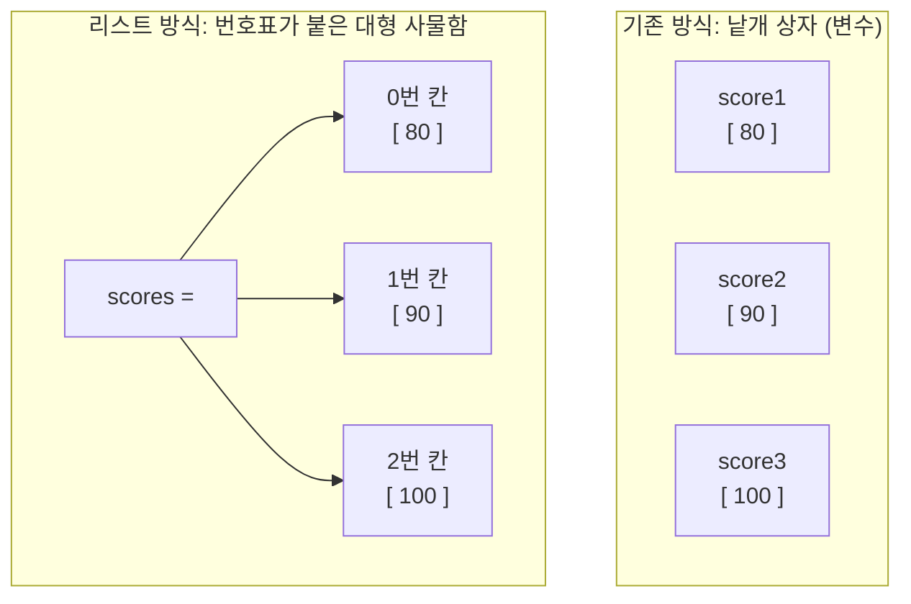

이 다이어그램은 낱개 변수들을 개별적으로 관리하던 기존 방식에서, 하나의 리스트라는 구조물 안에 순서대로(0번, 1번, 2번...) 데이터를 담아 관리하는 방식으로의 진화를 시각적으로 보여줍니다.

---

## §3. 상세 내용

### Why — 왜 리스트가 필요한가?

프로그래밍의 핵심은 '반복적인 작업을 자동화'하는 것입니다. 데이터가 1만 개, 10만 개로 늘어났을 때 이를 효율적으로 처리하려면, 데이터를 하나의 묶음으로 다룰 수 있어야 합니다. 만약 리스트가 없다면 우리는 데이터의 개수만큼 변수 이름을 새로 지어내야 하고, 그 데이터를 한꺼번에 출력하거나 계산하는 일은 불가능에 가깝습니다. 리스트는 대량의 데이터를 하나의 군집으로 만들어, 일괄적인 명령(정렬, 검색, 수정 등)을 내릴 수 있게 해주는 필수적인 토대입니다.

### What — 리스트란 무엇인가?

파이썬에서 리스트는 대괄호 `[]`를 사용하여 만듭니다. `scores = [80, 90, 100]`처럼 여러 개의 값을 쉼표로 구분해서 한 번에 넣을 수 있죠. 파이썬의 리스트는 매우 유연해서 숫자, 문자열, 심지어 다른 리스트까지도 하나의 사물함에 섞어 넣을 수 있습니다 [Source B].

리스트의 가장 중요한 두 가지 특징이 있습니다:
1. **순서가 있다 (Ordered)**: 내가 넣은 순서대로 번호표가 부여됩니다. 첫 번째 넣은 데이터는 0번 칸에, 두 번째 넣은 데이터는 1번 칸에 들어갑니다.
2. **중복을 허용한다 (Duplicates Allowed)**: 같은 값이 여러 번 들어가도 상관없습니다. 80점 받은 학생이 여러 명일 수 있으니까요. `[80, 80, 90]`처럼 똑같은 값을 여러 개 담을 수 있습니다.

### How — 리스트는 어떻게 조작하는가?

우리는 이 사물함을 다룰 때 주로 추가(Create), 읽기(Read), 수정(Update), 삭제(Delete)라는 4가지 행동을 합니다. 이를 줄여서 **CRUD**라고 부르며, 프로그래밍 세계에서 정말 자주 등장하는 핵심 개념입니다 [Source C].

- **생성**: `[]` 대괄호로 빈 사물함을 만들거나, 처음부터 데이터를 채워 넣습니다.
- **추가 (`.append()`)**: 사물함 맨 끝에 빈 칸을 하나 더 만들고 새로운 데이터를 넣습니다.
- **삭제 (`.remove()`)**: 리스트 안에서 특정 값을 찾아 지웁니다. 단, 중복된 값이 있다면 맨 처음 발견된 것 하나만 지웁니다.
- **개수 확인 (`len()`)**: 사물함에 총 몇 개의 칸(데이터)이 있는지 세어줍니다. 내장 함수를 활용합니다.

> ⚠️ **주의사항**: 초보자들이 흔히 하는 실수 중 하나는 리스트 정렬 시 `.sort()`의 반환값을 변수에 저장하는 것입니다. `new_list = fruits.sort()`라고 작성하면 `new_list`에는 `None`이 들어갑니다. `.sort()`는 원본 사물함 안의 내용물을 스스로 정리할 뿐, 새로운 사물함을 통째로 복사해서 주지는 않는다는 점을 명심해야 합니다 [Source A, B].

---


### 📊 참고 표 (Visual Specs)

**컬렉션 타입 비교 (List vs Dict vs Tuple)**

| 자료구조 | 특징 | 괄호 기호 | 수정 가능성 | 주요 용도 |
|:---|:---|:---|:---|:---|

## §4. 실습 가이드 (+ 🎙️ 실습 대본)

### 실습 목표

AI와 협력하여 과일 바구니(리스트)를 만들고, 과일을 추가, 삭제, 교체, 정렬하는 기본적인 CRUD 작업을 직접 코드로 실행하며 확인합니다. 이 과정에서 `.append()`, `.remove()`, 그리고 리스트의 크기를 구하는 `len()` 함수의 동작을 체감합니다.

🎙️ **실습 가이드 대본 (Lab Guide)**:

> 자, 이제 AI 비서와 함께 파이썬 리스트를 직접 만들어 봅시다. Antigravity 환경에서 AI에게 이렇게 프롬프트를 입력해 보세요: "내가 좋아하는 과일 3개를 파이썬 리스트로 만들어줘."
>
> 코드가 생성되었나요? 대괄호 `[]` 안에 과일 이름들이 쉼표로 나란히 들어있을 거예요. 이 대괄호가 바로 파이썬에게 "이건 여러 개를 담는 사물함이야"라고 알려주는 기호입니다. (소괄호나 중괄호를 쓰면 완전히 다른 뜻이 되니 꼭 대괄호를 써야 해요!)
>
> 이제 사물함을 조작해 볼까요?
> 1. 방금 만든 리스트에 코드를 한 줄 추가해서 `.append("딸기")`라고 적고 실행해 보세요. 맨 뒤에 딸기가 추가되었을 겁니다.
> 2. 이번에는 `.remove("사과")`를 해보세요. 사과가 사라졌죠? 
> 3. 만약 리스트에 없는 과일, 예를 들어 `.remove("수박")`이라고 하면 어떻게 될까요? 직접 쳐보세요. 파이썬이 시뻘건 글씨로 "ValueError"라며 "그런 물건 없는데요?"라고 화를 낼 거예요. 없는 칸을 열라고 하니 당연한 반응입니다.
> 4. 마지막으로 `len(과일_리스트_이름)`을 출력해 보세요. 현재 바구니에 과일이 몇 개 남아있는지 정확하게 세어줍니다.

### 단계별 지시

| 단계 | 소요 시간 | 강사 지시사항 | 학습자 액션 | 예상 결과 |
|------|----------|--------------|------------|----------|
| 1 | 5분 | "AI에게 과일 3개가 든 리스트 생성을 요청하세요" | 프롬프트 입력 및 코드 확인 | `fruits = ["사과", ...]` 리스트 구조 파악 |
| 2 | 5분 | ".append()와 .remove()를 사용해 보세요" | 요소 추가 및 삭제 실행 | 리스트 내용물의 동적 변화 확인 |
| 3 | 3분 | "리스트에 없는 요소를 삭제해 보세요" | `.remove("수박")` 등 실행 | `ValueError` 발생 및 에러 메시지 확인 |
| 4 | 2분 | "len() 함수로 과일의 총 개수를 출력해 보세요" | `print(len(fruits))` 실행 | 리스트의 길이를 숫자로 반환받음 |

### 트러블슈팅 FAQ

| Q | A |
|---|---|
| 대괄호 `[]` 대신 소괄호 `()`를 쓰면 안 되나요? | 네, 안 됩니다! 소괄호를 쓰면 파이썬은 이를 '튜플(Tuple)'이라는 전혀 다른 자료구조로 인식합니다. 튜플은 한 번 만들면 내용물을 수정하거나 추가(`.append()`)할 수 없는 딱딱한 상자예요. 리스트는 무조건 대괄호입니다. |
| `.remove()`를 했는데 에러가 나요 | 두 가지를 확인해 보세요. 1) 철자가 정확히 일치하는지(대소문자, 띄어쓰기 포함), 2) 그 데이터가 현재 리스트 안에 진짜로 존재하는지. 없는 것을 지우라고 하면 에러가 납니다. |
| 리스트 안에 숫자랑 문자를 섞어 넣어도 되나요? | 네! 파이썬 리스트는 아주 관대해서 `[1, "사과", True]`처럼 아무거나 섞어 넣어도 됩니다. 다만 실무에서는 관리를 위해 보통 같은 종류의 데이터끼리 묶어 둡니다. |

---


### 🎓 강사 노트 (Instructor Support)

- ⏱️ **타이밍**: 10:35 (25분, narrative)
- 🎯 **핵심 활동**: 리스트 = "서랍장" 비유
- ⚠️ **강사 주의사항**: CRUD 조작 맛보기

## §5. 코드 및 명령어 모음

```python
# 1. 리스트 생성 (Create): 대괄호로 사물함 만들기
fruits = ["사과", "바나나", "포도"]
print(fruits)  # 출력: ['사과', '바나나', '포도']

# 2. 요소 추가 (Update/Create): 맨 뒤에 칸 늘리기
fruits.append("딸기")
print(fruits)  # 출력: ['사과', '바나나', '포도', '딸기']

# 리스트는 중복을 허용합니다!
fruits.append("사과")
print(fruits)  # 출력: ['사과', '바나나', '포도', '딸기', '사과']

# 3. 요소 삭제 (Delete): 특정 물건 찾아서 빼기
# 중복된 항목이 있을 경우, 가장 먼저 나오는(인덱스가 작은) 항목 하나만 지웁니다.
fruits.remove("사과")
print(fruits)  # 출력: ['바나나', '포도', '딸기', '사과']

# 4. 개수 확인: 사물함에 칸이 몇 개인지 세기
count = len(fruits)
print(f"과일의 총 개수는 {count}개 입니다.")  # 출력: 과일의 총 개수는 4개 입니다.

# 5. 정렬하기와 흔한 실수 주의
fruits.sort()
print("정렬 후:", fruits)  # 출력: 정렬 후: ['딸기', '바나나', '사과', '포도'] (가나다순)

# ⚠️ 주의: sort()를 변수에 담지 마세요!
wrong_list = fruits.sort()
print(wrong_list)  # 출력: None
```

> 🤖 **AI 프롬프트 예시**:
> - "파이썬에서 내가 좋아하는 과일 이름 3개가 들어간 리스트를 만드는 코드를 짜줘."
> - "그 리스트의 맨 끝에 '오렌지'를 추가하고, 리스트에 총 과일이 몇 개인지 개수를 출력하는 코드를 추가해줘."

---

## §6. 요약

### 핵심 학습 포인트

이번 세션의 핵심은 세 가지입니다:
1. **리스트는 번호표가 붙은 사물함이다**: 대괄호 `[]`를 사용하며, 여러 개의 데이터를 하나의 묶음으로 효율적으로 관리할 수 있습니다.
2. **순서와 중복 허용**: 리스트에 넣은 데이터는 입력한 순서가 그대로 유지되며, 똑같은 값이 여러 번 들어가도 괜찮습니다.
3. **리스트의 기본 조작(CRUD)**: 맨 뒤에 추가할 때는 `.append()`, 값을 찾아 지울 때는 `.remove()`, 총 데이터의 개수를 셀 때는 내장 함수인 `len()`을 사용합니다.

### 다음 세션 예고

지금까지 우리는 `append()`로 맨 뒤에 데이터를 넣거나 `remove()`로 과일 이름을 직접 불러서 지웠습니다. 그런데 만약 "사물함의 2번 칸에 있는 물건만 콕 집어서 꺼내줘!"라고 하려면 어떻게 해야 할까요? 파이썬에서 사물함의 번호표를 읽는 아주 독특하고도 중요한 규칙이 있습니다. 바로 **'인덱싱(Indexing)'과 '슬라이싱(Slicing)'**입니다.

### 브릿지 노트

> "리스트가 얼마나 편리한 도구인지 감이 오시나요? 엑셀 표를 파이썬으로 옮겨놓은 것 같죠. 그런데 이 리스트에서 데이터를 꺼낼 때 아주 조심해야 할 '파이썬의 비밀'이 하나 있습니다. 우리가 일상에서 "첫 번째"라고 하면 1번이지만, 파이썬은 이 번호표를 0번부터 붙입니다. 이 '0의 비밀'을 모르면 엉뚱한 데이터를 꺼내게 되는데요. 다음 시간에 이 비밀을 바로 파헤쳐 보겠습니다."

---

## §7. 참고 자료

### 3-Source 출처

- **Source A (로컬 참고자료)**: `8 코딩.pdf` §8.3 — 리스트의 개념 및 파이썬에서의 기본 활용 방법, `sort()` 사용 시 원본이 변경되며 `None`이 반환된다는 흔한 실수 유형 발췌.
- **Source B (NotebookLM)**: Day 3 팩트 패킷 분석 리포트 — 단일 변수 관리의 한계를 해결하는 자료구조로서의 리스트 비유(대형 사물함), 숫자와 문자가 혼용 가능한 파이썬 리스트의 유연성.
- **Source C (Deep Research)**: Day 3 팩트 패킷 리서치 — 데이터 묶음을 다루는 프로그래밍의 기본 동작인 CRUD(Create, Read, Update, Delete) 개념 적용.

### 추가 학습 자료

- [Python 공식 문서: 데이터 구조 (Lists)](https://docs.python.org/ko/3/tutorial/datastructures.html#more-on-lists)
- [Python 내장 함수 공식 문서 (len, 등)](https://docs.python.org/ko/3/library/functions.html)

### 강사 노트

> 💡 **강사 노트**: 
> - `score1, score2 ...` 방식의 노가다를 상기시키며 리스트의 필요성(Why)을 강하게 공감시키는 것이 시작 포인트입니다.
> - `sort()`를 변수에 담아서 `None`이 출력되는 실수는 정말 빈번하게 발생하므로, "사물함 스스로 정리만 할 뿐, 새 사물함을 주진 않는다"는 비유를 실습 중에 꼭 강조해 주세요.
> - 리스트는 중복을 허용한다는 점을 보여주기 위해 `.append("사과")`를 두 번 하는 예시를 보여주는 것도 좋은 접근입니다.

---

## ✅ 세션 완료 체크리스트 (강사용)

- [x] §1~§7 모든 섹션이 충실하게 작성되었는가?
- [x] 리스트와 사물함 비유가 직관적으로 전달되었는가?
- [x] `.append()`, `.remove()`, `len()` 및 CRUD 개념이 포함되었는가?
- [x] 순서 유지와 중복 허용이라는 리스트의 핵심 속성이 설명되었는가?
- [x] 3-Source 팩트 패킷 출처가 명확히 기재되었는가?

---

*작성 일시: 2026-02-25*  
*작성 에이전트: A4B_Session_Writer*  
*교안 구조: 7섹션 (A0 팀 공통 표준)*

> 🔗 **이전 세션**: [세션 047: 기본 연산자와 실습](#세션-047)에서 배운 내용을 이어갑니다.
> 🔗 **다음 세션**: [세션 049: 리스트 인덱싱과 슬라이싱](#세션-049)에서 계속됩니다.

---

### 세션 049: 리스트 인덱싱과 슬라이싱
> [원본 파일](sessions/세션-049-리스트인덱싱_v2.1.md) | ⏱️ 20분 | 💻 code | 난이도: medium

> **세션 ID**: MS-PY101-049  
> **소요 시간**: 25분  
> **난이도**: low  
> **청크 타입**: narrative  
> **버전**: v2.1 (7섹션 구조)

---

## §1. 개요

> **Day 3 | AM | 세션 049/064**

이 세션에서는 바로 앞 세션에서 만든 거대한 사물함(리스트)에서 우리가 원하는 물건을 콕 집어 꺼내는 방법을 배울 거예요. 사물함에 데이터를 아무리 많이 넣어둬도, 필요할 때 정확한 데이터를 꺼내지 못하면 아무 소용이 없겠죠? 이번 시간에는 파이썬이 데이터를 세는 독특한 방식인 '제로 베이스' 규칙을 이해하고, 원하는 만큼 데이터를 잘라내는 방법을 완벽하게 내 것으로 만들어 봅니다.

### 🎯 학습 목표

이 세션이 끝나면 수강생은 다음을 할 수 있어요:

- 파이썬이 숫자를 0부터 세는 '제로 베이스(Zero-base)' 규칙을 이해하고 설명할 수 있습니다
- 인덱싱을 통해 리스트에서 특정 위치의 데이터를 정확히 뽑아낼 수 있습니다
- 슬라이싱(`[시작:끝:스텝]`)을 사용해 원하는 범위의 데이터를 마음대로 잘라낼 수 있습니다
- 음수 인덱스를 써서 데이터의 맨 끝에서부터 역순으로 쉽게 접근할 수 있습니다

### 선행 세션 환기

바로 앞선 세션 048에서 우리는 리스트라는 거대한 사물함을 처음 만들고, `append()`나 `remove()` 같은 도구로 물건을 넣고 빼는 방법을 배웠어요. 이제는 사물함 안에 있는 수백, 수천 개의 물건 중에서 "딱 이것만 꺼내줘!"라고 파이썬에게 정확하게 지시하는 법을 배울 차례입니다.

---

## §2. 핵심 개념 (+ 🗣️ 강사 대본 + Mermaid)

### 0층부터 시작하는 파이썬 아파트 비유

파이썬을 비롯한 대부분의 프로그래밍 언어에는 초보자를 가장 헷갈리게 만드는 독특한 규칙이 하나 있어요. 바로 숫자를 1이 아니라 '0'부터 센다는 거예요. 이것을 전문 용어로 '제로 베이스(Zero-base)'라고 부릅니다. 우리나라 아파트는 보통 1층부터 시작하지만, 파이썬 마을에 있는 아파트는 항상 '0층'부터 시작한다고 상상해 보세요. 첫 번째 집이 0호, 두 번째 집이 1호가 되는 식이죠.

🗣️ **강사 대본 (Instructor Script)**:

> 여러분, 지난 시간에 우리가 거대한 사물함을 하나 샀죠? 과일도 잔뜩 넣어두었고요. 자, 이제 그 사물함에서 물건을 좀 꺼내봅시다. 파이썬에게 "1번째 칸에 있는 사과 꺼내줘!"라고 말해볼까요? 어라, 이상하게 사과가 아니라 두 번째 칸에 있던 바나나가 튀어나옵니다. 왜 그럴까요?
>
> 파이썬에는 초보자를 아주 당황하게 만드는 비밀이 하나 숨어 있거든요. 바로 숫자를 1부터 세지 않고 '0'부터 센다는 겁니다.
>
> 여러분이 파이썬 마을에 아파트를 하나 지었다고 상상해 보세요. 우리나라 아파트는 보통 1층부터 시작하죠? 1층 다음에 2층이 나오고요. 그런데 파이썬 마을의 아파트는 항상 '0층'부터 시작합니다. 그래서 우리가 "첫 번째 층에 가주세요"라고 하면, 파이썬은 0층으로 갑니다. 두 번째 층은 1층이 되고요.
>
> AI 조수에게 "리스트의 첫 번째 데이터를 가져와"라고 하면, AI가 이해하는 첫 번째는 당연히 0번입니다. 이 규칙을 모르면 항상 내가 원하는 데이터보다 한 칸 뒤에 있는 데이터를 꺼내게 되면서 엉뚱한 결과가 나오게 돼요. 처음에는 0부터 세는 게 정말 어색하겠지만, 나중에 코딩을 계속하다 보면 1부터 세는 게 오히려 이상하게 느껴지는 날이 꼭 올 겁니다.

### Mermaid 다이어그램

파이썬의 리스트가 어떻게 번호를 매기는지 시각적으로 살펴볼까요? 양수 인덱스와 음수 인덱스가 동시에 어떻게 붙어있는지 보여주는 다이어그램이에요.

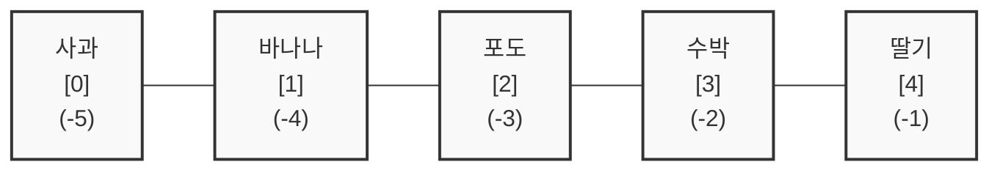

이 그림을 머릿속에 사진 찍듯 기억해 두세요. 왼쪽 끝에서부터 셀 때는 0부터 시작하고, 오른쪽 끝에서부터 셀 때는 -1부터 시작합니다. 이 두 가지 방향만 알면 리스트 안에서 길을 잃을 일이 없어요.

---

## §3. 상세 내용

### Why — 왜 이 세션이 필요한가?

리스트에 수만 개의 고객 데이터나 매출 기록을 쏟아부어 놓았다고 가정해 볼게요. 데이터를 잘 보관하는 것도 중요하지만, "어제 가입한 10명의 회원"이나 "매출 상위 3등까지의 기록"처럼 내가 딱 원하는 부분만 정확하게 발라내는 능력이 실무에서는 훨씬 더 중요합니다. 

특히 AI가 짜준 코드를 읽을 때, `data[0]`이나 `user_list[:5]` 같은 표현은 숨 쉬듯 자연스럽게 등장해요. 여기서 제로 베이스 규칙이나 슬라이싱의 범위를 헷갈리면, 코드가 완전히 멀쩡해 보여도 엉뚱한 데이터를 처리하는 치명적인 논리적 오류(Logical Error)를 잡아낼 수 없습니다.

### What — 이 세션에서 다루는 것은 무엇인가?

이 세션에서는 리스트 안의 데이터를 자유자재로 다루는 세 가지 기술을 배웁니다.

첫 번째는 **인덱싱(Indexing)**이에요. 핀셋으로 원하는 데이터를 하나만 콕 집어내는 기술입니다. `과일[0]`처럼 대괄호 안에 번호를 넣어 사용해요. 
두 번째는 **음수 인덱싱**입니다. 데이터가 100만 개쯤 있을 때 맨 마지막 데이터를 찾으려면 999,999번째 칸을 찾아야 하죠. 너무 힘드니까 파이썬은 뒤에서부터 세는 기능도 만들었어요. 맨 뒤는 항상 `-1`입니다.
세 번째는 **슬라이싱(Slicing)**이에요. 칼로 롤케이크를 자르듯이, 데이터 여러 개를 뭉텅이로 잘라내는 기술입니다. `[시작:끝:스텝]` 형태로 씁니다.

### How — 구체적으로 어떻게 진행하는가?

인덱싱은 아주 직관적이에요. 이름표 뒤에 대괄호를 열고 방 번호를 써주면 끝납니다. 제일 중요한 건 슬라이싱의 규칙을 이해하는 거예요.

슬라이싱에서 절대 잊지 말아야 할 대원칙이 있습니다. 바로 **'끝 번호는 포함하지 않는다'**는 거예요. 수학에서 "이상, 미만"을 배울 때의 그 '미만'과 똑같습니다. 
예를 들어 `fruits[0:2]`라고 코드를 쓰면, 파이썬은 0번과 1번 데이터만 가져오고 2번 데이터 앞에서는 칼로 딱 잘라버립니다. 2번은 포함되지 않아요. 앞서 반복문에서 배웠던 `range()` 함수에서도 끝 번호가 빠졌던 것 기억하시나요? 파이썬은 이 "미만" 규칙을 리스트에서도 아주 일관되게 적용하고 있어요.

여기에 한 걸음 더 나아가면 **스텝(Step)**이라는 기능도 쓸 수 있습니다. `[시작:끝:스텝]` 이렇게 콜론(`:`)을 두 개 찍고 마지막에 보폭을 적어주면 돼요. 스텝을 2로 주면 하나씩 건너뛰며 데이터를 꺼내옵니다.

---

## §4. 실습 가이드 (+ 🎙️ 실습 대본)

### 실습 목표

코드에서 직접 인덱싱과 슬라이싱을 해보면서 "끝 번호는 포함되지 않는다"는 규칙을 눈으로 확인합니다. 또한 리스트의 크기보다 큰 번호를 넣었을 때 발생하는 `IndexError`를 직접 마주하고, 왜 에러가 나는지 에러 메시지를 읽어보는 경험을 합니다.

🎙️ **실습 가이드 대본 (Lab Guide)**:

> 자, AI 조수에게 "월요일부터 일요일까지 요일이 들어있는 리스트를 만들어줘"라고 부탁해 보세요. 그리고 인덱싱과 슬라이싱 코드를 실행해 볼 건데, 여기서 잠깐! 실행 버튼(Run)을 누르기 전에 꼭 눈으로 먼저 결과를 맞혀보세요.
>
> `days[0:5]`를 하면 무슨 요일이 나올까요? 네, "토요일이 포함되나 안 되나"를 유심히 보셔야 합니다. 직접 실행해 보니 어때요? 5번 인덱스인 토요일은 쏙 빠지고 금요일까지만 나오죠? 바로 이게 파이썬의 칼자국이 들어가는 위치입니다. 끝 번호 앞부분에서 가차 없이 잘려요.
>
> 이번에는 한 가지 재미있는 실험을 해볼게요. 우리 리스트에는 요일이 7개밖에 없죠? 대괄호 안에 `days[10]`이라고 적고 실행해 보세요. 화면이 빨갛게 변하면서 에러가 날 겁니다. "IndexError: list index out of range"라고 나오네요. 방이 6개(0~6번)밖에 없는 아파트에 가서 10호 문을 열어달라고 하니 파이썬이 "그런 방은 없는데요?" 하고 화를 내는 겁니다. 이 에러 메시지와 아주 친해지셔야 해요. 정말 자주 보게 되실 거거든요!

### 단계별 지시

| 단계 | 소요 시간 | 강사 지시사항 | 학습자 액션 | 예상 결과 |
|------|----------|--------------|------------|----------|
| 1 | 3분 | 요일 리스트 생성 및 인덱싱 예측 지시 | 눈으로 코드 결과 예측 | 0번이 '월', -1이 '일'임을 파악 |
| 2 | 4분 | 슬라이싱 코드 실행 및 '끝 번호 미만' 확인 | `[0:5]` 실행 후 결과 관찰 | 평일(월~금)만 출력되는 것 확인 |
| 3 | 3분 | 범위 밖 인덱스(`days[10]`) 호출 지시 | 존재하지 않는 인덱스 호출 | `IndexError` 발생 및 메시지 확인 |
| 4 | 5분 | 스텝을 활용한 응용 코드 실험 | `[::2]` 및 `[::-1]` 실행 | 하나 건너뛰기, 역순 뒤집기 체감 |

### 트러블슈팅 FAQ

| Q | A |
|---|---|
| 숫자를 자꾸 1부터 세서 엉뚱한 값이 나와요. | 정상적인 반응이에요! "첫 번째 = 0번"이라고 책상에 포스트잇을 붙여두는 것도 좋은 팁입니다. 의식적으로 1을 빼서 생각하는 연습을 하다 보면 금세 익숙해져요. |
| 슬라이싱할 때는 범위를 넘어가도 에러가 안 나요? | 아주 예리한 질문이에요! 인덱싱으로 딱 하나를 집을 때(`days[10]`)는 에러가 나지만, 슬라이싱(`days[0:100]`)을 할 때는 파이썬이 융통성을 발휘해서 그냥 "있는 데이터까지만" 잘라서 줍니다. |
| 스텝에 음수를 넣으니까 순서가 거꾸로 되네요? | 맞습니다! `[::-1]`은 리스트의 순서를 완전히 뒤집어주는 아주 파이썬다운 훌륭한 코드예요. 실무에서도 자주 쓰인답니다. |

---


### 🎓 강사 노트 (Instructor Support)

- ⏱️ **타이밍**: 11:10 (20분, code)
- 🎯 **핵심 활동**: [0], [1:3], [-1]
- ⚠️ **강사 주의사항**: 인덱스 0부터 시작 반복 강조

## §5. 코드 및 명령어 모음

실습에서 활용한 핵심 코드 모음입니다. 눈으로 훑어보며 각각 어떤 결과가 나올지 다시 한번 떠올려 보세요.

```python
# 요일 리스트 생성
days = ["월", "화", "수", "목", "금", "토", "일"]

# 1. 인덱싱 (하나만 콕 집어내기)
print(days[0])    # 결과: "월" (첫 번째 칸은 0번)
print(days[3])    # 결과: "목" (네 번째 칸은 3번)
print(days[-1])   # 결과: "일" (맨 마지막 칸)
print(days[-2])   # 결과: "토" (뒤에서 두 번째 칸)

# 2. 슬라이싱 (원하는 만큼 뭉텅이로 잘라내기 [시작:끝])
print(days[0:5])  # 결과: ['월', '화', '수', '목', '금'] (5번 토요일은 포함 안 됨!)
print(days[5:])   # 결과: ['토', '일'] (끝 번호를 비워두면 맨 끝까지)
print(days[:3])   # 결과: ['월', '화', '수'] (시작 번호를 비워두면 맨 처음부터)

# 3. 스텝(보폭) 활용하기 [시작:끝:스텝]
print(days[::2])  # 결과: ['월', '수', '금', '일'] (처음부터 끝까지 두 칸씩 건너뛰며)
print(days[::-1]) # 결과: ['일', '토', '금', '목', '수', '화', '월'] (리스트 전체 순서 뒤집기)

# 4. 에러 체험하기 (IndexError)
# print(days[10]) # 주석을 풀고 실행하면 IndexError: list index out of range 발생
```

> 🤖 **AI 프롬프트 예시**:  
> "리스트 슬라이싱을 헷갈리지 않게 연습하고 싶어. 내가 시작 인덱스와 끝 인덱스를 말하면, 네가 어떤 결과가 나올지 퀴즈를 내주는 방식으로 5문제만 연습시켜 줄래?"

---

## §6. 요약

### 핵심 학습 포인트

오늘 배운 세 가지 규칙만 기억하면 어떤 거대한 데이터 앞에서도 당황하지 않을 수 있어요.
1. **파이썬 아파트는 0층부터 시작한다**: 숫자를 셀 때는 무조건 0부터 세는 '제로 베이스'를 기억하세요.
2. **슬라이싱의 끝 번호는 포함되지 않는다**: 자르는 칼날은 끝 번호 '바로 앞'에 들어갑니다.
3. **뒤에서 셀 때는 -1부터 시작한다**: 엄청나게 큰 리스트의 꼬리를 잡을 때는 음수 인덱스를 쓰면 편해요.

### 다음 세션 예고

지금까지 우리가 쓴 번호표 사물함은 데이터를 순서대로 보관하기엔 정말 좋습니다. 하지만 치명적인 단점이 하나 있어요. 만약 100만 명의 회원 정보가 들어있는 리스트가 있다면, "홍길동의 전화번호"가 도대체 몇 번 칸에 있는지 어떻게 알 수 있을까요? 0번 칸이 이름인지, 나이인지, 번호만 보고는 도무지 알 길이 없잖아요.

그래서 파이썬에는 번호표 대신 "이름표"를 붙일 수 있는 아주 멋진 서랍장이 하나 더 준비되어 있습니다. 바로 다음 시간에 만날 '딕셔너리(Dictionary)'입니다.

### 브릿지 노트

> "번호로 방을 찾는 아파트(리스트)에 완벽하게 적응하셨네요! 그렇다면 이제 방 번호가 아니라 '이름표'를 보고 물건을 찾는 고객 카드함, 딕셔너리의 세계로 넘어가 볼까요? 실무에서는 이 두 가지를 섞어 쓰는 게 기본 중의 기본이랍니다."

---

## §7. 참고 자료

### 3-Source 출처

- **Source A (로컬 참고자료)**: 8 코딩.pdf §8.3 — 리스트의 특정 항목에 접근하는 제로 베이스 규칙과 음수 인덱스를 사용한 역순 접근 개념의 원전입니다.
- **Source B (NotebookLM)**: NotebookLM day3 — 프로그래밍의 인덱싱 기초와 첫 번째 데이터를 0으로 취급하는 개념적 구조를 반영했습니다.
- **Source C (Deep Research)**: Deep Research day3 — 슬라이싱 시 끝 인덱스가 포함되지 않는 수학적 원리(이상~미만)와 파이썬의 일관된 범위 지정 규칙 분석을 활용했습니다.

### 강사 노트

> 💡 **강사 노트**: 수강생들이 슬라이싱의 끝 번호 미포함 규칙을 가장 많이 헷갈려합니다. 이때 `days[0:5]`의 길이가 `5-0=5`라서 5개의 아이템을 가져온다고 설명해 주시면 논리적인 직관을 세우는 데 큰 도움이 됩니다. 실습 시 일부러 범위를 초과하는 인덱스를 입력하게 하여 에러에 대한 두려움을 없애주는 것이 매우 중요합니다.

---

## ✅ 세션 완료 체크리스트 (강사용)

- [x] §1~§7 모든 섹션이 충실하게 작성되었는가?
- [x] 0층부터 시작하는 아파트 비유가 매끄럽게 포함되었는가?
- [x] 인덱싱과 슬라이싱의 차이점, 끝 번호 미포함 규칙이 명확히 설명되었는가?
- [x] 코드 실행 전 결과를 예측하게 하는 실습 가이드가 들어있는가?
- [x] 3-Source 팩트 패킷의 내용이 모두 반영되었는가?

---

*작성 일시: 2026-02-25*  
*작성 에이전트: Sisyphus-Junior*  
*교안 구조: 7섹션 (A0 팀 공통 표준)*

> 🔗 **이전 세션**: [세션 048: 리스트의 이해와 기본 조작](#세션-048)에서 배운 내용을 이어갑니다.
> 🔗 **다음 세션**: [세션 050: 딕셔너리의 이해](#세션-050)에서 계속됩니다.

---

### 세션 050: 딕셔너리의 이해
> [원본 파일](sessions/세션-050-딕셔너리의이해_v2.1.md) | ⏱️ 25분 | 📖 narrative | 난이도: medium

> **세션 ID**: MS-PY101-050  
> **소요 시간**: 25분  
> **난이도**: low  
> **청크 타입**: narrative  
> **버전**: v2.1 (7섹션 구조)

---

## §1. 개요

> **Day 3 | AM | 세션 050/064**

이 세션은 3일차 오전 과정에서 배우는 두 번째 핵심 자료구조인 '딕셔너리(Dictionary)'를 다루는 시간이에요. 우리가 바로 앞 세션들에서 리스트라는 아주 편리한 바구니를 하나 배웠습니다. 여러 개의 데이터를 차곡차곡 담아서 순서대로 관리하는 방법을 익혔죠. 하지만 막상 복잡한 데이터를 다루다 보면, 단순히 '첫 번째', '두 번째'라는 순서만으로는 데이터가 도대체 어떤 의미인지 파악하기 어려워지는 순간이 반드시 찾아옵니다. 

이 세션은 프로그래밍 경험이 없는 비전공자 수강생들에게 순서(인덱스)에 의존하는 방식의 한계를 명확히 짚어주고, 데이터에 직접 '이름표'를 붙여서 관리하는 딕셔너리의 직관적인 구조를 이해시키는 데 그 목적이 있습니다. 

### 🎯 학습 목표

이 세션이 끝나면 수강생은 다음을 할 수 있어요:

- 순서 기반의 리스트와 이름표 기반의 딕셔너리의 차이점을 설명할 수 있습니다.
- 파이썬 딕셔너리를 직접 생성하고, 키(Key)와 값(Value)의 구조를 이해합니다.
- 대괄호를 사용하는 방식과 get() 메서드를 사용하는 방식의 차이를 알고, 상황에 맞게 데이터를 안전하게 꺼내올 수 있습니다.
- keys(), values(), items() 같은 딕셔너리 전용 메서드를 활용해 데이터를 다룰 수 있습니다.

### 선행 세션 환기

이 세션을 시작하기 전에 수강생들은 세션 048과 049를 통해 리스트의 생성과 인덱싱, 슬라이싱을 충분히 연습한 상태입니다. 컴퓨터는 숫자를 0부터 세기 때문에 리스트의 첫 번째 칸은 0번이라는 점을 반복해서 배웠죠. 이 세션에서는 바로 그 '번호표(인덱스)'가 주는 불편함을 꼬집으면서 자연스럽게 '이름표(키)'의 필요성으로 넘어갈 거예요.

---

## §2. 핵심 개념 (+ 🗣️ 강사 대본 + Mermaid)

### 오래된 한의원의 약장 서랍과 딕셔너리

딕셔너리의 구조를 가장 직관적으로 이해할 수 있는 비유는 바로 벽면을 꽉 채운 오래된 '한약장 서랍'이에요. 만약 수백 개의 서랍에 약재 이름 대신 '1번', '2번', '123번' 같은 숫자표만 덜렁 붙어있다면 어떨까요? 한의사는 "인삼은 45번째 서랍, 감초는 123번째 서랍"이라는 것을 모두 외워야만 합니다. 이것이 바로 우리가 배운 '리스트'의 인덱스 접근 방식이 가진 치명적인 불편함입니다. 

그래서 사람들은 서랍 겉면에 '인삼', '감초'라고 붓글씨로 정성껏 이름표를 적어 붙였죠. 이렇게 이름표를 붙여두면 더 이상 몇 번째 서랍인지를 힘들게 기억할 필요가 전혀 없게 됩니다. '감초'라는 이름표가 붙은 서랍을 스르륵 열면 그 안에 진짜 감초가 들어있으니까요. 파이썬에서는 이 이름표가 붙은 서랍장 역할을 하는 것을 딕셔너리라고 부릅니다.

🗣️ **강사 대본 (Instructor Script)**:

> 여러분, 우리가 지난 시간에 리스트라는 아주 훌륭한 바구니를 하나 얻었습니다. 그런데 만약 여러분이 AI를 활용해 고객 맞춤형 추천 프로그램을 만들고 있다고 상상해 볼게요. 어떤 고객의 핵심 정보를 리스트에 담았는데, 코드가 이렇게 생겼습니다. `['홍길동', 25, '010-1234-5678']`
>
> 우리가 직접 눈으로 이 데이터를 훑어보면 첫 번째는 이름이고 두 번째는 나이일 것이라고 상식선에서 대충 짐작은 할 수 있어요. 하지만 컴퓨터의 입장에서는 어떨까요? 혹은 이 코드를 몇 달 뒤에 열어본 새로운 팀원의 입장에서는 저기 적힌 '25'라는 숫자가 나이인지, 고객 번호인지, 아니면 지금까지의 누적 구매 횟수인지 도무지 알 길이 없습니다. 데이터의 위치인 '순서'만으로 데이터를 관리하는 것은 데이터의 진짜 '의미'를 잃어버리게 만든다는 아주 큰 단점이 있어요.
>
> 만약 데이터마다 '이름은 홍길동', '나이는 25'라고 명찰이나 이름표를 딱딱 붙여둘 수만 있다면 코드를 읽기가 얼마나 편안해질까요? 오늘 우리가 배울 파이썬의 마법 상자가 바로 이 이름표를 붙여주는 기능입니다.
>
> 오래된 한의원에 한 번 가보신 적 있나요? 벽면을 가득 채운 그 커다란 한약장 서랍들을 떠올려보세요. 그 수백 개의 서랍들에 '1번', '2번' 숫자만 적혀있다고 끔찍한 상상을 해보시길 바랍니다. 약재를 찾을 때마다 "인삼은 45번 서랍"이라고 머릿속으로 번호를 다 외우고 있어야 하죠. 리스트가 바로 이런 식이에요. 데이터가 많아지면 사람이든 기계든 순서만으로 원하는 것을 정확히 찾아내기가 불가능에 가깝습니다.
>
> 그래서 옛날 사람들은 지혜롭게도 서랍 겉면에 '인삼', '당귀'라는 이름표를 적어 붙였습니다. 파이썬에서는 이 이름표가 붙은 서랍장을 '딕셔너리'라고 부릅니다. 말 그대로 사전이죠. 우리가 영어 사전에서 'apple'이라는 단어를 찾으면 그 옆에 '사과'라는 뜻이 바로 나오는 것처럼, 딕셔너리에서는 우리가 붙여둔 이름표(Key)를 던져주면 파이썬이 그 이름표에 해당하는 알맹이(Value)를 즉시 뱉어내는 방식입니다.

### Mermaid 다이어그램: Key-Value 쌍 구조

```mermaid
flowchart LR
    subgraph 딕셔너리 서랍장
        direction TB
        Row1[이름표: "이름"] -->|열어보면| Val1[내용물: "이수진"]
        Row2[이름표: "점수"] -->|열어보면| Val2[내용물: 95]
        Row3[이름표: "주소"] -->|열어보면| Val3[내용물: "서울"]
    end
    
    User([개발자]) -->|"'점수' 서랍 열어줘"| Row2
```

이 다이어그램은 딕셔너리가 어떻게 작동하는지 명확하게 보여줍니다. 개발자는 데이터가 몇 번째에 위치하는지 알 필요가 없어요. 그저 자신이 만들어둔 이름표(Key)만 부르면, 딕셔너리가 알아서 그 안에 담긴 내용물(Value)을 꺼내줍니다.

---

## §3. 상세 내용

### Why — 왜 딕셔너리가 필요한가?

리스트처럼 데이터의 위치인 '순서'만으로 데이터를 관리하는 방식은 규모가 커질수록 치명적인 단점을 드러냅니다. 코드를 읽는 사람에게도 어렵고, 데이터를 처리하는 컴퓨터에게도 불안정하죠. 무엇보다 AI가 대규모 텍스트 데이터를 학습하고 의미를 처리할 때 가장 중요하게 여기는 것이 바로 데이터의 컨텍스트, 즉 키워드가 가진 '의미'입니다. 제목, 저자, 출판일처럼 사람이 읽어도 직관적인 텍스트 키값으로 데이터를 저장해 두어야 나중에 인공지능 모델에 넘겨줄 때 에러 없이 정확하게 분석할 수 있어요. 이것이 우리가 딕셔너리를 반드시 능숙하게 다뤄야 하는 진짜 이유입니다.

### What — 딕셔너리는 어떻게 생겼는가?

파이썬의 딕셔너리는 양쪽 끝에 대괄호(`[]`)가 아닌 중괄호(`{}`)를 사용해서 묶어줍니다. 대괄호를 썼던 리스트와는 생김새부터가 확실하게 구별되죠. 이 중괄호 안에는 반드시 두 개의 값이 하나의 짝, 즉 커플을 이루어서 들어갑니다. 방금 비유로 말씀드린 서랍장 겉면의 '이름표'와 서랍 안에 들어있는 '실제 내용물'이 영원한 한 세트가 되는 구조예요. 프로그래밍 세계에서는 이 이름표를 가리켜 **키(Key)**라고 부르고, 실제 들어있는 내용물을 **값(Value)**이라고 부릅니다. 딕셔너리는 항상 콜론(`:`) 기호를 정중앙에 두고 왼쪽에는 키, 오른쪽에는 값이 쌍을 이루게 됩니다.

가장 잊지 말아야 할 특징은 딕셔너리는 0번, 1번 하는 순서 번호표(인덱스)를 아예 사용하지 않는다는 점이에요. 오직 여러분이 직접 정성껏 붙여준 이름표인 '키'를 통해서만 숨겨진 데이터에 접근할 수 있습니다.

### How — 구체적으로 어떻게 다루는가?

데이터를 다루는 가장 기본적인 네 가지 행동이 있습니다. 생성, 읽기, 수정, 그리고 삭제입니다.

**1. 딕셔너리 생성과 접근하기**
중괄호를 열고 키와 값을 콜론으로 연결합니다.
접근할 때는 변수 이름 뒤에 대괄호를 붙이고 그 안에 이름표(키)를 적어주면 됩니다.
`student = {"이름": "이수진", "점수": 95}`
`print(student["이름"])`이라고 입력하면 "이수진"이라는 값이 튀어나오죠.

**2. 에러 없는 안전한 접근: get() 메서드**
실무에서 데이터를 꺼내올 때 초보자분들이 가장 많이 하는 실수가 하나 있습니다. 딕셔너리에 아예 존재하지도 않는 이름표를 강제로 부르는 것이죠. 만약 `student["취미"]`라고 없는 키를 부르면 파이썬은 깜짝 놀라며 치명적인 `KeyError`를 발생시키고 프로그램 자체의 심장을 멈춰버립니다.

이때 `get()` 메서드를 사용하면 아주 부드럽고 유연하게 상황을 넘길 수 있어요.
`student.get("취미")`라고 부르면 프로그램이 죽어버리는 대신 "그런 정보는 안타깝게도 없는데요?"라는 뜻의 `None`을 조용히 돌려줍니다. 한 걸음 더 나아가 `student.get("취미", "정보 없음")`처럼 우리가 미리 친절한 기본 메시지를 출력하게 만들 수도 있어요. 서비스가 중간에 뻗어버리지 않도록 만드는 매우 중요한 실무 습관입니다.

**3. 데이터 추가와 수정, 그리고 삭제**
새로운 서랍을 하나 더 추가하거나 기존 서랍의 내용물을 바꾸는 방법은 무척 간단합니다.
`student["주소"] = "서울"`이라고 쓰면 기존 딕셔너리에 "주소"라는 새로운 이름표가 달리고 그 안에 "서울"이라는 값이 들어갑니다. 만약 이미 "주소"라는 이름표가 있었다면, 그 안의 값이 "서울"로 수정됩니다.
불필요해진 데이터를 지울 때는 `del student["점수"]`처럼 `del` 명령어를 사용해 이름표 자체를 떼어내 버리면 됩니다.

**4. 딕셔너리 분해하기: keys(), values(), items()**
딕셔너리의 데이터를 한꺼번에 확인할 때 쓰는 세 가지 훌륭한 도구가 있습니다.
이름표들만 싹 모아보고 싶다면 `student.keys()`를, 내용물들만 모아보고 싶다면 `student.values()`를 사용합니다. 이름표와 내용물을 쌍으로 묶어서 한 번에 모두 꺼내보고 싶을 때는 `student.items()`를 사용해요. 특히 나중에 배울 반복문(for문)과 결합할 때 이 메서드들은 아주 막강한 힘을 발휘합니다.

---

## §4. 실습 가이드 (+ 🎙️ 실습 대본)

### 실습 목표

수강생들은 제공된 코드를 따라 치며 딕셔너리를 직접 생성해 봅니다. 이 실습의 가장 중요한 목표는 존재하지 않는 키를 호출했을 때 발생하는 `KeyError`의 붉은 화면을 직접 경험해 보고, 이를 `get()` 메서드로 안전하게 방어하는 과정을 체화하는 것입니다. 그 후에는 수강생 본인의 정보를 담은 딕셔너리를 자유롭게 만들어보며 개념을 다집니다.

🎙️ **실습 가이드 대본 (Lab Guide)**:

> 여러분 각자의 눈앞에 띄워둔 주피터 노트북 창을 여시고 화면에 보이는 코드를 천천히, 오타 없이 똑같이 타이핑해 보시길 바랍니다. 코드를 다 치고 실행해 보셨나요?
>
> 자, 이번에는 조금 엉뚱하고 과감한 실험을 하나 해볼 건데요. 변수 바로 뒤에 대괄호를 열고 쌍따옴표 안에 '취미'라고 적어보세요. `print(student["취미"])`라고 치고 실행 버튼을 누르면 어떤 붉은색 글씨가 여러분의 화면을 가득 채우며 반기는지 직접 눈으로 똑똑히 확인하셔야 합니다.
>
> 네, 맞습니다. 바로 그 유명한 `KeyError`입니다. 우리 서랍장에 '취미'라는 이름표가 애초에 붙어있지 않기 때문에 파이썬이 너무 당황해서 에러를 뱉어낸 것이죠. 이 치명적인 에러를 직접 눈으로 확인하셨다면, 이제 에러가 난 그 줄을 지우시고 그 자리에 오늘 배운 마법의 방패, `get()` 메서드를 써보세요. `print(student.get("취미", "정보 없음"))` 이렇게 치고 다시 실행해 볼까요?
>
> 에러 없이 무사하고 평화롭게 "정보 없음"이라는 글자가 뜨는 것을 확인하셨나요? 이것이 이번 실습의 가장 중요한 핵심입니다. 다 하신 분들은 본인의 진짜 정보를 담은 `my_info`라는 새로운 딕셔너리를 하나 풍성하게 만들어보시길 바랍니다. 이름, 나이, 사는 곳, 취미 등을 다 넣어보세요!

### 단계별 지시

| 단계 | 소요 시간 | 강사 지시사항 | 학습자 액션 | 예상 결과 |
|------|----------|--------------|------------|----------|
| 1 | 3분 | 딕셔너리 생성과 대괄호 접근 코드 타이핑 지시 | 주피터 노트북에 코드 입력 및 실행 | `학생 이름: 이수진` 정상 출력 |
| 2 | 2분 | 존재하지 않는 키를 대괄호로 호출하도록 유도 | `print(student["취미"])` 입력 및 실행 | `KeyError: '취미'` 발생 및 당황함 경험 |
| 3 | 3분 | `get()` 메서드를 사용해 방어하는 코드 작성 지시 | `student.get("취미", "정보 없음")` 실행 | 에러 없이 `정보 없음` 텍스트 정상 출력 |
| 4 | 5분 | 본인 정보를 담은 `my_info` 딕셔너리 만들기 미션 | 중괄호를 사용해 다양한 키-값 쌍 추가 및 출력 | 스스로 데이터 모델링 경험 및 성취감 획득 |

### 트러블슈팅 FAQ

| Q | A |
|---|---|
| 중괄호 `{}`와 대괄호 `[]`가 자꾸 헷갈려요. | "리스트는 박스 모양이니까 각진 대괄호 `[]`, 딕셔너리는 둥글둥글하고 복잡하니까 물결 모양의 중괄호 `{}`라고 외워두면 조금 편합니다!" |
| `KeyError`가 나는데 오타가 없어요. | "키값에 스페이스바(공백)가 포함되어 있지 않은지 확인해 보세요. '이름'과 '이름 '은 컴퓨터 입장에서 완전히 다른 이름표입니다." |
| `items()`를 썼더니 `dict_items([('이름', '이수진')])`처럼 이상하게 나와요. | "정상입니다! 딕셔너리가 '나 지금 묶음으로 값들을 내보내고 있어'라고 표시해 주는 거예요. 나중에 반복문을 배우면 저 묶음을 예쁘게 하나씩 꺼내 쓰는 법을 배울 겁니다." |

---


### 🎓 강사 노트 (Instructor Support)

- ⏱️ **타이밍**: 11:30 (25분, narrative)
- 🎯 **핵심 활동**: 딕셔너리 = "전화번호부" 비유
- ⚠️ **강사 주의사항**: 키-값 쌍 개념 확실하게

## §5. 코드 및 명령어 모음

수강생들이 실습 시간에 참고할 수 있는 딕셔너리 핵심 조작 코드 모음입니다.

```python
# 1. 딕셔너리 생성하기
student = {"이름": "이수진", "점수": 95}

# 2. 특정 데이터에 접근하기 (대괄호 방식 - 직관적이지만 위험할 수 있음)
print(student["이름"])  # 출력 결과: "이수진"

# 3. 안전하게 데이터 가져오기 (get 메서드 활용 - 실무 권장 방식)
# "전화번호"라는 키가 없다면 프로그램이 멈추는 대신 지정한 기본값을 반환합니다.
print(student.get("전화번호", "정보 없음"))  # 출력 결과: "정보 없음"

# 4. 새로운 데이터 서랍(키-값 쌍) 추가하기
student["주소"] = "서울"
print(student)  # 출력 결과: {'이름': '이수진', '점수': 95, '주소': '서울'}

# 5. 기존 데이터 수정하기
student["점수"] = 100
print(student)  # 출력 결과: {'이름': '이수진', '점수': 100, '주소': '서울'}

# 6. 불필요한 데이터 삭제하기
del student["주소"]
print(student)  # 출력 결과: {'이름': '이수진', '점수': 100}

# 7. 딕셔너리 데이터 한 번에 조회하기
print(student.keys())    # 이름표(키)만 모아보기
print(student.values())  # 내용물(값)만 모아보기
print(student.items())   # 키와 값을 쌍으로 묶어서 모아보기
```

> 🤖 **AI 프롬프트 예시**:
> "파이썬 딕셔너리에서 키가 있는지 없는지 안전하게 확인하면서 값을 꺼내오는 코드를 작성해 줘. 만약 값이 없으면 '데이터 부족'이라는 문자열을 반환하게 해 줘."

---

## §6. 요약

### 핵심 학습 포인트

이번 세션에서 가장 중요한 메시지는 세 가지예요. 첫째, 딕셔너리는 데이터에 순서 번호표 대신 명확한 '이름표(Key)'를 붙여서 관리하는 직관적인 자료구조입니다. 둘째, 중괄호 `{}` 안에 콜론 `:`을 두고 왼쪽에는 키, 오른쪽에는 값을 쌍으로 적어 넣는 형태를 가집니다. 셋째, 실무에서는 예상치 못한 에러로 프로그램이 죽는 것을 막기 위해 대괄호 접근 방식보다 `get()` 메서드를 훨씬 더 많이 사용한다는 사실을 꼭 기억해야 합니다.

### 다음 세션 예고

오늘 우리는 오직 단 한 명의 학생 정보만을 딕셔너리 딱 하나에 예쁘게 담아보았습니다. 그런데 만약 관리해야 할 고객이 만 명, 십만 명이라면 어떨까요? 이 수많은 고객 정보를 담기 위해 변수를 십만 개나 따로 만들 수는 없는 노릇입니다. 그래서 실제 현장에서는 우리가 배운 커다란 리스트 상자 안에, 오늘 배운 작은 딕셔너리 서랍장들을 차곡차곡 넣어 관리합니다. 다음 세션에서는 이 두 가지 무기를 하나로 합친 '리스트 안의 딕셔너리(List of Dicts)'라는 궁극의 복합 자료구조 스킬을 배워볼 거예요.

### 브릿지 노트

> "여러분, 이름표를 붙이니까 데이터의 의미가 훨씬 뚜렷해졌죠? 그런데 문제가 하나 생겼습니다. 우리 서비스에 가입한 회원이 100명이라면 딕셔너리 100개를 일일이 만들어야 할까요? 그건 생각만 해도 너무 끔찍한 막노동입니다. 이 문제를 기가 막히게 해결하는 방법이 바로 다음 세션에 준비되어 있습니다. 커피 한 잔 얼른 드시고, 리스트와 딕셔너리가 어떻게 콜라보레이션을 하는지 확인하러 가보시죠!"

---

## §7. 참고 자료

### 3-Source 출처

- **Source A (로컬 참고자료)**: 「8 코딩.pdf」 §8.3 자료구조 — 데이터의 의미를 잃게 만드는 순서(인덱스) 의존성의 한계 지적, 의미 중심의 데이터 저장소로서 딕셔너리의 가치 설명.
- **Source B (NotebookLM)**: NotebookLM Day 3 오디오 논의 — 대규모 텍스트 데이터를 학습하는 AI 모델이 데이터의 컨텍스트(키워드의 의미)를 처리하고 정제할 때 딕셔너리 형태의 데이터 매핑이 필수적이라는 점.
- **Source C (Deep Research)**: Deep Research Day 3 보고서 — 데이터 수집 자동화 스크립트에서 비정형 데이터를 정리할 때 딕셔너리를 활용하는 실무 방식. 특히 초보자들이 겪는 빈번한 KeyError 문제와 이를 해결하기 위한 `get()` 메서드 사용의 중요성.

### 추가 학습 자료

- [Python 공식 문서: Dictionaries](https://docs.python.org/3/tutorial/datastructures.html#dictionaries)
- [점프 투 파이썬: 딕셔너리 자료형](https://wikidocs.net/16)

### 강사 노트

> 💡 **강사 노트**: 본 세션은 리스트(순서)와 딕셔너리(이름표)의 대비를 통해 왜 이 자료구조가 탄생했는지 'Why'를 설득하는 것이 핵심입니다. 한약장 서랍 비유를 통해 시각적 이미지를 심어주는 것이 중요합니다. 실습 시 `KeyError`를 말로만 설명하지 말고 수강생들이 직접 에러 화면을 경험하게 한 후 `get()` 메서드로 넘어가면, 안전장치의 필요성을 훨씬 더 강렬하게 체감할 수 있습니다.

---

*작성 일시: 2026-02-25*  
*작성 에이전트: Sisyphus-Junior*  
*교안 구조: 7섹션 (A0 팀 공통 표준)*


> 🔗 **이전 세션**: [세션 049: 리스트 인덱싱과 슬라이싱](#세션-049)에서 배운 내용을 이어갑니다.
> 🔗 **다음 세션**: [세션 051: 복합 자료구조](#세션-051)에서 계속됩니다.

---

### 세션 051: 복합 자료구조
> [원본 파일](sessions/세션-051-복합자료구조_v2.1.md) | ⏱️ 20분 | 💻 code | 난이도: high

> **세션 ID**: MS-PY101-051
> **소요 시간**: 25분
> **난이도**: medium
> **청크 타입**: narrative
> **버전**: v2.1 (7섹션 구조)

---

## §1. 개요

> **Day 3 | AM | 세션 051/064**

이 세션은 파이썬 기초 과정의 하이라이트 중 하나입니다. 앞서 배운 리스트와 딕셔너리를 하나로 합쳐서 현실 세계의 복잡한 데이터를 표현하는 방법을 배울 거예요. 리스트가 번호표가 붙은 사물함이고 딕셔너리가 이름표가 붙은 서랍장이라면, 이 둘을 어떻게 결합할 수 있을까요? 바로 이 결합이 우리가 앞으로 만들 '고객 정보 관리 프로그램'의 뼈대가 됩니다. 비전공자 수강생들에게는 2차원적인 데이터 접근이 낯설 수 있으므로, 물리적인 비유를 통해 차근차근 접근하는 것이 매우 중요합니다.

### 🎯 학습 목표

이 세션이 끝나면 수강생은 다음을 할 수 있어요:

*   리스트 안에 딕셔너리가 들어간 복합 자료구조의 형태를 이해하고 설명할 수 있습니다.
*   중첩된 자료구조에서 원하는 특정 데이터를 정확한 순서로 꺼낼 수 있습니다.
*   현실의 다중 고객 데이터를 파이썬 코드로 어떻게 모델링하는지 큰 그림을 그릴 수 있습니다.

### 선행 세션 환기

바로 이전 세션에서 우리는 이름표를 보고 값을 찾는 딕셔너리를 배웠습니다. 그리고 그 전에는 순서대로 줄을 세우는 리스트를 다루었죠. 이제 이 두 가지 도구를 책상 위에 나란히 올려놓고 조립을 시작할 차례입니다.

---

## §2. 핵심 개념 (+ 🗣️ 강사 대본 + Mermaid)

현실의 데이터는 결코 단순하지 않습니다. 전교생 100명의 이름, 수학 점수, 영어 점수를 관리한다고 상상해 보세요. 리스트만 쓰자니 순서만 있어서 누가 몇 점인지 헷갈리고, 딕셔너리만 쓰자니 학생 100명 분의 변수 이름을 일일이 만들어야 합니다. 이 끔찍한 상황을 해결하는 우아한 방법이 바로 중첩(Nesting)입니다.

번호표가 붙은 커다란 사물함(리스트)을 하나 상상해 보세요. 그리고 그 사물함의 0번 칸을 열면, 그 안에 첫 번째 학생의 이름표 서랍장(딕셔너리)이 통째로 들어있는 겁니다. 큰 상자 안에 작은 상자가 들어있는 마트료시카 인형과 똑같은 원리예요.

🗣️ **강사 대본 (Instructor Script)**:

> 여러분, 지금까지 우리는 데이터를 한 줄로 세우는 번호표 사물함과 의미 있는 이름표를 붙이는 서랍장을 각각 따로 배웠습니다. 그런데 현실의 문제는 훨씬 복잡하죠. 배달 앱을 켜면 식당 목록이 쭉 나옵니다. 첫 번째 식당을 누르면 그 식당의 이름, 별점, 리뷰 개수, 대표 메뉴가 나오죠. 두 번째 식당도 마찬가지고요. 이런 데이터는 도대체 어떻게 저장되어 있을까요?
>
> 정답은 아주 간단합니다. 커다란 사물함 하나를 준비하는 거예요. 그리고 그 사물함의 0번 칸에 1번 식당 전용 서랍장을 통째로 집어넣습니다. 1번 칸에는 2번 식당 전용 서랍장을 넣고요.
>
> 상상해 보세요. 우리가 0번 사물함을 철컥 엽니다. 그랬더니 첫 번째 식당의 서랍장이 짠 하고 나타납니다. 그 서랍장에서 별점이라는 칸을 열면 비로소 4.5점이라는 데이터가 나오는 식이죠. 상자 안에 상자가 들어있는 구조, 이것을 프로그래밍에서는 중첩이라고 부릅니다. 이 구조만 이해하면 여러분은 현대 IT 서비스들이 데이터를 주고받는 가장 핵심적인 원리를 깨우치게 되는 겁니다.

### Mermaid 다이어그램

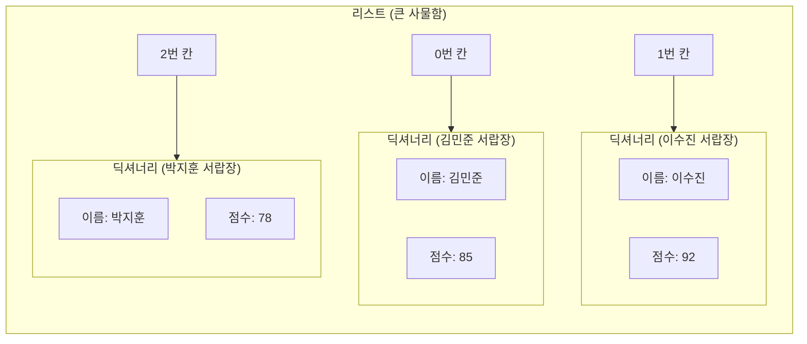

---

## §3. 상세 내용

### Why: 왜 이 구조를 알아야 하는가?

단순히 문법을 하나 더 배우는 것이 아닙니다. 리스트 안의 딕셔너리 구조는 현대 웹 서비스와 데이터베이스에서 데이터를 주고받는 전 세계적인 표준 형태입니다. 흔히 JSON이라고 부르는 데이터 형식이 바로 이 모양을 띠고 있습니다. 우리가 Day 4와 Day 5에서 진행할 고객 정보 관리 프로그램 프로젝트에서도, 고객 한 명의 상세 정보는 딕셔너리로 만들고 전체 고객 목록은 리스트로 묶어서 관리하게 됩니다. AI에게 코드를 짜달라고 할 때도 이 구조를 기본으로 깔고 가면 소통이 훨씬 매끄러워집니다.

### What: 복합 자료구조란 무엇인가?

파이썬 코드로 보면 대괄호 안에 중괄호들이 쉼표로 나열된 모양입니다. `[ { }, { }, { } ]` 이런 형태가 되죠. 제일 겉에는 대괄호가 있고 그 안의 요소들이 중괄호로 이루어져 있습니다. 반대로 딕셔너리 안에 리스트가 들어갈 수도 있어요. 예를 들어 한 학생의 정보 딕셔너리 안에 수강과목이라는 이름표를 붙이고 그 값으로 `["파이썬", "자바", "C언어"]`라는 리스트를 넣는 식입니다. 조립하기 나름이에요.

### How: 데이터를 어떻게 꺼내는가?

이 거대한 구조에서 딱 원하는 데이터만 핀셋으로 집어내듯 꺼내려면 어떻게 해야 할까요? 물리적인 순서 그대로 바깥 상자부터 열고 들어가면 됩니다. 리스트가 바깥에 있고 딕셔너리가 안에 있다면, 먼저 리스트의 번호를 불러서 딕셔너리를 하나 통째로 꺼냅니다. 그런 다음 꺼낸 딕셔너리에서 이름표를 부르는 겁니다.

`students[1]['점수']`라는 코드가 있다고 해보죠. 컴퓨터는 이를 두 단계로 읽습니다. 첫째, `students` 사물함에서 1번 칸(두 번째 학생)을 엽니다. 둘째, 그 칸에서 나온 서랍장 중 점수라는 이름표가 붙은 칸을 엽니다. 순서가 바뀌면 절대 안 됩니다. 바깥 사물함을 열어야 서랍이 나오니까요.

---

## §4. 실습 가이드 (+ 🎙️ 실습 대본)

### 실습 목표

이 강력한 구조를 수강생들이 직접 만져보게 할 차례입니다. 코드를 밑바닥부터 다 치게 하지 말고, AI의 힘을 빌려 뼈대를 만들고 데이터를 조작하는 데 집중합니다.

🎙️ **실습 가이드 대본 (Lab Guide)**:

> 자, 이제 화면을 열고 AI에게 부탁해 보겠습니다. 프롬프트 창에 이렇게 입력해 보세요. "학생 3명의 정보(이름, 점수)를 담은 리스트 안의 딕셔너리 구조를 파이썬 코드로 만들어줘. 변수 이름은 students로 해줘."
>
> 코드가 짠 하고 나타났죠? 대괄호 안에 중괄호 세 개가 들어있는 모습을 눈으로 확인해 보세요. 자, 이제 이 코드 아래에 출력문을 추가해 볼 겁니다.
>
> 우리가 두 번째 학생의 점수만 딱 집어서 보고 싶어요. 어떻게 해야 할까요? 사물함을 먼저 열어야 합니다. 파이썬은 0부터 숫자를 세니까 두 번째 학생이면 `students[1]`이 되겠죠. 이어서 그 안에서 점수 칸을 엽니다. 바로 뒤에 `['점수']`를 붙이는 거예요. 전체 코드는 `print(students[1]['점수'])`가 됩니다. 직접 타이핑하고 실행해 보세요.
>
> 점수가 잘 나오셨나요? 이번엔 여러분 스스로 해볼 차례입니다. 첫 번째 학생의 이름을 출력하려면 코드를 어떻게 수정해야 할까요? 바깥 괄호의 숫자와 안쪽 괄호의 글자를 적절히 바꿔서 실행해 보세요.

### 단계별 지시

| 단계 | 소요 시간 | 강사 지시사항 | 학습자 액션 | 예상 결과 |
|------|----------|--------------|------------|----------|
| 1 | 3분 | AI를 활용해 복합 자료구조 코드 생성 지시 | 프롬프트 입력 및 코드 복사 | `[{}, {}, {}]` 형태의 기본 코드 확보 |
| 2 | 3분 | 두 번째 학생의 점수를 출력하는 코드 작성 시연 | 강사 화면 시청 및 코드 추가 실행 | 터미널에 두 번째 학생 점수 출력 |
| 3 | 4분 | 첫 번째 학생의 이름 출력 미션 부여 | 코드 스스로 수정 및 실행 | 터미널에 첫 번째 학생 이름 출력 |
| 4 | 5분 | 흔한 오류 사례 설명 및 조치 | 에러 메시지 확인 및 질문 | 인덱스와 키의 접근 순서 명확히 이해 |

### 트러블슈팅 FAQ

| Q | A |
|---|---|
| `TypeError: list indices must be integers or slices, not str` 에러가 나요! | 수강생이 `students['점수'][1]`처럼 순서를 반대로 적었을 확률이 99%입니다. 바깥 상자(리스트)를 열기 위해서는 반드시 숫자 번호표를 먼저 써야 함을 다시 한번 짚어주세요. |
| 리스트 안에 딕셔너리를 몇 개까지 넣을 수 있나요? | 컴퓨터 메모리가 허용하는 한 무한대라고 답변해 주시면 됩니다. 실무에서는 수백만 개가 들어가기도 한다는 점을 덧붙여 주시면 흥미를 유발할 수 있습니다. |

---


### 🎓 강사 노트 (Instructor Support)

- ⏱️ **타이밍**: 12:55 (20분, code)
- 🎯 **핵심 활동**: 리스트 안의 딕셔너리
- ⚠️ **강사 주의사항**: ⚠️ 난이도 급상승. 천천히 진행

## §5. 코드 및 명령어 모음

이 세션에서 활용하는 핵심 코드 조각들입니다. 수강생들이 복사해서 쓸 수 있도록 제공합니다.

```python
# 학생 3명의 정보가 담긴 복합 자료구조 (List of Dicts)
students = [
    {"이름": "김민준", "점수": 85},  # 0번 사물함
    {"이름": "이수진", "점수": 92},  # 1번 사물함
    {"이름": "박지훈", "점수": 78}   # 2번 사물함
]

# 데이터 꺼내기: 사물함(리스트) 먼저, 서랍(딕셔너리)은 나중에!
print(students[1]['점수'])  # 92 출력 (이수진의 점수)
print(students[0]['이름'])  # 김민준 출력

# 새로운 학생 데이터 추가하기 (리스트의 append 메서드 활용)
students.append({"이름": "최윤아", "점수": 88})
print(students)
```

> 🤖 **AI 프롬프트 예시**
> "학생 3명의 정보(이름, 점수)를 담은 리스트 안의 딕셔너리 구조를 파이썬 코드로 만들어줘. 변수 이름은 students로 해줘."

---

## §6. 요약

### 핵심 학습 포인트

이번 세션에서 가장 중요한 것은 순서입니다. 데이터를 담을 때는 딕셔너리들을 리스트 안에 차곡차곡 쌓아 올리고, 꺼낼 때는 바깥 상자인 리스트부터 열고 안쪽 상자인 딕셔너리를 엽니다. 이 원칙만 기억하면 아무리 데이터가 복잡하게 얽혀 있어도 원하는 값을 정확하게 찾아낼 수 있습니다. 이 복합 구조가 회원 정보, 상품 목록, 게시글 목록 등을 관리하는 가장 완벽하고 표준적인 방법이라는 점도 꼭 기억해야 합니다.

### 다음 세션 예고

우리는 지금까지 데이터를 저장하고 예쁘게 정리하는 방법들을 모두 배웠습니다. 이름표도 붙여보고, 서랍장에도 넣어봤죠. 하지만 아직 이 데이터들은 죽어있습니다. 스스로 판단을 내리지 못하니까요. 이제 이 데이터들에 생명력을 불어넣을 차례입니다. "점수가 80점 이상이면 합격 도장을 찍어라"처럼 컴퓨터가 스스로 상황을 판단하게 만드는 마법, 제어문을 다음 세션에서 만나보겠습니다.

### 브릿지 노트

> "여러분, 정말 훌륭합니다. 방금 파이썬에서 가장 헷갈리기 쉽다는 2차원 데이터 접근법을 마스터하셨어요. 데이터베이스 설계의 90%를 끝낸 거나 다름없습니다. 데이터가 10만 개로 늘어나도 이 구조에서 벗어나지 않으니까요. 자, 데이터를 정리하는 법을 배웠으니 이제 이 데이터들을 살아서 움직이게 만들어 볼까요?"

---

## §7. 참고 자료

### 3-Source 출처

*   **Source A (로컬 참고자료)**: 「8 코딩.pdf」 §8.3 리스트 안의 딕셔너리 개념과 기본 문법, 데이터 접근 순서에 대한 핵심 논리를 참조했습니다.
*   **Source B (NotebookLM)**: NotebookLM day3 분석 중첩(Nesting) 구조를 마트료시카 인형에 빗대어 설명하는 교육적 비유를 반영했습니다.
*   **Source C (Deep Research)**: Deep Research day3 결과 복합 자료구조가 현대 웹 서비스의 데이터 표준 형식(JSON)과 완벽하게 일치한다는 실무적 맥락을 통합했습니다.

### 강사 노트

> 💡 **강사 노트**: 리스트 안의 딕셔너리는 비전공자가 처음 마주하는 차원의 확장입니다. 단순히 대괄호와 중괄호를 섞어 쓰는 문법으로 가르치면 100% 길을 잃습니다. 반드시 큰 상자 안의 작은 상자라는 물리적인 이미지를 머릿속에 심어주세요. 칠판에 큰 네모를 그리고 그 안에 작은 네모들을 그리는 시각적 설명이 아주 효과적입니다.

---

*작성 일시: 2026-02-25*
*작성 에이전트: Antigravity*
*교안 구조: 7섹션 (v2.1)*

> 🔗 **이전 세션**: [세션 050: 딕셔너리의 이해](#세션-050)에서 배운 내용을 이어갑니다.
> 🔗 **다음 세션**: [세션 052: 조건문 if/elif/else](#세션-052)에서 계속됩니다.

---

### 세션 052: 조건문 if/elif/else
> [원본 파일](sessions/세션-052-조건문if_elif_else_v2.1.md) | ⏱️ 25분 | 📖 narrative | 난이도: medium

> **세션 ID**: MS-PY101-052
> **소요 시간**: 25분
> **난이도**: low
> **청크 타입**: narrative
> **버전**: v2.1 (7섹션 구조)

---

## §1. 개요

이 세션은 제어 흐름을 다루는 첫 번째 단계로, 프로그램에 판단력을 부여하는 방법을 배웁니다. 방금 전 세션에서 우리는 복잡한 사물함에서 학생의 수학 점수를 꺼내는 데 성공했어요. 그런데 점수 숫자만 덜렁 화면에 띄워놓으면 이 프로그램이 과연 쓸모가 있을까요? "80점 이상이면 합격입니다, 아니면 불합격입니다"라고 명확한 판단을 내려주고 다음 행동을 지시해야 비로소 진짜 프로그램이라고 부를 수 있습니다. 이제부터 단순한 데이터에 생명력을 불어넣고 갈림길을 만들어주는 제어문, 그중에서도 가장 기본인 조건문을 만나보겠습니다.

### 🎯 학습 목표

이 세션이 끝나면 수강생은 다음을 할 수 있어요:
- 조건문의 핵심인 if, elif, else의 역할을 교통 신호등 비유로 설명할 수 있습니다.
- 파이썬에서 들여쓰기(Indentation)가 왜 중요한지 이해하고 에러를 직접 해결할 수 있습니다.
- 비교 연산자와 중첩 조건을 활용하여 데이터에 따른 분기 로직을 설계할 수 있습니다.

### 선행 세션 환기

우리는 직전 세션에서 리스트 안에 딕셔너리를 넣는 복합 자료구조를 다뤘습니다. 고객 목록에서 특정 고객의 정보를 꺼내는 방법은 알았지만, "이 고객이 VIP인지 아닌지" 판단하는 방법은 아직 배우지 않았어요. 이번 세션에서는 바로 그 판단 기준을 세워주는 문법을 배웁니다.

---

## §2. 핵심 개념 (+ 🗣️ 강사 대본 + Mermaid)

### 프로그램의 교통 신호등, 제어문

상황을 보고 판단을 내려서 프로그램이 가야 할 길을 정해주는 문법을 우리는 '제어문'이라고 부릅니다. 그중에서도 조건문인 `if`문은 현실 세계의 교통 신호등과 완벽하게 똑같은 역할을 해요. 신호등 앞에 차가 서 있다고 상상해 볼까요? 초록불(True)이 들어오면 직진을 하고, 빨간불(False)이 들어오면 그 자리에 멈춰 서야 합니다. 이렇게 조건에 따라 행동 지침이 명확하게 나뉘는 것처럼, 프로그래밍에서도 데이터가 우리가 정한 조건에 맞는지 확인하고 맞을 때만 특정 코드를 실행하게 만드는 것이 조건문입니다 [Source B: NotebookLM day3].

🗣️ **강사 대본 (Instructor Script)**:

> 여러분, 방금 전까지 우리는 상자(변수)에 데이터를 담고, 서랍장(리스트)에 정리하는 방법을 배웠습니다. 하지만 이건 아직 움직이지 않는 정적인 상태예요. 진정한 프로그램이 되려면 스스로 생각하고 판단을 내릴 줄 알아야 합니다.
>
> 파이썬의 조건문은 '교통 신호등'과 같아요. 만약 여러분이 내비게이션을 켜고 가다가 갈림길을 만났다고 해보죠. "만약(if) 왼쪽 길이 막히지 않았다면(True) 왼쪽으로 가고, 그렇지 않으면(else) 오른쪽으로 가라." 이렇게 조건에 맞춰 길을 선택하게 해주는 게 바로 제어문입니다 [Source C: Deep Research day3]. 
> 
> 파이썬은 이런 조건문을 영어 문장 읽듯이 아주 직관적으로 만들어 두었어요. 그래서 문법을 억지로 외울 필요 없이, 내가 컴퓨터에게 내리고 싶은 지시를 자연스럽게 표현하기만 하면 됩니다. 만약 점수가 80점 이상이라면 어떻게 할지, 그 조건이 맞지 않다면 다음으로 어떤 대안을 확인할지 순서대로 적어주기만 하면 파이썬이 알아서 길을 찾아갈 거예요.

### Mermaid 다이어그램: 조건문의 갈림길

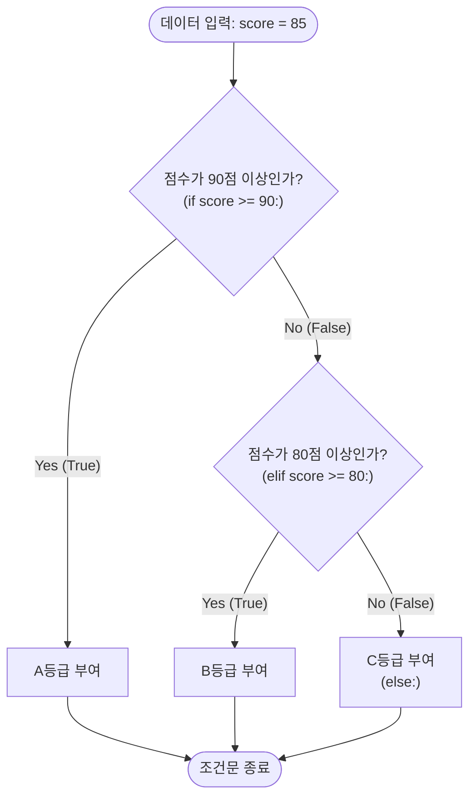

이 다이어그램은 조건문이 데이터를 어떻게 걸러내는지 보여줍니다. 위에서부터 순서대로 조건을 확인하며, 한 번이라도 참(True)인 조건을 만나면 해당 행동을 실행한 뒤 전체 조건문을 빠져나옵니다.

---

## §3. 상세 내용

### Why — 왜 조건문이 필요한가?

단순한 계산기 프로그램이 아니라면, 모든 소프트웨어는 사용자의 입력이나 상황에 따라 다르게 반응해야 합니다. 로그인 비밀번호가 맞았을 때와 틀렸을 때 보여주는 화면이 달라야 하고, 장바구니에 담긴 금액에 따라 배송비 무료 여부가 결정되어야 합니다. 프로그램에 '판단력'을 부여하여 한 가지 길이 아닌 여러 갈래의 길을 만들어주는 것이 조건문이 존재하는 이유입니다.

### What — 조건문을 구성하는 세 가지 키워드

조건문은 크게 세 가지 키워드로 뼈대를 잡습니다.
첫째, `if`는 "만약 ~라면"이라는 뜻으로, 가장 먼저 확인하는 첫 번째 조건입니다.
둘째, `elif`는 "그렇지 않고 만약 ~라면"이라는 뜻으로, 첫 번째 조건이 틀렸을 때 이어서 확인하는 대안 조건입니다. 신호등의 색깔을 무한정 늘려주듯이 여러 번 사용할 수 있습니다.
셋째, `else`는 "이도 저도 아니라면"이라는 뜻으로, 앞선 모든 조건이 거짓일 때 최후의 보루로 실행되는 플랜 B입니다 [Source A: 8 코딩.pdf].

### How — 파이썬에서 조건문을 작성하는 엄격한 규칙

파이썬의 조건문 작성은 아주 직관적이지만, 절대로 타협하지 않는 엄격한 규칙이 하나 있습니다. 바로 '들여쓰기(Indentation)'입니다.

`if 점수 >= 80:` 처럼 조건문 끝에 콜론(`:`)을 찍어 "이제 조건 다 말했어!"라고 파이썬에게 알려준 뒤, 그 조건이 맞을 때 실행할 코드는 반드시 다음 줄에서 키보드 Tab 키를 한 번 눌러 안으로 쏙 들어가게 적어주어야 합니다. 다른 프로그래밍 언어들은 괄호를 써서 영역을 묶어주지만, 파이썬은 오직 이 여백과 들여쓰기만으로 코드가 어디에 속해 있는지를 판단합니다. 들여쓰기를 하지 않으면 파이썬은 이 코드가 조건문과 상관없다고 착각하여 즉시 에러를 발생시킵니다.

추가로, 파이썬만의 아주 편리하고 직관적인 문법들도 있습니다. 수학 시간처럼 `0 <= score <= 100`으로 조건을 한 번에 연결하는 '체이닝 비교'가 가능하고, 조건문을 한 줄로 압축해버리는 '삼항 연산자'를 사용하여 코드를 더욱 우아하게 만들 수 있습니다. 때로는 조건 안에 또 다른 조건을 넣는 '중첩 조건'을 사용해 더 복잡하고 세밀한 판단을 내리기도 합니다.

---

## §4. 실습 가이드 (+ 🎙️ 실습 대본)

### 실습 목표

이 실습에서는 AI를 활용하여 직접 조건문 코드를 생성해보고, 값을 변경해가며 프로그램이 갈림길을 제대로 찾아가는지 확인합니다. 또한, 파이썬의 가장 중요한 규칙인 들여쓰기를 고의로 망가뜨려보고 복구하는 과정을 통해 문법적 감각을 체득합니다.

🎙️ **실습 가이드 대본 (Lab Guide)**:

> 자, 이제 여러분만의 교통 신호등을 직접 설치해 볼 시간입니다! 먼저 우리의 똑똑한 조수, AI에게 이렇게 프롬프트를 입력해 보세요. "점수(score) 변수에 85를 넣고, 90점 이상이면 A, 80점 이상이면 B, 70점 이상이면 C, 그 외엔 F를 출력하는 파이썬 코드를 만들어줘."
>
> 뚝딱하고 `if`, `elif`, `else`가 나란히 쓰인 코드가 나왔을 겁니다. 당장 실행 버튼을 누르기 전에 눈으로 먼저 결과를 예측해 보세요. 점수가 85점이니 어떤 학점이 화면에 뜰까요? 눈으로 확인이 끝났다면, 코드 상단의 `score = 85` 부분을 60점, 95점 등으로 요리조리 바꿔가며 여러 번 실행해 보세요. 우리가 세워둔 신호등이 점수에 맞춰 척척 길을 안내하는 게 보이시나요?
>
> 여기까지 잘 따라오셨다면, 이제 파이썬의 엄격함을 몸소 체감해 볼 시간입니다. 일부러 에러를 내볼게요! 코드에서 `print` 문들 앞에 있는 빈칸, 즉 들여쓰기를 백스페이스 키로 싹 다 지워서 왼쪽 끝으로 바짝 붙여보세요. 그리고 다시 실행 버튼을 눌러봅시다. 
> 
> 빨간색으로 `IndentationError`(들여쓰기 에러)가 아주 크게 났죠? 파이썬에서 들여쓰기는 코드를 예쁘게 보이려고 하는 단순한 디자인이 아니라, 프로그램이 굴러가게 만드는 생명줄이라는 점을 이 에러 메시지를 통해 꼭 몸으로 기억해 두세요.

### 단계별 지시

1. **AI 프롬프트 작성**: 점수에 따른 학점 계산 로직을 AI에게 요청하여 코드를 생성받습니다.
2. **변수 조작 검증**: `score` 변수의 값을 여러 가지 분기점에 맞게(예: 95, 82, 75, 50) 변경하며 출력을 확인합니다.
3. **들여쓰기 파괴 및 복구**: 의도적으로 탭(Tab) 공간을 지워 `IndentationError`를 발생시키고, 다시 탭을 눌러 코드를 정상화합니다.
4. **체이닝 비교 변환 (선택 사항)**: `if score >= 80 and score <= 100:`으로 작성된 코드가 있다면, 파이썬의 특장점인 `80 <= score <= 100` 형태로 변경해 봅니다.

### 트러블슈팅 FAQ

- **Q: 코드를 실행했는데 출력이 아무것도 안 나와요.**
  - A: 조건문이 모든 경우의 수를 덮고 있는지 확인해 보세요. `else:` 블록을 작성해 두면, 앞선 조건들을 모두 피격당한 예상 밖의 값들이 들어왔을 때도 프로그램이 안전하게 응답할 수 있습니다.
- **Q: 들여쓰기 에러가 났는데, 스페이스바로 띄운 것과 탭으로 띄운 것이 섞여 있대요.**
  - A: 파이썬은 탭(Tab)과 스페이스바(Space) 4칸을 섞어 쓰는 것을 극도로 싫어합니다. 편집기에서 전체 코드를 드래그한 뒤 `Shift + Tab`으로 들여쓰기를 모두 없애고 다시 `Tab` 키로 정렬해 보세요.

---


### 🎓 강사 노트 (Instructor Support)

- ⏱️ **타이밍**: 13:15 (25분, narrative)
- 🎯 **핵심 활동**: "갈림길" 비유
- ⚠️ **강사 주의사항**: 들여쓰기(indent) 개념 처음 등장

## §5. 코드 및 명령어 모음

실습과 복습에 활용할 수 있는 핵심 조건문 패턴들을 모아두었습니다. 눈으로 읽으며 어떻게 동작할지 해석해 보세요.

**1. 기본 조건문과 들여쓰기**
```python
score = 85

# 조건문 끝에는 반드시 콜론(:)을 찍습니다.
if score >= 90:
    print("A등급입니다.") # 들여쓰기(Indentation) 필수!
elif score >= 80:
    print("B등급입니다.")
else:
    print("C등급입니다.")
```

**2. 파이썬의 직관적인 체이닝 비교**
```python
score = 85

# 다른 언어라면 if score >= 0 and score <= 100: 이라고 써야 하지만
# 파이썬은 수학 기호처럼 직관적으로 연결할 수 있습니다.
if 0 <= score <= 100:
    print("정상적인 점수 데이터입니다.")
else:
    print("점수 입력이 잘못되었습니다.")
```

**3. 삼항 연산자 (한 줄 조건문)**
```python
score = 85

# 합격/불합격처럼 결과가 두 가지뿐일 때는 한 줄로 우아하게 작성할 수 있습니다.
status = "합격" if score >= 80 else "불합격"
print(f"현재 상태는 {status}입니다.")
```

**4. 중첩 조건문 (조건 속의 조건)**
```python
is_member = True
purchase_amount = 50000

if is_member:
    if purchase_amount >= 30000:
        print("무료 배송 및 10% 할인 적용")
    else:
        print("10% 할인 적용 (배송비 별도)")
else:
    print("비회원은 혜택이 없습니다.")
```

---

## §6. 요약 및 브릿지

### 핵심 학습 포인트

이번 세션의 핵심은 세 가지로 요약할 수 있습니다. 첫째, 조건문(`if`, `elif`, `else`)은 프로그램에게 여러 갈림길 중 하나를 선택할 수 있는 판단력을 부여하는 역할을 합니다. 둘째, 파이썬에서 조건에 속한 행동을 지정할 때는 괄호가 아닌 들여쓰기(Indentation)를 사용하며, 이는 절대로 어겨서는 안 되는 엄격한 문법입니다. 셋째, 파이썬은 체이닝 비교나 삼항 연산자처럼 사람이 읽기 쉽고 직관적인 특유의 문법(Pythonic)을 제공하여 복잡한 조건도 명확하게 표현할 수 있게 도와줍니다.

### 다음 세션 예고: 반복문과 제어 흐름

우리는 방금 교통 신호등을 세워서 한 명의 학생 점수를 훌륭하게 판별해 냈습니다. 그런데 만약 전교생 100명의 학점을 한 번에 계산해야 한다면 어떻게 될까요? 방금 짠 코드를 100번 복사해서 붙여넣고 점수 숫자만 100번 고칠 건가요? 절대 안 될 일이죠. 컴퓨터가 인간보다 월등하게 잘하는 일이 딱 하나 있습니다. 바로 지치지 않고 똑같은 일을 무한히 반복하는 것입니다.

### 브릿지 노트

> "조건문으로 길을 나누는 법을 배웠으니, 이제 그 길 위로 수백, 수천 개의 데이터를 한꺼번에 통과시켜 볼 차례입니다. 다음 세션에서는 신호등 코드를 100번 자동으로 돌려주는 마법의 주문, '반복문'에 대해 알아보겠습니다. 데이터를 넣고 돌리기만 하면 프로그램이 알아서 척척 처리해 주는 자동화의 진수를 곧 맛보게 되실 겁니다!"

---

## §7. 참고 자료

### 3-Source 출처

- **Source A (로컬 참고자료)**: 「8 코딩.pdf」 §8.4 — 조건문에 따른 판단 논리, if/elif/else의 기초 문법 구조, 들여쓰기의 문법적 역할 발췌.
- **Source B (NotebookLM)**: NotebookLM 분석 리포트 day3 — 제어문을 '교통 신호등'에 빗대어 설명하는 비유 풀이의 근거 및 학습자 인지 부하 감소를 위한 멘탈 모델 제공.
- **Source C (Deep Research)**: Deep Research 보고서 day3 — 초보자들이 자주 범하는 들여쓰기 에러 실습의 중요성과 직관적인 Pythonic 체이닝 비교 문법 실무 동향 반영.

### 강사 노트

> 💡 **강사 노트**: 이 세션은 비전공자 수강생들이 처음으로 프로그램다운 로직을 접하는 순간입니다. 단순한 문법 암기가 되지 않도록 '판단과 갈림길'이라는 개념적 접근을 유지해 주세요. 팩트 패킷(Day 3)에서 언급되었듯, `0 <= score <= 100` 같은 체이닝 비교와 삼항 연산자를 활용한 파이썬 특유의 간결함(Pythonic)을 강조하면 수강생의 흥미를 높일 수 있습니다. 특히 들여쓰기 에러(`IndentationError`)는 앞으로 가장 많이 마주치게 될 에러 중 하나이므로, 실습 시간에 반드시 고의로 에러를 발생시키고 직접 고쳐보게 하는 과정을 거쳐야 합니다.

---

## ✅ 세션 완료 체크리스트 (강사용)

- [ ] §1~§7 모든 섹션이 충실하게 작성되었는가?
- [ ] 신호등과 갈림길 비유가 서술형으로 자연스럽게 풀어져 있는가?
- [ ] 파이썬의 들여쓰기(Indentation) 규칙이 강조되었는가?
- [ ] 실습 가이드에 의도적 에러 발생과 해결 과정이 포함되었는가?
- [ ] 3-Source 팩트 패킷의 내용이 반영되었는가?


> 🔗 **이전 세션**: [세션 051: 복합 자료구조](#세션-051)에서 배운 내용을 이어갑니다.
> 🔗 **다음 세션**: [세션 053: 반복문 for와 range](#세션-053)에서 계속됩니다.

---

### 세션 053: 반복문 for와 range
> [원본 파일](sessions/세션-053-반복문for와range_v2.1.md) | ⏱️ 20분 | 💻 code | 난이도: medium

> **세션 ID**: MS-PY101-053  
> **소요 시간**: 25분  
> **난이도**: low  
> **청크 타입**: narrative  
> **버전**: v2.1 (7섹션 구조)

---

## §1. 개요

> **Day 3 | AM | 세션 053**

이 세션은 프로그래밍의 강력한 무기 중 하나인 '반복 제어'의 첫 단계를 다루는 시간이에요. 리스트나 딕셔너리 같은 자료구조에 담긴 수많은 데이터를 하나씩 꺼내어 처리하는 순회(Iteration)의 원리를 배웁니다. 데이터를 하나하나 수작업으로 처리하던 막노동에서 벗어나, 컴퓨터의 가장 큰 장점인 '지치지 않는 성실함'을 십분 활용하는 방법을 터득하게 될 거예요.

### 🎯 학습 목표

이 세션이 끝나면 수강생은 다음을 할 수 있어요:

- 리스트 안의 데이터를 순회하며 동일한 작업을 반복하는 `for`문을 작성할 수 있습니다
- `range()` 함수를 활용하여 원하는 횟수만큼 코드를 반복 실행할 수 있습니다
- 인덱스가 필요할 때 `enumerate()` 함수를 사용하는 실무적인 패턴을 적용할 수 있습니다
- 중첩된 `for`문을 읽고 그 실행 흐름을 머릿속으로 그릴 수 있습니다

### 선행 세션 환기

이전에 우리는 서랍장(리스트)에 데이터를 차곡차곡 담는 방법과 특정 조건일 때만 코드가 실행되도록 흐름을 가르는 조건문(if)을 배웠습니다. 이번에는 그 서랍장에 담긴 수십, 수백 개의 데이터를 한 번에 처리하는 마법을 배울 차례예요. 서랍장을 여는 것을 넘어서, 서랍장 안의 모든 물건에 빠짐없이 이름표를 붙여주는 자동화 기계를 만들어 볼 겁니다.

---

## §2. 핵심 개념 (+ 🗣️ 강사 대본 + Mermaid)

### 배급소의 번호표 직원과 컨베이어 벨트 비유

코딩에서 반복문은 귀찮은 수작업을 대신해 주는 기계 장치와 같아요. 특히 `for`문은 '배급소의 번호표 직원' 또는 '컨베이어 벨트'에 비유할 수 있습니다 [Source B: NotebookLM day3]. 컨베이어 벨트에 물건들이 일렬로 지나가면, 로봇 팔이 물건을 하나씩 집어서 똑같은 도장을 쾅쾅 찍어주는 모습을 상상해 보세요. 줄을 서 있는 물건이 10개든 10만 개든, 기계는 불평 한마디 없이 똑같은 작업을 끝까지 성실하게 반복합니다. 이것이 바로 순회(Iteration)의 핵심 개념이에요 [Source C: Deep Research day3].

🗣️ **강사 대본 (Instructor Script)**:

> 여러분, 상상해 봅시다. 사물함에 전교생 100명의 점수가 예쁘게 들어있어요. 그런데 오늘 교장 선생님이 기분이 아주 좋으셔서 학생 전원에게 5점씩 보너스 점수를 주라고 지시하셨네요. 자, 여러분이라면 어떻게 하시겠습니까?
> 
> 첫 번째 학생 점수 꺼내서 5점 더하고, 두 번째 학생 점수 꺼내서 5점 더하고... 이걸 100줄 타이핑하실 건가요? 만약 학생이 100명이 아니라 10만 명이라면 어떻게 할까요? 생각만 해도 끔찍하죠. 프로그래머들은 귀찮은 것을 세상에서 제일 싫어하는 사람들입니다. 절대 그런 무식한 방법을 쓰지 않아요 [Source A: 8 코딩.pdf §8.4].
> 
> 수십, 수만 번의 똑같은 작업을 눈 깜짝할 새 처리해 주는 마법, 그게 바로 '반복문'입니다. 파이썬에서 가장 많이 사랑받는 `for`문은 아주 성실한 '배급소 직원'과 똑같아요. 대기줄, 즉 리스트에 사람들이 쫙 서 있습니다. 직원은 명단을 보며 첫 번째 사람을 불러냅니다. 똑같은 구호물자를 나눠주고 다음 사람을 부르죠. 또 나눠주고 다음 사람을 부릅니다. 이 직원은 명단에 있는 마지막 사람이 끝날 때까지 묵묵히 똑같은 일을 반복합니다. 
> 
> AI에게 "고객 명단 엑셀 줄 테니까, 위에서부터 아래까지 똑같이 메일 하나씩 보내줘"라고 명령할 때, AI의 머릿속에서 돌아가는 핵심 원리가 바로 이 구조입니다. 데이터를 모아두는 리스트, 그리고 그걸 하나씩 꺼내서 돌리는 `for`문. 이 둘은 프로그래밍 역사상 가장 강력한 영혼의 콤비예요. AI가 짜주는 코드의 80% 이상은 이 `for`문이 들어간다고 해도 과언이 아닙니다.

### Mermaid 다이어그램

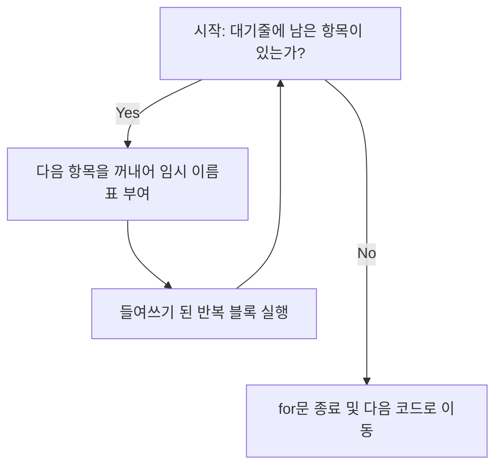

이 다이어그램은 `for` 루프가 실행되는 흐름을 보여줍니다. 대기줄(리스트)에 항목이 남아있는 한 계속해서 물건을 꺼내고 작업을 수행하며, 모든 항목을 다 꺼내고 나면 자연스럽게 반복을 종료하고 다음 단계로 넘어가는 안전하고 확실한 구조를 가지고 있어요.

---

## §3. 상세 내용

### Why — 왜 for문을 써야 하는가?

반복문 없이 프로그래밍을 한다는 것은 계산기 없이 손으로 수학 문제를 푸는 것과 같아요. 우리가 컴퓨터를 사용하는 가장 큰 이유는 방대한 데이터를 빠르고 정확하게 처리하기 위함입니다. `for`문은 코드의 중복을 없애주고, 데이터의 개수가 변하더라도 코드를 수정할 필요가 없게 만들어 줍니다. 예를 들어 데이터가 5개에서 5만 개로 늘어나더라도, `for`문으로 짠 코드는 단 한 줄도 고칠 필요가 없어요. 이것이 바로 자동화의 힘입니다.

### What — 무엇을 배우는가?

이 섹션에서는 `for`문의 네 가지 핵심 형태를 배웁니다. 
첫째, 가장 기본적인 **for-in 구조**로 리스트나 딕셔너리 같은 데이터를 하나씩 꺼내어 처리하는 방법입니다. 
둘째, 데이터는 없지만 단순히 특정 횟수만큼 반복하고 싶을 때 사용하는 **range() 함수**입니다. 
셋째, 데이터뿐만 아니라 그 데이터가 '몇 번째'인지 순서 정보도 함께 필요할 때 쓰는 **enumerate() 함수**입니다. 
마지막으로, 서랍장 안의 서랍장처럼 데이터가 겹겹이 쌓여 있을 때 사용하는 **중첩 for문**의 개념을 다룹니다.

### How — 어떻게 코드를 작성하는가?

**1. 리스트를 순회하는 for-in**

파이썬의 `for`문은 영어 문장과 너무 똑같아서 읽기만 해도 뜻이 통합니다. 
`for 학생 in 학생명단:` 이렇게 쓰죠. 해석해 보면 "학생명단(리스트) 안에(in) 있는 데이터들을 하나씩 꺼내서, '학생'이라는 임시 이름표를 붙여라. 그리고 꺼낼 때마다 아래의 코드를 반복 실행해라!"라는 뜻입니다. 이때 반복해서 실행할 코드는 조건문처럼 반드시 안으로 들여쓰기(Tab)를 해야 한다는 점을 잊지 마세요 [Source A: 8 코딩.pdf].

**2. 횟수를 지정하는 range()**

만약 꺼낼 데이터 명단(리스트)이 따로 없고, 그저 "박수를 딱 100번만 쳐줘!"라고 횟수만 정하고 싶을 땐 어떻게 할까요? 그때 쓰는 짝꿍이 바로 `range()` 함수입니다. `range(100)`이라고 쓰면 파이썬이 알아서 0번부터 99번까지 번호표 100개가 들어있는 가상의 대기줄을 순식간에 만들어 줍니다.

**3. 인덱스와 값을 동시에 꺼내는 enumerate()**

리스트의 데이터만 필요한 게 아니라, 그 데이터가 '몇 번째' 데이터인지 번호표도 필요할 때가 많아요. 이럴 때 복잡하게 숫자를 세는 변수를 따로 만들지 마세요. `enumerate()`라는 마법의 함수를 쓰면 됩니다 [Source B: NotebookLM day3]. 이 함수는 물건을 꺼낼 때 그 물건의 순서표까지 두 개를 한 번에 던져줍니다.

**4. 중첩 for문 (for문 안의 for문)**

컨베이어 벨트 위에 상자가 지나가는데, 그 상자를 열어보니 안에 또 작은 물건들이 여러 개 들어있다고 생각해 보세요. 이때는 상자를 꺼내는 큰 `for`문 안에, 상자 속 내용물을 꺼내는 작은 `for`문을 넣어야 합니다. 시계의 분침이 한 바퀴를 돌아야 시침이 한 칸 움직이는 것과 같은 원리예요.

---

## §4. 실습 가이드 (+ 🎙️ 실습 대본)

### 실습 목표

수강생들은 AI 조수(Antigravity)를 활용하여 과일 리스트를 순회하는 기본적인 `for`문을 작성해 보고, `range()` 함수를 사용할 때 발생하는 '끝 번호 미만'의 규칙을 직접 눈으로 확인합니다. 마지막으로 `enumerate()`를 적용하여 실무에 가까운 코드 패턴을 경험합니다.

🎙️ **실습 가이드 대본 (Lab Guide)**:

> 자, 백문이 불여일견이죠. 우리의 성실한 배급소 직원을 직접 고용해 봅시다. AI 창을 켜고 이렇게 프롬프트를 입력해 보세요.
> 
> "파이썬으로 과일 이름 5개가 들어있는 리스트를 만들고, for문으로 하나씩 꺼내서 '맛있는 ~를 배급합니다!'라고 출력하는 코드 만들어줘."
> 
> 코드가 나왔죠? 실행 버튼을 누르기 전에 꼭 머릿속으로 예측을 먼저 해봅시다. 코드에 `print` 함수가 한 번만 적혀 있는데, 화면에 결과가 한 줄로 나올까요? 아니면 5줄로 나올까요? 예측을 마쳤으면 실행해서 5줄이 쫙 출력되는 쾌감을 느껴보세요. 축하합니다! 여러분은 방금 복사 붙여넣기의 노가다에서 완벽하게 해방되었습니다.
> 
> 이번엔 `range` 실습입니다. "range() 함수를 써서 1부터 10까지 숫자를 출력하는 코드를 만들어줘"라고 요청해 보세요.
> 
> 나온 코드를 아주 자세히 보세요. 분명 우리는 1부터 10까지라고 했는데 `range(1, 11)`이라고 적혀 있을 겁니다. 어라? AI가 실수한 걸까요? 아닙니다! 아까 리스트 슬라이싱에서 배웠던 치명적인 규칙 기억나시나요? "끝 번호는 포함되지 않는다, 즉 미만이다." 파이썬의 이 철저한 규칙성 때문에 10까지 돌리려면 반드시 11을 적어주어야 합니다. 이것은 파이썬의 고집스러운 철학이니 꼭 기억해 두세요.
> 
> 마지막으로, 리스트의 데이터만 필요한 게 아니라 '몇 번째 데이터인지'도 필요할 때가 많아요. AI에게 "과일 리스트를 다시 출력하되, 앞에 '1번 과일: 사과'처럼 번호를 붙여줘. enumerate 함수를 써서 코드를 짜줘"라고 해봅시다. 복잡하게 카운트를 올리지 않아도 파이썬이 알아서 번호를 매겨주는 편리함을 확인해 보세요 [Source B: NotebookLM day3].

### 단계별 지시

| 단계 | 소요 시간 | 강사 지시사항 | 학습자 액션 | 예상 결과 |
|------|----------|--------------|------------|----------|
| 1 | 3분 | 과일 리스트 for문 프롬프트 작성 지시 | AI에게 프롬프트 입력 및 코드 예측 | 5개의 과일 이름이 반복 출력됨 |
| 2 | 3분 | range() 함수 프롬프트 작성 지시 | 1부터 10까지 출력하는 코드 요청 | `range(1, 11)` 코드가 생성됨 |
| 3 | 4분 | '끝 번호 미만' 규칙 리마인드 및 설명 | 실행 결과 확인 및 강사 설명 경청 | 슬라이싱 규칙과 동일함을 체득 |
| 4 | 5분 | enumerate() 활용 프롬프트 지시 | 번호표를 붙여 출력하는 코드 요청 및 실행 | 인덱스와 데이터가 함께 출력됨 |

### 트러블슈팅 FAQ

| Q | A |
|---|---|
| 코드를 실행했는데 IndentationError가 납니다. | `for`문 바로 아래 줄에 들여쓰기(Tab)가 빠져서 그렇습니다. 배급소 직원이 반복해야 할 일이 무엇인지 묶어주지 않아서 파이썬이 헷갈린 거예요. `for`문 아래 코드를 선택하고 탭 키를 한 번 눌러주세요. |
| `range(10)`이라고 썼는데 왜 10은 안 나오고 9까지만 나오나요? | 파이썬은 무조건 0부터 숫자를 세기 시작합니다. 0부터 세기 시작해서 딱 10개를 꺼내면 9에서 끝나게 되죠. 10까지 보고 싶다면 `range(11)`로 고쳐주세요. |
| 중첩 for문이 너무 헷갈려요. | 시계의 초침과 분침을 생각하세요! 안쪽 for문(초침)이 60번을 다 돌아야 바깥쪽 for문(분침)이 겨우 1번 움직입니다. 안쪽 작업이 완전히 끝나야 바깥쪽의 다음 순서로 넘어간다는 것만 기억하면 됩니다. |

---


### 🎓 강사 노트 (Instructor Support)

- ⏱️ **타이밍**: 13:50 (20분, code)
- 🎯 **핵심 활동**: for 루프 + range()
- ⚠️ **강사 주의사항**: "컨베이어 벨트" 비유

## §5. 코드 및 명령어 모음

이 세션에서 다룬 핵심 코드 조각들입니다. 수강생들이 복사해서 테스트해 볼 수 있습니다.

```python
# 1. 리스트를 순회하는 기본 for문
fruits = ["사과", "바나나", "포도", "오렌지", "수박"]

for fruit in fruits:
    print(f"맛있는 {fruit}를 배급합니다!")
    
# 2. range()를 활용한 지정 횟수 반복
print("--- 횟수 반복 ---")
for i in range(3):
    print("박수 짝!")

# 3. 1부터 10까지 출력 (끝 번호는 11로 지정해야 함)
print("--- 1부터 10까지 ---")
for num in range(1, 11):
    print(num)

# 4. enumerate()를 사용해 인덱스와 함께 순회 (실무 패턴)
print("--- 번호표와 함께 순회 ---")
names = ["김철수", "이영희", "박민수"]

# start=1을 주면 0번이 아니라 1번부터 번호를 매깁니다
for idx, name in enumerate(names, start=1):
    print(f"고객 {idx}번: {name}")

# 5. 중첩 for문 (시계 원리)
print("--- 중첩 반복문 ---")
for i in range(2):         # 분침 (2번 반복)
    for j in range(3):     # 초침 (3번 반복)
        print(f"바깥쪽: {i}, 안쪽: {j}")
```

> 🤖 **AI 프롬프트 예시**:  
> - "파이썬으로 과일 이름 5개가 들어있는 리스트를 만들고, for문으로 하나씩 꺼내서 출력하는 코드 만들어줘."
> - "range() 함수를 써서 1부터 10까지 숫자를 출력하는 코드를 만들어줘"
> - "과일 리스트를 다시 출력하되, 앞에 '1번 과일: 사과'처럼 번호를 붙여줘. enumerate 함수를 써서 코드를 짜줘"

---

## §6. 요약

### 핵심 학습 포인트

이번 세션의 핵심 세 가지를 되짚어 보겠습니다. 첫째, `for`문은 리스트 안에 있는 데이터를 처음부터 끝까지 빠짐없이 꺼내어 똑같은 작업을 성실하게 반복해 주는 배급소 직원입니다. 둘째, 특정 횟수만큼 숫자를 반복할 때는 `range()`를 사용하며, 파이썬의 고집스러운 철학에 따라 '끝 번호 미만'까지만 실행된다는 점을 주의해야 합니다. 셋째, 데이터와 함께 그 데이터의 순번이 필요할 때는 카운트 변수 대신 `enumerate()` 함수를 사용하는 것이 훨씬 깔끔하고 전문가다운 코드입니다.

### 다음 세션 예고

훌륭합니다. 여러분은 묵묵히 일하는 배급소 직원에게 일을 시키는 법을 마스터했습니다. 명단이 확실하게 주어져 있거나 횟수가 딱 정해져 있을 때는 이 `for`문이 무적이에요. 그런데 만약, 명단도 없고 횟수도 알 수 없는 상황이라면 어떨까요? "게임 오버가 될 때까지 몬스터를 무한정 생성해라!"라거나, "사용자가 '종료'라고 입력할 때까지 계속 대기해라!" 같은 상황 말입니다. 언제 끝날지 모르는 상황에서는 성실한 배급소 직원도 당황할 수밖에 없겠죠. 다음 세션에서는 조건이 끝날 때까지 멈추지 않는 무한 반복의 비밀, `while`문에 대해 파헤쳐 보겠습니다.

### 브릿지 노트

> "오늘 우리는 파이썬의 가장 강력한 무기 중 하나인 for문을 장착했습니다. 10만 줄의 데이터도 단 2줄의 코드로 요리할 수 있게 되었어요. 하지만 우리의 컨베이어 벨트는 아직 정해진 횟수만큼만 돌아갑니다. 만약 누군가 '정지' 버튼을 누를 때까지 영원히 돌아가는 컨베이어 벨트를 만들고 싶다면 어떻게 해야 할까요? 다음 시간에 그 비밀을 열어보겠습니다. 잠깐 스트레칭하고 오실까요?"

---

## §7. 참고 자료

### 3-Source 출처

- **Source A (로컬 참고자료)**: 「8 코딩.pdf」 §8.4 — 반복문의 필요성과 막노동 회피에 대한 모티베이션, for-in 루프의 기본 문법과 들여쓰기 규칙의 원전.
- **Source B (NotebookLM)**: Day 3 팩트 패킷 및 분석 리포트 — for문을 '배급소의 번호표 직원'으로 비유한 설명 모델, `enumerate()` 함수의 실무적 필요성과 활용 패턴.
- **Source C (Deep Research)**: Day 3 리서치 보고서 — 순회(Iteration)의 핵심 개념 정의 및 반복 처리가 에이전트 주도 개발에서 가지는 중요성.

### 추가 학습 자료

- [Python 공식 문서: for 문](https://docs.python.org/ko/3/tutorial/controlflow.html#for-statements)
- [Python 공식 문서: range() 함수](https://docs.python.org/ko/3/tutorial/controlflow.html#the-range-function)

### 강사 노트

> 💡 **강사 노트**: 반복문을 설명할 때 초보자들이 가장 헷갈려 하는 부분은 '임시 변수(위 코드의 `fruit`, `num` 등)'가 어떻게 만들어지고 값이 어떻게 변하는지입니다. 컨베이어 벨트 비유를 사용할 때, "상자에서 꺼낸 물건에 잠시 포스트잇 이름표를 붙였다가 떼고 다음 물건에 다시 붙인다"고 설명하면 변수의 개념(세션 044)과 자연스럽게 연결되어 이해도가 크게 높아집니다. 또한 `range()`의 끝 번호 미만 규칙은 049 세션의 슬라이싱 규칙과 동일하다는 점을 강조하여 파이썬의 일관된 철학을 체감하게 해주세요.

---

## ✅ 세션 완료 체크리스트 (강사용)

- [ ] §1~§7 모든 섹션이 충실하게 작성되었는가?
- [ ] 컨베이어 벨트와 배급소 비유가 구어체로 잘 확장되었는가?
- [ ] for-in, range(), enumerate(), 중첩 for문의 4가지 개념이 모두 포함되었는가?
- [ ] 실습 가이드에서 AI 프롬프트 활용 및 결과 예측 단계가 명확히 제시되었는가?
- [ ] 3-Source 출처 표기가 명확하게 이루어졌는가?

---

*작성 일시: 2026-02-25*  
*작성 에이전트: A4B_Session_Writer*  
*교안 구조: 7섹션 (A0 팀 공통 표준)*

> 🔗 **이전 세션**: [세션 052: 조건문 if/elif/else](#세션-052)에서 배운 내용을 이어갑니다.
> 🔗 **다음 세션**: [세션 054: 반복문 while과 제어 흐름](#세션-054)에서 계속됩니다.

---

### 세션 054: 반복문 while과 제어 흐름
> [원본 파일](sessions/세션-054-반복문while과제어_v2.1.md) | ⏱️ 25분 | 💻 code | 난이도: medium

> **세션 ID**: MS-PY101-054  
> **소요 시간**: 25분  
> **난이도**: medium  
> **청크 타입**: narrative  
> **버전**: v2.1 (7섹션 구조)

---

## §1. 개요

> **Day 3 | AM | 세션 054/064**

이 세션은 파이썬 기초의 오전 마지막 시간입니다. 앞서 정해진 횟수만큼 반복하는 for문을 배웠다면, 이제는 끝을 알 수 없는 작업을 처리하는 while 반복문을 배웁니다. 프로그램이 멈추지 않고 계속 실행되는 원리와, 필요할 때 안전하게 탈출하는 방법을 다루며 CRUD(생성, 조회, 수정, 삭제) 프로그램 메뉴 시스템의 핵심 뼈대를 구축합니다.

### 🎯 학습 목표

이 세션이 끝나면 수강생은 다음을 할 수 있어요:

- while문의 기본 구조와 무한 루프의 개념을 설명할 수 있습니다.
- break와 continue를 적절히 배치하여 반복문의 흐름을 제어할 수 있습니다.
- 무한 루프를 방지하고 사용자의 입력에 따라 종료되는 메뉴 시스템을 직접 만들 수 있습니다.

### 선행 세션 환기

바로 이전 세션인 053에서 for문과 range 함수를 통해 컨베이어 벨트를 돌려보았습니다. for문이 1번부터 10번까지 정해진 명단을 순서대로 끝까지 읽어내는 작업이었다면, 이번 시간에 배울 while문은 "이 조건이 참인 동안에는 횟수와 상관없이 계속 일해"라고 명령하는 방식입니다.

---

## §2. 핵심 개념 (+ 🗣️ 강사 대본 + Mermaid)

### 끝을 알 수 없는 반복과 러닝머신 비유

for문이 출발선과 결승선이 명확하게 그어진 100미터 달리기 트랙이라면, while문은 누군가 전원을 끄기 전까지 계속해서 돌아가는 러닝머신과 같습니다. 스마트폰 앱이나 게임, 메신저처럼 사용자가 종료 버튼을 누를 때까지 꺼지지 않아야 하는 프로그램에는 모두 while문이 사용됩니다.

🗣️ **강사 대본 (Instructor Script)**:

> 여러분, 지난 시간에 우리는 파이썬의 가장 기본적인 반복문인 for문을 배웠습니다. 명단이 정해져 있을 때 아주 훌륭한 도구죠. 백 명의 학생 이름이 적힌 출석부가 있다면, 첫 번째 학생부터 차례대로 부르고 깔끔하게 종료할 수 있습니다.
> 
> 하지만 현실 세계의 프로그램은 시작과 끝이 항상 이렇게 명확하지 않습니다. 카카오톡 같은 메신저를 생각해 볼까요? 사용자가 열 번만 메시지를 보내면 자동으로 꺼지도록 만들어져 있나요? 전혀 그렇지 않죠. 사용자가 앱을 완전히 닫기 전까지는 새로운 메시지가 올 때마다 알림을 울리고 화면을 업데이트해야 합니다. 
> 
> 바로 이럴 때, 끝을 미리 알 수 없는 상황에서 꺼내 들어야 할 도구가 바로 while 반복문입니다. 만약 여러분이 챗GPT 같은 인공지능 챗봇을 만든다고 상상해 보세요. 사용자가 언제 대화를 멈추고 싶어 할지 우리는 미리 알 수 없습니다. 사용자가 명시적으로 '그만'이라고 입력할 때까지 챗봇은 계속해서 질문을 기다려야 합니다.
> 
> while문을 직관적으로 이해하기 위해 피트니스 센터의 러닝머신을 떠올려 봅시다. 러닝머신은 기본적으로 사용자가 '정지' 버튼을 누르기 전까지 끝없이 돌아갑니다. 이것이 바로 while문의 기본 상태인 '무한 루프(Infinite Loop)'입니다. 벨트는 조건이 참인 이상 영원히 멈추지 않고 굴러갑니다. 
> 
> 그런데 만약 러닝머신에 비상 정지 버튼이 없다면 어떻게 될까요? 체력이 다 떨어졌는데도 기계를 멈출 수 없다면 아주 큰 사고가 나겠죠. 프로그래밍에서도 마찬가지입니다. while문을 사용할 때는 반드시 프로그램이 스스로 쳇바퀴에서 빠져나올 수 있는 비상 정지 버튼, 즉 break라는 탈출구를 만들어 두어야 합니다.

### Mermaid 다이어그램

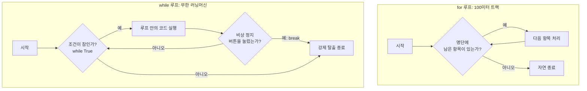

이 다이어그램은 두 반복문의 근본적인 차이를 보여줍니다. for문은 리스트나 명단이 바닥나면 알아서 자연스럽게 끝나지만, 무한 루프로 설계된 while문은 break를 만나지 못하면 영원히 갇히게 됩니다.

---


### 🎨 추가 시각화 (Visualization Packet)

**if/else 조건문 제어 흐름**

프로그램이 실행되다가 특정 조건에 따라 두 갈래 길로 나뉘는 논리 구조입니다.

```mermaid
flowchart TD
    A["프로그램 실행 중"] --> B{"조건 (예: 나이 >= 20?)"}
    B -->|True (참)| C["성인 요금 적용 로직"]
    B -->|False (거짓)| D["미성년자 요금 적용 로직"]
    C --> E["다음 단계 진행"]
    D --> E
    
    style B fill:#fff3e0,stroke:#f57c00
```

## §3. 상세 내용

### Why — 왜 while문이 필요한가?

모든 일이 정해진 횟수만큼만 일어나는 것은 아닙니다. 사용자의 입력을 끝없이 기다리는 서버 프로그램이나 주식 거래 시스템은 누군가 강제로 전원을 내리기 전까지 계속 살아 숨 쉬어야 합니다. 몇 번 반복할지 코드를 작성하는 시점에 알 수 없는 상황에서는 for문 대신 조건에 따라 반복을 결정하는 while문이 필수적인 엔진 역할을 합니다.

### What — while True, break, continue

세 가지 핵심 부품이 하나로 묶여서 동작합니다.

- **while True**: 파이썬에서 의도적으로 무한 루프를 만드는 가장 흔한 패턴입니다. True는 항상 참이므로 반복문이 영원히 돌게 됩니다.
- **break (비상 정지 버튼)**: 반복문 자체를 완전히 박살 내고 끝내버리는 폭탄입니다. 무한 루프 안에서 if문과 결합하여 사용자의 종료 요청을 만나면 루프를 강제로 탈출합니다.
- **continue (급수대 자원봉사자)**: 마라톤 급수대에서 목이 마르지 않은 러너가 물을 받지 않고 스킵하는 것과 같습니다. continue를 만나면 이번 바퀴의 아래쪽 코드는 무시하고 조용히 다음 바퀴의 시작점(조건 검사)으로 되돌아갑니다. 불필요한 데이터를 필터링할 때 유용합니다.

### How — 구체적인 작동 방식과 메뉴 시스템 적용

일반적으로 무한 루프를 열어두고 사용자 입력을 받습니다. 입력값이 특정 조건과 일치하면 break를 실행해 루프를 깹니다. 만약 잘못된 값이 들어오면 continue를 사용해 아래 로직이 에러를 일으키지 않도록 보호하고 다시 입력을 받도록 만듭니다. 이 패턴이 우리가 일상적으로 사용하는 모든 소프트웨어의 뼈대입니다.

---

## §4. 실습 가이드 (+ 🎙️ 실습 대본)

### 실습 목표

끝없이 돌아가는 카페 주문 시스템(키오스크)을 직접 만들어 봅니다. 사용자가 원하는 메뉴를 선택하게 하고, 잘못된 입력은 continue로 걸러내며, 종료를 선택했을 때 break로 빠져나오는 구조를 체감하는 것이 목표입니다.

🎙️ **실습 가이드 대본 (Lab Guide)**:

> 자, 이제 앞서 배운 while 무한 루프와 break, continue를 조합해서 아주 간단한 카페 키오스크 시스템을 만들어 볼 겁니다. 제가 화면에 띄워둔 코드를 편집기에 똑같이 작성해 보세요.
> 
> (3분 코딩 시간 부여)
> 
> 코드를 다 치셨다면 실행 버튼을 눌러보세요. 프로그램이 안 끝나고 계속해서 '메뉴를 선택하세요'라고 물어보죠? 1번이나 2번을 누르면 주문을 잘 받았다고 하고 다시 메뉴를 묻습니다. 자, 이번엔 9번을 입력해 볼까요? 네, 바로 프로그램이 '주문을 종료합니다'라는 인사와 함께 얌전하게 꺼집니다. 
> 
> 만약 5번 같은 엉뚱한 숫자를 넣으면 어떻게 될까요? '잘못된 번호입니다'라고 알려준 뒤, 프로그램이 죽지 않고 continue를 만나 다시 처음으로 돌아갑니다. 
> 
> 이렇게 while True와 break, continue만 있으면, 프로그램이 오류 없이 여러분의 의도대로 부드럽게 돌아가게 만들 수 있습니다. 지금 여러분 스스로 메뉴를 하나 더 추가해 보시거나, 특정 단어를 입력하면 멈추도록 코드를 직접 변형해 보세요. 망가져도 괜찮습니다. 부수고 고쳐보는 과정에서 진짜 실력이 늘어납니다!

### 단계별 지시

| 단계 | 소요 시간 | 강사 지시사항 | 학습자 액션 | 예상 결과 |
|---|---|---|---|---|
| 1 | 3분 | while 메뉴 시스템 실습 코드 제공 | 편집기에 코드 타이핑 | 화면에 무한 루프 메뉴 출력 |
| 2 | 3분 | 1번, 2번 정상 입력 테스트 지시 | 1 또는 2 입력 | 메뉴 처리 후 다시 입력 대기 |
| 3 | 2분 | 범위 밖 숫자나 한글 오타 유도 | 임의의 글자 입력 | continue로 인해 튕기지 않고 재시작 |
| 4 | 2분 | 9번 입력하여 탈출 확인 | 9 입력 | break 작동하여 프로그램 종료 |
| 5 | 5분 | "자신만의 메뉴 3번 추가해보기" 미션 | 코드 수정 및 메뉴 추가 | 제어문 조합 논리 체득 |

### 트러블슈팅 FAQ

| Q | A |
|---|---|
| 코드를 실행했는데 화면에 글씨만 나오고 안 넘어가요. | input() 함수가 여러분의 타자를 기다리는 중입니다. 터미널 창을 마우스로 한 번 클릭하고 엔터를 쳐보세요. |
| 비상 정지 버튼(break)을 빼먹어서 컴퓨터가 멈추질 않아요! | 당황하지 마세요. 터미널 창을 클릭하고 키보드에서 `Ctrl + C` 키를 동시에 누르면 강제로 멈춥니다. 이것이 개발자들의 진짜 비상 정지 단축키입니다. |
| continue 아래에 있는 print가 왜 출력이 안 되나요? | continue는 그 아래 코드를 전부 무시하고 다시 맨 처음 while문 꼭대기로 되돌아가라는 명령어이기 때문입니다. 아예 도달하지 못하는 코드가 됩니다. |

---


### 🎓 강사 노트 (Instructor Support)

- ⏱️ **타이밍**: 14:10 (25분, code)
- 🎯 **핵심 활동**: while + break/continue
- ⚠️ **강사 주의사항**: 무한 루프 주의! Ctrl+C 미리 안내

## §5. 코드 및 명령어 모음

### 기본 while 루프 흐름 제어

가장 단순한 숫자 카운팅을 통해 흐름 제어 키워드의 작동을 보여주는 코드입니다.

```python
count = 0
while True:
    count += 1
    if count == 2:
        continue  # 2가 되면 출력하지 않고 다음 바퀴로 스킵
    if count > 3:
        break     # 3보다 커지면 거대한 루프 감옥을 탈출
    print(f"루프: {count}")

# 실행 결과:
# 루프: 1
# 루프: 3
```

### 키오스크 메뉴 시스템 실습 코드

무한 루프, 종료 조건(break), 필터링 조건(continue)이 모두 결합된 실전 패턴입니다.

```python
while True:
    print("\n--- 카페 주문 시스템 ---")
    print("1. 아메리카노 (3000원)")
    print("2. 카페라떼 (4000원)")
    print("9. 주문 종료")
    
    choice = input("원하는 메뉴 번호를 입력하세요: ")
    
    # 1단계: 비상 정지 버튼 확인
    if choice == '9':
        print("주문을 종료합니다. 감사합니다!")
        break
        
    # 2단계: 잘못된 입력 필터링
    if choice not in ['1', '2']:
        print("잘못된 번호입니다. 다시 선택해 주세요.")
        continue
        
    # 3단계: 정상 처리
    print(f"{choice}번 음료를 준비합니다...")
```

---

## §6. 요약

### 핵심 학습 포인트

이번 세션의 핵심은 세 가지입니다. 첫째, while 루프는 for문과 달리 종료 시점이 명확하지 않을 때 조건이 참인 동안 끝없이 실행되는 끈질긴 녀석입니다. 둘째, 의도적인 무한 루프를 사용할 때는 반드시 break라는 비상 정지 버튼을 달아두어야 프로그램이 뻗지 않고 안전하게 탈출할 수 있습니다. 셋째, continue는 반복을 완전히 끝내지는 않지만 현재 진행 중인 남은 작업을 쿨하게 스킵하고 다음 턴으로 넘기는 똑똑한 필터 역할을 합니다.

### Day 3 AM 마지막 세션 브릿지 노트

> "여러분, 오늘 오전 내내 파이썬의 가장 중요한 뼈대들을 조립했습니다. 변수라는 이름표를 붙이고, 딕셔너리라는 고객 카드에 데이터를 담고, if 조건문으로 길을 나누고, 마침내 while문으로 끝없이 돌아가는 튼튼한 엔진까지 만들었습니다. 이제 우리는 꽤 복잡한 프로그램도 만들 수 있는 힘을 얻었습니다.
>
> 하지만 아직 우리의 프로그램은 아주 여린 유리 멘탈을 가지고 있어요. 방금 만든 메뉴 시스템에서, 숫자를 입력해야 하는데 사용자가 장난으로 한글 '하나'를 입력하고 int()로 변환하려고 하면 어떻게 될까요? 프로그램은 붉은색 에러를 내뿜으며 비명을 지르고 픽 쓰러져 버립니다. 
> 
> 오전 시간 정말 고생 많으셨습니다. 점심 식사 맛있게 하시고, 오후에는 외부의 엉뚱한 입력이나 네트워크 끊김 같은 충격으로부터 우리 프로그램이 죽지 않도록 튼튼한 안전망을 쳐주는 '예외 처리' 기술을 다뤄보겠습니다. 식사 맛있게 하세요!"

---

## §7. 참고 자료

### 3-Source 출처

- **Source A (로컬 참고자료)**: 8 코딩.pdf §8.4 — 반복문의 제어 흐름 및 와일-브레이크(while-break) 패턴. 무한루프와 break의 필요성을 러닝머신 비유로 설명한 원천 자료를 반영했습니다.
- **Source B (NotebookLM)**: NotebookLM day3 — 인공지능 에이전트의 데이터 수집 과정에서 의미 없는 더미 데이터를 만났을 때 continue 신호를 사용하여 에러 없이 건너뛰는 실무 패턴 분석을 참고했습니다.
- **Source C (Deep Research)**: Deep Research day3 — 심층 탐색 알고리즘에서 불필요한 경로 스킵(continue)과 목표 달성 후 전체 탐색 즉시 종료(break)를 통한 효율성 극대화 리서치를 반영했습니다.

### 강사 노트

> 💡 **강사 노트**: 이 세션은 비전공자들이 '무한 루프'에 대한 막연한 두려움을 깨고 스스로 제어할 수 있다는 자신감을 심어주는 것이 핵심입니다. 러닝머신과 비상 정지 버튼 비유가 매우 직관적이고 효과적입니다. 실습 중에 break를 누락하여 무한 루프에 갇혀 당황하는 수강생이 분명히 나오므로, 터미널 강제 종료 단축키(`Ctrl + C`)를 실습 시작 전에 미리 알려주면 교실의 분위기가 훨씬 부드러워집니다.

---

*작성 일시: 2026-02-25*  
*작성 에이전트: Sisyphus-Junior*  
*교안 구조: 7섹션 (A0 팀 공통 표준)*

> 🔗 **이전 세션**: [세션 053: 반복문 for와 range](#세션-053)에서 배운 내용을 이어갑니다.
> 🔗 **다음 세션**: [세션 055: 예외 처리 try/except](#세션-055)에서 계속됩니다.

---

> 🔗 **오후 세션으로 이어집니다**: Day 3 오후(13:30~18:00)에서 세션 055부터 계속됩니다.

## 📦 부록

### 강사 체크리스트 (Day 3 오전)

- [ ] 세션 044: 변수의 개념과 이름표 상자 비유 (20분)
- [ ] 세션 045: 기본 데이터 타입 4가지 (20분)
- [ ] 세션 046: 타입 변환과 f-string (25분)
- [ ] 세션 047: 기본 연산자와 실습 (20분)
- [ ] 세션 048: 리스트의 이해와 기본 조작 (25분)
- [ ] 세션 049: 리스트 인덱싱과 슬라이싱 (20분)
- [ ] 세션 050: 딕셔너리의 이해 (25분)
- [ ] 세션 051: 복합 자료구조 (20분)
- [ ] 세션 052: 조건문 if/elif/else (25분)
- [ ] 세션 053: 반복문 for와 range (20분)
- [ ] 세션 054: 반복문 while과 제어 흐름 (25분)

---

*Day 3 오전 교안 — AI-native 파이썬 기초 v2.1*  
*취합: A4C_Material_Aggregator*  
*검증: A8_QA_Editor*
