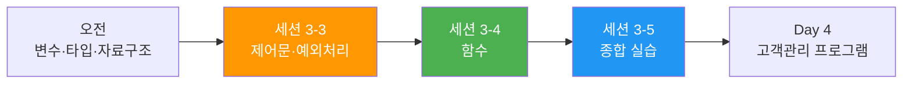
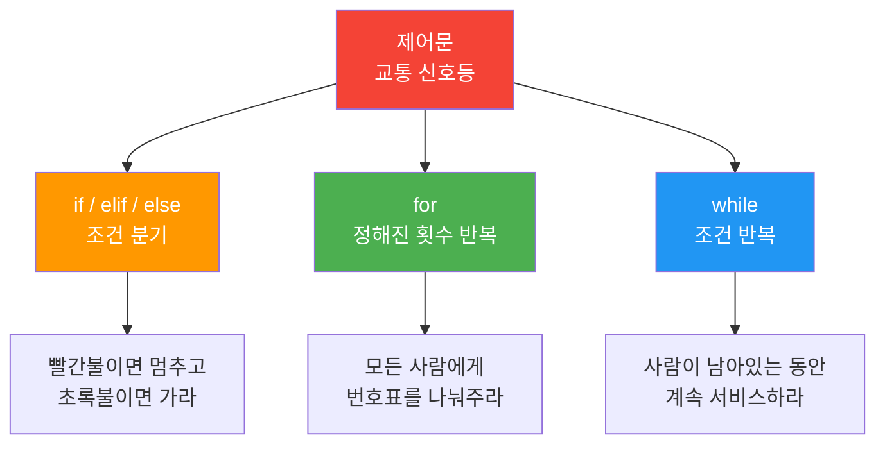
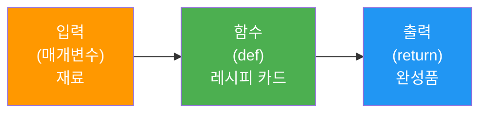
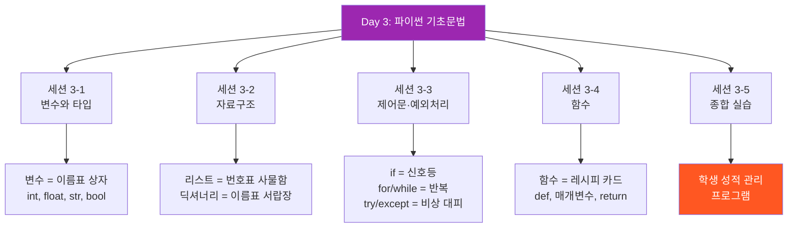

# Day 3 오후: 파이썬 기초문법 — 제어문·함수와 종합 실습

> 과정: AI-native 파이썬 기초 | Day 3/5 | 13:00–17:30

---

## 도입: 오후에 배울 것

오전에는 데이터를 담는 그릇(변수, 리스트, 딕셔너리)을 배웠어요. 이제 오후에는 그 데이터를 가지고 **판단하고, 반복하고, 재사용하는 방법**을 배울 거예요.

- **세션 3-3** (13:00–14:30): 제어문 & 문자열·예외 처리 — 프로그램의 흐름을 제어하는 "교통 신호등"
- **세션 3-4** (14:30–16:00): 함수 — 로직에 이름을 붙이는 "레시피 카드"
- **세션 3-5** (16:15–17:30): 종합 실습 — 오늘 배운 모든 것을 하나의 프로그램으로 통합



---

# 세션 3-3: 제어문 & 문자열·예외 처리

> 13:00–14:30 (90분) | 이론 40% · 실습 60%

---

## 3-3-1. 개요

| 항목 | 내용 |
|------|------|
| **학습 목표** | 조건문(if)과 반복문(for, while)으로 프로그램 흐름을 제어하고, 문자열 처리와 예외 처리를 이해해요 |
| **핵심 개념** | if/elif/else, for, while, 비교·논리 연산자, 문자열 메서드, try/except |
| **선행 지식** | 세션 3-1 변수와 타입, 세션 3-2 자료구조 |
| **산출물** | 제어문·예외처리 실습 코드 |

---

## 3-3-2. 핵심 개념

### 제어문이란? — "교통 신호등"

지금까지 작성한 코드는 위에서 아래로 한 줄씩 순서대로 실행됐어요. 하지만 실제 프로그램은 **상황에 따라 다른 동작**을 해야 하고, **같은 동작을 여러 번 반복**해야 할 때도 있어요.

제어문은 **"교통 신호등"**이에요.

| 제어문 | 비유 | 설명 |
|--------|------|------|
| `if` | 빨간불이면 멈추고, 초록불이면 가라 | 조건에 따라 다른 코드를 실행해요 |
| `for` | 이 줄의 모든 사람에게 번호표를 나눠주라 | 정해진 횟수만큼 반복해요 |
| `while` | 사람이 남아있는 동안 계속 서비스하라 | 조건이 참인 동안 계속 반복해요 |



### 조건문 if/elif/else — 갈림길에서 방향 정하기

```python
# 기본 구조
if 조건:
    # 조건이 참(True)일 때 실행
elif 다른조건:
    # 첫 번째 조건이 거짓이고, 이 조건이 참일 때 실행
else:
    # 모든 조건이 거짓일 때 실행
```

> **중요**: 파이썬에서는 **들여쓰기(인덴트)**가 코드 블록을 구분해요. `if` 아래의 코드는 반드시 4칸 들여쓰기를 해야 해요.

### 비교·논리 연산자

**비교 연산자**는 세션 3-1에서 배웠어요. 여기에 **논리 연산자**를 추가할게요.

| 논리 연산자 | 의미 | 예시 |
|------------|------|------|
| `and` | 둘 다 참이면 참 | `age >= 18 and age <= 65` |
| `or` | 하나라도 참이면 참 | `day == "토" or day == "일"` |
| `not` | 참이면 거짓, 거짓이면 참 | `not is_student` |

### 반복문 for — 정해진 만큼 반복

```python
# 리스트의 모든 요소를 하나씩 꺼내서 반복
for fruit in fruits:
    print(fruit)

# 숫자 범위로 반복
for i in range(5):      # 0, 1, 2, 3, 4
    print(i)

for i in range(1, 6):   # 1, 2, 3, 4, 5
    print(i)
```

### 반복문 while — 조건이 참인 동안 반복

```python
count = 0
while count < 5:
    print(count)
    count += 1    # count = count + 1 과 같아요
```

> **주의**: `while`문에서 조건이 영원히 참이면 프로그램이 멈추지 않아요(무한 루프). 반드시 조건이 거짓이 되는 시점이 있어야 해요.

### 문자열 메서드 — 글자 상자 다루기

| 메서드 | 설명 | 예시 | 결과 |
|--------|------|------|------|
| `.upper()` | 대문자로 | `"hello".upper()` | `"HELLO"` |
| `.lower()` | 소문자로 | `"HELLO".lower()` | `"hello"` |
| `.strip()` | 양쪽 공백 제거 | `" hi ".strip()` | `"hi"` |
| `.replace()` | 문자 교체 | `"hello".replace("l", "r")` | `"herro"` |
| `.split()` | 문자열 나누기 | `"a,b,c".split(",")` | `["a","b","c"]` |
| `.startswith()` | 시작 문자 확인 | `"hello".startswith("he")` | `True` |
| `len()` | 문자열 길이 | `len("hello")` | `5` |

### 예외 처리 try/except — "비상 대피 계획"

프로그램 실행 중에 에러(예외)가 발생하면 프로그램이 멈춰버려요. 예외 처리는 **"비상 대피 계획"**이에요. 화재(에러)가 나면 비상구(except)로 대피하는 거죠.

```python
try:
    # 에러가 발생할 수 있는 코드
    result = 10 / 0
except ZeroDivisionError:
    # 에러가 발생했을 때 실행할 코드
    print("0으로 나눌 수 없어요!")
```

---

## 3-3-3. 상세 내용

### if/elif/else 상세

학점 계산을 예로 들어볼게요.

```
점수 90 이상 → A
점수 80 이상 → B
점수 70 이상 → C
점수 60 이상 → D
그 외       → F
```

이걸 코드로 표현하면:

```python
score = 85

if score >= 90:
    grade = "A"
elif score >= 80:
    grade = "B"
elif score >= 70:
    grade = "C"
elif score >= 60:
    grade = "D"
else:
    grade = "F"

print(f"점수: {score}, 학점: {grade}")
```

> **포인트**: `elif`는 위의 조건이 모두 거짓일 때만 검사해요. 그래서 `score >= 80`만 써도 "90 미만이면서 80 이상"이라는 뜻이 돼요.

### for문 상세

```python
# range() 함수의 3가지 사용법
for i in range(5):        # range(끝) → 0, 1, 2, 3, 4
    print(i)

for i in range(1, 6):     # range(시작, 끝) → 1, 2, 3, 4, 5
    print(i)

for i in range(0, 10, 2): # range(시작, 끝, 간격) → 0, 2, 4, 6, 8
    print(i)
```

### while문 상세

```python
# 기본 while문
count = 1
while count <= 5:
    print(f"반복 {count}번째")
    count += 1

# break: 반복 중단
while True:
    text = input("입력 (quit으로 종료): ")
    if text == "quit":
        break
    print(f"입력한 값: {text}")

# continue: 현재 반복 건너뛰기
for i in range(1, 11):
    if i % 2 == 0:
        continue  # 짝수면 건너뛰기
    print(i)  # 홀수만 출력: 1, 3, 5, 7, 9
```

### 예외 처리 상세

```python
# 여러 종류의 에러 처리
try:
    number = int(input("숫자를 입력하세요: "))
    result = 100 / number
    print(f"결과: {result}")
except ValueError:
    print("숫자가 아닌 값을 입력했어요!")
except ZeroDivisionError:
    print("0으로 나눌 수 없어요!")
except Exception as e:
    print(f"예상치 못한 에러: {e}")
```

---

## 3-3-4. 실습 가이드

### 실습 1: 학점 계산기 (if/elif/else)

**프롬프트 작성**

> **프롬프트**: "점수를 입력받아 A/B/C/D/F 학점을 출력하는 프로그램을 만들어줘. 90점 이상 A, 80점 이상 B, 70점 이상 C, 60점 이상 D, 그 외 F로 해줘. 입력값이 0~100 범위인지도 확인해줘."

**AI 응답 코드 리뷰**

```python
# 학점 계산기
score = int(input("점수를 입력하세요 (0~100): "))

# 입력값 범위 확인
if score < 0 or score > 100:
    print("0에서 100 사이의 점수를 입력해주세요!")
elif score >= 90:
    print(f"점수: {score}점 → 학점: A (우수해요!)")
elif score >= 80:
    print(f"점수: {score}점 → 학점: B (잘했어요!)")
elif score >= 70:
    print(f"점수: {score}점 → 학점: C (괜찮아요!)")
elif score >= 60:
    print(f"점수: {score}점 → 학점: D (조금 더 노력해요!)")
else:
    print(f"점수: {score}점 → 학점: F (다음에 잘하면 돼요!)")
```

**예상 출력** (85 입력 시):
```
점수를 입력하세요 (0~100): 85
점수: 85점 → 학점: B (잘했어요!)
```

**코드 리뷰 포인트**:
- `int(input(...))`은 사용자 입력을 받아서 정수로 변환해요
- `if` → `elif` → `else` 순서로 조건을 검사해요
- 첫 번째로 참이 되는 조건의 코드만 실행되고, 나머지는 건너뛰어요
- `or` 연산자로 두 조건 중 하나라도 참이면 범위 밖으로 판단해요

**실행 후 체크포인트**:
- [ ] 다양한 점수(95, 85, 75, 65, 50)를 넣어보고 결과를 확인했나요?
- [ ] `elif`의 순서를 바꾸면 어떻게 되는지 생각해봤나요?

---

### 실습 2: 3의 배수 출력 (for)

**프롬프트 작성**

> **프롬프트**: "1부터 100까지 숫자 중 3의 배수만 출력하는 프로그램을 만들어줘. 총 몇 개인지도 알려줘."

**AI 응답 코드 리뷰**

```python
# 1부터 100까지 3의 배수 출력
print("=== 1~100 중 3의 배수 ===")

count = 0
for number in range(1, 101):
    if number % 3 == 0:  # 3으로 나눈 나머지가 0이면 3의 배수
        print(number, end=" ")
        count += 1

print(f"\n\n총 {count}개의 3의 배수가 있어요!")
# 출력: 3 6 9 12 15 18 21 24 27 30 33 36 39 42 45 48 51 54 57 60 63 66 69 72 75 78 81 84 87 90 93 96 99
# 총 33개의 3의 배수가 있어요!
```

**코드 리뷰 포인트**:
- `range(1, 101)`은 1부터 100까지의 숫자를 만들어요 (101은 포함 안 돼요)
- `%` 연산자(나머지)로 배수를 판별해요. `number % 3 == 0`이면 3의 배수예요
- `end=" "`는 `print()`가 줄바꿈 대신 공백을 출력하게 해요
- `count` 변수로 3의 배수 개수를 세고 있어요

**실행 후 체크포인트**:
- [ ] `%` 연산자의 역할을 이해했나요?
- [ ] `range(1, 101)`에서 왜 101인지 알겠나요?

---

### 실습 3: quit까지 입력받기 (while)

**프롬프트 작성**

> **프롬프트**: "사용자가 'quit'을 입력할 때까지 계속 메시지를 입력받는 프로그램을 만들어줘. 입력한 메시지를 리스트에 저장하고, quit 입력 시 저장된 모든 메시지를 출력해줘."

**AI 응답 코드 리뷰**

```python
# quit까지 메시지 입력받기
messages = []

print("메시지를 입력하세요 (종료하려면 'quit' 입력)")
print("-" * 40)

while True:
    text = input(">> ")
    
    if text.lower().strip() == "quit":
        break
    
    messages.append(text)
    print(f"  저장 완료! (현재 {len(messages)}개 메시지)")

print("\n=== 저장된 메시지 목록 ===")
if len(messages) == 0:
    print("저장된 메시지가 없어요.")
else:
    for i, msg in enumerate(messages, 1):
        print(f"  {i}. {msg}")
    print(f"\n총 {len(messages)}개의 메시지가 저장되었어요!")
```

**예상 출력**:
```
메시지를 입력하세요 (종료하려면 'quit' 입력)
----------------------------------------
>> 안녕하세요
  저장 완료! (현재 1개 메시지)
>> 파이썬 재미있어요
  저장 완료! (현재 2개 메시지)
>> quit

=== 저장된 메시지 목록 ===
  1. 안녕하세요
  2. 파이썬 재미있어요

총 2개의 메시지가 저장되었어요!
```

**코드 리뷰 포인트**:
- `while True:`는 무한 반복이에요. `break`를 만나야 멈춰요
- `.lower()`는 대소문자 구분 없이 비교하기 위해 소문자로 변환해요 ("QUIT", "Quit"도 인식)
- `.strip()`은 실수로 입력한 앞뒤 공백을 제거해요
- `enumerate(messages, 1)`은 1부터 번호를 매겨줘요

**실행 후 체크포인트**:
- [ ] `while True`와 `break`의 관계를 이해했나요?
- [ ] `.lower()`와 `.strip()`이 왜 필요한지 알겠나요?

---

### 실습 4: 0 나누기 에러 처리 (try/except)

**프롬프트 작성**

> **프롬프트**: "숫자 나누기를 하되, 0으로 나누면 에러 메시지를 보여주는 프로그램을 만들어줘. 숫자가 아닌 값을 입력해도 에러 처리해줘."

**AI 응답 코드 리뷰**

```python
# 안전한 나눗셈 프로그램
print("=== 나눗셈 계산기 ===")

try:
    a = int(input("첫 번째 숫자: "))
    b = int(input("두 번째 숫자: "))
    
    result = a / b
    print(f"\n{a} / {b} = {result}")

except ValueError:
    print("\n숫자가 아닌 값을 입력했어요! 정수만 입력해주세요.")

except ZeroDivisionError:
    print("\n0으로 나눌 수 없어요! 두 번째 숫자는 0이 아닌 값을 입력해주세요.")

except Exception as e:
    print(f"\n예상치 못한 에러가 발생했어요: {e}")

print("\n프로그램이 정상적으로 종료되었어요!")
```

**예상 출력** (정상 입력):
```
=== 나눗셈 계산기 ===
첫 번째 숫자: 10
두 번째 숫자: 3

10 / 3 = 3.3333333333333335
프로그램이 정상적으로 종료되었어요!
```

**예상 출력** (0 입력):
```
=== 나눗셈 계산기 ===
첫 번째 숫자: 10
두 번째 숫자: 0

0으로 나눌 수 없어요! 두 번째 숫자는 0이 아닌 값을 입력해주세요.
프로그램이 정상적으로 종료되었어요!
```

**예상 출력** (문자 입력):
```
=== 나눗셈 계산기 ===
첫 번째 숫자: abc

숫자가 아닌 값을 입력했어요! 정수만 입력해주세요.
프로그램이 정상적으로 종료되었어요!
```

**코드 리뷰 포인트**:
- `try` 블록 안의 코드에서 에러가 발생하면, 해당 `except` 블록으로 이동해요
- `ValueError`는 타입 변환 실패 시, `ZeroDivisionError`는 0으로 나눌 때 발생해요
- `except Exception as e`는 예상치 못한 모든 에러를 잡아줘요
- `try/except` 덕분에 에러가 나도 프로그램이 멈추지 않고 마지막 줄까지 실행돼요

**실행 후 체크포인트**:
- [ ] `try/except` 없이 0으로 나누면 어떻게 되는지 확인해봤나요?
- [ ] `ValueError`와 `ZeroDivisionError`의 차이를 이해했나요?
- [ ] 예외 처리가 왜 "비상 대피 계획"인지 체감이 되나요?

---

## 3-3-5. 코드 모음

```python
# ============================================
# 세션 3-3: 제어문 & 예외 처리 - 전체 코드 모음
# ============================================

# --- 실습 1: 학점 계산기 (if/elif/else) ---
score = 85  # 테스트용 점수 (input 대신 직접 지정)

if score < 0 or score > 100:
    print("0에서 100 사이의 점수를 입력해주세요!")
elif score >= 90:
    print(f"점수: {score}점 → 학점: A")
elif score >= 80:
    print(f"점수: {score}점 → 학점: B")
elif score >= 70:
    print(f"점수: {score}점 → 학점: C")
elif score >= 60:
    print(f"점수: {score}점 → 학점: D")
else:
    print(f"점수: {score}점 → 학점: F")

# --- 실습 2: 3의 배수 (for) ---
print("\n=== 1~100 중 3의 배수 ===")
count = 0
for number in range(1, 101):
    if number % 3 == 0:
        print(number, end=" ")
        count += 1
print(f"\n총 {count}개")

# --- 실습 3: quit까지 입력 (while) ---
# 주의: 이 코드는 사용자 입력이 필요해요
# messages = []
# while True:
#     text = input(">> ")
#     if text.lower().strip() == "quit":
#         break
#     messages.append(text)
# for i, msg in enumerate(messages, 1):
#     print(f"  {i}. {msg}")

# --- 실습 4: 예외 처리 (try/except) ---
print("\n=== 나눗셈 예외 처리 ===")
try:
    result = 10 / 0
except ZeroDivisionError:
    print("0으로 나눌 수 없어요!")

try:
    number = int("abc")
except ValueError:
    print("숫자가 아닌 값이에요!")

# --- 문자열 메서드 예시 ---
print("\n=== 문자열 메서드 ===")
text = "  Hello, Python!  "
print(f"원본: '{text}'")
print(f"strip(): '{text.strip()}'")
print(f"upper(): '{text.strip().upper()}'")
print(f"lower(): '{text.strip().lower()}'")
print(f"replace(): '{text.strip().replace('Python', '파이썬')}'")
print(f"split(): {text.strip().split(', ')}")
```

---

## 3-3-6. 트러블슈팅 FAQ

### Q1. `IndentationError: expected an indented block` 에러가 떠요

**원인**: `if`, `for`, `while` 다음 줄에 들여쓰기를 하지 않았을 때 발생해요.

```python
# 에러 발생!
if score >= 90:
print("A")  # IndentationError! (들여쓰기 없음)

# 해결: 4칸 들여쓰기
if score >= 90:
    print("A")  # 정상
```

### Q2. 무한 루프에 빠졌어요! 프로그램이 멈추지 않아요

**원인**: `while`문의 조건이 영원히 참이거나, `break`가 없을 때 발생해요.

```python
# 무한 루프! (count가 변하지 않음)
count = 0
while count < 5:
    print(count)
    # count += 1 을 빼먹었어요!

# 해결: Ctrl+C로 강제 종료 후, 조건 변경 코드 추가
count = 0
while count < 5:
    print(count)
    count += 1  # 이 줄이 꼭 필요해요!
```

> **팁**: 무한 루프에 빠지면 터미널에서 `Ctrl + C`를 눌러서 강제 종료할 수 있어요.

### Q3. `TypeError: '>' not supported between instances of 'str' and 'int'` 에러가 떠요

**원인**: `input()`은 항상 문자열(str)을 돌려줘요. 문자열과 숫자를 비교하려고 하면 에러가 발생해요.

```python
# 에러 발생!
score = input("점수: ")  # score는 문자열 "85"
if score >= 90:           # TypeError! (문자열과 숫자 비교 불가)
    print("A")

# 해결: int()로 변환
score = int(input("점수: "))  # score는 정수 85
if score >= 90:
    print("A")
```

### Q4. `SyntaxError: invalid syntax` — if문 뒤에 콜론(:)을 빼먹었어요

```python
# 에러 발생!
if score >= 90   # SyntaxError! (콜론 누락)
    print("A")

# 해결: 콜론 추가
if score >= 90:  # 정상
    print("A")
```

---

## 3-3-7. 요약

| 개념 | 비유 | 핵심 포인트 |
|------|------|------------|
| **if/elif/else** | 교통 신호등 | 조건에 따라 다른 코드 실행 |
| **for** | 번호표 나눠주기 | 정해진 횟수만큼 반복 |
| **while** | 남아있는 동안 서비스 | 조건이 참인 동안 반복 |
| **비교 연산자** | 크기 비교 | `==`, `!=`, `>`, `<`, `>=`, `<=` |
| **논리 연산자** | 조건 조합 | `and`, `or`, `not` |
| **문자열 메서드** | 글자 가공 도구 | `.upper()`, `.lower()`, `.strip()`, `.split()` |
| **try/except** | 비상 대피 계획 | 에러 발생 시 프로그램 멈춤 방지 |

> **다음 세션 예고**: 학점 계산, 3의 배수 출력, 메시지 입력... 이런 로직을 매번 처음부터 작성하면 번거롭지 않을까요? 세션 3-4에서 로직에 이름을 붙여서 재사용하는 **함수**를 배워요!

---

# 세션 3-4: 로직에 이름 붙이기 — 함수

> 14:30–16:00 (90분) | 이론 40% · 실습 60%

---

## 3-4-1. 개요

| 항목 | 내용 |
|------|------|
| **학습 목표** | "로직에 이름을 붙인다"는 개념으로 함수의 재사용성을 이해하고, 함수 문법을 익혀요 |
| **핵심 개념** | 함수 정의(def), 매개변수, 반환값(return), 내장 함수, 사용자 정의 함수 |
| **선행 지식** | 세션 3-1~3-3 (변수, 자료구조, 제어문) |
| **산출물** | 함수 실습 코드 |

---

## 3-4-2. 핵심 개념

### 함수란? — "레시피 카드"

"AI 시대의 서사"에서 배운 비유를 기억하시나요? 함수는 **"레시피 카드"**예요.

김치찌개 만드는 방법을 `김치찌개_만들기(재료)` 카드에 한 번 적어두면, 재료만 바꿔서 언제든 호출할 수 있어요.

```
  ┌─────────────────────────────────┐
  │  레시피 카드: 김치찌개_만들기     │
  │                                 │
  │  재료(매개변수): 돼지고기         │
  │                                 │
  │  1. 냄비에 물 끓이기             │
  │  2. 재료 넣기                   │
  │  3. 김치 넣기                   │
  │  4. 끓이기                      │
  │                                 │
  │  완성품(반환값): 김치찌개 1인분   │
  └─────────────────────────────────┘
```

파이썬에서는 이렇게 표현해요:

```python
def 김치찌개_만들기(재료):       # 레시피 카드 작성
    print(f"{재료}로 김치찌개를 만들어요!")
    return "김치찌개 1인분"      # 완성품 돌려주기

결과 = 김치찌개_만들기("돼지고기")  # 레시피 카드 사용
print(결과)
# 출력: 돼지고기로 김치찌개를 만들어요!
# 출력: 김치찌개 1인분
```

### 함수의 구조

```python
def 함수이름(매개변수1, 매개변수2):
    """이 함수가 무엇을 하는지 설명 (독스트링)"""
    # 함수 본문 (실행할 코드)
    결과 = 매개변수1 + 매개변수2
    return 결과  # 반환값
```

| 구성 요소 | 비유 | 설명 |
|-----------|------|------|
| `def` | "레시피 카드 작성 시작" | 함수를 정의하겠다는 키워드 |
| 함수이름 | 레시피 이름 | 함수를 호출할 때 사용하는 이름 |
| 매개변수 | 재료 | 함수에 전달하는 입력값 |
| 함수 본문 | 조리 과정 | 실제 실행되는 코드 |
| `return` | 완성품 | 함수가 돌려주는 결과값 |



### 내장 함수 vs 사용자 정의 함수

파이썬에는 이미 만들어져 있는 **내장 함수(Built-in Function)**가 있어요. 우리가 직접 만드는 건 **사용자 정의 함수**예요.

| 구분 | 설명 | 예시 |
|------|------|------|
| **내장 함수** | 파이썬이 미리 만들어둔 함수 | `print()`, `len()`, `type()`, `int()`, `input()` |
| **사용자 정의 함수** | 우리가 직접 만드는 함수 | `def calculate_bmi(...)`, `def greet(...)` |

> **비유**: 내장 함수는 "기본 레시피북"에 있는 레시피(라면 끓이기, 계란 프라이 등)이고, 사용자 정의 함수는 "내가 직접 개발한 레시피"예요.

---

## 3-4-3. 상세 내용

### 매개변수의 종류

```python
# 1. 기본 매개변수 (필수)
def greet(name):
    print(f"안녕하세요, {name}님!")

greet("철수")  # 안녕하세요, 철수님!

# 2. 기본값이 있는 매개변수 (선택)
def greet(name, greeting="안녕하세요"):
    print(f"{greeting}, {name}님!")

greet("철수")              # 안녕하세요, 철수님!
greet("영희", "반갑습니다")  # 반갑습니다, 영희님!

# 3. 여러 매개변수
def add(a, b):
    return a + b

result = add(3, 5)  # 8
```

### return의 역할

```python
# return이 있는 함수 - 결과를 돌려줘요
def add(a, b):
    return a + b

result = add(3, 5)
print(result)  # 8

# return이 없는 함수 - 동작만 수행해요
def say_hello(name):
    print(f"안녕, {name}!")

say_hello("철수")  # 안녕, 철수! (출력만 하고 돌려주는 값은 없어요)

# 여러 값 반환
def divide(a, b):
    quotient = a // b   # 몫
    remainder = a % b   # 나머지
    return quotient, remainder

q, r = divide(10, 3)
print(f"몫: {q}, 나머지: {r}")  # 몫: 3, 나머지: 1
```

### 자주 쓰는 내장 함수

| 함수 | 설명 | 예시 | 결과 |
|------|------|------|------|
| `len()` | 길이/개수 | `len([1,2,3])` | `3` |
| `max()` | 최댓값 | `max(3, 7, 1)` | `7` |
| `min()` | 최솟값 | `min(3, 7, 1)` | `1` |
| `sum()` | 합계 | `sum([1,2,3])` | `6` |
| `sorted()` | 정렬 | `sorted([3,1,2])` | `[1,2,3]` |
| `abs()` | 절댓값 | `abs(-5)` | `5` |
| `round()` | 반올림 | `round(3.7)` | `4` |

---

## 3-4-4. 실습 가이드

### 실습 1: 사칙연산 함수 4개

**프롬프트 작성**

> **프롬프트**: "두 숫자를 받아서 사칙연산(더하기, 빼기, 곱하기, 나누기) 결과를 반환하는 함수 4개를 만들어줘. 나누기는 0으로 나누는 경우도 처리해줘."

**AI 응답 코드 리뷰**

```python
# 사칙연산 함수 4개
def add(a, b):
    """두 수를 더해요"""
    return a + b

def subtract(a, b):
    """두 수를 빼요"""
    return a - b

def multiply(a, b):
    """두 수를 곱해요"""
    return a * b

def divide(a, b):
    """두 수를 나눠요 (0으로 나누기 방지)"""
    if b == 0:
        return "0으로 나눌 수 없어요!"
    return a / b

# 함수 사용
x, y = 10, 3

print(f"{x} + {y} = {add(x, y)}")
# 출력: 10 + 3 = 13

print(f"{x} - {y} = {subtract(x, y)}")
# 출력: 10 - 3 = 7

print(f"{x} * {y} = {multiply(x, y)}")
# 출력: 10 * 3 = 30

print(f"{x} / {y} = {divide(x, y)}")
# 출력: 10 / 3 = 3.3333333333333335

print(f"{x} / 0 = {divide(x, 0)}")
# 출력: 10 / 0 = 0으로 나눌 수 없어요!
```

**코드 리뷰 포인트**:
- `def 함수이름(매개변수):` 형태로 함수를 정의해요
- `return`으로 결과를 돌려줘요
- `divide()` 함수에서 `if b == 0:` 조건으로 0 나누기를 방지해요
- 함수를 한 번 만들어두면 `add(x, y)` 형태로 언제든 호출할 수 있어요

**실행 후 체크포인트**:
- [ ] `def`와 `return`의 역할을 설명할 수 있나요?
- [ ] 함수를 호출할 때 매개변수를 전달하는 방법을 이해했나요?

---

### 실습 2: 고객 환영/목록 출력 함수

**프롬프트 작성**

> **프롬프트**: "고객 이름을 받아서 환영 메시지를 출력하는 함수와, 고객 목록(리스트)을 받아서 전체를 출력하는 함수를 만들어줘."

**AI 응답 코드 리뷰**

```python
# 고객 환영 함수
def welcome_customer(name):
    """고객에게 환영 메시지를 출력해요"""
    print(f"환영합니다, {name}님! 좋은 하루 되세요!")

# 고객 목록 출력 함수
def print_customer_list(customers):
    """고객 목록을 보기 좋게 출력해요"""
    print("\n=== 고객 목록 ===")
    if len(customers) == 0:
        print("  등록된 고객이 없어요.")
        return
    
    for i, customer in enumerate(customers, 1):
        print(f"  {i}. {customer['이름']} ({customer['나이']}세) - {customer['전화번호']}")
    
    print(f"\n  총 {len(customers)}명의 고객이 등록되어 있어요.")

# 함수 사용
welcome_customer("김철수")
# 출력: 환영합니다, 김철수님! 좋은 하루 되세요!

welcome_customer("이영희")
# 출력: 환영합니다, 이영희님! 좋은 하루 되세요!

# 고객 목록 데이터 (세션 3-2에서 만든 구조!)
customers = [
    {"이름": "김철수", "나이": 28, "전화번호": "010-1234-5678"},
    {"이름": "이영희", "나이": 32, "전화번호": "010-9876-5432"},
    {"이름": "박민수", "나이": 25, "전화번호": "010-5555-7777"}
]

print_customer_list(customers)
```

**예상 출력**:
```
환영합니다, 김철수님! 좋은 하루 되세요!
환영합니다, 이영희님! 좋은 하루 되세요!

=== 고객 목록 ===
  1. 김철수 (28세) - 010-1234-5678
  2. 이영희 (32세) - 010-9876-5432
  3. 박민수 (25세) - 010-5555-7777

  총 3명의 고객이 등록되어 있어요.
```

**코드 리뷰 포인트**:
- `welcome_customer()`는 이름만 받아서 출력하는 간단한 함수예요
- `print_customer_list()`는 리스트를 받아서 반복문으로 출력하는 함수예요
- 세션 3-2에서 만든 "리스트 안의 딕셔너리" 구조를 함수에서 활용하고 있어요
- 빈 리스트 체크(`len(customers) == 0`)로 예외 상황도 처리해요

**실행 후 체크포인트**:
- [ ] 함수에 리스트를 매개변수로 전달하는 방법을 이해했나요?
- [ ] 세션 3-2의 자료구조가 함수와 어떻게 연결되는지 보이나요?

---

### 실습 3: BMI 계산 함수

**프롬프트 작성**

> **프롬프트**: "BMI를 계산하는 함수를 만들어줘. 키(cm)와 몸무게(kg)를 입력받아 BMI 값과 비만 여부를 반환해줘. BMI = 몸무게 / (키(m))^2 공식을 사용해줘."

**AI 응답 코드 리뷰**

```python
def calculate_bmi(height_cm, weight_kg):
    """BMI를 계산하고 비만 여부를 판정해요
    
    매개변수:
        height_cm: 키 (센티미터)
        weight_kg: 몸무게 (킬로그램)
    
    반환값:
        (BMI 값, 판정 결과) 튜플
    """
    # cm를 m로 변환
    height_m = height_cm / 100
    
    # BMI 계산
    bmi = weight_kg / (height_m ** 2)
    bmi = round(bmi, 1)  # 소수점 1자리로 반올림
    
    # 비만 여부 판정
    if bmi < 18.5:
        category = "저체중"
    elif bmi < 23:
        category = "정상"
    elif bmi < 25:
        category = "과체중"
    elif bmi < 30:
        category = "비만"
    else:
        category = "고도비만"
    
    return bmi, category

# 함수 사용
bmi_value, result = calculate_bmi(175, 70)
print(f"키: 175cm, 몸무게: 70kg")
print(f"BMI: {bmi_value}, 판정: {result}")
# 출력: BMI: 22.9, 판정: 정상

print()

bmi_value, result = calculate_bmi(165, 80)
print(f"키: 165cm, 몸무게: 80kg")
print(f"BMI: {bmi_value}, 판정: {result}")
# 출력: BMI: 29.4, 판정: 비만

print()

bmi_value, result = calculate_bmi(180, 60)
print(f"키: 180cm, 몸무게: 60kg")
print(f"BMI: {bmi_value}, 판정: {result}")
# 출력: BMI: 18.5, 판정: 정상
```

**코드 리뷰 포인트**:
- `return bmi, category`로 두 개의 값을 동시에 돌려줘요
- `bmi_value, result = calculate_bmi(175, 70)`로 두 값을 각각 받아요
- 함수 안에서 세션 3-3의 `if/elif/else`를 활용하고 있어요
- `round(bmi, 1)`로 소수점 1자리까지만 표시해요
- 독스트링(`"""..."""`)으로 함수 설명을 적어두면 나중에 이해하기 쉬워요

**실행 후 체크포인트**:
- [ ] 함수가 여러 값을 반환하는 방법을 이해했나요?
- [ ] 함수 안에서 if/elif/else를 사용하는 것이 자연스러운가요?

---

### 실습 4: 내장 함수 vs 사용자 정의 함수 비교

**프롬프트 작성**

> **프롬프트**: "내장 함수(len, max, min, sorted, sum)와 사용자 정의 함수를 비교하는 예제를 만들어줘. 같은 기능을 내장 함수와 직접 만든 함수로 각각 구현해줘."

**AI 응답 코드 리뷰**

```python
# 테스트 데이터
numbers = [45, 22, 87, 13, 56, 91, 34]
print(f"숫자 목록: {numbers}")
print("=" * 40)

# --- 내장 함수 사용 ---
print("\n[내장 함수 사용]")
print(f"  개수: {len(numbers)}")
print(f"  최댓값: {max(numbers)}")
print(f"  최솟값: {min(numbers)}")
print(f"  합계: {sum(numbers)}")
print(f"  정렬: {sorted(numbers)}")

# --- 사용자 정의 함수로 같은 기능 구현 ---
def my_max(numbers):
    """리스트에서 가장 큰 값을 찾아요"""
    biggest = numbers[0]
    for num in numbers:
        if num > biggest:
            biggest = num
    return biggest

def my_sum(numbers):
    """리스트의 모든 값을 더해요"""
    total = 0
    for num in numbers:
        total += num
    return total

def my_average(numbers):
    """리스트의 평균을 구해요 (내장 함수에는 없어요!)"""
    return my_sum(numbers) / len(numbers)

print("\n[사용자 정의 함수 사용]")
print(f"  최댓값: {my_max(numbers)}")
print(f"  합계: {my_sum(numbers)}")
print(f"  평균: {round(my_average(numbers), 1)}")
```

**예상 출력**:
```
숫자 목록: [45, 22, 87, 13, 56, 91, 34]
========================================

[내장 함수 사용]
  개수: 7
  최댓값: 91
  최솟값: 13
  합계: 348
  정렬: [13, 22, 34, 45, 56, 87, 91]

[사용자 정의 함수 사용]
  최댓값: 91
  합계: 348
  평균: 49.7
```

**코드 리뷰 포인트**:
- 내장 함수는 이미 만들어져 있어서 바로 사용할 수 있어요
- 사용자 정의 함수는 내장 함수에 없는 기능(예: 평균)을 직접 만들 수 있어요
- `my_average()`는 `my_sum()`과 `len()`을 조합해서 만들었어요. 함수 안에서 다른 함수를 호출할 수 있어요!
- 실무에서는 내장 함수가 있으면 내장 함수를 쓰는 게 좋아요 (더 빠르고 안정적)

**실행 후 체크포인트**:
- [ ] 내장 함수와 사용자 정의 함수의 차이를 설명할 수 있나요?
- [ ] 함수 안에서 다른 함수를 호출하는 것이 자연스러운가요?

---

## 3-4-5. 코드 모음

```python
# ============================================
# 세션 3-4: 함수 - 전체 코드 모음
# ============================================

# --- 실습 1: 사칙연산 함수 ---
def add(a, b):
    return a + b

def subtract(a, b):
    return a - b

def multiply(a, b):
    return a * b

def divide(a, b):
    if b == 0:
        return "0으로 나눌 수 없어요!"
    return a / b

x, y = 10, 3
print(f"{x} + {y} = {add(x, y)}")
print(f"{x} - {y} = {subtract(x, y)}")
print(f"{x} * {y} = {multiply(x, y)}")
print(f"{x} / {y} = {divide(x, y)}")
print(f"{x} / 0 = {divide(x, 0)}")

# --- 실습 2: 고객 함수 ---
def welcome_customer(name):
    print(f"환영합니다, {name}님!")

def print_customer_list(customers):
    print("\n=== 고객 목록 ===")
    for i, c in enumerate(customers, 1):
        print(f"  {i}. {c['이름']} ({c['나이']}세) - {c['전화번호']}")
    print(f"  총 {len(customers)}명")

customers = [
    {"이름": "김철수", "나이": 28, "전화번호": "010-1234-5678"},
    {"이름": "이영희", "나이": 32, "전화번호": "010-9876-5432"},
    {"이름": "박민수", "나이": 25, "전화번호": "010-5555-7777"}
]
welcome_customer("김철수")
print_customer_list(customers)

# --- 실습 3: BMI 계산 함수 ---
def calculate_bmi(height_cm, weight_kg):
    height_m = height_cm / 100
    bmi = round(weight_kg / (height_m ** 2), 1)
    if bmi < 18.5:
        category = "저체중"
    elif bmi < 23:
        category = "정상"
    elif bmi < 25:
        category = "과체중"
    elif bmi < 30:
        category = "비만"
    else:
        category = "고도비만"
    return bmi, category

bmi, result = calculate_bmi(175, 70)
print(f"\nBMI: {bmi}, 판정: {result}")

# --- 실습 4: 내장 함수 비교 ---
numbers = [45, 22, 87, 13, 56, 91, 34]
print(f"\n최댓값: {max(numbers)}, 최솟값: {min(numbers)}")
print(f"합계: {sum(numbers)}, 정렬: {sorted(numbers)}")
```

---

## 3-4-6. 트러블슈팅 FAQ

### Q1. 함수를 호출했는데 `None`이 출력돼요

**원인**: 함수에 `return`이 없으면 `None`을 돌려줘요.

```python
def greet(name):
    print(f"안녕, {name}!")
    # return이 없어요!

result = greet("철수")
print(result)  # None

# 해결: return 추가 또는, 출력만 하는 함수라면 result에 담지 않기
greet("철수")  # 그냥 호출만 하면 돼요
```

### Q2. `TypeError: greet() missing 1 required positional argument: 'name'` 에러가 떠요

**원인**: 함수 호출 시 필수 매개변수를 빠뜨렸을 때 발생해요.

```python
def greet(name):
    print(f"안녕, {name}!")

greet()  # TypeError! (name 매개변수가 없어요)

# 해결: 매개변수 전달
greet("철수")  # 정상
```

### Q3. 함수 안에서 만든 변수를 밖에서 쓸 수 없어요

**원인**: 함수 안에서 만든 변수는 함수 안에서만 존재해요 (지역 변수).

```python
def my_function():
    local_var = "함수 안의 변수"
    print(local_var)

my_function()
print(local_var)  # NameError! (함수 밖에서는 접근 불가)

# 해결: return으로 값을 돌려받기
def my_function():
    local_var = "함수 안의 변수"
    return local_var

result = my_function()
print(result)  # 정상: "함수 안의 변수"
```

### Q4. 함수 정의 전에 호출하면 에러가 나요

**원인**: 파이썬은 위에서 아래로 실행하기 때문에, 함수를 정의하기 전에 호출하면 에러가 발생해요.

```python
# 에러 발생!
greet("철수")  # NameError! (아직 greet 함수가 정의되지 않았어요)

def greet(name):
    print(f"안녕, {name}!")

# 해결: 함수 정의를 먼저, 호출을 나중에
def greet(name):
    print(f"안녕, {name}!")

greet("철수")  # 정상
```

---

## 3-4-7. 요약

| 개념 | 비유 | 핵심 포인트 |
|------|------|------------|
| **함수** | 레시피 카드 | 로직에 이름을 붙여서 재사용 |
| **def** | 레시피 작성 시작 | `def 함수이름(매개변수):` |
| **매개변수** | 재료 | 함수에 전달하는 입력값 |
| **return** | 완성품 | 함수가 돌려주는 결과값 |
| **내장 함수** | 기본 레시피북 | `len()`, `max()`, `min()`, `sum()`, `sorted()` |
| **사용자 정의 함수** | 나만의 레시피 | `def my_function():` |

> **Day 4 연결 포인트**: 오늘 배운 함수가 Day 4에서 핵심 역할을 해요. 고객관리 프로그램의 각 기능(등록, 조회, 수정, 삭제)을 각각 함수로 만들어서 구조적으로 프로그래밍하게 돼요!

---

> ☕ **휴식 (16:00–16:15)**

---

# 세션 3-5: Day 3 종합 실습 & 정리

> 16:15–17:30 (75분) | 실습 80% · 정리 20%

---

## 3-5-1. 개요

| 항목 | 내용 |
|------|------|
| **학습 목표** | Day 3 기초문법 전체를 하나의 프로그램으로 통합하여 내재화해요 |
| **핵심 활동** | 종합 미니 프로젝트 + 코드 리뷰 게임 + 핵심 정리 퀴즈 |
| **선행 지식** | 세션 3-1~3-4 전체 |
| **산출물** | 학생 성적 관리 프로그램 |

---

## 3-5-2. 종합 미니 프로젝트: "학생 성적 관리 프로그램"

오늘 배운 **변수, 리스트, 딕셔너리, 제어문, 함수**를 모두 활용하는 프로그램을 만들어 볼게요.

### 프로그램 요구사항

| 기능 | 설명 | 활용 개념 |
|------|------|----------|
| 학생 등록 | 이름, 국어, 영어, 수학 점수 입력 | 변수, 딕셔너리, 리스트 |
| 성적 조회 | 전체 학생 목록과 평균/학점 출력 | for문, 함수 |
| 학점 계산 | 평균 점수로 A~F 학점 판정 | if/elif/else, 함수 |
| 통계 출력 | 전체 평균, 최고/최저 점수 학생 | 내장 함수, 함수 |
| 에러 처리 | 잘못된 입력 처리 | try/except |

### 프롬프트 작성

> **프롬프트**: "학생 성적 관리 프로그램을 만들어줘. 기능은 다음과 같아:
> 1. 학생 등록: 이름, 국어, 영어, 수학 점수를 입력받아 리스트에 딕셔너리로 저장
> 2. 성적 조회: 전체 학생의 이름, 각 과목 점수, 평균, 학점을 표 형태로 출력
> 3. 통계 보기: 전체 평균, 최고 점수 학생, 최저 점수 학생 출력
> 4. 프로그램 종료
> 
> 학점 기준: 90 이상 A, 80 이상 B, 70 이상 C, 60 이상 D, 그 외 F
> 각 기능을 함수로 분리해줘. 잘못된 입력에 대한 에러 처리도 해줘.
> while True 메뉴 루프를 사용해줘."

### AI 응답 코드 리뷰

```python
# ============================================
# 학생 성적 관리 프로그램
# Day 3 종합 실습: 변수 + 리스트 + 딕셔너리 + 제어문 + 함수
# ============================================

# --- 함수 정의 ---

def calculate_average(korean, english, math):
    """세 과목의 평균을 계산해요"""
    return round((korean + english + math) / 3, 1)

def get_grade(average):
    """평균 점수로 학점을 판정해요"""
    if average >= 90:
        return "A"
    elif average >= 80:
        return "B"
    elif average >= 70:
        return "C"
    elif average >= 60:
        return "D"
    else:
        return "F"

def add_student(students):
    """새 학생을 등록해요"""
    print("\n--- 학생 등록 ---")
    name = input("학생 이름: ")
    
    try:
        korean = int(input("국어 점수 (0~100): "))
        english = int(input("영어 점수 (0~100): "))
        math = int(input("수학 점수 (0~100): "))
    except ValueError:
        print("점수는 숫자로 입력해주세요!")
        return
    
    # 점수 범위 확인
    for score, subject in [(korean, "국어"), (english, "영어"), (math, "수학")]:
        if score < 0 or score > 100:
            print(f"{subject} 점수가 0~100 범위를 벗어났어요!")
            return
    
    # 평균과 학점 계산
    average = calculate_average(korean, english, math)
    grade = get_grade(average)
    
    # 학생 정보를 딕셔너리로 만들어 리스트에 추가
    student = {
        "이름": name,
        "국어": korean,
        "영어": english,
        "수학": math,
        "평균": average,
        "학점": grade
    }
    students.append(student)
    print(f"\n{name} 학생이 등록되었어요! (평균: {average}, 학점: {grade})")

def show_students(students):
    """전체 학생 성적을 조회해요"""
    print("\n--- 성적 조회 ---")
    
    if len(students) == 0:
        print("등록된 학생이 없어요. 먼저 학생을 등록해주세요!")
        return
    
    print(f"{'이름':^8} {'국어':^6} {'영어':^6} {'수학':^6} {'평균':^6} {'학점':^4}")
    print("-" * 42)
    
    for student in students:
        print(f"{student['이름']:^8} {student['국어']:^6} {student['영어']:^6} "
              f"{student['수학']:^6} {student['평균']:^6} {student['학점']:^4}")

def show_statistics(students):
    """통계를 출력해요"""
    print("\n--- 통계 ---")
    
    if len(students) == 0:
        print("등록된 학생이 없어요.")
        return
    
    # 전체 평균
    averages = [s["평균"] for s in students]
    total_avg = round(sum(averages) / len(averages), 1)
    
    # 최고/최저 점수 학생
    best = max(students, key=lambda s: s["평균"])
    worst = min(students, key=lambda s: s["평균"])
    
    print(f"총 학생 수: {len(students)}명")
    print(f"전체 평균: {total_avg}점")
    print(f"최고 점수: {best['이름']} ({best['평균']}점, {best['학점']})")
    print(f"최저 점수: {worst['이름']} ({worst['평균']}점, {worst['학점']})")

# --- 메인 프로그램 ---

students = []  # 학생 데이터를 저장할 리스트

print("=" * 42)
print("     학생 성적 관리 프로그램")
print("=" * 42)

while True:
    print("\n[메뉴]")
    print("1. 학생 등록")
    print("2. 성적 조회")
    print("3. 통계 보기")
    print("4. 프로그램 종료")
    
    choice = input("\n선택 (1~4): ")
    
    if choice == "1":
        add_student(students)
    elif choice == "2":
        show_students(students)
    elif choice == "3":
        show_statistics(students)
    elif choice == "4":
        print("\n프로그램을 종료해요. 수고하셨어요!")
        break
    else:
        print("\n1~4 중에서 선택해주세요!")
```

### 코드 리뷰 포인트 — "이 코드에서 찾아보세요!"

이 프로그램에는 오늘 배운 모든 개념이 들어있어요. 하나씩 찾아볼까요?

| 개념 | 코드에서 찾기 | 위치 |
|------|-------------|------|
| **변수** | `name`, `korean`, `english`, `math`, `average`, `grade` | `add_student()` 함수 안 |
| **데이터 타입** | `str`(이름), `int`(점수), `float`(평균), `str`(학점) | 곳곳에 |
| **리스트** | `students = []`, `students.append(student)` | 메인 + `add_student()` |
| **딕셔너리** | `student = {"이름": name, "국어": korean, ...}` | `add_student()` |
| **리스트+딕셔너리** | `students` 리스트 안에 학생 딕셔너리들 | 전체 구조 |
| **if/elif/else** | 학점 판정, 메뉴 선택 | `get_grade()`, 메인 루프 |
| **for** | 학생 목록 출력, 점수 범위 확인 | `show_students()`, `add_student()` |
| **while** | 메뉴 루프 (`while True`) | 메인 프로그램 |
| **함수** | `calculate_average()`, `get_grade()`, `add_student()` 등 | 전체 |
| **try/except** | 점수 입력 시 에러 처리 | `add_student()` |
| **내장 함수** | `len()`, `sum()`, `round()`, `max()`, `min()` | `show_statistics()` |

---

## 3-5-3. 코드 리뷰 게임

강사가 학생 성적 관리 프로그램의 코드 일부를 보여주고, 수강생이 찾는 게임이에요.

**문제 예시**:

1. "이 코드에서 **변수**를 3개 찾아보세요"
2. "이 코드에서 **리스트**는 어디에 있나요?"
3. "이 코드에서 **딕셔너리**는 어디에 있나요?"
4. "이 코드에서 **함수**는 몇 개인가요? 이름을 말해보세요"
5. "이 코드에서 **if문**은 어디에 있나요?"
6. "이 코드에서 **for문**은 어디에 있나요?"
7. "이 코드에서 **try/except**는 왜 필요한가요?"

---

## 3-5-4. Day 3 핵심 정리 퀴즈 (5문항)

| # | 문제 | 정답 |
|---|------|------|
| 1 | `name = "철수"`에서 `name`은 무엇인가요? | 변수 (이름표가 붙은 상자) |
| 2 | `type(3.14)`의 결과는? | `<class 'float'>` |
| 3 | 리스트와 딕셔너리의 가장 큰 차이점은? | 리스트는 번호(인덱스)로, 딕셔너리는 이름(키)으로 접근 |
| 4 | `for i in range(1, 6):`에서 i는 어떤 값들을 가지나요? | 1, 2, 3, 4, 5 |
| 5 | 함수에서 `return`의 역할은? | 함수의 결과값을 돌려주는 것 (레시피의 완성품) |

---

## 3-5-5. Day 3 전체 요약



| 세션 | 핵심 비유 | 배운 것 |
|------|----------|---------|
| 3-1 | 이름표가 붙은 상자 | 변수, int/float/str/bool, 타입 변환, 연산자 |
| 3-2 | 번호표 사물함 + 이름표 서랍장 | 리스트, 딕셔너리, CRUD, 복합 구조 |
| 3-3 | 교통 신호등 + 비상 대피 계획 | if/elif/else, for, while, try/except |
| 3-4 | 레시피 카드 | def, 매개변수, return, 내장 함수 |
| 3-5 | 전체 통합 | 학생 성적 관리 프로그램 |

---

## 3-5-6. Day 3 평가 체크리스트

- [ ] **변수·타입 이해**: 4가지 데이터 타입을 설명하고 `type()`으로 확인할 수 있어요
- [ ] **리스트/딕셔너리 활용**: CRUD 연산을 수행하고, 복합 구조를 만들 수 있어요
- [ ] **제어문 이해**: if/for/while을 상황에 맞게 사용할 수 있어요
- [ ] **함수 작성**: def로 함수를 정의하고, 매개변수와 return을 활용할 수 있어요

---

## Day 4 예고

> **"내일은 진짜 프로그램을 만듭니다! Day 2의 PRD가 코드가 됩니다!"**

오늘 배운 기초문법(변수, 자료구조, 제어문, 함수)을 가지고, Day 2에서 작성한 "고객 정보 관리 프로그램" PRD를 실제 코드로 만들어요.

- **오전**: 절차적 프로그래밍으로 고객관리 프로그램 v1 생성
- **오후**: 구조적 프로그래밍으로 v2 업그레이드 (함수 분리, 모듈화)

오늘 만든 "학생 성적 관리 프로그램"과 비슷한 구조이지만, 더 체계적으로 발전시킬 거예요. 오늘의 리스트+딕셔너리 복합 구조가 내일의 핵심 데이터 구조가 된다는 걸 기억해주세요!
