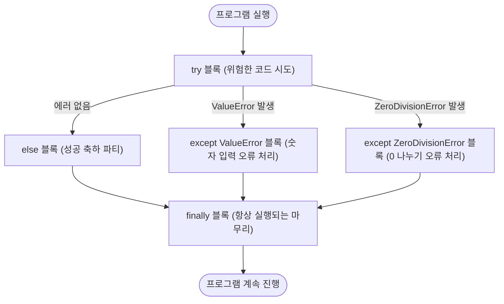
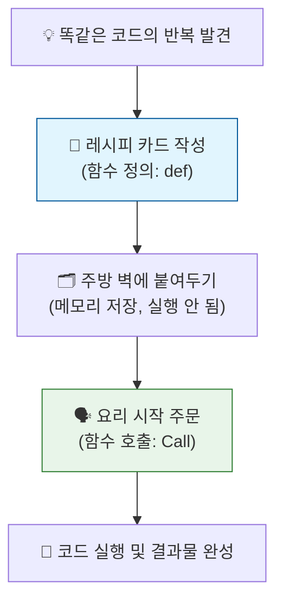
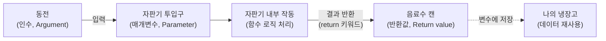
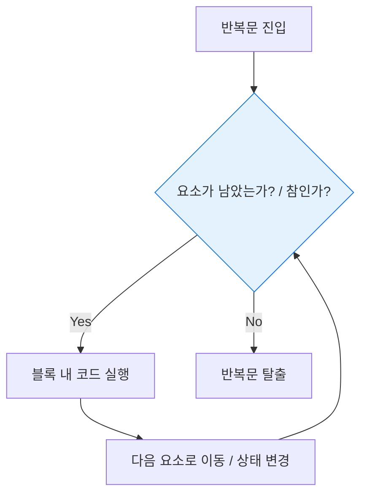
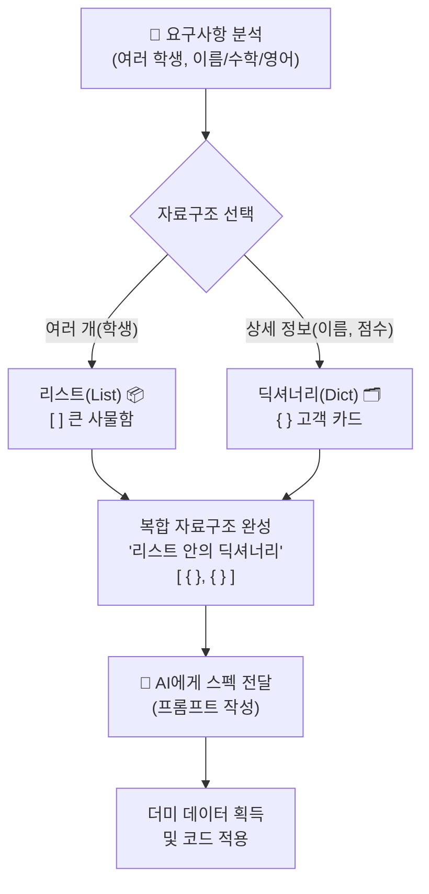
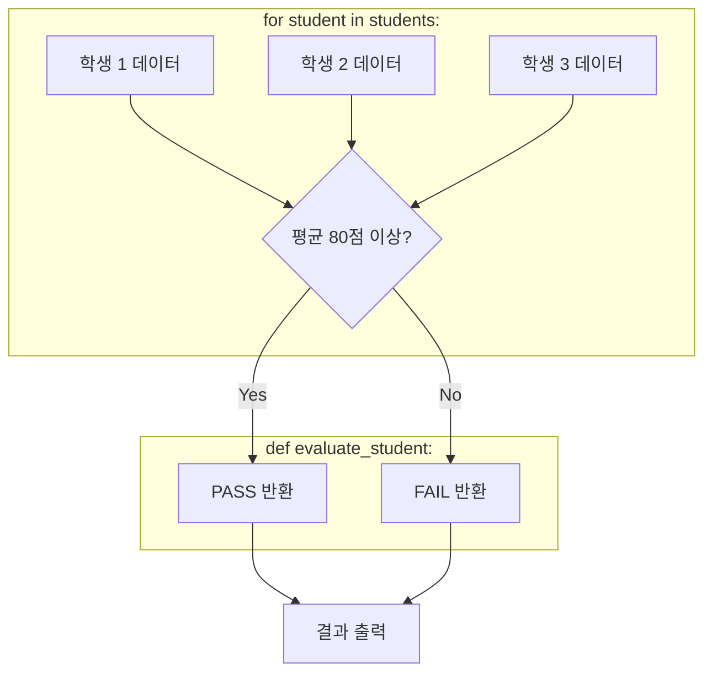
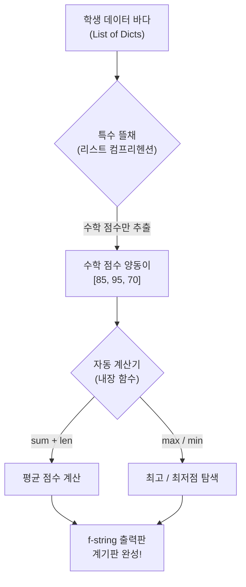
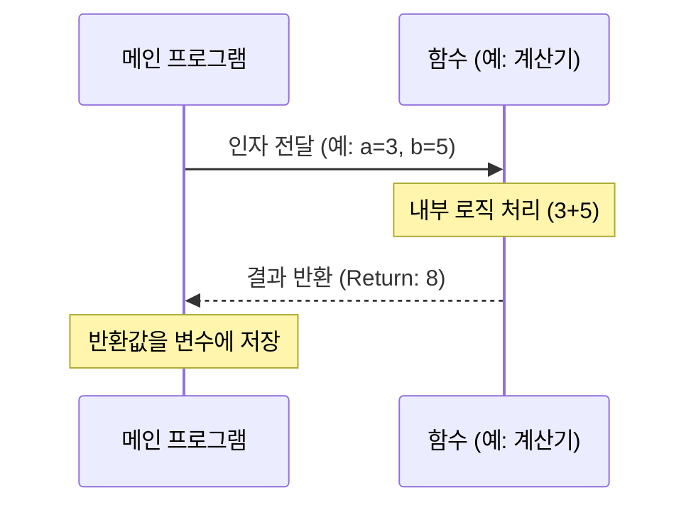
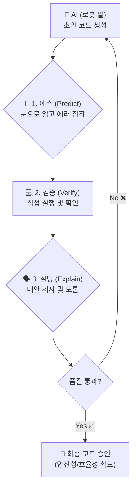
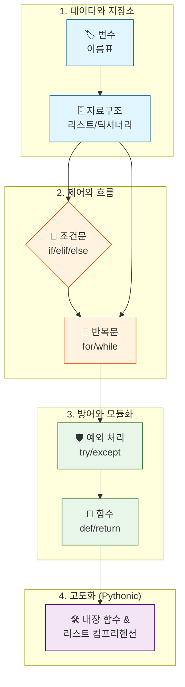

# Day 3 오후: 제어문 함수 종합실습

> **과정**: AI-native 파이썬 기초 | Day 3/5 | 13:30~18:00
> **테마**: 파이썬 문법 기초와 데이터 다루기
> **세션**: 055 ~ 064 (10개 세션)
> **총 소요 시간**: 210분
> **버전**: v2.1 (7섹션 구조, 보조 패킷 통합)
> **작성 일시**: 2026-02-25

---

## 🎯 학습 목표 (오후)

1. **세션 055**: 이 세션 종료 시 수강생은 실행 중 발생하는 예외(에러) 상황을 예측하고 `try/except` 블록을 사용해 프로그램이 강제 종료되지 않도록 방어 로직을 작성할 수 있다.
2. **세션 056**: 이 세션 종료 시 수강생은 반복되는 로직을 재사용 가능한 함수로 정의(def)하고 호출하는 기본 문법을 이해할 수 있다.
3. **세션 057**: 이 세션 종료 시 수강생은 함수에 매개변수(Parameter)를 전달하고, 연산 결과를 반환(Return)받는 코드를 작성하고 동작을 예측할 수 있다.
4. **세션 058**: 이 세션 종료 시 수강생은 파이썬이 기본 제공하는 대표적인 내장 함수(len, max, min, sorted)를 활용하여 데이터를 손쉽게 가공할 수 있다.
5. **세션 059**: 이 세션 종료 시 수강생은 AI가 생성한 '리스트 컴프리헨션' 코드를 해석하고, 그 작동 원리를 일반 `for`문으로 풀어서 설명할 수 있다.
6. **세션 060**: 이 세션 종료 시 수강생은 요구사항(스펙)을 분석하여, 학생 성적 관리를 위한 적절한 변수와 복합 자료구조(리스트+딕셔너리)를 프롬프트로 설계할 수 있다.
7. **세션 061**: 이 세션 종료 시 수강생은 준비된 데이터를 바탕으로 개별 로직을 처리하는 함수를 생성하고, 이를 반복문으로 연결하는 전체 프로그램 흐름을 구현할 수 있다.
8. **세션 062**: 이 세션 종료 시 수강생은 리스트 컴프리헨션과 내장 함수(len, max, sum)를 결합하여 복합 데이터에서 전체 통계를 계산하는 기능을 구현할 수 있다.
9. **세션 063**: 이 세션 종료 시 수강생은 완성된 프로그램 코드 내에서 변수, 리스트, 딕셔너리, 조건문, 반복문, 함수의 위치를 스스로 식별하고 타인에게 설명할 수 있다.
10. **세션 064**: 이 세션 종료 시 수강생은 Day 3에서 학습한 6가지 핵심 개념(변수, 자료구조, 제어문, 예외처리, 함수, 컴프리헨션)을 비유를 통해 요약 설명할 수 있다.

---

## 📋 목차

- [📖 세션 055: 예외 처리 try/except](#세션-055) (20분)
- [📖 세션 056: 함수의 개념과 정의](#세션-056) (20분)
- [💻 세션 057: 함수의 매개변수와 반환값](#세션-057) (25분)
- [💻 세션 058: 내장 함수 활용](#세션-058) (15분)
- [💻 세션 059: 리스트 컴프리헨션](#세션-059) (25분)
- [🧪 세션 060: [종합 실습 1] 학생 성적 관리 데이터 모델링](#세션-060) (20분)
- [🧪 세션 061: [종합 실습 2] 제어문과 함수로 로직 구현](#세션-061) (25분)
- [🧪 세션 062: [종합 실습 3] 통계 분석기 추가](#세션-062) (25분)
- [🧪 세션 063: 생성 코드 리뷰 게임](#세션-063) (20분)
- [📖 세션 064: Day 3 총정리](#세션-064) (15분)

---

## 📊 세션 인덱스

| 세션 | 제목 | 시간 | 청크 타입 | 난이도 | 바로가기 |
|------|------|------|-----------|--------|----------|
| 055 | 예외 처리 try/except | 20분 | 📖 narrative | medium | [바로가기](#세션-055) |
| 056 | 함수의 개념과 정의 | 20분 | 📖 narrative | low | [바로가기](#세션-056) |
| 057 | 함수의 매개변수와 반환값 | 25분 | 💻 code | medium | [바로가기](#세션-057) |
| 058 | 내장 함수 활용 | 15분 | 💻 code | low | [바로가기](#세션-058) |
| 059 | 리스트 컴프리헨션 | 25분 | 💻 code | high | [바로가기](#세션-059) |
| 060 | [종합 실습 1] 학생 성적 관리 데이터 모델링 | 20분 | 🧪 lab | medium | [바로가기](#세션-060) |
| 061 | [종합 실습 2] 제어문과 함수로 로직 구현 | 25분 | 🧪 lab | high | [바로가기](#세션-061) |
| 062 | [종합 실습 3] 통계 분석기 추가 | 25분 | 🧪 lab | high | [바로가기](#세션-062) |
| 063 | 생성 코드 리뷰 게임 | 20분 | 🧪 lab | medium | [바로가기](#세션-063) |
| 064 | Day 3 총정리 | 15분 | 📖 narrative | low | [바로가기](#세션-064) |

---

## 📚 본문

### 세션 055: 예외 처리 try/except
> [원본 파일](sessions/세션-055-예외처리_try_except_v2.1.md) | ⏱️ 20분 | 📖 narrative | 난이도: medium

> **세션 ID**: MS-PY101-055  
> **소요 시간**: 20분  
> **난이도**: ★★☆  
> **청크 타입**: narrative  
> **선행 세션**: 054(필수)  
> **후행 세션**: 056  
> **버전**: v2.1 (7섹션 구조)

---

## §1. 개요

> **Day 3 | PM | 세션 055/064**

이 세션은 Day 3 오후의 첫 번째 세션입니다. 우리가 이전 세션(054)에서 `while` 반복문과 제어문(`break`, `continue`)을 통해 프로그램의 내부 흐름을 자유롭게 다루는 법을 배웠다면, 이제는 프로그램의 통제 범위를 벗어난 '외부의 충격'으로부터 코드를 보호하는 방법을 배울 차례입니다. 아무리 완벽해 보이는 프로그램이라도 사용자의 예상치 못한 입력이나 네트워크 단절 같은 돌발 상황을 만나면 그대로 멈춰버릴 수 있습니다. 이 세션에서는 프로그램이 강제 종료되지 않고 유연하게 대처할 수 있도록 돕는 예외 처리(try-except)의 개념과 실전 활용법을 익힙니다.

### 🎯 학습 목표

이 세션이 끝나면 수강생은 다음을 할 수 있어요:

- 런타임 에러(Runtime Error)가 프로그램에 미치는 치명적인 영향을 이해합니다
- `try-except-else-finally` 네 가지 블록의 역할과 실행 흐름을 설명할 수 있습니다
- 에러 종류(`ValueError`, `ZeroDivisionError` 등)에 따라 다르게 대응하는 방어적 코드를 작성할 수 있습니다
- 에러 발생 시 프로그램이 다운되는 대신 사용자 친화적인 메시지를 출력하도록 UX를 개선할 수 있습니다

### 선행 세션 환기

바로 전 세션에서 우리는 `while`문을 제어하기 위해 `break`라는 비상 탈출 버튼을 만들었습니다. 내부 논리에 무한 루프라는 덫이 생겼을 때 빠져나오는 법이었죠. 이번엔 시야를 밖으로 돌려볼게요. 사용자가 숫자를 입력해야 하는데 문자를 입력해 버리면 어떡할까요? 이전 세션까지의 지식으로는 프로그램이 그냥 죽어버렸습니다. 이제 그 '죽어버리는' 상황에 안전그물을 쳐볼 시간입니다.

---

## §2. 핵심 개념 (+ 🗣️ 강사 대본 + Mermaid)

### 비유 풀이: 서커스 공연장의 튼튼한 '안전그물'

코드가 정상적으로 실행되는 과정은 서커스 공연의 공중그네와 같습니다. 완벽하게 짜인 로직을 따라 움직일 때는 아름답지만, 어쩌다 손이 미끄러지면(에러 발생) 그대로 바닥으로 추락해 공연 자체가 비극적으로 끝나버리죠. 이것이 바로 우리가 겪는 '프로그램 강제 종료'입니다. 하지만 서커스단은 항상 바닥에 커다란 **안전그물(try-except)**을 설치해 둡니다. 떨어져도 그물이 받아주면, 관객은 잠시 놀라겠지만 공연은 다시 이어질 수 있습니다.

🗣️ **강사 대본 (Instructor Script)**:

> 여러분, 점심 맛있게 드셨나요? 오후 첫 시간, 조금은 비장한 이야기로 시작하겠습니다.
> 
> 우리가 오전까지 참 많은 걸 배웠고, 꽤 그럴듯하게 돌아가는 계산기나 고객 관리 프로그램을 만들어 봤습니다. 그런데 완벽해 보이는 이 프로그램에 치명적인 약점이 하나 있어요. 만약 화면에 "나이를 숫자로 입력하세요"라는 안내문이 떴는데, 사용자가 장난삼아 "안녕"이라고 한글을 치면 어떻게 될까요?
> 
> 네, 바로 시뻘건 에러 메시지가 쏟아지면서 프로그램이 그 즉시 심장마비에 걸린 것처럼 픽 죽어버리고 맙니다. 우리는 이걸 '런타임 에러(Runtime Error)'라고 불러요. 개발자가 아무리 논리적으로 코드를 잘 짰다고 하더라도, 현실의 사용자는 항상 우리의 예상을 뛰어넘는 기상천외한 행동을 하거든요.
> 
> 만약 여러분이 만든 인공지능 주식 자동매매 프로그램이 서버와 통신하다가 아주 잠깐, 0.1초 인터넷이 끊겼다고 해서 에러를 뿜으며 아예 종료되어 버린다면 어떨까요? 엄청난 금전적 손실로 이어질 겁니다. 프로그램이 중간에 죽어버리는 것보다는, "잘못된 입력입니다. 다시 입력해 주세요"라거나 "네트워크가 불안정합니다. 잠시 후 다시 시도합니다"라고 안내해 주는 것이 훨씬 훌륭한 사용자 경험(UX)이에요.
> 
> 그래서 오늘은 외부의 충격이나 잘못된 상황 속에서도 우리 프로그램이 절대로 죽지 않게 꽉 잡아주는 강력한 맷집, 바로 예외 처리 기법을 배워보겠습니다. 서커스 공연장에 설치된 튼튼한 안전그물을 우리 코드에도 쳐볼 시간입니다!

### Mermaid 다이어그램



이 다이어그램은 `try-except` 구문이 어떻게 런타임 에러를 방어하고 프로그램의 흐름을 안전하게 끝까지 이어가는지 보여줍니다. 에러가 나든 안 나든, 결국 우리는 `finally`를 거쳐 멈추지 않고 앞으로 나아가게 됩니다.

---

## §3. 상세 내용

### Why — 왜 이 세션이 필요한가?

초보 개발자들은 '정상적으로 작동하는 경로(Happy Path)'만 고민하며 코드를 짜는 경향이 있습니다. 하지만 실무 환경에서는 데이터베이스 연결 실패, 사용자의 오타, 파일 접근 권한 문제 등 수많은 돌발 상황이 매분 매초 발생합니다. 예외 처리를 배우지 않으면, 장난감 코드는 짤 수 있어도 결코 현업에서 쓸 수 있는 견고한(Robust) 프로그램을 만들 수는 없습니다. 이 세션은 수강생들의 마인드셋을 '정상 작동'에서 '방어적 프로그래밍'으로 넓혀주는 중요한 분기점입니다.

### What — 이 세션에서 다루는 것은 무엇인가?

파이썬에서 안전망을 구축하는 핵심 키워드 4가지의 역할과 상호작용을 다룹니다.
1. `try`: 에러가 발생할지도 모르는, 실패 가능성이 있는 코드를 담는 블록
2. `except`: 특정 에러가 터졌을 때 프로그램이 종료되는 대신 실행할 대안 코드를 담는 블록
3. `else`: 에러가 단 하나도 발생하지 않고 완벽하게 성공했을 때만 실행되는 블록
4. `finally`: 에러 발생 여부나 함수 중간의 `return`과 무관하게 무조건 마지막에 실행되는 정리정돈 블록

### How — 구체적으로 어떻게 진행하는가?

🗣️ **강사 대본 (Instructor Script)**:

> 파이썬에서 안전망을 치는 방법은 네 가지 키워드로 구성됩니다. 트라이(try), 익셉트(except), 엘스(else), 파이널리(finally)입니다.
> 
> 먼저 `try` 블록에는 우리가 원래 실행하고 싶었던 메인 코드, 즉 '에러가 발생할지도 모르는 위험한 코드'를 집어넣습니다. 만약 `try` 안에서 코드가 정상적으로 실행되면 `except` 블록은 완전히 무시됩니다. 
> 
> 하지만 `try` 안에서 무언가 터졌다, 에러가 발생했다면? 파이썬은 즉시 `try` 블록 실행을 멈추고 `except` 블록으로 피신합니다. 여기서 재밌는 건 `except`를 여러 개 겹쳐서 사용할 수 있다는 점이에요. 예를 들어 `ValueError`는 사용자가 숫자를 넣어야 할 곳에 문자를 넣었을 때 잡아내는 그물이고, `ZeroDivisionError`는 숫자를 0으로 나누려고 할 때 발생하는 수학적 모순을 잡아내는 그물입니다. 에러의 종류별로 맞춤형 대피로를 만들어주는 거죠.
> 
> 다음으로 `else` 블록은 `try` 블록에서 단 한 개의 에러도 발생하지 않고 완벽하게 성공했을 때만 실행되는 축하 파티 같은 공간입니다. 
> 
> 마지막으로 `finally` 블록은 에러가 났든 안 났든, 심지어 중간에 반복문을 탈출하는 `break`를 만났더라도 무조건 마지막에 한 번은 꼭 실행되는 정리정돈 블록입니다. 열어두었던 파일을 닫거나 네트워크 연결을 끊는 등 반드시 마무리해야 하는 비상 정지 절차를 `finally` 안에 작성합니다.

---

## §4. 실습 가이드 (+ 🎙️ 실습 대본)

### 실습 목표

단순한 나눗셈 계산기 코드를 작성하고, 의도적으로 에러를 내보며 `try-except` 안전그물이 어떻게 작동하는지 직접 체감합니다. 에러 메시지 없이 부드럽게 대처하는 UX를 확인하는 것이 목표입니다.

🎙️ **실습 가이드 대본 (Lab Guide)**:

> 자, 그럼 이 네 가지 키워드가 실제 코드에서 어떻게 튼튼한 요새를 구축하는지 살펴보겠습니다. 백이라는 숫자를 사용자가 입력한 숫자로 나누는 간단한 계산기 프로그램을 짜볼 거예요.
> 
> 지금 화면에 띄워드린 코드를 편집기에 그대로 타이핑해 보세요. 코드를 다 작성하셨다면, 이제 우리가 해커가 된 것처럼 의도적으로 프로그램이 싫어할 만한 행동을 해볼 겁니다.
> 
> 첫 번째 실행에서는 숫자 `20`을 입력해 보세요. 결과는 `5.0`이 나오고 "계산 종료"가 출력될 겁니다. 에러가 없었으므로 `else` 블록과 `finally` 블록이 모두 실행된 거죠.
> 
> 두 번째로 다시 실행하고, 이번에는 숫자가 아니라 '파이썬'이라고 한글을 입력해 보세요. `try` 블록 안의 `int()` 변환 과정에서 에러가 터지면서, 곧바로 `ValueError` 그물에 탁 걸릴 겁니다. "숫자만 입력해야 합니다!"가 출력되고 `finally`로 넘어가죠? 시뻘건 에러 창이 안 떴어요!
> 
> 세 번째로는 숫자 `0`을 입력해 보세요. 이번에는 100을 0으로 나누려다가 `ZeroDivisionError` 그물에 걸려 "0으로 나눌 수 없습니다!"라는 친절한 메시지를 보여줍니다. 어떤 짓을 해도 프로그램이 비정상적으로 뻗어버리지 않죠? 이것이 바로 방어적 프로그래밍의 힘입니다.

### 단계별 지시

| 단계 | 소요 시간 | 강사 지시사항 | 학습자 액션 | 예상 결과 |
|------|----------|--------------|------------|----------|
| 1 | 3분 | 코드 스니펫 화면 공유 및 타이핑 안내 | 에디터에 `try-except` 코드 작성 | 기본 코드 준비 완료 |
| 2 | 2분 | 정상 동작 케이스 테스트 지시 (숫자 20 입력) | 정상적인 숫자 입력 후 실행 | `else`와 `finally` 동작 확인 |
| 3 | 3분 | `ValueError` 발생 유도 (문자열 입력) | 문자를 입력하여 에러 유발 시도 | 프로그램이 죽지 않고 오류 메시지만 출력 |
| 4 | 2분 | `ZeroDivisionError` 발생 유도 (0 입력) | 숫자 0 입력 후 실행 | 0 나누기 오류 처리 블록 동작 확인 |
| 5 | 5분 | 강사 랩업 및 코드 동작 흐름 해설 분석 | 코드와 실행 결과 비교하며 경청 | `try-except` 전체 흐름 완벽 이해 |

### 트러블슈팅 FAQ

| Q | A |
|---|---|
| "except 블록에서 에러 이름을 모를 때는 어떡하나요?" | "`except Exception as e:` 처럼 작성하면 발생하는 모든 종류의 에러를 퉁쳐서 잡고, 에러 내용도 `e`라는 변수에 담아 출력해 볼 수 있습니다. 다만 처음엔 에러 종류별로 명시하는 게 좋은 습관입니다." |
| "else 블록은 굳이 왜 쓰나요? 그냥 try 아래에 쭉 쓰면 안 되나요?" | "`try` 블록은 최소한으로 유지하는 게 좋습니다. 정말 에러가 터질 위험이 있는 코드만 `try`에 넣고, 안전한 나머지 처리 로직은 `else`로 빼는 게 실무에서 권장하는 클린 코드 작성법이에요." |

---


### 🎓 강사 노트 (Instructor Support)

- ⏱️ **타이밍**: 14:35 (20분, narrative)
- 🎯 **핵심 활동**: "안전벨트" 비유
- ⚠️ **강사 주의사항**: 에러 두려움 해소

## §5. 코드 및 명령어 모음

실습에 사용되는 핵심 파이썬 코드입니다.

```python
# 세션 055: 예외 처리와 안전그물 (try-except-else-finally)

try:
    # 에러 발생 가능성이 있는 위험한 코드 블록
    num = int(input("나눌 숫자를 입력하세요: "))
    result = 100 / num

except ValueError:
    # 문자를 입력해서 int() 변환에 실패했을 때 잡는 그물
    print("❌ 숫자만 입력해야 합니다!")

except ZeroDivisionError:
    # 0으로 나누려고 시도했을 때 잡는 그물
    print("❌ 0으로 나눌 수 없습니다!")

else:
    # 에러가 단 하나도 발생하지 않았을 때만 실행 (성공 시)
    print(f"✅ 계산 성공! 결과는 {result}입니다.")

finally:
    # 에러 발생 여부와 상관없이 무조건 마지막에 실행
    print("🔄 계산기를 종료합니다.")
```

> 🤖 **AI 프롬프트 예시**: (선택 실습용)
> "Gemini야, 내가 위에서 짠 try-except 코드에 `KeyboardInterrupt` (사용자가 Ctrl+C를 눌러서 강제 종료 시도) 예외 처리도 하나 더 추가해 줘. 그리고 각각의 에러가 났을 때 로그 파일에 에러 내역을 기록하는 부분도 주석으로 설명해 줘."

---

## §6. 요약

### 핵심 학습 포인트

이번 세션에서 가장 중요한 것은 프로그램이 에러를 뿜어내는 건 자연스러운 일이며, 그것을 **통제 불가능한 폭발에서 안전한 연소로 바꾸는 과정**이 바로 예외 처리라는 점을 깨닫는 것입니다.
- 런타임 에러는 프로그램을 강제 종료시키며 끔찍한 UX를 초래합니다.
- `try-except` 구문은 이 추락을 막는 서커스의 안전그물입니다.
- 에러의 종류(`ValueError`, `ZeroDivisionError` 등)에 따라 적절한 대안 행동을 겹겹이 설계할 수 있습니다.
- `finally`는 에러와 무관하게 무조건 실행되므로 정리 작업에 아주 유용합니다.

### 다음 세션 예고

오늘 우리는 반복할 수 있는 체력(반복문)도 가졌고, 외부의 공격을 버텨내는 맷집(예외 처리)도 갖추었습니다. 그런데 코드가 점점 길어지다 보니, 계산기 기능을 만들기 위해 매번 십여 줄의 코드를 복사해서 붙여넣어야 하는 번거로움이 생겼어요. 천 줄, 만 줄짜리 프로그램에서 매번 이럴 순 없겠죠? 

그래서 다음 세션(056)에서는 우리가 짠 유용한 코드들을 마치 '레시피 카드'처럼 깔끔하게 포장해서, 필요할 때마다 이름만 불러 꺼내 쓰는 마법 같은 도구 — **'함수(Function)'**에 대해 배워보도록 하겠습니다.

### 브릿지 노트

> "이제 여러분의 프로그램은 어지간한 공격에는 끄떡도 하지 않는 단단한 맷집을 가졌습니다. 방어막을 쳤으니, 이제 코드를 효율적으로 재사용하는 생산성 무기를 장착하러 가볼까요?"

---

## §7. 참고 자료

### 3-Source 출처

- **Source A (로컬 참고자료)**: `8 코딩.pdf`, `9 디버깅, 테스트, 배포.pdf` — 현업 관점에서의 방어적 프로그래밍(Defensive Programming) 원칙과 에러 대응 방식을 가져왔습니다.
- **Source B (NotebookLM)**: Day 3 요약 노트 — 최신 AI 트렌드에서 AI가 복잡한 문서를 읽다가 해독할 수 없는 문자를 만나도 전체 프로세스를 멈추지 않고, 해당 부분만 예외 처리하여 다음으로 넘어가는 강건성(Robustness)의 사례를 반영했습니다.
- **Source C (Deep Research)**: Day 3 리포트 — 대규모 데이터 수집 파이프라인에서 수만 개의 웹페이지 크롤링 중 몇 개가 접속되지 않더라도 전체 크롤링이 중단되지 않도록 방어하는 대피 계획 설계 패턴을 설명에 녹였습니다.

### 추가 학습 자료

- [파이썬 공식 문서: 내장 예외 (Built-in Exceptions)](https://docs.python.org/ko/3/library/exceptions.html) — 파이썬에서 기본 제공하는 수많은 에러의 종류와 계층도
- 에러를 두려워하지 않는 개발자 마인드셋 칼럼 (내부 자료)

### 강사 노트

> 💡 **강사 노트**: 예외 처리를 설명할 때 "프로그램이 죽어버리는 것보다 '잘못된 입력입니다'라고 알려주는 것이 훨씬 좋은 UX입니다"라는 [팩트 패킷의 스크립트 포인트]를 꼭 강조해 주세요. 초보 수강생들은 에러 화면 자체를 무서워하는 경향이 있는데, 에러는 개발자를 괴롭히는 적이 아니라 어디가 아픈지 알려주는 친절한 신호등임을 인식시켜 주는 것이 중요합니다.

---

*작성 일시: 2026-02-25*  
*작성 에이전트: A4B_Session_Writer*  
*교안 구조: 7섹션 (A0 팀 공통 표준)*


> 🔗 **이전 세션**: [세션 054: 반복문 while과 제어 흐름](#세션-054)에서 배운 내용을 이어갑니다.
> 🔗 **다음 세션**: [세션 056: 함수의 개념과 정의](#세션-056)에서 계속됩니다.

---

### 세션 056: 함수의 개념과 정의
> [원본 파일](sessions/세션-056-함수의개념과정의_v2.1.md) | ⏱️ 20분 | 📖 narrative | 난이도: low

> **세션 ID**: MS-PY101-056  
> **소요 시간**: 20분  
> **난이도**: low  
> **청크 타입**: narrative  
> **버전**: v2.1 (7섹션 구조)

---

## §1. 개요

> **Day 3 | PM | 세션 056/064**

이 세션은 파이썬에서 코드를 재사용하는 가장 기본적이고 강력한 도구인 '함수(Function)'의 개념을 다루는 시간이에요. 이전 세션까지 조건문과 반복문을 통해 프로그램의 흐름을 제어하는 법을 배웠다면, 이제는 그렇게 작성한 코드를 예쁜 상자에 담아 이름을 붙이고 필요할 때마다 꺼내 쓰는 방법을 배울 차례입니다.

### 🎯 학습 목표

이 세션이 끝나면 수강생은 다음을 할 수 있어요:
- 코드를 복사하고 붙여넣는 대신 함수를 만들어야 하는 이유를 설명할 수 있습니다
- '나만의 레시피 카드' 비유를 통해 함수의 정의(def)와 호출(call)의 차이를 명확히 구분할 수 있습니다
- 타입 힌트와 독스트링을 활용해 AI와 동료가 읽기 쉬운 파이썬 함수를 작성할 수 있습니다

### 선행 세션 환기

이전 세션 055에서는 프로그램이 멈추지 않도록 지켜주는 안전망인 예외 처리를 배웠어요. 이제 코드를 안전하게 만드는 것을 넘어, 효율적으로 재사용하는 단계로 넘어갑니다. 방금 전 세션에서 작성했던 계산기 코드를 그대로 복사해서 다른 곳에 또 쓴다면 어떻게 될지 상상하면서 이번 세션을 시작해 볼 거예요.

---

## §2. 핵심 개념 (+ 🗣️ 강사 대본 + Mermaid)

### 레시피 카드와 레고 블록 비유

함수를 이해하는 가장 직관적인 비유는 바로 '레시피 카드'입니다. 매번 요리할 때마다 물을 얼마 넣고 재료를 어떻게 썰지 처음부터 고민하는 것은 매우 피곤한 일이죠. 대신 종이 카드에 '김치찌개 레시피'라고 제목을 적어두고, 구체적인 요리 순서를 꼼꼼히 기록해 주방 벽에 붙여둡니다. 이렇게 요리법을 기록해 두는 행위가 '함수 정의(Define)'이고, 나중에 찌개가 먹고 싶을 때 카드를 꺼내 그대로 요리를 시작하는 것이 '함수 호출(Call)'이에요. 코드를 복사해서 붙여넣기 하고 있다면, 함수를 만들 때가 된 것입니다.

🗣️ **강사 대본 (Instructor Script)**:

> 여러분, 프로그래머들이 세상에서 가장 싫어하는 행동이 무엇일까요? 바로 '똑같은 일을 두 번 반복하는 것'입니다. 
> 
> 만약 여러분이 회원가입을 처리하는 코드를 이십 줄 정도 정성스럽게 작성했다고 해봅시다. 그런데 이 기능이 메인 화면에도 필요하고 이벤트 페이지에도 필요해졌어요. 이때 코드를 복사해서 여기저기 붙여넣기 한다면 어떻게 될까요? 처음에는 편하겠죠. 하지만 회원가입 로직에 수정 사항이 하나라도 생기면, 복사해 둔 다섯 군데의 코드를 일일이 찾아다니며 똑같이 고쳐야 합니다. 하나라도 빼먹으면 치명적인 버그가 터지는 거예요. 개발자들 사이에는 "코드를 복사해서 붙여넣고 있다면 무언가 단단히 잘못된 것이다"라는 유명한 격언이 있습니다.
> 
> 이렇게 똑같은 코드를 여러 번 반복해서 써야 할 때, 우리는 이 코드들을 묶어서 '레시피 카드'로 만들어야 합니다. 여러분이 김치찌개를 기가 막히게 끓인다고 가정해 볼게요. 매번 요리할 때마다 뇌를 풀가동해서 '물을 500미리리터 넣고, 김치를 썰고'를 처음부터 생각하는 건 피곤합니다. 대신 종이 카드에 '나만의 김치찌개 레시피'라고 제목을 적고 순서를 꼼꼼히 적어 주방 벽에 붙여두는 거죠. 
> 
> 파이썬에서는 이것을 함수를 '정의(Define)'한다고 부릅니다. 그리고 며칠 뒤 김치찌개가 먹고 싶을 때, 언제든 그 카드만 꺼내서 적힌 대로 따라 하면 됩니다. 심지어 친구에게 "내 레시피대로 끓여봐"라고 카드를 건네줄 수도 있죠. 레시피 카드를 보고 요리를 시작하는 행위, 이것이 바로 함수를 '호출(Call)'하는 것입니다.
> 
> 명심하세요. 레시피 카드를 주방 벽에 예쁘게 붙여두었다고 해서 요리가 저절로 만들어지지는 않습니다. 반드시 여러분이 그 이름을 직접 불러주어야, 즉 '호출'을 해야만 코드가 스르륵 실행됩니다.

### Mermaid 다이어그램



이 다이어그램은 코드를 작성해 두는 것(정의)과 실제로 실행하는 것(호출)의 차이를 보여줍니다. 초보자들이 가장 많이 하는 실수 중 하나가, 함수를 열심히 정의해 놓고 왜 화면에 아무것도 나오지 않는지 당황하는 것이에요. 반드시 호출을 거쳐야 결과를 얻을 수 있다는 점을 시각적으로 강조합니다.

---

## §3. 상세 내용

### Why - 왜 함수가 필요한가?

똑같은 로직을 중복해서 작성하는 것은 프로그램의 유지보수를 극도로 어렵게 만듭니다. 수천 줄의 코드가 모여 있는 거대한 프로그램에서 복사된 코드 조각들을 일일이 찾아 수정하는 것은 사실상 불가능해요. 함수는 이런 중복을 제거하고, "이 코드는 어떤 일을 하는 코드이다"라는 의미 있는 이름을 부여하여 코드의 가독성을 비약적으로 높여줍니다. 최근 인공지능 분야에서 복잡한 프롬프트 엔지니어링 과정을 하나의 거대한 함수로 묶어 재사용하는 것처럼, 함수는 파이썬에서 코드를 조립 가능한 레고 블록으로 만들어주는 가장 기본 단위입니다.

### What - 파이썬 함수의 필수 구성 요소

파이썬에서 함수를 만들 때는 크게 세 가지 현대적인 요소를 고려해야 합니다.
첫째, `def` 키워드입니다. Define의 약자로 새로운 레시피 카드를 쓰기 시작하겠다는 선언이에요.
둘째, 타입 힌트(Type Hint)입니다. 함수가 어떤 재료를 받고 어떤 결과물을 낼지 데이터의 종류를 명시하는 것입니다. 요리 재료로 '고기'라고만 적는 것보다 '돼지고기 300그램'이라고 정확히 적는 것이 낫듯이, 타입 힌트를 쓰면 AI와 동료가 코드를 훨씬 쉽게 이해할 수 있습니다.
셋째, 독스트링(docstring)입니다. 따옴표 세 개를 연달아 쓰고 함수의 목적을 설명하는 친절한 안내서예요. 좋은 코드는 '어떻게' 동작하는지가 아니라 '무엇'을 위해 존재하는지를 독스트링으로 명확히 남깁니다.

### How - 함수를 정의하고 호출하는 과정

함수를 정의할 때는 `def 함수이름():` 형태로 적은 뒤, 아랫줄부터 들여쓰기를 하고 실행할 코드들을 적어 내려갑니다. 정의가 끝났다면 들여쓰기를 빠져나와 함수의 이름을 직접 괄호와 함께 불러줍니다. `함수이름()` 형태로 호출해야만 비로소 함수 내부의 코드 블록이 위에서부터 차례대로 작동하기 시작합니다.

---

## §4. 실습 가이드 (+ 🎙️ 실습 대본)

### 실습 목표

수강생들은 직접 `def` 키워드를 사용해 간단한 인사말 함수를 정의해 봅니다. 타입 힌트와 독스트링을 포함한 최신 파이썬 스타일을 체화하고, 정의와 호출을 분리해서 실행해 보며 동작 원리를 눈으로 확인하는 것이 목표입니다.

🎙️ **실습 가이드 대본 (Lab Guide)**:

> 자, 편집기를 열고 우리만의 첫 번째 레시피 카드를 작성해 보겠습니다. 이름을 넘겨받아서 아주 친절한 인사말을 만들어주는 함수예요. 화면의 코드를 보면서 차근차근 따라 쳐보세요.
> 
> (코딩 시간 2분 부여)
> 
> 다 치셨나요? 첫 줄을 자세히 보세요. `name: str`이라고 적힌 부분이 있죠? 이건 들어올 재료가 문자열이라는 '타입 힌트'입니다. 그리고 괄호 밖 화살표 뒤에 적힌 `-> str`은 완성된 요리 결과물 역시 문자열이라는 뜻이에요. 
> 
> 아랫줄에 따옴표 세 개로 묶인 설명글, 독스트링도 빼놓지 말고 꼭 적어주세요. 나중에 AI가 여러분의 코드를 분석할 때 이 독스트링을 보고 함수의 의도를 파악하게 됩니다.
> 
> 이제 맨 아랫줄에서 `print(greet("AI시대"))`라고 함수를 호출해 보세요. 실행하면 "안녕하세요, AI시대님!"이라는 결과가 예쁘게 출력될 거예요. 이번에는 코드를 지우지 말고, 그 아래에 여러분의 이름을 넣어서 `greet("홍길동")`처럼 함수를 두세 번 더 호출해 보세요. 
> 
> 신기하죠? 우리는 긴 인사말 코드를 복사해서 붙여넣기 하지 않고도, 괄호 안의 이름만 쏙쏙 바꿔가며 계속해서 새로운 결과를 만들어낼 수 있습니다.
> 
> 여기서 아주 중요한 테스트를 하나 해볼게요. 맨 밑의 `print` 줄을 모두 지우고, 그냥 `greet("파이썬")`이라고만 적고 실행해 보세요. 화면에 아무것도 나오지 않죠? 에러가 난 게 아닙니다. 요리는 완벽하게 만들어졌지만 손님상에 내놓으라는 `print` 명령이 없었기 때문이에요. 컴퓨터 내부에서는 묵묵히 제 할 일을 다 했다는 점, 꼭 기억해 두세요.

### 단계별 지시

| 단계 | 소요 시간 | 강사 지시사항 | 학습자 액션 | 예상 결과 |
|---|---|---|---|---|
| 1 | 2분 | "화면의 greet 함수를 타입 힌트 포함해 작성하세요" | 편집기에 함수 정의 작성 | 오타 없이 코드 입력 |
| 2 | 1분 | "맨 밑에서 함수를 호출하고 실행해보세요" | `print(greet("이름"))` 실행 | 인사말 정상 출력 |
| 3 | 2분 | "이름을 바꿔서 여러 번 더 호출해보세요" | 2~3회 반복 호출 | 재사용성의 편리함 체감 |
| 4 | 2분 | "print 없이 greet만 호출해보고 결과 확인하세요" | `greet("이름")` 만 단독 실행 | 화면에 미출력됨을 확인 |
| 5 | 3분 | "독스트링과 타입 힌트의 역할을 리뷰합니다" | 화면 주시, 설명 경청 | 현대 파이썬 스타일 이해 |

### 트러블슈팅 FAQ

| Q | A |
|---|---|
| 함수 안의 코드가 실행되지 않고 무시돼요. | 함수 정의부(`def`)의 들여쓰기가 제대로 되었는지 확인하고, 가장 중요한 점! 함수 밖에서 호출(`greet()`)을 했는지 체크해 주세요. |
| 화살표(`->`)에서 자꾸 에러가 나요. | 타입 힌트를 적는 화살표는 빼기 기호(`-`)와 닫는 꺾쇠(`>`)를 붙여서 씁니다. 중간에 띄어쓰기가 들어가면 안 됩니다. |
| docstring의 따옴표 개수가 헷갈립니다. | 큰따옴표나 작은따옴표를 꼭 세 개 연달아(`"""` 또는 `'''`) 써야 합니다. 문자열 주석을 길게 달기 위한 파이썬의 특별한 규칙이에요. |

---


### 🎓 강사 노트 (Instructor Support)

- ⏱️ **타이밍**: 15:10 (20분, narrative)
- 🎯 **핵심 활동**: 함수 = "레시피 카드" 비유
- ⚠️ **강사 주의사항**: def + return 기본 구조

## §5. 코드 및 명령어 모음

이 세션에서 활용되는 핵심 코드 조각들입니다. 수강생들이 복사해서 활용할 수 있도록 안내해 주세요.

```python
# 가장 기본적인 함수의 정의와 호출 구조
def greet(name: str) -> str:
    """이름을 받아 친절한 인사말을 반환하는 함수입니다."""
    return f"안녕하세요, {name}님!"

# 1. 정상적인 함수 호출 및 출력
print(greet("AI시대"))
print(greet("파이썬"))
print(greet("홍길동"))

# 2. 주의: print 없이 호출만 하면 내부적으로만 동작하고 출력되지 않음
greet("조용한호출") 

# 3. 반환값(return)을 변수에 저장해서 재사용하는 패턴
welcome_msg = greet("수강생")
print(welcome_msg)
```

> 🤖 **AI 프롬프트 예시**:
> "다음 코드를 분석해서, 중복되는 부분을 하나의 함수로 깔끔하게 리팩토링해줘. 타입 힌트와 독스트링을 반드시 포함해서 작성해줄래?"

---

## §6. 요약

### 핵심 학습 포인트

이번 세션의 가장 중요한 메시지는 "코드를 복사해서 붙여넣지 말자"입니다. 이를 위해 우리는 다음과 같은 핵심 개념을 배웠습니다.
첫째, 데프(`def`) 키워드를 통해 나만의 레시피 카드를 작성(정의)합니다.
둘째, 정의된 코드는 이름을 부르기 전까지 가만히 기다리며, 반드시 이름을 불러야(호출) 코드가 실행됩니다.
셋째, 타입 힌트와 따옴표 세 개짜리 독스트링을 작성해 두면 AI와 동료 개발자가 여러분의 코드를 훨씬 쉽고 안전하게 읽어낼 수 있습니다. 이 작은 레고 블록들을 조립하는 것이 프로그래밍의 본질입니다.

### 다음 세션 예고

이제 복잡한 프로그램도 작은 함수들로 쪼개어 깔끔하게 만들 수 있는 첫걸음을 내디뎠습니다. 그런데 오늘 우리가 만든 레시피 카드는 외부에서 재료를 받아오고, 완성된 요리를 밖으로 내보내는 신기한 구조를 가지고 있었죠. 방금 괄호 안에 넣은 '이름'이라는 재료, 그리고 `return`이라는 마법의 키워드는 정확히 어떤 역할을 하는 것일까요? 함수가 외부 세계와 소통하는 방법이 바로 이 두 가지에 달려 있습니다. 다음 세션에서는 레시피 카드에 재료를 전달하는 '매개변수'와, 완성된 요리를 돌려받는 '반환값'의 원리를 더 깊이 파헤쳐 보겠습니다.

### 브릿지 노트

> "오늘 우리는 파이썬의 강력한 도구인 함수를 장착했습니다. 코드를 재사용하는 마법을 배웠죠. 하지만 완벽한 요리사가 되려면 손님에게 주문을 받고 요리를 내어주는 과정이 아주 매끄러워야 합니다. 방금 우리가 무심코 썼던 `name`과 `return`이 바로 그 소통의 창구입니다. 잠깐 숨을 고르고, 이 창구들이 어떻게 작동하는지 다음 시간에 자세히 들여다보겠습니다."

---

## §7. 참고 자료

### 3-Source 출처

- **Source A (로컬 참고자료)**: [8 코딩.pdf] - 코드를 재사용 가능한 모듈로 쪼개는 것의 중요성, 함수의 정의 및 호출 원리 반영
- **Source B (NotebookLM)**: NotebookLM 분석 리포트 - AI 시대의 프롬프트 엔지니어링 과정을 하나의 거대한 함수로 비유하는 최신 트렌드 적용
- **Source C (Deep Research)**: Deep Research 보고서 - 복잡한 검색 로직과 에이전트 워크플로우를 작은 단위 함수들의 결합으로 설명하는 아키텍처 이론 반영

### 추가 학습 자료

- 파이썬 공식 문서 (함수 정의): `https://docs.python.org/ko/3/tutorial/controlflow.html#defining-functions`
- PEP 484 (타입 힌트 표준): `https://peps.python.org/pep-0484/`

### 강사 노트

> 💡 **강사 노트**: 함수의 '정의'와 '호출'을 혼동하는 수강생이 항상 발생합니다. 레시피 카드를 벽에 붙이는 행위(정의)와 요리를 시작하는 행위(호출)를 명확하게 분리해서 설명하는 것이 핵심입니다. 특히 `print()`가 없으면 결과가 화면에 보이지 않는다는 점을 직접 시연해서 보여주면 이해도가 크게 올라갑니다.

---

## ✅ 세션 완료 체크리스트 (강사용)

- [x] §1~§7 모든 섹션이 충실하게 작성되었는가?
- [x] 레시피 카드 비유와 스토리텔링이 포함되었는가?
- [x] 함수의 정의와 호출의 차이를 명확히 설명했는가?
- [x] 실습에서 타입 힌트와 독스트링 작성을 유도했는가?
- [x] 3-Source 팩트 패킷의 가이드가 모두 반영되었는가?

---

*작성 일시: 2026-02-25*  
*작성 에이전트: Antigravity*  
*교안 구조: 7섹션 (v2.1)*

> 🔗 **이전 세션**: [세션 055: 예외 처리 try/except](#세션-055)에서 배운 내용을 이어갑니다.
> 🔗 **다음 세션**: [세션 057: 함수의 매개변수와 반환값](#세션-057)에서 계속됩니다.

---

### 세션 057: 함수의 매개변수와 반환값
> [원본 파일](sessions/세션-057-함수의매개변수와반환값_v2.1.md) | ⏱️ 25분 | 💻 code | 난이도: medium

> **세션 ID**: MS-PY101-057  
> **소요 시간**: 25분  
> **난이도**: ★★☆  
> **청크 타입**: narrative  
> **버전**: v2.1 (7섹션 구조)

---

## §1. 개요

> **Day 3 | PM | 세션 057/064**

이 세션은 이전 시간에 배운 함수의 기본 개념을 한 단계 확장하여, 함수가 외부 세계와 소통하는 두 가지 필수 통로인 매개변수(Parameter)와 반환값(Return)을 다룹니다. 아무리 훌륭한 로직을 가진 함수라도 외부에서 데이터를 받아오거나 작업 결과를 내보내지 못하면 쓸모가 없어요. 여기서 매개변수와 반환값의 역할을 확실히 이해해야, 앞으로 함수를 레고 블록처럼 연결해 거대한 프로그램을 조립할 수 있습니다.

### 🎯 학습 목표

이 세션이 끝나면 수강생은 다음을 할 수 있어요:

- 매개변수(Parameter)와 인수(Argument)의 개념을 구분하고, 기본값(Default)을 설정할 수 있습니다
- `print()`와 `return`의 결정적 차이를 이해하고 설명할 수 있습니다
- 반환값을 변수에 안전하게 저장하여 다른 로직에서 재사용할 수 있습니다

### 선행 세션 환기

이전 세션(056)에서 우리는 함수를 "나만의 레시피 카드" 또는 "레고 블록"으로 정의했어요. 반복되는 코드를 `def` 키워드로 묶어 이름을 붙이는 법을 배웠죠. 이번 세션에서는 그 레시피 카드에 재료를 적어 넣는 빈칸과, 완성된 요리를 내보내는 출구를 추가할 거예요.

---

## §2. 핵심 개념 (+ 🗣️ 강사 대본 + Mermaid)

### 자판기와 붕어빵 기계 비유

함수가 외부 세계와 단절된 채로 자기 혼자만 웅얼거린다면 쓸모없는 코드가 됩니다. 함수를 붕어빵 기계나 자판기로 상상해 보세요. 자판기가 작동하려면 사용자가 동전을 넣어야 하고, 그 대가로 툭 떨어뜨려 주는 시원한 음료수를 받을 수 있어야 해요. 여기서 사용자가 밀어 넣는 동전이 바로 매개변수(Parameter)이고, 자판기가 내어주는 음료수가 바로 반환값(Return)입니다.

🗣️ **강사 대본 (Instructor Script)**:

> 지난 시간에 우리는 `def` 키워드를 사용해 나만의 레시피 카드를 만드는 법을 배웠습니다. 코드를 깔끔한 상자에 담아두고 필요할 때마다 이름을 부르기만 하면 되니 아주 편리해졌죠.
>
> 그런데 여기서 현실적인 문제가 하나 생깁니다. 아무리 훌륭한 붕어빵 기계가 있다고 하더라도, 팥을 넣으면 팥붕어빵이 나오고 슈크림을 넣으면 슈크림붕어빵이 나와야 진짜 유용한 기계일 거예요. 또, 기계가 붕어빵을 만들어주기만 하고 밖으로 꺼내주지 않는다면 우리는 영영 붕어빵을 먹을 수 없겠죠.
>
> 함수도 마찬가지입니다. 외부에서 함수 안으로 재료를 밀어 넣는 통로, 그리고 함수가 작업을 끝내고 결과물을 다시 외부로 뱉어내는 통로가 반드시 필요해요. 함수를 하나의 '자판기'라고 상상해 보겠습니다. 자판기가 정상적으로 작동하려면 반드시 우리가 동전을 넣어야 하죠. 이 동전이 바로 매개변수, 즉 파라미터(Parameter)입니다. 그리고 자판기가 윙윙 소리를 내며 작동한 뒤 툭 떨어뜨려 주는 시원한 콜라 한 캔, 그것이 바로 반환값, 리턴(Return)값이에요.
>
> 여기서 초보자분들이 가장 많이 헷갈리시는 부분이 바로 화면에 무언가를 띄워주는 `print`와 결과값을 내보내는 `return`의 차이입니다. 여러분, `print`는 식당 쇼윈도에 진열된 플라스틱 음식 모형과 같아요. 우리 눈에 보이고 "와, 맛있겠다"라고 출력은 해주지만, 진짜 음식이 아니기 때문에 집으로 가져가서 다른 요리에 또 쓸 수는 없어요. 반면 `return`은 셰프가 요리를 정성스럽게 포장해서 여러분 손에 직접 쥐여주는 것입니다. 포장된 요리는 집으로 가져가서 데워 먹을 수도 있고 친구에게 나누어줄 수도 있죠. 프로그램이 데이터를 계속 재사용하려면 반드시 플라스틱 모형이 아닌 진짜 포장된 요리, 즉 리턴을 써야 합니다!

> 💡 **강사 노트**: print와 return의 차이를 "쇼윈도 모형"과 "포장된 요리"로 비유하는 것은 수강생들의 직관적인 이해를 돕는 매우 강력한 장치입니다. 이 비유를 강조하며 실무에서 return이 얼마나 중요한지 환기해 주세요.

### Mermaid 다이어그램



이 다이어그램은 함수가 외부 세계와 소통하는 전체 흐름을 보여줍니다. 밖에서 밀어 넣은 데이터(인수)가 매개변수라는 투입구를 지나 함수 내부에서 가공된 후, `return`을 통해 결과물로 빠져나옵니다. 중요한 점은 반환된 값을 우리가 변수에 저장함으로써, 다른 곳에서 그 데이터를 재사용할 수 있다는 점이에요.

---


### 🎨 추가 시각화 (Visualization Packet)

**for/while 반복문 제어 흐름**

데이터의 끝에 도달하거나 조건을 만족할 때까지 동일한 코드를 빙글빙글 반복 실행합니다.



## §3. 상세 내용

### Why — 왜 매개변수와 반환값이 필요한가?

함수는 코드를 재사용하기 위해 만듭니다. 하지만 매개변수가 없다면 함수는 언제나 똑같은 결과만 만들어낼 수밖에 없어요. 반환값이 없다면 그 결과를 프로그램 내 다른 로직과 연결할 수 없습니다. 매개변수와 반환값은 닫혀 있는 함수라는 상자에 데이터가 들고 날 수 있도록 통로를 뚫어주는 역할을 합니다.

예를 들어, LLM의 작동 방식도 텍스트를 `print`만 하는 것이 아니라 `return`하여 다음 프롬프트의 재료로 넘겨주는 방식이에요. AI 에이전트가 찾아낸 웹 페이지 링크를 반환해야만 다음 단계의 에이전트가 그 링크를 요약 작업에 쓸 수 있는 것과 같은 이치입니다.

### What — 매개변수와 반환값의 주요 개념

1. **매개변수(Parameter)와 인수(Argument)**
   - **매개변수**: 함수를 정의할 때 괄호 안에 적어두는 '빈 바구니'의 이름이에요. "이 함수는 '가격'이라는 바구니를 준비해 놓고 기다리겠다"라고 선언하는 거죠.
   - **인수**: 우리가 함수를 실제로 호출할 때 그 빈 바구니에 집어넣는 실제 데이터(예: 10000원)를 말합니다.

2. **기본값(Default Value)**
   - 파이썬에서는 매개변수 바구니에 미리 기본값을 채워둘 수 있어요. 
   - 사용자가 값을 넘겨주지 않아도, 알아서 기본값을 적용해 계산을 해주는 아주 친절한 기능입니다.

3. **반환값(Return Value)**
   - `return` 키워드를 만나면, 파이썬은 즉시 함수의 실행을 종료하고 `return` 뒤에 적힌 값을 함수를 호출했던 자리로 휙 던져줍니다.
   - 던져진 이 값은 변수에 담아서 다른 연산에 무한히 다시 꺼내 쓸 수 있습니다.

### How — 구체적으로 어떻게 코딩하는가?

쇼핑몰에서 사용할 법한 가격 할인 계산기 함수를 통해 매개변수와 반환값의 앙상블을 직접 눈으로 확인해 봅니다. 가격과 할인율이라는 두 개의 바구니를 준비했고, 할인율에는 10%라는 기본값을 미리 세팅했어요.

```python
def calculate_discount(price: float, rate: float = 0.1) -> float:
    # return 키워드를 사용해 계산 결과를 외부로 던져줍니다
    return price * (1 - rate)
    
# 함수를 호출하면서 만 원(10000)을 인수로 전달
# rate는 따로 넘겨주지 않았으니 기본값 0.1이 적용됨
final_price = calculate_discount(10000)

print(f"할인가: {final_price}") # 변수에 저장해두었기에 언제든 재사용 가능
```

---

## §4. 실습 가이드 (+ 🎙️ 실습 대본)

### 실습 목표

수강생들이 직접 편집기에 가격 할인 계산기 함수를 작성하고, 기본값을 활용해 함수를 호출해 봅니다. 또한, 반환값을 변수에 저장하여 출력하는 흐름을 손으로 익히는 것이 이 실습의 핵심이에요.

🎙️ **실습 가이드 대본 (Lab Guide)**:

> 여러분도 각자의 편집기에 이 코드를 적어보세요. 함수를 정의하는 첫 줄을 보면, 파라미터로 `price`와 `rate`가 선언되어 있어요. 특히 `rate: float = 0.1`이라고 쓰여 있는데, 이것이 바로 기본값입니다.
>
> 이제 함수 밖으로 나와 아랫줄을 볼까요? `calculate_discount(10000)` 함수를 호출하면서 만 원이라는 데이터 딱 하나만 넘겼습니다. 바구니는 두 개인데 데이터를 하나만 보냈어요. 에러가 날까요? 나지 않습니다! 파이썬이 알아서 두 번째 바구니에 0.1이라는 기본값을 채워 넣고 계산을 마친 뒤 구천 원이라는 값을 돌려주기 때문이죠.
>
> 이렇게 리턴되어 돌아온 구천 원은 `final_price`라는 변수에 안전하게 포장되어 저장됩니다. 이렇게 변수에 저장해 두었기 때문에 우리는 이 값을 당장 화면에 출력해 볼 수도 있고, 나중에 부가세를 더하는 다른 함수에 또 집어넣을 수도 있는 거예요.
>
> 직접 코드를 수정해 보세요. 만약 여러분이 20% 할인을 적용하고 싶다면 함수를 호출할 때 괄호 안에 `(10000, 0.2)`라고 적어보시기 바랍니다. 기본값이 무시되고 여러분이 입력한 20%가 적용되어 8000원이 리턴되는 것을 확인할 수 있을 겁니다!

### 단계별 지시

| 단계 | 소요 시간 | 강사 지시사항 | 학습자 액션 | 예상 결과 |
|------|----------|--------------|------------|----------|
| 1 | 2분 | 편집기에 `calculate_discount` 함수 코드 작성 안내 | 코드 타이핑 | 기본 함수 작성 완료 |
| 2 | 3분 | 인수 하나만 넣어 실행하고 결과 확인 | 함수 실행 | 9000.0 출력 확인 |
| 3 | 3분 | 인수 두 개를 모두 넣어 20% 할인 실행 지시 | `(10000, 0.2)`로 수정 후 실행 | 8000.0 출력 확인 |
| 4 | 2분 | `return`을 `print`로 바꾸면 어떻게 되는지 눈으로 확인하기 유도 | `return` 대신 `print` 작성 시도 | 반환값이 `None`이 되는 것 확인 (충격 효과) |

### 트러블슈팅 FAQ

| Q | A |
|---|---|
| 기본값을 여러 개 넣을 수도 있나요? | 네! 여러 개 넣을 수 있습니다. 단, 기본값이 있는 매개변수는 반드시 기본값이 없는 매개변수보다 뒤에 와야 합니다. |
| 함수에서 `return`을 안 쓰면 어떻게 되나요? | 파이썬은 숨겨진 빈 상자인 `None`을 자동으로 반환합니다. 식당에서 빈 포장지를 건네주는 것과 같아요. |

> ✅ **체크포인트**: 함수에서 `print`와 `return`의 차이를 완벽히 이해하고, 결괏값을 변수에 담을 수 있나요?

---


### 🎓 강사 노트 (Instructor Support)

- ⏱️ **타이밍**: 15:30 (25분, code)
- 🎯 **핵심 활동**: 입력→처리→출력 흐름
- ⚠️ **강사 주의사항**: 매개변수 vs 인수 용어 정리

## §5. 코드 및 명령어 모음

### 가격 할인 계산기

이 코드는 실무에서도 흔히 접할 수 있는 매개변수 기본값과 반환값의 전형적인 예시입니다.

```python
# 가격 할인 계산기 함수
def calculate_discount(price: float, rate: float = 0.1) -> float:
    """가격과 할인율을 받아 할인가를 반환합니다. 기본 할인율은 10%입니다."""
    return price * (1 - rate)
    
# 1. 인수를 1개만 전달 (기본값 적용)
final_price_1 = calculate_discount(10000)
print(f"기본 할인가: {final_price_1}")  # 9000.0

# 2. 인수를 2개 모두 전달 (기본값 무시)
final_price_2 = calculate_discount(10000, 0.2)
print(f"특별 할인가: {final_price_2}")  # 8000.0
```

> 🤖 **AI 프롬프트 예시**:
> "Gemini, 내가 만든 `calculate_discount` 함수에서 할인율이 0보다 작거나 1보다 클 때 에러 메시지를 반환하도록 코드를 수정해줘."

---

## §6. 요약

### 핵심 학습 포인트

이번 세션에서 배운 가장 중요한 세 가지예요.
1. **자판기의 동전, 매개변수**: 외부에서 함수 안으로 데이터를 밀어 넣는 통로이며, 인수를 받아 바구니처럼 담아둡니다.
2. **친절한 기본값(Default)**: 매개변수에 미리 기본값을 설정해 두면, 사용자가 값을 생략해도 알아서 동작하는 유연한 함수를 만들 수 있습니다.
3. **포장된 요리, 반환값(Return)**: `print`는 화면에 보여주기만 할 뿐 재사용할 수 없어요. 실제 로직에서 데이터를 계속 활용하려면 반드시 `return`으로 값을 밖으로 내보내 변수에 저장해야 합니다.

### 다음 세션 예고

오늘 우리는 함수를 진짜 쓸모 있게 만들어주는 두 개의 통로를 배웠습니다. 이렇게 함수를 자유자재로 다루게 된 여러분은 이제 나만의 레시피 카드를 수백 개라도 만들어낼 수 있는 강력한 무기를 얻었어요. 그런데 프로그래밍을 하다 보면 문자의 길이를 세거나 숫자들의 합을 구하는 등 정말 뻔하고 자주 쓰이는 기능들이 있어요. 이걸 매번 직접 만들어야 할까요? 다음 세션에서는 파이썬이 우리를 위해 미리 꽉꽉 채워둔 '만능 공구함', 바로 **내장 함수(Built-in Functions)**들에 대해 탐험해 보겠습니다.

### 브릿지 노트

> "프린트는 쇼윈도의 음식 모형, 리턴은 포장된 진짜 요리! 이 비유를 절대 잊지 마세요. 자, 이제 우리가 굳이 함수를 만들지 않아도 파이썬이 알아서 포장까지 완벽하게 해주는 기막힌 공구함들을 구경하러 가볼까요?"

---

## §7. 참고 자료

### 3-Source 출처

- **Source A (로컬 참고자료)**: 「8 코딩.pdf」, 「AI 시대의 서사 v3 - Claude.md」 — 함수에서 return과 print의 차이를 비유적으로 설명하는 로직과, 반환값의 재사용성을 설명하는 핵심 메타포 참조.
- **Source B (NotebookLM)**: NotebookLM Day 3 분석 리포트 — LLM의 작동 방식 역시 print가 아닌 return을 통해 텍스트를 파이프라인으로 연결하는 구조라는 점을 반영하여 AI 연계 설명 제공.
- **Source C (Deep Research)**: Deep Research Day 3 보고서 — 실무에서 AI 에이전트들이 1단계 결과를 2단계로 넘겨주기 위해 어떻게 매개변수와 반환값을 활용하는지 파이프라인 관점에서의 설명 추가.

### 강사 노트

> 💡 **강사 노트**: 본 세션은 수강생들이 함수를 처음 배울 때 가장 많이 겪는 혼란(print vs return)을 해소하는 데 집중합니다. 함수 호출 결과를 변수에 담지 않고 허공에 날려버리거나, return을 빼먹고 print만 적어놓고 왜 다음 줄에서 에러가 나는지 모르는 경우가 태반입니다. "자판기"와 "식당 쇼윈도 모형" 비유를 반복적으로 사용하여, 데이터를 '재사용'하려면 반드시 반환값을 변수에 담아야 함을 각인시켜 주세요.

---

## ✅ 세션 완료 체크리스트 (강사용)

- [ ] §1~§7 모든 섹션이 충실하게 작성되었는가?
- [ ] 매개변수, 인수, 기본값, 반환값의 차이가 명확히 설명되었는가?
- [ ] print와 return의 차이를 설명하는 비유(쇼윈도 모형 vs 포장된 요리)가 포함되었는가?
- [ ] 자판기 비유를 표현하는 Mermaid 다이어그램이 포함되었는가?
- [ ] 3-Source 팩트 패킷의 내용이 반영되었는가?

---

*작성 일시: 2026-02-25*  
*작성 에이전트: A4B_Session_Writer*  
*교안 구조: 7섹션 (A0 팀 공통 표준)*

> 🔗 **이전 세션**: [세션 056: 함수의 개념과 정의](#세션-056)에서 배운 내용을 이어갑니다.
> 🔗 **다음 세션**: [세션 058: 내장 함수 활용](#세션-058)에서 계속됩니다.

---

### 세션 058: 내장 함수 활용
> [원본 파일](sessions/세션-058-내장함수활용_v2.1.md) | ⏱️ 15분 | 💻 code | 난이도: low

> **세션 ID**: MS-PY101-058  
> **소요 시간**: 15분  
> **난이도**: low  
> **청크 타입**: narrative  
> **버전**: v2.1 (7섹션 구조)

---

## §1. 개요

> **Day 3 | PM | 세션 058/064**

이 세션은 파이썬 기초 문법 중 "내장 함수(Built-in Function)"의 개념과 활용법을 다룹니다. 앞선 세션에서 함수를 직접 만드는 방법(`def`)을 배웠다면, 이번에는 파이썬이 기본으로 제공하는 강력하고 편리한 도구들을 언제 어떻게 꺼내 써야 하는지 학습합니다. 

### 🎯 학습 목표

이 세션이 끝나면 수강생은 다음을 할 수 있어요:
- `len`, `max`, `min`, `sum`, `sorted` 등 자주 쓰이는 파이썬 내장 함수의 역할을 설명할 수 있습니다
- 복잡한 반복문이나 조건문을 작성하는 대신, 적절한 내장 함수를 활용하여 코드를 간결하게 작성할 수 있습니다
- AI에게 코드를 요청할 때 "내장 함수를 활용해 줘"라고 명확한 요구사항을 제시할 수 있습니다

### 선행 세션 환기

바로 앞 세션(057)에서 함수의 매개변수와 반환값에 대해 배웠습니다. 함수가 입력을 받아 처리하고 결과를 돌려주는 자판기 혹은 레시피 카드와 같다는 것을 기억하실 텐데요. 이번 세션에서는 우리가 직접 레시피를 쓰지 않아도 이미 완성된 요리를 제공하는 파이썬의 기본 제공 자판기들을 다뤄보겠습니다.

---

## §2. 핵심 개념 (+ 🗣️ 강사 대본 + Mermaid)

### 파이썬의 다이소 만능 공구함

코딩을 하다 보면 데이터의 길이를 재거나, 가장 큰 값을 찾거나, 순서를 정렬하는 등 누구나 뻔하게 자주 하는 작업들이 생깁니다. 이런 작업들을 위해 매번 `def`를 써서 처음부터 로직을 직접 짜는 것은 매우 비효율적이에요. 그래서 파이썬은 이런 자주 쓰는 기능들을 미리 정성껏 만들어서 기본으로 제공합니다. 우리는 이것을 내장 함수라고 부르며, 마치 다이소에서 사 온 만능 공구함과 같다고 볼 수 있습니다.

🗣️ **강사 대본 (Instructor Script)**:

> 상상해 봅시다. 우리가 100명의 학생 점수가 담긴 리스트를 가지고 있어요. 여기서 가장 점수가 높은 1등의 점수를 찾으려면 어떻게 해야 할까요? 
> 
> 우리가 배운 반복문과 조건문을 써서 직접 로직을 짤 수 있겠죠. `def 최고점찾기(점수들):` 이라고 쓰고, 리스트에서 점수를 하나씩 꺼내서 이전 점수보다 크면 따로 저장하고... 이렇게 5에서 6줄짜리 코드를 짜야 합니다. 과연 프로그래머들이 매번 최고점을 찾을 때마다 이 작업을 할까요? 귀차니즘의 화신인 그들이? 절대 그럴 리가 없죠!
> 
> 다행히 우리에겐 내장 함수라는 엄청난 무기가 있습니다. 내장 함수는 파이썬을 설치할 때 여러분의 컴퓨터에 기본으로 세팅되는 **다이소 만능 공구함**과 같아요. 
> 
> 프로그램을 만들다 보면 길이를 재거나, 최댓값을 찾거나, 순서를 정렬하는 등 뻔하게 자주 쓰이는 작업들이 있습니다. 이런 자주 쓰는 공구들은 굳이 우리가 대장간에 가서 땀 뻘뻘 흘리며 쇠를 두드려 새로 만들 필요가 전혀 없어요. 그냥 파이썬이 미리 만들어둔 다이소 공구함에서 꺼내 쓰기만 하면 되는 겁니다. 합계나 최대값을 구하려고 굳이 for문을 돌릴 필요가 없어요!

### Mermaid 다이어그램

```mermaid
flowchart LR
    A["데이터<br/>(리스트, 문자열 등)"] -->|"입력 (매개변수)"| B{"만능 공구함<br/>(내장 함수)"}
    B -->|len()| C["길이/개수"]
    B -->|max() / min()| D["최댓값 / 최솟값"]
    B -->|sum()| E["합계"]
    B -->|sorted()| F["정렬된 결과"]
```

이 다이어그램은 우리가 가진 데이터를 내장 함수라는 만능 공구함에 넣었을 때, 각 공구들이 어떤 결과를 뚝딱 만들어 내는지 보여줘요. 복잡한 로직 없이 공구 이름만 부르면 원하는 결과가 바로 나옵니다.

---

## §3. 상세 내용

### Why: 왜 내장 함수를 써야 하는가?

코드를 직접 짜는 것보다 파이썬이 제공하는 내장 함수를 쓰는 것이 압도적으로 유리한 이유는 세 가지예요. 첫째, 코드가 짧아져서 가독성이 좋아집니다. 둘째, 파이썬을 만든 세계 최고의 개발자들이 최적화해 놓았기 때문에 우리가 짠 코드보다 실행 속도가 훨씬 빠릅니다. 셋째, 실수를 줄일 수 있습니다. 직접 5줄의 로직을 짜면 버그가 숨어있을 확률이 높지만, 내장 함수는 이미 철저히 검증된 도구니까요. 

### What: 가장 자주 쓰는 공구 5대 천왕

이 세션에서 집중적으로 다루는 내장 함수는 리스트나 문자열 같은 데이터 모음을 다룰 때 매일같이 쓰게 될 5가지입니다.

1. **`len()`**: Length의 약자입니다. 리스트 안에 데이터가 몇 개 있는지, 문자가 몇 글자인지 길이를 척척 재주는 정확한 줄자입니다.
2. **`sum()`**: 리스트 안의 모든 숫자를 순식간에 더해서 총합을 내는 계산기입니다.
3. **`max()`**: Maximum! 데이터 무더기를 던져주면 그중 가장 큰 놈을 단박에 끄집어내는 족집게입니다.
4. **`min()`**: Minimum! 반대로 가장 작은 놈을 찾아내는 족집게죠.
5. **`sorted()`**: 뒤죽박죽 섞인 데이터를 오름차순으로 예쁘게 쫙 정렬해 주는 마법의 정리함입니다.

사실 우리가 앞서 썼던 `print()`, 데이터 타입을 확인했던 `type()`, 글자를 숫자로 바꿨던 `int()` 같은 것들도 전부 이 공구함에 들어있던 내장 함수들이었어요. 파이썬은 이 공구함이 워낙 강력해서 초보자도 쉽게 덤빌 수 있는 겁니다.

### How: 어떻게 꺼내 쓰는가?

🗣️ **강사 대본 (Instructor Script)**:

> 이 다이소 공구를 쓰는 방법은 우리가 방금 전 세션에서 직접 만든 자판기를 쓸 때와 완벽히 똑같습니다. 공구 이름(함수명)을 부르고, 괄호 열고 그 안에 재료(매개변수)를 쏙 넣어주기만 하면 끝이에요.
>
> "어? 이 기능은 왠지 파이썬이 이미 만들어놓지 않았을까?" 하는 합리적인 의심을 갖는 건 훌륭한 AI-native 개발자의 핵심 덕목입니다. 웬만한 건 파이썬 다이소에 다 있거든요! 
> 
> 특히 AI에게 프롬프트를 쓸 때도 "반복문 쓰지 말고 파이썬 내장 함수를 적극적으로 활용해서 코드를 짜줘"라고 한마디만 덧붙여 보세요. AI가 10줄짜리 지저분한 코드를 단 1에서 2줄짜리 우아한 코드로 싹 바꿔주는 마법을 보게 될 겁니다.

---


### 📊 참고 표 (Visual Specs)

**핵심 내장 함수 레퍼런스 (Built-in Functions)**

| 함수명 | 기능 | 예제 코드 | 결과 |
|:---|:---|:---|:---|

## §4. 실습 가이드 (+ 🎙️ 실습 대본)

### 실습 목표

복잡한 반복문 없이, 리스트 데이터를 내장 함수에 통과시켜 길이, 최대값, 최소값, 합계, 정렬 결과를 즉시 얻어내는 경험을 합니다.

🎙️ **실습 가이드 대본 (Lab Guide)**:

> 자, 이제 다이소 공구를 직접 써볼 시간입니다! 코딩 창을 열어주세요.
> 
> 먼저 데이터를 준비해야겠죠? AI에게 이렇게 프롬프트를 쳐보세요. "무작위 숫자 7개가 들어간 파이썬 리스트를 만들고, 변수명은 nums로 해줘."
> 
> 리스트 코드가 잘 나왔나요? 그렇다면 그 밑줄부터는 프롬프트 없이 직접 손으로 타이핑해 보겠습니다. 이 `nums` 리스트의 길이, 합계, 최댓값, 최솟값을 구해서 화면에 출력해 보세요.
> 
> `print(len(nums))` 이렇게 괄호 안에 변수를 품어주면 됩니다. `max()`, `min()`, `sum()` 도 똑같이 해보세요. 코드가 고작 한 줄인데 엄청난 계산을 해내죠?
>
> 마지막으로 `print(sorted(nums))`를 써서 리스트가 작은 수부터 큰 수로 예쁘게 정렬되어 화면에 나타나는지 확인해 보세요.
>
> 여기서 아주 중요한 주의사항 하나! 초보자분들이 종종 `nums.len()` 처럼 내장 함수를 이상하게 쓰려고 하는 경우가 있습니다. 내장 함수는 무조건 공구이름(재료) 형태, 즉 `len(nums)` 이렇게 공구가 재료를 괄호로 품어줘야 한다는 점 잊지 마세요! `sorted()` 역시 정렬된 새로운 복사본을 뱉어낼 뿐 원본 `nums` 사물함 자체를 부수고 고치진 않는다는 점도 참고해 두세요.

### 단계별 지시

| 단계 | 소요 시간 | 강사 지시사항 | 학습자 액션 | 예상 결과 |
|---|---|---|---|---|
| 1 | 2분 | AI에게 랜덤 숫자 리스트(nums) 생성 요청 | 프롬프트 입력 및 코드 복사 | `nums = [34, 12, ...]` 코드 생성 |
| 2 | 3분 | `len()`, `sum()`, `max()`, `min()` 직접 타이핑 | 내장 함수 코드 작성 및 실행 | 개수, 합계, 최대/최소값 출력 확인 |
| 3 | 2분 | `sorted()` 직접 타이핑 | 정렬 함수 코드 작성 및 실행 | 오름차순으로 정렬된 리스트 출력 확인 |
| 4 | 3분 | 주의사항(`nums.len()` 오류) 및 원본 불변성 설명 | 설명 듣고 코드 동작 원리 이해 | 올바른 함수 호출 문법 숙지 |

### 트러블슈팅 FAQ

| Q | A |
|---|---|
| `AttributeError: 'list' object has no attribute 'len'` 에러가 나요! | 수강생이 `nums.len()` 형태로 잘못 작성했을 때 발생하는 에러입니다. "공구가 재료를 품어야 합니다. `len(nums)`로 순서를 바꿔주세요!"라고 안내하세요. |
| `sorted(nums)`를 했는데 `nums`를 다시 출력해보니 원래대로 섞여 있어요! | 아주 좋은 발견입니다! `sorted()`는 정렬된 새로운 복사본을 뱉어낼 뿐, 원본 `nums` 사물함 자체를 부수고 고치진 않아요. 원본을 바꾸려면 `nums.sort()`라는 리스트 전용 기능을 써야 합니다. |

---


### 🎓 강사 노트 (Instructor Support)

- ⏱️ **타이밍**: 16:05 (15분, code)
- 🎯 **핵심 활동**: len, max, min, sorted
- ⚠️ **강사 주의사항**: 외울 필요 없음. AI에게 물어보기

## §5. 코드 및 명령어 모음

### 기본 내장 함수 활용표

```python
scores = [85, 92, 78, 95, 88]

# 5에서 6줄의 복잡한 로직 대신 내장 함수 1줄로 끝!
print(len(scores))      # 길이 재기: 5
print(sum(scores))      # 합계 구하기: 438
print(max(scores))      # 최댓값 찾기: 95
print(min(scores))      # 최솟값 찾기: 78
print(sorted(scores))   # 오름차순 정렬: [78, 85, 88, 92, 95]

# 평균 구하기 (sum과 len의 조합)
average = sum(scores) / len(scores)
print(f"평균: {average}") # 평균: 87.6
```

> 🤖 **AI 프롬프트 예시**:
> - "무작위 숫자 7개가 들어간 파이썬 리스트(변수명 nums)를 하나 만들어줘."
> - "이 코드를 반복문 대신 파이썬 내장 함수를 적극적으로 활용해서 가장 간결하게 다시 짜줘."

---

## §6. 요약

### 핵심 학습 포인트

이번 세션의 핵심은 "바퀴를 다시 발명하지 말라"는 프로그래밍의 오랜 격언과 맞닿아 있습니다. 파이썬이 이미 완벽하게 만들어둔 다이소 만능 공구함(내장 함수)을 적극적으로 활용하면 코드는 짧아지고, 에러는 줄어들며, 속도는 빨라집니다. `len()`, `sum()`, `max()`, `min()`, `sorted()` 등은 데이터 분석은 물론 일반적인 로직 작성에서도 숨 쉬듯이 쓰게 될 필수 도구들입니다.

### 다음 세션 예고

자판기도 직접 만들었고, 남이 만든 공구함도 가져다 썼습니다. 코딩이 참 편해졌죠? 그런데 파이썬 고수들은 이 정도의 편리함에 만족하지 못하는 심각한 귀차니즘 환자들입니다. 그들은 데이터의 일부만 뽑아내어 새로운 리스트를 만드는 반복문을 단 1줄로 줄여버리는 압축 마법을 만들어버렸습니다. 다음 세션(059)에서는, 공장의 컨베이어 벨트처럼 데이터를 순식간에 찍어내는 '리스트 컴프리헨션' 문법을 배워보겠습니다. 

### 브릿지 노트

> "공구함을 쓰니까 확실히 코드가 확 줄어들죠? 그런데 개발자들은 이것보다 더 코드를 줄이고 싶어 합니다. 4줄짜리 for 반복문을 단 1줄로 줄여버리는 외계어 같은 문법을 만들어냈거든요. AI가 숨 쉬듯이 뱉어내는 이 외계어를 우리가 어떻게 해독해야 할지, 바로 다음 시간에 파헤쳐 보겠습니다."

---

## §7. 참고 자료

### 3-Source 출처

- **Source A (로컬 참고자료)**: 8 코딩.pdf §8.6. 내장 함수의 기본 개념과 자주 쓰이는 내장 함수 목록을 참조했습니다.
- **Source B (NotebookLM)**: NotebookLM 분석 리포트. '다이소 만능 공구함' 비유와 내장 함수를 활용한 코드 간결화의 이점을 차용했습니다.
- **Source C (Deep Research)**: Deep Research 보고서. AI가 반복문 대신 내장 함수를 추천하는 트렌드, 파이썬 특유의 효율성(Pythonic) 맥락을 반영했습니다.

### 추가 학습 자료

- [Python 공식 문서: 내장 함수](https://docs.python.org/ko/3/library/functions.html): 파이썬에서 기본 제공하는 모든 내장 함수의 목록과 설명

### 강사 노트

> 💡 **강사 노트**: Day 3 팩트 패킷에 명시된 대로 합계(sum), 최대(max) 등을 구할 때 for문을 돌릴 필요가 없음을 강조해야 합니다. 또한 초보자들이 자주 하는 실수인 `nums.len()`과 같은 객체 지향적 접근 오류를 명확히 짚어주어, "함수이름(매개변수)"라는 올바른 문법 구조를 확실히 각인시켜 주세요. 실습 시 평균 계산(`sum(scores) / len(scores)`)을 추가로 보여주면 수강생들의 이해도를 한층 높일 수 있습니다.

---

## ✅ 세션 완료 체크리스트 (강사용)

- [x] §1~§7 모든 섹션이 충실하게 작성되었는가?
- [x] 다이소 만능 공구함 비유와 스토리텔링이 포함되었는가?
- [x] len, max, min, sum, sorted 등 주요 함수가 잘 설명되었는가?
- [x] 함수 사용 문법의 흔한 오류(`nums.len()`)를 짚어주었는가?
- [x] 3-Source 팩트 패킷의 가이드라인이 충실히 반영되었는가?

---

*작성 일시: 2026-02-25*  
*작성 에이전트: Antigravity*  
*교안 구조: 7섹션 (A0 팀 공통 표준)*

> 🔗 **이전 세션**: [세션 057: 함수의 매개변수와 반환값](#세션-057)에서 배운 내용을 이어갑니다.
> 🔗 **다음 세션**: [세션 059: 리스트 컴프리헨션](#세션-059)에서 계속됩니다.

---

### 세션 059: 리스트 컴프리헨션
> [원본 파일](sessions/세션-059-리스트컴프리헨션_v2.1.md) | ⏱️ 25분 | 💻 code | 난이도: high

> **세션 ID**: MS-PY101-059  
> **소요 시간**: 25분  
> **난이도**: ★★★ (High)  
> **청크 타입**: narrative  
> **버전**: v2.1 (7섹션 구조)

---

## §1. 개요

> **Day 3 | PM | 세션 059/064**

이 세션은 파이썬 고수들만의 은밀한 비밀 문법이자 가장 파이썬스러운(Pythonic) 특징인 '리스트 컴프리헨션(List Comprehension)'을 다룹니다. 처음 이 문법을 마주하면 괄호 안에 for문과 if문이 비빔밥처럼 섞여 있는 모습에 누구나 당황하게 됩니다. 하지만 이 외계어 같은 문법을 해독하는 방법만 알면, AI가 토큰을 아끼기 위해 밥 먹듯이 뱉어내는 압축 코드를 완벽하게 이해하고 통제할 수 있습니다.

### 🎯 학습 목표

이 세션이 끝나면 수강생은 다음을 할 수 있어요:

- 리스트 컴프리헨션 문법의 동작 원리를 '진공 압축팩'과 '컨베이어 벨트' 비유를 통해 설명할 수 있습니다.
- 복잡해 보이는 한 줄짜리 리스트 컴프리헨션 코드를 3단계 독해 공식(for → if → 표현식)에 맞춰 완벽하게 해석할 수 있습니다.
- AI가 생성한 압축 코드를 초보자가 알아보기 쉬운 일반 for문으로 다시 풀어내는 역엔지니어링(Reverse Engineering)을 수행할 수 있습니다.

### 선행 세션 환기

바로 이전 세션인 058에서는 합계, 최댓값 등을 반복문 없이 한 번에 구하는 파이썬의 강력한 도구인 내장 함수(`sum`, `max` 등)를 배웠습니다. 이번 세션에서는 단순히 내장된 기능을 쓰는 것을 넘어, 데이터의 가공과 필터링이라는 복잡한 작업을 한 줄의 코드로 우아하게 처리하는 리스트 컴프리헨션을 배웁니다.

---

## §2. 핵심 개념 (+ 🗣️ 강사 대본 + Mermaid)

### 코딩 세계의 '진공 압축팩'

겨울이 지나고 두꺼운 패딩이나 이불 3~4장을 옷장에 넣으려면 부피가 너무 큽니다. 그럴 때 커다란 비닐에 넣고 진공청소기로 공기를 쭉 빨아들이면 아주 얇게 압축되죠. 리스트 컴프리헨션도 똑같습니다. 파이썬 고수들은 4줄짜리 뚱뚱한 for문과 if문 콤보를 대괄호 `[]`라는 압축팩에 집어넣고, 단 1줄짜리 코드로 납작하게 압축해버립니다. 

이것은 단순히 코드를 짧게 쓰는 것을 넘어, 생성 AI 시대에는 "토큰 절약과 속도 향상"이라는 매우 실질적인 이점을 가집니다. AI는 비용(토큰)을 아끼기 위해 가능한 한 압축된 코드를 선호하기 때문에, AI-native 개발자라면 이 압축된 문법을 눈으로 술술 읽어낼 수 있어야 합니다.

🗣️ **강사 대본 (Instructor Script)**:

> 여러분, 우리가 AI에게 "이 리스트에서 짝수만 골라서 새 리스트 만들어줘"라고 시키면, 가끔 아주 당황스러운 코드가 툭 튀어나옵니다. 분명히 대괄호 `[]` 안에 리스트가 있어야 하는데, 그 안에 `for`문도 들어가 있고 심지어 `if`문까지 비빔밥처럼 섞여 있는 외계어 보신 적 있으시죠? 내가 배운 for문은 들여쓰기가 있어야 하는데 왜 한 줄에 다 구겨져 있을까요?
>
> 이 낯선 외계어의 정식 명칭은 '리스트 컴프리헨션'입니다. 말이 너무 어렵죠? 저는 이걸 코딩 세계의 **진공 압축팩**이라고 부릅니다. 패딩 4벌을 비닐에 넣고 공기를 빼면 1장 두께로 얇아지듯이, 파이썬은 4줄짜리 반복문과 조건문을 대괄호 안에 넣고 1줄로 납작하게 압축해버립니다.
>
> 처음엔 외계어 같지만, 공장의 컨베이어 벨트를 떠올려보세요. 재료가 지나가면, 불량품을 걸러내고, 원하는 모양으로 가공해서 새로운 상자에 담는 겁니다. AI는 이 압축 화법을 밥 먹듯이 사용해요. 우리가 이 문법을 찰떡같이 알아들어야 AI가 엉뚱한 코드를 짜지 않았는지 빠르게 검증할 수 있습니다.

### Mermaid 다이어그램

```mermaid
flowchart TD
    subgraph 일반적인 코드 (부피가 큰 패딩)
        A[빈 리스트 준비] --> B[for 루프로 하나씩 꺼내기]
        B --> C{if 조건에 맞나?}
        C -->|Yes| D[결과물 리스트에 추가]
        C -->|No| B
    end

    subgraph 리스트 컴프리헨션 (진공 압축팩)
        E["[ 결과물(표현식) | for 변수 in 반복객체 | if 조건 ]"]
    end

    A ~~~ E
    B -.-> E
    C -.-> E
    D -.-> E
```

이 다이어그램은 길고 복잡한 기존의 반복문 흐름이 어떻게 단 한 줄의 대괄호 구문으로 완벽하게 대응되며 압축되는지를 보여줍니다. 겉모습만 다를 뿐 뱃속의 동작 원리는 100% 똑같다는 사실을 시각적으로 체감하는 것이 중요해요.

---

## §3. 상세 내용

### Why — 왜 이 문법을 반드시 읽을 줄 알아야 하는가?

과거의 코딩 교육에서는 "리스트 컴프리헨션은 파이썬 중급자가 되기 위해 직접 손으로 짤 줄 알아야 하는 필수 기술"이라고 가르쳤습니다. 하지만 AI-native 패러다임에서는 관점이 완전히 다릅니다. 우리는 이 외계어를 굳이 '직접 손으로 타이핑'할 필요가 전혀 없습니다. 복잡한 압축 작업은 척척박사 AI에게 시키면 되니까요.

우리의 임무는 단 하나입니다. AI가 내놓은 1줄짜리 코드를 보고 "아하, 리스트를 돌면서 10회 이상 구매한 사람만 쏙쏙 뽑아서 새 리스트를 만든 거구나?" 하고 눈으로 읽어내는 것입니다. 우리가 외국인(AI)이 쓴 압축된 문장을 해석하고 검증하는 독해 능력이 이 세션의 진정한 학습 목적입니다.

### What — 어떻게 생겼는가? (해독의 마법 공식)

리스트 컴프리헨션의 기본 형태는 `[표현식 for 변수 in 반복객체 if 조건]`입니다. 처음 보면 눈이 핑핑 돌 수밖에 없습니다. 영어 문장처럼 처음부터 순서대로 읽으려고 하면 해석이 안 되기 때문이죠. 이것을 인간의 언어로 번역하는 마법의 독해 순서가 있습니다. **무조건 중간에 있는 `for`부터 읽으세요.**

해독 공식 3단계:
1. **중간 (for 부분)**: `for x in nums` → "nums 리스트에서 데이터를 하나씩 꺼내서 x라고 부르겠다." (우리가 배운 일반 for문과 완벽히 동일합니다)
2. **뒤쪽 (if 부분)**: `if x > 0` → "그런데 무조건 통과시키는 게 아니라, 꺼낸 x가 0보다 클 때만 통과시켜라." (불량품을 걸러내는 거름망입니다)
3. **맨 앞 (결과 부분)**: 맨 앞의 `x` (표현식) → "거름망을 통과한 애들을 x의 형태로 뱉어내어, 대괄호 `[]`라는 새 리스트 박스에 차곡차곡 담아라."

### How — 실제 데이터에 적용하기

방금 배운 해독 공식을 실제 코드에 적용해보면 다음과 같습니다.

`[x for x in nums if x > 0]`
"nums에서 하나씩 꺼내는데, 양수만 골라서, 리스트로 묶어라!"
단 1줄에 데이터 순회, 필터링, 재포장이라는 이 모든 명령이 압축되어 작동하는 놀라운 마법입니다.

---

## §4. 실습 가이드 (+ 🎙️ 실습 대본)

### 실습 목표

이 실습의 목표는 수강생이 AI의 도움을 받아 직접 리스트 컴프리헨션 코드를 생성해보고, 생성된 코드를 인간의 언어로 풀어 설명(Decode)한 뒤, 다시 AI를 통해 압축을 해제(Decompress)해보는 사이클을 경험하는 것입니다.

🎙️ **실습 가이드 대본 (Lab Guide)**:

> 자, 이제 AI 비서와 함께 진공 압축팩을 만들고 또 풀어헤쳐 봅시다. 다들 Antigravity나 ChatGPT 창을 열어주세요.
>
> 첫 번째 미션입니다. AI에게 이렇게 프롬프트를 쳐보세요. "1부터 10까지 숫자 중에서 짝수만 골라내어 새 리스트를 만드는 코드를 리스트 컴프리헨션으로 한 줄로 짜줘."
>
> 다들 답변을 받으셨나요? 아마 `[x for x in range(1, 11) if x % 2 == 0]` 이라는 코드를 내놓았을 겁니다. 자, 그럼 방금 칠판에서 배운 해독 공식을 써먹을 차례입니다. 중간 for, 뒤쪽 if, 맨 앞 결과! 속으로, 혹은 옆에 앉은 짝꿍에게 이 코드가 어떻게 돌아가는지 방금 배운 순서대로 말로 풀어서 설명해 보세요.
>
> 두 번째 미션은 반격입니다! AI에게 역공을 가해 봅시다. 방금 받은 코드 밑에 이렇게 명령하세요. "이 1줄짜리 리스트 컴프리헨션 코드를 초보자가 알아보기 쉽게, if문과 append()가 들어간 일반 for문 4줄로 압축을 풀어서 다시 작성해 줘."
>
> 네, AI가 압축팩을 풀어서 아주 뚱뚱하지만 친절하고 이해하기 쉬운 코드로 돌려주었죠? 눈으로 직접 확인해 보세요. 리스트 컴프리헨션과 일반 for문은 겉모습만 다를 뿐, 뱃속의 동작 원리는 100% 똑같다는 사실을요!

### 단계별 지시

| 단계 | 소요 시간 | 강사 지시사항 | 학습자 액션 | 예상 결과 |
|------|----------|--------------|------------|----------|
| 1 | 3분 | "프롬프트로 리스트 컴프리헨션 생성을 요청하세요" | AI에 프롬프트 입력 및 코드 획득 | 1줄짜리 리스트 컴프리헨션 코드 확인 |
| 2 | 5분 | "해독 공식에 맞춰 코드를 말로 설명해보세요" | 짝꿍과 함께 3단계 공식으로 코드 독해 | 중간(for)→뒤(if)→앞(결과) 순서 암기 |
| 3 | 5분 | "코드를 4줄짜리 일반 for문으로 다시 풀어달라고 요청하세요" | 역엔지니어링 프롬프트 입력 | 동일 로직의 4줄짜리 코드 획득 |
| 4 | 2분 | 결과 리뷰 및 동작 원리 동일성 강조 | 코드 비교 및 결과 확인 | 압축팩 개념 완벽 이해 |

### 트러블슈팅 FAQ

| Q | A |
|---|---|
| AI가 준 코드에 if문이 없어요! | 필터링(거름망) 조건 없이 리스트의 모든 요소를 가공하기만 할 때는 뒤쪽의 `if` 부분이 생략되기도 합니다. 자연스러운 파이썬 문법이에요. |
| 맨 앞 결과 부분에 숫자가 아니라 함수가 있어요. | 맨 앞에는 어떤 파이썬 표현식이든 올 수 있어요. 거름망을 통과한 데이터에 곱하기를 할 수도 있고 문자열로 바꿀 수도 있죠. 바로 그것이 공장의 '가공' 단계입니다. |

---


### 🎓 강사 노트 (Instructor Support)

- ⏱️ **타이밍**: 16:30 (25분, code)
- 🎯 **핵심 활동**: AI 코드 읽기 능력 강화
- ⚠️ **강사 주의사항**: "쓸 줄 몰라도 읽을 줄 알면 OK"

## §5. 코드 및 명령어 모음

아래 코드는 동일한 결과를 내는 두 가지 방식을 보여줍니다. 1번이 압축 전(일반 for문), 2번이 진공 압축팩을 적용한 후(리스트 컴프리헨션)입니다. 동작 원리는 완벽히 동일합니다.

```python
# 1. 일반적인 4줄짜리 코드 (압축 전)
even_nums = []
for x in range(1, 11):       # 1) 중간(for): 1부터 10까지 하나씩 꺼내서
    if x % 2 == 0:           # 2) 뒤쪽(if): 짝수인지 검사하고 (거름망)
        even_nums.append(x)  # 3) 앞쪽(결과): 빈 리스트에 차곡차곡 담는다

# 2. 리스트 컴프리헨션 (압축 후 - 진공 압축팩)
# 읽는 순서: 중간(for) -> 뒤쪽(if) -> 앞쪽(결과)
even_nums = [x for x in range(1, 11) if x % 2 == 0]

print(even_nums)  # [2, 4, 6, 8, 10]
```

실무에서 자주 만나는 또 다른 패턴입니다. 리스트 안의 딕셔너리에서 특정 조건의 정보만 빠르게 뽑아낼 때 매우 유용합니다.

```python
# VIP 고객(10회 이상 구매)의 이름만 추출하기
customers = [
    {"name": "A", "purchases": 5}, 
    {"name": "B", "purchases": 12}
]

# AI가 가장 즐겨 쓰는 실무 패턴
vip_names = [c["name"] for c in customers if c["purchases"] >= 10]
print(vip_names)  # ['B']
```

---

## §6. 요약

### 핵심 학습 포인트

이번 세션에서는 파이썬의 꽃이라 불리는 리스트 컴프리헨션을 해독하는 법을 배웠습니다. 첫째, 이 문법은 길고 뚱뚱한 for문을 한 줄로 납작하게 만들어주는 '진공 압축팩'입니다. 둘째, 이 외계어를 해독하려면 무조건 **중간(for) → 뒤쪽(if) → 앞쪽(표현식)**의 3단계 순서로 읽어야 합니다. 셋째, AI-native 시대의 우리는 이 코드를 직접 외워서 타이핑하는 대신, AI가 생성한 코드를 눈으로 술술 읽고 검증할 수 있는 능력만 갖추면 충분합니다.

### 다음 세션 예고

다음 세션부터는 지금까지 낱개로 배웠던 지식의 조각들을 하나로 모아보는 종합 실습에 돌입합니다. 변수, 자료구조, 제어문, 함수, 그리고 오늘 배운 리스트 컴프리헨션까지 모든 블록을 조립하여 실제 데이터 모델을 설계해 볼 거예요.

### 브릿지 노트

> "최고의 외계어 해독가 여러분! 이제 어떤 파이썬 코드를 만나도 당황하지 않으실 겁니다. 리스트 컴프리헨션은 압축팩! 읽을 때는 중간의 for부터, 뒤의 if를 거쳐, 맨 앞의 결과물로 돌아온다! 이 독해법만 알면 AI가 뱉어내는 코드를 지배할 수 있습니다. 
> 
> 자, 드디어 파이썬의 핵심 뼈대 문법을 모두 마스터하셨습니다! 지금까지는 낱개의 블록들을 하나하나 살펴본 셈이에요. 이제 이 흩어진 블록들을 조립해서 거대한 성을 만들어볼 시간입니다. 다음 세션부터 시작되는 [종합 실습]에서 우리가 직접 '학생 성적 관리 프로그램'의 데이터 모델을 설계해 보겠습니다. 조금 쉬었다가 실전으로 뛰어들죠!"

---

## §7. 참고 자료

### 3-Source 출처

- **Source A (로컬 참고자료)**: `8 코딩.pdf §8.7` — 파이썬 리스트 컴프리헨션의 기본 문법과 압축 원리에 대한 원본 교재 내용.
- **Source B (NotebookLM)**: `NotebookLM day3` — "코딩 세계의 진공 압축팩"이라는 핵심 비유와 학습자의 인지 부하를 줄이는 설명 방식 설계의 근거 제공.
- **Source C (Deep Research)**: `Deep Research day3` — 생성 AI가 토큰 최적화를 위해 컴프리헨션 문법을 선호하는 이유와 AI-native 개발자의 코드 해독 역량 필요성에 대한 리서치.

### 추가 학습 자료

- [Python 공식 문서 - Data Structures (List Comprehensions)](https://docs.python.org/3/tutorial/datastructures.html#list-comprehensions)

### 강사 노트

> 💡 **강사 노트**: 리스트 컴프리헨션은 초보자들이 가장 많이 포기하거나 멘붕에 빠지는 구간입니다. 따라서 절대 "이 문법을 외워서 손으로 쳐라"고 요구하지 마세요. "AI가 이렇게 코드를 줄 테니, 우리는 읽기만 하면 된다"는 점을 강조하여 심리적 부담을 확 낮춰주는 것이 핵심입니다. 독해 순서(중간→뒤→앞)를 칠판에 크게 적어두고 학생들이 반복적으로 소리 내어 연습하도록 유도하세요.

---

## ✅ 세션 완료 체크리스트 (강사용)

- [x] §1~§7 모든 섹션이 충실하게 작성되었는가?
- [x] 진공 압축팩 비유와 3단계 독해 공식이 명확히 설명되었는가?
- [x] Mermaid 다이어그램을 통해 시각적 이해를 도왔는가?
- [x] AI-native 관점에서 코드 작성보다 해독(Read)의 중요성을 강조했는가?
- [x] 실습 가이드가 프롬프트 활용과 역엔지니어링을 포함하고 있는가?

---

*작성 일시: 2026-02-25*  
*작성 에이전트: Antigravity*  
*교안 구조: 7섹션 (A0 팀 공통 표준)*


> 🔗 **이전 세션**: [세션 058: 내장 함수 활용](#세션-058)에서 배운 내용을 이어갑니다.
> 🔗 **다음 세션**: [세션 060: [종합 실습 1] 학생 성적 관리 데이터 모델링](#세션-060)에서 계속됩니다.

---

### 세션 060: [종합 실습 1] 학생 성적 관리 데이터 모델링
> [원본 파일](sessions/세션-060-종합실습_데이터모델링_v2.1.md) | ⏱️ 20분 | 🧪 lab | 난이도: medium

> **세션 ID**: MS-PY101-060  
> **소요 시간**: 20분  
> **난이도**: ★★☆ (Medium)  
> **청크 타입**: lab  
> **버전**: v2.1 (7섹션 구조)

---

## §1. 개요

> **Day 3 | PM | 세션 060/064**

### 🎯 학습 목표

이 세션이 끝나면, 수강생은 다음을 할 수 있습니다:

- 실제 요구사항을 파악하고 '리스트'와 '딕셔너리'를 결합한 복합 자료구조(List of Dicts)로 데이터를 모델링할 수 있다
- AI 에이전트에게 명확한 데이터 구조 스펙을 제공하여 초기 더미(Dummy) 데이터를 생성할 수 있다
- 생성된 데이터 구조를 파이썬 스크립트에 적용하고 터미널에서 올바르게 출력되는지 검증할 수 있다

### 선행 세션 환기

여러분, Day 3를 거쳐오면서 우리는 참 많은 도구를 배웠어요. 상자(변수), 사물함(리스트), 서랍장(딕셔너리) 같은 데이터를 담는 그릇부터, 신호등(조건문), 쳇바퀴(반복문), 레고 블록(함수) 같은 흐름 제어 도구까지 말이죠. 지금까지는 이 부품들을 하나하나 떼어서 연습했다면, 이제 드디어 이 모든 것을 하나로 조립해서 진짜 돌아가는 '학생 성적 관리 시스템'을 만들어 볼 차례예요. 오늘은 그 첫걸음인 '기초 공사'에 들어갑니다.

---

## §2. 핵심 개념 (+ 🗣️ 강사 대본 + Mermaid)

### 기초 공사: 데이터 모델링의 중요성

집을 지을 때 가장 먼저 하는 일이 뭘까요? 예쁜 지붕을 올리거나 벽지를 바르나요? 아니죠. 땅을 단단하게 파고 튼튼한 기초 뼈대를 세우는 일부터 시작합니다. 프로그래밍에서 이 기초 공사를 우리는 **'데이터 모델링'**이라고 부릅니다. 

어떤 모양의 상자와 사물함을 준비해야 성적 데이터를 안전하게 담을 수 있을지 결정하는 단계입니다. 이 그릇을 처음에 잘못 설계하면, 나중에 데이터를 꺼내 쓰거나 수정할 때 프로그램 전체가 우르르 무너져 내리게 됩니다.

🗣️ **강사 대본 (Instructor Script)**:

> 여러분, 드디어 Day 3의 마지막 고지이자 하이라이트인 종합 실습입니다! 박수 한번 칠까요? (짝짝짝) 
>
> 바이브 코딩으로 AI에게 "성적 프로그램 대충 짜줘!"라고 부탁하면 어떨까요? AI가 알아서 짜주긴 하겠죠. 하지만 십중팔구 자기 멋대로 이상한 데이터 구조를 잡아올 겁니다. 우리는 SDD, 즉 명세 주도 개발(Specification-Driven Development) 철학을 배운 AI-native 개발자입니다. 
>
> "데이터 구조는 무조건 내가 정한 대로 해!"라고 AI를 통제하는 것이 오늘 우리의 첫 번째 임무입니다. AI에게 코드 작성의 주도권을 넘겨주더라도, 시스템의 '뼈대'만큼은 인간 개발자인 여러분이 직접 설계하고 지시해야 합니다. 그래야 코드가 내 예상대로 정확하게 움직이거든요.

### Mermaid 다이어그램: 데이터 구조 설계 흐름



---

## §3. 상세 내용

### Why — 왜 '리스트 안의 딕셔너리'인가?

요구사항을 분석해 볼까요? "여러 학생의 이름, 수학 점수, 영어 점수를 저장해야 한다." 

이 한 문장에서 우리는 두 가지 결정적인 힌트를 뽑아내야 합니다. 
첫째, '여러 학생'을 한 번에 담아야 하니까 아주 큰 번호표 사물함인 **리스트(List)**가 필요합니다.
둘째, 한 학생당 '이름', '수학', '영어'라는 구체적인 상세 정보가 3개나 있죠? 이건 각각에 의미 있는 이름표를 붙여둘 수 있는 **딕셔너리(Dictionary)** 고객 카드를 써야 합니다.

세션 051에서 배웠던 바로 그 실무 패턴, **'리스트 안의 딕셔너리 (List of Dicts)'** 구조가 바로 이럴 때 쓰는 정답입니다. 이 구조 하나만 제대로 설계해두면 웹 서비스, 데이터베이스, 심지어 엑셀 파일과 데이터를 주고받을 때도 막힘이 없어요.

### What — AI를 활용한 기초 공사 명세 (SDD)

우리가 괄호 하나, 쉼표 하나까지 직접 키보드로 치고 있을 필요가 있을까요? 쉼표 하나를 빼먹어서 빨간 에러 메시지와 싸우는 건 옛날 방식이에요. 

우리는 AI에게 명확한 '스펙'을 던져주기만 하면 됩니다. 
* "리스트 안에 딕셔너리가 들어가는 구조로 만들어줘."
* "딕셔너리 키는 '이름', '수학', '영어'로 해줘."
* "학생 3명 분의 가짜 데이터(더미 데이터)를 채워줘."

이렇게 명확하게 구조를 지시하는 프롬프트를 쓰면, AI가 한 치의 오차도 없이 튼튼한 파이썬 뼈대 코드를 짜줄 겁니다. 오타 걱정 없이 바로 로직 구현으로 넘어갈 수 있는 것이죠.

### How — 코드에 적용하고 검증하기

AI가 만들어준 데이터를 그냥 눈으로 보고 넘어가면 안 됩니다. 반드시 우리의 파이썬 스크립트 파일 최상단에 붙여넣어 변수로 선언하고, `print()` 함수를 통해 화면에 제대로 출력되는지 눈으로 확인해야 해요. 기초 공사가 잘 되었는지 콘크리트를 두드려보는 과정입니다.

> ✅ **체크포인트**: 스스로 점검해 보세요.
> - 여러 학생의 데이터를 묶을 때 딕셔너리가 아닌 리스트를 최상위 구조로 쓰는 이유는 무엇인가요?
> - AI에게 코드를 맡길 때 명확한 스펙(명세)을 주지 않으면 어떤 일이 발생할까요?

---

## §4. 실습 가이드 (+ 🎙️ 실습 대본)

### 실습 목표

AI 에이전트의 도움을 받아 명세에 맞는 `students` 리스트 구조를 생성하고, 새로운 파이썬 파일에 저장한 뒤 실행하여 결과를 확인합니다.

🎙️ **실습 가이드 대본 (Lab Guide)**:

> 자, 직접 기초 공사를 시작해 봅시다. 화면의 Antigravity IDE를 열어주세요. 
> 
> 코딩을 시작할 때 빈 화면을 보면 누구나 막막하죠? 그럴 땐 무조건 '데이터 상자'부터 만든다고 생각하세요. 데이터가 어떻게 생겼는지 눈앞에 펼쳐놓으면 코딩은 절반 이상 끝난 겁니다. 
>
> 지금부터 우리는 AI 비서에게 명확한 지시를 내리는 프롬프트 엔지니어가 될 거예요. 대충 짜달라고 하지 마시고, 괄호의 형태와 키(Key) 이름까지 콕 집어서 명령해 보세요!

### 단계별 실습 지시사항

| 단계 | 소요 시간 | 강사 지시사항 | 학습자 액션 | 예상 결과 |
|------|----------|--------------|------------|----------|
| 1 | 2분 | "새로운 파이썬 파일을 만드세요" | 탐색기에서 새 파일 `grade_manager.py` 생성 | 빈 스크립트 파일 생성 |
| 2 | 3분 | "AI에게 데이터 구조 스펙을 지시하세요" | Agent 창에 명세 프롬프트 입력 | AI가 파이썬 코드 블록을 생성 |
| 3 | 2분 | "코드를 복사해서 파일에 붙여넣으세요" | 생성된 코드를 복사하여 `grade_manager.py`에 붙여넣기 | 코드 에디터에 데이터 변수 표시 |
| 4 | 2분 | "print문으로 데이터를 출력해보세요" | 파일 맨 아래에 `print(students)` 작성 후 실행 | 하단 터미널에 리스트와 딕셔너리 데이터 출력 |

**[단계 1] 새로운 프로젝트 파일 생성하기**

Antigravity IDE의 왼쪽 폴더 탐색기에서 마우스 우클릭을 하고 '새 파일'을 선택합니다. 파일 이름은 `grade_manager.py`라고 지어주세요. 이제 이 파일이 오늘 우리가 짓게 될 성적 관리 시스템의 본거지가 될 거예요.

**[단계 2] AI에게 구조 스펙 전달하기**

우측 Agent Manager 채팅창에 다음 프롬프트를 정확히 입력하세요. 핵심은 "구조를 명확히 지정한다"는 것입니다.

```text
학생 성적 관리를 위한 초기 파이썬 데이터를 만들어줘. 
조건은 다음과 같아:
1. 변수명은 students 로 해줘.
2. 최상위는 리스트(List)이고, 그 안에 딕셔너리(Dict)가 들어가는 구조야.
3. 딕셔너리 키는 'name', 'math', 'english' 로 통일해줘.
4. 더미 데이터(가짜 데이터)로 학생 3명 분을 미리 채워줘.
파이썬 코드만 출력해.
```

**[단계 3] 코드 붙여넣기 및 확인**

AI가 대괄호(`[]`) 안에 중괄호(`{}`)가 들어있는 예쁜 형태의 코드를 만들어주었나요? 그렇다면 그 코드를 복사해서 조금 전 만든 `grade_manager.py` 파일 맨 위에 붙여넣으세요. 혹시 AI가 리스트 없이 딕셔너리만 여러 개 만들었다면, 프롬프트를 다시 수정해서 요구해야 합니다!

**[단계 4] 출력 검증하기**

파일의 맨 아랫줄에 다음 한 줄을 추가합니다.

```python
print(students)
```

그리고 터미널 창을 열어 `python grade_manager.py` 명령어를 치거나 IDE의 실행 버튼(▶)을 눌러보세요. 
하단 콘솔에 대괄호와 작은따옴표들이 섞인 여러분의 멋진 데이터가 잘 출력된다면 기초 공사 대성공입니다!

---


### 🎓 강사 노트 (Instructor Support)

- ⏱️ **타이밍**: 16:55 (20분, lab)
- 🎯 **핵심 활동**: 학생 성적 관리 자료구조 설계
- ⚠️ **강사 주의사항**: 스펙 분석→구조 결정


### 📋 실습 설계 보강 (Lab Packet)

**세션 060 실습 설계 보강**

[종합 실습 1] 학생 성적 관리 데이터 모델링
- **3-Stage Example Set**
  - 기본: AI에게 "students 리스트+딕셔너리 구조, 학생 3명 더미 데이터" 요청 → print 확인
  - 변형: "과목을 3개로 늘려줘" 또는 "학년 정보도 추가해줘"
  - 실수 해결: 딕셔너리 키 이름 오타(`'일름'` vs `'이름'`) → KeyError 발생 → AI에게 디버깅
- **난이도 예측**: 복합 자료구조(`[{}, {}]`) 개념이 비전공자에게 추상적
- **타이밍 가이드**: 스펙 분석 3분 | 프롬프트 작성·생성 5분 | 데이터 확인 5분 | 변형 실험 5분 | 정리 2분
- **심리적 장벽**: "대괄호 안에 중괄호가 들어간다고? 너무 복잡해요"
- **자가 점검**:
  - [ ] `students` 변수를 `print()`로 출력해서 데이터 구조를 확인했는가?
  - [ ] `students[0]['이름']`으로 첫 번째 학생 이름에 접근할 수 있는가?
  - [ ] 왜 리스트+딕셔너리 구조가 필요한지 설명할 수 있는가?

## §5. 코드 및 명령어 모음

### 완성된 `grade_manager.py` 초기 뼈대 코드 (예시)

```python
# 학생 성적 관리 초기 데이터 (List of Dicts)
students = [
    {'name': '김철수', 'math': 90, 'english': 80},
    {'name': '이영희', 'math': 95, 'english': 100},
    {'name': '박민수', 'math': 70, 'english': 65}
]

# 데이터 모델링 검증용 출력
print("초기 데이터 구조:")
print(students)
```

### 터미널 실행 명령어

```bash
# 작성한 파이썬 스크립트 실행
python grade_manager.py
```

> 🤖 **AI 프롬프트 예시 (오류 수정용)**: 
> 코드를 실행했는데 에러가 난다면, 전체 코드를 복사해서 AI에게 이렇게 물어보세요: 
> "이 코드를 실행하니까 괄호 관련 SyntaxError가 나. 어디서 쉼표나 괄호가 빠졌는지 찾아서 고쳐줘."

---

## §6. 요약

### 핵심 학습 포인트

이번 실습에서는 복잡한 프로그램 개발의 가장 첫 단추인 **데이터 모델링**을 직접 해보았습니다. 
여러 명의 학생은 **리스트(List)**로 묶고, 각 학생의 구체적인 점수 정보는 **딕셔너리(Dict)**에 담는 '리스트 안의 딕셔너리' 구조가 현대 파이썬 개발에서 얼마나 중요한지 배웠습니다. 또한, AI에게 단순히 코딩을 맡기는 것이 아니라, **명확한 스펙(SDD)**을 제시하여 우리가 원하는 형태의 데이터를 통제하며 얻어내는 프롬프트 엔지니어링의 기본기도 함께 다졌습니다.

### 다음 세션 예고

수고하셨습니다! 데이터라는 훌륭한 식재료가 완벽한 그릇에 담겨 도마 위에 올라왔습니다. 

그런데 수학 점수와 영어 점수를 이대로 가만히 두면 아무 의미가 없겠죠? 다음 세션(061)에서는 Day 3에서 배웠던 `for`문과 함수를 찰지게 조합해서, 이 재료들을 지지고 볶을 겁니다. 각 학생별 평균을 구하고 "합격"인지 "불합격"인지 등급표를 붙여주는 본격적인 비즈니스 로직(레시피)을 만들어 보겠습니다.

---

## §7. 참고 자료

### 3-Source 출처

- **Source A (로컬 참고자료)**: 「8 코딩.pdf」 §8.8 — 변수, 자료구조(리스트, 딕셔너리)의 기초 및 복합 자료구조 설계 개념
- **Source B (NotebookLM)**: SRC-B01 day3 — 학생 성적 관리 프로그램 데이터 설계 및 AI 프롬프트 스펙 지시 방법론
- **Source C (Deep Research)**: SRC-C01 day3 — 명세 주도 개발(SDD) 철학에 기반한 AI 에이전트 코드 생성 및 제어 방법론

### 강사 노트

> 💡 **강사 노트**: 
> 이 세션은 코딩 자체보다 "어떻게 구조를 잡을 것인가?"를 고민하게 만드는 것이 핵심입니다. 학생들 중 일부는 AI가 중괄호를 누락하거나 키 이름을 다르게 생성하는 경우를 겪을 수 있습니다. 이때 당황하지 말고 "AI는 항상 완벽하지 않습니다. 그래서 우리가 스펙을 통제해야 하는 겁니다"라고 강조하며 수정하는 경험을 유도해 주세요. `print` 출력 시 글자가 옆으로 길게 나오는 것은 정상이므로 걱정하지 않도록 안내합니다.

---

**🔗 선행 세션**: [세션-044~059] Day 3 변수부터 제어문/함수까지  
**🔗 후행 세션**: [세션-061] [종합 실습 2] 제어문과 함수로 로직 구현  

---

*작성 일시: 2026-02-25*  
*작성 에이전트: A4B_Session_Writer*  
*교안 구조: 7섹션 (A0 팀 공통 표준)*


> 🔗 **이전 세션**: [세션 059: 리스트 컴프리헨션](#세션-059)에서 배운 내용을 이어갑니다.
> 🔗 **다음 세션**: [세션 061: [종합 실습 2] 제어문과 함수로 로직 구현](#세션-061)에서 계속됩니다.

---

### 세션 061: [종합 실습 2] 제어문과 함수로 로직 구현
> [원본 파일](sessions/세션-061-종합실습_로직구현_v2.1.md) | ⏱️ 25분 | 🧪 lab | 난이도: high

> **세션 ID**: MS-PY101-061  
> **소요 시간**: 25분  
> **난이도**: ★★★ (High)  
> **청크 타입**: lab  
> **Day/시간대**: Day 3 | PM | 세션 061/064  
> **버전**: v2.1 (7섹션 구조)  

---

## §1. 개요

> **Day 3 | PM | 세션 061/064**

### 🎯 학습 목표

이 세션이 끝나면, 수강생은 다음을 할 수 있습니다:

- 복잡한 비즈니스 로직을 함수(기계)와 제어문(컨베이어 벨트)으로 분리하여 모듈화할 수 있다.
- AI 에이전트에게 명확한 단계별 프롬프트를 제공하여 원하는 함수와 반복문 코드를 생성할 수 있다.
- 생성된 파이썬 코드를 올바른 순서로 조립하고 실행하여 학생 데이터의 PASS/FAIL 결과를 판별할 수 있다.

### 선행 세션 환기

이전 세션(060)에서 우리는 흩어진 데이터들을 모아 `students`라는 이름의 리스트 안에 딕셔너리로 묶는 '데이터 모델링'을 성공적으로 마쳤습니다. 기초 공사인 데이터 설계가 튼튼하게 끝났으니, 이제 요구사항 정의서의 두 번째 미션을 해결할 차례입니다. "각 학생의 수학과 영어 점수 평균을 구하고, 그 평균이 80점 이상이면 'PASS', 아니면 'FAIL'을 판별해서 출력하라." 

단순한 데이터에 생명력을 불어넣는 비즈니스 로직의 세계로 들어가 보겠습니다.

---

## §2. 핵심 개념 (+ 🗣️ 강사 대본 + Mermaid)

### 로직 모듈화 = "공장의 컨베이어 벨트"

복잡한 명령을 파이썬 코드로 바꿀 때, 한 줄의 코드로 모든 것을 처리하려고 하면 머리에 쥐가 나고 체하게 됩니다. 이럴 때는 **'공장의 컨베이어 벨트'**를 상상해야 합니다. 똑똑한 공장장은 직원 한 명에게 조립부터 도색, 포장까지 혼자 다 하라고 시키지 않아요. 대신 전용 기계를 세우고, 부품을 벨트에 올려 기계에 하나씩 통과시킵니다.

이것이 프로그래밍의 핵심인 **'모듈화(Modularity)'**입니다. 조립 기계와 도색 기계는 '함수(`def`)'가 되고, 빙글빙글 도는 컨베이어 벨트는 '반복문(`for`)'이 되며, 벨트에 올라가는 부품은 우리가 만든 '학생 데이터(딕셔너리)'가 되는 구조입니다.

🗣️ **강사 대본 (Instructor Script)**:

> 여러분, 기초 공사인 데이터 모델링이 완벽하게 끝났습니다. 이제 진짜 코딩의 꽃, 로직을 짤 시간입니다. 미션은 각 학생의 점수 평균을 내고 80점을 기준으로 PASS와 FAIL을 나누는 거예요.
>
> 이 복잡한 명령을 어떻게 한 번에 해결할까요? 정답은 '한 번에 하지 않는다'입니다. 공장의 공장장이 되었다고 생각해보세요. 먼저 평균을 구하고 PASS를 판별해 주는 '평균 계산 판독기'라는 전용 기계를 하나 만듭니다. 그 다음에는 100명의 학생 데이터를 for문이라는 컨베이어 벨트에 올립니다. 벨트가 돌아가면서 학생 데이터가 기계에 하나씩 쏙쏙 들어가고, 결과물이 깔끔하게 튀어나오는 거죠. 
> 
> AI에게 지시를 내릴 때도 마찬가지예요. 기계를 만들어 달라는 지시와, 벨트를 돌려 달라는 지시를 명확하게 두 단계로 나눠서 프롬프트를 작성하면 아주 똑똑한 코드를 얻을 수 있습니다.

### Mermaid 다이어그램



---

## §3. 상세 내용

### Why — 왜 로직을 쪼개서 지시해야 하는가?

AI에게 한 번에 "학생 리스트에서 평균 구해서 패스 여부 출력하는 코드 다 짜줘"라고 뭉뚱그려 말해도 코드를 주기는 합니다. 하지만 이렇게 만들어진 코드는 재사용하기가 너무 어렵습니다. 나중에 특정 학생 한 명의 데이터만 따로 판별하고 싶을 때, 통째로 얽혀 있는 코드에서는 그 기능만 빼낼 수가 없거든요. 기계(함수)를 따로 만들어 두면 언제 어디서든 그 기계만 떼어서 다시 쓸 수 있습니다.

### What — 모듈화의 두 가지 요소

1. **판독 기계 (함수)**: 학생 1명의 서랍장(딕셔너리)을 집어넣으면, 안에서 수학과 영어 점수를 꺼내 평균을 계산하고, `if`문으로 80점 이상인지 확인한 뒤 'PASS'나 'FAIL'이라는 결과물을 뱉어내는(`return`) 부품입니다.
2. **컨베이어 벨트 (for문)**: 우리가 앞서 만든 100명짜리 사물함(`students` 리스트)을 처음부터 끝까지 빙글빙글 순회하는 장치입니다. 벨트가 한 칸 움직일 때마다 학생 1명이 튀어나와서 아까 만든 판독 기계에 들어가게 됩니다.

### How — 올바른 조립 순서

파이썬은 코드를 위에서 아래로 순서대로 읽습니다. 따라서 컨베이어 벨트를 돌리기 전에, 반드시 기계 조립(`def`)이 먼저 되어 있어야 해요. 만약 함수를 맨 밑에 적고 위에서 먼저 실행하려고 하면 파이썬은 "그런 기계는 본 적 없는데요?"라며 에러를 냅니다.

> ✅ **체크포인트**: 스스로 점검해 보세요.
> - 함수와 for 반복문을 각각 공장에 비유한다면 무엇이라고 할 수 있나요? (함수=특정 작업을 하는 전용 기계, for문=부품을 운반하는 컨베이어 벨트)
> - 파이썬에서 코드를 작성할 때, 함수를 호출하기 전에 반드시 먼저 해야 하는 일은 무엇인가요? (함수를 먼저 정의(`def`)해 두어야 함)

---

## §4. 실습 가이드 (+ 🎙️ 실습 대본)

### 실습 목표

수강생은 AI 프롬프트를 이용해 1) 학생을 평가하는 전용 함수를 만들고, 2) 학생 리스트를 순회하며 함수에 통과시키는 반복문 코드를 생성하여 실행해 봅니다.

🎙️ **실습 가이드 대본 (Lab Guide)**:

> 자, 여러분이 직접 공장장이 되어 AI를 지휘해 봅시다. 데이터(리스트)를 반복문(for)으로 돌리면서, 개별 처리(함수)와 판단(if)을 수행한다! 이것이 파이썬뿐만 아니라 지구상의 모든 프로그래밍 언어를 관통하는 절대적인 패턴입니다. 이 패턴을 AI에게 명확히 지시해 볼까요?
> 
> 오른쪽 프롬프트 창을 열어주세요. 방금 만든 `students` 리스트 코드가 들어있는 파이썬 파일을 그대로 열어둔 채로 진행합니다. 첫 번째로 '평균 계산 판독기' 기계부터 주문하겠습니다!

### 단계별 실습 지시

| 단계 | 소요 시간 | 강사 지시사항 | 학습자 액션 | 예상 결과 |
|------|----------|--------------|------------|----------|
| 1 | 5분 | "첫 번째 기계(함수)를 AI에게 주문하세요" | 아래 프롬프트 1을 AI에게 입력 | `evaluate_student` 함수 코드 생성됨 |
| 2 | 3분 | "만들어진 함수를 파일 상단에 조립하세요" | 코드를 복사하여 `students` 리스트 아래에 붙여넣기 | 에러 없이 함수가 코드 상단에 안착됨 |
| 3 | 5분 | "컨베이어 벨트(for문)를 만들어 돌리세요" | 아래 프롬프트 2를 AI에게 입력 | `for student in students:` 코드 생성됨 |
| 4 | 2분 | "파일 맨 아래에 붙여넣고 실행해 보세요" | 코드를 파일 하단에 복사하고 실행 버튼 클릭 | 3명 학생의 이름, 평균, PASS/FAIL 출력 |

**[단계 1~2] 기계(함수) 조립하기**

AI 프롬프트 창에 다음과 같이 입력하세요. 한 번에 다 해달라고 하지 않고, 기계만 먼저 정확하게 주문하는 것이 핵심입니다.

> **🤖 프롬프트 1**: 학생 1명의 딕셔너리 데이터(이름, 수학, 영어)를 매개변수로 받아서 평균을 계산하고, 평균이 80점 이상이면 'PASS', 아니면 'FAIL'을 문자열로 반환(return)하는 파이썬 함수 `evaluate_student`를 짜줘.

AI가 `def evaluate_student(student):`로 시작하는 코드를 만들어 줄 겁니다. 이 코드를 복사해서, 이전에 만든 `students` 리스트 바로 아래 줄에 붙여넣어 주세요. (이때 들여쓰기가 깨지지 않도록 주의하세요!)

**[단계 3~4] 컨베이어 벨트 작동시키기**

이제 벨트를 돌려서 학생 데이터를 방금 만든 기계에 하나씩 넣을 차례입니다.

> **🤖 프롬프트 2**: 방금 만든 코드 아래에, `students` 리스트를 for문으로 순회하면서 각 학생을 `evaluate_student` 함수에 집어넣고, 그 결과(이름, 평균 점수, PASS/FAIL)를 f-string으로 보기 좋게 출력하는 코드를 짜줘.

AI가 `for student in students:`로 시작하는 코드를 주었을 겁니다. 이 코드를 파일 맨 아랫줄에 붙여넣고, 드디어 파이썬 파일을 실행해 봅니다!

### 트러블슈팅 FAQ

| 현상 | 원인 및 해결 방법 |
|------|-------------------|
| `NameError: name 'evaluate_student' is not defined` | 파이썬이 기계를 찾지 못한 겁니다. 함수(`def`)를 for문보다 아래에 적어두었기 때문이에요. 함수 블록을 for문보다 위쪽으로 옮겨주세요. |
| `TypeError: string indices must be integers` | 함수 안에 리스트 전체를 통째로 집어넣으려고 한 건 아닌지 확인해 보세요. `evaluate_student(students)`가 아니라 `evaluate_student(student)`처럼 한 명씩 들어가야 합니다! |
| 결과가 출력되지 않아요 | 함수 안에서 결과를 내보낼 때 `print`를 쓰고 정작 밖에서는 값을 받지 못했거나, `return`을 빼먹었을 수 있습니다. 함수 마지막 줄이 `return`인지 확인하세요. |

---


### 🎓 강사 노트 (Instructor Support)

- ⏱️ **타이밍**: 17:15 (25분, lab)
- 🎯 **핵심 활동**: 제어문+함수로 로직 작성
- ⚠️ **강사 주의사항**: AI와 협업 코딩


### 📋 실습 설계 보강 (Lab Packet)

**세션 061 실습 설계 보강**

[종합 실습 2] 제어문과 함수로 로직 구현
- **3-Stage Example Set**
  - 기본: AI에게 "students 데이터에서 각 학생의 평균을 구하는 함수" 요청 → 실행
  - 변형: "60점 미만이면 '재시험' 표시해줘" 조건문 추가
  - 실수 해결: "함수를 정의했는데 호출을 안 해서 아무것도 안 나와요" → 함수 호출부 추가
- **난이도 예측**: ★★★ for문 + 함수 + 조건문의 동시 활용이 최대 난관
- **타이밍 가이드**: 평균 함수 생성 7분 | 조건문 추가 7분 | 통합 테스트 5분 | 트러블슈팅 6분
- **심리적 장벽**: "for, if, def를 다 합쳐야 한다고?" — 인지 과부하
- **자가 점검**:
  - [ ] 각 학생의 평균 점수가 정확히 계산·출력되는가?
  - [ ] 조건에 따라 합격/불합격 판별이 이뤄지는가?
  - [ ] 함수를 정의(def)하고 호출하는 구조를 이해했는가?

## §5. 코드 및 명령어 모음

### 완성된 파이썬 스크립트 예시 (참고용)

학습자들이 최종적으로 완성하게 될 파이썬 코드의 구조입니다. AI가 생성해 주는 코드는 약간 다를 수 있지만, 핵심 논리는 동일합니다.

```python
# 1. 이전 세션에서 만든 데이터베이스
students = [
    {"name": "김철수", "math": 85, "eng": 92},
    {"name": "이영희", "math": 95, "eng": 98},
    {"name": "박민수", "math": 70, "eng": 65}
]

# 2. 전용 기계 (평가 함수)
def evaluate_student(student):
    # 평균 계산
    avg = (student["math"] + student["eng"]) / 2
    # PASS/FAIL 판별
    if avg >= 80:
        result = "PASS"
    else:
        result = "FAIL"
    
    return avg, result

# 3. 컨베이어 벨트 (for 순회)
for student in students:
    # 기계에 부품을 넣어 결과를 뽑아냄
    avg_score, pass_fail = evaluate_student(student)
    
    # f-string으로 결과 출력
    print(f"[{student['name']}] 평균: {avg_score:.1f}점 -> {pass_fail}")
```

---

## §6. 요약

### 핵심 학습 포인트

여러분, 정말 대단하십니다! 이번 세션을 통해 복잡해 보이는 비즈니스 로직도 쪼개고 보면 결국 "순서대로 반복하기(for)"와 "조건에 따라 판별하기(if)"일 뿐이라는 사실을 깨달으셨을 겁니다. 이 두 가지를 함수라는 기계로 묶어내고 벨트를 돌리기만 하면 아무리 방대한 시스템도 거뜬히 만들 수 있습니다. 특히, 파이썬 코드는 항상 위에서 아래로 흐르기 때문에 기계(함수 선언)를 먼저 배치하고, 그 다음에 벨트(함수 호출)를 작동시켜야 한다는 점을 절대 잊지 마세요.

### 다음 세션 예고

자, 개별 학생에 대한 성적 평가는 완벽하게 끝났습니다. 그런데 갑자기 교장 선생님이 시찰을 나와서 묻습니다. "음, 훌륭하군. 그런데 우리 반 전체 수학 평균은 몇 점인가? 최고점은 누구지?" 아뿔싸! 학생 낱명의 데이터는 아는데 반 전체의 집계 데이터가 없습니다. 

다음 세션에서는 우리가 아까 배웠던 강력한 다이소 공구함(내장 함수)과 압축팩(리스트 컴프리헨션)을 총동원해서, 이 프로그램에 '통계 분석기'를 부착해 보겠습니다.

### 브릿지 노트

> "하단 터미널 콘솔에 3명 학생의 이름, 평균 점수, 그리고 PASS/FAIL 여부가 예쁘게 출력되나요? 만약 에러 없이 한 번에 성공했다면, 여러분은 이제 AI와 대화하며 로직을 짜는 패턴을 완벽히 익히신 겁니다. 이제 교장 선생님의 추가 지시를 처리하러 바로 다음 세션으로 넘어가 볼까요?"

---

## §7. 참고 자료

### 3-Source 출처

- **Source A (로컬 참고자료)**: 「8 코딩.pdf」 §8.6, §8.8 — 함수와 반복문의 결합 패턴, 로직 복잡도 관리
- **Source B (NotebookLM)**: Day 3 노트 — "공장의 컨베이어 벨트" 비유를 활용한 모듈화 및 반복문 설명 모델
- **Source C (Deep Research)**: Day 3 리포트 — 모듈성(Modularity)의 기초 개념, 로직을 기계 단위로 쪼개는 프로그래밍 핵심 원리

### 강사 노트

> 💡 **강사 노트**: 실습 중에 수강생들이 함수 선언부(`def`)의 위치를 for문 아래로 두어 `NameError`를 발생시키는 경우가 매우 흔합니다. 파이썬의 인터프리터 특성(위에서 아래로 순차 번역)을 이 기회에 다시 한번 강조해주시면 좋습니다. 또한, AI가 `print`와 `return`을 혼용해서 코드를 짤 수 있으므로 코드를 리뷰할 때 `return`으로 값을 뱉어내는 것이 왜 중요한지(재사용성 측면) 설명해주시면 훌륭한 심화 학습이 됩니다.

---

## ✅ 세션 완료 체크리스트 (강사용)

- [ ] §1~§7 모든 섹션이 충실하게 작성되었는가?
- [ ] 컨베이어 벨트 비유가 모듈화(함수+반복문) 개념과 잘 연결되어 설명되었는가?
- [ ] 실습 가이드가 단계별 표 형태로 명확하게 제공되었는가?
- [ ] AI 프롬프트 예시 2가지가 모두 포함되었는가?
- [ ] 예상되는 에러(NameError, TypeError)에 대한 트러블슈팅 FAQ가 포함되었는가?
- [ ] Mermaid 다이어그램이 로직의 흐름을 시각적으로 잘 보여주는가?
- [ ] 구어체 대본(🗣️, 🎙️)이 자연스럽고 친근한 톤으로 작성되었는가?

---

**🔗 선행 세션**: [세션-060] [종합 실습 1] 학생 성적 관리 데이터 모델링 (필수)  
**🔗 후행 세션**: [세션-062] [종합 실습 3] 통계 분석기 추가  

---

*작성 일시: 2026-02-25*  
*작성 에이전트: Sisyphus-Junior*  
*교안 구조: 7섹션 (A0 팀 공통 표준)*

> 🔗 **이전 세션**: [세션 060: [종합 실습 1] 학생 성적 관리 데이터 모델링](#세션-060)에서 배운 내용을 이어갑니다.
> 🔗 **다음 세션**: [세션 062: [종합 실습 3] 통계 분석기 추가](#세션-062)에서 계속됩니다.

---

### 세션 062: [종합 실습 3] 통계 분석기 추가
> [원본 파일](sessions/세션-062-종합실습_통계분석_v2.1.md) | ⏱️ 25분 | 🧪 lab | 난이도: high

> **세션 ID**: MS-PY101-062  
> **소요 시간**: 25분  
> **난이도**: ★★★  
> **청크 타입**: lab  
> **Day / 시간대**: Day 3 / PM
> **버전**: v2.1 (7섹션 구조)

---

## §1. 개요

> **Day 3 | PM | 여덟 번째 세션 (062/064)**

### 🎯 학습 목표

이 세션이 끝나면, 수강생은 다음을 할 수 있습니다:

- 앞서 구성한 데이터 모델에서 리스트 컴프리헨션을 활용하여 특정 데이터만 추출할 수 있다.
- 파이썬 내장 함수(`sum`, `len`, `max`, `min`)를 결합하여 평균, 최고, 최저점 등의 통계를 산출할 수 있다.
- `f-string`을 사용하여 통계 분석 결과를 사용자 친화적인 포맷으로 깔끔하게 출력할 수 있다.

### 선행 세션 환기

여러분, 우리가 세션 060과 061을 거치며 정말 멋진 자동차를 한 대 완성했습니다. 060에서는 복잡한 학생 성적 데이터를 '리스트 안의 딕셔너리'라는 단단한 뼈대로 구조화했죠. 그리고 직전 061 세션에서는 그 뼈대 사이를 매끄럽게 흐르는 제어문과 함수라는 강력한 엔진을 장착했습니다. 하지만 완성된 자동차가 단순히 굴러가기만 한다고 끝이 아닙니다. 이 차가 지금 시속 몇 킬로미터로 달리는지, 연비는 어떤지 정확하게 파악할 수 있는 '계기판'이 필요하죠. 오늘 종합 실습의 마지막 단계에서는, 우리가 만든 성적표 데이터에 통계라는 정교한 계기판을 직접 달아보겠습니다.

---

## §2. 핵심 개념 (+ 🗣️ 강사 대본 + Mermaid)

### 통계용 뜰채와 자동 계산기 도구

통계 분석이라고 하면 복잡한 수학 공식부터 떠올리며 지레 겁을 먹는 분들이 많습니다. 하지만 파이썬이 제공하는 도구들을 사용하면 그 과정은 아주 직관적입니다. 오늘 우리가 사용할 핵심 도구를 **'특수 뜰채'**와 **'자동 계산기'**라고 상상해 보세요.

데이터의 바다에는 수많은 물고기(학생들의 다양한 점수 데이터)가 섞여서 헤엄치고 있습니다. 전통적인 방식이라면 반복문이라는 낚싯대를 드리우고 한 마리씩 잡아 올려야겠죠. 하지만 파이썬은 **'리스트 컴프리헨션(List Comprehension)'**이라는 아주 넓고 촘촘한 특수 뜰채를 제공합니다. 이 뜰채를 한 번 휙 휘두르면, 수백 명의 데이터 속에서도 '수학 점수'라는 특정 물고기만 순식간에 걸러져서 새로운 양동이에 담깁니다.

이렇게 걸러낸 양동이를 파이썬의 **'내장 함수'**라는 자동 계산기에 넣기만 하면 끝입니다. 양동이의 무게를 달아주는 `sum`(저울), 물고기 수를 세어주는 `len`(계수기), 가장 큰 물고기를 찾아주는 `max`(돋보기)를 조립하면 훌륭한 통계 엔진이 완성됩니다.

🗣️ **강사 대본 (Instructor Script)**:

> 여러분, 앞서 만든 학생들의 딕셔너리 리스트에 아무리 방대한 점수 데이터가 쌓여 있어도, 그걸 단순히 화면에 텍스트로만 띄워둔다면 그건 그저 숫자의 나열에 불과합니다. 데이터 속에서 의미 있는 패턴을 찾아내고 평균이나 최고점을 뽑아내는 작업이 있어야만 코딩의 진짜 매력을 느낄 수 있어요.
>
> 통계라고 해서 전혀 겁먹을 필요가 없습니다. 파이썬이 자랑하는 '리스트 컴프리헨션'이라는 아주 우아한 특수 뜰채가 있거든요. 뜰채로 수학 점수만 싹 건져 올린 다음, 파이썬이 기본으로 제공하는 내장 함수 sum, len, max라는 세 가지 도구만 적용해 보세요. 아무리 복잡한 데이터라도 순식간에 의미 있는 통계 수치로 변신하는 마법을 직접 경험하시게 될 겁니다. 이 단순한 조립의 미학이 바로 가장 복잡해 보이는 데이터 분석 프로젝트의 진짜 출발점입니다!

### Mermaid 다이어그램



---


### 🎨 추가 시각화 (Visualization Packet)

**함수(Function) 호출과 데이터 흐름**

외부에서 데이터(인자)를 던져주면, 함수 안에서 가공하여 결과(반환값)를 돌려주는 구조입니다.



## §3. 상세 내용

### Why — 왜 리스트 컴프리헨션을 쓰는가?

기존의 `for` 반복문을 사용해서 리스트를 만들어도 충분히 통계는 낼 수 있습니다. 하지만 코드가 길어지고 가독성이 떨어지죠. 빈 리스트를 만들고, 반복문을 돌리고, 그 안에서 `append`로 하나씩 추가하는 3~4줄의 과정을 단 한 줄로 깔끔하게 압축하는 것이 바로 리스트 컴프리헨션입니다. 이는 가장 파이썬다운(Pythonic) 코딩 스타일의 핵심이며, 나중에 AI가 작성해 준 코드를 읽고 빠르게 이해하기 위해서라도 반드시 눈에 익혀두어야 하는 필수 문법입니다.

### What — 파이썬의 강력한 내장 함수

별도의 라이브러리 설치나 복잡한 임포트(`import`) 과정 없이 파이썬에서 즉시 꺼내 쓸 수 있는 도구들이 내장 함수입니다. 
- **`sum(list)`**: 리스트 안의 모든 숫자를 남김없이 더해줍니다.
- **`len(list)`**: 리스트 안에 데이터가 몇 개 들어있는지 정확히 세어줍니다.
- **`max(list)` / `min(list)`**: 리스트 내에서 가장 큰 값과 작은 값을 순식간에 찾아냅니다.

이 도구들을 단순히 결합하는 것만으로도 평균(`sum` / `len`)을 구할 수 있습니다. 거창한 외부 데이터 분석 라이브러리를 사용하기 전에, 이 기본 도구들의 조합만으로도 기초 통계는 모두 매끄럽게 처리할 수 있습니다.

### How — 출력의 예술, f-string 포매팅

통계 수치를 구했다면, 사용자가 읽기 편한 형태로 예쁘게 출력해야 합니다. 통계 결과는 보통 소수점 아래로 무한히 늘어지는 경우가 많은데, `f-string` 내부에서 `{변수명:.1f}`처럼 지정하면 소수점 첫째 자리까지만 깔끔하게 잘라내어 표시할 수 있습니다. 계산부터 출력까지, 군더더기 없는 파이프라인을 완성하는 마지막 단계입니다.

---

## §4. 실습 가이드 (+ 🎙️ 실습 대본)

### 실습 목표

학습자는 이전 세션에서 작성한 성적표 데이터에서 리스트 컴프리헨션으로 수학 점수를 추출하고, 내장 함수를 조합하여 평균과 최고점을 출력합니다. 나아가 스스로 영어 점수에 대한 통계를 추가하는 확장 미션을 수행합니다.

🎙️ **실습 가이드 대본 (Lab Guide)**:

> 자, 이제 여러분이 직접 키보드를 잡고 이 통계 엔진을 코드에 이식해 볼 차례입니다. 실습 시간은 총 15분을 드리겠습니다. 
> 
> 먼저 처음 5분 동안은 제가 화면에 띄워드린 수학 점수 통계 코드를 여러분의 편집기에 이어서 타이핑해 보세요. 이전 세션의 학생 데이터 변수 바로 아래 줄에 이어서 작성하시면 됩니다. 특히 f-string 출력문 안에서 소수점 자릿수를 제한하는 콜론(`:`)과 점(`.`)의 위치에서 오타가 나지 않도록 주의해서 살펴봐 주세요.
> 
> 정상적으로 수학 평균과 최고점이 깔끔하게 출력되셨나요? 좋습니다! 남은 10분 동안은 스스로에게 새로운 미션을 부여해 볼 시간입니다. 방금 작성한 코드를 응용해서 '영어 점수' 리스트를 새롭게 뽑아내 보세요. 그리고 영어 점수의 평균과 함께, 이번에는 가장 낮은 점수를 구하는 `min` 함수까지 활용해서 통계 결과를 화면에 출력해 보시기 바랍니다. 변수 이름도 `eng_scores`처럼 용도에 맞게 직관적으로 지어주시면 더 좋겠죠? 
> 
> 코딩을 하다가 막히는 부분이 있거나 에러가 발생한다면, 언제든지 화면 옆에 띄워둔 AI 어시스턴트에게 물어보거나 편하게 손을 들어 저를 불러주세요!

### 단계별 실습 지시

| 단계 | 소요 시간 | 강사 지시사항 | 학습자 액션 | 예상 결과 |
|------|----------|--------------|------------|----------|
| 1 | 3분 | "이전 코드에 수학 통계 로직 추가" | 리스트 컴프리헨션 및 통계 산출 코드 타이핑 | `math_scores` 리스트 생성, 통계 변수 할당 |
| 2 | 2분 | "f-string으로 소수점 포매팅 출력" | 출력문 작성 후 스크립트 실행 | "수학 평균: 83.3점", "최고 수학 점수: 95점" 출력 |
| 3 | 5분 | "[미션] 영어 점수 통계 독자 구현" | 코드를 응용하여 영어 점수 리스트 추출 로직 작성 | `eng_scores` 리스트 생성 및 평균 로직 작성 |
| 4 | 5분 | "최저점(min) 적용 및 최종 출력 확인" | `min` 함수 적용 후 파이썬 실행 및 디버깅 | 영어 평균 및 최저 점수 텍스트 출력 성공 |

### AI 프롬프트 예시 (학습자용)

> 🤖 **실습 중 막힐 때 AI에게 물어볼 수 있는 프롬프트**:
> - "리스트 컴프리헨션에서 `SyntaxError`가 발생했어. 내 코드는 `math_scores = [s.math for s in students]`야. 뭐가 잘못된 걸까?"
> - "f-string에서 소수점 두 자리까지 출력하려면 코드를 어떻게 수정해야 해?"
> - "파이썬에서 리스트의 최소값을 구하는 내장 함수 사용법을 아주 간단한 예제로 보여줘."

---


### 🎓 강사 노트 (Instructor Support)

- ⏱️ **타이밍**: 17:40 (25분, lab)
- 🎯 **핵심 활동**: 내장함수+컴프리헨션 활용
- ⚠️ **강사 주의사항**: 난이도 높음. 완성 못해도 OK


### 📋 실습 설계 보강 (Lab Packet)

**세션 062 실습 설계 보강**

[종합 실습 3] 통계 분석기 추가
- **3-Stage Example Set**
  - 기본: AI에게 "전체 학생 중 최고점, 최저점, 평균을 구해줘" → `len`, `max`, `sum` 활용 확인
  - 변형: 리스트 컴프리헨션으로 특정 조건(80점 이상) 학생만 필터링
  - 실수 해결: `sum(scores) / len(scores)`에서 빈 리스트일 때 ZeroDivisionError → 방어 로직
- **난이도 예측**: ★★★ 내장 함수 조합 + 리스트 컴프리헨션이 동시에 등장
- **타이밍 가이드**: 통계 함수 생성 7분 | 컴프리헨션 체험 7분 | 에러 방어 5분 | 정리 6분
- **심리적 장벽**: "코드가 점점 길어지는데 어디가 뭔지 모르겠어요"
- **자가 점검**:
  - [ ] 전체 평균, 최고점, 최저점이 정확히 출력되는가?
  - [ ] AI가 리스트 컴프리헨션을 사용했다면 일반 for문으로 풀어서 이해했는가?
  - [ ] 학생이 0명일 때 프로그램이 크래시하지 않는가?

## §5. 코드 및 명령어 모음

### 코드 1: 리스트 컴프리헨션과 통계 계산 (수학)

```python
# 기존에 작성했던 학생 데이터 (선행 세션 내용)
students = [
    {"name": "김철수", "math": 85, "eng": 92},
    {"name": "이영희", "math": 95, "eng": 98},
    {"name": "박민수", "math": 70, "eng": 65}
]

# 수학 점수만 모아서 평균 계산 (리스트 컴프리헨션 + 내장함수)
math_scores = [s["math"] for s in students]
math_avg = sum(math_scores) / len(math_scores)

# 포매팅을 적용한 깔끔한 출력
print(f"수학 평균: {math_avg:.1f}점")
print(f"최고 수학 점수: {max(math_scores)}점")
```

### 코드 2: 영어 점수 통계 산출 (도전 미션 정답 예시)

```python
# 영어 점수만 추출
eng_scores = [s["eng"] for s in students]

# 통계 산출 (평균, 최저)
eng_avg = sum(eng_scores) / len(eng_scores)
eng_min = min(eng_scores)

print(f"영어 평균: {eng_avg:.1f}점")
print(f"최저 영어 점수: {eng_min}점")
```

---

## §6. 요약

### 핵심 학습 포인트

여러분은 오늘 파이썬에서 가장 사랑받는 우아한 문법인 리스트 컴프리헨션을 마스터했습니다. 복잡한 딕셔너리 리스트에서 원하는 값만 뜰채로 쏙 건져내는 기술이죠. 그리고 이렇게 건져낸 데이터 양동이를 `sum`, `len`, `max`, `min`이라는 내장 함수와 결합하여, 단 두 줄 만에 훌륭한 통계 분석 계기판을 완성했습니다. 데이터 설계, 제어 로직 구현, 그리고 통계 분석까지 모든 퍼즐이 드디어 완벽하게 맞춰졌습니다.

### 다음 세션 예고

스스로 데이터를 다루는 멋진 프로그램을 완성하신 것을 진심으로 축하합니다! 그런데 여기서 한 가지 흥미로운 질문이 생깁니다. 우리가 직접 한 줄 한 줄 고민해서 짠 코드는 이렇게 소중하고 믿음직스럽지만, 인공지능이 순식간에 뱉어낸 코드는 과연 100% 믿을 수 있을까요? 다음 세션(063)에서는 우리가 개발자의 역할을 넘어, AI가 작성한 코드를 냉철하게 평가하고 검증하는 '품질 검사관'으로 변신해 봅니다. 아주 흥미진진한 코드 리뷰 게임이 기다리고 있으니 방금 짠 코드를 잘 저장해 두시고 다음 세션으로 넘어가겠습니다.

---

## §7. 참고 자료

### 3-Source 출처
- **Source A (로컬 참고자료)**: 8 코딩.pdf §3.2 — 리스트 컴프리헨션과 내장 함수의 결합을 통한 파이써닉한 코딩 스타일 안내
- **Source B (NotebookLM)**: Day 3 노트 — 방대한 문서에서 핵심을 추출하는 AI 요약 원리와 리스트 컴프리헨션의 데이터 추출 메커니즘 비교
- **Source C (Deep Research)**: Day 3 리포트 — 대규모 데이터 분석 프로젝트에서 내장 함수를 활용한 기초 통계의 중요성과 실무 적용 사례

### 강사 노트
> 💡 **강사 노트**:
> 통계 분석 파트에서는 수학적 복잡함보다는 '도구의 조립'이라는 측면을 강조해야 합니다. 수강생들이 리스트 컴프리헨션의 문법(`[표현식 for 변수 in 반복객체]`)을 처음 접할 때 순서가 어색하다고 느낄 수 있습니다. 이때 "결과물(표현식)을 먼저 상상하고, 재료(반복객체)를 뒤에서 가져온다"는 식으로 설명해주시면 이해가 빠릅니다. 또한, 영어 점수 실습 시 기존 변수명을 그대로 재사용하다 값을 덮어쓰는 실수가 종종 나오니 유의해서 순회 지도를 진행해 주세요.


> 🔗 **이전 세션**: [세션 061: [종합 실습 2] 제어문과 함수로 로직 구현](#세션-061)에서 배운 내용을 이어갑니다.
> 🔗 **다음 세션**: [세션 063: 생성 코드 리뷰 게임](#세션-063)에서 계속됩니다.

---

### 세션 063: 생성 코드 리뷰 게임
> [원본 파일](sessions/세션-063-생성코드리뷰게임_v2.1.md) | ⏱️ 20분 | 🧪 lab | 난이도: medium

> **세션 ID**: MS-PY101-063  
> **소요 시간**: 20분  
> **난이도**: medium  
> **청크 타입**: lab  
> **Day/시간대**: Day 3 PM  
> **버전**: v2.1 (7섹션 구조)

---

## §1. 개요

> **Day 3 | PM | 세션 063/064**

### 🎯 학습 목표

이 세션이 끝나면, 수강생은 다음을 할 수 있습니다:

- AI가 생성한 초안 코드를 비판적으로 분석하여 논리적 허점을 찾아낼 수 있다.
- 예측, 검증, 설명으로 이어지는 3단계 코드 리뷰 사이클을 실제 코드에 적용할 수 있다.
- 하드코딩과 예외 처리 누락 등 흔히 발생하는 에러를 파악하고 파이써닉한 코드로 개선할 수 있다.

### 선행 세션 환기

방금 전 세션(062)까지 우리는 내장 함수와 리스트 컴프리헨션을 결합해 통계 분석기를 직접 만들었습니다. 코드가 의도한 대로 완벽하게 작동할 때의 짜릿함을 모두 맛보셨죠? 하지만 현실 실무에서는 처음부터 끝까지 코드를 짜는 일보다, AI가 순식간에 만들어준 수십 줄의 초안을 마주하는 일이 훨씬 더 많습니다. 이제는 방향을 약간 틀어봅시다. 코드를 직접 짜는 사람이 아니라 남이 짠 코드를 평가하는 "품질 검사관"으로 역할을 바꿔볼 차례입니다.

---

## §2. 핵심 개념 (+ 🗣️ 강사 대본 + Mermaid)

### 자동차 생산 공장과 품질 검사관

AI는 지치지도 않고 엄청난 속도로 부품을 조립해 내는 초고속 로봇 팔과 같습니다. 하루에도 수백 줄의 코드를 뚝딱뚝딱 만들어냅니다. 하지만 이 로봇 팔은 속도에만 집중한 나머지 나사가 하나 빠졌거나 브레이크 패드가 거꾸로 끼워져 있는 걸 눈치채지 못할 때가 있습니다. 만약 이 자동차를 그대로 시장에 내놓는다면 운전자는 큰 사고를 겪게 됩니다. 프로그램에서도 마찬가지로, 검증되지 않은 AI 코드는 결국 서비스의 치명적인 버그로 이어집니다.

여기서 여러분은 단순히 로봇 팔 옆에서 구경만 하는 사람이 아닙니다. 최종 출고 직전에 자동차를 매의 눈으로 살피는 최고참 '품질 검사관'입니다. 품질 검사관은 로봇이 만든 제품의 불량을 찾아내고 개선을 지시하는 권한과 책임을 가집니다. 코드를 처음부터 끝까지 다 짤 필요는 없더라도, 남이 짠 코드의 흐름을 읽고 병목 현상과 에러 가능성을 짚어내는 눈이 필수적입니다.

🗣️ **강사 대본 (Instructor Script)**:

> 여러분, 요즘은 AI에게 몇 마디만 건네면 순식간에 코드를 쏟아내는 시대입니다. 정말 편리하죠. 그런데 아주 중요한 질문을 하나 던져보겠습니다. 과연 AI가 짜준 코드는 언제나 완벽할까요? 정답은 '절대 그렇지 않다'입니다. AI가 코드를 짜준다고 해서 우리의 역할이 끝나는 것이 아닙니다. 오히려 이때부터가 진짜 실력이 필요한 순간이에요. 
> 
> AI는 때때로 우리가 의도하지 않은 방향으로 논리를 전개하기도 하고, 치명적인 오류를 숨겨둔 채 그럴듯한 정답인 척 코드를 내밉니다. 게다가 성능이 떨어지는 비효율적인 방식, 즉 나쁜 습관이 밴 코드를 줄 때도 굉장히 많습니다. 우리가 무작정 그 코드를 복사해서 붙여넣기하는 수동적인 사용자가 되어서는 안 되는 이유입니다. 논리의 허점을 찾아내고 더 나은 방향을 제시하는 능력을 갖춰야 비로소 AI를 진정한 조수로 부릴 수 있습니다.

### Mermaid 다이어그램



---

## §3. 상세 내용

### Why — 왜 직접 리뷰해야 하는가?

Deep Research 리포트에 따르면, 인공지능이 생성한 초안 코드의 상당수가 엣지 케이스를 처리하지 못하거나 비효율적인 로직을 포함하고 있습니다. 숫자를 임의로 고정해버리는 하드코딩(Hard-coding), 데이터가 아예 없을 때 프로그램이 뻗어버리는 예외 처리 누락이 대표적입니다. 남이 짠 코드의 흐름을 짚어내는 역량은 개발자의 핵심 자산이며, AI 시대에는 그 중요성이 더욱 커집니다.

### What — 마법의 3단계 사이클

품질 검사관으로서 코드를 리뷰할 때는 세 가지 단계의 마법의 사이클을 거칩니다.

1. **예측 (Predict)**: 절대 코드를 먼저 실행해보지 않습니다. 눈과 머리만으로 코드를 한 줄씩 읽어 내려가면서, AI가 무슨 의도로 작성했는지 파악합니다. 어디서 에러가 날지, 어떤 비효율이 있는지 미리 짐작합니다. 이 훈련은 코드 독해력을 비약적으로 상승시킵니다.
2. **검증 (Verify)**: 눈으로 찾아낸 의심스러운 부분을 실제로 컴퓨터에서 돌려보며 내 예측이 맞았는지 확인합니다. 에러 메시지가 뜬다면 꼼꼼히 읽어보고 AI가 놓친 허점을 정확히 찌릅니다.
3. **설명 (Explain)**: 버그를 찾고 고치는 것으로 끝나면 절반의 완성입니다. 왜 이 코드가 잘못되었는지, 내가 수정한 코드는 왜 더 좋은 품질을 가지는지 논리적으로 설명해야 합니다.

### How — 세 가지 평가 잣대

토론을 이끄는 기준은 다음 세 가지입니다.
- **로직의 정확성**: 코드가 원래 의도한 목적을 달성하는가?
- **효율성**: 불필요한 반복을 줄였는가? 내장 함수나 리스트 컴프리헨션 같은 파이써닉한 도구를 잘 활용했는가?
- **안전성**: 예상치 못한 데이터(빈 리스트, 잘못된 타입)가 들어왔을 때 프로그램이 죽지 않고 버티는가?

---

## §4. 실습 가이드 (+ 🎙️ 실습 대본)

### 실습 목표

조별로 제시된 AI 초안 코드의 문제점을 찾고, 3단계 리뷰 사이클을 통해 안전하고 파이써닉하게 개선하는 "생성 코드 리뷰 게임"을 진행합니다.

🎙️ **실습 가이드 대본 (Lab Guide)**:

> 자, 우리 팀장님들! 실제 현장에 투입될 시간입니다. 제가 AI에게 부탁해서 받아온 코드를 화면에 띄워드릴게요. 언뜻 보면 학생들의 평균 점수를 구하는 아주 평범하고 정상적인 코드처럼 보입니다. 하지만 이 안에는 AI의 게으른 습관과, 상황이 바뀌었을 때 대처하지 못하는 치명적인 약점들이 숨어있습니다. 여러분의 임무는 이 코드에서 논리적 구멍과 개선점을 최대한 많이 찾아내는 것입니다.
>
> 지금부터 15분 동안 조별로 게임을 시작합니다. 룰은 아주 간단하면서도 치열해요. 처음 2분은 키보드에서 손을 떼고 눈으로만 화면을 뚫어지게 쳐다보세요. 그다음 3분 동안은 각자 찾아낸 에러의 원인이나 개선점을 노트에 적어봅니다. 개인 예측이 끝났다면, 2분 동안 팀원들과 토론하며 대안을 찾습니다. "누가 더 치명적인 버그를 찾았나", "어떻게 고치는 것이 파이썬다울까" 치열하게 의견을 나누세요. 토론이 무르익으면 그때 키보드를 잡고 코드를 직접 고쳐보며 가설을 검증합니다. 마지막 5분은 제가 각 팀의 발견 사항을 들어보고 가장 우수한 품질 검사관 팀을 선정하겠습니다. 학생 데이터가 3명이 아니라 100명으로 늘어나면 어떨지, 데이터가 아예 텅 비어있다면 어떻게 프로그램이 뻗어버릴지 상상력을 마음껏 발휘해 보세요!

### 단계별 지시 — 코드 리뷰 게임 진행 룰

| 단계 | 소요 시간 | 강사 지시사항 | 학습자 액션 | 목표 및 예상 결과 |
|------|----------|--------------|------------|----------|
| 1. 예측 | 2분 | "절대 키보드에 손대지 마세요. 눈으로만 코드를 읽으며 에러를 짐작하세요." | 코드를 읽으며 문제점 탐색 | 하드코딩된 `3`의 문제점 발견 |
| 2. 작성 | 3분 | "여러분이 찾은 문제점과 해결책을 각자의 노트에 적어보세요." | 가설 및 개선점 노트 필기 | 예외 상황(빈 리스트) 상상 |
| 3. 토론 | 2분 | "팀원들과 가설을 공유하세요. 가장 파이써닉한 대안이 무엇일지 논의합니다." | 팀별 아이디어 공유 및 토론 | 다양한 접근법 도출 |
| 4. 검증 | 3분 | "이제 키보드를 잡고 코드를 직접 고쳐서 실행해 보세요. 에러가 잡히나요?" | 코드 수정 및 실행 | `len(students)` 적용, 예외 처리 확인 |
| 5. 해설 | 5분 | "각 팀의 발견 사항을 발표해 볼까요? 정답 해설을 진행하겠습니다." | 조별 발표 및 강사 해설 경청 | 최종 개선 코드 비교 및 이해 |

### 💡 게임 힌트 및 AI 프롬프트 예시

막히는 팀이 있다면 AI에게 힌트를 얻도록 유도하세요.
> 🤖 **AI 힌트 프롬프트**: "이 파이썬 코드에서 학생 수가 3명이 아니라 100명으로 늘어나면 문제가 생겨. 어떻게 고치는 게 좋을지 힌트만 줘."
> 🤖 **AI 분석 프롬프트**: "이 코드에 예외 처리가 빠져있어. students 리스트가 비어있을 때 발생하는 ZeroDivisionError를 막으려면 어떻게 해야 할까?"

---


### 🎓 강사 노트 (Instructor Support)

- ⏱️ **타이밍**: 18:05 (20분, lab)
- 🎯 **핵심 활동**: 코드에서 개념 찾기 게임
- ⚠️ **강사 주의사항**: 재미 위주로 진행


### 📋 실습 설계 보강 (Lab Packet)

**세션 063 실습 설계 보강**

생성 코드 리뷰 게임
- **3-Stage Example Set**
  - 기본: 완성된 코드에서 변수·리스트·딕셔너리·조건문·반복문·함수 각각의 위치를 마킹
  - 변형: 동료의 코드에서 동일한 구성요소를 찾아 "나는 여기서 for문을 발견했다" 발표
  - 실수 해결: "for와 while의 차이를 모르겠어요" → AI에게 두 코드의 차이 설명 요청
- **난이도 예측**: 코드 "읽기" 능력이 아직 부족 — 생성은 했지만 이해는 미완
- **타이밍 가이드**: 개인 코드 분석 5분 | 짝 코드 교환·분석 8분 | 발표 5분 | 정리 2분
- **심리적 장벽**: "남의 코드를 보면 더 어려워 보여요"
- **자가 점검**:
  - [ ] 코드에서 변수 선언, 리스트, 딕셔너리, for문, if문, def 함수를 각각 1개 이상 찾았는가?
  - [ ] 동료의 코드에서도 같은 구성요소를 식별했는가?
  - [ ] AI에게 "이 코드의 구조를 초보자 눈높이로 설명해줘"라고 질문했는가?

## §5. 코드 및 명령어 모음

### 리뷰 대상 코드 (AI 생성 초안)

```python
# 학생들의 수학 점수 평균을 구하는 AI 초안 코드
students = [
    {"name": "김철수", "math": 85},
    {"name": "이영희", "math": 92},
    {"name": "박민수", "math": 78}
]

total = 0
for s in students:
    total = total + s["math"]

avg = total / 3  # 논리적 구멍이 숨어있는 부분
print(f"평균 점수: {avg}")
```

### 개선 1단계: 하드코딩 제거

가장 먼저 찾아야 할 치명적인 버그는 분모가 `3`으로 고정되어 있다는 점입니다. 학생 수가 바뀌면 결과가 완전히 틀려집니다. 고정된 숫자 대신 리스트의 길이를 반환하는 `len()` 함수를 써야 합니다.

```python
total = 0
for s in students:
    total += s["math"]  # += 연산자 활용으로 더 간결하게

# 하드코딩 제거: 학생 수만큼 동적으로 나누기
avg = total / len(students) 
print(f"평균 점수: {avg}")
```

### 개선 2단계: 안전성 확보 (예외 처리)

만약 `students` 리스트가 텅 비어있다면 `len(students)`는 0이 됩니다. 파이썬에서 0으로 나누면 프로그램이 즉시 뻗어버리는 `ZeroDivisionError`가 발생합니다. 이를 막기 위해 안전망을 쳐야 합니다.

```python
# 방어적 코딩 (Defensive Programming)
if len(students) > 0:
    total = 0
    for s in students:
        total += s["math"]
    avg = total / len(students)
    print(f"평균 점수: {avg}")
else:
    print("학생 데이터가 없어 평균을 계산할 수 없습니다.")
```

### 개선 3단계: 파이써닉한 코드로 최종 진화

로직을 반복문으로 일일이 푸는 대신, 앞선 세션에서 배운 **리스트 컴프리헨션**과 **내장 함수**를 조립하면 단 두 줄로 깔끔하고 효율적인 코드를 짤 수 있습니다. 이것이 진짜 개발자의 시선입니다.

```python
# 리스트 컴프리헨션과 내장 함수 sum() 결합
if students:  # 리스트가 비어있지 않으면 True로 평가됨 (파이써닉한 조건문)
    math_scores = [s["math"] for s in students]
    avg = sum(math_scores) / len(math_scores)
    print(f"평균 점수: {avg}")
else:
    print("학생 데이터가 없습니다.")
```

---

## §6. 요약

### 핵심 학습 포인트

코드 리뷰 게임, 다들 어떠셨나요? 생각보다 AI가 짠 코드에 허술한 구석이 많다는 걸 눈으로 확인하셨을 겁니다. 숫자를 고정해버리는 하드코딩의 위험성부터 데이터가 비어있을 때 발생하는 예외 상황까지, 여러분은 코드를 단순히 짜는 사람을 넘어 튼튼하게 보수하는 안목을 갖추었습니다. 
기억하세요. 첫째, 여러분은 최종 출고를 결정하는 **품질 검사관**입니다. 둘째, 항상 **예측, 검증, 설명**의 3단계 사이클을 거치세요. 셋째, 코드를 평가할 때는 **정확성, 효율성, 안전성**이라는 세 가지 잣대를 들이대야 합니다. 남의 코드를 리뷰하고 개선하는 경험은 개발자 성장을 위한 가장 강력한 무기가 됩니다.

### 다음 세션 예고

자, 이렇게 해서 오늘 하루 동안 숨 가쁘게 달려온 실습과 게임이 모두 끝났습니다. 조건문과 반복문으로 로직을 만들고, 리스트 컴프리헨션으로 통계를 내고, 마지막으로 AI의 코드까지 완벽하게 검수해 냈습니다. 뇌가 새로운 지식들로 꽉 차서 뻐근하실 텐데요. 바로 다음 세션 064에서는 오늘 배운 모든 내용을 깔끔하게 서랍 속에 정리해 드리는 'Day 3 총정리' 시간을 갖겠습니다.

### 브릿지 노트

> "흩어진 퍼즐 조각들이 하나의 아름다운 그림으로 맞춰지는 마법 같은 시간이 될 테니, 기지개 한 번 크게 켜시고 편안한 마음으로 다음 세션에서 뵙겠습니다!"

---

## §7. 참고 자료

### 3-Source 출처

- **Source A (로컬 참고자료)**: 「8 코딩.pdf」 §4.1 — 개발자의 핵심 역량으로서의 코드 리뷰, 가독성과 효율성을 위한 코드 리팩토링 가이드.
- **Source B (NotebookLM)**: Day 3 요약 — 복잡한 문맥 속 논리적 오류 탐색, 에러 상황 예측 훈련 방법.
- **Source C (Deep Research)**: Day 3 리포트 — AI 생성 코드의 빈번한 결함(하드코딩, 엣지 케이스 및 예외 처리 누락) 분석.

### 강사 노트

> 💡 **강사 노트**: 수강생들이 처음부터 키보드에 손을 대지 못하도록 강력하게 통제하는 것이 1단계 예측 훈련의 핵심입니다. 하드코딩된 `3`을 찾는 것은 쉽게 해내지만, 빈 리스트가 들어올 때의 `ZeroDivisionError`를 상상하는 팀은 드물 수 있습니다. 토론 단계에서 이 부분을 슬쩍 힌트로 던져주어 팀원들끼리 해결책을 찾도록 유도해 주세요. 마지막 해설에서는 "왜 리스트 컴프리헨션을 쓰는 것이 더 파이써닉한지" 성능과 가독성 측면에서 설명해 주시면 좋습니다.

---

## ✅ 세션 완료 체크리스트 (강사용)

- [x] §1~§7 모든 섹션이 충실하게 작성되었는가?
- [x] 자동차 생산 공장과 품질 검사관 비유가 충분히 설명되었는가?
- [x] 15분 게임의 5단계 진행 룰이 시간 배분과 함께 명시되었는가?
- [x] AI 생성 초안 코드와 개선된 단계별 코드가 명확히 구분되어 있는가?
- [x] 하드코딩, 예외 처리 누락, 리스트 컴프리헨션 활용 등 3가지 포인트가 모두 다뤄졌는가?
- [x] 3-Source 팩트 패킷이 §7에 반영되었는가?
- [x] 다음 세션(064 Day 3 총정리) 브릿지 노트가 포함되었는가?

---

**🔗 선행 세션**: [세션-062] [종합 실습 3] 통계 분석기 추가 (필수)  
**🔗 후행 세션**: [세션-064] Day 3 총정리

---

*작성 일시: 2026-02-25*  
*작성 에이전트: Sisyphus-Junior*  
*교안 구조: 7섹션 (A0 팀 공통 표준)*

> 🔗 **이전 세션**: [세션 062: [종합 실습 3] 통계 분석기 추가](#세션-062)에서 배운 내용을 이어갑니다.
> 🔗 **다음 세션**: [세션 064: Day 3 총정리](#세션-064)에서 계속됩니다.

---

### 세션 064: Day 3 총정리
> [원본 파일](sessions/세션-064-Day3_총정리_v2.1.md) | ⏱️ 15분 | 📖 narrative | 난이도: low

> **세션 ID**: MS-PY101-064  
> **소요 시간**: 15분  
> **난이도**: ★☆☆  
> **청크 타입**: narrative  
> **선행 세션**: 063(필수)  
> **후행 세션**: 065  
> **버전**: v2.1 (7섹션 구조)

---

## §1. 개요

> **Day 3 | PM | 세션 064/064**

이 세션은 밀도 높았던 Day 3의 모든 여정을 마무리하는 총정리 시간이에요. 하루 종일 파이썬의 가장 핵심적인 기초 문법들을 쉴 새 없이 달려오며 배웠습니다. 단순한 변수에서 시작해 복잡한 자료구조, 프로그램의 흐름을 제어하는 제어문, 에러를 방어하는 예외 처리, 코드를 재사용하는 함수, 그리고 이 모든 것을 압축한 리스트 컴프리헨션까지 방대한 내용을 다뤘죠.

이제 흩어져 있는 수많은 개념의 파편들을 하나의 거대한 그림으로 엮어낼 시간입니다. 파편화된 지식을 하나의 맥락으로 연결해야만 비로소 '나만의 무기'가 되고, 내일 배우게 될 구조적 프로그래밍과 객체 지향의 세계를 담아낼 튼튼한 그릇이 완성되기 때문입니다.

### 🎯 학습 목표

이 세션이 끝나면 수강생은 다음을 할 수 있어요:

- Day 3에서 배운 6가지 핵심 파이썬 부품(변수, 자료구조, 제어문, 함수 등)의 역할과 유기적 관계를 설명할 수 있습니다.
- "파이써닉(Pythonic)한 코드"가 무엇인지, 왜 가독성이 중요한지 이해합니다.
- 복합적인 코드를 읽고 데이터가 어떻게 흐르는지 머릿속으로 시뮬레이션(멘탈 트레이닝)할 수 있습니다.

### 선행 세션 환기

이 세션은 세션 063의 "생성 코드 리뷰 게임" 직후에 진행됩니다. AI가 짜준 코드를 검증하며 키웠던 분석 능력을 바탕으로, 우리가 하루 동안 배운 정상적인 코드 패턴들이 어떻게 조립되어야 가장 훌륭한 결과물을 낼 수 있는지 다시 한번 상기시킵니다.

---

## §2. 핵심 개념 (+ 🗣️ 강사 대본 + Mermaid)

### 파이썬 문법의 6가지 핵심 부품 비유

오늘 배운 모든 파이썬 문법은 결국 6가지 핵심 부품으로 압축됩니다. 이 부품들은 마치 목공소의 도구들처럼 각자의 명확한 역할을 가지고 있으며, 이것들을 어떻게 조립하느냐에 따라 무한한 형태의 프로그램이 탄생하게 됩니다.

1. **변수**: 데이터를 담고 이름을 붙이는 작은 '이름표(포스트잇)'.
2. **리스트**: 순서대로 데이터를 보관하는 긴 '서랍장'.
3. **딕셔너리**: 이름표를 붙여 빠르게 물건을 찾는 '고객 카드'.
4. **조건문**: 상황에 따라 다른 길을 안내해 주는 '신호등'.
5. **반복문**: 지루한 작업을 수백 번 대신해 주는 성실한 '컨베이어 벨트'.
6. **함수**: 이 모든 작업의 순서와 방식을 깔끔하게 적어놓은 '레시피 카드'.

여기에 프로그램이 멈추지 않게 돕는 **예외 처리(안전망)**와, 코드의 길이를 획기적으로 줄여주는 **내장 함수 및 리스트 컴프리헨션(만능 도구상자와 압축기)**이 더해져 파이썬의 기초가 완성됩니다.

🗣️ **강사 대본 (Instructor Script)**:

> 여러분, 정말 길고 밀도 높았던 데이 쓰리의 마지막 세션에 오신 것을 환영합니다. 오늘 하루 동안 우리는 파이썬의 핵심이자, 사실상 모든 프로그래밍 언어의 척추 역할을 하는 중요한 개념들을 숨 가쁘게 달려오며 배웠습니다. 
>
> 아침에는 이름표를 붙이는 '변수'를 시작으로, 리스트와 딕셔너리라는 서랍장에 데이터를 차곡차곡 정리하는 법을 배웠죠. 오후에는 프로그램의 방향을 결정하는 조건문이라는 신호등과, 반복적인 노동을 컴퓨터에게 위임하는 반복문이라는 컨베이어 벨트를 돌렸습니다. 프로그램이 죽지 않게 예외 처리라는 안전그물도 쳤고요. 마지막으로, 자주 사용하는 코드를 묶어내는 모듈화의 꽃, 함수라는 나만의 레시피 작성법까지 모두 경험했습니다. 게다가 내장 함수와 리스트 컴프리헨션이라는 마법 같은 압축 도구도 손에 넣으셨죠!
>
> 여러분의 머릿속에는 지금 수많은 개념의 파편들이 마치 쏟아진 퍼즐 조각처럼 흩어져 있을지도 모릅니다. 하지만 걱정하지 마세요. 이 마지막 십오 분은 그 조각들을 하나의 아름답고 거대한 그림으로 완성하는 시간입니다.
> 
> 우리가 AI에게 코드를 맡길 때도, 결국 AI는 이 6가지 부품을 거대한 규모로 조립해서 결과물을 뱉어냅니다. 여러분이 이 부품들의 작동 원리와 흐름을 명확히 이해하고 있다면, AI가 짠 복잡한 코드도 단숨에 그 의도를 파악하고 마음대로 수정할 수 있는 진정한 '지휘자'가 되실 수 있습니다.

### Mermaid 다이어그램



이 다이어그램은 Day 3에서 배운 내용들이 단순한 데이터에서 시작해 제어, 방어, 모듈화를 거쳐 최종적으로 파이써닉한 코드로 고도화되는 흐름을 보여줍니다.

---

## §3. 상세 내용

### Why — 왜 이 세션이 필요한가?

초보자들은 보통 하루에 너무 많은 문법을 배우면, 각 문법의 사용법(Syntax)은 알지만 그것들을 '언제', '어떻게' 결합해야 하는지(Context)를 놓치기 쉽습니다. 변수 따로, 리스트 따로, 조건문 따로 기억하는 것은 의미가 없습니다. 실제 실무 프로그램이나 AI가 생성하는 코드는 이 모든 요소가 하나의 유기체처럼 얽혀서 동작하기 때문입니다. 하루를 마무리하며 이 파편들을 결합하는 조감도를 머릿속에 심어주어야만 지식이 휘발되지 않고 장기 기억으로 자리 잡습니다.

### What — 이 세션에서 다루는 것은 무엇인가?

이 세션은 새로운 문법을 가르치지 않습니다. 대신 파이썬의 핵심 철학인 '간결함(Pythonic)'과 '가독성'을 중심에 두고, 오늘 배운 6가지 부품들이 단일 코드 블록 안에서 어떻게 상호작용하는지 확인합니다.
1. **데이터 계층**: 변수, 리스트, 딕셔너리로 데이터를 구조화하는 방법 환기.
2. **로직 계층**: 조건문, 반복문, 예외 처리로 데이터에 생명을 불어넣는 흐름 환기.
3. **추상화 계층**: 함수와 리스트 컴프리헨션을 이용해 코드를 깔끔하게 압축하고 모듈화하는 철학 환기.

### How — 구체적으로 어떻게 진행하는가?

🗣️ **강사 대본 (Instructor Script)**:

> 이 모든 과정을 관통하는 단 하나의 철학이 있다면 그것은 바로 '간결함'입니다. 파이썬의 창시자인 귀도 반 로섬과 수많은 개발자들이 가장 집착하는 가치가 바로 "누구나 쉽게 읽고 이해할 수 있는 가독성"입니다. 
>
> 코드를 복잡하고 화려하게, 암호처럼 꼬아서 짜는 것은 결코 실력 있는 개발자의 모습이 아닙니다. 오늘 우리가 오후에 배웠던 리스트 컴프리헨션이나 내장 함수들처럼, 누가 보더라도 그 의도를 한 번에 파악할 수 있도록 코드를 다듬는 것. 이른바 '파이써닉(Pythonic)'하게 코드를 작성하는 것이야말로 우리가 지향해야 할 진정한 목표입니다.
>
> 앞으로 여러분이 현업에 돌아가 AI에게 코드를 맡길 때도 마찬가지입니다. 프롬프트를 명확하게 작성해서 가장 '가독성 높은' 코드를 뽑아내고, 그 코드가 올바르게 돌아가는지 방금 복습한 6가지 부품의 원리를 통해 검증해 내면 되는 것입니다. 오늘 배운 이 단단한 뼈대와 로직을 머릿속에 장착하셨다면, 여러분은 단순히 작동만 하는 코드를 넘어, 다른 사람(그리고 AI)과 소통하고 협업할 수 있는 우아한 코드를 다룰 준비가 끝나신 겁니다.

---

## §4. 실습 가이드 (+ 🎙️ 실습 대본)

### 실습 목표

하루의 마지막 세션이므로 수강생들이 직접 키보드를 치는 무거운 실습은 지양합니다. 대신 '멘탈 트레이닝(코드 읽기)'을 통해, 오늘 배운 모든 요소가 결합된 10줄 남짓의 코드를 눈으로 따라가며 머릿속에서 실행 결과를 도출하는 것을 목표로 합니다.

🎙️ **실습 가이드 대본 (Lab Guide)**:

> 백문이 불여일견이죠. 오늘 하루 종일 흩어져 있던 변수, 리스트, 딕셔너리, 조건문, 반복문, 함수라는 핵심 부품들이 단 열 줄 남짓한 코드 안에서 어떻게 하나로 융합되어 돌아가는지, 오늘의 마지막 실습 코드를 통해 확인해 보겠습니다.
>
> 이번 시간은 총정리 시간이므로 복잡하게 키보드로 코드를 따라 치실 필요는 없습니다. 대신 화면에 띄워진 이 코드를 머릿속으로 조용히 실행해 보는 '멘탈 트레이닝' 시간을 딱 3분만 가져보겠습니다. 눈을 크게 뜨고 코드의 흐름을 따라가 보세요.
>
> 1. 가장 위쪽에 있는 `students`라는 리스트 안의 딕셔너리가 어떻게 반복문의 변수인 `s`로 하나씩 들어가는지 그려보세요.
> 2. 그 `s` 안에 있는 점수 데이터가 `get_grade`라는 함수의 재료로 쏙 들어가고,
> 3. 함수 안에서 조건문을 만나 'A'나 'B'라는 결과물로 어떻게 변신해서 돌아오는지 추적해 보시기 바랍니다.
>
> 자, 머릿속에서 출력 결과로 "김철수 콜론 B", "이영희 콜론 A"라는 텍스트가 명확하게 떠오르신다면, 여러분은 오늘 하루의 학습 목표를 무려 100% 완벽하게 달성하신 겁니다!

### 단계별 지시

| 단계 | 소요 시간 | 강사 지시사항 | 학습자 액션 | 예상 결과 |
|------|----------|--------------|------------|----------|
| 1 | 1분 | 화면에 총정리 코드 제시 및 멘탈 트레이닝 안내 | 화면 주시 | 실습 의도 파악 |
| 2 | 3분 | 침묵 속 코드 리딩 시간 부여 | 코드 흐름 추적 | 변수부터 함수까지 유기적 연결 이해 |
| 3 | 2분 | 강사가 직접 코드를 한 줄씩 읽으며 흐름 해설 | 해설 청취 및 고개 끄덕임 | 본인의 해석과 일치하는지 검증 |
| 4 | 2분 | Day 3 성취에 대한 칭찬 및 박수 | 성취감 만끽 | 긍정적 라포 형성 및 피로도 회복 |

---


### 🎓 강사 노트 (Instructor Support)

- ⏱️ **타이밍**: 18:25 (15분, narrative)
- 🎯 **핵심 활동**: 6개 핵심 개념 요약
- ⚠️ **강사 주의사항**: 내일 Day 4 관통 프로젝트 예고

## §5. 코드 및 명령어 모음

### Day 3 핵심 총정리 멘탈 트레이닝 코드

이 코드는 Day 3에서 다룬 자료구조(List, Dict), 제어문(if, for), 함수(def)가 모두 포함된 종합선물세트입니다.

```python
# Day 3 핵심 총정리: 6가지 부품의 완벽한 조화
students = [
    {"name": "김철수", "score": 85},
    {"name": "이영희", "score": 95}
]

def get_grade(score: int) -> str:
    """점수를 입력받아 등급을 반환하는 함수"""
    if score >= 90: 
        return "A"
    else: 
        return "B"

# 반복문을 통한 로직 순회 및 출력
for s in students:
    grade = get_grade(s["score"])
    print(f"{s['name']}: {grade}")
```

> **예상 출력 결과**:
> ```text
> 김철수: B
> 이영희: A
> ```

---

## §6. 요약

### 핵심 학습 포인트

이번 세션의 핵심은 하나입니다. "파이썬의 문법은 개별적으로 존재하는 것이 아니라, 데이터를 담고 흐름을 통제하며 재사용성을 높이는 거대한 톱니바퀴로 연결되어 있다."
이름표(변수)를 붙이고, 서랍(리스트)과 고객 카드(딕셔너리)에 데이터를 정리하고, 신호등(조건문)과 컨베이어 벨트(반복문)로 흐름을 만들고, 이 모든 과정을 안전그물(예외처리) 위에서 나만의 레시피(함수)로 묶어내는 것. 이것이 파이썬의 전부입니다.

### 다음 세션 예고 (Closing)

🗣️ **강사 대본 (Instructor Script)**:

> 수고하셨습니다. 여러분이 머릿속에서 성공적으로 코드를 실행하셨듯, 우리는 오늘 파이썬의 가장 중요하고 단단한 기초 체력을 모두 다졌습니다. 이 기초 체력이 튼튼하다면, 앞으로 마주할 그 어떤 복잡한 인공지능 코드도 결코 두렵지 않으실 겁니다.
>
> 이제 오늘 밤 푹 쉬시고, 내일 아침 시작될 데이 포(Day 4)에서는 이 작은 도구들이 모여서 어떻게 거대한 '구조'로 진화하는지 그 놀라운 여정을 시작할 겁니다. 지금까지 위에서 아래로 물 흐르듯 코드를 짜던 절차적 프로그래밍의 한계를 넘어, 코드를 마치 레고 블록처럼 조립하는 구조적 프로그래밍과 객체 지향의 세계로 한 걸음 더 깊이 들어갈 예정입니다. 
> 
> 오늘 하루, 정말 긴 시간 동안 열정적으로 수업에 참여해 주셔서 진심으로 감사드립니다. 여러분 자신에게 큰 박수 한번 쳐주시기 바랍니다! 내일 더 크고 흥미로운 코딩의 세계에서 뵙겠습니다. 감사합니다.

### 브릿지 노트

이 세션은 Day 3의 종료를 알리는 세션이므로, 수강생들이 느끼는 높은 인지적 피로도를 성취감으로 승화시키는 것이 가장 중요합니다. 수강생들의 노고를 진심으로 치하하며 긍정적인 에너지로 과정을 마무리합니다.

---

## §7. 참고 자료

### 3-Source 출처

- **Source A (로컬 참고자료)**: 「8 코딩.pdf」 §5.1 — 파이썬 기본 문법의 유기적 결합 사례 및 좋은 코드(가독성 높은 코드)의 조건 발췌.
- **Source B (NotebookLM)**: NotebookLM Day 3 요약 리포트 — 파편화된 지식을 하나의 맥락으로 연결하는 것의 중요성과 학습자 인지 부하 감소를 위한 비유적 설명(목공소 도구, 서랍장, 신호등 등) 차용.
- **Source C (Deep Research)**: Deep Research Day 3 리서치 — 데이터 모델링부터 모듈화까지 이어지는 파이썬 기초의 표준 학습 흐름 데이터 및 '파이써닉' 철학 적용 사례 참고.

### 강사 노트

> 💡 **강사 노트**: 본 세션은 새로운 지식을 주입하는 것이 아니라, 수강생이 스스로 "아, 하루 종일 배운 게 이렇게 하나로 연결되는구나!"라는 '아하 모먼트(Aha-moment)'를 경험하게 만드는 데 목적이 있습니다. 목소리의 톤을 조금 더 편안하고 격려하는 톤으로 바꾸시고, 실습 가이드에서 코드를 해설할 때 화면을 짚어가며 시각적인 흐름을 유도해 주시면 훨씬 효과적입니다.

---

## ✅ 세션 완료 체크리스트 (강사용)

- [ ] §1~§7 모든 섹션이 충실하게 작성되었는가?
- [ ] 6가지 핵심 부품 비유가 강사 대본에 자연스럽게 녹아들었는가?
- [ ] 멘탈 트레이닝 실습 가이드가 적절히 제공되었는가?
- [ ] Day 4(객체 지향/구조적 프로그래밍)에 대한 자연스러운 브릿지가 예고되었는가?
- [ ] Mermaid 다이어그램이 파이썬 학습 흐름을 시각적으로 잘 나타내는가?

---

*작성 일시: 2026-02-25*  
*작성 에이전트: Sisyphus-Junior*  
*교안 구조: 7섹션 (A0 팀 공통 표준)*

> 🔗 **이전 세션**: [세션 063: 생성 코드 리뷰 게임](#세션-063)에서 배운 내용을 이어갑니다.
> 🔗 **다음 세션**: [세션 065: 절차적 프로그래밍의 개념과 특징](#세션-065)에서 계속됩니다.

---

> 🔗 **내일 오전으로 이어집니다**: Day 4 오전(09:00~12:30)에서 세션 065부터 계속됩니다.

## 📦 부록

### 강사 체크리스트 (Day 3 오후)

- [ ] 세션 055: 예외 처리 try/except (20분)
- [ ] 세션 056: 함수의 개념과 정의 (20분)
- [ ] 세션 057: 함수의 매개변수와 반환값 (25분)
- [ ] 세션 058: 내장 함수 활용 (15분)
- [ ] 세션 059: 리스트 컴프리헨션 (25분)
- [ ] 세션 060: [종합 실습 1] 학생 성적 관리 데이터 모델링 (20분)
- [ ] 세션 061: [종합 실습 2] 제어문과 함수로 로직 구현 (25분)
- [ ] 세션 062: [종합 실습 3] 통계 분석기 추가 (25분)
- [ ] 세션 063: 생성 코드 리뷰 게임 (20분)
- [ ] 세션 064: Day 3 총정리 (15분)

---

*Day 3 오후 교안 — AI-native 파이썬 기초 v2.1*  
*취합: A4C_Material_Aggregator*  
*검증: A8_QA_Editor*
