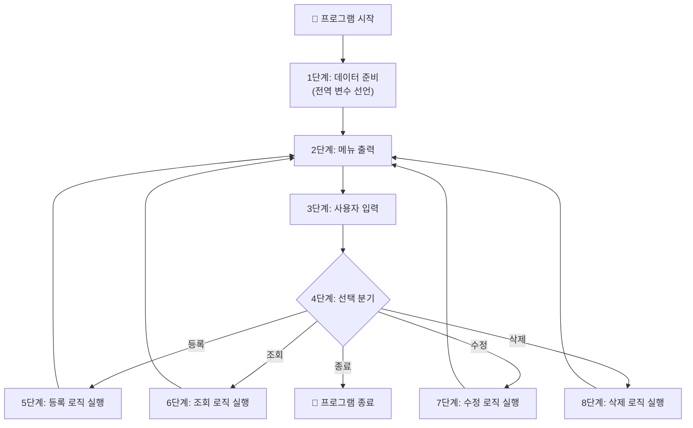
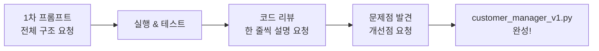

# Day 4 오전: 절차적 프로그래밍 — 개념 이해 & 고객관리 프로그램 v1

> 과정: AI-native 파이썬 기초 | Day 4/5 | 09:00–12:00

---

## 목차

- [세션 4-1: 절차적 프로그래밍이란? (09:00–10:00)](Day4_AM_절차적_고객관리_v1.md#세션-4-1-절차적-프로그래밍이란)
  - [개요](Day4_AM_절차적_고객관리_v1.md#4-1-개요)
  - [핵심 개념](Day4_AM_절차적_고객관리_v1.md#4-1-핵심-개념)
  - [상세 내용](Day4_AM_절차적_고객관리_v1.md#4-1-상세-내용)
  - [실습 가이드](Day4_AM_절차적_고객관리_v1.md#4-1-실습-가이드)
  - [코드 모음](Day4_AM_절차적_고객관리_v1.md#4-1-코드-모음)
  - [트러블슈팅](Day4_AM_절차적_고객관리_v1.md#4-1-트러블슈팅)
  - [요약](Day4_AM_절차적_고객관리_v1.md#4-1-요약)
- [세션 4-2: AI로 절차적 고객관리 프로그램 생성 (10:00–12:00)](Day4_AM_절차적_고객관리_v1.md#세션-4-2-ai로-절차적-고객관리-프로그램-생성)
  - [개요](Day4_AM_절차적_고객관리_v1.md#4-2-개요)
  - [핵심 개념](Day4_AM_절차적_고객관리_v1.md#4-2-핵심-개념)
  - [상세 내용](Day4_AM_절차적_고객관리_v1.md#4-2-상세-내용)
  - [실습 가이드](Day4_AM_절차적_고객관리_v1.md#4-2-실습-가이드)
  - [코드 모음](Day4_AM_절차적_고객관리_v1.md#4-2-코드-모음)
  - [트러블슈팅](Day4_AM_절차적_고객관리_v1.md#4-2-트러블슈팅)
  - [요약](Day4_AM_절차적_고객관리_v1.md#4-2-요약)

---

## 오늘의 핵심 비유

> 🎯 **절차적 프로그래밍 = "일렬로 늘어선 도미노"**
>
> 첫 번째 도미노를 쓰러뜨리면 순서대로 쓰러져요. 간단하고 직관적이지만, 도미노가 1,000개가 되면 중간에 하나 빼거나 순서를 바꾸기가 매우 어렵습니다.

> 🔗 **Day 3 → Day 4 연결**: "어제 파이썬 언어를 이해했다면, 오늘은 진짜 프로그램을 만듭니다!"

---

## 세션 4-1: 절차적 프로그래밍이란?

**시간**: 09:00–10:00 (60분) | **이론:실습** = 60:40

### 4-1 개요

| 항목 | 내용 |
|------|------|
| **학습 목표** | 절차적 프로그래밍의 개념을 이해하고, "AI 시대의 서사"에서 배운 패러다임 여정과 연결해요 |
| **핵심 개념** | 절차적 프로그래밍, 순차 실행, 전역 변수, 코드의 선형 흐름 |
| **선수 지식** | Day 3 기초문법 (변수, 자료구조, 제어문, 함수) |
| **산출물** | PRD 기반 기능 목록 확정 |

---

### 4-1 핵심 개념

#### 1. 절차적 프로그래밍이란?

절차적 프로그래밍(Procedural Programming)은 프로그램을 **위에서 아래로 순서대로 실행**하는 방식이에요. 코드가 작성된 순서 그대로 한 줄씩 실행되고, 데이터는 주로 **전역 변수**에 저장하며, 필요한 로직은 **함수(프로시저)**로 묶어서 호출해요.

**절차적 프로그래밍의 3가지 특징:**

| 특징 | 설명 | 비유 |
|------|------|------|
| **순차 실행** | 코드가 위에서 아래로 한 줄씩 실행돼요 | 도미노가 순서대로 쓰러지는 것 |
| **전역 변수** | 프로그램 전체에서 접근 가능한 데이터를 사용해요 | 교실 칠판에 적힌 정보 (누구나 볼 수 있음) |
| **함수-데이터 분리** | 함수와 데이터가 따로 존재해요 | 레시피(함수)와 재료(데이터)가 다른 서랍에 있는 것 |

#### 2. "AI 시대의 서사" 복습: 패러다임 여정

"AI 시대의 서사" 2부에서 배운 개발 패러다임의 여정을 떠올려 볼까요?

```
기계어(0과 1) → 어셈블리어(기호) → 고급 언어(FORTRAN, COBOL)
→ 절차적 프로그래밍 → 구조적 프로그래밍 → 객체지향 프로그래밍 → ...
```

고급 언어가 등장하면서 프로그래밍이 쉬워졌지만, `GOTO` 문을 남용하면서 **스파게티 코드**가 양산됐어요. 코드의 흐름이 이리저리 얽히고설켜서 마치 스파게티 면발처럼 꼬여버린 거예요.

```
GOTO 100 → GOTO 250 → GOTO 50 → GOTO 300 → GOTO 75 → ...
```

이 스파게티 코드 문제를 해결하기 위해 **절차적 프로그래밍**이 등장했어요. "반복되는 코드를 함수라는 상자에 담아서 재사용하자!"는 아이디어였죠.

그리고 네덜란드의 컴퓨터 과학자 **에츠허르 데이크스트라**가 "GOTO 문은 해로우니까, 쓰지 말자!"라고 주장하면서 **구조적 프로그래밍**이 탄생했어요. 모든 프로그램 논리를 **순차, 선택, 반복** 세 가지 구조만으로 표현할 수 있다고 증명한 거예요.

> 💡 오늘 우리는 이 여정을 **직접 체험**해요. 오전에 절차적으로 프로그램을 만들고, 오후에 구조적으로 업그레이드하면서 "왜 구조적 프로그래밍이 필요한지"를 몸으로 느끼게 될 거예요.

---

### 4-1 상세 내용

#### "도미노" 비유로 이해하는 절차적 프로그래밍



위 다이어그램을 보세요. 프로그램이 위에서 아래로 순서대로 흘러가요. 마치 도미노가 하나씩 쓰러지는 것처럼요. 이것이 절차적 프로그래밍의 핵심이에요.

#### 절차적 코드의 구조

절차적 코드는 크게 세 부분으로 나뉘어요:

```python
# ===== 1부: 데이터 영역 (전역 변수) =====
customers = []  # 모든 고객 데이터가 여기에 저장돼요

# ===== 2부: 함수 영역 =====
def add_customer():
    # 고객 등록 로직
    pass

def show_customers():
    # 고객 조회 로직
    pass

# ===== 3부: 실행 영역 (메인 루프) =====
while True:
    # 메뉴 출력 → 입력 → 분기
    pass
```

**핵심 포인트**: 데이터(`customers`)와 함수(`add_customer`, `show_customers`)가 **분리**되어 있어요. 함수들은 전역 변수 `customers`에 직접 접근해서 데이터를 읽고 쓰는 구조예요.

#### Day 2 PRD 복습: 오늘 코드로 만들 프로그램

Day 2에서 작성한 "고객 정보 관리 프로그램" PRD를 기억하시나요? 오늘 이 PRD를 **실제 코드**로 만들어요!

| PRD 항목 | 오늘 구현할 내용 |
|----------|-----------------|
| **목적** | 고객 정보를 등록, 조회, 수정, 삭제할 수 있는 콘솔 프로그램 |
| **데이터** | 고객 이름, 전화번호, 이메일 |
| **저장 방식** | 전역 리스트에 딕셔너리로 저장 |
| **인터페이스** | 텍스트 기반 메뉴 시스템 (while True 루프) |
| **핵심 기능** | CRUD (Create, Read, Update, Delete) |

> 🎉 "Day 2에서 기획한 것을 Day 4에서 코드로 만든다" — 이것이 바로 실무에서 일어나는 일이에요. 기획(PRD) → 개발(코딩)의 흐름을 직접 체험하는 거예요!

---

### 4-1 실습 가이드

#### 실습 1: "AI 시대의 서사" 핵심 복습 (10분)

**목표**: 절차적 프로그래밍이 왜 등장했는지 맥락을 이해해요.

**프롬프트**:
```
"AI 시대의 서사"에서 배운 개발 패러다임의 여정을 간단히 정리해줘.
특히 GOTO 문의 문제점(스파게티 코드)과 절차적 프로그래밍이 등장한 배경을 
비전공자도 이해할 수 있게 설명해줘.
```

**AI 응답 확인 포인트**:
- [ ] GOTO 문이 왜 문제였는지 설명이 있나요?
- [ ] 스파게티 코드 비유가 포함되어 있나요?
- [ ] 절차적 프로그래밍이 이 문제를 어떻게 해결했는지 나와 있나요?

#### 실습 2: 절차적 코드 특징 파악 (15분)

**프롬프트**:
```
절차적 프로그래밍의 3가지 핵심 특징(순차 실행, 전역 변수, 함수-데이터 분리)을 
각각 간단한 파이썬 코드 예시와 함께 설명해줘.
비전공자도 이해할 수 있게 비유를 포함해줘.
```

**코드 리뷰 포인트**:
- 전역 변수가 어디에 선언되어 있는지 확인해요
- 함수가 전역 변수에 어떻게 접근하는지 살펴봐요
- 코드가 위에서 아래로 순서대로 실행되는 흐름을 따라가 봐요

#### 실습 3: PRD → 기능 목록 확정 (15분)

**프롬프트**:
```
Day 2에서 작성한 "고객 정보 관리 프로그램" PRD를 바탕으로,
오늘 구현할 기능 목록을 정리해줘.
각 기능별로 입력, 처리, 출력을 표로 정리해줘.
```

**체크포인트**:
- [ ] CRUD 4가지 기능이 모두 포함되어 있나요?
- [ ] 각 기능의 입력/처리/출력이 명확한가요?
- [ ] 메뉴 시스템이 포함되어 있나요?

---

### 4-1 코드 모음

#### 절차적 프로그래밍 특징 예시

```python
# === 절차적 프로그래밍의 3가지 특징 ===

# 특징 1: 전역 변수 — 프로그램 전체에서 접근 가능
total_count = 0
items = []

# 특징 2: 함수 — 로직을 묶어서 재사용
def add_item(name):
    items.append(name)      # 전역 변수에 직접 접근
    global total_count
    total_count += 1         # 전역 변수를 직접 수정

def show_items():
    print(f"총 {total_count}개의 항목:")  # 전역 변수 읽기
    for item in items:
        print(f"  - {item}")

# 특징 3: 순차 실행 — 위에서 아래로 실행
add_item("사과")
add_item("바나나")
show_items()
```

---

### 4-1 트러블슈팅

| 문제 상황 | 원인 | 해결 방법 |
|-----------|------|----------|
| `NameError: name 'customers' is not defined` | 전역 변수를 선언하기 전에 함수를 호출했어요 | 전역 변수 선언을 파일 맨 위로 옮겨요 |
| `global` 키워드를 빼먹었을 때 | 함수 안에서 전역 변수를 수정하려면 `global` 선언이 필요해요 | 함수 첫 줄에 `global 변수명`을 추가해요 |
| "절차적이 뭔지 모르겠어요" | 개념이 추상적으로 느껴질 수 있어요 | "도미노 비유"를 떠올려요. 위에서 아래로 순서대로 실행되는 것이 핵심이에요 |

---

### 4-1 요약

| 핵심 키워드 | 한 줄 정리 |
|------------|-----------|
| **절차적 프로그래밍** | 코드를 위에서 아래로 순서대로 실행하는 프로그래밍 방식이에요 |
| **전역 변수** | 프로그램 어디서든 접근할 수 있는 변수예요 (칠판에 적힌 정보) |
| **GOTO → 구조적** | 스파게티 코드 문제를 해결하기 위해 데이크스트라가 구조적 프로그래밍을 제안했어요 |
| **PRD → 코드** | Day 2에서 기획한 PRD를 오늘 실제 코드로 구현해요 |

> ✅ **체크포인트**: 절차적 프로그래밍의 3가지 특징(순차 실행, 전역 변수, 함수-데이터 분리)을 설명할 수 있나요?

---

## 세션 4-2: AI로 절차적 고객관리 프로그램 생성

**시간**: 10:00–12:00 (120분) | **이론:실습** = 20:80

### 4-2 개요

| 항목 | 내용 |
|------|------|
| **학습 목표** | AI를 활용해 절차적 방식으로 고객 정보 관리 프로그램을 생성하고, 코드를 리뷰해요 |
| **핵심 개념** | CRUD (Create, Read, Update, Delete), 메뉴 시스템, 데이터 저장(리스트+딕셔너리) |
| **프롬프트 전략** | 단계적 생성: 전체 구조 → 기능별 구현 → 통합 |
| **산출물** | customer_manager_v1.py (절차적 버전) |

---

### 4-2 핵심 개념

#### CRUD란?

소프트웨어에서 데이터를 다루는 4가지 기본 동작을 **CRUD**라고 불러요:

| 동작 | 영어 | 의미 | 고객관리에서의 예시 |
|------|------|------|-------------------|
| **C** | Create | 생성 | 새 고객 등록 |
| **R** | Read | 조회 | 고객 목록 보기 |
| **U** | Update | 수정 | 고객 정보 변경 |
| **D** | Delete | 삭제 | 고객 정보 삭제 |

> 💡 거의 모든 프로그램이 CRUD를 기반으로 동작해요. 카카오톡 메시지(작성/읽기/수정/삭제), 인스타그램 게시물(올리기/보기/수정/삭제), 쇼핑몰 장바구니(담기/보기/수량변경/빼기)... 전부 CRUD예요!

#### 메뉴 시스템

콘솔 프로그램에서 사용자와 상호작용하는 가장 기본적인 방법이에요:

```
===== 고객 관리 프로그램 =====
1. 고객 등록
2. 고객 조회
3. 고객 수정
4. 고객 삭제
5. 종료
==============================
메뉴를 선택하세요: _
```

`while True` 루프 안에서 메뉴를 반복 출력하고, 사용자 입력에 따라 해당 기능을 실행하는 구조예요.

#### 데이터 저장 구조: 리스트 + 딕셔너리

Day 3에서 배운 자료구조를 활용해요:

```python
# 한 명의 고객 = 딕셔너리
customer = {"이름": "김철수", "전화번호": "010-1234-5678", "이메일": "cs@email.com"}

# 여러 고객 = 리스트 안에 딕셔너리
customers = [
    {"이름": "김철수", "전화번호": "010-1234-5678", "이메일": "cs@email.com"},
    {"이름": "이영희", "전화번호": "010-9876-5432", "이메일": "yh@email.com"},
]
```

---

### 4-2 상세 내용

#### 프롬프트 전략: 단계적 생성

한 번에 완성된 프로그램을 요청하는 것보다, **단계적으로 요청**하는 것이 더 좋은 결과를 만들어요. Day 2에서 배운 "건축 의뢰서" 비유를 기억하세요!



#### 1차 프롬프트: 전체 프로그램 생성

이것이 오늘의 핵심 프롬프트예요:

```
고객 정보(이름, 전화번호, 이메일)를 등록·조회·수정·삭제할 수 있는 
콘솔 프로그램을 절차적으로 작성해줘.

조건:
- 전역 리스트에 딕셔너리로 고객 정보를 저장
- while True 메뉴 루프 사용
- 각 기능(등록, 조회, 수정, 삭제)은 함수로 분리
- 한국어 메뉴와 안내 메시지 사용
- 입력값 검증 포함 (빈 값 체크)
```

#### 2차 프롬프트: 코드 리뷰

```
이 코드를 한 줄씩 설명해줘. 
특히 전역 변수, 함수 호출, while 루프의 역할을 자세히 알려줘.
비전공자도 이해할 수 있게 설명해줘.
```

#### 3차 프롬프트: 문제점 발견

```
이 코드의 문제점이나 개선할 점을 알려줘.
특히 전역 변수 사용의 문제점, 코드 중복, 유지보수 관점에서 분석해줘.
```

---

### 4-2 실습 가이드

#### 실습 1: 1차 프롬프트로 프로그램 생성 (30분)

**단계 1**: Antigravity의 Agent Manager에서 위의 1차 프롬프트를 입력해요.

**단계 2**: 생성된 코드를 `customer_manager_v1.py` 파일로 저장해요.

**단계 3**: 터미널에서 실행해요:
```bash
python customer_manager_v1.py
```

**단계 4**: CRUD 기능을 하나씩 테스트해요:
- [ ] 고객 3명 등록해 보기
- [ ] 전체 고객 목록 조회해 보기
- [ ] 고객 1명의 전화번호 수정해 보기
- [ ] 고객 1명 삭제해 보기
- [ ] 종료 기능 확인하기

#### 실습 2: 코드 리뷰 — "한 줄씩 설명해줘" (30분)

**프롬프트**:
```
이 코드를 한 줄씩 설명해줘.
특히 다음 부분을 자세히 알려줘:
1. customers = [] 가 하는 역할
2. while True가 왜 필요한지
3. 각 함수가 전역 변수 customers에 어떻게 접근하는지
```

**리뷰 체크리스트**:
- [ ] `customers = []` — 전역 리스트가 프로그램 맨 위에 선언되어 있나요?
- [ ] 각 함수 안에서 `customers`를 직접 사용하고 있나요?
- [ ] `while True` 루프가 메뉴를 반복 출력하고 있나요?
- [ ] `if/elif/else`로 메뉴 선택을 분기하고 있나요?
- [ ] `input()`으로 사용자 입력을 받고 있나요?

#### 실습 3: 문제점 발견 — "개선할 점 알려줘" (20분)

**프롬프트**:
```
이 코드의 문제점이나 개선할 점을 알려줘.
특히 다음 관점에서 분석해줘:
1. 전역 변수 사용의 위험성
2. 코드 중복이 있는 부분
3. 새로운 기능을 추가하려면 어디를 수정해야 하는지
4. 프로그램이 커지면 어떤 문제가 생길 수 있는지
```

**AI가 지적할 주요 문제점 (미리 알아두기)**:

| 문제점 | 설명 | 왜 문제인가요? |
|--------|------|---------------|
| **전역 변수 의존** | 모든 함수가 `customers` 전역 변수에 직접 접근해요 | 어떤 함수가 데이터를 변경했는지 추적하기 어려워요 |
| **코드 중복** | 입력값 검증, 고객 검색 로직이 여러 곳에 반복돼요 | 수정할 때 모든 곳을 찾아서 고쳐야 해요 |
| **확장 어려움** | 새 기능 추가 시 메인 루프의 if/elif를 수정해야 해요 | 프로그램이 커질수록 메인 루프가 복잡해져요 |
| **테스트 어려움** | 함수가 전역 변수에 의존하므로 독립적 테스트가 어려워요 | 버그를 찾기 어려워요 |

> 💡 이 문제점들이 바로 오후 세션에서 **구조적 프로그래밍으로 업그레이드**하는 이유가 돼요!

---

### 4-2 코드 모음

#### customer_manager_v1.py (절차적 버전 — 전체 코드)

```python
# ============================================================
# customer_manager_v1.py — 절차적 고객 관리 프로그램
# AI-native 파이썬 기초 | Day 4 | 세션 4-2
# ============================================================

# ===== 전역 변수: 모든 고객 데이터를 저장하는 리스트 =====
customers = []


# ===== 고객 등록 (Create) =====
def add_customer():
    print("\n--- 고객 등록 ---")
    name = input("이름: ").strip()
    if not name:
        print("⚠️ 이름을 입력해주세요.")
        return

    phone = input("전화번호: ").strip()
    if not phone:
        print("⚠️ 전화번호를 입력해주세요.")
        return

    email = input("이메일: ").strip()
    if not email:
        print("⚠️ 이메일을 입력해주세요.")
        return

    customer = {
        "이름": name,
        "전화번호": phone,
        "이메일": email
    }
    customers.append(customer)
    print(f"✅ '{name}' 고객이 등록되었어요.")


# ===== 고객 조회 (Read) =====
def show_customers():
    print("\n--- 고객 목록 ---")
    if not customers:
        print("📭 등록된 고객이 없어요.")
        return

    print(f"{'번호':<6}{'이름':<12}{'전화번호':<16}{'이메일'}")
    print("-" * 50)
    for i, customer in enumerate(customers, 1):
        print(f"{i:<6}{customer['이름']:<12}{customer['전화번호']:<16}{customer['이메일']}")
    print(f"\n총 {len(customers)}명의 고객이 등록되어 있어요.")


# ===== 고객 수정 (Update) =====
def update_customer():
    print("\n--- 고객 수정 ---")
    if not customers:
        print("📭 등록된 고객이 없어요.")
        return

    show_customers()
    try:
        num = int(input("\n수정할 고객 번호를 입력하세요: "))
    except ValueError:
        print("⚠️ 숫자를 입력해주세요.")
        return

    if num < 1 or num > len(customers):
        print("⚠️ 올바른 번호를 입력해주세요.")
        return

    customer = customers[num - 1]
    print(f"\n현재 정보: {customer['이름']} | {customer['전화번호']} | {customer['이메일']}")
    print("(변경하지 않으려면 Enter를 누르세요)")

    new_name = input(f"이름 [{customer['이름']}]: ").strip()
    new_phone = input(f"전화번호 [{customer['전화번호']}]: ").strip()
    new_email = input(f"이메일 [{customer['이메일']}]: ").strip()

    if new_name:
        customer["이름"] = new_name
    if new_phone:
        customer["전화번호"] = new_phone
    if new_email:
        customer["이메일"] = new_email

    print(f"✅ 고객 정보가 수정되었어요.")


# ===== 고객 삭제 (Delete) =====
def delete_customer():
    print("\n--- 고객 삭제 ---")
    if not customers:
        print("📭 등록된 고객이 없어요.")
        return

    show_customers()
    try:
        num = int(input("\n삭제할 고객 번호를 입력하세요: "))
    except ValueError:
        print("⚠️ 숫자를 입력해주세요.")
        return

    if num < 1 or num > len(customers):
        print("⚠️ 올바른 번호를 입력해주세요.")
        return

    removed = customers.pop(num - 1)
    print(f"✅ '{removed['이름']}' 고객이 삭제되었어요.")


# ===== 메인 루프 =====
print("=" * 40)
print("   고객 관리 프로그램 v1 (절차적)")
print("=" * 40)

while True:
    print("\n===== 메뉴 =====")
    print("1. 고객 등록")
    print("2. 고객 조회")
    print("3. 고객 수정")
    print("4. 고객 삭제")
    print("5. 종료")
    print("================")

    choice = input("메뉴를 선택하세요 (1-5): ").strip()

    if choice == "1":
        add_customer()
    elif choice == "2":
        show_customers()
    elif choice == "3":
        update_customer()
    elif choice == "4":
        delete_customer()
    elif choice == "5":
        print("\n👋 프로그램을 종료해요. 감사합니다!")
        break
    else:
        print("⚠️ 1~5 사이의 숫자를 입력해주세요.")
```

#### 코드 구조 분석

```
customer_manager_v1.py 구조:

┌─────────────────────────────────────┐
│  전역 변수                           │
│  customers = []                     │
├─────────────────────────────────────┤
│  함수 정의                           │
│  ├── add_customer()    → Create     │
│  ├── show_customers()  → Read       │
│  ├── update_customer() → Update     │
│  └── delete_customer() → Delete     │
├─────────────────────────────────────┤
│  메인 루프 (while True)              │
│  ├── 메뉴 출력                       │
│  ├── 사용자 입력                     │
│  └── if/elif 분기 → 함수 호출        │
└─────────────────────────────────────┘

특징:
- 모든 함수가 전역 변수 customers에 직접 접근
- 함수와 데이터가 분리되어 있음
- 위에서 아래로 순차적으로 실행
```

---

### 4-2 트러블슈팅

| 문제 상황 | 원인 | 해결 방법 |
|-----------|------|----------|
| 프로그램이 바로 종료돼요 | `while True` 루프가 없거나 들여쓰기가 잘못됐어요 | 메인 루프의 들여쓰기를 확인해요 |
| 한글이 깨져서 출력돼요 | 파일 인코딩이 UTF-8이 아니에요 | Antigravity에서 파일 인코딩을 UTF-8로 설정해요 |
| 고객 번호 입력 시 에러가 나요 | 숫자가 아닌 값을 입력했어요 | `try/except ValueError`로 예외 처리가 되어 있는지 확인해요 |
| 수정 시 빈 값으로 덮어써져요 | Enter만 눌렀을 때 빈 문자열로 업데이트돼요 | `if new_name:` 조건으로 빈 값은 무시하도록 처리해요 |
| `customers.pop()` 에러 | 인덱스가 범위를 벗어났어요 | 번호 입력 후 `if num < 1 or num > len(customers)` 검증을 추가해요 |

**AI에게 물어보는 트러블슈팅 프롬프트**:
```
이 에러가 발생했어: [에러 메시지 붙여넣기]
원인과 해결 방법을 알려줘.
```

---

### 4-2 요약

| 핵심 키워드 | 한 줄 정리 |
|------------|-----------|
| **CRUD** | Create(등록), Read(조회), Update(수정), Delete(삭제) — 데이터 관리의 4가지 기본 동작이에요 |
| **메뉴 시스템** | `while True` + `input()` + `if/elif`로 사용자와 상호작용하는 구조예요 |
| **프롬프트 전략** | 전체 구조 → 기능별 구현 → 통합 순서로 단계적으로 요청해요 |
| **코드 리뷰** | "한 줄씩 설명해줘" → "문제점 알려줘" 순서로 코드를 이해해요 |
| **customer_manager_v1.py** | 전역 리스트 + 함수 + while 루프로 만든 절차적 고객관리 프로그램이에요 |

> ✅ **체크포인트**:
> - [ ] customer_manager_v1.py를 실행해서 CRUD 기능이 모두 동작하나요?
> - [ ] 전역 변수 `customers`가 어떤 역할을 하는지 설명할 수 있나요?
> - [ ] 이 코드의 문제점을 2가지 이상 말할 수 있나요?

---

## 오전 세션 마무리

### 오전에 배운 것

```
1. 절차적 프로그래밍 = "일렬로 늘어선 도미노"
   - 위에서 아래로 순서대로 실행
   - 전역 변수에 데이터 저장
   - 함수와 데이터가 분리

2. "AI 시대의 서사" 연결
   - GOTO → 스파게티 코드 → 절차적 프로그래밍 등장
   - 데이크스트라의 구조적 프로그래밍 제안

3. customer_manager_v1.py 완성
   - CRUD 기능 구현
   - 프롬프트 → 생성 → 리뷰 → 문제점 발견

4. 발견한 문제점
   - 전역 변수 의존
   - 코드 중복
   - 확장 어려움
```

### 오후 예고

> 🔮 **오후에는 이 문제점들을 해결해요!**
>
> 절차적 코드를 **구조적 프로그래밍**으로 업그레이드하면서, "원룸을 투룸으로 리모델링"하는 경험을 해볼 거예요. 한 방에 다 있던 것(전역 변수 + 순차 코드)을 침실, 서재, 주방으로 분리(함수 분리 + 매개변수 전달)하면 각 공간을 독립적으로 관리할 수 있게 돼요!

---

> 📝 **강사 노트**: 오전 세션의 핵심은 "절차적 코드의 문제점을 체감하게 하는 것"이에요. v1 코드가 동작하는 것에 만족하지 말고, "이 코드가 커지면 어떤 문제가 생길까?"라는 질문을 던져주세요. 이 질문이 오후 세션의 동기 부여가 됩니다.
