# Day 4 오전: 절차적 고객관리 v1

> **과정**: AI-native 파이썬 기초 | Day 4/5 | 09:00~12:30
> **테마**: 절차적에서 구조적 프로그래밍으로
> **세션**: 065 ~ 075 (11개 세션)
> **총 소요 시간**: 235분
> **버전**: v2.1 (7섹션 구조, 보조 패킷 통합)
> **작성 일시**: 2026-02-25

---

## 🎯 학습 목표 (오전)

1. **세션 065**: 이 세션 종료 시 수강생은 절차적 프로그래밍의 개념을 '일렬 도미노'에 비유하여 설명할 수 있다.
2. **세션 066**: 이 세션 종료 시 수강생은 절차적 프로그래밍의 한계인 '스파게티 코드' 문제를 설명하고 함수 도입의 필요성을 이해할 수 있다.
3. **세션 067**: 이 세션 종료 시 수강생은 Day 2에서 작성한 PRD(제품 요구사항 정의서)를 바탕으로 고객 관리 프로그램의 필수 기능 목록(FR-001~FR-004)을 확정할 수 있다.
4. **세션 068**: 이 세션 종료 시 수강생은 CRUD의 4가지 핵심 개념을 포함하여 AI에게 절차적 콘솔 프로그램을 요청하는 1차 프롬프트를 작성할 수 있다.
5. **세션 069**: 이 세션 종료 시 수강생은 AI가 생성한 코드에서 전역 리스트와 딕셔너리가 결합된 데이터 저장 구조를 식별하고 그 원리를 설명할 수 있다.
6. **세션 070**: 이 세션 종료 시 수강생은 AI가 생성한 절차적 코드 중 C(등록)와 R(조회) 기능의 동작 원리를 이해하고, 직접 실행하여 정상 작동을 검증할 수 있다.
7. **세션 071**: 이 세션 종료 시 수강생은 U(수정)와 D(삭제) 기능의 핵심인 '대상 데이터 검색' 로직을 이해하고, CRUD 전체 통합 테스트를 완료할 수 있다.
8. **세션 072**: 이 세션 종료 시 수강생은 완성된 절차적 코드를 리뷰하며 전역 변수의 위험성과 코드 중복(DRY 원칙 위배) 문제를 식별할 수 있다.
9. **세션 073**: 이 세션 종료 시 수강생은 절차적 코드를 기능별 함수로 분리하고 전역 변수를 제거하도록 요구하는 구조적 리팩토링 프롬프트를 작성할 수 있다.
10. **세션 074**: 이 세션 종료 시 수강생은 구조적 코드(v2)에서 전역 변수 대신 함수 간 데이터를 주고받는 방식인 매개변수와 리턴의 역할을 설명할 수 있다.
11. **세션 075**: 이 세션 종료 시 수강생은 v1과 v2 코드를 비교 분석하여, 메인 루프의 간결화와 함수 호출의 장점을 2가지 이상 설명할 수 있다.

---

## 📋 목차

- [📖 세션 065: 절차적 프로그래밍의 개념과 특징](#세션-065) (20분)
- [📖 세션 066: AI 시대의 서사 복습: 구조적 프로그래밍으로의 여정](#세션-066) (20분)
- [📖 세션 067: 고객 정보 관리 프로그램 PRD 복습 및 설계](#세션-067) (20분)
- [🧪 세션 068: CRUD 개념 이해 및 1차 프롬프트 작성 실습](#세션-068) (25분)
- [💻 세션 069: 데이터 저장 구조(전역 리스트, 딕셔너리) 이해](#세션-069) (20분)
- [🧪 세션 070: 절차적 Create, Read 기능 구현 및 테스트](#세션-070) (25분)
- [🧪 세션 071: 절차적 Update, Delete 기능 구현 및 통합 테스트](#세션-071) (25분)
- [📖 세션 072: 코드 리뷰: 전역 변수와 코드 중복의 한계점 발견](#세션-072) (20분)
- [🧪 세션 073: 절차적 코드의 구조적 리팩토링 프롬프트 작성](#세션-073) (20분)
- [💻 세션 074: 구조적 데이터 흐름(매개변수와 리턴)의 이해](#세션-074) (20분)
- [📖 세션 075: 절차적 vs 구조적 코드 나란히 비교 분석](#세션-075) (20분)

---

## 📊 세션 인덱스

| 세션 | 제목 | 시간 | 청크 타입 | 난이도 | 바로가기 |
|------|------|------|-----------|--------|----------|
| 065 | 절차적 프로그래밍의 개념과 특징 | 20분 | 📖 narrative | low | [바로가기](#세션-065) |
| 066 | AI 시대의 서사 복습: 구조적 프로그래밍으로의 여정 | 20분 | 📖 narrative | medium | [바로가기](#세션-066) |
| 067 | 고객 정보 관리 프로그램 PRD 복습 및 설계 | 20분 | 📖 narrative | low | [바로가기](#세션-067) |
| 068 | CRUD 개념 이해 및 1차 프롬프트 작성 실습 | 25분 | 🧪 lab | medium | [바로가기](#세션-068) |
| 069 | 데이터 저장 구조(전역 리스트, 딕셔너리) 이해 | 20분 | 💻 code | medium | [바로가기](#세션-069) |
| 070 | 절차적 Create, Read 기능 구현 및 테스트 | 25분 | 🧪 lab | medium | [바로가기](#세션-070) |
| 071 | 절차적 Update, Delete 기능 구현 및 통합 테스트 | 25분 | 🧪 lab | high | [바로가기](#세션-071) |
| 072 | 코드 리뷰: 전역 변수와 코드 중복의 한계점 발견 | 20분 | 📖 narrative | medium | [바로가기](#세션-072) |
| 073 | 절차적 코드의 구조적 리팩토링 프롬프트 작성 | 20분 | 🧪 lab | medium | [바로가기](#세션-073) |
| 074 | 구조적 데이터 흐름(매개변수와 리턴)의 이해 | 20분 | 💻 code | high | [바로가기](#세션-074) |
| 075 | 절차적 vs 구조적 코드 나란히 비교 분석 | 20분 | 📖 narrative | medium | [바로가기](#세션-075) |

---

## 📚 본문

### 세션 065: 절차적 프로그래밍의 개념과 특징
> [원본 파일](sessions/세션-065-절차적_프로그래밍의_개념과_특징_v2.1.md) | ⏱️ 20분 | 📖 narrative | 난이도: low

> **세션 ID**: MS-PY101-065  
> **소요 시간**: 20분  
> **난이도**: low  
> **청크 타입**: narrative  
> **Day/시간대**: Day 4 AM  
> **버전**: v2.1 (7섹션 구조)

---

## §1. 개요

> **Day 4 | AM | 세션 065/085**

이 세션은 4일차 아침의 첫 번째 시간으로, 지난 3일간 배운 파이썬의 기초 문법들을 어떻게 조합하여 '완성된 프로그램'을 만들 것인가에 대한 첫 번째 해답인 **'절차적 프로그래밍(Procedural Programming)'**을 다룹니다. 오늘과 내일에 걸쳐 절차적 프로그래밍에서 구조적 프로그래밍, 그리고 객체지향 프로그래밍으로 진화하는 긴 여정의 첫 출발점입니다.

### 🎯 학습 목표

이 세션이 끝나면 수강생은 다음을 할 수 있어요:

- 절차적 프로그래밍의 개념을 '일렬 도미노'에 비유하여 설명할 수 있습니다.
- 코드가 위에서 아래로 순차적으로 실행되는 절차적 방식의 장점(직관성)을 이해합니다.
- 코드가 커질 때 절차적 방식이 필연적으로 겪게 되는 3대 문제점(전역 상태 오염, 코드 중복, 단위 테스트 불가)을 인지합니다.

### 선행 세션 환기

Day 3에서 우리는 변수, 리스트, 조건문, 반복문, 함수 등의 '재료'를 다루는 법을 배웠습니다. 이번 세션에서는 함수를 본격적으로 활용하기 전에, 이러한 재료들을 기능 분리 없이 한 줄로 나열했을 때 어떤 일이 벌어지는지 절차적 관점에서 살펴봅니다.

---


### 🌟 차별화 포인트 (Differentiation Strategy)

> 🌟 **Day 4 서사: 질서의 발견** — 혼돈 속에서 통제력 되찾기 — 프로그램이 조금만 커져도 전역 변수와 중복 코드로 인해 무너지는 '도미노의 악몽'을 직접 겪고, 코드를 논리적 상자(함수)에 나누어 담으며 통제력을 회복합니다.

## §2. 핵심 개념 (+ 🗣️ 강사 대본 + Mermaid)

### 비유 — 일렬로 늘어선 도미노

절차적 프로그래밍은 기능의 분리 없이 코드가 위에서 아래로 순차적으로 실행되는 프로그래밍 패러다임입니다. 이를 가장 쉽게 이해할 수 있는 비유가 바로 **'일렬로 세워놓은 도미노'**입니다. 첫 번째 도미노를 밀면 두 번째, 세 번째가 차례로 쓰러지듯, 코드 역시 작성된 순서에 따라 정직하게 한 줄씩 실행됩니다. 

이 방식은 직관적이고 빠르게 코드를 짤 수 있다는 장점이 있지만, 도미노가 1,000개, 10,000개로 늘어났을 때 중간에 하나를 빼거나 순서를 바꾸려다 전체가 무너질 수 있다는 치명적인 단점을 가집니다.

🗣️ **강사 대본 (Instructor Script)**:

> 여러분, 좋은 아침입니다! 벌써 4일차네요. 지난 3일 동안 우리는 파이썬이라는 요리 세계에서 재료를 손질하는 법을 배웠습니다. 변수라는 이름표, 리스트라는 서랍장, 조건문이라는 갈림길, 그리고 반복문이라는 컨베이어 벨트까지 말이죠. 그런데 이 재료들을 가지고 실제로 '완성된 요리'를 만들려면, 대체 어떤 순서로 조합해야 할까요?
> 
> 프로그래밍의 역사에서 가장 오래되고, 또 가장 직관적인 요리법이 하나 있습니다. 바로 오늘 우리가 배울 **'절차적 프로그래밍'**이에요. 
>
> 절차적 프로그래밍을 가장 쉽게 이해하는 방법은 책상 위에 '일렬로 세워놓은 도미노'를 떠올리는 겁니다. 첫 번째 도미노를 톡 밀면, 두 번째가 넘어지고, 이어서 세 번째, 네 번째가 차르르 쓰러지죠? 절차적 프로그래밍도 정확히 이렇게 동작합니다. 코드가 위에서 아래로, 우리가 작성한 순서 그대로 한 줄씩 아주 '정직하게' 실행되는 거예요. 컴퓨터가 '어떻게(How)' 작업을 수행해야 하는지 절차에 집중하는 방식이죠.
>
> 이 방식의 가장 큰 장점은 직관성입니다. 코드를 위에서 아래로 쭉 읽으면 프로그램이 무슨 일을 하는지 바로 알 수 있어요. 마치 레시피를 1번부터 순서대로 따라 하면 요리가 완성되는 것처럼요. 
>
> 그런데 여러분, 한 가지 질문을 던져볼게요. 도미노가 10개일 때는 관리가 쉽습니다. 하나 넘어뜨리면 끝이니까요. 그런데 도미노가 1,000개, 10,000개로 늘어나면 어떨까요? 중간에 있는 도미노 하나를 빼고 싶거나, 순서를 바꾸고 싶다면요? 잘못 건드렸다가 전체가 와르르 무너질 수도 있겠죠? 
>
> 이게 바로 절차적 프로그래밍이 본질적으로 품고 있는 문제점입니다. 처음엔 쉽고 직관적이지만, 프로그램의 기능이 많아지면 코드 수정할 때마다 10군데, 100군데를 다 고쳐야 하는 악몽이 시작되는 거죠.

### Mermaid 다이어그램

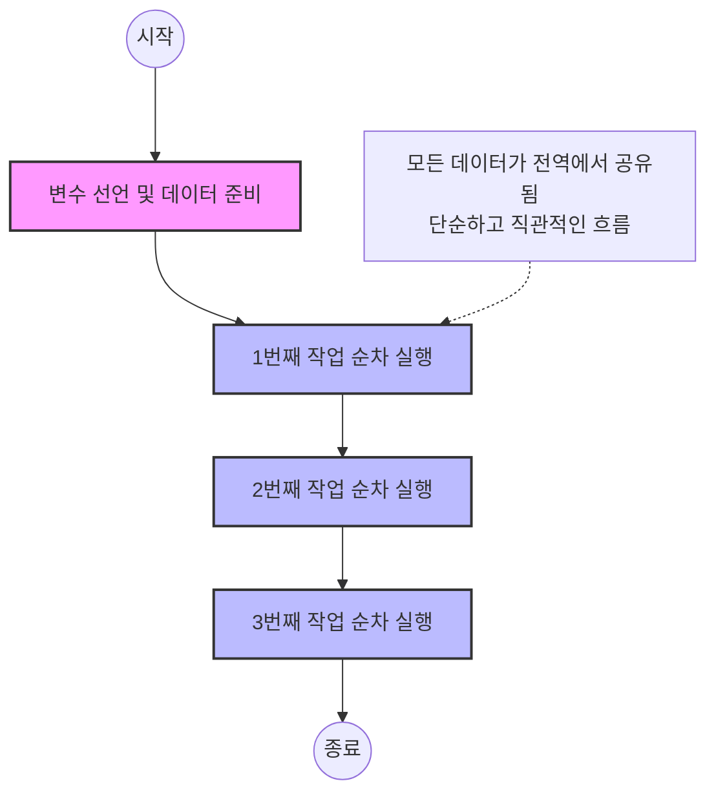

이 다이어그램은 절차적 프로그래밍의 순차적 흐름을 보여줍니다. 데이터와 로직이 분리되지 않고 하나의 큰 흐름 속에서 처리되는 구조적 특징을 시각적으로 나타냅니다.

---

## §3. 상세 내용

### Why — 왜 이 세션이 필요한가?

최근 AI에게 코드를 짜달라고 요청하면, 가장 먼저 뱉어내는 코드가 보통 절차적 프로그래밍 방식의 코드입니다. 빠르고 직관적으로 결과를 낼 수 있기 때문이죠. 초보자들이 코딩을 처음 배울 때도 가장 자연스럽게 작성하는 방식입니다. 하지만 이 방식의 한계를 명확히 알지 못하면, 프로그램이 조금만 복잡해져도 유지보수가 불가능한 '스파게티 코드'의 늪에 빠지게 됩니다. 따라서 앞으로 배울 '구조적 프로그래밍'과 '객체지향 프로그래밍'의 필요성을 뼈저리게 공감하기 위해서는 절차적 방식의 장단점을 직접 체험하는 시간이 필수적입니다.

### What — 절차적 프로그래밍의 3대 문제점

절차적 프로그래밍은 코드가 커지면서 필연적으로 세 가지 거대한 문제에 직면하게 됩니다.

1. **전역 상태 오염**: 모든 코드가 같은 변수를 공유하므로, 어디서 데이터가 변경되었는지 추적하기 어렵습니다.
2. **코드 중복**: 동일한 기능(예: 출력 양식)이 여러 번 쓰일 때, 복사/붙여넣기를 남발하게 되어 하나를 수정하면 수십 곳을 따라 고쳐야 합니다.
3. **단위 테스트 불가**: 기능 단위(함수)로 나뉘어 있지 않아서 특정 로직만 떼어내어 검증하는 것이 불가능합니다.

### How — 구체적으로 어떻게 진행하는가?

🗣️ **강사 대본 (Instructor Script)**:

> 초기 프로그래머들은 모두 이 방식으로 코드를 작성했습니다. 그리고 놀랍게도, 우리가 AI에게 "프로그램을 만들어줘"라고 대충 지시하면, AI도 처음에는 이런 도미노 방식의 코드를 던져줍니다. 직관적이고 빠르게 만들 수 있으니까요.
>
> 하지만 프로그램의 기능이 3개, 5개, 10개로 늘어나면 코드가 수백 줄로 팽창합니다. 특정 부분을 고치려고 마우스 휠을 끝도 없이 올렸다 내렸다 하는 자신을 발견하게 되죠. 에러가 어디서 났는지 찾으려고 코드를 처음부터 끝까지 읽어봐야 했던 적, 다들 한 번쯤 있으실 겁니다. 그때의 막막함이 바로 절차적 코드의 한계에서 오는 겁니다. 
>
> 지금은 "그래서 어쩌라고? AI가 짜주면 그냥 쓰면 안 되나?"라는 생각이 드실 수도 있어요. 괜찮습니다. 오늘 오전 중으로 여러분은 이 한계를 직접 코드로 체험하시게 될 겁니다. 그리고 오후에는 이 답답한 한계를 돌파해서 코드를 깔끔하게 정리하는 마법 같은 방법을 배우게 될 테니까요.

---

## §4. 실습 가이드 (+ 🎙️ 실습 대본)

### 실습 목표

이 세션은 narrative 기반이므로 복잡한 타이핑 실습보다는, 절차적 코드의 구조적 문제를 눈으로 직접 확인하고 문제점을 인식하는 데 초점을 맞춥니다. 간단한 코드를 눈으로 따라가며 중복의 고통을 간접 체험합니다.

🎙️ **실습 대본 (Lab Guide)**:

> 화면의 코드를 함께 볼까요? 아주 소박한 고객 관리 프로그램의 일부입니다.
> 
> 고객이 2명 추가될 때, 이름과 전화번호 변수를 따로 선언하고 `print()`로 출력하고 있습니다. 만약 고객이 100명이면 어떻게 될까요? 변수가 200개가 되고 출력 코드가 100줄이 되겠죠.
>
> 여기서 더 큰 문제가 있습니다. 기획자가 갑자기 찾아와서 이렇게 말하는 겁니다. "출력 형식을 `고객 추가:`에서 `[등록완료]`로 바꿔주세요."
>
> 여러분, 어떻게 해야 할까요? 네, 100줄을 일일이 찾아서 전부 고쳐야 합니다. 만약 99개만 고치고 1개를 빼먹으면? 그게 바로 버그가 됩니다. 이게 바로 도미노 1,000개를 관리하는 악몽의 시작이에요. 짝꿍과 함께 화면의 코드를 보면서, 이 코드가 100줄로 늘어났을 때 얼마나 끔찍할지 잠깐 상상해 보세요.

### 단계별 지시

| 단계 | 소요 시간 | 강사 지시사항 | 학습자 액션 | 예상 결과 |
|------|----------|--------------|------------|----------|
| 1 | 3분 | 절차적 코드 예시 화면에 띄우기 | 화면의 코드 구조 관찰 | 코드 중복의 심각성 인지 |
| 2 | 2분 | 출력 양식 변경 시나리오 제시 | 짝꿍과 어떻게 수정할지 논의 | 수동 수정의 한계 공감 |
| 3 | 2분 | "절차적 프로그래밍의 3대 문제점" 질문 | 한 문장으로 대답 시도 | 개념 내재화 |

### 트러블슈팅 FAQ

| Q | A |
|---|---|
| AI가 짜주는 코드는 완벽한 것 아닌가요? | AI도 명확한 지시(구조화해달라는 요청)가 없으면 가장 원시적이고 쉬운 절차적 방식을 택합니다. 그래서 우리가 패러다임을 알아야 AI를 제대로 조종할 수 있습니다. |
| 처음부터 함수로 짜면 되지, 왜 이걸 배우나요? | 나쁜 코드가 왜 나쁜지 알아야 좋은 코드를 짤 수 있습니다. 절차적 코드의 고통을 알아야 구조적 프로그래밍의 가치를 온전히 이해할 수 있습니다. |

---


### 🎓 강사 노트 (Instructor Support)

- ⏱️ **타이밍**: 09:00 (20분, narrative)
- 🎯 **핵심 활동**: "일렬 도미노" 비유
- ⚠️ **강사 주의사항**: 3대 문제 (전역 변수, 중복, 테스트 불가)

## §5. 코드 및 명령어 모음

### 절차적 방식의 단면 (나쁜 예시)

이 코드는 절차적 프로그래밍의 문제점(전역 변수 오염, 코드 중복)을 극명하게 보여주기 위한 안티 패턴(Anti-pattern) 예시입니다.

```python
# 절차적 방식의 고객 관리 코드 단면
name1: str = "홍길동"
phone1: str = "010-1234-5678"
print(f"고객 추가: {name1}, {phone1}")

# 고객이 한 명 더 늘어날 때마다 변수와 로직이 중복됨
name2: str = "김철수"
phone2: str = "010-9876-5432"
print(f"고객 추가: {name2}, {phone2}")

# 🚨 문제점: 고객이 100명이면 변수가 200개, print가 100번 중복됨
```

> 🤖 **AI 프롬프트 예시**:
> "다음 파이썬 코드는 고객 정보를 출력하는 절차적 코드야. 이 코드의 문제점을 전역 상태 오염과 코드 중복 관점에서 설명해줘."

---

## §6. 요약

### 핵심 학습 포인트

이번 세션의 핵심은 절차적 프로그래밍의 **직관성과 그 이면에 숨겨진 함정**을 이해하는 것입니다.

- **도미노 비유**: 코드가 위에서 아래로 정직하게 한 줄씩 실행되는 가장 원초적인 패러다임입니다.
- **장점**: 직관적이고 작은 프로그램을 만들 때는 매우 빠르고 편리합니다.
- **한계 (3대 문제점)**: 프로그램이 커질수록 첫째 전역 상태가 오염되고, 둘째 코드가 걷잡을 수 없이 중복되며, 셋째 쪼개서 테스트할 수 없게 됩니다.

### 다음 세션 예고

지금 당장은 "이 엉망진창인 코드를 어떻게 수습하지?"라는 걱정이 드실 수 있습니다. 다음 세션에서는 과거의 천재 프로그래머들이 이 스파게티처럼 얽힌 도미노들을 어떻게 정리했는지, 그 위대한 탈출기인 '구조적 프로그래밍'으로의 진화 여정을 살펴보겠습니다.

### 브릿지 노트

> "자, 절차적 프로그래밍의 민낯을 보셨습니다. 위에서 아래로 무작정 코드를 나열하는 게 처음엔 쉽지만 나중엔 얼마나 큰 재앙을 부르는지 감이 오시죠? 그렇다면, 이 도미노들을 묶어서 튼튼한 레고 블록으로 만드는 방법은 없을까요? 다음 세션에서 그 해답을 만나보겠습니다."

---

## §7. 참고 자료

### 3-Source 출처

- **Source A (로컬 참고자료)**: `8 코딩.pdf` (§8.9 절차적 프로그래밍 패턴) — 절차적 프로그래밍의 순차적 흐름과 전역 변수 공유의 한계에 대한 원전.
- **Source B (NotebookLM)**: NotebookLM 분석 리포트 §1 — "컴퓨터가 어떻게(How) 작업을 수행해야 하는지 절차에 집중하는 패러다임"이라는 개념적 정의를 제공했습니다.
- **Source C (Deep Research)**: Deep Research 리포트 §1.1, 1.2 — 전역 상태 오염, 코드 중복, 단위 테스트 불가라는 절차적 프로그래밍의 3대 문제점을 도출하는 배경 리서치를 제공했습니다.

### 추가 학습 자료

- [Python 공식 문서: 파이썬 자습서](https://docs.python.org/ko/3/tutorial/index.html)
- 파이썬 절차적 프로그래밍 기본 구조

### 강사 노트

> 💡 **강사 노트**: 본 세션은 Day 4의 도입부로서, 수강생들에게 '문제의식'을 심어주는 것이 가장 중요합니다. 수강생들이 "AI가 짜준 코드라고 해서 무조건 좋은 코드가 아닐 수 있다"는 의심을 갖게 만들고, 구조적 리팩토링의 필요성을 간절하게 느끼도록 '도미노 비유'와 '유지보수의 악몽' 시나리오를 실감 나게 연기해 주세요.

---

## ✅ 세션 완료 체크리스트 (강사용)

- [x] §1~§7 모든 섹션이 충실하게 작성되었는가?
- [x] 도미노 비유와 스토리텔링이 포함되었는가?
- [x] 절차적 프로그래밍의 3대 문제점이 명확히 전달되었는가?
- [x] 3-Source 팩트 패킷이 반영되었는가?

---

*작성 일시: 2026-02-25*  
*작성 에이전트: Antigravity*  
*교안 구조: 7섹션 (A0 팀 공통 표준)*


> 🔗 **이전 세션**: [세션 064: Day 3 총정리](#세션-064)에서 배운 내용을 이어갑니다.
> 🔗 **다음 세션**: [세션 066: AI 시대의 서사 복습: 구조적 프로그래밍으로의 여정](#세션-066)에서 계속됩니다.

---

### 세션 066: AI 시대의 서사 복습: 구조적 프로그래밍으로의 여정
> [원본 파일](sessions/세션-066-AI_시대의_서사_복습_v2.1.md) | ⏱️ 20분 | 📖 narrative | 난이도: medium

> **세션 ID**: MS-PY101-066  
> **소요 시간**: 20분  
> **난이도**: ★★☆ (medium)  
> **청크 타입**: narrative  
> **버전**: v2.1 (7섹션 구조)

---

## §1. 개요

> **Day 4 | AM | 세션 066/085**

이 세션은 방금 전 세션에서 배운 '절차적 프로그래밍'의 한계를 극복하기 위해 역사적으로 어떤 패러다임 전환이 일어났는지 되짚어보는 시간입니다. Day 1 오리엔테이션에서 다루었던 'AI 시대의 서사' 2부에 해당하며, 프로그래머들이 '스파게티 코드'와 벌였던 치열한 사투의 역사를 통해 **구조적 프로그래밍**과 **함수**의 진정한 가치를 깨닫게 됩니다.

### 🎯 학습 목표

이 세션이 끝나면 수강생은 다음을 할 수 있어요:

- 절차적 프로그래밍의 한계인 '스파게티 코드' 문제와 전역 변수의 위험성을 설명할 수 있습니다.
- 구조적 프로그래밍의 3가지 핵심 요소(순차, 선택, 반복)를 이해할 수 있습니다.
- 코드를 제어하고 관리하기 위해 '함수(Function)'를 도입해야 하는 필연적인 이유를 설명할 수 있습니다.

### 선행 세션 환기

직전 세션(세션-065)에서 우리는 코드가 위에서 아래로 일렬 도미노처럼 실행되는 '절차적 프로그래밍'을 배웠습니다. 도미노 10개는 멋지게 쓰러지지만 수천 개가 되면 관리가 불가능하듯, 기능이 많아질수록 코드를 유지보수하기 힘들어지는 한계를 몸소 느꼈습니다. 이제 그 해결책을 찾으러 갈 차례입니다.

---

## §2. 핵심 개념 (+ 🗣️ 강사 대본 + Mermaid)

### 🍝 엉킨 이어폰 줄과 스파게티 코드

1960~70년대 초기 프로그래밍에서는 흐름을 제어하기 위해 `GOTO`라는 명령어를 남발했습니다. 코드가 위에서 아래로 흐르다 갑자기 다른 곳으로 점프하는 일이 반복되면서, 실행 흐름이 엉킨 이어폰 줄처럼 복잡해졌습니다. 이를 '스파게티 코드'라고 부릅니다. 이 문제를 해결하기 위해 에츠허르 데이크스트라(Edsger Dijkstra)는 "GOTO문은 해롭다"고 선언하며, 모든 프로그램을 **순차(Sequence), 선택(Selection), 반복(Iteration)** 단 3가지 구조만으로 통제하자는 '구조적 프로그래밍'을 제안했습니다.

🗣️ **강사 대본 (Instructor Script)**:

> 방금 전 세션에서 절차적 프로그래밍이 '일렬 도미노' 같다고 배웠죠? 그런데 옛날 프로그래머들의 세계는 더 끔찍했습니다. 코드가 복잡해지면 `GOTO`라는 명령어로 "여기 실행하다가 저기 47번 줄로 펄쩍 뛰어!"라고 지시했거든요.
> 
> 상상해 보세요. 코드가 위로 점프하고, 아래로 떨어지고, 옆으로 빠지고… 이건 마치 주머니 속에서 1년 동안 방치한 이어폰 줄이랑 똑같아요. 이탈리아 요리 이름을 빌려 이걸 '스파게티 코드(Spaghetti Code)'라고 부릅니다. 면발 하나를 포크로 찌르면 옆에 있는 면발이 줄줄이 딸려오듯이, 코드 한 줄 고쳤는데 전혀 상관없는 기능이 고장 나버리는 대참사가 벌어지는 거죠.
> 
> 그래서 천재 과학자들이 모여서 규칙을 정합니다. "GOTO문, 절대 쓰지 마! 앞으로 모든 프로그램은 딱 3가지로만 통제한다. 순차, 선택, 반복!" 이 3가지가 바로 엉킨 이어폰 줄을 풀어서 예쁘게 감아두는 마법의 도구입니다.

### Mermaid 다이어그램

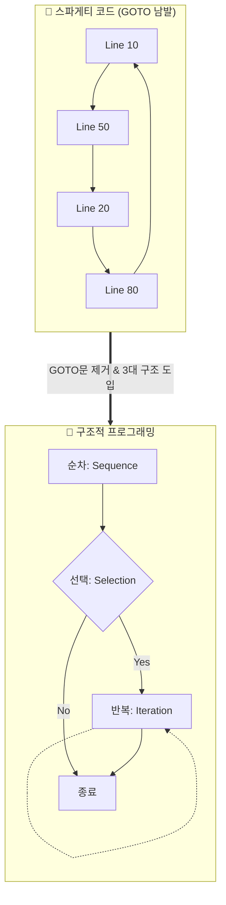

이 다이어그램은 흐름을 알 수 없는 무질서한 스파게티 코드에서, '순차, 선택, 반복'이라는 명확한 구조를 가진 블록 형태로 패러다임이 진화하는 과정을 보여줍니다.

---

## §3. 상세 내용

### Why — 왜 이 세션이 필요한가?

AI 시대에 왜 굳이 50년 전의 '스파게티 코드' 역사를 배울까요? 놀랍게도 **AI가 초안으로 짜주는 코드가 종종 이 스파게티 형태를 띠기 때문입니다.** AI는 요구사항을 만족하는 가장 빠르고 직관적인 코드(보통 절차적 코드)를 뱉어내는 경향이 있습니다. 여러분이 AI의 코드를 무비판적으로 복사해서 붙여넣기만 한다면, 금세 통제 불능의 스파게티 괴물을 마주하게 됩니다. AI를 똑똑한 주니어 개발자로 부리려면, 여러분이 직접 구조를 잡아주는 '시니어' 역할을 해야 한다는 점을 깨닫는 것이 중요합니다.

### What — 이 세션에서 다루는 것은 무엇인가?

이 세션에서는 전역 변수(Global Variable)가 일으키는 치명적인 사고를 통해 **'함수(Function)'의 존재 이유**를 다룹니다. Day 3에서 `def` 키워드의 문법을 배웠지만, 여기서는 함수가 단순한 문법적 도구를 넘어 "변수와 데이터를 안전하게 가두는 격리 공간(서랍장)"이라는 구조적 의미를 학습합니다.

### How — 구체적으로 어떻게 진행하는가?

전역 변수의 위험성을 간단한 가상 시나리오로 체감합니다.

🗣️ **강사 대본 (Instructor Script)**:

> 스파게티 코드 못지않게 무서운 녀석이 바로 '전역 변수'입니다. 동네 광장에 놓인 확성기처럼 누구나 접근해서 값을 바꿀 수 있는 변수죠.
> 
> 자, 여러분이 쇼핑몰을 만들었어요. 프로그램 맨 위에 `discount_rate = 0.1` (10% 할인)이라고 전역 변수를 적어뒀습니다. A라는 기능은 이 값을 읽어서 정상적으로 10% 할인을 해줘요. 그런데 저 멀리 500번째 줄에 있는 B라는 이벤트 기능이, 자기도 모르게 이 전역 변수 값을 `0.5` (50% 할인)로 덮어써 버린 겁니다.
> 
> B가 실행된 직후에 물건을 사는 모든 사람들은 갑자기 50% 폭탄 세일 가격으로 결제를 하게 됩니다. 회사는 엄청난 손해를 보겠죠? 도대체 누가 할인율을 50%로 바꿨는지 찾으려면 수만 줄의 코드를 다 뒤져야 합니다. 
> 
> 이 끔찍한 사고를 막으려면 어떻게 해야 할까요? 바로 **'함수'**라는 단단한 금고를 만들어서, 그 안에 데이터를 가둬버리는 겁니다!

---

## §4. 실습 가이드 (+ 🎙️ 실습 대본)

### 실습 목표

이 세션의 실습은 '코드 없는 사고 실험(Thought Experiment)'입니다. 전역 변수가 공유될 때 일어날 수 있는 아찔한 상황을 상상해 보며, 왜 코드를 함수 단위로 잘게 쪼개어 관리해야 하는지 논리적 당위성을 체득합니다.

🎙️ **실습 가이드 대본 (Lab Guide)**:

> 방금 제가 말씀드린 '50% 할인 폭탄' 사태, 남 일 같지 않으시죠? 자, 이번엔 여러분이 은행 앱을 만든다고 상상해 봅시다. 
> 
> 내 계좌 잔고를 나타내는 `balance`라는 변수가 전역 변수로 사방에 널려 있습니다. 송금 기능, 결제 기능, 이자 계산 기능이 모두 이 하나의 `balance` 변수를 동시에 맘대로 뜯어고친다면 어떤 일이 벌어질까요? 
> 
> 옆에 앉은 분과 딱 2분만 이야기해 보세요. "전역 변수를 썼을 때 우리 은행 앱에 일어날 수 있는 최악의 버그는 무엇일까?" 시작하세요!
> 
> (2분 후) 네, 좋습니다. "결제하다 오류 났는데 돈만 빠져나가고 안 돌아옵니다" 같은 무시무시한 버그들이 속출하네요. 이렇게 데이터가 통제 없이 굴러다니는 걸 막기 위해, 우리는 다음 시간부터 '함수'를 사용해 데이터를 안전하게 주고받는 법을 집중적으로 훈련할 겁니다.

### 단계별 지시

| 단계 | 소요 시간 | 강사 지시사항 | 학습자 액션 | 예상 결과 |
|------|----------|--------------|------------|----------|
| 1 | 3분 | 전역 변수의 위험성(할인율 버그) 설명 | 경청, 상황 인지 | 데이터 은닉의 필요성 공감 |
| 2 | 2분 | 은행 앱 사고 실험 짝 토론 지시 | 옆 사람과 가상 버그 토론 | 전역 변수의 부작용 다각도 이해 |
| 3 | 2분 | 함수의 역할(금고/서랍장) 비유 설명 | 필기, 질문 | '함수 = 논리적 격리벽' 개념 형성 |

### 트러블슈팅 FAQ

| Q | A |
|---|---|
| "전역 변수가 그렇게 나쁘면 아예 없애버리면 되지 않나요?" | "아주 좋은 질문입니다! 실제로 현대 프로그래밍에서는 전역 변수 사용을 극도로 제한합니다. 대신 함수끼리 매개변수(입력)와 리턴값(출력)으로만 데이터를 주고받도록 통제하죠." |
| "함수를 쓰면 코드가 오히려 더 길어지고 복잡해지는 것 같아요." | "처음엔 서랍장(함수)을 조립하느라 귀찮게 느껴지지만, 물건(코드)이 1,000개가 넘어가면 서랍장 없이는 절대 물건을 찾을 수 없게 됩니다. 장기적인 유지보수를 위한 투자라고 생각해주세요!" |

---


### 🎓 강사 노트 (Instructor Support)

- ⏱️ **타이밍**: 09:20 (20분, narrative)
- 🎯 **핵심 활동**: 스파게티 코드 → 함수 도입
- ⚠️ **강사 주의사항**: 패러다임 진화 스토리

## §5. 코드 및 명령어 모음

이 세션은 본격적인 코드 작성 전, 구조적 패러다임을 이해하는 시간입니다. 하지만 수강생들의 시각적 이해를 돕기 위해 아래의 '나쁜 코드' 예시를 화면에 가볍게 띄워주시면 좋습니다.

**[안티 패턴: 전역 변수 오염의 단면]**

```python
# 절차적 방식의 파편화된 코드 (Bad)
discount_rate = 0.1  # 누구나 접근할 수 있는 전역 변수

def normal_checkout():
    print(f"결제 시 {discount_rate * 100}% 할인 적용")

def special_event():
    global discount_rate
    discount_rate = 0.5  # 다른 곳에서 실수로 값을 덮어씀

special_event()
normal_checkout()  # 의도치 않게 모든 결제가 50% 할인됨! (대참사)
```

> 🤖 **AI 프롬프트 예시**: "위 파이썬 코드에서 전역 변수 `discount_rate`로 인해 발생할 수 있는 부작용을 설명하고, 이를 함수 매개변수와 반환값을 활용한 구조적 코드로 리팩토링해줘."

---

## §6. 요약

### 핵심 학습 포인트

세 가지를 꼭 기억하세요. 첫째, 코드가 무작위로 점프하는 GOTO문 중심의 '스파게티 코드'는 유지보수의 재앙입니다. 둘째, 이를 극복하기 위해 등장한 것이 **순차, 선택, 반복** 단 3가지 흐름만 사용하는 '구조적 프로그래밍'입니다. 셋째, 데이터를 전역 변수로 방치하지 않고 **'함수'**라는 독립된 서랍장에 가두어 관리해야만 안전한 프로그램을 만들 수 있습니다. 

### 다음 세션 예고

이제 절차적 프로그래밍의 한계와 함수형 구조의 필요성을 머리로 이해했습니다. 다음 세션(세션 067)에서는 Day 2~3에서 우리가 직접 작성했던 "고객 정보 관리 프로그램 PRD(요구사항 정의서)"를 다시 꺼내들 겁니다. 이 명세서를 바탕으로 본격적인 CRUD(생성/조회/수정/삭제) 앱을 어떻게 '절차적'으로 망쳐보고, 다시 '구조적'으로 살려낼지 밑그림을 그려보겠습니다.

### 브릿지 노트

> "스파게티 코드와 전역 변수의 무서움, 확실히 느끼셨나요? 우리가 직접 이 고통을 한 번 겪어봐야 나중에 AI가 짠 나쁜 코드를 호통치며 고칠 수 있습니다. 자, 그럼 다음 세션에서 우리의 메인 프로젝트인 '고객 관리 프로그램' 설계도를 다시 펼쳐보겠습니다!"

---

## §7. 참고 자료

### 3-Source 출처

- **Source A (로컬 참고자료)**: 「AI 시대의 서사 v3 - Claude.md」 — 스파게티 코드의 역사, GOTO문 지양 및 구조적 프로그래밍으로의 패러다임 전환 서사 발췌.
- **Source B (NotebookLM)**: NotebookLM 분석 리포트 — 함수를 "코드를 담아 용도별로 분류하는 잘 정리된 서랍장"으로 정의한 비유 및 절차적 한계 극복 개념 반영.
- **Source C (Deep Research)**: Deep Research 보고서 — 1966년 Böhm-Jacopini 정리(순차/선택/반복의 3대 구조) 등 구조적 프로그래밍의 역사적·학술적 배경 참조.

### 강사 노트

> 💡 **강사 노트**: 이 세션은 Day 1의 오리엔테이션과 Day 4의 심화 실습을 잇는 중요한 철학적 징검다리입니다. "AI가 알아서 짜주는데 왜 굳이 구조를 배워야 하나요?"라는 의문을 해소하는 데 집중하세요. AI가 짜준 코드를 통제하는 '시니어 개발자'의 마인드셋을 심어주는 것이 가장 큰 목표입니다. 전역 변수 폭탄 세일 비유를 할 때 목소리 톤을 높여 극적인 긴장감을 주면 몰입도가 크게 올라갑니다.

---

## ✅ 세션 완료 체크리스트 (강사용)

- [ ] §1~§7 모든 섹션이 충실하게 작성되었는가?
- [ ] 🗣️ 강사 대본이 한국어 구어체로 자연스럽게 작성되었는가?
- [ ] GOTO문 스파게티와 구조적 패러다임을 비교하는 Mermaid 다이어그램이 포함되었는가?
- [ ] 전역 변수의 위험성과 함수의 필연적 도입 이유가 논리적으로 연결되었는가?
- [ ] 3-Source 팩트 패킷의 핵심 내용(순차/선택/반복, 서랍장 비유)이 충실히 반영되었는가?

---

*작성 일시: 2026-02-25*  
*작성 에이전트: A4B_Session_Writer*  
*교안 구조: 7섹션 (A0 팀 공통 표준)*


> 🔗 **이전 세션**: [세션 065: 절차적 프로그래밍의 개념과 특징](#세션-065)에서 배운 내용을 이어갑니다.
> 🔗 **다음 세션**: [세션 067: 고객 정보 관리 프로그램 PRD 복습 및 설계](#세션-067)에서 계속됩니다.

---

### 세션 067: 고객 정보 관리 프로그램 PRD 복습 및 설계
> [원본 파일](sessions/세션-067-고객_정보_관리_프로그램_PRD_설계_v2.1.md) | ⏱️ 20분 | 📖 narrative | 난이도: low

> **세션 ID**: MS-PY101-067  
> **소요 시간**: 20분  
> **난이도**: low  
> **청크 타입**: lab  
> **버전**: v2.1 (7섹션 구조)

---

## §1. 개요

> **Day 4 | AM | 세션 067/075**

### 🎯 학습 목표

이 세션이 끝나면, 수강생은 다음을 할 수 있습니다:

- Day 2에서 작성한 PRD를 바탕으로 고객 관리 프로그램의 필수 기능 목록(FR-001~FR-004)을 표로 확정할 수 있다.
- 요구사항 명세서(PRD)가 코딩 단계에서 어떻게 AI 프롬프트의 지시사항(Context)으로 작용하는지 설명할 수 있다.
- AI 에이전트에게 명확한 제약 조건을 담은 프롬프트를 전달하여, 초기 CRUD 콘솔 프로그램의 뼈대 코드를 성공적으로 생성받을 수 있다.

### 선행 세션 환기

바로 직전 세션(세션-066)에서 우리는 GOTO문으로 얽힌 스파게티 코드를 깔끔하게 풀어내는 '구조적 프로그래밍'의 역사적 여정을 배웠습니다. 자, 구조적인 사고방식을 장착했으니 이제 진짜 파이썬 코딩을 시작할 때가 되었습니다! 그런데 잠깐! 무턱대고 AI에게 "프로그램 하나 뚝딱 만들어줘"라고 입력하면 어떻게 될까요? AI가 여러분의 머릿속을 독심술로 읽어낼 수는 없으니, 분명 엉뚱하고 복잡한 프로그램이 튀어나올 겁니다. 집을 지을 때도 도면과 설계도를 먼저 확인하듯이, 우리에게도 코딩의 나침반이 될 설계도가 필요합니다. 다행히 우리는 Day 2에서 이미 훌륭한 설계도를 만들어 두었죠. 바로 PRD(Product Requirements Document, 제품 요구사항 정의서)입니다. 오늘 우리는 이 PRD를 다시 펼쳐 들고 AI에게 명확하게 일을 시키는 첫 단추를 채울 것입니다.

---

## §2. 핵심 개념 (+ 🗣️ 강사 대본 + Mermaid)

### 건축 설계도와 AI 벽돌공

PRD를 건축 설계도에 비유해봅시다. 여러분이 AI라는 마법의 벽돌공을 고용했다고 상상해보세요. 이 벽돌공은 일처리 속도가 엄청납니다. 1초에 벽돌 1,000개를 거뜬히 쌓아 올리죠. 하지만 이 벽돌공에게는 치명적인 약점이 있습니다. 스스로 '어떤 집'을 지을지 기획하지 못한다는 겁니다. "벽돌 좀 쌓아줘"라고만 지시하면, 화장실 위에 거실이 올라가거나, 현관문도 없이 사방이 벽으로 둘러싸인 기괴한 건물을 지어버릴지도 모릅니다.

그래서 설계도가 필요합니다. "1층은 거실과 주방, 2층은 침실 2개, 현관문은 남향"이라고 명확하게 적힌 도면을 주어야만, 이 마법의 벽돌공이 제대로 된 집을 지을 수 있습니다. 우리의 PRD가 바로 이 설계도 역할을 합니다. Day 2에서 5W1H 방법론과 FR(Functional Requirement, 기능 요구사항) 체계까지 배웠으니, 오늘은 그때 만들었던 설계도를 AI에게 전달할 '프롬프트'로 변환할 차례입니다 [Source C: Deep Research §2].

🗣️ **강사 대본 (Instructor Script)**:

> 여러분, 실무 개발자들 사이에서는 이런 말이 있습니다. "기획에 1시간을 더 쓰면, 코딩에서 10시간을 아낀다." 기획 없이 대충 코딩부터 시작했다가 중간에 방향이 틀어져서, 짠 코드를 다 지우고 처음부터 다시 시작하는 고통! 경험해보신 분들은 아마 뼈저리게 아실 겁니다. AI 시대에는 이 말이 더 무섭게 다가옵니다. AI는 코드를 엄청나게 빨리 쏟아내기 때문에, 초반에 방향을 잘못 잡으면 순식간에 쓰레기 코드가 산더미처럼 쌓이게 되거든요. 
>
> 우리가 Day 2에서 PRD를 그토록 공들여 작성했던 이유가 바로 이것입니다. 코드를 한 줄도 짜지 않고도 무엇을 만들지 100% 명확히 하는 것! 자, 설계도를 쥐고 우리의 마법 벽돌공인 AI에게 단호하고 정확한 첫 지시를 내리러 가봅시다. 준비되셨나요?

### Mermaid 다이어그램

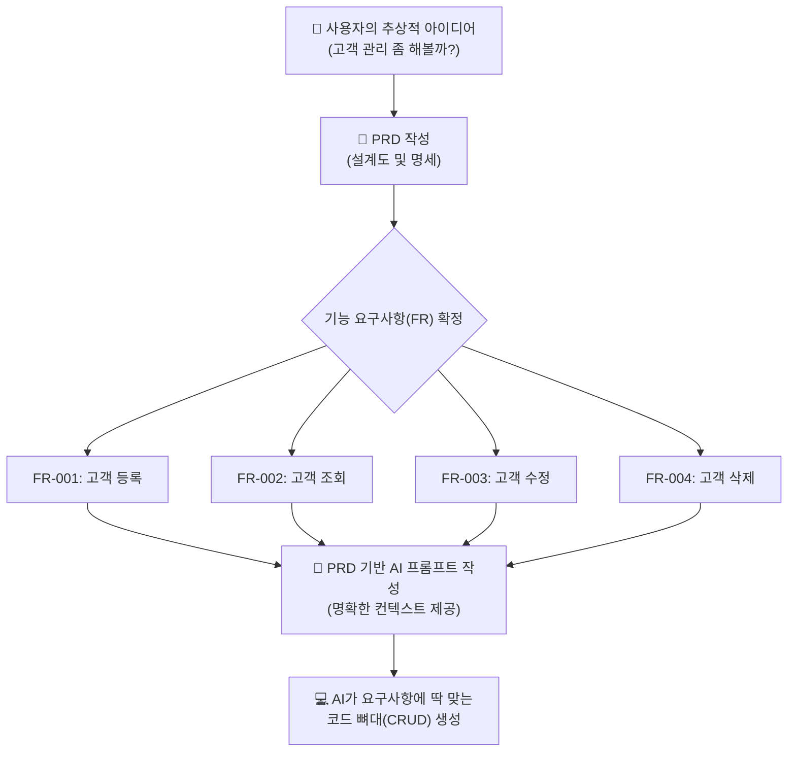

---

## §3. 상세 내용

### 1. 기능 요구사항 FR-001 ~ FR-004 확정

우리가 앞으로 만들어갈 프로그램의 공식 명칭은 **'고객 정보 관리 프로그램'**입니다. 이 프로그램은 화려한 웹페이지가 아니라 여러분이 늘 보던 검은색 화면, 즉 콘솔(터미널) 환경에서 동작합니다. 관리할 핵심 데이터 항목은 세 가지입니다: 이름(name), 전화번호(phone), 이메일(email). 

본격적인 파이썬 개발에 앞서, Day 2의 PRD를 바탕으로 기능 요구사항을 깔끔하게 표로 확정하겠습니다 [Source A: 7 기획.pdf §7.3].

| FR ID | 기능명 | 설명 |
|-------|--------|------|
| FR-001 | 고객 등록 | 이름, 전화번호, 이메일을 입력받아 프로그램(메모리)에 저장 |
| FR-002 | 고객 조회 | 등록되어 저장된 전체 고객 목록을 화면에 보기 좋게 출력 |
| FR-003 | 고객 수정 | 특정 고객의 이름을 검색하여 전화번호나 이메일 정보를 변경 |
| FR-004 | 고객 삭제 | 특정 고객의 이름을 검색하여 시스템에서 해당 정보를 삭제 |

### 2. SDD(명세 주도 개발)의 중요성

AI에게 단순히 "고객 관리 프로그램 하나 짜줘"라고 프롬프트를 작성하면 벌어지는 참사를 상상해봅시다. 어떤 AI는 오버해서 화려한 윈도우 창(GUI)을 만들어주고, 어떤 AI는 데이터베이스 서버 연결 코드까지 잔뜩 끼워 넣습니다. 우리가 지금 배우고자 하는 파이썬 기초 수준을 아득히 넘어가 버려, 여러분은 생성된 코드를 읽지도 못하는 상황에 빠지게 됩니다.

하지만 위의 표를 활용하여 "FR-001부터 FR-004까지, 정확히 이 4가지 기능을 콘솔 프로그램으로 구현해줘. 데이터 항목은 이름, 전화번호, 이메일이야"라고 명확한 제한선을 그어주면 어떨까요? AI는 군말 없이 우리가 딱 원하는 수준의 뼈대 코드만 깔끔하게 만들어줍니다 [Source C: Deep Research §6.1]. 

이처럼 명세서(PRD)가 프롬프트의 기준이자 맥락(Context)이 되는 개발 방식이 바로 **SDD(Specification-Driven Development, 명세 주도 개발)**의 본질입니다. 내가 원하는 바를 통제하는 힘, 그것이 바로 PRD의 위력입니다.

> ✅ **체크포인트**: 우리 고객 관리 프로그램의 4가지 필수 기능(FR)은 무엇인가요?
> - 정답: 등록(Create), 조회(Read), 수정(Update), 삭제(Delete)!

---

## §4. 실습 가이드 (+ 🎙️ 실습 대본)

### 실습 목표

이 실습을 통해 수강생은 확정된 PRD 기능 명세서를 바탕으로 AI 프롬프트를 직접 작성하고, AI가 제공하는 초기 CRUD 뼈대 코드를 파일로 생성하는 경험을 합니다.

🎙️ **실습 가이드 대본 (Lab Guide)**:

> 자, 이제 우리가 확정한 이 4가지 막강한 기능 리스트를 들고 AI에게 일을 시키러 갈 시간입니다. 모두 모니터 화면의 Antigravity나 Claude Code 채팅창을 띄워주세요. 방금 우리가 짚어본 표, FR-001부터 004까지의 내용을 그대로 AI에게 전달할 겁니다. 
>
> 여기서 가장 중요한 팁! AI가 오버해서 복잡한 데이터베이스나 화려한 화면을 만들지 않도록 '콘솔 환경', '데이터베이스 없이', '딱 이 4가지만'이라는 제약 조건을 반드시 걸어야 합니다. 제가 화면에 프롬프트 예시를 띄워드릴 테니, 각자의 AI 비서에게 그대로 입력해 보세요. 우리 비서가 어떤 파이썬 코드를 뚝딱 만들어내는지 한번 볼까요?

### 단계별 지시 — PRD 기반 AI 프롬프트 작성 실습

| 단계 | 소요 시간 | 강사 지시사항 | 학습자 액션 | 예상 결과 |
|------|----------|--------------|------------|----------|
| 1 | 3분 | "PRD 4가지 핵심 기능 재확인" | 교안의 FR 표 내용을 눈으로 재확인 | 구현할 C/R/U/D 4가지 기능 인지 |
| 2 | 4분 | "AI에게 뼈대 코드 요청 프롬프트 입력" | 실습용 프롬프트를 AI 채팅창에 복사/붙여넣기 | AI가 프롬프트 분석 및 파이썬 코드 생성 |
| 3 | 5분 | "AI 생성 코드 가볍게 리뷰하기" | AI가 출력한 코드의 `input()`, `append` 등 확인 | 프로그램의 전체 구조(루프) 파악 |
| 4 | 3분 | "로컬에 파이썬 파일 생성 저장" | AI에게 코드를 파일로 저장해달라고 지시 | `customer_manager.py` 파일 생성 완료 |

**[단계 1] PRD 내용 숙지**

앞서 배운 4가지 기능(등록, 조회, 수정, 삭제)과 3가지 데이터 항목(이름, 전화번호, 이메일)을 다시 한번 확인합니다. 이 항목들이 어떻게 프로그램의 뼈대가 될지 머릿속으로 그려봅니다.

**[단계 2] AI에게 뼈대 코드 요청**

여러분들의 AI 에이전트에게 다음 프롬프트를 복사하여 입력하세요.

```text
너는 파이썬 백엔드 개발자야. 내가 제공하는 PRD 기능 요구사항(FR)에 맞춰서 
파이썬 콘솔용 '고객 정보 관리 프로그램'의 뼈대 코드를 작성해줘.

[요구사항]
- 환경: 터미널(콘솔) 환경의 순수 파이썬 코드
- 데이터 항목: 이름(name), 전화번호(phone), 이메일(email)
- 저장 방식: 메모리(리스트나 딕셔너리 사용, DB나 파일 저장 기능은 아직 절대 넣지 마)

[기능 목록]
- FR-001: 고객 등록 (사용자로부터 정보 입력받아 저장)
- FR-002: 고객 조회 (저장된 전체 목록 출력)
- FR-003: 고객 수정 (이름으로 검색해 정보 변경)
- FR-004: 고객 삭제 (이름으로 검색해 정보 삭제)

복잡한 함수 구조나 클래스 대신, 가장 이해하기 쉬운 단순한 형태의 while 루프와 if문으로 먼저 뼈대를 짜줘.
```

**[단계 3] AI 생성 코드 리뷰**

AI가 답변을 줄 것입니다. 지금 이 코드를 완벽히 이해하지 못해도 전혀 문제없습니다! 스크롤을 내리면서 다음의 파이썬 키워드들이 등장하는지만 확인해 보세요.
- `input()` : 사용자에게 메뉴나 정보를 묻는 부분입니다.
- `append()` : 리스트 바구니에 고객 정보를 새로 집어넣는(등록) 부분입니다.
- `for` : 바구니에 든 고객들을 하나씩 꺼내서 보여주는(조회) 부분입니다.

**[단계 4] 로컬 파일로 저장**

코드가 잘 나왔다면, AI에게 이 코드를 실제 파일로 만들어달라고 추가로 요청합니다.

```text
위에서 작성해준 코드를 현재 폴더에 'customer_manager.py' 파일로 저장해줘.
```

VS Code 탐색기나 작업 폴더에 `customer_manager.py` 파일이 무사히 생성되었다면, 이번 실습은 대성공입니다! 이제 우리는 벽돌을 쌓을 준비를 마쳤습니다.

---


### 🎓 강사 노트 (Instructor Support)

- ⏱️ **타이밍**: 09:40 (20분, narrative)
- 🎯 **핵심 활동**: Day 2 PRD 꺼내서 복습
- ⚠️ **강사 주의사항**: "이제 이 설계도로 진짜 프로그램을 만듭니다"

## §5. 코드 및 명령어 모음

### 프롬프트: PRD 기반 핵심 제약조건 명시

```text
파이썬 콘솔 기반 고객 관리 프로그램 코드를 짜줘.
기능은 1. 등록, 2. 조회, 3. 수정, 4. 삭제 4가지야.
데이터는 이름, 전화번호, 이메일만 관리해. 
DB 없이 그냥 메모리에 변수로 저장하는 가장 단순한 절차적 형태로 작성해줘.
```
이 프롬프트는 실습 가이드의 프롬프트를 조금 더 간략화한 버전입니다. 핵심은 제약 조건(DB 없이, 4가지 기능만)을 명시하여 AI의 과잉 코딩을 방어하는 것입니다.

### 관련 파이썬 기본 문법 (미리보기)

우리가 앞으로 채워나갈 코드의 핵심 문법 요소들입니다. 이 구조들을 눈에 익혀두세요.

```python
# 빈 리스트 준비 (고객 데이터 전체를 담을 큰 바구니)
customers = []

# 단일 고객 데이터 딕셔너리 (한 명의 정보 꾸러미)
customer = {
    "name": "홍길동",
    "phone": "010-1234-5678",
    "email": "hong@example.com"
}

# 리스트에 딕셔너리 추가 (FR-001 등록 기능의 핵심 동작)
customers.append(customer)
```

---

## §6. 요약

### 핵심 학습 포인트

오늘 우리는 본격적인 코드 작성에 앞서 PRD(제품 요구사항 정의서)를 명확히 세팅하는 것이 왜 중요한지 직접 체험했습니다. 설계도 없이 벽돌을 쌓으면 괴상한 집이 나오듯, 기능 명세 없이 AI에게 코딩을 맡기면 원치 않는 결과물이 나옵니다. 우리는 FR-001(등록)부터 FR-004(삭제)까지 4가지 핵심 기능을 확정했고, 이를 프롬프트로 변환하여 AI에게 전달하여 초기 뼈대 코드까지 성공적으로 얻어냈습니다. 이렇게 명세서 기반으로 개발을 진행하는 방식을 명세 주도 개발(SDD)이라고 부르며, 이것이 AI 개발 시대의 핵심 역량입니다.

### 다음 세션 예고

오늘 AI가 짜준 코드를 슬쩍 보셨나요? 아마 while문 하나 안에 길게 이어진 절차적인 코드일 것입니다. 다음 세션(068)에서는 방금 우리가 다룬 등록, 조회, 수정, 삭제라는 4가지 기능, 소프트웨어 개발의 알파와 오메가인 이른바 'CRUD'의 본질적인 개념을 깊이 이해하고 파헤쳐 볼 것입니다.

### 브릿지 노트

> "설계도를 들고 AI 벽돌공에게 첫 번째 주문을 성공적으로 내렸습니다! 여러분의 프로젝트 폴더에 `customer_manager.py` 파일이 생겼나요? 이 작은 파이썬 파일은 앞으로 여러분이 구조적 프로그래밍을 배우고, 함수를 분리하고, 리팩토링을 거치면서 훨씬 멋지고 견고한 프로그램으로 진화할 겁니다. 설계도가 완벽하게 준비되었으니, 다음 시간부터는 모든 시스템의 근간이 되는 'CRUD'의 마법에 대해 자세히 알아보겠습니다!"

---

## §7. 참고 자료

### 3-Source 출처

- **Source A (로컬 참고자료)**: 「7 기획.pdf」 §7.3 — PRD 구조 및 기능 요구사항(FR) 작성법
- **Source B (NotebookLM)**: Day 4 팩트 패킷 — 사용자 요구사항을 시스템 기능으로 매핑하는 논리 및 CRUD 개념 연계
- **Source C (Deep Research)**: Day 4 팩트 패킷 §2, 6.1 — 고객 데이터를 메모리에 저장하는 아키텍처 고민의 시작점

### 강사 노트

> 💡 **강사 노트**: 이 세션은 Day 2의 기획 내용과 Day 4의 실제 구현을 연결하는 아주 중요한 브릿지 세션입니다. 수강생들이 PRD를 귀찮은 문서 작업이 아니라, 'AI를 내 마음대로 통제하는 가장 강력한 주문서'로 인식하도록 톤앤매너를 끌어올려 강조해 주세요. 
> 특히 §4 실습에서 수강생마다 사용하는 AI 모델(Claude vs Gemini)에 따라 나오는 결과물 코드가 조금씩 다를 수 있습니다. 당황하지 마시고, "AI마다 집을 짓는 스타일이 달라서 그렇습니다. 중요한 건 우리가 지시한 4가지 기능(등록/조회/수정/삭제)이 다 들어있느냐입니다"라고 유연하게 안내해 주시면 됩니다.

---

## ✅ 세션 완료 체크리스트 (강사용)

- [ ] §1~§7 모든 섹션이 빠짐없이 작성되었는가?
- [ ] 🗣️ 강사 대본과 🎙️ 실습 대본이 구어체로 자연스럽게 작성되었는가?
- [ ] §2에 PRD와 AI 프롬프트의 관계를 보여주는 Mermaid 다이어그램이 포함되었는가?
- [ ] §4 실습 가이드에 PRD를 활용한 상세한 프롬프트 실습 단계가 포함되었는가?
- [ ] Day 4의 팩트 패킷 내용(CRUD 연계 등)이 잘 반영되었는가?

---

**🔗 선행 세션**: [세션-066] AI 시대의 서사 복습: 구조적 프로그래밍으로의 여정  
**🔗 후행 세션**: [세션-068] CRUD 개념 이해 및 1차 프롬프트 작성 실습  

---

*작성 일시: 2026-02-25*  
*작성 에이전트: Sisyphus-Junior*  
*교안 구조: 7섹션 (v2.1)*

> 🔗 **이전 세션**: [세션 066: AI 시대의 서사 복습: 구조적 프로그래밍으로의 여정](#세션-066)에서 배운 내용을 이어갑니다.
> 🔗 **다음 세션**: [세션 068: CRUD 개념 이해 및 1차 프롬프트 작성 실습](#세션-068)에서 계속됩니다.

---

### 세션 068: CRUD 개념 이해 및 1차 프롬프트 작성 실습
> [원본 파일](sessions/세션-068-CRUD_개념_이해_및_1차_프롬프트_작성_실습_v2.1.md) | ⏱️ 25분 | 🧪 lab | 난이도: medium

> **세션 ID**: MS-PY101-068  
> **소요 시간**: 25분  
> **난이도**: medium  
> **청크 타입**: lab  
> **버전**: v2.1 (7섹션 구조)

---

## §1. 개요

> **Day 4 | AM | 세션 068/075**

### 🎯 학습 목표

이 세션이 끝나면, 수강생은 다음을 할 수 있습니다:

- 세상 모든 데이터 기반 애플리케이션의 핵심인 CRUD의 4가지 개념을 설명할 수 있다.
- 절차적 방식의 콘솔 프로그램이 갖추어야 할 기본 뼈대(무한 루프, 메뉴 분기)를 이해할 수 있다.
- 직전 세션에서 설계한 PRD를 바탕으로, AI에게 정확한 제약 조건을 담은 1차 프롬프트를 작성하여 코드를 생성할 수 있다.

### 선행 세션 환기

우리는 방금 전 세션(067)에서 '고객 정보 관리 프로그램'을 위한 PRD(요구사항 정의서)를 함께 작성했습니다. 어떤 데이터를 받을지, 어떤 기능이 들어가야 할지 문서로 잘 정리해 두었죠. 이제 이 기획서를 바탕으로 실제 코드를 만들어낼 차례입니다. 하지만 무작정 "고객 관리 프로그램 만들어줘!"라고 하면 AI는 너무 복잡하거나 우리가 원하지 않는 방식(예: 클래스나 데이터베이스를 사용한 방식)으로 코드를 짜버릴 수 있습니다. 오늘 우리가 배울 'CRUD'라는 마법의 단어와 명확한 제약 조건을 사용하면, AI를 완벽하게 통제할 수 있습니다.

---

## §2. 핵심 개념 (+ 🗣️ 강사 대본 + Mermaid)

### 세상 모든 앱의 공통점: CRUD

인스타그램으로 사진을 올리는 것, 배달의민족에서 리뷰를 쓰는 것, 넷플릭스에서 내 찜 목록을 관리하는 것. 이 모든 행동에 숨어 있는 공통점이 무엇일까요? 이 거대한 서비스들도 까보면 결국 딱 4가지 기능의 반복일 뿐입니다. 데이터를 만들고(Create), 읽고(Read), 고치고(Update), 지우는(Delete) 것. 이것의 앞글자만 따서 **CRUD**(크루드)라고 부릅니다. 

### 다이어리(일기장) 비유

CRUD를 가장 직관적으로 이해하기 위해 여러분의 다이어리를 떠올려보세요. 
- **C**reate (생성): 빈 페이지에 새 일기를 쓰는 것
- **R**ead (읽기): 어제 쓴 일기를 다시 펼쳐서 읽어보는 것
- **U**pdate (수정): 오타가 있어서 화이트로 지우고 내용을 고치는 것
- **D**elete (삭제): 너무 부끄러운 흑역사가 담긴 페이지를 찢어버리는 것

이게 전부입니다! 세상에서 가장 복잡한 소프트웨어도 이 네 가지 동작을 복잡하게 조합하고 포장해 놓은 것에 불과합니다. 

🗣️ **강사 대본 (Instructor Script)**:

> 여러분, 웹 서비스든 모바일 앱이든 그 본질은 결국 CRUD입니다. 고객 데이터를 새로 만들고(Create), 화면에 보여주고(Read), 이사 가면 주소를 고치고(Update), 탈퇴하면 지우는(Delete) 거죠. 우리가 오늘 만들 고객 관리 프로그램도 이 CRUD의 정석을 따릅니다.
> 
> 재미있는 건, AI에게 일을 시킬 때도 이 네 가지 액션 단어를 명확하게 써주어야 모호함 없이 코드가 생성된다는 겁니다. "데이터를 알아서 잘 관리해 줘"라고 말하는 것보다, "데이터를 대상으로 C, R, U, D 기능을 각각 구현해 줘"라고 말하는 것이 훨씬 정확한 프롬프팅이 됩니다. 명확한 지시는 명확한 결과를 낳습니다. 자, 이제 이 개념을 우리 프로그램에 어떻게 녹여낼지 구조를 살펴볼까요?

### Mermaid 다이어그램

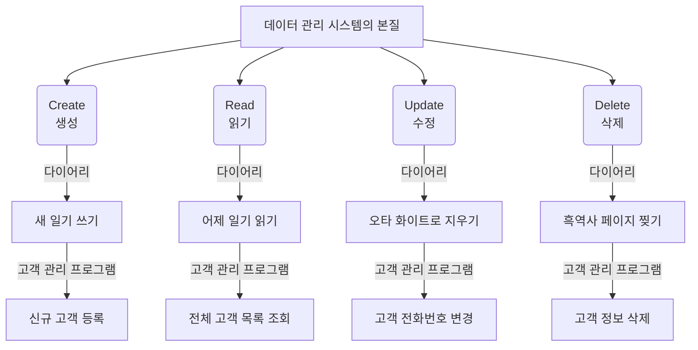

---

## §3. 상세 내용

### CRUD의 정확한 정의와 매핑

CRUD는 시스템의 기본 데이터 처리 기능을 뜻하는 IT 업계의 표준 용어입니다. 실무 데이터베이스 세계에서는 이것이 `INSERT`, `SELECT`, `UPDATE`, `DELETE`라는 SQL 명령어와 1:1로 대응됩니다. 하지만 우리는 아직 데이터베이스를 배우지 않았죠? 대신 파이썬의 기본 자료구조인 **리스트(List)**와 **딕셔너리(Dictionary)**를 사용하여 이 데이터를 메모리 상에서 관리할 것입니다.

### 절차적 CRUD 프로그램의 뼈대: 메뉴 루프

모든 CRUD 콘솔 프로그램에는 반드시 '메뉴'가 필요합니다. 사용자가 프로그램에 들어왔을 때, "나는 지금 등록(C)을 할 거야" 또는 "나는 지금 조회(R)를 할 거야"라고 선택할 수 있는 입구가 있어야 합니다. 

우리가 AI에게 만들어달라고 할 프로그램의 뼈대는 다음과 같습니다:
1. `while True:` 무한 루프를 돌면서 꺼지지 않는 프로그램을 만듭니다.
2. `input()` 함수로 화면에 메뉴 번호(1. 등록, 2. 조회...)를 띄우고 입력을 받습니다.
3. `if / elif` 조건문으로 입력받은 번호에 따라 CRUD 각 기능을 분기시켜 실행합니다.

이것이 바로 Day 4 오전의 핵심 테마인 **절차적(Procedural) 프로그래밍** 방식의 전형적인 구조입니다. 코드가 기능(함수)으로 예쁘게 나뉘어 있지 않고, 위에서 아래로 순차적으로 쭉 흘러가는 형태입니다.

> ✅ **체크포인트**: 시스템의 기본 데이터 처리 기능 4가지(C, R, U, D)는 각각 무엇의 약자인가요?

---

## §4. 실습 가이드 (+ 🎙️ 실습 대본)

### 실습 목표

수강생은 Day 2에서 배운 '5대 필수 항목 프롬프트' 규칙과 이전 세션의 'PRD'를 결합하여, 절차적 방식의 고객 관리 프로그램을 만들어내는 1차 프롬프트를 작성하고 AI에게 전송합니다.

🎙️ **실습 가이드 대본 (Lab Guide)**:

> 자, 이제 여러분이 직접 AI에게 지시를 내릴 시간입니다. 우리가 방금 배운 CRUD 개념을 팍팍 넣어서 프롬프트를 써볼 거예요. 
> 
> 주의할 점이 하나 있습니다. 지금 우리는 '절차적 프로그래밍'의 한계를 직접 겪어보기 위해, 일부러 조금 촌스러운(?) 방식의 코드를 원하고 있어요. 만약 제약 조건을 헐렁하게 주면 AI는 너무 똑똑해서, 처음부터 최신 객체지향 방식으로 클래스와 함수를 잔뜩 써서 완벽한 코드를 짜버릴 겁니다. 그러면 우리가 학습할 게 없어지겠죠? 그래서 이번 프롬프트에는 반드시 "함수 쓰지 마!", "절차적으로 짜줘!"라는 제약 조건을 엄격하게 걸어주어야 합니다.

### 단계별 지시사항

| 단계 | 소요 시간 | 강사 지시사항 | 학습자 액션 | 예상 결과 |
|------|----------|--------------|------------|----------|
| 1 | 5분 | "Day 2 구조를 참고하여 프롬프트 초안을 작성하세요" | 에디터에 기능, 입력, 출력, 제약, 예외 5대 항목 작성 | 프롬프트 초안 완성 |
| 2 | 2분 | "가장 중요한 3대 키워드가 있는지 확인하세요" | '절차적', '전역 리스트', 'while True' 단어 점검 | 조건 누락 방지 |
| 3 | 5분 | "Agent Manager에 전송하고 코드를 받아보세요" | AI에게 프롬프트 전송 후 결과물 대기 | 절차적 CRUD 코드 생성 |
| 4 | 3분 | "코드를 새 파일로 저장하세요 (실행 금지!)" | `customer_manager_v1.py` 파일 생성 및 코드 복사 | 파일 저장 완료 |

**[단계 1] 프롬프트 초안 작성**

새 메모장이나 빈 텍스트 파일을 열고, 아래 구조를 참고하여 프롬프트를 작성하세요. 지난 세션에서 만든 PRD의 내용이 [기능]과 [입력]에 들어갑니다.

**[단계 2] ⚠️ 핵심 제약조건(키워드) 확인**

작성한 프롬프트에 다음 세 가지 키워드가 정확히 들어갔는지 눈으로 다시 한번 확인하세요.
- **절차적 방식** (또는 함수/클래스 사용 금지)
- **전역 리스트**에 딕셔너리를 저장
- **while True** 메뉴 루프 사용

이 단어들이 빠지면 AI가 우리가 원하지 않는 너무 고급화된 구조적 코드를 만들어버립니다.

**[단계 3] 프롬프트 전송 및 생성 대기**

작성한 프롬프트를 복사하여 AI Agent 창에 붙여넣고 전송합니다. AI가 열심히 코드를 작성하는 동안, 코드가 여러분이 지시한 제약 조건(`while`, `if`, 함수 없음)을 잘 지키고 있는지 실시간으로 관찰해 보세요.

**[단계 4] 코드 저장 (실행은 잠시 대기!)**

AI가 생성한 파이썬 코드를 모두 복사합니다. Antigravity IDE의 탐색기 창에서 우클릭하여 새 파일을 만들고 이름을 `customer_manager_v1.py`로 지정합니다. 복사한 코드를 붙여넣고 저장(`Ctrl + S` 또는 `Cmd + S`)하세요. 

🗣️ **강사 대본 (Instructor Script)**:

> 다들 코드를 잘 받아오셨나요? 코드가 꽤 길죠? 아마 한 덩어리로 된 코드가 50줄에서 100줄 가까이 나왔을 겁니다. 
> 
> 손이 근질근질하시겠지만, 덜컥 재생(Run) 버튼부터 누르지 마세요. 우리는 POE(예측 → 검증 → 설명) 학습 사이클을 기억하고 있습니다. 자동차의 시동을 걸기 전에 엔진룸을 열어 구조부터 살펴봐야 합니다. 

---


### 🎓 강사 노트 (Instructor Support)

- ⏱️ **타이밍**: 10:10 (25분, lab)
- 🎯 **핵심 활동**: CRUD 프롬프트 → 절차적 코드 생성
- ⚠️ **강사 주의사항**: v1 코드 생성의 핵심 세션


### 📋 실습 설계 보강 (Lab Packet)

**세션 068 실습 설계 보강**

CRUD 개념 이해 및 1차 프롬프트 작성 실습
- **3-Stage Example Set**
  - 기본: CRUD 4요소를 포함한 콘솔 프로그램 프롬프트 작성 → AI에게 전달
  - 변형: "메뉴 선택 방식으로 만들어줘" 추가 제약 포함
  - 실수 해결: "프롬프트가 너무 길어서 AI가 일부만 구현했어요" → 핵심 기능부터 점진적 요청
- **난이도 예측**: CRUD 자체는 이해하기 쉬우나 4개를 한 프로그램에 담는 프롬프트 작성이 난관
- **타이밍 가이드**: CRUD 개념 복습 3분 | 프롬프트 작성 10분 | AI 코드 생성·확인 7분 | 정리 5분
- **심리적 장벽**: "4가지 기능을 한 번에 만들어야 한다고?"
- **자가 점검**:
  - [ ] C(등록), R(조회), U(수정), D(삭제) 4가지를 모두 요구하는 프롬프트를 작성했는가?
  - [ ] 메뉴 선택 방식(1~4번)이 프롬프트에 포함되었는가?
  - [ ] 생성된 코드에 while 무한루프 메뉴가 있는가?

## §5. 코드 및 명령어 모음

### 1차 프롬프트 템플릿 (참고용)

학습자가 직접 작성하는 것이 원칙이나, 막힌 수강생을 위해 제공하는 모범 답안 프롬프트입니다.

```text
고객 정보를 관리하는 콘솔 프로그램을 Python으로 작성해줘.

[기능] 고객 등록(C), 전체 조회(R), 정보 수정(U), 고객 삭제(D)
[입력] 이름, 전화번호, 이메일
[출력] 메뉴 선택 → 해당 기능 실행 결과 출력
[제약] 
- 오직 "절차적 방식"으로만 작성할 것. 함수(def)나 클래스(class) 사용 절대 금지.
- 고객 데이터는 1개의 전역 리스트(list)에 딕셔너리(dict) 형태로 저장할 것.
- 프로그램 뼈대는 while True 무한 루프와 if/elif를 사용한 메뉴 선택 방식을 쓸 것.
[예외] 
- "종료" 메뉴를 선택할 때만 무한 루프를 빠져나오게(break) 할 것.
```

### AI가 생성할 예상 코드 뼈대 (개념적 구조)

AI는 위 프롬프트를 받고 대략 아래와 같은 형태의 거대한 코드를 만들어냅니다. (함수가 없고 하나의 큰 루프 안에 모든 로직이 들어간 상태)

```python
# 전역 리스트 (데이터 저장소)
customers = []

# 메인 무한 루프
while True:
    print("\n=== 고객 관리 시스템 ===")
    print("1. 등록 (C)")
    print("2. 조회 (R)")
    print("3. 수정 (U)")
    print("4. 삭제 (D)")
    print("5. 종료")
    
    menu = input("메뉴를 선택하세요: ")
    
    if menu == '1':
        # Create 로직 (input으로 이름, 번호 등 받고 append)
        pass
    elif menu == '2':
        # Read 로직 (for문으로 customers 리스트 출력)
        pass
    # ... (U, D 생략) ...
    elif menu == '5':
        print("프로그램을 종료합니다.")
        break
```

---

## §6. 요약

### 핵심 학습 포인트

이번 세션에서 우리는 세상 모든 소프트웨어의 뼈대가 되는 CRUD(생성, 읽기, 수정, 삭제)의 개념을 배웠습니다. 다이어리에 비유했던 이 네 가지 동작은 개발자와 AI가 소통할 때 가장 강력하고 명확한 지시어가 됩니다. 또한, 우리는 일부러 함수를 배제하고 절차적으로 흘러가는 코드를 짜달라고 AI에게 강력한 제약을 걸어 성공적으로 코드를 생성해 냈습니다.

### 다음 세션 예고

다음 세션에서는 여러분이 방금 저장한 `customer_manager_v1.py` 파일을 열어볼 것입니다. 코드를 실행하기 전에, 먼저 파이썬 내부에서 우리의 고객 데이터(이름, 전화번호, 이메일)가 도대체 어떤 모형으로 묶여서 전역 리스트에 들어가는지, 그 '데이터 저장 구조'의 실체를 현미경으로 들여다보겠습니다. 

### 브릿지 노트

> "여러분, 코드는 무사히 파일로 저장해 두셨죠? 방금 만든 코드는 아직 거친 원석과 같습니다. 다음 시간에는 이 코드의 맨 윗부분을 차지하고 있는 리스트와 딕셔너리가 어떻게 고객 정보를 안전하게 보관하는지 그 비밀을 파헤쳐 보겠습니다. 잠시 쉬었다가 데이터 구조의 세계로 들어가 봅시다!"

---

## §7. 참고 자료

### 3-Source 출처

- **Source A (로컬 참고자료)**: 「7 기획.pdf」, 「8 코딩.pdf」 — PRD 구조를 코드로 맵핑 및 절차적 프로그래밍 패턴
- **Source B (NotebookLM)**: SRC-B03 — CRUD의 4가지 핵심 개념과 절차적 콘솔 프로그램 설계
- **Source C (Deep Research)**: SRC-C02 — AI에게 명확하게 CRUD 기능 구현을 지시하는 프롬프트 엔지니어링 방법론

### 강사 노트

> 💡 **강사 노트**: 수강생들이 작성한 프롬프트로 인해 생성된 코드는 제각각 다를 수밖에 없습니다. 변수 이름이 `customer_list`일 수도 있고 `customers`일 수도 있죠. 이 점을 수강생들에게 명확히 인지시켜 주세요. "AI가 짜준 코드는 여러분의 프롬프트 뉘앙스에 따라 조금씩 다를 겁니다. 완전히 정상이에요. 중요한 건 그 안에 C, R, U, D 4가지 조건 분기가 들어있느냐입니다"라고 안심시켜 주시는 것이 좋습니다. 또한 함수(`def`)가 생성된 분이 있다면 제약조건 누락이 원인이니 프롬프트를 수정해 다시 돌리도록 유도하세요.

---

## ✅ 세션 완료 체크리스트 (강사용)

- [ ] §1~§7 모든 섹션이 충실하게 작성되었는가?
- [ ] 다이어리 비유를 통한 CRUD 1:1 매핑이 명확히 전달되었는가?
- [ ] 프롬프트 작성 시 '절차적', '전역 변수' 제약의 중요성이 강조되었는가?
- [ ] 단계별 실습 가이드가 구체적으로 제시되었는가?
- [ ] 다음 세션(데이터 구조 분석)을 위한 브릿지 노트가 포함되었는가?

---

**🔗 선행 세션**: [세션-067] 고객 정보 관리 프로그램 PRD 복습 및 설계  
**🔗 후행 세션**: [세션-069] 데이터 저장 구조(전역 리스트, 딕셔너리) 이해

---

*작성 일시: 2026-02-25*  
*작성 에이전트: Sisyphus-Junior*  
*교안 구조: 7섹션 (A0 팀 공통 표준)*

> 🔗 **이전 세션**: [세션 067: 고객 정보 관리 프로그램 PRD 복습 및 설계](#세션-067)에서 배운 내용을 이어갑니다.
> 🔗 **다음 세션**: [세션 069: 데이터 저장 구조(전역 리스트, 딕셔너리) 이해](#세션-069)에서 계속됩니다.

---

### 세션 069: 데이터 저장 구조(전역 리스트, 딕셔너리) 이해
> [원본 파일](sessions/세션-069-데이터_저장_구조(전역_리스트,_딕셔너리)_이해_v2.1.md) | ⏱️ 20분 | 💻 code | 난이도: medium

> **세션 ID**: MS-PY101-069
> **소요 시간**: 20분
> **난이도**: medium
> **청크 타입**: narrative
> **버전**: v2.1 (7섹션 구조)

---

## §1. 개요

> **Day 4 | AM | 세션 069/075**

이 세션은 5일간의 "AI-native 파이썬 기초" 과정 중 4일차 오전에 진행되는 핵심 이론 세션입니다. 우리가 만들 고객 관리 프로그램이 어떻게 데이터를 기억하고 저장하는지, 그 밑바탕이 되는 데이터 저장 구조를 다룹니다. AI가 코드를 알아서 짜준다고 해도, 데이터가 저장되는 '모양'을 우리가 정확히 통제하지 않으면 파편화된 스파게티 데이터 구조가 만들어질 수 있습니다. 이 세션에서는 리스트와 딕셔너리의 결합 구조를 통해 데이터를 안전하게 관리하는 법을 배웁니다.

### 🎯 학습 목표

이 세션이 끝나면 수강생은 다음을 할 수 있어요:
- AI가 생성한 코드에서 전역 리스트와 딕셔너리가 결합된 데이터 저장 구조를 식별하고 설명할 수 있습니다.
- 파편화된 데이터와 구조화된 데이터의 차이점을 분석하고, 왜 구조화가 필요한지 이해할 수 있습니다.
- "딕셔너리를 담은 리스트(List of Dictionaries)" 패턴이 왜 가장 흔하게 쓰이는 데이터 구조인지 설명할 수 있습니다.

### 선행 세션 환기

직전 세션(세션 068)에서 우리는 모든 시스템의 뼈대인 CRUD 기능의 개념을 배우고, 첫 번째 프롬프트를 작성했습니다. "고객 정보를 관리하는 프로그램을 절차적으로 작성해줘"라고 지시했죠. 이제 AI가 코드를 뱉어낼 텐데, 그 코드를 무작정 실행하기 전에 "이 프로그램은 고객의 이름과 전화번호를 대체 어디에, 어떤 모양으로 보관하는가?"라는 아주 본질적인 질문부터 해결하고 넘어갈 거예요.

---

## §2. 핵심 개념 (+ 🗣️ 강사 대본 + Mermaid)

### 서랍장과 라벨이 붙은 칸막이함 (리스트와 딕셔너리의 결합)

우리가 다룰 핵심 개념은 '전역 리스트 안에 딕셔너리가 들어간 구조(List of Dictionaries)'입니다. 이것을 이해하기 위해 Day 3에서 배웠던 비유를 다시 꺼내보겠습니다. **리스트(List)**가 거대한 '서랍장'이라면, **딕셔너리(Dictionary)**는 각 서랍 안에 들어가는 '라벨이 붙은 칸막이함'입니다. 서랍장(리스트)은 0번, 1번 순서대로 고객을 줄 세워 보관하고, 칸막이함(딕셔너리)은 한 고객의 이름, 전화번호, 이메일을 각각의 라벨을 붙여 깔끔하게 묶어둡니다.

🗣️ **강사 대본 (Instructor Script)**:

> AI가 코드를 짜주긴 했는데, 실행 버튼을 누르기 전에 한 가지 짚고 넘어갈 게 있습니다. 여러분이 화면에 고객의 이름, 전화번호, 이메일을 입력하면, 그 데이터는 도대체 어디로 가는 걸까요? 그냥 공중에 둥둥 떠다니지는 않겠죠? 컴퓨터 메모리 어딘가에 차곡차곡 쌓여야만 우리가 나중에 다시 꺼내볼 수 있습니다.
>
> Day 3에서 배웠던 비유를 다시 떠올려볼까요? 리스트(List)는 '서랍장'입니다. 위에서부터 0번 서랍, 1번 서랍, 2번 서랍이 차례대로 있죠. 그리고 딕셔너리(Dictionary)는 각 서랍 안에 들어가는 '라벨이 붙은 칸막이함'이에요.
>
> 엑셀을 자주 쓰셨던 분이라면 이렇게 생각하시면 아주 쉽습니다. 엑셀 시트의 한 행(Row), 즉 홍길동이라는 사람의 데이터 한 줄이 바로 딕셔너리입니다. "이름" 칸에는 "홍길동", "전화번호" 칸에는 "010-1234-5678"이 들어가는 식이죠. 그리고 이 엑셀 시트 전체, 즉 1번 줄부터 끝 줄까지 모아둔 장부가 바로 리스트입니다.
>
> 그래서 우리의 고객 데이터는 "딕셔너리를 담은 리스트(List of Dictionaries)"라는 구조로 관리됩니다. 파이썬뿐만 아니라 현대 프로그래밍에서 가장 흔하게 쓰이는 데이터 저장 패턴이에요. 여기서 중요한 점이 하나 있습니다. AI에게 '데이터를 이런 형태로 저장해줘'라고 명확히 지정하지 않으면, AI는 자기 마음대로 이상한 형태, 예를 들어 문자열 하나에 콤마를 찍어 이어붙이는 식으로 저장해버릴 수 있어요. 자료구조의 모양을 우리가 지정하고 통제하는 것, 이것이 AI를 다루는 첫 단추입니다.

### Mermaid 다이어그램

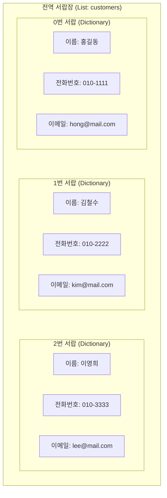

이 다이어그램은 리스트와 딕셔너리가 어떻게 결합되어 하나의 데이터베이스 역할을 하는지 시각적으로 보여줍니다. 바깥쪽의 큰 박스가 리스트(`customers = []`)이며, 그 안의 작은 박스들이 개별 고객의 정보를 담고 있는 딕셔너리들입니다. 하나의 딕셔너리가 한 명의 고객 정보를 온전히 책임집니다.

---


### 🎨 추가 시각화 (Visualization Packet)

**데이터 CRUD 흐름도**

시스템 내에서 데이터를 조작하는 4가지 가장 기초적이고 핵심적인 액션입니다.

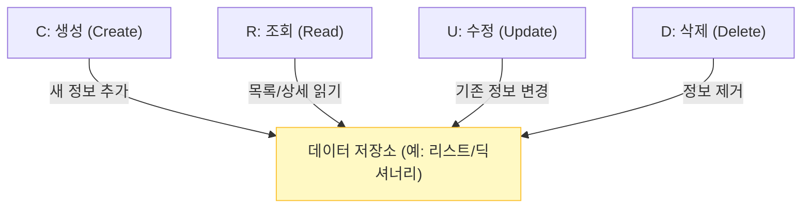

## §3. 상세 내용

### Why — 왜 이 세션이 필요한가?

프로그래밍 초보자들이 가장 많이 겪는 혼란 중 하나는 "데이터가 프로그램 안에서 어떤 모양으로 존재하는가"를 머릿속으로 그리지 못하는 것입니다. AI가 작성해 준 코드도 마찬가지입니다. 코드가 길어지고 복잡해지면, 내가 지금 다루고 있는 데이터가 단순한 문자열인지, 리스트인지, 아니면 딕셔너리인지 헷갈리게 됩니다. 데이터를 딕셔너리들의 리스트로 '구조화'해서 보관하는 이유를 명확히 깨닫지 못하면, 이후에 Update(수정)나 Delete(삭제) 기능을 구현할 때 특정 데이터를 어떻게 찾아야 할지 몰라 방황하게 됩니다.

### What — 이 세션에서 다루는 것은 무엇인가?

이 세션에서는 크게 두 가지 핵심 개념을 다룹니다.
첫째, **파편화된 데이터와 구조화된 데이터의 비교**입니다. 이름끼리, 전화번호끼리 별도의 리스트로 분리해서 관리할 때 발생하는 유지보수의 위험성(인덱스 불일치)을 살펴보고, 하나의 딕셔너리로 속성을 묶어 관리하는 것의 압도적인 안전성을 배웁니다.
둘째, **전역 변수로서의 리스트**입니다. 코드 최상단에 선언된 `customers = []`가 프로그램 전체에서 공유되는 '전역(global) 서랍장' 역할을 한다는 것을 이해합니다. 하지만 동시에 이 전역 변수가 프로그램이 종료되면 초기화되어 사라지는 메모리상의 존재라는 치명적인 한계점도 함께 짚고 넘어갑니다.

### How — 구체적으로 어떻게 진행하는가?

먼저 파편화된 데이터의 끔찍한 결말을 예시로 들어 경각심을 줍니다. 이름 리스트와 전화번호 리스트를 따로 관리하다가 중간에 데이터가 하나 꼬이면, 홍길동의 전화번호가 김철수의 번호로 둔갑하는 대참사가 일어난다는 점을 강조합니다. 이후, 딕셔너리를 활용해 데이터를 한 묶음으로 묶는 '구조화'의 우월성을 명확히 비교 설명합니다. 마지막으로, AI가 작성한 코드 최상단에 빈 리스트가 선언되어 있는지 직접 눈으로 확인하고 그 의미를 묻는 질문으로 수강생들의 참여를 유도합니다.

---


### 📊 참고 표 (Visual Specs)

**CRUD 오퍼레이션 핵심 요약**

| CRUD 명칭 | 의미 | 파이썬 리스트/딕셔너리 연산 | 고객 관리 프로그램의 기능 |
|:---|:---|:---|:---|

## §4. 실습 가이드 (+ 🎙️ 실습 대본)

### 실습 목표

수강생들이 AI가 작성해 준 코드 속에서 전역 변수 리스트와 딕셔너리의 결합 구조를 직접 눈으로 확인하고, 이것이 프로그램의 유일한 '저장소' 역할을 한다는 것을 깨닫도록 돕는 것이 이 실습의 목표입니다.

🎙️ **실습 가이드 대본 (Lab Guide)**:

> 자, 이제 여러분의 에디터에 열려있는 AI가 짜준 코드를 한번 살펴봅시다. 마우스를 스크롤해서 맨 위쪽을 볼까요? 아마 `customers = []` 처럼 대괄호로 된 빈 리스트가 하나 선언되어 있을 거예요. 다들 찾으셨나요?
>
> 이 녀석이 바로 우리의 '전역 서랍장'입니다. 전역, 즉 글로벌하다는 뜻은 이 프로그램 안의 어떤 기능에서든, 언제든지 이 서랍을 열어볼 수 있다는 뜻이에요. 이 텅 빈 서랍장에 우리는 앞으로 고객을 하나씩 딕셔너리 형태로 포장해서 넣을 겁니다.
>
> 그런데, 여기서 한 가지 재미있는 예측을 해볼까요? 우리가 이따가 프로그램을 실행해서 고객 데이터를 3명쯤 등록합니다. 그리고 껐다가 다시 실행하면 그 고객 데이터는 어떻게 될까요? 그대로 남아있을까요?
>
> 네, 맞습니다. 깨끗하게 사라집니다. 텅 빈 초기 상태로 돌아가죠. 왜냐고요? 이 `customers`라는 변수는 여러분 컴퓨터의 '메모리(RAM)'에 살고 있거든요. 프로그램이 켜져 있는 동안에만 전기를 먹고 임시로 기억하는 공간입니다. 전원을 끄면 날아가는 휘발성 메모리죠. 
> 
> "어? 그럼 영영 저장하려면 어떻게 해야 하나요? 매번 새로 입력할 수는 없잖아요." — 아주 예리하고 좋은 질문입니다! 그 문제는 내일(Day 5) 파일 저장(FileStorage)을 배울 때 아주 멋지게 해결할 테니, 지금은 일단 이 메모리 서랍장에 데이터를 넣고 빼는 원리에만 집중해 봅시다!

### 단계별 지시

| 단계 | 소요 시간 | 강사 지시사항 | 학습자 액션 | 예상 결과 |
|------|----------|--------------|------------|----------|
| 1 | 2분 | "코드 최상단에서 전역 리스트 선언부를 찾아보세요" | 코드 위쪽 탐색, `customers = []` 발견 | 전역 변수의 위치 파악 |
| 2 | 3분 | "데이터 파편화의 위험성을 화면의 코드로 비교 설명합니다" | 화면의 나쁜/좋은 코드 주시 | 데이터 구조화의 필요성 공감 |
| 3 | 3분 | "프로그램을 재실행했을 때 데이터가 날아가는 이유를 질문합니다" | 메모리와 하드디스크의 차이 연상 | 휘발성 저장소 개념 완벽 이해 |
| 4 | 2분 | "고객 1명의 데이터는 어떤 자료구조에 담기나요? 확인 질문" | "딕셔너리요!" 명확히 답변 | 핵심 개념 내재화 |

### 트러블슈팅 FAQ

| Q | A |
|---|---|
| AI가 리스트가 아니라 딕셔너리 안에 딕셔너리를 넣는 형태로 코드를 짰어요 | AI가 종종 `고객ID`를 키로 하는 전역 딕셔너리(`customers = {}`)를 만들기도 합니다. 이것도 아주 훌륭한 패턴이에요! 리스트 대신 거대한 딕셔너리를 서랍장 전체로 썼을 뿐입니다. 이 경우 데이터 검색 속도는 훨씬 빠르다는 장점을 가볍게 언급해 주시면 완벽합니다. |
| 전역 변수는 안 좋은 거 아닌가요? 다른 데서 배우기로는 쓰지 말라고 하던데요. | 네, 정확하고 예리한 지적입니다. 전역 변수는 누구나 접근할 수 있어서 나중에 '오염'의 위험이 큽니다. 그 한계를 깨닫고 함수 단위로, 객체 단위로 격리해 나가는 것이 오늘 오후와 내일의 핵심 주제가 될 겁니다. 지금은 가장 기초적인 단계를 밟고 있다고 생각해주세요. |

---


### 🎓 강사 노트 (Instructor Support)

- ⏱️ **타이밍**: 10:35 (20분, code)
- 🎯 **핵심 활동**: 전역 리스트 + 딕셔너리 분석
- ⚠️ **강사 주의사항**: AI 코드 읽기 연습

## §5. 코드 및 명령어 모음

이 섹션에서는 수강생들에게 직접 화면에 띄워주고 비교할 수 있는 나쁜 예시(파편화)와 좋은 예시(구조화) 코드를 제공합니다. 구조화의 장점을 눈으로 직접 확인하게 합니다.

```python
# ❌ 파편화된 데이터 (Bad) — 연결 고리가 없다!
names = ["홍길동", "김철수"]
phones = ["010-1111", "010-2222"]
emails = ["hong@mail.com", "kim@mail.com"]

# 문제점: names[0]과 phones[1]을 실수로 매칭하면 대참사가 발생합니다.
# 인덱스 번호가 같다는 '보이지 않는 약속'에만 의존하는 매우 위험한 구조입니다.
# 만약 누군가 중간에 이름 하나를 지웠는데 전화번호는 안 지웠다면? 전체 데이터가 엇갈립니다.


# ✅ 구조화된 데이터 (Good) — 한 묶음이 한 고객!
customers = [
    {"id": 1, "name": "홍길동", "phone": "010-1111", "email": "hong@mail.com"},
    {"id": 2, "name": "김철수", "phone": "010-2222", "email": "kim@mail.com"}
]

# 장점: customers[0]을 꺼내면 홍길동의 이름, 번호, 이메일이 담긴 딕셔너리가 통째로 딸려 나옵니다.
# 정보가 섞일 염려가 전혀 없고, 직관적이며 나중에 '등급'이나 '주소'를 추가 확장하기도 쉽습니다.
```

---

## §6. 요약

### 핵심 학습 포인트

이번 세션의 핵심은 세 가지입니다. 
첫째, 우리의 고객 데이터는 '딕셔너리를 담은 전역 리스트'라는 패턴으로 메모리에 저장됩니다. 
둘째, 딕셔너리는 사람의 속성을 깔끔하게 묶어주고(칸막이함), 리스트는 여러 고객을 순서대로 관리해 줍니다(서랍장). 
셋째, 데이터를 여러 리스트로 분리해서 흩어놓는 파편화 방식은 치명적인 버그를 낳기 쉬우므로, 반드시 하나의 딕셔너리로 구조화하여 통째로 묶어서 관리해야 안전합니다.

### 다음 세션 예고

데이터가 들어갈 서랍장과 칸막이함이 어떻게 생겼는지 완벽하게 이해했습니다. 그렇다면 다음 세션에서는 본격적으로 이 서랍장에 고객 데이터를 키보드로 밀어 넣고(Create), 서랍장을 열어서 누가 있는지 화면에 출력해보는(Read) 기능을 절차적으로 구현해 보겠습니다. 이제 진짜로 코드가 작동하는 모습을 직접 확인해 볼 시간입니다.

### 브릿지 노트

> "자, 이제 데이터가 어디에, 어떤 모양으로 저장되는지 머릿속에 확실히 그려지셨죠? 전역 리스트라는 텅 빈 서랍장이 준비되었으니, 이제 진짜로 고객을 서랍에 예쁘게 담아보고(Create), 다시 꺼내보는(Read) 코드를 돌려보며 우리 프로그램에 숨결을 불어넣어 보겠습니다. 다음 세션으로 넘어갈까요?"

---

## §7. 참고 자료

### 3-Source 출처

- **Source A (로컬 참고자료)**: [8 코딩.pdf] §8.9 절차적 프로그래밍 패턴 — 전역 변수(전역 리스트)를 사용하여 데이터를 저장하고 공유하는 기초적인 데이터 구조의 원리를 제공합니다.
- **Source B (NotebookLM)**: NotebookLM 분석 리포트 §6 — 데이터 파편화의 문제점을 짚고, 리스트와 딕셔너리의 결합 구조를 엑셀 행/열에 비유하여 설명한 교육학적 접근법을 차용했습니다.
- **Source C (Deep Research)**: Deep Research 리포트 §2.1 — 메모리 기반 CRUD 구현 시 가장 많이 쓰이는 'List of Dictionaries' 패턴의 당위성과 전역 상태 오염 위험성에 대한 기술적 분석을 바탕으로 내용을 구성했습니다.

### 강사 노트

> 💡 **강사 노트**: 파이썬 문법 시간이 아니므로, 리스트나 딕셔너리의 내부 동작 원리(Hash 등)를 깊게 설명할 필요는 전혀 없습니다. "엑셀의 한 줄 = 딕셔너리, 장부 전체 = 리스트"라는 직관적인 멘탈 모델을 수강생들에게 심어주는 것이 가장 중요합니다. 또한 전역 리스트를 선언했을 때 이것이 메모리에만 존재하여 컴퓨터를 껐다 켜면 사라진다는 점을 명확히 짚어주어야, 추후 File I/O 및 데이터베이스 세션으로 넘어갈 때 수강생들이 자연스럽게 '왜 파일로 저장해야 하는가?'에 대한 문제의식을 가질 수 있습니다.

---

## ✅ 세션 완료 체크리스트 (강사용)

- [x] §1~§7 모든 섹션이 충실하게 작성되었는가?
- [x] 서랍장과 칸막이함, 엑셀 시트 비유가 잘 포함되었는가?
- [x] 전역 리스트+딕셔너리 구조가 Mermaid 다이어그램으로 명확하게 시각화되었는가?
- [x] 구어체 강사/실습 대본이 자연스럽고 친절하게 삽입되었는가?
- [x] 파편화 vs 구조화 코드 예시가 직관적으로 포함되었는가?

---

*작성 일시: 2026-02-25*  
*작성 에이전트: Sisyphus-Junior*  
*교안 구조: 7섹션 (A0 팀 공통 표준)*

> 🔗 **이전 세션**: [세션 068: CRUD 개념 이해 및 1차 프롬프트 작성 실습](#세션-068)에서 배운 내용을 이어갑니다.
> 🔗 **다음 세션**: [세션 070: 절차적 Create, Read 기능 구현 및 테스트](#세션-070)에서 계속됩니다.

---

### 세션 070: 절차적 Create, Read 기능 구현 및 테스트
> [원본 파일](sessions/세션-070-절차적_Create_Read_구현_및_테스트_v2.1.md) | ⏱️ 25분 | 🧪 lab | 난이도: medium

> **세션 ID**: MS-PY101-070  
> **소요 시간**: 25분  
> **난이도**: medium  
> **청크 타입**: lab  
> **버전**: v2.1 (7섹션 구조)

---

## §1. 개요

> **Day 4 | AM | 세션 070/075**

### 🎯 학습 목표

이 세션이 끝나면, 수강생은 다음을 할 수 있습니다:

- AI가 생성한 절차적 코드 중 C(생성·등록)와 R(읽기·조회) 기능의 동작 원리를 이해할 수 있다.
- 무한 루프(`while True`)와 조건문(`if/elif`)을 결합한 절차적 프로그램의 기본 흐름을 설명할 수 있다.
- 직접 코드를 실행하고 본인 및 짝꿍의 데이터를 등록/조회하여 정상 작동을 검증할 수 있다.

### 선행 세션 환기

바로 직전 세션(세션-069)에서 우리는 파편화된 데이터를 묶어서 관리하는 구조, 즉 리스트 안에 딕셔너리를 담아 관리하는 방법을 배웠어요. 이름과 전화번호가 각각 따로 놀면 나중에 데이터가 뒤섞일 수 있기 때문에, 하나의 꾸러미(딕셔너리)로 묶어서 보관해야 한다고 했죠. 오늘은 그 튼튼한 서랍장을 활용해서, 실제로 사용자의 입력을 받아 데이터를 생성(Create)하고, 서랍장에 잘 들어갔는지 열어보는(Read) 기능을 직접 구현하고 테스트해 볼 차례입니다.

---

## §2. 핵심 개념 (+ 🗣️ 강사 대본 + Mermaid)

### 안내데스크 접수처와 투명 서랍장

우리가 오늘 구현할 C(Create)와 R(Read) 코드는 마치 아주 친절한 안내데스크와 같습니다. 여러분이 행사장에 도착하면 접수처 직원이 빈 노트를 펼치고 이름을 물어보죠. 여러분이 이름을 말하는 순간, 직원은 그 이름을 한 글자씩 정성스럽게 적어 넣습니다. 

프로그래밍에서는 직원이 이름을 물어보는 행위를 `input()` 함수로 표현하고, 노트에 적어 넣는 행위를 리스트의 끝에 데이터를 추가하는 `append()` 동작으로 구현합니다. 누군가의 정보를 받아 투명한 서랍장에 차곡차곡 쌓아두는 것, 이것이 바로 **생성(Create)** 기능의 핵심입니다.

직원이 지금까지 방문한 사람들의 명단을 확인하고 싶어졌다고 해볼까요? 투명 서랍장을 열고 첫 칸부터 마지막 칸까지 하나씩 살펴보며 적힌 이름을 읽습니다. 이것이 바로 리스트에 담긴 데이터를 `for` 반복문으로 처음부터 끝까지 꺼내어 화면에 출력하는 **조회(Read)** 기능입니다.

🗣️ **강사 대본 (Instructor Script)**:

> 여러분 안녕하세요. 지난 시간까지 우리는 데이터베이스나 거창한 저장소를 사용하기 전에, 리스트와 딕셔너리로 데이터를 깔끔하게 담는 법을 배웠습니다. 오늘부터는 그 골격 위에 본격적으로 살을 붙이는 작업을 시작할 겁니다. 
>
> 프로그램이 가장 기본적으로 갖춰야 할 능력이 뭘까요? 바로 새로운 정보를 기억하고, 그것을 다시 꺼내어 보여주는 겁니다. 여러분이 매일 사용하는 웹사이트 회원가입과 마이페이지 확인 기능도 결국 이 기본적인 등록과 조회의 확장판에 불과해요. 오늘은 AI가 작성해 준 절차적 형태의 코드를 여러분 손으로 직접 실행해 보면서, 코드가 살아 숨 쉬며 우리가 입력한 데이터를 기억하는 짜릿한 순간을 경험해 볼 겁니다.
>
> 방금 설명해 드린 안내데스크 비유를 꼭 기억해 주세요. 입력을 받아서 빈 노트의 맨 밑줄에 추가하는 것, 그리고 노트를 처음부터 끝까지 차례대로 읽어 내려가는 것. 이 두 가지가 오늘 배울 Create와 Read의 모든 것입니다.

### Mermaid 다이어그램

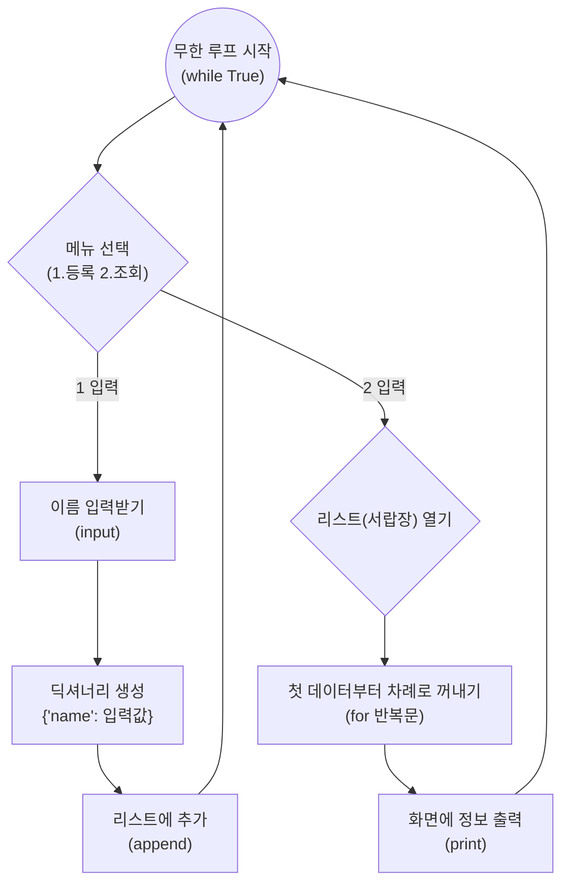

---

## §3. 상세 내용

### Why — 왜 C와 R부터 시작하는가?

"선생님, 수정이랑 삭제는 왜 한 번에 안 만드나요?"라고 생각하실 수 있어요. 좋은 질문입니다. CRUD(Create, Read, Update, Delete) 중에서 C와 R은 데이터 관리의 뼈대입니다. 데이터가 생성되어 존재하지 않으면 수정할 수도, 삭제할 수도 없기 때문이에요. 

이 기본적인 두 기능만 확실하게 만들어도, 프로그램은 단순히 계산만 하고 끝나는 1회용 계산기에서 벗어나 "상태를 기억하는" 진정한 애플리케이션으로 진화합니다.

### What — 절차적 구현의 특징

오늘 우리가 살펴볼 코드는 전형적인 **절차적 프로그래밍** 방식입니다. 우리 프로그램은 꺼지지 않고 계속해서 손님을 받아야 하므로, 끝나지 않는 무한 반복문(`while True`) 안에서 동작합니다. 사용자의 선택에 따라 `if`와 `elif`로 길을 나누고, 각각의 길 안에서 필요한 일들을 위에서 아래로 물 흐르듯 순서대로 처리합니다.

이 방식은 동작을 이해하기 쉽고 직관적이라서 초보자가 프로그램의 흐름을 파악하는 데는 큰 도움이 됩니다. 하지만 모든 기능이 하나의 커다란 루프 안에 욱여넣어지는 형태이기 때문에, 코드가 길어지면 금방 알아보기 힘들어지는 한계를 가지고 있어요. 우리는 일단 이 '작동하는(하지만 구조적으로는 아쉬운) 코드'를 직접 느끼고 경험해 볼 겁니다.

### How — 어떻게 코드로 구현되는가?

**Create (생성)**: 사용자가 1번 메뉴를 선택하면, 프로그램은 `input()`으로 이름을 묻습니다. 그리고 미리 준비해 둔 비어있는 리스트(`customers`)에 딕셔너리 형태로 데이터를 감싸서 `append()` 합니다. 딕셔너리를 쓰는 이유는 나중에 나이나 전화번호 같은 추가 정보를 담기 좋게 미리 공간의 모양을 예쁘게 잡아두기 위함입니다.

**Read (조회)**: 사용자가 2번 메뉴를 선택하면, 프로그램은 `for c in customers:` 와 같은 반복문을 사용해 리스트의 모든 항목을 순서대로 꺼냅니다. 그리고 딕셔너리의 키(`'name'`)를 이용해 값을 화면에 출력합니다.

> ✅ **체크포인트**: 여기까지 이해했는지 스스로 점검해 보세요.
> - 사용자로부터 입력받은 새로운 고객 정보를 리스트의 가장 마지막 칸에 밀어 넣기 위해 사용하는 파이썬의 리스트 전용 기능은 무엇일까요? ("append() 함수")
> - 데이터를 리스트에 넣을 때 단순한 문자열이 아니라 `{"name": "홍길동"}` 같은 딕셔너리 형태로 넣는 이유는 무엇일까요? ("향후 전화번호나 나이 등 연관된 속성을 쉽게 확장하기 위해")

---

## §4. 실습 가이드 (+ 🎙️ 실습 대본)

### 실습 목표

이 실습을 통해 수강생은 AI가 작성한 절차적 CRUD 코드를 IDE에서 실행하고, 1번(등록)과 2번(조회) 기능을 번갈아 수행하며 데이터가 메모리에 적재되고 출력되는 과정을 검증합니다.

🎙️ **실습 가이드 대본 (Lab Guide)**:

> 자, 이제 여러분의 통합 개발 환경(IDE)에서 직접 코드를 실행해 볼 시간입니다. 눈으로만 보는 것과 내 손으로 타이핑해서 내 이름이 화면에 나오는 걸 보는 건 완전히 다르거든요.
>
> 우선 AI 비서에게 절차적 구조의 등록/조회 코드를 만들어 달라고 부탁해 보겠습니다. 프롬프트를 복사해서 붙여넣고, 만들어진 코드를 실행해 보세요. 화면에 '1.등록 2.조회'라는 메뉴 텍스트가 깜빡거리면 성공입니다.
> 
> 먼저 숫자 1을 입력하고 엔터를 친 다음, 여러분의 이름을 입력해 보세요. 등록이 완료되었다는 메시지가 나오죠? 이번에는 여러분 옆에 앉은 짝꿍의 이름도 똑같은 방법으로 등록해 보세요. 자, 두 명의 정보가 보이지 않는 투명 서랍장에 안전하게 저장되었습니다. 이제 그 서랍장을 열어볼 차례입니다. 숫자 2를 입력하고 조회를 실행해 보세요. 방금 여러분이 등록했던 두 개의 이름이 예쁘게 출력되나요?

### 단계별 실습 지시사항

| 단계 | 소요 시간 | 액션 및 지시사항 | 예상 결과 및 검증 포인트 |
|------|----------|----------------|--------------------|
| 1 | 5분 | **AI에게 코드 생성 요청하기**: Agent Manager에 아래 프롬프트 예시를 입력하여 코드를 생성받고 `main.py`에 복사합니다. | 무한 루프와 `if/elif` 구조로 이루어진 파이썬 코드 생성 확인 |
| 2 | 3분 | **코드 실행 및 무한 루프 진입**: IDE에서 코드를 실행합니다. | 터미널에 `1.등록 2.조회:` 메뉴가 출력되며 사용자 입력을 대기함 |
| 3 | 5분 | **Create(등록) 검증**: '1'을 입력한 뒤 본인 이름 입력, 다시 '1'을 입력하고 짝꿍 이름 입력 | "등록 완료" 메시지 출력. `append()` 기능이 정상적으로 메모리에 데이터를 적재함 |
| 4 | 5분 | **Read(조회) 검증**: '2'를 입력하여 등록된 데이터 확인 | `for` 반복문이 리스트를 순회하며 본인과 짝꿍의 이름을 차례대로 출력함 |

**[단계 1] AI에게 코드 생성 요청 프롬프트**

```text
고객 정보를 관리하는 파이썬 프로그램을 작성해 줘.
다음 조건을 반드시 지켜줘:
1. 전역 리스트 하나를 만들어 데이터를 저장할 것
2. while True를 사용한 무한 루프 안에 메뉴를 만들 것
3. 메뉴는 "1.등록 2.조회" 두 가지만 있을 것
4. 등록 시 이름만 입력받고 딕셔너리 형태로 리스트에 추가할 것
5. 조회 시 리스트의 모든 고객 이름을 출력할 것
6. 함수를 사용하지 말고 절차적으로(if/elif) 작성할 것
```

**[단계 2~4] 직접 테스트하며 검증하기**

코드를 실행한 후, 터미널(콘솔) 창을 클릭하고 직접 숫자를 입력해야 합니다. 만약 코드를 실행했는데 에러가 나거나 바로 종료된다면, 무한 루프의 들여쓰기가 잘못되었을 확률이 매우 높습니다. 

### 트러블슈팅 FAQ

| Q | A |
|---|---|
| 등록을 하고 조회를 했는데 아무것도 안 나와요. | `append()`를 할 때 리스트 이름에 오타가 없는지 확인하세요. 등록 기능 쪽 코드와 조회 기능 쪽 코드가 같은 `customers` 리스트를 바라보고 있어야 합니다. |
| 조회를 하려니까 `KeyError: 'name'` 이라는 에러가 나요. | 등록할 때 딕셔너리의 키워드를 `"Name"` 대문자로 썼거나 오타를 냈는데, 조회할 때 소문자 `"name"`으로 찾으려고 해서 그렇습니다. 키워드의 대소문자를 맞춰주세요. |
| 코드가 멈추지 않고 계속 돌아가요. 끄고 싶어요! | 무한 루프 안에서 빠져나오는 기능을 아직 만들지 않았기 때문입니다. 터미널 창을 클릭하고 `Ctrl + C`를 누르면 강제로 프로그램을 멈출 수 있습니다. |

> ✅ **체크포인트**: 2번(조회) 메뉴를 선택했을 때 여러분이 입력한 두 사람의 이름이 모두 정상적으로 화면에 나타났나요? 성공하셨다면 손을 들어 주세요!

---


### 🎓 강사 노트 (Instructor Support)

- ⏱️ **타이밍**: 11:05 (25분, lab)
- 🎯 **핵심 활동**: C, R 기능 실행 & 테스트
- ⚠️ **강사 주의사항**: 등록 → 조회 순서 강조


### 📋 실습 설계 보강 (Lab Packet)

**세션 070 실습 설계 보강**

절차적 Create, Read 기능 구현 및 테스트
- **3-Stage Example Set**
  - 기본: AI 생성 코드에서 C/R 기능 실행 → 데이터 등록 → 등록 확인(전체 조회)
  - 변형: 등록 시 "정말 등록하시겠습니까?(y/n)" 확인 절차 추가
  - 실수 해결: "등록했는데 조회하면 안 나와요" → append() 호출 위치 또는 변수 스코프 확인
- **난이도 예측**: 코드 실행 흐름(메뉴 → 기능 → 결과)을 머릿속으로 따라가기 어려움
- **타이밍 가이드**: C기능 테스트 7분 | R기능 테스트 5분 | 정상/경계 테스트 8분 | 정리 5분
- **심리적 장벽**: "코드가 100줄이 넘어가니 어디가 뭔지 모르겠어요"
- **자가 점검**:
  - [ ] 고객을 2명 등록한 후 전체 조회 시 2명이 출력되는가?
  - [ ] 빈 상태에서 조회하면 "등록된 데이터가 없습니다" 메시지가 나오는가?
  - [ ] input()과 append()의 관계를 AI에게 설명 요청했는가?

## §5. 코드 및 명령어 모음

### 절차적 고객 관리 프로그램 (C, R 구현)

우리가 실습에서 검증한 핵심 코드의 형태는 다음과 같습니다. (함수 없이 커다란 하나의 흐름으로 작성된 전형적인 절차적 구조입니다.)

```python
# 절차적으로 구현한 고객 관리 프로그램의 기본 형태
customers = []

while True:
    menu = input("1.등록 2.조회: ")
    
    if menu == '1':
        name = input("이름: ")
        # 입력받은 이름을 딕셔너리 형태로 감싸서 리스트 끝에 추가합니다.
        customers.append({"name": name})
        print("등록 완료")
        
    elif menu == '2':
        # 리스트에 있는 모든 고객 정보를 처음부터 끝까지 반복하며 출력합니다.
        for c in customers:
            print(f"고객이름: {c['name']}")
```

### AI 프롬프트 예시 모음

- 🤖 **코드 기본 생성**: "절차적 방식으로 while 무한 루프 안에서 1.등록, 2.조회 메뉴를 가지는 고객 관리 코드를 짜줘."
- 🤖 **오류 발생 시**: "(에러 메시지 복사) 조회 메뉴를 눌렀더니 이런 에러가 나. 원인이 뭐야? 들여쓰기 문제야?"

---

## §6. 요약

### 핵심 학습 포인트

수고하셨습니다. 여러분은 방금 프로그램의 가장 핵심적인 두 가지 기능인 등록(Create)과 조회(Read)를 절차적인 코드로 완벽하게 구현하고 검증해 냈습니다. 
입력받은 데이터를 딕셔너리에 담아 리스트의 끝에 밀어 넣고(`append`), 나중에 필요할 때 반복문(`for`)으로 다시 꺼내어 확인하는 이 단순한 과정이 모든 소프트웨어의 근간이 됩니다. C와 R이 잘 작동하는 걸 보니 벌써 프로그램의 절반은 완성된 셈이에요. 

### 다음 세션 예고

오늘은 1번(등록)과 2번(조회)만 만들었습니다. 그런데 이름을 잘못 등록했다면 어떻게 해야 할까요? 이미 등록한 고객이 탈퇴를 원한다면요? 다음 세션에서는 이 거대한 무한 루프 안에 수정(Update)과 삭제(Delete) 기능을 마저 욱여넣어 볼 겁니다. 절차적 방식의 한계가 서서히 모습을 드러내기 시작할 테니 기대해 주세요.

### 브릿지 노트

> "모두 이름이 잘 출력되시나요? 축하합니다! 드디어 우리 프로그램이 일회용 기억상실증에서 벗어나 데이터를 기억하기 시작했어요. 자, 이제 C와 R을 정복했으니 남은 건 U와 D입니다. 이 큰 반복문 안에 코드를 계속 추가하다 보면 어떤 일이 벌어질까요? 다음 세션에서 그 짜릿하고도 고통스러운 팽창 과정을 함께 겪어보겠습니다."

---

## §7. 참고 자료

### 3-Source 출처

- **Source A (로컬 참고자료)**: 「8 코딩.pdf」 (§8.9 절차적 프로그래밍 패턴) — 절차적 방식의 기본 골격 및 리스트/딕셔너리 활용
- **Source B (NotebookLM)**: SRC-B03 — while 루프 안에서 if문을 통한 Create와 Read 절차적 구현 원리
- **Source C (Deep Research)**: SRC-C01 — 절차적 코드가 작동은 하지만 로직이 한 덩어리에 뭉쳐 있는 '작동하는 나쁜 코드'의 전형임을 설명 (§1.4)

### 강사 노트

> 💡 **강사 노트**: 실습 중에 학생들이 가장 많이 겪는 에러는 들여쓰기(IndentationError)와 딕셔너리 키 매칭 오류(KeyError)입니다. AI가 짠 코드를 복사해서 붙여넣을 때 들여쓰기가 틀어지는 경우가 잦으므로, 강사가 돌아다니며 탭(Tab) 키 사용법을 짚어주면 좋습니다. 절차적 코드의 한계를 직접 체감하게 하는 것이 이번 데이의 목표이므로, "코드가 깔끔하지 않다"는 점을 지속적으로 암시해 주세요.

---

## ✅ 세션 완료 체크리스트 (강사용)

- [ ] §1~§7 모든 섹션이 충실하게 작성되었는가?
- [ ] 안내데스크 접수처 비유가 명확하게 전달되었는가?
- [ ] §2에 Mermaid 다이어그램이 포함되었는가?
- [ ] C(등록)와 R(조회)의 테스트 방법이 구체적으로 제시되었는가?
- [ ] 체크포인트 질문이 §3, §4에 배치되었는가?
- [ ] 3-Source 팩트 패킷의 내용이 §7 출처에 반영되었는가?
- [ ] 다음 세션(071 수정/삭제 추가)을 위한 브릿지 노트가 포함되었는가?

---

**🔗 선행 세션**: [세션-069] 데이터 저장 구조(전역 리스트, 딕셔너리) 이해 (필수)  
**🔗 후행 세션**: [세션-071] 절차적 Update, Delete 기능 구현 및 통합 테스트

---

*작성 일시: 2026-02-25*  
*작성 에이전트: Sisyphus-Junior*  
*교안 구조: 7섹션 (A0 팀 공통 표준)*

> 🔗 **이전 세션**: [세션 069: 데이터 저장 구조(전역 리스트, 딕셔너리) 이해](#세션-069)에서 배운 내용을 이어갑니다.
> 🔗 **다음 세션**: [세션 071: 절차적 Update, Delete 기능 구현 및 통합 테스트](#세션-071)에서 계속됩니다.

---

### 세션 071: 절차적 Update, Delete 기능 구현 및 통합 테스트
> [원본 파일](sessions/세션-071-절차적_Update_Delete_구현_및_통합_테스트_v2.1.md) | ⏱️ 25분 | 🧪 lab | 난이도: high

> **세션 ID**: MS-PY101-071  
> **소요 시간**: 25분  
> **난이도**: ★★★  
> **청크 타입**: lab  
> **버전**: v2.1 (7섹션 구조)

---

## §1. 개요

> **Day 4 | AM | 세션 071/075**

### 🎯 학습 목표

이 세션이 끝나면, 수강생은 다음을 할 수 있습니다:

- 절차적 방식으로 Update(수정)와 Delete(삭제) 기능을 기존 코드에 통합할 수 있다.
- 수정과 삭제 등 데이터 조작 시 필수적으로 수반되는 '대상 데이터 검색' 로직의 원리를 이해할 수 있다.
- 4가지 기능(CRUD)이 모두 모인 상태에서 통합 테스트를 수행하고 예외 상황을 검증할 수 있다.

### 선행 세션 환기

바로 직전 세션(세션-070)에서 우리는 메뉴 1번(등록)과 2번(조회)을 절차적인 방식으로 뼈대를 잡아보았습니다. 거대한 `while` 루프 안에서 조건문으로 기능을 분기하는 구조를 만들었죠. AI가 짜준 코드를 붙여넣고 실행하니 등록과 조회가 제법 훌륭하게 작동했습니다. 

하지만, 아직 우리는 데이터를 반쪽짜리로만 다루고 있습니다. 현실 세계에서는 한 번 기록된 고객 정보나 데이터가 영원히 변하지 않는 경우가 거의 없기 때문입니다. 고객의 전화번호가 바뀌거나, 회원을 탈퇴하는 일은 늘 일어납니다. 오늘은 이 뼈대에 살을 붙여, 데이터를 완벽하게 제어할 수 있는 메뉴 3번(수정)과 4번(삭제)을 마저 완성해 보겠습니다.

---

## §2. 핵심 개념 (+ 🗣️ 강사 대본 + Mermaid)

### 서랍장 숨바꼭질과 라벨 확인

수정이나 삭제를 하려면 가장 먼저 무엇을 해야 할까요? 무작정 지우개부터 들면 될까요? 아닙니다. 바로 "내가 원하는 대상을 정확하게 찾아내는 일"부터 해야 합니다. 

이 상황을 투명 서랍장에 비유해 보겠습니다. 수백 명의 이름이 적힌 서랍장이 우리 앞에 놓여있고, 누군가 "홍길동이라는 사람의 정보를 이몽룡으로 고쳐주세요"라고 요청합니다. 직원은 어떻게 할까요? 첫 번째 서랍부터 시작해서 붙어있는 이름 라벨을 하나하나 확인해야 합니다. "첫 번째 칸, 김철수? 아니네. 두 번째 칸, 이영희? 아니네. 세 번째 칸, 홍길동! 드디어 찾았다."

이렇게 서랍을 열어가며 내가 찾는 이름과 서랍 안의 이름이 일치하는지 비교하는 숨바꼭질이 바로 검색(Search)의 본질입니다. 삭제를 할 때도 마찬가지입니다. 홍길동을 완전히 없애달라는 요청이 오면, 1번 서랍부터 차례대로 열어보면서 홍길동을 찾아내야만 비로소 그 정보를 꺼내 파기할 수 있습니다. 

🗣️ **강사 대본 (Instructor Script)**:

> 자, 이제 여러분의 프로그램에 Update(수정)와 Delete(삭제) 기능을 추가해 볼 겁니다. 그런데 여기서 잠깐, 코드를 짜기 전에 먼저 생각해 볼까요? 누군가의 정보를 수정하거나 지우려면 컴퓨터는 제일 먼저 무슨 일을 해야 할까요? 
>
> 맞습니다. 바로 '찾는' 일입니다. 서랍장 1번부터 끝번까지 쭉 훑어보면서 "이름이 홍길동인 서랍이 어딨지?" 하고 찾는 과정이 무조건 선행되어야 해요. 이것을 우리는 '검색 로직'이라고 부릅니다.
> 
> 이 과정에서 아주 재미있는 사실을 하나 깨닫게 됩니다. 정보를 수정할 때도 이 숨바꼭질이 필요하고, 지울 때도 똑같은 숨바꼭질이 필요하다는 점이에요. 심지어 나중에 고객 한 명만 콕 집어서 조회하는 기능을 만든다면? 거기서도 또 똑같은 숨바꼭질을 해야 합니다. 코드가 어떻게 될까요? 네, 코드 편집기에 문자 그대로 똑같은 로직이 복사하고 붙여넣기 한 것처럼 반복해서 등장하게 됩니다. 이 점을 꼭 기억하면서 오늘 추가되는 코드를 살펴보세요.

### Mermaid 다이어그램

```mermaid
flowchart TD
    A["메뉴 입력 (3: 수정, 4: 삭제)"] --> B{"검색 로직 (숨바꼭질)"}
    B -->|for 루프 실행| C["순차적으로 고객 데이터 확인"]
    C --> D{"이름이 일치하는가?"}
    D -->|No| C
    D -->|Yes (검색 성공)| E{"선택한 메뉴?"}
    E -->|3: 수정| F["새로운 데이터로 덮어쓰기 (Update)"]
    E -->|4: 삭제| G["리스트에서 데이터 완전히 제거 (Delete)"]
    F --> H["메인 메뉴로 복귀"]
    G --> H
```

---

## §3. 상세 내용

### Why — 왜 수정과 삭제에도 검색 로직이 필요한가?

어떤 대상을 조작하기 위해서는, 컴퓨터 메모리 어딘가에 저장된 그 데이터의 정확한 '위치'를 특정해야 합니다. 파이썬의 리스트(List)는 순서가 있는 데이터의 묶음이므로, 첫 번째 항목부터 끝 항목까지 순차적으로 꺼내보며 비교하는 과정(Sequential Search)이 필수적입니다. 데이터베이스를 사용한다면 이런 검색을 내부적으로 알아서 최적화해 주지만, 현재 우리가 작성하는 기초 수준의 절차적 코드에서는 `for` 루프와 `if` 조건문을 통해 이 검색 과정을 우리가 직접, 매번 코드로 구현해 주어야 합니다.

### What — 모놀리식 스크립트 구조의 덫과 중복

현재 우리는 모든 기능을 하나의 거대한 `while True` 루프 안에 때려 넣고 있습니다. 메뉴 3번(수정)을 선택했을 때도 데이터를 찾는 `for` 문이 통째로 들어가고, 메뉴 4번(삭제)을 선택했을 때도 똑같은 `for` 문이 통째로 들어갑니다.

연구 문헌에서는 이렇게 하나의 무한 루프 안에 모든 기능을 몰아넣는 방식을 '모놀리식 스크립트 구조(Monolithic Script Pattern)'라고 부릅니다. 프로그램이 작동은 하지만, 덩치가 커질수록 눈에 띄게 코드가 길어지고 유지보수가 극도로 어려워지는 전형적인 안티 패턴입니다. 우리는 작동에 초점을 맞춰 코드를 짜고 있지만, 이 과정에서 '코드 중복'이라는 거대한 늪에 발을 들이게 된 것입니다.

### How — 어떻게 코드를 추가하는가?

기존에 만들었던 `while` 루프의 `elif` 조건문 뒤에 메뉴 3번과 4번에 대한 코드를 아래와 같이 이어 붙입니다.
- **수정 로직 (Update)**: `input()`으로 찾을 이름을 입력받은 뒤, `for` 문으로 `customers` 리스트를 돕니다. 일치하는 딕셔너리를 찾으면, 다시 `input()`으로 새 이름을 받아 딕셔너리의 값을 덮어씁니다. (그리고 더 이상 찾을 필요가 없으니 `break`로 루프를 탈출합니다)
- **삭제 로직 (Delete)**: 동일하게 찾을 이름을 입력받고 `for` 문으로 리스트를 돕니다. 일치하는 딕셔너리를 찾으면 파이썬 리스트의 내장 함수인 `.remove()`를 사용하여 해당 요소를 제거합니다. (마찬가지로 `break`로 탈출)

> ✅ **체크포인트**: 여기까지 이해했는지 스스로 점검해 보세요.
> - 수정과 삭제 기능에서 공통적으로 먼저 수행해야 하는, 리스트 안의 특정 대상을 찾아내는 과정을 무엇이라고 부를까요? ("검색(Search)")
> - 절차적 방식으로 작성했을 때, 기능이 늘어날수록 프로그램의 덩치가 급격히 커지는 가장 큰 이유는 무엇인가요? ("동일한 검색 로직이 곳곳에 중복해서 복사/붙여넣기 되기 때문")

---

## §4. 실습 가이드 (+ 🎙️ 실습 대본)

### 실습 목표

이 실습을 통해 수강생은 기존 코드에 Update, Delete 기능을 추가하여 완전한 CRUD를 절차적으로 통합 구현하고, 실전 테스트 시나리오를 바탕으로 예외 상황을 철저하게 검증합니다.

🎙️ **실습 가이드 대본 (Lab Guide)**:

> 자, 이제 드디어 네 가지 기능이 모두 모일 시간입니다. 지난 시간에 만들었던 파일을 다시 열어주세요. 
> 
> AI에게 "우리가 만든 코드에 3번 수정, 4번 삭제 기능을 추가해 줘. 함수 쓰지 말고 메인 while 루프 안에 절차적으로 다 넣어줘"라고 깐깐하게 부탁해 볼 겁니다. 코드가 갑자기 확 길어질 텐데 당황하지 마세요. 
>
> 코드를 다 붙여넣었다면 이제 테스트를 해봐야겠죠? 먼저 1번 메뉴로 여러분의 이름을 하나 등록하고, 3번을 눌러서 이름을 멋지게 바꿔보세요. 2번을 눌러서 잘 바뀌었는지 확인하시고요! 그 다음 4번을 눌러서 방금 만든 이름을 아예 삭제해 보세요. 다시 조회를 눌렀을 때 아무것도 나오지 않는다면 삭제 기능 역시 정상 작동하는 겁니다.
>
> 하지만 가장 중요한 테스트는 지금부터입니다. 4번 삭제나 3번 수정을 누른 다음, 아예 목록에 없는 이상한 이름을 입력해 보세요. "아무개" 같은 거요. 에러 텍스트를 뿜으면서 프로그램이 팍 꺼지나요? 아니면 아무 일 없다는 듯이 조용히 메인 메뉴로 돌아오나요? 오류 없이 첫 화면으로 얌전하게 돌아왔다면 합격입니다. 데이터를 찾지 못했을 때 멈춰버리지 않는 것, 이것이 바로 프로그램 안정성의 기본입니다.

### 단계별 지시

| 단계 | 소요시간 | 강사 지시사항 | 학습자 액션 | 예상 결과 |
|---|---|---|---|---|
| 1 | 5분 | "AI에게 U/D 기능 추가 프롬프트를 입력하세요" | 아래 프롬프트를 Agent Manager에 입력 | 기존 코드에 3, 4번 기능이 추가된 절차적 코드 생성 |
| 2 | 2분 | "IDE에 코드를 적용하고 프로그램을 실행하세요" | 기존 파일 덮어쓰기 후 스크립트 실행 | 터미널에 1~4번 전체 메뉴 표시 |
| 3 | 5분 | "등록, 조회, 수정을 연계해서 테스트하세요" | 이름 등록 → 메뉴 3번으로 수정 → 조회로 검증 | 이름이 정상적으로 변경되어 출력 |
| 4 | 5분 | "삭제 기능 테스트 및 존재하지 않는 이름 입력" | 삭제 실행 후 목록에 없는 이름 삭제 시도 | 데이터 영구 제거, 없는 이름 입력 시 오류 없이 무시됨 |

**[단계 1] AI에게 Update/Delete 추가 요청하기**

Agent Manager 채팅창에 다음 프롬프트를 입력하여 전체 CRUD 코드를 완성해 봅니다.

```text
기존에 만든 C, R 기능이 있는 파이썬 고객 관리 코드에 3.수정, 4.삭제 기능을 마저 추가해 줘.
수정과 삭제를 하려면 고객 리스트를 for문으로 순회하면서 일치하는 이름을 먼저 찾아야 해.
함수를 쓰지 말고, 메인 while 루프 안에 절차적으로 모든 코드를 작성해 줘.
```

AI가 응답한 코드를 훑어보세요. `elif menu == '3':`과 `elif menu == '4':` 아래에 상당히 길고 유사한 코드가 쌍둥이처럼 추가되었을 것입니다.

**[단계 2] 통합 CRUD 코드 덮어쓰기 및 실행**

생성된 코드를 기존 파이썬 파일에 덮어쓰기하고 실행합니다. (아래 §5. 코드 및 명령어 모음에 있는 전체 코드 모습과 비슷한지 확인하세요.)

**[단계 3] 정상 케이스 통합 테스트 (Update 교차 검증)**

1. `1`을 입력하여 '홍길동'을 등록합니다.
2. `3`을 입력합니다. 수정할 이름으로 '홍길동', 새 이름으로 '이몽룡'을 입력합니다.
3. `2`를 입력하여 조회합니다. '홍길동'이 '이몽룡'으로 완벽하게 덮어써진 것을 확인합니다.

**[단계 4] 삭제 및 예외 케이스 테스트 (Delete 방어 검증)**

1. `4`를 입력하고 방금 수정한 '이몽룡'을 지워봅니다.
2. `2`를 입력하여 아무것도 출력되지 않는지 확인합니다. (데이터가 리스트에서 완전히 제거됨)
3. **[중요]** 다시 `4`를 입력하고, 현재 목록에 없는 '아무개'를 당당하게 입력해 봅니다.
4. 프로그램이 붉은 에러 메시지를 뿜어내지 않고 다시 메인 메뉴 화면을 표시하면 완벽하게 통과한 것입니다.

---


### 🎓 강사 노트 (Instructor Support)

- ⏱️ **타이밍**: 11:30 (25분, lab)
- 🎯 **핵심 활동**: U, D 기능 추가 & 통합 테스트
- ⚠️ **강사 주의사항**: 검색 로직이 핵심. 꼼꼼히


### 📋 실습 설계 보강 (Lab Packet)

**세션 071 실습 설계 보강**

절차적 Update, Delete 기능 구현 및 통합 테스트
- **3-Stage Example Set**
  - 기본: U/D 기능 실행 → 등록 → 수정 → 삭제 → 재조회로 전체 사이클 검증
  - 변형: 존재하지 않는 고객을 수정/삭제 시도 → 에러 처리 확인
  - 실수 해결: "삭제했는데 인덱스가 꼬여서 다른 데이터가 삭제됐어요" → 이름 검색 기반 삭제로 전환
- **난이도 예측**: ★★★ "대상 데이터 검색" 로직이 핵심 — for문 안의 if문 활용
- **타이밍 가이드**: U기능 테스트 7분 | D기능 테스트 7분 | 통합 시나리오 5분 | 엣지 케이스 6분
- **심리적 장벽**: "수정이랑 삭제는 등록보다 훨씬 복잡해요"
- **자가 점검**:
  - [ ] 등록→조회→수정→조회→삭제→조회 전체 사이클을 완주했는가?
  - [ ] 존재하지 않는 이름으로 수정/삭제 시도 시 오류 메시지가 나오는가?
  - [ ] CRUD 4가지 기능이 모두 정상 동작하는가?

## §5. 코드 및 명령어 모음

### 완성된 절차적 CRUD 스크립트 (참고 및 대조용)

```python
customers = [{"name": "홍길동"}] # 테스트를 위해 처음부터 들어있는 데이터

while True:
    menu = input("\n1.등록 2.조회 3.수정 4.삭제 0.종료: ")
    
    if menu == '1':
        name = input("이름: ")
        customers.append({"name": name})
        print("등록 완료")
        
    elif menu == '2':
        for c in customers:
            print(f"고객이름: {c['name']}")
            
    elif menu == '3':
        old_name = input("수정할 이름: ")
        # 수정 대상을 찾기 위한 검색 로직 (중복 발생 구간 시작)
        for c in customers:
            if c['name'] == old_name:
                new_name = input("새 이름: ")
                c['name'] = new_name
                print("수정 완료")
                break
                
    elif menu == '4':
        del_name = input("삭제할 이름: ")
        # 삭제 대상을 찾기 위한 검색 로직 (위의 수정 로직과 거의 복사 붙여넣기 수준)
        for c in customers:
            if c['name'] == del_name:
                customers.remove(c)
                print("삭제 완료")
                break
                
    elif menu == '0':
        print("프로그램을 종료합니다.")
        break
```

> 🤖 **AI 프롬프트 예시**: "방금 작성한 코드에서 3번과 4번 메뉴의 for문 코드가 너무 똑같이 생겼어. 혹시 이렇게 코드가 계속 반복되는 게 나중에 문제가 되지는 않을까?" (다음 세션의 빌드업을 위해 AI에게 미리 물어볼 수 있는 질문)

---

## §6. 요약

### 핵심 학습 포인트

훌륭합니다! 여러분은 이제 Create, Read, Update, Delete라는 4대 천왕을 하나의 프로그램 안에 모두 구현해 냈습니다. 데이터베이스 프로그래밍의 가장 기초적이고 완벽한 사이클을 완성한 것이죠. 
특히 Update와 Delete를 구현하기 위해서는 무턱대고 지우는 것이 아니라, 반드시 데이터를 먼저 '검색'해야 한다는 사실을 배웠습니다. 통합 테스트 결과, 기능은 우리가 의도한 대로 완벽하게 작동했으며, 목록에 없는 이름을 입력하는 예외 상황에서도 프로그램이 죽지 않고 든든하게 버텼습니다.

### 작동하지만 아쉬운 코드 (한계점 인식)

하지만 훌륭한 시니어 개발자는 단순히 '작동하는 코드'에 결코 만족하지 않습니다. 화면에 작성된 코드를 스크롤을 내려가며 다시 한번 보세요. 100줄 가까이 팽창한 거대한 하나의 루프, 그리고 조회, 수정, 삭제 메뉴마다 끈질기게 반복되는 `for` 루프 숨바꼭질. 이 코드에는 보이지 않는 커다란 시한폭탄이 숨겨져 있습니다.

### 다음 세션 예고

다음 세션에서는 우리가 방금 만든 자랑스러운(?) 이 코드를 시니어 개발자의 날카로운 시선으로 다시 뜯어봅니다. 절차적 방식이 가진 3대 문제점(전역 상태 오염, 코드 중복, 테스트 불가)이 우리 코드에 어떻게 스며들어 있는지 뼈아프게 체험해 보고, 이 지옥에서 탈출하기 위한 '구조적 리팩토링'의 세계로 넘어갈 준비를 하겠습니다.

---

## §7. 참고 자료

### 3-Source 출처

- **Source A (로컬 참고자료)**: [A] 8 코딩.pdf §8.9 — 절차적 프로그래밍 패턴의 특징과 한계, 거대한 while 루프 분기 기반의 통짜 CRUD 구현.
- **Source B (NotebookLM)**: [B] NotebookLM §3 — 절차적 Update, Delete 구현의 본질, 모놀리식 스크립트 구조가 야기하는 문제점 및 유지보수의 어려움 정의.
- **Source C (Deep Research)**: [C] Deep Research §1.4, §3.1 — 반복적인 검색 로직으로 인한 코드 팽창 현상, 통합 테스트 시 예외(없는 데이터 조회) 방어 케이스의 중요성.

### 강사 노트

> 💡 **강사 노트**: 수강생들이 처음으로 모든 기능이 하나로 연동된 프로그램을 완성하고 성취감을 느끼는 타이밍입니다. 칭찬을 아끼지 마시되, 코드의 '길이'와 '반복'에 대해서는 의도적으로 찝찝함과 불편함을 느끼게끔 유도해 주세요. "스크롤을 한참 내려야 코드를 다 볼 수 있죠?", "수정 기능과 삭제 기능이 쌍둥이처럼 똑같이 생기지 않았나요?"와 같은 질문을 던지며 다음 세션(072 구조적 결함 리뷰)을 위한 심리적 빌드업을 해 주시는 것이 매우 중요합니다.

---

## ✅ 세션 완료 체크리스트 (강사용)

- [ ] §1~§7 모든 섹션이 충실하게 7섹션 구조로 작성되었는가?
- [ ] 서랍장 숨바꼭질 비유가 §2에 적절하게 배치되고 이해하기 쉽게 발전되었는가?
- [ ] §2에 시스템 동작 과정을 한눈에 보여주는 Mermaid 다이어그램이 포함되었는가?
- [ ] §4 실습 가이드에 U/D 통합 테스트 및 예외(없는 데이터 조작) 검증 과정이 상세히 기술되었는가?
- [ ] 🗣️ 강사 대본과 🎙️ 실습 가이드 대본이 구어체로 현장감 있게 작성되었는가?
- [ ] Source A, B, C 출처가 명확히 명시되었는가?
- [ ] 다음 세션(072 구조적 결함 리뷰)을 위한 자연스러운 브릿지가 §6에 포함되었는가?

---

**🔗 선행 세션**: [세션-070] 절차적 Create, Read 기능 구현 및 테스트 (필수)  
**🔗 후행 세션**: [세션-072] 코드 리뷰: 전역 변수와 코드 중복의 한계점 발견

---

*작성 일시: 2026-02-25*  
*작성 에이전트: Sisyphus-Junior (Antigravity)*  
*교안 구조: 7섹션 (A0 팀 공통 표준)*


> 🔗 **이전 세션**: [세션 070: 절차적 Create, Read 기능 구현 및 테스트](#세션-070)에서 배운 내용을 이어갑니다.
> 🔗 **다음 세션**: [세션 072: 코드 리뷰: 전역 변수와 코드 중복의 한계점 발견](#세션-072)에서 계속됩니다.

---

### 세션 072: 코드 리뷰: 전역 변수와 코드 중복의 한계점 발견
> [원본 파일](sessions/세션-072-코드_리뷰-_전역_변수와_코드_중복의_한계점_발견_v2.1.md) | ⏱️ 20분 | 📖 narrative | 난이도: medium

> **세션 ID**: MS-PY101-072  
> **소요 시간**: 20분  
> **난이도**: medium  
> **청크 타입**: narrative  
> **버전**: v2.1 (7섹션 구조)

---

## §1. 개요

> **Day 4 | AM | 세션 072/075**

이 세션은 완성된 절차적 CRUD 코드를 비판적인 시각에서 리뷰해보는 시간이에요. 코드가 정상적으로 작동한다고 해서 무조건 좋은 코드인 것은 아닙니다. 전역 변수의 위험성과 코드 중복 문제(DRY 원칙 위배)를 직접 눈으로 확인하며, 절차적 프로그래밍에서 구조적 프로그래밍으로 나아가는 패러다임 전환의 필요성을 스스로 깨닫게 되는 아주 중요한 전환점입니다.

### 🎯 학습 목표

이 세션이 끝나면 수강생은 다음을 할 수 있어요:

- 절차적 코드의 3대 결함인 '전역 상태 오염', '코드 중복', '단위 테스트 불가'를 설명할 수 있습니다
- 프로그래밍의 핵심 철학인 DRY(Don't Repeat Yourself) 원칙의 의미를 이해하고, 내 코드에서 위반 사례를 찾아낼 수 있습니다
- 전역 변수 남용이 데이터 무결성에 미치는 위험을 '공용 금고' 비유를 통해 설명할 수 있습니다

### 선행 세션 환기

이전 세션(071)에서 우리는 100줄이 넘어가는 절차적 방식의 고객 관리 프로그램(CRUD)을 완성했습니다. 겉보기엔 완벽하게 동작하지만, 그 코드를 작성하면서 조회 로직을 복사해서 수정과 삭제에 똑같이 붙여넣기 했던 기억이 있을 거예요. 이제 그 방식이 왜 위험한지, 겉으로는 잘 달리는 자동차의 보닛을 열어 내부의 스파게티 코드를 직접 마주할 차례입니다.

---

## §2. 핵심 개념 (+ 🗣️ 강사 대본 + Mermaid)

### 공용 금고와 복붙 안내문 비유

우리가 작성한 코드의 문제점을 두 가지 비유로 설명합니다. 첫째, 전역 변수는 길거리에 덩그러니 놓인 '공용 금고'입니다. 언제 어디서든 누구나 열고 닫을 수 있어서 프로그램의 어느 곳에서든 데이터가 훼손될 수 있는 '전역 상태의 오염 위험'을 안고 있습니다. 

둘째, 무분별하게 복사해 붙여넣은 검색 반복문은 1층부터 10층까지 화장실 문 앞에 똑같이 붙어있는 '복붙 안내문'입니다. 비밀번호가 하나라도 바뀌면 모든 층을 돌아다니며 땀을 뻘뻘 흘리며 수정해야 하고, 한 층이라도 빼먹으면 큰 사고가 터집니다. 이것이 바로 '코드 중복'이며 프로그래머가 가장 피해야 할 상태입니다.

🗣️ **강사 대본 (Instructor Script)**:

> 여러분, 지난 시간까지 우리는 네 가지 핵심 기능이 모두 들어간 고객 관리 프로그램을 훌륭하게 완성했습니다. 입력하면 들어가고, 지우면 사라지는 완벽하게 작동하는 프로그램입니다. 그런데 여러분, 현업에서 활동하는 숙련된 개발자에게 이 코드를 보여준다면 아마 당장 뜯어고치자고 말할 겁니다. 도대체 무엇이 문제일까요?
>
> 겉으로는 아무런 문제 없이 잘 달리는 자동차처럼 보이지만, 사실 그 자동차의 보닛을 열어보면 엔진과 각종 부품들이 테이프로 얼기설기 붙어있는 것과 같은 상태입니다. 코드가 작동한다고 해서 그것이 곧 좋은 코드라는 의미는 아닙니다. 오늘은 우리가 직접 짠 코드를 스스로 비판적인 시각에서 뜯어보는 시간을 갖겠습니다.
>
> 우리 코드의 문제점을 쉽게 이해하기 위해 두 가지 상황을 상상해 볼까요? 첫 번째는 길거리에 덩그러니 놓인 공용 금고입니다. 우리 코드의 가장 꼭대기에 선언된 고객 리스트가 바로 이 금고와 같습니다. 비밀번호도 없고 뚜껑이 활짝 열려 있어서 누구나 지나가다가 데이터를 넣을 수도, 마음대로 빼갈 수도 있습니다. 만약 프로그램의 엉뚱한 곳에서 실수로 이 금고를 엎어버린다면 모든 데이터가 한순간에 날아갈 겁니다. 우리는 이를 '전역 변수의 오염'이라고 부릅니다.
>
> 두 번째 상황은 건물 1층부터 10층까지 화장실 문 앞에 똑같이 붙어있는 복붙 안내문입니다. 만약 화장실 비밀번호가 바뀌어서 안내문을 수정해야 한다면 어떻게 될까요? 경비원은 1층부터 10층까지 땀을 뻘뻘 흘리며 열 번이나 새로 고쳐 적어야 합니다. 단 한 군데라도 빼먹으면 사고가 나겠죠. 우리 코드에서 검색을 위해 반복적으로 작성했던 조건문 로직이 바로 이 복붙 안내문과 같습니다. 이름으로 찾던 걸 전화번호로 찾게 바꾸려면, 우리는 조회, 수정, 삭제 메뉴에서 모두 고쳐야만 합니다. 똑같은 코드가 여러 곳에 흩어져 있는 이 상황은 프로그래머들이 가장 경계하는 최악의 패턴입니다.

### Mermaid 다이어그램

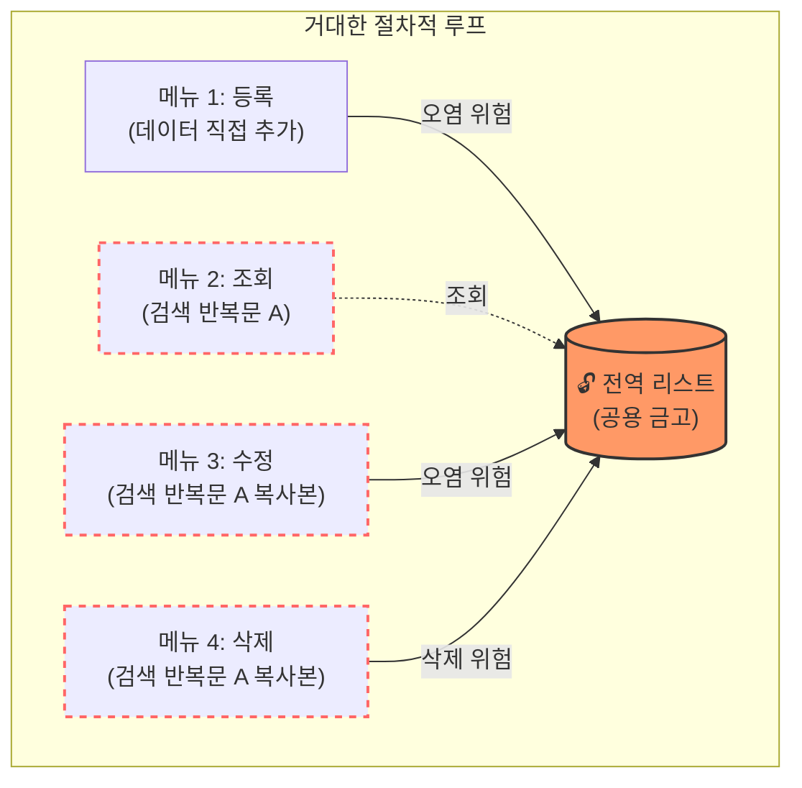

이 다이어그램은 얽혀있는 절차적 코드의 불안한 구조를 보여줍니다. 검색 로직(반복문 A)이 여러 메뉴에 걸쳐 무분별하게 복제되어 있고, 모든 기능이 하나의 전역 리스트를 무방비로 조작하고 있어 작은 실수 하나가 전체 데이터를 훼손할 수 있는 위험한 상태입니다.

---

## §3. 상세 내용

### Why — 왜 작동하는 코드를 비판해야 하는가?

기능이 정상적으로 돌아가는 것에만 만족하면 프로그램이 조금만 복잡해져도 유지보수의 늪에 빠지게 됩니다. "출력 형식을 바꾼다면 코드를 몇 군데나 수정해야 하는가?"라는 단순한 질문 하나만으로도 절차적 코드의 한계가 명확히 드러납니다. 내가 짠 코드의 문제점을 발견하고 스스로 진단하는 눈을 가지는 것이야말로 진정한 시니어 개발자로 성장하는 가장 중요한 첫걸음입니다.

### What — 절차적 코드의 3대 문제점과 DRY 원칙

우리가 작성한 모놀리식(Monolithic) 절차적 코드는 크게 세 가지 치명적인 결함이 있습니다:

1. **전역 상태 오염 위험**: 모든 기능이 하나의 거대한 리스트를 공유하고 있습니다. 프로그램 덩치가 커지면 어디서 데이터가 꼬였는지 추적하는 것이 모래사장에서 바늘 찾기만큼 어려워집니다.
2. **코드 중복의 심각성**: 조회, 수정, 삭제 기능에 모두 고객의 이름을 검색하는 똑같은 `for`문이 흩어져 있습니다. 개발의 세계에는 "똑같은 것을 두 번 반복하지 말라"는 뜻의 **DRY (Don't Repeat Yourself)**라는 황금 원칙이 있는데, 우리의 코드는 이를 정면으로 위반하고 있어요.
3. **단위 테스트 불가**: 등록 기능 하나만 떼어내서 테스트하고 싶어도, 우리는 무조건 무한 루프를 띄우고 메뉴 1번을 선택하는 번거로운 과정을 거쳐야만 합니다. 각 부품이 엉켜있어 독립적인 점검이 불가능한 구조입니다.

### How — 문제 해결을 위한 진단

문제점들을 머리로만 이해할 것이 아니라, 코드를 보며 직접 그 심각성을 체감해야 합니다. 만약 "등록을 완료할 때 방금 등록한 사람의 이름도 같이 보여주세요"라는 간단한 요구사항이 추가된다면, 우리는 출력하는 코드를 또다시 복사해서 등록 기능 안에 붙여넣어야 합니다. 기능들이 꼬리를 물고 하나의 거대한 실타래처럼 엉켜 있어서, 한 곳을 잡아당기면 프로그램 전체가 흔들거리는 불안한 스파게티 코드가 된 것입니다. 이 진단이 내려졌다면, 처방은 명확합니다. 면발을 가위로 싹둑 잘라 용도별로 그릇에 나누어 담는 작업(구조적 리팩토링)이 절실하게 필요해집니다.

---

## §4. 실습 가이드 (+ 🎙️ 실습 대본)

### 실습 목표

코드 에디터에서 자신의 절차적 코드를 열고, DRY 원칙을 위반한 중복된 검색 로직(`for` 반복문)이 몇 군데에 있는지 직접 세어보는 시각적 확인 작업을 진행합니다. 또한 출력 양식을 아주 약간만 수정해 보며 스파게티 코드의 유지보수성 악몽을 짧게 체감하는 것이 목표입니다.

🎙️ **실습 가이드 대본 (Lab Guide)**:

> 이 문제점들을 코드로 직접 확인해 보겠습니다. 화면에 여러분이 작성한 파이썬 파일을 띄워주세요. 그리고 `for c in customers:` 라는 반복문이 시작되는 부분을 한 번 찾아보세요.
>
> 찾으셨나요? 자, 수정 기능을 담당하는 메뉴 3번 안에도 똑같은 `for`문이 길게 자리 잡고 있고, 바로 그 밑의 삭제 기능을 담당하는 메뉴 4번 안에도 글자 하나 다르지 않은 `for`문이 떡하니 버티고 있죠? 심지어 고객 정보를 화면에 보여주는 `print()` 함수조차 각 메뉴 안에 단단하게 갇혀있습니다.
>
> 우리 잠깐 고통을 체험해 볼까요? 지금은 출력 양식이 `이름: 홍길동`으로 되어 있는데, 이걸 `[고객명] 홍길동`으로 바꿔주세요. 어때요? 조회 메뉴에서도 고치고, 수정하고, 삭제할 때도 확인차 보여주느라 고치고... 세 군데나 수정해야 하죠. 만약 깜빡하고 한 곳을 빼먹은 채로 저장한다면 에러가 나거나 화면이 이상해질 겁니다. 이게 바로 유지보수의 늪입니다. 이 코드, 이대로 둬서는 절대 안 됩니다!

### 단계별 지시

| 단계 | 소요 시간 | 강사 지시사항 | 학습자 액션 | 예상 결과 |
|------|----------|--------------|------------|----------|
| 1 | 3분 | "코드에서 `for c in customers:` 반복문 개수를 세어보세요" | 에디터에서 코드 스크롤하며 확인 | 최소 3군데의 중복 코드 발견 |
| 2 | 5분 | "출력 양식을 `[고객명]` 형식으로 변경해보세요" | 모든 메뉴의 print 문을 찾아가며 텍스트 수정 | 수정의 번거로움과 실수 발생 가능성 체감 |
| 3 | 2분 | 변경 후 프로그램 실행하여 테스트 | 코드 실행 및 1~4번 메뉴 순회 확인 | 누락된 곳 발견 및 DRY 원칙 위배의 고통 체감 |

### 트러블슈팅 FAQ

| Q | A |
|---|---|
| 수강생이 중복 코드가 뭐가 나쁜지 공감하지 못해요 | "만약 코드가 100줄이 아니라 만 줄이고, 이 검색 로직이 50군데 복사되어 있다면 어떻게 될까요? 하루 종일 `Ctrl+F`만 누르다 퇴근하게 될 겁니다."라고 덧붙여 설명해주세요. |
| "함수로 묶으면 되지 않나요?" 라고 묻는 수강생이 있어요 | 아주 훌륭한 통찰입니다! "정확히 맞췄습니다. 그게 바로 우리가 다음 시간에 할 '구조적 프로그래밍'의 핵심입니다!"라고 칭찬하며 기대감을 높여주세요. |

> ✅ **체크포인트**: "개발의 세계에서 똑같은 코드를 두 번 이상 반복해서 작성하지 말라는 의미를 담고 있는 유명한 원칙의 영문 약자는 무엇일까요?" — 정답은 **DRY** 원칙입니다!

---


### 🎓 강사 노트 (Instructor Support)

- ⏱️ **타이밍**: 12:55 (20분, narrative)
- 🎯 **핵심 활동**: 전역 변수·중복 문제 체감
- ⚠️ **강사 주의사항**: "직접 느끼셨죠?" 공감 유도

## §5. 코드 및 명령어 모음

이 세션에서는 코드를 새로 작성하지 않고, 이전에 만든 절차적 코드의 결함을 리뷰하는 데 집중합니다. 수강생들이 주목해야 할 전형적인 안티 패턴(Anti-pattern)은 다음과 같습니다.

```python
# 절차적 코드의 전형적인 결함 패턴 (안티 패턴)
customers = [] # 🚨 결함 1: 공용 금고의 오염 위험 (전역 변수)

while True:
    menu = input("1.등록 2.조회 3.수정 4.삭제: ")
    
    if menu == '1':
        name = input("이름: ")
        customers.append({"name": name})
        print("등록 완료")
        
    elif menu == '2':
        # 🚨 결함 2: DRY 원칙 위반 (중복된 검색 로직 시작)
        for c in customers:
            print(f"고객이름: {c['name']}")
            
    elif menu == '3':
        target = input("수정할 이름: ")
        # 🚨 결함 2: 메뉴 2와 완전히 똑같은 검색 로직이 복사되어 있음
        for c in customers:
            if c['name'] == target:
                new_name = input("새 이름: ")
                c['name'] = new_name
                print("수정 완료")
                
    elif menu == '4':
        target = input("삭제할 이름: ")
        # 🚨 결함 2: 또다시 등장하는 똑같은 검색 로직
        for c in customers:
            if c['name'] == target:
                customers.remove(c)
                print("삭제 완료")
```

---

## §6. 요약

### 핵심 학습 포인트

이번 세션에서는 잘 작동하는 코드 뒤에 숨겨진 치명적인 결함을 직접 진단했습니다.
1. 전역 변수로 인한 데이터의 불안정성(공용 금고)
2. 똑같은 로직이 복사되어 늘어나는 코드 중복(DRY 원칙 위배)
3. 개별적인 테스트가 불가능한 단단한 결합

이 문제점들을 꼼꼼히 진단했으니, 이제 우리 손으로 직접 이 코드를 수술대에 올릴 차례입니다.

### 다음 세션 예고

다음 세션에서는 이 엉킨 코드들을 어떻게 우아하고 깔끔하게 풀어낼 수 있는지, AI의 힘을 빌려 구조를 개편하는 '구조적 리팩토링 프롬프트 작성'에 돌입하겠습니다.

### 브릿지 노트

> "문제점을 정확히 알았으니, 이제 병을 고칠 시간입니다. 다음 시간에는 AI에게 '기능별로 함수를 나눠서 구조적으로 바꿔줘!'라고 멋진 처방전을 써보겠습니다. 기대하셔도 좋습니다."

---

## §7. 참고 자료

### 3-Source 출처

- **Source A (로컬 참고자료)**: 8 코딩.pdf (§8.12 코드 리뷰) — 전역 변수의 위험성과 절차적 코드를 비판적으로 분석하는 리뷰 과정의 근거를 제공합니다.
- **Source B (NotebookLM)**: NotebookLM 분석 리포트 (§4) — 절차적 코드의 구조적 결함(코드 중복, 유지보수 어려움)과 DRY 원칙에 대한 핵심 논리를 참조했습니다.
- **Source C (Deep Research)**: Deep Research 보고서 (§1.2) — 절차적 프로그래밍의 3대 문제점(전역 상태 오염, 중복, 테스트 불가)과 스파게티 코드의 실체 확인 사례를 반영했습니다.

### 강사 노트

> 💡 **강사 노트**: 수강생들이 스스로 짠 코드를 비판하는 과정이기 때문에 자칫 "내가 잘못 짰구나"라며 의기소침해질 수 있습니다. "처음엔 누구나 이렇게 짭니다. 이 과정을 겪어야만 왜 함수가 필요한지 뼈저리게 느낄 수 있습니다"라고 반드시 격려해 주며 동기를 부여해 주세요.

---

## ✅ 세션 완료 체크리스트 (강사용)

- [x] §1~§7 모든 섹션이 충실하게 작성되었는가?
- [x] 절차적 코드의 3대 문제점이 명확하게 설명되었는가?
- [x] '공용 금고'와 '복붙 안내문' 비유가 대본에 포함되었는가?
- [x] DRY 원칙의 의미를 수강생이 이해했는가?
- [x] 시각적 점검(for문 개수 세기)을 통해 문제의 심각성을 체감시켰는가?
- [x] 3-Source 팩트 패킷의 근거가 모두 반영되었는가?

---

*작성 일시: 2026-02-25*  
*작성 에이전트: A4B_Session_Writer*  
*교안 구조: 7섹션 (A0 팀 공통 표준)*


> 🔗 **이전 세션**: [세션 071: 절차적 Update, Delete 기능 구현 및 통합 테스트](#세션-071)에서 배운 내용을 이어갑니다.
> 🔗 **다음 세션**: [세션 073: 절차적 코드의 구조적 리팩토링 프롬프트 작성](#세션-073)에서 계속됩니다.

---

### 세션 073: 절차적 코드의 구조적 리팩토링 프롬프트 작성
> [원본 파일](sessions/세션-073-절차적_코드의_구조적_리팩토링_프롬프트_작성_v2.1.md) | ⏱️ 20분 | 🧪 lab | 난이도: medium

> **세션 ID**: MS-PY101-073  
> **소요 시간**: 20분  
> **난이도**: ★★☆  
> **청크 타입**: lab  
> **버전**: v2.1 (7섹션 구조)

---

## §1. 개요

> **Day 4 | AM | 세션 073/075**

### 🎯 학습 목표

이 세션이 끝나면, 수강생은 다음을 할 수 있습니다:

- 절차적 코드를 기능별 함수로 분리하는 구조적 리팩토링 프롬프트를 작성할 수 있다
- 전역 변수를 제거하고 메인 함수 내부로 이동시키는 지시를 내릴 수 있다
- 리팩토링 전후의 코드를 분리하여 저장하고, 겉보기 동작이 100% 동일하게 유지되는지 테스트할 수 있다

### 선행 세션 환기

바로 직전 세션(세션-072)에서 우리는 기능 추가에만 급급해 작성했던 절차적 코드가 얼마나 유지보수하기 어려운지 직접 눈으로 확인했습니다. 똑같은 검색 로직이 조회, 수정, 삭제 기능에 무려 세 번이나 복사되어 있었고, 출력 양식을 조금 바꾸려다가 실수로 다른 곳을 누락해 에러의 늪에 빠지기도 했죠. 또 전역 상태가 여기저기 흩어져 있어 단위 테스트조차 불가능했습니다. 이제 이 스파게티처럼 엉킨 코드를 아주 예쁘고 깔끔하게 다시 정리해 볼 시간입니다.

---

## §2. 핵심 개념 (+ 🗣️ 강사 대본 + Mermaid)

### 비유 — 원룸을 투룸으로 리모델링하기

리팩토링의 개념을 이해하기 위해 여러분이 처음 자취를 시작했던 집을 한 번 상상해 봅시다. 처음에는 아무런 칸막이가 없는 거대한 원룸에서 살기 시작했습니다. 침대 바로 옆에 가스레인지가 있고, 그 옆에 세탁기가 있고, 또 그 옆에 변기가 덩그러니 놓여 있습니다. 살 수는 있지만 요리할 때 이불에 냄새가 잔뜩 배고, 손님이라도 오면 아주 난감해지는 구조입니다. 우리가 앞서 작성한 무한 루프 방식의 코드가 바로 이 칸막이 없는 원룸과 완벽하게 똑같습니다. 

이제 우리는 이 원룸을 리모델링할 것입니다. 거실, 침실, 주방, 화장실에 각각 튼튼한 벽을 세우고 예쁜 문을 달아줍니다. 집의 바깥에서 보는 겉모습이나 주소는 전혀 변하지 않았지만, 집 안의 구조는 목적에 맞게 완벽하게 분리되었습니다. 요리를 할 때는 주방 문만 열면 되고, 잠을 잘 때는 침실 문만 닫으면 됩니다. 코드에서 이렇게 벽을 세우고 공간을 분리해 주는 역할이 바로 **함수(function)**입니다. 등록, 조회, 수정, 삭제라는 독립된 방을 만들어 주는 것이죠. 

🗣️ **강사 대본 (Instructor Script)**:

> 여러분, 지난 시간에 우리가 짠 코드가 작동은 하지만 구조적으로 얼마나 엉성한지 깊이 공감하셨을 겁니다. 프로그래밍 세계에서는 이렇게 프로그램의 겉모습이나 동작은 전혀 바꾸지 않은 채, 내부의 코드 구조만 더 좋게 개선하는 작업을 가리켜 '리팩토링(Refactoring)'이라고 부릅니다. 아주 매력적이고 멋진 단어죠? 예전에는 시니어 개발자들이 며칠 밤을 새워가며 엉킨 코드를 하나하나 손으로 풀어냈지만, 지금 우리는 AI라는 강력한 조수를 데리고 있습니다. 오늘은 AI에게 우리의 절차적 코드를 기능별로 깔끔하게 분리해 달라고 지시하는 구조적 리팩토링 프롬프트를 직접 작성해 보겠습니다. 겉은 그대로, 속은 새롭게 바꾸는 마법을 시작해 볼까요?

### Mermaid 다이어그램

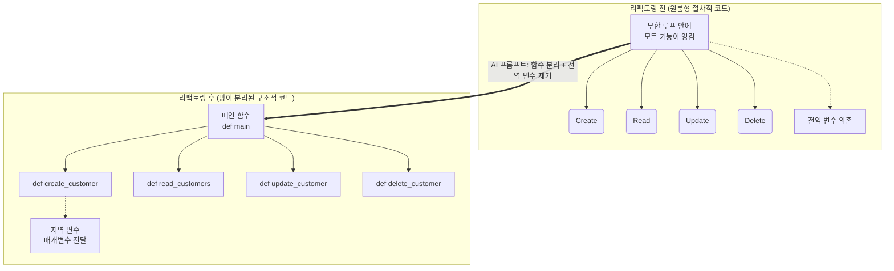

---

## §3. 상세 내용

### Why — 리팩토링 프롬프트에 무엇을 담아야 하는가?

성공적인 리팩토링을 위해 AI에게 전달해야 할 핵심 지시사항은 크게 두 가지입니다. 

첫째, 각 메뉴의 기능을 독립된 함수로 분리해 달라고 명확히 요청해야 합니다. 무한 루프 안에 길게 엉켜있던 로직들을 밖으로 꺼내서 Create, Read, Update, Delete 각각을 전담하는 `def` 블록들로 만들어 달라고 하는 것이죠. 이렇게 하면 중복되던 검색 로직도 별도의 함수 하나로 예쁘게 빼내어 재사용할 수 있습니다. 

둘째, 코드 맨 위에 덩그러니 놓여있던 전역 변수 리스트를 제거해 달라고 요구해야 합니다. 공용 금고를 없애고 메인 함수라는 안전한 방 안에 숨겨진 개인 금고로 만들어 달라는 뜻입니다. 최근 딥 리서치 문헌에 따르면, 전역 상태를 지역 변수로 변경하고 함수 간 매개변수로 넘겨주는 것만으로도 코드의 안정성이 비약적으로 상승합니다.

### How — 단호하고 구체적인 지시

우리가 AI에게 입력할 프롬프트는 "이 코드를 리팩토링해줘"라는 단순한 문장이 되어서는 안 됩니다. "현재 전역 변수로 선언된 리스트를 메인 함수 내부의 지역 변수로 변경하고, CRUD 각각의 기능을 독립된 4개의 함수로 분리해 줘. 그리고 프로그램의 겉보기 동작은 기존과 100% 똑같이 유지해 줘"라고 아주 구체적이고 단호하게 지시해야 합니다. 이렇게 목적이 뚜렷한 프롬프트를 던질 때 AI는 여러분이 원하던 가장 완벽한 형태의 구조적 개선 코드를 선물합니다.

> ✅ **체크포인트**: 여기까지 이해하셨는지 점검해 보세요.
> - 프로그램의 외부 동작은 전혀 바꾸지 않은 채, 내부 구조만을 개선하는 작업을 무엇이라고 부르나요? ("리팩토링")
> - 우리가 AI에게 내릴 2가지 핵심 지시사항 키워드는 무엇인가요? ("함수 분리"와 "전역 변수 제거")

---

## §4. 실습 가이드 (+ 🎙️ 실습 대본)

### 실습 목표

이 실습을 통해 수강생은 구체적인 리팩토링 프롬프트를 작성하여 AI에게 전달하고, 응답받은 코드를 기존 코드와 구별하여 저장한 뒤 겉보기 동작이 100% 동일하게 유지되는지 직접 테스트합니다.

🎙️ **실습 가이드 대본 (Lab Guide)**:

> 자, 이제 여러분의 AI 챗봇 창을 열어주세요. 방금 전 세션에서 한숨을 쉬며 바라보았던 그 길고 엉켜있던 코드를 전체 복사해서 붙여넣습니다. 그리고 그 바로 밑에 여러분만의 리팩토링 프롬프트를 작성해 보세요. 방금 배운 대로 '함수 분리'와 '전역 변수 제거'라는 키워드가 반드시, 꼭 들어가야 합니다. 
>
> AI가 답변을 주면, 그 코드를 복사해서 파이썬 편집기에 `v2.py`라는 완전히 새로운 이름으로 저장합니다. 저장한 코드를 실행해 보세요. 신기하게도 화면에 나오는 1번 등록, 2번 조회 메뉴나 콘솔 창의 동작 방식은 이전과 완전히 똑같을 것입니다. 하지만 이제 코드를 위에서부터 천천히 스크롤 해보십시오. 이전에는 볼 수 없었던 `def`라는 단어들이 여러 개 보일 것입니다. 원룸이었던 코드에 멋진 방들이 여러 개 생겨난 것을 눈으로 직접 확인해 보세요!

### 단계별 지시사항

| 단계 | 소요 시간 | 강사 지시사항 | 학습자 액션 | 예상 결과 |
|---|---|---|---|---|
| 1 | 5분 | "기존 코드와 함께 리팩토링 프롬프트를 입력하세요" | 기존 코드 전체 복사 후, 함수 분리와 전역 변수 제거를 지시하는 프롬프트 작성 및 실행 | 의도가 정확히 반영된 함수 분리형 코드를 응답으로 받음 |
| 2 | 5분 | "응답받은 코드를 `v2.py`로 저장하세요" | 편집기에서 새 파이썬 파일 생성 및 응답받은 코드 붙여넣기 | 안전하게 이전 코드와 구별하여 파일 저장 완료 |
| 3 | 5분 | "코드를 실행하고 통합 테스트를 진행하세요" | 코드를 실행하고 1~4번 메뉴를 차례대로 누르며 데이터 입출력 테스트 | 겉보기 동작이 100% 동일하게 정상 작동함 |
| 4 | 5분 | "새로 작성된 코드에서 `def` 키워드의 개수를 세어보세요" | 코드를 위아래로 스크롤하며 함수가 몇 개로 쪼개졌는지 시각적으로 파악 | 독립된 로직들이 각각의 함수로 잘 나뉜 구조를 확인 |

### 트러블슈팅 FAQ

| Q | A |
|---|---|
| 코드를 실행했는데 전역 변수를 찾을 수 없다며 `NameError`가 나요. | AI가 전역 변수를 함수 내로 옮기면서, 다른 함수로 매개변수(`customers`)를 넘겨주는 것을 깜빡했을 수 있습니다. AI에게 에러 메시지를 주며 "데이터 리스트를 매개변수로 제대로 전달하도록 수정해줘"라고 단호하게 요청하세요. |
| AI가 메뉴 동작 방식(겉보기 동작)까지 자기 마음대로 세련되게 바꿨어요. | 리팩토링의 제1원칙을 AI가 어긴 겁니다. "기능이나 사용자 인터페이스는 절대 바꾸지 말고, 내부 구조만 함수로 분리해줘"라고 다시 한번 강조해서 프롬프트를 수정해 보세요. |
| 함수가 너무 잘게 쪼개져서 스크롤하기가 오히려 힘듭니다. | AI가 과도하게 친절했던 탓입니다. "CRUD의 4가지 핵심 기능 단위로만 큼직하게 함수를 분리해줘"라고 분리 기준을 명확히 다시 제시해 주면 훨씬 보기 좋은 구조로 다시 짜줍니다. |

---


### 🎓 강사 노트 (Instructor Support)

- ⏱️ **타이밍**: 13:15 (20분, lab)
- 🎯 **핵심 활동**: 함수 분리 요청 프롬프트
- ⚠️ **강사 주의사항**: v1→v2 변환의 핵심


### 📋 실습 설계 보강 (Lab Packet)

**세션 073 실습 설계 보강**

절차적 코드의 구조적 리팩토링 프롬프트 작성
- **3-Stage Example Set**
  - 기본: v1 코드를 AI에게 전달 → "기능별 함수 분리 + 전역변수 제거" 리팩토링 요청
  - 변형: "main() 함수를 만들어서 진입점을 하나로 통일해줘" 추가 조건
  - 실수 해결: "리팩토링 후 코드가 안 돌아요" → 함수 간 매개변수 전달 누락
- **난이도 예측**: "왜 잘 돌아가는 코드를 굳이 바꿔야 하지?"라는 의문
- **타이밍 가이드**: 리팩토링 프롬프트 작성 5분 | AI 코드 생성 5분 | 동작 확인 5분 | 비교 분석 5분
- **심리적 장벽**: "구조"라는 개념이 눈에 보이지 않아 추상적
- **자가 점검**:
  - [ ] 리팩토링 전 코드(v1)와 후 코드(v2)를 각각 별도 파일로 저장했는가?
  - [ ] v2에서 전역 변수가 제거되고 함수 매개변수로 대체되었는가?
  - [ ] v2가 v1과 동일하게 동작하는지 테스트했는가?

## §5. 코드 및 명령어 모음

### AI 프롬프트 예시: 구조적 리팩토링 지시

```text
아래 첨부된 절차적 파이썬 코드를 구조적 프로그래밍 패러다임에 맞게 리팩토링해줘.
반드시 다음 두 가지 조건을 지켜야 해:
1. 전역 변수로 선언된 고객 데이터 리스트를 제거하고, 메인 함수(main)의 지역 변수로 만든 뒤 매개변수로 전달할 것.
2. 기능별(등록, 조회, 수정, 삭제)로 독립된 함수(def)를 생성하여 쪼개어 분리할 것.
단, 프로그램의 겉보기 동작과 콘솔 출력 양식은 기존과 100% 똑같이 유지해야 해.
```

### 리팩토링 전후 구조 비교 (개념적)

```python
# [리팩토링 전] 엉켜있는 원룸 구조 (절차적)
customers = [] # 전역 변수로 방치됨

while True:
    menu = input("메뉴 선택: ")
    if menu == "1":
        # 수십 줄의 등록 로직이 루프 내부에 섞임
        pass
    elif menu == "2":
        # 수십 줄의 조회 로직이 루프 내부에 섞임
        pass

# ----------------------------------------

# [리팩토링 후] 방이 나뉜 깔끔한 구조 (구조적)
def create_customer(customers_list):
    # 등록만을 전담하는 독립된 함수 방
    pass
    
def read_customers(customers_list):
    # 조회만을 전담하는 독립된 함수 방
    pass

def main():
    customers = [] # 안전하게 지역 변수화
    while True:
        menu = input("메뉴 선택: ")
        if menu == "1":
            create_customer(customers)
        elif menu == "2":
            read_customers(customers)
            
if __name__ == "__main__":
    main()
```

---

## §6. 요약

### 핵심 학습 포인트

이번 세션에서 여러분은 오늘 겉보기엔 똑같이 작동하는 프로그램이지만, 내부 코드는 완전히 다르게 진화한 구조를 눈으로 직접 확인하셨습니다. 프롬프트를 작성할 때 "함수 분리"와 "전역 변수 제거"를 명확히 지시하고, "겉보기 동작은 변경하지 말라"고 단호하게 요구하는 것이 핵심이었습니다. 기능을 추가하는 데 급급했던 초보자의 시야에서 벗어나, 코드의 유지보수성과 아름다움을 고민하는 진정한 개발자의 시야를 갖게 되신 것을 축하드립니다.

### 다음 세션 예고

이렇게 방이 멋지게 나뉜 구조가 있어야만 우리는 다음 단계인 파일 저장이나 데이터베이스 연동으로 넘어갈 수 있습니다. 다음 세션에서는 이 함수라는 방들 사이에서 데이터가 어떻게 문을 통과해 들어오고(매개변수) 안전하게 나가는지(리턴), 그 구조적 데이터 흐름을 자세히 파헤쳐 보겠습니다.

### 브릿지 노트

> "모두 `v2.py` 파일 안에 `def`로 예쁘게 분리된 방들을 확인하셨나요? 겉모습은 100% 똑같지만, 이제 우리는 언제든지 특정 기능만 똑 떼어내서 편안하게 고칠 수 있는 강력한 구조를 얻었습니다. 그런데 벽을 세우고 방을 나눴으니, 이제 방과 방 사이를 오가는 데이터들에 대한 명확한 규칙이 필요해집니다. 다음 세션에서는 함수 사이의 출입문 역할을 하는 '매개변수(Parameter)'와 '리턴(Return)'에 대해 알아보겠습니다."

---

## §7. 참고 자료

### 3-Source 출처

- **Source A (로컬 참고자료)**: [A] 8 코딩.pdf §8.10 리팩토링 — 함수 분리와 구조 개편의 기본 개념 이해
- **Source B (NotebookLM)**: SRC-B05 — AI 시대의 서사; 절차적 코드에서 구조적 코드로의 전환과 리팩토링 패러다임
- **Source C (Deep Research)**: SRC-C02 — 리팩토링을 위한 프롬프트 엔지니어링 전략 및 전역 변수 제거 효과 (§2.2, 5.1)

### 강사 노트

> 💡 **강사 노트**: 실습 과정에서 수강생들이 리팩토링의 목적을 "새로운 기능 추가"로 오해하지 않도록 주의시켜 주세요. "겉보기 동작은 절대 변하면 안 된다"는 점이 리팩토링의 가장 중요한 본질입니다. 또한, AI가 너무 잘게 쪼개진 수십 개의 함수를 생성해 버리면 초보자가 흐름을 읽기 오히려 힘들어질 수 있으니, "CRUD 단위로 분리하라"는 프롬프트의 가이드라인을 강조해 주시면 좋습니다.

---

## ✅ 세션 완료 체크리스트 (강사용)

- [x] §1~§7 모든 섹션이 충실하게 작성되었는가?
- [x] 원룸/투룸 리모델링 비유가 §2에서 충분히 확장되었는가?
- [x] 리팩토링 프롬프트 작성의 두 가지 핵심 지시사항이 §3에 명시되었는가?
- [x] 단계별 실습 지시표에 소요 시간과 목표가 명시되었는가?
- [x] 트러블슈팅 FAQ가 최소 3개 이상 포함되었는가?
- [x] 3-Source 팩트 패킷의 내용이 §7에 반영되었는가?
- [x] 다음 세션(074)을 예고하는 브릿지 노트가 포함되었는가?

---

**🔗 선행 세션**: [세션-072] 코드 리뷰: 전역 변수와 코드 중복의 한계점 발견 (필수)  
**🔗 후행 세션**: [세션-074] 구조적 데이터 흐름(매개변수와 리턴)의 이해

---

*작성 일시: 2026-02-25*  
*작성 에이전트: A4B_Session_Writer*  
*교안 구조: 7섹션 (A0 팀 공통 표준)*

> 🔗 **이전 세션**: [세션 072: 코드 리뷰: 전역 변수와 코드 중복의 한계점 발견](#세션-072)에서 배운 내용을 이어갑니다.
> 🔗 **다음 세션**: [세션 074: 구조적 데이터 흐름(매개변수와 리턴)의 이해](#세션-074)에서 계속됩니다.

---

### 세션 074: 구조적 데이터 흐름(매개변수와 리턴)의 이해
> [원본 파일](sessions/세션-074-구조적_데이터_흐름(매개변수와_리턴)의_이해_v2.1.md) | ⏱️ 20분 | 💻 code | 난이도: high

> **세션 ID**: MS-PY101-074
> **소요 시간**: 20분
> **난이도**: ★★★
> **청크 타입**: narrative
> **버전**: v2.1 (7섹션 구조)
> **Day**: Day 4 AM

---

## §1. 개요

> **Day 4 | AM | 세션 074/085**

이 세션은 어지럽게 뒤엉켜 있던 절차적 스파게티 코드에서 벗어나, 기능별로 잘 정리된 '구조적 프로그래밍'의 원리를 깨닫는 중요한 전환점이에요. 거대한 하나의 루프로 묶여 있던 코드를 잘게 쪼개어 함수라는 방을 만들었다면, 이제는 그 방들이 서로 어떻게 대화하고 데이터를 주고받는지(매개변수와 리턴)를 배울 차례입니다. 코드를 기능별로 분리하는 것만큼이나, 데이터의 입출구와 흐름을 통제하는 것이 AI-native 시대의 견고한 프로그램을 만드는 핵심이에요.

### 🎯 학습 목표

이 세션이 끝나면 수강생은 다음을 할 수 있어요:

- 전역 변수 공유 방식이 지닌 치명적인 문제점(사이드 이펙트)을 설명할 수 있습니다
- 매개변수와 리턴을 활용해 함수 간 데이터를 안전하게 주고받는 원리를 이해합니다
- AI가 생성한 함수 코드에서 입력(Parameter)과 출력(Return)의 흐름을 정확히 읽어낼 수 있습니다

### 선행 세션 환기

바로 앞 세션(073)에서 우리는 AI에게 기존 절차적 CRUD 코드를 구조적으로 쪼개달라고 지시하는 리팩토링 프롬프트를 작성했습니다. 그런데 쪼개진 코드들을 가만히 들여다보니 이상한 점이 하나 있었죠? 예전에는 없었던 괄호 안의 변수들과 `return`이라는 낯선 단어들이 등장했습니다. 왜 AI는 굳이 이런 복잡해 보이는 방식을 택했을까요? 지금부터 그 비밀을 하나씩 풀어봅니다.

---

## §2. 핵심 개념 (+ 🗣️ 강사 대본 + Mermaid)

### 비유: 거대한 칠판과 철통 보안의 방

구조적 데이터 흐름을 가장 쉽게 이해하는 방법은 "거대한 공장과 그 안의 작업실들"을 상상해 보는 거예요. 옛날 방식(절차적 프로그래밍)은 공장 한가운데에 누구나 낙서할 수 있는 거대한 칠판을 둔 것과 같아요. 반면 구조적 방식은 각 부서가 벽으로 단단히 분리된 방을 가지고, 입구의 문지기를 통해서만 택배 상자를 주고받는 방식입니다. 

🗣️ **강사 대본 (Instructor Script)**:

> 여러분, 지난 세션에서 우리는 끝없이 이어지던 길고 긴 코드를 여러 개의 작은 조각으로 나누어 '함수'라는 이름표를 붙이는 작업을 함께 해보았습니다. 방대한 코드를 기능별로 쪼개어 정리하니 겉보기에는 무척 깔끔해졌죠? 
>
> 하지만 코드를 나누기만 한다고 해서 모든 문제가 해결되는 것은 결코 아니에요. 오히려 코드를 방으로 쪼개어 놓았기 때문에, 각 방에 있는 코드들이 서로 대화하는 방법, 즉 데이터를 주고받는 방식이라는 새로운 고민거리가 생겨나게 됩니다.
>
> 옛날 방식, 우리가 이전에 작성했던 전역 변수에 의존하는 코드는 마치 거대한 공장 한가운데에 누구나 접근할 수 있는 거대한 칠판 하나를 덜렁 놓아둔 것과 같습니다. 생산팀이 칠판에 숫자를 적어놓고 가면, 영업팀이 와서 그 숫자를 쓱 지우고 새로운 숫자를 적기도 하죠. 처음에는 이 방식이 빠르고 편해 보일 수 있습니다. 하지만 직원이 수백 명으로 늘어나면 어떻게 될까요? 누군가 칠판의 숫자를 잘못 건드리는 순간 모든 부서의 업무가 마비되고, 대체 누가 언제 숫자를 바꾸었는지 도무지 찾아낼 길이 없어집니다. 프로그래밍의 세계에서는 이것을 예기치 않은 부작용, 즉 '사이드 이펙트(Side Effect)'라고 부릅니다.
>
> 이런 끔찍한 대참사를 막기 위해 우리는 새로운 규칙을 도입하게 됩니다. 이제 각 부서는 벽으로 단단히 둘러싸인 완벽하게 독립된 방을 가집니다. 그리고 각 방의 입구에는 아주 깐깐한 문지기가 서 있어요. 다른 방에 있는 누군가에게 작업을 부탁하고 싶다면, 예전처럼 거실의 칠판에 낙서를 하는 것이 아니라, 정확하게 포장된 '택배 박스'에 데이터를 담아서 그 방의 문지기에게 직접 건네주어야만 합니다. 
> 
> 이때 우리가 문지기에게 건네는 택배 박스가 바로 오늘 우리가 배울 **매개변수(Parameter)**입니다. 문지기는 박스를 받아 방 안으로 전달하고, 방 안의 작업자는 전달받은 재료만으로 열심히 작업을 수행해요. 작업이 끝나고 완성품이 만들어지면, 작업자는 그 결과물을 다시 작은 상자에 담아 방 밖으로 휙 던져주게 됩니다. 이렇게 방 안에서 밖으로 결과물을 내보내는 행위, 그것이 바로 **리턴(Return)**입니다. 

### Mermaid 다이어그램

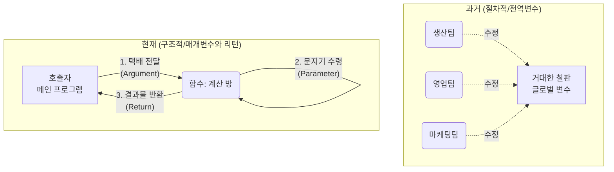

이 다이어그램은 데이터가 마구잡이로 공유되던 과거의 방식에서, 오직 정해진 통로(매개변수와 리턴)를 통해서만 데이터가 이동하는 현대적 방식으로의 진화를 보여줍니다. 

---


### 🎨 추가 시각화 (Visualization Packet)

**절차적 vs 구조적 프로그래밍 비교**

한 파일에 모든 로직이 뭉쳐진 절차적 형태에서, 역할별로 분리된 구조적 형태로 진화한 모습을 대비합니다.

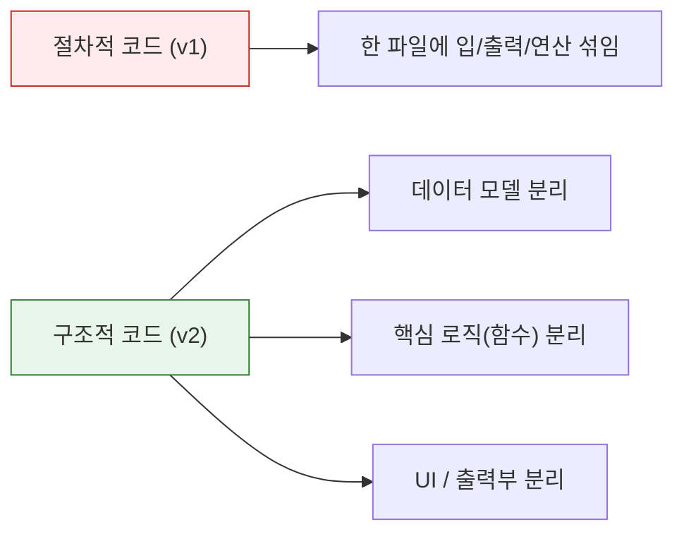

## §3. 상세 내용

### Why — 왜 이 세션이 필요한가?

AI가 작성하는 최신 코드들은 예외 없이 명시적인 매개변수와 리턴을 적극적으로 사용하고 있습니다. 과거처럼 전역 변수를 선언하고 여러 함수가 그 변수를 공유해서 마구잡이로 수정하게 내버려두면, 프로그램이 조금만 복잡해져도 걷잡을 수 없는 버그의 늪에 빠지기 때문입니다. 데이터가 어디서 들어와서 어디로 나가는지 투명하게 추적할 수 있어야만, 오류가 발생했을 때 즉각적으로 대처할 수 있어요.

### What — 파라미터와 아규먼트의 차이

문지기와 택배 상자의 비유를 실제 파이썬 코드로 연결해 보겠습니다. 
- **파라미터(매개변수)**: 파이썬에서 함수를 정의할 때 괄호 안에 적어주는 변수의 이름입니다. 방 안에서 대기하고 있는 문지기가 "저는 이런 종류의 데이터를 받을 준비가 되어 있습니다"라고 선언하는 것과 같아요.
- **아규먼트(인자)**: 실제로 그 함수를 호출하면서 괄호 안에 구체적인 값을 넣어주는 것을 말합니다. 즉, 문지기에게 건네는 택배 박스의 내용물입니다.
- **리턴(Return)**: 함수 작업이 끝난 후 데이터를 밖으로 내보내는 행위입니다. 함수는 `return`을 만나는 순간, 뒤에 적힌 값을 함수를 호출했던 원래의 장소로 툭 던져주고 그 즉시 종료됩니다.

### How — 어떻게 적용되는가?

데이터가 함수라는 방으로 들어갈 때는 반드시 파라미터를 통과하게 만들고, 함수 밖으로 나올 때는 반드시 리턴을 통해 나오도록 강제합니다. 만약 `return`을 명시하지 않으면 파이썬은 조용히 아무것도 없다는 뜻의 `None`을 반환하고 끝을 맺습니다. 이 원칙만 지키면 어떤 환경에 가져다 놓아도 독립적으로 완벽하게 작동하는, 훌륭하게 모듈화된 부품(함수)을 만들 수 있어요.

---

## §4. 실습 가이드 (+ 🎙️ 실습 대본)

### 실습 목표

이 세션의 실습은 타이핑이 아니라 두 가지 방식의 코드를 눈으로 비교하고 분석하는 "틀린 그림 찾기" 활동이에요. 수강생들이 전역 변수 의존형 함수가 왜 나쁜지, 매개변수와 리턴을 사용하는 것이 왜 독립적이고 안전한지 코드를 통해 직관적으로 체감하는 것이 목표입니다.

🎙️ **실습 가이드 대본 (Lab Guide)**:

> 자, 제 화면을 잘 살펴봐 주시기 바랍니다. 방금 우리가 이야기했던 비유가 실제 코드에서는 어떻게 다르게 나타나는지 두 개의 예시를 띄웠습니다. 위에 있는 코드는 '전역 변수'에 의존하는 나쁜 방식이고, 아래에 있는 코드는 '명시적 데이터 흐름'을 지키는 좋은 방식이에요.
> 
> 먼저 위의 코드를 보세요. 함수 이름 옆 괄호 안이 텅 비어 있습니다. 문지기가 택배를 받을 준비를 전혀 하지 않고 있다는 뜻이죠. 대신 함수 내부에서 `global`이라는 위험천만한 키워드를 사용해서 바깥세상의 칠판에 적힌 `price`와 `rate`를 마음대로 끌어다 씁니다. 심지어 계산이 끝난 후에는 결과물을 돌려주지(`return`) 않고, 그 자리에서 바로 모니터에 출력(`print`)해버리네요. 
> 
> 반면 아래의 명시적 데이터 흐름 코드를 봐주세요. 괄호 안에 `price`와 `rate`라는 파라미터가 명확하게 자리 잡고 있습니다. 문지기가 "가격과 할인율을 보내주시면 처리해 드립니다"라고 당당하게 외치고 있죠. 오로지 전달받은 값만 가지고 곱셈을 수행한 뒤, 그 결과물을 `return`으로 밖에 던져줍니다. 여러분, 이 두 번째 함수는 바깥세상이 어떻게 변하든 전혀 영향을 받지 않습니다. 언제 어디서나 재사용 가능한 완벽한 부품이 된 거예요!

### 단계별 지시

| 단계 | 소요 시간 | 강사 지시사항 | 학습자 액션 | 예상 결과 |
|------|----------|--------------|------------|----------|
| 1 | 2분 | 두 가지 코드 예제 화면에 띄우기 | 화면 주시, 코드 형태 비교 | `global`과 `return`의 차이 인식 |
| 2 | 3분 | 전역 변수 코드의 종속성 문제 설명 | 강사 설명 경청 | 사이드 이펙트의 위험성 공감 |
| 3 | 5분 | 매개변수와 리턴 코드의 독립성 강조 | "왜 이 방식이 안전한지" 고개 끄덕임 | 모듈화된 부품의 가치 이해 |
| 4 | 5분 | `print`와 `return`의 치명적 차이점 토론 | 짝과 1분 토의 및 발표 | 화면 출력 vs 값 전달의 차이 완벽 이해 |

### 트러블슈팅 FAQ

| Q | A |
|---|---|
| 파라미터와 아규먼트 용어가 너무 헷갈려요. | "파라미터는 빈 박스(이름표)이고, 아규먼트는 그 안에 담기는 실제 물건(값)입니다"라고 직관적으로 다시 짚어주세요. |
| `return`을 안 쓰고 그냥 함수 안에서 `print`하면 안 되나요? 화면에는 잘 나오던데요. | 수강생들이 가장 많이 헷갈려 하는 부분입니다. "`print`는 모니터에 잠시 그림자를 비춰주는 것에 불과하고, `return`은 실제 물건을 호출자 손에 쥐어주는 것입니다. 손에 물건을 쥐어야 다음 계산에 써먹을 수 있겠죠?"라고 강조하세요. |

---


### 🎓 강사 노트 (Instructor Support)

- ⏱️ **타이밍**: 13:35 (20분, code)
- 🎯 **핵심 활동**: 매개변수와 리턴 분석
- ⚠️ **강사 주의사항**: 데이터 흐름 화살표 그려주기

## §5. 코드 및 명령어 모음

강의 화면에 나란히 띄워 비교할 핵심 예제 코드입니다.

```python
# ❌ 전역 변수 의존 (Bad) - 칠판에 낙서하기
price = 10000
rate = 0.2

def calculate_discount_bad():
    global price, rate  # 바깥세상의 변수에 몰래 접근
    result = price * rate
    print(f"할인액은 {result}원입니다.")  # 돌려주지 않고 화면에만 찍고 끝남

# ⭕ 명시적 데이터 흐름 (Good) - 문지기와 택배 상자
def calculate_discount_good(price, rate): # 문지기가 택배 받을 준비 완료
    result = price * rate
    return result  # 계산된 결과값을 호출한 곳으로 정확히 배달!

# 좋은 함수의 사용 예시
my_discount = calculate_discount_good(10000, 0.2)
print(f"제가 받은 할인액은 {my_discount}원입니다.")
```

> 🤖 **AI 프롬프트 예시**: (이 세션은 개념의 이해에 집중하므로 별도의 프롬프트 실행은 생략합니다. 이전 세션에서 생성된 리팩토링 코드를 분석하는 데 집중하세요.)

---

## §6. 요약

### 핵심 학습 포인트

이번 세션의 핵심은 '데이터의 안전한 고속도로 설계하기'입니다.
첫째, 칠판에 마구잡이로 낙서하던 전역 변수 방식(사이드 이펙트)의 위험성을 깨달았습니다. 둘째, 함수라는 독립된 방에 데이터를 넣을 때는 반드시 '매개변수'라는 문지기를 통과해야 함을 알게 되었습니다. 셋째, 함수 안에서 처리된 결과는 모니터에 뿌리고 끝나는(`print`) 것이 아니라, 반드시 호출자에게 돌려주어야(`return`) 한다는 사실을 배웠어요.

### 다음 세션 예고

> "매개변수와 리턴의 위대한 마법을 이해하셨나요? 이것은 단순히 코드를 예쁘게 꾸미는 일이 아니라, 프로그램 전체의 혈관을 튼튼하게 다시 연결하는 중대한 작업입니다. 택배 주고받는 법을 제대로 배웠으니, 이제 다음 세션에서는 어제 우리가 짰던 '전역변수로 가득 찬 작동하는 나쁜 코드(v1)'와 방금 AI가 쪼개준 '구조적 코드(v2)'를 나란히 띄워놓고 본격적인 '틀린 그림 찾기'를 해봅시다. 과연 무엇이 어떻게 달라졌을까요?"

---

## §7. 참고 자료

### 3-Source 출처

- **Source A (로컬 참고자료)**: 「8 코딩.pdf」 §8.10 리팩토링 및 데이터 흐름 — 매개변수와 리턴을 통한 독립적 함수 구성 원리를 설명합니다.
- **Source B (NotebookLM)**: NotebookLM 분석 리포트 §5 — 전역 변수의 암묵적 변경(Side-effect) 방지와 명시적 데이터 흐름의 장점을 분석합니다.
- **Source C (Deep Research)**: Deep Research 보고서 §1.1, 1.3 — 절차적 프로그래밍의 한계와 구조적 프로그래밍 패러다임으로의 진화, 단순 `print()`와 `return`의 결정적 차이를 강조합니다.

### 강사 노트

> 💡 **강사 노트**: 본 세션은 Day 4 팩트 패킷의 내용을 충실히 반영하여 기획되었습니다. 수강생들이 `global` 키워드를 왜 쓰면 안 되는지 이론적으로만 아는 것을 넘어, 공장의 칠판 비유를 통해 "누가 언제 건드렸는지 모르는 공포"로 다가가도록 생생하게 전달하는 것이 핵심입니다. 코딩 문법보다 '설계의 이유'에 집중해주세요.

---

## ✅ 세션 완료 체크리스트 (강사용)

- [x] §1~§7 모든 섹션이 충실하게 작성되었는가?
- [x] 문지기와 택배 상자 등 직관적인 비유가 포함되었는가?
- [x] 매개변수와 리턴, `print`와 `return`의 차이가 명확히 설명되었는가?
- [x] 전역 변수의 위험성(사이드 이펙트)이 강조되었는가?
- [x] 3-Source 팩트 패킷이 반영되었는가?

---

*작성 일시: 2026-02-25*  
*작성 에이전트: A4B_Session_Writer*  
*교안 구조: 7섹션 (A0 팀 공통 표준)*

> 🔗 **이전 세션**: [세션 073: 절차적 코드의 구조적 리팩토링 프롬프트 작성](#세션-073)에서 배운 내용을 이어갑니다.
> 🔗 **다음 세션**: [세션 075: 절차적 vs 구조적 코드 나란히 비교 분석](#세션-075)에서 계속됩니다.

---

### 세션 075: 절차적 vs 구조적 코드 나란히 비교 분석
> [원본 파일](sessions/세션-075-절차적_vs_구조적_코드_나란히_비교_분석_v2.1.md) | ⏱️ 20분 | 📖 narrative | 난이도: medium

> **세션 ID**: MS-PY101-075
> **소요 시간**: 20분
> **난이도**: ★★☆
> **청크 타입**: narrative
> **Day/시간대**: Day 4 AM (075/075)
> **버전**: v2.1 (7섹션 구조)

---

## §1. 개요

이 세션은 Day 4 오전 과정의 대미를 장식하는 마지막 시간입니다. 지금까지 우리는 거대한 메인 루프에 모든 코드를 때려 넣었던 절차적 방식(v1)에서 벗어나, 기능별로 코드를 잘라내어 함수로 분리하고 매개변수와 리턴으로 데이터를 주고받는 구조적 방식(v2)으로 힘겹게 넘어왔습니다.

이제는 우리가 만든 결과물을 감상할 시간입니다. 마치 성형 수술의 비포 앤 애프터(Before & After) 사진을 나란히 놓고 분석하는 것처럼, 두 가지 방식의 코드를 화면에 동시에 띄워놓고 어떻게 달라졌는지 눈으로 직접 확인할 것입니다. 이 세션을 거치면 수강생들은 "아, 이래서 그 고생을 하면서 코드를 함수로 쪼갰구나!"라는 깨달음을 얻게 되며, 오후에 이어질 테스트와 코드 리뷰, 그리고 미니 프로젝트를 향한 강력한 동기를 부여받습니다.

### 🎯 학습 목표

이 세션이 끝나면 수강생은 다음을 할 수 있어요:
- 절차적 코드(v1)와 구조적 코드(v2)의 구조적 차이를 2가지 이상 시각적으로 설명할 수 있습니다.
- 복잡한 로직을 함수로 분리하여 메인 루프를 간결하게 만드는 '추상화'의 이점을 이해합니다.
- 코드를 구조화했을 때 얻을 수 있는 재사용성과 유지보수성의 장점을 실제 사례를 통해 설명할 수 있습니다.

### 선행 세션 환기

방금 전 세션(074)에서 우리는 데이터가 마치 택배 상자처럼 함수의 문지기를 통해 들어가고(매개변수) 나오는(리턴) 원리를 완벽하게 숙지했습니다. 이제 그 강력한 무기를 장착한 상태로, 전체 숲을 조망해 볼 것입니다.

---

## §2. 핵심 개념 (+ 🗣️ 강사 대본 + Mermaid)

### 사장님과 팀장님의 일하는 방식

프로그래밍 패러다임의 차이를 이해하는 가장 직관적인 비유는 바로 '일하는 방식'입니다. 절차적 코드는 모든 일을 혼자 다 하는 워커홀릭 사장님에, 구조적 코드는 전문가에게 업무를 위임하는 유능한 팀장님에 비유할 수 있습니다. 

🗣️ **강사 대본 (Instructor Script)**:

> 여러분, 방금 전까지 우리는 매개변수와 리턴이라는 아주 중요한 개념을 배웠습니다. 함수라는 상자에 데이터를 안전하게 넣고 빼는 방법을 알게 된 거죠. 이제 그 지식을 가지고, 우리가 처음 만들었던 길고 복잡한 버전 1(v1) 코드와 새롭게 다듬어낸 구조적인 버전 2(v2) 코드를 나란히 펼쳐놓고 비교해 볼 시간입니다.
> 
> 왼쪽에 있는 v1 코드를 볼까요? 이 코드는 현실 세계로 치면 마치 회사의 모든 일을 혼자서 다 처리하려고 드는 워커홀릭 사장님과 같습니다. 이 사장님은 출근하자마자 직접 바닥 청소를 하고, 전화를 직접 당겨 받고, 고객에게 보낼 견적서를 혼자 엑셀로 타이핑하고, 심지어 택배 상자까지 직접 포장합니다. 모든 과정이 사장님의 머릿속에서 한 줄 한 줄 순서대로 이어져 있죠. 처음에는 내 맘대로 되니까 편하고 일이 빨리 진행되는 것 같지만, 회사가 조금만 성장해도 사장님은 과로로 쓰러지고 말 것입니다. 코드가 조금만 길어져도 개발자의 머릿속 용량을 초과해 버리는 절차적 프로그래밍의 한계가 바로 이것입니다.
> 
> 반면, 오른쪽에 있는 v2 코드를 보세요. 이건 아주 유능하고 스마트한 팀장님의 모습과 완벽하게 일치합니다. 이 팀장님은 출근하면 본인이 직접 걸레를 들거나 엑셀을 켜지 않습니다. 대신 각 분야의 전문가들을 불러 모읍니다. "청소팀장님, 바닥 청소 부탁합니다." "영업팀장님, 고객 견적서 처리해 주세요." "물류팀장님, 어제 들어온 주문 포장 바랍니다." 
> 
> 팀장님의 하루 일과는 이렇게 각 담당자에게 정확한 지시를 내리는 것으로 끝납니다. 우리가 새롭게 작성한 구조적 코드의 메인 루프가 바로 이 팀장님의 역할을 수행하고 있습니다. 세부적인 복잡한 작업은 모두 각자의 이름표를 단 함수라는 전문가들에게 위임하고, 메인 루프는 그저 적절한 순서대로 전문가들을 호출하기만 하는 것입니다. 이렇게 하면 회사가 아무리 커져도, 프로그램이 아무리 거대해져도 전체적인 흐름을 한눈에 우아하게 파악할 수 있게 됩니다.

### Mermaid 다이어그램

```mermaid
graph TD
    subgraph 절차적 코드 v1 "워커홀릭 사장님 (절차적 v1)"
        A1[while True:] --> B1[메뉴 입력 받기]
        B1 --> C1{if 메뉴 == 1}
        C1 -->|Yes| D1[고객 이름 입력]
        D1 --> E1[고객 전화번호 입력]
        E1 --> F1[리스트에 추가]
        F1 --> G1[등록 완료 출력]
        C1 -->|No| H1{elif 메뉴 == 2}
        H1 -->|Yes| I1[for문으로 고객 검색...]
        I1 --> J1[복잡한 로직 계속...]
    end

    subgraph 구조적 코드 v2 "스마트한 팀장님 (구조적 v2)"
        A2[while True:] --> B2[메뉴 = show_menu<br/>전문가 호출]
        B2 --> C2{if 메뉴 == 1}
        C2 -->|Yes| D2[register_user<br/>전문가 호출]
        C2 -->|No| E2{elif 메뉴 == 2}
        E2 -->|Yes| F2[process_payment<br/>전문가 호출]
        D2 -.-> Z1((위임))
        F2 -.-> Z2((위임))
    end
```

---


### 🎨 추가 시각화 (Visualization Packet)

**파이썬 모듈화 컴포넌트 구조**

하나의 큰 파일을 쪼개고 `import`를 통해 진입점(`main.py`)에서 레고 블록처럼 조립하는 구조입니다.

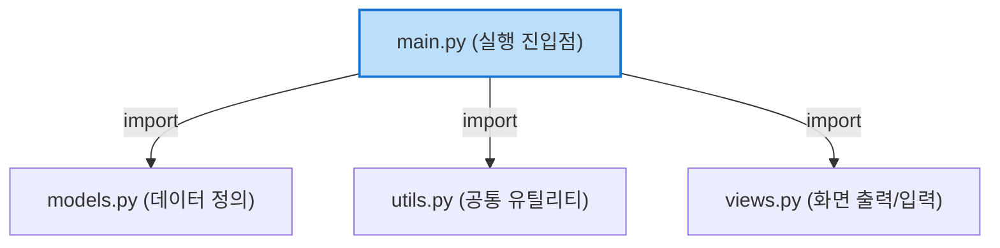

## §3. 상세 내용

### 추상화의 마법과 메인 루프의 혁신

이러한 유능한 팀장님의 방식을 컴퓨터 공학에서는 '추상화(Abstraction)'라는 아주 멋진 단어로 부릅니다. 복잡하고 지저분한 내부의 구현 세부 사항은 함수의 이름 뒤로 싹 감춰버리고, 오직 '무엇을 할 것인가'라는 핵심 의도만을 남겨두는 기법입니다.

수백 줄에 달하던 거대한 `while True` 루프가 단 몇 줄의 함수 호출문으로 드라마틱하게 압축되는 것을 볼 수 있습니다. 메인 루프 안에는 이제 `show_menu()`, `add_customer()`, `calculate_total()`과 같은 사람의 언어에 가까운 직관적인 단어들만이 깔끔하게 자리 잡고 있습니다. 누군가 이 코드를 처음 보더라도 프로그램이 어떤 순서로 동작하는지 단 10초면 파악할 수 있게 된 것입니다.

### 두 가지 결정적인 강점: 재사용성과 유지보수성

구조적 변화가 가져오는 장점은 단순히 코드가 짧아져서 예뻐 보인다는 것에 그치지 않습니다. 

1. **엄청난 재사용성**: 영수증을 출력하는 `print_receipt()`라는 함수를 잘 만들어두면, 결제 메뉴뿐만 아니라 환불 메뉴나 과거 결제 내역 조회 메뉴 등 프로그램의 어디에서든 그저 이름을 부르는 것만으로 완벽하게 똑같은 영수증을 출력할 수 있습니다. 코드를 복사해서 붙여넣을 필요가 없습니다.
2. **기적에 가까운 유지보수성**: 만약 부가세 계산 로직이 법률 개정으로 인해 바뀌었다고 가정해 봅시다. 옛날 v1 방식이었다면 수천 줄의 코드 사이를 헤매며 부가세 계산 공식을 일일이 찾아 고쳐야 했겠지만, 이제는 `calculate_tax()`라는 함수의 내부만 살짝 수정해주면 프로그램 전체에 일제히 새로운 계산법이 적용됩니다. 이것이 바로 우리가 굳이 시간을 들여 코드를 함수로 쪼개고 구조화한 진짜 이유입니다.

---


### 📊 참고 표 (Visual Specs)

**절차적 vs 구조적 프로그래밍 비교 (v1 vs v2)**

| 구분 | 절차적 코드 (Procedural) | 구조적 코드 (Structural) |
|:---|:---|:---|

## §4. 실습 가이드 (+ 🎙️ 실습 대본)

### 실습 목표

이 세션의 실습은 직접 코드를 작성하는 것이 아니라, 에디터(VS Code, Antigravity 등)의 화면 분할 기능을 활용하여 두 코드를 나란히 띄워놓고 분석하는 시각적 훈련입니다. 하향식 접근법(Top-down approach)으로 코드를 읽는 방법을 익힙니다.

🎙️ **실습 가이드 대본 (Lab Guide)**:

> 자, 여러분. 이제 화면에 우리가 처음 만들었던 `v1_procedural.py` 파일과 방금 완성한 `v2_structural.py` 파일을 동시에 열어주세요. 화면을 좌우로 분할해서 띄워보겠습니다. 왼쪽에는 v1, 오른쪽에는 v2입니다.
> 
> 먼저 왼쪽의 v1을 보겠습니다. 스크롤을 천천히 내려보세요. 메인 루프 역할을 하는 `while True` 문 아래로 무려 150줄의 코드가 아무런 장벽 없이 줄줄이 이어져 있습니다. if 문과 for 문이 복잡하게 얽히고설켜 있죠. 만약 78번째 줄에서 에러가 났을 때, 여러분은 단번에 그게 고객 등록 중인지, 결제 중인지 알 수 있나요? 코드를 읽는 내내 숨이 막히는 기분이 들지 않으신가요?
> 
> 이번에는 시선을 오른쪽으로 돌려 v2 코드를 보겠습니다. 메인 루프 제일 아래쪽으로 가보세요. 어떻게 변했나요? 놀랍게도 단 10줄 남짓으로 모든 메인 흐름이 끝납니다. 사용자가 1번을 선택하면 `register_user()`를 호출하고, 2번을 선택하면 `process_payment()`를 호출하죠.
>
> 그 안에서 정확히 어떤 복잡한 데이터베이스 작업이 일어나는지 메인 루프는 전혀 알 필요가 없습니다. 그저 문지기에게 매개변수라는 택배를 넘겨주고, 결과가 리턴되어 돌아오기를 느긋하게 기다리기만 하면 됩니다. 이렇게 큰 숲의 윤곽을 먼저 그려놓고 필요할 때만 개별 나무를 들여다보는 하향식 접근법이야말로, 향후 여러분이 AI에게 코딩을 지시할 때 반드시 유지해야 하는 설계자의 시야입니다.

### 단계별 지시

| 단계 | 소요 시간 | 강사 지시사항 | 학습자 액션 | 예상 결과 |
|------|----------|--------------|------------|----------|
| 1 | 3분 | "IDE에서 화면을 좌우로 분할해주세요" | 탭 드래그로 화면 분할 | 좌 v1, 우 v2 세팅 완료 |
| 2 | 5분 | "v1 코드에서 고객 검색 기능을 찾아보세요" | 스크롤을 내리며 검색 | 3군데 중복된 코드 발견 |
| 3 | 5분 | "v2 코드에서 고객 검색 함수를 찾아보세요" | `find_customer` 함수 확인 | 1개의 함수로 통합됨 확인 |
| 4 | 2분 | "v2의 메인 루프 라인 수를 세어보세요" | 메인 루프 분석 | 압도적으로 짧아진 길이 체감 |

### 트러블슈팅 FAQ

| Q | A |
|---|---|
| 화면 분할을 어떻게 하는지 모르겠어요. | "에디터 탭을 클릭한 상태로 화면 오른쪽 끝으로 드래그하면 화면이 반으로 쪼개집니다. 또는 보기(View) 메뉴에서 레이아웃을 선택하세요." |
| 함수로 나누니까 오히려 파일 위아래를 왔다갔다 해야 해서 헷갈려요. | "아주 좋은 질문입니다! 처음엔 왔다갔다 하는 게 불편할 수 있어요. 하지만 에디터의 '정의로 이동(Go to Definition)' 기능(Ctrl+Click 또는 Cmd+Click)을 쓰면 순식간에 점프할 수 있습니다. 전체 구조가 눈에 들어오기 시작하면 훨씬 편해질 거예요." |

---


### 🎓 강사 노트 (Instructor Support)

- ⏱️ **타이밍**: 14:05 (20분, narrative)
- 🎯 **핵심 활동**: v1 vs v2 코드 비교
- ⚠️ **강사 주의사항**: 좌우 분할 화면 활용

## §5. 코드 및 명령어 모음

### 절차적 방식 (v1)의 메인 루프

왼쪽 화면에서 보게 될 답답한 코드의 단면입니다. (읽기만 해도 숨이 막히는 구조)

```python
# v1: 워커홀릭 사장님의 방식
customers = []

while True:
    print("1. 고객 등록")
    print("2. 고객 조회")
    print("3. 종료")
    menu = input("메뉴 선택: ")

    if menu == '1':
        name = input("이름: ")
        phone = input("전화번호: ")
        # 여기서 곧바로 데이터를 리스트에 넣음
        customers.append({"name": name, "phone": phone})
        print(f"{name}님이 등록되었습니다.")
        
    elif menu == '2':
        search_name = input("조회할 이름: ")
        # 여기서 곧바로 검색 로직이 돌아감
        found = False
        for c in customers:
            if c['name'] == search_name:
                print(f"전화번호: {c['phone']}")
                found = True
        if not found:
            print("고객이 없습니다.")
            
    elif menu == '3':
        break
```

### 구조적 방식 (v2)의 메인 루프

오른쪽 화면에서 보게 될 스마트한 팀장님의 방식입니다. (우아하고 간결한 구조)

```python
# v2: 스마트한 팀장님의 방식

# ... (위쪽에 정의된 전문가 함수들: register_user, search_user 등) ...

def main():
    customers = []
    
    while True:
        menu = show_menu()
        
        if menu == '1':
            # 위임 1: 고객 등록 전문가 호출
            customers = register_user(customers)
        elif menu == '2':
            # 위임 2: 고객 조회 전문가 호출
            search_user(customers)
        elif menu == '3':
            print("프로그램을 종료합니다.")
            break

# 메인 루프 실행
if __name__ == "__main__":
    main()
```

---

## §6. 요약

### 핵심 학습 포인트

이번 세션의 핵심은 "백문이 불여일견"입니다. 
1. **사장님 vs 팀장님**: 모든 것을 짊어진 거대한 메인 루프(절차적)에서 벗어나, 전문가(함수)에게 위임하는 팀장님(구조적)의 방식으로 코드가 진화했습니다.
2. **추상화(Abstraction)**: 복잡한 내부 로직은 이름표 뒤로 숨기고, 메인 흐름에서는 '무엇을 할지'만 명확하게 보여줍니다.
3. **재사용과 유지보수**: 중복된 코드가 사라졌기 때문에, 수정 사항이 발생해도 단 한 곳의 함수만 고치면 프로그램 전체에 안전하게 반영됩니다.

### 다음 세션 예고

우리는 오늘 아주 거칠고 복잡했던 절차적 코드 덩어리가 유능한 팀장님의 지휘 아래 일사불란하게 움직이는 구조적인 예술 작품으로 변모하는 과정을 목격했습니다. 메인 루프는 가벼워졌고, 각 기능은 함수라는 단단한 캡슐 안에 안전하게 보호받고 있습니다. 

하지만 세상에 완벽한 이론은 없죠?
오후 시간에 이어질 Day 4 PM 세션에서는 이 완벽해 보이는 구조에 '새로운 요구사항'이라는 강력한 충격을 가해 보겠습니다. 검색 기능 추가 요청, 등급 필드 추가 등 현실의 무자비한 요구사항 앞에서 우리의 구조적 코드가 어떻게 우아하게 대처하는지 확인하고, 프로그램이 부서지지 않도록 튼튼하게 테스트하는 방법까지 배울 것입니다.

### 브릿지 노트

> "자, 화면의 두 코드를 나란히 보니 구조적 방식이 훨씬 깔끔하고 좋다는 건 알겠습니다. 그런데 진짜 그럴까요? 점심을 먹고 오후에 돌아오면, 고객사에서 갑자기 전화가 올 겁니다. '사장님, 저희 고객 등급 기능도 추가해주시고 검색 조건도 바꿔주세요!'라고요. 다음 시간에는 이 구조적 코드가 과연 그 무자비한 요구사항을 얼마나 쉽게 버텨내는지 직접 실험해 보겠습니다. 든든하게 점심 드시고 오세요!"

---

## §7. 참고 자료

### 3-Source 출처

- **Source A (로컬 참고자료)**: [A] 8 코딩.pdf §8.11 코드 비교 — 절차적 프로그래밍 패러다임과 구조적 프로그래밍 패러다임의 차이를 직접적인 코드 비교를 통해 설명하는 원전입니다.
- **Source B (NotebookLM)**: NotebookLM 분석 리포트 §6 — '코드가 위에서 아래로 그냥 쏟아지는 방식'의 한계와 '함수라는 서랍장'을 활용하는 방식의 장점을 비유적으로 분석한 내용을 강사 대본에 차용했습니다.
- **Source C (Deep Research)**: Deep Research 보고서 §5.1 — 에이전트 주도 개발 시 메인 루프를 간결하게 유지하고 기능을 분리해야 AI가 코드의 사이드 이펙트를 예측하기 쉽다는 분석 결과를 설계 원칙에 반영했습니다.

### 추가 학습 자료

- [파이썬 공식 문서: 함수 정의하기](https://docs.python.org/ko/3/tutorial/controlflow.html#defining-functions)
- [리팩토링 (마틴 파울러) - 함수 추출하기 개념](https://refactoring.com/catalog/extractFunction.html)

### 강사 노트

> 💡 **강사 노트**: 이 세션은 철저하게 '시각적 충격'을 주는 데 목적이 있습니다. 수강생들이 직접 타이핑하는 것을 멈추고, 화면을 반으로 쪼개서 구조의 차이를 눈으로 '감상'하게 만들어야 합니다. 사장님과 팀장님 비유를 최대한 과장 섞인 톤으로 연기해 주시면, 왜 우리가 함수를 사용해야 하는지 비전공자들도 완벽하게 공감할 수 있습니다. 오전 세션의 마지막이므로, 성취감을 고취시키고 오후 세션에 대한 기대감을 심어주며 긍정적인 분위기로 마무리해 주세요.

---

## ✅ 세션 완료 체크리스트 (강사용)

- [ ] §1~§7 모든 섹션이 충실하게 작성되었는가?
- [ ] 사장님과 팀장님의 비유가 강사 대본에 잘 녹아들었는가?
- [ ] 메인 루프의 비포/애프터 비교가 시각적으로 잘 제시되었는가?
- [ ] 오후 세션(요구사항 추가 및 테스트)으로 넘어가는 자연스러운 브릿지가 포함되었는가?
- [ ] 3-Source 팩트 패킷이 반영되었는가?

---

*작성 일시: 2026-02-25*  
*작성 에이전트: Sisyphus-Junior*  
*교안 구조: 7섹션 (v2.1)*

> 🔗 **이전 세션**: [세션 074: 구조적 데이터 흐름(매개변수와 리턴)의 이해](#세션-074)에서 배운 내용을 이어갑니다.
> 🔗 **다음 세션**: [세션 076: 요구사항 추가를 통한 구조적 확장성 체험](#세션-076)에서 계속됩니다.

---

> 🔗 **오후 세션으로 이어집니다**: Day 4 오후(13:30~18:00)에서 세션 076부터 계속됩니다.

## 📦 부록

### 강사 체크리스트 (Day 4 오전)

- [ ] 세션 065: 절차적 프로그래밍의 개념과 특징 (20분)
- [ ] 세션 066: AI 시대의 서사 복습: 구조적 프로그래밍으로의 여정 (20분)
- [ ] 세션 067: 고객 정보 관리 프로그램 PRD 복습 및 설계 (20분)
- [ ] 세션 068: CRUD 개념 이해 및 1차 프롬프트 작성 실습 (25분)
- [ ] 세션 069: 데이터 저장 구조(전역 리스트, 딕셔너리) 이해 (20분)
- [ ] 세션 070: 절차적 Create, Read 기능 구현 및 테스트 (25분)
- [ ] 세션 071: 절차적 Update, Delete 기능 구현 및 통합 테스트 (25분)
- [ ] 세션 072: 코드 리뷰: 전역 변수와 코드 중복의 한계점 발견 (20분)
- [ ] 세션 073: 절차적 코드의 구조적 리팩토링 프롬프트 작성 (20분)
- [ ] 세션 074: 구조적 데이터 흐름(매개변수와 리턴)의 이해 (20분)
- [ ] 세션 075: 절차적 vs 구조적 코드 나란히 비교 분석 (20분)

---

*Day 4 오전 교안 — AI-native 파이썬 기초 v2.1*  
*취합: A4C_Material_Aggregator*  
*검증: A8_QA_Editor*
