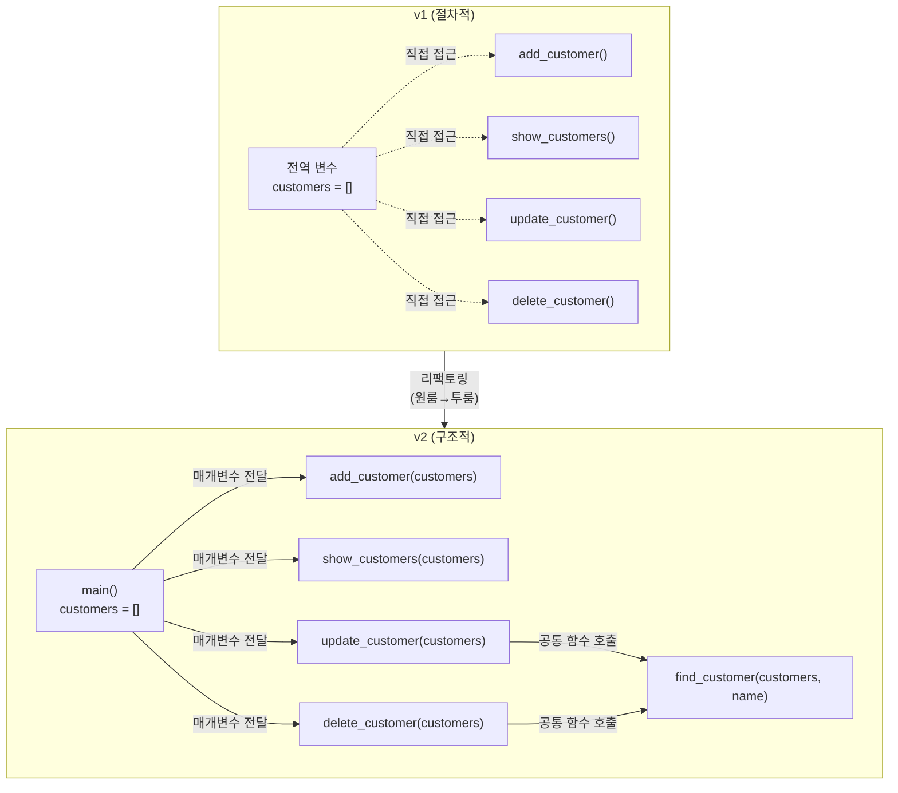
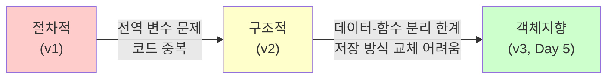
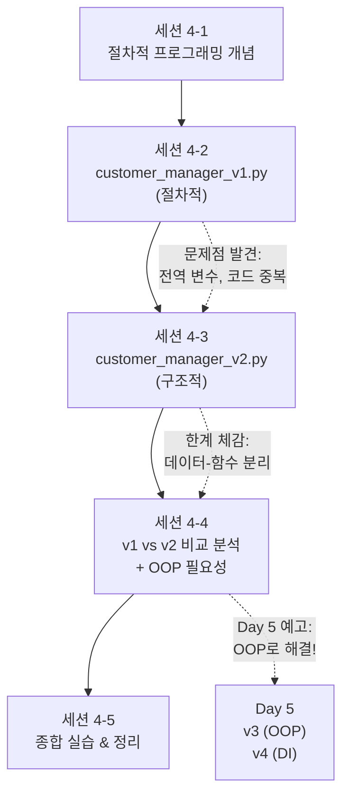

# Day 4 오후: 구조적 프로그래밍 — 리팩토링 & 비교 분석

> 과정: AI-native 파이썬 기초 | Day 4/5 | 13:00–17:30

---

## 목차

- [세션 4-3: 구조적 프로그래밍으로 업그레이드 (13:00–15:00)](Day4_PM_구조적_리팩토링_v2.md#세션-4-3-구조적-프로그래밍으로-업그레이드)
  - [개요](Day4_PM_구조적_리팩토링_v2.md#4-3-개요)
  - [핵심 개념](Day4_PM_구조적_리팩토링_v2.md#4-3-핵심-개념)
  - [상세 내용](Day4_PM_구조적_리팩토링_v2.md#4-3-상세-내용)
  - [실습 가이드](Day4_PM_구조적_리팩토링_v2.md#4-3-실습-가이드)
  - [코드 모음](Day4_PM_구조적_리팩토링_v2.md#4-3-코드-모음)
  - [트러블슈팅](Day4_PM_구조적_리팩토링_v2.md#4-3-트러블슈팅)
  - [요약](Day4_PM_구조적_리팩토링_v2.md#4-3-요약)
- [세션 4-4: 절차적 vs 구조적 비교 분석 (15:00–16:00)](Day4_PM_구조적_리팩토링_v2.md#세션-4-4-절차적-vs-구조적-비교-분석)
  - [개요](Day4_PM_구조적_리팩토링_v2.md#4-4-개요)
  - [핵심 개념](Day4_PM_구조적_리팩토링_v2.md#4-4-핵심-개념)
  - [상세 내용](Day4_PM_구조적_리팩토링_v2.md#4-4-상세-내용)
  - [실습 가이드](Day4_PM_구조적_리팩토링_v2.md#4-4-실습-가이드)
  - [코드 모음](Day4_PM_구조적_리팩토링_v2.md#4-4-코드-모음)
  - [트러블슈팅](Day4_PM_구조적_리팩토링_v2.md#4-4-트러블슈팅)
  - [요약](Day4_PM_구조적_리팩토링_v2.md#4-4-요약)
- [세션 4-5: Day 4 종합 실습 & 정리 (16:15–17:30)](Day4_PM_구조적_리팩토링_v2.md#세션-4-5-day-4-종합-실습--정리)
  - [개요](Day4_PM_구조적_리팩토링_v2.md#4-5-개요)
  - [핵심 개념](Day4_PM_구조적_리팩토링_v2.md#4-5-핵심-개념)
  - [상세 내용](Day4_PM_구조적_리팩토링_v2.md#4-5-상세-내용)
  - [실습 가이드](Day4_PM_구조적_리팩토링_v2.md#4-5-실습-가이드)
  - [코드 모음](Day4_PM_구조적_리팩토링_v2.md#4-5-코드-모음)
  - [트러블슈팅](Day4_PM_구조적_리팩토링_v2.md#4-5-트러블슈팅)
  - [요약](Day4_PM_구조적_리팩토링_v2.md#4-5-요약)

---

## 오후의 핵심 비유

> 🏠 **구조적 프로그래밍 = "원룸을 투룸으로 리모델링"**
>
> 한 방에 침대, 책상, 주방이 다 있던 원룸(전역 변수 + 순차 코드)에서, 침실, 서재, 주방을 분리(함수 분리 + 매개변수 전달)하면 각 공간을 독립적으로 관리할 수 있어요. "AI 시대의 서사"에서 배운 **데이크스트라의 구조적 프로그래밍**이 바로 이 리모델링의 원조예요!

---

## 세션 4-3: 구조적 프로그래밍으로 업그레이드

**시간**: 13:00–15:00 (120분) | **이론:실습** = 20:80

### 4-3 개요

| 항목 | 내용 |
|------|------|
| **학습 목표** | 절차적 코드를 구조적으로 리팩토링하는 프롬프트를 작성하고, 두 버전의 차이를 이해해요 |
| **핵심 개념** | 함수 분리, 모듈화, 매개변수 전달, 코드 재사용, 관심사 분리 |
| **선수 지식** | 세션 4-2에서 완성한 customer_manager_v1.py |
| **산출물** | customer_manager_v2.py (구조적 버전) |

---

### 4-3 핵심 개념

#### 1. 리팩토링이란?

**리팩토링(Refactoring)**은 프로그램의 **동작은 그대로 유지**하면서 **코드의 구조를 개선**하는 작업이에요.

> 💡 비유: 방 안의 가구 배치를 바꾸는 것과 같아요. 방의 크기(기능)는 그대로인데, 가구를 재배치해서 더 편하게 생활할 수 있게 만드는 거예요.

#### 2. 구조적 프로그래밍의 핵심 원칙

| 원칙 | 절차적 (v1) | 구조적 (v2) | 비유 |
|------|------------|------------|------|
| **함수 분리** | 함수가 전역 변수에 직접 접근 | 함수가 매개변수로 데이터를 받음 | 원룸 → 투룸 분리 |
| **매개변수 전달** | `customers`를 전역으로 공유 | `customers`를 함수에 인자로 전달 | 칠판 공유 → 메모지 전달 |
| **관심사 분리** | 입력/처리/출력이 한 함수에 섞임 | 각 함수가 하나의 역할만 담당 | 한 사람이 다 하기 → 역할 분담 |
| **코드 재사용** | 비슷한 코드가 여러 곳에 반복 | 공통 로직을 별도 함수로 추출 | 매번 새로 만들기 → 레시피 카드 활용 |

#### 3. 전역 변수 vs 매개변수

이것이 v1과 v2의 **가장 큰 차이점**이에요:

```python
# v1 (절차적): 전역 변수에 직접 접근
customers = []  # 전역 변수

def add_customer():
    # customers를 직접 사용 — 누가 언제 바꿨는지 추적 어려움
    customers.append({"이름": "철수"})

# v2 (구조적): 매개변수로 전달
def add_customer(customer_list):
    # customer_list를 매개변수로 받음 — 데이터 흐름이 명확
    customer_list.append({"이름": "철수"})
    return customer_list
```

> 💡 **칠판 vs 메모지 비유**: v1은 교실 칠판에 정보를 적어두고 모두가 직접 수정하는 방식이에요. 누가 뭘 지웠는지, 뭘 추가했는지 추적하기 어렵죠. v2는 메모지에 정보를 적어서 필요한 사람에게 전달하는 방식이에요. 누가 어떤 정보를 받았는지 명확해요.

---

### 4-3 상세 내용

#### v1 → v2 리팩토링 포인트



**리팩토링 핵심 변경 사항 5가지:**

| # | 변경 내용 | v1 | v2 |
|---|----------|----|----|
| 1 | 전역 변수 제거 | `customers = []` (전역) | `main()` 함수 안에 지역 변수로 이동 |
| 2 | 매개변수 추가 | `def add_customer():` | `def add_customer(customer_list):` |
| 3 | 공통 함수 추출 | 고객 검색 로직이 수정/삭제에 중복 | `find_customer()` 함수로 분리 |
| 4 | 입력 검증 함수 | 각 함수에서 개별 검증 | `get_valid_input()` 함수로 통합 |
| 5 | main() 함수 | 메인 루프가 전역 스코프에 존재 | `main()` 함수로 감싸기 |

#### 프롬프트 전략

**1차 프롬프트: 리팩토링 요청**

```
앞서 만든 절차적 고객관리 프로그램을 구조적으로 리팩토링해줘.

리팩토링 조건:
1. 각 CRUD 기능을 별도 함수로 분리
2. 전역 변수 대신 함수 매개변수로 데이터를 전달
3. 고객 검색 로직을 find_customer() 함수로 분리
4. 입력값 검증을 get_valid_input() 함수로 통합
5. 메인 루프를 main() 함수로 감싸기
6. 기존과 동일하게 동작해야 함
```

**2차 프롬프트: 비교 요청**

```
v1과 v2 코드를 비교해서 장단점을 표로 정리해줘.
특히 전역 변수 vs 매개변수, 코드 중복, 확장성 관점에서 비교해줘.
```

**3차 프롬프트: 기능 추가 요청**

```
v2 코드에 이름으로 고객을 검색하는 기능을 추가해줘.
메뉴에 "5. 고객 검색" 항목을 추가하고, 
이름의 일부만 입력해도 검색되도록 해줘.
```

> 💡 3차 프롬프트가 핵심이에요! 구조적 코드에서는 함수 하나만 추가하면 새 기능이 완성되는 것을 직접 체감할 수 있어요. v1에서 같은 기능을 추가하려면 훨씬 더 많은 곳을 수정해야 해요.

---

### 4-3 실습 가이드

#### 실습 1: 리팩토링 프롬프트 작성 & 코드 생성 (40분)

**단계 1**: Antigravity에서 1차 프롬프트를 입력해요.

**단계 2**: 생성된 코드를 `customer_manager_v2.py`로 저장해요.

**단계 3**: 실행 및 기능 테스트:
```bash
python customer_manager_v2.py
```

**테스트 체크리스트** (v1과 동일하게 동작하는지 확인):
- [ ] 고객 3명 등록
- [ ] 전체 고객 목록 조회
- [ ] 고객 1명 정보 수정
- [ ] 고객 1명 삭제
- [ ] 프로그램 종료

#### 실습 2: 두 버전 나란히 비교 (20분)

**프롬프트**:
```
v1과 v2 코드를 나란히 비교해줘.
특히 다음 부분의 차이를 보여줘:
1. 전역 변수 vs 매개변수
2. 인라인 코드 vs 함수 호출
3. 코드 중복이 줄어든 부분
```

**비교 관찰 포인트**:

| 관찰 항목 | v1에서 확인 | v2에서 확인 |
|-----------|-----------|-----------|
| `customers` 변수 위치 | 파일 맨 위 (전역) | `main()` 함수 안 (지역) |
| 함수 매개변수 | `def add_customer():` | `def add_customer(customer_list):` |
| 고객 검색 로직 | 수정/삭제 함수에 각각 존재 | `find_customer()` 하나로 통합 |
| 메인 루프 | 전역 스코프 | `main()` 함수 안 |

#### 실습 3: 검색 기능 추가 — 구조적 코드의 확장성 체감 (30분)

**프롬프트**:
```
v2 코드에 이름으로 고객을 검색하는 기능을 추가해줘.
메뉴에 "5. 고객 검색" 항목을 추가하고,
이름의 일부만 입력해도 검색되도록 해줘.
종료는 6번으로 변경해줘.
```

**체감 포인트**:
- 구조적 코드에서는 `search_customer(customer_list)` 함수 하나만 추가하면 돼요
- `main()` 함수의 메뉴에 항목 하나만 추가하면 끝이에요
- 기존 함수들은 전혀 수정할 필요가 없어요!

> 💡 만약 v1에서 같은 기능을 추가한다면? 전역 변수에 접근하는 새 함수를 만들고, 메인 루프의 if/elif를 수정해야 해요. 구조는 비슷하지만, v2가 더 깔끔하고 예측 가능하다는 것을 느낄 수 있어요.

#### 실습 4: AI에게 비교 분석표 요청 (20분)

**프롬프트**:
```
customer_manager_v1.py와 customer_manager_v2.py를 비교해서
장단점을 표로 정리해줘.

비교 항목:
- 전역 변수 사용 여부
- 코드 중복 정도
- 새 기능 추가 용이성
- 코드 가독성
- 테스트 용이성
- 유지보수 편의성
```

---

### 4-3 코드 모음

#### customer_manager_v2.py (구조적 버전 — 전체 코드)

```python
# ============================================================
# customer_manager_v2.py — 구조적 고객 관리 프로그램
# AI-native 파이썬 기초 | Day 4 | 세션 4-3
# ============================================================


# ===== 유틸리티 함수 =====

def get_valid_input(prompt):
    """빈 값이 아닌 입력을 받을 때까지 반복해요."""
    while True:
        value = input(prompt).strip()
        if value:
            return value
        print("⚠️ 값을 입력해주세요.")


def find_customer(customer_list, name):
    """이름으로 고객을 검색해서 (인덱스, 고객정보)를 반환해요.
    찾지 못하면 (-1, None)을 반환해요."""
    for i, customer in enumerate(customer_list):
        if customer["이름"] == name:
            return i, customer
    return -1, None


def display_customers(customer_list):
    """고객 목록을 표 형태로 출력해요."""
    if not customer_list:
        print("📭 등록된 고객이 없어요.")
        return False

    print(f"\n{'번호':<6}{'이름':<12}{'전화번호':<16}{'이메일'}")
    print("-" * 50)
    for i, customer in enumerate(customer_list, 1):
        print(f"{i:<6}{customer['이름']:<12}{customer['전화번호']:<16}{customer['이메일']}")
    print(f"\n총 {len(customer_list)}명의 고객이 등록되어 있어요.")
    return True


def get_customer_by_number(customer_list):
    """번호로 고객을 선택하게 하고, 선택된 고객의 인덱스를 반환해요.
    실패하면 -1을 반환해요."""
    try:
        num = int(input("\n고객 번호를 입력하세요: "))
    except ValueError:
        print("⚠️ 숫자를 입력해주세요.")
        return -1

    if num < 1 or num > len(customer_list):
        print("⚠️ 올바른 번호를 입력해주세요.")
        return -1

    return num - 1


# ===== CRUD 함수 =====

def add_customer(customer_list):
    """새 고객을 등록해요. (Create)"""
    print("\n--- 고객 등록 ---")
    name = get_valid_input("이름: ")
    phone = get_valid_input("전화번호: ")
    email = get_valid_input("이메일: ")

    customer = {
        "이름": name,
        "전화번호": phone,
        "이메일": email
    }
    customer_list.append(customer)
    print(f"✅ '{name}' 고객이 등록되었어요.")


def show_customers(customer_list):
    """전체 고객 목록을 조회해요. (Read)"""
    print("\n--- 고객 목록 ---")
    display_customers(customer_list)


def update_customer(customer_list):
    """고객 정보를 수정해요. (Update)"""
    print("\n--- 고객 수정 ---")
    if not display_customers(customer_list):
        return

    idx = get_customer_by_number(customer_list)
    if idx == -1:
        return

    customer = customer_list[idx]
    print(f"\n현재 정보: {customer['이름']} | {customer['전화번호']} | {customer['이메일']}")
    print("(변경하지 않으려면 Enter를 누르세요)")

    new_name = input(f"이름 [{customer['이름']}]: ").strip()
    new_phone = input(f"전화번호 [{customer['전화번호']}]: ").strip()
    new_email = input(f"이메일 [{customer['이메일']}]: ").strip()

    if new_name:
        customer["이름"] = new_name
    if new_phone:
        customer["전화번호"] = new_phone
    if new_email:
        customer["이메일"] = new_email

    print("✅ 고객 정보가 수정되었어요.")


def delete_customer(customer_list):
    """고객을 삭제해요. (Delete)"""
    print("\n--- 고객 삭제 ---")
    if not display_customers(customer_list):
        return

    idx = get_customer_by_number(customer_list)
    if idx == -1:
        return

    removed = customer_list.pop(idx)
    print(f"✅ '{removed['이름']}' 고객이 삭제되었어요.")


def search_customer(customer_list):
    """이름으로 고객을 검색해요. (Search)"""
    print("\n--- 고객 검색 ---")
    if not customer_list:
        print("📭 등록된 고객이 없어요.")
        return

    keyword = input("검색할 이름(일부 가능): ").strip()
    if not keyword:
        print("⚠️ 검색어를 입력해주세요.")
        return

    results = [c for c in customer_list if keyword in c["이름"]]

    if not results:
        print(f"🔍 '{keyword}'에 해당하는 고객을 찾지 못했어요.")
        return

    print(f"\n🔍 '{keyword}' 검색 결과: {len(results)}명")
    print(f"{'이름':<12}{'전화번호':<16}{'이메일'}")
    print("-" * 44)
    for customer in results:
        print(f"{customer['이름']:<12}{customer['전화번호']:<16}{customer['이메일']}")


# ===== 메뉴 표시 함수 =====

def show_menu():
    """메뉴를 출력해요."""
    print("\n===== 메뉴 =====")
    print("1. 고객 등록")
    print("2. 고객 조회")
    print("3. 고객 수정")
    print("4. 고객 삭제")
    print("5. 고객 검색")
    print("6. 종료")
    print("================")


# ===== 메인 함수 =====

def main():
    """프로그램의 진입점이에요."""
    customers = []  # 지역 변수! 전역이 아니에요

    print("=" * 40)
    print("   고객 관리 프로그램 v2 (구조적)")
    print("=" * 40)

    while True:
        show_menu()
        choice = input("메뉴를 선택하세요 (1-6): ").strip()

        if choice == "1":
            add_customer(customers)
        elif choice == "2":
            show_customers(customers)
        elif choice == "3":
            update_customer(customers)
        elif choice == "4":
            delete_customer(customers)
        elif choice == "5":
            search_customer(customers)
        elif choice == "6":
            print("\n👋 프로그램을 종료해요. 감사합니다!")
            break
        else:
            print("⚠️ 1~6 사이의 숫자를 입력해주세요.")


# ===== 프로그램 실행 =====
if __name__ == "__main__":
    main()
```

#### 검색 기능 추가 코드 (별도 발췌)

구조적 코드에서 새 기능을 추가하는 것이 얼마나 간단한지 보여주는 예시예요:

```python
# 추가할 함수 하나:
def search_customer(customer_list):
    """이름으로 고객을 검색해요."""
    keyword = input("검색할 이름(일부 가능): ").strip()
    results = [c for c in customer_list if keyword in c["이름"]]

    if not results:
        print(f"🔍 '{keyword}'에 해당하는 고객을 찾지 못했어요.")
        return

    print(f"\n🔍 검색 결과: {len(results)}명")
    for customer in results:
        print(f"  {customer['이름']} | {customer['전화번호']} | {customer['이메일']}")

# main() 함수의 메뉴에 한 줄만 추가:
#   elif choice == "5":
#       search_customer(customers)
```

> 💡 기존 함수(`add_customer`, `show_customers` 등)는 **전혀 수정하지 않았어요**. 새 함수를 만들고 메뉴에 연결하기만 하면 끝! 이것이 구조적 프로그래밍의 확장성이에요.

---

### 4-3 트러블슈팅

| 문제 상황 | 원인 | 해결 방법 |
|-----------|------|----------|
| `TypeError: add_customer() takes 0 positional arguments but 1 was given` | v1 함수를 v2 방식으로 호출했어요 | 함수 정의에 매개변수를 추가했는지 확인해요 |
| `NameError: name 'customers' is not defined` | `main()` 함수 밖에서 `customers`를 사용하려 했어요 | `customers`는 `main()` 안에서만 존재하는 지역 변수예요 |
| 검색 결과가 안 나와요 | 대소문자나 공백 차이 | `keyword.lower() in c["이름"].lower()` 로 대소문자 무시 검색을 해요 |
| `if __name__ == "__main__":` 이 뭔가요? | 파이썬의 실행 진입점 패턴이에요 | "이 파일을 직접 실행할 때만 main()을 호출해라"는 의미예요 |

---

### 4-3 요약

| 핵심 키워드 | 한 줄 정리 |
|------------|-----------|
| **리팩토링** | 동작은 그대로, 구조만 개선하는 작업이에요 |
| **매개변수 전달** | 전역 변수 대신 함수에 데이터를 직접 전달하는 방식이에요 |
| **관심사 분리** | 각 함수가 하나의 역할만 담당하도록 나누는 것이에요 |
| **확장성** | 새 기능 추가 시 함수 하나만 만들면 되는 구조예요 |
| **customer_manager_v2.py** | 매개변수 전달 + 공통 함수 추출 + main() 함수로 개선한 구조적 버전이에요 |

> ✅ **체크포인트**:
> - [ ] v2가 v1과 동일하게 동작하나요?
> - [ ] 전역 변수가 제거되었나요?
> - [ ] 검색 기능을 추가할 때 기존 함수를 수정하지 않았나요?

---

## 세션 4-4: 절차적 vs 구조적 비교 분석

**시간**: 15:00–16:00 (60분) | **이론:실습** = 40:60

### 4-4 개요

| 항목 | 내용 |
|------|------|
| **학습 목표** | 두 패러다임의 차이점과 장단점을 명확히 정리하고, OOP의 필요성을 인식해요 |
| **핵심 개념** | 패러다임 비교, 한계 체감, OOP 탄생 배경 |
| **산출물** | 절차적 vs 구조적 비교 분석표 |

---

### 4-4 핵심 개념

#### v1 vs v2 비교 분석표

| 비교 항목 | v1 (절차적) | v2 (구조적) | 승자 |
|-----------|-----------|-----------|------|
| **전역 변수** | `customers`가 전역 변수 | `customers`가 `main()` 지역 변수 | v2 ✅ |
| **데이터 전달** | 함수가 전역 변수에 직접 접근 | 매개변수로 명시적 전달 | v2 ✅ |
| **코드 중복** | 고객 검색, 입력 검증이 여러 곳에 반복 | `find_customer()`, `get_valid_input()`으로 통합 | v2 ✅ |
| **새 기능 추가** | 전역 변수 접근 + 메인 루프 수정 필요 | 함수 하나 추가 + 메뉴 연결만 하면 됨 | v2 ✅ |
| **코드 가독성** | 함수 내부에서 전역 변수 사용이 암묵적 | 매개변수로 데이터 흐름이 명시적 | v2 ✅ |
| **테스트 용이성** | 전역 변수 의존으로 독립 테스트 어려움 | 매개변수 전달로 독립 테스트 가능 | v2 ✅ |
| **코드 복잡도** | 단순하고 직관적 | 함수가 많아져서 약간 복잡 | v1 ✅ |
| **학습 난이도** | 초보자가 이해하기 쉬움 | 매개변수, 반환값 개념 필요 | v1 ✅ |

> 💡 v1이 더 나은 점도 있어요! 작은 프로그램에서는 절차적 방식이 더 간단하고 빠르게 만들 수 있어요. 하지만 프로그램이 커질수록 구조적 방식의 장점이 빛을 발해요.

---

### 4-4 상세 내용

#### 토론: "구조적으로도 충분하지 않나?"

이 질문은 매우 중요해요. 구조적 프로그래밍이 절차적보다 나은 건 확실한데, 그러면 구조적으로 충분할까요?

**한계 체감 실습**: 파일 저장 기능 추가 요청

```
고객 데이터를 JSON 파일로 저장하고 불러오는 기능을 추가해줘.
프로그램 시작 시 파일에서 데이터를 불러오고,
데이터가 변경될 때마다 파일에 저장해줘.
```

이 요청을 실행하면 어떤 일이 벌어질까요?

```python
# 파일 저장 기능을 추가하려면...
import json

def save_to_file(customer_list, filename):
    with open(filename, "w", encoding="utf-8") as f:
        json.dump(customer_list, f, ensure_ascii=False, indent=2)

def load_from_file(filename):
    try:
        with open(filename, "r", encoding="utf-8") as f:
            return json.load(f)
    except FileNotFoundError:
        return []

# 그런데 문제가 생겨요...
# add_customer()에서도 save_to_file()을 호출해야 하고
# update_customer()에서도 save_to_file()을 호출해야 하고
# delete_customer()에서도 save_to_file()을 호출해야 해요
# → 모든 CRUD 함수를 수정해야 해요!
```

**문제점 정리**:

| 문제 | 설명 |
|------|------|
| **데이터와 함수가 분리** | 고객 데이터(`customers`)와 고객 관련 함수(`add_customer` 등)가 따로 존재해요 |
| **수정 범위가 넓음** | 저장 방식을 바꾸려면 모든 CRUD 함수를 수정해야 해요 |
| **저장 방식 교체 어려움** | JSON → SQLite로 바꾸려면? 또 모든 함수를 수정해야 해요 |
| **관련 기능 흩어짐** | "고객"과 관련된 데이터, 함수, 저장 로직이 파일 곳곳에 흩어져 있어요 |

> 💡 "AI 시대의 서사"에서 배운 것을 떠올려 보세요. 절차적/구조적 프로그래밍의 한계는 **"데이터와 함수가 분리되어 있다"**는 것이었어요. 이 한계를 극복하기 위해 **객체지향 프로그래밍(OOP)**이 탄생했어요!

#### OOP 탄생 배경 연결



"AI 시대의 서사" 2부에서 이렇게 설명했어요:

> "프로그램이 점점 복잡해지면서, 관련된 데이터와 함수를 하나로 묶어서 관리할 필요성이 생겼어요. 이것이 객체지향 프로그래밍의 탄생 배경이 됩니다."

내일(Day 5)에는 `Customer` 클래스를 만들어서 고객 데이터와 관련 함수를 **하나의 객체로 묶는** 경험을 해볼 거예요. "붕어빵 틀(클래스)"로 "붕어빵(인스턴스)"을 만드는 거예요!

---

### 4-4 실습 가이드

#### 실습 1: AI를 이용한 비교 분석표 작성 (15분)

**프롬프트**:
```
절차적 프로그래밍과 구조적 프로그래밍의 차이점을 비교 분석표로 정리해줘.
다음 항목을 포함해줘:
- 코드 구조
- 데이터 관리 방식
- 함수 설계 방식
- 확장성
- 유지보수성
- 적합한 프로젝트 규모
각 항목에 대해 장단점을 명확히 표시해줘.
```

#### 실습 2: 토론 — "왜 다음 단계가 필요할까?" (15분)

**토론 질문**:
1. 구조적 프로그래밍으로 충분하지 않은 상황은 어떤 경우일까요?
2. 고객 데이터와 고객 관련 함수를 하나로 묶으면 어떤 장점이 있을까요?
3. 저장 방식(파일/DB)을 쉽게 교체하려면 코드를 어떻게 설계해야 할까요?

#### 실습 3: 한계 체감 — 파일 저장 기능 추가 (20분)

**프롬프트**:
```
customer_manager_v2.py에 고객 데이터를 JSON 파일로 저장하고 
불러오는 기능을 추가해줘.
프로그램 시작 시 파일에서 데이터를 불러오고,
데이터가 변경될 때마다 파일에 저장해줘.
```

**관찰 포인트**:
- [ ] 몇 개의 함수를 수정해야 했나요?
- [ ] 저장 로직이 여러 함수에 흩어져 있나요?
- [ ] 만약 JSON 대신 SQLite로 바꾸려면 또 몇 개의 함수를 수정해야 할까요?

> 💡 이 불편함이 바로 Day 5에서 배울 OOP와 DI(의존성 주입)의 동기가 돼요!

---

### 4-4 코드 모음

#### 파일 저장 기능 추가 시 수정이 필요한 부분 (한계 체감용)

```python
import json

# 새로 추가해야 하는 함수 2개
def save_to_file(customer_list, filename="customers.json"):
    with open(filename, "w", encoding="utf-8") as f:
        json.dump(customer_list, f, ensure_ascii=False, indent=2)
    print("💾 데이터가 저장되었어요.")

def load_from_file(filename="customers.json"):
    try:
        with open(filename, "r", encoding="utf-8") as f:
            return json.load(f)
    except FileNotFoundError:
        return []

# main() 함수 수정 필요
def main():
    customers = load_from_file()  # ← 수정: 파일에서 불러오기

    # ... 메뉴 루프 ...
    if choice == "1":
        add_customer(customers)
        save_to_file(customers)    # ← 추가: 등록 후 저장
    elif choice == "3":
        update_customer(customers)
        save_to_file(customers)    # ← 추가: 수정 후 저장
    elif choice == "4":
        delete_customer(customers)
        save_to_file(customers)    # ← 추가: 삭제 후 저장
```

> ⚠️ `save_to_file()`을 3곳에 추가해야 해요. 만약 CRUD 기능이 10개라면? 10곳 모두에 추가해야 해요. 이것이 "데이터와 함수가 분리된 한계"예요.

---

### 4-4 트러블슈팅

| 문제 상황 | 원인 | 해결 방법 |
|-----------|------|----------|
| JSON 파일이 생성되지 않아요 | 파일 경로 문제이거나 권한 문제예요 | 현재 작업 디렉토리를 확인하고, 파일 경로를 절대 경로로 지정해 봐요 |
| 한글이 `\uXXXX`로 저장돼요 | `ensure_ascii=True`가 기본값이에요 | `json.dump()`에 `ensure_ascii=False`를 추가해요 |
| 파일 불러오기 시 에러 | JSON 형식이 깨졌어요 | 파일을 삭제하고 다시 시작하거나, JSON 형식을 확인해요 |

---

### 4-4 요약

| 핵심 키워드 | 한 줄 정리 |
|------------|-----------|
| **비교 분석** | 구조적이 절차적보다 대부분의 측면에서 우수하지만, 단순한 프로그램에서는 절차적이 더 간편해요 |
| **데이터-함수 분리 한계** | 구조적 프로그래밍에서도 데이터와 함수가 분리되어 있어서 수정 범위가 넓어요 |
| **OOP 탄생 배경** | 데이터와 함수를 하나로 묶어서 관리하려는 필요성에서 객체지향이 탄생했어요 |
| **Day 5 예고** | 내일은 "붕어빵 틀(클래스)"을 배워서 v3를 만들어요! |

> ✅ **체크포인트**:
> - [ ] v1과 v2의 차이점을 3가지 이상 설명할 수 있나요?
> - [ ] 구조적 프로그래밍의 한계를 설명할 수 있나요?
> - [ ] OOP가 왜 필요한지 한 문장으로 말할 수 있나요?

---

> ☕ **휴식 (16:00–16:15)**

---

## 세션 4-5: Day 4 종합 실습 & 정리

**시간**: 16:15–17:30 (75분) | **이론:실습** = 20:80

### 4-5 개요

| 항목 | 내용 |
|------|------|
| **학습 목표** | Day 4 학습 내용을 내재화하고, Day 5 OOP를 위한 동기를 형성해요 |
| **활동** | 개인 실습 + 패러다임 여정 복습 + 퀴즈 + Day 5 예고 |
| **산출물** | 자유 주제 절차적→구조적 2단계 프로그램 |

---

### 4-5 핵심 개념

#### Day 4 전체 흐름 정리



#### 패러다임 여정 복습 (AI 시대의 서사 연결)

```
기계어 → 어셈블리어 → 고급 언어 → GOTO 남용(스파게티 코드)
→ 절차적 프로그래밍(함수로 코드 정리)
→ 구조적 프로그래밍(데이크스트라: 순차/선택/반복 + GOTO 제거)
→ [한계: 데이터와 함수가 분리]
→ 객체지향 프로그래밍(데이터+함수를 객체로 통합) ← Day 5에서!
```

---

### 4-5 상세 내용

#### 개인 실습: 자유 주제 2단계 생성

자유 주제를 선택해서 **절차적 → 구조적** 2단계로 프로그램을 만들어 봐요.

**추천 주제**:

| 주제 | CRUD 예시 | 난이도 |
|------|----------|--------|
| 도서 관리 | 도서 등록/조회/수정/삭제 | ⭐⭐ |
| 메뉴 관리 | 메뉴 등록/조회/가격수정/삭제 | ⭐⭐ |
| 할 일 목록 | 할 일 추가/보기/완료처리/삭제 | ⭐ |
| 학생 성적 | 성적 입력/조회/수정/삭제 | ⭐⭐⭐ |

**1단계 프롬프트 (절차적)**:
```
[선택한 주제]를 관리하는 콘솔 프로그램을 절차적으로 작성해줘.
전역 리스트에 딕셔너리로 저장하고, while True 메뉴 루프를 사용해줘.
```

**2단계 프롬프트 (구조적)**:
```
이 코드를 구조적으로 리팩토링해줘.
전역 변수를 제거하고, 매개변수로 데이터를 전달하고,
공통 로직을 별도 함수로 분리해줘.
```

**비교 관찰**:
- 전역 변수가 제거되었나요?
- 공통 함수가 추출되었나요?
- 새 기능을 추가하기 쉬운 구조인가요?

#### Day 4 핵심 정리 퀴즈 (5문항)

**Q1.** 절차적 프로그래밍의 핵심 특징 3가지는?
<details>
<summary>정답 보기</summary>
순차 실행, 전역 변수 사용, 함수-데이터 분리
</details>

**Q2.** "스파게티 코드"를 만드는 주범은?
<details>
<summary>정답 보기</summary>
GOTO 문의 남용. 코드 흐름이 이리저리 점프하면서 추적이 어려워져요.
</details>

**Q3.** 구조적 프로그래밍의 3대 구조는?
<details>
<summary>정답 보기</summary>
순차(Sequence), 선택(Selection, if/else), 반복(Iteration, for/while)
</details>

**Q4.** v1에서 v2로 리팩토링할 때 가장 큰 변화는?
<details>
<summary>정답 보기</summary>
전역 변수를 제거하고, 함수 매개변수로 데이터를 전달하는 것
</details>

**Q5.** 구조적 프로그래밍의 한계는 무엇이고, 이를 해결하기 위해 등장한 패러다임은?
<details>
<summary>정답 보기</summary>
한계: 데이터와 함수가 분리되어 있어서 관련 기능이 흩어짐. 해결: 객체지향 프로그래밍(OOP)이 데이터와 함수를 하나의 객체로 묶어서 해결.
</details>

---

### 4-5 실습 가이드

#### 실습 1: 자유 주제 2단계 프로그램 생성 (35분)

**진행 순서**:
1. 주제 선택 (2분)
2. 절차적 버전 생성 & 테스트 (12분)
3. 구조적 버전 리팩토링 & 테스트 (12분)
4. 두 버전 비교 관찰 (9분)

**체크리스트**:
- [ ] 절차적 버전이 정상 동작하나요?
- [ ] 구조적 버전이 동일하게 동작하나요?
- [ ] 전역 변수가 제거되었나요?
- [ ] 공통 함수가 분리되었나요?

#### 실습 2: 패러다임 여정 복습 (10분)

**프롬프트**:
```
"AI 시대의 서사"에서 배운 개발 패러다임 여정을 정리해줘.
특히 절차적 → 구조적 → 객체지향으로 발전한 이유를 
각 단계의 한계와 연결해서 설명해줘.
비전공자도 이해할 수 있게 비유를 포함해줘.
```

#### 실습 3: Day 4 퀴즈 (10분)

위의 5문항 퀴즈를 풀어봐요.

#### 실습 4: Day 5 예고 & 마무리 (10분)

> 🔮 **Day 5 예고: "내일은 붕어빵 틀(클래스)을 배웁니다!"**
>
> 오늘 우리는 절차적 코드(v1)를 구조적 코드(v2)로 업그레이드했어요. 하지만 여전히 데이터와 함수가 분리되어 있다는 한계가 있었죠.
>
> 내일은 이 한계를 해결해요!
> - **v3 (OOP)**: `Customer` 클래스로 데이터와 함수를 하나로 묶어요
> - **v4 (DI)**: 저장 방식(파일/DB)을 쉽게 교체할 수 있게 만들어요
>
> "AI 시대의 서사"에서 배운 **"붕어빵 틀"** 비유를 기억하세요. 클래스 = 붕어빵 틀(설계도), 인스턴스 = 붕어빵(실제 만들어진 것). 내일 직접 만들어 볼 거예요!

---

### 4-5 코드 모음

#### 자유 주제 예시: 도서 관리 프로그램 (절차적 → 구조적)

**절차적 버전 (프롬프트 예시)**:
```
도서 정보(제목, 저자, 출판년도)를 등록·조회·수정·삭제할 수 있는 
콘솔 프로그램을 절차적으로 작성해줘.
전역 리스트에 딕셔너리로 저장하고, while True 메뉴 루프 사용.
```

**구조적 리팩토링 (프롬프트 예시)**:
```
이 도서 관리 프로그램을 구조적으로 리팩토링해줘.
전역 변수를 제거하고, 매개변수로 데이터를 전달하고,
공통 로직(도서 검색, 입력 검증)을 별도 함수로 분리해줘.
main() 함수로 감싸줘.
```

---

### 4-5 트러블슈팅

| 문제 상황 | 원인 | 해결 방법 |
|-----------|------|----------|
| 자유 주제 프로그램이 동작하지 않아요 | 프롬프트가 너무 모호해요 | CRUD 각 기능을 구체적으로 명시하고, 데이터 구조를 지정해요 |
| 리팩토링 후 기능이 달라졌어요 | 리팩토링 과정에서 로직이 변경됐어요 | "기존과 동일하게 동작해야 함"을 프롬프트에 명시해요 |
| 퀴즈 답을 모르겠어요 | 개념이 아직 익숙하지 않아요 | AI에게 물어봐요! "절차적 프로그래밍의 특징 3가지를 알려줘" |

---

### 4-5 요약

| 핵심 키워드 | 한 줄 정리 |
|------------|-----------|
| **Day 4 핵심** | 절차적(v1) → 구조적(v2) 리팩토링을 통해 코드 구조 개선을 체험했어요 |
| **패러다임 여정** | GOTO → 절차적 → 구조적 → (한계) → OOP 순서로 발전했어요 |
| **v1 vs v2** | 전역 변수 → 매개변수, 코드 중복 → 공통 함수, 인라인 → 함수 호출 |
| **구조적 한계** | 데이터와 함수가 분리되어 있어서 수정 범위가 넓어요 |
| **Day 5 예고** | OOP(붕어빵 틀)와 DI(교체 가능한 부품)로 한계를 극복해요 |

---

## Day 4 전체 마무리

### 오늘 완성한 산출물

| 산출물 | 설명 |
|--------|------|
| **customer_manager_v1.py** | 절차적 고객 관리 프로그램 (전역 변수 + while 루프 + 인라인 CRUD) |
| **customer_manager_v2.py** | 구조적 고객 관리 프로그램 (매개변수 전달 + 공통 함수 + main() + 검색 기능) |
| **비교 분석표** | 절차적 vs 구조적 장단점 비교 |
| **자유 주제 프로그램** | 개인 선택 주제의 절차적→구조적 2단계 프로그램 |

### 오늘의 핵심 비유 정리

| 비유 | 의미 |
|------|------|
| **도미노** | 절차적 프로그래밍: 순서대로 실행되지만 중간 변경이 어려워요 |
| **원룸 → 투룸** | 구조적 리팩토링: 한 방에 다 있던 것을 역할별로 분리해요 |
| **칠판 → 메모지** | 전역 변수 → 매개변수: 데이터 전달 방식의 변화예요 |
| **레시피 카드** | 함수: 로직에 이름을 붙여서 재사용해요 |
| **스파게티 코드** | GOTO 남용으로 코드 흐름이 꼬인 상태예요 |

### Day 4 평가 체크리스트

- [ ] 절차적 프로그래밍의 특징을 설명할 수 있어요
- [ ] customer_manager_v1.py를 실행하고 CRUD 기능을 테스트할 수 있어요
- [ ] 구조적 리팩토링의 핵심(전역 변수 제거, 매개변수 전달)을 이해해요
- [ ] customer_manager_v2.py를 실행하고 v1과 동일하게 동작하는지 확인할 수 있어요
- [ ] v1과 v2의 차이점을 3가지 이상 설명할 수 있어요
- [ ] 구조적 프로그래밍의 한계와 OOP의 필요성을 설명할 수 있어요

---

> 📝 **강사 노트**: Day 4의 성공 지표는 "구조적 프로그래밍의 한계를 체감하고, OOP에 대한 기대감을 갖는 것"이에요. v2가 v1보다 낫다는 것을 확인한 후, "그래도 여전히 불편한 점이 있지 않나요?"라는 질문으로 Day 5의 동기를 만들어 주세요. 파일 저장 기능 추가 실습이 이 역할을 해요.
