# Day 4 오후: 구조적 리팩토링 v2

> **과정**: AI-native 파이썬 기초 | Day 4/5 | 13:30~18:00
> **테마**: 절차적에서 구조적 프로그래밍으로
> **세션**: 076 ~ 085 (10개 세션)
> **총 소요 시간**: 220분
> **버전**: v2.1 (7섹션 구조, 보조 패킷 통합)
> **작성 일시**: 2026-02-25

---

## 🎯 학습 목표 (오후)

1. **세션 076**: 이 세션 종료 시 수강생은 구조적으로 분리된 v2 코드에 '검색 기능'을 추가하는 프롬프트를 실행하고, 기존 코드에 미치는 영향을 최소화하며 기능이 확장됨을 검증할 수 있다.
2. **세션 077**: 이 세션 종료 시 수강생은 테스트 시나리오의 3분류(정상, 경계값, 예외)를 일상적인 비유(시승)를 통해 정확히 구분하고 설명할 수 있다.
3. **세션 078**: 이 세션 종료 시 수강생은 고객 관리 프로그램의 특정 기능에 대해 정상/경계값/예외 케이스를 모두 포함한 테스트 시나리오 표를 작성할 수 있다.
4. **세션 079**: 이 세션 종료 시 수강생은 코드 품질을 검증하기 위한 5대 체크포인트(요구사항, 입력 검증, 경계값, 자료구조, 가독성/구조)를 설명할 수 있다.
5. **세션 080**: 이 세션 종료 시 수강생은 리뷰 코멘트 3요소(위치, 문제점, 재현 방법)를 포함한 프롬프트를 작성하여 AI에게 코드 수정을 지시하고, 예외 처리가 반영된 코드를 획득할 수 있다.
6. **세션 081**: 이 세션 종료 시 수강생은 Day 4에서 학습한 '절차적 코드 작성 → 구조적 리팩토링 → 테스트 및 코드 리뷰'의 전체 사이클을 3단계로 요약하여 설명할 수 있다.
7. **세션 082**: 이 세션 종료 시 수강생은 자유 주제를 선정하여 CRUD 기능이 포함된 절차적 형태의 1차 코드를 AI를 통해 생성해낼 수 있다.
8. **세션 083**: 이 세션 종료 시 수강생은 자신의 미니 프로젝트 코드를 구조적으로 리팩토링하고, AI에게 두 버전의 품질 평가(점수 매기기)를 요구하여 개선을 정량적으로 확인할 수 있다.
9. **세션 084**: 이 세션 종료 시 수강생은 자신의 미니 프로젝트 특성에 맞는 창의적이고 극한의 '예외 케이스(Edge Case)'를 최소 3가지 도출하여 시나리오 표로 작성할 수 있다.
10. **세션 085**: 이 세션 종료 시 수강생은 3요소 리뷰 코멘트로 엣지 케이스를 방어하는 최종 코드를 완성하고, Day 4 학습 여정을 회고하며 다음 패러다임(OOP)의 필요성을 1가지 이상 설명할 수 있다.

---

## 📋 목차

- [🧪 세션 076: 요구사항 추가를 통한 구조적 확장성 체험](#세션-076) (25분)
- [📖 세션 077: 테스트는 시승이다: 테스트 시나리오 3분류 이해](#세션-077) (20분)
- [🧪 세션 078: 고객 관리 프로그램 테스트 시나리오 작성 실습](#세션-078) (25분)
- [📖 세션 079: 품질 검사관: 코드 리뷰 5대 체크포인트](#세션-079) (20분)
- [🧪 세션 080: 완벽한 리뷰 코멘트 작성 및 AI 피드백 실습](#세션-080) (25분)
- [📖 세션 081: Day 4 종합: 절차에서 구조로, 그리고 테스트까지](#세션-081) (20분)
- [🧪 세션 082: 나만의 미니 프로젝트: 기획 및 절차적 코드 생성](#세션-082) (20분)
- [🧪 세션 083: 미니 프로젝트: 구조적 리팩토링 및 퀄리티 체크](#세션-083) (20분)
- [🧪 세션 084: 미니 프로젝트: 극한의 테스트 시나리오 도출](#세션-084) (20분)
- [🧪 세션 085: 미니 프로젝트: 코드 리뷰 기반 최종 완성 및 회고](#세션-085) (25분)

---

## 📊 세션 인덱스

| 세션 | 제목 | 시간 | 청크 타입 | 난이도 | 바로가기 |
|------|------|------|-----------|--------|----------|
| 076 | 요구사항 추가를 통한 구조적 확장성 체험 | 25분 | 🧪 lab | medium | [바로가기](#세션-076) |
| 077 | 테스트는 시승이다: 테스트 시나리오 3분류 이해 | 20분 | 📖 narrative | low | [바로가기](#세션-077) |
| 078 | 고객 관리 프로그램 테스트 시나리오 작성 실습 | 25분 | 🧪 lab | medium | [바로가기](#세션-078) |
| 079 | 품질 검사관: 코드 리뷰 5대 체크포인트 | 20분 | 📖 narrative | medium | [바로가기](#세션-079) |
| 080 | 완벽한 리뷰 코멘트 작성 및 AI 피드백 실습 | 25분 | 🧪 lab | high | [바로가기](#세션-080) |
| 081 | Day 4 종합: 절차에서 구조로, 그리고 테스트까지 | 20분 | 📖 narrative | low | [바로가기](#세션-081) |
| 082 | 나만의 미니 프로젝트: 기획 및 절차적 코드 생성 | 20분 | 🧪 lab | medium | [바로가기](#세션-082) |
| 083 | 미니 프로젝트: 구조적 리팩토링 및 퀄리티 체크 | 20분 | 🧪 lab | high | [바로가기](#세션-083) |
| 084 | 미니 프로젝트: 극한의 테스트 시나리오 도출 | 20분 | 🧪 lab | high | [바로가기](#세션-084) |
| 085 | 미니 프로젝트: 코드 리뷰 기반 최종 완성 및 회고 | 25분 | 🧪 lab | medium | [바로가기](#세션-085) |

---

## 📚 본문

### 세션 076: 요구사항 추가를 통한 구조적 확장성 체험
> [원본 파일](sessions/세션-076-요구사항_추가를_통한_구조적_확장성_체험_v2.1.md) | ⏱️ 25분 | 🧪 lab | 난이도: medium

> **세션 ID**: MS-PY101-076  
> **소요 시간**: 25분  
> **난이도**: ★★☆  
> **청크 타입**: lab  
> **버전**: v2.1 (7섹션 구조)

---

## §1. 개요

> **Day 4 | PM | 세션 076/085**

### 🎯 학습 목표

이 세션이 끝나면, 수강생은 다음을 할 수 있습니다:

- 구조적으로 분리된 v2 코드에 '검색 기능'을 추가하는 프롬프트를 실행할 수 있다
- 새로운 기능을 추가할 때 기존 코드에 미치는 영향을 최소화하는 확장성의 원리를 이해할 수 있다
- 추가된 검색 기능을 메인 루프에 연결하고 기존 기능들의 무결성을 검증할 수 있다

### 선행 세션 환기

바로 직전 세션(세션-075)에서 우리는 거대하게 하나로 엉켜 있던 절차적 코드를 기능별로 분리한 '구조적 코드'로 리팩토링했습니다. 이제 코드는 용도별로 잘 나누어진 깔끔한 서랍장처럼 정리되었죠. 그런데 만약 고객이 "이름으로 고객 정보를 딱 검색하는 기능 하나만 추가해 주세요!"라고 요구한다면 어떨까요? 과거에 우리가 짰던 절차적 코드였다면, 수백 줄의 코드를 처음부터 끝까지 다시 읽으며 어느 중간 즈음에 이 로직을 끼워 넣어야 할지 며칠 밤을 새워 고민해야 했을 것입니다. 하지만 우리는 이제 다릅니다. 오늘 우리는 이 튼튼한 구조가 새로운 요구사항을 얼마나 부드럽게 수용하는지 두 손으로 직접 체험해 볼 것입니다.

---

## §2. 핵심 개념 (+ 🗣️ 강사 대본 + Mermaid)

### 비유 — 멀티탭에 새로운 스마트폰 충전기 꽂기

집에서 매일 사용하는 멀티탭을 떠올려 보세요. 현재 텔레비전, 에어컨, 컴퓨터가 각각의 구멍에 꽂혀 평화롭게 작동하고 있습니다. 이때 새로 산 스마트폰 충전기를 연결하고 싶다면 어떻게 하시나요? 텔레비전의 전선을 자르고 복잡하게 구리선을 꼬아서 충전기를 연결하는 사람은 아무도 없을 것입니다. 그저 멀티탭의 남는 빈 구멍에 충전기 플러그를 톡 하고 꽂아 넣기만 하면 끝납니다. 새로운 기기를 추가했다고 해서 멀티탭에 꽂혀 있던 텔레비전 화면이 꺼지거나 에어컨이 갑자기 멈추는 일은 절대 발생하지 않습니다.

우리가 작성한 v2 코드도 이 멀티탭과 완벽하게 똑같은 원리로 작동합니다. 기존에 만들어둔 고객 등록, 정보 수정, 결제 기능은 이미 꽂혀 있는 텔레비전이나 에어컨과 같습니다. 이번에 새롭게 추가할 '검색 기능'은 새로운 스마트폰 충전기입니다. 우리는 이 충전기를 작동시키기 위해 기존 가전제품들을 분해할 필요가 전혀 없습니다. `search_customer()`라는 새로운 함수 블록을 하나 만들고, 메인 루프라는 멀티탭의 4번 구멍에 살짝 꽂아주기만 하면 됩니다. 이처럼 기존 코드를 망가뜨리지 않고 기능을 무한히 붙여나갈 수 있는 성질을 프로그래밍 세계에서는 '확장성'이라고 부릅니다.

🗣️ **강사 대본 (Instructor Script)**:

> 여러분, 우리가 만든 프로그램이 현장에 배포되었다고 상상해 봅시다. 고객들은 프로그램에 무척 만족하며 잘 사용하고 있습니다. 그런데 일주일이 지나자 강력한 요청이 하나 들어옵니다. 매번 전체 고객 목록을 눈으로 훑어보는 게 너무 힘드니, 이름을 입력하면 그 사람 정보만 쏙 뽑아서 보여주는 검색 기능을 추가해 달라는 내용이죠.
>
> 과거의 절차적 코드였다면 어땠을까요? 어디에 코드를 끼워 넣어야 결제 시스템이 망가지지 않을지 밤새 고민해야 했을 겁니다. 잘못 끼워 넣었다간 엉뚱한 사람의 결제가 취소되는 대참사가 발생할 수도 있으니까요. 하지만 우리는 이제 구조적인 v2 코드를 가지고 있습니다. 이 견고한 구조가 어떻게 새로운 기능을 부드럽게 품어내는지, 오늘은 AI와 함께 직접 검색 기능을 추가해 보며 마법 같은 확장성을 체험해 보겠습니다. 텔레비전 전원 끄지 않고 멀티탭에 충전기를 꽂는 기분을 느껴보실 거예요.

### Mermaid 다이어그램

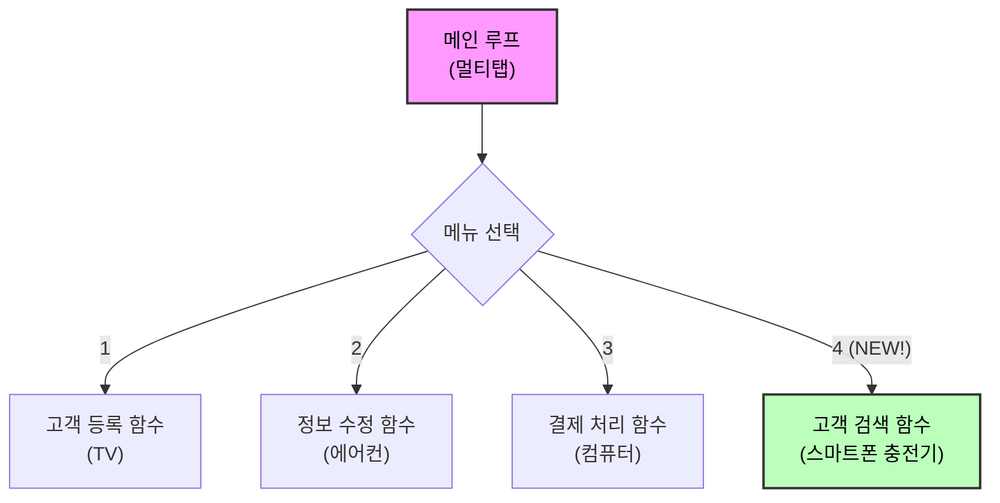

---

## §3. 상세 내용

### Why — 기능 추가가 왜 이렇게 쉬워졌는가?

이전의 절차적 코드에서는 모든 변수와 로직이 하나의 거대한 흐름 속에 엉켜 있었습니다. 새로운 변수나 로직을 하나 추가하면, 아래쪽에 있는 다른 코드가 어떤 영향을 받을지 예측할 수 없었죠. 하지만 구조적 코드는 각 기능이 독립된 함수라는 "격리된 방" 안에 들어 있습니다. 검색 기능을 새로 만들어도 그 방 안에서만 작동하므로, 옆방에 있는 결제 기능이나 등록 기능에는 아무런 영향을 주지 않습니다. 이것이 우리가 힘들게 코드를 함수 단위로 쪼갠 진짜 이유입니다.

### What — 격리된 기능 생성과 메인 루프 연결

구조적 코드에서 새로운 기능을 추가하는 작업은 정확히 두 단계로 이루어집니다.

1. **독립된 함수 생성**: `search_customer()`라는 함수를 새로 만들어서 그 안에 검색 로직만 구현합니다. 기존 함수들은 절대 건드리지 않습니다.
2. **메인 루프 연결**: 메인 루프의 메뉴 선택 부분에 `elif choice == '4': search_customer()`라는 단 한 줄의 연결고리만 추가합니다.

이러한 접근 방식 덕분에 AI에게 지시를 내릴 때도 "전체 코드를 다시 다 짜줘"라고 뭉뚱그려 말할 필요가 없습니다. "기존 코드는 그대로 두고, 새로 검색 함수만 만들어서 메뉴에 연결해 줘"라고 정밀하고 부분적인 프롬프트를 내릴 수 있게 됩니다. 범위가 좁혀지면 AI의 코딩 실수는 극적으로 줄어듭니다.

### How — 무결성 검증의 중요성

기능을 추가한 후에는 반드시 검증을 거쳐야 합니다. 새 기능인 검색이 잘 작동하는지 확인하는 것은 기본 중의 기본이고, 진짜 핵심은 **기존 기능(등록, 결제)이 여전히 잘 작동하는지 확인**하는 것입니다. 멀티탭에 충전기를 꽂았더니 TV가 꺼지면 안 되는 것과 같은 이치입니다. 프로 개발자들은 이것을 '회귀 테스트(Regression Test)'라고 부릅니다.

> ✅ **체크포인트**: 여기까지 이해했는지 스스로 점검해 보세요.
> - 새로운 기능을 추가할 때 기존 코드가 망가지지 않는 핵심 이유는 무엇인가요? ("기능이 독립된 함수로 격리되어 있기 때문")
> - AI에게 새로운 기능 추가를 요청할 때 가장 중요한 프롬프트 작성 규칙은 무엇인가요? ("기존 구조와 함수들은 절대 건드리지 말고, 새 함수만 추가하라고 명확히 지시하기")

### 비교표 — 요구사항 추가 시의 패러다임 차이

| 항목 | 절차적 프로그래밍 (v1.0) | 구조적 프로그래밍 (v2.0) |
|------|--------------------------|--------------------------|
| 코드 파악 범위 | 처음부터 끝까지 수백 줄을 다 읽어야 함 | 메인 루프와 새로 추가할 함수 부분만 알면 됨 |
| 부작용(Side-effect) 위험 | 매우 높음 (변수 오염, 로직 꼬임 빈번함) | 매우 낮음 (격리된 스코프 보장) |
| AI 프롬프트 방식 | "코드를 처음부터 다시 다 짜줘" | "기존 코드 유지하고 새 함수만 덧붙여 줘" |
| 개발자의 심리 상태 | 수정을 주저하게 되는 두려움과 스트레스 | 언제든 부수고 다시 지을 수 있는 실험의 자유 |

---

## §4. 실습 가이드 (+ 🎙️ 실습 대본)

### 실습 목표

이 실습을 통해 수강생은 AI 어시스턴트를 활용하여 구조화된 v2 코드에 새로운 검색 기능을 직접 장착하고, 기존 코드가 망가지지 않았는지 꼼꼼하게 검증하는 과정을 경험합니다.

🎙️ **실습 가이드 대본 (Lab Guide)**:

> 자, 이제 여러분의 화면을 켜주세요. 우리의 자랑스러운 구조적 v2 코드에 새로운 검색 기능을 장착해 보겠습니다. 그런데 주의할 점이 있어요. AI에게 무작정 "검색 기능 넣어줘"라고 뭉뚱그려 말하면, AI가 신나서 전체 코드를 제멋대로 뜯어고칠 수도 있습니다. 우리는 방금 배운 대로 "기존 구조는 절대 건드리지 마!"라고 단호하게 지시할 겁니다.
>
> 그리고 코드를 붙여넣은 뒤에는, 4번 검색 기능을 켜보기 전에 무조건 1번 등록 기능부터 테스트해 보세요. 스마트폰 충전기를 꽂았을 때 TV가 안 꺼졌는지 확인하는 겁니다! 자, 단계별 가이드에 따라 천천히 진행해 봅시다.

### 단계별 지시

| 단계 | 소요 시간 | 강사 지시사항 | 학습자 액션 | 예상 결과 |
|------|-----------|---------------|-------------|-----------|
| **1** | 5분 | "정밀한 프롬프트를 입력하세요" | AI에게 검색 기능 추가 프롬프트 작성 및 실행 | `search_customer()` 함수가 추가된 코드 응답 |
| **2** | 5분 | "복사 전 기존 코드를 리뷰하세요" | 기존 함수(`register_user` 등)가 변경되지 않았는지 확인 | 메인 루프와 새 함수만 변경됨을 확인 |
| **3** | 5분 | "기존 기능 무결성부터 테스트하세요" | 코드 실행 후 1번(등록), 2번(수정) 기능 실행 | 기존 기능들이 예전처럼 정상 작동함 |
| **4** | 10분 | "새 기능의 디테일을 테스트하세요" | 4번(검색) 실행 후, 목록에 없는 이름 입력해 보기 | "결과 없음" 출력되며 프로그램이 멈추지 않음 |

**[단계 1] 정밀한 프롬프트 작성**

AI 어시스턴트 채팅창에 다음 프롬프트를 입력하세요:
```text
현재 v2 코드에 이름으로 고객을 찾는 `search_customer()` 함수를 추가해 줘. 
그리고 메인 메뉴의 4번 항목으로 이 함수를 연결해 줘. 
가장 중요한 규칙은 기존의 다른 함수들이나 데이터 구조는 절대 수정하지 않는 거야.
검색 결과가 없을 때의 예외 처리도 포함해 줘.
```

**[단계 2] 변경 범위 확인 및 코드 리뷰**

AI가 짜준 코드를 무작정 복사하지 마세요! 눈으로 스크롤을 내리면서 기존에 있던 `register_user()`나 `process_payment()` 함수의 내용이 조금이라도 바뀌었는지 두 눈으로 똑똑히 확인합니다. 만약 바뀌었다면 AI에게 "내가 기존 함수는 건드리지 말라고 했잖아. 다시 수정해서 줘"라고 호통을 치셔야 합니다.

**[단계 3] 기존 기능 무결성 테스트 (회귀 테스트)**

코드를 붙여넣고 실행합니다. 여러분의 손은 4번(검색)을 누르고 싶어 근질근질하겠지만 꾹 참고 1번을 눌러 고객을 한 명 등록해 보세요. 기존 기능이 완벽하게 작동하는지 확인하는 이 과정이 프로 개발자의 가장 중요한 기본기입니다.

**[단계 4] 검색 기능 디테일 테스트**

이제 4번을 눌러 방금 등록한 고객의 이름을 검색해 보세요. 그리고 이번에는 아예 목록에 없는 이상한 이름을 검색해 봅니다. 프로그램이 붉은 에러를 뿜으며 죽어버리나요, 아니면 "결과가 없습니다"라고 부드럽게 대처하나요? 에러가 안 나고 부드럽게 넘어갔다면 완벽하게 성공한 것입니다.

### 트러블슈팅 FAQ

| Q | A |
|---|---|
| AI가 기존 함수 이름이나 구조까지 다 바꿔버렸어요. | AI의 흔한 실수입니다. 프롬프트에 "기존 코드 유지 필수"를 훨씬 더 강하게 강조해서 다시 요청하세요. |
| 4번을 눌렀는데 아무 일도 일어나지 않아요. | 메인 루프의 `elif choice == '4':` 부분에 `search_customer()` 함수 호출이 제대로 들여쓰기 되어 연결되었는지 확인해 보세요. |
| 검색은 되는데 대소문자를 엄격하게 구분해서 불편해요. | 아주 좋은 발견입니다! AI에게 "검색할 때 대소문자 구분 없이 찾아지도록 `search_customer` 코드를 수정해 줘"라고 요청해 보세요. 이게 바로 구조적 확장의 묘미입니다. |

---


### 🎓 강사 노트 (Instructor Support)

- ⏱️ **타이밍**: 14:25 (25분, lab)
- 🎯 **핵심 활동**: '검색 기능' 추가 실습
- ⚠️ **강사 주의사항**: 구조적 코드의 유연성 체감


### 📋 실습 설계 보강 (Lab Packet)

**세션 076 실습 설계 보강**

요구사항 추가를 통한 구조적 확장성 체험
- **3-Stage Example Set**
  - 기본: v2 코드에 "이름으로 검색하는 기능" 추가 프롬프트 → 기존 코드 영향 최소 확인
  - 변형: "전화번호로도 검색할 수 있게 해줘" 2차 확장
  - 실수 해결: "검색 기능을 추가했는데 기존 CRUD가 망가졌어요" → 함수 분리의 이점 재확인
- **난이도 예측**: "확장성"이라는 추상 개념을 체감하는 것이 핵심
- **타이밍 가이드**: 검색 기능 프롬프트 5분 | 코드 생성·통합 10분 | 기존 기능 영향 검증 5분 | 정리 5분
- **심리적 장벽**: "또 기능을 추가해야 해? 지금도 복잡한데"
- **자가 점검**:
  - [ ] 새로운 검색 함수가 독립적으로 추가되었는가?
  - [ ] 기존 CRUD 4가지 기능이 여전히 정상 동작하는가?
  - [ ] 함수 분리가 확장성에 도움이 되는 이유를 설명할 수 있는가?

## §5. 코드 및 명령어 모음

### 프롬프트 1: 검색 기능 추가 요청

```text
현재 v2 코드에 이름으로 고객을 찾는 `search_customer()` 함수를 추가해 줘.
메인 메뉴의 4번 항목으로 이 함수를 연결하고, 다른 기존 함수는 절대 수정하지 마.
만약 검색 결과가 없을 때는 친절한 안내 메시지를 띄워 줘.
```

### 코드 스니펫 1: 추가된 검색 함수 예시

```python
def search_customer():
    name = input("검색할 고객 이름: ")
    found = False
    for customer in customers:
        if customer['name'] == name:
            print(f"고객 정보: 이름 {customer['name']}, 전화번호 {customer['phone']}")
            found = True
            break
    
    if not found:
        print("해당 이름의 고객을 찾을 수 없습니다.")
```

이 함수는 철저하게 독립된 블록으로, 기존 코드의 변수나 흐름을 전혀 오염시키지 않습니다.

### 코드 스니펫 2: 메인 루프 연결부 (멀티탭에 꽂기)

```python
# 메인 루프 (멀티탭 역할)
while True:
    print("\n--- 고객 관리 메뉴 ---")
    print("1. 등록  2. 수정  3. 결제  4. 검색  5. 종료")
    choice = input("선택: ")
    
    if choice == '1':
        register_user()
    elif choice == '2':
        update_user()
    elif choice == '3':
        process_payment()
    elif choice == '4':
        search_customer()  # <- 바로 여기에 새로운 플러그를 꽂았습니다!
    elif choice == '5':
        print("프로그램을 종료합니다.")
        break
    else:
        print("잘못된 입력입니다. 다시 선택해주세요.")
```

---

## §6. 요약

### 핵심 학습 포인트

이번 세션에서 우리는 구조적 프로그래밍의 진짜 가치인 '확장성'을 체험했습니다. 첫째, 잘 구조화된 코드는 빈 멀티탭과 같아서 기존 기능을 전혀 건드리지 않고도 새로운 기능을 쉽게 꽂아 넣을 수 있습니다. 둘째, AI에게 코드를 요청할 때는 전체를 다시 짜달라고 하는 대신 "기존 구조는 유지하고 새 함수만 추가해 줘"라고 정밀하게 지시해야 안전한 결과물을 얻을 수 있습니다. 셋째, 새로운 기능을 추가한 후에는 새 기능뿐만 아니라 기존 기능이 망가지지 않았는지 확인하는 무결성 테스트(회귀 테스트)가 필수적입니다.

### 다음 세션 예고

우리가 방금 수행한 테스트는 사실 아주 가볍고 점잖은 수준이었습니다. 진짜 프로 개발자들은 코드가 정말 튼튼한지 확인하기 위해 상상 이상의 가혹한 조건으로 코드를 마구 괴롭힙니다. 다음 세션에서는 이 멋진 프로그램이 극한의 상황에서도 잘 버티는지, '테스트 시나리오'라는 이름의 혹독한 시승 코스로 여러분을 안내하겠습니다.

### 브릿지 노트

> "성공적으로 검색 기능을 추가하셨나요? 아마 여러분은 다른 기능을 망가뜨릴까 봐 덜덜 떨며 코드를 고치던 과거와 달리, 아주 홀가분하고 가벼운 마음으로 새로운 기능을 이식하셨을 겁니다. 구조가 탄탄하게 잡혀 있다는 것은 이처럼 개발자에게 무한한 실험의 자유를 선사합니다. 자, 차에 멋진 내비게이션을 새로 달았으니, 이제 진짜 험난한 오프로드를 달려봐야겠죠? 다음 세션으로 가봅시다!"

---

## §7. 참고 자료

### 3-Source 출처

- **Source A (로컬 참고자료)**: 「8 코딩.pdf」 §8.10 — 요구사항 추가 및 리팩토링 원리, 기존 코드에 미치는 영향 분석
- **Source C (Deep Research)**: SRC-C01 §5.1 — 함수 단위 격리를 통한 구조적 유지보수성 및 확장성 메커니즘

### 추가 학습 자료

- [소프트웨어 공학: 회귀 테스트(Regression Testing)의 이해](https://ko.wikipedia.org/wiki/%ED%9A%8C%EA%B7%80_%ED%85%8C%EC%8A%A4%ED%8A%B8)
- [Python Clean Code Guide](https://github.com/zedr/clean-code-python): 독립적인 함수 작성과 확장성 있는 구조에 대한 가이드

### 강사 노트

> 💡 **강사 노트**: 수강생들이 새로운 기능을 추가할 때 가장 많이 하는 실수는 '4번(검색) 기능만 테스트하고 넘어가는 것'입니다. 이 세션의 진정한 목적은 검색 기능의 완성이 아니라 '기존 1~3번 기능들이 검색 기능 추가 후에도 멀쩡히 동작하는지'를 확인하는 것입니다. 이 회귀 테스트(Regression Test)의 개념을 실습 중 은연중에 계속 심어주세요. 이것이 바로 이어지는 세션 077, 078의 본격적인 테스트 시나리오 실습을 위한 가장 훌륭한 빌드업이 됩니다.

---

## ✅ 세션 완료 체크리스트 (강사용)

- [x] §1~§7 모든 섹션이 충실하게 작성되었는가?
- [x] 멀티탭과 스마트폰 충전기 비유가 명확하게 설명되었는가?
- [x] 단계별 가이드에 무결성 테스트(회귀 테스트) 단계가 명시되었는가?
- [x] 검색 기능 추가 프롬프트와 메인 루프 연결 코드 스니펫이 제공되었는가?
- [x] 3-Source 출처가 올바르게 매핑되었는가?
- [x] 다음 세션(077 테스트 시나리오)을 위한 브릿지 노트가 포함되었는가?

---

**🔗 선행 세션**: [세션-075] 절차적 vs 구조적 코드 나란히 비교 분석 (필수)  
**🔗 후행 세션**: [세션-077] 테스트는 시승이다: 테스트 시나리오 3분류 이해

---

*작성 일시: 2026-02-25*  
*작성 에이전트: Sisyphus-Junior*  
*교안 구조: 7섹션 (A0 팀 공통 표준)*

> 🔗 **이전 세션**: [세션 075: 절차적 vs 구조적 코드 나란히 비교 분석](#세션-075)에서 배운 내용을 이어갑니다.
> 🔗 **다음 세션**: [세션 077: 테스트는 시승이다: 테스트 시나리오 3분류 이해](#세션-077)에서 계속됩니다.

---

### 세션 077: 테스트는 시승이다: 테스트 시나리오 3분류 이해
> [원본 파일](sessions/세션-077-테스트는_시승이다-_테스트_시나리오_3분류_이해_v2.1.md) | ⏱️ 20분 | 📖 narrative | 난이도: low

> **세션 ID**: MS-PY101-077  
> **소요 시간**: 20분  
> **난이도**: ★☆☆  
> **청크 타입**: narrative  
> **버전**: v2.1 (7섹션 구조)

---

## §1. 개요

> **Day 4 | PM | 세션 077/085**

이 세션은 우리가 애써 만든 프로그램이 세상에 나가기 전 반드시 거쳐야 할 검증 단계를 다루고 있습니다. 지난 세션까지 우리는 스파게티처럼 엉켜있던 절차적 코드를 구조적으로 분리하고 깔끔하게 확장하는 법을 배웠어요. 이제 프로그램은 제법 그럴싸한 모습을 갖췄습니다. 하지만 조립이 끝났다고 바로 고객에게 돈을 받고 팔 수는 없습니다. 핸들이 제대로 돌아가는지 브레이크가 듣는지 철저한 시승 테스트가 필요하죠.

### 🎯 학습 목표

이 세션이 끝나면 수강생은 다음을 할 수 있어요:

- 테스트 시나리오의 3분류(정상, 경계값, 예외)를 자동차 시승에 빗대어 정확히 설명할 수 있습니다
- AI가 생성한 '해피 패스' 위주의 코드에서 숨겨진 허점을 발견하고 의심하는 시야를 가집니다
- 직접 만든 고객 관리 프로그램에 어떤 값을 입력해볼지 구체적인 테스트 계획을 설계할 수 있습니다

### 선행 세션 환기

바로 앞선 세션에서 우리는 기능 추가라는 구조적 확장의 위력을 맛보았습니다. 코드가 잘 작동하는 것처럼 보이지만 진짜 튼튼한 코드인지 확인하려면 가혹한 환경에 던져봐야 합니다. 오늘이 바로 그 가혹한 환경을 설계하는 시간입니다.

---

## §2. 핵심 개념 (+ 🗣️ 강사 대본 + Mermaid)

### 자동차 시승의 3가지 코스와 소프트웨어 테스트

소프트웨어를 테스트하는 방법은 자동차 회사가 신차를 개발하고 주행 테스트를 하는 과정과 놀라울 정도로 닮았습니다. 맑은 날씨에 포장도로를 정속 주행하는 코스가 있고 아슬아슬하게 핸들을 꺾는 급커브 코스도 있습니다. 심지어 바퀴가 푹푹 빠지는 진흙탕에 차를 던져놓고 버티는지 보는 코스도 있죠. 우리 프로그램 역시 이와 똑같은 3가지 테스트 코스를 반드시 통과해야 합니다.

🗣️ **강사 대본 (Instructor Script)**:

> 여러분 반가워요. 지난 세션에서 멋지게 구조를 잡은 고객 관리 프로그램 코드를 기억하시죠? 코드가 예뻐졌고 기능도 잘 돌아갑니다. 이제 이 프로그램을 진짜 고객들에게 배포한다고 상상해 봅시다. 어딘가 모르게 불안하지 않으신가요?
> 
> 당연히 불안할 겁니다. 사용자가 우리가 생각한 대로 얌전하게 프로그램을 써주지 않거든요. 차를 조립하자마자 매장에 전시하지 않는 것과 똑같습니다. 무조건 테스트 트랙을 돌아봐야 하죠. 이때 테스트 트랙은 크게 세 종류로 나뉩니다.
> 
> 첫 번째는 길고 곧게 뻗은 매끄러운 '직선 도로'입니다. 날씨 좋은 날 시속 80킬로미터로 부드럽게 달려보는 코스예요. 프로그램으로 치면 아주 정상적인 값을 넣었을 때 예상대로 잘 돌아가는지 확인하는 겁니다.
> 
> 두 번째는 타이어에서 비명이 날 정도로 핸들을 확 꺾는 '급커브' 코스입니다. 속도를 줄이지 않고 코너를 돌 때 차가 뒤집히지 않고 얼마나 잘 버티는지 보는 곳이죠. 시스템이 허용하는 가장 끝단의 아슬아슬한 숫자를 넣어보는 테스트에 해당합니다.
> 
> 세 번째가 가장 중요해요. 바로 바퀴가 푹푹 빠지는 '진흙탕' 코스입니다. 일반적인 도로가 아니라 늪지대나 자갈밭에 던져놓고 엔진이 꺼지지 않고 탈출할 수 있는지 극한의 생존 능력을 시험합니다. 사용자가 상상을 초월하는 이상한 값을 마구 입력할 때 프로그램이 시뻘건 에러를 뿜으며 죽어버리지 않는지 확인하는 과정입니다. 
>
> 훌륭한 개발자는 AI가 짜준 코드를 맹신하지 않습니다. 이 세 가지 코스를 모두 준비해 두고 프로그램을 가혹하게 굴려보는 사람이 진짜 개발자예요.

### Mermaid 다이어그램

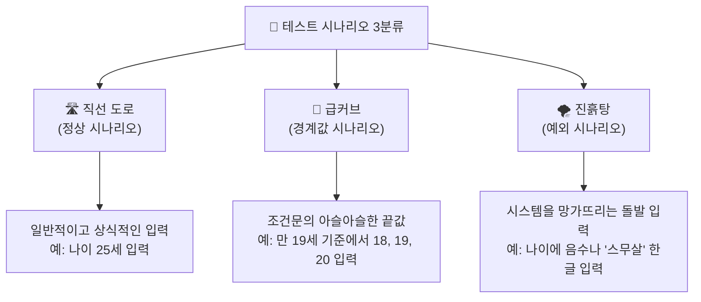

이 다이어그램은 코드를 짤 때 머릿속에 항상 띄워두어야 할 3개의 나침반과 같아요. 코드를 눈으로만 읽지 말고 이 3가지 코스 위에서 차가 달리는 상상을 해보는 습관이 아주 중요합니다.

---

## §3. 상세 내용

### Why: 왜 우리가 직접 진흙탕을 파야 할까요?

챗GPT나 클로드 같은 똑똑한 AI가 코드를 순식간에 짜주는 시대입니다. "고객 나이를 받아서 성인인지 알려주는 코드 짜줘"라고 부탁하면 정말 그럴싸한 코드가 1초 만에 나옵니다. 그런데 이런 AI 생성 코드에는 치명적인 약점이 하나 있어요. 

AI는 대부분 사용자가 말을 잘 듣는 '해피 패스(Happy Path)' 위주의 긍정적인 상황만 가정하고 코드를 작성합니다. 즉 직선 도로만 달릴 수 있는 코드를 만들어냅니다. 비가 오거나 늪에 빠지는 상황을 굳이 먼저 대비하지 않아요. 숫자를 넣으라는 곳에 이모티콘을 넣거나 데이터베이스 선이 갑자기 뽑히는 상황은 오롯이 개발자가 상상하고 대비해야 합니다. AI 시대에 진흙탕을 파는 일은 철저히 사람의 몫입니다.

### What: 3가지 코스의 공학적 번역

전문적인 소프트웨어 공학 용어로는 이 3가지 코스를 정상(Normal), 경계값(Boundary), 예외(Exception)라고 명확히 분류합니다.

1. **정상 시나리오 (Normal)**: 모든 것이 이상적으로 흘러가는 상황입니다. 할인율 10%를 입력하거나 나이를 25살로 입력하는 등 평범하고 상식적인 입력값을 테스트합니다. 해피 패스라고도 부릅니다.
2. **경계값 시나리오 (Boundary)**: 버그가 가장 많이 숨어있는 곳입니다. 시스템의 한계점을 노립니다. 나이 제한이 만 19세 이상이라면 정확히 18, 19, 20이라는 숫자를 집요하게 파고듭니다. 코드에 등호(`>=`)를 하나 빼먹어서 19살이 미성년자로 분류되는 참사를 여기서 잡아냅니다.
3. **예외 시나리오 (Exception)**: 상식을 파괴하는 돌발 상황입니다. 나이 입력창에 음수인 -5를 넣거나 "비밀입니다"라고 문자열을 입력해봅니다. 이때 프로그램이 시뻘건 에러 메시지를 뿜으며 멈춘다면 진흙탕에서 엔진이 꺼진 겁니다. 부드럽게 "숫자로만 입력해주세요"라고 안내하며 다시 입력을 기다리게 하는 것이 올바른 예외 처리입니다.

### How: 방탄조끼를 입히는 사고방식

단순히 테스트를 많이 하는 것이 능사가 아니에요. 가장 중요한 것은 "어디를 찔러야 아파할까"를 고민하는 논리적 얄미움입니다. 사용자는 개발자의 의도대로 바르게 행동하지 않습니다. 프로그램의 가장 취약한 고리를 찾아내 공격하는 방탄조끼 사고방식을 장착해야 완벽한 프로그램을 완성할 수 있습니다.

---

## §4. 실습 가이드 (+ 🎙️ 실습 대본)

### 실습 목표

이 세션의 실습은 직접 코드를 고치는 대신 상상력을 동원하는 브레인스토밍 시간입니다. 앞서 배운 3가지 시나리오 기준을 활용해 우리가 만든 고객 관리 앱을 망가뜨릴 수 있는 기상천외한 아이디어를 뽑아보는 것이 목표예요.

🎙️ **실습 가이드 대본 (Lab Guide)**:

> 자, 머릿속에서 예의 바른 사용자는 잠시 지워버리세요. 아주 짓궂고 얄미운 사용자가 되어보는 겁니다. 옆에 앉은 분과 함께 지금부터 3분 동안 아이디어 회의를 시작할 거예요. 
>
> 주제는 이겁니다. 우리 프로그램에 '고객의 전화번호'를 입력하는 기능이 있죠. 이 전화번호 창에 어떤 기상천외한 값을 집어넣으면 프로그램이 당황해서 쓰러질까요? 정상적인 번호 말고 경계선에 걸친 애매한 값이나 규칙을 완전히 무시하는 값을 최대한 많이 상상해 보세요.
>
> 가장 악랄하게 프로그램을 망가뜨릴 아이디어를 내주신 팀에게는 제가 특별히 박수를 쳐드리겠습니다. 자 시작하세요!
>
> (3분 후) 시간이 다 됐습니다. 누가 제일 재밌는 아이디어를 생각하셨나요? 네, 전화번호에 피자집 이모티콘을 넣는다고요? 정말 훌륭합니다! 010 대신 999로 시작하는 번호를 생각하신 분도 있네요. 이런 창의력이 바로 테스트 시나리오를 만드는 핵심 재료입니다.

### 단계별 지시

| 단계 | 소요 시간 | 강사 지시사항 | 학습자 액션 | 예상 결과 |
|------|----------|--------------|------------|----------|
| 1 | 3분 | 전화번호 기능을 망가뜨릴 방법 브레인스토밍 지시 | 짝과 엉뚱한 입력값 상상 및 공유 | 다양한 엣지 케이스 아이디어 도출 |
| 2 | 2분 | 전체 발표 및 아이디어 공유 유도 | 자원자 발표 (예: 기호 입력, 엔터키 연타 등) | 예외 시나리오의 얄미움 체감 |
| 3 | 3분 | 수집된 아이디어를 정상, 경계값, 예외로 분류 판서 | 강사의 설명을 들으며 3분류 복습 | 3분류 개념의 완벽한 내재화 |
| 4 | 2분 | AI가 엣지 케이스를 자주 놓친다는 사실 강조 | 고개를 끄덕이며 공감 | 테스트 설계자 역할 인식 |

### 트러블슈팅 FAQ

| Q | A |
|---|---|
| 수강생들이 정상적인 값만 떠올리고 예외 상상을 어려워해요 | 강사가 먼저 자극적인 예시를 던져주세요. "만약 사용자가 키보드 위에 고양이를 올려놓아서 '야옹야옹'이 입력되면 어떡하죠?" 처럼요. |
| "이런 것까지 꼼꼼하게 테스트해야 하나요?" | "실제 서비스에서는 이보다 훨씬 심한 일도 일어납니다. 해커들은 바로 이런 빈틈을 뚫고 들어오거든요"라고 보안의 중요성을 일깨워주세요. |
| 경계값과 예외의 차이를 아직 헷갈려 하는 분이 있어요 | 경계값은 '형식은 맞지만 조건의 아슬아슬한 끝에 있는 숫자'이고 예외는 '아예 형식조차 완전히 틀린 입력'이라고 깔끔하게 요약해주세요. |

> ✅ **체크포인트**: 이제 누군가 내 코드를 칭찬해도 속으로 "이 코드가 진흙탕에서도 버틸까?"라고 의심할 수 있게 되었나요?

---


### 🎓 강사 노트 (Instructor Support)

- ⏱️ **타이밍**: 15:05 (20분, narrative)
- 🎯 **핵심 활동**: "시승" 비유 (정상/경계/예외)
- ⚠️ **강사 주의사항**: 테스트 = 품질 보증

## §5. 코드 및 명령어 모음

이 세션은 마인드셋을 다루는 narrative 타입입니다. 코딩 자체보다는 테스트 데이터를 어떻게 설계하고 분류할지 생각하는 방법이 훨씬 중요해요. 아래 코드는 우리가 브레인스토밍한 시나리오를 파이썬 리스트로 깔끔하게 정리해본 예시입니다. 본격적인 테스트 코드는 다음 세션에서 짭니다.

```python
# 전화번호 입력 기능에 대한 3분류 테스트 시나리오 계획표
test_scenarios = {
    "정상_시나리오": [
        "010-1234-5678",  # 완벽한 표준 규격
        "011-987-6543"    # 옛날 번호 형식
    ],
    "경계값_시나리오": [
        "01012345678",    # 하이픈(-)이 없는 애매한 경우
        "010-123-45678"   # 자릿수가 1자리 많거나 적은 경우
    ],
    "예외_시나리오": [
        "전화없음",         # 숫자 대신 문자열 입력
        "010-1234-🍕",    # 이모티콘 및 특수기호 입력
        "",               # 아무것도 입력하지 않고 빈칸 엔터
        "   "             # 공백만 마구 입력
    ]
}
```

> 🤖 **AI 프롬프트 예시**:
> 여러분이 기획한 기능을 AI에게 테스트해달라고 부탁할 때는 이렇게 구체적으로 요청해 보세요.
> "내가 만든 고객 관리 프로그램의 전화번호 입력 기능에 대해 정상 입력, 조건의 한계를 찌르는 경계값, 완전히 잘못된 예외 상황 이 3가지 분류로 테스트 케이스 표를 작성해줘."

---

## §6. 요약

### 핵심 학습 포인트

이번 세션의 핵심은 코드를 완성했다고 개발이 끝나는 것이 아니라는 사실이에요. 우리가 만든 프로그램은 반드시 직선 도로(정상), 급커브(경계값), 진흙탕(예외)이라는 세 가지 시승 코스를 거쳐야만 합니다. 특히 AI는 똑똑하지만 태생적으로 '해피 패스'를 너무 사랑합니다. 비가 오거나 늪에 빠지는 최악의 상황을 상상하고 테스트하는 악당 역할은 철저히 개발자의 몫입니다. 의심하는 자만이 버그를 잡습니다.

### 다음 세션 예고

"시승 코스를 모두 이해하셨으니 이제 진짜 트랙 위로 차를 올려볼 시간입니다!"
다음 세션에서는 방금 상상했던 얄미운 테스트 케이스들을 무기로 실제 고객 관리 프로그램 코드에 무자비한 공격을 퍼부어 볼 거예요. 본격적인 버그 사냥이 시작됩니다.

### 브릿지 노트

> "머릿속으로 상상만 했는데도 벌써 우리 프로그램이 여기저기서 에러를 뿜으며 펑펑 터질 것 같지 않나요? 겁먹을 필요 없습니다. 여기서 미리 터뜨려봐야 나중에 진짜 고객 앞에서 터지지 않으니까요. 노트북 화면 열고 사냥을 시작해봅시다!"

---

## §7. 참고 자료

### 3-Source 출처

- **Source A (로컬 참고자료)**: 9 디버깅,테스트,배포.pdf §9.3.1 - 테스트 시나리오의 명확한 3분류(정상, 경계값, 예외) 공학적 정의를 본문의 구조적 기틀로 차용했습니다.
- **Source B (NotebookLM)**: NotebookLM 분석 리포트 §7 - AI가 생성한 코드는 해피 패스 위주이므로 개발자가 예외 상황 방어에 집중해야 한다는 분석을 강사 대본에 핵심 철학으로 반영했습니다.
- **Source C (Deep Research)**: Deep Research 보고서 §3.1, 3.2 - 자동차 시승 비유(정상 주행, 급커브, 타이어 펑크)와 사용자 관점의 Test-Think-Fix 훈련 방법론을 실습 가이드에 적용했습니다.

### 추가 학습 자료

- 외부 아티클 권장 읽기: AI 주도 개발에서의 테스트 시나리오 전략
- Python 내장 기능: `try-except` 예외 처리 기본 가이드

### 강사 노트

> 💡 **강사 노트**: 수강생들이 테스트를 지루한 숙제가 아니라 '숨은 버그를 찾는 짜릿한 게임'으로 느끼도록 분위기를 띄우는 것이 관건입니다. "이 코드를 인정사정없이 부숴보세요!"라고 도발적으로 주문하면 수강생들의 참여도가 눈에 띄게 올라갑니다. AI가 유독 예외 상황 방어에 취약하다는 점을 강조하여 개발자의 대체 불가능한 역할을 각인시켜 주세요.

---

## ✅ 세션 완료 체크리스트 (강사용)

- [x] §1~§7 모든 섹션이 충실하게 작성되었는가?
- [x] 자동차 시승 비유를 통해 3분류가 명확히 설명되었는가?
- [x] AI 시대 테스트의 중요성이 강사 대본에 자연스럽게 녹아있는가?
- [x] Mermaid 다이어그램이 가독성 좋게 포함되었는가?
- [x] 3-Source 팩트 패킷 내용이 정확히 반영되었는가?

---

*작성 일시: 2026-02-25*  
*작성 에이전트: A4B_Session_Writer*  
*교안 구조: 7섹션 (A0 팀 공통 표준)*


> 🔗 **이전 세션**: [세션 076: 요구사항 추가를 통한 구조적 확장성 체험](#세션-076)에서 배운 내용을 이어갑니다.
> 🔗 **다음 세션**: [세션 078: 고객 관리 프로그램 테스트 시나리오 작성 실습](#세션-078)에서 계속됩니다.

---

### 세션 078: 고객 관리 프로그램 테스트 시나리오 작성 실습
> [원본 파일](sessions/세션-078-고객_관리_프로그램_테스트_시나리오_작성_실습_v2.1.md) | ⏱️ 25분 | 🧪 lab | 난이도: medium

> **세션 ID**: MS-PY101-078  
> **소요 시간**: 25분  
> **난이도**: ★★☆  
> **청크 타입**: lab  
> **버전**: v2.1 (7섹션 구조)

---

## §1. 개요

> **Day 4 | PM | 세션 078/085**

### 🎯 학습 목표

이 세션이 끝나면, 수강생은 다음을 할 수 있습니다:

- 고객 관리 프로그램의 특정 기능에 대해 정상/경계값/예외 케이스를 모두 포함한 테스트 시나리오 표를 작성할 수 있다
- 체계화된 6가지 필수 항목을 포함하는 테스트 케이스 양식을 활용해 자신의 코드를 검증할 수 있다
- 직접 작성한 시나리오를 바탕으로 **Test-Think-Fix** 사이클을 돌려 방어 로직을 보완할 수 있다

### 선행 세션 환기

바로 직전 세션(세션-077)에서 우리는 "테스트는 자동차 시승과 같다"는 중요한 비유를 배웠습니다. 평범하게 달려보고(정상), 아슬아슬하게 브레이크도 밟아보고(경계값), 연료통도 비워봐야(예외) 진짜 튼튼한 코드인지 알 수 있다고 했었죠. 코드를 완성하고 "실행(Run)" 버튼을 눌러서 한두 번 값을 예쁘게 입력해 본 것만으로 모든 문제가 해결되었다고 믿는다면, 그것은 마치 브레이크를 테스트해보지 않고 시속 100km로 달리는 스포츠카에 올라타는 것과 같습니다. 이제 여러분이 직접 만든 고객 관리 프로그램의 허점을 찌르는 치밀한 테스트 시나리오를 작성해 볼 시간입니다.

---

## §2. 핵심 개념 (+ 🗣️ 강사 대본 + Mermaid)

### 비유 — 깐깐한 식약처 검사관의 체크리스트

테스트 시나리오를 이해하기 위해, 여러분이 새롭게 문을 연 대형 식품 공장의 공장장이라고 상상해 보겠습니다. 최신식 자동화 기계를 들여놓았고, 레시피도 완벽하게 세팅했습니다. 그런데 어느 날, 아주 깐깐하기로 소문난 식약처 검사관이 불시에 방문을 합니다. 이 검사관은 여러분이 만든 맛있는 만두를 하나 집어 먹어보고 "음, 맛있군요! 통과!"라고 말할까요? 절대 그렇지 않습니다. 검사관의 손에는 수십 페이지에 달하는 어마어마한 두께의 체크리스트가 들려 있습니다.

검사관은 3단계로 기계를 끈질기게 괴롭힙니다:
1. **정상 케이스 (Happy Path)**: "정해진 온도 100도에서 5분간 쪘을 때 만두가 잘 익는가?"
2. **경계값 (Boundary)**: "온도가 99도일 때와 101도일 때는 어떤 차이가 발생하는가? 타이머가 4분 59초에서 5분으로 넘어가는 찰나에 오류가 나지 않는가?"
3. **예외 케이스 (Exception/Edge Case)**: "만약 만두피 대신 돌멩이를 기계에 넣으면 시스템이 멈추고 경고음을 울리는가?"

소프트웨어 테스트 시나리오도 정확히 이 식약처 검사관의 체크리스트와 같습니다. 우리는 프로그램을 만든 창조자의 마음을 잠시 내려놓고, 시스템의 허점을 어떻게든 찾아내어 부수려는 '악의적인 검사관'의 마인드셋으로 전환해야 합니다.

🗣️ **강사 대본 (Instructor Script)**:

> 여러분, 지난 시간에 우리가 무엇을 했는지 기억나시나요? 고객의 정보를 등록하고, 조회하고, 수정하는 멋진 고객 관리 프로그램을 만들었죠. 코드가 아주 깔끔하게 정리되었고 잘 동작하는 것처럼 보입니다.
>
> 하지만 여러분, 실제 세상의 사용자들은 절대 우리가 원하는 대로 예쁘게 데이터를 입력해주지 않습니다. 나이를 입력하라고 하면 "스무살"이라고 한글로 치고, 전화번호를 입력하라고 하면 숫자만 11자리를 연달아 치거나 심지어 아무것도 안 적고 그냥 엔터를 쳐버립니다. 이럴 때 우리 프로그램이 빨간 에러 메시지를 뿜으며 죽어버린다면 어떨까요?
>
> 배포 이후에 발생하는 오류를 고치는 비용은 개발 단계에서 잡는 것보다 100배 이상 듭니다. 오늘은 내가 만든 코드, 혹은 AI가 만들어준 코드를 100% 신뢰할 수 있도록, 아주 치밀하고 체계적으로 검증하는 방법을 배울 것입니다. 바로 '테스트 시나리오'를 작성하는 실습이죠.

### Mermaid 다이어그램: Test-Think-Fix 사이클

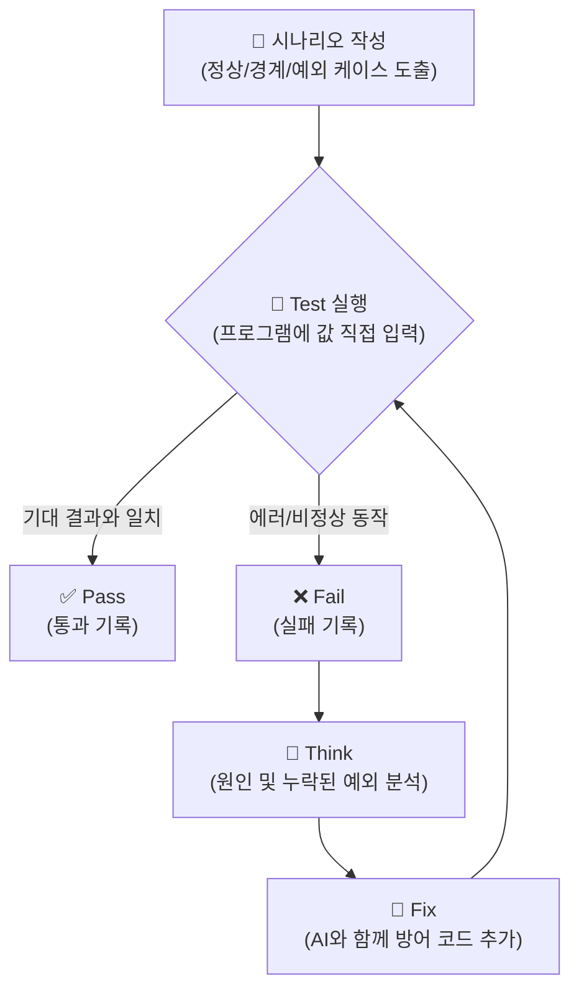

---

## §3. 상세 내용

### 완벽한 테스트를 위한 6가지 필수 항목

머릿속으로만 '이런 것도 넣어봐야지'라고 생각하는 것은 진정한 의미의 테스트가 아닙니다. 반드시 문서화된 표 형태로 정리해야 하며, 현업의 QA(Quality Assurance) 엔지니어들이 사용하는 표준 양식에는 다음 6가지 핵심 항목이 포함됩니다.

1. **테스트 ID (Test ID)**: "TC-001"처럼 고유한 번호를 부여해서 나중에 어떤 테스트가 실패했는지 쉽게 추적할 수 있게 합니다.
2. **테스트 목적 (Objective)**: 이 테스트가 무엇을 검증하려고 하는지 명확히 적습니다. (예: "휴대폰 번호 형식 유효성 검증")
3. **전제 조건 (Pre-condition)**: 테스트를 수행하기 전에 시스템이 어떤 상태여야 하는지 정의합니다. (예: "프로그램이 실행 중이고, '1. 고객 등록' 메뉴에 진입한 상태")
4. **입력값 (Input Data)**: 정상적인 값뿐만 아니라, 시스템을 당황하게 만들 경계값이나 예외 상황 데이터를 구체적으로 명시합니다. (예: `010-ABCD-5678`, 혹은 빈 문자열 `""`)
5. **기대 결과 (Expected Result)**: 해당 입력값을 넣었을 때 프로그램이 어떻게 반응해야 '정상'인지 미리 정의합니다. (예: "올바른 형식이 아닙니다"라는 에러 메시지 출력 후 재입력 요구)
6. **실제 결과 (Actual Result)**: 실제로 프로그램을 실행해보고 기대 결과와 일치하는지(Pass), 아니면 프로그램이 튕겼는지(Fail)를 기록합니다.

우리는 이 항목들을 바탕으로 **Test-Think-Fix 사이클**을 돌려야 합니다. 특히 고객 관리 프로그램에서는 '전화번호'와 '이메일' 같은 사용자 입력값이 가장 큰 지뢰밭입니다. 사용자가 입력할 수 있는 극단적인 상황을 상상해 보세요. 빈칸 엔터, 특수문자 입력 등 예상을 뛰어넘는 상상력이 필요합니다.

> ✅ **체크포인트**: 
> "테스트 시나리오를 작성할 때, 정상적인 상황 외에 시스템의 취약점을 찾기 위해 극단적인 값이나 예상치 못한 입력값을 넣어보는 테스트를 무엇이라고 부를까요?"
> — **경계값(Boundary) 및 예외(Exception) 케이스 테스트**입니다!

---


### 📊 참고 표 (Visual Specs)

**테스트의 3가지 핵심 유형 (정상/경계/예외)**

| 테스트 유형 | 목적 | 고객 관리 프로그램 예시 시나리오 |
|:---|:---|:---|

## §4. 실습 가이드 (+ 🎙️ 실습 대본)

### 실습 목표

이 실습을 통해 수강생은 직접 "전화번호 입력 기능"에 대한 테스트 시나리오 표를 작성하고, 자신의 파이썬 프로그램에 극단적인 입력값을 넣어보며 버그를 발견(Test)하고, 원인을 분석(Think)한 뒤, AI와 함께 코드를 수정(Fix)하는 QA 과정을 체험합니다.

🎙️ **실습 대본 (Lab Guide)**:

> 자, 이제 여러분이 직접 식약처 검사관이 될 시간입니다. 우리가 만든 '고객 등록' 기능 중에서도 **전화번호 입력 부분**을 집중적으로 테스트해 볼 거예요.
>
> 엑셀이나 메모장, 혹은 그냥 화면 구석에 6가지 항목이 들어간 표를 하나 그려주세요. 첫 번째 줄은 제가 도와드릴게요. 사용자가 "010-1234-5678"이라고 예쁘게 입력하는 'Happy Path'입니다. 
> 
> 그 다음부터는 여러분의 상상력을 발휘해서 이 프로그램이 가장 싫어할 만한 값들을 마구마구 적어보세요. 글자 수가 모자라거나, 한글이 섞여 있거나, 아무것도 안 치고 엔터만 치는 경우 등등요.
>
> 표를 다 작성하셨다면, 터미널에서 파이썬 프로그램을 실행해서 그 값들을 진짜로 넣어보세요. 프로그램이 "앗, 문자열은 처리할 수 없습니다!" 하면서 Traceback 에러를 뿜으며 뻗는다면 속상해하지 마세요. 빙고! 여러분은 방금 배포 전에 크리티컬 버그를 하나 잡아낸 위대한 엔지니어가 된 겁니다.

### 단계별 실습 지시사항

| 단계 | 소요 시간 | 수행 내용 | 핵심 포인트 |
|------|----------|-----------|------------|
| **Step 1** | 5분 | **정상 케이스 작성** | 사용자가 `010-1234-5678`과 같이 하이픈을 포함하여 정확히 입력하는 'Happy Path'를 정의합니다. 기대 결과에는 "성공적으로 저장되고 완료 메시지 출력"이라고 적습니다. |
| **Step 2** | 10분 | **경계값 및 예외 케이스 3개 이상 도출** | 숫자 대신 문자열이 섞인 경우(`010-ABCD-5678`), 하이픈이 없는 경우(`01012345678`), 아예 아무것도 입력하지 않고 엔터를 친 빈 값(Null) 처리 등을 고민하여 표에 추가합니다. |
| **Step 3** | 10분 | **프로그램 실행 및 Test-Think-Fix 적용** | 여러분의 파이썬 고객 관리 프로그램을 실행하고 시나리오의 입력값을 직접 넣습니다. 프로그램이 에러(Traceback)를 내며 종료되면 실제 결과에 'Fail'로 기록하고, 방어 로직(Fix)을 고민하세요. |

**📝 실습용 테스트 시나리오 양식 (작성 예시)**

| Test ID | 테스트 목적 | 전제 조건 | 입력값 | 기대 결과 | 실제 결과 |
|---------|-----------|-----------|-------|----------|----------|
| TC-001 | 정상 전화번호 입력 | '등록' 메뉴 진입 | `010-1234-5678` | "등록되었습니다" 출력 | Pass |
| TC-002 | 전화번호 길이 미달 (경계) | '등록' 메뉴 진입 | `010-123-456` | "13자리를 맞춰주세요" 출력 | **Fail (그냥 등록되어버림)** |
| TC-003 | 하이픈 누락 (예외) | '등록' 메뉴 진입 | `01012345678` | "형식 오류" 경고 및 재입력 | **Fail (강제종료 발생)** |
| TC-004 | 빈 값 입력 (예외) | '등록' 메뉴 진입 | `(엔터키만 입력)` | "필수 입력값입니다" 출력 | ? |

---


### 🎓 강사 노트 (Instructor Support)

- ⏱️ **타이밍**: 15:25 (25분, lab)
- 🎯 **핵심 활동**: 고객관리 테스트 케이스 작성
- ⚠️ **강사 주의사항**: 3분류 각 2개 이상


### 📋 실습 설계 보강 (Lab Packet)

**세션 078 실습 설계 보강**

고객 관리 프로그램 테스트 시나리오 작성 실습
- **3-Stage Example Set**
  - 기본: 정상(Happy Path) / 경계값(Edge Case) / 예외(Exception) 3분류 표 작성
  - 변형: AI에게 "이 프로그램의 테스트 시나리오 10개를 만들어줘" 요청 → 빠진 것 보완
  - 실수 해결: "정상 케이스만 생각하고 예외 케이스를 못 만들겠어요" → "빈 입력, 숫자 대신 문자, 특수문자" 가이드
- **난이도 예측**: "테스트"라는 개념 자체가 처음 — 코드를 만든 사람이 의도적으로 깨뜨려야 한다는 역발상
- **타이밍 가이드**: 3분류 설명 복습 3분 | 정상 시나리오 5분 | 경계값·예외 시나리오 10분 | AI 검증 7분
- **심리적 장벽**: "내가 만든 걸 내가 왜 깨뜨려야 해?"
- **자가 점검**:
  - [ ] 정상/경계값/예외 각각 최소 2개씩 총 6개 이상의 시나리오를 작성했는가?
  - [ ] 빈 문자열 입력, 한글/영문 혼용 등의 경계 케이스를 포함했는가?
  - [ ] 테스트 시나리오 표에 "예상 결과"와 "실제 결과" 컬럼이 있는가?

## §5. 코드 및 명령어 모음

### AI 프롬프트 1: 결함 수정(Fix) 요청 가이드

테스트 중 Fail이 발생했다면, AI에게 구체적인 테스트 결과를 알려주고 수정을 요청하는 프롬프트를 작성해 봅니다.

```text
내가 만든 고객 관리 프로그램에서 전화번호 입력 테스트를 진행했어.
입력값으로 아무것도 치지 않고 엔터(빈 문자열)를 치거나, 
하이픈 없이 '01012345678'을 입력하니까 프로그램이 에러를 내면서 튕겨버려.

현재 내 전화번호 입력받는 코드는 이거야:
[여기에 본인 코드 붙여넣기]

빈 문자열이 들어오거나 형식이 틀렸을 때 프로그램이 종료되지 않고,
"올바른 형식(010-XXXX-XXXX)으로 다시 입력해주세요"라고 경고하면서 
입력 루프를 반복하도록 방어 코드를 추가해줘.
```

### 참고 코드: 강력한 예외 처리가 들어간 입력 루프 (Fix 예시)

```python
def input_phone_number():
    while True:
        phone = input("전화번호 (010-XXXX-XXXX): ")
        
        # 1. 예외 케이스: 빈 값 검증
        if not phone.strip():
            print("[오류] 전화번호는 필수 입력값입니다. 다시 입력해주세요.")
            continue
            
        # 2. 경계/예외 케이스: 길이 및 하이픈 형식 검증
        if len(phone) != 13 or phone[3] != '-' or phone[8] != '-':
            print("[오류] 올바른 형식이 아닙니다. (예: 010-1234-5678)")
            continue
            
        return phone
```

이처럼 예외 처리가 들어간 코드로 튼튼하게 고친 뒤, TC-003과 TC-004를 다시 실행(Test)하여 **Fail을 Pass로 바꾸는 것**이 오늘 실습의 최종 목표입니다.

---

## §6. 요약

### 핵심 학습 포인트

이번 세션에서 여러분이 작성한 시나리오대로 테스트를 해보니 어떠셨나요? 생각보다 허점이 참 많았죠? 내가 짠 코드인데도 빈 문자열 하나에 프로그램이 와르르 무너지는 것을 보며 놀라셨을 겁니다.

하지만 부끄러워할 필요는 전혀 없습니다. 오히려 실제 사용자에게 배포하기 전에 우리 스스로 이 결함을 발견했다는 것이 엄청난 다행이니까요. 테스트 시나리오는 오류를 비난하기 위한 것이 아니라, 시스템의 붕괴를 막아주는 든든한 **방패**입니다. 정상, 경계값, 예외 케이스를 집요하게 파고드는 테스트 마인드셋은 훌륭한 시니어 개발자가 되기 위한 필수 덕목입니다.

### 다음 세션 예고

결함을 찾아냈으니, 이제 이 결함을 바탕으로 서로의 코드를 평가하고 리뷰하는 시간을 가질 겁니다. 다음 세션에서는 "품질 검사관"이 되어 코드의 가독성, 유지보수성, 에러 처리, 성능, 보안이라는 5대 체크포인트를 바탕으로 코드를 체계적으로 비판하고 리뷰하는 방법을 배워보겠습니다.

### 브릿지 노트

> "여러분의 코드에 얼마나 많은 구멍이 있었는지 확인하셨나요? 무너지는 코드를 보며 좌절하지 마세요. 이 무너짐을 견뎌내고 방어 코드를 덧대어가는 Test-Think-Fix 과정이 바로 프로그래밍의 진짜 묘미입니다. 다음 시간에는 내가 짠 코드를 넘어, 동료가 짠 코드, 혹은 AI가 짠 코드를 평가하는 5가지 엄격한 잣대, '코드 리뷰 5대 체크포인트'를 알아보겠습니다."

---

## §7. 참고 자료

### 3-Source 출처

- **Source A (로컬 참고자료)**: 「9 디버깅,테스트,배포.pdf」 (§9.3.1) — 테스트 시나리오 작성과 예외/경계값 검증 기법.
- **Source B (NotebookLM)**: SRC-B01 — 정상/경계값/예외 3분류 이해 기반 테스트 시나리오 도출 로직.
- **Source C (Deep Research)**: SRC-C01 (§3.2, 3.3) — 개발 중 결함 도출의 심층 분석, Test-Think-Fix 사이클 및 방어적 프로그래밍 접근법.

### 추가 학습 자료

- [소프트웨어 테스팅 기초 (ISTQB)](https://www.istqb.org/): 글로벌 소프트웨어 테스팅 자격 검증 위원회의 경계값 분석 및 동등 분할 기법 개념.
- [Python 내장 unittest 모듈 문서](https://docs.python.org/ko/3/library/unittest.html): 향후 자동화 테스트를 위해 알아두면 좋은 공식 파이썬 단위 테스트 라이브러리.

### 강사 노트

> 💡 **강사 노트**: 실습 과정에서 수강생들이 "프로그램이 에러를 내는 것"에 대해 두려움이나 실패감을 느끼지 않도록 격려하는 것이 매우 중요합니다. '일부러 망가뜨려 보는 시간'이라는 점을 거듭 강조해 주세요. 특히 11자리 숫자를 하이픈 없이 붙여 쓰는 경우(`01012345678`)는 사용자의 아주 흔한 실수이므로, 이를 방어하는 로직이 필수적임을 알려주면 좋습니다.

---

## ✅ 세션 완료 체크리스트 (강사용)

- [x] §1~§7 모든 섹션이 충실하게 작성되었는가?
- [x] '식약처 검사관' 비유가 §2에 명확히 제시되었는가?
- [x] Test-Think-Fix 사이클이 Mermaid 다이어그램으로 포함되었는가?
- [x] 테스트를 위한 6가지 필수 항목(ID, 목적, 전제, 입력, 기대, 실제)이 설명되었는가?
- [x] 실습 가이드에 명확한 작성 예시(표)가 제공되었는가?
- [x] 구어체 톤(🗣️ 강사 대본, 🎙️ 실습 가이드 대본)이 자연스럽게 적용되었는가?
- [x] 결함을 수정하기 위한 구체적 AI 프롬프트 예시가 주어졌는가?

---

**🔗 선행 세션**: [세션-077] 테스트는 시승이다: 테스트 시나리오 3분류 이해  
**🔗 후행 세션**: [세션-079] 품질 검사관: 코드 리뷰 5대 체크포인트  

---

*작성 일시: 2026-02-25*  
*작성 에이전트: A4B_Session_Writer*  
*교안 구조: 7섹션 (A0 팀 공통 표준)*

> 🔗 **이전 세션**: [세션 077: 테스트는 시승이다: 테스트 시나리오 3분류 이해](#세션-077)에서 배운 내용을 이어갑니다.
> 🔗 **다음 세션**: [세션 079: 품질 검사관: 코드 리뷰 5대 체크포인트](#세션-079)에서 계속됩니다.

---

### 세션 079: 품질 검사관: 코드 리뷰 5대 체크포인트
> [원본 파일](sessions/세션-079-품질_검사관-_코드_리뷰_5대_체크포인트_v2.1.md) | ⏱️ 20분 | 📖 narrative | 난이도: medium

> **세션 ID**: MS-PY101-079  
> **소요 시간**: 20분  
> **난이도**: ★★☆  
> **청크 타입**: narrative  
> **버전**: v2.1 (7섹션 구조)  
> **위치**: Day 4 | PM | 세션 079/085

---

## §1. 개요

> **"테스트가 끝났다면, 이제 속살을 들여다볼 차례입니다."**

이 세션은 방금 전 세션에서 작성한 테스트 시나리오를 바탕으로, 우리 프로그램의 내부 구조를 꼼꼼하게 점검하는 '코드 리뷰'의 기준을 배우는 시간이에요. 겉보기에는 멀쩡하게 작동하던 고객 관리 프로그램이 이상한 전화번호 하나, 빈칸 하나에 속수무책으로 무너지는 것을 방금 경험하셨죠? 소프트웨어가 겉으로 드러내는 증상(Error)을 발견하는 것이 '테스트'라면, 이제는 그 증상의 원인을 찾아내고 앞으로 비슷한 병에 걸리지 않도록 체질을 개선하는 과정이 필요합니다.

### 🎯 학습 목표

이 세션이 끝나면 수강생은 다음을 할 수 있어요:

- 코드 품질을 검증하기 위한 5대 체크포인트(요구사항, 입력 검증, 경계값, 자료구조, 가독성/구조)를 설명할 수 있습니다.
- AI가 무비판적으로 생성한 초안 코드의 취약점을 5대 기준에 따라 찾아낼 수 있습니다.
- 시니어 개발자의 시각에서 안전하고 견고한 코드를 판별하는 눈을 기를 수 있습니다.

### 선행 세션 환기

이전 세션(078)에서 우리는 고객 관리 프로그램에 대해 정상, 경계값, 예외 상황이라는 3가지 테스트 시나리오를 작성해 보았습니다. 테스트를 통해 프로그램이 어떻게 무너지는지 확인했다면, 이제는 코드 레벨에서 그 무너짐을 방어할 수 있도록 '품질 검사관'의 안경을 쓰고 코드를 살펴볼 차례예요.

---

## §2. 핵심 개념 (+ 🗣️ 강사 대본 + Mermaid)

### 비유: 건축물의 5단계 안전 진단

코드 리뷰를 하는 과정은 마치 갓 지어진 새 아파트를 점검하는 '건축물 안전 진단'과 똑같아요. 인부들(또는 AI)이 설계도대로 아파트를 뚝딱뚝딱 지어놨다고 해서 바로 사람들을 입주시켜도 될까요? 당연히 안 되죠. 노련한 안전 진단 전문가는 아파트 단지에 들어서자마자 자신만의 철저한 5단계 체크리스트를 꺼내 듭니다. 우리의 파이썬 코드에도 이 5단계 진단 기준을 그대로 적용해야 합니다.

🗣️ **강사 대본 (Instructor Script)**:

> 여러분, 방금 전 테스트 시나리오 실습에서 뼈저리게 느끼셨을 거예요. 사용자는 우리가 원하는 대로만 예쁘게 입력해주지 않습니다. AI가 1초 만에 코드를 뱉어내는 요즘 시대에는, 이 코드가 정말로 현장에 배포되어도 안전한지 검증하는 '품질 검사관'의 역할이 그 어느 때보다 중요해졌습니다. 
>
> 훌륭한 시니어 개발자들은 코드를 작성하는 시간보다 동료의 코드를 읽고 리뷰하는 데 더 많은 시간을 쏟는다고 해요. AI가 짠 코드도 마찬가지입니다. 무비판적으로 수용하면 안 돼요. 
>
> 새 아파트가 지어졌다고 생각해 봅시다. 가장 먼저 확인하는 것은 **'요구사항'**이에요. "원래 30평형 쓰리룸을 짓기로 했는데, 거실과 방 3개가 제대로 나왔는가?"를 봅니다. 아무리 튼튼해도 투룸이면 탈락이죠. 
> 
> 두 번째는 **'입력 검증(배관/전기)'**입니다. "수돗물을 틀었을 때 흙탕물이 섞여 들어오지는 않는가? 220V가 아닌 이상한 전압이 들어올 때 차단기가 잘 떨어지는가?" 외부의 위험 요소를 걸러낼 장치를 살피는 겁니다.
>
> 세 번째는 **'경계값(극한 상황)'** 테스트예요. "태풍이 불거나 지진 강도 6.0이 발생해도 버틸 수 있는가?" 평상시가 아니라 극한 조건에서 무너지지 않는지 확인하는 것이죠. 
> 
> 네 번째는 **'자료구조(건축 자재)'**입니다. "기둥을 세울 때 철근 콘크리트를 썼는가, 아니면 겉보기에만 그럴싸한 스티로폼을 썼는가?" 상황에 맞는 적절한 재료를 썼는지 검증해야 합니다.
>
> 마지막 다섯 번째는 **'가독성과 구조(미관 및 동선)'**입니다. "집 구조가 너무 복잡해서 화장실을 가려면 안방을 지나야만 하는가? 누군가 수리하러 왔을 때 배관을 쉽게 찾도록 도면과 라벨링이 잘 되어 있는가?"를 봅니다. 이 5단계 진단을 통과해야만 '배포해도 좋은 코드'라는 승인을 받을 수 있습니다!

### Mermaid 다이어그램

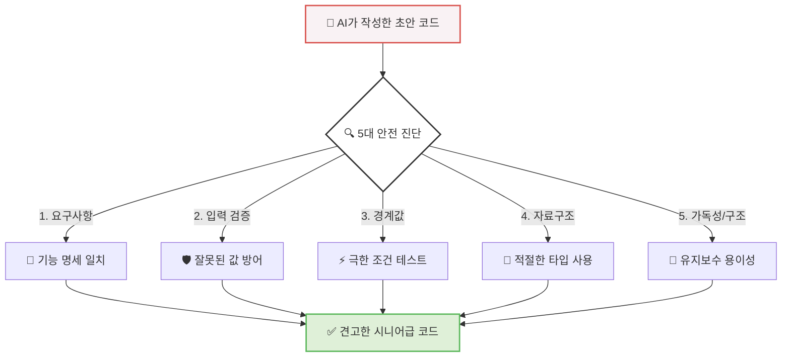

이 다이어그램은 허술한 AI 초안 코드가 어떻게 5가지 거름망을 거쳐 튼튼하고 안전한 코드로 탈바꿈하는지를 시각적으로 보여줍니다. 

---

## §3. 상세 내용

### Why — 왜 이 세션이 필요한가?

AI 에이전트에게 "고객 정보를 업데이트하는 함수를 짜줘"라고 하면 아주 빠르고 그럴듯한 코드를 만들어 줍니다. 하지만 AI는 종종 '정상적인 상황'만 가정하고 코드를 짜는 경향이 있어요. 예외 처리나 경계값 확인을 누락하는 경우가 굉장히 많습니다. 개발자가 이 코드를 검증 없이 그대로 서비스에 붙이면, 치명적인 보안 사고나 시스템 다운으로 이어질 수 있습니다. 따라서 AI의 작업물을 평가할 수 있는 명확한 기준, 즉 5대 체크포인트가 머릿속에 완전히 자리 잡혀 있어야 해요.

### What — 5대 체크포인트란 무엇인가?

1. **요구사항 (Requirements)**: 코드가 우리가 원래 지시한 기능을 정확히 수행하고 있는지 확인합니다. 고객의 나이를 계산하라고 했는데 생년을 저장만 하고 있지는 않은지 확인하는 가장 기본적인 단계예요.
2. **입력 검증 (Input Validation)**: 아까 테스트 시나리오에서 찾았던 구멍들을 코드가 잘 막아내고 있는지 봅니다. `if not name:`처럼 값이 비어있는지 검사하거나, 정규식을 사용해 전화번호 형식이 맞는지 검사하는 방어 로직이 필수적입니다.
3. **경계값 (Boundary Conditions)**: 리스트의 인덱스를 벗어나지는 않는지(`IndexError`), 나이에 음수가 들어가거나 200살이 들어가는 것을 막아주었는지 확인합니다. 조건의 끝값(>=, <=)이 올바른지 점검해야 해요.
4. **자료구조 (Data Structures)**: 파이썬의 핵심인 리스트, 딕셔너리, 세트 등을 상황에 맞게 잘 썼는지 확인합니다. 고객을 주민번호로 빠르게 검색해야 하는데 리스트를 반복문으로 돌리고 있다면, 이를 딕셔너리의 키(Key) 검색으로 바꾸도록 지적해야 합니다.
5. **가독성 및 구조 (Readability & Architecture)**: 변수 이름이 `a`, `b`처럼 대충 지어지지 않았는지, 하나의 함수가 3~4가지 일을 동시에 하고 있지는 않은지 살핍니다. 누군가 나중에 이 코드를 읽었을 때 한눈에 이해할 수 있어야 해요.

### How — 어떻게 적용하는가?

이 5가지 기준만 확실히 기억해두면, 아무리 복잡한 코드를 만나더라도 당황하지 않고 문제점을 콕콕 짚어낼 수 있어요. 마치 채점 기준표를 들고 시험지를 채점하듯 코드를 하나하나 뜯어보는 습관을 들이는 것이 핵심입니다.

---


### 📊 참고 표 (Visual Specs)

**코드 리뷰 5대 체크포인트**

| 체크포인트 | 설명 | AI 프롬프트 적용 예시 |
|:---|:---|:---|

## §4. 실습 가이드 (+ 🎙️ 실습 대본)

### 실습 목표

동일한 기능을 수행하지만 품질이 완전히 다른 두 개의 코드를 비교해 봅니다. AI가 작성한 초안 코드의 문제점을 5대 체크포인트에 비추어 스스로 찾아내고, 시니어 개발자가 리팩토링한 코드가 어떻게 그 문제점들을 방어하고 있는지 눈으로 확인합니다.

🎙️ **실습 가이드 대본 (Lab Guide)**:

> 자, 화면의 코드를 함께 보실까요? 화면 왼쪽은 제가 방금 전 AI에게 "고객 나이 업데이트 함수 만들어줘"라고 했을 때 1초 만에 뱉어낸 코드입니다. 코드가 단 두 줄이네요! 언뜻 보면 심플하고 잘 작동할 것 같죠? 요구사항(나이 업데이트)은 만족했습니다. 
>
> 하지만 우리의 5대 체크포인트를 들이대 볼까요? '입력 검증'이 전혀 없어요. 만약 사용자가 실수로 나이 칸에 문자열 `"스무살"`을 넣으면 어떻게 될까요? 그냥 업데이트되어 버리고 나중에 계산할 때 에러가 터지겠죠. 
> 
> '경계값' 처리도 없습니다. 실수로 `-5`살이나 `1000`살이 들어와도 그냥 데이터베이스에 들어가 버립니다. 
>
> 이제 화면 오른쪽의 시니어 개발자가 수정한 견고한 코드를 보세요. 코드가 좀 길어졌죠? 하지만 어떤 이상한 값이 들어와도 절대 프로그램이 죽지 않도록 `if`문으로 단단한 성벽을 둘러쳤습니다. 숫자가 맞는지, 나이 범위가 정상인지 꼼꼼하게 따져보고 나서야 업데이트를 허락합니다. 이것이 바로 코드 리뷰와 리팩토링의 힘입니다!

### 단계별 지시

| 단계 | 소요 시간 | 강사 지시사항 | 학습자 액션 | 예상 결과 |
|------|----------|--------------|------------|----------|
| 1 | 5분 | AI 초안 코드 화면에 제시 | 5대 체크포인트 기준으로 약점 찾기 | 입력 검증과 경계값 부재 발견 |
| 2 | 5분 | 학습자 의견 청취 | "문자가 들어가면 안 돼요", "마이너스 나이는 없어요" 발표 | 예외 상황에 대한 경각심 고취 |
| 3 | 5분 | 시니어 개발자의 수정 코드 제시 | 방어 코드가 어떻게 적용되었는지 대조하며 확인 | 구조적 방어 로직의 필요성 체감 |
| 4 | 5분 | 질의응답 및 정리 | 본인이 작성했던 코드의 취약점 되돌아보기 | 코드 품질에 대한 시각 변화 |

### 트러블슈팅 FAQ

| Q | A |
|---|---|
| 방어 코드를 너무 많이 넣으면 코드가 지저분해지지 않나요? | 네, 좋은 질문이에요. 그래서 보통 입력 검증만 전담하는 함수나 모듈을 따로 빼서 구조화합니다. 메인 로직과 검증 로직을 분리하는 것이죠. |
| AI에게 처음부터 예외처리 다 해달라고 하면 안 되나요? | 물론 가능합니다! 하지만 AI가 완벽하게 처리했는지 '검증'하는 눈이 없으면, 엉뚱한 예외 처리를 해놔도 모르게 됩니다. 우리가 검사관이 되어야 하는 이유죠. |

---


### 🎓 강사 노트 (Instructor Support)

- ⏱️ **타이밍**: 15:50 (20분, narrative)
- 🎯 **핵심 활동**: "품질 검사관" 비유
- ⚠️ **강사 주의사항**: 체크리스트 배포

## §5. 코드 및 명령어 모음

강의 화면에 나란히 띄워놓고 비교할 코드 스니펫입니다. 

**🔴 AI가 작성한 초안 (검증 없음)**
```python
def update_age(customer, new_age):
    customer['age'] = new_age
    print("업데이트 완료")
```

**🟢 리뷰가 반영된 견고한 코드 (시니어급)**
```python
def update_age(customer, new_age):
    # 1. 입력 검증 (Input Validation): 숫자 타입이 맞는지 확인
    if not isinstance(new_age, int):
        print("오류: 나이는 숫자여야 합니다.")
        return False
    
    # 2. 경계값 검증 (Boundary Conditions): 상식적인 나이 범위인지 확인
    if new_age < 0 or new_age > 150:
        print("오류: 유효하지 않은 나이 범위입니다.")
        return False
        
    # 모든 검증을 통과했을 때만 데이터 업데이트
    customer['age'] = new_age
    print("정상적으로 업데이트되었습니다.")
    return True
```

---

## §6. 요약

### 핵심 학습 포인트

여러분은 이제 좋은 코드와 위험한 코드를 구분할 수 있는 매의 눈을 가지게 되었습니다. 코드를 평가하는 5대 체크포인트는 다음과 같습니다.
1. 기능이 지시대로 구현되었는가? (요구사항)
2. 엉뚱한 입력이 들어와도 튕겨내는가? (입력 검증)
3. 극단적인 값이 들어와도 안전한가? (경계값)
4. 데이터를 효율적으로 관리하는가? (자료구조)
5. 남이 읽기 쉽고 구조가 깔끔한가? (가독성/구조)

이 기준들을 통해 내 코드, 그리고 AI가 만들어준 코드의 약점을 발견해내는 것이 소프트웨어 품질 관리의 첫걸음입니다. 

### 다음 세션 예고

진단 기준을 알았으니, 이제 진단서를 예쁘게 써서 정비공(AI)에게 전달해야겠죠? 다음 세션(080)에서는 발견된 문제점을 AI에게 정확하게 지시하여 코드를 수정받는 '리뷰 코멘트 작성 및 프롬프트 엔지니어링 실습'을 진행하겠습니다.

### 브릿지 노트

> "코드의 약점을 찾는 법을 알게 되셨나요? 그런데 속으로 '아, 저거 언제 다 말로 설명해서 고치라고 하지?' 생각하셨을 거예요. 걱정 마세요. AI에게 '이 부분은 입력 검증이 빠졌으니 보완해'라고 정확히 명령하는 방법, 다음 시간에 바로 알려드립니다!"

> ✅ **체크포인트**: "코드 리뷰 5대 체크포인트 중, 사용자로부터 나이를 입력받을 때 0보다 작거나 150보다 큰 값이 들어오는 것을 막았는지 확인하는 항목은 무엇일까요?" 
> ➡️ 정답은 **경계값(Boundary)** 확인입니다!

---

## §7. 참고 자료

### 3-Source 출처

- **Source A (로컬 참고자료)**: 「8 코딩.pdf」 §8.12 (코드 리뷰), 「9 디버깅,테스트,배포.pdf」 §9.3.2 — 코드 리뷰의 중요성과 결함을 찾아내는 실무적 기준들을 발췌하여 5대 체크포인트로 재구성했습니다.
- **Source B (NotebookLM)**: NotebookLM 분석 리포트 §8 — 생성된 코드를 무비판적으로 수용하지 않고 체계적 기준으로 평가하는 방법론을 본 세션의 핵심 철학으로 반영했습니다.
- **Source C (Deep Research)**: Deep Research 보고서 §4.1 — 가독성, 유지보수성, 에러 처리(입력 검증) 등 품질 검사관으로서의 시니어 개발자 페르소나 설정에 활용했습니다.

### 강사 노트

> 💡 **강사 노트**: 본 세션은 수강생들이 스스로 짠 코드나 AI가 짜준 코드를 '불신'하게 만드는 것이 목표입니다. 완벽한 코드는 없으며 항상 방어적으로 코딩해야 한다는 점을 5대 체크포인트를 통해 설득력 있게 전달해 주세요. 건축물 안전 진단 비유를 사용할 때 과장된 억양을 섞어주시면 집중도를 높이는 데 아주 좋습니다.

---

## ✅ 세션 완료 체크리스트 (강사용)

- [x] §1~§7 모든 섹션이 충실하게 작성되었는가?
- [x] 구어체 기반의 친근하고 명확한 문체가 유지되었는가?
- [x] 5대 체크포인트 개념이 건축물 진단 비유와 함께 잘 설명되었는가?
- [x] 시니어급 코드와 AI 초안 코드를 대조하는 실습 가이드가 포함되었는가?
- [x] Mermaid 다이어그램이 정상적으로 렌더링되며 흐름을 잘 보여주는가?

---

*작성 일시: 2026-02-25*  
*작성 에이전트: A4B_Session_Writer*  
*교안 구조: 7섹션 (A0 팀 공통 표준)*

> 🔗 **이전 세션**: [세션 078: 고객 관리 프로그램 테스트 시나리오 작성 실습](#세션-078)에서 배운 내용을 이어갑니다.
> 🔗 **다음 세션**: [세션 080: 완벽한 리뷰 코멘트 작성 및 AI 피드백 실습](#세션-080)에서 계속됩니다.

---

### 세션 080: 완벽한 리뷰 코멘트 작성 및 AI 피드백 실습
> [원본 파일](sessions/세션-080-완벽한_리뷰_코멘트_작성_및_AI_피드백_실습_v2.1.md) | ⏱️ 25분 | 🧪 lab | 난이도: high

> **세션 ID**: MS-PY101-080  
> **소요 시간**: 25분  
> **난이도**: medium  
> **청크 타입**: lab  
> **버전**: v2.1 (7섹션 구조)

---

## §1. 개요

> **Day 4 | PM | 세션 080/085**

### 🎯 학습 목표

이 세션이 끝나면, 수강생은 다음을 할 수 있습니다:

- 리뷰 코멘트 3요소(위치, 문제점, 재현/해결 방법)를 포함한 프롬프트를 작성하여 AI에게 코드 수정을 지시할 수 있다
- AI에게 구체적인 페르소나와 맥락을 부여하여 의도한 방향대로 예외 처리가 반영된 코드를 획득할 수 있다
- 수정된 코드를 기존 프로젝트에 반영하고, 테스트 시나리오를 다시 실행하여 방어 로직의 성공을 검증할 수 있다

### 선행 세션 환기

바로 직전 세션(세션-079)에서 우리는 품질 검사관이 되어 5대 체크포인트를 활용해 AI가 짠 코드의 치명적인 허점들을 짚어내는 방법을 배웠습니다. 입력 검증도 없고, 경계값도 처리하지 않은 날것의 코드였죠. 자, 문제를 발견했다면 이제 해결해야 합니다. 과거의 개발자라면 여기서 밤을 새우며 직접 `if` 문을 추가하고, 예외 처리 코드를 한 땀 한 땀 타이핑했을 것입니다. 하지만 우리는 'AI-native' 개발자입니다. 문제를 발견하는 것은 우리의 몫이지만, 코드를 수정하고 타이핑하는 것은 우리의 든든한 조수, AI의 몫입니다. 하지만 AI에게 대충 "야, 코드 에러 나. 고쳐줘"라고 말하면 AI는 엉뚱한 곳을 고치거나 오히려 새로운 버그를 만들어냅니다. 오늘 우리는 AI가 단번에 핵심을 파악하고 코드를 완벽하게 고칠 수 있도록, 명확하고 구체적인 '리뷰 코멘트'를 작성하는 프롬프트 엔지니어링 실습을 진행하겠습니다.

---

## §2. 핵심 개념 (+ 🗣️ 강사 대본 + Mermaid)

### 명탐정의 사건 보고서 = 완벽한 리뷰 코멘트

완벽한 리뷰 코멘트를 작성하는 것은 셜록 홈즈 같은 '명탐정의 사건 보고서'를 쓰는 것과 같습니다. 여러분이 경찰서장이고 탐정에게 사건 조사를 맡겼다고 가정해 보세요. 탐정이 돌아와서 "서장님, 범죄가 일어났습니다. 누군가 죽었어요. 아무튼 해결해 주세요."라고 보고한다면 어떨까요? 당연히 황당하고, 수사 방향을 잡을 수 없을 것입니다. 

훌륭한 탐정은 이렇게 보고합니다. "서장님, 어젯밤 11시 30분, 베이커 거리 221B번지 건물 2층 창문에서(위치), 독살로 추정되는 사건이 발생했습니다(문제점). 현장에 남아있는 찻잔의 가루를 분석하면 범인의 지문을 찾을 수 있을 것입니다(해결 방법)."

AI에게 버그를 고치라고 명령할 때도 이 명탐정의 보고서와 정확히 똑같은 방식이 필요합니다. "안 돼요", "에러 나요"라는 식으로 뭉뚱그려 질문하면, AI는 코드를 보고 구조를 이해할 수는 있지만 여러분이 도대체 어느 부분에서 어떤 데이터를 넣다가 실패했는지는 알 수 없습니다. 육하원칙처럼 명확한 정보를 주어야만 AI는 엉뚱한 코드를 건드리지 않고, 문제가 발생한 정확한 위치를 찾아 수술을 시작할 수 있습니다.

🗣️ **강사 대본 (Instructor Script)**:

> 여러분, "이 코드 이상해요, 고쳐주세요"라고 하면 사람도 AI도 못 알아듣습니다. 우리가 AI에게 두 가지 페르소나를 부여할 텐데요. 하나는 여러분의 코드를 평가하는 깐깐한 '시니어 개발자'의 역할, 또 하나는 여러분의 리뷰 코멘트를 받고 직접 코드를 수정하는 '주니어 개발자(수행자)'의 역할입니다. 명확한 보고서만 있다면, 이 똑똑한 조수는 여러분이 상상한 것보다 훨씬 더 꼼꼼하게 에러 처리를 추가해 줄 것입니다.
> 
> "여기에 문자가 들어오면 에러가 나니까, try-except로 방어 코드를 넣어주세요"라고 구체적으로 이유와 대안을 제시해야 합니다. 그래야 AI가 조회 기능이나 삭제 기능을 건드려서 멀쩡한 코드를 망가뜨리는 대참사를 막을 수 있어요. 자, 이제 탐정 보고서를 써 볼까요?

> 💡 **강사 노트**: 주니어 개발자들이 AI를 활용할 때 가장 많이 실패하는 이유가 불명확한 프롬프팅입니다. 구체적인 위치 지정의 중요성을 강조해 주시고, 3요소(위치, 문제점, 기대 결과)가 프롬프트에 모두 들어갔는지 실습 과정에서 개별적으로 체크해 주시면 좋습니다.

### Mermaid 다이어그램

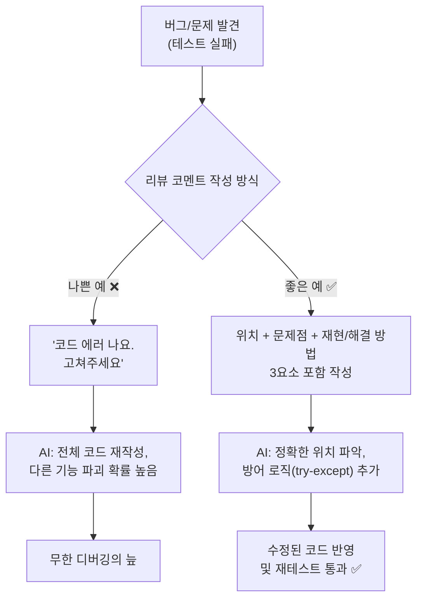

---


### 🎨 추가 시각화 (Visualization Packet)

**테스트 피라미드 (Test Pyramid)**

빠르고 가벼운 단위 테스트를 가장 많이, 느린 E2E 테스트를 가장 적게 배치하는 안정적인 품질 관리 전략입니다.

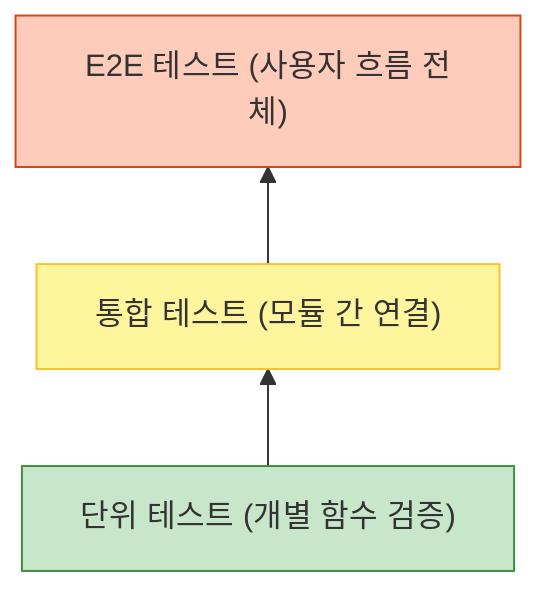

## §3. 상세 내용

### Why — 왜 리뷰 코멘트를 제대로 써야 하는가?

AI가 코드를 생성하고 분석하는 능력은 탁월하지만, AI는 "우리의 의도"를 독심술로 알아내지 못합니다. [C] 자료의 심층 분석을 보면, 주니어 개발자들이 AI 기반 코딩에서 시간을 낭비하는 가장 큰 원인이 바로 프롬프트의 모호성입니다. 코드를 통째로 복사해서 "에러 해결해 줘"라고 던지면, AI는 가장 그럴듯한 해결책을 제시하기 위해 코드의 구조를 임의로 바꿔버리거나, 우리가 의도하지 않은 다른 기능의 로직까지 손대버리는 경우가 많습니다. 리뷰 코멘트를 꼼꼼하게 작성하는 것은 내 코드의 무결성을 방어하고, AI의 수정 범위를 엄격하게 통제하기 위한 필수적인 안전장치입니다.

### What — 리뷰 코멘트의 3요소

[A] 자료에 소개된 실무 PR(Pull Request) 리뷰 가이드라인에 따르면, 완벽한 리뷰 코멘트는 다음 3가지 요소를 반드시 포함해야 합니다.

1. **위치 (Where)**
   - 전체 코드 중 문제가 발생한 정확한 곳을 지목합니다.
   - 예: "`register_customer()` 함수 내부의 전화번호 입력 부분에서"

2. **문제점 (What/Why)**
   - 어떤 조작을 했을 때 어떤 현상이 벌어지는지 구체적으로 기술합니다.
   - 이전 세션에서 작성했던 '실제 결과(Fail 현상)'를 활용합니다.
   - 예: "입력 검증이 없어서 문자를 입력하거나 빈 문자열을 입력하고 엔터를 치면 프로그램이 `ValueError`를 내며 종료됩니다."

3. **재현 방법 및 기대 결과/제안 (How)**
   - 방어를 위해 어떤 조치를 취해야 하는지, 수정 후 어떻게 동작하기를 원하는지 명확히 제시합니다.
   - 예: "`try-except` 블록을 추가해서, 잘못된 값이 들어오면 '정확한 형식으로 입력하세요'라는 에러 메시지를 출력하고 다시 입력받도록 수정해 줘."

### How — 프롬프트 조립하기

이 3요소를 결합하면 AI에게 전달할 완벽한 프롬프트가 완성됩니다. 

> "너는 10년 차 시니어 파이썬 개발자야. 현재 `register_customer()` 함수(위치)에 입력 검증 로직이 누락되어 있어 나이 입력란에 문자를 입력하면 에러가 발생하며 프로그램이 꺼져(문제점). 나이가 숫자가 아니거나 전화번호가 비어있으면, 에러 메시지를 출력하고 무한 루프를 돌아 다시 입력받도록 `try-except`와 `while`문을 사용해 예외 처리를 추가해서 해당 함수만 수정해 줘(기대 결과)."

이 마법의 문장 하나면 AI는 지시받은 타겟 함수만 정확히 수정하여 완벽한 방어 코드를 반환합니다.

> ✅ **체크포인트**: AI에게 코드를 수정해 달라고 요청할 때 엉뚱한 결과를 막기 위해 반드시 포함해야 하는 리뷰 코멘트의 3요소는 무엇일까요?
> — 정답: 위치, 문제점, 재현/해결 방법(또는 기대 결과)

---

## §4. 실습 가이드 (+ 🎙️ 실습 대본)

### 실습 목표

수강생은 직접 작성한 고객 관리 코드의 취약점을 보완하기 위해 3요소가 포함된 리뷰 프롬프트를 작성하고, AI를 통해 예외 처리가 반영된 코드를 성공적으로 얻어내어 시스템에 반영합니다.

🎙️ **실습 가이드 대본 (Lab Guide)**:

> 자, 메모장이나 빈 문서를 하나 열어주세요. 방금 전 079 세션에서 여러분이 직접 찾아냈던 그 끔찍한 버그들 기억나시죠? 나이 칸에 '스무살' 쳤더니 뻗어버리던 그 코드요. 이제 그 버그를 잡기 위해 AI에게 명령서를 작성할 겁니다.
> 
> "코드 고쳐" 한 마디로 끝내지 마시고, 방금 배운 3요소! 위치, 문제점, 해결 방법을 하나하나 채워서 프롬프트를 만들어보세요. 다 쓰신 분은 AI 채팅창에 복사해서 붙여넣고 결과를 확인해 봅니다. AI가 주는 코드에서 try-except나 while 문이 예쁘게 추가되었는지 눈으로 먼저 확인하시고, 내 코드에 반영한 뒤에 얄미운 값들을 다시 입력해서 프로그램이 잘 버티는지 시승해 봅시다!

### 단계별 지시사항

| 단계 | 소요 시간 | 강사 지시사항 | 학습자 액션 | 예상 결과 |
|------|----------|--------------|------------|----------|
| 1 | 5분 | "3요소가 포함된 리뷰 프롬프트를 작성하세요" | 메모장에 대상 코드와 함께 3요소(위치, 문제점, 기대 결과)를 담은 텍스트 작성 | 명확한 구조의 프롬프트 초안 완성 |
| 2 | 5분 | "작성한 프롬프트를 AI에게 전송하세요" | Agent Manager (또는 ChatGPT/Claude)에 프롬프트 전송 | 방어 로직(try-except 등)이 추가된 코드 응답 |
| 3 | 5분 | "수정된 코드를 확인하고 파이썬 파일에 반영하세요" | AI의 코드에서 예외 처리 부분 확인 후, 내 에디터의 해당 함수만 교체 | 기존 코드가 방어력 높은 코드로 갱신됨 |
| 4 | 5분 | "빈칸과 문자를 다시 입력해서 재테스트 하세요" | 프로그램 실행 후 의도적으로 오타, 빈칸, 문자열 입력 | 프로그램이 죽지 않고 경고 메시지 출력 후 재입력 요구 |

**[단계 1] 리뷰 프롬프트 작성하기**
- 대상 코드 전체를 복사해서 붙여넣을 준비를 합니다.
- 텍스트 최상단에 AI의 페르소나를 지정합니다. (예: "너는 꼼꼼한 코드 리뷰어이자 파이썬 시니어 개발자야.")
- 문제가 발생한 함수명, 에러 현상, 해결 요구사항을 명확히 적습니다.

**[단계 2] AI에게 전송 및 코드 리뷰 확인**
- 작성한 프롬프트와 코드를 AI에게 전달합니다.
- AI가 답변으로 제시한 코드에 `try-except`, `if not string.strip()`, `while True` 등의 예외 처리 로직이 제대로 추가되었는지 스크롤을 내리며 눈으로 확인합니다.
- 만약 AI가 전체 코드를 통째로 다시 짰거나, 요구하지 않은 기능까지 변경했다면 프롬프트를 수정하여 다시 요청합니다 ("해당 함수만 수정해 줘"라고 추가).

**[단계 3 & 4] 수정 코드 반영 및 재테스트**
- AI가 짜준 코드를 복사하여 파이썬 에디터에 붙여넣습니다. 전체 코드를 덮어쓰지 말고 수정한 함수 부분만 교체하는 것이 좋습니다.
- 이전 세션에서 실패했던 테스트 시나리오(빈칸 입력하기, 문자로 나이 입력하기)를 다시 실행합니다. 프로그램이 죽지 않고 "다시 입력하세요"를 잘 띄우는지 확인합니다.

### 트러블슈팅 FAQ

| Q | A |
|---|---|
| AI가 제가 짠 코드를 다 지우고 아예 새로운 방식으로 짜줬어요 | 프롬프트가 포괄적일 때 발생합니다. "기존 코드의 구조는 100% 유지하고, `register_customer` 함수 안에만 예외 처리를 추가해"라고 제한 조건을 걸어주세요. |
| AI 코드를 복사해서 붙여넣었는데 들여쓰기 에러(IndentationError)가 나요 | 파이썬은 들여쓰기가 생명입니다. 기존 코드와 AI 코드를 붙여넣는 과정에서 띄어쓰기 4칸의 간격이 어긋났을 수 있습니다. 해당 줄의 탭을 지우고 다시 맞추세요. |
| 예외 처리가 들어가긴 했는데 무한 루프를 돌면서 계속 에러를 뿜어요 | `while` 루프 안에서 입력을 다시 받는 `input()` 함수 위치가 잘못되었거나, 성공 시 빠져나가는 `break` 문이 누락된 경우입니다. AI에게 "무한 루프에 빠지니까 루프 탈출 조건을 확인해 줘"라고 다시 피드백하세요. |

---


### 🎓 강사 노트 (Instructor Support)

- ⏱️ **타이밍**: 16:20 (25분, lab)
- 🎯 **핵심 활동**: 3요소 리뷰 코멘트 실습
- ⚠️ **강사 주의사항**: 위치·문제·재현 방법


### 📋 실습 설계 보강 (Lab Packet)

**세션 080 실습 설계 보강**

완벽한 리뷰 코멘트 작성 및 AI 피드백 실습
- **3-Stage Example Set**
  - 기본: 리뷰 코멘트 3요소(위치/문제점/재현방법) 작성 → AI에게 코드 수정 요청
  - 변형: AI에게 "코드 리뷰 5대 체크포인트로 이 코드를 평가해줘" 자동 리뷰 요청
  - 실수 해결: "AI에게 수정 요청했는데 엉뚱한 곳을 고쳐요" → 라인 번호/함수명으로 정확히 지정
- **난이도 예측**: ★★★ 코드의 "문제"를 발견하는 안목이 아직 부족
- **타이밍 가이드**: 리뷰 코멘트 작성법 복습 3분 | 코멘트 작성 7분 | AI에게 수정 지시 8분 | 결과 검증 7분
- **심리적 장벽**: "코드를 읽어도 문제가 보이지 않아요"
- **자가 점검**:
  - [ ] 리뷰 코멘트에 위치(함수명/라인), 문제점, 재현 방법이 포함되어 있는가?
  - [ ] AI가 수정한 코드에 예외 처리(try/except)가 추가되었는가?
  - [ ] 수정된 코드를 다시 테스트하여 개선을 확인했는가?

## §5. 코드 및 명령어 모음

### 프롬프트 예시 1: 나이 입력 (숫자 변환 에러) 방어

```text
너는 10년 차 시니어 파이썬 개발자야. 
[위치] 현재 `create_customer()` 함수 내부의 나이(`age`)를 입력받는 부분에
[문제점] 입력 검증 로직이 없어서, 사용자가 "스무살" 처럼 문자열을 입력하면 `int()` 변환 시 `ValueError`가 발생하며 프로그램이 종료돼.
[기대 결과] 나이를 입력받을 때 `try-except`와 `while` 문을 사용해서, 숫자가 아니면 "숫자로만 입력해주세요"라는 경고 메시지를 출력하고 무한 루프를 돌아 다시 입력받도록 수정해 줘. 다른 함수의 코드는 절대 건드리지 마.
```

### 프롬프트 예시 2: 전화번호 빈 문자열 입력 방어

```text
[위치] `update_customer()` 함수에서 전화번호(`phone`)를 입력받는 곳에
[문제점] 사용자가 아무것도 입력하지 않고 엔터를 쳐도 빈 문자열("")이 그대로 저장되는 문제가 있어.
[기대 결과] 입력받은 문자열이 비어있거나 공백만 있는 경우, "전화번호는 필수 입력값입니다"라고 안내하고 다시 입력받게 만들어줘. `strip()` 메서드를 활용해서 방어 로직을 짜줘.
```

### 예상되는 AI 수정 코드 스니펫 (참고용)

```python
# 수정 전
age = int(input("나이를 입력하세요: "))

# 수정 후
while True:
    try:
        age_input = input("나이를 입력하세요: ")
        age = int(age_input)
        break # 정상 숫자가 입력되면 루프 탈출
    except ValueError:
        print("[오류] 나이는 숫자로만 입력해주세요. 다시 입력 바랍니다.")
```

---

## §6. 요약

### 핵심 학습 포인트

여러분은 오늘 직접 작성한 명확한 리뷰 코멘트 덕분에, 아주 짧은 시간 안에 훌륭한 방어 코드를 완성했습니다. 기억해야 할 핵심은 한 가지, **리뷰 코멘트의 3요소(위치, 문제점, 기대 결과)**입니다. 

직접 짠 코드가 아님에도 불구하고 이제 프로그램이 빈칸이나 오타에 강하게 버티는 모습을 보니 마음이 든든하실 겁니다. 이렇게 우리는 절차적으로 시작해서, 구조적으로 리모델링하고, 테스트로 구멍을 찾고, 코드 리뷰로 방어벽까지 세웠습니다. 완벽한 프롬프트는 그 어떤 복잡한 프로그래밍 언어 문법보다 더 강력하고 정밀한 힘을 발휘합니다. 피드백이야말로 이 시대의 가장 훌륭한 프로그래밍 언어입니다.

### 다음 세션 예고

오늘 하루, 정말 긴 여정을 거쳤습니다. 위에서 아래로 무식하게 흘러가던 코드를 함수 단위로 잘게 쪼갰고, 튼튼한지 시승도 해보았으며, 검사관이 되어 꼼꼼히 리뷰도 마쳤습니다. 다음 세션에서는 오늘 하루 동안 배운 절차에서 구조로의 여정, 그리고 테스트와 리뷰의 의미를 종합적으로 되돌아보는 회고의 시간을 갖겠습니다.

### 브릿지 노트

> "수정된 코드 돌려보셨나요? 아까는 뻗어버렸던 프로그램이 이제는 오타를 내도 '다시 입력하세요'라며 친절하게 버텨주고 있죠? 이게 바로 방어적 프로그래밍의 힘이자, 제대로 된 프롬프팅의 결과입니다. 고생 많으셨습니다. 이제 오늘 하루 배운 내용들을 머릿속에 차곡차곡 정리해 보는 종합 세션으로 넘어가겠습니다!"

---

## §7. 참고 자료

### 3-Source 출처

- **Source A (로컬 참고자료)**: [A] 9 디버깅, 테스트, 배포.pdf §9.3.2 PR — 실무 PR 리뷰 가이드라인, 리뷰 코멘트 작성 규칙
- **Source C (Deep Research)**: [C] Deep Research §4.2, 4.3 — 주니어 개발자의 AI 활용 시 실패 패턴(모호한 프롬프트), 문제+이유+제안 3요소 프롬프팅 전략

### 추가 학습 자료

- [Google Engineering Practices - How to do a code review](https://google.github.io/eng-practices/review/reviewer/): 구글의 실제 코드 리뷰 가이드라인
- [Antigravity IDE Prompting Guide](https://antigravity.google): AI 페어 프로그래머에게 명확한 맥락을 전달하는 프롬프트 작성 베스트 프랙티스

### 강사 노트

> 💡 **강사 노트**: 수강생들이 처음 AI에게 코드를 수정해 달라고 할 때 겪는 가장 큰 시행착오는 "원하는 부분만 고쳐달라"는 통제를 하지 못해 AI가 전체 코드 구조를 임의로 엎어버리는 상황입니다. 실습 순회 시 수강생의 프롬프트 마지막에 "해당 함수만 수정해 줘", "기존 구조는 건드리지 마"와 같은 제한 조건이 잘 들어갔는지 반드시 점검해 주세요.

---

## ✅ 세션 완료 체크리스트 (강사용)

- [ ] §1~§7 모든 섹션이 충실하게 작성되었는가?
- [ ] 명탐정의 사건 보고서 비유가 §2에 명확히 포함되었는가?
- [ ] 리뷰 코멘트의 3요소(위치, 문제점, 재현/기대 결과)가 충분히 설명되었는가?
- [ ] 실습 가이드(§4)에 단계별 소요 시간과 트러블슈팅 FAQ가 배치되었는가?
- [ ] 코드/프롬프트 예시(§5)에 try-except와 while을 활용한 방어 코드가 명시되었는가?
- [ ] 다음 종합 세션(081)으로 이어지는 브릿지 노트가 포함되었는가?

---

**🔗 선행 세션**: [세션-079] 품질 검사관: 코드 리뷰 5대 체크포인트 (필수)  
**🔗 후행 세션**: [세션-081] Day 4 종합: 절차에서 구조로, 그리고 테스트까지

---

*작성 일시: 2026-02-25*  
*작성 에이전트: A4B_Session_Writer*  
*교안 구조: 7섹션 (A0 팀 공통 표준)*


> 🔗 **이전 세션**: [세션 079: 품질 검사관: 코드 리뷰 5대 체크포인트](#세션-079)에서 배운 내용을 이어갑니다.
> 🔗 **다음 세션**: [세션 081: Day 4 종합: 절차에서 구조로, 그리고 테스트까지](#세션-081)에서 계속됩니다.

---

### 세션 081: Day 4 종합: 절차에서 구조로, 그리고 테스트까지
> [원본 파일](sessions/세션-081-Day_4_종합-_절차에서_구조로,_그리고_테스트까지_v2.1.md) | ⏱️ 20분 | 📖 narrative | 난이도: low

> **세션 ID**: MS-PY101-081  
> **소요 시간**: 20분  
> **난이도**: low  
> **청크 타입**: narrative  
> **버전**: v2.1 (7섹션 구조)

---

## §1. 개요

> **Day 4 | PM | 세션 081/085**

이 세션은 Day 4의 모든 학습 여정을 종합하고 갈무리하는 아주 중요한 시간입니다. 아침부터 시작된 "고객 관리 프로그램" 개발의 전 과정을 되돌아보며, 절차적 코드에서 출발해 구조적 코드로 리팩토링하고, 마지막으로 테스트와 코드 리뷰를 통해 품질을 검증하는 '소프트웨어 라이프사이클'의 전체 그림을 수강생들의 머릿속에 확실하게 새겨주는 역할을 합니다.

### 🎯 학습 목표

이 세션이 끝나면 수강생은 다음을 할 수 있어요:
- Day 4에서 학습한 소프트웨어 개발 3단계(기능 구현 → 리팩토링 → 테스트/리뷰)를 자신의 언어로 요약할 수 있습니다.
- "작동하는 나쁜 코드"의 위험성을 깨닫고, 함수 기반 모듈화의 필요성을 설명할 수 있습니다.
- 시니어 개발자의 깐깐한 시선을 갖추고, 코드를 단순히 작성하는 것을 넘어 품질을 검증하는 마인드셋을 가질 수 있습니다.

### 선행 세션 환기

수강생들은 세션 080에서 AI를 활용해 시니어 개발자의 관점으로 코드 리뷰를 수행하고 수정 코멘트를 작성하는 실습을 마쳤습니다. 이제 파편화되어 있던 오늘 하루의 모든 경험(절차적 작성, 리팩토링, 예외 처리, 테스트)을 하나의 거대한 서사로 엮어낼 차례입니다.

---

## §2. 핵심 개념 (+ 🗣️ 강사 대본 + Mermaid)

### 비유 — 텐트 치기, 벽돌집 짓기, 그리고 입주 전 하자 보수

소프트웨어 개발의 전체 라이프사이클을 가장 직관적으로 이해할 수 있는 비유는 바로 '건축'입니다. 

1. **절차적 코드 작성 (텐트 치기)**: 일단 굴러가게 만드는 단계입니다. 비바람만 피하면 되듯 텐트는 빠르게 칠 수 있지만, 외부 충격에 매우 취약합니다.
2. **구조적 리팩토링 (벽돌집 짓기)**: 함수라는 튼튼한 벽돌로 공간(역할)을 나눕니다. 거실이 고장 나도 주방은 무사한 것처럼, 유지보수와 확장이 쉬워집니다.
3. **테스트 및 코드 리뷰 (입주 전 하자 보수)**: 창문이 태풍을 견디는지(경계값 테스트), 수도관이 막히지 않는지(예외 테스트) 점검하고 방어 코드를 추가하는 단계입니다.

🗣️ **강사 대본 (Instructor Script)**:

> 여러분, 정말 고생 많으셨습니다. Day 4의 험난하고도 아름다운 여정이 마무리되는 순간이에요. 오늘 하루 동안 여러분은 파이썬이라는 도구를 활용해 엄청난 성장을 이루어냈습니다. 아침에 처음 자리에 앉으셨을 때를 떠올려 볼까요?
>
> 우리는 그저 위에서 아래로 순서대로 실행되기만 하는, 아주 투박하고 불안정한 '절차적' 코드로 고객 관리 프로그램을 만들었습니다. 하지만 지금 여러분의 모니터에 띄워져 있는 코드는 어떤가요? 각각의 기능이 C, R, U, D 함수로 깔끔하게 모듈화되어 있고, 어떤 이상한 데이터가 들어와도 절대 죽지 않는 무적의 예외 처리 로직이 든든하게 감싸고 있습니다.
>
> 오늘 우리가 거쳐온 3단계를 건축에 비유해 볼게요. 첫 번째 단계는 **'텐트 치기'**였습니다. 우리가 처음 만들었던 `while` 문 하나에 모든 로직이 다 때려 박힌 절차적 코드가 바로 이 텐트였죠. 두 번째 단계는 **'벽돌집 짓기'**였습니다. 텐트에서는 평생 살 수 없으니, 기능을 독립된 함수로 분리하여 튼튼하게 구조를 올렸습니다. 마지막 세 번째 단계는 **'입주 전 하자 보수'**였습니다. 이상한 값을 입력해 보며 테스트를 하고, 시니어 개발자의 시선으로 리뷰 코멘트를 달아 예외 처리를 완벽하게 마쳤습니다.
>
> 오늘은 단순히 코딩 스킬을 배운 날이 아니에요. 현업 개발자들이 매일같이 반복하는 '소프트웨어 라이프사이클' 전체를 아주 압축적으로 경험한 위대한 하루였습니다.

### Mermaid 다이어그램: Day 4 학습 흐름 총정리

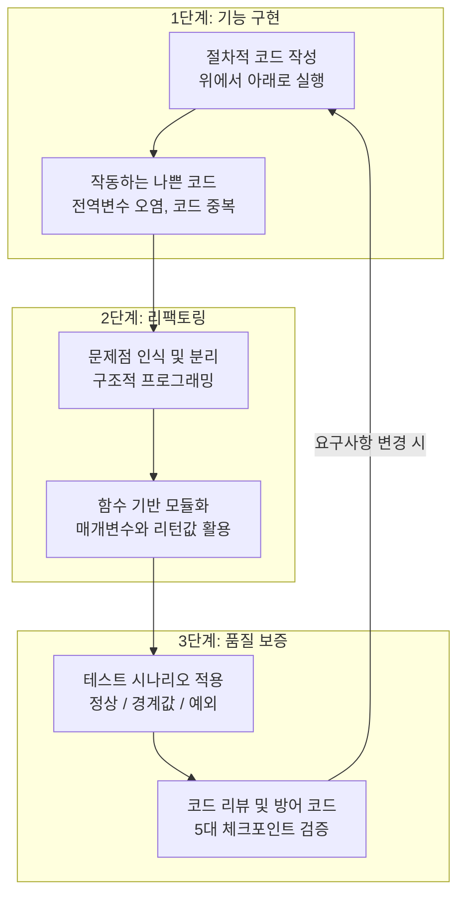

이 다이어그램은 한 번 하고 끝나는 것이 아니라, 새로운 기능을 추가할 때마다 구현, 리팩토링, 테스트라는 수레바퀴를 계속해서 굴려야 한다는 것을 보여줍니다.

---

## §3. 상세 내용

### Why — 왜 전체 흐름을 되돌아봐야 하는가?

초보자들은 코드가 에러 없이 한 번 실행되면 "다 만들었다!"라고 착각하기 쉽습니다. 하지만 실무에서는 코드를 작성하는 시간보다 유지보수하고 테스트하는 시간이 훨씬 더 깁니다. 오늘 하루 동안 겪었던 '수정의 고통(절차적)'과 '해방감(구조적)', 그리고 '부수는 쾌감(테스트)'을 하나로 연결해 주어야만, 수강생들이 앞으로 AI가 짜준 코드를 맹신하지 않고 비판적으로 검증할 수 있는 아키텍트로 성장할 수 있습니다.

### What — 무엇을 강조해야 하는가?

1. **기능 구현 (Implementation)**: 처음엔 요구사항에 맞춰 일단 돌아가게 만드는 것이 목표입니다. 정상 케이스(Happy Path)를 통과하는 것이 최우선 과제입니다.
2. **리팩토링 (Refactoring)**: 동작을 확인한 후, PEP 8 컨벤션을 지키며 내부 구조를 아름답게 가꾸는 과정입니다. 외부 동작은 변하지 않아야 합니다.
3. **품질 보증 (QA) 및 코드 리뷰**: 완성된 코드를 의심하고 집요하게 공격하여 시스템의 허점을 메우는 방어적 프로그래밍 단계입니다.

### How — 구체적으로 어떻게 진행하는가?

🗣️ **강사 대본 (Instructor Script)**:

> 자, 화면을 보실 필요도 없습니다. 편하게 눈을 감고 여러분이 오늘 작성한 코드의 변화를 머릿속으로 그려보세요. 아침에는 몇 줄 안 되는 허술한 코드였죠? 하지만 지금은 기능별로 함수가 예쁘게 나뉘어 있고, 사용자가 나이 입력 칸에 '스무살'이라고 문자를 입력하는 기상천외한 짓을 해도 `try-except`가 든든하게 막아주며 "숫자로 입력해주세요"라고 친절하게 안내합니다.
>
> 특히 코드 작성만큼이나 '테스트와 리뷰'가 중요하다는 사실을 온몸으로 깨달으셨을 거예요. 초보자는 어떻게든 코드가 에러 없이 한 번 돌아가게 만드는 것에 집착합니다. 하지만 시니어 개발자는 다릅니다. **"이 코드가 과연 언제 무너질 것인가?"**를 치열하게 고민합니다.
>
> 오늘 우리는 시니어 개발자의 깐깐함과 AI의 압도적인 생산성을 결합하는 방법을 완벽하게 마스터했습니다. 코드 작성의 고통은 AI에게 넘기고, 우리는 아키텍처를 고민하고 품질을 검증하는 진정한 의미의 'AI-native 개발자'로 거듭난 것입니다.

---

## §4. 실습 가이드 (+ 🎙️ 실습 대본) — 해당 시

### 실습 목표

수강생들이 오늘 배운 핵심 개념을 자신의 언어로 소화하고, 다음 세션부터 진행될 '미니 프로젝트'를 위한 심리적 준비를 마칩니다.

🎙️ **실습 가이드 대본 (Lab Guide)**:

> 이제 제가 앞에서 이끌어드리는 시간은 모두 끝났습니다! 기능 구현부터 리팩토링, 그리고 테스트와 리뷰까지... 모든 무기를 여러분의 손에 쥐여 드렸어요. 
> 
> 지금부터 3분 드릴 텐데요. 오늘 배운 개발의 3단계 수레바퀴를 떠올리며, 오늘 하루 가장 인상 깊었던 깨달음 한 줄을 노트에 적어보세요. 그리고 옆 사람과 공유해 보겠습니다. 
>
> (3분 후) 네, 좋습니다. "GOTO문 같은 엉킨 코드를 함수로 예쁘게 서랍장에 정리하는 기분이었다", "AI가 짠 코드도 완벽하지 않아서 내가 검사관이 되어야 한다는 걸 배웠다" 같은 훌륭한 회고들이 나왔습니다.

### 단계별 지시

| 단계 | 소요 시간 | 강사 지시사항 | 학습자 액션 | 예상 결과 |
|------|----------|--------------|------------|----------|
| 1 | 2분 | 오늘 배운 3단계 요약 브리핑 | 경청 및 내용 상기 | 라이프사이클 전체 흐름 이해 |
| 2 | 3분 | 가장 인상 깊은 깨달음 한 줄 작성 지시 | 노트에 1줄 회고 작성 | 배운 내용의 내재화 |
| 3 | 5분 | 짝꿍과 회고 내용 공유 및 발표 | 상호 공유 및 질의응답 | 성취감 고취 및 자신감 획득 |

---


### 🎓 강사 노트 (Instructor Support)

- ⏱️ **타이밍**: 16:45 (20분, narrative)
- 🎯 **핵심 활동**: 절차→구조→테스트 흐름
- ⚠️ **강사 주의사항**: 전체 여정 되짚기

## §5. 코드 및 명령어 모음 — 해당 시

> 💡 **강사 노트**: 본 세션은 narrative 기반의 총정리이므로 새로운 코드를 작성하지 않습니다. 화면에는 오늘 아침의 '절차적 코드'와 방금 완성한 '구조적 코드'를 나란히 띄워두고 시각적인 극적 대비를 보여주는 것이 좋습니다.

```python
# [Day 4 아침: 텐트 시절의 코드]
while True:
    menu = input("1.등록 2.조회: ")
    if menu == '1':
        name = input("이름: ")
        customers.append({"name": name}) # 데이터 파편화 위험, 예외 처리 전무
        
# -------------------------------------------------------------------

# [Day 4 오후: 벽돌집과 방어벽이 완성된 코드]
def create_customer(customers, name, phone):
    try:
        # 깐깐한 입력 검증 및 명시적 매개변수 활용
        if not name.strip():
            raise ValueError("이름은 비어있을 수 없습니다.")
        customers.append({"name": name, "phone": phone})
        return True
    except Exception as e:
        print(f"등록 실패: {e}")
        return False
```

---

## §6. 요약

### 핵심 학습 포인트

- **기능 구현 (텐트 치기)**: 코드가 절차적으로 엉켜있어도 일단 동작하게 만드는 1차 목표 달성.
- **리팩토링 (벽돌집 짓기)**: 전역 변수 오염과 코드 중복을 해결하기 위해 함수 단위로 모듈화하고 매개변수/리턴으로 명확한 데이터 흐름 구축.
- **품질 보증 (입주 전 하자 보수)**: 정상/경계값/예외 테스트 시나리오를 적용하고, 5대 체크포인트 기반의 코드 리뷰를 거쳐 튼튼한 방어 코드를 추가.

### 교안 원문

<details>
<summary>기존 세션 v1.0 원문 내용</summary>

# 세션 081 — Day 4 종합: 절차에서 구조로, 그리고 테스트까지

| 항목 | 내용 |
|------|------|
| **세션 ID** | MS-PY101-081 |
| **소요 시간** | 20분 |
| **난이도** | ★☆☆ |
| **청크 타입** | narrative |
| **선행 세션** | 세션-080 (필수) |
| **학습 목표** | Day 4에서 학습한 '절차적 코드 작성 → 구조적 리팩토링 → 테스트 및 코드 리뷰'의 전체 사이클을 3단계로 요약하여 설명할 수 있다 |
| **출처** | [A] 전체 8장, 9장 요약 · [C] Deep Research §1, 3, 4 |

---

## ① 도입 — "우리가 걸어온 험난하고도 아름다운 길을 돌아봅시다"

🗣️ 강사 대본 (Instructor Script):

여러분, 정말 고생 많으셨습니다. Day 4의 모든 여정이 마무리되는 순간입니다. 오늘 하루 동안 여러분은 파이썬이라는 도구를 활용해 엄청난 성장을 이루어냈습니다. 아침에 처음 자리에 앉으셨을 때를 떠올려 볼까요? 우리는 그저 위에서 아래로 순서대로 실행되기만 하는, 아주 투박하고 불안정한 '절차적' 코드로 고객 관리 프로그램을 만들었습니다. 하지만 지금 여러분의 모니터에 띄워져 있는 코드는 어떤가요? 각각의 기능이 함수로 깔끔하게 모듈화되어 있고, 어떤 이상한 데이터가 들어와도 절대 죽지 않는 무적의 예외 처리 로직이 감싸고 있습니다. 오늘은 단순히 코딩 스킬을 배운 날이 아닙니다. [A] 자료의 8장과 9장에서 강조하는, 현업 개발자들이 매일같이 반복하는 '소프트웨어 라이프사이클' 전체를 아주 압축적으로 경험한 하루였습니다. 

---

## ② 비유 — 텐트 치기, 벽돌집 짓기, 그리고 입주 전 하자 보수

🗣️ 강사 대본 (Instructor Script):

오늘 우리가 거쳐온 3단계를 건축에 비유해 보겠습니다. 

첫 번째 단계는 '절차적 코드 작성', 즉 '텐트 치기'였습니다. 캠핑을 가서 비바람만 피할 목적이라면 텐트가 최고입니다. 금방 칠 수 있고, 목적도 확실하죠. 우리가 처음 만들었던 `while` 문 하나에 모든 로직이 다 때려 박힌 코드가 바로 이 텐트였습니다. 당장 작동은 했지만, 누군가 옆구리를 발로 차면 텐트 전체가 무너지는 아주 불안정한 상태였죠. 작동하는 나쁜 코드의 전형이었습니다.

두 번째 단계는 '구조적 리팩토링', 즉 '벽돌집 짓기'였습니다. 텐트에서는 평생 살 수 없으니, 방과 거실과 주방의 역할을 나누어 콘크리트와 벽돌로 튼튼한 집을 올렸습니다. 거실의 TV가 고장 났다고 해서 주방의 가스레인지를 뜯어고칠 필요가 없는 것처럼, 우리는 등록, 조회, 수정, 삭제라는 기능을 각각 독립된 함수로 분리했습니다. 이것이 바로 함수 기반의 모듈화가 주는 엄청난 해방감이었습니다.

세 번째 단계는 '테스트 및 코드 리뷰', 즉 '입주 전 하자 보수'였습니다. 벽돌집을 다 지었다고 바로 들어가서 살면 큰일 납니다. 태풍이 와도 창문이 깨지지 않는지 경계값 테스트를 해보고, 수돗물 대신 흙탕물이 나오지 않는지 입력 검증을 했습니다. 그리고 명탐정의 보고서처럼 시니어 개발자의 시선으로 리뷰 코멘트를 작성하여, 하자가 발견된 곳을 완벽하게 보수(예외 처리)했습니다.

이렇게 텐트에서 시작해 튼튼한 벽돌집을 완성하고, 꼼꼼한 안전 점검까지 마치는 것이 바로 오늘 하루 우리가 걸어온 위대한 여정입니다. [C] 자료의 분석처럼, 이제 여러분은 더 이상 '코드를 타이핑하는 사람'이 아니라 '시스템을 설계하고 검증하는 아키텍트'의 시야를 갖추게 되었습니다.

---

## ③ 개념 — 소프트웨어 개발의 3단계 라이프사이클

🗣️ 강사 대본 (Instructor Script):

이 세 가지 비유를 실제 개발 용어로 다시 한번 정리해 보겠습니다. 

1단계는 '기능 구현(Implementation)'입니다. 일단 요구사항에 맞춰서 돌아가게 만드는 것이 최우선입니다. 코드가 좀 지저분해도, AI가 짜준 코드를 그대로 가져다 붙여도 괜찮습니다. 오류 없이 정상 케이스(Happy Path)를 통과하는 것이 첫 번째 목표입니다.

2단계는 '리팩토링(Refactoring)'입니다. 코드가 동작한다는 것을 확인했다면, 이제 코드를 읽기 쉽고 고치기 쉬운 구조로 개선해야 합니다. PEP 8 컨벤션을 지키고, 변수 이름을 명확하게 바꾸고, 중복되는 코드를 함수로 묶어내는 과정입니다. 기능은 그대로 유지하면서 내부 구조만 아름답게 가꾸는 것이 핵심입니다.

3단계는 '품질 보증(QA, Quality Assurance) 및 코드 리뷰'입니다. 완성된 코드를 의심의 눈초리로 바라보고 집요하게 공격합니다. 테스트 시나리오를 작성하여 빈값이나 이상한 문자를 넣어보고, 5대 체크포인트에 맞춰 약점을 찾아냅니다. 그리고 AI에게 리뷰 코멘트 3요소(위치, 문제점, 재현 방법)를 명확히 전달하여 방어 코드를 추가합니다.

이 사이클은 한 번 하고 끝나는 것이 아닙니다. 새로운 기능을 추가할 때마다 구현, 리팩토링, 테스트라는 수레바퀴를 계속해서 굴리는 것이죠. 이것이 바로 좋은 소프트웨어가 탄생하는 비밀입니다.

---

## ④ 🗣️ 강사 대본 — "나쁜 코드에서 훌륭한 프로그램으로"

🗣️ 강사 대본 (Instructor Script):

화면을 보실 필요도 없습니다. 여러분이 오늘 작성한 코드의 변화를 머릿속으로 그려보세요. 아침에는 몇 줄 안 되는 허술한 코드였지만, 지금은 어떤가요? 기능별로 함수가 예쁘게 나뉘어 있고, 사용자가 어떤 기상천외한 값을 입력하더라도 `try-except`와 `if` 문이 든든하게 막아주며 "올바른 값을 다시 입력해주세요"라고 친절하게 안내합니다. 

특히 코드 작성만큼이나 테스트와 리뷰가 중요하다는 사실을 깨달으셨을 것입니다. 초보자는 어떻게든 코드가 에러 없이 한 번 돌아가게 만드는 것에 집착하지만, 시니어 개발자는 '이 코드가 과연 언제 무너질 것인가'를 고민합니다. 오늘 우리는 시니어 개발자의 깐깐함과 AI의 빠른 생산성을 결합하는 방법을 완벽하게 마스터했습니다. 코드 작성의 고통은 AI에게 넘기고, 우리는 아키텍처를 고민하고 품질을 검증하는 진정한 의미의 'AI-native 개발자'로 거듭난 것입니다.

---

## ⑤ 정리 — "이제 여러분의 시간입니다"

🗣️ 강사 대본 (Instructor Script):

자, 이제 제가 앞에서 이끌어주는 시간은 모두 끝났습니다. 기능 구현부터 리팩토링, 그리고 테스트와 리뷰까지 모든 무기를 여러분의 손에 쥐여 드렸습니다. 다음 날부터는 여러분 스스로 사장님이자 시니어 개발자가 되어, 백지상태에서 새로운 프로젝트를 기획하고 AI와 함께 처음부터 끝까지 완성해 보는 실습을 진행할 것입니다. 오늘 배운 3단계 수레바퀴를 절대 잊지 마시기 바랍니다. 고생하셨습니다!

> **체크포인트**: "Day 4에서 학습한 개발의 3단계는 기능이 동작하게 만드는 '기능 구현', 코드를 구조적으로 개선하는 '이것', 그리고 시스템의 허점을 찾는 '테스트 및 코드 리뷰'입니다. 이 빈칸에 들어갈 말은 무엇일까요?" — 리팩토링(Refactoring)입니다!

</details>

### 다음 세션 예고

다음 세션(082)부터는 오늘 배운 모든 과정을 스스로 체화해보는 "나만의 미니 프로젝트"가 시작됩니다. 스스로 사장님이 되어 도서 관리, 영화 예매 등 자유로운 주제로 기획부터 완성까지 직접 달려볼 예정입니다. 그리고 내일, Day 5에서는 함수라는 벽돌집을 넘어, 진정한 객체지향(OOP)과 의존성 주입(DI)이라는 거대한 빌딩을 짓는 방법으로 진화할 것입니다.

---

## §7. 참고 자료

### 3-Source 출처

- **Source A (로컬 참고자료)**: [A] 전체 8장, 9장 요약 — 소프트웨어 개발 라이프사이클의 기초 개념.
- **Source B (NotebookLM)**: NotebookLM (§8) — 코드 리뷰와 구조적 리팩토링의 멘탈 모델 분석.
- **Source C (Deep Research)**: Deep Research (§1, 3, 4) — AI-native 개발 시대의 테스트 주도 및 리뷰 주도 개발 트렌드 반영.

### 추가 학습 자료

- [AI 시대의 서사 v3](../참고자료/AI_시대의_서사_v3_Claude.md): 프로그래밍 패러다임의 진화 복습
- PEP 8 스타일 가이드 요약본

### 강사 노트

> 💡 **강사 노트**: Day 4의 피로도가 가장 높은 시점입니다. 이론을 길게 설명하기보다는, 오늘 아침 수강생 본인이 직접 작성했던 '엉망진창 코드'를 회상하게 만들어 실질적인 성취감을 극대화해주세요. 다음 세션부터 시작될 미니 프로젝트에 대한 기대감을 심어주는 것이 중요합니다.

---

## ✅ 세션 완료 체크리스트 (강사용)

- [ ] §1~§7 모든 섹션이 충실하게 작성되었는가?
- [ ] 개발의 3단계(기능 구현, 리팩토링, 품질 보증)가 직관적인 비유(건축)와 함께 설명되었는가?
- [ ] 절차적 코드와 구조적 코드의 시각적 대조가 이루어졌는가?
- [ ] Day 5(객체지향)로 넘어가는 자연스러운 브릿지가 포함되었는가?
- [ ] 원문(v1.0)의 핵심 내용이 빠짐없이 교안 내에 보존 및 재배치되었는가?

---

*작성 일시: 2026-02-25*  
*작성 에이전트: Sisyphus-Junior*  
*교안 구조: 7섹션 (A0 팀 공통 표준)*

> 🔗 **이전 세션**: [세션 080: 완벽한 리뷰 코멘트 작성 및 AI 피드백 실습](#세션-080)에서 배운 내용을 이어갑니다.
> 🔗 **다음 세션**: [세션 082: 나만의 미니 프로젝트: 기획 및 절차적 코드 생성](#세션-082)에서 계속됩니다.

---

### 세션 082: 나만의 미니 프로젝트: 기획 및 절차적 코드 생성
> [원본 파일](sessions/세션-082-나만의_미니_프로젝트-_기획_및_절차적_코드_생성_v2.1.md) | ⏱️ 20분 | 🧪 lab | 난이도: medium

> **세션 ID**: MS-PY101-082  
> **소요 시간**: 20분  
> **난이도**: medium  
> **청크 타입**: lab  
> **버전**: v2.1 (7섹션 구조)

---

## §1. 개요

> **Day 4 | PM | 세션 082/085**

### 🎯 학습 목표

이 세션이 끝나면, 수강생은 다음을 할 수 있습니다:

- 자유 주제를 선정하여 관리할 데이터 속성을 명확히 기획할 수 있다.
- 기획한 내용을 바탕으로 CRUD 기능이 모두 포함된 1차 절차적 코드 생성을 AI에게 지시할 수 있다.
- 생성된 파이썬 코드를 로컬 환경에서 실행하고, 의도대로 프로그램이 동작하는지 테스트할 수 있다.

### 선행 세션 환기

지금까지 우리는 이미 짜인 코드를 읽고, 누군가 만들어둔 에러를 수정하고, 작은 부품들을 조립하는 훈련을 반복해 왔습니다. 마치 요리 교실에서 강사가 정량으로 썰어둔 재료를 레시피대로 볶아보는 과정과 같았죠. 하지만 이제는 다릅니다. 여러분의 책상 앞에는 어떤 코드의 흔적도 없는 완벽하게 새하얀 캔버스가 놓여 있습니다. 오늘부터는 여러분의 머릿속에 있는 아이디어, 혹은 업무 중 정말로 필요했던 그 프로그램을 세상에 단 하나뿐인 나만의 코드로 끄집어내는 경이로운 경험을 시작합니다. 완벽할 필요는 전혀 없습니다. 든든한 짝꿍인 AI 비서가 바로 옆에 있으니, 이제 두려움을 떨치고 창조자로서의 첫걸음을 떼어 볼 차례입니다.

---

## §2. 핵심 개념 (+ 🗣️ 강사 대본 + Mermaid)

### 비유: 나만의 도미노 세트 만들기

프로그램을 기획하고 처음으로 뼈대를 세우는 과정은, 텅 빈 체육관 바닥에 나만의 도미노 세트를 설계하고 세우는 것과 같습니다. 지금까지 실습한 코드들은 이미 누군가 정교하게 세워둔 도미노 사이에서 이가 빠진 부분을 채우거나 툭 쳐서 잘 쓰러지는지 구경하는 수준이었죠. 하지만 이제 여러분은 그 텅 빈 체육관 한가운데에 홀로 서 있습니다. 어떤 모양으로 그릴지, 무슨 색깔의 도미노 블록을 쓸지는 온전히 여러분의 결정에 달려 있습니다.

과거에는 수천 개의 블록을 밤새워가며 하나하나 핀셋으로 세워야 했습니다. 손이 조금만 떨려도 와르르 무너지는 고통스러운 과정이었죠. 하지만 AI 네이티브 시대에는 다릅니다. 여러분은 더 이상 단순 노동자가 아니라 조감도를 그리는 총괄 건축가입니다. "책 제목, 저자, 출판 연도라는 세 가지 색상의 블록으로 네 갈래 길을 만들어줘"라고 청사진만 명확히 제시하면, AI가 단 몇 초 만에 오차 없이 블록을 쫙 깔아줍니다. 처음 세워진 세트가 완벽하지 않더라도, 그 투박한 첫 번째 구조물을 만들어내는 짜릿함이 바로 이번 프로젝트의 핵심입니다.

🗣️ **강사 대본 (Instructor Script)**:

> 여러분, 이제 진짜 여러분만의 프로그램을 만들 시간입니다. 평소에 엑셀로 불편하게 관리하던 동호회 회원 명부도 좋고, 나만의 맛집 리스트 관리 프로그램도 좋습니다. 여러분의 상상력이 명확한 지시어가 되고, 그 지시어가 거대한 도미노 세트로 번역되는 짜릿한 마법을 확인해 보세요.
> 
> 처음부터 완벽하고 세련된 코드를 요구하지 마세요. 오늘 우리가 AI에게 부탁할 코드는, 모든 기능이 하나의 거대한 덩어리로 뭉쳐있는 '절차적 코드'입니다. 마치 화장실, 주방, 침실이 벽 하나 없이 통으로 뚫려있는 거대한 원룸과 같죠. 일단 기능이 돌아가는 그 원룸을 먼저 만들어보는 것이 가장 중요합니다.

### Mermaid 다이어그램

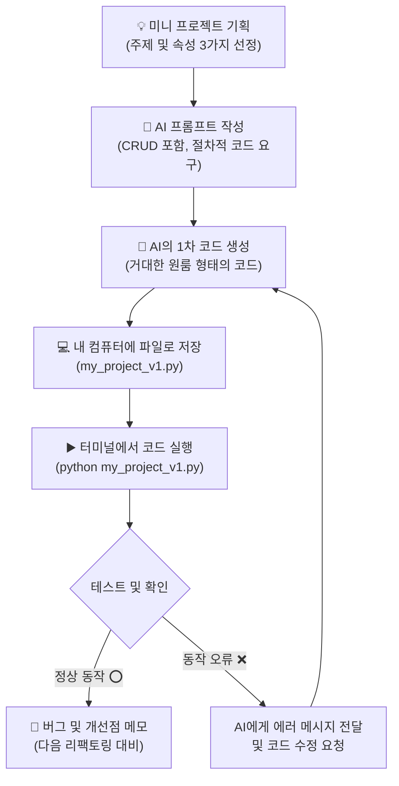

---

## §3. 상세 내용

### Why — 왜 백지에서 시작해보아야 하는가?

강사가 제공한 예제 코드는 항상 안전하게 잘 다듬어져 있습니다. 하지만 실무에서는 아무도 뼈대를 먼저 만들어주지 않습니다. 머릿속의 막연한 아이디어를 구체적인 글로 적어내고, 그것을 AI가 이해할 수 있는 명령어로 바꾸는 연습을 하지 않으면 평생 남의 코드만 고치는 수준에 머물게 됩니다. 스스로 기획하고 처음부터 끝까지 만들어보는 경험이야말로 진정한 소프트웨어 개발의 시작입니다.

### What — 미니 프로젝트의 핵심, CRUD

우리가 만들 미니 프로젝트의 핵심은 결국 데이터를 만들고(Create), 읽고(Read), 수정하고(Update), 삭제하는(Delete) 네 가지 동작, 즉 CRUD입니다. 도서 관리, 재고 관리, 주소록 관리, 심지어 유튜브의 댓글 시스템조차도 본질적으로는 이 CRUD의 무한한 반복에 불과합니다. 

이 프로젝트를 기획할 때 가장 먼저 할 일은, 내가 관리할 데이터의 '속성'을 명확히 정의하는 것입니다. 책이라면 '제목, 저자, 가격'이 될 것이고, 재고라면 '상품명, 수량, 입고일'이 되겠죠. 이 세 가지 속성만 명확히 정해주면 AI는 뼈대를 쉽게 잡아냅니다.

### How — 투박한 1차 절차적 프로토타입의 탄생

AI에게 첫 코드를 요구할 때, 복잡한 아키텍처나 함수 분리를 요구하지 마세요. 오직 위에서 아래로 물 흐르듯 순차적으로 실행되는 절차적 형태의 코드를 요구해야 합니다. 

[C] Deep Research 문서의 6.1 항목에서도 강조하듯, 복잡한 문제를 해결할 때는 요구사항을 단순화하여 1차 프로토타입을 눈으로 먼저 확인하는 것이 핵심입니다. AI가 뱉어낸 1차 코드를 보면 커다란 무한 반복문(while) 안에 수많은 조건문(if)들이 꽉 들어찬 투박한 모습일 것입니다. 이 완벽하게 돌아가는 투박한 코드야말로, 여러분이 앞으로 리팩토링을 통해 쌓아 올릴 튼튼한 주춧돌입니다.

> ✅ **체크포인트**: 데이터의 생성, 읽기, 수정, 삭제를 아울러서 개발자들이 흔히 부르는 4글자 약어는 무엇인가요? (정답: CRUD)

---

## §4. 실습 가이드 (+ 🎙️ 실습 대본)

### 실습 목표

수강생은 자유 주제를 선정해 데이터의 속성을 기획하고, AI 비서에게 명확한 프롬프트를 전달하여 CRUD가 모두 포함된 1차 절차적 파이썬 코드를 생성 및 실행해봅니다.

🎙️ **실습 가이드 대본 (Lab Guide)**:

> 자, 이제 여러분의 아이디어를 직접 코드로 탄생시킬 시간입니다. 주제는 무엇이든 좋습니다. 사내 도서 관리 프로그램, 카페 재고 관리 프로그램, 나만의 맛집 리스트 다 좋습니다. 
> 
> 오른쪽 AI Agent 창을 열어주세요. 검색 엔진은 필요 없습니다. 메모장에 기획안을 간단히 적고, AI에게 말을 걸어보겠습니다. 오늘 우리가 뽑아낼 코드는 예쁘고 세련된 코드가 아닙니다. 모든 기능이 한 덩어리에 들어있는 '원룸' 형태의 절차적 코드라는 점을 명심하세요. 천천히 단계별 지시를 따라와 주시기 바랍니다.

### 단계별 지시

| 단계 | 소요 시간 | 강사 지시사항 | 학습자 액션 | 예상 결과 |
|------|----------|--------------|------------|----------|
| 1 | 5분 | "만들고 싶은 프로그램의 주제와 속성 3가지를 적어보세요" | 주제 선정 및 데이터 속성(예: 책 제목, 저자, 반납일) 3가지 메모 | 명확한 1차 기획안 도출 |
| 2 | 5분 | "AI에게 CRUD가 포함된 절차적 코드를 요구하세요" | Agent Manager에 프롬프트 입력 (하단 예시 참고) | AI가 1차 절차적 파이썬 코드 생성 |
| 3 | 5분 | "코드를 파일로 저장하고 직접 실행해 보세요" | `my_project_v1.py` 파일 생성 → 코드 복붙 → 터미널 실행 | 1~4번 메뉴가 포함된 프로그램 정상 실행 |
| 4 | 5분 | "직접 메뉴를 눌러보며 버그나 개선점을 메모하세요" | 프로그램 조작 및 버그 메모 (예: "없는 데이터를 지우려니 에러가 남") | 2차 수정을 위한 개선점 리스트 확보 |

**[단계 1] 주제 및 속성 기획**

빈 메모장에 다음과 같이 3줄로 기획안을 적어봅니다.
- 프로그램 이름: 사내 도서 관리 시스템
- 주요 기능: 도서 정보의 CRUD (추가, 조회, 수정, 삭제)
- 데이터 속성: 책 제목, 대출자 이름, 반납 예정일

**[단계 2] AI 프롬프트 작성 및 전송**

Antigravity IDE 우측의 Agent 창에 아래의 프롬프트 양식을 참고하여 입력합니다.

```text
파이썬으로 사내 도서 관리 프로그램을 만들어줘. 
데이터는 '책 제목', '대출자 이름', '반납 예정일' 3가지를 딕셔너리로 관리해줘. 
이 데이터들을 리스트에 저장하고, 추가/조회/수정/삭제(CRUD) 기능이 모두 들어있는 
하나의 파일짜리 절차적 코드(while 루프 1개 안에 모든 if문이 들어간 형태)로 작성해줘. 
함수를 쓰지 말고 투박하게 만들어줘.
```

**[단계 3] 코드 저장 및 터미널 실행**

AI가 생성해준 코드를 복사합니다. IDE 왼쪽 파일 탐색기에서 `my_project_v1.py`라는 새 파일을 만들고 코드를 붙여넣습니다. 
터미널 창을 열고 아래 명령어로 실행해 봅니다.
`python my_project_v1.py`

**[단계 4] 버그 및 개선점 메모**

화면에 뜬 1번 메뉴를 눌러 데이터를 추가해보고, 2번을 눌러 조회해 보세요. 프로그램이 내 의도대로 완벽하게 작동하는지, 혹시 예상치 못한 에러가 발생하거나 메뉴 화면이 예쁘지 않은지 관찰하여 메모합니다. "삭제 메뉴에서 없는 책을 입력하니까 프로그램이 꺼져버리네? 이 부분을 다음 시간에 고쳐야겠다"와 같이 기록해둡니다.

### 트러블슈팅 FAQ

| Q | A |
|---|---|
| AI가 함수를 사용해서 너무 세련되게 짜줬어요. 어떻게 하죠? | AI가 똑똑해서 미리 코드를 구조화(함수)한 것입니다. "함수(def)를 전부 없애고 하나의 거대한 while 루프 안에 절차적으로 몰아넣어줘"라고 다시 요청해 보세요. 지금은 일부러 나쁜 코드를 만들어보는 단계입니다. |
| 코드를 붙여넣었는데 한글이 깨져서 나옵니다. | 터미널 인코딩 문제일 수 있습니다. AI에게 "한글이 깨지는데 코드 상단에 어떤 설정을 추가해야 해?"라고 물어보세요. 보통 `# -*- coding: utf-8 -*-`을 추가하면 해결됩니다. |
| 프로그램이 갑자기 멈췄습니다. (무한루프) | 터미널 창을 클릭하고 `Ctrl + C` 키를 누르면 강제로 프로그램을 종료할 수 있습니다. 무한 루프에 빠진 경우 AI에게 에러 상황을 말하고 코드를 수정받으세요. |

> ✅ **체크포인트**: 터미널에서 여러분의 미니 프로젝트가 돌아가고 있나요? 데이터를 하나라도 등록해본 분들은 손을 들어주세요!

---


### 🎓 강사 노트 (Instructor Support)

- ⏱️ **타이밍**: 17:05 (20분, lab)
- 🎯 **핵심 활동**: 자유 주제 v1 코드 생성
- ⚠️ **강사 주의사항**: 주제 재활용 가능


### 📋 실습 설계 보강 (Lab Packet)

**세션 082 실습 설계 보강**

나만의 미니 프로젝트: 기획+절차적 코드 생성
- **3-Stage Example Set**
  - 기본: 자유 주제 선정(도서관, 레시피북 등) → CRUD 기능 포함 프롬프트 → 1차 절차적 코드 생성
  - 변형: Day 2 미니 스펙 프로젝트 주제를 이어서 확장
  - 실수 해결: "주제를 정했는데 CRUD로 안 맞아요" → 모든 데이터 관리 프로그램은 CRUD 구조
- **난이도 예측**: 자유 주제+CRUD 결합이 처음이라 막막함
- **타이밍 가이드**: 주제·기획 5분 | 프롬프트 작성 5분 | 코드 생성·실행 7분 | 정리 3분
- **심리적 장벽**: "시간이 20분밖에 없는데 이게 가능해?"
- **자가 점검**:
  - [ ] CRUD 4가지 기능이 포함된 v1 코드가 실행되는가?
  - [ ] 코드를 `my_project_v1.py`로 저장했는가?
  - [ ] 최소 1회 등록→조회 사이클을 테스트했는가?

## §5. 코드 및 명령어 모음

### 파이썬 실행 명령어

```bash
# 내가 만든 1차 프로젝트 실행
python my_project_v1.py
```

### AI 프롬프트 예시 (1차 절차적 코드 템플릿)

```text
파이썬으로 [프로그램 주제] 관리 프로그램을 만들어줘. 
데이터는 [속성1], [속성2], [속성3] 3가지를 딕셔너리로 관리하고 리스트에 담아줘.
추가, 조회, 수정, 삭제(CRUD) 메뉴가 루프를 돌면서 실행되는 하나의 거대한 
절차적 코드(while-if 구조)로 작성해줘. 절대로 함수(def)를 쓰지 마.
```

---

## §6. 요약

### 핵심 학습 포인트

스스로 첫 코드를 뽑아낸 것을 진심으로 축하합니다! 오늘 우리는 텅 빈 체육관에 나만의 도미노를 설계했습니다. 관리할 데이터의 속성을 기획하고, AI에게 CRUD 기능을 명확하게 요구하여 작동하는 파이썬 코드를 얻어냈습니다. 하지만 생성된 코드를 자세히 들여다보면, 모든 기능이 하나의 거대한 무한 반복문 안에 길게 늘어져 있습니다. 마치 화장실, 주방, 침실이 벽 하나 없이 통으로 뚫려있는 거대한 원룸과 같습니다. 지금 당장 혼자 쓰기엔 작동에 무리가 없지만, 여기서 기능이 조금만 더 늘어나면 코드는 금세 통제할 수 없는 난장판이 될 것입니다. 

### 다음 세션 예고

다음 세션(083)에서는 여러분이 방금 만든 이 거대한 원룸 코드를 깔끔한 투룸, 쓰리룸으로 쪼개는 본격적인 인테리어 공사, 즉 '구조적 리팩토링'에 돌입하겠습니다.

### 브릿지 노트

> "여러분의 화면에서 깜빡이는 그 프로그램이 바로 여러분이 기획하고 AI의 손을 빌려 탄생시킨 첫 번째 자식입니다. 어떠신가요? 돌아가긴 하는데, 코드가 좀 징그럽게 길지 않나요? 다음 시간에는 AI에게 명령을 내려서, 이 투박하고 긴 코드를 깔끔하고 세련된 함수 구조로 싹 뜯어고쳐 보겠습니다. 기대하셔도 좋습니다!"

---

## §7. 참고 자료

### 3-Source 출처

- **Source A (로컬 참고자료)**: [A] 8 코딩.pdf (§8.13) — 미니 프로젝트 플로우, 절차적 코드 생성 원리.
- **Source B (NotebookLM)**: -
- **Source C (Deep Research)**: [C] Deep Research (§6.1, 6.2) — 요구사항 단순화 및 1차 프로토타입 생성, 절차적에서 구조적으로 넘어가는 실습 가이드.

### 강사 노트

> 💡 **강사 노트**: 수강생들이 처음부터 완벽한 프로그램을 기획하려다 시간을 지체할 수 있습니다. "속성 3개만 잡으면 충분하다"며 진도를 끌어올려 주세요. 또한 최근 AI 모델(Claude, Gemini 등)은 워낙 똑똑해서 '절차적으로 짜줘'라고 해도 알아서 함수(def)로 예쁘게 나눠서 짜주는 경우가 많습니다. 이때 당황하지 마시고, 실습 가이드의 FAQ에 있듯 "함수 쓰지 말고 무식하게 하나의 루프에 다 넣어줘"라고 재지시하도록 안내하는 것이 이 세션의 킬링 포인트입니다. 이 '나쁜 코드'를 경험해야 다음 세션의 '리팩토링' 효과가 극대화됩니다.

---

## ✅ 세션 완료 체크리스트 (강사용)

- [ ] §1~§7 모든 섹션이 충실하게 작성되었는가?
- [ ] 도미노 비유와 원룸 비유가 §2에 명확하게 배치되었는가?
- [ ] lab 타입에 맞춰 §4 실습 가이드가 단계별로 상세히 제공되었는가?
- [ ] 함수를 쓰지 않는 '절차적 형태'의 코드를 강조하는 팁이 포함되었는가?
- [ ] 체크포인트 질문과 트러블슈팅 FAQ가 적절히 배치되었는가?
- [ ] 3-Source 팩트 패킷의 내용이 반영되었는가?
- [ ] 다음 세션(083 구조적 리팩토링) 브릿지 노트가 포함되었는가?

---

**🔗 선행 세션**: [세션-081] Day 4 종합: 절차에서 구조로, 그리고 테스트까지 (필수)  
**🔗 후행 세션**: [세션-083] 미니 프로젝트: 구조적 리팩토링 및 퀄리티 체크

---

*작성 일시: 2026-02-25*  
*작성 에이전트: A4B_Session_Writer*  
*교안 구조: 7섹션 (A0 팀 공통 표준)*

> 🔗 **이전 세션**: [세션 081: Day 4 종합: 절차에서 구조로, 그리고 테스트까지](#세션-081)에서 배운 내용을 이어갑니다.
> 🔗 **다음 세션**: [세션 083: 미니 프로젝트: 구조적 리팩토링 및 퀄리티 체크](#세션-083)에서 계속됩니다.

---

### 세션 083: 미니 프로젝트: 구조적 리팩토링 및 퀄리티 체크
> [원본 파일](sessions/세션-083-미니_프로젝트-_구조적_리팩토링_및_퀄리티_체크_v2.1.md) | ⏱️ 20분 | 🧪 lab | 난이도: high

> **세션 ID**: MS-PY101-083  
> **소요 시간**: 20분  
> **난이도**: ★★★  
> **청크 타입**: lab  
> **버전**: v2.1 (7섹션 구조)

---

## §1. 개요

> **Day 4 | PM | 세션 083/085**

### 🎯 학습 목표
- 자신의 미니 프로젝트 코드를 기능 단위의 함수로 분리하는 구조적 리팩토링을 수행할 수 있다.
- AI에게 절차적 코드(v1)와 구조적 코드(v2)의 품질 평가(가독성, 유지보수성 등)를 요구하여 개선 효과를 정량적으로 확인할 수 있다.
- 전역 변수를 파라미터와 리턴값으로 대체하여 데이터 흐름을 명시적으로 만들 수 있다.

### 선행 세션 환기
바로 직전 세션(082)에서 우리는 백지상태에서 출발해 나만의 아이디어가 담긴 첫 번째 파이썬 프로그램(v1)을 성공적으로 탄생시켰습니다. 터미널 창에서 여러분이 지시한 대로 데이터가 입력되고 출력되는 모습을 보며 묘한 성취감을 느끼셨을 거예요. 하지만 개발자의 세계에서 코드가 '일단 돌아간다'는 것은 완성의 의미가 아니라, 이제 막 진짜 작업이 시작되었다는 출발 신호와 같습니다. 기능이 작동하는 것은 확인했으니, 이제 내부 구조를 튼튼하게 다질 시간입니다.

---

## §2. 핵심 개념 (+ 🗣️ 강사 대본 + Mermaid)

### 비유: 원룸 창고 인테리어와 오디션 심사위원
코드를 다듬는 과정을 우리는 흔히 '리팩토링(Refactoring)'이라고 부릅니다. 리팩토링을 이해하기 위해 거대한 벽도, 방문도 없는 넓은 원룸 창고를 떠올려보세요. 이곳에 냉장고, 침대, 책상, 세탁기를 마구잡이로 구겨 넣어두었습니다. 물론 이 창고에서도 잠을 자고 요리를 할 수는 있습니다. 하지만 양말 하나를 찾으려면 창고 전체를 뒤집어엎어야 하고, 새로운 가구를 들여놓으려면 어디에 둬야 할지 막막해집니다. 구조적 리팩토링은 바로 이 원룸 창고에 가벽을 세우고, 주방, 침실, 세탁실이라는 명확한 공간 표시를 달아주는 작업입니다. 겉보기엔 똑같은 집(기능)이지만, 구조가 완벽하게 분리되는 것이죠.

그런데 우리가 가벽을 잘 세웠는지, 인테리어가 정말 효율적으로 개선되었는지는 어떻게 알 수 있을까요? 이럴 때 우리는 AI를 아주 깐깐한 '오디션 심사위원'으로 활용할 수 있습니다. 경연 프로그램에서 심사위원들이 춤과 노래를 기술 점수, 예술 점수로 나누어 평가하듯, 우리는 AI에게 두 코드를 던져주고 명확한 잣대로 채점표를 요구할 수 있습니다.

🗣️ **강사 대본 (Instructor Script)**:
> 1차로 만든 코드가 마음에 안 드시죠? 뭔가 엉성하고, 코드가 길어지니까 읽기도 불편하고요. 지극히 정상입니다! 첫 번째 코드는 무조건 절차적으로 길게 늘어설 수밖에 없어요. 지금부터 우리는 모든 기능이 한곳에 엉켜있는 복잡한 코드를 깔끔하게 정돈하는 인테리어 공사에 돌입할 것입니다.
> 
> "어느 코드가 더 좋아?"라고 AI에게 단순히 묻지 마세요. "가독성과 유지보수성이라는 두 가지 명확한 기준으로 100점 만점에 각각 몇 점인지 채점표를 그려줘"라고 구체적으로 지시해야 합니다. AI는 깐깐한 심사위원으로 빙의하여, 원룸 형태의 첫 번째 코드에는 낙제점을, 기능별로 방이 나뉜 두 번째 코드에는 극찬을 쏟아낼 것입니다. 이 채점표를 확인하는 순간, 여러분은 왜 수많은 개발자가 밤을 새워가며 코드를 리팩토링하는지 깨닫게 되실 거예요.

### Mermaid 다이어그램

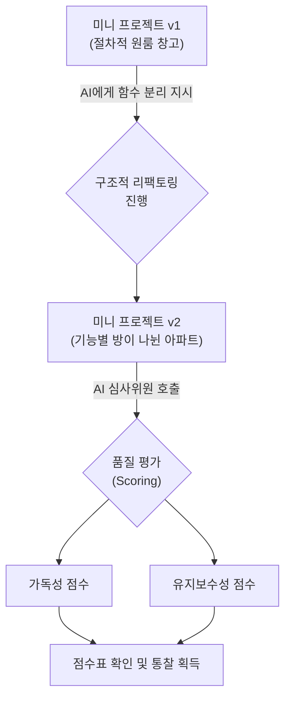

---

## §3. 상세 내용

### Why — 왜 리팩토링을 해야 하는가?
기존 코드에서는 무한 반복문 안에서 메뉴 1번을 누르면 추가하는 로직이, 2번을 누르면 조회하는 로직이 길게 이어져 있었습니다. 작동은 하지만, 나중에 '등급'이나 'VIP 여부' 같은 새로운 정보를 추가하려면 거대한 반복문 안을 헤집고 다녀야 합니다. 작은 수정이 예상치 못한 오류를 불러오는 '스파게티 코드'의 늪에 빠지게 되는 것이죠. 리팩토링은 이런 위험을 줄이고 코드를 레고 블록처럼 조립하기 쉽게 만들어줍니다.

### What — 리팩토링의 핵심은 '함수 추출'
절차적 코드를 구조적 코드로 리팩토링하는 가장 중요한 기술은 '함수 추출(Function Extraction)'입니다. 길쭉한 로직 덩어리들을 뭉텅 잘라내어 `add_data()`, `read_data()`, `update_data()`, `delete_data()`라는 이름을 가진 독립적인 함수 상자로 포장하는 과정입니다. 

이렇게 함수로 묶어두면 두 가지 마법이 일어납니다:
1. 메인 프로그램에서는 함수의 이름표만 불러오면 되기 때문에, 코드가 마치 책의 목차를 읽는 것처럼 한눈에 들어옵니다.
2. 전역 변수가 아닌 매개변수(입력)와 리턴값(출력)을 통해 데이터가 안전하게 흐르게 됩니다.

### How — AI를 활용한 정량적 평가
과거에는 개발자가 직접 코드를 오려내고 변수의 유효 범위(Scope)를 맞추느라 머리를 쥐어뜯었습니다. 하지만 이제 우리는 AI에게 단 한 줄의 프롬프트만 주면 됩니다. "이 코드를 기능별로 쪼개서 함수 기반으로 리팩토링해줘."

리팩토링 후에는 반드시 AI에게 두 코드를 비교해달라고 요청해야 합니다. 단순히 "잘했어"라는 칭찬을 듣기 위함이 아닙니다. **가독성(누가 봐도 이해하기 쉬운가?)**과 **유지보수성(나중에 기능을 추가하기 쉬운가?)**이라는 구체적인 지표로 v1과 v2를 비교 분석하게 만드세요. 수치화된 채점표를 눈으로 확인하면, 논리적인 프로그래머로서의 시야가 확 트일 것입니다.

> ✅ **체크포인트**: 
> - 외부 동작이나 기능은 바꾸지 않고 코드 내부 구조만 개선하는 작업을 무엇이라고 하나요? ("리팩토링")
> - 구조적 프로그래밍에서 긴 코드를 의미 있는 단위로 묶어주는 상자의 이름은 무엇인가요? ("함수")

---

## §4. 실습 가이드 (+ 🎙️ 실습 대본)

### 실습 목표
수강생은 AI의 도움을 받아 절차적으로 작성된 미니 프로젝트 v1 코드를 함수 기반의 v2 코드로 리팩토링하고, 두 코드 간의 품질 평가 점수표를 직접 도출합니다.

🎙️ **실습 가이드 대본 (Lab Guide)**:
> 자, 이제 여러분의 거대한 원룸 창고를 깔끔한 아파트로 개조해 보겠습니다. 앞서 만든 `my_project_v1.py` 코드를 화면에 띄워주세요. 이 코드를 AI에게 넘겨서 함수 기반으로 업그레이드하고, 마지막엔 오디션 심사위원의 냉혹한 평가까지 받아봅시다. 프롬프트는 제가 드리는 예시를 참고하되, 여러분 프로젝트 이름에 맞춰서 조금씩 수정하시면 됩니다.

### 단계별 지시 (리팩토링과 채점표 받기)

| 단계 | 소요 시간 | 강사 지시사항 | 학습자 액션 | 예상 결과 |
|------|----------|--------------|------------|----------|
| 1 | 5분 | "AI에게 v1 코드를 주고 리팩토링을 지시하세요" | AI 채팅창에 기존 코드 복사/붙여넣기 및 프롬프트 입력 | 함수로 분리된 새로운 코드 생성 |
| 2 | 5분 | "v2를 실행해 기능이 똑같은지 테스트하세요" | `my_project_v2.py`로 저장 후 실행, 데이터 등록/조회 테스트 | 겉모습과 기능은 v1과 100% 동일하게 작동 |
| 3 | 5분 | "AI에게 깐깐한 채점표를 요구하세요" | 점수 비교 프롬프트 입력 | v1 vs v2의 가독성, 유지보수성 점수표 출력 |
| 4 | 5분 | "채점표를 보고 개선된 이유를 정리해보세요" | AI의 피드백(스코프 분리, 중복 제거 등) 읽기 | 점수가 오른 본질적인 이유 이해 |

**[단계 1] 구조적 리팩토링 지시**
AI에게 기존 코드를 전달하며 기능별로 함수를 분리해달라고 요청합니다. 다음 프롬프트를 활용해 보세요:
```text
내가 만든 미니 프로젝트 v1 코드를 전달할게. 
(코드 복사/붙여넣기)
이 코드를 add_item(), read_item(), update_item(), delete_item() 등 
각각의 독립된 함수를 사용하는 구조로 리팩토링해줘. 
특히 전역 변수 사용을 줄이고 매개변수와 반환값을 활용하는 형태로 바꿔줘.
```

**[단계 2] v2 저장 및 무결성 테스트**
AI가 작성해준 코드를 복사하여 `my_project_v2.py`라는 새로운 파일로 저장합니다.
터미널에서 실행해보고 기존 v1과 기능이 완벽하게 똑같이 작동하는지 확인하세요. 리팩토링의 핵심은 "사용자가 보기엔 아무 변화가 없어야 한다"는 점입니다.

**[단계 3] 오디션 심사위원 호출 (채점표 요청)**
이제 AI에게 냉정한 평가를 부탁할 차례입니다:
```text
방금 네가 리팩토링해준 v2 코드와 내가 처음에 준 v1 코드를 비교해줘. 
'가독성'과 '유지보수성'이라는 두 가지 기준으로 각각 100점 만점에 
몇 점을 줄 수 있는지 표 형식의 채점표를 그려줘. 
그리고 왜 점수가 그렇게 차이 나는지 개발자의 관점에서 설명해줘.
```

**[단계 4] 피드백 분석**
AI가 제시한 표를 확인하세요. 분명 v1 코드는 40~50점대를, v2 코드는 80~90점대를 받았을 것입니다. 밑에 적힌 이유('변수의 스코프가 분리되었다', '함수 이름만으로 의도를 알 수 있다' 등)를 꼼꼼히 읽어보세요.

> ✅ **체크포인트**: 점수표에서 확인한 v2 코드의 가장 큰 장점 한 가지를 옆 사람(또는 강사)에게 설명해 볼까요?

---


### 🎓 강사 노트 (Instructor Support)

- ⏱️ **타이밍**: 17:25 (20분, lab)
- 🎯 **핵심 활동**: v1→v2 리팩토링
- ⚠️ **강사 주의사항**: 함수 분리 연습


### 📋 실습 설계 보강 (Lab Packet)

**세션 083 실습 설계 보강**

미니 프로젝트: 구조적 리팩토링+퀄리티 체크
- **3-Stage Example Set**
  - 기본: v1 → AI에게 "함수 기반 리팩토링" 요청 → v2 저장 → 동작 확인
  - 변형: AI에게 "v1과 v2를 가독성/유지보수성 기준으로 100점 만점 채점표 작성" 요청
  - 실수 해결: "v2가 동작하지 않아요" → 함수 호출부(main 루프) 누락 확인
- **난이도 예측**: ★★★ 리팩토링 + 품질 비교의 이중 과제
- **타이밍 가이드**: 리팩토링 지시 5분 | v2 테스트 5분 | AI 채점표 요청 5분 | 분석 5분
- **심리적 장벽**: "리팩토링이라는 게 감이 안 와요"
- **자가 점검**:
  - [ ] v2 코드에서 각 기능이 독립 함수로 분리되었는가?
  - [ ] v1과 v2의 AI 채점표 점수를 비교했는가?
  - [ ] v2가 v1과 동일한 기능을 수행하는지 테스트했는가?

## §5. 코드 및 명령어 모음

### 코드 비교: 리팩토링 전(v1) vs 후(v2)

**절차적 원룸 창고 (my_project_v1.py 발췌)**
```python
# 모든 로직이 거대한 while 루프 안에 뭉쳐 있음
while True:
    print("1. 추가  2. 조회")
    choice = input("선택: ")
    
    if choice == '1':
        name = input("이름: ")
        # 추가 로직이 길게 이어짐...
        data_list.append({"name": name})
        print("추가 완료")
    elif choice == '2':
        # 조회 로직이 길게 이어짐...
        for d in data_list:
            print(f"이름: {d['name']}")
```

**구조적 아파트 (my_project_v2.py 발췌)**
```python
# 기능이 함수라는 방으로 예쁘게 나뉨
def add_item(data_list):
    name = input("이름: ")
    data_list.append({"name": name})
    print("추가 완료")

def read_item(data_list):
    for d in data_list:
        print(f"이름: {d['name']}")

# 메인 루프는 마치 책의 목차처럼 간결해짐
while True:
    print("1. 추가  2. 조회")
    choice = input("선택: ")
    
    if choice == '1':
        add_item(data_list)
    elif choice == '2':
        read_item(data_list)
```

### 필수 프롬프트 예시
- 리팩토링 요청: `"이 코드를 독립된 함수 단위로 쪼개서 구조적으로 리팩토링해줘."`
- 정량적 평가 요청: `"v1과 v2를 가독성, 유지보수성 기준으로 100점 만점으로 평가해 채점표를 그려줘."`

---

## §6. 요약

### 핵심 학습 포인트
이번 세션에서 우리는 기능이 전부 뭉쳐있던 원룸 창고 코드를 함수 단위의 쾌적한 아파트로 리팩토링했습니다. 이 과정을 통해 코드가 목차처럼 읽히는 놀라운 경험을 하셨을 겁니다. 더불어 AI를 오디션 심사위원으로 활용해, 우리의 코드가 구조적으로 얼마나 개선되었는지 정량적인 채점표를 받아보았습니다. 구조가 예뻐졌다는 것은 단순히 보기 좋은 것을 넘어, 앞으로 새로운 기능을 추가하거나 버그를 잡을 때 훨씬 안전하고 효율적으로 작업할 수 있음을 의미합니다.

### 다음 세션 예고
자동차의 내부 배선을 아무리 깔끔하게 정리했다고 해서, 그 자동차가 절대 사고 나지 않는 것은 아닙니다. 구조가 예뻐졌다고 프로그램이 고장 나지 않는 건 아니라는 뜻이죠. 다음 세션에서는 우리가 만든 이 예쁜 프로그램에 상상할 수 있는 가장 엉뚱한 값들을 마구잡이로 넣어보는 '극한의 테스트 시나리오'를 진행하겠습니다.

### 브릿지 노트
> "채점표 보시니까 기분이 어떠신가요? 90점 넘게 받으신 분들 많으시죠? 함수로 예쁘게 코드를 포장해 놓으니 정말 그럴싸한 소프트웨어의 골격이 갖춰졌습니다. 하지만 방심하긴 이릅니다! 이제 우리가 만든 이 튼튼해 보이는 프로그램에 망치를 들고 두드려볼 차례입니다. 다음 시간엔 엣지 케이스(Edge case)를 찾아내어 우리 프로그램을 집요하게 괴롭혀 보겠습니다."

---

## §7. 참고 자료

### 3-Source 출처
- **Source A (로컬 참고자료)**: [A] 8 코딩.pdf (§8.10 리팩토링, §8.13 미니 프로젝트)
- **Source B (NotebookLM)**: Day 4 팩트 패킷 — AI를 활용한 리팩토링 접근법 및 결과물 비교 검증
- **Source C (Deep Research)**: Day 4 팩트 패킷 (§6.1) — 프로젝트 리팩토링 및 함수 간 매개변수 연결 검증

### 강사 노트
> 💡 **강사 노트**: 수강생들이 리팩토링의 의미를 "동작이 달라지는 것"으로 오해하지 않도록 주의시켜 주세요. 외부에서 보기엔 v1과 v2의 동작이 완전히 똑같아야 함을 거듭 강조하는 것이 좋습니다. 또한 AI가 채점표를 줄 때 무조건 v2에 100점을 주지 않고 현실적인 감점 사유(예: "아직 예외 처리가 부족함")를 언급한다면, 그것이 다음 세션(084 극한의 테스트)을 위한 완벽한 복선이 됨을 학생들에게 짚어주시면 학습 흐름이 매우 매끄러워집니다.

---

## ✅ 세션 완료 체크리스트 (강사용)

- [ ] §1~§7 모든 섹션이 충실하게 작성되었는가?
- [ ] 원룸 창고와 심사위원 비유가 §2에서 잘 확장되었는가?
- [ ] 프롬프트 지시 및 채점표 분석 과정이 §4 실습 가이드에 상세히 포함되었는가?
- [ ] 리팩토링 전후를 비교하는 코드 스니펫이 §5에 포함되었는가?
- [ ] 체크포인트 질문이 적재적소에 배치되었는가?
- [ ] 3-Source 팩트 패킷 내용이 §7에 올바르게 반영되었는가?
- [ ] 다음 세션(084 극한의 테스트)으로 넘어가는 브릿지 노트가 자연스러운가?

---

**🔗 선행 세션**: [세션-082] 미니 프로젝트: 기획 및 절차적 코드 생성 (필수)  
**🔗 후행 세션**: [세션-084] 미니 프로젝트: 극한의 테스트 시나리오 도출

---

*작성 일시: 2026-02-25*  
*작성 에이전트: Antigravity*  
*교안 구조: 7섹션 (A0 팀 공통 표준)*

> 🔗 **이전 세션**: [세션 082: 나만의 미니 프로젝트: 기획 및 절차적 코드 생성](#세션-082)에서 배운 내용을 이어갑니다.
> 🔗 **다음 세션**: [세션 084: 미니 프로젝트: 극한의 테스트 시나리오 도출](#세션-084)에서 계속됩니다.

---

### 세션 084: 미니 프로젝트: 극한의 테스트 시나리오 도출
> [원본 파일](sessions/세션-084-미니_프로젝트-_극한의_테스트_시나리오_도출_v2.1.md) | ⏱️ 20분 | 🧪 lab | 난이도: high

> **세션 ID**: MS-PY101-084  
> **소요 시간**: 20분  
> **난이도**: ★★★  
> **청크 타입**: lab  
> **버전**: v2.1 (7섹션 구조)

---

## §1. 개요

> **Day 4 | PM | 세션 084/085**

### 🎯 학습 목표

이 세션이 끝나면, 수강생은 다음을 할 수 있습니다:

- 자신의 미니 프로젝트 특성에 맞는 창의적이고 극한의 '예외 케이스(Edge Case)'를 최소 3가지 도출할 수 있다.
- 도출한 엣지 케이스를 프로그램에 직접 입력하여 고의로 에러를 발생시킬 수 있다.
- 발생한 에러 메시지(Traceback)의 종류와 원인을 분석하여 시나리오 표로 작성할 수 있다.

### 선행 세션 환기

바로 직전 세션(세션-083)에서 우리는 1차로 만든 엉성했던 절차적 코드를 구조적 프로그래밍 기반으로 깔끔하게 리팩토링했습니다. 이제 각 기능이 예쁜 함수 단위로 나뉘었고, 전역 변수 대신 매개변수와 리턴값으로 데이터를 주고받게 되었죠. AI 심사위원에게 높은 점수를 받을 만큼 코드가 구조적으로 아주 잘 짜였습니다. 하지만, 실전 소프트웨어 세계에서는 코드가 예쁘다고 해서 끝나는 것이 아닙니다. 이제부터 우리는 방금까지 그토록 소중하게 다듬었던 코드를 어떻게든 박살 내고 에러 메시지를 뿜어내며 쓰러지게 만들 것입니다. 자신이 만든 창조물을 스스로 공격하는 이 역설적인 통과의례로 들어가 봅시다.

---

## §2. 핵심 개념 (+ 🗣️ 강사 대본 + Mermaid)

### 비유 — 진상 고객에 빙의하기

여러분이 방금 개업한 아주 세련된 카페의 사장님이라고 상상해봅시다. 메뉴얼대로 주문을 받는 시스템을 완벽하게 갖추었습니다. 손님이 "아메리카노 한 잔 주세요"라고 말하면 커피를 내어주면 됩니다. 이것을 개발 용어로는 모든 것이 순조롭게 흘러가는 '해피 패스(Happy Path)'라고 부릅니다. 하지만 현실의 카페에는 상상을 초월하는 이른바 '진상 고객'들이 등장합니다. "아메리카노 따뜻하게 주시는데, 얼음 듬뿍 넣어서 차갑게 해주세요"라고 주문하거나, 수량을 묻는 말에 "-5잔 주세요"라고 대답하거나, 심지어 메뉴판을 아예 찢어버리는 손님도 있습니다.

여러분이 짠 프로그램이 마주할 현실도 이와 정확히 똑같습니다. 나이를 입력하라고 했더니 "스물다섯"이라는 한글을 입력하고, 삭제할 번호를 고르라고 했더니 엔터 키만 백 번을 내리치는 사용자가 반드시 존재하죠. 이런 극단적이고 예외적인 상황을 우리는 **'엣지 케이스(Edge Case)'**라고 부릅니다. 

지금 이 순간부터 여러분은 개발자의 따뜻한 마음을 버리고, 내 프로그램을 어떻게든 고장 내고 말겠다는 악랄한 '진상 고객'의 마인드로 빙의해야 합니다.

🗣️ **강사 대본 (Instructor Script)**:

> 여러분, 앞선 세션에서 우리는 코드를 구조적으로 분리하여 아주 깔끔하고 튼튼해 보이는 집을 지었습니다. 하지만 개발자가 예상한 대로만 얌전하게 프로그램을 사용해 주는 천사 같은 사용자는 현실에 존재하지 않습니다. 
> 
> 지금부터 여러분의 프로그램을 집요하게 괴롭힐 시간입니다! 생각할 수 있는 가장 엉뚱한 값들을 마구 터미널에 입력해보세요. 정상적인 길에서 벗어나 경계선 끝자락을 아슬아슬하게 걷는 이 엣지 케이스들을 얼마나 창의적이고 다양하게 찾아내느냐가 결국 소프트웨어의 품질을 결정짓습니다. AI가 아무리 코드를 잘 짜준다고 해도, "이런 기상천외한 상황이 벌어지면 어떡하지?"라고 질문을 던지는 상상력만큼은 오직 인간의, 즉 여러분의 몫입니다. 에러가 나면서 프로그램이 뻗는다면 오히려 폭탄을 미리 제거할 아주 좋은 기회를 잡은 것입니다.

### Mermaid 다이어그램: 엣지 케이스 테스트 흐름

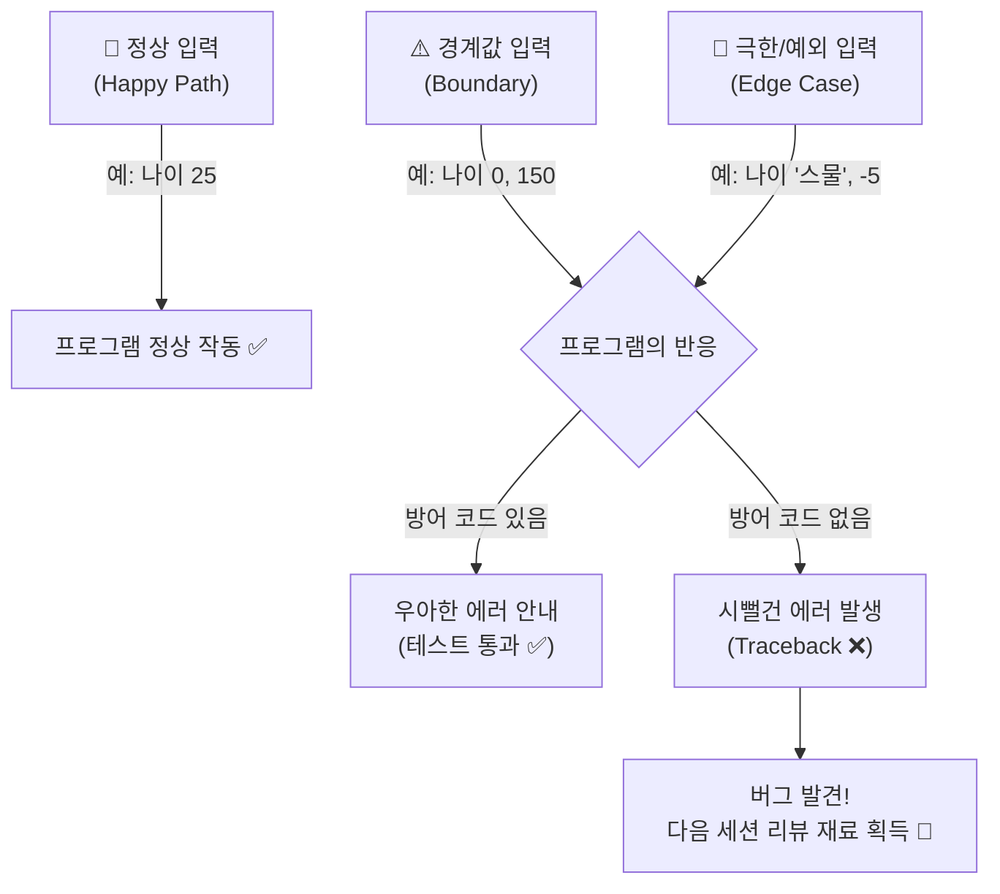

---

## §3. 상세 내용

### Why — 왜 극한의 테스트 시나리오가 필요한가?

AI와 협업하는 현대의 개발 환경에서 '코드 작성' 자체의 비중은 줄어들고 있지만 반대로 **'테스트 시나리오 기획'의 중요성은 폭발적으로 증가**하고 있습니다. 기계는 우리가 지시한 정상적인 로직(Happy Path)을 금방 코드로 짜주지만, 내 비즈니스 특성에 맞는 엣지 케이스는 그 도메인을 깊게 이해하는 사람만이 도출할 수 있기 때문입니다. 여러분이 직접 기상천외한 예외 케이스를 터미널에 입력하는 순간 프로그램은 처참하게 종료되겠지만, 이는 실패가 아닙니다. 고객에게 프로그램이 전달되기 전에 우리가 먼저 폭탄을 찾아내어 제거할 수 있는, 에러 메시지가 길고 복잡하게 나올수록 더 강력한 백신을 만들 수 있는 기회입니다.

### What — 극한의 엣지 케이스란 무엇인가?

코드를 작성할 때 놓치기 쉬운 경계 조건들을 의도적으로 찌르는 행위가 바로 테스트의 본질입니다. 프로그램을 검증할 때는 정상(Normal), 경계값(Boundary), 예외(Exception) 세 가지 측면의 시나리오를 고려해야 합니다.

- **경계값 분석**: 예를 들어 1권부터 5권까지만 대출할 수 있는 도서 관리 시스템이라면, 정상적인 숫자인 3을 넣어보는 것은 큰 의미가 없습니다. 대신 경계선에 있는 0권, 6권, 혹은 아예 마이너스 값인 -1권을 입력해 보아야 합니다.
- **도메인 특화 예외**: 숫자가 들어가야 할 자리에 특수문자나 띄어쓰기를 넣거나, 재고 관리 프로그램이라면 "이미 품절된 상품을 다시 삭제하려고 할 때"가 엣지 케이스가 되고, 영화 예매 프로그램이라면 "존재하지 않는 좌석 번호를 입력했을 때"가 됩니다.

### How — 어떻게 에러를 찾아내는가?

가장 훌륭한 테스터는 프로그램의 한계를 시험하기 위해 악랄해지는 사람입니다. 여러분이 만든 미니 프로젝트의 각 기능(Create, Read, Update, Delete)을 실행하며 아무 입력도 하지 않고 엔터만 치거나, 말도 안 되는 값을 넣어보세요. 그때 터미널에 발생하는 파이썬의 시뻘건 에러 메시지를 수집하여 시나리오 표로 정리하는 것이 핵심입니다.

> ✅ **체크포인트**: 여기까지 이해했는지 스스로 점검해 보세요.
> - 정상적인 입력이 아닌, 극단적이거나 비정상적인 입력으로 시스템의 한계를 테스트하는 상황을 무엇이라고 부르나요? ("엣지 케이스(Edge Case)")
> - AI 시대에 코딩보다 테스트 시나리오 기획이 더 중요해지는 이유는 무엇인가요? ("기계는 코드를 짜주지만, 비즈니스 도메인의 특수한 예외 상황은 인간만이 상상하고 정의할 수 있기 때문")

---

## §4. 실습 가이드 (+ 🎙️ 실습 대본)

### 실습 목표

수강생은 진상 고객으로 돌변하여 앞서 리팩토링한 자신의 파이썬 프로그램을 고의로 무너뜨리고, 그 과정에서 발생한 에러를 꼼꼼하게 기록하여 테스트 시나리오 문서를 완성합니다.

🎙️ **실습 가이드 대본 (Lab Guide)**:

> 자, 이제 여러분의 프로그램에 폭탄을 던질 시간입니다! 터미널을 열고 여러분이 만든 미니 프로젝트 파이썬 파일을 실행하세요. 주의할 점은, **정상적인 입력은 절대 하지 마세요.** 어떻게든 에러를 발생시켜서 프로그램이 멈추게 만드는 것이 이번 실습의 유일한 목표입니다.
>
> 방금 만든 게 도서 관리 프로그램인가요? 그럼 대출 권수에 0이나 -10을 넣어보세요. '열 권'이라고 한글로 쳐보세요. 삭제 메뉴에서 이미 지운 책을 또 지워보세요. 화면이 빨간색 텍스트(Traceback)로 도배되었다면 완벽하게 성공하신 겁니다! 에러가 날 때마다 당황하지 말고, "아싸, 버그 하나 잡았다!"라고 외치면서 메모장에 그 에러 상황을 꼼꼼히 기록해 주세요.

### 단계별 지시

| 단계 | 소요 시간 | 강사 지시사항 | 학습자 액션 | 예상 결과 |
|------|----------|--------------|------------|----------|
| 1 | 5분 | "내 프로그램에 맞는 극한 케이스 3개를 고민하세요" | 미니 프로젝트 특성을 고려한 절대 일어나선 안 될 예외 상황 3가지 도출 | (예) 숫자 대신 엔터만 치기, 없는 데이터 수정하기, 나이에 마이너스 값 넣기 |
| 2 | 5분 | "터미널에서 프로그램을 실행하고 파괴하세요" | 파이썬 프로그램 실행 후, 메모해둔 3가지 예외 상황을 실제로 똑같이 입력 | 시뻘건 에러 메시지(Traceback)를 뿜으며 프로그램 강제 종료 |
| 3 | 5분 | "에러 종류와 상황을 꼼꼼히 기록하세요" | 출력된 에러의 종류(ValueError, KeyError 등)와 당시 상황 기록 | "수량에 문자를 넣었더니 ValueError가 뜨면서 프로그램이 죽어버림" 기록 |
| 4 | 5분 | "에러 시나리오 표를 문서로 작성하세요" | 도출한 3가지 케이스를 마크다운 표 형태로 정리 | 엣지 케이스 테스트 시나리오 문서 완성 |

### 트러블슈팅 FAQ

| Q | A |
|---|---|
| 아무리 이상한 값을 넣어도 에러가 안 나고 그냥 계속 진행돼요. | 이전 세션에서 구조적 리팩토링을 할 때 AI가 이미 예외 처리(try-except)를 완벽하게 해두었을 수 있습니다! 코드를 열어서 입력 검증 로직이 있는지 확인해 보시고, 그렇다면 아주 훌륭한 AI 조수를 두신 겁니다. 이제 빈 문자열 입력 같은 논리적 오류를 유도해 보세요. |
| 에러 메시지가 너무 길어서 무슨 말인지 모르겠어요. | 에러 메시지의 가장 마지막 줄을 보세요. `ValueError: invalid literal for int()` 같은 메시지가 핵심입니다. 이 메시지를 통째로 다음 세션에서 AI에게 보여줄 것이니 잘 복사해 두세요. |
| 엣지 케이스가 도저히 안 떠오릅니다. | 입력 창에서 그냥 아무것도 안 치고 '엔터(Enter)'만 여러 번 쳐보세요. 또는 스페이스바로 '띄어쓰기'만 입력해 보세요. 십중팔구 예상치 못한 동작을 할 겁니다. |
| 프로그램이 무한 루프에 빠져서 영영 안 끝나요! | 터미널 창을 마우스로 클릭하고 키보드에서 `Ctrl + C`를 누르면 강제로 프로그램을 멈출 수 있습니다. 이 역시 프로그램의 허점을 찌른 아주 좋은 버그를 하나 찾으신 겁니다! |

> ✅ **체크포인트**: 빨간색 에러 메시지를 하나라도 보신 분 손 들어주세요! 축하합니다, 여러분은 훌륭한 테스터입니다.

---


### 🎓 강사 노트 (Instructor Support)

- ⏱️ **타이밍**: 17:45 (20분, lab)
- 🎯 **핵심 활동**: 창의적 예외 케이스 도출
- ⚠️ **강사 주의사항**: 재미 요소 극대화


### 📋 실습 설계 보강 (Lab Packet)

**세션 084 실습 설계 보강**

미니 프로젝트: 극한의 테스트 시나리오 도출
- **3-Stage Example Set**
  - 기본: 자신의 프로젝트에 맞는 정상/경계/예외 시나리오 각 3개 이상 작성
  - 변형: AI에게 "이 코드를 깨뜨릴 수 있는 입력 5가지를 알려줘" 도전 요청
  - 실수 해결: "테스트해봤는데 전부 통과해요" → AI에게 더 극단적인 케이스 요청
- **난이도 예측**: ★★★ 창의적 예외 도출 능력이 요구됨
- **타이밍 가이드**: 시나리오 작성 8분 | AI에게 극한 케이스 요청 5분 | 시나리오 테스트 5분 | 정리 2분
- **심리적 장벽**: "뭘 테스트해야 할지 떠오르지 않아요"
- **자가 점검**:
  - [ ] 극한 케이스(빈 입력, 초장문, 특수문자, SQL 인젝션 등)를 3개 이상 도출했는가?
  - [ ] 도출한 케이스 중 프로그램을 크래시시키는 것을 발견했는가?
  - [ ] 시나리오 표에 "예상 결과"와 "실제 결과"를 기록했는가?

## §5. 코드 및 명령어 모음

### 테스트 기록 예시 (학습자 작성용)

이번 실습에서 학습자가 최종적으로 작성해야 할 '테스트 시나리오 기록 표'의 예시입니다. 여러분의 미니 프로젝트에 맞게 내용을 채워주세요.

```markdown
# 🧨 나의 극한 테스트 시나리오 기록

| 테스트 대상 기능 | 내가 입력한 악랄한 값 | 예상한 결과 | 실제 발생한 에러 현상 |
|---|---|---|---|
| 1. 고객 나이 입력 | "스물다섯" (문자열) | "숫자를 입력하세요" 안내 | `ValueError` 발생하며 프로그램 튕김 |
| 2. 삭제할 도서 번호 | -1 (음수) | "없는 번호입니다" 안내 | `IndexError` 발생하며 프로그램 튕김 |
| 3. 상품명 입력 | (아무것도 안 치고 엔터) | "이름을 입력하세요" | 빈 문자열이 그대로 데이터베이스에 버그로 등록됨 |
```

### 터미널 강제 종료 명령어

```bash
# 프로그램이 무한 루프에 빠져 응답하지 않을 때 터미널에서 입력
Ctrl + C
```

---

## §6. 요약

### 핵심 학습 포인트

이번 세션에서 우리는 방금 예쁘게 완성한 프로그램을 스스로 파괴해보는 역설적인 실습을 진행했습니다. 진상 고객에 빙의하여 정상적인 경로(Happy Path)를 벗어난 극단적인 **엣지 케이스(Edge Case)**를 도출했죠. 0이나 마이너스 값 같은 경계값을 입력해 보거나, 숫자가 필요한 곳에 문자를 입력하여 에러를 집요하게 유도했습니다. 화면이 빨간 에러 메시지로 도배되었다면 실습에 완벽히 성공한 것입니다. 이 과정을 통해 우리는 사용자가 겪을 수 있는 끔찍한 버그들을 사전에 찾아내어 차단할 수 있는 아주 귀중한 단서를 얻었습니다.

### 다음 세션 예고

이제 이 산산조각이 난 프로그램을 다시 살려낼 시간입니다. 다음 세션에서는 방금 우리가 찾아낸 약점들과 에러 메시지들을 들고, 리뷰 코멘트 3요소를 장착하여 깐깐한 AI 시니어 개발자에게 마지막 수술 지시를 내려보겠습니다.

### 브릿지 노트

> "모두 프로그램 한 번씩은 시원하게 박살 내보셨나요? 화면에 시뻘건 Traceback 에러가 가득하다면 박수 한번 칩시다! 여러분은 방금 가장 훌륭한 테스터의 자질을 보여주셨습니다. 우리가 먼저 부숴봐야 실제 고객 앞에서 안 부서집니다. 자, 이제 이 폐허 속에서 찾은 훌륭한 버그 리스트를 들고, AI에게 이 코드를 방탄조끼 입은 것처럼 단단하게 만들어 달라고 마지막 리뷰를 요청하러 가봅시다."

---

## §7. 참고 자료

### 3-Source 출처

- **Source A (로컬 참고자료)**: 「9 디버깅, 테스트, 배포.pdf」(§9.3.1) — 소프트웨어 테스트의 본질, 경계값 분석 기법
- **Source B (NotebookLM)**: — (해당 없음)
- **Source C (Deep Research)**: §6.1 — AI 코딩 시대에서의 테스트 시나리오 기획의 중요성, 도메인 특화 엣지 케이스 도출

### 추가 학습 자료

- [소프트웨어 테스팅 기본 개념]: 경계값 분석(Boundary Value Analysis)과 동등 분할(Equivalence Partitioning) 기법
- [Python 예외 처리 공식 문서]: ValueError, KeyError, IndexError 등 파이썬의 내장 예외 계층 구조 이해

### 강사 노트

> 💡 **강사 노트**: 수강생들이 의도적으로 에러를 내는 행위에 익숙하지 않아 머뭇거릴 수 있습니다. "여러분이 찾아낸 에러 개수가 곧 여러분의 실력입니다!"라며 분위기를 적극적으로 북돋아 주세요. 만약 AI가 작성해 준 코드에 이미 `try-except`가 잘 되어 있어서 아무리 이상한 값을 넣어도 프로그램이 죽지 않는 수강생이 있다면, 크게 칭찬해 주시고 "AI가 이미 방어 코드를 훌륭하게 짰군요! 그렇다면 빈 문자열 입력이나 중복 데이터 등록 같은 논리적인 오류(Logical Error)를 집중적으로 찾아보세요"라고 안내해 주시면 아주 좋습니다.

---

## ✅ 세션 완료 체크리스트 (강사용)

- [ ] §1~§7 모든 섹션이 충실하게 작성되었는가?
- [ ] 진상 고객 비유가 §2에서 생생하게 구어체로 전달되었는가?
- [ ] 엣지 케이스 및 경계값 테스트의 중요성이 충분히 강조되었는가?
- [ ] 실습 가이드(§4)에 에러를 도출하고 기록하는 구체적 단계가 포함되었는가?
- [ ] 트러블슈팅 FAQ에 강제 종료 및 방어 코드 관련 내용이 포함되었는가?
- [ ] 체크포인트 질문이 §3, §4에 적절히 배치되었는가?
- [ ] 다음 세션(085 코드 리뷰 기반 최종 완성)으로의 자연스러운 브릿지 노트가 포함되었는가?

---

**🔗 선행 세션**: [세션-083] 미니 프로젝트: 구조적 리팩토링 및 퀄리티 체크 (필수)  
**🔗 후행 세션**: [세션-085] 미니 프로젝트: 코드 리뷰 기반 최종 완성 및 회고

---

*작성 일시: 2026-02-25*  
*작성 에이전트: Sisyphus-Junior*  
*교안 구조: 7섹션 (A0 팀 공통 표준)*

> 🔗 **이전 세션**: [세션 083: 미니 프로젝트: 구조적 리팩토링 및 퀄리티 체크](#세션-083)에서 배운 내용을 이어갑니다.
> 🔗 **다음 세션**: [세션 085: 미니 프로젝트: 코드 리뷰 기반 최종 완성 및 회고](#세션-085)에서 계속됩니다.

---

### 세션 085: 미니 프로젝트: 코드 리뷰 기반 최종 완성 및 회고
> [원본 파일](sessions/세션-085-미니_프로젝트-_코드_리뷰_기반_최종_완성_및_회고_v2.1.md) | ⏱️ 25분 | 🧪 lab | 난이도: medium

> **세션 ID**: MS-PY101-085  
> **소요 시간**: 25분  
> **난이도**: medium  
> **청크 타입**: lab  
> **버전**: v2.1 (7섹션 구조)

---

## §1. 개요

> **Day 4 | PM | 세션 085/085**

### 🎯 학습 목표

이 세션이 끝나면, 수강생은 다음을 할 수 있습니다:

- 3요소 리뷰 코멘트를 활용하여 엣지 케이스를 방어하는 최종 코드를 완성할 수 있다
- 프로젝트 전체 과정을 회고하며 다음 패러다임(객체지향, OOP)의 필요성을 설명할 수 있다
- 시니어 개발자 페르소나를 활용해 AI에게 코드 리뷰를 요청하고 피드백을 수용할 수 있다

### 선행 세션 환기

바로 직전 세션(세션-084)에서 우리는 직접 만든 미니 프로젝트를 무자비하게 공격해 보았어요. 사용자가 숫자를 넣어야 할 곳에 문자를 넣고, 없는 메뉴를 선택하고, 음수 값을 입력하면서 프로그램이 시뻘건 에러를 토해내며 무너지는 것을 확인했죠. 속상해할 필요는 전혀 없어요. 개발의 세계에서 에러는 실패의 증거가 아닙니다. 우리가 건물을 더 튼튼하게 지을 수 있도록 도와주는 강력한 나침반이에요. 이제 길고 길었던 Day 4 파이썬 기초 여정의 대미를 장식할 마지막 무대입니다. 여러분이 찾아낸 그 소중한 에러들을 무기 삼아, 어떤 사용자의 공격에도 끄떡없는 강철 방어막을 완성해 볼 차례예요.

---

## §2. 핵심 개념 (+ 🗣️ 강사 대본 + Mermaid)

### 방수 페인트 마감과 궁극의 캡슐

우리가 엣지 케이스를 막아내는 코드를 추가하는 과정은 튼튼하게 지은 집에 '방수 페인트'를 꼼꼼하게 칠하는 마감 공사와 같아요. 폭우가 쏟아져 벽면 틈새로 빗물이 샌다고 해서 집 전체를 다시 부수고 지을 필요는 없습니다. 빗물이 새는 정확한 위치를 찾아서 그곳에만 강력한 방수액을 덧칠해주면 되죠. 코딩도 마찬가지예요. 사용자가 숫자를 넣어야 할 곳에 문자를 넣어서 에러가 났다면, 해당 입력 부분에만 안전망(try-except 같은 방수 페인트)을 쳐서 다시 입력하라고 안내하면 그만입니다.

하지만 여기서 아주 본질적인 한계 하나를 마주하게 됩니다. 아무리 방수 페인트를 잘 칠하고 예쁘게 인테리어를 마친 집이라도, 전원 버튼을 끄고 프로그램을 종료하는 순간 애써 입력해둔 데이터가 연기처럼 허공으로 날아가 버려요. 데이터는 허공에 떠 있고, 함수들은 그 데이터의 눈치를 보며 따로 노는 절차적 세계의 뼈아픈 한계입니다.

그래서 우리는 내일, 흩어진 데이터와 함수들을 거대한 '궁극의 캡슐' 속에 단단하게 묶어버리는 마법을 배우게 됩니다. 변수와 함수를 한 덩어리로 묶어서 안전하게 보관하고, 필요할 때마다 붕어빵을 찍어내듯 똑같은 집을 수십 채씩 1초 만에 복제하는 기술이죠. 그것이 바로 내일 배울 '객체지향(OOP)'이라는 새로운 세계입니다. 오늘 칠하는 방수 페인트는 그 위대한 세계로 넘어가기 위한 마지막 준비 작업이에요.

🗣️ **강사 대본 (Instructor Script)**:

> 여러분, 직전 실습에서 열심히 만든 프로그램이 픽픽 쓰러지는 걸 보셨죠? 기분이 어떠셨나요? 허탈할 수도 있지만, 사실 그게 정상이에요. 개발자들은 내가 짠 코드를 내가 부수는 데 희열을 느끼기도 합니다. 에러를 빨리, 많이 발견할수록 사용자가 겪을 불편을 미리 막아내는 거니까요.
>
> 방금 전까지는 부수는 연습을 했다면, 이번엔 고치는 연습을 할 겁니다. AI 의사에게 정확한 수술 지시를 내려서 완벽하게 방수 처리가 끝난 최종 버전을 만들 거예요. 그리고 한 걸음 더 나아가 깐깐한 AI 시니어 개발자에게 코드를 보여줄 겁니다. 지적받은 부분을 고치고 나면, 어디 내놔도 부끄럽지 않은 단단한 구조의 프로그램이 완성될 거예요.

### Mermaid 다이어그램

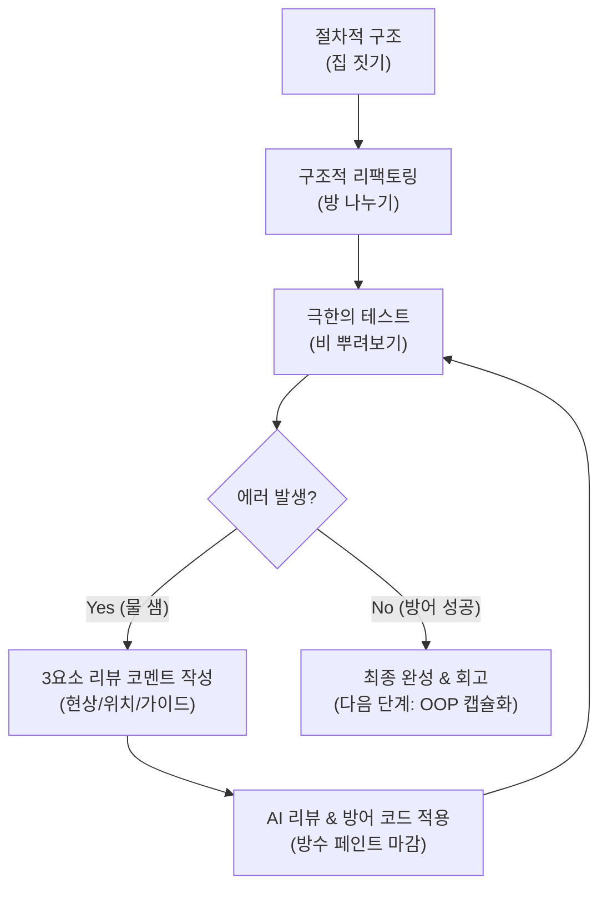

---

## §3. 상세 내용

### Why — 왜 3요소 리뷰 코멘트가 필요한가?

발견한 버그를 AI의 힘을 빌려 수정할 때, 단순히 "고쳐줘"라고 말하면 안 됩니다. "이 코드 이상해요"라고 하면 사람도 AI도 못 알아들어요. AI는 전체 문맥을 이해하기보다 우리가 주어진 정보를 바탕으로 패턴을 찾아냅니다. 명확한 정보를 주지 않으면 엉뚱한 코드를 고치거나, 오히려 멀쩡하던 로직을 망가뜨릴 수 있어요. 수술실에서 의사에게 "아프니까 고쳐주세요"라고 하는 것과 "오른쪽 무릎 연골이 찢어졌으니 봉합 수술을 해주세요"라고 말하는 것의 차이입니다.

### What — 3요소 리뷰 코멘트란?

완벽한 방어 코드를 짜기 위해 AI에게 전달해야 하는 핵심 요소 세 가지입니다.
1. **현상**: 어떤 상황에서 에러가 났는지 (예: 숫자를 입력해야 하는데 문자를 입력했더니 ValueError 발생)
2. **위치**: 어느 위치의 코드에서 문제가 발생했는지 (예: 수량을 입력하는 input() 부분)
3. **가이드 (해결책)**: 어떻게 수정하길 원하는지 명확한 지시 (예: 예외 처리를 추가해서 문자를 입력하면 '숫자만 입력하세요'라고 경고한 뒤 다시 입력받게 수정)

이렇게 구체적인 코멘트를 주면, AI는 입력값 검증과 에러 핸들링 기법을 적용해 흠잡을 데 없는 방어 코드를 즉각적으로 짜줍니다.

### How — 시니어 개발자 페르소나 활용하기

내 코드가 정말 튼튼한지 확인하려면 더 엄격한 눈이 필요합니다. AI에게 '시니어 개발자' 페르소나를 부여해 내 코드를 리뷰하게 만드세요. 코드 품질의 5대 기준인 가독성, 유지보수성, 에러 처리(입력 검증), 성능, 보안 측면에서 꼼꼼히 점검해 달라고 요청하는 겁니다. 

이러한 방어적 프로그래밍을 통해 시스템 신뢰성을 높이는 것은 실제 실리콘밸리 개발자들이 일하는 방식이에요. 여러분은 기획자, 개발자, 테스터, 코드 리뷰어라는 1인 4역을 훌륭하게 소화하고 있습니다.

### 비교표 — 모호한 요청 vs 3요소 리뷰 코멘트

| 항목 | 모호한 요청 | 3요소 리뷰 코멘트 |
|------|-----------|-----------------|
| 입력 예시 | "삭제 기능에서 에러 나. 고쳐줘." | "1) 삭제 기능에서 없는 번호를 입력하면, 2) 리스트 검색 부분에서 KeyError가 나. 3) if문으로 데이터가 있는지 먼저 검사하도록 수정해줘." |
| AI의 반응 | 전체 코드를 훑으며 짐작으로 수정 | 정확한 위치에 방어 코드(방수 페인트)만 추가 |
| 부작용 | 멀쩡한 다른 함수를 건드릴 확률 높음 | 해당 부분만 깔끔하게 수정됨 |
| 학습 효과 | 왜 고쳐졌는지 본인도 모름 | 원인과 해결 방법을 명확히 인지하게 됨 |

---

## §4. 실습 가이드 (+ 🎙️ 실습 대본)

### 실습 목표

이 실습을 통해 수강생은 앞선 세션에서 찾아낸 버그들을 3요소 리뷰 코멘트로 수정하고, 최종적으로 AI 시니어 개발자의 리뷰를 거쳐 프로그램을 완성합니다. 마지막으로 README.md에 회고를 작성합니다.

🎙️ **실습 가이드 대본 (Lab Guide)**:

> 자, 이제 AI 의사에게 정확한 수술 지시를 내리고 완벽하게 방수 처리가 끝난 최종 버전을 완성해 봅시다. 앞서 적어둔 에러 메모장 열어주세요. 그걸 3요소 코멘트로 바꿔서 AI에게 던질 겁니다. "어디서, 무엇을 하다가 에러가 났으니, 이렇게 방어해 줘"라고 말이죠.
>
> 코드가 다 고쳐졌다면 마지막 관문이 남았습니다. AI를 10년 차 깐깐한 시니어 개발자로 변신시켜서 우리 코드를 검사받을 거예요. 지적을 받으면 기분 나빠하지 마시고, "오, 이런 것까지 챙겨야 하는구나" 하고 쿨하게 수용해서 코드를 업데이트해 보세요.

### 단계별 지시

| 단계 | 소요 시간 | 강사 지시사항 | 학습자 액션 | 예상 결과 |
|------|----------|--------------|------------|----------|
| 1 | 5분 | "3요소 코멘트를 활용해 버그를 수정하세요" | 에러가 난 부분을 현상/위치/가이드로 묶어 AI에게 프롬프트 전송 | 방어 코드가 추가된 함수 완성 |
| 2 | 5분 | "수정된 방어막을 다시 뚫어보세요" | 수정한 코드를 터미널에서 실행하고 똑같은 진상 행동 반복 | 에러 없이 "잘못된 입력입니다" 안내 출력 |
| 3 | 5분 | "AI 시니어 개발자에게 코드 리뷰를 받으세요" | 전체 코드를 AI에게 주고 5대 기준으로 리뷰 요청 | AI가 개선점(예외 처리 누락 등) 지적 |
| 4 | 5분 | "리뷰 결과를 반영하고 최종 완성하세요" | AI의 지적을 수용하여 코드 마지막 업데이트 | 견고한 최종 코드(`my_project_final.py`) 완성 |
| 5 | 5분 | "결과물을 공유하고 회고록을 작성하세요" | 짝꿍과 어떤 엣지 케이스를 막았는지 공유 후, 회고 메모 작성 | 절차적 한계(데이터 날아감) 공감 |

**[단계 1] 3요소 코멘트로 버그 수정하기**

직전 시간에 찾아낸 에러를 바탕으로 프롬프트를 작성합니다. Agent Manager 채팅창에 입력하세요.

프롬프트 예시: "내 코드의 `delete_customer()` 함수(위치)에서 없는 아이디를 입력했더니 에러가 발생하며 프로그램이 뻗어버려(현상). id가 딕셔너리에 존재하는지 먼저 검사하고, 없으면 '고객이 없습니다'라고 출력하고 넘어가도록 예외 처리를 추가해줘(가이드)."

**[단계 2] 방어막 재테스트**

AI가 짜준 코드를 붙여넣고 다시 똑같은 행동을 해봅니다. 프로그램이 죽지 않고 예쁘게 경고 메시지를 보여주는지 확인하세요.

**[단계 3] AI 시니어 개발자 소환하기**

Agent Manager에 완성된 전체 코드를 복사해 넣고 다음 프롬프트를 날립니다.
"너는 10년 차 파이썬 시니어 개발자야. 내가 짠 미니 프로젝트 코드를 가독성, 유지보수성, 에러 처리 관점에서 깐깐하게 리뷰해 줘. 고쳐야 할 부분이 있다면 구체적인 코드와 함께 제안해 줘."

**[단계 4] 최종 수정**

AI 시니어 개발자의 의견 중 타당한 것을 반영해 코드를 완성합니다.

**[단계 5] 결과 공유 및 회고**

옆 사람과 완벽하게 작동하는 코드를 띄워놓고 자랑하세요. 그리고 프로그램을 종료해 봅니다. 열심히 입력한 고객 데이터가 다 날아갔죠? 이 허탈함을 꼭 기억하세요. 내일 배울 내용의 핵심입니다.

### 트러블슈팅 FAQ

| Q | A |
|---|---|
| AI가 제가 말한 함수 말고 다른 데를 고쳤어요 | 가이드(3요소 중 위치)가 불명확했을 가능성이 높습니다. 코드의 특정 줄 번호나 함수 이름을 정확히 명시해 주세요. |
| 예외 처리를 넣었더니 무한 루프에 빠져요 | `while True` 안에서 에러가 났을 때 `break`나 `continue` 처리가 잘못된 경우입니다. "무한 루프에 빠지니 에러 출력 후 다시 입력받게 수정해 줘"라고 추가 프롬프트를 날리세요. |
| AI 시니어 개발자가 너무 어려운 코드를 제안해요 | "나는 파이썬 기초반 학생이야. 내가 배운 if문, for문, while문, try-except 정도만 사용해서 다시 제안해 줘"라고 수준을 맞춰달라고 하세요. |

> ✅ **체크포인트**: 버그를 수정하기 위해 AI에게 지시할 때 반드시 포함해야 하는 3요소 코멘트는 현상, 위치, 그리고 무엇인가요? (정답: 가이드 또는 해결책)

---


### 🎓 강사 노트 (Instructor Support)

- ⏱️ **타이밍**: 18:05 (25분, lab)
- 🎯 **핵심 활동**: 리뷰 기반 코드 완성
- ⚠️ **강사 주의사항**: Day 4 마무리 + Day 5 예고


### 📋 실습 설계 보강 (Lab Packet)

**세션 085 실습 설계 보강**

미니 프로젝트: 코드 리뷰 기반 최종 완성+회고
- **3-Stage Example Set**
  - 기본: 084에서 발견한 문제 → 리뷰 코멘트 3요소 작성 → AI에게 방어 코드 요청 → v3 최종 완성
  - 변형: 동료와 코드 교환 리뷰 → 외부 시각의 피드백 수용
  - 실수 해결: "예외 처리를 넣었더니 코드가 2배로 길어졌어요" → 핵심 위험 지점만 방어
- **난이도 예측**: 전체 사이클(기획→코드→리팩토링→테스트→리뷰) 완주의 마무리
- **타이밍 가이드**: 리뷰 코멘트 작성 5분 | AI 수정 요청 7분 | 최종 테스트 5분 | 회고 8분
- **심리적 장벽**: "완벽하게 만들지 못해서 아쉬워요"
- **자가 점검**:
  - [ ] 발견한 문제 중 최소 1개에 대해 방어 코드(try/except 등)를 추가했는가?
  - [ ] v1→v2→v3 세 버전의 차이를 설명할 수 있는가?
  - [ ] Day 4 전체(절차→구조→테스트→리뷰)의 흐름을 회고했는가?
  - [ ] "OOP가 왜 필요한가?"에 대한 실마리를 느꼈는가?

## §5. 코드 및 명령어 모음

### 프롬프트 1: 3요소 리뷰 코멘트 예시

```text
[현상] 나이를 입력받는 부분에서 "스무살"이라고 문자를 쳤더니 ValueError가 나.
[위치] create_customer() 함수의 age = int(input()) 부분이야.
[가이드] try-except 문을 사용해서 정수가 들어오지 않으면 "숫자만 입력하세요"라고 안내하고, 다시 입력받도록 while 루프로 감싸줘.
```

명확한 3요소가 포함된 수술 지시서입니다.

### 프롬프트 2: AI 시니어 개발자 리뷰 요청

```text
너는 10년 차 파이썬 시니어 개발자야. 아래 내 전체 코드를 리뷰해 줘.
특히 다음 3가지를 중점적으로 봐줘.
1. 사용자가 엉뚱한 값을 넣었을 때 프로그램이 죽는 곳은 없는지 (에러 처리)
2. 함수 이름이 역할을 잘 설명하는지 (가독성)
3. 중복되는 코드가 있는지 (유지보수성)
코드: 
[내 코드 복사/붙여넣기]
```

이 프롬프트를 통해 코드의 전체적인 구조적 결함을 찾아낼 수 있습니다.

### 파이썬 코드: 전형적인 방어적 프로그래밍 패턴

```python
def get_valid_age():
    while True:
        try:
            age = int(input("나이를 입력하세요: "))
            if age < 0:
                print("나이는 음수일 수 없습니다. 다시 입력해주세요.")
                continue
            return age
        except ValueError:
            print("잘못된 입력입니다. 숫자만 입력해주세요.")
```

사용자의 예측 불가능한 행동을 막아내는 가장 흔한 '방수 페인트' 패턴입니다. 무한 루프 안에서 정상 입력을 받을 때까지 빠져나가지 못하게 합니다.

---

## §6. 요약

### 핵심 학습 포인트

이번 세션으로 Day 4의 긴 여정이 끝났습니다. 세 가지를 꼭 기억하세요. 
첫째, 에러는 실패가 아니라 시스템을 견고하게 만드는 나침반입니다. 
둘째, 버그를 고칠 때는 '현상, 위치, 가이드'라는 3요소 리뷰 코멘트를 명확히 전달해야 다른 코드를 망가뜨리지 않습니다. 
셋째, 기획부터 절차적 프로그래밍, 구조적 리팩토링, 극한의 테스트, 그리고 방어적 프로그래밍까지. 이 일련의 사이클이 바로 실제 실리콘밸리 개발자들이 일하는 방식 그 자체입니다. 스스로 하나의 완전한 소프트웨어 생명체를 잉태하고 키워낸 여러분, 정말 대단합니다.

### 다음 세션 예고

하지만 프로그램을 끄는 순간 애써 만든 데이터가 연기처럼 사라지는 아쉬움을 느끼셨을 거예요. 내일은 바로 이 흩어진 데이터와 함수들을 하나의 견고한 캡슐로 묶어 영원히 보존하고, 이 투룸을 붕어빵 틀처럼 무한대로 찍어내는 '객체지향(OOP)'이라는 새로운 마법을 배우러 오겠습니다. 

### 브릿지 노트

> "모두 완벽하게 방어막을 구축하셨나요? 프로그램을 껐다 켜보세요. 허탈하죠? 애써 만든 고객 정보가 싹 사라졌을 겁니다. 절차적, 구조적 프로그래밍으로는 이 '상태(데이터)'를 안전하게 묶어두는 데 한계가 있어요. 내일은 이 데이터를 영원히 보존하고, 함수와 데이터를 한 몸으로 묶는 마법을 배우겠습니다. Day 4 여정을 완주하신 여러분, 정말 고생 많으셨습니다! 박수로 마무리하겠습니다."

---

## §7. 참고 자료

### 3-Source 출처

- **Source A (로컬 참고자료)**: [A] 8 코딩.pdf (§8.12, 8.13), 9 디버깅, 테스트, 배포.pdf (§9.4) — 3요소 리뷰 코멘트 및 방어적 프로그래밍 가이드
- **Source B (NotebookLM)**: SRC-B04 — 시니어 개발자 페르소나를 활용한 코드 리뷰 프롬프팅
- **Source C (Deep Research)**: SRC-C06 (§6.1, 6.2) — 시스템 신뢰성을 높이는 방어적 프로그래밍과 리팩토링-테스트-리뷰 완성 사이클

### 강사 노트

> 💡 **강사 노트**: 실습 마지막 단계에서 데이터를 상실하는 허탈함을 충분히 공감해 주는 것이 중요합니다. 이 결핍이 내일(Day 5) 배우게 될 객체지향 프로그래밍(OOP)과 파일 입출력/데이터베이스의 필요성을 설명하는 가장 강력한 동기부여가 됩니다. 3요소 리뷰 코멘트가 왜 중요한지 모호한 프롬프트의 실패 사례를 들어 설명하면 효과적입니다.

---

## ✅ 세션 완료 체크리스트 (강사용)

- [x] §1~§7 모든 섹션이 충실하게 작성되었는가?
- [x] 방수 페인트 마감 및 궁극의 캡슐 비유가 §2에 충분히 표현되었는가?
- [x] 3요소 리뷰 코멘트의 구체적 방법이 §3, §4에 포함되었는가?
- [x] 시니어 개발자 페르소나 활용 프롬프트가 제공되었는가?
- [x] 단계별 실습 가이드가 구체적으로 제시되었는가?
- [x] 내일(Day 5, OOP)로 이어지는 자연스러운 브릿지 노트가 포함되었는가?
- [x] 체크포인트 질문과 트러블슈팅 FAQ가 적절히 배치되었는가?

---

**🔗 선행 세션**: [세션-084] 미니 프로젝트: 극한의 테스트 시나리오 도출 (필수)  
**🔗 후행 세션**: [세션-086] 객체지향 프로그래밍의 이해 (Day 5 시작)

---

*작성 일시: 2026-02-25*  
*작성 에이전트: Sisyphus-Junior*  
*교안 구조: 7섹션 (A0 팀 공통 표준)*


> 🔗 **이전 세션**: [세션 084: 미니 프로젝트: 극한의 테스트 시나리오 도출](#세션-084)에서 배운 내용을 이어갑니다.
> 🔗 **다음 세션**: [세션 086: 클래스와 인스턴스의 개념](#세션-086)에서 계속됩니다.

---

> 🔗 **내일 오전으로 이어집니다**: Day 5 오전(09:00~12:30)에서 세션 086부터 계속됩니다.

## 📦 부록

### 강사 체크리스트 (Day 4 오후)

- [ ] 세션 076: 요구사항 추가를 통한 구조적 확장성 체험 (25분)
- [ ] 세션 077: 테스트는 시승이다: 테스트 시나리오 3분류 이해 (20분)
- [ ] 세션 078: 고객 관리 프로그램 테스트 시나리오 작성 실습 (25분)
- [ ] 세션 079: 품질 검사관: 코드 리뷰 5대 체크포인트 (20분)
- [ ] 세션 080: 완벽한 리뷰 코멘트 작성 및 AI 피드백 실습 (25분)
- [ ] 세션 081: Day 4 종합: 절차에서 구조로, 그리고 테스트까지 (20분)
- [ ] 세션 082: 나만의 미니 프로젝트: 기획 및 절차적 코드 생성 (20분)
- [ ] 세션 083: 미니 프로젝트: 구조적 리팩토링 및 퀄리티 체크 (20분)
- [ ] 세션 084: 미니 프로젝트: 극한의 테스트 시나리오 도출 (20분)
- [ ] 세션 085: 미니 프로젝트: 코드 리뷰 기반 최종 완성 및 회고 (25분)

---

*Day 4 오후 교안 — AI-native 파이썬 기초 v2.1*  
*취합: A4C_Material_Aggregator*  
*검증: A8_QA_Editor*
