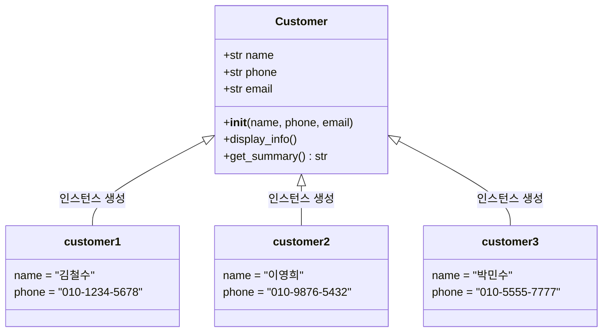
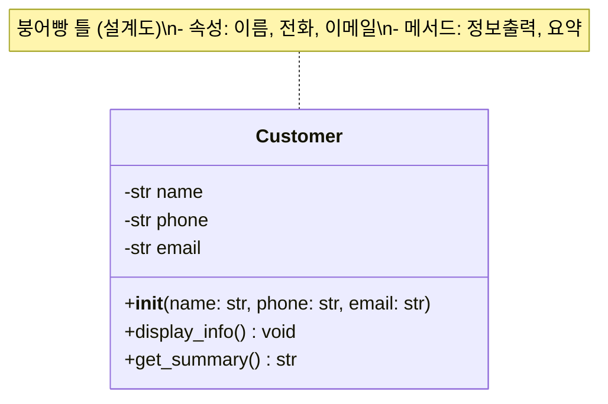

# Day 5 오전: 객체지향 프로그래밍 — 클래스와 고객관리 v3

> 과정: AI-native 파이썬 기초 | Day 5/5 | 09:00–12:00

---

## 오전 학습 로드맵

```
Day 5 오전 (09:00–12:00)
├── 세션 5-1 (09:00–10:30, 90분): 클래스/인스턴스 — 붕어빵 틀과 붕어빵
│   ├── 클래스와 인스턴스 개념
│   ├── __init__, self, 속성, 메서드
│   └── 실습: Customer 클래스 + Student 클래스
└── 세션 5-2 (10:30–12:00, 90분): OOP 리팩토링 — 고객관리 v3
    ├── v2(구조적) → v3(OOP) 리팩토링
    ├── 캡슐화 개념과 체험
    └── 산출물: customer_manager_v3.py
```

---

## 오늘의 핵심 연결

> **어제 프로그램을 만들었다면, 오늘은 더 좋은 구조로 발전시킵니다.**

Day 4에서 우리는 고객관리 프로그램을 절차적(v1)으로 만들고, 구조적(v2)으로 리팩토링했어요. 함수를 분리하니 코드가 훨씬 깔끔해졌죠. 그런데 한 가지 아쉬운 점이 있었어요.

**데이터(고객 정보)와 함수(CRUD 기능)가 따로 놀고 있다는 것!**

"AI 시대의 서사"에서 배운 패러다임 여정을 떠올려 보세요. 절차적 프로그래밍에서 구조적 프로그래밍으로 발전했지만, **데이터와 함수가 분리된 한계**가 남아 있었어요. 이 한계를 극복하기 위해 등장한 것이 바로 **객체지향 프로그래밍(OOP)**이에요.

오늘은 이 여정의 다음 단계를 직접 체험합니다.

```
v1(절차적) → v2(구조적) → v3(OOP) → v4(DI)
   Day 4          Day 4        오늘 오전    오늘 오후
```

---

# 세션 5-1: 클래스/인스턴스 — 붕어빵 틀과 붕어빵

> **시간**: 09:00–10:30 (90분)
> **학습 목표**: 클래스와 인스턴스의 개념을 이해하고, 속성(attribute)과 메서드(method) 문법을 익힌다

---

## 1. 개요

### 이번 세션에서 배우는 것

| 항목 | 내용 |
|------|------|
| **핵심 개념** | 클래스(Class), 인스턴스(Instance/Object), `__init__`, self, 속성, 메서드 |
| **비유** | 클래스 = 붕어빵 틀(설계도), 인스턴스 = 붕어빵(실체) |
| **실습** | Customer 클래스, Student 클래스 만들기 |
| **산출물** | Customer, Student 클래스 코드 |

### 왜 배우나요?

Day 4에서 구조적 프로그래밍의 한계를 느꼈어요. 고객 데이터는 딕셔너리에, 고객 관련 함수는 따로 흩어져 있었죠. 마치 **"데이터 관리부"와 "기능 실행부"가 다른 건물에 있는 회사**처럼요. 서로 연락하려면 매번 전화를 걸어야 하고, 누가 어떤 데이터를 쓰는지 추적하기도 어려웠어요.

클래스를 배우면 이 문제가 해결돼요. 데이터와 기능을 **하나의 팀**으로 묶을 수 있거든요.

---

## 2. 핵심 개념

### 붕어빵 틀과 붕어빵

"AI 시대의 서사"에서 배운 비유를 이어갈게요.

```
붕어빵 틀 (클래스)              붕어빵 (인스턴스)
┌─────────────────┐           ┌─────────────┐
│  모양: 붕어 형태  │    →     │ 팥 붕어빵 1호 │
│  재료: (넣을 것)  │    →     │ 슈크림 붕어빵 │
│  굽기: 3분       │    →     │ 피자 붕어빵   │
└─────────────────┘           └─────────────┘
   설계도 1개                    실체 여러 개
```

- **클래스(Class)** = 붕어빵 틀 = 설계도
  - "고객은 이름, 전화번호, 이메일을 가지고 있고, 정보를 출력할 수 있다"라는 **설계**
- **인스턴스(Instance)** = 붕어빵 = 실체
  - "철수(010-1234-5678, chulsu@email.com)"라는 **실제 고객**

```python
# 클래스 = 설계도
class Customer:
    ...

# 인스턴스 = 실체
customer1 = Customer("철수", "010-1234-5678", "chulsu@email.com")
customer2 = Customer("영희", "010-9876-5432", "younghee@email.com")
```

> 붕어빵 틀(Customer 클래스)은 하나지만, 그 틀로 만든 붕어빵(customer1, customer2)은 여러 개일 수 있어요.

### 클래스의 구성 요소

| 구성 요소 | 설명 | 비유 |
|-----------|------|------|
| `class` | 클래스를 정의하는 키워드 | "설계도를 그리겠습니다" 선언 |
| `__init__` | 인스턴스가 만들어질 때 자동 실행되는 함수 | 붕어빵 틀에 재료를 넣는 과정 |
| `self` | "나 자신"을 가리키는 참조 | 붕어빵이 "내 안에 팥이 있어"라고 말하는 것 |
| 속성(attribute) | 인스턴스가 가진 데이터 | 붕어빵의 재료 (팥, 슈크림 등) |
| 메서드(method) | 인스턴스가 할 수 있는 동작 | 붕어빵을 먹는 방법 (한입에, 꼬리부터 등) |

### `__init__`과 `self` 이해하기

```python
class Customer:
    def __init__(self, name, phone, email):
        self.name = name      # 나(self)의 이름은 name이야
        self.phone = phone    # 나(self)의 전화번호는 phone이야
        self.email = email    # 나(self)의 이메일은 email이야
```

- `__init__`은 **초기화 메서드**예요. 인스턴스가 생성될 때 자동으로 호출돼요.
- `self`는 **"나 자신"**이에요. `customer1 = Customer("철수", ...)`를 실행하면, `self`는 `customer1`을 가리켜요.

```
Customer("철수", "010-1234", "chulsu@email.com") 실행 시:

self = customer1 (지금 만들어지는 이 인스턴스)
self.name = "철수"
self.phone = "010-1234"
self.email = "chulsu@email.com"
```

---

## 3. 상세 내용

### 클래스 정의의 기본 구조

```python
class 클래스이름:
    def __init__(self, 매개변수1, 매개변수2):
        self.속성1 = 매개변수1
        self.속성2 = 매개변수2
    
    def 메서드이름(self):
        # self.속성1, self.속성2를 사용하는 동작
        pass
```

**규칙 정리:**
- 클래스 이름은 **대문자로 시작** (Customer, Student, VIPCustomer)
- 메서드의 첫 번째 매개변수는 항상 **self**
- 속성에 접근할 때는 **self.속성이름** 형태로 사용

### 클래스 vs 딕셔너리 비교

Day 3에서 고객 정보를 딕셔너리로 다뤘던 것, 기억나시죠?

```python
# 딕셔너리 방식 (Day 3)
customer = {
    "name": "철수",
    "phone": "010-1234-5678",
    "email": "chulsu@email.com"
}
# 정보 출력하려면 별도 함수 필요
def print_customer(c):
    print(f"이름: {c['name']}, 전화: {c['phone']}")

# 클래스 방식 (Day 5)
class Customer:
    def __init__(self, name, phone, email):
        self.name = name
        self.phone = phone
        self.email = email
    
    def display_info(self):  # 데이터와 기능이 함께!
        print(f"이름: {self.name}, 전화: {self.phone}")
```

| 비교 항목 | 딕셔너리 | 클래스 |
|-----------|---------|--------|
| 데이터 저장 | `customer["name"]` | `customer.name` |
| 관련 함수 | 별도로 정의 | 클래스 안에 포함 |
| 오타 방지 | `customer["naem"]` → 런타임 에러 | IDE가 자동완성 지원 |
| 구조 강제 | 아무 키나 추가 가능 | `__init__`에서 정의한 것만 |

---

## 4. 실습 가이드

### 실습 1: Customer 클래스 만들기

#### Step 1: 프롬프트 작성

Antigravity의 Agent Manager에서 다음 프롬프트를 입력하세요.

> **프롬프트**: "고객(Customer) 클래스를 만들어줘. 이름, 전화번호, 이메일 속성을 가지고, 정보를 출력하는 메서드가 있어야 해. Python 3.12 기준으로 작성해줘."

#### Step 2: AI 응답 코드 리뷰

AI가 생성한 코드를 한 줄씩 살펴보세요.

```python
# customer_class.py
# 고객(Customer) 클래스 정의

class Customer:
    """고객 정보를 관리하는 클래스 (붕어빵 틀)"""
    
    def __init__(self, name: str, phone: str, email: str):
        """
        고객 인스턴스를 초기화해요 (붕어빵에 재료를 넣는 과정).
        
        Args:
            name: 고객 이름
            phone: 전화번호
            email: 이메일 주소
        """
        self.name = name
        self.phone = phone
        self.email = email
    
    def display_info(self):
        """고객 정보를 보기 좋게 출력해요."""
        print(f"[고객 정보]")
        print(f"  이름: {self.name}")
        print(f"  전화: {self.phone}")
        print(f"  이메일: {self.email}")
    
    def get_summary(self) -> str:
        """고객 정보를 한 줄 요약으로 반환해요."""
        return f"{self.name} ({self.phone})"


# --- 인스턴스 생성 (붕어빵 만들기) ---
customer1 = Customer("김철수", "010-1234-5678", "chulsu@email.com")
customer2 = Customer("이영희", "010-9876-5432", "younghee@email.com")
customer3 = Customer("박민수", "010-5555-7777", "minsu@email.com")

# --- 정보 출력 ---
print("=== 고객 목록 ===\n")

customer1.display_info()
print()
customer2.display_info()
print()
customer3.display_info()

print("\n=== 고객 요약 ===")
for customer in [customer1, customer2, customer3]:
    print(f"  - {customer.get_summary()}")
```

#### Step 3: 코드 리뷰 포인트

AI에게 물어보세요: **"이 코드를 한 줄씩 설명해줘"**

| 코드 | 설명 |
|------|------|
| `class Customer:` | Customer라는 이름의 클래스(설계도)를 정의해요 |
| `def __init__(self, name, phone, email):` | 인스턴스 생성 시 자동 실행되는 초기화 메서드예요 |
| `self.name = name` | 전달받은 name을 이 인스턴스의 속성으로 저장해요 |
| `def display_info(self):` | 고객 정보를 출력하는 메서드예요 |
| `customer1 = Customer("김철수", ...)` | Customer 클래스로 인스턴스를 생성해요 (붕어빵 만들기!) |
| `customer1.display_info()` | customer1의 정보를 출력해요 |

#### Step 4: 실행 및 확인

터미널에서 실행하세요.

```bash
python customer_class.py
```

**예상 출력:**
```
=== 고객 목록 ===

[고객 정보]
  이름: 김철수
  전화: 010-1234-5678
  이메일: chulsu@email.com

[고객 정보]
  이름: 이영희
  전화: 010-9876-5432
  이메일: younghee@email.com

[고객 정보]
  이름: 박민수
  전화: 010-5555-7777
  이메일: minsu@email.com

=== 고객 요약 ===
  - 김철수 (010-1234-5678)
  - 이영희 (010-9876-5432)
  - 박민수 (010-5555-7777)
```

#### 체크포인트

- [ ] `class Customer:` 구문을 이해했나요?
- [ ] `__init__`이 언제 호출되는지 알겠나요?
- [ ] `self`가 무엇을 가리키는지 설명할 수 있나요?
- [ ] 인스턴스 3개를 만들고 각각 정보를 출력했나요?

---

### 실습 2: Student 클래스 만들기

#### Step 1: 프롬프트 작성

> **프롬프트**: "학생(Student) 클래스를 만들어줘. 이름, 학번, 성적 목록(리스트) 속성을 가지고, 평균 성적을 계산하는 메서드와 정보를 출력하는 메서드가 있어야 해. Python 3.12 기준으로 작성해줘."

#### Step 2: AI 응답 코드 리뷰

```python
# student_class.py
# 학생(Student) 클래스 정의

class Student:
    """학생 정보를 관리하는 클래스"""
    
    def __init__(self, name: str, student_id: str, grades: list[float] = None):
        """
        학생 인스턴스를 초기화해요.
        
        Args:
            name: 학생 이름
            student_id: 학번
            grades: 성적 목록 (기본값: 빈 리스트)
        """
        self.name = name
        self.student_id = student_id
        self.grades = grades if grades is not None else []
    
    def add_grade(self, grade: float):
        """성적을 추가해요."""
        if 0 <= grade <= 100:
            self.grades.append(grade)
            print(f"  {self.name}의 성적 {grade}점 추가 완료!")
        else:
            print(f"  오류: 성적은 0~100 사이여야 해요. (입력값: {grade})")
    
    def calculate_average(self) -> float:
        """평균 성적을 계산해요."""
        if not self.grades:
            return 0.0
        return sum(self.grades) / len(self.grades)
    
    def get_grade_letter(self) -> str:
        """평균 성적에 따른 학점을 반환해요."""
        avg = self.calculate_average()
        if avg >= 90:
            return "A"
        elif avg >= 80:
            return "B"
        elif avg >= 70:
            return "C"
        elif avg >= 60:
            return "D"
        else:
            return "F"
    
    def display_info(self):
        """학생 정보를 출력해요."""
        avg = self.calculate_average()
        grade_letter = self.get_grade_letter()
        
        print(f"[학생 정보]")
        print(f"  이름: {self.name}")
        print(f"  학번: {self.student_id}")
        print(f"  성적: {self.grades}")
        print(f"  평균: {avg:.1f}점 ({grade_letter})")


# --- 인스턴스 생성 및 사용 ---
print("=== Student 클래스 실습 ===\n")

# 학생 생성 (성적과 함께)
student1 = Student("김하늘", "2026001", [85, 92, 78, 95])
student1.display_info()

print()

# 학생 생성 (성적 없이 시작 → 나중에 추가)
student2 = Student("이바다", "2026002")
student2.add_grade(88)
student2.add_grade(76)
student2.add_grade(95)
student2.add_grade(82)
student2.display_info()

print()

# 잘못된 성적 입력 테스트
student3 = Student("박구름", "2026003")
student3.add_grade(150)  # 오류 발생!
student3.add_grade(85)
student3.display_info()
```

#### Step 3: 실행 및 확인

```bash
python student_class.py
```

**예상 출력:**
```
=== Student 클래스 실습 ===

[학생 정보]
  이름: 김하늘
  학번: 2026001
  성적: [85, 92, 78, 95]
  평균: 87.5점 (B)

  이바다의 성적 88점 추가 완료!
  이바다의 성적 76점 추가 완료!
  이바다의 성적 95점 추가 완료!
  이바다의 성적 82점 추가 완료!
[학생 정보]
  이름: 이바다
  학번: 2026002
  성적: [88, 76, 95, 82]
  평균: 85.3점 (B)

  오류: 성적은 0~100 사이여야 해요. (입력값: 150)
  박구름의 성적 85점 추가 완료!
[학생 정보]
  이름: 박구름
  학번: 2026003
  성적: [85]
  평균: 85.0점 (B)
```

#### 체크포인트

- [ ] `grades` 매개변수의 기본값 처리를 이해했나요?
- [ ] `add_grade` 메서드에서 유효성 검사가 왜 필요한지 알겠나요?
- [ ] `calculate_average`가 `self.grades`를 사용하는 방식을 이해했나요?
- [ ] 메서드가 다른 메서드를 호출하는 것(`get_grade_letter` → `calculate_average`)을 확인했나요?

---

## 5. 코드 모음

### Customer 클래스 — 클래스/인스턴스 관계도



### Customer 클래스 다이어그램



---

## 6. 트러블슈팅

| 증상 | 원인 | 해결 방법 |
|------|------|----------|
| `TypeError: __init__() takes 3 positional arguments but 4 were given` | `__init__`의 매개변수 개수가 맞지 않아요 | 매개변수 개수를 확인하세요. `self`는 자동 전달되니 세지 마세요 |
| `NameError: name 'self' is not defined` | 메서드 밖에서 `self`를 사용했어요 | `self`는 메서드 안에서만 사용할 수 있어요 |
| `AttributeError: 'Customer' object has no attribute 'phone_number'` | 속성 이름 오타예요 | `__init__`에서 정의한 이름과 정확히 같은지 확인하세요 |
| 인스턴스 생성 시 아무 일도 안 일어남 | `__init__`에 `print`가 없어서 그래요 | 정상이에요! `display_info()`를 호출해 보세요 |

**AI에게 물어보는 팁:**
> "이 에러 메시지가 뭔 뜻이야? [에러 메시지 붙여넣기]"

---

## 7. 세션 5-1 요약

| 개념 | 비유 | 코드 |
|------|------|------|
| 클래스 | 붕어빵 틀 (설계도) | `class Customer:` |
| 인스턴스 | 붕어빵 (실체) | `c1 = Customer("철수", ...)` |
| `__init__` | 재료 넣기 | `def __init__(self, name, ...):` |
| `self` | "나 자신" | `self.name = name` |
| 속성 | 재료 (팥, 슈크림) | `self.name`, `self.phone` |
| 메서드 | 동작 (먹기, 출력) | `def display_info(self):` |

> **핵심 한 줄**: 클래스는 설계도이고, 인스턴스는 그 설계도로 만든 실체예요. 하나의 설계도로 여러 실체를 만들 수 있어요.

---

# 세션 5-2: OOP 리팩토링 — 고객관리 프로그램 v3

> **시간**: 10:30–12:00 (90분)
> **학습 목표**: Day 4의 구조적 고객관리 프로그램을 OOP로 리팩토링하고, 캡슐화 개념을 이해한다

---

## 1. 개요

### 이번 세션에서 배우는 것

| 항목 | 내용 |
|------|------|
| **핵심 개념** | OOP 리팩토링, 캡슐화(Encapsulation), 메서드 책임, 데이터+로직 통합 |
| **비유** | OOP 리팩토링 = "부서 조직 재편", 캡슐화 = "자동차 운전" |
| **실습** | customer_manager_v2.py → customer_manager_v3.py 리팩토링 |
| **산출물** | customer_manager_v3.py (OOP 버전) |

### 왜 리팩토링하나요?

v2(구조적 버전)를 떠올려 보세요. 고객 데이터는 리스트+딕셔너리에 저장하고, CRUD 함수는 따로 정의했어요.

```python
# v2 구조 (구조적)
customers = []  # 데이터는 여기

def add_customer(customers, name, phone, email):  # 함수는 여기
    ...
def find_customer(customers, name):
    ...
```

이건 마치 **"데이터 관리부"와 "기능 실행부"가 따로 있는 회사**예요. 고객 데이터를 다루려면 매번 데이터 관리부에 연락해서 데이터를 받아와야 하고, 기능 실행부에 다시 전달해야 해요.

OOP 리팩토링은 **"부서 조직 재편"**이에요. 데이터 관리부와 기능 실행부를 합쳐서 **"고객관리팀(Customer 클래스)"**을 만드는 거예요. 고객관리팀은 고객 데이터도 갖고 있고, 관련 기능도 직접 수행해요.

---

## 2. 핵심 개념

### OOP 리팩토링이란?

기존 코드의 **기능은 그대로 유지**하면서, **구조만 객체지향으로 바꾸는 것**이에요.

```
v2 (구조적)                          v3 (OOP)
┌──────────────┐                    ┌──────────────────────┐
│ 데이터 (리스트) │                    │   Customer 클래스     │
│ customers = []│                    │ ┌──────────────────┐ │
└──────────────┘                    │ │ name, phone, email│ │
                                    │ │ display_info()    │ │
┌──────────────┐                    │ │ update_phone()    │ │
│ 함수들        │                    │ └──────────────────┘ │
│ add_customer()│                    └──────────────────────┘
│ find_customer()│                   
│ update_customer()│                 ┌──────────────────────┐
│ delete_customer()│                 │ CustomerManager 클래스│
│ list_customers() │                 │ ┌──────────────────┐ │
└──────────────┘                    │ │ customers = []    │ │
                                    │ │ add_customer()    │ │
  데이터와 함수가 분리!               │ │ find_customer()   │ │
                                    │ │ update_customer() │ │
                                    │ │ delete_customer() │ │
                                    │ │ list_customers()  │ │
                                    │ └──────────────────┘ │
                                    └──────────────────────┘
                                    
                                     데이터와 함수가 통합!
```

### 캡슐화(Encapsulation)

캡슐화는 **"자동차 운전"** 비유로 이해하면 쉬워요.

자동차를 운전할 때, 엔진이 어떻게 작동하는지 알 필요가 없어요. 핸들을 돌리면 방향이 바뀌고, 페달을 밟으면 속도가 변하죠. 복잡한 내부 구조는 숨겨져 있고, 우리는 **필요한 인터페이스(핸들, 페달)**만 사용하면 돼요.

프로그래밍에서도 마찬가지예요.

```python
# 캡슐화 없이 (위험!)
customer.phone = "아무거나"  # 전화번호에 아무 값이나 넣을 수 있어요

# 캡슐화 적용 (안전!)
customer.update_phone("010-9999-8888")  # 메서드를 통해서만 수정
# → 메서드 안에서 유효성 검사를 할 수 있어요
```

---

## 3. 상세 내용

### v2 → v3 변환 핵심 포인트

| v2 (구조적) | v3 (OOP) | 변화 |
|------------|---------|------|
| `customer = {"name": "철수", ...}` | `customer = Customer("철수", ...)` | 딕셔너리 → 클래스 인스턴스 |
| `customers = []` (전역/매개변수) | `self.customers = []` (CustomerManager 속성) | 데이터가 클래스 안으로 |
| `def add_customer(customers, ...)` | `def add_customer(self, ...)` | 함수 → 메서드 |
| `customer["name"]` | `customer.name` | 딕셔너리 접근 → 속성 접근 |

### 두 클래스의 역할 분담

- **Customer 클래스**: 개별 고객 한 명의 데이터와 동작
  - 속성: 이름, 전화번호, 이메일
  - 메서드: 정보 출력, 전화번호 수정, 이메일 수정
- **CustomerManager 클래스**: 고객 목록 전체를 관리
  - 속성: 고객 리스트
  - 메서드: 추가, 검색, 수정, 삭제, 전체 목록 출력

---

## 4. 실습 가이드

### 실습: v2 → v3 OOP 리팩토링

#### Step 1: 프롬프트 작성

> **프롬프트**: "customer_manager_v2.py를 객체지향으로 리팩토링해줘. Customer 클래스와 CustomerManager 클래스를 만들어줘. Customer 클래스는 이름, 전화번호, 이메일 속성과 정보 출력 메서드를 가지고, CustomerManager 클래스는 고객 추가/검색/수정/삭제/목록 출력 기능을 가져야 해. 메뉴 기반 콘솔 프로그램으로 만들어줘. Python 3.12 기준."

#### Step 2: AI 응답 코드 리뷰

```python
# customer_manager_v3.py
# 고객 정보 관리 프로그램 v3 (OOP 버전)
# v2(구조적) → v3(객체지향) 리팩토링

class Customer:
    """
    개별 고객 정보를 관리하는 클래스.
    
    비유: 고객 한 명의 '신분증' 같은 것이에요.
    이름, 전화번호, 이메일이 적혀 있고,
    정보를 보여주거나 수정할 수 있어요.
    """
    
    def __init__(self, name: str, phone: str, email: str):
        """고객 인스턴스를 생성해요."""
        self.name = name
        self._phone = phone    # 언더스코어: "직접 건드리지 마세요" 표시
        self._email = email
    
    @property
    def phone(self) -> str:
        """전화번호를 조회해요."""
        return self._phone
    
    @phone.setter
    def phone(self, new_phone: str):
        """전화번호를 수정해요 (유효성 검사 포함)."""
        if not new_phone.replace("-", "").isdigit():
            print("  오류: 전화번호는 숫자와 하이픈(-)만 사용할 수 있어요.")
            return
        self._phone = new_phone
        print(f"  {self.name}의 전화번호가 '{new_phone}'으로 변경되었어요.")
    
    @property
    def email(self) -> str:
        """이메일을 조회해요."""
        return self._email
    
    @email.setter
    def email(self, new_email: str):
        """이메일을 수정해요 (유효성 검사 포함)."""
        if "@" not in new_email:
            print("  오류: 올바른 이메일 형식이 아니에요. (@가 포함되어야 해요)")
            return
        self._email = new_email
        print(f"  {self.name}의 이메일이 '{new_email}'으로 변경되었어요.")
    
    def display_info(self):
        """고객 정보를 보기 좋게 출력해요."""
        print(f"  이름: {self.name}")
        print(f"  전화: {self._phone}")
        print(f"  이메일: {self._email}")
    
    def __str__(self) -> str:
        """고객 정보를 한 줄 문자열로 반환해요."""
        return f"{self.name} | {self._phone} | {self._email}"


class CustomerManager:
    """
    고객 목록 전체를 관리하는 클래스.
    
    비유: '고객관리팀'이에요.
    고객 명단을 갖고 있고, 추가/검색/수정/삭제를 담당해요.
    """
    
    def __init__(self):
        """CustomerManager를 초기화해요. 빈 고객 목록으로 시작해요."""
        self.customers: list[Customer] = []
    
    def add_customer(self, name: str, phone: str, email: str):
        """새 고객을 추가해요."""
        # 중복 검사
        for customer in self.customers:
            if customer.name == name:
                print(f"\n  '{name}' 고객은 이미 등록되어 있어요.")
                return
        
        new_customer = Customer(name, phone, email)
        self.customers.append(new_customer)
        print(f"\n  '{name}' 고객이 등록되었어요!")
    
    def find_customer(self, name: str) -> Customer | None:
        """이름으로 고객을 검색해요."""
        for customer in self.customers:
            if customer.name == name:
                return customer
        return None
    
    def update_customer(self, name: str, field: str, new_value: str):
        """고객 정보를 수정해요."""
        customer = self.find_customer(name)
        if customer is None:
            print(f"\n  '{name}' 고객을 찾을 수 없어요.")
            return
        
        if field == "phone":
            customer.phone = new_value  # property setter 호출 → 유효성 검사!
        elif field == "email":
            customer.email = new_value  # property setter 호출 → 유효성 검사!
        else:
            print(f"\n  '{field}'은(는) 수정할 수 없는 항목이에요.")
    
    def delete_customer(self, name: str):
        """고객을 삭제해요."""
        customer = self.find_customer(name)
        if customer is None:
            print(f"\n  '{name}' 고객을 찾을 수 없어요.")
            return
        
        self.customers.remove(customer)
        print(f"\n  '{name}' 고객이 삭제되었어요.")
    
    def list_customers(self):
        """전체 고객 목록을 출력해요."""
        if not self.customers:
            print("\n  등록된 고객이 없어요.")
            return
        
        print(f"\n  === 전체 고객 목록 ({len(self.customers)}명) ===")
        print(f"  {'번호':<5} {'이름':<10} {'전화번호':<15} {'이메일'}")
        print(f"  {'-'*50}")
        for i, customer in enumerate(self.customers, 1):
            print(f"  {i:<5} {customer}")
    
    def search_customer(self, name: str):
        """고객을 검색하고 결과를 출력해요."""
        customer = self.find_customer(name)
        if customer is None:
            print(f"\n  '{name}' 고객을 찾을 수 없어요.")
        else:
            print(f"\n  === 검색 결과 ===")
            customer.display_info()


def main():
    """메인 함수: 메뉴 기반 콘솔 프로그램"""
    manager = CustomerManager()
    
    while True:
        print("\n" + "=" * 40)
        print("  고객 정보 관리 프로그램 v3 (OOP)")
        print("=" * 40)
        print("  1. 고객 등록")
        print("  2. 고객 검색")
        print("  3. 고객 정보 수정")
        print("  4. 고객 삭제")
        print("  5. 전체 고객 목록")
        print("  0. 종료")
        print("-" * 40)
        
        choice = input("  메뉴를 선택하세요: ").strip()
        
        if choice == "1":
            print("\n  --- 고객 등록 ---")
            name = input("  이름: ").strip()
            phone = input("  전화번호: ").strip()
            email = input("  이메일: ").strip()
            manager.add_customer(name, phone, email)
        
        elif choice == "2":
            print("\n  --- 고객 검색 ---")
            name = input("  검색할 이름: ").strip()
            manager.search_customer(name)
        
        elif choice == "3":
            print("\n  --- 고객 정보 수정 ---")
            name = input("  수정할 고객 이름: ").strip()
            print("  수정할 항목: phone(전화번호) / email(이메일)")
            field = input("  항목: ").strip().lower()
            new_value = input("  새 값: ").strip()
            manager.update_customer(name, field, new_value)
        
        elif choice == "4":
            print("\n  --- 고객 삭제 ---")
            name = input("  삭제할 고객 이름: ").strip()
            confirm = input(f"  '{name}' 고객을 정말 삭제할까요? (y/n): ").strip().lower()
            if confirm == "y":
                manager.delete_customer(name)
            else:
                print("  삭제를 취소했어요.")
        
        elif choice == "5":
            manager.list_customers()
        
        elif choice == "0":
            print("\n  프로그램을 종료해요. 안녕히 가세요!")
            break
        
        else:
            print("\n  잘못된 입력이에요. 0~5 사이의 숫자를 입력해 주세요.")


if __name__ == "__main__":
    main()
```

#### Step 3: v2 vs v3 비교

AI에게 물어보세요: **"v2와 v3 코드를 비교해서 장단점을 표로 정리해줘"**

| 비교 항목 | v2 (구조적) | v3 (OOP) |
|-----------|-----------|---------|
| **데이터 저장** | 딕셔너리 (`{"name": "철수"}`) | 클래스 인스턴스 (`Customer("철수")`) |
| **데이터+함수** | 분리되어 있음 | 하나의 클래스에 통합 |
| **데이터 보호** | 누구나 직접 수정 가능 | property로 유효성 검사 가능 |
| **코드 구조** | 함수 나열 | 클래스별 역할 분담 |
| **확장성** | 새 기능 추가 시 함수만 추가 | 새 클래스 추가 가능 (상속 등) |
| **가독성** | `customer["name"]` | `customer.name` |

#### Step 4: 캡슐화 체험

AI에게 추가 요청을 해보세요.

> **프롬프트**: "고객의 전화번호를 직접 수정하지 못하게 하고, 메서드를 통해서만 수정하게 해줘. 전화번호 형식이 올바른지 검사하는 기능도 넣어줘."

이미 v3 코드에 `@property`와 `@phone.setter`로 구현되어 있어요! 직접 테스트해 보세요.

```python
# 캡슐화 테스트
customer = Customer("테스트", "010-1234-5678", "test@email.com")

# property를 통한 수정 (유효성 검사 O)
customer.phone = "010-9999-8888"    # 정상 동작
customer.phone = "전화번호아님"      # 오류 메시지 출력!

# _phone에 직접 접근 (권장하지 않음)
# customer._phone = "아무거나"  # 가능하지만, 약속을 어기는 것!
```

> **캡슐화의 핵심**: 파이썬에서 `_`(언더스코어)로 시작하는 속성은 "직접 건드리지 마세요"라는 **약속**이에요. 자동차의 엔진 커버처럼, 열 수는 있지만 열지 않는 게 좋아요.

#### 체크포인트

- [ ] v2와 v3의 구조적 차이를 설명할 수 있나요?
- [ ] Customer 클래스와 CustomerManager 클래스의 역할 차이를 알겠나요?
- [ ] 캡슐화가 왜 필요한지 이해했나요?
- [ ] v3 프로그램이 v2와 동일하게 작동하는 것을 확인했나요?

---

## 5. 코드 모음

### customer_manager_v3.py 전체 코드

위 실습 가이드의 Step 2에 전체 코드가 포함되어 있어요.

**파일 구조:**
```
프로젝트 폴더/
├── customer_manager_v1.py    (Day 4 - 절차적)
├── customer_manager_v2.py    (Day 4 - 구조적)
├── customer_manager_v3.py    (Day 5 - OOP) ← 오늘 만든 것!
├── customer_class.py         (세션 5-1 실습)
└── student_class.py          (세션 5-1 실습)
```

---

## 6. 트러블슈팅

| 증상 | 원인 | 해결 방법 |
|------|------|----------|
| `TypeError: CustomerManager.add_customer() takes 3 positional arguments but 4 were given` | `self`를 빼먹고 매개변수를 셌어요 | 메서드 정의 시 첫 번째 매개변수는 항상 `self`예요 |
| `AttributeError: 'NoneType' object has no attribute 'display_info'` | `find_customer`가 `None`을 반환했어요 | 검색 결과가 `None`인지 먼저 확인하세요 |
| 수정이 안 돼요 | property setter에서 유효성 검사에 걸렸을 수 있어요 | 입력값이 올바른 형식인지 확인하세요 |
| `customer["name"]` 에러 | v2 문법을 v3에서 사용했어요 | `customer.name`으로 바꾸세요 |

---

## 7. 세션 5-2 요약

| 개념 | 비유 | 핵심 |
|------|------|------|
| OOP 리팩토링 | 부서 조직 재편 | 데이터+함수를 클래스로 통합 |
| 캡슐화 | 자동차 운전 | 내부는 숨기고, 메서드로만 접근 |
| Customer 클래스 | 고객 신분증 | 개별 고객의 데이터+동작 |
| CustomerManager 클래스 | 고객관리팀 | 고객 목록 전체 관리 |
| property | 보안 게이트 | 유효성 검사 후 수정 허용 |

> **핵심 한 줄**: OOP 리팩토링은 흩어진 데이터와 함수를 하나의 팀(클래스)으로 묶는 것이에요. 캡슐화로 데이터를 보호하면 더 안전한 프로그램이 돼요.

---

## 오전 전체 정리

### 오늘 오전에 배운 것

```
세션 5-1: 클래스/인스턴스 기초
├── 클래스 = 붕어빵 틀 (설계도)
├── 인스턴스 = 붕어빵 (실체)
├── __init__, self, 속성, 메서드
└── Customer 클래스, Student 클래스

세션 5-2: OOP 리팩토링
├── v2(구조적) → v3(OOP) 변환
├── 데이터+함수 통합
├── 캡슐화 (property)
└── customer_manager_v3.py 완성
```

### 오후 예고

> **오후에는 더 강력한 OOP 기능을 배워요!**
> - 세션 5-3: **상속** — Customer를 확장해서 VIPCustomer를 만들어요
> - 세션 5-4: **DI 패턴** — 저장 방식을 자유롭게 교체할 수 있게 만들어요
> - 세션 5-5: **전체 과정 회고** — v1부터 v4까지의 여정을 돌아봐요

점심 맛있게 드시고, 오후에 만나요!
