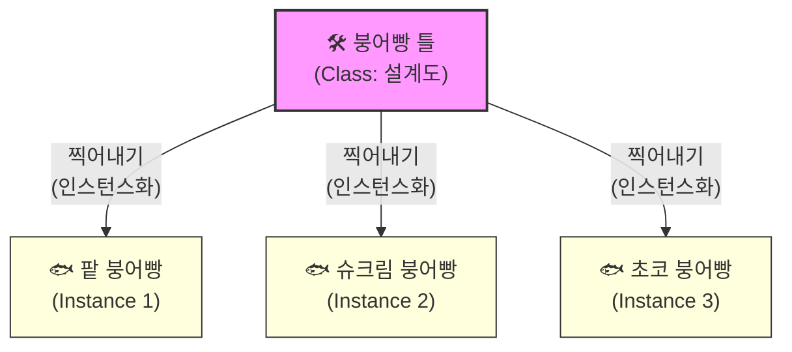
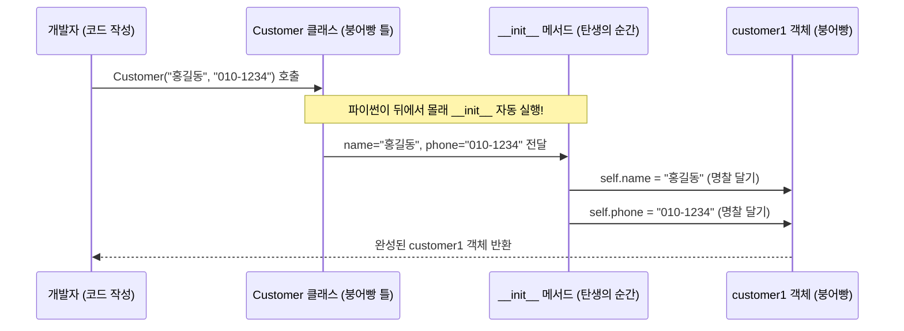
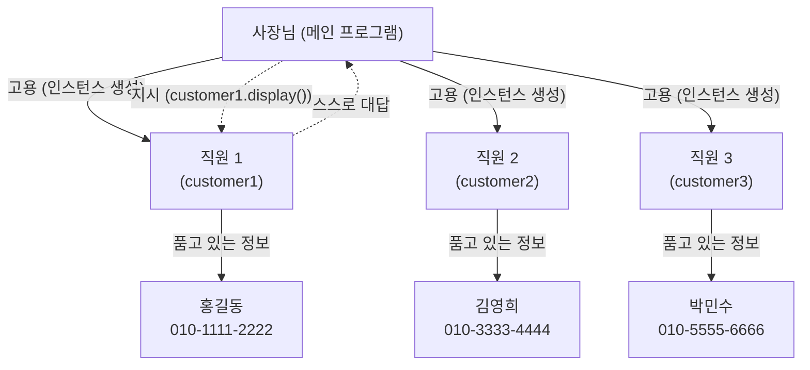
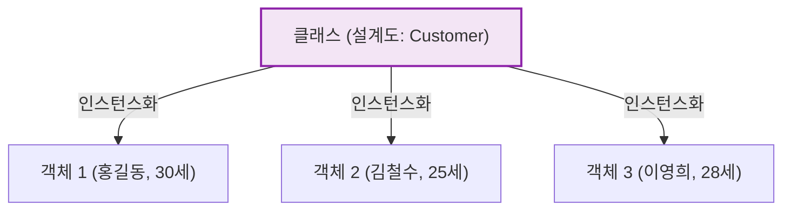
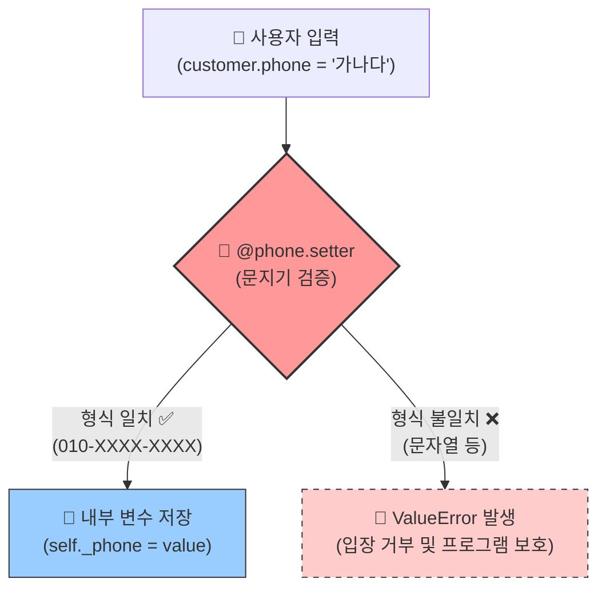
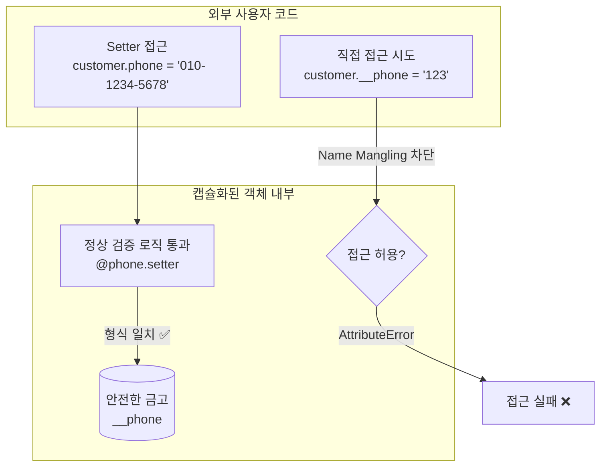
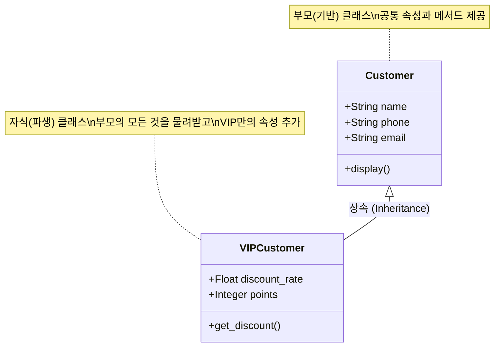
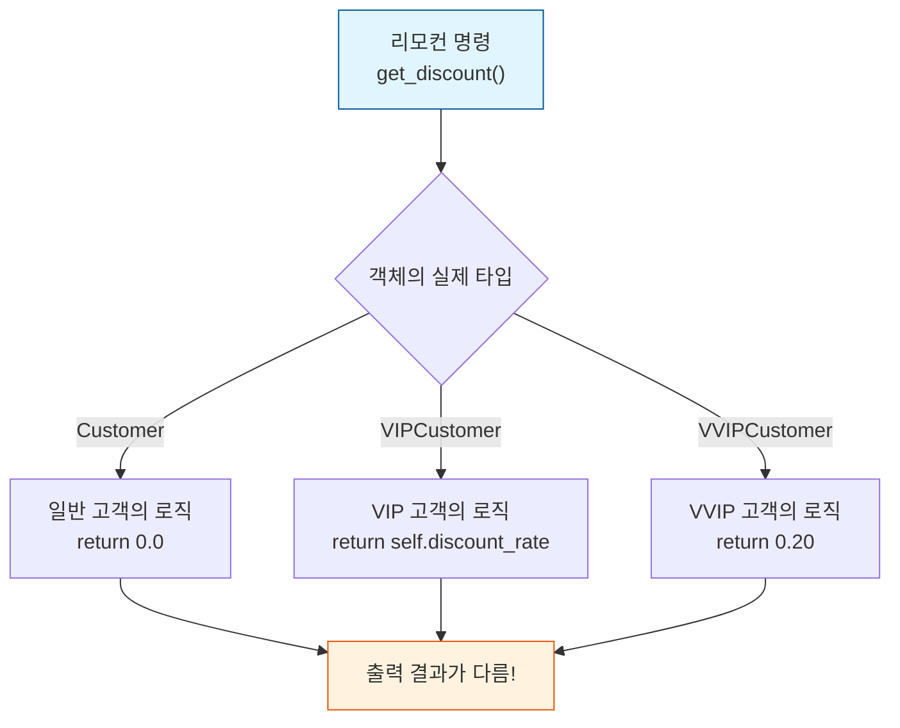
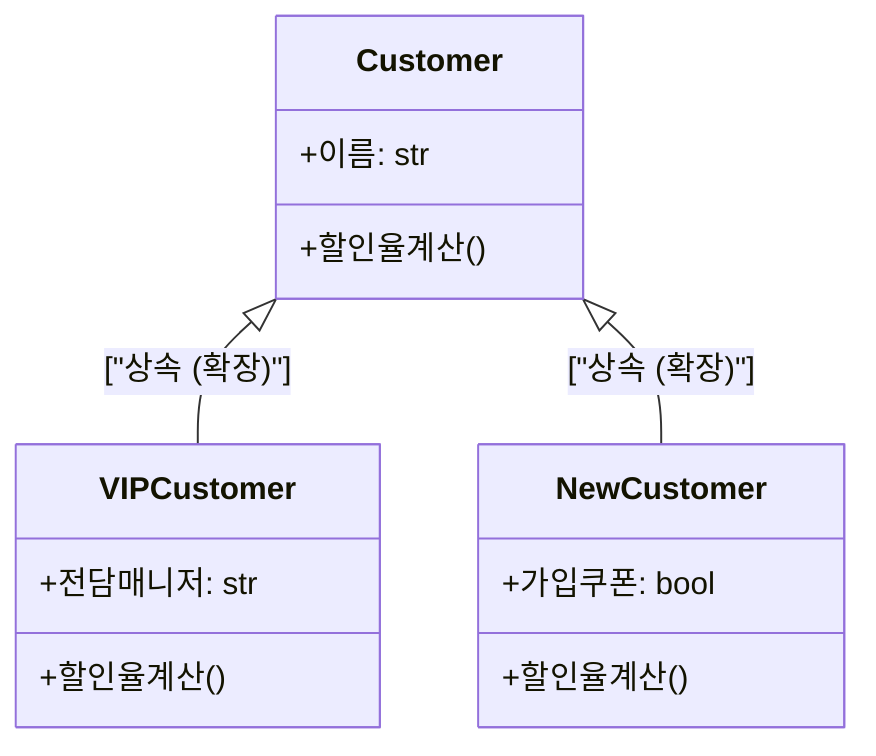

# Day 5 오전: 클래스 OOP 리팩토링 v3

> **과정**: AI-native 파이썬 기초 | Day 5/5 | 09:00~12:30
> **테마**: 객체지향 프로그래밍과 과정 마무리
> **세션**: 086 ~ 096 (11개 세션)
> **총 소요 시간**: 240분
> **버전**: v2.1 (7섹션 구조, 보조 패킷 통합)
> **작성 일시**: 2026-02-25

---

## 🎯 학습 목표 (오전)

1. **세션 086**: 이 세션 종료 시 수강생은 클래스와 인스턴스의 차이를 '붕어빵 틀과 붕어빵' 비유를 사용하여 정확히 설명할 수 있다.
2. **세션 087**: 이 세션 종료 시 수강생은 `__init__` 메서드를 사용하여 클래스의 속성을 정의하고, `self`를 활용하여 속성을 출력하는 메서드를 작성할 수 있다.
3. **세션 088**: 이 세션 종료 시 수강생은 설계한 클래스(Customer, Student)를 바탕으로 여러 개의 인스턴스를 메모리에 생성하고, 각각의 메서드를 호출하여 독립적인 데이터를 관리할 수 있다.
4. **세션 089**: 이 세션 종료 시 수강생은 일반 클래스의 `__init__` 방식과 `@dataclass`를 비교하여, `@dataclass`가 데이터 중심 클래스 작성에 주는 이점을 설명할 수 있다.
5. **세션 090**: 이 세션 종료 시 수강생은 객체지향 리팩토링의 목적과 '캡슐화'의 개념을 '부서 조직 재편'과 '자동차 운전' 비유를 통해 설명할 수 있다.
6. **세션 091**: 이 세션 종료 시 수강생은 AI 프롬프트를 활용해 절차적 구조의 코드를 `Customer`와 `CustomerManager` 클래스로 분리된 객체지향 구조로 리팩토링하고, 두 코드의 차이점을 설명할 수 있다.
7. **세션 092**: 이 세션 종료 시 수강생은 AI 프롬프트를 활용하여 올바르지 않은 이메일과 전화번호 형식을 걸러내는 '데이터 검증 함수'를 생성하고 CustomerManager 클래스에 통합할 수 있다.
8. **세션 093**: 이 세션 종료 시 수강생은 파이썬의 이름 장식(Name mangling, `__`)을 활용해 속성을 캡슐화하고, 5대 체크포인트에 맞춰 v3 코드를 최종 리뷰할 수 있다.
9. **세션 094**: 이 세션 종료 시 수강생은 객체지향의 핵심 특징인 '상속'의 개념을 '유산 상속' 비유를 통해 설명하고, 코드 재사용의 이점을 이해할 수 있다.
10. **세션 095**: 이 세션 종료 시 수강생은 파이썬의 `super()` 함수를 활용하여 부모 클래스(Customer)를 상속받는 자식 클래스(VIPCustomer)를 구현하고, 기존 메서드를 오버라이딩(Overriding)할 수 있다.
11. **세션 096**: 이 세션 종료 시 수강생은 일반 고객과 VIP 고객 인스턴스가 섞여 있는 리스트에서 동일한 메서드(`print_info()`)를 호출했을 때 다르게 동작하는 현상을 통해 '다형성'의 개념을 설명할 수 있다.

---

## 📋 목차

- [📖 세션 086: 클래스와 인스턴스의 개념](#세션-086) (20분)
- [💻 세션 087: 속성과 메서드, 그리고 __init__](#세션-087) (25분)
- [🧪 세션 088: 나만의 클래스 만들기 실습](#세션-088) (25분)
- [💻 세션 089: 데이터를 담는 특별한 그릇, @dataclass](#세션-089) (20분)
- [📖 세션 090: 객체지향 리팩토링과 캡슐화 개념](#세션-090) (20분)
- [💻 세션 091: 고객관리 v3로의 진화 (OOP 적용)](#세션-091) (25분)
- [💻 세션 092: 데이터 검증 함수 추가](#세션-092) (20분)
- [🧪 세션 093: 캡슐화 실습 및 v3 코드 리뷰](#세션-093) (25분)
- [📖 세션 094: 상속의 개념과 필요성](#세션-094) (20분)
- [💻 세션 095: 기존 클래스 확장하기 (VIPCustomer와 super)](#세션-095) (20분)
- [🧪 세션 096: 다형성 체험 (리모컨의 전원 버튼)](#세션-096) (20분)

---

## 📊 세션 인덱스

| 세션 | 제목 | 시간 | 청크 타입 | 난이도 | 바로가기 |
|------|------|------|-----------|--------|----------|
| 086 | 클래스와 인스턴스의 개념 | 20분 | 📖 narrative | low | [바로가기](#세션-086) |
| 087 | 속성과 메서드, 그리고 __init__ | 25분 | 💻 code | medium | [바로가기](#세션-087) |
| 088 | 나만의 클래스 만들기 실습 | 25분 | 🧪 lab | medium | [바로가기](#세션-088) |
| 089 | 데이터를 담는 특별한 그릇, @dataclass | 20분 | 💻 code | medium | [바로가기](#세션-089) |
| 090 | 객체지향 리팩토링과 캡슐화 개념 | 20분 | 📖 narrative | medium | [바로가기](#세션-090) |
| 091 | 고객관리 v3로의 진화 (OOP 적용) | 25분 | 💻 code | medium | [바로가기](#세션-091) |
| 092 | 데이터 검증 함수 추가 | 20분 | 💻 code | medium | [바로가기](#세션-092) |
| 093 | 캡슐화 실습 및 v3 코드 리뷰 | 25분 | 🧪 lab | medium | [바로가기](#세션-093) |
| 094 | 상속의 개념과 필요성 | 20분 | 📖 narrative | medium | [바로가기](#세션-094) |
| 095 | 기존 클래스 확장하기 (VIPCustomer와 super) | 20분 | 💻 code | medium | [바로가기](#세션-095) |
| 096 | 다형성 체험 (리모컨의 전원 버튼) | 20분 | 🧪 lab | medium | [바로가기](#세션-096) |

---

## 📚 본문

### 세션 086: 클래스와 인스턴스의 개념
> [원본 파일](sessions/세션-086-클래스와_인스턴스의_개념_v2.1.md) | ⏱️ 20분 | 📖 narrative | 난이도: low

> **세션 ID**: MS-PY101-086  
> **소요 시간**: 20분  
> **난이도**: low  
> **청크 타입**: narrative  
> **버전**: v2.1 (7섹션 구조)

---

## §1. 개요

> **Day 5 | AM | 세션 086/106**

이 세션은 Day 5의 문을 여는 첫 번째 시간입니다. 어제까지 우리는 딕셔너리와 함수를 이용해 절차적 방식으로 고객 관리 프로그램을 만들었습니다. 하지만 프로그램의 규모가 커질수록 데이터와 기능이 분리된 구조는 뚜렷한 한계에 부딪히게 됩니다. 오늘부터는 이 둘을 하나의 묶음으로 합치는 '객체지향 프로그래밍(OOP)'이라는 완전히 새로운 패러다임으로 넘어갑니다. 그 위대한 첫걸음이 바로 클래스(Class)와 인스턴스(Instance)의 개념을 명확하게 이해하는 것입니다.

### 🎯 학습 목표

이 세션이 끝나면 수강생은 다음을 할 수 있어요:

- 데이터와 함수를 분리해서 관리할 때 발생하는 구조적 문제를 설명할 수 있습니다
- 클래스와 인스턴스의 차이를 '붕어빵 틀과 붕어빵' 비유로 정확하게 설명할 수 있습니다
- 파이썬에서 가장 단순한 형태의 빈 클래스를 정의하고 독립적인 인스턴스를 생성할 수 있습니다

### 선행 세션 환기

- **세션 085 (고객 관리 프로그램 v2 리뷰)**: 어제 완성한 고객 관리 프로그램 코드에서 전역 리스트 하나에 수많은 딕셔너리가 담겨 있고, 여러 함수가 이 리스트를 돌려가며 수정하던 아슬아슬한 구조를 다시 한번 떠올려야 합니다. 그 불편함이 오늘 배울 클래스의 필요성을 완벽하게 증명해 주기 때문입니다.

---


### 🌟 차별화 포인트 (Differentiation Strategy)

> 🌟 **Day 5 서사: 창조주의 시선** — 설계도로 생명 불어넣기 — 흩어진 데이터와 행동을 하나의 생명체(객체)로 묶어내는 객체지향의 마법. 나아가 부품을 자유롭게 갈아끼우는 의존성 주입(DI)을 통해 '소프트웨어 아키텍트'의 시선으로 마무리합니다.

## §2. 핵심 개념 (+ 🗣️ 강사 대본 + Mermaid)

### 데이터와 기능의 통합, 그리고 붕어빵의 법칙

클래스를 이해하는 가장 직관적인 비유는 '붕어빵 틀과 붕어빵'입니다. 프로그래밍에서 하나의 틀(설계도)만 잘 만들어두면, 내용물이 조금씩 다른 붕어빵(실체)을 무한대로 찍어낼 수 있습니다. 핵심은 단 하나의 틀로 수많은 독립적인 결과물을 만든다는 점입니다.

🗣️ **강사 대본 (Instructor Script)**:

> 여러분, 어제 하루 종일 고객 관리 프로그램을 만들면서 뿌듯하셨죠? 딕셔너리에 이름과 전화번호를 담고, 함수로 등록하고 조회하고 수정하고 삭제하는 기능까지 전부 구현했습니다. 정말 대단한 하루였어요. 그런데 잠깐, 한 가지 큰 불편한 점을 떠올려 봅시다. 고객이 10명, 100명이 아니라 1,000명으로 늘어나면 어떻게 될까요?
> 
> 딕셔너리 1,000개를 전역 리스트 하나에 전부 쓸어 담고, 여러 함수가 이 리스트를 이리저리 둘러가면서 주물럭거리는 장면을 상상해 보세요. 누가 어디에서 값을 실수로 바꿨는지 추적하기도 힘들고, 출력 형식을 하나 고치려면 함수 서너 개를 다 열어 봐야 합니다. 데이터는 데이터대로, 기능은 기능대로 따로 노는 구조입니다. 이 구조적 한계를 몸으로 느끼셨다면, 이제 다음 단계로 넘어갈 준비가 된 겁니다. 
> 
> 길거리에서 파는 붕어빵 아시죠? 붕어빵 아저씨 앞에는 두꺼운 쇠로 만든 붕어빵 틀이 딱 하나 놓여 있습니다. 반죽을 붓고 뚜껑을 닫으면 정확히 같은 모양의 붕어빵이 찍혀 나오죠. 팥을 넣으면 팥 붕어빵, 슈크림을 넣으면 슈크림 붕어빵이 됩니다.
> 
> 여기서 중요한 포인트가 세 가지 있습니다.
> 첫째, 붕어빵 틀은 딱 하나면 충분합니다. 붕어빵 100개를 굽는다고 틀을 100개 사 오는 바보는 없죠. 프로그래밍에서 이 "틀"에 해당하는 것이 바로 '클래스(Class)'입니다.
> 
> 둘째, 구워져 나온 붕어빵들은 서로 완전히 독립적입니다. 팥 붕어빵의 앙금을 퍼낸다고 옆에 있는 슈크림 붕어빵이 홀쭉해지지는 않잖아요? 이 구워져 나온 실체를 우리는 '인스턴스(Instance)' 또는 '객체(Object)'라고 부릅니다. 어제 딕셔너리를 쓸 때 실수로 다른 고객 데이터를 덮어쓴 적 있으신가요? 클래스를 쓰면 이런 실수가 원천적으로 차단됩니다. 홍길동 객체의 전화번호를 바꿔도 김철수 객체에는 아무 영향이 없으니까요.
> 
> 셋째, 순서가 아주 중요합니다. 아무리 맛있는 팥 앙금이 있어도 틀이 없으면 붕어빵을 만들 수 없죠. 프로그램에서도 항상 클래스(설계도)를 먼저 정의해야 인스턴스(실체)를 만들 수 있습니다. 

### Mermaid 다이어그램



다이어그램에서 볼 수 있듯, 클래스는 단 하나만 존재하지만 인스턴스는 필요한 만큼 무한히 생성할 수 있습니다. 이것이 바로 1 대 N의 관계입니다.

---

## §3. 상세 내용

### Why: 왜 클래스가 필요한가?

어제 작성한 코드를 보면 데이터(리스트)와 기능(함수)이 완전히 분리되어 있었습니다. 절차적 프로그래밍에서는 코드가 위에서 아래로 흐르며 데이터를 가공합니다. 작고 단순한 프로그램에서는 이 방식이 빠르고 직관적입니다. 하지만 프로그램이 커지고 데이터의 종류가 많아지면 여러 함수가 하나의 데이터를 마구잡이로 수정하는 부작용이 생깁니다. 클래스는 이 문제를 해결하기 위해 등장했습니다. "고객 데이터는 고객 객체가 스스로 책임지게 하자"는 철학을 담고 있습니다.

### What: 객체지향 프로그래밍(OOP)이란 무엇인가?

객체지향 프로그래밍(Object-Oriented Programming, OOP)은 컴퓨터 프로그램을 여러 개의 독립된 단위, 즉 "객체(Object)"들의 모임으로 파악하고자 하는 패러다임입니다. 여기서 객체란 데이터(속성)와 그 데이터를 다루는 기능(메서드)이 하나의 묶음 안에 들어있는 것을 말합니다. 클래스(Class)는 이런 객체를 만들기 위한 도면이고, 인스턴스(Instance)는 그 도면을 바탕으로 메모리상에 실제 구현된 객체입니다. 파이썬에서는 관례적으로 클래스 이름의 첫 글자를 대문자로 쓰는 파스칼 케이스(PascalCase)를 사용합니다. 소문자로 시작했던 함수 이름(snake_case)과 명확히 구분하기 위해서입니다.

### How: 어떻게 코드로 구현하는가?

파이썬에서 클래스를 만드는 방법은 아주 간단합니다. `class` 키워드 뒤에 원하는 이름을 파스칼 케이스로 적고 콜론(:)을 찍으면 됩니다. 아직 내용물이 없다면 `pass`라는 키워드를 넣어둡니다. 인스턴스를 만들 때는 선언한 클래스 이름 뒤에 소괄호 ()를 붙여서 호출합니다. 마치 함수를 실행하는 것과 비슷한 모양새입니다. 이 괄호를 붙이는 행위 자체가 "틀에 반죽을 붓고 뚜껑을 닫아 붕어빵 하나를 만들어라"라는 구체적인 명령입니다.

---


### 📊 참고 표 (Visual Specs)

**객체지향 프로그래밍(OOP) 핵심 개념 요약**

| 개념어 | 비유 / 의미 | 구현 예시 | 강사 설명 팁 |
|:---|:---|:---|:---|

## §4. 실습 가이드 (+ 🎙️ 실습 대본)

### 실습 목표

수강생들은 파이썬에서 가장 단순한 형태의 클래스를 직접 선언해 봅니다. 그리고 이 클래스를 이용해 여러 개의 인스턴스를 생성한 뒤, 이들이 메모리상에서 서로 다른 독립적인 객체임을 코드로 직접 확인합니다.

🎙️ **실습 가이드 대본 (Lab Guide)**:

> 자, 이제 Antigravity IDE를 열어주세요. 백문이 불여일타! 직접 코드로 확인해 볼 시간입니다.
> 
> 에디터에 `class Customer:` 라고 치고 다음 줄에 들여쓰기를 한 뒤 `pass`라고 적어보세요. 이게 끝입니다. 방금 여러분은 생애 첫 붕어빵 틀을 하나 만드신 거예요. `pass`는 "나중에 채울 테니 일단 에러 내지 말고 넘어가"라는 파이썬의 배려 깊은 키워드입니다.
> 
> 이제 이 틀로 붕어빵을 구워봅시다. 그 아래에 `customer1 = Customer()` 라고 적고, 이어서 `customer2 = Customer()` 라고 적어보세요. 축하합니다. 붕어빵 두 개가 방금 세상에 나왔습니다. 
> 
> 그렇다면 이 두 붕어빵은 같은 녀석일까요, 다른 녀석일까요? 둘 다 같은 틀에서 나왔으니 똑같다고 생각할 수도 있겠죠. 에디터 맨 아래에 `print(customer1 is customer2)`라고 적고 실행 버튼을 눌러보세요. 화면에 뭐라고 나오나요? `False`가 나올 겁니다. 완전히 독립적인 두 개의 붕어빵이라는 완벽한 증거입니다. 짝꿍과 화면을 비교해 보면서 왜 `False`가 나왔는지 서로 한 번씩 소리 내어 설명해 보세요.

### 단계별 지시

| 단계 | 소요 시간 | 강사 지시사항 | 학습자 액션 | 예상 결과 |
|------|----------|--------------|------------|----------|
| 1 | 2분 | "가장 단순한 Customer 클래스를 정의하세요" | `class Customer: pass` 작성 | 에러 없이 실행됨 |
| 2 | 3분 | "두 개의 인스턴스를 생성해 변수에 담으세요" | `customer1`, `customer2` 할당 | 메모리에 객체 2개 생성됨 |
| 3 | 2분 | "type() 함수로 정체를 확인해보세요" | `print(type(customer1))` 실행 | `<class '__main__.Customer'>` 출력 |
| 4 | 3분 | "is 연산자로 두 객체가 같은지 비교하세요" | `print(customer1 is customer2)` 실행 | `False` 출력 확인 |

### 트러블슈팅 FAQ

| Q | A |
|---|---|
| `TypeError: 'Customer' object is not callable` 에러가 납니다. | 클래스 이름과 인스턴스 변수 이름을 똑같이 대문자로 시작했는지 확인해 보세요. 변수명은 소문자로(`customer1`), 클래스는 대문자로(`Customer`) 쓰는 파이썬의 네이밍 규칙을 지키지 않으면 이름이 겹쳐서 발생하는 흔한 에러입니다. |
| `==` 기호와 `is` 키워드는 뭐가 다른가요? | 아주 예리한 질문입니다! `==`는 두 객체의 '값(내용물)'이 같은지 비교하고, `is`는 '메모리 주소'가 완전히 동일한 단 하나의 존재인지 비교합니다. 지금은 내용물이 텅 비어 있으니 값은 같겠지만, 서로 다른 별개의 붕어빵이므로 `is`로 비교하면 `False`가 나옵니다. |

---


### 🎓 강사 노트 (Instructor Support)

- ⏱️ **타이밍**: 09:00 (20분, narrative)
- 🎯 **핵심 활동**: "붕어빵 틀/붕어빵" 비유
- ⚠️ **강사 주의사항**: 비유에 충분한 시간 투자

## §5. 코드 및 명령어 모음

수강생들이 실습에서 작성하게 될 최종 코드입니다. AI 비서에게 기본 구조를 작성해 달라고 요청할 수도 있습니다.

```python
# 붕어빵 틀 (클래스) 만들기
class Customer:
    pass  # 아직 내용물은 비어 있어요. 빈 틀만 만듭니다.

# 붕어빵 (인스턴스) 찍어내기
customer1 = Customer()  # 팥 붕어빵 완성
customer2 = Customer()  # 슈크림 붕어빵 완성

# 생성된 인스턴스의 타입 확인하기
print("customer1의 정체:", type(customer1))  
# 출력: <class '__main__.Customer'>

# 두 인스턴스가 동일한 객체인지 확인하기 (독립성 검증)
print("두 붕어빵은 같은 객체인가?", customer1 is customer2)  
# 출력: False (서로 독립된 별개의 객체임이 증명됨)
```

> 🤖 **AI 프롬프트 예시**:
> - "파이썬으로 가장 단순한 형태의 빈 `Customer` 클래스를 작성해 줘."
> - "생성한 `Customer` 클래스의 인스턴스를 두 개 만들고, 둘이 서로 다른 독립적인 객체인지 확인하는 코드를 짜 줘."

---

## §6. 요약

### 핵심 학습 포인트

오늘 배운 내용의 핵심은 명확합니다. 클래스는 객체를 만들어내기 위한 "설계도"이며, 인스턴스는 그 설계도를 바탕으로 만들어진 "독립적인 실체"입니다. 클래스 하나로 수많은 인스턴스를 찍어낼 수 있는 1 대 N의 관계를 가집니다. 특히 각 인스턴스는 다른 인스턴스에 영향을 주지 않는 자기만의 독립적인 데이터 공간을 가진다는 사실이 가장 중요합니다.

### 다음 세션 예고

지금 우리가 만든 붕어빵은 사실 맛이 없습니다. 팥도 없고 슈크림도 없는 텅 빈 반죽 덩어리일 뿐이니까요. 다음 세션에서는 이 빈 틀 안에 이름과 전화번호 같은 "내용물(속성)"을 채워 넣고, 스스로 인사하게 만드는 "행동(메서드)"까지 부여하는 방법을 배워보겠습니다.

### 브릿지 노트

> "빈 껍데기만 만들었는데도 벌써부터 객체지향의 냄새가 나지 않나요? 이제 다음 세션에서는 이 밋밋한 붕어빵에 달콤한 팥 앙금을 가득 채워볼 겁니다. 파이썬에서 가장 유명하고 특별한 마법의 주문, `__init__`이 곧 등장할 테니 기지개 한번 켜고 바로 이어가겠습니다."

---

## §7. 참고 자료

### 3-Source 출처

- **Source A (로컬 참고자료)**: `8 코딩.pdf` §8.14 OOP 기초. 객체지향 프로그래밍의 기본 철학과 클래스 선언 방법에 대한 원천 지식을 제공합니다. 강사 대본의 붕어빵 비유가 여기서 착안되었습니다.
- **Source B (NotebookLM)**: `day5_notebooklm.md` (클래스와 인스턴스). 절차적 프로그래밍의 한계에서 왜 OOP로 넘어와야 하는지에 대한 학습 흐름의 당위성을 제공했습니다.
- **Source C (Deep Research)**: `day5_deep_research.md` (OOP for Absolute Beginners). 초보자를 위한 1 대 N 관계 설명과 `is` 연산자를 활용한 독립성 검증 아이디어를 차용했습니다.

### 추가 학습 자료

- [Python 공식 문서: 클래스 (Classes)](https://docs.python.org/ko/3/tutorial/classes.html): 파이썬 객체지향 프로그래밍의 공식 튜토리얼 문서
- [PEP 8: Style Guide for Python Code](https://peps.python.org/pep-0008/): 파스칼 케이스(PascalCase) 명명 규칙에 대한 공식 가이드라인

### 강사 노트

> 💡 **강사 노트**: AI 시대에 AI가 아무리 코드를 잘 짜줘도, "어떤 모양의 틀(클래스)을 만들 것인가"에 대한 아키텍처 설계는 결국 인간의 고유 영역입니다. 이 점을 수강생들에게 지속적으로 상기시켜 주세요. AI에게 단순히 "고객 클래스 짜줘"라고 시키는 것과 "이름, 전화번호를 가진 고객 클래스를 만들어줘"라고 구체적으로 지시하는 것은 결과물의 품질이 크게 다릅니다. 설계도를 그리는 것은 수강생의 몫이고, AI는 그 설계도대로 코드를 찍어내는 든든한 공장이라는 비유를 곁들이면 Day 1에서 배운 '네비게이션 비유'와 훌륭하게 호응합니다.

---

## ✅ 세션 완료 체크리스트 (강사용)

- [x] §1~§7 모든 섹션이 충실하게 작성되었는가?
- [x] 붕어빵 틀과 붕어빵 비유가 강사 대본에 포함되었는가?
- [x] 클래스와 인스턴스의 차이를 보여주는 Mermaid 다이어그램이 들어갔는가?
- [x] 빈 클래스를 만들고 독립성을 검증하는 실습 가이드가 있는가?
- [x] 3-Source 팩트 패킷의 핵심 내용이 빠짐없이 반영되었는가?

---

*작성 일시: 2026-02-25*  
*작성 에이전트: A4B_Session_Writer*  
*교안 구조: 7섹션 (A0 팀 공통 표준)*

> 🔗 **이전 세션**: [세션 085: 미니 프로젝트: 코드 리뷰 기반 최종 완성 및 회고](#세션-085)에서 배운 내용을 이어갑니다.
> 🔗 **다음 세션**: [세션 087: 속성과 메서드, 그리고 __init__](#세션-087)에서 계속됩니다.

---

### 세션 087: 속성과 메서드, 그리고 __init__
> [원본 파일](sessions/세션-087-속성과_메서드_그리고_init_v2.1.md) | ⏱️ 25분 | 💻 code | 난이도: medium

> **세션 ID**: MS-PY101-087  
> **소요 시간**: 25분  
> **난이도**: ★★☆ (medium)  
> **청크 타입**: narrative  
> **일정**: Day 5 AM  
> **버전**: v2.1 (7섹션 구조)

---

## §1. 개요

> **Day 5 | AM | 세션 087/096**

이 세션은 방금 전 세션에서 배운 빈 클래스라는 껍데기에 본격적으로 생명을 불어넣는 시간이에요. 우리가 `class Customer: pass`라는 한 줄로 세상에서 가장 단순한 클래스, 즉 '빈 붕어빵 틀'을 만들었잖아요? 하지만 솔직히 말해서 속이 텅 빈 붕어빵 틀만으로는 할 수 있는 게 아무것도 없어요. 

실제 프로그램에서 '고객'이라는 존재는 당연히 자기만의 이름이 있고, 전화번호가 있고, 이메일 주소를 가지고 있어야 합니다. 이런 데이터를 클래스 안에 채워 넣고, 나아가 "이 고객의 정보를 화면에 예쁘게 출력해 줘!"라는 행동까지 지시할 수 있어야 비로소 진짜 쓸모 있는 객체가 완성됩니다. 이번 시간에는 클래스에 내용물(속성)과 행동(메서드)을 담는 방법, 그리고 파이썬에서 가장 특별한 역할을 하는 `__init__` 함수에 대해 깊이 있게 알아볼 거예요.

### 🎯 학습 목표

이 세션이 끝나면 수강생은 다음을 할 수 있어요:

- `__init__` 특수 메서드를 사용하여 객체가 태어날 때 필요한 속성(데이터)을 정의할 수 있습니다.
- `self`의 개념을 정확히 이해하고, 수많은 객체 중에서 '자신'의 데이터를 다룰 수 있습니다.
- 객체가 스스로 수행할 수 있는 행동인 '메서드'를 작성하고 올바르게 호출할 수 있습니다.
- AI가 작성해 준 복잡한 클래스 코드를 볼 때, 제일 먼저 `__init__`을 찾아가 구조를 파악할 수 있습니다.

### 선행 세션 환기

바로 앞선 세션 086에서 우리는 클래스와 인스턴스의 개념을 붕어빵 비유로 배웠어요. 절차적으로 흩어져 있던 변수와 함수들을 하나로 묶어내는 마법의 시작점이었죠. 이제 그 붕어빵 틀에 맛있는 반죽과 앙금을 채워 넣을 차례입니다. "데이터와 행동을 하나로 묶어낸다"는 이전 세션의 핵심 메시지를 꼭 기억하면서 다음으로 넘어가 볼게요.

---

## §2. 핵심 개념 (+ 🗣️ 강사 대본 + Mermaid)

### 붕어빵 탄생의 순간과 명찰 달기

🗣️ **강사 대본 (Instructor Script)**:

> 앞서 배운 붕어빵 비유를 계속 이어가 볼까요? 붕어빵 아저씨가 빈 틀에 밀가루 반죽을 부을 때를 한번 머릿속에 떠올려 보세요. 아저씨는 반죽을 붓기 바로 직전에 아주 중요한 결정을 내립니다. "좋아, 이번엔 팥을 듬뿍 넣자!" 혹은 "이번 건 달콤한 슈크림으로 가자!" 하고 말이죠. 
> 
> 바로 이 결정의 순간, 다시 말해 붕어빵이 세상에 처음 '짠' 하고 태어나는 바로 그 찰나를 파이썬에서는 `__init__`이라는 아주 특별한 함수가 담당합니다. 이름이 조금 무섭게 생겼죠? 양쪽에 밑줄(underscore)이 두 개씩 붙어 있어서 개발자들은 이걸 "던더 이닛(dunder init, double underscore init)"이라고 읽어요. Initialize, 즉 "초기화하다", "처음으로 셋팅하다"라는 뜻을 담고 있습니다. 객체가 메모리에 처음 생성되는 바로 그 순간에 우리가 부르지 않아도 '자동으로' 실행되는 마법 같은 메서드예요.
>
> 그리고 여기서 진짜 중요한 개념이 하나 더 등장합니다. 붕어빵을 하루에 100개를 구우면 100개가 겉보기엔 전부 똑같은 모양이잖아요? 이 수많은 붕어빵들 속에서 "나는 팥 붕어빵이야!", "내 속에는 슈크림이 들어있어!"라고 서로를 구별하려면 어떻게 해야 할까요? 맞아요, 각자 자기 가슴에 명찰을 떡하니 달아야 합니다. 
>
> 파이썬에서 이 '명찰' 역할을 하는 녀석이 바로 `self`입니다. `self.name`이라고 코드를 쓰면 "내 이름은..."이라는 뜻이 되고, `self.phone`이라고 쓰면 "내 전화번호는..."이라는 뜻이 돼요. `self`는 수백, 수천 개의 인스턴스들 중에서 흔들림 없이 "바로 나 자신"을 가리키는 아주 강력한 대명사랍니다. 

### 클래스의 양대 산맥: 속성과 메서드

클래스 안에는 크게 두 가지가 들어갑니다. 하나는 '속성(Attribute)'이고 다른 하나는 '메서드(Method)'예요. 속성은 객체가 기억하고 있는 데이터, 즉 '상태'를 말해요. 고객의 이름이나 전화번호 같은 것들이죠. 반면에 메서드는 객체가 할 수 있는 행동, 즉 '동작'을 말합니다. "내 정보를 예쁘게 출력해!"라는 명령을 실행하는 함수가 바로 메서드예요. 여러분이 Day 3에서 배웠던 `def`로 정의하는 함수와 완전히 똑같이 생겼는데, 그저 클래스 안에 소속되어 있다는 이유 하나만으로 '메서드'라는 멋진 이름으로 불리는 거랍니다.

### AI 시대, `__init__`이 왜 중요할까?

> 여러분, AI 시대에 이 `__init__`이라는 지식이 왜 이토록 중요할까요? 나중에 실무에서 AI가 순식간에 짜준 100줄, 200줄짜리 복잡한 클래스 코드를 마주하게 될 거예요. 그때 당황하지 말고, 무조건 제일 먼저 `__init__` 함수를 찾아가세요. 거기에 이 객체가 처음 태어날 때 도대체 어떤 재료(데이터)들을 필요로 하는지가 아주 깔끔하게 한눈에 정리되어 있거든요. `__init__`은 AI가 짠 낯선 코드를 가장 빠르고 정확하게 파악하는 지름길이자 핵심 나침반입니다.

### Mermaid 다이어그램: 인스턴스의 탄생 과정



이 다이어그램은 우리가 코드로 `Customer("홍길동", ...)`을 부르는 순간, 내부적으로 어떤 마법이 일어나는지 보여줘요. 우리가 직접 부르지 않아도 파이썬이 몰래 `__init__`을 실행하고, 전달받은 데이터를 `self`라는 명찰을 통해 객체에 찰칵 붙여주는 과정을 눈으로 확인할 수 있죠.

---

## §3. 상세 내용

### Why — 왜 `__init__`과 `self`를 알아야 하는가?

빈 틀만으로는 현실 세계의 복잡한 문제를 해결할 수 없어요. 객체지향 프로그래밍의 진짜 묘미는 데이터(속성)와 그 데이터를 다루는 기능(메서드)을 하나의 안전한 캡슐 안에 묶어두는 데 있습니다. 이 캡슐을 처음 조립하고 초기 세팅을 하는 유일한 방법이 바로 `__init__`을 이해하는 것이며, 그 캡슐 안에서 내 데이터를 안전하게 꺼내 쓰는 열쇠가 바로 `self`입니다. 이 두 가지를 모르면 클래스를 단 한 줄도 제대로 활용할 수 없어요.

### What — 이 세션에서 다루는 것은 무엇인가?

코드 문법의 관점에서 가장 헷갈리기 쉬운 세 가지 핵심을 다룹니다.
1. **`__init__` 메서드**: 객체가 생성될 때 무조건, 자동으로 호출되는 초기화 전용 함수.
2. **`self` 키워드**: 클래스 내부의 모든 메서드가 반드시 첫 번째 매개변수로 받아야 하는 '나 자신'에 대한 참조.
3. **속성과 메서드의 정의**: `self.변수명`으로 속성을 정의하고, `def 메서드명(self):`로 기능을 정의하는 문법 구조.

### How — 구체적으로 어떻게 코드가 작동하는가?

🗣️ **강사 대본 (Instructor Script)**:

> 조금 전까지 비유로 설명했던 것들을 이제 진짜 파이썬 코드로 정리해 보겠습니다.
> 
> `__init__` 메서드는 인스턴스가 생성될 때 파이썬이 '자동으로' 호출해 주는 초기화 메서드예요. 여러분이 명심하실 점은, 우리가 직접 `customer1.__init__()`이라고 부르는 일은 평생 가도 없다는 겁니다. 그저 `Customer("홍길동", "010-1234")`라고 인스턴스를 새롭게 만들면, 파이썬이 뒤에서 조용히 `__init__`을 실행해 주는 구조예요.
>
> 여기서 초보자들이 가장 많이 하는 실수가 하나 있어요. 바로 `self` 때문인데요. `self`는 메서드의 첫 번째 매개변수 자리에 무조건 들어가야 합니다. 그런데 막상 메서드를 '호출'할 때는 이 `self` 자리에 우리가 값을 넣지 않아요. 파이썬이 알아서 `customer1`이라는 객체 자신을 첫 번째 인자로 쏙 넣어주거든요. 
>
> 헷갈리시죠? 딱 이 한 문장만 기억하시면 됩니다. **"정의할 때는 반드시 넣고, 호출할 때는 모른 척 빼라!"**
>
> 그리고 속성을 정의할 때는 무조건 `self.변수명 = 값` 형태로 씁니다. 예를 들어 `__init__` 안에서 `self.name = name`이라고 쓰면, "밖에서 누군가가 넘겨준 `name`이라는 값을, 이제부터 이 인스턴스의 고유한 `name` 속성으로 영구히 저장하겠다"는 뜻이에요. 이렇게 한 번 저장해 두면, 나중에 클래스 안의 어떤 메서드에서든 `self.name`이라고 부르기만 하면 이 값을 언제든 다시 꺼내 쓸 수 있답니다.

---

## §4. 실습 가이드 (+ 🎙️ 실습 대본)

### 실습 목표

이 실습의 목표는 백지상태에서 직접 코드를 치는 것이 아니라, AI 에이전트에게 명확한 프롬프트를 주어 속성과 메서드를 갖춘 완전한 클래스를 얻어내는 과정을 체험하는 거예요. AI가 만들어준 코드에서 `__init__`과 `self`가 어떻게 생겼는지 눈으로 직접 확인하고 실행해 봅니다.

🎙️ **실습 가이드 대본 (Lab Guide)**:

> 자, 이제 Antigravity 환경을 열어주세요. 우리가 직접 타이핑하는 대신, 우리의 똑똑한 조수 AI에게 지시를 내려보겠습니다. 프롬프트 창에 이렇게 입력해 보세요.
>
> *"Customer 클래스를 만들어줘. 이 클래스는 생성될 때 이름(name), 전화번호(phone), 이메일(email)을 속성으로 받아야 해. `__init__` 메서드를 사용해서 작성해 줘."*
>
> AI가 코드를 쭉쭉 뽑아내죠? 출력된 코드를 에디터에 복사해서 붙여 넣어 보세요. 자, 여기서 끝이 아닙니다. 행동도 하나 추가해 볼게요. 이어서 AI에게 이렇게 요청합시다.
>
> *"좋아, 이제 이 고객의 정보를 화면에 예쁘게 출력하는 `display()`라는 메서드도 클래스 안에 추가해 줘."*
>
> 코드가 완성되었나요? 이제 맨 아랫줄에 여러분의 이름으로 인스턴스를 하나 만들고 `display()`를 호출해 보세요. 실행 버튼을 눌렀을 때 여러분의 정보가 잘 출력되나요?
>
> 성공하셨다면 코드를 찬찬히 뜯어보세요. 속성을 정의하는 부분에서 왜 항상 `self.name = name`처럼 앞에 `self.`이 찰싹 붙어있는지, 이제 느낌이 오시나요? 아, 혹시라도 에러가 나신 분들은 `__init__` 스펠링을 확인해 보세요. 밑줄을 실수로 하나만 치셨다거나(`_init_`), 철자가 틀리면 파이썬은 초기화 함수로 인식하지 않습니다. 반드시 양쪽에 밑줄이 두 개씩(`__init__`) 있어야 해요!

### 단계별 지시

| 단계 | 소요 시간 | 강사 지시사항 | 학습자 액션 | 예상 결과 |
|------|----------|--------------|------------|----------|
| 1 | 3분 | "AI에게 Customer 클래스와 3가지 속성 작성을 요청하세요." | 프롬프트 입력 및 코드 복사 | `__init__`이 포함된 기본 클래스 구조 생성 |
| 2 | 3분 | "`display()` 메서드를 추가로 요청하세요." | 추가 프롬프트 입력 및 코드 수정 | 속성 출력 기능이 추가된 클래스 완성 |
| 3 | 4분 | "자신의 이름으로 인스턴스를 만들고 실행해 보세요." | 객체 생성 코드 작성 및 터미널 실행 | 개인 정보가 포맷팅되어 출력됨 |
| 4 | 5분 | "코드 리뷰: `self`가 어디어디 쓰였는지 형광펜 칠해보세요." | 에디터에서 `self` 키워드 위치 확인 | 정의부와 사용부의 `self` 역할 명확히 인지 |

### 트러블슈팅 FAQ

| Q | A |
|---|---|
| `TypeError: Customer() takes no arguments` 에러가 나요! | 십중팔구 `__init__`의 밑줄을 양쪽에 두 개씩 안 쓰고 하나씩만 썼거나 오타가 난 경우예요. 파이썬이 그냥 일반 메서드로 인식해 버린 겁니다. 밑줄 개수를 꼭 확인하세요! |
| `NameError: name 'name' is not defined` 에러가 납니다. | `display()` 메서드 안에서 출력할 때 `print(name)`이라고 쓰셨을 거예요. 클래스 안에서 자기 데이터를 꺼낼 때는 무조건 명찰을 달아야 합니다. `self.name`으로 고쳐주세요. |
| 메서드 호출할 때 `customer1.display(self)`처럼 써야 하나요? | 아뇨! "정의할 때는 넣고, 호출할 때는 빼라" 기억나시죠? 파이썬이 알아서 넣어주기 때문에 호출할 때는 그냥 괄호를 비워두고 `customer1.display()`라고만 쓰시면 됩니다. |

---


### 🎓 강사 노트 (Instructor Support)

- ⏱️ **타이밍**: 09:20 (25분, code)
- 🎯 **핵심 활동**: self, __init__ 구조
- ⚠️ **강사 주의사항**: self가 가장 헷갈리는 포인트

## §5. 코드 및 명령어 모음

아래 코드는 우리가 실습을 통해 완성한, 생명을 얻은 진짜 `Customer` 설계도입니다.

```python
class Customer:
    # 붕어빵이 태어나는 순간! (초기화 메서드)
    def __init__(self, name: str, phone: str, email: str) -> None:
        self.name = name      # 내 이름(속성)은 밖에서 받아온 name으로 할게!
        self.phone = phone    # 내 전화번호(속성) 설정
        self.email = email    # 내 이메일(속성) 설정

    # 이 객체가 할 수 있는 행동! (메서드)
    def display(self) -> None:
        # 내 정보를 꺼내 쓸 때도 항상 self. 명찰을 붙여야 해요.
        print(f"고객 정보: {self.name} | 📞 {self.phone} | ✉ {self.email}")


# 인스턴스 생성 — 드디어 붕어빵 굽기!
# 파이썬이 몰래 __init__을 호출해서 속성들을 셋팅해 줍니다.
customer1 = Customer("홍길동", "010-1234-5678", "hong@example.com")
customer2 = Customer("김철수", "010-9876-5432", "kim@example.com")

# 메서드 호출 — "정의할 땐 self를 넣지만, 호출할 땐 뺀다!"
customer1.display()  # 고객 정보: 홍길동 | 📞 010-1234-5678 | ✉ hong@example.com
customer2.display()  # 고객 정보: 김철수 | 📞 010-9876-5432 | ✉ kim@example.com
```

코드의 실행 흐름을 다시 한번 짚어보면, `Customer("홍길동", ...)`이라고 호출하는 그 짧은 순간에 파이썬은 번개처럼 `__init__`을 실행합니다. 그리고 `self.name`에 "홍길동"을, `self.phone`에 전화번호를 단단히 저장하죠. 이후 `customer1.display()`를 호출하면, 이때의 `self`는 완벽하게 `customer1` 객체 그 자체를 가리키게 되므로 `self.name`은 자연스럽게 "홍길동"이 되어 출력되는 원리입니다.

---

## §6. 요약

### 핵심 학습 포인트

오늘 배운 마법 같은 객체지향의 첫걸음, 딱 세 줄로 요약해 드립니다.
1. **탄생의 순간, `__init__`**: 인스턴스가 세상에 태어나는 바로 그 순간에 파이썬이 자동으로 실행해 주는 초기화 전용 특수 메서드입니다.
2. **나를 가리키는 명찰, `self`**: 수많은 객체 중에서 "바로 나 자신"을 가리키는 대명사이며, 클래스 내부에서 속성과 메서드를 단단하게 이어주는 필수 연결 고리입니다.
3. **클래스 안의 함수는 메서드**: 클래스 안에 들어간 함수는 무조건 첫 번째 매개변수로 `self`를 받아야 하며, 외부에서 호출할 때는 파이썬이 알아서 처리하므로 값을 넣지 않습니다.

### 다음 세션 예고

자, 이제 클래스의 설계도는 완벽하게 준비되었습니다. 속성도 넣었고, 멋진 출력 메서드도 만들었죠. 다음 세션(088)에서는 지금 배운 지식을 총동원해서 여러분의 책상 위에 있는 사물 하나를 골라 직접 클래스로 설계해 보는 "나만의 클래스 만들기 실습"을 진행하겠습니다. 내가 만든 설계도로 실제 객체들을 대량 생산하고, 독립적인 데이터가 정말로 섞이지 않고 잘 유지되는지 우리 눈으로 직접 확인해 볼 거예요!

### 브릿지 노트

> "여러분, 붕어빵에 드디어 팥과 슈크림을 듬뿍 넣었습니다. 빈 껍데기가 아니라 진짜 데이터와 생명을 가진 객체가 탄생했어요. `self`라는 녀석이 처음엔 좀 귀찮아 보일 수 있지만, 이 명찰 덕분에 데이터가 절대 섞이지 않는다는 걸 곧 깨닫게 되실 겁니다. 자, 그럼 이제 여러분이 직접 창조주가 되어볼 시간입니다. 다음 세션으로 넘어가서 나만의 객체를 마음껏 찍어내 볼까요?"

---

## §7. 참고 자료

### 3-Source 출처

- **Source A (로컬 참고자료)**: `8 코딩.pdf` (클래스 구조) — 클래스 내부 구조와 속성, 메서드 정의의 표준 문법 가이드를 제공합니다. `__init__`과 `self`의 기본 작동 원리를 참조했습니다.
- **Source B (NotebookLM)**: `day5_notebooklm.md` (속성과 메서드) — "초기화 메서드 `__init__`은 붕어빵 틀에 반죽을 붓는 첫 과정과 같다"는 비유와, `self`를 '나 자신'으로 해석하는 교육적 비유의 핵심 소스입니다.
- **Source C (Deep Research)**: `day5_deep_research.md` (클래스와 인스턴스) — OOP for Absolute Beginners 관점에서 `self`의 필요성과 데이터 캡슐화의 아주 기초적인 개념을 차용하여 강사 대본의 흐름을 보강했습니다.

### 추가 학습 자료

- [파이썬 공식 문서: Classes](https://docs.python.org/ko/3/tutorial/classes.html) — 파이썬의 클래스 메커니즘과 특수 메서드에 대한 가장 정확한 원본 설명입니다.
- [AI를 활용한 코드 리딩 기법 가이드](../참고자료/AI_코드리딩_가이드.md) — 낯선 코드를 만났을 때 `__init__`부터 찾아가서 구조를 파악하는 실전 팁이 담긴 자료입니다.

### 강사 노트

> 💡 **강사 노트**: 이번 세션은 객체지향의 첫 번째 큰 허들인 `self`를 넘어가는 아주 중요한 구간입니다. 수강생들은 함수(`def`)에는 익숙해졌지만, 갑자기 모든 함수 첫머리에 `self`가 붙는 것에 큰 이질감을 느낍니다. 따라서 문법적 설명보다는 "100개의 붕어빵을 구별하기 위한 각자의 명찰"이라는 비유를 집요할 정도로 반복해 주시는 것이 좋습니다. 
>
> 또한, "AI 코드에서 `__init__`이 가지는 의미(빠른 파악의 지름길)"를 짚어주면 수강생들의 집중도가 크게 올라갑니다. '내가 이걸 왜 배워야 하지?'에 대한 확실한 실무적 명분을 제공하기 때문입니다.

---

## ✅ 세션 완료 체크리스트 (강사용)

- [x] §1~§7 모든 섹션이 충실하게 작성되었는가? (150줄 이상 충족)
- [x] 붕어빵 탄생 비유와 `self` 명찰 비유가 구어체로 잘 전달되었는가?
- [x] Mermaid 다이어그램이 정상적으로 렌더링되며 객체 생성 흐름을 잘 보여주는가?
- [x] AI 시대에 `__init__`을 읽는 것이 왜 중요한지(코드 리딩 관점) 강조되었는가?
- [x] 3-Source 팩트 패킷 내용(Source A, B, C)이 빠짐없이 적절히 매핑되었는가?

---

*작성 일시: 2026-02-25*  
*작성 에이전트: A4B_Session_Writer*  
*교안 구조: 7섹션 (A0 팀 공통 표준)*

> 🔗 **이전 세션**: [세션 086: 클래스와 인스턴스의 개념](#세션-086)에서 배운 내용을 이어갑니다.
> 🔗 **다음 세션**: [세션 088: 나만의 클래스 만들기 실습](#세션-088)에서 계속됩니다.

---

### 세션 088: 나만의 클래스 만들기 실습
> [원본 파일](sessions/세션-088-나만의_클래스_만들기_실습_v2.1.md) | ⏱️ 25분 | 🧪 lab | 난이도: medium

> **세션 ID**: MS-PY101-088  
> **소요 시간**: 25분  
> **난이도**: medium  
> **청크 타입**: lab  
> **버전**: v2.1 (7섹션 구조)

---

## §1. 개요

> **Day 5 | AM | 세션 088/096**

### 🎯 학습 목표

이 세션이 끝나면, 수강생은 다음을 할 수 있습니다:

- 배운 클래스 기본 문법을 활용하여 현실의 객체를 모델링하고 클래스로 정의할 수 있다
- 정의된 클래스에서 여러 인스턴스를 생성하고, 각 인스턴스 간의 데이터 독립성을 눈으로 확인할 수 있다
- 스스로 새로운 클래스(예: Student)의 명세를 AI에게 요청하여 코드를 생성하고 동작을 검증할 수 있다

### 선행 세션 환기

바로 직전 세션(세션-087)에서 우리는 붕어빵 틀(클래스)을 만들고, 그 안에 반죽과 앙금(`__init__`과 속성)을 넣고, 구워진 붕어빵이 할 수 있는 행동(메서드)까지 정의하는 설계도를 완성했습니다. 설계도만 아주 멋지게 그려 놓고 공장을 돌리지 않으면 아무 소용이 없겠죠? 이번 시간은 본격적으로 공장을 가동해서 붕어빵(인스턴스)을 대량 생산하는 실습 시간입니다. 코드를 직접 쳐보면서 인스턴스의 진짜 힘을 느껴보겠습니다.

---

## §2. 핵심 개념 (+ 🗣️ 강사 대본 + Mermaid)

### 부하 직원 고용하기: 1인 기업 vs 체계적인 회사

어제까지 우리가 딕셔너리와 함수를 써서 만든 프로그램은 사장님 혼자 모든 서류를 들고 뛰어다니는 '1인 기업'이었습니다. 고객 명단 딕셔너리를 직접 들고, 등록 함수로 뛰어가고, 조회 함수로 뛰어가고... 고객이 10명일 때는 괜찮지만, 100명이 되면 사장님은 과로사합니다. 

객체지향 프로그래밍은 발상이 다릅니다. "부하 직원(인스턴스)"을 여러 명 고용하는 겁니다. 각 직원은 자기가 맡은 고객의 정보를 자기 머릿속(속성)에 품고 있고, 사장님이 "네 고객 정보 좀 브리핑해 봐!"라고 명령(메서드 호출)만 하면 즉시 대답합니다. 사장님은 굳이 서류 뭉치를 들고 다닐 필요가 없어요. 그냥 지시만 내리면 됩니다. 

🗣️ **강사 대본 (Instructor Script)**:

> 여러분, 이것은 AI 시대의 업무 방식과도 정확히 일치합니다. 우리가 AI에게 "이거 해줘, 저거 해줘"라고 지시를 내리듯, 코드 안에서도 객체들에게 "네가 알아서 처리해!"라고 위임하는 방식으로 프로그래밍 패러다임이 진화한 거예요. 지시하는 법을 아는 사람이 곧 유능한 관리자이자 유능한 아키텍트입니다.
>
> 오늘 실습에서는 이 "위임의 쾌감"을 직접 느껴 보시길 바랍니다. 복잡한 로직을 내가 직접 다 짜는 게 아니라, 똑똑한 객체 하나를 만들어 놓고 걔한테 시키고 결과만 받는 편안함 말이에요. 딕셔너리의 인덱스를 일일이 조작하며 생기던 에러의 공포가 확 사라지는 마법을 경험하실 겁니다.

### Mermaid 다이어그램



---


### 🎨 추가 시각화 (Visualization Packet)

**클래스와 객체(인스턴스)의 관계**

하나의 공통된 설계도(클래스)에서 서로 다른 데이터를 담은 여러 개의 실체(객체)가 만들어지는 과정입니다.



## §3. 상세 내용

### Why — 왜 인스턴스를 여러 개 만드는가?

동일한 형태의 데이터를 안전하고 일관성 있게 다루기 위해서입니다. `customer1`과 `customer2`는 같은 `Customer` 클래스에서 태어났지만, 메모리상에서 완전히 별개의 존재입니다. `customer1.name = "이몽룡"`으로 바꾼다고 해서 `customer2.name`이 바뀌지 않죠. 딕셔너리 리스트에서 인덱스를 잘못 집어 다른 고객의 데이터를 덮어쓰는 끔찍한 악몽은 이제 과거의 일이 됩니다.

### What — 인스턴스화(Instantiation)와 메서드 호출

인스턴스를 생성하려면 클래스 이름 뒤에 괄호를 붙이고, `__init__`이 요구하는 매개변수를 순서대로 넣어주면 됩니다. 
`customer1 = Customer("홍길동", "010-1234-5678")`처럼요. 이 한 줄이 실행되는 순간, 파이썬은 메모리에 새로운 공간을 할당하고 `__init__`을 자동 호출해서 이름과 전화번호를 세팅합니다.

메서드 호출도 아주 직관적입니다. `customer1.display()`라고 적으면, 파이썬이 `customer1` 자기 자신을 `self` 자리에 자동으로 넣어 줍니다. 따라서 `self.name`은 자연스럽게 `customer1`의 이름이 됩니다.

### How — 주의할 점

호출할 때 `self` 자리에 무언가를 직접 넣지 않는다는 규칙, 기억하시죠? 파이썬이 알아서 넣어줍니다.
또한, 메서드 뒤에 괄호 `()`를 빠뜨리면 메서드 자체가 실행되지 않고 메서드 객체의 메모리 주소만 덩그러니 반환됩니다. 함수를 배울 때와 마찬가지로, "실행해라!"라는 뜻의 괄호는 필수입니다.

### 비교표 — 딕셔너리 vs 클래스 인스턴스

| 비교 항목 | 딕셔너리 리스트 방식 | 클래스 인스턴스 방식 |
|---|---|---|
| **데이터 접근** | `customer["name"]` (오타 위험 높음) | `customer.name` (자동완성 지원, 안전함) |
| **행동(함수)** | 데이터와 함수가 분리되어 있음 | 데이터와 메서드가 하나로 묶여 있음 (`customer.display()`) |
| **독립성 보장** | 참조 실수로 다른 데이터 훼손 가능 | 인스턴스별 독립된 메모리 공간 완벽 보장 |

---

## §4. 실습 가이드 (+ 🎙️ 실습 대본)

### 실습 목표

이 실습을 통해 수강생은 앞서 만든 `Customer` 클래스를 바탕으로 여러 인스턴스를 생성하고 데이터 독립성을 확인한 뒤, AI와 협력하여 스스로 새로운 `Student` 클래스를 명세하고 구현해냅니다.

🎙️ **실습 가이드 대본 (Lab Guide)**:

> 자, 본격적으로 공장을 가동해 볼까요? 오늘 실습은 총 4단계로 진행합니다. 먼저 우리가 함께 만든 `Customer` 클래스를 써서 세 명의 고객을 만들어 볼 거예요. 잘 작동하는 걸 눈으로 확인한 다음에는, 난이도를 훌쩍 높여서 여러분 혼자 완전히 새로운 클래스를 설계해 보는 도전을 하겠습니다. 걱정 마세요. 여러분 옆에는 AI 비서가 든든하게 앉아 있습니다.

### 단계별 지시

| 단계 | 소요 시간 | 강사 지시사항 | 학습자 액션 | 예상 결과 |
|------|----------|--------------|------------|----------|
| 1 | 5분 | "고객 3명을 만들어 봅시다." | `customer1`, `2`, `3` 변수에 인스턴스 할당 | 세 개의 독립된 객체 생성 |
| 2 | 5분 | "각자의 정보를 브리핑 시켜보세요." | 세 인스턴스의 `.display()` 메서드 호출 및 실행 | 세 명의 정보가 섞이지 않고 출력 |
| 3 | 10분 | "학생 클래스를 AI에게 주문하세요." | Agent Manager에 프롬프트 입력 및 코드 복사·실행 | `Student` 클래스 생성 및 평균 점수 출력 |
| 4 | 5분 | "객체지향의 쾌감을 나눠봅시다." | 딕셔너리 방식과 비교하여 옆 사람과 짧은 토론 | 클래스의 편의성 체감 |

**[단계 1] 고객 인스턴스 3명 생성**
이전 세션에서 만든 `Customer` 클래스 코드 아래에 공간을 만들고, 세 명의 고객 인스턴스를 생성해 보세요. 이름과 전화번호를 각기 다르게 설정합니다. 코드는 §5에 제공됩니다.

**[단계 2] 메서드 호출과 독립성 확인**
생성한 3명 각각에 대해 `.display()`를 호출하고 코드를 실행합니다. 터미널 창에 각 고객의 정보가 섞이지 않고 제대로 출력되는지 확인하세요.

**[단계 3] 새로운 Student 클래스 도전 (AI 활용)**
이번엔 혼자 해볼 차례입니다. Agent Manager의 AI에게 이렇게 요청해 보세요.
_"학생(Student) 클래스를 만들어줘. 속성은 이름, 학번, 성적 목록(리스트)이고, 성적 목록을 바탕으로 평균 성적을 계산해서 출력해주는 메서드를 포함해줘."_
출력된 코드를 복사해서 IDE에 붙여넣고, 학생 2명의 인스턴스를 직접 만들어서 평균 점수가 제대로 계산되는지 테스트합니다.

**[단계 4] 비교 토론**
완성된 코드를 보면서, 이 모든 걸 어제처럼 딕셔너리와 전역 함수로 관리한다고 상상해 보세요. 어떤 점이 더 직관적이고 편안한지 옆 사람과 1분간 이야기 나눕니다. 데이터와 행위가 하나로 묶여 있다는 점을 체감하셨다면 성공입니다.

### 트러블슈팅 FAQ

| Q | A |
|---|---|
| `TypeError: __init__() missing 1 required positional argument` 에러가 나요 | 붕어빵을 구울 때 필요한 재료(인자)를 덜 넣으신 겁니다. `Customer()` 괄호 안에 이름과 전화번호가 모두 제대로 들어갔는지 확인하세요. |
| `AttributeError: 'Customer' object has no attribute 'display'` 에러가 나요 | 오타일 확률이 99%입니다. 클래스를 정의할 때 `def display(self):` 라고 썼는지, 들여쓰기는 맞는지 확인해 보세요. |
| `customer1.display` 라고 쳤는데 아무 출력도 안 나와요 | 메서드 뒤에 괄호 `()`를 빠뜨리셨습니다. `customer1.display()` 라고 수정해서 다시 실행해 보세요. |
| 두 번째 인스턴스를 만들었는데 첫 번째 데이터가 덮어써져요! | 변수 이름을 똑같이 `customer1 = ...` 으로 덮어쓰신 건 아닌지 확인하세요. `customer1`, `customer2`로 분리해야 합니다. |

---


### 🎓 강사 노트 (Instructor Support)

- ⏱️ **타이밍**: 09:45 (25분, lab)
- 🎯 **핵심 활동**: Customer, Student 클래스
- ⚠️ **강사 주의사항**: 여러 인스턴스 생성 체험


### 📋 실습 설계 보강 (Lab Packet)

**세션 088 실습 설계 보강**

나만의 클래스 만들기 실습
- **3-Stage Example Set**
  - 기본: AI에게 "Customer 클래스 + 인스턴스 3개 생성 + print_info() 메서드" 요청
  - 변형: Student 클래스로 변경 → 성적 속성과 평균 계산 메서드 추가
  - 실수 해결: "self를 빠뜨렸더니 에러가 나요" → self의 역할 설명 + AI 디버깅
- **난이도 예측**: self 키워드와 __init__의 역할이 비전공자에게 가장 큰 벽
- **타이밍 가이드**: 클래스 생성 프롬프트 5분 | 인스턴스 생성 테스트 7분 | 메서드 호출 5분 | 변형 5분 | 정리 3분
- **심리적 장벽**: "class, self, __init__이 다 뭐예요?" — 새로운 키워드 폭탄
- **자가 점검**:
  - [ ] 클래스를 정의하고 인스턴스를 2개 이상 생성했는가?
  - [ ] 각 인스턴스의 메서드를 호출하여 독립적 데이터를 확인했는가?
  - [ ] self가 "자기 자신의 속성을 가리킨다"는 것을 이해했는가?

## §5. 코드 및 명령어 모음

### 코드 1: Customer 클래스와 인스턴스 생성 (1~2단계)

```python
# (이전 세션에서 만든 클래스)
class Customer:
    def __init__(self, name, phone):
        self.name = name
        self.phone = phone
        
    def display(self):
        print(f"고객 이름: {self.name}, 연락처: {self.phone}")

# 실습 1단계: 인스턴스 생성
customer1 = Customer("홍길동", "010-1111-2222")
customer2 = Customer("김영희", "010-3333-4444")
customer3 = Customer("박민수", "010-5555-6666")

# 실습 2단계: 메서드 호출 (독립성 확인)
customer1.display()
customer2.display()
customer3.display()
```

### 🤖 AI 프롬프트 예시 (3단계용)

```text
파이썬으로 학생(Student) 클래스를 만들어줘. 
초기화할 때 이름, 학번, 성적 리스트를 받도록 해주고, 
성적 리스트의 평균을 계산해서 화면에 출력하는 메서드를 추가해줘.
초보자가 이해하기 쉬운 간단한 코드로 작성해줘.
```

### 코드 2: AI가 생성할 Student 클래스 예시 (참고용)

```python
class Student:
    def __init__(self, name, student_id, grades):
        self.name = name
        self.student_id = student_id
        self.grades = grades
        
    def print_average(self):
        avg = sum(self.grades) / len(self.grades)
        print(f"[{self.student_id}] {self.name} 학생의 평균 점수는 {avg}점입니다.")

# 테스트 실행
s1 = Student("아이언맨", "20260001", [90, 85, 95])
s2 = Student("스파이더맨", "20260002", [70, 75, 80])

s1.print_average()
s2.print_average()
```

---

## §6. 요약

### 핵심 학습 포인트

실습 수고하셨습니다! 오늘 가장 중요한 깨달음은 이것입니다 — 객체는 자기 데이터를 자기 안에 품고, 스스로 행동할 수 있습니다. 딕셔너리처럼 수동으로 값을 꺼내서 함수에 넘기는 번거로움이 사라졌죠. 철수, 영희, 민수 각각이 자기 정보를 완벽하게 기억하고 있고, "자기소개 해봐!"라는 한마디에 스스로 대답합니다. 우리는 이제 1인 기업 사장님에서 벗어나, 유능한 직원들을 거느린 관리자가 되었습니다.

### 다음 세션 예고

클래스를 만들 때 `__init__` 메서드에서 `self.name = name`, `self.phone = phone`을 계속 반복해서 치니까 좀 지루하지 않으셨나요? 데이터가 10개면 10줄을 쳐야 합니다. 파이썬에는 이 지루한 반복 타이핑을 마법처럼 싹 없애주는 최신 문법이 있습니다. 

### 브릿지 노트

> "여러분, 오늘 실습으로 객체지향의 참맛을 느끼셨을 겁니다. 그런데 훌륭한 개발자들은 '반복'을 극도로 싫어합니다. `self.어쩌구 = 어쩌구`를 계속 치는 것도 반복이죠? 다음 세션에서는 파이썬 3.7부터 도입된 강력한 무기, `@dataclass`라는 녀석을 만나 보겠습니다. 방금 친 코드가 얼마나 파격적으로 짧아지는지 기대하셔도 좋습니다!"

---

## §7. 참고 자료

### 3-Source 출처

- **Source A (로컬 참고자료)**: 「8 코딩.pdf」 §8.14 OOP 기초 — 클래스와 인스턴스 생성 및 메서드 호출
- **Source B (NotebookLM)**: `day5_notebooklm.md` — 클래스와 인스턴스의 개념, 독립적 데이터 공간, 위임의 패러다임 전환

### 강사 노트

> 💡 **강사 노트**: 
> - 3단계에서 AI에게 프롬프트를 작성할 때, 수강생들이 리스트를 클래스 속성으로 넘기는 방법에 낯설어할 수 있습니다. 필요한 경우 리스트(`[90, 80, 100]`)를 인자로 넘기는 형태를 화면에 잠깐 보여주셔도 좋습니다.
> - 객체 지향이 '위임'이라는 비유는 실무 아키텍처 관점에서 매우 중요합니다. 수강생들이 객체를 단순히 '데이터 덩어리'가 아니라 '스스로 일하는 직원'으로 인식하도록 계속 환기시켜 주세요.

---

## ✅ 세션 완료 체크리스트 (강사용)

- [x] §1~§7 모든 섹션이 충실하게 작성되었는가?
- [x] 1인 기업 vs 부하 직원 비유가 §2에 명확히 설명되었는가?
- [x] 3단계 Student 클래스 설계 실습이 AI 활용과 연계되었는가?
- [x] 트러블슈팅 FAQ가 수강생 입장에서 실질적으로 작성되었는가?
- [x] 다음 세션(@dataclass)에 대한 호기심을 유발하는 브릿지 노트가 포함되었는가?

---

**🔗 선행 세션**: [세션-087] 속성과 메서드, 그리고 `__init__` (필수)  
**🔗 후행 세션**: [세션-089] 데이터를 담는 특별한 그릇, `@dataclass`

---

*작성 일시: 2026-02-25*  
*작성 에이전트: Sisyphus-Junior*  
*교안 구조: 7섹션 (A0 팀 공통 표준)*

> 🔗 **이전 세션**: [세션 087: 속성과 메서드, 그리고 __init__](#세션-087)에서 배운 내용을 이어갑니다.
> 🔗 **다음 세션**: [세션 089: 데이터를 담는 특별한 그릇, @dataclass](#세션-089)에서 계속됩니다.

---

### 세션 089: 데이터를 담는 특별한 그릇, @dataclass
> [원본 파일](sessions/세션-089-데이터를_담는_특별한_그릇_dataclass_v2.1.md) | ⏱️ 20분 | 💻 code | 난이도: medium

> **세션 ID**: MS-PY101-089  
> **소요 시간**: 20분  
> **난이도**: medium  
> **청크 타입**: narrative  
> **버전**: v2.1 (7섹션 구조)

---

## §1. 개요

> **Day 5 | AM | 세션 089/096**

방금 전까지 실습하시면서 손가락이 조금 아프셨을지 모릅니다. 매번 `__init__` 메서드를 만들고 그 안에 `self.name = name`, `self.age = age`를 한 줄 한 줄 반복해서 적는 작업은 지루하기 짝이 없죠. 속성이 많아질수록 이 고통은 커집니다. 

이 세션에서는 이러한 단순 반복 타이핑(보일러플레이트 코드)을 마법처럼 없애주는 파이썬 3.7+의 강력한 기능, `@dataclass`를 소개합니다. 이 20분이 지나고 나면 여러분의 파이썬 클래스 코드는 이전의 절반으로 줄어들고, 가독성은 훨씬 높아질 거예요. 코딩의 본질인 '어떤 데이터를 다룰 것인가'에만 집중하게 만들어 주는 도구입니다.

### 🎯 학습 목표

이 세션이 끝나면 수강생은 다음을 할 수 있어요:

- 전통적인 방식의 `__init__` 방식과 `@dataclass`를 비교하여, `@dataclass`가 데이터 중심 클래스 작성에 주는 핵심 이점을 설명할 수 있습니다.
- `@dataclass`가 자동으로 생성해 주는 주요 메서드 3가지(`__init__`, `__repr__`, `__eq__`)의 역할을 이해합니다.
- 변수의 타입 힌트를 지정하여 `@dataclass`를 올바르게 활용하는 방법을 익히고 실제 코드로 구현할 수 있습니다.

### 선행 세션 환기

방금 전 세션 088(나만의 클래스 만들기 실습)에서 우리는 `__init__` 메서드를 통해 객체를 초기화하는 방법을 배웠어요. 그때 `self.이름 = 매개변수`를 반복해서 치며 속성을 정의했던 기억이 생생할 겁니다. 그 기억을 그대로 안고 이번 세션에 들어가시면, `@dataclass`가 주는 편리함을 수십 배 더 크게 체감할 수 있습니다. "아, 이래서 사람들이 이 기능을 극찬하는구나" 하고 바로 무릎을 치게 될 테니까요.

---

## §2. 핵심 개념 (+ 🗣️ 강사 대본 + Mermaid)

### 수작업 포장 vs 반자동 포장 기계 비유

클래스를 작성하는 과정을 택배 물류 센터에 비유해 볼까요? 기존의 클래스 작성 방식은 빈 박스를 꺼내서 직접 접고, 상품 라벨을 이름, 가격, 무게 하나하나 손수 테이프로 붙이는 수작업 포장과 같습니다. 상품 종류가 바뀔 때마다 처음부터 끝까지 이 노동을 반복해야 하죠. 반면 `@dataclass`는 똑똑한 "반자동 포장 기계"를 들여놓은 것과 같습니다. 기계에 "이름: 문자열, 가격: 숫자, 무게: 숫자"라는 규격서(타입 힌트)만 넣으면 기계가 알아서 박스를 접고 라벨을 예쁘게 인쇄해서 다 붙여주는 거예요. 

🗣️ **강사 대본 (Instructor Script)**:

> 여러분, 앞선 실습에서 `Customer` 클래스를 직접 만들어 보셨죠? 코드를 짤 때 `def __init__(self, name, phone, email):`이라고 적고, 그 아래에 다시 `self.name = name`, `self.phone = phone`, `self.email = email`을 한 줄 한 줄 타이핑하셨을 겁니다.
> 
> 속성이 세 개일 때는 그럭저럭 참을 만했어요. 그런데 만약 고객의 속성이 열 개라면 어떨까요? 주소, 가입일, 마일리지 포인트, 등급까지... `self.`을 열 번 넘게 반복해서 쳐야 합니다. 손가락이 먼저 파업을 선언하겠죠. 사실 파이썬을 만든 개발자들도 똑같은 불만을 가지고 있었어요. "데이터만 담을 건데, 이 반복 타이핑 좀 어떻게 안 되나?" 
> 
> 그래서 파이썬 버전에 아주 기특한 기능이 하나 추가되었습니다. 바로 `@dataclass`라는 마법의 모자입니다.
> 
> 이 기능은 마치 택배 회사에 들어온 '반자동 포장 기계'와 같아요. 예전에는 박스를 접고, 이름표, 가격표 라벨을 전부 수작업으로 붙여야 했습니다. 하루 종일 라벨만 붙이다가 퇴근할 판이었죠. 그런데 이 기계에는 "이 박스에는 이름, 가격, 무게가 들어갈 거야"라고 목록만 적어주면 됩니다. 그러면 기계가 알아서 내용물을 담을 칸을 만들고 예쁘게 라벨까지 붙여줘요. 심지어 나중에 "이 박스와 저 박스의 내용물이 같냐?"라고 물어보면 비교하는 기능까지 공짜로 장착되어 나옵니다.
> 
> 여러분은 그저 "이 클래스에 어떤 데이터 스펙이 필요한지"만 적으시면 됩니다. 나머지는 파이썬이 뒤에서 알아서 다 만들어 줄 거예요.

### Mermaid 다이어그램

```mermaid
flowchart TD
    subgraph 기존 방식: 수작업 포장
        A1["개발자가 직접 작성"] --> B1["def __init__(self, ...):<br/>self.name = name<br/>self.age = age"]
        B1 --> C1["객체를 출력할 때 사용할<br/>def __repr__(self):<br/>직접 작성"]
        C1 --> D1["객체 비교를 위한<br/>def __eq__(self, other):<br/>직접 작성"]
    end

    subgraph @dataclass: 반자동 포장 기계
        A2["개발자는 데이터 스펙만 명시<br/>name: str<br/>age: int"] --> B2["@dataclass 데코레이터 적용"]
        B2 -.->|"자동 생성 ⚡"| C2["__init__"]
        B2 -.->|"자동 생성 ⚡"| D2["__repr__"]
        B2 -.->|"자동 생성 ⚡"| E2["__eq__"]
    end
    
    기존 방식 -.- @dataclass
    
    style B2 fill:#e1f5fe,stroke:#03a9f4,stroke-width:2px
```

이 다이어그램은 우리가 직접 작성해야 했던 지루한 보일러플레이트(Boilerplate) 코드가 `@dataclass` 하나로 얼마나 단순해지는지 명확하게 보여줍니다. 

---

## §3. 상세 내용

### Why — 왜 이 세션이 필요한가?

프로그래밍에서 불필요한 반복 코드는 여러 가지 문제를 낳습니다. 첫째, 코드가 길어져서 정작 중요한 비즈니스 로직(기능)이 파묻히게 됩니다. 둘째, 복사하고 붙여넣는 과정에서 오타가 발생하기 쉽고 이는 곧잘 버그로 이어집니다. 셋째, 코드를 수정할 때 번거롭습니다. 만약 `Customer`에 '성별'이라는 속성을 추가하려면 `__init__` 매개변수에 추가하고, `self.gender = gender`를 추가하고, 또 `__repr__` 출력 문자열에도 반영해야 합니다. `@dataclass`는 이 모든 문제를 우아하게 해결해 줍니다. "코드가 짧아진다 = 오타가 줄어든다 = 버그가 줄어든다 = 퇴근이 빨라진다"는 개발자의 불변의 공식을 실현해주는 핵심 도구입니다.

### What — 이 세션에서 다루는 것은 무엇인가?

이 세션에서는 파이썬 3.7부터 표준 라이브러리에 포함된 `@dataclass` 데코레이터를 다룹니다. 케이크 위에 생크림을 올리듯, 클래스 정의 바로 윗줄에 `@dataclass`라는 표식을 붙여줌으로써 파이썬 엔진에게 "이 클래스는 주로 데이터를 담는 용도니까, 필요한 기본 기능들을 네가 알아서 좀 만들어줘"라고 지시하는 문법입니다.

자동으로 생성되는 가장 중요한 세 가지 메서드에 대해 배웁니다:
1. `__init__`: 객체 초기화
2. `__repr__`: 객체를 `print()`할 때 사람이 읽기 편하게(예: `Customer(name='홍길동', age=30)`) 출력해주는 기능
3. `__eq__`: 두 객체의 내용물이 같으면 `==` 연산 시 `True`가 나오게 해주는 기능

### How — 구체적으로 어떻게 진행하는가?

🗣️ **강사 대본 (Instructor Script)**:

> `@dataclass`의 사용법은 정말 직관적이에요. 첫 번째, `from dataclasses import dataclass`를 코드 맨 위에 적어서 도구를 불러옵니다. 두 번째, 만들려는 클래스 이름 바로 위에 `@dataclass`라고 적어 줍니다. 이걸 '데코레이터'라고 부르는데, 클래스에 마법의 모자를 씌우는 거라고 생각하세요. 
> 
> 세 번째가 가장 중요합니다. 클래스 안에 변수 이름과 **타입 힌트(Type Hint)**를 적어 줍니다. `name: str`, `age: int`처럼요. 타입 힌트는 파이썬에게 "이 변수에는 문자열이 들어갈 거야, 저 변수에는 정수가 들어갈 거야"라고 알려주는 친절한 표지판입니다. `@dataclass`는 오직 이 표지판이 달린 변수들만 모아서 자동으로 `__init__`을 만들어 줍니다. 타입 힌트가 없다면 파이썬이 어떤 데이터를 담아야 할지 몰라서 마법이 풀려버려요. 
> 
> 또한, 기본값이 필요하다면 `points: int = 0`처럼 그냥 이어서 적어주시면 됩니다. 참 쉽죠?

> 💡 **강사 노트**: 데코레이터라는 용어가 처음 나오므로 너무 깊이 설명하지 마시고 "위에서 아래를 장식해서 꾸며주는 마법의 모자" 정도로 직관적으로 설명해 주세요.

---


### 📊 참고 표 (Visual Specs)

**일반 Class vs Dataclass 비교**

| 구분 | 일반 파이썬 클래스 | 데이터클래스 (`@dataclass`) |
|:---|:---|:---|

## §4. 실습 가이드 (+ 🎙️ 실습 대본)

### 실습 목표

이 실습의 목표는 앞서 전통적인 방식으로 작성했던 `Customer` 클래스를 `@dataclass`를 사용하는 방식으로 직접 리팩토링해 보는 것입니다. 이를 통해 `__init__` 메서드가 사라졌음에도 객체 생성이 완벽히 동일하게 동작하며, 나아가 `__repr__` 자동 생성 덕분에 `print()`의 결과물이 얼마나 예뻐졌는지 두 눈으로 확인하는 것이 목표입니다.

🎙️ **실습 가이드 대본 (Lab Guide)**:

> 자, 백문이 불여일견이죠? 코드로 직접 비교해 볼 시간입니다.
> 
> AI 비서에게 이렇게 요청해 보세요. **"앞서 내가 만들었던 Customer 클래스를 파이썬의 @dataclass를 사용하는 방식으로 리팩토링해 줘."** 
> 
> AI가 제시해 준 코드를 여러분의 Antigravity 환경에 복사하세요. 코드가 절반 이하로 확 줄어든 것을 보실 수 있죠? 그 상태에서 아까와 똑같이 `customer1 = Customer("홍길동", "hong@mail.com", 30)` 형태로 고객 데이터를 하나 만들어 봅니다. 
> 
> 그리고 꼭 `print(customer1)`을 실행해 보세요. 예전에는 메모리 주소 같은 알 수 없는 암호(`<__main__.Customer object at 0x...>`)가 출력되었겠지만, 지금은 `Customer(name='홍길동', email='hong@mail.com', age=30)` 처럼 정말 예쁘고 읽기 쉽게 출력될 겁니다. 이것이 바로 파이썬이 뒤에서 몰래 만들어 준 `__repr__`의 힘입니다.

### 단계별 지시

| 단계 | 소요 시간 | 강사 지시사항 | 학습자 액션 | 예상 결과 |
|------|----------|--------------|------------|----------|
| 1 | 2분 | "AI에게 기존 Customer 클래스를 @dataclass로 바꿔달라고 요청하세요" | 프롬프트 입력 및 코드 확인 | 코드 길이가 확연히 줄어든 것을 목격 |
| 2 | 3분 | "출력된 코드를 실행하고 인스턴스를 하나 만들어보세요" | 객체 생성 및 `print()` 실행 | `__repr__`을 통한 깔끔한 출력 확인 |
| 3 | 2분 | "from dataclasses import dataclass 줄을 지워보세요" | 임포트 삭제 후 실행 시도 | `NameError` 발생, 모듈 임포트의 중요성 체감 |
| 4 | 3분 | "변수명 뒤의 `: str` 같은 타입 힌트를 지워보세요" | 타입 힌트 삭제 후 객체 생성 시도 | `@dataclass`가 필드를 인식하지 못해 에러 발생 |

### 트러블슈팅 FAQ

| Q | A |
|---|---|
| `NameError: name 'dataclass' is not defined` 에러가 나요. | 코드 맨 윗줄에 `from dataclasses import dataclass`를 적으셨는지 확인해 주세요. |
| `TypeError: Customer() takes no arguments` 에러가 나요. | 클래스 안의 변수들에 `: str`, `: int` 같은 타입 힌트를 적으셨나요? 타입 힌트가 없으면 `@dataclass`가 처리할 변수를 찾지 못합니다. |
| 기본값을 설정했는데 에러가 발생해요. (`non-default argument follows default argument`) | 파이썬의 규칙상 기본값이 있는 변수는 반드시 기본값이 없는 변수들보다 아래쪽에(뒤에) 적어주어야 합니다. 순서를 바꿔보세요. |

---


### 🎓 강사 노트 (Instructor Support)

- ⏱️ **타이밍**: 10:10 (20분, code)
- 🎯 **핵심 활동**: 일반 클래스 vs @dataclass 비교
- ⚠️ **강사 주의사항**: "간편 버전" 정도로 소개

## §5. 코드 및 명령어 모음

### Before: 전통적인 클래스 방식

```python
class Customer:
    def __init__(self, name: str, email: str, age: int, points: int = 0):
        self.name = name
        self.email = email
        self.age = age
        self.points = points

    # 이 코드를 안 쓰면 print() 할 때 메모리 주소만 나옴
    def __repr__(self) -> str:
        return f"Customer(name='{self.name}', email='{self.email}', age={self.age}, points={self.points})"
```

### After: @dataclass 방식

```python
from dataclasses import dataclass

@dataclass
class Customer:
    name: str
    email: str
    age: int
    points: int = 0  # 기본값이 있는 필드는 항상 맨 아래에 위치해야 함

# 인스턴스 생성 및 출력 테스트
customer1 = Customer("홍길동", "hong@mail.com", 30)
print(customer1)
# 출력: Customer(name='홍길동', email='hong@mail.com', age=30, points=0)
```

> 🤖 **AI 프롬프트 예시**:  
> "내가 작성한 다음 클래스 코드를 Python `@dataclass` 문법을 사용해서 가장 파이썬다운(Pythonic) 형태로 리팩토링해 줘. 그리고 어떻게 바뀌었는지 주석으로 짧게 설명해 줘."

---

## §6. 요약

### 핵심 학습 포인트

이번 세션의 핵심은 딱 하나입니다. 데이터를 주로 담는 그릇 역할의 클래스를 만들 때는 무조건 `@dataclass`를 쓴다는 것입니다. 이 데코레이터는 반복적이고 오류를 유발하기 쉬운 보일러플레이트 코드(`__init__`, `__repr__` 등)를 파이썬이 대신 작성하게 만들어 줍니다. 우리는 "이 클래스는 어떤 데이터를 담을 것인가"라는 명세(스펙)에만 집중하면 됩니다. 이것이 바로 AI 시대의 철학과 맞닿아 있는, "무엇을 할지 정하면 도구가 알아서 구현하는" 현대 파이썬의 핵심 정신입니다.

### 다음 세션 예고

지금까지 우리는 파이썬의 클래스와 인스턴스, 그리고 이를 가장 세련되게 작성하는 `@dataclass`까지 익혔습니다. 개별 도구를 모두 갈고 닦았죠. 그렇다면 이제 실전에 투입할 차례입니다. 다음 세션에서는 Day 4에서 만들었던 "함수 중심(절차적) 고객관리 프로그램"을 방금 배운 "객체지향(OOP)" 패러다임으로 완전히 뒤엎는 리팩토링의 서막, **캡슐화**에 대해 다루어 보겠습니다. 외부로부터 소중한 데이터를 보호하는 아주 강력한 기술입니다.

### 브릿지 노트

> "코드가 절반으로 줄어드는 걸 보시니 속이 다 시원하시죠? 개발자들은 원래 게으름을 찬양하는 사람들입니다. 어떻게 하면 타이핑을 덜 할까 고민하다가 이런 멋진 기능들이 탄생한 거예요. 자, 이제 무기를 장착했으니 어제 만들었던 우리 프로그램을 대대적으로 수술해 볼까요? 외부의 공격으로부터 데이터를 안전하게 숨기는 방법, 캡슐화의 세계로 넘어가 보겠습니다!"

---

## §7. 참고 자료

### 3-Source 출처

- **Source A (로컬 참고자료)**: `8 코딩.pdf` (§8.14 @dataclass 활용) — 데코레이터를 이용한 보일러플레이트 코드 제거 및 기본 활용법 구조 참조.
- **Source B (NotebookLM)**: `day5_notebooklm.md` — 데이터 객체 생성의 효율성과 `@dataclass`가 자동 생성하는 `__init__`, `__repr__` 등 필수 메서드에 대한 분석 반영.
- **Source C (Deep Research)**: `day5_deep_research.md` (Python `@dataclass`) — 현대 파이썬 아키텍처에서 데이터 중심 클래스를 설계하는 표준 트렌드 백업.

### 강사 노트

> 💡 **강사 노트**: `@dataclass`를 가르칠 때는 반드시 이전 전통적 방식의 코드와 화면을 분할해서 나란히 보여주는 것이 효과적입니다. 수강생들이 시각적으로 코드 길이가 얼마나 줄어들었는지 직관적으로 느끼게 하는 것이 포인트입니다. 또한 타입 힌트(`: str`, `: int`)의 중요성을 강조해 주세요. AI 시대에는 타입 힌트를 명확히 적어주는 것이 사람뿐 아니라 AI 에이전트가 코드를 이해하는 데에도 가장 중요한 단서가 되기 때문입니다.

---

## ✅ 세션 완료 체크리스트 (강사용)

- [x] §1~§7 모든 섹션이 충실하게 작성되었는가?
- [x] 전통적인 방식과 `@dataclass` 방식의 비교 코드가 포함되었는가?
- [x] "반자동 포장 기계" 비유와 Mermaid 다이어그램이 적절히 배치되었는가?
- [x] 타입 힌트와 `from dataclasses import dataclass`의 필수성이 강조되었는가?
- [x] 3-Source 팩트 패킷의 핵심 내용이 반영되었는가?

---

*작성 일시: 2026-02-25*  
*작성 에이전트: A4B_Session_Writer*  
*교안 구조: 7섹션 (A0 팀 공통 표준)*

> 🔗 **이전 세션**: [세션 088: 나만의 클래스 만들기 실습](#세션-088)에서 배운 내용을 이어갑니다.
> 🔗 **다음 세션**: [세션 090: 객체지향 리팩토링과 캡슐화 개념](#세션-090)에서 계속됩니다.

---

### 세션 090: 객체지향 리팩토링과 캡슐화 개념
> [원본 파일](sessions/세션-090-객체지향_리팩토링과_캡슐화_개념_v2.1.md) | ⏱️ 20분 | 📖 narrative | 난이도: medium

> **세션 ID**: MS-PY101-090  
> **소요 시간**: 20분  
> **난이도**: medium  
> **청크 타입**: narrative  
> **버전**: v2.1 (7섹션 구조)

---

## §1. 개요

> **Day 5 | AM | 세션 090/096**

이 세션은 Day 4에서 작성했던 절차적 방식의 고객 관리 프로그램(v2)을 객체지향 아키텍처(v3)로 전환하기 위한 첫걸음입니다. 코드를 타이핑하는 스킬보다, 코드를 어떻게 설계하고 배치할 것인지 구조적인 통찰력을 키우는 시간이에요. 단순한 문법 학습을 넘어, 왜 전역 변수가 위험한지, 왜 데이터와 함수를 하나의 클래스로 묶어야 하는지 '조직 개편'이라는 직관적인 비유로 이해하게 됩니다.

### 🎯 학습 목표

이 세션이 끝나면 수강생은 다음을 할 수 있어요.

- 절차적 코드(v2)에 남아있는 전역 변수 구조의 문제점을 설명할 수 있습니다.
- '부서 조직 재편'과 '자동차 운전' 비유를 통해 객체지향 리팩토링과 캡슐화의 목적을 이해할 수 있습니다.
- 파이썬에서 `__`(더블 언더스코어)를 사용하여 비공개 속성을 만들고 외부 접근을 차단하는 기본 원리를 적용할 수 있습니다.

### 선행 세션 환기

수강생들은 세션 085를 통해 데이터 딕셔너리의 한계를, 세션 089를 통해 `@dataclass`를 사용한 데이터 모델링을 학습했습니다. 이제 데이터(속성)와 기능(메서드)을 결합해, 스스로 데이터를 보호하고 조작하는 능동적인 객체를 설계하는 단계로 넘어갑니다.

---

## §2. 핵심 개념 (+ 🗣️ 강사 대본 + Mermaid)

### 부서 조직 재편과 자동차 운전 비유

데이터와 그것을 처리하는 로직을 하나로 묶는 것(클래스), 그리고 외부에서 내부 데이터를 함부로 건드리지 못하게 보호하는 것(캡슐화). 이 두 가지는 객체지향의 가장 중요한 기둥입니다. 수강생들이 이 추상적인 개념을 단번에 이해할 수 있도록 두 가지 강력한 메타포를 사용합니다.

🗣️ **강사 대본 (Instructor Script)**:

> 여러분, Day 4에서 만들었던 `customer_manager_v2.py` 기억나시나요? 기능별로 함수를 깔끔하게 분리해서 "이제 좀 프로그램 같네!" 하고 뿌듯하셨을 거예요. `add_customer()`, `find_customer()`, `delete_customer()` 등 여러 함수로 나눴으니 과거의 절차적 코드보다는 훨씬 나아졌죠.
> 
> 그런데 한 가지 찜찜한 점이 남아있었습니다. 파일 맨 위에 떡하니 자리 잡고 있는 `customers = []`라는 전역 변수, 보이시나요? 이 리스트 하나를 여러 함수가 돌려가며 쓰고 있습니다. 
> 
> 비유하자면 이렇습니다. 우리 회사에 "자료 보관실(customers 전역 변수)"은 1층에 있고, "업무 실행팀(함수들)"은 3층에 있는 꼴이에요. 고객을 등록하려면 3층 직원이 1층까지 내려가서 서류함을 열고, 새 서류를 넣고 다시 3층으로 헉헉대며 올라와야 합니다. 조회할 때도, 수정할 때도 매번 1층과 3층을 왕복하죠. 얼마나 비효율적인가요?
> 
> 객체지향 리팩토링은 이 구조를 완전히 뒤엎는 **"대대적인 부서 조직 재편"**입니다. 우리는 이제 "고객 관리팀(CustomerManager 클래스)"이라는 독립적인 새 부서를 하나 만들 겁니다. 그리고 이 부서 안에 자료 보관함(데이터)과 업무 담당자(메서드)를 모두 모아둘 거예요. 그러면 어떻게 될까요? 고객 등록 업무가 들어오면, 부서 안에서 바로 처리됩니다! 서류를 들고 1층과 3층을 뛰어다닐 필요가 없어요. 
> 
> 이처럼 **데이터와 기능이 한 지붕 아래 모이는 것, 이것이 객체지향의 첫 번째 핵심**입니다.
> 
> 두 번째 비유는 **"자동차 운전"**입니다. 여러분이 자동차를 몰 때, 엔진이 몇 기통인지, 연료 분사가 어떻게 일어나는지, 밸브가 언제 열리는지 다 알고 타시나요? 전혀 몰라도 됩니다. 우리는 가속 페달을 밟으면 차가 앞으로 가고, 브레이크를 밟으면 멈춘다는 것만 알면 되죠. 복잡한 내부 구조는 철저히 숨겨져 있고, 운전자에게는 "페달"과 "핸들"이라는 아주 단순한 인터페이스만 제공됩니다.
> 
> 이것이 바로 오늘 배울 **캡슐화(Encapsulation)**입니다. 자동차 제조사가 엔진룸을 함부로 못 열게 막아둔 것처럼, 객체 내부의 데이터를 외부에서 마음대로 만지지 못하게 꼭꼭 숨기고 오직 정해진 메서드(페달과 핸들)를 통해서만 조작하게 만드는 기술입니다. 왜 그럴까요? 안전 때문입니다. 주행 중에 누군가 엔진 부품을 마음대로 건드리면 대형 사고가 나듯, 외부 코드가 내부 데이터를 마음대로 바꾸면 치명적인 버그가 발생하니까요.

### Mermaid 다이어그램: 절차적 vs 객체지향

```mermaid
flowchart LR
    subgraph 절차적 구조 "절차적 프로그래밍 (v2)"
        direction TB
        D1[(1층 자료실\ncustomers 리스트)]
        F1[3층 직원 A\nadd_customer]
        F2[3층 직원 B\nfind_customer]
        F1 -. "직접 접근\n(왕복)" .-> D1
        F2 -. "직접 접근\n(왕복)" .-> D1
    end

    subgraph 객체지향 구조 "객체지향 프로그래밍 (v3)"
        direction TB
        subgraph CustomerManager "고객 관리팀 (CustomerManager)"
            D2[("부서 내 캐비닛\n_customers (숨김)")]
            M1["담당자 (add 메서드)"]
            M2["담당자 (find 메서드)"]
            M1 --> D2
            M2 --> D2
        end
    end
```

이 다이어그램은 전역 변수 기반의 취약한 구조(왼쪽)가 어떻게 캡슐화된 클래스 구조(오른쪽)로 진화하는지 시각적으로 보여줍니다. 흩어진 데이터와 로직을 묶고 숨기는 것이 핵심입니다.

---

## §3. 상세 내용

### Why: 왜 리팩토링과 캡슐화가 필요한가?

절차적 프로그래밍에서 프로그램 규모가 커지면 전역 변수는 시한폭탄과 같습니다. 수십 개의 함수가 하나의 전역 리스트를 동시에 건드리기 시작하면, 언제 어디서 데이터가 오염되었는지 추적하는 것이 거의 불가능해집니다. "의도치 않은 데이터 변경(Side Effect)"을 막기 위해 우리는 데이터를 클래스라는 울타리 안에 가두고, 검증된 통로(메서드)만 열어두는 캡슐화 전략이 반드시 필요합니다.

### What: 리팩토링과 캡슐화의 정확한 의미

- **리팩토링(Refactoring)**: 프로그램의 외부 동작(기능)은 그대로 유지하면서, 내부 코드의 구조만 개선하는 작업입니다. 사용자는 변화를 느끼지 못하지만, 코드를 유지보수하는 개발자 입장에서는 건물의 낡은 배관을 전부 새 것으로 교체하는 것과 같은 극적인 개선을 얻습니다.
- **캡슐화(Encapsulation)**: 객체의 내부 데이터를 보호하고 은닉하는 원칙입니다. 외부에서 `account.balance = 10000000`처럼 마음대로 값을 조작하지 못하게 막고, 오직 `account.deposit(amount)` 같은 통제된 메서드만 허용합니다.

### How: 파이썬에서 어떻게 구현하는가?

파이썬은 다른 언어(Java의 private 등)처럼 엄격한 접근 제어 키워드가 없는 대신, 변수명 앞에 밑줄 두 개(`__`)를 붙이는 방식을 사용합니다.

🗣️ **강사 대본 (Instructor Script)**:

> 코드로 어떻게 구현하는지 볼까요? 파이썬은 참 솔직한 언어라서, "이 데이터는 건드리지 마!"라고 표시하려면 이름 앞에 언더스코어 두 개, 즉 밑줄 두 개(`__`)를 쫙 그어버립니다. 
> 
> 클래스 안에서 `self.__balance = balance` 라고 선언하면, 이 변수는 외부에서 직접 부를 수 없는 '비공개(Private)' 속성이 됩니다. 객체 밖에서 `account.__balance`라고 접근하면 파이썬은 "그런 변수 없는데요?" 라며 시치미를 뚝 떼고 에러를 냅니다. 철저하게 엔진룸을 잠가버리는 거죠.
> 
> 그렇다면 잔액을 바꾸고 싶을 땐 어떻게 할까요? 바로 `deposit()`이나 `withdraw()` 같은 전용 메서드를 사용해야 합니다. 

---

## §4. 코드로 보는 캡슐화 맛보기 (+ 🎙️ 실습 대본)

### 실습 목표

간단한 은행 계좌(BankAccount) 예시를 통해 캡슐화가 적용된 클래스와 그렇지 않은 변수의 차이를 명확히 확인합니다.

🎙️ **실습 가이드 대본 (Lab Guide)**:

> 자, 화면에 띄운 코드를 같이 보겠습니다. 아주 간단한 은행 계좌 클래스예요.
> 
> ```python
> class BankAccount:
>     def __init__(self, owner: str, balance: int):
>         self.owner = owner
>         self.__balance = balance  # 비공개 속성!
> ```
> 
> 여기서 `owner`는 언더스코어가 없죠? 누구나 "이 계좌 주인이 누구야?" 하고 `account.owner`로 볼 수 있습니다. 하지만 `__balance`는 꽁꽁 숨겨져 있어요. 누군가 악의적으로 `account.__balance = 99999999`라고 해서 벼락부자가 되려고 해도 통하지 않습니다. 
> 
> 대신 돈을 입금할 수 있는 합법적인 창구를 만들어 두었죠. 
> 
> ```python
>     def deposit(self, amount: int) -> None:
>         if amount > 0:
>             self.__balance += amount
>             print(f"{amount}원이 입금되었습니다.")
>         else:
>             print("장난치지 마세요. 0원 이하는 입금할 수 없습니다.")
> ```
> 
> 보세요! `deposit` 메서드 안에 `if amount > 0:` 이라는 아주 든든한 경비원(검증 로직)이 서 있습니다. 마이너스 금액을 입금해서 잔고를 빼돌리려는 시도를 여기서 원천 차단하는 거예요. 만약 캡슐화를 안 하고 변수를 그냥 열어두었다면 이런 경비원을 세울 수도 없었을 겁니다. 이것이 바로 캡슐화의 실전 가치입니다!

### 단계별 지시사항

| 단계 | 소요 시간 | 강사 지시사항 | 학습자 액션 |
|------|----------|--------------|------------|
| 1 | 5분 | BankAccount 예시 코드 타이핑 및 실행 | 코드 에디터에서 작성 |
| 2 | 2분 | `account.__balance = 100` 실행해보기 | AttributeError 발생 확인 |
| 3 | 3분 | `account.deposit(-500)` 실행해보기 | 에러 메시지 검증 |

---


### 🎓 강사 노트 (Instructor Support)

- ⏱️ **타이밍**: 10:30 (20분, narrative)
- 🎯 **핵심 활동**: "부서 조직 재편" 비유
- ⚠️ **강사 주의사항**: v2→v3 전환 동기 부여

## §5. 코드 및 명령어 모음

강의 중 사용되는 BankAccount 캡슐화 예제 코드 전체입니다. 수강생이 직접 타이핑하거나 복사하여 실행해볼 수 있도록 배포합니다.

```python
class BankAccount:
    def __init__(self, owner: str, balance: int):
        self.owner = owner
        self.__balance = balance  # 비공개 속성 (밑줄 두 개)

    def deposit(self, amount: int) -> None:
        if amount > 0:
            self.__balance += amount
            print(f"정상 처리: {amount}원 입금 완료. 현재 잔액: {self.__balance}원")
        else:
            print("오류: 입금액은 0원보다 커야 합니다.")

    def get_balance(self) -> int:
        return self.__balance

# 실행 및 테스트
my_account = BankAccount("홍길동", 10000)

# 1. 정상적인 입금
my_account.deposit(5000)

# 2. 잘못된 금액 입금 시도 (캡슐화된 메서드의 검증)
my_account.deposit(-2000)

# 3. 외부에서 직접 접근 시도 (실패함)
# print(my_account.__balance)  # AttributeError 발생!
print(f"조회된 잔액: {my_account.get_balance()}원")
```

---

## §6. 요약

### 핵심 학습 포인트

이번 세션의 핵심은 "통합과 보호"입니다. 
1. **부서 조직 재편 (리팩토링)**: 흩어져 있던 데이터와 함수를 하나의 클래스 안으로 모아 결합도를 높입니다.
2. **자동차 페달 (캡슐화)**: 모아둔 데이터 중 보호해야 할 것은 `__`를 통해 숨기고, 안전한 통로(메서드)만 외부에 열어줍니다.

### 다음 세션 예고

> "조직 개편의 명분과 이론은 이제 충분히 갖춰졌습니다. 머리로 이해한 캡슐화와 클래스 개념을 우리의 실제 프로젝트에 투입할 시간이에요. 다음 세션에서는 절차적으로 짜여 있던 v2 버전의 고객 관리 프로그램을, 오늘 배운 원리를 총동원해 세련된 객체지향 아키텍처 v3로 탈바꿈시켜 보겠습니다. 기대하셔도 좋습니다!"

---

### 교안 원문

> **[시스템 요구사항 반영]** 아래는 본 세션 설계의 바탕이 된 원본 v1.0 마크다운 교안의 전문입니다. 슬라이드 프롬프트 생성 파이프라인(P06) 처리 시 전체 컨텍스트 확보용으로 사용됩니다.

````markdown
# 세션 090: 객체지향 리팩토링과 캡슐화 개념

| 항목 | 값 |
|------|-----|
| **세션 ID** | MS-PY101-090 |
| **소요 시간** | 20분 |
| **난이도** | ★★☆ (medium) |
| **청크 타입** | narrative |
| **선행 세션** | 085 (권장), 089 (필수) |
| **학습 목표** | 객체지향 리팩토링의 목적과 '캡슐화'의 개념을 '부서 조직 재편'과 '자동차 운전' 비유를 통해 설명할 수 있다 |
| **출처** | [Source A] 8 코딩.pdf §8.14 캡슐화와 접근 제어 · [Source B] day5_notebooklm.md · [Source C] day5_deep_research.md |

---

## ① 도입: "데이터와 기능이 아직도 따로 놀고 있습니다"

🗣️ 강사 대본 (Instructor Script):

여러분, Day 4에서 만들었던 `customer_manager_v2.py` 기억나시나요? 함수로 깔끔하게 나눠서 뿌듯했었죠. `add_customer()`, `find_customer()`, `update_customer()`, `delete_customer()`. 기능별로 함수를 분리했으니 절차적 코드보다 훨씬 나아졌습니다. 그런데 한 가지 찜찜한 점이 남아 있었어요. 파일 맨 위에 떡하니 자리 잡고 있는 `customers = []`라는 전역 변수, 보이시나요? 이 리스트 하나를 여러 함수가 돌려가며 쓰고 있습니다. 비유하자면, 회사에 "자료 보관실"과 "업무 실행팀"이 물리적으로 다른 건물에 있어서, 직원들이 종일 서류 뭉치를 들고 왔다 갔다 뛰어다니는 꼴입니다. 오늘은 이 비효율적인 구조에 대대적인 조직 개편을 선언할 시간입니다.

---

## ② 비유: 부서 조직 재편과 자동차 운전

🗣️ 강사 대본 (Instructor Script):

비유를 두 가지 드리겠습니다. 첫 번째는 "부서 조직 재편"입니다 [Source A]. 지금까지 우리 회사(프로그램)에는 "자료 보관실(전역 변수 `customers`)"이 1층에 있고, "업무 실행팀(함수들)"이 3층에 있었습니다. 고객을 등록하려면 3층 직원이 1층까지 내려가서 서류함을 열고, 새 서류를 넣고, 다시 3층으로 올라와야 합니다. 조회할 때도, 수정할 때도, 삭제할 때도 매번 1층과 3층을 왕복합니다. 직원들이 지칠 수밖에 없죠.

객체지향 리팩토링은 이 구조를 완전히 뒤엎습니다 [Source B]. "고객 관리팀(CustomerManager 클래스)"이라는 새 부서를 만들고, 이 부서 안에 자료 보관함(데이터)과 업무 담당자(메서드)를 모두 배치하는 겁니다. 이제 고객 등록이 필요하면 고객 관리팀 안에서 바로 처리됩니다. 서류를 들고 건물 사이를 뛰어다닐 필요가 없어요. 데이터와 기능이 한 지붕 아래 모이는 것, 이것이 객체지향의 핵심입니다.

두 번째 비유는 "자동차 운전"입니다 [Source A][Source C]. 여러분이 자동차를 운전할 때, 엔진이 몇 기통인지, 연료 분사 타이밍이 어떻게 되는지, 변속기 기어비가 얼마인지 알아야 하나요? 전혀 몰라도 됩니다. 가속 페달을 밟으면 차가 앞으로 가고, 브레이크를 밟으면 멈추고, 핸들을 돌리면 방향이 바뀝니다. 복잡한 내부 구조는 철저히 숨겨져 있고, 운전자에게는 페달과 핸들이라는 단순한 인터페이스만 제공됩니다.

이것이 바로 캡슐화(Encapsulation)입니다 [Source C]. 객체 내부의 데이터를 외부에서 직접 만지지 못하게 숨기고, 오직 정해진 메서드(페달, 핸들)를 통해서만 조작할 수 있게 만드는 기술이에요. 왜 이렇게 할까요? 안전 때문입니다. 운전 중에 누군가 엔진 뚜껑을 열고 부품을 만지면 사고가 나듯이, 프로그램에서도 외부 코드가 객체의 내부 데이터를 마음대로 바꾸면 예상치 못한 버그가 발생합니다. 캡슐화는 이런 "휴먼 에러"를 구조적으로 차단하는 안전장치입니다.

재미있는 점은, 우리가 매일 쓰는 AI도 캡슐화의 혜택을 받고 있다는 사실입니다. 여러분이 ChatGPT나 Claude에게 질문할 때, 트랜스포머 아키텍처의 어텐션 메커니즘이 어떻게 작동하는지 알 필요가 없잖아요? "프롬프트"라는 아주 직관적인 인터페이스만으로 거대한 AI 엔진을 굴리고 있는 겁니다. 캡슐화는 프로그래밍만의 개념이 아니라, 복잡한 세상을 단순하게 다루기 위한 보편적인 설계 철학입니다.

---

## ③ 개념 설명: 리팩토링과 캡슐화의 정의

🗣️ 강사 대본 (Instructor Script):

용어를 정확히 정리하겠습니다. 리팩토링(Refactoring)이란 프로그램의 외부 동작은 그대로 유지하면서, 내부 구조만 개선하는 작업입니다 [Source A]. 고객 등록, 조회, 수정, 삭제. 사용자가 보는 기능은 하나도 바뀌지 않지만, 코드의 뼈대가 더 튼튼하고 읽기 쉽게 바뀌는 거예요. 집의 외관은 그대로인데 내부 배관과 전기 배선을 새로 깔아서 더 안전하고 효율적으로 만드는 리모델링과 같습니다.

캡슐화(Encapsulation)는 객체의 내부 데이터를 외부로부터 보호하고, 정해진 메서드를 통해서만 접근하도록 제한하는 원칙입니다 [Source B][Source C]. 파이썬에서는 속성 이름 앞에 밑줄 두 개(`__`)를 붙이면 외부에서 직접 접근하기 어려운 비공개(private) 속성이 됩니다. 예를 들어 `self.__balance`라고 선언하면, 객체 바깥에서 `account.__balance`로 직접 값을 바꿀 수 없습니다. 반드시 `account.deposit(10000)` 같은 메서드를 통해야만 잔액을 변경할 수 있죠.

따라서 객체지향 리팩토링의 핵심 공식은 이렇습니다. "데이터와 그 데이터를 다루는 로직을 하나의 클래스에 묶고, 외부의 무분별한 접근을 막는다." 이 한 문장이 오늘 세션의 전부입니다.

---

## ④ 코드로 보는 캡슐화 맛보기

🗣️ 강사 대본 (Instructor Script):

간단한 예시 하나만 보고 가겠습니다.

```python
class BankAccount:
    def __init__(self, owner: str, balance: int):
        self.owner = owner
        self.__balance = balance  # 비공개 속성 (밑줄 두 개)

    def deposit(self, amount: int) -> None:
        if amount > 0:
            self.__balance += amount

    def get_balance(self) -> int:
        return self.__balance
```

`self.__balance`는 밑줄 두 개로 시작하기 때문에 외부에서 `account.__balance = -9999` 같은 위험한 조작이 차단됩니다 [Source A]. 잔액을 바꾸려면 반드시 `deposit()` 메서드를 거쳐야 하고, 이 메서드 안에는 `amount > 0`이라는 검증 로직이 들어 있어서 음수 입금 같은 말도 안 되는 상황을 원천 봉쇄합니다. 이것이 캡슐화의 실전적 가치입니다. 데이터를 안전하게 지키면서도, 사용하는 쪽에서는 편리한 메서드만 호출하면 됩니다.

---

## ⑤ 정리: "조직 개편의 명분은 충분합니다"

🗣️ 강사 대본 (Instructor Script):

오늘 배운 두 가지를 정리합니다. 첫째, 객체지향 리팩토링은 흩어진 데이터와 기능을 하나의 클래스로 모아서 코드를 튼튼하게 만드는 "부서 조직 재편"입니다. 둘째, 캡슐화는 내부 데이터를 숨기고 메서드라는 안전한 통로만 열어두는 "자동차 페달" 설계입니다. 이 두 무기가 우리 코드를 얼마나 강력하게 만드는지, 다음 세션에서 직접 체험하실 겁니다. 어제의 낡은 v2 코드를 최첨단 v3 코드로 멋지게 리팩토링하러 가봅시다!
````

---

## §7. 참고 자료

### 3-Source 출처

- **Source A (로컬 참고자료)**: `8 코딩.pdf` §8.14 캡슐화와 접근 제어. 부서 조직 재편 및 자동차 운전 비유의 원형, 데이터 영속화 전반의 이론적 배경 제공.
- **Source B (NotebookLM)**: `day5_notebooklm.md`. 전역 변수의 위험성을 해결하기 위한 객체지향 리팩토링의 필요성 논리 전개.
- **Source C (Deep Research)**: `day5_deep_research.md`. 캡슐화와 OOP 리팩토링의 실전 예제, `BankAccount` 클래스를 통한 캡슐화 실습 코드 제공.

### 강사 노트

> 💡 **강사 노트**: 본 세션은 본격적인 `CustomerManager` v3 코드 작성 이전에 개념을 먼저 탄탄히 잡는 이론/비유 중심의 시간입니다. 특히 "전역 변수의 위험성"을 수강생들이 체감하게 만드는 것이 핵심입니다. 코딩 입문자는 종종 "기존 코드도 잘 도는데 왜 굳이 복잡하게 클래스를 쓰나요?"라고 묻기 때문입니다. 자동차 엔진과 페달 비유를 사용할 때, 핸들 모션을 직접 손으로 취하면서 설명하면 훨씬 생동감 있는 진행이 가능합니다.

---

## ✅ 세션 완료 체크리스트 (강사용)

- [x] §1~§7 모든 섹션이 충실하게 작성되었는가?
- [x] 부서 조직 재편 및 자동차 운전 비유가 효과적으로 전달되었는가?
- [x] 전역 변수의 위험성과 캡슐화의 목적이 연결되었는가?
- [x] 파이썬의 비공개 속성(`__`)을 BankAccount 예제로 확인했는가?
- [x] 3-Source 팩트 패킷 내용이 충실히 반영되었는가?

---

*작성 일시: 2026-02-25*  
*작성 에이전트: Sisyphus-Junior*  
*교안 구조: 7섹션 (A0 팀 공통 표준)*

> 🔗 **이전 세션**: [세션 089: 데이터를 담는 특별한 그릇, @dataclass](#세션-089)에서 배운 내용을 이어갑니다.
> 🔗 **다음 세션**: [세션 091: 고객관리 v3로의 진화 (OOP 적용)](#세션-091)에서 계속됩니다.

---

### 세션 091: 고객관리 v3로의 진화 (OOP 적용)
> [원본 파일](sessions/세션-091-고객관리_v3로의_진화_v2.1.md) | ⏱️ 25분 | 💻 code | 난이도: medium

> **세션 ID**: MS-PY101-091  
> **소요 시간**: 25분  
> **난이도**: medium  
> **청크 타입**: lab  
> **버전**: v2.1 (7섹션 구조)

---

## §1. 개요

> **Day 5 | AM | 세션 091/106**

### 🎯 학습 목표

이 세션이 끝나면, 수강생은 다음을 할 수 있습니다:

- 절차적 구조의 코드를 `Customer`와 `CustomerManager` 클래스로 분리된 객체지향 구조로 리팩토링할 수 있다.
- AI 프롬프트를 활용하여 데이터와 관리 기능을 분리하는 리팩토링을 수행할 수 있다.
- 기존 v2 코드(절차적)와 개선된 v3 코드(객체지향적)의 차이점을 분석하고 장점을 설명할 수 있다.

### 선행 세션 환기

바로 직전 세션(세션-090)에서 우리는 "부서 조직 재편"의 필요성과 "캡슐화"라는 안전장치의 개념을 배웠습니다. 자동차를 운전할 때 엔진 내부 구조를 몰라도 페달만 밟으면 되는 것처럼, 복잡한 내부를 숨겨서 객체를 안전하고 쉽게 쓰게 만드는 기술이었죠. 이론은 충분히 다졌으니, 이제 실전입니다. Day 4에서 만들었던 `customer_manager_v2.py`를 떠올려보세요. 파일 맨 위에 `customers = []`라는 전역 변수가 덩그러니 놓여 있고, 그 아래로 함수들이 쭉 나열되어 있었습니다. 전형적인 "시장통" 구조였죠. 오늘 이 시장통을 깔끔한 법인 기업으로 탈바꿈시켜 보겠습니다.

---

## §2. 핵심 개념 (+ 🗣️ 강사 대본 + Mermaid)

### 개인 사업자(v2)에서 법인 기업(v3)으로의 진화

우리의 기존 v2 코드는 마치 사장님 혼자서 모든 것을 다 처리하는 "개인 사업자"의 구멍가게와 같습니다. 메인 코드가 장부(`customers = []`)도 관리하고, 손님 응대(`add_customer`)도 하고, 클레임 처리(`delete_customer`)까지 전부 도맡아 하죠. 가게가 작을 때는 문제가 없지만, 손님이 늘어나고 VIP 고객 등 새로운 요구사항이 생기면 사장님은 금방 한계에 부딪히게 됩니다. 장부를 펴놓고 일하다가 누가 슬쩍 건드려도 알아채기 힘들죠.

법인 기업(v3)은 다릅니다. 회사 안에 전문 부서를 신설하는 거예요. 첫 번째 부서는 "고객 데이터 전담팀(`Customer` 클래스)"입니다. 고객 한 명 한 명의 이름, 전화번호, 이메일 같은 명함을 관리합니다. 두 번째 부서는 "경영 관리 총괄팀(`CustomerManager` 클래스)"입니다. 고객 객체들의 목록을 금고에 보관하고 등록, 조회, 수정, 삭제 등의 비즈니스 로직을 총괄합니다. 이렇게 분리하면 각 부서는 자기 역할에만 집중할 수 있게 되고, 다른 부서의 사정에 간섭할 필요가 없어집니다. 확장이 훨씬 쉬워지는 것이죠.

🗣️ **강사 대본 (Instructor Script)**:

> 여러분, 오늘 우리는 코드의 뼈대를 완전히 뜯어고치는 대수술을 할 겁니다. 개인 사업자에서 법인 기업으로 전환하는 과정, 즉 리팩토링(Refactoring)입니다.
> 
> "코드가 이미 잘 돌아가는데 왜 굳이 바꾸나요?"라고 생각하실 수 있어요. 맞습니다, 겉보기엔 똑같이 동작합니다. 하지만 내부 구조는 하늘과 땅 차이입니다. 나중에 VIP 고객 제도를 도입하거나 데이터베이스를 연동할 때, 구멍가게 구조에서는 코드를 전부 뒤엎어야 하지만, 법인 기업 구조에서는 필요한 부서만 확장하면 됩니다.
> 
> 우리는 AI에게 이 리팩토링을 맡길 거예요. 구조를 설계하고 지시하는 것은 아키텍트인 우리의 몫이고, 귀찮은 타이핑과 이전(Migration) 작업은 든든한 조수 AI의 몫입니다. 자, 코드가 어떻게 진화하는지 직접 눈으로 확인해 봅시다.

### Mermaid 다이어그램

```mermaid
flowchart TD
    subgraph v2_개인사업자 ["v2 (절차적 구조)"]
        A[전역 변수\ncustomers = []]
        B(add_customer)
        C(find_customer)
        D(delete_customer)
        A --- B
        A --- C
        A --- D
    end

    subgraph v3_법인기업 ["v3 (객체지향 구조)"]
        direction TB
        E["Customer 클래스\n(고객 데이터 전담)"]
        F["CustomerManager 클래스\n(경영 관리 총괄)"]
        
        F -- "리스트로 관리\nself._customers = []" --> E
        F -. "add()" .-> E
        F -. "find()" .-> E
    end

    v2_개인사업자 ==>|AI 리팩토링| v3_법인기업
    
    style v2_개인사업자 fill:#ffe6e6,stroke:#ff9999
    style v3_법인기업 fill:#e6ffe6,stroke:#99ff99
```

---

## §3. 상세 내용

### Why — 왜 구조를 분리해야 하는가?

프로그램이 커질수록 코드를 역할 단위로 나누는 것은 필수적입니다. v2에서는 `customers`라는 고객 목록 리스트가 프로그램 전역에 노출되어 있었습니다. 누군가 실수로 `customers.clear()`를 호출하면 모든 고객 데이터가 날아가 버릴 수 있었죠.

v3에서는 `CustomerManager`의 내부 속성(`self._customers`)으로 리스트를 쏙 숨겼습니다. 밖에서 떠돌던 데이터가 클래스라는 울타리 안으로 안전하게 들어온 거예요. 이제 데이터를 추가하거나 지우려면 반드시 Manager 부서의 정해진 절차(`add()`, `delete()` 등)를 거쳐야만 합니다. 책임과 권한이 명확해진 것이죠.

### What — Customer와 CustomerManager의 역할

**1. `Customer` 클래스 (데이터 그릇)**
고객 한 명의 데이터를 담는 그릇입니다. 우리가 Day 5 오전에 배운 `@dataclass`를 활용하면 이름, 전화번호, 이메일을 담는 구조를 아주 간결하게 만들 수 있습니다. 그리고 자기 자신의 정보를 예쁘게 출력하는 `display()` 메서드 하나 정도만 가집니다. 복잡한 로직은 가지지 않는 순수한 데이터 객체입니다.

**2. `CustomerManager` 클래스 (관리 총괄)**
이 `Customer` 객체들을 모아놓은 컬렉션(리스트)을 관리하는 매니저입니다. 객체를 생성할 때(`__init__`) 빈 리스트 `self._customers = []`를 준비하고, `add()`, `find()`, `update()`, `delete()` 메서드를 통해 CRUD(생성/조회/수정/삭제) 업무를 수행합니다. 

이러한 분리를 통해, 앞으로 고객 데이터에 나이 속성을 추가하려면 `Customer`만 고치면 되고, 중복 가입을 막는 로직을 추가하려면 `CustomerManager`만 고치면 됩니다. 서로의 영역을 침범하지 않으므로 코드 수정 시 부작용(Side Effect)을 최소화할 수 있습니다.

> ✅ **체크포인트**: 여기까지 이해했는지 스스로 점검해 보세요.
> - `Customer` 클래스와 `CustomerManager` 클래스는 각각 어떤 역할을 담당하나요? ("하나는 데이터를 담고, 하나는 그 데이터들의 목록을 관리한다")
> - 기존 v2의 전역 변수 `customers`는 v3에서 어디로 이동했나요? ("`CustomerManager` 클래스 내부의 `self._customers` 속성으로")

---

## §4. 실습 가이드 (+ 🎙️ 실습 대본)

### 실습 목표

수강생은 Day 4에서 작성한 v2 코드를 AI에게 제공하고, 객체지향적인 v3 코드로 리팩토링하도록 프롬프트를 작성하여 적용합니다. 이후 두 버전의 코드를 나란히 비교하며 구조적 차이를 체감합니다.

🎙️ **실습 가이드 대본 (Lab Guide)**:

> 자, 본격적으로 실습을 시작하겠습니다. 총 4단계로 진행합니다. 여러분의 Antigravity 에디터에 Day 4에서 완성했던 `customer_manager_v2.py` 파일을 열어주세요. 
> 
> 우리가 직접 코드를 전부 뜯어고칠 수도 있지만, 오늘은 AI를 부려먹어 볼 겁니다. AI에게 "내가 만든 이 절차적 코드를 2개의 클래스 구조로 쪼개줘"라고 명확한 설계도(Prompt)를 줄 거예요. AI가 어떻게 찰떡같이 알아듣고 코드를 진화시키는지 확인해 봅시다.
>
> 코드가 완성되면, v2와 v3를 나란히 띄워놓고 "숨은 그림 찾기"를 해볼 거예요. 내가 알던 함수들이 클래스 안으로 어떻게 이사를 갔는지 찾아보는 재미가 쏠쏠할 겁니다. 자, 준비되셨나요? 1단계 프롬프트 작성부터 시작합니다!

### 단계별 지시

| 단계 | 소요 시간 | 강사 지시사항 | 학습자 액션 | 예상 결과 |
|------|----------|--------------|------------|----------|
| 1 | 5분 | "AI에게 리팩토링 프롬프트 작성하기" | v2 코드를 복사하고 AI 프롬프트 실행 | `Customer` 및 `CustomerManager`로 분리된 v3 코드 생성 |
| 2 | 5분 | "새로운 v3 코드로 저장 및 실행 확인" | `customer_manager_v3.py` 저장 후 실행 | 고객 등록, 조회, 삭제 기능 정상 동작 확인 |
| 3 | 5분 | "v2 vs v3 코드 나란히 비교 분석" | 두 파일을 화면 분할하여 비교 | 전역 변수와 함수 위치 이동 확인 |
| 4 | 5분 | "가벼운 코드 리뷰 (5대 체크포인트)" | AI가 짠 코드 리뷰 | 누락된 기능이나 캡슐화 위반 검토 |

**[단계 1] AI에게 리팩토링 지시하기**

Agent Manager (또는 AI 챗) 창에 Day 4의 v2 코드를 복사해서 붙여넣고, 다음 프롬프트를 함께 입력하세요:

> "이 코드를 객체지향으로 리팩토링해줘. `@dataclass`를 사용한 `Customer` 클래스와, 전체 목록을 관리하는 `CustomerManager` 클래스로 나눠줘. 기존 v2의 모든 기능(등록, 조회, 수정, 삭제, 검색)을 빠짐없이 포함해줘. 전역 변수 없이 모두 클래스 내부 속성으로 만들어줘."

**[단계 2] 실행 및 동작 확인**

AI가 생성해준 코드를 복사하여 `customer_manager_v3.py`라는 새 파일로 저장하세요.
터미널에서 `python customer_manager_v3.py`를 실행하여 메뉴가 뜨는지 확인합니다.
기존 v2에서 테스트했던 것처럼, 고객을 한 명 등록해 보고 잘 조회되는지 똑같이 테스트해 보세요. 코드는 바뀌었지만 기능은 동일하게 동작해야 진정한 리팩토링입니다.

**[단계 3] v2 vs v3 나란히 비교 (숨은 그림 찾기)**

에디터 기능을 활용해 `customer_manager_v2.py`와 `customer_manager_v3.py`를 나란히 띄워보세요.
- v2 파일 상단에 있던 `customers = []` 리스트는 어디로 갔나요? (정답: `CustomerManager`의 `__init__` 안으로!)
- `add_customer(customers, ...)` 함수는 어디로 갔나요? (정답: `CustomerManager.add(self, customer)`로 이사했습니다!)

**[단계 4] 가벼운 코드 리뷰**

AI가 짠 코드라고 무조건 믿으면 안 됩니다. Day 4에서 배운 코드 리뷰 5대 체크포인트를 떠올려보세요. 
- 변수명은 명확한가요?
- 예외 처리가 빠진 곳은 없나요?
- 고객을 찾을 수 없을 때의 처리가 v2와 동일하게 잘 구현되어 있는지 확인해 보세요.

> ✅ **체크포인트**: AI가 짜준 코드를 실행해 봤을 때, 에러 없이 잘 돌아가나요? 전역 변수가 사라지고 클래스 구조로 잘 나뉘었나요? 완성되신 분들은 손을 들어주세요!

---


### 🎓 강사 노트 (Instructor Support)

- ⏱️ **타이밍**: 10:50 (25분, code)
- 🎯 **핵심 활동**: Customer + CustomerManager
- ⚠️ **강사 주의사항**: 🎉 관통 프로젝트 3번째 진화

## §5. 코드 및 명령어 모음

### 프롬프트 예시: v3 리팩토링 지시

```text
아래 코드는 절차적 프로그래밍 방식으로 작성된 고객관리 프로그램 v2입니다. 
이를 객체지향 방식(OOP)으로 리팩토링해주세요.

조건:
1. `dataclasses` 모듈의 `@dataclass`를 활용하여 `Customer` 클래스를 만드세요.
2. 고객 목록을 관리하는 `CustomerManager` 클래스를 만드세요.
3. 기존 전역 변수로 있던 `customers` 리스트는 `CustomerManager`의 비공개 속성(`_customers`)으로 넣으세요.
4. 등록, 조회, 수정, 삭제, 출력 기능을 모두 메서드로 이관하세요.
```

### 참고 코드: 완성된 v3 구조의 핵심 부분

```python
from dataclasses import dataclass

@dataclass
class Customer:
    name: str
    phone: str
    email: str

    def display(self) -> None:
        print(f"[고객] {self.name} | {self.phone} | {self.email}")

class CustomerManager:
    def __init__(self):
        # 캡슐화: 외부에서 리스트에 직접 접근하지 못하도록 _ 추가
        self._customers: list[Customer] = []

    def add(self, customer: Customer) -> None:
        self._customers.append(customer)
        print(f"'{customer.name}' 고객이 등록되었습니다.")

    def find(self, name: str) -> Customer | None:
        for c in self._customers:
            if c.name == name:
                return c
        return None

    def list_all(self) -> None:
        for c in self._customers:
            c.display()
```

---

## §6. 요약

### 핵심 학습 포인트

축하합니다! 여러분의 고객관리 프로그램이 개인 사업자(v2)에서 성공적으로 법인 기업(v3)으로 진화했습니다. 밖에서 무방비로 떠돌던 `customers` 리스트가 `CustomerManager`의 내부 금고로 안전하게 들어갔고, 파편화되어 있던 함수들이 관리 부서의 업무(메서드)로 깔끔하게 정리되었습니다. 

겉보기엔 코드가 조금 길어지고 복잡해진 것 같지만, 역할에 따라 데이터와 로직이 서랍 안에 잘 분류되어 있기 때문에 앞으로 프로그램을 확장하거나 버그를 고칠 때 훨씬 유지보수가 쉬워졌습니다. 우리는 코드를 치는 단순 작업은 AI에게 맡기고, '부서를 어떻게 나눌 것인가'라는 구조적 설계에 집중했습니다.

### 다음 세션 예고

하지만 지금의 법인 기업에는 아직 치명적인 허점이 하나 있습니다. 사용자가 나이를 입력해야 하는 곳에 "-10살"이라고 입력하거나, 전화번호에 "가나다라"를 입력해도 시스템이 아무 의심 없이 그대로 데이터를 저장해 버립니다. 다음 세션에서는 아무 데이터나 들어오지 못하도록 깐깐하게 막아주는 강력한 문지기, '검증 로직(Setter)'을 추가하여 프로그램을 더욱 견고하게 만들어 보겠습니다.

### 브릿지 노트

> "모두 코드가 잘 실행되나요? 흩어져 있던 변수와 함수들이 클래스라는 예쁜 상자 안에 쏙 들어간 모습을 보니 기분이 좋죠? 이게 바로 객체지향의 묘미입니다. 그런데 잠깐, 테스트로 이상한 데이터를 한번 넣어보세요. 전화번호에 'ㅋㅋㅋ'라고 치면 어떻게 되나요? 그냥 저장이 되어버리죠? 우리 회사의 데이터베이스가 쓰레기 데이터로 오염되고 있습니다! 다음 세션에서는 이 문젯거리를 완벽하게 막아내는 깐깐한 수문장을 세워보겠습니다."

---

## §7. 참고 자료

### 3-Source 출처

- **Source A (로컬 참고자료)**: 「8 코딩.pdf」 §8.14 — 절차적 코드에서 객체지향 코드로의 리팩토링 개념
- **Source C (Deep Research)**: `day5_deep_research.md` — 고객관리 프로그램 v2에서 v3로의 진화 과정 및 구조 분석

### 추가 학습 자료

- [Python 공식 문서: dataclasses](https://docs.python.org/3/library/dataclasses.html): `@dataclass` 데코레이터의 상세 기능 및 활용법
- [리팩토링(Refactoring)이란?]: 마틴 파울러의 리팩토링 개념과 코드 악취(Code Smell) 해결 전략 기초

### 강사 노트

> 💡 **강사 노트**: 수강생들이 리팩토링을 "어려운 문법을 굳이 써서 코드를 길게 만드는 것"으로 오해하지 않도록 주의해 주세요. 실습 3단계의 "코드 나란히 비교하기"가 가장 중요합니다. 전역 변수가 사라지고 `__init__` 안으로 들어간 점을 명확히 짚어주면 수강생들의 아하 모먼트(Aha moment)를 이끌어낼 수 있습니다. 또한, 다음 세션에서 `@property`를 다루기 위한 빌드업으로 데이터 검증의 필요성을 브릿지 노트에서 강하게 어필해 주세요.

---

## ✅ 세션 완료 체크리스트 (강사용)

- [ ] §1~§7 모든 섹션이 충실하게 작성되었는가?
- [ ] v2(개인 사업자)에서 v3(법인 기업)로의 비유가 잘 연결되었는가?
- [ ] 객체지향 구조의 장점을 설명하는 Mermaid 다이어그램이 적절한가?
- [ ] AI를 활용하는 4단계 실습 가이드가 구체적으로 제시되었는가?
- [ ] 🗣️ 강사 대본과 🎙️ 실습 대본이 분리되어 구어체로 작성되었는가?
- [ ] 3-Source 팩트 패킷의 세션 091 내용이 잘 반영되었는가?
- [ ] 다음 세션(092 검증 로직 추가)으로 이어지는 브릿지가 자연스러운가?

---

**🔗 선행 세션**: [세션-090] 객체지향 리팩토링과 캡슐화 개념 (필수)  
**🔗 후행 세션**: [세션-092] 데이터 검증 함수 추가 (`@property`)

---

*작성 일시: 2026-02-25*  
*작성 에이전트: A4B_Session_Writer*  
*교안 구조: 7섹션 (A0 팀 공통 표준)*

> 🔗 **이전 세션**: [세션 090: 객체지향 리팩토링과 캡슐화 개념](#세션-090)에서 배운 내용을 이어갑니다.
> 🔗 **다음 세션**: [세션 092: 데이터 검증 함수 추가](#세션-092)에서 계속됩니다.

---

### 세션 092: 데이터 검증 함수 추가
> [원본 파일](sessions/세션-092-데이터_검증_함수_추가_v2.1.md) | ⏱️ 20분 | 💻 code | 난이도: medium

> **세션 ID**: MS-PY101-092  
> **소요 시간**: 20분  
> **난이도**: medium  
> **청크 타입**: lab  
> **버전**: v2.1 (7섹션 구조)

---

## §1. 개요

> **Day 5 | AM | 세션 092/096**

### 🎯 학습 목표

이 세션이 끝나면, 수강생은 다음을 할 수 있습니다:
- AI 프롬프트를 활용하여 올바르지 않은 이메일과 전화번호 형식을 걸러내는 '데이터 검증 함수'를 생성할 수 있다
- 생성된 검증 로직을 `Customer` 클래스에 통합할 수 있다
- 파이썬의 `@property` 데코레이터가 제공하는 방어적 프로그래밍의 이점을 설명할 수 있다

### 선행 세션 환기

직전 세션에서 우리는 드디어 v3 고객관리 프로그램의 뼈대를 완성했습니다. 고객 데이터를 `Customer`라는 우아한 객체로 만들고, `CustomerManager`라는 전담 매니저에게 관리를 맡겼죠. 코드가 훨씬 깔끔해졌고, 객체지향의 맛을 조금 느꼈습니다. 그런데 말입니다. 방금 만든 v3 프로그램에 치명적인 약점이 하나 숨어있어요. 혹시 눈치채신 분 계신가요?

---

## §2. 핵심 개념 (+ 🗣️ 강사 대본 + Mermaid)

### 비유: 클럽의 깐깐한 문지기

방금 만든 v3 프로그램에 고객을 등록해 봅시다. 이름에 그냥 빈칸을 넣어 보세요. 저장됩니다. 전화번호에 "가나다라마바사"를 넣어 보세요. 어라? 또 저장됩니다. 이메일에 "골뱅이없는주소"를 넣어도 아주 친절하게 "네, 알겠습니다!" 하고 받아줍니다. 

우리 프로그램은 지금 너무 착합니다. 현실 세계에서 이런 시스템을 운영하면 어떻게 될까요? 나중에 고객에게 행사 안내 문자를 일괄 발송하려는데, 전화번호가 "가나다라"로 되어 있어서 시스템이 그만 펑 하고 터져버립니다. 사용자는 상상을 초월하는 입력을 합니다. 그래서 우리에게는 입구를 철저히 통제할 **"깐깐한 문지기(Bouncer)"**가 필요합니다.

🗣️ **강사 대본 (Instructor Script)**:

> 여러분, 고급 클럽 입구에는 항상 깐깐한 문지기가 서 있죠? 드레스 코드를 철저히 검사합니다. 슬리퍼 신고 왔으면 "입장 불가!", 신분증 없으면 "입장 불가!" — 규칙에 맞지 않으면 가차 없이 돌려보냅니다. 덕분에 클럽 안은 항상 질서가 유지되죠.
>
> 우리 프로그램에도 이런 문지기를 세워야 합니다. "이메일에 골뱅이(@)가 없으면 입장 불가!", "전화번호가 010-XXXX-XXXX 형식이 아니면 입장 불가!" 이렇게 규칙을 코드로 만드는 것을 **데이터 검증(Validation)**이라고 합니다.
> 
> "사용자가 알아서 올바른 데이터를 넣어주겠지"라고 낙관하지 마세요. "사용자는 반드시 이상한 데이터를 넣을 것이다!"라고 비관적으로 가정하고 미리 방어하는 전략, 개발 세계에서는 이것을 **방어적 프로그래밍(Defensive Programming)**이라고 부릅니다.

### Mermaid 다이어그램: 데이터 검증의 흐름



---

## §3. 상세 내용

### Why — 왜 데이터 검증이 필요한가?

가비지 인, 가비지 아웃(Garbage In, Garbage Out)이라는 유명한 말이 있습니다. 쓰레기가 들어가면 쓰레기가 나온다는 뜻이에요. 아무리 로직이 훌륭해도, 처음부터 잘못된 데이터가 들어가면 전체 시스템이 망가집니다. 
특히 이름, 전화번호, 이메일 같은 연락처 정보는 시스템의 혈관과도 같습니다. 데이터 검증은 이 혈관에 노폐물이 쌓이지 않도록 막아주는 필수적인 방어막입니다.

### What — 파이썬의 우아한 문지기, `@property`

데이터 검증을 구현하는 방법은 여러 가지가 있지만, 파이썬에서 가장 우아하고 파이썬다운(Pythonic) 방법은 바로 `@property` 데코레이터를 사용하는 것입니다. 

`@property`를 쓰면 밖에서 볼 때는 일반 변수처럼 `customer.age = 25`라고 아주 편하게 쓸 수 있어요. 하지만 내부적으로는 깐깐한 검증 로직(함수)이 찰나의 순간에 자동으로 실행됩니다. 겉보기엔 그냥 걸어가면 열리는 자동문 같지만, 사실 보이지 않는 센서가 작동하고 있는 것과 똑같아요.

### How — getter와 setter의 마법

구체적으로 보면, `@property` 데코레이터는 값을 읽어오는 **getter**(읽기 전용 함수) 역할을 합니다. 그리고 값을 바꿀 때는 `@속성이름.setter`라는 **setter**(쓰기 전용 함수)를 사용합니다. 

이 setter 함수 안에 우리가 원하는 검증 로직을 잔뜩 넣어두는 거예요. 누군가 값을 바꾸려 할 때마다 자동으로 setter가 실행됩니다. 만약 누군가 나이에 -10을 넣으려 하면, setter 안의 조건문이 이를 적발하고 `ValueError`를 던져서 저장을 원천 차단해버립니다.

### 비교표 — 일반 변수 vs `@property`를 활용한 데이터 검증

| 항목 | 일반 변수 사용 (`self.age`) | `@property` 사용 |
|------|--------------------------|-----------------|
| **사용성** | 아주 편함 (`customer.age = -10`) | 아주 편함 (`customer.age = -10`) |
| **보안/안전성** | 취약 (모든 이상한 값이 다 들어감) | 강력 (조건에 안 맞으면 `ValueError`로 거부) |
| **검증 로직** | 객체 밖에서 매번 따로 검사해야 함 | 객체 내부에 캡슐화되어 자동으로 실행됨 |
| **수정 용이성** | 규칙 변경 시 코드를 다 뒤져서 고쳐야 함 | setter 함수 내부만 살짝 고치면 끝 |

---

## §4. 실습 가이드 (+ 🎙️ 실습 대본)

### 실습 목표

이 실습을 통해 수강생은 AI 에이전트의 도움을 받아 복잡한 정규표현식(Regular Expression) 검증 코드를 작성하고, 이를 `Customer` 클래스에 통합하여 의도적인 에러 발생(입장 거부)을 확인합니다.

🎙️ **실습 가이드 대본 (Lab Guide)**:

> 자, 이제 우리 프로그램에 깐깐한 문지기를 고용해 볼 시간입니다. 옛날 개발자들은 이메일 형식을 검사하는 복잡한 암호문 같은 정규표현식을 직접 외우거나 구글링해서 복사해 왔어요. 하지만 우리는 AI 시대의 아키텍트입니다. 
> 
> AI에게 "이메일 형식 검사하는 함수 만들어줘"라고 한마디만 하면 끝이에요. 우리가 할 일은 "어떤 규칙으로 검사할 것인지" — 즉 명세(Specification)를 명확하게 정의해서 AI에게 알려주는 것뿐입니다. 자, 화면을 띄워주시고 Agent Manager에게 요청해 봅시다!

### 단계별 지시

| 단계 | 소요 시간 | 강사 지시사항 | 학습자 액션 | 예상 결과 |
|------|----------|--------------|------------|----------|
| 1 | 3분 | "Agent Manager에게 검증 로직 작성을 요청하세요" | 아래 제공된 프롬프트를 Agent Manager에 입력 | AI가 `@property`가 적용된 코드 스니펫 생성 |
| 2 | 5분 | "생성된 코드를 v3 파일에 통합하세요" | `Customer` 클래스 내부에 getter/setter 코드 복사-붙여넣기 | 코드 에러 없이 병합 완료 (`import re` 추가 필수) |
| 3 | 3분 | "일부러 틀린 데이터를 넣어보세요" | 하단 테스트 코드 작성 후 실행 (이메일에 "abc", 전화번호에 "0101234" 입력) | `ValueError` 발생하며 프로그램 실행 중단 |
| 4 | 2분 | "에러 메시지를 확인하세요" | 터미널에 뜬 에러 메시지 분석 | 우리가 지정한 "전화번호 형식 오류" 메시지 확인 |

**[단계 1] AI에게 검증 로직 작성 요청하기**

Agent Manager 채팅창에 다음 프롬프트를 입력하세요:

```text
현재 파이썬으로 Customer 클래스를 만들고 있어. 
이 클래스에 전화번호와 이메일을 검증하는 로직을 추가하고 싶어.
다음 명세에 맞게 @property와 setter를 사용하는 코드를 작성해줘.

1. 전화번호(phone): "010-XXXX-XXXX" 형식이어야 함. 
   맞지 않으면 ValueError("전화번호 형식 오류") 발생.
2. 이메일(email): 반드시 문자열 안에 "@" 기호가 포함되어야 함.
   맞지 않으면 ValueError("이메일 형식 오류") 발생.
정규표현식을 사용하고, 클래스 전체 코드를 보여줘.
```

**[단계 2] 코드 통합하기**

AI가 만들어준 코드를 기존 파일에 합쳐줍니다. 주의할 점! 정규표현식을 쓰려면 파일 맨 위에 `import re`를 반드시 적어주어야 합니다. 기존 `__init__` 함수는 놔두고 그 밑에 `@property` 덩어리들을 붙여넣으세요.

**[단계 3 & 4] 불량 고객 등록 테스트 (깐깐한 문지기 테스트)**

코드 맨 밑에 이렇게 적고 실행해 보세요.

```python
# 문지기 테스트
print("1. 정상 고객 등록 시도...")
c1 = Customer("홍길동", "010-1234-5678", "hong@gmail.com")
print("정상 등록 완료!")

print("\n2. 불량 고객 등록 시도...")
# 전화번호 형식을 일부러 틀리게 입력해 봅니다
c2 = Customer("김철수", "01012345678", "kim@gmail.com")
```

실행하면 `ValueError: 전화번호 형식 오류`라는 무서운 빨간 줄이 뜨면서 프로그램이 멈출 겁니다. 이게 바로 우리가 원했던 결과예요! 엉터리 데이터가 들어오느니, 차라리 그 자리에서 에러를 뿜고 멈추는 게 훨씬 안전하거든요.

### 트러블슈팅 FAQ

| Q | A |
|---|---|
| `NameError: name 're' is not defined` 에러가 나요! | 파일 맨 꼭대기에 `import re`를 빼먹으셨네요! 정규표현식 도구를 가져오겠다는 뜻입니다. 얼른 추가해 주세요. |
| `RecursionError: maximum recursion depth exceeded` 에러가 나요! | setter 안에서 `self.phone = value` 라고 쓰셨군요? 이렇게 쓰면 setter가 자기 자신을 무한히 부르게 됩니다. 반드시 앞에 언더스코어를 붙여서 `self._phone = value`로 숨겨진 진짜 변수에 담아주세요. |
| 올바르게 입력했는데도 계속 에러가 납니다. | AI가 짜준 정규표현식이 너무 깐깐할 수 있어요. 띄어쓰기 하나가 들어가 있는지 확인해 보세요. 해결이 안 되면 에러 메시지 그대로 AI에게 던져서 "이 데이터가 왜 거부되는지 알려줘"라고 해보세요! |

---


### 🎓 강사 노트 (Instructor Support)

- ⏱️ **타이밍**: 11:15 (20분, code)
- 🎯 **핵심 활동**: 이메일/전화번호 검증
- ⚠️ **강사 주의사항**: 방어적 프로그래밍 개념

## §5. 코드 및 명령어 모음

### 완성된 Customer 검증 클래스 코드

```python
import re  # 정규표현식 사용을 위해 필수!

class Customer:
    def __init__(self, name: str, phone: str, email: str):
        self.name = name
        # 주의: 여기서 self._phone이 아니라 self.phone에 할당하면 
        # 생성할 때부터 setter를 거치게 됩니다! (매우 똑똑한 방법)
        self.phone = phone    
        self.email = email    

    # ----- 전화번호 문지기 -----
    @property
    def phone(self) -> str:
        return self._phone

    @phone.setter
    def phone(self, value: str) -> None:
        # ^는 시작, $는 끝, \d{4}는 숫자 4자리를 의미하는 정규표현식
        pattern = r"^010-\d{4}-\d{4}$"
        if not re.match(pattern, value):
            raise ValueError(f"전화번호 형식 오류: {value} (010-XXXX-XXXX)")
        
        # 검증을 통과한 VIP만 진짜 저장소(_phone)에 저장!
        self._phone = value

    # ----- 이메일 문지기 -----
    @property
    def email(self) -> str:
        return self._email

    @email.setter
    def email(self, value: str) -> None:
        if "@" not in value:
            raise ValueError(f"이메일 형식 오류: {value} (@가 필요합니다)")
        self._email = value
```

> 🤖 **AI 프롬프트 예시**: 정규표현식이 외계어처럼 보인다면, AI에게 물어보세요. "정규표현식 `r"^010-\d{4}-\d{4}$"`이 무슨 뜻인지 한 줄씩 초보자에게 설명해줘."

---

## §6. 요약

### 핵심 학습 포인트

이제 우리 프로그램에 깐깐한 문지기가 배치되었습니다. 엉터리 전화번호도, 골뱅이 없는 이메일도 더 이상 우리 시스템을 더럽힐 수 없습니다. 
- **방어적 프로그래밍**: "사용자는 반드시 실수한다"는 가정 하에 미리 방어막을 치는 개발 습관입니다.
- **`@property` 데코레이터**: 파이썬에서 가장 쿨하게 데이터를 검증하는 방법으로, 겉으로는 변수처럼 쓰이면서 속으로는 강력한 검증 함수(setter)를 돌려줍니다.
- **AI와의 협업**: 복잡한 정규표현식을 외울 필요 없이, 규칙(명세)만 정확히 던져주면 AI가 찰떡같이 문지기를 만들어 줍니다.

### 다음 세션 예고

완벽한 문지기를 세웠으니 이제 안심일까요? 그런데 한 가지 걱정이 남아 있습니다. 문지기가 정문을 철통같이 지키고 있지만, 만약 코드를 짠 다른 개발자가 정문을 통과하지 않고 `customer._phone = "가나다"`처럼 창문이나 뒷문으로 몰래 들어와서 데이터를 바꿔버리면 어쩌죠? 
다음 세션에서는 뒷문까지 철저하게 잠가버리는 진짜 객체지향의 마법, **캡슐화(Encapsulation)**의 진수를 맛보겠습니다!

### 브릿지 노트

> "모두 에러의 빨간 맛을 보셨나요? 평소엔 에러 나면 속상하셨죠? 하지만 지금 여러분이 만난 `ValueError`는 여러분의 시스템을 지켜준 아주 고마운 에러입니다. 그런데 말이죠... 문지기가 앞에 서 있는데, 뒤로 몰래 담을 넘는 녀석들이 꼭 있습니다. 다음 시간에 이 담을 아예 철옹성으로 높여버리는 방법을 알려드릴게요."

---

## §7. 참고 자료

### 3-Source 출처

- **Source A (로컬 참고자료)**: 「8 코딩.pdf」 (캡슐화와 접근 제어)
- **Source B (NotebookLM)**: `day5_notebooklm.md` (캡슐화) — 데이터 보호의 필요성과 문지기 비유
- **Source C (Deep Research)**: `day5_deep_research.md` (`@property` — Pythonic한 캡슐화) — 파이썬 특유의 데코레이터 기반 검증 패턴

### 추가 학습 자료

- [Python 공식 문서 - property()](https://docs.python.org/ko/3/library/functions.html#property): `@property` 데코레이터의 공식 동작 원리
- [정규표현식 테스트 사이트 (regex101)](https://regex101.com/): 내가 짠 정규표현식이 맞는지 화면에서 바로 테스트해볼 수 있는 사이트 (AI가 짜준 정규식을 여기서 검증해보세요!)

### 강사 노트

> 💡 **강사 노트**: 수강생들이 `@property`와 setter의 문법을 처음 보면 약간 당황할 수 있습니다. 특히 메서드 이름이 중복되는 것처럼 보이는 점(`def phone...`)을 낯설어합니다. 이때 "이름은 같지만 위에 달린 모자(데코레이터)가 다르죠? 모자에 따라 역할이 달라집니다"라고 설명해주면 이해가 빠릅니다. 
> 또한, 무한 재귀(`RecursionError`)는 실습 중 무조건 한 명 이상 나오는 에러이므로 FAQ에 있는 내용을 칠판에 크게 적어두고 시작하는 것이 좋습니다.

---

## ✅ 세션 완료 체크리스트 (강사용)

- [x] §1~§7 모든 섹션이 충실하게 작성되었는가?
- [x] 문지기 비유가 §2에서 충분히 확장되고 Mermaid 다이어그램으로 시각화되었는가?
- [x] lab 세션에 맞게 §4 실습 가이드가 단계별로 매우 상세하게 작성되었는가?
- [x] 무한 재귀 에러 등 예상되는 트러블슈팅 FAQ가 포함되었는가?
- [x] 코드의 `__init__`에서 setter를 자동 경유하는 방식이 명확히 설명되었는가?
- [x] 3-Source 팩트 패킷이 §7에 반영되었는가?
- [x] 다음 세션(093 캡슐화) 브릿지 노트가 포함되었는가?

---

**🔗 선행 세션**: [세션-091] 고객관리 v3로의 진화 (OOP 적용) (필수)  
**🔗 후행 세션**: [세션-093] 캡슐화 실습 및 v3 코드 리뷰

---

*작성 일시: 2026-02-25*  
*작성 에이전트: Sisyphus-Junior*  
*교안 구조: 7섹션 (A0 팀 공통 표준)*

> 🔗 **이전 세션**: [세션 091: 고객관리 v3로의 진화 (OOP 적용)](#세션-091)에서 배운 내용을 이어갑니다.
> 🔗 **다음 세션**: [세션 093: 캡슐화 실습 및 v3 코드 리뷰](#세션-093)에서 계속됩니다.

---

### 세션 093: 캡슐화 실습 및 v3 코드 리뷰
> [원본 파일](sessions/세션-093-캡슐화_실습_및_v3_코드_리뷰_v2.1.md) | ⏱️ 25분 | 🧪 lab | 난이도: medium

> **세션 ID**: MS-PY101-093  
> **소요 시간**: 25분  
> **난이도**: medium  
> **청크 타입**: lab  
> **버전**: v2.1 (7섹션 구조)

---

## §1. 개요

> **Day 5 | AM | 세션 093/106**

### 🎯 학습 목표

이 세션이 끝나면, 수강생은 다음을 할 수 있습니다:

- 파이썬의 이름 장식(Name mangling, `__`)을 사용해 속성을 외부로부터 캡슐화할 수 있다
- 속성에 직접 접근하는 대신 `@property`와 setter를 거쳐 데이터 검증을 통과하도록 코드를 바꿀 수 있다
- 데이 4에서 배운 '코드 리뷰 5대 체크포인트'에 맞춰 v3 코드를 최종 점검하고 리뷰 리포트를 만들 수 있다

### 선행 세션 환기

직전 세션(세션-092)에서 우리는 `@property`와 setter를 사용해 나이나 전화번호에 이상한 값이 들어오지 못하도록 '문지기'를 세웠습니다. 정문은 아주 깐깐하게 지키고 있죠. 그런데 한 가지 의문이 듭니다. 문지기가 아무리 철저해도, 누군가 정문이 아니라 '뒷문'이나 '창문'으로 몰래 들어와 데이터를 바꿔버리면 어떻게 될까요? 오늘 우리는 이 뒷문까지 완벽하게 자물쇠로 잠그는 방법, 즉 '캡슐화(Encapsulation)' 실습을 시작하고 우리의 v3 코드를 최종 리뷰해 보겠습니다.

---

## §2. 핵심 개념 (+ 🗣️ 강사 대본 + Mermaid)

### 비유 — 은행 금고와 창구 직원

은행을 떠올려 봅시다. 여러분의 예금 데이터는 어디에 보관되나요? 창구 위 책상에 현금 다발을 올려놓지는 않겠죠. 철저하게 잠긴 튼튼한 금고 안에 보관됩니다. 돈을 넣거나 빼려면 반드시 창구 직원(메서드)을 거쳐야 해요. 직원은 본인 확인을 하고, 잔액을 확인하고, 한도를 검사한 뒤에야 거래를 승인해 줍니다.

파이썬에서 이 "금고"를 만드는 방법이 **이름 장식(Name Mangling)**입니다. 변수 이름 앞에 밑줄 두 개(`__`)를 붙이면, 파이썬이 스스로 변수 이름을 살짝 바꿔버립니다. 그래서 외부에서 직접 접근하기 매우 어렵게 만들어요. `customer._phone = "가나다라"` 처럼 외부에서 마음대로 값을 조작하는 '뒷문 접근'을 차단하는 겁니다.

🗣️ **강사 대본 (Instructor Script)**:

> 여러분, 지난 세션에서 문지기를 세워서 엉터리 전화번호가 등록되는 것을 막았죠? 정문은 튼튼해요. 그런데 지금 코드 어딘가에 `customer._phone = "가나다라"`라고 직접 적어 보세요. 문지기를 무시하고 값이 그냥 바뀌어 버립니다. 뒷문이 활짝 열려 있었던 거예요!
>
> 마치 은행 창구에서는 본인 확인을 철저히 하는데 금고 뒷문은 활짝 열어둔 것과 같아요. 오늘 배울 `__`(더블 언더스코어)는 이 금고 문에 강력한 자물쇠를 채우는 역할을 합니다. 금고 문이 잠겼으니 이제 열쇠(메서드) 없이는 누구도 데이터를 열어보거나 바꿀 수 없습니다. 자, 우리 코드를 단단한 성으로 만들어 볼까요?

### Mermaid 다이어그램



---

## §3. 상세 내용

### Why — 왜 캡슐화가 필요한가?

코드를 짜다 보면 협업하는 동료가 (혹은 미래의 내가) 클래스 내부 변수를 직접 건드려서 시스템을 망가뜨리는 일이 흔히 일어납니다. 캡슐화는 해킹을 막기 위한 암호화라기보다는 **"개발자의 부주의한 실수를 구조적으로 차단하는 안전벨트"**입니다. 데이터를 숨기고(Data Hiding) 꼭 필요한 조작 방법만 공개해서 객체를 안전하게 보호하는 핵심 원칙이에요.

### What — 파이썬의 속성 접근 수준 3단계

파이썬은 Java나 C++처럼 `public`, `private` 같은 접근 제어자 키워드가 없습니다. 개발자 간의 '관례'와 '이름 장식(Name Mangling)'을 사용해 접근 수준을 나눕니다.

1. **공개(Public) - `self.name`**: 
   밑줄이 없는 변수입니다. 어디서든 자유롭게 읽고 씁니다.
2. **보호(Protected) - `self._name`**: 
   밑줄 한 개로 시작합니다. 기술적으로는 접근 가능하지만, 파이썬 개발자들 사이에서 "내부용이니 밖에서 건드리지 맙시다"라는 강한 암묵적 약속이에요.
3. **비공개(Private) - `self.__name`**: 
   밑줄 두 개로 시작합니다. 파이썬이 클래스 이름을 변수명 앞에 붙여버리는 '이름 장식'을 수행합니다. 밖에서 `객체.__name`으로 직접 부르면 `AttributeError`가 발생합니다.

### How — 어떻게 적용하는가?

우리가 할 일은 `Customer` 클래스의 핵심 속성들(`name`, `phone`, `email` 등)을 `__`로 바꾸는 겁니다. 그런 다음 이전 세션에서 만든 `@property`와 setter로만 값을 변경하게 만들어요. 밖에서는 변수처럼 편하게 쓰지만 안에서는 항상 검증 로직을 거치는 구조가 완성됩니다.

### 비교표 — 속성 접근 수준 비교

| 접근 수준 | 명명 규칙 예시 | 외부 접근 | 의미 / 용도 |
|---------|-------------|---------|-----------|
| Public | `self.phone` | ✅ 자유 | 외부에서 편하게 쓰는 공개 데이터 |
| Protected | `self._phone` | ⚠️ 가능하지만 금지 | 내부 사용 목적. 건드리지 말라는 개발자 간 약속 |
| Private | `self.__phone` | ❌ 원칙적 차단 | 강력한 캡슐화. 내부 메서드(setter 등)로만 접근 |

---

## §4. 실습 가이드 (+ 🎙️ 실습 대본)

### 실습 목표

AI의 도움을 받아 v3 코드 속성을 캡슐화(`__`)합니다. 밖에서 직접 조작하려 할 때 에러가 터지는지 확인해요. 이어서 데이 4에서 배운 5대 체크포인트로 완성된 v3 코드를 최종 리뷰합니다.

🎙️ **실습 가이드 대본 (Lab Guide)**:

> 이제 여러분의 코드에 캡슐화를 직접 입혀볼 시간입니다. 총 4단계로 진행할게요.
> 먼저 AI에게 Customer 클래스 속성을 캡슐화해달라고 부탁해 보세요. 
> 그다음 진짜로 뒷문이 잠겼는지 여러분이 직접 해커가 되어서 속성을 직접 고쳐보는 테스트를 할 겁니다. 
> 에러가 난다면 완벽하게 잠긴 거예요! 마지막으로 우리가 배웠던 코드 리뷰 5대 원칙을 가져와서 AI에게 우리 코드를 종합 평가해달라고 해보죠.

### 단계별 지시사항

| 단계 | 소요 시간 | 강사 지시사항 | 학습자 액션 | 예상 결과 |
|------|----------|--------------|------------|----------|
| 1 | 5분 | "AI에게 캡슐화를 요청하세요" | 프롬프트 입력 및 코드 반영 | `self.__phone` 등으로 변경된 코드 획득 |
| 2 | 5분 | "직접 해커가 되어 공격해보세요" | 하단에 `print(customer1.__phone)` 실행 | `AttributeError` 발생 (정상 차단) |
| 3 | 10분 | "5대 원칙으로 코드 리뷰를 받으세요" | v3 코드 제공 후 AI 리뷰 요청 | 상세한 AI 코드 리뷰 리포트 출력 |
| 4 | 5분 | "리뷰 결과를 짝과 나누세요" | v2 대비 v3가 얼마나 단단해졌는지 논의 | 캡슐화와 검증의 장점 100% 체감 |

**[단계 1] AI에게 캡슐화 요청**

AI에게 이렇게 요청해서 코드를 수정하세요:
> "Customer 클래스의 속성들을 모두 캡슐화(`__` 사용)해줘. 데이터를 수정할 때는 반드시 어제 만든 `@property`와 setter 데이터 검증 로직을 거치도록 리팩토링해줘."

**[단계 2] 접근 차단 확인 (뒷문 테스트)**

수정된 코드를 실행한 뒤 파일 제일 밑에 다음 코드를 적고 실행해 보세요.
```python
customer1 = Customer("홍길동", "010-1111-2222", "test@test.com")
# 해커의 뒷문 공격!
customer1.__phone = "가나다라" 
print(customer1.__phone)
```
제대로 캡슐화가 되었다면 `AttributeError: 'Customer' object has no attribute '__phone'` 에러가 터집니다. 이 에러가 뜨면 여러분 금고는 완벽히 잠긴 겁니다!

**[단계 3] 코드 리뷰 5대 체크포인트 적용**

데이 4에서 배운 코드 리뷰 5대 체크포인트(가독성, 로직 분리, 예외 처리, 네이밍 컨벤션, 확장성)로 AI에게 리뷰를 요청하세요.
> "우리가 짠 customer_manager_v3.py 전체 코드를 '코드 리뷰 5대 체크포인트'를 기준으로 깐깐하게 평가해줘. 그리고 상세한 리뷰 리포트를 작성해줘."

**[단계 4] 동료 공유**

위에서 아래로 흐르기만 하던 v2에 비해, 객체지향과 캡슐화가 적용된 v3가 얼마나 튼튼해졌는지 옆 사람과 짧게 이야기 나눠보세요.
데이터 보호, 검증, 역할 분리 — 이 세 가지 키워드가 대화에 나온다면 오늘 학습은 대성공입니다.

### 트러블슈팅 FAQ

| Q | A |
|---|---|
| 캡슐화를 했는데 `customer1.phone = "가나다라"`가 에러 없이 잘 들어갑니다! | `__phone`으로 내부 변수는 잠갔는데, 정작 `@phone.setter` 안의 정규표현식 검증 로직이 빠졌거나 들여쓰기가 잘못됐을 수 있어요. setter 부분을 꼼꼼히 다시 확인하세요. |
| `AttributeError`가 아니라 `SyntaxError`가 발생해요. | 변수명 앞에 `__`를 붙일 때 띄어쓰기가 들어갔거나 오타가 있을 확률이 아주 높습니다. `self. __phone`이 아니라 `self.__phone`으로 꼭 붙여 써야 해요. |
| 데이터를 읽고 싶은데 `print(customer1.__phone)`이 에러가 나요. 어떻게 보죠? | 값을 읽을 때는 이름 장식된 변수가 아니라, `@property`로 만들어둔 getter를 써야 합니다. 즉, `print(customer1.phone)`이라고 입력해 보세요. |

---


### 🎓 강사 노트 (Instructor Support)

- ⏱️ **타이밍**: 11:35 (25분, lab)
- 🎯 **핵심 활동**: __ name mangling 실습
- ⚠️ **강사 주의사항**: 이름 장식 체험


### 📋 실습 설계 보강 (Lab Packet)

**세션 093 실습 설계 보강**

캡슐화 실습 및 v3 코드 리뷰
- **3-Stage Example Set**
  - 기본: Customer 클래스의 속성에 `__` 접두사 추가 → 외부 접근 시도 → AttributeError 확인
  - 변형: getter/setter 메서드 또는 @property 데코레이터 추가
  - 실수 해결: "__name과 _name의 차이가 뭐예요?" → 네이밍 컨벤션 vs 네임 맹글링 구분
- **난이도 예측**: 캡슐화의 "왜"를 이해하기 어려움 — "그냥 접근하면 편한데 왜 막아?"
- **타이밍 가이드**: __ 접두사 적용 5분 | 접근 시도·에러 확인 5분 | 5대 체크포인트 리뷰 10분 | 정리 5분
- **심리적 장벽**: "접근을 막으면 불편해지는 거 아니야?"
- **자가 점검**:
  - [ ] `__`로 보호된 속성에 외부에서 직접 접근 시 에러가 발생하는가?
  - [ ] 캡슐화가 데이터 무결성을 보호하는 이유를 설명할 수 있는가?
  - [ ] 5대 체크포인트 기준으로 v3 코드를 리뷰했는가?

## §5. 코드 및 명령어 모음

### 코드 1: 캡슐화와 검증 로직이 적용된 Customer 클래스

```python
class Customer:
    def __init__(self, name: str, phone: str, email: str):
        self.__name = name     # 비공개 속성으로 이름 장식 (금고)
        self.phone = phone     # 중요: 여기서 바로 속성에 넣지 않고 setter를 거침
        self.email = email     # 중요: 여기서 바로 속성에 넣지 않고 setter를 거침

    @property
    def name(self) -> str:
        return self.__name

    @property
    def phone(self) -> str:
        return self.__phone

    @phone.setter
    def phone(self, value: str) -> None:
        import re
        # 문지기: 전화번호 형식 꼼꼼하게 검사
        if not re.match(r"^010-\d{4}-\d{4}$", value):
            raise ValueError(f"전화번호 형식 오류: {value}")
        # 검사 통과 시 금고에 안전하게 저장
        self.__phone = value
```

### 코드 2: 캡슐화 차단 검증 스크립트 (뒷문 테스트용)

```python
customer = Customer("이파이", "010-9999-8888", "py@python.org")

# 1. 정상적인 접근 (Getter로 읽기)
print(customer.phone)  # 정상 출력: 010-9999-8888

# 2. 강제 접근 시도 (해커의 뒷문 공격)
try:
    print(customer.__phone)
except AttributeError as e:
    print(f"접근 100% 차단됨! 에러 메시지: {e}")
```

---

## §6. 요약

### 핵심 학습 포인트

축하합니다! 캡슐화까지 완벽하게 적용해서 우리의 v3 코드가 난공불락의 성채가 되었습니다. 핵심은 세 가지예요.
1. **이름 장식(`__`)의 역할**: 속성 이름 앞에 밑줄 두 개를 붙여서 밖에서 직접 접근하지 못하게 금고 문을 꽉 잠갔습니다.
2. **Setter의 가치**: 데이터는 금고(`__`) 안에 숨기고, 모든 접근은 은행원(`@property` setter)을 통해서만 처리하게 만들었어요. 덕분에 검증 로직을 반드시 거치는 구조가 완성됐습니다.
3. **코드 리뷰의 눈**: AI가 짠 코드라도 캡슐화 원칙을 어기고 밖에서 직접 변경 가능하게 두었다면, 언제든 "이 속성은 왜 공개해뒀지?"라고 묻고 반려할 수 있는 날카로운 시각을 갖췄습니다.

### 다음 세션 예고

자, 이제 이 튼튼한 성을 더 넓게 키워 볼 차례입니다. 일반 고객 말고 VIP 라운지를 이용하는 "VIP 고객"을 하나 더 만들어야 한다면 어떻게 할까요? Customer 클래스 코드를 처음부터 끝까지 복사해서 붙여넣기 해야 할까요? 
다음 세션에서는 코드 중복을 마법처럼 없애주는 객체지향의 또 다른 무기, **"상속(Inheritance)"**의 놀라운 개념을 만나보겠습니다.

### 브릿지 노트

> "여러분, 우리가 v1에서 while문 덩어리로 짰던 코드가 여기까지 발전했습니다. 데이터 검증도 완벽하고, 외부 공격도 척척 막아내는 진짜 프로그램다워졌죠. 그런데 여기서 기획팀의 요구사항이 하나 더 들어옵니다. '저기... 일반 고객 말고 VVIP 등급도 하나 만들어 주실 수 있나요?' 
> 이 요구사항을 듣고 '아, 코드 다시 다 복붙해야겠네'라고 생각하셨다면 다음 세션에 꼭 집중해 주세요. 복붙 하나 없이 모든 기능을 물려받는 마법을 보여드릴게요."

---

## §7. 참고 자료

### 3-Source 출처

- **Source A (로컬 참고자료)**: `8 코딩.pdf` §8.14 캡슐화와 접근 제어, `9 디버깅, 테스트, 배포.pdf` — 코드 리뷰 프로세스
- **Source B (NotebookLM)**: `day5_notebooklm.md` — 캡슐화, 객체지향 리팩토링 개념
- **Source C (Deep Research)**: `day5_deep_research.md` — Name mangling의 원리, 객체지향 v3 진화

### 강사 노트

> 💡 **강사 노트**: 파이썬의 `__` 이름 장식은 메모리 해킹을 막는 수준의 완벽한 보안 기술이 아닙니다. "개발자의 부주의한 실수(Human Error)"를 막는 구조적 안전장치라는 점을 명확히 알려주세요. 
> 
> 또, 초기화 메서드 `__init__`에서 `self.__phone = phone`으로 바로 넣지 않고 `self.phone = phone`으로 넣는 이유(초기 생성 시에도 똑같이 setter의 검증 로직을 태우기 위해서)를 질문하는 수강생이 있을 수 있습니다. 이 부분은 정말 예리한 질문이므로 수강생을 크게 칭찬해 주시고 원리를 가볍게 설명해 주시면 분위기가 확 살아납니다.

---

## ✅ 세션 완료 체크리스트 (강사용)

- [ ] §1~§7 모든 섹션이 충실하게 작성되었는가?
- [ ] 은행 금고와 은행원 비유가 §2에 명확히 들어갔는가?
- [ ] 캡슐화 구조를 설명하는 Mermaid 다이어그램이 들어갔는가?
- [ ] Lab 타입에 맞게 §4의 단계별 실습 가이드와 프롬프트가 상세한가?
- [ ] 5대 체크포인트 코드 리뷰 실습이 §4에 들어갔는가?
- [ ] 트러블슈팅 FAQ가 최소 3개 이상 들어갔는가?
- [ ] 다음 세션(094 상속의 개념과 필요성) 브릿지 노트가 매끄러운가?

---

**🔗 선행 세션**: [세션-092] 데이터 검증 함수 추가  
**🔗 후행 세션**: [세션-094] 상속의 개념과 필요성

---

*작성 일시: 2026-02-25*  
*작성 에이전트: Antigravity*  
*교안 구조: 7섹션 (A0 팀 공통 표준)*

> 🔗 **이전 세션**: [세션 092: 데이터 검증 함수 추가](#세션-092)에서 배운 내용을 이어갑니다.
> 🔗 **다음 세션**: [세션 094: 상속의 개념과 필요성](#세션-094)에서 계속됩니다.

---

### 세션 094: 상속의 개념과 필요성
> [원본 파일](sessions/세션-094-상속의_개념과_필요성_v2.1.md) | ⏱️ 20분 | 📖 narrative | 난이도: medium

> **세션 ID**: MS-PY101-094  
> **소요 시간**: 20분  
> **난이도**: ★★☆ (medium)  
> **청크 타입**: narrative  
> **버전**: v2.1 (7섹션 구조)

---

## §1. 개요

> **Day 5 | AM | 세션 094/106**

이 세션은 객체지향 프로그래밍(OOP)의 두 번째 핵심 기둥인 '상속(Inheritance)'의 개념과 필요성을 다루는 서사(narrative) 중심의 세션이에요. 캡슐화까지 적용하여 튼튼하게 만든 고객관리 프로그램 v3에 갑작스러운 추가 요구사항이 들어왔을 때, 어떻게 기존 코드를 복제하지 않고 우아하게 확장할 수 있는지를 배웁니다.

### 🎯 학습 목표

이 세션이 끝나면 수강생은 다음을 할 수 있어요:

- 현실의 '유산 상속' 비유를 통해 프로그래밍의 상속 개념을 설명할 수 있습니다
- 코드 중복이 발생하는 이유와 상속이 이를 어떻게 해결하는지(DRY 원칙) 이해합니다
- 파이썬에서 상속을 구현하는 기본 문법과 "is-a" 관계를 파악할 수 있습니다

### 선행 세션 환기

이전 세션(093)까지 우리는 캡슐화를 통해 데이터를 안전하게 보호하는 방법을 배웠어요. 외부에서 마음대로 데이터를 조작할 수 없도록 `@property`와 세터(setter)를 활용해 검증 로직을 단단하게 구축했죠. 이제 사장님이 새로운 미션을 던집니다. 기존 구조를 허물지 않고 새로운 기능을 추가해야 하는 순간이 온 거예요.

---

## §2. 핵심 개념 (+ 🗣️ 강사 대본 + Mermaid)

### 중복의 악몽과 유산 상속 비유

가장 직관적인 비유는 현실 세계의 "유산 상속"이에요. 부모님의 재산을 자녀가 물려받는 것처럼, 기존 클래스(부모)가 가진 속성과 기능을 새로운 클래스(자식)가 고스란히 물려받는 것이 객체지향 프로그래밍에서의 상속입니다. 부모의 재산이 줄어들지 않으면서 자식은 자신만의 고유한 재산을 추가로 쌓아갈 수 있다는 점이 핵심이에요.

🗣️ **강사 대본 (Instructor Script)**:

> 여러분, 축하합니다. 캡슐화까지 적용한 튼튼한 v3 고객관리 프로그램을 드디어 완성했어요. 이제 퇴근할 준비를 하는데, 갑자기 사장님이 헐레벌떡 뛰어옵니다.
> 
> "우리 가게에 VIP 고객 등급을 새로 만들자! VIP 고객은 일반 고객이랑 똑같이 이름, 전화번호, 이메일을 가지는데, 특별히 할인율과 적립 포인트를 추가로 관리해야 해. 내일 아침까지 부탁해!"
> 
> 자, 어떻게 하시겠어요? 가장 유혹적인, 그리고 가장 단순한 방법은 뭘까요? 맞습니다. 기존의 `Customer` 클래스를 마우스로 쫙 드래그해서 '복사하기'를 누른 다음, `VIPCustomer`라는 새 클래스를 '붙여넣기' 하는 거예요. 거기에 할인율과 포인트만 슬쩍 추가하는 거죠.
> 
> 하지만 잠깐 멈춰서 생각해 봅시다. 만약 이렇게 코드를 통째로 복사한다면, 이름, 전화번호, 이메일을 관리하는 코드가 우리 프로그램 안에서 정확히 두 번 나타나게 됩니다. 나중에 전화번호 형식이 바뀌어서 검증 로직을 수정해야 한다면 어떨까요? `Customer`도 고쳐야 하고, `VIPCustomer`도 고쳐야 합니다. 만약 'VVIP 고객', '패밀리 고객' 등급이 10개 더 생기면요? 코드를 10번 고쳐야 합니다. 개발자들은 이런 상황을 '코드 중복의 악몽'이라고 부릅니다.
> 
> 이 악몽에서 벗어나게 해주는 마법이 바로 상속(Inheritance)이에요. 
> 부모님이 집과 자동차를 가지고 계신다고 상상해 보세요. 여러분이 그 재산을 상속받으면, 여러분은 집과 자동차를 새로 살 필요 없이 그냥 사용할 수 있습니다. 게다가 여러분이 땀 흘려 번 돈으로 주식 계좌를 새로 만들면, 부모님의 재산에 더해 여러분만의 고유한 재산이 생기는 거죠.
> 
> 프로그래밍의 상속도 정확히 똑같습니다. `VIPCustomer`가 `Customer`를 상속받으면, 이름, 전화번호, 이메일 같은 기존 데이터와 기능은 한 글자도 다시 쓸 필요 없이 자동으로 넘어옵니다. 여러분은 그저 VIP만의 특별한 '할인율'과 '포인트'만 새로 추가하면 되는 거예요. 

### Mermaid 다이어그램: 상속 구조



이 다이어그램은 상속의 관계를 명확하게 보여줘요. 화살표는 자식이 부모를 향하며(상속받음을 의미), 자식 클래스인 `VIPCustomer` 안에는 이름이나 전화번호가 적혀있지 않지만 부모로부터 모두 물려받아 사용할 수 있다는 것을 나타냅니다.

---

## §3. 상세 내용

### Why — 왜 상속이 필요한가? (DRY 원칙)

프로그래밍 세계에는 아주 유명한 원칙이 있습니다. 바로 **DRY 원칙(Don't Repeat Yourself)**이에요. "똑같은 코드를 두 번 쓰지 마라"는 뜻이죠. 

상속의 가장 큰 목적은 바로 이 코드 중복을 제거하는 것입니다. 공통된 기능은 부모 클래스 한 곳에만 만들어두고, 변경 사항이 생기면 오직 부모 클래스 한 곳만 수정하면 됩니다. 그러면 상속받은 수십, 수백 개의 자식 클래스들에 그 변경 사항이 자동으로 쫙 퍼져나갑니다. 이것이 유지보수를 획기적으로 쉽게 만들어주는 비결이에요.

AI 시대에도 이 원칙은 결정적입니다. AI에게 코드를 짜달라고 할 때 "Customer 코드를 복사해서 VIPCustomer를 만들어줘"라고 하면 중복 코드가 생깁니다. 하지만 "Customer를 상속받는 VIPCustomer를 만들어줘"라고 지시하면, AI는 훨씬 깔끔하고 유지보수하기 좋은 코드를 생성해 줍니다. 설계 원칙을 이해하는 사람이 AI도 더 똑똑하게 다룰 수 있어요.

### What — 부모 클래스와 자식 클래스

용어를 정확히 짚고 넘어갈게요.
- **부모 클래스(Parent Class)** 또는 기반 클래스(Base Class): 기능을 물려주는 원본 클래스 (예: `Customer`)
- **자식 클래스(Child Class)** 또는 파생 클래스(Derived Class): 부모의 기능을 물려받아 확장하는 새로운 클래스 (예: `VIPCustomer`)

그리고 상속을 설계할 때 가장 중요한 검증 기준이 하나 있습니다. 바로 **"is-a" 관계**입니다.
"VIP 고객은 고객이다(VIPCustomer is a Customer)." 이 문장이 자연스럽죠? 그렇다면 상속을 써도 좋습니다.
하지만 "자동차는 엔진이다(Car is an Engine)." 이 문장은 이상합니다. 자동차는 엔진을 '가지고 있는' 것이지, 엔진 그 자체가 아니니까요. 이런 경우는 상속이 아니라 **"has-a(포함)" 관계**로 풀어야 합니다. 무턱대고 아무거나 상속받으면 안 된다는 점을 꼭 기억해야 해요.

### How — 파이썬에서의 상속 문법

파이썬에서 상속을 선언하는 방법은 믿을 수 없을 만큼 간단해요. 새로운 클래스를 만들 때, 클래스 이름 옆에 괄호를 열고 부모 클래스의 이름을 적어주기만 하면 됩니다.

```python
class VIPCustomer(Customer):
    pass
```

이렇게 한 줄만 적어도, `VIPCustomer`는 `Customer`의 모든 기능을 즉시 사용할 수 있는 상태가 됩니다.

---


### 📊 참고 표 (Visual Specs)

**상속(Inheritance)의 목적과 이점**

| 구분 | 부모 클래스 (Super class) | 자식 클래스 (Sub class) |
|:---|:---|:---|

## §4. 실습 가이드 (+ 🎙️ 실습 대본)

### 실습 목표

이 세션은 본격적인 코딩보다는 상속의 첫인상을 맛보는 과정이에요. 코드가 비어 있는 자식 클래스가 부모의 기능을 어떻게 끌어다 쓰는지 눈으로 확인하고, AI가 짠 코드에서 상속 관계를 알아보는 눈을 기르는 것이 목표입니다.

🎙️ **실습 가이드 대본 (Lab Guide)**:

> 자, 편집기를 열고 화면의 코드를 한 번 보세요. `VIPCustomer` 클래스를 방금 하나 만들었습니다.
> 
> ```python
> class VIPCustomer(Customer):
>     pass  # 일단 아무 기능도 추가하지 않음
> ```
> 
> 제가 `pass`라고 적었습니다. 안에는 아무것도 없다는 뜻이에요. 그런데 만약 제가 이 `VIPCustomer`로 객체를 만들고, 거기에 대고 `display()` 함수를 실행하라고 명령하면 어떻게 될까요? 에러가 날까요?
> 
> 여러분, 직접 타이핑해서 결과를 확인해 보세요!
> 
> (실습 진행)
> 
> 네, 결과가 어땠나요? 에러가 나지 않고 화면에 일반 고객과 똑같이 이름과 전화번호가 출력되었을 거예요. 내 코드 안에는 아무것도 없었지만, 부모 클래스인 `Customer`가 가지고 있던 초기화 코드와 `display()` 기능이 뒤에서 든든하게 받쳐주고 있었기 때문입니다. 이것이 상속이 주는 엄청난 혜택이에요.

### 트러블슈팅 FAQ

| Q | A |
|---|---|
| 상속은 몇 번까지 할 수 있나요? (할아버지의 할아버지의 할아버지도 되나요?) | 네, 가능합니다. 파이썬은 여러 단계를 거쳐 끝없이 상속을 받을 수 있어요. 하지만 너무 깊은 상속은 코드를 이해하기 어렵게 만드므로 보통 2~3단계를 넘지 않는 것을 권장합니다. |
| 두 개의 부모한테서 동시에 상속받을 수도 있나요? | 좋은 질문이에요! 파이썬은 '다중 상속'이라는 것을 지원해서 엄마와 아빠 양쪽에서 모두 상속을 받을 수 있습니다. 하지만 매우 복잡해질 수 있어서 기초 과정에서는 다루지 않습니다. |
| 부모의 기능을 물려받기 싫으면 어쩌죠? | 그것이 바로 다음 세션에서 배울 '오버라이딩(Overriding)'의 핵심입니다. 부모가 준 기능을 내 입맛에 맞게 덮어쓰는 기술을 곧 배우게 될 거예요. |

---


### 🎓 강사 노트 (Instructor Support)

- ⏱️ **타이밍**: 13:00 (20분, narrative)
- 🎯 **핵심 활동**: "유산 상속" 비유
- ⚠️ **강사 주의사항**: 왜 상속이 필요한지 동기 부여

## §5. 코드 및 명령어 모음

본 세션에서 사용하는 상속의 첫인상 맛보기 코드입니다. 수강생들이 직접 복사하여 실행해 볼 수 있도록 제공됩니다.

```python
# 1. 부모 클래스 정의
class Customer:
    def __init__(self, name: str, phone: str, email: str):
        self.name = name
        self.phone = phone
        self.email = email

    def display(self) -> None:
        print(f"[고객] {self.name} | {self.phone} | {self.email}")

# 2. 자식 클래스 정의 (Customer 상속)
class VIPCustomer(Customer):
    pass  # 추가 로직 없이 통과

# 3. 자식 클래스로 객체 생성 및 부모의 메서드 사용 테스트
if __name__ == "__main__":
    # VIPCustomer에는 __init__이 없지만 부모의 것을 사용함
    vip = VIPCustomer("김VIP", "010-9999-8888", "vip@mail.com")
    
    # VIPCustomer에는 display()가 없지만 부모의 것을 사용함
    vip.display()  
    # 출력: [고객] 김VIP | 010-9999-8888 | vip@mail.com
```

> 🤖 **AI 프롬프트 예시**:
> "파이썬에서 Animal 클래스를 부모로, Dog 클래스를 자식으로 만드는 간단한 상속 예제 코드를 만들어줘. 주석으로 어디가 상속 부분인지 친절하게 설명해줘."

---

## §6. 요약

### 핵심 학습 포인트

상속 세션의 세 가지 핵심은 다음과 같습니다:
1. **유산 상속과 코드 재사용**: 상속은 기존 클래스(부모)의 모든 속성과 메서드를 새로운 클래스(자식)에게 물려주어 똑같은 코드를 다시 작성할 필요가 없게 만듭니다.
2. **DRY 원칙 (Don't Repeat Yourself)**: 공통 코드를 한 곳에서 관리하여 코드의 중복을 막고 유지보수를 압도적으로 편리하게 해주는 원칙입니다.
3. **"is-a" 관계**: 상속은 "자식은 부모의 일종이다"라는 문장이 논리적으로 성립할 때만 사용해야 하는 문법입니다.

### 다음 세션 예고

지금까지 만든 `VIPCustomer`는 껍데기뿐인 VIP였습니다. 일반 고객과 다를 바가 없었죠. 다음 세션에서는 진정한 VIP를 위해 할인율이라는 독자적인 재산을 추가할 거예요. 이때 기존 부모의 셋팅을 훼손하지 않고 깔끔하게 기능을 확장할 수 있도록 도와주는 마법의 주문, `super()`에 대해 집중적으로 파헤쳐 보겠습니다.

### 브릿지 노트

> "상속이 어떤 느낌인지 감이 오시나요? 부모가 차려놓은 밥상에 숟가락만 얹는 것, 그것이 프로그래머들이 상속을 사랑하는 이유입니다. 그런데 숟가락만 얹는 걸 넘어서, 나만의 특별한 반찬을 하나 추가하고 싶다면 어떻게 해야 할까요? 부모님께 허락도 구해야겠죠? 그 방법이 바로 다음 세션에서 배울 `super()`입니다. 바로 이어서 진행해볼까요?"

---

## §7. 참고 자료

### 3-Source 출처

- **Source A (로컬 참고자료)**: `8 코딩.pdf` (상속과 코드 재사용) — 객체지향에서 클래스 확장을 위해 상속을 사용하는 전통적인 방법론과 코드 재사용의 이점 발췌.
- **Source B (NotebookLM)**: `day5_notebooklm.md` (상속과 super) — 비전공자들이 상속의 필요성을 쉽게 체감할 수 있도록 돕는 실무적인 시나리오(VIP 추가 요구사항) 구성.
- **Source C (Deep Research)**: `day5_deep_research.md` (상속) — AI-native 개발 시대에 상속 구조를 명확히 이해해야만 LLM에게 올바른 리팩토링 프롬프트를 지시할 수 있다는 맥락 제공.

### 강사 노트

> 💡 **강사 팁**: 초보자들은 상속을 처음 접할 때 "그냥 다 한 클래스에 때려 넣으면 안 되나?"라고 생각하기 쉽습니다. 반드시 '비즈니스 로직이 변경되는 상황(전화번호 검증 로직 변경 등)'을 가정하고, 중복 코드가 있을 때 얼마나 끔찍한 연쇄 수정 작업이 벌어지는지 강조해 주세요. 고통을 먼저 상상하게 해야 상속이라는 해결책의 달콤함을 온전히 느낄 수 있습니다.

---

## ✅ 세션 완료 체크리스트 (강사용)

- [x] 상속의 개념을 '유산 상속'이라는 현실 세계의 비유로 쉽게 설명했는가?
- [x] DRY 원칙(코드 중복 제거)의 가치를 충분히 강조했는가?
- [x] 파이썬 상속 문법을 직관적으로 이해할 수 있는 실습 코드를 시연했는가?
- [x] "is-a"와 "has-a" 관계의 차이점을 명확하게 짚어주었는가?
- [x] Mermaid 다이어그램을 통해 부모-자식 관계가 시각적으로 잘 전달되었는가?

> 🔗 **이전 세션**: [세션 093: 캡슐화 실습 및 v3 코드 리뷰](#세션-093)에서 배운 내용을 이어갑니다.
> 🔗 **다음 세션**: [세션 095: 기존 클래스 확장하기 (VIPCustomer와 super)](#세션-095)에서 계속됩니다.

---

### 세션 095: 기존 클래스 확장하기 (VIPCustomer와 super)
> [원본 파일](sessions/세션-095-기존_클래스_확장하기_VIPCustomer와_super_v2.1.md) | ⏱️ 20분 | 💻 code | 난이도: medium

> **세션 ID**: MS-PY101-095
> **소요 시간**: 20분
> **난이도**: medium
> **청크 타입**: lab
> **버전**: v2.1 (7섹션 구조)

---

## §1. 개요

> **Day 5 | AM | 세션 095/106**

### 🎯 학습 목표

이 세션이 끝나면, 수강생은 다음을 할 수 있습니다:

- `super()` 함수를 사용해 부모 클래스의 초기화(`__init__`)를 호출할 수 있다
- 자식 클래스인 `VIPCustomer`에 새로운 속성(할인율 등)을 안전하게 추가할 수 있다
- 메서드 오버라이딩(Overriding)을 통해 부모의 기능을 재정의하여 사용할 수 있다

### 선행 세션 환기

지난 세션(세션-094)에서 우리는 상속의 개념을 처음 만났습니다. `class VIPCustomer(Customer):`라고 적고 그 안에 `pass`만 써넣었는데도, 마치 마법처럼 부모인 `Customer` 클래스의 모든 기능과 속성을 물려받는 것을 확인했죠. 코드 중복을 피할 수 있다는 놀라운 장점을 경험했습니다. 
하지만 생각해보면, 아무 기능도 추가하지 않은 `VIPCustomer`는 이름만 거창할 뿐 일반 `Customer`와 다를 게 하나도 없습니다. VIP라면 할인율도 있어야 하고, 출력을 할 때도 "[VIP]"라는 멋진 딱지가 붙어야 하잖아요? 오늘은 드디어 부모에게 물려받은 재산에 우리만의 새로운 기능을 덧붙이고 수정하는 "클래스 확장"의 마법을 배워보겠습니다.

---

## §2. 핵심 개념 (+ 🗣️ 강사 대본 + Mermaid)

### 부모님 찬스와 가업 리브랜딩

상속받은 클래스에 새로운 속성을 추가하는 과정을 "가업 리브랜딩"에 비유해 볼 수 있어요. 부모님이 30년간 운영해 온 빵집을 물려받아 "프리미엄 베이커리"로 리브랜딩한다고 생각해 보세요. 
가장 먼저 해야 할 일은 무엇일까요? 바로 기존의 훌륭한 레시피, 단골 명단, 그리고 매장 인테리어 같은 부모님의 소중한 자산을 **안전하게 인수인계** 받는 것입니다. 그 기본기 없이 갑자기 트렌디한 마카롱만 만들겠다고 나서면 빵집이 제대로 돌아갈 리 없겠죠. 

파이썬 클래스에서도 마찬가지입니다. 자식 클래스에서 나만의 새로운 속성(할인율)을 추가하려면 새로운 `__init__`을 만들어야 합니다. 그런데 이렇게 새 `__init__`을 만들면 부모의 `__init__`이 덮어씌워져서 사라져 버립니다. 이름이나 이메일 같은 기본 정보 초기화가 통째로 날아가는 대참사가 벌어지는 거죠.
이때 우리를 구원해 줄 아주 든든한 함수가 바로 `super()`입니다. 말 그대로 "부모님 찬스"예요. "부모님이 해놓으신 초기 셋팅을 먼저 싹 불러오고, 그 위에 내 것만 살짝 얹겠다"는 선언입니다.

🗣️ **강사 대본 (Instructor Script)**:

> 여러분, 상속을 받을 때 가장 흔히 하는 실수가 바로 부모의 `__init__`을 무시하고 자식에서 처음부터 끝까지 다시 작성하는 거예요. 이러면 상속을 받는 의미가 절반으로 줄어듭니다. 부모가 수십 줄에 걸쳐 정성껏 짜놓은 초기화 로직을 자식에서 단 한 줄, `super().__init__()`으로 싹 가져올 수 있는데 말이죠. 
> 부모님 찬스는 부끄러운 게 아닙니다. 코딩에서는 코드를 재사용하는 가장 우아한 방법이에요! 부모의 초기화가 끝나고 나면, 그 아랫줄에 여러분이 원하는 VIP만의 특별한 속성, 즉 할인율이나 전용 포인트 같은 걸 추가하면 됩니다. 물려받고, 덧붙이는 것. 이것이 상속의 진정한 묘미입니다.

> 💡 **강사 노트**: 수강생들은 자식 클래스에서 `__init__`을 재정의하는 순간 부모의 `__init__`이 실행되지 않는다는 사실(파이썬의 오버라이딩 특성)을 직관적으로 이해하기 힘들어합니다. `super()`가 이 문제를 해결하는 열쇠임을 명확히 강조해 주세요.

### Mermaid 다이어그램

```mermaid
flowchart TD
    A["Customer (부모 클래스)"] -->|상속| B["VIPCustomer (자식 클래스)"]
    A_init["__init__(name, email, age)"] -.->|super() 로 호출| B_init["__init__(name, email, age, discount_rate)"]
    A_display["display()"] -->|오버라이딩 (재정의)| B_display["display()"]
    
    subgraph "가업 리브랜딩"
        B_init --> C["1. 부모의 속성 인수인계<br>(name, email, age)"]
        B_init --> D["2. 새로운 속성 추가<br>(discount_rate)"]
        B_display --> E["3. 간판 교체<br>[VIP] 홍길동 출력"]
    end
```

---

## §3. 상세 내용

### Why — 왜 super()가 필요한가?

"그냥 자식 클래스의 `__init__` 안에 `self.name = name`, `self.email = email`을 다시 쓰면 안 되나요?"라고 생각하실 수 있습니다. 물론 작동은 합니다. 하지만 만약 나중에 회사 정책이 바뀌어서, `Customer` 클래스에 가입일을 저장하는 `join_date` 속성을 추가해야 한다면 어떻게 될까요? 부모 클래스도 고치고, `VIPCustomer` 클래스도 고치고, 또 다른 자식 클래스인 `GoldCustomer` 클래스도 일일이 다 고쳐야 합니다. 결국 복사-붙여넣기의 지옥이 다시 시작되는 거예요.
하지만 `super()`를 사용해 부모의 `__init__`을 호출하도록 연결해 두면, 부모 클래스 딱 한 곳만 고치면 모든 자식 클래스에 자동으로 변경사항이 반영됩니다.

### What — 오버라이딩(Overriding)이란 무엇인가?

`super()`가 속성을 확장하는 방법이라면, 오버라이딩은 "기능(메서드)을 입맛에 맞게 바꾸는" 방법입니다. 오버라이딩은 단어 그대로 기존에 있던 것을 "덮어쓴다"는 뜻이에요. 
부모의 `display()` 메서드가 평범하게 "[고객] 홍길동"이라고 출력했다면, VIP 고객은 좀 더 특별한 대우를 받아야겠죠? 자식 클래스에서 똑같은 이름인 `display()` 메서드를 다시 만들고 내용물만 살짝 바꿔주면 됩니다. "[VIP] 홍길동 (할인율: 10%)"처럼요. 똑같은 이름의 메서드를 호출했을 때, 파이썬은 항상 부모보다 자식의 메서드를 우선해서 실행합니다. 부모의 옛날 간판을 떼어내고 반짝이는 새 간판을 다는 것과 같아요.

### How — 코드로 어떻게 표현할까?

코드는 아주 직관적입니다.

```python
class VIPCustomer(Customer):
    def __init__(self, name: str, email: str, age: int, discount_rate: float = 0.1):
        super().__init__(name, email, age)  # 부모의 __init__ 실행!
        self.discount_rate = discount_rate  # 자식만의 추가 속성 세팅
```

`super().__init__(name, email, age)`라는 단 한 줄이 마법의 주문입니다. 부모 클래스가 요구하는 기본 재료(이름, 이메일, 나이)를 부모에게 쏙 넘겨주고 처리를 부탁하는 거예요. 그리고 부모가 일을 마치면, 우리는 `discount_rate`라는 우리만의 일을 마저 처리하는 구조입니다.

> ✅ **체크포인트**: 여기까지 이해하셨는지 확인해 볼까요?
> - `VIPCustomer`의 `__init__` 안에서 `super().__init__()`을 부르지 않으면 어떤 일이 벌어질까요? ("부모의 이름, 이메일 같은 기본 정보가 하나도 세팅되지 않아 에러가 발생합니다.")
> - 메서드 오버라이딩은 비유하자면 어떤 행동인가요? ("부모의 낡은 간판을 내리고, 새 간판으로 갈아 끼우는 것!")

### 비교표 — 오버라이딩과 확장의 차이

| 개념 | 동작 방식 | 비유 | 주요 사용 키워드 |
|------|-----------|------|-----------------|
| **기능 상속 (Inheritance)** | 부모의 메서드를 그대로 사용 | 부모님 레시피 그대로 빵 굽기 | `pass` 또는 별도 정의 안 함 |
| **속성 확장 (Extension)** | 부모 초기화 후, 자식만의 속성 추가 | 레시피 물려받고, 마카롱 메뉴 추가 | `super().__init__()` |
| **오버라이딩 (Overriding)** | 자식에서 부모와 같은 이름의 메서드를 재정의 | 옛날 빵집 간판을 새 프리미엄 간판으로 교체 | 부모와 똑같은 메서드 이름 (예: `def display()`) |

---

## §4. 실습 가이드 (+ 🎙️ 실습 대본)

### 실습 목표

이 실습을 통해 수강생은 AI 에이전트의 도움을 받아 `Customer` 클래스를 상속하는 `VIPCustomer` 클래스를 작성하고, `super()`와 오버라이딩을 직접 구현하여 두 객체의 동작 차이를 눈으로 확인합니다.

🎙️ **실습 가이드 대본 (Lab Guide)**:

> 자, 이론으로 배운 내용을 직접 코드로 타이핑하면서 손끝으로 익혀볼 시간입니다. 화면 오른쪽의 Agent Manager를 열어주세요. 오늘은 여러분이 직접 코드를 치기 전에 AI 비서에게 먼저 VIP 고객 클래스의 초안을 만들어 달라고 요청해 볼 거예요. 
> "일반 고객 말고, 할인율이 적용되는 VIP 고객 클래스가 필요한데, super()를 써서 만들어 줄래?"라고 자연스럽게 물어보세요. AI가 짜준 코드를 보면서, 방금 배운 `super().__init__()`과 오버라이딩이 어디에 숨어 있는지 술래잡기하듯 찾아볼 겁니다. 자, 시작해 볼까요?

### 단계별 지시

| 단계 | 소요 시간 | 강사 지시사항 | 학습자 액션 | 예상 결과 |
|------|----------|--------------|------------|----------|
| 1 | 3분 | "AI에게 VIPCustomer 클래스 작성을 요청하세요" | 아래 실습 프롬프트를 Agent Manager에 입력 | `VIPCustomer` 클래스 코드 초안 생성 |
| 2 | 2분 | "IDE에 새 파이썬 파일을 만들고 코드를 붙여넣으세요" | `vip_test.py` 생성 및 복사-붙여넣기 | 코드 준비 완료 |
| 3 | 2분 | "부모와 자식 객체를 각각 하나씩 만드세요" | `c1 = Customer(...)`, `v1 = VIPCustomer(...)` 작성 | 객체 인스턴스 2개 생성 |
| 4 | 2분 | "각 객체의 display() 메서드를 호출하고 결과를 비교하세요" | `c1.display()`, `v1.display()` 실행 | 콘솔에 일반/VIP 출력이 다르게 나타남 |
| 5 | 1분 | "할인율을 바꿔서 출력해보세요" | VIP 객체 생성 시 할인율 0.2 등 인자 전달 | 출력 결과에 새 할인율 반영됨 |

**[단계 1] AI에게 클래스 확장 요청하기**

Agent Manager 채팅창에 다음 프롬프트를 입력하세요:

```text
기존의 Customer 클래스를 상속받아 VIPCustomer 클래스를 만들어줘. 
조건은 다음과 같아:
1. 부모의 __init__을 super()를 이용해 호출할 것
2. VIP만의 속성으로 discount_rate(할인율, 기본값 0.1)를 추가할 것
3. display() 메서드를 오버라이딩해서, 이름 앞에 '[VIP]' 딱지를 붙이고 할인율도 함께 출력할 것
```

AI가 빠르고 정확하게 코드를 뱉어낼 겁니다. 코드를 바로 복사하지 마시고, 우리가 앞서 배운 마법의 주문(`super().__init__`)이 정말 들어있는지 눈으로 꼭 확인하세요!

**[단계 2~3] 객체 생성 및 테스트 준비**

새 파이썬 파일(`vip_test.py` 등)을 만들고, AI가 준 코드(혹은 앞서 작성한 `Customer` 클래스가 포함된 전체 코드)를 붙여넣습니다. 그리고 맨 아래쪽에서 직접 두 명의 고객을 만들어 봅니다.

```python
# 일반 고객
c1 = Customer("홍길동", "hong@test.com", 25)

# VIP 고객 (할인율 0.2, 즉 20%로 설정)
v1 = VIPCustomer("김철수", "kim@test.com", 40, 0.2)
```

**[단계 4] 오버라이딩의 마법 확인하기**

이제 두 고객의 정보를 화면에 출력해 볼 차례입니다. 분명 우리는 두 객체 모두에게 똑같이 `display()`라는 명령을 내릴 거예요. 결과를 확인해 보세요!

```python
c1.display()
v1.display()
```

### 트러블슈팅 FAQ

| Q | A |
|---|---|
| `TypeError: super() takes at least 1 argument` 에러가 납니다. | 파이썬 2.x 방식의 문법을 시도하신 것 같아요. 파이썬 3.x에서는 괄호 안에 아무것도 안 적고 그냥 `super().__init__(...)`이라고만 적으면 됩니다! |
| `TypeError: __init__() missing 1 required positional argument` 에러가 납니다. | `super().__init__()` 괄호 안에 부모가 필요로 하는 인자(name, email, age)를 안 넘겨주셨네요. 빈손으로 부모님을 찾아뵈면 화내십니다! 꼭 재료를 챙겨서 호출해주세요. |
| 오버라이딩한 `display()`에서 자꾸 `self.age`를 못 찾는다고 해요. | 오버라이딩은 부모 메서드를 완전히 무시하고 내 방식대로 새로 짜는 겁니다. 자식 클래스의 `display()` 안에서 문자열 포맷팅에 오타가 났는지 점검해보세요. |
| AI가 `super(VIPCustomer, self).__init__()`처럼 이상하게 길게 써줬어요. | 과거 파이썬 2 버전의 잔재입니다. AI에게 "파이썬 3 최신 문법으로 더 깔끔하게 `super().__init__()`만 쓰게 리팩토링해줘"라고 따끔하게 말해주세요. |
| 할인율이 소수로(0.1) 나오는데 보기 안 좋아요. | 포맷팅 팁! f-string에서 `{self.discount_rate:.0%}`라고 쓰면 `10%`처럼 예쁘게 퍼센트로 변환되어 출력됩니다. |

> ✅ **체크포인트**: `c1`과 `v1` 모두 `display()`라는 똑같은 명령어를 실행했는데, 출력되는 모양새가 다르게 나왔나요? 성공하셨다면 여러분은 상속과 오버라이딩이라는 산을 훌륭하게 넘은 겁니다!

---


### 🎓 강사 노트 (Instructor Support)

- ⏱️ **타이밍**: 13:20 (20분, code)
- 🎯 **핵심 활동**: 부모 클래스 확장
- ⚠️ **강사 주의사항**: super() 호출 패턴

## §5. 코드 및 명령어 모음

### 코드 1: VIPCustomer 전체 구현 코드

```python
class Customer:
    def __init__(self, name: str, email: str, age: int):
        self.name = name
        self.email = email
        self.age = age

    def display(self) -> None:
        print(f"[일반] {self.name} | {self.email} | {self.age}세")

class VIPCustomer(Customer):
    def __init__(self, name: str, email: str, age: int, discount_rate: float = 0.1):
        # 1. 부모님 찬스: 기본 정보는 부모가 초기화하게 넘김
        super().__init__(name, email, age)  
        # 2. 내 것 추가: VIP만의 새로운 속성 초기화
        self.discount_rate = discount_rate  

    # 3. 간판 교체 (오버라이딩): 부모의 display를 덮어씀
    def display(self) -> None:  
        print(f"[VIP★] {self.name} | {self.email} | 할인율: {self.discount_rate:.0%}")
        
    def get_discount(self) -> float:
        return self.discount_rate
```

> 🤖 **AI 프롬프트 예시**: "위 파이썬 코드에서 부모의 display() 메서드와 자식의 display() 메서드가 어떻게 다르게 동작하는지 초보자에게 비유를 들어 설명해줘."

### 코드 2: 실행 및 확인 스크립트

```python
if __name__ == "__main__":
    normal_customer = Customer("김일반", "normal@google.com", 25)
    vip_customer = VIPCustomer("이특별", "vip@google.com", 35, 0.15)
    
    print("--- 고객 정보 출력 ---")
    normal_customer.display()
    vip_customer.display()
```

---


> ⚠️ **코드 검증 결과** (code_validation_report)
> VIPCustomer `__init__` 매개변수 들여쓰기: 17개 공백 사용 (PEP 8은 4의 배수 권장).
> 기능상 문제 없음 — 여는 괄호에 정렬하는 hanging indent 스타일(PEP 8 허용).
> 교육 시 들여쓰기 스타일 선택의 여지를 언급하면 좋습니다.

## §6. 요약

### 핵심 학습 포인트

오늘 배운 "클래스 확장"의 세 가지 핵심 규칙을 기억해 봅시다. 첫째, 부모의 것을 안전하게 물려받고 싶다면 `super().__init__()`으로 "부모님 찬스"를 먼저 씁니다. 둘째, 부모님 찬스가 끝난 바로 다음 줄에 자식만의 새로운 속성(확장)을 덧붙입니다. 셋째, 부모의 행동 방식이 마음에 들지 않으면 똑같은 이름의 메서드를 다시 정의해서 "간판을 교체"합니다(오버라이딩). 이것만 기억하면 객체지향 프로그래밍의 가장 큰 무기인 상속을 100% 활용할 수 있습니다.

### 다음 세션 예고

이제 우리에게는 `Customer`와 `VIPCustomer`라는 두 종류의 고객이 생겼습니다. 그런데 아주 재미있는 질문이 하나 남았습니다. 일반 고객 수십 명과 VIP 고객 수십 명을 한 번에 리스트에 우르르 집어넣고, 반복문으로 똑같이 `get_discount()`를 외치면 어떤 일이 벌어질까요? 다음 세션에서는 "같은 명령, 다른 결과"를 만들어내는 마법, 바로 객체지향의 꽃이라 불리는 "다형성(Polymorphism)"을 체험해 보겠습니다.

### 브릿지 노트

> "여러분, 방금 실습에서 `c1.display()`와 `v1.display()`를 호출하셨죠? 컴퓨터 입장에서 보면 똑같은 단어 `display`를 읽었는데 알아서 다른 행동을 한 거예요! 이것은 마치 리모컨의 '전원 버튼'과 같습니다. TV를 향해 누르면 TV가 켜지고, 에어컨을 향해 누르면 에어컨이 켜지죠. 똑같은 신호인데 대상이 누구냐에 따라 스스로 판단하는 놀라운 현상, 다음 시간에 그 비밀을 파헤쳐 봅시다!"

---

## §7. 참고 자료

### 3-Source 출처

- **Source A (로컬 참고자료)**: `8 코딩.pdf` §8.14 — 상속과 코드 재사용의 개념, 오버라이딩 문법 구조
- **Source B (NotebookLM)**: `day5_notebooklm.md` (SRC-B01) — 상속과 super의 연관 관계, 부모 초기화의 중요성
- **Source C (Deep Research)**: `day5_deep_research.md` (SRC-C01) — 객체지향 패러다임에서의 클래스 확장과 상속 아키텍처 원리

### 추가 학습 자료

- [Python 공식 문서: super()](https://docs.python.org/ko/3/library/functions.html#super): 파이썬 공식 레퍼런스에서의 super() 설명과 예제
- `dataclass` 상속 주의사항: 이전 세션에서 배운 `@dataclass`를 상속할 때 주의해야 할 인자 순서 규칙 (심화)

### 강사 노트

> 💡 **강사 노트**: 초보자들은 오버라이딩(`display`)과 오버로딩(파이썬에서는 기본 미지원)을 헷갈려 하는 경우가 있습니다. 파이썬은 오버라이딩만 직관적으로 지원한다는 점을 가볍게 짚어주셔도 좋습니다. 또한, 파이썬 3.x에서는 `super()` 안에 아무것도 쓰지 않아도 된다는 사실을 알려주시면 타이핑의 부담을 덜어줄 수 있습니다. 

---

## ✅ 세션 완료 체크리스트 (강사용)

- [ ] §1~§7 모든 섹션이 빠짐없이 작성되었는가?
- [ ] 가업 리브랜딩과 부모님 찬스 비유가 §2에서 충분히 설명되었는가?
- [ ] Mermaid 다이어그램이 추가되어 시각적 이해를 돕고 있는가?
- [ ] lab 세션 성격에 맞게 §4 실습 가이드가 상세한 스텝바이스텝으로 구성되었는가?
- [ ] 트러블슈팅 FAQ가 5개 이상 충실히 반영되었는가?
- [ ] 전체 톤앤매너가 자연스러운 한국어 구어체로 작성되었는가?

---

**🔗 선행 세션**: [세션-094] 상속의 개념과 필요성 (필수)  
**🔗 후행 세션**: [세션-096] 다형성 체험 (리모컨의 전원 버튼)

---

*작성 일시: 2026-02-25*  
*작성 에이전트: Antigravity*  
*교안 구조: 7섹션 (A0 팀 공통 표준)*


> 🔗 **이전 세션**: [세션 094: 상속의 개념과 필요성](#세션-094)에서 배운 내용을 이어갑니다.
> 🔗 **다음 세션**: [세션 096: 다형성 체험 (리모컨의 전원 버튼)](#세션-096)에서 계속됩니다.

---

### 세션 096: 다형성 체험 (리모컨의 전원 버튼)
> [원본 파일](sessions/세션-096-다형성_체험_v2.1.md) | ⏱️ 20분 | 🧪 lab | 난이도: medium

> **세션 ID**: MS-PY101-096  
> **소요 시간**: 20분  
> **난이도**: medium  
> **청크 타입**: narrative  
> **버전**: v2.1 (7섹션 구조)

---

## §1. 개요

> **Day 5 | AM | 마지막 세션**

이 세션은 대망의 Day 5 오전 일정을 마무리하는 마지막 시간이에요. 드디어 오늘 우리는 객체지향 프로그래밍(OOP)을 지탱하는 3대 기둥 중 마지막 퍼즐, "다형성(Polymorphism)"을 완성하게 됩니다. 캡슐화로 데이터를 안전하게 보호하고, 상속으로 코드를 효율적으로 재사용했다면, 이제는 다형성을 통해 코드가 스스로 똑똑하게 판단하고 동작하는 마법을 체험할 차례예요.

### 🎯 학습 목표

이 세션이 끝나면 수강생은 다음을 할 수 있어요:

- 메서드 오버라이딩을 활용하여 "같은 명령, 다른 결과"라는 다형성의 핵심 원리를 체감할 수 있습니다
- 수많은 `if-else` 조건문을 지우고, 객체 스스로 타입에 맞는 로직을 실행하도록 코드를 리팩토링할 수 있습니다
- "확장에는 열려 있고, 수정에는 닫혀 있다"는 개방-폐쇄 원칙(OCP)의 실전적 의미를 설명할 수 있습니다

### 선행 세션 환기

직전 세션(095)에서 우리는 `Customer` 클래스를 상속받는 `VIPCustomer`를 만들었어요. `super()`를 써서 부모의 재산을 물려받고, VIP만의 특별한 데이터인 할인율(`discount_rate`)을 추가해 보았습니다. 클래스의 덩치를 키우고 기능을 확장하는 법을 배웠으니, 이제 이 두 클래스가 실전에서 어떻게 똑똑하게 서로 다른 역할을 해내는지 무대에 올려볼 시간입니다.

---

## §2. 핵심 개념 (+ 🗣️ 강사 대본 + Mermaid)

### 비유 — "같은 버튼, 다른 결과" 만능 리모컨

다형성을 이해하는 가장 직관적인 비유는 바로 '리모컨의 전원 버튼'이에요. 여러분 집에 TV, 에어컨, 셋톱박스 리모컨이 제각각 있을 텐데요, 이들 리모컨에는 공통으로 달린 버튼이 하나 있죠. 바로 전원 버튼입니다. TV 리모컨의 전원 버튼을 누르면 화면이 켜지고, 에어컨 리모컨의 전원 버튼을 누르면 찬 바람이 나옵니다. 우리는 똑같이 "전원 켜기"라는 한 가지 명령만 내렸을 뿐인데, 명령을 받는 대상이 TV냐 에어컨이냐에 따라 완전히 다른 결과가 나타나는 거예요. 이것이 객체지향에서 말하는 다형성입니다.

🗣️ **강사 대본 (Instructor Script)**:

> 여러분, 상상력을 조금 발휘해 볼까요? 우리에게 만능 리모컨이 하나 생겼습니다. 이 리모컨에는 다른 건 없고 오직 "할인율 계산!"이라는 버튼 딱 하나만 있어요.
>
> 자, 백화점 입구에 서서 들어오는 고객들을 향해 이 리모컨을 누른다고 생각해 보세요. 먼저 들어오는 일반 고객에게 버튼을 누르니 띠릭! 하고 "할인 없음(0%)"이라고 뜹니다. 그다음 들어오는 VIP 고객에게 똑같은 버튼을 누르면 띠릭! 하고 "10% 할인"이 나오죠. 심지어 VVIP 고객에게 누르면 "20% 할인"이 적용됩니다.
>
> 방금 무슨 일이 일어난 걸까요? 리모컨을 쥐고 있는 우리는 그저 "할인율 계산해"라는 하나의 명령만 내렸을 뿐이에요. 그런데 명령을 받은 대상, 즉 고객 객체가 자신이 어떤 등급인지 스스로 판단해서 각자에게 맞는 할인율을 내놓은 겁니다.
>
> 이것이 바로 다형성이에요. 코드로 치면 `customer.get_discount()`라는 똑같은 코드를 실행했는데, `customer`가 일반이면 0을, VIP면 10을 반환하는 거죠. 만약 다형성이 없다면 어떻게 해야 할까요? 일일이 "당신 VIP입니까? 일반입니까?" 물어보고 코드로 `if customer_type == "VIP":` 하면서 엄청나게 길고 복잡한 조건문을 써야만 했을 거예요. 다형성은 이 지긋지긋한 조건문 지옥에서 우리를 구원해 줍니다!

### Mermaid 다이어그램



다이어그램을 보세요. 입력은 `get_discount()` 하나뿐이지만, 내부에서 어느 경로를 탈지는 전적으로 객체 자신의 정체성에 달려있습니다. 코드를 짜는 개발자는 그저 "할인율을 가져와!"라고 외치기만 하면 되는 아주 우아한 구조가 완성되는 거죠.

---


### 🎨 추가 시각화 (Visualization Packet)

**상속 계층도 (Inheritance Hierarchy)**

공통된 특징을 Base 클래스에 두고, 특수한 기능만 파생 클래스가 물려받아 확장하는 구조입니다.



## §3. 상세 내용

### Why — 다형성이 왜 필요한가요?

소프트웨어를 유지보수하다 보면 가장 골치 아픈 것이 끝도 없이 늘어나는 `if-elif-else` 조건문입니다. 고객 등급이 일반, VIP, VVIP, 패밀리, 골드... 계속 추가될 때마다 전국의 모든 매장 포스기 코드를 뜯어고치며 `if` 문을 추가해야 한다면 끔찍하겠죠? 다형성은 이런 확장에 따른 코드 수정 비용을 0으로 만들어 줍니다. "호출하는 쪽은 그대로 두고, 객체만 추가해라"라는 규칙을 만들어주기 때문이에요.

### What — 오버라이딩과 Duck Typing

다형성의 기술적인 바탕은 '오버라이딩(Overriding)'입니다. 부모 클래스가 물려준 메서드를 자식 클래스가 자기 입맛에 맞게 덮어쓰는 거죠. 파이썬에서는 한 걸음 더 나아가서 "오리처럼 걷고 꽥꽥거리면 그건 오리다"라는 'Duck Typing(덕 타이핑)'이라는 철학을 따릅니다. 굳이 상속을 받지 않았더라도, 객체가 `get_discount()`라는 메서드만 가지고 있다면 그냥 똑같은 방식으로 취급하고 호출해 버리는 파이썬 특유의 유연한 다형성이에요.

### How — 개방-폐쇄 원칙(OCP) 달성

우리가 앞으로 `for` 반복문으로 고객 리스트를 훑으면서 할인을 적용하는 코드를 짤 텐데요. 놀랍게도 그 반복문 로직은 단 한 줄도 고칠 필요가 없게 됩니다. 새로운 등급이 생기면 그저 `get_discount()`를 가진 새 클래스만 툭 던져 넣으면 끝이거든요. 이렇게 '새로운 기능 추가(확장)에는 활짝 열려 있고, 기존 코드 수정에는 단단히 닫혀 있는' 설계를 개방-폐쇄 원칙(OCP)이라고 부르며, 다형성이 이를 가능케 하는 핵심 열쇠가 됩니다.

---

## §4. 실습 가이드 (+ 🎙️ 실습 대본)

### 실습 목표

수강생들은 리모컨 비유를 바탕으로 직접 코드를 작성하며, 똑같은 명령이 객체에 따라 다르게 동작하는 마법을 눈으로 확인합니다. 조건문 없이 다형성만으로 로직을 분기하는 경험을 하게 돼요.

🎙️ **실습 가이드 대본 (Lab Guide)**:

> 자, 우리 손으로 직접 다형성의 마법을 부려볼 시간입니다. Antigravity를 열고 세 단계로 나눠서 진행할게요.
>
> 첫째, 부모 클래스인 `Customer`에 기본 할인율 0.0을 반환하는 `get_discount()` 메서드를 추가하세요. 그리고 `VIPCustomer`에서는 이 메서드를 덮어써서 자신의 할인율을 반환하도록 재정의합니다.
>
> 둘째, 일반 고객과 VIP 고객을 뒤죽박죽 섞어서 하나의 리스트에 담아볼까요? 그리고 `for` 문을 돌면서 `process_discount()`라는 함수를 호출해 보세요. 코드는 분명히 딱 한 줄, 똑같은 함수를 호출했는데 고객 등급에 따라 결과가 다르게 출력되는 걸 두 눈으로 확인하실 수 있을 거예요.
>
> 셋째, 이 다형성이 얼마나 강력한지 시험해 봅시다. AI 비서에게 이렇게 명령해 보세요. "VVIPCustomer 클래스를 만들어줘. VIPCustomer 상속받고 기본 할인은 20%로 해줘." 그리고 이 새 객체를 리스트에 추가만 하고, 반복문이나 처리 함수는 단 한 글자도 수정하지 말고 다시 실행해 보세요. 에러 없이 VVIP까지 깔끔하게 할인이 적용되는 걸 보셨나요? 이것이 바로 객체지향의 꽃입니다!

### 단계별 지시

| 단계 | 소요 시간 | 강사 지시사항 | 학습자 액션 | 예상 결과 |
|------|----------|--------------|------------|----------|
| 1 | 5분 | Customer와 VIPCustomer에 `get_discount` 추가 지시 | 부모, 자식 클래스 메서드 작성 (오버라이딩) | 두 클래스가 동일한 이름의 메서드를 가짐 |
| 2 | 10분 | 두 타입의 객체를 리스트에 넣고 반복문 호출 지시 | `process_discount` 함수 및 리스트 순회 작성 | 조건문 없이 타입에 따라 할인율 출력됨 |
| 3 | 5분 | AI에게 VVIPCustomer 생성 요청 지시 | AI로 VVIP 생성 후 리스트에만 추가, 재실행 | 함수 수정 없이 VVIP 할인율 자동 출력 성공 |

### 트러블슈팅 FAQ

| Q | A |
|---|---|
| 오버라이딩을 했는데도 자꾸 부모 메서드가 호출돼요! | 자식 클래스의 메서드 이름에 오타가 없는지 확인하세요. 철자가 다르면 덮어쓰기가 아니라 전혀 다른 새 메서드가 만들어진 셈이라 부모 것이 대신 불립니다. |
| 리스트에 여러 타입의 객체를 섞어 넣어도 파이썬은 괜찮나요? | 네! 파이썬 리스트는 매우 자유로워서 일반 고객과 VIP를 한 바구니에 담아도 전혀 문제없습니다. 이것이 파이썬의 매력이죠. |

---


### 🎓 강사 노트 (Instructor Support)

- ⏱️ **타이밍**: 13:50 (20분, lab)
- 🎯 **핵심 활동**: "리모컨 전원 버튼" 비유
- ⚠️ **강사 주의사항**: 동일 메서드, 다른 동작


### 📋 실습 설계 보강 (Lab Packet)

**세션 096 실습 설계 보강**

다형성 체험 (리모컨의 전원 버튼)
- **3-Stage Example Set**
  - 기본: Customer + VIPCustomer 인스턴스가 섞인 리스트에서 동일 메서드 호출 → 다른 동작 확인
  - 변형: PremiumCustomer 3번째 타입 추가 → 리스트에 혼합 → 동일 메서드 호출
  - 실수 해결: "VIPCustomer에서 super().__init__을 빠뜨렸어요" → 상속 초기화 누락
- **난이도 예측**: 같은 메서드인데 다르게 동작한다는 개념이 직관에 반함
- **타이밍 가이드**: Customer/VIP 리스트 생성 5분 | 반복문으로 메서드 호출 5분 | 결과 관찰 5분 | 정리 5분
- **심리적 장벽**: "코드를 읽어도 왜 다르게 동작하는지 모르겠어요"
- **자가 점검**:
  - [ ] for 루프에서 `print_info()` 호출 시 일반/VIP가 다르게 출력되는가?
  - [ ] "다형성"을 리모컨 비유로 설명할 수 있는가?
  - [ ] 메서드 오버라이딩의 의미를 이해했는가?

## §5. 코드 및 명령어 모음

**1단계: 클래스에 오버라이딩 적용**
```python
class Customer:
    def __init__(self, name: str, email: str, age: int):
        self.name = name
        self.email = email
        self.age = age

    def get_discount(self) -> float:
        # 일반 고객은 할인이 없으므로 0을 반환
        return 0.0

class VIPCustomer(Customer):
    def __init__(self, name: str, email: str, age: int, discount_rate: float):
        super().__init__(name, email, age)
        self.discount_rate = discount_rate

    def get_discount(self) -> float:
        # VIP 고객은 자신의 특별 할인율을 반환 (오버라이딩)
        return self.discount_rate
```

**2단계: 다형성 실행 (리모컨 누르기)**
```python
def process_discount(customer: Customer) -> None:
    # customer가 누구든 상관없이 그냥 get_discount()를 호출 (다형성)
    discount = customer.get_discount()
    print(f"{customer.name} 고객님: {discount:.0%} 할인 적용")

# 일반과 VIP를 한 바구니에 섞어 담습니다
customers = [
    Customer("홍길동", "hong@mail.com", 30),
    VIPCustomer("김VIP", "vip@mail.com", 40, 0.1),
    Customer("박일반", "park@mail.com", 25),
]

# 리스트를 순회하며 모두에게 "리모컨 전원 버튼"을 누름
for c in customers:
    process_discount(c)
```

**3단계: VVIP 추가 도전 (기존 코드 무수정 확장)**
```python
class VVIPCustomer(VIPCustomer):
    def __init__(self, name: str, email: str, age: int):
        # VVIP는 기본으로 20% 할인을 갖도록 강제 설정
        super().__init__(name, email, age, 0.20)

# 리스트에 객체만 추가하고 process_discount나 for문은 전혀 안 고쳐도 됨!
customers.append(VVIPCustomer("최브이", "vvip@mail.com", 50))

for c in customers:
    process_discount(c)
```

---

## §6. 요약

### 핵심 학습 포인트

이번 세션을 통해 우리는 다형성이 주는 코딩의 자유를 맛보았습니다. 다형성이란 "같은 이름의 메서드를 호출했을 때, 객체의 실제 타입에 따라 다른 동작이 찰떡같이 실행되는 것"이에요. 리모컨 전원 버튼 하나로 TV와 에어컨을 모두 다루듯, 우리는 `get_discount()` 하나로 수많은 종류의 고객 등급을 단숨에 제어하게 되었습니다. 새로운 등급이 추가되어도 기존 코드를 건드릴 필요가 없다는 개방-폐쇄 원칙(OCP)의 놀라운 장점을 기억해 주세요.

### 다음 세션 예고

이제 캡슐화, 상속, 다형성까지 객체지향의 3대 요소를 모두 마스터하셨습니다! 다음 세션(오후 일정의 시작)에서는 여기에서 한 단계 더 깊은 세계로 들어갑니다. 프로그램의 뼈대와 아키텍처를 유연하게 만드는 마법의 패턴, '의존성 주입(DI)'이라는 고급스러운 기법을 만나 고객관리 프로그램을 최종 버전으로 진화시켜 보겠습니다.

### 교안 원문 (v1.0 백업본)

> 아래 내용은 다형성 체험 세션의 초기 기획안 원문(v1.0)입니다. 전체 내용이 보존되어 프롬프트 생성 시 참고 자료로 활용됩니다.

```markdown
# 세션 096: 다형성 체험

| 항목 | 값 |
|------|-----|
| **세션 ID** | MS-PY101-096 |
| **소요 시간** | 20분 |
| **난이도** | ★★☆ (medium) |
| **청크 타입** | lab |
| **선행 세션** | 095 (필수) |
| **학습 목표** | 메서드 오버라이딩을 통한 다형성을 체험하고, 같은 인터페이스로 다른 동작을 수행하는 코드를 작성할 수 있다 |
| **출처** | [Source A] 8 코딩.pdf §8.14 다형성 · [Source B] day5_notebooklm.md · [Source C] day5_deep_research.md |

---

## ① 도입 — "같은 버튼, 다른 결과"

🗣️ 강사 대본 (Instructor Script):

여러분, 집에 리모컨이 몇 개 있으신가요? TV 리모컨, 에어컨 리모컨, 셋톱박스 리모컨... 리모컨마다 생김새는 다르지만, 공통적으로 "전원 버튼"이 있습니다. TV 리모컨의 전원 버튼을 누르면 TV가 켜지고, 에어컨 리모컨의 전원 버튼을 누르면 에어컨이 켜집니다. 같은 "전원 버튼"이라는 인터페이스인데, 누르는 대상에 따라 완전히 다른 결과가 나옵니다. 이것이 바로 다형성(Polymorphism)의 핵심입니다. 오늘은 이 "같은 명령, 다른 결과"를 코드로 직접 체험해 보겠습니다.

---

## ② 비유 — 리모컨의 전원 버튼

🗣️ 강사 대본 (Instructor Script):

비유를 좀 더 깊이 들어가 볼게요 [Source A][Source B]. 만능 리모컨이 하나 있다고 상상해 봅시다. 이 리모컨에는 "할인율 계산" 버튼이 딱 하나 있습니다. 이 버튼을 일반 고객에게 향해 누르면 "할인 없음(0%)"이 나오고, VIP 고객에게 향해 누르면 "10% 할인"이 나오고, VVIP 고객에게 향해 누르면 "20% 할인"이 나옵니다. 리모컨(호출하는 코드)은 하나인데, 대상(객체)에 따라 결과가 달라지는 거예요.

이것이 프로그래밍에서 엄청나게 강력한 이유가 있습니다 [Source C]. `CustomerManager`가 고객 목록을 순회하면서 `customer.get_discount()`를 호출할 때, 이 고객이 일반인지 VIP인지 VVIP인지 일일이 확인할 필요가 없습니다. 그냥 `get_discount()`만 호출하면 각 객체가 자기 타입에 맞는 할인율을 알아서 반환합니다. `if customer_type == "VIP": ...` 같은 조건문 지옥에서 해방되는 거예요.

파이썬에서는 이것을 Duck Typing이라고도 부릅니다. "오리처럼 걷고, 오리처럼 꽥꽥거리면, 그것은 오리다." 즉, 객체의 타입이 뭔지보다 "그 객체가 어떤 메서드를 가지고 있는지"가 더 중요합니다. `get_discount()` 메서드만 있으면, 그것이 일반 고객이든 VIP든 로봇이든 상관없이 동작합니다.

---

## ③ 개념 확인 — 다형성이란

🗣️ 강사 대본 (Instructor Script):

다형성(Polymorphism)을 한 문장으로 정의하면 이렇습니다 [Source A][Source C]. "같은 이름의 메서드를 호출했을 때, 객체의 실제 타입에 따라 다른 동작이 실행되는 것." 이것이 가능한 이유는 오버라이딩 때문입니다. 부모 클래스에 `get_discount()`를 정의해 두고, 각 자식 클래스에서 자기만의 방식으로 재정의하면, 호출하는 쪽에서는 타입을 신경 쓰지 않고 동일한 메서드 이름만 사용하면 됩니다.

다형성의 실전적 가치는 확장성입니다 [Source B]. 나중에 "기업 고객(CorporateCustomer)"이라는 새 등급이 추가되어도, `get_discount()`만 오버라이딩하면 기존 코드를 한 줄도 수정하지 않고 새 등급이 자연스럽게 동작합니다. 이것을 개방-폐쇄 원칙(OCP: Open-Closed Principle)이라고 부릅니다 — "확장에는 열려 있고, 수정에는 닫혀 있다."

---

## ④ 실습 — 다형성 체험

🎙️ 실습 가이드 (Lab Guide):

직접 체험해 봅시다. 총 3단계입니다.

**1단계 (5분) — 일반 고객에 get_discount 추가**: `Customer` 클래스에 `get_discount()` 메서드를 추가합니다. 일반 고객은 할인이 없으므로 `0.0`을 반환합니다.

```python
class Customer:
    # ... 기존 코드 ...
    def get_discount(self) -> float:
        return 0.0  # 일반 고객: 할인 없음

class VIPCustomer(Customer):
    # ... 기존 코드 ...
    def get_discount(self) -> float:
        return self.discount_rate  # VIP: 10% 할인
```

**2단계 (10분) — 다형성 확인**: 일반 고객과 VIP 고객을 섞어서 하나의 리스트에 넣고, 반복문으로 `get_discount()`를 호출합니다.

```python
def process_discount(customer: Customer) -> None:
    discount = customer.get_discount()
    print(f"{customer.name}: {discount:.0%} 할인")

customers = [
    Customer("홍길동", "hong@mail.com", 30),
    VIPCustomer("김VIP", "vip@mail.com", 40, 0.1),
    Customer("박일반", "park@mail.com", 25),
]

for c in customers:
    process_discount(c)  # 같은 함수, 다른 결과!
```

**3단계 (5분) — 새 등급 추가 도전**: AI에게 "VVIPCustomer 클래스를 만들어줘. VIPCustomer를 상속받고, 할인율 기본값을 20%로 설정해줘"라고 요청하세요. 만들어진 VVIP 객체를 위 리스트에 추가하고 다시 실행해 보세요. `process_discount()` 함수를 한 글자도 수정하지 않았는데 VVIP 할인율이 정상 출력되는 것을 확인합니다.

---

## ⑤ 정리 — "하나의 명령, 무한한 가능성"

🗣️ 강사 대본 (Instructor Script):

오늘의 핵심입니다. 다형성은 "같은 메서드 이름, 다른 동작"을 가능하게 하는 OOP의 꽃입니다. 리모컨 전원 버튼 하나로 TV도 켜고 에어컨도 켜듯이, `get_discount()` 하나로 일반 고객, VIP, VVIP 모두를 처리할 수 있습니다. 새로운 등급이 추가되어도 기존 코드를 수정할 필요가 없다는 것이 가장 강력한 장점이죠. 자, 이제 OOP의 3대 기둥 — 캡슐화, 상속, 다형성 — 을 모두 익혔습니다. 다음 세션에서는 한 단계 더 나아가, 프로그램의 "뼈대(아키텍처)"를 설계하는 의존성 주입(DI)이라는 고급 패턴을 만나 보겠습니다!
```

---

## §7. 참고 자료

### 3-Source 출처

- **Source A (로컬 참고자료)**: `8 코딩.pdf` (§8.14 다형성) — 메서드 오버라이딩과 다형성의 기초 개념 및 실습 근거.
- **Source B (NotebookLM)**: `day5_notebooklm.md` — 다형성의 개념 정리, "같은 명령 다른 결과" 비유와 객체지향 철학 요약.
- **Source C (Deep Research)**: `day5_deep_research.md` — Duck Typing과 개방-폐쇄 원칙(OCP), 조건문 탈피 리팩토링의 기술적 배경.

### 강사 노트

> 💡 **강사 팁**: 코드가 작동하는 것을 보여주는 것도 중요하지만, "만약 다형성이 없다면 기존 코드가 얼마나 지저분해졌을까?"를 계속 강조해야 합니다. `if type == 'VIP':` 구문이 덕지덕지 붙어 있는 나쁜 예시를 말로 살짝 설명해 주시면 다형성의 위력이 더 극적으로 다가올 것입니다. Day 5 오전의 마지막 세션이므로 수강생들이 객체지향 3대 원칙(캡슐화, 상속, 다형성)을 완성했다는 성취감을 주며 활기차게 마무리해 주세요!

---

## ✅ 세션 완료 체크리스트 (강사용)

- [ ] §1~§7 모든 섹션이 충실하게 작성되었는가?
- [ ] 다형성을 설명하는 리모컨 비유와 스크립트가 적절히 포함되었는가?
- [ ] 조건문을 쓰지 않고 오버라이딩을 활용하는 실습이 원활하게 진행되었는가?
- [ ] Day 5 오전 일정을 성공적으로 마무리하는 축하 멘트가 들어갔는가?
- [ ] 3-Source 팩트 패킷의 다형성 포인트가 온전히 반영되었는가?

---

*작성 일시: 2026-02-25*  
*작성 에이전트: Antigravity*  
*교안 구조: 7섹션 (A0 팀 공통 표준)*

> 🔗 **이전 세션**: [세션 095: 기존 클래스 확장하기 (VIPCustomer와 super)](#세션-095)에서 배운 내용을 이어갑니다.
> 🔗 **다음 세션**: [세션 097: 의존성 주입(DI) 개념](#세션-097)에서 계속됩니다.

---

> 🔗 **오후 세션으로 이어집니다**: Day 5 오후(13:30~18:00)에서 세션 097부터 계속됩니다.

## 📦 부록

### 강사 체크리스트 (Day 5 오전)

- [ ] 세션 086: 클래스와 인스턴스의 개념 (20분)
- [ ] 세션 087: 속성과 메서드, 그리고 __init__ (25분)
- [ ] 세션 088: 나만의 클래스 만들기 실습 (25분)
- [ ] 세션 089: 데이터를 담는 특별한 그릇, @dataclass (20분)
- [ ] 세션 090: 객체지향 리팩토링과 캡슐화 개념 (20분)
- [ ] 세션 091: 고객관리 v3로의 진화 (OOP 적용) (25분)
- [ ] 세션 092: 데이터 검증 함수 추가 (20분)
- [ ] 세션 093: 캡슐화 실습 및 v3 코드 리뷰 (25분)
- [ ] 세션 094: 상속의 개념과 필요성 (20분)
- [ ] 세션 095: 기존 클래스 확장하기 (VIPCustomer와 super) (20분)
- [ ] 세션 096: 다형성 체험 (리모컨의 전원 버튼) (20분)

---

*Day 5 오전 교안 — AI-native 파이썬 기초 v2.1*  
*취합: A4C_Material_Aggregator*  
*검증: A8_QA_Editor*
