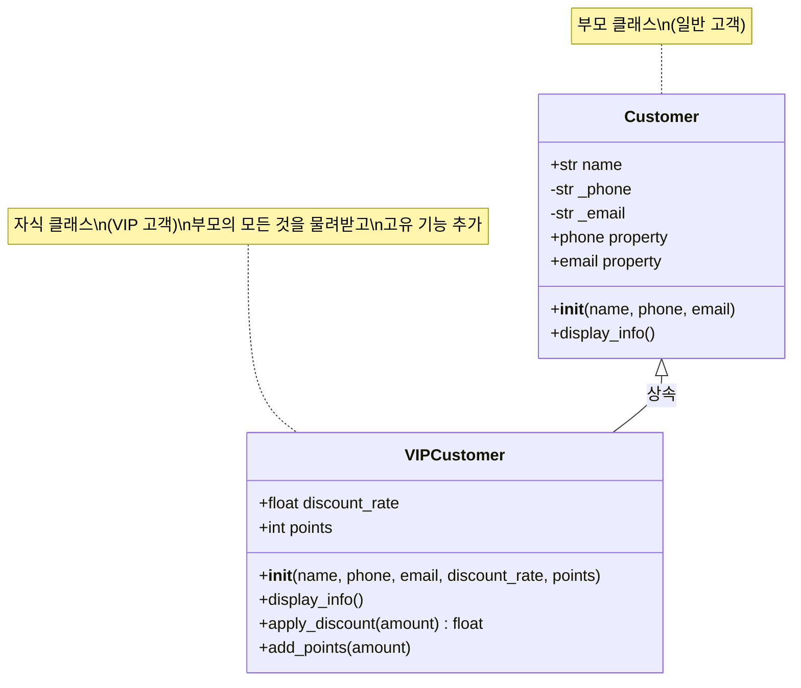
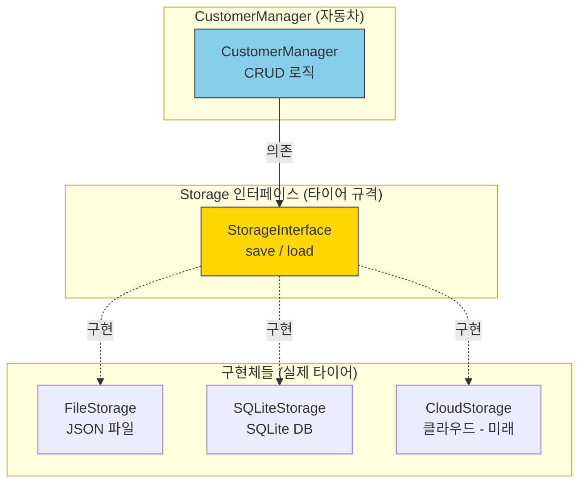
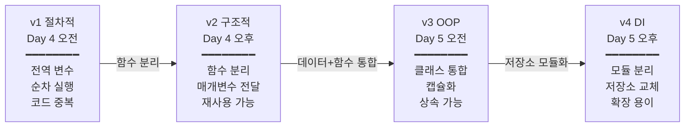

# Day 5 오후: 상속·DI 패턴 & 전체 과정 회고

> 과정: AI-native 파이썬 기초 | Day 5/5 | 13:00–17:30

---

## 오후 학습 로드맵

```
Day 5 오후 (13:00–17:30)
├── 세션 5-3 (13:00–14:00, 60분): 상속 — 확장과 재사용
│   ├── 상속, 부모/자식 클래스, super()
│   ├── 메서드 오버라이딩, 다형성
│   └── 실습: Customer → VIPCustomer
├── 세션 5-4 (14:00–15:30, 90분): DI 패턴 — 파일 저장 모듈화
│   ├── 의존성 주입(DI), 추상 클래스, 저장소 패턴
│   ├── FileStorage, SQLiteStorage 구현
│   └── 산출물: customer_manager_v4.py + storage 모듈
│
│   ☕ 휴식 (15:30–15:45)
│
└── 세션 5-5 (15:45–17:30, 105분): 전체 과정 회고 & 종합 정리
    ├── v1→v2→v3→v4 진화 과정 총정리
    ├── 최종 퀴즈 10문항
    └── 수료 후 학습 로드맵
```

---

# 세션 5-3: 상속 — 확장과 재사용

> **시간**: 13:00–14:00 (60분)
> **학습 목표**: 상속의 개념을 이해하고, 기존 클래스를 확장하는 방법을 실습한다

---

## 1. 개요

### 이번 세션에서 배우는 것

| 항목 | 내용 |
|------|------|
| **핵심 개념** | 상속(Inheritance), 부모/자식 클래스, super(), 메서드 오버라이딩, 다형성 |
| **비유** | 상속 = "유산 상속", 다형성 = "리모컨의 전원 버튼" |
| **실습** | Customer → VIPCustomer 상속, 다형성 체험 |
| **산출물** | VIPCustomer 상속 코드 |

### 왜 배우나요?

오전에 만든 Customer 클래스가 잘 작동하고 있어요. 그런데 새로운 요구사항이 생겼어요.

> "VIP 고객은 할인율과 포인트가 있고, 정보 출력 시 VIP 표시가 되어야 해요."

이걸 어떻게 구현할까요? Customer 클래스를 복사해서 VIPCustomer를 처음부터 새로 만들 수도 있지만, 그러면 코드가 중복돼요. 이름, 전화번호, 이메일 관련 코드를 두 번 작성해야 하죠.

**상속**을 사용하면 이 문제가 깔끔하게 해결돼요!

---

## 2. 핵심 개념

### 상속 = "유산 상속"

"AI 시대의 서사"에서 배운 비유를 이어갈게요.

현실에서 유산 상속을 생각해 보세요. 부모님으로부터 집(속성)과 가업(기능)을 물려받으면서, 자신만의 새로운 사업을 추가로 시작할 수 있죠.

프로그래밍에서도 마찬가지예요.

```
부모 클래스 (Customer)              자식 클래스 (VIPCustomer)
┌─────────────────────┐           ┌─────────────────────────┐
│ 속성:                │           │ 물려받은 것:              │
│   name, phone, email│    →     │   name, phone, email     │
│ 메서드:              │   상속    │   display_info()         │
│   display_info()    │           │                          │
│   update_phone()    │           │ 새로 추가한 것:            │
└─────────────────────┘           │   discount_rate          │
                                  │   points                 │
                                  │   display_info() 재정의   │
                                  │   apply_discount()       │
                                  └─────────────────────────┘
```

### 다형성 = "리모컨의 전원 버튼"

TV 리모컨의 전원 버튼을 누르면 TV가 켜지고, 에어컨 리모컨의 전원 버튼을 누르면 에어컨이 켜져요. **같은 버튼(메서드)**인데 **대상에 따라 다른 동작**을 하죠.

```python
# 같은 display_info() 호출인데, 객체에 따라 다른 결과!
customers = [customer1, vip_customer1, customer2, vip_customer2]

for c in customers:
    c.display_info()  # Customer면 일반 출력, VIPCustomer면 VIP 표시 출력
```

### 상속 계층 구조



---

## 3. 상세 내용

### 상속 문법

```python
class 자식클래스(부모클래스):
    def __init__(self, 부모매개변수들, 자식매개변수들):
        super().__init__(부모매개변수들)  # 부모의 __init__ 호출
        self.자식속성 = 자식매개변수
```

- `class VIPCustomer(Customer):` — Customer를 상속받겠다는 선언
- `super().__init__(...)` — 부모 클래스의 `__init__`을 호출해서 부모 속성을 초기화
- 메서드 오버라이딩 — 부모와 같은 이름의 메서드를 자식에서 재정의

### super()란?

`super()`는 **"부모님께 여쭤보기"**예요.

```python
class VIPCustomer(Customer):
    def __init__(self, name, phone, email, discount_rate, points):
        super().__init__(name, phone, email)  # "부모님, 이름/전화/이메일은 알아서 해주세요"
        self.discount_rate = discount_rate     # "할인율은 제가 직접 관리할게요"
        self.points = points                   # "포인트도 제가 관리할게요"
```

---

## 4. 실습 가이드

### 실습: Customer → VIPCustomer 상속

#### Step 1: 프롬프트 작성

> **프롬프트**: "Customer 클래스를 상속받아 VIPCustomer 클래스를 만들어줘. 할인율(discount_rate, 기본 10%)과 포인트(points, 기본 0) 속성을 추가하고, 정보 출력 시 VIP 표시와 할인율/포인트도 보여줘. 할인 적용 메서드와 포인트 적립 메서드도 만들어줘. 마지막에 일반 고객과 VIP 고객을 같은 리스트에 넣고 반복문으로 정보를 출력하는 다형성 예제도 포함해줘."

#### Step 2: AI 응답 코드 리뷰

```python
# vip_customer.py
# 상속과 다형성 실습

class Customer:
    """일반 고객 클래스 (부모)"""
    
    def __init__(self, name: str, phone: str, email: str):
        self.name = name
        self._phone = phone
        self._email = email
    
    @property
    def phone(self) -> str:
        return self._phone
    
    @phone.setter
    def phone(self, new_phone: str):
        if not new_phone.replace("-", "").isdigit():
            print("  오류: 전화번호 형식이 올바르지 않아요.")
            return
        self._phone = new_phone
    
    @property
    def email(self) -> str:
        return self._email
    
    @email.setter
    def email(self, new_email: str):
        if "@" not in new_email:
            print("  오류: 이메일 형식이 올바르지 않아요.")
            return
        self._email = new_email
    
    def display_info(self):
        """고객 정보를 출력해요."""
        print(f"  [일반 고객]")
        print(f"    이름: {self.name}")
        print(f"    전화: {self._phone}")
        print(f"    이메일: {self._email}")
    
    def get_type(self) -> str:
        """고객 유형을 반환해요."""
        return "일반"


class VIPCustomer(Customer):
    """VIP 고객 클래스 (자식) — Customer를 상속받아요."""
    
    def __init__(self, name: str, phone: str, email: str,
                 discount_rate: float = 0.1, points: int = 0):
        """
        VIP 고객을 생성해요.
        
        Args:
            name, phone, email: 부모(Customer)에게 물려줄 정보
            discount_rate: 할인율 (기본 10%)
            points: 적립 포인트 (기본 0)
        """
        super().__init__(name, phone, email)  # 부모의 __init__ 호출!
        self.discount_rate = discount_rate
        self.points = points
    
    def display_info(self):
        """VIP 고객 정보를 출력해요 (메서드 오버라이딩)."""
        print(f"  [⭐ VIP 고객]")
        print(f"    이름: {self.name}")
        print(f"    전화: {self._phone}")
        print(f"    이메일: {self._email}")
        print(f"    할인율: {self.discount_rate * 100:.0f}%")
        print(f"    포인트: {self.points:,}P")
    
    def apply_discount(self, amount: int) -> int:
        """할인을 적용한 금액을 계산해요."""
        discount = int(amount * self.discount_rate)
        final_amount = amount - discount
        print(f"  {self.name}님 할인 적용: {amount:,}원 → {final_amount:,}원 ({discount:,}원 할인)")
        return final_amount
    
    def add_points(self, amount: int):
        """포인트를 적립해요 (결제 금액의 5%)."""
        earned = int(amount * 0.05)
        self.points += earned
        print(f"  {self.name}님 포인트 적립: +{earned:,}P (총 {self.points:,}P)")
    
    def get_type(self) -> str:
        """고객 유형을 반환해요."""
        return "VIP"


# === 실습: 인스턴스 생성 ===
print("=" * 50)
print("  상속과 다형성 실습")
print("=" * 50)

# 일반 고객
customer1 = Customer("김철수", "010-1234-5678", "chulsu@email.com")
customer2 = Customer("이영희", "010-9876-5432", "younghee@email.com")

# VIP 고객
vip1 = VIPCustomer("박민수", "010-5555-7777", "minsu@email.com", 0.15, 5000)
vip2 = VIPCustomer("최지은", "010-3333-4444", "jieun@email.com", 0.2, 12000)

# === 다형성 체험 ===
print("\n--- 다형성 체험: 같은 메서드, 다른 결과 ---\n")

all_customers = [customer1, vip1, customer2, vip2]

for c in all_customers:
    c.display_info()
    print()

# === VIP 전용 기능 ===
print("--- VIP 전용 기능 ---\n")

# 할인 적용
vip1.apply_discount(50000)
vip2.apply_discount(100000)

print()

# 포인트 적립
vip1.add_points(42500)
vip2.add_points(80000)

# === 고객 유형별 분류 ===
print("\n--- 고객 유형별 분류 ---\n")
for c in all_customers:
    print(f"  {c.name}: {c.get_type()} 고객")
```

#### Step 3: 실행 및 확인

```bash
python vip_customer.py
```

**예상 출력:**
```
==================================================
  상속과 다형성 실습
==================================================

--- 다형성 체험: 같은 메서드, 다른 결과 ---

  [일반 고객]
    이름: 김철수
    전화: 010-1234-5678
    이메일: chulsu@email.com

  [⭐ VIP 고객]
    이름: 박민수
    전화: 010-5555-7777
    이메일: minsu@email.com
    할인율: 15%
    포인트: 5,000P

  [일반 고객]
    이름: 이영희
    전화: 010-9876-5432
    이메일: younghee@email.com

  [⭐ VIP 고객]
    이름: 최지은
    전화: 010-3333-4444
    이메일: jieun@email.com
    할인율: 20%
    포인트: 12,000P

--- VIP 전용 기능 ---

  박민수님 할인 적용: 50,000원 → 42,500원 (7,500원 할인)
  최지은님 할인 적용: 100,000원 → 80,000원 (20,000원 할인)

  박민수님 포인트 적립: +2,125P (총 7,125P)
  최지은님 포인트 적립: +4,000P (총 16,000P)

--- 고객 유형별 분류 ---

  김철수: 일반 고객
  박민수: VIP 고객
  이영희: 일반 고객
  최지은: VIP 고객
```

#### 체크포인트

- [ ] `class VIPCustomer(Customer):`의 의미를 설명할 수 있나요?
- [ ] `super().__init__(...)`이 왜 필요한지 알겠나요?
- [ ] 메서드 오버라이딩(`display_info`)이 어떻게 작동하는지 이해했나요?
- [ ] 다형성 예제에서 같은 `display_info()` 호출이 다른 결과를 내는 것을 확인했나요?

---

## 5. 코드 모음

위 실습 가이드의 Step 2에 전체 코드가 포함되어 있어요.

---

## 6. 트러블슈팅

| 증상 | 원인 | 해결 방법 |
|------|------|----------|
| `TypeError: Customer.__init__() takes 4 positional arguments but 6 were given` | `super().__init__()`에 자식 전용 매개변수까지 넘겼어요 | 부모에게는 부모 매개변수만 전달하세요 |
| VIP 고객인데 `[일반 고객]`으로 출력돼요 | `display_info`를 오버라이딩하지 않았어요 | VIPCustomer에 `display_info` 메서드를 재정의하세요 |
| `super().__init__()` 호출을 빼먹었어요 | 부모 속성이 초기화되지 않아요 | `super().__init__(name, phone, email)` 추가하세요 |

---

## 7. 세션 5-3 요약

| 개념 | 비유 | 핵심 |
|------|------|------|
| 상속 | 유산 상속 | 부모의 속성+기능을 물려받고 고유 기능 추가 |
| super() | "부모님께 여쭤보기" | 부모 클래스의 메서드 호출 |
| 메서드 오버라이딩 | 가업을 내 방식으로 | 부모 메서드를 자식에서 재정의 |
| 다형성 | 리모컨의 전원 버튼 | 같은 메서드 호출, 객체에 따라 다른 동작 |

> **핵심 한 줄**: 상속은 기존 코드를 재사용하면서 확장하는 방법이에요. 다형성 덕분에 일반 고객과 VIP 고객을 같은 방식으로 다룰 수 있어요.

---

# 세션 5-4: DI 패턴 — 파일 저장 모듈화

> **시간**: 14:00–15:30 (90분)
> **학습 목표**: DI(Dependency Injection) 개념을 이해하고, 고객 정보 저장 방식을 파일→DB로 교체 가능하도록 모듈화한다

---

## 1. 개요

### 이번 세션에서 배우는 것

| 항목 | 내용 |
|------|------|
| **핵심 개념** | 의존성 주입(DI), 인터페이스/추상 클래스, 저장소 패턴(Repository), 모듈 분리 |
| **비유** | DI = "교체 가능한 부품" / "타이어 교체" |
| **실습** | FileStorage → SQLiteStorage 교체, DI 적용 CustomerManager |
| **산출물** | customer_manager_v4.py + file_storage.py + sqlite_storage.py |

### 왜 배우나요?

v3까지 만든 고객관리 프로그램에는 한 가지 아쉬운 점이 있어요. 프로그램을 종료하면 **데이터가 사라진다**는 것이에요. 고객 정보를 파일이나 데이터베이스에 저장해야 해요.

그런데 저장 방식을 어떻게 구현할까요?

- 처음에는 **JSON 파일**로 저장하고 싶어요
- 나중에는 **SQLite 데이터베이스**로 바꾸고 싶을 수도 있어요
- 더 나중에는 **클라우드 DB**로 바꿀 수도 있고요

매번 CustomerManager 전체를 수정해야 할까요? **아니요!** DI 패턴을 사용하면 **저장 모듈만 교체**하면 돼요.

---

## 2. 핵심 개념

### DI = "교체 가능한 부품" / "타이어 교체"

자동차의 타이어를 생각해 보세요.

- 여름에는 **일반 타이어**(FileStorage)를 끼워요
- 겨울에는 **스노우 타이어**(SQLiteStorage)로 교체해요
- 타이어를 바꿀 때 **자동차 전체를 바꾸지 않아요** — 타이어만 교체하면 돼요
- 이게 가능한 이유는 **타이어 규격(인터페이스)**이 정해져 있기 때문이에요

```
자동차 (CustomerManager)
├── 엔진 (CRUD 로직) — 바꾸지 않아요
├── 핸들 (메뉴 시스템) — 바꾸지 않아요
└── 타이어 (Storage) — 이것만 교체!
    ├── 일반 타이어 (FileStorage) — JSON 파일 저장
    ├── 스노우 타이어 (SQLiteStorage) — DB 저장
    └── 레이싱 타이어 (CloudStorage) — 클라우드 저장 (미래)
```

### DI 아키텍처



### 추상 클래스 = "타이어 규격"

추상 클래스는 **"이런 기능은 반드시 있어야 해"**라는 규격이에요.

```python
from abc import ABC, abstractmethod

class StorageInterface(ABC):
    """저장소 인터페이스 (타이어 규격)"""
    
    @abstractmethod
    def save(self, data):
        """데이터를 저장해요. (반드시 구현해야 해요!)"""
        pass
    
    @abstractmethod
    def load(self):
        """데이터를 불러와요. (반드시 구현해야 해요!)"""
        pass
```

FileStorage든 SQLiteStorage든, `save()`와 `load()` 메서드는 **반드시** 있어야 해요. 이 규격을 지키면 어떤 저장소든 CustomerManager에 끼울 수 있어요.

---

## 3. 상세 내용

### 파일 구조

```
프로젝트 폴더/
├── customer_manager_v4.py    ← 메인 프로그램 (DI 적용)
├── file_storage.py           ← JSON 파일 저장 모듈
├── sqlite_storage.py         ← SQLite DB 저장 모듈
└── customers.json            ← (자동 생성) 고객 데이터 파일
```

### 의존성 주입이란?

"의존성 주입"이라는 이름이 어렵게 느껴질 수 있어요. 쉽게 풀어볼게요.

- **의존성**: CustomerManager가 데이터를 저장하려면 Storage가 **필요해요** (의존해요)
- **주입**: 그 Storage를 CustomerManager **안에서 직접 만들지 않고**, **밖에서 넣어줘요** (주입해요)

```python
# DI 없이 (나쁜 방법) — 타이어가 자동차에 용접되어 있는 것
class CustomerManager:
    def __init__(self):
        self.storage = FileStorage("customers.json")  # 내부에서 직접 생성!
        # → FileStorage를 SQLiteStorage로 바꾸려면 이 코드를 수정해야 해요

# DI 적용 (좋은 방법) — 타이어를 교체할 수 있는 것
class CustomerManager:
    def __init__(self, storage):
        self.storage = storage  # 외부에서 받아요!
        # → 어떤 Storage든 끼울 수 있어요

# 사용할 때
file_storage = FileStorage("customers.json")
manager = CustomerManager(file_storage)  # FileStorage 주입!

# 나중에 바꾸고 싶으면?
sqlite_storage = SQLiteStorage("customers.db")
manager = CustomerManager(sqlite_storage)  # SQLiteStorage로 교체! 끝!
```

---

## 4. 실습 가이드

### 실습 단계 1: FileStorage 클래스

#### 프롬프트

> **프롬프트**: "고객 정보를 JSON 파일로 저장하고 불러오는 FileStorage 클래스를 만들어줘. save(customers) 메서드와 load() 메서드가 있어야 해. customers는 딕셔너리 리스트 형태야. 파일이 없으면 빈 리스트를 반환해줘. Python 3.12 기준."

#### 코드: file_storage.py

```python
# file_storage.py
# JSON 파일 기반 저장소 모듈

import json
import os
from abc import ABC, abstractmethod


class StorageInterface(ABC):
    """
    저장소 인터페이스 (추상 클래스).
    
    비유: '타이어 규격'이에요.
    이 규격을 따르는 저장소는 어떤 것이든 CustomerManager에 끼울 수 있어요.
    """
    
    @abstractmethod
    def save(self, customers: list[dict]) -> bool:
        """고객 데이터를 저장해요. 성공하면 True를 반환해요."""
        pass
    
    @abstractmethod
    def load(self) -> list[dict]:
        """고객 데이터를 불러와요. 데이터가 없으면 빈 리스트를 반환해요."""
        pass


class FileStorage(StorageInterface):
    """
    JSON 파일 기반 저장소.
    
    비유: '일반 타이어'예요.
    고객 데이터를 JSON 파일에 저장하고 불러와요.
    """
    
    def __init__(self, filepath: str = "customers.json"):
        """
        FileStorage를 초기화해요.
        
        Args:
            filepath: 저장할 JSON 파일 경로 (기본값: customers.json)
        """
        self.filepath = filepath
    
    def save(self, customers: list[dict]) -> bool:
        """고객 데이터를 JSON 파일로 저장해요."""
        try:
            with open(self.filepath, "w", encoding="utf-8") as f:
                json.dump(customers, f, ensure_ascii=False, indent=2)
            print(f"  [FileStorage] {len(customers)}명의 고객 정보를 '{self.filepath}'에 저장했어요.")
            return True
        except Exception as e:
            print(f"  [FileStorage] 저장 실패: {e}")
            return False
    
    def load(self) -> list[dict]:
        """JSON 파일에서 고객 데이터를 불러와요."""
        if not os.path.exists(self.filepath):
            print(f"  [FileStorage] '{self.filepath}' 파일이 없어요. 빈 목록으로 시작해요.")
            return []
        
        try:
            with open(self.filepath, "r", encoding="utf-8") as f:
                customers = json.load(f)
            print(f"  [FileStorage] '{self.filepath}'에서 {len(customers)}명의 고객 정보를 불러왔어요.")
            return customers
        except json.JSONDecodeError:
            print(f"  [FileStorage] 파일 형식 오류. 빈 목록으로 시작해요.")
            return []
        except Exception as e:
            print(f"  [FileStorage] 불러오기 실패: {e}")
            return []


# --- 단독 테스트 ---
if __name__ == "__main__":
    print("=== FileStorage 단독 테스트 ===\n")
    
    storage = FileStorage("test_customers.json")
    
    # 저장 테스트
    test_data = [
        {"name": "김철수", "phone": "010-1234-5678", "email": "chulsu@email.com", "type": "일반"},
        {"name": "이영희", "phone": "010-9876-5432", "email": "younghee@email.com", "type": "일반"},
    ]
    storage.save(test_data)
    
    # 불러오기 테스트
    loaded = storage.load()
    print(f"\n  불러온 데이터: {loaded}")
    
    # 정리
    if os.path.exists("test_customers.json"):
        os.remove("test_customers.json")
        print("\n  테스트 파일 삭제 완료.")
```

---

### 실습 단계 2: SQLiteStorage 클래스

#### 프롬프트

> **프롬프트**: "FileStorage와 같은 인터페이스(save, load)를 가지는 SQLiteStorage 클래스를 만들어줘. SQLite 데이터베이스에 고객 정보를 저장하고 불러와야 해. Python 내장 sqlite3 모듈을 사용해줘."

#### 코드: sqlite_storage.py

```python
# sqlite_storage.py
# SQLite 데이터베이스 기반 저장소 모듈

import sqlite3
from file_storage import StorageInterface


class SQLiteStorage(StorageInterface):
    """
    SQLite 데이터베이스 기반 저장소.
    
    비유: '스노우 타이어'예요.
    FileStorage(일반 타이어)와 같은 규격(인터페이스)이지만,
    데이터를 데이터베이스에 저장해서 더 안정적이에요.
    """
    
    def __init__(self, db_path: str = "customers.db"):
        """
        SQLiteStorage를 초기화하고, 테이블이 없으면 생성해요.
        
        Args:
            db_path: SQLite 데이터베이스 파일 경로
        """
        self.db_path = db_path
        self._create_table()
    
    def _create_table(self):
        """customers 테이블이 없으면 생성해요."""
        conn = sqlite3.connect(self.db_path)
        cursor = conn.cursor()
        cursor.execute("""
            CREATE TABLE IF NOT EXISTS customers (
                name TEXT PRIMARY KEY,
                phone TEXT NOT NULL,
                email TEXT NOT NULL,
                type TEXT DEFAULT '일반'
            )
        """)
        conn.commit()
        conn.close()
    
    def save(self, customers: list[dict]) -> bool:
        """고객 데이터를 SQLite에 저장해요 (기존 데이터 교체)."""
        try:
            conn = sqlite3.connect(self.db_path)
            cursor = conn.cursor()
            
            # 기존 데이터 삭제 후 새로 삽입
            cursor.execute("DELETE FROM customers")
            
            for customer in customers:
                cursor.execute(
                    "INSERT INTO customers (name, phone, email, type) VALUES (?, ?, ?, ?)",
                    (
                        customer["name"],
                        customer["phone"],
                        customer["email"],
                        customer.get("type", "일반"),
                    )
                )
            
            conn.commit()
            conn.close()
            print(f"  [SQLiteStorage] {len(customers)}명의 고객 정보를 '{self.db_path}'에 저장했어요.")
            return True
        except Exception as e:
            print(f"  [SQLiteStorage] 저장 실패: {e}")
            return False
    
    def load(self) -> list[dict]:
        """SQLite에서 고객 데이터를 불러와요."""
        try:
            conn = sqlite3.connect(self.db_path)
            cursor = conn.cursor()
            cursor.execute("SELECT name, phone, email, type FROM customers")
            rows = cursor.fetchall()
            conn.close()
            
            customers = [
                {"name": row[0], "phone": row[1], "email": row[2], "type": row[3]}
                for row in rows
            ]
            print(f"  [SQLiteStorage] '{self.db_path}'에서 {len(customers)}명의 고객 정보를 불러왔어요.")
            return customers
        except Exception as e:
            print(f"  [SQLiteStorage] 불러오기 실패: {e}")
            return []


# --- 단독 테스트 ---
if __name__ == "__main__":
    import os
    
    print("=== SQLiteStorage 단독 테스트 ===\n")
    
    storage = SQLiteStorage("test_customers.db")
    
    # 저장 테스트
    test_data = [
        {"name": "김철수", "phone": "010-1234-5678", "email": "chulsu@email.com", "type": "일반"},
        {"name": "박민수", "phone": "010-5555-7777", "email": "minsu@email.com", "type": "VIP"},
    ]
    storage.save(test_data)
    
    # 불러오기 테스트
    loaded = storage.load()
    print(f"\n  불러온 데이터:")
    for c in loaded:
        print(f"    {c}")
    
    # 정리
    if os.path.exists("test_customers.db"):
        os.remove("test_customers.db")
        print("\n  테스트 DB 삭제 완료.")
```

---

### 실습 단계 3: DI 적용 CustomerManager (v4)

#### 프롬프트

> **프롬프트**: "CustomerManager가 저장소 객체를 외부에서 받도록(DI) 수정해줘. FileStorage든 SQLiteStorage든 교체 가능하게 만들어줘. 프로그램 시작 시 저장소 타입을 선택할 수 있게 해줘."

#### 코드: customer_manager_v4.py

```python
# customer_manager_v4.py
# 고객 정보 관리 프로그램 v4 (DI 적용)
# v3(OOP) → v4(DI) — 저장소를 교체 가능하게!

from file_storage import FileStorage, StorageInterface
from sqlite_storage import SQLiteStorage


class Customer:
    """개별 고객 정보를 관리하는 클래스."""
    
    def __init__(self, name: str, phone: str, email: str, customer_type: str = "일반"):
        self.name = name
        self._phone = phone
        self._email = email
        self.customer_type = customer_type
    
    @property
    def phone(self) -> str:
        return self._phone
    
    @phone.setter
    def phone(self, new_phone: str):
        if not new_phone.replace("-", "").isdigit():
            print("  오류: 전화번호 형식이 올바르지 않아요.")
            return
        self._phone = new_phone
        print(f"  {self.name}의 전화번호가 변경되었어요.")
    
    @property
    def email(self) -> str:
        return self._email
    
    @email.setter
    def email(self, new_email: str):
        if "@" not in new_email:
            print("  오류: 이메일 형식이 올바르지 않아요.")
            return
        self._email = new_email
        print(f"  {self.name}의 이메일이 변경되었어요.")
    
    def display_info(self):
        """고객 정보를 출력해요."""
        type_label = f"⭐ {self.customer_type}" if self.customer_type == "VIP" else self.customer_type
        print(f"  [{type_label} 고객]")
        print(f"    이름: {self.name}")
        print(f"    전화: {self._phone}")
        print(f"    이메일: {self._email}")
    
    def to_dict(self) -> dict:
        """고객 정보를 딕셔너리로 변환해요 (저장용)."""
        return {
            "name": self.name,
            "phone": self._phone,
            "email": self._email,
            "type": self.customer_type,
        }
    
    @classmethod
    def from_dict(cls, data: dict) -> "Customer":
        """딕셔너리에서 Customer 인스턴스를 생성해요 (불러오기용)."""
        return cls(
            name=data["name"],
            phone=data["phone"],
            email=data["email"],
            customer_type=data.get("type", "일반"),
        )
    
    def __str__(self) -> str:
        return f"{self.name} | {self._phone} | {self._email} | {self.customer_type}"


class CustomerManager:
    """
    고객 목록 전체를 관리하는 클래스 (DI 적용).
    
    비유: '자동차'예요.
    저장소(타이어)를 외부에서 받아서 사용해요.
    FileStorage든 SQLiteStorage든 끼울 수 있어요!
    """
    
    def __init__(self, storage: StorageInterface):
        """
        CustomerManager를 초기화해요.
        
        Args:
            storage: 저장소 객체 (DI — 외부에서 주입!)
        """
        self.storage = storage  # 핵심! 저장소를 외부에서 받아요
        self.customers: list[Customer] = []
        self._load_data()
    
    def _load_data(self):
        """저장소에서 데이터를 불러와요."""
        data = self.storage.load()
        self.customers = [Customer.from_dict(d) for d in data]
    
    def _save_data(self):
        """현재 데이터를 저장소에 저장해요."""
        data = [c.to_dict() for c in self.customers]
        self.storage.save(data)
    
    def add_customer(self, name: str, phone: str, email: str, customer_type: str = "일반"):
        """새 고객을 추가해요."""
        for customer in self.customers:
            if customer.name == name:
                print(f"\n  '{name}' 고객은 이미 등록되어 있어요.")
                return
        
        new_customer = Customer(name, phone, email, customer_type)
        self.customers.append(new_customer)
        self._save_data()
        print(f"\n  '{name}' 고객이 등록되었어요!")
    
    def find_customer(self, name: str) -> Customer | None:
        """이름으로 고객을 검색해요."""
        for customer in self.customers:
            if customer.name == name:
                return customer
        return None
    
    def update_customer(self, name: str, field: str, new_value: str):
        """고객 정보를 수정해요."""
        customer = self.find_customer(name)
        if customer is None:
            print(f"\n  '{name}' 고객을 찾을 수 없어요.")
            return
        
        if field == "phone":
            customer.phone = new_value
        elif field == "email":
            customer.email = new_value
        else:
            print(f"\n  '{field}'은(는) 수정할 수 없는 항목이에요.")
            return
        
        self._save_data()
    
    def delete_customer(self, name: str):
        """고객을 삭제해요."""
        customer = self.find_customer(name)
        if customer is None:
            print(f"\n  '{name}' 고객을 찾을 수 없어요.")
            return
        
        self.customers.remove(customer)
        self._save_data()
        print(f"\n  '{name}' 고객이 삭제되었어요.")
    
    def list_customers(self):
        """전체 고객 목록을 출력해요."""
        if not self.customers:
            print("\n  등록된 고객이 없어요.")
            return
        
        print(f"\n  === 전체 고객 목록 ({len(self.customers)}명) ===")
        print(f"  {'번호':<5} {'이름':<10} {'전화번호':<15} {'이메일':<25} {'유형'}")
        print(f"  {'-'*65}")
        for i, customer in enumerate(self.customers, 1):
            print(f"  {i:<5} {customer}")
    
    def search_customer(self, name: str):
        """고객을 검색하고 결과를 출력해요."""
        customer = self.find_customer(name)
        if customer is None:
            print(f"\n  '{name}' 고객을 찾을 수 없어요.")
        else:
            print(f"\n  === 검색 결과 ===")
            customer.display_info()


def select_storage() -> StorageInterface:
    """사용자가 저장소 타입을 선택해요."""
    print("\n" + "=" * 40)
    print("  저장소 선택")
    print("=" * 40)
    print("  1. JSON 파일 (FileStorage)")
    print("  2. SQLite 데이터베이스 (SQLiteStorage)")
    print("-" * 40)
    
    while True:
        choice = input("  저장소를 선택하세요 (1 또는 2): ").strip()
        if choice == "1":
            print("\n  JSON 파일 저장소를 선택했어요.")
            return FileStorage("customers.json")
        elif choice == "2":
            print("\n  SQLite 데이터베이스 저장소를 선택했어요.")
            return SQLiteStorage("customers.db")
        else:
            print("  1 또는 2를 입력해 주세요.")


def main():
    """메인 함수: 저장소 선택 → 메뉴 기반 콘솔 프로그램"""
    
    # DI 핵심! 저장소를 선택하고 주입해요
    storage = select_storage()
    manager = CustomerManager(storage)  # 선택한 저장소를 주입!
    
    while True:
        print("\n" + "=" * 40)
        print("  고객 정보 관리 프로그램 v4 (DI)")
        print(f"  저장소: {type(storage).__name__}")
        print("=" * 40)
        print("  1. 고객 등록")
        print("  2. 고객 검색")
        print("  3. 고객 정보 수정")
        print("  4. 고객 삭제")
        print("  5. 전체 고객 목록")
        print("  0. 종료")
        print("-" * 40)
        
        choice = input("  메뉴를 선택하세요: ").strip()
        
        if choice == "1":
            print("\n  --- 고객 등록 ---")
            name = input("  이름: ").strip()
            phone = input("  전화번호: ").strip()
            email = input("  이메일: ").strip()
            ctype = input("  유형 (일반/VIP, 기본: 일반): ").strip() or "일반"
            manager.add_customer(name, phone, email, ctype)
        
        elif choice == "2":
            print("\n  --- 고객 검색 ---")
            name = input("  검색할 이름: ").strip()
            manager.search_customer(name)
        
        elif choice == "3":
            print("\n  --- 고객 정보 수정 ---")
            name = input("  수정할 고객 이름: ").strip()
            print("  수정할 항목: phone(전화번호) / email(이메일)")
            field = input("  항목: ").strip().lower()
            new_value = input("  새 값: ").strip()
            manager.update_customer(name, field, new_value)
        
        elif choice == "4":
            print("\n  --- 고객 삭제 ---")
            name = input("  삭제할 고객 이름: ").strip()
            confirm = input(f"  '{name}' 고객을 정말 삭제할까요? (y/n): ").strip().lower()
            if confirm == "y":
                manager.delete_customer(name)
            else:
                print("  삭제를 취소했어요.")
        
        elif choice == "5":
            manager.list_customers()
        
        elif choice == "0":
            print("\n  프로그램을 종료해요. 데이터는 자동 저장되어 있어요!")
            print("  안녕히 가세요!")
            break
        
        else:
            print("\n  잘못된 입력이에요. 0~5 사이의 숫자를 입력해 주세요.")


if __name__ == "__main__":
    main()
```

---

### 실습 단계 4: 저장소 교체 테스트

#### FileStorage로 실행

```bash
python customer_manager_v4.py
# → 저장소 선택: 1 (JSON 파일)
# → 고객 등록 → 종료 → 다시 실행 → 데이터가 남아있는지 확인!
```

#### SQLiteStorage로 교체 실행

```bash
python customer_manager_v4.py
# → 저장소 선택: 2 (SQLite)
# → 고객 등록 → 종료 → 다시 실행 → 데이터가 남아있는지 확인!
```

> **체감 포인트**: 같은 프로그램인데 저장 방식만 바뀌었어요! CustomerManager 코드는 **한 줄도 수정하지 않았어요**. 이것이 DI의 힘이에요.

#### 체크포인트

- [ ] FileStorage와 SQLiteStorage가 같은 인터페이스(save, load)를 가진 것을 확인했나요?
- [ ] CustomerManager가 저장소를 외부에서 받는 것(DI)을 이해했나요?
- [ ] 저장소를 교체해도 프로그램이 동일하게 작동하는 것을 확인했나요?
- [ ] 프로그램 종료 후 재실행 시 데이터가 유지되는 것을 확인했나요?

---

## 5. 코드 모음

### 파일별 요약

| 파일 | 역할 | 핵심 클래스 |
|------|------|-----------|
| `file_storage.py` | JSON 파일 저장소 + 인터페이스 정의 | `StorageInterface`, `FileStorage` |
| `sqlite_storage.py` | SQLite DB 저장소 | `SQLiteStorage` |
| `customer_manager_v4.py` | 메인 프로그램 (DI 적용) | `Customer`, `CustomerManager` |

---

## 6. 트러블슈팅

| 증상 | 원인 | 해결 방법 |
|------|------|----------|
| `ModuleNotFoundError: No module named 'file_storage'` | 파일이 같은 폴더에 없어요 | 세 파일을 같은 폴더에 넣으세요 |
| `json.decoder.JSONDecodeError` | JSON 파일이 손상되었어요 | `customers.json` 파일을 삭제하고 다시 시작하세요 |
| `sqlite3.OperationalError: table customers already exists` | 테이블 중복 생성 시도 | `CREATE TABLE IF NOT EXISTS`로 수정하세요 (이미 적용됨) |
| 데이터가 저장 안 돼요 | `_save_data()` 호출을 빼먹었어요 | CRUD 메서드 끝에 `self._save_data()` 확인하세요 |

---

## 7. 세션 5-4 요약

| 개념 | 비유 | 핵심 |
|------|------|------|
| DI (의존성 주입) | 교체 가능한 부품 / 타이어 교체 | 저장소를 외부에서 주입, 교체 가능 |
| 추상 클래스 | 타이어 규격 | save(), load() 반드시 구현 |
| FileStorage | 일반 타이어 | JSON 파일로 저장 |
| SQLiteStorage | 스노우 타이어 | SQLite DB로 저장 |
| 저장소 패턴 | 부품 교체 시스템 | 저장 방식 변경 시 코드 수정 최소화 |

> **핵심 한 줄**: DI는 프로그램의 부품을 교체 가능하게 만드는 패턴이에요. 타이어(저장소)만 바꾸면 자동차(프로그램) 전체를 바꿀 필요가 없어요.

---

# 세션 5-5: 전체 과정 회고 & Day 5 종합 정리

> **시간**: 15:45–17:30 (105분)
> **학습 목표**: 5일간의 학습을 전체적으로 회고하고, AI-native 개발자로서의 방향성을 정립한다

---

## 1. 개요

### 이번 세션에서 하는 것

| 항목 | 내용 |
|------|------|
| **활동 1** | v1→v2→v3→v4 진화 과정 총정리 |
| **활동 2** | "AI 시대의 서사" 최종 연결 |
| **활동 3** | 개인 회고 |
| **활동 4** | 최종 퀴즈 10문항 |
| **활동 5** | 수료 후 학습 로드맵 |
| **활동 6** | 마무리 메시지 |

---

## 2. v1→v2→v3→v4 진화 과정 총정리

### 프롬프트로 비교표 생성

AI에게 물어보세요.

> **프롬프트**: "고객관리 프로그램 v1(절차적), v2(구조적), v3(OOP), v4(DI)의 차이점을 구조, 데이터 관리, 확장성, 장단점 기준으로 비교표를 만들어줘."

### v1→v2→v3→v4 비교표

| 비교 항목 | v1 (절차적) | v2 (구조적) | v3 (OOP) | v4 (DI) |
|-----------|-----------|-----------|---------|---------|
| **Day** | Day 4 오전 | Day 4 오후 | Day 5 오전 | Day 5 오후 |
| **패러다임** | 절차적 프로그래밍 | 구조적 프로그래밍 | 객체지향 프로그래밍 | OOP + DI 패턴 |
| **데이터 저장** | 전역 리스트 + 딕셔너리 | 매개변수로 전달하는 리스트 | 클래스 인스턴스 (Customer) | 클래스 + 외부 저장소 |
| **코드 구조** | 위에서 아래로 순차 실행 | 함수별 분리 | 클래스별 역할 분담 | 클래스 + 모듈 분리 |
| **함수/메서드** | 없음 (인라인 코드) | 독립 함수 | 클래스 메서드 | 클래스 메서드 + DI |
| **데이터 보호** | 없음 (누구나 수정 가능) | 없음 | 캡슐화 (property) | 캡슐화 + 인터페이스 |
| **데이터 영속성** | 없음 (종료 시 소멸) | 없음 | 없음 | 파일/DB 저장 |
| **확장성** | 매우 낮음 | 보통 | 높음 (상속 가능) | 매우 높음 (저장소 교체) |
| **코드 재사용** | 불가능 | 함수 재사용 | 클래스 재사용 + 상속 | 모듈 재사용 |
| **비유** | 도미노 | 원룸→투룸 리모델링 | 부서 조직 재편 | 교체 가능한 부품 |
| **파일 수** | 1개 | 1개 | 1개 | 3개 (모듈 분리) |

### v1→v4 진화 타임라인



### 코드 구조 변화 한눈에 보기

```
v1 (절차적)          v2 (구조적)          v3 (OOP)             v4 (DI)
┌──────────┐       ┌──────────┐       ┌──────────┐        ┌──────────────┐
│ customers│       │ add()    │       │ Customer │        │ Customer     │
│ = []     │       │ find()   │       │ ├ name   │        │ CustomerMgr  │
│          │       │ update() │       │ ├ phone  │        │ ├ storage ←──┤── DI!
│ while:   │       │ delete() │       │ └ info() │        │ └ CRUD()     │
│  if 1:   │       │ list()   │       │          │        └──────────────┘
│   ...    │       │          │       │ CustMgr  │        ┌──────────────┐
│  if 2:   │       │ main()   │       │ ├ custs  │        │ FileStorage  │
│   ...    │       │  while:  │       │ └ CRUD() │        │ SQLiteStorage│
│  ...     │       │   ...    │       │          │        └──────────────┘
└──────────┘       └──────────┘       │ main()   │
                                      └──────────┘
 1개 파일            1개 파일            1개 파일             3개 파일
 함수 없음           함수 분리           클래스 분리          모듈 분리
```

---

## 3. "AI 시대의 서사" 최종 연결

### 패러다임 여정을 직접 체험했어요

"AI 시대의 서사" 2부에서 배운 개발 패러다임의 여정, 기억나시나요?

```
기계어 → 어셈블리어 → 고급 언어 → 절차적 → 구조적 → OOP → ...
```

이번 과정에서 우리는 이 여정의 핵심 구간을 **직접 체험**했어요.

| "AI 시대의 서사"에서 배운 것 | 이번 과정에서 체험한 것 |
|---------------------------|---------------------|
| 절차적 프로그래밍: 도미노처럼 순차 실행 | v1: 전역 변수 + while 루프 |
| 구조적 프로그래밍: 함수로 분리 | v2: CRUD 함수 분리 |
| 데이터와 함수 분리의 한계 | v2에서 v3로 넘어가야 했던 이유 |
| OOP: 데이터+함수를 객체로 묶기 | v3: Customer + CustomerManager 클래스 |
| 캡슐화: 내부를 숨기고 인터페이스만 공개 | v3: property로 전화번호 보호 |
| 상속: 기존 것을 물려받아 확장 | VIPCustomer가 Customer를 상속 |
| 다형성: 같은 인터페이스, 다른 동작 | 일반/VIP 고객의 display_info() |

### "문제를 정의하고 AI와 협업하는 사람"

"AI 시대의 서사" 1부의 핵심 메시지를 다시 떠올려 보세요.

> **"나는 AI에게 무엇을 시킬 수 있는 사람이 될 것인가, 아니면 AI가 대신할 수 있는 일을 하는 사람이 될 것인가?"**

이번 5일 과정에서 우리가 한 것이 바로 **"AI에게 무엇을 시킬 수 있는 사람"**이 되는 연습이었어요.

- Day 1: AI 도구(Antigravity + Gemini)를 준비했어요
- Day 2: AI에게 **명확하게 지시하는 방법**(프롬프트, 요구사항, PRD)을 배웠어요
- Day 3: AI가 생성한 코드를 **읽고 이해하는 능력**(기초문법)을 키웠어요
- Day 4: AI에게 **실제 프로그램을 만들게** 하고, **더 나은 구조로 개선**시켰어요
- Day 5: AI에게 **고급 패턴(OOP, DI)**을 적용하게 하고, 그 결과를 **리뷰**했어요

여러분은 코드를 한 줄도 직접 타이핑하지 않았지만, **프로그램이 어떻게 동작하는지**, **왜 이런 구조가 좋은지**를 이해하게 되었어요. 이것이 바로 AI 시대에 필요한 역량이에요.

---

## 4. 개인 회고

다음 질문에 대해 생각해 보세요. (포스트잇이나 노트에 적어보세요)

1. **가장 인상 깊었던 것**은 무엇인가요?
2. **아직 어려운 것**은 무엇인가요?
3. **더 배우고 싶은 것**은 무엇인가요?
4. **AI와 협업하면서 느낀 점**은 무엇인가요?

---

## 5. 최종 퀴즈 (10문항)

> 전 과정(Day 1~5)의 핵심 개념을 확인하는 퀴즈예요.

### 문제

**Q1.** Antigravity IDE의 3가지 주요 화면(Surface)은 무엇인가요?

**Q2.** 좋은 프롬프트의 4요소(Google Gemini Prompting Guide 기준)를 모두 말해 보세요.

**Q3.** 파이썬에서 변수의 데이터 타입 4가지를 말하고, 각각의 예시를 하나씩 들어 보세요.

**Q4.** 리스트와 딕셔너리의 차이점을 "사물함"과 "서랍장" 비유로 설명해 보세요.

**Q5.** `def add(a, b): return a + b`에서 `a, b`는 무엇이고, `return a + b`는 무엇을 하나요?

**Q6.** 절차적 프로그래밍(v1)과 구조적 프로그래밍(v2)의 가장 큰 차이점은 무엇인가요?

**Q7.** 클래스와 인스턴스의 관계를 "붕어빵 틀"과 "붕어빵" 비유로 설명해 보세요.

**Q8.** 캡슐화란 무엇인가요? "자동차 운전" 비유로 설명해 보세요.

**Q9.** DI(의존성 주입)란 무엇인가요? "타이어 교체" 비유로 설명해 보세요.

**Q10.** "AI 시대의 서사"에서 말하는 AI 시대 개발자의 핵심 역량은 무엇인가요?

---

### 정답

**A1.** Editor(코드 편집), Manager(AI 에이전트 관리), Browser(자동 테스트). Agent-first IDE로, AI 비서가 상주하는 사무실 같아요.

**A2.** Persona(누가), Task(무엇을), Context(어떤 상황에서), Format(어떤 형태로). "AI에게 보내는 업무 지시서"의 4요소예요.

**A3.** int(정수, 예: 42), float(소수, 예: 3.14), str(문자열, 예: "안녕"), bool(참/거짓, 예: True). 변수는 "이름표가 붙은 상자"예요.

**A4.** 리스트는 "번호표가 붙은 사물함"으로 순서(인덱스)로 찾아요. 딕셔너리는 "이름표가 붙은 서랍장"으로 키(이름)로 찾아요. 고객 한 명 = 딕셔너리, 여러 고객 = 리스트 안의 딕셔너리들이에요.

**A5.** `a, b`는 매개변수(함수에 전달하는 값)이고, `return a + b`는 두 값을 더한 결과를 호출한 곳으로 돌려주는 것이에요. 함수는 "레시피 카드"예요.

**A6.** 절차적은 코드가 위에서 아래로 순차 실행되고 전역 변수를 사용해요. 구조적은 기능별로 함수를 분리하고 매개변수로 데이터를 전달해요. "원룸을 투룸으로 리모델링"한 것과 같아요.

**A7.** 클래스(붕어빵 틀)는 설계도이고, 인스턴스(붕어빵)는 그 설계도로 만든 실체예요. `class Customer:`가 틀이고, `Customer("철수")`가 실제 고객이에요. 틀 하나로 붕어빵 여러 개를 만들 수 있어요.

**A8.** 캡슐화는 내부 구조를 숨기고 필요한 인터페이스만 공개하는 것이에요. 자동차를 운전할 때 엔진 구조를 몰라도 핸들과 페달만 쓰면 되는 것처럼, 객체의 데이터를 직접 건드리지 않고 메서드를 통해서만 접근해요.

**A9.** DI는 프로그램이 필요로 하는 부품(의존성)을 외부에서 넣어주는(주입) 것이에요. 자동차의 타이어를 교체할 때 자동차 전체를 바꾸지 않고 타이어만 바꾸는 것처럼, FileStorage를 SQLiteStorage로 교체할 때 CustomerManager는 수정하지 않아요.

**A10.** "코드를 타이핑하는 사람"이 아니라 **"문제를 정의하고 AI와 협업하는 사람"**이 되는 것이에요. AI에게 무엇을 시킬 수 있는지 아는 것, 명확하게 요구사항을 정의하는 것, AI가 만든 결과물을 리뷰할 수 있는 것이 핵심 역량이에요.

---

## 6. 수료 후 학습 로드맵

### 다음 단계로 나아가기

이번 과정에서 파이썬 기초와 AI 협업 방법을 배웠어요. 여기서 더 나아가고 싶다면, 관심 분야에 따라 다음 경로를 추천해요.

```
                    AI-native 파이썬 기초 (지금 여기!)
                              │
              ┌───────────────┼───────────────┐
              ▼               ▼               ▼
        웹 개발          데이터 분석        자동화/업무효율
        ┌─────┐         ┌─────┐          ┌─────┐
        │Flask│         │Pandas│          │Selenium│
        │Django│        │Matplotlib│      │자동화 스크립트│
        │FastAPI│       │Jupyter│         │엑셀 자동화│
        └─────┘         └─────┘          └─────┘
```

| 분야 | 추천 기술 | 설명 | AI 활용 팁 |
|------|----------|------|-----------|
| **웹 개발** | Flask → Django → FastAPI | 웹 서비스를 만들 수 있어요 | "Flask로 고객관리 웹 앱을 만들어줘" |
| **데이터 분석** | Pandas → Matplotlib → Jupyter | 데이터를 분석하고 시각화할 수 있어요 | "이 CSV 파일을 Pandas로 분석해줘" |
| **자동화** | Selenium → openpyxl → schedule | 반복 업무를 자동화할 수 있어요 | "매일 이 웹사이트에서 데이터를 수집해줘" |
| **AI 활용 심화** | LangChain → OpenAI API → RAG | AI를 직접 활용하는 프로그램을 만들 수 있어요 | "고객 문의에 자동 응답하는 챗봇을 만들어줘" |

### 학습 방법은 동일해요

어떤 분야를 선택하든, 이번 과정에서 배운 학습 방법은 그대로 적용돼요.

1. **프롬프트로 코드 생성** — "Flask로 고객관리 웹 앱을 만들어줘"
2. **코드 리뷰** — AI가 생성한 코드를 읽고 이해하기
3. **점진적 개선** — "여기에 로그인 기능을 추가해줘"
4. **패턴 이해** — 왜 이런 구조인지, 어떤 패턴을 사용했는지

---

## 7. 마무리 메시지

### 5일간의 여정을 돌아보며

Day 1에서 Antigravity를 설치하고 "Hello, World!"를 출력했던 것이 엊그제 같은데, 벌써 DI 패턴까지 왔어요.

돌아보면 정말 많은 것을 배웠어요.

- **Day 1**: 도구를 준비했어요 (Antigravity, Python, uv)
- **Day 2**: AI와 대화하는 법을 배웠어요 (프롬프트, 요구사항, PRD)
- **Day 3**: 파이썬의 언어를 이해했어요 (변수, 자료구조, 제어문, 함수)
- **Day 4**: 진짜 프로그램을 만들었어요 (고객관리 v1→v2)
- **Day 5**: 더 좋은 구조로 발전시켰어요 (고객관리 v3→v4)

### 여러분이 증명한 것

이번 과정에서 여러분은 중요한 것을 증명했어요.

> **코딩 경험이 없어도, AI와 협업하면 프로그램을 만들 수 있다.**

여러분은 코드를 직접 타이핑하지 않았어요. 대신 **무엇을 만들어야 하는지 정의**하고, **AI에게 명확하게 지시**하고, **결과물을 리뷰**했어요. 그리고 그 과정에서 프로그래밍의 핵심 개념들을 자연스럽게 이해하게 되었어요.

이것이 바로 AI 시대의 개발 방식이에요.

### 마지막 한마디

> **여러분은 이제 AI에게 무엇을 시킬 수 있는 사람이에요.**

"AI 시대의 서사"에서 던졌던 질문을 기억하시나요?

> "나는 AI에게 무엇을 시킬 수 있는 사람이 될 것인가, 아니면 AI가 대신할 수 있는 일을 하는 사람이 될 것인가?"

5일 전에는 이 질문이 막연하게 느껴졌을 거예요. 하지만 지금은 달라요. 여러분은 실제로 AI에게 프로그램을 만들게 하고, 리뷰하고, 개선시키는 경험을 했어요. 이 경험은 앞으로 어떤 분야에서든 여러분의 무기가 될 거예요.

**문제를 정의하세요. AI에게 지시하세요. 결과를 리뷰하세요.**

이 세 가지만 기억하면, 여러분은 AI 시대에 어떤 도전이든 해낼 수 있어요.

수고하셨어요. 정말 잘하셨어요! 🎉

---

## 최종 평가 체크리스트

### 3대 필수 역량 점검

- [ ] **파이썬 기초문법 이해**: 변수, 자료구조, 제어문, 함수, 클래스의 개념을 설명할 수 있나요?
- [ ] **AI 도구로 코드 생성·리뷰**: 프롬프트를 작성하고, AI가 생성한 코드를 읽고 이해할 수 있나요?
- [ ] **AI 도구로 간단한 프로그램 작성**: 요구사항을 정의하고, AI와 협업하여 프로그램을 만들 수 있나요?

### Day 5 체크리스트

- [ ] 클래스와 인스턴스의 관계를 설명할 수 있어요
- [ ] Customer 클래스를 만들고 인스턴스를 생성할 수 있어요
- [ ] OOP 리팩토링(v2→v3)의 의미를 이해해요
- [ ] 캡슐화가 왜 필요한지 설명할 수 있어요
- [ ] 상속과 다형성의 개념을 이해해요
- [ ] DI 패턴으로 저장소를 교체할 수 있어요
- [ ] v1→v2→v3→v4의 진화 과정을 설명할 수 있어요
