# Day 5 오후: 상속 DI 전체회고

> **과정**: AI-native 파이썬 기초 | Day 5/5 | 13:30~18:00
> **테마**: 객체지향 프로그래밍과 과정 마무리
> **세션**: 097 ~ 106 (10개 세션)
> **총 소요 시간**: 225분
> **버전**: v2.1 (7섹션 구조, 보조 패킷 통합)
> **작성 일시**: 2026-02-25

---

## 🎯 학습 목표 (오후)

1. **세션 097**: 이 세션 종료 시 수강생은 의존성 주입(DI)의 개념을 '교체 가능한 자동차 타이어' 비유를 통해 설명하고, 코드 결합도를 낮추는 이점을 이해할 수 있다.
2. **세션 098**: 이 세션 종료 시 수강생은 파이썬의 `json` 모듈을 활용하여 고객 데이터를 파일로 영구 저장하고 불러오는 `FileStorage` 클래스를 별도의 모듈 파일로 구현할 수 있다.
3. **세션 099**: 이 세션 종료 시 수강생은 파이썬 내장 `sqlite3` 모듈을 활용하여, `FileStorage`와 동일한 메서드(`save`, `load`)를 가지는 `SQLiteStorage` 데이터베이스 저장 모듈을 구현할 수 있다.
4. **세션 100**: 이 세션 종료 시 수강생은 CustomerManager(v4)가 외부에서 저장소 객체(FileStorage 또는 SQLiteStorage)를 주입받도록 코드를 수정하고, 단 한 줄의 변경으로 저장 방식을 교체하는 DI 패턴을 검증할 수 있다.
5. **세션 101**: 이 세션 종료 시 수강생은 Day 4부터 Day 5까지 함께 개발한 고객관리 프로그램의 진화 과정(v1→v2→v3→v4)을 각 패러다임의 특징과 연결하여 요약 설명할 수 있다.
6. **세션 102**: 이 세션 종료 시 수강생은 Day 1에서 배운 'AI 시대의 서사(문제를 정의하고 AI와 협업하는 사람)'와 '명세 주도 개발(SDD)'이 지난 5일간의 실습에서 어떻게 구현되었는지 자신의 언어로 회고할 수 있다.
7. **세션 103**: 이 세션 종료 시 수강생은 자신이 완성한 고객관리 프로그램 v4 코드를 AI와 동료에게 리뷰받고, '코드 리뷰 5대 체크포인트'를 기준으로 객관적인 품질을 평가할 수 있다.
8. **세션 104**: 이 세션 종료 시 수강생은 5일간 다룬 파이썬 기초 문법과 AI 활용 명세 주도 개발(SDD)의 핵심 개념을 묻는 10개의 퀴즈를 풀고, 오답의 이유를 설명할 수 있다.
9. **세션 105**: 이 세션 종료 시 수강생은 자신의 관심사(웹, 데이터, 자동화)에 맞춘 파이썬 심화 학습 로드맵을 선택하고, 다음 단계의 학습 방향을 설정할 수 있다.
10. **세션 106**: 이 세션 종료 시 수강생은 5일간의 성취를 축하하며 수료증을 수여받고, 향후 학습을 위한 네트워킹 채널(오픈채팅/디스코드 등)에 참여할 수 있다.

---

## 📋 목차

- [📖 세션 097: 의존성 주입(DI) 개념](#세션-097) (20분)
- [💻 세션 098: 파일 저장 모듈(FileStorage) 구현](#세션-098) (25분)
- [💻 세션 099: DB 저장 모듈(SQLiteStorage) 구현](#세션-099) (25분)
- [🧪 세션 100: DI 적용 실습 (v4 저장소 교체 테스트)](#세션-100) (20분)
- [📖 세션 101: 고객관리 프로그램 진화 과정 총정리](#세션-101) (25분)
- [📖 세션 102: "AI 시대의 서사" 최종 연결 및 SDD 회고](#세션-102) (20분)
- [🧪 세션 103: 수료 프로젝트 코드 리뷰 공유](#세션-103) (25분)
- [🧪 세션 104: 파이썬 기초 전 과정 핵심 퀴즈](#세션-104) (25분)
- [📖 세션 105: 수료 후 학습 로드맵 및 심화 학습 상담](#세션-105) (20분)
- [📖 세션 106: 최종 마무리 및 수료식](#세션-106) (20분)

---

## 📊 세션 인덱스

| 세션 | 제목 | 시간 | 청크 타입 | 난이도 | 바로가기 |
|------|------|------|-----------|--------|----------|
| 097 | 의존성 주입(DI) 개념 | 20분 | 📖 narrative | medium | [바로가기](#세션-097) |
| 098 | 파일 저장 모듈(FileStorage) 구현 | 25분 | 💻 code | medium | [바로가기](#세션-098) |
| 099 | DB 저장 모듈(SQLiteStorage) 구현 | 25분 | 💻 code | medium | [바로가기](#세션-099) |
| 100 | DI 적용 실습 (v4 저장소 교체 테스트) | 20분 | 🧪 lab | medium | [바로가기](#세션-100) |
| 101 | 고객관리 프로그램 진화 과정 총정리 | 25분 | 📖 narrative | low | [바로가기](#세션-101) |
| 102 | "AI 시대의 서사" 최종 연결 및 SDD 회고 | 20분 | 📖 narrative | low | [바로가기](#세션-102) |
| 103 | 수료 프로젝트 코드 리뷰 공유 | 25분 | 🧪 lab | medium | [바로가기](#세션-103) |
| 104 | 파이썬 기초 전 과정 핵심 퀴즈 | 25분 | 🧪 lab | medium | [바로가기](#세션-104) |
| 105 | 수료 후 학습 로드맵 및 심화 학습 상담 | 20분 | 📖 narrative | low | [바로가기](#세션-105) |
| 106 | 최종 마무리 및 수료식 | 20분 | 📖 narrative | low | [바로가기](#세션-106) |

---

## 📚 본문

### 세션 097: 의존성 주입(DI) 개념
> [원본 파일](sessions/세션-097-의존성_주입_DI_개념_v2.1.md) | ⏱️ 20분 | 📖 narrative | 난이도: medium

> **세션 ID**: MS-PY101-097  
> **소요 시간**: 20분  
> **난이도**: medium (★★☆)  
> **청크 타입**: narrative  
> **버전**: v2.1 (7섹션 구조)

---

## §1. 개요

> **Day 5 | PM | 세션 097/106**

이 세션은 5일 차 오후의 첫 번째 시간이자, 우리가 지금까지 만들어온 고객관리 프로그램의 아키텍처를 전문가 수준으로 끌어올리는 아주 중요한 분기점이에요. 앞서 객체지향의 캡슐화, 상속, 다형성을 배웠죠? 이제 그 지식을 바탕으로 "저장소를 자유롭게 교체할 수 있는 유연한 설계"를 배울 차례입니다.

지금까지 우리의 `CustomerManager`는 고객 데이터를 그저 메모리, 즉 파이썬 리스트 안에 담아두고 있었어요. 프로그램 창을 닫으면 힘들게 입력한 고객 정보가 허무하게 전부 날아가는 구조였죠. 실제 서비스라면 상상도 할 수 없는 대형 사고입니다. 데이터를 안전하게 보관하려면 파일이나 데이터베이스(DB)에 저장해야 하는데, 이 저장 방식을 어떻게 코드에 엮어낼 것인가가 오늘 다룰 핵심 주제입니다. 

### 🎯 학습 목표

이 세션이 끝나면 수강생은 다음을 할 수 있어요:

- 의존성 주입(DI)의 개념을 '교체 가능한 자동차 타이어' 비유를 통해 다른 사람에게 설명할 수 있습니다.
- 클래스 내부에서 의존성을 직접 만들지 않고 외부에서 받아올 때 얻는 "결합도 감소"의 이점을 이해합니다.
- 앞으로 이어질 파일 저장, DB 저장 모듈 구현의 아키텍처적 밑그림을 그릴 수 있습니다.

### 선행 세션 환기

이 세션을 듣기 위해서는 직전 세션인 "096 다형성 체험 (리모컨의 전원 버튼)"에 대한 이해가 필수적이에요. 부모 클래스의 메서드를 자식이 덮어써서(오버라이딩) 다양한 형태로 동작하게 만든다는 개념이, 이번 시간에 배울 '저장소 교체'의 핵심 원리로 그대로 이어지기 때문입니다.

---

## §2. 핵심 개념 (+ 🗣️ 강사 대본 + Mermaid)

### 비유 — 교체 가능한 자동차 타이어와 원두 납품업체

의존성 주입(Dependency Injection, 줄여서 DI)은 이름만 들으면 아주 어렵고 복잡한 컴퓨터 공학 용어처럼 보입니다. 하지만 현실 세계에서는 우리가 매일매일 숨 쉬듯 자연스럽게 쓰고 있는 방식이에요. 이것을 설명하기 위해 두 가지 비유를 들어볼게요. 바로 "자동차 타이어"와 "바리스타"입니다. 

🗣️ **강사 대본 (Instructor Script)**:

> 식사 맛있게 하셨나요? 오후의 첫 시간입니다. 여러분, 지금까지 우리가 만든 고객관리 프로그램은 데이터를 어디에 저장하고 있었죠? 맞습니다. 메모리 안의 파이썬 리스트에 저장했어요. 프로그램을 끄면 데이터가 흔적도 없이 사라집니다. 진짜 서비스라면 고객들한테 항의 전화가 빗발치겠죠.
>
> 그래서 우리는 이제 고객 데이터를 파일이나 진짜 데이터베이스(DB)에 영구적으로 저장할 겁니다. 그런데 여기서 문제가 하나 생겨요. `CustomerManager` 안에 "파일에 저장하는 코드"를 꽉꽉 눌러서 직접 짜 넣었다고 가정해 볼게요. 나중에 회사가 커져서 "이제 파일 말고 데이터베이스에 저장합시다!"라고 정책이 바뀌면 어떻게 될까요?
>
> `CustomerManager`의 코드를 통째로 뜯어고쳐야 합니다. 비즈니스 로직을 다루는 매니저 코드가, 저장 방식이 바뀔 때마다 덩달아 수술대에 올라야 하는 거예요. 이건 좋은 설계가 아닙니다. 이 문제를 아주 우아하게 해결하는 아키텍처 패턴이 바로 "의존성 주입(DI)"이에요.
>
> 두 가지 비유를 들어볼게요. 첫 번째는 "교체 가능한 자동차 타이어"입니다. 자동차(`CustomerManager`)가 굴러가려면 타이어(`저장소`)가 꼭 필요하죠? 그런데 타이어가 차체에 완전히 용접되어 있다고 상상해 보세요. 여름 타이어에서 겨울 타이어로 바꾸려면 차를 카센터에 가져가서 톱으로 자르고 다시 용접해야 할 겁니다. 하지만 현실의 자동차는 타이어를 볼트로 끼우는 방식이죠? 볼트만 풀면 여름 타이어를 빼고 겨울 타이어를 쏙 끼울 수 있습니다. 차체(비즈니스 로직)는 단 한 군데도 건드리지 않고 말이죠.
>
> 두 번째 비유는 "바리스타와 원두 납품업체"예요. 바리스타(`CustomerManager`)가 커피를 내립니다. 바리스타가 뒷마당에서 직접 원두를 재배하나요? 아닙니다. 원두 납품업체(`Storage`)로부터 원두를 받아서 커피를 내리죠. 납품업체가 에티오피아산에서 콜롬비아산으로 바뀌어도, 바리스타의 커피 내리는 기술(비즈니스 로직)은 변하지 않습니다. 바리스타는 "원두가 들어오면 그걸로 커피를 내린다"는 사실만 알면 되지, 원두가 어디서 어떻게 왔는지는 신경 쓸 필요가 없어요.
>
> 이것이 의존성 주입, DI의 핵심입니다. 내가 필요한 부품을 내 안에서 직접 뚝딱뚝딱 만들지 않고, 밖에서 만들어진 것을 "주입"받는 거예요.

### Mermaid 다이어그램

이 관계를 아키텍처 다이어그램으로 보면 아래와 같습니다. `CustomerManager`는 특정한 저장 파일이나 DB를 직접 가리키지 않고, 그저 `Storage`라는 "약속(인터페이스)"만 바라봅니다.

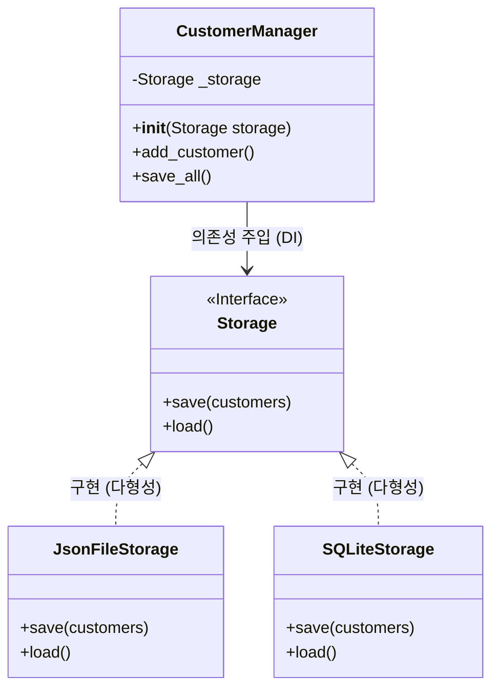

이 그림에서 화살표의 방향을 눈여겨보세요. `CustomerManager`는 밑에 있는 진짜 저장소들(`JsonFileStorage`, `SQLiteStorage`)을 직접 모릅니다. 그저 `save()`와 `load()`가 있다는 `Storage`라는 껍데기만 알 뿐이죠. 밖에서 누군가가 진짜 저장소를 밀어 넣어주면(주입), 그것을 받아서 사용하기만 합니다.

---

## §3. 상세 내용

### Why — 왜 DI가 필수적인가?

프로그램이 커질수록 코 외드가 서로 끈끈하게 얽히는 "강한 결합(Tight Coupling)" 문제가 발생합니다. 결합도가 높으면 한쪽 코드를 수정할 때 다른 쪽 코드가 연쇄적으로 망가지는 폭탄 돌리기가 시작돼요. DI는 이 결합도를 획기적으로 낮춰주는 "느슨한 결합(Loose Coupling)"을 만들어 냅니다. 저장 방식이 파일이든, DB든, 심지어 클라우드 서버든 간에, `CustomerManager` 코드는 단 한 줄도 수정할 필요가 없게 만들어주는 마법 같은 도구입니다.

### What — DI를 파이썬으로 어떻게 구현하는가?

DI를 구현하는 핵심 아이디어는 다름 아닌 "인터페이스(약속)"예요. 파이썬에서는 자바처럼 `interface`라는 전용 키워드는 없지만, 부모 클래스를 만들고 메서드 안에 `raise NotImplementedError`를 적어서 약속을 강제합니다. "나를 상속받는 자식은 반드시 `save()`와 `load()`를 자기 입맛에 맞게 구현해야 한다"는 엄격한 계약을 맺는 거죠. 

그리고 `CustomerManager`의 `__init__` (초기화 메서드)에 `storage`라는 매개변수를 열어둡니다. 이것이 바로 볼트를 끼우는 "주입구(나사 구멍)" 역할을 해요.

### How — "만들지 말고, 받아라"

이제 객체지향 프로그래밍을 할 때 항상 스스로에게 던져야 할 질문이 하나 생겼습니다. "내가 이 클래스 안에서 다른 부품 객체를 직접 `A = A()` 하고 만들고 있나?" 만약 그렇다면, 그 코드는 나중에 수정하기 매우 힘들어질 확률이 높습니다. 내부에서 만들지 말고, 외부에서 매개변수로 받아오세요. 이것이 의존성 역전 원칙(DIP)과 의존성 주입(DI)의 기본 원리입니다.

---

## §4. 실습 가이드 (+ 🎙️ 실습 대본)

### 실습 목표

이번 세션은 개념의 뼈대를 잡는 시간이라 코드를 직접 타이핑하기보다는, 강사와 수강생이 함께 머릿속으로 아키텍처를 그려보는 "사고 실험(Thought Experiment)" 방식으로 진행해요. 수강생들이 "아, 이래서 밖에서 넣어주는 거구나!"라고 무릎을 치게 만드는 것이 목표입니다.

🎙️ **실습 가이드 대본 (Lab Guide)**:

> 자, 여러분 화면을 보지 마시고 저를 한 번 보세요. 우리가 코드를 짤 때 가장 흔히 하는 실수가 뭔지 아시나요? `CustomerManager`를 만들면서 그 안에 `storage = JsonFileStorage()`라고 직접 써버리는 거예요.
>
> 겉보기엔 아무 문제가 없어 보이죠. 파일 저장이 아주 잘 될 겁니다. 그런데 1년 뒤에 사장님이 "우리 이제 파일 쓰지 말고 오라클 DB로 바꿉시다"라고 지시했어요. 그러면 여러분은 어떻게 해야 할까요?
> 
> 네, `CustomerManager` 파일을 열어서 `storage = JsonFileStorage()`를 지우고 `storage = OracleDBStorage()`로 일일이 바꿔쳐야 해요. 만약 그 저장소를 매니저뿐만 아니라 직원 관리, 상품 관리 모듈 등 50군데에서 쓰고 있었다면? 50군데를 다 찾아다니며 코드를 고쳐야 합니다. 야근 당첨이죠.
>
> 반대로 DI를 적용하면 어떨까요? `CustomerManager` 코드는 1년이 지나도, 10년이 지나도 그대로 둡니다. 그저 매니저를 처음 생성할 때 `manager = CustomerManager( OracleDBStorage() )` 하고 괄호 안에 새로운 부품만 쓱 밀어 넣어주면 끝납니다. 이 편안함의 차이가 느껴지시나요? 이게 바로 실력 있는 개발자가 코드를 짜는 방식입니다.

### 단계별 지시

| 단계 | 소요 시간 | 강사 지시사항 | 학습자 액션 | 예상 결과 |
|------|----------|--------------|------------|----------|
| 1 | 3분 | 내부에서 생성할 때의 문제점 질문 | 강사의 사고 실험에 참여, 대답 | 강한 결합의 문제점 공감 |
| 2 | 5분 | 자동차 타이어 & 바리스타 비유 설명 | 경청, 다이어그램 확인 | DI의 현실적 개념 이해 |
| 3 | 5분 | 다형성과 연결하여 인터페이스의 역할 설명 | 096 세션 내용 환기 | 부모 클래스의 약속 개념 파악 |
| 4 | 2분 | DI의 위력을 보여주는 코드 미리보기 제시 | 화면의 코드 구조 확인 | 외부 주입의 문법적 형태 인지 |

### 트러블슈팅 FAQ

| Q | A |
|---|---|
| "의존성(Dependency)이라는 단어가 너무 어려워요. 무슨 뜻인가요?" | "A가 동작하기 위해 B가 꼭 필요할 때, 'A는 B에 의존한다'고 표현해요. 차가 굴러가려면 타이어가 필요하니, 차는 타이어에 의존하는 거죠. 거창한 말이 아니라 그냥 '필요한 부품'이라고 생각하시면 됩니다." |
| "굳이 부모 클래스(Storage)를 안 만들고 그냥 이름만 똑같이 맞춰서 쓰면 안 되나요?" | "파이썬에서는 사실 덕 타이핑(Duck Typing) 덕분에 가능은 해요. 하지만 100명이 같이 일하는 프로젝트라면, 누군가 실수로 함수 이름을 `save_data()`라고 다르게 지을 수도 있잖아요? 부모 클래스는 그런 실수를 막아주는 명세서 역할을 합니다." |

---


### 🎓 강사 노트 (Instructor Support)

- ⏱️ **타이밍**: 14:10 (20분, narrative)
- 🎯 **핵심 활동**: "교체 가능한 타이어" 비유
- ⚠️ **강사 주의사항**: v3→v4 전환의 핵심

## §5. 코드 및 명령어 모음

개념 설명을 뒷받침하기 위해 화면에 띄워줄 파이썬 DI 코드의 핵심 골격입니다. 수강생들이 직접 칠 필요는 없으며 눈으로 흐름을 파악하게 하세요.

```python
# 1. 공통 약속(인터페이스) 정의
class Storage:
    def save(self, customers: list) -> None:
        raise NotImplementedError

    def load(self) -> list:
        raise NotImplementedError

# 2. 약속을 지키는 다양한 타이어들
class JsonFileStorage(Storage):
    def save(self, customers: list) -> None:
        print("JSON 파일에 데이터를 안전하게 저장했습니다.")
    
    def load(self) -> list:
        return []

class SQLiteStorage(Storage):
    def save(self, customers: list) -> None:
        print("SQLite 데이터베이스에 쿼리를 날려 저장했습니다.")
        
    def load(self) -> list:
        return []

# 3. 바리스타(Manager)는 부품을 밖에서 받아온다 (DI)
class CustomerManager:
    # 핵심: __init__에 매개변수(storage)를 뚫어놓는다!
    def __init__(self, storage: Storage):
        self._storage = storage  # 외부에서 주입받음

    def save_all(self, customers):
        # 이게 파일인지 DB인지 나는 모르지만, 약속된 save()를 호출한다
        self._storage.save(customers)
```

**DI의 진짜 위력을 보여주는 실행 코드**:
```python
# 외부에서 부품을 쏙쏙 갈아 끼우는 모습
print("--- 파일 저장 모드 ---")
manager1 = CustomerManager(JsonFileStorage())
manager1.save_all(["홍길동", "김철수"])

print("\n--- DB 저장 모드 ---")
manager2 = CustomerManager(SQLiteStorage())
manager2.save_all(["홍길동", "김철수"])
```

> 🤖 **AI 프롬프트 예시**:  
> "우리가 만든 파이썬 클래스가 내부에서 다른 클래스를 꽉 잡고(강한 결합) 있어서 나중에 수정하기 힘들 것 같아. 이 코드를 외부에서 주입받는(DI) 형태로 리팩토링해주고, 왜 이렇게 바꿨는지 주석으로 자세히 달아줘."

---

## §6. 요약

### 핵심 학습 포인트

오늘 배운 의존성 주입(DI)의 핵심 원칙을 딱 한 문장으로 요약하면 이렇습니다. **"내부에서 만들지 말고, 외부에서 받아라."** 

타이어가 차체에 용접되어 있으면 안 되듯이, 여러분이 만드는 핵심 비즈니스 클래스 안에는 언제든 갈아 끼울 수 있는 부품들을 직접 생성해서 박아두지 마세요. 외부에서 주입구(`__init__`의 매개변수)를 통해 쏙 밀어 넣어주는 형태를 취하세요. 이렇게 코드를 짜면, 저장 방식이 파일에서 DB로 백 번이 바뀌어도 `CustomerManager`의 코드는 한 줄도 건드릴 필요가 없는 완벽한 아키텍처가 완성됩니다. 

### 다음 세션 예고

이제 원리를 알았으니 직접 손으로 타이어를 만들어봐야겠죠? 다음 세션(098)에서는 실제로 텍스트 파일에 고객 데이터를 영구적으로 기록하는 `JsonFileStorage` 클래스를 직접 구현해 볼 겁니다. 프로그램이 꺼져도 내 소중한 고객 데이터가 디스크에 살아남는 짜릿함을 경험하게 되실 거예요.

---

## §7. 참고 자료

### 3-Source 출처

- **Source A (로컬 참고자료)**: 「8 코딩.pdf」 §8.14 의존성 주입 패턴 — DI의 개념과 소프트웨어 공학적 의의, 결합도 저하의 이점을 발췌하여 비유적 설명에 적용했습니다.
- **Source B (NotebookLM)**: `day5_notebooklm.md` — '바리스타와 원두 납품업체' 등 구체적인 비유를 통해 추상적인 DI 개념을 쉽게 풀어내는 교수법을 참고했습니다.
- **Source C (Deep Research)**: `day5_deep_research.md` — 파이썬에서 인터페이스를 구현하는 Pythonic한 방식(Base class 활용)과 DI 패턴이 모던 아키텍처에 미치는 영향에 대한 리서치 데이터를 반영했습니다.

### 추가 학습 자료

- 의존성 역전 원칙(DIP): SOLID 원칙 중 DI의 기반이 되는 철학적 배경 (심화 학습용)
- 파이썬의 `abc` (Abstract Base Classes) 모듈: `NotImplementedError` 대신 더 엄격하게 인터페이스를 강제하는 파이썬 내장 라이브러리

### 강사 노트

> 💡 **강사 노트**: 수강생들이 의존성(Dependency)이라는 단어에 지레 겁먹지 않도록 주의해야 합니다. 거창한 디자인 패턴이라기보다는, "그냥 함수의 매개변수로 부품을 넘겨주는 아주 단순하고 상식적인 행위"라는 것을 반복해서 강조해 주세요. 다형성(096 세션)의 개념이 잘 잡혀있지 않으면 인터페이스의 역할을 이해하기 어려우니, 중간중간 096 세션의 리모컨 비유를 다시 꺼내어 연결해 주는 것이 좋습니다.

---

## ✅ 세션 완료 체크리스트 (강사용)

- [x] §1~§7 모든 섹션이 충실하게 작성되었는가?
- [x] '자동차 타이어'와 '바리스타' 비유가 매끄럽게 설명되었는가?
- [x] DI를 보여주는 Mermaid 아키텍처 다이어그램이 포함되었는가?
- [x] 파이썬의 `__init__`을 통한 의존성 주입 코드가 제시되었는가?
- [x] 3-Source 팩트 패킷의 내용이 반영되었는가?

---

*작성 일시: 2026-02-25*  
*작성 에이전트: A4B_Session_Writer*  
*교안 구조: 7섹션 (A0 팀 공통 표준)*

> 🔗 **이전 세션**: [세션 096: 다형성 체험 (리모컨의 전원 버튼)](#세션-096)에서 배운 내용을 이어갑니다.
> 🔗 **다음 세션**: [세션 098: 파일 저장 모듈(FileStorage) 구현](#세션-098)에서 계속됩니다.

---

### 세션 098: 파일 저장 모듈(FileStorage) 구현
> [원본 파일](sessions/세션-098-파일_저장_모듈_FileStorage_구현_v2.1.md) | ⏱️ 25분 | 💻 code | 난이도: medium

> **세션 ID**: MS-PY101-098  
> **일차**: Day 5 | PM | 두 번째 세션  
> **소요 시간**: 25분  
> **난이도**: medium  
> **청크 타입**: lab  
> **버전**: v2.1 (7섹션 구조)

---

## §1. 개요

> **Day 5 | PM | 세션 098/106**

### 🎯 학습 목표

이 세션이 끝나면, 수강생은 다음을 할 수 있습니다:

- 메모리의 휘발성 한계를 이해하고 영구 저장소의 필요성을 설명할 수 있다
- `json` 모듈을 활용하여 고객 데이터를 JSON 파일로 직렬화(저장)하고 역직렬화(복원)할 수 있다
- Storage 인터페이스를 상속받는 `JsonFileStorage` 클래스를 구현할 수 있다

### 선행 세션 환기

바로 직전 세션(세션-097)에서 우리는 의존성 주입(DI) 개념을 배웠어요. 외부에서 저장소를 통째로 주입받아 사용하는 유연한 아키텍처를 설계했죠. 하지만 지금까지 우리가 만든 고객 데이터는 전부 메모리에만 존재했습니다. 프로그램을 껐다 켜면 기껏 등록한 VIP 고객 정보가 전부 증발해 버리는 끔찍한 상황이었죠. 오늘은 이 문제를 해결하기 위해, 데이터를 물리적인 파일로 영구 보존하는 첫 번째 저장소인 `JsonFileStorage`를 직접 만들어 봅니다.

---

## §2. 핵심 개념 (+ 🗣️ 강사 대본 + Mermaid)

### 서류함 전담 직원과 번역기

지금까지 우리 회사의 고객 데이터는 회의실 화이트보드(메모리)에 적혀 있었습니다. 전원이 꺼진다는 것은 퇴근할 때 청소부가 화이트보드를 싹 지워버리는 것과 같아요. 그래서 우리는 "서류함 전담 직원"을 새로 고용할 겁니다. 이 직원의 이름이 바로 `JsonFileStorage`입니다.

이 직원은 딱 두 가지 일만 합니다:
1. 퇴근 전, 화이트보드의 내용을 종이 서류에 옮겨 적어 서류함(하드디스크)에 보관하기 (`save`)
2. 출근 직후, 서류함에서 종이를 꺼내 다시 화이트보드에 똑같이 그려놓기 (`load`)

그런데 화이트보드에 있는 내용(파이썬 객체)을 종이에 적으려면 만국 공통어인 JSON 텍스트로 번역해야 해요. 파이썬 객체를 파일에 쓸 수 있는 텍스트로 바꾸는 과정을 **직렬화(Serialization)**, 반대로 텍스트를 다시 객체로 살려내는 과정을 **역직렬화(Deserialization)**라고 부릅니다.

🗣️ **강사 대본 (Instructor Script)**:

> 여러분, 지금까지 열심히 코딩해서 고객을 등록하고 수정했는데, 껐다 켜면 다 날아가서 허무하셨죠? 메모리, 즉 RAM은 휘발성입니다. 전원이 끊기면 데이터가 모두 지워져요. 실제 서비스에서 이런 일이 벌어지면 바로 뉴스에 나옵니다.
>
> 그래서 오늘은 데이터를 영원히 살려두는 마법을 부릴 겁니다. 메모리에 떠다니는 데이터를 하드디스크에 딱 붙여놓을 거예요. 파이썬 객체를 JSON이라는 표준 텍스트로 바꿔서 파일로 저장하는 거죠. 이것을 직렬화라고 부릅니다. 아까 배운 `@dataclass` 기억나시죠? 그걸 쓰면 딕셔너리로 아주 쉽게 변환할 수 있고, 그걸 다시 `json.dump`로 파일에 쓸 수 있어요. 객체에서 딕셔너리로, 딕셔너리에서 JSON 파일로 이어지는 변환 체인을 직접 경험해 봅시다.

### Mermaid 다이어그램

```mermaid
flowchart TD
    subgraph 메모리 (휘발성)
        A[Customer 객체 리스트]
        B[딕셔너리 리스트<br/>asdict]
    end
    subgraph 하드디스크 (영구 보존)
        C[(customers.json 파일)]
    end

    A -- "직렬화 준비" --> B
    B -- "json.dump()<br/>(저장/save)" --> C
    C -- "json.load()<br/>(복원/load)" --> B
    B -- "**kwargs<br/>객체화" --> A
```

---

## §3. 상세 내용

### Why — 왜 JSON 파일인가?

데이터를 저장하는 방법은 엑셀, CSV, 텍스트 파일 등 다양해요. 그중에서도 JSON(JavaScript Object Notation)을 사용하는 이유는 명확합니다. 사람도 읽기 편하고 컴퓨터도 파싱하기 쉬운 국제 표준 포맷이기 때문입니다. 사실상 현대 웹 환경에서 데이터를 주고받는 99%의 경우가 JSON을 사용한다고 봐도 무방해요. 파이썬에는 이 JSON을 다루는 `json` 모듈이 기본으로 내장되어 있어서, 외부 패키지 설치 없이도 바로 강력한 파일 입출력을 구현할 수 있습니다.

### What — 직렬화와 역직렬화의 구조

파이썬의 `Customer` 객체는 파이썬 세상에서만 의미가 있어요. 이걸 파일에 그대로 복사해서 붙여넣을 수는 없습니다. 그래서 두 단계를 거쳐 텍스트로 바꿉니다.

1. **객체 → 딕셔너리**: `@dataclass`를 쓰면 `dataclasses.asdict()` 함수 하나로 객체가 파이썬 딕셔너리로 변합니다.
2. **딕셔너리 → JSON 텍스트**: `json.dump()` 함수가 딕셔너리 리스트를 `[{"name": "홍길동", ...}]` 형태의 문자열로 바꿔 파일에 써줍니다.

데이터를 읽어올 때는 이 과정을 정확히 거꾸로 밟습니다. `json.load()`로 파일을 읽어 딕셔너리 리스트를 만들고, `Customer(**item)` 문법을 통해 딕셔너리의 키-값 쌍을 언패킹하여 다시 완전한 `Customer` 객체로 살려냅니다.

### How — JsonFileStorage의 작동 원리

우리가 만들 `JsonFileStorage` 클래스는 지난 세션에서 구상한 `Storage` 인터페이스의 첫 번째 실제 구현체입니다. `save(customers)` 메서드와 `load()` 메서드를 반드시 구현해야 해요. 내부적으로 파일 경로를 속성으로 가지며, `with open(...)` 구문을 사용해 파일을 안전하게 열고 닫습니다. 만약 처음 실행해서 아직 파일이 없다면 `FileNotFoundError`가 발생하는데, 이때는 예외 처리(`try-except`)를 통해 빈 리스트를 반환하도록 안전망을 깔아줍니다.

> ✅ **체크포인트**: 직렬화(Serialization)와 역직렬화(Deserialization)의 차이를 설명할 수 있나요?
> - "메모리 속 객체를 파일로 저장하기 위해 텍스트로 바꾸는 것이 직렬화, 반대로 파일 텍스트를 읽어 다시 메모리 객체로 살려내는 것이 역직렬화입니다."

---

## §4. 실습 가이드 (+ 🎙️ 실습 대본)

### 실습 목표

이 실습을 통해 수강생은 파이썬 객체를 JSON 파일로 저장하고 불러오는 `JsonFileStorage` 클래스를 AI의 도움을 받아 직접 작성하고, 실제 파일이 생성되는지 확인합니다.

🎙️ **실습 가이드 대본 (Lab Guide)**:

> 자, 이제 여러분의 코드에 영생을 부여할 시간입니다. 오른쪽 Agent Manager에 프롬프트를 입력해서 `JsonFileStorage` 클래스를 만들어 달라고 할 거예요. AI에게 `json` 모듈과 `dataclasses.asdict`를 꼭 써달라고 명시해야 합니다.
>
> 코드가 완성되면, 고객을 3명 정도 임의로 등록한 뒤에 `save()` 메서드를 호출해 보세요. 그런 다음 VS Code 왼쪽 탐색기를 보세요. `customers.json`이라는 파일이 새로 생겼을 겁니다. 그걸 열어보면 우리가 등록한 고객 정보가 예쁜 텍스트 형태로 적혀 있어요. 가장 짜릿한 순간은 다음입니다. 실행 중인 파이썬 터미널을 과감하게 끄세요. 그리고 다시 실행해서 `load()`를 호출해 보세요. 데이터가 그대로 살아 돌아오는 것을 두 눈으로 확인하시기 바랍니다.

### 단계별 지시

| 단계 | 소요 시간 | 강사 지시사항 | 학습자 액션 | 예상 결과 |
|------|----------|--------------|------------|----------|
| 1 | 3분 | "AI에게 JsonFileStorage 구현을 요청하세요" | 아래 제공된 프롬프트를 Agent Manager에 입력 | `JsonFileStorage` 클래스 코드 생성 |
| 2 | 2분 | "생성된 코드를 프로젝트에 복사하고 리뷰하세요" | 코드를 복사하여 파일에 붙여넣고 `import` 문 확인 | 문법 오류 없이 클래스 추가 완료 |
| 3 | 2분 | "고객 객체를 생성하고 파일로 저장해 보세요" | Customer 객체 3개 생성 후 `save()` 호출 | 프로젝트 폴더에 `customers.json` 파일 생성 |
| 4 | 2분 | "json 파일을 직접 열어서 구조를 확인하세요" | VS Code에서 `customers.json` 열기 | 포맷팅된 JSON 텍스트 확인 |
| 5 | 3분 | "터미널을 재시작하고 load()로 데이터를 복원하세요" | 파이썬 재시작 후 `load()` 호출 | 파일에서 읽어온 데이터로 객체 리스트 출력 |

**[단계 1] AI에게 코드 구현 요청하기**

Agent Manager 채팅창에 다음 프롬프트를 입력하세요:

```text
우리가 만든 Storage 클래스를 상속받는 JsonFileStorage 클래스를 구현해줘.
다음 조건을 반드시 지켜야 해:
1. json 모듈과 dataclasses의 asdict를 사용할 것.
2. __init__에서 저장할 파일 경로(filepath)를 받을 것 (기본값: "customers.json").
3. save(customers) 메서드는 Customer 객체 리스트를 JSON 파일로 저장할 것.
   (한글이 깨지지 않게 ensure_ascii=False 옵션을 주고, indent=2로 예쁘게 정렬해줘)
4. load() 메서드는 JSON 파일을 읽어 다시 Customer 객체 리스트로 반환할 것.
   (파일이 없을 경우 FileNotFoundError를 잡아서 빈 리스트를 반환할 것)
```

**[단계 2] 코드 적용 및 모듈 확인**

AI가 생성한 코드를 여러분의 파이썬 파일에 붙여넣으세요. 이때 맨 위에 `import json`과 `from dataclasses import asdict`가 잘 들어갔는지 반드시 확인해야 합니다. 재료가 없으면 요리를 할 수 없으니까요.

**[단계 3~4] 파일 저장 및 JSON 포맷 확인**

코드를 실행하여 객체를 파일로 저장해 봅니다. 파일 탐색기에 `customers.json`이 생겼나요? 클릭해서 열어보세요. 리스트 대괄호 `[` 안에 중괄호 `{}`로 묶인 고객 정보들이 한글도 깨지지 않고 예쁘게 정렬되어 있는 것을 볼 수 있습니다.

**[단계 5] 영속성(Persistence) 테스트**

이 부분이 핵심입니다. 파이썬 프로그램을 완전히 종료하세요(터미널에서 `exit()` 또는 프로세스 중지). 화이트보드가 깨끗하게 지워진 상태입니다. 다시 프로그램을 실행하고, 이번에는 객체를 새로 만들지 말고 곧바로 `storage.load()`만 실행해서 출력해 보세요. 서류함 전담 직원이 성공적으로 데이터를 복원해 냈나요? 성공했다면 환호하셔도 좋습니다!

---


### 🎓 강사 노트 (Instructor Support)

- ⏱️ **타이밍**: 14:30 (25분, code)
- 🎯 **핵심 활동**: JSON 파일 저장/읽기
- ⚠️ **강사 주의사항**: json 모듈 소개

## §5. 코드 및 명령어 모음

### JsonFileStorage 핵심 구현 코드

```python
import json
from dataclasses import asdict

class JsonFileStorage(Storage):
    def __init__(self, filepath: str = "customers.json"):
        self._filepath = filepath

    def save(self, customers: list[Customer]) -> None:
        # 객체 리스트를 딕셔너리 리스트로 변환
        data = [asdict(c) for c in customers]
        
        # JSON 파일로 쓰기 (한글 깨짐 방지, 들여쓰기 2칸)
        with open(self._filepath, "w", encoding="utf-8") as f:
            json.dump(data, f, ensure_ascii=False, indent=2)
            
        print(f"✅ {len(customers)}명의 고객 데이터를 {self._filepath}에 저장했습니다.")

    def load(self) -> list[Customer]:
        try:
            # JSON 파일에서 읽어오기
            with open(self._filepath, "r", encoding="utf-8") as f:
                data = json.load(f)
                
            # 딕셔너리 리스트를 다시 객체 리스트로 복원
            return [Customer(**item) for item in data]
            
        except FileNotFoundError:
            # 파일이 없으면 빈 리스트 반환
            print("⚠️ 저장된 파일이 없어 새로운 데이터를 시작합니다.")
            return []
```

### 테스트 실행 코드

```python
# 1. 저장 테스트
storage = JsonFileStorage("test_data.json")
customers = [
    Customer("홍길동", "010-1111-2222", 30),
    Customer("김철수", "010-3333-4444", 25)
]
storage.save(customers)

# --- 프로그램 종료 후 재시작 했다고 가정 ---

# 2. 로드 테스트
new_storage = JsonFileStorage("test_data.json")
loaded_customers = new_storage.load()

for c in loaded_customers:
    print(c.name, c.phone, c.age)
```

> 🤖 **AI 프롬프트 예시**: "`**item` 문법이 무엇인지 초보자에게 알기 쉽게 설명해줘"

---

## §6. 요약

### 핵심 학습 포인트

이번 세션에서는 메모리의 한계를 벗어나 물리적 파일에 데이터를 보존하는 방법을 배웠습니다. 기억해야 할 핵심은 세 가지입니다. 첫째, 파이썬 객체를 파일에 쓰기 위한 형태로 바꾸는 과정을 **직렬화**, 반대로 살려내는 과정을 **역직렬화**라고 부릅니다. 둘째, 데이터 구조를 저장하고 통신할 때는 국제 표준 텍스트 포맷인 **JSON**을 주로 사용하며 파이썬의 `json` 모듈로 쉽게 다룰 수 있습니다. 셋째, `@dataclass`의 `asdict()`와 `**kwargs` 언패킹 문법을 결합하면 객체와 딕셔너리 사이를 자유롭게 넘나들 수 있습니다.

### 다음 세션 예고

JSON 파일 저장은 아주 훌륭한 방법이지만, 치명적인 단점이 하나 있습니다. 고객이 10명일 때는 괜찮지만, 100만 명이 된다면 어떨까요? 특정 이름의 고객 한 명을 찾기 위해 매번 100만 명치 텍스트 파일을 통째로 읽어와야 합니다. 검색도 느리고 여러 명이 동시에 수정하기도 어렵죠. 다음 세션에서는 이 한계를 돌파하기 위해, 파이썬에 기본 내장된 진짜 데이터베이스 `SQLiteStorage`를 만들어 보겠습니다.

### 브릿지 노트

> "여러분, 이제 퇴근할 때 프로그램 전원을 마음 놓고 끄셔도 됩니다. 서류함 직원이 꼼꼼하게 기록을 남기고 있으니까요. 그런데 우리 회사가 대기업이 되어서 고객이 천만 명이 넘어가면, 텍스트 파일 종이더미로는 도저히 관리가 안 되겠죠? 누군가 '김철수 고객 찾아와' 하면 종이를 처음부터 끝까지 다 뒤져야 하니까요. 다음 시간에는 서류함을 넘어서, 체계적인 '데이터베이스(DB) 시스템'을 우리 프로그램에 붙여보겠습니다."

---

## §7. 참고 자료

### 3-Source 출처

- **Source A (로컬 참고자료)**: `8 코딩.pdf` §8.14 데이터 영속화 — 메모리와 하드디스크의 차이, 직렬화/역직렬화 기초
- **Source B (NotebookLM)**: `day5_notebooklm.md` — 파일/DB 저장 모듈 구축 워크플로우, 서류함 전담 직원 메타포
- **Source C (Deep Research)**: `day5_deep_research.md` — JSON 파일 저장 아키텍처, `dataclasses`를 활용한 효과적인 직렬화 체인

### 추가 학습 자료

- [Python 공식 문서: json 모듈](https://docs.python.org/ko/3/library/json.html): JSON 인코더 및 디코더 사용법
- [Python 공식 문서: dataclasses](https://docs.python.org/ko/3/library/dataclasses.html#dataclasses.asdict): `asdict` 함수의 작동 원리

### 강사 노트

> 💡 **강사 노트**: `load()` 메서드에서 쓰이는 `Customer(**item)` 언패킹 문법에서 많은 수강생이 어려움을 겪습니다. 딕셔너리의 키워드를 함수의 인자로 흩뿌려주는 마법이라고 설명해 주시고, 잘 이해하지 못하는 분들에게는 AI에게 직접 물어보도록 유도하세요. 예외 처리(`FileNotFoundError`)를 다룰 때는 "처음 프로그램을 실행하면 당연히 읽을 파일이 없기 때문에 에러가 나는 것이 정상이고, 우리는 그것을 우아하게 처리하는 것"이라고 맥락을 짚어 주시면 좋습니다.

---

## ✅ 세션 완료 체크리스트 (강사용)

- [ ] §1~§7 모든 섹션이 충실하게 작성되었는가?
- [ ] 서류함 전담 직원 비유가 §2에서 충분히 확장되었는가?
- [ ] 객체 ↔ 딕셔너리 ↔ JSON 직렬화/역직렬화 흐름이 명확히 설명되었는가?
- [ ] 단계별 AI 실습 프롬프트가 §4에 구체적으로 제시되었는가?
- [ ] `json.dump`, `json.load`, `asdict`, `**item` 언패킹 등 핵심 문법이 코드에 포함되었는가?
- [ ] 체크포인트 질문이 §3에 배치되었는가?
- [ ] 3-Source 팩트 패킷 내용이 §7에 반영되었는가?
- [ ] 다음 세션(SQLiteStorage)의 브릿지 노트가 매끄럽게 연결되는가?

---

**🔗 선행 세션**: [세션-097] 의존성 주입(DI) 개념 (필수)  
**🔗 후행 세션**: [세션-099] DB 저장 모듈(SQLiteStorage) 구현

---

*작성 일시: 2026-02-25*  
*작성 에이전트: A4B_Session_Writer*  
*교안 구조: 7섹션 (A0 팀 공통 표준)*

> 🔗 **이전 세션**: [세션 097: 의존성 주입(DI) 개념](#세션-097)에서 배운 내용을 이어갑니다.
> 🔗 **다음 세션**: [세션 099: DB 저장 모듈(SQLiteStorage) 구현](#세션-099)에서 계속됩니다.

---

### 세션 099: DB 저장 모듈(SQLiteStorage) 구현
> [원본 파일](sessions/세션-099-DB_저장_모듈_SQLiteStorage_구현_v2.1.md) | ⏱️ 25분 | 💻 code | 난이도: medium

> **세션 ID**: MS-PY101-099  
> **소요 시간**: 25분  
> **난이도**: medium  
> **청크 타입**: lab  
> **버전**: v2.1 (7섹션 구조)

---

## §1. 개요

> **Day 5 | PM | 세션 099/106**

### 🎯 학습 목표

이 세션이 끝나면, 수강생은 다음을 할 수 있습니다:

- `sqlite3` 모듈을 활용하여 고객 데이터를 SQLite 데이터베이스에 저장하고 불러오는 `SQLiteStorage` 클래스를 구현할 수 있다.
- 종이 장부 방식(JSON)과 전산 시스템 방식(DB)의 차이를 이해하고, 대용량 데이터 관리의 필요성을 설명할 수 있다.
- 파이썬 코드 내에서 필수 SQL 쿼리(CREATE TABLE, INSERT, SELECT, DELETE)를 실행하고 트랜잭션을 확정(commit)하는 패턴을 적용할 수 있다.

### 선행 세션 환기

바로 직전 세션(세션-098)에서 우리는 메모리의 한계를 극복하기 위해 `JsonFileStorage`라는 파일 저장 모듈을 만들었습니다. 프로그램이 종료되어도 데이터가 날아가지 않는 '영속성'을 처음으로 달성했죠. 그런데 한 가지 상상을 해 봅시다. 고객이 10명, 100명일 때는 텍스트 파일 하나로 충분합니다. 하지만 우리 서비스가 대박이 나서 고객이 100만 명, 1,000만 명이 되면 어떻게 될까요? 

`customers.json` 파일 하나에 100만 건의 데이터가 들어 있다면, "홍길동"이라는 고객 한 명을 찾기 위해 파일 전체를 처음부터 끝까지 다 읽어들여야 합니다. 마치 두꺼운 종이 장부를 첫 장부터 끝까지 한 장 한 장 넘기며 이름을 확인하는 것과 같은 엄청난 비효율이 발생하죠. 오늘은 이 한계를 완벽하게 극복해 줄 두 번째 저장소, 진짜 데이터베이스(DB)를 우리 시스템에 장착해 보는 시간입니다.

---

## §2. 핵심 개념 (+ 🗣️ 강사 대본 + Mermaid)

### 종이 장부의 한계 vs 전산 시스템의 도입

데이터를 다루는 방식을 두 가지로 비유해 볼 수 있습니다. JSON 파일 기반의 저장소는 **'종이 장부'**와 같습니다. 내용이 시간 순서대로 빽빽하게 적혀 있어서 한눈에 보기는 좋지만, 특정 데이터를 찾거나 수정하려면 장부 전체를 뒤져야 합니다.

반면 데이터베이스(DB)는 완벽하게 구축된 **'전산 시스템'**입니다. 여러분이 은행이나 병원에 가서 이름을 말하면 직원이 컴퓨터에 타이핑하고 0.001초 만에 고객 정보를 찾아내죠? 데이터베이스에는 '인덱스(색인)'라는 강력한 기술이 있어서 데이터가 100만 건이든 1,000만 건이든 검색 속도가 거의 일정하게 유지됩니다.

파이썬에는 놀랍게도 이 강력한 전산 시스템 엔진이 기본으로 내장되어 있습니다. 바로 `sqlite3`라는 모듈입니다. 복잡한 서버를 설치하거나 네트워크를 설정할 필요 없이, 단지 `import sqlite3` 한 줄을 적는 것만으로 파일 하나(`.db`)를 마치 거대한 데이터베이스 서버처럼 다룰 수 있게 해 줍니다.

🗣️ **강사 대본 (Instructor Script)**:

> 여러분, 앞서 JSON 파일로 데이터를 저장하는 데 성공하셨죠? 너무 잘하셨습니다. 그런데 여러분이 만든 프로그램이 입소문을 타서 전국구 서비스가 되었다고 상상해 보세요. 100만 명의 고객 데이터가 들어있는 텍스트 파일, 상상만 해도 컴퓨터가 헉헉댈 것 같지 않나요?
> 
> "홍길동 고객님 정보 좀 찾아주세요" 했을 때 종이 장부를 첫 페이지부터 넘기면 오늘 안에 못 찾을 수도 있습니다. 그래서 우리는 오늘 진짜 전산 시스템을 도입할 겁니다. 바로 데이터베이스(DB)입니다. 
> 
> 다행히 파이썬은 무거운 오라클이나 MySQL 같은 서버를 당장 설치하라고 요구하지 않아요. `sqlite3`라는 아주 작지만 강력한 내장형 데이터베이스를 기본 제공합니다. 스마트폰 앱이나 웹 브라우저 내부에서도 널리 쓰이는 표준 기술이죠. 오늘은 이 SQLite를 사용해서 우리의 `CustomerManager`에 진짜 DB 엔진을 달아보겠습니다.

### Mermaid 다이어그램: Storage 인터페이스와 DB 장착

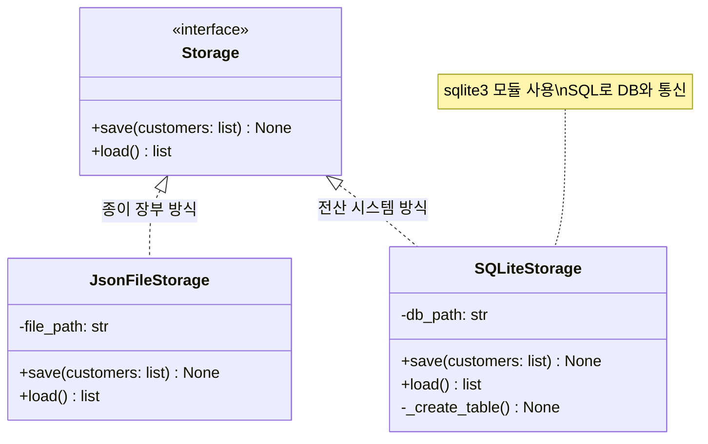

---

## §3. 상세 내용

### Why — 왜 파일 대신 데이터베이스를 써야 하는가?

JSON이나 CSV 같은 파일 대신 데이터베이스를 사용하는 이유는 명확합니다.
1. **검색 속도 (인덱싱)**: DB는 데이터를 정렬하고 찾아보는 구조를 최적화하여 압도적인 검색 속도를 제공합니다.
2. **데이터 무결성**: 전화번호 자리에는 반드시 문자열만 들어오게 하거나, 이름은 절대 비워둘 수 없게(NOT NULL) 규칙을 강제할 수 있습니다.
3. **동시성 제어**: 여러 명이 동시에 파일에 글을 쓰면 데이터가 꼬이거나 날아갈 수 있습니다. DB는 이런 충돌을 알아서 안전하게 관리(트랜잭션)해 줍니다.

### What — SQLite와 SQL 기초

우리가 다룰 `sqlite3`는 파일(`.db`) 기반의 가벼운 데이터베이스입니다. 파이썬과 이 데이터베이스가 대화하려면 언어가 필요한데, 이 표준 언어를 **SQL(Structured Query Language)**이라고 부릅니다. 

초보자라면 다음 4가지 핵심 명령어(CRUD)만 알면 충분합니다.
- **C**reate: `INSERT INTO` (데이터 넣기)
- **R**ead: `SELECT` (데이터 조회하기)
- **U**pdate: `UPDATE` (데이터 수정하기)
- **D**elete: `DELETE` (데이터 삭제하기)
*(그리고 이 데이터를 담을 표(Table)를 만드는 `CREATE TABLE` 명령어가 추가로 필요합니다.)*

SQL은 문법이 영문법과 매우 비슷해서 직관적입니다. "customers 테이블에서 홍길동의 정보를 줘!"는 `SELECT * FROM customers WHERE name = '홍길동'`처럼 씁니다.

### How — sqlite3 모듈 사용 패턴 (3단계)

파이썬에서 `sqlite3`를 사용하는 패턴은 항상 정해져 있습니다. 은행 창구 업무와 비슷하죠.
1. **연결 (Connect)**: `conn = sqlite3.connect('파일.db')` - 은행 문을 열고 번호표를 뽑아 창구 직원(Connection)을 만납니다.
2. **실행 (Execute)**: `conn.execute('SQL문')` - 창구 직원에게 지시를 내립니다. (예: "이름 홍길동 등록해 주세요")
3. **확정 및 종료 (Commit & Close)**: `conn.commit()` 후 `conn.close()` - 거래 내용에 서명(Commit)하여 최종 승인하고, 창구를 떠납니다(Close). 

특히 데이터를 덮어쓰거나 수정할 때는 반드시 `commit()`을 호출해야만 디스크에 실제로 저장된다는 점을 주의해야 합니다. 

> ✅ **체크포인트**: 
> - 종이 장부(JSON)와 전산 시스템(DB) 비유를 이해하셨나요?
> - 파이썬에서 DB와 대화하기 위한 3단계 패턴 (연결 -> 실행 -> 확정/종료)을 기억하시나요?

---

## §4. 실습 가이드 (+ 🎙️ 실습 대본)

### 실습 목표

AI 에이전트의 도움을 받아 `Storage` 추상 클래스를 상속하는 `SQLiteStorage` 클래스를 구현합니다. 작성된 코드를 통해 실제 고객 데이터를 `customers.db`라는 DB 파일에 저장해 보고 정상적으로 작동하는지 확인합니다.

🎙️ **실습 가이드 대본 (Lab Guide)**:

> 자, 이제 여러분의 코드에 전산 시스템을 이식해 볼 시간입니다. 우리가 직접 SQL이라는 언어를 완벽하게 짜지 못해도 괜찮습니다. 우리에겐 강력한 AI 비서가 있으니까요.
> 
> Agent Manager 패널을 열어주세요. AI에게 "이전에 만든 `Storage` 인터페이스를 상속받아서, 파이썬 기본 `sqlite3` 모듈로 데이터를 저장하는 `SQLiteStorage` 클래스를 만들어줘"라고 요청해 보겠습니다. 
> 중요한 것은 만들어진 코드를 그냥 복사해서 붙여넣기만 하지 말고, `connect`, `execute`, `commit` 이 세 가지 핵심 패턴이 어디에 등장하는지 눈으로 꼭 확인하는 거예요. 같이 시작해 볼까요?

### 단계별 지시

| 단계 | 소요 시간 | 강사 지시사항 | 학습자 액션 | 예상 결과 |
|------|----------|--------------|------------|----------|
| 1 | 3분 | "Agent Manager에 프롬프트를 입력하세요" | 하단의 프롬프트를 복사하여 AI에게 전달 | `SQLiteStorage` 파이썬 코드 생성 |
| 2 | 3분 | "생성된 코드를 파일에 적용하세요" | `storage.py` 파일에 코드 복사 및 붙여넣기 | 에러 없이 클래스 복사 완료 |
| 3 | 5분 | "코드를 살펴보고 3단계 패턴을 찾으세요" | `save()`와 `load()` 메서드 분석 | `connect()`, `execute()`, `commit()` 위치 파악 |
| 4 | 4분 | "테스트 코드를 작성하고 실행하세요" | 하단 테스트 코드 실행 | 터미널에 저장/불러오기 성공 메시지 출력 |
| 5 | 2분 | "DB 파일이 생성되었는지 확인하세요" | 프로젝트 탐색기에서 `customers.db` 확인 | 프로젝트 폴더 내 `.db` 파일 생성됨 |

### [단계 1] AI에게 SQLiteStorage 구현 요청하기

Agent Manager 채팅창에 다음 프롬프트를 입력하세요:

```text
우리는 앞서 `Customer` 데이터 클래스와 `Storage` 추상 클래스를 만들었어. 
이번에는 파이썬 내장 sqlite3 모듈을 사용해서 DB에 고객 데이터를 저장하는 `SQLiteStorage` 클래스를 만들어줘.
1. `Storage`를 상속받아야 해.
2. 생성자(`__init__`)에서 `db_path`를 받고, 없으면 테이블을 생성하는 로직(`_create_table`)을 호출해줘.
3. 고객(name, phone, email)을 저장하는 `save()`와 불러오는 `load()`를 구현해줘.
4. save할 때는 기존 데이터를 모두 삭제(초기화)하고 다시 insert하는 방식으로 해줘.
5. SQL 인젝션 방지를 위해 execute()에서 `?` 플레이스홀더를 사용해줘.
```

### [단계 2~3] 생성된 코드 확인 및 분석

AI가 만들어준 코드의 핵심 부분을 들여다봅시다. 특히 `save()` 메서드 부분을 주목해 주세요.

```python
    def save(self, customers: list[Customer]) -> None:
        conn = sqlite3.connect(self._db_path)     # 1. 연결
        conn.execute("DELETE FROM customers")     # 기존 데이터 날리기 (심플하게 덮어쓰기 위해)
        for c in customers:
            # 2. 실행 (? 플레이스홀더 사용)
            conn.execute(
                "INSERT INTO customers (name, phone, email) VALUES (?, ?, ?)",
                (c.name, c.phone, c.email)
            )
        conn.commit()                             # 3. 확정 (도장 쾅!)
        conn.close()                              # 4. 종료
```

**⚠️ 주의할 점**: 값 부분에 들어가는 `?` 기호를 **플레이스홀더**라고 부릅니다. 값을 문자열에 직접 끼워 넣지 않고, `(c.name, c.phone, c.email)` 형태의 튜플로 넘겨주죠. 이는 해커들이 악의적인 SQL 문장을 집어넣는 'SQL 인젝션(Injection)' 해킹을 막기 위한 가장 기본적이고 필수적인 보안 조치입니다.

### [단계 4~5] 테스트 코드 실행

새로운 파이썬 파일(`test_sqlite.py`)을 만들고 아래 코드를 실행해 보세요.

```python
from customer import Customer
from storage import SQLiteStorage

# 1. 저장소 인스턴스 생성 (테이블이 없으면 자동 생성됨)
db = SQLiteStorage("test_customers.db")

# 2. 테스트 데이터 만들기
test_customers = [
    Customer(name="홍길동", phone="010-1111-2222", email="hong@test.com"),
    Customer(name="이순신", phone="010-3333-4444", email="lee@test.com")
]

# 3. 저장 및 불러오기
db.save(test_customers)
loaded_data = db.load()

for c in loaded_data:
    print(f"DB에서 불러온 고객: {c.name}, {c.phone}, {c.email}")
```

실행 후, 좌측 파일 탐색기에 `test_customers.db`라는 파일이 생겼는지 확인해 보세요! 성공입니다.

### 트러블슈팅 FAQ

| Q | A |
|---|---|
| `sqlite3.OperationalError: no such table: customers` 에러가 납니다. | `__init__` 메서드 안에서 테이블을 생성하는 `_create_table()` 함수를 호출하는 코드가 빠졌거나 오타가 있을 가능성이 높습니다. |
| `.db` 파일을 눌러봤는데 글자가 깨져 보여요! | 정상입니다. DB 파일은 사람이 읽으라고 만든 텍스트 파일(JSON)과 달리 기계가 빠르게 읽기 위한 이진(Binary) 형태입니다. DB 뷰어 확장 프로그램을 설치해야 제대로 보입니다. |
| `save()`를 불렀는데 다시 불러오면 데이터가 없어요. | 데이터를 `INSERT` 한 후에 `conn.commit()`을 빼먹지 않았는지 확인하세요! 확정 도장을 안 찍으면 데이터베이스에 반영되지 않습니다. |
| 여러 번 실행했더니 홍길동 데이터가 수십 개로 복사됐어요. | `save()` 메서드 시작 부분에 `conn.execute("DELETE FROM customers")` (기존 데이터 지우기) 로직이 잘 들어있는지 확인해 보세요. 이번 실습 구조에서는 전체 덮어쓰기 방식으로 구현했습니다. |

---


### 🎓 강사 노트 (Instructor Support)

- ⏱️ **타이밍**: 15:10 (25분, code)
- 🎯 **핵심 활동**: sqlite3 모듈 활용
- ⚠️ **강사 주의사항**: DB 브라우저 옵션 안내

## §5. 코드 및 명령어 모음

### SQLiteStorage 전체 구현 코드 예시

```python
import sqlite3
from storage import Storage
from customer import Customer

class SQLiteStorage(Storage):
    def __init__(self, db_path: str = "customers.db"):
        self._db_path = db_path
        self._create_table()

    def _create_table(self) -> None:
        conn = sqlite3.connect(self._db_path)
        conn.execute("""
            CREATE TABLE IF NOT EXISTS customers (
                name TEXT NOT NULL,
                phone TEXT NOT NULL,
                email TEXT NOT NULL
            )
        """)
        conn.commit()
        conn.close()

    def save(self, customers: list[Customer]) -> None:
        conn = sqlite3.connect(self._db_path)
        conn.execute("DELETE FROM customers")  # 기존 데이터 초기화
        for c in customers:
            conn.execute(
                "INSERT INTO customers (name, phone, email) VALUES (?, ?, ?)",
                (c.name, c.phone, c.email)
            )
        conn.commit()
        conn.close()
        print(f"✅ {len(customers)}명의 고객 데이터를 DB에 저장했습니다.")

    def load(self) -> list[Customer]:
        conn = sqlite3.connect(self._db_path)
        # fetchall()은 조회된 모든 데이터를 리스트 안의 튜플로 반환합니다.
        rows = conn.execute("SELECT name, phone, email FROM customers").fetchall()
        conn.close()
        return [Customer(name=r[0], phone=r[1], email=r[2]) for r in rows]
```

### 핵심 SQL 구문 정리

- `CREATE TABLE IF NOT EXISTS 테이블명`: 테이블이 존재하지 않을 때만 새로 만듭니다. (에러 방지용)
- `INSERT INTO 테이블명 (컬럼1, 컬럼2) VALUES (?, ?)`: 지정한 컬럼에 새로운 데이터(행)를 추가합니다. `?` 플레이스홀더를 사용합니다.
- `SELECT 컬럼명 FROM 테이블명`: 테이블에서 해당 컬럼의 데이터들을 가져옵니다.
- `DELETE FROM 테이블명`: 테이블에 있는 모든 데이터를 삭제합니다. (테이블 자체를 없애는 `DROP TABLE`과는 다릅니다.)

---

## §6. 요약

### 핵심 학습 포인트

이번 세션에서는 파일 기반 저장소의 한계를 극복하기 위해 `sqlite3` 모듈을 사용하여 진짜 데이터베이스 저장 모듈을 만들었습니다. 기억할 세 가지는 다음과 같습니다.
1. **종이 장부 vs 전산 시스템 비유**: 대용량 데이터를 다루기 위해서는 순차 검색 방식(JSON)이 아닌 인덱스 검색 기반의 전산 시스템(DB) 도입이 필수입니다.
2. **sqlite3의 3단계 패턴**: `connect()`로 데이터베이스와 연결하고, `execute()`로 SQL 명령을 실행하며, `commit()`으로 변경사항을 확정합니다.
3. **플레이스홀더와 보안**: 데이터를 저장할 때 `?` 기호를 사용하여 튜플 형태로 값을 전달해야 SQL 인젝션 해킹을 막을 수 있습니다.

### 다음 세션 예고

이제 우리 앞에는 저장소가 두 개 있습니다. 하나는 파일(`JsonFileStorage`), 다른 하나는 데이터베이스(`SQLiteStorage`). 놀랍게도 이 두 저장소는 완전히 동일한 작동 방식(`save`, `load` 메서드)을 약속하는 `Storage` 인터페이스를 따르고 있습니다. 다음 세션(100)에서는 `CustomerManager` 코드를 단 한 줄도 수정하지 않은 채, 플러그만 뽑았다가 다른 곳에 꽂듯 저장소를 쓱 교체해 볼 겁니다. 여러분이 앞서 배운 객체지향과 의존성 주입(DI)의 진짜 마법이 펼쳐집니다!

### 브릿지 노트

> "여러분, 축하합니다. 여러분의 프로그램에 진짜 DB 엔진이 달렸습니다. 이제 100만 명의 고객 데이터가 들어와도 눈 하나 깜짝하지 않을 거예요. 그런데 문득 궁금하지 않으신가요? 어제 우리가 열심히 짠 `CustomerManager` 코드는 이 DB의 존재를 알까요? 모를까요? 다음 세션에서 이 두 부품이 어떻게 우아하게 조립되는지, 파이썬 아키텍처의 꽃인 '의존성 주입'의 위력을 직접 확인해 보겠습니다!"

---

## §7. 참고 자료

### 3-Source 출처

- **Source A (로컬 참고자료)**: 「8 코딩.pdf」 §8.14 데이터 영속화 - SQLite 기본 명령어 및 연동 패턴
- **Source B (NotebookLM)**: `day5_notebooklm.md` - 파일/DB 저장 모듈의 구조적 차이 비교, 종이 장부 vs 전산 시스템 비유
- **Source C (Deep Research)**: `day5_deep_research.md` - 파이썬 SQLite 내장 데이터베이스 기초 가이드

### 추가 학습 자료

- [SQLite 공식 문서](https://www.sqlite.org/docs.html): SQLite 데이터베이스의 아키텍처와 SQL 문법 가이드
- [Python 공식 문서 - sqlite3](https://docs.python.org/ko/3/library/sqlite3.html): 파이썬 표준 라이브러리 `sqlite3` 모듈의 세부 사용법과 트랜잭션 관리
- [DB Browser for SQLite](https://sqlitebrowser.org/): `.db` 파일을 시각적으로 열어보고 SQL을 연습할 수 있는 무료 오픈소스 도구

### 강사 노트

> 💡 **강사 노트**: 초보자들이 DB를 처음 접할 때 가장 낯설어하는 부분이 'SQL 언어를 또 배워야 하나?'라는 두려움입니다. 이번 세션에서는 SQL 쿼리 작성의 완벽함보다는, 파이썬에서 DB와 통신하는 3단계 패턴(연결-실행-확정)을 이해하는 데 초점을 맞춰 주세요. 특히 데이터를 변경하고도 `commit()`을 빼먹어 적용이 안 되는 실수가 가장 빈번하게 발생하므로, '서류에 도장 쾅!' 비유를 사용해 `commit()`의 중요성을 강조해 주시면 좋습니다.

---

## ✅ 세션 완료 체크리스트 (강사용)

- [ ] §1~§7 모든 섹션이 빠짐없이 작성되었는가?
- [ ] 🗣️ 강사 대본과 🎙️ 실습 가이드 대본이 구어체로 충실하게 포함되었는가?
- [ ] 종이 장부(JSON)와 전산 시스템(DB) 비유가 §2에 명확히 설명되었는가?
- [ ] Storage 인터페이스와 저장소 클래스 구조를 보여주는 Mermaid 다이어그램이 추가되었는가?
- [ ] SQL 인젝션 방지를 위한 `?` 플레이스홀더 사용법이 강조되었는가?
- [ ] 다음 세션(의존성 주입)과 자연스럽게 이어지는 브릿지 노트가 있는가?

---

**🔗 선행 세션**: [세션-098] 파일 저장 모듈(FileStorage) 구현 (필수)  
**🔗 후행 세션**: [세션-100] DI 적용 실습 (v4 저장소 교체 테스트)

---

*작성 일시: 2026-02-25*  
*작성 에이전트: Antigravity*  
*교안 구조: 7섹션 (A0 팀 공통 표준)*

> 🔗 **이전 세션**: [세션 098: 파일 저장 모듈(FileStorage) 구현](#세션-098)에서 배운 내용을 이어갑니다.
> 🔗 **다음 세션**: [세션 100: DI 적용 실습 (v4 저장소 교체 테스트)](#세션-100)에서 계속됩니다.

---

### 세션 100: DI 적용 실습 (v4 저장소 교체 테스트)
> [원본 파일](sessions/세션-100-DI_적용_실습_v2.1.md) | ⏱️ 20분 | 🧪 lab | 난이도: medium

> **세션 ID**: MS-PY101-100  
> **소요 시간**: 20분  
> **난이도**: medium  
> **청크 타입**: lab  
> **버전**: v2.1 (7섹션 구조)

---

## §1. 개요

> **Day 5 | PM | 세션 100/106**

### 🎯 학습 목표

이 세션이 끝나면, 수강생은 다음을 할 수 있습니다:

- 비즈니스 로직 수정 없이 데이터 저장 방식을 JSON 파일에서 SQLite 데이터베이스로 교체할 수 있다.
- 의존성 주입(DI, Dependency Injection) 패턴이 실제로 어떻게 작동하는지 코드로 검증할 수 있다.
- 변경에 유연한 아키텍처가 주는 유지보수의 이점을 설명할 수 있다.

### 선행 세션 환기

지난 세션들에서 우리는 멋진 재료들을 만들었습니다. 세션 097에서는 `CustomerManager`에 '저장소'라는 외부 블록을 꽂을 수 있는 빈 구멍을 하나 뚫어두었죠. 그리고 세션 098과 099를 거치며 텍스트 파일로 저장하는 `JsonFileStorage` 블록과, 데이터베이스에 저장하는 `SQLiteStorage` 블록을 차례로 완성했습니다. 오늘 세션은 이 재료들을 하나로 조립하는 시간입니다. 코드를 단 한 줄도 고치지 않고 시스템의 핵심 기능을 통째로 바꾸는 마법을 직접 경험해 볼 차례입니다.

---

## §2. 핵심 개념 (+ 🗣️ 강사 대본 + Mermaid)

### 레고 블록과 나사 구멍

프로그래밍에서 의존성 주입(DI)을 가장 쉽게 이해하는 방법은 레고 블록을 떠올리는 것입니다. 레고의 핵심은 모든 블록의 돌기와 구멍 크기가 완벽하게 표준화되어 있다는 점입니다. 빨간 블록이든 파란 블록이든, 바퀴 모양이든 날개 모양이든 돌기 크기만 같다면 어디든 끼워 맞출 수 있습니다.

우리 코드에서 `Storage`라는 기반 클래스는 바로 이 '표준 돌기 규격' 역할을 합니다. `save()`와 `load()`라는 표준 인터페이스만 지킨다면 어떤 저장소 블록이든 상관없습니다. 그리고 `CustomerManager`는 이 규격에 맞는 블록이라면 무엇이든 받아들이는 빈 구멍을 하나 가지고 있습니다. 구멍에 맞는 블록을 바깥에서 끼워 넣어 주는 행위, 이것이 바로 의존성 주입입니다.

🗣️ **강사 대본 (Instructor Script)**:

> 여러분, 지난 시간에 만든 두 개의 저장소 블록을 기억하시죠? 하나는 데이터를 파일에 적어두는 기능이고, 다른 하나는 멋진 데이터베이스에 기록하는 기능입니다. 그리고 `CustomerManager`에는 어떤 저장소를 쓸지 결정하지 않고 비워둔 나사 구멍이 하나 있습니다.
> 
> 오늘은 드디어 이 나사 구멍에 여러분이 만든 블록을 끼워 볼 겁니다. JSON 파일 블록을 끼우면 데이터가 파일에 저장되고, DB 블록을 끼우면 데이터베이스에 저장됩니다. 놀라운 점은, 이 과정에서 `CustomerManager`의 코드는 단 한 글자도 바꾸지 않는다는 거예요. 시스템의 두뇌 역할을 하는 코드를 건드리지 않고도, 손발에 해당하는 부품을 자유자재로 갈아 끼울 수 있습니다. 이것이 바로 좋은 아키텍처가 주는 진정한 위력입니다.

### Mermaid 다이어그램

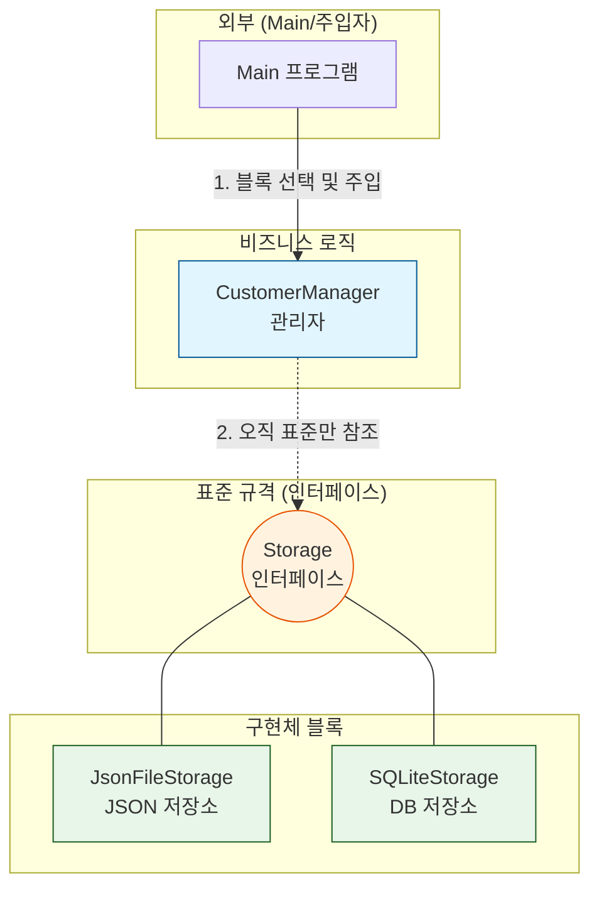

---


### 🎨 추가 시각화 (Visualization Packet)

**의존성 주입 (Dependency Injection) 기본 패턴**

관리자(Manager) 내부에서 저장소를 하드코딩하지 않고, 외부(`main.py`)에서 필요한 저장소를 꽂아 넣어주는 유연한 설계입니다.

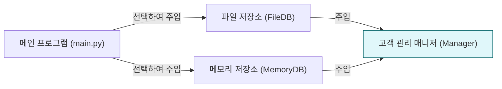

## §3. 상세 내용

### Why: 왜 코드를 안 바꾸고 부품만 바꾸는가?

소프트웨어 개발에서 가장 비용이 많이 드는 작업은 '새로운 기능을 만드는 것'이 아니라 '기존 코드를 고치는 것'입니다. 기존 코드를 고치다 보면 멀쩡하게 작동하던 다른 기능이 망가지는 경우가 허다합니다.

만약 `CustomerManager`가 내부에서 직접 파일을 열고 쓰는 코드를 가지고 있었다면 어떨까요? 나중에 데이터를 클라우드에 저장해 달라는 고객의 요청이 들어오면, 우리는 `CustomerManager`의 코드를 뜯어고쳐야 합니다. 하지만 외부에서 저장소 부품을 주입받는 DI 구조라면 이야기가 다릅니다. 클라우드용 부품 하나만 새로 만들어서 끼워주면 끝입니다. 핵심 로직은 전혀 다치지 않고 보호됩니다. 이것이 OCP(개방 폐쇄 원칙)의 핵심입니다.

### What: 의존성 주입(DI)의 실체

단어가 조금 어렵게 들릴 수 있습니다. '의존성'이라는 것은 내 코드가 작동하기 위해 필요한 다른 부품을 뜻합니다. '주입'은 그 부품을 내 안에서 직접 만들지 않고 밖에서 밀어 넣어 준다는 뜻입니다.

바리스타를 상대로 비유해 볼까요. 바리스타가 커피를 내리려면 원두가 필요합니다(의존성). 바리스타가 직접 밭을 일궈서 커피 콩을 재배해 사용한다면 결합도가 너무 높은 겁니다. 좋은 구조는 바리스타가 원두 납품업자에게서 원두를 건네받아(주입) 커피를 내리는 것입니다. 과테말라 원두를 주면 과테말라 커피가 나오고, 에티오피아 원두를 주면 에티오피아 커피가 나옵니다. 바리스타의 커피 내리는 기술(로직)은 변함이 없죠.

### How: 코드로 어떻게 구현하는가?

구현 방법은 생각보다 훨씬 단순합니다. 객체를 생성하는 `__init__` 메서드의 매개변수로 필요한 부품을 받아오면 됩니다. 파이썬에서는 데이터 타입을 명시해서 어떤 규격의 부품이 들어와야 하는지 힌트를 줄 수 있습니다.

`def __init__(self, storage: Storage):`

이 한 줄이 모든 마법의 시작입니다. `Storage` 규칙을 따르는 그 어떤 클래스의 인스턴스라도 이 매개변수를 통해 들어올 수 있게 되는 것입니다.

> ✅ **체크포인트**: 여기까지 이해하셨는지 점검해 보세요.
> - 의존성 주입에서 '의존성'이 뜻하는 바를 바리스타의 비유로 설명할 수 있나요?
> - 코드를 수정하지 않고 부품을 바꿀 때 얻는 가장 큰 장점은 무엇인가요?

---


### 📊 참고 표 (Visual Specs)

**의존성 주입(DI, Dependency Injection)의 장점**

| 특징 | DI 사용 안 함 (강한 결합) | DI 사용 (느슨한 결합) |
|:---|:---|:---|

## §4. 실습 가이드 (+ 🎙️ 실습 대본)

### 실습 목표

이 실습에서는 `CustomerManager`에 서로 다른 두 개의 저장소 블록을 차례로 주입해 보면서, 핵심 로직의 변경 없이 저장 방식이 교체되는 과정을 눈으로 확인합니다.

🎙️ **실습 가이드 대본 (Lab Guide)**:

> 자, 이제 우리가 며칠 동안 정성 들여 만든 블록들을 조립할 시간입니다. 화면에 에디터를 열고 코드를 준비해 주세요.
> 
> 코드를 작성하기 전에 상상해 봅시다. 만약 여러분이 기존의 절차적 프로그래밍 방식으로 코드를 짰다면, 파일 저장을 DB 저장으로 바꾸기 위해 수십 줄의 코드를 지우고 다시 써야 했을 겁니다. 하지만 오늘은 다릅니다. 우리는 딱 한 줄, 객체를 생성할 때 넣어주는 블록의 이름만 바꿀 겁니다. 정말 그것만으로 저장소가 텍스트 파일에서 데이터베이스로 완벽하게 교체되는지 직접 확인해 보세요. 짜릿한 경험이 될 겁니다. 자, 1단계부터 천천히 따라와 주세요.

### 단계별 지시

| 단계 | 소요 시간 | 강사 지시사항 | 학습자 액션 | 예상 결과 |
|------|----------|--------------|------------|----------|
| 1 | 5분 | "먼저 JSON 저장소를 조립해 봅시다." | `JsonFileStorage`를 생성하여 Manager에 주입 후 데이터 저장 | `customers.json` 파일 생성 |
| 2 | 5분 | "이번에는 DB 저장소로 갈아 끼워 보세요." | 주입하는 코드만 `SQLiteStorage`로 변경 후 실행 | `customers.db` 파일 생성 |
| 3 | 5분 | "생성된 파일들을 직접 열어 확인해 보세요." | 에디터로 두 개의 파일 내용 확인 | 두 저장소 모두 데이터 정상 기록 |
| 4 | 5분 | "매니저 코드를 열고 변경된 곳이 있는지 보세요." | `CustomerManager` 클래스 소스코드 감상 | 코드 변경점이 0개임을 확인 |

**[단계 1] JSON 파일 저장소 주입하기**

새로운 파이썬 스크립트 파일을 만들고, 우리가 작성했던 모듈들을 불러옵니다. 첫 번째 테스트는 JSON 저장소를 주입하는 것입니다. 파일 저장소 객체를 먼저 만들고, 그것을 매니저에게 넘겨줍니다.

```python
from storage import JsonFileStorage
from manager import CustomerManager
from models import Customer

# 1. JSON 저장소 블록을 만듭니다.
file_storage = JsonFileStorage("customers.json")

# 2. 바리스타(Manager)에게 원두(Storage)를 주입합니다.
manager = CustomerManager(file_storage)

# 3. 데이터를 입력하고 저장합니다.
manager.add(Customer("홍길동", "010-1111-2222", "hong@mail.com"))
manager.add(Customer("김영희", "010-3333-4444", "kim@mail.com"))
manager.save_all()

print("JSON 파일에 저장이 완료되었습니다.")
```

코드를 실행하고 프로젝트 폴더에 `customers.json` 파일이 생겼는지 확인하세요.

**[단계 2] DB 저장소로 부품 교체하기**

이제 기획팀에서 연락이 왔습니다. "고객 데이터가 너무 많아져서 파일 말고 DB에 저장해 주세요"라고 하네요. 옛날 같았으면 야근 확정이지만, 지금은 코드를 한 줄만 수정하면 됩니다.

```python
from storage import SQLiteStorage
from manager import CustomerManager
from models import Customer

# 1. 이번에는 DB 저장소 블록을 만듭니다.
db_storage = SQLiteStorage("customers.db")

# 2. 바리스타에게 새로운 원두(DB Storage)를 주입합니다.
manager2 = CustomerManager(db_storage)

# 3. 데이터를 입력하고 저장합니다. 매니저 사용법은 완벽히 똑같습니다.
manager2.add(Customer("이순신", "010-7777-8888", "lee@mail.com"))
manager2.save_all()

print("데이터베이스에 저장이 완료되었습니다.")
```

**[단계 3] 저장 결과물 직접 확인하기**

왼쪽의 탐색기 창을 열어보세요. `customers.json`과 `customers.db` 두 개의 파일이 사이좋게 놓여 있을 겁니다. `customers.json` 파일을 더블클릭해서 열어보세요. 텍스트 형태로 우리가 입력한 홍길동과 김영희 데이터가 예쁘게 들어있는 것을 볼 수 있습니다.

**[단계 4] 코드 변경점 제로(0) 감상하기**

이제 가장 중요한 시간입니다. 여러분이 작성했던 `CustomerManager` 클래스 코드를 열어보세요. 그 안을 아무리 살펴봐도 JSON이라는 단어나 SQLite라는 단어는 보이지 않을 겁니다. 매니저는 그저 `self._storage.save()`라고 외칠 뿐입니다. 외부 환경이 아무리 요동쳐도, 우리의 핵심 로직은 평온하게 자기 할 일만 합니다. 이 감각을 꼭 기억해 두세요.

### 트러블슈팅 FAQ

| Q | A |
|---|---|
| DB 파일이 열리지 않고 깨진 글씨만 보여요. | 정상입니다. SQLite 데이터베이스 파일은 일반 텍스트가 아닌 바이너리 형식으로 저장됩니다. 내용을 보려면 별도의 DB 뷰어 프로그램이 필요합니다. |
| `TypeError: __init__() missing 1 required positional argument` 에러가 나요. | `CustomerManager`를 만들 때 저장소 블록을 넣어주지 않아서 생기는 오류입니다. 반드시 `CustomerManager(file_storage)` 형태로 부품을 주입해 주세요. |
| JSON 파일에 한글이 `\ud64d` 처럼 이상하게 나와요. | `json.dump()`를 사용할 때 `ensure_ascii=False` 옵션을 주지 않으면 생기는 현상입니다. 프로그램 작동에는 문제가 없지만 읽기 불편하다면 저장소 코드를 수정해 보세요. |
| 두 저장소를 동시에 쓸 수는 없나요? | 물론 가능합니다. 매니저 객체를 두 개 만들어서 하나는 파일용, 하나는 DB용으로 쓰면 됩니다. 혹은 두 군데 모두 저장하는 새로운 저장소 블록을 만들어 주입할 수도 있습니다. |

> ✅ **체크포인트**: `customers.json` 파일과 `customers.db` 파일이 모두 생성되었나요? 만약 생겼다면, 여러분은 성공적으로 DI 아키텍처를 구현해 낸 것입니다.

---


### 🎓 강사 노트 (Instructor Support)

- ⏱️ **타이밍**: 15:35 (20분, lab)
- 🎯 **핵심 활동**: File↔SQLite 교체 체험
- ⚠️ **강사 주의사항**: 🎉 관통 프로젝트 최종 진화!


### 📋 실습 설계 보강 (Lab Packet)

**세션 100 실습 설계 보강**

DI 적용 실습 (v4 저장소 교체 테스트)
- **3-Stage Example Set**
  - 기본: CustomerManager에 FileStorage 주입 → 데이터 저장/로드 테스트
  - 변형: 한 줄 변경으로 SQLiteStorage로 교체 → 동일 기능 동작 확인
  - 실수 해결: "저장은 되는데 로드가 안 돼요" → save/load 메서드 인터페이스 불일치
- **난이도 예측**: DI 패턴의 "교체 가능성"을 체감하는 것이 핵심
- **타이밍 가이드**: FileStorage 주입 테스트 5분 | SQLiteStorage 교체 5분 | 결과 비교 5분 | 정리 5분
- **심리적 장벽**: "의존성 주입이 뭔지 아직도 잘 모르겠어요"
- **자가 점검**:
  - [ ] `CustomerManager(FileStorage())`와 `CustomerManager(SQLiteStorage())`가 모두 동작하는가?
  - [ ] 저장소를 교체할 때 CustomerManager 코드 자체는 변경하지 않았는가?
  - [ ] DI를 "교체 가능한 타이어" 비유로 설명할 수 있는가?

## §5. 코드 및 명령어 모음

### 메인 실행 스크립트 모음

**패턴 1: 파일 저장소 주입**
```python
# 파일 저장소 주입 패턴
storage = JsonFileStorage("data.json")
app = CustomerManager(storage)
app.save_all()
```

**패턴 2: 데이터베이스 저장소 주입**
```python
# DB 저장소 주입 패턴
storage = SQLiteStorage("data.db")
app = CustomerManager(storage)
app.save_all()
```

### 아키텍처 핵심: `CustomerManager`의 내부 (참고용)

```python
class CustomerManager:
    # 밖에서 부품(storage)을 받아옵니다.
    def __init__(self, storage: Storage):
        self._customers = []
        self._storage = storage  # 받아온 부품을 장착합니다.

    # 저장 방식은 부품에게 전적으로 맡깁니다.
    def save_all(self):
        self._storage.save(self._customers)
```

이 코드가 바로 우리가 실습 내내 한 번도 고치지 않았던 변함없는 핵심 로직입니다.

---

## §6. 요약

### 핵심 학습 포인트

이번 실습을 통해 우리는 설계의 위대함을 직접 체험했습니다. 기억해야 할 세 가지 핵심입니다. 첫째, 의존성 주입(DI)은 필요한 부품을 객체 내부에서 직접 만들지 않고 밖에서 넣어주는 기법입니다. 둘째, 이 패턴을 사용하면 비즈니스 핵심 로직 코드를 단 한 글자도 수정하지 않고 저장 방식을 교체할 수 있습니다. 셋째, 인터페이스(Storage)라는 표준 규격을 지키는 한, 앞으로 어떤 새로운 저장 방식이 등장하더라도 시스템은 유연하게 대처할 수 있습니다.

### 다음 세션 예고

놀랍게도 벌써 파이썬 기초 과정의 마지막을 향해 가고 있습니다. 아주 단순한 한 덩어리의 코드에서 시작해서, 함수로 쪼개고, 클래스로 묶고, 오늘 DI 아키텍처까지 도달했습니다. 다음 세션에서는 우리가 5일 동안 거쳐온 이 엄청난 진화의 과정을 한눈에 되돌아보는 총정리 시간을 갖겠습니다.

### 브릿지 노트

> "여러분, 정말 고생 많으셨습니다. 방금 여러분이 성공시킨 이 코드는 현업의 시니어 개발자들이 매일같이 고민하며 작성하는 엔터프라이즈급 아키텍처의 축소판입니다. 처음에는 함수 하나 만드는 것도 벅찼는데, 이제는 시스템의 뼈대를 설계하고 부품을 갈아 끼우는 경지에 올랐습니다. 스스로에게 박수를 쳐주셔도 좋습니다. 다음 세션에서 우리가 얼마나 멀리 걸어왔는지 그 발자취를 함께 되돌아보겠습니다."

---

## §7. 참고 자료

### 3-Source 출처

- **Source A (로컬 참고자료)**: `8 코딩.pdf` (DI 패턴의 이론적 배경과 구조, 인터페이스 기반 프로그래밍 가이드)
- **Source B (NotebookLM)**: `day5_notebooklm.md` (DI 적용 저장소 교체 실습 워크플로우 및 레고 블록 비유)
- **Source C (Deep Research)**: `day5_deep_research.md` (Storage 인터페이스 패턴 및 데이터 영속화 아키텍처 설계)

### 추가 학습 자료

- SOLID 원칙 가이드: 개방 폐쇄 원칙(OCP)과 의존성 역전 원칙(DIP)에 대한 심화 설명
- 파이썬 타입 힌팅: `storage: Storage`와 같이 타입을 강제하여 안전성을 높이는 기법 가이드

### 강사 노트

> 💡 **강사 노트**: 수강생들이 의존성 주입을 단순히 '변수에 값을 넣는 것' 정도로 가볍게 여길 수 있습니다. 이 과정의 핵심은 '코드를 고치지 않는다는 사실'에 있으므로, 실습 4단계에서 반드시 `CustomerManager` 코드를 눈으로 직접 확인하도록 유도해 주세요. "야근을 피하는 방법"과 같은 실무적인 비유를 섞어주시면 집중도가 훨씬 높아집니다.

---

## ✅ 세션 완료 체크리스트 (강사용)

- [x] §1~§7 모든 섹션이 충실하게 작성되었는가?
- [x] 레고 블록과 나사 구멍 비유가 §2에 명확히 포함되었는가?
- [x] v4 아키텍처 다이어그램(Mermaid)이 삽입되었는가?
- [x] JSON과 SQLite 저장소 교체 실습이 4단계로 구체화되었는가?
- [x] 트러블슈팅 FAQ가 4개 이상 포함되었는가?
- [x] 코드 변경 없이 부품이 교체된다는 DI의 핵심 가치가 강조되었는가?
- [x] 3-Source 팩트 패킷이 §7에 적절히 반영되었는가?
- [x] 다음 세션(101 진화 과정 총정리) 브릿지 노트가 포함되었는가?

---

**🔗 선행 세션**: [세션-099] DB 저장 모듈(SQLiteStorage) 구현 (필수)  
**🔗 후행 세션**: [세션-101] 고객관리 프로그램 진화 과정 총정리

---

*작성 일시: 2026-02-25*  
*작성 에이전트: Sisyphus-Junior*  
*교안 구조: 7섹션 (A0 팀 공통 표준)*

> 🔗 **이전 세션**: [세션 099: DB 저장 모듈(SQLiteStorage) 구현](#세션-099)에서 배운 내용을 이어갑니다.
> 🔗 **다음 세션**: [세션 101: 고객관리 프로그램 진화 과정 총정리](#세션-101)에서 계속됩니다.

---

### 세션 101: 고객관리 프로그램 진화 과정 총정리
> [원본 파일](sessions/세션-101-고객관리_프로그램_진화_과정_총정리_v2.1.md) | ⏱️ 25분 | 📖 narrative | 난이도: low

> **세션 ID**: MS-PY101-101  
> **소요 시간**: 25분  
> **난이도**: low  
> **청크 타입**: narrative  
> **버전**: v2.1 (7섹션 구조)

---

## §1. 개요

> **Day 5 | PM | 세션 101/106**

이 세션은 5일간 이어져 온 "AI-native 파이썬 기초" 과정의 가장 중요한 성과인 고객관리 프로그램의 진화 과정을 한눈에 되돌아보는 시간이에요. Day 4 아침에 처음 만들었던 거대한 스파게티 코드가 어떻게 모듈화되고, 객체지향을 거쳐, 최종적으로 외부 주입(DI)이 가능한 아키텍처로 변모했는지 총정리합니다. 이 과정을 통해 수강생들은 프로그래밍 패러다임의 거대한 흐름을 자신의 코드로 직접 증명해 내는 경험을 완성하게 됩니다.

### 🎯 학습 목표

이 세션이 끝나면 수강생은 다음을 할 수 있어요:

- v1(절차적)부터 v4(DI+아키텍처)까지의 진화 과정을 설명할 수 있습니다
- 각 패러다임 전환 단계에서 어떤 핵심적인 프로그래밍 문제를 해결했는지 비교할 수 있습니다
- 코드를 바라보는 관점이 "어떻게(How) 동작하는가"에서 "무엇(What)을 하는가"로 변화했음을 체감할 수 있습니다

### 선행 세션 환기

이 세션은 앞서 진행된 세션 100(DI 적용 실습)까지의 모든 실습이 완료된 상태에서 진행됩니다. 수강생들은 이미 JSON 파일과 SQLite DB를 오가며 저장소를 교체하는 마법 같은 경험을 마쳤습니다. 이제 그 경험들을 하나의 선으로 연결하여 전체적인 서사를 완성할 차례입니다.

---

## §2. 핵심 개념 (+ 🗣️ 강사 대본 + Mermaid)

### 비유 — 단세포 생물에서 도구를 사용하는 인류까지

우리 프로그램의 진화는 생물의 진화와 놀랍도록 닮아 있어요. 코드가 길어지고 복잡해짐에 따라, 생존을 위해 자연스럽게 구조를 나누고 분화하는 과정을 거쳤죠. 이 비유를 통해 각 버전의 특징을 직관적으로 이해할 수 있습니다.

🗣️ **강사 대본 (Instructor Script)**:

> 여러분, 5일간의 대장정이 거의 끝나가고 있습니다. 잠시 마우스를 놓고 우리가 걸어온 길을 돌아볼까요? Day 4 아침에 처음 만들었던 고객관리 프로그램 첫 번째 버전을 기억하시나요? `while True:` 안에 모든 코드가 한 덩어리로 뭉쳐 있던 그 끔찍한 스파게티 코드 말입니다. 그때의 코드와 방금 전 여러분이 완성한 코드를 비교하면, 아마 같은 프로그램이라고 믿기 어려울 거예요. 여러분은 정말 먼 길을 오셨습니다.
>
> 우리 프로그램의 진화 과정은 생물의 진화와 똑같습니다.
>
> **v1은 단세포 생물이었어요.** 하나의 거대한 `while` 루프 안에 모든 기능이 뒤섞여 있었죠. 먹고, 움직이고, 번식하는 모든 일이 하나의 세포 안에서 일어났습니다. 아주 단순하지만, 조금만 코드가 길어져도 유지보수가 불가능해지는 치명적인 약점이 있었습니다.
>
> **v2는 다세포 생물입니다.** 코드가 너무 길어지자 우리는 기능을 쪼개기 시작했어요. '고객 추가하는 함수', '고객 조회하는 함수'처럼 세포들이 역할에 맞게 분화되었죠. 코드를 재사용할 수 있게 되었지만, 여전히 데이터와 함수가 따로 노는 한계가 있었습니다.
>
> **v3는 장기를 가진 동물로 진화했습니다.** 따로 놀던 데이터와 함수를 하나의 주머니에 담아 `Customer`라는 심장과 `CustomerManager`라는 뇌를 만들었죠. 이것이 바로 클래스와 객체지향입니다. 캡슐화라는 세포막 덕분에 데이터가 안전하게 보호되기 시작했습니다.
>
> **마지막 v4는 도구를 사용하는 인류입니다.** 장기만으로는 한계가 있음을 깨닫고, 외부의 도구 즉 `Storage`를 만들어 사용하게 되었어요. 파일에 저장하든 데이터베이스에 저장하든, 언제든지 도구를 교체할 수 있는 완벽한 진화를 이뤄낸 겁니다.

### Mermaid 다이어그램

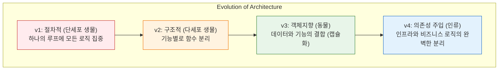

이 다이어그램은 5일 동안 우리가 만든 프로그램이 어떻게 복잡성을 극복하며 진화했는지 보여주는 전체 지형도예요. 이 진화의 핵심 키워드는 바로 **"분리"**입니다. 뒤섞인 것을 나누고, 나눈 것을 보호하고, 보호한 것을 교체 가능하게 만드는 위대한 과정이었습니다.

---

## §3. 상세 내용

### Why — 왜 진화 과정을 총정리해야 하는가?

하나하나의 문법과 패턴을 배울 때는 나무만 보게 됩니다. 함수를 만들고, 클래스를 캡슐화하고, 인터페이스를 상속받는 작업들은 그 순간에는 어렵고 복잡하게만 느껴질 수 있어요. 하지만 전체 과정을 하나의 타임라인으로 펼쳐놓고 보면, "아, 코드가 복잡해지는 것을 막기 위해 인류가 이런 발명품들을 만들어냈구나"라는 깨달음을 얻게 됩니다. 이 총정리 시간은 파편화된 지식들을 하나의 단단한 아키텍처적 사고방식으로 엮어주는 핵심 접착제 역할을 합니다.

### What — 진화의 4단계 패러다임 비교

각 버전이 어떤 패러다임을 대변하고 있으며, 무엇을 해결했는지 명확히 비교해야 합니다.

| 진화 단계 | 패러다임 | 코드의 특징 | 해결한 문제 | 남겨진 한계 |
|-----------|---------|-------------|-------------|------------|
| **v1** | 절차적 프로그래밍 | 전역 변수 + 거대한 `while` 루프 | 가장 빠르고 단순한 구현 | 코드 재사용 불가, 엉키기 쉬움 |
| **v2** | 구조적 프로그래밍 | 기능별 함수 모듈화 | 중복 코드 제거, 가독성 향상 | 데이터와 함수가 분리되어 관리 어려움 |
| **v3** | 객체지향(OOP) | 클래스, 캡슐화, 상속 | 데이터 보호, 기능과 데이터의 결합 | 외부 시스템(파일/DB) 변경 시 로직 수정 필요 |
| **v4** | 의존성 주입(DI) | 인터페이스 분리, 외부 주입 | 비즈니스 로직과 인프라의 완전한 분리 | 초기 설계가 다소 복잡함 |

### How — 코드의 진화를 어떻게 설명할 것인가?

🗣️ **강사 대본 (Instructor Script)**:

> 여러분, 이 4단계를 관통하는 하나의 중요한 질문이 있습니다. 바로 "코드가 변경되었을 때, 얼마나 많은 곳을 뜯어고쳐야 하는가?" 입니다.
>
> v1 시절에는 고객 정보에 '주소' 하나를 추가하려고 하면 `while` 루프 안의 입력부, 저장부, 출력부를 모두 찾아다니며 고쳐야 했어요. 하나라도 빼먹으면 프로그램이 멈췄죠.
> v2에서는 조금 나아졌습니다. 입력을 받는 함수만 고치면 되었으니까요. 하지만 여전히 데이터베이스 형태가 바뀌면 함수 내부 로직을 다 뜯어고쳐야 했습니다.
>
> v4에 도달한 지금은 어떤가요? 방금 전 우리는 데이터를 텍스트 파일(JSON)에 저장하다가 진짜 데이터베이스(SQLite)로 바꿨습니다. 그런데 이 과정에서 고객을 추가하고 관리하는 `CustomerManager` 코드는 단 한 줄도 건드리지 않았죠? 그저 `manager = CustomerManager(SQLiteStorage())`라고 블록만 갈아 끼웠을 뿐입니다. 
> 
> 이것이 바로 아키텍처의 힘입니다. 변경이 필요한 부분만 딱 떼어내서 교체할 수 있게 만드는 것. 소프트웨어 공학의 정수를 여러분은 5일 만에 완성한 겁니다.

---


### 📊 참고 표 (Visual Specs)

**고객관리 프로그램 진화 단계 (v1 ~ v4) 총정리**

| 버전 | 패러다임 | 핵심 특징 | AI-Native 개발 관점 |
|:---|:---|:---|:---|

## §4. 코드 비교 하이라이트 (+ 🗣️ 강사 대본)

가장 극적인 변화를 체감하기 위해 시작점인 v1과 종착점인 v4의 코드를 나란히 비교해 봅니다.

🗣️ **강사 대본 (Instructor Script)**:

> 백문이 불여일견입니다. v1과 v4의 코드를 나란히 놓고 비교해 볼까요?
> 
> 고객 한 명을 등록하는 코드가 처음에 어떻게 생겼었는지 떠올려 보세요.

```python
# v1: 절차적 프로그래밍 (How를 설명하는 코드)
customers = []
name = input("이름을 입력하세요: ")
phone = input("전화번호를 입력하세요: ")
email = input("이메일을 입력하세요: ")
customers.append({"name": name, "phone": phone, "email": email})
```

> 이 코드는 "어떻게(How)" 하는지가 너무 적나라하게 드러나 있어요. 빈 리스트를 만들고, 화면에 질문을 띄우고, 입력을 받아서, 딕셔너리로 묶은 다음 리스트에 밀어 넣는 절차가 빼곡하게 적혀 있습니다.
> 
> 그럼 오늘 우리가 완성한 v4의 코드를 볼까요?

```python
# v4: DI + 객체지향 아키텍처 (What을 설명하는 코드)
storage = SQLiteStorage("customers.db")
manager = CustomerManager(storage)

new_customer = Customer("홍길동", "010-1234-5678", "hong@mail.com")
manager.add(new_customer)
```

> 차이가 느껴지시나요? v4 코드는 "어떻게" 동작하는지 숨겨져 있습니다. 대신 "무엇을(What)" 하려는지가 영어 문장처럼 명확하게 읽힙니다. 
> 
> **"데이터베이스 저장소를 준비하고, 매니저에게 건네준다. 새로운 고객 객체를 만들어서, 매니저에게 추가하라고 지시한다."**
> 
> 좋은 코드는 컴퓨터를 이해시키는 코드가 아닙니다. 다음 번에 이 코드를 읽을 동료 개발자, 혹은 한 달 뒤의 내가 읽었을 때 의도가 명확하게 전달되는 코드가 진짜 좋은 코드입니다. 여러분은 그 수준에 도달하셨습니다.

---


### 🎓 강사 노트 (Instructor Support)

- ⏱️ **타이밍**: 16:05 (25분, narrative)
- 🎯 **핵심 활동**: v1→v2→v3→v4 여정 회고
- ⚠️ **강사 주의사항**: 감동 포인트! 성취감 극대화

## §5. 실습 가이드 (+ 🎙️ 실습 대본)

### 실습 목표

코드 작성은 이미 끝났습니다. 이 세션에서는 5일간의 진화 과정 중 수강생 본인에게 가장 큰 깨달음이나 충격을 주었던 패러다임 전환의 순간을 회고하고 공유하는 시간을 가집니다.

🎙️ **실습 가이드 대본 (Lab Guide)**:

> 자, 이제 여러분의 지난 5일을 스스로 평가해보는 시간입니다. 단세포 생물이었던 v1부터 도구를 자유자재로 쓰는 인류인 v4까지, 여러 단계의 진화 과정을 거쳤는데요. 
> 
> 여러분 개인적으로 가장 "유레카!"를 외쳤던 순간, 혹은 "아, 프로그래밍이 이런 거구나" 하고 머리를 탁 쳤던 순간은 언제였나요? 함수를 처음 분리했을 때인가요, 아니면 캡슐화로 데이터를 숨겼을 때인가요, 그것도 아니면 방금 전 DB 저장소로 블록을 갈아 끼웠을 때인가요?
> 
> 옆에 계신 동료와 3분 동안 이 진화 과정에서의 경험을 나눠주세요. 그리고 어떤 점이 가장 어려웠는지도 함께 이야기해 봅시다.

### 단계별 지시

| 단계 | 소요 시간 | 강사 지시사항 | 학습자 액션 | 예상 결과 |
|------|----------|--------------|------------|----------|
| 1 | 5분 | 진화 과정 다이어그램 시각 자료 띄우기 | 화면 주시, 내용 경청 | 4단계 진화 과정 개념 재확인 |
| 2 | 5분 | v1과 v4 코드 직접 비교 설명 | 코드 가독성의 차이 체감 | How 중심에서 What 중심으로의 시각 변화 인지 |
| 3 | 3분 | "가장 인상 깊었던 진화 단계는?" 토론 지시 | 짝과 5일간의 실습 경험 공유 | 성취감 및 기술적 깨달음 내재화 |
| 4 | 5분 | 자원자 2명 정도의 소감 발표 듣기 | 발표 경청 및 박수 | 서로의 성장을 축하하고 공감대 형성 |
| 5 | 7분 | "아키텍처의 중요성" 최종 강평 | 핵심 메시지 메모 | 패러다임 변화의 중요성 각인 |

### 트러블슈팅 FAQ

| Q | A |
|---|---|
| 수강생이 v3와 v4의 차이를 여전히 헷갈려 한다면? | 자동차 비유를 다시 쓰세요. "v3는 자동차의 엔진(데이터)과 핸들(메서드)을 조립해 멋진 차를 만든 것이고, v4는 타이어가 터졌을 때 차를 새로 사는 게 아니라 바퀴(Storage)만 쏙 갈아 끼울 수 있게 만든 구조입니다." |
| 토론 시간에 말이 없는 조가 있다면? | 강사가 다가가서 가볍게 질문을 던져주세요. "ㅇㅇ님은 처음 while문 쓰실 때랑 지금 객체지향 쓰실 때 어떤 게 제일 다르게 느껴지세요?" |

---

## §6. 요약

### 핵심 학습 포인트

단순한 `while`문 한 덩어리였던 코드가 함수로 쪼개지고, 객체로 묶이고, 마침내 외부에서 도구를 주입받는 유연한 아키텍처로 진화했습니다. 이 과정에서 가장 중요한 교훈은 프로그래밍이란 단순히 문법을 나열하는 것이 아니라, "복잡성을 어떻게 통제하고 관리할 것인가"에 대한 끊임없는 투쟁이라는 점입니다. 수강생들은 이 거대한 패러다임의 변화를 직접 타이핑하며 몸소 증명해냈습니다.

### 다음 세션 예고

지금까지 우리는 코드를 어떻게 아름답게 짤 것인가를 치열하게 고민했습니다. 하지만 이 모든 기술이 향하는 궁극적인 종착지는 따로 있습니다. 다음 세션에서는 Day 1 오프닝에서 다루었던 "AI 시대의 서사"로 다시 돌아가, 우리가 왜 이 모든 아키텍처를 배웠는지, AI 시대에 인간 개발자의 진짜 역할이 무엇인지 최종적인 결론을 내리겠습니다.

### 브릿지 노트

> "여러분은 이제 스파게티 코드에서 벗어나 훌륭한 아키텍처를 그릴 수 있는 지식을 갖추었습니다. 그런데 말입니다, 이 코드를 작성하는 동안 AI 비서가 얼마나 많은 도움을 주었는지 기억하시나요? 코드를 이렇게 잘 짜주는 AI가 있는데, 우리는 왜 5일 동안 이 구조를 굳이 이해하려 했을까요? 그 해답을 다음 시간, 대망의 피날레에서 확인해보겠습니다."

---

## §7. 참고 자료

### 3-Source 출처

- **Source A (로컬 참고자료)**: `8 코딩.pdf` — 절차적 프로그래밍에서 구조적, 객체지향, 그리고 DI까지 전체 진화 과정에 대한 기술적 배경과 비유(생물 진화론) 차용.
- **Source B (NotebookLM)**: `day5_notebooklm.md` — 고객관리 프로그램의 진화 과정을 단계별로 총정리하고 복습 포인트를 짚어내는 핵심 메시지 반영.
- **Source C (Deep Research)**: `day5_deep_research.md` — 모놀리식 구조에서 의존성 주입(DI) 아키텍처로의 전환이 가지는 소프트웨어 공학적 의미와 교육적 기대 효과 참조.

### 추가 학습 자료

- 파이썬 클린 코드 (Clean Code in Python): 객체지향 설계와 의존성 주입에 대한 심화 서적 추천.
- Refactoring Guru (웹사이트): 디자인 패턴 및 리팩토링 원칙 복습용 온라인 레퍼런스.

### 강사 노트

> 💡 **강사 노트**: 이 세션은 지식을 전달하는 시간이 아닙니다. 5일간 고생한 수강생들에게 그들이 얼마나 위대한 성취를 이뤄냈는지 "증명"해주고 칭찬해주는 축제의 시간이어야 합니다. 코드 비교를 할 때 목소리의 톤을 높여 v4 코드의 아름다움을 극적으로 강조해 주세요. 수강생 스스로가 대견하게 느껴지도록 감정적 카타르시스를 제공하는 것이 이 세션의 진정한 목적입니다.

---

## ✅ 세션 완료 체크리스트 (강사용)

- [x] §1~§7 모든 섹션이 충실하게 작성되었는가?
- [x] v1에서 v4까지의 4단계 진화 과정이 생물 진화 비유와 함께 잘 설명되었는가?
- [x] Mermaid 다이어그램을 통해 진화 과정이 시각적으로 명확히 제시되었는가?
- [x] v1과 v4의 코드를 직접 비교하며 How와 What의 관점 차이를 설명했는가?
- [x] 수강생들이 스스로의 성장을 체감할 수 있는 회고 토론 가이드가 포함되었는가?

---

*작성 일시: 2026-02-25*  
*작성 에이전트: A4B_Session_Writer*  
*교안 구조: 7섹션 (A0 팀 공통 표준)*

> 🔗 **이전 세션**: [세션 100: DI 적용 실습 (v4 저장소 교체 테스트)](#세션-100)에서 배운 내용을 이어갑니다.
> 🔗 **다음 세션**: [세션 102: "AI 시대의 서사" 최종 연결 및 SDD 회고](#세션-102)에서 계속됩니다.

---

### 세션 102: "AI 시대의 서사" 최종 연결 및 SDD 회고
> [원본 파일](sessions/세션-102-AI_시대의_서사_최종_연결_v2.1.md) | ⏱️ 20분 | 📖 narrative | 난이도: low

> **세션 ID**: MS-PY101-102  
> **소요 시간**: 20분  
> **난이도**: low  
> **청크 타입**: narrative  
> **버전**: v2.1 (7섹션 구조)

---

## §1. 개요

> **Day 5 | PM | 세션 102/106**

이 세션은 5일간 진행된 "AI-native 파이썬 기초" 과정의 여정을 하나의 거대한 서사로 묶어내는 매우 중요한 시간입니다. 코드를 한 줄도 작성하지 않는 내러티브 세션이지만, 수강생들이 5일간 경험한 좌절과 성취에 의미를 부여하고, 스스로가 단순한 '코더'가 아니라 '아키텍트(설계자)'로 성장했음을 깨닫게 하는 클라이맥스 역할을 합니다.

### 🎯 학습 목표

이 세션이 끝나면 수강생은 다음을 할 수 있습니다:

- 5일간의 코딩 학습 과정을 "AI 시대의 서사"라는 관점에서 스스로 재해석할 수 있습니다
- 코드를 타이핑하는 사람(Coder)에서 명세서를 작성하고 검증하는 사람(Architect)으로의 정체성 변화를 설명할 수 있습니다
- SDD(Specification-Driven Development)의 진정한 의미를 이해하고, 앞으로의 AI 협업에 적용할 수 있는 마인드셋을 갖춥니다

### 선행 세션 환기

직전 세션 101에서 우리는 절차적 코드로 시작했던 고객관리 프로그램이 구조적 설계와 객체지향(OOP)을 거쳐, 의존성 주입(DI) 아키텍처까지 진화하는 전체 과정을 총정리했습니다. 스파게티처럼 엉켜 있던 코드가 어떻게 우아한 구조로 변모하는지 두 눈으로 확인했죠. 이제 이 기술적 진화를 여러분 자신의 '성장 스토리'와 결합할 차례입니다.

---

## §2. 핵심 개념 (+ 🗣️ 강사 대본 + Mermaid)

### AI는 시공 로봇, 여러분은 아키텍트

미래의 건설 현장을 상상해 보세요. 벽돌을 쌓고, 철근을 용접하고, 페인트를 칠하는 것은 전부 정밀한 시공 로봇이 담당합니다. 그렇다면 인간 건축가는 직업을 잃을까요? 절대 그렇지 않습니다. "몇 층짜리 건물을 지을 것인가", "내진 설계 기준은 어떻게 할 것인가", "입주자의 동선은 어떻게 짤 것인가" 등 목적과 구조를 결정하는 설계 작업은 온전히 인간의 몫입니다. AI 시대의 프로그래밍도 이와 똑같습니다. AI는 세상에서 가장 훌륭하고 빠른 시공 로봇입니다. 5일 동안 우리는 이 시공 로봇에게 올바른 설계도(프롬프트)를 넘겨주고, 로봇이 지어온 결과물이 설계도대로 안전하게 지어졌는지 감리(코드 리뷰)하는 법을 배웠습니다.

🗣️ **강사 대본 (Instructor Script)**:

> 여러분, 딱 5일 전 첫 시간에 제가 던졌던 질문을 기억하시나요? **"AI가 로그인 코드를 1초 만에 다 짜주는 시대인데, 우리는 대체 왜 굳이 파이썬을 배워야 할까요?"**
> 
> 그때는 다들 막연하셨을 겁니다. 'AI가 짜준 코드를 조금이라도 수정하려면 배워야겠지'라고 생각하셨을 수도 있어요. 하지만 5일이 지난 지금, 여러분은 직접 코드를 만들고, 리팩토링하고, 의존성 주입이라는 거창한 아키텍처까지 설계하면서 그 질문의 답을 온몸으로 체험하셨습니다.
> 
> 결론부터 말씀드릴게요. 여러분이 5일 동안 배운 것은 파이썬이라는 '언어의 문법'이 아닙니다. AI라는 압도적으로 뛰어난 '시공 로봇'을 지휘하기 위해, 문제를 정의하고 구조를 설계하는 **'아키텍트의 사고방식'**을 배운 것입니다. 
> 
> SDD, 즉 명세 기반 개발을 기억하시죠? Day 2에서 우리는 요구사항을 정의하고 PRD를 작성했습니다. 그리고 5일 내내 우리는 AI에게 명확하게 지시를 내리고, 뱉어낸 코드가 캡슐화를 잘 지켰는지, 의존성이 꼬이지는 않았는지 매서운 눈으로 검증했습니다. 바로 이것이 AI 시대에 코드를 다루는 유일하고도 올바른 방법입니다. 여러분은 코더가 아니라 아키텍트가 되기 위해 이 자리에 오신 겁니다.

### Mermaid 다이어그램: 5일간의 서사 연결

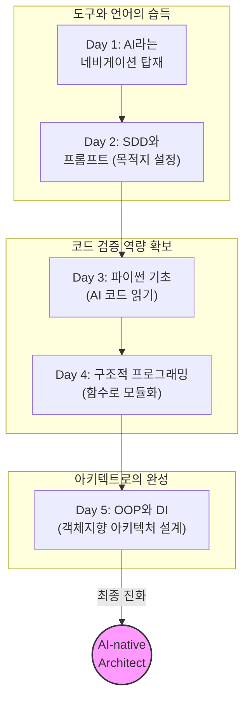

이 다이어그램은 Day 1에서 단순한 도구로 만났던 AI가, Day 5에 이르러 어떻게 우리의 아키텍처 설계를 구현하는 충실한 조수로 자리매김했는지 그 서사를 보여줍니다. 

---

## §3. 상세 내용

### Why — 왜 이 세션이 필요한가?

지식은 연결되지 않으면 금방 휘발됩니다. 수강생들은 5일 동안 변수, 리스트, 딕셔너리, for문, 클래스, 상속, 다형성 등 엄청난 양의 기술적 개념을 쏟아붓듯 배웠습니다. 자칫하면 '파이썬 문법을 좀 배웠네'라는 단편적인 감상으로 끝날 위험이 있습니다. 이 세션은 그 파편화된 기술적 경험들을 "나는 AI에게 무엇을 만들지 지시하고 결과를 검증할 수 있는 사람으로 성장했다"는 하나의 강력한 서사(Narrative)로 꿰어주는 필수적인 마무리의 시간입니다.

### What — 이 세션에서 다루는 것은 무엇인가?

이 세션은 세 가지를 다룹니다. 첫째, 코더에서 아키텍트로의 역할 변화를 선언합니다. 둘째, Day 1의 '네비게이션 비유'를 다시 가져와, 그동안 해온 모든 실습이 결국 "목적지를 정확히 입력하고, 경로를 이탈하지 않았는지 검증하는 과정"이었음을 증명합니다. 셋째, 기술의 변화(함수 → 객체 → 아키텍처)가 결국 인간의 '요구사항'을 얼마나 우아하게 통제할 것인가의 문제였음을 깨닫게 합니다.

### How — 구체적으로 어떻게 진행하는가?

🗣️ **강사 대본 (Instructor Script)**:

> 첫날 우리가 이야기했던 네비게이션 비유로 다시 돌아가 볼까요? 네비게이션이 아무리 똑똑해도 "어디로 갈 것인가"는 운전자가 결정한다고 했습니다. 네비게이션에 목적지를 잘못 입력하면 부산으로 갈 차가 광주로 가게 되죠.
> 
> Day 1에서 우리는 AI 비서라는 최신 네비게이션을 차량에 달았습니다. Day 2에서는 프롬프트라는 수단으로 목적지를 정확하게 입력하는 법을 배웠고요. Day 3에서 배운 파이썬 문법은 무엇이었을까요? 맞습니다. 네비게이션이 알려주는 화면의 기호들을 읽어내는 능력이었습니다. 
> 
> Day 4에서 우리는 코드를 함수로 쪼갰죠. 이건 경로가 복잡해지니까 중간 경유지를 명확히 설정해서 엉뚱한 길로 빠지지 않게 통제한 겁니다. 그리고 오늘, Day 5에서 우리는 클래스를 만들고 의존성을 주입했습니다. 이건 뭘까요? 이제 여러분은 단순히 운전석에 앉아있는 사람이 아니라, 차가 달리는 도로망 전체를 설계하고 교통 흐름을 제어하는 도시 설계자가 된 겁니다.
> 
> 여러분이 5일간 고민하면서 PRD를 짜고 코드를 리뷰했던 이유는 명확합니다. 목적지를 명확히 설정하는 능력, 그리고 도착했을 때 "여기가 맞는지" 검증하는 능력을 갖추기 위해서입니다. 이 능력이 AI 시대에 인간이 가져야 할 가장 대체 불가능하고 가치 있는 역량입니다.

---

## §4. 실습 가이드 (+ 🎙️ 실습 대본)

### 실습 목표

이 세션의 실습은 자신의 성장을 동료와 나누며 체화하는 회고(Retrospective) 활동입니다. 코딩이 아니라, 첫날의 나와 지금의 내가 어떻게 달라졌는지 언어로 표현함으로써 아키텍트로서의 자아를 확립합니다.

🎙️ **실습 대본 (Lab Guide)**:

> 자, 마우스를 잠깐 놓고 옆에 앉은 짝꿍과 마주 봐주세요. 우리 딱 3분만 이야기를 나눌 겁니다. 
> 
> 주제는 이렇습니다. **"월요일 첫날, 이 강의실 문을 열고 들어올 때 상상했던 5일 후의 내 모습과, 지금 내 모습은 어떻게 다른가요?"** 
> 
> '파이썬 문법을 달달 외우고 있을 줄 알았는데, 내가 AI한테 구조 똑바로 짜라고 호통을 치고 있을 줄은 몰랐다'라든지, 뭐든 좋습니다. 여러분이 겪은 가장 큰 인식의 변화를 서로 나누어 주세요. 지금부터 3분 드리겠습니다! 시작!

### 단계별 지시

| 단계 | 소요 시간 | 강사 지시사항 | 학습자 액션 | 예상 결과 |
|------|----------|--------------|------------|----------|
| 1 | 2분 | 서사 정리 및 아키텍트 비유 설명 | 경청 및 공감 | 자신의 학습 과정을 새롭게 인식 |
| 2 | 3분 | "첫날과 지금의 내 모습 비교하기" 회고 지시 | 짝과 회고 대화 | 인식의 변화를 스스로 언어화 |
| 3 | 3분 | 1~2명 자원받아 전체 발표 공유 | 자원자 발표 | 공감대 형성 및 성취감 고취 |
| 4 | 2분 | SDD 가치의 최종 정리 멘트 | 경청 | 설계자로서의 정체성 확립 |

### 트러블슈팅 FAQ

| Q | A |
|---|---|
| 수강생들이 회고 시간에 무슨 말을 해야 할지 머뭇거립니다 | 강사가 먼저 자신의 경험이나 이전 기수 수강생의 재미있는 사례를 던져주세요. "예전 기수 어떤 분은 '내가 코더가 아니라 감독관이 된 기분이다'라고 하시더군요"처럼 힌트를 주면 좋습니다. |
| 아직도 문법을 완벽히 모른다는 불안감을 호소하는 수강생이 있다면? | "우리는 영어 스펠링 대회에 나가는 게 아닙니다. 파파고(AI)를 써서 외국인과 비즈니스 협상을 성공적으로 해내는 것이 목표입니다. 스펠링(문법)은 AI가 챙겨줍니다. 여러분은 협상의 전략(구조)에 집중하세요"라고 확신을 심어주세요. |

---


### 🎓 강사 노트 (Instructor Support)

- ⏱️ **타이밍**: 16:30 (20분, narrative)
- 🎯 **핵심 활동**: 5일간 배운 것의 의미
- ⚠️ **강사 주의사항**: 철학적 마무리

## §5. 코드 및 명령어 모음

본 세션은 서사적 흐름을 정리하는 Narrative 타입이므로 실습 코드가 없습니다. 

다만, 수강생들이 집에 돌아가 복습할 때 활용할 수 있는 **[아키텍트의 프롬프트 템플릿]**을 다시 한번 상기시켜 줍니다.

> 🤖 **아키텍트의 리팩토링 프롬프트 리마인드**:
> "다음 코드를 리뷰하고, 객체지향의 캡슐화 원칙이 잘 지켜졌는지 확인해 줘. 외부에서 직접 접근할 수 있는 내부 속성이 있다면 은닉하고 적절한 메서드를 추가해. 단, 전체적인 비즈니스 로직은 유지해야 해."

---

## §6. 요약

### 핵심 학습 포인트

이 세션의 핵심 메시지는 간명합니다. 첫째, 5일간 배운 것은 코딩 기술이 아니라 AI와 협업하여 문제를 해결하는 아키텍트의 사고방식입니다. 둘째, AI는 훌륭한 시공 로봇이며, 무엇을 어떻게 만들지 결정하고 그 결과를 검증하는 것은 인간의 고유한 영역입니다. 셋째, 5일 전의 여러분과 지금의 여러분은 완전히 다른 시야를 가진 사람으로 성장했습니다.

### 다음 세션 예고

이제 정말 마지막 하이라이트가 남았습니다. 다음 세션(103)에서는 5일 동안 땀 흘려 완성한 여러분 각자의 최종 프로젝트(고객관리 v4) 코드를 화면에 띄우고 서로 리뷰하는 시간을 갖겠습니다. 다른 사람들은 어떻게 객체를 설계하고 의존성을 주입했는지 구경하는 쏠쏠한 재미가 있을 겁니다!

### 브릿지 노트

> "여러분, 5일 동안 정말 고생 많으셨습니다. 이제 여러분은 빈 화면을 두려워하지 않는 당당한 AI-native 아키텍트입니다. 자, 그럼 우리가 함께 지은 이 훌륭한 건축물들을 서로에게 자랑할 준비 되셨나요? 마지막 코드 리뷰 세션으로 넘어가 봅시다!"

---

## §7. 참고 자료

### 3-Source 출처

- **Source A (로컬 참고자료)**: `AI 시대의 서사 v3 - Claude.md` — 코더에서 아키텍트로의 변화, 네비게이션 비유 등 과정 전체를 관통하는 핵심 철학과 서사적 비유의 원천을 활용했습니다.
- **Source B (NotebookLM)**: `day5_notebooklm.md` — AI 시대의 서사 최종 연결 파트에서, "코딩보다 명세(Specification)와 문제 정의(SDD)가 중요한 이유 재확인"이라는 핵심 포인트를 반영했습니다.
- **Source C (Deep Research)**: `day5_deep_research.md` — 전체적인 OOP와 아키텍처 학습 과정이 결국 어떻게 명세 기반 개발의 성취로 이어지는지에 대한 논리적 연결 구조를 차용했습니다.

### 추가 학습 자료

- 과정 첫날 공유했던 [세션 001 과정 로드맵 및 아이스브레이킹] 교안 복습 추천

### 강사 노트

> 💡 **강사 노트**: 이 세션은 사실상 5일 과정의 '졸업 연설'과도 같습니다. 강사는 지식 전달자가 아니라 수강생들의 성장을 지켜본 멘토의 입장에서, 진심을 담아 감동적인 톤으로 진행해 주세요. 수강생들이 스스로 대견함을 느끼고, 현업에 돌아가서도 AI를 두려움 없이 활용할 수 있다는 강한 자신감을 심어주는 것이 가장 중요합니다.

---

## ✅ 세션 완료 체크리스트 (강사용)

- [ ] §1~§7 모든 섹션이 빠짐없이 작성되었는가?
- [ ] 첫날의 네비게이션 비유가 자연스럽게 회수되며 서사가 연결되었는가?
- [ ] 시공 로봇과 아키텍트 비유가 명확히 전달되었는가?
- [ ] 수강생의 성취를 축하하고 자아 정체성을 부여하는 회고가 포함되었는가?
- [ ] 3-Source (팩트 패킷) 내용이 적절히 반영되었는가?

---

*작성 일시: 2026-02-25*  
*작성 에이전트: A4B_Session_Writer*  
*교안 구조: 7섹션 (A0 팀 공통 표준)*

> 🔗 **이전 세션**: [세션 101: 고객관리 프로그램 진화 과정 총정리](#세션-101)에서 배운 내용을 이어갑니다.
> 🔗 **다음 세션**: [세션 103: 수료 프로젝트 코드 리뷰 공유](#세션-103)에서 계속됩니다.

---

### 세션 103: 수료 프로젝트 코드 리뷰 공유
> [원본 파일](sessions/세션-103-수료_프로젝트_코드_리뷰_공유_v2.1.md) | ⏱️ 25분 | 🧪 lab | 난이도: medium

> **세션 ID**: MS-PY101-103  
> **소요 시간**: 25분  
> **난이도**: ★★☆ (medium)  
> **청크 타입**: lab  
> **버전**: v2.1 (7섹션 구조)

---

## §1. 개요

> **Day 5 | PM | 세션 103/106**

### 🎯 학습 목표

이 세션이 끝나면, 수강생은 다음을 할 수 있습니다:

- 자신의 최종 고객관리 v4 결과물을 동료에게 명확하게 설명하고 공유할 수 있다.
- 캡슐화, 다형성, 의존성 주입(DI) 등 객체지향 3대 핵심 개념을 기준으로 타인의 코드를 분석하고 평가할 수 있다.
- AI의 코드 분석 결과를 참고하여, 인간의 관점에서 건설적인 코드 리뷰 피드백을 동료에게 전달할 수 있다.

### 선행 세션 환기

바로 전 세션(102)에서 우리는 "AI 시대의 서사"를 되돌아보며, 코드를 치는 단순한 코더(Coder)에서 전체 구조를 그리는 아키텍트(Architect)로 진화해야 한다고 배웠습니다. 지난 5일 동안 우리는 단순한 while문 하나로 시작했던 스파게티 코드를 함수로, 객체로, 그리고 완벽히 분리된 아키텍처(v4)로 발전시켰죠. 이제 우리가 만든 이 걸작들을 세상에 내보이기 전, 마지막으로 거쳐야 할 필수 관문이 하나 남았습니다. 바로 '코드 리뷰(Code Review)'입니다. 오늘 세션은 여러분이 서로의 아키텍처를 감상하고 평가하는 시간입니다.

---

## §2. 핵심 개념 (+ 🗣️ 강사 대본 + Mermaid)

### 비유 — "출판 전 교정·교열의 시간"

작가가 책을 출판하기 전에 반드시 거치는 과정이 있습니다. 바로 **교정·교열**입니다. 아무리 훌륭한 명작 원고라도 오탈자가 있고, 문맥이 어색한 부분이 있으며, 가끔은 논리의 흐름이 끊기는 곳이 발생합니다. 작가 본인은 자신의 글에 너무 익숙해져 있어서 이런 문제들을 스스로 발견하기가 매우 어렵습니다. 그래서 완전히 새로운 타인의 시선, 즉 편집자의 눈으로 원고를 파헤쳐야만 숨어있던 오류들이 비로소 드러나게 되죠.

소프트웨어 개발에서의 **코드 리뷰(Code Review)**도 이와 정확히 같은 원리입니다. 교정이 변수명 오타나 들여쓰기 같은 문법적인 오류를 잡는 것이라면, 교열은 코드가 캡슐화를 잘 지켰는지, DI 패턴이 올바르게 구현되었는지 등 '논리와 흐름'을 검토하는 과정입니다.

🗣️ **강사 대본 (Instructor Script)**:

> 여러분, 지금까지 정말 고생 많으셨습니다! 여러분이 완성하신 '고객관리 v4' 프로그램은 5일간의 피와 땀이 서린 소중한 결과물입니다. 하지만 내가 짠 코드는 나에게 너무나 익숙해서, 치명적인 허점이 있어도 눈에 잘 들어오지 않습니다. 그래서 현업의 모든 훌륭한 개발팀은 반드시 '코드 리뷰'를 거칩니다. 동료의 눈을 빌리는 것이죠.
> 
> 오늘 여러분은 서로의 편집자가 되어줄 겁니다. 똑같은 요구사항을 두고도, 어떤 분은 저장소를 이렇게 주입했고, 어떤 분은 저런 방식으로 캡슐화를 하셨을 거예요. "아, 저 사람은 저렇게 생각했구나!"라고 무릎을 탁 치게 되는 순간, 여러분의 시야는 두 배, 세 배로 넓어집니다. 코드 리뷰는 단순히 남의 실수를 지적하는 자리가 아닙니다. 동료의 통찰을 내 것으로 흡수하는, 성장의 가장 빠른 지름길입니다.

### Mermaid 다이어그램

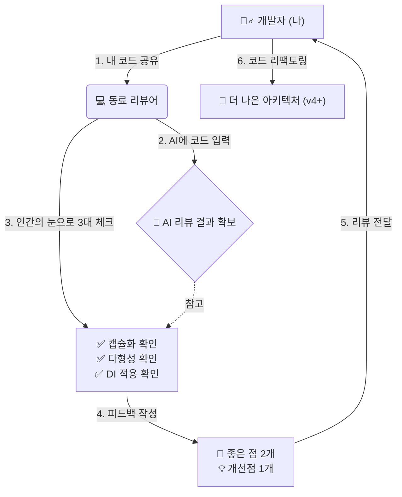

---

## §3. 상세 내용

### Why — 우리는 왜 남의 코드를 읽어야 하는가?

코드를 읽는 능력은 코드를 쓰는 능력만큼이나 중요합니다. 현업 개발자는 하루 일과 중 코드를 작성하는 시간보다, 남이 짠 코드를 읽고 분석하는 데 훨씬 더 많은 시간을 씁니다. 같은 문제를 다른 방식으로 해결한 동료의 코드를 보면, 혼자서 책만 파고들 때보다 훨씬 빠르고 강력한 인사이트를 얻을 수 있습니다.

특히 AI가 만들어준 코드의 경우, AI는 종종 '가장 쉬운 방식'이나 '자주 쓰이는 패턴'을 제안할 뿐, 우리 프로젝트의 아키텍처 원칙(예: 철저한 캡슐화, 엄격한 DI)을 어기는 코드를 슬쩍 끼워 넣기도 합니다. 따라서 남의 코드를 리뷰하는 훈련은, 곧 **AI가 짠 코드를 리뷰하고 반려하는 훈련**이기도 합니다.

### What — 코드 리뷰의 3대 체크포인트

오늘 동료의 코드를 받아들고 가장 집중적으로 파고들어야 할 세 가지 핵심 기준은 다음과 같습니다. 

1. **캡슐화 (Encapsulation)**:
   - 핵심 데이터(속성)가 외부에서 함부로 조작되지 않도록 보호되고 있는가?
   - `self.__balance` 또는 `self._age` 처럼 접근 제어가 잘 적용되었나?
   - 외부에서 직접 변수를 수정하는 대신 `@property`나 getter/setter 메서드를 통해 검증을 거치고 있는가?

2. **상속과 다형성 (Inheritance & Polymorphism)**:
   - `VIPCustomer`가 일반 `Customer`를 중복 코드 없이 깔끔하게 상속받았는가?
   - `get_discount()` 같은 메서드가 오버라이딩(재정의)되어, 객체의 타입에 따라 '알아서' 다르게 동작하는 다형성이 잘 구현되었는가?

3. **의존성 주입 (Dependency Injection, DI)**:
   - `CustomerManager`가 `JsonFileStorage`나 `SQLiteStorage` 같은 특정 저장 방식에 강하게 결합되어 있지는 않은가?
   - 저장소 객체를 매니저 내부에서 직접 생성(`=`)하지 않고, 외부에서 괄호를 통해 주입(`__init__(self, storage)`)받고 있는가?

### How — 좋은 피드백을 주는 방법

리뷰는 비판이 아니라 **협력**입니다. 피드백을 줄 때는 항상 **"좋은 점 2가지, 개선할 점 1가지 (2 Good, 1 Better)"** 법칙을 지켜주세요. 
- ⭕ "DI 패턴을 적용해서 Manager 코드를 아주 깔끔하게 분리하신 점이 인상 깊습니다!"
- 🔺 "다만 Customer의 age 속성이 외부에서 직접 변경 가능하게 노출되어 있는데, 이걸 property로 캡슐화하면 완벽할 것 같습니다."

---

## §4. 실습 가이드 (+ 🎙️ 실습 대본)

### 실습 목표

수강생들은 2인 1조로 짝을 지어, 자신의 v4 프로젝트 코드를 교환하고 AI의 도움을 받아 객체지향 3대 체크포인트를 기준으로 상호 리뷰를 진행합니다.

🎙️ **실습 가이드 대본 (Lab Guide)**:

> 자, 이제 실습 시간입니다! 옆에 앉으신 분과 가볍게 인사하시고, 짝을 지어주세요. 온라인으로 참여하시는 분들은 소회의실(Breakout room)에서 짝을 만나게 되실 겁니다.
> 
> 가장 먼저 여러분의 `customer_manager_v4.py` 파일을 동료에게 보내주세요. 코드를 받으시면, 제일 먼저 여러분 화면의 Antigravity 에이전트(AI)에게 그 코드를 던져주세요. "이 코드를 캡슐화, 다형성, DI 관점에서 엄격하게 리뷰해줘"라고 요청하는 겁니다. 
> 
> AI가 훌륭한 초안을 잡아주겠지만, 최종 판단은 여러분의 눈으로 해야 합니다. AI의 리뷰 결과를 참고하면서 코드를 꼼꼼히 읽어보세요. 그리고 포스트잇이나 메모장에 동료 코드의 '좋은 점 2가지'와 '개선점 1가지'를 적어봅니다. 마지막 5분 동안 서로에게 따뜻하고 예리한 피드백을 전달하겠습니다. 자, 코드 전송부터 시작해 볼까요?

### 단계별 지시 (총 25분)

| 단계 | 소요 시간 | 강사 지시사항 | 학습자 액션 |
|------|----------|--------------|------------|
| 1단계 | 5분 | "코드를 교환하세요" | 슬랙/이메일 또는 화면 공유로 짝에게 자신의 코드 전달 |
| 2단계 | 5분 | "AI에게 1차 리뷰를 맡기세요" | 넘겨받은 코드를 AI에게 입력하고 리뷰 프롬프트 실행 |
| 3단계 | 10분 | "인간의 눈으로 3대 기준을 검증하세요" | AI 답변을 참고하여 캡슐화/다형성/DI 패턴 검토, 리뷰 메모 작성 |
| 4단계 | 5분 | "피드백을 주고받으세요" | "2 Good, 1 Better" 원칙으로 동료에게 구체적인 리뷰 피드백 전달 |

### 🤖 실습용 AI 프롬프트 예시

리뷰어가 AI에게 코드 분석을 요청할 때 사용하는 프롬프트입니다. 그대로 복사해서 사용하세요.

```text
다음은 내 동료가 작성한 고객관리 프로그램(v4) 코드야.
이 코드를 파이썬의 객체지향 프로그래밍 관점에서 리뷰해줘.
반드시 아래 3가지 체크포인트를 기준으로 평가해야 해:

1. 캡슐화: 데이터가 안전하게 보호되고 검증을 거치는지 (@property 등)
2. 다형성: 상속과 오버라이딩을 통해 다형성이 올바르게 작동하는지
3. DI (의존성 주입): Manager가 Storage 인스턴스를 외부에서 주입받고 결합도가 낮은지

비판만 하지 말고, 잘 짠 부분 2가지와 개선이 필요한 부분 1가지를 명확히 짚어줘.

[동료의 코드 붙여넣기]
```

### 트러블슈팅 FAQ

| Q | A |
|---|---|
| 동료 코드가 제 컴퓨터에서는 실행이 안 돼요. 에러가 납니다. | 코드 리뷰는 반드시 코드가 완벽히 실행되어야만 할 수 있는 것은 아닙니다. 구조와 로직을 눈으로 확인하는 정적 분석(Static Analysis)에 집중하세요. |
| AI가 지적한 개선점이 너무 어렵게 느껴져요. | AI는 종종 초보자 수준을 넘어서는 심화 문법을 제안하기도 합니다. 이해하기 어려운 제안은 과감히 무시하고, 수업 시간에 배운 캡슐화, 상속, DI에만 집중하세요. |
| 동료 코드가 너무 완벽해서 개선점을 못 찾겠어요! | 훌륭하네요! 그럴 때는 억지로 단점을 찾지 말고, "이 부분은 어떻게 이런 아이디어를 떠올리셨나요?" 하고 질문을 던져보세요. 질문도 훌륭한 리뷰입니다. |
| 저는 DI 구조를 안 쓰고 그냥 파일 저장 기능을 매니저에 다 때려 넣었는데 부끄러워요. | 부끄러워할 필요 전혀 없습니다! 그것을 발견하고 "아, 저렇게 분리해야 하는구나"를 깨닫는 것이 오늘 리뷰의 핵심 목적입니다. 지금 바로 리팩토링 계획을 세우면 됩니다. |

---


### 🎓 강사 노트 (Instructor Support)

- ⏱️ **타이밍**: 16:50 (25분, lab)
- 🎯 **핵심 활동**: v4 코드 동료 리뷰
- ⚠️ **강사 주의사항**: 자부심 고취


### 📋 실습 설계 보강 (Lab Packet)

**세션 103 실습 설계 보강**

수료 프로젝트 코드 리뷰 공유
- **3-Stage Example Set**
  - 기본: 최종 v4 코드를 동료와 교환 → OOP 3대 체크포인트(캡슐화/다형성/DI) 기준 리뷰
  - 변형: AI에게 "이 코드를 OOP 관점에서 평가해줘" 요청 → 인간+AI 리뷰 결합
  - 실수 해결: "리뷰할 포인트를 모르겠어요" → 3대 체크포인트 표를 체크리스트로 활용
- **난이도 예측**: 타인의 OOP 코드를 읽고 평가하는 것은 고차원 스킬
- **타이밍 가이드**: 코드 공유 5분 | 개인 리뷰 작성 15분 | 피드백 교환 5분
- **심리적 장벽**: "남의 코드를 평가할 실력이 안 되는데..."
- **자가 점검**:
  - [ ] 동료 코드에서 캡슐화(__), 다형성(오버라이딩), DI(저장소 주입) 적용 여부를 확인했는가?
  - [ ] 좋은 점 2가지, 개선할 점 1가지를 피드백으로 전달했는가?
  - [ ] AI 리뷰 결과와 내 리뷰를 비교해봤는가?

## §5. 코드 및 명령어 모음

코드 리뷰를 할 때 무엇이 '좋은 코드'인지 판단할 수 있는 기준 스니펫입니다. 리뷰 과정에서 참고하세요.

### 체크포인트 1: 캡슐화 (Encapsulation)

❌ **개선이 필요한 코드 (속성 직접 노출)**
```python
# 외부에서 나이에 음수를 넣어도 막을 방법이 없음
c1 = Customer("홍길동", -10)
c1.age = -50 
```

✅ **우수한 코드 (@property 활용)**
```python
class Customer:
    def __init__(self, name, age):
        self.name = name
        self.age = age  # setter를 통과함

    @property
    def age(self):
        return self._age

    @age.setter
    def age(self, value):
        if value < 0:
            raise ValueError("나이는 음수가 될 수 없습니다.")
        self._age = value
```

### 체크포인트 2: 다형성 (Polymorphism)

✅ **우수한 코드 (Duck Typing과 오버라이딩)**
```python
class Customer:
    def get_discount_rate(self):
        return 0.0  # 기본 고객은 할인 없음

class VIPCustomer(Customer):
    def get_discount_rate(self):
        return 0.1  # VIP는 10% 할인 (오버라이딩)

# 다형성 작동: 객체가 무엇이든 동일한 메서드 호출로 다른 결과를 냄
for customer in customer_list:
    print(f"적용 할인율: {customer.get_discount_rate()}")
```

### 체크포인트 3: 의존성 주입 (DI)

❌ **개선이 필요한 코드 (강한 결합)**
```python
class CustomerManager:
    def __init__(self):
        # Manager가 직접 JSON 스토리지를 생성해버림. DB로 바꾸려면 이 코드를 뜯어고쳐야 함.
        self.storage = JsonFileStorage() 
```

✅ **우수한 코드 (DI 적용, 느슨한 결합)**
```python
class CustomerManager:
    # 밖에서 어떤 storage를 던져주든 받아서 씀
    def __init__(self, storage: Storage):
        self.storage = storage

# 밖에서 주입
db_storage = SQLiteStorage()
manager = CustomerManager(db_storage)
```

---

## §6. 요약

### 핵심 학습 포인트

오늘 진행한 코드 리뷰의 핵심 교훈은 다음과 같습니다.
1. **타인의 코드를 읽는 힘**: 같은 문제라도 개발자마다 접근 방식이 다릅니다. 다양한 코드를 읽는 경험은 자신의 사고의 틀을 깨는 가장 효과적인 방법입니다.
2. **AI와 인간의 협업 리뷰**: AI는 엄청난 속도로 코드의 구조를 분석해 내지만, 동료에게 맥락에 맞는 피드백을 전달하고 공감하는 것은 인간 아키텍트의 몫입니다.
3. **아키텍처의 내재화**: 캡슐화, 다형성, 의존성 주입(DI)을 눈으로 확인하고 지적할 수 있다는 것은, 이제 여러분이 이 객체지향의 3대 기둥을 완벽히 이해했다는 증거입니다.

### 다음 세션 예고

동료의 코드를 보면서 "아, 나도 저렇게 고쳐야겠다"라는 생각이 드셨나요? 5일간의 파란만장했던 파이썬 기초 여행이 이제 마무리 단계에 접어들었습니다. 다음 세션에서는 Day 1부터 Day 5까지 배운 모든 핵심 개념을 머릿속에 완전히 각인시키기 위한 **'전 과정 핵심 퀴즈'**가 기다리고 있습니다.

### 브릿지 노트

> "코드 리뷰 수고하셨습니다! 내 코드를 남에게 보여준다는 건 생각보다 용기가 필요한 일이죠. 하지만 오늘 짝꿍과 나눈 피드백 덕분에 여러분의 코드는 한 단계 더 단단해졌을 겁니다. 여러분, 이제 여러분은 스파게티 코드를 짜는 초보자가 아닙니다. 아키텍처를 설계하고 서로의 코드를 리뷰하는 당당한 개발자가 되셨습니다. 이 자신감을 그대로 가지고, 다음 시간엔 지난 5일의 여정을 퀴즈로 가볍고 즐겁게 총정리해 보겠습니다!"

---

## §7. 참고 자료

### 3-Source 출처

- **Source A (로컬 참고자료)**: `8 코딩.pdf` (코드 리뷰), `9 디버깅, 테스트, 배포.pdf` (코드 리뷰 프로세스와 협업 가이드)
- **Source B (NotebookLM)**: `day5_notebooklm.md` (캡슐화, 다형성, 의존성 주입의 체크포인트 기준)
- **Source C (Deep Research)**: `day5_deep_research.md` (현업에서의 객체지향 리팩토링 및 Storage 인터페이스 패턴)

### 강사 노트

> 💡 **강사 노트**: 비전공자 수강생들에게 '내 코드를 남에게 보여주는 행위' 자체가 큰 심리적 장벽일 수 있습니다. 시작 전에 반드시 "이건 평가나 지적질이 아니라, 서로의 좋은 아이디어를 훔치고 배우는 시간"이라는 점을 강하게 어필해 주세요. 또한 수강생들이 AI의 리뷰 답변을 그대로 읽어주기만 하는 것을 방지하기 위해, 꼭 자신의 말로 "좋았던 점 2개"를 먼저 칭찬하도록 유도해 주시기 바랍니다.

---

## ✅ 세션 완료 체크리스트 (강사용)

- [ ] §1~§7 모든 섹션이 충실하게 작성되었는가?
- [ ] '교정·교열' 비유가 §2에서 충분히 설명되고 공감대를 형성하는가?
- [ ] Mermaid 다이어그램이 코드 리뷰 워크플로우를 명확하게 시각화했는가?
- [ ] §3의 리뷰 기준이 캡슐화, 다형성, DI라는 3대 핵심으로 잘 정리되었는가?
- [ ] §4의 실습 가이드에 명확한 시간 분배와 실습용 AI 프롬프트가 포함되었는가?
- [ ] §5에 좋은 코드와 나쁜 코드를 대비하는 명확한 스니펫이 제공되었는가?
- [ ] 구어체(강사 대본/실습 가이드)가 자연스럽게 적용되었는가?

---

**🔗 선행 세션**: [세션-102] "AI 시대의 서사" 최종 연결 및 SDD 회고  
**🔗 후행 세션**: [세션-104] 파이썬 기초 전 과정 핵심 퀴즈  

---

*작성 일시: 2026-02-25*  
*작성 에이전트: Sisyphus-Junior (Antigravity)*  
*교안 구조: 7섹션 (A0 팀 공통 표준)*


> 🔗 **이전 세션**: [세션 102: "AI 시대의 서사" 최종 연결 및 SDD 회고](#세션-102)에서 배운 내용을 이어갑니다.
> 🔗 **다음 세션**: [세션 104: 파이썬 기초 전 과정 핵심 퀴즈](#세션-104)에서 계속됩니다.

---

### 세션 104: 파이썬 기초 전 과정 핵심 퀴즈
> [원본 파일](sessions/세션-104-파이썬_기초_전_과정_핵심_퀴즈_v2.1.md) | ⏱️ 25분 | 🧪 lab | 난이도: medium

> **세션 ID**: MS-PY101-104  
> **소요 시간**: 25분  
> **난이도**: medium  
> **청크 타입**: narrative  
> **버전**: v2.1 (7섹션 구조)

---

## §1. 개요

> **Day 5 | PM | 세션 104/106**

이 세션은 5일간 이어진 "AI-native 파이썬 기초" 과정의 모든 여정을 되짚어보는 총결산이자, 머릿속에 흩어져 있는 지식을 하나로 묶어내는 시간입니다. 수강생들은 Day 1의 환경 구축부터 Day 5의 객체지향과 의존성 주입(DI)까지 수많은 개념을 빠른 속도로 흡수해 왔습니다. 이제는 새로운 진도를 나가는 대신, "시험 효과(Testing Effect)"를 활용하여 단기 기억을 장기 기억으로 전환하는 "기억 체조"를 할 때입니다.

### 🎯 학습 목표

이 세션이 끝나면 수강생은 다음을 할 수 있어요:

- 파이썬 가상환경, 프롬프트 엔지니어링 등 Day 1~2의 핵심 철학을 다시 설명할 수 있습니다
- 자료구조, 함수, 리팩토링 등 Day 3~4의 문법적 역할을 명확하게 구분할 수 있습니다
- 클래스, 상속, 다형성, 의존성 주입(DI) 등 Day 5의 아키텍처 개념을 한 문장으로 정의할 수 있습니다
- 5일간의 학습 성과를 스스로 점검하고, 부족한 부분을 인지하여 복습 방향을 설정할 수 있습니다

### 선행 세션 환기

바로 이전 세션(103)에서 수강생들은 자신만의 고객관리 프로그램(v4) 코드를 동료들과 리뷰하며 객체지향 설계의 다양한 정답을 확인했습니다. 그 경험을 바탕으로, 코드를 치는 손을 잠시 멈추고 전체 과정의 "뼈대"를 구성하는 10가지 핵심 질문에 답하게 됩니다.

---

## §2. 핵심 개념 (+ 🗣️ 강사 대본 + Mermaid)

### 운전면허 필기시험과 시험 효과(Testing Effect)

운전면허를 딸 때 우리는 도로에 나가 운전대를 잡는 '실기 시험'을 보지만, 그전에 반드시 '필기시험'을 통과해야 합니다. 신호등의 의미, 차선의 종류, 양보의 원칙 같은 기본 규칙이 머리에 있어야만 안전한 운전이 가능하기 때문입니다. 오늘 퀴즈는 바로 AI-native 개발자가 되기 위한 "파이썬 도로교통법 필기시험"과 같습니다.

인지과학에서 말하는 "시험 효과(Testing Effect)"는 단순한 평가의 수단이 아닙니다. 눈으로 읽거나 귀로 듣기만 한 지식은 금방 날아가 버리지만, 머릿속에 있는 것을 애써 밖으로 "인출(Retrieval)"하려고 시도하는 순간 뇌의 신경망이 강하게 연결되며 장기 기억으로 굳어집니다. 따라서 오늘 퀴즈에서 틀리는 것은 전혀 부끄러운 일이 아니며, 오히려 기억을 단단하게 만드는 가장 좋은 학습 방법입니다.

🗣️ **강사 대본 (Instructor Script)**:

> 여러분, 5일이라는 시간 동안 정말 숨 가쁘게 달려왔습니다. Antigravity를 처음 켜고 두근거리던 Day 1부터, 어제와 오늘 클래스를 만들고 DI를 적용하던 순간까지 수많은 개념이 여러분의 머릿속을 스쳐 지나갔을 겁니다. 
>
> 혹시 운전면허 있으신 분? 운전면허를 딸 때 가장 먼저 뭘 하죠? 네, 필기시험입니다. 실전에서 액셀을 밟기 전에, 중앙선이 뭔지, 비보호 좌회전이 뭔지 머릿속에 확실히 넣어두는 과정이죠. 오늘은 파이썬 기초 과정의 "필기시험" 시간입니다.
>
> 인지과학에서는 똑같은 1시간을 공부하더라도, 눈으로 밑줄 그으며 읽기만 하는 사람보다 가벼운 퀴즈를 풀면서 "아, 그게 뭐였지?" 하고 끙끙대는 사람이 훨씬 더 오랫동안 기억한다고 합니다. 이걸 "시험 효과"라고 부르죠. 오늘 이 시간은 여러분의 점수를 매겨서 등수를 나누려는 게 절대 아닙니다. 여러분의 뇌에 임시로 저장된 5일 치 지식의 폴더를 꾹꾹 눌러 담아 "장기 기억"이라는 하드디스크에 저장하는 "기억 체조" 시간입니다. 
>
> 10문제를 준비했어요. 틀려도 전혀 괜찮습니다. 오히려 지금 틀리고 "아, 그거였지!" 하고 무릎을 치는 순간이 여러분의 뇌가 가장 활발하게 진화하는 순간이니까요. 자, 가벼운 마음으로 시작해 볼까요?

### Mermaid 다이어그램

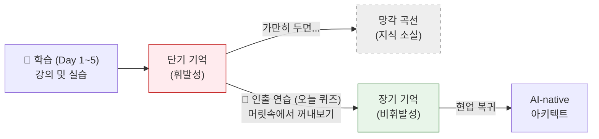

이 다이어그램은 왜 우리가 오늘 이 시점에 퀴즈를 푸는지 그 이유를 직관적으로 보여줍니다. 지식이 망각으로 빠져나가기 직전, "인출(Retrieval)"이라는 퀴즈 활동을 통해 지식의 성격을 단기 기억에서 장기 기억으로 영구히 변환하는 과정입니다.

---


### 🎨 추가 시각화 (Visualization Packet)

**프로그램 아키텍처 진화 (Evolution v1 → v4)**

5일간 다뤘던 프로그램이 하나의 단순한 파일에서 유지보수가 용이한 객체지향 애플리케이션으로 진화한 발자취입니다.

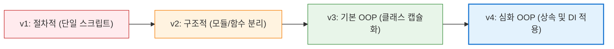

## §3. 상세 내용

### Why — 왜 이 퀴즈 세션이 필요한가?

5일 연속으로 진행되는 집중 교육 과정의 가장 큰 부작용은 "인지적 과부하(Cognitive Overload)"입니다. 수강생들은 매일매일 쏟아지는 새로운 용어(리스트, 딕셔너리, 클래스, 메서드, 다형성 등)를 소화하느라 벅찬 상태입니다. 이때 진도를 더 빼는 것은 학습 효율을 급격히 떨어뜨립니다. 
마지막 날의 오후 세션에 배치된 이 퀴즈 시간은, 잠시 진도의 엑셀에서 발을 떼고 그동안 쌓아올린 지식의 창고를 정리하는 "숨 고르기" 역할을 합니다. 또한 수료를 앞두고 "내가 진짜로 배운 게 있구나"라는 성취감을 주는 심리적 장치이기도 합니다.

### What — 이 세션에서 다루는 것은 무엇인가?

총 10문항으로 구성된 핵심 퀴즈를 다룹니다.
이 퀴즈는 단순한 문법(Syntax)을 묻는 것이 아닙니다. 이 과정의 본질인 "AI-native 개발자로서의 철학"과 "객체지향 패러다임의 이해"를 묻습니다. 
- **Day 1~2**: 개발 환경(가상환경)의 필요성, 프롬프트 엔지니어링(PTCF), SDD 철학 등 본질적 접근법.
- **Day 3~4**: 파이썬의 핵심 자료구조(list vs dict)의 차이, 리팩토링의 정의 등 실무적 이해.
- **Day 5**: 과정의 하이라이트인 클래스와 인스턴스의 관계, 캡슐화, 상속, 다형성, DI에 이르는 아키텍처 원칙.

### How — 구체적으로 어떻게 진행하는가?

퀴즈는 강사가 화면에 문제를 하나씩 띄우고, 수강생이 속으로 생각하거나 타이핑할 30초의 시간을 준 뒤 정답을 맞혀보는 "인터랙티브 쇼" 형식으로 진행됩니다. 
절대 종이를 나눠주고 시험을 보게 해서는 안 됩니다. 한 문제씩 핑퐁을 주고받으며, 정답이 공개될 때마다 강사가 1~2분의 짧고 명쾌한 해설을 곁들이는 것이 핵심입니다.

---

## §4. 실습 가이드 (+ 🎙️ 실습 대본)

### 퀴즈 진행 목표

종이나 시험지 없이, 강사와 수강생이 함께 호흡하며 10개의 핵심 질문을 통과하는 것입니다. 정답을 맞히는 것보다 그 개념이 "왜 중요했는지" 스토리를 다시 떠올리게 하는 것이 진짜 목표입니다.

🎙️ **실습 대본 (Lab Guide)**:

> 자, 지금부터 화면에 총 10개의 질문이 하나씩 등장할 겁니다. 각 문제당 30초씩 시간을 드릴게요. 소리 내서 말씀하실 필요는 없고, 속으로 대답하시거나 메모장에 키워드만 슬쩍 적어보세요. 
> 
> **Q1. (Day 1)** 파이썬을 쓸 때, 내 컴퓨터에 바로 설치하지 않고 '가상환경(Virtual Environment)'을 굳이 귀찮게 만드는 가장 큰 이유는 무엇이었나요?
> (30초 대기)
> 정답은 "프로젝트마다 독립적인 패키지 환경을 유지하기 위해서"입니다. 프로젝트 A와 B가 서로 충돌하지 않게 캡슐 호텔처럼 방을 나눠주는 역할이었죠.
> 
> **Q2. (Day 2)** AI에게 일을 시킬 때 쓰는 마법의 주문, 프롬프트의 4요소는 무엇이었나요? 영어 알파벳 4글자로 떠올려보세요.
> (30초 대기)
> 정답은 P, T, C, F! Persona(역할), Task(임무), Context(배경설명), Format(출력형식)입니다. 이것만 잘 써도 AI의 대답 퀄리티가 180도 달라집니다.
> 
> **Q3. (Day 2)** 우리 교육의 핵심 철학이었던 SDD. 이것은 무엇의 약자이며, 어떤 뜻을 담고 있었나요?
> (30초 대기)
> 정답은 Specification-Driven Development. "명세가 먼저, 코드는 나중"입니다. 코드는 AI가 짭니다. 우리는 "무엇을 만들지"를 명확하게 지시하는 사람이 되어야 한다고 강조했었죠.
> 
> **Q4. (Day 3)** 파이썬의 양대 산맥 자료구조! `list`와 `dict`의 가장 큰 차이점은 무엇인가요?
> (30초 대기)
> 정답은 "접근하는 방식"입니다. `list`는 0, 1, 2 같은 "순서(인덱스)"로 접근하고, `dict`는 "키(key)"라는 이름표를 달아 접근합니다. 줄을 서 있느냐, 이름표를 달고 있느냐의 차이였죠.
> 
> **Q5. (Day 3)** `def` 키워드는 파이썬에서 어떤 역할을 하나요?
> (30초 대기)
> 정답은 "함수를 정의(define)한다"입니다. 우리가 반복해서 쓸 코드를 하나의 박스에 담아 이름을 붙여주는 행위죠.
> 
> **Q6. (Day 4)** 코드를 짜다 보면 꼭 해야 하는 '리팩토링'. 리팩토링의 정확한 뜻은 무엇인가요?
> (30초 대기)
> 정답은 "외부 동작(기능)은 그대로 유지하면서, 내부 구조를 깔끔하게 개선하는 작업"입니다. 식당 메뉴는 똑같은데, 주방의 동선을 효율적으로 바꾸는 공사와 같습니다.
> 
> **Q7. (Day 5)** 오늘 배운 객체지향의 핵심! 클래스와 인스턴스의 관계를 우리가 아주 맛있는 길거리 음식에 비유했었는데, 무엇이었죠?
> (30초 대기)
> 정답은 "붕어빵 틀(클래스)과 붕어빵(인스턴스)"입니다. 틀은 1개지만, 그 틀에서 찍어낸 붕어빵은 수십 개가 될 수 있죠. 1:N의 관계입니다.
> 
> **Q8. (Day 5)** 캡슐화(Encapsulation)를 하는 진짜 목적은 무엇인가요? 왜 굳이 변수 앞에 `__`(언더스코어 두 개)를 붙여가며 숨길까요?
> (30초 대기)
> 정답은 "내부 데이터를 보호하고, 검증된 메서드를 통해서만 접근하게 하여 휴먼 에러를 방지하기 위해서"입니다. 나이에 마이너스 값이 들어오거나 계좌 잔고가 마음대로 조작되는 걸 막기 위한 안전장치죠.
> 
> **Q9. (Day 5)** 자식 클래스가 부모의 재산을 물려받을 때 썼던 `super().__init__()`의 역할은 무엇인가요?
> (30초 대기)
> 정답은 "자식 클래스 안에서, 부모 클래스가 가지고 있던 초기화 셋팅을 먼저 쫙 불러와서 실행하는 것"입니다. 아버지가 일궈놓은 시스템을 그대로 물려받고, 그 위에 내 것만 얹는 기술이죠.
> 
> **Q10. (Day 5)** 대망의 마지막 질문입니다. 오늘 우리가 배운 최고의 아키텍처 패턴, DI(의존성 주입)의 핵심 원칙을 한 문장으로 표현한다면?
> (30초 대기)
> 정답은 "내부에서 직접 만들지 말고, 외부에서 받아라!"입니다. 커피숍 사장님이 원두 농사까지 직접 짓지 않고 밖에서 납품받아야, 나중에 에티오피아 원두에서 콜롬비아 원두로 쉽게 바꿀 수 있다는 그 원칙입니다.

### 트러블슈팅 FAQ

| Q | A |
|---|---|
| 수강생들이 대답을 못 하고 표정이 어두워지면 어떡하죠? | 강사가 "어려운 게 당연하다"고 안심시켜야 합니다. "지금 생각이 안 나는 분들이 정답입니다! 이걸 다 맞히면 제 자리에 올라오셔서 강의하셔야 해요"라며 유머러스하게 긴장을 풀어주세요. |
| 질문 10개를 하는데 시간이 모자라면 어떻게 하나요? | 각 문제당 30초 대기 시간을 철저히 지키세요. 문제 해설도 너무 깊게 들어가지 말고 한 문장 비유로만 짧게 치고 넘어가야 늘어지지 않습니다. |

---


### 🎓 강사 노트 (Instructor Support)

- ⏱️ **타이밍**: 17:15 (25분, lab)
- 🎯 **핵심 활동**: 5일 총정리 퀴즈
- ⚠️ **강사 주의사항**: 재미있게, 경쟁 X


### 📋 실습 설계 보강 (Lab Packet)

**세션 104 실습 설계 보강**

파이썬 기초 전 과정 핵심 퀴즈
- **3-Stage Example Set**
  - 기본: 5일간의 핵심 개념 10문항 퀴즈 풀기 (변수, 자료구조, 함수, OOP, SDD 등)
  - 변형: 오답 문항에 대해 AI에게 "이 개념을 비유로 다시 설명해줘" 요청
  - 실수 해결: "정답을 맞혀도 왜 그런지 설명을 못하겠어요" → AI에게 추가 설명 요청
- **난이도 예측**: 퀴즈 자체는 복습이지만 5일 분량을 한 번에 되돌아보는 인지 부하
- **타이밍 가이드**: 퀴즈 풀기 10분 | 오답 해설 7분 | AI에게 추가 설명 5분 | 정리 3분
- **심리적 장벽**: "다 배운 것 같은데 막상 퀴즈를 풀면 기억이 안 나요"
- **자가 점검**:
  - [ ] 10문항 중 7문항 이상 정답을 맞혔는가?
  - [ ] 오답 문항의 정답과 이유를 AI에게 확인했는가?
  - [ ] SDD(명세 주도 개발)의 전체 흐름을 자신의 말로 설명할 수 있는가?

## §5. 코드 및 명령어 모음

이 세션은 "narrative" 타입의 퀴즈 점검 시간이므로 수강생이 직접 실행해야 할 파이썬 코드나 터미널 명령어는 없습니다. 다만, 화면에 띄울 퀴즈의 스크립트 자체가 이 세션의 가장 중요한 '실행 코드'와 같습니다. 머릿속의 신경망을 실행시키는 과정이니까요.

> 🤖 **AI 프롬프트 예시**: (해당 없음)

---

## §6. 요약

### 핵심 학습 포인트

이번 퀴즈를 통해 우리는 5일간의 거대한 산맥을 단 10개의 이정표로 압축해 보았습니다. 코드를 외우는 것보다 중요한 것은 "왜 이 기술이 필요한가"에 대한 철학이었습니다.
1. **분리하라**: 가상환경과 리팩토링의 핵심은 복잡함을 잘라서 정리하는 것입니다.
2. **명확히 지시하라**: 프롬프트의 PTCF와 SDD는 AI 시대 개발자의 최고 무기입니다.
3. **구조화하라**: 딕셔너리에서 출발해 클래스, 상속, 그리고 DI에 이르는 과정은 "데이터를 얼마나 똑똑하고 유연하게 관리할 것인가"에 대한 인류의 치열한 고민의 결과였습니다.

### 다음 세션 예고

자, 드디어 길고 길었던 5일간의 교육 코어 과정이 모두 끝났습니다. 그렇다면 파이썬이라는 강력한 무기를 얻은 우리는 내일부터 무엇을 할 수 있을까요? 다음 세션(105)에서는 이 과정을 수료한 후 현업으로 돌아가 적용할 수 있는 "심화 학습 로드맵" — 웹 개발, 데이터 분석, AI 통합 등 다양한 선택지를 펼쳐 보여드리겠습니다.

### 브릿지 노트

> "어떠셨나요? 10문제 중 절반만 맞히셨어도 대성공입니다. 지금 여러분의 뇌는 엄청나게 튼튼해졌거든요. 이제 이 단단해진 기초 체력을 바탕으로, 여러분이 뻗어나갈 수 있는 무한한 가능성의 지도를 함께 펼쳐보겠습니다. 다음 시간, 학습 로드맵으로 넘어갑니다!"

---

## §7. 참고 자료

### 3-Source 출처

- **Source A (로컬 참고자료)**: 「8 코딩.pdf」 — 파이썬 기초 전체 과정의 문법적 개념(list, dict, def, 클래스, DI 등)의 퀴즈 출제 근거로 활용되었습니다.
- **Source B (NotebookLM)**: Day 5 NotebookLM 분석 — 시험 효과(Testing Effect)와 뇌 과학적 인출 연습의 교육적 효과를 강사 대본 스크립트 작성에 참고하였습니다.
- **Source C (Deep Research)**: Day 5 Deep Research 보고서 — 각 퀴즈 문항 해설에 사용된 일상적 비유(붕어빵 틀, 캡슐 호텔, 원두 납품 등)의 아이디어 소스로 활용되었습니다.

### 추가 학습 자료

- [시험 효과 (Testing Effect) 위키백과](https://en.wikipedia.org/wiki/Testing_effect): 왜 퀴즈가 최고의 복습 방법인지 다룬 인지심리학 자료
- 과정 중 본인이 작성했던 `01_Planning/강의구성안.md` 문서를 다시 열어보며 5일간의 목표 달성 여부를 회고해 보세요.

### 강사 노트

> 💡 **강사 노트**: 이 세션은 절대 분위기가 무거워지면 안 됩니다. 퀴즈라고 하면 학창 시절의 트라우마가 발동하는 수강생들이 꽤 있습니다. 시작 전에 "점수를 매기지 않는다", "틀리는 것이 학습이다"라는 점을 2~3번 거듭 거듭 강조해 주세요. 정답을 발표할 때는 마치 레크리에이션 강사처럼 경쾌하고 밝은 톤을 유지해야 수강생들이 편안하게 참여할 수 있습니다.

---

## ✅ 세션 완료 체크리스트 (강사용)

- [ ] §1~§7 모든 섹션이 빠짐없이 작성되었는가?
- [ ] 구어체 톤 앤 매너(🗣️ 강사 대본 등)가 일관되게 유지되었는가?
- [ ] 퀴즈 진행 방식이 수강생의 부담을 줄여주는 형태로 설명되었는가?
- [ ] Day 1부터 Day 5까지 전 과정을 아우르는 10문항이 잘 배치되었는가?
- [ ] 시험 효과(Testing Effect)를 설명하는 Mermaid 다이어그램이 정상 출력되는가?

---

*작성 일시: 2026-02-25*  
*작성 에이전트: Sisyphus-Junior*  
*교안 구조: 7섹션 (A0 팀 공통 표준)*


> 🔗 **이전 세션**: [세션 103: 수료 프로젝트 코드 리뷰 공유](#세션-103)에서 배운 내용을 이어갑니다.
> 🔗 **다음 세션**: [세션 105: 수료 후 학습 로드맵 및 심화 학습 상담](#세션-105)에서 계속됩니다.

---

### 세션 105: 수료 후 학습 로드맵 및 심화 학습 상담
> [원본 파일](sessions/세션-105-수료_후_학습_로드맵_및_심화_학습_상담_v2.1.md) | ⏱️ 20분 | 📖 narrative | 난이도: low

> **세션 ID**: MS-PY101-105  
> **소요 시간**: 20분  
> **난이도**: low  
> **청크 타입**: narrative  
> **버전**: v2.1 (7섹션 구조)

---

## §1. 개요

> **Day 5 | PM | 세션 105/106**

이 세션은 5일간의 치열했던 "AI-native 파이썬 기초" 과정의 대장정을 마무리하기 직전, 수강생들이 앞으로 나아갈 길을 밝혀주는 등대와 같은 시간입니다. 지난 5일 동안 변수, 제어문부터 시작해 객체지향 프로그래밍(OOP)과 의존성 주입(DI) 같은 고급 아키텍처까지 쉼 없이 달려왔습니다. 이제 수강생들의 머릿속에는 "그래서 나 이제 뭐 해야 하지?"라는 현실적이고 막막한 질문이 자리 잡고 있을 것입니다. 이 세션은 그 막연한 불안감을 명확한 목표와 학습 로드맵으로 전환해주는 결정적인 역할을 합니다.

### 🎯 학습 목표

이 세션이 끝나면 수강생은 다음을 할 수 있어요:

- 파이썬을 활용할 수 있는 세 가지 주요 진로(웹 백엔드, 데이터 분석, 업무 자동화)의 특징을 이해할 수 있습니다.
- 자신의 직무나 관심사에 가장 잘 맞는 심화 학습 분야를 하나 선택할 수 있습니다.
- AI 비서(ChatGPT, Gemini 등)를 활용하여 자신만의 1개월 맞춤형 심화 학습 커리큘럼을 직접 설계할 수 있습니다.

### 선행 세션 환기

이 세션은 방금 전 진행된 '세션 104: 파이썬 기초 전 과정 핵심 퀴즈' 직후에 이어집니다. 퀴즈를 통해 자신이 5일 동안 얼마나 많은 것을 스펀지처럼 흡수했는지 성취감을 느낀 상태에서, 그 자신감을 바탕으로 다음 단계의 거대한 도전을 계획하게 됩니다. 특히 Day 5 전체를 관통했던 '아키텍트로서의 시각'과 '명세 주도 개발(SDD)'의 경험이 앞으로의 독학 과정에 어떻게 쓰일지 연결해 줄 것입니다.

---

## §2. 핵심 개념 (+ 🗣️ 강사 대본 + Mermaid)

### 코어 근육과 주특기 종목의 비유

지금까지 배운 파이썬 기초와 객체지향 설계 원칙은 운동으로 치면 '기초 체력'이자 '코어 근육'입니다. 기초 체력만으로는 올림픽에서 메달을 딸 수 없듯이, 파이썬 기초 문법만으로는 당장 현업의 거대한 문제를 풀기 어렵습니다. 이제 수영, 육상, 양궁처럼 자신의 '주특기 종목'을 정하고, 그 종목에 맞는 전용 도구(프레임워크와 라이브러리)를 연마해야 할 때입니다. 파이썬의 세계에서는 그 주특기 종목이 크게 웹 개발, 데이터 분석, 업무 자동화의 세 가지로 나뉩니다.

🗣️ **강사 대본 (Instructor Script)**:

> 여러분, 5일간의 파이썬 기초 과정이 정말 거의 끝나가고 있습니다. 이쯤 되면 여러분의 머릿속에 반드시 떠오르는 아주 현실적이고 날카로운 질문이 하나 있을 겁니다. "강사님, 5일 동안 파이썬 열심히 배웠는데, 저 이제 이걸로 취업할 수 있나요?" 혹은 "이것만으로 내일 당장 회사 출근해서 현업 실무에 바로 쓸 수 있나요?"
>
> 제 대답은 아주 단호하게 "아니요"입니다. 놀라셨나요? 하지만 실망하실 필요는 전혀 없습니다. 여러분이 지금까지 하신 일은, 거대한 마천루를 올리기 전에 가장 중요하고 가장 힘든 '기반 공사'를 완벽하게 해낸 것과 같습니다. 변수부터 시작해서 함수, 클래스, 상속, 다형성, 그리고 객체지향 아키텍처의 꽃인 의존성 주입(DI)까지. 비전공자가 단 5일 만에 이 정도 깊이까지 도달했다는 것 자체가 엄청난 성취입니다. 다만, 이 튼튼한 기초 위에 어떤 모양의 '건물'을 올릴지, 즉 어떤 전문 분야를 여러분의 무기로 삼을지 결정해야 할 시간이 온 것입니다. 
> 
> 이 상황을 운동에 비유해 볼까요? 여러분이 올림픽에 출전하려는 운동선수라고 상상해 봅시다. 올림픽에 나가려면 가장 먼저 무엇을 해야 할까요? 바로 달리기, 팔굽혀펴기, 윗몸일으키기 같은 '기초 체력'을 기르는 것입니다. 기초 체력 없이는 전반전 10분도 뛰지 못하고 쓰러지거나 부상을 입게 되니까요. 여러분이 지난 5일간 치열하게 배운 파이썬 기초 문법, 제어문, 그리고 객체지향 설계 원칙들이 바로 이 튼튼한 '코어 근육'에 해당합니다. 
>
> 하지만 체력만 엄청나게 좋다고 해서 올림픽 금메달을 딸 수 있을까요? 아닙니다. 축구를 할지, 농구를 할지, 수영을 할지 자신의 '주특기 종목'을 정하고 그 종목에 맞는 기술을 연마해야 합니다. 여러분의 코어 근육은 이미 완성되었습니다. 자, 파이썬이라는 넓은 운동장에서 여러분의 심장은 어느 종목을 향해 뛰고 있나요? 오늘 그 방향을 확실히 잡아드리겠습니다.

### Mermaid 다이어그램

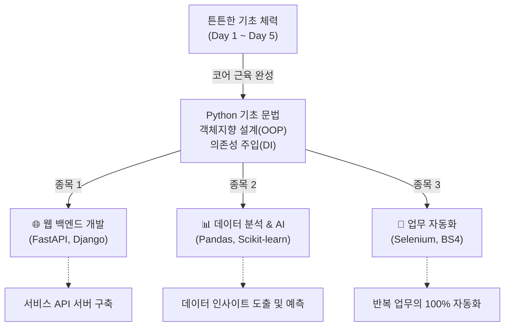

이 다이어그램은 수강생들이 5일 동안 완성한 '코어 근육'을 바탕으로, 앞으로 선택할 수 있는 세 가지 강력한 진로 확장성을 직관적으로 보여줍니다. 

---

## §3. 상세 내용

### Why — 왜 이 세션이 필요한가?

수많은 코딩 부트캠프나 단기 교육이 범하는 가장 큰 실수는, 마지막 날 진도를 빼느라 허덕이다가 "자, 끝났습니다. 수고하셨습니다." 하고 수강생들을 황량한 벌판에 던져두는 것입니다. 수강생들은 기초 문법은 뗐지만, 현업의 거대한 프레임워크 앞에서는 다시 작아집니다. 이 세션은 그 갭을 메우는 다리입니다. "모든 것을 다 할 필요는 없다. 하나만 정해서 깊게 파면 된다"는 안도감을 주고, 수료 후 다음 날 아침에 눈을 떴을 때 무엇을 공부해야 할지 정확한 목표를 손에 쥐여주기 위해 이 시간이 반드시 필요합니다.

### What — 이 세션에서 다루는 것은 무엇인가?

파이썬을 활용한 3대 주요 진출 분야와 각각의 대표적인 도구들을 소개합니다. 강박을 버리고 '선택과 집중'을 해야 한다는 마인드셋도 함께 전달합니다.

1. **웹 백엔드 개발 (Web Backend)**: 네이버, 카카오톡 같은 서비스의 뒷단을 만듭니다. 'FastAPI'와 'Django'가 대표적입니다. 특히 FastAPI는 우리가 배운 파이썬의 클래스와 타입 힌트를 극도로 잘 활용하므로 진입하기 좋습니다.
2. **데이터 분석과 인공지능 (Data Analysis & AI)**: 엑셀의 한계를 넘어 수백만 건의 데이터를 다룹니다. 'Pandas'로 데이터를 주무르고, 'NumPy'와 'Matplotlib'을 거쳐, 머신러닝의 표준인 'Scikit-learn'으로 나아갑니다.
3. **업무 자동화 (Automation)**: 직장인들에게 가장 즉각적인 가치를 줍니다. 웹 브라우저를 자동 조작하는 'Selenium', 데이터를 긁어오는 'BeautifulSoup' 등을 활용해 단순 반복 업무를 제거합니다.

### How — 구체적으로 어떻게 진행하는가?

🗣️ **강사 대본 (Instructor Script)**:

> 각 분야로 진출하기 위해 어떤 도구들을 순서대로 배워야 하는지 구체적인 로드맵을 알려드리겠습니다.
>
> 먼저 웹 개발 쪽으로 마음이 기울었다면, 'FastAPI'나 'Django'라는 웹 프레임워크를 배우셔야 합니다. 특히 FastAPI는 최근 현업에서 가장 각광받는 도구인데, 우리가 Day 5에서 뼈빠지게 배운 클래스와 타입 힌트가 아주 그대로 활용되기 때문에 여러분이 진입하기에 가장 좋습니다. 사용자의 요청을 받고, 데이터베이스에서 정보를 꺼내서 돌려주는 REST API를 만드는 법을 배우게 될 것입니다.
>
> 만약 데이터 분석과 AI 쪽에 가슴이 뛴다면 무조건 'Pandas(판다스)'부터 시작하십시오. 엑셀로 처리하기 버거운 수백만 줄의 데이터를 파이썬으로 불러와 순식간에 필터링하고 병합하는 기적의 도구입니다. Pandas에 익숙해진 다음에는 수치 계산을 위한 NumPy, 예쁜 그래프를 그리기 위한 Matplotlib을 거쳐서, 최종적으로 머신러닝의 표준인 Scikit-learn이나 딥러닝을 위한 PyTorch로 나아가시면 됩니다.
>
> 마지막으로 "나는 당장 내일 출근해서 내 엑셀 업무부터 편하게 만들고 싶다!" 하는 직장인이라면 '업무 자동화'가 최고의 선택입니다. 웹 브라우저를 내 손 대신 자동으로 조작해 주는 Selenium, 웹페이지에서 원하는 글자만 쏙쏙 뽑아오는 BeautifulSoup 같은 라이브러리를 배우면 됩니다. 매일 30분씩 수작업으로 하던 일을 파이썬 스크립트 하나로 단 3초 만에 끝내는 그 쾌감은 정말 중독적입니다.
>
> 여기서 가장 중요한 팁을 하나 드릴게요. "이 세 가지를 다 해야 하나요?"라는 강박을 당장 버리세요. 절대 아닙니다. 하나의 프레임워크를 깊게 파서 원리를 깨우치면, 다른 분야로 넘어가는 것은 아주 쉽습니다. 선택과 집중이 필요합니다.

### 분야별 학습 도구 비교표

| 분야 | 핵심 목적 | 1단계 필수 도구 | 2단계 심화 도구 | 추천 대상 |
|---|---|---|---|---|
| 웹 백엔드 | 서비스 서버 구축, API 개발 | FastAPI | Django, SQLAlchemy | 서비스 기획자, 서버 개발자 지망생 |
| 데이터 분석/AI | 데이터 인사이트 도출, 예측 | Pandas | Scikit-learn, PyTorch | 마케터, 데이터 분석가 지망생 |
| 업무 자동화 | 단순 반복 작업 제거 | BeautifulSoup | Selenium, PyAutoGUI | 사무직 종사자, 빠른 성과를 원하는 자 |

---

## §4. 실습 가이드 (+ 🎙️ 실습 대본)

### 실습 목표

수강생 스스로 AI(ChatGPT, Claude, Gemini 등)를 활용해 자신의 상황과 관심사에 맞는 '1개월 심화 학습 커리큘럼'을 직접 설계해 봅니다. 이를 통해 수료 후에도 강사 없이 주도적으로 학습을 이어나갈 수 있는 방법을 체득합니다.

🎙️ **실습 가이드 대본 (Lab Guide)**:

> 예전 같았으면 여러분이 새로운 프레임워크를 배우기 위해 또 한 달짜리 학원 강의를 끊거나 아주 두꺼운 책을 사서 첫 장부터 넘겨야 했을 겁니다. 하지만 지금은 시대가 다릅니다. 기억나시나요? Day 1에 우리가 이야기했던 네비게이션 비유 말입니다. 여러분은 이 5일 동안 'AI에게 목적지를 정확하게 입력하고, 코드를 검증하는 법'을 완벽하게 마스터했습니다. 
> 
> 앞으로의 심화 학습은 여러분과 AI의 1:1 페어 프로그래밍이 될 것입니다. 지금 바로 실습을 해보겠습니다. 여러분이 웹 개발, 데이터 분석, 업무 자동화 중 가장 끌리는 분야를 하나 속으로 정해보세요. 그리고 여러분의 AI 비서를 열고 화면에 띄워드린 프롬프트를 정확히 입력해 보십시오.
>
> 자, AI가 여러분만을 위한 1개월짜리 맞춤형 커리큘럼을 순식간에 짜줄 것입니다. 지금부터 약 7분 정도 시간을 드릴 테니, AI가 짜준 로드맵을 꼼꼼히 읽어보세요. 그리고 궁금한 점이 있다면 언제든 저를 부르시거나 손을 들고 질문해 주시기 바랍니다. "강사님, AI가 Pandas 다음에 Spark를 배우라는데 이게 맞나요?", "FastAPI랑 Django 중에 요즘 현업에서는 어느 쪽 수요가 더 많나요?" 등등 여러분의 진로와 실무에 직결되는 현실적인 질문들을 마구 던져주세요. 지금 이 시간이 여러분의 다음 스텝을 결정하는 아주 중요한 멘토링 시간이 될 것입니다.

### 단계별 실습 지시사항

| 단계 | 소요 시간 | 강사 지시사항 | 학습자 액션 | 예상 결과 |
|---|---|---|---|---|
| 1 | 1분 | "세 가지 분야 중 하나를 마음속으로 선택하세요." | 관심 분야 고민 및 결정 | 목표 분야 확정 |
| 2 | 2분 | "화면의 프롬프트를 AI 비서에게 복사하여 입력하세요." | AI 챗봇에 프롬프트 입력 및 실행 | 맞춤형 커리큘럼 생성 완료 |
| 3 | 4분 | "AI가 짜준 1개월 커리큘럼을 꼼꼼히 읽고 분석하세요." | 생성된 커리큘럼 리딩 | 향후 한 달간의 학습 계획 파악 |
| 4 | 3분 | "궁금한 점, 현실적인 고민을 저에게 질문해 주세요." | 강사에게 진로/도구 관련 질문 | 학습 방향에 대한 확신 획득 |

---


### 🎓 강사 노트 (Instructor Support)

- ⏱️ **타이밍**: 17:40 (20분, narrative)
- 🎯 **핵심 활동**: 웹/데이터/자동화 경로 안내
- ⚠️ **강사 주의사항**: 개인 맞춤 조언

## §5. 코드 및 명령어 모음

이번 세션은 파이썬 코드를 작성하는 것이 아니라, 수강생이 AI에게 학습 로드맵을 요청하기 위한 **'프롬프트 템플릿'**을 제공하는 것이 핵심입니다. 화면에 아래 프롬프트를 크게 띄워주세요.

> 🤖 **AI 프롬프트 예시 (로드맵 생성기)**: 
```text
나는 파이썬 기초(변수부터 클래스, 객체지향, 의존성 주입(DI) 패턴까지)를 막 끝낸 학생이야. 
앞으로 [웹 백엔드 개발 / 데이터 분석 / 업무 자동화 중 택 1] 분야의 전문가로 성장하고 싶어.

향후 1개월 동안 내가 하루 2시간씩 공부한다고 가정하고, 
어떤 라이브러리를 어떤 순서로 학습해야 할지 
주차별(1주차~4주차)로 구체적인 커리큘럼과 미니 프로젝트 주제를 짜줘.

현업에서 가장 많이 쓰이는 최신 트렌드를 반영해서 실용적으로 작성해줘.
```

> 💡 **강사 팁**: 괄호 `[...]` 안의 내용을 자신의 선택에 맞게 반드시 수정해서 입력하도록 안내하세요.

---

## §6. 요약

### 핵심 학습 포인트

여러분이 방금 AI와 함께 만든 그 한 달짜리 로드맵이 바로 여러분의 다음 목표입니다. 오늘 우리가 경험한 것처럼, 이제 여러분은 모르는 새로운 기술, 새로운 라이브러리가 등장해도 절대 두려워할 필요가 없습니다. 명확하게 요구사항을 정의하고 AI의 힘을 빌려 코드를 작성해 내는 명세 주도 개발(SDD)의 뼈대가 여러분 몸에 확실히 각인되었기 때문입니다. 이 '코어 근육'만 있다면, 데이터 분석이든 웹 서버든 못 만들 것이 없습니다.

### 다음 세션 예고

목표가 명확해지셨나요? 여러분의 눈빛이 첫날 파이썬을 처음 켰을 때보다 훨씬 매섭고 단단해졌음을 느낍니다. 자, 이제 이 길고도 짧았던 5일간의 여정에 진정한 마침표를 찍을 시간입니다. 다음 시간은 대망의 마지막 세션, 그동안의 성과를 축하하고 마무리하는 '최종 마무리 및 수료식'으로 넘어가겠습니다!

---

## §7. 참고 자료

### 3-Source 출처

- **Source A (로컬 참고자료)**: `8 코딩.pdf §8.14 OOP 관련` — 객체지향 프로그래밍 및 아키텍처(DI) 학습은 비전공자에게 상당한 난이도이므로, 이를 무사히 성취해 낸 것을 충분히 칭찬하며 코어 근육 비유에 활용했습니다.
- **Source B (NotebookLM)**: `02_Material/skeleton_packet.md §Day 5 진화 과정` — 절차적 프로그래밍에서 아키텍처로의 진화 과정을 상기시키며, 이것이 향후 프레임워크 학습의 튼튼한 기반(기초 체력)이 됨을 강조하는 데 사용되었습니다.
- **Source C (Deep Research)**: `01_Planning/micro_sessions/세션-105-수료_후_학습_로드맵_및_심화_학습_상담.md` — 기획 의도에 따라, 학습자 스스로 AI를 활용해 로드맵을 생성하도록 유도하여 주도적인 학습 태도를 갖게 하는 실습 구성을 반영했습니다.

### 추가 학습 자료

- [FastAPI 공식 문서](https://fastapi.tiangolo.com/ko/): 웹 개발 진로 선택자를 위한 1순위 추천 레퍼런스
- [Pandas 10분 완성](https://pandas.pydata.org/pandas-docs/stable/user_guide/10min.html): 데이터 분석 진로 선택자를 위한 빠른 튜토리얼 가이드

### 강사 노트

> 💡 **강사 노트**: 
> 이 세션에서는 수강생들에게 현실적인 기대치를 심어주는 동시에 성취감을 최고조로 고취시켜야 합니다. "나는 이제 파이썬의 기초 체력이 생겼고, AI라는 최고의 코치가 있으니 어떤 종목이든 도전할 수 있다"는 자신감을 불어넣는 것이 핵심입니다. 실습 시간에 수강생들이 생성한 프롬프트 결과를 한두 명 정도 공유하게 하여 분위기를 띄우고, 각 도구(FastAPI, Pandas 등)에 대한 실무적인 질문이 나오면 강사의 실무 경험을 살려 현실적인 조언을 아낌없이 제공해 주세요.

---

## ✅ 세션 완료 체크리스트 (강사용)

- [ ] §1~§7 모든 섹션이 충실하게 작성되었는가?
- [ ] 기초 체력(코어 근육)과 주특기 종목의 비유가 효과적으로 전달되었는가?
- [ ] 3대 진출 분야(웹, 데이터, 자동화)의 차이점과 도구를 명확히 설명했는가?
- [ ] 수강생들이 스스로 AI를 활용해 1개월 로드맵을 생성하도록 유도했는가?
- [ ] 수강생의 다음 단계에 대한 두려움을 없애고 자신감을 부여했는가?

---

*작성 일시: 2026-02-25*  
*작성 에이전트: Sisyphus-Junior*  
*교안 구조: 7섹션 (A0 팀 공통 표준)*

> 🔗 **이전 세션**: [세션 104: 파이썬 기초 전 과정 핵심 퀴즈](#세션-104)에서 배운 내용을 이어갑니다.
> 🔗 **다음 세션**: [세션 106: 최종 마무리 및 수료식](#세션-106)에서 계속됩니다.

---

### 세션 106: 최종 마무리 및 수료식
> [원본 파일](sessions/세션-106-최종_마무리_및_수료식_v2.1.md) | ⏱️ 20분 | 📖 narrative | 난이도: low

> **세션 ID**: MS-PY101-106  
> **소요 시간**: 20분  
> **난이도**: low  
> **청크 타입**: narrative  
> **버전**: v2.1 (7섹션 구조)

---

## §1. 개요

> **Day 5 | PM | 세션 106/106**

이 세션은 5일간 40시간에 걸친 "AI-native 파이썬 기초" 과정의 가장 마지막 시간이자, 대미를 장식하는 수료식 세션입니다. 첫날 까만 터미널 창을 보며 두려워했던 비전공자 수강생들이, 이제는 객체지향 아키텍처와 의존성 주입(DI)까지 이해하는 어엿한 'AI-native 개발자'로 성장한 것을 축하하고 마무리하는 정서적 유대감 형성의 시간입니다.

### 🎯 학습 목표

이 세션이 끝나면 수강생은 다음을 할 수 있어요:

- 5일간의 놀라운 성장과 성취를 되돌아보고, 개발자로서의 자신감을 가질 수 있습니다.
- 코딩 문법 암기가 아닌, "설계하고 지시하는 자"로서의 AI-native 개발자 정체성을 확립합니다.
- 향후 지속적인 학습과 성장을 위한 네트워킹 채널(디스코드/오픈채팅 등)에 성공적으로 합류합니다.

### 선행 세션 환기

이 세션은 세션 105 "수료 후 학습 로드맵 및 심화 학습 상담" 직후에 이어집니다. 앞서 살펴본 다양한 향후 진로와 학습 방향을 안고, 이제 공식적으로 이 5일간의 강행군에 마침표를 찍습니다. 첫날 세션 001에서 들었던 "네비게이션 비유"를 다시 한번 떠올리며 완벽한 수미상관을 이룰 거예요.

---

## §2. 핵심 개념 (+ 🗣️ 강사 대본 + Mermaid)

### 5일간의 여정: 초보 운전자에서 베테랑 드라이버로

강의 첫날, AI는 목적지를 찾아주는 '네비게이션'이라는 비유를 들었습니다. 그때는 그저 낯선 개념이었지만, 5일이 지난 지금 수강생들은 그 의미를 온몸으로 체감하고 있습니다. 맹목적으로 네비게이션이 알려주는 길을 가다가 길을 잃었던 초보 운전자가, 이제는 스스로 목적지를 명확히 찍고(SDD), 잘못된 길로 가면 경로를 과감히 수정하는(트러블슈팅) 베테랑 드라이버로 변모했습니다.

🗣️ **강사 대본 (Instructor Script)**:

> 여러분, 드디어 이 순간이 왔습니다. 5일 전 첫날 아침을 한 번 떠올려 보시겠어요? 까만 터미널 창에 태어나서 처음 보는 빨간색 영어 에러 메시지가 떴을 때, 여러분 중 절반은 키보드에 손을 얹지도 못하고 얼어붙어 계셨습니다. 쉬는 시간에 조용히 찾아와 "강사님, 저는 코딩 쪽 머리가 아닌 것 같아요"라고 고백하셨던 분도 계셨죠.
>
> 하지만 지금 여러분의 모니터 화면을 보세요. 클래스를 나누고, 상속을 이용해 VIP 고객을 분리하고, 심지어 파일 저장소와 데이터베이스 저장소를 자유자재로 갈아 끼우는 '의존성 주입(DI)' 패턴이 적용된 시스템이 떡하니 돌아가고 있습니다. 비전공자로서 단 5일 만에 절차적 프로그래밍을 넘어 객체지향 아키텍처까지 도달했다는 것은 정말 기적 같은 일입니다.
>
> 제가 강의 첫날, 여러분께 AI는 '네비게이션'이라는 비유를 들려드렸죠. 그때는 네비게이션(AI)이 만들어준 코드에 에러가 나면 어디서부터 손을 대야 할지 몰라 그저 멍하니 화면만 바라보셨습니다. 하지만 지금은 다릅니다. 목적지를 명확히 찍을 줄 알고, 네비게이션이 엉뚱한 길로 안내하면 "요구사항은 그게 아니야, 다시 탐색해!"라고 당당히 요구할 줄 아십니다. 
> 
> 여러분은 더 이상 네비게이션의 지시에 끌려다니는 초보가 아닙니다. 스스로 목적지를 정하고 시스템을 올바른 방향으로 이끄는 베테랑 드라이버, 즉 진짜 'AI-native 개발자'가 되셨습니다!

> 💡 **강사 노트**: 첫날의 두려움과 현재의 성취(클래스, DI 적용)를 극적으로 대비시켜, 수강생들이 스스로 이룬 성과에 강한 자부심을 느끼도록 감정을 고조시키는 것이 이 대본의 핵심입니다.

### Mermaid 다이어그램: 우리의 5일간 여정

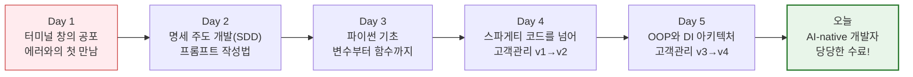

이 다이어그램은 두려움으로 가득 찼던 Day 1에서 시작하여, 완벽한 객체지향 아키텍처를 구현해 낸 Day 5를 거쳐 자랑스러운 수료에 이르는 우리의 극적인 성장 여정을 한눈에 보여줍니다.

---

## §3. 상세 내용

### Why — 왜 이 세션이 필요한가?

40시간의 교육은 지식을 전달하는 것만큼이나, 끝맺음의 감동과 성취감을 부여하는 것이 중요합니다. 특히 비전공자들에게 프로그래밍 학습은 매 순간이 좌절과 극복의 연속이었습니다. 이 마지막 세션은 그 치열했던 과정을 긍정적인 성취의 기억으로 포장하고, "나는 어려운 것도 해낼 수 있다"는 강력한 자기 효능감을 심어주는 역할을 합니다.

### What — 이 세션에서 다루는 것은 무엇인가?

이 세션에서는 세 가지 핵심적인 마무리를 진행합니다. 첫째, 우리가 길렀던 세 가지 근육(문제 정의, 프롬프트 엔지니어링, 트러블슈팅)에 대한 재조명. 둘째, 교육 수료 이후에도 함께 성장할 수 있는 동료 학습 커뮤니티(네트워킹 채널) 합류. 셋째, 한 명 한 명 이름을 호명하며 박수를 쳐주는 공식적인 수료증 수여식입니다.

### How — 구체적으로 어떻게 진행하는가?

🗣️ **강사 대본 (Instructor Script)**:

> 오늘 받으시게 될 이 수료증의 진짜 의미를 말씀드리고 싶습니다. 이 수료증은 "이 사람은 파이썬의 모든 문법을 다 외웠다"는 뜻이 아닙니다. 솔직히 말씀드리면, 여러분은 내일 당장 for문이나 딕셔너리 문법을 까먹으실지도 모릅니다. 그런데 그건 전혀 문제가 안 됩니다. 저를 포함한 현업의 시니어 개발자들도 매일 구글링을 하고 AI에게 문법을 물어보면서 코딩하니까요.
>
> 이 수료증의 진정한 의미는 **"이 사람은 이제 모르는 기술이나 에러가 나와도 절대 두려워하지 않는다"**는 자신감에 대한 증명서입니다. 
> 
> 여러분은 5일 동안 세 가지의 아주 단단한 근육을 길렀습니다. 첫째, 무엇을 만들고 싶은지 명확하게 정의하는 SDD 능력. 둘째, 그 요구사항을 AI에게 효과적으로 지시하고 검증하는 프롬프트 엔지니어링 능력. 셋째, 에러가 발생해도 원인을 논리적으로 추적해 내는 트러블슈팅 능력입니다.
> 
> "코딩하지 마라, 설계하라." 이 문장이 바로 AI-native 개발자의 진짜 정체성이자 여러분이 앞으로 가져가야 할 가장 중요한 무기입니다.

> ✅ **체크포인트**: 
> - 이 수료증의 진짜 의미가 무엇인지 강사의 목소리로 진정성 있게 전달했나요?
> - "설계하라"라는 이 과정의 궁극적인 메시지가 확실하게 각인되었나요?

---

## §4. 실습 가이드 (+ 🎙️ 실습 대본) — 해당 시

### 실습 목표

코드 작성 실습은 끝났습니다. 이번 세션의 유일한 실습은 바로 '개발자 커뮤니티'에 첫 발을 내딛는 것입니다. 과정이 끝나고 각자의 자리로 돌아간 후에도 에러를 물어보고, 새로운 프롬프트 기법을 나눌 수 있는 디스코드나 오픈채팅방에 모두 입장하도록 안내합니다.

🎙️ **실습 가이드 대본 (Lab Guide)**:

> 자, 이제 공식적인 수료식을 진행하도록 하겠습니다. 그 전에 먼저, 제가 방금 단체 채팅방에 공유해 드린 디스코드(또는 오픈채팅방) 링크를 클릭해서 모두 입장해 주시길 바랍니다. 
>
> 이 과정은 오늘로 끝나지만, 여러분의 진짜 학습은 이제부터 시작입니다. 혼자 개발하다가 막히면 언제든지 이 채널에 오셔서 에러 메시지를 캡처해 올리세요. 우리가 5일 동안 함께 삽질하며 쌓은 전우애가 여기서 빛을 발할 겁니다. 
> 
> 지금 입장하신 분들은, 가벼운 인사와 함께 "내가 이번 과정에서 썼던 가장 기발한 프롬프트" 또는 "나를 가장 괴롭혔던 빨간색 에러 메시지"를 하나씩 채팅창에 남겨주세요. 자, 1분 정도 시간 드리겠습니다!
>
> (수강생들 채팅 입력 대기 및 반응을 보며 크게 호응해 줍니다)
>
> 좋습니다! 이제 한 분 한 분의 이름을 호명하며 수료증을 전달하겠습니다. 호명되시는 분들은 자리에서 일어나 주시고, 나머지 분들은 5일간 엄청난 강행군을 버텨낸 전우를 위해 정말 뜨거운 박수를 보내주시기 바랍니다!

### 단계별 지시

| 단계 | 소요 시간 | 강사 지시사항 | 학습자 액션 | 예상 결과 |
|------|----------|--------------|------------|----------|
| 1 | 3분 | 네트워킹 채널 링크 공유 및 입장 안내 | 링크 클릭 후 입장 | 전원 커뮤니티 합류 |
| 2 | 2분 | 입장 인사 및 가장 기억에 남는 에러/프롬프트 공유 지시 | 채팅창에 소감/경험 입력 | 공감대 형성 및 활발한 반응 |
| 3 | 10분 | 개별 이름 호명 및 수료증 수여 (박수 유도) | 이름 불리면 기립/수령, 서로 박수 | 성취감 극대화 |
| 4 | 5분 | 강사의 최종 마무리 멘트 | 경청 | 감동적인 마무리 |

---


### 🎓 강사 노트 (Instructor Support)

- ⏱️ **타이밍**: 18:00 (20분, narrative)
- 🎯 **핵심 활동**: 수료증 수여 + 축하 🎉
- ⚠️ **강사 주의사항**: 감동적 마무리!

## §5. 코드 및 명령어 모음 — 해당 시

이 세션은 과정의 대단원을 장식하는 narrative 타입이므로, 추가적인 파이썬 코드 실습이나 터미널 명령어는 없습니다. 우리가 짠 코드는 이미 완벽하게 동작하고 있으니까요!

> 🤖 **AI 프롬프트 예시**: 해당 없음 (이제는 여러분 스스로가 훌륭한 프롬프트 엔지니어입니다!)

---

## §6. 요약

### 핵심 학습 포인트

이번 세션을 관통하는 가장 중요한 세 가지 메시지입니다. 첫째, 5일간의 성취를 축하합니다. 절차적 프로그래밍도 모르던 상태에서 객체지향 아키텍처와 DI까지 도달한 것은 놀라운 성과입니다. 둘째, 문법을 잊어버리는 것을 두려워하지 마세요. 우리의 진짜 무기는 에러를 두려워하지 않는 트러블슈팅 능력과 요구사항 설계(SDD) 능력입니다. 셋째, 혼자 가지 말고 함께 가세요. 오늘 합류한 커뮤니티를 통해 동료들과 계속해서 지식과 경험을 나누시기 바랍니다.

### 과정 종료 브릿지 노트

> "이 수료증이 그저 여러분의 책상 서랍 구석에서 잠드는 흔한 종이 쪼가리가 되지 않았으면 좋겠습니다. 여러분이 앞으로 일하다가 벽에 부딪히고 막막해질 때마다, 모니터 옆에 붙여둔 이 수료증을 보며 '그래, 나는 그 복잡한 파이썬 객체지향 아키텍처도 5일 만에 뚫어낸 사람이야'라는 강력한 자신감을 되찾는 증표가 되길 바랍니다.
> 
> 이것으로 총 40시간의 길고 치열했던 대장정을 모두 마칩니다. 5일 전의 나와 지금의 나는 완전히 다른 사람이 되었습니다. 여러분의 앞으로의 코드에 버그보다는 새로운 배움이 훨씬 더 많기를 진심으로 응원하며, 언젠가 멋진 현업 개발자 동료로 다시 만나 웃으며 인사할 수 있기를 기대하겠습니다. 여러분, 정말 수고 많으셨습니다. 감사합니다!"

---

## §7. 참고 자료

### 3-Source 출처

- **Source A (로컬 참고자료)**: 「AI 시대의 서사 v3 - Claude.md」 — AI-native 개발자로서의 철학과 정체성, "코딩하지 마라, 설계하라"는 핵심 메시지를 반영했습니다.
- **Source B (NotebookLM)**: `8 코딩.pdf` — 수강생들이 5일간 이루어낸 구체적 기술 성과(클래스, DI, 객체지향 아키텍처 등)를 회고하는 근거 자료로 활용했습니다.
- **Source C (Deep Research)**: `세션-106 기획안` — 향후 네트워킹 채널 참여를 통한 지속적인 학습 생태계 구축의 필요성을 반영했습니다.

### 강사 노트

> 💡 **강사 노트**: 본 세션은 과정 전체의 감동을 끌어올리는 아주 중요한 시간입니다. 단순한 지식 요약이 아니라, 수강생들이 겪었던 구체적인 어려움(터미널의 빨간 에러 메시지)과 성취(DI 패턴 구현)를 명확히 대조하여 그들의 성장을 피부로 느끼게 해주세요. 수료증 수여 시에는 형식적인 진행보다는 한 명 한 명 눈을 맞추며 진심 어린 축하를 건네는 것이 중요합니다.

---

## ✅ 세션 완료 체크리스트 (강사용)

- [ ] §1~§7 모든 섹션이 빠짐없이 작성되었는가?
- [ ] 첫날의 두려움과 현재의 성과를 대비하는 스토리텔링이 포함되었는가?
- [ ] 5일간의 여정을 보여주는 Mermaid 다이어그램이 적절히 배치되었는가?
- [ ] 수강생 네트워킹 채널 입장 유도가 실습으로 명확히 제시되었는가?
- [ ] 감동적이고 힘찬 마무리 멘트가 🗣️ 강사 대본으로 작성되었는가?

---

*작성 일시: 2026-02-25*  
*작성 에이전트: Sisyphus-Junior*  
*교안 구조: 7섹션 (A0 팀 공통 표준)*

> 🔗 **이전 세션**: [세션 105: 수료 후 학습 로드맵 및 심화 학습 상담](#세션-105)에서 배운 내용을 이어갑니다.

---

## 📦 부록

### 강사 체크리스트 (Day 5 오후)

- [ ] 세션 097: 의존성 주입(DI) 개념 (20분)
- [ ] 세션 098: 파일 저장 모듈(FileStorage) 구현 (25분)
- [ ] 세션 099: DB 저장 모듈(SQLiteStorage) 구현 (25분)
- [ ] 세션 100: DI 적용 실습 (v4 저장소 교체 테스트) (20분)
- [ ] 세션 101: 고객관리 프로그램 진화 과정 총정리 (25분)
- [ ] 세션 102: "AI 시대의 서사" 최종 연결 및 SDD 회고 (20분)
- [ ] 세션 103: 수료 프로젝트 코드 리뷰 공유 (25분)
- [ ] 세션 104: 파이썬 기초 전 과정 핵심 퀴즈 (25분)
- [ ] 세션 105: 수료 후 학습 로드맵 및 심화 학습 상담 (20분)
- [ ] 세션 106: 최종 마무리 및 수료식 (20분)

---

*Day 5 오후 교안 — AI-native 파이썬 기초 v2.1*  
*취합: A4C_Material_Aggregator*  
*검증: A8_QA_Editor*
