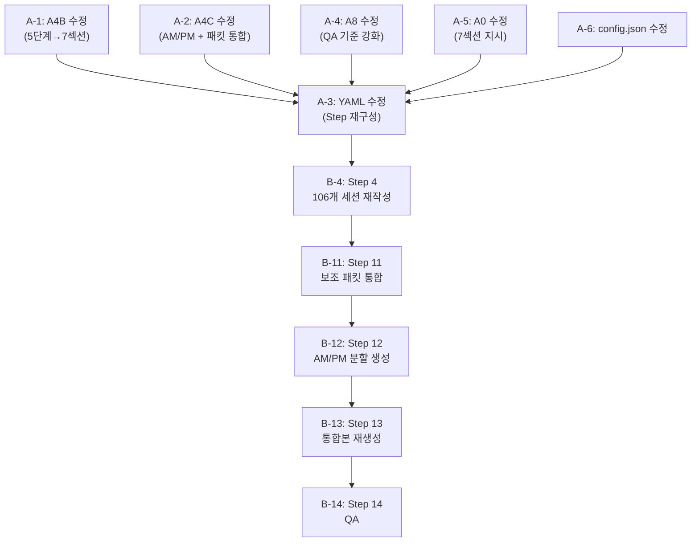

# Pipeline 02 수정 작업계획서

> **작성일**: 2026-02-25  
> **대상 프로젝트**: AI-native 파이썬기초 (5일/40시간)  
> **목적**: v2.0 교안의 구조적 문제(5단계 대본만 포함, 7섹션 미준수, AM/PM 분할 미생성, 보조 패킷 미통합) 해결

---

## 1. 문제 진단 요약

### 현재 상태 (v2.0)
- **106개 세션 파일**: 5단계 구조(도입→비유→개념→활용→정리), 대본만 포함
- **세션당 분량**: 3,000~4,500자 (A4B 규칙에 의한 제한)
- **통합본**: `강의교안_v2.0.md` (9,628줄, 840KB) — 세션 파일 단순 접합
- **AM/PM 분할 파일**: 미생성 (YAML에 step 없음)
- **보조 패킷 6개**: 생성 완료되었으나 교안에 미통합

### 목표 상태
- **106개 세션 파일**: A0의 7섹션 구조 준수, 분량 제한 없음
- **AM/PM 분할 파일**: 10개 (`Day{1-5}_{AM|PM}.md`)
- **통합본**: `강의교안_v2.1.md` (7섹션 + 보조 패킷 인라인)
- **보조 패킷**: 세션 파일에 인라인 통합

### 5개 근본 원인

| # | 원인 | 영향 |
|---|------|------|
| 1 | A4B 5단계 Framework가 A0 7섹션 구조를 덮어씀 | 실습가이드, 코드모음, 트러블슈팅 FAQ 누락 |
| 2 | 3,000~4,500자 분량 제한 | 7섹션을 담기에 절대적으로 부족 |
| 3 | A4B 템플릿과 규칙의 내부 모순 | 템플릿에 실습가이드/코드모음 있으나 규칙이 표/리스트 금지 |
| 4 | AM/PM 분할 step 부재 | YAML에 실행 단계 없음 |
| 5 | Phase 3 보조 패킷 미통합 | Step 11(시각화 삽입) SKIP, 6개 패킷 미반영 |

---

## 2. 수정 범위

### Phase A: 에이전트/워크플로우 명세 수정 (6개 파일)

> 사용자 결정사항 반영: **분량 제한 없음**

#### A-1. `A4B_Session_Writer.md` — 핵심 변경 (난이도: 높음)

**파일 위치**: `.agent/agents/02_writer/A4B_Session_Writer.md` (291줄)

**변경 1: 역할 및 핵심 차별점 재정의** (lines 9-15)
- 현재: "Gemini 3.1 Pro의 출력 한계 내에서 최고 품질의 상세 교안"
- 변경: "A0의 7섹션 구조를 완전히 구현하는 완결된 교안. 분량 제한 없음."
- 이유: Gemini 출력 한계 참조를 제거하여 에이전트가 분량에 구애받지 않도록 함

**변경 2: 핵심 책임 §1 출력 한계 제거** (lines 19-22)
- 현재: "출력 한계 내 완결성: 3,000~4,500자 내에서 세션의 모든 내용을 완전히 서술"
- 변경: "7섹션 완결성: A0 팀 공통 출력 문서 구조(7섹션)를 모두 포함하는 완결된 교안 작성. 분량 제한 없음."
- 이유: 분량 제한이 7섹션 구현의 최대 병목이었음

**변경 3: 금지 사항에서 표/리스트 금지 제거** (line 28)
- 현재: "❌ **표/리스트**: 본문에 표나 bullet point 사용 금지"
- 변경: "✅ **표/리스트 허용**: 실습 가이드 단계별 지시표, 비교표, 체크리스트, 트러블슈팅 FAQ에서 표와 리스트 사용 필수. 본문 서술부는 서술형 유지."
- 이유: 7섹션 구조의 실습 가이드(§4), 코드 모음(§5), 참고 자료(§7)에 표/리스트가 필수적

**변경 4: 5단계 Expansion Framework → 7섹션 구조로 교체** (lines 36-63)
- 현재: ①도입(Hook) → ②비유풀이(Analogy) → ③개념설명(What) → ④코드/실제활용(How) → ⑤정리(Closing)
- 변경: A0_Orchestrator.md lines 46-53의 7섹션 구조로 교체:

```
§1. 개요
    - 세션 위치(Day/시간대), 학습 목표, 선행 세션 환기
    - 분량: 자유

§2. 핵심 개념 (+ 🗣️ 강사 대본 + Mermaid)
    - 주요 기술 용어 정의, 비유 설명 ('AI 시대의 서사' 톤)
    - 🗣️ 강사 대본: 강사가 그대로 읽을 수 있는 상세 설명
    - Mermaid 다이어그램으로 개념 시각화
    - 분량: 자유

§3. 상세 내용
    - 원본 흐름에 따른 심화 서술
    - Why → What → How 순서
    - 체크포인트 질문 배치
    - 비교표, 용어 정리표 활용
    - 분량: 자유

§4. 실습 가이드 (+ 🎙️ 실습 대본) — 해당 시
    - 실습 목표, 단계별 지시표 (단계|소요시간|강사지시|학습자액션|예상결과)
    - 🎙️ 실습 가이드 대본
    - 트러블슈팅 FAQ (Q&A 형식)
    - 체크포인트
    - 분량: 자유

§5. 코드 및 명령어 모음 — 해당 시
    - 본문에서 발췌한 전체 코드 블록 모음
    - A0 코드 배치 원칙 준수 (20줄↓ 본문만, 21-50줄 본문+모음, 50줄↑ 모음만)
    - 프롬프트 예시 병기 (AI-first 원칙)
    - 분량: 자유

§6. 요약
    - 핵심 학습 포인트 정리
    - 다음 세션 예고 및 브릿지 노트
    - 분량: 자유

§7. 참고 자료
    - 3-Source 출처 목록
    - 공식 문서 링크, 추가 학습 자료
    - 분량: 자유
```

- 이유: A0의 팀 공통 구조와 A4B의 실제 출력 구조를 일치시킴. v1.0 레퍼런스(Day1_AM 등 10개 파일)가 이 구조를 성공적으로 구현한 사례.

**변경 5: 분량 관리 섹션 교체** (lines 232-235)
- 현재: "최소 3,000자 / 최대 4,500자 / 비율: 도입10%+비유30%+개념25%+활용25%+정리10%"
- 변경: "분량 제한 없음. 세션 유형별 v1.0 레퍼런스 수준을 참고:
  - narrative 세션: v1.0 평균 ~554줄 (~23,000자)
  - lab 세션: v1.0 평균 ~800줄 (~30,000자)  
  - code 세션: v1.0 평균 ~700줄 (~28,000자)
  - 7섹션이 모두 충실하게 채워지는 것이 분량보다 중요"
- 이유: 사용자가 분량 제한 없음을 명시적으로 선택

**변경 6: 출력 파일 템플릿 교체** (lines 82-218)
- 현재: 5단계 구조 기반 템플릿
- 변경: 7섹션 구조 기반 템플릿으로 교체. v1.0 Day1_AM의 실제 구조를 참고하여:
  - §1 개요 → §2 핵심 개념(+대본+Mermaid) → §3 상세 내용 → §4 실습 가이드(+대본+표) → §5 코드 모음 → §6 요약 → §7 참고 자료
  - 실습 가이드에 단계별 지시 표 포함
  - 트러블슈팅 FAQ 섹션 포함
  - 체크포인트 질문 배치

**변경 7: 금지 사항 정리** (lines 250-263)
- "표/리스트로만 구성된 교안" → "본문 서술부를 표/리스트로만 구성 (실습가이드/코드모음에서는 표 사용 필수)"
- 추가: "❌ A0 7섹션 구조 미준수"
- 추가: "❌ 강사 대본(🗣️) 또는 실습 대본(🎙️) 누락"

**변경 8: 품질 검증 체크리스트 갱신** (lines 276-282)
- "3,000자 이상 분량 확인" 제거
- 추가: "7섹션 구조 완전성 확인 (§1~§7 모두 포함)"
- 추가: "실습 가이드 단계별 지시표 포함 확인 (lab/code 세션)"
- 추가: "코드 모음 섹션에 본문 코드 정리 확인"

---

#### A-2. `A4C_Material_Aggregator.md` — AM/PM 분할 + 보조 패킷 통합 (난이도: 중간)

**파일 위치**: `.agent/agents/02_writer/A4C_Material_Aggregator.md` (268줄)

**변경 1: 핵심 책임에 AM/PM 분할 파일 생성 추가** (신규 섹션)
- 추가 내용:
```
### 5. AM/PM 분할 파일 생성
- **분할 기준**: Day-Session 경계표 기반
  - Day 1 AM: 세션 001-011, PM: 012-022
  - Day 2 AM: 세션 023-033, PM: 034-043
  - Day 3 AM: 세션 044-054, PM: 055-064
  - Day 4 AM: 세션 065-075, PM: 076-085
  - Day 5 AM: 세션 086-096, PM: 097-106
- **파일명 패턴**: `Day{N}_{AM|PM}_{주제요약}.md`
- **파일 독립성**: 각 파일은 완전한 헤더(과정명, 일자, 시간대, 세션 목록, 학습목표), 목차, 본문, 부록을 포함
- **브릿지 노트 체인**: Day1_AM 마지막 → Day1_PM 첫째 → ... → Day5_PM 마지막까지 끊김 없이 연결
```

**변경 2: 보조 패킷 인라인 통합 로직 추가** (신규 섹션)
- 추가 내용:
```
### 6. 보조 패킷 통합 (Phase 3 산출물 인라인 삽입)
세션 파일에 다음 보조 패킷을 인라인으로 삽입합니다:

| 보조 패킷 | 삽입 위치 | 삽입 방법 |
|-----------|----------|----------|
| lab_packet.md (1,386줄) | §4 실습 가이드 | 세션별 매칭하여 실습 목표, 단계별 지시, 체크포인트 삽입 |
| visualization_packet.md (331줄) | §2 핵심 개념, §3 상세 내용 | 세션별 Mermaid 다이어그램 삽입 |
| visual_specs/day{1-5}_tables.md (287줄) | §3 상세 내용 | 비교표, 요약표 인라인 삽입 |
| instructor_support_packet.md (812줄) | §2 강사 노트, §4 트러블슈팅 | 강사 팁, FAQ 삽입 |
| code_validation_report.md (251줄) | §5 코드 모음 | 검증된 코드 블록으로 교체/보강 |
| differentiation_strategy.md (98줄) | §1 개요 또는 §6 요약 | 세션별 차별화 포인트 언급 |

- **매칭 규칙**: 보조 패킷의 세션 ID/Day 정보를 기반으로 해당 세션 파일에 자동 매칭
- **충돌 처리**: A4B 작성본과 보조 패킷이 상충하면 A4B 본문을 우선하되, 보조 패킷 내용을 강사 노트로 병기
```

**변경 3: 분량 검증 기준 갱신** (line 22)
- 현재: "각 세션이 3,000~4,500자 범위 내에 있는지 확인"
- 변경: "각 세션이 7섹션 구조를 완전히 포함하는지 확인 (분량 제한 없음)"

**변경 4: 산출물에 AM/PM 파일 추가** (lines 50-56)
```
02_Material/
├── 강의교안_v2.1.md (통합본)
├── Day1_AM_{주제}.md    ← 신규
├── Day1_PM_{주제}.md    ← 신규
├── Day2_AM_{주제}.md    ← 신규
├── ...
├── Day5_PM_{주제}.md    ← 신규
├── sessions/ (개별 세션 파일들 - 그대로 유지)
└── src/ (코드 예제 모음)
```

---

#### A-3. `02_Material_Writing_v2.yaml` — Step 재구성 (난이도: 중간)

**파일 위치**: `.agent/workflows/02_Material_Writing_v2.yaml` (351줄)

**변경 1: gemini_optimized 분량 설정 변경** (lines 30-34)
- 현재:
  ```yaml
  estimated_chars: "3000-4500"
  min_chars_per_session: 3000
  max_chars_per_session: 4500
  ```
- 변경:
  ```yaml
  estimated_chars: "no_limit"
  min_chars_per_session: null
  max_chars_per_session: null
  structure: "7_section_mandatory"
  ```

**변경 2: rules 섹션 갱신** (lines 38-43)
- "출력 한계 준수: 3,000~4,500자 내에서 완결성 확보" 제거
- 추가: "7섹션 구조 필수: A0 팀 공통 출력 문서 구조(§1~§7) 완전 준수"
- 추가: "분량 무제한: 세션 유형별 v1.0 레퍼런스 수준을 참고하되, 7섹션 완전성이 분량보다 우선"

**변경 3: Step 4 notes 갱신** (lines 142-156)
- "공백 포함 3,000~4,500자 (Gemini 출력 한계 준수)" 제거
- 변경: "분량 제한 없음. A0의 7섹션 구조 완전 준수 필수."
- 추가: "기존 v2.0 세션 파일을 입력으로 활용하여 7섹션 구조로 확장"

**변경 4: Step 11 변경 — insert_visualizations → enrich_sessions** (lines 229-240)
- 현재: A4B가 시각화만 삽입
- 변경: A4C가 **모든 보조 패킷**(lab, visualization, tables, instructor_support, code_validation, differentiation)을 세션 파일에 인라인 통합
- depends_on에 step_8, step_9, step_10도 추가

**변경 5: Step 12 신규 — AM/PM 분할 파일 생성**
```yaml
- id: step_12_ampm_split
  agent: "02_writer/A4C_Material_Aggregator"
  action: "generate_ampm_files"
  depends_on: "step_11_enrich_sessions"
  input:
    - "Enriched Session Files"
    - "Day-Session Boundary Table"
    - "Output Language: Korean"
  output: "Day{1-5}_{AM|PM}.md (10 files)"
  notes: |
    📁 Day-Session 경계:
      Day 1: AM=001-011, PM=012-022
      Day 2: AM=023-033, PM=034-043
      Day 3: AM=044-054, PM=055-064
      Day 4: AM=065-075, PM=076-085
      Day 5: AM=086-096, PM=097-106
    ✅ 각 파일은 독립적으로 읽을 수 있는 완전한 교안
    🔗 브릿지 노트 체인 유지
```

**변경 6: Step 13 → 통합본 재생성** (기존 step_12)
- output 파일명: `강의교안_v2.1.md`

**변경 7: Step 14 → QA** (기존 step_13)
- qa_criteria에 추가:
  - "7섹션 구조 완전성: 모든 세션이 §1~§7 구조를 따르는가?"
  - "AM/PM 분할 파일 독립성 및 브릿지 노트 체인"
  - "보조 패킷 통합 완전성: lab, visualization, tables, instructor_support가 교안에 반영되었는가?"

**변경 8: model_routing 갱신** (lines 298-300)
- A4B: `micro-writing` → `deep` (분량 무제한으로 모델 역량 필요)
- A4C: `micro-writing` → `deep` (보조 패킷 통합 + AM/PM 분할 = 복잡한 작업)

---

#### A-4. `A8_QA_Editor.md` — 7섹션 + AM/PM QA 기준 (난이도: 낮음)

**파일 위치**: `.agent/agents/02_writer/A8_QA_Editor.md` (82줄)

**변경 1: 문서 구조 검증 강화** (line 50)
- 현재: "7개 섹션 구조: 개요 → 핵심 개념 → 상세 내용 → 실습 가이드 → 코드 모음 → 요약 → 참고 자료 순서를 따르는가?" (이미 존재)
- 추가:
  - "[ ] **실습 가이드 표**: lab/code 타입 세션에 단계별 지시표(단계|소요시간|강사지시|학습자액션|예상결과)가 포함되었는가?"
  - "[ ] **트러블슈팅 FAQ**: 실습 세션에 흔한 오류와 해결법이 Q&A 형식으로 제공되는가?"
  - "[ ] **코드 모음 완전성**: 본문에 등장한 코드 블록이 §5 코드 모음에도 정리되어 있는가?"

**변경 2: 보조 패킷 통합 검증 추가** (신규 섹션)
```
### 보조 패킷 통합 검증
- [ ] **lab_packet 반영**: lab_packet.md의 실습 설계가 해당 세션의 §4 실습 가이드에 반영되었는가?
- [ ] **visualization 반영**: visualization_packet.md의 Mermaid 다이어그램이 §2/§3에 삽입되었는가?
- [ ] **tables 반영**: visual_specs/의 비교표가 §3 상세 내용에 삽입되었는가?
- [ ] **instructor_support 반영**: 강사 지원 패킷의 팁과 FAQ가 §4 트러블슈팅에 반영되었는가?
```

---

#### A-5. `A0_Orchestrator.md` — A4B 7섹션 지시 보강 (난이도: 낮음)

**파일 위치**: `.agent/agents/02_writer/A0_Orchestrator.md` (233줄)

**변경 1: Step 3 (A4B 지시) 보강** (lines 85-91)
- 추가:
```
- **7섹션 구조 필수**: A4B에게 팀 공통 출력 문서 구조(lines 46-53)의 7섹션을 반드시 구현하라고 지시합니다.
  - ❌ 자체 Expansion Framework(5단계) 사용 금지
  - ✅ §1개요 → §2핵심개념(+대본+Mermaid) → §3상세내용 → §4실습가이드(+대본+표) → §5코드모음 → §6요약 → §7참고자료
- **분량 무제한**: 3,000~4,500자 제한을 적용하지 않습니다. v1.0 레퍼런스 수준의 완결성을 목표로 합니다.
- **표/리스트 허용**: 실습 가이드, 비교표, 트러블슈팅 FAQ에서 표와 리스트를 적극 활용하라고 지시합니다.
```

---

#### A-6. `config.json` — A4B 카테고리 변경 (난이도: 낮음)

**파일 위치**: `.agent/agents/02_writer/config.json` (13줄)

**변경**: `agent_models`에 A4B, A4C 오버라이드 추가
```json
"A4B_Session_Writer":        { "category": "deep",    "note": "7섹션 교안 집필 — 분량 무제한, 깊은 서술 필요" },
"A4C_Material_Aggregator":   { "category": "deep",    "note": "보조 패킷 통합 + AM/PM 분할 — 복잡한 통합 작업" }
```

- 이유: `micro-writing` 카테고리는 경량 모델 → 분량 무제한 + 7섹션 구조에 부적합. `deep` 카테고리의 고성능 모델 필요.

---

## 3. Phase B: Pipeline 02 부분 재실행

> Phase A 완료 후 실행. 사용자 승인 후 진행.

### 재사용 가능한 기존 산출물 (Steps 1-3, 5-10)

| Step | 산출물 | 크기 | 재사용 여부 |
|------|--------|------|------------|
| 1 | 3-Source Fact Packets (5개) | 1,364줄 | ✅ 그대로 재사용 |
| 1 | source_data/ (NLM 5 + DR 5) | 10 files | ✅ 그대로 재사용 |
| 2 | traceability_packet.md | 273줄 | ✅ 그대로 재사용 |
| 3 | skeleton_packet.md | 580줄 | ✅ 그대로 재사용 |
| 5 | code_validation_report.md | 251줄 | ✅ Step 11에서 통합 |
| 6 | visualization_packet.md | 331줄 | ✅ Step 11에서 통합 |
| 7 | visual_specs/day{1-5}_tables.md | 287줄 | ✅ Step 11에서 통합 |
| 8 | lab_packet.md | 1,386줄 | ✅ Step 11에서 통합 |
| 9 | instructor_support_packet.md | 812줄 | ✅ Step 11에서 통합 |
| 10 | differentiation_strategy.md | 98줄 | ✅ Step 11에서 통합 |

### 재실행 필요 Steps

#### Step 4: 106개 세션 재작성 (가장 큰 작업)

- **입력**: 기존 v2.0 세션 파일(대본) + fact_packets + skeleton_packet + v1.0 Day 파일(구조 레퍼런스)
- **출력**: 106개 세션 파일 (7섹션 구조, 분량 무제한)
- **실행 방법**: Day별 배치 (5배치), 각 배치 내 세션은 병렬 처리
  - 배치 1: Day 1 (세션 001-022, 22개)
  - 배치 2: Day 2 (세션 023-043, 21개)
  - 배치 3: Day 3 (세션 044-064, 21개)
  - 배치 4: Day 4 (세션 065-085, 21개)
  - 배치 5: Day 5 (세션 086-106, 21개)
- **v2.0 대본 활용**: 기존 대본을 §2 핵심 개념의 🗣️ 강사 대본 기초 자료로 활용
- **v1.0 구조 참조**: Day1_AM 등 10개 파일의 7섹션 구조를 레퍼런스로 제공
- **예상 시간**: 배치당 에이전트 스톨 가능성 고려, 3-5 라운드 필요 예상
- **예상 총 분량**: 106개 × 평균 700줄 ≈ 74,200줄 (v2.0의 9,628줄 대비 ~8배 증가)

#### Step 11: 보조 패킷 통합 (신규 실행)

- **입력**: 재작성된 106개 세션 파일 + 6개 보조 패킷
- **출력**: 보조 패킷이 인라인 통합된 106개 세션 파일
- **실행 방법**: A4C가 세션별로 보조 패킷을 매칭하여 해당 섹션에 삽입
- **예상 시간**: 비교적 기계적 작업, 1-2 라운드

#### Step 12: AM/PM 분할 파일 생성 (신규)

- **입력**: 통합된 106개 세션 파일 + Day-Session 경계표
- **출력**: 10개 AM/PM 파일 (`Day{1-5}_{AM|PM}_{주제}.md`)
- **실행 방법**: A4C가 경계표 기반으로 세션을 묶어 독립 파일 생성
- **예상 시간**: 1 라운드 (Python 스크립트 활용 가능)

#### Step 13: 통합본 재생성

- **입력**: 10개 AM/PM 파일 + 106개 세션 파일
- **출력**: `강의교안_v2.1.md`
- **실행 방법**: `_aggregate.py` 스크립트 활용 (v2.0에서 검증됨)
- **예상 시간**: 즉시 (스크립트 실행)

#### Step 14: QA

- **입력**: 강의교안_v2.1.md + AM/PM 파일 + 세션 파일 + 보조 패킷
- **출력**: qa_report_v2.1.md
- **실행 방법**: A8 QA Editor (ultrabrain 카테고리)
- **검증 기준**: 7섹션 완전성 + AM/PM 독립성 + 보조 패킷 통합 + 3-Source 균형

---

## 4. v1.0 레퍼런스 분석 (목표 품질 기준)

기존 v1.0 교안(10개 Day 파일)의 실제 품질을 목표 기준으로 삼습니다.

### v1.0 파일별 분량

| 파일 | 줄 수 | 바이트 | 세션 수 |
|------|-------|--------|---------|
| Day1_AM | 554줄 | 23,280B | 3 세션 |
| Day1_PM | 813줄 | 28,244B | 3-4 세션 |
| Day2_AM | 797줄 | 28,091B | 3-4 세션 |
| Day2_PM | 759줄 | 31,195B | 3-4 세션 |
| Day3_AM | 972줄 | 34,310B | 3-4 세션 |
| Day3_PM | 1,480줄 | 47,886B | 3-4 세션 |
| Day4_AM | 669줄 | 26,359B | 3-4 세션 |
| Day4_PM | 956줄 | 37,699B | 3-4 세션 |
| Day5_AM | 959줄 | 35,335B | 3-4 세션 |
| Day5_PM | 1,392줄 | 54,757B | 3-4 세션 |
| **합계** | **9,351줄** | **347,156B** | **~35 세션** |

- v1.0 세션당 평균: ~267줄 (~10,000바이트)
- v2.0 세션당 평균: ~91줄 (~9,000바이트) — **대본만이므로 바이트 대비 줄 수가 적음**
- 목표: v1.0 수준 이상 (7섹션 구조 + 3-Source 팩트)

### v1.0 Day1_AM 구조 분석 (레퍼런스)

```
세션 1-1: 오리엔테이션 & AI 시대의 서사 복습
├── 1. 개요 .............. 도입 서사 + 비유 설명 (과정 로드맵, 네비게이션 비유)
├── 2. 핵심 개념 ......... Mermaid 다이어그램 + 비교표 + 🗣️ 대본
├── 3. 상세 내용 ......... 아이스브레이킹, 로드맵 표, 퀴즈, 비유 복습
├── 4. 실습 가이드 ....... Step 1/2/3 단계별 지시 + 체크포인트 + 🎙️ 대본
├── 5. 코드 및 명령어 모음  코드 블록 모음 (해당 시)
├── 6. 요약 .............. 핵심 정리 + 다음 세션 예고
└── 7. 참고 자료 ......... 출처 링크
```

---

## 5. 실행 순서 및 의존성



### Phase A 실행 순서 (병렬 가능)

| 순서 | 작업 | 병렬 그룹 | 예상 소요 |
|------|------|----------|----------|
| 1 | A-1: A4B 수정 | Group 1 | 10-15분 |
| 1 | A-2: A4C 수정 | Group 1 | 10분 |
| 1 | A-4: A8 수정 | Group 1 | 5분 |
| 1 | A-5: A0 수정 | Group 1 | 5분 |
| 1 | A-6: config.json 수정 | Group 1 | 2분 |
| 2 | A-3: YAML 수정 | Group 2 (after Group 1) | 10분 |
| 3 | Git commit & push | Sequential | 2분 |

### Phase B 실행 순서 (순차)

| 순서 | 작업 | 예상 소요 | 비고 |
|------|------|----------|------|
| 1 | Step 4: 세션 재작성 | 2-4시간 | 5배치 × 3-5 라운드 |
| 2 | Step 11: 보조 패킷 통합 | 30분-1시간 | A4C 실행 |
| 3 | Step 12: AM/PM 분할 | 30분 | A4C 또는 스크립트 |
| 4 | Step 13: 통합본 생성 | 5분 | _aggregate.py 활용 |
| 5 | Step 14: QA | 30분 | A8 실행 |
| 6 | Git commit & push | 5분 | |

---

## 6. 리스크 및 대응 방안

| 리스크 | 확률 | 영향 | 대응 방안 |
|--------|------|------|----------|
| Step 4 에이전트 스톨 (5-8개 파일 후 멈춤) | 높음 | 중간 | Day별 배치 분할, 배치당 최대 11개 세션, 스톨 시 나머지 세션만 재실행 |
| 106개 세션 품질 불균일 | 중간 | 높음 | v1.0 레퍼런스를 각 배치에 제공, Day별 QA 체크포인트 추가 |
| 통합본 크기 과대 (예상 ~74,000줄) | 중간 | 낮음 | AM/PM 분할 파일이 실제 사용 단위, 통합본은 참조용 |
| 보조 패킷-세션 매칭 오류 | 낮음 | 중간 | 보조 패킷 내 세션 ID 기반 자동 매칭, 수동 검증 |
| Git 커밋 크기 (예상 ~2.5MB) | 낮음 | 낮음 | 단계별 커밋 (Step 4, Step 11-12, Step 13-14 분리) |

---

## 7. 검증 기준 (완료 조건)

Phase A 완료 조건:
- [ ] 6개 파일 모두 수정 완료
- [ ] A4B: 5단계→7섹션 교체, 분량 제한 제거, 표/리스트 허용
- [ ] A4C: AM/PM 분할 + 보조 패킷 통합 로직 추가
- [ ] YAML: 14 Steps 구조, 분량 설정 갱신, model_routing 갱신
- [ ] A8: 7섹션 구조 검증 + 보조 패킷 통합 검증 추가
- [ ] A0: A4B 7섹션 지시 보강
- [ ] config.json: A4B/A4C `deep` 카테고리
- [ ] Git commit & push

Phase B 완료 조건:
- [ ] 106개 세션 파일이 7섹션 구조를 완전히 구현
- [ ] 보조 패킷 6개가 세션 파일에 인라인 통합
- [ ] AM/PM 분할 파일 10개 생성 (각각 독립적으로 읽을 수 있음)
- [ ] 통합본 `강의교안_v2.1.md` 생성
- [ ] QA 리포트: P0:0, P1:0
- [ ] Git commit & push

---

## 8. 사용자 의사결정 사항

| # | 질문 | 사용자 결정 |
|---|------|-----------|
| 1 | Phase A만 vs Phase A+B? | **검토 후 결정** (이 계획서 검토 후) |
| 2 | 기존 대본 활용 vs 완전 새 작성? | **검토 후 결정** |
| 3 | 분량 상한선? | **분량 제한 없음** ✅ 확정 |

---

*작성: Sisyphus Orchestrator | 2026-02-25*
