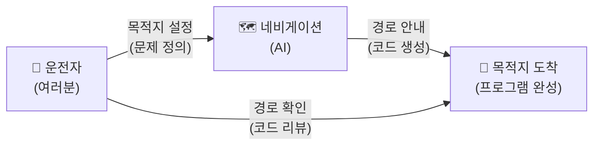
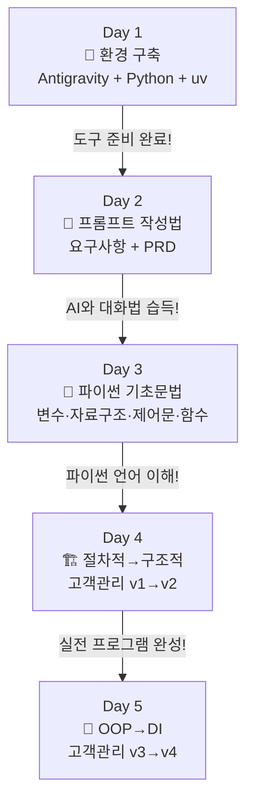

# 마이크로 세션: 001 — 과정 로드맵과 아이스브레이킹

> **세션 ID**: MS-PY101-001  
> **소요 시간**: 20분  
> **난이도**: low  
> **청크 타입**: narrative  
> **버전**: v2.1 (7섹션 구조)

---

## §1. 개요

> **Day 1 | AM | 세션 001/022**

이 세션은 5일간 40시간에 걸친 "AI-native 파이썬 기초" 과정의 가장 첫 번째 시간이에요. 수강생들이 강의실에 처음 들어와서 서로 얼굴을 마주하는 순간부터 시작되는, 과정 전체의 분위기와 방향을 결정짓는 매우 중요한 오프닝 세션입니다. 아직 코드 한 줄 쓰지 않지만, 이 20분이 앞으로 5일의 학습 태도와 마인드셋을 결정한다고 해도 과언이 아니에요.

### 🎯 학습 목표

이 세션이 끝나면 수강생은 다음을 할 수 있어요:

- 5일간의 과정 로드맵을 머릿속에 큰 그림으로 그릴 수 있습니다
- "AI가 코드를 대신 짜주는 시대에 왜 파이썬을 배우는가"라는 핵심 질문에 자신만의 답을 가질 수 있습니다
- 동료 수강생과 첫 대화를 나누며 학습 공동체의 일원이라는 소속감을 느낄 수 있습니다

### 선행 세션 환기

이 세션은 과정의 첫 번째 시간이므로 별도의 선행 세션이 없어요. 다만, 수강생들은 사전 교육으로 "AI 시대의 서사"라는 특강을 수료한 상태입니다. 그 특강에서 배운 "문제 정의 vs 문제 해결", "네비게이션 비유", "요리사 vs 메뉴 기획자" 같은 핵심 개념을 이 세션에서 자연스럽게 환기하면서 출발할 거예요.

---

### 🌟 차별화 포인트 (Differentiation Strategy)

> 🌟 **Day 1 서사: 패러다임의 전환** — 수동적 탑승객에서 목적지를 정하는 운전자로 — "코드를 치는 시대는 끝났다." AI라는 완벽한 네비게이션을 켜고, 목적지(What)를 정하는 주체가 '나'임을 깨닫는 출발점.

## §2. 핵심 개념 (+ 🗣️ 강사 대본 + Mermaid)

### AI-native 패러다임 전환과 네비게이션 비유

코딩 문법을 암기하는 것보다, 무엇을 만들지 문제를 정의하는 것이 중요한 시대가 왔어요. AI가 코드를 대신 작성해 주는 시대에, 개발자의 핵심 경쟁력이 '코드를 타이핑하는 사람(How)'에서 '무엇을 만들지 문제를 정의하는 사람(What)'으로 변화했다는 것이 이 과정 전체를 관통하는 철학적 패러다임이에요. 이것을 가장 직관적으로 이해할 수 있는 비유가 바로 "네비게이션과 운전자"입니다. 목적지를 입력하는 운전자(사람)와 최적 경로를 안내하는 네비게이션(AI)의 협력 관계, 이것이 앞으로 5일간 우리가 체험할 핵심 구도예요.

🗣️ **강사 대본 (Instructor Script)**:

> 여러분, 만나서 정말 반갑습니다. 앞으로 5일 동안 함께 여행을 떠날 동료들이에요. 본격적으로 시작하기 전에 한 가지만 여쭤볼게요. 혹시 최근에 AI에게 시켜본 가장 재미있거나 엉뚱한 일이 뭐였나요? ChatGPT에게 연애 상담을 받았다든지, 이력서를 대신 써달라고 했다든지, 뭐든 괜찮아요. 잠깐 옆 분과 이야기를 나눠보세요.
>
> 네, 좋습니다! 이렇게 우리는 이미 일상에서 AI와 대화하고 있어요. 그런데 생각해 보면 신기하지 않나요? 불과 2~3년 전만 해도 "코딩을 배우려면 영어 문법처럼 프로그래밍 문법을 외워야 해"라는 말이 상식이었는데, 지금은 AI에게 한국어로 말하면 코드가 뚝딱 나오는 세상이 되었으니까요.
>
> 그렇다면 이런 질문이 떠오릅니다. **"AI가 코드를 다 짜주는 세상에서, 우리는 왜 파이썬을 배우는 걸까요?"**
>
> 이 질문에 답하기 위해, 하나의 장면을 상상해 봅시다. 여러분이 처음으로 자동차를 몰고 부산에 가려고 합니다. 요즘 차에는 아주 똑똑한 네비게이션이 달려 있죠. 목적지만 입력하면 최적 경로를 알려주고, 실시간 교통 상황까지 반영해서 "300미터 앞에서 우회전하세요"라고 친절하게 안내합니다. 그런데 여기서 중요한 사실 하나가 있어요. **아무리 세상에서 가장 똑똑한 네비게이션이라 해도, "목적지"를 대신 정해주지는 않는다는 것입니다.**
>
> 여러분이 "부산 해운대"라고 입력해야 네비게이션이 경로를 찾아주지, 네비게이션이 알아서 "오늘은 해운대가 좋겠다"라고 결정하지 않잖아요. 만약 여러분이 목적지를 "부산"이라고만 대충 입력하면 어떻게 될까요? 해운대로 갈 수도 있고, 부산역 앞에 내려줄 수도 있고, 김해공항 근처에서 빙빙 돌 수도 있어요. 원하는 곳에 정확히 도착하려면 "부산 해운대구 해운대해변로 264, 해운대 해수욕장 주차장"처럼 구체적으로 알려줘야 합니다.
>
> 이 과정에서 AI는 바로 그 네비게이션 역할을 합니다. 코드를 대신 짜주고, 오류를 찾아주고, 심지어 테스트까지 해주는 놀라운 조수예요. 하지만 **"어떤 프로그램을 만들 것인가", "이 프로그램은 누구를 위한 것인가", "어떤 조건에서 어떻게 동작해야 하는가"** — 이런 목적지는 오직 여러분만이 결정할 수 있습니다.
>
> 우리 과정은 바로 이 '목적지를 정확하게 입력하는 법'을 배우는 5일간의 운전 실습이에요. 엔진을 분해하거나 타이어를 교체하는 정비사가 되는 것이 아니라, 운전대를 잡고 네비게이션과 대화하면서 원하는 곳에 안전하게 도착하는 운전자가 되는 거예요.

> 💡 **강사 노트**: 네비게이션 비유는 「AI 시대의 서사 v3 - Claude.md」(Source A)에서 발췌하여 확장한 것입니다. "목적지를 구체적으로 입력해야 한다"는 포인트를 강조하면, 이후 Day 2의 PTCF 프롬프트 프레임워크와 자연스럽게 연결됩니다.

### Mermaid 다이어그램

이 다이어그램은 이 과정 전체를 관통하는 핵심 구도를 한눈에 보여줘요. 운전자(여러분)가 목적지를 설정하고, 네비게이션(AI)이 경로를 안내하며, 운전자가 그 경로가 맞는지 확인하면서 목적지에 도착하는 구조입니다. 여기서 "경로 확인"이 바로 코드 리뷰에 해당하는데, 이 능력을 키우는 것이 우리 과정의 핵심 목표 중 하나예요.

---

## §3. 상세 내용

### Why — 왜 이 세션이 필요한가?

5일이라는 시간은 길다면 길고 짧다면 짧아요. 40시간 동안 무엇을 배우게 될지 전체 지도를 먼저 펼쳐놓지 않으면, 수강생들은 매 세션이 어디를 향해 가는지 모른 채 따라가기만 하게 됩니다. 등산을 시작하기 전에 산 전체의 등산로 지도를 한번 훑어보는 것처럼, 과정의 전체 로드맵을 먼저 조감하는 시간이 꼭 필요해요.

또한 아이스브레이킹은 단순한 분위기 전환이 아닙니다. 프로그래밍 경험이 전혀 없는 비전공자들이 모인 교실에서, "나만 못하는 건 아닐까"라는 불안감을 해소하고 "우리 모두 같은 출발선에 서 있다"는 안도감을 주는 것이 이 시간의 진짜 목적이에요. 서로의 AI 활용 경험을 가볍게 나누면서, 이 과정이 코딩 문법을 외우는 딱딱한 시간이 아니라 AI와 대화하는 재미있는 여행이라는 톤을 세팅합니다.

### What — 이 세션에서 다루는 것은 무엇인가?

이 세션에서는 크게 세 가지를 다룹니다. 첫째는 아이스브레이킹으로, 수강생들이 서로의 AI 활용 경험을 공유하며 첫 대화를 나누는 시간이에요. AI가 해결해주지 못했던 '요구사항 정의'의 어려움에 대해 짧게 토론하는 것도 포함됩니다. 둘째는 과정 로드맵 소개로, Day 1부터 Day 5까지 각 날의 핵심 주제와 흐름을 큰 그림으로 보여줍니다. 셋째는 AI-native 패러다임의 핵심 메시지를 환기하는 것으로, "문제 정의(What) vs 문제 해결(How)"이라는 구도와 네비게이션 비유를 통해 이 과정의 철학적 기반을 다집니다.

### How — 구체적으로 어떻게 진행하는가?

🗣️ **강사 대본 (Instructor Script)**:

> 자, 그러면 5일간의 로드맵을 한눈에 살펴봅시다. 우리 여정은 크게 다섯 파트로 나뉘어요.
>
> 먼저 오늘, **Day 1은 "AI 시대의 이해와 환경 구축"**입니다. 오늘 하루가 끝나면 여러분의 컴퓨터에는 Antigravity라는 최신 AI 통합 개발 환경이 깔려 있을 거고, 그 안에서 AI 비서에게 말을 걸어 첫 파이썬 코드를 직접 만들어 볼 거예요. 아직 문법은 하나도 몰라도 됩니다. AI가 대신 짜주니까요. 대신 "이 코드가 무슨 일을 하는지" 읽는 연습을 시작합니다.
>
> **Day 2는 "프롬프트 엔지니어링과 요구사항 설계"**예요. 네비게이션에 목적지를 입력할 때도 요령이 있듯이, AI에게 코드를 시킬 때도 공식이 있습니다. PTCF라는 4요소 프레임워크를 배우고, "내가 원하는 프로그램은 이런 겁니다"라는 설계 문서를 직접 작성해 볼 거예요.
>
> **Day 3은 "파이썬 핵심 문법"**입니다. 변수, 리스트, 조건문, 반복문, 함수 같은 기초 문법을 다루는데, 여기서도 우리의 접근법은 다릅니다. 문법을 외우는 것이 아니라, AI가 생성한 코드를 읽고 "이 줄이 왜 이렇게 생겼는지" 이해하는 방식으로 배워요.
>
> **Day 4와 Day 5는 "구조적 프로그래밍에서 객체지향까지"**라는 심화 과정이에요. 처음에 뚝딱 만든 프로그램이 점점 커질 때 어떻게 정리하고 확장하는지, 마치 동네 분식집이 프랜차이즈로 성장하는 과정처럼 코드가 진화하는 여정을 경험합니다.
>
> 이 다섯 파트를 관통하는 하나의 프로젝트가 있어요. 바로 **"고객 정보 관리 프로그램"**입니다. Day 1에서 간단한 스케치로 시작해서, Day 5가 끝날 때쯤이면 고객 등록, 조회, 수정, 삭제가 가능하고 데이터베이스에 저장까지 되는 진짜 프로그램이 완성됩니다. 이 프로그램이 5일 동안 네 번 진화하는 과정을 함께 지켜보시게 될 거예요.
>
> 혹시 "저는 진짜 컴퓨터 초보인데 괜찮을까요?"라고 걱정되시는 분이 계신다면, 안심하세요. 여러분의 화면 안에 24시간 대기하는 1:1 과외 선생님이 있습니다. 바로 AI 에이전트예요. 막히면 언제든지 "이게 뭐야?", "왜 에러가 나?", "어떻게 고쳐?"라고 물어보세요. 이 과정에서 가장 중요한 습관은 **'혼자 끙끙대지 않고, AI에게 도움을 요청하는 것'**입니다.

> ✅ **체크포인트**: 여기까지 이해했는지 스스로 점검해 보세요.
> - "이 과정은 코딩 문법을 외우는 과정인가요, 아니면 AI에게 일 시키는 법을 배우는 과정인가요?"
> - "5일간의 여정에서 Day 1의 역할은 무엇인가요?"

### 5일간 로드맵 비교표

| 일차 | 핵심 키워드 | 비유 | 고객관리 프로젝트 |
|------|-----------|------|-----------------|
| Day 1 | Antigravity, Python, uv, 가상환경 | 운전 실습 전 차량 점검 | 프로젝트 스케치 |
| Day 2 | 프롬프트 4요소, 요구사항, PRD | AI에게 일 시키는 기술 | v1 설계 문서 |
| Day 3 | 변수, 자료구조, 제어문, 함수 | 파이썬의 언어를 이해하기 | v1 코드 읽기 |
| Day 4 | 절차적, 구조적, 고객관리 v1→v2 | 분식집 → 프랜차이즈 | v2 구조 개선 |
| Day 5 | OOP, DI, 고객관리 v3→v4 | 프랜차이즈 본사 시스템 | v3→v4 진화 |

---

## §4. 실습 가이드 (+ 🎙️ 실습 대본) — 해당 시

### 실습 목표

이 세션의 실습은 코드 기반이 아니라 대화 기반의 아이스브레이킹 활동이에요. 수강생들이 서로의 AI 활용 경험을 공유하면서, 이 과정이 "AI와 협업하는 법"을 배우는 시간이라는 톤을 자연스럽게 체감하는 것이 목표입니다.

🎙️ **실습 가이드 대본 (Lab Guide)**:

> 자, 이제 옆에 앉은 분과 2분 동안 이야기를 나눠보세요. 주제는 아주 간단해요. **"최근에 AI에게 시켜본 가장 재미있거나 엉뚱한 일이 뭐였나요?"** ChatGPT에게 연애 상담을 받았다든지, Gemini에게 여행 계획을 짜달라고 했다든지, 뭐든 괜찮아요. 그리고 한 가지 더 — AI가 해줬으면 좋겠는데 잘 못했던 일이 있었나요? 그것도 함께 나눠보세요.
>
> 2분 후에 전체 앞에서 2~3분만 발표해 주실 분을 모실 거예요. 자, 시작하세요!
>
> (2분 후) 네, 시간이 됐습니다. 재미있는 경험을 나눠주실 분 계신가요? 네, 감사합니다. 아주 좋은 사례예요. 이렇게 AI는 이미 우리 일상에 깊이 들어와 있어요. 그런데 여러분이 공유해 주신 경험에서 공통점이 하나 보이지 않나요? AI가 잘하는 것도 있지만, **"내가 원하는 게 정확히 뭔지"를 AI가 대신 정해주지는 못한다**는 거예요. 이것이 바로 우리가 5일간 훈련할 핵심 능력입니다.

### 단계별 지시

| 단계 | 소요 시간 | 강사 지시사항 | 학습자 액션 | 예상 결과 |
|------|----------|--------------|------------|----------|
| 1 | 2분 | "옆 분과 AI 활용 경험 공유해주세요" | 짝과 자유 대화 | 분위기 이완, 웃음 |
| 2 | 3분 | "전체 앞에서 2~3분만 발표해주세요" | 자원자 2~3명 발표 | 다양한 AI 활용 사례 공유 |
| 3 | 5분 | 로드맵 다이어그램 보여주며 설명 | 화면 주시, 질문 | Day 1~5 큰 그림 파악 |
| 4 | 5분 | 과정 철학(네비게이션 비유) 설명 | 경청, 고개 끄덕임 | 핵심 메시지 이해 |
| 5 | 5분 | "궁금한 점 있으신가요?" 질의응답 | 자유 질문 | 불안감 해소 |

### 트러블슈팅 FAQ

| Q | A |
|---|---|
| 수강생이 너무 조용해서 아이스브레이킹이 안 돼요 | 강사가 먼저 자신의 AI 경험을 재미있게 공유하면서 분위기를 풀어주세요. "저는 AI에게 프러포즈 멘트를 써달라고 했었어요" 같은 가벼운 일화가 효과적이에요 |
| "AI 시대의 서사" 내용을 전혀 기억 못하는 수강생이 있어요 | 걱정하지 마세요! 이 과정 전체에서 필요한 개념을 그때그때 복습할 거예요. 핵심만 기억하면 돼요: "문제를 정의하는 건 사람, 코드를 만드는 건 AI" |
| "저는 컴퓨터를 거의 안 써본 진짜 초보인데 따라갈 수 있나요?" | "이 과정은 코딩 천재를 만드는 게 아니라, AI와 대화하는 법을 배우는 거예요. 한국어로 대화할 수 있으면 충분합니다!"라고 안심시켜 주세요 |

> ✅ **체크포인트**: "이 과정이 끝나면 나는 AI에게 무엇을 시킬 수 있는 사람이 된다"는 것을 이해했나요?

---

### 🎓 강사 노트 (Instructor Support)

- ⏱️ **타이밍**: 09:00 (20분, narrative)
- 🎯 **핵심 활동**: 자기소개 + 5일 로드맵 안내
- ⚠️ **강사 주의사항**: 첫 인상이 5일을 좌우함. 밝은 에너지 유지

## §5. 코드 및 명령어 모음 — 해당 시

이 세션은 narrative 타입으로, 코드 실습이 포함되지 않아요. 본격적인 코드 작성은 세션 004(Antigravity 설치)부터 시작됩니다. 이 세션에서는 로드맵 소개와 아이스브레이킹에 집중하며, 수강생들이 과정의 큰 그림과 철학을 먼저 이해하는 것이 목표입니다.

> 🤖 **AI 프롬프트 예시**: 해당 없음 (이 세션은 대화와 토론 중심)

---

## §6. 요약

### 핵심 학습 포인트

이번 세션에서 가장 중요한 메시지는 세 가지예요. 첫째, 이 과정은 "네비게이션을 직접 써보는 운전 실습"입니다. 코딩 문법을 외우는 것이 아니라, AI에게 정확한 목적지를 전달하는 방법을 배우는 시간이에요. 둘째, 우리의 역할은 "메뉴 기획자(문제를 정의하는 사람)"이고, AI의 역할은 "요리사(코드를 만드는 도구)"입니다. 셋째, "말이 되어야 프로그램이 된다" — 내가 원하는 것을 명확하게 표현할 수 있으면, AI가 코드로 바꿔줄 수 있다는 것이 이 시대의 핵심 진실이에요.

### 다음 세션 예고

다음 세션에서는 사전 교육 "AI 시대의 서사"에서 배웠던 핵심 개념을 딱 세 가지로 압축해서 복습할 거예요. 문제 정의 vs 문제 해결, 패러다임의 여정, 그리고 AI의 진짜 역할에 대해 좀 더 깊이 들어가 봅니다.

### 브릿지 노트

> "로드맵을 보니 우리가 어디로 가야 할지 감이 좀 잡히시나요? 그렇다면 본격적인 출발에 앞서, 우리가 이전에 배웠던 'AI 시대의 서사'를 딱 세 가지 핵심만 짚고 넘어가 볼까요? 이 세 가지가 탄탄해야 앞으로 5일이 수월해집니다."

---

## §7. 참고 자료

### 3-Source 출처

- **Source A (로컬 참고자료)**: 「AI 시대의 서사 v3 - Claude.md」 — AI-native 패러다임 전환 철학, 네비게이션 비유, 문제 정의 vs 문제 해결 구도의 원전. 강사 대본의 핵심 비유와 스토리라인이 이 문서에서 발췌되었습니다.
- **Source B (NotebookLM)**: NotebookLM 분석 리포트 — "코딩 문법 암기보다 문제 정의가 중요하다"는 패러다임 전환 분석, 수강생 간 AI 활용 경험 공유 실습 설계의 근거를 제공했습니다.
- **Source C (Deep Research)**: Deep Research 보고서 — 에이전트 주도 개발(Agentic Coding) 트렌드와 AI-native 학습 방법론의 배경 리서치를 반영했습니다.

### 추가 학습 자료

- [AI 시대의 서사 v3 - Claude.md](../참고자료/AI_시대의_서사_v3_Claude.md): 사전 교육 원본 자료
- [Google Antigravity 공식 사이트](https://antigravity.google): 이후 세션에서 사용할 개발 환경

### 강사 노트

> 💡 **강사 노트**: 본 세션의 내용은 「AI 시대의 서사 v3 - Claude.md」(Source A)의 패러다임 전환 및 네비게이션 비유를 기반으로 구성하였으며, NotebookLM 분석(Source B)과 Deep Research 보고서(Source C)의 보조 설명을 반영하였습니다. 팩트 패킷의 강사 스크립트 포인트 — "AI가 로그인 코드를 다 짜주는 시대인데, 왜 굳이 파이썬을 배울까요?"라는 도발적 질문으로 시작하면 수강생의 주의를 효과적으로 끌 수 있습니다.

---

## ✅ 세션 완료 체크리스트 (강사용)

- [ ] §1~§7 모든 섹션이 충실하게 작성되었는가?
- [ ] 네비게이션 비유와 스토리텔링이 포함되었는가?
- [ ] 아이스브레이킹이 자연스럽게 진행되었는가?
- [ ] 5일 로드맵을 수강생이 이해했는가?
- [ ] 3-Source 팩트 패킷이 반영되었는가?

---

*작성 일시: 2026-02-25*  
*작성 에이전트: A4B_Session_Writer*  
*교안 구조: 7섹션 (A0 팀 공통 표준)*
