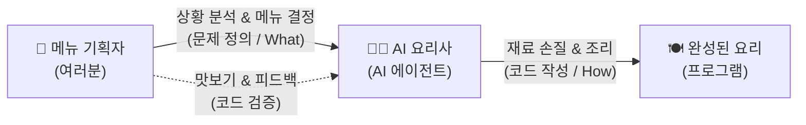
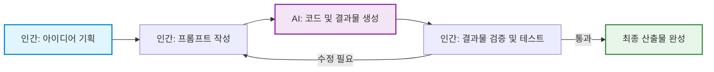

# 마이크로 세션: 002 — AI 시대의 서사 핵심 복습

> **세션 ID**: MS-PY101-002
> **소요 시간**: 20분
> **난이도**: low
> **청크 타입**: narrative
> **버전**: v2.1 (7섹션 구조)

---

## §1. 개요

> **Day 1 | AM | 세션 002/022**

이 세션은 본격적인 과정 진행에 앞서, 수강생들이 사전 교육으로 들었던 "AI 시대의 서사" 특강의 핵심을 짚고 넘어가는 시간이에요. 수강생들이 앞으로 5일 동안 가져야 할 '메뉴 기획자'로서의 마인드셋을 확고히 다지는 역할을 합니다. 

### 🎯 학습 목표

이 세션이 끝나면 수강생은 다음을 할 수 있어요:

- 과거의 프로그래머와 AI 시대의 개발자의 역할 차이를 명확히 설명할 수 있습니다.
- 문제 정의(What/Why)가 문제 해결(How)보다 중요해진 패러다임의 변화를 이해합니다.
- 코드를 작성하는 단순 도구가 아닌, 함께 일하는 팀원으로서 AI를 인식할 수 있습니다.

### 선행 세션 환기

직전 세션에서 우리는 5일간의 로드맵과 함께 "네비게이션 비유"를 다뤘어요. 목적지를 입력하는 운전자와 최적 경로를 안내하는 네비게이션의 협력 관계를 통해 패러다임의 변화를 확인했죠. 아무리 똑똑한 네비게이션도 목적지는 운전자가 정해야 한다는 점을 배웠습니다. 이번 세션에서는 그 연장선에서 조금 더 구체적인 비유인 "요리사와 메뉴 기획자" 이야기로 넘어가며, 우리가 앞으로 기를 핵심 근육이 무엇인지 확인해 볼 거예요.

---

## §2. 핵심 개념 (+ 🗣️ 강사 대본 + Mermaid)

### 요리사(AI)와 메뉴 기획자(사람)의 분업 구조

AI가 코드를 대신 작성해 주는 시대에 개발자의 핵심 경쟁력은 극적으로 변했습니다. '코드를 타이핑하는 능력(How)'에서 '무엇을 만들지 문제를 정의하는 능력(What)'으로 완전히 이동했어요. 이를 가장 직관적으로 보여주는 것이 바로 "요리사와 메뉴 기획자" 비유입니다. 우리는 더 이상 칼질을 연습하는 요리사가 아니라, 고객의 맥락을 읽고 어떤 요리를 낼지 결정하는 메뉴 기획자가 되어야 합니다.

🗣️ **강사 대본 (Instructor Script)**:

> 방금 전 세션에서 네비게이션에 목적지를 입력하는 운전자가 되겠다는 비유, 기억나시나요? 자, 이제 본격적인 출발에 앞서 사전 교육에서 들었던 "AI 시대의 서사"라는 이야기를 복습해 볼 거예요. 반 정도 기억하시는 것 같네요. 괜찮아요, 지금 딱 세 가지 핵심만 짚고 넘어가 보겠습니다.
> 
> 과거의 프로그래머와 지금 AI 시대의 우리는 역할이 어떻게 다를까요? 이걸 제일 쉽게 이해하는 비유가 바로 "요리사와 메뉴 기획자" 이야기입니다. 상상해 봅시다. 여러분이 멋진 레스토랑의 오너 셰프라고 해볼게요. 과거에는 오너 셰프가 직접 재료를 손질하고, 불 조절을 하고, 소스를 만들고, 플레이팅까지 전부 혼자 했습니다. 이게 바로 과거의 프로그래머예요. 키보드 앞에 앉아서 한 줄 한 줄 코드를 직접 타이핑하고, 문법을 외우고, 오류를 찾아 밤새워 고치는 사람이었죠.
> 
> 그런데 지금 여러분의 주방에 미슐랭 3스타 급 AI 요리사가 새로 들어온 겁니다. 이 요리사는 한식, 양식, 일식 가릴 것 없이 어떤 요리든 순식간에 만들어내는 놀라운 실력을 가지고 있어요. 그런데 이 완벽해 보이는 AI 요리사에게는 치명적인 약점이 하나 있습니다. 바로 "오늘 뭘 만들까요?"라는 질문에 스스로 답하지 못한다는 거예요. 
> 
> 손님이 어떤 사람인지, 땅콩 알레르기는 없는지, 오늘 예산은 얼마인지, 계절에 맞는 제철 식재료는 무엇인지 파악하고 "오늘은 제철 방어를 메인으로 한 코스 요리를 가자"라고 방향을 잡아주는 사람이 필요합니다. 그게 바로 메뉴 기획자, 즉 여러분의 새로운 역할이에요.
> 
> AI에게 "장바구니 기능 만들어줘"라고 대충 말하면 어떻게 될까요? 비로그인 사용자가 담은 건 어떻게 할지, 재고가 부족하면 어떻게 처리할지, 할인 쿠폰은 어떻게 적용할지 이런 디테일을 AI는 알아서 챙겨주지 않아요. 문제를 구체적으로 정의하는 기획력, 이것이 AI 시대의 진짜 경쟁력입니다. 여러분, 코드는 코더가 짭니다. 이제 여러분은 코더가 아니라 기획자이자 팀 리더입니다. 내가 정확하게 생각하고 명확하게 지시해야, AI 직원도 훌륭한 코드를 만들어냅니다.

### Mermaid 다이어그램

이 다이어그램은 우리가 지향해야 할 AI와의 협업 구조를 명확히 보여줘요. 사람이 기획하고 AI가 실행하며, 사람은 다시 그 결과를 꼼꼼히 검증하는 순환 고리가 과정 전체를 관통하는 핵심입니다.

---

### 🎨 추가 시각화 (Visualization Packet)

**AI-Human 협업 워크플로우**

기획(인간) -> 생성(AI) -> 검증/수정(인간)의 반복 사이클을 보여줍니다.

## §3. 상세 내용

### Why — 왜 이 세션이 필요한가?

수강생들은 무의식적으로 "파이썬 기초 과정이니까 코딩 문법부터 빨리 배워야지"라는 과거의 프레임에 갇혀 있기 쉬워요. 이 프레임을 초반에 깨고 "나는 코더가 아니라 기획자가 되러 왔다"는 마인드셋을 확실히 심어주지 않으면, 이후 과정에서 AI를 활용하기보다 혼자 코드를 짜려고 끙끙대는 실수를 범하게 됩니다. 따라서 사전 교육의 내용을 이 시점에 확실하게 쐐기를 박듯 복습하는 것이 필수적이에요.

### What — 이 세션에서 다루는 것은 무엇인가?

"AI 시대의 서사"를 구성하는 세 가지 핵심 개념을 다룹니다.

첫째, 문제 정의(What/Why)가 문제 해결(How)보다 압도적으로 중요하다는 점입니다. 어떻게 구현할지가 아니라 무엇을 만들지가 핵심 질문이 됩니다. 달성하고자 하는 목적과 조건을 명확한 명세서로 표현하는 능력이 새로운 핵심 언어로 자리 잡았어요.

둘째, 패러다임의 여정입니다. 기계어에서 어셈블리어, C, 자바를 거쳐 이제는 파이썬을 넘어 "자연어"로 코딩하는 시대에 이르렀습니다. 단순한 코드 자동완성을 넘어, 에이전트가 주도적으로 계획하고 실행하는 에이전트 주도 개발 시대로 진입했다는 거대한 흐름을 확인합니다.

셋째, AI의 진짜 역할입니다. AI는 단순한 자동완성 도구나 번역기가 아니라, 명확한 지시가 필요한 새로운 '팀원'이라는 사실을 받아들여야 합니다.

### How — 구체적으로 어떻게 진행하는가?

강사가 요리사와 메뉴 기획자 비유를 통해 핵심 메시지를 던진 후, 수강생들이 직접 일상적인 비즈니스 상황인 쇼핑몰 장바구니 기능을 상상하며 브레인스토밍하는 토론 실습으로 이어집니다. 이를 통해 단순히 지시를 내리는 것을 넘어 '문제 정의'가 생각보다 만만치 않으며, 다양한 맥락을 파악하고 기획하는 일은 인간만이 할 수 있는 고유의 영역임을 스스로 깨닫게 만듭니다.

---

## §4. 실습 가이드 (+ 🎙️ 실습 대본)

### 실습 목표

AI에게 모호하게 지시했을 때 발생할 수 있는 문제점을 스스로 찾아보고, 놓칠 수 있는 것들을 빈틈없이 생각해내는 비즈니스 기획력의 중요성을 체감하는 것이 목표입니다. 이 과정에서 자연스럽게 문제 정의 능력을 훈련하게 됩니다.

🎙️ **실습 가이드 대본 (Lab Guide)**:

> 자, 앞서 말씀드린 세 가지 핵심을 일상에서 직접 느껴봅시다. 아주 간단한 브레인스토밍을 해볼게요. 만약 여러분이 AI 요리사에게 "우리 쇼핑몰에 장바구니 하나 만들어줘"라고 단순하게 지시했다고 상상해 보세요. AI는 아주 기본적인 장바구니 코드를 뚝딱 만들어줄 겁니다. 
> 
> 그런데 이렇게 뚝딱 나온 코드로 실제 쇼핑몰을 운영하면 과연 어떤 일이 벌어질까요? 잠깐 옆 분과 토론해 봅시다. "AI에게 장바구니를 시켰을 때, 기획자인 우리가 미리 챙겨주지 않으면 AI가 알아서 반영하지 못할 비즈니스 정책이 뭐가 있을까요?" 딱 1분만 이야기해 보세요. 
> 
> (1분 후) 네, 좋습니다. 아주 훌륭한 의견들이 많이 들리네요. 비로그인 사용자가 담으면 어떡하죠? 로그인하면 기존 장바구니와 합쳐야 할까요? 재고가 0인 상품은 담기게 둘 건가요? 동시에 100명이 마지막 남은 한 개를 담으면요? 배송비나 쿠폰 적용 순서는 누가 정할까요? 
> 
> 이런 수많은 "만약에"를 AI는 스스로 생각해 내지 않습니다. 바로 이것이 "문제를 정의하는 힘"이에요. 우리가 이 과정에서 키울 가장 핵심적인 근육은 파이썬 문법 암기가 아니라, 놓칠 수 있는 것들을 빈틈없이 생각해내는 꼼꼼한 기획력입니다. 언어가 파이썬이든 자바스크립트든, 고객이 진짜 원하는 것을 파악하는 능력만큼은 영원히 사람의 몫일 거예요.

### 단계별 지시

| 단계 | 소요 시간 | 강사 지시사항 | 학습자 액션 | 예상 결과 |
|------|----------|--------------|------------|----------|
| 1 | 1분 | "장바구니 기능에서 놓치기 쉬운 정책이 뭘까요? 짝과 논의해 보세요." | 짝과 상황 가정 및 브레인스토밍 | 다양한 비즈니스 예외 상황 도출 |
| 2 | 2분 | 의견 청취 및 피드백 공유 | 자발적 발표 및 의견 나눔 | 문제 정의의 복잡성 뼈저리게 인지 |
| 3 | 1분 | 문제 정의의 중요성(기획력)으로 결론 맺기 | 경청 및 핵심 메모 | AI 시대의 본인 역할 체화 |

### 트러블슈팅 FAQ

| Q | A |
|---|---|
| 수강생들이 비즈니스 정책 예시를 잘 떠올리지 못해요 | 강사가 먼저 가벼운 힌트를 주세요. "여러분이 평소에 인터넷 쇼핑을 할 때, 품절된 상품은 장바구니에 바로 담기던가요?" 같은 일상적 경험을 자극하면 아주 좋습니다. |
| "저는 기획자가 아닌데 왜 이걸 해야 하죠?"라고 묻는다면 | "AI 시대에는 코딩 도구 자체가 강력해지면서 모든 개발자가 필연적으로 기획자의 역할을 겸하게 됩니다. AI에게 일을 시키는 것 자체가 이미 기획의 영역이기 때문이에요."라고 설명해 주세요. |

---

### 🎓 강사 노트 (Instructor Support)

- ⏱️ **타이밍**: 09:20 (20분, narrative)
- 🎯 **핵심 활동**: "AI 시대의 서사" 3가지 핵심 복습
- ⚠️ **강사 주의사항**: "기억나시죠?"로 참여 유도

## §5. 코드 및 명령어 모음

해당 없음

> 이 세션은 AI 시대를 맞이하는 마인드셋 정립과 대화 기반의 실습 중심입니다. 본격적인 컴퓨터 앞에서의 코딩 환경 구축은 세션 004부터 시작됩니다.

---

## §6. 요약

### 핵심 학습 포인트

이번 세션의 핵심 메시지는 세 줄로 요약됩니다. 
첫째, 문제 정의(What/Why)가 문제 해결(How)보다 압도적으로 중요해졌습니다. 
둘째, 코딩은 이제 기계의 언어가 아닌 자연어 시대로 진입했으며, 에이전트가 주도하는 개발이 현실이 되었습니다. 
셋째, AI는 단순한 도구가 아니라 우리의 든든한 팀원입니다. 우리는 더 이상 주방에서 칼질만 하는 요리사가 아니라, 큰 그림을 그리고 전체 메뉴를 총괄하는 기획자입니다. 말이 되어야 프로그램이 된다는 철학을 꼭 기억해 주세요.

### 다음 세션 예고

그렇다면 훌륭한 메뉴 기획자가 되려면 어떻게 훈련을 해야 할까요? 무작정 주방에 들어가서 감으로 요리해보면 실력이 늘까요? 다음 세션에서는 우리가 5일 동안 사용할 아주 효과적인 학습 방법론을 소개하고, 명세 주도 개발(SDD)이 무엇인지 맛보기를 경험해 볼 것입니다.

### 브릿지 노트

> "우리가 요리사가 아니라 메뉴 기획자라는 사실, 이제 확실히 와닿으시죠? 그렇다면 메뉴 기획자는 어떻게 훈련을 해야 할까요? 무작정 주방에 들어가서 요리해보면 될까요? 다음 시간엔 우리가 5일 동안 사용할 아주 효과적인 학습 훈련법을 소개해 드릴게요."

---

## §7. 참고 자료

### 3-Source 출처

- **Source A (로컬 참고자료)**: 「AI 시대의 서사 v3 - Claude.md」 — 말이 되어야 프로그램이 된다는 과정 철학, 요리사(AI)와 메뉴 기획자(사람)의 분업 구조 비유 원전입니다. 강사 대본의 핵심 스토리가 이 문서에서 발췌되었습니다.
- **Source B (NotebookLM)**: NotebookLM 분석 리포트 — 코딩 문법 암기에서 비즈니스 맥락 파악 및 시스템 설계 능력으로 경쟁력이 이동하고 있음을 분석한 자료입니다. 쇼핑몰 장바구니 예외 상황 브레인스토밍 실습의 구체적 근거를 제공했습니다.
- **Source C (Deep Research)**: Deep Research 보고서 — 단순 코드 자동완성에서 에이전트 주도 개발(Agentic Coding)로의 패러다임 전환 트렌드를 반영했으며, AI를 팀원으로 대하는 오케스트레이션 개념의 기초 자료로 활용되었습니다.

### 강사 노트

> 💡 **강사 노트**: 본 세션의 내용은 「AI 시대의 서사 v3 - Claude.md」(Source A)의 요리사/메뉴 기획자 비유를 기반으로 구성하였으며, NotebookLM 분석(Source B)의 장바구니 비즈니스 맥락 사례와 Deep Research 보고서(Source C)의 에이전트 주도 개발 트렌드를 엮었습니다. 팩트 패킷의 핵심 스크립트 포인트인 "여러분, 코드는 코더가 짭니다. 이제 여러분은 코더가 아니라 기획자이자 팀 리더입니다."라는 대사를 전달할 때, 매우 단호하고 명확한 어조로 강조해 주시면 수강생들의 주의를 효과적으로 끌 수 있습니다.

---

## ✅ 세션 완료 체크리스트 (강사용)

- [x] §1~§7 모든 섹션이 템플릿에 맞춰 충실하게 작성되었는가?
- [x] 요리사와 메뉴 기획자 비유가 강사 대본에 생생하게 확장 반영되었는가?
- [x] 장바구니 브레인스토밍 기반의 실습 가이드가 포함되었는가?
- [x] 3-Source 팩트 패킷 내용과 출처가 충실히 반영되었는가?

---

*작성 일시: 2026-02-25*  
*작성 에이전트: A4B_Session_Writer*  
*교안 구조: 7섹션 (A0 팀 공통 표준)*