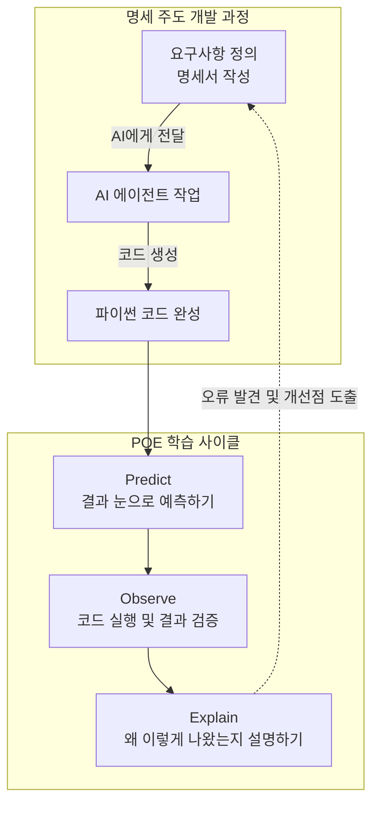
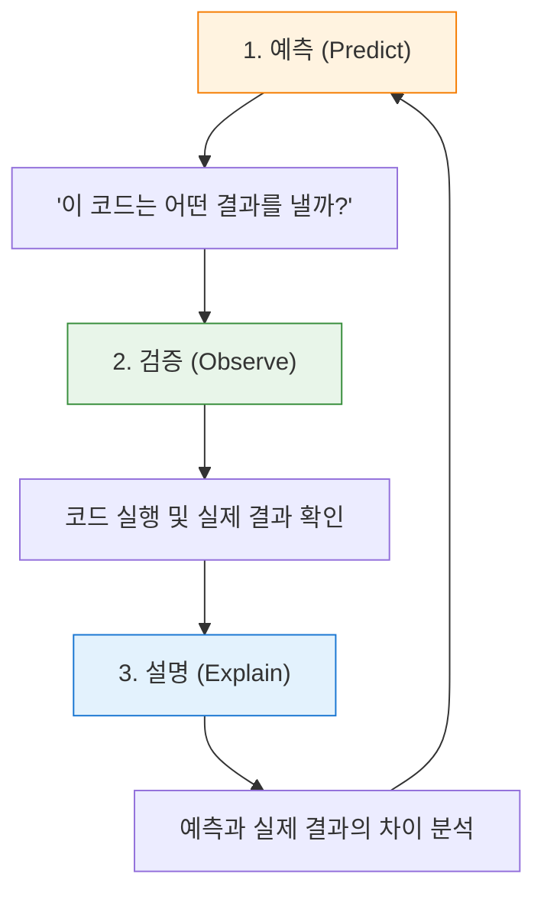

# 마이크로 세션: 003 - 학습 방법론과 SDD 미리보기

> **세션 ID**: MS-PY101-003  
> **소요 시간**: 20분  
> **난이도**: low  
> **청크 타입**: narrative  
> **버전**: v2.1 (7섹션 구조)

---

## §1. 개요

> **Day 1 | AM | 세션 003/022**

이 세션은 본격적으로 코딩 실습에 들어가기 전에 우리가 반드시 갖춰야 할 아주 중요한 훈련 방식을 세팅하는 시간입니다. 앞선 시간에서 우리는 메뉴 기획자와 요리사의 새로운 협업 구도를 확인했어요. 사람이 해야 할 일은 시스템의 방향을 설계하는 것이고, AI가 해야 할 일은 그 설계에 맞추어 실제 코드를 짜내는 일이라는 점을 분명히 했습니다.

하지만 기획자가 되기로 마음먹었다고 해서 하루아침에 훌륭한 기획서가 나오지는 않습니다. 운전면허를 따기 위해 먼저 교통법규를 배우고, 코스 주행을 거친 뒤 도로에 나가는 것처럼 우리에게도 체계적인 훈련법이 필요합니다. 앞으로 5일 동안 이어질 여정에서 여러분이 무기처럼 들고 다닐 두 가지 강력한 방법론, 즉 능동적 코드 읽기 훈련인 '예측, 검증, 설명' 사이클과 문서 중심의 개발 방식인 '명세 주도 개발'을 오늘 미리 만나보겠습니다. 

이 짧은 20분이 여러분의 앞으로의 코딩 습관, 더 나아가 평생 AI와 협업하는 방식을 근본적으로 바꿔놓을 것입니다. 

### 🎯 학습 목표

이 세션이 끝나면 수강생은 다음을 할 수 있어요:

* AI가 만들어준 코드를 받았을 때, 무작정 실행 버튼부터 누르지 않고 반드시 예측하고 검증하고 설명하는 능동적인 코드 읽기 습관을 들일 수 있습니다.
* 느낌 가는 대로 대충 개발하는 '바이브 코딩'의 치명적인 한계를 깨닫고, 꼼꼼한 설계도 중심의 체계적인 개발 방법론이 필요한 이유를 설명할 수 있습니다.
* 코드를 무에서 유로 타이핑하는 것보다, 남이 짠 코드를 읽어내고 전체 시스템 구조를 설계하는 일이 훨씬 더 중요한 시대임을 인식하고 학습 태도를 전환할 수 있습니다.

### 선행 세션 환기

바로 앞 세션인 'AI 시대의 서사 핵심 복습'에서 우리는 메뉴 기획자와 요리사의 비유를 통해 각자의 역할을 아주 선명하게 나누었습니다. 비즈니스의 맥락을 파악하고 달성하고자 하는 목적을 논리적이고 명확한 명세서로 표현하는 능력이, 바로 이 시대 소프트웨어 개발의 새로운 언어라는 사실을 배웠죠 [Source B].

이번 시간에는 그 '명세서'라는 것을 실제 개발 환경에서 어떻게 다루어야 하는지 구체적인 훈련법으로 연결합니다. 전 시간에 다루었던 철학적인 이야기를 이제 우리 손끝의 실제 행동 지침으로 바꿀 차례입니다.

---

## §2. 핵심 개념 (+ 🗣️ 강사 대본 + Mermaid)

### 바이브 코딩의 찰흙 인형 집과 SDD의 10층 빌딩

최근 실리콘밸리나 각종 개발 커뮤니티에서 아주 심심치 않게 들려오는 단어가 하나 있습니다. 바로 '바이브 코딩'이라는 신조어예요. 바이브라는 말 그대로 느낌 가는 대로, 감에 의존해서 척척 코딩하는 방식을 뜻합니다. AI에게 대충 이런 기능을 만들어 달라고 말한 뒤, 코드가 튀어나오면 일단 실행부터 해보는 겁니다. 그러다 에러가 나면 그 에러 메시지를 다시 AI에게 던져주고 고쳐달라고 핑퐁을 치는 식이죠. 

아주 간단한 작업이거나 혼자 재미로 장난감을 만들 때는 이 방식이 엄청나게 빠르고 효율적일 수 있습니다. 하지만 문제는 프로젝트의 크기가 조금만 커져도 이 방식이 곧바로 치명적인 한계를 드러낸다는 점이에요. 

이 상황을 건축에 비유해 보겠습니다. 찰흙으로 조그마한 인형 집을 하나 만들 때는 굳이 정밀한 설계도 같은 것이 필요하지 않아요. 대충 느낌대로 뼈대를 세우고 찰흙을 뭉쳐서 지붕을 얹어도 제법 그럴듯한 모양이 나옵니다 [Source C]. 그런데 만약 여러분이 10층짜리 진짜 상업용 빌딩을 짓는다고 상상해 보세요. 설계도도 없이 "1층은 대충 이쯤 높이로 올리고, 2층은 좀 더 넓게 가보자"라며 감으로 쌓아 올리면 어떻게 될까요? 십중팔구 3층쯤 올라갔을 때 기둥이 하중을 견디지 못하고 무너지기 시작할 겁니다. 배관이 엉키고, 비상구를 빼먹고, 나중에는 어디서부터 잘못되었는지조차 알 수 없게 됩니다.

바이브 코딩이 딱 이런 문제를 가지고 있어요. 간단한 기능에서는 코드가 팽팽하게 잘 돌아가지만, 프로그램이 조금만 복잡해지면 예측 불가능한 버그가 사방에서 터져 나옵니다 [Source B][Source C].

우리는 이 험난한 길을 피하기 위해 완전히 다른 노선을 탈 것입니다. 건물을 올리기 전에 설계도를 먼저 꼼꼼하게 그리는 방식, 이것을 가리켜 명세 주도 개발이라고 부릅니다. 영어로는 SDD, 즉 Specification-Driven Development의 약자입니다. 여기서 말하는 명세란 "이 프로그램은 어떤 목적을 가지고 있으며, 어떤 조건에서 어떻게 동작해야 하고, 예외적인 상황이 발생했을 때는 어떤 에러를 보여주어야 한다"는 내용이 글로 명확히 정리된 문서를 말해요. AI는 바로 이 튼튼한 설계도를 기반으로 건물을 짓습니다 [Source A][Source C]. 설계도가 정교할수록 건물도 무너질 염려 없이 튼튼하게 세워지는 것이죠.

### 예측, 검증, 설명의 학습 사이클 (POE)

좋은 설계도로 튼튼한 건물을 지었다고 끝이 아니에요. 건물이 설계도대로 잘 지어졌는지, 혹시 빼먹은 철근은 없는지 확인하는 감리 과정이 필요합니다. 이때 우리가 쓸 두 번째 무기가 바로 POE 사이클입니다. 예측(Predict), 검증(Observe), 설명(Explain)의 앞 글자를 딴 실전 훈련법이에요. 

이 사이클의 핵심은 단 하나입니다. 실행 버튼을 무작정 누르고 싶은 충동을 참는 거예요. 코드를 먼저 눈으로 차분히 읽으면서 실행 결과를 미리 예측해 보는 이 훈련이, 여러분의 문제 해결 능력을 비약적으로 끌어올려 줄 것입니다 [Source B][Source C].

🗣️ **강사 대본 (Instructor Script)**:

> 자, 여러분, 건물을 지을 때 가장 중요한 게 무엇일까요? 바로 설계도입니다. 요즘은 AI가 코드를 너무 순식간에 잘 짜주니까, 많은 분들이 설계도 없이 곧바로 코딩을 시작하는 유혹에 빠집니다. 이것을 우리는 바이브 코딩이라고 불러요. 인형 집을 지을 때는 이 방식이 꽤 잘 통합니다. 하지만 우리가 앞으로 5일 동안 땀 흘리며 만들 고객 관리 프로그램은 조잡한 인형 집이 아니라, 비즈니스가 굴러가는 제대로 된 건물이에요.
> 
> 그래서 우리는 SDD, 즉 명세 주도 개발이라는 정공법을 쓸 겁니다. 파이썬 코드를 냅다 만지작거리는 대신 "이 프로그램은 어떤 기능이 있어야 하고, 사용자가 이상한 문자를 입력하면 어떤 메시지로 경고해줘야 해"라고 우리말로 된 설계도를 먼저 쓸 거예요. 문서가 바뀌면 코드가 바뀌고, 문서가 정확하면 코드도 정확해지는 기분 좋은 마법을 경험하시게 될 겁니다 [Source A][Source C].
> 
> 그리고 또 한 가지, 여러분에게 꼭 당부하고 싶은 아주 중요한 대원칙이 있습니다. 바로 '이해 없는 복사 붙여넣기 절대 금지' 원칙이에요 [Source B][Source C]. AI가 훌륭한 코드를 척척 만들어 줬을 때, 무작정 실행 버튼부터 누르는 습관을 오늘부로 완전히 버려야 합니다. 
> 
> 딱 3초. 딱 3초만 멈춰서 화면을 쳐다보세요. "내가 이 코드를 실행하면 화면 맨 밑에 과연 어떤 글자가 뜰까?" 스스로 예측해 보는 겁니다. 그 예측을 마친 뒤에 당당하게 실행 버튼을 눌러 결과를 눈으로 확인하고, 왜 그런 결과가 나왔는지 자신의 말로 설명해 보는 거예요. Run 버튼을 맹목적으로 누르는 그 손가락을 잠시 멈추세요. 코드가 어떤 결과를 낼지 예측해 보는 바로 그 3초의 순간에, 여러분의 진짜 디버깅 근육이 폭발적으로 자라납니다 [Source B][Source C].

### Mermaid 다이어그램



이 다이어그램은 앞으로 우리가 코드를 다룰 때 거치게 될 전체 흐름을 한 장으로 보여줍니다. 요구사항을 명확히 정의해서 설계도를 만들면 AI가 파이썬 코드를 생성하고, 우리는 그 코드를 예측하고 검증하고 설명하는 순환 고리 안에서 움직이게 됩니다. 오류가 발견되면 코드를 직접 뜯어고치는 것이 아니라, 다시 설계도인 명세서로 돌아가서 문제를 바로잡는 구조입니다.

---


### 🎨 추가 시각화 (Visualization Packet)

**예측-검증-설명 (POE) 학습 사이클**

코드를 무작정 실행하지 않고, 먼저 예측한 후 검증하는 올바른 학습 방법을 나타냅니다.



## §3. 상세 내용

### Why: 왜 바이브 코딩을 피하고 이 방법론을 택해야 하는가?

AI 기술이 폭발적으로 발전하면서 코드를 작성하는 순수 비용은 이제 0에 가깝게 수렴하고 있습니다. 불과 몇 년 전만 해도 파이썬 문법의 대소문자를 틀리면 화면에 글자 하나조차 띄울 수 없었어요. 하지만 이제는 한국어로 지시만 내리면 수백 줄짜리 코드가 1초 만에 만들어지는 시대가 왔습니다. 

이런 거대한 파도 속에서 개발자의 진짜 실력을 가르는 기준점은 완전히 달라졌습니다. 코드를 '오타 없이 타이핑하는' 능력에서, AI가 뱉어낸 코드를 '빠르게 읽고 정확히 검증하는' 능력으로 무게 중심이 완전히 옮겨간 것이죠 [Source C].

바이브 코딩처럼 결과물만 보고 "돌아가면 그만"이라는 습관이 들면, 나중에 치명적인 에러가 터졌을 때 어디서부터 손을 대야 할지 전혀 모르는 끔찍한 상황에 빠지게 됩니다. 내가 직접 구상하고 짠 코드가 아니기 때문에 시스템의 뼈대를 이해하지 못하는 탓입니다. 따라서 스스로 생각하는 힘을 기르고 거대한 시스템을 통제하기 위해서는 설계도를 먼저 그리는 SDD와, 코드를 눈으로 해부하는 POE 사이클이 이 과정 내내 숨 쉬듯 자연스럽게 이어져야 합니다.

### What: 명세 주도 개발과 POE의 본질

첫 번째 핵심 무기인 SDD의 본질은, 우리가 작성하는 요구사항 명세서를 개발의 유일한 진실 원천(Single Source of Truth)으로 삼는다는 점입니다 [Source C]. 진실 원천이라는 말이 학술적으로 들릴 수 있는데, 쉽게 말해 '모든 판단과 수정의 기준이 되는 단 하나의 진짜 문서'라는 뜻이에요. 코드가 꼬이거나 에러가 났을 때 파이썬 코드를 직접 뜯어고치려고 끙끙대는 것은 예전 방식입니다. 이제 우리는 명세서로 다시 돌아가서 논리의 구멍을 찾고 그 문서를 수정한 뒤, AI에게 다시 코드를 짜달라고 요청하는 구조를 가져갈 것입니다. 

두 번째 무기인 POE 사이클은 일종의 강력한 메타인지 훈련법입니다. 메타인지란 내가 무엇을 확실히 알고 있고, 무엇을 아직 모르는지 스스로 객관적으로 파악하는 능력이에요. 코드를 대충 눈으로 훑고 무작정 실행 버튼을 누르면, 컴퓨터가 정답을 친절하게 뱉어주기 때문에 마치 내가 그 코드를 완벽하게 이해했다고 착각하기 쉽습니다. 하지만 실행하기 전에 3초 동안 미리 결과를 예측해 보는 순간 진실이 드러납니다. 내 머릿속의 논리와 실제 컴퓨터가 작동하는 논리가 어디서 엇갈리는지, 돋보기로 보듯 정확하게 짚어낼 수 있기 때문입니다 [Source B].

### How: 5일간 이 무기를 어떻게 휘두를 것인가?

이론은 거창해 보일지 몰라도 실천 방법은 의외로 단순하고 직관적입니다. 앞으로 우리는 새로운 기능을 추가하거나 기존의 고객 관리 프로그램을 업그레이드할 때 절대 빈 화면을 띄워놓고 곧바로 코드를 타이핑하지 않을 겁니다. 그 대신 마크다운이라는 읽기 편한 텍스트 형식으로 "사용자 이름을 먼저 입력받는다. 만약 문자가 아닌 숫자가 들어오면 즉시 오류 메시지를 띄운다" 같은 꼼꼼한 규칙을 적어 내려가는 것부터 시작합니다.

그리고 AI가 그 규칙을 멋진 코드로 번역해서 가져오면, 여러분은 키보드와 마우스를 잠시 테이블 위에 내려놓고 화면을 뚫어지게 쳐다봐야 합니다. 한 줄 한 줄 눈으로 따라가면서 "아, 여기에는 사용자 이름인 홍길동이 들어가겠구나. 그리고 이 줄에서는 그 데이터를 이렇게 계산하니까, 결국 화면에는 이런 모양의 문장이 최종적으로 나오겠군" 하고 스스로 중얼거려 보는 겁니다. 이 두 가지 원칙만 5일 내내 철저하게 지켜낸다면, 여러분은 과정이 끝날 무렵 세상을 완전히 다른 시야로 보게 될 것입니다.

---

## §4. 실습 가이드 (+ 🎙️ 실습 대본)

### 실습 목표

이 세션의 실습은 아주 짧고 간단한 파이썬 코드를 눈으로 직접 읽어보면서 방금 배운 POE 사이클을 작게나마 체험해 보는 미니 활동입니다. 아직 컴퓨터에 개발 환경을 세팅하지 않아도 전혀 상관없어요. 강사가 빔프로젝터 화면에 띄워주는 코드를 보고 결과를 머릿속으로 추론하면서, '코드를 능동적으로 읽는다는 것'이 어떤 느낌인지 그 감각을 일깨우는 것이 이번 실습의 주된 목표입니다.

🎙️ **실습 가이드 대본 (Lab Guide)**:

> 자, 아직 우리 컴퓨터에는 파이썬이 안 깔려 있지만 제 화면에 아주 간단한 코드 다섯 줄을 띄워 두었습니다. 지금부터 딱 1분만 드릴게요. 옆에 앉으신 분과 함께 화면의 코드를 천천히 읽어보세요. 
> 
> 변수라는 이름표가 붙은 그릇에 어떤 데이터가 담기는지, 더하기와 빼기 같은 연산은 어떻게 흘러가는지 눈으로 따라가 보는 겁니다. 다 읽으셨다면 이 코드를 실행했을 때 화면 맨 밑에 어떤 문장이 완성되어서 출력될지 각자 머릿속으로 예측해 보세요. 확신이 들면 옆 분에게 살짝 말씀해 주셔도 좋습니다.
> 
> (1분 후)
> 
> 다들 예측하셨나요? 그럼 제가 여러분을 대신해서 직접 실행 버튼을 꾹 눌러보겠습니다. 네, 결과는 "홍길동님의 나이는 31세입니다." 라고 나오네요. 자, 여러분이 처음 예측한 결과와 이 화면의 결과가 똑같이 나왔나요? 만약 맞추셨다면, 옆 분을 보시고 "왜 31이라는 숫자가 나왔는지" 딱 한 줄로 명쾌하게 설명해 보세요. 
> 
> 네, 맞습니다. 올해 연도인 2026에서 태어난 해인 1995를 뺐기 때문이죠 [Source B]. 정말로 아주 단순한 초등학교 산수 같지만, 방금 여러분이 함께 해주신 이 과정이 바로 실리콘밸리의 최고급 엔지니어들이 매일 반복하고 있는 코드 리뷰의 가장 기본적이고 핵심적인 단계입니다.

### 단계별 지시

| 단계 | 소요 시간 | 강사 지시사항 | 학습자 액션 | 예상 결과 |
|------|----------|--------------|------------|----------|
| 1 | 1분 | 화면의 5줄 코드를 제시하고 정독 유도 | 코드 정독 및 전체적인 논리 흐름 파악 | 코드에 대한 막연한 두려움 완화 |
| 2 | 1분 | 짝과 함께 실행 결과 예측하기 지시 | 변수에 실제 값을 대입하며 결과 추론 | 논리적 사고 과정의 활성화 |
| 3 | 1분 | 강사가 코드 실행 후 빔프로젝터로 결과 검증 | 자신의 머릿속 예측과 실제 화면의 출력 비교 | 예측의 정확성 여부 즉각 확인 |
| 4 | 2분 | 결과가 왜 그렇게 도출되었는지 설명 유도 | 연산 과정을 말로 풀어서 동료에게 설명 | 메타인지 강화 및 원리 내재화 [Source B] |

### 트러블슈팅 FAQ

| Q | A |
|---|---|
| 수강생이 영어로 된 `year`, `birth` 같은 변수명에 겁을 먹으면 어떻게 대처하나요? | 변수명은 그저 투명한 그릇에 붙인 이름표일 뿐이라는 점을 다정하게 상기시켜 주세요. `name`을 '이름표', `year`를 '올해 연도표'로 한글로 치환해서 읽어보라고 권유하면 훨씬 쉽게 받아들이고 웃으며 진행할 수 있습니다. |
| 결과 예측을 아예 틀리는 수강생이 나와서 당황하면 어쩌죠? | 틀리는 것은 아주 자연스럽고 훌륭한 현상이라고 즉각 격려해 주세요. 컴퓨터의 기계적인 연산 순서와 사람의 직관이 다를 수 있다는 그 차이점을 직접 배우는 것이 이 훈련의 가장 핵심적인 목적입니다. |
| "왜 이렇게 쉬운 산수를 굳이 길게 설명하나요?"라고 묻는다면요? | 지금은 5줄짜리 귀여운 코드지만, 모레 보게 될 100줄짜리 코드에서도 똑같은 논리 방식이 적용된다는 점을 단호하게 짚어주세요. 덤벨 무게가 가벼울 때 폼을 완벽하게 교정해야 나중에 무거운 바벨을 부상 없이 들 수 있습니다. |

> ✅ **체크포인트**: 코드 실행 버튼을 누르기 전에 반드시 거쳐야 하는 '3초의 멈춤과 침묵', 그 예측 과정의 엄청난 힘을 완전히 체감하셨나요?

---


### 🎓 강사 노트 (Instructor Support)

- ⏱️ **타이밍**: 09:40 (20분, narrative)
- 🎯 **핵심 활동**: 예측→검증→설명 사이클, SDD 소개
- ⚠️ **강사 주의사항**: 사이클을 칠판/화면에 고정 표시

## §5. 코드 및 명령어 모음

본 세션의 미니 실습에서 화면에 띄운 파이썬 스니펫입니다. 아직 파이썬 문법을 본격적으로 배우기 전이므로, 코드의 형태를 눈에 익히고 데이터가 흘러가는 전체적인 구조를 가볍게 파악하는 용도로만 활용합니다.

```python
# POE 사이클 능동적 훈련을 위한 예제 코드
name = "홍길동"
year = 2026
birth = 1995

# 나이를 계산하는 핵심 로직
age = year - birth

# 계산 결과를 텍스트로 예쁘게 출력
print(f"{name}님의 나이는 {age}세입니다.")
```

이 코드는 소프트웨어 프로그램의 가장 기본적이고 영원한 형태인 '입력 처리 출력'의 3단계 구조를 아주 명확하게 보여줍니다. 위 세 줄은 필요한 데이터를 그릇에 담아 준비하는 입력 과정이고, 네 번째 줄은 데이터를 가공하고 계산하는 처리 과정이며, 마지막 줄은 최종 가공된 결과를 화면에 보여주는 출력 과정이에요. 앞으로 우리가 5일 동안 만들 모든 프로그램은 크기와 덩치만 다를 뿐 이 기본 골격을 완전히 똑같이 따라가게 됩니다.

---

## §6. 요약

### 핵심 학습 포인트

이번 세션에서 여러분의 머릿속에 반드시 심어두어야 할 핵심 무기 두 가지를 마지막으로 짚어보겠습니다. 

첫째, 명세 주도 개발입니다. AI에게 대충 던져주고 결과만 기다리는 바이브 코딩의 유혹에서 벗어나세요. 꼼꼼한 요구사항 명세서를 먼저 작성하고 오직 이것만을 개발의 진실 원천으로 삼는 튼튼한 건축법을 써야 건물이 무너지지 않습니다. 

둘째, 예측 검증 설명으로 이어지는 POE 사이클입니다. AI가 화면에 코드를 뱉어냈을 때 절대 무작정 실행 버튼부터 누르지 마세요. 3초 동안 멈춰서 어떻게 동작할지 예측하고, 실행해서 내 눈으로 결과를 검증하고, 왜 그런 결과가 튀어나왔는지 내 언어로 똑똑히 설명하는 과정을 거쳐야 진짜 코딩 근육이 붙습니다 [Source B][Source C]. 그리고 무엇보다 중요한 단 하나의 철칙, '내가 이해하지 못한 코드를 복사해서 붙여넣는 일은 영원히 금지'입니다.

### 다음 세션 예고

이제 훈련 방법과 태도 세팅도 완벽하게 끝났습니다. 무기를 쓰는 법을 제대로 배웠으니 이제 진짜 무기를 우리 손에 쥘 차례입니다. 다음 세션에서는 구글에서 심혈을 기울여 만든 최신 에이전트 기반 통합 개발 환경, 즉 개발자들의 최첨단 사무실이라고 부를 수 있는 'Antigravity'를 우리 컴퓨터에 직접 다운로드하고 설치해 보겠습니다. 

### 브릿지 노트

> "자, 우리가 5일 동안 어떤 태도와 시선으로 코드를 다루어야 할지 확실히 아셨죠? 예측하고, 검증하고, 설명하는 이 세 박자의 사이클만 기억하시면 됩니다. 그럼 이제 머리를 충분히 썼으니 직접 손을 움직여 볼까요? 본격적으로 여러분만의 쾌적한 작업 공간을 꾸리기 위해 Antigravity IDE 설치 여정을 시작하겠습니다."

---

## §7. 참고 자료

### 3-Source 출처

* **Source A (로컬 참고자료)**: `AI 시대의 서사 v3 - Claude.md`  
  명세 주도 개발의 개념, 요구사항 문서를 작성하고 요리사와 메뉴 기획자의 역할을 구분하는 철학적 배경을 강사 대본으로 녹여내어 발췌하였습니다.
* **Source B (NotebookLM)**: NotebookLM 분석 리포트  
  무작정 코드를 실행하지 않고 예측 검증 설명을 거치는 능동적 학습 원칙, 그리고 이해 없는 복사 붙여넣기 금지 규칙의 강력한 교육학적 근거를 참고했습니다.
* **Source C (Deep Research)**: Deep Research 보고서  
  느낌대로 코딩하는 바이브 코딩의 근본적인 한계 분석과, 명세서를 진실 원천으로 삼아 에이전트 주도 개발로 넘어가는 최신 개발 패러다임 트렌드를 반영하였습니다.

### 강사 노트

> 💡 **강사 노트**: 본 세션은 과정 전체의 학습 태도를 세팅하는 아주 중요한 앵커 역할을 수행합니다. 특히 바이브 코딩과 명세 주도 개발을 찰흙 인형 집과 10층 상업용 빌딩으로 강렬하게 대비시키는 비유는 수강생들이 가장 직관적으로 이해할 수 있는 포인트이므로 이 부분을 힘주어 설명해 주세요. 또한 미니 실습을 진행할 때, 수강생들이 스스로 '아, 내가 코드를 읽어낼 수 있구나'라는 작은 성공 경험을 짜릿하게 맛보게 해주는 것이 중요합니다. 너무 뻔하고 쉬운 답이라도 박수치고 환호하며 교실 전체의 성취감을 끌어올려 주시면 이후 수업의 집중도가 크게 올라갑니다.

---

## ✅ 세션 완료 체크리스트 (강사용)

* [ ] §1~§7 모든 섹션이 빠짐없이 충분한 분량으로 작성되었는가?
* [ ] 바이브 코딩과 빌딩 건축의 비유가 강사 대본에 자연스럽게 녹아들었는가?
* [ ] POE 사이클의 3단계 개념이 초보자의 눈높이에서 명확하게 전달되었는가?
* [ ] 미니 실습을 통해 수강생들이 코드 읽기의 첫 감각을 성공적으로 잡았는가?
* [ ] 3-Source 팩트 패킷의 내용이 정확하게 반영되고 본문에 인용 표기되었는가?

---

*작성 일시: 2026-02-25*  
*작성 에이전트: Sisyphus-Junior*  
*교안 구조: 7섹션 (A0 팀 공통 표준)*