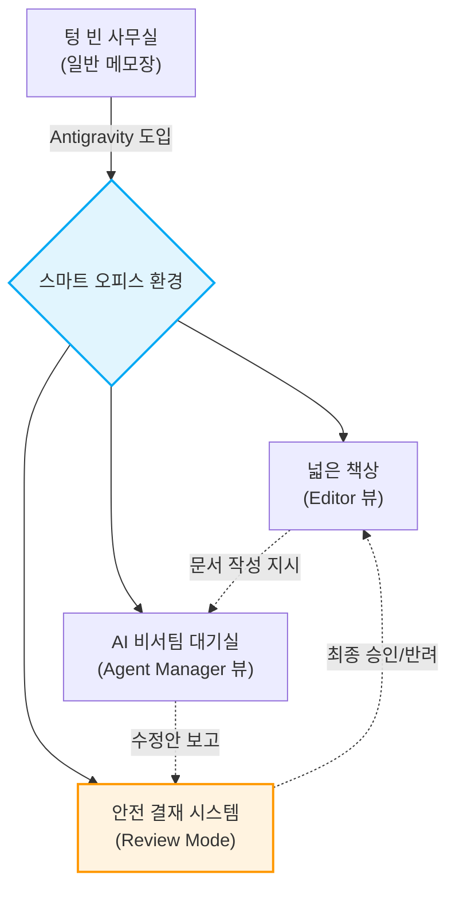

# 마이크로 세션: 004 — Antigravity 설치와 시연

> **세션 ID**: MS-PY101-004  
> **소요 시간**: 25분  
> **난이도**: low  
> **청크 타입**: lab  
> **버전**: v2.1 (7섹션 구조)

---

## §1. 개요

> **Day 1 | AM | 세션 004/022**

이 세션은 5일간의 실습을 함께할 핵심 파트너인 'Antigravity IDE'를 여러분의 컴퓨터에 처음으로 설치하고 시연하는 시간이에요. 앞선 세션들에서 '네비게이션'과 '요리사' 비유를 통해 AI-native 개발이 무엇인지 철학적인 배경을 다졌다면, 이제는 그 철학을 실천할 진짜 도구를 손에 쥐는 순간입니다. 

### 🎯 학습 목표

이 세션이 끝나면 수강생은 다음을 할 수 있어요:

- 구글의 최신 에이전트 우선(Agent-First) IDE인 Antigravity를 자신의 운영체제(Windows/macOS)에 맞게 설치할 수 있습니다.
- 단순한 코드 에디터와 AI가 상주하는 개발 환경의 차이를 '사무실' 비유로 설명할 수 있습니다.
- 설치 후 '검토 모드(Review Mode)'를 활성화하여, AI가 코드를 마음대로 바꾸지 못하게 통제하는 결재권자의 역할을 이해합니다.

### 선행 세션 환기

이전 세션에서 우리는 SDD(명세 주도 개발)와 코드를 맹목적으로 복사하지 않고 능동적으로 읽고 검증하는 학습 방법론을 배웠어요. "Run 버튼을 무작정 누르지 마세요"라는 원칙, 기억하시죠? 오늘 설치할 Antigravity는 바로 그 원칙을 기술적으로 뒷받침해주는 도구입니다. AI가 아무리 훌륭한 코드를 짜더라도, 여러분이 '승인' 버튼을 누르기 전에는 절대로 코드가 적용되지 않는 안전장치가 마련되어 있으니까요.

---

## §2. 핵심 개념 (+ 🗣️ 강사 대본 + Mermaid)

### 비유: AI 비서가 상주하는 사무실 열기

일반적인 텍스트 에디터(메모장)로 코딩하는 것은 책상 하나에 연필 한 자루만 덩그러니 놓인 빈 사무실에서 일하는 것과 같아요. 파일 캐비닛도 없고 복사기도 없어서 모든 것을 혼자서 맨손으로 처리해야 합니다. 반면, Antigravity를 설치하는 것은 최신식 스마트 오피스에 입주하는 것과 같습니다. 이 사무실에는 코딩, 테스트, 문서화를 전담하는 똑똑한 AI 비서들이 24시간 상주하고 있어요.

더 중요한 것은 '결재 시스템'이에요. 이 사무실의 비서들은 아주 부지런하지만, 절대로 사장님(여러분)의 허락 없이 서류를 마음대로 고치거나 제출하지 않습니다. 이것이 바로 Antigravity의 핵심 철학인 '검토 기반 개발(Review-driven development)'입니다.

🗣️ **강사 대본 (Instructor Script)**:

> 앞서 학습 방법론까지 꼼꼼하게 챙겼으니, 이제 진짜 도구를 챙길 시간입니다. 혹시 영화에서 천재 해커들이 까만 화면에 녹색 글씨를 미친 듯이 타이핑하는 장면 보신 적 있죠? 안심하세요. 우리가 쓸 도구는 그런 영화 속 까만 화면이 아니에요. 우리는 IDE, 한국말로는 '통합 개발 환경'이라는 것을 쓸 겁니다. 쉽게 말하면 코딩에 필요한 모든 도구가 한 곳에 완벽하게 세팅된 올인원 작업 공간이에요.
>
> 그리고 오늘 우리가 이 컴퓨터에 지을 사무실의 이름은 'Antigravity'입니다. 
> 
> Antigravity가 뭔지 상상하기 쉽게 비유를 하나 들어볼게요. 여러분이 새로운 회사에 출근했다고 해봅시다. 첫날 빈 사무실에 도착했는데, 책상 하나에 연필 한 자루밖에 없어요. 파일 캐비닛도 없고, 프린터도 없고, 전화기도 없습니다. 여기서 일하라고 하면 막막하시겠죠? 메모장 같은 기본 에디터로 코딩하는 것이 딱 이런 상황이에요.
> 
> 반면 Antigravity는 완전히 다릅니다. 방금 막 완공된 최고급 스마트 오피스에 입주하는 것과 같아요. 넓고 깨끗한 책상(에디터), 잘 분류된 서류함(파일 탐색기), 외부와 소통하는 업무용 전화기(터미널)가 전부 세팅되어 있습니다. 그리고 가장 놀라운 건, 이 사무실에는 구글에서 파견한 수석 AI 비서들이 24시간 대기하고 있다는 점이에요. 이 비서들은 여러분이 지금 어떤 서류를 보고 있는지 실시간으로 알고 있습니다. "이 서류에서 오타 좀 찾아줘"라고 말하면 1초 만에 찾아주고, "이런 내용의 기획안을 초안으로 써줘"라고 하면 직접 뼈대를 잡아줍니다. 
>
> 지금 설치하는 것은 단순한 에디터 프로그램이 아닙니다. 코딩, 테스트, 문서화를 대신해 줄 AI 직원들이 대기하고 있는 여러분만의 가상 사무실을 오픈하는 거예요!

### Mermaid 다이어그램

이 다이어그램은 Antigravity가 단순한 에디터를 넘어 어떻게 안전한 협업 공간으로 기능하는지 보여줍니다. 특히 리뷰 모드를 통한 결재 시스템은 AI의 폭주를 막고 여러분이 프로젝트의 주도권을 쥐게 하는 가장 중요한 장치예요.

---

## §3. 상세 내용

### Why — 왜 이 세션이 필요한가?

파이썬 기초를 배우기 전에 왜 거창한 IDE부터 설치해야 할까요? 예전에는 문법을 먼저 배우고 나중에 도구를 익히는 것이 정석이었습니다. 하지만 AI-native 패러다임에서는 순서가 다릅니다. 여러분은 코드를 한 줄씩 짜는 노동자가 아니라, AI라는 작업자에게 지시를 내리고 검토하는 관리자 역할을 해야 해요. 관리자 역할을 제대로 수행하려면, AI 작업자들과 원활하게 소통하고 그들의 결과물을 안전하게 검토할 수 있는 '미션 컨트롤 센터'가 가장 먼저 필요합니다. 그것이 바로 Antigravity를 첫 실습으로 설치하는 이유입니다.

### What — 이 세션에서 다루는 것은 무엇인가?

이 세션에서는 크게 두 가지 작업을 진행합니다. 첫째, 자신의 운영체제(Windows 또는 macOS)에 맞는 Antigravity 설치 파일을 다운로드하고 설치 마법사를 통해 올바른 경로에 설치를 완료합니다. 둘째, 설치된 프로그램을 처음으로 실행하여 웰컴 화면을 확인하고, 기존 설정(VS Code 등)이 있다면 이를 가져오는 방법을 다룹니다. 또한, AI가 임의로 코드를 변경하는 것을 막아주는 '검토 모드(Review Mode)'가 정상적으로 켜져 있는지 확인합니다.

### How — 구체적으로 어떻게 진행하는가?

강사가 먼저 화면을 통해 전체 다운로드 및 설치 과정을 시연합니다. 윈도우 11 환경을 기준으로 설명하되, macOS 사용자들을 위한 분기점도 함께 안내해요. 수강생들은 강사의 시연을 본 직후, 자신의 랩탑에서 직접 동일한 단계를 수행합니다. 브라우저를 열고 다운로드하는 것부터, 바탕화면의 아이콘을 클릭해 환영 화면을 띄우는 것까지 강사의 지시에 맞춰 단계별로 나아갑니다. 중간에 회사 보안 프로그램 등에 의해 설치가 막히는 경우, 조교나 강사가 직접 자리로 가서 해결을 도와줍니다.

---

### 📊 참고 표 (Visual Specs)

**IDE 구성요소 비교 (Antigravity vs 기존 IDE)**

| 구분 | 기존 IDE (예: VSCode) | Antigravity |
|:---|:---|:---|

## §4. 실습 가이드 (+ 🎙️ 실습 대본)

### 실습 목표

이 실습의 목표는 모든 수강생이 자신의 노트북에 Antigravity IDE 설치를 완료하고 정상적으로 실행하여 '검토 모드' 활성화 상태까지 확인하는 것입니다. 중간에 한 명도 낙오하지 않고 함께 스마트 오피스에 입주하는 것이 중요해요.

🎙️ **실습 가이드 대본 (Lab Guide)**:

> 자, 이제 여러분의 컴퓨터에 진짜 사무실을 지어볼 차례입니다. 제 화면을 먼저 봐주시고, 제가 한 단계를 마칠 때마다 여러분도 똑같이 따라해 주시면 됩니다. 
>
> 첫 번째, 브라우저를 열고 주소창에 `antigravity.google`을 입력하세요. 다운로드 페이지가 열리면 한가운데 커다란 버튼이 보일 겁니다. 윈도우를 쓰시는 분들은 "Windows용 다운로드"를, 맥북을 가져오신 분들은 "macOS용 다운로드"를 눌러주세요. 맥북 사용자분들은 자신의 칩셋(Intel인지 Apple Silicon인지)을 한 번 더 확인하고 맞는 걸 골라주시면 됩니다. 다운로드가 끝났으면 파일을 더블클릭해서 실행해 주세요!
>
> 두 번째, 설치 마법사가 떴죠? 여기서부터는 고민할 것 없이 "다음(Next)"을 계속 눌러주시면 됩니다. 가끔 설치 폴더를 내 마음대로 D드라이브나 이상한 곳으로 바꾸시는 분들이 계신데, 기본값인 C드라이브 경로를 그대로 두세요. 도구함을 엉뚱한 곳에 숨겨두면 나중에 비서들이 찾기 힘들어하니까요.
> 
> 세 번째, 설치가 다 끝났다면 바탕화면이나 시작 메뉴에서 Antigravity 로고를 찾아 더블클릭으로 실행해 봅시다. 처음 실행하면 멋진 환영 화면이 여러분을 반길 거예요. 혹시 이전에 VS Code 같은 다른 에디터를 쓰셨던 분 계신가요? 화면 아래에 "설정 가져오기(Import Settings)"라는 버튼이 보일 텐데, 그걸 누르시면 예전에 쓰던 단축키나 색상 테마를 그대로 이사 올 수 있습니다.
> 
> 마지막으로 가장 중요한 것 하나만 확인하고 넘어갈게요. 화면 상단을 봐주세요. "검토 모드(Review Mode)"라는 글자에 불이 들어와 있나요? 이게 켜져 있어야 AI가 코드를 바꿀 때 "사장님, 이렇게 바꿔도 될까요?"라고 여러분에게 미리 물어봅니다. 이 불이 꺼져 있다면 AI가 여러분 몰래 서류를 맘대로 뜯어고칠 수 있으니 꼭 켜져 있는지 확인하세요. 자, 모두 환영 화면과 검토 모드를 확인하셨나요? 축하합니다! 드디어 여러분만의 완벽한 AI 스마트 오피스가 완성되었습니다!

### 단계별 지시

| 단계 | 소요 시간 | 강사 지시사항 | 학습자 액션 | 예상 결과 |
|------|----------|--------------|------------|----------|
| 1 | 3분 | `antigravity.google` 접속 및 OS별 다운로드 안내 | URL 접속 및 파일 다운로드 | 설치 파일(`.exe` 또는 `.dmg`) 다운로드 완료 |
| 2 | 5분 | 기본 경로 유지 강조 및 설치 마법사 진행 지시 | 설치 파일 실행 및 Next 클릭 | 프로그램 시스템 설치 완료 |
| 3 | 3분 | 첫 실행 및 웰컴 화면, 설정 가져오기 버튼 안내 | 바탕화면 아이콘 더블클릭 | Antigravity 초기 화면 로딩 |
| 4 | 2분 | 상단 'Review Mode' 활성화 상태 필수 확인 | 상단 UI 점검 | 검토 모드 켜짐 확인 |
| 5 | 12분 | 진척도 체크 및 보안 프로그램 차단자 등 개별 트러블슈팅 | 설치 지연자 손 들기 | 전원 설치 및 실행 100% 달성 |

### 트러블슈팅 FAQ

| Q | A |
|---|---|
| "Windows Defender나 회사 보안 프로그램이 설치를 차단해요." | 당황하지 마시고 추가 정보 → '실행'을 누르거나, 기업용 PC의 경우 강사/조교를 호출해 관리자 권한 예외 처리를 요청하세요. |
| "맥북(macOS)인데 앱이 열리지 않고 '확인되지 않은 개발자' 알림이 뜹니다." | '시스템 설정' > '개인정보 보호 및 보안'으로 들어가서 하단에 있는 '무조건 열기(Open Anyway)' 버튼을 클릭해 주시면 됩니다. |
| "설치는 했는데 Review Mode 버튼이 어디 있는지 모르겠어요." | 화면 맨 위쪽 메뉴바 정중앙을 보세요. 방패 모양의 아이콘 옆에 'Review Mode'라는 토글 스위치가 있습니다. 파란색으로 활성화되어 있으면 정상입니다. |

> ✅ **체크포인트**: "내 컴퓨터에 Antigravity 설치가 끝났고, 실행했을 때 웰컴 화면이 떴으며, 검토 모드가 켜져 있는 것을 확인했나요?"

---

### 🎓 강사 노트 (Instructor Support)

- ⏱️ **타이밍**: 10:10 (25분, lab)
- 🎯 **핵심 활동**: IDE 설치, 라이브 시연
- ⚠️ **강사 주의사항**: ⚠️ 설치 실패 대비 USB 배포본 준비

### 📋 실습 설계 보강 (Lab Packet)

**세션 004 실습 설계 보강**

Antigravity 설치와 시연
- **3-Stage Example Set**
  - 기본: `antigravity.google` 접속 → Windows용 다운로드 → 설치 마법사 완료
  - 변형: 회사 보안 프로그램이 설치를 차단하는 경우 — 관리자 권한 실행 또는 예외 처리
  - 실수 해결: "설치 경로를 D드라이브로 바꿨더니 실행이 안 돼요" → 기본 경로(C:\) 유지 필수
- **난이도 예측**: 설치 자체는 쉬우나 회사 PC 보안정책이 최대 변수
- **타이밍 가이드**: 다운로드 5분 | 설치 마법사 5분 | 첫 실행 확인 5분 | 트러블슈팅 10분
- **심리적 장벽**: "프로그래밍 도구를 깔았다"는 사실 자체에 대한 막연한 두려움
- **자가 점검**:
  - [ ] 바탕화면/시작메뉴에서 Antigravity 아이콘이 보이는가?
  - [ ] 실행 시 환영 화면이 정상 표시되는가?
  - [ ] 상단에 "검토 모드(Review Mode)" 표시가 보이는가?

## §5. 코드 및 명령어 모음 

이 세션은 터미널에 입력하는 명령어 없이, 브라우저 다운로드와 GUI 기반 설치 마법사 클릭으로 진행됩니다. 본격적인 파이썬 환경 세팅 명령어는 이후 세션(uv 설치)부터 등장합니다.

> 🤖 **AI 프롬프트 예시**: 해당 없음 (설치 마법사 위주의 실습)

---

## §6. 요약

### 핵심 학습 포인트

이번 시간의 핵심은 딱 세 가지입니다. 첫째, 코딩을 메모장으로 하는 시대는 지났고, 우리는 24시간 AI 비서가 상주하는 'Antigravity'라는 스마트 오피스에 입주했습니다. 둘째, 이 도구는 구글의 최신 에이전트 우선(Agent-First) 환경으로 여러 비서가 동시다발적으로 내 일을 도와줄 수 있도록 설계되었습니다. 셋째, 가장 중요한 것은 '검토 모드(Review Mode)'입니다. AI가 아무리 똑똑해도 최종 결재권은 운전대를 잡은 여러분에게 있다는 사실을 절대 잊지 마세요.

### 다음 세션 예고

멋진 사무실 문을 열고 들어왔으니, 이제 내 책상이 어디고 서랍에는 무엇이 있는지 사무실 구조를 파악해야겠죠? 다음 세션에서는 Antigravity의 내부 구조 중에서도 우리가 직접 타이핑하고 서류를 검토하는 공간인 'Editor 뷰'를 구석구석 살펴보겠습니다. 

### 브릿지 노트

> "다들 화면에 멋진 로고 띄우셨죠? 텅 빈 사무실에 최신식 책상과 컴퓨터, 그리고 똑똑한 AI 비서팀까지 무사히 세팅을 마쳤습니다. 입주를 진심으로 축하드려요! 그런데 사무실 문만 열었다고 일할 수 있는 건 아니잖아요? 내일 당장 결재 서류를 보려면 내 책상이 어떻게 생겼는지 알아야 합니다. 잠깐 쉬었다가, 이 스마트 오피스의 구석구석을 탐험해 보도록 할게요."

---

## §7. 참고 자료

### 3-Source 출처

- **Source A (로컬 참고자료)**: 「AI-native_파이썬기초.md」 — Antigravity 환경 스펙 정의, 구글의 2025년 11월 최신 에이전트 통합 개발 환경 설정의 원전.
- **Source B (NotebookLM)**: NotebookLM 분석 리포트 — Antigravity 설치 가이드라인, 운영체제별 다운로드 방식 및 "검토 기반 개발(Review-driven development)" 안전 정책의 근거를 제공했습니다.
- **Source C (Deep Research)**: Deep Research 보고서 — 에디터를 빈 사무실과 스마트 오피스로 대비시킨 비유, 다중 에이전트가 주도적으로 계획하고 실행하는 Agent-First IDE의 구조적 장점 분석을 반영했습니다.

### 추가 학습 자료

- [Google Antigravity 공식 다운로드 페이지](https://antigravity.google)
- [Antigravity 기본 UI 가이드 영상 (가상 링크)](#)

### 강사 노트

> 💡 **강사 노트**: 본 세션은 「AI-native_파이썬기초.md」(Source A)의 환경 스펙과 NotebookLM(Source B)의 안전 정책 지침, Deep Research(Source C)의 사무실 비유를 엮어 구성했습니다. 특히 실습을 진행할 때 수강생들이 윈도우와 맥북 유저로 섞여 있을 확률이 높으므로, 강사가 macOS 트러블슈팅(보안 해제 등)에 대한 대비를 미리 해두는 것이 진행을 매끄럽게 하는 핵심 팁입니다. 결재권자로서의 마인드셋(Review Mode 강조)을 잊지 않게 반복해주세요.

---

## ✅ 세션 완료 체크리스트 (강사용)

- [ ] §1~§7 모든 섹션이 충실하게 작성되었는가?
- [ ] 빈 사무실과 스마트 오피스 비유가 명확히 전달되었는가?
- [ ] Windows/macOS 분기 안내가 실습 가이드에 포함되었는가?
- [ ] '검토 모드(Review Mode)'의 중요성이 강조되었는가?
- [ ] 3-Source 출처 표기가 올바르게 반영되었는가?

---

*작성 일시: 2026-02-25*  
*작성 에이전트: A4B_Session_Writer*  
*교안 구조: 7섹션 (A0 팀 공통 표준)*