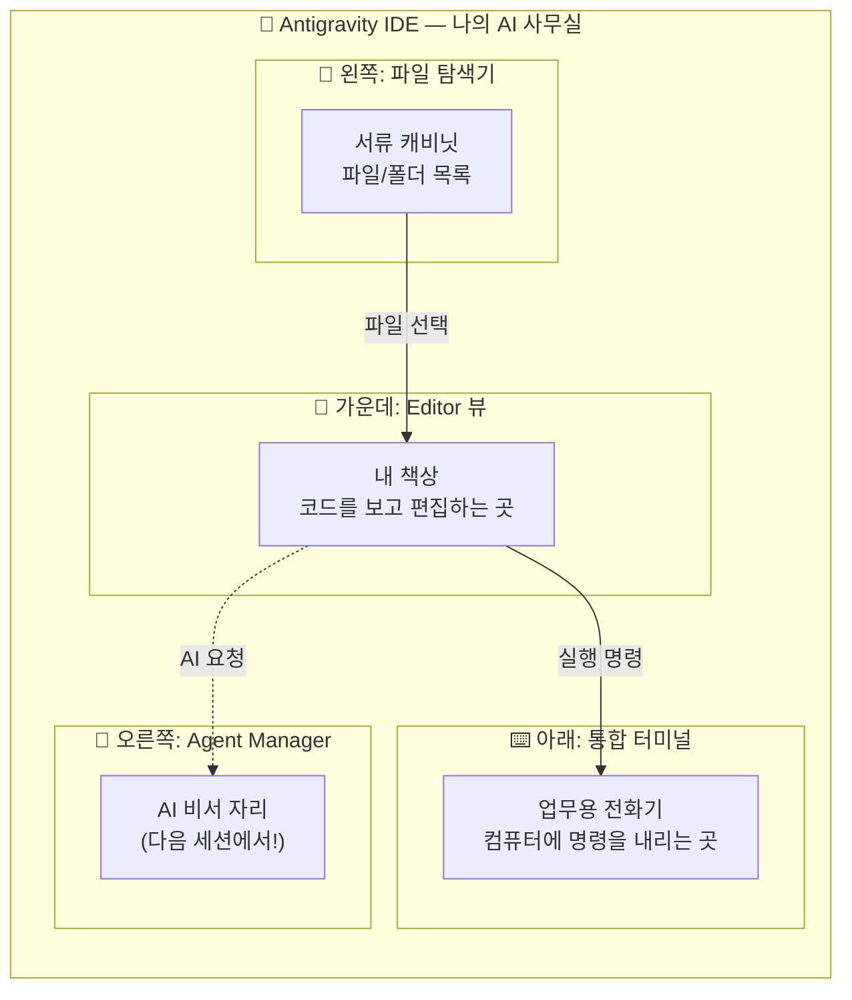

# 마이크로 세션: 005 — Editor 뷰와 기본 조작

> **세션 ID**: MS-PY101-005  
> **소요 시간**: 20분  
> **난이도**: low  
> **청크 타입**: lab  
> **버전**: v2.1 (7섹션 구조)

---

## §1. 개요

> **Day 1 | AM | 세션 005/022**

이전 세션에서 Antigravity IDE를 성공적으로 설치하고 첫 실행까지 마쳤어요. 설치가 완료되었다는 것은 여러분만의 "AI 비서가 상주하는 사무실"이 문을 열었다는 뜻이에요. 하지만 새 사무실에 입주했다고 바로 일을 시작할 수 있는 건 아니잖아요? 제일 먼저 해야 할 일은 사무실 구조를 파악하는 거예요. 내 책상이 어디인지, 서류 캐비닛은 어떻게 열고 닫는지, 메모지와 펜은 어디에 있는지 둘러봐야 하죠.

이번 세션에서는 Antigravity의 핵심 작업 공간인 **Editor 뷰(에디터 뷰)**를 집중적으로 탐험합니다. Editor 뷰는 여러분이 코드를 직접 눈으로 보고, 읽고, 수정하는 "내 책상"에 해당하는 영역이에요. AI가 아무리 뛰어나도, 최종적으로 코드를 확인하고 승인하는 것은 여러분의 몫이기 때문에, 이 책상을 자유자재로 다룰 수 있어야 합니다.

### 🎯 학습 목표

이 세션이 끝나면 여러분은 다음을 할 수 있어요:

- Antigravity 화면의 3대 영역(파일 탐색기, Editor 뷰, 통합 터미널)이 각각 어떤 역할인지 설명할 수 있어요
- 작업 폴더를 열고, 새 파일을 만들고, 저장하는 기본 조작을 자유롭게 수행할 수 있어요
- 파일 확장자가 왜 중요한지 이해하고, `.txt`와 `.py`의 차이를 구분할 수 있어요

### 선행 세션 환기

바로 직전 세션(세션 004)에서 우리는 Antigravity를 설치하고 첫 실행 화면을 확인했어요. "AI 비서가 상주하는 사무실"이라는 비유를 기억하시나요? 사무실 열쇠를 받아서 문을 열었으니, 이제 그 안을 본격적으로 둘러볼 차례예요. 오늘은 그 사무실에서 가장 중요한 공간, "내 책상"을 세팅하는 시간입니다.

---

## §2. 핵심 개념 (+ 🗣️ 강사 대본 + Mermaid)

### Editor 뷰 = "내 책상"

Antigravity IDE의 화면은 크게 세 개의 영역으로 구성되어 있어요. 이것을 사무실에 비유하면 아주 직관적으로 이해할 수 있습니다. 왼쪽의 좁고 긴 패널은 서류 캐비닛(파일 탐색기)이고, 가운데의 넓은 공간이 여러분의 책상(Editor 뷰)이며, 아래쪽에 숨어 있다가 호출하면 올라오는 영역이 업무용 전화기(통합 터미널)예요. 그리고 오른쪽에는 앞으로 만나게 될 AI 비서의 자리(Agent Manager)가 있는데, 이건 다음 세션에서 다루겠습니다.

🗣️ **강사 대본 (Instructor Script)**:

> 여러분, 설치한 사무실에 무사히 입주하셨죠? 그런데 입주만 했다고 바로 일할 수 있는 건 아닙니다. 새 사무실에 처음 들어가면 제일 먼저 뭘 하시나요? 내 책상이 어디인지 찾고, 서류함 위치를 확인하고, 프린터가 어디 있는지 둘러보잖아요.
>
> Antigravity도 마찬가지예요. 화면을 한번 크게 훑어봅시다. 왼쪽에 세로로 길게 늘어선 영역이 보이시죠? 이것이 "파일 탐색기"예요. 사무실로 치면 서류 캐비닛입니다. 여러분의 모든 파일이 여기에 폴더별로 정리되어 있어요.
>
> 그 옆으로 가장 넓은 중앙 공간, 이곳이 바로 "Editor 뷰"입니다. 여러분의 책상이에요. 서류 캐비닛에서 꺼낸 파일을 이 책상 위에 펼쳐놓고 읽고, 수정하고, 새로 작성하는 공간이죠. VS Code를 써본 경험이 있다면 아주 익숙한 모습일 겁니다. Antigravity의 Editor 뷰는 VS Code와 동일한 친숙한 환경을 제공하면서, 구문 강조(Syntax Highlighting)로 코드를 알록달록 예쁘게 표시해 줍니다.
>
> 그리고 화면 아래쪽에 숨어 있는 영역이 하나 더 있어요. 바로 "통합 터미널"입니다. 사무실의 업무용 전화기라고 생각하시면 돼요. 컴퓨터에게 직접 명령을 내릴 수 있는 전화선이죠. 나중에 파이썬 코드를 실행할 때 이 터미널을 사용하게 됩니다.
>
> 오른쪽에는 앞으로 만날 AI 비서의 자리가 있는데, 이건 다음 세션에서 다루겠습니다. 오늘은 에디터 화면, 즉 "내 책상"에 완전히 집중하겠습니다.

> 💡 **강사 노트**: "사무실 비유"는 Antigravity의 3-Surface 아키텍처(Editor, Agent Manager, Browser)를 초보자에게 직관적으로 전달하기 위해 구성했습니다. Editor 뷰가 VS Code와 동일한 환경을 제공한다는 점은 Deep Research(Source C)의 IDE 인터페이스 분석에 기반합니다.

### Mermaid 다이어그램



### 파일 확장자 = "서류의 꼬리표"

파일 이름 뒤에 붙는 `.txt`, `.py`, `.md` 같은 것을 확장자라고 불러요. 이것은 서류에 붙이는 꼬리표와 같아요. 꼬리표가 "계약서"라고 되어 있으면 법무팀에서 처리하고, "영수증"이라고 되어 있으면 경리팀에서 처리하듯이, 컴퓨터도 확장자를 보고 "아, 이건 텍스트 파일이구나", "아, 이건 파이썬 프로그램이구나"라고 판단합니다. 그래서 확장자를 빼먹으면 컴퓨터가 이 서류를 어떻게 처리해야 할지 몰라서 혼란이 생겨요.

🗣️ **강사 대본 (Instructor Script)**:

> 파일 이름에서 점(.) 뒤에 붙는 글자들, 이것을 확장자라고 부릅니다. 예를 들어 `hello.txt`에서 `.txt`가 확장자예요. 이건 서류에 붙이는 꼬리표라고 생각하시면 돼요.
>
> 꼬리표가 "계약서"라고 되어 있으면 법무팀에서 처리하고, "영수증"이라고 되어 있으면 경리팀에서 처리하잖아요? 컴퓨터도 마찬가지입니다. `.txt`를 보면 "아, 이건 일반 글 파일이구나" 하고 텍스트 에디터로 열고, `.py`를 보면 "아, 이건 파이썬 프로그램이구나" 하고 파이썬으로 실행해요.
>
> 그래서 확장자를 빼먹으면 큰일 나요. 꼬리표 없는 서류는 어느 팀에서 처리해야 할지 모르잖아요? 앞으로 파일을 만들 때 확장자를 반드시 입력하는 습관을 들여주세요!

> 💡 **강사 노트**: 확장자 개념은 프로그래밍 입문자들이 가장 많이 혼동하는 부분 중 하나입니다. `.txt`와 `.py`의 차이를 명확히 인지시키는 것이 Day 2 코드 작성의 기초가 됩니다.

---

## §3. 상세 내용

### Why — 왜 Editor 뷰 조작을 배우는가?

AI 시대에 코드를 직접 타이핑하는 일이 줄어든다고 해도, 코드를 **읽고 확인하는 능력**은 오히려 더 중요해져요. AI가 작성해준 코드가 올바른지, 내가 원하는 것과 일치하는지 판단하려면 코드를 편하게 열어보고 살펴볼 수 있어야 합니다. Editor 뷰는 바로 그 "코드 검토의 본부"예요.

Antigravity는 Review-driven development(검토 기반 개발)라는 철학을 따르고 있어요. AI가 코드를 변경하기 전에 반드시 사용자의 승인을 받는 구조입니다. 이 승인 과정이 일어나는 곳이 바로 Editor 뷰예요. 그래서 Editor 뷰를 자유자재로 다루지 못하면, AI 비서에게 일을 시켜도 결과를 제대로 확인할 수 없게 돼요. 마치 서류를 펼쳐볼 줄 모르는 사장님이 직원의 보고서를 검토하지 못하는 것과 같죠.

### What — Editor 뷰의 3가지 핵심 영역

Editor 뷰에서 오늘 반드시 익혀야 할 영역은 세 가지예요.

첫 번째는 **파일 탐색기(Explorer)**입니다. 화면 왼쪽에 세로로 늘어선 패널이에요. 여기에는 현재 작업 중인 폴더의 모든 파일과 하위 폴더가 트리 구조로 보여요. 마치 Windows 탐색기에서 폴더를 열어보는 것과 비슷한데, IDE 안에 내장되어 있어서 따로 창을 왔다갔다 하지 않아도 돼요.

두 번째는 **에디터 영역(Editor Area)**입니다. 화면 가운데의 가장 넓은 공간이에요. 파일 탐색기에서 파일을 클릭하면 이 공간에 파일 내용이 펼쳐져요. 여러 파일을 동시에 열어놓을 수도 있는데, 상단에 탭처럼 표시되어서 탭을 클릭해서 파일 간에 전환할 수 있어요. 가장 중요한 특징은 **구문 강조(Syntax Highlighting)**예요. 파이썬 파일(`.py`)을 열면 코드의 각 부분이 다른 색으로 표시되어서, 코드를 훨씬 읽기 쉽게 만들어줘요.

세 번째는 **통합 터미널(Integrated Terminal)**입니다. 화면 아래쪽에 숨어 있다가 단축키(`` Ctrl + ` ``)를 누르면 올라오는 영역이에요. 여기서 컴퓨터에 직접 명령을 내릴 수 있어요. 나중에 파이썬 코드를 실행하거나, 패키지를 설치하거나, 시스템 정보를 확인할 때 이 터미널을 사용하게 됩니다.

### How — 3가지 기본 조작 (폴더 열기, 파일 생성, 저장)

오늘 배울 핵심 조작은 딱 세 가지예요. 이 세 가지만 할 줄 알면 앞으로의 모든 실습을 따라갈 수 있습니다.

**첫 번째: 폴더 열기(Open Folder)**. IDE에서 작업을 시작하려면 가장 먼저 "어디서 일할 건지" 알려줘야 해요. 상단 메뉴의 File → Open Folder를 클릭하고 작업할 폴더를 선택하면, 그 폴더 안의 모든 파일이 왼쪽 탐색기에 나타납니다. 마치 사무실에 출근해서 "오늘은 이 프로젝트 서류함에서 일하겠습니다"라고 정하는 것과 같아요.

**두 번째: 파일 생성(New File)**. 탐색기 영역에서 우클릭 후 "New File"을 선택하면 새 파일을 만들 수 있어요. 여기서 중요한 것이 파일 이름 뒤의 확장자예요. `.txt`는 일반 텍스트 파일, `.py`는 파이썬 파일이에요. 확장자를 빼먹으면 컴퓨터가 파일의 종류를 인식하지 못해요.

**세 번째: 저장(Save)**. `Ctrl+S`를 눌러서 작업 내용을 저장합니다. 저장하지 않은 파일은 탭에 하얀 점(●)이 표시돼요. 이 점은 "아직 저장 안 했어요!"라는 신호예요. 서류를 작성했으면 반드시 서랍에 넣어야 하듯, 코딩을 했으면 반드시 저장해야 합니다. `Ctrl+S`는 이 과정 전체에서 가장 많이 누르게 될 단축키이니, 지금 바로 손가락에 익혀두세요!

> ✅ **체크포인트**: 여기까지 이해했는지 스스로 점검해 보세요.
> - Antigravity 화면에서 파일 탐색기, Editor 뷰, 통합 터미널의 위치를 가리킬 수 있나요?
> - `.txt`와 `.py` 확장자의 차이를 설명할 수 있나요?
> - 저장하지 않은 파일의 신호(●)를 알고 있나요?

### 비교표 — Editor 뷰의 3대 영역

| 영역 | 위치 | 역할 | 사무실 비유 |
|------|------|------|------------|
| 파일 탐색기 (Explorer) | 화면 왼쪽 | 파일/폴더 목록 표시 및 관리 | 서류 캐비닛 |
| 에디터 영역 (Editor Area) | 화면 가운데 (가장 넓음) | 코드/텍스트 보기 및 편집 | 내 책상 |
| 통합 터미널 (Terminal) | 화면 아래쪽 (숨겨져 있음) | 명령어 입력 및 실행 | 업무용 전화기 |
| Agent Manager | 화면 오른쪽 | AI와 대화 (다음 세션!) | AI 비서 자리 |

### 용어 정리표

| 용어 | 뜻 | 쉬운 비유 |
|------|-----|----------|
| IDE (Integrated Development Environment) | 통합 개발 환경. 코드 편집, 실행, 디버깅을 한 곳에서 할 수 있는 프로그램 | AI 비서가 상주하는 사무실 |
| Editor 뷰 | 코드를 보고 편집하는 화면 | 내 책상 |
| 파일 탐색기 (Explorer) | 프로젝트의 파일/폴더를 트리 구조로 보여주는 패널 | 서류 캐비닛 |
| 통합 터미널 (Terminal) | IDE 안에 내장된 명령줄 도구 | 업무용 전화기 |
| 확장자 (Extension) | 파일 이름 뒤의 `.txt`, `.py` 등 | 서류의 꼬리표 |
| 구문 강조 (Syntax Highlighting) | 코드를 색깔로 구분해서 보여주는 기능 | 형광펜으로 중요 부분 표시 |

---

## §4. 실습 가이드 (+ 🎙️ 실습 대본)

### 실습 목표

이 실습을 통해 여러분은 Antigravity에서 작업 폴더를 열고, 새 파일을 만들고, 내용을 입력한 뒤 저장하는 기본 워크플로우를 직접 경험합니다. 이 기본 동작이 앞으로 5일간 모든 실습의 기초가 됩니다.

🎙️ **실습 가이드 대본 (Lab Guide)**:

> 자, 이제 직접 해봅시다. 오늘 실습은 아주 간단하지만, 앞으로 매일 반복하게 될 기본기예요. 긴장하지 마시고 천천히 따라와 주세요. 텍스트 파일은 절대 컴퓨터를 망가뜨리지 않으니까요. 마음껏 연습하셔도 됩니다.
>
> 실습이 끝나면 여러분의 바탕화면에 `AI_Class`라는 폴더가 생기고, 그 안에 `hello.txt`라는 파일이 깔끔하게 들어있을 거예요. 이것이 여러분이 만든 첫 번째 디지털 서류입니다!

### 단계별 지시

| 단계 | 소요 시간 | 강사 지시사항 | 학습자 액션 | 예상 결과 |
|------|----------|--------------|------------|----------|
| 1 | 2분 | "바탕화면에 새 폴더를 만들어 주세요. 이름은 `AI_Class`입니다." | 바탕화면 → 우클릭 → 새로 만들기 → 폴더 → `AI_Class` 입력 | 바탕화면에 `AI_Class` 폴더 생성 |
| 2 | 2분 | "Antigravity 상단 메뉴에서 File → Open Folder를 클릭하고, 방금 만든 `AI_Class` 폴더를 선택하세요." | File → Open Folder → `AI_Class` 선택 → "폴더 선택" 클릭 | 왼쪽 탐색기에 `AI_CLASS` 폴더명 표시 |
| 3 | 2분 | "왼쪽 탐색기의 빈 공간에서 우클릭 후 New File을 선택하세요. 파일 이름은 `hello.txt`입니다. 반드시 `.txt`까지 포함해서 입력하세요!" | 탐색기 빈 공간 우클릭 → New File → `hello.txt` 입력 → Enter | 가운데 에디터에 빈 `hello.txt` 파일이 열림 |
| 4 | 2분 | "에디터에 아무 글이나 입력해 보세요. '안녕하세요, 저의 첫 번째 파일입니다!'처럼요." | 에디터 영역 클릭 → 자유롭게 텍스트 입력 | 입력한 텍스트가 에디터에 표시, 탭에 ● 표시 |
| 5 | 1분 | "`Ctrl+S`를 눌러서 저장하세요. 탭의 ● 표시가 사라지면 저장 성공!" | `Ctrl+S` 키 입력 | 탭의 ● 표시 사라짐 = 저장 완료 |
| 6 | 2분 | "잘 했어요! 이번에는 파이썬 파일도 하나 만들어 봅시다. 같은 방법으로 `test.py`라는 파일을 만들어 보세요." | 탐색기 우클릭 → New File → `test.py` 입력 | `test.py` 파일 생성, 에디터에 열림 |
| 7 | 2분 | "`test.py`에 `print('Hello')`라고 입력하고 저장하세요. 글자 색이 다르게 표시되는 걸 확인해 보세요. 이것이 구문 강조입니다!" | `print('Hello')` 입력 → `Ctrl+S` | 코드에 색상이 적용됨 (구문 강조 확인) |
| 8 | 2분 | "마지막으로 통합 터미널을 열어봅시다. `` Ctrl + ` ``(백틱 키)를 눌러보세요." | `` Ctrl + ` `` 키 입력 | 화면 하단에 터미널 패널 표시 |

### 트러블슈팅 FAQ

| Q | A |
|---|---|
| 파일 탐색기가 보이지 않아요. | `Ctrl+B`를 눌러서 사이드바를 토글(켜기/끄기)해 보세요. |
| 폴더를 열었는데 "Trust Authors" 같은 팝업이 떠요. | "Yes, I trust the authors"를 클릭하시면 됩니다. 내 컴퓨터의 내 폴더이니 안전해요. |
| 파일명에 확장자를 빼먹었어요. | 파일 이름을 우클릭 → Rename으로 이름을 바꿀 수 있어요. 확장자를 붙여서 다시 지어주세요. |
| `Ctrl+S`를 눌렀는데 아무 반응이 없어요. | 이미 저장된 상태일 수 있어요. 탭에 ● 표시가 없다면 이미 저장된 겁니다. |
| 터미널이 열리지 않아요. | 상단 메뉴 Terminal → New Terminal을 클릭해 보세요. 단축키가 안 먹히는 경우가 간혹 있어요. |
| `.py` 파일인데 색이 안 변해요. | Antigravity 오른쪽 아래에 언어 모드가 "Plain Text"로 되어 있을 수 있어요. 클릭해서 "Python"으로 변경하세요. |

> ✅ **체크포인트**: `AI_Class` 폴더 안에 `hello.txt`와 `test.py` 파일이 모두 보이나요? `test.py`의 `print` 글자에 색이 입혀져 있나요?

---


### 🎓 강사 노트 (Instructor Support)

- ⏱️ **타이밍**: 10:35 (20분, lab)
- 🎯 **핵심 활동**: 폴더 열기, 파일 생성/저장
- ⚠️ **강사 주의사항**: 느린 학습자 개별 확인 필수


### 📋 실습 설계 보강 (Lab Packet)

**세션 005 실습 설계 보강**

Editor 뷰와 기본 조작
- **3-Stage Example Set**
  - 기본: File > Open Folder로 프로젝트 폴더 열기 → 새 파일 생성(hello.py) → Ctrl+S 저장
  - 변형: 기존 텍스트 파일(.txt)을 열어서 .py로 확장자 변경해보기
  - 실수 해결: "폴더를 열었는데 왼쪽에 아무것도 안 보여요" → 빈 폴더를 연 것. 파일을 하나 생성해야 목록 표시
- **난이도 예측**: 파일/폴더 개념이 모호한 학습자에게 난관
- **타이밍 가이드**: 폴더 열기 3분 | 파일 생성·저장 5분 | 탐색기 조작 연습 7분 | 정리 5분
- **심리적 장벽**: "내가 뭔가 잘못 누르면 컴퓨터가 망가지지 않을까?"
- **자가 점검**:
  - [ ] 왼쪽 탐색기에 내 폴더 구조가 보이는가?
  - [ ] hello.py 파일을 생성하고 저장할 수 있는가?
  - [ ] 파일명 옆 동그라미(수정됨 표시)가 저장 후 사라지는가?

## §5. 코드 및 명령어 모음

### 주요 단축키 정리

```
# Antigravity Editor 뷰 기본 단축키

Ctrl + N         → 새 파일 생성
Ctrl + S         → 파일 저장
Ctrl + B         → 사이드바(파일 탐색기) 토글
Ctrl + `         → 통합 터미널 열기/닫기
Ctrl + K → Ctrl + O  → 폴더 열기
Ctrl + Shift + P  → 명령 팔레트 (모든 기능 검색)
Ctrl + Tab       → 열린 파일 간 전환
Ctrl + W         → 현재 탭 닫기
```

### 예제 1: 첫 번째 텍스트 파일 내용

```text
안녕하세요, 저의 첫 번째 파일입니다!
이 파일은 Antigravity Editor 뷰에서 만들었어요.
```

### 예제 2: 첫 번째 파이썬 파일

```python
print('Hello')
```

> 🤖 **AI 프롬프트 예시**: "Antigravity에서 새 파이썬 파일을 만들고 'Hello World'를 출력하는 코드를 작성해줘"

### 파일 관련 조작 요약

```
# 파일 탐색기 조작
우클릭 → New File      → 새 파일 생성
우클릭 → New Folder    → 새 폴더 생성
우클릭 → Rename        → 이름 변경
우클릭 → Delete        → 파일 삭제

# 주요 확장자
.txt   → 일반 텍스트 파일
.py    → 파이썬 소스 파일
.md    → 마크다운 문서 파일
```

---

## §6. 요약

### 핵심 학습 포인트

오늘 우리는 Antigravity IDE의 "내 책상"인 Editor 뷰를 집중적으로 탐험했어요. 사무실에 입주했으니 가장 먼저 해야 할 일, 바로 내 작업 공간을 세팅하는 것이었습니다. 파일 탐색기(서류 캐비닛)에서 작업 폴더를 열고, 에디터 영역(내 책상)에서 파일을 만들고 내용을 입력했으며, `Ctrl+S`로 저장하는 기본기를 완전히 익혔습니다. 또한 파일 확장자가 서류의 꼬리표 역할을 해서 `.txt`는 텍스트 파일, `.py`는 파이썬 파일이라는 것도 배웠어요. 아주 기본적인 것처럼 보이지만, 이것이 앞으로 5일간 우리가 수행할 모든 작업의 기초입니다.

### 다음 세션 예고

책상 정리는 끝났어요! 그런데 여러분, 화면 오른쪽에 뭔가가 조용히 대기하고 있는 걸 눈치채셨나요? 그곳에 우리의 AI 비서가 앉아 있어요. 다음 세션에서는 이 AI 비서, Gemini 3 Pro에게 처음으로 인사를 건네보겠습니다.

### 브릿지 노트

> "파일 만들기, 저장하기! 아주 기본적인 거지만 이게 앞으로 우리가 할 모든 작업의 기초가 됩니다. 내 책상은 준비됐으니, 이제 화면 오른쪽에서 조용히 기다리고 있는 AI 비서를 깨워보겠습니다!"

---

## §7. 참고 자료

### 3-Source 출처

- **Source A (로컬 참고자료)**: `AI-native_파이썬기초.md` — Antigravity Editor View의 VS Code 호환성 및 기본 레이아웃 설명
- **Source B (NotebookLM)**: Antigravity IDE 대시보드 인터페이스 분석 — 파일 탐색기, 에디터, 터미널의 역할 구분
- **Source C (Deep Research)**: IDE 인터페이스 분석 — Editor 뷰가 VS Code와 동일한 친숙한 환경을 제공하며 구문 강조, 통합 터미널 제어 능력을 확보한다는 기술 분석

### 추가 학습 자료

- [Antigravity 공식 문서](https://antigravity.google/docs): Editor 뷰 상세 기능 가이드
- [VS Code 단축키 치트시트](https://code.visualstudio.com/shortcuts/keyboard-shortcuts-windows.pdf): Antigravity와 동일한 단축키 체계

### 강사 노트

> 💡 이 세션은 lab 타입으로, 학습자가 직접 폴더 열기 → 파일 생성 → 저장을 경험하는 것이 핵심입니다. 확장자 개념을 확실히 잡아주지 않으면 Day 2에서 `.py` 파일 생성 시 혼란이 발생하므로, `.txt`와 `.py`의 차이를 반복적으로 강조해 주세요.

---

## ✅ 세션 완료 체크리스트 (강사용)

- [ ] §1~§7 모든 섹션이 충실하게 작성되었는가?
- [ ] 비유와 스토리텔링이 포함되었는가? (사무실 비유, 서류 꼬리표 비유)
- [ ] 실습 단계별 지시표가 완전한가?
- [ ] 체크포인트 질문이 배치되었는가?
- [ ] 3-Source 팩트 패킷이 반영되었는가?

---

*작성 일시: 2026-02-25*  
*작성 에이전트: A4B_Session_Writer*  
*교안 구조: 7섹션 (A0 팀 공통 표준)*
