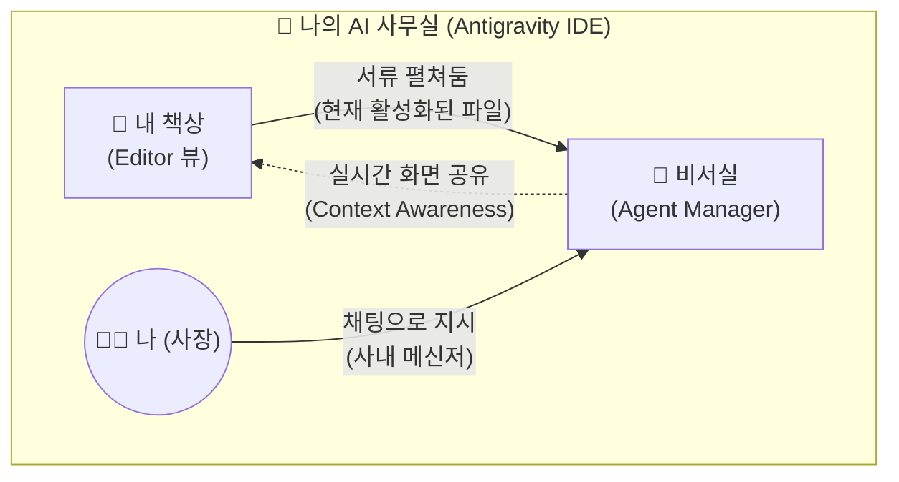

# 마이크로 세션: 006 — Agent Manager와 첫 인사

> **세션 ID**: MS-PY101-006  
> **소요 시간**: 20분  
> **난이도**: low  
> **청크 타입**: lab  
> **버전**: v2.1 (7섹션 구조)

---

## §1. 개요

> **Day 1 | AM | 세션 006/022**

이전 세션에서 우리는 에디터 뷰, 즉 "내 책상"을 완벽하게 정리했습니다. 파일 탐색기라는 서류 캐비닛에서 문서를 꺼내 내 책상 위에 펼쳐놓는 법을 배웠죠. 그런데 혼자서 모든 서류를 처리하려고 이렇게 거창한 사무실을 연 건 아니잖아요? 우리에게는 아주 똑똑한 AI 비서가 있습니다. 이제 화면 오른쪽에서 조용히 대기하고 있는 비서실의 문을 두드려 볼 차례예요.

이번 세션에서는 Antigravity의 핵심 엔진이자 여러분의 든든한 파트너인 **Agent Manager(에이전트 매니저)**와 첫 인사를 나눕니다. 단순히 대화를 나누는 것을 넘어, 이 비서가 내 책상 위 서류를 어떻게 함께 보고 분석하는지 그 놀라운 능력을 직접 체험해 볼 거예요. Agent Manager는 평범한 채팅창이 아니라 여러 비서가 업무를 대기하는 미션 컨트롤입니다.

### 🎯 학습 목표

이 세션이 끝나면 여러분은 다음을 할 수 있어요:

- Agent Manager 패널을 열고 AI 비서와 자연스러운 대화를 시작할 수 있어요
- 일반적인 ChatGPT와 Antigravity 내장 AI 비서의 결정적인 차이점을 설명할 수 있어요
- 내가 열어둔 파일을 AI 비서가 읽고 분석하도록 지시할 수 있어요
- 에이전트의 업무 처리 방식인 계획(Plan), 실행(Execute), 검증(Validate) 사이클을 이해할 수 있어요

### 선행 세션 환기

바로 직전 세션에서 우리는 바탕화면에 `AI_Class` 폴더를 만들고, 그 안에 `hello.txt`라는 첫 번째 디지털 서류를 작성해 내 책상(Editor 뷰) 위에 올려두었습니다. 이 서류를 그대로 펼쳐둔 상태로 이번 세션을 시작할 거예요. 내 책상 위 서류를 비서가 어떻게 알아채고 분석하는지 두 눈으로 직접 확인하는 것이 오늘 실습의 핵심 목표입니다. 준비되셨나요? 비서실 문을 두드려 봅시다.

---

## §2. 핵심 개념 (+ 🗣️ 강사 대본 + Mermaid)

### 비서실 문 두드리기: Agent Manager

Antigravity 화면 우측에 자리 잡은 Agent Manager는 단순한 보조 도구가 아닙니다. 이곳은 회사의 "비서실"이자, 여러 비서가 여러분의 지시를 대기하는 "미션 컨트롤"이에요. 여러분이 회사에서 카카오톡이나 슬랙 같은 사내 메신저를 통해 동료에게 업무를 요청하는 상황을 떠올려 보세요. 동료에게 "이 자료 좀 찾아줄 수 있어?" 하고 메시지를 보내면, 동료가 자료를 찾아 답장을 보내주죠. Agent Manager가 딱 그런 느낌입니다. 다만 이 메신저의 상대방은 사람이 아니라 뛰어난 능력을 가진 AI 비서인 Gemini 3 Pro입니다. 

이 비서들은 여러분이 업무를 맡기면 알아서 계획(Plan)을 세우고, 실행(Execute)하고, 결과를 검증(Validate)해서 보고하는 체계적인 사이클로 일합니다. 마치 아주 유능한 신입 직원에게 일을 맡기는 것과 같아요.

🗣️ **강사 대본 (Instructor Script)**:

> 에디터 조작에 익숙해지셨죠? 왼쪽 책상 정리도 잘 끝내셨고요. 그런데 혹시 화면 오른쪽에 말풍선 모양 아이콘이 숨어 있는 걸 눈치채셨나요? 보통 다른 코드 편집기에서는 그냥 빈 공간이거나 보조 도구가 있는 자리인데, 우리 Antigravity에는 아주 특별한 공간이 마련되어 있어요. 바로 "Agent Manager"입니다.
>
> 여러분, 회사에서 사내 메신저 많이 쓰시죠? "김 대리, 이 자료 좀 찾아줄 수 있어?" 하고 메시지를 보내면 답장이 오잖아요. Agent Manager가 딱 그런 느낌이에요. 쉽게 말해 "비서실 문을 똑똑 두드리는 것"과 같습니다. 이곳에서 여러분의 AI 비서인 Gemini 3 Pro가 출근해서 여러분의 지시를 기다리고 있어요.

> 💡 **강사 노트**: "사내 메신저"와 "비서실 문 두드리기" 비유를 함께 사용하여, 대화형 인터페이스의 친숙함과 AI의 보조적 역할을 동시에 전달합니다. 학습자가 두려움 없이 첫 질문을 던질 수 있도록 유도해 주세요.

### Mermaid 다이어그램



### 결정적 차이: 실시간 상황 인식 (Context Awareness)

이 AI 비서실이 우리가 흔히 아는 인터넷 브라우저 속 ChatGPT나 일반 웹 검색과 확연히 다른 점은 바로 "눈"이 달려있다는 거예요. 이 비서는 여러분이 내 책상(Editor 뷰)에 어떤 서류를 올려놓았는지 실시간으로 함께 보고 있습니다. 따로 서류 내용을 복사해서 채팅창에 붙여넣어 줄 필요가 전혀 없어요. 그냥 "지금 내가 보고 있는 이 파일 좀 정리해 줘"라고 말하면 찰떡같이 알아듣습니다. 이것을 기술적인 용어로 컨텍스트 인식(Context Awareness)이라고 부릅니다.

🗣️ **강사 대본 (Instructor Script)**:

> "그럼 그냥 인터넷 창 열고 ChatGPT 쓰면 되는 거 아니에요?"라고 생각하실 수 있어요. 질문을 던지면 답을 주는 건 똑같으니까요. 하지만 결정적인 차이가 있습니다. 일반 ChatGPT는 여러분의 모니터와 작업 환경을 전혀 볼 수 없는 장님 비서예요. 일일이 파일 내용을 복사해서 채팅창에 붙여넣어 줘야 하죠.
> 
> 하지만 Antigravity 비서실에 있는 직원들은 여러분과 완벽하게 '화면을 공유'하고 있어요. 여러분 옆자리에 앉아서 내 책상을 같이 보고 있는 셈이죠. 방금 여러분이 펼쳐둔 `hello.txt` 파일을 손가락으로 가리키면서 "이것 좀 읽어봐"라고 하면 바로 읽어냅니다. 이것이 에디터에 내장된 AI 비서의 가장 무서운 능력이자, 앞으로 여러분의 퇴근 시간을 두 시간 이상 앞당겨줄 핵심 무기입니다.

---

## §3. 상세 내용

### Why — 왜 Agent Manager를 써야 하는가?

AI 시대의 소프트웨어 개발에서 가장 큰 변화는 개발자의 역할이 바뀌었다는 점입니다. 혼자서 모든 코드를 한 줄 한 줄 힘들게 타이핑하던 시대는 지났어요. 이제 개발자는 코드를 타이핑하는 사람이 아니라, 무엇을 만들지 기획하고 AI에게 "정확한 지시를 내리는 사람"입니다. 이 지시를 내리는 공식적인 창구이자 유일한 통로가 바로 Agent Manager예요. 

Agent Manager를 통하지 않고서는 AI의 강력한 코딩 능력을 내 프로젝트에 연결할 수 없습니다. 또한, 이곳은 비서가 업무를 어떻게 처리하고 있는지 경과를 한눈에 모니터링하고, 혹시라도 잘못된 방향으로 가고 있다면 즉각 바로잡아주는 통제 센터의 역할도 겸합니다. 비서에게 일을 시키고 보고받는 가장 효율적인 창구인 셈이죠.

### What — Agent Manager의 구조와 기능

Agent Manager의 화면은 마치 깔끔하게 정리된 이메일 편지함이나 스마트폰의 메신저 앱처럼 직관적으로 생겼습니다. 크게 세 가지 영역으로 나누어 볼 수 있어요.

첫 번째는 **과거 기록 영역(Inbox/History)**입니다. 과거에 비서와 나눴던 대화나 진행했던 작업들이 목록 형태로 남아요. 마치 예전에 지시했던 업무 기록철을 다시 꺼내보는 것과 같습니다.

두 번째는 **현재 대화 영역(Chat View)**입니다. 지금 비서와 대화를 나누고 있는 실시간 공간이에요. 비서가 여러분의 지시를 받고 계획을 세우는 모습(Plan), 실제로 타자를 치며 코드를 작성하거나 파일을 검색하는 모습(Execute), 그리고 그 결과가 맞는지 스스로 확인하는 모습(Validate)이 이 창에 투명하게 중계됩니다.

세 번째는 **입력창(Input Box)**입니다. 화면 맨 아래에 위치한 텍스트 입력 칸으로, 여러분이 한국어로 편안하게 지시를 내리는 곳이에요. 영어로 완벽한 문장을 구사해야 한다는 부담은 전혀 가질 필요가 없습니다.

### How — 비서실 활용의 절대 규칙 (결재권)

비서실을 이용할 때 반드시 지켜야 할 절대 규칙이 딱 하나 있습니다. 바로 **"사장의 결재 없이는 서류의 토씨 하나도 바뀌지 않는다"**는 원칙이에요.

앞선 세션에서 잠깐 언급했던 검토 기반 개발(Review-driven development)이라는 철학이 여기서 철저하게 지켜집니다. AI 비서는 아주 똑똑하고 행동이 빠르지만, 동시에 극도로 조심스럽게 행동하도록 설계되어 있어요. 비서가 "사장님, 현재 파일을 이렇게 수정하는 게 어떨까요?"라고 제안안을 가져오면, 여러분이 명시적으로 승인("Accept" 버튼 클릭 또는 "좋아, 진행해"라고 대답)하거나 거절해야만 내 책상(Editor)의 파일 내용이 비로소 변경됩니다. 

AI가 제멋대로 코드를 엉망으로 만들까 봐 걱정하실 필요가 전혀 없어요. 모든 통제권과 주도권은 온전히 사장님인 여러분이 쥐고 있다는 사실을 명심하세요.

---

## §4. 실습 가이드 (+ 🎙️ 실습 대본)

### 실습 목표

이 실습을 통해 여러분은 Agent Manager 패널을 직접 열어 AI 비서에게 첫 인사를 건넵니다. 또한, 이전에 작성해 둔 `hello.txt` 파일을 비서가 화면 공유하듯 제대로 인지하고 있는지 두 눈으로 확인합니다.

🎙️ **실습 가이드 대본 (Lab Guide)**:

> 자, 이제 진짜로 비서실 문을 두드려 볼 시간입니다. 화면 오른쪽을 주목해 주세요. 앙증맞은 말풍선 모양의 아이콘이 보이시나요? 그걸 클릭하면 비서실 문이 스르륵 열리면서 채팅창이 나타납니다.
>
> 첫 출근을 한 비서에게 인사를 건네봐야겠죠? 영어로 길고 복잡하게 써야 하나 걱정하지 마세요. 우리 비서실 직원들은 한국어 패치가 완벽하게 되어 있습니다. 일상적인 메신저 하듯이 편안한 말씨로 질문해 보세요. 자, 키보드에 손을 올리시고 시작해 보겠습니다!

### 단계별 지시

| 단계 | 소요 시간 | 강사 지시사항 | 학습자 액션 | 예상 결과 |
|------|----------|--------------|------------|----------|
| 1 | 1분 | "화면 우측 사이드바에서 말풍선 아이콘(Agent)을 클릭해 패널을 열어주세요." | 우측 말풍선 아이콘 클릭 | 화면 오른쪽에 Agent Manager 패널이 확장됨 |
| 2 | 2분 | "아래쪽 입력창에 이렇게 적어보세요. '안녕! 너는 누구야? 무엇을 할 수 있어?' 그리고 Enter를 누르세요." | 입력창에 텍스트 입력 후 Enter | AI가 자기소개와 주요 기능을 한국어로 친절하게 답변함 |
| 3 | 2분 | "에디터 가운데 화면(내 책상)에 아까 만든 `hello.txt` 파일이 열려있는지 확인하세요. 안 열려 있다면 탐색기에서 클릭해 주세요." | `hello.txt` 탭 클릭 (포커스 맞추기) | 에디터 화면에 `hello.txt` 파일 내용이 선명하게 표시됨 |
| 4 | 3분 | "이제 진짜 마법을 부려볼게요. 비서에게 '방금 내가 만든 hello.txt 파일을 읽어줄래?'라고 물어보세요." | 입력창에 "hello.txt 파일 읽어줄래?" 입력 후 Enter | AI가 현재 활성화된 파일 내용을 정확히 인식하고 화면에 출력해 줌 |
| 5 | 2분 | "비서가 파일 내용을 정확히 읽어냈나요? 결과를 짝꿍과 함께 확인하고 화면을 비교해 보세요." | 응답 확인 및 짝꿍과 결과 공유 | 상황 인식(Context Awareness)이 성공적으로 작동함을 눈으로 확인 |

### 트러블슈팅 FAQ

| Q | A |
|---|---|
| 오른쪽 패널 아이콘이 아예 보이지 않아요. | 화면 상단 메뉴 View → Appearance → Show Activity Bar가 체크되어 있는지 확인하거나, 단축키 `Ctrl+L` (Mac은 `Cmd+L`)을 눌러보세요. 패널이 즉시 나타납니다. |
| AI가 영어로만 대답해요. 한국어로 물었는데도요. | "앞으로는 한국어로 대답해 줘"라고 한 번만 명시적으로 지시해 보세요. 그 이후부터는 찰떡같이 한국어로만 응답합니다. |
| 비서가 `hello.txt` 파일을 못 찾겠다고 자꾸 엉뚱한 소리를 해요. | 현재 에디터 화면 중앙에 `hello.txt` 파일이 활성화되어 있지 않아서 그럴 수 있습니다. 화면 왼쪽의 파일 탐색기에서 파일을 찾아 다시 한번 클릭해서 활성화한 뒤 똑같이 물어보세요. |
| 질문을 입력했는데 계속 로딩 동그라미만 돌아가고 답이 없어요. | 인터넷 연결이 일시적으로 끊겼거나 서버가 지연될 때 발생합니다. 잠시 기다려 보시고, 1분이 넘어가면 입력창 위쪽의 새로고침 화살표 버튼을 눌러보세요. |

> ✅ **체크포인트**: AI 비서가 내가 아까 적었던 "안녕하세요, 저의 첫 번째 파일입니다!"라는 내용을 토씨 하나 틀리지 않고 정확히 읊어주었나요?

---


### 🎓 강사 노트 (Instructor Support)

- ⏱️ **타이밍**: 11:05 (20분, lab)
- 🎯 **핵심 활동**: Gemini 3 Pro와 첫 대화
- ⚠️ **강사 주의사항**: "안녕?"만 쳐도 응답 오면 성공


### 📋 실습 설계 보강 (Lab Packet)

**세션 006 실습 설계 보강**

Agent Manager와 첫 인사
- **3-Stage Example Set**
  - 기본: Agent Manager 창 열기 → "안녕, 나는 파이썬 초보야"라고 입력 → AI 응답 확인
  - 변형: "오늘 날씨 알려줘"처럼 코딩과 무관한 질문 → AI가 코딩 맥락으로 안내하는 패턴 관찰
  - 실수 해결: "입력했는데 응답이 안 와요" → 인터넷 연결 확인, API 키 설정 확인
- **난이도 예측**: 대화 자체는 쉬우나 "AI에게 뭘 물어봐야 하지?" 막막함
- **타이밍 가이드**: Agent Manager 위치 찾기 3분 | 첫 대화 5분 | 다양한 질문 실험 7분 | 정리 5분
- **심리적 장벽**: "AI한테 바보 같은 질문을 하면 어쩌지?"
- **자가 점검**:
  - [ ] Agent Manager 창을 독립적으로 열 수 있는가?
  - [ ] AI에게 자연어로 질문을 보내고 응답을 받았는가?
  - [ ] 대화 이력이 화면에 남아있는 것을 확인했는가?

## §5. 코드 및 명령어 모음

### 주요 단축키 정리

마우스를 쓰지 않고도 비서실을 자유롭게 드나들 수 있는 필수 단축키들입니다.

```
# Agent Manager 기본 조작 단축키

Ctrl + L (Windows) / Cmd + L (Mac)  → Agent Manager 패널 열기 (동시에 입력창으로 커서가 즉시 이동합니다)
Ctrl + Shift + L                    → 완전히 새로운 채팅창 열기 (기존 대화를 지우고 깨끗한 백지에서 시작)
Esc                                 → Agent Manager 패널에서 빠져나와 에디터 뷰(내 책상)로 포커스 돌려놓기
```

### 프롬프트(지시어) 예시 모음

비서에게 말을 걸 때 참고할 수 있는 훌륭한 첫인사 예시들입니다. 그대로 복사해서 써도 좋습니다.

```text
# 1. 가벼운 인사 및 정체성 확인
"안녕! 너는 누구야? 나를 위해 무엇을 해 줄 수 있어?"
"우리 앞으로는 무조건 한국어로만 편하게 대화하자."

# 2. 컨텍스트 인식(상황 인식) 테스트
"지금 내가 열어둔 hello.txt 파일을 읽어줄래?"
"이 파일의 내용이 무슨 뜻인지 프로그래밍을 전혀 모르는 초보자가 이해하기 쉽게 설명해 줘."

# 3. 폴더 구조 파악 및 기초 분석 지시
"현재 내 프로젝트 폴더(AI_Class) 안에 어떤 파일들이 들어 있는지 싹 파악해서 알려줘."
```

> 🤖 **용어 팁**: 개발자들이 자주 쓰는 "프롬프트(Prompt)"라는 단어는 거창한 기술 용어가 아닙니다. 그저 AI에게 내리는 "지시어"나 "질문 내용"을 뜻할 뿐이에요. 사내 메신저로 동료에게 보내는 업무 요청 메시지라고 생각하시면 아주 마음이 편해집니다.

---

## §6. 요약

### 핵심 학습 포인트

이번 세션에서는 Antigravity의 두뇌이자 심장인 Agent Manager 패널을 처음으로 열어보았습니다. 조용히 닫혀있던 비서실 문을 두드려 AI 비서에게 첫 인사를 건네고, 사내 메신저를 쓰듯 한국어로 편하게 대화하는 방법을 배웠어요. 

특히 우리가 가장 주목해야 할 부분은, 이 비서가 일반적인 챗봇과 다르다는 점입니다. 이 내장형 AI 비서는 내 책상(Editor 뷰) 위에 펼쳐진 서류를 실시간으로 함께 볼 수 있는 눈, 즉 컨텍스트 인식(Context Awareness) 능력을 가졌다는 사실을 직접 체험했습니다. "내가 열어둔 이 파일 좀 읽어봐"라는 말 한마디면 척척 내용을 파악해 내는 유능한 비서를 드디어 얻게 되신 것을 진심으로 축하합니다.

### 다음 세션 예고

지금 우리는 한 명의 비서와 꽤 즐거운 대화를 나눴습니다. 그런데, 만약 여러분이 앞으로 만들어야 할 프로그램이 아주 크고 복잡하다면 어떨까요? 비서 한 명에게 코드도 짜라고 하고, 디자인도 하라고 하고, 버그 테스트까지 다 시키면 비서도 지치고 결과가 나오는 속도도 엄청나게 느려질 겁니다. 

다음 세션에서는 이 문제를 해결하기 위해 비서를 여러 명 고용해서 동시에 일을 시키는 놀라운 마법, "멀티에이전트 오케스트레이션"의 세계로 본격적으로 들어가 보겠습니다.

### 브릿지 노트

> "대화가 아주 잘 통하죠? 내 화면을 비서가 같이 보고 있다는 게 정말 신기하지 않나요? 지금은 똑똑한 비서 한 명을 배정받아 첫인사를 나눴지만, Antigravity의 진짜 무서운 점은 이런 비서를 열 명, 스무 명 동시에 부릴 수 있다는 겁니다. 바로 다음 세션에서 그 여러 명의 비서를 거느리고 지휘하는 훌륭한 '오케스트레이터'가 되어보겠습니다!"

---

## §7. 참고 자료

### 3-Source 출처

- **Source A (로컬 참고자료)**: `AI-native_파이썬기초.md` — 다중 에이전트 인터페이스 및 Agent Manager 대시보드 조작 방법과 기본 화면 구성
- **Source B (NotebookLM)**: Antigravity IDE 대시보드 인터페이스 분석 — Agent Manager를 이메일 받은편지함과 사내 메신저에 비유하는 개념 모델, 검토 기반 개발(Review-driven 개발) 원칙 설명
- **Source C (Deep Research)**: IDE 인터페이스 심층 분석 — 에이전트의 Plan-Execute-Validate 동작 사이클 및 사용자의 실시간 작업 파일(컨텍스트)을 능동적으로 인식하는 내장형 AI의 핵심 기술적 특징

### 강사 노트

> 💡 코딩 초보자들은 흔히 챗GPT 화면을 웹 브라우저에 따로 띄워두고 코드를 복사해서 옮겨 붙이는 방식에 익숙해져 있을 수 있습니다. 이번 세션의 가장 중요한 핵심은 'IDE 안에 내장된 AI가 현재 컨텍스트(열려 있는 파일 등)를 인지한다'는 점을 뇌리에 깊게 각인시키는 것입니다. `hello.txt`를 읽어내는 실습 시, 이 부분의 편리함과 혁신성을 다소 과장하더라도 크게 강조해 주시기 바랍니다.

---

## ✅ 세션 완료 체크리스트 (강사용)

- [x] §1~§7 모든 섹션이 충실하게 작성되었는가?
- [x] 비유와 스토리텔링이 포함되었는가? (사내 메신저, 비서실 문 두드리기, 서류 결재권)
- [x] 실습 단계별 지시표가 완전한가?
- [x] 체크포인트 질문이 배치되었는가?
- [x] 3-Source 팩트 패킷이 충실하게 반영되었는가?

---

*작성 일시: 2026-02-25*  
*작성 에이전트: Sisyphus-Junior*  
*교안 구조: 7섹션 (A0 팀 공통 표준)*  
*버전: v2.1*