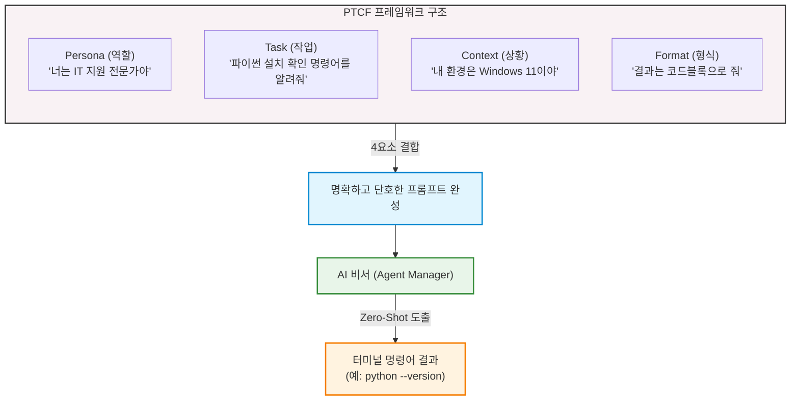

# 마이크로 세션: 008 — 프롬프트로 시스템 환경 확인

> **세션 ID**: MS-PY101-008  
> **소요 시간**: 20분  
> **난이도**: low  
> **청크 타입**: lab  
> **버전**: v2.1 (7섹션 구조)

---

## §1. 개요

> **Day 1 | AM | 세션 008/022**

이전 세션에서 우리는 여러 에이전트를 동시에 다루는 멀티에이전트 오케스트레이션의 기초를 배웠습니다. 다양한 AI 비서들에게 각자의 역할을 부여하고 지휘하는 방법을 머릿속에 그렸다면, 이제는 진짜 실전으로 넘어갈 차례입니다. 

요리를 시작하기 전에 가장 먼저 해야 할 일이 무엇일까요? 메뉴를 정했으면, 주방으로 가서 냉장고 문을 열고 "돼지고기가 있나? 파가 있나? 마늘은 충분한가?" 하고 요리 재료를 확인해야 합니다. 프로그래밍도 이와 똑같습니다. 파이썬으로 무언가 멋진 프로그램을 만들기 전에, 내 컴퓨터라는 주방에 파이썬이라는 핵심 재료가 갖춰져 있는지 먼저 확인해야 해요 [Source C].

이번 세션에서는 컴퓨터 환경을 확인하는 과정에서 우리의 첫 번째 본격적인 프롬프트를 작성해 봅니다. 명령어를 무작정 외우는 과거의 코딩 방식에서 벗어나, AI 비서에게 내 상황을 정확히 알려주고 필요한 명령어를 얻어내는 방법을 배우게 될 것입니다.

### 🎯 학습 목표

이 세션이 끝나면 여러분은 다음을 할 수 있어요:

- 내 컴퓨터에 파이썬이 설치되어 있는지 터미널을 통해 확인할 수 있어요.
- 터미널 명령어를 직접 암기하지 않고, PTCF 프레임워크를 활용해 AI에게 질문할 수 있어요.
- 터미널 명령어의 실행 결과를 읽고, 현재 시스템의 상태를 스스로 파악할 수 있어요.

### 선행 세션 환기

직전 세션(세션 007)에서 우리는 오케스트레이션, 즉 AI 에이전트들을 어떻게 지휘할 것인지 배웠어요. 식당으로 치면 수셰프와 파트별 요리사들의 역할을 나눈 셈이죠. 이제 여러 비서 중 한 명을 불러서 첫 번째 임무를 맡겨볼 시간입니다. 그 첫 임무는 거창한 프로그램 짜기가 아닙니다. 바로 "우리 집 주방 냉장고에 파이썬이라는 재료가 있는지 확인해 줘"라는 아주 현실적이고 기초적인 지시입니다.

---

## §2. 핵심 개념 (+ 🗣️ 강사 대본 + Mermaid)

### 냉장고 비유와 AI 비서의 역할

여러분이 삼겹살을 굽고 싶은데, 아주 거대한 식당용 냉장고가 여러 칸으로 나뉘어 있다고 상상해 보세요. 냉동실, 야채칸, 음료수칸, 고기 숙성고 등 수많은 칸 중에서 삼겹살이 어디 있는지 하나하나 열어보며 뒤지는 것은 엄청난 시간 낭비입니다. 

이때 여러분 옆에 있는 똑똑한 요리 보조 비서에게 "우리 냉장고 어디를 열어봐야 삼겹살이 있는지 알 수 있어?"라고 물으면, 비서가 즉각 "냉동실 두 번째 칸의 왼쪽 서랍을 열어보세요"라고 정확하게 안내해 줍니다 [Source B][Source C].

컴퓨터 환경도 마찬가지예요. 내 컴퓨터(냉장고)에 파이썬(삼겹살)이 설치되어 있는지 확인하려면 "터미널"이라는 특별한 공간에서 특정 명령어를 입력해야 합니다. 옛날 방식이라면 두꺼운 전공책을 뒤져서 `python --version`이라는 명령어를 달달 외웠겠지만, 우리는 메뉴 기획자잖아요? 명령어를 억지로 외우는 대신, AI에게 물어보고 답을 얻는 것이 훨씬 스마트한 방식입니다 [Source C].

🗣️ **강사 대본 (Instructor Script)**:

> 요리를 시작하기 전에는 항상 재료 확인이 먼저죠? 파이썬 코딩도 마찬가지입니다. 내 컴퓨터라는 거대한 냉장고에 파이썬이라는 핵심 재료가 제대로 들어있는지 확인해야 해요.
>
> 과거에는 이 확인 과정을 위해 터미널 명령어를 무작정 외워야 했습니다. 하지만 이제는 그럴 필요가 전혀 없어요. 여러분 옆에는 든든한 AI 비서가 24시간 대기하고 있습니다. 그저 비서에게 "내 컴퓨터에서 파이썬이 깔려 있는지 어떻게 확인해?"라고 물어보기만 하면 됩니다. 
>
> 여기서 아주 중요한 개념 하나를 새롭게 소개할게요. 바로 **PTCF 프레임워크**입니다. AI에게 질문할 때 Persona(페르소나), Task(작업), Context(상황), Format(형식)의 4요소를 꼼꼼히 갖춰서 물어보는 공식이에요. 이번 세션에서는 이 공식을 너무 깊게 파고들기보다는 가볍게 맛보기만 할 겁니다.
>
> "너는 IT 지원 전문가야(P). 윈도우 11 환경에서(C) 파이썬이 설치되어 있는지 확인하는 명령어 절차를 알려줘(T). 결과는 터미널 코드블록으로만 줘(F)." 
> 
> 이렇게 4가지 요소를 갖춰서 지시를 내리는 거죠. 아주 명확하고 깔끔하죠? 여러분이 이렇게 구체적으로 지시하면, AI 비서도 엉뚱한 소리를 하지 않고 정확히 여러분이 원하는 명령어만 쏙 뽑아서 대답해 줍니다 [Source B][Source C].

> 💡 **강사 노트**: 냉장고 비유를 확장하여 "명령어 암기 불필요"라는 AI-native 패러다임의 핵심 철학을 다시 한번 짚어주세요. PTCF 프레임워크는 이후 과정(세션 015 등)에서 계속 반복 심화되므로, 여기서는 완벽한 암기보다 '아, 이렇게 구체적으로 물어보니까 정확한 답이 나오는구나' 하는 긍정적인 첫 체감에 집중해야 합니다.

### Mermaid 다이어그램



---

## §3. 상세 내용

### Why — 왜 명령어를 외우지 않고 프롬프트를 작성하는가?

과거의 코딩 교육은 명령어 암기에서 시작했습니다. 하지만 AI 시대에 명령어를 외우는 것은 유통기한이 아주 짧은 지식을 억지로 머릿속에 구겨 넣는 것과 같아요. 오늘 파이썬 확인 명령어를 외워도, 내일은 Node.js 확인 명령어가 필요해지고, 모레는 또 다른 도구의 명령어가 필요해집니다. 게다가 운영체제가 윈도우인지, 맥인지, 리눅스인지에 따라 명령어가 미세하게 달라지기도 해요. 이 모든 걸 다 외울 수는 없습니다.

하지만 **PTCF 프레임워크**를 활용한 프롬프트 작성법을 익혀두면 이야기가 달라집니다. 어떤 상황, 어떤 도구를 만나든 유연하게 대처할 수 있어요 [Source C]. 사전 예시 없이 바로 질문하는 방식인 Zero-Shot 프롬프팅을 하더라도, 구체적인 제약 조건을 주면 AI는 전문적인 훌륭한 답변을 내놓습니다. 이것이 바로 단순 코드 암기에서 벗어나 문제를 스스로 정의하고 해결 능력을 기르는 진정한 AI-native 방식입니다 [Source C].

### What — PTCF 프레임워크의 4대 요소

PTCF는 명확한 지시를 구성하기 위해 반드시 챙겨야 할 4가지 핵심 요소입니다 [Source C].

1. **Persona (페르소나)**: AI에게 역할을 부여합니다. "너는 ~야"라고 정해주는 순간, AI는 해당 전문가의 지식 풀(Pool)에서 답변을 꺼냅니다. (예: IT 지원 전문가, 시니어 파이썬 개발자, 친절한 선생님)
2. **Task (작업)**: 구체적으로 무엇을 해야 하는지, 행동의 목표를 명시합니다. 두루뭉술하게 말하지 말고 콕 집어 말해야 합니다. (예: 설치 확인 명령어를 안내해 줘)
3. **Context (상황)**: 나의 현재 환경, 배경 지식, 겪고 있는 문제 상황 등을 충분히 제공합니다. (예: 나는 코딩 초보자이고, 현재 Windows 11 운영체제를 사용 중이야)
4. **Format (형식)**: 어떤 형태로 답변을 받을지 출력의 형태를 지정합니다. 이 부분이 없으면 AI가 혼자 신나서 쓸데없이 긴 설명을 늘어놓습니다. (예: 부가 설명은 빼고 터미널 코드블록으로만 깔끔하게 출력해 줘)

이 4가지 요소를 모두 조합하면 AI가 환각(엉뚱한 소리나 거짓말)을 일으킬 확률을 극적으로 낮출 수 있습니다. 메뉴 기획자가 주방장에게 지시를 내릴 때, 1인분인지 2인분인지, 맵게 할지 안 맵게 할지 정확히 알려주는 것과 같아요.

### How — 프롬프트를 터미널 명령어로 연결하는 워크플로우

우리가 AI에게 PTCF 프롬프트를 던지면, AI는 `python --version`과 같은 명령어를 검은색 코드블록 형태로 깔끔하게 내놓습니다. 그러면 우리는 그 명령어를 복사해서 **통합 터미널**에 붙여넣고 키보드의 Enter 키를 누르기만 하면 돼요. 

터미널은 마우스로 더블 클릭을 하는 대신, 텍스트를 타이핑해서 컴퓨터와 직접 소통하는 창구입니다. Enter를 치면 결과가 나타나는데, 에러가 뜨든 버전 숫자가 뜨든 당황할 필요가 없습니다. 그 결과 자체가 우리 컴퓨터의 현재 상태를 알려주는 아주 중요한 단서이기 때문입니다. 

명령어를 AI에게 묻고, 복사해서, 터미널에 실행한다. 이 간단한 3박자 리듬을 꼭 기억해 두세요.

---

## §4. 실습 가이드 (+ 🎙️ 실습 대본)

### 실습 목표

PTCF 프레임워크를 활용해 파이썬 설치 확인 프롬프트를 직접 작성해 봅니다. 그리고 AI가 알려준 명령어를 터미널에 실행하여 자신의 컴퓨터(냉장고) 환경을 직접 확인하고 결과를 판독해 봅니다.

🎙️ **실습 가이드 대본 (Lab Guide)**:

> 자, 직접 확인해 볼 시간입니다. 여러분 컴퓨터의 주방 냉장고를 열어볼 거예요.
>
> 첫째로, Antigravity 화면 하단에서 까만 화면인 터미널(Terminal) 패널을 열어주세요. 저번 시간에 배웠던 단축키를 쓰셔도 좋고, 상단 메뉴에서 여셔도 좋습니다. 이 까만 터미널 창이 바로 냉장고 문을 여는 손잡이 역할을 할 겁니다.
> 
> 둘째로, 우측에 있는 Agent Manager 창을 열고 제가 화면에 띄워드린 PTCF 프롬프트를 그대로 입력해 보세요. "너는 IT 지원 전문가야. Windows 11 환경에서 파이썬이 설치되어 있는지 확인하는 터미널 명령어를 알려줘. 결과는 코드블록으로 줘." 라고요. 만약 맥북을 쓰시는 분이라면 Windows 11 부분을 macOS로 살짝 바꿔주시면 됩니다 [Source B][Source C].
>
> 셋째, AI가 답변을 주면, 그 검은색 코드블록 안에 있는 명령어를 복사해서 방금 연 터미널 창에 붙여넣고 힘차게 Enter 키를 쳐보세요. 
> 
> 결과가 어떻게 나오나요? 화면에 "Python 3.12.0"처럼 버전 숫자가 뜨는 분도 계실 거고, "python을 찾을 수 없습니다" 같은 붉은 에러 메시지가 뜨는 분도 계실 거예요. 여러분, 둘 다 아주 정상적인 결과입니다! 에러가 떴다고 컴퓨터가 고장난 게 아니에요.

### 단계별 지시

| 단계 | 소요 시간 | 강사 지시사항 | 학습자 액션 | 예상 결과 |
|------|----------|--------------|------------|----------|
| 1 | 2분 | "Antigravity 하단의 통합 터미널을 열어주세요. 까만 화면이 나와도 당황하지 마세요." | 단축키(``Ctrl + ` ``) 입력 또는 상단 메뉴 Terminal → New Terminal 클릭 | 화면 하단에 터미널 창 표시 |
| 2 | 3분 | "우측 Agent Manager에 화면에 보이는 PTCF 프롬프트를 타이핑하세요. (자신의 OS에 맞게 Context 변경)" | 프롬프트 입력 창에 PTCF 요소가 포함된 문장 타이핑 후 전송 버튼 클릭 | AI가 `python --version` 또는 `python3 --version` 명령어를 코드블록으로 제시 |
| 3 | 2분 | "AI가 준 코드블록의 명령어를 복사해서 터미널에 붙여넣고 Enter를 누르세요. 마우스 우클릭으로 붙여넣기가 편합니다." | 코드 복사 후 터미널 창에 우클릭 또는 단축키로 붙여넣기 → Enter | 파이썬 버전 출력 또는 명령어를 찾을 수 없다는 에러 메시지 출력 |
| 4 | 3분 | "나온 결과를 확인해 보세요. 버전이 뜨는지, 붉은색 에러가 뜨는지 옆 사람 화면과도 한번 비교해 보세요." | 터미널 출력 결과 확인 | 자신의 컴퓨터에 파이썬이 설치되어 있는지 상태 파악 완료 |

### 트러블슈팅 FAQ

| Q | A |
|---|---|
| 터미널에 붙여넣기가 안 돼요! | 터미널 창에서는 `Ctrl+V` 대신 마우스 우클릭을 하거나 `Shift + Insert`를 눌러야 붙여넣기가 되는 경우가 많습니다. |
| AI가 명령어를 안 주고 설명만 해요. | 프롬프트의 Format(형식) 부분이 약해서 그래요. "긴 설명은 절대 하지 말고 오직 터미널 코드블록 하나만 딱 출력해줘"라고 단호하게 지시해 보세요. |
| 저는 Mac을 쓰는데 Windows라고 쳐야 하나요? | 아닙니다! Context(상황) 요소는 자신의 실제 상황에 맞게 적어야 해요. "현재 macOS 환경에서"로 바꿔서 질문하시면 Mac에 맞는 명령어를 알려줍니다. |
| 빨간 글씨로 길게 에러가 떴어요! | 절대 컴퓨터가 고장난 것이 아닙니다! 에러 메시지는 "주인님, 냉장고에 파이썬 재료가 없어요!"라고 친절하게 보고하는 러브레터입니다. |

---


### 🎓 강사 노트 (Instructor Support)

- ⏱️ **타이밍**: 11:50 (20분, lab)
- 🎯 **핵심 활동**: 터미널 열기, 시스템 정보 질문
- ⚠️ **강사 주의사항**: 터미널 처음인 학습자 많음 — 천천히


### 📋 실습 설계 보강 (Lab Packet)

**세션 008 실습 설계 보강**

프롬프트로 시스템 환경 확인
- **3-Stage Example Set**
  - 기본: AI에게 "내 컴퓨터에 파이썬이 설치되어 있는지 확인하는 방법을 알려줘" → `python --version` 실행
  - 변형: "운영체제 정보도 알고 싶어" → `systeminfo` 명령어 안내받기
  - 실수 해결: `python`이 인식 안 될 때 → PATH 환경변수 문제. AI에게 에러 메시지 복사해서 질문
- **난이도 예측**: 터미널에 직접 타이핑하는 첫 경험 — 매우 긴장
- **타이밍 가이드**: 터미널 열기 3분 | AI에게 질문 5분 | 명령어 실행 5분 | 트러블슈팅 7분
- **심리적 장벽**: CLI 공포증 — "까만 화면에 글자만 있어서 무서워요"
- **자가 점검**:
  - [ ] 터미널에서 `python --version` 결과가 출력되는가?
  - [ ] 에러가 나면 AI에게 에러 메시지를 복사하여 질문했는가?
  - [ ] 내 OS 버전을 터미널에서 확인할 수 있는가?

## §5. 코드 및 명령어 모음

### PTCF 프롬프트 템플릿 예시

```text
[Persona] 너는 10년 차 IT 지원 전문가야.
[Context] 현재 내 컴퓨터는 Windows 11 (또는 macOS) 환경이야. 나는 코딩 초보자야.
[Task] 파이썬이 내 컴퓨터에 설치되어 있는지 터미널에서 확인하는 명령어를 알려줘.
[Format] 부가적인 인사말이나 설명은 전부 제외하고, 바로 복사할 수 있는 터미널 코드블록으로만 딱 1줄 작성해 줘.
```

### AI가 제시할 예상 명령어

```bash
# Windows 환경의 경우
python --version

# macOS 환경의 경우
python3 --version
```

### 터미널에서 나타날 수 있는 예상 출력 결과

**1) 설치되어 있는 경우 (성공 메시지)**
```text
Python 3.12.0
```

**2) 설치되어 있지 않은 경우 (에러 메시지)**
```text
'python'은(는) 내부 또는 외부 명령, 실행할 수 있는 프로그램, 또는 
배치 파일이 아닙니다.
```
> *참고: Mac의 경우 `command not found: python3` 등의 메시지가 출력됩니다.*

---

## §6. 요약

### 핵심 학습 포인트

오늘 이번 세션에서는 단순히 컴퓨터에 파이썬이 있는지 확인하는 작업을 넘어서, 아주 중요한 첫 경험을 했습니다. 바로 **첫 프롬프트 엔지니어링**을 체험한 것이죠. 명령어를 통째로 암기하는 고리타분한 시대는 이미 지났다는 것을 몸소 체험하셨을 거예요. 

대신 우리는 AI에게 Persona(페르소나), Task(작업), Context(상황), Format(형식)이라는 4가지 요소(PTCF)를 꼼꼼히 갖춰 명확하게 지시하는 공식을 배웠습니다. 이 작은 프롬프트 작성 경험 하나가 여러분을 코드를 무작정 타이핑하는 코더에서 벗어나게 해 줄 것입니다. 명확하게 지시하고, 결과를 받아 터미널에 실행하여 검증하는 이 사이클이 AI-native 개발자로 가는 첫걸음입니다 [Source C].

### 다음 세션 예고

터미널에 붉은색 에러 메시지가 뜬 분들, 속으로 '내가 시작하자마자 뭘 잘못했나' 철렁하셨죠? 전혀 아닙니다. 냉장고에 요리할 재료가 없다는 걸 아주 정확하게 확인했을 뿐이에요. 재료가 없으면 사 오면 그만이죠! 다음 세션에서는 파이썬이 없는 분들을 위해, AI 비서에게 다시 한번 "파이썬 설치 가이드"를 물어보고 파이썬을 아주 빠르고 쉽게 설치해 보겠습니다.

### 브릿지 노트

> "자, 파이썬이 안 깔려 있다고 붉은 에러가 나오신 분들 손 들어보실까요? 네, 아주 많네요. 당황하지 마세요. 아주 정상입니다. 여러분이 컴퓨터를 새로 샀다면 애초에 없는 게 당연해요. 자, 이제 우리 집 주방 냉장고가 비어있다는 걸 확실하게 알았으니, 본격적으로 든든한 AI 비서와 함께 파이썬이라는 아주 신선한 재료를 사러 마트로 가보겠습니다! 다음 세션으로 넘어가죠."

---

## §7. 참고 자료

### 3-Source 출처

- **Source A (로컬 참고자료)**: `AI-native_파이썬기초.md` — 프롬프트를 활용한 문제 정의의 중요성과 코더가 아닌 기획자로서의 역할 전환 패러다임
- **Source B (NotebookLM)**: Antigravity 통합 터미널 활용 예시 및 시스템 환경 확인을 위한 AI 비서와의 상호작용 워크플로우 분석
- **Source C (Deep Research)**: `3 프롤프트 엔지니어링.pdf` — PTCF(Persona, Task, Context, Format) 프레임워크 이론, Zero-Shot 프롬프팅 적용 사례 및 에러 메시지 디버깅 기초

### 강사 노트

> 💡 본 세션은 수강생들이 처음으로 프롬프트를 구조적으로 작성해 보고, 터미널이라는 낯선 환경을 접하는 시간입니다. "명령어 암기 불필요"라는 핵심 메시지를 반복해서 강조해 주시고, PTCF의 각 요소가 왜 필요한지 일상적인 비유(식당 주문 등)를 곁들여 설명하면 좋습니다. 또한 붉은 에러 메시지가 떴을 때 수강생들이 두려워하지 않도록 심리적 장벽을 낮춰주는 것이 가장 중요합니다. (에러 메시지 = 컴퓨터가 보내는 친절한 상태 보고서)

---

## ✅ 세션 완료 체크리스트 (강사용)

- [x] §1~§7 모든 섹션이 빠짐없이 충실하게 작성되었는가?
- [x] 비유와 스토리텔링이 적극적으로 포함되었는가? (주방 냉장고와 삼겹살 비유)
- [x] 실습 단계별 지시표가 초보자도 따라 할 수 있게 완전한가?
- [x] PTCF 프레임워크 4대 요소(Persona, Task, Context, Format)가 명확히 설명되었는가?
- [x] 3-Source 팩트 패킷(A, B, C)이 본문과 참고 자료에 골고루 반영되었는가?

---

*작성 일시: 2026-02-25*  
*작성 에이전트: A4B_Session_Writer*  
*교안 구조: 7섹션 (A0 팀 공통 표준)*