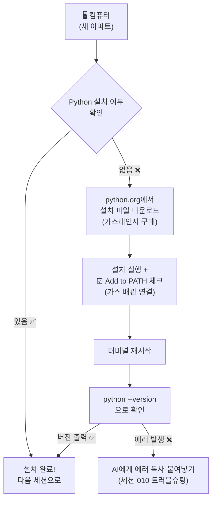

# 마이크로 세션: 009 — AI와 함께 Python 설치하기

> **세션 ID**: MS-PY101-009  
> **소요 시간**: 20분  
> **난이도**: medium  
> **청크 타입**: lab  
> **버전**: v2.1 (7섹션 구조)

---

## §1. 개요

> **Day 1 | AM | 세션 009/022**

### 🎯 학습 목표

이 세션이 끝나면, 수강생은 다음을 할 수 있습니다:

- AI 에이전트의 안내를 받아 Python 인터프리터를 운영체제에 설치할 수 있다
- "Add python.exe to PATH" 옵션의 의미를 이해하고 올바르게 설정할 수 있다
- 터미널에서 `python --version` 명령어로 설치를 검증할 수 있다

### 선행 세션 환기

바로 직전 세션(세션-008)에서 우리는 PTCF 프레임워크를 사용해서 AI에게 "내 컴퓨터에 파이썬이 깔려 있는지 확인해줘"라고 물어보는 연습을 했어요. 터미널에서 `python --version`을 실행했을 때, 버전 번호가 나온 분도 계시고, "python을 찾을 수 없습니다"라는 메시지를 만난 분도 계셨죠. 오늘은 그 "찾을 수 없습니다" 상태를 해결하는 시간이에요. 냉장고(시스템 환경)를 열어봤더니 핵심 재료(Python)가 없었으니, 이제 마트에 가서 사올 차례입니다.

---

## §2. 핵심 개념 (+ 🗣️ 강사 대본 + Mermaid)

### Python 인터프리터 = "가스레인지 설치"

여러분이 새 아파트에 입주했다고 상상해 보세요. 주방은 깨끗하게 비어 있고, 싱크대도 있고, 환풍기도 있어요. 하지만 요리를 하려면 가장 중요한 것이 하나 빠져 있습니다. 바로 가스레인지예요. 아무리 좋은 재료가 있어도 가스레인지 없이는 볶음밥 한 그릇 만들 수 없죠. Python 인터프리터가 바로 이 가스레인지입니다. AI가 아무리 훌륭한 코드를 작성해 줘도, Python이 설치되어 있지 않으면 그 코드를 실행할 수가 없어요.

그런데 가스레인지를 설치할 때 중요한 과정이 하나 더 있습니다. 바로 가스 배관 연결이에요. 가스레인지를 예쁘게 놓아두기만 하고 배관을 연결하지 않으면 어떻게 될까요? 불이 안 켜집니다. Python 설치에서 이 "가스 배관 연결"에 해당하는 것이 바로 **"Add Python to PATH"**라는 체크박스예요. PATH는 쉽게 말해서 컴퓨터의 전화번호부입니다. "파이썬이라는 프로그램은 이 주소에 살고 있어"라고 등록해 주는 과정이에요. 이걸 안 하면, 터미널에서 `python`이라고 불러도 컴퓨터는 "그런 사람 모르는데요?"라고 대답합니다.

🗣️ **강사 대본 (Instructor Script)**:

> 여러분, 지난 시간에 시스템 환경을 확인해 봤더니 파이썬이 없다고 나온 분들이 꽤 계셨죠? 완전히 정상이에요. 냉장고에 재료가 없으면 어떻게 하나요? 마트에 가서 사오면 됩니다. 오늘은 AI 비서의 안내를 받으면서 파이썬이라는 핵심 재료를 우리 컴퓨터에 장착해 볼 거예요.
>
> 혹시 "설치"라는 말만 들어도 긴장되시는 분 계세요? 오류가 날까 두려우신 거죠? 걱정하지 마세요. 든든한 1:1 튜터가 여러분 화면 안에 이미 대기하고 있습니다. "파이썬 설치할 때 체크박스 뭐 눌러야 해?"라고 서슴없이 물어보세요. 검색 엔진에서 블로그 글을 뒤지던 시대는 끝났어요. AI 에이전트와 대화하면서 설치 경로와 옵션을 실시간으로 안내받는 것, 이것이 AI-native 방식의 환경 구축입니다.
>
> 자, 오늘의 핵심 비유를 하나 기억해 주세요. **Python 설치 = 가스레인지 설치, PATH 설정 = 가스 배관 연결**. 가스레인지(Python)를 가져다 놓기만 하면 안 되고, 배관(PATH)까지 연결해야 요리(코드 실행)를 시작할 수 있어요. 이 비유 하나만 기억하시면 오늘 실습이 훨씬 편해질 거예요.

> 💡 **강사 노트**: 가스레인지/배관 비유는 v2.0 교안에서 발전시킨 것이며, AI 에이전트 안내 방식의 설치 워크플로우는 NotebookLM(Source B) 기반입니다. PATH 개념의 전화번호부 비유는 초보자 대상 설명에서 직관적으로 작동합니다.

### Mermaid 다이어그램



---

## §3. 상세 내용

### Why — 왜 Python을 설치해야 하는가?

"AI가 코드를 다 짜주는데, 파이썬은 왜 필요하죠?"라는 질문을 하실 수도 있어요. 아주 좋은 질문입니다. 비유로 설명해 드릴게요. AI가 써준 코드는 "레시피"예요. 아무리 맛있는 레시피가 있어도, 실제로 불을 켜고 프라이팬을 올려서 요리해야 음식이 나오죠. Python 인터프리터가 바로 이 "불을 켜는 장치"입니다. AI가 작성한 파이썬 코드를 컴퓨터가 이해할 수 있는 기계어로 번역해서 실행해 주는 핵심 엔진이에요.

"AI 시대의 서사"에서 배운 통역사 비유를 떠올려 볼까요? AI가 우리의 한국어 요청을 파이썬어(코드)로 번역해 주는 통역사라면, Python 인터프리터는 그 파이썬어를 컴퓨터가 이해할 수 있는 기계어로 다시 번역해 주는 두 번째 통역사예요. 통역사가 두 명 필요한 셈이죠. 첫 번째 통역사(AI)는 이미 Antigravity 안에 있고, 두 번째 통역사(Python)를 지금 설치하는 겁니다.

### What — Python 인터프리터란 무엇인가?

Python(파이썬)은 세계에서 가장 많이 쓰이는 프로그래밍 언어 중 하나예요. AI, 데이터 분석, 웹 개발, 자동화 등 거의 모든 분야에서 활용됩니다. 특히 AI 분야에서는 사실상 표준 언어나 다름없어요. ChatGPT도, Gemini도, 그 뒤에서 돌아가는 코드 상당 부분이 파이썬으로 작성되어 있습니다.

우리가 설치하려는 것은 정확히 말하면 **"CPython 인터프리터"**예요. "인터프리터(interpreter)"는 영어로 "통역사"라는 뜻인데, 파이썬 코드를 한 줄 한 줄 읽어서 컴퓨터가 실행할 수 있게 변환해 주는 프로그램입니다. 설치 파일 용량은 약 30MB 정도로, 요즘 스마트폰 사진 한 장보다 작아요. 설치 자체는 5분이면 충분합니다.

설치 과정에서 반드시 기억하실 것은 딱 하나, **"Add python.exe to PATH"** 체크박스를 꼭 체크하는 것이에요. 이 체크박스 하나가 나중에 수많은 에러를 예방해 줍니다.

### How — 어떻게 설치하는가?

설치 방법은 운영체제에 따라 약간 다릅니다. 우리 과정에서는 Windows를 기본으로 진행하되, macOS 사용자를 위한 안내도 함께 제공해요.

**Windows 사용자의 경우**, python.org 공식 사이트에서 설치 파일(.exe)을 다운로드하여 실행합니다. 설치 마법사 첫 화면에서 하단의 "Add python.exe to PATH" 체크박스를 반드시 체크한 뒤, "Install Now"를 클릭하면 됩니다. 설치가 완료되면 터미널을 새로 열어서 `python --version`으로 확인합니다.

**macOS 사용자의 경우**, macOS에는 시스템 Python이 기본 포함되어 있을 수 있지만, 보통 오래된 버전이에요. python.org에서 macOS용 설치 파일(.pkg)을 다운로드하여 설치하거나, Homebrew를 사용할 수도 있습니다. 터미널에서 `python3 --version`으로 확인합니다.

두 경우 모두, 설치 후 터미널을 반드시 새로 열어야 합니다. 환경 변수(PATH)는 터미널이 시작될 때 읽어오기 때문에, 기존에 열려 있던 터미널에서는 새로 설치한 Python을 인식하지 못할 수 있어요.

> ✅ **체크포인트**: 여기까지 이해했는지 스스로 점검해 보세요.
> - Python 인터프리터의 역할을 한 문장으로 설명할 수 있나요? ("파이썬 코드를 컴퓨터가 이해할 수 있게 실행해 주는 프로그램")
> - "Add to PATH"를 체크해야 하는 이유를 비유로 설명할 수 있나요? ("가스 배관을 연결해야 불이 켜지듯, PATH에 등록해야 터미널에서 python을 찾을 수 있다")

### 비교표 — Python 설치 옵션

| 항목 | Install Now (권장) | Customize installation |
|------|-------------------|----------------------|
| 대상 | 초보자, 빠른 설치 원하는 분 | 설치 경로나 옵션을 직접 지정하고 싶은 분 |
| PATH 설정 | 하단 체크박스로 자동 등록 | 수동으로 선택 가능 |
| 설치 경로 | 기본 경로 자동 지정 | 원하는 폴더 지정 가능 |
| 소요 시간 | 약 2~3분 | 약 5분 (옵션 검토 시간 포함) |
| 이 과정에서의 선택 | ✅ 이것을 선택하세요 | 나중에 익숙해지면 사용 |

---


### 📊 참고 표 (Visual Specs)

**개발 환경 설정 체크리스트**

| 단계 | 목표 | AI 프롬프트 예시 | 확인 방법 |
|:---|:---|:---|:---|

## §4. 실습 가이드 (+ 🎙️ 실습 대본)

### 실습 목표

이 실습을 통해 수강생은 AI 에이전트의 안내를 받으며 Python을 설치하고, 터미널에서 설치 결과를 직접 검증하는 경험을 합니다.

🎙️ **실습 가이드 대본 (Lab Guide)**:

> 자, 이제 직접 해볼 시간이에요. 화면에 Antigravity가 열려 있죠? 오른쪽 Agent Manager 패널을 봐주세요. 지금부터 이 AI 비서에게 파이썬 설치를 도와달라고 부탁할 거예요. 검색 엔진에서 블로그 글을 찾아 헤매는 게 아니라, AI와 대화하면서 한 단계씩 진행하는 거예요. 이것이 AI-native 방식의 학습입니다.
>
> 혹시 이미 파이썬이 설치되어 있는 분은 손 들어 주세요. 그런 분들은 설치 과정을 건너뛰고, 맨 마지막 검증 단계부터 함께 하시면 됩니다. 파이썬이 없는 분들, 긴장하지 마세요. 제가 한 단계씩 같이 갈게요. 막히면 AI 비서에게 바로 물어보시면 됩니다.

### 단계별 지시 — Windows 사용자

| 단계 | 소요 시간 | 강사 지시사항 | 학습자 액션 | 예상 결과 |
|------|----------|--------------|------------|----------|
| 1 | 2분 | "Agent Manager에 프롬프트를 입력하세요" | 아래 프롬프트를 Agent Manager에 입력 | AI가 설치 절차를 안내 |
| 2 | 1분 | "AI가 안내하는 링크로 이동하세요" | 웹 브라우저에서 python.org 접속 | Python 다운로드 페이지 표시 |
| 3 | 1분 | "최신 버전 다운로드 버튼을 클릭하세요" | "Download Python 3.x.x" 클릭 | .exe 파일 다운로드 시작 |
| 4 | 1분 | "⚠️ 체크박스를 반드시 체크하세요!" | 설치 파일 실행 → "Add python.exe to PATH" 체크 | 체크박스에 ✅ 표시 |
| 5 | 2분 | "Install Now를 클릭하고 기다리세요" | "Install Now" 클릭 | 설치 진행 바 → "Setup was successful" |
| 6 | 1분 | "터미널을 닫았다가 새로 여세요" | 기존 터미널 닫기 → `Ctrl + `` ` 로 새 터미널 | 새 PowerShell 세션 시작 |
| 7 | 1분 | "검증 명령어를 입력하세요" | `python --version` 입력 | "Python 3.x.x" 출력 |

**[단계 1] AI에게 설치 안내 요청하기**

Agent Manager 채팅창에 다음 프롬프트를 입력하세요:

```
너는 IT 지원 전문가야. Windows 11 환경에서 Python 최신 버전을 설치하는 방법을 
단계별로 알려줘. 반드시 환경 변수(PATH) 설정도 포함해줘. 
초보자도 따라할 수 있게 스크린샷 없이 텍스트로만 자세히 설명해줘.
```

AI가 python.org 다운로드 링크와 함께 상세한 설치 절차를 안내해 줄 거예요. 이때 AI의 응답을 꼼꼼히 읽어보세요. 우리가 수업에서 배운 "가스레인지 비유"와 비슷한 설명이 나올 수도 있고, 더 자세한 정보를 제공할 수도 있어요.

**[단계 2~3] python.org에서 설치 파일 다운로드**

웹 브라우저를 열고 `python.org`에 접속합니다. 상단 메뉴에서 "Downloads"를 클릭하면, 여러분의 운영체제에 맞는 최신 버전 다운로드 버튼이 자동으로 표시됩니다. 노란색 "Download Python 3.x.x" 버튼을 클릭하세요.

**[단계 4] ⚠️ 가장 중요한 순간 — PATH 체크박스**

다운로드된 설치 파일을 실행하면 설치 마법사가 열립니다. 이 화면에서 절대 바로 "Install Now"를 누르지 마세요! 먼저 화면 하단을 보세요. "Add python.exe to PATH"라는 작은 체크박스가 있습니다. 이것을 반드시 체크하고 나서 "Install Now"를 클릭하세요. 이 체크박스가 바로 우리 비유에서 "가스 배관 연결"에 해당하는 부분이에요. 이걸 빼먹으면 나중에 터미널에서 python 명령어를 인식하지 못합니다.

**[단계 5] 설치 진행 및 완료**

"Install Now"를 클릭하면 설치가 진행됩니다. 진행 바가 차오르는 동안 1~2분 정도 기다려 주세요. "Setup was successful"이라는 메시지가 나타나면 "Close"를 클릭합니다.

**[단계 6] 터미널 재시작**

여기서 중요한 팁이 하나 있어요. 환경 변수(PATH)는 터미널이 시작될 때 한 번 읽어옵니다. 그래서 Python을 설치하기 전에 이미 열려 있던 터미널에서는 새로 설치한 Python을 인식하지 못할 수 있어요. 반드시 터미널을 닫았다가 새로 열어주세요. Antigravity에서 `Ctrl + `` ` 키로 터미널을 열 수 있습니다.

**[단계 7] 설치 검증**

새로 연 터미널에 다음 명령어를 입력합니다:

```powershell
python --version
```

화면에 `Python 3.14.x` (또는 최신 버전 번호)가 출력되면 설치 성공입니다! 축하해요!

### 단계별 지시 — macOS 사용자

| 단계 | 소요 시간 | 강사 지시사항 | 학습자 액션 | 예상 결과 |
|------|----------|--------------|------------|----------|
| 1 | 2분 | "Agent Manager에 macOS용 프롬프트를 입력하세요" | 아래 프롬프트를 Agent Manager에 입력 | AI가 macOS 설치 절차 안내 |
| 2 | 1분 | "python.org에서 macOS 설치 파일을 받으세요" | python.org → Downloads → macOS → .pkg 다운로드 | .pkg 파일 다운로드 |
| 3 | 2분 | "설치 파일을 실행하고 안내를 따르세요" | .pkg 파일 더블클릭 → 설치 마법사 진행 | 설치 완료 |
| 4 | 1분 | "터미널을 새로 열고 검증하세요" | 터미널 재시작 → `python3 --version` 입력 | "Python 3.x.x" 출력 |

macOS에서 AI에게 도움을 요청할 때 사용할 프롬프트:

```
너는 IT 지원 전문가야. macOS 환경에서 Python 최신 버전을 설치하는 방법을 
단계별로 알려줘. 초보자도 따라할 수 있게 자세히 설명해줘.
```

macOS에서는 `python3`라는 명령어를 사용한다는 점이 Windows와 다릅니다. macOS 터미널에서 `python3 --version`을 입력해서 버전을 확인하세요.

### 트러블슈팅 FAQ

| Q | A |
|---|---|
| `python --version`을 실행했는데 Microsoft Store가 열려요 | Windows 11에서 자주 발생하는 현상이에요. 설정 → 앱 → 앱 실행 별칭에서 "python.exe"와 "python3.exe"의 앱 설치 관리자를 **끄기**로 변경하세요. 터미널을 재시작하면 정상 작동합니다. |
| "python을 찾을 수 없습니다"라는 에러가 나와요 | PATH 체크박스를 빼먹었을 가능성이 높아요. Python 설치 파일을 다시 실행 → "Modify" 선택 → PATH 옵션 활성화. 또는 AI에게 에러 메시지를 복사해서 물어보세요. |
| 설치 중 "Windows의 PC 보호" 경고가 떠요 | "추가 정보" → "실행"을 클릭하면 됩니다. python.org의 공식 프로그램이니 안전해요. |
| 설치할 때 "Add python.exe to PATH"를 깜빡하고 안 눌렀어요 | 설치 파일을 다시 실행 → "Modify" 선택 → 다음 화면에서 PATH 옵션 체크. 또는 다음 세션(010)에서 배울 트러블슈팅으로 수동 해결할 수 있어요. |
| macOS에서 `python`이 아니라 `python3`를 써야 하나요? | 네, macOS에서는 `python3`가 기본 명령어예요. `python`은 시스템 Python(2.x)을 가리킬 수 있으므로 항상 `python3`를 사용하세요. |
| 설치 파일이 다운로드되지 않아요 | 브라우저의 다운로드 차단 설정을 확인해 보세요. Chrome이라면 주소창 오른쪽의 다운로드 아이콘을 클릭하고 "허용"을 눌러주세요. |

> ✅ **체크포인트**: `python --version`(macOS는 `python3 --version`) 명령어가 Python 버전을 정상적으로 출력하나요? 출력됐다면 손을 들어 주세요!

---


### 🎓 강사 노트 (Instructor Support)

- ⏱️ **타이밍**: 13:10 (20분, lab)
- 🎯 **핵심 활동**: Python 다운로드 & 설치
- ⚠️ **강사 주의사항**: PATH 환경변수 체크박스 강조!


### 📋 실습 설계 보강 (Lab Packet)

**세션 009 실습 설계 보강**

AI와 함께 Python 설치하기
- **3-Stage Example Set**
  - 기본: AI에게 "Windows 11에 Python 최신 버전 설치하는 법 알려줘" → 안내에 따라 설치
  - 변형: 이미 Python이 있는 경우 — 버전 확인 후 업데이트 여부 판단
  - 실수 해결: "Add Python to PATH" 체크박스 놓침 → 환경변수 수동 등록 또는 재설치
- **난이도 예측**: "Add to PATH" 체크박스가 가장 빈번한 실수 포인트
- **타이밍 가이드**: 다운로드 안내 5분 | 설치(PATH 체크 강조) 7분 | 확인 3분 | 트러블슈팅 5분
- **심리적 장벽**: "설치 마법사에 영어가 많아서 겁나요"
- **자가 점검**:
  - [ ] 설치 시 "Add Python to PATH" 체크박스를 선택했는가?
  - [ ] `python --version`이 정상 출력되는가?
  - [ ] `pip --version`도 정상 출력되는가?

## §5. 코드 및 명령어 모음

### 명령어 1: Python 버전 확인 (Windows)

```powershell
python --version
```

이 명령어는 현재 시스템에 설치된 Python의 버전을 출력합니다. "Python 3.14.x" 형태의 버전 정보가 나오면 정상 설치된 것입니다.

> 🤖 **AI 프롬프트 예시**: "내 컴퓨터에 파이썬이 설치되어 있는지 확인하는 명령어를 알려줘"

### 명령어 2: Python 버전 확인 (macOS)

```bash
python3 --version
```

macOS에서는 `python` 대신 `python3` 명령어를 사용합니다. macOS 시스템에 기본 포함된 Python 2.x와 구분하기 위한 것이에요.

### 명령어 3: Python 설치 경로 확인 (Windows)

```powershell
where python
```

Python이 설치된 정확한 경로를 보여줍니다. 보통 `C:\Users\[사용자이름]\AppData\Local\Programs\Python\Python3xx\python.exe` 형태로 출력됩니다.

> 🤖 **AI 프롬프트 예시**: "파이썬이 어디에 설치되어 있는지 확인하는 방법을 알려줘"

### 명령어 4: Python 설치 경로 확인 (macOS)

```bash
which python3
```

macOS에서 Python 실행 파일의 경로를 확인하는 명령어입니다. `/usr/local/bin/python3` 또는 `/Library/Frameworks/Python.framework/Versions/3.xx/bin/python3` 형태로 출력됩니다.

### 명령어 5: Python 대화형 모드 진입 (설치 확인용)

```powershell
python
```

Python을 인자 없이 실행하면 대화형 모드(REPL)에 진입합니다. `>>>` 프롬프트가 표시되면 Python이 정상 작동하는 것입니다. 나가려면 `exit()` 또는 `Ctrl + Z` 후 Enter를 누르세요.

> 🤖 **AI 프롬프트 예시**: "파이썬 대화형 모드에 진입하는 방법과 나가는 방법을 알려줘"

### 명령어 6: uv 설치 스크립트 (Windows — 다음 세션 미리보기)

```powershell
irm https://astral.sh/uv/install.ps1 | iex
```

이 명령어는 다음 세션(011)에서 사용할 uv 패키지 매니저 설치 명령어입니다. 참고용으로 미리 수록합니다.

---

## §6. 요약

### 핵심 학습 포인트

이번 세션에서 우리는 AI 에이전트의 안내를 받으며 Python 인터프리터를 설치하는 경험을 했어요. 기억하실 핵심은 세 가지입니다. 첫째, Python 인터프리터는 AI가 써준 코드를 컴퓨터가 실행할 수 있게 해주는 핵심 엔진이에요. 가스레인지가 없으면 요리를 할 수 없듯이, Python이 없으면 코드를 실행할 수 없습니다. 둘째, 설치할 때 "Add python.exe to PATH" 체크박스를 반드시 체크해야 해요. 이것은 가스 배관을 연결하는 것과 같아서, 이걸 빼먹으면 터미널에서 python 명령어를 인식하지 못합니다. 셋째, 설치 후에는 반드시 터미널을 새로 열고 `python --version`으로 검증해야 해요. 설치했다고 끝이 아니라, 확인까지 해야 진짜 끝입니다.

### 다음 세션 예고

다음 세션에서는 아주 중요한 기술을 배울 거예요. "분명히 강사 말대로 했는데 왜 안 되죠?"라는 순간, 그 에러를 두려워하지 않고 해결하는 방법입니다. 개발자에게 가장 중요한 능력은 코드를 한 번에 완벽하게 만드는 것이 아니라, 문제가 생겼을 때 원인을 찾아내는 능력이에요.

### 브릿지 노트

> "모두 `python --version`에서 버전이 잘 뜨나요? 축하합니다! 우리 냉장고에 핵심 재료가 장착되었어요. 그런데 분명히 똑같이 했는데도 에러가 나는 분들이 계실 거예요. 에러가 났다고 실패한 게 아닙니다. 오히려 아주 좋은 학습 기회예요. 다음 세션에서는 도요타 자동차에서 탄생한 마법의 질문법, '왜?'라고 5번 묻는 5 Whys 트러블슈팅 기법을 배워보겠습니다."

---

## §7. 참고 자료

### 3-Source 출처

- **Source A (로컬 참고자료)**: 「AI-native_파이썬기초.md」(SRC-A07) — Python 설치 환경 스펙, 설치 경로 및 PATH 설정 가이드
- **Source B (NotebookLM)**: SRC-B01 — AI 에이전트 안내 기반 설치 워크플로우, "검색 엔진에 의존하지 않고 에이전트와의 대화를 통해 설치 경로와 옵션 안내받기" 패러다임
- **Source C (Deep Research)**: SRC-C01 — Python 인터프리터 아키텍처, CPython 런타임 구조

### 추가 학습 자료

- [Python 공식 다운로드 페이지](https://www.python.org/downloads/): 운영체제별 최신 Python 설치 파일
- [Python Beginner's Guide](https://wiki.python.org/moin/BeginnersGuide): Python 공식 위키의 초보자 가이드
- [Antigravity IDE 공식 사이트](https://antigravity.google): IDE 내장 Python 연동 관련 문서

### 강사 노트

> 💡 **강사 노트**: 설치 실습에서 가장 흔한 이슈는 PATH 미등록입니다. 수강생 중 30%가량이 이 문제를 경험하므로, 다음 세션(010 트러블슈팅)에서 바로 다룰 수 있도록 "에러가 나는 것이 좋은 학습 기회"라는 메시지를 강조해 주세요. macOS 사용자는 `python3` 명령어를 사용해야 한다는 점을 별도로 안내해 주시고, Homebrew 설치 방식은 이 과정 범위를 벗어나므로 python.org 공식 설치 파일을 권장합니다.

---

## ✅ 세션 완료 체크리스트 (강사용)

- [ ] §1~§7 모든 섹션이 충실하게 작성되었는가?
- [ ] 가스레인지/배관 비유가 §2에서 충분히 확장되었는가?
- [ ] Windows/macOS 양쪽 설치 경로가 §4에 포함되었는가?
- [ ] 단계별 지시표에 소요 시간이 명시되었는가?
- [ ] 트러블슈팅 FAQ가 6개 이상 포함되었는가?
- [ ] 체크포인트 질문이 §3, §4에 배치되었는가?
- [ ] 3-Source 팩트 패킷이 §7에 반영되었는가?
- [ ] 다음 세션(010 트러블슈팅) 브릿지 노트가 포함되었는가?

---

**🔗 선행 세션**: [세션-008] 프롬프트로 시스템 환경 확인 (권장)  
**🔗 후행 세션**: [세션-010] 트러블슈팅과 5Whys 기법

---

*작성 일시: 2026-02-25*  
*작성 에이전트: A4B_Session_Writer*  
*교안 구조: 7섹션 (A0 팀 공통 표준)*
