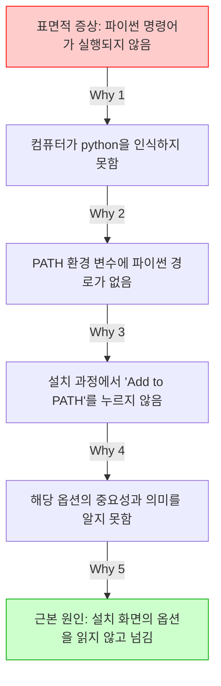

# 마이크로 세션: 010 — 트러블슈팅과 5Whys 기법
> **세션 ID**: MS-PY101-010
> **소요 시간**: 20분
> **난이도**: low
> **청크 타입**: narrative
> **버전**: v2.1 (7섹션 구조)

---

## §1. 개요

> **Day 1 | AM | 세션 010/022**

이전 세션에서 AI의 도움을 받아 파이썬을 성공적으로 설치했습니다. 모든 과정이 물 흐르듯 순조로웠다면 정말 좋았겠지만, 현실은 늘 예상치 못한 변수로 가득합니다. 분명히 지시대로 따라 했는데 화면에 낯선 빨간색 글씨가 가득 뜨는 상황을 마주하신 분도 계실 거예요. 이런 에러 메시지를 처음 마주하면 심장이 덜컹 내려앉고, 내가 컴퓨터를 망가뜨린 것은 아닌지 두려움이 밀려오기 마련입니다. 

하지만 이번 세션에서는 에러를 대하는 우리의 태도를 완전히 뒤바꿔 볼 예정입니다. 에러는 우리를 괴롭히려는 방해물이 아니라, 컴퓨터가 우리에게 보내는 절박하고도 친절한 '러브레터'입니다. 컴퓨터는 자신이 왜 멈춰 섰는지 아주 상세하게 적어서 우리에게 도움을 요청하고 있는 것이죠. 

### 🎯 학습 목표

이 세션이 끝나면 여러분은 다음을 할 수 있어요:
- 에러 메시지를 마주했을 때 당황하지 않고 AI에게 올바르게 질문할 수 있습니다.
- 문제를 의사에게 설명하듯 구체적인 맥락과 함께 전달하는 방법을 이해합니다.
- 도요타의 5Whys 기법을 활용해 겉으로 드러난 증상이 아닌 진짜 근본 원인을 파헤칠 수 있습니다.

### 선행 세션 환기

우리는 직전 세션(세션 009)에서 파이썬이라는 도구를 컴퓨터에 설치했어요. 설치 과정에서 체크박스 하나를 놓치거나 경로가 꼬이면 곧바로 실행 에러가 발생합니다. 이제 방금 설치한 파이썬을 직접 다루면서, 만약 문제가 생겼을 때 어떻게 해결의 실마리를 찾아야 하는지 그 강력한 무기를 장착해 보겠습니다.

---

## §2. 핵심 개념 (+ 🗣️ 강사 대본 + Mermaid)

### 병원 진단과 에러 메시지

에러를 해결하는 과정은 병원에 가서 의사에게 진찰을 받는 과정과 똑같습니다. 몸이 아파서 병원에 갔을 때, 의사 선생님에게 다짜고짜 "아파요, 고쳐주세요"라고만 말하면 어떻게 될까요? 의사는 "언제부터 아프셨나요?", "정확히 어디가 아픈가요?", "최근에 상한 음식을 드셨나요?"라며 계속해서 질문을 던질 수밖에 없습니다. 구체적인 증상과 정황을 모르면 처방전을 내릴 수 없기 때문입니다.

컴퓨터의 에러도 마찬가지입니다. AI 비서에게 "파이썬이 안 돼요"라고만 말하면 AI도 당황합니다. 화면에 뜬 에러 메시지를 글자 하나 빼놓지 않고 통째로 복사해서 AI에게 건네주는 행위는, 의사에게 "어제 저녁에 해산물을 먹은 직후부터 오른쪽 아랫배가 찌르듯이 아파요"라고 정확한 증상을 설명하는 것과 같습니다. 에러 메시지 안에는 문제가 발생한 정확한 파일 경로, 몇 번째 줄에서 멈췄는지, 어떤 종류의 오류인지에 대한 모든 단서가 들어 있습니다.

### 도요타 5Whys 기법

여기서 한 걸음 더 나아가 진짜 원인을 찾는 마법의 프레임워크가 바로 '5Whys(파이브 와이즈)'입니다. 이 기법은 원래 도요타 자동차 회사에서 제조 공정의 불량을 해결하기 위해 만들었어요. 원리는 아주 단순하면서도 강력합니다. 눈앞에 보이는 얕은 증상에 만족하지 않고, 문제의 근본 원인(Root Cause)에 닿을 때까지 "왜?"라는 질문을 꼬리에 꼬리를 물고 다섯 번 반복하는 것입니다.

🗣️ **강사 대본 (Instructor Script)**:

> 여러분, 파이썬 설치를 마쳤으니 모든 게 완벽하게 돌아가야 할 것 같죠? 그런데 화면에 빨간 에러 메시지가 뜨면 어떤 기분이 드시나요? 뭔가 큰 잘못을 저지른 것 같고 두려우실 겁니다. 하지만 비밀을 하나 알려드릴게요. 빨간 에러 메시지는 컴퓨터가 우리에게 보내는 러브레터입니다. 당황해서 창을 꺼버리지 마시고, 그 편지를 조심스럽게 긁어서 우리 AI 비서에게 건네주세요.
>
> 에러를 다루는 건 병원 진료와 같아요. "안 돼요"라고 말하는 건 "배 아파요"라고 하는 것과 같습니다. 에러 메시지를 복사해 주는 것이 바로 정확한 증상 설명이죠. 그리고 AI가 첫 번째 답변을 줬을 때 그냥 고개 끄덕이고 넘어가면 안 됩니다. 
> 
> "명령어가 안 먹혀요." 왜? "컴퓨터가 python이라는 단어를 모른대요." 왜? "환경 변수라는 곳에 등록이 안 됐대요." 왜? "설치할 때 맨 아래 체크박스를 안 눌렀거든요." 왜? "그게 무슨 뜻인지 몰랐어요." 왜? "전부 영어로 되어 있어서 그냥 Next 버튼만 눌렀습니다."
> 
> 어떠신가요? 이렇게 "왜?"를 반복하니까 진짜 원인이 '설치 화면의 영어 옵션을 간과한 것'이라는 깊은 곳까지 내려가게 되죠? 이것이 바로 5Whys 기법입니다.

### Mermaid 다이어그램



---

## §3. 상세 내용

### Why — 왜 5Whys를 배워야 하는가?

AI 시대에 우리가 코드를 직접 한 줄 한 줄 타이핑할 일은 많이 줄어들었습니다. 하지만 에러가 발생했을 때 그것을 해결하는 통찰력은 오히려 과거보다 훨씬 더 중요해졌습니다. "코드가 안 돌아가요"라는 똑같은 표면적 증상 앞에서도 진짜 원인은 천차만별입니다. 단순한 오타 때문일 수도 있고, 필요한 패키지를 설치하지 않아서일 수도 있으며, 컴퓨터의 운영체제 버전이 맞지 않아서일 수도 있습니다. 겉으로 드러난 증상만 보고 임시방편으로 대충 코드를 고치면, 나중에 더 거대한 버그가 되어 돌아옵니다. 근본 원인을 찾아 뿌리를 뽑아야 두 번 다시 같은 문제로 고통받지 않습니다.

### What — 에러 메시지를 다루는 올바른 태도

5Whys 기법을 제대로 쓰려면 먼저 지켜야 할 철칙이 있습니다. 에러 메시지는 절대 눈으로 보고 손으로 따라 치지 마세요. 무조건 마우스로 길게 드래그해서 전체를 복사(Ctrl+C)한 뒤 붙여넣기(Ctrl+V) 하셔야 합니다. 사람의 눈은 피곤하면 오타를 냅니다. 에러 메시지에 적힌 띄어쓰기 하나, 특수기호 하나가 문제 해결의 결정적 열쇠가 됩니다. 아주 사소해 보이는 예외 조건이나 코너 케이스(Corner Case)까지 AI가 완벽하게 인지하게 만드는 습관이 바로 디버깅 실력의 첫 단추입니다.

### How — AI와 함께 파고드는 5단계 추적

실제 상황에서 어떻게 적용할까요? 복사한 에러 메시지를 AI에게 던져주면서 "왜 이 에러가 발생했는지 초보자 수준으로 설명해줘"라고 요청하세요. AI가 첫 번째 원인을 알려주면, 그 원인을 다시 물고 늘어집니다. "그럼 환경 변수라는 건 왜 누락된 거야?"라고 질문하세요. 답변이 오면 "그럼 설치할 때 어떤 화면에서 내가 실수를 한 거지?"라고 또 묻는 겁니다. 표면적인 답변에서 만족하고 멈추지 마세요. AI의 친절한 설명을 징검다리 삼아 점점 더 깊은 원인으로 걸어 내려가는 감각을 몸에 익혀야 합니다.

---


### 📊 참고 표 (Visual Specs)

**트러블슈팅 퀵 레퍼런스 (5Whys)**

| 발생 상황 | 초기 대응 | AI 에이전트 프롬프팅 예시 | 5Whys 관점 |
|:---|:---|:---|:---|

## §4. 실습 가이드 (+ 🎙️ 실습 대본)

### 실습 목표

이번 실습에서는 완벽하게 정상인 컴퓨터 환경에서 고의로 오타를 내어 에러를 유발해 봅니다. 발생한 에러 메시지를 복사해서 AI에게 원인을 묻고, 꼬리를 무는 질문을 통해 5Whys 기법의 강력함을 직접 체험해 보는 것이 목표입니다.

🎙️ **실습 가이드 대본 (Lab Guide)**:

> 자, 직접 망가뜨려 봅시다. 겁먹을 필요 없습니다. 소프트웨어는 아무리 에러를 내도 물리적으로 터지지 않으니까요. 통합 터미널을 열고 파이썬 버전을 확인하는 명령어를 칠 건데, 일부러 철자를 틀리게 적어볼 겁니다. h 글자를 하나 빼고 입력해 보세요. 
> 
> 빨간 글씨가 와르르 쏟아지죠? 방금 전까지 배운 대로 해봅시다. 마우스로 그 에러 메시지를 쭉 긁어서 복사하세요. 그리고 Agent Manager 창에 있는 우리 AI 비서에게 붙여넣으면서 물어보세요. "왜 이 에러가 발생했는지 초보자 수준으로 설명해줘"라고요. AI가 대답을 주면, 거기서 멈추지 말고 꼬리를 물고 최소 세 번은 더 "왜?"라고 물어보며 땅굴을 파고 들어가 보세요.

### 단계별 지시

| 단계 | 소요 시간 | 강사 지시사항 | 학습자 액션 | 예상 결과 |
|------|----------|--------------|------------|----------|
| 1 | 2분 | "통합 터미널을 열고 `pyton --version`이라고 고의로 오타를 내서 입력해 보세요." | 터미널에 `pyton --version` 입력 후 Enter | 빨간색 텍스트로 '명령어를 찾을 수 없음' 에러 발생 |
| 2 | 2분 | "발생한 에러 메시지 전체를 마우스로 드래그해서 복사하세요." | 에러 메시지 텍스트 드래그 후 Ctrl+C | 에러 내용이 클립보드에 복사됨 |
| 3 | 3분 | "Agent Manager 채팅창에 붙여넣고, '왜 이 에러가 발생했는지 초보자 수준으로 설명해줘'라고 질문하세요." | 채팅창에 Ctrl+V 후 프롬프트 입력 및 전송 | AI가 pyton이라는 명령어는 존재하지 않는다는 원인을 쉬운 비유로 설명함 |
| 4 | 3분 | "AI의 답변을 읽고, 내용 중 궁금한 부분을 잡아 다시 '왜?'라고 질문해 보세요." | "파이썬 명령어는 왜 꼭 정확한 철자를 요구해?" 등 추가 질문 | 기계어와 약속된 명령어의 엄격성에 대한 깊은 설명 제공 |
| 5 | 2분 | "이제 철자를 똑바로 고쳐서 `python --version`을 다시 입력해 보세요." | 터미널에 올바른 명령어 입력 | 정상적으로 파이썬 버전 숫자(예: Python 3.12.0)가 출력됨 |

### 트러블슈팅 FAQ

| Q | A |
|---|---|
| 에러 메시지가 너무 길어서 어디까지 복사해야 할지 모르겠어요. | 처음부터 끝까지 전부 다 복사하시는 것이 가장 좋습니다. 길어도 AI는 순식간에 읽어내니까 걱정하지 마세요. |
| AI에게 '왜?'라고 물었더니 너무 어려운 전문 용어로 대답해요. | 프롬프트 뒤에 "초등학생도 이해할 수 있게 다시 설명해줘"라고 덧붙여 보세요. 어조를 조절하는 것도 중요한 스킬입니다. |
| 올바르게 `python --version`을 쳤는데도 에러가 나요. | 아주 좋은 상황입니다! 파이썬 설치 과정에서 PATH 등록이 안 된 진짜 문제를 발견하신 거예요. 그 진짜 에러를 복사해서 AI에게 5Whys를 시작해 보세요. |

---


### 🎓 강사 노트 (Instructor Support)

- ⏱️ **타이밍**: 13:30 (20분, lab)
- 🎯 **핵심 활동**: 의도적 에러 → 5 Whys 실습
- ⚠️ **강사 주의사항**: 에러를 두려워하지 않는 분위기 조성


### 📋 실습 설계 보강 (Lab Packet)

**세션 010 실습 설계 보강**

트러블슈팅과 5 Whys 기법
- **3-Stage Example Set**
  - 기본: 의도적 에러 발생(경로 오타) → 에러 메시지 복사 → AI에게 "왜?" 5회 반복 질문
  - 변형: SyntaxError, ModuleNotFoundError 등 에러 유형별 5 Whys 체험
  - 실수 해결: "AI가 알려준 대로 했는데 또 에러 나요" → 에러 메시지 전체를 정확히 복사했는지 확인
- **난이도 예측**: 에러 메시지가 영어라 읽기 자체를 포기하는 학습자 다수
- **타이밍 가이드**: 5 Whys 설명 3분 | 의도적 에러 체험 5분 | AI 대화 연습 7분 | 정리 5분
- **심리적 장벽**: "빨간색 에러 = 내가 큰 실수를 했다"는 공포
- **자가 점검**:
  - [ ] 에러 메시지를 복사해서 AI에게 질문할 수 있는가?
  - [ ] "왜?"를 3회 이상 반복해서 근본 원인에 도달했는가?
  - [ ] 에러가 "실수"가 아니라 "힌트"라는 관점을 수용했는가?

## §5. 코드 및 명령어 모음

### 고의적 에러 발생 명령어
```bash
# 철자 'h'를 누락시켜 의도적인 에러 유발
pyton --version
```

### 올바른 확인 명령어
```bash
# 정상적인 파이썬 버전 확인
python --version
```

### 🤖 AI 대화 프롬프트 예시

에러를 만났을 때 AI에게 던지기 좋은 첫 질문들입니다.

> "다음 에러 메시지가 발생했어. 왜 이 에러가 발생했는지 비전공자도 알기 쉽게 초보자 수준으로 설명해줘. [여기에 복사한 에러 메시지 붙여넣기]"

꼬리를 무는 5Whys 질문 예시입니다.

> "설명해 준 원인은 이해했어. 그렇다면 내 컴퓨터 환경에서 그 원인은 도대체 '왜' 발생하게 된 거야? 내가 앞선 단계에서 뭘 놓쳤을까?"
> "PATH 환경 변수라는 게 등록이 안 됐다고 했는데, 그건 '왜' 등록이 안 되는 거야? 수동으로 등록하려면 어떻게 해야 해?"

---

## §6. 요약 및 브릿지

### 핵심 학습 포인트

오늘 우리는 에러를 마주하는 완전히 새로운 시각을 장착했습니다. 붉은색 에러 메시지는 컴퓨터가 고장났다는 경고가 아니라, 내 문제를 정확히 고쳐달라고 보내는 친절한 러브레터입니다. 우리는 이 편지를 훼손하지 않고 고스란히 복사하여 AI 비서에게 전달하는 방법을 배웠습니다. 또한, 병원에 가서 의사에게 증상을 자세히 말하듯이 겉으로 드러난 증상에 만족하지 않고, 도요타의 5Whys 기법을 사용해 "왜?"라는 질문을 끈질기게 던져 근본 원인을 파헤치는 법을 실습했습니다. 이 끈질긴 질문 습관이 여러분을 평범한 코더에서 뛰어난 문제 해결사로 만들어 줄 것입니다.

### 다음 세션 예고

에러를 두려워하지 않고 "왜?"라고 당당하게 묻는 습관, 정말 멋지지 않나요? 이제 우리는 컴퓨터와 대화하며 트러블슈팅을 해낼 자신감을 얻었습니다. 파이썬 환경의 기본적인 준비 운동이 끝났으니, 다음 세션에서는 우리의 개발 환경에 날개를 달아줄 마법의 도구를 만납니다. 파이썬 생태계에서 가장 빠르고 강력한 패키지 관리 도구인 'uv'를 직접 설치해 보겠습니다.

### 브릿지 노트

> "여러분, 이제 빨간 에러 창이 떠도 식은땀 흘리지 않으실 거죠? 오히려 '오, 나에게 편지를 썼군' 하면서 여유롭게 긁어서 AI에게 넘겨주시면 됩니다. 든든한 디버깅 무기를 챙겼으니, 이제 우리 컴퓨터에 초고속 엔진을 달아줄 차례입니다. 다음 시간, 파이썬 개발자들의 가장 뜨거운 아이템 'uv' 패키지 매니저를 설치해 봅시다!"

---

## §7. 참고 자료

### 3-Source 출처

- **Source A (로컬 참고자료)**: `AI 시대의 서사 v3 - Claude.md` — 에러를 대처하는 능동적 태도와 코너 케이스(Corner Case)를 인지하는 사고방식의 중요성
- **Source B (NotebookLM)**: 에러 복사-붙여넣기 워크플로우 분석 및 에러를 컴퓨터의 '러브레터'로 치환하는 발상의 전환 모델링
- **Source C (Deep Research)**: `9 디버깅, 테스트, 배포.pdf` — 도요타(Toyota) 생산 방식에서 유래한 5Whys 트러블슈팅 프레임워크의 소프트웨어 공학적 적용 사례

### 강사 노트

> 💡 이 세션은 에러에 대한 수강생들의 심리적 장벽을 허무는 데 목적이 있습니다. 초보자들은 에러가 나면 부끄러워하거나 질문을 숨기는 경향이 있습니다. 실습 시간에 강사가 직접 테이블을 돌아다니며 일부러 더 큰 에러를 유발해 주고, 그것을 AI와 함께 웃으며 해결하는 분위기를 조성해 주시면 교육 효과가 배가됩니다.

---

## ✅ 세션 완료 체크리스트 (강사용)

- [ ] §1~§7 모든 섹션이 충실하게 작성되었는가?
- [ ] 비유와 스토리텔링이 포함되었는가? (병원 진단 비유, 러브레터 비유 반영 완료)
- [ ] 실습 단계별 지시표가 완전한가? (고의 에러 생성 및 5Whys 추적 과정 포함 완료)
- [ ] 3-Source 팩트 패킷이 명확히 반영되었는가? (5Whys, 복사-붙여넣기 습관 반영 완료)

---

*작성 일시: 2026-02-25*  
*작성 에이전트: Sisyphus-Junior*  
*교안 구조: 7섹션 (A0 팀 공통 표준)*