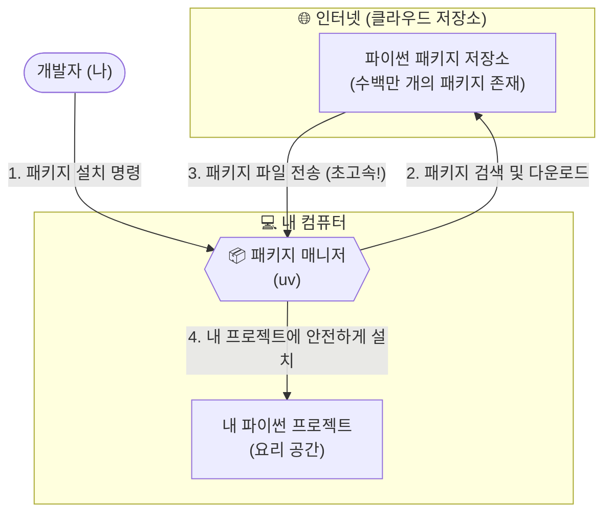
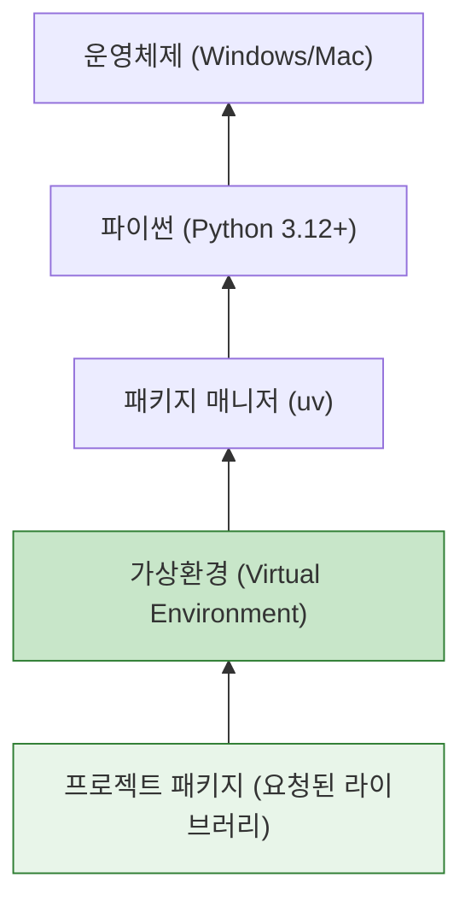

# 마이크로 세션: 011 — uv 패키지 매니저 소개와 설치

> **세션 ID**: MS-PY101-011  
> **소요 시간**: 20분  
> **난이도**: low  
> **청크 타입**: lab  
> **버전**: v2.1 (7섹션 구조)

---

## §1. 개요

> **Day 1 | AM | 세션 011/022**

이전 세션에서 에러를 마주했을 때 AI와 함께 5 Whys 기법으로 원인을 추적하고 해결하는 방법을 배웠습니다. 이제 에러 메시지의 붉은 글씨가 더 이상 무섭지 않으실 거예요. 그렇다면 이제 우리의 "AI 비서가 상주하는 사무실(Antigravity IDE)"에 강력한 도구 하나를 들여놓을 차례입니다.

프로그래밍을 하다 보면 세상의 모든 기능을 우리가 처음부터 끝까지 다 만들 필요가 없다는 것을 깨닫게 됩니다. 누군가 이미 만들어 놓은 훌륭한 기능들, 예를 들어 데이터를 분석하는 도구나 웹사이트를 만드는 도구들을 가져다 쓰면 되거든요. 이렇게 남들이 만들어 놓은 코드 묶음을 **패키지(Package)**라고 부르고, 이 패키지들을 내 컴퓨터로 손쉽게 가져와 주는 프로그램을 **패키지 매니저(Package Manager)**라고 합니다.

이번 세션에서는 파이썬 생태계에 혜성처럼 등장해 기존 도구들을 대체하고 있는 초고속 패키지 매니저인 **uv**를 소개하고, 직접 설치해 보겠습니다.

### 🎯 학습 목표

이 세션이 끝나면 여러분은 다음을 할 수 있어요:

- 패키지와 패키지 매니저의 역할이 무엇인지 비유를 통해 설명할 수 있어요.
- 기존의 pip 대신 uv를 사용했을 때 얻을 수 있는 압도적인 장점(속도, 편의성)을 이해해요.
- 터미널을 이용해 컴퓨터에 uv를 설치하고, 정상적으로 설치되었는지 버전을 확인할 수 있어요.

### 선행 세션 환기

바로 직전 세션에서 우리는 에러가 났을 때 당황하지 않고 문제를 해결하는 '트러블슈팅' 과정을 경험했어요. 그 전에는 Antigravity IDE의 터미널을 열고 닫는 방법도 배웠죠? 오늘 uv를 설치할 때 바로 그 터미널 창을 사용할 거예요. 컴퓨터에게 직접 명령을 내리는 전용 전화선인 '터미널'을 통해 마법 같은 도구를 배달시켜 봅시다.

---

## §2. 핵심 개념

### 요리 재료와 밀키트 배달 서비스

우리가 요리를 할 때 모든 재료를 직접 농장에서 키우지는 않죠? 마트나 시장에 가서 필요한 재료를 사 옵니다. 프로그래밍도 완벽히 똑같아요. 다른 개발자들이 정성껏 만들어 인터넷에 공개해 둔 "기능 묶음(패키지)"을 가져와서 내 코드에 조립하는 방식으로 프로그램을 만듭니다.

이때 내가 원하는 패키지를 찾아서 내 컴퓨터에 안전하게 설치해 주는 자동화된 도구가 필요한데, 이것이 바로 패키지 매니저입니다. 패키지 매니저를 "밀키트 배달 서비스"에 비유해 볼까요? 된장찌개를 끓이고 싶을 때 두부, 호박, 바지락을 따로따로 검색해서 사는 대신, 패키지 매니저에게 "된장찌개 패키지 하나 줘!"라고 명령하면 필요한 모든 재료를 한 번에 내 컴퓨터로 배송해 주는 원리예요.

🗣️ **강사 대본 (Instructor Script)**:

> 여러분, 파이썬에는 원래 `pip`라는 아주 유명한 패키지 매니저가 있었어요. 파이썬을 설치하면 기본으로 따라오는 녀석이죠. 그런데 이 `pip`는 조금 느리고, 환경 관리가 꽤 복잡했습니다. 비유하자면 일반 택배 배송 같은 거였어요. 주문하면 오긴 오는데 시간이 좀 걸리고, 가끔 재료가 뒤섞여서 오기도 했죠. 과거 선배 개발자들은 이 환경 세팅에만 반나절, 길게는 며칠을 쓰기도 했어요.
>
> 하지만 여러분은 정말 운이 좋습니다. 최근에 파이썬 생태계에 **uv**라는 마법 지팡이가 등장했거든요! uv는 Rust라는 아주 빠르고 단단한 언어로 만들어져서, 기존 pip보다 10배에서 최대 100배나 빠릅니다. 게다가 파이썬 버전 관리나 가상환경 세팅까지 혼자서 다 해내는 만능 도구예요.
>
> 쿠팡 일반 배송이 `pip`라면, `uv`는 로켓배송인 셈이죠. 오늘 우리는 이 로켓배송 서비스를 우리 사무실에 도입할 겁니다. 클릭 몇 번, 명령어 한 줄이면 끝납니다.

### 패키지 매니저 동작 구조 (Mermaid)



---


### 🎨 추가 시각화 (Visualization Packet)

**파이썬 개발 환경 구축 흐름**

운영체제 위에서 파이썬, 패키지 매니저(uv), 가상환경이 어떻게 독립적으로 구성되는지 계층적으로 보여줍니다.



## §3. 상세

### Why — 왜 pip 대신 uv를 써야 할까요?

파이썬을 오래 사용해 온 사람들은 "그냥 원래 있던 pip 쓰면 안 되나?"라고 생각할 수 있습니다. 하지만 최근 글로벌 개발 트렌드는 완벽하게 uv로 넘어가고 있습니다. 그 이유는 압도적인 **성능**과 **통합된 경험** 때문입니다. 

첫째, 상상을 초월하는 속도입니다. 파이썬은 실행은 편하지만 무거운 편입니다. 반면 uv는 하드웨어 자원을 극한으로 끌어다 쓰는 Rust라는 언어로 바닥부터 다시 만들어졌습니다. 패키지를 다운로드하고 압축을 푸는 과정이 기존 대비 수십 배 빠릅니다.

둘째, 복잡한 도구들의 통합입니다. 예전에는 파이썬 설치용 도구(pyenv), 패키지 설치용 도구(pip), 가상공간 생성용 도구(virtualenv)를 따로따로 배워서 써야 했습니다. 초보자들에게는 이 도구들의 조합 자체가 거대한 장벽이었죠. uv는 이 모든 기능을 단일 프로그램 하나로 완벽하게 통합했습니다.

### What — uv란 정확히 무엇인가요?

uv는 파이썬 프로젝트를 시작할 때 필요한 모든 기반 공사를 단 1초 만에 끝내주는 차세대 올인원 툴체인(All-in-one Toolchain)입니다. 단순히 남의 코드를 다운로드 받는 것을 넘어서, 내 컴퓨터에 파이썬이 설치되어 있지 않다면 파이썬 자체도 알아서 적절한 버전으로 다운로드해 주고, 프로젝트가 엉망이 되지 않도록 안전한 격리 공간까지 만들어주는 똑똑한 관리자입니다.

### How — 어떻게 설치하고 확인하나요?

설치 방법은 너무나도 간단합니다. 공식 홈페이지에서 제공하는 설치 스크립트 명령어 한 줄을 터미널에 복사해서 붙여넣기만 하면 됩니다. 설치 스크립트가 내 컴퓨터의 운영체제(Windows 또는 Mac)를 자동으로 인식해서 가장 최적화된 방법으로 uv 본체를 다운로드하고 환경 변수와 경로 설정을 마무리합니다.

### 📊 pip vs uv 비교표

| 비교 항목 | 기존의 `pip` | 차세대 `uv` | 비유 |
| :--- | :--- | :--- | :--- |
| **개발 언어** | Python (상대적으로 느림) | Rust (매우 빠르고 안전함) | 자전거 vs 스포츠카 |
| **설치 속도** | 평균적 (패키지가 많으면 수 분 소요) | 압도적 (캐시 활용 시 수 밀리초, 10~100배 속도) | 일반 택배 vs 당일 로켓배송 |
| **가상환경 생성** | `virtualenv` 등 별도 도구 필요 | `uv venv` 명령어 하나로 1초 만에 생성 | 조립식 가구 vs 완제품 배송 |
| **파이썬 설치** | 불가능 (파이썬이 미리 깔려 있어야 함) | 가능 (원하는 버전의 파이썬도 자동 다운로드) | 제약 있음 vs 올인원 |

---

## §4. 실습 가이드

자, 이제 우리의 Antigravity 에디터에 로켓배송 서비스를 연결해 볼 시간입니다.

🎙️ **실습 대본 (Lab Guide)**:

> 첫째, Antigravity IDE 화면 하단의 탭을 클릭하거나 단축키를 눌러 **통합 터미널(Terminal)**을 열어주세요. 윈도우 사용자라면 `PS`라는 글자와 함께 PowerShell이 기본으로 열려 있을 거예요.
>
> 둘째, 아래의 설치 명령어를 복사해 터미널에 붙여넣고 Enter 키를 쳐주세요. 타이핑하다가 오타가 날 수 있으니 가급적 복사/붙여넣기를 권장합니다.
>
> 셋째, 화면에 설치 진행 바가 쓱쓱 지나가고 완료 메시지가 뜰 겁니다. 설치가 끝났다면, 시스템이 새로운 도구를 인식할 수 있도록 **터미널 창을 휴지통 아이콘을 눌러 닫았다가 다시 열어주세요**. 이 과정을 건너뛰면 컴퓨터가 방금 설치한 uv를 찾지 못하고 에러를 뿜어냅니다!
>
> 넷째, 새 터미널에서 `uv --version` 이라고 입력해 보세요. 터미널에 `uv 0.x.x` 처럼 버전 숫자가 출력되면 성공적으로 로켓배송 시스템이 도입된 것입니다. 이제 마음껏 패키지를 주문할 수 있어요!

### 🛠️ 단계별 설치 체크리스트

| 단계 | 행동 | 예상 결과 |
| :--- | :--- | :--- |
| **Step 1** | 통합 터미널(PowerShell) 열기 | 깜빡이는 커서 확인 |
| **Step 2** | `irm https://astral.sh/uv/install.ps1 | iex` 입력 | 설치 진행 및 완료 메시지 출력 |
| **Step 3** | 터미널 종료 후 재시작 | 새 터미널 세션 시작 |
| **Step 4** | `uv --version` 명령어 실행 | 설치된 uv 버전(예: `uv 0.1.30`) 출력 |

### 🚨 트러블슈팅 FAQ

**Q. "보안 정책에 의해 스크립트 실행이 차단되었습니다 (Execution of scripts is disabled)"라는 빨간색 에러가 떠요!**  
A. 윈도우의 기본 보안 설정 때문에 인터넷에서 가져온 스크립트 실행이 일시적으로 막힌 것입니다. 당황하지 마세요! 직전 세션에서 배운 **5 Whys 기법**을 쓸 완벽한 타이밍입니다. 이 에러 메시지를 그대로 마우스로 드래그해서 복사한 뒤, 옆에 있는 AI 비서(Agent)에게 "이 에러가 왜 떴고, 어떻게 해결해야 해?"라고 물어보세요. AI가 터미널의 실행 정책(Execution Policy)을 변경하는 명령어를 친절하게 알려줄 것입니다.

**Q. `uv --version`을 쳤는데 "uv 용어가 cmdlet, 함수... 이름으로 인식되지 않습니다"라고 나와요.**  
A. 십중팔구 터미널을 닫았다가 다시 열지 않아서 생기는 문제입니다. 컴퓨터와 터미널은 방금 설치된 프로그램의 위치를 아직 새로고침하지 못한 상태예요. 터미널 패널 우측 상단의 휴지통 아이콘(Kill Terminal)을 눌러 완전히 종료한 후, 터미널을 다시 열고 명령어를 다시 쳐보세요.

---


### 🎓 강사 노트 (Instructor Support)

- ⏱️ **타이밍**: 14:00 (20분, lab)
- 🎯 **핵심 활동**: uv 설치 명령어 실행
- ⚠️ **강사 주의사항**: PowerShell 관리자 권한 필요할 수 있음


### 📋 실습 설계 보강 (Lab Packet)

**세션 011 실습 설계 보강**

uv 패키지 매니저 소개와 설치
- **3-Stage Example Set**
  - 기본: AI에게 "uv 패키지 매니저 설치 방법 알려줘" → `powershell -c "irm astral.sh/uv | iex"` 실행
  - 변형: 이미 pip만 사용하던 환경에서 uv를 추가 설치하는 경우
  - 실수 해결: "PowerShell 실행 정책 오류" → `Set-ExecutionPolicy` 안내 또는 CMD 대안
- **난이도 예측**: PowerShell 명령어의 낯선 문법에 당황
- **타이밍 가이드**: uv 개념 설명 3분 | 설치 명령 실행 5분 | 확인(uv --version) 3분 | 트러블슈팅 9분
- **심리적 장벽**: "또 뭔가를 설치해야 한다고?" — 설치 피로감
- **자가 점검**:
  - [ ] `uv --version`이 정상 출력되는가?
  - [ ] uv가 pip보다 빠른 이유를 한 문장으로 설명할 수 있는가?
  - [ ] 패키지 매니저의 역할을 비유로 설명할 수 있는가?

## §5. 코드/명령어 모음

Windows 환경에서 PowerShell을 사용할 때의 uv 공식 설치 및 확인 명령어입니다. Mac이나 Linux 사용자는 `curl -LsSf https://astral.sh/uv/install.sh | sh` 명령어를 사용하시면 됩니다.

```powershell
# Windows PowerShell용 uv 공식 설치 스크립트 명령어
irm https://astral.sh/uv/install.ps1 | iex

# 설치 확인 명령어 (터미널을 꼭 닫았다 다시 열고 실행하세요!)
uv --version
```

---

## §6. 요약 및 다음 세션 브릿지

### 📝 핵심 요약
- **패키지와 패키지 매니저**: 남이 만든 유용한 코드를 내 컴퓨터로 쉽게 가져오기 위한 필수 도구이자 밀키트 배달 서비스입니다.
- **초고속 패키지 매니저 uv**: 기존의 느리고 복잡했던 pip의 단점을 완벽히 극복한 Rust 기반의 올인원 패키지 매니저로, 로켓배송급 속도를 자랑합니다.
- **설치와 확인**: 터미널에서 스크립트 명령어 한 줄로 설치가 끝나며, `--version` 옵션을 통해 정상 설치 여부를 확실하게 검증할 수 있습니다.

### 🌉 다음 세션으로의 브릿지

uv 설치가 완벽하게 끝났습니다! 이제 우리에게는 어떤 파이썬 패키지라도 눈 깜짝할 사이에 배달해 주는 최고의 로켓배송 서비스가 생겼습니다. 

그런데 한 가지 치명적인 문제가 남았습니다. 이 배달 서비스로 이것저것 다양한 재료를 받아서 도대체 어디에 보관해야 할까요? 냉장고 한 칸에 김치, 케이크, 생선, 아이스크림을 다 몰아넣으면 어떻게 될까요? 냄새가 섞이고 결국 요리를 망치게 되겠죠. 프로그래밍에서도 여러 프로젝트의 패키지들을 한곳에 몰아넣으면 끔찍한 "의존성 충돌"이 발생합니다.

그래서 다음 세션에서는 배달받은 재료를 프로젝트별로 안전하게 격리해서 보관하는 방법, 즉 **가상환경(Virtual Environment)**의 핵심 개념과 필요성에 대해 구체적으로 알아보겠습니다.

---

## §7. 참고 자료

- [uv 공식 문서 (Astral)](https://docs.astral.sh/uv/)
- [Source B] NotebookLM 기반 파이썬 생태계 분석 자료 (pip vs uv 비교 파트)
- [Source C] Deep Research Rust 기반 성능 벤치마크 및 패키지 관리 도구 아키텍처 분석
