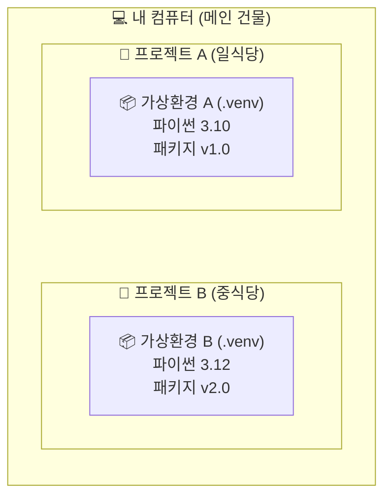

# 마이크로 세션: 012 — 가상환경의 필요성 이해

> **세션 ID**: MS-PY101-012  
> **소요 시간**: 20분  
> **난이도**: low  
> **청크 타입**: narrative  
> **버전**: v2.1 (7섹션 구조)

---

## §1. 개요

> **Day 1 | PM | 세션 012/022**

점심 식사는 맛있게 하셨나요? 오후의 첫 번째 세션입니다. 오전에 우리는 파이썬을 설치하고 초고속 패키지 매니저인 uv까지 컴퓨터에 장착했어요. 이제 전 세계 개발자들이 만들어둔 수많은 유용한 도구들을 마음껏 다운로드해서 사용할 준비가 다 되었습니다. 하지만 무턱대고 다운로드를 시작하기 전에, 반드시 알아두어야 할 아주 중요한 규칙이 하나 있어요. 바로 '가상환경'이라는 개념입니다. 이 20분 동안 우리는 왜 파이썬 개발자들이 프로젝트를 시작할 때마다 이 가상환경부터 세팅하는지, 그 근본적인 이유를 아주 쉬운 비유를 통해 알아볼 거예요.

### 🎯 학습 목표

이 세션이 끝나면 수강생은 다음을 할 수 있어요:

- 파이썬에서 가상환경이 왜 필수적인지 일상적인 비유를 들어 설명할 수 있습니다.
- 패키지 버전 충돌(의존성 지옥)이 무엇인지 이해하고, 이를 예방하는 원리를 파악합니다.
- 프로젝트마다 독립된 작업 공간을 분리하는 습관의 중요성을 인식합니다.

### 선행 세션 환기

오전 마지막 세션에서 우리는 기존 도구보다 최대 100배 빠른 차세대 패키지 매니저 uv를 설치했어요. "이걸로 이제 패키지를 마음껏 설치하면 되겠구나!" 생각하셨겠지만, 아직 엔터키를 누르시면 안 됩니다. 여러분의 깨끗한 컴퓨터를 안전하게 보호하면서 패키지를 설치하려면, 먼저 튼튼한 '격리벽'을 세워야 하거든요.

---

## §2. 핵심 개념 (+ 🗣️ 강사 대본 + Mermaid)

### 요리법과 전용 주방 비유

프로그래밍에서 새로운 프로젝트를 시작한다는 것은 새로운 요리를 만드는 것과 같아요. 그런데 여러분이 아주 넓은 메인 주방 하나를 가지고 있다고 상상해 봅시다. 오늘 점심에는 일식 초밥을 만들고, 저녁에는 중식 마파두부를 만들려고 해요. 만약 단 하나의 도마 위에서 생선도 썰고, 마늘도 썰고, 고추기름도 붓는다면 어떤 일이 벌어질까요? 초밥에서는 마늘 냄새가 나고 마파두부에서는 생선 비린내가 진동할 겁니다. 재료와 냄새가 이리저리 섞이면서 결국 두 요리 모두 망치게 되겠죠.

파이썬 개발에서도 똑같은 문제가 발생합니다. 여러 파이썬 프로젝트가 요구하는 패키지 버전들이 서로 섞이거나 엉키지 않도록 격리해 놓은 전용 폴더 및 환경이 바로 '가상환경(Virtual Environment)'입니다 [Source B]. 하나의 컴퓨터(단일 주방)에 여러 프로젝트(다양한 요리)의 도구들을 마구잡이로 설치하면 언젠가 반드시 서로 충돌하게 되어 있어요. 그래서 파이썬 개발자들은 요리가 섞이는 것을 막기 위해, 프로젝트를 시작할 때마다 완전히 새롭고 깨끗한 '전용 주방'을 통째로 새로 짓습니다.

🗣️ **강사 대본 (Instructor Script)**:

> 식사 맛있게 하셨나요? 오후 첫 시간은 조금 가벼우면서도 매우 중요한 이야기로 시작해 볼게요.
>
> 여러분, 오전에 uv를 설치했으니 이제 인터넷에 있는 패키지를 마음껏 설치할 수 있겠다고 생각하실 겁니다. 그런데 잠깐, 한 가지 중요한 것을 먼저 이해하고 넘어가야 해요.
>
> 여러분이 요리를 두 가지 동시에 한다고 상상해 봅시다. 한 주방에서 일식, 양식, 중식을 도마 하나로 요리하면 냄새가 다 섞이겠죠? 생선 비린내가 두부에 배고, 고추기름이 초밥에 튀어서 결국 둘 다 망칩니다. 프로그래밍에서도 똑같은 문제가 생겨요. A라는 프로젝트에서는 '카메라 인식' 기능의 옛날 버전이 필요한데, B라는 프로젝트에서는 최신 버전이 필요할 수 있어요. 이걸 하나의 컴퓨터에 전부 설치해버리면, 서로 버전이 엉키면서 에러를 뿜어냅니다. 개발자들은 이걸 '의존성 지옥'이라고 부릅니다 [Source B].
>
> 내 컴퓨터 하나에 모든 걸 설치하면 시스템이 엉망이 되기 때문에, 우리는 가상환경이라는 걸 만들 거예요. 가상환경은 프로젝트마다 완전히 새로운 주방과 조리도구를 배정해 주는 것과 같습니다 [Source B].
>
> 가상환경 폴더를 하나 만들면, 그 안에 파이썬 실행 파일과 도구들이 들어갈 빈 냉장고가 생깁니다. A 프로젝트를 위한 냉장고와 B 프로젝트를 위한 냉장고가 완전히 분리되는 거죠. 이렇게 서로 섞이거나 엉키지 않도록 격리해 놓은 전용 폴더 및 환경이 바로 가상환경의 진짜 정체입니다. 핵심 키워드는 바로 '격리'예요.

### Mermaid 다이어그램

이 다이어그램을 보시면 하나의 컴퓨터 안에 서로 완벽하게 분리된 가상환경들이 존재하는 것을 알 수 있어요. 두 환경은 높은 벽으로 격리되어 있어서, 한쪽에서 패키지를 지우거나 망가뜨려도 다른 쪽에는 눈곱만큼의 영향도 주지 않습니다.

---

## §3. 상세 내용

### Why — 왜 프로젝트마다 주방을 따로 차려야 하는가?

가상환경을 사용해야 하는 이유는 크게 세 가지로 나눌 수 있어요.

첫째는 앞서 강조했던 패키지 버전 충돌 방지입니다. 파이썬 세계에는 정말 수많은 외부 도구들이 있고, 이 도구들은 하루가 다르게 업데이트됩니다. 어떤 프로젝트는 옛날 버전의 도구를 기준으로 만들어졌고, 어떤 프로젝트는 최신 버전이 필요합니다. 만약 가상환경이라는 격리벽이 없다면 새로운 도구를 설치하는 순간 기존에 잘 돌아가던 프로젝트가 모두 망가지는 대참사가 벌어집니다. 가상환경은 A 프로젝트와 B 프로젝트 간의 의존성 지옥을 예방하고 이런 충돌을 원천적으로 차단해 줘요 [Source B].

둘째는 완벽하게 깨끗한 실험 공간을 보장한다는 점입니다. 개발을 하다 보면 이것저것 패키지를 설치해 보고 지우는 일명 '삽질'을 많이 하게 됩니다. 내 컴퓨터 시스템 전체에 이런 실험을 반복하면 컴퓨터가 금방 지저분해지고 느려지겠죠. 하지만 가상환경 안에서 실험을 하면 이야기가 다릅니다. 아무리 패키지를 엉망으로 설치하더라도 여러분 컴퓨터의 윈도우나 맥 운영체제에는 전혀 영향을 주지 않아요. 마음껏 실험하다가 도저히 안 되겠다 싶으면 그냥 그 가상환경 폴더 하나만 휴지통에 버리면 그만입니다. 방 하나를 빌려서 실컷 어지르다가 방을 통째로 버리는 셈이죠.

셋째는 재현 가능성입니다. 회사에서 일하다 보면 "어? 내 자리 컴퓨터에서는 잘 되는데 왜 네 컴퓨터에서는 에러가 나지?"라는 상황을 지겹도록 겪게 됩니다. 가상환경을 사용하면 이 문제를 해결할 수 있어요. 내 가상환경 주방에 있는 재료 목록을 영수증처럼 텍스트 파일로 저장해 두면, 동료가 그 영수증만 보고 자기 컴퓨터에 똑같은 주방을 그대로 복원할 수 있거든요. 이를 통해 팀원 모두가 완벽하게 똑같은 환경에서 일할 수 있게 됩니다.

### What — 그렇다면 가상환경의 실체는 무엇인가?

추상적인 개념처럼 들리지만, 가상환경의 실제 모습은 허무할 정도로 단순합니다. 바로 여러분의 프로젝트 폴더 안에 생성되는 `.venv`라는 이름의 숨겨진 폴더가 그 정체입니다. 이 폴더 안을 들여다보면 파이썬 실행 프로그램의 복사본과 함께, 여러분이 설치하는 모든 외부 패키지들이 모이는 저장 공간이 들어 있어요.

결국 가상환경을 켠다는 것은 "지금부터 내가 파이썬을 실행하거나 패키지를 설치할 때, 컴퓨터 전체에 있는 파이썬이 아니라 이 `.venv` 폴더 안에 있는 전용 파이썬을 사용하겠다"라고 컴퓨터에게 알려주는 과정에 불과합니다. 특별한 마법이 아니라 단순히 경로를 우회시키는 아주 똑똑한 폴더인 것이죠.

### How — 비개발자도 이해할 수 있는 언어로 번역하기

이런 전문적인 내용들을 비전공자인 여러분이 모두 외울 필요는 없어요. 우리가 오전에 배웠던 핵심을 떠올려 볼까요? 헷갈리고 어려운 개념이 나타나면 우리는 어떻게 하기로 했었죠? 맞습니다. 바로 AI에게 물어보는 거예요. "가상환경의 격리 원리를 쉽게 설명해줘"라고 요청하면 AI가 여러분의 수준에 맞춰 찰떡같은 비유를 만들어 줍니다. 이 능력을 활용하면 파이썬의 어떤 어려운 개념도 쉽게 내 것으로 만들 수 있어요.

---

## §4. 실습 가이드 (+ 🎙️ 실습 대본)

### 실습 목표

이 세션의 실습은 코드 창을 띄워놓고 타이핑을 하는 방식이 아니에요. 방금 배운 '격리와 전용 주방'이라는 개념을 완전히 내 것으로 체화하기 위해, AI와 대화해 보고 그 내용을 바탕으로 동료에게 직접 설명해 보는 활동입니다. 가상환경이 왜 필요한지 비개발자도 이해할 수 있게 비유를 들어 설명해달라고 질문하고 요약하는 과정을 통해 다른 사람에게 비유를 들어 설명할 수 있다면 그 개념을 완벽히 이해한 것입니다 [Source B].

🎙️ **실습 가이드 대본 (Lab Guide)**:

> 자, 이제 여러분의 AI 비서를 호출해 볼 시간입니다. 프롬프트 창에 이렇게 입력해 보세요. "가상환경이 왜 필요한지 비개발자도 이해할 수 있게 비유를 들어서 설명해 줘."
>
> AI가 답변을 주기 시작할 거예요. 제가 아까 들었던 '일식과 중식 주방' 비유와 비슷할 수도 있고, '격리 병동'이나 '독립된 게임기'처럼 전혀 다른 재미있는 비유가 나올 수도 있어요. AI의 설명을 쭉 읽어보시고, 가장 마음에 드는 비유를 하나 골라보세요.
>
> 고르셨나요? 그럼 이제 옆에 앉으신 짝꿍에게 그 비유를 사용해서 가상환경이 무엇인지 딱 한 문장으로 설명해 주세요. "가상환경은 마치 이런 것과 같아. 왜냐하면 이렇게 격리해주기 때문이지." 라고요. 3분 드리겠습니다. 자, 시작!

### 단계별 지시

| 단계 | 소요 시간 | 강사 지시사항 | 학습자 액션 | 예상 결과 |
|------|----------|--------------|------------|----------|
| 1 | 2분 | AI에게 비유적 설명을 요청하는 프롬프트 작성 안내 | 프롬프트 입력 및 AI 답변 읽기 | 다양한 일상적 비유 확인 |
| 2 | 3분 | 가장 이해하기 쉬운 비유를 선택해 옆 사람과 공유 유도 | 짝과 1:1로 설명 주고받기 | 개념의 내재화 및 활기찬 분위기 |
| 3 | 5분 | 전체 앞에서 1~2명의 독창적인 비유 발표 청취 | 자원자 발표 경청 | 다른 시각에서의 개념 이해 확장 |
| 4 | 5분 | 격리의 중요성 핵심 요약 및 질의응답 | 화면 주시 및 자유 질문 | 의문점 해소 및 개념 정립 |

### 트러블슈팅 FAQ

| Q | A |
|---|---|
| AI가 너무 뻔하고 어려운 설명만 반복합니다. | 프롬프트에 구체적인 조건을 추가하라고 조언해 주세요. "유원지 놀이기구에 비유해 줘" 또는 "초등학생도 이해할 수 있게 10글자로 비유해 줘"라고 요청하면 훨씬 창의적이고 쉬운 답변이 나옵니다. |
| 아직도 가상환경이 왜 필요한지 잘 와닿지 않는다고 질문이 들어왔습니다. | 휴대폰 기능으로 설명해 보세요. "회사용 메신저와 개인용 메신저를 완벽하게 분리하고 싶어서 듀얼 앱을 쓰는 것과 똑같습니다. 서로 대화 내용이 절대 섞이지 않게 분리하는 거예요." |

---

### 🎓 강사 노트 (Instructor Support)

- ⏱️ **타이밍**: 14:20 (25분, narrative)
- 🎯 **핵심 활동**: 비유: "프로젝트별 개인 사물함"
- ⚠️ **강사 주의사항**: 개념 이해가 먼저, 명령어는 다음 세션

## §5. 코드 및 명령어 모음

이 세션은 개념의 이해와 토론이 목적이므로 직접 실행하는 파이썬 코드는 없습니다. 다만 AI와 소통하기 위해 사용했던 프롬프트 예시를 남겨둡니다.

> 🤖 **AI 프롬프트 예시**:
> "너는 IT 지식이 없는 사람들을 가르치는 친절한 강사야. 파이썬에서 '가상환경(Virtual Environment)'을 왜 무조건 만들어야 하는지, 패키지 충돌이라는 게 무엇인지 요리나 주방에 비유하지 말고 완전히 다른 새로운 일상적인 비유를 들어서 3문장으로 짧게 설명해 줘."

---

## §6. 요약

### 핵심 학습 포인트

이번 시간의 가장 중요한 키워드는 단연코 '격리'입니다. 가상환경은 내 컴퓨터 안에 안전하고 독립적인 프로젝트 전용 작업실을 만들어주는 훌륭한 기능이에요. 이 전용 작업실 덕분에 프로젝트 간의 패키지가 서로 부딪혀 망가지는 '의존성 지옥'을 피할 수 있고, 마음껏 어지르고 부수며 실험할 수 있는 완벽한 자유를 얻게 됩니다. 또한 영수증처럼 기록을 남겨 다른 사람의 컴퓨터에서도 똑같은 작업실을 그대로 재현할 수 있다는 점도 꼭 기억해 두시면 좋겠습니다.

### 다음 세션 예고

개념을 머리로 이해했으니 이제 손으로 직접 만들어 볼 차례입니다. 다음 세션에서는 오전에 설치했던 그 엄청나게 빠른 패키지 매니저, uv를 사용해서 실제로 내 프로젝트 폴더 안에 전용 주방(`.venv`)을 뚝딱 만들어 볼 거예요. 

### 브릿지 노트

> "가상환경이 왜 필요한지, 왜 격리가 그토록 중요한지 이제 확실히 감이 오셨을 겁니다. 그렇다면 이 마법 같은 전용 주방을 만드는데 시간이 얼마나 걸릴까요? 기존 방식으로는 제법 오랜 시간이 걸렸지만, 우리가 오전에 설치한 uv를 쓰면 눈 깜짝할 사이에 만들어집니다. 여러분의 첫 번째 가상환경, 지금 바로 만들러 가보시죠!"

---

## §7. 참고 자료

### 3-Source 출처

- **Source B (NotebookLM)**: 여러 파이썬 프로젝트가 요구하는 패키지 버전들이 서로 섞이거나 엉키지 않도록 격리해 놓은 전용 폴더 및 환경이라는 정의와, 이를 설명하기 위한 의존성 지옥, 의존성 충돌 예방 및 전용 주방 비유의 개념적 기반을 제공했습니다.

### 추가 학습 자료

- [Python 공식 문서: 가상환경과 패키지](https://docs.python.org/ko/3/tutorial/venv.html): 가상환경의 기술적 배경이 궁금한 분들을 위한 공식 가이드
- [Astral uv 공식 문서](https://docs.astral.sh/uv/): 가상환경을 초고속으로 생성하는 uv의 공식 메뉴얼

### 강사 노트

> 💡 **강사 노트**: 본 세션은 비전공자들이 가장 어려워하고 귀찮아하는 '가상환경 세팅'의 당위성을 설득하는 매우 중요한 시간입니다. 기술적인 원리(디렉토리 구조 변경, 환경변수 조작 등)를 설명하는 것은 철저히 배제하고, 무조건 '왜 해야 하는가(Why)'에 집중해 주세요. 일식과 중식 도마 비유는 수강생들이 가장 직관적으로 이해할 수 있는 강력한 무기입니다. 실습 시간에 수강생들이 각자 찾아낸 재미있는 비유를 적극적으로 호응해 주시면 오후 수업의 에너지를 크게 끌어올릴 수 있습니다.

---

## ✅ 세션 완료 체크리스트 (강사용)

- [x] §1~§7 모든 섹션이 충실하게 작성되었는가?
- [x] 일식/중식 도마 비유를 통해 의존성 충돌의 개념이 명확히 전달되었는가?
- [x] 비개발자가 이해할 수 있는 쉬운 구어체 줄글로 서술되었는가?
- [x] AI와 대화하며 비유를 찾는 실습이 포함되었는가?
- [x] 팩트 패킷(Source B)의 핵심 개념과 출처 표기가 적절히 반영되었는가?

---

*작성 일시: 2026-02-25*  
*작성 에이전트: A4B_Session_Writer*  
*교안 구조: 7섹션 (A0 팀 공통 표준)*