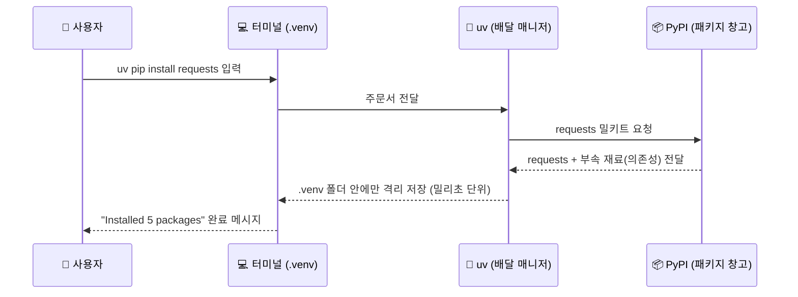

# 마이크로 세션: 014 — uv pip로 패키지 설치 체험

> **세션 ID**: MS-PY101-014  
> **소요 시간**: 20분  
> **난이도**: low  
> **청크 타입**: lab  
> **버전**: v2.1 (7섹션 구조)

---

## §1. 개요

> **Day 1 | PM | 세션 014/022**

### 🎯 학습 목표

이 세션이 끝나면, 수강생은 다음을 할 수 있습니다:

- `uv pip install` 명령어를 사용해 필요한 외부 패키지를 초고속으로 설치할 수 있다
- 시스템 전체가 아닌 내 프로젝트(가상환경)에만 안전하게 격리 설치되는 원리를 이해한다
- 터미널에서 `uv pip list` 명령어로 현재 설치된 패키지와 의존성 목록을 검증할 수 있다

### 선행 세션 환기

직전 세션(세션-013)에서 우리는 프로젝트 전용 미니 냉장고(`.venv` 가상환경)를 사서 코드를 꽂고 문까지 활짝 열어뒀습니다. 터미널 프롬프트 앞에 `(.venv)`라는 예쁜 간판이 보이시죠? 이게 바로 "지금부터 모든 재료는 이 미니 냉장고에만 들어갑니다"라는 뜻이에요. 하지만 냉장고 문만 열어놓으면 뭐할까요. 안이 텅 비어있잖아요. 이제 이 빈 냉장고에 첫 번째 밀키트를 주문해서 든든하게 채워 넣을 시간입니다.

---

## §2. 핵심 개념 (+ 🗣️ 강사 대본 + Mermaid)

### 패키지 설치 = "초고속 밀키트 주문"

파이썬 세계에는 전 세계 개발자들이 미리 만들어 놓은 수십만 개의 밀키트(패키지)가 있습니다. 요리할 때마다 떡을 뽑고 고추장을 담그면 언제 떡볶이를 먹겠어요? 훌륭한 밀키트를 가져와서 끓이기만 하는 것이 현대 개발자의 기본 소양입니다.

패키지를 설치하는 과정을 밀키트 주문에 비유해 볼게요. "떡볶이 밀키트 하나 주세요!"라고 주문하면 배달 매니저가 창고에서 떡, 어묵, 파를 한 세트로 묶어서 우리 집 냉장고에 넣어주죠. 파이썬 터미널에서 `uv pip install requests`라고 치는 것이 바로 이 주문서입니다.

- **`uv`**: 우리의 초고속 배달 매니저 이름
- **`pip install`**: "창고에서 찾아서 설치해 줘"라는 주문 동사
- **`requests`**: 우리가 고른 밀키트(패키지)의 이름

우리가 고용한 매니저 uv는 좀 특별해요. 예전에 쓰던 매니저(pip)는 자전거로 배달해서 패키지 하나를 설치하는 데 10초씩 걸렸어요. 하지만 uv는 순간이동을 합니다. 주문 버튼(엔터)을 누르는 순간 이미 냉장고에 들어와 있을 정도로 빠르죠. 게다가 이 밀키트는 집 전체 메인 냉장고(시스템 전역)를 어지럽히지 않고 오직 내 전용 미니 냉장고(`.venv`)에만 깔끔하게 들어갑니다.

🗣️ **강사 대본 (Instructor Script)**:

> 여러분, 터미널에 `(.venv)` 간판이 잘 보이시나요? 보인다면 주문할 준비가 완벽히 끝난 겁니다. 파이썬에서는 남들이 만들어 놓은 유용한 도구 상자를 '패키지'라고 불러요. 오늘은 그 수많은 패키지 중에서 `requests`라는 아주 유명한 친구를 불러볼 거예요. 인터넷에서 데이터를 쏙쏙 뽑아올 때 쓰는 도구입니다.
> 
> 예전에는 파이썬 환경 세팅하고 패키지 하나 까는 데만 반나절이 걸렸어요. 뭔가 엉키고 꼬여서 컴퓨터 전체가 망가지는 일도 흔했죠. 하지만 여러분은 운이 아주 좋습니다. 우리가 배운 `uv`라는 마법 지팡이를 쓰면, 단 1초도 안 걸려서 내 프로젝트 전용 방에만 아주 깔끔하게 도구가 세팅됩니다. 주문 버튼을 누르자마자 "어? 벌써 끝났다고?" 하는 기분을 곧 느끼실 거예요.

> 💡 **강사 노트**: 밀키트 주문 비유와 격리 설치 개념은 NotebookLM(Source B)에서 도출되었으며, uv의 밀리초 단위 순간이동 성능은 Deep Research(Source C) 분석 결과를 반영했습니다. 초보자에게는 빠른 설치 속도보다 "내 컴퓨터를 망가뜨리지 않고 이 폴더 안에만 안전하게 설치된다"는 격리성(Isolation)을 더 강조해 주면 두려움을 없앨 수 있습니다.

### Mermaid 다이어그램



---

## §3. 상세 내용

### Why — 왜 패키지를 설치해야 하는가?

"코딩을 배운다면서 왜 남이 만든 걸 가져다 쓰나요?" 아주 자연스러운 의문이에요. 사실 직접 다 만들 수도 있죠. 하지만 바퀴를 다시 발명할 필요는 없습니다. 웹 브라우저를 열고, 주소를 치고, 화면의 글씨를 긁어오는 코드를 밑바닥부터 짜려면 수백 줄이 필요해요. 하지만 `requests` 패키지를 가져오면 단 3줄이면 끝납니다.

현대 프로그래밍은 무에서 유를 창조하는 것이 아니라, 전 세계 천재들이 이미 만들어 놓은 훌륭한 레고 블록들을 내 입맛에 맞게 조립하는 과정이에요. 그 레고 블록을 내 작업실로 가져오는 행위가 바로 패키지 설치입니다. 예를 들어, 인터넷에서 오늘의 날씨 데이터를 가져와서 분석하는 프로그램을 만든다고 가정해 봅시다. 패키지가 없다면 컴퓨터가 인터넷 통신을 어떻게 하는지부터 0과 1로 된 신호를 어떻게 주고받는지 수백 줄을 고민해야 합니다. 하지만 똑똑한 선배 개발자들이 그 복잡한 과정을 `requests`라는 이름의 깔끔한 레고 블록으로 미리 만들어 두었어요. 우리는 그저 이 블록을 우리 작업실로 가져와서 "날씨 데이터 좀 가져와 줘"라고 명령어 하나만 내리면 됩니다. 이것이 바로 우리가 코딩 문법보다 '어떤 패키지를 조립할지(What)'를 고민해야 하는 AI 시대의 진짜 개발 방식입니다.

### What — PyPI와 의존성(Dependency)이란?

`pip install` 명령어를 칠 때, 대체 어디서 패키지를 가져오는 걸까요? 바로 **PyPI**(Python Package Index)라는 거대한 글로벌 창고입니다. 이곳에는 인공지능, 데이터 분석, 게임 개발 등 50만 개가 넘는 파이썬 패키지가 쌓여 있어요. 

그런데 한 가지 재미있는 사실이 있습니다. 떡볶이 밀키트를 주문하면 떡만 오지 않죠? 소스, 어묵, 대파가 한 봉지에 담겨 옵니다. 패키지도 마찬가지예요. 우리가 `requests` 하나만 주문해도, 이 패키지가 제대로 일하기 위해 필요한 다른 작은 도구들(부속 재료)이 자동으로 함께 배달됩니다. 이것을 전문 용어로 **의존성(Dependency)**이라고 불러요. 똑똑한 uv 매니저가 이 의존성까지 알아서 챙겨 오기 때문에 우리는 메인 패키지 이름 하나만 기억하면 됩니다. 파이썬 생태계가 놀라운 이유는 바로 이 거대한 상호 의존 네트워크 덕분입니다. A 패키지가 B 패키지를 쓰고, B 패키지가 C 패키지를 활용하며 전 세계 코드가 유기적으로 연결되어 있죠. 여러분이 방금 `requests`를 설치했다는 것은 이 거대한 글로벌 지식의 그물망에 공식적으로 접속했다는 뜻이기도 합니다.

### How — uv pip의 압도적 강점

패키지를 설치하는 방법은 `uv pip install` 뒤에 원하는 패키지 이름을 적는 것이 전부입니다. 전통적인 파이썬에서는 그냥 `pip install`을 썼어요. 하지만 우리는 앞에 `uv`를 붙입니다. 왜 그럴까요?

첫째, **압도적인 속도**입니다. uv는 기존 파이썬이 아닌 Rust라는 아주 빠르고 최신인 언어로 만들어져서 기존 방식보다 무려 10배에서 100배까지 빨라요. 둘째, **강력한 격리**입니다. 메인 시스템 환경을 건드리지 않고 우리가 만든 `.venv` 폴더 안에만 얌전히 설치돼요. 나중에 이 프로젝트가 쓸모없어지면 제어판에 들어가서 삭제할 필요 없이 그냥 폴더를 통째로 휴지통에 버리면 끝납니다. 뒷정리까지 완벽한 셈이죠. 세 번째 장점은 **단일 도구 통합**입니다. 과거에는 패키지를 설치하는 도구, 가상환경을 만드는 도구, 파이썬 버전을 관리하는 도구가 전부 달랐습니다. 요리사, 설거지 담당, 재료 손질 담당이 따로 있었던 셈이죠. 하지만 uv는 이 모든 역할을 혼자서, 그것도 훨씬 빠른 속도로 처리하는 만능 셰프입니다. 
> ✅ **체크포인트**: 여기까지 잘 따라오셨나요?
> - 패키지를 밀키트에 비유했을 때, 부속 재료(어묵, 소스)가 함께 딸려오는 현상을 전문 용어로 뭐라고 부를까요? ("의존성")
> - 우리가 설치한 패키지는 컴퓨터 시스템 전체에 깔릴까요, 아니면 특정 폴더에만 깔릴까요? ("특정 가상환경 폴더인 .venv 안에만 격리 설치됨")
> - 기존 `pip` 대신 우리가 `uv pip`를 쓰는 가장 큰 이유 두 가지는 무엇인가요? ("압도적인 설치 속도와 깔끔한 폴더 격리")

### 비교표 — 전통적 방식 vs AI-native 방식(uv)

| 비교 항목 | 기존 방식 (`pip`) | 우리 방식 (`uv pip`) |
|----------|-----------------|--------------------|
| 설치 속도 | 10~30초 (자전거 배달) | **0.1~1초 (순간이동 배달)** |
| 환경 격리 | 실수하면 전역 환경 오염 | **자동으로 .venv 감지 후 안전하게 격리** |
| 의존성 관리 | 가끔 꼬여서 충돌 발생 | **스마트하게 엉킴 없이 해결** |
| 비유 | 아날로그 주문 | **로켓 배송** |

---

## §4. 실습 가이드 (+ 🎙️ 실습 대본)

### 실습 목표

활성화된 가상환경 내에 인터넷 통신을 돕는 `requests` 패키지를 실제로 설치해 봅니다. 설치 속도를 체감하고, 터미널 명령어를 통해 의존성이 함께 깔린 패키지 목록을 직접 검증합니다.

🎙️ **실습 가이드 대본 (Lab Guide)**:

> 자, 이제 진짜로 주문을 넣어볼 시간입니다. 키보드에 손을 올리세요. 시작하기 전에 가장 중요한 것! 터미널 입력창 맨 앞에 `(.venv)`라는 초록색 간판이 떠 있는지 꼭 확인해 주세요. 이 간판이 있어야 배달 기사가 남의 집이 아니라 우리 프로젝트 냉장고를 정확히 찾아옵니다.
> 
> 확인되셨다면 `uv pip install requests`라고 치고 엔터를 힘차게 눌러보세요. 눈 크게 뜨고 보셔야 해요. 1초도 안 돼서 설치가 끝나버릴 테니까요. 설치가 다 되었다면 우리가 제대로 주문을 받았는지 냉장고 안을 들여다봐야겠죠? `uv pip list`라고 쳐보세요. 오, 우리는 하나만 시켰는데 무언가 잔뜩 들어와 있네요. 이게 바로 밀키트의 부속 재료들입니다.

### 단계별 지시 (uv pip install 단계표)

| 단계 | 소요 시간 | 강사 지시사항 | 학습자 액션 | 예상 터미널 결과 |
|------|----------|--------------|------------|----------------|
| 1 | 1분 | "터미널 프롬프트의 (.venv) 간판을 확인하세요" | 터미널 확인 (없으면 activate 실행) | `(.venv) PS C:\...>` |
| 2 | 1분 | "설치 명령어를 오타 없이 정확히 입력하세요" | `uv pip install requests` 입력 | 눈 깜짝할 새 "Installed 5 packages" 출력 |
| 3 | 1분 | "냉장고 안을 들여다보는 명령어를 치세요" | `uv pip list` 입력 | `requests`, `urllib3`, `certifi` 등 목록 표시 |
| 4 | 2분 | "AI 비서에게 이 패키지의 용도를 물어보세요" | Agent Manager에 "requests 패키지가 뭐야?" 질문 | 인터넷 데이터를 가져오는 도구라는 친절한 설명 |

**[단계 1] 가상환경 활성화 확인**

터미널 입력 줄 맨 앞에 `(.venv)`가 있는지 다시 한번 확인합니다. 만약 없다면 냉장고 문이 닫혀있는 거예요. 윈도우 사용자는 `.\.venv\Scripts\activate`를, 맥 사용자는 `source .venv/bin/activate`를 쳐서 문을 열어주세요.

**[단계 2] 초고속 패키지 설치**

터미널에 다음 명령어를 입력합니다. (requests 끝에 s가 붙어있음에 주의하세요!)

```powershell
uv pip install requests
```

입력하고 엔터를 치는 순간 촤르륵 글씨가 올라가며 설치가 끝납니다. "Installed 5 packages in 84ms" 같은 메시지가 뜬다면 대성공입니다. 정말 1초도 안 걸렸죠? 이것이 바로 uv의 위력입니다.

**[단계 3] 설치된 목록 검증하기**

이제 냉장고 문을 열고 내용물을 확인해 볼 차례입니다. 다음 명령어를 입력하세요.

```powershell
uv pip list
```

분명히 우리는 `requests` 하나만 주문했는데, 목록에는 `charset-normalizer`, `idna`, `urllib3`, `certifi` 같은 낯선 이름들이 보일 겁니다. 당황하지 마세요. 이게 바로 `requests`가 정상적으로 일하기 위해 묶음으로 달려온 부속 재료(의존성)들입니다. 떡볶이를 시켰더니 파와 어묵이 같이 온 것과 완벽히 같은 이치예요.

**[단계 4] AI에게 용도 물어보기**

오른쪽 Agent Manager 창을 열고 AI 비서에게 질문을 던져보세요. "방금 깔아본 requests 패키지가 뭐야? 초등학생도 이해할 수 있게 비유를 들어서 3줄로 설명해 줘." 우리가 직접 외우지 않아도 AI가 언제든 패키지의 사용법을 친절하게 알려줍니다.

### 트러블슈팅 FAQ

| Q (이런 문제가 생겼어요) | A (이렇게 해결하세요) |
|----------------------|--------------------|
| 명령어 앞에 `(.venv)`가 없어요 | 가상환경이 켜지지 않은 상태입니다. 냉장고 문이 닫혀있으면 밀키트를 넣을 수 없죠. 윈도우는 터미널에 `.\.venv\Scripts\activate`를 쳐서 켜주세요. 맥 사용자는 `source .venv/bin/activate`를 입력하면 됩니다. |
| `No such package` 또는 `Could not find a version` 에러가 떠요 | 십중팔구 오타입니다. `request`라고 끝에 s를 빼먹었거나 스펠링을 틀리지 않았는지 꼼꼼히 확인하세요. 파이썬은 대소문자와 스펠링에 매우 엄격합니다. |
| `uv: command not found` 라고 나와요 | 어이쿠, 세션 011에서 uv 설치를 건너뛰셨군요! 당황하지 말고 윈도우 기준으로 `irm https://astral.sh/uv/install.ps1 | iex` 명령어를 먼저 실행해서 배달 매니저부터 고용해 주세요. |
| 설치는 됐는데 터미널에 노란색 텍스트로 경고 문구가 떠요 | uv 버전 업데이트 알림이거나 캐시 관련 경고일 수 있습니다. 파이썬 터미널에서 빨간색은 치명적인 에러를 뜻하지만, 노란색은 단순한 정보나 권장 사항입니다. 실습에 지장이 없으니 무시하셔도 괜찮습니다. |
| 목록에 requests 말고 딴 게 너무 많아요 | 완벽히 정상입니다! 의존성(Dependency) 때문에 `requests`가 일하는 데 꼭 필요한 다른 부속 패키지들이 묶음으로 함께 자동 설치된 결과예요. 냉장고가 풍성해졌다고 생각하시면 됩니다. |
| "액세스가 거부되었습니다" 같은 에러 메시지가 떠요 | 컴퓨터의 보안 프로그램(백신)이 외부 패키지 다운로드를 차단했을 수 있습니다. 또는 회사나 학교 컴퓨터의 경우 네트워크 자체 방화벽이 원인일 수 있어요. 이럴 땐 당황하지 말고 해당 에러 메시지를 복사해서 AI 비서에게 그대로 붙여넣기 해보세요. |

> ✅ **체크포인트**: `uv pip list` 명령어를 쳤을 때 목록에 `requests`가 예쁘게 들어와 있나요? 성공하신 분들은 가볍게 손을 들어주세요!

---


### 🎓 강사 노트 (Instructor Support)

- ⏱️ **타이밍**: 15:25 (20분, lab)
- 🎯 **핵심 활동**: `uv pip install` 실습
- ⚠️ **강사 주의사항**: 가상환경 활성화 확인 후 진행


### 📋 실습 설계 보강 (Lab Packet)

**세션 014 실습 설계 보강**

uv pip로 패키지 설치 체험
- **3-Stage Example Set**
  - 기본: `uv pip install requests` → 설치 성공 메시지 확인 → `uv pip list`로 목록 조회
  - 변형: 여러 패키지 동시 설치 `uv pip install requests rich`
  - 실수 해결: "가상환경 활성화 안 한 채로 설치했어요" → 글로벌 설치 vs 가상환경 설치 차이 설명
- **난이도 예측**: 가상환경 활성화 잊어버리는 실수가 가장 빈번
- **타이밍 가이드**: 패키지 설명 3분 | 설치 실행 5분 | 목록 확인 3분 | 가상환경 미활성 실험 5분 | 정리 4분
- **심리적 장벽**: "패키지가 뭔지 모르겠어요" — 추상적 개념
- **자가 점검**:
  - [ ] `uv pip install` 명령이 정상 완료되었는가?
  - [ ] `uv pip list`에 설치한 패키지가 보이는가?
  - [ ] (.venv) 활성화 상태에서 설치했는가?

## §5. 코드 및 명령어 모음

### 명령어 1: 패키지 설치 (주문하기)

```powershell
uv pip install [패키지이름]
```

가상환경(`.venv`) 안에 외부 파이썬 패키지를 초고속으로 설치하는 명령어입니다. `[패키지이름]` 자리에 우리가 필요한 도구 이름을 넣으면 됩니다.

> 🤖 **AI 프롬프트 예시**: "데이터를 예쁜 그래프로 그려주는 파이썬 패키지를 하나 추천해 주고, 그걸 uv로 설치하는 명령어를 알려줘."

### 명령어 2: 설치된 패키지 목록 확인 (냉장고 열어보기)

```powershell
uv pip list
```

현재 활성화된 가상환경 안에 설치되어 있는 모든 패키지의 이름과 버전을 리스트 형태로 보여줍니다. 내가 직접 설치한 패키지뿐만 아니라 딸려온 의존성 패키지들도 모두 출력됩니다. 만약 가상환경 간판(`(.venv)`)이 없는 상태에서 이 명령어를 치면 시스템 전체에 깔린 패키지들이 보여서 목록이 엄청나게 길 수 있으니, 꼭 가상환경 안에서 치는 습관을 들여보세요.

### 명령어 3: 패키지 삭제 (버리기)

```powershell
uv pip uninstall requests
```

설치했던 패키지를 지우고 싶을 때 사용합니다. 하지만 프로젝트 전체를 지우고 싶다면 굳이 하나씩 지울 필요 없이 탐색기에서 `.venv` 폴더 자체를 삭제하면 한 번에 깔끔하게 사라집니다.

---

## §6. 요약

### 핵심 학습 포인트

이번 세션에서 우리는 텅 빈 가상환경에 필요한 도구를 채워 넣는 경험을 했습니다. 기억하실 핵심은 세 가지입니다. 첫째, 전 세계 개발자들이 만들어둔 수십만 개의 훌륭한 도구를 **패키지**라고 부릅니다. 둘째, **`uv pip install`** 명령어를 사용하면 이 패키지들을 밀리초 단위의 초고속으로 내 가상환경에 설치할 수 있습니다. 셋째, 메인 패키지 하나를 설치하면 그것이 작동하는 데 필요한 부속 재료들(**의존성**)이 자동으로 함께 설치되며, **`uv pip list`**로 그 전체 목록을 확인할 수 있습니다.

### 다음 세션 예고

칼도 갈아뒀고, 도마도 전용으로 샀고, 마침내 밀키트 재료까지 완벽하게 배달받았습니다. 드디어 길고 길었던 주방 세팅이 전부 끝났어요. 다음 세션에서는 이 완벽한 무대를 바탕으로, 우리가 직접 메뉴 기획자가 되어 AI 주방장에게 첫 요리를 지시해 볼 겁니다. 역사적인 첫 번째 파이썬 코드 생성이 기다리고 있습니다!

### 브릿지 노트

> "여러분, 정말 고생 많으셨습니다. `(.venv)` 폴더를 만들고, 활성화하고, 패키지를 까는 이 과정이 처음엔 복잡해 보였겠지만, 이제 여러분 컴퓨터는 그 어떤 코드를 돌려도 안전한 완벽한 요새가 되었습니다. 내 컴퓨터 망가질까 봐 걱정하지 마세요. 다 지어놓은 이 요새 안에서 마음껏 코딩할 준비 되셨나요? 드디어 다음 시간, AI와 함께 첫 파이썬 코드를 짭니다!"

---

## §7. 참고 자료

### 3-Source 출처

- **Source A (로컬 참고자료)**: 「AI-native_파이썬기초.md」(SRC-A07) — uv 도구 스펙과 환경 구성 정보, 명령어 구조
- **Source B (NotebookLM)**: SRC-B01 — 패키지 설치를 밀키트 주문에 빗댄 비유 모델, 메인 시스템을 오염시키지 않는 로컬 격리 설치 개념
- **Source C (Deep Research)**: SRC-C01 — Rust 기반 패키지 매니저의 밀리초(ms) 단위 설치 성능 분석, 기존 pip과의 10~100배 속도 차이 데이터

### 추가 학습 자료

- [uv 공식 문서 (Astral)](https://docs.astral.sh/uv/): uv 패키지 매니저의 상세 기능과 명령어 레퍼런스
- [PyPI (Python Package Index)](https://pypi.org/): 전 세계 파이썬 패키지를 검색해 볼 수 있는 공식 저장소 사이트
- [Requests 공식 문서](https://requests.readthedocs.io/): 방금 설치한 requests 패키지의 사용 설명서 (초보자용 가이드 포함)

### 강사 노트

> 💡 **강사 노트**: 초보 학습자들은 패키지 설치 시 "내 컴퓨터가 느려지거나 꼬이지 않을까" 하는 막연한 두려움이 있습니다. 따라서 uv의 빠른 속도만큼이나 **'폴더 격리(Isolation)'**의 안전성을 반복해서 강조해 주세요. ".venv 폴더만 지우면 언제든 셋업을 초기화할 수 있다"는 사실이 학습자의 심리적 장벽을 크게 낮춰줍니다. 또한 `requests` 패키지 자체가 이번 교육의 핵심이 아니라, 외부 패키지를 가져와 조립하는 **행위 자체**를 경험하는 것이 목적임을 환기해 주시면 좋습니다.

---

## ✅ 세션 완료 체크리스트 (강사용)

- [ ] §1~§7 모든 섹션이 충실하게 작성되었는가?
- [ ] 밀키트와 배달 매니저 비유가 §2에서 충분히 확장되었는가?
- [ ] uv pip install의 압도적 강점(속도, 격리)이 강조되었는가?
- [ ] 단계별 실습 지시표에 소요 시간과 터미널 예상 결과가 명시되었는가?
- [ ] 트러블슈팅 FAQ가 5개 이상 촘촘하게 구성되었는가?
- [ ] 체크포인트 질문이 §3, §4에 적절히 배치되었는가?
- [ ] 3-Source 팩트 패킷이 §7에 명확하게 반영되었는가?
- [ ] 역사적인 첫 코드 생성을 예고하는 브릿지 노트가 포함되었는가?

---

**🔗 선행 세션**: [세션-013] uv로 가상환경 생성 및 활성화 (필수)  
**🔗 후행 세션**: [세션-015] 프롬프트로 첫 파이썬 코드 생성  

---

*작성 일시: 2026-02-25*  
*작성 에이전트: Sisyphus-Junior (OhMyOpenCode)*  
*교안 구조: 7섹션 (A0 팀 공통 표준)*