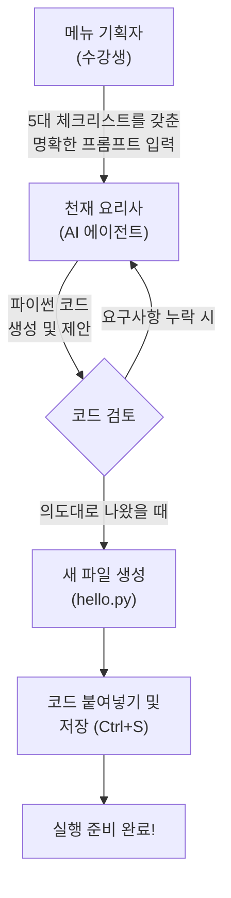

# 마이크로 세션: 015 — 프롬프트로 첫 파이썬 코드 생성

> **세션 ID**: MS-PY101-015
> **소요 시간**: 20분
> **난이도**: low
> **청크 타입**: lab
> **버전**: v2.1 (7섹션 구조)

---

## §1. 개요

> **Day 1 | PM | 세션 015/022**

### 🎯 학습 목표

이 세션이 끝나면, 수강생은 다음을 할 수 있습니다:

- 코드를 직접 타이핑하는 대신 명확한 프롬프트를 통해 AI에게 파이썬 코드 생성을 지시할 수 있다
- Vibe Coding(단순 지시)의 위험성을 이해하고, 5대 체크리스트에 맞춰 요구사항을 작성할 수 있다
- 생성된 코드를 복사하여 `.py` 확장자를 가진 파일로 올바르게 저장할 수 있다

### 선행 세션 환기

이전 세션(세션-014)에서 우리는 uv pip를 사용해 텅 빈 가상환경에 필요한 패키지들을 설치해 보았습니다. 완벽하게 격리된 우리만의 주방이 드디어 완성된 것이죠. 도마도 새것이고, 칼도 잘 갈려 있습니다. 이제 이 완벽한 주방에서 첫 번째 요리를 만들어볼 차례입니다. 보통 프로그래밍 첫 시간이라고 하면 하얀 화면을 띄워놓고 영어로 `print("Hello World")`를 한 글자씩 따라 치게 만듭니다. 오타가 나서 에러가 뜨면 어디가 틀렸는지 몰라 당황하기 일쑤였죠. 하지만 우리는 다르게 접근합니다. 빈 화면을 보며 두려워할 필요가 전혀 없습니다. 우리는 코더가 아니라 기획자이기 때문입니다. 복잡한 파이썬 문법은 등 뒤에 든든하게 서 있는 AI 비서에게 맡기고, 우리는 어떤 프로그램이 필요한지 정확하게 지시하는 방법만 배우면 됩니다.

---

## §2. 핵심 개념 (+ 🗣️ 강사 대본 + Mermaid)

### 요리사에게 레시피 주문하기

첫 파이썬 코드를 짜는 과정을 레스토랑에 비유해 보겠습니다. 여러분은 세계 최고의 요리사가 일하는 미슐랭 3스타 레스토랑의 총괄 매니저이자 메뉴 기획자입니다. 주방에는 어떤 요리든 뚝딱 만들어내는 천재 요리사(AI 에이전트)가 대기하고 있습니다. 

만약 여러분이 요리사에게 "알아서 맛있는 거 하나 만들어줘"라고 주문하면 어떻게 될까요? 요리사는 자기가 제일 좋아하는 매운 마라탕을 만들어 올지도 모릅니다. 손님은 매운 것을 전혀 못 먹는 어린아이인데 말이죠. 이렇게 AI에게 대충 뭉뚱그려 지시하는 것을 업계 용어로 **바이브 코딩(Vibe Coding)**이라고 부릅니다. 바이브 코딩은 운이 좋으면 그럴듯한 결과가 나오지만, 실전 비즈니스에서는 치명적인 사고로 이어집니다.

원하는 요리를 정확히 얻어내려면 주문서가 구체적이어야 합니다. "손님이 아이니까 맵지 않게 해주고(제약 조건), 알레르기가 있으니 땅콩은 절대 넣지 말고(예외 처리), 부드러운 소고기를 써서(입력) 달콤한 함박 스테이크(출력)를 만들어줘(기능)"라고 명확하게 지시해야 합니다. AI에게 코드를 부탁할 때도 똑같습니다. 이 주문서 역할을 하는 것이 바로 **프롬프트 5대 체크리스트**입니다.

🗣️ **강사 대본 (Instructor Script)**:

> 여러분, 드디어 첫 코딩 시간입니다. 그런데 키보드에서 손을 잠깐 떼보실까요? 우리는 오늘 단 한 줄의 영어 코드도 직접 치지 않을 겁니다. 
>
> 여러분의 직업은 오늘부터 코더가 아닙니다. 코더는 이미 여러분 화면 오른쪽에 앉아 있는 AI 비서가 세계 최고입니다. 여러분의 진짜 역할은 총괄 매니저입니다. 초보자분들이 AI를 쓸 때 가장 많이 하는 실수가 뭔지 아세요? 바로 "알아서 파이썬 코드 하나 짜줘"라고 대충 말하는 겁니다. 이렇게 지시하면 AI는 정말 '자기 마음대로' 코드를 짭니다.
>
> 코딩은 AI가 하지만, 꼼꼼한 정책 설계는 여러분이 직접 해주셔야 합니다. 기능은 무엇인지, 어떤 값을 입력받을지, 예외 상황은 어떻게 처리할지 명확하게 지시해야 환각 없는 정확한 코드를 받을 수 있어요. 오늘 우리는 "Hello World"를 출력하는 아주 단순한 프로그램에 사용자의 이름을 물어보는 기능을 더해서, AI에게 완벽한 레시피를 주문해 볼 겁니다.

> 💡 **강사 노트**: v1.0의 "통역사에게 편지 대필" 비유를 "요리사에게 레시피 주문" 비유로 전환 및 확장했습니다. 가상환경(주방) 비유와 자연스럽게 이어지며, 5대 체크리스트(재료, 조리법, 주의사항 등)를 설명하기 훨씬 직관적입니다.

### Mermaid 다이어그램



---

## §3. 상세 내용

### Why — 왜 직접 코딩하지 않고 프롬프트로 지시하는가?

"그래도 명색이 프로그래밍 수업인데, 제가 직접 파이썬 문법을 외워서 쳐야 하는 것 아닌가요?"라는 의문이 드실 수 있습니다. 아주 자연스러운 걱정입니다. 하지만 시대가 변했습니다. 괄호 하나 빼먹어서 밤새 오류를 찾던 시절은 지났습니다. AI 시대의 개발 경쟁력은 '누가 오타 없이 코드를 잘 치는가'에서 '누가 비즈니스 로직의 구멍을 잘 찾아내고 명확하게 지시하는가'로 완전히 넘어갔습니다.

AI는 문법 천재입니다. 하지만 AI는 사람의 마음을 읽지 못하며, 비즈니스의 맥락을 알지 못합니다. 여러분이 정책과 규칙을 촘촘하게 짜주지 않으면 AI는 엉성한 프로그램을 만듭니다. 그래서 우리는 타이핑 연습을 할 시간에, AI가 헷갈리지 않도록 명확한 업무 지시서(Prompt)를 작성하는 훈련에 집중하는 것입니다.

### What — 프롬프트 5대 체크리스트란 무엇인가?

AI에게 완벽한 코드를 얻어내기 위해 반드시 포함해야 하는 5가지 핵심 요소가 있습니다. 이를 '프롬프트 5대 체크리스트'라고 부릅니다.

1. **기능 (Function)**: 프로그램이 궁극적으로 해야 할 역할을 한 문장으로 정의합니다. (예: 사용자에게 인사하는 프로그램)
2. **입력 (Input)**: 프로그램이 실행될 때 어떤 데이터가 들어가야 하는지 명시합니다. (예: 사용자의 이름 텍스트)
3. **출력 (Output)**: 프로그램이 계산을 마친 후 어떤 형태로 결과를 내놓아야 하는지 지정합니다. (예: "안녕하세요, [이름]님!" 형식의 문장)
4. **제약 조건 (Constraints)**: 반드시 지켜야 할 규칙이나 피해야 할 방식을 정해줍니다. (예: 외부 라이브러리 사용 금지, 파이썬 내장 기능만 사용할 것)
5. **예외 처리 (Exception Handling)**: 사용자가 예상치 못한 엉뚱한 행동을 했을 때 어떻게 방어할 것인지 대비합니다. (예: 이름을 입력하지 않고 엔터를 치면 "이름을 다시 입력해주세요"라고 안내할 것)

이 다섯 가지를 꼼꼼히 챙기면, AI는 여러분의 의도에서 단 1밀리미터도 벗어나지 않는 정확하고 안전한 파이썬 코드를 만들어냅니다.

### How — 만들어진 대본(코드)을 어떻게 다루는가?

이렇게 5대 체크리스트를 바탕으로 프롬프트를 입력하면, AI는 순식간에 파이썬 언어로 번역된 코드를 생성해 줍니다. 하지만 화면에 코드가 나타났다고 해서 프로그램이 완성된 것은 아닙니다. 이것은 아직 AI의 입 밖으로 나온 '말'일 뿐입니다. 이 말을 컴퓨터가 언제든 읽고 실행할 수 있도록 종이에 적어서 보관해야 합니다.

그 보관함이 바로 **파일**입니다. 파일 이름을 지을 때 가장 중요한 규칙이 하나 있습니다. 반드시 파일 이름 끝에 `.py`라는 꼬리표(확장자)를 붙여야 합니다. 예를 들어 `hello.py`처럼 말이죠. 만약 실수로 `hello.txt`라고 저장한다면 컴퓨터는 이 파일을 그저 평범한 메모장 글로 취급합니다. `.py` 확장자는 컴퓨터에게 "이 안에는 파이썬 통역사가 읽어야 할 아주 중요한 대본이 들어있다"라고 알려주는 강력한 신호입니다. 확장자를 제대로 붙이고 저장을 완료해야 비로소 코드를 실행할 준비가 끝납니다.

---

## §4. 실습 가이드 (+ 🎙️ 실습 대본)

### 실습 목표

이 실습을 통해 수강생은 프롬프트 5대 체크리스트를 적용하여 AI에게 첫 파이썬 코드를 요청하고, 생성된 코드를 `.py` 파일로 올바르게 저장하는 전 과정을 경험합니다.

🎙️ **실습 가이드 대본 (Lab Guide)**:

> 자, 이제 여러분의 AI 비서를 호출해서 직접 코드를 받아보겠습니다. 화면 오른쪽에 있는 Agent Manager 창을 열어주세요. 
>
> 그냥 "인사하는 파이썬 코드 짜줘"라고 대충 말하지 않을 겁니다. 제가 화면에 5대 체크리스트가 모두 포함된 아주 정교한 프롬프트를 띄워드릴 테니, 이 내용을 그대로 Agent에게 전달해 보세요. 코드가 생성되면 왼쪽 탐색기에 빈 파일을 만들고 붙여넣을 겁니다. 확장자 `.py` 잊지 마시고요. 천천히 하나씩 따라오시면 됩니다!

### AI에게 코드 생성 요청 단계표

| 단계 | 소요 시간 | 강사 지시사항 | 학습자 액션 | 예상 결과 |
|------|----------|--------------|------------|----------|
| 1 | 2분 | "5대 체크리스트 프롬프트를 입력하세요" | 아래 제공된 상세 프롬프트를 Agent에 복사/붙여넣기 | AI가 파이썬 코드 블록을 생성 |
| 2 | 1분 | "생성된 코드의 복사 버튼을 누르세요" | 코드 블록 우측 상단의 Copy 아이콘 클릭 | 코드가 클립보드에 복사됨 |
| 3 | 1분 | "새 파일을 만들고 이름을 지어주세요" | 좌측 탐색기 우클릭 → New File → `hello.py` 입력 | 빈 `hello.py` 파일이 에디터에 열림 |
| 4 | 1분 | "코드를 붙여넣고 반드시 저장하세요!" | 에디터에 Ctrl+V (붙여넣기) 후 Ctrl+S (저장) | 탭의 동그란 아이콘이 X로 변하며 저장 완료 |

**[단계 1] 5대 체크리스트가 적용된 프롬프트 입력**

Agent Manager 채팅창에 아래의 내용을 그대로 복사해서 입력하고 엔터를 치세요:

```text
다음 5대 체크리스트 정책에 맞춰서 파이썬 코드를 작성해 줘.

1. 기능: 사용자에게 이름을 물어보고, 그 이름과 함께 Hello World 인사를 건네는 프로그램
2. 입력: 사용자의 이름 (텍스트)
3. 출력: "Hello World! 환영합니다, [이름]님!" 형태의 메시지
4. 제약 조건: 파이썬 기본 기능만 사용할 것. 주석을 한글로 자세히 달아줄 것.
5. 예외 처리: 사용자가 아무것도 입력하지 않고 엔터를 치면 "이름이 입력되지 않았습니다. 다시 실행해주세요."라고 출력하고 종료할 것.
```

**[단계 2] 코드 복사하기**

AI가 요청을 분석하고 네모난 상자(코드 블록) 안에 파이썬 코드를 만들어 줍니다. 코드를 드래그해서 복사할 필요 없이, 코드 상자 오른쪽 위에 있는 조그만 '복사(Copy)' 아이콘을 클릭하기만 하면 됩니다.

**[단계 3] hello.py 파일 생성**

이제 우리의 작업 공간인 에디터 영역으로 갑니다. 화면 왼쪽의 파일 탐색기 빈 공간에서 마우스 오른쪽 버튼을 클릭하고 `New File`(새 파일)을 선택하세요. 
파일 이름을 입력하는 칸이 나오면 `hello.py`라고 정확히 타이핑하고 엔터를 칩니다. 파일 아이콘이 파이썬 로고(파란색과 노란색 뱀 모양)로 변하는 것을 확인하세요.

**[단계 4] 코드 붙여넣기 및 저장**

방금 만든 `hello.py` 파일의 빈 화면을 클릭하고, 복사해둔 코드를 붙여넣기(`Ctrl + V` 또는 Mac은 `Cmd + V`) 합니다. 
마지막으로 가장 중요한 관문입니다! 키보드의 `Ctrl + S`(Mac은 `Cmd + S`)를 눌러 파일을 저장하세요. 에디터 윗부분의 파일 이름 옆에 있던 하얀색 동그라미(수정됨 표시)가 사라지면 정상적으로 저장된 것입니다. 

### 트러블슈팅 FAQ

| Q | A |
|---|---|
| 파일 아이콘이 파이썬 모양이 아니라 그냥 줄무늬 종이 모양이에요. | 확장자를 잘못 입력하셨습니다. `hello.py`가 아니라 `hello.txt`나 `hello`로 만들어졌을 가능성이 높습니다. 파일명에서 우클릭 후 'Rename'을 선택해 끝에 `.py`를 명확히 붙여주세요. |
| AI가 짜준 코드가 제가 본 예시와 조금 달라요. 괜찮은가요? | 네, 완전 정상입니다! 요리사마다 양파 써는 순서가 약간 다르듯, AI 모델에 따라 변수 이름이나 코드 줄 순서가 조금씩 다를 수 있습니다. 핵심 로직만 5대 체크리스트를 충족하면 아무 문제 없습니다. |
| 저장을 안 하면 어떻게 되나요? | 코드를 화면에 띄워만 놓고 터미널에서 실행하면, 컴퓨터는 저장된 마지막 상태(빈 파일)만 읽습니다. 그래서 아무 결과도 나오지 않게 됩니다. 코드가 한 글자라도 수정되면 습관적으로 `Ctrl + S`를 누르셔야 합니다. |
| AI가 코드 밑에 긴 설명을 영어로 달아줬어요. 이것도 복사해야 하나요? | 아닙니다. 네모난 코드 블록 안쪽에 있는 파이썬 코드만 복사하시면 됩니다. 바깥에 있는 설명은 여러분을 위한 해설지일 뿐입니다. |
| 에디터에 코드를 붙여넣었는데 글자 색깔이 전부 하얀색이에요. | 이 역시 파일 확장자가 `.py`로 지정되지 않아서 에디터가 파이썬 코드인지 인식하지 못했기 때문입니다. 파일 이름을 다시 확인해 보세요. 정상적이라면 알록달록한 구문 강조(Syntax Highlighting)가 적용되어야 합니다. |

---


### 🎓 강사 노트 (Instructor Support)

- ⏱️ **타이밍**: 15:45 (20분, lab)
- 🎯 **핵심 활동**: AI에게 코드 요청 → 파일 저장
- ⚠️ **강사 주의사항**: 🎉 첫 코드! 분위기 축하 필수


### 📋 실습 설계 보강 (Lab Packet)

**세션 015 실습 설계 보강**

프롬프트로 첫 파이썬 코드 생성
- **3-Stage Example Set**
  - 기본: AI에게 "이름을 입력받아 인사하는 파이썬 프로그램 만들어줘" → 코드 복사 → .py 저장
  - 변형: "나이도 물어보고 태어난 해를 계산해주는 기능 추가해줘"
  - 실수 해결: 코드를 복사할 때 들여쓰기가 깨지는 경우 → 코드 블록 전체 선택 방법
- **난이도 예측**: "AI가 준 코드를 어디에 어떻게 저장하지?" — 파일 저장 워크플로우가 핵심
- **타이밍 가이드**: 프롬프트 작성 3분 | AI 응답 확인 3분 | 코드 복사·저장 5분 | 변형 실험 5분 | 정리 4분
- **심리적 장벽**: "AI가 준 코드를 이해 못 해도 괜찮은 건가?"
- **자가 점검**:
  - [ ] .py 확장자로 파일을 저장했는가?
  - [ ] AI가 생성한 코드에 `input()`과 `print()`가 포함되어 있는가?
  - [ ] 코드를 복사할 때 들여쓰기가 유지되었는가?

## §5. 코드 및 명령어 모음

### 실습 사용 프롬프트 템플릿 (5대 체크리스트)

이 템플릿은 앞으로 어떤 파이썬 프로그램을 만들든 두고두고 활용할 수 있는 마법의 공식입니다. 어딘가에 메모해 두시길 강력히 권장합니다.

```text
다음 정책에 맞춰 파이썬 코드를 작성해 줘.

1. 기능: [만들고자 하는 프로그램의 핵심 목적]
2. 입력: [사용자나 시스템으로부터 받을 데이터]
3. 출력: [최종적으로 화면에 보여지거나 저장될 결과물]
4. 제약 조건: [사용할 라이브러리, 지켜야 할 코딩 스타일 등]
5. 예외 처리: [오류가 날 수 있는 상황과 그 대처 방법]
```

### AI 생성 예상 코드 (참고용)

여러분의 AI가 생성한 코드는 대략 아래와 같은 형태를 띨 것입니다. 코드를 직접 칠 필요는 없지만, "아, 파이썬 언어는 이렇게 생겼구나" 하고 눈으로 한 번 읽어보세요.

```python
# 사용자에게 이름을 입력받습니다.
user_name = input("이름을 입력해 주세요: ")

# 예외 처리: 이름을 입력하지 않은 경우
if user_name.strip() == "":
    print("이름이 입력되지 않았습니다. 다시 실행해주세요.")
else:
    # 정상적으로 입력된 경우 환영 인사 출력
    print(f"Hello World! 환영합니다, {user_name}님!")
```

> 🤖 **AI가 사용한 파이썬 문법 힌트**: `input()`은 사용자에게 답변을 기다리는 기능이고, `print()`는 화면에 글자를 뿌려주는 기능입니다. `if`는 예외 상황을 걸러내는 문지기 역할을 합니다.

---

## §6. 요약

### 핵심 학습 포인트

이번 세션에서 우리는 타이핑이라는 낡은 족쇄를 끊어내고, 기획자로서 AI에게 코드를 지시하는 경험을 했습니다. 반드시 기억해야 할 세 가지 핵심입니다.
1. **바이브 코딩의 위험성**: AI에게 "알아서 짜줘"라고 대충 지시하면 엉뚱한 결과가 나옵니다. 우리는 구체적인 룰을 설계하는 기획자가 되어야 합니다.
2. **프롬프트 5대 체크리스트**: 완벽한 코드를 얻기 위해서는 기능, 입력, 출력, 제약, 예외처리라는 5가지 요소를 프롬프트에 반드시 명시해야 합니다.
3. **확장자 `.py`와 저장의 중요성**: 만들어진 코드는 반드시 `.py`로 끝나게 저장해야 파이썬 대본으로 인정받으며, `Ctrl + S`로 저장을 완료해야 컴퓨터가 읽을 수 있습니다.

### 다음 세션 예고

"확장자도 맞췄고, 저장도 완벽하게 했습니다. 이제 이 프로그램이 진짜로 돌아가는지 보고 싶어 미치겠어요!" 맞습니다. 이제 우리가 주문해서 받아낸 이 레시피(코드)를 주방의 가스레인지 위에 올려서 불을 켤 시간입니다. 다음 세션에서는 통합 터미널을 이용해 코드를 실제로 실행해 볼 것입니다. 

### 브릿지 노트

> "코드가 우리 작업실에 완벽하게 안착했습니다. 그런데 여러분, 당장 실행 버튼을 누르고 싶으시죠? 잠깐만 멈춰보세요! 실행하기 전에 우리가 꼭 지켜야 할 아주 중요한 개발자의 의식이 하나 남아있습니다. 코드를 능동적으로 씹어 먹는 방법, 바로 '예측'입니다. 다음 세션에서는 실행을 잠깐 참는 메타인지 학습법으로 들어가보겠습니다."

---

## §7. 참고 자료

### 3-Source 출처

- **Source A (로컬 참고자료)**: 「AI 시대의 서사 v3 - Claude.md」 — 문법 암기 시대의 종말과 '문제 정의(What)' 능력이 중요해진 패러다임 전환 논의
- **Source B (NotebookLM)**: SRC-B01 — Vibe Coding의 위험성과 환각 차단을 위한 프롬프트 5대 체크리스트(기능, 입력, 출력, 제약, 예외처리) 정의
- **Source C (Deep Research)**: SRC-C01 — 예측-검증-설명을 위한 능동적 코드 읽기 훈련 및 명세 기반 개발(SDD)의 초석

### 강사 노트

> 💡 **강사 노트**: 본 세션은 수강생들이 처음으로 실제 코드를 화면에 올리는 매우 상징적인 순간입니다. 하지만 절대 키보드로 파이썬 문법을 설명하는 쪽으로 빠지지 않도록 주의하세요. 수강생이 코더가 아니라 "매니저이자 기획자"라는 점을 지속적으로 환기시켜야 합니다.
> 
> 실습 중 파일 저장(`Ctrl + S`)을 깜빡하는 수강생이 반드시 10~20% 정도 나옵니다. 다음 세션에서 코드를 실행할 때 "아무것도 안 나와요"라는 질문이 나올 것을 대비해, 에디터 탭의 저장 표시(흰 동그라미 유무)를 보는 방법을 다시 한번 짚어주시면 매우 좋습니다.

---

## ✅ 세션 완료 체크리스트 (강사용)

- [ ] §1~§7 모든 섹션이 충실하게 작성되었는가?
- [ ] '요리사에게 레시피 주문' 비유가 §2에서 충분히 서술형으로 설명되었는가?
- [ ] Vibe Coding의 위험성과 5대 체크리스트 요소가 누락 없이 포함되었는가?
- [ ] 단계별 실습 표에 구체적인 프롬프트 복사/붙여넣기 및 파일 저장 절차가 명시되었는가?
- [ ] 트러블슈팅 FAQ에 확장자 및 저장 관련 이슈가 포함되었는가?
- [ ] 다음 세션 브릿지에서 '예측'의 중요성을 강조하는 멘트가 들어갔는가?
- [ ] 3-Source 팩트 패킷의 출처가 §7에 명확하게 표기되었는가?

---

**🔗 선행 세션**: [세션-014] uv pip로 패키지 설치 체험 (권장)  
**🔗 후행 세션**: [세션-016] 코드 실행과 예측-검증-설명 경험

---

*작성 일시: 2026-02-25*  
*작성 에이전트: A4B_Session_Writer*  
*교안 구조: 7섹션 (A0 팀 공통 표준)*