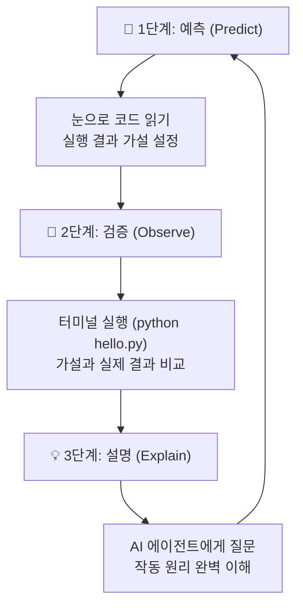

# 마이크로 세션: 016 — 코드 실행과 예측-검증-설명

> **세션 ID**: MS-PY101-016
> **소요 시간**: 20분
> **난이도**: low
> **청크 타입**: lab
> **버전**: v2.1 (7섹션 구조)

---

## §1. 개요

> **Day 1 | PM | 세션 016/022**

### 🎯 학습 목표

이 세션이 끝나면, 수강생은 다음을 할 수 있습니다:

- 코드를 무작정 실행하는 습관을 버리고, 실행 전 결과를 논리적으로 추론하는 예측(Predict) 단계를 수행할 수 있다
- 터미널을 이용해 파이썬 코드를 직접 실행하고 내 예측과 실제 결과를 비교하는 검증(Observe) 단계를 거칠 수 있다
- AI 에이전트에게 코드의 각 줄이 의미하는 작동 원리를 묻고 내 언어로 설명(Explain)하는 메타인지 학습을 완료할 수 있다

### 선행 세션 환기

바로 전 세션(015)에서 우리는 프롬프트를 작성해 생애 첫 파이썬 코드인 `hello.py`를 무사히 만들어 냈습니다. 에디터 화면에 여러분이 만들어낸 코드가 반짝거리고 있을 겁니다. 당장 터미널에 실행 명령어를 치고 엔터를 힘껏 누르고 싶은 마음이 드실 텐데요. 하지만 아주 잠깐만 손을 멈춰주세요. 

코딩에서 정말 중요한 능력은 결과를 가장 빨리 보는 것에 있지 않습니다. 이 짧은 코드가 컴퓨터 안에서 도대체 어떤 논리적인 순서로 흘러갈지 머릿속에 먼저 그려보는 능력이 훨씬 더 중요합니다. 오늘 우리는 바로 그 '잠깐 멈추고 생각하기'라는 디버깅의 첫 단추를 꿰어보겠습니다.

---

## §2. 핵심 개념 (+ 🗣️ 강사 대본 + Mermaid)

### 마술 쇼 관객에서 과학 실험실의 연구원으로

AI가 대신 짜준 코드를 그저 복사해서 붙여넣고 곧바로 실행 버튼을 누르는 태도는 마술 쇼를 구경하는 관객의 태도와 똑같습니다. 마술사가 빈 모자에서 비둘기를 꺼낼 때 "우와, 정말 신기하다!" 하고 손뼉을 치는 것에 불과해요. 이런 방식으로는 평생 관객석에만 머물러야 합니다. 코딩 실력은 한 발자국도 늘지 않습니다.

우리는 마술 쇼 관객이 아니라 **과학 실험실의 연구원**이 되어야 합니다. 연구원들은 실험실에서 기계 스위치를 켜기 전에 반드시 '가설'을 세웁니다. "A라는 용액과 B라는 용액을 섞으면 아마 빨간색으로 변할 거야"라고 먼저 예측(Predict)을 하죠. 그런 다음 진짜로 두 용액을 섞어보고 결과를 두 눈으로 관찰(Observe)합니다. 만약 빨간색이 아니라 파란색이 나왔다면 실패했다고 실망할까요? 아닙니다. "왜 파란색이 나왔지?" 하고 원인을 끝까지 파헤쳐서 스스로 설명(Explain)해 냅니다.

이 예측, 관찰, 설명이라는 세 단계를 묶어서 POE(Predict-Observe-Explain) 사이클이라고 부릅니다. 이 사이클이야말로 AI가 코드를 대신 짜주는 시대에 우리 인간이 가져야 할 가장 강력하고 날카로운 무기입니다. 코드는 AI가 짜더라도, 그 코드를 완전히 지배하고 논리를 이해하는 통제권은 언제나 우리의 몫이어야 합니다.

🗣️ **강사 대본 (Instructor Script)**:

> 여러분, 화면에 방금 만든 `hello.py` 코드가 띄워져 있죠? 지금 당장 실행 명령어를 치고 싶은 마음을 딱 5초만 참아봅시다. 키보드에서 손을 완전히 떼고 두 손을 무릎에 얹어주세요.
>
> 우리는 지금부터 코더가 아니라 과학자가 될 겁니다. 훌륭한 과학자는 실험 스위치를 누르기 전에 "이 스위치를 누르면 화면에 어떤 일이 일어날까?"를 먼저 상상합니다. 코드를 위에서부터 아래로 천천히 눈으로 따라가 보세요. `input`이나 `print` 같은 생소한 영어 단어의 뜻을 아직 몰라도 괜찮습니다. 흐름을 짐작해 보는 거예요. "아, 내 이름을 물어보려고 프로그램이 멈춰서 기다리겠구나", "이름을 치면 인사를 하겠구나"라고 말이죠.
> 
> 결과를 머릿속으로 미리 그려보고 나서 실행을 해야, 내 생각이 맞았을 때의 짜릿함도 두 배가 되고 틀렸을 때 무엇을 잘못 알았는지 정확하게 짚고 넘어갈 수 있습니다. 이것이 그 유명한 '예측-검증-설명' 학습법입니다.

> 💡 **강사 노트**: AI 자동화 시대에 코딩 입문자가 겪는 가장 흔하고 위험한 함정인 '이해 없는 복사 붙여넣기(Blind Copy-Paste)'를 방지하기 위한 핵심 세션입니다. v2.0 교안의 마술쇼 비유를 능동적이고 주도적인 태도를 강조하는 과학 실험 관찰 일지 비유로 확장했습니다. 수강생들이 실제로 두 손을 무릎에 얹도록 물리적인 행동을 유도해 분위기를 확실히 환기해 주세요.

### Mermaid 다이어그램



---

## §3. 상세 내용

### Why — 왜 실행 전에 멈춰서 예측해야 하는가?

자판기에 백 원짜리 동전을 넣고 버튼을 누르면 달콤한 음료수가 나옵니다. 우리는 굳이 자판기 안에서 어떤 톱니바퀴와 기계장치가 맞물려 돌아가는지 알 필요가 없습니다. 하지만 프로그래밍은 자판기 앞의 소비자가 되는 일이 아닙니다. 우리 스스로 자판기의 내부를 설계하는 일입니다. 

AI가 아무리 완벽하고 훌륭한 코드를 짜주더라도, 그 코드가 내부적으로 어떻게 흘러가는지 파악하지 못하면 아주 사소한 에러 앞에서도 무너집니다. 기능을 아주 조금만 바꾸고 싶어도 어디를 고쳐야 할지 몰라 완전히 막혀버리죠. 그렇기 때문에 우리 스스로 생각의 끈을 단단히 이어가는 메타인지 학습이 반드시 필요합니다. 코드를 실행하기 전 딱 3초 멈춰서 생각하는 이 짧은 시간이 여러분의 진짜 디버깅 근육을 키우는 가장 확실한 훈련법입니다.

### What — POE 사이클이란 무엇인가?

**1. 예측 (Predict)**
파이썬 코드는 기본적으로 위에서 아래로 순서대로 실행됩니다. 영어 문장을 소리 내어 읽듯이 코드를 한 줄씩 훑어보는 단계입니다. 프로그램이 사용자에게 무엇을 물어볼지, 화면에 어떤 형태의 글자가 나타날지 미리 머릿속으로 시나리오를 그려봅니다. 

**2. 검증 (Observe/Verify)**
상상을 마쳤다면 터미널에 명령어를 입력해 코드를 실제로 실행합니다. 머릿속으로 상상했던 결과가 화면에 정확히 똑같이 나타나는지 두 눈으로 확인합니다. 만약 상상과 전혀 다른 결과가 나왔거나 새빨간 에러 메시지가 떴다면, 그것은 절대 실패가 아닙니다. 나의 오개념을 확실하게 바로잡을 아주 좋은 신호입니다.
상상을 마쳤다면 터미널에 명령어를 입력해 코드를 실제로 실행합니다. 머릿속으로 상상했던 결과가 화면에 정확히 똑같이 나타나는지 두 눈으로 확인합니다. 

특히 초보자 시절에는 내 예측이 틀리는 경우가 훨씬 많습니다. 만약 상상과 전혀 다른 결과가 나왔거나 새빨간 에러 메시지가 떴다면, 그것은 절대 실패가 아닙니다. 오히려 나의 오개념을 확실하게 바로잡을 아주 좋은 신호입니다. 예측이 틀렸을 때 느끼는 가벼운 당혹감이 뇌를 자극해서 훨씬 더 깊은 장기 기억으로 연결해 줍니다.

**3. 설명 (Explain)**
프로그램이 잘 돌아간다고 해서 거기서 멈추면 안 됩니다. 내 코드를 100% 내 것으로 만들어야 합니다. AI 비서에게 "이 코드에서 저 단어는 정확히 무슨 역할을 해?", "왜 꼭 이런 순서로 짜야 해?"라고 질문하세요. 완벽하고 쉬운 해설을 듣고 완벽하게 납득하고 넘어가는 것이 마지막 단계입니다. 


설명 단계에서는 반드시 '나만의 언어'로 번역하는 과정이 필요합니다. AI가 "input 함수는 표준 입력을 받는 내장 함수입니다"라고 사전처럼 딱딱하게 대답한다면, "내가 이해하기 어려우니 식당에서 주문받는 웨이터에 비유해서 다시 설명해 줘"라고 거듭 요구하세요. 내가 완전히 납득할 때까지 질문을 포기하지 않는 것이 핵심입니다.
### How — 코드를 읽고 실행하는 방법

우리가 작성한 코드는 대본이나 레시피와 같습니다. 파이썬은 그 대본을 충실하게 연기하는 배우입니다. 터미널 창에 `python hello.py`라고 치는 것은 컴퓨터에게 "파이썬아, 지금부터 `hello.py`라는 대본을 펼쳐서 연기해!"라고 명확하게 지시를 내리는 것과 같습니다.

만약 코드를 에디터에 적기만 하고 저장을 잊었다면 어떻게 될까요? 컴퓨터의 하드디스크에는 여전히 아무 내용도 없는 빈 대본만 남아있습니다. 에디터 탭의 파일 이름 옆에 동그란 하얀 점이 떠 있다면 아직 저장되지 않았다는 뜻입니다. 반드시 `Ctrl + S`(macOS는 `Cmd + S`)를 눌러 대본을 확실히 저장한 후에 실행해야 파이썬이 올바른 연기를 할 수 있습니다.

> ✅ **체크포인트**: 잠시 배운 내용을 스스로 점검해 보세요.
> - 코드를 실행하기 전 반드시 거쳐야 하는 첫 번째 단계는 무엇인가요? ("결과를 머릿속으로 먼저 예측하기")
> - 파일 이름 옆에 동그란 점이 떠 있다면 무슨 뜻인가요? ("파일이 아직 저장되지 않았다")

---

## §4. 실습 가이드 (+ 🎙️ 실습 대본)

### 실습 목표

수강생은 직접 만든 `hello.py` 코드를 바탕으로 POE(예측-검증-설명) 사이클을 한 바퀴 온전히 완주합니다. 더불어 AI에게 코드의 원리 설명을 요구하는 프롬프트를 직접 작성하는 경험을 합니다.

🎙️ **실습 가이드 대본 (Lab Guide)**:

> 자, 드디어 실험 스위치를 켤 시간이 왔습니다. 방금 전 세션에서 만들어 둔 코드 창을 띄워주세요. 제가 드리는 4단계 지시를 차근차근 따라오시면 됩니다. 무작정 엔터를 치면 안 됩니다. 단계별로 제가 말씀드리는 타이밍을 꼭 지켜서 같이 가볼게요.

### POE 실습 단계표

| 단계 | 소요 시간 | 강사 지시사항 | 학습자 액션 | 예상 결과 |
|------|----------|--------------|------------|----------|
| 1. 예측 | 1분 | "코드를 눈으로만 읽고 터미널에 첫 번째로 뜰 문장을 상상하세요" | 첫 줄부터 세 번째 줄까지 눈으로 훑기 | 입력 대기 문구 예측 완료 |
| 2. 준비 | 1분 | "터미널을 클릭하고 `python hello.py`를 타이핑하되 엔터는 치지 마세요" | 터미널에 명령어 입력 대기 | 실행 직전 상태 진입 |
| 3. 검증 | 2분 | "엔터를 치세요! 이름을 입력하고 결과를 확인하세요" | Enter 키 입력 → 이름 타이핑 → 결과 확인 | 예측한 출력 결과가 눈앞에 나타남 |
| 4. 설명 | 3분 | "Agent 창으로 가서 실행한 코드의 작동 원리를 물어보세요" | AI 비서에게 해설 요청 프롬프트 입력 | 쉬운 비유로 된 코드 해설 획득 |

**[실습 단계 1] 예측하기 (Predict)**
에디터 화면의 코드를 천천히 훑어봅니다. 만약 `name = input("이름을 입력하세요: ")` 라는 코드가 있다면, 실행했을 때 가장 먼저 무슨 일이 일어날지 속으로 대답해 보세요. "아마 프로그램이 내 이름을 물어보고 내가 타이핑할 때까지 기다리겠구나!"라고 추측하셨나요? 아주 훌륭한 가설입니다.

**[실습 단계 2] 검증 준비하기 (Prepare)**
화면 아래 터미널 창을 마우스로 한 번 클릭하고 아래 명령어를 조심스럽게 입력합니다. 
`python hello.py`
거듭 강조하지만 아직 엔터 키를 누르지 마세요. 가볍게 숨을 고르고, 내 예측이 진짜로 맞을지 마지막으로 확신을 가져보는 겁니다.

**[실습 단계 3] 검증 및 실행하기 (Observe)**
이제 힘차게 엔터 키를 쳐봅시다. 화면에 "이름을 입력하세요: "라는 메시지가 뜨고 네모난 커서가 깜빡이나요? 여러분의 가설이 아주 정확히 들어맞았습니다! 그 자리에 본인의 이름을 타이핑하고 다시 엔터를 쳐보세요. 프로그램이 내 이름을 부르며 환영 인사를 건넬 겁니다.

**[실습 단계 4] 해설사에게 묻기 (Explain)**
실험 결과를 확인했으니 이제 그 비밀을 속속들이 파헤칠 차례입니다. 화면 우측의 Agent Manager 창을 열고 이렇게 질문을 던져보세요.
"방금 네가 짜준 파이썬 코드의 각 줄이 어떤 역할을 하는지 초등학생도 이해할 수 있게 비유를 써서 3줄로 설명해 줘. input이랑 print가 정확히 뭐야?"

AI 비서가 "input은 사람의 목소리를 듣는 마이크고, print는 화면에 글자를 뿌려주는 거대한 확성기야"라는 식으로 아주 명쾌하고 재미있게 해설해 줄 것입니다.

### 트러블슈팅 FAQ
> 💡 **강사 노트**: 설명 단계에서 수강생들이 질문을 피상적으로 던지고 넘어가지 않도록 주의를 기울여 주세요. "input은 마이크"라는 비유를 얻어냈다면, "그럼 print는 스피커인가요?"라고 스스로 유추해 볼 수 있도록 유도하는 것이 이상적인 교육 흐름입니다.

| Q | A |
|---|---|
| 엔터를 쳤는데 아무 일도 일어나지 않고 조용히 끝나요 | 에디터에서 `hello.py` 파일을 저장(Ctrl + S)했는지 확인해 보세요. 빈 파일을 실행하면 파이썬도 빈 연기를 하고 조용히 무대를 내려옵니다. |
| `python: can't open file 'hello.py'` 에러가 붉게 떴어요 | 터미널이 현재 폴더를 제대로 가리키고 있는지 확인해야 합니다. 파일 이름에 오타가 났을 가능성도 커요. `ls`나 `dir` 명령어로 현재 폴더에 파일이 잘 들어있는지 확인해 보세요. |
| 결과가 나오긴 했는데, 글자가 이상하게 깨져서 보여요 | 한글 인코딩 문제일 수 있습니다. 당황하지 말고 깨진 글자를 그대로 복사해서 AI에게 "이 결과가 왜 깨져서 나오는지 해결 방법을 찾아줘"라고 질문하세요. |
| 명령어를 쳤는데 "python을 찾을 수 없습니다"라고 나와요 | 우리 앞선 세션에서 파이썬 설치할 때 PATH 체크박스를 빼먹은 경우입니다. AI에게 이 에러 메시지를 복사해주면 파이썬을 다시 올바르게 설치하는 방법을 안내해 줄 겁니다. |

> ✅ **체크포인트**: AI 비서에게 질문해서 `input`과 `print`의 역할을 완전하게 이해하셨나요? 혹시 설명이 너무 어렵다면 "더 쉬운 일상생활 비유로 한 번 더 설명해 줘"라고 거듭 질문해 보세요.

>
> 만약 짝꿍이 있다면 방금 알게 된 원리를 짝꿍에게 한 문장으로 설명해 보세요. 남에게 설명할 수 있어야 진짜 내 지식이 됩니다.
---


### 🎓 강사 노트 (Instructor Support)

- ⏱️ **타이밍**: 16:15 (20분, lab)
- 🎯 **핵심 활동**: 결과 예측 → 실행 → 원리 설명
- ⚠️ **강사 주의사항**: 예측→검증→설명 루틴 첫 체험


### 📋 실습 설계 보강 (Lab Packet)

**세션 016 실습 설계 보강**

코드 실행과 예측-검증-설명 경험
- **3-Stage Example Set**
  - 기본: 코드 실행 전 "이름을 입력하면 인사가 출력될 것" 예측 → `python hello.py` 실행 → 결과 확인
  - 변형: 숫자를 입력해야 하는 곳에 문자를 입력 → 에러 발생 → AI에게 설명 요청
  - 실수 해결: `python hello.py` 대신 `python` 만 입력 → 대화형 모드 진입 → `exit()` 안내
- **난이도 예측**: "예측"이라는 행위 자체가 낯설음 — "맞추지 못하면 어쩌지?"
- **타이밍 가이드**: 예측 작성 3분 | 실행·검증 5분 | AI에게 설명 요청 5분 | 오답 실험 4분 | 정리 3분
- **심리적 장벽**: 예측이 틀릴까 봐 예측 자체를 회피
- **자가 점검**:
  - [ ] 실행 전에 결과를 종이나 메모에 예측해 적었는가?
  - [ ] 예측과 실제 결과를 비교했는가?
  - [ ] AI에게 "이 코드가 왜 이렇게 동작하는지 설명해줘"라고 질문했는가?

## §5. 코드 및 명령어 모음

### 명령어 1: 파이썬 스크립트 파일 실행

```bash
python hello.py
```

현재 터미널이 위치한 폴더 안에 있는 `hello.py` 파일을 읽어들여 처음부터 끝까지 실행하라는 명령어입니다. 우리가 파이썬을 다루면서 가장 많이 치게 될 아주 기본적인 명령입니다. 

### 명령어 2: 프롬프트 패턴 (코드 원리 해설 요청)

```text
방금 작성한 파이썬 코드의 각 줄이 어떤 역할을 하는지 초등학생도 알 수 있게 쉬운 비유로 설명해 줘.
코드에 나온 핵심 단어(예: input, print)의 정확한 의미도 반드시 포함해 줘.
```

결과만 대충 확인하고 넘어가는 수동적인 태도를 방지하기 위한 능동적 프롬프트입니다. 언제든 모르는 코드가 나오면 이 프롬프트를 활용해 나만의 1:1 과외를 받아보세요.

---
### 명령어 3: 파일 목록 확인 명령어 (경로 확인용)

```bash
ls (macOS/Linux)
dir (Windows)
```

터미널에서 현재 위치한 폴더 안에 어떤 파일들이 들어있는지 목록을 보여줍니다. `python hello.py`를 실행했는데 파일을 찾을 수 없다는 에러가 발생하면, 가장 먼저 이 명령어를 쳐서 진짜로 `hello.py`가 그 폴더에 존재하는지부터 확인해야 합니다.

> 🤖 **AI 프롬프트 예시**: "터미널에서 파일을 찾을 수 없다고 나와. 내가 지금 있는 폴더에 파일이 있는지 확인하는 명령어가 뭐야?"

## §6. 요약

### 핵심 학습 포인트

이번 세션에서 우리는 단순히 코드를 맹목적으로 실행하는 것을 넘어, 과학 실험실의 연구원처럼 코드에 조심스럽게 접근하는 방법을 배웠습니다. 꼭 기억해야 할 것은 딱 세 단어입니다. 예측(Predict), 검증(Observe), 설명(Explain). 실행하기 전에 먼저 결과를 논리적으로 추측해 보고, 터미널에서 실행해 실제 결과를 두 눈으로 확인한 뒤, AI 비서를 통해 작동 원리를 완벽히 내 언어로 흡수하는 이 사이클을 끊임없이 반복하세요. 이것이 기계가 코드를 대신 짜주는 시대에 코드를 온전히 통제하고 지배하는 진정한 기획자의 자세입니다.

### 다음 세션 예고

이제 코드를 성공적으로 실행했고 숨겨진 원리까지 확실하게 파악했습니다. 그렇다면 원래 있던 대본을 조금만 손봐서 전혀 다른 동작을 하게 만들 수도 있겠죠? 다음 세션에서는 우리가 직접 코드를 타이핑해서 고치는 대신, AI에게 내리는 프롬프트 지시사항을 아주 살짝 바꿔서 프로그램의 구조가 어떻게 근본적으로 변화하는지 관찰해 볼 겁니다.

### 브릿지 노트

> "여러분이 머릿속으로 예상한 대로 코드가 아주 완벽하게 돌아갔죠? AI 비서가 들려주는 설명도 찰떡같이 이해가 가셨을 겁니다. 자, 그런데 여기서 조금 더 욕심이 나지 않나요? 처음 인사를 건넬 때 이름만 묻는 게 아니라 나이도 같이 물어봐서 계산해 주면 더 근사한 프로그램이 될 텐데요. 다음 세션에서는 방금 썼던 프롬프트에 딱 한 줄을 추가해서 우리 프로그램을 2.0 버전으로 똑똑하게 업그레이드해 보겠습니다!"

---

## §7. 참고 자료

### 3-Source 출처

- **Source A (로컬 참고자료)**: 「AI 시대의 서사 v3 - Claude.md」(SRC-A01) — 예측-검증-설명 루프 원리와 기획자로서의 능동적 학습 태도
- **Source B (NotebookLM)**: SRC-B01 — 수동적 복사-붙여넣기 방지를 위한 메타인지 학습 비유 및 능동적 코드 검증 기법
- **Source C (Deep Research)**: SRC-C01 — 코드 데이터 처리 흐름 분석 및 파이썬 스크립트 실행의 내부 구조 명세

### 추가 학습 자료

- [Python 공식 자습서 - 파이썬 인터프리터 사용하기](https://docs.python.org/ko/3/tutorial/interpreter.html): 파이썬 스크립트 파일 실행 방식에 대한 공식 문서 가이드
- Antigravity IDE 공식 문서: 통합 터미널 활용 및 파일 저장부터 실행까지의 전체 라이프사이클

### 강사 노트

> 💡 **강사 노트**: 수강생들이 무의식적으로 터미널에서 명령어를 치고 엔터를 연달아 치는 습관을 교정하는 것이 이번 세션의 가장 핵심적인 과제입니다. 실습 단계에서 목소리 톤을 바꿔 '절대로 아직 엔터를 치지 마세요'라고 명확히 제동을 걸어주세요. 
> 
> 또한 `input` 함수가 실행되면 프로그램이 끝난 것이 아니라 터미널 창에서 키보드 입력을 기다리고 있다는 사실을 직관적으로 이해하지 못해 멍하니 화면만 바라보는 수강생이 종종 있습니다. "커서가 깜빡이는 곳에 여러분의 이름을 타이핑하고 다시 엔터를 쳐야 다음 과정으로 넘어갑니다"라고 현장에서 개별 안내를 꼭 더해주시면 좋습니다.

---

## ✅ 세션 완료 체크리스트 (강사용)

- [x] §1~§7 모든 섹션이 충실하게 작성되었는가?
- [x] 과학 실험실 비유(가설/예측-검증-설명)가 §2에서 충분히 전개되었는가?
- [x] POE 실습 단계표가 §4에 명확한 시간과 함께 제시되었는가?
- [x] 체크포인트 질문이 §3, §4에 적절히 배치되었는가?
- [x] 실행 전 파일 저장 여부를 확인하는 팁이 포함되었는가?
- [x] 3-Source 팩트 패킷의 내용이 §7에 정확히 반영되었는가?
- [x] 다음 세션(017) 브릿지 노트가 자연스럽게 포함되었는가?

---

**🔗 선행 세션**: [세션-015] 프롬프트로 첫 파이썬 코드 생성 (필수)  
**🔗 후행 세션**: [세션-017] 프롬프트 변형으로 코드 변화 관찰하기  

---

*작성 일시: 2026-02-25*  
*작성 에이전트: Antigravity*  
*교안 구조: 7섹션 (A0 팀 공통 표준)*