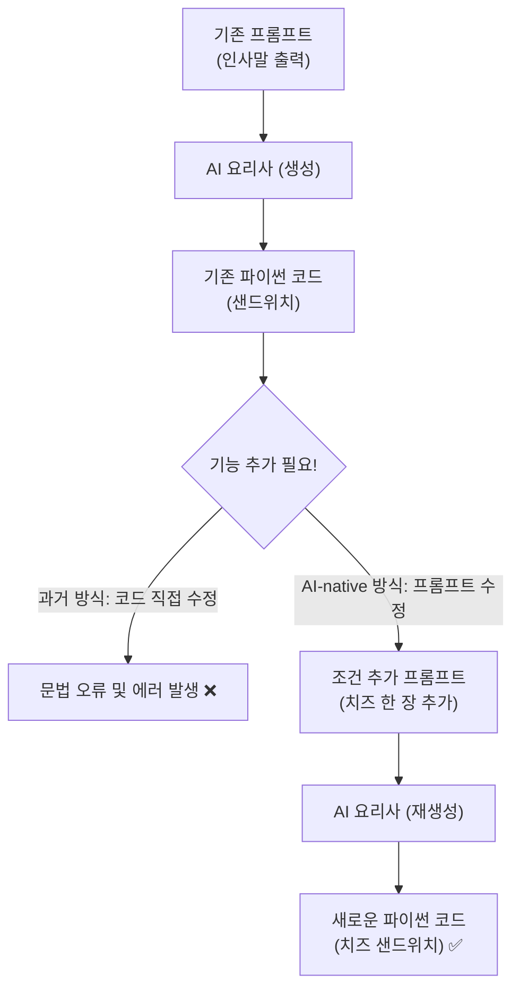

# 마이크로 세션: 017 — 프롬프트 변형으로 코드 변화 관찰하기

> **세션 ID**: MS-PY101-017  
> **소요 시간**: 20분  
> **난이도**: low  
> **청크 타입**: lab  
> **버전**: v2.1 (7섹션 구조)

---

## §1. 개요

> **Day 1 | PM | 세션 017/022**

### 🎯 학습 목표

이 세션이 끝나면, 수강생은 다음을 할 수 있습니다:

* 기존 프롬프트에 새로운 조건을 추가하여 코드 구조를 변화시키는 점진적 개선 전략을 실행할 수 있다.
* 프롬프트의 미세한 조정이 `input()` 함수와 데이터 타입 변환(`int()`) 등 파이썬 코드의 어떤 변화를 유도하는지 식별할 수 있다.
* 코드를 직접 수정하는 대신 명세(사양)를 변경하여 원하는 결과를 얻어내는 AI-First 개발 워크플로우를 체화할 수 있다.

### 선행 세션 환기

바로 직전 세션(세션-016)에서 우리는 생애 첫 파이썬 코드를 AI와 함께 만들고, 그 결과를 예측한 뒤 검증하는 놀라운 경험을 했습니다. 이름만 물어보고 반갑게 인사하는 아주 귀여운 프로그램이었죠. 코드가 화면에 출력된 순간의 짜릿함을 아직 기억하실 겁니다. 

그런데 사람의 욕심은 끝이 없습니다. 인사만 하고 끝나버리니 무언가 아쉽고 더 많은 기능을 넣고 싶어집니다. "사용자에게 태어난 연도를 물어보고, 현재 연도를 기준으로 나이도 계산해서 알려주는 기능을 추가하려면 코드를 어떻게 수정해야 하지?" 이런 고민에 빠지는 건 아주 자연스러운 수순입니다. 

과거에는 이때부터 구글을 켜고 파이썬 문법을 검색하며 코드를 직접 이리저리 뜯어고쳤습니다. 그러다 결국 새빨간 에러를 마주하고 좌절하곤 했죠. 하지만 우리는 다릅니다. 복잡한 문법과 씨름하는 대신 우리가 작성했던 업무 지시서, 즉 프롬프트에 딱 한 줄의 조건만 덧붙여 볼 겁니다. 

어떤 결과가 나올지 아주 기대되시죠? 시작해 봅시다.

---

## §2. 핵심 개념 (+ 🗣️ 강사 대본 + Mermaid)

### 같은 요리, 다른 레시피 (점진적 개선 전략)

프로그램에 새로운 기능을 추가하는 과정을 비유로 들어보겠습니다. 여러분이 최고급 식당의 메뉴 기획자라고 상상해 보세요. 방금 요리사(AI)에게 샌드위치를 만들어 달라고 주문했고, 아주 훌륭한 샌드위치가 나왔습니다. 그런데 갑자기 치즈를 한 장 추가하고 싶어졌습니다. 

이때 여러분이 직접 주방에 들어가서 샌드위치를 해체하고 치즈를 끼워 넣을 필요가 없습니다. 그저 요리사에게 "아까 그 샌드위치 레시피에 치즈 한 장만 추가해서 다시 만들어 주세요"라고 말하면 끝입니다 [Source C]. 요리사는 빵을 다시 굽고 베이컨을 올린 뒤 완벽한 타이밍에 치즈를 얹어 새로운 샌드위치를 완성해 냅니다.

또 다른 비유로는 편지 번역이 있습니다. 최고급 동시통역사인 AI 비서에게 "친구에게 안부를 전해줘"라고 부탁했고, 비서는 멋진 파이썬 코드라는 외국어 편지를 써주었습니다. 편지가 이미 완성되었지만 갑자기 친구의 나이도 궁금해졌습니다. 우리가 직접 사전을 뒤적거리며 서투른 글씨로 문장을 욱여넣을 필요가 없습니다. 그저 통역사를 다시 불러서 부탁하면 됩니다. "아까 써준 편지 너무 좋았어! 그런데 추신으로, 태어난 연도를 물어보고 나이를 계산해서 같이 알려주라는 내용을 덧붙여서 새로 번역해 줄래?" 

통역사는 전혀 불평하지 않고 순식간에 추신이 포함된 완벽한 편지를 처음부터 깨끗하게 다시 써줄 겁니다 [Source C]. 

이것이 바로 AI 시대의 점진적 개선(Iterative Refinement) 전략입니다. 소프트웨어를 발전시키고 싶을 때 기획자는 코드 자체를 만지려고 끙끙대는 것이 아니라 명세서를 고쳐서 완전히 새로운 코드를 다시 생성받는 것입니다. 한 번 작성된 코드는 고정된 조각상이 아니라, 여러분의 상상력과 프롬프트 한 줄에 따라 언제든 더 똑똑한 생명체로 진화할 수 있는 유기체입니다 [Source C].

🗣️ **강사 대본 (Instructor Script)**:

> 여러분, 우리가 만든 환영 인사 프로그램 잘 작동했나요? 정말 멋집니다. 그런데 인사만 달랑 하고 끝나버리니 무언가 조금 아쉽지 않나요? 보통 프로그래머라면 이쯤에서 고민에 빠집니다. "사용자에게 태어난 연도를 물어보고, 현재 연도를 기준으로 나이도 계산해서 알려주는 기능을 추가하려면 코드를 어떻게 수정해야 하지?" 하면서 말이죠. 
> 
> 과거 방식대로라면 구글을 켜고, 파이썬 나이 계산을 검색하고, 기존 코드를 이리저리 뜯어고치다 에러를 뿜게 만들었을 겁니다. 저도 예전에는 괄호 하나 빼먹어서 밤을 새운 적이 있습니다.
>
> 하지만 여러분은 다릅니다. 우리는 복잡한 파이썬 문법과 씨름하는 대신, 우리가 작성했던 업무 지시서인 프롬프트에 딱 한 줄의 조건만 덧붙여 볼 겁니다. 메뉴 기획자가 "아까 그 샌드위치에 치즈 한 장 추가해 주세요"라고 말하듯이 말이죠. 코드가 마음에 안 드시나요? 코드를 직접 만지려고 끙끙대지 마세요. AI에게 기획서를 수정해서 다시 주면 됩니다. 이것이 AI-First 개발의 핵심입니다.

### Mermaid 다이어그램



---

## §3. 상세 내용

### Why (왜 코드가 아닌 프롬프트를 고쳐야 하는가?)

기능을 추가할 때 코드를 직접 고치지 않고 프롬프트를 고치는 이유는 아주 명확합니다. 인간의 언어인 프롬프트가 프로그래밍 언어인 코드보다 훨씬 직관적이고 다루기 쉽기 때문입니다. 

코드를 직접 수정하려면 변수의 위치, 들여쓰기 규칙, 소괄호와 대괄호의 짝 등 수많은 문법적 제약을 완벽하게 지켜야 합니다. 하나라도 틀리면 프로그램은 즉시 멈춰버리죠. 게다가 기존 코드를 분석하고 어디를 어떻게 뜯어고칠지 파악하는 데 걸리는 시간도 무시할 수 없습니다.

하지만 프롬프트를 수정하는 방식은 인간의 사고 흐름을 그대로 따라갑니다. 원하는 비즈니스 로직이나 추가할 기능을 우리 말로 덧붙이기만 하면, 복잡하고 까다로운 문법적 번역은 모두 AI가 알아서 처리해 줍니다. 이렇게 하면 개발 속도가 비약적으로 빨라질 뿐만 아니라 문법 오류로 인한 스트레스에서 완벽하게 벗어날 수 있습니다 [Source A].

### What (프롬프트 미세 조정이 가져오는 결과)

프롬프트 변형이 실제 코드를 어떻게 바꾸는지 눈으로 확인하는 것은 매우 흥미로운 경험입니다. 이전 프롬프트는 "사용자에게 이름을 묻고 환영 인사를 해줘"였습니다. 여기에 "생년월일도 입력받아서 나이를 계산해줘"라는 짧은 문장 하나를 덧붙였을 때, AI는 여러분의 말을 분석해서 최소 두 가지의 구조적 변화를 코드에 반영해야만 합니다.

첫째로, "연도를 묻는다"는 지시를 수행하기 위해 입력을 받는 `input()` 명령어를 코드 어딘가에 새롭게 추가할 것입니다. 이전 코드에서는 이름만 물어봤지만 이제는 질문을 두 번 던져야 하니까요. 

둘째로, "나이를 계산해 줘"라는 핵심 지시를 수행하기 위해 현재 연도에서 방금 입력받은 연도를 빼는 수학 공식 로직을 스스로 뼈대에 붙여 넣을 것입니다 [Source C]. 여러분은 단어 몇 개를 추가했을 뿐이지만, AI는 그 이면에 필요한 파이썬의 구조적 변화를 알아서 재설계합니다.

### How (파이썬의 독특한 규칙과 AI의 해결책)

이때 파이썬만의 아주 독특한 규칙 하나가 튀어나옵니다. 터미널에서 사람이 치는 키보드 입력은 무조건 글자(문자)로 취급된다는 사실입니다. 우리가 화면에 "1990"이라고 입력해도 컴퓨터는 그것을 숫자 천구백구십으로 받아들이지 않습니다. 단지 일, 구, 구, 영 이라는 형태를 띤 글자 조각으로 인식할 뿐입니다. 

상식적으로 글자에서 글자를 뺄 수는 없으니, 그대로 계산하려고 하면 컴퓨터는 당연히 에러를 뿜어내게 됩니다. "안녕"이라는 글자에서 "하세요"를 뺄 수 없는 것과 같은 이치입니다.

그래서 AI 비서는 아주 똑똑하게 그 글자를 진짜 계산 가능한 숫자로 바꿔주는 마법의 함수를 코드에 슬쩍 끼워 넣습니다. 바로 정수를 뜻하는 영어 단어 integer에서 따온 `int()`라는 함수입니다. 

코드를 직접 짠다면 여러분이 이 규칙을 미리 알고 있어야만 에러를 피할 수 있었겠죠. 하지만 AI-native 방식에서는 이런 복잡한 데이터 타입 변환이나 문법적 고민조차 여러분이 직접 할 필요가 없습니다. 내 의도를 얼마나 명확히 전달하느냐가 최종 결과물의 품질을 좌우할 뿐입니다 [Source C].

---

## §4. 실습 가이드 (+ 🎙️ 실습 대본)

### 실습 목표

이 실습을 통해 수강생은 기존 프롬프트에 새로운 요구사항을 덧붙여 AI에게 코드를 재생성하게 하고, 프롬프트의 변화가 실제 파이썬 코드 구조에 어떤 차이를 만들어냈는지 직접 비교하고 관찰합니다.

🎙️ **실습 가이드 대본 (Lab Guide)**:

> 자, 우리의 비서에게 새로운 요구사항을 전달하고 코드가 어떻게 진화하는지 매의 눈으로 관찰해 볼까요? 오른쪽 Agent 창에 아까 입력했던 프롬프트를 다시 불러오거나 복사하세요. 그리고 그 뒤에 새로운 조건을 덧붙여서 질문을 던질 겁니다.
>
> "아까 만든 이름 묻기 코드에, 사용자에게 태어난 연도도 물어보고 올해 2026년을 기준으로 나이를 계산해서 같이 출력해 주는 기능을 추가해 줘." 이렇게요. 
>
> 비서가 새로운 파이썬 코드를 짠 것을 확인하셨나요? 이번에는 코드를 에디터에 붙여넣기 전에 10초만 가만히 화면을 훑어보세요. 이전에 없던 영어 단어들이 보이실 겁니다. 연도를 묻는 `input` 줄에 `int`라는 낯선 단어가 감싸고 있지 않나요? 나이를 구하는 빼기 공식도 생겼죠? "아, 내가 말한 나이 계산이 파이썬에서는 이렇게 번역되었구나!" 하고 코드의 진화를 눈으로 먼저 만끽해 보세요.

### 프롬프트 변형 전후 비교표

| 비교 항목 | 기존 (v1) | 변형 후 (v2) | 관찰 포인트 |
|---|---|---|---|
| **프롬프트 내용** | "사용자에게 이름을 묻고 환영 인사를 해줘" | "이름 묻기 코드에 **태어난 연도도 물어보고 올해(2026년)를 기준으로 나이를 계산**해서 같이 출력해줘" | 기능 요구사항이 구체적으로 한 문장 추가됨 |
| **변수 갯수** | `name` (1개) | `name`, `birth_year`, `age` (3개) | 요구사항을 처리하기 위해 데이터를 담는 상자(변수)가 늘어남 |
| **입력 함수** | `input()` | `input()`, 그리고 `int(input())` | 문자를 숫자로 변환하는 `int()` 함수의 등장 |
| **비즈니스 로직** | 없음 (단순 출력) | `2026 - birth_year` | 빼기 연산을 통한 실제 나이 계산 로직 추가 |

### 단계별 지시사항

1. **요구사항 추가하기**: Agent 창에 이전 프롬프트 내용을 가져온 뒤, 태어난 연도를 묻고 2026년 기준으로 나이를 계산하라는 문장을 덧붙여 전송합니다.
2. **코드 비교 관찰하기 (가장 중요)**: AI가 새롭게 작성해 준 코드를 즉시 복사하지 말고 눈으로 먼저 읽어봅니다. 새롭게 추가된 `birth_year` 변수와 `int()` 함수, 그리고 나이를 계산하는 수식을 찾아보며 나의 프롬프트가 어떻게 번역되었는지 확인합니다.
3. **덮어쓰기 및 저장**: 오른쪽 위 복사 버튼을 누르고, 왼쪽 에디터 창의 `hello.py` 파일의 기존 코드를 전부 지운 뒤 새 코드를 붙여넣습니다. 단축키를 활용해 보세요. 붙여넣은 후 파일을 저장합니다.
4. **예측 및 검증 실행**: 터미널 창에서 키보드 위쪽 화살표를 눌러 파이썬 실행 명령어를 다시 불러옵니다. 엔터를 치고 결과를 확인합니다. 이름과 연도를 입력했을 때 나이가 정확하게 계산되어 나오는지 검증합니다.

> 💡 **트러블슈팅 안내**: 혹시 태어난 연도를 묻는 칸에 숫자가 아니라 "구십년생"이나 "천구백구십"이라고 한글로 문자를 적어보신 분이 계신가요? 아주 새빨간 에러 메시지가 뜰 겁니다 [Source B]. 왜냐하면 컴퓨터가 글자에서 글자를 빼려고 시도하다가 실패했기 때문이죠. 이런 상황을 코딩에서는 '예외 상황'이라고 부릅니다. 
> 
> 이런 에러는 나중에 '예외 처리'라는 고급 프롬프트 기술로 해결하는 방법을 배울 테니 전혀 당황하실 필요 없습니다. 오히려 코딩에서 에러는 언제나 환영할 만한 훌륭한 교보재입니다! 에러를 두려워하지 않는 태도가 실력을 키웁니다.

---


### 🎓 강사 노트 (Instructor Support)

- ⏱️ **타이밍**: 16:35 (20분, lab)
- 🎯 **핵심 활동**: 프롬프트 수정 → 코드 변화 비교
- ⚠️ **강사 주의사항**: "뭐가 달라졌나요?" 질문 던지기


### 📋 실습 설계 보강 (Lab Packet)

**세션 017 실습 설계 보강**

프롬프트 변형으로 코드 변화 관찰하기
- **3-Stage Example Set**
  - 기본: 기존 프롬프트에 "나이 계산 추가" 조건 덧붙이기 → 코드 diff 비교
  - 변형: "계산 결과를 파일에 저장해줘" 같은 완전히 새로운 요구 추가
  - 실수 해결: "프롬프트를 바꿨는데 코드가 완전히 달라져서 혼란스러워요" → 점진적 변형 원칙
- **난이도 예측**: 코드 비교(diff) 능력이 아직 없어 차이점 발견이 어려움
- **타이밍 가이드**: 기존 코드 복습 3분 | 프롬프트 변형 5분 | 코드 비교 관찰 7분 | 정리 5분
- **심리적 장벽**: "코드가 바뀌었는데 어디가 바뀐 건지 모르겠어요"
- **자가 점검**:
  - [ ] 프롬프트에 한 가지 조건을 추가한 후 코드가 변한 부분을 찾았는가?
  - [ ] 변경된 부분에 새로운 `input()`이나 연산이 추가되었는가?
  - [ ] "프롬프트를 바꾸면 코드가 바뀐다"는 인과관계를 체감했는가?

## §5. 코드 및 명령어 모음

### 재생성된 파이썬 코드 예시

프롬프트를 수정한 후 AI가 생성해 주는 전형적인 코드 구조는 다음과 같습니다. 이 코드는 수강생의 프롬프트 내용에 따라 미세하게 다를 수 있지만, 핵심 논리는 동일합니다.

```python
# 사용자에게 이름을 묻습니다
name = input("이름을 입력하세요: ")

# 태어난 연도를 묻고, 문자열을 정수(숫자)로 변환합니다
birth_year = int(input("태어난 연도를 입력하세요 (예: 1990): "))

# 2026년을 기준으로 나이를 계산합니다
age = 2026 - birth_year

# 결과 출력
print(f"안녕하세요, {name}님! 올해 {age}살이시군요. 환영합니다!")
```

위 코드에서 주의 깊게 보셔야 할 부분은 두 번째 줄의 `int()` 함수입니다. `input()`으로 받아온 글자 형태의 연도를 숫자형 데이터로 완벽하게 바꿔주고 있습니다. 이 한 줄 덕분에 세 번째 줄에서 빼기 계산이 오류 없이 작동하게 됩니다.

### 터미널 실행 명령어

```powershell
python hello.py
```
새로운 코드를 덮어쓰고 저장한 뒤, 터미널에서 위 명령어를 다시 실행하여 변경된 프로그램의 작동을 검증합니다. 방향키 위쪽 버튼을 누르면 이전에 쳤던 명령어를 쉽게 불러올 수 있습니다.

---

## §6. 요약

### 핵심 학습 포인트

이번 세션에서 우리는 아주 작지만 강력한 경험을 했습니다. 완성된 프로그램에 새로운 기능을 추가할 때, 파이썬 문법을 찾아보며 코드를 직접 건드리는 대신 우리의 언어로 된 기획서(프롬프트)를 수정했습니다. 

단 한 줄의 프롬프트가 추가되었을 뿐인데, AI는 질문을 던지는 함수를 늘리고 글자를 숫자로 바꾸는 데이터 타입 변환 로직을 도입했으며 나이 계산이라는 수식까지 알아서 구조화해 냈습니다. 샌드위치에 치즈 한 장을 추가해달라고 말하듯, 혹은 완성된 번역 편지에 추신을 덧붙여 달라고 부탁하듯, 프로그램을 진화시키는 점진적 개선 전략의 핵심을 몸소 체험하신 겁니다 [Source C].

이제 여러분은 코드가 아무리 복잡해 보여도 두려워할 필요가 없습니다. 코드를 통제하는 힘은 문법 지식이 아니라 여러분의 명확한 지시와 기획력에서 나오기 때문입니다.

### 다음 세션 예고

지금까지 여러분은 도구를 설치하고, 가상환경을 안전하게 세팅하고, 프롬프트를 작성하여 코드를 생성한 뒤 이를 점진적으로 진화시키는 과정까지 수많은 퍼즐 조각들을 맞추며 달려왔습니다. 

이제 이 흩어진 조각들을 모두 모아 하나의 커다란 그림을 완성할 시간입니다. 다음 세션에서는 여러분 스스로의 힘으로 처음부터 끝까지 혼자서 완주해 보는 종합 실습 무대가 기다리고 있습니다. 환율 변환기라는 새롭고 실용적인 프로그램을 직접 만들어 보게 됩니다.

### 브릿지 노트

> "여러분, 정말 축하합니다. 방금 여러분은 생애 처음으로 기존 프로그램을 스스로의 의도를 담아 '업그레이드'하는 데 성공했습니다. 복잡한 수학이나 파이썬 문법을 전부 외우고 있지 않아도, 여러분의 상상력과 구체적인 프롬프트만 있다면 프로그램은 무한히 똑똑해질 수 있습니다. 
> 
> 자, 지금까지 강사인 저와 함께 이 여정을 걸어왔다면, 이제 여러분의 완전한 솔로 주행을 구경할 차례입니다. 강사의 안내 없이 처음부터 끝까지 해내는 종합 실습 무대로 넘어가겠습니다. 준비되셨나요?"

---

## §7. 참고 자료

### 3-Source 출처

* **Source A (로컬 참고자료)**: 「AI 시대의 서사 v3 - Claude.md」 (AI 시대의 개발 패러다임 변화, 코더에서 기획자로의 역할 이동)
* **Source B (NotebookLM)**: SRC-B01 (에러 상황 발생 원인과 디버깅의 교육적 활용 가치, 글자를 글자에서 빼려는 시도가 부르는 예외 상황 인지)
* **Source C (Deep Research)**: SRC-C01 (점진적 개선 전략 Iterative Refinement, 프롬프트 수정을 통한 코드의 진화 및 데이터 타입 변환 로직)

### 강사 노트

> 💡 **강사 노트**: 본 세션은 수강생이 '코드를 직접 고치지 않고 프롬프트를 고친다'는 AI-native 개발의 핵심 철학을 체화하는 아주 중요한 분기점입니다. `int()` 함수의 등장을 깊게 파고들기보다는, "내가 말로 지시한 내용이 이렇게 똑똑하게 코드의 문법적 변화로 이어지는구나"라는 감탄과 관찰을 유도하는 데 집중해 주세요. 
> 
> 연도 입력 시 한글을 입력하여 에러를 내본 수강생이 있다면 크게 칭찬해 주시고, 이를 향후 예외 처리 학습의 훌륭한 빌드업으로 활용하시기 바랍니다. 에러를 긍정적으로 받아들이는 교실 분위기를 형성하는 것이 매우 중요합니다.

---

## ✅ 세션 완료 체크리스트 (강사용)

* [ ] §1~§7 모든 섹션이 충실하게 서술형으로 작성되었는가?
* [ ] '요리 레시피' 또는 '번역 편지' 비유가 §2에서 충분히 설명되었는가?
* [ ] 프롬프트 미세 조정으로 인한 코드 변화(`int()` 등)가 상세히 다루어졌는가?
* [ ] 프롬프트 변형 전후 비교표가 §4에 포함되었는가?
* [ ] 트러블슈팅(글자 입력 에러) 상황이 긍정적 학습 기회로 제시되었는가?
* [ ] 다음 세션(018 종합 실습)을 향한 브릿지 노트가 포함되었는가?

---

**🔗 선행 세션**: [세션-016] 코드 실행과 예측-검증-설명 경험 (필수)  
**🔗 후행 세션**: [세션-018] [종합 실습 1] 나만의 환경 구축부터 프로그램 실행까지

---

*작성 일시: 2026-02-25*  
*작성 에이전트: A4B_Session_Writer*  
*교안 구조: 7섹션 (A0 팀 공통 표준)*
