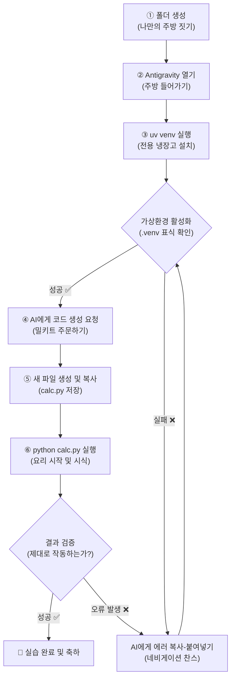

# 마이크로 세션: 018 — 종합 실습 1: 나만의 환경 구축부터 프로그램 실행까지

> **세션 ID**: MS-PY101-018
> **소요 시간**: 25분
> **난이도**: medium
> **청크 타입**: lab
> **버전**: v2.1 (7섹션 구조)

---

## §1. 개요

> **Day 1 | PM | 세션 018/022**

### 🎯 학습 목표

이 세션이 끝나면, 수강생은 다음을 할 수 있습니다:

- 완전히 새로운 독립된 작업 폴더를 만들고 Antigravity IDE 환경과 연동할 수 있다.
- `uv` 패키지 매니저를 활용하여 격리된 파이썬 가상환경(`.venv`)을 1초 만에 구성하고 활성화할 수 있다.
- AI 에이전트에게 명확한 프롬프트를 작성하여 코드를 생성하고, 터미널에서 직접 실행하여 결과를 검증할 수 있다.

### 선행 세션 환기

지금까지 여러분은 저의 꼼꼼한 안내를 받으며 조수석에 앉아 운전 연수를 받았습니다. "우회전하세요", "브레이크 밟으세요"라는 지시대로 잘 따라오셨죠. 덕분에 시동을 거는 법(환경 구축)부터 엑셀을 밟는 법(프롬프트 생성), 계기판을 확인하는 법(코드 실행과 검증)까지 완벽하게 익혔습니다. 하지만 진짜 운전 실력은 강사가 내리고 처음으로 도로에 혼자 차를 몰고 나갔을 때 늘기 시작합니다. 이전 세션(017)에서 프롬프트를 변형하며 코드의 변화를 관찰하셨다면, 이제 백지상태에서 완전히 여러분만의 첫 요리를 완성해 볼 차례입니다.

---

## §2. 핵심 개념 (+ 🗣️ 강사 대본 + Mermaid)

### 첫 주방 세팅과 완벽한 밀키트 요리

이 25분의 시간은 단순히 배운 것을 복습하는 시간이 아닙니다. 완전히 비어있는 맨땅(바탕화면)에 나만의 첫 번째 주방 겸 사무실(프로젝트 폴더)을 짓고, 다른 재료와 섞이지 않는 쾌적한 전용 냉장고(가상환경)를 들여놓은 다음, 첫 번째 밀키트를 주문(프롬프트 작성)하고, 가스레인지 불을 켜서(터미널 실행) 완벽한 첫 요리(계산기 프로그램)를 대접하는 모든 과정을 처음부터 끝까지 혼자 해내는 독립 주행입니다.

혼자 하려다 보면 분명 벽에 부딪히는 순간이 올 겁니다. "어라, 활성화 명령어가 뭐였지?", "어? 갑자기 빨간색 에러가 나네?" 이런 막막한 순간들이요. 하지만 두려워하지 마세요. 에러는 사고가 났다는 뜻이 아닙니다. 단순히 길을 잘못 들었으니 유턴하라는 네비게이션의 따뜻한 조언입니다. 

🗣️ **강사 대본 (Instructor Script)**:

> 자, 드디어 올 것이 왔습니다. 지금까지는 제가 조수석에서 하나하나 다 알려드렸죠. 하지만 이제 여러분이 직접 운전석에 앉아, 조수석에 탄 완벽한 네비게이션인 AI 비서의 안내만 받으며 목적지까지 달려볼 시간입니다. 
> 
> 바탕화면에 아무것도 없는 상태에서 시작해서, 폴더를 만들고, Antigravity를 켜고, uv로 가상환경 냉장고를 만들고, AI에게 "더하기 빼기 계산기 만들어줘"라고 지시해서 실행까지 완수하는 겁니다.
> 
> 여러분, 이럴 때 할 일은 딱 하나입니다. 저를 애타게 찾기 전에, 화면 오른쪽에 있는 최고의 조수석 파트너 AI에게 "나 지금 이런 에러 메시지가 떴는데 어떻게 해야 해?"라고 복사해서 물어보는 거예요. 이 '막힘과 뚫림'의 사이클을 혼자 겪어내야 비로소 진짜 성장이 시작됩니다. 저는 입을 꾹 닫고 여러분을 지켜보겠습니다!

> 💡 **강사 노트**: 본 세션은 종합 실습 가이드와 NotebookLM(Source B) 기반의 워크스페이스 세팅 파이프라인(가상환경, 프롬프트, 실행)을 내재화시키는 자기 주도 훈련 과정입니다. 수강생의 오류를 즉각 개입하지 않고 AI를 통해 스스로 트러블슈팅하게 유도하는 것이 핵심입니다.

### Mermaid 다이어그램 — 전체 워크플로우



---

## §3. 상세 내용

### Why — 왜 혼자 처음부터 끝까지 해보아야 하는가?

강사를 따라 코드를 치거나, 남이 만들어둔 세팅 위에서 버튼만 누르는 것은 진짜 실력이 아닙니다. 개발 과정에서 가장 두려운 순간은 백지상태인 "텅 빈 폴더"를 마주했을 때입니다. 여기서 어떻게 인프라를 구축하고, 도구를 세팅해서 첫 줄의 코드를 실행하게 만들 것인가? 이 인프라 구축의 두려움을 완전히 극복하기 위해서 종합 실습이 필요합니다. "내가 뭘 모르는지" 정확히 파악하는 메타인지(Meta-cognition)는 혼자 핸들을 잡아볼 때 팍팍 올라갑니다.

### What — 이 실습의 정체성은 무엇인가?

소프트웨어 개발 생애주기(SDLC)의 초소형 축소판입니다. 우리는 단 25분 만에, 환경 구축(Infra) -> 개발(Dev) -> 실행 및 검증(QA)이라는 전 과정을 경험하게 됩니다. 이것은 40시간 과정 전체를 통틀어 가장 중요한 '파이프라인 구축' 경험이며, 앞으로 배울 모든 복잡한 프로젝트(데이터 분석, 웹 서버 구축 등)의 가장 튼튼한 뼈대가 됩니다.

### How — 어떻게 완수하는가?

여러분은 이미 이 4가지 단계를 지난 시간 동안 훌륭하게 소화했습니다. 단지, 이번에는 제 목소리가 없을 뿐이죠.
1. **기반 다지기**: 완전히 새로운 폴더를 만들고 IDE와 연결합니다.
2. **미니 냉장고 들이기**: 초고속 도구 `uv`를 사용해 `.venv` 가상환경을 만들고 활성화합니다.
3. **메뉴판 작성 및 요리**: AI 비서에게 "두 숫자를 더하고 빼주는 간단한 계산기"를 만들어 달라고 지시하고 파일로 저장합니다.
4. **시식하기**: 생성된 파이썬 파일을 터미널에서 실행(`python 파일명.py`)하여 결과를 예측하고 검증합니다.

순서가 헷갈려도 괜찮습니다. AI에게 "내가 지금 파이썬 프로젝트를 처음부터 시작하려고 하는데, 제일 먼저 뭘 해야 해?"라고 순서를 물어보셔도 됩니다. 오늘 배운 것 중 가장 강력한 무기는 명령어를 달달 외우는 게 아니라, AI를 괴롭혀가며 답을 찾아내는 끈기입니다.

---

## §4. 실습 가이드 (+ 🎙️ 실습 대본)

### 실습 목표

아무런 외부 도움 없이(강사 개입 배제), 수강생 스스로 에이전트와 대화하며 나만의 파이썬 프로젝트 폴더 세팅부터 코드 실행까지 파이프라인을 완전히 구축해 본다.

🎙️ **실습 가이드 대본 (Lab Guide)**:

> 자, 지금부터 20분 동안 저는 입을 꾹 닫고 있겠습니다. 손을 번쩍 드셔도 바로 달려가지 않을 겁니다! 오직 화면 속의 비서와 대화하며, 에러를 복사해주고 해결책을 물어가면서 이 미션들을 완주해 보세요. 출발!

### 환경구축 → 코드생성 → 실행 전과정 단계표

| 단계 | 실습 액션 (학습자가 할 일) | 주요 확인 사항 (성공 기준) | 힌트 (막혔을 때) |
|---|---|---|---|
| **1. 기반 다지기** | 바탕화면에 새 폴더(예: `my_calculator`)를 만들고, Antigravity IDE에서 이 폴더를 엽니다. | 탐색기 왼쪽에 내 폴더 이름이 보이고 빈 상태인가? | `File > Open Folder` 메뉴 사용 |
| **2. 냉장고 들이기** | 터미널(새 창)을 열고 `uv venv`를 실행한 뒤, 각 운영체제에 맞게 가상환경을 활성화합니다. | 탐색기에 `.venv` 폴더가 생겼고, 터미널 프롬프트 맨 앞에 초록색 `(.venv)` 표지가 떠 있는가? | AI에게 "윈도우에서 가상환경 활성화 명령어 알려줘"라고 묻기 |
| **3. 요리 준비** | AI Agent 패널을 열고 "두 숫자를 더하고 빼주는 계산기 코드를 만들어줘. 입력받을 수 있게 해줘."라고 지시합니다. | AI가 깔끔한 파이썬 코드를 제시했는가? | 프롬프트에 입/출력 조건을 명확히 적을수록 좋은 코드가 나옴 |
| **4. 요리 및 시식** | `calc.py` 새 파일을 만들고 코드를 저장한 뒤, 터미널에서 실행하여 테스트합니다. | `python calc.py` 입력 후 숫자를 넣었을 때 올바른 결과가 출력되는가? | 파일을 `Ctrl + S`로 꼭 저장해야 반영됨 |

### 트러블슈팅 FAQ

| Q (문제 상황) | A (해결 방안 및 가이드) |
|---|---|
| `uv venv`를 쳤는데 "uv 용어가 인식되지 않습니다"라고 떠요. | 이전 세션에서 터미널을 열어둔 채로 진행하고 계신가요? Antigravity를 재시작하거나 새 터미널 창을 열어 환경 변수가 반영되도록 하세요. |
| 터미널 맨 앞에 `(.venv)` 글씨가 안 보여요! | 가상환경 '활성화(Activation)'를 하지 않은 것입니다. Windows는 `.\.venv\Scripts\activate`, macOS는 `source .venv/bin/activate`를 입력하세요. 명령어 타이핑이 어렵다면 AI에게 물어보고 복사해서 붙여넣으세요. |
| 파이썬 파일 실행을 하려는데 자꾸 에러가 나요! | 에러 메시지가 떴다면 축하합니다, 성장할 시간입니다! 터미널의 붉은 에러 문장을 싹 드래그해서 복사하고, AI 비서에게 "나 지금 이런 에러가 나는데 5 Whys 기법으로 이유를 초보자 눈높이에서 3줄로 설명해 줘"라고 질문해 보세요. |
| 코드를 수정했는데 실행 결과가 똑같아요. | 파일을 저장하지 않았을 확률이 99%입니다. 파일명 옆에 동그란 점(●) 표시가 있다면 아직 저장되지 않은 것입니다. `Ctrl + S`(또는 `Cmd + S`)를 눌러 꼭 저장한 뒤 터미널에서 다시 실행하세요. |
| 프롬프트로 만든 코드가 제가 원하는 대로 안 움직여요. | 당황해서 코드를 직접 지우고 쓰려 하지 마세요. AI에게 "이 코드를 실행했더니 이런 결과가 나오는데, 내가 원하는 건 이거야. 다시 수정해 줘."라고 대화하듯 수정 프롬프트를 보내세요. |

> ✅ **체크포인트**: 모두 화면에 계산기 결과가 잘 출력되나요? 성공하신 분들은 주변 동료들이 잘하고 있는지 가볍게 살펴봐 주셔도 좋습니다!

---


### 🎓 강사 노트 (Instructor Support)

- ⏱️ **타이밍**: 16:55 (25분, lab)
- 🎯 **핵심 활동**: 독립 수행: 새 프로젝트 → 코드 실행
- ⚠️ **강사 주의사항**: 도움 요청 최소화, 자율성 확인


### 📋 실습 설계 보강 (Lab Packet)

**세션 018 실습 설계 보강**

[종합 실습 1] 나만의 환경 구축~프로그램 실행
- **3-Stage Example Set**
  - 기본: 빈 폴더 생성 → uv venv → activate → AI에게 계산기 프롬프트 → python calc.py 실행
  - 변형: 계산기 대신 "BMI 계산기"로 주제 변경해서 독립 수행
  - 실수 해결: "터미널 경로가 다른 폴더를 가리키고 있어요" → `cd` 명령어 또는 폴더 재열기
- **난이도 예측**: ★★★ 전 과정을 혼자 수행 — 한 단계라도 빠지면 진행 불가
- **타이밍 가이드**: 폴더+IDE 연결 3분 | 가상환경 세팅 3분 | 프롬프트+코드 생성 7분 | 실행+검증 5분 | 트러블슈팅 7분
- **심리적 장벽**: "강사 도움 없이 혼자 해야 한다"는 불안감이 최고조
- **자가 점검**:
  - [ ] 새 폴더에서 시작하여 .venv가 생성되었는가?
  - [ ] (.venv) 활성화 상태에서 코드를 실행했는가?
  - [ ] 계산기가 두 숫자의 덧셈/뺄셈을 정확히 출력하는가?
  - [ ] 막혔을 때 AI에게 에러 메시지를 복사해서 질문했는가?

## §5. 코드 및 명령어 모음

### 명령어 1: 가상환경 생성 (공통)
```bash
uv venv
```
현재 프로젝트 폴더 내에 `.venv`라는 이름의 빠르고 가벼운 파이썬 가상환경(전용 냉장고)을 1초 만에 생성합니다.

### 명령어 2: 가상환경 활성화 (Windows)
```powershell
.\.venv\Scripts\activate
```
가상환경을 켜는 명령어입니다. 성공하면 터미널 프롬프트 가장 왼쪽에 `(.venv)`라는 표식이 나타납니다.

### 명령어 3: 가상환경 활성화 (macOS)
```bash
source .venv/bin/activate
```
macOS 및 Linux 환경에서 가상환경을 활성화할 때 사용하는 명령어입니다.

### 명령어 4: 파이썬 스크립트 실행
```bash
python calc.py
```
저장된 파이썬 파일(예: `calc.py`)을 실행하여 프로그램의 결과를 터미널에서 확인합니다. macOS의 경우 환경에 따라 `python3 calc.py`를 입력해야 할 수도 있습니다.

---

## §6. 요약

### 핵심 학습 포인트

여러분은 방금 개발자의 가장 기본이 되는 필수 파이프라인을 온전히 혼자 힘으로 구축해 냈습니다. 맨땅에 폴더를 만들고, `uv`를 사용해 나만의 독립된 주방인 가상환경(`.venv`)을 구성했습니다. 그런 다음 AI와 대화하며 원하는 사양의 코드(밀키트)를 얻어내어 파일에 저장하고, 터미널에서 실행하여 검증하는 경험까지 완수했습니다. 막혔을 때 에러를 복사해서 AI에게 물어본 경험을 하신 분이 있다면, 그분은 오늘 200% 성장하신 겁니다. 조수석에서 혼자 핸들을 잡아보니 내가 무엇을 알고, 무엇을 모르는지 메타인지가 명확해졌을 것입니다.

### 다음 세션 예고

자, 그런데 이 계산기 프로그램은 단지 워밍업, 몸풀기에 불과했습니다. 우리가 5일 내내 고민하며 만들어야 할 최종 관통 프로젝트가 있었죠? 바로 고객 정보 관리 시스템입니다! 이제 환경 세팅의 두려움을 완전히 극복했으니, 진짜 우리의 비즈니스 로직을 고민하는 시간으로 넘어가 볼 겁니다. 아주 작은 '미니 스펙'부터 작성해 볼 테니 다음 세션을 기대해 주세요!

### 브릿지 노트

> "박수! 모두 계산기 하나씩 장만하셨네요! 혼자 힘으로 텅 빈 공간에서 도구를 세팅하고 요리까지 완성하신 걸 진심으로 축하합니다. 이제 진짜 요리사가 된 기분이죠? 그럼 워밍업은 끝났으니, 우리의 관통 프로젝트인 '고객 정보 관리 프로그램'의 첫 삽을 떠보겠습니다."

---

## §7. 참고 자료

### 3-Source 출처

- **Source A (로컬 참고자료)**: 종합 실습 가이드 — 프로젝트 생성부터 실행까지의 파이프라인 프로세스 및 메타인지 확립 방법론
- **Source B (NotebookLM)**: SRC-B01 — 워크스페이스 세팅 파이프라인(가상환경, 프롬프트, 실행) 내재화 및 수동 개입 없는 자기 주도 트러블슈팅 훈련
- **Source C (Deep Research)**: SRC-C01 — 시스템 인프라 구축의 자동화 체감 및 SDLC(소프트웨어 생애주기) 기본 개념의 축소 경험

### 추가 학습 자료

- [Python 공식 자습서 - 가상 환경과 패키지](https://docs.python.org/ko/3/tutorial/venv.html): 가상환경의 원리와 구조에 대한 심도 있는 설명
- [Astral uv 공식 문서](https://docs.astral.sh/uv/): 차세대 패키지 매니저 uv의 고급 사용법과 생태계

### 강사 노트

> 💡 **강사 노트**: 본 세션은 가르침을 주기보다 수강생이 스스로 시행착오를 겪도록 기다려주는 것이 핵심입니다. 에러가 났다고 손을 들면 강사가 바로 키보드를 빼앗아 쳐주지 말고, "그 빨간 줄을 마우스로 드래그해서 AI에게 뭐라고 물어볼까요?"라고 유도하는 코칭형 태도를 유지해야 합니다. 터미널 경로가 꼬여서 작동하지 않는 경우가 가장 많으므로, 반드시 `(.venv)` 간판이 떠 있는지 확인하는 습관을 들이도록 강조하세요.

---

**🔗 선행 세션**: [세션-017] 프롬프트 변형으로 코드 변화 관찰하기 (필수)  
**🔗 후행 세션**: [세션-019] [종합 실습 2] 미니 스펙 첫 경험: 고객 1명 관리 프로그램  

---

*작성 일시: 2026-02-25*  
*작성 에이전트: A4B_Session_Writer*  
*교안 구조: 7섹션 (A0 팀 공통 표준)*