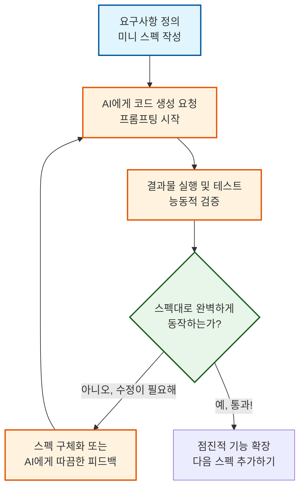

# 마이크로 세션: 019 — 종합 실습 2: 미니 스펙 첫 경험 — 고객 관리 프로그램

> **세션 ID**: MS-PY101-019  
> **소요 시간**: 25분  
> **난이도**: medium  
> **청크 타입**: lab  
> **버전**: v2.1 (7섹션 구조)

---

## §1. 개요

> **Day 1 | PM | 세션 019/022**

### 🎯 학습 목표

이 세션이 끝나면, 수강생 여러분은 단순한 느낌이나 말로 뭉뚱그려 지시하는 습관에서 벗어나게 됩니다. 대신 명확한 요구사항 명세서, 즉 미니 스펙을 직접 문서로 작성하여 AI에게 아주 정교한 업무 지시를 내릴 수 있게 됩니다. 코드를 머릿속으로 예측하고, 눈으로 검증하며, 이유를 설명해 내는 SDD(명세 주도 개발)의 핵심 사이클을 온전히 소화하게 될 것입니다. 

### 선행 세션 환기

바로 직전 세션에서 여러분은 폴더를 만들고, 격리된 가상환경을 세팅한 뒤 환율 변환기 코드를 실행해 보셨습니다. 인프라 구축부터 프로그램 실행까지 단 한 번의 에러도 두려워하지 않고 혼자서 완수해 낸 여러분, 정말 고생 많으셨습니다. 이제 계산기 앱으로 가벼운 몸풀기를 마쳤으니, 5일 과정의 마지막 날에 우리가 완성하기로 한 거대한 목표물을 향해 본격적인 첫걸음을 떼어볼 차례입니다. 그 거대한 목표물이란 바로 수백 명의 고객 데이터를 입력받고, 검색하고, 수정하고, 파일로 저장해 내는 '고객 정보 관리 시스템'입니다. 이름만 들어도 아주 웅장하고 복잡해 보이죠? 하지만 세상의 아무리 거대한 시스템이라도 그 시작은 가장 작은 기능 하나에서 출발합니다. 오늘은 그 관통 프로젝트의 완전한 기초, 딱 1명의 고객 정보만 완벽하게 묻고 대답하는 초미니 버전부터 출발해 보겠습니다.

---

## §2. 핵심 개념 (+ 🗣️ 강사 대본 + Mermaid)

### 미니 스펙 작성 = "설계도 먼저, 시공 나중"

수백 명을 수용할 수 있는 거대한 레스토랑 프랜차이즈를 오픈한다고 상상해 볼까요? 처음부터 어마어마한 주방 기구를 사고, 수십 명의 요리사를 고용해서 한 번에 문을 여는 사람은 아마 없을 겁니다. 우선 가장 작은 포장마차나 푸드트럭에서 딱 한 가지 메뉴인 '떡볶이'를 먼저 팔아보는 것이 순서일 것입니다. 손님 1명에게 완벽한 떡볶이를 대접해서 감동을 줄 수 있다면, 그 레시피와 시스템을 그대로 복사해서 수백 명, 수천 명에게도 똑같이 팔 수 있을 테니까요. 코딩도 이와 완전히 똑같습니다. 

이때 가장 중요한 것은 "우리 포장마차의 떡볶이는 정확히 어떤 재료가 들어가고 어떻게 생겨야 하는가?"를 글로 명확하게 정의하는 일입니다. 이것을 소프트웨어 개발 용어로는 요구사항(Requirements) 혹은 명세서(Specification)라고 부릅니다. 우리는 줄여서 '스펙(Spec)'이라고 부르기로 하겠습니다. 건물을 지을 때 설계도 한 장 없이 무턱대고 시멘트를 바르고 벽돌부터 쌓아 올리는 사람은 없겠죠? 코딩을 할 때도 마찬가지입니다. 

AI 시대에는 우리가 직접 타이핑을 치지 않기 때문에, AI에게 "고객 관리하는 프로그램 하나 대충 빨리 만들어 줘"라고 느낌대로 지시하는 이른바 'Vibe Coding'의 유혹에 빠지기 아주 쉽습니다. 하지만 그렇게 모호하게 명령을 내리면, AI는 내가 원했던 떡볶이가 아니라 갑자기 스테이크를 구워올 수도 있습니다. 내가 생각하는 정확한 메뉴 구성을 아주 깐깐하고 명확한 문서로 적어주어야 비로소 내가 원하는 코드가 완성됩니다. 이처럼 명세서라는 문서를 중심에 두고 개발하는 방식을 SDD(명세 주도 개발, Specification-Driven Development)라고 부르며, 이것이 여러분이 AI 시대에 팀 리더로서 갖춰야 할 가장 강력하고 뾰족한 무기입니다.

🗣️ **강사 대본 (Instructor Script)**:

> 자, 여러분. 머릿속에 있는 생각을 곧바로 파이썬 코드로 뽑아내고 싶은 유혹이 스멀스멀 드실 겁니다. "AI야, 고객 이름이랑 전화번호 저장하는 앱 만들어줘"라고 한 줄 띡 치면 코드가 뚝딱 나오긴 할 테니까요. 하지만 그 유혹을 잠시 꾹 참으셔야 합니다. 오늘 여러분이 작성할 이 작은 명세서 한 장이, 내일 여러분이 만들 거대한 프로젝트의 흔들리지 않는 튼튼한 설계도 역할을 하게 될 겁니다. 
>
> 앞으로 여러분은 코드를 직접 땀 흘리며 타이핑하는 코더가 아닙니다. 여러분은 AI라는 아주 똑똑한 직원을 관리하고 지시를 내리는 '팀 리더'입니다. 리더가 업무 지시를 모호하고 두루뭉술하게 하면 직원이 가져온 결과물도 당연히 엉망이 되겠죠? 완벽한 코드를 얻고 싶다면, 먼저 완벽한 스펙을 글로 적어야 합니다. 오늘은 그 미니 스펙을 직접 써보고, AI가 내 지시를 얼마나 찰떡같이 알아듣는지 테스트해 보는 아주 재미있는 시간이 될 겁니다. 느낌대로 짜달라고 하는 Vibe Coding은 이제 졸업합시다!

> 💡 **강사 노트**: 비유 풀이 과정에서 Vibe Coding의 위험성을 충분히 강조해 주세요. "대충 말해도 찰떡같이 알아듣는 AI"라는 환상을 깨고, "정확하게 지시해야 정확하게 짜주는 AI"라는 인식을 심어주는 것이 Day 1 오후 세션의 핵심 철학입니다.

### Mermaid 다이어그램: SDD 미니 사이클

이 다이어그램은 명세 주도 개발(SDD)의 아주 작은 반복 주기를 보여줍니다. 스펙을 작성하고, AI에게 코드를 맡기고, 우리가 직접 검증하는 흐름을 눈여겨보세요.



---

## §3. 상세 내용

### Why — 왜 굳이 미니 스펙부터 귀찮게 시작해야 하는가?

처음부터 수백 줄짜리 코드를 만들어달라고 AI에게 무턱대고 요청하면 어떤 일이 벌어질까요? 놀랍게도 그럴듯한 코드가 튀어나오긴 할 겁니다. 하지만 만약 중간에 에러가 나거나 내가 원하는 방향과 미세하게 다르게 작동할 때, 우리는 이 거대한 코드 산더미에서 대체 어디서부터 손을 대야 할지 막막해집니다. 설계도가 너무 거대해서 어디가 잘못되었는지 원인을 찾기 힘들어지는 것이죠. 

그래서 우리는 '가장 작고 독립적인 기능' 단위로 쪼개어 스펙을 작성하는 습관을 들여야 합니다. 고객 단 1명의 데이터를 완벽하게 입력받고 화면에 예쁘게 보여줄 수만 있다면, 그 구조를 바탕으로 100명, 1000명의 데이터도 똑같은 논리로 관리할 수 있습니다. 작은 스펙은 우리가 마주한 문제를 단순화해주고, AI가 코딩을 하다 딴 길로 새거나 실수할 확률을 극격히 낮춰주며, 코드가 나왔을 때 우리가 오류를 검증하기도 훨씬 쉽게 만들어 줍니다. 문서를 소프트웨어 개발의 '유일한 진실의 원천'으로 대하는 과정을 여러분이 몸소 체험하게 될 것입니다.

### What — 미니 스펙 문서에는 무엇이 들어가야 하는가?

오늘 우리가 AI 직원에게 전달할 포장마차의 '미니 스펙'은 아주 깐깐하고 명확해야 합니다. 스펙 문서에는 일반적으로 다음 세 가지 요소가 필수로 포함되어야 합니다.

첫째는 목표와 기능입니다. 프로그램이 달성해야 할 구체적인 동작을 적어주는 부분입니다. 예를 들어 단순히 "정보를 받는다"가 아니라, "고객의 이름과 전화번호를 차례대로 하나씩 물어본다"처럼 아주 상세하게 프로그램의 행동을 묘사해야 합니다. 
둘째는 출력 조건입니다. 입력이 끝난 후 사용자에게 어떤 화면을 보여줄 것인지 명시합니다. "모든 입력이 끝나면 화면에 '등록이 완료되었습니다'라는 안내 문구를 띄울 것"과 같이 정확한 텍스트를 지정해 주면 더욱 완벽합니다.
셋째는 제약 사항입니다. 프로그램이 데이터를 어떻게 다루었으면 좋겠는지, 혹은 어떤 형식으로 출력했으면 좋겠는지 까다로운 규칙을 정합니다. "방금 입력받은 고객의 이름과 전화번호를 예쁘게 정리해서 한 줄로 출력해서 보여줄 것"처럼 말이죠.

이 조건들은 사실 일상적인 대화처럼 아주 단순해 보이지만, 이 짧은 스펙 안에는 파이썬 프로그래밍의 핵심 개념들이 모두 숨어 있습니다. 프로그램이 데이터를 메모리에 저장하고(변수 할당), 그것을 다시 밖으로 꺼내서 보여주는(출력) 데이터의 흐름이 한 편의 시처럼 고스란히 담겨 있는 셈입니다. 

### How — 어떻게 코드를 생성하고 스스로 검증하는가?

여러분은 파이썬 문법을 외우거나 전혀 몰라도 괜찮습니다. 화면에 적힌 한국어 조건들을 어떻게 하면 AI가 찰떡같이 오해 없이 알아듣게끔 잘 번역해서 지시할 것인가? 오직 그것만 끈질기게 고민하시면 됩니다.

프롬프트를 통해 코드가 생성되었다고 해서 "오, 돌아가네! 끝났다!" 하고 무작정 넘어가면 절대 안 됩니다. 우리가 정성껏 세운 3가지 스펙 조건이 모두 완벽하게 지켜졌는지 확인하는 QA(Quality Assurance) 시간이 반드시 필요합니다. 여러분 스스로가 아주 깐깐하고 피도 눈물도 없는 품질 검사관이 되어서 코드를 직접 실행해 보고 꼼꼼히 '검증'해야 합니다. 이것이 바로 오전 세션에서 배웠던 '예측-검증-설명' 사이클의 완벽한 실전 적용입니다. 만약 조건 중 하나라도 빠졌다면 어떻게 할까요? 코드를 직접 마우스로 지우고 키보드를 치며 끙끙댈 필요가 전혀 없습니다. AI에게 "야, 너 2번 조건 빼먹었잖아. 스펙 문서 다시 읽고 제대로 다시 짜와"라고 당당하게 리더로서 피드백을 주면 됩니다. 

---

## §4. 실습 가이드 (+ 🎙️ 실습 대본)

### 실습 목표

이 실습을 통해 수강생 여러분은 요구사항 명세서, 즉 미니 스펙을 작성하여 AI에게 코드를 생성하게 하고, 생성된 코드가 스펙을 100% 충족하는지 직접 테스트하고 검증하는 전 과정을 경험하게 됩니다.

🎙️ **실습 가이드 대본 (Lab Guide)**:

> 자, 지금부터 제가 아주 작은 미니 스펙을 하나 드릴 겁니다. 이 스펙을 바탕으로, 여러분만의 프롬프트를 작성해서 AI 비서에게 업무 지시를 시원하게 내려보세요! 
> 
> 포장마차 스펙의 조건은 딱 세 가지입니다. 
> 첫째, 고객의 이름과 전화번호를 차례대로 하나씩 물어볼 것. 
> 둘째, 두 개를 모두 입력받으면, 화면에 '등록이 완료되었습니다'라는 안내 문구를 띄울 것. 
> 셋째, 방금 입력받은 고객의 이름과 전화번호를 예쁘게 정리해서 한 줄로 출력해서 보여줄 것.
>
> 15분 동안 진행해 보겠습니다. AI가 짜준 코드를 파일에 저장하고 터미널에서 실행해 본 뒤, 이 세 가지 조건이 완벽하게 지켜졌는지 확인하세요. 마음에 안 들면 어떻게 한다고요? 네, 계속해서 AI에게 피드백을 주며 코드를 덮어쓰고 고쳐나가시면 됩니다. 자, 시작해 볼까요?

### 단계별 지시표 — 미니 스펙부터 테스트까지

| 단계 | 소요 시간 | 강사 지시사항 | 학습자 액션 | 예상 결과 |
|------|----------|--------------|------------|----------|
| 1 | 3분 | "주어진 세 가지 스펙을 분석하고, Agent 창에 프롬프트를 또박또박 입력하세요." | 우측 Agent 창을 열고, 3가지 조건을 명확히 번호 매겨 프롬프트로 작성하여 AI에게 전송 | AI가 스펙을 반영한 파이썬 코드를 텍스트로 생성하여 답변 |
| 2 | 2분 | "AI가 짜준 코드를 복사해서 파이썬 새 파일에 예쁘게 저장하세요." | 좌측 에디터에서 `customer.py` 파일 생성 → 코드 붙여넣기 → 단축키로 안전하게 저장 | 현재 폴더에 `customer.py`가 성공적으로 저장됨 |
| 3 | 5분 | "터미널에서 코드를 실행하고, 깐깐한 검열관이 되어 세 가지 조건을 모두 테스트하세요." | 터미널에 `python customer.py` 입력 → 본인의 이름과 전화번호를 직접 입력하며 동작 확인 | 이름/번호 입력 → 등록 완료 문구 출력 → 한 줄 요약 출력 확인 성공 |
| 4 | 5분 | "조건이 누락되었거나 출력 형태가 조금이라도 마음에 들지 않는다면, AI에게 수정 피드백을 주세요." | Agent 창에 "전화번호를 010-XXXX-XXXX 형태로 예쁘게 출력하도록 세 번째 조건을 수정해 줘" 등 추가 지시 | AI가 개선된 코드를 제시하고, 학습자가 이를 덮어써서 재실행 |

### 트러블슈팅 FAQ

| Q | A |
|---|---|
| AI가 짜준 대로 찰떡같이 실행했는데 전화번호를 묻지 않고 그냥 종료되어 버려요! | AI도 가끔 스펙을 몰래 빼먹는 실수를 합니다. 당황하지 말고 상황을 그대로 AI 비서에게 다시 알려주세요. "네가 준 코드를 실행했더니 전화번호를 묻지 않고 곧바로 종료돼버렸어. 조건 1번을 다시 꼼꼼히 읽고 코드를 수정해 줘." 여러분이 꼼꼼한 감독관이 되어야 AI는 최고의 실력을 발휘합니다. |
| 입력 창에 제 이름을 쳤는데 갑자기 빨간색 에러 글씨가 와르르 쏟아집니다. | 코드 어딘가에 치명적인 오타가 났거나, 터미널 실행 환경에 문제가 있을 수 있습니다. 그 빨간 에러 메시지를 마우스로 쭉 드래그해서 복사한 다음, AI에게 "이런 에러가 났어. 대체 원인이 뭐야?"라고 당당하게 물어보세요. 원인을 묻는 습관이 디버깅의 시작입니다. |
| 분명히 "python customer.py"를 쳤는데 파일을 도저히 찾을 수 없대요. | 현재 터미널이 열려 있는 폴더의 위치와, 여러분이 `customer.py` 파일을 저장한 위치가 다르기 때문일 확률이 매우 높습니다. 파일 탐색기에서 파일이 어디에 저장되었는지 확인하고, 해당 폴더로 이동한 뒤 다시 명령어를 실행해 보세요. |
| 제 짝꿍이랑 저랑 AI한테 똑같이 물어봤는데 코드가 다르게 생겼어요. 이거 틀린 건가요? | 전혀 틀리지 않았습니다! 프로그래밍에는 정답이 단 하나만 있는 것이 절대 아닙니다. 스펙, 즉 세 가지 조건만 완벽하게 충족한다면 코드가 길든 짧든 출력 문구가 조금 다르든 모두 훌륭한 백 점짜리 정답입니다. 이런 것이 바로 프롬프트의 오묘하고 재미있는 매력이죠. |
| AI가 한글이 깨져서 이상한 외계어로 출력되도록 코드를 짰어요. 제 컴퓨터가 고장났나요? | 고장이 아니라 Windows 터미널의 한글 인코딩 문제일 수 있습니다. AI에게 "Windows 터미널 환경에서 한글이 절대 깨지지 않게 출력하는 코드로 알아서 수정해 줘"라고 지시하면 해결책을 코드에 멋지게 반영해 줄 것입니다. |

> ✅ **체크포인트**: 터미널에서 코드를 무사히 실행했을 때, 여러분의 이름과 전화번호가 예쁘게 한 줄로 잘 출력되었나요? 스펙의 세 가지 조건을 모두 만족한 완벽한 품질을 얻어내신 분들은 손을 번쩍 들어주세요!

---


### 🎓 강사 노트 (Instructor Support)

- ⏱️ **타이밍**: 17:20 (25분, lab)
- 🎯 **핵심 활동**: 고객 1명 입출력 프로그램 구현
- ⚠️ **강사 주의사항**: 관통 프로젝트 시작점! 의미 강조


### 📋 실습 설계 보강 (Lab Packet)

**세션 019 실습 설계 보강**

[종합 실습 2] 미니 스펙: 고객 1명 관리 프로그램
- **3-Stage Example Set**
  - 기본: "고객 이름과 전화번호를 입력받아 출력하는 프로그램" 요구사항 → AI에게 전달 → 실행
  - 변형: "이메일도 추가로 받아줘" 요구사항 확장
  - 실수 해결: "input()에서 멈추는데 뭘 입력해야 할지 모르겠어요" → 콘솔 입력 대기 상태 설명
- **난이도 예측**: ★★★ 요구사항 → 프롬프트 → 코드 → 실행 전체 사이클의 첫 경험
- **타이밍 가이드**: 요구사항 정리 3분 | 프롬프트 작성 5분 | 코드 생성·저장 5분 | 실행·검증 5분 | 변형 실험 7분
- **심리적 장벽**: "내가 뭘 만들고 싶은지 자체가 모호해요"
- **자가 점검**:
  - [ ] 고객 이름과 전화번호를 입력받는 프로그램이 실행되는가?
  - [ ] 입력한 정보가 화면에 정확히 출력되는가?
  - [ ] 요구사항에 항목을 하나 더 추가해서 코드를 확장해봤는가?

## §5. 코드 및 명령어 모음

### 🤖 AI 프롬프트 예시 (미니 스펙 전달)

이 프롬프트는 우리가 오전 세션에서 배웠던 PTCF 프레임워크와 스펙 작성법을 아름답게 결합하여 AI에게 명확하게 업무를 지시하는 모범 답안입니다. 이대로 복사해서 쓰셔도 좋고, 여러분의 입맛에 맞게 변형하셔도 좋습니다.

```text
너는 아주 꼼꼼하고 실력 있는 파이썬 개발자야. 
내가 제시하는 '고객 관리 프로그램 미니 스펙' 3가지 조건을 완벽하게 지키는 파이썬 코드를 작성해 줘.

[미니 스펙 조건]
1. 사용자에게 고객의 '이름'과 '전화번호'를 차례대로 하나씩 입력받을 것.
2. 두 가지 정보를 모두 정상적으로 입력받으면, 화면에 "등록이 완료되었습니다"라는 안내 문구를 띄울 것.
3. 방금 입력받은 고객의 이름과 전화번호를 예쁘게 정리해서 한 줄로 출력해서 보여줄 것.

코드는 주석을 달아서 초보자가 이해하기 쉽게 자세히 설명해 주고, 파일명은 customer.py로 가정해서 코드를 작성해 줘.
```

### 💻 고객 1명 관리 프로그램 (AI 생성 코드 예시)

여러분이 명확하게 프롬프트를 작성했다면, AI는 대략 아래와 같은 구조의 코드를 척척 만들어 주었을 것입니다. 변수에 데이터를 저장하고, 화면에 결과를 보여주는 가장 기초적이고 아름다운 파이썬 코드입니다.

```python
# customer.py
# 고객 1명의 정보를 입력받고 출력하는 미니 프로그램

# 1. 고객의 이름과 전화번호를 차례대로 입력받아 변수에 안전하게 저장합니다.
customer_name = input("고객의 이름을 입력하세요: ")
customer_phone = input("고객의 전화번호를 입력하세요 (예: 010-1234-5678): ")

# 2. 입력을 모두 마치면 등록 완료 메시지를 기분 좋게 출력합니다.
print("\n등록이 완료되었습니다!")

# 3. 입력받은 고객 정보를 예쁘게 한 줄로 출력합니다.
# f-string이라는 기능을 사용하여 문자열 안에 변수를 아주 쉽게 넣을 수 있습니다.
print(f"▶ 등록된 고객 정보: 이름 = {customer_name} | 전화번호 = {customer_phone}")
```

### ⌨️ 코드 실행 명령어

코드를 작성하고 에디터에 `customer.py`로 저장한 뒤, 통합 터미널에서 아래 명령어를 힘차게 입력하여 프로그램을 실행합니다.

```bash
python customer.py
```

---

## §6. 요약

### 핵심 학습 포인트

이번 세션에서 우리는 아주 작지만 위대한 첫걸음을 내디뎠습니다. 코드를 냅다 짜기 전에 먼저 스펙, 즉 설계도를 글로 명확히 적어보는 '명세 주도 개발(SDD)'의 가장 작은 씨앗을 심어본 것입니다. 아무렇게나 느낌대로 대충 지시하는 Vibe Coding을 시전하면 AI는 반드시 우리가 원하지 않는 이상한 결과물을 가져옵니다. 명확하고 깐깐한 미니 스펙을 주고, 코드가 나왔을 때 깐깐한 검열관이 되어 세 가지 조건이 모두 지켜졌는지 능동적으로 점검하는 경험, 이것이 바로 AI 시대에 개발자가 가져야 할 진짜 코딩 실력입니다. 

### 다음 세션 예고

모두 고객 1명 등록에 훌륭하게 성공하셨나요? 혹시 옆 사람의 화면을 보신 분 계신가요? 세 가지 조건은 똑같이 주어졌는데, 화면에 출력되는 문구의 예쁨이나 코드의 길이는 사람마다 조금씩 달랐을 것입니다. 같은 지시를 내렸는데도 코드가 똑같지 않다는 것, 이것이 바로 프롬프트가 가진 오묘한 매력이죠. 이제 오늘 하루 동안 겪었던 크고 작은 에러들과, 여러분만의 기발한 프롬프트 노하우를 옆 사람과 자랑스레 나눠볼 아주 유익한 시간이 기다리고 있습니다.

### 브릿지 노트

> "여러분이 방금 정성껏 만든 이 작은 떡볶이 포장마차가, 며칠 뒤 Day 5에는 수백 명을 거뜬히 관리하는 화려하고 거대한 레스토랑 시스템으로 변신하게 될 겁니다. 자, 이제 오늘 하루 동안 우리가 겪은 숱한 삽질과 멋진 성공 경험을 옆 동료들과 신나게 나눠볼 시간입니다. 동료 학습 시간으로 힘차게 넘어가겠습니다!"

---

## §7. 참고 자료

### 3-Source 출처

- **Source A (로컬 참고자료)**: 「AI 시대의 서사 v3 - Claude.md」 (SRC-A01) — Vibe Coding 지양 및 문제 정의의 중요성, 요리사(AI)와 메뉴 기획자(사람)의 분업 구조, 명확한 스펙 전달의 필요성을 강조합니다.
- **Source B (NotebookLM)**: SRC-B01 — 달성하고자 하는 목적과 조건을 논리적이고 명확한 명세서로 표현하는 능력이 새로운 핵심 언어가 되는 현상을 설명합니다. 프롬프트 5대 체크리스트 기반의 환각 방지 지시법을 다룹니다.
- **Source C (Deep Research)**: SRC-C01 — SDD(Specification-Driven Development) 패러다임, 요구사항 명세서를 개발의 주요 진실 원천(SSOT)으로 취급하는 깊이 있는 개념을 제공합니다. 결과를 예측하고 능동적으로 코드를 읽고 검증하는 QA의 중요성을 뒷받침합니다.

### 강사 노트

> 💡 **강사 노트**: 본 세션은 수강생들이 스스로 '스펙 문서'의 위력과 중요성을 체감하게 하는 관통 프로젝트의 대망의 첫 실습입니다. 가장 강조해야 할 점은 코드가 에러 없이 제대로 도출되었는가보다, "AI가 내가 쓴 스펙(문서)을 정확히 이행했는가?"를 평가하는 비판적인 태도입니다. 실습 순회 지도시 수강생들에게 "세 가지 조건 중 하나라도 빠진 게 없는지 깐깐하게 찾아내 보세요!"라고 적극 독려하여 스스로 품질 검사관 역할을 하도록 유도해 주십시오.

---

**🔗 선행 세션**: [세션-018] [종합 실습 1] 나만의 환경 구축부터 프로그램 실행까지 (필수)  
**🔗 후행 세션**: [세션-020] 동료 학습과 자주 묻는 질문 해결

---

*작성 일시: 2026-02-25*  
*작성 에이전트: Sisyphus-Junior*  
*교안 구조: 7섹션 (A0 팀 공통 표준)*
