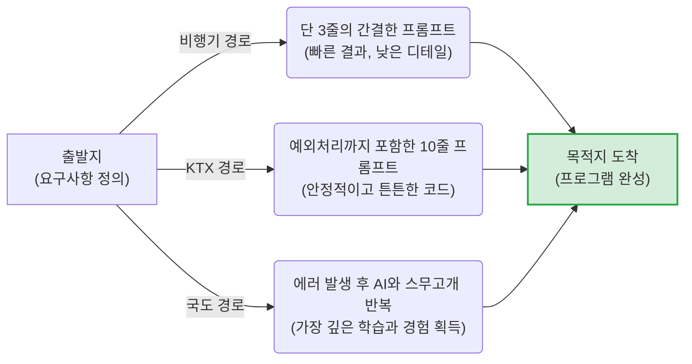

# 마이크로 세션: 020 — 동료 학습과 자주 묻는 질문 해결

> **세션 ID**: MS-PY101-020  
> **소요 시간**: 20분  
> **난이도**: low  
> **청크 타입**: narrative  
> **버전**: v2.1 (7섹션 구조)

---

## §1. 개요

> **Day 1 | PM | 세션 020/022**

이 세션은 오늘 하루 동안 각자 고군분투하며 쌓아온 경험을 동료들과 나누는 시간이에요. 하루 종일 파이썬을 설치하고, 에러 메시지와 씨름하고, AI에게 프롬프트를 던지며 꽤 많은 것을 이뤘습니다. 하지만 혼자서 모니터만 바라보는 학습은 딱 절반의 완성일 뿐이에요. 나머지 절반은 옆 사람의 화면을 들여다볼 때 비로소 채워집니다. 남들은 어떤 기발한 프롬프트를 썼는지, 그리고 어떤 황당한 에러에 빠졌는지 공유하면서 우리의 시야를 두 배로 넓혀보는 집단 지성의 장을 열어볼 거예요.

### 🎯 학습 목표

이 세션이 끝나면 수강생은 다음을 할 수 있어요:

- 에러 메시지를 숨기거나 부끄러워하지 않고, 학습의 소중한 자산으로 인식할 수 있습니다
- 동일한 목표를 달성하기 위해 동료들이 작성한 다양한 프롬프트 접근 방식을 비교하고 흡수할 수 있습니다
- 막히는 부분이 생겼을 때 혼자 안고 있지 않고 동료나 AI에게 적극적으로 질문하는 태도를 갖출 수 있습니다

### 선행 세션 환기

바로 앞선 세션 019에서 우리는 '고객 1명 관리 프로그램'이라는 미니 스펙을 직접 작성해 보았습니다. AI에게 단순히 "짜줘"라고 말하는 대신, 명확한 요구사항과 예외 처리를 담은 문서를 건넸죠. 이 과정에서 분명 누군가는 한 번에 깔끔한 코드를 얻었고, 누군가는 예상치 못한 에러 폭탄을 맞았을 거예요. 그 생생한 직전의 경험들이 이번 세션의 가장 훌륭한 교재가 됩니다.

---

## §2. 핵심 개념 (+ 🗣️ 강사 대본 + Mermaid)

### 정답이 없는 세계와 합법적인 시험지 훔쳐보기

학창 시절 수학 시험을 떠올려 보면, 정답은 늘 하나였고 남의 시험지를 보는 건 절대 용납되지 않는 부정행위였어요. 하지만 코딩과 AI의 세계는 완전히 반대입니다. 여기서는 남의 '시험지'를 적극적으로 훔쳐보고 내 것에 적용하는 사람이 가장 빨리 성장해요. 개발자들은 이것을 '오픈 소스 정신'이라고도 부르죠. 특히 AI에게 코드를 부탁할 때는, 질문(프롬프트)의 퀄리티가 결과물의 퀄리티를 결정합니다. 동료가 고안해 낸 멋진 질문 방식이나, 에러의 늪에서 빠져나온 탈출기를 공유하는 것은 가장 효율적인 지름길을 획득하는 방법이에요.

🗣️ **강사 대본 (Instructor Script)**:

> 여러분, 학창 시절에 수학 시험 쳤던 때를 잠시 떠올려 볼까요? 수학 문제에는 정답이 딱 하나뿐입니다. 푸는 과정도 웬만하면 비슷비슷하죠. 남의 시험지를 훔쳐보는 건 당연히 부정행위고요. 하지만 코딩의 세계에서는 완전히 다릅니다! 정답이 하나뿐인 시험과 달리, 코딩은 "서울에서 부산 가기" 미션과 같아요. 목적지에 도달하기만 하면 가는 방법은 수백, 수천 가지가 될 수 있죠. 그래서 개발자들은 남의 코드를 아주 당당하고 열정적으로 훔쳐봅니다. 오늘은 바로 그 합법적 훔쳐보기, '동료 학습'을 해볼 시간이에요.
>
> 방금 전 실습에서 우리 모두는 '고객 이름과 전화번호를 입력받아 출력하라'는 똑같은 미션을 AI에게 지시했습니다. 서울에서 출발해 부산이라는 똑같은 목적지에 도착하는 미션이었죠.
>
> 그런데 한 번 옆 사람의 화면을 쓱 보세요. 어떤 분은 비행기를 타듯 단 세 줄짜리 아주 간결한 프롬프트로 완벽한 코드를 얻어냈습니다. 어떤 분은 KTX를 타듯 예외 상황까지 꼼꼼하게 적은 열 줄짜리 프롬프트로 굉장히 튼튼한 코드를 만들어 냈고요. 또 어떤 분은 국도를 타듯, 가다가 에러를 만나서 AI와 스무고개 하듯 세 번 네 번 다시 질문해서 결국 도착했습니다.
>
> 자, 누구의 방법이 맞을까요? 놀랍게도 전부 정답입니다! 중요한 건, 프롬프트를 어떻게 쓰느냐에 따라 AI가 짜주는 코드의 결이 완전히 달라진다는 사실이에요. 다른 사람이 고안한 기발한 지시어나, 에러의 늪에 빠졌을 때 탈출했던 '지름길'을 훔쳐보는 것. 이것이 AI 시대에 가장 빠르게 성장하는 방법입니다. 이제 문제의 정답 코드를 달달 외우는 시대는 끝났어요. 누가 더 빠르고 효율적인 '질문'을 던지는지, 그 꿀팁을 나누는 것이 동료 학습의 진짜 묘미입니다.

> 💡 **강사 노트**: 비유를 던질 때 수강생들의 반응을 살피며 호흡을 조절하세요. 특히 "국도를 타듯 에러를 만난 분들"을 언급할 때, 그것이 결코 실패가 아니라 매우 자연스럽고 가치 있는 과정이라는 점을 따뜻한 어조로 강조해야 합니다.

### Mermaid 다이어그램



이 다이어그램은 같은 요구사항을 가지고도 얼마나 다양한 경로로 프로그램 완성에 도달할 수 있는지 보여줍니다. 어떤 경로를 택하든 결국 목적지에는 도착해요. 우리가 동료와 대화를 나누는 이유는, 내가 타보지 않은 다른 교통수단의 장단점을 간접 경험하기 위해서입니다.

---

## §3. 상세 내용

### Why — 왜 이 세션이 필요한가?

혼자서 모니터만 보고 끙끙 앓다 보면 시야가 무섭게 좁아집니다. 아주 단순한 오타 하나, 가령 쉼표 하나가 빠진 것을 1시간 동안 못 찾는 경우가 현업 개발자들에게도 허다해요. 하지만 옆 사람이 화면을 쓱 보면 3초 만에 "어? 거기 쉼표 빠졌는데요?" 하고 찾아냅니다. 다른 사람의 코드를 봐주는 순간, 문제의 본질이 마법처럼 선명하게 보이는 현상이죠.

또한, 초보자들은 에러가 나면 본인이 무언가 큰 잘못을 했다고 생각하며 위축되는 경향이 있어요. 동료들과 에러를 공유하는 과정은 이런 심리적 장벽을 완전히 허물어줍니다. "나만 에러가 나는 게 아니구나", "저 사람도 똑같은 데서 막혔었네"라는 공감대는 끝까지 학습을 이어나가게 만드는 강력한 원동력이 됩니다. 에러는 숨기는 것이 아니라 동네방네 자랑하고 공유해야 하는 귀중한 자산이에요. 

### What — 이 세션에서 다루는 것은 무엇인가?

이 세션에서는 거창한 이론이나 복잡한 문법을 새로 배우지 않습니다. 방금 전까지 여러분의 컴퓨터 화면에서 일어났던 '날것의 경험'들이 바로 메인 학습 주제예요. 

크게 두 가지를 다룹니다. 첫째는 '나의 기발한 프롬프트 자랑하기'입니다. AI 비서를 다룰 때 나는 "고객 이름 물어봐줘"라고만 쳤는데, 옆 사람은 "고객 이름은 2~5글자 한글로만 입력받게 해주고, 숫자가 들어오면 경고창을 띄워줘"라고 아주 디테일하게 지시했을 수 있어요. 그 디테일의 차이가 코드의 품질을 어떻게 바꾸는지 눈으로 직접 확인합니다.
둘째는 '오늘 나를 가장 괴롭힌 에러와 탈출기'입니다. 어떤 빨간 에러 메시지를 만났고, 그것을 AI에게 어떻게 물어봐서 결국 해결했는지 그 눈물겨운 과정을 생생하게 나눕니다.

### How — 구체적으로 어떻게 진행하는가?

오프라인 교육장의 물리적인 공간 이점을 최대한 활용합니다. 옆에 앉은 짝과 2인 1조가 되어 서로의 모니터를 물리적으로 보여주며 대화를 나눠요. 단순한 잡담으로 빠지지 않도록 강사가 명확한 두 가지 미션(프롬프트 자랑, 에러 공유)을 부여합니다. 짝꿍과의 대화가 끝나면, 강사가 교육장을 돌아다니며 미리 점찍어둔 아주 훌륭한 실패 사례나 독특한 프롬프트를 전체 화면에 띄우고 다 함께 해설하는 시간을 가집니다.

---

## §4. 실습 가이드 (+ 🎙️ 실습 대본)

### 실습 목표

코드 작성의 압박에서 잠시 벗어나, 동료의 화면을 보며 새로운 시각을 얻고 에러에 대한 두려움을 없애는 것이 핵심입니다. 활발한 대화를 통해 에러를 두려워하지 않는 개발 문화를 체화합니다.

🎙️ **실습 가이드 대본 (Lab Guide)**:

> 자, 지금부터 딱 10분간, 옆에 앉은 분과 2인 1조로 화면을 서로 보여주면서 이야기를 나누겠습니다. 그냥 구경만 하는 게 아니라, 두 가지 미션을 꼭 수행해 주셔야 해요.
> 
> 첫째, 내가 쓴 프롬프트 중에서 가장 기발했던 문장 하나를 자랑해 주세요. "나는 AI한테 이런 조건을 달았더니 코드가 이렇게 예쁘게 나왔어요!" 하고요.
> 둘째, 오늘 나를 가장 심하게 괴롭혔던 빨간 에러 메시지와 거기서 어떻게 탈출했는지 공유해 주세요. 
> 
> 다른 분이 겪은 에러는 내일 여러분이 집에서 혼자 복습할 때 겪을 바로 그 에러입니다. 부끄러워하지 말고 빨간 줄을 마구마구 자랑해 주세요. 우리는 그 속에서 엄청난 힌트를 얻을 겁니다. 자, 의자를 돌려주시고 지금부터 시작하세요!

### 단계별 지시

| 단계 | 소요 시간 | 강사 지시사항 | 학습자 액션 | 예상 결과 |
|------|----------|--------------|------------|----------|
| 1 | 2분 | "옆 사람과 2인 1조를 만들어 모니터를 서로 편하게 볼 수 있게 의자를 돌려주세요. 방금 전 작성한 프롬프트와 에디터 화면을 띄워놓습니다." | 자리 이동 및 화면 세팅 | 실습 준비 완료 |
| 2 | 10분 | "각자 오늘 당황했던 에러와, AI에게 던진 가장 긴 프롬프트를 번갈아가며 공유하세요." | 서로의 화면을 보며 경험담 교환 | 시야 확장, 에러에 대한 공감대 형성 |
| 3 | 5분 | "대화하며 발견한 '좋은 꿀팁'이나 아직 '해결 안 된 질문'이 있다면 손을 들고 전체에 발표해 주세요." | 자원자 발표 및 강사 질의응답 | 우수 사례의 전체 공유 |
| 4 | 3분 | 공통으로 자주 발생한 터미널 경로 문제, 파이썬 인코딩 문제 등을 취합하여 화면을 띄우고 전체 해설 진행 | 강사 화면 주시 및 필기 | 공통적인 문제에 대한 명확한 해결책 확보 |

### 트러블슈팅 FAQ

| Q | A |
|---|---|
| 수강생들이 쑥스러워하며 대화를 잘 나누지 않아요 | 강사가 직접 돌아다니며 한 수강생의 화면을 보고 "와, 이 프롬프트 정말 독특하네요. 옆에 분께 어떻게 생각하셨는지 설명해 주실래요?"라고 자연스럽게 대화의 물꼬를 터주세요. |
| "저는 너무 간단하게 써서 보여줄 게 없어요"라고 위축된 분이 있다면? | "간단하게 쓰고도 원하는 결과를 얻었다면 그것이 최고의 프롬프트입니다. 어떤 단어가 핵심이었는지 같이 찾아볼까요?"라며 격려해 주세요. |
| 해결되지 않은 에러를 붙잡고 계속 코딩만 하려는 조가 있다면? | 이 시간의 목적은 '완성'이 아니라 '공유'임을 상기시켜 주세요. "지금 안 고쳐도 괜찮아요. 그 에러 화면 그대로 띄워놓고 같이 구경하는 시간입니다"라고 안내하세요. |

> ✅ **체크포인트**: 에러는 남보다 못해서 나는 것이 아니라, 내가 피해야 할 또 다른 '함정 경로'를 용감하게 먼저 밟아보고 알려준 탐험가의 훈장이라는 것을 느끼셨나요?

---


### 🎓 강사 노트 (Instructor Support)

- ⏱️ **타이밍**: 17:45 (20분, lab)
- 🎯 **핵심 활동**: 프롬프트/오류 경험 공유
- ⚠️ **강사 주의사항**: 짝꿍 토론 구조화 (2분씩 교대 발표)


### 📋 실습 설계 보강 (Lab Packet)

**세션 020 실습 설계 보강**

동료 학습과 자주 묻는 질문 해결
- **3-Stage Example Set**
  - 기본: 오늘 겪은 에러 경험 1개를 옆 사람에게 공유 → 해결법 비교
  - 변형: 나의 프롬프트와 옆 사람의 프롬프트 비교 → 같은 기능인데 다른 접근법 발견
  - 실수 해결: "나만 에러가 나서 부끄러워요" → 에러를 가장 많이 겪은 사람이 가장 많이 배운 사람
- **난이도 예측**: 실습 난이도는 낮으나 타인 앞에서 발표하는 심리적 장벽
- **타이밍 가이드**: 개인 정리 3분 | 짝 공유 7분 | 전체 FAQ 5분 | 정리 5분
- **심리적 장벽**: "나만 못하는 것 같은" 불안 — 동료가 잘하는 것처럼 보임
- **자가 점검**:
  - [ ] 오늘 겪은 에러를 한 가지 이상 동료에게 공유했는가?
  - [ ] 동료의 프롬프트에서 새로운 표현이나 접근법을 발견했는가?
  - [ ] 에러를 겪는 것이 정상적인 학습 과정임을 수용했는가?

## §5. 코드 및 명령어 모음 — 해당 시

이 세션은 동료와의 대화가 주를 이루지만, 발표 시간에 흔히 공유되는 대표적인 사례들을 강사가 미리 알고 있으면 피드백하기가 훨씬 수월해집니다.

### 🌟 우수 프롬프트 공유 예시

**일반적인 프롬프트 (국도 경로)**:
> "고객 이름과 전화번호를 입력받는 파이썬 코드 짜줘."
> *(결과: AI가 기본적인 input() 함수만 사용한 코드를 줍니다. 문자가 입력되든 숫자가 입력되든 그냥 넘어가는 엉성한 코드가 될 확률이 높습니다.)*

**디테일이 살아있는 프롬프트 (KTX 경로)**:
> "너는 파이썬 백엔드 개발자야. 고객의 이름과 전화번호를 입력받는 프로그램을 만들어줘. 
> 제약조건: 
> 1. 이름은 무조건 한글 2~5글자 사이여야 해. 아니면 다시 입력받아.
> 2. 전화번호는 '010-XXXX-XXXX' 형식인지 검사하고, 하이픈(-)이 없으면 자동으로 넣어서 저장해줘."
> *(결과: 이 프롬프트를 본 동료는 "아, 예외 처리 조건을 사람이 먼저 다 지정해 줘야 AI가 튼튼하게 짜주는구나!"라는 깊은 깨달음을 얻습니다.)*

### 🔥 자주 등장하는 에러 메시지 해설

수강생들이 가장 많이 자랑(?)하게 될 대표적인 에러들입니다. 강사가 화면에 띄워놓고 함께 짚어주면 좋습니다.

**1. 터미널 경로가 잘못된 경우 (가장 흔함)**
```bash
python.exe: can't open file 'C:\Users\test\app.py': [Errno 2] No such file or directory
```
- **해설**: 코드는 바탕화면 폴더에 만들었는데, 터미널은 내 문서 폴더를 가리키고 있을 때 발생해요. "네비게이션은 부산을 찍었는데, 차는 아직 출발도 안 하고 주차장에 있는 상태"라고 비유해 주면 이해가 빠릅니다.

**2. 가상환경 활성화를 깜빡한 경우**
```bash
ModuleNotFoundError: No module named 'requests'
```
- **해설**: 분명히 아까 패키지를 깔았는데 없다고 나오는 황당한 상황이죠. 터미널 프롬프트 앞에 `(.venv)` 표지가 있는지 확인하라고 일러주세요. "우리가 만든 전용 주방에 안 들어가고, 엉뚱한 남의 주방에서 냄비를 찾고 있는 상황"입니다.

---

## §6. 요약

### 핵심 학습 포인트

혼자서 10번 삽질하며 고생할 것을, 동료의 화면을 한 번 슬쩍 훔쳐보는 것만으로도 순식간에 해결할 수 있습니다. 이것이 10배 빨리 배우는 비결이에요. 동료 학습을 통해 우리는 내가 미처 생각지 못했던 프롬프트 조건들이 얼마나 다양한지 배웠습니다. 또한, 징그러웠던 빨간 에러 메시지들이 사실은 서로의 시행착오를 줄여주는 훌륭한 교보재라는 사실도 깨달았죠. 집단 지성은 AI 시대의 개발자가 가져야 할 가장 강력한 무기입니다.

### 다음 세션 예고

오늘 하루 종일 환경을 설치하고, 코드를 실행하고, 에러를 내고, 다시 지시하며 수많은 도구와 새로운 개념들을 만났습니다. 이 귀중한 경험들이 오늘 밤 자고 일어나면 머릿속에서 날아가 버릴지도 몰라요. 휘발되기 전에 내 머릿속에 꽉 잡아둘 시간이 필요하겠죠? 아주 가벼운 퀴즈로 오늘 하루를 총정리해 보겠습니다.

### 브릿지 노트

> "여러분들의 꿀팁 대방출, 그리고 치열했던 에러 탈출기 정말 잘 들었습니다! 동료들과 이야기해 보니 내가 미처 생각지 못했던 팁들이 꽤 많았죠? 이것들을 내일도 써먹으려면 오늘 배운 뼈대를 탄탄하게 다져야 합니다. 긴장 살짝 푸시고, 아주 쉬운 퀴즈로 오늘 하루를 기분 좋게 총정리해 봅시다. 다음 세션으로 넘어갈까요?"

---

## §7. 참고 자료

### 3-Source 출처

- **Source A (로컬 참고자료)**: 「AI 시대의 서사 v3 - Claude.md」 — '수학 시험 vs 서울에서 부산 가기' 비유. 정답을 맞히는 과정이 아니라 목적지를 향한 다양한 경로가 존재한다는 철학적 기반을 제공했습니다.
- **Source B (NotebookLM)**: NotebookLM 분석 리포트 — 에러는 학습의 기회이며, 프롬프트 한계점을 비교 분석하는 것이 실력 향상에 직결된다는 실습 설계의 근거를 가져왔습니다.
- **Source C (Deep Research)**: Deep Research 보고서 — 에이전트 주도 개발에서 집단 지성(Peer Learning)을 통한 빠른 문제 해결과 디버깅 역량 강화 트렌드를 반영했습니다.

### 강사 노트

> 💡 **강사 노트**: 동료 학습 시간에 분위기가 조용히 가라앉지 않도록 강사가 적극적으로 순회하는 것이 생명입니다. 독특한 프롬프트를 쓴 수강생이나 아주 전형적인 에러(예: 들여쓰기 오류, 가상환경 미활성화 등)를 겪은 수강생을 발견하면, 큰 소리로 "와, 이분 화면 정말 훌륭한 교보재네요! 다들 잠깐 주목해 주실래요?"라고 칭찬하며 전체 공유를 유도하세요. 팩트 패킷에 명시된 대로 **"다른 분이 겪은 에러는 내일 여러분이 집에서 겪을 에러입니다. 부끄러워하지 말고 자랑해 주세요."**라는 멘트를 반드시 사용해 심리적 안전감을 만들어 주시기 바랍니다.

---

## ✅ 세션 완료 체크리스트 (강사용)

- [ ] §1~§7 모든 섹션이 충실하게 작성되었는가?
- [ ] 수학 시험과 목적지 도달 비유가 효과적으로 포함되었는가?
- [ ] 2인 1조 모니터 공유 실습 안내가 명확한가?
- [ ] 에러를 긍정적으로 바라보게 하는 메시지가 전달되었는가?
- [ ] 3-Source 팩트 패킷의 핵심 내용과 스크립트가 반영되었는가?

---

*작성 일시: 2026-02-25*  
*작성 에이전트: A4B_Session_Writer*  
*교안 구조: 7섹션 (A0 팀 공통 표준)*