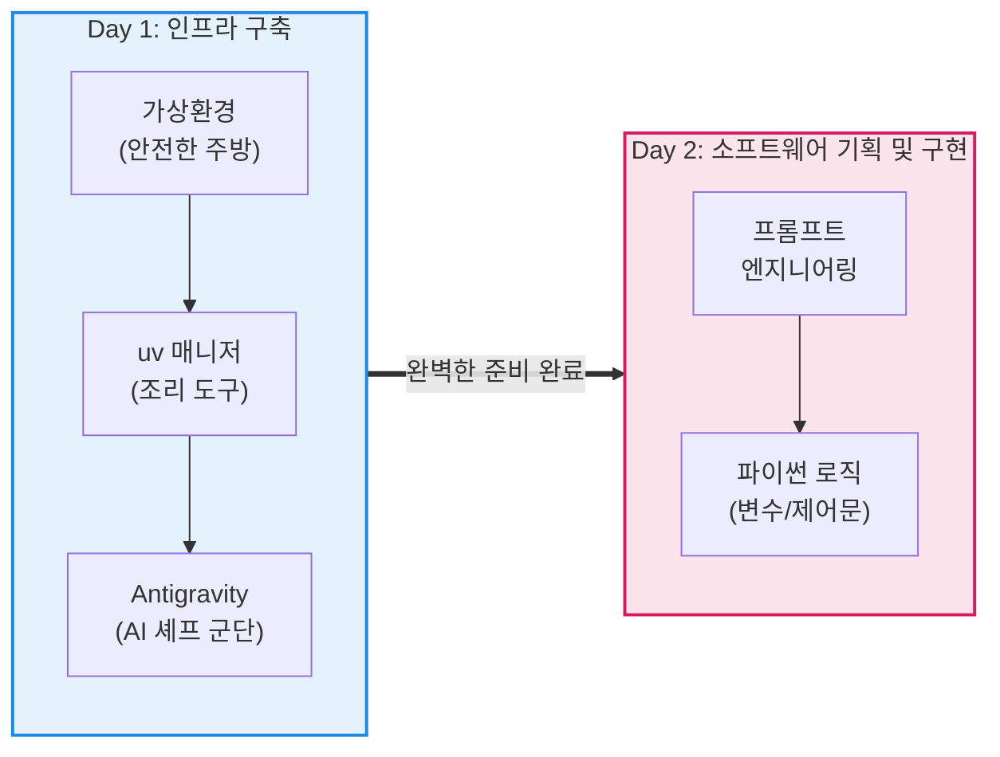

# 마이크로 세션: 022 — 마무리 및 Day 2 예고

> **세션 ID**: MS-PY101-022
> **소요 시간**: 15분
> **난이도**: low
> **청크 타입**: narrative
> **버전**: v2.1 (7섹션 구조)

---

## §1. 개요

> **Day 1 | PM | 세션 022/022**

이 세션은 5일간 40시간에 걸친 "AI-native 파이썬 기초" 과정 중 첫째 날을 마무리하는 아주 중요한 시간이에요. 수강생들은 오늘 하루 동안 낯선 까만 터미널 창과 씨름하고, 새로운 AI 통합 개발 환경인 Antigravity를 설치하며 쉴 새 없이 달려왔습니다. 

이 세션은 단순히 컴퓨터 전원을 끄고 집에 가는 시간이 아닙니다. 오늘 하루 이룬 거대한 성취를 스스로 인지하게 돕고 심리적 보상을 제공하며, 내일 이어질 흥미진진한 여정에 대한 기대감을 한껏 불어넣는 것이 이 15분의 진짜 목적입니다. 비전공자에게 코딩 학습의 첫날은 심리적 장벽이 가장 높은 날이기 때문에, 기술적 완결보다 '마인드셋의 재정비'가 핵심이 됩니다.

### 🎯 학습 목표

이 세션이 끝나면 수강생은 다음을 할 수 있어요:

- 첫날의 학습 성과(AI 개발 환경 구축 및 코더에서 기획자로의 패러다임 전환)를 스스로 인지하고 성취감을 느낄 수 있습니다.
- "오늘 배운 것 한 줄 요약" 활동을 통해 자신의 핵심 인사이트를 명확한 언어로 정리할 수 있습니다.
- Day 2에서 배우게 될 '프롬프트 엔지니어링 심화' 및 '파이썬 필수 문법(변수, 자료형, 조건문)'의 강력한 연결 고리를 설명할 수 있습니다.
- 가상환경 비활성화(`deactivate`) 명령어를 사용하여 안전하게 실습 환경을 종료하고 정리할 수 있습니다.

### 선행 세션 환기

바로 앞 세션이었던 '세션 021: Day 1 핵심 정리 퀴즈와 QnA'에서 우리는 오늘 하루 동안 다룬 5대 핵심 개념을 복습했습니다. "코더에서 에이전트 관리자로의 역할 변화", "uv를 통한 초고속 환경 구축", 그리고 "예측-검증-설명 학습법" 같은 굵직한 주제들을 떠올리면서, 자연스럽게 첫날의 여정을 아름답게 마무리하는 마지막 단계로 진입하게 됩니다.

---

## §2. 핵심 개념 (+ 🗣️ 강사 대본)

### Day 1 성취 요약: "최고급 프렌치 주방과 유능한 AI 셰프 군단"

오늘 하루 종일 진행했던 가상환경 구축, 패키지 설치, 그리고 IDE 설정 과정은 비유하자면 '최고급 프렌치 레스토랑의 주방'을 설계하고 짓는 과정과 완벽하게 같습니다. 재료들이 서로 섞이지 않도록 신선하게 보관할 최고급 냉장고(가상환경)를 들여놓았고, 요리를 순식간에 끝내 줄 최신형 오븐과 마법의 조리도구(uv 패키지 매니저)를 세팅했어요. 

그리고 무엇보다도 중요한 것은, 여러분의 지시만 떨어지면 눈부신 속도로 양파를 썰고 고기를 굽고 소스를 졸여줄 아주 똑똑하고 유능한 AI 주방장들(에이전트 군단)을 주방 곳곳에 대기시켜 두었다는 사실입니다. 코딩이라는 정교한 요리를 만들어내기 위한 완벽한 하드웨어와 인프라가 100% 준비된 것이죠.

🗣️ **강사 대본 (Instructor Script)**:

> 여러분, 정말 고생 많으셨습니다! 우리 스스로를 위해 아주 크고 힘찬 박수를 한 번 쳐볼까요? (모두 함께 짝짝짝) 
>
> 파이썬이라는 단어조차 낯설었던 오늘 아침부터 시작해서 지금까지, 정말 숨 가쁘게 달려왔고 또 놀라운 성과를 이루어 냈습니다. 불과 8시간 전만 해도 여러분의 컴퓨터는 그저 웹서핑을 하거나 엑셀 문서를 끄적이는 평범한 소비형 도구에 불과했어요. 
> 
> 하지만 지금 여러분 앞의 모니터를 한 번 보세요. 우리는 두려워하던 까만 터미널 창을 자유롭게 제어하게 되었고, 구글의 최첨단 통합 개발 환경인 Antigravity를 통해 AI 비서들을 언제든 호출할 수 있게 되었습니다.
> 
> 오늘 우리가 하루 종일 고생하며 세팅한 이 환경은, 단순히 프로그램 몇 개를 깐 것이 아닙니다. 여러분만의 전속 AI 주방장들이 상주하는 '최첨단 5성급 주방'을 오픈한 거예요. 옛날 선배 개발자들이 반나절씩 끙끙대던 환경 세팅을, 우리는 uv라는 마법 지팡이로 단 1초 만에 프로젝트마다 각기 다른 주방(가상환경)을 만들어내는 기술도 익혔죠. 이제 여러분의 상상력만 더해지면 무엇이든 만들어낼 수 있는 완벽한 준비가 끝났습니다.
>
> 오늘 하루, 낯선 오류 메시지를 마주하고 극복해 내느라 정말 애쓰셨어요. 빨간색 영어로 도배된 에러 메시지가 떴을 때 심장이 덜컥 내려앉는 기분, 저도 아주 잘 압니다. 하지만 그 붉은 에러 줄들은 모두 여러분을 유능한 총괄 셰프로 만들어주기 위한 완벽한 예방주사였습니다. 첫날인데도 파이썬 환경 구축부터 첫 번째 파이썬 코드 생성까지 이렇게 놀라운 속도로 완주해 주셔서, 여러분을 이끄는 강사로서 정말 뿌듯하고 자랑스럽습니다.

### Mermaid 다이어그램: Day 1의 성취와 Day 2의 방향



이 다이어그램은 첫날의 기술적 준비가 어떻게 둘째 날의 창의적 작업으로 연결되는지를 직관적으로 보여줍니다. 뼈대가 튼튼해야 훌륭한 건물을 올릴 수 있는 법이죠.

---

## §3. 상세 내용

### Why — 완벽한 주방이 있어도 요리가 망하는 이유는? (Day 2의 필요성)

훌륭한 인프라를 구축했으니 당장 내일 엄청난 소프트웨어가 뚝딱 나올까요? 애석하게도 그렇지 않습니다. 내일 아침, 출근한 여러분이 이 똑똑한 AI 주방장에게 단순히 "야, 맛있는 거 하나 알아서 해줘!"라고 뭉툭하게 지시하면 어떻게 될까요? 

주방장은 자신의 느낌(Vibe)대로 짜파게티를 끓여올 수도 있고, 엄청나게 매운 마라탕을 만들어올 수도 있어요. 손님이 간절히 원했던 요리가 부드러운 안심 스테이크였다면, 주방장과 오븐이 아무리 훌륭해도 그것은 완벽히 실패한 요리가 되고 맙니다. 

주방과 요리사가 아무리 뛰어나다 한들, 주방을 지휘하는 '총괄 셰프'인 여러분이 "무엇을, 어떻게, 어떤 제약사항을 지켜서 만들 것인지" 명확하게 지시하지 않으면 결코 원하는 결과물을 얻을 수 없어요. 이것이 바로 우리가 내일 '프롬프트 엔지니어링'과 '명세 주도 개발(SDD)'을 깊이 있게 파고들어야 하는 절대적인 이유입니다. 코드를 직접 치는 기술보다 훨씬 더 본질적인 '생각하고 기획하는 법'을 훈련하게 됩니다.

### What — Day 2에서는 무엇을 배우는가?

내일의 핵심 주제는 **"AI 주방장에게 100점짜리 지시 내리기"**입니다. 이를 위해 세 가지 핵심 무기를 장착하게 됩니다.

1. **프롬프트 5대 필수 항목**: 단순히 "나이 계산기 만들어줘"라는 짧은 지시를 넘어서, 프로그램의 [핵심 기능], 사용자의 [입력], 화면의 [출력], 절대 어기면 안 되는 [제약 조건], 그리고 사용자가 엉뚱한 행동을 했을 때의 [예외 처리]를 꼼꼼하게 정의하는 방법을 배웁니다. 이를 통해 AI가 엉뚱한 코드를 짜오는 이른바 '환각(Hallucination)' 현상을 완벽하게 차단할 수 있어요.
2. **제품 요구사항 정의서(PRD)**: 땜질식 코드 수정을 넘어서, 글로 명확하게 쓴 문서가 전체 소프트웨어 개발의 절대적 기준점이 되는 '명세 주도 개발(SDD)'의 진수를 맛보게 됩니다. Vibe Coding의 한계를 극복하는 핵심 열쇠입니다.
3. **파이썬의 진짜 논리 (변수, 자료형, 조건문, 반복문)**: AI가 짜준 코드를 그저 멍하니 바라보는 것이 아니라, 능동적으로 지배하는 훈련을 합니다. "아, 이 변수에는 사용자 입력이 들어가고, 여기서 조건문으로 잘못된 입력을 걸러내는구나"라고 정확하게 코드를 읽고 검증하는 능력(Review-driven Development)을 기릅니다.

### How — 내일의 실습은 어떻게 진행되는가? (역프롬프팅 미리보기)

내일 실습 시간에는 여러분이 백지상태에서 끙끙대며 기획서를 직접 쓰는 것이 아니라, AI를 유능한 '기획 컨설턴트'로 역으로 활용하는 놀라운 경험을 하게 될 거예요.

예를 들어 여러분의 머릿속에 "우리 동네 카페의 단골손님을 관리하는 프로그램을 만들고 싶어"라는 아주 추상적이고 막연한 아이디어만 있다고 가정해 봅시다. 

과거에는 백지상태에서 모든 기획서를 직접 타이핑해야 했지만, 내일은 '역프롬프팅(Reverse Prompting)'이라는 마법 같은 기술을 사용합니다. AI에게 "네가 최고의 IT 기획자라고 생각하고, 내가 동네 카페 앱을 기획할 수 있도록 나에게 필요한 질문을 스무고개 하듯 하나씩 던져줘"라고 지시하는 겁니다. 

그러면 AI가 "사장님, 손님 등급은 몇 단계로 나눌까요?", "포인트 적립 비율은 얼마로 할까요?", "결제는 현금과 카드 중 무엇을 지원할까요?" 라며 끝없는 질문 공세를 펼칩니다. 여러분은 그저 대답만 하면 됩니다. 대답이 끝나면 AI가 여러분의 막연한 아이디어를 완벽하고 날카로운 PRD 문서로 깎아내고 다듬어 줄 것입니다. 코딩은 오직 이 완벽한 문서가 나온 뒤에만 시작됩니다.

---

## §4. 실습 가이드 (+ 🎙️ 실습 대본)

이 세션의 실습은 두 파트로 나뉩니다. 첫째는 오늘 배운 거대한 패러다임 전환을 뇌에 단단히 새기는 "오늘 배운 것 한 줄 요약" 활동이고, 둘째는 우리가 띄워놓은 완벽한 주방의 불을 끄고 안전하게 퇴근하는 "환경 종료" 작업입니다.

### 🎙️ 실습 가이드 대본 (Lab Guide)

> 자, 이제 정말 퇴근 준비를 해보겠습니다. 컴퓨터 전원을 끄기 전에, 오늘 우리의 뇌가 흡수한 수많은 정보들을 딱 한 줄로 압축해서 단기 기억을 장기 기억으로 넘기는 작업을 할 거예요.
>
> **[활동 1] 오늘 배운 것 한 줄 요약 (5분)**
> 옆에 앉은 짝꿍과 잠시 마주 보세요. 오늘 배운 모든 내용—가상환경의 필요성, uv의 놀라운 속도, AI와의 대화법, 문제 정의의 중요성 등등—을 전부 통틀어서 **"나에게 있어 오늘 하루의 핵심은 OOO이다"**라는 딱 한 문장을 만들어 서로 나누어 주세요. 혼자 생각하기 어렵다면 화면에 띄워둔 우리 AI 비서에게 "오늘 내가 너랑 나눈 대화를 바탕으로, 오늘 배운 핵심을 한 줄로 요약해 봐"라고 물어보셔도 좋습니다! 시작해 볼까요?
>
> (5분 간의 활발한 토론 진행 후)
> 
> 네, 시간이 다 되었습니다. 아주 좋습니다. 여러 테이블에서 훌륭한 요약들이 나왔네요. "코딩은 AI가 하고, 생각은 내가 한다", "가상환경은 안전한 나만의 주방이다", "명령어를 외우지 말고 질문하는 법을 외우자" 같은 멋진 문장들이 들렸습니다. 여러분 모두 오늘 하루의 핵심을 정확하게 꿰뚫고 계시네요.
> 
> **[활동 2] 환경의 안전한 종료 (5분)**
> 이제 내일의 더 흥미진진한 실습을 위해 이 완벽한 주방의 가스 밸브를 잠그고 불을 끄고 안전하게 퇴근해 보겠습니다. 화면을 보시고 저를 천천히 따라와 주세요.
>
> 1. 열려있는 에디터 탭의 코드를 모두 저장(`Ctrl+S` 또는 `Cmd+S`)해 주세요. 동그라미 아이콘이 X 모양으로 바뀌어야 저장이 완료된 겁니다.
> 2. 우측 Agent Manager 창에 켜져 있는 수많은 AI 대화 세션들이 있다면, 모두 'Clear' 또는 '종료' 버튼을 눌러 깔끔하게 정리해 줍니다. 
> 3. 까만 터미널 창을 마우스로 클릭하시고 `deactivate`라고 입력한 뒤 엔터를 쳐주세요.
> 4. 프롬프트 앞부분에 있던 초록색 `(.venv)` 글자가 스르륵 사라졌나요? 축하합니다. 여러분은 가상환경이라는 주방에서 문을 닫고 안전하게 밖으로 나왔다는 뜻입니다.
> 5. 이제 우측 상단의 빨간 X 버튼을 눌러 터미널과 Antigravity IDE를 완전히 종료해 주시면 됩니다!

### 단계별 지시

| 단계 | 소요 시간 | 강사 지시사항 | 학습자 액션 | 예상 결과 |
|------|----------|--------------|------------|----------|
| 1 | 5분 | "짝과 함께 오늘 배운 내용 한 줄 요약하기" | 짝과 토론 혹은 AI에게 요약 프롬프트 입력 | 자신만의 언어로 Day 1 패러다임 전환 내재화 |
| 2 | 2분 | 에디터 저장 및 에이전트 창 정리 안내 | 파일 저장 단축키 사용 및 세션 Clear | 내일 작업을 위한 작업 내역 안전 저장 |
| 3 | 3분 | 터미널 가상환경 비활성화 안내 | `deactivate` 명령어 직접 입력 | 터미널 프롬프트에서 `(.venv)` 표식 소멸 확인 |
| 4 | 5분 | Day 2 예고 및 과제 안내 | 강사 설명 경청 및 가방 등 짐 챙기기 | 내일 학습에 대한 높은 기대감 및 동기부여 고취 |

### 트러블슈팅 FAQ

| Q | A |
|---|---|
| `deactivate`를 쳤는데 아무 반응이 없고 초록색 `(.venv)`가 안 없어져요. 제가 뭘 잘못한 걸까요? | 간혹 Windows PowerShell 환경이나 특정 터미널 설정에서 명령어 반영에 딜레이가 있거나 화면이 갱신되지 않는 경우가 있습니다. 당황하지 마시고 터미널 창 우측 상단의 휴지통 아이콘(Kill Terminal)을 눌러 터미널 자체를 종료하셔도 가상환경은 안전하게 종료되니 안심하세요. |
| 오늘 짠 코드 파일이나 세팅이 내일 컴퓨터를 다시 켜면 초기화되거나 없어지면 어떡하나요? | 우리가 작업한 폴더 내에 명시적으로 저장(Ctrl+S)만 잘 해두셨다면 내일 Antigravity를 다시 켤 때 100% 그대로 남아있습니다. 이 IDE는 여러분이 어제 퇴근할 때 떠난 그 자리를 아주 정확하게 기억하고 복원해 줍니다. |
| 첫날부터 너무 벅차고 진도가 빨랐던 것 같습니다. 혹시 오늘 복습해야 할 과제나 숙제가 따로 있나요? | 오늘 밤의 유일하고 가장 중요한 과제는 **"아무 생각 없이 푹 주무시는 것"**입니다! 사람의 뇌가 오늘 쏟아진 엄청나고 낯선 개념들을 정리하고 연결하려면 충분한 수면 시간이 반드시 필요하거든요. 오늘 배운 팩트 패킷은 내일 아침에 다시 자연스럽게 복습할 테니 아무 걱정 말고 푹 쉬세요. |

### ✅ 자가 체크리스트

- [ ] 오늘 하루 가장 중요하게 느낀 깨달음(예: 코더에서 기획자로의 변화)을 한 문장으로 명확하게 말할 수 있는가?
- [ ] 터미널 창에서 `deactivate` 명령어를 입력해 가상환경(`(.venv)`)을 정상적으로 빠져나왔는가?
- [ ] 내일 배울 핵심 내용이 단순한 파이썬 문법 암기가 아니라 '프롬프트 작성과 구조적 기획'이라는 점을 정확히 이해했는가?

---


### 🎓 강사 노트 (Instructor Support)

- ⏱️ **타이밍**: 18:25 (15분, narrative)
- 🎯 **핵심 활동**: Day 2 프롬프트 엔지니어링 예고
- ⚠️ **강사 주의사항**: 기대감 조성: "내일은 AI와 진짜 대화법"

## §5. 코드 및 명령어 모음

### 1. 가상환경 비활성화 (환경 종료)
가상환경(`uv venv`)을 활성화하여 작업한 후, 작업을 마치고 원래의 기본 시스템 환경으로 복귀할 때 사용하는 필수 명령어입니다.

```bash
# 터미널 창 활성화 후 아래 명령어 입력 및 Enter
deactivate
```
*설명: 이 명령어를 실행하면, 터미널 프롬프트 제일 앞에 표시되어 있던 초록색 `(.venv)` 표기가 즉시 사라져야 합니다. 이는 여러분이 프로젝트 전용 주방에서 빠져나와 일반 시스템 공간으로 돌아왔음을 의미합니다.*

### 2. 🤖 AI 회고 프롬프트 (한 줄 요약 보조용)
수강생이 8시간의 긴 수업 내용 때문에 '한 줄 요약'을 스스로 도출하기 막막해할 때, Antigravity의 AI 채팅창에 직접 던져볼 수 있는 도우미 프롬프트입니다.

```text
우리가 오늘 아침부터 나눈 모든 대화의 맥락과 네가 방금 작성해 준 파이썬 코드들을 전체적으로 쭉 훑어보고, 내가 오늘 하루 동안 새롭게 배우고 달성한 가장 중요한 핵심 1가지를 추출해 줘. 
그리고 그 내용을 "오늘의 깨달음: [핵심 메시지]" 형식의 아주 멋지고 임팩트 있는 한 줄로 요약해 줄래?
```

---

## §6. 요약

### Day 1 팩트 패킷 종합 정리

오늘 우리는 아주 놀라운 여정을 마쳤습니다. 
1. **패러다임 전환**: 코드를 타이핑하는 코더(Coder)에서 출발해, 시스템을 지휘하고 AI를 부리는 '에이전트 관리자(Agent Manager)'로 완벽하게 역할을 이동했습니다. 
2. **인프라 세팅**: 그 시작점으로서 파이썬 인터프리터를 설치하고, uv라는 강력한 최신 패키지 매니저로 불과 1초 만에 쾌적한 가상환경 주방을 뚝딱 지어냈죠. 
3. **태도의 변화**: 무작정 코드를 복사해서 붙여넣고 Run 버튼을 누르던 나쁜 습관을 버리고, 결과를 먼저 생각하는 '예측-검증-설명'의 능동적 태도도 장착했습니다. 

오늘 여러분이 겪은 수많은 빨간 에러 메시지들은 모두 내일의 퀀텀 점프를 위한 단단한 디딤돌이 될 것입니다. 

### Day 2 브릿지 노트

> "오늘 우리가 함께 고생하며 구축한 이 완벽한 주방 환경이, 내일 여러분의 든든한 무대이자 강력한 날개가 되어줄 것입니다. 내일 아침에는 이 환경의 불을 다시 켜고, 가장 먼저 'AI 주방장에게 100점짜리 완벽한 업무 지시를 내리는 법'에 대해 본격적인 실험을 해보겠습니다.
> 
> 오늘 여러분이 이루어 낸 성취는 정말 대단한 것입니다. 스스로를 자랑스러워하셔도 좋습니다. 모두 홀가분하고 가벼운 발걸음으로 퇴실해 주시고, 맛있는 저녁 식사 하신 뒤 푹 주무세요. 내일 아침에 밝고 건강한 얼굴로 다시 뵙겠습니다. 감사합니다!"

---

## §7. 참고 자료

### 3-Source 출처 매핑

- **Source A (로컬 참고자료)**: 「AI 시대의 서사 v3 - Claude.md」 — 요리사(AI)와 메뉴 기획자(사람)의 분업 구조 비유, 요구사항 명세서를 진실의 원천으로 취급하는 명세 주도 개발(SDD) 방법론의 배경 철학을 강사 대본의 핵심 스토리로 반영했습니다.
- **Source B (NotebookLM)**: NotebookLM 분석 리포트 — 코더에서 에이전트 관리자로의 패러다임 전환을 요약하고, 프롬프트 엔지니어링 4요소(PTCF)의 필수성을 강조하기 위한 Day 2 예고 흐름(Why-What-How) 설계에 직접 활용했습니다.
- **Source C (Deep Research)**: Deep Research 보고서 — 단일 모델의 한계를 넘어 다중 에이전트를 오케스트레이션(Agent-First)하는 개념과, Vibe Coding의 위험성을 회피하기 위한 예측-검증-설명 학습법의 중요성을 세션 마무리 회고 메시지에 통합하여 서술했습니다.

### 강사 노트

> 💡 **강사 팁 (Instructor Tips)**: 
> 
> 첫날의 마지막 세션이므로 철저하게 **'성취감 고취'**와 **'격려'**에 포커스를 맞추셔야 합니다. 기술적인 세부 사항에 얽매이기보다는, 비전공자인 수강생들이 8시간 동안 포기하지 않고 낯선 도구(터미널 명령어, IDE 인터페이스, 다중 AI 에이전트)와 친해진 것 자체를 성대하게 축하해 주는 것이 좋습니다. 
> 
> 특히 실습 파트의 "오늘 배운 것 한 줄 요약" 시간에 강사가 교실을 돌아다니며 수강생들이 짝꿍과 웃으며 대화하는 긍정적인 분위기를 적극적으로 유도해 주세요. 이 세션에서 "나는 해냈다", "재미있다"는 감정을 안고 집에 가야만, 코딩이 본격화되는 Day 2 아침의 교실 분위기가 눈에 띄게 활기차집니다. 마지막 인사는 최대한 밝고 큰 목소리로 에너지를 전달해 주세요.

---

## ✅ 세션 완료 체크리스트 (강사용)

- [ ] §1~§7 모든 섹션이 빠짐없이 충실하게 작성되었는가?
- [ ] '최고급 주방과 셰프' 비유가 Day 2 프롬프트 작성의 당위성으로 자연스럽고 매끄럽게 이어지는가?
- [ ] "오늘 배운 것 한 줄 요약" 활동이 실습 가이드와 강사 대본에 구체적이고 실행 가능하게 포함되었는가?
- [ ] `deactivate`를 통한 가상환경 종료 절차가 누락 없이 명확하게 안내되었는가?
- [ ] 첫날의 성취를 축하하는 긍정적이고 격려하는 어조(Tone & Manner)가 강의 대본 전반에 일관되게 유지되었는가?

---

*작성 일시: 2026-02-25*  
*작성 에이전트: Sisyphus-Junior*  
*교안 구조: 7섹션 (A0 팀 공통 표준)*