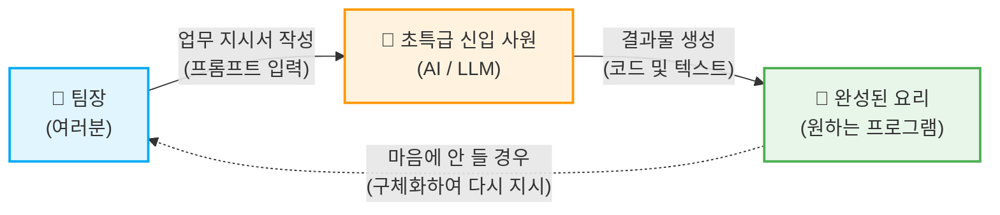
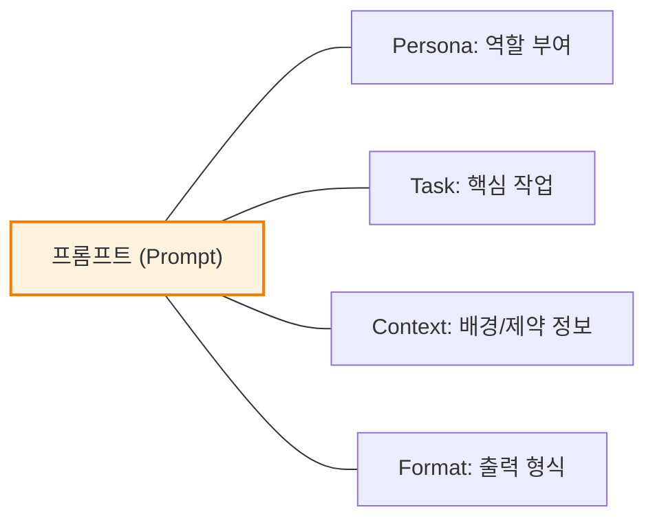

# 마이크로 세션: 023 — 프롬프트의 본질

> **세션 ID**: MS-PY101-023  
> **소요 시간**: 20분  
> **난이도**: low  
> **청크 타입**: narrative  
> **버전**: v2.1 (7섹션 구조)

---

## §1. 개요

> **Day 2 | AM | 세션 023/043**

이 세션은 2일 차 아침의 문을 여는 첫 번째 시간입니다. 어제(Day 1) 우리는 Antigravity 환경을 구축하고 AI에게 첫 코드를 부탁해 보았습니다. 오늘은 그 경험을 바탕으로, 우리가 AI에게 건네는 "말 한마디"의 정체를 깊이 있게 파헤칩니다. 프롬프트 엔지니어링의 본질을 '예술과 과학의 결합'이라는 관점에서 이해하고, '신입 사원에게 주는 업무 지시서' 비유를 통해 명확한 소통의 중요성을 깨닫는 것이 이 세션의 핵심입니다.

### 🎯 학습 목표

이 세션이 끝나면 수강생은 다음을 할 수 있어요:

- 프롬프트를 단순한 '검색어'가 아닌 '명확한 업무 지시서'로 정의할 수 있습니다.
- 모호한 프롬프트가 왜 환각(Hallucination)을 유발하는지 LLM의 특성과 연관 지어 설명할 수 있습니다.
- '나쁜 프롬프트'와 '좋은 프롬프트'를 구별하고, 구체성이 결과물의 품질을 어떻게 바꾸는지 체감할 수 있습니다.

### 선행 세션 환기

어제 마지막 세션에서 우리는 AI를 활용해 각자 간단한 파이썬 코드를 실행해 보았습니다. "나이 계산기 만들어줘"라고 했을 때, 어떤 수강생은 완벽하게 작동하는 코드를 받았지만, 어떤 수강생은 엉뚱한 에러가 나는 코드를 받기도 했습니다. 이 세션에서는 "왜 똑같은 AI를 썼는데 결과가 달랐을까?"라는 어제의 의문을 출발점으로 삼아, 프롬프트의 중요성을 자연스럽게 환기합니다.

---


### 🌟 차별화 포인트 (Differentiation Strategy)

> 🌟 **Day 2 서사: 통역의 기술** — 모호한 일상어에서 명확한 지시어로 — 기억력은 완벽하지만 눈치가 전혀 없는 천재 신입사원(AI)을 다루는 법. 나의 의도를 모호함 없이 전달하는 프롬프트를 작성하고, 백지상태의 아이디어를 PRD(설계도)로 변환합니다.

## §2. 핵심 개념 (+ 🗣️ 강사 대본 + Mermaid)

### 비유: 눈치 없는 초특급 신입 사원과 완벽한 김치찌개

프롬프트의 본질을 설명하는 가장 강력하고 직관적인 비유는 바로 "신입 사원에게 주는 업무 지시서"입니다. AI는 세상의 모든 지식을 다 알고 있고 타의 추종을 불허하는 속도로 일하는 '초특급 신입 사원'이지만, 인간이 당연하게 여기는 행간의 맥락(눈치)을 스스로 파악하지는 못합니다. 이 비유를 통해 수강생들은 "내가 대충 말해도 AI가 개떡같이 말해도 찰떡같이 알아듣겠지"라는 환상을 깨고, 구체적이고 명확한 지시의 필요성을 체감하게 됩니다.

🗣️ **강사 대본 (Instructor Script)**:

> 여러분, 좋은 아침입니다! 어제 Day 1에서 정말 많은 것을 해내셨습니다. Antigravity IDE를 설치하고, Python 환경을 구축하고, 심지어 AI에게 코드를 부탁해서 실행까지 해보셨죠.
> 
> 어제 실습 때 기억나시나요? AI에게 "나이 계산기 만들어줘"라고 똑같이 입력했는데, 누군가는 멋진 코드를 받았고 누군가는 전혀 다른 엉뚱한 결과를 받았을 겁니다. 왜 같은 회사의 똑같은 AI를 썼는데 결과가 달랐을까요? 혹시 AI가 기분파라서 그랬을까요? 물론 아닙니다. 차이를 만든 것은 바로 여러분이 AI에게 건넨 "말 한마디"의 품질이었습니다. 오늘 Day 2의 첫 시간인 이 세션에서, 우리는 그 "말 한마디"의 정체를 파헤쳐 보겠습니다. 바로 프롬프트(Prompt)의 본질에 대한 이야기입니다.
> 
> 프롬프트가 무엇인지 이해하기 위해, 한 가지 재미있는 상황을 상상해 볼까요? 여러분이 회사에 갓 입사한 팀장이라고 해봅시다. 첫 출근 날, 엄청나게 유능하다고 소문난 신입 사원이 여러분 팀에 배정되었습니다. 이 신입 사원은 정말 특별합니다. 세상의 거의 모든 업무 매뉴얼과 코딩 지식을 다 외우고 있고, 타이핑 속도는 초당 수백 글자이며, 며칠 밤을 새워 일해도 절대 지치지 않습니다.
> 
> 하지만 딱 하나, 아주 치명적인 약점이 있습니다. 바로 "눈치"가 전혀 없다는 것이에요.
> 
> 여러분이 이 신입 사원에게 "나 배고프니까 밥 좀 해줘"라고 말한다고 생각해 보세요. 이 성실하지만 눈치 없는 신입은 어떻게 할까요? 한식을 만들어야 할지, 양식을 만들어야 할지, 매운 걸 좋아하는지 짠 걸 좋아하는지 전혀 모르니까, 일단 자기가 아는 수백만 가지 레시피 중 아무거나 골라서 만들어 올 겁니다. 어쩌면 파인애플이 잔뜩 올라간 하와이안 피자를 가져오고, 어쩌면 밍밍한 된장찌개를 가져오고, 심지어는 사람이 먹을 수 없는 이상한 요리를 들고 올 수도 있어요. 당연히 여러분은 실망하겠죠. "아니, 한국인이면 점심엔 당연히 김치찌개 아니야? 센스가 없네!"라고 화를 낼지도 모릅니다.
> 
> 하지만 지시를 이렇게 바꿔볼까요?
> **"2인분 분량의 김치찌개를 만들어줘. 돼지고기 앞다릿살 200그램을 넣고, 중간 불에서 30분 안에 끓여줘. 맵기는 신라면 정도로 중간으로 해줘."**
> 
> 이렇게 구체적으로 말한다면 어떨까요? 세상의 모든 요리법을 완벽하게 알고 있는 이 신입 사원은, 여러분이 원하는 완벽에 가까운 김치찌개를 정확히 30분 안에 내놓을 겁니다.
> 
> 바로 여기에 프롬프트의 본질이 숨어 있습니다. AI라는 유능하지만 눈치 없는 신입 사원에게 건네는 명확하고 체계적인 업무 지시서, 그것이 바로 프롬프트입니다. 지시서가 구체적일수록 결과물의 품질은 극적으로 높아지고, 지시서가 모호할수록 AI는 당황하며 "대충 이거겠지" 하고 예측한 결과를 던져줍니다. 오늘부터 우리는 이 지시서를 전문가처럼 완벽하게 작성하는 방법을 훈련할 것입니다.

> 💡 **강사 노트**: 신입 사원 비유는 수강생들이 일상에서 겪는 소통의 오류를 프로그래밍 환경으로 치환해 주는 강력한 도구입니다. 강사가 대본을 읽을 때 "눈치가 전혀 없다"는 부분을 재미있게 강조해 주면 몰입도를 크게 높일 수 있습니다.

### Mermaid 다이어그램: 프롬프트의 구도



이 다이어그램은 우리가 프롬프트를 통해 AI와 상호작용하는 구조를 보여줍니다. 팀장인 여러분이 업무 지시서를 명확하게 작성할수록(프롬프트), 신입 사원(AI)은 그에 딱 맞는 완성된 요리(프로그램)를 만들어 냅니다. 만약 결과물이 마음에 들지 않는다면, AI를 탓할 것이 아니라 우리의 지시서(프롬프트)를 점검하고 다시 지시해야 합니다.

---


### 🎨 추가 시각화 (Visualization Packet)

**프롬프트 엔지니어링 4대 요소 (PTCF)**

AI에게 내리는 명확한 지시문인 Persona, Task, Context, Format을 시각화합니다.



## §3. 상세 내용

### Why — 왜 '프롬프트'의 본질을 먼저 이해해야 하는가?

많은 초보자들이 AI를 접할 때 구글 검색창과 헷갈려 합니다. "구글 검색하듯이 대충 단어 몇 개 던지면 알아서 좋은 답을 찾아주겠지"라고 착각하는 것이죠. 하지만 프롬프트는 단순한 검색 질의어(Search Query)가 아닙니다. 

구글 검색은 인터넷 어딘가에 이미 존재하는 정보를 '찾아주는' 행위입니다. 반면, 프롬프트는 세상에 없던 새로운 결과물을 실시간으로 '창조하게' 만드는 행위입니다. LLM(Large Language Model, 대형 언어 모델)은 기본적으로 다음에 올 단어의 확률을 계산하여 문장을 이어가는 원리로 작동합니다. 

만약 여러분이 지시를 모호하게 하면, LLM은 여러분의 의도를 스스로 해석하고 추측하여 빈칸을 채우게 됩니다. 이 추측이 우연히 맞으면 다행이지만, 틀릴 경우에는 아는 척하며 완전히 거짓된 정보를 만들어내는 **환각(Hallucination)** 현상이 발생합니다. 따라서 모호성을 최소화하고 명확한 요구사항을 전달하는 것은 AI 시대에 우리가 갖춰야 할 생존 기술이자 핵심 역량입니다.

### What — 프롬프트 엔지니어링이란 무엇인가?

프롬프트 엔지니어링(Prompt Engineering)은 AI가 인간의 언어를 정확히 이해하고, 우리가 의도한 방향대로 고품질의 답변이나 코드를 생성하도록 유도하는 체계적인 소통 방법론입니다. 

전문가들은 프롬프트 엔지니어링을 **예술(Art)과 과학(Science)의 결합**이라고 부릅니다.
- **예술(Art)**: 직관적으로 좋은 단어와 표현을 찾아내고, 창의적인 비유를 통해 AI의 숨겨진 능력을 이끌어내는 과정입니다.
- **과학(Science)**: 템플릿과 구조를 활용하여 누가 언제 입력하더라도 동일하고 재현 가능한(Reproducible) 결과를 만들어내는 체계적인 과정입니다.

결국 프롬프트 엔지니어링은 "AI와 어떻게 대화할 것인가?"를 넘어, "나의 생각을 얼마나 명확하고 구조적으로 표현할 수 있는가?"라는 인간의 논리적 사고력을 시험하는 과정이기도 합니다.

### How — 어떻게 소통해야 하는가?

AI와 잘 소통하려면, 앞선 비유처럼 '레시피를 전달하듯' 구체적으로 지시해야 합니다.
좋은 업무 지시서가 갖춰야 할 기본 태도는 다음과 같습니다:
1. **명확한 목표 설정**: 무엇을 만들고 싶은지 결과물의 정체를 정확히 밝힙니다.
2. **배경 정보 제공**: 이 결과물이 왜 필요한지, 어떤 상황에서 쓰일지 맥락(Context)을 줍니다.
3. **제약 조건 명시**: "이건 절대 하지 마", "반드시 이 형식을 지켜"라는 선을 그어줍니다.

이 세 가지를 지키지 않은 나쁜 프롬프트와, 세 가지를 모두 지킨 좋은 프롬프트를 비교해 보면 그 차이는 극명하게 드러납니다. 바로 이어지는 실습에서 이 차이를 직접 눈으로 확인해 보겠습니다.

---

## §4. 실습 가이드 (+ 🎙️ 실습 대본)

### 실습 목표

수강생들이 자신의 노트북에서 '나쁜 프롬프트'와 '좋은 프롬프트'를 직접 입력해 보고, AI가 출력하는 결과물의 품질과 형태가 극단적으로 달라지는 것을 직접 확인합니다. 이를 통해 "프롬프트에 1분을 더 투자하면, 코드를 수정하는 30분을 아낄 수 있다"는 사실을 체감하는 '아하 모먼트(Aha-moment)'를 경험합니다.

🎙️ **실습 가이드 대본 (Lab Guide)**:

> 자, 이제 백문이 불여일견입니다. 직접 차이를 확인해 볼 시간이에요. 모두 화면의 Antigravity IDE를 열어주세요. 우측에 있는 Agent Manager 창이 보이실 겁니다.
> 
> 먼저, 아주 나쁜 프롬프트를 입력해 보겠습니다. 그냥 딱 한 마디, **"파이썬 코드 짜줘"**라고 입력해 보세요.
> (잠시 대기)
> 자, 결과가 나왔나요? 여러분이 원했던 코드인가요? 어떤 분은 Hello World를 출력하는 코드를 받았을 거고, 어떤 분은 리스트 정렬 코드를, 어떤 분은 갑자기 웹 서버를 띄우는 코드를 받았을 겁니다. AI 입장에서는 "파이썬 코드"라는 말만으로는 수백만 가지 가능성 중 무엇을 골라야 할지 전혀 알 수 없으니까요.
> 
> 이번에는 좋은 프롬프트를 입력해 봅시다. 화면이나 교안에 있는 두 번째 프롬프트를 그대로 복사해서 붙여넣어 보세요.
> **"1부터 10까지의 숫자를 모두 더하는 파이썬 함수를 작성해줘. 함수 이름은 sum_numbers로 하고, 코드의 각 단계별로 한국어 주석을 달아줘."**
> 
> (잠시 대기)
> 자, 결과를 비교해 보세요. 이번에는 어떨까요? 모든 분들의 화면에 함수 이름이 `sum_numbers`로 지정되어 있고, 1부터 10까지 더하는 정확한 기능이 구현되어 있으며, 친절하게 한국어 주석까지 달려 있을 겁니다. 
> 
> 여러분, 체크포인트 질문 하나 드릴게요. 두 번째 프롬프트가 더 좋은 결과를 낸, 아니 모두에게 똑같이 훌륭한 결과를 낸 이유가 뭘까요? 맞습니다. **기능, 이름, 형식**이라는 구체적인 정보를 추가로 제공했기 때문입니다. 프롬프트에 딱 1분만 더 투자해서 명확하게 적어주면, 나중에 엉뚱한 코드를 고치느라 30분을 낭비하는 일을 막을 수 있습니다.

### 단계별 지시

| 단계 | 소요 시간 | 강사 지시사항 | 학습자 액션 | 예상 결과 |
|------|----------|--------------|------------|----------|
| 1 | 2분 | "IDE를 열고 '파이썬 코드 짜줘'를 입력하세요" | Antigravity에 프롬프트 입력 | 각자 제각각의 무작위 파이썬 코드 출력됨 |
| 2 | 2분 | 결과가 왜 제각각인지 설명 | 화면 결과 확인 및 강사 설명 경청 | 모호한 프롬프트의 문제점 인지 |
| 3 | 3분 | "교안의 구체적인 프롬프트를 복사해 입력하세요" | 구체적 프롬프트 입력 및 실행 | 모두가 동일하고 구조화된 고품질 코드 획득 |
| 4 | 3분 | 두 결과의 차이를 비교하고 이유를 질문/토론 | 왜 결과가 좋아졌는지 답변 | 구체성의 힘(기능, 이름, 형식) 체감 |

### 트러블슈팅 FAQ

| Q | A |
|---|---|
| "좋은 프롬프트를 쳤는데도 코드가 안 돌아가요!" | 가끔 AI가 설명 텍스트와 코드를 섞어서 출력할 때가 있습니다. "설명 빼고 실행 가능한 파이썬 코드만 줘"라고 한 번 더 지시(점진적 개선)해 보도록 유도해 주세요. |
| "저는 나쁜 프롬프트를 쳤는데도 제가 원했던 계산기 코드가 나왔는데요?" | "정말 운이 좋으시네요! 하지만 그건 AI가 확률적으로 찍어 맞춘 것일 뿐입니다. 내일 다시 똑같이 입력하면 다른 코드가 나올 확률이 높아요. 우리가 원하는 건 '운'이 아니라 '통제력'입니다."라고 설명해 주세요. |
| "매번 저렇게 길게 프롬프트를 쳐야 하나요? 귀찮은데요." | "처음엔 길고 귀찮게 느껴지지만, 나중에는 이 프롬프트 자체가 하나의 자산(템플릿)이 됩니다. 복사해서 약간씩만 수정해 쓰게 되니 결국은 훨씬 빨라집니다."라고 안심시켜 주세요. |

---


### 🎓 강사 노트 (Instructor Support)

- ⏱️ **타이밍**: 09:00 (20분, narrative)
- 🎯 **핵심 활동**: 프롬프트 = 업무 지시서
- ⚠️ **강사 주의사항**: "검색어가 아니다" 강조

## §5. 코드 및 명령어 모음

이 세션의 실습에서 사용하는 프롬프트와 예상되는 코드 결과물입니다. 수강생들이 직접 복사하여 사용할 수 있도록 안내해 주세요.

### 나쁜 프롬프트 예시 (Vibe Coding)

```text
파이썬 코드 짜줘
```
> ❌ **문제점**: 목적이 없고, 맥락이 없으며, 제약 사항도 없습니다. AI의 자의적인 추측에 모든 것을 맡기는 가장 위험한 형태의 프롬프트입니다.

### 좋은 프롬프트 예시 (명확한 지시서)

```text
1부터 10까지의 숫자를 모두 더하는 파이썬 함수를 작성해줘.
함수 이름은 sum_numbers로 하고, 각 단계별로 한국어 주석을 달아줘.
```
> ✅ **장점**: 핵심 기능(1부터 10까지 더하기), 제약 조건(함수 이름 지정), 출력 형식(한국어 주석 포함)이 명확하게 정의되어 있습니다.

### 좋은 프롬프트의 예상 출력 결과 (AI 생성 코드)

```python
def sum_numbers():
    # 1. 합계를 저장할 변수를 초기화합니다.
    total = 0
    
    # 2. 1부터 10까지 반복하는 루프를 만듭니다. (range는 마지막 숫자를 포함하지 않으므로 11을 적어줍니다)
    for num in range(1, 11):
        # 3. 각 숫자를 total 변수에 계속 더해줍니다.
        total += num
        
    # 4. 최종 계산된 합계를 반환합니다.
    return total

# 함수 실행 및 결과 출력 확인
result = sum_numbers()
print(f"1부터 10까지의 합은: {result}")
```

---

## §6. 요약

### 핵심 학습 포인트

이번 세션에서 다룬 가장 중요한 세 가지 핵심을 정리해 봅시다.
1. **프롬프트는 검색어가 아니라 업무 지시서다**: 프롬프트는 존재하는 것을 찾는 행위가 아니라, 초특급 신입 사원(AI)에게 새로운 결과물을 창조하라고 내리는 명확한 업무 지시서입니다.
2. **예술과 과학의 결합**: 좋은 단어를 고르는 창의성(예술)과, 재현 가능한 결과를 만드는 구조(과학)가 동시에 필요합니다.
3. **구체성이 곧 통제력이다**: 모호하게 말하면 AI는 멋대로 상상해서 환각(Hallucination)을 일으킵니다. 레시피처럼 명확하고 구체적으로 지시해야 원하는 결과를 안정적으로 얻을 수 있습니다.

### 다음 세션 예고

"구체적으로 적어야 한다는 건 알겠는데, 그럼 도대체 '어떻게' 구체적으로 적어야 하나요?"라는 질문이 당연히 떠오르실 겁니다. 아무 백지에다 길게 적는다고 능사가 아니거든요. 
그래서 다음 세션(세션 024)에서는 완벽한 프롬프트를 구성하는 마법의 공식, **PTCF 4요소**에 대해 배울 예정입니다. 그중에서도 AI에게 역할을 부여하는 'Persona'와 단일 행동을 지시하는 'Task'를 먼저 살펴보겠습니다. 마치 연극 감독이 배우에게 캐릭터와 대본을 건네는 방법을 배우게 될 것입니다.

### 브릿지 노트

> 🗣️ "여러분, 이제 AI가 우리 말을 못 알아듣는다고 탓하기 전에, 나의 '업무 지시서'가 김치찌개 레시피처럼 구체적이었는지 먼저 돌아볼 수 있게 되었습니다. 그렇다면 이 완벽한 지시서를 쓰기 위한 공식은 없을까요? 매번 머리를 쥐어짜야 할까요? 아닙니다. 글로벌 테크 기업들이 이미 만들어 놓은 훌륭한 템플릿 공식이 있습니다. 잠깐 쉬었다가, 다음 세션에서 그 마법의 공식 4가지를 뜯어보겠습니다."

---

## §7. 참고 자료

### 3-Source 출처

- **Source A (로컬 참고자료)**: `3 프롤프트 엔지니어링.pdf` (§3.1 프롬프트의 본질) — 프롬프트를 "AI가 인간의 언어를 이해하고 의도한 답변을 생성하도록 유도하는 방법"으로 정의하는 개념적 토대.
- **Source B (NotebookLM)**: NotebookLM 분석 리포트 — 프롬프트를 '신입 사원에게 주는 업무 지시서'로 비유하여 패러다임 전환을 유도하는 교수법의 근거 제공. 나쁜 프롬프트와 좋은 프롬프트의 실험 비교 아이디어 도출.
- **Source C (Deep Research)**: Deep Research 보고서 — 프롬프트 엔지니어링을 '예술(직관성)과 과학(체계성)의 결합'으로 바라보는 최신 업계 관점 및 환각(Hallucination) 방지 원리 반영.

### 강사 노트

> 💡 **강사 팁**:
> 이 세션은 Day 2의 방향성을 세팅하는 매우 중요한 오프닝입니다. 코딩 지식보다는 '마인드셋 전환'에 100% 초점을 맞춰주세요. 
> 특히 실습 과정에서 수강생들이 화면에 출력된 코드를 보고 신기해할 때, "코드가 나왔다"는 사실보다 **"내가 똑바로 지시하니까 똑똑한 코드가 나왔다"**는 통제감(Agency)을 심어주는 것이 핵심입니다. 신입 사원 비유를 강의 내내 반복적으로 사용하여, 이후에 진행될 명세서(PRD) 작성 세션까지 그 논리가 자연스럽게 이어지도록 빌드업해 주시기 바랍니다.

---

## ✅ 세션 완료 체크리스트 (강사용)

- [x] §1~§7 모든 섹션이 충실하게 작성되었는가?
- [x] '신입 사원 업무 지시서' 비유와 스토리텔링이 명확히 전달되었는가?
- [x] 프롬프트 엔지니어링을 '예술과 과학의 결합'으로 설명했는가?
- [x] 좋은 프롬프트와 나쁜 프롬프트 실습 비교가 포함되었는가?
- [x] 3-Source 팩트 패킷(A, B, C)의 핵심 내용이 빠짐없이 반영되었는가?

---

*작성 일시: 2026-02-25*  
*작성 에이전트: A4B_Session_Writer*  
*교안 구조: 7섹션 (A0 팀 공통 표준)*