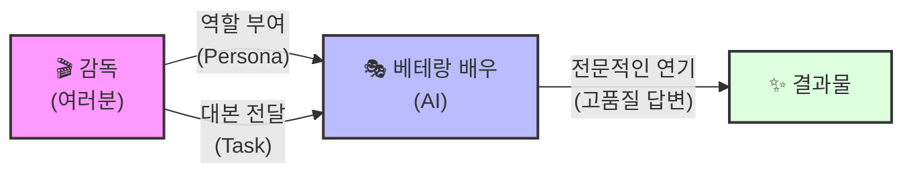

# 마이크로 세션: 024 — 프롬프트 구성 4요소 1 - Persona와 Task

> **세션 ID**: MS-PY101-024  
> **소요 시간**: 20분  
> **난이도**: low  
> **청크 타입**: narrative  
> **버전**: v2.1 (7섹션 구조)

---

## §1. 개요

> **Day 2 | AM | 세션 024/043**

이번 세션은 AI에게 제대로 일을 시키기 위한 프롬프트 구성의 4가지 핵심 요소(PTCF) 중 가장 기본이 되는 두 가지, **Persona(페르소나, 역할)**와 **Task(태스크, 임무)**를 다루는 시간이에요. 방금 전 세션에서 우리는 프롬프트가 단순한 검색어가 아니라 AI에게 건네는 "업무 지시서"라는 것을 배웠죠? 이제 그 지시서를 어떻게 써야 하는지 구체적인 공식의 첫 단추를 채워볼 거예요. 코딩을 전혀 모르는 비전공자라도 이 두 가지만 확실히 이해하면, AI가 내놓는 답변의 퀄리티를 전문가 수준으로 단숨에 끌어올릴 수 있답니다.

### 🎯 학습 목표

이 세션이 끝나면 수강생은 다음을 할 수 있어요:

- 프롬프트 구성의 4요소인 PTCF의 개념을 이해하고 설명할 수 있습니다
- AI에게 명확한 역할(Persona)을 부여하여 답변의 전문성을 높일 수 있습니다
- 한 번에 하나의 구체적인 행동(Task)을 지시하는 습관을 기를 수 있습니다

### 선행 세션 환기

이전 세션인 "프롬프트의 본질"에서 우리는 모호한 지시가 얼마나 위험한지 배웠어요. "파이썬 코드 짜줘"와 "1부터 10까지 더하는 함수를 만들고 주석을 달아줘"의 차이를 기억하시나요? 이 세션에서는 그 차이를 만드는 구조적인 공식을 본격적으로 배워봅니다.

---

## §2. 핵심 개념 (+ 🗣️ 강사 대본 + Mermaid)

### 영화 캐스팅과 대본의 비유

프롬프트를 작성하는 과정은 한 편의 영화를 찍는 것과 완전히 똑같아요. 여러분은 이 영화의 감독이고, AI는 여러분이 캐스팅한 배우입니다. 감독이 엑스트라에게 "그냥 알아서 적당히 연기해 봐"라고 말하면 엉성한 즉흥극이 되겠죠? 

명작을 만들려면 감독은 배우에게 **"당신은 20년 경력의 날카로운 형사입니다(Persona)"**라고 역할을 주고, **"취조실에서 용의자의 자백을 받아내세요(Task)"**라고 정확한 임무(대본)를 주어야 합니다. AI도 마찬가지예요. 역할을 입히고 명확한 임무를 줄 때 비로소 초점 없는 산만한 대답 대신, 전문가의 날카로운 결과물이 나옵니다.

🗣️ **강사 대본 (Instructor Script)**:

> 여러분, 이전 시간에 우리가 배웠던 것을 잠깐 떠올려 볼까요? AI에게 일을 시키는 프롬프트는 단순한 검색이 아니라 구체적인 "업무 지시서"라고 했었죠. 그런데 좋은 지시서에는 도대체 뭐가 들어가야 할까요? 
> 
> "김치찌개 만들어 줘"보다 "2인분 김치찌개를 돼지고기 200g 넣어서 30분 안에 끓여줘"가 훨씬 좋다는 건 알겠는데, 매번 이렇게 머리를 쥐어짜며 고민할 수는 없잖아요? 그래서 우리에게는 공식이 필요합니다. 다행히 전 세계의 수많은 AI 전문가들이 연구 끝에 찾아낸 강력한 틀이 하나 있어요. 바로 **PTCF**라고 불리는 4가지 프롬프트 핵심 요소입니다. 
> 
> Persona(역할), Task(임무), Context(맥락), Format(형식). 이 네 가지의 앞 글자를 딴 거예요. 오늘은 이 중에서 가장 중요한 첫 번째와 두 번째, **P(Persona)**와 **T(Task)**부터 살펴볼 겁니다.
> 
> 한 편의 영화를 찍는 감독이 되었다고 상상해 봅시다. 여러분이 오디션장에서 배우를 뽑았어요. 그리고 배우에게 이렇게 말합니다. "자, 당신은 20년 동안 강력계에서 구른 베테랑 형사입니다. 거친 현장 경험과 날카로운 직감을 가진 사람이에요." 이게 바로 캐스팅, 즉 **Persona(페르소나)**를 부여하는 과정입니다. 배우가 이 역할을 받아들이는 순간, 서 있는 자세부터 눈빛, 말투까지 완전히 달라지겠죠?
>
> 하지만 역할만 줬다고 촬영을 시작할 수는 없어요. 감독은 이어서 대본을 건넵니다. "이번 장면에서 당신의 임무는 저 용의자를 강하게 추궁해서 자백을 받아내는 것입니다." 이것이 바로 **Task(태스크)**, 구체적인 임무입니다. 
>
> AI도 완전히 똑같습니다. 그냥 질문을 던지면 AI는 인터넷의 모든 지식을 뒤섞은 평균적인 대답을 내놓습니다. 하지만 "너는 10년 차 파이썬 시니어 개발자야"라고 역할을 주면(Persona), AI는 자신의 머릿속 데이터 중 '전문가' 영역의 가중치를 확 높입니다. 그리고 "이 코드의 에러 원인을 찾아서 고쳐줘"라고 명확하게 지시하면(Task), 딱 그 임무에만 집중해서 최선의 결과물을 만들어내죠. 역할이 없으면 엉성한 즉흥극이 되지만, 명확한 Persona와 Task가 만나면 오스카상 감의 멋진 연기가 펼쳐집니다.

> 💡 **강사 노트**: 비전공자들은 '프롬프트 엔지니어링'이라는 단어 자체에 부담을 느낍니다. 따라서 영화 감독과 배우라는 직관적인 비유를 통해, AI를 다루는 것이 코딩 기술이 아니라 의사소통 기술임을 강조해 주세요. "가중치가 달라진다"는 개념은 너무 기술적으로 깊게 들어가지 말고, "AI가 참고하는 사전이 달라진다" 정도로 가볍게 짚고 넘어가는 것이 좋습니다.

### Mermaid 다이어그램



이 다이어그램은 Persona와 Task가 어떻게 AI라는 배우를 움직이는지 직관적으로 보여줍니다. 감독(여러분)이 역할(P)과 대본(T)을 정확히 건넬 때만, AI는 여러분이 원하는 고품질의 결과물을 연기해 낼 수 있어요.

---

## §3. 상세 내용

### Why — 왜 Persona와 Task가 그토록 중요한가?

AI 모델(LLM)은 세상의 거의 모든 지식을 학습한 거대한 도서관과 같아요. 아무런 설정 없이 질문을 던지면, AI는 그 방대한 도서관에서 가장 보편적이고 평균적인(때로는 무난하고 지루한) 답변을 무작위로 꺼내옵니다. 비전공자에게는 너무 어려운 전문 용어를 쓰거나, 전문가에게는 너무 뻔한 기초 설명을 늘어놓는 식이죠. 

**Persona(페르소나)**는 이 거대한 도서관에서 AI가 "어느 층, 어느 섹션의 책"을 참고할지 범위를 좁혀주는 강력한 필터 역할을 합니다. 전문성을 지정하면 타겟팅된 답변이 나오고, 환각(Hallucination, AI가 거짓말을 하는 현상)도 크게 줄어들어요.

그리고 **Task(태스크)**는 그 책을 가지고 "무엇을 할 것인가"를 정합니다. 사람들이 가장 많이 하는 실수가 "코드도 짜고, 주석도 달고, 테스트 방법도 알려주고, 문서도 만들어 줘"라며 한 번에 10가지 일을 시키는 거예요. 이렇게 되면 AI는 갈팡질팡하다가 어느 것 하나 제대로 해내지 못합니다. "한 번에 하나의 명확한 행동", 이것이 실패하지 않는 프롬프트의 불문율입니다.

### What — Persona와 Task의 구체적 정의

**1. Persona (페르소나 / 역할 부여)**
- **정의**: AI가 응답을 생성할 때 취해야 하는 전문적, 구체적인 역할이나 입장.
- **특징**: 직업, 경력 연차, 성향, 대상 독자 등을 구체적으로 명시할수록 효과가 뛰어납니다.
- **예시**: "당신은 10년 차 파이썬 디버깅 전문가입니다", "너는 초보자의 마음을 아주 잘 이해하는 친절한 파이썬 튜터야."

**2. Task (태스크 / 명확한 임무)**
- **정의**: AI가 수행해야 할 구체적이고 단일한 행동 지시.
- **특징**: "요약해 줘", "수정해 줘", "작성해 줘"처럼 명확한 동작을 나타내는 동사 형태로 끝나는 것이 좋습니다. 지시가 섞이면 안 됩니다.
- **예시**: "다음 제공되는 코드에서 발생한 논리적 오류를 찾고 해결책을 제안해 주세요."

### How — 어떻게 작성해야 하는가?

좋은 Persona를 만들려면 "내가 지금 돈을 주고 이 일을 맡긴다면 어떤 전문가를 고용할까?"를 상상하면 됩니다. 단순히 "개발자"라고 하는 것보다 "데이터 분석에 특화된 5년 차 파이썬 개발자"라고 구체화하세요.

Task를 작성할 때는 자신이 쓴 지시문을 다시 읽어보며 접속사(그리고, 또, ~하면서)가 얼마나 들어있는지 체크해 보세요. 문장이 길어지고 조건이 덕지덕지 붙어 있다면 과감하게 자르세요. "코드를 수정해 줘"라는 첫 번째 Task를 주고, 결과를 받은 뒤에 "이제 이 코드에 주석을 달아 줘"라는 두 번째 Task를 주는 식으로, **한 번에 하나씩 차근차근 지시하는 것(Step-by-step)**이 훨씬 똑똑하게 AI를 부리는 방법입니다.

---

## §4. 실습 가이드 (+ 🎙️ 실습 대본)

### 실습 목표

이 실습은 수강생들이 직접 Antigravity 환경의 AI(Gemini 또는 Claude)에게 프롬프트를 입력해 보면서, Persona의 유무가 AI 답변의 퀄리티와 톤을 얼마나 극적으로 바꾸는지 두 눈으로 확인하는 "아하 모먼트(Aha-moment)"를 경험하는 것이 목표입니다.

🎙️ **실습 가이드 대본 (Lab Guide)**:

> 자, 이제 우리가 배운 캐스팅의 마법을 직접 확인해 볼 시간입니다. 다들 화면에 Antigravity IDE를 띄워주세요. 우측의 Agent Manager 채팅창에 제가 화면에 띄워드린 두 가지 프롬프트를 순서대로 입력해 볼 겁니다.
>
> 먼저 나쁜 예시, 즉 캐스팅 없이 냅다 대본만 던져주는 경우입니다. 채팅창에 이렇게 쳐보세요.
> **"파이썬의 '변수' 개념을 설명해 줘."**
> 
> AI가 대답을 막 써 내려가죠? 아마 무슨 프로그래밍 책에서 복사해 온 것처럼 '메모리 할당', '데이터 타입' 같은 어려운 말들이 섞여 있을 거예요. 코딩을 처음 해보는 분들은 읽다가 졸음이 올 만한 내용이죠.
>
> 그럼 이번에는 우리가 명감독이 되어서 기가 막힌 페르소나를 입혀보겠습니다. 기존 대화 기록을 지우거나 새 채팅을 여시고, 이렇게 입력해 보세요.
> **"당신은 초등학생도 코딩을 이해하게 만드는 마법 같은 설명 능력을 가진 친절한 파이썬 튜터입니다. 파이썬의 '변수' 개념을 코딩을 전혀 모르는 사람의 눈높이에 맞춰서, 일상생활의 비유를 들어 설명해 주세요."**
>
> 어떤가요? 결과가 나왔나요? 방금 전의 그 딱딱하던 AI가 갑자기 "변수는 물건을 담는 예쁜 상자예요!"라며 아주 친절하고 다정하게 설명하기 시작했을 겁니다. 같은 AI인데도, 여러분이 어떤 역할을 입혀주느냐에 따라 이렇게 딴판이 됩니다. 이것이 바로 Persona와 Task의 위력입니다.

### 단계별 지시

| 단계 | 소요 시간 | 강사 지시사항 | 학습자 액션 | 예상 결과 |
|------|----------|--------------|------------|----------|
| 1 | 2분 | Antigravity IDE Agent 창 준비 지시 | 에이전트 채팅창 활성화 | 실습 준비 완료 |
| 2 | 3분 | 일반적인 Task만 있는 프롬프트 입력 유도 | "변수 개념 설명해 줘" 프롬프트 실행 | 건조하고 백과사전 같은 딱딱한 답변 생성 |
| 3 | 5분 | 구체적인 Persona가 포함된 프롬프트 입력 유도 | Persona가 포함된 새로운 프롬프트 실행 | 친절하고 비유가 풍부한 맞춤형 답변 생성 |
| 4 | 5분 | 두 결과물의 차이점 비교 및 토론 | 화면의 답변 비교, 옆 사람과 차이점 공유 | 페르소나의 역할(가중치 변화) 체감 |
| 5 | 5분 | "나만의 페르소나 만들어보기" 짧은 실습 | "너는 까칠하지만 실력 있는 개발자야" 등 자유 테스트 | 다양한 답변 톤 변화 확인 및 재미 요소 확보 |

### 트러블슈팅 FAQ

| Q | A |
|---|---|
| AI 답변이 두 번 다 비슷하게 친절한데요? | 최신 AI들은 기본적으로 '친절한 비서' 페르소나가 내장되어 있는 경우가 많습니다. 극적인 차이를 보려면 두 번째 페르소나를 "너는 불친절하고 까칠하지만 실력은 확실한 욕쟁이 할머니 국밥집 사장님이야"처럼 아주 파격적으로 설정해 보세요. AI가 컨셉에 잡아먹히는 모습을 볼 수 있습니다! |
| Task를 여러 개 주면 정말 안 되나요? | 아주 뛰어난 최신 모델은 여러 개를 동시에 처리하기도 합니다. 하지만 우리 과정의 목표는 '안전하고 예측 가능한 프로그래밍'이에요. 3가지 지시를 한 번에 내리면 AI가 그중 1개를 은근슬쩍 빼먹는 환각(Hallucination) 현상이 발생하기 쉽습니다. 하나씩 지시하는 것이 디버깅에도 훨씬 유리합니다. |

> ✅ **체크포인트**: Persona를 바꿨을 때 결과가 달라지는 이유는 무엇일까요? 속으로 한 번 대답해 보세요. (정답: AI가 자신이 가진 방대한 데이터 중에서, 주어진 역할에 맞는 지식의 범위와 톤에 가중치를 두어 답변을 조정하기 때문입니다.)

---


### 🎓 강사 노트 (Instructor Support)

- ⏱️ **타이밍**: 09:20 (20분, narrative)
- 🎯 **핵심 활동**: PTCF 프레임워크 전반부
- ⚠️ **강사 주의사항**: 카드에 4요소 적어서 벽에 부착

## §5. 코드 및 명령어 모음

이 세션의 실습에서 수강생들이 복사해서 사용할 프롬프트 텍스트입니다.

> 🤖 **프롬프트 예시 1 (나쁜 예: Task만 존재)**
```text
파이썬의 '변수' 개념을 설명해 줘.
```

> 🤖 **프롬프트 예시 2 (좋은 예: Persona + 구체적인 Task)**
```text
당신은 초등학생도 코딩을 이해하게 만드는 마법 같은 설명 능력을 가진 친절한 파이썬 튜터입니다. 
파이썬의 '변수' 개념을 코딩을 전혀 모르는 사람의 눈높이에 맞춰서, 일상생활의 비유를 들어 설명해 주세요.
```

---

## §6. 요약

### 핵심 학습 포인트

오늘 배운 내용을 세 줄로 요약해 볼까요?
1. 프롬프트는 단순한 질문이 아니라 AI를 조종하는 **명확한 업무 지시서(PTCF)**입니다.
2. **Persona(페르소나)**는 AI에게 입히는 전문가의 옷으로, 답변의 퀄리티와 타겟을 결정합니다.
3. **Task(태스크)**는 한 번에 하나의 구체적인 행동만 지시해야 AI가 헷갈리지 않고 완벽히 수행합니다.

### 다음 세션 예고

이제 감독으로서 명배우를 캐스팅하고(Persona) 대본(Task)까지 건넸습니다. 그런데 이 배우가 연기할 무대 배경이 1920년대 조선 시대인지, 2050년 우주 정거장인지 안 알려주면 어떻게 될까요? 또 감독이 원하는 결과물이 흑백 무성영화인지 3D IMAX 영화인지 말해주지 않으면요? 

다음 세션에서는 PTCF의 나머지 두 조각, 무대 배경에 해당하는 **Context(맥락)**와 최종 산출물의 형태를 결정하는 **Format(형식)**에 대해 알아보고 4요소 프레임워크를 완벽하게 완성해 보겠습니다.

### 브릿지 노트

> "캐스팅과 대본만으로도 이렇게 결과가 달라지는데, 나머지 두 가지 요소까지 합쳐지면 AI가 얼마나 똑똑해질지 기대되지 않나요? 잠깐 물 한 잔 드시고, 프롬프트의 완성판을 만나러 가봅시다!"

---

## §7. 참고 자료

### 3-Source 출처

- **Source A (로컬 참고자료)**: `3 프롤프트 엔지니어링.pdf` (§3.3-3.7 프롬프트 4요소) — PTCF 프레임워크의 근간이 되는 이론적 배경과 Persona, Task의 정의 및 구조화 원리를 차용했습니다.
- **Source B (NotebookLM)**: `gemini-for-google-workspace-prompting-guide-101.pdf` — Google 공식 가이드에서 제시하는 Persona/Task 기반의 명확한 역할 부여 및 단일 지시 원칙을 반영했습니다.
- **Source C (Deep Research)**: Day 2 Fact Packet 분석 — 페르소나 부여 시 LLM 내부의 가중치가 변화하여 타겟팅된 답변이 도출된다는 기술적 배경을 비전공자 눈높이에 맞춰 해석하여 적용했습니다.

### 강사 노트

> 💡 **강사 노트**: 본 세션은 수강생들이 AI를 "인격체처럼 대화하는 대상"에서 "체계적으로 제어해야 하는 도구"로 인식하는 첫 번째 관문입니다. 이론 설명보다는 비유(캐스팅과 대본)와 실습(비교 실험)에 더 많은 시간을 할애해 주세요. 특히 수강생들이 프롬프트를 입력하고 화면에서 텍스트가 쏟아져 나오는 순간의 반응을 잘 살피고, 재미있는 결과가 나온 화면은 적극적으로 교실 전체에 공유해 주시면 좋습니다.

---

## ✅ 세션 완료 체크리스트 (강사용)

- [ ] §1~§7 모든 섹션이 충실하게 작성되었는가?
- [ ] 캐스팅/대본(영화 감독) 비유가 적절하게 확장되어 포함되었는가?
- [ ] Persona의 유무를 비교하는 실습 가이드가 포함되었는가?
- [ ] 3-Source 팩트 패킷의 내용이 반영되었는가?
- [ ] 문서의 톤이 구어체와 서술형으로 비전공자에게 편안하게 작성되었는가?

---

*작성 일시: 2026-02-25*  
*작성 에이전트: Sisyphus-Junior*  
*교안 구조: 7섹션 (A0 팀 공통 표준)*