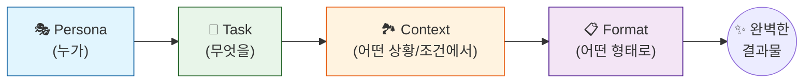

# 마이크로 세션: 025 — 프롬프트 구성 4요소 2 - Context와 Format

> **세션 ID**: MS-PY101-025  
> **소요 시간**: 20분  
> **난이도**: low  
> **청크 타입**: narrative  
> **버전**: v2.1 (7섹션 구조)

---

## §1. 개요

> **Day 2 | AM | 세션 025/043**

이 세션은 이전 시간에 배운 Persona(역할)와 Task(임무)에 이어, 프롬프트를 완벽하게 제어하기 위한 나머지 두 개의 퍼즐 조각인 Context(배경)와 Format(형식)을 완성하는 시간이에요. AI에게 "누가(P), 무엇을(T) 할 것인가"를 지시하는 것을 넘어, "어떤 상황에서(C), 어떤 형태로(F)" 결과를 낼 것인지 명확히 규정함으로써, 결과물에 대한 우리의 통제력을 극대화하는 방법을 배웁니다.

### 🎯 학습 목표

이 세션이 끝나면 수강생은 다음을 할 수 있어요:

- Context의 개념을 이해하고, 구분자(Delimiter)를 활용하여 AI에게 지시와 데이터를 명확하게 분리해서 전달할 수 있습니다.
- Format을 구체적으로 지정하여, 추가적인 수정 없이 바로 사용할 수 있는 맞춤형 결과물을 얻어낼 수 있습니다.
- PTCF 4요소가 모두 포함된 완성형 프롬프트를 직접 작성하고 실행할 수 있습니다.

### 선행 세션 환기

우리는 직전 세션(024)에서 감독이 배우에게 "당신은 베테랑 형사(Persona)이고, 용의자를 추궁해야 합니다(Task)"라고 지시하는 비유를 배웠습니다. 이 지시만으로도 꽤 괜찮은 연기가 나오겠지만, 완벽한 장면을 만들기에는 아직 뭔가 부족하다는 점을 느끼셨을 거예요. 오늘은 그 부족한 2%를 채우는 시간입니다.

---

## §2. 핵심 개념 (+ 🗣️ 강사 대본 + Mermaid)

### 영화 비유의 완성: 무대 배경과 편집본

배우에게 역할(Persona)과 행동(Task)을 주었다고 끝이 아닙니다. 이 장면이 1980년대 낡은 서울 파출소에서 벌어지는 일인지, 2026년 뉴욕의 최첨단 FBI 수사국에서 벌어지는 일인지 알려주는 것이 **Context(배경/제약)** 예요. 그리고 이 연기를 영화 본편에 들어갈 5분짜리 롱테이크로 쓸 것인지, 아니면 예고편에 쓸 30초짜리 빠르고 강렬한 편집본으로 쓸 것인지 지정하는 것이 **Format(출력 형식)** 입니다.

🗣️ **강사 대본 (Instructor Script)**:

> 여러분, 혹시 AI에게 "파이썬 변수를 설명해 줘"라고 했다가, 마치 대학교수님처럼 너무 어려운 전문 용어로만 대답해서 당황한 적 없으신가요? 반대로 너무 유치하게 설명해서 김이 샌 적은요?
> 
> 이전 시간에 우리는 영화감독처럼 AI 배우에게 "당신은 파이썬 전문가(Persona)이고, 변수를 설명하세요(Task)"라고 지시했습니다. 하지만 배우는 아직 혼란스럽습니다. "감독님, 제 앞의 관객이 초등학생인가요, 아니면 컴퓨터공학 전공자인가요? 제약 조건은 뭔가요?" 이렇게 AI가 상황을 제대로 이해하기 위해 필요한 주변 정보와 제약 조건, 그리고 데이터가 바로 세 번째 요소인 **Context(컨텍스트)** 예요.
> 
> 또 하나, 감독이 이렇게 물을 수도 있습니다. "이 장면 결과물을 어떤 형태로 보여드릴까요? 줄글로 쫙 풀어서 쓸까요, 아니면 마크다운 표로 깔끔하게 정리할까요?" 이것이 네 번째 요소인 **Format(포맷)** 입니다. "불릿 포인트 3개로 요약해 줘", "파이썬 코드 블록으로만 출력해 줘"처럼 원하는 결과물의 모양을 처음부터 확실히 못 박아두는 거예요. 그래야 우리가 AI의 답변을 복사해서 다시 다듬는 수고를 덜 수 있거든요.
> 
> 배경과 형식, 이 두 가지를 더하면 우리의 업무 지시서는 비로소 완벽해집니다. AI는 더 이상 우리의 의도를 추측하느라 헛발질하지 않고, 우리가 머릿속에 그린 바로 그 결과물을 정확하게 뱉어낼 수 있습니다.

> 💡 **강사 노트**: 사람끼리는 대충 말해도 눈치껏 상황(Context)을 파악하지만, AI는 눈치가 없습니다. 명시적으로 주어지지 않은 정보는 AI가 무작위로 채워 넣게 되며, 이것이 곧 환각(Hallucination)으로 이어진다는 점을 강조해 주세요.

### Mermaid 다이어그램



이 다이어그램은 프롬프트가 정교해지는 과정을 보여줍니다. P와 T만 있을 때는 넓은 범위의 결과가 나오지만, C(제약과 데이터)와 F(형식)라는 깔때기를 통과하면서 오직 우리가 원하는 단 하나의 완벽한 결과물로 수렴하게 됩니다.

---

## §3. 상세 내용

### Why — 왜 Context와 Format이 필요한가?

AI 활용 초보자들이 가장 많이 하는 실수가 "AI의 눈치"를 기대하는 것입니다. "내가 초보니까 알아서 쉽게 설명해 주겠지", "코드를 달라고 했으니 당연히 복사하기 좋게 코드만 딱 주겠지"라고 기대하지만, AI는 입력된 텍스트 외에는 아무것도 모르는 상태입니다. Context가 없으면 AI는 평균적인(때로는 엉뚱한) 수준의 답변을 내놓고, Format이 없으면 친절함을 빙자하여 불필요한 인사말과 설명 부연을 길게 늘어놓습니다. 우리의 시간과 에너지를 아끼기 위해 이 두 요소는 선택이 아닌 필수예요.

### What — 이 두 요소는 구체적으로 무엇인가?

1. **Context (배경과 제약, 데이터)**:
   - **배경 정보**: "나는 코딩을 전혀 모르는 문과생이야", "이 코드는 고객 관리 프로그램에 들어갈 거야"
   - **제약 조건**: "외부 라이브러리는 절대 쓰지 마", "반드시 Python 3.14 버전 내장 함수만 써"
   - **입력 데이터**: 번역할 원문, 버그가 난 소스 코드, 분석할 CSV 데이터 등
   
2. **Format (출력 형식)**:
   - "마크다운 표로 만들어 줘"
   - "1, 2, 3 번호를 매긴 불릿 포인트로 정리해"
   - "설명은 빼고 오직 파이썬 코드 블록만 반환해 줘" (실전 코딩에서 가장 많이 쓰는 포맷 지시)

### How — Context에서 가장 중요한 '구분자(Delimiter)'의 마법

Context에 코드나 긴 데이터를 넣을 때 **가장 주의해야 할 절대 원칙**이 있습니다. 바로 **구분자(Delimiter)** 를 사용하는 거예요.
컴퓨터는 사람처럼 "아, 여기서부터는 지시문이 끝나고 데이터가 시작되는구나"라고 시각적으로 알아채지 못합니다. 그래서 3중 백틱(```), 3중 따옴표('''), 혹은 `###` 같은 기호로 울타리를 쳐서 지시와 데이터를 물리적으로 격리해야 합니다.

* **나쁜 예**: "아래 코드에서 에러를 찾아줘. print(hello world) if x = 1" (지시와 코드가 섞임)
* **좋은 예**: 
  ```text
  아래 구분자(###) 안에 있는 코드에서 에러를 찾아줘.
  ###
  print(hello world)
  if x = 1:
  ###
  ```

---


### 📊 참고 표 (Visual Specs)

**프롬프트의 4대 핵심 요소 요약**

| 요소 | 설명 | 프롬프트 예시 |
|:---|:---|:---|

## §4. 실습 가이드 (+ 🎙️ 실습 대본)

### 실습 목표

이 실습에서는 수강생들이 Antigravity IDE에서 구분자 유무에 따른 AI의 반응 차이를 직접 목격하고, PTCF 4요소가 모두 결합된 마스터 프롬프트를 실행해 보면서 통제력의 쾌감을 느끼는 것이 목표입니다.

🎙️ **실습 가이드 대본 (Lab Guide)**:

> 자, 이제 Antigravity 환경을 열어주세요. 우리가 방금 배운 Context의 마법을 직접 실험해 볼 겁니다.
> 
> 먼저, 여러분이 평소에 하던 대로 지시와 데이터를 마구 섞어서 프롬프트를 날려보세요. "다음 문장을 파이썬 코드로 바꿔줘 나는 학교에 간다". 결과가 어때요? AI가 '나는 학교에 간다'라는 문장을 출력하는 코드를 짠 분도 있고, 변수 이름으로 만든 분도 있을 거예요. AI가 헷갈려 하는 게 눈에 보이죠?
> 
> 이번에는 구분자를 써봅시다. "다음 3중 따옴표 안의 문장을 영어로 번역하고, 그 문자열을 출력하는 파이썬 코드를 짜줘. '''나는 학교에 간다'''"
> 완전히 다르죠? AI가 "아, 따옴표 안의 내용만 건드리면 되는구나"라고 정확히 인식합니다.
> 
> 자, 그럼 이번엔 최종 보스입니다. Persona, Task, Context, Format을 모두 넣어서 파이썬의 '변수' 개념을 설명해 달라고 해볼게요. 교안에 있는 5번 섹션의 코드를 그대로 복사해서 붙여넣어 보세요.

### 단계별 지시

| 단계 | 소요 시간 | 강사 지시사항 | 학습자 액션 | 예상 결과 |
|------|----------|--------------|------------|----------|
| 1 | 3분 | 구분자 없이 지시와 데이터를 섞어 입력 유도 | 막무가내 프롬프트 입력 | 파편화되고 의도와 다른 답변 도출 |
| 2 | 3분 | `'''` 또는 `###` 구분자를 사용하여 동일 내용 재입력 | 구분자 적용 프롬프트 입력 | 깔끔하고 의도된 답변 도출 |
| 3 | 4분 | PTCF 4요소 전체가 들어간 프롬프트 복사/실행 | 제공된 PTCF 프롬프트 실행 | 비유와 3포인트가 적용된 완벽한 답변 |
| 4 | 5분 | 결과물 비교 및 질의응답 | 이전 세션의 답변과 형태 비교 | Format과 Context의 위력 체감 |

### 트러블슈팅 FAQ

| Q | A |
|---|---|
| 구분자로는 어떤 기호를 써야 하나요? | 기본적으로 AI는 3중 백틱(```), 3중 따옴표('''), 샵 3개(###)를 명확한 경계선으로 인식합니다. 본인에게 가장 편한 것을 하나 정해서 쓰시면 됩니다. |
| Context에 내용을 얼마나 길게 넣어도 되나요? | 현재 우리가 쓰는 모델들은 책 수십 권 분량의 컨텍스트를 한 번에 이해할 수 있습니다. 1~2페이지 정도의 코드는 통째로 넣어도 전혀 문제없으니 안심하고 붙여넣으세요. |
| Format을 여러 개 섞어도 되나요? | 네, 가능합니다. "1번은 표로, 2번은 코드로, 3번은 요약 줄글로 줘"처럼 다중 포맷을 요구해도 AI는 아주 잘 수행합니다. |

> ✅ **체크포인트**: 코드나 데이터를 프롬프트에 넣을 때, 왜 반드시 구분자(Delimiter)로 울타리를 쳐야 하는지 이해하셨나요?

---


### 🎓 강사 노트 (Instructor Support)

- ⏱️ **타이밍**: 09:40 (25분, narrative)
- 🎯 **핵심 활동**: PTCF 프레임워크 후반부
- ⚠️ **강사 주의사항**: 실제 예시 비교로 체감 유도

## §5. 코드 및 명령어 모음

PTCF 4요소가 모두 적용된 '마스터 프롬프트' 예시입니다. 수강생들은 이 프롬프트를 복사하여 Antigravity IDE의 AI 채팅 창에 입력합니다.

> 🤖 **AI 프롬프트 예시 (변수 개념 설명 요구)**:

```text
[Persona] 
당신은 10년 경력의 친절한 파이썬 강사입니다.

[Task] 
파이썬의 '변수(Variable)' 개념을 설명해 주세요.

[Context] 
수강생은 코딩을 전혀 해본 적 없는 문과 출신 대학생입니다.
Python 3.14 환경을 기준으로 설명하며, 영어 전문 용어가 나올 경우 반드시 한국어 뜻을 병기해 주세요.
어려운 수학적 설명은 엄격히 금지합니다.

[Format] 
1. 일상생활에서 쉽게 볼 수 있는 비유 1개를 반드시 포함하세요.
2. 3개의 핵심 포인트로 정리해 주세요.
3. 각 포인트는 번호를 매기고 2문장 이내로 짧게 작성해 주세요.
4. 마지막에는 불필요한 인사말 없이 위 내용만 마크다운 형태로 출력하세요.
```

이 프롬프트를 실행하면, AI가 "변수는 물건을 담는 상자와 같습니다"와 같은 쉬운 비유와 함께, 정확히 3개의 포인트로 정리된 깔끔한 답변을 내놓는 것을 확인할 수 있습니다.

---

## §6. 요약

### 핵심 학습 포인트

이번 세션의 핵심은 "우연에 기대지 말고, 완벽하게 통제하라"는 것입니다.
1. **Context(상황과 제약)** 를 주면 AI의 눈치 없는 헛소리(환각)를 막을 수 있습니다. 특히 코드와 데이터를 던져줄 때는 **구분자(Delimiter)** 를 써서 지시문과 데이터를 격리해야 합니다.
2. **Format(출력 형식)** 을 미리 지정하면, AI가 준 답변을 우리가 다시 엑셀이나 문서에 맞게 가공하는 2차 노동을 없앨 수 있습니다.

### 다음 세션 예고

이제 우리는 완벽한 무기인 PTCF 4요소를 손에 쥐었습니다. 다음 세션(026)에서는 이 무기의 파괴력을 직접 눈으로 확인하는 "좋은 프롬프트 vs 나쁜 프롬프트 비교 실험"을 진행하겠습니다. 똑같은 일을 시키는데, 프롬프트의 퀄리티에 따라 AI가 생성하는 코드가 얼마나 극단적으로 달라지는지 체험하게 될 겁니다.

### 브릿지 노트

> "여러분, 이제 P, T, C, F가 뭔지 머리로는 다 이해하셨죠? 하지만 수영을 책으로 배울 수 없듯이, 프롬프트도 눈으로만 봐서는 내 것이 안 됩니다. 당장 다음 시간부터 우리가 직접 프롬프트를 치고 망가뜨려 보면서, 이 4요소가 실제 코딩 결과물을 어떻게 마법처럼 바꾸는지 직접 부딪혀 보겠습니다."

---

## §7. 참고 자료

### 3-Source 출처

- **Source A (로컬 참고자료)**: `3 프롤프트 엔지니어링.pdf` (§3.3-3.7 프롬프트 4요소, §3.9 코드 생성 기법) — Context와 Format의 정의 및 예시, 구분자를 통한 명령과 데이터의 분리 원칙 원전.
- **Source B (NotebookLM)**: `gemini-for-google-workspace-prompting-guide-101.pdf` — 구글 공식 가이드에 명시된 Persona/Task/Context/Format의 구조와 모범 사례(Best Practices).
- **Source C (Deep Research)**: 특수기호(구분자)를 통해 명령과 데이터를 철저히 분리해야 컴퓨터가 파싱(Parsing) 오류를 일으키지 않는다는 딥 리서치 기술 보고서 결과 반영.

### 추가 학습 자료

- [Google Gemini 공식 프롬프팅 가이드](https://build.withgoogle.com/prompting)
- [Antigravity IDE 튜토리얼: 마크다운과 포맷팅]

### 강사 노트

> 💡 **강사 노트**: 비전공자 수강생들은 "구분자(Delimiter)"라는 단어 자체를 낯설어합니다. "울타리", "칸막이", "따옴표 감옥" 등 직관적인 표현을 섞어 쓰시면 이해가 훨씬 빠릅니다. 컴퓨터는 사람처럼 여백이나 글씨체로 의미를 파악하지 못하고 오직 텍스트 기호로만 맥락을 구분한다는 점을 강조하여, 앞으로의 코딩 실습에서 발생하는 잦은 에러(Syntax Error)의 원인을 미리 예방해 주세요.

---

## ✅ 세션 완료 체크리스트 (강사용)

- [ ] §1~§7 모든 섹션이 충실하게 작성되었는가?
- [ ] Context와 Format의 역할이 명확히 대비되어 설명되었는가?
- [ ] 구분자(Delimiter)의 중요성과 잘못된 사용 예시가 포함되었는가?
- [ ] PTCF 4요소가 모두 적용된 프롬프트 예시가 제시되었는가?
- [ ] 3-Source 팩트 패킷의 내용이 모두 반영되었는가?

---

*작성 일시: 2026-02-25*  
*작성 에이전트: Sisyphus-Junior*  
*교안 구조: 7섹션 (A0 팀 공통 표준)*