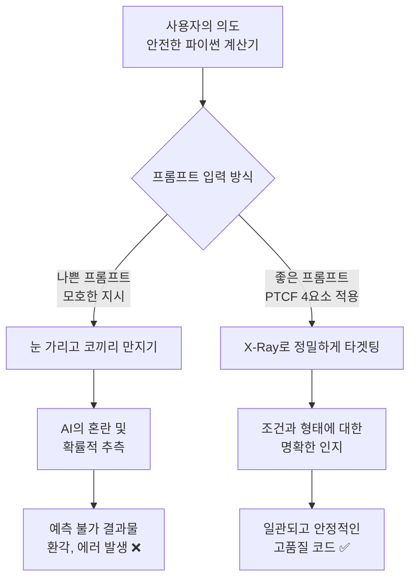

# 마이크로 세션: 026 — 좋은 프롬프트 vs 나쁜 프롬프트 비교 실험

> **세션 ID**: MS-PY101-026  
> **소요 시간**: 25분  
> **난이도**: low  
> **청크 타입**: lab  
> **버전**: v2.1 (7섹션 구조)

---

## §1. 개요

> **Day 2 | AM | 세션 026/043**

### 🎯 학습 목표

이 세션이 끝나면, 수강생은 다음을 할 수 있습니다:

- PTCF 4요소의 적용 유무에 따른 AI 결과물의 품질 차이를 직접 비교할 수 있다
- 모호한 프롬프트가 유발하는 환각(Hallucination) 현상과 예측 불가능성을 설명할 수 있다
- Gemini를 활용하여 구조화된 프롬프트가 일관되고 재현 가능한 코드를 생성함을 검증할 수 있다

### 선행 세션 환기

지난 시간(세션 024, 025)에 걸쳐 우리는 프롬프트의 품질을 결정하는 PTCF 4요소, 즉 페르소나(Persona), 지시(Task), 배경(Context), 형식(Format)에 대해 자세히 배웠습니다. 이론으로는 "아, 구체적으로 지시해야 좋구나"라고 이해하셨을 거예요. 하지만 백문이 불여일견입니다. 아무리 좋은 이론도 직접 눈으로 보고 체감하지 않으면 진짜 내 것이 되지 않죠. 오늘 세션에서는 여러분이 직접 두 가지 프롬프트를 실험해 보고, 그 결과가 얼마나 극적으로 달라지는지 경험하는 "아하 모먼트(Aha-moment)"를 만들어 볼 겁니다.

---

## §2. 핵심 개념 (+ 🗣️ 강사 대본 + Mermaid)

### 코끼리 만지기와 X-Ray 촬영

프롬프트의 차이를 가장 잘 보여주는 비유가 하나 있습니다. 바로 눈을 가리고 코끼리를 만지는 상황이에요. 여러분 앞에 거대한 코끼리가 한 마리 있다고 상상해 보세요. 나쁜 프롬프트, 즉 모호하게 지시하는 것은 눈을 가린 채로 코끼리의 아무 부위나 만지는 것과 같습니다. 코를 만진 사람은 "코끼리는 길쭉한 호스 같아요"라고 하고, 다리를 만진 사람은 "코끼리는 튼튼한 기둥 같아요"라고 하겠죠. 아무도 코끼리의 전체 모습을 정확히 파악하지 못합니다. AI도 이와 똑같습니다. "파이썬으로 계산기 짜줘"라고 대충 말하면, AI는 여러분이 코끼리의 어느 부위를 원하는지 모르니까 자기가 임의로 아무 부위나 툭 던져줍니다. 그래서 물어볼 때마다 다른 대답이 나오고, 엉뚱한 결과가 나오는 거예요.

반면에 좋은 프롬프트는 코끼리를 훤히 들여다보는 정밀한 X-Ray 촬영기기입니다. 코끼리의 뼈대부터 근육, 장기까지 투명하게 보면서 정확히 원하는 부위를 지목할 수 있죠. "오른쪽 앞다리 관절 부분의 뼈 구조를 확대해서 보여줘"라고 명확히 요청하면, 딱 그 부분만 선명하게 나오는 것처럼 말이에요. PTCF 4요소를 모두 갖춘 프롬프트는 AI에게 내가 어떤 조건에서 어떤 형태의 결과물을 원하는지 투명하게 전달하는 강력한 도구입니다.

🗣️ **강사 대본 (Instructor Script)**:

> 여러분, 코딩을 할 때 AI에게 대충 물어보고 코드를 받아서 고치느라 한두 시간씩 끙끙대본 적 있으신가요? 그게 바로 눈을 가리고 코끼리를 더듬는 과정입니다. 운이 좋으면 코를 잡지만, 운이 나쁘면 꼬리를 잡고 헤매게 되죠. 
> 
> AI가 엉뚱한 대답을 하는 것을 우리는 환각(Hallucination)이라고 부릅니다. 이 환각은 AI가 멍청해서가 아니라, 우리의 지시가 너무 뭉뚱그려져 있어서 발생할 때가 훨씬 많아요. X-Ray로 정확한 부위를 찍어달라고 해야 AI도 흔들림 없는 일관된 결과를 내놓습니다. 오늘 실습에서 그 차이를 여러분 모니터에서 직접 두 눈으로 확인해 보겠습니다. 프롬프트 작성에 1분을 더 투자하는 것이, 나중에 에러 잡느라 고생하는 1시간을 절약하는 가장 확실한 지름길이라는 걸 느끼실 거예요.

> 💡 **강사 노트**: 눈먼 코끼리 비유는 모호한 지시의 위험성을 가장 직관적으로 보여주는 장치입니다. 환각 현상이 AI의 결함이 아니라 사용자의 프롬프트 품질 문제와 직결되어 있다는 점을 강조해 주세요.

### Mermaid 다이어그램: 모호한 지시 vs 명확한 지시



---

## §3. 상세 내용

### Why — 왜 프롬프트 품질이 중요한가?

"그냥 여러 번 물어보면서 고치면 되는 거 아닌가요?"라고 생각하실 수 있습니다. 하지만 실제 업무나 코딩 현장에서 이 차이는 엄청난 생산성의 격차로 이어집니다. LLM(대형 언어 모델)의 작동 원리를 생각해 보면 그 이유를 알 수 있어요. AI는 여러분이 건네는 프롬프트를 바탕으로 "다음에 올 가장 적절한 단어"를 확률적으로 계산해서 내놓습니다. 만약 프롬프트가 모호하다면, AI 입장에서는 여러 방향의 확률이 비슷비슷하게 경쟁하게 됩니다. A로 갈지, B로 갈지 갈피를 못 잡으니 산만하고 엉뚱한 결과(환각)가 튀어나오기 쉽죠. 

반면, PTCF 4요소로 구체적인 입력을 주면 AI가 계산하는 확률의 방향이 한쪽으로 확 쏠리게 됩니다. 조건이 명확하니 압도적으로 일관되고 정확한 결과를 생성할 수밖에 없는 환경이 만들어지는 것입니다.

### What — 좋은 프롬프트와 나쁜 프롬프트의 차이는 무엇인가?

나쁜 프롬프트는 단답형이고 상황에 대한 설명이 전혀 없습니다. "계산기 만들어줘", "고객 데이터 정리해 줘" 같은 식이죠. 이런 요청은 실행할 때마다 결과의 형태가 달라지며, 초보자가 이해하기 어려운 어려운 문법을 쓰거나 예외 처리를 몽땅 빼먹는 등 치명적인 결함을 안고 올 확률이 높습니다.

좋은 프롬프트는 AI에게 전문적인 역할(Persona)을 부여하고, 구체적인 배경 상황(Context)을 설명하며, 단일하고 명확한 지시(Task)를 내린 후, 마크다운 표나 주석이 달린 코드 블록 같은 명확한 출력 형식(Format)을 요구합니다. 이 네 가지가 모두 결합되었을 때, AI는 비로소 우리가 완전히 통제할 수 있는 든든한 조력자가 됩니다.

### How — 어떻게 비교 실험을 진행하는가?

우리는 오늘 Antigravity IDE가 아닌 **Gemini 웹 인터페이스**를 띄워놓고 직접 복사/붙여넣기를 해보며 실험할 것입니다. 

첫 번째로는 아주 단순한 프롬프트를 입력해 보고, 그 코드가 어떤 형태를 띠는지, 주석은 달려 있는지, 0으로 나누었을 때 에러 처리가 되는지 꼼꼼히 관찰합니다. 두 번째로는 우리가 배운 PTCF를 꽉 채워 넣은 프롬프트를 똑같이 입력해 볼 겁니다. 두 결과를 양옆에 띄워놓고 비교해 보면, 왜 우리가 지난 시간 동안 그토록 프롬프트 구조화에 공을 들였는지 무릎을 탁 치게 될 것입니다.

> ✅ **체크포인트**: 실험에 들어가기 전 잠시 점검해 볼까요?
> - 모호한 프롬프트가 환각을 유발하는 이유를 설명할 수 있나요? ("여러 방향의 확률이 경쟁하면서 AI가 방향성을 잃기 때문")
> - X-Ray 비유에서 X-Ray 기기가 의미하는 것은 무엇인가요? ("정확히 원하는 결과를 지목할 수 있게 해주는 PTCF 4요소 기반의 구조화된 프롬프트")

---


### 📊 참고 표 (Visual Specs)

**프롬프트 작성의 나쁜 예 vs 좋은 예**

| 구분 | 나쁜 프롬프트 (Bad) | 좋은 프롬프트 (Good) |
|:---|:---|:---|

## §4. 실습 가이드 (+ 🎙️ 실습 대본)

### 실습 목표

이 실습을 통해 수강생은 Gemini를 활용해 프롬프트 품질에 따른 코드 결과물의 극명한 차이를 직접 비교하고, PTCF 4요소의 위력을 체감합니다.

🎙️ **실습 가이드 대본 (Lab Guide)**:

> 자, 드디어 실전입니다. 여러분의 웹 브라우저에서 Gemini 창을 열어주세요. 오늘은 두 번의 라운드로 실험을 진행할 겁니다. 
> 
> 첫 번째 라운드는 우리가 흔히 하는 실수, 즉 아주 대충 물어보는 나쁜 프롬프트입니다. 결과를 받고 나서 화면을 지우지 마세요. 두 번째 라운드에서는 제가 미리 준비한 아주 정교한 PTCF 프롬프트를 입력해 볼 겁니다. 이 두 가지를 나란히 놓고 비교해 보면, 코드가 얼마나 친절해지는지, 오류에 얼마나 강해지는지 한눈에 보이실 거예요. 자, 첫 번째 프롬프트부터 시작하겠습니다. 준비되셨죠?

### 단계별 지시

| 단계 | 소요 시간 | 강사 지시사항 | 학습자 액션 | 예상 결과 |
|------|----------|--------------|------------|----------|
| 1 | 5분 | "나쁜 프롬프트를 Gemini에 그대로 입력하세요" | `파이썬 계산기 만들어줘` 입력 | 사람마다 다른 형태, 주석 부족, 예외 처리 없는 코드 출력 |
| 2 | 10분 | "새 채팅을 열고 좋은 프롬프트를 입력하세요" | PTCF가 적용된 긴 프롬프트를 복사/붙여넣기 | 주석 포함, 0 나누기 예외 처리 등 완벽히 구조화된 코드 출력 |
| 3 | 5분 | "두 결과를 나란히 놓고 직접 비교해 보세요" | 1단계와 2단계의 코드 품질, 길이, 친절함 비교 | 프롬프트의 품질이 코드 품질을 결정한다는 깨달음 (아하 모먼트) |

**[단계 1] 나쁜 프롬프트 실험**

Gemini 채팅창에 다음 문장 딱 한 줄을 입력해 보세요.

```text
파이썬 계산기 만들어줘
```

결과가 나왔나요? 옆 사람의 화면과 슬쩍 비교해 보세요. 코드가 나오긴 했지만, 어떤 사람은 함수 형태로, 어떤 사람은 그냥 길쭉한 스크립트로 나왔을 겁니다. 주석이 충분한가요? 만약 나눗셈에서 0을 입력하면 프로그램이 어떻게 될지 상상이 가시나요? 아마 그대로 뻗어버릴 겁니다. 이게 바로 눈 가리고 코끼리를 만진 결과입니다.

**[단계 2] 좋은 프롬프트 실험 (PTCF 적용)**

이번에는 새 채팅을 열고(New Chat), 우리가 배운 요소를 모두 담은 아래의 프롬프트를 복사해서 붙여넣어 보세요.

```text
[Persona] 당신은 10년 경력의 파이썬 개발자이자 친절한 튜터입니다.
[Task] 사칙연산(+, -, *, /)을 지원하는 콘솔 계산기 프로그램을 파이썬으로 작성해 주세요.
[Context] 이 코드를 읽을 사용자는 파이썬 초보자입니다. 
따라서 0으로 나누는 경우와 숫자가 아닌 값을 입력하는 경우에 대한 예외 처리가 반드시 포함되어야 프로그램이 강제 종료되지 않습니다.
[Format] 실행 가능한 파이썬 코드 블록으로 출력하고, 각 주요 코드 로직마다 초보자가 이해하기 쉬운 한국어 주석을 달아 주세요.
```

**[단계 3] 비교 분석 및 아하 모먼트 공유**

자, 결과가 나왔습니다. 1단계와 비교해 보세요. 어떤가요? 

1. **주석과 친절도**: 초보자도 이해할 수 있도록 코드 한 줄 한 줄에 설명이 달려 있죠?
2. **견고함(예외 처리)**: `ZeroDivisionError`나 `ValueError` 처럼 사용자가 실수했을 때 에러를 뿜으며 죽지 않고 "0으로 나눌 수 없습니다"라고 부드럽게 안내하는 코드가 포함되어 있을 겁니다.
3. **일관성**: 아마 이 교실에 있는 여러분 모두가 거의 비슷한 수준의 고품질 코드를 받았을 겁니다. 

이 극명한 차이가 여러분이 앞으로 코딩할 때 프롬프트 작성에 공을 들여야 하는 완벽한 이유입니다. 

### 비교표 — 프롬프트 품질에 따른 결과 차이

| 비교 항목 | 나쁜 프롬프트 결과 | 좋은 프롬프트(PTCF) 결과 |
|------|-------------------|----------------------|
| **코드 일관성** | 실행할 때마다 구조와 문법이 제각각임 | 안정적이고 일관된 로직 유지 |
| **가독성 (주석)** | 주석이 없거나 영어로 불친절하게 달림 | 초보자 눈높이에 맞춘 상세한 한국어 주석 |
| **예외 처리** | 0으로 나누면 에러 발생 후 프로그램 종료 | 사용자의 실수에 대비한 방어적 코드 작성 |
| **개발자 경험** | 코드를 이해하고 수정하느라 시간 낭비 | 복사해서 바로 붙여넣어도 무방한 수준 |

---


### 🎓 강사 노트 (Instructor Support)

- ⏱️ **타이밍**: 10:15 (25분, lab)
- 🎯 **핵심 활동**: 같은 목표, 다른 프롬프트 비교
- ⚠️ **강사 주의사항**: 😱 나쁜 결과에 웃으며 배우기


### 📋 실습 설계 보강 (Lab Packet)

**세션 026 실습 설계 보강**

좋은 프롬프트 vs 나쁜 프롬프트 비교 실험
- **3-Stage Example Set**
  - 기본: 나쁜 프롬프트("코드 짜줘") vs 좋은 프롬프트(4요소 포함) → 결과 비교
  - 변형: 같은 기능을 3가지 다른 상세도의 프롬프트로 요청 → 품질 차이 관찰
  - 실수 해결: "좋은 프롬프트를 써도 결과가 비슷해요" → Context/Format을 더 구체화
- **난이도 예측**: 프롬프트 4요소를 실전에서 바로 적용하기 어려움
- **타이밍 가이드**: 나쁜 프롬프트 테스트 5분 | 좋은 프롬프트 작성 10분 | 결과 비교 5분 | 정리 5분
- **심리적 장벽**: "나도 나쁜 프롬프트를 쓰고 있었다"는 자괴감
- **자가 점검**:
  - [ ] 같은 기능에 대해 두 가지 프롬프트로 다른 결과를 얻었는가?
  - [ ] 4요소(Persona, Task, Context, Format) 중 2개 이상을 프롬프트에 포함했는가?
  - [ ] 좋은 프롬프트가 더 나은 코드를 생성하는 것을 확인했는가?

## §5. 코드 및 명령어 모음

### 프롬프트 1: 나쁜 예시 (비권장)

```text
파이썬 계산기 만들어줘
```

단순히 결과만 요구하는 최악의 프롬프트입니다. 제약 조건이나 상황 설명이 없어 AI가 무작위로 추측하여 코드를 작성하게 만듭니다.

### 프롬프트 2: 좋은 예시 (PTCF 구조화)

```text
[Persona] 당신은 10년 경력의 파이썬 개발자이자 친절한 튜터입니다.
[Task] 사칙연산(+, -, *, /)을 지원하는 콘솔 계산기 프로그램을 파이썬으로 작성해 주세요.
[Context] 이 코드를 읽을 사용자는 파이썬 초보자입니다. 
따라서 0으로 나누는 경우와 숫자가 아닌 값을 입력하는 경우에 대한 예외 처리가 반드시 포함되어야 프로그램이 강제 종료되지 않습니다.
[Format] 실행 가능한 파이썬 코드 블록으로 출력하고, 각 주요 코드 로직마다 초보자가 이해하기 쉬운 한국어 주석을 달아 주세요.
```

이 프롬프트는 그대로 복사하여 여러분의 개인적인 코딩 작업에 템플릿처럼 활용하셔도 좋습니다. 괄호 안의 내용만 여러분의 상황에 맞게 바꾸면 됩니다.

### 참고: 예상되는 모범 파이썬 코드 스니펫

> AI가 반환할 확률이 높은 예외 처리가 포함된 계산기 코드의 일부입니다.

```python
def calculator():
    try:
        # 사용자로부터 숫자 입력 받기
        num1 = float(input("첫 번째 숫자를 입력하세요: "))
        operator = input("연산자를 입력하세요 (+, -, *, /): ")
        num2 = float(input("두 번째 숫자를 입력하세요: "))
        
        # 나눗셈 예외 처리
        if operator == '/':
            if num2 == 0:
                print("오류: 0으로 나눌 수 없습니다!")
                return
            result = num1 / num2
            
    except ValueError:
        # 숫자가 아닌 문자열을 입력했을 때의 예외 처리
        print("오류: 올바른 숫자를 입력해 주세요.")
```

---

## §6. 요약

### 핵심 학습 포인트

이번 세션에서 우리는 두 눈으로 직접 프롬프트 품질의 차이를 확인했습니다. 모호하게 질문하는 것은 눈을 가리고 코끼리를 만지는 것과 같아서, AI가 엉뚱한 부위를 집어 환각을 일으키게 만듭니다. 반면 PTCF 4요소(페르소나, 지시, 배경, 형식)를 꽉 채워 넣은 프롬프트는 X-Ray처럼 정확히 원하는 것을 투명하게 지목합니다. 그 결과로 우리는 가독성 높고, 예외 처리까지 완벽하게 되어 있는 재현 가능한 고품질 코드를 얻어낼 수 있었습니다. 프롬프트 작성에 들이는 1분이 이후의 디버깅 1시간을 아껴준다는 사실을 잊지 마세요.

### 다음 세션 예고

이제 프롬프트를 꼼꼼히 적어야 한다는 것은 확실히 깨달으셨을 겁니다. 그런데 코드를 짜달라고 할 때는 일반적인 PTCF만으로는 조금 부족할 수 있어요. 코드라는 것은 논리와 엣지 케이스(예외 상황) 덩어리이기 때문이죠. 다음 세션에서는 코드 생성 프롬프트를 작성할 때 절대로 빠뜨리면 안 되는 5대 필수 항목(기능, 입력, 출력, 제약, 예외 처리)에 대해 더 깊이 파고들어 보겠습니다.

### 브릿지 노트

> "결과를 비교해 보시니 어떠신가요? 차이가 극명하죠? 여러분이 평소에 AI가 바보 같다고 느꼈다면, 사실은 우리의 질문이 너무 빈약했던 것일 수 있습니다. 오늘 얻은 이 아하 모먼트를 꼭 기억해 주세요. 다음 세션에서는 파이썬 코드를 요청할 때 절대 실패하지 않는, 코드 생성에 특화된 5가지 필수 명세 항목을 살펴보겠습니다. 잠깐 기지개 켜고 바로 이어갈게요!"

---

## §7. 참고 자료

### 3-Source 출처

- **Source A (로컬 참고자료)**: `3 프롤프트 엔지니어링.pdf` (§3.8 좋은 프롬프트 vs 나쁜 프롬프트 비교) — 나쁜 예와 좋은 예 비교 프레임워크 기반 [SRC-A02]
- **Source B (NotebookLM)**: `gemini-for-google-workspace-prompting-guide-101.pdf` — 반복 개선(Iterative) 패턴 및 PTCF 작성 가이드 참조 [SRC-B01]
- **Source C (Deep Research)**: 환각(Hallucination) 현상과 프롬프트 구체성 간의 상관관계 및 확률적 텍스트 생성 원리 [SRC-C02]

### 추가 학습 자료

- [Google Gemini 프롬프트 작성 가이드](https://support.google.com/gemini/answer/13588264): 효과적인 프롬프트 작성을 위한 공식 팁
- [Prompt Engineering Guide](https://www.promptingguide.ai/kr): 프롬프트 엔지니어링의 기본 개념과 다양한 테크닉 모음집

### 강사 노트

> 💡 **강사 노트**: 이 세션의 핵심은 수강생 스스로 "아, 프롬프트를 대충 쓰면 안 되겠구나"를 깨닫게 만드는 것입니다. 1단계와 2단계 코드의 품질 차이를 강사가 설명하기보다, 수강생들이 옆 사람과 화면을 비교하며 주석 유무나 예외 처리 코드 블록을 스스로 찾아내도록 유도해 주세요. 특히 '0으로 나눈다'는 극단적인 상황에서 프로그램이 죽는지 안 죽는지가 초보자와 전문가 코드를 가르는 가장 큰 기준임을 강조하면 좋습니다.

---

## ✅ 세션 완료 체크리스트 (강사용)

- [x] §1~§7 모든 섹션이 충실하게 작성되었는가?
- [x] 코끼리/X-Ray 비유가 §2에서 충분히 확장되었는가?
- [x] 나쁜 예와 좋은 예 비교표가 §4에 포함되었는가?
- [x] 단계별 지시표에 소요 시간이 명시되었는가?
- [x] 아하 모먼트 연출이 대본과 실습에 잘 녹아들었는가?
- [x] 3-Source 팩트 패킷이 §7에 반영되었는가?
- [x] 다음 세션(027) 브릿지 노트가 포함되었는가?

---

**🔗 선행 세션**: [세션-025] 프롬프트 구성 4요소 2 - Context와 Format  
**🔗 후행 세션**: [세션-027] 코드 생성 특화 프롬프트: 5대 필수 항목

---

*작성 일시: 2026-02-25*  
*작성 에이전트: A4B_Session_Writer*  
*교안 구조: 7섹션 (A0 팀 공통 표준)*