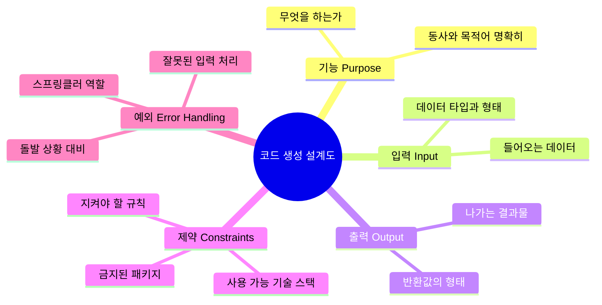

# 마이크로 세션: 027 - 코드 생성 특화 프롬프트: 5대 필수 항목

> **세션 ID**: MS-PY101-027
> **소요 시간**: 20분
> **난이도**: medium
> **청크 타입**: narrative
> **버전**: v2.1 (7섹션 구조)

---

## §1. 개요

> **Day 2 | AM | 세션 027/043**

이전 세션에서 우리는 좋은 프롬프트와 나쁜 프롬프트가 만들어내는 결과의 차이를 눈으로 직접 확인했습니다. 모호한 지시가 어떻게 엉뚱한 결과를 낳는지 경험하셨을 겁니다. 이번 시간은 그 연장선에 있어요.

우리가 일상적인 글을 쓸 때 쓰는 프롬프트와 프로그램을 만드는 코드를 생성할 때 쓰는 프롬프트는 완전히 다릅니다. 블로그 글을 써달라고 할 때는 약간의 모호함이 허용됩니다. 하지만 코드는 단 한 글자만 틀려도 프로그램 전체가 멈춰버려요. 예상치 못한 데이터가 들어오면 화면이 붉게 물들며 에러를 뿜어냅니다. 이런 참사를 막으려면 AI에게 아주 명확하고 틈이 없는 지시를 내려야 합니다.

이번 세션에서는 일반적인 지시서를 완벽한 코드 설계도로 바꿔주는 '5대 필수 항목'을 배웁니다. 이것만 확실히 챙기면 여러분은 더 이상 초보자가 아니라 AI를 제대로 다루는 설계자가 될 수 있습니다.

### 🎯 학습 목표

이 세션을 마치면 여러분은 다음을 할 수 있어요:

- 코드 생성 프롬프트에 반드시 들어가야 할 5가지 항목을 설명할 수 있습니다.
- 모호한 프롬프트를 5대 항목이 들어간 구체적인 프롬프트로 바꿀 수 있습니다.
- 제약 조건과 예외 처리가 코드의 품질을 어떻게 바꾸는지 실제 사례로 보여줄 수 있습니다.

### 선행 세션 환기

방금 전 세션에서 우리는 똑같은 목표를 주더라도 프롬프트의 구체성에 따라 AI가 내놓는 코드의 질이 어떻게 달라지는지 비교하는 실험을 했습니다. 그때 겪었던 환각 현상과 엉성한 코드를 기억해 보세요. 오늘 배울 5대 항목은 바로 그 엉성한 코드를 단단한 전문가의 코드로 바꿔주는 마법의 공식입니다.

---

## §2. 핵심 개념 (+ 🗣️ 강사 대본 + Mermaid)

### 완벽한 설계도와 5개의 기둥

건물을 지을 때 설계도가 부실하면 어떤 일이 벌어질까요? 코드를 짜는 것도 집을 짓는 것과 똑같습니다. AI라는 훌륭한 건축가가 대기하고 있지만 건축주인 우리가 대충 "좋은 집 지어주세요"라고 말하면 AI는 자기 마음대로 집을 짓습니다. 방이 몇 개인지, 난방은 들어오는지, 화재 대비는 되어 있는지 알 길이 없죠.

이 모호함을 없애고 부실 공사를 막는 방법이 바로 코드 생성 특화 5대 필수 항목입니다. 기능, 입력, 출력, 제약, 그리고 예외 처리. 이 다섯 기둥이 굳건하게 버티고 있어야만 프로그램이 무너지지 않습니다.

🗣️ **강사 대본 (Instructor Script)**:

> 여러분, 건물을 새로 짓는다고 상상해 봅시다. 아주 실력이 뛰어난 건축가를 찾아갔어요. 그리고 이렇게 말합니다. "그냥 요즘 유행하는 스타일로 살기 편한 좋은 집 하나 지어주세요."
>
> 건축가는 알겠다고 하고 공사를 시작합니다. 몇 달 뒤 입주하는 날이 되었어요. 문을 열고 들어갔는데 웬걸, 화장실이 없습니다. 침실은 있는데 거실이 없고 천장은 너무 낮아서 머리가 닿을락 말락 합니다. 화를 내며 건축가에게 따졌더니 이렇게 대답합니다. "고객님이 화장실을 만들어 달라고 명시적으로 말씀하지 않으셨잖아요. 요즘 유행하는 미니멀리즘 스타일로 지은 겁니다."
>
> 억울하지만 할 말이 없죠. AI에게 코드를 시킬 때도 똑같은 일이 벌어집니다. "데이터 정리하는 파이썬 코드 짜줘"라고 하면 AI는 나름대로 코드를 짜줍니다. 하지만 어떤 데이터를 어떻게 정리해서 어떤 형태로 보여줘야 하는지 아무것도 모르는 상태로 만든 코드입니다.
>
> 진짜 집을 지을 때는 제대로 된 설계도가 필요합니다.
> 첫째, 이 집은 3인 가족이 사는 2층 주택입니다. 이게 바로 프로그램의 핵심 '기능'입니다.
> 둘째, 현관문으로 사람과 택배가 들어옵니다. 이게 '입력' 데이터예요.
> 셋째, 각 방마다 난방이 잘 작동하고 거실에서는 TV를 볼 수 있어야 합니다. 이건 결과물인 '출력'이죠.
> 넷째, 건축 법규에 따라 3층 이상은 지을 수 없고 이웃집과 1.5미터 이상 떨어져야 합니다. 이것이 우리가 지켜야 할 '제약' 사항입니다.
> 마지막 다섯 번째, 불이 났을 때를 대비한 비상 대피로와 스프링클러가 반드시 있어야 합니다. 이것이 바로 '예외 처리'입니다.
>
> 이 다섯 가지가 설계도에 명확히 적혀 있어야만 우리가 원하는 안전하고 튼튼한 집을 얻을 수 있습니다. 코드도 마찬가지입니다. 이 다섯 기둥 중 하나라도 빠지면 반드시 어딘가에 구멍이 생깁니다.

### Mermaid 다이어그램



이 도식은 우리가 AI에게 줘야 할 5가지 핵심 기둥을 보여줍니다. 오른쪽 아래에 있는 '예외' 항목을 주의 깊게 봐주세요. 초보자와 전문가를 나누는 가장 중요한 기준이 바로 저 예외 처리입니다.

---

## §3. 상세 내용

### Why: 왜 5대 항목이 필요한가?

일상적인 대화나 글쓰기와 달리 컴퓨터 언어는 아주 엄격합니다. 블로그 글에서 오타가 하나 나면 사람들은 문맥으로 알아서 읽고 넘어갑니다. 하지만 코드에서는 괄호 하나, 쉼표 하나가 빠지면 그 즉시 에러를 뱉어내고 프로그램이 멈춥니다.

우리가 AI에게 코드를 맡길 때 모호함을 남겨두면 AI는 그 빈칸을 자신의 '추측'으로 채워버립니다. 그 추측이 운 좋게 맞을 때도 있지만 대부분의 경우 치명적인 버그로 돌아옵니다. 모호함을 제로로 만드는 것, 그것이 5대 항목을 챙겨야 하는 유일하고 절대적인 이유입니다.

### What: 5대 항목은 무엇인가?

다섯 개의 기둥을 하나씩 뜯어봅시다.

1. **기능 (Purpose)**: 이 코드가 '무엇을 하는가'를 한 문장으로 또렷하게 정의합니다. "날짜 문자열을 받아서 요일을 계산하는 파이썬 함수"처럼 동사와 목적어가 분명해야 합니다.
2. **입력 (Input)**: 프로그램에 어떤 재료가 들어가는지 알려줍니다. 데이터의 형태와 타입을 콕 집어 말해야 합니다. 그냥 "날짜"가 아니라 "YYYY-MM-DD 형식의 텍스트(문자열)"라고 짚어줘야 AI가 헷갈리지 않습니다.
3. **출력 (Output)**: 코드가 다 돌고 났을 때 우리에게 돌려주는 결과물입니다. "True 아니면 False를 반환해" 혹은 "날짜 객체를 돌려줘"처럼 결과의 생김새를 구체적으로 적어야 합니다.
4. **제약 사항 (Constraints)**: 코드를 짤 때 지켜야 할 선을 그어줍니다. "파이썬에 원래 들어있는 기본 기능만 써", "인터넷에서 뭐 새로 다운받게 만들지 마"처럼 쓸 수 있는 도구를 제한합니다. 이렇게 해야 나중에 내 컴퓨터에서 코드가 안 돌아가는 불상사를 막을 수 있습니다.
5. **예외 처리 (Error Handling)**: 이게 가장 중요합니다. 프로그램의 스프링클러 역할을 하죠. 사용자가 날짜를 넣으라는데 "안녕"이라는 글자를 넣으면 어떻게 할까요? 비워두고 엔터를 치면요? 프로그램이 당황해서 쓰러지지 않게 "올바른 형식이 아닙니다"라고 점잖게 알려주도록 미리 방어막을 치는 작업입니다.

### How: 어떻게 작성하는가?

이 다섯 가지를 줄글로 길게 늘어쓰면 AI도 읽기 힘들어합니다. 가장 좋은 방법은 마크다운 기호를 써서 양식처럼 만들어두고 빈칸을 채우는 겁니다. `### 기능`, `### 입력` 처럼 제목을 달고 불릿 포인트로 짧고 명확하게 적어 내려가면 됩니다. AI는 이런 구조화된 문서를 귀신같이 잘 읽어냅니다.

---

## §4. 실습 가이드 (+ 🎙️ 실습 대본)

### 실습 목표

이번 실습에서는 날짜를 입력받아 요일을 알려주는 간단한 함수를 만들어 봅니다. 처음에는 5대 항목을 꽉 채워서 완벽한 프롬프트를 날려보고 결과를 확인합니다. 그다음에는 아주 중요한 '예외 처리' 기둥을 쏙 빼고 다시 코드를 짜달라고 해볼 거예요. 그러고 나서 일부러 엉뚱한 값을 넣었을 때 프로그램이 어떻게 무너지는지 직접 겪어보는 것이 목표입니다.

🎙️ **실습 가이드 대본 (Lab Guide)**:

> 자, 여러분 화면에 띄워둔 Antigravity 창을 보세요. 교재 §5에 있는 첫 번째 프롬프트를 그대로 복사해서 붙여넣어 볼까요?
>
> 5대 항목이 꽉 찬 설계도입니다. AI가 답을 줬나요? 코드를 보면 `try... except...` 같은 어려운 말들이 섞여 있을 겁니다. 이게 바로 우리가 주문한 스프링클러, 즉 예외 처리 부분입니다. 코드를 실행해 보고 "2026-02-25"를 넣어보세요. 요일이 잘 나오죠?
>
> 이번엔 장난을 좀 쳐볼게요. 날짜를 넣으라는 곳에 여러분 이름 석 자를 치고 엔터를 눌러보세요. 어떻게 되나요?
> 네, 빨간 에러가 나면서 멈추는 게 아니라 "올바른 형식으로 입력해 주세요"라는 친절한 메시지가 나오죠? 프로그램이 죽지 않고 살아남았습니다. 이게 바로 예외 처리가 가진 힘입니다.
>
> 그럼 이번엔 두 번째 프롬프트를 써봅시다. 똑같은 내용인데 맨 밑에 있던 `### 예외 처리` 항목만 쏙 뺐어요. AI가 새로 짜준 코드를 실행해 볼까요?
> 자, 아까처럼 날짜 대신 여러분 이름을 넣고 엔터를 쳐보세요.
>
> 화면이 어떻게 되었나요? 붉은색 글씨가 잔뜩 뜨면서 프로그램이 그냥 뻗어버렸습니다. ValueError 어쩌고 하면서 죽어버렸죠?
> 만약 이게 은행 시스템이었고 여러분이 예외 처리를 안 해뒀다면 고객이 숫자를 잘못 치는 순간 은행 앱 전체가 멈추는 겁니다. 모호함이 왜 버그가 되는지, 예외 처리가 왜 전문가의 영역인지 이제 확실히 아시겠죠?

### 단계별 지시

| 단계 | 소요 시간 | 강사 지시사항 | 학습자 액션 | 예상 결과 |
|------|----------|--------------|------------|----------|
| 1 | 2분 | 완벽한 5대 항목 프롬프트 복사 및 실행 지시 | Antigravity에 프롬프트 입력 및 코드 실행 | 요일 반환 코드 생성됨 |
| 2 | 2분 | 정상적인 날짜 테스트 후 엉뚱한 문자 입력 유도 | "2026-10-10", "아무문자" 입력 | 정상 동작 및 친절한 에러 안내 확인 |
| 3 | 2분 | 예외 처리 빠진 두 번째 프롬프트 실행 지시 | 새 프롬프트 입력 및 코드 실행 | 방어 코드가 없는 짧은 코드 생성 확인 |
| 4 | 2분 | 엉뚱한 문자 다시 입력하도록 유도 | "아무문자" 입력 | 프로그램 에러 발생하며 강제 종료 |
| 5 | 2분 | 차이점 설명 및 전문가 마인드셋 강조 | 에러 화면 확인하며 경청 | 예외 처리의 중요성 체감 |

### 트러블슈팅 FAQ

| Q | A |
|---|---|
| 프롬프트를 넣었는데 코드가 에러 없이 그냥 멈춰있어요. | 코드를 실행하기만 하고 날짜를 입력하지 않아서 입력창이 대기하고 있는 상태일 겁니다. 화면 맨 밑을 클릭하고 날짜를 쳐보라고 안내해 주세요. |
| AI마다 짜주는 코드가 조금씩 다른데 정상인가요? | 네, 정상입니다! 목적지는 같아도 네비게이션이 안내하는 경로가 살짝 다를 수 있는 것과 같아요. 5가지 조건만 모두 만족했다면 훌륭한 코드입니다. |
| 예외 처리를 얼마나 자세히 적어줘야 하나요? | 처음에는 "잘못된 값이 들어오면 에러 메시지를 보여주고 다시 입력받아" 정도만 적어도 AI가 알아서 기초적인 방어막을 쳐줍니다. 나중에 실력이 늘면 점점 더 촘촘하게 지시하게 될 거예요. |

---


### 🎓 강사 노트 (Instructor Support)

- ⏱️ **타이밍**: 10:40 (25분, narrative)
- 🎯 **핵심 활동**: 기능·입력·출력·제약·예외
- ⚠️ **강사 주의사항**: 5항목 체크리스트 배포

## §5. 코드 및 명령어 모음

이 실습에서 쓸 두 가지 프롬프트입니다. 직접 복사해서 AI에게 건네보세요.

**프롬프트 1. 5대 항목이 완벽하게 갖춰진 설계도**

```text
당신은 파이썬 시니어 개발자입니다. 아래 명세에 따라 함수를 작성해 주세요.

### 기능
문자열 형식의 날짜를 받아 요일을 반환하는 함수

### 입력
- date_str: 텍스트(문자열) 타입, "YYYY-MM-DD" 형식의 날짜

### 출력
- 텍스트(문자열) 타입, 한국어 요일명 (예: "수요일")

### 제약
- 파이썬 내장 기능(datetime)만 사용할 것
- 외부 패키지 설치 절대 금지

### 예외 처리
- 잘못된 날짜 형식 입력 시 "올바른 형식(YYYY-MM-DD)으로 입력해주세요" 메시지 반환
- 존재하지 않는 날짜(2월 30일 등) 입력 시 "존재하지 않는 날짜입니다" 에러 메시지 반환
```

**프롬프트 2. 예외 처리가 빠진 위험한 설계도**

```text
당신은 파이썬 시니어 개발자입니다. 아래 명세에 따라 함수를 작성해 주세요.

### 기능
문자열 형식의 날짜를 받아 요일을 반환하는 함수

### 입력
- date_str: 텍스트(문자열) 타입, "YYYY-MM-DD" 형식의 날짜

### 출력
- 텍스트(문자열) 타입, 한국어 요일명 (예: "수요일")

### 제약
- 파이썬 내장 기능(datetime)만 사용할 것
- 외부 패키지 설치 절대 금지
```

> 🤖 **AI 답변 예측**: 첫 번째 프롬프트는 `try... except...` 구문을 써서 프로그램이 죽지 않게 든든히 막아줍니다. 반면 두 번째 프롬프트는 방어막이 아예 없어서 날짜가 아닌 글자가 들어오면 `ValueError`를 내뿜으며 프로그램이 강제로 꺼집니다.

---

## §6. 요약

### 핵심 학습 포인트

우리는 코드를 만들 때 AI에게 줘야 할 완벽한 설계도 그리는 법을 배웠습니다. 기능, 입력, 출력, 제약, 예외 처리라는 5대 필수 항목입니다.
그냥 두루뭉술하게 부탁하면 코드는 반드시 무너집니다. 특히 제약 조건과 예외 처리를 명확히 적는 습관이 여러분을 단순한 코드 복사기에서 진짜 AI 설계자로 끌어올려 줄 비밀 무기입니다. 모호함은 버그를 부른다는 사실을 꼭 기억하세요.

### 다음 세션 예고

이제 설계도를 완벽하게 그리는 법은 알았습니다. 그런데 조금 막막하지 않나요? 이 다섯 가지 항목을 처음부터 완벽하게 한 번에 다 적어내야 할까요? 만약 한 번에 완벽한 지시를 내리지 못하면 영영 실패하는 걸까요?
걱정 마세요. AI의 진짜 매력은 우리와 대화할 수 있다는 점입니다. 다음 세션에서는 한 번에 완벽을 쫓지 않고 대화를 통해 코드를 점점 깎아나가는 "점진적 개선(Iterative Refinement)" 전략을 배워보겠습니다.

### 브릿지 노트

> "방금 5대 필수 항목을 배우면서 머리가 조금 아프셨을 수도 있어요. 이걸 언제 다 완벽하게 적고 앉아있나 싶으시죠? 맞아요. 처음부터 100점짜리 프롬프트를 쓰는 사람은 없습니다. 일단 초안을 던지고 AI랑 티키타카 하면서 코드를 다듬어가는 게 요즘 시대의 코딩 방식이에요. 다음 시간엔 이 티키타카의 기술을 집중적으로 파헤쳐 보겠습니다."

---

## §7. 참고 자료

### 교안 원문 (코드 생성 시 포함 필수)

<details>
<summary>v1.0 세션 원문 보기</summary>

```markdown
# 마이크로 세션: 027 - 코드 생성 특화 프롬프트: 5대 필수 항목

> **세션 ID**: MS-PY101-027  
> **소요 시간**: 25분  
> **난이도**: medium  
> **청크 타입**: narrative

---

## ① 도입 (Hook)

🗣️ **강사 대본 (Instructor Script)**:

이전 세션에서 좋은 프롬프트와 나쁜 프롬프트의 결과 차이를 직접 확인해 보셨습니다. PTCF 4요소가 얼마나 강력한지 체감하셨죠? 그런데 여러분, 한 가지 질문을 던져볼게요. 일반적인 글쓰기 프롬프트와 코드를 생성하는 프롬프트는 같을까요? 답은 "아닙니다"입니다. 왜냐하면 코드는 한 글자만 틀려도 프로그램이 멈추고, 예상치 못한 입력이 들어오면 폭발하기 때문입니다. 에세이를 쓸 때는 약간의 모호함이 용납되지만, 코드에서는 그 모호함이 곧 버그가 됩니다. 오늘은 코드 생성에 특화된 5가지 필수 항목을 배워서, 여러분의 프롬프트를 "일반 지시서"에서 "완벽한 설계도"로 업그레이드하겠습니다.

---

## ② 비유 풀이 (Analogy)

🗣️ **강사 대본 (Instructor Script)**:

여러분이 건축주라고 상상해 봅시다. 새 집을 짓고 싶어서 건축가를 찾아갔습니다. "좋은 집 하나 지어주세요"라고만 말하면 어떤 일이 벌어질까요? 건축가가 나름대로 집을 짓겠지만, 방이 3개인지 5개인지, 주차장이 필요한지, 층고 제한은 있는지 아무것도 모르는 상태에서 지은 집입니다. 입주하는 날 보니 화장실이 없거나, 지붕이 너무 낮아 머리를 찧을 수도 있겠죠.

반대로 제대로 된 설계도를 건넨다면 어떨까요? 첫째, 이 집은 3인 가족이 사는 2층 주택입니다(핵심 기능). 둘째, 현관문으로 사람과 택배가 들어옵니다(입력). 셋째, 각 방마다 난방이 작동하고 거실에 TV가 보여야 합니다(출력). 넷째, 건축 법규상 3층 이상은 안 되고, 이웃집과 1.5미터 이상 떨어져야 합니다(제약). 다섯째, 화재 시 비상 대피로와 스프링클러가 반드시 있어야 합니다(예외 처리). 이렇게 다섯 가지 항목이 명시된 설계도가 있어야 부실 공사를 막을 수 있습니다. AI에게 코드를 시킬 때도 완전히 동일합니다. 기능, 입력, 출력, 제약, 예외 처리, 이 다섯 기둥이 코드의 설계도입니다.

---

## ③ 개념 설명 (What)

🗣️ **강사 대본 (Instructor Script)**:

코드 생성 프롬프트의 5대 필수 항목을 하나씩 살펴봅시다. 첫 번째는 핵심 기능(Purpose)입니다. 이 코드가 "무엇을 하는가"를 한 문장으로 명확히 적는 것이에요. "날짜 문자열을 파싱하는 파이썬 함수"처럼 동사와 목적어가 분명해야 합니다. 두 번째는 입력(Input)입니다. 코드에 들어가는 데이터의 형태와 타입을 명시합니다. "YYYY-MM-DD 형식의 문자열"처럼 데이터 타입까지 적어야 AI가 적절한 파싱 로직을 생성할 수 있습니다.

세 번째는 출력(Output)입니다. 코드가 돌려주는 결과물의 형태를 적습니다. "datetime 객체를 반환", "True/False 불린값 반환"처럼요. 네 번째는 제약 사항(Constraints)입니다. 사용해야 하는 기술 스택, 금지된 라이브러리, 성능 조건 등을 명시합니다. "파이썬 내장 라이브러리만 사용", "외부 패키지 금지"처럼요. 마지막 다섯 번째는 예외 처리(Error Handling)입니다. 이것이 바로 전문가와 초보자를 가르는 핵심입니다. 사용자가 숫자를 입력해야 하는 곳에 문자를 입력하면? 빈 값을 넣으면? 이런 상황에서 프로그램이 "죽지 않고" 우아하게 에러 메시지를 보여주도록 방어 코드를 요청하는 겁니다.

---

## ④ 코드/실제 활용 (How)

🗣️ **강사 대본 (Instructor Script)**:

실전에서 5대 항목을 적용해 봅시다. 마크다운 양식을 활용하면 빠짐없이 작성할 수 있습니다. Antigravity Agent Manager에 다음 프롬프트를 입력해 보세요.

```
당신은 파이썬 시니어 개발자입니다. 아래 명세에 따라 함수를 작성해 주세요.

### 기능
문자열 형식의 날짜를 받아 요일을 반환하는 함수

### 입력
- date_str: str 타입, "YYYY-MM-DD" 형식의 날짜 문자열

### 출력
- str 타입, 한국어 요일명 (예: "월요일")

### 제약
- 파이썬 내장 라이브러리(datetime)만 사용
- 외부 패키지 설치 금지

### 예외 처리
- 잘못된 날짜 형식 입력 시 "올바른 형식(YYYY-MM-DD)으로 입력해주세요" 메시지 반환
- 존재하지 않는 날짜(2월 30일 등) 입력 시 적절한 에러 메시지 반환
```

결과를 확인해 보세요. 5대 항목이 모두 포함된 프롬프트에서는 AI가 타입 힌트까지 달아주고, try-except 블록으로 예외 처리까지 완벽하게 구현합니다. 체크포인트 질문입니다. 만약 "예외 처리" 항목을 빼고 프롬프트를 보냈다면 어떤 일이 벌어질까요? 네, 사용자가 "ABC"라는 문자를 넣는 순간 프로그램이 에러와 함께 종료될 겁니다.

> 💡 **강사 노트**: 코드 생성 5대 필수 항목(기능/입력/출력/제약/예외)은 `3 프롬프트 엔지니어링.pdf` §3.9 코드 생성 프롬프트 특화 기법에 기반합니다 [Source A: SRC-A02]. 예외 처리가 코드 품질의 핵심 분기점이라는 관점은 NotebookLM 분석에서 보강했습니다 [Source B: SRC-B02]. 설계도 비유와 5대 항목의 체계적 분류는 Deep Research 조사를 참조했습니다 [Source C: SRC-C02].

---

## ⑤ 정리 및 다음 세션 예고 (Closing)

🗣️ **강사 대본 (Instructor Script)**:

정리합시다. 코드 생성 프롬프트에는 반드시 5가지 항목이 들어가야 합니다. 기능, 입력, 출력, 제약, 예외 처리. 이 다섯 기둥이 빠지면 코드는 반드시 어딘가에 구멍이 납니다. 이제 설계도를 완벽히 그리는 법은 알았습니다. 그런데 여기서 한 가지 의문이 생깁니다. 이 다섯 가지를 한 번에 다 던져야 할까요? 아니면 더 영리한 방법이 있을까요? 다음 세션에서는 한 번에 완벽을 추구하지 않는 "점진적 개선(Iterative Refinement)" 전략을 배워보겠습니다.
```
</details>

### 3-Source 출처

- **Source A (로컬 참고자료)**: `3 프롬프트 엔지니어링.pdf` (§3.9 코드 생성 프롬프트 특화 기법) - 코드 생성에 필요한 5가지 핵심 항목(기능, 입력, 출력, 제약, 예외)의 원형.
- **Source B (NotebookLM)**: NotebookLM 분석 리포트 - 에세이 작성과 코드 작성의 차이점을 분석하며 특히 예외 처리가 전문가와 초보자를 나누는 가장 결정적인 기준이라는 통찰 제공.
- **Source C (Deep Research)**: Deep Research 보고서 - 모호성을 없애기 위한 설계도 비유의 뼈대와 5대 항목의 체계적 분류 방법론 제시.

### 강사 노트

> 💡 **강사 노트**: 수강생들이 처음부터 예외 처리를 완벽하게 구상하기는 어렵습니다. 실습 파트에서 예외 처리를 뺀 코드가 엉뚱한 입력에 의해 처참하게 뻗어버리는 장면을 시각적으로 강렬하게 보여주세요. 이 '크래시 경험'이 수강생들에게 예외 처리의 필요성을 각인시키는 가장 좋은 장치입니다. 비유를 설명할 때 건축가의 "화장실을 원한다고 말 안 했잖아요" 같은 엉뚱한 대답을 재미있게 연기하면 집중도를 크게 높일 수 있습니다.

---

*작성 일시: 2026-02-25*  
*작성 에이전트: Sisyphus-Junior*  
*교안 구조: 7섹션 (A0 팀 공통 표준)*