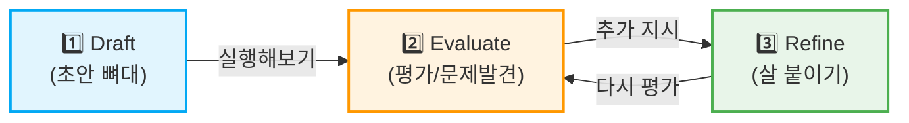

# 마이크로 세션: 028 — 점진적 개선(Iterative Refinement)의 이해

> **세션 ID**: MS-PY101-028
> **소요 시간**: 20분
> **난이도**: low
> **청크 타입**: narrative
> **버전**: v2.1 (7섹션 구조)

---

## §1. 개요

> **Day 2 | AM | 세션 028/043**

이 세션은 "AI와의 핑퐁 게임"이라고 부를 수 있는 점진적 개선(Iterative Refinement) 전략을 다룹니다. 많은 비전공자 입문자들이 AI에게 완벽한 프롬프트 한 번을 던져서 100점짜리 코드를 얻어내려는 함정에 빠집니다. 하지만 진정한 AI 시대의 개발은 단번에 정답을 뽑아내는 마술이 아니라, AI와 대화를 주고받으며 결과물을 조각해 나가는 티키타카(Tiki-taka)입니다.

### 🎯 학습 목표

이 세션이 끝나면 수강생은 다음을 할 수 있어요:

- 완벽한 코드를 한 번에 얻으려는 강박을 버리고, 초안을 먼저 요구할 수 있습니다
- Draft(초안) → Evaluate(평가) → Refine(개선)으로 이어지는 3단계 워크플로우를 실무에 적용할 수 있습니다
- AI와 대화하며 코드를 키워나가는 "핑퐁 게임" 방식의 이점을 설명할 수 있습니다

### 선행 세션 환기

바로 앞 세션(027)에서 우리는 코드 생성 프롬프트의 5대 필수 항목(기능, 입력, 출력, 제약, 예외 처리)을 배웠어요. 이 5가지 기둥이 있으면 AI에게 완벽한 설계도를 건넬 수 있습니다. 하지만 이 모든 요구사항을 "첫 번째 프롬프트"에 다 구겨 넣어야 한다는 뜻은 아니에요. 오늘 배울 점진적 개선은 이 5대 항목을 어떻게 나누어서 AI에게 먹여줄 것인가에 대한 전략입니다.

---

## §2. 핵심 개념 (+ 🗣️ 강사 대본 + Mermaid)

### 조각과 핑퐁 게임: 한 방에 완벽한 코드는 없다

가장 흔하게 저지르는 실수는 "기능 A, B, C, D와 예외 처리 E, F를 모두 포함한 완벽한 코드를 당장 내놓아라"라고 AI를 윽박지르는 거예요. 복잡한 요구사항을 한 번에 전부 던지면, 아무리 뛰어난 AI라도 중요한 조건을 슬쩍 빼먹거나 엉뚱한 해석(환각)을 할 수 있어요. 미켈란젤로가 다비드 상을 조각할 때 망치 한 번에 눈썹을 새기지 않았던 것처럼, 우리도 찰흙에 살을 붙이듯 코드를 키워나가야 합니다.

🗣️ **강사 대본 (Instructor Script)**:

> 여러분, 혹시 5코스 코스 요리를 식당에서 주문해 보신 적 있나요? 에피타이저부터 디저트까지 보통 순서대로 나오죠. 만약 웨이터가 이 5접시를 한꺼번에 테이블에 올려놓고 간다면 어떨까요? 식탁은 비좁아지고, 따뜻해야 할 메인 요리는 식어버리고 말 거예요.
> 
> AI에게 코딩을 시키는 것도 똑같습니다. 앞서 배운 5대 필수 항목을 한 번의 프롬프트에 꽉꽉 눌러 담아서 던지면, AI의 '주방'은 혼란에 빠집니다. 아주 똑똑한 AI라도 지시가 너무 길고 복잡해지면 맥락을 놓치고 엉뚱한 코드를 뱉어낼 확률이 높아집니다.
>
> 미켈란젤로가 5미터짜리 다비드 상을 조각할 때를 상상해 볼까요? 그는 망치 한 방으로 눈썹을 깎아내지 않았습니다.
> 1단계(Draft)에서는 거대한 대리석에서 대략적인 사람의 형태, 즉 '뼈대'만 잡았어요.
> 2단계(Evaluate)에서는 뒤로 물러서서 비율이 맞는지 평가했습니다.
> 3단계(Refine)에 가서야 팔의 근육, 머리카락 결, 눈동자의 곡선 같은 디테일을 다듬었죠.
> 
> 코딩도 이 조각 과정과 정확히 같습니다. 처음부터 "예외 처리까지 완벽한 코드를 짜줘"라고 하면 AI는 엉뚱한 결과물을 내놓습니다. 대신 "일단 두 숫자를 더하는 뼈대를 만들어줘"라고 시작하세요. 그리고 결과를 확인한 뒤, "좋아, 이번엔 문자를 입력했을 때의 에러 처리를 추가해 줘"라고 탁구공을 주고받듯 한 걸음씩 나아가는 거예요. 한 방에 완벽한 코드를 얻으려는 욕심을 내려놓고, AI와 가벼운 '핑퐁 게임'을 즐기는 것. 이것이 AI 시대의 가장 빠르고 안전한 개발 방식입니다.

### Mermaid 다이어그램



이 다이어그램은 점진적 개선의 핵심인 3단계 워크플로우를 보여줍니다. 핵심은 화살표가 단방향으로 끝나지 않고 2단계와 3단계를 순환한다는 점이에요. 뼈대만 있는 초안(Draft)을 얻어낸 뒤, 이를 평가(Evaluate)하고 부족한 점을 개선(Refine)해달라고 요청하는 과정을 끊임없이 주고받는 티키타카의 연속입니다.

---

## §3. 상세 내용

### Why — 왜 점진적 개선이 필요한가?

LLM(대형 언어 모델)은 근본적인 한계가 있어요. 바로 문맥(Context)이 길고 복잡해질수록 앞부분의 지시를 잊어버리거나 환각(Hallucination)을 일으킬 확률이 급격히 올라간다는 사실입니다. 요구사항 A부터 Z까지 한 번에 적어주면, AI는 중간에 있는 D와 E를 조용히 빼먹고 코드를 완성해 버립니다. 초보자는 코드가 길고 그럴싸해 보이니까 완벽하다고 착각하지만, 막상 실행하면 에러가 터지죠. 그래서 핵심 동작을 먼저 확보한 뒤에, 조건을 하나씩 얹는 방식이 가장 안전한 경로입니다.

🗣️ **강사 대본 (Instructor Script)**:

> 코딩을 처음 배우시는 분들은 종종 이런 질문을 하십니다. "AI가 알아서 다 해주는데, 왜 굳이 쪼개서 시켜야 하나요? 그냥 한 번에 완벽하게 써달라고 하면 안 되나요?"
> 
> 정말 좋은 질문입니다. 그런데 여기서 우리가 알아야 할 AI의 비밀이 하나 있어요. AI는 여러분의 글을 읽을 때, 첫 줄부터 끝 줄까지 똑같은 집중력으로 기억하지 못합니다. 이것을 'Context Window의 한계'라고 부르는데요. 지시사항이 10개가 넘어가면, AI는 "음, 1번이랑 10번은 기억나는데 4번이랑 5번은 뭐였지?" 하고 슬쩍 빼먹기 시작합니다.
> 
> 더 무서운 건 뭔지 아세요? AI는 모른다고 말하지 않습니다. 4번과 5번을 까먹었으면 그 자리를 자기가 상상해서 채워버려요. 이게 바로 그 유명한 '환각(Hallucination)' 현상입니다. 코드가 번듯하게 나와서 복사해서 붙여넣었는데, 실행하자마자 화면이 붉은색 에러로 도배되는 경험, 해보신 적 있으시죠?
> 
> 그래서 우리는 전략을 바꿔야 합니다. 가장 뼈대가 되는 핵심 기능 하나만 먼저 확실하게 챙기고, 그게 완벽히 돌아가는 걸 내 눈으로 확인한 뒤에야 다음 기능을 얹어야 합니다. 1층을 튼튼하게 짓지 않고 5층부터 올리려고 하면 무너질 수밖에 없으니까요.

### What — 점진적 개선 3단계 워크플로우

점진적 개선(Iterative Refinement)은 다음 세 가지 단계로 이루어져 있어요. 이 세 단계는 한 번 하고 끝나는 것이 아니라, 원하는 결과물이 나올 때까지 계속해서 반복(Loop)하는 구조입니다.

1. **초안 생성 (Draft)**: 가장 기본적인 뼈대만 요청합니다. 입력과 출력이 정상적으로 이어지는 최소 기능의 코드를 목표로 해요. 화려한 예외 처리나 복잡한 조건은 모두 덜어내고, 오직 "이 프로그램의 가장 본질적인 목적이 달성되는가?"에만 집중합니다.
2. **평가 및 피드백 (Evaluate & Feedback)**: AI가 준 1단계 코드를 직접 실행해 봅니다. 잘 작동하는지, 빠진 기능은 없는지, 혹은 엉뚱한 값을 넣었을 때 에러가 나지 않는지 확인합니다. 이 단계에서 가장 중요한 마인드셋은 "AI를 의심하라"는 것입니다.
3. **구체적 개선 요청 (Refine)**: 2단계에서 발견한 문제점이나 덧붙이고 싶은 기능을 정확히 지목해서 AI에게 추가 요청합니다. "에러 났잖아!" 하고 화를 내는 것이 아니라, "이 부분에서 에러가 났으니 이렇게 고쳐줘"라고 명확하게 피드백을 줘야 합니다.

### How — 어떻게 핑퐁 게임을 치는가?

이 과정은 친구와 대화하며 아이디어를 발전시키는 것과 똑같아요. 

🗣️ **강사 대본 (Instructor Script)**:

> 자, 그럼 이 핑퐁 게임을 어떻게 치는지 구체적으로 상상해 봅시다.
> 
> 처음에는 가볍게 서브를 넣습니다. "비밀번호 검사기 뼈대 만들어 줘." 
> AI가 코드를 넘겨주면, 그걸 받아보고 생각합니다. "오, 잘 돌아가네? 근데 너무 밋밋한데."
> 
> 그럼 다시 공을 칩니다. "좋아, 근데 길이가 8자 미만이 들어오면 경고창 띄우는 것도 추가해 줘."
> AI가 또 코드를 넘겨줍니다. "네, 추가했습니다."
> 
> 그럼 또 쳐봅니다. "이번엔 숫자가 꼭 1개 이상 들어가게 룰을 추가해 줄래?"
> 
> 이렇게 대화가 꼬리를 물고 이어집니다. 그런데 여기서 정말, 정말 중요한 꿀팁 하나 방출할게요. Refine 단계에서 여러분이 잊지 말고 꼭 써야 하는 마법의 문장이 있습니다.
> 
> 바로 **"방금 네가 작성해 준 코드를 유지하면서..."** 라는 조건입니다.
> 
> 이 말을 안 쓰면 어떻게 될까요? AI는 갑자기 예술혼이 불타올라서, 기존에 잘 돌아가던 코드를 싹 지워버리고 자기 마음대로 완전히 새로운 구조의 코드를 뱉어낼 수 있습니다. "아니, 아까 그 코드에 줄 하나만 추가하라고!" 하고 뒷목을 잡게 되는 거죠. 그러니 항상 "지금까지 네가 한 건 좋아. 그걸 엎지 말고, 거기에 이것만 살짝 얹어 줘"라고 맥락을 단단히 붙잡아주셔야 합니다.

---

## §4. 실습 가이드 (+ 🎙️ 실습 대본)

### 실습 목표

강사가 앞에서 간단한 계산기 프로그램을 점진적으로 개선해 나가는 과정을 시연합니다. 수강생들은 이 시연을 보며 "완벽한 프롬프트 한 방"보다 "짧은 프롬프트 세 번"이 훨씬 효과적이라는 것을 체감하게 됩니다.

🎙️ **실습 가이드 대본 (Lab Guide)**:

> 자, 화면을 함께 보실까요? 제가 두 숫자를 더하는 간단한 덧셈 계산기를 만들어 볼게요. 
> 
> 첫 번째 프롬프트입니다. "간단한 덧셈 계산기 파이썬 코드를 작성해 줘. 두 숫자를 입력받아 합계를 출력하면 돼." (실행 결과를 보여주며) 자, 코드가 나왔네요. 10과 20을 넣으니 30이 잘 나옵니다. 1단계 Draft, 뼈대 잡기가 끝났습니다.
>
> 이제 2단계 Evaluate, 평가를 해볼까요? 만약 사용자가 실수로 숫자 대신 "안녕"이라는 글자를 입력하면 어떻게 될까요? (실행 후 에러가 나는 화면을 보여주며) 네, 시뻘건 에러 메시지가 뜨면서 프로그램이 죽어버립니다. 이게 바로 문제점이죠.
>
> 그럼 이제 3단계 Refine, 살을 붙일 차례입니다. 다시 프롬프트를 입력합니다. "방금 코드를 유지하면서, 숫자가 아닌 값을 입력하면 '숫자만 입력해 주세요'라는 메시지를 출력하고 다시 입력받도록 예외 처리를 추가해 줘."
>
> (새로운 코드를 실행하며) 이번에는 "안녕"을 입력해도 프로그램이 죽지 않고 다시 입력하라고 친절하게 알려주네요. 이렇게 핑퐁 게임을 하듯 코드를 단단하게 만들어 가는 겁니다.
>
> 내친김에 한 단계 더 Refine을 해볼까요? 계속 반복되니까 나갈 방법이 필요하네요. "지금 코드에서, 사용자가 '종료'라고 입력하면 프로그램이 완전히 끝나는 기능을 추가해 줘. 기존 기능은 꼭 유지해." 자, 이제 완벽한 미니 프로그램이 되었습니다.

### 단계별 지시

| 단계 | 소요 시간 | 강사 지시사항 | 학습자 액션 | 예상 결과 |
|------|----------|--------------|------------|----------|
| 1 | 2분 | Draft 단계의 기본 덧셈 프롬프트 입력 및 시연 | 화면 주시, 프롬프트 내용 필기 | 정상적인 덧셈 작동 확인 및 뼈대 코드의 간결함 인지 |
| 2 | 2분 | Evaluate 단계: 문자열 입력하여 고의로 에러 발생 유도 | 에러 원인 추측 및 "나라면 어떻게 수정할까" 고민 | 프로그램 중단 현상(ValueError) 목격 및 한계 공감 |
| 3 | 3분 | Refine 단계: 예외 처리(try-except) 추가 프롬프트 시연 | 화면 주시, 코드 변화 과정 비교 | 문자를 무시하고 재입력받는 방어적 동작 확인 |
| 4 | 2분 | 추가 Refine 단계: "종료" 입력 시 빠져나가는 기능 추가 | 실시간으로 살이 붙는 과정 확인 | while문 안에서 break를 활용한 종료 메커니즘 확인 |
| 5 | 3분 | "방금 코드를 유지하면서" 제약어의 중요성 강조 질문 | 답변 및 노트에 형광펜 밑줄 | 맥락 유지의 중요성 깨달음 및 다음 세션 적용 준비 |

### 트러블슈팅 FAQ

| Q | A |
|---|---|
| 프롬프트 창에 이전 대화가 남아있는데, 새 기능은 어떻게 시키나요? | 이전 대화 맥락이 AI의 뇌(메모리)에 그대로 살아있으므로 "기존 코드에 이거 하나만 덧붙여줘"라고 사람에게 말하듯 자연스럽게 이어가면 됩니다. 굳이 처음부터 모든 조건을 다시 읊어줄 필요가 없습니다. |
| AI가 "방금 코드를 유지하면서"라고 했는데도 코드를 완전히 다르게 짜버렸어요. | LLM 특유의 변덕(Temperature) 때문입니다. 이럴 때는 당황하지 말고 이전 대화창에서 잘 작동했던 코드를 긁어서 복사한 뒤, "이 코드를 바탕으로 수정해 줘: \n\`\`\`python\n[코드]\n\`\`\`" 라고 아주 명시적으로 맥락을 다시 주입해 주세요. |
| 어디까지 뼈대로 잡고 어디부터 살을 붙여야 할지 감이 안 와요. | '가장 이상적인 정상 상황(Happy Path)' 하나만 뼈대로 잡으세요. 사용자가 완벽하게 올바른 값(숫자만)을 넣었다고 가정했을 때의 핵심 동작이 1단계 Draft입니다. 사용자가 이상한 값을 넣거나, 도중에 취소하거나, 인터넷이 끊기는 등 그 외의 모든 예외 상황이 2단계 이후의 Refine 대상입니다. |
| 중간에 에러가 났는데 제가 뭘 고쳐달라고 해야 할지 모르겠어요. | 그럴 때는 고민하지 말고 에러 메시지를 통째로 복사해서 AI에게 붙여넣기 하세요. "이 코드를 실행했더니 이런 에러가 났어. 원인이 뭐고 어떻게 고쳐야 해?"라고 질문을 던지는 것(역프롬프팅) 역시 점진적 개선의 훌륭한 과정입니다. |

> ✅ **체크포인트**: 에러가 났을 때 좌절하지 않고, 에러 자체를 다음 프롬프트의 재료로 사용하는 마인드셋을 장착했나요?

---


### 🎓 강사 노트 (Instructor Support)

- ⏱️ **타이밍**: 11:15 (20분, narrative)
- 🎯 **핵심 활동**: 한번에 완벽 X, 단계적 발전
- ⚠️ **강사 주의사항**: "완벽주의가 적" 메시지

## §5. 코드 및 명령어 모음

시연에 사용된 점진적 개선 프롬프트와 파이썬 코드 결과물의 3단계 진화 과정입니다.

### 1단계: Draft (뼈대 잡기)

**프롬프트:**
```text
간단한 덧셈 계산기 파이썬 코드를 작성해 줘. 두 숫자를 입력받아 합계를 출력하면 돼.
```

**실행 결과 코드:**
```python
# Draft 버전: 예외 처리가 전혀 없는 뼈대 코드
num1 = float(input("첫 번째 숫자를 입력하세요: "))
num2 = float(input("두 번째 숫자를 입력하세요: "))
print(f"두 숫자의 합은 {num1 + num2} 입니다.")
```

### 2단계: Evaluate (평가)

위 코드에 "문자열"을 입력하여 `ValueError`가 발생하는 것을 확인합니다. 사용자가 숫자가 아닌 다른 것을 입력했을 때 프로그램이 버티지 못하고 종료되는 현상을 목격하는 것이 이 단계의 핵심입니다.

### 3단계: Refine (살 붙이기 - 1차)

**프롬프트:**
```text
방금 코드를 유지하면서, 숫자가 아닌 값을 입력하면 '숫자만 입력해 주세요'라는 메시지를 출력하고 다시 입력받도록 예외 처리를 추가해 줘.
```

**실행 결과 코드:**
```python
# Refine 1차 버전: while문과 try-except가 추가된 방어적 코드
while True:
    try:
        num1 = float(input("첫 번째 숫자를 입력하세요: "))
        num2 = float(input("두 번째 숫자를 입력하세요: "))
        print(f"두 숫자의 합은 {num1 + num2} 입니다.")
        break  # 정상 계산되면 반복문 종료
    except ValueError:
        print("잘못된 입력입니다. 숫자만 입력해 주세요!\n")
```

### 4단계: 추가 Refine (살 붙이기 - 2차)

**프롬프트:**
```text
지금 코드에서, 사용자가 '종료'라고 입력하면 프로그램이 완전히 끝나는 기능을 추가해 줘. 기존 기능은 꼭 유지해.
```

**실행 결과 코드:**
```python
# Refine 2차 버전: 종료 메커니즘이 추가된 최종 형태
while True:
    user_input1 = input("첫 번째 숫자를 입력하세요 (끝내려면 '종료' 입력): ")
    if user_input1 == '종료':
        print("계산기를 종료합니다.")
        break
        
    try:
        num1 = float(user_input1)
        num2 = float(input("두 번째 숫자를 입력하세요: "))
        print(f"두 숫자의 합은 {num1 + num2} 입니다.\n")
    except ValueError:
        print("잘못된 입력입니다. 숫자만 입력해 주세요!\n")
```

---

## §6. 요약

### 핵심 학습 포인트

이번 세션의 핵심은 "완벽한 첫 프롬프트의 환상"을 버리는 것입니다. 점진적 개선 전략은 Draft(초안)로 뼈대를 세우고, Evaluate(평가)로 빈틈을 찾고, Refine(개선)으로 살을 붙이는 3단계의 반복입니다. 복잡한 지시를 한 번에 쏟아내면 AI는 실수하지만, 대화하듯 탁구공을 주고받으면 훨씬 견고하고 안전한 코드를 얻어낼 수 있습니다.

### 다음 세션 예고

이론으로만 들으니 아직 손이 근질근질하시죠? 다음 세션(029)에서는 방금 배운 점진적 개선 3단계 워크플로우를 사용해서 직접 "비밀번호 강도 검사기"를 만들어 볼 겁니다. 뼈대부터 시작해서 특수문자 검사, 길이 검사까지 살을 붙여나가는 과정을 직접 체험하게 될 거예요.

### 브릿지 노트

> "자, 이제 '조각상 깎기'의 3단계 비법을 모두 아셨습니다. 눈으로 보는 것과 손으로 해보는 건 하늘과 땅 차이죠? 방금 시연으로 보여드린 이 핑퐁 게임을, 이제 여러분이 직접 AI와 쳐볼 차례입니다. 다음 세션으로 넘어가서 여러분만의 비밀번호 검사기를 조각해 볼까요?"

---

## §7. 참고 자료

### 3-Source 출처

- **Source A (로컬 참고자료)**: `3 프롤프트 엔지니어링.pdf` (§3.10 점진적 개선) — 점진적 개선의 3단계 워크플로우(Draft -> Evaluate -> Refine) 핵심 구조와 핑퐁 게임 개념을 차용했습니다.
- **Source B (NotebookLM)**: `gemini-for-google-workspace-prompting-guide-101.pdf` — 반복 개선(Iterative Refinement) 전략과 "방금 코드를 유지하면서" 같은 컨텍스트 유지 프롬프팅 기법의 이론적 근거로 활용되었습니다.
- **Source C (Deep Research)**: Deep Research 보고서 — 미켈란젤로의 조각상 비유와 LLM의 문맥 길이 한계(Context Window & Hallucination) 메커니즘을 설명하는 데 적용되었습니다.

### 추가 학습 자료

- [Google Gemini 프롬프팅 공식 가이드](https://support.google.com/gemini/answer/13278892): 구글에서 공식적으로 권장하는 반복 개선 대화 패턴
- [Iterative Prompt Development (DeepLearning.AI)](https://www.deeplearning.ai/): AI 시스템과 대화하며 점진적으로 코드를 디버깅하는 무료 강좌

### 강사 노트

> 💡 **강사 노트**: 초보자들은 보통 AI 창에 장문의 지시를 써놓고 엔터를 누르기 전 엄청난 긴장감을 느낍니다. '틀리면 어떡하지?' 하는 두려움 때문이죠. 이 세션의 진정한 목적은 그 두려움을 깨는 것입니다. "에러가 나도 괜찮다, 에러 메시지를 복사해서 다시 AI에게 던지는 것 자체가 훌륭한 개발 과정이다"라는 심리적 안전감을 듬뿍 심어주세요. 조각상 비유를 할 때 허공에 정으로 돌을 쪼는 제스처를 곁들이면 훨씬 인상에 남습니다.
