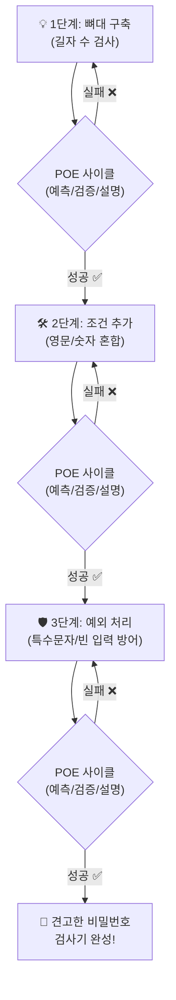

# 마이크로 세션: 029 - 프롬프트 고도화 실습: 비밀번호 검사기 만들기

> **세션 ID**: MS-PY101-029  
> **소요 시간**: 25분  
> **난이도**: medium  
> **청크 타입**: lab  
> **버전**: v2.1 (7섹션 구조)

---

## §1. 개요

> **Day 2 | AM | 세션 029/043**

### 🎯 학습 목표

이 세션이 끝나면 수강생은 다음을 할 수 있습니다:

- PTCF 4요소와 5대 필수 항목을 통합하여 완전한 프롬프트를 작성할 수 있다.
- 점진적 개선(Iterative Refinement) 3단계 워크플로우를 실전에 적용할 수 있다.
- AI가 생성한 코드를 POE(예측, 검증, 설명) 사이클을 통해 비판적으로 수용할 수 있다.

### 선행 세션 환기

우리는 앞서 프롬프트를 구성하는 PTCF 4요소, 코드 생성에 필요한 5대 필수 항목, 한 번에 완벽을 기하기보다 조금씩 다듬어가는 점진적 개선 워크플로우까지 모두 배웠습니다. 마치 요리사가 좋은 식재료 고르는 법, 칼질하는 법, 불 조절하는 법을 각각 배운 것과 같죠. 이제 이 모든 기술을 하나로 합쳐서 여러분만의 멋진 요리인 견고한 비밀번호 강도 검사기를 만들어 볼 시간입니다.

---

## §2. 핵심 개념 (+ 🗣️ 강사 대본 + Mermaid)

### 요구사항의 단계적 강화: "레고 블록으로 성 짓기"

레고 블록으로 거대한 성을 짓는 모습을 상상해 보세요. 처음부터 완성 사진만 보고 블록을 마구 끼워 맞추려다가는 중간에 균형이 무너져서 처음부터 다시 쌓아야 하는 참사가 벌어집니다. 복잡한 레고 제품일수록 항상 단계별 조립 설명서가 있죠. 소프트웨어 개발도 똑같습니다.

1단계에서는 바닥판을 깔고 성벽의 기초를 세웁니다. 이것이 프로그램의 기본 뼈대(핵심 기능)입니다. 2단계에서는 그 위에 벽돌을 착착 쌓아 올려 성벽을 완성하고 창문을 뚫습니다. 이것이 조건 검사(세부 요구사항) 기능의 추가입니다. 3단계에서는 멋진 지붕을 얹고 깃발을 꽂고 적을 막을 해자까지 만들어 완벽한 성을 완성합니다. 이것이 예외 처리와 사용자 친화적 메시지의 추가입니다.

각 단계가 끝날 때마다 블록이 제대로 단단하게 끼워져 있는지 확인하고 다음으로 넘어갑니다. 이것이 오늘 우리가 실습할 점진적 개선의 핵심입니다.

🗣️ **강사 대본 (Instructor Script)**:

> 자, 드디어 우리가 배운 모든 무기를 총동원할 시간이 왔습니다. PTCF 4요소, 코드 생성 5대 필수 항목, 그리고 점진적 개선의 3단계 워크플로우. 이 세 가지를 합치면 어떤 프로그램이든 만들어낼 수 있습니다.
>
> 레고 성을 지을 때 바닥부터 탄탄하게 다지는 것처럼, 오늘의 미션인 비밀번호 강도 검사기도 3단계에 걸쳐 점진적으로 완성해 보겠습니다. 단순하게 글자 수만 세는 프로그램에서 시작할 거예요. 조금씩 조건을 덧붙여서 최종적으로는 특수문자 검사와 구체적인 안내 메시지까지 꼼꼼하게 갖춘 튼튼한 프로그램으로 진화시켜 볼 겁니다. 이 과정을 직접 겪어보시면 왜 AI 시대의 개발자들이 한 번에 모든 걸 지시하지 않고 대화하듯 코딩하는지 확실히 깨닫게 되실 거예요.

### Mermaid 다이어그램



---

## §3. 상세 내용

### Why: 왜 점진적으로 요구사항을 강화해야 하는가?

처음부터 완벽한 프롬프트를 길게 써서 한 번에 코드를 받으면 안 될까요? 가능합니다. 하지만 추천하지 않아요. 요구사항이 복잡해질수록 AI가 한두 가지 조건을 빼먹거나 예상치 못한 방식으로 코드를 꼬아버릴 확률이 급격히 높아집니다.

레고 성을 지을 때 중간에 블록 하나를 잘못 끼운 채로 계속 쌓아 올리면 나중에 지붕을 덮을 때 틈이 벌어집니다. 어디서부터 고쳐야 할지 막막해지죠. 작게 쪼개서 지시하고 결과를 확인한 뒤 그 위에 새로운 조건을 얹는 방식이 장기적으로 훨씬 빠르고 안전합니다.

### What: POE 사이클과 통합 프롬프팅

오늘 실습에서는 두 가지 핵심 원칙을 적용합니다.

첫째, 프롬프트에는 반드시 기능, 입력, 출력, 제약, 예외라는 5대 필수 항목을 포함합니다. 이것이 우리의 기본 레고 블록입니다.
둘째, AI가 준 코드를 실행하기 전에 POE(Predict, Observe, Explain) 사이클을 돌립니다. 코드를 받자마자 무조건 실행하지 말고 이 코드가 어떤 결과를 낼지 먼저 예측해 보세요. 그다음 실행해서 맞는지 검증하고 왜 그런 결과가 나왔는지 스스로 설명해 보는 겁니다. 이 사이클은 AI가 던져주는 코드를 맹목적으로 수용하는 바이브 코딩의 함정에 빠지지 않게 해주는 소중한 안전장치입니다.

### How: 비밀번호 검사기 3단계 진화 과정

우리가 만들 프로그램은 다음과 같이 진화합니다.

1. **1단계 (기본 뼈대)**: 사용자가 키보드로 문자를 입력하면 그 문자의 길이를 세어서 알려주는 단순한 기능입니다.
2. **2단계 (조건 검사)**: 길이가 8자 이상인지, 대문자와 숫자가 1개 이상 포함되어 있는지 구체적인 규칙을 검사합니다.
3. **3단계 (예외 처리 및 고도화)**: 필수 특수문자가 들어갔는지 확인합니다. 그리고 사용자가 아무것도 입력하지 않고 엔터만 쳤을 때 프로그램이 멈추지 않고 친절하게 재입력을 요구하도록 방어막을 칩니다.

> ✅ **체크포인트**:
> - 프롬프트에 들어가야 할 코드 생성 5대 필수 항목은 무엇인가요? (기능, 입력, 출력, 제약, 예외)
> - AI가 코드를 작성해 주면, 곧바로 실행하기 전에 가장 먼저 해야 할 일은 무엇인가요? (코드가 어떻게 동작할지 눈으로 먼저 훑고 '예측'해보기)

---

## §4. 실습 가이드 (+ 🎙️ 실습 대본)

### 실습 목표

이 실습을 통해 수강생은 Antigravity IDE에서 AI 비서와 대화하며, 요구사항을 3단계에 걸쳐 점진적으로 강화하는 프롬프팅 과정을 체화합니다.

🎙️ **실습 가이드 대본 (Lab Guide)**:

> 실습을 시작하겠습니다. 모두 Antigravity IDE를 열고 새 파이썬 파일을 하나 만들어 주세요. 이름은 `password_checker.py`로 하겠습니다. 오른쪽 Agent Manager 패널도 열어주시고요.
>
> 오늘은 뼈대를 만들고, 살을 붙이고, 마지막으로 방어막을 두르는 3단계를 거칠 겁니다. 각 단계가 끝날 때마다 AI가 준 코드를 파일에 붙여넣고 꼭 실행해 보셔야 해요. 터미널에서 실행하기 전에 코드를 한 번 쓱 훑어보면서 "이 코드는 이렇게 움직이겠구나"라고 속으로 예측해 보는 것 잊지 마시고요. 자, 1단계부터 출발해 볼까요?

### 단계별 지시

| 단계 | 소요 시간 | 강사 지시사항 | 학습자 액션 | 예상 결과 |
|------|----------|--------------|------------|----------|
| 1 | 5분 | "1단계 뼈대 코드를 요청하는 프롬프트를 입력하세요" | 아래 1단계 프롬프트 복사/입력 | 문자열 길이를 세는 기본 파이썬 코드 생성 |
| 2 | 3분 | "코드를 실행하고 POE 사이클을 돌려보세요" | 코드 복사 후 `abc123` 입력 실행 | "길이는 6자입니다" 출력 성공 |
| 3 | 5분 | "2단계 조건 검사 추가 프롬프트를 입력하세요" | 아래 2단계 프롬프트 복사/입력 | 길이, 대문자, 숫자 조건을 검사하는 코드 추가 |
| 4 | 3분 | "성공 조건과 실패 조건을 모두 테스트하세요" | `abc`, `Abc12345` 각각 테스트 | 각각 실패 메시지와 성공 메시지 출력 |
| 5 | 6분 | "3단계 특수문자 및 예외 처리 프롬프트를 입력하세요" | 아래 3단계 프롬프트 복사/입력 | 특수문자 검사와 빈 입력 예외 처리가 들어간 최종 코드 |
| 6 | 3분 | "극한의 예외 상황(엔터만 치기)을 테스트하세요" | 아무것도 입력하지 않고 Enter 누르기 | "비밀번호를 입력해 주세요" 출력 및 재요청 |

**[1단계] 뼈대 코드 생성 (5분)**

Agent Manager에 다음 프롬프트를 입력하세요. PTCF 4요소와 5대 항목이 골고루 섞여 있습니다.

```
당신은 파이썬 시니어 개발자입니다. (Persona)
사용자로부터 비밀번호를 입력받아 글자 수를 출력하는 
간단한 파이썬 프로그램을 작성해 주세요. (Task/기능)

- 입력: 사용자 키보드 입력, 문자열 타입 (입력)
- 출력: "입력한 비밀번호의 길이는 N자입니다." 형태 (출력)
```

코드를 받으면 `password_checker.py`에 붙여넣고 터미널에서 실행해 보세요. `abc123`을 입력해 봅니다. "길이는 6자입니다"가 나오나요? 의도대로 동작한다면 우리의 레고 바닥판이 튼튼하게 깔린 겁니다.

**[2단계] 조건 검사 추가 (7분)**

이제 이 뼈대 위에 조건이라는 벽돌을 쌓아 올립니다. 기존 대화창을 닫지 말고, 그 창에 이어서 아래 프롬프트를 입력하세요. 문맥을 유지하는 것이 핵심입니다.

```
좋습니다. 기존 코드를 유지하면서 다음 규칙(제약)을 추가해 주세요.

1. 비밀번호가 8자 미만이면: "❌ 너무 짧습니다. 8자 이상 입력하세요."
2. 대문자가 1개 이상 포함되어야 합니다.
3. 숫자가 1개 이상 포함되어야 합니다.
4. 모든 조건을 만족하면: "✅ 안전한 비밀번호입니다!"를 출력합니다.

단, 각 조건의 충족 여부를 한꺼번에 묶지 말고 개별적으로 친절하게 안내해 주세요.
```

코드를 받으면 다시 실행해 보세요. 이번에는 검증 단계를 꼼꼼히 거쳐야 합니다. `abc`를 넣었을 때 세 가지 조건(길이, 대문자, 숫자) 모두 실패한다는 메시지가 나오는지 확인하세요. 그리고 `Abc12345`를 넣었을 때 통과하는지도 확인해 보세요.

**[3단계] 특수문자 검사 및 예외 처리 (8분)**

마지막으로 지붕을 덮고 성을 튼튼하게 방어할 차례입니다. 프로그램이 멈추거나 사용자가 헤매지 않도록 예외 처리를 더해줍니다.

```
아주 잘 동작합니다. 마지막으로 기존 코드를 유지하면서 아래 예외 처리와 고도화 작업을 진행해 주세요.

1. 특수문자(!@#$%^&*)가 1개 이상 포함되어야 합니다. 
2. 허용되지 않는 특수문자 입력 시 어떤 특수문자가 허용되는지 친절하게 안내해 주세요.
3. (예외 처리) 사용자가 엔터만 쳤을 경우(빈 값), 프로그램이 종료되지 않고 "비밀번호를 입력해 주세요"라고 출력한 뒤 다시 입력을 받도록 수정해 주세요.
4. 최종 결과를 O/X 형태의 체크리스트로 보기 좋게 터미널에 출력해 주세요. (출력 형태 포맷팅)
```

완성된 코드를 실행해 보세요. 일부러 아무것도 안 치고 엔터만 마구 눌러보세요. 프로그램이 뻗지 않고 다시 입력해 달라고 잘 응답하나요? 특수문자를 빼먹었을 때 O/X 체크리스트에 ❌가 정확히 표시되나요? 그렇다면 완벽한 성이 완성된 것입니다!

### 트러블슈팅 FAQ

| Q | A |
|---|---|
| 프롬프트를 똑같이 쳤는데 AI가 이전 코드를 싹 무시하고 완전히 새로운 방식으로 코드를 짜줬어요. | 대화 맥락이 끊어졌거나 AI가 최적화를 시도한 것입니다. "기존 코드의 구조(while문 등)를 최대한 유지하면서 추가해줘"라고 명시적으로 피드백을 주면 해결됩니다. |
| 엔터만 쳤는데 프로그램이 에러를 뿜으면서 멈춥니다. 빈 값 처리가 안 된 것 같아요. | AI가 빈 문자열에 대해 리스트 인덱싱(예: `password[0]`)을 시도했을 수 있습니다. 에러 메시지를 복사해서 AI에게 주고 "빈 문자열일 때 이 부분에서 에러가 나니까 이걸 막아주는 방어 로직을 추가해 줘"라고 디버깅을 요청하세요. |
| 특수문자를 넣었는데도 계속 없다고 나옵니다. | AI가 허용 특수문자 목록에 여러분이 입력한 문자를 포함시키지 않았을 수 있습니다. 코드 내의 특수문자 리스트를 눈으로 직접 확인해 보세요. POE의 힘을 발휘할 때입니다. |
| 코드가 너무 길어져서 어디가 바뀌었는지 모르겠어요. | AI에게 "기존 코드에서 변경된 부분만 주석으로 '// NEW' 또는 '# 수정됨' 이라고 표시해 줄래?"라고 요청해 보세요. 코드를 읽기가 훨씬 편해집니다. |
| 정규표현식(import re)이라는 어려운 코드를 써서 줬는데 이거 안 쓰고 싶어요. | 제약 조건을 추가하세요. "정규표현식(re 라이브러리)을 사용하지 않고 파이썬의 기본 문자열 메서드(isupper, isdigit 등)와 for문만 사용해서 다시 짜줘"라고 하면 초보자용 코드로 바꿔줍니다. |

---


### 🎓 강사 노트 (Instructor Support)

- ⏱️ **타이밍**: 11:35 (25분, lab)
- 🎯 **핵심 활동**: 3단계 점진적 개선 체험
- ⚠️ **강사 주의사항**: 각 단계별 결과 비교 스크린샷


### 📋 실습 설계 보강 (Lab Packet)

**세션 029 실습 설계 보강**

프롬프트 고도화 실습: 비밀번호 검사기 만들기
- **3-Stage Example Set**
  - 기본: 1단계 프롬프트(길이만 검사) → 코드 생성 → 실행
  - 변형: 2단계(대문자 포함), 3단계(특수문자 포함) 순서로 점진적 개선
  - 실수 해결: "3단계 프롬프트가 너무 복잡해서 AI가 엉뚱한 걸 만들어요" → 한 번에 하나씩 추가
- **난이도 예측**: 점진적 개선 패턴(1→2→3단계)의 실행이 핵심 학습 포인트
- **타이밍 가이드**: 1단계 5분 | 2단계 7분 | 3단계 8분 | 정리 5분
- **심리적 장벽**: "한 번에 완벽하게 만들어야 하는 거 아니야?" 강박
- **자가 점검**:
  - [ ] 최소 2단계까지 점진적으로 기능을 추가했는가?
  - [ ] 각 단계마다 실행하여 동작을 확인했는가?
  - [ ] "한 번에 하나씩 추가"하는 패턴의 장점을 체감했는가?

## §5. 코드 및 명령어 모음

### 최종 완성된 비밀번호 검사기 코드 예시

점진적 개선 3단계를 모두 거쳐 완성된 파이썬 코드의 전형적인 모습입니다. AI 모델에 따라 변수명이나 구조는 약간 다를 수 있습니다.

```python
def check_password_strength():
    while True:
        # 사용자 입력 받기 (예외 처리: 빈 값)
        password = input("\n비밀번호를 입력하세요 (종료하려면 'q' 입력): ")
        
        if password.lower() == 'q':
            print("프로그램을 종료합니다.")
            break
            
        if not password:  # 빈 문자열 검사
            print("⚠️ 비밀번호를 입력해 주세요.")
            continue
            
        print("\n--- 비밀번호 검사 결과 ---")
        
        # 1. 길이 검사
        is_length_ok = len(password) >= 8
        print(f"[{'O' if is_length_ok else 'X'}] 길이 8자 이상 (현재: {len(password)}자)")
        
        # 2. 대문자 검사
        is_upper_ok = any(char.isupper() for char in password)
        print(f"[{'O' if is_upper_ok else 'X'}] 대문자 1개 이상 포함")
        
        # 3. 숫자 검사
        is_digit_ok = any(char.isdigit() for char in password)
        print(f"[{'O' if is_digit_ok else 'X'}] 숫자 1개 이상 포함")
        
        # 4. 특수문자 검사
        special_chars = "!@#$%^&*"
        is_special_ok = any(char in special_chars for char in password)
        print(f"[{'O' if is_special_ok else 'X'}] 특수문자(!@#$%^&*) 포함")
        
        # 최종 평가
        if is_length_ok and is_upper_ok and is_digit_ok and is_special_ok:
            print("\n✅ 안전한 비밀번호입니다! 통과!")
            break
        else:
            print("\n❌ 보안 기준을 충족하지 못했습니다. 다시 시도해 주세요.")

# 프로그램 실행
if __name__ == "__main__":
    check_password_strength()
```

---

## §6. 요약

### 핵심 학습 포인트

이번 세션에서는 그동안 배운 지식을 모두 연결하여 실전에 적용했습니다. 기억해야 할 핵심 포인트는 세 가지입니다. 

첫째, 요구사항은 작게 쪼개서 단계적으로 진화시켜야 합니다. 한 번에 모든 것을 지시하면 성이 무너집니다. 둘째, 프롬프트에는 기능, 입력, 출력, 제약, 예외의 5대 항목을 명확히 담아야 AI가 엉뚱한 길로 빠지지 않습니다. 셋째, 코드를 받으면 맹목적으로 실행하지 말고 반드시 POE(예측, 검증, 설명) 사이클을 통해 내 머리로 먼저 생각하고 확인하는 습관을 들여야 합니다.

### 다음 세션 예고

축하합니다! 여러분은 이제 상위 10% 수준의 프롬프트 엔지니어링 능력을 갖췄습니다. 진짜 고수들이 쓰는 필살기 2개가 남아있습니다. 복잡한 수학 문제나 꼬여있는 비즈니스 논리를 AI에게 가르칠 때 사용하는 생각의 사슬(CoT)과 소수 예시(Few-shot) 기법입니다. 다음 세션에서는 AI의 추론 능력을 극대화하는 이 고급 기법들을 다루어 보겠습니다.

### 브릿지 노트

> "다들 완성된 비밀번호 검사기를 실행해 보셨나요? 처음에는 글자 수만 달랑 세던 초라한 녀석이, 이제는 빈칸 입력까지 막아내는 든든한 경비병으로 변신했습니다. 이 3단계 진화 과정을 직접 경험해보니 어떠신가요? 
>
> 앞으로 어떤 복잡한 프로그램을 만들 일이 생겨도 두려워할 필요가 없습니다. 방금 하신 것처럼 가장 단순한 뼈대부터 시작해서 대화하듯 살을 붙여나가면 되니까요. 자, 프롬프트의 기본기는 완벽해졌습니다. 이제 AI를 진짜 똑똑하게 만들어주는 고급 기술인 CoT와 Few-shot의 세계로 넘어가 보겠습니다."

---

## §7. 참고 자료

### 3-Source 출처

- **Source A (로컬 참고자료)**: 「3 프롬프트 엔지니어링.pdf」(SRC-A02), 점진적 개선 원리 및 비밀번호 검사기 실습 시나리오
- **Source B (NotebookLM)**: SRC-A06, Google Gemini 공식 가이드의 반복 개선(Iterative Refinement) 전략 패턴
- **Source C (Deep Research)**: SRC-C02, POE 사이클 도입의 중요성과 바이브 코딩 극복 방법론

### 강사 노트

> 💡 **강사 노트**: 이 세션은 Day 2 오전에 배운 모든 파편화된 지식(4요소, 5항목, 점진적 개선)을 융합하는 실습의 정점입니다. 수강생들이 각 단계를 넘어갈 때마다 강사가 직접 템포를 조절해 주셔야 합니다. 특히 코드를 받자마자 무의식적으로 복사/실행 버튼을 누르려는 수강생들에게 "잠깐! 붙여넣기 전에 코드를 눈으로 먼저 읽고 어떻게 동작할지 예측(Predict)해 보세요!"라고 지속적으로 상기시켜 주는 것이 매우 중요합니다. 이것이 코딩하는 인간과 단순히 타이핑하는 AI의 역할을 분리하는 핵심 훈련입니다.

---

## ✅ 세션 완료 체크리스트 (강사용)

- [x] §1~§7 모든 섹션이 충실하게 작성되었는가?
- [x] 레고 블록 비유가 점진적 개선의 3단계와 잘 매칭되어 설명되었는가?
- [x] POE 사이클의 중요성이 강조되었는가?
- [x] 길이, 특수문자, 오류메시지로 이어지는 3단계 실습 지시가 구체적인가?
- [x] 트러블슈팅 FAQ가 수강생이 겪을 만한 실제 사례를 담고 있는가?
- [x] 3-Source 팩트 패킷(Day 2) 내용이 잘 반영되었는가?

---

**🔗 선행 세션**: [세션-028] 점진적 개선(Iterative Refinement)의 이해  
**🔗 후행 세션**: [세션-030] 고급 프롬프트 기법: CoT와 Few-shot  

---

*작성 일시: 2026-02-25*  
*작성 에이전트: Antigravity*  
*교안 구조: 7섹션 (A0 팀 공통 표준)*