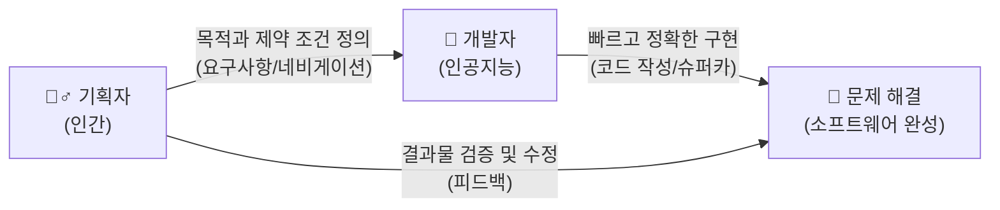

# 마이크로 세션: 031 — 요구사항(Requirements)의 본질: 여행 계획서

> **세션 ID**: MS-PY101-031
> **소요 시간**: 20분
> **난이도**: low
> **청크 타입**: narrative
> **버전**: v2.1 (7섹션 구조)

---

## §1. 개요

이 세션은 Day 2의 중요한 전환점을 만들어주는 시간입니다. 지금까지 우리는 인공지능과 대화하는 방법론인 PTCF 프레임워크와 점진적 개선 기법을 배웠습니다. 인공지능에게 지시를 내리는 기술을 익혔다면, 이제부터는 인공지능에게 무엇을 만들어 달라고 할지 결정하는 본질적인 고민으로 넘어갑니다.

프롬프트 작성 기술이 아무리 뛰어나도 최종 목적지가 명확하지 않으면 쓸모가 없습니다. 이 시간은 코드를 직접 작성하는 대신, 만들고자 하는 소프트웨어의 목적과 규칙을 한국어로 명확하게 정의하는 훈련의 시작점입니다. 코딩 자체보다 문제 정의와 기획이 훨씬 더 중요해진 시대적 변화를 수강생들이 체감하도록 돕는 것이 가장 큰 목표입니다.

---

## §2. 핵심 개념 (+ 🗣️ 강사 대본 + Mermaid)

### 문제 정의와 문제 해결의 분리

소프트웨어 개발은 크게 두 가지 단계로 나뉩니다. 첫째는 어떤 문제를 풀 것인지 결정하는 문제 정의 단계입니다. 둘째는 그 문제를 코드로 구현해 내는 문제 해결 단계입니다. 과거에는 문제 해결 능력이 뛰어난 사람이 최고의 개발자로 대우받았습니다. 하지만 인공지능이 코드를 인간보다 빠르고 정확하게 작성하게 되면서 상황이 완전히 바뀌었습니다. 이제 인간의 가장 중요한 역할은 올바른 문제를 정의하고, 그것을 오해의 여지 없이 명세하는 것으로 이동했습니다.

이러한 변화를 이해하기 위해 우리는 인공지능을 엄청나게 빠른 슈퍼카에 비유하고, 요구사항을 그 슈퍼카에 장착된 네비게이션으로 생각할 것입니다. 아무리 빠른 차를 타더라도 네비게이션에 목적지를 잘못 입력하면, 아주 빠른 속도로 엉뚱한 곳에 도착할 뿐입니다.

🗣️ **강사 대본 (Instructor Script)**:

> 여러분, 혹시 친구들과 즉흥적으로 여행을 떠나본 적 있으신가요? 갑자기 전화가 와서 "오늘 당장 떠나자!" 하고 공항으로 달려가는 겁니다. 정말 낭만적으로 들리지만, 막상 공항 카운터 앞에 서면 당황스럽습니다. 목적지가 제주도인지 아니면 일본인지, 예산은 얼마인지, 며칠이나 머물 계획인지 아무것도 정하지 않았기 때문입니다. 비행기 표를 끊을 수는 있겠지만, 도착하고 나면 숙소도 없고 돈도 부족해서 고생만 하다가 돌아올 확률이 아주 높습니다.
>
> 반대로 이렇게 준비했다고 생각해 봅시다. "우리는 2박 3일 동안 제주도로 간다. 총예산은 80만 원이고 렌터카를 포함한다. 목적은 힐링이므로 숙소는 반드시 바다가 보이는 호텔이어야 한다." 이 한 줄이 바로 완벽한 여행 계획서입니다. 이 계획서를 여행사 직원에게 건네주면, 조건에 딱 맞는 완벽한 일정을 알아서 짜줄 것입니다.
>
> 소프트웨어 개발도 이와 완전히 똑같습니다. 인공지능이라는 유능한 여행사 직원에게 일을 맡기기 전에, 우리가 무엇을 원하고 무엇을 원하지 않는지 명확한 계획서를 써야 합니다. 이것을 소프트웨어 공학에서는 요구사항이라고 부릅니다. 인공지능 시대의 코딩은 키보드를 두드리는 시간이 아니라, 이 여행 계획서를 꼼꼼하게 작성하는 시간에 좌우됩니다.

### Mermaid 다이어그램

이 다이어그램은 역할의 완벽한 분업을 보여줍니다. 기획자인 여러분은 네비게이션에 정확한 목적지와 경유지를 설정합니다. 그러면 개발자인 인공지능이 슈퍼카를 몰고 그 목적지를 향해 질주합니다. 도착한 곳이 원래 의도했던 장소가 맞는지 확인하는 것 또한 기획자의 몫입니다.

---

## §3. 상세 내용

### Why: 왜 요구사항이 코딩보다 더 중요할까요?

인공지능을 도구로 사용하는 개발 환경에서는 속도가 기하급수적으로 빨라집니다. 사람이 직접 코드를 짤 때는 중간중간 논리적인 허점을 발견하고 수정할 여유가 있습니다. 하지만 인공지능은 여러분이 입력한 지시사항을 즉시 수백 줄의 코드로 만들어냅니다. 요구사항이 모호하거나 앞뒤가 맞지 않으면, 인공지능은 그 모호함을 자기만의 방식으로 해석해서 엉뚱한 결과물을 내놓습니다. 잘못된 건물을 짓는 것은 순식간이지만, 그 건물을 허물고 다시 짓는 데는 엄청난 시간이 낭비됩니다. 따라서 첫 단추인 요구사항을 명확히 하는 것이 그 어느 때보다 중요합니다.

### What: 요구사항은 구체적으로 무엇을 의미하나요?

요구사항은 프로그램이 해야 할 일과 지켜야 할 규칙을 문서로 남긴 것입니다. 크게 기능 요구사항과 비기능 요구사항으로 나눌 수 있습니다. 기능 요구사항은 프로그램이 반드시 수행해야 하는 동작 그 자체를 말합니다. 사용자가 이름을 입력하고 저장할 수 있다거나, 특정 전화번호를 검색할 수 있다는 내용이 여기에 속합니다. 반면 비기능 요구사항은 프로그램이 지켜야 하는 제약 조건이나 품질 수준을 의미합니다. 검색 결과가 3초 안에 나와야 한다거나, 외부 인터넷 연결 없이 동작해야 한다는 규칙들이 비기능 요구사항에 해당합니다.

### How: 어떻게 사고방식을 바꾸어야 할까요?

무언가 만들고 싶은 아이디어가 떠올랐을 때, 다짜고짜 파이썬 편집기부터 여는 습관을 버려야 합니다. 메모장을 먼저 열고 여러분이 만들고 싶은 프로그램의 여행 계획서를 적어보는 연습을 해야 합니다. "이 프로그램은 누가 사용하는가?", "어떤 환경에서 실행되는가?", "절대 해서는 안 되는 동작은 무엇인가?" 같은 질문들에 먼저 대답할 수 있어야 합니다. 이 과정을 거쳐야만 인공지능이 여러분의 머릿속에 있는 아이디어를 정확하게 현실의 코드로 번역해 줄 수 있습니다.

---

## §4. 실습 가이드 (+ 🎙️ 실습 대본)

### 실습 목표

이 실습의 목표는 머릿속에 있는 막연한 아이디어를 구체적인 기능 요구사항과 비기능 요구사항으로 분리하여 글로 적어보는 것입니다. 코드를 전혀 몰라도, 상식적인 수준에서 프로그램의 규칙을 정하는 방법을 체험합니다.

🎙️ **실습 가이드 대본 (Lab Guide)**:

> 여러분 앞에 있는 메모장이나 빈 노트를 펴주세요. 컴퓨터 화면은 잠깐 덮어두셔도 좋습니다. 우리가 다 같이 작은 카페를 하나 열었다고 가정해 봅시다. 손님들의 전화번호와 적립 포인트를 관리하는 고객 정보 관리 프로그램을 만들고 싶습니다.
>
> 지금부터 딱 2분 동안, 이 프로그램이 갖추어야 할 조건들을 상상해서 자유롭게 적어보세요. 이 프로그램은 무엇을 할 수 있어야 할까요? "새로운 손님이 오면 전화번호를 저장할 수 있다"라든가, "포인트를 사용하면 남은 포인트를 보여준다" 같은 것들이 바로 기능 요구사항입니다. 그렇다면 비기능 요구사항은 무엇이 있을까요? "화면 디자인은 화려하지 않아도 되니 까만 콘솔 화면에서 텍스트로만 나오게 하자"라든가, "가게 인터넷이 끊겨도 작동해야 하니 컴퓨터 하드디스크에만 저장하자" 같은 규칙들을 고민해 보세요.
>
> 자, 시간은 2분입니다. 최소 3가지 이상의 규칙을 문장으로 적어보세요. 시작합니다!
>
> (2분 후)
>
> 모두 잘 적어보셨나요? 방금 여러분이 메모장에 적어 내려간 그 문장들이 바로 소프트웨어 공학에서 말하는 요구사항 명세서의 씨앗입니다. 이 문장들을 인공지능에게 프롬프트로 전달하면, 그 즉시 여러분의 규칙대로 작동하는 파이썬 코드가 탄생합니다. 코드를 고민하는 시간보다, 이렇게 규칙을 고민하는 시간이 훨씬 더 길고 가치 있다는 사실을 꼭 기억하시기 바랍니다.

---

### 🎓 강사 노트 (Instructor Support)

- ⏱️ **타이밍**: 13:20 (20분, narrative)
- 🎯 **핵심 활동**: 요구사항 = 여행 계획서
- ⚠️ **강사 주의사항**: 비유 중심 설명

## §5. 코드 및 명령어 모음

이 세션은 요구사항의 개념을 이해하는 이론 중심의 시간이므로 실행 가능한 파이썬 코드는 포함하지 않습니다. 대신, 일상적인 대화를 구체적인 요구사항으로 변환하는 가상 코드를 살펴봅니다.

모호한 일상 대화:
"단골손님 포인트 관리하는 프로그램 하나 짜줘."

구체적인 요구사항 명세:
[기능 요구사항]
1. 사용자는 고객의 이름과 전화번호를 입력하여 새로운 계정을 생성할 수 있다.
2. 사용자는 전화번호 뒷자리 4개를 입력하여 특정 고객을 검색할 수 있다.
3. 검색된 고객의 포인트를 추가하거나 차감할 수 있다.

[비기능 요구사항]
1. 모든 데이터는 프로그램이 종료되어도 컴퓨터의 텍스트 파일로 안전하게 저장되어야 한다.
2. 파이썬 기본 설치 환경 외에 추가적인 외부 라이브러리를 사용하지 않는다.

---

## §6. 요약

이번 세션에서는 인공지능 시대의 개발 패러다임이 문제 해결에서 문제 정의로 완벽하게 이동했다는 사실을 배웠습니다. 인공지능은 목적지를 향해 무서운 속도로 달리는 슈퍼카와 같습니다. 우리가 해야 할 일은 탑승 전에 꼼꼼한 여행 계획서를 작성하고, 네비게이션에 아주 정확한 목적지와 경유지를 입력하는 것입니다. 만들고자 하는 프로그램의 구체적인 기능 동작과 제약 조건을 문서로 정리하는 이 과정이 바로 요구사항 정의의 본질입니다.

우리는 일상적인 비유를 통해 요구사항이 왜 중요한지 감을 잡았습니다. 그렇다면 메모장에 두서없이 적었던 규칙들을, 빠짐없이 완벽한 구조로 정리하는 공식은 없을까요? 바로 다음 세션에서는 어떠한 기획의 빈틈도 허락하지 않는 마법의 체크리스트인 5W1H 방법론을 함께 실습해 보겠습니다.

---

## §7. 참고 자료

- **Source A (로컬 참고자료)**: 「7 기획.pdf」 (§7.1 요구사항 분석의 본질) — 소프트웨어가 무엇을 해야 하고 어떻게 동작해야 하는지 정의하는 과정에 대한 이론적 기반을 제공합니다.
- **Source B (로컬 참고자료)**: 「AI 시대의 서사 v3 - Claude.md」 (§문제 정의 vs 문제 해결) — 코드 작성보다 기획 역량이 중요해진 시대적 패러다임 전환의 핵심 철학을 담고 있습니다.
- **Source C (Deep Research)**: Deep Research 보고서 — 인공지능 개발 환경에서 여행 계획서 비유와 네비게이션 메타포를 요구사항 정의와 연결하는 개념적 근거를 제공했습니다.
