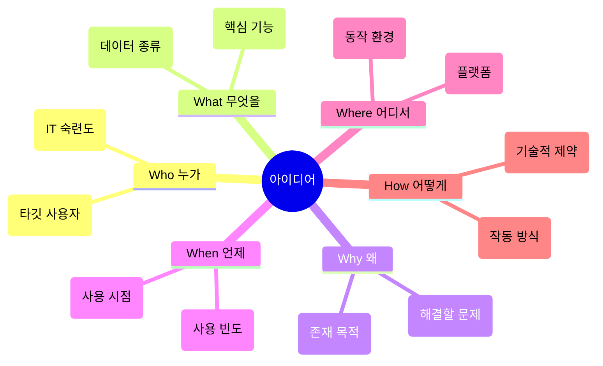

# 마이크로 세션: 032 — 체계적인 요구사항 도출: 5W1H 체크리스트

> **세션 ID**: MS-PY101-032
> **소요 시간**: 20분
> **난이도**: low
> **청크 타입**: narrative
> **버전**: v2.1 (7섹션 구조)

---

## §1. 개요

> **Day 2 | AM | 세션 032/043**

이전 세션에서 요구사항이 '프로그램의 네비게이션 목적지'라는 것을 배웠습니다. 하지만 막상 빈 종이 앞에 앉으면 무엇부터 적어야 할지 막막한 경우가 많아요. 머릿속에는 아이디어가 잔뜩 떠다니지만 글로 정리하려니 어디서부터 시작해야 할지 모르는 그 느낌 말이에요. 이 세션에서는 그 막막함을 단번에 해결하는 마법의 도구, 5W1H 체크리스트를 배웁니다.

### 🎯 학습 목표

이 세션이 끝나면 수강생은 다음을 할 수 있어요:

- 추상적인 아이디어를 개발 가능한 수준의 구체적인 요구사항으로 분해할 수 있습니다.
- 5W1H(육하원칙)의 각 항목이 소프트웨어 설계에 미치는 영향을 설명할 수 있습니다.
- 스타버스팅 기법을 활용하여 누락 없는 촘촘한 기획 초안을 작성할 수 있습니다.

### 선행 세션 환기

바로 앞 세션에서 우리는 "제주도 갈래"라는 모호한 말 대신 "언제, 누구와, 예산 100만 원으로 힐링을 위해 간다"라고 구체화하는 여행 계획 비유를 다루었어요. 코드는 결과물일 뿐이며, AI라는 슈퍼카를 탔어도 목적지를 정확히 찍지 않으면 엉뚱한 곳에 도착한다는 점을 강조했습니다. 이번 시간에는 그 목적지의 좌표를 정확하게 찍는 기술적인 방법을 배웁니다.

---

## §2. 핵심 개념 (+ 🗣️ 강사 대본 + Mermaid)

### 경찰 수사와 몽타주 비유

요구사항 도출은 경찰이 목격자의 진술을 토대로 몽타주를 그리는 과정과 완전히 똑같습니다. "어떻게 생겼나요?"라는 뭉뚱그린 질문 하나로는 범인의 얼굴을 그릴 수 없어요. 대신 언제(When), 어디서(Where), 누가(Who), 무엇을(What), 왜(Why), 어떻게(How) 했는지 체계적으로 쪼개어 물어볼 때 흐릿했던 기억이 선명한 몽타주로 변합니다.

🗣️ **강사 대본 (Instructor Script)**:

> 경찰 수사 드라마를 보신 적 있나요? 형사가 목격자에게 묻습니다. "범인이 어떻게 생겼나요?" 목격자가 "음, 나쁘게 생겼어요"라고 답하면 몽타주를 그릴 수 있을까요? 당연히 안 되죠.
>
> 그래서 베테랑 형사는 질문을 잘게 쪼갭니다. "언제(When) 목격했나요? 어디서(Where) 봤나요? 누가(Who) 있었나요? 무엇을(What) 했나요? 왜(Why) 그 자리에 있었나요? 어떻게(How) 도주했나요?" 이 육하원칙 질문에 하나씩 답을 채워가면, 목격자의 두루뭉술한 기억이 아주 선명한 얼굴로 변합니다.
>
> 프로그램의 요구사항도 정확히 이 방식으로 뽑아냅니다. "고객 관리 프로그램 만들고 싶어"라는 모호한 아이디어를 5W1H라는 필터에 통과시켜 볼까요? 그러면 "동네 빵집 사장님(Who)이, 카운터 PC에서(Where), 매일 결제 시점마다(When), 단골 고객 이름과 전화번호를(What), 재방문 유도를 위해(Why), 키보드 텍스트 입력으로(How) 관리한다"처럼 구체적인 요구사항이 탄생합니다.
>
> 아이디어가 떠올랐다고 바로 코딩 창부터 켜지 마세요. 이 6가지 질문에 답하지 못한다면, AI도 여러분이 무엇을 원하는지 알아들을 수 없습니다.

### Mermaid 다이어그램: 5W1H 스타버스팅 도식



스타버스팅(Starbursting)이라고 불리는 이 기법은 별 모양처럼 중심 아이디어에서 6개의 질문 가지를 뻗어나가는 구조예요. 아이디어를 다각도로 검토하고 브레인스토밍하는 데 아주 효과적입니다.

---

## §3. 상세 내용

### Why — 왜 5W1H가 필요한가?

머릿속에 있는 훌륭한 아이디어를 AI에게 설명하려고 하면 갑자기 말문이 막힙니다. 인간의 생각은 덩어리 형태로 존재하지만, AI에게 지시를 내리려면 논리적이고 순차적인 텍스트가 필요하기 때문이에요. 5W1H는 이 거대한 생각의 덩어리를 소화하기 쉬운 크기로 잘라주는 칼 역할을 합니다. 6개의 빈칸을 채우는 것만으로도 자연스럽게 기능 요구사항과 비기능 요구사항이 분류되고 구체화됩니다.

### What — 각 질문이 의미하는 것은 무엇인가?

소프트웨어 기획 관점에서 육하원칙은 다음과 같은 의미를 가집니다.

- **Who (누가)**: 타깃 사용자의 프로필입니다. 사용자가 컴퓨터를 잘 아는 개발자인지, 스마트폰만 겨우 다루는 어르신인지에 따라 화면의 복잡도와 안내 문구의 친절도가 완전히 달라집니다.
- **What (무엇을)**: 프로그램의 핵심 기능과 다루는 데이터입니다. "고객 등록, 조회, 수정, 삭제"처럼 동사 형태로 명확하게 적습니다.
- **Why (왜)**: 프로그램이 존재하는 이유입니다. "기존 수기 장부 관리의 불편함 해소"처럼 궁극적으로 해결하고자 하는 핵심 문제를 정의합니다.
- **When (언제)**: 프로그램이 사용되는 시점과 빈도입니다. 하루에 한 번 쓰는지, 1분에 100번 쓰는지에 따라 성능 요구사항이 결정됩니다.
- **Where (어디서)**: 프로그램이 돌아가는 환경입니다. Windows PC인지, Mac인지, 스마트폰인지, 아니면 터미널(콘솔) 화면인지 플랫폼을 특정합니다.
- **How (어떻게)**: 작동 메커니즘과 기술적 제약입니다. "키보드로 번호를 선택해서 입력", "외부 라이브러리 설치 없이 기본 파이썬만 사용" 같은 뼈대를 잡습니다.

### How — 어떻게 적용하는가?

중심에 해결하고 싶은 문제를 놓고, 6가지 질문을 던지며 가지를 쳐나갑니다. 처음에는 단어로 시작해서 점차 문장으로 구체화해요. 하나의 질문에 답이 막힌다면, 아직 그 부분에 대한 기획이 부족하다는 신호입니다. 완벽한 문장이 아니어도 좋으니 모든 항목에 최소한 한 줄 이상의 답을 채워 넣는 것이 핵심입니다.

---

## §4. 실습 가이드 (+ 🎙️ 실습 대본)

### 실습 목표

수강생들이 과정의 메인 프로젝트인 "고객 정보 관리 프로그램"에 대해 직접 5W1H를 작성해 보며, 모호한 아이디어가 개발 가능한 명세로 바뀌는 과정을 체험합니다.

🎙️ **실습 가이드 대본 (Lab Guide)**:

> 자, 이제 실전입니다. 우리가 5일 동안 함께 만들 "고객 정보 관리 프로그램"의 밑그림을 그려볼 텐데요. 제가 먼저 "카페 고객 관리 앱"을 예시로 보여드릴게요.
>
> 누가 쓰나요? 컴퓨터를 어느 정도 다루는 카페 알바생입니다. 무엇을 관리하죠? 단골 고객의 이름, 전화번호, 그리고 적립 포인트를 다룹니다. 왜 만드나요? 종이 쿠폰을 없애고 단골 관리를 편하게 하려고요. 언제 쓰나요? 손님이 결제할 때마다 씁니다. 하루에 대략 50번 정도 되겠네요. 어디서 쓰죠? 카운터에 있는 Windows PC의 검은색 터미널 화면입니다. 어떻게 동작하나요? 마우스 없이 키보드로 숫자 메뉴를 선택하고 텍스트를 입력하는 방식이에요.
>
> 어떠신가요? 이렇게 적어놓으니 머릿속에 프로그램의 윤곽이 확 그려지지 않나요? 이제 여러분 차례입니다. 메모장이나 빈 노트를 열어주세요. 방금 본 6가지 항목을 그대로 적고, 여러분만의 상상력을 더해서 내용을 채워보세요. 정답은 없습니다. 동네 세탁소 사장님을 위한 프로그램이어도 좋고, 헬스장 트레이너를 위한 프로그램이어도 좋습니다. 3분 드리겠습니다. 시작하세요!

### 단계별 지시

| 단계 | 소요 시간 | 강사 지시사항 | 학습자 액션 | 예상 결과 |
|------|----------|--------------|------------|----------|
| 1 | 2분 | 카페 앱 5W1H 예시 설명 | 화면 주시, 내용 이해 | 질문의 의도 파악 |
| 2 | 3분 | "여러분의 아이디어로 5W1H 작성해 보세요" | 메모장에 내용 작성 | 초안 도출 완료 |
| 3 | 2분 | 작성 결과 확인 및 엣지 케이스 질문 투척 | 내용 보완 및 수정 | 사용자 관점 이해 |
| 4 | 3분 | 자원자 1~2명 내용 공유 유도 | 본인의 5W1H 발표 | 다양한 도출 사례 확인 |

### 트러블슈팅 FAQ

| Q | A |
|---|---|
| 수강생이 어떤 아이디어를 써야 할지 감을 못 잡아요 | 아주 익숙하고 소박한 환경을 제안해 주세요. "자주 가는 동네 미용실 사장님이 쓴다고 상상해 보세요"라고 가이드를 주면 쉽게 시작합니다. |
| Why와 What을 헷갈려 하는 경우가 있습니다 | "Why는 해결하고 싶은 불만(예: 종이 장부 찾기 귀찮다)이고, What은 그 불만을 해결해 주는 기능(예: 전화번호로 바로 검색하기)입니다"라고 명확히 구분해 주세요. |
| How 부분에 코딩 문법을 적으려고 해요 | "How는 파이썬 문법이 아니라, 사용자가 키보드를 칠지 마우스를 누를지 같은 '조작 방법'을 적는 곳입니다"라고 정정해 줍니다. |

---


### 🎓 강사 노트 (Instructor Support)

- ⏱️ **타이밍**: 13:50 (25분, narrative)
- 🎯 **핵심 활동**: 추상 → 구체 변환
- ⚠️ **강사 주의사항**: 5W1H 워크시트 배포

## §5. 코드 및 명령어 모음

수강생들이 실습 시 참고할 수 있도록 화면에 띄워둘 5W1H 템플릿입니다.

```text
📋 5W1H 요구사항 도출 체크리스트 (예시: 카페 고객 관리)

Who  (누가)   : 카페 알바생 (컴퓨터 사용 중급자)
What (무엇을) : 단골 고객 이름, 전화번호, 적립 포인트 관리
Why  (왜)     : 재방문 유도 및 단골 관리 효율화 (종이 쿠폰 대체)
When (언제)   : 결제 시점마다, 하루 약 50~100건
Where(어디서) : 카운터 Windows PC, 텍스트 콘솔 환경
How  (어떻게) : 마우스 없이 키보드로 숫자 1,2,3 메뉴 선택 및 텍스트 입력
```

> 💡 **강사 팁**: 특정 수강생에게 "Who를 '컴퓨터를 전혀 모르는 연세 지긋한 사장님'으로 바꾸면 어떻게 될까요?"라고 질문해 보세요. "메뉴가 훨씬 단순해져야 하고 글씨도 커야겠죠"라는 답변을 이끌어내며, Who가 전체 설계에 미치는 막대한 영향을 체감하게 합니다.

---

## §6. 요약

### 핵심 학습 포인트

이번 세션의 핵심은 하나입니다. 5W1H는 추상적인 아이디어를 콘크리트처럼 단단한 요구사항으로 바꿔주는 강력한 도구라는 점입니다. 단순히 기획을 잘하기 위해서가 아니라, 완벽하고 빈틈없는 텍스트를 만들어 AI에게 정확한 지시를 내리기 위한 필수 과정입니다. 이 6가지 빈칸을 채우는 능력이 곧 AI 시대 개발자의 핵심 경쟁력입니다.

### 다음 세션 예고

이제 아이디어를 요구사항으로 도출하는 방법을 알았습니다. 그렇다면 이렇게 정리한 요구사항을 가지고 실제로 AI에게 어떻게 일을 시킬까요? 다음 세션에서는 도출된 요구사항을 코드의 '유일한 진실의 원천'으로 삼는 혁신적인 개발 방법론, SDD(Specification-Driven Development, 명세 주도 개발)에 대해 깊이 파헤쳐 보겠습니다. 느낌대로 코딩하는 시대는 끝났습니다. 이제는 명세가 곧 코드입니다.

### 브릿지 노트

> "여러분, 방금 작성한 그 5W1H 메모장 지우지 마세요. 그게 바로 여러분의 첫 번째 기획서입니다. 그런데 이걸 AI한테 그냥 덜렁 던져주면 알아서 척척 짜줄까요? 안타깝지만 그렇지 않습니다. 이 기획을 AI가 완벽하게 이해할 수 있는 '절대적인 규칙서'로 바꾸는 과정이 필요해요. 다음 시간에 배울 SDD, 명세 주도 개발이 바로 그 해답입니다. 잠깐 기지개 켜고 바로 이어갈게요."

---

## §7. 참고 자료

### 3-Source 출처

- **Source A (로컬 참고자료)**: `3 프롤프트 엔지니어링.pdf` (§3.9) 및 `7 기획.pdf` (§7.1 요구사항 분석의 본질) — 소프트웨어 기획 관점에서의 5W1H 적용법 및 요구사항 분석의 중요성 개념 도출.
- **Source B (NotebookLM)**: `AI 시대의 서사 v3 - Claude.md` (§문제 정의 vs 문제 해결) — AI 시대에 코딩보다 문제 정의(기획) 역량이 중요하다는 핵심 패러다임.
- **Source C (Deep Research)**: 카페 앱 사례와 스타버스팅(Starbursting) 기법의 구체적인 브레인스토밍 효과는 최신 요구사항 공학 리서치에서 보강하여 반영했습니다.

### 강사 노트

> 💡 **강사 노트**: 본 세션은 수강생들이 처음으로 직접 머리를 써서 '기획'이라는 것을 해보는 시간입니다. 개발 경험이 없는 비전공자들이므로 '요구사항'이라는 단어 자체를 어렵게 느낄 수 있습니다. 경찰 수사 몽타주 비유를 충분히 활용하여, "구체적으로 쪼개서 질문해야 그림이 그려진다"는 직관적인 감각을 심어주는 것이 가장 중요합니다.

---

## ✅ 세션 완료 체크리스트 (강사용)

- [ ] §1~§7 모든 섹션이 충실하게 작성되었는가?
- [ ] 5W1H와 몽타주 비유가 적절히 연결되었는가?
- [ ] 스타버스팅 Mermaid 도식이 정확히 들어갔는가?
- [ ] 실습 가이드 대본이 구어체로 자연스러운가?
- [ ] 3-Source 팩트 패킷의 출처가 명확히 기재되었는가?
